# Notes on Lie Theory

> **원문** — Gyubeom Edward Im, *Notes on Lie Theory* (26쪽) ·
> blog: [alida.tistory.com](https://alida.tistory.com) · email: criterion.im@gmail.com
> 파일: `ref/Notes on Lie Theory.pdf`
>
> **이 문서에 대하여** — 원문을 **내용 수정 없이 그대로** 옮긴 것이다. 절 구성·문장·수식 번호
> (1)~(91)이 모두 원문과 같고 순서도 바꾸지 않았다. 원문의 그림 29개도 같은 자리에 넣었다.
> 원문에는 그림 캡션이 하나도 없어 `(원문 p.N)`만 붙였다.
>
> 원문에 없는 것은 **인터랙티브 위젯 11개**뿐이며, 전부 **원문에 없는 추가 요소**라고 표시된
> 회색 박스 안에 들어 있어 본문과 섞이지 않는다.
>
> 명백한 오타는 바로잡았고, 무엇을 고쳤는지는 맨 아래
> [옮기며 바로잡은 것](#옮기며-바로잡은-것)에 전부 적어 두었다.
> 이 문서는 앞선 스터디들과 달리 **원문의 파란 강조도 그대로 재현했다** — 색이 수식 안이 아니라
> 산문에 쓰였기 때문이다(자세한 사정은 같은 절에 적어 두었다).

| 장 | 원문 쪽 | 장 | 원문 쪽 |
|---|---|---|---|
| 1 Introduction | 3 | 5 Applications for estimation | 22 |
| 2 Group Theory | 3 | 6 Lie theory-based optimization on SLAM | 25 |
| 3 SO(3) Group | 9 | 7 Reference | 26 |
| 4 SE(3) Group | 16 | 8 Revision log | 26 |

# 1 Introduction

본 포스트에서는 SLAM에서 사용되는 Lie Theory에 대해 설명한다. SLAM에서 최적화 부분을 공부하다 보면
Lie Theory 기반의 최적화 방법이 자주 나오는데 해당 내용에 대한 선수지식이 없으면 최적화 과정을
이해하기 힘드므로 본 포스트에서는 SLAM의 최적화 부분을 이해하는데 필요한 핵심적인 내용을 간략하게
정리하였다. 대부분의 내용은 Joan Solà의 *Lie theory for the roboticist* 유튜브 영상을 참고하여
작성하였다.

# 2 Group Theory

군(Group)은 집합과 두 원소의 연산인 이항 연산(binary operation)으로 이루어진 대수적 구조를 말한다.
예를 들어, 어떤 집합을 $A$ 라고 하고 어떤 이항 연산을 $*$ 으로 표시했을 때, 군은 $G = (A, *)$ 으로
나타낼 수 있다. 일반적으로 알고 있는 정수, 유리수, 실수, 복소수와 같은 수의 집합과 덧셈, 곱셈과 같은
연산이 군에 속한다.

군은 일반적으로 다음과 같은 특징을 가지고 있다.

- Associativity : 군 내 임의의 세 원소 $a, b, c \in G$에 대해 $(a*b)*c = a*(b*c)$인 결합법칙 이
  성립한다.
- Identity element : 군 내 임의의 원소 $a \in G$에 대해 $a * e = a = e * a$를 만족하는 $e \in G$가
  존재하면 $e$ 를 항등원 이라고 말한다.
- Inverse : 군 내 임의의 원소 $a \in G$에 대해 $a * x = e = x * a$를 만족하는 원소 $x \in G$가
  존재하면 $x$ 를 역원 이라고 말한다. 역원은 $a^{-1}$ 로 표기하기도 한다.
- Composition : 군 내 임의의 두 원소 $a, b \in G$에 대해 $a * b \in G$가 성립한다. 이 때, 대부분 군의
  경우 이항 연산 $*$는 교환법칙이 성립하지 않는다. 즉, $a * b \neq b * a$이다.

## 2.1 Lie Group

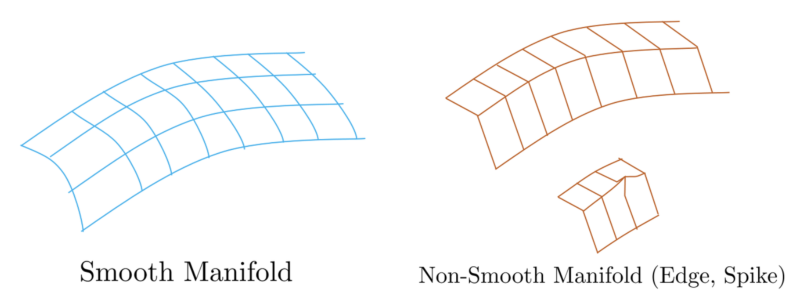

*(원문 p.3)*

여러 군들 중 Lie Group은 Smooth Manifold를 가지는 군을 의미한다. 이 때, Smooth Manifold란 위 그림과
같이 모든 군의 원소들이 Edge, Spike가 존재하지 않는 부드러운 상태의 Manifold를 의미하며 Lie Group은
모든 원소들이 이러한 Smooth Manifold 상에 존재하는 군을 의미한다. Smooth Manifold 상에 있는 모든
원소는 미분 가능하다는 특징이 있다.

## 2.2 Manifold

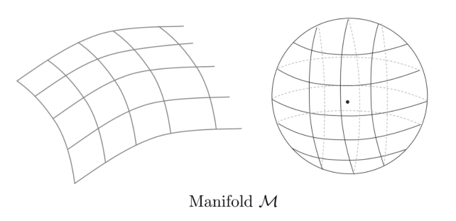

*(원문 p.4)*

N차원의 Manifold $\mathcal{M}$ 은 $\mathcal{M}$ 내부에 있는 임의의 점 $\mathbf{x} \in \mathcal{M}$ 에
대해 지역적으로 Euclidean 구조를 갖는 기하학적 공간을 의미한다. 다시 말하면, $\mathbf{x}$ 근처에
존재하는 모든 점들은 $\mathbb{R}^N$ 공간에서 위상동형(Homeomorphic)인 특징을 지닌다. 직관적으로
이해하자면 Manifold는 해당 군이 가지는 제약조건 공간(Constraint Space)를 의미한다.

예를 들어, 임의의 quaternion $\mathbf{q} = [x, y, z, w]$가 3차원 회전 연산자로 사용되기 위해서는
unit quaternion의 성질을 만족해야 하는데 이 때의 제약조건은 $\|\mathbf{q}\| = 1$이다. 이는 곧
$\mathbf{q}$가 4차원 Manifold 상의 한 점을 만족해야 하는데 이를 unit quaternion manifold라고 한다.
4차원 이상의 제약조건은 평면에 시각화가 불가능하므로 일반적으로 3차원 구를 통해 설명한다.

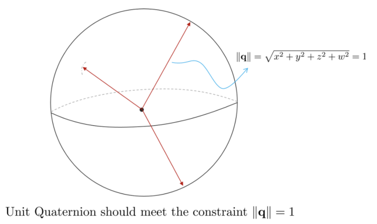

*(원문 p.4)*

앞으로 설명할 SE(3) Lie Group의 경우는 6차원 원소가 특정 제약조건을 만족해야한다. 즉, SE(3) Lie
Group의 원소는 6차원 Manifold 위에 존재해야 한다. 이는 평면 상에서 설명할 수 없으므로 3차원 구를
사용하여 설명한다.

## 2.3 Group Action

군의 특징 중 하나는 또 다른 집합 또는 군을 변환(=act)시킬 수 있다는 것이다. 이는 군이 특정 집합을
변환하는 연산자 역할을 할 수 있다는 것을 의미한다. 이는 Lie Theory가 3차원 공간 상에서 물체의 이동을
표현하기 적합한 도구임을 의미한다.

회전행렬 $\mathbf{R} \in SO(3)$와 3차원 벡터 $\mathbf{x} \in \mathbb{R}^3$, 그리고 이항연산 $\cdot$이
주어졌을 때

- $\mathbf{R}$은 벡터 공간의 한 점을 회전(=act)시킬 수 있다 → $\mathbf{x}' = \mathbf{R} \cdot \mathbf{x}$

변환행렬 $\mathbf{T} \in SE(3)$와 4차원 벡터 $\mathbf{X} \in \mathbb{R}^4$, 그리고 이항연산 $\cdot$이
주어졌을 때

- $\mathbf{T}$은 벡터 공간의 한 점을 변환(=act)시킬 수 있다 → $\mathbf{X}' = \mathbf{T} \cdot \mathbf{X}$

## 2.4 Topology of Lie Theory

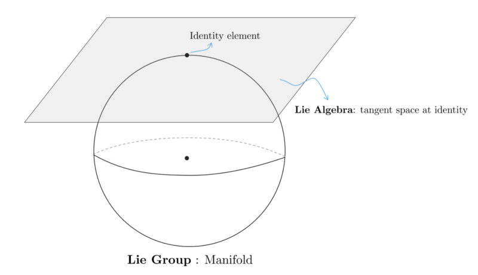

*(원문 p.5)*

Lie Theory의 기하학적 구조는 위 그림과 같다.

- Lie Group은 제약조건을 가지는 하나의 Manifold 상의 점들의 집합을 의미하며 ==non-linear한 특징을
  가진다.==
- Lie Algebra는 Manifold 상의 한 점인 항등원(identity element)에서 접평면(tangent space)를 의미한다.
  이 때, Lie Algebra의 접평면은 오직 항등원에 접했을 때만 유효하며 ==linear vector space==라는 특징을
  가지고 있다.

Lie Group과 Lie Algebra가 중요한 이유는 두 공간 사이에 1:1 변환이 가능하기 때문이다. ==따라서 복잡한
제약조건을 가진 non-linear manifold space(Lie Group)에서 연산을 직접하지 않고 비교적 간단한 linear
vector space(Lie Algebra)에서 연산을 수행한 다음 이를 manifold space로 변환해주는 방식을 사용한다.==
이를 가능하게 해주는 연산이 Exponential Mapping, Logarithm Mapping이다.

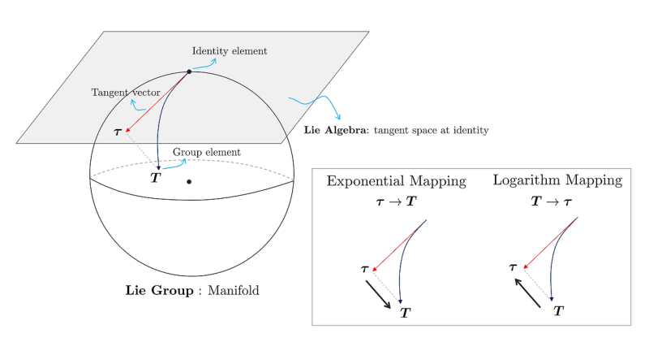

*(원문 p.5)*

Exponential Mapping은 Lie Algebra → Lie Group으로 변환하는 연산을 의미하며 Logarithm Mapping은
Lie Group → Lie Algebra로 변환하는 반대의 연산을 의미한다.

<!--widget:lie-manifold-tangent-->

## 2.5 Plus and Minus Operators of Lie Group

앞서 설명한 exponential mapping을 사용하면 임의의 Lie Algebra $\tau$를 사용하여 Lie Group의 원소
$\mathbf{x}$을 변환할 수 있다. Lie Group 원소와 Lie Algebra 원소 사이에는 일반적인 $+, -$ 연산자가
적용되지 않으므로 새로운 $\oplus, \ominus$ 연산자를 정의해야 한다. 우선 $\oplus$ 연산자는 임의의
Lie Group 원소 $\mathbf{x}$에 Lie Algebra $\tau$ 만큼 추가적인 변환을 적용하는 연산자이다.

$$\mathbf{x} \oplus \tau \triangleq \mathbf{x} \cdot \mathrm{Exp}(\tau) \tag{1}$$

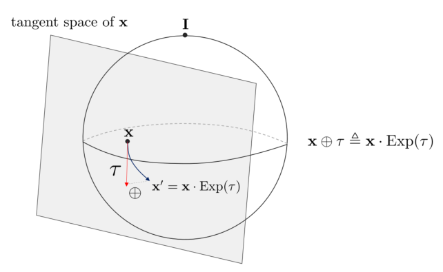

*(원문 p.6)*

==이 때, $\mathbf{x}$의 접평면 상의 $\tau$ 벡터는 lie group의 합성(composition) 성질에 의해 identity
element 접평면 상의 $\tau$ 벡터와 동일하게 취급한다.==

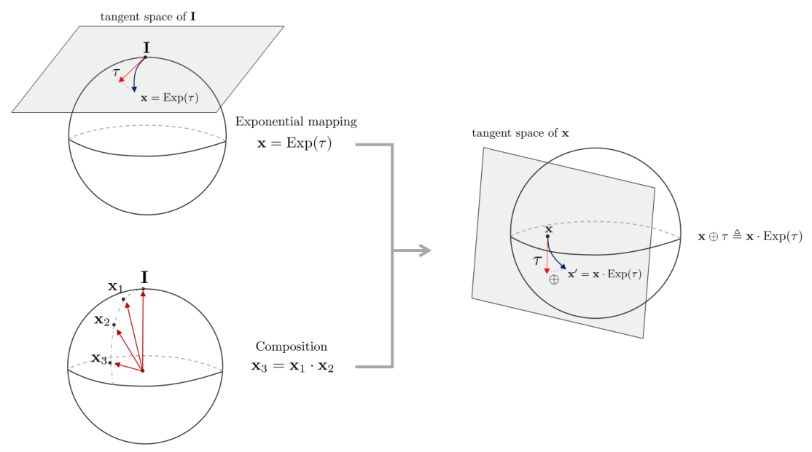

*(원문 p.6)*

반대로 $\ominus$ 연산자는 두 Lie Group 원소 $\mathbf{x}_1, \mathbf{x}_2$가 존재할 때
$\mathbf{x}_2 \ominus \mathbf{x}_1$과 같이 사용되며 $\mathbf{x}_1$에서 $\mathbf{x}_2$의 상대
변화량을 의미한다.

$$\mathbf{x}_2 \ominus \mathbf{x}_1 \triangleq \mathrm{Log}(\mathbf{x}_1^{-1}\mathbf{x}_2) \tag{2}$$

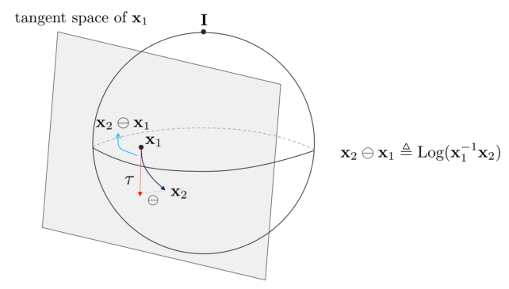

*(원문 p.6)*

<!--widget:lie-plus-minus-->

## 2.6 Tangent Space and Lie Algebra

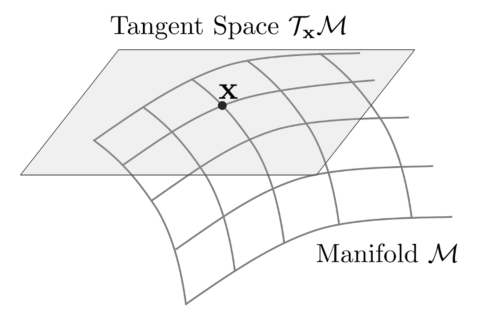

*(원문 p.7)*

임의의 Manifold $\mathcal{M}$ 위의 한 점 $\mathbf{x} \in \mathcal{M}$이 존재할 때, 이에 대한 접평면은
$\mathcal{T}_\mathbf{x}\mathcal{M}$과 같이 나타낸다.

접평면 $\mathcal{T}_\mathbf{x}\mathcal{M}$은 임의의 한 점에 대해 유일하게 결정되며 vector space이기
때문에 미분 연산이 가능한 특징이 있다. 접평면의 차원은 Manifold의 자유도의 개수에 의해 결정된다. 즉,
SO(3)는 회전에 대한 3자유도를 가지기 때문에 so(3)는 3차원 접평면을 가지고 SE(3)는 포즈에 대한
6자유도를 가지기 때문에 se(3)는 6차원 접평면을 가진다. 항등원(Identity Element)에서 접평면을 특별히
Lie Algebra라고 한다.

## 2.7 Calculus on Lie Group

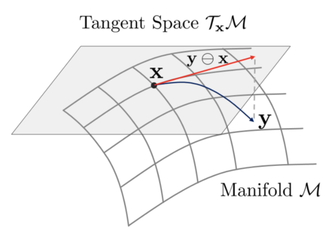

*(원문 p.7)*

Lie Group 위에 두 원소 $\mathbf{x}, \mathbf{y}$가 존재한다고 가정해보자. 이 때, 두 원소의 차이는
$\ominus$ 연산자를 사용하여 $\mathbf{y} \ominus \mathbf{x}$와 같이 접평면 위에 나타낼 수 있다. 앞서
설명한 것과 같이 접평면 $\mathcal{T}_\mathbf{x}\mathcal{M}$은 linear vector space이기 때문에
jacobian과 covariance를 계산하기에 비교적 용이하다. 이러한 특성이 Lie Theory를 최적화 계산에 사용할 수
있는 핵심적인 이유가 된다. 예를들어, 두 원소가 비교적 가까운 경우 에러함수 모델링에 사용할 수 있다.

$$\mathbf{e} = \hat{\mathbf{x}} \ominus \mathbf{x} \tag{3}$$

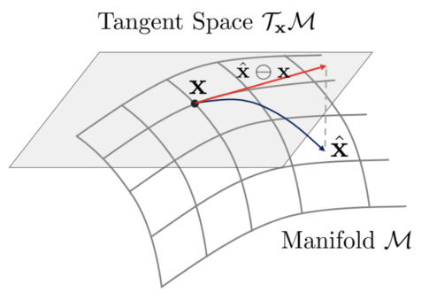

*(원문 p.7)*

## 2.8 Jacobians on Lie Group

linear vector space에 존재하는 벡터 함수 $f(\mathbf{x})$가 주어졌다고 하자. 이 때, $f(\mathbf{x})$는
$\mathbf{x} \in \mathbb{R}^n, f(\mathbf{x}) \in \mathbb{R}^m$를 만족하는 함수이다.

$$f : \mathbb{R}^n \mapsto \mathbb{R}^m \tag{4}$$

이 때, 해당 벡터함수의 1차 편미분은 행렬이 되고 이를 특별히 자코비안(jacobian)이라고 한다.

$$\mathbf{J} = \begin{bmatrix} \frac{\partial f_1}{\partial x_1} & \cdots & \frac{\partial f_1}{\partial x_n} \\ \vdots & \ddots & \vdots \\ \frac{\partial f_m}{\partial x_1} & \cdots & \frac{\partial f_m}{\partial x_n} \end{bmatrix} \tag{5}$$

이를 미소변화량 $\mathbf{h}$를 사용하여 나타내면 다음과 같다.

$$\mathbf{J} = \frac{\partial f(\mathbf{x})}{\partial \mathbf{x}} \triangleq \lim_{\mathbf{h} \to 0} \frac{f(\mathbf{x} + \mathbf{h}) - f(\mathbf{x})}{\mathbf{h}} \in \mathbb{R}^{m \times n} \tag{6}$$

위와 같이 linear vector space에서는 $+, -$ 연산자를 활용하여 자코비안을 계산할 수 있다. 하지만 Lie
Group의 원소의 경우 앞서 설명한 것과 같이 그룹이 $+, -$ 연산에 닫혀있지 않으므로 기존의 방법을 통해
자코비안을 표현할 수 없다.

Lie Group 상에 존재하는 벡터함수 $f(\mathbf{x})$가 다음과 같이 주어졌다고 하자.

$$f : \mathcal{M} \mapsto \mathcal{N}; \mathbf{x} \mapsto \mathbf{y} = f(\mathbf{x}) \tag{7}$$

이는 함수 $f$가 manifold $\mathcal{M}$에 존재하는 원소 $\mathbf{x}$를 다른 manifold $\mathcal{N}$ 상에
존재하는 원소 $\mathbf{y}$로 매핑하는 함수를 말한다. 이에 대한 자코비안은 다음과 같이 나타낼 수 있다.

$$\mathbf{J} = \frac{D f(\mathbf{x})}{D\mathbf{x}} = \lim_{\tau \to 0} \frac{f(\mathbf{x} \oplus \tau) \ominus f(\mathbf{x})}{\tau} \in \mathbb{R}^{m \times n} \tag{8}$$

자코비안 $\mathbf{J}$는 $\mathcal{T}_\mathbf{x}\mathcal{M}$ 위의 원소를
$\mathcal{T}_{f(\mathbf{x})}\mathcal{N}$ 위의 원소로 매핑하는 함수로 생각할 수 있다. 이를 그림으로
나타내면 다음과 같다.

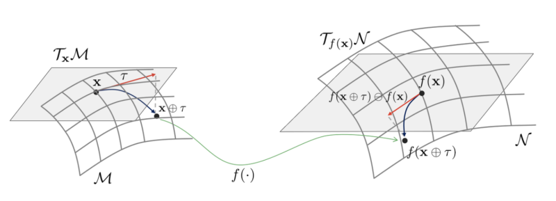

*(원문 p.8)*

<!--widget:lie-jacobian-->

## 2.9 Perturbations on Lie Group

접평면이 linear vector space인 성질을 활용하여 Lie Group 원소를 확률변수의 perturbation으로 모델링 할
수 있다.

$$\mathbf{x} = \bar{\mathbf{x}} \oplus \tau \quad \text{where,} \: \tau = \mathbf{x} \ominus \bar{\mathbf{x}} \tag{9}$$

$$\mathbf{P}_\mathbf{x} = \mathbb{E}[\tau \cdot \tau^\intercal] \tag{10}$$

$$\mathbf{P}_\mathbf{x} = \mathbb{E}[(\mathbf{x} \ominus \bar{\mathbf{x}}) \cdot (\mathbf{x} \ominus \bar{\mathbf{x}})^\intercal] \tag{11}$$

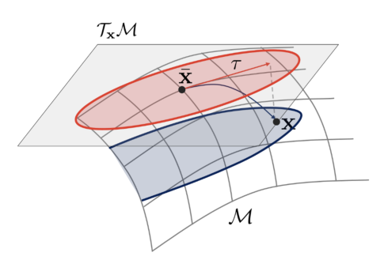

*(원문 p.9)*

만약 $\mathbf{y} = f(\mathbf{x})$의 함수가 주어졌을 때, 자코비안은
$\mathbf{J} = \frac{D\mathbf{y}}{D\mathbf{x}}$가 되고 이를 통해 covariance $\mathbf{P}_\mathbf{y}$는
다음과 같이 구할 수 있다.

$$\mathbf{P}_\mathbf{y} = \mathbf{J} \cdot \mathbf{P}_\mathbf{x} \cdot \mathbf{J}^\intercal \tag{12}$$

이는 vector space에서 covariance의 propagation 공식과 동일하다.

<!--widget:lie-covariance-->

# 3 SO(3) Group

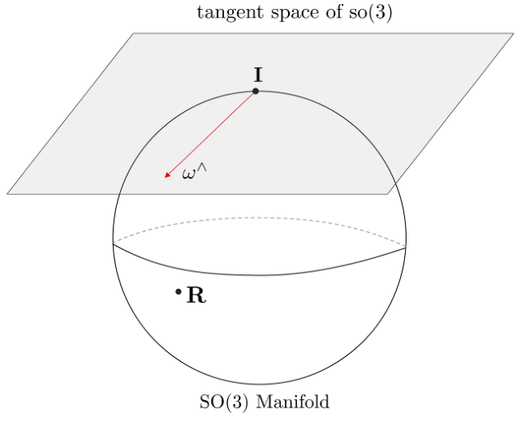

*(원문 p.9)*

## 3.1 Lie Group SO(3)

Lie 군 중 하나인 Special Orthogonal 3(SO(3))군은 3차원 회전행렬(Rotation Matrix)과 이에 닫혀있는
연산들로 구성된 군을 의미하며 3차원 물체의 회전을 표현할 때 사용 한다.

$$\boxed{SO(3) = \{\mathbf{R} \in \mathbb{R}^{3 \times 3} \mid \mathbf{R}\mathbf{R}^T = \mathbf{I}, \det(\mathbf{R}) = 1\}} \tag{13}$$

### 3.1.1 SO(3) group properties

- Associativity : $(\mathbf{R}_1 \cdot \mathbf{R}_2) \cdot \mathbf{R}_3 = \mathbf{R}_1 \cdot (\mathbf{R}_2 \cdot \mathbf{R}_3)$와 같이 결합 법칙이 성립한다
- Identity element : $\mathbf{R} \cdot \mathbf{I} = \mathbf{I} \cdot \mathbf{R} = \mathbf{R}$를 만족하는 3x3 항등 행렬 $\mathbf{I}$이 존재한다
- Inverse : $\mathbf{R}^{-1} \cdot \mathbf{R} = \mathbf{R} \cdot \mathbf{R}^{-1} = \mathbf{I}$을 만족하는 역행렬이 존재한다. 이 때 SO(3)군의 특성 상 $\mathbf{R}^{-1} = \mathbf{R}^\intercal$ 이 된다. 즉, $\mathbf{R} \cdot \mathbf{R}^\intercal = \mathbf{I}$이다.
- Composition : SO(3)군의 합성은 아래와 같이 행렬의 곱셈 연산으로 수행한다

$$\mathbf{R}_1 \cdot \mathbf{R}_2 = \mathbf{R}_3 \in SO(3) \tag{14}$$

- Non-commutative : $\mathbf{R}_1 \cdot \mathbf{R}_2 \neq \mathbf{R}_2 \cdot \mathbf{R}_1$ 교환 법칙이 성립하지 않는다
- Determinant : $\det(\mathbf{R}) = 1$을 만족한다. (Reflection, Inversion 없이 순수한 Rotation만 표현한다)
- Rotation: $\mathbb{P}^2$ 공간 상의 점 또는 벡터 $\mathbf{x} = \begin{bmatrix} x & y & z \end{bmatrix}^\intercal \in \mathbb{P}^2$를 다른 방향의 점 또는 벡터 $\mathbf{x}'$로 회전시킬 수 있다.

$$\mathbf{x}' = \mathbf{R} \cdot \mathbf{x} \tag{15}$$

- Adjoint : 임의의 회전행렬 $\mathbf{R}$과 $\mathbf{R}$의 접평면에 존재하는 임의의 각속도 $\omega$가 주어졌을 때 adjoint 행렬의 성질에 의해 다음과 같은 유용한 공식들이 도출된다.

$$\exp((\mathbf{R}\omega)^\wedge) = \mathbf{R}\exp(\omega^\wedge)\mathbf{R}^\intercal = \exp(\mathbf{R}\omega^\wedge\mathbf{R}^\intercal) \tag{16}$$

## 3.2 Lie Algebra so(3)

SO(3)군의 Lie Algebra so(3)는 다음과 같은 $\mathbb{R}^{3\times3}$ 크기의 반대칭 행렬을 말한다.

$$\boxed{so(3) = \left\{ \omega^\wedge = \begin{bmatrix} 0 & -\omega_z & \omega_y \\ \omega_z & 0 & -\omega_x \\ -\omega_y & \omega_x & 0 \end{bmatrix} \in \mathbb{R}^{3\times3} \middle| \: \omega = \begin{bmatrix} w_x \\ w_y \\ w_z \end{bmatrix} \in \mathbb{R}^3 \right\}} \tag{17}$$

so(3)의 생성자(Generator)들은 원점에서 각 축에 대한 회전으로부터 유도된다. 생성자는 서로 직교
(orthogonal)하는 basis 행렬을 의미한다.

$$G_1 = \begin{pmatrix} 0 & 0 & 0 \\ 0 & 0 & -1 \\ 0 & 1 & 0 \end{pmatrix}, \quad G_2 = \begin{pmatrix} 0 & 0 & 1 \\ 0 & 0 & 0 \\ -1 & 0 & 0 \end{pmatrix}, \quad G_3 = \begin{pmatrix} 0 & -1 & 0 \\ 1 & 0 & 0 \\ 0 & 0 & 0 \end{pmatrix} \tag{18}$$

so(3)의 각 원소들은 생성자들의 선형결합(Linear Combination)으로 표현할 수 있다.

$$\begin{aligned} & \omega \in \mathbb{R}^3 \\ & \omega_1 G_1 + \omega_2 G_2 + \omega_3 G_3 \in so(3) \end{aligned} \tag{19}$$

이 때, $\omega$ 는 3차원 벡터로써 임의의 축에 대한 각속도를 의미한다. $\omega$ 를 통해 반대칭 행렬을
생성하면 so(3)가 된다.

$$\omega^\wedge \in so(3) \tag{20}$$

## 3.3 Exponential Mapping and Logarithm Mapping

지수 매핑, 로그 매핑 설명에 앞서서 연산의 편의를 위해 일반적으로 $\omega^\wedge \to \mathbf{R}$로
매핑하는 과정은 $\exp(\cdot)$ 연산자를 활용하며 $\omega \to \mathbf{R}$로 매핑하는 과정은
$\mathrm{Exp}(\cdot)$ 연산자를 활용한다. 로그 매핑 또한 동일하다.

$$\begin{aligned} \exp(\cdot) &: \omega^\wedge \mapsto \mathbf{R} \\ \mathrm{Exp}(\cdot) &: \omega \mapsto \mathbf{R} \end{aligned} \tag{21}$$

이를 그림으로 정리하면 다음과 같다.

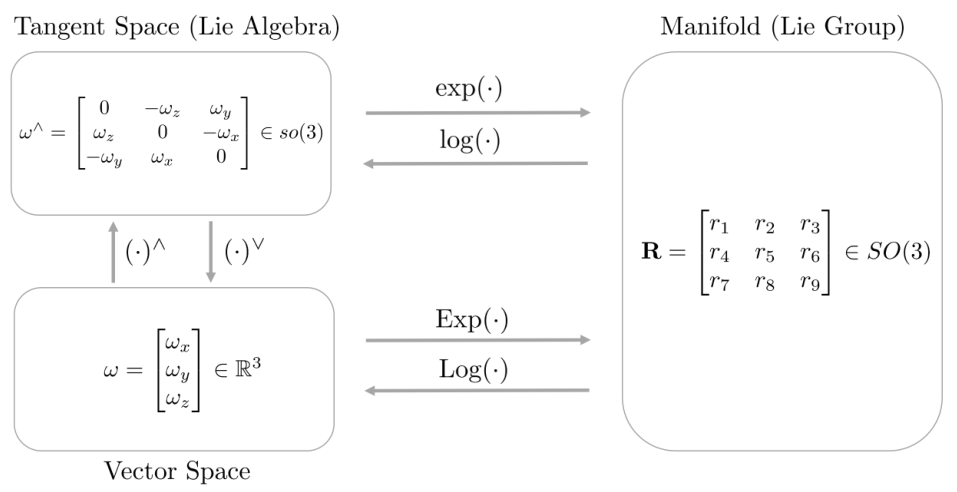

*(원문 p.11)*

Lie Group SO(3)와 Lie Algebra so(3)는 지수 매핑(exponential mapping)과 로그
매핑(logarithm mapping)으로 서로 일대일 매칭되는 특징이 있다.

$$\begin{aligned} \mathrm{Exp}(\omega) &= \mathbf{R} \in SO(3) \\ \mathrm{Log}(\mathbf{R}) &= \omega \in \mathbb{R}^3 \end{aligned} \tag{22}$$

Exponential Mapping의 정의에 따라 $\mathrm{Exp}(\omega)$ 를 전개하면 다음과 같다.

$$\begin{aligned} \mathrm{Exp}(\omega) &= \exp(\omega^\wedge) \\ &= \exp\left( \begin{bmatrix} 0 & -\omega_z & \omega_y \\ \omega_z & 0 & -\omega_x \\ -\omega_y & \omega_x & 0 \end{bmatrix} \right) \\ &= \mathbf{I} + \omega^\wedge + \frac{1}{2!}(\omega^\wedge)^2 + \frac{1}{3!}(\omega^\wedge)^3 + \cdots \end{aligned} \tag{23}$$

3차원 공간에서 임의의 각속도 $\omega$는 크기 $|\omega|$와 단위벡터 $\mathbf{u}$로 분리할 수 있다.

$$\begin{aligned} \omega &= |\omega|\mathbf{u} \\ &= \theta\mathbf{u} \quad (\theta = |\omega|) \end{aligned} \tag{24}$$

반대칭 행렬의 특징인 $(\omega^\wedge)^3 = -(\omega^T\omega) \cdot \omega^\wedge = -\theta^2\omega^\wedge$
를 적용하면

$$\begin{aligned} \theta^2 &= \omega^T\omega \\ (\omega^\wedge)^{2i+1} &= (-1)^i\theta^{2i}\omega^\wedge \\ (\omega^\wedge)^{2i+2} &= (-1)^i\theta^{2i}(\omega^\wedge)^2 \end{aligned} \tag{25}$$

가 성립한다. 위 식과 테일러 전개를 통해 식을 다시 정리하면

$$\begin{aligned} \mathrm{Exp}(\omega) &= \exp(\omega^\wedge) \\ &= \mathbf{I} + \omega^\wedge + \frac{1}{2!}(\omega^\wedge)^2 + \frac{1}{3!}(\omega^\wedge)^3 + \cdots \\ &= \mathbf{I} + \left(1 - \frac{\theta^2}{3!} + \frac{\theta^4}{5!} + \cdots\right)\omega^\wedge + \left(\frac{1}{2!} - \frac{\theta^2}{4!} + \frac{\theta^4}{6!} + \cdots\right)(\omega^\wedge)^2 \\ &= \mathbf{I} + \left(\sum_{i=0}^{\infty} \frac{(-1)^i\theta^{2i}}{(2i+1)!}\right)\omega^\wedge + \left(\sum_{i=0}^{\infty} \frac{(-1)^i\theta^{2i}}{(2i+2)!}\right)(\omega^\wedge)^2 \\ &= \mathbf{I} + \left(\frac{\sin\theta}{\theta}\right)\omega^\wedge + \left(\frac{1 - \cos\theta}{\theta^2}\right)(\omega^\wedge)^2 \end{aligned} \tag{26}$$

$$\boxed{\begin{aligned} \mathrm{Exp}(\omega) &= \mathbf{I} + \left(\frac{\sin\theta}{\theta}\right)\omega^\wedge + \left(\frac{1 - \cos\theta}{\theta^2}\right)(\omega^\wedge)^2 \\ &= \mathbf{R} \end{aligned}} \tag{27}$$

==위 공식은 Rodrigues Formula 라고 불린다.== 이는 $\mathbf{u}$ 를 회전축으로하고 $\theta$ 만큼
회전하였을 때 회전행렬 $\mathbf{R}$ 을 구하는 공식이다. 즉, angle-axis 표현법과 회전행렬 간의 관계를
나타낸 공식이다. Rodrigues Formula를 사용하면 각속도 벡터 $\omega \in \mathbb{R}^3$ 에서 이에 상응하는
회전 행렬로 $\mathbf{R} \in SO(3)$ 로 지수 매핑이 가능하다.

로그 매핑은 지수 매핑의 역연산을 의미한다. 즉, 로그 매핑은 회전 행렬 $\mathbf{R} \in SO(3)$에서 각속도
벡터 $\omega \in \mathbb{R}^3$으로 매핑을 수행하는 연산자이다.

$$\boxed{\begin{aligned} \mathrm{Log}(\mathbf{R}) &= \left(\frac{\theta}{2\sin\theta}(\mathbf{R} - \mathbf{R}^\intercal)\right)^\vee \\ &= \omega \end{aligned}} \tag{28}$$

- $\theta = \arccos\left(\frac{\mathrm{tr}(\mathbf{R}) - 1}{2}\right)$
- $(\omega^\wedge)^\vee = \omega$

만약 $\mathbf{R} = \mathbf{I}$인 경우 $\theta = 0$이 되어 로그 매핑은 특이점(singularity)을 가지며
매핑 연산이 수행되지 않는다.

<!--widget:so3-exp-log-->

## 3.4 Derivation of Exponential Mapping

임의의 회전 행렬은 다음과 같은 성질을 만족한다.

$$\mathbf{R}^\intercal\mathbf{R} = \mathbf{I} \tag{29}$$

$\mathbf{R}$ 을 시간에 따라 지속적으로 변화하는 카메라 회전으로 보면 시간의 함수 $\mathbf{R}(t)$ 로
표기할 수 있다.

$$\mathbf{R}^\intercal(t)\mathbf{R}(t) = \mathbf{I} \tag{30}$$

위 식을 양측에서 시간에 대한 미분을 수행하면

$$\begin{aligned} \dot{\mathbf{R}}^\intercal(t)\mathbf{R}(t) + \mathbf{R}^\intercal(t)\dot{\mathbf{R}}(t) &= 0 \\ \mathbf{R}^\intercal(t)\dot{\mathbf{R}}(t) &= -\left(\mathbf{R}^\intercal(t)\dot{\mathbf{R}}(t)\right)^\intercal \end{aligned} \tag{31}$$

이를 통해 $\mathbf{R}^\intercal(t)\dot{\mathbf{R}}(t)$ 이 반대칭 행렬의 성질을 만족하는 것을 알 수 있다.

임의의 반대칭 행렬 $\mathbf{A}$ 은 아래와 같다. 임의의 3차원 벡터 $\mathbf{a}$를 $\mathbf{A}$로
변환하는 연산자를 $(\cdot)^\wedge$으로 정의하며 반대 방향으로 가는 연산자를 $(\cdot)^\vee$으로
정의한다.

$$\mathbf{a}^\wedge = \mathbf{A} = \begin{bmatrix} 0 & -a_3 & a_2 \\ a_3 & 0 & -a_1 \\ -a_2 & a_1 & 0 \end{bmatrix}, \quad \mathbf{A}^\vee = \mathbf{a} = \begin{bmatrix} a_1 \\ a_2 \\ a_3 \end{bmatrix} \tag{32}$$

어떠한 반대칭 행렬에서도 그에 대응하는 벡터를 찾을 수 있다. 따라서
$\mathbf{R}^\intercal(t)\dot{\mathbf{R}}(t)$ 도 그에 상응하는 3차원 벡터
$\omega(t) \in \mathbb{R}^3$ 를 찾을 수 있다.

$$\mathbf{R}^\intercal(t)\dot{\mathbf{R}}(t) = \omega(t)^\wedge. \tag{33}$$

이 때, 방정식 왼쪽 양쪽에 $\mathbf{R}(t)$ 를 곱한다. $\mathbf{R}(t)$ 은 직교 행렬이므로 아래와 같은
식을 얻을 수 있다.

$$\dot{\mathbf{R}}(t) = \mathbf{R}(t)\omega(t)^\wedge = \mathbf{R}(t)\begin{bmatrix} 0 & -\omega_z & \omega_y \\ \omega_z & 0 & -\omega_x \\ -\omega_y & \omega_x & 0 \end{bmatrix} \tag{34}$$

시간 $t_0 = 0$ 일 때 회전행렬 $\mathbf{R}(0) = \mathbf{I}$ 라고 하면, $\dot{\mathbf{R}}(0)$은 다음과
같이 나타낼 수 있다.

$$\dot{\mathbf{R}}(0) = \omega(0)^\wedge \tag{35}$$

이 때 $\omega$ 는 SO(3) 원점에 대한 접평면을 의미한다. $t_0 = 0$ 근처에서 $\omega$ 가 일정하다고
가정하면 $\omega(t_0) = \omega$ 가 된다.

$$\dot{\mathbf{R}}(t) = \omega(0)^\wedge = \omega^\wedge \tag{36}$$

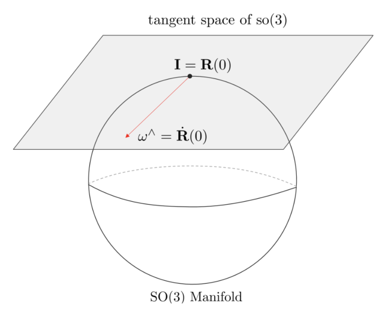

*(원문 p.13)*

위 방정식은 미분방정식이므로 미분방정식의 해는 다음과 같다.

$$\mathbf{R}(t) = \mathbf{R}_0\exp(\omega^\wedge t). \tag{37}$$

이 때, $\mathbf{R}_0 = \mathbf{R}(0) = \mathbf{I}$으로 설정하고 시간에 대한 함수 표현을 생략하여
$\omega^\wedge t \to \omega^\wedge$로 나타내면 다음과 같다.

$$\mathbf{R} = \exp(\omega^\wedge). \tag{38}$$

위 식은 회전행렬이 $\exp(\omega^\wedge)$ 를 통해 계산될 수 있음을 의미한다.

## 3.5 Plus and Minus Operator of SO(3)

지금까지 설명한 exponential mapping을 사용하면 각속도 $\omega$를 사용하여 $\mathbf{R}$을 변환할 수
있다. SO(3)와 so(3) 사이에는 일반적인 $+, -$ 연산자가 적용되지 않으므로 새로운 $\oplus, \ominus$
연산자를 정의해야 한다. 우선 $\oplus$ 연산자는 임의의 회전행렬 $\mathbf{R}$에 $\omega$ 만큼 추가적인
회전을 적용하는 연산자이다.

$$\oplus : SO(3) \times \mathbb{R}^3 \mapsto SO(3) \tag{39}$$

$$\mathbf{R} \oplus w \triangleq \mathbf{R} \cdot \mathrm{Exp}(\omega) \tag{40}$$

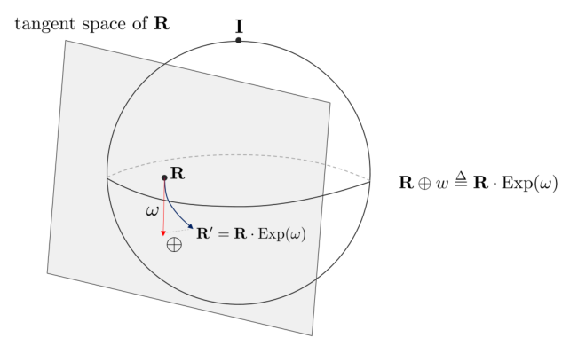

*(원문 p.14)*

반대로 $\ominus$ 연산자는 두 회전행렬 $\mathbf{R}_1, \mathbf{R}_2$가 존재할 때
$\mathbf{R}_2 \ominus \mathbf{R}_1$과 같이 사용되며 $\mathbf{R}_1$에서 $\mathbf{R}_2$의 회전량 차이를
의미한다.

$$\ominus : SO(3) \times SO(3) \mapsto \mathbb{R}^3 \tag{41}$$

$$\mathbf{R}_2 \ominus \mathbf{R}_1 \triangleq \mathrm{Log}(\mathbf{R}_1^{-1}\mathbf{R}_2) \tag{42}$$

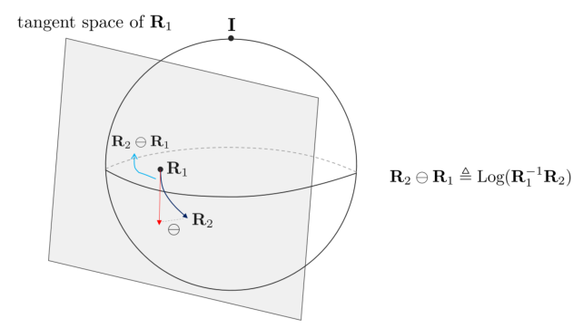

*(원문 p.14)*

## 3.6 Adjoint Matrix of SO(3)

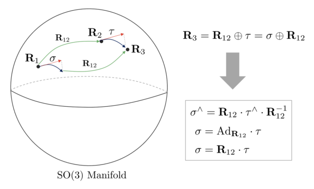

*(원문 p.15)*

SO(3)군의 Adjoint 행렬은 임의의 $\mathbf{R}_2 \in SO(3)$의 접평면에 존재하는 임의의 각속도
$\tau \in \mathbb{R}^3$을 다른 $\mathbf{R}_1$의 접평면에 대응하는 각속도 $\sigma$ 로 변환하는
행렬이다. $\mathbf{R}_{12} \in SO(3)$ 에 대하여 Adjoint 행렬을 $\mathrm{Ad}_{\mathbf{R}_{12}}$ 라고
하면 다음이 성립한다.

$$\sigma = \mathrm{Ad}_{\mathbf{R}_{12}}\tau \tag{43}$$

각속도 $\tau \in \mathbb{R}^3$를 다른 각속도 $\sigma$로 변환하는 행렬이므로
$\mathrm{Ad}_{\mathbf{R}_{12}} \in \mathbb{R}^{3\times3}$ 의 크기를 가진다.

또한 Adjoint 행렬은 다음과 같은 수식을 만족한다.

$$\begin{aligned} \mathbf{R}_{12}\mathrm{Exp}(\tau) &= \mathrm{Exp}(\mathrm{Ad}_{\mathbf{R}_{12}}\tau)\mathbf{R}_{12} \\ \mathrm{Exp}(\mathrm{Ad}_{\mathbf{R}_{12}}\tau) &= \mathbf{R}_{12}\mathrm{Exp}(\tau)\mathbf{R}_{12}^{-1} \end{aligned} \tag{44}$$

so(3) 대수에 대한 Adjoint 행렬의 유도 과정은 다음과 같다.

$$\begin{aligned} (\mathrm{Ad}_{\mathbf{R}_{12}}\tau)^\wedge &= \mathbf{R}_{12}\left(\sum_{i=1}^{3}\tau_i G_i\right)\mathbf{R}_{12}^{-1} \\ &= \mathbf{R}_{12}\tau^\wedge\mathbf{R}_{12}^{-1} \\ &= (\mathbf{R}_{12}\tau)^\wedge \end{aligned} \tag{45}$$

$$\boxed{\mathrm{Ad}_{\mathbf{R}_{12}} = \mathbf{R}_{12} \in \mathbb{R}^{3\times3}} \tag{46}$$

<!--widget:so3-adjoint-->

## 3.7 Left and Right Jacobian of SO(3)

임의의 작은 변화량 $\Delta\omega$가 주어졌을 때 이를 기존 $\mathrm{Exp}(\omega)$에 업데이트 하는
방법은 다음과 같은 두 가지 방법이 존재한다. 우선 [1] 기본적인 lie algebra를 사용한 업데이트 방법이
있다. 다음으로 [2] 섭동(perturbation) 모델을 활용한 업데이트 방법이 있다.

$$\begin{aligned} \mathrm{Exp}(\omega + \Delta\omega) & \quad \cdots [1] \\ \mathrm{Exp}(\omega)\mathrm{Exp}(\Delta\omega) & \quad \cdots [2] \end{aligned} \tag{47}$$

두 방법 사이에는 다음과 같은 근사 변환 관계가 존재한다.

$$\boxed{\begin{aligned} \mathrm{Exp}(\omega + \Delta\omega) &\approx \mathrm{Exp}(\omega)\mathrm{Exp}(\mathbf{J}_r\Delta\omega) \\ \mathrm{Exp}(\omega)\mathrm{Exp}(\Delta\omega) &\approx \mathrm{Exp}(\omega + \mathbf{J}_r^{-1}\Delta\omega) \end{aligned}} \tag{48}$$

- $\mathbf{J}_r = \mathbf{J}_r(\omega) \in \mathbb{R}^{3\times3}$
- $\mathbf{J}_r(\omega) = \mathbf{I} - \left(\frac{1-\cos(\|\omega\|)}{\|\omega\|^2}\right)\omega^\wedge + \left(\frac{\|\omega\|-\sin(\|\omega\|)}{\|\omega\|^3}\right)(\omega^\wedge)^2$ : SO(3)군의 오른쪽 자코비안(right jacobian)
- $\mathbf{J}_r(\omega)^{-1} = \mathbf{I} + \frac{1}{2}\omega^\wedge + \left(\frac{1}{\|\omega\|^2} - \frac{1+\cos(\|\omega\|)}{2\|\omega\|\sin(\|\omega\|)}\right)(\omega^\wedge)^2$ : SO(3)군의 오른쪽 자코비안의 역행렬

위 식에서 ==$\mathbf{J}_r$을 SO(3)군의 오른쪽 자코비안(right jacobian)이라고 부르며
$\mathbf{J}_r^{-1}$을 SO(3)군의 오른쪽 자코비안의 역행렬(inverse right jacobian)==이라고 부른다.

만약 업데이트 위치가 $\mathrm{Exp}(\omega)\mathrm{Exp}(\Delta\omega)$처럼 오른쪽이 아닌
$\mathrm{Exp}(\Delta\omega)\mathrm{Exp}(\omega)$와 같이 왼쪽에 곱해진다면 위와 유사한 공식이 유도되며
그 때 나오는 자코비안은 ==SO(3)군의 왼쪽 자코비안(left jacobian) $\mathbf{J}_l$이라고 한다.
$\mathbf{J}_l^{-1}$ 또한 동일하게 유도된다.==

$$\boxed{\begin{aligned} \mathrm{Exp}(\omega + \Delta\omega) &\approx \mathrm{Exp}(\mathbf{J}_l\Delta\omega)\mathrm{Exp}(\omega) \\ \mathrm{Exp}(\Delta\omega)\mathrm{Exp}(\omega) &\approx \mathrm{Exp}(\omega + \mathbf{J}_l^{-1}\Delta\omega) \end{aligned}} \tag{49}$$

- $\mathbf{J}_l = \mathbf{J}_l(\omega) \in \mathbb{R}^{3\times3}$
- $\mathbf{J}_l(\omega) = \mathbf{I} + \left(\frac{1-\cos(\|\omega\|)}{\|\omega\|^2}\right)\omega^\wedge + \left(\frac{\|\omega\|-\sin(\|\omega\|)}{\|\omega\|^3}\right)(\omega^\wedge)^2$ : SO(3)군의 왼쪽 자코비안(left jacobian)
- $\mathbf{J}_l(\omega)^{-1} = \mathbf{I} - \frac{1}{2}\omega^\wedge + \left(\frac{1}{\|\omega\|^2} - \frac{1+\cos(\|\omega\|)}{2\|\omega\|\sin(\|\omega\|)}\right)(\omega^\wedge)^2$ : SO(3)군의 왼쪽 자코비안의 역행렬

(48), (49)는 SO(3)군의 작은 섭동 변화량 $\Delta\omega$에 대해서만 유효한 공식임에 유의하며 ==이러한
근사 과정을 Baker-Campbell-Hausdorff(BCH) 근사라고 한다.==

두 자코비안 $\mathbf{J}_l, \mathbf{J}_r$ 사이에는 다음과 같은 변환 공식이 성립한다.

$$\begin{aligned} \mathbf{J}_l(\omega) &= \mathbf{J}_r(-\omega) = \mathbf{J}_r^\intercal(\omega) \\ \mathbf{J}_l^{-1}(\omega) &= \mathbf{J}_r^{-1}(-\omega) = \mathbf{J}_r^{-\intercal}(\omega) \end{aligned} \tag{50}$$

<!--widget:so3-jacobians-->

# 4 SE(3) Group

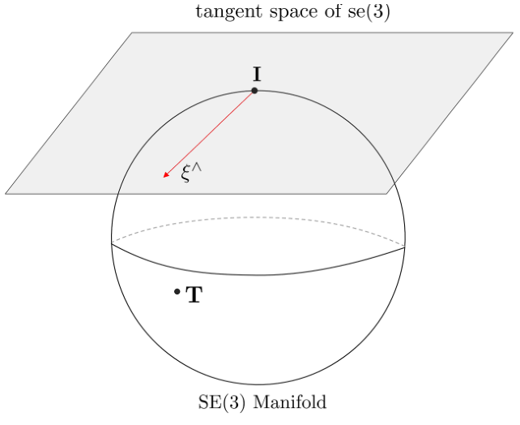

*(원문 p.16)*

## 4.1 Lie Group SE(3)

Lie 군 중 하나인 Special Euclidean 3 (SE(3))군은 3차원 공간 상에서 강체의 변환과 관련된 행렬과 이에
닫혀있는 연산들로 구성된 군을 의미한다.

$$\boxed{SE(3) = \left\{ \mathbf{T} = \begin{bmatrix} \mathbf{R} & \mathbf{t} \\ \mathbf{0} & 1 \end{bmatrix} \in \mathbb{R}^{4\times4} \mid \mathbf{R} \in SO(3), \mathbf{t} \in \mathbb{R}^3 \right\}} \tag{51}$$

### 4.1.1 SE(3) group properties

- Associativity : $(\mathbf{T}_1 \cdot \mathbf{T}_2) \cdot \mathbf{T}_3 = \mathbf{T}_1 \cdot (\mathbf{T}_2 \cdot \mathbf{T}_3)$와 같이 결합 법칙이 성립한다
- Identity element : $\mathbf{T} \cdot \mathbf{I} = \mathbf{I} \cdot \mathbf{T} = \mathbf{T}$를 만족하는 4x4 항등 행렬 $\mathbf{I}$이 존재한다
- Inverse : $\mathbf{T}^{-1} \cdot \mathbf{T} = \mathbf{T} \cdot \mathbf{T}^{-1} = \mathbf{I}$을 만족하는 역행렬이 존재한다.

$$\mathbf{T}^{-1} = \begin{bmatrix} \mathbf{R}^T & -\mathbf{R}^T\mathbf{t} \\ \mathbf{0} & 1 \end{bmatrix} \tag{52}$$

- Composition : SE(3)군의 합성은 아래와 같이 행렬의 곱셈 연산으로 수행한다

$$\begin{aligned} \mathbf{T}_1 \cdot \mathbf{T}_2 &= \begin{bmatrix} \mathbf{R}_1 & \mathbf{t}_1 \\ \mathbf{0} & 1 \end{bmatrix} \cdot \begin{bmatrix} \mathbf{R}_2 & \mathbf{t}_2 \\ \mathbf{0} & 1 \end{bmatrix} \\ &= \begin{bmatrix} \mathbf{R}_1\mathbf{R}_2 & \mathbf{R}_1\mathbf{t}_2 + \mathbf{t}_1 \\ \mathbf{0} & 1 \end{bmatrix} \in SE(3) \end{aligned} \tag{53}$$

- Non-commutative : $\mathbf{T}_1 \cdot \mathbf{T}_2 \neq \mathbf{T}_2 \cdot \mathbf{T}_1$ 교환 법칙이 성립하지 않는다
- Transformation : $\mathbb{P}^3$ 공간 상의 점 또는 벡터 $\mathbf{X} = \begin{bmatrix} X & Y & Z & W \end{bmatrix}^\intercal \in \mathbb{P}^3$를 다른 방향과 위치를 가지는 점 또는 벡터 $\mathbf{X}'$로 변환할 수 있다.

$$\begin{aligned} \mathbf{X}' = \mathbf{T} \cdot \mathbf{X} &= \begin{bmatrix} \mathbf{R} & \mathbf{t} \\ \mathbf{0} & 1 \end{bmatrix} \cdot \mathbf{X} \\ &= \begin{bmatrix} \mathbf{R}(X\ Y\ Z)^T + W \cdot \mathbf{t} \\ W \end{bmatrix} \end{aligned} \tag{54}$$

## 4.2 Lie Algebra se(3)

SE(3)군의 Lie algebra se(3)는 다음과 같은 $\mathbb{R}^{4\times4}$ 크기의 행렬로 정의된다.

$$\boxed{se(3) = \left\{ \xi^\wedge = \begin{bmatrix} \omega^\wedge & \mathbf{v} \\ \mathbf{0} & 0 \end{bmatrix} \in \mathbb{R}^{4\times4} \middle| \: \xi = \begin{bmatrix} \omega \\ \mathbf{v} \end{bmatrix} \in \mathbb{R}^6 \right\}} \tag{55}$$

이 때, $\xi$ 는 3차원 공간 상에서 물체의 속도를 의미하는 twist 이며
$\omega = \begin{pmatrix} w_x & w_y & w_z \end{pmatrix}^T \in \mathbb{R}^3$ 는 각속도를 의미하고
$\mathbf{v} = \begin{pmatrix} v_x & v_y & v_z \end{pmatrix}^T \in \mathbb{R}^3$ 는 속도를 의미한다.
$\xi$에서 $\omega$와 $\mathbf{v}$의 순서는 종종 바뀌어 사용되기도 한다.

se(3)는 다음과 같이 회전과 이동에 관련된 6개의 생성자(Generator)들이 존재한다.

$$\begin{aligned} G_1 &= \begin{pmatrix} 0 & 0 & 0 & 0 \\ 0 & 0 & -1 & 0 \\ 0 & 1 & 0 & 0 \\ 0 & 0 & 0 & 0 \end{pmatrix}, \quad G_2 = \begin{pmatrix} 0 & 0 & 1 & 0 \\ 0 & 0 & 0 & 0 \\ -1 & 0 & 0 & 0 \\ 0 & 0 & 0 & 0 \end{pmatrix}, \quad G_3 = \begin{pmatrix} 0 & -1 & 0 & 0 \\ 1 & 0 & 0 & 0 \\ 0 & 0 & 0 & 0 \\ 0 & 0 & 0 & 0 \end{pmatrix} \\ G_4 &= \begin{pmatrix} 0 & 0 & 0 & 1 \\ 0 & 0 & 0 & 0 \\ 0 & 0 & 0 & 0 \\ 0 & 0 & 0 & 0 \end{pmatrix}, \quad G_5 = \begin{pmatrix} 0 & 0 & 0 & 0 \\ 0 & 0 & 0 & 1 \\ 0 & 0 & 0 & 0 \\ 0 & 0 & 0 & 0 \end{pmatrix}, \quad G_6 = \begin{pmatrix} 0 & 0 & 0 & 0 \\ 0 & 0 & 0 & 0 \\ 0 & 0 & 0 & 1 \\ 0 & 0 & 0 & 0 \end{pmatrix} \end{aligned} \tag{56}$$

se(3)의 각 원소들은 생성자들의 선형결합(Linear Combination)으로 표현할 수 있다.

$$\begin{aligned} & \xi = (\omega, \: \mathbf{v})^T \in \mathbb{R}^6 \\ & \omega_1 G_1 + \omega_2 G_2 + \omega_3 G_3 + v_1 G_4 + v_2 G_5 + v_3 G_6 \in se(3) \end{aligned} \tag{57}$$

## 4.3 Exponential Mapping and Logarithm Mapping

지수 매핑, 로그 매핑 설명에 앞서서 SO(3)와 동일하게 연산의 편의를 위해 일반적으로
$\xi^\wedge \to \mathbf{T}$로 매핑하는 과정은 $\exp(\cdot)$ 연산자를 활용하며
$\xi \to \mathbf{T}$로 매핑하는 과정은 $\mathrm{Exp}(\cdot)$ 연산자를 활용한다. 로그 매핑 또한
동일하다.

$$\begin{aligned} \exp(\cdot) &: \xi^\wedge \mapsto \mathbf{T} \\ \mathrm{Exp}(\cdot) &: \xi \mapsto \mathbf{T} \end{aligned} \tag{58}$$

이를 그림으로 정리하면 다음과 같다.

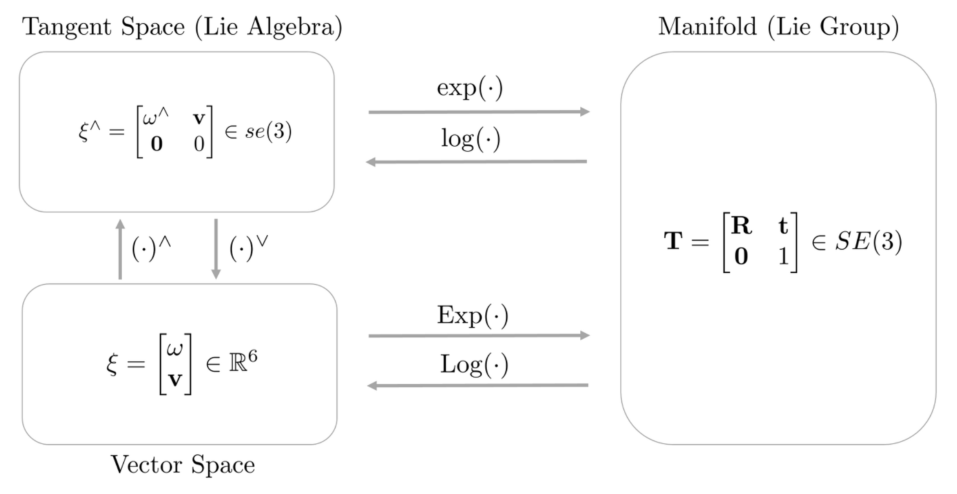

*(원문 p.18)*

Lie Group SE(3)와 Lie Algebra se(3)는 지수 매핑(exponential mapping)과 로그 매핑(logarithm
mapping)으로 서로 일대일 매칭되는 특징이 있다. 우선, twist $\xi \in \mathbb{R}^6$ 를 se(3) lie
algebra로 변환하는 연산 $\xi^\wedge$은 다음과 같이 정의된다.

$$\xi^\wedge = \begin{bmatrix} \omega^\wedge & \mathbf{v} \\ \mathbf{0} & 0 \end{bmatrix} \in \mathbb{R}^{4\times4} \tag{59}$$

se(3)의 지수 매핑은 다음과 같이 정의된다.

$$\begin{aligned} \mathrm{Exp}(\xi) &= \exp(\xi^\wedge) \\ &= \exp\left( \begin{bmatrix} \omega^\wedge & \mathbf{v} \\ \mathbf{0} & 0 \end{bmatrix} \right) \\ &= \mathbf{I} + \begin{bmatrix} \omega^\wedge & \mathbf{v} \\ \mathbf{0} & 0 \end{bmatrix} + \frac{1}{2!}\begin{bmatrix} (\omega^\wedge)^2 & \omega^\wedge\mathbf{v} \\ \mathbf{0} & 0 \end{bmatrix} + \frac{1}{3!}\begin{bmatrix} (\omega^\wedge)^3 & (\omega^\wedge)^2\mathbf{v} \\ \mathbf{0} & 0 \end{bmatrix} + \cdots \end{aligned} \tag{60}$$

이 때, 회전과 관련된 부분은 SO(3)군과 동일하지만 이동과 관련된 부분은 별도의 급수 형태를 가진다.

$$\begin{aligned} \mathrm{Exp}(\xi) &= \exp\left( \begin{bmatrix} \omega^\wedge & \mathbf{v} \\ \mathbf{0} & 0 \end{bmatrix} \right) \\ &= \begin{bmatrix} \sum_0^\infty \frac{1}{n!}(\omega^\wedge)^n & \sum_0^\infty \frac{1}{(n+1)!}(\omega^\wedge)^n\mathbf{v} \\ \mathbf{0} & 1 \end{bmatrix} \\ &= \begin{bmatrix} \exp(\omega^\wedge) & \mathbf{Q}\mathbf{v} \\ \mathbf{0} & 1 \end{bmatrix} \end{aligned} \tag{61}$$

$$\mathbf{Q} = \mathbf{I} + \frac{1}{2!}\omega^\wedge + \frac{1}{3!}(\omega^\wedge)^2 + \frac{1}{4!}(\omega^\wedge)^3 + \frac{1}{5!}(\omega^\wedge)^4 + \cdots \tag{62}$$

앞서 SO(3) 파트에서 설명한 Rodrigues 공식과 반대칭 행렬의 원리를 적용하여 다시 정리하면 다음과 같다.

$$\begin{aligned} \mathbf{Q} &= \mathbf{I} + \frac{1}{2!}\omega^\wedge + \frac{1}{3!}(\omega^\wedge)^2 + \frac{1}{4!}(\omega^\wedge)^3 + \frac{1}{5!}(\omega^\wedge)^4 + \cdots \\ &= \mathbf{I} + \left(\frac{1}{2!} - \frac{\theta^2}{4!} + \frac{\theta^4}{6!} + \cdots\right)\omega^\wedge + \left(\frac{1}{3!} - \frac{\theta^2}{5!} + \frac{\theta^4}{7!} + \cdots\right)(\omega^\wedge)^2 \\ &= \mathbf{I} + \sum_{i=0}^{\infty}\left[\frac{(\omega^\wedge)^{2i+1}}{(2i+2)!} + \frac{(\omega^\wedge)^{2i+2}}{(2i+3)!}\right] \\ &= \mathbf{I} + \left(\sum_{i=0}^{\infty}\frac{(-1)^i\theta^{2i}}{(2i+2)!}\right)\omega^\wedge + \left(\sum_{i=0}^{\infty}\frac{(-1)^i\theta^{2i}}{(2i+3)!}\right)(\omega^\wedge)^2 \\ &= \mathbf{I} + \left(\frac{1-\cos\theta}{\theta^2}\right)\omega^\wedge + \left(\frac{\theta-\sin\theta}{\theta^3}\right)(\omega^\wedge)^2 \\ &= \mathbf{I} + \left(\frac{1-\cos(\|\omega\|)}{\|\omega\|^2}\right)\omega^\wedge + \left(\frac{\|\omega\|-\sin(\|\omega\|)}{\|\omega\|^3}\right)(\omega^\wedge)^2 \\ &= \mathbf{J}_l \quad \cdots \text{ Left Jacobian of SO(3)} \end{aligned} \tag{63}$$

- $\theta = \|\omega\|$
- $(\omega^\wedge)^3 = -\omega^\intercal\omega \cdot \omega^\wedge = -\theta^2\omega^\wedge$

$\mathbf{Q}$를 자세히 보면 (49)에서 설명한 SO(3)군의 왼쪽 자코비안(left jacobian) $\mathbf{J}_l$과
형태가 동일한 것을 알 수 있다. 따라서 (61)는 다음과 같이 쓸 수 있다.

$$\boxed{\begin{aligned} \mathrm{Exp}(\xi) &= \begin{bmatrix} \mathrm{Exp}(\omega) & \mathbf{J}_l\mathbf{v} \\ \mathbf{0} & 1 \end{bmatrix} \\ &= \begin{bmatrix} \mathbf{R} & \mathbf{t} \\ \mathbf{0} & 1 \end{bmatrix} \\ &= \mathbf{T} \end{aligned}} \tag{64}$$

SE(3)군의 로그 매핑은 회전 부분은 SO(3)군의 로그 매핑을 사용하고 이동 부분은 $\mathbf{J}_l^{-1}$ 을
사용한다.

$$\mathbf{J}_l^{-1} = \mathbf{I} - \frac{1}{2}\omega^\wedge + \left(\frac{1}{\|\omega\|^2} - \frac{1+\cos(\|\omega\|)}{2\|\omega\|\sin(\|\omega\|)}\right)(\omega^\wedge)^2 \tag{65}$$

$$\begin{aligned} \omega^\wedge &= \log(\mathbf{R}) \\ \mathbf{v} &= \mathbf{J}_l^{-1}\mathbf{t} \end{aligned} \tag{66}$$

$$\boxed{\begin{aligned} \mathrm{Log}(\mathbf{T}) &= \mathrm{Log}\left(\begin{bmatrix} \mathbf{R} & \mathbf{t} \\ \mathbf{0} & 1 \end{bmatrix}\right) \\ &= \left(\begin{bmatrix} \log(\mathbf{R}) & \mathbf{J}_l^{-1}\mathbf{t} \\ \mathbf{0} & 0 \end{bmatrix}\right)^\vee \\ &= \begin{bmatrix} \omega \\ \mathbf{v} \end{bmatrix} \\ &= \xi \end{aligned}} \tag{67}$$

<!--widget:se3-exp-screw-->

## 4.4 Plus and Minus Operator of SE(3)

지금까지 설명한 exponential mapping을 사용하면 twist $\xi$를 사용하여 $\mathbf{T}$을 변환할 수 있다.
SE(3)와 se(3) 사이에는 일반적인 $+, -$ 연산자가 적용되지 않으므로 새로운 $\oplus, \ominus$ 연산자를
정의해야 한다. 우선 $\oplus$ 연산자는 임의의 포즈 $\mathbf{T}$에 $\xi$ 만큼 추가적인 변환을 적용하는
연산자이다.

$$\mathbf{T} \oplus \xi \triangleq \mathbf{T} \cdot \mathrm{Exp}(\xi) \tag{68}$$

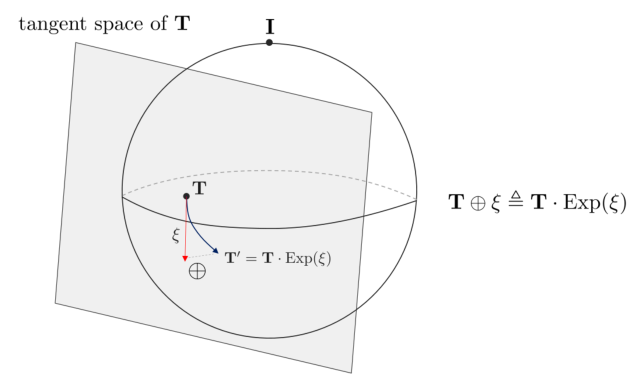

*(원문 p.20)*

반대로 $\ominus$ 연산자는 두 포즈 $\mathbf{T}_1, \mathbf{T}_2$가 존재할 때
$\mathbf{T}_2 \ominus \mathbf{T}_1$과 같이 사용되며 $\mathbf{T}_1$에서 $\mathbf{T}_2$의 상대 포즈를
의미한다.

$$\mathbf{T}_2 \ominus \mathbf{T}_1 \triangleq \mathrm{Log}(\mathbf{T}_1^{-1}\mathbf{T}_2) \tag{69}$$

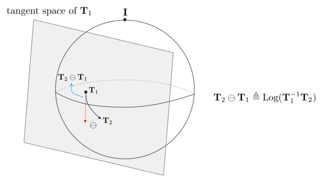

*(원문 p.20)*

## 4.5 Adjoint Matrix of SE(3)

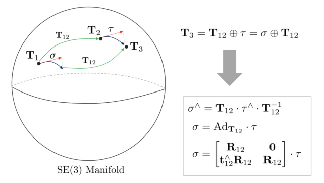

*(원문 p.20)*

SE(3)군의 Adjoint 행렬은 임의의 $\mathbf{T}_2 \in SE(3)$의 접평면에 존재하는 임의의 twist
$\tau \in \mathbb{R}^6$을 다른 $\mathbf{T}_1$의 접평면에 대응하는 twist $\sigma$ 로 변환하는 행렬이다.
$\mathbf{T}_{12} \in SE(3)$ 에 대하여 Adjoint 행렬을 $\mathrm{Ad}_{\mathbf{T}_{12}}$ 라고 하면 다음이
성립한다.

$$\xi_1 = \mathrm{Ad}_{\mathbf{T}_{12}}\xi_2 \tag{70}$$

Twist를 다른 twist로 변환하는 행렬이므로
$\mathrm{Ad}_{\mathbf{T}_{12}} \in \mathbb{R}^{6\times6}$ 의 크기를 가진다. 또한 Adjoint 행렬은 다음과
같은 수식을 만족한다.

$$\begin{aligned} \mathbf{T}_{12}\mathrm{Exp}(\tau) &= \mathrm{Exp}(\mathrm{Ad}_{\mathbf{T}_{12}}\tau)\mathbf{T}_{12} \\ \mathrm{Exp}(\mathrm{Ad}_{\mathbf{T}_{12}}\tau) &= \mathbf{T}_{12}\mathrm{Exp}(\tau)\mathbf{T}_{12}^{-1} \end{aligned} \tag{71}$$

se(3) 대수에 대한 Adjoint 행렬의 유도 과정은 다음과 같다.

$$\begin{aligned} (\mathrm{Ad}_{\mathbf{T}_{12}}\tau)^\wedge &= \mathbf{T}_{12}\left(\sum_{i=1}^{6}\xi_i G_i\right)\mathbf{T}_{12}^{-1} \\ &= \begin{pmatrix} \mathbf{R}_{12}\omega_{12} \\ \mathbf{t}_{12}^\wedge\mathbf{R}_{12}\omega_{12} + \mathbf{R}_{12}\mathbf{v}_{12} \end{pmatrix}^\wedge \\ &= \left(\begin{bmatrix} \mathbf{R}_{12} & \mathbf{0} \\ \mathbf{t}_{12}^\wedge\mathbf{R}_{12} & \mathbf{R}_{12} \end{bmatrix} \begin{bmatrix} \omega_{12} \\ \mathbf{v}_{12} \end{bmatrix}\right)^\wedge \end{aligned} \tag{72}$$

$$\boxed{\mathrm{Ad}_{\mathbf{T}_{12}} = \begin{bmatrix} \mathbf{R}_{12} & \mathbf{0} \\ \mathbf{t}_{12}^\wedge\mathbf{R}_{12} & \mathbf{R}_{12} \end{bmatrix} \in \mathbb{R}^{6\times6}} \tag{73}$$

## 4.6 Left and Right Jacobian of SE(3)

임의의 작은 변화량 $\Delta\xi$이 주어졌을 때 이를 기존 $\mathrm{Exp}(\xi)$에 업데이트 하는 방법은
다음과 같은 두 가지 방법이 존재한다. 우선 [1] 기본적인 lie algebra를 사용한 업데이트 방법이 있다.
다음으로 [2] 섭동(perturbation) 모델을 활용한 업데이트 방법이 있다.

$$\begin{aligned} \mathrm{Exp}(\xi + \Delta\xi) & \quad \cdots [1] \\ \mathrm{Exp}(\xi)\mathrm{Exp}(\Delta\xi) & \quad \cdots [2] \end{aligned} \tag{74}$$

두 방법 사이에는 다음과 같은 근사 변환 관계가 존재한다.

$$\boxed{\begin{aligned} \mathrm{Exp}(\xi + \Delta\xi) &\approx \mathrm{Exp}(\xi)\mathrm{Exp}(\mathcal{J}_r\Delta\xi) \\ \mathrm{Exp}(\xi)\mathrm{Exp}(\Delta\xi) &\approx \mathrm{Exp}(\xi + \mathcal{J}_r^{-1}\Delta\xi) \end{aligned}} \tag{75}$$

- $\mathcal{J}_r = \mathcal{J}_r(\xi) \in \mathbb{R}^{6\times6}$
- $\mathcal{J}_r(\xi) = \begin{bmatrix} \mathbf{J}_r & \mathbf{Q}_r \\ \mathbf{0} & \mathbf{J}_r \end{bmatrix}$ : SE(3)군의 오른쪽 자코비안(right jacobian)
- $\mathcal{J}_r(\xi)^{-1} = \begin{bmatrix} \mathbf{J}_r^{-1} & -\mathbf{J}_r^{-1}\mathbf{Q}_r\mathbf{J}_r^{-1} \\ \mathbf{0} & \mathbf{J}_r^{-1} \end{bmatrix}$ : SE(3)군의 오른쪽 자코비안의 역행렬
- $\mathbf{J}_r = \mathbf{J}_r(\omega) \in \mathbb{R}^{3\times3}$ : SO(3)군의 오른 자코비안
- $\mathbf{Q}_r = \mathbf{Q}_r(\xi) \in \mathbb{R}^{3\times3}$

$\mathbf{Q}_r(\xi)$는 다음과 같이 정의된다.

$$\begin{aligned} \mathbf{Q}_r(\xi) = & -\frac{1}{2}\mathbf{v}^\wedge + \left(\frac{\|\omega\| + \sin\|\omega\|}{\|\omega\|^3}\right)(-\omega^\wedge\mathbf{v}^\wedge - \mathbf{v}^\wedge\omega^\wedge - \omega^\wedge\mathbf{v}^\wedge\omega^\wedge) \\ & + \left(\frac{\|\omega\|^2 + 2\cos\|\omega\| - 2}{2\|\omega\|^4}\right)(-(\omega^\wedge)^2\mathbf{v}^\wedge - \mathbf{v}^\wedge(\omega^\wedge)^2 + 3\omega^\wedge\mathbf{v}^\wedge\omega^\wedge) \\ & + \left(\frac{2\|\omega\| - 3\sin\|\omega\| + \|\omega\|\cos\|\omega\|}{2\|\omega\|^5}\right)(-\omega^\wedge\mathbf{v}^\wedge(\omega^\wedge)^2 - (\omega^\wedge)^2\mathbf{v}^\wedge\omega^\wedge) \end{aligned} \tag{76}$$

위 식에서 ==$\mathcal{J}_r$을 SE(3)군의 오른쪽 자코비안(right jacobian)이라고 부르며
$\mathcal{J}_r^{-1}$을 SE(3)군의 오른쪽 자코비안의 역행렬(inverse right jacobian)==이라고 부른다.

만약 업데이트 위치가 $\mathrm{Exp}(\xi)\mathrm{Exp}(\Delta\xi)$처럼 오른쪽이 아닌
$\mathrm{Exp}(\Delta\xi)\mathrm{Exp}(\xi)$와 같이 왼쪽에 곱해진다면 위와 유사한 공식이 유도되며 그 때
나오는 자코비안은 ==SE(3)군의 왼쪽 자코비안(left jacobian) $\mathcal{J}_l$이라고 한다.
$\mathcal{J}_l^{-1}$ 또한 동일하게 유도된다.==

$$\boxed{\begin{aligned} \mathrm{Exp}(\xi + \Delta\xi) &\approx \mathrm{Exp}(\mathcal{J}_l\Delta\xi)\mathrm{Exp}(\xi) \\ \mathrm{Exp}(\Delta\xi)\mathrm{Exp}(\xi) &\approx \mathrm{Exp}(\xi + \mathcal{J}_l^{-1}\Delta\xi) \end{aligned}} \tag{77}$$

- $\mathcal{J}_l = \mathcal{J}_l(\xi) \in \mathbb{R}^{6\times6}$
- $\mathcal{J}_l(\xi) = \begin{bmatrix} \mathbf{J}_l & \mathbf{Q}_l \\ \mathbf{0} & \mathbf{J}_l \end{bmatrix}$ : SE(3)군의 왼쪽 자코비안(left jacobian)
- $\mathcal{J}_l(\xi)^{-1} = \begin{bmatrix} \mathbf{J}_l^{-1} & -\mathbf{J}_l^{-1}\mathbf{Q}_l\mathbf{J}_l^{-1} \\ \mathbf{0} & \mathbf{J}_l^{-1} \end{bmatrix}$ : SE(3)군의 왼쪽 자코비안의 역행렬
- $\mathbf{J}_l = \mathbf{J}_l(\omega) \in \mathbb{R}^{3\times3}$ : SO(3)군의 왼쪽 자코비안
- $\mathbf{Q}_l = \mathbf{Q}_l(\xi) \in \mathbb{R}^{3\times3}$

$\mathbf{Q}_l(\xi)$는 다음과 같이 정의된다.

$$\begin{aligned} \mathbf{Q}_l(\xi) = & \frac{1}{2}\mathbf{v}^\wedge + \left(\frac{\|\omega\| - \sin\|\omega\|}{\|\omega\|^3}\right)(\omega^\wedge\mathbf{v}^\wedge + \mathbf{v}^\wedge\omega^\wedge + \omega^\wedge\mathbf{v}^\wedge\omega^\wedge) \\ & + \left(\frac{\|\omega\|^2 + 2\cos\|\omega\| - 2}{2\|\omega\|^4}\right)((\omega^\wedge)^2\mathbf{v}^\wedge + \mathbf{v}^\wedge(\omega^\wedge)^2 - 3\omega^\wedge\mathbf{v}^\wedge\omega^\wedge) \\ & + \left(\frac{2\|\omega\| - 3\sin\|\omega\| + \|\omega\|\cos\|\omega\|}{2\|\omega\|^5}\right)(\omega^\wedge\mathbf{v}^\wedge(\omega^\wedge)^2 + (\omega^\wedge)^2\mathbf{v}^\wedge\omega^\wedge) \end{aligned} \tag{78}$$

(75), (77)는 SE(3)군의 작은 섭동 변화량 $\Delta\xi$에 대해서만 유효한 공식임에 유의하며 ==이러한 근사
과정을 Baker-Campbell-Hausdorff(BCH) 근사라고 한다.==

$\mathbf{Q}_l, \mathbf{Q}_r$과 두 자코비안 $\mathcal{J}_l, \mathcal{J}_r$ 사이에는 다음과 같은 변환
공식이 성립한다.

$$\begin{aligned} \mathbf{Q}_l(\xi) &= \mathbf{Q}_r(-\xi) \\ \mathcal{J}_l(\xi) &= \mathcal{J}_r(-\xi) \end{aligned} \tag{79}$$

<!--widget:se3-adjoint-jacobian-->

# 5 Applications for estimation

다음으로 Lie Group을 활용한 실제 상태추정 예시를 알아본다. 아래와 같이 3차원 공간 상에 카메라와
랜드마크들이 존재한다고 가정하자.

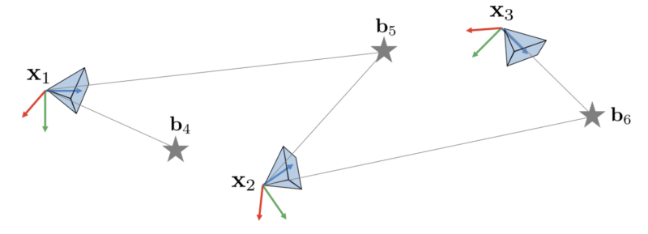

*(원문 p.23)*

이 때, $\mathbf{x}_i, i = 1, 2, 3$은 카메라의 3차원 공간 상의 포즈를 의미하며
$\mathbf{b}_i, i = 4, 5, 6$는 랜드마크들의 좌표를 의미한다.

## 5.1 EKF map-based localization

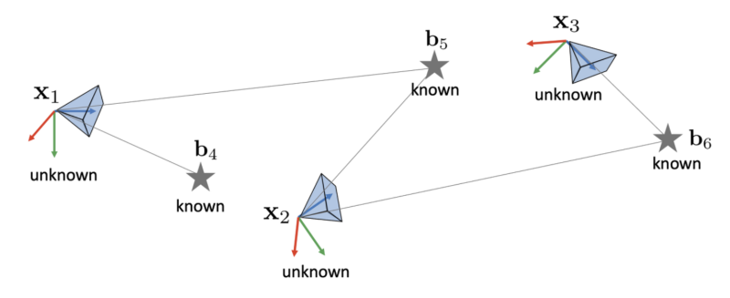

*(원문 p.23)*

만약 $\mathbf{x}_i$은 모르는 상태에서 $\mathbf{b}_i$의 값만 주어졌다고 했을 때, 카메라는 랜드마크를
사용하여 자신의 포즈 $\mathbf{x}_i$를 EKF를 통해 추정할 수 있다.

$$\begin{aligned} \mathbf{x} &\sim \mathcal{N}(\bar{\mathbf{x}}, \mathbf{P}) \in SE(3) : \text{Unknown} \\ \mathbf{P} &= \mathbb{E}[(\mathbf{x} \ominus \bar{\mathbf{x}})(\mathbf{x} \ominus \bar{\mathbf{x}})^\intercal] : \text{Unknown} \\ \mathbf{b} &\in \mathbb{R}^3 : \text{Known} \end{aligned} \tag{80}$$

카메라의 motion model과 measurement model은 다음과 같다.

$$\begin{aligned} \text{motion model:} \quad & \mathbf{x}_i = f(\mathbf{x}_{i-1}, \mathbf{u}_i) = \mathbf{x}_{i-1} \oplus (\mathbf{u}_i dt + \omega) \\ \text{measurement model:} \quad & \mathbf{y}_k = h(\mathbf{x}) = \mathbf{x}^{-1}\mathbf{b}_k + v, \quad \text{where,} \: v \sim \mathcal{N}(0, \mathbf{R}) \end{aligned} \tag{81}$$

- $\omega \sim \mathcal{N}(0, \mathbf{Q})$ : perturbation
- $v \sim \mathcal{N}(0, \mathbf{R})$ : noise

이 때, 카메라의 포즈는 SE(3) 군에 속하므로 $\oplus$ 연산을 사용하여 포즈를 업데이트 한다. 위 두 모델을
활용한 EKF의 prediction, correction step은 다음과 같다

### 5.1.1 Prediction Step

$$\begin{aligned} \hat{\mathbf{x}} &\leftarrow \hat{\mathbf{x}} \oplus \mathbf{u}_i dt \\ \mathbf{P} &\leftarrow \mathbf{F}\mathbf{P}\mathbf{F}^\intercal + \mathbf{G}\mathbf{Q}\mathbf{G}^\intercal \end{aligned} \tag{82}$$

- $\mathbf{F} = \frac{Df}{D\hat{\mathbf{x}}}$
- $\mathbf{G} = \frac{Df}{D\omega}$

### 5.1.2 Correction Step

$$\begin{aligned} \mathbf{z}_k &= \mathbf{y}_k - \hat{\mathbf{x}}^{-1}\mathbf{b}_k \\ \mathbf{Z}_k &= \mathbf{H}\mathbf{P}\mathbf{H}^\intercal + \mathbf{R} \\ \mathbf{K} &= \mathbf{P}\mathbf{H}^\intercal\mathbf{Z}_k^{-1} \\ \hat{\mathbf{x}} &\leftarrow \hat{\mathbf{x}} \oplus \mathbf{K}\mathbf{z}_k \\ \mathbf{P} &\leftarrow \mathbf{P} - \mathbf{K}\mathbf{Z}_k\mathbf{K}^\intercal \end{aligned} \tag{83}$$

- $\mathbf{H} = \frac{Dh}{D\mathbf{x}}$

위 공식은 일반적인 EKF 공식과 동일하다. 따라서 Lie Group 연산자
$\oplus, \ominus, \frac{D*}{D*}, \mathbf{x}^{-1}$ 등을 사용하면 nonlinear한 $SE(3)$ 연산을 linear
vector space에서 사용하는 연산과 동일하게 수행할 수 있다.

<!--widget:lie-ekf-localization-->

## 5.2 Pose Graph SLAM

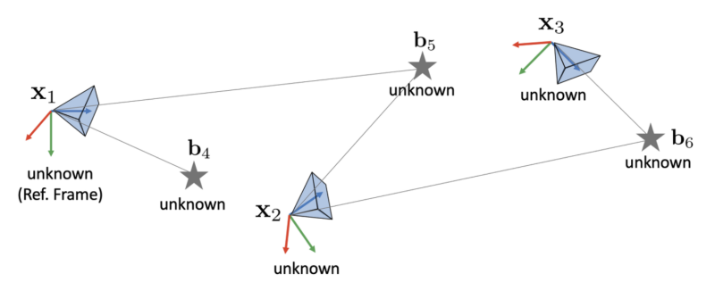

*(원문 p.24)*

만약 $\mathbf{x}_i$과 $\mathbf{b}_i$ 모두 모른다고 하면, pose graph SLAM을 통해 두 상태변수를 추정할
수 있다.

$$\begin{aligned} \mathbf{x} &\in SE(3) : \text{Unknown} \\ \mathbf{b} &\in \mathbb{R}^3 : \text{Unknown} \end{aligned} \tag{84}$$

이 때, 상태변수는 다음과 같이 벡터 형태로 한 번에 묶어서 표현할 수 있다.

$$\mathbf{x} = (\mathbf{x}_1, \mathbf{x}_2, \mathbf{x}_3, \mathbf{b}_4, \mathbf{b}_5, \mathbf{b}_6) \tag{85}$$

이 때 비선형 최적화 문제는 다음과 같이 정의할 수 있다.

$$\mathbf{x}^* = \arg\min_{\mathbf{x}} \sum_p \|\mathbf{r}_p(\mathbf{x})\|^2 \tag{86}$$

이 때, residual $\mathbf{r}$은 다음과 같이 정의할 수 있다.

$$\begin{aligned} \text{prior:} \quad & \mathbf{r}_1 = \Omega_1^{\intercal/2}(\mathbf{x}_1 \ominus \mathbf{x}_1^{ref}) \\ \text{motion:} \quad & \mathbf{r}_{ij} = \Omega_{ij}^{\intercal/2}(\mathbf{u}_j dt - (\mathbf{x}_j \ominus \mathbf{x}_i)) \\ \text{measurement:} \quad & \mathbf{r}_{ik} = \Omega_{ik}^{\intercal/2}(\mathbf{y}_{ik} - \mathbf{x}_i^{-1}\mathbf{b}_k) \end{aligned} \tag{87}$$

그리고 모든 카메라 포즈와 랜드마크에 대한 residual과 자코비안을 다음과 같이 정의할 수 있다.

$$\mathbf{r} = \begin{bmatrix} \mathbf{r}_1 & \mathbf{r}_{12} & \mathbf{r}_{23} & \mathbf{r}_{14} & \mathbf{r}_{15} & \mathbf{r}_{25} & \mathbf{r}_{26} & \mathbf{r}_{36} \end{bmatrix}^\intercal \tag{88}$$

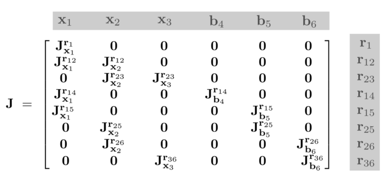

*(원문 p.25)*

위 자코비안을 활용하여 앞서 정의한 비선형 최적화 문제를 Newton step을 통해 iterative하게 풀 수 있다.

$$\begin{aligned} \Delta\mathbf{x} &= -(\mathbf{J}^\intercal\mathbf{J})^{-1}\mathbf{J}^\intercal\mathbf{r} \\ \mathbf{x} &\leftarrow \mathbf{x} \oplus \Delta\mathbf{x} \end{aligned} \tag{89}$$

이 때 사용하는 최적화 공식 또한 Lie Group 연산자 $\oplus, \ominus, \frac{D*}{D*}, \mathbf{x}^{-1}$
등을 통해 nonlinear한 SE(3) 연산을 linear vector space에서 사용하는 연산과 동일하게 수행할 수 있다.

# 6 Lie theory-based optimization on SLAM

3차원 공간에서 카메라 포즈를 최적화 할 때 lie group(SO(3), SE(3)) 표현법을 그대로 사용하게 되면
회전 표현법이 over-parameterized 되었기 때문에 다양한 문제점이 발생한다. over-parameterized 표현법의
단점은 다음과 같다.

- 중복되는 파라미터를 계산해야 하기 때문에 최적화 수행 시 연산량이 증가한다.
- 추가적인 자유도로 인해 수치적인 불안정성(numerical instability) 문제가 야기될 수 있다.
- 파라미터가 업데이트될 때마다 항상 제약조건을 만족하는 지 체크해줘야 한다.

==반면에, lie algebra(so(3), se(3))을 사용하면 비선형 최적화(e.g., GN, LM) 방법을 통해 lie algebra의
증분량을 구하고 이를 지수 매핑 하여 lie group(SO(3), SE(3)) 공간으로 변환하면 제약조건 없는 최적화가
가능하다. 따라서 lie theory를 사용하면 기존의 constrained optimization 문제를 unconstrained
optimization 문제로 변환 하여 푸는 것과 동일한 이점이 존재한다.== 또한 lie algebra는 선형
벡터공간(linear vector space)이므로 자코비안과 섭동(perturbation)을 계산하기 비교적 용이하여 기존의
최적화 기법을 적용하기 위한 모델링이 그대로 사용이 가능한 이점이 있다.

se(3) 기반 최적화를 예로 들면, SLAM에서 최적화 변수를
$\delta\xi = [\delta\omega, \delta\mathbf{v}]^\intercal$로 설정하여 비선형 최적화(e.g., GN, LM)을
수행하면 매 iteration마다 계산되는 증분량을 $\mathrm{Exp}(\delta\xi)$를 통해 SE(3) 군으로 변환할 수
있다. 이를 기존의 카메라 포즈 $\mathbf{T}$에 곱하여 포즈를 업데이트하면 별도의 제약조건 없이
업데이트를 진행할 수 있다.

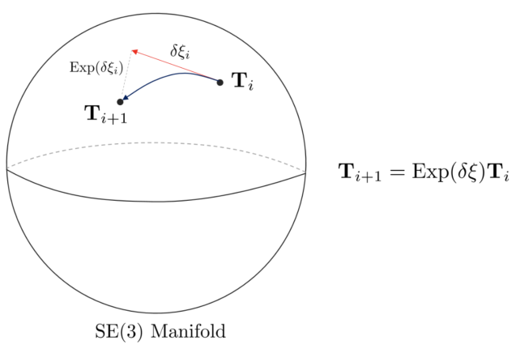

*(원문 p.25)*

$$\mathbf{T} \leftarrow \mathrm{Exp}(\delta\xi) \cdot \mathbf{T} \tag{90}$$

> [!TIP]
> 기존 상태 $\mathbf{T}$의 오른쪽에 곱하느냐 왼쪽에 곱하느냐에 따라서 각각 로컬 좌표계에서 본 포즈를
> 업데이트할 것 인지(오른쪽) 전역 좌표계에서 본 포즈를 업데이트할 것 인지(왼쪽) 달라지게 된다.
>
> $$\begin{aligned} \mathbf{T} &\leftarrow \mathrm{Exp}(\delta\xi) \cdot \mathbf{T} && \cdots \text{globally updated (left mult)} \\ \mathbf{T} &\leftarrow \mathbf{T} \cdot \mathrm{Exp}(\delta\xi) && \cdots \text{locally updated (right mult)} \end{aligned} \tag{91}$$

<!--widget:pose-graph-gn-->

# 7 Reference

1. (Paper) Lie Groups for 2D and 3D Transformations
2. (Paper) A tutorial on SE3 transformation parameterizations and on-manifold optimization
3. (Book) 입문 Visual SLAM
4. (Youtube) Modern Robotics Lecture
5. (Youtube) Lie theory for the roboticist (by Joan Sola)
6. (Book) State Estimation for Robotics (by Timothy Barfoot)

# 8 Revision log

- 1st: 2022-01-04
- 2nd: 2022-08-14
- 3rd: 2022-09-07
- 4th: 2022-11-26
- 5th: 2023-01-21
- 6th: 2023-01-23
- 7th: 2023-01-25
- 8th: 2023-01-28
- 9th: 2023-11-14
- 10th: 2024-02-24
- 11th: 2024-05-24

# 옮기며 바로잡은 것

원문을 옮기면서 고친 것은 아래가 전부다. 그 외의 문장·수식·절 구성은 손대지 않았다.

## 맞춤법·철자

| 원문 쪽 | 위치 | 원문 | 고친 것 |
|---|---|---|---|
| 9 | 2.9 절, 식 (12) 뒤 | covariance의 **propagataion** 공식 | propagation |
| 11 | 3.3 절, 식 (22) 뒤 | **Exponetial** Mapping의 정의 | Exponential |
| 2 · 23 | 5.1 절 제목 | EKF map-based **localzation** | localization |
| 25 | 6장 | uncon-strained **opotimization** 문제 | unconstrained optimization |

## 재현한 것 — 원문의 파란 강조

원문은 중요한 문장을 **파란 굵은 글씨**(#197fb2)로 강조한다. p5·p6·p12·p16·p22·p25 여섯 쪽에 걸쳐
12곳이며, 이 노트는 그것을 **그대로 재현했다.**

앞의 세 스터디(확률론·칼만 필터·쿼터니언)에서는 "색 강조를 재현하지 않았다"고 적었는데, 그것은 색이
**수식 안**에 있어서 `\color` 매크로가 필요했기 때문이다. 오프라인 MathJax 번들에는 color 패키지가
없어 그 매크로를 쓰면 문서의 수식이 전부 렌더링되지 않는다(`_study_kit/3_Pitfalls.md` B6).

이 문서의 색은 수식이 아니라 **산문**에 쓰였다. 그래서 CSS로 색을 준 ``으로 감싸는 것만으로
충분하고, 그 안에 인라인 수식이 들어 있어도 **MathJax의 SVG 글리프가 `currentColor`를 상속하므로
수식까지 함께 물든다.** TeX 매크로를 전혀 쓰지 않으므로 B6 함정에 걸리지 않는다.

## 재현하지 않은 표현

원문은 참조되는 식 번호와 절 제목을 **빨간 네모**(hyperref 링크 테두리)로 표시한다. 이 테두리는
재현하지 않았다 — 화면에서는 링크가 아니라 잡음으로 보이기 때문이다. 참조는 `(48)`처럼 괄호 숫자
그대로 두었으므로 읽는 데 지장이 없다.

## 원문 그대로 둔 것

아래는 앞뒤와 표기가 어긋나 보이지만 저자의 표기 선택일 수 있어 **고치지 않고 그대로** 두었다.

- **식 (17)의 벡터 성분이 $w_x, w_y, w_z$다** — 같은 식의 행렬 성분은 $\omega_x, \omega_y, \omega_z$로
  적혀 있어 같은 값을 두 표기로 쓴 셈이다.
- **식 (40)의 $\mathbf{R} \oplus w$** — 이 문서에서 각속도는 줄곧 $\omega$인데 이 식의 왼쪽 항만
  로만체 $w$다. 오른쪽 항은 $\mathrm{Exp}(\omega)$로 제대로 적혀 있다.
- **전치 기호가 두 가지로 섞여 있다** — (13)·(52)·(54)·(25)는 이탤릭 $T$($\mathbf{R}^T$)를 쓰고
  (29)·(30)·(31) 등 나머지는 $\intercal$($\mathbf{R}^\intercal$)을 쓴다. 의미는 같다.
- **식 (75)·(77)의 블록 배치가 식 (55)의 성분 순서와 어긋난다** — 옮기는 중에 위젯으로 확인한 것이라
  적어 둔다. (55)는 $\xi = [\omega; \mathbf{v}]$(회전 먼저)로 정의했는데, (75)·(77)의
  $\mathcal{J} = \begin{bmatrix} \mathbf{J} & \mathbf{Q} \\ \mathbf{0} & \mathbf{J} \end{bmatrix}$는
  $\mathbf{Q}$가 **오른쪽 위**에 있다. 이 배치는 $\xi = [\mathbf{v}; \omega]$(이동 먼저) 순서를 전제한
  것으로, (55)의 순서로 쓰면 $\mathbf{Q}$는 **왼쪽 아래**로 가야 한다.
  원문도 (55) 바로 뒤에서 "$\xi$에서 $\omega$와 $\mathbf{v}$의 순서는 종종 바뀌어 사용되기도 한다"고
  적어 두었으므로 저자가 두 관행을 섞어 쓴 것으로 보인다. 어느 쪽이 의도인지 단정할 수 없어 본문은
  원문 그대로 두었고, **실험 9**에서 두 배치를 나란히 돌려 수치로 확인할 수 있게 했다
  ($\mathbf{Q}_l$ 공식 (78) 자체는 정확하다).
- **5장의 $\mathbf{x}^{-1}\mathbf{b}_k$** — $\mathbf{x} \in SE(3)$는 $4\times4$ 행렬이고
  $\mathbf{b}_k \in \mathbb{R}^3$는 3차원 점이므로 엄밀히는 동차좌표로 올려서 곱해야 하지만, 원문은
  이를 줄여 적었다.

<!--END-->
