# Notes on Linear Algebra

> **원문** — Gyubeom Edward Im, *Notes on Linear Algebra* (51쪽) ·
> blog: [alida.tistory.com](https://alida.tistory.com) · email: criterion.im@gmail.com
> 파일: `ref/Notes on Linear Algebra.pdf`
>
> **이 문서에 대하여** — 원문을 **내용 수정 없이 그대로** 옮긴 것이다. 절 구성·문장·수식 번호
> (1)~(235)가 모두 원문과 같고 순서도 바꾸지 않았다. 원문의 그림 19개도 같은 자리에 넣었다.
> 원문에는 그림 캡션이 하나도 없어 `(원문 p.N)`만 붙였다.
>
> 원문에 없는 것은 **인터랙티브 위젯 14개**뿐이며, 전부 **원문에 없는 추가 요소**라고 표시된
> 회색 박스 안에 들어 있어 본문과 섞이지 않는다.
>
> 명백한 오타는 바로잡았고, 무엇을 고쳤는지는 맨 아래
> [옮기며 바로잡은 것](#옮기며-바로잡은-것)에 전부 적어 두었다.
> 원문이 본문에서 쓰는 **파란 강조 114곳도 그대로 재현**했다.

| 장 | 원문 쪽 | 식 | 장 | 원문 쪽 | 식 |
|---|---|---|---|---|---|
| 1 Linear systems | 5 | (1)~(41) | 6 Matrix algebra | 32 | (125)~(158) |
| 2 Least squares | 14 | (42)~(73) | 7 Matrix decompositions | 38 | (159)~(235) |
| 3 Eigenvectors and eigenvalues | 22 | (74)~(91) | 8 Reference | 50 | — |
| 4 Singular value decomposition | 26 | (92)~(105) | 9 Revision log | 50 | — |
| 5 Derivatives of multivariable functions | 29 | (106)~(124) | | | |

# 1 Linear systems

## 1.1 Linear equation

선형방정식(Linear Equation)은 미지수 $x_1, \cdots, x_n$이 있을 때 다음과 같이 작성할 수 있는 방정식을
의미한다.

$$a_1x_1 + a_2x_2 + \cdots + a_nx_n = b \tag{1}$$

이 때, $b$는 상수항을 의미하고 $a_1, \cdots, a_n$ 값들은 실수 또는 복소수의 계수를 의미한다. 위 식은
다음과 같이 간결하게 작성할 수 있다.

$$\mathbf{a}^\intercal\mathbf{x} = b \tag{2}$$

이 때, $\mathbf{a} = \begin{bmatrix} a_1 \\ \vdots \\ a_n \end{bmatrix}$이고
$\mathbf{x} = \begin{bmatrix} x_1 \\ \vdots \\ x_n \end{bmatrix}$이다.

## 1.2 Linear system

선형방정식(linear equation)의 집합을 선형시스템(linear system)이라고 한다. m개의 선형방정식
$\mathbf{a}_1^\intercal\mathbf{x} = b_1, \cdots, \mathbf{a}_m^\intercal\mathbf{x} = b_m$ 이 있는 경우
이를 다음과 같이 간결하게 선형시스템으로 표현할 수 있다.

$$\begin{gathered} \begin{bmatrix} \mathbf{a}_1^\intercal \\ \mathbf{a}_2^\intercal \\ \vdots \\ \mathbf{a}_m^\top \end{bmatrix} \begin{bmatrix} x_1 \\ x_2 \\ \vdots \\ x_n \end{bmatrix} = \begin{bmatrix} b_1 \\ b_2 \\ \vdots \\ b_m \end{bmatrix} \\ \mathbf{A}\mathbf{x} = \mathbf{b} \end{gathered} \tag{3}$$

- $\mathbf{A} = \begin{bmatrix} \mathbf{a}_1^\intercal \\ \mathbf{a}_2^\intercal \\ \vdots \\ \mathbf{a}_m^\top \end{bmatrix} \in \mathbb{R}^{m \times n}$
- $\mathbf{x} \in \mathbb{R}^{n \times 1}$
- $\mathbf{b} \in \mathbb{R}^{m \times 1}$

즉, $\mathbf{A}\mathbf{x} = \mathbf{b}$ 형태의 행렬과 벡터의 방정식을 선형시스템이라고 한다.

## 1.3 Homogeneous equation

$\mathbf{A} \in \mathbb{R}^{m \times n}, \mathbf{x} \in \mathbb{R}^{n \times 1}$ 일 때

$$\mathbf{A}\mathbf{x} = \mathbf{0} \tag{4}$$

를 ==동차(homogeneous) 선형시스템==이라 한다. 동차시스템은 항상 자명해(trivial solution)
$\mathbf{x} = \mathbf{0}$를 가지며 $\mathrm{Nul}(\mathbf{A})$의 차원(nullity)이 0보다 클 때에만
$\mathbf{0}$이 아닌 해가 존재한다. 한편 $\mathbf{b} \in \mathbb{R}^{m \times 1}$에 대해

$$\mathbf{A}\mathbf{x} = \mathbf{b} \tag{5}$$

는 ==비동차(non-homogeneous) 선형시스템==이며 해의 존재 여부는
$\mathbf{b} \in \mathrm{Col}(\mathbf{A})$ 인지로 결정된다.
($\mathbf{b} \notin \mathrm{Col}(\mathbf{A})$이면 해가 없고 $\mathbf{b} \in \mathrm{Col}(\mathbf{A})$이면
해가 여러개 존재한다)

## 1.4 Over-determined system

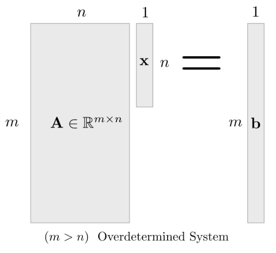

*(원문 p.6)*

Over-determined 시스템은 방정식의 개수가 미지수의 개수보다 많은 경우를 의미한다.
$\mathbf{A}\mathbf{x} = \mathbf{b}$ 의 형태에서
$\mathbf{A} \in \mathbb{R}^{m \times n}, \mathbf{x} \in \mathbb{R}^{n \times 1}, \mathbf{b} \in \mathbb{R}^{m \times 1}$
이라고 했을 때 $m > n$ 인 경우를 의미한다.

$m > n$이면 over-determined(미지수보다 방정식이 많은) 형태이다. 이 경우에도
$\mathbf{A}\mathbf{x} = \mathbf{b}$의 정확한 해는 $\mathbf{b} \in \mathrm{Col}(\mathbf{A})$일 때에만
존재한다. 정확한 해가 없을 때는 보통 잔차(residual)
$\|\mathbf{A}\mathbf{x} - \mathbf{b}\|_2$를 최소화하는 최소제곱(least squares) 문제를 푼다:

$$\min_{\mathbf{x}} \: \|\mathbf{A}\mathbf{x} - \mathbf{b}\|_2^2. \tag{6}$$

또한 $m > n$이라고 해서 항상 $\mathrm{rank}(\mathbf{A}) = n$ (full column rank) 인 것은 아니다.

## 1.5 Under-determined system

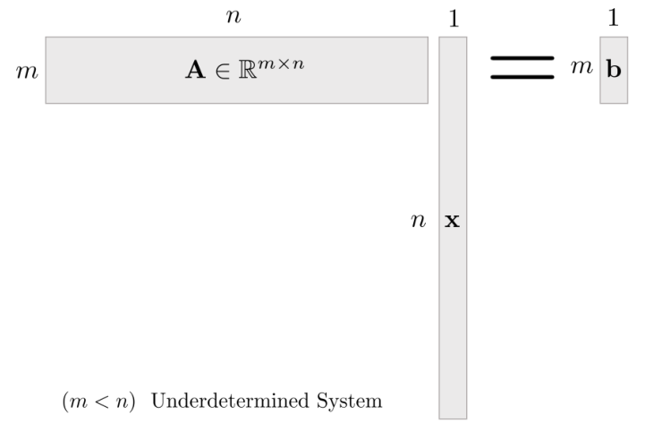

*(원문 p.6)*

Under-determined 시스템의 경우 방정식의 개수보다 미지수의 개수가 많은 경우를 의미한다. 즉,
over-determined 시스템과 반대로 $m < n$ 인 경우를 의미한다.

$m < n$이면 under-determined(미지수보다 방정식이 적은) 형태이다. 이때도 정확한 해의 존재 여부는
$\mathbf{b} \in \mathrm{Col}(\mathbf{A})$ 인지로 결정된다. 만약 해가 존재하고(nullspace가 자명하지
않으면) 일반적으로 해는 유일하지 않으며, 대표적으로 최소 노름 해(minimum-norm solution)를 선택하기도
한다:

$$\min_{\mathbf{x}} \: \|\mathbf{x}\|_2^2 \quad \text{s.t.} \quad \mathbf{A}\mathbf{x} = \mathbf{b}. \tag{7}$$

또한 $m < n$이라고 해서 항상 $\mathrm{rank}(\mathbf{A}) = m$ (full row rank) 인 것은 아니다.

## 1.6 Solving linear system

행렬 $\mathbf{A}$의 역행렬이 존재하는 경우 선형시스템은 역행렬을 사용하여 다음과 같이 풀 수 있다.

$$\begin{aligned} \mathbf{A}\mathbf{x} &= \mathbf{b} \\ \mathbf{A}^{-1}\mathbf{A}\mathbf{x} &= \mathbf{A}^{-1}\mathbf{b} \\ \mathbf{I}\mathbf{x} &= \mathbf{A}^{-1}\mathbf{b} \\ \mathbf{x} &= \mathbf{A}^{-1}\mathbf{b} \end{aligned} \tag{8}$$

그러나, ==행렬 $\mathbf{A}$의 판별식 $\det \mathbf{A} = 0$인 경우 역행렬이 존재하지 않게되고 위와 같이
문제를 풀 수 없다. 이런 경우 선형시스템은 해가 존재하지 않거나 무수히 많은 해가 존재한다.==

<!--widget:linear-system-solutions-->

## 1.7 Linear combination

여러 벡터 $\mathbf{v}_1, \cdots, \mathbf{v}_n \in \mathbb{R}^n$이 있을 때 스칼라 값
$c_1, \cdots, c_n$에 대하여

$$c_1\mathbf{v}_1 + \cdots + c_n\mathbf{v}_n \tag{9}$$

을 벡터 $\mathbf{v}_1, \cdots, \mathbf{v}_n$의 가중치 계수 $c_1, \cdots, c_n$에 대한
==선형결합 (Linear Combination)==이라고 한다. 이 때 가중치 계수 $c_1, \cdots, c_n$는 0을 포함한 실수
값을 가진다.

## 1.8 Span

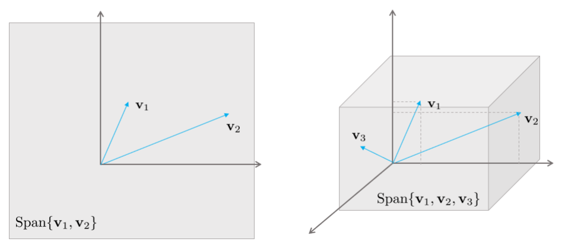

*(원문 p.7)*

주어진 여러 벡터 $\mathbf{v}_1, \cdots, \mathbf{v}_n \in \mathbb{R}^n$에 대해
$\mathrm{Span}\{\mathbf{v}_1, \cdots, \mathbf{v}_n\}$은 모든
$\mathbf{v}_1, \cdots, \mathbf{v}_n$에 대한 선형결합의 집합을 의미한다. 즉,
$\mathrm{Span}\{\mathbf{v}_1, \cdots, \mathbf{v}_n\}$은 다음과 같이 쓸 수 있는 모든 벡터들의 집합이다.

$$c_1\mathbf{v}_1 + \cdots + c_n\mathbf{v}_n \tag{10}$$

이는 또한 $\mathbf{v}_1, \cdots, \mathbf{v}_n$에 의해 span된 $\mathbb{R}^n$ 공간 상의 subset이라고도
불린다.

## 1.9 From matrix equation to vector equation

$\mathbf{A}\mathbf{x} = \mathbf{b}$와 같은 선형 시스템을 다음과 같이 열벡터 $\mathbf{a}_i$를 기준으로
펼쳐보면

$$\begin{bmatrix} \mathbf{a}_1 & \mathbf{a}_2 & \cdots & \mathbf{a}_n \end{bmatrix} \begin{bmatrix} x_1 \\ x_2 \\ \vdots \\ x_n \end{bmatrix} = \mathbf{b} \tag{11}$$

로 나타낼 수 있고 이를 다시 표현하면

$$\mathbf{a}_1x_1 + \mathbf{a}_2x_2 + \cdots + \mathbf{a}_nx_n = \mathbf{b} \tag{12}$$

와 같이 ==열벡터들의 선형결합으로 표현==할 수 있게 된다. 만약 $\mathbf{b}$가
$\mathrm{Span}\{\mathbf{a}_1, \cdots, \mathbf{a}_n\}$에 포함되어 있다면 이들의 선형결합으로 표현할 수
있으므로 해가 존재한다. 따라서 $\mathbf{b} \in \mathrm{Span}\{\mathbf{a}_1, \cdots, \mathbf{a}_n\}$일
때 해가 존재한다.

## 1.10 Several perspectives about matrix multiplication

선형시스템 $\mathbf{A}\mathbf{x} = \mathbf{b}$가 있을 때 이는 곧 $\mathbf{A}$의 열벡터들의 선형결합으로
표현할 수 있다.

$$\mathbf{A}\mathbf{x} = [\mathbf{a}_1, \mathbf{a}_2, \cdots, \mathbf{a}_n] \begin{bmatrix} x_1 \\ x_2 \\ \vdots \\ x_n \end{bmatrix} = \mathbf{a}_1x_1 + \mathbf{a}_2x_2 + \cdots + \mathbf{a}_nx_n = \mathbf{b} \tag{13}$$

만약 선형시스템에 전치행렬을 적용하여
$\mathbf{x}^\intercal\mathbf{A}^\intercal = \mathbf{b}^\intercal$가 되면

$$\begin{bmatrix} x_1 & x_2 & \cdots & x_n \end{bmatrix} \begin{bmatrix} \mathbf{a}_1 \\ \mathbf{a}_2 \\ \vdots \\ \mathbf{a}_n \end{bmatrix} = \mathbf{a}_1x_1 + \mathbf{a}_2x_2 + \cdots + \mathbf{a}_nx_n = \mathbf{b} \tag{14}$$

$\mathbf{b}^\intercal$는 곧 $\mathbf{A}^\intercal$의 행벡터(Row Vector)들의 선형결합으로 표현된다.

또한 두 벡터의 곱 $\mathbf{a}\mathbf{b}^\intercal = \begin{bmatrix} a_1 \\ \vdots \\ a_n \end{bmatrix} \begin{bmatrix} b_1 & \cdots & b_n \end{bmatrix}$
의 경우 ==rank1 outer product==로 볼 수 있다. 즉,
$[\mathbf{a} \ \ \mathbf{c}]\begin{bmatrix} \mathbf{b} \\ \mathbf{d} \end{bmatrix}$ 의 경우
$\mathbf{a}\mathbf{b} + \mathbf{c}\mathbf{d}$ 와 같이 벡터곱을 스칼라 곱과 같이 생각할 수 있다.

## 1.11 Linear independence

벡터 집합 $\mathbf{v}_1, \cdots, \mathbf{v}_n \in \mathbb{R}^n$가 주어졌을 때, 이들 중 부분 벡터들의
집합 $\{\mathbf{v}_1, \mathbf{v}_2, \cdots, \mathbf{v}_{j-1}\}$이 선형결합을 통해 특정 벡터
$\mathbf{v}_j, \: j = 1, \cdots, n$를 표현할 수 있는지 검사한다.

$$\mathbf{v}_j \in \mathrm{Span}\{\mathbf{v}_1, \mathbf{v}_2, \cdots, \mathbf{v}_{j-1}\} \quad \text{for some } j = 1, \cdots, n? \tag{15}$$

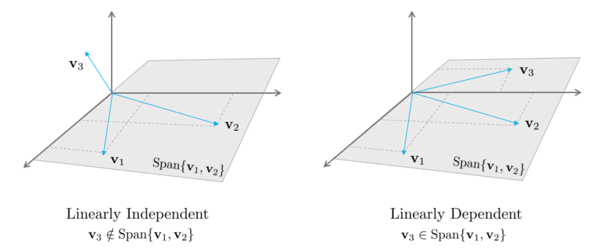

*(원문 p.8)*

만약 $\mathbf{v}_j$가 선형결합으로 표현이 된다면 $\mathbf{v}_1, \cdots, \mathbf{v}_n$는
==선형의존 (Linearly Dependent)==이다. 만약, $\mathbf{v}_j$가 표현되지 않는다면
$\mathbf{v}_1, \cdots, \mathbf{v}_n$는 ==선형독립 (Linearly Independent)==이다.

만약 $x_1\mathbf{v}_1 + x_2\mathbf{v}_2 + \cdots + x_n\mathbf{v}_n = \mathbf{0}$ 같은
동차(homogeneous) 선형방정식이 있다고 하면

$$\mathbf{x} = \begin{bmatrix} x_1 \\ x_2 \\ \vdots \\ x_n \end{bmatrix} = \begin{bmatrix} 0 \\ 0 \\ \vdots \\ 0 \end{bmatrix} \tag{16}$$

과 같은 자명해가 존재한다. 이 때, $\mathbf{v}_1, \cdots, \mathbf{v}_n$이 선형독립이면 자명해 이외에
해는 존재하지 않는다. 하지만, $\mathbf{v}_1, \cdots, \mathbf{v}_n$이 선형의존이면 선형시스템은 자명해
이외에 다른 해가 존재한다.

자명해 이외에 다른 해가 존재하는 선형의존(Linearly Dependent) 경우 대해서 생각해보면 예를 들어
$\mathbf{A}$ 행렬이 다음과 같이 5개의 열을 가진 행렬이라고 했을 때

$$\mathbf{A} = \begin{bmatrix} \mathbf{a}_1 & \mathbf{a}_2 & \mathbf{a}_3 & \mathbf{a}_4 & \mathbf{a}_5 \end{bmatrix} \tag{17}$$

위 ==열벡터(Column Vector)들 중 최소한 두 개 이상의 벡터가 선형결합==되어야 동차방정식
$\mathbf{A}\mathbf{x} = \mathbf{0}$의 해를 만족할 수 있다. 예를 들어 $\mathbf{a}_2x_2$ 성분이 0이 아닌
경우 이를 다시 영벡터로 만들기 위해서는 다른 1,3,4,5 열벡터들의 선형결합이 $-\mathbf{a}_2x_2$의 값을
만들어야 한다. 이는 곧 ==$\mathbf{a}_2x_2$ 값을 다른 열벡터들의 선형결합으로 표현할 수 있다는 말과
동치이므로 선형의존인 경우 어떤 하나의 벡터가 다른 벡터들의 선형결합으로 표현될 수 있음을 의미한다.==
이를 수식으로 표현하면 다음과 같다.

$$\begin{aligned} \mathbf{a}_jx_j &= -\mathbf{a}_1x_1 - \cdots - \mathbf{a}_{j-1}x_{j-1} \\ \mathbf{a}_j &= -\frac{x_1}{x_j}\mathbf{a}_1 - \cdots - \frac{x_{j-1}}{x_j}\mathbf{a}_{j-1} \in \mathrm{Span}\{\mathbf{a}_1, \mathbf{a}_2, \cdots, \mathbf{a}_{j-1}\} \end{aligned} \tag{18}$$

## 1.12 Linear dependence

행렬 $\mathbf{A}$의 열벡터 $\mathbf{a}_1, \mathbf{a}_2, \cdots, \mathbf{a}_n$이
==선형의존(Linearly Dependent)인 경우 해당 열벡터들은 Span의 차원을 늘리지 않는다.== 만약
$\mathbf{A} \in \mathbb{R}^{3\times3}$이고
$\mathbf{a}_3 \in \mathrm{Span}\{\mathbf{a}_1, \mathbf{a}_2\}$인 경우

$$\mathrm{Span}\{\mathbf{a}_1, \mathbf{a}_2\} = \mathrm{Span}\{\mathbf{a}_1, \mathbf{a}_2, \mathbf{a}_3\} \tag{19}$$

만약 $\mathbf{a}_3 = d_1\mathbf{a}_1 + d_2\mathbf{a}_2$와 같이 선형결합으로 표현이 가능한 경우,
$\mathbf{a}_1, \mathbf{a}_2, \mathbf{a}_3$는 다음과 같이 작성할 수 있다.

$$c_1\mathbf{a}_1 + c_2\mathbf{a}_2 + c_3\mathbf{a}_3 = (c_1 + c_3d_1)\mathbf{a}_1 + (c_1 + c_3d_2)\mathbf{a}_2 \tag{20}$$

따라서 $\mathbf{a}_3 \in \mathrm{Span}\{\mathbf{a}_1, \mathbf{a}_2\}$인 경우
$\mathrm{Span}\{\mathbf{a}_1, \mathbf{a}_2, \mathbf{a}_3\} = \mathrm{Span}\{\mathbf{a}_1, \mathbf{a}_2\}$이다

<!--widget:span-independence-->

## 1.13 Vector space and subspace

선형대수에서 ==공간(space)은 보통 벡터들의 집합을 의미하며, 벡터 덧셈과 스칼라곱에 대해 닫혀 있는
구조==를 말한다. 우리가 주로 다루는 예는 $\mathbb{R}^n$ 이며, 이때 벡터는
$\mathbf{x} \in \mathbb{R}^n$ 로 표현한다.

==벡터공간(Vector space)== $\mathcal{V}$ 는 다음이 성립하는 집합이다. 임의의
$\mathbf{u}, \mathbf{v} \in \mathcal{V}$ 와 스칼라 $c \in \mathbb{R}$ 에 대해
$\mathbf{u} + \mathbf{v} \in \mathcal{V}$ 이고 $c\mathbf{u} \in \mathcal{V}$ 이다. 즉, 선형결합
$c_1\mathbf{v}_1 + \cdots + c_k\mathbf{v}_k$ 로 만들어지는 결과가 다시 같은 공간 안에 남는다.

==부분공간(Subspace)== $H \subset \mathbb{R}^n$ 이 부분공간이라는 말은 $H$ 가 $\mathbb{R}^n$ 안에서
벡터공간의 성질을 그대로 만족한다는 의미이다. 실제로 다음 조건이 성립하면 $H$ 는 부분공간이다.

- (영벡터 포함) $\mathbf{0} \in H$
- (덧셈에 대해 닫힘) $\mathbf{u}, \mathbf{v} \in H \Rightarrow \mathbf{u} + \mathbf{v} \in H$
- (스칼라곱에 대해 닫힘) $\mathbf{u} \in H, \: c \in \mathbb{R} \Rightarrow c\mathbf{u} \in H$

예를 들어, 임의의 벡터 집합 $\{\mathbf{a}_1, \ldots, \mathbf{a}_k\}$ 에 대해

$$\mathrm{Span}\{\mathbf{a}_1, \ldots, \mathbf{a}_k\} = \{c_1\mathbf{a}_1 + \cdots + c_k\mathbf{a}_k \mid c_1, \ldots, c_k \in \mathbb{R}\} \tag{21}$$

은 선형결합에 대해 닫혀 있으므로 항상 부분공간이다.

## 1.14 Span and subspace

$\mathbb{R}^n$ 공간의 부분공간(Subspace) H는 ==$\mathbb{R}^n$의 부분집합들의 선형결합에 대해 닫혀 있는
공간을 의미한다.== 즉, 두 벡터 $\mathbf{u}_1, \mathbf{u}_2 \in H$일 때, 어떠한 스칼라 값 $c, d$에
대하여 $c\mathbf{u}_1 + d\mathbf{u}_2 \in H$일 때 H를 부분공간이라고 한다.

$\mathrm{Span}\{\mathbf{a}_1, \cdots, \mathbf{a}_n\}$으로 형성된 공간은 항상 부분공간이다. 만약
$\mathbf{u}_1 = x_1\mathbf{a}_1 + \cdots + x_n\mathbf{a}_n$이고
$\mathbf{u}_2 = y_1\mathbf{a}_1 + \cdots + y_n\mathbf{a}_n$일 때

$$\begin{aligned} c\mathbf{u}_1 + d\mathbf{u}_2 &= c(x_1\mathbf{a}_1 + \cdots + x_n\mathbf{a}_n) + d(y_1\mathbf{a}_1 + \cdots + x_n\mathbf{a}_n) \\ &= (cx_1 + dy_1)\mathbf{a}_1 + \cdots + (cx_n + dy_n)\mathbf{a}_n \end{aligned} \tag{22}$$

과 같이 선형결합으로 나타낼 수 있고 이는 임의의 값 $c, d$에 대해서 닫혀 있음을 의미한다. 따라서
부분공간은 항상 $\mathrm{Span}\{\mathbf{a}_1, \cdots, \mathbf{a}_n\}$으로 표현된다.

## 1.15 Basis of a subspace

부분공간 H의 ==기저(basis)==는 다음을 만족하는 벡터들의 집합을 의미한다.

1. 부분공간 H를 모두 Span할 수 있어야 한다.
2. 벡터들 간 선형독립이어야 한다.

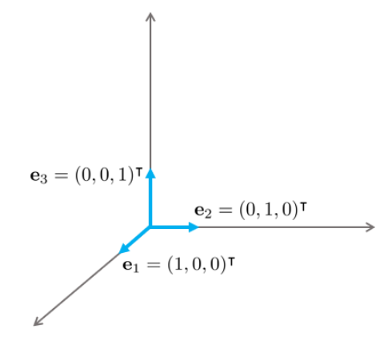

*(원문 p.10)*

3차원 공간 $\mathbb{R}^3$ 의 경우 기저벡터는 3개가 존재하고
$\mathbf{e}_1 = [1 \ 0 \ 0]^\intercal, \mathbf{e}_2 = [0 \ 1 \ 0]^\intercal, \mathbf{e}_3 = [0 \ 0 \ 1]^\intercal$일
때, 이를 ==표준기저벡터(Standard Basis Vector)라고 한다.==

## 1.16 Dimension of subspace

하나의 부분공간 H를 표현할 수 있는 기저는 유일하지 않다. 하지만 여러개의 기저를 통해서 표현할 수 있는
부분공간의 차원(Dimension)은 유일하다. ==부분공간의 차원은 기저벡터의 개수와 동일하다.==

## 1.17 Column space of matrix

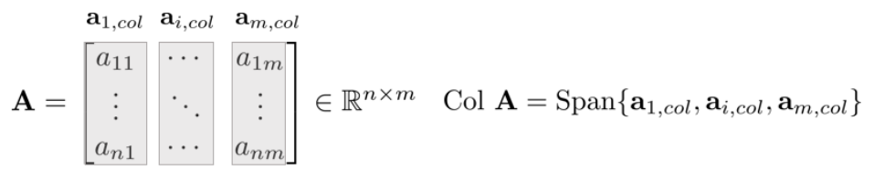

*(원문 p.11)*

행렬 $\mathbf{A}$의 열공간(Column Space)이란 $\mathbf{A}$의 열벡터로 인해 Span된 부분공간을 의미한다.
일반적으로 $\mathrm{Col} \: \mathbf{A}$라고 표기한다.

$$\mathrm{Col}\mathbf{A} = \mathrm{Span}\left\{ \begin{bmatrix} 1 \\ 1 \\ 0 \end{bmatrix}, \begin{bmatrix} 1 \\ 0 \\ 1 \end{bmatrix} \right\} \tag{23}$$

## 1.18 Four fundamental subspaces of a matrix

행렬 $\mathbf{A} \in \mathbb{R}^{m \times n}$ 은 $\mathbb{R}^n$ 의 벡터를 $\mathbb{R}^m$ 의 벡터로
보내는 선형변환으로 볼 수 있다:

$$\mathbf{A} : \: \mathbb{R}^n \to \mathbb{R}^m, \qquad \mathbf{x} \mapsto \mathbf{A}\mathbf{x}. \tag{24}$$

이때 $\mathbf{A}$ 는 네 가지 기본 부분공간(four fundamental subspaces)을 만든다.

==(1) Column space==

$$\mathrm{Col}(\mathbf{A}) = \{\mathbf{A}\mathbf{x} \mid \mathbf{x} \in \mathbb{R}^n\} = \mathrm{Span}\{\mathbf{a}_1, \ldots, \mathbf{a}_n\} \subset \mathbb{R}^m, \tag{25}$$

여기서 $\mathbf{a}_j$ 는 $\mathbf{A}$ 의 $j$번째 열벡터이다. 즉, $\mathrm{Col}(\mathbf{A})$ 는
$\mathbf{A}$ 가 만들어낼 수 있는 모든 출력의 공간이다.

==(2) Nullspace==

$$\mathrm{Nul}(\mathbf{A}) = \{\mathbf{x} \in \mathbb{R}^n \mid \mathbf{A}\mathbf{x} = \mathbf{0}\} \subset \mathbb{R}^n. \tag{26}$$

즉, $\mathbf{A}$ 에 의해 0으로 사라지는 입력 방향들의 공간이다.

==(3) Row space== 행공간은 $\mathbf{A}$ 의 행벡터들이 span하는 공간이며 전치행렬의 열공간으로 동일하게
볼 수 있다:

$$\mathrm{Row}(\mathbf{A}) = \mathrm{Col}(\mathbf{A}^\top) \subset \mathbb{R}^n. \tag{27}$$

==(4) Left nullspace==

$$\mathrm{Nul}(\mathbf{A}^\top) = \{\mathbf{y} \in \mathbb{R}^m \mid \mathbf{A}^\top\mathbf{y} = \mathbf{0}\} \subset \mathbb{R}^m. \tag{28}$$

이를 left nullspace라 부르며, $\mathbb{R}^m$ 에서 $\mathbf{A}$ 의 열공간과 직교 관계를 갖는다.

## 1.19 Rank of matrix

행렬 $\mathbf{A}$의 rank란 $\mathbf{A}$의 열벡터들의 차원을 의미한다.

$$\mathrm{rank}\mathbf{A} = \dim \mathrm{Col}\mathbf{A} \tag{29}$$

## 1.20 Dimensions, orthogonality, and solvability

$\mathbf{A} \in \mathbb{R}^{m \times n}$ 의 랭크를 $r = \mathrm{rank}(\mathbf{A})$ 라 하면, 네 가지
기본 부분공간의 차원은 다음과 같이 정리된다.

$$\dim \mathrm{Col}(\mathbf{A}) = r, \qquad \dim \mathrm{Row}(\mathbf{A}) = r, \tag{30}$$

$$\dim \mathrm{Nul}(\mathbf{A}) = n - r, \qquad \dim \mathrm{Nul}(\mathbf{A}^\top) = m - r. \tag{31}$$

특히

$$\mathrm{rank}(\mathbf{A}) + \dim \mathrm{Nul}(\mathbf{A}) = n \tag{32}$$

은 ==rank–nullity 관계로 입력공간 $\mathbb{R}^n$ 의 자유도가 관측 가능한 성분(rank)과 사라지는
성분(nullity)으로 분해됨==을 의미한다.

또한 다음 직교(orthogonality) 관계가 성립한다.

$$\mathrm{Row}(\mathbf{A}) \perp \mathrm{Nul}(\mathbf{A}), \qquad \mathrm{Col}(\mathbf{A}) \perp \mathrm{Nul}(\mathbf{A}^\top). \tag{33}$$

예를 들어 $\mathbf{A}\mathbf{x} = \mathbf{0}$ 는 각 행벡터 $\mathbf{r}_i^\top$ 에 대해
$\mathbf{r}_i^\top\mathbf{x} = 0$ 임을 의미하므로, $\mathbf{x}$ 는 모든 행벡터(및 그 선형결합) 와
직교한다. 따라서 $\mathrm{Nul}(\mathbf{A})$ 는 $\mathrm{Row}(\mathbf{A})$ 의 직교여공간(orthogonal
complement)이다.

==해 존재 조건(Solvability)==는 column space로 간단히 표현된다.

$$\mathbf{A}\mathbf{x} = \mathbf{b} \text{ 가 해를 가지는 조건} \iff \mathbf{b} \in \mathrm{Col}(\mathbf{A}). \tag{34}$$

즉, $\mathbf{b}$ 가 $\mathbf{A}$ 의 열벡터들의 선형결합으로 표현될 수 있을 때에만 선형시스템이 풀린다.
만약 $\mathbf{b} \notin \mathrm{Col}(\mathbf{A})$ 이면 정확한 해는 존재하지 않으며, 이때는 보통 잔차
$\|\mathbf{A}\mathbf{x} - \mathbf{b}\|_2$ 를 최소화하는 최소제곱 문제로 넘어간다:

$$\min_{\mathbf{x}} \: \|\mathbf{A}\mathbf{x} - \mathbf{b}\|_2^2. \tag{35}$$

이 관점은 이후 projection(투영)과 least squares를 연결하는 핵심 해석을 제공한다.

<!--widget:four-subspaces-->

## 1.21 Transformation

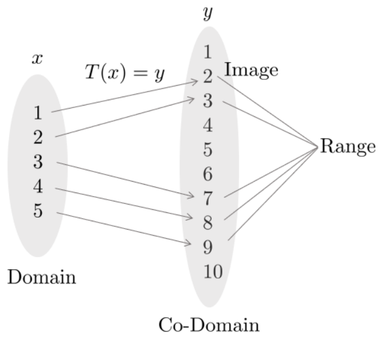

*(원문 p.13)*

변환(Transformation), 함수(Function), 매핑(Mapping) $T$ 은 입력 $x$를 출력 $y$로 매핑해주는 것을
의미한다.

$$T : x \mapsto y \tag{36}$$

이 때 입력 $x$에 의해 매핑되는 출력 $y$는 유일하게 결정된다. ==Domain==(정의역)이란 입력 $x$ 의 모든
가능한 집합을 의미한다. ==Co-Domain==(공역)이란 출력 $y$의 모든 가능한 집합을 의미한다. ==Image==란
주어진 입력 $x$ 에 대해 매핑된 출력 $y$를 의미한다. ==Range==(치역)란 Domain내에 있는 입력 $x$들에 의해
매핑된 모든 출력 $y$ 의 집합을 의미한다.

## 1.22 Linear transformation

변환 T는 다음과 같은 경우에 선형변환(Linear Transformation)이라고 한다.

$$\begin{gathered} T(c\mathbf{u} + d\mathbf{v}) = cT(\mathbf{u}) + dT(\mathbf{v}) \\ \text{for all } \mathbf{u}, \mathbf{v} \: \text{ in the domain of T and for all scalars c and d.} \end{gathered} \tag{37}$$

## 1.23 Transformations between vectors

$T : \mathbf{x} \in \mathbb{R}^n \mapsto \mathbf{y} \in \mathbb{R}^m$은 n차원의 벡터를 m차원의 벡터로
매핑하는 연산을 의미한다. 예를 들면

$$\begin{gathered} T : \mathbf{x} \in \mathbb{R}^3 \mapsto \mathbf{y} \in \mathbb{R}^2 \\ \mathbf{x} = \begin{bmatrix} 1 \\ 2 \\ 3 \end{bmatrix} \in \mathbb{R}^3 \mapsto \mathbf{y} = T(\mathbf{x}) = \begin{bmatrix} 4 \\ 5 \end{bmatrix} \in \mathbb{R}^2 \end{gathered} \tag{38}$$

## 1.24 Matrix of linear transformation

변환 $T : \mathbb{R}^n \mapsto \mathbb{R}^m$을 선형변환이라고 가정하면 $T$는 항상 행렬과 벡터의 곱으로
표현할 수 있다. 즉,

$$T(\mathbf{x}) = \mathbf{A}\mathbf{x} \: \text{ for all } \mathbf{x} \in \mathbb{R}^n \tag{39}$$

행렬 $\mathbf{A} \in \mathbb{R}^{m \times n}$인 경우 $\mathbf{A}$의 j번째 열 $\mathbf{a}_j$는 벡터
$T(\mathbf{e}_j)$와 같다. 이 때 $\mathbf{e}_j$는 항등행렬 $\mathbf{I} \in \mathbb{R}^{n \times n}$의
j번째 열벡터이다.

$$\mathbf{A} = \begin{bmatrix} T(\mathbf{e}_1) & \cdots & T(\mathbf{e}_n) \end{bmatrix} \tag{40}$$

이러한 행렬 $\mathbf{A}$를 선형변환 T의 표준행렬(Standard Matrix)이라고 부른다.

## 1.25 Onto and one-to-one

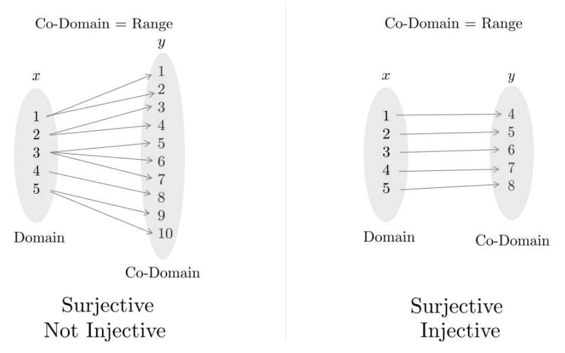

*(원문 p.14)*

Onto는 ==전사함수(Surjective)라고도 불리며 공역이 치역과 같은 경우를 의미한다.== 이는 Co-Domain의 모든
원소들이 사영된 것을 의미한다.

$$\text{Surjective: Co-Domain} = \text{Range} \tag{41}$$

One-To-One은 ==일대일함수(Injective)라고도 불리며 정의역의 원소와 공역의 원소가 하나씩 대응되는 함수를
의미한다.==

# 2 Least squares

최소제곱법(Least Square)는 ==방정식의 개수가 미지수의 개수보다 많은 Over-determined 선형시스템에서
사용하는 방법 중 하나이다.== Over-determined 선형시스템 $\mathbf{A}\mathbf{x} = \mathbf{b}$의 경우
일반적으로 해가 존재하지 않는다. 이런 경우 일반적으로 $\|\mathbf{A}\mathbf{x} - \mathbf{b}\|^2$가
최소가 되는 근사해를 구할 수 있다.

## 2.1 Inner product

벡터 $\mathbf{u}, \mathbf{v} \in \mathbb{R}^n$에 대해 이를 각각 $n \times 1$의 행렬로 생각할 수 있다.
그렇다면 $\mathbf{u}^\intercal$는 $1 \times n$의 행렬로 볼 수 있고 행렬곱
$\mathbf{u}^\intercal\mathbf{v}$는 $1 \times 1$의 행렬이 된다. 그리고 $1 \times 1$ 행렬은 스칼라값으로
표시할 수 있다.

이 때, $\mathbf{u}^\intercal\mathbf{v}$에 의해 계산된 값을 $\mathbf{u}, \mathbf{v}$의 내적(Inner
Product, Dot Product)라고 한다. 이는 $\mathbf{u} \cdot \mathbf{v}$로 표기할 수 있다.

## 2.2 Properties of inner product

벡터 $\mathbf{u}, \mathbf{v}, \mathbf{w} \in \mathbb{R}^n$이고 $c$를 스칼라 값이라고 할 때 내적은
다음과 같은 성질을 만족한다.

1. $\mathbf{u} \cdot \mathbf{v} = \mathbf{v} \cdot \mathbf{u}$
2. $(\mathbf{u} + \mathbf{v}) \cdot \mathbf{w} = \mathbf{u} \cdot \mathbf{w} + \mathbf{v} \cdot \mathbf{w}$
3. $(c\mathbf{u}) \cdot \mathbf{v} = c(\mathbf{u} \cdot \mathbf{v}) = \mathbf{u} \cdot (c\mathbf{v})$
4. $\mathbf{u} \cdot \mathbf{u} \geq 0$ and $\mathbf{u} \cdot \mathbf{u} = 0$ iff $\mathbf{u} = \mathbf{0}$

위에서 2,3번 성질을 조합하면 다음과 같은 법칙을 만들 수 있다.

$$(c_1\mathbf{u}_1 + \cdots + c_n\mathbf{u}_n) \cdot \mathbf{w} = c_1(\mathbf{u}_1 \cdot \mathbf{w}) + \cdots + c_n(\mathbf{u}_n \cdot \mathbf{w}) \tag{42}$$

위를 통해 ==내적이라는 연산은 선형변환이라는 것을 알 수 있다.==

## 2.3 Vector norm

벡터 $\mathbf{v} \in \mathbb{R}^n$에 대해 벡터의 놈(Norm)은 0이 아닌
$\|\mathbf{v}\| = \sqrt{\mathbf{v} \cdot \mathbf{v}}$로 표기하며 벡터의 길이를 의미한다.

$$\|\mathbf{v}\| = \sqrt{\mathbf{v} \cdot \mathbf{v}} = \sqrt{v_1^2 + v_2^2 + \cdots + v_n^2} \tag{43}$$

2차원 벡터 $\mathbf{v} \in \mathbb{R}^2$가 있을 때 $\mathbf{v} = \begin{bmatrix} a \\ b \end{bmatrix}$라고
하면 $\|v\|$는 원점으로부터 $\mathbf{v}$ 좌표까지의 거리가 된다.

$$\|\mathbf{v}\| = \sqrt{a^2 + b^2} \tag{44}$$

모든 스칼라 값 $c$에 대해 $c\mathbf{v}$의 길이는 $\mathbf{v}$의 길이를 $|c|$ 배 한 것을 의미한다.

$$\|c\mathbf{v}\| = |c| \, \|\mathbf{v}\| \tag{45}$$

## 2.4 Unit vector

길이가 1인 벡터를 단위벡터(Unit Vector)라고 한다. 벡터의 길이를 1로 맞추는 작업을
정규화(Normalization)라고 하는데 주어진 벡터 $\mathbf{v}$가 있을 때 단위벡터
$\mathbf{u} = \frac{1}{\|\mathbf{v}\|}\mathbf{v}$가 된다. $\mathbf{u}$ 벡터는 $\mathbf{v}$ 벡터와
방향은 같지만 크기가 1인 벡터이다.

## 2.5 Distance between vectors in $\mathbb{R}^n$

두 벡터 $\mathbf{u}, \mathbf{v} \in \mathbb{R}^n$이 있을 때 두 벡터의 거리는
$\mathrm{dist}(\mathbf{u}, \mathbf{v})$로 나타내며 이는 $\mathbf{u} - \mathbf{v}$ 벡터의 길이를
의미한다.

$$dist(\mathbf{u}, \mathbf{v}) = \|\mathbf{u} - \mathbf{v}\| \tag{46}$$

## 2.6 Inner product and angle between vectors

두 벡터 $\mathbf{u}, \mathbf{v}$의 내적은 다음과 같이 놈과 각도를 통해 표현할 수 있다.

$$\mathbf{u} \cdot \mathbf{v} = \|\mathbf{u}\| \|\mathbf{v}\| \cos\theta \tag{47}$$

## 2.7 Orthogonal vectors

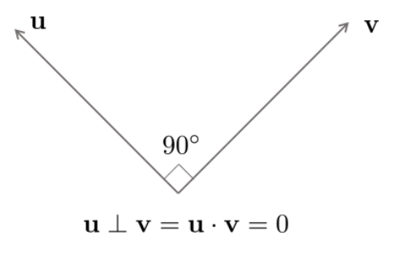

*(원문 p.16)*

두 벡터 $\mathbf{u}, \mathbf{v} \in \mathbb{R}^n$가 있을 때 둘이 수직이려면 두 벡터의 내적이 0이어야
한다.

$$\mathbf{u} \cdot \mathbf{v} = \|\mathbf{u}\| \|\mathbf{v}\| \cos\theta = 0 \tag{48}$$

0이 아닌 두 벡터 $\mathbf{u}, \mathbf{v}$의 내적이 0이려면 $\cos\theta$ 값이 0이어야 하고
$\theta = 90°$ 일 때 $\cos\theta$ 값은 0이 된다.

## 2.8 Least square problem

$\mathbf{A} \in \mathbb{R}^{m \times n}, \mathbf{b} \in \mathbb{R}^n, m \ll n$과 같이 주어진
Over-Determined 시스템 $\mathbf{A}\mathbf{x} = \mathbf{b}$가 있을 때 에러의 제곱합
$\|\mathbf{b} - \mathbf{A}\mathbf{x}\|$을 최소화하는 최적의 모델 파라미터를 찾는 것이 목적이 된다. 이 때
최소제곱법의 근사해 $\hat{\mathbf{x}}$는 다음과 같다.

$$\hat{\mathbf{x}} = \arg\min_{\mathbf{x}} \|\mathbf{b} - \mathbf{A}\mathbf{x}\| \tag{49}$$

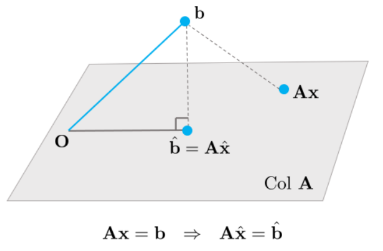

*(원문 p.16)*

최소제곱법의 중요한 포인트 중 하나는 어떤 $\mathbf{x}$ 파라미터를 선정하던지 벡터
$\mathbf{A}\mathbf{x}$는 반드시 $\mathrm{Col} \: \mathbf{A}$ 안에 위치한다는 것이다. 따라서
==최소제곱법은 $\mathrm{Col} \: \mathbf{A}$와 $\mathbf{b}$의 거리가 최소가 되는 $\mathbf{x}$를 찾는
문제가 된다.==

$\hat{\mathbf{b}} = \mathbf{A}\hat{\mathbf{x}}$를 만족하는 근사해 $\hat{\mathbf{x}}$는
$\mathrm{Col} \: \mathbf{A}$에서 $\mathbf{b}$ 벡터와 가장 가까운 모든 포인트들의 집합을 의미한다.
따라서 $\hat{\mathbf{b}}$는 다른 어떤 $\mathbf{A}\mathbf{x}$보다도 $\mathbf{b}$와 가장 가깝게 된다.
기하학적으로 이를 만족하기 위해서는 벡터 $\mathbf{b} - \mathbf{A}\hat{\mathbf{x}}$가
$\mathrm{Col} \: \mathbf{A}$와 수직이어야 한다.

$$\mathbf{b} - \mathbf{A}\hat{\mathbf{x}} \perp (x_1\mathbf{a}_1 + x_2\mathbf{a}_2 + \cdots + x_n\mathbf{a}_n) \: \text{ for any vector } \mathbf{x}. \tag{50}$$

이는 곧 다음과 동일하다.

$$\begin{aligned} (\mathbf{b} - \mathbf{A}\hat{\mathbf{x}}) &\perp \mathbf{a}_1 \to \mathbf{a}_1^\intercal(\mathbf{b} - \mathbf{A}\hat{\mathbf{x}}) \\ (\mathbf{b} - \mathbf{A}\hat{\mathbf{x}}) &\perp \mathbf{a}_2 \to \mathbf{a}_2^\intercal(\mathbf{b} - \mathbf{A}\hat{\mathbf{x}}) \\ (\mathbf{b} - \mathbf{A}\hat{\mathbf{x}}) &\perp \mathbf{a}_3 \to \mathbf{a}_3^\intercal(\mathbf{b} - \mathbf{A}\hat{\mathbf{x}}) \\ \therefore \: \mathbf{A}^\intercal(\mathbf{b} &- \mathbf{A}\hat{\mathbf{x}}) = 0 \end{aligned} \tag{51}$$

## 2.9 Normal equation

$\mathbf{A}\mathbf{x} \simeq \mathbf{b}$를 만족하는 최소제곱법의 근사해는 다음과 같다.

$$\mathbf{A}^\intercal\mathbf{A}\hat{\mathbf{x}} = \mathbf{A}^\intercal\mathbf{b} \tag{52}$$

위 식을 ==정규방정식(Normal Equation)==이라고 부른다. 이는
$\mathbf{C} = \mathbf{A}^\intercal\mathbf{A} \in \mathbb{R}^{n \times n}, \mathbf{d} = \mathbf{A}^\intercal\mathbf{b} \in \mathbb{R}^n$일
때 $\mathbf{C}\mathbf{x} = \mathbf{d}$와 같은 선형시스템으로 생각할 수 있다. 이 선형시스템의 해를
구하면 다음과 같다.

$$\hat{\mathbf{x}} = (\mathbf{A}^\intercal\mathbf{A})^{-1}\mathbf{A}^\intercal\mathbf{b} \tag{53}$$

## 2.10 Another derivation of normal equation

근사해 $\hat{\mathbf{x}} = \arg\min_{\mathbf{x}} \|\mathbf{b} - \mathbf{A}\mathbf{x}\| = \arg\min_{\mathbf{x}} \|\mathbf{b} - \mathbf{A}\mathbf{x}\|^2$와
같이 제곱을 최소화하는 문제로 표현해도 동일한 문제가 된다.

$$\arg\min_{\mathbf{x}} (\mathbf{b} - \mathbf{A}\mathbf{x})^\intercal(\mathbf{b} - \mathbf{A}\mathbf{x}) = \mathbf{b}^\intercal\mathbf{b} - \mathbf{x}^\intercal\mathbf{A}^\intercal\mathbf{b} - \mathbf{b}^\intercal\mathbf{A}\mathbf{x} + \mathbf{x}^\intercal\mathbf{A}^\intercal\mathbf{A}\mathbf{x} \tag{54}$$

위 식을 $\mathbf{x}$에 대해서 미분하고 정리하면 다음과 같다.

$$-\mathbf{A}^\intercal\mathbf{b} - \mathbf{A}^\intercal\mathbf{b} + 2\mathbf{A}^\intercal\mathbf{A}\mathbf{x} = 0 \Leftrightarrow \mathbf{A}^\intercal\mathbf{A}\mathbf{x} = \mathbf{A}^\intercal\mathbf{b} \tag{55}$$

이 때 $\mathbf{A}^\intercal\mathbf{A}$가 역행렬이 존재한다면 다음과 같이 해를 구할 수 있다.

$$\mathbf{x} = (\mathbf{A}^\intercal\mathbf{A})^{-1}\mathbf{A}^\intercal\mathbf{b} \tag{56}$$

## 2.11 What if C = A⊺A is NOT invertible?

행렬 $\mathbf{C} = \mathbf{A}^\intercal\mathbf{A}$의 역행렬이 존재하지 않는 경우 시스템은 해가 없거나
무수히 많은 해를 가지고 있다. 하지만 정규방정식은 항상 해를 가지고 있으므로 해가 없는 상황은 존재하지
않고 실제로는 무수히 많은 해를 가지고 있다. $\mathbf{C}$가 역행렬을 구할 수 없는 경우는 오직
$\mathrm{Col} \: \mathbf{A}$가 선형의존일 경우에 발생한다. 하지만, ==일반적으로 $\mathbf{C}$는
대부분의 경우 역행렬이 존재한다.==

## 2.12 Orthogonal projection perspective

행렬 $\mathbf{C} = \mathbf{A}^\intercal\mathbf{A}$가 있을 때 $\mathbf{b}$ 점에서
$\mathrm{Col} \: \mathbf{A}$ 공간으로 프로젝션하면 다음과 같다.

$$\hat{\mathbf{b}} = \mathbf{A}\hat{\mathbf{x}} = \mathbf{A}(\mathbf{A}^\intercal\mathbf{A})^{-1}\mathbf{A}^\intercal\mathbf{b} \tag{57}$$

## 2.13 Projection matrix P

위 식에서 $\mathbf{A}\hat{\mathbf{x}} = \mathbf{A}(\mathbf{A}^\intercal\mathbf{A})^{-1}\mathbf{A}^\intercal$을
일반적으로 over-determined 시스템의 ==프로젝션 행렬(projection matrix) $\mathbf{P}$==라고 한다.

$$\mathbf{P} = \mathbf{A}(\mathbf{A}^\intercal\mathbf{A})^{-1}\mathbf{A}^\intercal \tag{58}$$

프로젝션 행렬 $\mathbf{P}$는 주어진 벡터 $\mathbf{b} \in \mathbb{R}^m$를 $\mathbf{A}$의
열공간(column space)에 프로젝션하여, 그 공간 내에서 $\mathbf{b}$에 가장 가까운 점
$\hat{\mathbf{b}}$로 변환해주는 역할을 한다. 이를 통해 원래 방정식
$\mathbf{A}\mathbf{x} = \mathbf{b}$를 정확히 만족하지 못하는 경우에도, $\mathbf{b}$를 가능한 한 잘
근사할 수 있다.

$$\mathbf{P}\mathbf{b} = \hat{\mathbf{b}}, \quad \hat{\mathbf{b}} \in \mathrm{Col}(\mathbf{A}) \tag{59}$$

==Properties of P==

1. ==대칭 행렬:== $\mathbf{P} = \mathbf{P}^\intercal$, 전치해도 동일하여 내적이 보존됨을 의미
2. ==멱등 행렬:== $\mathbf{P}^2 = \mathbf{P}$, 한 번 사영된 벡터는 재사영해도 변하지 않음
3. ==랭크 결핍:== $\mathrm{rank}(\mathbf{P}) = \mathrm{rank}(\mathbf{A}) < m$, 이는 $\mathbb{R}^m$의 일부인 열공간으로 축소됨을 뜻함
4. ==트레이스 = 랭크:== $\mathrm{tr}(\mathbf{P}) = \mathrm{rank}(\mathbf{P})$, 사영 차원(열공간의 차원)과 일치

### 2.13.1 Projection matrix for under-determined system

under-determined 시스템($m < n$)에서는 방정식 $\mathbf{A}\mathbf{x} = \mathbf{b}$의 해가 무수히 많다.
이 중에서 least-norm 해를 구하기 위해 Moore-Penrose 의사역행렬을 다음과 같이 정의한다.

$$\mathbf{A}^\dagger = \mathbf{A}^\intercal(\mathbf{A}\mathbf{A}^\intercal)^{-1}. \tag{60}$$

의사역행렬 $\mathbf{A}^\dagger$는 $n \times m$ 크기를 가지며, least-norm 해는

$$\hat{\mathbf{x}} = \mathbf{A}^\dagger\mathbf{b}$$

로 계산된다. 또한 $\mathbf{A}^\dagger\mathbf{A}$는 $\mathbf{x} \in \mathbb{R}^n$를 $\mathbf{A}$의
행공간(Row space)으로 투영하는 역할을 한다.

$$\mathbf{P}_u = \mathbf{A}^\dagger\mathbf{A} = \mathbf{A}^\intercal(\mathbf{A}\mathbf{A}^\intercal)^{-1}\mathbf{A}. \tag{61}$$

==Properties of Pu==

1. ==대칭 행렬:== $\mathbf{P}_u = \mathbf{P}_u^\intercal$
2. ==멱등 행렬:== $\mathbf{P}_u^2 = \mathbf{P}_u$
3. ==랭크 결핍:== $\mathrm{rank}(\mathbf{P}_u) = \mathrm{rank}(\mathbf{A}) < n$, 자유도(nullspace)를 제거하고 행공간으로 제한
4. ==트레이스 = 랭크:== $\mathrm{tr}(\mathbf{P}_u) = \mathrm{rank}(\mathbf{P}_u)$, 투영 차원(행공간의 차원)과 동치

### 2.13.2 Projection matrix and nullspace

==Over-determined system($m > n$):==

- ==Range:== $\mathrm{range}(\mathbf{P}) = \mathrm{Col}(\mathbf{A})$, 사영 결과는 열공간에 속함
- ==Null:== $\mathrm{null}(\mathbf{P}) = \mathrm{Nul}(\mathbf{A}^\intercal) = (\mathrm{Col}(\mathbf{A}))^\perp$, 이 벡터들은 사영 시 0이 됨
- ==상보 프로젝션:== $\mathbf{I} - \mathbf{P}$는 $\mathrm{Nul}(\mathbf{A}^\intercal)$로 투영

전체 공간의 직교 분해는 다음과 같다

$$\mathbb{R}^m = \mathrm{Col}(\mathbf{A}) \oplus \mathrm{Nul}(\mathbf{A}^\intercal). \tag{62}$$

- $\mathbb{R}^m$을 두 개의 서로 직교하는 부분공간(열공간과 $\mathbf{A}^\intercal$의 영공간)의 합으로 완전히 나눌 수 있다는 뜻

==Under-determined system($m < n$):==

- ==Range:== $\mathrm{range}(\mathbf{P}_u) = \mathrm{Row}(\mathbf{A}) = \mathrm{Col}(\mathbf{A}^\intercal)$
- ==Null:== $\mathrm{null}(\mathbf{P}_u) = \mathrm{Nul}(\mathbf{A}) = (\mathrm{Row}(\mathbf{A}))^\perp$
- ==상보 프로젝션:== $\mathbf{I} - \mathbf{P}_u$는 $\mathrm{Nul}(\mathbf{A})$로 투영

전체 공간의 직교 분해는 다음과 같다

$$\mathbb{R}^n = \mathrm{Row}(\mathbf{A}) \oplus \mathrm{Nul}(\mathbf{A}). \tag{63}$$

- $\mathbb{R}^n$을 두 개의 서로 직교하는 부분공간(행공간과 $\mathbf{A}$의 영공간)의 합으로 완전히 나눌 수 있다는 뜻

<!--widget:least-squares-normal-eq-->

## 2.14 Orthogonal and orthonormal sets

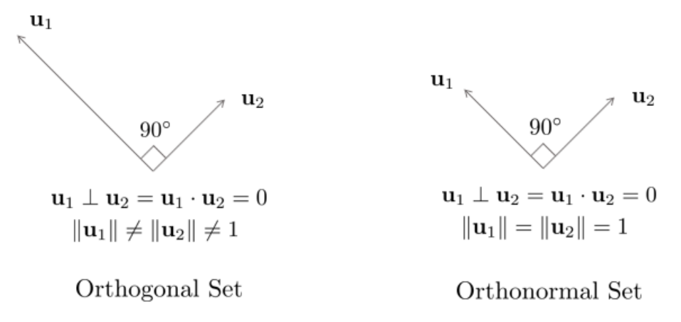

*(원문 p.19)*

벡터들의 집합 $\mathbf{u}_1, \cdots, \mathbf{u}_n \in \mathbb{R}^n$가 있을 때 모든 벡터 쌍들이
$\mathbf{u}_i \cdot \mathbf{u}_j = 0, \: i \neq j$를 만족하면 해당 집합은 ==직교(Orthogonal)==하다고
말한다.

벡터들의 집합 $\mathbf{u}_1, \cdots, \mathbf{u}_n \in \mathbb{R}^n$가 있을 때 모든 직교 집합들이
단위벡터인 경우 ==정규직교(Orthonormal)==하다고 말한다.

직교벡터와 정규직교벡터의 집합은 ==항상 선형독립이다.==

## 2.15 Orthogonal and orthonormal basis

기저벡터 $\mathbf{u}_1, \cdots, \mathbf{u}_n$이 p차원의 부분공간 $W \in \mathbb{R}^n$에 있다고 할때
Gram-Schmidt 프로세스와 QR decomposition을 사용하면 직교기저벡터를 만들 수 있다. 부분공간 $W$에 대해
직교기저 벡터 $\mathbf{u}_1, \cdots \mathbf{u}_n$이 주어져 있다고 했을 때
$\mathbf{y} \in \mathbb{R}^n$을 부분공간 $W$ 위로 프로젝션시킨다.

## 2.16 Orthogonal projection ŷ of y onto line

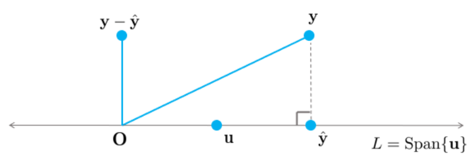

*(원문 p.20)*

1차원 부분공간 $L = \mathrm{Span}\{\mathbf{u}\}$ 위로 $\mathbf{y}$를 프로젝션하여 $\hat{\mathbf{y}}$를
구하면 다음과 같다.

$$\hat{\mathbf{y}} = \mathrm{proj}_L\mathbf{y} = \frac{\mathbf{y} \cdot \mathbf{u}}{\mathbf{u} \cdot \mathbf{u}}\mathbf{u} \tag{64}$$

가 된다. 만약 $\mathbf{u}$가 단위벡터이면 다음과 같다.

$$\hat{\mathbf{y}} = \mathrm{proj}_L\mathbf{y} = (\mathbf{y} \cdot \mathbf{u})\mathbf{u} \tag{65}$$

## 2.17 Orthogonal projection ŷ of y onto plane

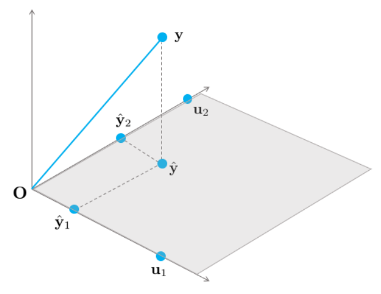

*(원문 p.20)*

2차원 부분공간 $W = \mathrm{Span}\{\mathbf{u}_1, \mathbf{u}_2\}$ 위로 $\mathbf{y}$를 프로젝션하여
$\hat{\mathbf{y}}$를 구하면 다음과 같다.

$$\hat{\mathbf{y}} = \mathrm{proj}_L\mathbf{y} = \frac{\mathbf{y} \cdot \mathbf{u}_1}{\mathbf{u}_1\mathbf{u}_1}\mathbf{u}_1 + \frac{\mathbf{y} \cdot \mathbf{u}_2}{\mathbf{u}_2\mathbf{u}_2}\mathbf{u}_2 \tag{66}$$

만약 $\mathbf{u}_1, \mathbf{u}_2$가 단위벡터이면 다음과 같다.

$$\hat{\mathbf{y}} = \mathrm{proj}_L\mathbf{y} = (\mathbf{y} \cdot \mathbf{u}_1)\mathbf{u}_1 + (\mathbf{y} \cdot \mathbf{u}_2)\mathbf{u}_2 \tag{67}$$

프로젝션은 각각 직교기저벡터에 독립적으로 적용된다.

## 2.18 Orthogonal projection when y ∈ W

만약 2차원 부분공간 $W = \mathrm{Span}\{\mathbf{u}_1, \mathbf{u}_2\}$에 $\mathbf{y}$가 포함되어 있다고
하면 프로젝션된 벡터 $\hat{\mathbf{y}}$는 다음과 같이 구할 수 있다.

$$\hat{\mathbf{y}} = \mathrm{proj}_L\mathbf{y} = \mathbf{y} = \frac{\mathbf{y} \cdot \mathbf{u}_1}{\mathbf{u}_1\mathbf{u}_1}\mathbf{u}_1 + \frac{\mathbf{y} \cdot \mathbf{u}_2}{\mathbf{u}_2\mathbf{u}_2}\mathbf{u}_2 \tag{68}$$

만약 $\mathbf{u}_1, \mathbf{u}_2$가 단위벡터이면 다음과 같다.

$$\hat{\mathbf{y}} = \mathrm{proj}_L\mathbf{y} = \mathbf{y} = (\mathbf{y} \cdot \mathbf{u}_1)\mathbf{u}_1 + (\mathbf{y} \cdot \mathbf{u}_2)\mathbf{u}_2 \tag{69}$$

해는 $\mathbf{y}$가 부분공간 $W$에 포함되어 있지 않은 경우와 동일하다.

## 2.19 Transformation: orthogonal projection

부분공간 $W$의 정규직교기저벡터 $\mathbf{u}_1, \mathbf{u}_2$가 있고 $\mathbf{b}$를 부분공간 $W$에
프로젝션시킨 점 $\hat{\mathbf{b}}$의 변환을 생각해보면

$$\begin{aligned} \hat{\mathbf{b}} = f(\mathbf{b}) &= (\mathbf{b} \cdot \mathbf{u}_1)\mathbf{u}_1 + (\mathbf{b} \cdot \mathbf{u}_2)\mathbf{u}_2 \\ &= (\mathbf{u}_1^\intercal\mathbf{b})\mathbf{u}_1 + (\mathbf{u}_2^\intercal\mathbf{b})\mathbf{u}_2 \\ &= \mathbf{u}_1(\mathbf{u}_1^\intercal\mathbf{b}) + \mathbf{u}_2(\mathbf{u}_2^\intercal\mathbf{b}) \\ &= (\mathbf{u}_1\mathbf{u}_1^\intercal)\mathbf{b} + (\mathbf{u}_2\mathbf{u}_2^\intercal)\mathbf{b} \\ &= (\mathbf{u}_1\mathbf{u}_1^\intercal + \mathbf{u}_2\mathbf{u}_2^\intercal)\mathbf{b} \\ &= [\mathbf{u}_1 \: \mathbf{u}_2] \begin{bmatrix} \mathbf{u}_1^\intercal \\ \mathbf{u}_2^\intercal \end{bmatrix} \mathbf{b} = \mathbf{U}\mathbf{U}^\intercal\mathbf{b} \: \Rightarrow \: \text{Linear Transformation!} \end{aligned} \tag{70}$$

## 2.20 Orthogonal projection perspective

정규직교인 열벡터를 가지는 행렬 $\mathbf{A} = \mathbf{U} = [\mathbf{u}_1 \: \mathbf{u}_2]$가 있을 때
$\mathbf{b}$ 벡터를 $\mathrm{Col} \: \mathbf{A}$ 공간으로 정사영시키는 경우

$$\hat{\mathbf{b}} = \mathbf{A}\hat{\mathbf{x}} = \mathbf{A}(\mathbf{A}^\intercal\mathbf{A})^{-1}\mathbf{A}^\intercal\mathbf{b} = f(\mathbf{b}) \tag{71}$$

행렬 $\mathbf{C} = \mathbf{A}^\intercal\mathbf{A}$는
$\mathbf{C} = \begin{bmatrix} \mathbf{u}_1^\intercal \\ \mathbf{u}_2^\intercal \end{bmatrix} \begin{bmatrix} \mathbf{u}_1 & \mathbf{u}_2 \end{bmatrix} = \mathbf{I}$와
같은 성질을 지니게 되고 따라서 다음과 같은 공식이 성립한다.

$$\hat{\mathbf{b}} = \mathbf{A}\hat{\mathbf{x}} = \mathbf{A}(\mathbf{A}^\intercal\mathbf{A})^{-1}\mathbf{A}^\intercal\mathbf{b} = \mathbf{A}(\mathbf{I})^{-1}\mathbf{A}^\intercal\mathbf{b} = \mathbf{A}\mathbf{A}^\intercal\mathbf{b} = \mathbf{U}\mathbf{U}^\intercal\mathbf{b} \tag{72}$$

<!--widget:orthogonal-projection-->

## 2.21 Gram-Schmidt orthogonalization

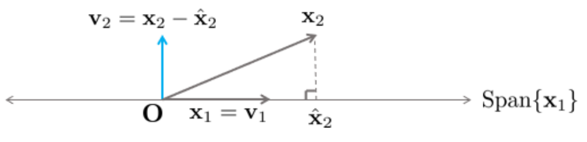

*(원문 p.21)*

벡터 $\mathbf{x}_1 = \begin{bmatrix} 3 \\ 6 \\ 0 \end{bmatrix}, \mathbf{x}_2 = \begin{bmatrix} 1 \\ 2 \\ 2 \end{bmatrix}$로
인해 Span되는 부분공간 $Wx_1 = \mathrm{Span}[\mathbf{x} \: \mathbf{x}_2]$가 있을 때 두 벡터의 내적
$\mathbf{x}_1 \cdot \mathbf{x}_2 = 15 \neq 0$이므로 두 벡터는 수직이 아니다.

이 때 벡터 $\mathbf{v}_1 = \mathbf{x}_1$이라고 하고 $\mathbf{v}_2$를 $\mathbf{x}_1$에 수직인
$\mathbf{x}_2$의 성분이라고 했을 때

$$\mathbf{v}_2 = \mathbf{x}_2 - \frac{\mathbf{x}_2 \cdot \mathbf{x}_1}{\mathbf{x}_1 \cdot \mathbf{x}_1}\mathbf{x}_1 = \begin{bmatrix} 1 \\ 2 \\ 2 \end{bmatrix} - \frac{15}{45}\begin{bmatrix} 3 \\ 6 \\ 0 \end{bmatrix} = \begin{bmatrix} 0 \\ 0 \\ 2 \end{bmatrix} \tag{73}$$

가 된다. 이 때 벡터 $\mathbf{v}_1, \mathbf{v}_2$는 부분공간 $W$의 직교기저벡터가 된다.

<!--widget:gram-schmidt-->

# 3 Eigenvectors and eigenvalues

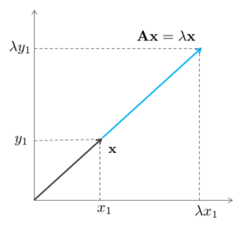

*(원문 p.22)*

정방행렬 $\mathbf{A} \in \mathbb{R}^{n \times n}$에 대한 고유벡터(eigenvector)는
$\mathbf{A}\mathbf{x} = \lambda\mathbf{x}$를 만족하는 0이 아닌 벡터 $\mathbf{x} \in \mathbb{R}^n$을
말한다. 이 때 $\lambda$는 행렬 $\mathbf{A}$의 고유값(eigenvalue)이라고 한다.

$\mathbf{A}\mathbf{x} = \lambda\mathbf{x}$는 다음과 같이 다시 나타낼 수 있다.

$$(\mathbf{A} - \lambda\mathbf{I})\mathbf{x} = 0 \tag{74}$$

이 때, 위 시스템이 $\mathbf{x}$가 0이 아닌 비자명해를 가지고 있는 경우에만 $\lambda$ 값이 행렬
$\mathbf{A}$에 대한 고유값이 된다. 위와 같은 동차 선형시스템이 비자명해를 가지기 위해서는
$\mathbf{A} - \lambda\mathbf{I}$가 선형의존(Linearly Dependent)해야 무수히 많은 해를 가진다.

## 3.1 Null space

행렬 $\mathbf{A} \in \mathbb{R}^{m \times n}$의 동차 선형시스템(Homogeneous Linear System)
$\mathbf{A}\mathbf{x} = 0$의 해 집합을 영공간(Null Space)라고 한다. $\mathrm{Nul} \: \mathbf{A}$로
표기한다.

$\mathbf{A} = \begin{bmatrix} \mathbf{a}_1^\intercal \\ \mathbf{a}_2^\intercal \\ \vdots \\ \mathbf{a}_m^\intercal \end{bmatrix}$
일 때 벡터 $\mathbf{x}$는 다음을 만족해야 한다.

$$\mathbf{a}_1^\intercal\mathbf{x} = \mathbf{a}_2\mathbf{x} = \cdots = \mathbf{a}_m^\intercal\mathbf{x} = 0 \tag{75}$$

즉, $\mathbf{x}$는 모든 $\mathbf{A}$의 행벡터(Row Vector)과 직교해야 한다.

## 3.2 Orthogonal complement

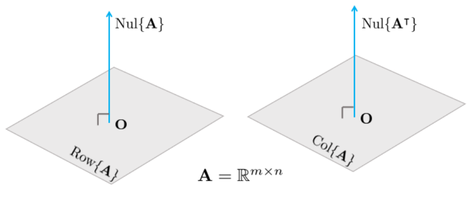

*(원문 p.23)*

벡터 $\mathbf{z}$가 부분공간 $W \in \mathbb{R}^n$의 모든 벡터와 직교하면 $\mathbf{z}$는 부분공간 $W$와
직교한다고 말할 수 있다. 부분공간 $W$와 직교하는 모든 벡터 $\mathbf{z}$의 집합을
직교여공간(Orthogonal Complement)라고 부르며 $W^\perp$로 표시한다.

부분공간 $W$의 직교여공간 $W^\perp$에 위치한 벡터 $\mathbf{x} \in \mathbb{R}^n$는 부분공간 $W$를
Span하는 모든 벡터들과 직교한다.

$$\begin{aligned} & W^\perp \: \text{ is a subspace of } \: \mathbb{R}^n. \\ & \mathrm{Nul}\mathbf{A} = (\mathrm{Row}\mathbf{A})^\perp \\ & \mathrm{Nul}\mathbf{A}^\intercal = (\mathrm{Col}\mathbf{A})^\perp \end{aligned} \tag{76}$$

## 3.3 Characteristic equation

방정식 $(\mathbf{A} - \lambda\mathbf{I})\mathbf{x} = 0$이 비자명해를 갖기 위해서는
$(\mathbf{A} - \lambda\mathbf{I})$ 행렬이 선형의존이어야 하고 이는 곧 역행렬이 존재하지 않아야 하는
것과 동치(Equivalent)이다. 만약 $(\mathbf{A} - \lambda\mathbf{I})$이 역행렬이 존재한다면
$\mathbf{x}$는 자명해 이외에는 갖지 못한다.

$$\begin{aligned} (\mathbf{A} - \lambda\mathbf{I})^{-1}(\mathbf{A} - \lambda\mathbf{I})\mathbf{x} &= (\mathbf{A} - \lambda\mathbf{I})^{-1}0 \\ \mathbf{x} &= 0 \end{aligned} \tag{77}$$

따라서 행렬 $\mathbf{A}$에 대하여 고유값과 고유벡터가 존재하기 위해서는 다음의 방정식이 항상 성립해야
한다.

$$\det(\mathbf{A} - \lambda\mathbf{I}) = 0 \tag{78}$$

위 방정식을 행렬 $\mathbf{A}$의 특성방정식(Characteristic Equation)이라고 부른다.

## 3.4 Eigenspace

$(\mathbf{A} - \lambda\mathbf{x})\mathbf{x} = 0$에서 $(\mathbf{A} - \lambda\mathbf{x})$의 영공간(Null
Space)를 고유값 $\lambda$에 대한 고유공간(Eigenspace)라고 한다. $\lambda$에 대한 고유공간의 차원이 1
이상인 경우, 고유공간 내에 있는 모든 벡터들에 대하여 다음이 성립한다.

$$T(\mathbf{x}) = \mathbf{A}\mathbf{x} = \lambda\mathbf{x} \tag{79}$$

## 3.5 Diagonalization

정방행렬 $\mathbf{A} \in \mathbb{R}^{n \times n}$이 주어졌고
$\mathbf{V} \in \mathbb{R}^{n \times n}$이고 $\mathbf{D} \in \mathbb{R}^{n \times n}$일 때

$$\mathbf{D} = \mathbf{V}^{-1}\mathbf{A}\mathbf{V} \tag{80}$$

위와 같은 공식이 성립한다면 ==이를 정방행렬 $\mathbf{A}$의 대각화(Diagonalization)라고 한다.==
대각화는 모든 경우에 대해서 항상 가능한 것은 아니다. 행렬 $\mathbf{A}$가 대각화되기 위해서는 역행렬이
존재하는 행렬 $\mathbf{V}$가 존재해야 한다. 행렬 $\mathbf{V}$가 역행렬이 존재하기 위해서는
$\mathbf{V}$는 ==행렬 $\mathbf{A}$와 같은 $\mathbb{R}^{n \times n}$ 크기의 정방행렬이어야 하고 n개의
선형독립인 열벡터를 가지고 있어야 한다.== 이 때, $\mathbf{V}$의 각 열은 행렬 $\mathbf{A}$의 고유벡터가
된다. 만약 행렬 $\mathbf{V}$가 존재하는 경우 행렬 $\mathbf{A}$는 ==대각화 가능(Diagonalizable)하다==고
한다.

## 3.6 Finding V and D

대각화 공식은 다음과 같이 다시 작성할 수 있다.

$$\mathbf{D} = \mathbf{V}^{-1}\mathbf{A}\mathbf{V} \Rightarrow \mathbf{V}\mathbf{D} = \mathbf{A}\mathbf{V} \tag{81}$$

이 때, $\mathbf{V} = \begin{bmatrix} \mathbf{v}_1 & \mathbf{v}_2 & \cdots & \mathbf{v}_n \end{bmatrix}$이고
$\mathbf{D} = \begin{bmatrix} \lambda_1 & 0 & \cdots & 0 \\ 0 & \lambda_2 & \ddots & \vdots \\ \vdots & \ddots & \ddots & 0 \\ 0 & \cdots & 0 & \lambda_n \end{bmatrix}$이라고
하면

$$\begin{aligned} \mathbf{A}\mathbf{V} &= \mathbf{A}\begin{bmatrix} \mathbf{v}_1 & \mathbf{v}_2 & \cdots & \mathbf{v}_n \end{bmatrix} = \begin{bmatrix} \mathbf{A}\mathbf{v}_1 & \mathbf{A}\mathbf{v}_2 & \cdots & \mathbf{A}\mathbf{v}_n \end{bmatrix} \\ \mathbf{V}\mathbf{D} &= \begin{bmatrix} \mathbf{v}_1 & \mathbf{v}_2 & \cdots & \mathbf{v}_n \end{bmatrix}\begin{bmatrix} \lambda_1 & 0 & \cdots & 0 \\ 0 & \lambda_2 & \ddots & \vdots \\ \vdots & \ddots & \ddots & 0 \\ 0 & \cdots & 0 & \lambda_n \end{bmatrix} \\ &= \begin{bmatrix} \lambda_1\mathbf{v}_1 & \lambda_2\mathbf{v}_2 & \cdots & \lambda_n\mathbf{v}_n \end{bmatrix} \\ \mathbf{A}\mathbf{V} &= \mathbf{V}\mathbf{D} \Leftrightarrow \begin{bmatrix} \mathbf{A}\mathbf{v}_1 & \mathbf{A}\mathbf{v}_2 & \cdots & \mathbf{A}\mathbf{v}_n \end{bmatrix} = \begin{bmatrix} \lambda_1\mathbf{v}_1 & \lambda_2\mathbf{v}_2 & \cdots & \lambda_n\mathbf{v}_n \end{bmatrix} \end{aligned} \tag{82}$$

위 공식과 같이

$$\mathbf{A}\mathbf{v}_1 = \lambda_1\mathbf{v}_1, \mathbf{A}\mathbf{v}_2 = \lambda_2\mathbf{v}_2, \cdots, \mathbf{A}\mathbf{v}_n = \lambda_n\mathbf{v}_n \tag{83}$$

각각의 열이 모두 동일해야 한다. 즉, ==벡터 $\mathbf{v}_i$는 행렬 $\mathbf{A}$에 대한 고유벡터가 되어야
하고 스칼라 $\lambda_i$는 행렬 $\mathbf{A}$에 대한 고유값이 되어야 한다.== 이에 따라 대각행렬
$\mathbf{D}$는 고유값들을 대각성분으로 포함하고 있는 행렬이 된다. 결론적으로 ==정방행렬
$\mathbf{A} \in \mathbb{R}^{n \times n}$가 대각화 가능한가 안한가에 대한 질문은 n개의 고유벡터가
존재하는가 안하는가에 대한 질문과 동치이다.==

## 3.7 Eigendecomposition

정방행렬 $\mathbf{A}$가 대각화 가능한 경우
$\mathbf{D} = \mathbf{V}^{-1}\mathbf{A}\mathbf{V}$ 공식이 성립한다. 이 공식을 다시 작성하면 다음과 같다.

$$\mathbf{A} = \mathbf{V}\mathbf{D}\mathbf{V}^{-1} \tag{84}$$

이를 행렬 $\mathbf{A}$에 대한 ==고유값 분해(Eigendecomposition)==라고 한다. 행렬 $\mathbf{A}$가
대각화 가능하다는 의미는 행렬 $\mathbf{A}$가 고유값 분해 가능하다는 말과 동치이다.

## 3.8 Linear transformation via eigendecomposition

정방행렬 $\mathbf{A}$가 대각화 가능한 경우
$\mathbf{A} = \mathbf{V}\mathbf{D}\mathbf{V}^{-1}$과 같이 고유값 분해가 가능하다. 이 때 선형 변환
$T(\mathbf{x}) = \mathbf{A}\mathbf{x}$을 생각해보면 다음과 같이 표현할 수 있다.

$$T(\mathbf{x}) = \mathbf{A}\mathbf{x} = \mathbf{V}\mathbf{D}\mathbf{V}^{-1}\mathbf{x} = \mathbf{V}(\mathbf{D}(\mathbf{V}^{-1}\mathbf{x})) \tag{85}$$

## 3.9 Change of basis

예를 들어 $\mathbf{A}\mathbf{v}_1 = -1\mathbf{v}_1, \mathbf{A}\mathbf{v}_2 = 2\mathbf{v}_2$가 성립한다고
가정하고 $T(\mathbf{x}) = \mathbf{A}\mathbf{x} = \mathbf{V}\mathbf{D}\mathbf{V}^{-1}\mathbf{x} = \mathbf{V}(\mathbf{D}(\mathbf{V}^{-1}\mathbf{x}))$에서
$\mathbf{y} = \mathbf{V}^{-1}\mathbf{x}$라고 가정하면

$$\mathbf{V}\mathbf{y} = \mathbf{x} \tag{86}$$

의 관계가 성립한다. 이 때, ==벡터 $\mathbf{y}$는 벡터 $\mathbf{x}$의 고유벡터
$\{\mathbf{v}_1, \mathbf{v}_2\}$에 대한 새로운 좌표를 의미한다.==

$$\mathbf{x} = \begin{bmatrix} 4 \\ 3 \end{bmatrix} = 4\begin{bmatrix} 1 \\ 0 \end{bmatrix} + 3\begin{bmatrix} 0 \\ 1 \end{bmatrix} = \begin{bmatrix} 1 & 0 \\ 0 & 1 \end{bmatrix}\begin{bmatrix} 4 \\ 3 \end{bmatrix} = \mathbf{V}\mathbf{y} = \begin{bmatrix} \mathbf{v}_1 & \mathbf{v}_2 \end{bmatrix}\begin{bmatrix} y_1 \\ y_2 \end{bmatrix} = 2\mathbf{v}_1 + 1\mathbf{v}_2 \Rightarrow \mathbf{y} = \begin{bmatrix} 2 \\ 1 \end{bmatrix} \tag{87}$$

## 3.10 Element-wise scaling

위 과정을 통해 $\mathbf{y}$ 값을 구하고 나면
$T(\mathbf{x}) = \mathbf{V}(\mathbf{D}(\mathbf{V}^{-1}\mathbf{x}))$는
$T(\mathbf{x}) = \mathbf{V}(\mathbf{D}\mathbf{y})$로 표현할 수 있다. 이 때
$\mathbf{z} = \mathbf{D}\mathbf{y}$라고 하면 벡터 $\mathbf{z}$는 단순히 벡터 $\mathbf{y}$를 행렬의 대각
원소의 크기만큼 스케일한 벡터가 된다.

## 3.11 Back to original basis

위 과정까지 진행했으면 $T(\mathbf{x}) = \mathbf{V}(\mathbf{D}\mathbf{y}) = \mathbf{V}\mathbf{z}$와 같이
나타낼 수 있고 이 때 벡터 $\mathbf{z}$는 여전히 새로운 기저벡터
$\{\mathbf{v}_1' \: \mathbf{v}_2'\}$를 기반으로 하면 좌표가 된다. ==$\mathbf{V}\mathbf{z}$ 연산은 벡터
$\mathbf{z}$를 다시 원래 기저벡터의 좌표로 변환하는 역할을 한다.== 벡터 $\mathbf{V}\mathbf{z}$는 기존의
기저벡터 $\{\mathbf{v}_1 \: \mathbf{v}_2\}$의 선형결합이 된다.

$$\mathbf{V}\mathbf{z} = \begin{bmatrix} \mathbf{v}_1 & \mathbf{v}_2 \end{bmatrix}\begin{bmatrix} z_1 \\ z_2 \end{bmatrix} = \mathbf{v}_1z_1 + \mathbf{v}_2z_2 \tag{88}$$

지금까지의 과정을 ==고유값 분해를 통한 선형 변환==이라고 한다.

## 3.12 Linear transformation via $\mathbf{A}^k$

여러번의 변환이 중첩된
$\mathbf{A} \times \mathbf{A} \times \cdots \times \mathbf{A}\mathbf{x} = \mathbf{A}^k\mathbf{x}$를
생각해보자. 이 때, 행렬 $\mathbf{A}$가 대각화 가능하다면 $\mathbf{A}$를 고유값 분해할 수 있고 이 때,
$\mathbf{A}^k$는 다음과 같이 분해할 수 있다.

$$\mathbf{A}^k = (\mathbf{V}\mathbf{D}\mathbf{V}^{-1})(\mathbf{V}\mathbf{D}\mathbf{V}^{-1})\cdots(\mathbf{V}\mathbf{D}\mathbf{V}^{-1}) = \mathbf{V}\mathbf{D}^k\mathbf{V}^{-1} \tag{89}$$

이 때 $\mathbf{D}^k$는 다음과 같이 표현된다.

$$\mathbf{D}^k = \begin{bmatrix} \lambda_1^k & 0 & \cdots & 0 \\ 0 & \lambda_2^k & \ddots & \vdots \\ \vdots & \ddots & \ddots & 0 \\ 0 & \cdots & 0 & \lambda_n^k \end{bmatrix} \tag{90}$$

## 3.13 Geometric multiplicity and algebraic multiplicity

정방행렬 $\mathbf{A} \in \mathbb{R}^{n \times n}$이 있을 때 $\mathbf{A}$가 대각화 가능한지 안한지
판단을 해야하는 경우 일반적으로 판별식을 사용하여 판단한다.

$$\det(\mathbf{A} - \lambda\mathbf{I}) = 0 \tag{91}$$

예를 들어 $n = 5$인 정방행렬 $\mathbf{A}$가 있을 때, $\det(\mathbf{A} - \lambda\mathbf{I})$는 5차
다항식이 나오게 된다. 5차 다항식은 일반적으로 5개의 해를 가지고 있지만 실수만 고려하는 경우 5개의 해가
계산되지 않을 수 있다. 즉, ==실근이 5개가 나오지 않는 경우 $n = 5$개의 선형독립인 고유벡터가 나오지
않으므로 대각화가 불가능하다.==

만약 실근 중 중근이 포함되는 경우, 예를 들어 $(\lambda - 2)^2(\lambda - 3) = 0$과 같이 $\lambda = 2$가
중근인 경우, ==$\lambda = 2$로 인해 생성되는 고유공간(Eigenspace)의 차원이 최대 $\lambda = 2$가 가지는
중근의 개수까지 가질 수 있다.== 중근이 아닌 일반 실근의 경우 최대 1차원의 고유공간을 가질 수 있다.
==즉, 중근이 포함된 경우 고유공간의 차원이 최대 $n = 5$까지 생성될 수 있는데 $n = 5$를 만족하지 못하는
경우에는 대각화가 불가능하다.==

이와 같이 대수적으로 판별식을 인수분해했을 때, 중근이 생기는 경우 중근의 ==대수 중복도(Algebraic
Multiplicity)==와 이로 인해 Span되는 고유공간의 ==기하 중복도(Geometric Multiplicity)==가 일치해야
$n$개의 독립적인 고유벡터가 생성될 수 있고 행렬 $\mathbf{A}$의 대각화가 가능하다.

<!--widget:eigen-diagonalization-->

# 4 Singular value decomposition

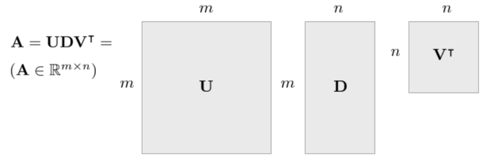

*(원문 p.26)*

행렬 $\mathbf{A} \in \mathbb{R}^{m \times n}$이 주어졌을 때 특이값 분해(Singular Value Decomposition,
SVD)는 다음과 같이 나타낼 수 있다.

$$\mathbf{A} = \mathbf{U}\Sigma\mathbf{V}^\intercal \tag{92}$$

이 때, $\mathbf{U} \in \mathbb{R}^{m \times m}, \mathbf{V} \in \mathbb{R}^{n \times n}$인 행렬이며
이들은 각 열이 $\mathrm{Col} \: \mathbf{A}$와 $\mathrm{Row} \: \mathbf{A}$에 의 정규직교기저벡터
(Orthonormal Basis)로 구성되어 있다. $\Sigma \in \mathbb{R}^{m \times n}$은 대각행렬이며 대각 성분들이
$\sigma_1 \geq \sigma_2 \geq \cdots \geq \sigma_{\min(m,n)}$ 특이값이며 큰 값부터 내림차순으로 정렬된
행렬이다.

## 4.1 SVD as sum of outer products

행렬 $\mathbf{A}$는 다음과 같이 Outer Products의 합으로 표현할 수 있다.

$$\mathbf{A} = \mathbf{U}\Sigma\mathbf{V}^\intercal = \sum_{i=1}^{n}\sigma_i\mathbf{u}_i\mathbf{v}_i^\intercal, \quad \text{where } \: \sigma_1 \geq \sigma_2 \geq \cdots \geq \sigma_n \tag{93}$$

이 때 위 식을 다시 행렬로 합성하면
$\mathbf{U} \in \mathbb{R}^{m \times m} \to \mathbf{U}' \in \mathbb{R}^{m \times n}$ 그리고
$\mathbf{D} \in \mathbb{R}^{m \times n} \to \mathbf{D}' \in \mathbb{R}^{n \times n}$과 같이 행렬
$\mathbf{V}^\intercal$의 차원에 맞게 다시 합성할 수 있는데 이를 ==Reduced Form of SVD==이라고 한다.

$$\mathbf{A} = \mathbf{U}'\mathbf{D}'\mathbf{V}^\intercal \tag{94}$$

## 4.2 Another perspective of SVD

행렬 $\mathbf{A} \in \mathbb{R}^{m \times n}$에 대해 Gram-Schmidt Orthogonalization을 사용하면
$\mathrm{Col} \: \mathbf{A}$에 대한 정규직교기저벡터 $\mathbf{u}_1, \cdots, \mathbf{u}_n$와
$\mathrm{Row} \: \mathbf{A}$에 대한 정규직교기저벡터 $\mathbf{v}_1, \cdots, \mathbf{v}_n$을 구할 수
있다. 하지만 이렇게 계산한 정규직교기저벡터 $\mathbf{u}_i, \mathbf{v}_i$는 유일하지 않다.

Reduced Form of SVD를 사용하면 행렬
$\mathbf{U} = \begin{bmatrix} \mathbf{u}_1 & \mathbf{u}_2 & \cdots & \mathbf{u}_n \end{bmatrix} \in \mathbb{R}^{m \times n}$과
$\mathbf{V} = \begin{bmatrix} \mathbf{v}_1 & \mathbf{v}_2 & \cdots & \mathbf{v}_n \end{bmatrix} \in \mathbb{R}^n$
그리고
$\Sigma = \begin{bmatrix} \sigma_1 & 0 & \cdots & 0 \\ 0 & \sigma_2 & \ddots & \vdots \\ \vdots & \ddots & \ddots & 0 \\ 0 & \cdots & 0 & \sigma_n \end{bmatrix} \in \mathbb{R}^{n \times n}$ 일 때

$$\begin{aligned} \mathbf{A}\mathbf{V} &= \mathbf{A}\begin{bmatrix} \mathbf{v}_1 & \mathbf{v}_2 & \cdots & \mathbf{v}_n \end{bmatrix} = \begin{bmatrix} \mathbf{A}\mathbf{v}_1 & \mathbf{A}\mathbf{v}_2 & \cdots & \mathbf{A}\mathbf{v}_n \end{bmatrix} \\ \mathbf{U}\Sigma &= \begin{bmatrix} \mathbf{u}_1 & \mathbf{u}_2 & \cdots & \mathbf{u}_n \end{bmatrix}\begin{bmatrix} \sigma_1 & 0 & \cdots & 0 \\ 0 & \sigma_2 & \ddots & \vdots \\ \vdots & \ddots & \ddots & 0 \\ 0 & \cdots & 0 & \sigma_n \end{bmatrix} \\ &= \begin{bmatrix} \sigma_1\mathbf{u}_1 & \sigma_2\mathbf{u}_2 & \cdots & \sigma_n\mathbf{u}_n \end{bmatrix} \\ \mathbf{A}\mathbf{V} &= \mathbf{U}\Sigma \Leftrightarrow \begin{bmatrix} \mathbf{A}\mathbf{v}_1 & \mathbf{A}\mathbf{v}_2 & \cdots & \mathbf{A}\mathbf{v}_n \end{bmatrix} = \begin{bmatrix} \sigma_1\mathbf{u}_1 & \sigma_2\mathbf{u}_2 & \cdots & \sigma_n\mathbf{u}_n \end{bmatrix} \end{aligned} \tag{95}$$

위 식을 간결하게 나타내면 다음과 같다.

$$\mathbf{A}\mathbf{V} = \mathbf{U}\Sigma \Leftrightarrow \mathbf{A} = \mathbf{U}\Sigma\mathbf{V}^\intercal \tag{96}$$

## 4.3 Computing SVD

행렬 $\mathbf{A} \in \mathbb{R}^{m \times n}$에 대하여 $\mathbf{A}\mathbf{A}^\intercal$와
$\mathbf{A}^\intercal\mathbf{A}$는 다음과 같이 고유값분해할 수 있다.

$$\begin{aligned} \mathbf{A}\mathbf{A}^\intercal &= \mathbf{U}\Sigma\mathbf{V}^\intercal\mathbf{V}\Sigma^\intercal\mathbf{U}^\intercal = \mathbf{U}\Sigma\Sigma^\intercal\mathbf{U}^\intercal = \mathbf{U}\Sigma^2\mathbf{U}^\intercal \\ \mathbf{A}^\intercal\mathbf{A} &= \mathbf{V}\Sigma^\intercal\mathbf{U}^\intercal\mathbf{U}\Sigma\mathbf{V}^\intercal = \mathbf{V}\Sigma^\intercal\Sigma\mathbf{V}^\intercal = \mathbf{V}\Sigma^2\mathbf{V}^\intercal \end{aligned} \tag{97}$$

이 때 계산되는 행렬 $\mathbf{U}, \mathbf{V}$은 직교하는 고유벡터를 각 열의 성분으로 하는 행렬이며
대각행렬 $\Sigma^2$의 각 성분은 항상 0보다 크거나 같은 값을 가진다. 그리고
$\mathbf{A}\mathbf{A}^\intercal$와 $\mathbf{A}^\intercal\mathbf{A}$를 통해 계산되는 $\Sigma^2$의 값은
동일하다.

<!--widget:svd-geometry-->

## 4.4 Diagonalization of symmetric matrices

일반적으로 정방행렬 $\mathbf{A} \in \mathbb{R}^{n \times n}$이 $n$개의 선형독립인 고유벡터를 가지고
있을 경우 대각화 가능하다. 그리고 ==대칭행렬 $\mathbf{S} \in \mathbb{R}^{n \times n}, \mathbf{S}^\intercal = \mathbf{S}$는
항상 대각화 가능하다.== 추가적으로 ==대칭행렬 $\mathbf{S}$의 고유벡터는 항상 서로에게 직교하므로
직교대각화(Orthogonally Diagonalizable)가 가능하다.==

## 4.5 Spectral theorem of symmetric matrices

$\mathbf{S}^\intercal = \mathbf{S}$를 만족하는 대칭행렬 $\mathbf{S}$가 주어졌을 때 $\mathbf{S}$는
$n$개의 중근을 포함한 실수의 고유값이 존재한다. 또한, 고유공간의 차원은 기하 중복도(Algebraic
Multiplicity)와 기하 중복도(Geometric Multiplicity)와 같아야 한다. 서로 다른 $\lambda$값 들에 대한
고유공간들은 서로 직교한다. 결론적으로 대칭행렬 $\mathbf{S}$은 직교대각화가 가능하다.

## 4.6 Spectral decomposition

대칭행렬 $\mathbf{S}$의 고유값 분해는 ==Spectral Decomposition==이라고 불린다. 이는 다음과 같이 나타낼
수 있다.

$$\begin{aligned} \mathbf{S} = \mathbf{U}\mathbf{D}\mathbf{U}^{-1} = \mathbf{U}\mathbf{D}\mathbf{U}^\intercal &= \begin{bmatrix} \mathbf{u}_1 & \mathbf{u}_2 & \cdots & \mathbf{u}_n \end{bmatrix}\begin{bmatrix} \lambda_1 & 0 & \cdots & 0 \\ 0 & \lambda_2 & \ddots & \vdots \\ \vdots & \ddots & \ddots & 0 \\ 0 & \cdots & 0 & \lambda_n \end{bmatrix}\begin{bmatrix} \mathbf{u}_1^\intercal \\ \mathbf{u}_2^\intercal \\ \vdots \\ \mathbf{u}_n^\intercal \end{bmatrix} \\ &= \begin{bmatrix} \lambda_1\mathbf{u}_1 & \lambda_2\mathbf{u}_2 & \cdots & \lambda_n\mathbf{u}_n \end{bmatrix}\begin{bmatrix} \mathbf{u}_1^\intercal \\ \mathbf{u}_2^\intercal \\ \vdots \\ \mathbf{u}_n^\intercal \end{bmatrix} \\ &= \lambda_1\mathbf{u}_1\mathbf{u}_1^\intercal + \lambda_2\mathbf{u}_2\mathbf{u}_2^\intercal + \cdots + \lambda_n\mathbf{u}_n\mathbf{u}_n^\intercal \end{aligned} \tag{98}$$

위 식에서 각 항 $\lambda_i\mathbf{u}_j\mathbf{u}_j^\intercal$은 $\mathbf{u}_j$에 의해 Span된
부분공간에 프로젝션된 다음 고유값 $\lambda_i$만큼 스케일된 벡터로 볼 수 있다.

## 4.7 Symmetric positive definite matrices

행렬 $\mathbf{S} \in \mathbb{R}^{n \times n}$이 대칭이면서 Positive Definite인 경우 Spectral
Decomposition의 모든 고유값은 항상 양수가 된다.

$$\begin{aligned} \mathbf{S} = \mathbf{U}\mathbf{D}\mathbf{U}^{-1} = \mathbf{U}\mathbf{D}\mathbf{U}^\intercal &= \begin{bmatrix} \mathbf{u}_1 & \mathbf{u}_2 & \cdots & \mathbf{u}_n \end{bmatrix}\begin{bmatrix} \lambda_1 & 0 & \cdots & 0 \\ 0 & \lambda_2 & \ddots & \vdots \\ \vdots & \ddots & \ddots & 0 \\ 0 & \cdots & 0 & \lambda_n \end{bmatrix}\begin{bmatrix} \mathbf{u}_1^\intercal \\ \mathbf{u}_2^\intercal \\ \vdots \\ \mathbf{u}_n^\intercal \end{bmatrix} \\ &= \lambda_1\mathbf{u}_1\mathbf{u}_1^\intercal + \lambda_2\mathbf{u}_2\mathbf{u}_2^\intercal + \cdots + \lambda_n\mathbf{u}_n\mathbf{u}_n^\intercal \\ &\text{where, } \lambda_j > 0, \forall j = 1, \cdots, n \end{aligned} \tag{99}$$

## 4.8 Back to computing SVD

행렬 $\mathbf{A}$에 대하여 $\mathbf{A}\mathbf{A}^\intercal = \mathbf{A}^\intercal\mathbf{A} = \mathbf{S}$인
대칭행렬이 존재할 때 $\mathbf{S}$가 Positive (Semi-)Definite한 경우

$$\begin{aligned} \mathbf{x}^\intercal\mathbf{A}\mathbf{A}^\intercal\mathbf{x} &= (\mathbf{A}^\intercal\mathbf{x})^\intercal(\mathbf{A}^\intercal\mathbf{x}) = \|\mathbf{A}^\intercal\mathbf{x}\| \geq 0 \\ \mathbf{x}^\intercal\mathbf{A}^\intercal\mathbf{A}\mathbf{x} &= (\mathbf{A}\mathbf{x})^\intercal(\mathbf{A}\mathbf{x}) = \|\mathbf{A}\mathbf{x}\|^2 \geq 0 \end{aligned} \tag{100}$$

즉, $\mathbf{A}\mathbf{A}^\intercal = \mathbf{U}\Sigma^2\mathbf{U}^\intercal$와
$\mathbf{A}^\intercal\mathbf{A} = \mathbf{V}\Sigma^2\mathbf{V}^\intercal$에서 $\Sigma^2$의 값은 항상
0보다 크거나 같은 값이 된다.

임의의 직각 행렬 $\mathbf{A} \in \mathbb{R}^{m \times n}$에 대하여 특이값 분해는 언제나 존재한다.
$\mathbf{A} \in \mathbb{R}^{n \times n}$ 행렬의 경우 고유값 분해가 존재하지 않을 수 있지만 특이값
분해는 항상 존재한다. 대칭이면서 동시에 Positive Definite인 정방 행렬
$\mathbf{S} \in \mathbb{R}^{n \times n}$은 항상 고유 분해값이 존재하며 이는 특이값 분해와 동일하다.

## 4.9 Eigendecomposition in machine learning

일반적으로 머신러닝에서는 대칭이고 Positive Definite인 행렬을 다룬다. 예를 들면,
$\mathbf{A} \in \mathbb{R}^{10 \times 3}$인 행렬이 있고 각 열은 사람을 의미하고 각 행은 Feature를
의미한다고 가정했을 때, ==$\mathbf{A}^\intercal\mathbf{A} \in \mathbb{R}^{3 \times 3}$는 각 사람들 간
유사도==를 의미하고 ==$\mathbf{A}\mathbf{A}^\intercal \in \mathbb{R}^{10 \times 10}$는 각 Feature들의
상관관계를 의미한다.== 이 때, $\mathbf{A}\mathbf{A}^\intercal$는 주성분분석(Principal Component
Analysis)에서 Covariance Matrix를 구할 때 사용된다.

## 4.10 Low rank approximation of a matrix

행렬 $\mathbf{A} \in \mathbb{R}^{m \times n}$이 주어졌을 때 예를 들어, $\mathbf{A}$의 원래 rank가 r일
때, 행렬 $\mathbf{A}$에서 rank를 r 이하를 가진 근사행렬 $\hat{\mathbf{A}}$을 찾는 Low Rank
Approximation을 수행할 수 있다.

$$\begin{aligned} \hat{\mathbf{A}}_r &= \arg\min_{\mathbf{A}_r} \|\mathbf{A} - \mathbf{A}_r\|_F, \: \text{ subject to } \mathrm{rank}\mathbf{A}_r \leq r \\ \hat{\mathbf{A}}_r &= \sum_{i=1}^{r}\sigma_i\mathbf{u}_i\mathbf{v}_i^\intercal \quad \text{where, } \sigma_1 \geq \sigma_2 \geq \cdots \geq \sigma_r \end{aligned} \tag{101}$$

## 4.11 Dimension reducing transformation

Feature-by-data item 행렬 $\mathbf{A} \in \mathbb{R}^{m \times n}$이 주어졌을 때
$\mathbf{G} \in \mathbb{R}^{m \times r}, r < m$인 변환
$\mathbf{G}^\intercal : \mathbf{x} \in \mathbb{R}^m \mapsto \mathbf{y} \in \mathbb{R}^r$을 생각해보면

$$\mathbf{y}_i = \mathbf{G}^\intercal\mathbf{a}_i \tag{102}$$

가 성립하고 $\mathbf{G}$ 의 각 열들은 정규직교벡터이며 데이터의 유사도 행렬
$\mathbf{S} = \mathbf{A}^\intercal\mathbf{A}$의 유사도를 보존하는 ==변환 $\mathbf{G}$를 차원 축소
변환(Dimension-Reducing Transformation)==이라고 한다.

$$\begin{aligned} \mathbf{Y} &= \mathbf{G}^\intercal\mathbf{A} \\ \mathbf{Y}^\intercal\mathbf{Y} &= (\mathbf{G}^\intercal\mathbf{A})^\intercal\mathbf{G}^\intercal\mathbf{A} = \mathbf{A}^\intercal\mathbf{G}\mathbf{G}^\intercal\mathbf{A} \end{aligned} \tag{103}$$

이 때 차원축소변환 $\hat{\mathbf{G}}$ 은 다음과 같이 추정할 수 있다.

$$\hat{\mathbf{G}} = \arg\min_{\mathbf{G}} \|S - \mathbf{A}^\intercal\mathbf{G}\mathbf{G}^\intercal\mathbf{A}\|_F \: \text{ subject to } \mathbf{G}^\intercal\mathbf{G} = \mathbf{I}_k \tag{104}$$

주어진 행렬 $\mathbf{A} = \mathbf{U}\Sigma\mathbf{V}^\intercal = \sum_{i=1}^{n}\sigma_i\mathbf{u}_i\mathbf{v}_i^\intercal$에
대하여 최적의 해는 다음과 같다.

$$\hat{\mathbf{G}} = \mathbf{U}_r = \begin{bmatrix} \mathbf{u}_1 & \mathbf{u}_2 & \cdots & \mathbf{u}_r \end{bmatrix} \tag{105}$$

<!--widget:low-rank-approximation-->

# 5 Derivatives of multivariable functions

## 5.1 Gradient

임의의 벡터 $\mathbf{x} \in \mathbb{R}^n$에 대하여 $f(\mathbf{x}) \in \mathbb{R}$를 만족하는 다변수
스칼라 함수 $f(\mathbf{x})$가 주어졌다고 하자.

$$f : \mathbb{R}^n \mapsto \mathbb{R} \tag{106}$$

$f(\mathbf{x})$에 대한 1차 편미분은 벡터가 되고 이는 그레디언트(gradient)라고 불린다.

$$\boxed{\nabla\mathbf{f} = \left(\frac{\partial f}{\partial x_1} \quad \cdots \quad \frac{\partial f}{\partial x_n}\right) \in \mathbb{R}^{1 \times n}} \tag{107}$$

## 5.2 Jacobian matrix

임의의 벡터 $\mathbf{x} \in \mathbb{R}^n$에 대하여 $f(\mathbf{x}) \in \mathbb{R}^m$를 만족하는 다변수
벡터 함수 $f(\mathbf{x})$가 주어졌다고 하자.

$$f : \mathbb{R}^n \mapsto \mathbb{R}^m \tag{108}$$

==이 때, $f(\cdot)$의 1차 편미분은 행렬이 되고 이를 특별히 자코비안(jacobian) 행렬이라고 한다.==

$$\boxed{\mathbf{J} = \begin{bmatrix} \frac{\partial f_1}{\partial x_1} & \cdots & \frac{\partial f_1}{\partial x_n} \\ \vdots & \ddots & \vdots \\ \frac{\partial f_m}{\partial x_1} & \cdots & \frac{\partial f_m}{\partial x_n} \end{bmatrix} \in \mathbb{R}^{m \times n}} \tag{109}$$

이를 통해 자코비안 행렬의 각 행벡터(row vector)는 함수 $f_m(\cdot)$에 대한 그레디언트라는 것을 알 수
있다. . 위 식을 미소변화량 $\mathbf{h}$를 사용하여 나타내면 다음과 같다.

$$\mathbf{J} = \frac{\partial f(\mathbf{x})}{\partial\mathbf{x}} \triangleq \lim_{\mathbf{h} \to 0} \frac{f(\mathbf{x} + \mathbf{h}) - f(\mathbf{x})}{\mathbf{h}} \in \mathbb{R}^{m \times n} \tag{110}$$

SLAM에서 자코비안은 에러 $\mathbf{e}(\mathbf{x})$를 최적화할 때 사용된다. ==SLAM에서 최적화하고자 하는
에러는 일반적으로 비선형 함수로 구성되어 있으며 크기가 작기 때문에 에러의 변화량
$\mathbf{e}(\mathbf{x} + \Delta\mathbf{x})$를 그대로 사용하지 않고 테일러 전개하여 근사식
$\mathbf{e}(\mathbf{x}) + \mathbf{J}\Delta\mathbf{x}$으로 표현하게 되는데 이 때 에러에 대한 자코비안
$\mathbf{J}$가 유도된다.== 그리고 근사식을 바탕으로 유도한 에러의 최적 증분량
$\Delta\mathbf{x}^* = (\mathbf{J}^\intercal\mathbf{J})^{-1}\mathbf{J}^\intercal\mathbf{b}$이 자코비안을
통해 구해지기 때문에 SLAM에서는 자코비안이 필수적으로 사용된다. 자세한 내용은 [SLAM] Errors and
Jacobian Derivations for SLAM 정리 포스트를 참조하면 된다.

### 5.2.1 Toy example 1

만약 $\mathbf{x} = \{a, b, c\}$일 때 $f(\mathbf{x}) = f(a, b, c)$를 각각의 변수 a,b,c에 대해 편미분하면
다음과 같다.

$$\mathbf{J} = \frac{\partial f(\mathbf{x})}{\partial\mathbf{x}} = \begin{bmatrix} \mathbf{J}_a & \mathbf{J}_b & \mathbf{J}_c \end{bmatrix} \tag{111}$$

$$\begin{aligned} \mathbf{J}_a &= \frac{\partial f(a, b, c)}{\partial a} \\ \mathbf{J}_b &= \frac{\partial f(a, b, c)}{\partial b} \\ \mathbf{J}_c &= \frac{\partial f(a, b, c)}{\partial c} \end{aligned} \tag{112}$$

만약 $a = a_0$로 계산값(=operating point)이 정해진 경우 자코비안은 다음과 같다.

$$\begin{aligned} \mathbf{J}_a &= \left.\frac{\partial f(a, b, c)}{\partial a}\right|_{a=a_0} \\ \mathbf{J}_b &= \left.\frac{\partial f(a, b, c)}{\partial b}\right|_{a=a_0, b=b_0} \\ \mathbf{J}_c &= \left.\frac{\partial f(a, b, c)}{\partial c}\right|_{a=a_0, c=c_0} \end{aligned} \tag{113}$$

위 첫번째 식은 $f(a, b, c)$를 $a$에 대해 편미분한 후 $a = a_0$를 넣어 값을 계산하라는 의미이고
두번째와 세번째 식은 $a = a_0$로 값을 고정한 상태에서 각각 $b = b_0, c = c_0$에 대한 편미분을
수행하라는 의미이다.

### 5.2.2 Toy example 2

예를 들어 다음과 같은 3개의 연립 방정식이 주어졌다고 하자.

$$f(\mathbf{x}) = \begin{cases} f_1(\mathbf{x}) = ax^2 + 2bx + cy \\ f_2(\mathbf{x}) = dx^3 + ex \\ f_3(\mathbf{x}) = fx + gy^2 + hy \end{cases} \tag{114}$$

$\mathbf{x} = (x, y)$를 의미한다. 위 함수는 다음과 같이 쓸 수 있다.

$$f : \mathbb{R}^2 \mapsto \mathbb{R}^3 \tag{115}$$

자코비안의 정의에 따라 이를 아래와 같이 쓸 수 있다.

$$\mathbf{J} = \begin{bmatrix} \frac{\partial f_1}{\partial x} & \frac{\partial f_1}{\partial y} \\ \frac{\partial f_2}{\partial x} & \frac{\partial f_2}{\partial y} \\ \frac{\partial f_3}{\partial x} & \frac{\partial f_3}{\partial y} \end{bmatrix} = \begin{bmatrix} 2ax + 2b & c \\ 3dx^2 + e & 0 \\ f & 2gy + h \end{bmatrix} \in \mathbb{R}^{3 \times 2} \tag{116}$$

## 5.3 Hessian matrix

임의의 벡터 $\mathbf{x} \in \mathbb{R}^n$에 대하여 $f(\mathbf{x}) \in \mathbb{R}$를 만족하는 다변수
스칼라 함수 $f(\mathbf{x})$가 주어졌다고 하자.

$$f : \mathbb{R}^n \mapsto \mathbb{R} \tag{117}$$

==이 때, $f(\cdot)$의 2차 편미분은 행렬이 되고 이를 특별히 헤시안(hessian) 행렬이라고 한다. 헤시안
행렬은 일반적으로 대칭행렬의 형태를 띄고 있으며 다변수 벡터 함수가 아닌 다변수 스칼라 함수에 대한 2차
미분임에 유의한다.==

$$\boxed{\mathbf{H} = \begin{bmatrix} \frac{\partial^2 f}{\partial x_1^2} & \frac{\partial^2 f}{\partial x_1x_2} & \cdots & \frac{\partial^2 f}{\partial x_1x_n} \\ \frac{\partial^2 f}{\partial x_2x_1} & \frac{\partial^2 f}{\partial x_2^2} & \cdots & \frac{\partial^2 f}{\partial x_2x_n} \\ \vdots & \vdots & \ddots & \vdots \\ \frac{\partial^2 f}{\partial x_nx_1} & \frac{\partial^2 f}{\partial x_nx_2} & \cdots & \frac{\partial^2 f}{\partial x_n^2} \end{bmatrix} \in \mathbb{R}^{n \times n}} \tag{118}$$

==헤시안 행렬 $\mathbf{H}$는 자코비안 $\mathbf{J}$의 미분 행렬이 아님에 유의한다.== 자코비안
$\mathbf{J}$는 ==다변수 벡터 함수==에 대한 1차 미분 행렬을 의미하는데 반해 헤시안 행렬 $\mathbf{H}$는
==다변수 스칼라 함수==의 2차 미분 행렬을 의미한다. 다변수 스칼라 함수의 1차 미분은 그라디언트
$\nabla\mathbf{f}$ 벡터이다. 다변수 벡터 함수의 2차 미분은 3차 텐서로서 일반적으로 SLAM에서는 자주
사용되지 않는다.

$$\boxed{\begin{aligned} & f : \mathbb{R}^n \mapsto \mathbb{R} \quad \text{then,} \\ & f' : \nabla\mathbf{f} \quad \cdots \text{gradient} \\ & f'' : \mathbf{H} \quad \cdots \text{hessian} \end{aligned}} \tag{119}$$

$$\boxed{\begin{aligned} & f : \mathbb{R}^n \mapsto \mathbb{R}^m \quad \text{then,} \\ & f' : \mathbf{J} \quad \cdots \text{jacobian} \end{aligned}} \tag{120}$$

## 5.4 Laplacian

임의의 벡터 $\mathbf{x} \in \mathbb{R}^n$에 대하여 $f(\mathbf{x}) \in \mathbb{R}$를 만족하는 다변수
스칼라 함수 $f(\mathbf{x})$가 주어졌다고 하자.

$$f : \mathbb{R}^n \mapsto \mathbb{R} \tag{121}$$

$f(\mathbf{x})$에 대한 라플라시안(laplacian)은 각 입력 벡터에 따른 2차 편미분의 합으로 정의된다.

$$\boxed{\Delta\mathbf{f} = \frac{\partial^2 f}{\partial x_1^2} + \frac{\partial^2 f}{\partial x_2^2} + \cdots + \frac{\partial^2 f}{\partial x_n^2} \in \mathbb{R}} \tag{122}$$

## 5.5 Taylor expansion

테일러 전개(expansion)은 미지의 함수 $f(x)$를 $x = a$ 지점에서 근사 다항함수로 표현하는 방법을 말한다.
이는 테일러 급수(series) 또는 테일러 근사(approximation)이라고도 불린다. $f(\cdot)$을 $x = a$ 부근에서
테일러 전개를 수행하면 다음과 같이 나타낼 수 있다.

$$f(x)|_{x=a} = f(a) + f'(a)(x - a) + \frac{1}{2!}f''(a)(x - a)^2 + \frac{1}{3!}f'''(a)(x - a)^3 + \cdots \tag{123}$$

함수 $f(\cdot)$가 다변수 스칼라 함수일 경우 $\mathbf{x} = \mathbf{a}$ 지점에서 테일러 전개는 다음과
같이 쓸 수 있다.

$$f(\mathbf{x})|_{\mathbf{x}=\mathbf{a}} = f(\mathbf{a}) + \nabla\mathbf{f}(\mathbf{x} - \mathbf{a}) + \frac{1}{2!}(\mathbf{x} - \mathbf{a})^\intercal\mathbf{H}(\mathbf{x} - \mathbf{a}) + \cdots \tag{124}$$

이 때, $\nabla\mathbf{f}$는 함수 $f(\cdot)$의 그레디언트(gradient) 의미하며 $\mathbf{H}$는
헤시안(hessian) 행렬을 의미한다.

<!--widget:gradient-hessian-->

# 6 Matrix algebra

## 6.1 Identity matrix

항등행렬(Identity Matrix)는 대각성분이 전부 1이고 나머지 성분이 전부 0인 $n \times n$ 크기의 정방행렬을
의미한다. 일반적으로 $\mathbf{I} \in \mathbb{R}^{n \times n}$ 으로 표현한다.

$$\mathbf{I} = \begin{bmatrix} 1 & 0 & 0 \\ 0 & 1 & 0 \\ 0 & 0 & 1 \end{bmatrix} \in \mathbb{R}^{3 \times 3} \tag{125}$$

항등행렬에 임의의 벡터 $\mathbf{x} \in \mathbb{R}^n$올 곱하면 자기 자신이 도출된다.

$$^\forall\mathbf{x} \in \mathbb{R}^n, \quad \mathbf{I}\mathbf{x} = \mathbf{x} \tag{126}$$

## 6.2 Transpose of matrix

임의의 $m \times n$ 크기의 행렬 $\mathbf{A}$가 주어졌을 때 $\mathbf{A}$의 전치행렬(transpose matrix)는
$\mathbf{A}^\intercal$와 같이 나타내고 이는 행과 열의 성분을 서로 바꾼 행렬을 의미한다.

$$\begin{bmatrix} \mathbf{A} \end{bmatrix}_{ij} = a_{ij} \tag{127}$$

위와 같은 행렬에 대하여 $\mathbf{A}^\intercal$는 다음과 같다.

$$\begin{bmatrix} \mathbf{A}^\intercal \end{bmatrix}_{ij} = a_{ji} \tag{128}$$

즉, $\mathbf{A} = \begin{bmatrix} a & b & c \\ d & e & f \end{bmatrix}$인 행렬에 대한 전치행렬은
$\mathbf{A}^\intercal = \begin{bmatrix} a & d \\ b & e \\ c & f \end{bmatrix}$가 된다.

## 6.3 Determinant of matrix

==행렬식(determinant)는 임의의 정방행렬 $\mathbf{A} \in \mathbb{R}^{n \times n}$을 하나의 스칼라 값에
대응시키는 함수를 의미한다.== 스칼라 값의 크기 및 부호에 따라 해가 존재하는지 유무가 결정되며 행렬식이
0인 경우 해당 정방행렬은 역행렬이 존재하지 않는다. 행렬식은 일반적으로 $\det(\mathbf{A})$라고 표기하며
다음과 같다.

$$\det(\mathbf{A}) = \sum_{j=1}^{n} a_{ij}C_{ij} \tag{129}$$

- $C_{ij} = (-1)^{i+j}M_{ij}$

$M_{ij}$는 $\mathbf{A}$에서 $i$ 행과 $j$ 열을 제거한 부분 행렬(submatrix)에 대한
행렬식(determinant)을 의미하며 $a_{ij}$에 대한 minor라고도 부른다. 그리고 $C_{ij}$는 cofactor라고도
부른다. 자세한 내용은 [4]를 참고하면 된다.

$2 \times 2$ 크기의 정방행렬 $\mathbf{A} = \begin{bmatrix} a & b \\ c & d \end{bmatrix}$가 있을 때
$\det(\mathbf{A})$는 다음과 같다.

$$\det(\mathbf{A}) = ad - bc \tag{130}$$

임의의 정방행렬 $\mathbf{A}, \mathbf{B} \in \mathbb{R}^{n \times n}$에 대하여 행렬식은 다음과 같은
성질을 지닌다.

$$\begin{aligned} \det(\mathbf{A}^\intercal) &= \det(\mathbf{A}) \\ \det(c\mathbf{A}) &= c^n\det(\mathbf{A}) \\ \det(\mathbf{A}\mathbf{B}) &= \det(\mathbf{A})\det(\mathbf{B}) \\ \det(\mathbf{A}^{-1}) &= \frac{1}{\det(\mathbf{A})} \end{aligned} \tag{131}$$

### 6.3.1 Determinant of block triangle matrix

임의의 블록 행렬 $\mathbf{A}$가 상삼각(upper-triangle), 하삼각(lower-triangle) 또는 대각(diagonal)일
경우 행렬식은 다음과 같이 나타낼 수 있다.

$$\mathbf{A} = \begin{bmatrix} \mathbf{A}_{11} & \mathbf{A}_{12} \\ 0 & \mathbf{A}_{22} \end{bmatrix} \tag{132}$$

$$\boxed{\det(\mathbf{A}) = \det(\mathbf{A}_{11})\det(\mathbf{A}_{22})} \tag{133}$$

일반적인 정사각 행렬 $\mathbf{C}$이 주어졌을 때 이는 다음과 같이 블록 삼각 행렬의 곱으로 LU 분해할 수
있다.

$$\begin{bmatrix} \mathbf{C}_{xx} & \mathbf{C}_{xy} \\ \mathbf{C}_{yx} & \mathbf{C}_{yy} \end{bmatrix} = \begin{bmatrix} \mathbf{I} & 0 \\ \mathbf{C}_{yx}\mathbf{C}_{xx}^{-1} & \mathbf{I} \end{bmatrix}\begin{bmatrix} \mathbf{C}_{xx} & \mathbf{C}_{xy} \\ 0 & \mathbf{C}_{yy} - \mathbf{C}_{yx}\mathbf{C}_{xx}^{-1}\mathbf{C}_{xy} \end{bmatrix} \tag{134}$$

따라서 $\mathbf{C}$의 행렬식 $\det(\mathbf{C})$은 다음과 같이 나타낼 수 있다. (단, $\mathbf{C}_{xx}$가
invertible일 때만)

$$\boxed{\begin{aligned} \det(\mathbf{C}) &= \det(\mathbf{I})\det(\mathbf{I})\det(\mathbf{C}_{xx})\det(\mathbf{C}_{yy} - \mathbf{C}_{yx}\mathbf{C}_{xx}^{-1}\mathbf{C}_{xy}) \\ &= \det(\mathbf{C}_{xx})\det(\mathbf{C}_{yy} - \mathbf{C}_{yx}\mathbf{C}_{xx}^{-1}\mathbf{C}_{xy}) \end{aligned}} \tag{135}$$

## 6.4 Inverse matrix

정방행렬 $\mathbf{A} \in \mathbb{R}^{n \times n}$에 대한 역행렬(Inverse Matrix)
$\mathbf{A}^{-1}$는 다음과 같이 정의된다.

$$\mathbf{A}^{-1}\mathbf{A} = \mathbf{A}\mathbf{A}^{-1} = \mathbf{I} \tag{136}$$

$2 \times 2$ 크기의 정방행렬 $\mathbf{A} = \begin{bmatrix} a & b \\ c & d \end{bmatrix}$가 있을 때,
역행렬은 다음과 같이 정의된다.

$$\mathbf{A}^{-1} = \frac{1}{ad - bc}\begin{bmatrix} d & -b \\ -c & a \end{bmatrix} \tag{137}$$

$3 \times 3$ 크기 이상의 정방행렬도 역행렬을 구할 수 있다. ==역행렬은 정방행렬이면서 Full Rank인
행렬($=$ non-singular, $\det\mathbf{A} \neq 0$)에만 존재하며 역행렬이 존재하지 않는 행렬 $\mathbf{A}$는
singular하다고 한다.==

역행렬은 다음과 같이 해석적(analytically)으로 표현할 수도 있다. 임의의 정방행렬
$\mathbf{A} \in \mathbb{R}^{n \times n}$의 역행렬은 다음과 같다.

$$\mathbf{A}^{-1} = \frac{\mathbf{C}^\intercal}{\det(\mathbf{A})} \tag{138}$$

- $\mathbf{C} \in \mathbb{R}^{n \times n}$ : cofactor 행렬
- $[\mathbf{C}]_{ij} = (-1)^{i+j}M_{ij}$
- $M_{ij}$: $a_{ij}$의 minor라고 불리며 $\mathbf{A}$ 행렬에서 $i$행과 $j$열을 제거한 부분 행렬

## 6.5 Trace of matrix

Trace란 임의의 행렬 $\mathbf{A}$가 주어졌을 때 행렬의 trace는 행렬의 대각 성분의 합을 의미하며
$\mathrm{tr}(\mathbf{A})$와 같이 표기한다.

$$\mathrm{tr}(\mathbf{A}) = \sum_i [\mathbf{A}]_{ii} \tag{139}$$

- $[\mathbf{A}]_{ij}$ : 행렬 $\mathbf{A}$의 $i$행 $j$열의 원소

Trace는 다음과 같은 성질을 지닌다.

$$\begin{aligned} \mathrm{tr}(\mathbf{A}) &= \mathrm{tr}(\mathbf{A}^\intercal) \\ \mathrm{tr}(\mathbf{A}\mathbf{B}) &= \mathrm{tr}(\mathbf{B}\mathbf{A}) \\ \mathrm{tr}(\mathbf{A} + \mathbf{B}) &= \mathrm{tr}(\mathbf{A}) + \mathrm{tr}(\mathbf{B}) \\ \mathrm{tr}(\mathbf{A}\mathbf{B}\mathbf{C}) &= \mathrm{tr}(\mathbf{B}\mathbf{C}\mathbf{A}) = \mathrm{tr}(\mathbf{C}\mathbf{A}\mathbf{B}) \\ \mathrm{tr}(\mathbf{A}^\intercal\mathbf{B}) &= \sum_{i=1}^{n}\sum_{j=1}^{n}[\mathbf{A}]_{ij}[\mathbf{B}]_{ij} \\ \mathbf{a}^\intercal\mathbf{b} &= \mathrm{tr}(\mathbf{b}\mathbf{a}^\intercal) \end{aligned} \tag{140}$$

- $\mathbf{a}$ : 임의의 벡터

## 6.6 Diagonal matrix

$\mathbf{A} \in \mathbb{R}^{n \times n}$ 크기의 대각 행렬(Diagonal Matrix)는 대각 성분을 제외한 나머지
성분이 0인 행렬을 의미한다 ($a_{ij} = 0$ for $i \neq j$).

$$\mathbf{A} = \begin{bmatrix} a_{11} & 0 & \cdots & 0 \\ 0 & a_{22} & \cdots & 0 \\ \vdots & \vdots & \ddots & \vdots \\ 0 & 0 & \cdots & a_{nn} \end{bmatrix} \tag{141}$$

대각 행렬의 역함수는 단순히 각 원소의 역수가 되기 때문에 매우 간단하게 역행렬을 구할 수 있다는 특징이
있다.

$$\mathbf{A}^{-1} = \begin{bmatrix} a_{11}^{-1} & 0 & \cdots & 0 \\ 0 & a_{22}^{-1} & \cdots & 0 \\ \vdots & \vdots & \ddots & \vdots \\ 0 & 0 & \cdots & a_{nn}^{-1} \end{bmatrix} \tag{142}$$

각각의 원소가 block matrix인 경우에도 동일하게 적용된다.

$$\mathbf{A}^{-1} = \begin{bmatrix} \mathbf{A}_{11}^{-1} & 0 & \cdots & 0 \\ 0 & \mathbf{A}_{22}^{-1} & \cdots & 0 \\ \vdots & \vdots & \ddots & \vdots \\ 0 & 0 & \cdots & \mathbf{A}_{nn}^{-1} \end{bmatrix} \tag{143}$$

- $A_{ii}$: 대각 행렬을 만족하는 부분 행렬

이 때, 대각 행렬의 행렬식은 다음과 같다.

$$\det(\mathbf{A}) = \Pi_{i=1}^{n}\det(\mathbf{A}_{ii}) \tag{144}$$

## 6.7 Idempotent matrix

멱동 행렬(Idempotent Matrix)는 $n \times n$ 크기의 정방행렬이면서 다음을 만족하는 행렬을 의미한다.

$$\mathbf{A}^2 = \mathbf{A} \tag{145}$$

이는 $k \geq 1$에 대하여 $\mathbf{A}^k = \mathbf{A}$임을 의미한다. 최소제곱법에서 유도되는 프로젝션
행렬 $\mathbf{P}$가 멱동 행렬에 해당한다.

$$\mathbf{A} = \mathbf{H}(\mathbf{H}^\intercal\mathbf{H})^{-1}\mathbf{H}^\intercal \tag{146}$$

## 6.8 Skew-symmetric matrix

3차원 벡터 $\mathbf{v} = [v_x, v_y, v_z]^\intercal \in \mathbb{R}^3$가 주어졌을 때 이에 대한 반대칭
행렬(skew-symmetric matrix)는 다음과 같이 정의한다.

$$[\mathbf{v}]_\times = \begin{bmatrix} 0 & -v_z & v_y \\ v_z & 0 & -v_x \\ -v_y & v_x & 0 \end{bmatrix} \tag{147}$$

==반대칭 행렬은 벡터와 곱해졌을 때 외적(cross product)를 수행한 것과 동일한 효과를 지닌다.== 예를 들어,
반대칭 행렬 $[\mathbf{v}]_\times$와 벡터 $\mathbf{w} \in \mathbb{R}^3$가 주어진 경우 둘의 곱은 다음과
같다.

$$\begin{aligned} [\mathbf{v}]_\times\mathbf{w} &= \begin{bmatrix} 0 & -v_z & v_y \\ v_z & 0 & -v_x \\ -v_y & v_x & 0 \end{bmatrix}\begin{bmatrix} w_x \\ w_y \\ w_z \end{bmatrix} \\ &= \begin{bmatrix} -v_zw_y + v_yw_z \\ v_zw_x - v_xw_z \\ -v_yw_x + v_xw_y \end{bmatrix} \\ &= \mathbf{v} \times \mathbf{w} \end{aligned} \tag{148}$$

반대칭 행렬은 다음과 같은 성질이 존재한다.

$$\begin{aligned} [\mathbf{v}]_\times^\intercal &= -[\mathbf{v}]_\times \\ [\mathbf{v}]_\times^2 &= \mathbf{v}\mathbf{v}^\intercal - \mathbf{v}^\intercal\mathbf{v}\mathbf{I} \\ [\mathbf{R}\mathbf{v}]_\times &= \mathbf{R}[\mathbf{v}]_\times\mathbf{R}^\intercal \end{aligned} \tag{149}$$

- $\mathbf{R} \in SO(3)$ : 임의의 회전 행렬

만약 $\|\mathbf{u}\| = 1$을 만족하는 단위 벡터 $\mathbf{u}$가 주어진 경우 아래 공식이 성립한다.

$$\begin{aligned} [\mathbf{u}]_\times^3 &= [\mathbf{u}]_\times^\intercal = -[\mathbf{u}]_\times \\ [\mathbf{u}]_\times^2 &= \mathbf{u}\mathbf{u}^\intercal - \mathbf{I} \end{aligned} \tag{150}$$

임의의 두 벡터 $\mathbf{a}, \mathbf{b} \in \mathbb{R}^3$가 주어졌을 때 다음 법칙이 성립한다.

$$[\mathbf{a}]_\times\mathbf{b} = -[\mathbf{b}]_\times\mathbf{a} \tag{151}$$

임의의 세 벡터에 대하여 $\mathbf{a} = \mathbf{b} \times \mathbf{c}$ 관계가 주어진 경우 외적의 성질에
의해 다음 공식이 성립한다.

$$[\mathbf{a}]_\times = \mathbf{c}\mathbf{b}^\intercal - \mathbf{b}\mathbf{c}^\intercal \tag{152}$$

## 6.9 Positive definite matrix

정방행렬 $\mathbf{A} \in \mathbb{R}^{n \times n}$이 있을 때 0이 아닌 모든 벡터
$\forall\mathbf{x} \neq 0$에 대하여

$$\mathbf{x}^\intercal\mathbf{A}\mathbf{x} > 0 \tag{153}$$

을 만족하는 경우 $\mathbf{A}$를 ==양의 정부호 행렬(positive definite matrix)==이라고 한다. 만약

$$\mathbf{x}^\intercal\mathbf{A}\mathbf{x} \geq 0 \tag{154}$$

인 경우 ==양의 준정부호 행렬(positive semi-definite matrix)==이라고 한다.

- $\mathbf{A} \in \mathbb{R}^{n \times n}$가 positive definite인 경우 다음과 같은 필요충분조건을 만족한다.
  1. full rank 행렬 $\mathbf{C} \in \mathbb{R}^{n \times n}$에 대하여

$$\mathbf{A} = \mathbf{C}\mathbf{C}^\intercal \tag{155}$$

  2. $\mathbf{A}$의 고유값은 항상 모두 양수이다.
  3. $\mathbf{A}$의 leading principal minors 값들이 항상 양수이다. Leading principal minor에 대한 설명은 다음과 같다[7].

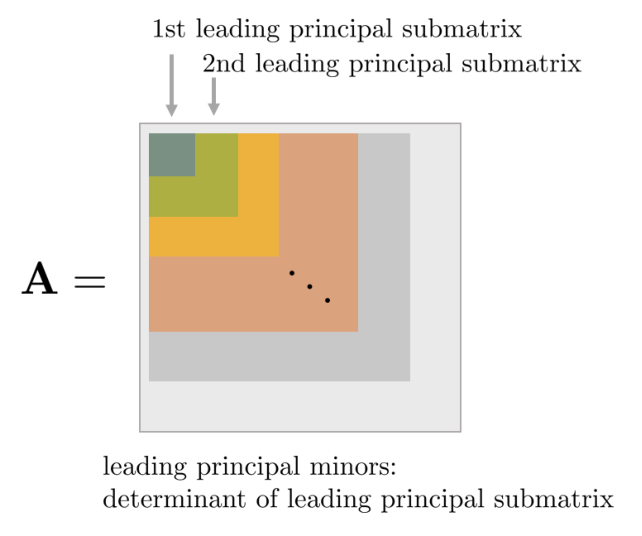

*(원문 p.37)*

- 만약 $\mathbf{C}$가 full rank가 아니면서 leading principal minors만 0보다 크거나 같은 값을 가지면 $\mathbf{A}$는 positive semi-definite 행렬이 된다.
- $\mathbf{A}$가 positive definite 행렬이면 $\mathbf{A}$의 역행렬은 $\mathbf{A}^{-1} = (\mathbf{C}^{-1})^\intercal(\mathbf{C}^{-1})$과 같이 구할 수 있다. 또한 임의의 $m \times n (m \leq n)$ 크기의 행렬 $\mathbf{B}$이 full rank인 경우 $\mathbf{B}\mathbf{A}\mathbf{B}^\intercal$ 또한 positive definite 행렬이 된다.

<!--widget:determinant-pd-->

## 6.10 Toeplitz matrix

퇴플리츠(Toeplitz) 행렬은 독일의 수학자 오토 퇴플리츠(Otto Toeplitz)가 도입한 행렬로 $n \times n$
크기의 정방 퇴플리츠행렬은 대각선의 성분들이 동일한 행렬을 의미하며 다음과 같이 정의한다.

$$[\mathbf{A}]_{ij} = a_{i-j} \tag{156}$$

$$\mathbf{A} = \begin{bmatrix} a_0 & a_{-1} & a_{-2} & \cdots & a_{-(n-2)} & a_{-(n-1)} \\ a_1 & a_0 & a_{-1} & \cdots & a_{-(n-3)} & a_{-(n-2)} \\ a_2 & a_1 & a_0 & \cdots & a_{-(n-4)} & a_{-(n-3)} \\ \vdots & \vdots & \vdots & \ddots & \vdots & \vdots \\ a_{n-2} & a_{n-3} & a_{n-4} & \cdots & a_0 & a_{-1} \\ a_{n-1} & a_{n-2} & a_{n-3} & \cdots & a_1 & a_0 \end{bmatrix} \tag{157}$$

두 개의 $n \times n$ 퇴플리츠 행렬 $\mathbf{A}, \mathbf{A}'$에 대하여 연산의 시간복잡도는 다음과 같다.

$$\begin{aligned} & \text{Add} \: : O(n) \\ & \text{Multiplication} \: : O(n^2) \\ & \text{Solution of } \mathbf{A}\mathbf{x} = \mathbf{b} : O(n^2) \\ & \text{Determinant } \det(\mathbf{A}) : O(n^2) \end{aligned} \tag{158}$$

연립 일차방정식 $\mathbf{A}\mathbf{x} = \mathbf{b}$과 행렬식 $\det(\mathbf{A})$은 레빈슨
재귀(Levinson recursion) 알고리즘을 사용하여 풀었을 때 시간복잡도를 의미한다.

# 7 Matrix decompositions

## 7.1 LU decomposition

LU 분해는 $\mathbf{A}\mathbf{x} = \mathbf{b}$ 의 시스템에서 행렬 $\mathbf{A}$를
하삼각(lower-triangle) 행렬 $\mathbf{L}$ 과 상삼각(upper-triangle) 행렬 $\mathbf{U}$의 곱으로 분해하는
방법이다.

$$\mathbf{A} = \mathbf{L}\mathbf{U} = \mathbf{b} \tag{159}$$

LU 분해를 사용하면 다음과 같이 방정식이 변형된다.

$$\mathbf{A}\mathbf{x} = (\mathbf{L}\mathbf{U})\mathbf{x} \tag{160}$$

이를 사용하여 [1] $\mathbf{L}\mathbf{y} = \mathbf{b}$ 방정식을 먼저 푼 후, [2]
$\mathbf{U}\mathbf{x} = \mathbf{y}$ 를 순차적으로 계산할 수 있다. tridiagonal, band-diagonal
시스템에 효과적으로 사용할 수 있다.

$$\begin{aligned} \mathbf{L}(\mathbf{U}\mathbf{x}) &= \mathbf{b} \\ \mathbf{L}\mathbf{y} &= \mathbf{b} \quad \cdots [1] \\ \mathbf{U}\mathbf{x} &= \mathbf{y} \quad \cdots [2] \end{aligned} \tag{161}$$

위와 같이 행렬 $\mathbf{A}$를 $\mathbf{L}, \mathbf{U}$로 분해하면 $\mathbf{x}$를 두 스텝에 걸쳐
구해야하지만 삼각행렬의 특성 상 $\mathbf{x}$를 구하는 것이 훨씬 더 간단해진다.

### 7.1.1 PLU decomposition

만약 $\mathbf{A}$가 아래와 같은 3x3 행렬이라고 가정해보자.

$$\mathbf{A} = \begin{bmatrix} \mathbf{a}_1^\intercal \\ \mathbf{a}_2^\intercal \\ \mathbf{a}_3^\intercal \end{bmatrix} = \begin{bmatrix} 0 & * & * \\ * & * & * \\ * & * & * \end{bmatrix} \tag{162}$$

LU 분해는 가우스 조던 소거법으로 $\mathbf{L}$을 구하기 때문에 만약 $\mathbf{A}$의 첫 번째 원소가
0으로 시작하는 경우 정상적으로 분해할 수 없다. 따라서 첫번째 행과 두번째 행의 순서를 변환하는
permutation 행렬 $\mathbf{P}$를 앞에 곱해줘야 LU 분해를 수행할 수 있다.

$$\mathbf{P}\mathbf{A} = \begin{bmatrix} & 1 & \\ 1 & & \\ & & 1 \end{bmatrix}\mathbf{A} = \begin{bmatrix} \mathbf{a}_2^\intercal \\ \mathbf{a}_1^\intercal \\ \mathbf{a}_3^\intercal \end{bmatrix} = \begin{bmatrix} * & * & * \\ 0 & * & * \\ * & * & * \end{bmatrix} \tag{163}$$

permutation 행렬은 직교행렬이고 직교행렬의 특성 상
$\mathbf{P} = \mathbf{P}^\intercal = \mathbf{P}^{-1}$이므로 이를 넘긴 후 전개하면 다음과 같다.

$$\mathbf{A} = \mathbf{P}\mathbf{L}\mathbf{U} \tag{164}$$

이와 같이 행벡터의 순서를 변경하는 $\mathbf{P}$를 곱한 후 LU 분해를 수행하는 방법을 PLU 분해라고 한다.

### 7.1.2 LDU decomposition

LU 분해에서 $\mathbf{L}, \mathbf{D}$ 행렬의 대각 성분을 1로 만들기 위해 중앙에 대각행렬
$\mathbf{D}$를 별도로 분해하는 방법을 LDU 분해라고 한다. 따라서 모든 LU 행렬은 LDU 행렬로 분해할 수
있다.

$$\mathbf{A} = \mathbf{L}\mathbf{U} = \mathbf{L}'\mathbf{D}\mathbf{U}' \tag{165}$$

## 7.2 Cholesky decomposition

Cholesky 분해는 $\mathbf{A}\mathbf{x} = \mathbf{b}$ 시스템에서 ==$\mathbf{A}$가 대칭행렬이면서 동시에
positive(-semi) definite인 경우에 이를 하삼각(lower-triangle) 행렬 $\mathbf{L}$의 곱으로 분해하는
방법을 말한다.==

$$\mathbf{A} = \mathbf{L}\mathbf{L}^\intercal \tag{166}$$

==Cholesky 분해는 수치적으로 안정하다는 특징이 있다.==

### 7.2.1 Detailed explanation

임의의 3x3 대칭행렬 $\mathbf{A}$가 주어졌다고 하자. 이를 cholesky 분해하면 다음과 같다.

$$\mathbf{A} = \begin{bmatrix} a_{11} & a_{21} & a_{31} \\ a_{21} & a_{22} & a_{32} \\ a_{31} & a_{32} & a_{33} \end{bmatrix} = \mathbf{L}\mathbf{L}^\intercal = \begin{bmatrix} l_{11} & & \\ l_{21} & l_{22} & \\ l_{31} & l_{32} & l_{33} \end{bmatrix}\begin{bmatrix} l_{11} & l_{21} & l_{31} \\ & l_{22} & l_{32} \\ & & l_{33} \end{bmatrix} \tag{167}$$

$\mathbf{L}\mathbf{L}^\intercal$을 자세히 전개하면 다음과 같다.

$$\begin{bmatrix} l_{11} & & \\ l_{21} & l_{22} & \\ l_{31} & l_{32} & l_{33} \end{bmatrix}\begin{bmatrix} l_{11} & l_{21} & l_{31} \\ & l_{22} & l_{32} \\ & & l_{33} \end{bmatrix} = \begin{bmatrix} l_{11}^2 & l_{21}l_{11} & l_{31}l_{11} \\ l_{21}l_{11} & l_{21}^2 + l_{22}^2 & l_{31}l_{21} + l_{32}l_{22} \\ l_{31}l_{11} & l_{31}l_{21} + l_{32}l_{22} & l_{31}^2 + l_{32}^2 + l_{33}^2 \end{bmatrix} \tag{168}$$

이를 통해 일대일로 비교하면 $\mathbf{L}$의 원소는 다음과 같이 구할 수 있다.

$$\begin{aligned} l_{11} &= \sqrt{a_{11}} \quad \cdots \text{ up to sign} \\ l_{21} &= a_{21}/l_{11} \\ l_{31} &= a_{31}/l_{11} \\ l_{21} &= \sqrt{a_{22} - l_{21}^2} \\ l_{32} &= (a_{32} - l_{31}l_{21})/l_{22} \\ l_{33} &= \sqrt{a_{33} - l_{31}^2 - l_{32}^2} \end{aligned} \tag{169}$$

이를 임의의 행렬에 대해 일반화하여 표현하면 다음과 같다.

$$\begin{aligned} l_{ii} &= \sqrt{a_{ii} - \sum_{k=1}^{i-1}l_{ik}^2} \\ l_{ij} &= \frac{1}{l_{jj}}\left(a_{ij} - \sum_{k=1}^{j-1}l_{ik}l_{jk}\right) \end{aligned} \tag{170}$$

## 7.3 LDLT decomposition

Cholesky 분해에서 $\mathbf{L}$ 행렬의 대각 성분을 1로 만들기 위해 중앙에 대각행렬 $\mathbf{D}$를
별도로 분해하는 방법을 LDLT 분해라고 한다. 따라서 모든 cholesky 행렬은 LDLT 행렬로 분해할 수 있다.

$$\mathbf{A} = \mathbf{L}\mathbf{L}^\intercal = \mathbf{L}'\mathbf{D}\mathbf{L}'^\intercal \tag{171}$$

## 7.4 QR decomposition

QR 분해는 $\mathbf{A}\mathbf{x} = \mathbf{b}$ 시스템에서 행렬 $\mathbf{A}$를 직교(orthogonal) 행렬
$\mathbf{Q}$와 상삼각(upper-triangle) 행렬 $\mathbf{R}$의 곱으로 분해하는 방법을 말한다.

$$\mathbf{A} = \mathbf{Q}\mathbf{R} \tag{172}$$

$\mathbf{Q}$ 가 직교 행렬이므로 $\mathbf{Q}\mathbf{Q}^\intercal = \mathbf{I}$의 성질을 지닌다.
일반적으로 QR 분해는 LU 분해보다 느리지만 최소제곱법(least squares) 문제를 풀 때 효율적이어서 자주
사용된다.

### 7.4.1 Detailed explanation

임의의 3x3 행렬 $\mathbf{A}$가 주어졌을 때 이를 열벡터로 표현하면 다음과 같다. 자세한 내용은 [6]를
참고하면 된다.

$$\mathbf{A} = [\mathbf{a}_1, \mathbf{a}_2, \mathbf{a}_3] \tag{173}$$

해당 행렬에 gram-schmidt 직교화를 수행하면 임의의 직교행렬 $\mathbf{Q}$를 만들 수 있다.

$$\mathbf{Q} = [\mathbf{q}_1, \mathbf{q}_2, \mathbf{q}_3] \tag{174}$$

이 때, gram-schmidt 직교화의 특성 상 $\mathbf{q}_1$은 첫번째 열벡터와 동일한 단위 벡터이고
$\mathbf{q}_2$는 $\mathbf{q}_1$와 직교한 단위벡터이며 $\mathbf{q}_3$는
$\mathbf{q}_1, \mathbf{q}_2$와 직교한 단위벡터이다. 이를 통해 $\mathbf{a}_i$를 구할 수 있다.

$$\begin{aligned} \mathbf{a}_1 &= \mathbf{a}_1^\intercal\mathbf{q}_1 \cdot \mathbf{q}_1 \\ \mathbf{a}_2 &= \mathbf{a}_2^\intercal\mathbf{q}_1 \cdot \mathbf{q}_1 + \mathbf{a}_2^\intercal\mathbf{q}_2 \cdot \mathbf{q}_2 \\ \mathbf{a}_3 &= \mathbf{a}_3^\intercal\mathbf{q}_1 \cdot \mathbf{q}_1 + \mathbf{a}_3^\intercal\mathbf{q}_2 \cdot \mathbf{q}_2 + \mathbf{a}_3^\intercal\mathbf{q}_3 \cdot \mathbf{q}_3 \end{aligned} \tag{175}$$

이를 행렬 형태로 표현하면 다음과 같은 상삼각 $\mathbf{R}$ 행렬을 얻을 수 있다.

$$\begin{gathered} \begin{bmatrix} \mathbf{a}_1 & \mathbf{a}_2 & \mathbf{a}_3 \end{bmatrix} = [\mathbf{q}_1, \mathbf{q}_2, \mathbf{q}_3]\begin{bmatrix} \mathbf{a}_1^\intercal\mathbf{q}_1 & \mathbf{a}_2^\intercal\mathbf{q}_1 & \mathbf{a}_3^\intercal\mathbf{q}_1 \\ & \mathbf{a}_2^\intercal\mathbf{q}_2 & \mathbf{a}_3^\intercal\mathbf{q}_2 \\ & & \mathbf{a}_3^\intercal\mathbf{q}_3 \end{bmatrix} \\ \mathbf{A} = \mathbf{Q}\mathbf{R} \\ \mathbb{R}^{3\times3} = \mathbb{R}^{3\times3}\mathbb{R}^{3\times3} \end{gathered} \tag{176}$$

임의의 직사각 행렬에 대해서도 QR 분해를 수행할 수 있다. 만약 5x3 행렬 $\mathbf{A}$가 주어졌을 때 이는
다음과 같이 QR 분해된다.

$$\begin{gathered} \begin{bmatrix} \mathbf{a}_1 & \mathbf{a}_2 & \mathbf{a}_3 \end{bmatrix} = [\mathbf{q}_1, \mathbf{q}_2, \mathbf{q}_3, \mathbf{q}_4, \mathbf{q}_5]\begin{bmatrix} \mathbf{a}_1^\intercal\mathbf{q}_1 & \mathbf{a}_2^\intercal\mathbf{q}_1 & \mathbf{a}_3^\intercal\mathbf{q}_1 \\ & \mathbf{a}_2^\intercal\mathbf{q}_2 & \mathbf{a}_3^\intercal\mathbf{q}_2 \\ & & \mathbf{a}_3^\intercal\mathbf{q}_3 \\ & & \\ & & \end{bmatrix} \\ \mathbf{A} = \mathbf{Q}\mathbf{R} \\ \mathbb{R}^{5\times3} = \mathbb{R}^{5\times5}\mathbb{R}^{5\times3} \end{gathered} \tag{177}$$

$\mathbf{q}_4, \mathbf{q}_5$ 벡터는 곱셈에 의해 0이 되어서 실제 $\mathbf{A}$ 행렬에는 관여하지 않는다.

### 7.4.2 QR decomposition on least squares problem

Over-determined 시스템 $\mathbf{A}\mathbf{x} = \mathbf{b}$가 주어졌을 때 이에 대한 최적해는 다음과
같이 최소제곱법을 통해 구할 수 있다.

$$\begin{gathered} \min_{\mathbf{x}} \|\mathbf{A}\mathbf{x} - \mathbf{b}\|_2^2 \\ \mathbf{x} = (\mathbf{A}^\intercal\mathbf{A})^{-1}\mathbf{A}^\intercal\mathbf{b} \end{gathered} \tag{178}$$

최소제곱법을 QR 분해를 통해 해석해보자. 임의의 직사각 행렬 $\mathbf{A}$를 QR 분해해보면 다음과 같다.

$$\begin{aligned} \mathbf{A} &= \mathbf{Q}\mathbf{R} \\ &= \begin{bmatrix} \mathbf{Q}_1 & \mathbf{Q}_2 \end{bmatrix}\begin{bmatrix} \mathbf{R}_1 \\ \mathbf{0} \end{bmatrix} \end{aligned} \tag{179}$$

$\|\mathbf{A}\mathbf{x} - \mathbf{b}\|_2^2$를 QR 분해해보면 다음과 같다.

$$\begin{aligned} \|\mathbf{A}\mathbf{x} - \mathbf{b}\|_2^2 &= \|\mathbf{Q}\mathbf{R}\mathbf{x} - \mathbf{b}\|_2^2 \\ &= \|\mathbf{Q}(\mathbf{R}\mathbf{x} - \mathbf{Q}^\intercal\mathbf{b})\|_2^2 \\ &= \|\mathbf{R}\mathbf{x} - \mathbf{Q}^\intercal\mathbf{b}\|_2^2 \\ &= \left\| \begin{bmatrix} \mathbf{R}_1 \\ \mathbf{0} \end{bmatrix}\mathbf{x} - \begin{bmatrix} \mathbf{Q}_1^\intercal \\ \mathbf{Q}_2^\intercal \end{bmatrix}\mathbf{b} \right\|_2^2 \end{aligned} \tag{180}$$

위 식에서 세번째 줄은
$\|\mathbf{Q}(\cdot)\|_2^2 = (\cdot)^\intercal\mathbf{Q}^\intercal\mathbf{Q}(\cdot) = (\cdot)^\intercal(\cdot) = \|(\cdot)\|_2^2$을
통해 구할 수 있다. 네번째 줄은 $\mathbf{Q}\mathbf{R}$ 행렬을 블록 행렬
$\mathbf{Q}_i, \mathbf{R}_i$로 표현한 모습이다. 벡터의 제곱의 합은 선형성을 가지므로 위 식의 마지막
줄을 전개하면 다음과 같다.

$$\left\| \begin{bmatrix} \mathbf{R}_1 \\ \mathbf{0} \end{bmatrix}\mathbf{x} - \begin{bmatrix} \mathbf{Q}_1^\intercal \\ \mathbf{Q}_2^\intercal \end{bmatrix}\mathbf{b} \right\|_2^2 = \|\mathbf{R}_1\mathbf{x} - \mathbf{Q}_1^\intercal\mathbf{b}\|_2^2 + \|-\mathbf{Q}_2^\intercal\mathbf{b}\|_2^2 \tag{181}$$

따라서
$\min_{\mathbf{x}}\left(\|\mathbf{R}_1\mathbf{x} - \mathbf{Q}_1^\intercal\mathbf{b}\|_2^2 + \|-\mathbf{Q}_2^\intercal\mathbf{b}\|_2^2\right)$를
최소화하는 $\mathbf{x}$는 다음과 같이 구할 수 있다.

$$\mathbf{x} = \mathbf{R}^{-1}\mathbf{Q}^\intercal\mathbf{b} \tag{182}$$

이 때, 최소제곱법 식의 크기는 $\|-\mathbf{Q}_2^\intercal\mathbf{b}\|_2^2$이다.

## 7.5 Eigen decomposition

정방행렬 $\mathbf{A} \in \mathbb{R}^{n \times n}$가 대각화 가능한 경우 다음과 같은 두 행렬
$\mathbf{V} \in \mathbb{R}^{n \times n}$과 대각행렬 $\mathbf{D} \in \mathbb{R}^{n \times n}$에 대하여
$\mathbf{A}$를 다음과 같이 분해할 수 있다.

$$\mathbf{A} = \mathbf{V}\mathbf{D}\mathbf{V}^{-1} \tag{183}$$

==이를 행렬 $\mathbf{A}$에 대한 고유값 분해(eigen decomposition) 라고 한다. 행렬 $\mathbf{A}$가
대각화 가능하다는 의미는 행렬 $\mathbf{A}$가 고유값 분해 가능하다는 말과 동치이다.==

행렬 $\mathbf{A}$가 대각화(고유값분해)되기 위해서는 역행렬이 존재하는 행렬 $\mathbf{V}$가 존재해야
한다. 행렬 $\mathbf{V}$가 역행렬이 존재하기 위해서는 $\mathbf{V}$는 행렬 $\mathbf{A}$와 같은
$\mathbb{R}^{n \times n}$ 크기의 정방행렬이어야 하고 n개의 선형독립인 열벡터를 가지고 있어야 한다. 이
때, $\mathbf{V}$의 각 열은 행렬 $\mathbf{A}$의 고유벡터가 된다. 만약 행렬 $\mathbf{V}$가 존재하는 경우
행렬 $\mathbf{A}$는 대각화(고유값분해) 가능하다 고 한다.

<!--widget:matrix-decompositions-->

## 7.6 Singular value decomposition

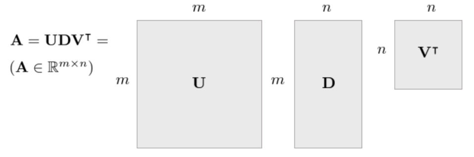

*(원문 p.42)*

행렬 $\mathbf{A} \in \mathbb{R}^{m \times n}$이 주어졌을 때 특이값 분해(Singular Value Decomposition,
SVD)는 다음과 같이 나타낼 수 있다.

$$\mathbf{A} = \mathbf{U}\Sigma\mathbf{V}^\intercal \tag{184}$$

==이 때, $\mathbf{U} \in \mathbb{R}^{m \times m}, \mathbf{V} \in \mathbb{R}^{n \times n}$인 행렬이며
이들은 각 열이 $\mathrm{Col} \: \mathbf{A}$와 $\mathrm{Row} \: \mathbf{A}$에 의 정규직교기저벡터
(Orthonormal Basis)로 구성되어 있다. $\Sigma \in \mathbb{R}^{m \times n}$은 대각행렬이며 대각 성분들이
$\sigma_1 \geq \sigma_2 \geq \cdots \geq \sigma_{\min(m,n)}$ 특이값이며 큰 값부터 내림차순으로 정렬된
행렬이다.==

### 7.6.1 Computing SVD

행렬 $\mathbf{A} \in \mathbb{R}^{m \times n}$에 대하여 $\mathbf{A}\mathbf{A}^\intercal$와
$\mathbf{A}^\intercal\mathbf{A}$는 다음과 같이 고유값분해할 수 있다.

$$\begin{aligned} \mathbf{A}\mathbf{A}^\intercal &= \mathbf{U}\Sigma\mathbf{V}^\intercal\mathbf{V}\Sigma^\intercal\mathbf{U}^\intercal = \mathbf{U}\Sigma\Sigma^\intercal\mathbf{U}^\intercal = \mathbf{U}\Sigma^2\mathbf{U}^\intercal \\ \mathbf{A}^\intercal\mathbf{A} &= \mathbf{V}\Sigma^\intercal\mathbf{U}^\intercal\mathbf{U}\Sigma\mathbf{V}^\intercal = \mathbf{V}\Sigma^\intercal\Sigma\mathbf{V}^\intercal = \mathbf{V}\Sigma^2\mathbf{V}^\intercal \end{aligned} \tag{185}$$

이 때 계산되는 행렬 $\mathbf{U}, \mathbf{V}$은 직교하는 고유벡터를 각 열의 성분으로 하는 행렬이며
대각행렬 $\Sigma^2$의 각 성분은 항상 0보다 크거나 같은 값을 가진다. 그리고
$\mathbf{A}\mathbf{A}^\intercal$와 $\mathbf{A}^\intercal\mathbf{A}$를 통해 계산되는 $\Sigma^2$의 값은
동일하다.

또한, 행렬 $\mathbf{A}$에 대하여
$\mathbf{A}\mathbf{A}^\intercal = \mathbf{A}^\intercal\mathbf{A} = \mathbf{S}$인 대칭행렬이 존재할 때
$\mathbf{S}$가 Positive (Semi-)Definite한 경우

$$\begin{aligned} \mathbf{x}^\intercal\mathbf{A}\mathbf{A}^\intercal\mathbf{x} &= (\mathbf{A}^\intercal\mathbf{x})^\intercal(\mathbf{A}^\intercal\mathbf{x}) = \|\mathbf{A}^\intercal\mathbf{x}\| \geq 0 \\ \mathbf{x}^\intercal\mathbf{A}^\intercal\mathbf{A}\mathbf{x} &= (\mathbf{A}\mathbf{x})^\intercal(\mathbf{A}\mathbf{x}) = \|\mathbf{A}\mathbf{x}\|^2 \geq 0 \end{aligned} \tag{186}$$

즉, $\mathbf{A}\mathbf{A}^\intercal = \mathbf{U}\Sigma^2\mathbf{U}^\intercal$와
$\mathbf{A}^\intercal\mathbf{A} = \mathbf{V}\Sigma^2\mathbf{V}^\intercal$에서 $\Sigma^2$의 값은 항상
0보다 크거나 같은 값이 된다.

임의의 직각 행렬 $\mathbf{A} \in \mathbb{R}^{m \times n}$에 대하여 특이값 분해는 언제나 존재한다.
$\mathbf{A} \in \mathbb{R}^{n \times n}$ 행렬의 경우 고유값 분해가 존재하지 않을 수 있지만 특이값
분해는 항상 존재한다. 대칭이면서 동시에 Positive Definite인 정방 행렬
$\mathbf{S} \in \mathbb{R}^{n \times n}$은 항상 고유값 분해값이 존재하며 이는 특이값 분해와 동일하다.

### 7.6.2 Range and nullspace of SVD

==SVD는 다른 행렬 분해 방법들과 달리 $\mathbf{A}$ 가 Singular하거나 Near-Singular한 경우에도 사용할 수
있는 방법이다.== $\mathbf{A}$ 가 Non-Singular한 경우 역행렬은
$\mathbf{A}^{-1} = \mathbf{V} \cdot \mathrm{diag}(1/\sigma_j) \cdot \mathbf{U}^\intercal$ 와 같이
계산할 수 있다. 만약 $\mathbf{A}$ 가 Singular한 경우 몇몇 $\sigma_j = 0$ 이 되는데 이 때
$1/\sigma_j \Rightarrow 0$ 으로 설정함으로써 의사역행렬(pseudo inverse)을 구할 수 있다. 특이값
$\sigma_j$와 관련하여 SVD 분해는 다음과 같은 성질을 갖는다.

- $\sigma_j \neq 0$ 일 때 이와 상응하는 $\mathbf{U}$ 의 column들을 $\mathbf{A}$ 행렬의 Orthogonal set of basis vector of Range 라고 한다.
- $\sigma_j = 0$ 일 때 이와 상응하는 $\mathbf{V}$ 의 column들을 $\mathbf{A}$ 의 Orthogonal set of basis vector of Null Space 라고 한다.
- 0이 아닌 특이값 $\sigma_j \neq 0$의 개수는 곧 행렬 $\mathbf{A}$의 rank와 같다.

### 7.6.3 SVD on under-determined system

$\mathbf{A}$ 가 Singular이면서 동시에 $\mathbf{b}$ 가 Range 안에 포함되는 경우 선형시스템은 다수의
해를 가진다. 이런 경우 $\mathbf{A}\mathbf{x} = \mathbf{b}$ 에서 $\|\mathbf{x}\|^2$ 가 최소가 되는 해를
구할 수 있다.

$$\begin{gathered} \min_{\mathbf{x}} \|\mathbf{x}\|^2 \\ \mathbf{x} = \mathbf{V} \cdot \mathrm{diag}(1/\sigma_j) \cdot \mathbf{U}^\intercal \cdot \mathbf{b} \end{gathered} \tag{187}$$

### 7.6.4 SVD on over-determined system

$\mathbf{A}$ 가 Singular이면서 동시에 $\mathbf{b}$ 가 Range에 존재하지 않는 경우 선형시스템은 해가
존재하지 않는다. 이런 경우 $\|\mathbf{A}\mathbf{x} - \mathbf{b}\|$ 가 최소가 되는 근사해를 구할 수
있다.

$$\begin{gathered} \min_{\mathbf{x}} \|\mathbf{A}\mathbf{x} - \mathbf{b}\| \\ \mathbf{x} = \mathbf{V} \cdot \mathrm{diag}(1/\sigma_j) \cdot \mathbf{U}^\intercal \cdot \mathbf{b} \end{gathered} \tag{188}$$

## 7.7 Pseudo inverse

Pseudo Inverse는 선형시스템에서 행렬 $\mathbf{A}$가 정방행렬이 아닐 경우 임의로 역행렬을 구하는 방법을
말한다. ==이 때, 선형시스템은 일반적으로 full column rank 또는 full row rank일 때 pseudo inverse를
적용할 수 있다.== Full rank가 아닌 행렬에 대한 pseudo inverse는 추후 섹션에서 설명한다.

### 7.7.1 Pseudo inverse on under-determined system (full row rank)

under-determined 시스템의 경우 $\mathbf{A}$는 full row rank가 되고 pseudo inverse는 다음과 같이
정의된다. lagrange multiplier $\lambda$를 포함하여 최적화 문제를 정의하면 다음과 같다.

$$\begin{aligned} \mathcal{L}(\mathbf{x}, \lambda) &= \frac{1}{2}\|\mathbf{x}\|^2 + \lambda^\intercal(\mathbf{A}\mathbf{x} - \mathbf{b}) \\ &= \frac{1}{2}\mathbf{x}^\intercal\mathbf{x} + \lambda^\intercal(\mathbf{A}\mathbf{x} - \mathbf{b}) \end{aligned} \tag{189}$$

이를 미분 후 0으로 만드는 값을 찾으면 최적의 $\mathbf{x}$ 값을 구할 수 있다

$$\begin{aligned} \Delta_\mathbf{x}\mathcal{L} &= \mathbf{x} + \mathbf{A}^\intercal\lambda = 0 \\ &\Rightarrow \mathbf{x} = -\mathbf{A}^\intercal\lambda \end{aligned} \tag{190}$$

기존 제약조건 $\mathbf{A}\mathbf{x} = \mathbf{b}$에 위에서 구한 $\mathbf{x}$를 대입하면 $\lambda$를
구할 수 있다.

$$\begin{aligned} \mathbf{A}\mathbf{x} &= \mathbf{b} \\ \mathbf{A}(-\mathbf{A}^\intercal\lambda) &= \mathbf{b} \\ \lambda &= -(\mathbf{A}\mathbf{A}^\intercal)^{-1}\mathbf{b} \end{aligned} \tag{191}$$

$\mathbf{A}\mathbf{A}^\intercal$은 정사각 행렬이고 $\mathbf{A}$가 full row rank이면 역행렬 계산이
가능하다. 이를 다시 (190)에 대입하면 다음과 같이 최적해 $\mathbf{x}$를 구할 수 있다.

$$\begin{aligned} \mathbf{x} &= -\mathbf{A}^\intercal\lambda \\ &= \mathbf{A}^\intercal(\mathbf{A}\mathbf{A}^\intercal)^{-1}\mathbf{b} \end{aligned} \tag{192}$$

$$\boxed{\mathbf{A}^\dagger = \mathbf{A}^\intercal(\mathbf{A}\mathbf{A}^\intercal)^{-1} \quad \cdots \text{ for under-determined system}} \tag{193}$$

==즉, under-determined 시스템에서 pseudo inverse는 오른쪽에 곱해지게 되며 이를 right pseudo
inverse라고 부르기도 한다.==

$$\boxed{\begin{aligned} \mathbf{x} &= \mathbf{A}^\dagger\mathbf{b} \\ &= \mathbf{A}^\intercal(\mathbf{A}\mathbf{A}^\intercal)^{-1}\mathbf{b} \quad \cdots \text{ for under-determined system} \end{aligned}} \tag{194}$$

### 7.7.2 Pseudo inverse on over-determined system (full column rank)

over-determined 시스템의 경우 $\mathbf{A}$는 full column rank가 되고 pseudo inverse는 다음과 같이
정의된다. 우선, over-determined 시스템에 대한 최적화 문제는 다음과 같이 최소제곱법 문제가 된다.

$$\min_{\mathbf{x}} \|\mathbf{A}\mathbf{x} - \mathbf{b}\|^2 = \min_{\mathbf{x}} \|\mathbf{b} - \mathbf{A}\mathbf{x}\|^2 = \min_{\mathbf{x}}(\mathbf{b} - \mathbf{A}\mathbf{x})^\intercal(\mathbf{b} - \mathbf{A}\mathbf{x}) \tag{195}$$

이를 전개하면 다음과 같다.

$$\min_{\mathbf{x}} \mathbf{b}^\intercal\mathbf{b} - \mathbf{b}^\intercal\mathbf{A}\mathbf{x} - \mathbf{x}^\intercal\mathbf{A}^\intercal\mathbf{b} + \mathbf{x}^\intercal\mathbf{A}^\intercal\mathbf{A}\mathbf{x} \tag{196}$$

위 문제를 풀기 위해 $\mathbf{x}$에 대해 미분하면 다음과 같은 식이 얻어진다.

$$-(\mathbf{b}^\intercal\mathbf{A})^\intercal - (\mathbf{A}^\intercal\mathbf{b}) + 2\mathbf{A}^\intercal\mathbf{A}\mathbf{x} = 0 \tag{197}$$

따라서 $\mathbf{x}$는 다음과 같이 구할 수 있다.

$$\mathbf{x} = (\mathbf{A}^\intercal\mathbf{A})^{-1}\mathbf{A}^\intercal\mathbf{b} \tag{198}$$

$$\boxed{\mathbf{A}^\dagger = (\mathbf{A}^\intercal\mathbf{A})^{-1}\mathbf{A}^\intercal \quad \cdots \text{ for over-determined system}} \tag{199}$$

==즉, over-determined 시스템에서 pseudo inverse는 왼쪽에 곱해지게 되며 이를 left pseudo inverse라고
부르기도 한다.==

$$\boxed{\begin{aligned} \mathbf{x} &= \mathbf{A}^\dagger\mathbf{b} \\ &= (\mathbf{A}^\intercal\mathbf{A})^{-1}\mathbf{A}^\intercal\mathbf{b} \quad \cdots \text{ for over-determined system} \end{aligned}} \tag{200}$$

### 7.7.3 Moore–Penrose pseudo inverse

모든 행렬은 SVD로 분해할 수 있기 때문에 full rank인 시스템과 rank deficient한 시스템 모두 SVD 분해를
통해 pseudo inverse를 구할 수 있다. 특히 ==Moore–Penrose pseudo inverse== $\mathbf{A}^\dagger$는
임의의 행렬 $\mathbf{A} \in \mathbb{R}^{m \times n}$에 대해 항상 존재하며 유일하고, 다음
==Penrose 조건 4개==를 만족하는 유일한 행렬로 정의된다.

$$\mathbf{A}\mathbf{A}^\dagger\mathbf{A} = \mathbf{A}, \tag{201}$$

$$\mathbf{A}^\dagger\mathbf{A}\mathbf{A}^\dagger = \mathbf{A}^\dagger, \tag{202}$$

$$(\mathbf{A}\mathbf{A}^\dagger)^\top = \mathbf{A}\mathbf{A}^\dagger, \tag{203}$$

$$(\mathbf{A}^\dagger\mathbf{A})^\top = \mathbf{A}^\dagger\mathbf{A}. \tag{204}$$

위 조건들로부터 $\mathbf{A}\mathbf{A}^\dagger$와 $\mathbf{A}^\dagger\mathbf{A}$는 각각
==대칭(symmetric)==이고 ==멱등(idempotent)==이므로 ==직교사영(orthogonal projector)==이다. 즉,

$$\mathbf{A}\mathbf{A}^\dagger : \: \mathrm{Col}(\mathbf{A}) \: \text{(column space)로의 직교사영}, \qquad \mathbf{A}^\dagger\mathbf{A} : \: \mathrm{Row}(\mathbf{A}^\top) \: \text{(row space)로의 직교사영}.$$

==따라서 일반적으로 항등행렬이 아니라 사영행렬이 된다.==

선형 시스템 $\mathbf{A}\mathbf{x} = \mathbf{b}$가 주어졌을 때 임의의 직사각형 행렬
$\mathbf{A} \in \mathbb{R}^{m \times n}$와 Moore–Penrose pseudo inverse $\mathbf{A}^\dagger$는 SVD
분해를 통해 다음과 같이 나타낼 수 있다.

$$\begin{aligned} \mathbf{A} &= \mathbf{U}\Sigma\mathbf{V}^\top, \\ \mathbf{A}^\dagger &= \mathbf{V}\Sigma^\dagger\mathbf{U}^\top. \end{aligned} \tag{205}$$

- $\mathbf{U} \in \mathbb{R}^{m \times m}$
- $\Sigma = \mathrm{diag}(\sigma_1, \sigma_2, \sigma_3, \cdots) \in \mathbb{R}^{m \times n}$
- $\Sigma^\dagger = \mathrm{diag}(1/\sigma_1, 1/\sigma_2, 1/\sigma_3, \cdots) \in \mathbb{R}^{n \times m}$
- $\mathbf{V} \in \mathbb{R}^{n \times n}$

==rank deficient==한 경우에는 $\sigma_i = 0$인 성분은 역수를 취할 수 없으므로 해당 위치는 0으로 둔다.

### 7.7.4 Full column rank case

==임의의 직사각형 행렬 $\mathbf{A} \in \mathbb{R}^{m \times n}$가 full column rank를 가지면 pseudo
inverse는 $\mathbf{A}^\dagger\mathbf{A}$와 같이 왼쪽에 곱해진다.== 이를 SVD 분해하여 표현하면 다음과
같다.

$$\mathbf{A}^\dagger\mathbf{A} = \mathbf{V}\Sigma^\dagger\mathbf{U}^\intercal\mathbf{U}\Sigma\mathbf{V}^\intercal = \mathbf{I}_n \tag{206}$$

또한, 앞서 구한 (199)에서
$\mathbf{A}^\dagger = (\mathbf{A}^\intercal\mathbf{A})^{-1}\mathbf{A}^\intercal$를 풀어쓰면 다음과 같다.

$$\begin{aligned} \mathbf{A}^\dagger &= (\mathbf{A}^\intercal\mathbf{A})^{-1}\mathbf{A}^\intercal \\ &= (\mathbf{V}\Sigma^\intercal\mathbf{U}^\intercal\mathbf{U}\Sigma\mathbf{V}^\intercal)^{-1}\mathbf{V}\Sigma^\intercal\mathbf{U}^\intercal \\ &= \mathbf{V}\Sigma^{-2}\Sigma\mathbf{U}^\intercal \quad \cdots \Sigma^\intercal = \Sigma \\ &= \mathbf{V}\Sigma^\dagger\mathbf{U}^\intercal \quad \cdots \Sigma^\dagger = \Sigma^{-1} \end{aligned} \tag{207}$$

이는 앞서 정의한 (205)와 동일하다.

### 7.7.5 Full row rank case

==임의의 직사각형 행렬 $\mathbf{A} \in \mathbb{R}^{m \times n}$가 full row rank를 가지면 pseudo
inverse는 $\mathbf{A}\mathbf{A}^\dagger$와 같이 오른쪽에 곱해진다.== 이를 SVD 분해하여 표현하면 다음과
같다.

$$\mathbf{A}\mathbf{A}^\dagger = \mathbf{U}\Sigma\mathbf{V}^\intercal\mathbf{V}\Sigma^\dagger\mathbf{U}^\intercal = \mathbf{I}_m \tag{208}$$

또한, 앞서 구한 (193)에서
$\mathbf{A}^\dagger = \mathbf{A}^\intercal(\mathbf{A}\mathbf{A}^\intercal)^{-1}$를 풀어쓰면 다음과 같다.

$$\begin{aligned} \mathbf{A}^\dagger &= \mathbf{A}^\intercal(\mathbf{A}\mathbf{A}^\intercal)^{-1} \\ &= \mathbf{V}\Sigma^\intercal\mathbf{U}^\intercal(\mathbf{U}\Sigma\mathbf{V}^\intercal\mathbf{V}\Sigma^\intercal\mathbf{U}^\intercal)^{-1} \\ &= \mathbf{V}\Sigma\Sigma^{-2}\mathbf{U}^\intercal \quad \cdots \Sigma^\intercal = \Sigma \\ &= \mathbf{V}\Sigma^\dagger\mathbf{U}^\intercal \quad \cdots \Sigma^\dagger = \Sigma^{-1} \end{aligned} \tag{209}$$

이는 앞서 정의한 (205)와 동일하다.

### 7.7.6 Rank deficient case

만약 임의의 직사각형 행렬 $\mathbf{A}$이 full rank가 아닐 경우 pseudo inverse는 다음과 같이 나타낼 수
있다. 예를 들어 $\mathbf{A} \in \mathbb{R}^{3 \times 4}$ 일 때 이를 SVD 분해하면 다음과 같다.

$$\begin{aligned} \mathbf{A} &= \mathbf{U}\Sigma\mathbf{V}^\intercal \\ &= \mathbf{U}\begin{bmatrix} \sigma_1 & 0 & 0 & 0 \\ 0 & \sigma_2 & 0 & 0 \\ 0 & 0 & 0 & 0 \end{bmatrix}\mathbf{V}^\intercal \end{aligned} \tag{210}$$

Pseudo inverse $\mathbf{A}^\dagger$를 SVD 분해하면 다음과 같다.

$$\begin{aligned} \mathbf{A}^\dagger &= \mathbf{V}\Sigma^\dagger\mathbf{U}^\intercal \\ &= \mathbf{V}\begin{bmatrix} 1/\sigma_1 & 0 & 0 \\ 0 & 1/\sigma_2 & 0 \\ 0 & 0 & 0 \\ 0 & 0 & 0 \end{bmatrix}\mathbf{U}^\intercal \end{aligned} \tag{211}$$

따라서 오른쪽 pseudo inverse $\mathbf{A}\mathbf{A}^\dagger$는 다음과 같이 전개할 수 있다.

$$\begin{aligned} \mathbf{A}\mathbf{A}^\dagger &= \mathbf{U}\Sigma\mathbf{V}^\intercal\mathbf{V}\Sigma^\dagger\mathbf{U}^\intercal \\ &= \mathbf{U}\begin{bmatrix} 1 & & \\ & 1 & \\ & & \end{bmatrix}\mathbf{U}^\intercal \\ &= \mathbf{u}_1\mathbf{u}_1^\intercal + \mathbf{u}_2\mathbf{u}_2^\intercal \end{aligned} \tag{212}$$

만약 $\mathbf{A}$가 full rank인 경우 $\mathbf{A}\mathbf{A}^\dagger$는 다음과 같다.

$$\begin{aligned} \mathbf{A}\mathbf{A}^\dagger &= \mathbf{I}_3 \\ &= \mathbf{u}_1\mathbf{u}_1^\intercal + \mathbf{u}_2\mathbf{u}_2^\intercal + \mathbf{u}_3\mathbf{u}_3^\intercal \end{aligned} \tag{213}$$

따라서 rank deficient 케이스의 경우 $\mathbf{A}\mathbf{A}^\dagger$는 마지막
$\mathbf{u}_3\mathbf{u}_3^\intercal$이 없는 pseudo inverse가 구해진다. 이는 항등행렬 $\mathbf{I}_3$와
유사한 값을 갖지만 동일하지는 않은 행렬이다==($=\mathrm{Col}(\mathbf{A})$로 사영행렬)==.

다음으로 왼쪽 pseudo inverse $\mathbf{A}^\dagger\mathbf{A}$는 다음과 같이 전개할 수 있다.

$$\begin{aligned} \mathbf{A}^\dagger\mathbf{A} &= \mathbf{V}\Sigma^\dagger\mathbf{U}^\intercal\mathbf{U}\Sigma\mathbf{V}^\intercal \\ &= \mathbf{V}\begin{bmatrix} 1 & & & \\ & 1 & & \\ & & & \\ & & & \end{bmatrix}\mathbf{V}^\intercal \\ &= \mathbf{v}_1\mathbf{v}_1^\intercal + \mathbf{v}_2\mathbf{v}_2^\intercal \end{aligned} \tag{214}$$

만약 $\mathbf{A}$가 full rank인 경우 $\mathbf{A}^\dagger\mathbf{A}$는 다음과 같다.

$$\begin{aligned} \mathbf{A}^\dagger\mathbf{A} &= \mathbf{I}_4 \\ &= \mathbf{v}_1\mathbf{v}_1^\intercal + \mathbf{v}_2\mathbf{v}_2^\intercal + \mathbf{v}_3\mathbf{v}_3^\intercal + \mathbf{v}_4\mathbf{v}_4^\intercal \end{aligned} \tag{215}$$

따라서 rank deficient 케이스의 경우 $\mathbf{A}^\dagger\mathbf{A}$는 마지막
$\mathbf{v}_3\mathbf{v}_3^\intercal + \mathbf{v}_4\mathbf{v}_4^\intercal$이 없는 pseudo inverse가
구해진다. 이는 항등행렬 $\mathbf{I}_4$와 유사한 값을 갖지만 동일하지는 않은 행렬이다. 이는
$\mathbf{A}\mathbf{A}^\dagger$를 통해 구한 행렬보다 덜 항등행렬에 근접하다
==($=\mathrm{Row}(\mathbf{A}^\intercal)$로 사영행렬)==.

따라서 임의의 non-full rank를 가지는 직사각형 행렬 $\mathbf{A} \in \mathbb{R}^{m \times n}$이
주어졌을 때, ==$\mathbf{A}\mathbf{A}^\dagger \in \mathbb{R}^{m \times m}$는
$\mathrm{Col}(\mathbf{A})$로의 사영을, $\mathbf{A}^\dagger\mathbf{A} \in \mathbb{R}^{n \times n}$는
$\mathrm{Row}(\mathbf{A}^T)$로의 사영을 의미한다. 즉, $m < n$인 경우에는
$\mathbf{A}\mathbf{A}^\dagger$가, $m > n$인 경우에는 $\mathbf{A}^\dagger\mathbf{A}$가 각각 해당
차원에서의 사영행렬로 해석==된다.

### 7.7.7 QR decomposition of pseudo inverse when singular case

간혹 $\mathbf{A}^\intercal\mathbf{A}$ 가 singular하거나 near-singular한 경우 QR 분해를 사용하여
pseudo inverse를 구한다.

$$\begin{aligned} \mathbf{x} &= \mathbf{A}^\dagger\mathbf{b} \\ &= (\mathbf{A}^\intercal\mathbf{A})^{-1}\mathbf{A}^\intercal\mathbf{b} \\ &= (\mathbf{R}^\intercal\mathbf{Q}^\intercal\mathbf{Q}\mathbf{R})^{-1}\mathbf{R}^\intercal\mathbf{Q}^\intercal\mathbf{b} \\ &= (\mathbf{R}^\intercal\mathbf{R})^{-1}\mathbf{R}^\intercal\mathbf{Q}^\intercal\mathbf{b} \\ &= \mathbf{R}^{-1}\mathbf{Q}^\intercal\mathbf{b} \end{aligned} \tag{216}$$

위 식은 (182)와 동일하다.

<!--widget:pseudo-inverse-->

## 7.8 Woodbury’s identity

역행렬이 존재하는 임의의 행렬 $\mathbf{A}$에 대해 rank 1 업데이트를 하는 방법을 Sherman-Morrison
공식이라고 한다. 또는 Woodbury’s identity라고도 한다. 해당 공식에 대한 보다 자세한 내용은 [6]를
참조하면 된다.

$$\boxed{(\mathbf{A} + \mathbf{u}\mathbf{v}^\intercal)^{-1} = \mathbf{A}^{-1} - \frac{\mathbf{A}^{-1}\mathbf{u}\mathbf{v}^\intercal\mathbf{A}^{-1}}{1 + \mathbf{v}^\intercal\mathbf{A}^{-1}\mathbf{u}}} \tag{217}$$

위 식에서 $(1 + \mathbf{v}^\intercal\mathbf{A}^{-1}\mathbf{u}) \neq 0$와
$(\mathbf{A} + \mathbf{u}\mathbf{v}^\intercal)^{-1}$이 역행렬이 존재하는 조건은 동치이다. 이 때,
$\mathbf{u}, \mathbf{v}$는 임의의 두 벡터를 의미하며 이를 $\mathbf{u}\mathbf{v}^\intercal$와 같이
곱하면 항상 rank 1 행렬이 생성된다.

$$\mathbf{u}\mathbf{v}^\intercal = \begin{bmatrix} u_1 \\ u_2 \end{bmatrix}\begin{bmatrix} v_1 & v_2 \end{bmatrix} = \begin{bmatrix} v_1\begin{bmatrix} u_1 \\ u_2 \end{bmatrix} & v_2\begin{bmatrix} u_1 \\ u_2 \end{bmatrix} \end{bmatrix} \quad \cdots \text{ linearly dependent} = \text{rank 1} \tag{218}$$

### 7.8.1 Recursive least squares

Sherman-Morrison 공식은 데이터가 계속 추가되는 최소제곱법 문제에 사용하면 연산량을 적게 소모하면서
효율적으로 역행렬을 업데이트할 수 있다. 다음과 같은 선형 시스템
$\mathbf{A}\mathbf{x} = \mathbf{b}$가 주어졌다고 하자.
$\mathbf{A} \in \mathbb{R}^{m \times n}, \mathbf{x} \in \mathbb{R}^{n \times 1}, \mathbf{b} \in \mathbb{R}^{m \times 1}$
일 때 이를 풀어서 쓰면 아래와 같다.

$$\begin{gathered} \mathbf{A}\mathbf{x} = \mathbf{b} \\ \begin{bmatrix} \mathbf{a}_1^\intercal \\ \mathbf{a}_2^\intercal \\ \vdots \\ \mathbf{a}_m^\intercal \end{bmatrix}\begin{bmatrix} x_1 \\ x_2 \\ \vdots \\ x_n \end{bmatrix} = \begin{bmatrix} b_1 \\ b_2 \\ \vdots \\ b_m \end{bmatrix} \end{gathered} \tag{219}$$

선형시스템의 최소제곱법의 해는 다음과 같다.

$$\mathbf{x} = (\mathbf{A}^\intercal\mathbf{A})^{-1}\mathbf{A}^\intercal\mathbf{b} \tag{220}$$

만약 $m + 1$ 번째 데이터 $\mathbf{a}_{m+1}^\intercal$이 입력되면 이에 맞게 최적해를 업데이트해줘야
한다. 표현의 편의를 위해 $m + 1$ 번째 데이터를 $\mathbf{a}$로 표현하면 다음과 같다.

$$\begin{aligned} \mathbf{x} &= \left(\begin{bmatrix} \mathbf{A}^\intercal & \mathbf{a} \end{bmatrix}\begin{bmatrix} \mathbf{A}^\intercal \\ \mathbf{a} \end{bmatrix}\right)^{-1}\begin{bmatrix} \mathbf{A}^\intercal & \mathbf{a} \end{bmatrix}\begin{bmatrix} \mathbf{b} \\ b \end{bmatrix} \\ &= (\mathbf{A}^\intercal\mathbf{A} + \mathbf{a}\mathbf{a}^\intercal)^{-1}(\mathbf{A}^\intercal\mathbf{b} + \mathbf{a}b_{m+1}) \end{aligned} \tag{221}$$

이 때, 앞 부분 $(\mathbf{A}^\intercal\mathbf{A} + \mathbf{a}\mathbf{a}^\intercal)^{-1}$에
Sherman-Morrison 공식 (217)을 적용하면 연산량을 적게 소모하면서 효율적으로 최적해를 업데이트할 수
있다. 이는 다음과 같이 전개 후 치환하여 간결하게 나타낼 수 있다.

$$\begin{aligned} (\mathbf{A}^\intercal\mathbf{A} + \mathbf{a}\mathbf{a}^\intercal)^{-1} &= (\mathbf{A}^\intercal\mathbf{A})^{-1} - \frac{(\mathbf{A}^\intercal\mathbf{A})^{-1}\mathbf{a}\mathbf{a}^\intercal(\mathbf{A}^\intercal\mathbf{A})^{-1}}{1 + \mathbf{a}^\intercal(\mathbf{A}^\intercal\mathbf{A})^{-1}\mathbf{a}} \\ &= \mathbf{P} - \frac{\mathbf{P}\mathbf{a}\mathbf{a}^\intercal\mathbf{P}}{1 + \mathbf{a}^\intercal\mathbf{P}\mathbf{a}} \\ &= \mathbf{P}_a \end{aligned} \tag{222}$$

- $(\mathbf{A}^\intercal\mathbf{A})^{-1} = \mathbf{P}$ 표현의 편의를 위해 치환한다

위 치환한 식을 기반으로 (221)를 전개하면 다음과 같다.

$$\begin{aligned} (\mathbf{A}^\intercal\mathbf{A} + \mathbf{a}\mathbf{a}^\intercal)^{-1}(\mathbf{A}^\intercal\mathbf{b} + \mathbf{a}b_{m+1}) &= \left(\mathbf{P} - \frac{\mathbf{P}\mathbf{a}\mathbf{a}^\intercal\mathbf{P}}{1 + \mathbf{a}^\intercal\mathbf{P}\mathbf{a}}\right)(\mathbf{A}^\intercal\mathbf{b} + \mathbf{a}b_{m+1}) \\ &= \mathbf{P}\mathbf{A}^\intercal\mathbf{b} + \frac{\mathbf{P}\mathbf{a}\mathbf{a}^\intercal\mathbf{P}}{1 + \mathbf{a}^\intercal\mathbf{P}\mathbf{a}}\mathbf{A}^\intercal\mathbf{b} + \mathbf{P}_a\mathbf{a}b \\ &= \mathbf{x} - \frac{\mathbf{P}\mathbf{a}\mathbf{a}^\intercal\mathbf{P}}{1 + \mathbf{a}^\intercal\mathbf{P}\mathbf{a}}\mathbf{A}^\intercal\mathbf{b} + \mathbf{P}_a\mathbf{a}b \\ &= \mathbf{x} - \left(\frac{\mathbf{P}\mathbf{a}}{1 + \mathbf{a}^\intercal\mathbf{P}\mathbf{a}}\right)\mathbf{a}^\intercal\mathbf{x} + \mathbf{P}_a\mathbf{a}b \\ &= \mathbf{x} - (\mathbf{P}_a\mathbf{a})\mathbf{a}^\intercal\mathbf{x} + \mathbf{P}_a\mathbf{a}b \\ &= \mathbf{x} + \mathbf{P}_a\mathbf{a}(b - \mathbf{a}^\intercal\mathbf{x}) \end{aligned} \tag{223}$$

- $\mathbf{P}\mathbf{A}^\intercal\mathbf{b} = \mathbf{x}$

위 식에서 5번째 줄은 $\mathbf{P}_a\mathbf{a}$를 전개한 후 분모를 통분하여 정리함으로써 유도할 수 있다.
==따라서 데이터가 증가했을 때 새로운 최적해는 이전 최적해 식으로부터 아래와 같이 업데이트된다. 이를
recursive least squares(RLS)라고 한다.==

$$\boxed{\mathbf{x} \leftarrow \mathbf{x} + \mathbf{P}_a\mathbf{a}(b - \mathbf{a}^\intercal\mathbf{x})} \tag{224}$$

## 7.9 Matrix inversion lemma

Matrix inversion lemma는 역행렬 변환 공식을 의미하며 선형 시스템을 다룰 때 자주 쓰이는 트릭 중
하나이다. 이는 Sherman-Morrison-Woodbury 공식이라고도 불린다. Matrix inversion lemma 는 다음과 같이
정의된다. Lemma에 대한 보다 자세한 내용은 [6]를 참조하면 된다.

$$\boxed{(\mathbf{A} + \mathbf{U}\mathbf{C}\mathbf{V})^{-1} = \mathbf{A}^{-1} - \mathbf{A}^{-1}\mathbf{U}(\mathbf{C}^{-1} + \mathbf{V}\mathbf{A}^{-1}\mathbf{U})^{-1}\mathbf{V}\mathbf{A}^{-1}} \tag{225}$$

- $\mathbf{A} \in \mathbb{R}^{n \times n}$
- $\mathbf{U} \in \mathbb{R}^{n \times k}$
- $\mathbf{C} \in \mathbb{R}^{k \times k}$
- $\mathbf{V} \in \mathbb{R}^{k \times n}$
- $\mathbf{A}, \mathbf{C}, \mathbf{C}^{-1} + \mathbf{V}\mathbf{A}^{-1}\mathbf{U}$ is invertible

==공식을 자세히 보면 matrix inversion lemma는 Woodbury’s identity의 행렬 확장버전으로 볼 수 있다.==
$\mathbf{C}$는 스칼라이고 $\mathbf{B}, \mathbf{D}$가 각각 $n \times 1, 1 \times n$인 경우
Woodbury’s identity와 동일한 공식이 유도된다.

### 7.9.1 Derivation of matrix inversion lemma

Matrix inversion lemma를 유도하기 위해 4개의 블록 행렬로 구성된 $\mathbf{M}$가 주어졌다고 하자.

$$\mathbf{M} = \begin{bmatrix} \mathbf{A} & \mathbf{B} \\ \mathbf{C} & \mathbf{D} \end{bmatrix} \tag{226}$$

### 7.9.2 LDU decomposition

다음으로 $\mathbf{M}$를 LDU 분해하려고 한다. 아래와 같이 $\mathbf{C}$를 소거하기 위한 행렬을 곱해서
LU 행렬을 만들 수 있다.

$$\begin{bmatrix} \mathbf{I} & 0 \\ -\mathbf{C}\mathbf{A}^{-1} & \mathbf{I} \end{bmatrix}^{-1}\begin{bmatrix} \mathbf{I} & 0 \\ -\mathbf{C}\mathbf{A}^{-1} & \mathbf{I} \end{bmatrix}\begin{bmatrix} \mathbf{A} & \mathbf{B} \\ \mathbf{C} & \mathbf{D} \end{bmatrix} = \begin{bmatrix} \mathbf{I} & 0 \\ -\mathbf{C}\mathbf{A}^{-1} & \mathbf{I} \end{bmatrix}^{-1}\begin{bmatrix} \mathbf{A} & \mathbf{B} \\ 0 & \mathbf{D} - \mathbf{C}\mathbf{A}^{-1}\mathbf{B} \end{bmatrix} \tag{227}$$

==이 때, $\mathbf{D} - \mathbf{C}\mathbf{A}^{-1}\mathbf{B}$를 $\mathbf{A}$의 schur complement
$(\mathbf{M}/\mathbf{A})$라고 한다.== 다음으로 대각 행렬 성분만 남기기 위해 아래와 같이 오른쪽에
행렬을 전개하면 LDU 분해가 마무리된다.

$$\begin{bmatrix} \mathbf{I} & 0 \\ -\mathbf{C}\mathbf{A}^{-1} & \mathbf{I} \end{bmatrix}^{-1}\begin{bmatrix} \mathbf{A} & \mathbf{B} \\ 0 & \mathbf{D} - \mathbf{C}\mathbf{A}^{-1}\mathbf{B} \end{bmatrix} = \begin{bmatrix} \mathbf{I} & 0 \\ -\mathbf{C}\mathbf{A}^{-1} & \mathbf{I} \end{bmatrix}^{-1}\begin{bmatrix} \mathbf{A} & 0 \\ 0 & \mathbf{D} - \mathbf{C}\mathbf{A}^{-1}\mathbf{B} \end{bmatrix}\begin{bmatrix} \mathbf{I} & \mathbf{A}^{-1}\mathbf{B} \\ 0 & \mathbf{I} \end{bmatrix} \tag{228}$$

$\mathbf{M}^{-1}$은 다음과 같이 LDU 행렬을 사용하여 전개할 수 있다.

$$\boxed{\begin{aligned} \begin{bmatrix} \mathbf{A} & \mathbf{B} \\ \mathbf{C} & \mathbf{D} \end{bmatrix}^{-1} &= \begin{bmatrix} \mathbf{I} & -\mathbf{A}^{-1}\mathbf{B} \\ 0 & \mathbf{I} \end{bmatrix}\begin{bmatrix} \mathbf{A}^{-1} & 0 \\ 0 & (\mathbf{D} - \mathbf{C}\mathbf{A}^{-1}\mathbf{B})^{-1} \end{bmatrix}\begin{bmatrix} \mathbf{I} & 0 \\ -\mathbf{C}^{-1}\mathbf{A} & \mathbf{I} \end{bmatrix} \\ &= \begin{bmatrix} \mathbf{A}^{-1} + \mathbf{A}^{-1}\mathbf{B}(\mathbf{D} - \mathbf{C}\mathbf{A}^{-1}\mathbf{B})^{-1}\mathbf{C}\mathbf{A}^{-1} & -\mathbf{A}^{-1}\mathbf{B}(\mathbf{D} - \mathbf{C}\mathbf{A}^{-1}\mathbf{B})^{-1} \\ -(\mathbf{D} - \mathbf{C}\mathbf{A}^{-1}\mathbf{B})^{-1}\mathbf{C}\mathbf{A}^{-1} & (\mathbf{D} - \mathbf{C}\mathbf{A}^{-1}\mathbf{B})^{-1} \end{bmatrix} \end{aligned}} \tag{229}$$

### 7.9.3 UDL decomposition

행렬 $\mathbf{M}$ LDU 뿐만아니라 UDL로도 분해될 수 있다. 아래와 같이 $\mathbf{B}$를 소거하기 위한
행렬을 곱해서 UL 행렬을 만들 수 있다.

$$\begin{bmatrix} \mathbf{A} & \mathbf{B} \\ \mathbf{C} & \mathbf{D} \end{bmatrix}\begin{bmatrix} \mathbf{I} & 0 \\ -\mathbf{D}^{-1}\mathbf{C} & \mathbf{I} \end{bmatrix}\begin{bmatrix} \mathbf{I} & 0 \\ -\mathbf{D}^{-1}\mathbf{C} & \mathbf{I} \end{bmatrix}^{-1} = \begin{bmatrix} \mathbf{A} - \mathbf{B}\mathbf{D}^{-1}\mathbf{C} & \mathbf{B} \\ 0 & \mathbf{D} \end{bmatrix}\begin{bmatrix} \mathbf{I} & 0 \\ -\mathbf{D}^{-1}\mathbf{C} & \mathbf{I} \end{bmatrix}^{-1} \tag{230}$$

==이 때, $\mathbf{A} - \mathbf{B}\mathbf{D}^{-1}\mathbf{C}$를 $\mathbf{D}$의 schur complement
$(\mathbf{M}/\mathbf{D})$라고 한다.== 다음으로 대각 행렬 성분만 남기기 위해 아래와 같이 왼쪽에 행렬을
전개하면 UDL 분해가 마무리된다.

$$\begin{bmatrix} \mathbf{A} - \mathbf{B}\mathbf{D}^{-1}\mathbf{C} & \mathbf{B} \\ 0 & \mathbf{D} \end{bmatrix}\begin{bmatrix} \mathbf{I} & 0 \\ -\mathbf{D}^{-1}\mathbf{C} & \mathbf{I} \end{bmatrix}^{-1} = \begin{bmatrix} \mathbf{I} & \mathbf{B}\mathbf{D}^{-1} \\ 0 & \mathbf{I} \end{bmatrix}\begin{bmatrix} \mathbf{A} - \mathbf{B}\mathbf{D}^{-1}\mathbf{C} & 0 \\ 0 & \mathbf{D} \end{bmatrix}\begin{bmatrix} \mathbf{I} & 0 \\ -\mathbf{D}^{-1}\mathbf{C} & \mathbf{I} \end{bmatrix}^{-1} \tag{231}$$

$\mathbf{M}^{-1}$은 다음과 같이 UDL 행렬을 사용하여 전개할 수 있다.

$$\boxed{\begin{aligned} \begin{bmatrix} \mathbf{A} & \mathbf{B} \\ \mathbf{C} & \mathbf{D} \end{bmatrix}^{-1} &= \begin{bmatrix} \mathbf{I} & 0 \\ -\mathbf{D}^{-1}\mathbf{C} & \mathbf{I} \end{bmatrix}\begin{bmatrix} (\mathbf{A} - \mathbf{B}\mathbf{D}^{-1}\mathbf{C})^{-1} & 0 \\ 0 & \mathbf{D}^{-1} \end{bmatrix}\begin{bmatrix} \mathbf{I} & -\mathbf{B}\mathbf{D}^{-1} \\ 0 & \mathbf{I} \end{bmatrix} \\ &= \begin{bmatrix} (\mathbf{A} - \mathbf{B}\mathbf{D}^{-1}\mathbf{C})^{-1} & -(\mathbf{A} - \mathbf{B}\mathbf{D}^{-1}\mathbf{C})^{-1}\mathbf{B}\mathbf{D}^{-1} \\ -\mathbf{D}^{-1}\mathbf{C}(\mathbf{A} - \mathbf{B}\mathbf{D}^{-1}\mathbf{C})^{-1} & \mathbf{D}^{-1} + \mathbf{D}^{-1}\mathbf{C}(\mathbf{A} - \mathbf{B}\mathbf{D}^{-1}\mathbf{C})^{-1}\mathbf{B}\mathbf{D}^{-1} \end{bmatrix} \end{aligned}} \tag{232}$$

### 7.9.4 Back to matrix inversion lemma

앞서 구한 (229), (232)는 분해 방법만 달랐을 뿐 모든 원소는 서로 같아야 한다. 따라서 첫번째 원소를
비교해보면 다음과 같다.

$$(\mathbf{A} - \mathbf{B}\mathbf{D}^{-1}\mathbf{C})^{-1} = \mathbf{A}^{-1} + \mathbf{A}^{-1}\mathbf{B}(\mathbf{D} - \mathbf{C}\mathbf{A}^{-1}\mathbf{B})^{-1}\mathbf{C}\mathbf{A}^{-1} \tag{233}$$

해당 식에서 아래와 같이 기호만 변경해주면 matrix inversion lemma 식 (225)가 된다.

$$\begin{aligned} \mathbf{B} &\to \mathbf{U} \\ \mathbf{C} &\to \mathbf{V} \\ \mathbf{D}^{-1} &\to -\mathbf{C} \\ \therefore \: (\mathbf{A} + \mathbf{U}\mathbf{C}\mathbf{V})^{-1} &= \mathbf{A}^{-1} - \mathbf{A}^{-1}\mathbf{U}(\mathbf{C}^{-1} + \mathbf{V}\mathbf{A}^{-1}\mathbf{U})^{-1}\mathbf{V}\mathbf{A}^{-1} \end{aligned} \tag{234}$$

또한 (229), (232)의 두번째 원소를 비교하면 다음과 같다. 해당 식도 자주 사용되는 행렬 변환 트릭 중
하나이다.

$$\boxed{-\mathbf{A}^{-1}\mathbf{B}(\mathbf{D} - \mathbf{C}\mathbf{A}^{-1}\mathbf{B})^{-1} = -(\mathbf{A} - \mathbf{B}\mathbf{D}^{-1}\mathbf{C})^{-1}\mathbf{B}\mathbf{D}} \tag{235}$$

지금까지 소개한 matrix inversion lemma 행렬 변환 트릭은 칼만 필터(kalman filter)의 공식을 유도할 때
종종 사용되며 이외에도 많은 공학 분야에서 사용된다.

<!--widget:woodbury-rls-->

# 8 Reference

1. (Lecture)edwith 인공지능을 위한 선형대수, 주재걸 교수
2. (Book) Kay, Steven M. Fundamentals of statistical signal processing: estimation theory. Prentice-Hall, Inc., 1993.
3. (Blog) 다크프로그래머 - Gradient, Jacobian 행렬, Hessian 행렬, Laplacian
4. (Blog) [행렬대수학] 행렬식(Determinant) 1 - 행렬식의 개념
5. (Pdf) Pseudo Inverse 유도 과정
6. (Youtube) Matrix Inversion Lemma 강의 영상 - 혁펜하임
7. Chen, Chi-Tsong. Linear system theory and design. Saunders college publishing, 1984.

# 9 Revision log

- 1st: 2020-05-15
- 2nd: 2020-06-21
- 3rd: 2023-01-21
- 4th: 2023-01-31
- 5th: 2024-02-24
- 6th: 2024-05-29
- 7th: 2024-06-29
- 8th: 2024-07-06
- 9th: 2025-06-12 : 주재걸 교수님 강의 링크 깨진 것 수정
- 10th: 2025-06-20 : pseudo inverse (under-determined) 유도 과정 수정
- 11th: 2025-06-28: pseudo inverse 설명 수정, projection matrix 설명 추가
- 12th: 2025-07-26: projection matrix + nullspace 설명 추가
- 13th: 2026-02-18: typo 수정

# 옮기며 바로잡은 것

원문을 옮기면서 고친 것은 아래가 전부다. 그 외의 문장·수식·절 구성은 손대지 않았다.

## 맞춤법·철자

| 원문 쪽 | 위치 | 원문 | 고친 것 |
|---|---|---|---|
| 13 | 1.22 절 제목 | Linear **tansformation** | Linear transformation |
| 19 | 2.14 절 | 직교(**Orhogonal**)하다고 말한다 | 직교(Orthogonal) |
| 20 | 2.16 절 제목 | Orthogonal projection ŷ of y onto **lne** | onto line |
| 24 | 3.5 절 | 대각화 가능(**Diangonalizable**)하다 | Diagonalizable |
| 25 | 3.10 절 | 대각 원소의 크기만큼 **스케일ㄷ한** 벡터 | 스케일한 벡터 |
| 36 | 6.9 절 | **postivie** definite인 경우 | positive definite |
| 37 | 6.9 절 | **postivie** semi-definite 행렬 | positive semi-definite |
| 37 | 6.10 절 | 퇴플리츠(**Toepliz**) 행렬 | Toeplitz |
| 39 | 7.2 절 | **postive**(-semi) definite인 경우 | positive(-semi) definite |
| 48 | 7.8.1 절 | **Sherman-Morisson** 공식 (217) | Sherman-Morrison (같은 문서의 7.8·7.9 에서는 Morrison 으로 적었다) |

## 재현한 것 — 원문의 파란 강조

원문은 중요한 문장과 용어를 **파란 굵은 글씨**(#197fb2)로 강조한다. 이 문서는 그 강조가 매우 많아
**36쪽에 걸쳐 114곳**이며, 전부 그대로 재현했다.

이것이 가능한 이유는 색이 **수식 안이 아니라 산문**에 쓰였기 때문이다. 수식 안의 색은 `\color` 매크로가
필요하고, 오프라인 MathJax 번들에 color 패키지가 없어 그 매크로를 쓰면 문서의 수식이 전부 렌더링되지
않는다(`_study_kit/3_Pitfalls.md` B6). 반면 산문의 색은 CSS로 색을 준 ``으로 충분하고, 그 안에
인라인 수식이 들어 있어도 **MathJax의 SVG 글리프가 `currentColor`를 상속하므로 수식까지 함께
물든다.** 실제로 이 문서의 display 수식 줄에 색이 붙은 곳은 **0곳**이고, 색이 붙은 수학은 전부
인라인이었다.

## 재현하지 않은 표현

원문은 참조되는 식 번호·참고문헌 번호·외부 링크를 **빨간/하늘색 네모**(hyperref 링크 테두리)로
표시한다. 이 테두리는 재현하지 않았다 — 화면에서는 링크가 아니라 잡음으로 보이기 때문이다. 참조는
`(217)`, `[6]`처럼 괄호 숫자 그대로 두었으므로 읽는 데 지장이 없다.

## 원문 그대로 둔 것

아래는 앞뒤와 어긋나 보이지만 저자의 표기 선택일 수 있어 **고치지 않고 그대로** 두었다.

- **식 (159)의 $\mathbf{A} = \mathbf{L}\mathbf{U} = \mathbf{b}$** — 좌변은 행렬이고 우변은 벡터라
  등호가 성립하지 않는다. 바로 다음 (160)이
  $\mathbf{A}\mathbf{x} = (\mathbf{L}\mathbf{U})\mathbf{x}$이므로 (159)는
  $\mathbf{A} = \mathbf{L}\mathbf{U}$까지가 의도로 보인다.
- **식 (169)의 네번째 줄이 $l_{21}$로 두 번 적혀 있다** — 두번째 줄이
  $l_{21} = a_{21}/l_{11}$이고 네번째 줄도 $l_{21} = \sqrt{a_{22} - l_{21}^2}$이다. 일반식 (170)과
  비교하면 네번째 줄은 $l_{22}$여야 한다.
- **식 (177)의 $\mathbb{R}^{5\times3} = \mathbb{R}^{5\times5}\mathbb{R}^{5\times3}$** — 본문은
  $\mathbf{Q} = [\mathbf{q}_1, \cdots, \mathbf{q}_5]$로 5개 열을 적었으므로 표기는 일관되지만,
  바로 위 (176)의 3x3 경우와 나란히 놓으면 reduced form인지 full form인지 헷갈릴 수 있다.
- **식 (229)의 세번째 인수 $-\mathbf{C}^{-1}\mathbf{A}$** — (228)의 LDU 분해에서 나온 행렬은
  $-\mathbf{C}\mathbf{A}^{-1}$이므로 (229) 첫 줄의 $-\mathbf{C}^{-1}\mathbf{A}$는 순서가 뒤집힌 것으로
  보이지만, 두번째 줄의 전개 결과는 $-\mathbf{C}\mathbf{A}^{-1}$로 맞게 적혀 있다.
- **식 (235)의 우변 마지막 항 $\mathbf{B}\mathbf{D}$** — (232)의 (1,2) 원소와 비교하면
  $\mathbf{B}\mathbf{D}^{-1}$이어야 한다.
- **§7.7.3 의 $\mathrm{Row}(\mathbf{A}^\top)$** — 행공간은 정의상
  $\mathrm{Row}(\mathbf{A}) = \mathrm{Col}(\mathbf{A}^\top)$(식 27)이므로
  $\mathrm{Row}(\mathbf{A})$ 또는 $\mathrm{Col}(\mathbf{A}^\top)$로 적는 것이 앞의 표기와 맞지만
  원문 그대로 두었다. §7.7.6 마지막 문단도 같다.
- **전치 기호가 두 가지로 섞여 있다** — 대부분 $\intercal$($\mathbf{A}^\intercal$)이고, 1.2·1.18·1.20
  절과 7.7.3~7.7.5 절 일부만 $\top$($\mathbf{A}^\top$)이다. 의미는 같다.

<!--END-->
