# Notes on Probability Theory

> **원문** — Gyubeom Edward Im, *Notes on Probability Theory* (45쪽)
> blog: [alida.tistory.com](https://alida.tistory.com) · email: criterion.im@gmail.com
> 파일: `ref/Notes on Probability Theory.pdf`
>
> **이 문서에 대하여** — 원문을 **내용 수정 없이 그대로** 옮긴 것이다. 절 구성·문장·수식 번호 (1)~(162)가
> 모두 원문과 같고 순서도 바꾸지 않았다. 원문의 그림 12개도 같은 자리에 넣었다.
>
> 원문에 없는 것은 **인터랙티브 위젯 11개**뿐이며, 전부 **원문에 없는 추가 요소**라고 표시된
> 회색 박스 안에 들어 있어 본문과 섞이지 않는다. 슬라이더를 움직이면 그 절의 수식이 그대로 그림과
> 숫자로 나타난다.
>
> 명백한 오타(맞춤법·수식 부호)는 바로잡았고, 무엇을 고쳤는지는 맨 아래
> [옮기며 바로잡은 것](#옮기며-바로잡은-것)에 전부 적어 두었다.

| 장 | 원문 쪽 | 장 | 원문 쪽 |
|---|---|---|---|
| 1 Introduction | 3 | 8 More on Gaussian distribution | 25 |
| 2 Set theory | 4 | 9 Random Process | 30 |
| 3 Measure theory | 6 | 10 Gaussian Process | 36 |
| 4 Probability | 7 | 11 Gaussian Process Regression | 38 |
| 5 Random variables | 11 | 12 References | 44 |
| 6 Probability distribution | 12 | 13 Revision log | 45 |
| 7 Moment | 21 | | |

> **Tip — NOMENCLATURE of Probability Theory**
>
> - 확률(probability)는 $Pr(\cdot)$으로 표기한다.
> - 사건(event)은 대문자로 표기한다. e.g., $A, B$
> - 이산 확률질량함수(pmf)와 연속 확률밀도함수(pdf)는 각각 $P(\cdot)$와 $p(\cdot)$으로 표기한다.
> - 확률변수(random variable)는 소문자로 표기한다. e.g., $x, y$
> - 확률 $Pr(\cdot)$는 사건을 입력으로 받아 $[0, 1]$의 값을 반환한다. (e.g., $Pr(A), Pr(A \mid B)$)
> - pmf/pdf는 확률변수 $x$의 값을 입력으로 받아 확률(이산) 또는 밀도(연속)를 반환하는 함수이다.
>   e.g., $P(x), p(x)$

# 1 Introduction

현대 확률론의 수학적인 정의는 20세기 수학자 Andrey Kolmogorov에 의해 정립되었다. 이번 섹션에서는
확률론을 설명하기 위한 기반 이론이 되는 set theory와 measure theory을 설명한다. 해당 이론에 대한
대부분의 내용은 [6]를 참고하여 작성하였다.

# 2 Set theory

집합론(set theory)은 수학의 기본적인 개념인 집합과 그 집합들 간의 관계, 연산 등을 연구하는 수학의
한 분야이다. 집합론은 수학의 거의 모든 분야에 걸쳐 기초적인 언어와 도구를 제공한다. 다양한 집합론의
용어를 먼저 정의해보자. 옷장과 옷으로 비유하여 생각해보면

- 집합(set)이란 옷장을 의미하고
- 원소(element)란 옷을 의미한다.
- 부분집합(subset)이란 옷들 중 일부분을 의미하며
- 전체집합(universal set)은 옷장의 모든 옷을 의미한다.
- 집합 연산자(set operator)는 옷으로 할 수 있는 연산(e.g., 옷이 몇개 있는가)을 의미한다.
- 서로소 집합(disjoint set)은 청바지와 코트처럼 교집합이 없는 집합을 의미한다($A \cap B = \emptyset$)
- 분할(partition of A)는 집합 A를 서로소 집합으로 나누는 것을 의미한다. $A = \{1, 2, 3, 4\} \to \{\{1, 2\}, \{3\}, \{4\}\}$
- 곱집합(Cartesian product, 데카르트 곱)은 두 집합 A,B가 있을 때 각각의 집합에서 한 개씩 가져와서
  쌍(pair)를 이루는 것을 말한다. $A \times B = \{(a, b) : a \in A, b \in B\}$. 왼쪽 예시는 2차원
  벡터 공간 $\mathbb{R}^2$의 예시이다.
- 멱집합(power set)은 집합 A의 모든 부분집합의 집합을 의미하며 $2^A$로 표기한다. $A = \{1, 2, 3\}$인
  경우 멱집합은 $\{\emptyset, \{1\}, \{2\}, \{3\}, \{1, 2\}, \{1, 3\}, \{2, 3\}, \{1, 2, 3\}\}$과
  같이 8개가 된다.

## 2.1 Cardinality

집합 $A$의 크기(cardinality)는 $|A|$와 같이 표기한다. $|A| = m$이고 $|B| = n$이면 둘의 곱집합은
$|A \times B| = mn$이 된다.

- 멱집합의 cardinality는 $|A| = n$인 경우 $|2^A| = 2^n$이 된다.
- 만약 두 집합이 일대일 대응(one-to-one correspondence)을 보인다면 두 집합의 cardinality는 동일하다.
- 가산집합(countable set)은 자연수와 일대일 대응을 이루는 함수로 셀 수 있는(countable) 집합을 말한다.
  셀 수 있다고 반드시 유한할 필요는 없다.
- 자연수 집합과 분수들의 집합과 같이 셀 수 있으나 크기가 무한인(countable infinite) 집합을
  가부번(denumerable) 집합이라고 한다. 또는 aleph null($\aleph_0$)이라고도 부른다.
- 비가산집합(uncountable set)이란 가산집합과 달리 셀 수 없는 집합을 말하며 $\mathbf{c}$(continuum)라고
  부르거나 $\mathbf{c} = 2^{\aleph_0}$라고 표기한다. 예를 들면 0과 1 사이의 실수의 개수들의 집합이
  비가산집합에 해당한다.

## 2.2 Function

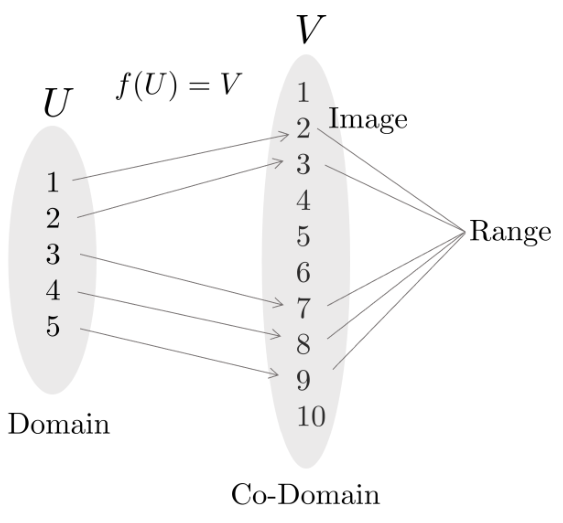

*(원문 p.5)*

함수 $f$는 집합 $U$에서 다른 집합 $V$로 변환 또는 매핑하는 연산자를 말한다.

$$f : U \to V \tag{1}$$

이 때, $U$를 정의역(domain)이라고 부르며 $V$를 공역(co-domain)이라고 한다. 상(image)이란 주어진 입력
$U$에 대해 매핑된 출력 $V$를 의미한다. 치역(range)이란 정의역 내에 있는 입력 $U$들에 의해 매핑된 모든
출력 $V$의 집합을 의미한다.

- domain $U$, co-domain $V$
- image: $f(A) = \{f(x) \in V : x \in A\}, A \subseteq U$
- range: $f(U)$
- inverse image(=preimage) : $f^{-1}(B) = \{x \in U : f(x) \in B\}, B \subseteq V$

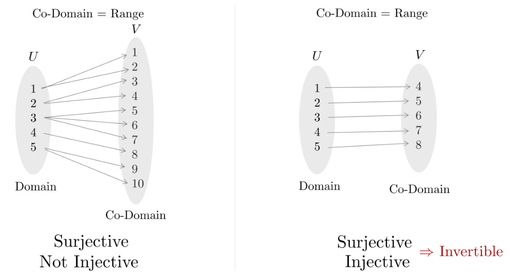

*(원문 p.5)*

Onto는 전사함수(surjective)라고도 불리며 공역이 치역과 같은 경우를 의미한다. 이는 co-domain의 모든
원소들이 사영된 것을 의미한다. One-to-one은 일대일함수(injective)라고도 불리며 정의역의 원소와 공역의
원소가 하나씩 대응되는 함수를 의미한다. 함수 $f$가 역함수 $f^{-1}$를 가지기 위해서는(invertible)
전사함수이면서 동시에 일대일 함수이어야 한다.

# 3 Measure theory

측도론(measure theory)은 크기, 길이, 면적, 부피 등을 일반화한 측도(measure)의 개념을 다루는 수학의
분야이다. 이 이론은 특히 확률론과 함수해석학에서 중요한 역할을 한다. 측도론의 기본적인 아이디어는
집합에 숫자를 할당하여 그 집합의 크기를 측정하는 것이다.

예를 들어, 실수 집합의 부분집합에 대해 길이를 할당할 수 있고, 이를 통해 무한대의 집합이나 아주 작은
집합의 크기를 정량화할 수 있다. 집합 함수(set function)란 하나의 집합에 하나의 값(measure)을 할당하는
함수를 말한다. 이는 앞서 말한 것처럼 크기, 길이, 부피 등이 될 수 있다.

## 3.1 σ-field

$\sigma$-field $\mathcal{B}$란 '측정 가능한 집합'들을 정의하기 위한 집합들의 컬렉션을 의미한다.
100명의 사람들의 몸무게를 재는 것으로 비유하여 $\sigma$-field를 만족하기 위한 세 가지 정의를 살펴보자.

1. $\emptyset \in \mathcal{B}$ : 공집합을 포함해야 한다(e.g., 아무 사람의 몸무게도 재지 않은 기준점이
   필요하다).
2. $A \in \mathcal{B} \Rightarrow A^c \in \mathcal{B}$: 어떤 집합 $A$가 $\sigma$-field에 속한다면
   이의 여집합 $A^c$ 또한 $\sigma$-field에 속해야 한다(e.g., 2명에 대해 몸무게를 잴 수 있다면 98명에
   대해서도 몸무게를 잴 수 있어야 한다.).
3. $A_i \in \mathcal{B} \Rightarrow \cup_{i=1}^{\infty} A_i \in \mathcal{B}$: $\sigma$-field에 속하는
   임의의 집합 시퀀스 $A_i, i = 1, 2, \cdots$에 대하여 이 집합들의 합집합도 $\sigma$-field에 속해야
   한다(e.g., a라는 사람의 몸무게를 잴 수 있고 b라는 사람의 몸무게를 잴 수 있다면 a+b 둘을 합쳤을
   때도 몸무게를 잴 수 있어야 한다).

### 3.1.1 Properties of σ-field

- 전체집합 $U$을 포함한다. : $U \in \mathcal{B}$
- 가산 합집합(countable union)에 대하여 닫혀있다. : $A_i \in \mathcal{B} \Rightarrow \cup_{i=1}^{\infty} A_i \in \mathcal{B}$
- 가산 교집합(countable intersection)에 대하여 닫혀있다. : $A_i \in \mathcal{B} \Rightarrow \cap_{i=1}^{\infty} A_i \in \mathcal{B}$
- 멱집합 $2^U$는 가장 잘게 나눌 수 있는 $\sigma$-field이다.
- 유한할 수 있고(finite) 셀 수 없을 수 있으나(uncountable) 가부번할 수 없다(never denumerable).
- $\mathcal{B}, \mathcal{C}$가 $\sigma$-field인 경우 $\mathcal{B} \cap \mathcal{C}$은 $\sigma$-field이지만
  $\mathcal{B} \cup \mathcal{C}$은 $\sigma$-field가 아니다.
- 집합 $A$에 대하여 만들어진 $\sigma$-field는 $\sigma(A)$와 같이 표기한다.

## 3.2 Measurable space

임의의 집합 $U$와 $U$의 부분집합으로 이루어진 $\sigma$-field $\mathcal{B}$가 주어졌다면
가측공간(measurable space)는 $(U, \mathcal{B})$ 같이 정의할 수 있다.

측도(measure) $\mu$란 가측공간 $(U, \mathcal{B})$에서 $\sigma$-field의 원소를 사용하여 $[0, \infty]$의
값을 반환하는 일종의 집합 함수(set function)를 말한다.

$$\mu : \mathcal{B} \to [0, \infty] \tag{2}$$

- $\mu(\emptyset) = 0$ : 공집합에 대한 측도는 0이다.
- 서로소 집합들 $A_i$, $A_j$들에 대하여 $\mu(\cup_{i=1}^{\infty} A_i) = \sum_{i=1}^{\infty} \mu(A_i)$가
  성립한다.

  - 100명의 몸무게를 잴 때 1 10번(A) 사람의 몸무게를 잰 것과 65-75번(B) 사람의 몸무게를 잰 것은 서로
    다르지만 이 두 집합을 뭉쳐서(A+B) 한 번에 몸무게를 잰 것과 각 집합(A,B)들의 몸무게를 잰 값을 더한
    값은 서로 같아야 한다.

- 가측공간과 측도를 합하여 $(U, \mathcal{B}, \mu)$와 같이 표기하기도 한다.

# 4 Probability

측도론에서 확률(probability)이란 전체집합 $U$에 대하여 $\mu(U) = 1$의 크기를 만족하도록 정규화된
측도(normalized measure)를 의미한다.

## 4.1 Random experiment

1부터 6까지 나올 확률이 모두 동일한 주사위(fair dice)가 주어졌다고 하자. 전체 집합
$U = \{1, 2, 3, 4, 5, 6\}$에 대한 $\sigma$-field $\mathcal{B}$는 어떻게 정할까? 확률 문제는 일반적으로
다음과 같은 질문을 묻는다.

- 주사위가 1이 나올 확률은 얼마인가?
- 주사위가 4 또는 6이 나올 확률은 얼마인가?
- 주사위가 2,3,5 중 하나가 나올 확률은 얼마인가?

이와 같이 집합 $U$에 대한 모든 부분집합을 사용할 수 있어야 되기 때문에 $\mathcal{B}$는 보통 멱집합
$2^U$을 사용한다. 확률에서 가측공간 $(U, \mathcal{B}, \mu)$는 특별히 확률공간(probability space)라고
하며 일반적으로 $(\Omega, \mathcal{F}, Pr)$로 표기한다. 각 기호들의 설명은 다음과 같다.

- $\Omega$: 표본공간(sample space)라고 하며 이름은 공간이 들어가지만 나올 수 있는 원소들의 전체
  집합(=set)을 의미한다.
- $\mathcal{F}$: 표본공간의 부분집합을 의미하며 사건(event)이라고 부른다.
- $Pr$: 측도(measure)를 수행하는 연산자로써 표본공간의 원소에 확률을 부여하는 역할을 한다.

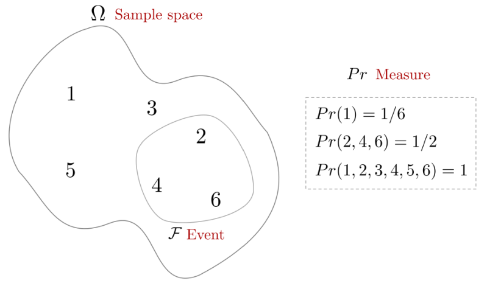

*(원문 p.8)*

어떠한 현상으로부터 결과를 얻기 위해서는 실험(experiment)를 해야하고 이 때 우리는 실현값(outcome)을
얻을 수 있다. 만약 실험의 결과가 매 번 다르고 우리가 실현값의 결과를 하나의 표본공간으로 정의할 수
있다고 하면 이는 확률 실험(random experiment)라고 부른다.

따라서 주사위 던지기는 확률 실험의 일종이며 우리는 표본공간 $\Omega = \{1, 2, 3, 4, 5, 6\}$에서 확률
$Pr(\cdot)$이라는 측도(measure)를 사용하여 공간 내 원소의 크기를 측정한 실현값(outcome)을 얻을 수 있다.

$$\begin{aligned}
Pr(1) &= Pr(2) = Pr(3) = Pr(4) = Pr(5) = Pr(6) = 1/6 \\
Pr(A) &= Pr(2, 4, 6) = Pr(2) + Pr(4) + Pr(6) = 1/2
\end{aligned} \tag{3}$$

## 4.2 Probability axioms

확률공간 $(\Omega, \mathcal{F}, Pr)$에 정의된 확률 $Pr(\cdot)$은 하나의 집합 함수(set function)이며
다음과 같이 정의된다.

$$Pr(\mathcal{F}) \to [0, 1] \tag{4}$$

확률의 공리(axiom)는 다음과 같다.

- $Pr(\emptyset) = 0$ : 공집합에 대한 측도는 0이다.
- $Pr(A) \geq 0 \quad \forall A \subseteq \Omega$ : 확률은 항상 0보다 크거나 같은 값을 가진다.
- 서로소 집합들 $A_i$, $A_j$들에 대하여 $Pr(\cup_{i=1}^{\infty} A_i) = \sum_{i=1}^{\infty} Pr(A_i)$가
  성립한다.
- $Pr(\Omega) = 1$ : 전체 표본공간에 대한 확률의 총합은 1이다. 위 조건에서 보다시피 확률이란 기존
  측도(measure)의 세가지 조건에 마지막 조건(총합=1)이 추가된 특수한 버전으로 해석할 수 있다.

## 4.3 Probability allocation function

지금까지 확률공간 $(\Omega, \mathcal{F}, Pr)$을 정의하였고 표본공간의 부분집합인 $\mathcal{F}$의 크기를
측도(measure)함으로써 확률을 측정할 수 있는 연산자 $Pr$을 정의하였다. 서로 다른 표본공간에서 대하여 각각
측도 $Pr$를 수행할 수 있는 함수 $P(\cdot), p(\cdot)$을 정의할 수 있고 이를
확률할당함수(probability allocation function)이라고 한다.

### 4.3.1 Discrete sample space Ω:

$$\begin{gathered}
\boxed{P : \Omega \to [0, 1]} \\[4pt]
\text{such that} \\[4pt]
\sum_{w \in \Omega} P(w) = 1 \\
Pr(A) = \sum_{w \in A} P(w)
\end{gathered} \tag{5}$$

### 4.3.2 Continuous sample space Ω:

$$\begin{gathered}
\boxed{p : \Omega \to [0, \infty)} \\[4pt]
\text{such that} \\[4pt]
\int_{w \in \Omega} p(w) dw = 1 \\
Pr(A) = \int_{w \in A} p(w) dw
\end{gathered} \tag{6}$$

일반적으로 전자를 확률질량함수(probability mass function, pmf)라고 하며 후자를
확률밀도함수(probability density function, pdf)라고 한다.

이 때 이산/연속의 구분은 보통 표본공간 $\Omega$ 자체의 성질이라기보다 관심 있는 확률변수 $x$의 분포가
어떤 형태로 표현되는지에 대한 구분으로 이해하면 된다. 즉, 이산형이면 pmf $P(x)$로 연속형이면 pdf $p(x)$로
분포를 기술하는 경우가 많다. 표본공간 $\Omega$는 실험 결과를 모델링하기 위한 공간이며 같은 분포도 서로
다른 $\Omega$ 위에서 구성될 수 있다.

## 4.4 Independence ≠ disjoint

두 사건(event) $A, B$이 서로 독립 사건임을 보이기 위해서는 다음의 정의를 만족해야 한다.

$$\begin{aligned}
Pr(A \cap B) &= Pr(A)Pr(B) \\
Pr(A|B) &= Pr(A)
\end{aligned} \tag{7}$$

위 정의에서 알 수 있듯이 독립(independent)은 한 사건의 발생이 다른 사건의 확률에 영향을 주지 않는다는
뜻이다.

반면 서로소(disjoint), 즉 상호 배제(mutually exclusive)란 두 사건이 동시에 일어날 수 없음을 의미하며
$A \cap B = \varnothing$로 쓴다. 만약 $A \cap B = \varnothing$이면

$$Pr(A \cap B) = 0 \quad \cdots \text{disjoint} \tag{8}$$

이므로 $Pr(A) > 0$ 그리고 $Pr(B) > 0$인 경우에는 $Pr(A \cap B) = Pr(A)Pr(B)$를 만족할 수 없어 $A, B$는
독립일 수 없다. ($Pr(A) = 0$ 또는 $Pr(B) = 0$의 경우에는 위 등식이 우연히 성립할 수 있다.)

<!--widget:prob-independence-vs-disjoint-->

## 4.5 Joint probability

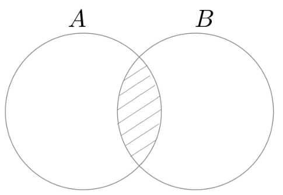

*(원문 p.10)*

결합 확률(joint probability)이란 두 사건 $A, B$가 동시에 발생할 확률(=교집합이 발생할 확률)을 의미한다.

$$Pr(A \cap B) \tag{9}$$

## 4.6 Marginal probability

주변 확률(marginal probability)는 여러 사건들 사이에서 하나의 사건만을 고려하는 것을 말한다. 예를 들어,
두 사건 $A$와 $B$가 있고, 이들의 결합 확률(joint probability)가 주어졌을 때, $A$의 주변 확률은 $B$가
취할 수 있는 모든 값에 대해 $A$의 확률을 합하여 얻어진다. 단, $\{B_i\}$가 서로소(disjoint)이고
$\bigcup_i B_i = \Omega$인 분할(partition)일 때 다음이 성립한다(law of total probability)

$$Pr(A) = \sum_i Pr(A \cap B_i) \tag{10}$$

## 4.7 Conditional probability

조건부 확률은 두 사건 $A, B$에 대하여 $B$가 발생했을 때 $A$가 발생할 확률을 의미한다.

$$Pr(A|B) = \frac{Pr(A \cap B)}{Pr(B)} \tag{11}$$

이를 통해 두 사건이 동시에 발생한 확률은 $Pr(A \cap B) = Pr(A)Pr(B|A)$와 같이 나타낼 수 있다. 이 때,
$Pr(A \cap B) = Pr(B \cap A)$이므로 $A, B$ 순서를 바꿔도 공식이 성립한다. 이는 $A$가 발생했을 때 $B$가
발생할 확률을 의미한다.

$$Pr(B|A) = \frac{Pr(B \cap A)}{Pr(A)} \tag{12}$$

만약 두 사건 $A, B$가 독립이면 조건부 확률은 다음과 같다.

$$Pr(A|B) = \frac{Pr(A \cap B)}{Pr(B)} = \frac{Pr(A)Pr(B)}{Pr(B)} = Pr(A) \tag{13}$$

## 4.8 Bayesian rule

Bayesian rule은 다음과 같은 조건부확률 간 관계를 의미한다.

$$\begin{aligned}
Pr(A|B) &= \frac{Pr(A \cap B)}{Pr(B)} \\
&= \frac{Pr(B|A)Pr(A)}{Pr(B)}
\end{aligned} \tag{14}$$

- $Pr(A|B)$: posterior probability
- $Pr(B|A)$: likelihood
- $Pr(A)$: prior probability

<!--widget:prob-bayes-calculator-->

# 5 Random variables

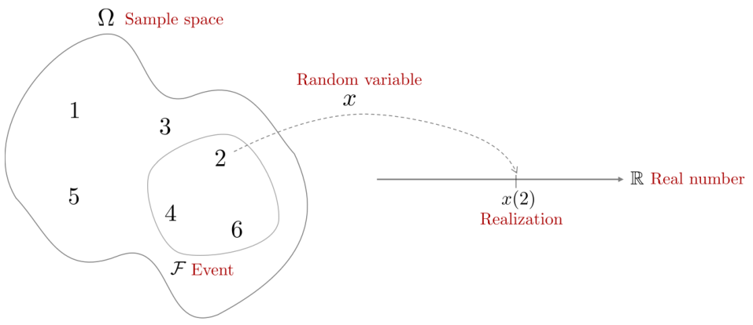

*(원문 p.11)*

확률변수(random variable) $x$는 표본공간 $\Omega$에 정의된 함수를 의미한다. 이 함수는 확률공간
$(\Omega, \mathcal{F}, Pr)$의 한 원소를 Borel 가측공간 $(\mathbb{R}, \mathcal{B})$의 원소로 변환하는
역할을 수행한다.

$$\begin{gathered}
\boxed{x : \Omega \to \mathbb{R}} \\[4pt]
\text{such that} \\[4pt]
\forall B \in \mathcal{B} \\
x^{-1}(B) \in \mathcal{F}
\end{gathered} \tag{15}$$

- Borel 가측공간(measurable space): 실수들의 집합으로 만들어진 공간을 Borel 가측공간이라고 하며 이 때
  $\sigma$-field를 Borel set이라고 한다.

- 확률(probability)은 표본공간의 부분집합인 $\sigma$-field를 하나의 실수값으로 측정해주는 연산자(=measure)인
  반면에, 확률변수(random variable)는 표본공간의 하나의 원소를 하나의 실수값으로 변환해주는 함수(=function)를
  말한다. 즉, 확률과 달리 확률변수는 하나의 원소에 대해서만 변환이 가능하다.
- 확률변수가 함수라면 무엇이 무작위성(randomness)이 있다는 것일까? 표본공간 $\Omega$에서 하나의 원소를
  추출할 때 무작위로 하나를 선택한 후 하나의 실수값으로 변환하기 때문에 일반적으로 확률변수가 무작위성이
  있다고 한다.
- 표본공간 $\Omega$의 하나의 원소 $w$가 있을 때 $x(w)$를 실현(realization)이라고 한다. 간단히 말하자면
  샘플링을 의미한다(e.g., 가우시안 샘플링).
- $x$에 대한 모든 실현값들의 집합을 알파벳(alphabet of $x$)이라고 한다.
- 우리는 확률변수 $x$ 자체보다 $x$의 확률 $Pr(x)$에 관심이 있다. 실현값이 $x \in B, B \in \mathcal{B}$일 때
  다음과 같이 정의한다.

$$Pr(x \in B) \triangleq Pr(x^{-1}(B)) = Pr(\{w : x(w) \in B\}) \tag{16}$$

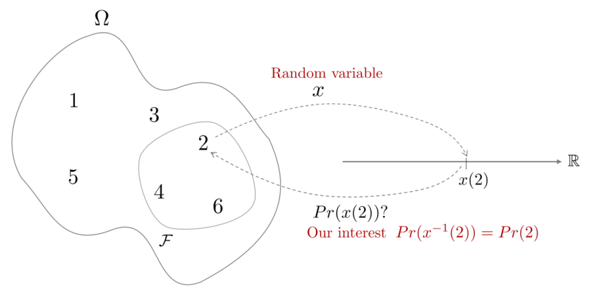

*(원문 p.12)*

## 5.1 Discrete random variable

주사위 굴리기나 동전 던지기 같이 값이 유한하거나 셀 수 있는 무한의 값들을 가지는 확률변수를
이산확률변수라고 한다. 확률질량함수(probability mass function, pmf) $P(\cdot)$를 사용하여 각 값에 대한
확률을 나타내며 각각의 개별 값에 대해 명확한 확률을 할당할 수 있다.

## 5.2 Continuous random variable

온도 측정이나 물체의 길이 측정, 주식 가격 등 연속적인 범위의 값을 가지는 확률변수를 연속확률변수라고 한다.
확률밀도함수(probability density function, pdf) $p(\cdot)$을 사용하여 값의 범위에 대한 확률을 나타내며
개별 값에 대한 확률을 표현할 수 없으나 범위에 대한 확률을 표현할 수 있는 특징이 있다.

# 6 Probability distribution

확률분포(probability distribution)는 확률변수 $x$가 가질 수 있는 값들이 얼마나 자주 나타나는지(=확률
또는 밀도)를 정리한 것이다. 이산(discrete)인 경우에는 각 값에 확률질량함수(pmf) $P(x)$가 대응하고
연속(continuous)인 경우에는 확률밀도함수(pdf) $p(x)$가 대응한다. 단, 연속인 경우 $p(x)$는 한 점에서의
확률이 아니라 '밀도'이며 확률은 구간 적분으로 계산한다:

$$Pr(a \leq x \leq b) = \int_a^b p(x)\,dx. \tag{17}$$

## 6.1 Discrete probability distribution

### 6.1.1 Bernoulli distribution

확률 변수의 값이 성공 혹은 실패로 나타나는 경우의 확률 분포를 베르누이 분포(Bernoulli distribution)라고
한다. 확률 실험의 결과 값이 성공 혹은 실패로 나타나는 실험을 베르누이 실험(Bernoulli experiment)라고
한다. 확률변수 $x$가 성공이면 $x = 1$, 실패이면 $x = 0$으로 정의하고 성공 확률을 $p$라 두면 다음과 같다:

$$\begin{aligned}
P(x = 0) &= 1 - p \\
P(x = 1) &= p
\end{aligned} \tag{18}$$

확률변수 $x$가 베르누이 분포를 따르는 경우 다음과 같이 표기한다.

$$x \sim \mathrm{Ber}(p) \tag{19}$$

베르누이 분포의 pmf는 다음과 같다.

$$\boxed{P(x) = p^x (1-p)^{1-x} \quad x = 0, 1} \tag{20}$$

베르누이 분포의 기대값과 분산은 다음과 같다

$$\boxed{\begin{aligned}
\mathbb{E}(x) &= p \\
\mathrm{var}(x) &= p(1-p)
\end{aligned}} \tag{21}$$

Example : 동전이 앞면으로 나올 경우, 나오지 않을 경우($x \sim \mathrm{Ber}(\frac{1}{2})$). 주사위를
던져서 3이 나올 확률과 나오지 않을 확률($x \sim \mathrm{Ber}(\frac{1}{6})$)

### 6.1.2 Binomial distribution

이항 분포(binomial distribution)은 고정된 수의 독립적인 베르누이 실험에서 성공 횟수를 모델링하는
확률분포이다. 즉, 베르누이 시행을 여러 번 하는 것을 말한다. 예를 들어 10번의 동전 던지기에서 앞면이
나오는 횟수 등이 이에 해당한다. 확률변수 $x$가 이항 분포를 따르는 경우 다음과 같이 표기한다.

$$x \sim \mathrm{Bin}(n, p) \tag{22}$$

이항 분포의 pmf는 다음과 같다.

$$\boxed{P(x) = {}_{n}C_{r}\, p^r (1-p)^{n-r} \quad \text{for } r = 0, 1, \cdots, n} \tag{23}$$

- $n$: 시행 횟수
- $r$: 성공 횟수
- $p$: 각 시행에서 성공할 확률

이항 분포의 기대값과 분산은 다음과 같다

$$\boxed{\begin{aligned}
\mathbb{E}(x) &= np \\
\mathrm{var}(x) &= np(1-p)
\end{aligned}} \tag{24}$$

Example : 주사위를 10번 던져서 숫자 3이 5번 나올 확률($x \sim \mathrm{Bin}(10, \frac{1}{6}), r = 5$)

### 6.1.3 Geometric distribution

기하 분포(geometric distribution)은 여러 베르누이 실험에서 첫 번째 성공이 나타날 때까지의 시행 횟수를
모델링하는 확률분포이다. 예를 들어 동전을 던져 처음으로 앞면이 나오기까지 걸린 횟수 등이 이에 해당한다.
확률변수 $x$가 기하 분포를 따르는 경우 다음과 같이 표기한다.

$$x \sim \mathrm{Geom}(p) \tag{25}$$

기하 분포의 pmf는 다음과 같다.

$$\boxed{P(x) = (1-p)^{x-1} p \quad \text{for } x = 1, 2, \cdots} \tag{26}$$

- $x$: 첫 번째 성공까지 시행 횟수
- $p$: 성공 확률

기하 분포의 기대값과 분산은 다음과 같다

$$\boxed{\begin{aligned}
\mathbb{E}(x) &= \frac{1}{p} \\
\mathrm{var}(x) &= \frac{1-p}{p^2}
\end{aligned}} \tag{27}$$

Example : 동전을 던졌을 때 처음 앞면이 나오기까지 걸린 횟수($x \sim \mathrm{Geom}(\frac{1}{2})$).
연애에서 결혼까지 이어질 확률이 10%일 때 $x$번째 연애에 결혼할 확률($x \sim \mathrm{Geom}(0.1)$)

### 6.1.4 Negative binomial distribution

음이항 분포(negative binomial distribution)은 성공 확률이 $p$인 베르누이 실험에서 실패가 $r$번 발생
하기까지의 성공 횟수를 모델링하는 확률분포이다. 이는 기하 분포의 일반화된 형태로 볼 수 있으며 기하
분포가 첫 번째 성공까지의 시행 횟수를 모델링한다면 음이항 분포는 $x$번째 성공까지의 시행 횟수를
모델링한다. 예를 들어 생물학적 실험에서 목표 달성까지의 실패 횟수 분석 등에 사용된다. 확률변수 $x$가
음이항 분포를 따른다고 하면 다음과 같이 표기한다.

$$x \sim \mathrm{NB}(r, p) \tag{28}$$

음이항 분포의 pmf는 다음과 같다.

$$\boxed{P(x) = {}_{x+r-1}C_{x}\,(1-p)^r p^x \quad \text{for } x = 0, 1, 2, \cdots} \tag{29}$$

- $n$: 전체 시행 횟수. $n = x + r$
- $x$: 성공 횟수
- $r$: 실패 횟수 (일반적으로 상수로 취급)
- $p$: 각 실험에서의 성공 확률

음이항 분포의 기대값과 분산은 다음과 같다

$$\boxed{\begin{aligned}
\mathbb{E}(x) &= \frac{pr}{1-p} \\
\mathrm{var}(x) &= \frac{pr}{(1-p)^2}
\end{aligned}} \tag{30}$$

음이항 분포는 5가지 정의가 존재하며 위 설명은 이 중 가장 일반적인 음이항 분포에 대한 설명이다
($r$번 실패할 때까지 $x$번 성공했을 확률)

Example : 포커 게임에서 이길 확률이 30%일 때 5번 패배할 때까지 발생한 승리가 $x$번일 확률
($x \sim \mathrm{NB}(5, 0.3)$). 생물학적 실험 성공 확률이 10%일 때 3번 실패할 때까지 $x$번 성공했을 확률
($x \sim \mathrm{NB}(3, 0.1)$)

### 6.1.5 Poisson distribution

포아송 분포(poisson distribution)은 이항분포에서 유도된 특수한 분포로써 단위 시간 또는 공간에서 발생하는
사건의 수를 모델링하는 확률분포이다. 예를 들어 한 시간 동안 상점에 들어오는 고객 수 등이 이에 해당한다.
확률변수 $x$가 포아송 분포를 따르는 경우 다음과 같이 표기한다.

$$x \sim \mathrm{Pois}(\lambda) \tag{31}$$

포아송 분포의 pmf는 다음과 같다.

$$\boxed{P(x) = \frac{\lambda^x e^{-\lambda}}{x!} \quad \text{for } x = 0, 1, 2, \cdots} \tag{32}$$

- $x$: 발생한 사건의 수
- $\lambda$: 단위 시간/공간 당 평균 발생 횟수

포아송 분포의 기대값과 분산은 다음과 같다

$$\boxed{\begin{aligned}
\mathbb{E}(x) &= \lambda \\
\mathrm{var}(x) &= \lambda
\end{aligned}} \tag{33}$$

Example : 한 시간 동안 평균 10통의 전화가 온다고 할 때 실제 한 시간 동안 전화가 $x$통 올 확률
($x \sim \mathrm{Pois}(10)$). 도서관에 평균적으로 하루 200명의 방문객이 온다고 할 때, 특정 하루에
방문객이 $x$명일 확률($x \sim \mathrm{Pois}(200)$)

<!--widget:prob-discrete-distributions-->

## 6.2 Continuous probability distribution

### 6.2.1 Uniform distribution

균등분포(uniform distribution)이란 주어진 범위 내에서 모든 값이 동일한 확률로 발생하는 확률분포이다.
확률변수 $x$가 균등분포를 따른다고 하면 일반적으로 다음과 같이 표기한다.

$$x \sim \mathcal{U}(a, b) \tag{34}$$

- $a, b$ 구간에서 확률변수가 균등분포를 따른다는 의미

균등분포의 pdf는 다음과 같다.

$$\boxed{p(x) = \begin{cases}
\frac{1}{b-a} & \text{for } a \leq x \leq b \\
0 & \text{otherwise}
\end{cases}} \tag{35}$$

균등 분포의 기대값과 분산은 다음과 같다

$$\boxed{\begin{aligned}
\mathbb{E}(x) &= \frac{a+b}{2} \\
\mathrm{var}(x) &= \frac{(b-a)^2}{12}
\end{aligned}} \tag{36}$$

Example : 0부터 1 사이에서 무작위로 실수를 하나 뽑을 때 그 값이 $x$일 확률($x \sim \mathcal{U}(0, 1)$).
하루 24시간을 0시부터 24시 구간으로 정해놓고 무작위로 시간 한 점을 고른다면 그 점이 $x$시일 확률
($x \sim \mathcal{U}(0, 24)$)

### 6.2.2 Gaussian distribution

확률변수 $x$가 가우시안 분포를 따르는 경우 다음과 같이 표기한다.

$$x \sim \mathcal{N}(\mu, \sigma^2) \tag{37}$$

- $x \sim \mathcal{N}(\mu, \sigma^2)$: 확률변수 $x$가 평균이 $\mu$이고 분산이 $\sigma^2$인 가우시안
  분포를 따른다는 의미

가우시안 분포의 pdf는 다음과 같다.

$$\boxed{p(x) = \frac{1}{\sqrt{2\pi\sigma^2}} \exp\left(-\frac{1}{2\sigma^2}(\mathbf{x}-\mu)^2\right)} \tag{38}$$

가우시안 분포의 기대값과 분산은 다음과 같다

$$\boxed{\begin{aligned}
\mathbb{E}(x) &= \mu \\
\mathrm{var}(x) &= \sigma^2
\end{aligned}} \tag{39}$$

가우시안 분포는 자연 및 과학, 공학계에서 매우 널리 사용되는 분포이며 정규 분포(normal distribution)라고도
불린다.

Example : 성인 남성의 몸무게를 평균 80kg, 표준편차 5kg으로 가정할 때 성인 남성 한 명의 몸무게가 $x$일
확률($x \sim \mathcal{N}(80, 5^2)$). 어떤 측정기에서 발생하는 오차가 평균 0, 표준편차 1인 정규 분포를
따르는 경우 측정값이 $x$일 확률($x \sim \mathcal{N}(0, 1^2)$)

### 6.2.3 Chi-square distribution

카이제곱(chi-square) 분포는 관측 데이터 $[x[1], x[2], \cdots, x[n]]^{\intercal}$가 서로 독립이며 동일한
분포를 갖고 있을 때(=i.i.d), 다음과 같이 나타낼 수 있다.

$$y = \sum_{i=1}^{n} x_i^2 \sim \mathcal{X}_n^2 \tag{40}$$

- $x_i \sim \mathcal{N}(0, 1)$, $i = 1, 2, \cdots, n$ : 평균이 0이고 분산이 1인 표준정규분포를 따른다
- $\mathcal{X}_n^2$: 자유도가 $n$인 카이스퀘어 분포

즉, 확률 변수 $x_i$의 제곱의 합은 카이제곱 분포를 따른다. 확률변수 $y$가 카이제곱 분포를 따른다고 하면
다음과 같이 표기한다.

$$y \sim \chi^2(n) \tag{41}$$

카이제곱 분포의 pdf는 다음과 같이 나타낼 수 있다.

$$\boxed{p(y) = \begin{cases}
\frac{1}{2^{\frac{n}{2}} \Gamma(\frac{n}{2})} y^{\frac{n}{2}-1} \exp(-\frac{y}{2}) & y \geq 0 \\
0 & y < 0
\end{cases}} \tag{42}$$

- $\Gamma(k) = \int_0^{\infty} x^{k-1} e^{-x} dx$: 감마 함수. 자연수 $n$에 대하여
  $\Gamma(n) = (n-1)!$이 성립한다. 팩토리얼(!)을 일반화한 함수로 생각하면 된다.

카이제곱 분포의 기대값과 분산은 다음과 같다

$$\boxed{\begin{aligned}
\mathbb{E}(y) &= n \\
\mathrm{var}(y) &= 2n
\end{aligned}} \tag{43}$$

Example : 음식점의 A,B,C 세 메뉴의 주문 비율이 예상 비율 (0.5, 0.3, 0.2)과 얼마나 다른지 알아보기 위해
카이제곱 적합도 검정을 실시해보자. 관측 비율과 예상 비율 비교해 구한 통계량
$y = \sum \frac{(Meas-Expect)^2}{Expect}$은 자유도 $(n-1, n=3)$를 갖는 $\chi^2$ 분포를 따른다
($y \sim \chi^2(2)$). 통계량 $y$가 임계값 이하일 확률은 $\chi^2(2)$의 누적분포함수(CDF)로 구할 수 있다

온도 센서가 동일한 온도를 측정할 때 오차$(x_1, \cdots, x_k)$가 서로 독립인 표준정규분포
$\mathcal{N}(0, 1)$를 따른다고 가정하자. 이 때 8번 측정해서 나온 오차를 각각 제곱한 뒤 합을 구한 값
$y = x_1^2 + x_2^2 + \cdots + x_8^2$은 카이제곱 분포를 따른다. ($y \sim \chi^2(8)$). 오차의 제곱합 $y$가
특정 값 이하로 나올 확률은 $\chi^2(8)$ 분포의 누적분포함수(CDF)로 계산할 수 있다

### 6.2.4 Exponential distribution

지수 분포(exponential distribution)는 주로 '대기 시간'을 모델링하는데 사용된다. 예를 들어 웹사이트에
방문자가 도착하는 시간 등이 해당한다. 확률변수 $x$가 지수 분포를 따르는 경우 다음과 같이 표기한다.

$$x \sim \mathrm{Exp}(\lambda) \tag{44}$$

지수 분포의 pdf는 다음과 같다.

$$\boxed{p(x) = \lambda e^{-\lambda x} \quad \text{for } x \geq 0, \lambda > 0} \tag{45}$$

- $\lambda$: 단위 시간당 사건이 발생하는 평균 비율(또는 강도)를 말한다.

지수 분포의 기대값과 분산은 다음과 같다

$$\boxed{\begin{aligned}
\mathbb{E}(x) &= \frac{1}{\lambda} \\
\mathrm{var}(x) &= \frac{1}{\lambda^2}
\end{aligned}} \tag{46}$$

Example : 콜센터 전화가 걸려오기까지 평균 2분 걸린다면 대기 시간이 $x$분일 확률
($x \sim \mathrm{Exp}(\frac{1}{2})$). 어떤 부품이 평균 100시간 후 고장난다면 고장까지 걸리는 시간이
$x$시간일 확률($x \sim \mathrm{Exp}(\frac{1}{100})$)

### 6.2.5 Gamma distribution

감마 분포(gamma distribution)는 지수 분포를 일반화한 것으로, 여러 지수적인 사건들의 합을 모델링한
확률분포이다. 예를 들어 특정 이벤트가 $n$번 발생하기까지의 대기 시간을 나타낼 수 있다. 확률변수 $x$가
감마 분포를 따르는 경우 다음과 같이 표기한다.

$$x \sim \Gamma(k, \theta) \tag{47}$$

감마 분포의 pdf는 다음과 같다.

$$\boxed{p(x) = \frac{x^{k-1} e^{-x/\theta}}{\Gamma(k)\theta^k} \quad \text{for } x > 0, k > 0, \theta > 0} \tag{48}$$

- $k$: 형상 파라미터(shape parameter)
- $\theta$: 스케일 파라미터(scale parameter)
- $\Gamma(k) = \int_0^{\infty} x^{k-1} e^{-x} dx$: 감마 함수. 자연수 $n$에 대하여
  $\Gamma(n) = (n-1)!$이 성립한다. 팩토리얼(!)을 일반화한 함수로 생각하면 된다.

$k$가 자연수일 때는 $n$번째 이벤트가 발생하기까지의 대기시간으로 해석할 수 있다.

감마 분포의 기대값과 분산은 다음과 같다

$$\boxed{\begin{aligned}
\mathbb{E}(x) &= k\theta \\
\mathrm{var}(x) &= k\theta^2
\end{aligned}} \tag{49}$$

Example : 은행 창구에서 고객이 업무를 처리하기까지 3단계 과정을 거치고 각 단계의 평균 소요 시간이
10분($\lambda = \frac{1}{10}$)일 때 한 번의 업무 처리에 걸리는 총 시간이 $x$분일 확률
($x \sim \Gamma(3, \frac{1}{10})$). 업무 처리 시간이 $x$분 이하가 될 확률은 $\Gamma(3, \frac{1}{10})$의
누적분포함수(CDF)로 계산할 수 있다.

어떤 기계 부품이 3단계 하위 부품이 순차적으로 고장이 나야 완전히 작동을 멈춘다고 가정하자. 각 하위
부품의 고장까지 걸리는 시간이 1000시간으로 동일하다면($\frac{1}{1000}$) 전체 기계가 고장나는 시간이
$x$ 시간일 확률($x \sim \Gamma(3, \frac{1}{1000})$). $x$ 시간 이하가 될 확률은
$\Gamma(3, \frac{1}{1000})$의 누적분포함수(CDF)로 구할 수 있다.

### 6.2.6 Beta distribution

베타 분포(beta distribution)은 0과 1사이의 값을 가지는 확률변수의 분포를 의미한다. 이 분포는 주로 비율이나
확률을 모델링할 때 사용된다. 예를 들어 제품의 양품률, 투표에서 특정 후보자를 선택할 확률 등이 있다.
확률변수 $x$가 베타 분포를 따르는 경우 다음과 같이 표기한다.

$$x \sim \mathrm{Beta}(\alpha, \beta) \tag{50}$$

베타 분포의 pdf는 다음과 같다.

$$\boxed{p(x) = \frac{x^{\alpha-1}(1-x)^{\beta-1}}{B(\alpha, \beta)} \quad \text{for } 0 < \mathrm{x} < 1} \tag{51}$$

- $\alpha, \beta$: 형상 파라미터(shape parameter)
- $B(x, y) = \frac{\Gamma(x)\Gamma(y)}{\Gamma(x+y)} = \int_0^1 t^{x-1}(1-t)^{y-1} dt$: 베타함수는
  감마함수의 비율로 표현되는 함수이며 이항 계수를($={}_nC_k$) 일반화한 함수로 볼 수 있다.

베타 분포의 기대값과 분산은 다음과 같다

$$\boxed{\begin{aligned}
\mathbb{E}(x) &= \frac{\alpha}{\alpha+\beta} \\
\mathrm{var}(x) &= \frac{\alpha\beta}{(\alpha+\beta)^2(\alpha+\beta+1)}
\end{aligned}} \tag{52}$$

Example : 동전의 앞면이 나올 확률을 정교하게 구해보자. 우선 앞면이 나올 확률을
$\mathrm{Beta}(\alpha, \beta)$와 같이 모델링한다. $\alpha$는 앞면, $\beta$는 뒷면이 나올 확률과 관련이
있으며 예를 들어 $\alpha = 2, \beta = 3$이면 $\frac{2}{2+3} = 0.4$, 즉 40% 정도로 앞면이 나온다고 할 수
있다. 사전 정보가 없으므로 $\alpha = \beta = 1$로 가정하여 $x \sim \mathrm{Beta}(1, 1) = \mathcal{U}(0, 1)$로
실험을 시작한 후 실제로 동전을 여러 번 던지면서 $\alpha, \beta$ 값을 업데이트할 수 있다.
실험 결과 동전의 앞면이 나올 '진짜' 확률이 $\mathrm{Beta}(2, 3)$를 따른다고 가정할 때 이 확률이 $x$
이하일 확률은 $\mathrm{Beta}(2, 3)$의 누적분포함수 $CDF(x)$값으로 구할 수 있다

새로 출시한 제품이 시장에서 차지하는 점유율을 0과 1 사이의 확률 변수로 보고 그것을 베타 분포를 따른다고
가정할 수 있다. 실제 점유율 데이터를 토대로 $\alpha, \beta$ 값을 업데이트한다

업데이트 결과 신제품이 시장에서 차지하는 점유율이 $\mathrm{Beta}(5, 5)$의 분포를 따른다고 가정할 때
점유율이 $x$ 이하일 확률은 $\mathrm{Beta}(5, 5)$의 누적분포함수 $CDF(x)$의 값으로 구할 수 있다

<!--widget:prob-continuous-distributions-->

## 6.3 Joint probability distribution

결합확률분포(joint probability distribution)란 두 확률변수 $x, y$의 공통 분포를 의미한다.

$$\begin{aligned}
P(x, y) &\quad \cdots \text{ for discrete r.v.} \\
p(x, y) &\quad \cdots \text{ for continuous r.v.}
\end{aligned} \tag{53}$$

## 6.4 Marginal probability distribution

주변확률분포(marginal probability)는 여러 확률변수들 사이에서 한 확률변수의 행동만을 고려하는 것을 말한다.
예를 들어, 두 이산확률변수 $x$와 $y$가 있고, 이들의 결합확률분포(joint probability distribution)가
주어졌을 때, $x$의 주변확률분포는 $y$가 취할 수 있는 모든 값에 대해 $x$의 확률을 합하여 얻어진다.
이산확률변수를 보면 다음과 같다.

$$P(x) = \sum_y P(x, y) \tag{54}$$

연속확률변수로 나타내면 다음과 같다.

$$p(x) = \int p(x, y) dy = \int p(x|y)p(y) dy \tag{55}$$

## 6.5 Conditional probability distribution

조건부 확률분포(conditional probability distribution)은 두 확률변수 $x, y$에 대하여 $y$가 발생했을 때
$x$가 발생할 확률을 의미한다. 이산확률변수에 대한 조건부 확률분포는 다음과 같다.

$$P(x|y) = \frac{P(x, y)}{P(y)} \tag{56}$$

이를 통해 두 확률변수가 동시에 발생할 확률은 $P(x, y) = P(x)P(y|x)$와 같이 나타낼 수 있다. 이 때,
$P(x, y) = P(y, x)$이므로 $x, y$ 순서를 바꿔도 공식이 성립한다. 이는 $x$가 발생했을 때 $y$가 발생할
확률분포를 의미한다.

$$P(y|x) = \frac{P(y, x)}{P(x)} \tag{57}$$

만약 두 확률변수 $x, y$가 독립이면 조건부 확률분포는 다음과 같다.

$$P(x|y) = \frac{P(x, y)}{P(y)} = \frac{P(x)P(y)}{P(y)} = P(x) \tag{58}$$

연속확률분포에 대한 조건부 확률분포은 다음과 같다. 연속확률변수가 주어졌을 때, $y$가 주어졌을 때 $x$가
발생할 확률분포는 다음과 같다.

$$p(x|y) = \frac{p(x, y)}{p(y)} \tag{59}$$

반대로 $x$가 주어졌을 때 $y$가 발생할 확률분포는 다음과 같다.

$$p(y|x) = \frac{p(y, x)}{p(x)} \tag{60}$$

이 때, $p(x, y)$와 $p(y, x)$는 동일하다.

<!--widget:prob-joint-marginal-conditional-->

## 6.6 Bayesian rule

Bayesian rule은 다음과 같은 조건부확률분포 사이의 관계를 의미한다.

$$\begin{aligned}
p(x|y) &= \frac{p(x, y)}{p(y)} \\
&= \frac{p(y|x)p(x)}{p(y)}
\end{aligned} \tag{61}$$

- $p(x|y)$: posterior pdf
- $p(y|x)$: likelihood
- $p(x)$: prior pdf

예를 들어, 로봇의 위치를 $\mathbf{x}$, 로봇의 센서를 통해 관측한 값을 $\mathbf{z}$이라고 했을 때 주어진
관측 데이터를 바탕으로 현재 로봇이 $\mathbf{x}$에 위치할 확률 $p(\mathbf{x}|\mathbf{z})$는 다음과 같이
나타낼 수 있다.

$$p(\mathbf{x}|\mathbf{z}) = \frac{p(\mathbf{z}|\mathbf{x})p(\mathbf{x})}{p(\mathbf{z})} = \eta \cdot p(\mathbf{z}|\mathbf{x})p(\mathbf{x}) \tag{62}$$

- $p(\mathbf{x}|\mathbf{z})$: 관측값 $\mathbf{z}$가 주어졌을 때 로봇이 $\mathbf{x}$에 위치할 확률
  (posterior)
- $p(\mathbf{z}|\mathbf{x})$ : $\mathbf{x}$ 위치에서 관측값 $\mathbf{z}$가 나올 확률 (likelihood)
- $p(\mathbf{x})$: 로봇이 $\mathbf{x}$ 위치에 존재할 확률 (prior)
- $\eta = 1/p(\mathbf{z})$ : 전체 확률분포의 넓이가 1이 되어 확률분포의 정의를 유지시켜주는
  normalization factor이다. 주로 $\eta$로 치환하여 표현한다.

# 7 Moment

모멘트(moment, 또는 적률)은 확률분포의 특징을 설명해주는 지표를 의미한다. 1차 적률은 확률분포의
평균(mean)을 의미하고 2차 적률은 분산(variance)를 의미하며 3차 적률은 왜도(skewness), 4차 적률은
첨도(kurtosis)를 의미한다. 왜도는 확률분포의 비대칭성을 나타내는 지표이고 첨도는 확률분포의 뾰족한
정도를 나타내는 지표이다.

$$\boxed{\begin{aligned}
\mu &= \mathbb{E}(x) &&\quad \cdots \text{1st moment} \\
\sigma^2 &= \mathrm{var}(x) = \mathbb{E}((x-\mu)^2) &&\quad \cdots \text{2nd moment} \\
\text{skewness} &= \frac{\mathbb{E}((x-\mu)^3)}{\sigma^3} &&\quad \cdots \text{3rd moment} \\
\text{kurtosis} &= \frac{\mathbb{E}((x-\mu)^4)}{\sigma^4} &&\quad \cdots \text{4th moment}
\end{aligned}} \tag{63}$$

임의의 두 분포 $A, B$가 있을 때 두 분포가 같은지 판단하려면 일반적으로 두 분포의 모멘트가 같은지를
판단하면 된다.

## 7.1 Expectation

기대값(expectation, expected value) $\mathbb{E}$란 확률적 사건에 대한 평균을 의미하며 사건이 벌어졌을 때
이득과 그 사건이 벌어질 확률을 곱한 것을 합한 값을 말한다. 표본공간 $\Omega$에서 정의된 확률변수 $x$가
있을 때 확률함수 $p$에 대한 $x$의 기대값은 $\mathbb{E}[x]$라고 하고 다음과 같은 식으로 나타낸다.

$$\boxed{\mathbb{E}[x] = \sum_{x \in \Omega} x \cdot P(x)} \tag{64}$$

위 식은 이산확률변수에 대한 기대값을 의미한다. 연속확률변수에 대한 기대값은 다음과 같다.

$$\boxed{\mathbb{E}[x] = \int_{-\infty}^{\infty} x \cdot p(x) dx} \tag{65}$$

### 7.1.1 Properties of expectation

기대값은 선형성(Linearity)라는 성질을 가지고 있다. 수학에서 선형성에 대한 정의는 다음과 같다.
임의의 함수 f에 대해

임의의 수 x,y에 대해 f(x+y) = f(x)+f(y)가 항상 성립하고 임의의 수 x와 a에 대해 f(ax) = af(x)가 항상
성립하면 함수 f는 선형이라고 한다. 따라서 임의의 확률변수 $x, y$와 임의의 실수 $a, b$에 대해서 다음 식이
성립하게 된다.

$$\mathbb{E}[ax + by] = a\mathbb{E}[x] + b\mathbb{E}[y] \tag{66}$$

그리고 선형인 함수 $L(x)$에 대해서 기대값과 함수의 계산순서를 바꿀 수 있다.

$$\mathbb{E}[L(x)] = L(\mathbb{E}[x]) \tag{67}$$

### 7.1.2 Conditional expectation

연속확률변수 $x$에 대한 기대값 $E(x) = \int xp(x)dx$는 하나의 결정된 값을 의미하며 더 이상 확률성을 띄고
있지 않다. 하지만 두 확률변수 $x, y$의 조건부 기대값 $\mathbb{E}(x|y)$는 기대값을 취하더라도 여전히 $y$에
대한 확률변수가 되며 이 부분이 기대값과 가장 다른 부분이다.

### 7.1.3 Law of total expectation

확률 변수 $x, y$가 주어졌을 때 총 기대값의 법칙(law of total expectation)은 다음과 같이 정의한다.

$$\mathbb{E}[x] = \mathbb{E}[\mathbb{E}[x|y]] \tag{68}$$

자세히 표현하면 아래와 같다.

$$\mathbb{E}_x[x] = \mathbb{E}_y[\mathbb{E}_x[x|y]] \tag{69}$$

- $\mathbb{E}_x$: 확률 변수 $x$에 대한 기대값
- $\mathbb{E}_y$: 확률 변수 $y$에 대한 기대값

두 연속확률변수 $x, y$에 대하여 증명은 다음과 같이 할 수 있다.

$$\begin{aligned}
\mathbb{E}_y[\mathbb{E}_x[x|y]] &= \int \left( \int x p(x|y) dx \right) p(y) dy \\
&= \int \int x p(x|y) p(y) dx dy \\
&= \int \int x p(x, y) dx dy \\
&= \int x \left( \int p(x, y) dy \right) dx \\
&= \int x p(x) dx \\
&= \mathbb{E}_x[x]
\end{aligned} \tag{70}$$

## 7.2 Variance and standard deviation

확률변수 $x$의 분산(variance)은 $\sigma^2$ 또는 $\mathrm{var}[x]$라고 표기하고 다음과 같이 정의한다

$$\boxed{\mathrm{var}[x] = \mathbb{E}[(x - \mathbb{E}(x))^2]} \tag{71}$$

또한 아래와 같이 표현할 수도 있다.

$$\mathrm{var}[x] = \mathbb{E}[x^2] - (\mathbb{E}[x])^2 \tag{72}$$

분산의 제곱근을 표준편차(standard deviation)이라고 하며 $\sigma$로 표기한다.

## 7.3 Covariance and correlation

두 확률변수 $x, y$가 주어졌을 때 공분산(covariance)이란 두 분포가 어떤 상관관계를 가지는지 나타내는 값을
말한다.

$$\boxed{\mathrm{cov}(x, y) = \mathbb{E}[(x - \mathbb{E}(x))(y - \mathbb{E}(y))]} \tag{73}$$

이를 전개해보면 다음과 같다.

$$\begin{aligned}
\mathrm{cov}(x, y) &= \mathbb{E}[(x - \mathbb{E}(x))(y - \mathbb{E}(y))] \\
&= \mathbb{E}[xy - \mathbb{E}(x)y - \mathbb{E}(y)x + \mathbb{E}(x)\mathbb{E}(y)] \\
&= \mathbb{E}(xy) - \mathbb{E}(y)\mathbb{E}(x) - \mathbb{E}(x)\mathbb{E}(y) + \mathbb{E}(x)\mathbb{E}(y) \\
&= \mathbb{E}(xy) - \mathbb{E}(x)\mathbb{E}(y)
\end{aligned} \tag{74}$$

- $\mathrm{cov}(x, y) > 0$: 두 확률변수가 양의 상관관계를 갖는다.
- $\mathrm{cov}(x, y) < 0$ : 두 확률변수가 음의 상관관계를 갖는다.
- $\mathrm{cov}(x, y) = 0$ : 두 확률변수의 상관관계가 없다(uncorrelated).

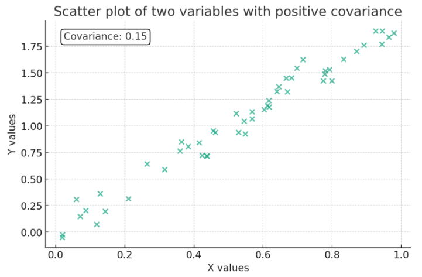

*(원문 p.24)*

만약 두 확률변수가 상관관계가 없거나(uncorrelated) $x, y$가 독립(independence)이라면
$\mathbb{E}(xy) = \mathbb{E}(x)\mathbb{E}(y)$가 되어 $\mathrm{cov}(x, y) = 0$이 된다. 따라서 두 개념이
동일하다고 생각할 수 있으나 둘은 다른 개념이다. 두 확률변수가 상관관계가 없다고 하더라도(uncorrelated)
두 확률변수는 독립(independence)이 아닐 수 있다. 상관관계가 없다는 말은 선형 상관관계가 없다는
의미이므로 비선형적으로 상관관계가 있을 수 있음을 암시한다. 따라서 독립성의 개념이 조금 더 강한 개념으로
서로의 확률에 어떠한 영향도 주지 않음을 의미한다. 이 둘의 관계를 헷갈리지 않도록 유의한다.

$$\begin{aligned}
\text{independence} &\Rightarrow \text{ uncorrelated} \\
\text{uncorrelated} &\nRightarrow \text{ independence}
\end{aligned} \tag{75}$$

### 7.3.1 Correlation coefficient

상관계수 $\rho_{xy}$는 공분산이 단위의 영향을 받는 점을 고려하여 이를 정규화한 값을 말한다.

$$\rho_{xy} = \frac{\mathrm{cov}(x, y)}{\sigma_x \sigma_y} \tag{76}$$

상관계수는 $-1 \leq \rho_{xy} \leq 1$의 범위를 갖는다.

## 7.4 Orthogonal

두 확률변수 $x, y$가 직교한다(orthogonal)는 의미는 두 확률변수의 곱의 기대값이 0임을 의미한다.

$$\mathbb{E}(xy) = 0 \tag{77}$$

<!--widget:prob-covariance-correlation-->

# 8 More on Gaussian distribution

## 8.1 Central limit theorem

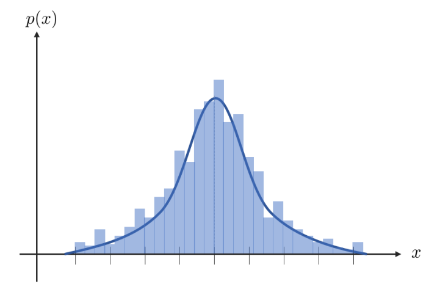

*(원문 p.25)*

중심극한정리(central limit theorem)은 무작위로 추출된 표본의 크기가 커질수록 표본 평균의 분포는 모집단의
분포 모양과는 관계없이 정규분포 가까워진다는 정리이다. 임의의 분포를 갖는 확률변수
$x_1, x_2, \cdots, x_n$들이 서로 독립이면서 동일한 분포를 갖고 있다고 하자(=i.i.d). 이들의 평균을
$\mathbb{E}(x_i) = \mu$, 분산을 $\mathrm{var}(x_i) = \sigma^2$라고 했을 때
$\mathbf{x} = [x_1, x_2, \cdots, x_n]^{\intercal}$은 $n$이 커질수록 다음과 같은 표준정규분포로 수렴하게
된다.

$$\boxed{\frac{\mathbf{x} - n\mu}{\sigma\sqrt{n}} \sim \mathcal{N}(0, 1)} \tag{78}$$

<!--widget:prob-central-limit-theorem-->

## 8.2 Multivariate gaussian distribution

벡터 확률변수 $\mathbf{x} \in \mathbb{R}^n$가 가우시안 분포를 따른다고 하자.

$$\mathbf{x} \sim \mathcal{N}(\mathbb{E}(\mathbf{x}), \mathbf{C}) \tag{79}$$

평균 $\mathbb{E}(\mathbf{x})$은 벡터이고 공분산 $\mathbf{C}$는 행렬이다.

$$\mathbb{E}(\mathbf{x}) = \begin{bmatrix}
\mathbb{E}(x_1) \\ \mathbb{E}(x_2) \\ \vdots \\ \mathbb{E}(x_n)
\end{bmatrix} \in \mathbb{R}^n
\qquad
\mathbf{C} = \begin{bmatrix}
\mathbf{C}_{x_1 x_1} & \mathbf{C}_{x_1 x_2} & \cdots & \mathbf{C}_{x_1 x_n} \\
\mathbf{C}_{x_2 x_1} & \mathbf{C}_{x_2 x_2} & \cdots & \mathbf{C}_{x_2 x_n} \\
\vdots & \vdots & \ddots & \vdots \\
\mathbf{C}_{x_n x_1} & \mathbf{C}_{x_n x_2} & \cdots & \mathbf{C}_{x_n x_n}
\end{bmatrix} \in \mathbb{R}^{n \times n} \tag{80}$$

- $\mathbf{C}_{x_i x_j} = \mathrm{cov}(x_i, x_j) = \mathbb{E}\left[(x_i - \mathbb{E}(x_i))(x_j - \mathbb{E}(x_j))\right]$

pdf $p(\mathbf{x})$는 다음과 같이 정의된다.

$$\boxed{p(\mathbf{x}) = \frac{1}{(2\pi)^{\frac{n}{2}} \det^{\frac{1}{2}}(\mathbf{C})} \exp\left(-\frac{1}{2}(\mathbf{x}-\mathbb{E}(\mathbf{x}))^{\intercal} \mathbf{C}^{-1} (\mathbf{x}-\mathbb{E}(\mathbf{x}))\right)} \tag{81}$$

- $\det(\mathbf{C})$: $\mathbf{C}$의 행렬식(determinant)
- $\mathbf{C}^{-1}$ : information matrix $\mathbf{\Omega}$라고도 표현한다.

공분산 행렬에서 대각 성분들은 하나의 변수에 대한 분산을 의미하며 대각성분이 아닌 성분들은 두 변수 간 상관
관계를 의미한다.

## 8.3 Joint gaussian distribution

가우시안 분포를 따르는 두 벡터 확률변수 $\mathbf{x} \in \mathbb{R}^n$이고 $\mathbf{y} \in \mathbb{R}^m$가
주어졌을 때 결합확률분포(joint probability distribution)는 다음과 같이 나타낼 수 있다.

$$\boxed{p(\mathbf{x}, \mathbf{y}) = \frac{1}{(2\pi)^{\frac{n+m}{2}} \det^{\frac{1}{2}}(\mathbf{C})} \exp\left(-\frac{1}{2}\left(\begin{bmatrix} \mathbf{x}-\mathbb{E}(\mathbf{x}) \\ \mathbf{y}-\mathbb{E}(\mathbf{y}) \end{bmatrix}\right)^{\intercal} \mathbf{C}^{-1} \left(\begin{bmatrix} \mathbf{x}-\mathbb{E}(\mathbf{x}) \\ \mathbf{y}-\mathbb{E}(\mathbf{y}) \end{bmatrix}\right)\right)} \tag{82}$$

평균 벡터는 $\begin{bmatrix} \mathbb{E}(\mathbf{x})^{\intercal} & \mathbb{E}(\mathbf{y})^{\intercal} \end{bmatrix}^{\intercal} \in \mathbb{R}^{n+m}$이고 공분산 행렬은 다음과 같다.

$$\mathbf{C} = \begin{bmatrix}
\mathbf{C}_{xx} & \mathbf{C}_{xy} \\
\mathbf{C}_{yx} & \mathbf{C}_{yy}
\end{bmatrix} = \begin{bmatrix}
n \times n & n \times m \\
m \times n & m \times m
\end{bmatrix} \in \mathbb{R}^{(n+m) \times (n+m)} \tag{83}$$

## 8.4 Conditional gaussian distribution

가우시안 분포를 따르는 두 벡터 확률변수 $\mathbf{x}, \mathbf{y}$가 주어졌을 때 이들의 조건부 확률분포
$p(\mathbf{y}|\mathbf{x})$는 다음과 같이 나타낼 수 있다.

$$\begin{aligned}
p(\mathbf{y}|\mathbf{x}) &= \frac{p(\mathbf{x}, \mathbf{y})}{p(\mathbf{x})} = \frac{p(\mathbf{x}|\mathbf{y})p(\mathbf{y})}{p(\mathbf{x})} = \eta \cdot p(\mathbf{x}|\mathbf{y})p(\mathbf{y}) \\
&\sim \mathcal{N}(\mathbb{E}(\mathbf{y}|\mathbf{x}), \mathbf{C}_{y|x})
\end{aligned} \tag{84}$$

가 된다. 평균 $\mathbb{E}(\mathbf{y}|\mathbf{x})$과 분산 $\mathbf{C}_{y|x}$은 아래와 같다.

$$\boxed{\begin{aligned}
\mathbb{E}(\mathbf{y}|\mathbf{x}) &= \mathbb{E}(\mathbf{y}) + \mathbf{C}_{yx}\mathbf{C}_{xx}^{-1}(\mathbf{x} - \mathbb{E}(\mathbf{x})) \\
\mathbf{C}_{y|x} &= \mathbf{C}_{yy} - \mathbf{C}_{yx}\mathbf{C}_{xx}^{-1}\mathbf{C}_{yx}^{\intercal}
\end{aligned}} \tag{85}$$

위 공분산 식을 자세히 보면 확률분포 $\mathbf{y}$는 조건부 확률분포 $p(\mathbf{y}|\mathbf{x})$를 구하기
전의 분산 $\mathbf{C}_{yy}$보다 반드시 같거나 작아지게 된다. 이는 prior $\mathbf{y}$에 추가적으로
$\mathbf{x}$라는 정보가 주어졌으므로(=given $\mathbf{x}$) 불확실성이 이전보다 작아진 것으로 해석할 수 있다.

### 8.4.1 Derivation of conditional gaussian distribution

$$\begin{aligned}
p(\mathbf{y}|\mathbf{x}) &= \frac{p(\mathbf{x}, \mathbf{y})}{p(\mathbf{x})} \\[6pt]
&= \frac{\dfrac{1}{(2\pi)^{\frac{n+m}{2}} \det^{\frac{1}{2}}(\mathbf{C})} \exp\left(-\frac{1}{2}\left(\begin{bmatrix} \mathbf{x}-\mathbb{E}(\mathbf{x}) \\ \mathbf{y}-\mathbb{E}(\mathbf{y}) \end{bmatrix}\right)^{\intercal} \mathbf{C}^{-1}\left(\begin{bmatrix} \mathbf{x}-\mathbb{E}(\mathbf{x}) \\ \mathbf{y}-\mathbb{E}(\mathbf{y}) \end{bmatrix}\right)\right)}{\dfrac{1}{(2\pi)^{\frac{n}{2}} \det^{\frac{1}{2}}(\mathbf{C}_{xx})} \exp\left(-\frac{1}{2}(\mathbf{x}-\mathbb{E}(\mathbf{x}))^{\intercal}\mathbf{C}_{xx}^{-1}(\mathbf{x}-\mathbb{E}(\mathbf{x}))\right)}
\end{aligned} \tag{86}$$

우선 $\exp(\cdot)$ 밖에 있는 행렬식(determinant)부터 살펴보자. 공분산 행렬
$\mathbf{C} = \begin{bmatrix} \mathbf{C}_{xx} & \mathbf{C}_{xy} \\ \mathbf{C}_{yx} & \mathbf{C}_{yy} \end{bmatrix}$는
matrix inversion lemma에 의해 다음과 같이 행렬 곱의 일부분으로 해석할 수 있다.

$$\begin{bmatrix} \mathbf{I} & 0 \\ -\mathbf{C}_{yx}\mathbf{C}_{xx}^{-1} & \mathbf{I} \end{bmatrix}
\begin{bmatrix} \mathbf{C}_{xx} & \mathbf{C}_{xy} \\ \mathbf{C}_{yx} & \mathbf{C}_{yy} \end{bmatrix}
\begin{bmatrix} \mathbf{I} & -\mathbf{C}_{xx}^{-1}\mathbf{C}_{xy} \\ 0 & \mathbf{I} \end{bmatrix}
= \begin{bmatrix} \mathbf{C}_{xx} & 0 \\ 0 & \mathbf{C}_{yy} - \mathbf{C}_{yx}\mathbf{C}_{xx}^{-1}\mathbf{C}_{xy} \end{bmatrix} \tag{87}$$

- $\mathbf{C}_{yy} - \mathbf{C}_{yx}\mathbf{C}_{xx}^{-1}\mathbf{C}_{xy}$: Schur complement of $\mathbf{C}$
  w.r.t. $\mathbf{C}_{xx}$이라고 한다.

> **Tip**
>
> 임의의 블록 행렬 $\mathbf{A}$가 상삼각(upper-triangle), 하삼각(lower-triangle) 또는 대각(diagonal)일
> 경우 행렬식은 다음과 같이 나타낼 수 있다.
>
> $$\mathbf{A} = \begin{bmatrix} \mathbf{A}_{11} & \mathbf{A}_{12} \\ 0 & \mathbf{A}_{22} \end{bmatrix} \tag{88}$$
>
> - $\det(\mathbf{A}) = \det(\mathbf{A}_{11})\det(\mathbf{A}_{22})$
>
> 공분산 행렬 $\mathbf{C}$는 다음과 같이 블록 삼각 행렬의 곱으로 LU 분해할 수 있다.
>
> $$\begin{bmatrix} \mathbf{C}_{xx} & \mathbf{C}_{xy} \\ \mathbf{C}_{yx} & \mathbf{C}_{yy} \end{bmatrix} = \begin{bmatrix} \mathbf{I} & 0 \\ \mathbf{C}_{yx}\mathbf{C}_{xx}^{-1} & \mathbf{I} \end{bmatrix} \begin{bmatrix} \mathbf{C}_{xx} & \mathbf{C}_{xy} \\ 0 & \mathbf{C}_{yy} - \mathbf{C}_{yx}\mathbf{C}_{xx}^{-1}\mathbf{C}_{xy} \end{bmatrix} \tag{89}$$
>
> 따라서 $\mathbf{C}$의 행렬식 $\det(\mathbf{C})$은 다음과 같이 나타낼 수 있다.
>
> $$\begin{aligned} \det(\mathbf{C}) &= \det(\mathbf{I})\det(\mathbf{I})\det(\mathbf{C}_{xx})\det(\mathbf{C}_{yy} - \mathbf{C}_{yx}\mathbf{C}_{xx}^{-1}\mathbf{C}_{xy}) \\ &= \det(\mathbf{C}_{xx})\det(\mathbf{C}_{yy} - \mathbf{C}_{yx}\mathbf{C}_{xx}^{-1}\mathbf{C}_{xy}) \end{aligned} \tag{90}$$
>
> (87) 식을 보면 $\mathbf{C}$를 제외하고 모두 대각 또는 삼각행렬이므로 블록 행렬의 행렬식 특성을 사용하여
> 행렬식을 구할 수 있다.

블록 행렬의 행렬식 특성을 이용하여 $\mathbf{B} = \mathbf{C}_{yy} - \mathbf{C}_{yx}\mathbf{C}_{xx}^{-1}\mathbf{C}_{xy}$로
치환한 후 행렬식을 다시 쓰면 다음과 같다.

$$\begin{aligned}
\det(\mathbf{C}) &= \det(\mathbf{C}_{xx})\det(\mathbf{B}) \\
\frac{\det(\mathbf{C})}{\det(\mathbf{C}_{xx})} &= \det(\mathbf{B})
\end{aligned} \tag{91}$$

이를 (86)는 대입한 후 전개하면 다음과 같다.

$$\begin{aligned}
p(\mathbf{y}|\mathbf{x}) = \frac{1}{(2\pi)^{\frac{m}{2}} \det^{\frac{1}{2}}(\mathbf{B})} \exp\Bigg(-\frac{1}{2}\Bigg[ &\left(\begin{bmatrix} \mathbf{x}-\mathbb{E}(\mathbf{x}) \\ \mathbf{y}-\mathbb{E}(\mathbf{y}) \end{bmatrix}\right)^{\intercal} \mathbf{C}^{-1} \left(\begin{bmatrix} \mathbf{x}-\mathbb{E}(\mathbf{x}) \\ \mathbf{y}-\mathbb{E}(\mathbf{y}) \end{bmatrix}\right) \\
&- (\mathbf{x}-\mathbb{E}(\mathbf{x}))^{\intercal}\mathbf{C}_{xx}^{-1}(\mathbf{x}-\mathbb{E}(\mathbf{x})) \Bigg]\Bigg)
\end{aligned} \tag{92}$$

(87)에서 $\mathbf{C}^{-1}$은 다음과 같이 구할 수 있다.

$$\mathbf{C}^{-1} = \begin{bmatrix} \mathbf{I} & -\mathbf{C}_{xx}^{-1}\mathbf{C}_{xy} \\ 0 & \mathbf{I} \end{bmatrix}
\begin{bmatrix} \mathbf{C}_{xx}^{-1} & 0 \\ 0 & \mathbf{B}^{-1} \end{bmatrix}
\begin{bmatrix} \mathbf{I} & 0 \\ -\mathbf{C}_{yx}\mathbf{C}_{xx}^{-1} & \mathbf{I} \end{bmatrix} \tag{93}$$

- $\mathbf{A}\mathbf{B}\mathbf{C} = \mathbf{D} \Rightarrow \mathbf{B}^{-1} = \mathbf{C}\mathbf{D}^{-1}\mathbf{A}$

$\mathbf{C}^{-1}$을 (92)의 지수 부분에 대입하면 다음과 같다.

$$\begin{aligned}
&\begin{bmatrix} \tilde{\mathbf{x}} \\ \tilde{\mathbf{y}} \end{bmatrix}^{\intercal} \mathbf{C}^{-1} \begin{bmatrix} \tilde{\mathbf{x}} \\ \tilde{\mathbf{y}} \end{bmatrix} - \tilde{\mathbf{x}}^{\intercal}\mathbf{C}_{xx}^{-1}\tilde{\mathbf{x}} \\
\to\ &\begin{bmatrix} \tilde{\mathbf{x}} \\ \tilde{\mathbf{y}} \end{bmatrix}^{\intercal}
\begin{bmatrix} \mathbf{I} & -\mathbf{C}_{xx}^{-1}\mathbf{C}_{xy} \\ 0 & \mathbf{I} \end{bmatrix}
\begin{bmatrix} \mathbf{C}_{xx}^{-1} & 0 \\ 0 & \mathbf{B}^{-1} \end{bmatrix}
\begin{bmatrix} \mathbf{I} & 0 \\ -\mathbf{C}_{yx}\mathbf{C}_{xx}^{-1} & \mathbf{I} \end{bmatrix}
\begin{bmatrix} \tilde{\mathbf{x}} \\ \tilde{\mathbf{y}} \end{bmatrix} - \tilde{\mathbf{x}}^{\intercal}\mathbf{C}_{xx}^{-1}\tilde{\mathbf{x}} \\
=\ &\begin{bmatrix} \tilde{\mathbf{x}} \\ \tilde{\mathbf{y}} - \mathbf{C}_{yx}\mathbf{C}_{xx}^{-1}\tilde{\mathbf{x}} \end{bmatrix}^{\intercal}
\begin{bmatrix} \mathbf{C}_{xx}^{-1} & 0 \\ 0 & \mathbf{B}^{-1} \end{bmatrix}
\begin{bmatrix} \tilde{\mathbf{x}} \\ \tilde{\mathbf{y}} - \mathbf{C}_{yx}\mathbf{C}_{xx}^{-1}\tilde{\mathbf{x}} \end{bmatrix} - \tilde{\mathbf{x}}^{\intercal}\mathbf{C}_{xx}^{-1}\tilde{\mathbf{x}} \\
=\ &(\tilde{\mathbf{y}} - \mathbf{C}_{yx}\mathbf{C}_{xx}^{-1}\tilde{\mathbf{x}})^{\intercal}\mathbf{B}^{-1}(\tilde{\mathbf{y}} - \mathbf{C}_{yx}\mathbf{C}_{xx}^{-1}\tilde{\mathbf{x}}) \\
=\ &\big(\mathbf{y} - \underbrace{(\mathbb{E}(\mathbf{y}) + \mathbf{C}_{yx}\mathbf{C}_{xx}^{-1}(\mathbf{x}-\mathbb{E}(\mathbf{x})))}_{\mathbb{E}(\mathbf{y}|\mathbf{x})}\big)^{\intercal}
\underbrace{\left[\mathbf{C}_{yy} - \mathbf{C}_{yx}\mathbf{C}_{xx}^{-1}\mathbf{C}_{xy}\right]}_{\mathbf{C}_{y|x}}
\big(\mathbf{y} - \underbrace{(\mathbb{E}(\mathbf{y}) + \mathbf{C}_{yx}\mathbf{C}_{xx}^{-1}(\mathbf{x}-\mathbb{E}(\mathbf{x})))}_{\mathbb{E}(\mathbf{y}|\mathbf{x})}\big)
\end{aligned} \tag{94}$$

- $\tilde{\mathbf{x}} = \mathbf{x} - \mathbb{E}(\mathbf{x})$
- $\tilde{\mathbf{y}} = \mathbf{y} - \mathbb{E}(\mathbf{y})$

따라서 조건부 확률분포의 평균 $\mathbb{E}(\mathbf{y}|\mathbf{x})$과 분산 $\mathbf{C}_{y|x}$은 아래와 같다.

$$\boxed{\begin{aligned}
\mathbb{E}(\mathbf{y}|\mathbf{x}) &= \mathbb{E}(\mathbf{y}) + \mathbf{C}_{yx}\mathbf{C}_{xx}^{-1}(\mathbf{x} - \mathbb{E}(\mathbf{x})) \\
\mathbf{C}_{y|x} &= \mathbf{C}_{yy} - \mathbf{C}_{yx}\mathbf{C}_{xx}^{-1}\mathbf{C}_{yx}^{\intercal}
\end{aligned}} \tag{95}$$

<!--widget:prob-conditional-gaussian-->

## 8.5 Linear transformation of gaussian random variable

벡터 랜덤 변수 $\mathbf{x} \in \mathbb{R}^n$가 가우시안 분포를 따를 때는 다음과 같이 표기할 수 있다.

$$\mathbf{x} \sim \mathcal{N}(\mathbb{E}(\mathbf{x}), \mathbf{C}) \tag{96}$$

만약 $\mathbf{x}$를 선형 변환(linear transformation)한 새로운 랜덤변수
$\mathbf{y} = \mathbf{A}\mathbf{x} + \mathbf{b}$가 주어졌다고 하면 $\mathbf{y}$는 아래와 같은 확률 분포를
따른다.

$$\boxed{\begin{aligned}
\mathbf{y} &= \mathbf{A}\mathbf{x} + \mathbf{b} \\
&\sim \mathcal{N}(\mathbf{A}\mathbb{E}(\mathbf{x}) + \mathbf{b}, \mathbf{A}\mathbf{C}\mathbf{A}^{\intercal})
\end{aligned}} \tag{97}$$

공분산 $\mathrm{cov}(\mathbf{A}\mathbf{x} + \mathbf{b})$는 다음과 같이 유도할 수 있다.

$$\begin{aligned}
\mathrm{cov}(\mathbf{A}\mathbf{x} + \mathbf{b}) &= \mathbb{E}((\mathbf{y} - \mathbb{E}(\mathbf{y}))(\mathbf{y} - \mathbb{E}(\mathbf{y}))^{\intercal}) \\
&= \mathbb{E}((\mathbf{y} - (\mathbf{A}\mathbb{E}(\mathbf{x}) + \mathbf{b}))(\mathbf{y} - (\mathbf{A}\mathbb{E}(\mathbf{x}) + \mathbf{b}))^{\intercal}) \\
&= \mathbb{E}(((\mathbf{A}\mathbf{x} + \mathbf{b}) - (\mathbf{A}\mathbb{E}(\mathbf{x}) + \mathbf{b}))((\mathbf{A}\mathbf{x} + \mathbf{b}) - (\mathbf{A}\mathbb{E}(\mathbf{x}) + \mathbf{b}))^{\intercal}) \\
&= \mathbb{E}([\mathbf{A}(\mathbf{x} - \mathbb{E}(\mathbf{x}))][\mathbf{A}(\mathbf{x} - \mathbb{E}(\mathbf{x}))]^{\intercal}) \\
&= \mathbb{E}(\mathbf{A}(\mathbf{x} - \mathbb{E}(\mathbf{x}))(\mathbf{x} - \mathbb{E}(\mathbf{x}))^{\intercal}\mathbf{A}^{\intercal}) \\
&= \mathbf{A}\mathbb{E}((\mathbf{x} - \mathbb{E}(\mathbf{x}))(\mathbf{x} - \mathbb{E}(\mathbf{x}))^{\intercal})\mathbf{A}^{\intercal} \\
&= \mathbf{A}\mathbf{C}\mathbf{A}^{\intercal}
\end{aligned} \tag{98}$$

스칼라 랜덤 변수 버전은 다음과 같이 나타낼 수 있다. 스칼라 랜덤 변수 $x \in \mathbb{R}$이 가우시안 분포를
따르는 경우 다음과 같이 표기할 수 있다

$$x \sim \mathcal{N}(\mu, \sigma^2) \tag{99}$$

$x$를 선형 변환한 새로운 랜덤 변수 $y = ax + b$가 주어졌다고 하면 $y$의 확률 분포는 다음과 같다

$$\boxed{\begin{aligned}
y &= ax + b \\
&\sim \mathcal{N}(a\mu + b, a^2\sigma^2)
\end{aligned}} \tag{100}$$

## 8.6 Marginalization and conditioning is also gaussian

앞서 가우시안 분포를 따르는 두 벡터 확률변수 $\mathbf{x} \in \mathbb{R}^n$이고
$\mathbf{y} \in \mathbb{R}^m$가 주어졌을 때 결합확률분포(joint probability distribution)는 다음과 같이
나타낼 수 있다고 하였다.

$$\boxed{p(\mathbf{x}, \mathbf{y}) = \frac{1}{(2\pi)^{\frac{n+m}{2}} \det^{\frac{1}{2}}(\mathbf{C})} \exp\left(-\frac{1}{2}\left(\begin{bmatrix} \mathbf{x}-\mathbb{E}(\mathbf{x}) \\ \mathbf{y}-\mathbb{E}(\mathbf{y}) \end{bmatrix}\right)^{\intercal} \mathbf{C}^{-1}\left(\begin{bmatrix} \mathbf{x}-\mathbb{E}(\mathbf{x}) \\ \mathbf{y}-\mathbb{E}(\mathbf{y}) \end{bmatrix}\right)\right)} \tag{101}$$

- $\mathbb{E}(\mathbf{x}, \mathbf{y}) = \begin{bmatrix} \mathbb{E}(\mathbf{x})^{\intercal} & \mathbb{E}(\mathbf{y})^{\intercal} \end{bmatrix}^{\intercal}$
- $\mathbf{C} = \begin{bmatrix} \mathbf{C}_{xx} & \mathbf{C}_{xy} \\ \mathbf{C}_{yx} & \mathbf{C}_{yy} \end{bmatrix}$

이 때, 두 확률 변수 중 하나에 대한 주변확률분포(marginal distribution) 역시 가우시안 분포를 따른다.

$$\begin{aligned}
p(\mathbf{x}) &= \int p(\mathbf{x}, \mathbf{y}) d\mathbf{y} \sim \mathcal{N}(\mathbb{E}(\mathbf{x}), \mathbf{C}_{xx}) \\
p(\mathbf{y}) &= \int p(\mathbf{x}, \mathbf{y}) d\mathbf{x} \sim \mathcal{N}(\mathbb{E}(\mathbf{y}), \mathbf{C}_{yy})
\end{aligned} \tag{102}$$

위 식에서 보다시피 $\mathbf{x}$의 주변확률분포 $p(\mathbf{x})$는 $\mathbf{y}$가 취할 수 있는 모든 값에
대하여 $\mathbf{x}$의 확률을 합하여 얻어지기 때문에 $\mathbf{y}$의 랜덤성이 사라지게 된다. 따라서
결합확률분포에서 $\mathbf{y}$와 관련된 부분은 사라지고 $\mathbf{x}$와 관련된 평균과 분산만 살아남는다.
$\mathbf{y}$의 주변확률분포 또한 마찬가지이다.

또한 두 확률 변수의 조건부 확률분포 $p(\mathbf{y}|\mathbf{x})$ 또는 $p(\mathbf{x}|\mathbf{y})$도 가우시안
분포를 따른다.

$$\begin{aligned}
p(\mathbf{y}|\mathbf{x}) &\sim \mathcal{N}(\mathbb{E}(\mathbf{y}|\mathbf{x}), \mathbf{C}_{y|x}) \\
p(\mathbf{x}|\mathbf{y}) &\sim \mathcal{N}(\mathbb{E}(\mathbf{x}|\mathbf{y}), \mathbf{C}_{x|y})
\end{aligned} \tag{103}$$

- $\mathbb{E}(\mathbf{y}|\mathbf{x}) = \mathbb{E}(\mathbf{y}) + \mathbf{C}_{yx}\mathbf{C}_{xx}^{-1}(\mathbf{x} - \mathbb{E}(\mathbf{x}))$
- $\mathbf{C}_{y|x} = \mathbf{C}_{yy} - \mathbf{C}_{yx}\mathbf{C}_{xx}^{-1}\mathbf{C}_{yx}^{\intercal}$
- $\mathbb{E}(\mathbf{x}|\mathbf{y}) = \mathbb{E}(\mathbf{x}) + \mathbf{C}_{xy}\mathbf{C}_{yy}^{-1}(\mathbf{y} - \mathbb{E}(\mathbf{y}))$
- $\mathbf{C}_{x|y} = \mathbf{C}_{xx} - \mathbf{C}_{xy}\mathbf{C}_{yy}^{-1}\mathbf{C}_{xy}^{\intercal}$

조건부 확률분포에 대한 유도는 앞서 섹션 8.4.1에서 설명하였으므로 유도 과정이 궁금한 독자들은 해당 섹션을
참고하면 된다.

# 9 Random Process

랜덤 프로세스(random process)는 확률변수(random variable)을 무한차원으로 확장한 버전으로 생각하면 된다.
지금까지 배운 확률변수 $x$는 표본공간 $\Omega$에서 하나의 표본을 하나의 실수로 변환해주는 연산자의 역할을
수행하였다. 벡터 확률변수 $\mathbf{x} \in \mathbb{R}^n$을 생각해보면 표본공간 $\Omega$에서 $n$개의 표본을
$n$개의 실수 벡터로 변환하는 연산자의 역할을 수행하였다. 만약 $n$을 무한으로 확장하면 어떻게 될까?

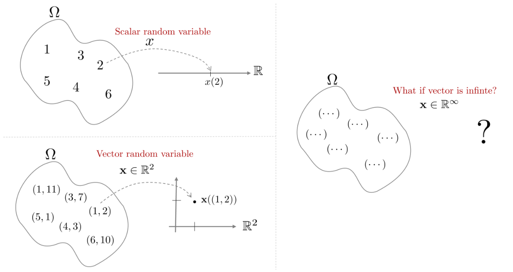

*(원문 p.30)*

$n \to \infty$가 된다면 벡터 확률변수 $\mathbf{x}$는 표본공간 $\Omega$에서 $\infty$개의 표본을
$\infty$개의 실수 벡터로 변환하는 연산자가 될 것이다. 이는 표본공간 $\Omega$에서 하나의 함수를 변환하는
연산자로 볼 수 있을 것이다. 함수해석학적으로 봤을 때 함수 $y = f(x)$는 $x$를 넣으면 $y$가 나오는 무한차원의
벡터로 해석할 수 있다. 예를 들어, 입출력이 실수라면 $x$도 무한개 $y$도 무한개인 벡터가 된다.

$$f\left(\begin{bmatrix} x_1 \\ x_2 \\ \vdots \\ x_{\infty} \end{bmatrix}\right) = \begin{bmatrix} y_1 \\ y_2 \\ \vdots \\ y_{\infty} \end{bmatrix} \tag{104}$$

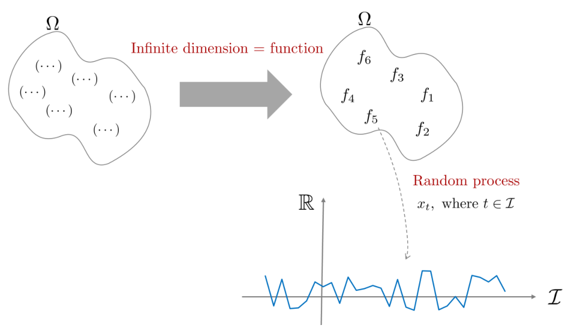

*(원문 p.31)*

따라서 랜덤프로세스는 표본공간 $\Omega$에서 랜덤한 함수 하나를 추출하는 과정으로 해석될 수 있으며
여기에서 인덱스 집합 $\mathcal{I}$를 사용하여 추가적인 차원 (일반적으로 시간 $t$)을 더해줌으로써
$\Omega \times \mathcal{I}$ 공간에서 원소를 추출하게 된다.

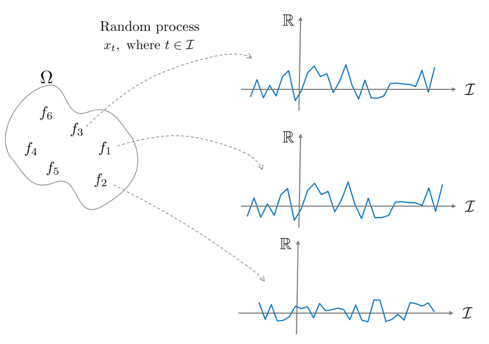

*(원문 p.31)*

## 9.1 Definition of random process

랜덤 프로세스는 다음과 같은 기호로 표기한다.

$$x_t(w), \quad \text{where, } t \in \mathcal{I} \tag{105}$$

- $\mathcal{I}$ : 인덱스 집합(Index set). 일반적으로 시간(t)으로 간주한다.

이는 $t$의 존재만 제외하고는 앞서 정의한 확률변수 $x$와 동일하다. $t$는 일반적으로 시간으로 간주한다.

랜덤 프로세스는 표본공간 $\Omega$에서 하나의 원소를 뽑았을 때 함수들의 공간으로 매핑되는 연산으로 해석할
수 있다.

$$x_t : \Omega \to \ \text{the set of all sequences or functions} \tag{106}$$

함수에 인덱스를 표기하기 위해(=축을 표기하기 위해) 인덱스 집합(index set)을 사용한다.

$$x_t : \mathcal{I} \to \ \text{set of all random variables defined on } \Omega \tag{107}$$

위 둘을 합하여 최종적으로 다음과 같이 표기한다.

$$\boxed{x_t : \Omega \times \mathcal{I} \to \mathbb{R}} \tag{108}$$

위 식에서 보다시피 랜덤프로세스는 표본공간과 인덱스 집합(일반적으로 시간 $t$)의 두 집합을
곱한 후(cartesian product) 하나의 실수 값을 반환하는 연산자로 볼 수 있다.

표본집합 $\Omega$에만 무작위성(randomness)가 존재하고 인덱스 집합 $\mathcal{I}$은 존재하지 않기 때문에
인덱스 집합 $t \in \mathcal{I}$을 고정시킨다면 랜덤프로세스 $x_t(w)$는 확률변수가 된다. 반대로 표본공간 내
원소 $w \in \Omega$를 실현(realization)한다면 확률변수 $x(w)$는 하나의 실수값이 나오지만 랜덤프로세스
$x_t(w)$는 하나의 함수(function 또는 sample path)가 나오게 된다.

$$\begin{aligned}
&\text{For fixed } t \in \mathcal{I} \to x_t(w) \text{ is a random variable} \\
&\text{For fixed } w \in \Omega \to x_t(w) \text{ is a deterministic function of t}
\end{aligned} \tag{109}$$

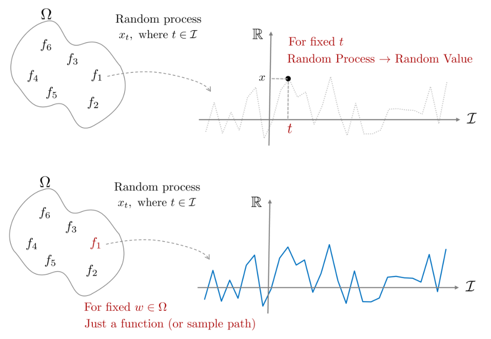

*(원문 p.33)*

### 9.1.1 Kolmogorov existence theorem

무한 차원에 대한 확률을 수학적으로 표현하기에 앞서 우선 $k$개의 확률변수에 대한 확률을 정의해보자.

$$Pr((x_{t_1}, \cdots, x_{t_k}) \in B) \ \text{for any } B, k, \text{ and } t_1, \cdots, t_k \tag{110}$$

위 식은 사건 $B$내에 존재하는 $k$개의 확률변수의 확률을 정의할 수 있음을 의미한다. 위 식에서 $k = 1$인
경우 이는 스칼라 확률변수 $x$의 확률을 정의하는 것과 동일하며, $k \to \infty$인 경우 무한한 차원의
확률변수에 대한 확률을 정의하는 것과 동일하다. 따라서 무한 차원에 대한 확률변수를 정의하는 것이 아닌
가변적으로 변할 수 있는 $k$개의 확률변수에 대한 확률을 정의하는 것이 곧 랜덤프로세스에서 확률을 정의하는
것이 되며 이를 Kolmogorov existence theorem이라고 한다.

## 9.2 Types of random process

확률변수 $x$는 다루고자 하는 표본공간이 이산값(discrete-value)을 가지는가 연속값(continuous-value)을
가지는가에 따라 두 가지 타입으로 분류할 수 있었다. 하지만 랜덤프로세스는 인덱스 집합 $\mathcal{I}$의 타입도
고려해야 하기 때문에 다음과 같은 타입이 추가적으로 고려되어야 한다.

- Discrete-time (for $\mathcal{I}$)
- Continuous-time (for $\mathcal{I}$)
- Discrete-value
- Continuous-value

이를 조합하여 총 네 개의 타입이 존재한다.

1. DTDV - (discrete-time, discrete-value)
2. DTCV - (discrete-time, continuous-value)
3. CTDV - (continuous-time, discrete-value)
4. CTCV - (continuous-time, continuous-value)

이 때, 인덱스 집합은 반드시 시간(t)일 필요는 없음에 유의한다. 여러 차원을 가진 인덱스 집합이 입력으로
사용될 수 있다. 하지만 앞서 정의한 랜덤프로세스 정의 (108)에 따라 출력은 1차원 실수값이 되어야 한다.
출력이 여러 차원인 랜덤 프로세스는 해당 문서에서는 다루지 않는다.

## 9.3 Wiener process (a.k.a Brownian motion)

액체나 기체 속에 미세입자를 넣었을 때 보이는 불규칙한 모션을 브라운 모션이라고 하는데 이는 대표적인
랜덤프로세스의 예시이다. Kolmogorov existence theorem에 따라 $t$초를 관측하면 $t$초의 인덱스 집합에 대한
sample path를 얻는 랜덤프로세스로 해석할 수 있다. $t$는 유한한 값으로 반드시 무한대일 필요가 없다.

## 9.4 Moment

랜덤프로세스는 하나의 샘플 $w \in \Omega$를 샘플링하였을 때 하나의 함수 $x_t(w)$가 나오기 때문에
랜덤프로세스의 1,2차 모멘트 또한 평균, 분산이 아닌 평균함수, 분산함수가 된다.

### 9.4.1 Mean function

랜덤프로세스의 1차 모멘트는 평균함수가 된다. 확률변수에 기대값 E를 취하면 하나의 실수값이 되듯이
랜덤프로세스에 기대값을 취하면 하나의 함수가 된다.

$$\boxed{m_x(t) \triangleq \mathbb{E}(x_t) = \begin{cases}
\sum_x x p_{x_t}(x) & \text{discrete-valued} \\
\int x f_{x_t}(x) dx & \text{continuous-valued}
\end{cases}} \tag{111}$$

### 9.4.2 Auto-correlation function (ACF)

서로 다른 두 시간 $t, s$에 대하여 ACF는 다음과 같이 정의한다. 이는 벡터 확률변수
$\mathbf{x} = [x_1, x_2]^{\intercal}$이 있을 때 $\mathbb{E}(x_1 x_2)$의 랜덤프로세스 버전으로 생각하면 된다.

접두어 auto는 라틴어로 self를 의미하는 autos에서 유래되었다. 따라서 auto-correlation function은 시계열
내에서 자기 자신과의 상관관계 함수를 의미한다.

$$\boxed{\mathbf{R}_{xx}(t, s) \triangleq \mathbb{E}(x_t x_s)} \tag{112}$$

### 9.4.3 Auto-covariance function (ACVF)

확률변수에 공분산(covariance)가 있다면 랜덤프로세스에는 ACVF가 있다. 이는 벡터 확률변수
$\mathbf{x} = [x_1, x_2]^{\intercal}$이 있을 때
$\mathrm{cov}(x_1, x_2) = \mathbb{E}[(x_1 - \mu_{x_1})(x_2 - \mu_{x_2})]$의 랜덤프로세스 버전으로 생각하면
된다.

$$\boxed{\mathbf{C}_{xx}(t, s) \triangleq \mathbb{E}[(x_t - m_x(t))(x_s - m_x(s))]} \tag{113}$$

### 9.4.4 Cross-covariance function (CCVF)

서로 다른 두 랜덤프로세스 $x_t, y_t$에 대하여 CCVF는 다음과 같이 정의된다. 이는 두 확률변수 $x, y$이 있을
때 $\mathrm{cov}(x, y) = \mathbb{E}[(x - \mu_x)(y - \mu_y)]$의 랜덤프로세스 버전으로 생각하면 된다.

$$\boxed{\mathbf{R}_{xy}(t, s) \triangleq \mathbb{E}[(x_t - m_x(t))(y_s - m_y(s))]} \tag{114}$$

### 9.4.5 Momentum on gaussian process

확률변수에서 가우시안 분포는 1,2차 모멘트인 평균, 분산을 사용하여 모든 확률분포를 표현할 수 있다.
이를 확장하여 만약 랜덤프로세스가 가우시안 분포를 따르고 평균이 0이라면 앞서 설명한 네 개의 모멘트 중
ACF만을 사용하여 가우시안 프로세스를 설명할 수 있다. 왜냐하면 ACVF에서 $m_x(t), m_x(s)$가 전부 0이 되기
때문이다.

$$\boxed{\begin{aligned}
\mathbf{C}_{xx}(t, s) &\triangleq \mathbb{E}[(x_t - 0)(x_s - 0)] \\
&= \mathbb{E}(x_t x_s) \\
&= \mathbf{R}_{xx}(t, s) \quad \cdots \text{ for Gaussian process w/ } m_x(t) = 0
\end{aligned}} \tag{115}$$

이는 가우시안 프로세스의 매우 중요한 특징 중 하나이다.

## 9.5 Stationary

랜덤프로세스는 표본공간에서 랜덤한 함수를 추출하는 과정이기 때문에 매우 다양한 모양의 함수(e.g., 값이
튀거나 무한대의 값을 갖거나)가 나올 수 있다. 랜덤프로세스에서 정상성(stationary)이란 수많은 종류의 함수들
중 통계적 성질이 시간 구간 $[t, t+\tau]$에서 변하지 않는 성질을 말한다. 즉, $[t, t+\tau]$ 구간에서 동일한
확률분포를 갖는 성질을 정상성이라고 하며 랜덤프로세스가 정상성을 갖는 경우 이를 특별히
정상프로세스(stationary process)라고 한다.

### 9.5.1 Strict-sense stationary (SSS)

협의의 정상성(strict-sense stationary, SSS)이란 다음과 같이 성질을 만족하는 랜덤프로세스를 말한다.

$$Pr((x_{t_1}, x_{t_2}, \cdots, x_{t_k}) \in B) = Pr((x_{t_1+\tau}, x_{t_2+\tau}, \cdots, x_{t_k+\tau}) \in B) \tag{116}$$

위 식에서 보다시피 SSS는 시간 $t$가 임의의 간격 $\tau$에 대하여 이동하여도 확률은 동일한 경우
(=shift invariant)를 말한다. SSS에서 모든 $n$차 모멘트들은 정상성을 띄며 다음과 같다.

$$\begin{aligned}
m_x(t+\tau) &= m_x(t) \\
\mathbf{R}_{xx}(t+\tau, s+\tau) &= \mathbf{R}_{xx}(t, s) \\
\mathbf{C}_{xx}(t+\tau, s+\tau) &= \mathbf{C}_{xx}(t, s)
\end{aligned} \tag{117}$$

### 9.5.2 Wide-sense stationary (WSS)

광의의 정상성(wide-sense stationary, WSS)란 SSS처럼 모든 $n$차 모멘트들이 정상성을 만족하는 것이 아닌
1차(평균), 2차(분산) 모멘트들만 정상성을 만족하는 경우를 말한다.

$$\begin{aligned}
m_x(t+\tau) &= m_x(t) \\
\mathbf{R}_{xx}(t+\tau, s+\tau) &= \mathbf{R}_{xx}(t, s)
\end{aligned} \tag{118}$$

이 때, 'WSS'이면 '2차 모멘트가 정상성'을 띄지만 반대로 '2차 모멘트가 정상성'을 띄면 'WSS'이다라는 역은
성립하지 않음에 유의한다. SSS는 지나치게 제약적이고 조건이 엄격하기 때문에 일반적으로 WSS를 많이 사용한다.

SSS, WSS 모두 임의의 시간 $t$에 대하여 평균함수 $m_x(t) = m_x(t+\tau)$를 만족하기 때문에 이는 곧
평균함수가 상수인 것을 의미한다.

$$\boxed{\mathbb{E}(x_t) = m_x(t) = m_x(t+\tau) = m_x = \ \text{constant.}} \tag{119}$$

그리고 ACF는 다음과 같이 두 시간 $t, s$ 차이에 의한 함수가 된다.

$$\boxed{\begin{aligned}
\mathbf{R}_{xx}(t, s) &= \mathbf{R}_{xx}(t-s, 0) \quad \cdots \text{ if } \tau = t - s \\
&= \mathbf{R}_{xx}(0, t-s) \\
&= \mathbf{R}_{xx}(\tau)
\end{aligned}} \tag{120}$$

따라서 랜덤프로세스가 정상성을 띄면 모멘트들은 더 이상 절대 시간 $t$에 의존하지 않고 상대적인 시간 차이
$\tau$에만 의존하게 된다. 또한, 위 식은 입력 시간 $t, s$ 값이 얼마나 서로 상관관계를 가지고 있느냐는 물리적
의미를 지닌다. 만약 $\tau = t - s$에 대하여 $\tau$가 작을 때 $\mathbf{R}_{xx}(\tau)$ 값이 크다면 짧은
시간동안 함수의 모양이 급격히 변하는 것을 의미하고 반대로 $\mathbf{R}_{xx}$ 값이 작다면 짧은 시간동안
함수의 모양이 부드럽게 변하는 것을 의미한다.

가우시안 분포의 경우 1,2차 모멘트만으로 모든 확률분포를 설명할 수 있는 좋은 성질을 가지고 있기 때문에
일반적으로 가우시안 프로세스는 WSS라고 가정한다. 그리고 앞서 말했듯이 평균함수가 0이라면 가우시안
프로세스는 공분산 $\mathbf{C}_{xx}$가 ACF $\mathbf{R}_{xx}$가 되어 ACF만을 사용하여 전부 표현할 수 있기
때문에 이는 매우 유용한 특징이 된다.

$$\mathbf{C}_{xx}(\tau) = \mathbf{R}_{xx}(\tau) \quad \cdots \text{ for Gaussian process w/ } m_x(t) = 0 \tag{121}$$

<!--widget:prob-wiener-process-->

# 10 Gaussian Process

가우시안 프로세스(gaussian process, GP)는 프로세스 집합 내에 존재하는 임의의 확률변수들의 조합이 모두 결합
가우시안 분포(joint gaussian distribution)를 따르는 랜덤프로세스를 말한다. 결합확률분포는 가우시안이기
때문에 1,2차 모멘트를 사용하여 완벽하게 표현이 가능하다.

- 평균함수: $m_x(t) = \mathbb{E}(x_t)$
- 공분산함수: $k(t, s) = \mathbf{C}_{xx}(t, s)$

위 식을 정리하여 랜덤프로세스 $x_t$가 GP를 따른다고 하면 일반적으로 다음과 같이 표기한다.

$$\boxed{x_t \sim \mathcal{GP}(m_x(t), k(t, s))} \tag{122}$$

앞서 랜덤프로세스에서 시간을 고정하면 이는 확률변수가 된다고 배웠다. 또한 GP는 정의에 따라
$t = 1, 3, 5$로 시간을 고정하면 각각의 확률변수 $x_1, x_3, x_5$가 모두 결합 가우시안 분포를 따라야 한다
(jointly gaussian).

> **Tip — Joint gaussian distribution**
>
> 두 벡터 확률변수 $\mathbf{x} \in \mathbb{R}^n$이고 $\mathbf{y} \in \mathbb{R}^m$가 주어졌을 때
> 결합확률분포(joint probability distribution)는 다음과 같이 나타낼 수 있다.
>
> $$\boxed{p(\mathbf{x}, \mathbf{y}) = \frac{1}{(2\pi)^{\frac{n+m}{2}} \det^{\frac{1}{2}}(\mathbf{C})} \exp\left(-\frac{1}{2}\left(\begin{bmatrix} \mathbf{x}-\mathbb{E}(\mathbf{x}) \\ \mathbf{y}-\mathbb{E}(\mathbf{y}) \end{bmatrix}\right)^{\intercal} \mathbf{C}^{-1}\left(\begin{bmatrix} \mathbf{x}-\mathbb{E}(\mathbf{x}) \\ \mathbf{y}-\mathbb{E}(\mathbf{y}) \end{bmatrix}\right)\right)} \tag{123}$$
>
> 평균 벡터은 $\begin{bmatrix} \mathbb{E}(\mathbf{x})^{\intercal} & \mathbb{E}(\mathbf{y})^{\intercal} \end{bmatrix}^{\intercal} \in \mathbb{R}^{n+m}$이고 공분산 행렬은 다음과 같다.
>
> $$\mathbf{C} = \begin{bmatrix} \mathbf{C}_{xx} & \mathbf{C}_{xy} \\ \mathbf{C}_{yx} & \mathbf{C}_{yy} \end{bmatrix} = \begin{bmatrix} n \times n & n \times m \\ m \times n & m \times m \end{bmatrix} \in \mathbb{R}^{(n+m) \times (n+m)} \tag{124}$$

시간을 고정하여 $\mathbf{x} = [x_1, x_3, x_5]^{\intercal}$이 얻어지면 결합 가우시안 분포는 다음과 같다.

$$p(x_1, x_2, x_3) = \frac{1}{(2\pi)^{\frac{3}{2}} \det^{\frac{1}{2}}(\mathbf{C})} \exp\left(-\frac{1}{2}\left(\begin{bmatrix} x_1 - \mathbb{E}(x_1) \\ x_2 - \mathbb{E}(x_2) \\ x_3 - \mathbb{E}(x_3) \end{bmatrix}\right)^{T} \mathbf{C}^{-1} \left(\begin{bmatrix} x_1 - \mathbb{E}(x_1) \\ x_2 - \mathbb{E}(x_2) \\ x_3 - \mathbb{E}(x_3) \end{bmatrix}\right)\right) \tag{125}$$

## 10.1 Toy example of gaussian process

예를 들어 $x_t = tA$이고 $A \sim \mathcal{N}(0, 1)$, $t \in \mathbb{R}$을 만족하는 GP가 주어졌다고
가정하자.

해당 문제가 GP인지 확인하는 방법은 다음과 같다. GP는 시간이 고정되었을 때 확률변수가 되어야 한다고 했다.
만약 $t$가 고정되면 $x_n = nA$인 확률변수가 된다. 반대로 확률변수가 고정되면 이는 시간에 대한 함수가 된다.
$A$가 확률변수가 아닌 고정된 값 $A_0$라고 하면 $x_t = tA_0$가 되어 이는 시간에 대한 함수가 된다.

다음으로 평균함수를 확인해보자.

$$m_x(t) = \mathbb{E}(x_t) = t\mathbb{E}(A) = 0 \tag{126}$$

보다시피 평균은 0이 된다. 다음은 공분산함수를 확인해보자.

$$k(t, s) = \mathbb{E}(tAsA) = ts\mathbb{E}(A^2) = ts \tag{127}$$

따라서 이는 다음과 같이 다시 쓸 수 있다.

$$x_t \sim \mathcal{GP}(0, ts) \tag{128}$$

공분산함수를 자세히 보면 이는 $t, s$에 대한 차이의 함수가 아닌 $t$와 $s$의 곱으로 이루어져 있다. 따라서 이
문제는 GP이지만 WSS가 아닌 것을 알 수 있다.

<!--widget:prob-gaussian-process-->

# 11 Gaussian Process Regression

가우시안 프로세스 회귀(gaussian process regression, GPR)은 가우시안 프로세스(GP)와는 다른 개념이다. GP는
랜덤프로세스의 한 종류를 말하는 반면에 GPR은 GP에 비모수적인 베이지안 방법(non-parametric bayesian method)을
적용하여 회귀 분석에 사용하는 알고리즘을 말한다.

$$\mathrm{GPR} \ = \ \mathrm{GP} \ + \ \text{Non-parametric Bayesian method} \tag{129}$$

GPR에서 자주 사용되는 기호(notation)의 의미는 다음과 같다.

1. $\mathcal{I}$: 인덱스 집합 (e.g., 시간 $t \in \mathbf{R}$ 또는 공간 $\mathbf{R}^n$)
2. $x_t : t \in \mathcal{I}$일 때 여러 인덱스 값에 대응하는 확률변수들의 집합(collection)
3. 가변적인 인덱스 집합 $\{t_1, t_2, \cdot, t_n\}$이 주어졌을 때 $\{x_{t_1}, x_{t_2}, \cdots, x_{t_3}\}$가
   평균이 $\mu \in \mathbb{R}^n$이고 공분산이 $K \in \mathbb{R}^{n \times n}$인 결합 가우시안 분포를
   따른다면 $x_t$는 가우시안 프로세스라고 한다. 이 때, 평균과 공분산은 가변적인 인덱스 집합의 길이에 따라
   달라진다.

GPR을 바라보는(=유도하는) 과정에 따라 weight-space view와 function-space view라는 두 개의 관점이 존재한다.
Weight-space view는 수학적으로 길고 복잡한 유도과정이 전개되는 반면에 function-space view는 상대적으로
단순하게 최종 식이 유도된다. 다음 섹션부터는 weight-space view와 function space view를 설명하고 두 관점이
모두 동일한 결과를 유도함을 설명한다.

## 11.1 Weight-space view

### 11.1.1 Linear regression (MLE)

다음과 같은 간단한 선형 회귀 문제를 생각해보자.

$$f(\mathbf{x}) = \mathbf{x}^{\intercal}\mathbf{w} \tag{130}$$

위 식에서 우리는 관측 데이터 $\mathbf{x}$에 대한 파라미터(또는 가중치, weight) $\mathbf{w}$를 찾고자 한다.
만약 관측된 데이터에 노이즈가 섞여 있다면 식은 다음과 같이 쓸 수 있다.

$$y(\mathbf{x}) = f(\mathbf{x}) + \epsilon \quad \text{where, } \epsilon \sim \mathcal{N}(0, \sigma_n^2) \tag{131}$$

우리는 $n$개의 입력-출력 데이터 쌍 $\mathcal{D} = \{(x_i, y_i)\}_{i=1}^{n}$을 가지고 있다고 가정하자.
$\mathbf{X} = \{\mathbf{x}_1, \mathbf{x}_2, \cdots, \mathbf{x}_n\}$이라고 했을 때 likelihood는 다음과 같이
나타낼 수 있다.

$$\begin{aligned}
p(\mathbf{y}|\mathbf{X}, \mathbf{w}) &= \Pi_{i=1}^{n} p(y_i|\mathbf{x}_i, \mathbf{w}) \\
&= \Pi_{i=1}^{n} \frac{1}{\sqrt{2\pi\sigma_n^2}} \exp\left(-\frac{(y_i - \mathbf{x}_i^{\intercal}\mathbf{w})^2}{2\sigma_n^2}\right) \\
&= \frac{1}{(2\pi\sigma_n^2)^{n/2}} \exp\left(-\frac{1}{2\sigma_n^2}\|\mathbf{y} - \mathbf{X}^{\intercal}\mathbf{w}\|^2\right) \\
&\sim \mathcal{N}(\mathbf{X}^{\intercal}\mathbf{w}, \sigma_n^2\mathbf{I})
\end{aligned} \tag{132}$$

Maximum likelihood estimation(MLE)를 사용하여 $\mathbf{w}$ 값을 추정해보면 위 식은 결국 다음 항을 최소화하는
최적화 문제가 된다.

$$\mathbf{w}^* = \arg\min_{\mathbf{w}} \|\mathbf{y} - \mathbf{X}^{\intercal}\mathbf{w}\|^2 \tag{133}$$

위 식은 최소제곱법의 정규방정식을 사용하여 다음과 같이 해를 구할 수 있다.

$$\boxed{\mathbf{w}^* = (\mathbf{X}\mathbf{X}^{\intercal})^{-1}\mathbf{X}^{\intercal}\mathbf{y} \quad \cdots \text{ for linear regression}} \tag{134}$$

### 11.1.2 Bayesian linear regression (MAP)

앞서 설명한 선형 회귀 문제는 고전적인 빈도론자(frequentist)의 추정 방법인 MLE을 사용하여 해를 도출하였다.
이와 달리 베이지만 추정 방법은 무엇이 다를까? 베이지안 추정 방법은 찾고자 하는 파라미터 $\mathbf{w}$가
결정된 값(deterministic value)이 아닌 하나의 확률변수(random variable)로 보고 $\mathbf{w}$의
사전 분포(prior pdf)를 고려할 수 있다는 점이 추가된다. $\mathbf{w}$를 평균이 0인 가우시안 분포를 따른다고
가정해보자.

$$\mathbf{w} \sim \mathcal{N}(0, \Sigma_w) \tag{135}$$

이 때, 베이지만 방법론은 likelihood가 아닌 posterior pdf를 찾는 것이 목표가 된다.

$$\begin{aligned}
p(\mathbf{w}|\mathbf{y}, \mathbf{X}) &= \frac{p(\mathbf{y}|\mathbf{X}, \mathbf{w})p(\mathbf{w})}{p(\mathbf{y}|\mathbf{X})} \\
&= \eta \cdot p(\mathbf{y}|\mathbf{X}, \mathbf{w})p(\mathbf{w})
\end{aligned} \tag{136}$$

Posterior pdf를 최대화하는 $\mathbf{w}$를 찾기 위해서는 maximum a posteriori(MAP) 추정을 사용해야 한다.

$$\begin{aligned}
p(\mathbf{w}|\mathbf{y}, \mathbf{X}) &= \eta \cdot p(\mathbf{y}|\mathbf{X}, \mathbf{w})p(\mathbf{w}) \\
&\propto \exp\left(-\frac{1}{2\sigma_n^2}(\mathbf{y} - \mathbf{X}^{\intercal}\mathbf{w})^{\intercal}(\mathbf{y} - \mathbf{X}^{\intercal}\mathbf{w})\right) \exp\left(-\frac{1}{2}\mathbf{w}^{\intercal}\Sigma_w^{-1}\mathbf{w}\right) \\
&\propto \exp\left(-\frac{1}{2}(\mathbf{w} - \bar{\mathbf{w}})^{\intercal}\mathbf{A}^{-1}(\mathbf{w} - \bar{\mathbf{w}})\right)
\end{aligned} \tag{137}$$

- $\bar{\mathbf{w}} = \frac{1}{\sigma_n^2}\mathbf{A}^{-1}\mathbf{X}\mathbf{y}$
- $\mathbf{A} = \left(\frac{1}{\sigma_n^2}\mathbf{X}\mathbf{X}^{\intercal} + \Sigma_w^{-1}\right)$

따라서 posterior pdf는 $p(\mathbf{w}|\mathbf{y}, \mathbf{X}) \sim \mathcal{N}(\bar{\mathbf{w}}, \mathbf{A})$인
가우시안 분포를 따른다. MAP은 posterior pdf를 최대가 되는 평균이기 때문에 다음과 같이 구할 수 있다.

$$\boxed{\hat{\mathbf{w}}_{\mathrm{MAP}} = \bar{\mathbf{w}} = \frac{1}{\sigma_n^2}\left(\frac{1}{\sigma_n^2}\mathbf{X}\mathbf{X}^{\intercal} + \Sigma_w^{-1}\right)^{-1}\mathbf{X}^{\intercal}\mathbf{y} \quad \cdots \text{ for bayesian linear regression}} \tag{138}$$

만약 위 식에서 $\Sigma_w^{-1} \to 0$이 되면 MAP는 MLE와 동일한 형태가 된다. 이는 사전 정보에 대한
불확실성이 매우 클 때($\Sigma_w \to \infty$) MAP는 곧 MLE가 됨을 의미한다.

가우시안이 아닌 일반적인 분포의 경우 posterior pdf를 위와 같이 해석적(analytical)으로 푸는 것이 매우
어렵거나 불가능할 수 있다. 보통 $\mathbf{w}$의 사전 정보(prior)를 정확히 아는 것은 매우 어렵기 때문에
공액사전정보(conjugate prior)를 사용하여 수식을 유도한다. 이 때, 가우시안의 conjugate prior는 역시
가우시안이기 때문에 posterior를 깔끔하게 유도할 수 있다. 따라서 가우시안 분포를 일반적으로 많이 가정하여
사용한다.

### 11.1.3 Gaussian process regression

앞서 정의한 선형 회귀 문제를 다시 생각해보자.

$$f(\mathbf{x}) = \mathbf{x}^{\intercal}\mathbf{w} \tag{139}$$

- $y(\mathbf{x}) = f(\mathbf{x}) + \epsilon$ where $\epsilon \sim \mathcal{N}(0, \sigma_n^2)$
- $\mathbf{w} \sim \mathcal{N}(0, \Sigma_w)$

만약 $\mathbf{x}, \mathbf{w}$가 모두 가우시안 분포를 따른다고 하고 평균함수와 공분산함수를 구해보면 다음과
같다.

$$\begin{aligned}
\mathbb{E}(f(\mathbf{x})) &= \mathbf{x}^{\intercal}\mathbb{E}(\mathbf{w}) = 0 \\
\mathbb{E}(f(\mathbf{x})f(\mathbf{x}')) &= \mathbf{x}^{\intercal}\mathbb{E}(\mathbf{w}\mathbf{w}^{\intercal})\mathbf{x}' = \mathbf{x}^{\intercal}\Sigma_w\mathbf{x}' = k(\mathbf{x}, \mathbf{x}')
\end{aligned} \tag{140}$$

위 식에서 보다시피 선형 회귀 문제는 모든 변수들 $[f(\mathbf{x}_1), \cdots, f(\mathbf{x}_n)]$이 결합 가우시안
분포를 따르므로 평균함수가 0이고 공분산이 $k(\mathbf{x}, \mathbf{x}')$ 가우시안 프로세스 문제로 해석할 수
있다.

### 11.1.4 Predictive distribution

우리는 앞서 베이지안 추정을 사용하여 MAP 추정값을 얻었다. 하지만 우리가 관심있는 부분은 새로운 입력
$\mathbf{x}_*$가 들어 왔을 때 출력값 $f_* = \mathbf{x}_*^{\intercal}\mathbf{w}$가 어떻게 되는가이다.
출력값을 예측하기 위해 다음과 같은 예측분포(predictive distribution)를 정의할 수 있다.

$$\begin{aligned}
p(f_*|\mathbf{x}_*, \mathbf{X}, \mathbf{y}) &= \int p(f_*|\mathbf{x}_*, \mathbf{w})p(\mathbf{w}|\mathbf{X}, \mathbf{y})d\mathbf{w} \\
&\sim \mathcal{N}\left(\frac{1}{\sigma_n^2}\mathbf{x}_*^{\intercal}\mathbf{A}^{-1}\mathbf{X}\mathbf{y}, \ \mathbf{x}_*^{\intercal}\mathbf{A}^{-1}\mathbf{x}_*\right)
\end{aligned} \tag{141}$$

> **Tip**
>
> 출력값이 $f_* = \mathbf{x}_*^{\intercal}\mathbf{w}$이기 때문에 기존 $\mathbf{w}$가 평균
> $\mathcal{N}(\mathbf{a}, \mathbf{B})$를 따른다면 $f_*$는
> $\mathcal{N}(\mathbf{x}_*\mathbf{a}, \mathbf{x}_*^{\intercal}\mathbf{B}\mathbf{x}_*)$를 따르는 것을 알 수
> 있다.

### 11.1.5 Kernel trick

예측분포의 평균과 분산을 구하기 위해 커널 트릭(kernel trick)을 사용해보자. 커널 트릭은 입력 데이터를 고차원
특성 공간으로 매핑하는 함수를 사용한다. 이 고차원 공간에서는 원래의 비선형 문제가 선형적으로 더 잘 분리될 수
있다. 커널 함수는 이러한 고차원 공간에서의 내적을 직접 계산하는 것과 동일한 결과를 제공하지만, 실제로
데이터를 고차원으로 변환하지 않기 때문에 계산 비용을 크게 절감할 수 있다.

커널 함수는 $\phi : \mathbb{R}^D \to \mathbb{R}^N$와 같이 기존의 관측 데이터를 고차원으로 매핑시켜주는
함수이다 $(N \gg D)$. 커널 함수를 사용하여 기존 회귀 문제를 다음과 같이 바꿀 수 있다.

$$f(\mathbf{x}) = \phi(\mathbf{x})^{\intercal}\mathbf{w} \tag{142}$$

위 문제의 평균함수와 공분산함수는 다음과 같다.

$$\begin{aligned}
\mathbb{E}(f(\mathbf{x})) &= \phi(\mathbf{x})^{\intercal}\mathbb{E}(\mathbf{w}) = 0 \\
\mathbb{E}(f(\mathbf{x})f(\mathbf{x}')) &= \phi(\mathbf{x})^{\intercal}\mathbb{E}(\mathbf{w}\mathbf{w}^{\intercal})\phi(\mathbf{x}') = \phi(\mathbf{x})^{\intercal}\Sigma_w\phi(\mathbf{x}') = k(\mathbf{x}, \mathbf{x}')
\end{aligned} \tag{143}$$

위 식에서 보다시피 커널 함수를 적용해도 모든 변수들 $[f(\mathbf{x}_1), \cdots, f(\mathbf{x}_n)]$ 이 결합
가우시안 분포를 따르므로 평균함수가 0이고 공분산이 $k(\mathbf{x}, \mathbf{x}')$ 가우시안 프로세스 문제로
해석할 수 있다.

앞서 예측분포의 평균과 분산은 다음과 같았다.

$$f_*|\mathbf{x}_*, \mathbf{X}, \mathbf{y} \sim \mathcal{N}\left(\frac{1}{\sigma_n^2}\mathbf{x}_*^{\intercal}\mathbf{A}^{-1}\mathbf{X}\mathbf{y}, \ \mathbf{x}_*^{\intercal}\mathbf{A}^{-1}\mathbf{x}_*\right) \tag{144}$$

여기에 커널 함수를 적용하면 다음과 같이 변경된다.

$$f_*|\mathbf{x}_*, \mathbf{X}, \mathbf{y} \sim \mathcal{N}\left(\frac{1}{\sigma_n^2}\phi(\mathbf{x}_*)^{\intercal}\mathbf{A}^{-1}\Phi\mathbf{y}, \ \phi(\mathbf{x}_*)^{\intercal}\mathbf{A}^{-1}\phi(\mathbf{x}_*)\right) \tag{145}$$

- $\Phi = \Phi(\mathbf{X}) = [\phi(\mathbf{x}_1), \cdots, \phi(\mathbf{x}_n)]^{\intercal} \in \mathbb{R}^{N \times n}$
- $\mathbf{A} = \left(\frac{1}{\sigma_n^2}\Phi\Phi^{\intercal} + \Sigma_w^{-1}\right) \in \mathbb{R}^{N \times N}$

커널 함수에 의해 차원이 $N$차원이 되었고 $N \gg D$이기 때문에 기존 $\mathbf{A}^{-1}$은 $D \times D$의
역행렬을 구하는 문제에서 더 큰 차원의 $N \times N$의 역행렬을 구하는 문제가 되었다. 이는 연산량의 증가로
이어진다.

이 문제를 해결하기 위해 변환 트릭을 사용한다. 우선 $\mathbf{K} = \Phi^{\intercal}\Sigma_w\Phi \in \mathbb{R}^{n \times n}$라고
하고 새로운 입력 $\mathbf{x}_*$에 대한 $\phi_* = \phi(\mathbf{x}_*)$라고 하면 $\mathbf{A}\Sigma_w\Phi$는
다음과 같이 전개할 수 있다.

$$\begin{aligned}
\mathbf{A}\Sigma_w\Phi &= (\sigma_n^{-2}\Phi\Phi^{\intercal} + \Sigma_w^{-1})\Sigma_w\Phi \\
&= \sigma_n^{-2}\Phi\Phi^{\intercal}\Sigma_w\Phi + \Phi \\
&= \sigma_n^{-2}\Phi(\Phi^{\intercal}\Sigma_w\Phi + \sigma_n^2\mathbf{I}) \\
&= \sigma_n^{-2}\Phi(\mathbf{K} + \sigma_n^2\mathbf{I})
\end{aligned} \tag{146}$$

위 마지막 식 앞에 $\mathbf{A}^{-1}$을 곱하고 뒤에 $(\mathbf{K} + \sigma_n^2\mathbf{I})^{-1}$를 곱하면 식은
다음과 같이 전개된다.

$$\begin{aligned}
\sigma_n^{-2}\mathbf{A}^{-1}\Phi(\mathbf{K} + \sigma_n^2\mathbf{I})(\mathbf{K} + \sigma_n^2\mathbf{I})^{-1} &= \mathbf{A}^{-1}\mathbf{A}\Sigma_w\Phi(\mathbf{K} + \sigma_n^2\mathbf{I})^{-1} \\
\sigma_n^{-2}\mathbf{A}^{-1}\Phi &= \Sigma_w\Phi(\mathbf{K} + \sigma_n^2\mathbf{I})^{-1}
\end{aligned} \tag{147}$$

(145)에 위 식을 대입하면 평균은 다음과 같이 변경된다.

$$\sigma_n^{-2}\phi_*^{\intercal}\mathbf{A}^{-1}\Phi\mathbf{y} = \phi_*^{\intercal}\Sigma_w\Phi(\mathbf{K} + \sigma_n^2\mathbf{I})^{-1}\mathbf{y} \tag{148}$$

Matrix inversion lemma를 사용하면 분산은 다음과 같이 변경된다.

$$\phi_*^{\intercal}\mathbf{A}^{-1}\phi_* = \phi_*^{\intercal}\Sigma_w\phi_* - \phi_*^{\intercal}\Sigma_w\Phi(\mathbf{K} + \sigma_n^2\mathbf{I})^{-1}\Phi^{\intercal}\Sigma_w\phi_* \tag{149}$$

둘을 합치면 (145)식은 다음과 같이 변경된다.

$$\begin{aligned}
f_*|\mathbf{x}_*, \mathbf{X}, \mathbf{y} \sim \mathcal{N}\big(&\phi_*^{\intercal}\Sigma_w\Phi(\mathbf{K} + \sigma_n^2\mathbf{I})^{-1}\mathbf{y}, \\
&\phi_*^{\intercal}\Sigma_w\phi_* - \phi_*^{\intercal}\Sigma_w\Phi(\mathbf{K} + \sigma_n^2\mathbf{I})^{-1}\Phi^{\intercal}\Sigma_w\phi_*\big)
\end{aligned} \tag{150}$$

위 식은 $N \times N$ 역행렬을 구하는 대신 $\phi_*$의 내적과 $n \times n$ 크기의 역행렬을 구하는 문제로
변경되었다. 일반적으로 $n < N$이기 때문에 동일한 평균과 분산을 효율적(=computationally efficient)으로 구할
수 있다. 최종적으로 (150)에 커널 트릭을 표기법을 사용하여
$\phi(\mathbf{x})^{\intercal}\Sigma_w\phi(\mathbf{x}') = k(\mathbf{x}, \mathbf{x}')$로 나타내면 새로운 입력에
대한 GPR의 평균과 분산을 구할 수 있다.

$$\boxed{\begin{aligned}
f_*|\mathbf{x}_*, \mathbf{X}, \mathbf{y} \sim \mathcal{N}\big(&k(\mathbf{x}_*, \mathbf{X})(k(\mathbf{X}, \mathbf{X}) + \sigma_n^2\mathbf{I})^{-1}\mathbf{y}, \\
&k(\mathbf{x}_*, \mathbf{x}_*) - k(\mathbf{x}_*, \mathbf{X})(k(\mathbf{X}, \mathbf{X}) + \sigma_n^2\mathbf{I})^{-1}k(\mathbf{X}, \mathbf{x}_*)\big)
\end{aligned}} \tag{151}$$

- $\phi_*^{\intercal}\Sigma_w\Phi = k(\mathbf{x}_*, \mathbf{X})$
- $\mathbf{K} = \Phi^{\intercal}\Sigma_w\Phi = k(\mathbf{X}, \mathbf{X})$
- $\phi_*^{\intercal}\Sigma_w\phi_* = k(\mathbf{x}_*, \mathbf{x}_*)$
- $\Phi^{\intercal}\Sigma_w\phi_* = k(\mathbf{X}, \mathbf{x}_*)$

<!--widget:prob-gpr-->

## 11.2 Function-space view

(139)의 GPR 문제를 다시 생각해보자.

$$f(\mathbf{x}) = \mathbf{x}^{\intercal}\mathbf{w} \tag{152}$$

- $\mathbf{w} \sim \mathcal{N}(0, \Sigma_w)$

만약 $\mathbf{w}$가 가우시안 분포를 따른다고 하고 평균함수와 공분산함수를 구해보면 다음과 같다.

$$\begin{aligned}
\mathbb{E}(f(\mathbf{x})) &= \mathbf{x}^{\intercal}\mathbb{E}(\mathbf{w}) = 0 \\
\mathbb{E}(f(\mathbf{x})f(\mathbf{x}')) &= \mathbf{x}^{\intercal}\mathbb{E}(\mathbf{w}\mathbf{w}^{\intercal})\mathbf{x}' = \mathbf{x}^{\intercal}\Sigma_w\mathbf{x}' = k(\mathbf{x}, \mathbf{x}')
\end{aligned} \tag{153}$$

이는 평균함수가 0이고 공분산함수가 $k(\mathbf{x}, \mathbf{x}')$인 GP로 볼 수 있다. 따라서
$f(\mathbf{X}) = \begin{bmatrix} f(\mathbf{x}_1) & f(\mathbf{x}_2) & \cdots & f(\mathbf{x}_n) \end{bmatrix}^{\intercal} \in \mathbb{R}^n$의
모든 변수들은 다음과 같은 결합 가우시안 분포를 따른다.

$$\begin{bmatrix} f(\mathbf{x}_1) \\ f(\mathbf{x}_2) \\ \vdots \\ f(\mathbf{x}_n) \end{bmatrix} \sim \mathcal{N}\left(0, \begin{bmatrix}
k(\mathbf{x}_1, \mathbf{x}_1) & \cdots & k(\mathbf{x}_1, \mathbf{x}_n) \\
\vdots & \ddots & \vdots \\
k(\mathbf{x}_n, \mathbf{x}_1) & \cdots & k(\mathbf{x}_n, \mathbf{x}_n)
\end{bmatrix}\right) \tag{154}$$

새로운 입력 $f(\mathbf{x}_*) \in \mathbb{R}$가 주어졌다고 해보자. 이 때, 기존 $f(\mathbf{X})$와
$f(\mathbf{x}_*)$는 서로 결합 가우시안 분포를 따라야 하므로 이는 다음과 같이 확장하여 쓸 수 있다.

$$\begin{bmatrix} f(\mathbf{x}_1) \\ f(\mathbf{x}_2) \\ \vdots \\ f(\mathbf{x}_n) \\ f(\mathbf{x}_*) \end{bmatrix} \sim \mathcal{N}\left(0, \begin{bmatrix}
k(\mathbf{x}_1, \mathbf{x}_1) & \cdots & k(\mathbf{x}_1, \mathbf{x}_n) & k(\mathbf{x}_1, \mathbf{x}_*) \\
\vdots & \ddots & \vdots & \vdots \\
k(\mathbf{x}_n, \mathbf{x}_1) & \cdots & k(\mathbf{x}_n, \mathbf{x}_n) & k(\mathbf{x}_n, \mathbf{x}_*) \\
k(\mathbf{x}_*, \mathbf{x}_1) & \cdots & k(\mathbf{x}_*, \mathbf{x}_n) & k(\mathbf{x}_*, \mathbf{x}_*)
\end{bmatrix}\right) \tag{155}$$

위 식을 간략하게 표현하면 다음과 같다.

$$\boxed{\begin{bmatrix} \mathbf{f} \\ f_* \end{bmatrix} \sim \mathcal{N}\left(0, \begin{bmatrix}
k(\mathbf{X}, \mathbf{X}) & k(\mathbf{X}, \mathbf{x}_*) \\
k(\mathbf{x}_*, \mathbf{X}) & k(\mathbf{x}_*, \mathbf{x}_*)
\end{bmatrix}\right)} \tag{156}$$

우리는 $\mathbf{f}$가 주어졌을 때 새로운 값 $f_*$의 확률분포를 계산하고 싶으므로 이는 조건부 확률분포
(conditional pdf) $p(f_*|\mathbf{x}_*, \mathbf{X}, \mathbf{f})$을 사용하여 문제를 풀 수 있다.

$$\begin{aligned}
f_*|\mathbf{x}_*, \mathbf{X}, \mathbf{f} \sim \mathcal{N}\big(&k(\mathbf{x}_*, \mathbf{X})k(\mathbf{X}, \mathbf{X})^{-1}\mathbf{f}, \\
&k(\mathbf{x}_*, \mathbf{x}_*) - k(\mathbf{x}_*, \mathbf{X})k(\mathbf{X}, \mathbf{X})^{-1}k(\mathbf{X}, \mathbf{x}_*)\big)
\end{aligned} \tag{157}$$

> **Tip — Conditional gaussian distribution**
>
> 두 벡터 확률변수 $\mathbf{x}, \mathbf{y}$가 주어졌을 때 조건부 확률분포 $p(\mathbf{y}|\mathbf{x})$가
> 가우시안 분포를 따른다고 하면
>
> $$\begin{aligned} p(\mathbf{y}|\mathbf{x}) &= \frac{p(\mathbf{x}, \mathbf{y})}{p(\mathbf{x})} = \frac{p(\mathbf{x}|\mathbf{y})p(\mathbf{y})}{p(\mathbf{x})} = \eta \cdot p(\mathbf{x}|\mathbf{y})p(\mathbf{y}) \\ &\sim \mathcal{N}(\mathbb{E}(\mathbf{y}|\mathbf{x}), \mathbf{C}_{y|x}) \end{aligned} \tag{158}$$
>
> 가 된다. 평균 $\mathbb{E}(\mathbf{y}|\mathbf{x})$과 분산 $\mathbf{C}_{y|x}$은 아래와 같다.
>
> $$\boxed{\begin{aligned} \mathbb{E}(\mathbf{y}|\mathbf{x}) &= \mathbb{E}(\mathbf{y}) + \mathbf{C}_{yx}\mathbf{C}_{xx}^{-1}(\mathbf{x} - \mathbb{E}(\mathbf{x})) \\ \mathbf{C}_{y|x} &= \mathbf{C}_{yy} - \mathbf{C}_{yx}\mathbf{C}_{xx}^{-1}\mathbf{C}_{yx}^{\intercal} \end{aligned}} \tag{159}$$

위 식은 (151)와 상당히 유사한 것을 볼 수 있다. Function-space view에서는 관측 노이즈
$y(\mathbf{x}) = f(\mathbf{x}) + \epsilon$, where $\epsilon \sim \mathcal{N}(0, \sigma_n^2)$이 고려되지
않아서 이에 대한 항이 빠져 있는 점이 다르다. 만약 관측 노이즈를 고려하면 공분산함수는 다음과 같이 변경된다.

$$C_{xx}(f(\mathbf{x}_1), f(\mathbf{x}_2)) = k(\mathbf{x}_1, \mathbf{x}_2) + \sigma_n^2 \tag{160}$$

(156)에서 $k(\mathbf{X}, \mathbf{X})$의 자기 자신의 대각(diagonal) 성분만 $\sigma_n^2$이 살아남아서
$\sigma_n^2\mathbf{I}$가 된다.

$$\boxed{\begin{bmatrix} \mathbf{y} \\ f_* \end{bmatrix} \sim \mathcal{N}\left(0, \begin{bmatrix}
k(\mathbf{X}, \mathbf{X}) + \sigma_n^2\mathbf{I} & k(\mathbf{X}, \mathbf{x}_*) \\
k(\mathbf{x}_*, \mathbf{X}) & k(\mathbf{x}_*, \mathbf{x}_*)
\end{bmatrix}\right)} \tag{161}$$

최종적으로 function-space view에서도 (151)와 완전히 동일한 GPR 수식이 유도된다.

$$\boxed{\begin{aligned}
f_*|\mathbf{x}_*, \mathbf{X}, \mathbf{y} \sim \mathcal{N}\big(&k(\mathbf{x}_*, \mathbf{X})(k(\mathbf{X}, \mathbf{X}) + \sigma_n^2\mathbf{I})^{-1}\mathbf{y}, \\
&k(\mathbf{x}_*, \mathbf{x}_*) - k(\mathbf{x}_*, \mathbf{X})(k(\mathbf{X}, \mathbf{X}) + \sigma_n^2\mathbf{I})^{-1}k(\mathbf{X}, \mathbf{x}_*)\big)
\end{aligned}} \tag{162}$$

## 11.3 Pros and cons of GPR

GPR의 장점과 단점은 다음과 같이 요약할 수 있다.

### 11.3.1 Pros

1. **원리적 접근**: GPR은 데이터를 모델링하는 과정에서 수학적으로 엄밀하고 체계적인 방법을 제공한다.
2. **확률적 예측**: GPR은 단순한 예측값을 제공하는 것이 아니라, 예측의 불확실성을 포함한 확률적인 예측을
   제공한다. 이는 의사결정 과정에서 유용한 정보를 제공한다.
3. **예측 불확실성의 정량화**: GPR은 예측에 대한 불확실성을 명확하게 산출할 수 있다. 이는 모델의 예측이
   얼마나 정확할지에 대한 감을 준다.

### 11.3.2 Cons

1. **연산량**: 역행렬을 구하는 과정에서 $O(n^3)$의 시간복잡도가 발생하므로 연산량이 많다. 이를 해결하기 위해
   다양한 연구가 이루어지고 있다.

# 12 References

1. [(Blog) 평균과 기댓값](https://infograph.tistory.com/191)
2. [(Blog) PRLM - 4. The Exponential Family](https://norman3.github.io/prml/docs/chapter02/4)
3. [(Blog) [수리통계학] 38. 지수족](https://analysisbugs.tistory.com/121)
4. [(Wiki) Law of total expectation](https://en.wikipedia.org/wiki/Law_of_total_expectation)
5. [(Blog) 2 장 확률변수와 확률분포](http://bigdata.dongguk.ac.kr/lectures/med_stat/_book/%ED%99%95%EB%A5%A0%EB%B3%80%EC%88%98%EB%B6%84%ED%8F%AC.html)
6. [(Lecture) Bayesian Deep Learning - 최성준](https://www.edwith.org/bayesiandeeplearning/lecture/24679)
7. [Williams, Christopher KI, and Carl Edward Rasmussen. Gaussian processes for machine learning. Vol. 2. No. 3. Cambridge, MA: MIT press, 2006.](https://link.springer.com/book/10.1007/b100712#page=71)
8. [(Blog) [확률/통계] 확률분포 종 정리 (이산확률분포, 연속확률분포) - roytravel님 블로그](https://roytravel.tistory.com/344)

# 13 Revision log

- 1st: 2024-02-09
- 2nd: 2024-02-24
- 3rd: 2024-02-26
- 4th: 2024-02-29
- 5th: 2024-03-02
- 6th: 2024-03-30
- 7th: 2024-06-28
- 8th: 2024-11-08: Conditional probability distribution에서 독립일 때 공식 수정 (thanks to 익명님)
- 9th: 2025-03-21: probability distribution에 1차,2차 모멘텀 표시, 오타 수정, linear transformation 스칼라
  버전 추가

# 옮기며 바로잡은 것

원문을 옮기면서 고친 것은 아래가 전부다. 그 외의 문장·수식·절 구성은 손대지 않았다.

## 맞춤법·철자

| 원문 쪽 | 위치 | 원문 | 고친 것 |
|---|---|---|---|
| 11 | 5장 불릿 | Borel 가측공간(**mesurable** space) | measurable space |
| 13 | 6.1.2 절 제목 (목차 포함) | **Binomal** distribution | Binomial distribution |
| 23 | 7.3 첫 문장 | 공분산(**covarinace**) | 공분산(covariance) |
| 24 | 7.4 첫 문장 | 직교한다(**orhtogonal**) | 직교한다(orthogonal) |
| 26 · 29 · 37 | 8.3 · 8.6 · 10장 Tip | joint probability **distribtuion** | joint probability distribution |
| 34 | 9.4.2 | auto-**corrleation** function | auto-correlation function |
| 34 | 9.4.3 | 공분산(**coviance**) | 공분산(covariance) |
| 38 | 11장 첫 문장 | **가우스인** 프로세스(GP) | 가우시안 프로세스(GP) |
| 39 | 11.1.2 | maximum a **posterior**(MAP) | maximum a posteriori(MAP) |
| 39 | 식 (134) | for linear **regrssion** | for linear regression |
| 39 | 식 (138) | for bayesian linear **regrssion** | for bayesian linear regression |
| 41 | 식 (150) 아래 | **computaionally** efficient | computationally efficient |

## 수식 표기

| 원문 쪽 | 위치 | 원문 | 고친 것 |
|---|---|---|---|
| 27 | 식 (92) | $(\mathbf{x} - j\mathbb{E}(\mathbf{x}))$ | $(\mathbf{x} - \mathbb{E}(\mathbf{x}))$ — 군더더기 $j$ 제거 |
| 29 | 식 (98) 첫 줄 | $\mathbb{E}((\mathbf{y}-\mathbb{E}(\mathbf{y})(\mathbf{y}-\mathbb{E}(\mathbf{y})^{\intercal})$ | $\mathbb{E}((\mathbf{y}-\mathbb{E}(\mathbf{y}))(\mathbf{y}-\mathbb{E}(\mathbf{y}))^{\intercal})$ — 괄호 짝 보정 |
| 39 | 식 (137) 2·3행 | $\exp\left(\frac{1}{2\sigma_n^2}(\cdots)\right)$, $\exp\left(\frac{1}{2}(\cdots)\right)$ | 지수 앞에 빠진 음부호를 넣어 $\exp\left(-\frac{1}{2\sigma_n^2}(\cdots)\right)$, $\exp\left(-\frac{1}{2}(\cdots)\right)$ |

## 원문 그대로 둔 것

아래 두 곳은 원문의 표기가 앞뒤와 어긋나지만, 단순 오타인지 저자의 표기 선택인지 단정할 수 없어 **고치지
않고 원문 그대로** 두었다. 읽을 때만 참고하면 된다.

- **식 (94) 마지막 줄** — 앞 줄에서는 $\mathbf{B}^{-1}$이던 가운데 항이
  $[\mathbf{C}_{yy} - \mathbf{C}_{yx}\mathbf{C}_{xx}^{-1}\mathbf{C}_{xy}]$로 쓰여 역행렬 기호가 빠져 있다.
  아래 underbrace가 $\mathbf{C}_{y|x}$를 **가리키기 위한 표기**로 보인다.
- **식 (137)~(138) 부근** — posterior를 $\mathcal{N}(\bar{\mathbf{w}}, \mathbf{A})$로 적었는데
  $\mathbf{A} = \left(\frac{1}{\sigma_n^2}\mathbf{X}\mathbf{X}^{\intercal} + \Sigma_w^{-1}\right)$는
  precision(정보행렬)에 해당하므로 공분산은 $\mathbf{A}^{-1}$이 되어야 앞의 지수부와 맞는다.
  (참고문헌 [7] Rasmussen & Williams에서는 $\mathcal{N}(\bar{\mathbf{w}}, \mathbf{A}^{-1})$로 쓴다.)

