# Notes on Multiple View Geometry in Computer Vision

Gyubeom Edward Im (Orig. by Richard Hartley and Andrew Zisserman)

> blog: alida.tistory.com, email: criterion.im@gmail.com

> 원문(104쪽, 21차 개정 2026-07-12)을 **문장·절 순서·식 번호·그림 위치를 그대로** 옮겼다.
> 손댄 곳은 딱 한 군데이며 [옮기며 바로잡은 것](#옮기며-바로잡은-것)에 적어 두었다.
> 원문이 쓰는 **파란 강조 190곳도 그대로 재현**했다.
> 절 사이의 <b>실험 1~18</b>은 **원문에 없는 추가 요소**다.

| 장 | 원문 쪽 | 식 | 장 | 원문 쪽 | 식 |
|---|---|---|---|---|---|
| 1 Projective Space | 7 | (1)~(3) | 9 Structure Computation | 75 | (316)~(341) |
| 2 Projective Geometry and Transformations in 2D | 7 | (4)~(78) | 10 Scene planes and homographies | 80 | (342)~(384) |
| 3 Camera Models | 23 | (79)~(139) | 11 Affine Epipolar Geometry | 89 | (385)~(400) |
| 4 Computation of the Camera Matrix P | 38 | (140)~(170) | 12 The Trifocal Tensor | 93 | (401)~(456) |
| 5 More Single View Geometry | 44 | (171)~(201) | 13 Revision log | 103 | — |
| 6 Epipolar Geometry and the Fundamental Matrix | 54 | (202)~(275) | 14 References | 104 | — |
| 7 3D Reconstruction of Cameras and Structure | 68 | (276)~(298) | 15 Closure | 104 | — |
| 8 Computation of the Fundamental Matrix F | 72 | (299)~(315) | | | |

---

# 1 Projective Space

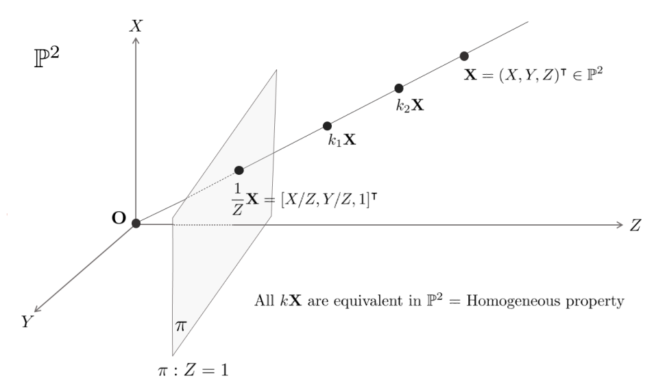

사영 공간(projective space) $\mathbb{P}^n$는 $\mathbb{R}^{n+1}$ 공간 상의 원점을 지나는 직선들의 집합을 의미한다. 따라서 원점을
제외한 $\mathbb{R}^{n+1}$ 공간 상의 모든 원소를 포함한다. 엄밀히 말하면 허수를 제외한 실수만 취급하므로 $\mathbb{RP}^n$라고
써야하지만 본 포스팅에서는 편의를 위해 $\mathbb{P}^n$를 사용한다.

$$\mathbb{P}^n = \mathbb{R}^{n+1} - \{0\} \tag{1}$$

3차원 공간 상에 점 $\mathbf{X}$가 다음과 같이 주어졌다고 하자.

$$\mathbf{X} = [X, Y, Z] \in \mathbb{P}^2 \tag{2}$$

==$\mathbf{X}$의 모든 원소에 임의의 값 $k$를 곱해도 이는 원점과 $\mathbf{X}$를 잇는 직선 위에 존재하며 이러한 성질을
homogeneous 성질이라고 한다.== 만약 $k = 1/Z$를 곱해주면 3차원 점을 $Z = 1$ 평면에 프로젝션한 것과
기하학적으로 동일한 의미를 지닌다.

$$[X, Y, Z] \rightarrow [X/Z, Y/Z, 1] \tag{3}$$

==따라서 $\mathbb{P}^2$을 사용하면 3차원 공간 상의 점들을 특정 평면에 프로젝션하여 $\mathbb{R}^2$와 동일하게 2차원 공간
상의 점, 직선, 곡면 등을 표현할 수 있고 여기에 추가적으로 무한대 점(point at infinity) $\mathbf{x}_\infty$과 무한대
직선(line at infinity) $\mathbf{l}_\infty$를 표현할 수 있는 표현의 이점을 지닌다. 또한 점과 직선을 동일한 3차원 벡터로
연산할 수 있는 연산의 이점을 지닌다.== 자세한 내용은 추후 섹션에서 설명한다.

<!--widget:projective-space-->

# 2 Projective Geometry and Transformations in 2D

## The 2D projective plane

일반적으로 평면 위의 점 $\mathbf{x}$는 $(x, y) \in \mathbb{R}^2$와 같이 표현한다. $\mathbb{R}^2$가 벡터공간(vector space)이라고 하면 $\mathbf{x}$는
하나의 벡터로 나타낼 수 있다. 또한, 두 점 $\mathbf{x}_1, \mathbf{x}_2$을 포함하는 직선 $\mathbf{l}$은 두 벡터를 뺌으로써 표현할 수 있다.
해당 섹션에서는 평면 위의 점과 직선에 대해 하나의 동일한 벡터로 표현할 수 있게 해주는 Homogeneous
Notation에 대해 설명한다.

### Points and lines

### Homogeneous representation of line

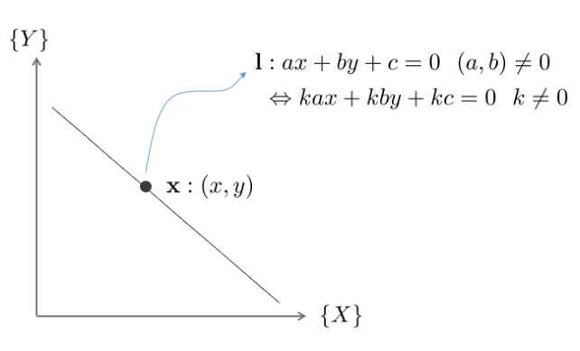

임의의 직선 $\mathbf{l}$은 다음과 같이 표현할 수 있다.

$$\mathbf{l} : ax + by + c = 0, \quad (a, b) \neq 0 \tag{4}$$

직선 $\mathbf{l}$ 위에 임의의 한 점 $\mathbf{x} = (x, y, 1)$이 존재하면 직선 $ax + by + c = 0$ 공식에 따라 직선 $\mathbf{l}$은 다음과
같이 표현할 수 있다.

$$\mathbf{l} : (a, b, c) \tag{5}$$

이 때, $(a, b, c)$는 직선 $\mathbf{l}$을 유일하게 표현하지 않는다. $(ka, kb, kc)$와 같이 0이 아닌 임의의 상수 $k$를 곱해도
동일한 직선 $\mathbf{l}$을 표현할 수 있다.

$$\mathbf{l} : (ka, kb, kc) \tag{6}$$

따라서 ==평면 위의 직선 $\mathbf{l}$은 스케일 값에 상관없이 모두 같은 직선을 의미==한다. 이러한 동치관계(equivalent)에 있는 모든 벡터를 Homogeneous 벡터라고 한다. ==$\mathbb{R}^3$ 공간에서 동치관계에 있는 모든 벡터들의 집합을
사영공간(projective space) $\mathbb{P}^2$이라고 한다.==

### Homogeneous representation of points

직선 $\mathbf{l} = (a, b, c)^\intercal$과 직선 위의 한 점 $\mathbf{x} = (x, y)^\intercal$ 사이에는 다음 공식이 성립한다.

$$ax + by + c = 0 \tag{7}$$

이는 두 벡터 $\mathbf{l}$과 $\mathbf{x}$의 내적으로 표현할 수 있다.

$$\begin{pmatrix} x \\ y \\ 1 \end{pmatrix}\begin{pmatrix} a \\ b \\ c \end{pmatrix} = \begin{pmatrix} x \\ y \\ 1 \end{pmatrix}\mathbf{l} = 0 \tag{8}$$

이는 직선 위의 한 점 $\mathbf{x} = (x, y)$ 좌표 맨 끝에 1을 추가하여 직선과 내적한 것으로 볼 수 있다. 직선
$\mathbf{l}$는 스케일 값에 상관없이 하나의 직선을 표현할 수 있으므로 $(x, y, 1)\mathbf{l} = 0$이 성립한다는 전제하에 모든
$k$값에 대해 $(kx, ky, k)\mathbf{l} = 0$ 또한 성립한다. 따라서 ==임의의 상수 $k$에 대해서 $(kx, ky, k)$는 $\mathbb{R}^2$ 공간에서
한 점 $\mathbf{x} = (x, y)$를 의미하므로 직선과 동일하게 점 또한 Homogeneous 벡터로 표현할 수 있다.== 이를
일반화하여 표현하면 임의의 점 $\mathbf{x} = (x, y, z)^\intercal$는 $\mathbb{R}^2$ 공간 상의 한 점 $(x/z, y/z)$을 표현한다.

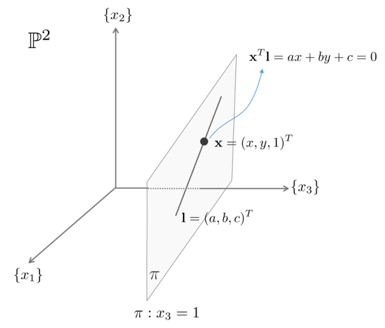

따라서 $\mathbb{P}^2$ 공간 상에서 임의의 한 점 $\mathbf{x}$가 직선 $\mathbf{l}$ 위에 존재할 경우

$$\begin{aligned}
\mathbf{x}^\intercal\mathbf{l} &= \begin{pmatrix} x \\ y \\ 1 \end{pmatrix}\begin{bmatrix} a \\ b \\ c \end{bmatrix} \\
&= ax + by + c \\
&= 0 \\
\therefore\ \mathbf{x}^\intercal\mathbf{l} &= 0
\end{aligned} \tag{9}$$

공식이 성립한다.

### Degree of freedom (dof)

$\mathbb{P}^2$ 공간에서 하나의 점이 유일하게 결정되기 위해서는 반드시 2개의 값 $(x, y)$가 주어져야 한다. 직선을 유
일하게 결정하기 위해서는 두 개의 독립적인 $\{a : b : c\}$ 비율이 주어져야 한다. 이와 같이 $\mathbb{P}^2$ 공간에서 점과
직선은 2자유도를 가진다.

### Intersection of lines

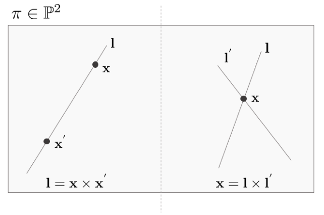

$\mathbb{P}^2$ 공간 상의 두 개의 직선 $\mathbf{l}, \mathbf{l}'$이 주어졌을 때 두 직선의 방정식은 다음과 같이 쓸 수 있다.

$$\begin{aligned}
\mathbf{x}^\intercal\mathbf{l} &= 0 \\
\mathbf{x}^\intercal\mathbf{l}' &= 0
\end{aligned} \tag{10}$$

이 때, 교차점 $\mathbf{x}$는 스케일 값에 관계없이 하나의 점을 의미하므로 두 직선 $\mathbf{l}, \mathbf{l}'$의 Cross Product의 배수로
나타낼 수 있다.

$$\mathbf{x} = \mathbf{l} \times \mathbf{l}' \tag{11}$$

예를 들어, $\mathbb{P}^2$ 공간에 $x = 1$인 직선과 $y = 1$인 직선이 존재하면 두 직선은 $(1, 1)$에서 교점을 가진다.
이를 위 공식을 이용해서 구해보면 직선 $x = 1$은 $-x + 1 = 0 \Rightarrow (-1, 0, 1)^\intercal$로 표현할 수 있고 직선 $y = 1$은
$-y + 1 = 0 \Rightarrow (0, -1, 1)^\intercal$로 표현할 수 있으므로

$$\mathbf{x} = \mathbf{l} \times \mathbf{l}' = \begin{vmatrix} \mathbf{i} & \mathbf{j} & \mathbf{k} \\ -1 & 0 & 1 \\ 0 & -1 & 1 \end{vmatrix} = \begin{pmatrix} 1 \\ 1 \\ 1 \end{pmatrix} \tag{12}$$

가 성립한다. $(1, 1, 1)^\intercal$는 $\mathbb{R}^2$ 공간에서 $(1, 1)$을 의미한다.

### Line joining points

두 직선의 교점을 구하는 공식과 유사하게 $\mathbb{P}^2$ 공간에서 두 점 $\mathbf{x}, \mathbf{x}'$가 주어졌을 때 두 점을 지나는 직선 $\mathbf{l}$은
다음과 같이 구할 수 있다.

$$\mathbf{l} = \mathbf{x} \times \mathbf{x}' \tag{13}$$

<!--widget:points-lines-duality-->

## Ideal points and the line at infinity

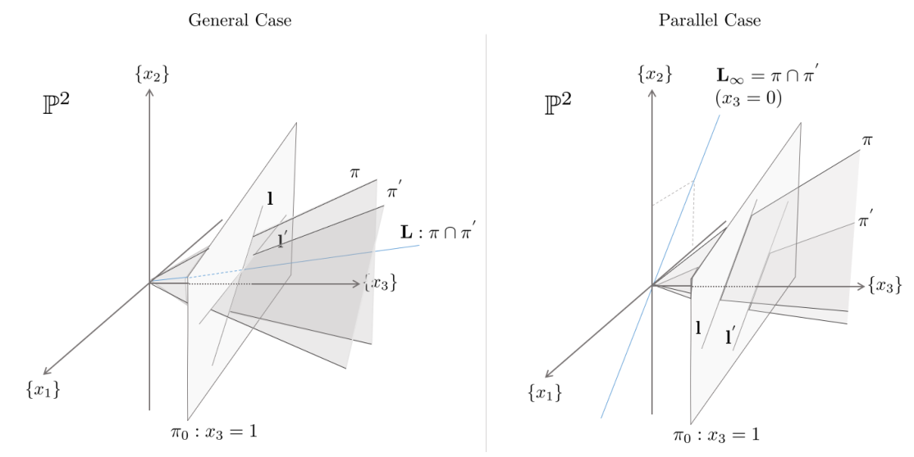

### Intersection of parallel lines

만약 ==두 직선 $\mathbf{l}, \mathbf{l}'$이 평행한 경우 두 직선의 교차점은 $\mathbb{R}^2$ 공간에서는 만나지 않지만 $\mathbb{P}^2$ 공간에서는 만난다.==

$$\mathbb{P}^2 = \mathbb{R}^2 \cup \mathbf{l}_\infty \tag{14}$$

평행한 두 직선 $\mathbf{l}, \mathbf{l}'$은 다음과 같이 나타낼 수 있다.

$$\begin{aligned}
\mathbf{l} &: (a, b, c)^\intercal \\
\mathbf{l}' &: (a, b, c')^\intercal
\end{aligned} \tag{15}$$

평행한 두 직선은 무한대에 위치한 점 $\mathbf{x}_\infty$에서 교차하므로

$$\begin{aligned}
\mathbf{x}_\infty = \mathbf{l} \times \mathbf{l}' &= (c' - c)\begin{pmatrix} b \\ -a \\ 0 \end{pmatrix} \sim \begin{pmatrix} b \\ -a \\ 0 \end{pmatrix}
\end{aligned} \tag{16}$$

공식이 성립한다. 이러한 ==무한대 점 $\mathbf{x}_\infty$를 $\mathbb{R}^2$ 공간으로 변환하면 $(b/0, -a/0)$이 되어 유효하지 않는
점으로 변환된다. 따라서 $\mathbb{P}^2$ 공간에서 무한대 점 $\mathbf{x}_\infty = (x, y, 0)^\intercal$는 $\mathbb{R}^2$ 공간으로 변환되지 않는다.== 이를
통해 Euclidean 공간에서 평행한 두 직선은 만나지 않지만 사영 공간(projective space)에서는 무한대에서
만난다는 것을 알 수 있다.

예를 들어 $\mathbb{P}^2$ 공간에 평행한 두 직선 $x = 1$과 $x = 2$가 주어지면 두 직선은 무한대에서 교차한다. 이를
Homogeneous Notation으로 표현하면 $-x + 1 = 0 \Rightarrow (-1, 0, 1)^\intercal$ 그리고 $-x + 2 = 0 \Rightarrow (-1, 0, 2)^\intercal$이므로

$$\mathbf{x}_\infty = \mathbf{l} \times \mathbf{l}' = \begin{vmatrix} \mathbf{i} & \mathbf{j} & \mathbf{k} \\ -1 & 0 & 1 \\ -1 & 0 & 2 \end{vmatrix} = \begin{pmatrix} 0 \\ 1 \\ 0 \end{pmatrix} \tag{17}$$

이 된다. 이 때, $\mathbf{x}_\infty$는 $y$축 방향의 무한대 점을 의미한다.

### Ideal points and the line at infinity

Homogeneous 벡터 $\mathbf{x} = (x_1, x_2, x_3)^\intercal$는 $x_3 \neq 0$일 때 $\mathbb{R}^2$ 공간 상의 한 점과 대응된다. 그러나 $x_3 = 0$이면
해당 점은 $\mathbb{R}^2$ 공간과 대응되지 않고 $\mathbb{P}^2$ 공간에만 존재하는데 이를 Ideal Point 또는 무한대 점(point at
infinity)라고 부른다. 무한대 점은

$$\mathbf{x}_\infty = \begin{pmatrix} x_1 & x_2 & 0 \end{pmatrix}^\intercal \tag{18}$$

와 같은 형태를 갖는다. 이러한 무한대 점들은 특정한 직선 위에 존재하게 되는데 이러한 직선을 무한대
직선(line at infinity)라고 한다.

$$\mathbf{l}_\infty = \begin{pmatrix} 0 & 0 & 1 \end{pmatrix}^\intercal \tag{19}$$

따라서 $\mathbf{x}^\intercal_\infty\mathbf{l}_\infty = \begin{pmatrix} x_1 & x_2 & 0 \end{pmatrix}\begin{pmatrix} 0 & 0 & 1 \end{pmatrix}^\intercal = 0$이 성립한다.

이전 섹션에서 설명한 것과 같이 두 평행한 직선 $\mathbf{l} = (a, b, c)^\intercal$과 $\mathbf{l}'_\infty = (a, b, c')^\intercal$는 무한대 점 $\mathbf{x}_\infty = (b, -a, 0)^\intercal$에서 교차한다는 것을 알 수 있다. 이를 통해 ==$\mathbb{R}^2$ 공간에서는 평행한 직선들은 서로 교차하지
않지만 $\mathbb{P}^2$ 공간에서는 서로 다른 두 직선은 반드시 한 점에서 교차한다는 것을 알 수 있다.==

### A model for the projective plane

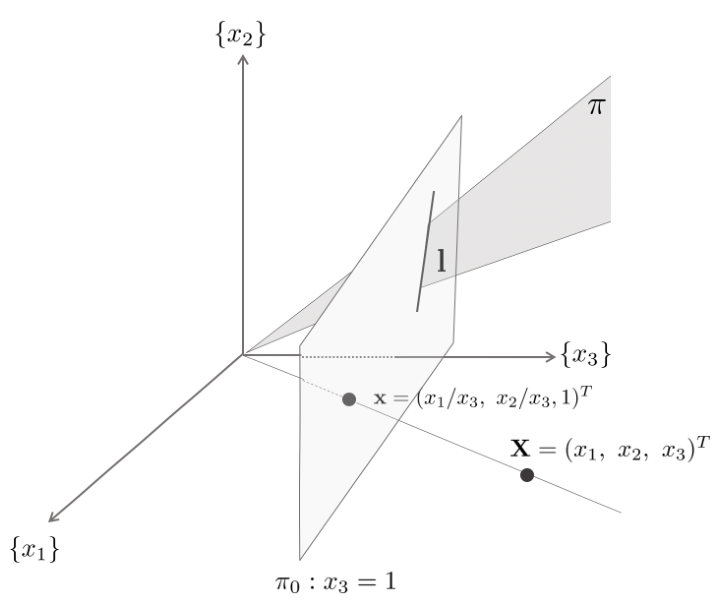

==기하학적으로 봤을 때, $\mathbb{P}^2$는 3차원 공간 $\mathbb{R}^3$에서 원점을 지나는 모든 직선들의 집합==을 의미한다. $\mathbb{P}^2$ 상의
모든 벡터를 $k(x_1, x_2, x_3)^\intercal$라고 했을 때 $k$ 값에 따라 한 점 $(x_1, x_2, x_3)^\intercal$의 위치가 결정된다. $k$는 실수이므로
$k = 0$인 경우 원점을 의미하고 $k \neq 0$인 경우 무수한 점들의 집합인 직선이 된다. 반대로, 이러한 $\mathbb{R}^3$ 공간
상의 원점을 통과하는 한 직선은 $\mathbb{P}^2$ 공간 상의 한 점으로 볼 수 있다. 이를 확장하면 ==$\mathbb{P}^2$ 공간 상의 직선 $\mathbf{l}$은
$\mathbb{R}^3$ 공간 상의 원점을 포함하는 평면 $\pi$에 대응==한다.

==$\mathbb{P}^2$ 공간에서는 스케일 값에 관계없이 한 점을 유일하게 정의할 수 있으므로 마지막 항 $x_3$로 좌표값을
나눈 $(x_1/x_3, x_2/x_3, 1)$를 일반적으로 한 점을 표현하는 대표값으로 간주한다.== 따라서 $\mathbb{R}^3$ 공간 상의 원점을
지나는 직선과 $x_3 = 1$인 평면이 교차하는 점이 곧 $\mathbb{P}^2$ 공간 상의 한 점이 된다.

### Duality

==$\mathbb{P}^2$ 공간에서는 점과 직선이 대칭성(duality)을 가진다.== 예를 들어 직선 $\mathbf{l}$ 위의 한 점 $\mathbf{x}$은 $\mathbf{x}^\intercal\mathbf{l} = 0$ 또는
$\mathbf{l}^\intercal\mathbf{x} = 0$과 같이 두 가지 방법으로 표현할 수 있다. 또한, 두 직선 $\mathbf{l}, \mathbf{l}'$이 교차하는 한 점은 $\mathbf{x} = \mathbf{l}\times\mathbf{l}'$이고 두 점
$\mathbf{x}, \mathbf{x}'$을 통과하는 직선 $\mathbf{l}$은 $\mathbf{l} = \mathbf{x} \times \mathbf{x}'$으로 표현할 수 있는데 이는 기본적으로 점과 직선의 위치가 바뀌었을
뿐 동일한 공식을 사용한다.

이와 같이 ==$\mathbb{P}^2$ 공간에서는 점과 직선이 동일한 공식에 대해 위치를 바꾸어도 성립하는 대칭성을 가진다.
즉, 두 점을 통과하는 직선의 공식은 두 직선이 교차하는 한 점의 공식과 대칭이다.==

## Conics and dual conics

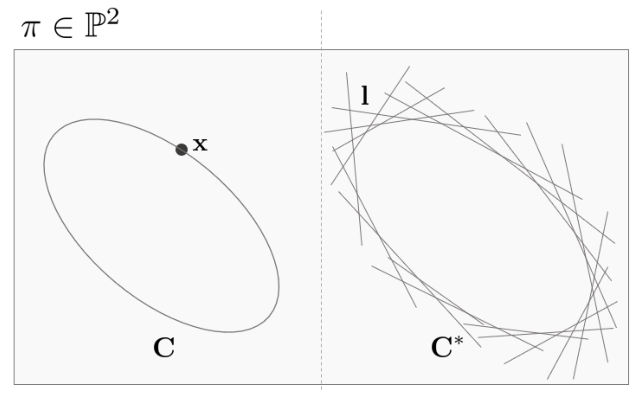

Conic이란 평면에서 이차식으로 정의된 곡선을 의미한다. 일반적인 공식으로는

$$ax^2 + bxy + cy^2 + dx + ey + f = 0 \tag{20}$$

과 같으며 계수 값에 따라 원, 타원, 쌍곡선, 포물선 등 다양한 곡선 형태로 표현될 수 있다. Conic을
Homogeneous Form으로 나타내면

$$ax^2 + bxy + cy^2 + dxz + eyz + fz^2 = 0 \tag{21}$$

과 같고 이를 행렬 형태로 정리하면

$$\begin{pmatrix} x & y & z \end{pmatrix}\begin{bmatrix} a & b/2 & d/2 \\ b/2 & c & e/2 \\ d/2 & e/2 & f \end{bmatrix}\begin{pmatrix} x \\ y \\ z \end{pmatrix} = 0 \tag{22}$$

꼴로 쓸 수 있으며 이 때 대칭행렬 $\begin{bmatrix} a & b/2 & d/2 \\ b/2 & c & e/2 \\ d/2 & e/2 & f \end{bmatrix}$를 Conic $\mathbf{C}$라고 한다.

### Five points define a conic

Conic $\mathbf{C}$가 유일하게 결정되기 위해서는 다섯개의 점이 필요하다. 하나의 점에 대한 Conic 방정식은 다음과
같이 다시 쓸 수 있다.

$$ax^2 + bxy + cy^2 + dxz + eyz + fz^2 = 0 \Rightarrow \begin{pmatrix} x_i^2 & x_iy_i & y_i^2 & x_i & y_i & 1 \end{pmatrix}\mathbf{c} = 0 \tag{23}$$

이 때, $\mathbf{c} = \begin{pmatrix} a & b & c & d & e & f \end{pmatrix} \in \mathbb{R}^6$인 벡터를 의미한다. $\mathbf{c}$는 5 자유도를 가지므로

$$\underbrace{\begin{bmatrix} x_1^2 & x_1y_1 & y_1^2 & x_1 & y_1 & 1 \\ x_2^2 & x_2y_2 & y_2^2 & x_2 & y_2 & 1 \\ x_3^2 & x_3y_3 & y_3^2 & x_3 & y_3 & 1 \\ x_4^2 & x_4y_4 & y_4^2 & x_4 & y_4 & 1 \\ x_5^2 & x_5y_5 & y_5^2 & x_5 & y_5 & 1 \end{bmatrix}}_{\mathbf{A}}\mathbf{c} = 0 \tag{24}$$

위 식과 같이 ==총 5개의 점을 사용하면 $\mathbf{A} \in \mathbb{R}^{5\times6}$ 행렬의 Null Space 벡터가 유일한 $\mathbf{c}$의 해가 되고
Conic을 유일하게 결정한다.==

### Tangent lines to conics

Conic $\mathbf{C}$ 위의 한 점 $\mathbf{x}$에서 접선 $\mathbf{l}$은

$$\mathbf{l} = \mathbf{C}\mathbf{x} \tag{25}$$

와 같이 쓸 수 있다.

임의의 두 직선 $\mathbf{l}, \mathbf{m}$을 포함하는 Conic $\mathbf{C}$는

$$\mathbf{C} = \mathbf{l}\mathbf{m}^\intercal + \mathbf{m}\mathbf{l}^\intercal \tag{26}$$

과 같이 쓸 수 있다.

### Dual conics

==사영 공간(projective space) $\mathbb{P}^n$은 $\mathbb{R}^{n+1}$ 공간 상의 원점을 지나는 직선들의 집합을 의미==한다. 이와
대칭을 이루는 ==Dual Projective Space $(\mathbb{P}^n)^\vee$는 $\mathbb{R}^n$ 공간 상 $n$차원 부분 선형공간들의 집합을 의미==한다.
$n$차원 부분 선형공간 $H$는

$$H = \left\{\sum_{i=0}^{n} a_ix_i = 0 \ \Big|\ a_i \neq 0 \text{ for some } i\right\}. \tag{27}$$

이 때 $a_0, \cdots, a_n \in \mathbb{P}^n$을 하나의 사영 공간(projective space)로 생각할 수 있고 하나의 Dual projective
space는 하나의 사영 공간과 대칭 관계를 가진다.

$\mathbb{P}^2$ 상의 Conic $\mathbf{C}$가 주어졌을 때, ==$\mathbf{C}$의 Dual Conic $\mathbf{C}^*$은 $(\mathbb{P}^2)^\vee$ 공간 상의 Conic을 의미하며 $\mathbf{C}^*$은
Conic $\mathbf{C}$의 접선에 대한 정보를 가지고 있다.== $(\mathbb{P}^2)^\vee$는 $\mathbb{P}^2$ 상의 직선을 파라미터화하여 나타낼 수 있다. $\hat{\mathbf{C}}^*$
는 다음과 같이 나타낼 수 있다.

$$\mathbf{C}^*_{ij} = (-1)^{i+j}\det(\hat{\mathbf{C}}_{ij}) \tag{28}$$

여기서 $\hat{\mathbf{C}}_{ij}$는 $\mathbf{C}_{ij}$에서 $i$번째 행, $j$번째 열을 제거한 행렬을 의미한다.

임의의 직선 $\mathbf{l}$이 주어졌을 때 $\mathbf{l}$이 Conic $\mathbf{C}$에 접하는 필요충분조건은 다음과 같다.

$$\mathbf{l}^\intercal\mathbf{C}^*\mathbf{l} = 0 \tag{29}$$

### Proof

($\Rightarrow$) Conic $\mathbf{C} \in \mathbb{R}^{3\times3}$의 rank가 3이고 non-singular하다고 가정하면 $\mathbf{C}^* = \det(\mathbf{C}^{-1})$와 같이 나타낼 수 있다.
$\mathbf{C}$ 위의 한 점 $\mathbf{x} \in \mathbf{C}$가 주어졌을 때 $\mathbf{x}$에서 접선 $\mathbf{l}$은 $\mathbf{l} = \mathbf{C}\mathbf{x}$로 나타낼 수 있다. 이를 위 식에 대입하면

$$\begin{aligned}
\mathbf{l}^\intercal\mathbf{C}^*\mathbf{l} &= (\mathbf{C}\mathbf{x})^\intercal\mathbf{C}^*\mathbf{C}\mathbf{x} \\
&= \mathbf{x}^\intercal\mathbf{C}^\intercal\mathbf{C}^*\mathbf{C}\mathbf{x} \\
&= \det(\mathbf{x}^\intercal\mathbf{C}^\intercal\mathbf{x}) && \because \mathbf{C}^* = \det(\mathbf{C}^{-1}) \\
&= 0 && \because \mathbf{x} \in \mathbf{C},\ (\mathbf{x}^\intercal\mathbf{C}\mathbf{x})^\intercal = 0
\end{aligned} \tag{30}$$

($\Leftarrow$) 직선 $\mathbf{l}$과 Dual Conic $\mathbf{C}^*$가 $\mathbf{l}^\intercal\mathbf{C}^*\mathbf{l} = 0$을 만족할 때 $\mathbf{l}$과 $\mathbf{C}^*$가 한 점 $\mathbf{x}$에서 만난다는 것을 증명하면
된다. 이 때 $\mathbf{l} = \mathbf{C}\mathbf{x}$ 공식이 성립한다.

$\mathbf{C}$는 non-singualr하기 때문에 역행렬이 존재하므로 $\mathbf{x} = \mathbf{C}^{-1}\mathbf{l}$과 같이 나타낼 수 있다. 따라서 $\mathbf{x}^\intercal\mathbf{l}$은

$$\begin{aligned}
\mathbf{x}^\intercal\mathbf{l} &= (\mathbf{C}^{-1}\mathbf{l})^\intercal\mathbf{l} \\
&= \mathbf{l}^\intercal\mathbf{C}^{-\intercal}\mathbf{l} = 0 && (\mathbf{C}^* \sim \mathbf{C}^{-1}\ \text{by assumption.})
\end{aligned} \tag{31}$$

과 같고 $\mathbf{x}^\intercal\mathbf{C}\mathbf{x}$는

$$\begin{aligned}
\mathbf{x}^\intercal\mathbf{C}\mathbf{x} &= (\mathbf{C}^{-1}\mathbf{l})^\intercal\mathbf{C}\mathbf{C}^{-1}\mathbf{l} \\
&= \mathbf{l}^\intercal\mathbf{C}^{-\intercal}\mathbf{C}\mathbf{C}^{-1}\mathbf{l} \\
&= \mathbf{l}^\intercal\mathbf{C}^{-1}\mathbf{l} = 0 && (\mathbf{C}^{-\intercal} = \mathbf{C}^{-1}\ \mathbf{C}\ \text{is symmetric.})
\end{aligned} \tag{32}$$

공식이 성립함에 따라 $\mathbf{x}$는 $\mathbf{l}$과 $\mathbf{C}$의 교점임이 증명된다.

$$\{\mathbf{x}\} = \mathbf{l} \cap \mathbf{C} \tag{33}$$

<!--widget:conics-dual-->

## Projective transformations

$\mathbb{P}^2$의 Projective Transformation은 non-singular인 $3 \times 3$ 행렬로 정의되는 $\mathbb{P}^2 \Rightarrow \mathbb{P}^2$ 사상을 의미하며 직선
을 직선으로 보내는 성질을 가진다. ==Projective Transformation은 Collineation, Projectivity 또는
Homography==라고도 불린다.

## A hierarchy of transformations

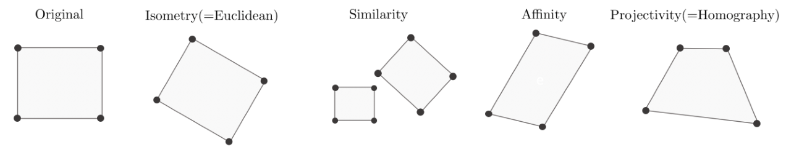

Projective 변환은 변환 전과 후 사이에 어떤 성질을 보존하느냐에 따라 여러 종류의 변환 행렬이 존재한다.

### Class 1: Isometries

물체가 변환 전과 후 사이에 물체의 크기가 동일한 경우 해당 변환을 Isometry 변환이라고 부른다.

$$\mathbf{H}_{iso} = \begin{bmatrix} \mathbf{A} & \mathbf{t} \\ \mathbf{0} & 1 \end{bmatrix} \tag{34}$$

이 때 $\mathbf{A} \in \mathbb{R}^{2\times2}$는 2차원 물체의 회전과 반사(reflection)을 포함한 행렬이며 $\mathbf{t} \in \mathbb{R}^2$는 2차원 물체의 이동
벡터이다.

### Class 2: Similarity transformations

Isometry 변환에 스케일을 의미하는 $s$가 추가된 변환을 Similarity 변환이라고 하며 ==물체의 이동 및 회전에
추가적으로 스케일까지 같이 변환==하는 성질을 가진다. 이 때 기존의 $\mathbf{A}$ 행렬에서 Reflection의 성질을 제거한
$\mathbf{R}$ 행렬을 사용한다.

$$\mathbf{H}_S = \begin{bmatrix} s\mathbf{R} & \mathbf{t} \\ \mathbf{0} & 1 \end{bmatrix} \tag{35}$$

Similarity 변환은 물체의 각도와 길이의 비율을 보존되지만 스케일은 보존되지 않는다. 두 물체가 Similarity 변환까지 동일하다는 의미는(=up to scale) 두 물체의 형태는 동일하지만 스케일에 차이가 있다는
의미이다.

### Class 3: Affine transformations

Affine 변환은 Isometry 변환에서 행렬 $\mathbf{A}$의 아무 제약조건이 없는 변환행렬을 의미한다. 변환 후 물체는
일반적으로 변환 전과 다른 형태를 가진다.

$$\mathbf{H}_A = \begin{bmatrix} \mathbf{A} & \mathbf{t} \\ \mathbf{0} & 1 \end{bmatrix} \tag{36}$$

$\mathbf{H}_A$는 6자유도를 가지므로 세 개의 대응점 쌍으로부터 $\mathbf{H}_A$를 유일하게 결정할 수 있다.

Affine 변환은 물체의 길이 비율을 보존하며 또한 평행한 직선을 보존하는 성질을 가진다. 따라서 무한대
직선(line at infinity) $\mathbf{l}_\infty$를 Affine 변환해도 여전히 $\mathbf{l}_\infty$가 된다.

$$\mathbf{H}_A(\mathbf{l}_\infty) = \mathbf{l}_\infty \tag{37}$$

### Class 4: Projective transformations

마지막으로 Projective 변환은 변환행렬의 마지막 행이 $(0, 0, 1)$이 아닌 임의의 형태를 가지는 변환행렬을
의미한다. Projective 변환은 직선을 직선으로 사상한다는 성질 외에는 이전에 설명한 모든 성질들을 보존하
지 않는다는 특징이 있다. 평행한 직선 또한 Projective 변환을 수행하면 평행하지 않게되며 물체의 길이비
또한 달라지게 된다.

$$\mathbf{H}_p = \begin{bmatrix} \mathbf{A} & \mathbf{t} \\ \mathbf{v}^\intercal & v \end{bmatrix} \tag{38}$$

이 때 $\mathbf{v} = \begin{pmatrix} v_1 & v_2 \end{pmatrix}^\intercal$는 임의의 2차원 벡터를 의미하며 $v$ 또한 임의의 스칼라 값을 의미한다. Projective
변환행렬 $\mathbf{H}_p$는 8자유도를 가지므로 일반적으로 4개의 대응점 쌍을 통해 $\mathbf{H}_p$을 유일하게 결정할 수 있다.

<!--widget:transformation-hierarchy-->

## Decomposition of a projective transformation

앞서 설명한 변환행렬의 계층구조에 따라 Projective 변환행렬은 다른 변환행렬들의 곱으로 표현할 수 있다.
반대로 말하면, ==Projective 변환은 다른 변환행렬들로 분해가 가능하다.== 임의의 Projective 변환 $\mathbf{H}_p$가
주어졌을 때

$$\begin{aligned}
\mathbf{H}_p &= \mathbf{H}_S\mathbf{H}_A\mathbf{H}_P \\
&= \begin{bmatrix} s\mathbf{R} & \mathbf{t} \\ \mathbf{0} & 1 \end{bmatrix}\begin{bmatrix} \mathbf{K} & \mathbf{0} \\ \mathbf{0} & 1 \end{bmatrix}\begin{bmatrix} \mathbf{I} & \mathbf{0} \\ \mathbf{v}^\intercal & v \end{bmatrix} = \begin{bmatrix} \mathbf{A} & \mathbf{t} \\ \mathbf{v}^\intercal & v \end{bmatrix}
\end{aligned} \tag{39}$$

와 같이 ==Projective 변환 $\mathbf{H}_p$는 Similarity 변환 $\mathbf{H}_S$과 Affine 변환 $\mathbf{H}_A$ 그리고 나머지 변환 $\mathbf{H}_P$
의 곱으로 분해가 가능==하다. 이 때, $\mathbf{A} = s\mathbf{R}\mathbf{K} + \mathbf{t}\mathbf{v}^\intercal$이고 $\mathbf{K}$는 $\det(\mathbf{K}) = 1$로 정규화된 상삼각행렬(upper-triangle) 행렬을 의미한다. 단, 위와 같은 분해는 $v \neq 0$일 때만 가능하며 $s > 0$인 경우 분해가 유일하게
결정된다.

$\mathbf{H}^{-1} = \mathbf{H}_P^{-1}\mathbf{H}_A^{-1}\mathbf{H}_S^{-1} = \mathbf{H}'_P\mathbf{H}'_A\mathbf{H}'_S$ 또한 $\mathbf{H}$의 반대 방향으로 homography 연산을 의미한다. 이 때, 각
행렬의 디테일한 $\mathbf{R}, \mathbf{t}, \mathbf{K}, \mathbf{v}, s, v$ 값은 $\mathbf{H}$와 $\mathbf{H}^{-1}$이 서로 다르다.

## Recovery of affine and metric properties from images

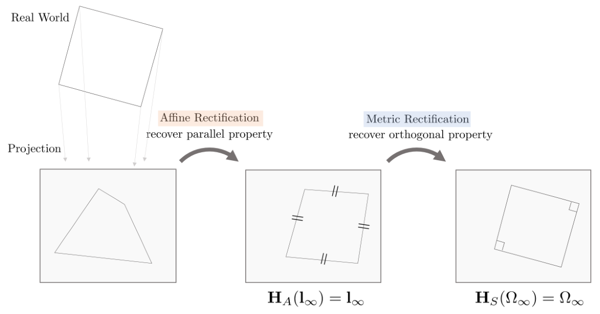

임의의 이미지가 주어졌을 때 실제 월드 상에서 평행한 선들과 직교한 선들을 사용하여 이미지의 Affine
성질과 Metric 성질을 복원할 수 있다.

### The line at infinity

Affine 변환은 평행한 선들이 보존되는 Affine 성질을 보존하는 것을 의미하며 무한대 직선(line at infinity)
$\mathbf{l}_\infty = \begin{pmatrix} 0 & 0 & 1 \end{pmatrix}^\intercal$을 Affine 변환해도 여전히 무한대 직선의 성질을 유지하는 특징이 있다.

$$\mathbf{H}_A(\mathbf{l}_\infty) = \mathbf{H}_A^{-\intercal}\mathbf{l}_\infty = \begin{bmatrix} \mathbf{A} & \mathbf{t} \\ \mathbf{0} & 1 \end{bmatrix}^{-\intercal}\begin{pmatrix} 0 \\ 0 \\ 1 \end{pmatrix} = \begin{bmatrix} \mathbf{A}^{-\intercal} & \mathbf{0} \\ -\mathbf{t}^\intercal\mathbf{A}^{-\intercal} & 1 \end{bmatrix}\begin{pmatrix} 0 \\ 0 \\ 1 \end{pmatrix} = \begin{pmatrix} 0 \\ 0 \\ 1 \end{pmatrix} = \mathbf{l}'_\infty \tag{40}$$

위와 같이 $\mathbf{l}_\infty$를 Affine 변환해도 여전히 무한대에 위치한다.

### Recovery of affine properties from images

affine 성질을 복원한다는 의미는 실제 세계에서 평행하지만 이미지 평면상에서 projective 변환에 의해 평행
하지 않은 두 직선을 다시 복원한다는 의미이다. 임의의 homography $\mathbf{H}$가 affine 성질을 보존한다는 의미는
곧 무한대 직선 $\mathbf{l}_\infty$를 $\mathbf{H}$ 변환해도 무한대에 위치한 직선이 된다는 의미이다. 즉, 무한대 직선 위의 한 점 $\mathbf{x}_\infty$
점이 있다고 했을 때 다음이 성립한다.

$$\mathbf{H}(\mathbf{x}_\infty) = \mathbf{H}\mathbf{x}_\infty = \mathbf{x}'_\infty \tag{41}$$

무한대 직선 위의 한 점 $\mathbf{x}_\infty$는 $\mathbf{x}_\infty = (x, y, 0)^\intercal$와 같이 마지막 항이 0인 특징이 있으므로 임의의 homography $\mathbf{H}$는

$$\mathbf{H}\mathbf{x}_\infty = \begin{bmatrix} \mathbf{A} & \mathbf{t} \\ \mathbf{v} & v \end{bmatrix}\begin{pmatrix} x \\ y \\ 0 \end{pmatrix} = \begin{pmatrix} * \\ * \\ 0 \end{pmatrix} \tag{42}$$

이 성립하므로 $\mathbf{v} = (0, 0)$이 되고 $v$는 스케일 상수가 되어 1로 변환이 가능하다.

$$\mathbf{H} = \begin{bmatrix} \mathbf{A} & \mathbf{t} \\ \mathbf{0} & v \end{bmatrix} = \begin{bmatrix} \mathbf{A}/v & \mathbf{t}/v \\ \mathbf{0} & 1 \end{bmatrix} \tag{43}$$

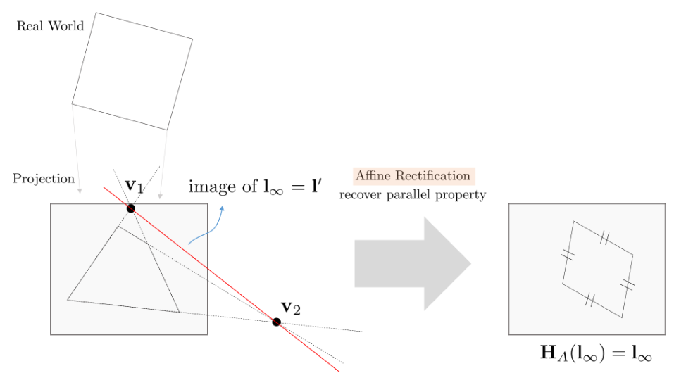

하지만 현실의 카메라를 통해 촬영한 영상에서는 projective 변환이 적용되므로 $\mathbf{l}_\infty$의 성질이 보존되지
않고 이미지 상에 투영된다. 따라서 이미지 상에 투영된 임의의 직선 $\mathbf{l}'$을 $\mathbf{l}_\infty$로 변환하는 homography $\mathbf{H}$를
찾는 과정이 affine rectification이 된다.

$$\mathbf{H}(\mathbf{l}') = \mathbf{H}^{-\intercal}\mathbf{l}' = \mathbf{l}_\infty \tag{44}$$

임의의 한 직선은 $\mathbf{l}' = \begin{pmatrix} a & b & c \end{pmatrix}^\intercal$와 같이 나타낼 수 있고 $\mathbf{l}_\infty = \begin{pmatrix} 0 & 0 & 1 \end{pmatrix}^\intercal$이므로 이를 다시 표현하면
다음과 같다.

$$\mathbf{H}(\mathbf{l}') = \mathbf{H}^{-\intercal}\begin{pmatrix} a \\ b \\ c \end{pmatrix} = \begin{pmatrix} 0 \\ 0 \\ 1 \end{pmatrix} \tag{45}$$

다음으로 $\mathbf{H}$의 성분을 찾아야 한다. projective 변환은 다음과 같이 3개로 분리할 수 있고

$$\begin{aligned}
\mathbf{H}_p &= \mathbf{H}_S\mathbf{H}_A\mathbf{H}_P \\
&= \begin{bmatrix} s\mathbf{R} & \mathbf{t} \\ \mathbf{0} & 1 \end{bmatrix}\begin{bmatrix} \mathbf{K} & \mathbf{0} \\ \mathbf{0} & 1 \end{bmatrix}\begin{bmatrix} \mathbf{I} & \mathbf{0} \\ \mathbf{v}^\intercal & v \end{bmatrix} = \begin{bmatrix} \mathbf{A} & \mathbf{t} \\ \mathbf{v}^\intercal & v \end{bmatrix}
\end{aligned} \tag{46}$$

이 중, $\mathbf{H}_P$ 변환이 $\mathbf{l}_\infty$ 성질을 보존하지 않는 projective 변환의 성질을 지닌다. 따라서 $\mathbf{H}$의 형태는 다음과
같다.

$$\mathbf{H} = \begin{bmatrix} \mathbf{I} & \mathbf{0} \\ \mathbf{v}^\intercal & v \end{bmatrix} \tag{47}$$

위 형태를 만족하면서 $\mathbf{l}'$를 $\mathbf{l}_\infty$로 변환시키는 $\mathbf{H}$는 다음과 같다.

$$\mathbf{H} = \begin{bmatrix} 1 & 0 & 0 \\ 0 & 1 & 0 \\ a & b & c \end{bmatrix} \tag{48}$$

$$\mathbf{H}^{-\intercal}\mathbf{l}' = \mathbf{l}_\infty = \begin{bmatrix} 1 & 0 & 0 \\ 0 & 1 & 0 \\ a & b & c \end{bmatrix}^{-\intercal}\begin{pmatrix} a \\ b \\ c \end{pmatrix} = \begin{pmatrix} 0 \\ 0 \\ 1 \end{pmatrix} \tag{49}$$

지금까지 affine rectification 순서를 정리하면 다음과 같다.

1. 실제 세계에서 평행한 직선 2쌍의 좌표를 구한다.
2. 평행한 직선 1쌍 당 소실점(=image of point at infinity) $\mathbf{v}$를 구한다. 총 2쌍이므로 2개 $\mathbf{v}_1, \mathbf{v}_2$를
   구한다.
3. $\mathbf{v}_1, \mathbf{v}_2$를 잇는 image of line at infinity $\mathbf{l}' = [a, b, c]^\intercal$를 구한다.
4. $\mathbf{l}'$를 바탕으로 recover homography $\mathbf{H}$를 구한다.

$$\mathbf{H} = \begin{bmatrix} 1 & 0 & 0 \\ 0 & 1 & 0 \\ a & b & c \end{bmatrix} \tag{50}$$

5. 이미지 전체에 $\mathbf{H}$를 적용하여 affine rectification을 마무리한다. affine rectification 결과 이미지는
   평행한 선들이 보존된다.

### Recovery of metric properties from images

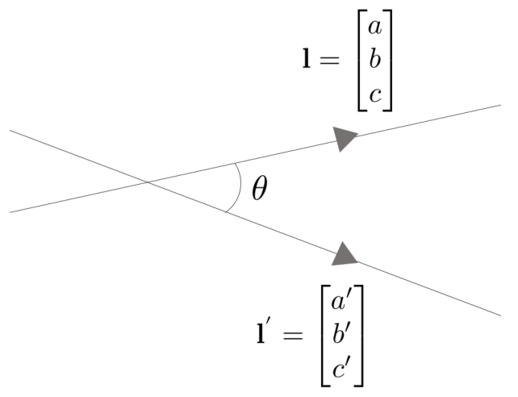

metric성질을 복원한다는 의미는 실제 세계에서 수직이지만 이미지 평면상에서 projective 변환에 의해 직
교하지 않은 두 직선을 다시 복원한다는 의미이다. 이 때, 복원된 이미지는 정확한 스케일 값까지는 알 수
없다(up to similarity, up to scale). 즉, metric rectification은 원본 이미지와 스케일 값만 다른 영상까지
복원한다는 의미이다. 이를 수행하기 위해서는 absolute dual conic $\mathbf{C}^*_\infty$의 특징을 사용하여 복원해야 한다.

- Circular Point

circular point (또는 absolute point) $\mathbf{x}_c, \mathbf{x}_{-c}$는 다음과 같이 정의된다.

$$\mathbf{x}_{\pm c} = \begin{pmatrix} 1 \\ \pm i \\ 0 \end{pmatrix} \in \mathbb{CP}^2 \tag{51}$$

- $i = \sqrt{-1}$
- $\mathbb{CP}^2$ : complex projective space

임의의 homography $\mathbf{H}$가 circular point 집합을 보존하면 $\mathbf{H}$는 simliarity 성질을 보존하는 특징이 있다.

$$\mathbf{H}(\mathbf{x}_{\pm c}) = \mathbf{x}_{\pm c} \quad \text{then, } \mathbf{H} \in \mathbf{H}_s \tag{52}$$

따라서 $\mathbf{H}$의 형태는 다음과 같다.

$$\mathbf{H} = \begin{bmatrix} \mathbf{A} & \mathbf{t} \\ \mathbf{0} & 1 \end{bmatrix} = \begin{bmatrix} s\mathbf{R} & \mathbf{t} \\ \mathbf{0} & 1 \end{bmatrix} \tag{53}$$

- $s$ : scale factor
- $\mathbf{R}$ : rotation matrix

- Dual Conic Properties

$\mathbb{P}^2$ 공간 상의 두 점 $\mathbf{P}, \mathbf{Q}$가 존재할 때 두 점을 잇는 직선에 접하는 dual conic $\mathbf{C}^*$는 다음과 같이 나타낼 수
있다.

$$\mathbf{C}^* = \mathbf{P}\mathbf{Q}^\intercal + \mathbf{Q}\mathbf{P}^\intercal \tag{54}$$

- $\mathbf{P} = [p_1, p_2, p_3]^\intercal$

이 때, $\mathbf{C}^*$는 두 점 $\mathbf{P}$와 $\mathbf{Q}$를 지나는 직선 $\mathbf{l}$을 매개화하는 dual conic을 의미한다. dual conic과 $\mathbf{C}^*$과 이에
접하는 직선 $\mathbf{l}$은 다음과 같은 관계를 가진다.

$$\mathbf{l}^\intercal\mathbf{C}^*\mathbf{l} = 0 \tag{55}$$

$$\mathbf{l}^\intercal(\mathbf{P}\mathbf{Q}^\intercal + \mathbf{Q}\mathbf{P}^\intercal)\mathbf{l} = 0 \tag{56}$$

직선 $\mathbf{l}$ 상에 두 점 $\mathbf{P}$와 $\mathbf{Q}$가 포함되므로 $\mathbf{P}^\intercal\mathbf{l} = 0$ 또는 $\mathbf{Q}^\intercal\mathbf{l} = 0$ 이 성립하여 위 식이 만족된다.

- Absolute Dual Conic

absolute dual conic $\mathbf{C}^*_\infty$은 두 개의 circular point를 지나는 직선을 매개화하는 dual conic을 의미한다.

$$\mathbf{C}^*_\infty = \mathbf{x}_c\mathbf{x}^\intercal_{-c} + \mathbf{x}_{-c}\mathbf{x}^\intercal_c \tag{57}$$

$$\mathbf{C}^*_\infty = \begin{pmatrix} 1 \\ i \\ 0 \end{pmatrix}\begin{pmatrix} 1 & -i & 0 \end{pmatrix} + \begin{pmatrix} 1 \\ -i \\ 0 \end{pmatrix}\begin{pmatrix} 1 & i & 0 \end{pmatrix} = \begin{bmatrix} 1 & 0 & 0 \\ 0 & 1 & 0 \\ 0 & 0 & 0 \end{bmatrix} \tag{58}$$

$\mathbb{P}^2$ 공간 상의 임의의 두 직선 $\mathbf{l}, \mathbf{l}'$ 이 존재할 때 두 직선의 각도는 다음과 같이 나타낼 수 있다.

$$\cos\theta = \frac{aa' + bb'}{\sqrt{a^2+b^2}\sqrt{a'^2+b'^2}} \tag{59}$$

이 때, 위 식을 $\mathbf{C}^*_\infty = \begin{bmatrix} 1 & 0 & 0 \\ 0 & 1 & 0 \\ 0 & 0 & 0 \end{bmatrix}$를 사용하여 표현하면 다음과 같다.

$$\cos\theta = \frac{\mathbf{l}^\intercal\mathbf{C}^*_\infty\mathbf{l}'}{\sqrt{\mathbf{l}^\intercal\mathbf{C}^*_\infty\mathbf{l}}\sqrt{\mathbf{l}'^\intercal\mathbf{C}^*_\infty\mathbf{l}'}} \tag{60}$$

- $aa' + bb' = \mathbf{l}^\intercal\mathbf{C}^*_\infty\mathbf{l}'$
- $\sqrt{a^2+b^2} = \sqrt{\mathbf{l}^\intercal\mathbf{C}^*_\infty\mathbf{l}}$
- $\sqrt{a'^2+b'^2} = \sqrt{\mathbf{l}'^\intercal\mathbf{C}^*_\infty\mathbf{l}'}$

- Homography of Dual Conic

dual conic과 $\mathbf{C}^*$과 이에 접하는 직선 $\mathbf{l}$은 다음과 같은 관계를 가진다.

$$\mathbf{l}^\intercal\mathbf{C}^*\mathbf{l} = 0 \tag{61}$$

앞서 설명한 위 공식에 Homography $\mathbf{H} : \mathbb{P}^2 \mapsto \mathbb{P}^2$를 수행하면 다음과 같다. $\mathbf{H}(\mathbf{l}) = \mathbf{H}^{-\intercal}\mathbf{l}$이므로

$$(\mathbf{H}^{-\intercal}\mathbf{l})^\intercal\mathbf{H}(\mathbf{C}^*)(\mathbf{H}^{-\intercal}\mathbf{l}) = 0 \tag{62}$$

$$\therefore\ \mathbf{H}(\mathbf{C}^*) = \mathbf{H}\mathbf{C}^*\mathbf{H}^\intercal \tag{63}$$

이 때, $\mathbf{H}(\mathbf{C}^*)$를 image of absolute dual conic $\mathbf{w}$라고 한다.

- Image of Absolute Dual Conic

만약 $\mathbb{P}^2$ 공간 상에서 두 직선 $\mathbf{l}, \mathbf{m}$이 직교하면 다음과 같은 공식이 성립한다.

$$\mathbf{l}^\intercal\mathbf{w}\mathbf{m} = 0 \tag{64}$$

- $\mathbf{w}$ : image of absolute conic $\mathbf{C}^*_\infty$

$\mathbf{w} = \mathbf{H}\mathbf{C}^*\mathbf{H}^\intercal$이므로 $\mathbf{H}$의 형태를 알기 위해 임의의 projective homography $\mathbf{H}$를 분해해보면 다음과
같다.

$$\begin{aligned}
\mathbf{H} &= \mathbf{H}_S\mathbf{H}_A\mathbf{H}_P \\
&= \begin{bmatrix} s\mathbf{R} & \mathbf{t} \\ \mathbf{0} & 1 \end{bmatrix}\begin{bmatrix} \mathbf{K} & \mathbf{0} \\ \mathbf{0} & 1 \end{bmatrix}\begin{bmatrix} \mathbf{I} & \mathbf{0} \\ \mathbf{v}^\intercal & v \end{bmatrix}
\end{aligned} \tag{65}$$

$\mathbf{H}^{-1} = \mathbf{H}_P^{-1}\mathbf{H}_A^{-1}\mathbf{H}_S^{-1} = \mathbf{H}'_P\mathbf{H}'_A\mathbf{H}'_S$ 또한 동일한 homography 연산을 의미한다. 편의상 $\mathbf{H}'_P\mathbf{H}'_A\mathbf{H}'_S$을
$\mathbf{H}_P\mathbf{H}_A\mathbf{H}_S$라고 표기한다. 이 때, 각 행렬의 디테일한 $\mathbf{R}, \mathbf{t}, \mathbf{K}, \mathbf{v}, s, v$ 값은 $\mathbf{H}$와 $\mathbf{H}^{-1}$이 서로 다르다. 따라서
$\mathbf{H}$의 decompose 순서를 반대로하여 곱해주어 $\mathbf{w}$를 전개해보면 다음과 같다.

$$\mathbf{H}\mathbf{C}^*\mathbf{H}^\intercal = \mathbf{H}_P\mathbf{H}_A\mathbf{H}_S\begin{bmatrix} 1 & 0 & 0 \\ 0 & 1 & 0 \\ 0 & 0 & 0 \end{bmatrix}\mathbf{H}^\intercal_S\mathbf{H}^\intercal_A\mathbf{H}^\intercal_P \tag{66}$$

$$\mathbf{H}\mathbf{C}^*\mathbf{H}^\intercal = \mathbf{H}_P\mathbf{H}_A\begin{bmatrix} 1 & 0 & 0 \\ 0 & 1 & 0 \\ 0 & 0 & 0 \end{bmatrix}\mathbf{H}^\intercal_A\mathbf{H}^\intercal_P \tag{67}$$

- $\because \mathbf{H}_S\begin{bmatrix} 1 & 0 & 0 \\ 0 & 1 & 0 \\ 0 & 0 & 0 \end{bmatrix}\mathbf{H}^\intercal_S = \begin{bmatrix} 1 & 0 & 0 \\ 0 & 1 & 0 \\ 0 & 0 & 0 \end{bmatrix}$

이를 전개하면 다음과 같다.

$$\mathbf{w} = \begin{bmatrix} \mathbf{K}\mathbf{K}^\intercal & \mathbf{K}\mathbf{K}^\intercal\mathbf{v} \\ \mathbf{v}^\intercal\mathbf{K}^\intercal\mathbf{K} & \mathbf{v}^\intercal\mathbf{K}\mathbf{K}^\intercal\mathbf{v} \end{bmatrix} \tag{68}$$

최종적으로 projective 변환이 없는 similarity 변환이라고 가정하면 $\mathbf{v} = 0$이 되고 $\mathbf{w}$는 다음과 같다.

$$\mathbf{w} = \begin{bmatrix} \mathbf{K}\mathbf{K}^\intercal & \mathbf{0} \\ \mathbf{0} & 0 \end{bmatrix} \tag{69}$$

- Metric Rectification

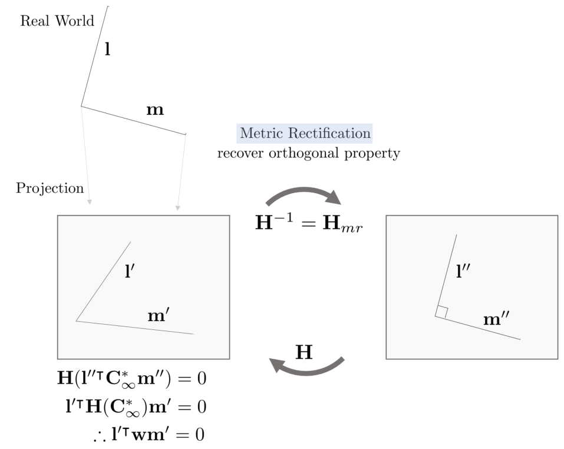

앞서 언급한 내용과 같이 $\mathbf{H}$에 의한 image of absolute dual conic은 $\mathbf{w} = \begin{bmatrix} \mathbf{K}\mathbf{K}^\intercal & \mathbf{0} \\ \mathbf{0} & 0 \end{bmatrix}$로 나타낼 수 있다.
따라서 위 그림에서 $\mathbf{l}'', \mathbf{m}''$에 homography 변환 $\mathbf{H}$를 적용한 결과는 다음과 같이 나타낼 수 있다.

$$\mathbf{H}(\mathbf{l}''\mathbf{C}^*_\infty\mathbf{m}'') = \mathbf{l}'\mathbf{w}\mathbf{m}' = 0 \tag{70}$$

- $\mathbf{H}(\mathbf{l}'') = \mathbf{l}'$
- $\mathbf{H}(\mathbf{C}^*_\infty) = \mathbf{w}$
- $\mathbf{H}(\mathbf{m}'') = \mathbf{m}'$

이를 다시 전개하면

$$\mathbf{l}'\begin{bmatrix} \mathbf{K}\mathbf{K}^\intercal & \mathbf{0} \\ \mathbf{0} & 0 \end{bmatrix}\mathbf{m}' = 0 \tag{71}$$

$$\begin{pmatrix} l'_1 & l'_2 \end{pmatrix}\mathbf{K}\mathbf{K}^\intercal\begin{pmatrix} m'_1 \\ m'_2 \end{pmatrix} = 0 \tag{72}$$

- $\mathbf{K}\mathbf{K}^\intercal \in \mathbb{R}^{2\times2}$ : symmetric matrix & $\det\mathbf{K}\mathbf{K}^\intercal = 1$

따라서 2개의 수직인 직선 쌍으로부터 $\mathbf{K}\mathbf{K}^\intercal$을 계산하여 $\mathbf{w}$를 구할 수 있다. $\mathbf{K}\mathbf{K}^\intercal = \mathbf{S}$로 치환했을 때,
symmetric이고 positive definite 행렬은 다음과 같이 분해될 수 있다.

$$\begin{pmatrix} l'_1 & l'_2 \end{pmatrix}\mathbf{S}\begin{pmatrix} m'_1 \\ m'_2 \end{pmatrix} = 0 \tag{73}$$

$$\mathbf{S} = \mathbf{U}\mathbf{D}\mathbf{U}^\intercal \tag{74}$$

- $\mathbf{U}$ : orthogonal matrix
- $\mathbf{D}$ : diagonal matrix

다시 diagonal matrix $\mathbf{D}$는 2개의 행렬의 곱 $\mathbf{D} = \mathbf{E}\mathbf{E}^\intercal$로 나타낼 수 있으므로 이를 다시 정리하면

$$\mathbf{S} = \mathbf{U}\mathbf{E}(\mathbf{U}\mathbf{E})^\intercal \tag{75}$$

다음으로 $\mathbf{U}\mathbf{E}$를 QR decomposition을 수행하면 upper triangle 행렬 $\mathbf{R}(= \mathbf{K})$와 orthogonal 행렬 $\mathbf{Q}$로
분해할 수 있다. 이를 다시 전개하면 다음과 같다.

$$\mathbf{S} = \mathbf{K}\mathbf{Q}\mathbf{Q}^\intercal\mathbf{K}^\intercal = \mathbf{K}\mathbf{K}^\intercal \tag{76}$$

- $\mathbf{Q}\mathbf{Q}^\intercal = \mathbf{I}$

다음으로 $\mathbf{S}$를 cholesky 또는 SVD를 통해 $\mathbf{K}$를 추출하여 최종적인 metric rectify homography $\mathbf{H}^{-1} = \mathbf{H}_{mr}$를 구한다.

$$\mathbf{H} = \begin{bmatrix} \mathbf{K} & \mathbf{0} \\ \mathbf{0} & 1 \end{bmatrix} \tag{77}$$

$$\mathbf{H}_{mr} = \mathbf{H}^{-1} = \begin{bmatrix} \mathbf{K} & \mathbf{0} \\ \mathbf{0} & 1 \end{bmatrix}^{-1} \tag{78}$$

지금까지 metric rectification 순서를 정리하면 다음과 같다.

1. 서로 수직인 직선 쌍 $\mathbf{l}', \mathbf{m}'$를 선정하여 두 직선의 좌표를 구한다.
2. $\begin{pmatrix} l'_1 & l'_2 \end{pmatrix}\mathbf{S}\begin{pmatrix} m'_1 \\ m'_2 \end{pmatrix} = 0$ 공식을 통해 $\mathbf{S} = \mathbf{K}\mathbf{K}^\intercal$을 구한다.
3. cholesky 또는 SVD를 통해 $\mathbf{K}$를 구하고 이를 통해 $\mathbf{H}_{mr} = \begin{bmatrix} \mathbf{K} & \mathbf{0} \\ \mathbf{0} & 1 \end{bmatrix}^{-1}$를 구한다.
4. 이미지에 $\mathbf{H}_{mr}$를 적용하여 metric rectification을 수행한다. 복원된 이미지는 원본 이미지와 스케일
   값을 제외하고 동일한 형태를 지닌다(up to scale)

<!--widget:metric-rectification-->

# 3 Camera Models

## Finite cameras

### The basic pinhole model

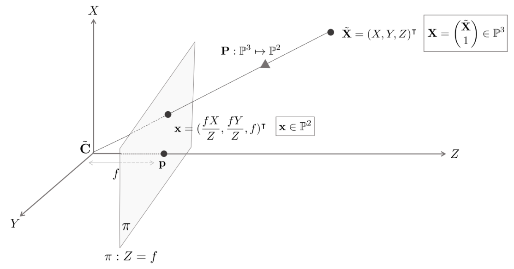

==핀홀 카메라(pinhole camera)란 $\mathbb{R}^3$ 공간 상에 있는 한 점 $\tilde{\mathbf{X}}$를 특정 중심점 $\tilde{\mathbf{C}}$를 향해 프로젝션시켰을
때 중간에 교차하는 이미지 평면 $\pi \in \mathbb{R}^2$ 상의 한 점 $\mathbf{x}$으로 상을 맺음으로써 이미지를 표현하는 수학적인
카메라 모델링 방법을 의미한다. $\tilde{\mathbf{X}}, \tilde{\mathbf{C}}$는 Inhomogeneous Coordinate으로 나타낸 $\mathbf{X}$를 의미한다.==

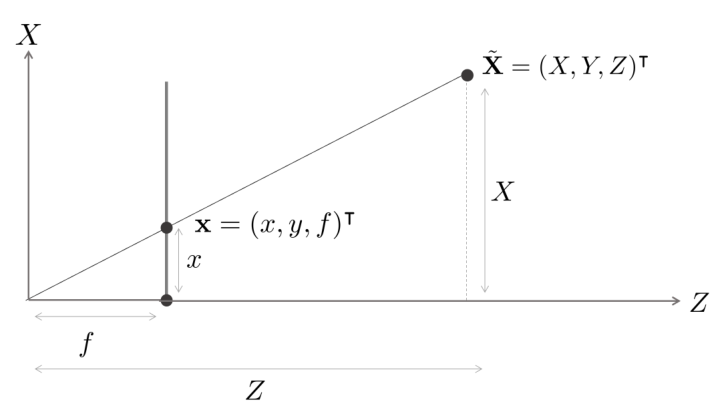

$$\begin{aligned}
\mathbf{X} &= \begin{pmatrix} X & Y & Z & 1 \end{pmatrix}^\intercal \qquad \tilde{\mathbf{X}} = \begin{pmatrix} X & Y & Z \end{pmatrix}^\intercal \\
\mathbf{C} &= \begin{pmatrix} 0 & 0 & 0 & 1 \end{pmatrix}^\intercal \qquad \tilde{\mathbf{C}} = \begin{pmatrix} 0 & 0 & 0 \end{pmatrix}^\intercal
\end{aligned} \tag{79}$$

임의의 $\mathbb{R}^3$ 공간을 카메라 좌표계라고 생각해보면 좌표계의 원점은 카메라의 중심점 $\tilde{\mathbf{C}}$가 된다. 일반적
으로 이미지 평면 $\pi$은 $Z$축과 수직하도록 위치시키며 이 때, $Z$축을 Principal Axis라고 하고 이미지 평면과
Principal Axis가 만나는 점을 Principal Point $\mathbf{p}$라고 한다.

3차원 공간 상의 점 $\tilde{\mathbf{X}} = \begin{pmatrix} X & Y & Z \end{pmatrix}^\intercal$가 주어졌을 때 $XZ$ 평면만 보는 경우 이미지 평면 $\pi$과 카메라
중심점 $\tilde{\mathbf{C}}$ 사이의 거리인 $X$축에 대한 초점거리(focal length) $f_x$를 계산할 수 있다. $f_x, f_y$는 픽셀의 종횡비를
의미하지만 최근 생산되는 센서는 대부분 종횡비가 1:1이므로 $f = f_x = f_y$라고 가정한다.

$$f\frac{Y}{Z} = y \tag{80}$$

$YZ$ 평면에서 이미지 평면을 봤을 때 역시 동일하게 $f$를 계산할 수 있다.

$$f\frac{X}{Z} = x \tag{81}$$

이에 따라 ==핀홀 카메라 행렬 $\mathbf{P}$는 월드 상의 점 $\tilde{\mathbf{X}} = \begin{pmatrix} X & Y & Z \end{pmatrix}^\intercal \in \mathbb{R}^3$를 2차원 이미지 평면 $\pi \in \mathbb{R}^2$
로 프로젝션하는 선형 사상이라고 볼 수 있다.==

$$\mathbf{P} : (X, Y, Z)^\intercal \mapsto \left(f\frac{X}{Z},\ f\frac{Y}{Z}\right)^\intercal \tag{82}$$

### Central projection using homogeneous coordinates

핀홀 카메라 행렬 $\mathbf{P}$은 Homogeneous Point를 옮기는 것으로 생각할 수도 있다. 다시 말하면, 핀홀 카메라
행렬 $\mathbf{P}$는 $\mathbb{P}^3$ 공간 상의 점 $\mathbf{X} = \begin{pmatrix} X & Y & Z & 1 \end{pmatrix}^\intercal$을 $\mathbb{P}^2$ 공간 상의 점 $\mathbf{x} = \begin{pmatrix} fX & fY & Z \end{pmatrix}^\intercal$로 프로젝션하는
선형 사상으로 볼 수 있다.

$$\mathbf{P} : \begin{pmatrix} X \\ Y \\ Z \\ 1 \end{pmatrix} \mapsto \begin{pmatrix} fX \\ fY \\ Z \end{pmatrix} = \begin{bmatrix} f & & & 0 \\ & f & & 0 \\ & & 1 & 0 \end{bmatrix}\begin{pmatrix} X \\ Y \\ Z \\ 1 \end{pmatrix} \tag{83}$$

이를 행렬 형태로 나타내면

$$\mathbf{x} = \mathbf{P}\mathbf{X} \tag{84}$$

가 된다. 이 때, $\mathbf{P} = \mathrm{diag}(f, f, 1)[\mathbf{I} \mid \mathbf{0}]_{3\times4}$와 같이 나타낼 수 있다.

### Principal point offset

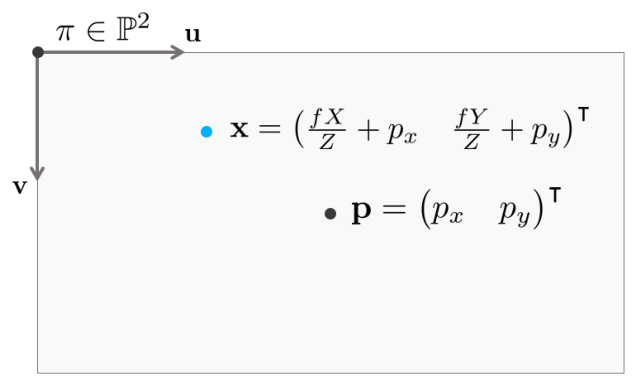

일반적으로 Principal Point $\mathbf{p}$는 이미지 평면 $\pi$의 원점이 아니다. 따라서 핀홀 카메라 행렬을 통한 선형
사상이 이미지 평면 $\pi$에 제대로 대응하기 위해서는

$$\begin{pmatrix} X & Y & Z \end{pmatrix}^\intercal \mapsto \begin{pmatrix} fX/Z + p_x & fY/Z + p_y \end{pmatrix}^\intercal \tag{85}$$

와 같이 Printcipal Point $\mathbf{p} = \begin{pmatrix} p_x & p_y \end{pmatrix}^\intercal$를 보정해야 한다. 이를 카메라 행렬 $\mathbf{P}$를 통해 한 번에 표현해
보면

$$\mathbf{P} : \begin{pmatrix} X \\ Y \\ Z \\ 1 \end{pmatrix} \mapsto \begin{pmatrix} fX + Zp_x \\ fY + Zp_y \\ 1 \end{pmatrix} = \begin{bmatrix} f & & p_x & 0 \\ & f & p_y & 0 \\ & & 1 & 0 \end{bmatrix}\begin{pmatrix} X \\ Y \\ Z \\ 1 \end{pmatrix} \tag{86}$$

와 같이 나타낼 수 있다. 이 때 ==행렬 $\begin{bmatrix} f & & p_x \\ & f & p_y \\ & & 1 \end{bmatrix}$을 간결하게 $\mathbf{K}$로 나타내며 이를 내부 파라미터 행렬
또는 카메라 캘리브레이션 행렬(intrinsic parameter matrix, camera calibration matrix)이라고
한다.==

$$\mathbf{K} = \begin{bmatrix} f & & p_x \\ & f & p_y \\ & & 1 \end{bmatrix} \tag{87}$$

결론적으로 카메라의 Principal Point Offset을 포함한 카메라 행렬 $\mathbf{P}$를 통해 다음과 같은 $\mathbf{X} \in \mathbb{P}^3 \mapsto \mathbf{x} \in \mathbb{P}^2$인 선형 사상이 가능하다.

$$\mathbf{x} = \mathbf{K}[\mathbf{I} \mid \mathbf{0}]\mathbf{X} \tag{88}$$

### Camera rotation and translation

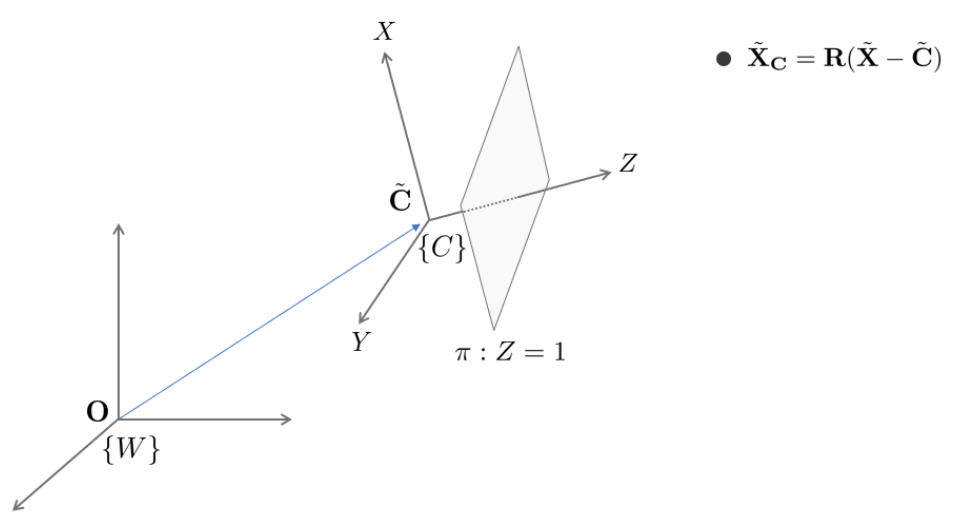

일반적으로 카메라 좌표계는 월드 좌표계로와 동일하지 않다. $\mathbb{R}^3$ 공간 상에 월드 좌표계 $\{W\}$가 주어졌을
때 이로부터 위치가 $\mathbf{C} = \begin{pmatrix} c_x & c_y & c_z & 1 \end{pmatrix}^\intercal$만큼 떨어져 있으며 $\mathbf{R}$만큼 회전되어 있는 카메라 좌표계 $\{C\}$가
주어졌을 때 월드 좌표계 $\{W\}$에서 바라본 월드 상의 한 점 $\tilde{\mathbf{X}}$를 카메라 좌표계 $\{C\}$ 상의 점 $\tilde{\mathbf{X}}_C$로 변환하는
공식은

$$\tilde{\mathbf{X}}_C = \mathbf{R}(\tilde{\mathbf{X}} - \tilde{\mathbf{C}}) \tag{89}$$

와 같다. Homogeneous Coordinate로 나타낸 $\mathbf{X}_C$를 이미지 평면 $\pi$로 프로젝션시키면

$$\mathbf{x} = \mathbf{P}\mathbf{X}_C = \mathbf{K}[\mathbf{I} \mid \mathbf{0}]\mathbf{X}_C \tag{90}$$

와 같이 나타낼 수 있다. $\mathbf{X}_C$를 자세히 나타내면

$$\mathbf{X}_C = \mathbf{R}\begin{bmatrix} 1 & & & -c_x \\ & 1 & & -c_y \\ & & 1 & -c_z \end{bmatrix}\begin{pmatrix} X \\ Y \\ Z \\ 1 \end{pmatrix} = \begin{bmatrix} \mathbf{R} & -\mathbf{R}\tilde{\mathbf{C}} \\ \mathbf{0} & 1 \end{bmatrix}\begin{pmatrix} X \\ Y \\ Z \\ 1 \end{pmatrix} \tag{91}$$

과 같이 나타낼 수 있고 이를 $\mathbf{x} = \mathbf{K}[\mathbf{I} \mid \mathbf{0}]\mathbf{X}_C$ 공식에 대입 후 정리하면

$$\begin{aligned}
\mathbf{X}_C &= \mathbf{K}[\mathbf{I} \mid \mathbf{0}]\mathbf{X}_C \\
&= \mathbf{K}[\mathbf{I} \mid \mathbf{0}]\begin{bmatrix} \mathbf{R} & -\mathbf{R}\tilde{\mathbf{C}} \\ \mathbf{0} & 1 \end{bmatrix}\begin{pmatrix} X \\ Y \\ Z \\ 1 \end{pmatrix} \\
&= \mathbf{K}[\mathbf{R} \mid -\mathbf{R}\tilde{\mathbf{C}}]\mathbf{X} \\
&= \mathbf{K}\mathbf{R}[\mathbf{I} \mid -\tilde{\mathbf{C}}]\mathbf{X}
\end{aligned} \tag{92}$$

와 같이 나타낼 수 있다. ==일반적으로 $\tilde{\mathbf{X}}_C$를 $\tilde{\mathbf{X}}_C = \mathbf{R}\tilde{\mathbf{X}} + \mathbf{t}$와 같이 월드 좌표계를 기준으로 표현하는==
==방법 또한 자주 사용된다.== 이 때 카메라 행렬 $\mathbf{P}$는

$$\mathbf{P} = \mathbf{K}[\mathbf{R} \mid \mathbf{t}] \tag{93}$$

와 같이 나타낼 수 있고 이 때, $\mathbf{t} = -\mathbf{R}\tilde{\mathbf{C}}$ 관계가 성립한다.

<!--widget:pinhole-camera-matrix-->

### CCD cameras

현대에 주로 사용하는 카메라 중 하나인 CCD 카메라는 이미지 좌표를 픽셀의 수로 기록한다. 따라서
$(x, y)$[mm]와 같이 이미지 좌표가 mm로 주어져 있을 때, CCD 카메라에서는 $(m_xx, m_yy)$와 같이 나타
낸다. 이 때 $m_x, m_y$는 1 mm$^2$ 크기 내에서 $x$축 또는 $y$축 방향으로 픽셀의 수를 의미한다. 따라서 mm로
주어진 일반 카메라 캘리브레이션 행렬 $\mathbf{K}$가 주어졌을 때 이를 CCD 카메라의 좌표계로 바꾸기 위해서는

$$\begin{bmatrix} m_x & & \\ & m_y & \\ & & 1 \end{bmatrix}\mathbf{K} = \begin{bmatrix} m_x & & \\ & m_y & \\ & & 1 \end{bmatrix}\begin{bmatrix} f & & p_x \\ & f & p_y \\ & & 1 \end{bmatrix} = \begin{bmatrix} fm_x & & p_xm_x \\ & fm_y & p_ym_y \\ 0 & 0 & 1 \end{bmatrix} \tag{94}$$

와 같이 변환하는 작업을 수행해야 한다.

### Finite projective camera

카메라 행렬이 $\mathbf{P} = \mathbf{K}[\mathbf{R} \mid \mathbf{t}]$와 같이 주어졌을 때 이를 다시 표현하면

$$\mathbf{P} = \mathbf{K}\mathbf{R}[\mathbf{I} \mid -\tilde{\mathbf{C}}] \quad \text{where, } \mathbf{t} = -\mathbf{R}\tilde{\mathbf{C}} \tag{95}$$

과 같이 나타낼 수 있고 ==해당 카메라 행렬을 Finite Projective 카메라라고 하며 이 때 $\mathbf{K}\mathbf{R}$가 non-singular한 행렬이 되어야 한다.== 임의의 non-singular 행렬 $\mathbf{M} \in \mathbb{R}^{3\times3}$가 주어졌을 때 $\mathbf{M}$에 QR factorization
을 수행하는 $\mathbf{K}\mathbf{R}$과 같이 상삼각행렬 $\mathbf{K}$와 직교행렬 $\mathbf{R}$로 분해할 수 있으므로 따라서 ==카메라 행렬의 집합은
$\mathbf{P} \in \mathbb{R}^{3\times4}$ 크기의 행렬들의 집합이고 $\mathbf{P}$의 왼쪽 $3 \times 3$ 부분이 non-singular인 집합이다.==

$$\{\text{set of camera matrix}\} = \{\mathbf{P} = [\mathbf{M} \mid \mathbf{t}] \mid \mathbf{M} \text{ is non-singular } 3 \times 3 \text{ matrix.},\ \mathbf{t} \in \mathbb{R}^3\} \tag{96}$$

### General projective cameras

General Projective Camera는 앞서 설명한 Finite projective camera와 달리 $\mathbf{P} = [\mathbf{M} \mid \mathbf{t}]$에서 $\mathbf{M} \in \mathbb{R}^{3\times3}$
행렬이 non-singular일 필요가 없으며 $\mathbf{P}$의 rank가 3인 카메라 행렬을 의미한다.

## The projective camera

### Camera anatomy

### Camera center

임의의 Finite Projective 카메라 행렬 $\mathbf{P} = \mathbf{K}\mathbf{R}[\mathbf{I} \mid -\tilde{\mathbf{C}}]$가 주어졌을 때

$$\mathbf{P}\mathbf{C} = \mathbf{K}\mathbf{R}(\mathbf{C} - \mathbf{C}) = 0 \tag{97}$$

이 된다. 이 때, ==$\mathbf{C} \in \mathbb{R}^4$는 카메라의 중심점 또는 월드 좌표계 상에서 카메라의 위치를 의미하고 rank
3인 카메라 행렬 $\mathbf{P} \in \mathbb{R}^{3\times4}$의 Null Space 벡터를 구함으로써 카메라 중심점을 구할 수 있다.==

카메라 행렬 $\mathbf{P} = \mathbf{K}\mathbf{R}[\mathbf{I} \mid -\tilde{\mathbf{C}}]$가 주어졌고 $\mathbf{P}\mathbf{C} = 0$이 성립할 때 다음과 같이 월드 상의 점 $\mathbf{X}(\lambda)$가
주어졌다고 하자.

$$\mathbf{X}(\lambda) = \lambda\mathbf{A} + (1 - \lambda)\mathbf{C} \tag{98}$$

이는 곧 $\mathbf{A}$와 $\mathbf{C}$를 잇는 직선을 의미하며 $\mathbf{X}(\lambda)$를 카메라에 프로젝션시키면

$$\mathbf{x} = \mathbf{P}\mathbf{X}(\lambda) = \lambda\mathbf{P}\mathbf{A} + (1 - \lambda)\mathbf{P}\mathbf{C} = \lambda\mathbf{P}\mathbf{A} \tag{99}$$

가 된다. 즉, ==월드 상의 점 $\mathbf{A}$와 $\mathbf{C}$를 잇는 직선이 $\mathbf{C}$ 값에 관계없이 이미지 평면 상의 한 점 $\mathbf{x} = \lambda\mathbf{P}\mathbf{A}$
가 된다는 의미이고 이는 곧 카메라의 중심점이 가지는 성질을 의미한다.== 일반적인 General Projective
Camera에서도 $\mathbf{P}$의 Null Space 벡터가 곧 카메라의 중심점 $\mathbf{C}$가 된다.

### Column vectors

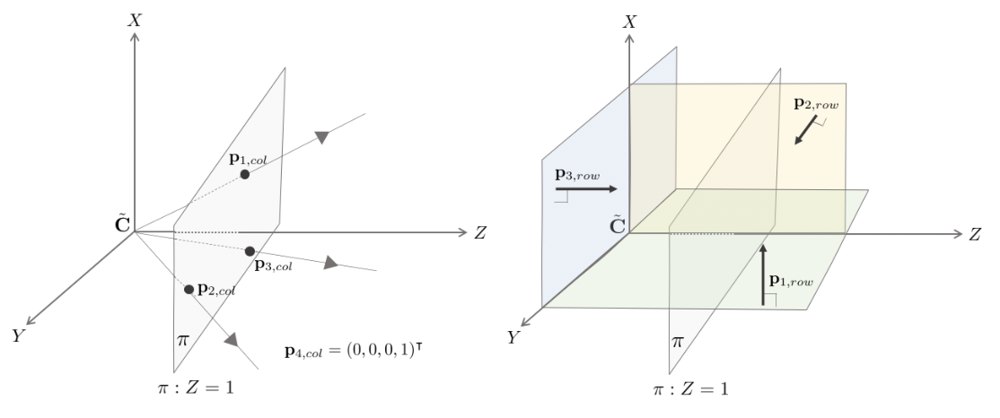

카메라 행렬 $\mathbf{P}$을 열벡터(column vector)로 나타내면 다음과 같다.

$$\mathbf{P} = \begin{bmatrix} \mathbf{p}_{1,col} & \mathbf{p}_{2,col} & \mathbf{p}_{3,col} & \mathbf{p}_{4,col} \end{bmatrix} \quad \text{where, } \mathbf{p}_{i,col} \in \mathbb{R}^{3\times1},\ i = 1, \cdots, 4 \tag{100}$$

이 중 ==$\mathbf{p}_{i,col}, i = 1, 2, 3$은 각각 무한대 평면 $\pi_\infty$에 위치한 $X, Y, Z$축의 소실점(vanisinh point)들의
위치를 의미한다. 그리고 $\mathbf{p}_{4,col} = \mathbf{P}\begin{pmatrix} 0 & 0 & 0 & 1 \end{pmatrix}^\intercal$은 윌드 좌표계의 원점을 의미한다.==

### Row vectors

카메라 행렬 $\mathbf{P}$을 행벡터(row vector)로 나타내면 다음과 같다.

$$\mathbf{P} = \begin{bmatrix} \mathbf{p}^\intercal_{1,row} \\ \mathbf{p}^\intercal_{2,row} \\ \mathbf{p}^\intercal_{3,row} \end{bmatrix} \quad \text{where, } \mathbf{p}_{i,row} \in \mathbb{R}^{4\times1},\ i = 1, 2, 3 \tag{101}$$

행벡터 $\mathbf{p}_{i,row}, i = 1, 2, 3$은 카메라 좌표계 기준으로 각각 $X, Y, Z$ 축과 평행한 평면을 의미한다.

### The principal plane

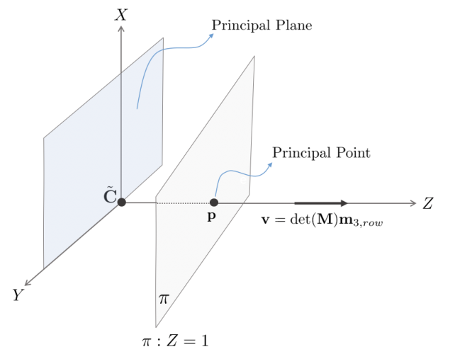

주평면(principal plane) $\pi_{pp}$은 카메라의 중심점(center)를 포함하며 이미지 평면과 평행인 평면을 의미한다.
주평면은 카메라 좌표계 $\{C\}$에서 $XY$ 평면과 동일하며 $Z = 0$인 특징이 있다. 주평면 상에 위치하는 한 점
$\mathbf{X} \in \pi_{pp}$는 무한대 선(line at infinity) 상에서 이미지 평면 $\pi$과 만나므로

$$\mathbf{x} = \mathbf{P}\mathbf{X} = \begin{pmatrix} x & y & 0 \end{pmatrix}^\intercal \tag{102}$$

이 되고 따라서 ==임의의 한 점 $\mathbf{X}$가 주평면 상에 위치하기 위한 필요충분 조건은 $\mathbf{p}^\intercal_{3,row}\mathbf{X} = 0$이다. 즉,
카메라 행렬의 세 번째 행벡터 $\mathbf{p}_{3,row}$가 곧 카메라의 주평면을 의미한다.==

### The principal point

주점(principal point) $\mathbf{p}$는 주축(principal axis)와 이미지 평면 $\pi$의 교차점을 의미한다. 주점 $\mathbf{p}$는 이미지
평면 $\pi$ 상에 위치하며 카메라 중심점 $\mathbf{C}$와 주점을 잇는 직선은 이미지 평면과 수직하다.

$$\mathbf{p} - \mathbf{C} \perp \pi \tag{103}$$

다음과 같은 방법으로 주점을 정의할 수도 있다. 주평면은 카메라 행렬의 세 번째 행벡터 $\mathbf{p}_{3,row}$이므로
주평면 상에 위치한 한 점 $\mathbf{X}$에 대해

$$\mathbf{p}^\intercal_{3,row}\mathbf{X} = 0 \tag{104}$$

이 성립한다. 이 때 $\mathbf{p}_{3,row} = \begin{pmatrix} \pi_1 & \pi_2 & \pi_3 & \pi_4 \end{pmatrix}^\intercal$는 Dual Projective Space $(\mathbb{P}^3)^\vee$에서 $\mathbf{p}_{3,row}$ 평면의
법선벡터를 의미한다. ==주평면 $\mathbf{p}_{3,row}$와 무한대 평면(plane at infinity) $\pi_\infty$의 교차선은 무한대 평면에
존재하는 법선벡터는 $\begin{pmatrix} \pi_1 & \pi_2 & \pi_3 & 0 \end{pmatrix}^\intercal$가 된다. 결론적으로 이를 이미지 평면으로 프로젝션한 점이 주점
(principal point) $\mathbf{p}$가 된다.==

$$\mathbf{p} = \mathbf{P}\begin{pmatrix} \pi_1 \\ \pi_2 \\ \pi_3 \\ 0 \end{pmatrix} \tag{105}$$

카메라 중심점 $\mathbf{C}$를 지나면서 무한대 평면 상에 존재하는 법선벡터 $\begin{pmatrix} \pi_1 & \pi_2 & \pi_3 & 0 \end{pmatrix}^\intercal$는 곧 주축(principal axis)와 동일하므로

$$\mathbf{P}\left[\lambda\begin{pmatrix} \pi_1 \\ \pi_2 \\ \pi_3 \\ 0 \end{pmatrix} + (1 - \lambda)\mathbf{C}\right] = \lambda\mathbf{P}\begin{pmatrix} \pi_1 \\ \pi_2 \\ \pi_3 \\ 0 \end{pmatrix} = \mathbf{p} \tag{106}$$

같이 주축을 이미지 평면에 프로젝션하면 주점 $\mathbf{p}$이 된다. ==결론적으로 주점 $\mathbf{p}$는 카메라 행렬 $\mathbf{P}$의 세번째
행벡터 $\mathbf{p}_{3,row} = \begin{pmatrix} \pi_1 & \pi_2 & \pi_3 & p_4 \end{pmatrix}^\intercal$에서 처음 세 개의 항 $\mathbf{p} = (\pi_1, \pi_2, \pi_3)^\intercal$을 의미한다.==

### The principal axis vector

카메라 행렬 $\mathbf{P} = [\mathbf{M} \mid \mathbf{p}_{4,col}]$이 주어졌을 때 행렬 $\mathbf{M} \in \mathbb{R}^{3\times3}$의 세 번째 행벡터 $\mathbf{m}_{3,row}$는 주점(principal
point)를 의미한다. ==해당 섹션에서는 주점 $\mathbf{m}_{3,row}$를 카메라 좌표계에서 $+Z$ 방향을 의미하는 주축(principal axis)의 방향과 동치로 간주한다.== 하지만, 카메라 행렬 $\mathbf{P}$는 부호를 제외하고(up to sign) 유일하게
결정되기 때문에 어떤 $\mathbf{m}_{3,row}$ 또는 $-\mathbf{m}_{3,row}$가 $+Z$를 의미하는지 알 수 없다.

이 때, $\mathbf{v} = \det(\mathbf{M})\mathbf{m}_{3,row} = (0, 0, 1)^\intercal$과 같이 $\mathbf{M}$의 행렬식(determinant)를 앞에 곱해주면 항상 양의
방향을 의미하게 된다. 그리고 $\mathbf{P} \rightarrow k\mathbf{P}$로 스케일이 변화해도 $\mathbf{v} \rightarrow k^4\mathbf{v}$와 같이 같은 방향을 나타낸다. 일
반적인 카메라 행렬 $k\mathbf{P} = k\mathbf{K}\mathbf{R}[\mathbf{I} \mid -\tilde{\mathbf{C}}]$가 주어졌을 때에도 $\mathbf{M} = k\mathbf{K}\mathbf{R}$이고 $\det(\mathbf{R}) > 0$이므로 주축의
방향벡터 $\mathbf{v} = \det(\mathbf{M})\mathbf{m}_{3,row}$는 동일한 방향을 나타낸다. ==이에 따라==

$$\mathbf{v} = \det(\mathbf{M})\mathbf{m}_{3,row} \tag{107}$$

==벡터는 주축(principal axis)의 방향벡터를 의미한다.==

<!--widget:camera-anatomy-->

## Action of a projective camera on points

### Forward projection

Forward-projection은 일반적으로 프로젝션이라고 불리며 ==월드 상에 있는 한 점 $\mathbf{X}$가 주어졌을 때 이를
이미지 평면 상의 한 점 $\mathbf{x}$으로 변환하는 연산을 의미한다.== 임의의 카메라 행렬 $\mathbf{P}$에 대해 다음 공식이
성립한다.

$$\mathbf{x} = \mathbf{P}\mathbf{X} \tag{108}$$

### Back-projection of points to rays

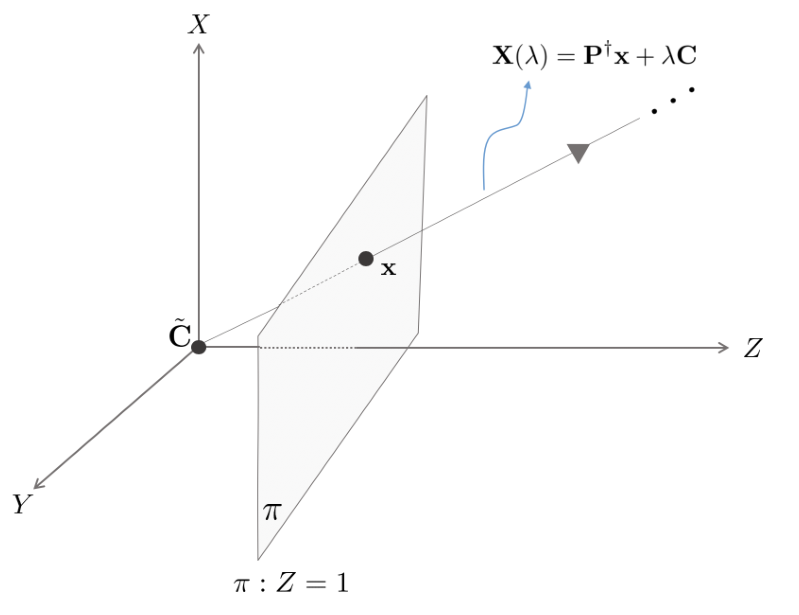

Back-projection은 Forward-projection과는 반대로 ==이미지 평면 상의 한 점 $\mathbf{x}$가 주어졌을 때 이를 월드
상의 한 직선으로 변환하는 연산을 의미한다.== 일반적으로 $\mathbf{x}$의 깊이값을 모르기 때문에 바로 월드 상의 한
점 $\mathbf{X}$로 변환되지 않는 특징이 있다. 임의의 카메라 행렬 $\mathbf{P}$는 rank가 3인 행렬이므로 Right Pseudo Inverse
$\mathbf{P}^\dagger$가 존재한다.

$$\mathbf{P}^\dagger = \mathbf{P}^\intercal(\mathbf{P}\mathbf{P}^\intercal)^{-1} \tag{109}$$

이 때 $\mathbf{P}\mathbf{P}^\dagger = \mathbf{P}\mathbf{P}^\intercal(\mathbf{P}\mathbf{P}^\intercal)^{-1} = \mathbf{I}$가 성립한다. Back-projection한 직선 $\mathbf{P}^\dagger\mathbf{x}$는 카메라의 중심점 $\mathbf{C}$를
지나가므로

$$\mathbf{X}(\lambda) = \mathbf{P}^\dagger\mathbf{x} + \lambda\mathbf{C} \tag{110}$$

와 같이 나타낼 수 있다. Back-projection 직선을 다시 프로젝션하면 $\mathbf{P}\mathbf{X}(\lambda) = \mathbf{P}\mathbf{P}^\dagger\mathbf{x} + \lambda\mathbf{P}\mathbf{C} = \mathbf{x}$가
된다.

Finite Projective 카메라의 경우 다른 방법으로 Back-projection을 표현할 수 있다. 임의의 Finite Projective 카메라 행렬 $\mathbf{P} = [\mathbf{M} \mid \mathbf{p}_{4,col}]$이 주어졌을 때 카메라의 중심점은 $\tilde{\mathbf{C}} = -\mathbf{M}^{-1}\mathbf{p}_{4,col}$과 같이 나타낼 수
있다. 이 때 이미지 평면 상의 한 점 $\mathbf{x}$을 Back-projection한 직선은 무한대 평면 $\pi_\infty$와 $\mathbf{D} = ((\mathbf{M}^{-1}\mathbf{x})^\intercal, 0)$
에서 접하므로 Back-projection 직선은

$$\mathbf{X}(\mu) = \mu\begin{pmatrix} \mathbf{M}^{-1}\mathbf{x} \\ 0 \end{pmatrix} + \begin{pmatrix} -\mathbf{M}^{-1}\mathbf{p}_{4,col} \\ 1 \end{pmatrix} = \begin{pmatrix} \mathbf{M}^{-1}(\mu\mathbf{x} - \mathbf{p}_{4,col}) \\ 1 \end{pmatrix} \tag{111}$$

과 같이 나타낼 수 있다.

### Depth of points

General Projective 카메라 $\mathbf{P}$와 월드 상의 한 점 $\mathbf{X} = \begin{pmatrix} X & Y & Z & 1 \end{pmatrix}^\intercal$가 주어졌을 때 이를 이미지 평면으로
프로젝션시키면

$$\mathbf{x} = \mathbf{P}\begin{pmatrix} X \\ Y \\ Z \\ 1 \end{pmatrix} = \begin{pmatrix} x \\ y \\ w \end{pmatrix} \tag{112}$$

와 같이 하나의 점 $\mathbf{x}$를 얻을 수 있다.

### Result 6.1

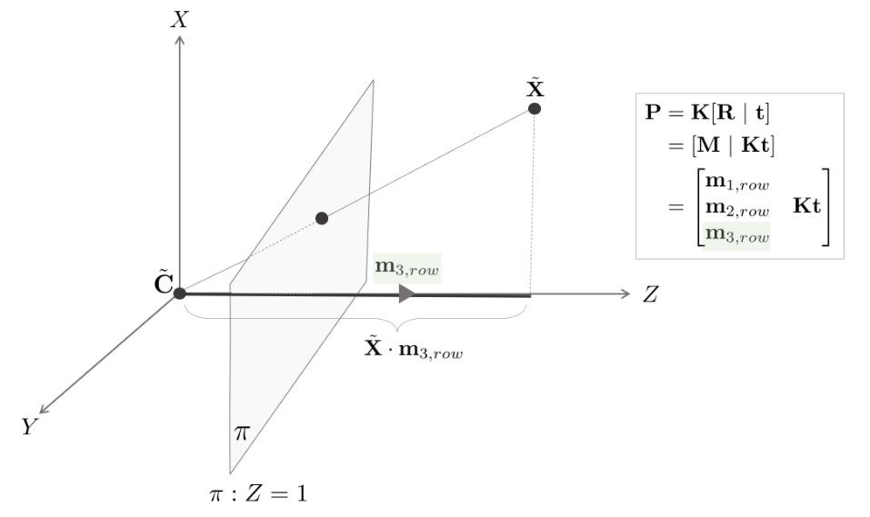

카메라 행렬 $\mathbf{P}$에 대한 월드 상의 점 $\mathbf{X}$의 깊이는

$$\mathrm{depth}(\mathbf{X}; \mathbf{P}) = \frac{\mathrm{sign}(\det(\mathbf{M}))w}{\|\mathbf{m}_{3,row}\|} \tag{113}$$

와 같이 나타낼 수 있다. 이 때, $\mathbf{m}_{3,row} \in \mathbb{R}^{3\times3}$는 행렬 $\mathbf{M}$의 세번째 행벡터이다.

### Proof

행벡터 $\mathbf{m}_{3,row}$는 주축의 방향을 의미하므로 월드 상의 점 $\tilde{\mathbf{X}}$를 $\mathbf{m}_{3,row}$로 프로젝션한 값이 곧 $Z$축에 대한
깊이를 의미한다. 주축으로 프로젝션은

$$\mathrm{depth} = \frac{(\tilde{\mathbf{X}} - \tilde{\mathbf{C}})\mathbf{m}_{3.row}}{\|\mathbf{m}_{3,row}\|} \tag{114}$$

이 되고 Finite Projective 카메라의 경우 $\mathbf{m}_{3,row} = \mathbf{r}_{3,row} = 1$이 된다.

깊이 값은 $\mathbf{x} = \mathbf{P}\mathbf{X}$의 세 번째 행인 $w$이므로

$$\begin{aligned}
w &= (\mathbf{P}\mathbf{X})_{3,row} \\
&= (\mathbf{P}(\mathbf{X} - \mathbf{C}))_{3,row} \\
&= (\tilde{\mathbf{X}} - \tilde{\mathbf{C}})\mathbf{m}_{3,row}
\end{aligned} \tag{115}$$

와 같이 구할 수 있다. 결론적으로 $\det(\mathbf{M})$의 부호에 따라 깊이 값이 카메라 뒤쪽에 위치할 수 있으므로
이를 고려하여 나타내면 다음과 같다.

$$\mathrm{depth}(\mathbf{X}; \mathbf{P}) = \frac{\mathrm{sign}(\det(\mathbf{M}))w}{\|\mathbf{m}_{3,row}\|} \tag{116}$$

## Cameras at infinity

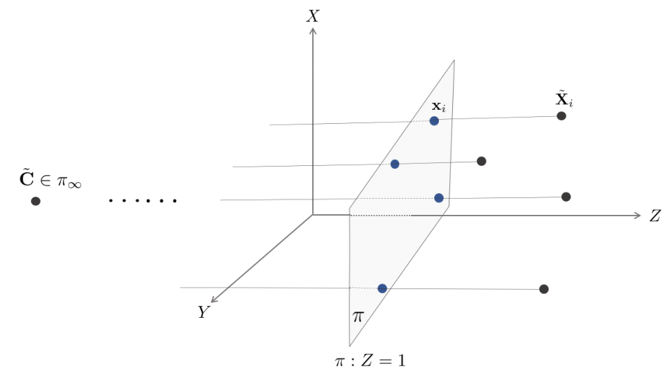

==임의의 General Projective 카메라의 중심점 $\mathbf{C}$가 무한대 평면 $\pi_\infty$에 존재하는 경우 이를 무한대 카메라
(camera at infinity)라고 한다.==

$$\mathbf{C} = (*, *, *, 0)^\intercal \in \pi_\infty \tag{117}$$

이와 동치(equivalent)인 경우는 카메라 행렬 $\mathbf{P} = [\mathbf{M} \mid \mathbf{p}_{4,col}]$가 주어졌을 때 행렬 $\mathbf{M}$가 singular한
경우이다.

무한대 카메라는 크게 Affine 카메라와 Non-affine 카메라로 분류된다.

### Definition 6.3

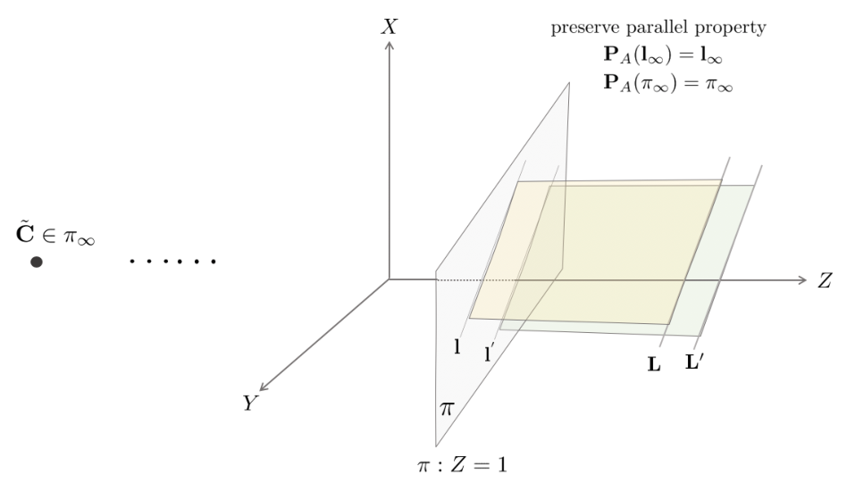

Affine 카메라 $\mathbf{P}_A$는 무한대 평면을 프로젝션했을 때 동일하게 무한대 평면이 되는 카메라를 의미한다.

$$\mathbf{P}_A(\pi_\infty) = \pi_\infty \tag{118}$$

이 때, $\mathbf{P}_A = \begin{bmatrix} * & * & * & * \\ * & * & * & * \\ 0 & 0 & 0 & * \end{bmatrix}$ 꼴이다.

### Affine cameras

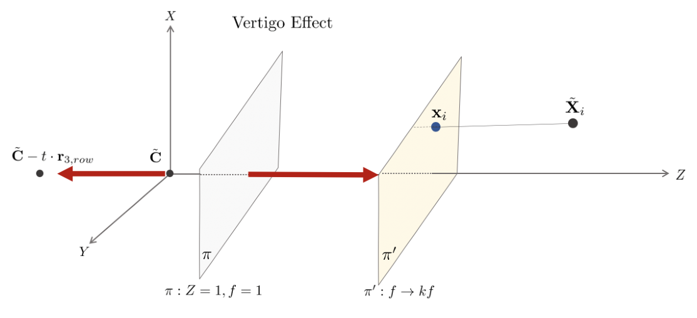

Finite Projective 카메라 행렬 $\mathbf{P} = \mathbf{K}\mathbf{R}[\mathbf{I} \mid \mathbf{0}]$가 있고 월드 상의 물체가 존재한다고 하자. 이 때, ==물체에 대한
Zoom In을 수행하면서 동시에 카메라를 주축의 반대 방향으로 움직이면 Vertigo Effect가 발생한다.
Vertigo Effect는 히치콕 감독의 영화 Vertigo에서 해당 기법을 처음 사용해서 붙은 이름이다.==

이를 수식적으로 이해하기 위해 월드 상 물체의 깊이(depth) 값에 대해 다시 생각해보면 카메라의 중심점
$\tilde{\mathbf{C}}$가 있고 월드 상의 점 $\tilde{\mathbf{X}}$가 주어졌을 때 깊이 값 $d$는

$$d = -(\tilde{\mathbf{X}} - \tilde{\mathbf{C}})\mathbf{r}_{3,row} \tag{119}$$

이다. 이 때, $\mathbf{r}_{3,row}$는 회전행렬 $\mathbf{R}$의 세 번째 행벡터이고 주축(principal axis)를 의미한다. 다음으로
카메라 중심점과 월드의 원점 사이의 거리를 $d_0$라고 하면 위 공식에서 $\tilde{\mathbf{X}} = 0$인 경우에 해당하므로

$$d_0 = -\tilde{\mathbf{C}}\mathbf{r}_{3,row} \tag{120}$$

이 된다.

카메라를 주축의 반대 방향으로 움직이면 카메라의 중심점 $\tilde{\mathbf{C}}$는

$$\tilde{\mathbf{C}} - t \cdot \mathbf{r}_{3,row} \tag{121}$$

이 되고 이 때, $t$는 시간을 의미한다. 카메라가 뒤로 움직일 때 시간에 따른 카메라 행렬은

$$\begin{aligned}
\mathbf{P}_t &= \mathbf{K}\mathbf{R}[\mathbf{I} \mid -(\tilde{\mathbf{C}} - t \cdot \mathbf{r}_{3,row})] \\
&= \mathbf{K}\begin{bmatrix} & & & -\tilde{\mathbf{C}}\mathbf{r}_{1,row} \\ & \mathbf{R} & & -\tilde{\mathbf{C}}\mathbf{r}_{2,row} \\ & & & t - \tilde{\mathbf{C}}\mathbf{r}_{3,row} \end{bmatrix} \\
&= \mathbf{K}\begin{bmatrix} & & & -\tilde{\mathbf{C}}\mathbf{r}_{1,row} \\ & \mathbf{R} & & -\tilde{\mathbf{C}}\mathbf{r}_{2,row} \\ & & & d_0 + t \end{bmatrix}
\end{aligned} \tag{122}$$

이 된다. 따라서 ==카메라를 주축의 반대방향으로 움직이는 경우 $\mathbf{P}_t$는 $(3, 4)$항에만 $d_0 + t$가 추가된 형태가
된다. $d_0 + t = d_t$라고 하면==

$$\mathbf{P}_t = \mathbf{K}\begin{bmatrix} - & - & - & - \\ - & \text{no change} & - & - \\ - & - & - & d_t \end{bmatrix} \tag{123}$$

가 된다.

다음으로 카메라를 Zoom In 해보자. Zoom In을 수학적으로 표현하면 초점거리(focal length) $f$의 크기를
늘려주는 것과 동일하다.

$$\text{Zoom In} : f \rightarrow kf \quad \forall k > 0 \tag{124}$$

Zoom In을 행렬로 표현하면 다음과 같다.

$$\mathbf{P} \rightarrow \begin{bmatrix} k & & \\ & k & \\ & & 1 \end{bmatrix}\mathbf{P} \tag{125}$$

이 때, 카메라를 주축의 방향으로 움직일 때 동시에 초점거리를 $k$배 하여 Zoom In하면 물체의 깊이
(depth)는 변하지 않도록 하는 Vertigo Effect를 구현할 수 있다. 이 때 적절한 Zoom In 값 $k$는

$$k = d_t/d_0 \tag{126}$$

이다. 결국 시간에 따른 카메라 행렬 $\mathbf{P}_t$는

$$\begin{aligned}
\begin{bmatrix} d_t/d_0 & & \\ & d_t/d_0 & \\ & & 1 \end{bmatrix}\mathbf{P}_t &= \mathbf{K}\begin{bmatrix} d_t/d_0 & & \\ & d_t/d_0 & \\ & & 1 \end{bmatrix}\begin{bmatrix} & & & * \\ & \mathbf{R} & & * \\ & & & d_t \end{bmatrix} \\
&= \frac{1}{k}\mathbf{K}\begin{bmatrix} 1 & & \\ & 1 & \\ & & d_0/d_t \end{bmatrix}\begin{bmatrix} & & & * \\ & \mathbf{R} & & * \\ & & & d_t \end{bmatrix} \\
&= \frac{1}{k}\mathbf{K}\begin{bmatrix} - & - & - & - \\ - & \text{no change} & - & - \\ & d_0/d_t \cdot \mathbf{r}_{3,row} & & d_0 \end{bmatrix}
\end{aligned} \tag{127}$$

가 된다. $\frac{1}{k}$는 스케일 값이므로 생략 가능하다. 시간이 무한히 흘렸다고 가정하면

$$\mathbf{P}_\infty = \lim_{t\to\infty}\mathbf{P}_t = \mathbf{K}\begin{bmatrix} \mathbf{r}^\intercal_{1,row} & -\mathbf{r}^\intercal_{1,row}\tilde{\mathbf{C}} \\ \mathbf{r}^\intercal_{2,row} & -\mathbf{r}^\intercal_{2,row}\tilde{\mathbf{C}} \\ \mathbf{0}^\intercal & d_0 \end{bmatrix} \tag{128}$$

가 된다. ==위 식에서 $\mathbf{P}$의 세 번째 행의 세 개의 값들이 $\mathbf{0}^\intercal$이므로 이는 곧 Affine 카메라이다.==

### Error in employing and affine camera

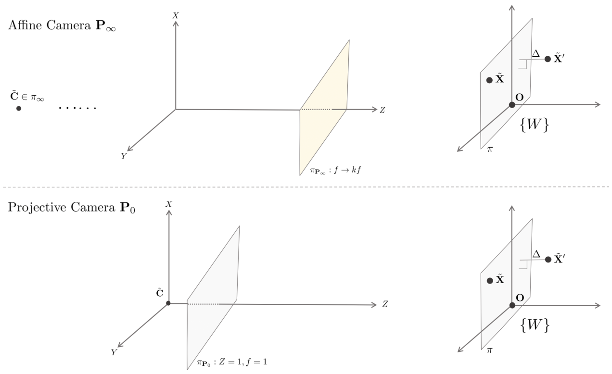

==해당 섹션에서는 General Projective 카메라와 Affine 카메라로 동일한 물체를 찍었을 때 얼마나 큰
차이가 있는지에 대해서 설명한다.== General Projective 카메라는 $\mathbf{P}_0$로 표기하고 Affine 카메라는 $\mathbf{P}_\infty$로
표기하며 시간 $t$에 따른 카메라 행렬의 변화는 $\mathbf{P}_t$로 표기한다.

월드 좌표계의 원점을 포함하면서 카메라 $\mathbf{P}_t$의 이미지 평면과 수직인 평면 $\pi$가 주어졌을 때 앞서 설명한
Vertigo Effect(zoom in + backward moving)을 수행하면 $\pi$에 위치한 점들은 $\mathbf{P}_t$에 의해 얻어지는 이미지
상의 점들이 $t$에 대하여 일정하다.

이를 증명해보면 평면 $\pi$ 상에 점 $\mathbf{X} \in \pi$가 주어졌을 때 $\pi$가 월드 좌표계의 원점을 포함하므로

$$\mathbf{X} = \begin{pmatrix} \alpha\mathbf{r}_{1,row} + \beta\mathbf{r}_{2,row} \\ 1 \end{pmatrix} \in \mathbb{R}^4 \tag{129}$$

같이 나타낼 수 있다. 이를 $\mathbf{P}_t$를 통해 프로젝션하면

$$\mathbf{P}_t\mathbf{X} = \mathbf{K}\begin{bmatrix} \mathbf{r}^\intercal_{1,row} & -\mathbf{r}^\intercal_{1,row}\tilde{\mathbf{C}} \\ \mathbf{r}^\intercal_{2,row} & -\mathbf{r}^\intercal_{2,row}\tilde{\mathbf{C}} \\ d_0/d_t \cdot \mathbf{r}_{3,row} & d_0 \end{bmatrix}\begin{pmatrix} \alpha\mathbf{r}_{1,row} + \beta\mathbf{r}_{2,row} \\ 1 \end{pmatrix} = \begin{pmatrix} * \\ * \\ d_0 \end{pmatrix} \quad \because \mathbf{r}_{1,row}\cdot\mathbf{r}_{3,row} = \mathbf{r}_{2,row}\cdot\mathbf{r}_{3,row} = 0 \tag{130}$$

따라서 월드 좌표계의 원점을 포함하는 평면 $\pi$ 상의 점 $\mathbf{X}$의 깊이(depth)는 $d_0$로 항상 일정하기 때문에
Vertigo Effect을 수행하면 시간 $t$에 관계없이 일정한 크기로 보인다. ==즉, General Projective 카메라와
Affine 카메라에서 $\mathbf{X}$는 모두 동일한 이미지 상의 점으로 변환된다.==

$$\mathbf{P}_0\mathbf{X} = \mathbf{P}_t\mathbf{X} = \mathbf{P}_\infty\mathbf{X} \tag{131}$$

만약 ==월드 좌표계 원점을 지나면서 이미지 평면과 수직인 평면 $\pi$ 상에 있는 점이 아닌, 평면 $\pi$로부터
거리가 $\Delta$ 만큼 떨어져 있는 월드 상의 점 $\mathbf{X}'$를 두 카메라에서 찍는 경우 $\mathbf{P}_0\mathbf{X}' \neq \mathbf{P}_\infty\mathbf{X}'$가 된다.== $\mathbf{X}'$는
다음과 같이 나타낼 수 있다.

$$\mathbf{X}' = \begin{pmatrix} \alpha\mathbf{r}_{1,row} + \beta\mathbf{r}_{2,row} + \Delta\mathbf{r}_{3,row} \\ 1 \end{pmatrix} \tag{132}$$

이 때, $\mathbf{r}_{3,row}$는 카메라의 주축(principal axis)를 의미한다. $\mathbf{X}'$를 두 카메라에 프로젝션하면

$$\mathbf{x}_{proj} = \mathbf{P}_0\mathbf{X}' = \mathbf{K}\begin{pmatrix} \tilde{x} \\ \tilde{y} \\ \tilde{z}_{proj} \end{pmatrix} = \mathbf{K}\begin{pmatrix} \alpha - \mathbf{r}^\intercal_{1,row}\tilde{\mathbf{C}} \\ \beta - \mathbf{r}^\intercal_{2,row}\tilde{\mathbf{C}} \\ d_0 + \Delta \end{pmatrix} \tag{133}$$

$$\mathbf{x}_{affine} = \mathbf{P}_\infty\mathbf{X}' = \mathbf{K}\begin{pmatrix} \tilde{x} \\ \tilde{y} \\ \tilde{z}_{affine} \end{pmatrix} = \mathbf{K}\begin{pmatrix} \alpha - \mathbf{r}^\intercal_{1,row}\tilde{\mathbf{C}} \\ \beta - \mathbf{r}^\intercal_{2,row}\tilde{\mathbf{C}} \\ d_0 \end{pmatrix} \tag{134}$$

가 된다. $\tilde{z}_{proj}$는 다음과 같이 구할 수 있다.

$$\begin{aligned}
\tilde{z}_{proj} &= [\mathbf{r}_{3,row} \mid -\mathbf{r}_{3,row}\tilde{\mathbf{C}}]\mathbf{X}' \\
&= [\mathbf{r}_{3,row} \mid -\mathbf{r}_{3,row}\tilde{\mathbf{C}}]\begin{pmatrix} \alpha\mathbf{r}_{1,row} + \beta\mathbf{r}_{2,row} + \Delta\mathbf{r}_{3,row} \\ 1 \end{pmatrix} \\
&= -\mathbf{r}_{3,row}\tilde{\mathbf{C}} + \Delta \\
&= d_0 + \Delta
\end{aligned} \tag{135}$$

카메라 캘리브레이션 행렬 $\mathbf{K}$는 다음과 같이 나타낼 수 있다.

$$\mathbf{K} = \begin{bmatrix} \mathbf{K}_{2\times2} & \tilde{\mathbf{x}}_0 \\ \tilde{\mathbf{0}}^\intercal & 1 \end{bmatrix} \tag{136}$$

이 때, $\mathbf{K}_{2\times2}$는 $2\times2$ 크기의 상삼각(upper-triangular)행렬을 의미하고 $\tilde{\mathbf{x}}_0 = \begin{pmatrix} x_0 & y_0 \end{pmatrix}^\intercal$는 이미지 평면의
원점을 의미한다. 이를 고려하여 위 공식들을 다시 정리해보면

$$\mathbf{x}_{proj} = \begin{pmatrix} \mathbf{K}_{2\times2}\tilde{\mathbf{x}} + (d_0 + \Delta)\tilde{\mathbf{x}}_0 \\ d_0 + \Delta \end{pmatrix} \qquad \mathbf{x}_{affine} = \begin{pmatrix} \mathbf{K}_{2\times2}\tilde{\mathbf{x}} + d_0\tilde{\mathbf{x}}_0 \\ d_0 \end{pmatrix} \tag{137}$$

와 같다. 이 때 $\tilde{\mathbf{x}} = \begin{pmatrix} \tilde{x} & \tilde{y} \end{pmatrix}^\intercal$를 의미한다. 두 점 $\mathbf{x}_{proj}$와 $\mathbf{x}_{affine}$의 Inhomogeneous 좌표를 계산해보면
마지막 항으로 나눈 값이 되므로

$$\begin{aligned}
\tilde{\mathbf{x}}_{proj} &= \tilde{\mathbf{x}}_0 + \mathbf{K}_{2\times2}\tilde{\mathbf{x}}/(d_0 + \Delta) \\
\tilde{\mathbf{x}}_{affine} &= \tilde{\mathbf{x}}_0 + \mathbf{K}_{2\times2}\tilde{\mathbf{x}}/d_0
\end{aligned} \tag{138}$$

가 된다. ==결론적으로 General Projective 카메라와 Affine 카메라를 통해 프로젝션한 두 점의 차이는
다음과 같다.==

$$\tilde{\mathbf{x}}_{affine} - \tilde{\mathbf{x}}_0 = \frac{d_0 + \Delta}{d_0}(\tilde{\mathbf{x}}_{proj} - \tilde{\mathbf{x}}_0) \tag{139}$$

==위 공식을 Discrepancy Equation이라고 부르며 $\Delta = 0$인 경우, 월드 좌표계의 원점을 포함하면서
이미지 평면과 수직인 평면 $\pi$ 상의 점인 경우, 두 카메라를 통해 촬영한 물체는 동일한 이미지 상의 점으로==
==프로젝션된다는 것을 의미한다.== 영화 Vertigo 또는 Jaws를 보면 이와 같은 현상을 볼 수 있는데 주인공의
얼굴이 변하지 않으면서 주변의 환경이 Zoom Out되는 것을 볼 수 있다.

<!--widget:affine-camera-vertigo-->

# 4 Computation of the Camera Matrix P

해당 섹션에서는 $\mathbb{P}^3$ 공간 상의 점 $\mathbf{X}_i$와 $\mathbb{P}^2$ 공간 상의 점 $\mathbf{x}_i$들의 대응쌍 $(\mathbf{x}_i, \mathbf{X}_i)$ 여러개를 사용하여 카메라 행
렬 $\mathbf{P}$를 수치적으로 구하는 방법에 대해 설명한다. 이러한 방법을 일반적으로 Resectioning 또는 Calibration
이라고 부른다.

## Basic equations

대응점 쌍 $(\mathbf{x}_i, \mathbf{X}_i)$가 주어졌을 때 두 점 사이의 대응관계는 다음과 같다.

$$\mathbf{x}_i = \mathbf{P}\mathbf{X}_i \tag{140}$$

이 때, $\mathbf{P}\mathbf{X}_i$는

$$\begin{aligned}
\mathbf{P}\mathbf{X}_i &= \begin{bmatrix} \mathbf{p}^\intercal_{1,row} \\ \mathbf{p}^\intercal_{2,row} \\ \mathbf{p}^\intercal_{3,row} \end{bmatrix}\mathbf{X}_i = \begin{bmatrix} \mathbf{p}^\intercal_{1,row}\mathbf{X}_i \\ \mathbf{p}^\intercal_{2,row}\mathbf{X}_i \\ \mathbf{p}^\intercal_{3,row}\mathbf{X}_i \end{bmatrix}
\end{aligned} \tag{141}$$

와 같이 행벡터(row vector)를 사용하여 나타낼 수 있다. 이 때, $\mathbf{p}_{i,row} \in \mathbb{R}^{4\times1}$인 벡터를 의미한다.
$\mathbf{x} = \begin{pmatrix} x & y & w \end{pmatrix}^\intercal$라고 하면 $\mathbf{x}_i \times \mathbf{P}\mathbf{X}_i = 0$이므로

$$\mathbf{x}_i \times \mathbf{P}\mathbf{X}_i = \begin{pmatrix} y_i \cdot \mathbf{p}^\intercal_{2,row}\mathbf{X}_i - w_i \cdot \mathbf{p}_{3,row}\mathbf{X}_i \\ w_i \cdot \mathbf{p}^\intercal_{1,row}\mathbf{X}_i - x_i \cdot \mathbf{p}_{3,row}\mathbf{X}_i \\ x_i \cdot \mathbf{p}^\intercal_{2,row}\mathbf{X}_i - y_i \cdot \mathbf{p}_{1,row}\mathbf{X}_i \end{pmatrix} = 0 \tag{142}$$

과 같다. 이를 $\mathbf{A}\mathbf{p} = 0$ 형태로 정리하면

$$\begin{bmatrix} \mathbf{0}^\intercal & -w_i\mathbf{X}^\intercal_i & y_i\mathbf{X}^\intercal_i \\ w_i\mathbf{X}^\intercal_i & \mathbf{0}^\intercal & -x_i\mathbf{X}^\intercal_i \\ -y_i\mathbf{X}^\intercal_i & x_i\mathbf{X}^\intercal_i & \mathbf{0}^\intercal \end{bmatrix}\begin{pmatrix} \mathbf{p}_{1,row} \\ \mathbf{p}_{2,row} \\ \mathbf{p}_{3,row} \end{pmatrix} = 0 \tag{143}$$

이 된다. 이 때 좌측 행렬의 마지막 행(row)은 선형의존이므로 첫 번째 행과 두 번째 행만 표현하면

$$\underbrace{\begin{bmatrix} \mathbf{0}^\intercal & -w_i\mathbf{X}^\intercal_i & y_i\mathbf{X}^\intercal_i \\ w_i\mathbf{X}^\intercal_i & \mathbf{0}^\intercal & -x_i\mathbf{X}^\intercal_i \end{bmatrix}}_{\mathbf{A}}\begin{pmatrix} \mathbf{p}_{1,row} \\ \mathbf{p}_{2,row} \\ \mathbf{p}_{3,row} \end{pmatrix} = 0 \tag{144}$$

과 같다. 이 때, 행렬 $\mathbf{A}$는 $\mathbb{R}^{2n\times12}$크기이고 벡터 $\begin{pmatrix} \mathbf{p}_{1,row} \\ \mathbf{p}_{2,row} \\ \mathbf{p}_{3,row} \end{pmatrix}$는 $12 \times 1$ 크기이다. 위 방정식은 $\mathbf{A}\mathbf{p} = 0$
형태이므로 특이값 분해(SVD) 같은 방법을 통해 벡터 $\mathbf{p}$를 구할 수 있다.

### Minimal solution

벡터 $\mathbf{p} \in \mathbb{R}^{12}$를 스케일을 제외하고(up to scale) 구하기 위해서는 총 11개의 식이 필요하다. 하나의 대응점
쌍 $(\mathbf{x}_i, \mathbf{X}_i)$을 사용하면 2개의 식이 도출되므로 $\mathbf{p}$를 구하기 위해서는 최소 5.5개의 대응점 쌍이 필요하다.
노이즈가 없는 5.5개의 대응점 쌍이 주어진 경우 행렬 $\mathbf{A}$의 rank가 11가 되어 Null Space 벡터가 유일한 해
벡터 $\mathbf{p}$가 된다.

### Over-determined solution

일반적으로 대응점 쌍 $(\mathbf{x}_i, \mathbf{X}_i)$은 6개보다 훨씬 많은 개수를 얻을 수 있으며 데이터가 노이즈를 포함하고
있으므로 행렬 $\mathbf{A}$의 rank가 12가 된다. 따라서 Null Space가 존재하지 않으므로 해 벡터 $\mathbf{p}$를 구할 수 없다.
==이러한 $\mathbf{A}\mathbf{p} = 0$ 선형 시스템을 Over-determined 시스템이라고 하며 이 때는 $\|\mathbf{p}\| = 1$인 경우에 대하여
$\|\mathbf{A}\mathbf{p}\|$의 크기가 최소가 되는 근사해 $\hat{\mathbf{p}}$를 구해야 한다.==

### Degenerate configurations

==5.5개 이상의 대응점 쌍 $(\mathbf{x}_i, \mathbf{X}_i)$이 서로 선형독립이 아닐 경우 유일한 해 벡터 $\mathbf{p}$를 결정할 수 없게 되고
이러한 대응점 쌍들을 Degenerate Configuration이라고 한다.== 유일한 해 벡터 $\mathbf{p}$를 결정할 수 없다는
의미는 월드 상의 한 점 $\mathbf{X}$에 대하여

$$\exists\mathbf{P}',\quad \mathbf{P} \neq \mathbf{P}' \quad \mathbf{P}\mathbf{X}_i = \mathbf{P}'\mathbf{X}_i \quad \forall i \tag{145}$$

를 만족하는 임의의 다른 카메라 행렬 $\mathbf{P}'$이 존재한다는 의미이다. 이는 특정 상수 $\theta$에 대해 $\mathbf{P}\mathbf{X} = -\theta\mathbf{P}'\mathbf{X}$
또한 성립한다는 의미와 동일하므로 이를 정리하면

$$\underbrace{(\mathbf{P} + \theta\mathbf{P}')}_{\mathbf{P}_\theta}\mathbf{X} = 0 \quad \text{for some } \theta \tag{146}$$

와 같고 $\mathbf{P}_\theta\mathbf{X} = 0$을 만족하는 월드 상의 점 $\mathbf{X}$는 $\mathbf{P}$와 $\mathbf{P}'$을 구분할 수 없다. 이와 같이 $\mathbf{P}, \mathbf{P}'$에 의해 같은
이미지 평면 상의 점으로 옮겨지는 $\mathbf{X}$의 집합을 $S_\theta$라고 하면

$$S_\theta = \{\mathbf{X} \mid \mathbf{P}_\theta\mathbf{X} = 0\} \tag{147}$$

$S_\theta$를 만족하는 월드 상의 점 $\mathbf{X}$는 다음과 같다.

- 모든 $\mathbf{X}_i$들이 Twisted Cubic 상에 위치한 경우
- 모든 $\mathbf{X}_i$들이 동일한 평면 위에 존재하며 카메라 중심점을 포함한 직선 위에 존재하는 경우

Twisted Cubic이란 $\mathbb{P}^3$ 공간 상에 존재하는 곡선을 의미한다. Twisted Cubic $\mathbf{C}_\theta$으로 구성된 집합 $\mathcal{C}_\theta$는

$$\mathcal{C}_\theta = \{\mathbf{C}_\theta \mid \mathbf{P}_\theta\mathbf{C}_\theta = 0 \text{ and } \mathbf{P}_\theta\text{'s rank is } 3\} \tag{148}$$

을 만족하는 집합을 의미한다. 이 때, $\mathbf{C}_\theta$는 3차식의 형태로 나타나는데 중근으로 인해 Twisted Cubic이
아닌 경우도 있으나 일반적으로 Twisted Cubic을 의미한다. $\mathbf{P}_\theta\mathbf{C}_\theta = 0$이고 $\mathbf{P}_\theta$의 rank가 3이므로 $\mathbf{C}_\theta$는 $\mathbf{P}_\theta$
의 행공간(row space)에 들어가 있다는 의미가 된다.

$$\mathbf{C}_\theta = \mathrm{Row}\,\mathbf{P}_\theta \tag{149}$$

따라서 $\mathbf{C}_\theta = \begin{pmatrix} c_1 & c_2 & c_3 & c_4 \end{pmatrix}$일 때

$$\det\begin{bmatrix} c_1 & c_2 & c_3 & c_4 \\ - & - & - & - \\ - & \mathbf{P}_\theta & - & - \\ - & - & - & - \end{bmatrix} = 0 \tag{150}$$

이 성립한다. ==이를 전개하면 $\det(2\ 3\ 4)c_1 - \det(1\ 3\ 4)c_2 + \det(1\ 2\ 4)c_3 - \det(1\ 2\ 3)c_4 = 0$이 되고 이 때,
$\det(a\ b\ c)$는 행렬 $\mathbf{P}_\theta$의 $a, b, c$ 행과 열의 서브행렬식(sub-determinant, subminor)를 의미한다. 이를
통해 $\mathbf{C}_\theta$를 다시 정리하면==

$$\mathbf{C}_\theta = (\det(2\ 3\ 4),\ -\det(1\ 3\ 4),\ \det(1\ 2\ 4),\ -\det(1\ 2\ 3)) \tag{151}$$

==으로 나타낼 수 있고 각각의 항들이 전부 3차식인 Twisted Cubic이 된다.== $\mathbf{P}, \mathbf{P}'$에 따라 $\mathbf{C}_\theta$의 모든
항들이 공통근을 가질 수 있고 각 항들의 차수가 3차 이하로 떨어질 수 있다. 이러한 경우를 $\mathbf{C}_\theta$의 Degenerate
Configuration이라고 부르며 이러한 $\mathbf{C}_\theta$는 Twisted Cubic이 아니다.

### Line correspondences

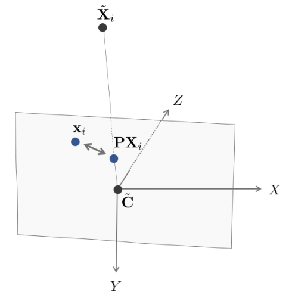

월드 상의 한 직선 $\mathbf{L}$을 카메라 행렬 $\mathbf{P}$로 프로젝션하여 이미지 평면 상의 직선 $\mathbf{l}$을 얻었을 경우 점과 달리
직선은 $\mathbf{l} \neq \mathbf{P}\mathbf{L}$이다.

$$\mathbf{x} = \mathbf{P}\mathbf{X} \quad \text{but, } \mathbf{l} \neq \mathbf{P}\mathbf{L} \tag{152}$$

직선 $\mathbf{L}$ 상의 한 점 $\mathbf{X}$를 카메라에 프로젝션하여 얻은 점 $\mathbf{x}$는 직선 $\mathbf{l}$ 위에 존재하므로

$$\mathbf{l}^\intercal\mathbf{x} = \mathbf{l}^\intercal\mathbf{P}\mathbf{X} = 0 \Rightarrow \mathbf{A}\mathbf{p} = 0 \tag{153}$$

와 같은 벡터 $\mathbf{p}$에 대한 선형 방정식이 성립한다. ==따라서 월드 상의 직선 $\mathbf{L}$ 위에 존재하는 여러 점들 $\mathbf{X}_i$
를 사용하면 벡터 $\mathbf{p}$에 대한 선형 방정식이 성립하여 이를 통해 카메라 행렬 $\mathbf{P}$를 구할 수 있다.==

## Geometric error

앞서 설명한 방법과 같이 대응점 쌍 $(\mathbf{x}_i, \mathbf{X}_i)$를 이용하여 $\mathbf{A}\mathbf{p} = 0$ 형태의 Over-determined 선형시스템을
구성한 후 $\|\mathbf{p}\| = 1$이면서 $\|\mathbf{A}\mathbf{p}\|$의 크기를 최소화하는 근사해 벡터 $\hat{\mathbf{p}}$를 구할 수 있다. 해당 섹션에서는 더욱
정확한 카메라 행렬 $\mathbf{P}$를 구하기 위해 기하학적 에러(geometric error)를 최소화하는 방법에 대해 설명한다.

==기하학적 에러는 이미지 평면 상에서 이미 주어진 $\mathbf{x}_i$와 월드 상의 점 $\mathbf{X}_i$를 프로젝션한 $\mathbf{P}\mathbf{X}_i$ 사이의 픽셀
거리를 의미한다. 실제 데이터에서는 노이즈로 인해 $\mathbf{x}_i \neq \mathbf{P}\mathbf{X}_i$이므로 두 점 사이의 거리 $d(\mathbf{x}_i, \mathbf{P}\mathbf{X}_i)$를
최소화해주는 최적의 카메라 행렬 $\mathbf{P}$를 찾아야 한다.==

$$\min_{\mathbf{P}} d(\mathbf{x}_i, \mathbf{P}\mathbf{X}_i)^2 \tag{154}$$

$d(\mathbf{x}_i, \mathbf{P}\mathbf{X}_i)^2$는 일반적으로 비선형이므로 비선형 최소제곱법(non-linear least squares) 방법들인 Gauss-Newton(GN) 또는 Levenberg-Marquardt(LM) 등과 같은 방법을 통해 최적의 카메라 행렬 $\mathbf{P}$를 구할 수
있다.

### Algorithm 7.1

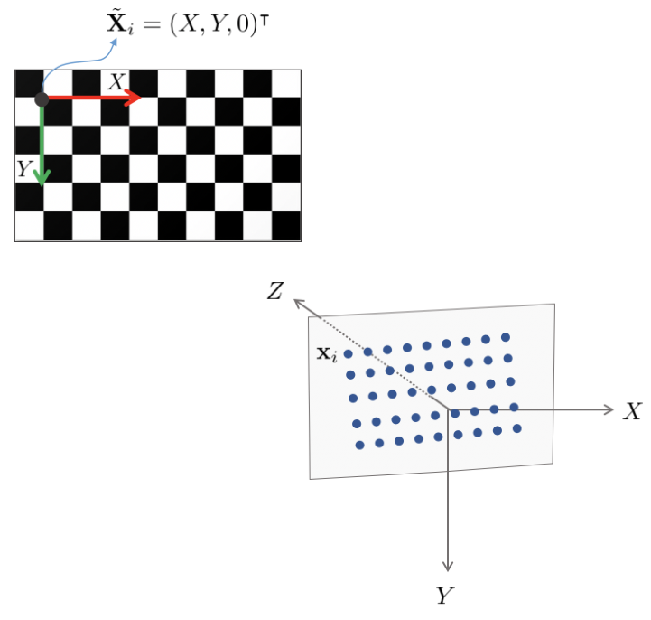

- ==Objective:== 주어진 대응점 쌍 $(\mathbf{x}_i, \mathbf{X}_i), i = 1, \cdots, 6, \cdots$ 에 대하여 $\mathbf{P}$에 대한 MLE(maximum likelihook estimation) 값을 찾는다. 즉, $\sum_i d(\mathbf{x}_i, \mathbf{P}\mathbf{X}_i)^2$를 최소로하는 카메라 행렬 $\mathbf{P}$를 찾는다.
- ==Normalization:== 이미지 포인트 $\mathbf{x}_i$를 정규화하는 행렬 $\mathbf{T}$를 통해 $\mathbf{x}_i \rightarrow \bar{\mathbf{x}}_i$로 정규화시키고 월드 상의
  점 $\mathbf{X}_i$를 정규화하는 행렬 $\mathbf{U}$를 통해 $\mathbf{X}_i \rightarrow \bar{\mathbf{X}}_i$로 정규화시킨다. 정규화를 수행하지 않고 DLT(direct
  linear transformation)을 수행하는 경우 $\mathbb{P}^2, \mathbb{P}^3$ 공간의 특성 상 마지막 항의 값이 1로 매우 작고 나머지
  항들은 매우 크므로 정상적인 해가 도출되지 않는다.
- ==DLT:== 정규화된 대응점 쌍들을 앞서 설명한 Over-determined 시스템 $\bar{\mathbf{A}}\bar{\mathbf{p}} = 0$으로 구성한다. 다음으로
  $\|\bar{\mathbf{p}}\| = 1$이며 $\|\bar{\mathbf{A}}\bar{\mathbf{p}}\|$를 최소화하는 근사해 $\bar{\mathbf{p}}$를 DLT를 통해 구한 후 이를 초기값 $\bar{\mathbf{P}}_0$으로 설정한다.
- ==Minimize geometric error:== 다음과 같은 기하학적 에러를 GN 또는 LM 방법을 통해 최소화하여
  최적의 정규화된 카메라 행렬 $\bar{\mathbf{P}}$를 계산한다.

$$\min_{\bar{\mathbf{P}}} \sum_i d(\bar{\mathbf{x}}_i, \bar{\mathbf{P}}\bar{\mathbf{X}}_i)^2 \quad \text{start at } \bar{\mathbf{P}}_0 \tag{155}$$

- ==Denormalization:== 정규화된 카메라 행렬을 다시 원래 카메라 행렬로 복원한다.

$$\mathbf{P} = \mathbf{T}^{-1}\bar{\mathbf{P}}\mathbf{U} \tag{156}$$

위 알고리즘을 일반적으로 ==The Gold Standard algorithm for estimating $\mathbf{P}$라고 한다.==

<!--widget:dlt-camera-matrix-->

## Zhang's method

실제로 Gold Standard 알고리즘을 사용할 때는 임의의 대응점 쌍을 사용하는 것이 아닌 체커보드 상의
대응점 쌍을 사용한다. 이렇게 ==체커보드를 통해 카메라 행렬 $\mathbf{P}$를 추정하는 알고리즘을 Zhang's Method
라고 한다.== 월드 상의 체커보드 평면 $\pi_0$가 주어졌을 때 월드 상의 원점을 체커보드의 좌측 상단으로 설정하고
체커보드의 평면이 $Z = 0$인 평면으로 설정한다.

$$\pi_0 = \{\mathbf{X} = (X, Y, Z)^\intercal \mid Z = 0\} \tag{157}$$

이에 따라 체커보드 평면 $\pi_0$위의 임의의 점 $\mathbf{X}_i$들은 $Z = 0$인 점이 된다.

$$\mathbf{X}_i = (*, *, 0)^\intercal \tag{158}$$

체커보드 상의 한 점 $\mathbf{X} = (X, Y, 0, 1)^\intercal$를 프로젝션하면

$$\mathbf{P}\mathbf{X} = \mathbf{P}\begin{pmatrix} X \\ Y \\ 0 \\ 1 \end{pmatrix} = \mathbf{K}[\mathbf{R} \mid \mathbf{t}]\begin{pmatrix} X \\ Y \\ 0 \\ 1 \end{pmatrix} = \mathbf{K}[\mathbf{r}_{1,col}\ \mathbf{r}_{2,col}\ \mathbf{t}]\mathbf{X} \tag{159}$$

가 된다. $z = 0$이므로 행렬 $\mathbf{R}$의 세 번째 열벡터(column vector)는 0이 된다. 행렬 $\mathbf{K}[\mathbf{r}_{1,col}\ \mathbf{r}_{2,col}\ \mathbf{t}] \in \mathbb{R}^{3\times3}$
는 체커보드 평면 $\pi_0$에서 이미지 평면 $\pi$로 변환하는 Homography $\mathbf{H}$로 볼 수 있다.

$$\mathbf{H} = \mathbf{K}[\mathbf{r}_{1,col}\ \mathbf{r}_{2,col}\ \mathbf{t}] \tag{160}$$

체커보드는 패턴의 길이와 갯수를 모두 알고 있기 때문에 자동적으로 체커보드 평면 $\pi_0$ 상의 점 $\mathbf{x}_i, i = 1, \cdots$ 를 알 수 있다. 다음으로 Feature Extraction 알고리즘을 사용하면 이미지 평면 $\pi$ 상에서 본 $\pi_0$의 점
$\mathbf{x}'_i, i = 1, \cdots$ 들을 알 수 있다. 따라서 대응점 쌍 $\mathbf{x}_i \in \pi_0 \leftrightarrow \mathbf{x}'_i \in \pi$을 얻을 수 있다. 이를 통해 $\pi_0 \mapsto \pi$로
가는 Homography $\mathbf{H}$를 계산해보면

$$\mathbf{H} = \begin{bmatrix} \mathbf{h}_{1,col} & \mathbf{h}_{2,col} & \mathbf{h}_{3,col} \end{bmatrix} = \mathbf{K}\begin{bmatrix} \mathbf{r}_{1,col} & \mathbf{r}_{2,col} & \mathbf{t} \end{bmatrix} \tag{161}$$

가 된다. 이를 정리하면

$$\mathbf{K}^{-1}\begin{bmatrix} \mathbf{h}_{1,col} & \mathbf{h}_{2,col} & \mathbf{h}_{3,col} \end{bmatrix} = \begin{bmatrix} \mathbf{r}_{1,col} & \mathbf{r}_{2,col} & \mathbf{t} \end{bmatrix} \tag{162}$$

가 된다. 이 때, 직교행렬 $\mathbf{R}$의 열벡터인 $\mathbf{r}_{1,col}$과 $\mathbf{r}_{2,col}$은 서로 직교하므로 $\mathbf{r}^\intercal_{1,col}\mathbf{r}_{2,col} = 0$이 성립한다.
해당 제약조건을 이용하면 $\mathbf{K}^{-1}\mathbf{h}_{1,col} = \mathbf{r}_{1,col}$이고 $\mathbf{K}^{-1}\mathbf{h}_{2,col} = \mathbf{r}_{2,col}$이므로 직교조건에 의해

$$\mathbf{h}^\intercal_{1,col}\mathbf{K}^{-\intercal}\mathbf{K}^{-1}\mathbf{h}_{2,col} = 0 \tag{163}$$

이 성립한다. 또한 직교행렬 조건에 의해 스케일을 제외하고(up to scale) $\mathbf{r}^\intercal_{1,col}\mathbf{r}_{1,col} = \mathbf{r}^\intercal_{2,col}\mathbf{r}_{2,col}$이므로

$$\mathbf{h}^\intercal_{1,col}\mathbf{K}^{-\intercal}\mathbf{K}^{-1}\mathbf{h}_{1,col} = \mathbf{h}^\intercal_{2,col}\mathbf{K}^{-\intercal}\mathbf{K}^{-1}\mathbf{h}_{2,col} \tag{164}$$

공식이 성립한다. 한 개의 체커보드 사진으로 부터 위와 같은 두 개의 방정식을 얻을 수 있다. 일반적인
카메라 캘리브레이션 행렬 $\mathbf{K}$는

$$\mathbf{K} = \begin{bmatrix} f_x & s & x_0 \\ & f_y & y_0 \\ & & 1 \end{bmatrix} \tag{165}$$

과 같이 5개의 변수를 가지고 있으므로 $\mathbf{K}^{-\intercal}\mathbf{K}^{-1}$ 또한 5개의 변수를 가지고 있는 행렬이 된다. 따라서
최소 세 개 이상의 Homography $\mathbf{H}_j, j = 1, 2, 3$가 주어졌을 때 $\mathbf{K}^{-\intercal}\mathbf{K}^{-1}$를 결정할 수 있다.

- 5개의 파라미터를 갖고 있는 행렬 $\mathbf{K}$를 구하기 위해 최소 세 개 이상의 체커보드 이미지를 획득한다.
  하나의 이미지 당 두 개의 방정식을 얻을 수 있으므로 세 장 이상을 획득해야 한다. 각각의 이미지마다
  Homography $\mathbf{H}_j, j = 1, 2, 3$을 구할 수 있고 공식 (163), (164)를 구한다.
- $\mathbf{S} = \mathbf{K}^{-\intercal}\mathbf{K}^{-1}$로 설정한다. 행렬 $\mathbf{S}$에 Cholesky Decomposition 또는 특이값 분해(SVD)를 수행하여
  $\mathbf{K}^{-1}$을 구한다. 행렬 $\mathbf{S}$는 대칭이면서 Positivie Definite 행렬이므로 $\mathbf{U}^\intercal\mathbf{D}\mathbf{U}$와 같이 분해되며 대각행렬
  $\mathbf{D}$의 제곱근 행렬이 존재한다.

$$\mathrm{SVD}(\mathbf{S}) = \mathbf{U}^\intercal\mathbf{D}\mathbf{U} = (\mathbf{U}\sqrt{\mathbf{D}})(\mathbf{U}\sqrt{\mathbf{D}})^\intercal \tag{166}$$

이를 통해 $\mathbf{K}$를 구할 수 있다.

- $\mathbf{K}^{-1}\mathbf{H} = [\mathbf{r}_{1,col}\ \mathbf{r}_{2,col}\ \mathbf{t}]$ 식을 통해 $\mathbf{r}_{1,col}, \mathbf{r}_{2,col}, \mathbf{t}$를 구한 다음

$$\mathbf{r}_{3,col} = \mathbf{r}_1 \times \mathbf{r}_2 \tag{167}$$

를 통해 구한다. 결론적으로 각각의 Homography $\mathbf{H}_j, j = 1, 2, 3$을 통해 카메라의 회전 $\mathbf{R}$과 이동 $\mathbf{t}$
그리고 내부 파라미터 행렬 $\mathbf{K}$를 구할 수 있다.

## Radial distortion

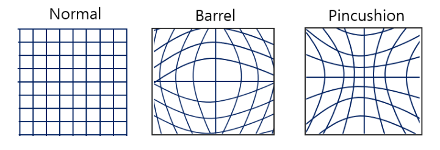

==실제 카메라 이미지는 이상적인 핀홀 카메라 모델과 다르게 방사형 왜곡(radial distortion)을 포함하고
있기 때문에 이를 바로 캘리브레이션하면 정확한 $\mathbf{R}, \mathbf{t}, \mathbf{K}$를 구할 수 없다.== 실제 툴킷을 사용하여 캘리브
레이션을 수행해보면 앞서 구한 $\mathbf{R}, \mathbf{t}, \mathbf{K}$ 외에도 Distortion 파라미터들을 구할 수 있다. 해당 파라미터들이
이미지의 방사형 왜곡을 보정해주는 파라미터들이다.

초점거리(focal length) $f$가 작은 경우 Field of View(FOV)가 넓어지고 이 때 이미지의 가장자리 부근
에서 방사형 왜곡이 크게 발생한다. 반대로 초점거리 $f$가 작으면 FOV가 작아지고 왜곡이 상대적으로 덜
발생한다.

왜곡이 존재하는 이미지 평면 상에서 한 점을 $(\breve{u}, \breve{v})$라고 하고 왜곡이 보정된 이미지 평면 상의 점을
$(u, v)$라고 하자. 두 점들의 단위는 [pixel]이다. 그리고 정규화된 이미지 평면(normalized image plane) 상의
왜곡이 존재하는 한 점을 $(\breve{x}, \breve{y})$라고 하고 왜곡이 보정된 점을 $(x, y)$라고 하자. 두 정규화된 점들의 단위는
[mm]이다. 정규화되었다는 말의 의미는 이미지 평면의 원점 $u_0, v_0$가 모두 0이라는 의미이다. 정규화된 점들
사이에는

$$\begin{aligned}
\breve{x} &= x + x(k_1r^2 + k_2r^4) \\
\breve{y} &= y + y(k_1r^2 + k_2r^4)
\end{aligned} \quad \text{where, } r^2 = x^2 + y^2 \tag{168}$$

가 성립한다. $r^2$ 값은 원점에서 거리가 멀어질 수록 왜곡이 크게 발생하는 것을 의미한다. 해당 정규화된
점들을 픽셀 단위 이미지 평면 상의 점들로 다시 표현하면

$$\begin{aligned}
\breve{u} &= u_0 + \alpha\breve{x} \\
\breve{v} &= v_0 + \beta\breve{v}
\end{aligned} \tag{169}$$

가 된다. 이 때 $u_0, v_0$는 이미지 평면의 원점을 의미하며 $\alpha, \beta$는 mm 단위의 점들을 pixel 단위로 변환해
주는 계수를 의미한다. 따라서 방사형 왜곡 파라미터 $k_1, k_2$를 구함으로써 왜곡된 점들과 실제 점들 사이의
관계를 알 수 있다.

방사형 왜곡 이외에도 렌즈와 센서가 물리적으로 평행이 되지 않아 발생하는 접선형 왜곡(tangential
distortion) 또한 존재한다.

$$\begin{aligned}
\breve{x} &= x + 2p_1xy + p_2(r^2 + 2x^2) \\
\breve{y} &= y + p_1(r^2 + 2y^2) + 2p_2xy
\end{aligned} \tag{170}$$

# 5 More Single View Geometry

## Camera calibration and the image of the absolute conic

### Result 8.15

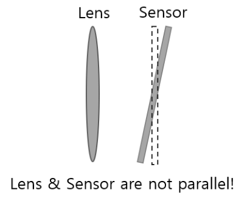

원점에 위치한 카메라 $\mathbf{C}$가 있을 때 한 점 $\mathbf{x}$를 Back-projection하면 카메라 중심을 지나는 직선 $\mathbf{d}$가 생성되
는데 이 때, $\mathbf{d} = \mathbf{K}^{-1}\mathbf{x}$의 관계를 가진다.

$$\mathbf{x} = \mathbf{P}\begin{pmatrix} \lambda\mathbf{d} \\ 1 \end{pmatrix} = \mathbf{K}[\mathbf{I}|\mathbf{0}]\begin{pmatrix} \lambda\mathbf{d} \\ 1 \end{pmatrix} = \mathbf{K}\mathbf{d} \tag{171}$$

따라서 다음의 공식이 성립한다.

$$\begin{aligned}
\mathbf{x} &= \mathbf{K}\mathbf{d} \\
\mathbf{d} &= \mathbf{K}^{-1}\mathbf{x}
\end{aligned} \tag{172}$$

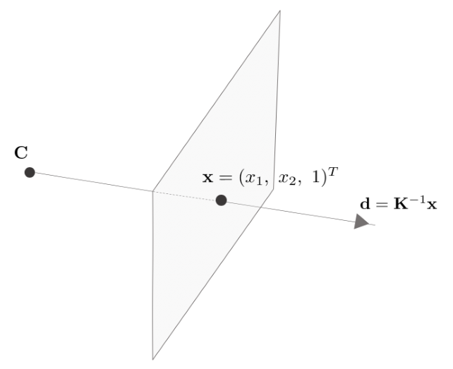

이미지 평면 상의 두 점 $\mathbf{x}_1, \mathbf{x}_2$를 Back-projection하면 각각 $\mathbf{d}_1, \mathbf{d}_2$의 직선이 생성되는데 이 때 두 직선이
이루는 각도는 다음과 같이 계산할 수 있다.

$$\begin{aligned}
\cos\theta &= \frac{\mathbf{d}^\intercal_1\mathbf{d}_2}{\sqrt{\mathbf{d}^\intercal_1\mathbf{d}_1}\sqrt{\mathbf{d}^\intercal_2\mathbf{d}_2}} \\
&= \frac{(\mathbf{K}^{-1}\mathbf{x}_1)^\intercal(\mathbf{K}^{-1}\mathbf{x}_2)}{\sqrt{(\mathbf{K}^{-1}\mathbf{x}_1)^\intercal(\mathbf{K}^{-1}\mathbf{x}_1)}\sqrt{(\mathbf{K}^{-1}\mathbf{x}_2)^\intercal(\mathbf{K}^{-1}\mathbf{x}_2)}} \\
&= \frac{\mathbf{x}^\intercal_1(\mathbf{K}^{-\intercal}\mathbf{K}^{-1})\mathbf{x}_2}{\sqrt{\mathbf{x}^\intercal_1\mathbf{K}^{-\intercal}\mathbf{K}^{-1}\mathbf{x}_1}\sqrt{\mathbf{x}^\intercal_2\mathbf{K}^{-\intercal}\mathbf{K}^{-1}\mathbf{x}_2}}
\end{aligned} \tag{173}$$

이 때, ==$\mathbf{K}^{-\intercal}\mathbf{K}^{-1}$은 Image of Absolute Conic==을 의미한다.

### Result 8.16

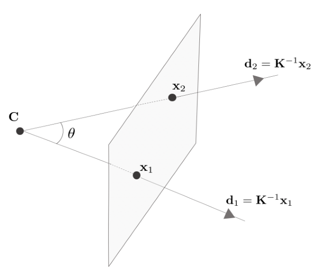

이미지 평면에 있는 직선 $\mathbf{l}$ 위에 한 점 $\mathbf{x}$가 위치할 때, 점과 직선 사이에는 다음 공식이 성립한다.

$$\mathbf{x}^\intercal\mathbf{l} = 0 \tag{174}$$

이 때, $\mathbf{l}$를 Back-projection하면 평면 $\pi$가 생성되고 $\mathbf{x}$를 Back-projection하면 $\mathbf{d} = \mathbf{K}^{-1}\mathbf{x}$가 생성되는데
평면 $\pi$와 직선 $\mathbf{d}$ 사이에는 $(\mathbf{K}^{-1}\mathbf{x})^\intercal\pi = 0$이 성립하고 이를 정리하면 $\mathbf{x}^\intercal(\mathbf{K}^{-\intercal}\pi) = 0$가 성립한다. $\mathbf{x}^\intercal\mathbf{l} = 0$
의 공식에 따라 결론적으로 다음 공식이 성립한다.

$$\begin{aligned}
\mathbf{K}^{-\intercal}\pi &= \mathbf{l} \\
\pi &= \mathbf{K}^\intercal\mathbf{l}
\end{aligned} \tag{175}$$

## The image of the absolute conic

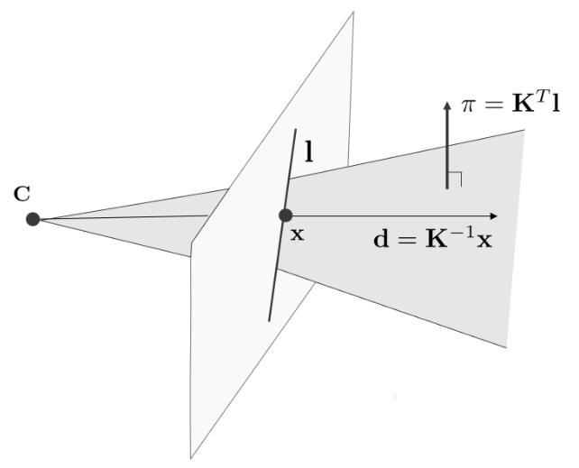

무한대 평면 $\pi_\infty$가 있을 때 $\pi_\infty$ 위에 위치한 무한대 점 $\mathbf{X}_\infty = (\mathbf{d}^\intercal, 0)^\intercal$이 있다고 하면 이를 카메라 $\mathbf{P} = \mathbf{K}\mathbf{R}[\mathbf{I}| -\tilde{\mathbf{C}}]$에 프로젝션시키면 다음과 같다.

$$\mathbf{x} = \mathbf{P}\mathbf{X}_\infty = \mathbf{K}\mathbf{R}[\mathbf{I}| -\tilde{\mathbf{C}}]\begin{pmatrix} \mathbf{d} \\ 0 \end{pmatrix} = \mathbf{K}\mathbf{R}\mathbf{d} \tag{176}$$

즉, 무한대 평면 $\pi_\infty$ 위의 점 $\mathbf{d}$에 대해 $\mathbf{x} = \mathbf{H}\mathbf{d}$인 Homography가 존재한다고 했을 때 Homography $\mathbf{H}$
는 $\mathbf{H} = \mathbf{K}\mathbf{R}$과 같다. 무한대에 위치한 Absolute Conic $\Omega_\infty$는 $\mathbf{I}_3 \in \pi_\infty$이다. $\Omega_\infty$를 Homography 변환하면

$$\begin{aligned}
\mathbf{H}(\Omega_\infty) &= \mathbf{H}^{-\intercal}\mathbf{I}_3\mathbf{H}^{-1} \\
&= (\mathbf{K}\mathbf{R})^{-\intercal}\mathbf{I}_3(\mathbf{K}\mathbf{R})^{-1} \\
&= \mathbf{K}^{-\intercal}\mathbf{R}^{-\intercal}\mathbf{R}^{-1}\mathbf{K}^{-1} \\
&= \mathbf{K}^{-\intercal}\mathbf{K}^{-1}
\end{aligned} \tag{177}$$

### Result 8.17

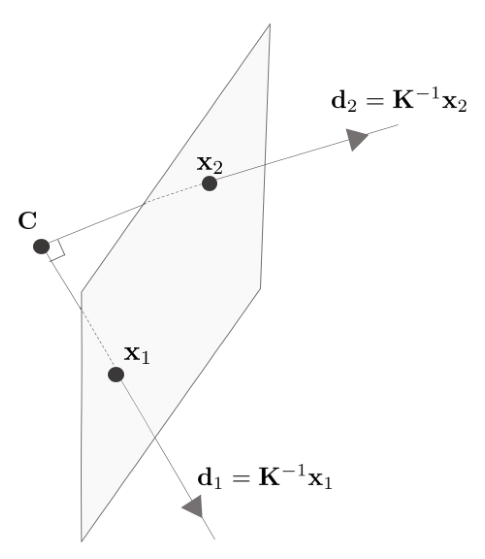

이에 따라 ==Image of Absolute Conic $\mathbf{w} = \mathbf{K}^{-\intercal}\mathbf{K}^{-1}$==이 된다.

이미지 상의 두 점 $\mathbf{x}_1, \mathbf{x}_2$를 Back-projection 했을 때, 두 직선이 이루는 각도는

$$\cos\theta = \frac{\mathbf{x}^\intercal_1\mathbf{w}\mathbf{x}_2}{\sqrt{\mathbf{x}^\intercal_1\mathbf{w}\mathbf{x}_1}\sqrt{\mathbf{x}^\intercal_2\mathbf{w}\mathbf{x}_2}} \tag{178}$$

가 되고 이를 Homography 변환하면

$$\cos\theta = \frac{(\mathbf{H}\mathbf{x}_1)^\intercal\mathbf{H}^{-\intercal}\mathbf{w}\mathbf{H}^{-1}(\mathbf{H}\mathbf{x}_2)}{\sqrt{*}\sqrt{*}} \tag{179}$$

이 되므로 Homography 변환을 해도 두 각도는 여전히 보존된다. 만약 두 직선 $\mathbf{K}^{-1}\mathbf{x}_1$과 $\mathbf{K}^{-1}\mathbf{x}_2$가
직교하는 경우 다음 공식이 성립한다.

$$\mathbf{x}^\intercal_1\mathbf{w}\mathbf{x}_2 = 0 \tag{180}$$

<!--widget:image-absolute-conic-->

## Orthogonality and w

이미지 평면 상의 두 점 $\mathbf{x}_1, \mathbf{x}_2$를 Back-projection하면 두 직선 $\mathbf{K}^{-1}\mathbf{x}_1, \mathbf{K}^{-1}\mathbf{x}_2$가 생성된다. 만약 두 직선이
직교하는 경우 $\mathbf{x}^\intercal_1\mathbf{w}\mathbf{x}_2 = 0$의 공식이 성립한다. 그리고 $\mathbf{x}_1$가 직선 $\mathbf{l}$에 포함되어 있으면 $\mathbf{x}^\intercal_1\mathbf{l} = 0$이 성립한다.

### Result 8.19

$$\begin{aligned}
\mathbf{x}^\intercal_1\mathbf{w}\mathbf{x}_2 &= 0 \\
\mathbf{x}^\intercal_1\mathbf{l} &= 0 \\
\therefore\ \mathbf{l} &= \mathbf{w}\mathbf{x}_2
\end{aligned} \tag{181}$$

## Vanishing points and vanishing lines

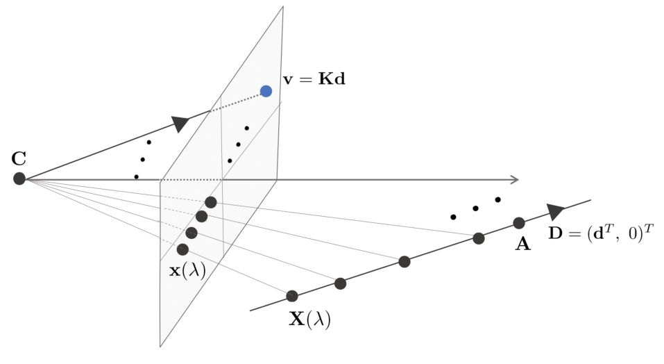

월드 상의 점 $\mathbf{A}$와 직선의 방향 $\mathbf{D} = (\mathbf{d}^\intercal, 0)^\intercal$가 존재할 때 직선 위에 존재하는 점 $\mathbf{X}(\lambda)$는 다음과 같이
정의된다.

$$\mathbf{X}(\lambda) = \mathbf{A} + \lambda\mathbf{D} = \begin{pmatrix} \tilde{\mathbf{A}} + \lambda\mathbf{d} \\ 1 \end{pmatrix} \tag{182}$$

점 $\mathbf{X}(\lambda)$를 이미지 평면에 프로젝션한 점 $\mathbf{x}(\lambda) = \mathbf{P}\mathbf{X}(\lambda)$, where $\mathbf{P} = \mathbf{K}[\mathbf{I}|\mathbf{0}]$는 다음과 같이 정의된다.

$$\mathbf{x}(\lambda) = \mathbf{P}\mathbf{X}(\lambda) = \mathbf{P}\mathbf{A} + \lambda\mathbf{P}\mathbf{D} = \mathbf{a} + \lambda\mathbf{K}\mathbf{d} \tag{183}$$

이 때, $\mathbf{a}$는 Image of $\mathbf{A}$를 의미한다.

### Result 8.20

결론적으로 소실점(vanishing point) $\mathbf{v}$는 다음과 같이 정의된다.

$$\begin{aligned}
\mathbf{v} &= \lim_{\lambda\to\infty}\mathbf{x}(\lambda) = \lim_{\lambda\to\infty}(\mathbf{a} + \lambda\mathbf{K}\mathbf{d}) = \mathbf{K}\mathbf{d} \\
\mathbf{v} &= \mathbf{K}\mathbf{d}
\end{aligned} \tag{184}$$

### Camera rotation from vanishing points

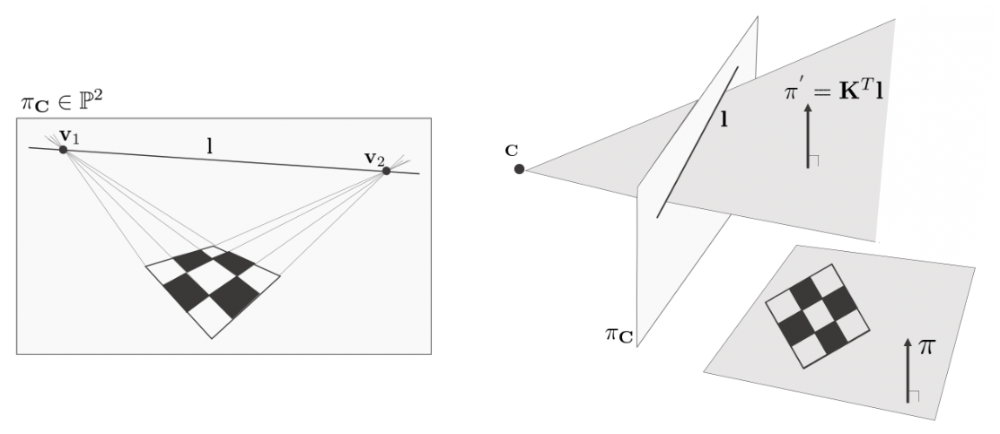

소실점을 사용하여 카메라의 회전을 계산할 수 있다. 이미지 1에서 추출한 소실점 $\mathbf{v}_1$과 이미지 2에서 추출한
소실점 $\mathbf{v}_2$이 있을 때, $\mathbf{v}_1$의 방향은 $\mathbf{d}_1 = \mathbf{K}^{-1}\mathbf{v}_1$이 되고 $\mathbf{v}_2$의 방향은 $\mathbf{d}_2 = \mathbf{K}^{-1}\mathbf{v}_2$가 된다.

$\mathbf{K}, \mathbf{v}_1, \mathbf{v}_2$의 값을 모두 알고 있다고 가정하면 $\mathbf{d}_1, \mathbf{d}_2$의 값을 계산할 수 있게 되고 두 방향벡터는 다음과
같은 관계를 가진다.

$$\mathbf{d}_2 = \mathbf{R}\mathbf{d}_1 \tag{185}$$

이 때, ==회전행렬 $\mathbf{R}$의 자유도는 3이므로 2개 이상의 소실점 쌍을 사용하면 회전행렬을 복원==할 수 있다.

## Vanishing Lines

두 개 이상의 소실점(vanishing point) $\mathbf{v}_i, i = 1, 2, \cdots$ 들을 이어준 직선을 소실선(vanishing line) $\mathbf{l}$이라고
한다. 예를 들어 이미지 상의 체크보드가 있고 이로 인해 2개의 소실점 $\mathbf{v}_1, \mathbf{v}_2$를 구한 경우를 생각해보자. 이
경우, ==두 소실점 $\mathbf{v}_1, \mathbf{v}_2$를 이어주는 직선 $\mathbf{l}$을 체크보드 평면 $\pi$의 소실선==이라고 한다.

$$\mathbf{l} = \text{image of } \pi \cap \pi_\infty \tag{186}$$

결론적으로 ==소실선 $\mathbf{l}$은 카메라 중심을 포함하고 체크보드 평면 $\pi$과 평행인 평면 $\pi'$와 이미지 평면의
교집합==을 의미한다. $\pi'$은 소실선 $\mathbf{l}$을 Back-projection함으로써 계산할 수 있다. 이 때 평면과 직선의 관계에
따라

$$\pi' = \mathbf{K}^\intercal\mathbf{l} \tag{187}$$

과 같이 계산할 수 있다.

## Orthogonality relationships amongst vanishing points and lines

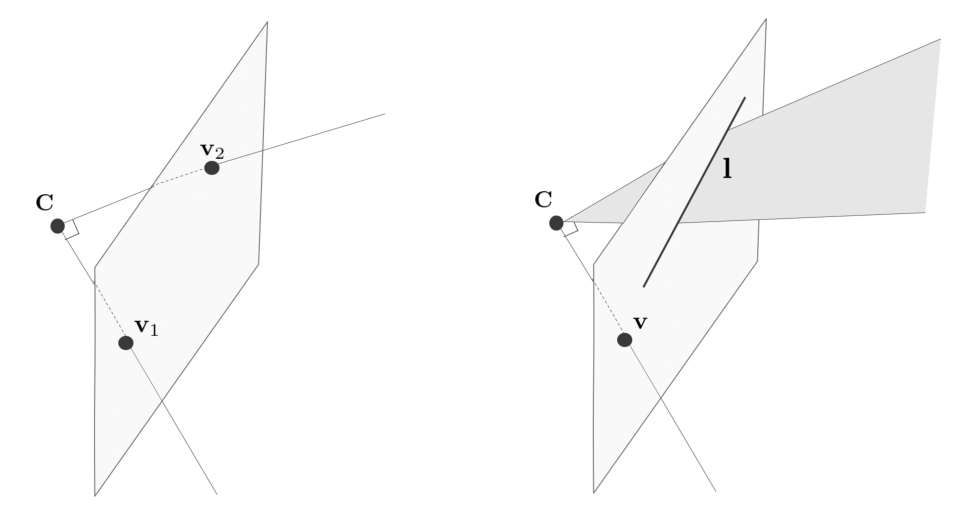

이미지 평면에서 두 개의 소실점 $\mathbf{v}_1, \mathbf{v}_2$을 Back-projection한 직선들이 서로 직교하는 조건은 다음과 같다.

$$\mathbf{v}^\intercal_1\mathbf{w}\mathbf{v}_2 = 0 \tag{188}$$

이 때, $\mathbf{w} = \mathbf{K}^{-\intercal}\mathbf{K}^{-1}$은 Image of Absolute Conic이다.

이미지 평면에서 소실점 $\mathbf{v}$을 Back-projection한 직선과 소실선 $\mathbf{l}$을 Back-projection한 평면이 직교하는
조건은 다음과 같다.

$$\mathbf{l} = \mathbf{w}\mathbf{v} \tag{189}$$

이미지 평면에서 두 개의 직선 $\mathbf{l}_1, \mathbf{l}_2$를 Back-projection한 두 평면들이 서로 직교하는 경우 다음을 만족
한다.

$$\mathbf{l}^\intercal_1\mathbf{w}^*\mathbf{l}_2 = 0 \tag{190}$$

이 때, $\mathbf{w}^*$는 Image of Dual Absolute Conic이다.

<!--widget:vanishing-points-->

## Affine 3D measurements and reconstruction

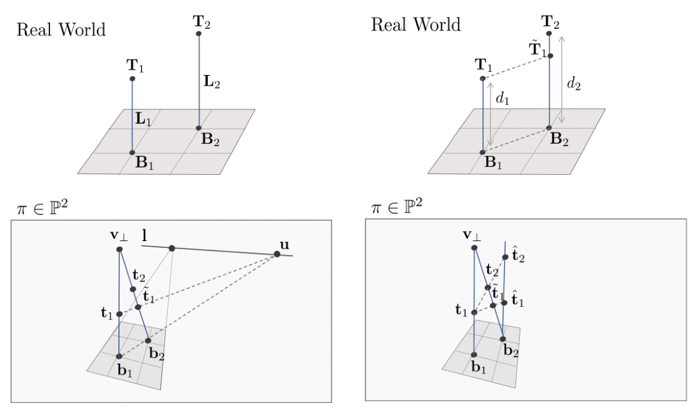

3차원 공간 상의 평면 $\pi$에 수직인 물체들의 소실점을 수직소실점(vertical vanishing point) $\mathbf{v}_\perp$라고 한다.

### Result 8.24

평면 $\pi$의 소실선 $\mathbf{l}$과 수직소실점을 이용하면 물체의 크기를 스케일을 제외한 파라미터(up to scale)까지
계산할 수 있다. 정확하게 말하면 ==소실선 $\mathbf{l}$과 수직소실점 $\mathbf{v}_\perp$를 알면 평면 $\pi$에 수직한 선분들의 상대적
길이를 알 수 있다.==

예를 들면, 3차원 공간 상의 평면 $\pi$에 위치한 두 점 $\mathbf{B}_1, \mathbf{B}_2$가 있고 이를 지나면서 $\pi$에 수직인 직선
$\mathbf{L}_1, \mathbf{L}_2$가 있다고 가정한다. 그리고 두 직선 $\mathbf{L}_1, \mathbf{L}_2$의 끝점 $\mathbf{T}_1, \mathbf{T}_2$가 있을 경우 ==소실선 $\mathbf{l}$과 수직소실점 $\mathbf{v}_\perp$를
사용하여 $\mathbf{T}_1, \mathbf{T}_2$의 상대적 길이를 측정==할 수 있다.

우선, 모든 요소들을 이미지 평면에 프로젝션시킨다. 이 때, $\mathbf{b}_1, \mathbf{b}_2$를 잇는 직선과 소실선 $\mathbf{l}$이 만나는 점을
$\mathbf{u}$라고 정의한다. 그리고 $\mathbf{t}_1$에서 $\overline{\mathbf{b}_1\mathbf{b}_2}$에 평행한 직선을 그으면 해당 직선은 $\mathbf{u}$와 접한다. 이 때 $\overline{\mathbf{t}_1\mathbf{u}}$와 $\overline{\mathbf{v}_\perp\mathbf{b}_2}$
가 만나는 교점을 $\tilde{\mathbf{t}}_1$이라고 한다.

다음으로 $\overline{\mathbf{v}_\perp\mathbf{b}_2}$ 직선을 $\mathbb{P}^1$ 공간의 수직소실점 $\mathbf{v}_\perp$는 무한대의 점 $(1, 0)$이 되고 $\mathbf{b}_1$은 원점 $(0, 1)$되는
직선으로 프로젝션시킨다. 이 때 사용하는 Homography $\mathbf{H}_{2\times2}$는 다음과 같다.

$$\mathbf{H}_{2\times2} = \begin{bmatrix} 1 & 0 \\ 1 & -v_\perp \end{bmatrix} \tag{191}$$

$\mathbf{H}_{2\times2}$는 Cross-Ratio를 보장한다. 다음으로 길이의 비를 이용하여 $d_1 : d_2 = \overline{\mathbf{b}_1\tilde{\mathbf{t}}_1} : \overline{\mathbf{b}_1\mathbf{t}_2}$의 비율을
구한다.

$$\frac{d_1}{d_2} = \frac{\tilde{t}_1(v_\perp - t_2)}{t_2(v_\perp - \tilde{t}_1)} \tag{192}$$

만약, 수직소실점 $\mathbf{v}_\perp$와 카메라의 주축(principal axis)이 수직인 경우 이미지 상에서 수직소실점은 만나지
않게 되고 아래와 같이 단순하게 비율을 계산할 수 있다.

$$\frac{d_1}{d_2} = \frac{\tilde{t}_1 - b_2}{t_2 - b_2} \tag{193}$$

## Determining camera calibration K from a single view

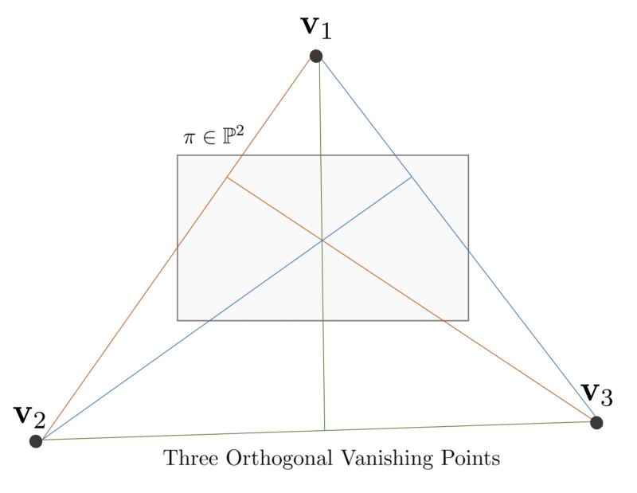

단안 이미지에서 내부 파라미터 $\mathbf{K}$를 결정하기 위해서는 2가지 제약조건이 필요하다. ==이미지 제약조건(scene
constraint)과 내부 파라미터의 제약조건(internal constraint)==이 있다.

이미지 제약조건으로는 이미지 평면에 존재하는 서로 수직인 두 소실점 $\mathbf{v}_1, \mathbf{v}_2$가 있을 경우 $\mathbf{v}^\intercal_1\mathbf{w}\mathbf{v}_2 = 0$
가 있고, 소실선 $\mathbf{l}$과 소실점 $\mathbf{v}$가 직교하는 경우 이들의 Back-projection은 $\mathbf{l} = \mathbf{w}\mathbf{x}$가 있다.

$$\begin{aligned}
\mathbf{v}^\intercal_1\mathbf{w}\mathbf{v}_2 &= 0 \\
\mathbf{l} \times (\mathbf{w}\mathbf{v}) &= 0
\end{aligned} \tag{194}$$

### Result 8.26

내부 파라미터 제약조건으로는 $\mathbf{K}$가 Zero-Skew인 경우 $w_{12} = w_{21} = 0$이 있고 또한, Square Pixels인 경우
$w_{12} = w_{21} = 0, w_{11} = w_{22}$가 있다.

$$\begin{aligned}
w_{12} &= w_{21} && \text{for zero skew} \\
w_{12} &= w_{21} = 0,\ w_{11} = w_{22} && \text{for square pixel}
\end{aligned} \tag{195}$$

위와 같이 $\mathbf{w} = \begin{bmatrix} w_1 & w_2 & w_4 \\ w_2 & w_3 & w_5 \\ w_4 & w_5 & w_6 \end{bmatrix}$ 파라미터를 찾기 위해 충분한 제약조건을 확보한 후 $\mathbf{w}$를 6차원 벡터로
정렬하여 $\mathbf{A}\mathbf{x} = 0$ 형태의 선형 시스템을 만든다. 다음으로 ==특이값 분해(SVD)를 사용하여 $\mathbf{w} = \mathbf{K}^{-\intercal}\mathbf{K}^{-1}$
값을 계산한 후 Cholesky Decomposition을 사용하여 $\mathbf{K}^{-\intercal}\mathbf{K}^{-1}$를 분해==한다. 이를 통해 내부 파라미터
$\mathbf{K}$를 계산할 수 있다.

## Calibration from three orthogonal vanishing points

내부 파라미터 $\mathbf{K}$가 Zero-Skew이고 Square Pixel일 때 세 개의 서로 직교하는 수직소실점들 $\mathbf{v}_i, i = 1, 2, 3$
을 사용하여 $\mathbf{K}$를 계산할 수 있다. 우선 $\mathbf{K}$가 Zero-Skew이고 Square Pixel이므로 다음이 성립한다.

$$\mathbf{w} = \begin{bmatrix} w_1 & 0 & w_2 \\ 0 & w_1 & w_3 \\ w_2 & w_3 & w_4 \end{bmatrix} \tag{196}$$

이와 같이 총 4개의 자유도를 가지므로 세 개의 수직소실점들을 사용하여 $\mathbf{K}$를 결정할 수 있다. 우선,
각각의 수직소실점들의 직교 특성을 사용하여 $\mathbf{v}^\intercal_i\mathbf{w}\mathbf{v}_j, \forall i \neq j$를 계산한다. 이 때 $\mathbf{w}$를 벡터화하여 $\mathbf{A}\mathbf{x} = 0$
형태의 선형 시스템으로 변환한 후 $\mathrm{Nul}(\mathbf{A})$를 계산함으로써 $\mathbf{w}$를 구한다. 다음으로 Cholesky Decomposition
을 사용하여 $\mathbf{w} = \mathbf{K}^{-\intercal}\mathbf{K}^{-1}$를 분해한다. 이와 같이 내부 파라미터 $\mathbf{K}$를 계산할 수 있다.

## Computation of focal length and principal point using vanishing point and vanishing line

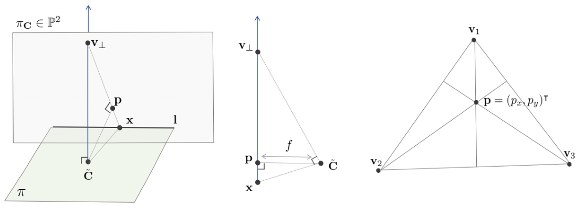

3차원 공간 상의 평면 $\pi$로부터 구할 수 있는 소실선 $\mathbf{l}$이 있고 $\pi$와 수직인 수직소실점 $\mathbf{v}_\perp$가 있다고 하면 이를
활용하여 초점거리 $f$와 주점(principal point)를 구할 수 있다.

초점거리 $f$를 구하는 방법은 다음과 같다. 수직소실점을 $\mathbf{v}_\perp$이라고 하고 이미지 평면 $\pi_C$과 평면 $\pi$의
교차선을 $\mathbf{l}$이라고 하면 $\overline{\mathbf{v}_\perp\tilde{\mathbf{C}}}$와 $\overline{\mathbf{x}\tilde{\mathbf{C}}}$는 서로 직교한다. 그리고 카메라 중심에서 이미지 평면으로 수선을 내린
점 $\mathbf{P}$가 있으면 $\overline{\tilde{\mathbf{C}}\mathbf{p}}$의 길이가 곧 초점거리 $f$가 된다. ==$\overline{\mathbf{v}_\perp\mathbf{x}}$를 지름으로 하는 원을 그린 후 점 $\mathbf{p}$에 수평으로
그린 선과 원의 교점을 각각 $\mathbf{a}, \mathbf{b}$라고 하면 두 점 중 하나가 곧 카메라의 중심 $\tilde{\mathbf{C}}$가 되고 이는 곧 $\overline{\mathbf{a}\mathbf{p}} = \overline{\mathbf{b}\mathbf{p}}$
가 초점거리 $f$==가 된다.

주점(principal point) $\mathbf{P}$를 구하는 방법은 다음과 같다. 수직소실점을 $\mathbf{v}_1$라고 하고 이미지 평면과 $\pi$ 평
면의 교차선을 $\mathbf{l}_1$라고 하면 $\mathbf{v}_1$에서 $\mathbf{l}_1$에 수선을 내리면 해당 수선에 주점(principal point) $\mathbf{p}$가 위치한다.
이러한 특징으로 인해 ==서로 다른 세 개의 수직소실점이 존재하는 경우 이들의 수심(orthocenter of the
triangle)이 곧 주점 $\mathbf{p}$가 된다.==

## The calibrating conic

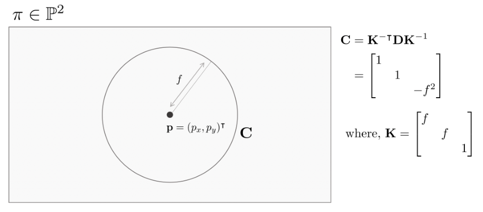

IAC(image of absolute conic)은 이미지 평면의 점을 Back-projection한 직선들 간의 각도를 구할 수 있고
Metric Rectification도 수행할 수 있는 유용한 도구이지만 Circular Point의 특성 상 실수의 근을 갖지 않아서
시각화가 불가능하다는 단점이 있다. 이를 보완하기 위해 고안된 것이 Calibration Conic이다. Calibration
Conic은 $X^2+Y^2 = Z^2$의 Cone을 프로젝션시킨 Image Conic을 의미하고 시각화가 가능한 장점이 존재한다.

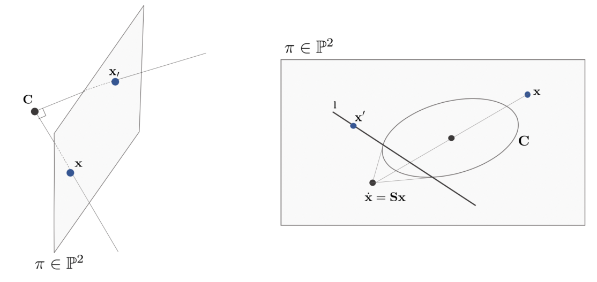

카메라 프로젝션 $\mathbf{P} = \mathbf{K}[\mathbf{I}|\mathbf{0}]$이 있을 때 Calibration Conic 위의 점들은 다음과 같이 프로젝션된다.

$$\mathbf{C} = \mathbf{K}^{-\intercal}\begin{bmatrix} 1 & & \\ & 1 & \\ & & -1 \end{bmatrix}\mathbf{K}^{-1} \tag{197}$$

이 때, $\mathbf{D} = \begin{bmatrix} 1 & & \\ & 1 & \\ & & -1 \end{bmatrix}$라고 하면 $\mathbf{C} = \mathbf{K}^{-\intercal}\mathbf{D}\mathbf{K}^{-1}$와 같이 나타낼 수 있다. 만약 $\mathbf{K} = \begin{bmatrix} f & & \\ & f & \\ & & 1 \end{bmatrix}$인
경우 Calibration Conic은

$$\mathbf{C} = \begin{bmatrix} 1 & & \\ & 1 & \\ & & -f^2 \end{bmatrix} \tag{198}$$

으로 나타낼 수 있고 이 때, ==Calibration Conic은 원점이 주점(principal point)이면서 반지름이
초점거리 $f$인 이미지 상의 원==을 의미한다.

$\mathbf{C}$를 분해하면 다음과 같이 다시 정의할 수 있다.

$$\begin{aligned}
\mathbf{C} &= \mathbf{K}^{-\intercal}\mathbf{D}\mathbf{K}^{-1} = \mathbf{K}^{-\intercal}\mathbf{K}^{-1}\mathbf{K}\mathbf{D}\mathbf{K}^{-1} \\
\mathbf{C} &= \mathbf{w}\mathbf{S} \quad \text{where, } \mathbf{S} = \mathbf{K}\mathbf{D}\mathbf{K}^{-1}
\end{aligned} \tag{199}$$

이 때 이미지 상의 임의의 점 $\mathbf{x} = \mathbf{K}\tilde{\mathbf{X}}$에 대하여 $\mathbf{S}\mathbf{x}$는 Calibration Conic에 의해 반사된 점(reflected
point)을 의미한다.

$$\begin{aligned}
\mathbf{S}\mathbf{x} &= \mathbf{K}\mathbf{D}\mathbf{K}^{-1}\mathbf{K}\tilde{\mathbf{X}} \\
&= \mathbf{K}\mathbf{D}\begin{pmatrix} X \\ Y \\ Z \end{pmatrix} = \mathbf{K}\begin{pmatrix} X \\ Y \\ -Z \end{pmatrix}
\end{aligned} \tag{200}$$

이미지 평면 상의 두 점 $\mathbf{x}, \mathbf{x}'$에 대하여 두 점의 Back-projection된 직선들이 서로 직교하는 경우 $\mathbf{x}'^\intercal\mathbf{w}\mathbf{x} = 0$이 성립한다. 이 식을 다시 작성하면

$$\mathbf{x}'^\intercal\mathbf{w}\mathbf{x} = \mathbf{x}'^\intercal\mathbf{C}\mathbf{S}^{-1}\mathbf{x} = \mathbf{x}'^\intercal\mathbf{C}\mathbf{S}\mathbf{x} = \mathbf{x}'^\intercal\mathbf{C}\dot{\mathbf{x}} \quad \because \mathbf{S}^{-1} = \mathbf{S} \tag{201}$$

이 때, $\dot{\mathbf{x}} = \mathbf{S}\mathbf{x}$는 점 $\mathbf{x}$가 Calibration Conic에 의해 반사된 점을 의미한다.

### Result 8.30

결론적으로, ==직선 $\mathbf{C}\dot{\mathbf{x}}$는 반사된 점 $\dot{\mathbf{x}}$와 Calibration Conic의 접선들을 이어주는 직선이 되고 점 $\mathbf{x}'$는
직선 $\mathbf{C}\dot{\mathbf{x}}$ 위에 존재==한다.

# 6 Epipolar Geometry and the Fundamental Matrix

## Epipolar geometry

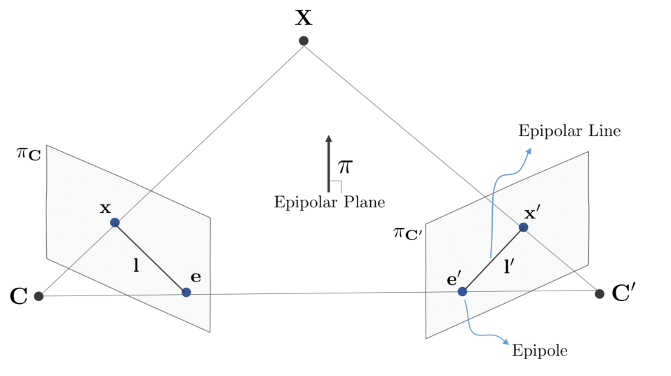

Epipolar geometry는 ==2개의 카메라 이미지 사이에 정의되는 기하학 관계== 를 의미한다. 이는 3차원 물체의
구조와는 독립적이며 ==오로지 카메라의 내부 파라미터와 두 카메라 사이의 상대 포즈에만 의존한다.== 위 그림
과 같이 3차원 공간 상에 두 카메라의 중심점 $\mathbf{C}, \mathbf{C}'$과 점 $\mathbf{X}$가 주어졌을 때 세 점을 통해 유일하게 결정되는
평면을 ==Epipolar Plane== $\pi$라고 한다. 또한 카메라의 중심점 $\mathbf{C}$를 $\mathbf{P}'$을 통해 프로젝션한 점 $\mathbf{P}'\mathbf{C} = \mathbf{e}'$을
이미지 평면 $\pi_{C'}$의 ==Epipole== $\mathbf{e}'$이라고 한다. 그리고 $\mathbf{e}'$과 $\mathbf{x}'$을 잇는 직선을 ==Epipolar Line== $\mathbf{l}'$이라고 한다.
$\mathbf{e}, \mathbf{l}$ 또한 마찬가지로 이미지 평면 $\pi_C$의 Epipole과 Epipolar Line을 의미한다.

## The fundamental matrix F

Fundamental Matrix는 ==2개의 주어진 카메라의 중심점 $\mathbf{C}, \mathbf{C}'$이 주어질 때 $\mathbf{F} \in \mathbb{R}^{3\times3}$이며 rank 2를 가지는
행렬==을 의미한다. $\mathbf{F}$는 두 카메라의 이미지 평면에 있는 점들의 대응쌍 $\mathbf{x}, \mathbf{x}'$에 대하여

$$\mathbf{x}'^\intercal\mathbf{F}\mathbf{x} = 0 \tag{202}$$

을 만족한다. 이 때 곱해지는 순서에 따라 의미가 달라지며 $\mathbf{x}'^\intercal\mathbf{F}\mathbf{x} = 0$인 경우 두 카메라 $\mathbf{C}, \mathbf{C}'$ 사이의
Fundamental Matrix라고 하고 $\mathbf{x}^\intercal\mathbf{F}'\mathbf{x}' = 0$인 경우 두 카메라 $\mathbf{C}', \mathbf{C}$ 사이의 Fundamental Matrix라고 한다.
이 때, $\mathbf{F}^\intercal = \mathbf{F}'$ 관계가 성립한다.

기하학적 측면에서 보면, $\mathbf{x}'^\intercal\mathbf{F}\mathbf{x} = 0$에서 ==$\mathbf{F}\mathbf{x}$는 카메라 $\mathbf{C}$의 이미지 평면 $\pi_C$ 위의 점 $\mathbf{x}$가 존재할 때
이와 상응하는 Epipolar Line $\mathbf{l}' \in \pi_{C'}$을 의미==한다. 따라서 ==$\mathbf{F}$는 이미지 평면 $\pi_C$ 위의 점 $\mathbf{x}$를 Epipolar
Line $\mathbf{l}'$으로 매핑하는 함수로 생각==할 수 있다.

$$\mathbf{F} : \mathbf{x} \mapsto \mathbf{l}' \quad \text{where, } \begin{aligned} \mathbf{x} &\in \pi_C \in \mathbb{P}^2 \\ \mathbf{l}' &\in (\mathbb{P}^2)^\vee \end{aligned} \tag{203}$$

### Proof

($\Rightarrow$) $\mathbf{l}' = \mathbf{F}\mathbf{x}$인 경우 Epipolar Line $\mathbf{l}'$에 위치한 점 $\mathbf{x}'$에 대하여 다음이 성립한다.

$$\mathbf{x}'^\intercal\mathbf{l}' = \mathbf{x}'^\intercal\mathbf{F}\mathbf{x} = 0 \quad \forall\mathbf{x} \leftrightarrow \mathbf{x}' \tag{204}$$

($\Leftarrow$) 이미지 평면 $\pi_C$ 위의 점 $\mathbf{x}$를 Back-projection하여 $\mathbf{X}_1, \mathbf{X}_2$ 점이 생성되었다고 했을 때, 이를 $\pi_{C'}$에
프로젝션시키면 각각 $\mathbf{x}'_1 = \mathbf{P}'\mathbf{X}_1, \mathbf{x}'_2 = \mathbf{P}'\mathbf{X}_2$ 점들이 생성된다. 이 때 Fundamental Matrix $\mathbf{F}$에 의해

$$\begin{aligned}
\mathbf{x}'^\intercal_1\mathbf{F}\mathbf{x} &= 0 \\
\mathbf{x}'^\intercal_2\mathbf{F}\mathbf{x} &= 0
\end{aligned} \tag{205}$$

의 관계가 성립하므로 $\mathbf{F}\mathbf{x}$는 $\mathbf{x}'^\intercal_i, i = 1, 2$와 수직인 Epipolar Line $\mathbf{l}'$을 의미한다.

### Geometric derivation

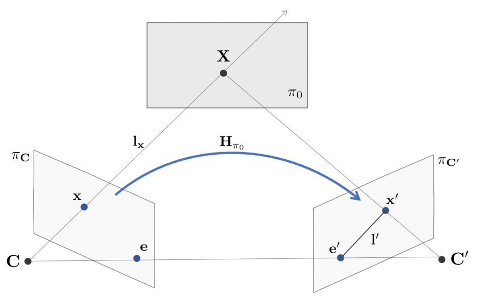

두 카메라 $\mathbf{C}, \mathbf{C}'$가 있을 때 이미지 평면 $\pi_C$ 위의 점 $\mathbf{x}$를 Back-projection한 직선 $\mathbf{l}_x$가 3차원 공간 상에서
임의의 평면 $\pi_0$와 한 점에서 만난다고 가정한다. 이 때 $\mathbf{C}, \mathbf{C}'$의 이미지 점들을 연결해주는 Homography $\mathbf{H}_{\pi_0}$
를 생각해보면

$$\begin{aligned}
\mathbf{H}_{\pi_0} &: \pi_C \mapsto \pi_{C'} \\
\mathbf{x} &\mapsto \mathbf{x}' \\
\mathbf{x} &\mapsto \mathbf{P}'(\mathbf{l}_x \cap \pi_0)
\end{aligned} \tag{206}$$

$\pi_{C'}$ 위에 프로젝션된 점을 $\mathbf{x}' = \mathbf{P}'(\mathbf{l}_x \cap \pi_0)$라고 하고 Epipolar Line $\mathbf{l}'$을 $\mathbf{x}'$와 Epipole $\mathbf{e}'$를 이어주는
직선이라고 정의하면

$$\begin{aligned}
\mathbf{e}' \times \mathbf{x}' &= \mathbf{e}'^\wedge\mathbf{x}' \\
&= \mathbf{e}'^\wedge\mathbf{H}_{\pi_0}(\mathbf{x}) \quad \text{is Epipolar Line.}
\end{aligned} \tag{207}$$

와 같이 나타낼 수 있다. 이 때 $\mathbf{l}' = \mathbf{F}\mathbf{x}$의 공식을 사용하면

$$\begin{aligned}
\mathbf{l}' &= \mathbf{F}\mathbf{x} \\
&= \mathbf{e}'^\wedge\mathbf{H}_{\pi_0}\mathbf{x}
\end{aligned} \tag{208}$$

과 같다. 따라서 ==$\mathbf{F} = \mathbf{e}'^\wedge\mathbf{H}_{\pi_0}$==가 성립한다. 이 때, $\mathbf{H}_{\pi_0}$는 rank 3인 행렬이며 $\mathbf{e}'^\wedge$는 rank 2인 행렬이므로
$\mathbf{F}$는 rank 2인 행렬이 된다.

### Algebraic derivation

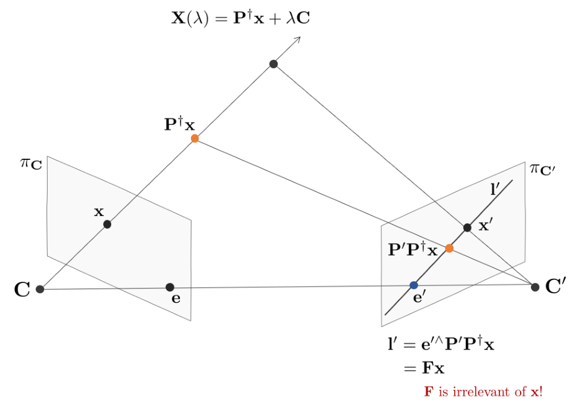

Epipolar Line $\mathbf{l}' = \mathbf{P}'(\mathbf{X}(\lambda))$와 같다. 이 때 $\mathbf{X}(\lambda)$는 카메라 $\mathbf{C}$의 중심점을 지나는 $\mathbf{x}$의 Back-projection
직선을 의미한다. $\mathbf{X}(\lambda)$는 다음과 같이 다시 작성할 수 있다.

$$\mathbf{X}(\lambda) = \mathbf{P}^\dagger\mathbf{x} + \lambda\mathbf{C} \quad \lambda \in \mathbb{R} \tag{209}$$

여기서 $\mathbf{P}^\dagger$는 $\mathbf{P}$의 Pseudo Inverse를 의미하고

$$\mathbf{P}^\dagger = \mathbf{P}^\intercal(\mathbf{P}\mathbf{P}^\intercal)^{-1} \tag{210}$$

이 때, $\mathbf{l}' = \mathbf{P}'(\mathbf{X}(\lambda))$는 다음과 같다.

$$\begin{aligned}
\mathbf{P}'(\mathbf{X}(\lambda)) &= \mathbf{P}'\mathbf{P}^\dagger\mathbf{x} + \lambda\mathbf{P}'\mathbf{C} \\
&\ \mathbf{P}'\mathbf{P}^\dagger\mathbf{x} + \lambda\mathbf{e}'
\end{aligned} \tag{211}$$

$\mathbf{P}'\mathbf{C}$는 카메라 $\mathbf{C}$의 중심점을 $\pi_{C'}$에 프로젝션시킨 점을 의미하므로 Epipole $\mathbf{e}'$가 된다. $\lambda = 0$일 때
$\mathbf{P}'(\mathbf{X}(0)) = \mathbf{P}'\mathbf{P}^\dagger\mathbf{x}$이고 $\lambda = \infty$일 때 $\mathbf{P}'(\mathbf{X}(\infty)) = \mathbf{P}'\mathbf{C} = \mathbf{e}'$가 된다. 따라서 Epipolar Line $\mathbf{l}'$는 두 점을
잇는 직선이므로

$$\begin{aligned}
\mathbf{l}' &= \mathbf{e}'^\wedge\mathbf{P}'\mathbf{P}^\dagger\mathbf{x} \\
&= \mathbf{F}\mathbf{x} \\
\therefore\ \mathbf{F} &= \mathbf{e}'^\wedge\mathbf{P}'\mathbf{P}^\dagger
\end{aligned} \tag{212}$$

이 된다. 추가적으로 Epipole $\mathbf{e}'$는 Epipolar Line $\mathbf{l}'$에 포함되어 있고 모든 $\mathbf{x}_i$에 대해

$$\mathbf{e}'^\intercal\mathbf{F}\mathbf{x}_i = (\mathbf{e}'^\intercal\mathbf{F})\mathbf{x}_i = 0 \quad \forall\mathbf{x}_i \tag{213}$$

이 성립하므로 $\mathbf{e}'^\intercal\mathbf{F} = 0$이 성립한다. ==결론적으로 $\mathbf{e}'$는 $\mathbf{F}$의 Left null vector==이다. 또한 $\mathbf{e}$는 $\mathbf{F}$의 (right)
null vector가 된다.

### Properties of the fundamental matrix

Fundamental Matrix $\mathbf{F}$의 성질은 다음과 같다.

- ==Transpose:== $\mathbf{F}$가 두 카메라 $(\mathbf{P}, \mathbf{P}')$에 대한 Fundamental Matrix라고 했을 때 $\mathbf{F}^\intercal$은 $(\mathbf{P}', \mathbf{P})$에 대한
  Fundamental Matrix가 된다.
- ==Epipolar Lines:== 첫번째 이미지의 대응점 $\mathbf{x}$에 대해 이와 상응하는 두번째 이미지의 Epipolar Line
  은 $\mathbf{l}' = \mathbf{F}\mathbf{x}$와 같이 나타낼 수 있다. 이와 유사하게 두번째 이미지의 대응점 $\mathbf{x}'$에 대해 이와 상응하는
  첫번째 이미지의 Epipolar Line은 $\mathbf{l} = \mathbf{F}^\intercal\mathbf{x}'$와 같이 나타낼 수 있다.
- ==The Epipole:== $\mathbf{e}$가 아닌 모든 점 $\mathbf{x}$에 대한 Epipolar Line $\mathbf{l}' = \mathbf{F}\mathbf{x}$는 항상 $\mathbf{e}'$를 지나간다. 따라서 $\mathbf{e}'$
  는 모든 $\mathbf{x}$에 대해 $\mathbf{e}'^\intercal(\mathbf{F}\mathbf{x}) = (\mathbf{e}'^\intercal\mathbf{F})\mathbf{x} = 0$가 성립한다. 이는 즉, $\mathbf{e}'^\intercal\mathbf{F} = 0$의 성질을 만족하므로 $\mathbf{e}'$는
  $\mathbf{F}$의 Left null-vector가 된다. 이와 유사하게 $\mathbf{F}\mathbf{e} = 0$에 따라 $\mathbf{e}$는 $\mathbf{F}$의 Right null-vector가 된다.
- ==Fundamental Matrix는 rank 2인 Homogeneous 행렬이며 7자유도(DOF)를 갖는다. 그리고
  rank 2 행렬이므로 역행렬이 존재하지 않는다.== 3x3 행렬의 마지막 원소는 Homogeneous 좌표계의
  스케일 모호성(Scale Ambiguity)에 의해 1자유도를 하나 잃고 $\det\mathbf{F} = 0$ 제약조건에 의해 추가적으로
  1자유도를 잃어서 7자유도를 가진다.

<!--widget:fundamental-matrix-->

## The epipolar line homography

두 카메라 $\mathbf{C}, \mathbf{C}'$이 존재하고 이미지 평면 위의 한 점을 각각 $\mathbf{x}, \mathbf{x}'$라고 하면 이에 상응하는 Epipolar Line
$\mathbf{l}, \mathbf{l}'$이 존재한다. 이 때, ==$\mathbf{l}$과 $\mathbf{l}'$ 사이에는 별도의 대응 관계가 성립==하는데 이는

$$\mathbb{P}(\pi)^\vee \mapsto \mathbb{P}(\pi')^\vee \tag{214}$$

==매핑 관계인 Homography 행렬==로 주어진다.

### Result 9.5

카메라 중심점 $\mathbf{C}$를 통과하면서 Epipole $\mathbf{e}$를 지나지 않는 직선 $\mathbf{k}$가 있을 때 $\mathbf{k}$는 Epipolar Line $\mathbf{l}$과 반드시
한 점 $\mathbf{p}$에서 만난다. $\mathbf{p}$는

$$\mathbf{p} = \mathbf{k}^\wedge\mathbf{l} \tag{215}$$

과 같이 구할 수 있고 $\mathbf{p}$는 Fundamental Matrix에 의해 Epipolar Line $\mathbf{l}'$으로 프로젝션되므로

$$\begin{aligned}
\mathbf{l}' &= \mathbf{F}\mathbf{k}^\wedge\mathbf{l} \\
&= \mathbf{H}\mathbf{l}
\end{aligned} \tag{216}$$

의 관계가 성립한다. 따라서 ==$\mathbf{l}, \mathbf{l}'$은 $\mathbf{H} = \mathbf{F}\mathbf{k}^\wedge$인 Homography 행렬에 의해 대응 관계가 성립==한다.

## Fundamental matrices arising from special motions

### Pure translation

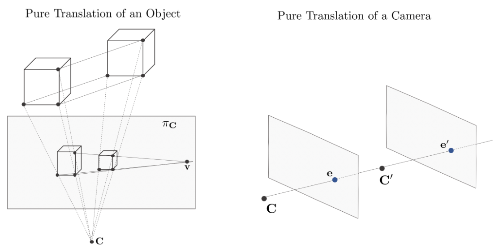

순수 이동(pure translation)이란 카메라 센터를 회전하지 않고 이동만 하는 것을 의미한다. 이 때, 월드의
모든 물체를 고정시킨 채로 카메라를 움직이는 것과 카메라를 고정시킨 채로 월드의 모든 물체를 이동시키는
것은 동일하다. 처음 위치의 카메라 행렬과 카메라 센터를 각각 $\mathbf{P}, \mathbf{C}$라고 하고 순수 이동 후 카메라 행렬과
카메라 센터를 각각 $\mathbf{P}', \mathbf{C}'$라고 할 때 ==두 카메라의 베이스라인의 길이는 카메라 중심점의 순수 이동량과
동일==하다.

또한 ==두 카메라의 Epipole을 각각 $\mathbf{e}, \mathbf{e}'$이라고 하면 두 Epipole의 위치는 동일하며 이는 곧 소실점
(vanishing point)을 의미==한다.

$$\mathbf{e} = \mathbf{e}' = \mathbf{v} \tag{217}$$

이러한 순수 이동 상황에서 $\mathbf{e} = \mathbf{e}'$를 Auto Epipolar라고 한다.

대수적으로 Fundamental Matrix를 유도해보면 처음 카메라 행렬을 $\mathbf{P} = \mathbf{K}[\mathbf{I}|\mathbf{0}]$이라고 하고 순수 이동
후 카메라 행렬을 $\mathbf{P}' = \mathbf{K}[\mathbf{I}|\mathbf{t}]$라고 하면 이전 섹션에서 Fundamental Matrix $\mathbf{F}$는 $\mathbf{F} = \mathbf{e}'^\wedge\mathbf{P}'\mathbf{P}^\dagger$ 이므로

$$\begin{aligned}
\mathbf{F} &= \mathbf{e}'^\wedge\mathbf{P}'\mathbf{P}^\dagger \\
&= \mathbf{e}'^\wedge\mathbf{K}\mathbf{K}^{-1} \\
&= \mathbf{e}'^\wedge
\end{aligned} \tag{218}$$

따라서 ==순수 이동 상황에서 Fundamental Matrix는 $\mathbf{F} = \mathbf{e}'^\wedge$==이다.

## Retrieving the camera matrices

### Projective invariance and canonical cameras

### Result 9.8

두 카메라 $\mathbf{C}, \mathbf{C}'$에 대응하는 이미지 평면 상의 점들 $\mathbf{x}, \mathbf{x}'$과 Fundamental Matrix $\mathbf{F}$가 존재할 때 $\mathbf{F}$는 $\mathbf{x} \leftrightarrow \mathbf{x}'$
대응쌍의 Homography 변환에 상관없이 동일하다. 다시 말하면, $\mathbb{P}^3 \mapsto \mathbb{P}^3$을 만족하는 Homography 변환
$\mathbf{H} \in \mathbb{R}^{4\times4}$가 존재할 때 $\mathbf{H}$는

$$(\mathbf{P}, \mathbf{P}') \mapsto (\mathbf{P}\mathbf{H}, \mathbf{P}'\mathbf{H}) \tag{219}$$

를 만족하는데 ==이러한 $\mathbf{H}$에 관계없이 Fundamental Matrix $\mathbf{F}$는 동일==하다.

### Proof

$(\mathbf{P}\mathbf{H}, \mathbf{P}'\mathbf{H})$에 해당하는 대응점쌍 $\mathbf{x} \leftrightarrow \mathbf{x}'$에 대해서

$$\mathbf{x}'^\intercal\tilde{\mathbf{F}}\mathbf{x} = 0 \tag{220}$$

이 성립한다. 이 때 $\mathbf{x} = \mathbf{P}\mathbf{H}\mathbf{X}, \mathbf{x}' = \mathbf{P}'\mathbf{H}\mathbf{X}$이므로 이를 위 식에 대입하면

$$\mathbf{X}^\intercal\mathbf{H}^\intercal\mathbf{P}'^\intercal\tilde{\mathbf{F}}\mathbf{P}\mathbf{H}\mathbf{X} = 0 \tag{221}$$

을 만족하고 위 식은 모든 $\forall\mathbf{X} \in \mathbb{P}^3$에 대해서 성립한다. $\mathbf{X} = \mathbf{H}^{-1}(\mathbf{H}\mathbf{X}), \tilde{\mathbf{X}} = \mathbf{H}\mathbf{X}$로 치환하여 다시 위
식에 대입하면

$$\begin{aligned}
\tilde{\mathbf{X}}^\intercal\mathbf{H}^{-\intercal}\mathbf{H}^\intercal\mathbf{P}'^\intercal\tilde{\mathbf{F}}\mathbf{P}\mathbf{H}\mathbf{H}^{-1}\tilde{\mathbf{X}} &= 0 \\
\tilde{\mathbf{X}}^\intercal\mathbf{P}'^\intercal\tilde{\mathbf{F}}\mathbf{P}\tilde{\mathbf{X}} &= 0 \\
\tilde{\mathbf{x}}'^\intercal\tilde{\mathbf{F}}\tilde{\mathbf{x}} &= 0
\end{aligned} \tag{222}$$

이 되어 ==결론적으로 $\mathbf{F} = \tilde{\mathbf{F}}$가 성립==한다.

### Canonical form of camera matrices

위와 같은 성질에 따라 동일한 Fundamental Matrix $\mathbf{F}$에 여러 $(\mathbf{P}, \mathbf{P}')$ 쌍이 대응되므로 $\mathbf{F}$와 $(\mathbf{P}, \mathbf{P}')$는 One-to-Many Correspondence 관계가 된다. 따라서 이러한 모호성에도 불구하고 ==$\mathbf{F}$의 정확한 변환을 표현하기
위해 $\mathbf{P} = [\mathbf{I}|\mathbf{0}], \mathbf{P}' = [\mathbf{M}|\mathbf{m}]$과 같이 처음 카메라 행렬 $\mathbf{P}$를 단순하게 나타내는 방법을 Canonical Form==
이라고 한다. 하지만 $\mathbf{P} = [\mathbf{I}|\mathbf{0}]$이라고 해서 $\mathbf{P}'$이 유일하게 결정되는 것은 아니다.

임의의 카메라 행렬 $\mathbf{P} \in \mathbb{R}^{3\times4}$가 주어졌을 때 이를 역행렬이 존재하는 행렬 $\mathbf{P}^* = \begin{bmatrix} \mathbf{P} \\ \mathbf{r}_4 \end{bmatrix} \in \mathbb{R}^{4\times4}$로 변경한
다음

$$\mathbf{P}^*\mathbf{H} = \begin{bmatrix} \mathbf{I} & \mathbf{0} \\ \mathbf{0} & 1 \end{bmatrix} \tag{223}$$

을 만족하는 $\mathbf{H}$가 존재한다고 하면 $\mathbf{P}\mathbf{H} = [\mathbf{I}|\mathbf{0}]$을 만족한다. 따라서 ==$\mathbf{H}$가 존재한다는 가정 하에 모든
임의의 카메라 행렬 $\mathbf{P}$는 Canonical Form으로 쓸 수 있다.==

그렇다면 Fundamental Matrix $\mathbf{F}$는 $\mathbf{M}, \mathbf{m}$에 대하여 어떻게 쓸 수 있을까?

우선 임의의 두 카메라 행렬 $\mathbf{P} = \mathbf{K}[\mathbf{I}|\mathbf{0}], \mathbf{P}' = \mathbf{K}'[\mathbf{R}|\mathbf{t}]$가 존재할 때 다음의 공식들이 성립한다.

$$\begin{aligned}
\mathbf{P}\mathbf{P}^\intercal &= \mathbf{K}^2 \\
\mathbf{P}^\dagger &= \mathbf{P}^\intercal(\mathbf{P}\mathbf{P}^\intercal)^{-1} = \begin{bmatrix} \mathbf{K}^{-1} \\ \mathbf{0} \end{bmatrix} \\
\mathbf{C} &= \begin{pmatrix} \mathbf{0} & 1 \end{pmatrix}^\intercal \\
\mathbf{e}' &= \mathbf{P}'\mathbf{C} = \mathbf{K}'\mathbf{t}
\end{aligned} \tag{224}$$

따라서 이에 대응하는 Fundamental Matrix $\mathbf{F}$는 다음과 같다.

$$\begin{aligned}
\mathbf{F} &= \mathbf{e}'^\wedge\mathbf{P}'\mathbf{P}^\dagger \\
&= (\mathbf{K}'\mathbf{t})^\wedge\mathbf{K}'[\mathbf{R}|\mathbf{t}]\mathbf{K}^{-1}\begin{bmatrix} \mathbf{I} \\ \mathbf{0} \end{bmatrix} \\
&= (\mathbf{K}'\mathbf{t})^\wedge\mathbf{K}'\mathbf{R}\mathbf{K}^{-1}
\end{aligned} \tag{225}$$

### Result 9.9

Canonical Form에 상응하는 Fundamental Matrix $\mathbf{F}$를 구해보면 두 카메라 행렬 $\mathbf{P} = [\mathbf{I}|\mathbf{0}], \mathbf{P}' = [\mathbf{M}|\mathbf{m}]$에
대해 다음 공식이 성립한다.

$$\mathbf{F} = \mathbf{m}^\wedge\mathbf{M} \tag{226}$$

==Canonical Form의 $\mathbf{F}$는 $\mathbf{F} = \mathbf{m}^\wedge\mathbf{M}$이다.==

### Projective ambiguity of cameras given F

### Theorem 9.10

Fundamental Matrix $\mathbf{F}$는 Homography 변환에 상관없이 동일하기 때문에 필연적으로 모호성이 발생하게
된다. 만약 카메라 행렬 대응쌍 $(\mathbf{P}, \mathbf{P}')$의 $\mathbf{F}$와 $(\tilde{\mathbf{P}}, \tilde{\mathbf{P}}')$의 $\mathbf{F}$가 동일한 경우, $(\mathbf{P}, \mathbf{P}')$와 $(\tilde{\mathbf{P}}, \tilde{\mathbf{P}}')$를 연결하는
Homography $\mathbf{H}$가 존재한다.

$$\exists\mathbf{H} \in PGL_4 \quad (\tilde{\mathbf{P}}, \tilde{\mathbf{P}}') = (\mathbf{P}, \mathbf{P}')\mathbf{H} \tag{227}$$

### Proof

두 카메라 행렬 대응쌍 $(\mathbf{P}, \mathbf{P}'), (\tilde{\mathbf{P}}, \tilde{\mathbf{P}}')$이 주어졌을 때 이를 Canonical Form으로 쓰면 다음과 같다.

$$\begin{aligned}
\mathbf{P} &= \tilde{\mathbf{P}} = [\mathbf{I}|\mathbf{0}] \\
\mathbf{P}' &= [\mathbf{A}|\mathbf{a}] \\
\tilde{\mathbf{P}}' &= [\tilde{\mathbf{A}}|\tilde{\mathbf{a}}]
\end{aligned} \tag{228}$$

이 때, Fundamental Matrix $\mathbf{F}$는

$$\mathbf{F} = \mathbf{a}^\wedge\mathbf{A} = \tilde{\mathbf{a}}^\wedge\tilde{\mathbf{A}} \tag{229}$$

가 성립한다. $\mathbf{F}$의 성질에 의해 $\mathbf{a}^\intercal\mathbf{F} = 0, \tilde{\mathbf{a}}^\intercal\mathbf{F} = 0$이 만족하게 되고

$$\begin{aligned}
\mathbf{a}^\intercal\mathbf{F} &= \mathbf{a}^\intercal\mathbf{a}^\wedge\mathbf{A} = 0 \\
\tilde{\mathbf{a}}^\intercal\mathbf{F} &= \tilde{\mathbf{a}}^\intercal\tilde{\mathbf{a}}^\wedge\tilde{\mathbf{A}} = 0
\end{aligned} \tag{230}$$

이 때, $\mathbf{a}$와 $\tilde{\mathbf{a}}$는 각각 rank 1인 $\mathbf{F}$의 Left Null Space가 된다. 따라서 $\mathbf{a}, \tilde{\mathbf{a}}$는

$$\tilde{\mathbf{a}} = k\mathbf{a}, \quad k \neq 0 \in \mathbb{R} \tag{231}$$

인 관계가 성립한다. $\tilde{\mathbf{a}}$를 치환하여 다시 표현하면

$$\begin{aligned}
\mathbf{F} &= \mathbf{a}^\wedge\mathbf{A} = \tilde{\mathbf{a}}^\wedge\tilde{\mathbf{A}} = k\mathbf{a}^\wedge\tilde{\mathbf{A}} = 0 \\
&= \mathbf{a}^\wedge(k\tilde{\mathbf{A}} - \mathbf{A}) = 0
\end{aligned} \tag{232}$$

따라서 $(k\tilde{\mathbf{A}} - \mathbf{A})$은 $\mathbf{a}$와 평행하다. 즉, 각 행렬의 열들이 배수 관계에 있다.

$$k\tilde{\mathbf{A}} - \mathbf{A} = \mathbf{a}\mathbf{v}^\intercal \quad \text{for some } \mathbf{v} \tag{233}$$

따라서 $\tilde{\mathbf{A}} = k^{-1}(\mathbf{A} + \mathbf{a}\mathbf{v}^\intercal)$가 된다. 카메라 행렬 대응쌍은 다음과 같이 쓸 수 있다.

$$\begin{aligned}
\mathbf{P} &= \tilde{\mathbf{P}} = [\mathbf{I}|\mathbf{0}] \\
\mathbf{P}' &= [\mathbf{A}|\mathbf{a}] \\
\tilde{\mathbf{P}}' &= [k^{-1}(\mathbf{A} + \mathbf{a}\mathbf{v}^\intercal) \mid k\mathbf{a}]
\end{aligned} \tag{234}$$

==결론적으로 카메라 행렬 대응쌍 $(\mathbf{P}, \mathbf{P}')$를 Canonical Form으로 변환하는 행렬을 $\mathbf{H}_1$, $(\tilde{\mathbf{P}}, \tilde{\mathbf{P}}')$를
Canonical Form으로 변환하는 행렬을 $\mathbf{H}_2$라고 하면==

$$(\mathbf{P}, \mathbf{P}')\mathbf{H}_1\mathbf{H} = (\tilde{\mathbf{P}}, \tilde{\mathbf{P}}')\mathbf{H}_2 \tag{235}$$

==를 만족하는 Homography $\mathbf{H}$가 존재하고 이에 따라 $(\mathbf{P}, \mathbf{P}')$과 $(\tilde{\mathbf{P}}, \tilde{\mathbf{P}}')$는 사영적으로 동등하다(projectively equivalent).==

$$(\mathbf{P}, \mathbf{P}') \sim (\tilde{\mathbf{P}}, \tilde{\mathbf{P}}') \tag{236}$$

## Canonical cameras given F

### Result 9.12

==임의의 정방행렬 $\mathbf{F} \in \mathbb{R}^{3\times3}$가 카메라 행렬 대응쌍 $(\mathbf{P}, \mathbf{P}')$에 대응하는 Fundemental Matrix일 필요충분
조건은 $\mathbf{P}'^\intercal\mathbf{F}\mathbf{P}$가 반대칭 행렬(skew symmetric matrix)일 때==이다.

$$\begin{aligned}
\mathbf{x}'\mathbf{F}\mathbf{x} = 0 &\Leftrightarrow \mathbf{X}^\intercal\mathbf{P}'^\intercal\mathbf{F}\mathbf{P}\mathbf{X} = 0 \quad \forall\mathbf{X} \\
&\Leftrightarrow \mathbf{P}'^\intercal\mathbf{F}\mathbf{P} \text{ is a skew symmetric matrix.}
\end{aligned} \tag{237}$$

### Result 9.13

임의의 정방행렬 $\mathbf{F} \in \mathbb{R}^{3\times3}$가 주어지고 임의의 반대칭행렬 $\mathbf{S} \in \mathbb{R}^{3\times3}$이 주어졌을 때 카메라 행렬 대응쌍
$(\mathbf{P}, \mathbf{P}')$이 다음과 같다면

$$\begin{aligned}
\mathbf{P} &= [\mathbf{I}|\mathbf{0}] \\
\mathbf{P}' &= [\mathbf{S}\mathbf{F}|\mathbf{e}'] \quad \text{where, } \mathbf{e}' \text{ is epipole.}
\end{aligned} \tag{238}$$

이 때 ==$(\mathbf{P}, \mathbf{P}')$는 $\mathbf{F}$를 Fundamental Matrix로 갖는다.==

이를 증명하기 위해 $\mathbf{P}'\mathbf{F}\mathbf{P}$를 전개해보면

$$\begin{aligned}
\mathbf{P}'\mathbf{F}\mathbf{P} &= [\mathbf{S}\mathbf{F}|\mathbf{e}']^\intercal\mathbf{F}[\mathbf{I}|\mathbf{0}] \\
&= \begin{bmatrix} \mathbf{F}^\intercal\mathbf{S}^\intercal\mathbf{F} & 0 \\ \mathbf{e}'\mathbf{F} & 0 \end{bmatrix} = \begin{bmatrix} \mathbf{F}^\intercal\mathbf{S}^\intercal\mathbf{F} & 0 \\ 0 & 0 \end{bmatrix}
\end{aligned} \tag{239}$$

과 같이 반대칭행렬이므로 위 정리에 의해 $\mathbf{F}$가 Fundamental Matrix임을 알 수 있다.

반대칭행렬 $\mathbf{S}$는 3차원 벡터 $\mathbf{s}^\wedge$ 형태로 나타낼 수 있고 이 때, $\mathbf{s}^\intercal\mathbf{e}' \neq 0$이면 $\mathbf{P}' = [\mathbf{s}^\wedge\mathbf{F}|\mathbf{e}']$의 rank는 3
이 된다. $\mathbf{P}'$의 rank가 3이 되기 위해서는 $\mathbf{s}^\wedge\mathbf{F}, \mathbf{e}'$의 rank는 각각 2,1이 되어야 한다. 우선, $\mathbf{s}^\wedge\mathbf{F}$가 rank 2
라는 것을 증명해보면 Fundamental Matrix 성질에 의해 $\mathbf{e}'\mathbf{F} = 0$을 만족하므로 $\mathbf{F}$의 열공간 $\mathrm{Col}\,\mathbf{F}$와 $\mathbf{e}'$는
수직한다.

$$\mathrm{Col}\,\mathbf{F} \perp \mathbf{e}' \tag{240}$$

또한, $\mathbf{s}^\wedge\mathbf{e}' \neq 0$이므로 $\mathbf{s}$는 $\mathrm{Col}\,\mathbf{F}$ 안에 존재하지 않는다. $\mathbf{s}^\wedge\mathbf{F}$의 열공간은

$$\begin{aligned}
\mathrm{Col}\,\mathbf{s}^\wedge\mathbf{F} &= \mathbf{s}^\wedge\mathrm{Col}\,\mathbf{F} \\
&= \mathbf{s} \times \mathrm{Col}\,\mathbf{F}
\end{aligned} \tag{241}$$

이고 ==이 때 $\mathrm{Col}\,\mathbf{F}$가 rank 2이므로 $\mathbf{s} \times \mathrm{Col}\,\mathbf{F}$ 또한 rank 2==가 된다. 다음으로 $\mathbf{e}'$가 다른 열벡터들과
선형독립임을 증명해보면 $\mathbf{s}^\intercal\mathrm{Col}\,\mathbf{s}^\wedge\mathbf{F} = 0$이고 $\mathbf{s}^\wedge\mathbf{e}' \neq 0$이므로

$$\mathbf{e}' \notin \mathrm{Col}\,\mathbf{s}^\wedge\mathbf{F} \tag{242}$$

==결론적으로 $\mathbf{P}' = [\mathbf{s}^\wedge\mathbf{F}|\mathbf{e}']$의 rank는 3이 된다.==

### Result 9.14

$\mathbf{P}'$의 rank가 3이 되는 $\mathbf{s}$를 선택할 때 $\mathbf{e}'$의 수직이 아닌 $\mathbf{s}$를 사용해야 하므로 $\mathbf{s} = \mathbf{e}'$로 설정하면

$$\begin{aligned}
\mathbf{P} &= [\mathbf{I}|\mathbf{0}] \\
\mathbf{P}' &= [\mathbf{e}'^\wedge\mathbf{F} \mid \mathbf{e}']
\end{aligned} \tag{243}$$

가 된다. ==따라서, Fundamental Matrix $\mathbf{F}$가 주어졌을 때 $\mathbf{F}$의 Left Null Space $\mathbf{e}'$를 계산함으로써
카메라 대응쌍 $(\mathbf{P}, \mathbf{P}')$를 계산할 수 있다.==

앞서 정의한 카메라 행렬 대응쌍의 비례식

$$\begin{aligned}
(\mathbf{P}, \mathbf{P}') &= ([\mathbf{I}|\mathbf{0}], [\mathbf{A}|\mathbf{a}]) \\
(\tilde{\mathbf{P}}, \tilde{\mathbf{P}}') &= ([\mathbf{I}|\mathbf{0}], [k^{-1}(\mathbf{A} + \mathbf{a}\mathbf{v}^\intercal) \mid k\mathbf{a}])
\end{aligned} \tag{244}$$

을 사용하여 일반적인 형태로 나타내면 다음과 같다.

### Result 9.15

$$\begin{aligned}
(\mathbf{P}, \mathbf{P}') &= ([\mathbf{I}|\mathbf{0}], [\mathbf{e}'\mathbf{F} \mid \mathbf{e}']) \\
(\tilde{\mathbf{P}}, \tilde{\mathbf{P}}') &= ([\mathbf{I}|\mathbf{0}], [\mathbf{e}'\mathbf{F} + \mathbf{e}'\mathbf{v}^\intercal \mid \lambda\mathbf{e}'])
\end{aligned} \tag{245}$$

Null Space 값인 $\mathbf{e}'$는 스케일에 불변하므로 $\frac{1}{k}\mathbf{e}'$를 이용해도 결과는 동일하다. 따라서 위와 같은 형태
로 나타낼 수 있다. 위 수식이 의미하는 바는 기존 $\mathbf{F}$에 임의의 벡터 $\mathbf{e}'\mathbf{v}^\intercal$와 임의의 스케일 값 $\lambda$를 곱해도
Fundamental Matrix에는 변화가 없다는 것을 의미한다. 이는 $\mathbf{F} = \mathbf{e}'^\wedge\mathbf{P}'\mathbf{P}^\dagger = \mathbf{e}'^\wedge\tilde{\mathbf{P}}'\tilde{\mathbf{P}}^\dagger$에 대입해보면 두 값
에 관계없이 $\mathbf{F}$가 일정하게 나오기 때문이다. ==즉, 위 식은 Fundamental Matrix의 사영모호성(Projective
Ambiguity)을 내포하는 공식이 된다.==

## The essential matrix

==Essential Matrix $\mathbf{E}$는 대응점 쌍 $\mathbf{x} \leftrightarrow \mathbf{x}'$가 정규 이미지 좌표계일 때 Fundamental Matrix를 의미한
다.== 역사적으로 Essential Matrix는 Longuet-Higgins에 의해 Fundamental Matrix보다 먼저 소개되었으며
이후 Essential Matrix의 일반화 버전으로 캘리브레이션되지 않은 대응점 쌍들에 대한 Fundamental Matrix
가 소개되었다.

### Normalized coordinates

임의의 카메라 행렬 $\mathbf{P} = \mathbf{K}[\mathbf{R}|\mathbf{t}]$가 주어졌을 때 이미지 평면 상의 점 $\mathbf{x}$에 대해 $\mathbf{x} = \mathbf{P}\mathbf{X} = \mathbf{K}[\mathbf{R}|\mathbf{t}]\mathbf{X}$가
성립한다. 이 때, ==정규화된 이미지 평면 위의 점을 $\bar{\mathbf{x}}$==라고 하면

$$\bar{\mathbf{x}} = \mathbf{K}^{-1}\mathbf{x} \tag{246}$$

가 성립한다. 이 때,

$$\mathbf{K}^{-1}\mathbf{P} = [\mathbf{R}|\mathbf{t}] \tag{247}$$

를 ==정규카메라(normalized camera)==라고 한다. 정규카메라에서 카메라 행렬은 $\mathbf{K} = \mathbf{I}$인 경우로 생각할
수 있다. 정규카메라 행렬의 대응쌍 $(\mathbf{P}, \mathbf{P}')$는

$$(\mathbf{P}, \mathbf{P}') = ([\mathbf{I}|\mathbf{0}], [\mathbf{R}|\mathbf{t}]) \tag{248}$$

가 되므로 이 때 ==Fundamental Matrix $\mathbf{F} = \mathbf{t}^\wedge\mathbf{R}$이고 해당 행렬을 특별히 Essential Matrix $\mathbf{E}$==라고
한다.

$$\mathbf{E} = \mathbf{t}^\wedge\mathbf{R} \tag{249}$$

### Definition 9.16.

Essential Matrix은 $3 \times 3$ 크기의 정방행렬이며 $\mathbf{E} \in \mathbb{R}^{3\times3}$ 정규화된 이미지 좌표계에서 점들 간의 상관 관계
$\bar{\mathbf{x}} \leftrightarrow \bar{\mathbf{x}}'$를 표현할 때 사용한다.

$$\bar{\mathbf{x}}'^\intercal\mathbf{E}\bar{\mathbf{x}} = 0 \tag{250}$$

이 때, $\bar{\mathbf{x}} = \mathbf{K}^{-1}\mathbf{x}, \bar{\mathbf{x}}' = \mathbf{K}^{-1}\mathbf{x}'$이므로

$$\mathbf{x}'^\intercal\mathbf{K}'^{-\intercal}\mathbf{E}\mathbf{K}^{-1}\mathbf{x} = 0 \tag{251}$$

이 성립하여 Fundamental Matrix $\mathbf{F}$와 Essential Matrix $\mathbf{E}$의 관계는 다음과 같다.

$$\begin{aligned}
\mathbf{F} &= \mathbf{K}'^{-\intercal}\mathbf{E}\mathbf{K}^{-1} \\
\mathbf{E} &= \mathbf{K}'^\intercal\mathbf{F}\mathbf{K}
\end{aligned} \tag{252}$$

### Properties of the essential matrix

- ==Essential Matrix $\mathbf{E} = \mathbf{t}^\wedge\mathbf{R}$는 5자유도(DOF)를 가진다.== 회전 $\mathbf{R}$과 이동 $\mathbf{t}$ 각각 3개의 자유도를 갖
  지만 Fundamental Matrix와 동일하게 Homogeneous 성질에 의해 스케일 모호성(Scale Ambiguity)를
  가지므로 1자유도를 잃는다. 줄어든 자유도는 Fundamental Matrix와 비교했을 때 Essential Matrix
  에 추가적인 제약조건을 형성한다.
- ==Essential Matrix를 특이값 분해(SVD) 했을 때 대각행렬 $\mathbf{D} = \begin{bmatrix} \sigma_1 & & \\ & \sigma_2 & \\ & & \sigma_3 \end{bmatrix}$의 가장 큰 두 특
  이값 $\sigma_1, \sigma_2$ 값은 서로 동일하고 세번째 특이값 $\sigma_3 = 0$을 만족한다.== 자세한 내용은 다음 섹션에서
  설명한다.

### Result 9.17

==임의의 정방행렬 $\mathbf{E} \in \mathbb{R}^{3\times3}$이 Essential Matrix이기 위한 필요충분조건은 $\mathbf{E}$의 가장 큰 두 특이값 $\sigma_1, \sigma_2$
값이 동일하고 세번째 특이값 $\sigma_3 = 0$인 조건==이다.

### Proof

**==Forward Proof:==** 카메라 행렬 대응쌍 $(\mathbf{P}, \mathbf{P}') = ([\mathbf{I}|\mathbf{0}], [\mathbf{R}|\mathbf{t}])$에 대한 Fundamental Matrix $\mathbf{F}$가 있다고
하면

$$\mathbf{F} = \mathbf{t}^\wedge\mathbf{R} = \mathbf{S}\mathbf{R} \tag{253}$$

이 된다. 반대칭행렬 $\mathbf{t}^\wedge = \mathbf{S}$가 rank 2를 가지는 경우 $\mathbf{S}$는 항상 기저(basis)를 변경하여 다음과 같은
형태로 변경할 수 있다.

$$\mathbf{S} = k\mathbf{U}\mathbf{Z}\mathbf{U}^\intercal \tag{254}$$

이 때, $k$는 임의의 스케일 값을 의미하고 일반적으로 고려하지 않는다. $\mathbf{U}$는 임의의 직교 행렬이며 $\mathbf{Z}$는
반대칭 행렬이다. $\mathbf{U}\mathbf{Z}\mathbf{U}^\intercal$를 SVD 형태에 맞게 변경하기 위해 약간의 대수적 트릭을 이용한다. 반대칭행렬
$\mathbf{Z}$와 직교행렬 $\mathbf{W}$를 아래와 같이 정의한다.

$$\mathbf{Z} = \begin{bmatrix} & 1 & \\ -1 & & \\ & & \end{bmatrix} \qquad \mathbf{W} = \begin{bmatrix} & -1 & \\ 1 & & \\ & & 1 \end{bmatrix} \tag{255}$$

두 행렬 사이에는 다음과 같은 유용한 성질이 존재한다. 해당 성질들은 본 섹션의 증명 과정에서 자주
등장하니 익혀두는 것을 권장한다.

$$\mathbf{Z} \overset{\text{up to sign}}{=} \begin{bmatrix} 1 & & \\ & 1 & \\ & & \end{bmatrix}\mathbf{W} \overset{\text{up to sign}}{=} \mathrm{diag}(1, 1, 0)\mathbf{W} \tag{256}$$

$$\mathbf{Z}\mathbf{W} = -\mathbf{Z}\mathbf{W}^\intercal = \begin{bmatrix} 1 & & \\ & 1 & \\ & & \end{bmatrix} = \mathrm{diag}(1, 1, 0) \tag{257}$$

$$\mathbf{W}^\intercal = \begin{bmatrix} -1 & & \\ & -1 & \\ & & 1 \end{bmatrix}\mathbf{W} \qquad \mathbf{W}\mathbf{W}^\intercal = \mathbf{I} \tag{258}$$

위 식에 따라 $\mathbf{U}\mathbf{Z}\mathbf{U}^\intercal = \mathbf{U}\mathrm{diag}(1, 1, 0)\mathbf{W}\mathbf{U}^\intercal$과 같이 나타낼 수 있다. 이를 사용하여 Fundamental Matrix
$\mathbf{F}$를 다시 나타내면 다음과 같다.

$$\begin{aligned}
\mathbf{F} &= \mathbf{S}\mathbf{R} \\
&= \mathbf{U}\mathbf{Z}\mathbf{U}^\intercal\mathbf{R} \\
&= \mathbf{U}\mathrm{diag}(1, 1, 0)\mathbf{W}\mathbf{U}^\intercal\mathbf{R} \\
&\sim \mathbf{U}\mathrm{diag}(1, 1, 0)\mathbf{V}^\intercal \quad \text{up to similarity}
\end{aligned} \tag{259}$$

위 식에 따라 ==$\mathbf{F}$의 가장 큰 두 특이값은 같으며 마지막 특이값은 0이 된다. 이에 따라 Fundamental
Matrix $\mathbf{F}$는 Essential Matrix $\mathbf{E}$의 성질을 만족하므로 Essential Matrix==가 된다.

**==Reverse Proof:==** 반대로 임의의 정방행렬 $\mathbf{E} \in \mathbb{R}^{3\times3}$의 특이값 분해(SVD)가

$$\mathbf{E} \sim \mathbf{U}\begin{bmatrix} 1 & & \\ & 1 & \\ & & 0 \end{bmatrix}\mathbf{V}^\intercal \tag{260}$$

을 만족하는 경우 이는

$$\begin{aligned}
\mathbf{E} &\sim \mathbf{U}\begin{bmatrix} 1 & & \\ & 1 & \\ & & 0 \end{bmatrix}\mathbf{V}^\intercal \\
&= \mathbf{U}\mathrm{diag}(1, 1, 0)\mathbf{V}^\intercal \\
&= \mathbf{U}\mathbf{Z}\mathbf{W}\mathbf{V}^\intercal && \because \mathbf{Z}\mathbf{W} = \mathrm{diag}(1, 1, 0) \\
&= \mathbf{U}\mathbf{Z}\mathbf{U}^\intercal(\mathbf{U}\mathbf{W}\mathbf{V}^\intercal) && \because \mathbf{U}^\intercal\mathbf{U} = \mathbf{I} \\
&= \mathbf{S}\mathbf{R} \\
&= \mathbf{t}^\wedge\mathbf{R}
\end{aligned} \tag{261}$$

이 된다. 네번째 행에서 3개의 직교행렬의 곱 $\mathbf{U}\mathbf{W}\mathbf{V}^\intercal$은 회전행렬의 성질을 만족하므로 $\mathbf{R}$로 표시할 수
있다. 따라서 ==이 때 $\mathbf{E}$는 카메라 행렬 대응쌍 $(\mathbf{P}, \mathbf{P}') = ([\mathbf{I}|\mathbf{0}], [\mathbf{R}|\mathbf{t}])$에 대응하는 Fundamental Matrix가
된다.==

<!--widget:essential-matrix-->

## Extraction of cameras from the essential matrix

### Result 9.18

Essential Matrix $\mathbf{E}$가 다음과 같이 주어졌을 때

$$\mathbf{E} = \mathbf{U}\begin{bmatrix} 1 & & \\ & 1 & \\ & & 0 \end{bmatrix}\mathbf{V}^\intercal \tag{262}$$

행렬 $\mathbf{E}$는 SR Factorization을 통해 $\mathbf{R}, \mathbf{t}$를 분해할 수 있다. 이 때, ==$\mathbf{R}$는 서로 부호가 다른 두 개의 SR
Factorization 해를 가진다(up to sign).==

$$\mathbf{R} = \mathbf{U}\mathbf{W}\mathbf{V}^\intercal \quad \text{or} \quad \mathbf{U}\mathbf{W}^\intercal\mathbf{V}^\intercal \tag{263}$$

### Proof

(261)에서 Essential Matrix $\mathbf{E}$는 다음과 같이 2개의 행렬로 분해가 가능하다.

$$\begin{aligned}
\mathbf{E} &= (\mathbf{U}\mathbf{Z}\mathbf{U}^\intercal)(\mathbf{U}\mathbf{W}\mathbf{V}^\intercal) = \mathbf{S}_0\mathbf{R}_0 \\
&= (\mathbf{U}\mathbf{Z}\mathbf{U}^\intercal)(\mathbf{U}\mathbf{W}^\intercal\mathbf{V}^\intercal) = \mathbf{S}_0\mathbf{R}'_0
\end{aligned} \tag{264}$$

위 식에서 두번째 행의 $(\mathbf{U}\mathbf{W}^\intercal\mathbf{V}^\intercal)$는 $-\mathbf{Z}\mathbf{W}^\intercal$을 사용하여 $\mathrm{diag}(1, 1, 0)$을 표현했을 때 얻는 행렬이다(up
to sign). Essential Matrix $\mathbf{E}$가 위 두 가지 케이스로만 분해된다는 것을 증명하려면

$$\mathbf{E} = \mathbf{S}_0\mathbf{R}_0 = \mathbf{S}\mathbf{R} \tag{265}$$

에 대하여 $\mathbf{S} = \mathbf{S}_0, \mathbf{R} = \mathbf{R}_0 = \mathbf{R}'_0$임을 증명해야 한다.

반대칭행렬 $\mathbf{S}, \mathbf{S}_0$는 rank가 2인 행렬이므로 $\mathbf{S}^\intercal_0 = \mathbf{s}^\wedge_0, \mathbf{S}^\intercal = \mathbf{s}^\wedge$과 같이 벡터 형태로 나타낼 수 있고

$$\mathbf{s}, \mathbf{s}_0 \in \mathrm{Nul}\,\mathbf{E}^\intercal \tag{266}$$

과 같이 $\mathbf{E}$의 Left Null Space에 포함된다. 따라서 $\mathbf{s}, \mathbf{s}_0$는 비례관계가 성립한다.

$$\mathbf{s} = \alpha\mathbf{s}_0 \quad \alpha \neq 0 \in \mathbb{R} \tag{267}$$

위 식에 따라 $\mathbf{S}\mathbf{R} = \alpha\mathbf{S}_0\mathbf{R}_0$이 성립하고 ==이 때 $\|\mathbf{R}\| = \|\mathbf{R}_0\| = 1$이므로 Frobenius Norm을 비교해보면
$\alpha = \pm1$인 것==을 알 수 있다.

$$\mathbf{S} = \pm\mathbf{S}_0 \tag{268}$$

다음으로 $\mathbf{R} = \mathbf{R}_0 = \mathbf{R}'_0$라는 것을 증명한다. 지금까지 구한 결과에 따라 Essential Matrix $\mathbf{E}$는 다음과
같이 쓸 수 있다.

$$\begin{aligned}
\mathbf{E} &= \mathbf{U}\begin{bmatrix} 1 & & \\ & 1 & \\ & & 0 \end{bmatrix}\mathbf{V}^\intercal = \mathbf{S}_0\mathbf{R} \\
&= \mathbf{S}_0(\mathbf{U}\mathbf{X}\mathbf{V}^\intercal) && \because \mathbf{R} = \mathbf{U}\mathbf{X}\mathbf{V}^\intercal \\
&= \mathbf{U}\mathbf{Z}\mathbf{U}^\intercal\mathbf{U}\mathbf{X}\mathbf{V}^\intercal && \because \mathbf{U}^\intercal\mathbf{U} = \mathbf{I} \\
&= \mathbf{U}(\mathbf{Z}\mathbf{X})\mathbf{V}^\intercal
\end{aligned} \tag{269}$$

이 때, 회전행렬 $\mathbf{R}$은 $\mathbf{R} = \mathbf{U}\mathbf{X}\mathbf{V}^\intercal$와 같이 서로 다른 3개의 직교행렬로 분해가 가능하다.
$\mathbf{Z}\mathbf{X} = \begin{bmatrix} & 1 & \\ -1 & & \\ & & \end{bmatrix}\mathbf{X} = \mathrm{diag}(1, 1, 0)$이므로 이를 전개하면

$$\mathbf{X} = \begin{bmatrix} & -1 & \\ 1 & & \\ & & \pm1 \end{bmatrix} = \mathbf{W} = -\mathbf{W}^\intercal \tag{270}$$

이므로 ==따라서 부호의 변화를 포함한(up to sign) $\mathbf{R} = \mathbf{R}_0 = \mathbf{R}'_0$가 성립한다.==

$$\mathbf{R} = \mathbf{U}\mathbf{W}\mathbf{V}^\intercal \quad \text{or} \quad \mathbf{U}\mathbf{W}^\intercal\mathbf{V}^\intercal \tag{271}$$

다음으로 $\mathbf{t}$를 구해보자. 반대칭행렬 $\mathbf{S} = \mathbf{U}\mathrm{diag}(1, 1, 0)\mathbf{U}^\intercal = \mathbf{t}^\wedge$이므로 다음이 성립한다.

$$\mathbf{S}\mathbf{t} = \mathbf{t}^\wedge\mathbf{t} = 0 \tag{272}$$

위 식에서 ==$\mathbf{t}$의 해는 $\mathbf{S}$의 Null Space가 되므로 행렬 $\mathbf{U}$의 세 번째 열(third column)인 $\mathbf{u}_3$가 된다.==
하지만 $\mathbf{S} = \pm\mathbf{S}_0$이므로

$$\mathbf{t} = \pm\mathbf{u}_3 \tag{273}$$

이 되어 정확한 $\mathbf{t}$ 값을 결정할 수 없다.

### Result 9.19

==따라서 $\mathbf{t} = \pm\mathbf{u}_3$와 앞서 구한 $\mathbf{R} = \mathbf{U}\mathbf{W}\mathbf{V}^\intercal$ 또는 $\mathbf{R} = \mathbf{U}\mathbf{W}^\intercal\mathbf{V}^\intercal$에 의해 Essential Matrix $\mathbf{E} = \mathbf{t}^\wedge\mathbf{R}$에
대한 총 네 가지 경우의 수가 존재한다.==

두 개의 카메라 행렬 $\mathbf{P}, \mathbf{P}'$와 Essential Matrix $\mathbf{E}$가 주어졌을 때, $\mathbf{P} = [\mathbf{I} \mid \mathbf{0}]$이라고 하면 $\mathbf{P}'$에 대한
다음과 같은 네 가지 해가 존재한다.

$$\mathbf{P}' = [\mathbf{U}\mathbf{W}\mathbf{V}^\intercal| + \mathbf{u}_3] \text{ or } [\mathbf{U}\mathbf{W}\mathbf{V}^\intercal| - \mathbf{u}_3] \text{ or } [\mathbf{U}\mathbf{W}^\intercal\mathbf{V}^\intercal| + \mathbf{u}_3] \text{ or } [\mathbf{U}\mathbf{W}^\intercal\mathbf{V}^\intercal| - \mathbf{u}_3] \tag{274}$$

## Geometrical interpretation of the four solutions

위 네가지 해에서 처음 두 개의 솔루션을 보면 $\mathbf{u}_3$의 부호만 다른 것을 알 수 있는데 이는 첫 번째와 두 번째
카메라가 반대 방향으로 뒤집혀 있는 상태를 의미한다.

첫 번째 해와 세 번째 해는 다음과 같은 관계를 가진다.

$$\begin{aligned}
\mathbf{E} &= [\mathbf{U}\mathbf{W}^\intercal\mathbf{V}^\intercal \mid \mathbf{u}_3] && \cdots \text{3rd solution} \\
&= [\mathbf{U}(\mathbf{W}\mathbf{V}^\intercal\mathbf{V}\mathbf{W}^\intercal)\mathbf{W}^\intercal\mathbf{V}^\intercal \mid \mathbf{u}_3] && \because \mathbf{W}\mathbf{V}^\intercal\mathbf{V}\mathbf{W}^\intercal = \mathbf{I} \\
&= [\mathbf{U}\mathbf{W}\mathbf{V}^\intercal \mid \mathbf{u}_3]\begin{bmatrix} \mathbf{V}\mathbf{W}^\intercal\mathbf{W}^\intercal\mathbf{V}^\intercal & \\ & 1 \end{bmatrix} \\
&= [\mathbf{U}\mathbf{W}\mathbf{V}^\intercal \mid \mathbf{u}_3]\begin{bmatrix} \mathbf{V}\begin{bmatrix} -1 & & \\ & -1 & \\ & & 1 \end{bmatrix}\mathbf{V}^\intercal & \\ & 1 \end{bmatrix} && \cdots \text{1st solution} \cdot [*]
\end{aligned} \tag{275}$$

이 때 $\mathbf{V}\mathbf{W}^\intercal\mathbf{W}^\intercal\mathbf{V}^\intercal$는 Baseline의 수직한 방향 2개를 상하대칭하는 행렬이 된다. 즉, ==Baseline을 축으로
180 degree 회전하는 형태==가 된다.

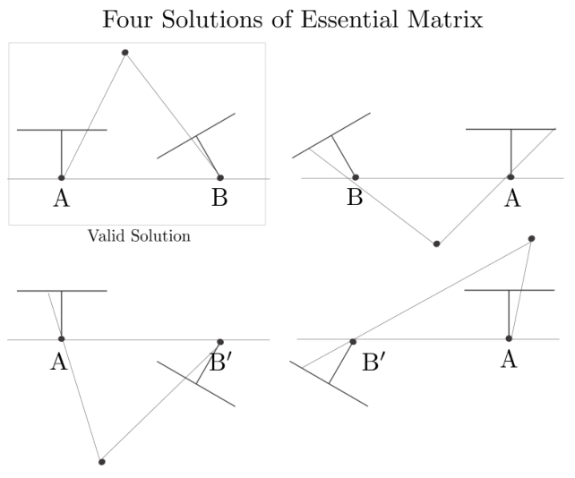

네 개의 해를 기하학적으로 표현하면 위 그림과 같다. ==수학적으로는 총 네 개의 해가 도출되지만 실제
유효한 값은 하나만 존재한다. 따라서 3차원 공간 상의 점 $\mathbf{X}$가 두 카메라 앞에 존재하는 유일한 해를
선택하면 Essential Matrix $\mathbf{E}$를 분해한 $\mathbf{R}, \mathbf{t}$를 성공적으로 얻을 수 있다.==

# 7 3D Reconstruction of Cameras and Structure

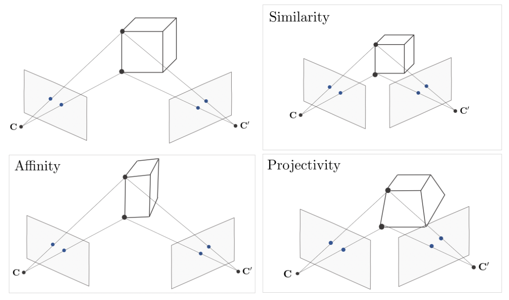

이전 섹션에서 언급했듯이 ==Fundamental Matrix $\mathbf{F}$는 여러 카메라 행렬 대응쌍 $(\mathbf{P}, \mathbf{P}')$에 대하여 사영
모호성(projective ambiguity)이 존재하기 때문에 결과물인 $\mathbf{P}, \mathbf{P}'$를 통해 계산한 3차원 공간 상의 점
또한 모호성을 가지게 된다.== 해당 섹션에서는 Scene Constraint와 Internal Constraint를 사용하여 모호성을
제거하는 방법에 대해서 설명한다.

## The projective reconstruction theorem

### Theorem 10.1 (Projective reconstruction theorem)

두 카메라의 이미지 평면 상 대응점 쌍들인 $\mathbf{x}, \mathbf{x}'$이 충분히 주어져서 이를 통해 Fundamental Matrix $\mathbf{F}$를
구했다고 가정해보자. 이 때, 사영모호성으로 인해 다음과 같은 두 카메라 행렬 대응쌍

$$\begin{aligned}
&(\mathbf{P}_1, \mathbf{P}'_1, \{\mathbf{X}_{1,i}\}) \\
&(\mathbf{P}_2, \mathbf{P}'_2, \{\mathbf{X}_{2,i}\})
\end{aligned} \tag{276}$$

이 동일한 Fundamental Matrix $\mathbf{F}$를 갖게 되는 경우

$$(\mathbf{P}_2, \mathbf{P}'_2, \{\mathbf{X}_{2,i}\}) = \mathbf{H} \cdot (\mathbf{P}_1, \mathbf{P}'_1, \{\mathbf{X}_{1,i}\}) \tag{277}$$

를 만족하는 Homography 행렬 $\mathbf{H} \in PGL_4$가 반드시 존재한다. 이 때 $\cdot$ 연산은 다음과 같이 성립한다.

$$\begin{aligned}
\mathbf{P}_2 &= \mathbf{H} \cdot \mathbf{P}_1 = \mathbf{P}_1\mathbf{H}^{-1} \\
\mathbf{P}'_2 &= \mathbf{H} \cdot \mathbf{P}'_1 = \mathbf{P}'_1\mathbf{H}^{-1} \\
\mathbf{X}_{2i} &= \mathbf{H} \cdot \mathbf{X}_{1i} = \mathbf{H}\mathbf{X}_{1i}
\end{aligned} \tag{278}$$

### Proof

이전 섹션에서 동일한 Fundamental Matrix $\mathbf{F}$를 공유하는 카메라 행렬 대응쌍 사이에 $\mathbf{P}_2 = \mathbf{P}_1\mathbf{H}^{-1}, \mathbf{P}'_2 = \mathbf{P}'_1\mathbf{H}^{-1}$를 만족하는 Homography 행렬 $\mathbf{H} \in \mathbb{R}^{4\times4}$가 존재한다는 것을 증명하였다. 이를 적용해보면

$$\begin{aligned}
\mathbf{P}_2\mathbf{X}_{2i} &= \mathbf{P}_1\mathbf{H}^{-1}\mathbf{X}_{2i} = \mathbf{x}_i = \mathbf{P}_1\mathbf{X}_{1i} \\
\mathbf{P}'_2\mathbf{X}_{2i} &= \mathbf{P}'_1\mathbf{H}^{-1}\mathbf{X}_{2i} = \mathbf{x}'_i = \mathbf{P}'_1\mathbf{X}_{1i}
\end{aligned} \tag{279}$$

가 성립한다. $\mathbf{P}_1, \mathbf{P}_2$에 의해 Back Projection된 직선을 $R$이라고 하고 $\mathbf{P}'_1, \mathbf{P}'_2$에 의해 Back Projection
된 직선을 $R'$이라고 하면

$$\{\mathbf{H}^{-1}\mathbf{X}_{2i}, \mathbf{X}_{1i}\} \in R \cap R' \tag{280}$$

와 같이 3차원 공간 상의 점 $\{\mathbf{H}^{-1}\mathbf{X}_{2i}, \mathbf{X}_{1i}\}$는 두 직선의 교차점이 된다. 따라서 ==두 직선 $R, R'$이 Baseline과 같이 동일한 직선인 경우를 제외하면 $\{\mathbf{H}^{-1}\mathbf{X}_{2i}, \mathbf{X}_{1i}\}$는 교차점인 한 점을 의미==하므로

$$\begin{aligned}
\mathbf{H}^{-1}\mathbf{X}_{2i} &= \mathbf{X}_{1i} \\
\mathbf{X}_{2i} &= \mathbf{H}\mathbf{X}_{1i}
\end{aligned} \tag{281}$$

가 성립한다. 따라서 추가적인 기하학적 원리를 사용하지 않으면 위와 같은 상황에서는 사영모호성을
포함하여(up to projectivity) 복원할 수 있다.

## Stratified reconstruction

Fundamental Matrix $\mathbf{F}$를 사용하여 계산한 카메라 행렬 대응쌍 $(\mathbf{P}, \mathbf{P}')$의 사영모호성 문제를 해결하기 위해
Ground Truth 카메라 행렬 대응쌍인

$$(\mathbf{P}_0, \mathbf{P}'_0, \{\hat{\mathbf{X}}_i\}) \tag{282}$$

이 존재한다고 가정하면

$$\begin{aligned}
(\mathbf{P}_1, \mathbf{P}'_1, \{\mathbf{X}_i\}) &= \mathbf{H} \cdot (\mathbf{P}_0, \mathbf{P}'_0, \{\hat{\mathbf{X}}_i\}) \\
\mathcal{T} &= \mathbf{H} \cdot \mathcal{T}_0
\end{aligned} \tag{283}$$

을 만족하는 Homography 행렬 $\mathbf{H}$가 존재한다. 이 때, 이미지 평면 상에서 평행한 직선의 특성을 활용
하여 Affine Reconstruction을 수행한 다음, 이미지 평면 상에서 직교한 선들의 특성을 사용하여 Similarity
Reconstruction을 순차적으로 수행한다.

### The step to affine reconstruction

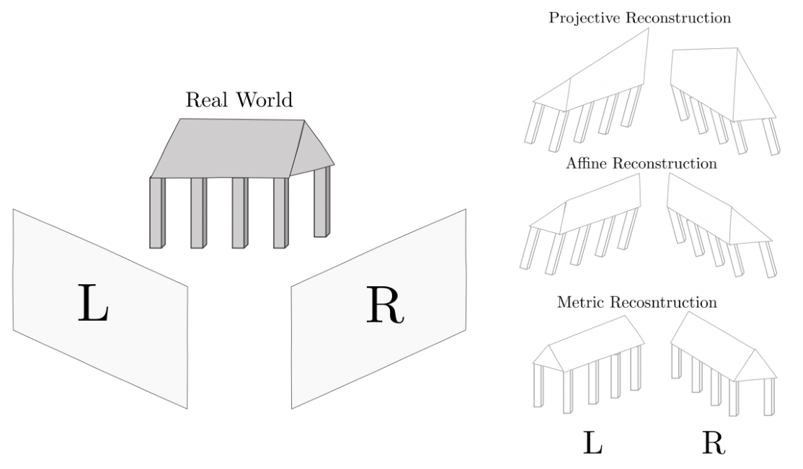

Affine Reconstruction 단계에서는 평행한 직선들의 특성을 보존하는 Homography 행렬 $\mathbf{H}_A$를 찾아야 한다.

$$\mathbf{H}_A(\pi_\infty) = \pi_\infty \tag{284}$$

3차원 공간 상의 점들의 집합 $\{\mathbf{X}_i\}$를 사용하여 소실점을 3개 이상 구한 경우 이미지 평면에 프로젝션된
무한대 평면 $\pi'_\infty$를 계산할 수 있다. 이미지 평면 상에 프로젝션된 무한대 평면 $\pi'_\infty$를

$$\pi'_\infty = \begin{pmatrix} a & b & c & 1 \end{pmatrix}^\intercal \tag{285}$$

라고 하면 실제 무한대 평면 $\pi_\infty = \begin{pmatrix} 0 & 0 & 0 & 1 \end{pmatrix}^\intercal$을 $\pi'_\infty$로 보내는 Homography 행렬 $\mathbf{H}_A$는 다음과
같이 구할 수 있다.

$$\mathbf{H}_A = \begin{bmatrix} \mathbf{I}_3 \mid \mathbf{0} \\ \pi'^\intercal_\infty \end{bmatrix} = \begin{bmatrix} \mathbf{I}_3 & \mathbf{0} \\ a\ \ b\ \ c & 1 \end{bmatrix} \tag{286}$$

이 때 $\mathbf{H}^\intercal_A\pi_\infty = \pi'_\infty$ 관계가 성립한다.

$$\pi_\infty = \mathbf{H}^{-\intercal}_A\pi'_\infty \tag{287}$$

이를 $\mathcal{T}$ 에 적용하면

$$\begin{aligned}
\mathcal{T}_a &= \mathbf{H} \cdot \mathcal{T} \\
(\mathbf{P}\mathbf{H}^{-1}_A, \mathbf{P}'\mathbf{H}^{-1}_A, \{\mathbf{H}_A\mathbf{X}_i\}) &= \mathbf{H} \cdot (\mathbf{P}, \mathbf{P}', \{\mathbf{X}_i\})
\end{aligned} \tag{288}$$

연산을 통해 이미지를 Affine Reconstruction할 수 있다. 여기까지 진행했다면 Ground Truth $\mathcal{T}_0$와 $\mathcal{T}_a$
는 Affine만큼만 차이가 나게 된다. 즉, 평행한 직선들은 모두 복원되었으나 아직 직교한 직선들은 복원되지
않은 상태이다.

### The step to metric reconstruction

Metric Reconstruction 단계에서는 직교하는 선들을 보존하는 Homography 행렬 $\mathbf{H}_S$를 찾아야 한다.

$$\mathbf{H}_S(\Omega_\infty) = \Omega_\infty \tag{289}$$

이 때, $\Omega_\infty$는 무한대 평면상에 존재하는 Absolute Conic을 의미한다. Affine Reconstruction 단계에서
얻은 $\mathcal{T}_a$는 무한대 평면 $\pi_\infty$가 실제 무한대에 위치하게 된다. 이 때, $\{\mathbf{X}_i\}$들 중 직교하는 점들을 사용하여
$\Omega_\infty$를 구할 수 있다. 직교하는 점들의 대응쌍을 $\mathbf{d}_1, \mathbf{d}_2$라고 하면

$$\mathbf{d}^\intercal_1\omega\mathbf{d}_2 = 0 \tag{290}$$

을 만족하는 $\omega$를 찾을 수 있고 $\omega$는 이미지 평면 상에 프로젝션된 Absolute Conic $\Omega_\infty$ (Image of Absolute
Conic, IAC)가 된다.

카메라 행렬 $\mathbf{P} = \mathbf{K}[\mathbf{R}|\mathbf{t}] = [\mathbf{M} \mid \mathbf{m}]$가 주어졌을 때 무한대 평면 $\pi_\infty$는 $\mathbf{M}$에 의해 이미지 평면 $\pi$에
프로젝션된다.

$$\mathbf{M} : \pi_\infty \mapsto \pi \tag{291}$$

반대로 $\mathbf{M}^{-1}$는 $\pi$ 평면 상의 점들을 무한대 평면 $\pi_\infty$으로 보내는 매핑이라고 할 수 있다.

$$\mathbf{M}^{-1} : \pi \mapsto \pi_\infty \tag{292}$$

이 때, 이미지 평면에 프로젝션된 Absolute Conic에 $\mathbf{M}^{-1}$을 적용하면 $\mathbf{M}^{-1}(\omega) = \tilde{\Omega}_\infty$가 된다. $\tilde{\Omega}_\infty$는
아직 Metric Reconstruction이 되기 전이므로 $\Omega_\infty \neq \tilde{\Omega}_\infty$이다. 둘 사이에는 다음 공식이 성립한다.

$$\mathbf{H}_S(\tilde{\Omega}_\infty) = \Omega_\infty = \mathbf{I}_3 \tag{293}$$

### Result 10.5

이미지 평면에 프로젝션된 Absolute Conic을 $\omega$라고 하고 Affine Reconstruction으로 구한 카메라 행렬을
$\mathbf{P} = [\mathbf{M} \mid \mathbf{m}]$이라고 할 때 Metric Reconstruction을 수행하는 Homography $\mathbf{H}_S$는 다음과 같이 구할 수
있다.

$$\mathbf{H}_S = \begin{bmatrix} \mathbf{A}^{-1} & \\ & 1 \end{bmatrix} \tag{294}$$

이 때, $\mathbf{A}\mathbf{A}^\intercal = (\mathbf{M}^\intercal\omega\mathbf{M})^{-1}$이고 $\mathbf{A}$는 이를 Cholesky Decomposition을 통해 얻을 수 있다.

### Proof

Metric Reconstruction을 수행하는 Homography $\mathbf{H}_S = \begin{bmatrix} \mathbf{A}^{-1} & \\ & 1 \end{bmatrix}$이라고 하고 이 때 이미지 평면을 $\pi_s$,
카메라 행렬을 $\mathbf{P}_s$라고 하면 $\mathbf{H}_S(\pi) = \pi_s$ 관계가 성립하고 무한대 평면을 Homography 변환한 공식은

$$\begin{aligned}
\pi_\infty\mathbf{A}^{-1} &= \pi_{\infty,s} \\
\mathbf{H}_S|_{\pi_\infty} &= \mathbf{A}^{-1}
\end{aligned} \tag{295}$$

가 된다. 각각 무한대 평면 $\pi_\infty, \pi_{\infty,s}$을 이미지 평면 $\pi, \pi_s$에 투영하는 공식은

$$\begin{aligned}
\mathbf{P}|_{\pi_\infty} &= \mathbf{M} \\
\mathbf{P}_s|_{\pi_\infty} &= \mathbf{M}\mathbf{A}
\end{aligned} \tag{296}$$

과 같이 변형된다. 따라서 $\mathbf{H}_S(\tilde{\Omega}_\infty)$는 다음과 같다.

$$\begin{aligned}
\mathbf{H}_S(\tilde{\Omega}_\infty) &= (\mathbf{A}^{-1})^{-\intercal}\tilde{\Omega}_\infty\mathbf{A} \\
&= \mathbf{A}^\intercal(\mathbf{M}^\intercal\omega\mathbf{M})\mathbf{A}
\end{aligned} \tag{297}$$

따라서 Absolute Conic 특성에 의해 $\mathbf{A}^\intercal(\mathbf{M}^\intercal\omega\mathbf{M})\mathbf{A}$는 $\mathbf{I}$이 되어야 하므로

$$\begin{aligned}
\mathbf{A}^\intercal(\mathbf{M}^\intercal\omega\mathbf{M})\mathbf{A} &= \mathbf{I} \\
(\mathbf{M}^\intercal\omega\mathbf{M})^{-1} &= \mathbf{A}\mathbf{A}^\intercal
\end{aligned} \tag{298}$$

가 성립한다. 결론적으로 $\mathbf{H}_S = \begin{bmatrix} \mathbf{A}^{-1} & \\ & 1 \end{bmatrix}$를 구하기 위해서는 ==이미지 평면 상에서 직교하는 직선들의
특성을 사용하여 $\omega$를 구한 후, $(\mathbf{M}^\intercal\omega\mathbf{M})^{-1}$를 Cholesky Decomposition하여 $\mathbf{A}\mathbf{A}^\intercal$를 구한다. 이를 통해
$\mathbf{A}^{-1}$ 값을 구할 수 있고 최종적으로 Metric Reconstruction을 수행하는 Homography $\mathbf{H}_S$를 구할 수
있다.==

<!--widget:stratified-reconstruction-->

# 8 Computation of the Fundamental Matrix F

## Basic equations

두 카메라의 대응점쌍 $\mathbf{x} \leftrightarrow \mathbf{x}'$이 존재할 때

$$\mathbf{x}'^\intercal\mathbf{F}\mathbf{x} = 0 \tag{299}$$

을 만족하는 3x3 크기의 행렬 $\mathbf{F}$를 Fundamental Matrix라고 한다. 만약 세 개의 대응점쌍 $\mathbf{x} = (x_1, x_2, x_3)$,
$\mathbf{x}' = (x'_1, x'_2, x'_3)$이 주어졌을 때 $\mathbf{x}'^\intercal\mathbf{F}\mathbf{x} = 0$이를 다시 정리하면 $\sum x'_ix_jf_{ij} = 0$과 같이 정리할 수 있다. 해당
식은 선형시스템

$$\mathbf{A}\mathbf{f} = 0 \tag{300}$$

꼴로 나타낼 수 있고 이 때 $\mathbf{A}$와 $\mathbf{f}$를 풀어쓰면 다음과 같다.

$$\begin{aligned}
\mathbf{A} &= (a_{ik}) \in \mathbb{R}^{N\times9}, \quad i\text{-th row is } (x'_{i1}x_{i1},\ x'_{i1}x_{i2},\ \cdots,\ x'_{i3}x_{i3}) \\
\mathbf{f} &= (f_{11}, f_{12}, f_{13}, \cdots, f_{33})^\intercal \in \mathbb{R}^{9\times1}
\end{aligned} \tag{301}$$

만약 주어진 대응점쌍의 개수 $N$이 8보다 크고 노이즈가 없는 완벽한 데이터로 생성이 되었으면 $\mathbf{A}$는
rank 8 행렬이 되고 유일한 해 $\mathbf{f}$가 존재한다. 이 때 $\mathbf{f}$는 $\mathbf{A}$의 Null Space의 원소가 된다.

하지만 대부분의 경우 주어진 데이터에는 항상 노이즈가 존재하므로 $\mathbf{A}$ 행렬은 rank 9인 full rank 행렬이
된다. 이 때 해를 구하면 $\mathbf{f}$는 항상 영벡터가 계산되므로 $\|\mathbf{f}\| = 1$이라는 조건하에 $\|\mathbf{A}\mathbf{f}\|$의 크기를 최소화하는
근사해 $\mathbf{f}$를 찾아야 한다. 해를 찾는 방법은 $\mathbf{A}$를 특이값 분해(SVD)한 다음

$$\mathbf{A} = \mathbf{U}\mathbf{D}\mathbf{V}^\intercal \tag{302}$$

대각행렬 $\mathbf{D}$의 eigenvalue 중 가장 절대값이 작은 것에 대응되는 $\mathbf{V}$의 열벡터를 $\mathbf{f}$의 일반해로 간주한다.
해당 열벡터 $\mathbf{f}$가 $\|\mathbf{A}\mathbf{f}\|$의 크기를 최소화하는 벡터가 되며 이를 Linear Solution이라고 부른다.

하지만 ==이 때, Linear Solution $\mathbf{f}$로 복원한 $\mathbf{F}_0$가 rank 2 행렬임을 보장할 수 없다.== 수치적으로 해를
구하면 일반적으로 rank 3인 행렬이 나온다. 따라서 한 번 더 SVD를 사용하여 $\mathbf{F}_0$와 가장 가까운 rank 2
행렬을 찾아야 한다.

$$\mathbf{F}_0 = \mathbf{U}_0\mathbf{D}_0\mathbf{V}^\intercal_0 \tag{303}$$

이 때 대각행렬 $\mathbf{D}_0 = \begin{bmatrix} \sigma_1 & & \\ & \sigma_2 & \\ & & \sigma_3 \end{bmatrix}$는 일반적으로 마지막 특이값 $\sigma_3$가 0이 아니므로 rank 3인 행렬이
된다. 따라서 ==임의로 $\sigma_3 = 0$으로 변경한 행렬이 $\mathbf{F}_0$과 가장 가까운 rank 2 행렬이 된다.==

### The minimum case - seven point correspondences

7개의 대응점쌍이 주어진 경우 $\mathbf{A} \in \mathbb{R}^{7\times9}$인 rank 7 행렬이 된다. 이에 따라 Null Space의 차원이 2가 되므로
무수한 해가 존재한다. $\mathbf{A}\mathbf{f} = 0$의 풀어서 두 개의 선형독립인 Fundamental Matrix $\mathbf{F}_1, \mathbf{F}_2$를 구하고

$$\mathbf{F} = \alpha\mathbf{F}_1 + (1 - \alpha)\mathbf{F}_2 \tag{304}$$

를 통해 $\mathbf{F}$를 구한다. $\mathbf{F}$ 행렬의 rank는 2이므로 $\det(\mathbf{F}) = 0$을 만족하게 되고 이에 따라 $\alpha$에 대한 3차
방정식을 얻는다. 3차 방정식이 세 개의 실수해를 가지는 경우는 Degenerate Configuration이 된다.

## The normalized 8-point algorithm

행렬 $\mathbf{A}$는 주어진 대응점쌍 $\mathbf{x} \leftrightarrow \mathbf{x}'$으로 구성된 행렬이므로 ==대응점쌍들을 정규화(normalization)하지
않고 바로 해를 구하는 경우 $\mathbf{x}_i = (1000000, 20000000, 1)$과 같이 마지막 값에 비해서 처음 두 값의 크기가
매우 크게 되므로 수치적으로 불안정한 문제==를 가진다. 따라서 $\mathbf{x}_i, \mathbf{x}'_i$를 Centroid가 0이고 Centroid로부터
평균거리가 $\sqrt{2}$가 되도록하는 Homography 변환 $\mathbf{H}, \mathbf{H}'$를 적용한다.

$$\begin{aligned}
\mathbf{x}_i &\rightarrow \mathbf{H}\mathbf{x}_i \\
\mathbf{x}'_i &\rightarrow \mathbf{H}'\mathbf{x}'_i
\end{aligned} \tag{305}$$

이렇게 변환된 대응점 쌍들을 사용하여 수치적으로 안정적인 Fundamental Matrix $\mathbf{F}'$ 계산할 수 있다.
앞서 설명한 내용을 따라 $\mathbf{F}'$를 계산한 다음 다시 원래의 대응점쌍 $\mathbf{x} \leftrightarrow \mathbf{x}'$으로 복원하기 위해

$$\begin{aligned}
0 &= (\mathbf{H}'\mathbf{x}')^\intercal\mathbf{F}'(\mathbf{H}\mathbf{x}) \\
&= \mathbf{x}^\intercal(\mathbf{H}'^\intercal\mathbf{F}'\mathbf{H})\mathbf{x}
\end{aligned} \tag{306}$$

처럼 $\mathbf{F} = \mathbf{H}'^\intercal\mathbf{F}'\mathbf{H}$를 통해 원래 대응점쌍의 Fundamental Matrix $\mathbf{F}$를 계산할 수 있다.

<!--widget:eight-point-algorithm-->

### Degenrate configurations

두 개의 카메라 행렬 대응쌍 $(\mathbf{P}, \mathbf{P}', \{\mathbf{X}_i\}), (\mathbf{Q}, \mathbf{Q}', \{\mathbf{Y}_i\})$가 다음의 조건을 만족하면 서로 ==Conjugate
Configuration==이라고 한다.

$$\begin{aligned}
\mathbf{P}\mathbf{X}_i &= \mathbf{Q}\mathbf{Y}_i, \quad \mathbf{P}'\mathbf{x}_i = \mathbf{Q}'\mathbf{Y}' \quad \forall s \\
&(\mathbf{P}, \mathbf{P}), (\mathbf{Q}, \mathbf{Q}') \text{ share the same } \mathbf{F}
\end{aligned} \tag{307}$$

이 때, ==Conjuate Configuration이 있는 카메라 행렬 대응쌍 $(\mathbf{P}, \mathbf{P}', \{\mathbf{X}_i\})$을 Critical Triple이라고
부른다.==

임의의 카메라 대응쌍 $\mathbf{P}, \mathbf{P}', \{\mathbf{X}_i\}$가 Critical Triple일 필요충분조건은 각각의 카메라 중심점 $\mathbf{C}, \mathbf{C}'$과 3
차원 공간 상의 점 $\mathbf{X}_i$가 어떤 Ruled Quadric Surface, 즉 직선을 포함하는 Quadric Surface 상에 포함되는
것이다.

### Proof

임의의 카메라 행렬 대응쌍 $(\mathbf{P}, \mathbf{P}', \{\mathbf{X}_i\})$이 Critical Triple이라는 것을 보이기 위해서는 이와 대응하는
카메라 행렬 대응쌍 $(\mathbf{Q}, \mathbf{Q}', \{\mathbf{Y}_i\})$이 같은 Fundamental Matrix $\mathbf{F}$를 가진다는 사실을 사용해야 한다. $\mathbb{P}^3$
공간에서 이차곡면은 4x4 크기의 행렬로 정의된다.

$$\mathbf{S}_p := \mathbf{P}'\mathbf{F}_{QQ'}\mathbf{P} \tag{308}$$

여기서 이차곡면 $\mathbf{S}_p \in \mathbb{R}^{4\times4}$는 카메라 중심점 $\mathbf{C}, \mathbf{C}'$과 3차원 공간 상의 점 $\{\mathbf{X}_i\}$를 포함해야 한다.
==$\mathbf{S}_p$는 Ruled Quadric Surface이므로 직선을 포함하고 있음을 보이면 되므로 카메라 중심선을 연결한
직선인 baseline을 $\mathbf{S}_p$가 포함하고 있음==을 보이면 된다. baseline 위에 있는 임의의 점 $\mathbf{X}$가 존재할 때

$$\mathbf{S}_p\mathbf{X} = \mathbf{P}'\mathbf{F}_{QQ'}\mathbf{P}\mathbf{X} = 0 \quad \because \mathbf{F}_{QQ'}\mathbf{P}\mathbf{X} = 0 \tag{309}$$

을 만족하므로 $\mathbf{S}_p$는 Ruled Quadric Surface임을 알 수 있다.

반대로, 카메라 중심점 $\mathbf{C}, \mathbf{C}'$와 3차원 공간 상의 점 $\{\mathbf{X}_i\}$가 $\mathbf{S}_p$에 속하면 다음 공식이 성립한다.

$$(\mathbf{P}'\mathbf{X}_i)^\intercal\mathbf{F}_{QQ'}(\mathbf{P}\mathbf{X}_i) = 0 \tag{310}$$

여기서 $\mathbf{x}' = \mathbf{P}'\mathbf{X}_i, \mathbf{x} = \mathbf{P}\mathbf{X}_i$이고 $\mathbf{F}_{QQ'}$이므로 $\mathbf{F}_{QQ'}$에 대한 대응점 쌍이 $\mathbf{x}, \mathbf{x}'$ 존재한다는 의미이다.
따라서

$$\begin{aligned}
\mathbf{x}' &= \mathbf{P}'\mathbf{X}_i = \mathbf{Q}'\mathbf{Y}_i \\
\mathbf{x} &= \mathbf{P}\mathbf{X}_i = \mathbf{Q}\mathbf{Y}_i
\end{aligned} \tag{311}$$

를 만족하므로 카메라 행렬 대응쌍 $(\mathbf{P}, \mathbf{P}', \{\mathbf{X}_i\})$과 $(\mathbf{Q}, \mathbf{Q}', \{\mathbf{Y}_i\})$는 같은 Fundamental Matrix $\mathbf{F} = \mathbf{F}_{PP'} = \mathbf{F}_{QQ'}$를 공유하는 Conjugate Triple이라는 것을 알 수 있다.

## The Gold Standard method

이미지 평면 상의 대응점 쌍 $\mathbf{x} \leftrightarrow \mathbf{x}'$는 일반적으로 노이즈를 포함하고 있으므로 이를 통해 Fundamental
Matrix $\mathbf{F}$를 정확하게 계산할 수 없고 $\|\mathbf{A}\mathbf{f}\|$의 크기를 최소화하는 근사해 $\mathbf{F}'$를 계산할 수 밖에 없다. 따라서
==$\mathbf{F}'$를 더 정확하게 계산하기 위해 2D Homography 문제와 마찬가지로 주어진 데이터 $\mathbf{x}, \mathbf{x}'$를 Ground
Truth $\hat{\mathbf{x}}, \hat{\mathbf{x}}'$과 가까워지게 보정하는 방법을 The Gold Standard method==라고 한다.

- 8개 이상의 대응점 쌍 $\mathbf{x} \leftrightarrow \mathbf{x}'$이 주어졌을 때 우선 앞서 설명한 것과 같이 총 두 번 SVD를 사용하여
  rank가 2인 Fundamental Matrix $\mathbf{F}_0$를 계산한다. 이 때, $\mathbf{F}_0$를 Linear Solution이라고 부른다.
- 다음으로 Epipole $\mathbf{e}, \mathbf{e}'$에 대하여 다음 공식이 성립한다.

$$\mathbf{e}'\mathbf{F}_0 = 0, \quad \mathbf{F}_0\mathbf{e} = 0 \tag{312}$$

- 위 공식으로부터 $\mathbf{e}, \mathbf{e}'$를 각각 계산한다.
- Epipole을 계산하면 Caninocal Form의 카메라 행렬 $\mathbf{P}, \mathbf{P}'$를 계산할 수 있다.

$$\mathbf{P} = [\mathbf{I}|\mathbf{0}], \quad \mathbf{P}' = [\mathbf{M}|\mathbf{m}] \quad \text{where, } \mathbf{M} = \mathbf{e}'^\wedge\mathbf{F},\ \mathbf{m} = \mathbf{e}' \tag{313}$$

- 이를 통해 $\mathbf{x}, \mathbf{x}'$의 Back-projection된 직선들을 각각 구할 수 있다.
- 두 Back-projection 직선과 가장 근접한 3차원 공간 상의 점 $\mathbf{X}_i$를 계산할 수 있다.
- 이미지 평면에 3차원 공간 상의 점 $\mathbf{X}_i$를 재투영(reprojection) 한다.

$$\begin{aligned}
\hat{\mathbf{x}} &= \mathbf{P}\mathbf{X}_i \\
\hat{\mathbf{x}}' &= \mathbf{P}'\mathbf{X}_i
\end{aligned} \tag{314}$$

다음과 같이 재투영 오차(reprojection error)를 Gauss-Newton, Levenerg-Marquardt 등과 같은 비선형
최적화 방법을 사용하여 최소화한다.

$$\sum_i d(\mathbf{x}, \hat{\mathbf{x}})^2 + d(\mathbf{x}', \hat{\mathbf{x}}')^2 \tag{315}$$

이 때 최적화되는 파라미터는 $\mathbf{X}_i$와 카메라 행렬 $\mathbf{P}' = [\mathbf{M}|\mathbf{m}]$이다.

# 9 Structure Computation

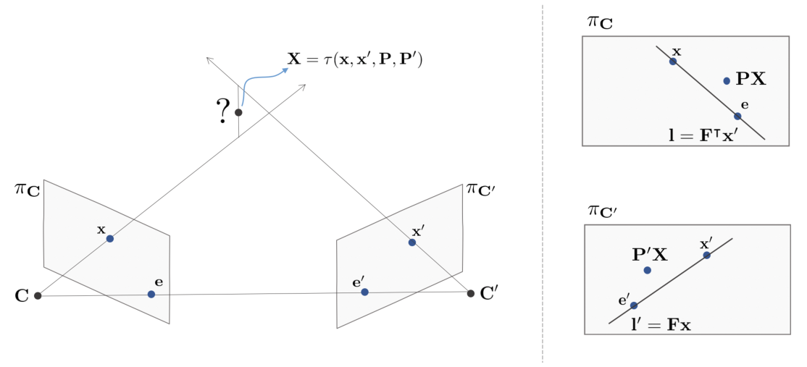

## Problem statement

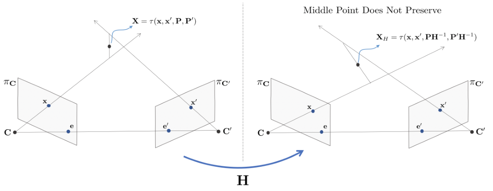

해당 섹션에서는 두 카메라 행렬 대응쌍 $(\mathbf{P}, \mathbf{P}')$와 이미지 평면의 대응점 쌍 $(\mathbf{x}, \mathbf{x}')$가 주어진 경우 $\mathbb{P}^3$ 공간
상의 점 $\mathbf{X}$를 구하는 방법에 대해 설명한다. ==이론적으로는 대응점 쌍 $\mathbf{x}, \mathbf{x}'$를 Back-projection하여 얻은
두 직선의 교차점을 통해 $\mathbf{X}$를 계산할 수 있으나 실제 데이터는 노이즈가 존재하기 때문에 두 Back-projection 직선이 교차하지 않는다.== 또한 노이즈로 인해 두 이미지 평면 상에서 Epipolar Line $\mathbf{l}, \mathbf{l}'$ 또한
$\mathbf{x}, \mathbf{x}'$와 만나지 않는다.

이를 해결하기 위해서 두 Back-projection 직선들에 동시에 수직인 최단거리 직선을 구한 다음 최단거리
직선의 중점(mid-point)를 계산하여 $\mathbf{X}$를 계산하는 방법이 존재한다. 해당 방법은 체크보드를 이용한 캘리브
레이션 방법과 같이 $\mathbf{P}, \mathbf{P}'$가 고정된 경우에는 사용하면 좋은 방법이지만, 대부분의 경우 $\mathbf{P}, \mathbf{P}'$는 사영모호성
(projective ambiguity)으로 인해 유일하게 결정되지 않는다.

==현실 세계에서는 카메라 행렬을 Affinity 또는 Projectivity까지 알고 있는 경우(up to affinity,
projectivity)가 대부분이다. 정확한 $\mathbf{X}$를 구하기 위해서는 triangulation이 사영모호성에 대해서도 불
변이어야 한다.== Triangulation $\tau$은 주어진 대응점 쌍과 카메라 행렬 대응쌍으로부터 $\mathbf{X} \in \mathbb{P}^3$를 계산하는
방법을 말한다.

$$\mathbf{X} = \tau(\mathbf{x}, \mathbf{x}', \mathbf{P}, \mathbf{P}') \tag{316}$$

$\tau$가 사영모호성에 불변이기 위해서는 임의의 Homography $\mathbf{H} \in PGL_4$에 대하여

$$\begin{aligned}
\mathbf{X}_H &= \tau(\mathbf{x}, \mathbf{x}', \mathbf{P}\mathbf{H}^{-1}, \mathbf{P}'\mathbf{H}^{-1}) \\
&= \mathbf{H} \cdot \tau(\mathbf{x}, \mathbf{x}', \mathbf{P}, \mathbf{P}') \\
&= \mathbf{H}\mathbf{X}
\end{aligned} \tag{317}$$

공식이 성립해야 한다. 위와 같이 불변성이 성립하는 경우

$$\begin{aligned}
\mathbf{P}\mathbf{H}^{-1}\mathbf{X}_H &= \mathbf{P}\mathbf{H}^{-1}\mathbf{H}\mathbf{X} \\
&= \mathbf{P}\mathbf{X} \\
&= \mathbf{x}
\end{aligned} \tag{318}$$

이 된다. 마찬가지로 $\mathbf{P}'\mathbf{H}^{-1}\mathbf{X}_H = \mathbf{x}'$이 된다. 예를 들어, Fundemantal Matrix $\mathbf{F}$와 카메라 행렬 대응쌍
$(\mathbf{P}, \mathbf{P}')$, 대응점 쌍 $(\mathbf{x}, \mathbf{x}')$이 주어졌을 때 $(\mathbf{P}, \mathbf{P}')$를 Homography 변환한 카메라 행렬 대응쌍 $(\mathbf{P}\mathbf{H}^{-1}, \mathbf{P}'\mathbf{H}^{-1})$
또한 동일한 $\mathbf{F}$를 공유한다. 이를 통해

$$\begin{aligned}
\{\mathbf{X}\} &: \text{3D Points from } (\mathbf{x}, \mathbf{x}') \text{ and } (\mathbf{P}, \mathbf{P}'). \\
\{\mathbf{X}_H\} &: \text{3D Points from } (\mathbf{x}, \mathbf{x}') \text{ and } (\mathbf{P}\mathbf{H}^{-1}, \mathbf{P}'\mathbf{H}^{-1}).
\end{aligned} \tag{319}$$

과 같이 두 PointCloud $\{\mathbf{X}\}, \{\mathbf{X}_H\}$를 구할 수 있고 ==PointCloud가 Homography에 불변이기 위해서는
두 PointCloud 사이에==

$$\mathbf{H}\{\mathbf{X}\} = \{\mathbf{X}_H\} \tag{320}$$

==인 변환 성질을 만족해야 한다.== 앞서 설명한 중점(mid-point)을 사용한 방법은 두 Back-projection 직선
들에 서로 수직인 최단거리 직선이 Homography 변환을 수행하면 더 이상 직교하지 않게 되고 중점 또한 더
이상 중심이 위치하지 않게 된다. 따라서 ==중점을 사용한 방법은 Homography에 불변하지 않다.==

## Linear triangulation methods

해당 섹션에서는 $\mathbf{X} \in \mathbb{P}^3$를 구하기 위해 선형방정식을 사용하는 방법을 설명한다. $\mathbf{x} = \mathbf{P}\mathbf{X}, \mathbf{x}' = \mathbf{P}'\mathbf{X}$로부터

$$\begin{aligned}
\mathbf{x}^\wedge(\mathbf{P}\mathbf{X}) &= 0 \\
\mathbf{x}'^\wedge(\mathbf{P}'\mathbf{X}) &= 0
\end{aligned} \tag{321}$$

공식이 성립한다.

$$\mathbf{x} = \begin{pmatrix} x & y & 1 \end{pmatrix}^\intercal \qquad \mathbf{P} = \begin{pmatrix} \mathbf{p}^\intercal_{1,row} & \mathbf{p}^\intercal_{2,row} & \mathbf{p}^\intercal_{3,row} \end{pmatrix}^\intercal \qquad \mathbf{X} = \begin{pmatrix} X & Y & Z & W \end{pmatrix}^\intercal \tag{322}$$

$\mathbf{p}^\intercal_{i,row}$를 $\mathbf{P}$의 $i$번째 행(row)라고 했을 때 $\mathbf{x}^\wedge(\mathbf{P}\mathbf{X})$를 전개한 후 정리하면

$$\begin{aligned}
x(\mathbf{p}^\intercal_{3,row}\mathbf{X}) - (\mathbf{p}^\intercal_{1,row}\mathbf{X}) &= 0 \\
y(\mathbf{p}^\intercal_{3,row}\mathbf{X}) - (\mathbf{p}^\intercal_{2,row}\mathbf{X}) &= 0 \\
x(\mathbf{p}^\intercal_{2,row}\mathbf{X}) - y(\mathbf{p}^\intercal_{1,row}\mathbf{X}) &= 0
\end{aligned} \tag{323}$$

과 같고 이를 $\mathbf{x}'^\wedge(\mathbf{P}'\mathbf{X})$도 같이 구한 후 $\mathbf{X}$에 대한 선형시스템으로 다시 작성하면

$$\underbrace{\begin{bmatrix} x\mathbf{p}^\intercal_{3,row} - \mathbf{p}^\intercal_{1,row} \\ y\mathbf{p}^\intercal_{3,row} - \mathbf{p}^\intercal_{2,row} \\ x'\mathbf{p}'^\intercal_{3,row} - \mathbf{p}'^\intercal_{1,row} \\ y'\mathbf{p}'^\intercal_{3,row} - \mathbf{p}'^\intercal_{2,row} \end{bmatrix}}_{\mathbf{A}}\mathbf{X} = 0 \tag{324}$$

같이 $\mathbf{A}\mathbf{X} = 0$ 형태로 정리할 수 있다. 데이터에 노이즈가 없는 경우 $\mathbf{A} \in \mathbb{R}^{4\times4}$의 rank가 3이 되어 Null
Space 벡터를 통해 유일한 $\mathbf{X}$를 계산할 수 있지만 노이즈가 존재하는 경우 $\mathbf{A}$의 rank는 4가 되어 무수히 많은
해가 존재한다. 따라서 $\mathbf{A}$를 특이값 분해(SVD)하여 $\|\mathbf{X}\| = 1$일 때 $\|\mathbf{A}\mathbf{X}\|$의 크기를 최소화하는 근사해 $\hat{\mathbf{X}}$
를 계산해야 한다.

선형 방법에 Homography를 적용해보면

$$\begin{aligned}
y(\mathbf{p}_{3,row}) - \mathbf{p}_{2,row} &\rightarrow y(\mathbf{p}\mathbf{H}^{-1})_{3,row} - (\mathbf{p}\mathbf{H}^{-1})_{2,row} \\
&= y(\mathbf{p}_{3,row})\mathbf{H}^{-1} - \mathbf{p}_{2,row}\mathbf{H}^{-1} \\
&= (y(\mathbf{p}_{3,row}) - \mathbf{p}_{2,row})\mathbf{H}^{-1}
\end{aligned} \tag{325}$$

과 같이 $\mathbf{A} \Rightarrow \mathbf{A}\mathbf{H}^{-1}$로 변환되어 $\mathbf{X} \Rightarrow \mathbf{X}_H$로 변환이 된다. 이를 통해

$$\|\mathbf{A}\mathbf{X}\| = \|\mathbf{A}\mathbf{H}^{-1}\mathbf{X}_H\| \tag{326}$$

이 성립하지만 ==Homography 변환을 할 때 $\|\mathbf{X}_H\| \neq 1$이 되어 $\|\mathbf{X}\| = 1$의 성질을 보존하지 않는다.
따라서 선형방정식을 통한 방법은 Homography에 대해 불변이 아니므로 최적의 솔루션이 아니다.==

### Inhomogeneous method

카메라 행렬 대응쌍 $\mathbf{P}, \mathbf{P}'$이 Affine 변환까지(up to affinity) 결정되는 경우 $\mathbf{X} = (X, Y, Z, 1)^\intercal$로 놓고
$\|\mathbf{A}\mathbf{X}\|$를 최소화하는 근사해 $\hat{\mathbf{X}}$를 구하는 방법을 Inhomogeneous method라고 한다. $\mathbf{X}$는 Affine Point이므
로 $\|\mathbf{X}\| = 1$ 제약조건이 사라지게 된다. 따라서, ==Inhomogeneous method는 임의의 Affine 변환 $\mathbf{H}_A$에
대해 불변인 특성을 지닌다.==

<!--widget:triangulation-->

## An optimial solution

해당 섹션에서는 최적의 $\mathbf{X} \in \mathbb{P}^3$을 구하기 위한 Optimal Triangulation 방법에 대해 설명한다. 우선 비선형
최소제곱법(non-linear least square)을 통해 $\mathbf{X}$를 구하는 방법이 있다.

- 주어진 카메라 행렬 대응쌍 $(\mathbf{P}, \mathbf{P}')$와 대응점 쌍 $(\mathbf{x}, \mathbf{x}')$에 대해여 이전 섹션에서 설명한 선형방정식
  $\mathbf{A}\mathbf{X} = 0$을 통해 구한 근사해 $\hat{\mathbf{X}}$를 초기값 $\mathbf{X}_0$로 설정한다.
- $\mathbf{X}_0$를 각각 카메라에 프로젝션하면 $\hat{\mathbf{x}}, \hat{\mathbf{x}}'$가 생성되는데 이 때 $d(\mathbf{x}, \hat{\mathbf{x}})^2 + d(\mathbf{x}', \hat{\mathbf{x}}')^2$를 최소화한다.
  $d(\mathbf{x}_1, \mathbf{x}_2)$은 $\mathbf{x}_1$과 $\mathbf{x}_2$ 사이의 거리를 의미한다.
- Gauss-Newton 또는 Levenberg-Marquardt와 같은 비선형 최소제곱법을 통해 반복적으로(iterative)
  최적해 $\mathbf{X}^*$를 구한다.

### Reformulation of the minimization problem

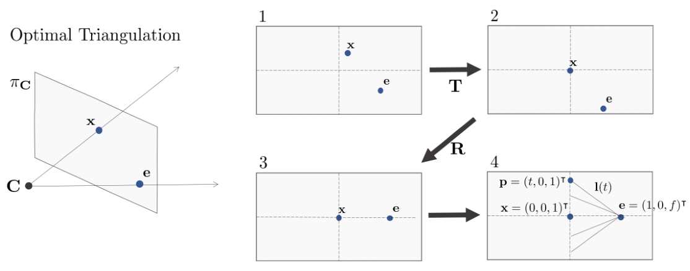

반복법을 사용하지 않고도(non-iterative) Optimal Triangulation을 수행할 수 있다. 해당 방법은 ==$d(\mathbf{x}, \hat{\mathbf{x}})$를
최적화하는 대신 $\mathbf{x}$와 파라미터화된 Epipolar Line $\mathbf{l}(t)$ 사이의 거리 $d(\mathbf{x}, \mathbf{l}(t))$를 최적화한다. 즉, $\mathbf{x}$와 $\mathbf{l}(t)$
사이의 거리를 최소화하는 파라미터 $t$를 구함으로써 최적해를 구한다.==

$$\min_t d(\mathbf{x}, \mathbf{l}(t))^2 + d(\mathbf{x}', \mathbf{l}'(t))^2 \tag{327}$$

### Details of the minimization

우선 $\mathbf{x} = (x, y, 1)^\intercal$와 $\mathbf{x}' = (x', y', 1)^\intercal$를 각각 원점 $(0, 0, 1)^\intercal$로 변환시킨다.

$$\begin{aligned}
\mathbf{x} = (x, y, 1)^\intercal &\rightarrow (0, 0, 1)^\intercal \\
\mathbf{x}' = (x', y', 1)^\intercal &\rightarrow (0, 0, 1)^\intercal
\end{aligned} \tag{328}$$

이를 변환해주는 행렬을

$$\mathbf{T} = \begin{bmatrix} 1 & & -x \\ & 1 & -y \\ & & 1 \end{bmatrix} \qquad \mathbf{T}' = \begin{bmatrix} 1 & & -x' \\ & 1 & -y' \\ & & 1 \end{bmatrix} \tag{329}$$

로 설정한다. 다음으로 Epipole $\mathbf{e} = (e_1, e_2, e_3)^\intercal, \mathbf{e}' = (e'_1, e'_2, e'_3)^\intercal$을 각각 $x$축 상의 점인 $(1, 0, f)^\intercal, (1, 0, f')^\intercal$
로 변환한다.

$$\begin{aligned}
\mathbf{e} = (e_1, e_2, e_3)^\intercal &\rightarrow (1, 0, f)^\intercal \\
\mathbf{e}' = (e'_1, e'_2, e'_3)^\intercal &\rightarrow (1, 0, f')^\intercal
\end{aligned} \tag{330}$$

이는 이미지 평면에서 각각 $(1/f, 0)^\intercal, (1/f', 0)^\intercal$을 의미한다. 우선 $e_1^2 + e_2^2 = e_1'^2 + e_2'^2 = 1$이 되도록
Epipole을 정규화한 다음, 이를 $x$축 상의 점으로 회전하는 행렬을 $\mathbf{R}, \mathbf{R}'$ 다음과 같이 정의한다.

$$\mathbf{R} = \begin{bmatrix} e_1 & e_2 & \\ -e_2 & e_1 & \\ & & 1 \end{bmatrix} \qquad \mathbf{R}' = \begin{bmatrix} e'_1 & e'_2 & \\ -e'_2 & e'_1 & \\ & & 1 \end{bmatrix} \tag{331}$$

이를 통해 $\mathbf{R}\mathbf{e} = (1, 0, e_3)^\intercal, \mathbf{R}'\mathbf{e}' = (1, 0, e'_3)^\intercal$로 변환한다. 이 때, $e_3 = f, e'_3 = f'$이다. 다음으로 Epipolar
Line $\mathbf{l}$을 $\mathbf{l}(t)$로 파라미터화한다. Epipole $\mathbf{e} = (1, 0, f)^\intercal$는 $x$축 선상에 위치한 점이므로 이를 지나는 Epipolar
Line은 $y$축을 기준으로 $(0, t, 1)^\intercal$과 같이 파라미터화할 수 있다. 따라서 $\mathbf{l}(t)$는

$$\mathbf{l}(t) = \begin{pmatrix} 0 \\ t \\ 1 \end{pmatrix} \times \begin{pmatrix} 1 \\ 0 \\ f \end{pmatrix} = \begin{pmatrix} tf \\ 1 \\ -t \end{pmatrix} \tag{332}$$

가 된다. 이전 단계에서 $\mathbf{x}$를 원점 $(0, 0, 1)^\intercal$로 옮겼으므로 $d(\mathbf{x}, \mathbf{l}(t))$는

$$d(\mathbf{x}, \mathbf{l}(t)) = \frac{t^2}{1^2 + (tf)^2} \tag{333}$$

이 된다. 다음으로 $\mathbf{l}'(t)$를 계산해야 한다. Fundmamental Matrix $\mathbf{F}$를 사용하여 $\mathbf{l}'(t)$를 계산하면

$$\mathbf{l}'(t) = \mathbf{F}\begin{pmatrix} 0 \\ t \\ 1 \end{pmatrix} \quad \because \mathbf{l}(t) \text{ is the epipolar line of } \begin{pmatrix} 0 & t & 1 \end{pmatrix}^\intercal. \tag{334}$$

과 같다. $\mathbf{F}$는 주어진 카메라 행렬 대응쌍에서 $\mathbf{F}_0$를 계산한 후 $\mathbf{F}_0$로부터 $\mathbf{T}, \mathbf{R}, \mathbf{T}', \mathbf{R}'$을 이용하여 계산할
수 있다. Epipole과 $\mathbf{F}$ 사이에는

$$\mathbf{F}\begin{pmatrix} 1 \\ 0 \\ f \end{pmatrix} = 0 \qquad \begin{pmatrix} 1 & 0 & f' \end{pmatrix}\mathbf{F} = 0 \tag{335}$$

이 성립하므로 $\mathbf{F}_{1,col} = -f\mathbf{F}_{3,col}$ 그리고 $\mathbf{F}_{1,row} = -f'\mathbf{F}_{3,row}$가 되고 이를 정리하면

$$\mathbf{F} = \begin{bmatrix} f'fd & -f'c & -f'd \\ -fb & a & b \\ -fd & c & d \end{bmatrix} \tag{336}$$

가 된다. 이를 통해 $\mathbf{l}'(t)$를 다시 표현하면

$$\begin{aligned}
\mathbf{l}'(t) = \mathbf{F}\begin{pmatrix} 0 \\ t \\ 1 \end{pmatrix} &= t\mathbf{F}_{2,col} + \mathbf{F}_{3,col} \\
&= \begin{pmatrix} -f'(ct + d) \\ at + b \\ ct + d \end{pmatrix}^\intercal
\end{aligned} \tag{337}$$

이 된다. 다음으로 원점 $\mathbf{x}'$와 $\mathbf{l}'(t)$ 사이의 거리 $d(\mathbf{x}', \mathbf{l}'(t))$를 구하면

$$d(\mathbf{x}', \mathbf{l}'(t))^2 = \frac{(ct + d)^2}{(at + b)^2 + f'^2(ct + d)^2} \tag{338}$$

이 된다. 이를 통해 최적화하고자 하는 목적함수 $d(\mathbf{x}, \mathbf{l}(t))^2 + d(\mathbf{x}', \mathbf{l}'(t))^2$는

$$s(t) = \frac{t^2}{1 + f^2t^2} + \frac{(ct + d)^2}{(at + b)^2 + f'^2(ct + d)^2} \tag{339}$$

가 되고 이를 미분하여 $0(s'(t) = 0)$이 되는 $t$를 찾으면 총 6개의 $t_i, i = 1, \cdots, 6$이 나오고 이 때 $s(t_i)$
값을 비교하여 최소가 되는 $t_i$를 찾는다. 이렇게 찾은 $t_{min}$ 값을 사용한 $\mathbf{l}(t_{min}), \mathbf{l}'(t_{min})$가 최적의 Epipolar
Line이 된다. 다음으로

$$\begin{aligned}
\hat{\mathbf{x}} &= \mathbf{l}(t_{min}) \\
\hat{\mathbf{x}}' &= \mathbf{l}'(t_{min}) \\
\hat{\mathbf{x}} &\leftarrow \mathbf{T}^{-1}\mathbf{R}^{-1}\hat{\mathbf{x}} \\
\hat{\mathbf{x}}' &\leftarrow \mathbf{T}'^{-1}\mathbf{R}'^{-1}\hat{\mathbf{x}}'
\end{aligned} \tag{340}$$

순서대로 변환하기 전 원래의 $\hat{\mathbf{x}}, \hat{\mathbf{x}}'$을 복원한 다음

$$\begin{aligned}
\hat{\mathbf{x}} \times \mathbf{P}\hat{\mathbf{X}} &= 0 \\
\hat{\mathbf{x}}' \times \mathbf{P}\hat{\mathbf{X}}' &= 0
\end{aligned} \tag{341}$$

식을 ==$\mathbf{A}\hat{\mathbf{X}} = 0$ 꼴로 정리하여 최종적으로 특이값 분해(SVD)를 통해 최적해 $\hat{\mathbf{X}}$를 구한다. 이와 같이 $\mathbf{X}$
의 근사해를 구하는 방법을 Optimal Triangulation 방법이라고 한다.==

# 10 Scene planes and homographies

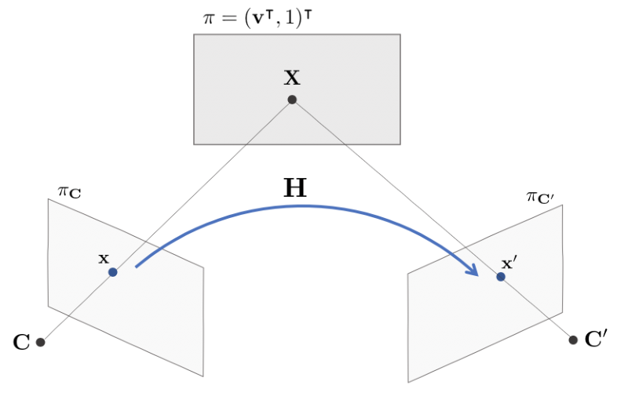

## Homographies given the plane and vice versa

해당 섹션에서는 월드 상의 평면 $\pi$이 주어졌을 때 이를 사용하여 하나의 이미지 평면에서 다른 이미지
평면으로 가는 Homography 변환에 대해 설명한다.

### Result 13.1

Canonical Form으로 변환한 카메라 행렬 대응쌍 $(\mathbf{P}, \mathbf{P}')$과 월드 상의 평면 $\pi$ 다음과 같이 주어졌을 때

$$\begin{aligned}
\mathbf{P} &= [\mathbf{I} \mid \mathbf{0}] \\
\mathbf{P}' &= [\mathbf{A} \mid \mathbf{a}] \\
\pi &= (\mathbf{v}^\intercal, 1)^\intercal \quad \mathbf{v} \in \mathbb{R}^3
\end{aligned} \tag{342}$$

이 때, Homography $\mathbf{H}$는

$$\mathbf{H} = \mathbf{A} - \mathbf{a}\mathbf{v}^\intercal \tag{343}$$

로 주어진다.

### Proof

두 카메라의 이미지 평면 $\pi_P, \pi_{P'}$가 주어졌을 때, 월드 평면 상의 점 $\mathbf{X} \in \pi$를 $\pi_P$ 평면으로 프로젝션한 점 $\mathbf{x}$
는 다음과 같다.

$$\mathbf{P}\mathbf{X} = [\mathbf{I} \mid \mathbf{0}]\begin{pmatrix} \tilde{\mathbf{X}} \\ 1 \end{pmatrix} = \tilde{\mathbf{X}} = \mathbf{x} \tag{344}$$

따라서 임의의 스칼라 $\rho$에 대해 $\tilde{\mathbf{X}} = \rho^{-1}\mathbf{x}$가 성립한다. $\mathbf{X}$를 다시 쓰면 $\mathbf{X} = \begin{pmatrix} \mathbf{x} & \rho \end{pmatrix}^\intercal$이 되고 $\mathbf{X}$는 $\pi$
평면 위의 점이므로

$$\begin{pmatrix} \mathbf{v}^\intercal & 1 \end{pmatrix}\begin{pmatrix} \mathbf{x} \\ \rho \end{pmatrix} = 0 \tag{345}$$

이 성립한다. 위 식을 풀면 $\rho = -\mathbf{v}^\intercal\mathbf{x}$이 된다. $\mathbf{X}$를 $\pi_{P'}$에 프로젝션하면

$$\begin{aligned}
\mathbf{x}' = \mathbf{P}'\mathbf{X} &= [\mathbf{A} \mid \mathbf{a}]\begin{pmatrix} \mathbf{x} \\ -\mathbf{v}^\intercal\mathbf{x} \end{pmatrix} \\
&= \mathbf{A}\mathbf{x} - \mathbf{a}\mathbf{v}^\intercal\mathbf{x} \\
&= (\mathbf{A} - \mathbf{a}\mathbf{v}^\intercal)\mathbf{x}
\end{aligned} \tag{346}$$

이 되므로 따라서 $\mathbf{H} = \mathbf{A} - \mathbf{a}\mathbf{v}^\intercal$이 된다.

### A calibrated stereo rig

캘리브레이션 된 스테레오 카메라 행렬 대응쌍 $(\mathbf{P}, \mathbf{P}')$가 다음과 같이 주어지고

$$\begin{aligned}
\mathbf{P} &= \mathbf{K}[\mathbf{I} \mid \mathbf{0}] \\
\mathbf{P}' &= \mathbf{K}'[\mathbf{R} \mid \mathbf{t}]
\end{aligned} \tag{347}$$

월드 상의 평면 $\pi = (\mathbf{n}^\intercal, d)^\intercal$이 주어진 경우, $\pi$ 평면 상의 점 $\mathbf{X}$는

$$\mathbf{n}^\intercal\tilde{\mathbf{X}} + d = 0 \tag{348}$$

이 성립한다. 이를 다시 정리하면 $-\frac{\mathbf{n}^\intercal\tilde{\mathbf{X}}}{d} = 1$이 된다. $\mathbf{X}$를 이미지 평면 $\pi_P$ 상에 프로젝션한 점 $\mathbf{x}$는
다음과 같이 나타낼 수 있다.

$$\mathbf{x} = \mathbf{P}\mathbf{X} = \mathbf{K}[\mathbf{I} \mid \mathbf{0}]\begin{pmatrix} \tilde{\mathbf{X}} \\ 1 \end{pmatrix} = \mathbf{K}\tilde{\mathbf{X}} \tag{349}$$

따라서 $\tilde{\mathbf{X}} = \mathbf{K}^{-1}\mathbf{x}$가 되고 다음으로 $\mathbf{X}$를 이미지 평면 $\pi_{P'}$에 프로젝션한 점 $\mathbf{x}'$는

$$\begin{aligned}
\mathbf{x}' = \mathbf{P}'\mathbf{X} &= \mathbf{K}'[\mathbf{R} \mid \mathbf{t}]\begin{pmatrix} \tilde{\mathbf{X}} \\ 1 \end{pmatrix} \\
&= \mathbf{K}'\mathbf{R}\tilde{\mathbf{X}} + \mathbf{K}'\mathbf{t}\left(-\frac{\mathbf{n}^\intercal\tilde{\mathbf{X}}}{d}\right) \\
&= \mathbf{K}'\left(\mathbf{R} - \frac{\mathbf{t}\mathbf{n}^\intercal}{d}\right)\tilde{\mathbf{X}} \\
&= \mathbf{K}'\left(\mathbf{R} - \frac{\mathbf{t}\mathbf{n}^\intercal}{d}\right)\mathbf{K}^{-1}\mathbf{x}
\end{aligned} \tag{350}$$

가 되어 결론적으로 캘리브레이션된 스테레오 카메라에서 Homography $\mathbf{H}$는

$$\mathbf{H} = \mathbf{K}'\left(\mathbf{R} - \frac{\mathbf{t}\mathbf{n}^\intercal}{d}\right)\mathbf{K}^{-1} \tag{351}$$

가 된다.

<!--widget:plane-homography-->

### Homographies compatible with epipolar geometry

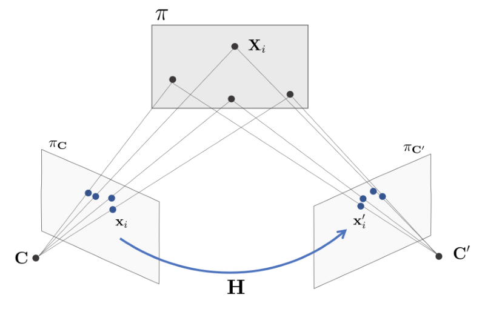

월드 상의 평면 $\pi$ 위에 존재하는 4개의 대응점 쌍 $(\mathbf{x}_i, \mathbf{x}'_i), i = 1, \cdots, 4$가 주어졌다고 가정해보자. 4개의
대응점 쌍으로부터 8개의 제약조건을 얻을 수 있으며 이를 통해 Homograpy $\mathbf{H}$를 유일하게 결정할 수 있다.

다음으로 월드 상에 서로 일직선으로 있지 않은(no three are collinear) 임의의 4개의 대응점 쌍 $(\mathbf{x}_i, \mathbf{x}'_i), i = 1, \cdots, 4$가 주어졌다고 가정해보자. ==이 때, 한 이미지 평면 $\pi_P$에서 다른 이미지 평면 $\pi_{P'}$으로 점들을 변환
하는 Homography $\mathbf{H}$가 존재하게 되는데 이러한 $\mathbf{H}$가 두 카메라 사이의 Fundamental Matrix $\mathbf{F}$와
서로 호환(compatible)이 되기 위해서는 $\mathbf{H}$가 월드 평면 상의 평면 $\pi$에 대한 Homography 변환이어야
한다. 다시 말하면, $\mathbf{H}$가 Epipolar Geometry를 따르기 위해서는 $\mathbf{H}$가 $\pi$에 대한 Homography이어야
한다.== Epipolar Geometry에 의해 $\mathbf{x}$가 $\mathbf{H}\mathbf{x}$와 대응이 되기 위한 조건은

$$(\mathbf{H}\mathbf{x})^\intercal\mathbf{F}\mathbf{x} = 0 \tag{352}$$

이다. 즉, $\mathbf{x}^\intercal\mathbf{H}^\intercal\mathbf{F}\mathbf{x} = 0$을 만족해야 하므로 $\mathbf{H}^\intercal\mathbf{F}$가 반대칭행렬(skew-symmetric)이어야 한다.

$$\mathbf{H}^\intercal\mathbf{F} + \mathbf{F}^\intercal\mathbf{H} = 0 \tag{353}$$

==위 조건은 $\mathbf{H}$가 Epipolar Geometry를 따르기 위한 필요충분조건이다.==

### Result 13.3

일반적으로 $\mathbf{F} = \mathbf{e}'^\wedge\mathbf{A}$와 같이 주어졌을 때 $\mathbf{H}$는

$$\mathbf{H} = \mathbf{A} - \mathbf{e}'\mathbf{v}^\intercal \tag{354}$$

이 된다. 이 때, $\mathbf{H}$는 $\mathbf{v} \in \mathbb{R}^3$로부터 3자유도를 가진다.

### Proof

$\mathbf{F} = \mathbf{e}'^\wedge\mathbf{A}$와 같이 주어진 경우 Projective Reconstruction을 수행하면 두 카메라 행렬 대응쌍을

$$\begin{aligned}
\mathbf{P} &= [\mathbf{I} \mid \mathbf{0}] \\
\mathbf{P}' &= [\mathbf{A} \mid \mathbf{e}']
\end{aligned} \tag{355}$$

과 같이 구할 수 있다. 월드 상의 평면 $\pi = (\mathbf{v}^\intercal, 1)^\intercal$이 주어졌을 때 앞의 정리에 의해

$$\mathbf{H} = \mathbf{A} - \mathbf{e}'\mathbf{v} \tag{356}$$

와 같이 구할 수 있다. 이를 $\mathbf{F}^\intercal\mathbf{H}$에 대입하면

$$\begin{aligned}
\mathbf{F}^\intercal\mathbf{H} &= -\mathbf{A}^\intercal\mathbf{e}'^\wedge(\mathbf{A} - \mathbf{e}'^\intercal\mathbf{v}) \\
&= -\mathbf{A}^\intercal\mathbf{e}'^\wedge\mathbf{A} \quad \because \mathbf{e}'^\wedge\mathbf{e}' = 0
\end{aligned} \tag{357}$$

와 같이 반대칭행렬(skew-symmetric)이 된다.

### Corollary

두 카메라 사이의 임의의 Homography $\mathbf{H}$가 Epipolar Geometry를 따르기 위해서는 $\mathbf{H}$가 월드 상의 평면
$\pi$에 대한 Homography이어야 한다. $\mathbf{H}$가 월드 상의 평면 $\pi$에 대한 Homography이기 위한 필요충분조건은
다음과 같다.

$$\mathbf{F} = \mathbf{e}'^\wedge\mathbf{H} \tag{358}$$

### Proof

($\Rightarrow$) $\mathbf{H}$가 월드 상의 평면 $\pi = (\mathbf{v}^\intercal, 1)^\intercal$에 대한 Homography이면서 $\mathbf{F} = \mathbf{e}'^\wedge\mathbf{A}$일 때 앞서 정리에 의해

$$\begin{aligned}
\mathbf{H} &= \mathbf{H}\begin{pmatrix} \mathbf{v} \\ 1 \end{pmatrix} \\
&= \mathbf{A} - \mathbf{e}'^\intercal\mathbf{v}
\end{aligned} \tag{359}$$

가 성립한다. 따라서

$$\begin{aligned}
\mathbf{e}'^\wedge\mathbf{H} &= \mathbf{e}'^\wedge(\mathbf{A} - \mathbf{e}'^\intercal\mathbf{v}) \\
&= \mathbf{e}'^\wedge\mathbf{A} = \mathbf{F} \quad \because \mathbf{e}'^\wedge\mathbf{e}' = 0
\end{aligned} \tag{360}$$

가 된다.

($\Leftarrow$) $\mathbf{F} = \mathbf{e}'^\wedge\mathbf{H}$인 경우 $\mathbf{H}$는 월드 상의 임의의 평면 $\pi$에 의한 Homography이다. 예를 들어, $\mathbf{H}$가 무한대
평면 $\pi_\infty = (\mathbf{0}^\intercal, 1)^\intercal$에 의한 Homography라고 하면

$$\mathbf{H} = \mathbf{H}\begin{pmatrix} \mathbf{0} \\ 1 \end{pmatrix} = \mathbf{H} - \mathbf{e}' \cdot 0 = \mathbf{H} \tag{361}$$

가 된다.

## Plane induced homographies given F and image correspondences

### Three points

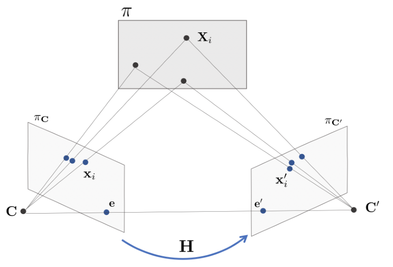

==두 개의 이미지 평면 $\pi_P, \pi_{P'}$에 세 개의 대응점 쌍 $(\mathbf{x}_i, \mathbf{x}'_i), i = 1, 2, 3$이 주어졌을 때 이들을 Back-projection한 월드 상의 점 $\mathbf{X}_i, i = 1, 2, 3$을 통해 월드 상의 평면 $\pi$를 유일하게 결정할 수 있고 이를
통한 Homography $\mathbf{H}$를 계산할 수 있다.== 해당 섹션에서는 이러한 Homography $\mathbf{H}$를 구하는 방법에 대해
설명한다.

$\mathbf{H}$를 구하는 방법에는 크게 두 가지 방법이 존재한다. ==첫 번째 방법은 월드 상의 평면 $\pi$를 직접 구하는
방법이 있다.== 세 개의 대응점 쌍 $(\mathbf{x}_i, \mathbf{x}'_i), i = 1, 2, 3$과 Fundamental Matrix $\mathbf{F} = \mathbf{e}'^\wedge\mathbf{A}$가 주어진 경우 이를
통해 카메라 행렬을 구할 수 있다(projective reconstrcution). 주어진 대응점 쌍 $(\mathbf{x}_i, \mathbf{x}'_i), i = 1, 2, 3$과 $\mathbf{F}$를
통해

$$\begin{aligned}
\mathbf{P} &= [\mathbf{I} \mid \mathbf{0}] \\
\mathbf{P}' &= [\mathbf{A} \mid \mathbf{e}']
\end{aligned} \tag{362}$$

을 사영모호성을 포함하여(up to projectivity) 결정할 수 있다. 그리고 $\mathbf{P}, \mathbf{P}'$를 사용하여 Back-projection
한 월드 상의 점 $\mathbf{X}_i, i = 1, 2, 3$ 또한 계산할 수 있다. 이 때, $\mathbf{X}_i, i = 1, 2, 3$은 동일한 직선 상에 존재하면 안
된다(not colinear). 다음으로 월드 상의 세 개의 점 $\mathbf{X}_i, i = 1, 2, 3$을 포함하는 월드 상의 평면 $\pi$를 유일하게
결정할 수 있고 $\pi = (\mathbf{v}^\intercal, d)^\intercal$일 때

$$\mathbf{H} = \mathbf{A} - \mathbf{e}'\mathbf{v}^\intercal \tag{363}$$

과 같이 $\pi$를 기반으로 $\pi_P \leftrightarrow \pi_{P'}$ 사이의 점들을 변환하는 Homography $\mathbf{H}$를 계산할 수 있다.

==두 번째 방법은 $\mathbf{H}\mathbf{x}_i = \mathbf{x}'_i, i = 1, 2, 3$을 대수적으로 푸는 방법이다.== 이 때 $\mathbf{x}'_i \times (\mathbf{H}\mathbf{x}_i) = 0$의 공식을
선형방정식의 $\mathbf{A}\mathbf{h} = 0$ 형태로 변형함으로써 Homography $\mathbf{H}$를 구할 수 있다. 하지만 Homography $\mathbf{H}$를
구하려면 총 네 개의 대응점 쌍이 필요한데 주어진 대응점 쌍은 세 개이므로 추가적으로 한 개의 대응점 쌍이
필요하다. 미리 알고 있는 Fundamental Matrix $\mathbf{F}$를 사용하여 두 이미지 평면의 Epipole $\mathbf{e}, \mathbf{e}'$을 구하고 이를
Back-projection함으로써 한 개의 대응점쌍을 추가하여 Homography $\mathbf{H}$를 계산할 수 있다. 단, 이 때 대응점
쌍 $(\mathbf{x}_i, \mathbf{x}'_i), i = 1, 2, 3$들이 Epipolar Line 위에 존재하면 안된다는 가정이 필요하다.

### Result 13.6

Fundamental Matrix $\mathbf{F}$와 세 개의 대응점 쌍 $(\mathbf{x}_i, \mathbf{x}'_i), i = 1, 2, 3$이 주어졌을 때 이들을 통해 계산한 월드
상의 평면 $\pi$로 인한 Homography $\mathbf{H}$는

$$\mathbf{H} = \mathbf{A} - \mathbf{e}'(\mathbf{M}^{-1}\mathbf{b})^\intercal \tag{364}$$

와 같이 계산할 수 있다. 이 때,

$$\begin{aligned}
\mathbf{M} &= \begin{bmatrix} \mathbf{x}_1 \\ \mathbf{x}_2 \\ \mathbf{x}_3 \end{bmatrix} \\
\mathbf{b} &= (\mathbf{x}'_i \times (\mathbf{A}\mathbf{x}_i))^\intercal(\mathbf{x}'_i \times \mathbf{e}')/\|\mathbf{x}'_i \times \mathbf{e}'\|
\end{aligned} \tag{365}$$

### Proof

Canonical 카메라 행렬 $\mathbf{P} = [\mathbf{I} \mid \mathbf{0}], \mathbf{P}' = [\mathbf{A} \mid \mathbf{e}']$일 때 Fundmaental Matrix $\mathbf{F} = \mathbf{e}'^\wedge\mathbf{A}$와 같이 구할 수 있고
이 때 $\mathbf{e}'^\wedge\mathbf{F} = \mathbf{e}'^\wedge\mathbf{e}'^\wedge\mathbf{A}$가 되어서

$$\mathbf{e}'^\wedge\mathbf{F} = \mathbf{e}'^\wedge\mathbf{e}'^\wedge\mathbf{A} \sim \mathbf{A} \tag{366}$$

와 같이 $\mathbf{A}$와 비례 관계가 된다. 따라서 $\mathbf{A} = \mathbf{e}'^\wedge\mathbf{F}$가 성립한다.

월드 상의 평면 $\pi = (\mathbf{v}^\intercal, d)^\intercal$이 주어졌을 때 임의의 Homography $\mathbf{H}$는 $\mathbf{H} = \mathbf{A} - \mathbf{e}'\mathbf{v}$와 같이 나타낼 수
있고 이 때 $\mathbf{v}$를 구하기 위해

$$\mathbf{x}'_i \times \mathbf{H}\mathbf{x}_i = 0 \tag{367}$$

식을 세운 후 정리하면

$$\begin{aligned}
\mathbf{x}'_i \times \mathbf{H}\mathbf{x}_i &= 0 \\
\mathbf{x}'_i \times (\mathbf{A}\mathbf{x}_i - \mathbf{e}'\mathbf{v}^\intercal\mathbf{x}_i) &= 0 \\
\mathbf{x}'_i \times \mathbf{A}\mathbf{x}_i &= (\mathbf{x}_i \times \mathbf{e}')\mathbf{v}^\intercal\mathbf{x}_i
\end{aligned} \tag{368}$$

꼴이 된다. 양변에 $(\mathbf{x}_i \times \mathbf{e}')^\intercal$을 곱한 후 정리하면

$$\mathbf{x}^\intercal_i\mathbf{v} = b_i \tag{369}$$

형태가 나온다. 이를 세 개의 점에 대해 모두 적용하면

$$\begin{bmatrix} \mathbf{x}_1 \\ \mathbf{x}_2 \\ \mathbf{x}_3 \end{bmatrix}\mathbf{v} = \begin{pmatrix} b_1 \\ b_2 \\ b_3 \end{pmatrix} \tag{370}$$

가 된다 이 때, $\begin{bmatrix} \mathbf{x}_1 \\ \mathbf{x}_2 \\ \mathbf{x}_3 \end{bmatrix}$를 행렬 $\mathbf{M}$으로 치환하면

$$\mathbf{M}\mathbf{v} = \mathbf{b} \tag{371}$$

꼴이 되고 이를 정리하면 ==결론적으로 $\mathbf{v} = \mathbf{M}^{-1}\mathbf{b}$가 된다. 이에 따라 Homography $\mathbf{H}$는 $\mathbf{H} = \mathbf{A} - \mathbf{e}'(\mathbf{M}^{-1}\mathbf{b})^\intercal$과 같이 나타낼 수 있다.==

### A point and line

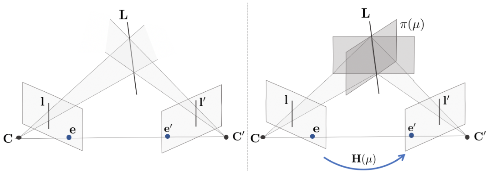

해당 섹션에서는 월드 상에 하나의 선과 하나의 점이 주어졌을 때 Homography $\mathbf{H}$를 구하는 방법에 대해
설명한다.

### Result 13.7

월드 상에 직선 $\mathbf{L}$에 대응하는 이미지 평면 상에 대응선 쌍 $\mathbf{l} \leftrightarrow \mathbf{l}'$이 주어졌을 때 월드 상의 직선 $\mathbf{L}$을 사용하여
$\mathbf{l}$을 $\mathbf{l}'$로 변환하는 Homography $\mathbf{H}$는

$$\mathbf{H}(\mu) = \mathbf{l}'^\wedge\mathbf{F} + \mu\mathbf{e}'\mathbf{l}^\intercal \tag{372}$$

과 같이 나타낼 수 있다. 이 때, $\mathbf{l}'^\intercal\mathbf{e}' \neq 0$이어야 하며 $\mu$는 $\mu \in \mathbb{P}^1$인 파라미터이다.

### Proof

카메라 행렬 대응쌍 $\mathbf{P} = [\mathbf{I} \mid \mathbf{0}], \mathbf{P}' = [\mathbf{A} \mid \mathbf{e}']$이 주어졌을 때 이미지 평면 상의 직선 $\mathbf{l}, \mathbf{l}'$을 Back-projection
한 평면 $\pi_l = \mathbf{P}^\intercal\mathbf{l}, \pi_{l'} = \mathbf{P}'^\intercal\mathbf{l}'$과 같이 나타낼 수 있다. 두 개의 Back-projection 평면들은 $\pi_l, \pi_{l'}$이 교차하는
선이 월드 상의 직선 $\mathbf{L}$이 되고 이 때 $\mathbf{L}$을 포함하는 평면 $\pi$는

$$\begin{aligned}
\pi(\mu) &= \mu\mathbf{P}^\intercal\mathbf{l} + \mathbf{P}'^\intercal\mathbf{l}' \\
&= \mu\begin{pmatrix} \mathbf{l} \\ 0 \end{pmatrix} + \begin{pmatrix} \mathbf{A}^\intercal\mathbf{l}' \\ \mathbf{e}'^\intercal\mathbf{l}' \end{pmatrix} = \begin{pmatrix} \mu\mathbf{l} + \mathbf{A}^\intercal\mathbf{l}' \\ \mathbf{e}'^\intercal\mathbf{l}' \end{pmatrix}
\end{aligned} \tag{373}$$

과 같이 $\mu$로 파라미터화하여 $\mathbf{L}$을 포함하는 무수한 평면을 나타낼 수 있다. Result 13.1로부터 평면 $\pi(\mu)$
를 사용한 Homography $\mathbf{H}$는

$$\mathbf{H}(\mu) = \mathbf{A} - \mathbf{e}'\mathbf{v}(\mu)^\intercal \tag{374}$$

과 같이 나타낼 수 있고 이 때, $\mathbf{v}$는 위에서 설명한 $\pi(\mu)$ 공식에 따라 $\mathbf{v}(\mu) = (\mu\mathbf{l} + \mathbf{A}^\intercal\mathbf{l}')/(\mathbf{e}'^\intercal\mathbf{l}')$이 된다.
위 공식에 행렬 $\mathbf{A}$에 $\mathbf{A} = \mathbf{e}'^\wedge\mathbf{F}$를 대입하여 다시 정리하면

$$\mathbf{H}(\mu) = -(\mathbf{l}'^\wedge\mathbf{F} + \mu\mathbf{e}'\mathbf{l}^\intercal)/(\mathbf{e}'^\intercal\mathbf{l}') \sim \mathbf{l}'^\wedge\mathbf{F} + \mu\mathbf{e}'\mathbf{l}^\intercal \tag{375}$$

이 된다. 따라서 ==$\mathbf{H}$는 따라서 $\mathbf{H}(\mu) = \mathbf{l}'^\wedge\mathbf{F} + \mu\mathbf{e}'\mathbf{l}^\intercal$에 비례하므로 해당 식과 같이 쓸 수 있다.==

### The homography for a corresponding point and line

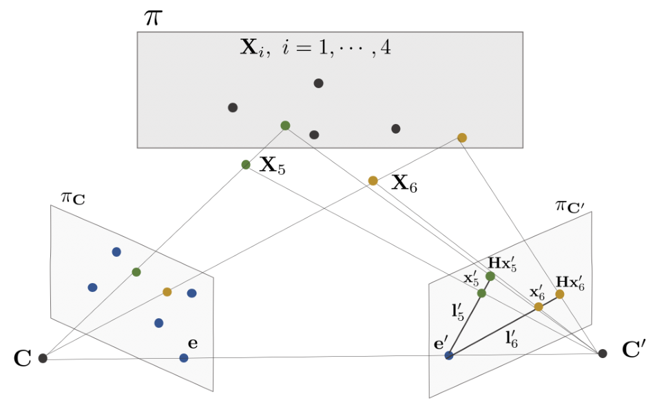

앞서 설명한 대응선 쌍 $\mathbf{l} \leftrightarrow \mathbf{l}'$을 이용한 Homography $\mathbf{H}(\mu)$는 $\mu$ 값에 따라 Homography가 변하는 특징이
있다.

### Result 13.8

하나의 대응선 쌍 $\mathbf{l} \leftrightarrow \mathbf{l}'$과 하나의 대응점 쌍 $\mathbf{x} \leftrightarrow \mathbf{x}'$이 주어지면 이를 통해 $\mu$ 값을 특정되어 다음과 같은
유일한 Homography $\mathbf{H}$가 도출된다.

$$\mathbf{H} = \mathbf{l}'^\wedge\mathbf{F} + \frac{(\mathbf{x}' \times \mathbf{e}')^\intercal(\mathbf{x}' \times ((\mathbf{F}\mathbf{x}) \times \mathbf{l}'))}{\|\mathbf{x}' \times \mathbf{e}'\|^2(\mathbf{l}^\intercal\mathbf{x})}\mathbf{e}'\mathbf{l}^\intercal \tag{376}$$

대응선 쌍 $\mathbf{l} \leftrightarrow \mathbf{l}'$를 사용하면 월드 상의 평면 $\pi(\mu)$를 통해 $\mathbf{H}(\mu) = \mathbf{l}'^\wedge\mathbf{F} + \mu\mathbf{e}'\mathbf{l}^\intercal$와 같이 Homography를
구할 수 있다. 이 때, $\mathbf{H}\mathbf{x} = \mathbf{x}'$ 식을 통해 $\mathbf{x}' \times (\mathbf{H}\mathbf{x}) = 0$ 식을 전개해보면

$$\mathbf{x}' \times (\mathbf{l}'^\wedge\mathbf{F}\mathbf{x} + \mu\mathbf{e}'\mathbf{l}^\intercal\mathbf{x}) = 0 \tag{377}$$

이 된다. 이를 전개 후 정리해보면

$$\begin{aligned}
(\mathbf{x}' \times \mathbf{e}')\mathbf{l}^\intercal\mathbf{x} \cdot \mu &= -\mathbf{x}' \times \mathbf{l}' \times \mathbf{F}\mathbf{x} \\
&= \mathbf{x}' \times \mathbf{F}\mathbf{x} \times \mathbf{l}'
\end{aligned} \tag{378}$$

이 되고 양변에 $(\mathbf{x}' \times \mathbf{e}')^\intercal$을 곱하여 $\mu$에 대하여 정리 후 $\mathbf{H}(\mu)$식 에 넣어주면

$$\mathbf{H} = \mathbf{l}'^\wedge\mathbf{F} + \frac{(\mathbf{x}' \times \mathbf{e}')^\intercal(\mathbf{x}' \times ((\mathbf{F}\mathbf{x}) \times \mathbf{l}'))}{\|\mathbf{x}' \times \mathbf{e}'\|^2(\mathbf{l}^\intercal\mathbf{x})}\mathbf{e}'\mathbf{l}^\intercal \tag{379}$$

공식을 얻을 수 있다.

## Computing F given the homography induced by a plane

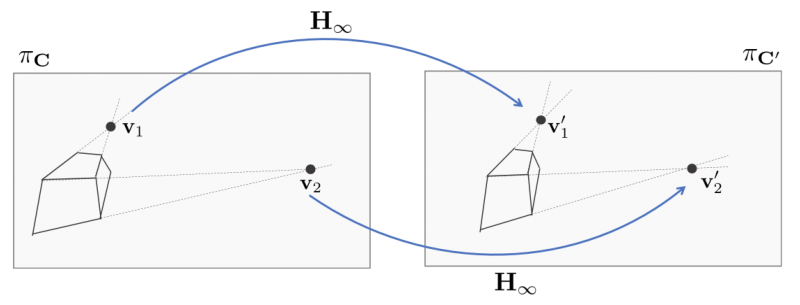

일반적으로 두 개의 카메라 행렬 대응쌍 $(\mathbf{P}, \mathbf{P}')$에 대한 Fundamental Matrix $\mathbf{F}$를 계산하기 위해서는 최소
8개의 대응점 쌍 $(\mathbf{x}_i, \mathbf{x}'_i), i = 1, \cdots, 8$이 필요하다. 하지만 ==Scene Plane Homography를 이용하면 6개의
대응점 쌍만 사용해도 $\mathbf{F}$를 계산할 수 있다.== 단, 6개의 대응점 쌍들 중 4개 대응점 쌍 $(\mathbf{x}_i, \mathbf{x}'_i), i = 1, \cdots, 4$
에 해당하는 월드 상의 점들의 동일한 평면 $\pi$ 위에 존재해야 한다는 제약조건이 있다.

6개의 대응점 쌍으로 Fundmaental Matrix $\mathbf{F}$를 계산하는 알고리즘의 순서는 다음과 같다.

- 월드 상의 평면 $\pi$ 위에 존재하는 4개의 점들 $\mathbf{X}_i, i = 1, \cdots, 4$를 프로젝션한 대응점 쌍들 $(\mathbf{x}_i, \mathbf{x}'_i), i = 1, \cdots, 4$를 사용하여 $\mathbf{x}'_i = \mathbf{H}\mathbf{x}_i$를 만족하는 Homorgaphy $\mathbf{H}$를 계산한다. 이 때 4쌍의 대응점은 Homography $\mathbf{H}$를 유일하게 결정한다.
- 남은 2개의 대응점 쌍 $(\mathbf{x}_i, \mathbf{x}'_i), i = 5, 6$을 사용하여 Epipole $\mathbf{e}'$를 구한다. $\mathbf{x}_5$를 Homography 변환한
  $\mathbf{H}\mathbf{x}_5$와 $\mathbf{x}'_5$를 사용하여 두 점을 잇는 직선을 $(\mathbf{H}\mathbf{x}_5) \times \mathbf{x}'_5$와 같이 구한다. $\mathbf{x}_6$에 대해서도 마찬가지로
  적용하여 직선 $(\mathbf{H}\mathbf{x}_6) \times \mathbf{x}'_6$를 구한 다음 두 직선이 교차하는 점을 구하면 그 점이 곧 Epipole $\mathbf{e}'$가 된다.

$$\mathbf{e}' = (\mathbf{H}\mathbf{x}_5) \times \mathbf{x}'_5 \cap (\mathbf{H}\mathbf{x}_6) \times \mathbf{x}'_6 \tag{380}$$

- Fundamental Matrix $\mathbf{F}$를 $\mathbf{F} = \mathbf{e}'^\wedge\mathbf{H}$를 통해 구한다.

## The infinite homography $\mathbf{H}_\infty$

### Definition 13.10

==Scene Plane이 무한대 평면(plane at infinity) $\pi_\infty$인 경우, 이 때 계산한 Homography를 Infinity
Homography $\mathbf{H}_\infty$라고 한다.==

카메라 행렬 대응쌍 $(\mathbf{P}, \mathbf{P}')$가 다음과 같이 주어졌을 때

$$\begin{aligned}
\mathbf{P} &= \mathbf{K}[\mathbf{I} \mid \mathbf{0}] \\
\mathbf{P}' &= \mathbf{K}'[\mathbf{R} \mid \mathbf{t}]
\end{aligned} \tag{381}$$

월드 상의 평면 $\pi(d) = \begin{pmatrix} \mathbf{v} \\ d \end{pmatrix}$에 대해 Homography는 다음과 같이 구할 수 있다.

$$\mathbf{H}_{\pi(d)} = \mathbf{K}'\left(\mathbf{R} - \frac{\mathbf{t}\mathbf{n}^\intercal}{d}\right)\mathbf{K}^{-1} \tag{382}$$

Inifinite Homography $\mathbf{H}_\infty$는 $d$가 무한대인 경우에 해당하므로

$$\mathbf{H}_\infty = \lim_{d\to\infty}\mathbf{H}_{\pi(d)} = \mathbf{K}'\mathbf{R}\mathbf{K}^{-1} \tag{383}$$

가 된다. 따라서 ==$\mathbf{H}_\infty$는 $\mathbf{t}$에 의존하지 않고 오직 카메라의 회전에만 의존한다는 것을 알 수 있다.==

### Affine and metric reconstruction

만약 월드좌표계가 Affine인 경우 $\pi_\infty$는 $\pi_\infty = (0, 0, 0, 1)^\intercal$과 같이 나타낼 수 있고 두 카메라 행렬이 $\mathbf{P} = [\mathbf{M} \mid \mathbf{m}], \mathbf{P}' = [\mathbf{M}' \mid \mathbf{m}']$으로 주어진 경우 무한대 평면 상의 점 $\mathbf{X} \in \pi_\infty$를 각각 카메라에 프로젝션하면

$$\begin{aligned}
\mathbf{x} &= \mathbf{P}\mathbf{X} = [\mathbf{M} \mid \mathbf{m}]\begin{pmatrix} \tilde{\mathbf{X}} \\ 0 \end{pmatrix} = \mathbf{M}\tilde{\mathbf{X}} \\
\mathbf{x}' &= \mathbf{P}'\mathbf{X} = [\mathbf{M}' \mid \mathbf{m}']\begin{pmatrix} \tilde{\mathbf{X}} \\ 0 \end{pmatrix} = \mathbf{M}'\tilde{\mathbf{X}} = (\mathbf{M}'\mathbf{M}^{-1})\mathbf{x}
\end{aligned} \tag{384}$$

따라서 $\mathbf{x}' = (\mathbf{M}'\mathbf{M}^{-1})\mathbf{x}$가 되어 월드좌표계가 Affine일 때 두 카메라 사이의 Infinite Homography는
$\mathbf{H}_\infty = \mathbf{M}'\mathbf{M}^{-1}$가 된다.

# 11 Affine Epipolar Geometry

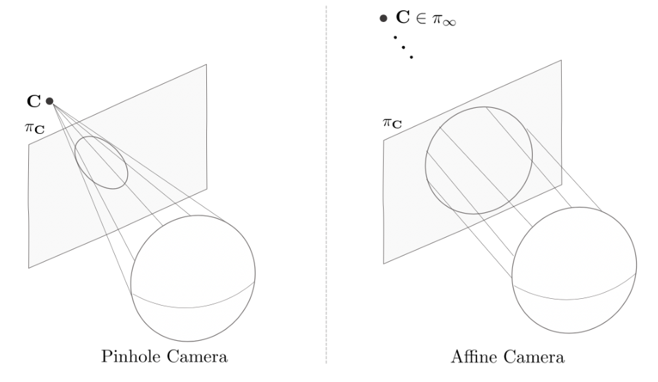

핀홀 카메라(pinhole camera)는 월드 상의 물체가 이미지 평면 상에 프로젝션될 때 초점이라 부르는 하나의
점을 통과하여 이미지 평면상에 투과되는 카메라 모델을 의미한다. 따라서 핀홀 카메라 모델은 사영공간
(projective space) $\mathbb{P}^3 \mapsto \mathbb{P}^2$로 매핑하는 함수로 모델링 할 수 있고 원근법에 의한 왜곡이 발생한다. 이와
반대로 ==Affine 카메라는 월드 상의 물체가 이미지 평면 상에 프로젝션 될 때 마치 무한대 광원에 의한
그림자 상이 맺히는 것과 같이 이미지 평면에 프로젝션되는 카메라를 의미한다. 따라서 Affine 카메라는
원근법에 의한 왜곡이 발생하지 않는다.==

Affine 카메라도 Canonical Form으로 나타낼 수 있다. 두 개의 Affine 카메라 $\mathbf{P}_A, \mathbf{P}'_A$가 주어졌을 때
월드 좌표계와 카메라 좌표계가 동일한 경우 $\mathbf{P}_A$의 주축(principal axis)는 $Z$축이 되고 이 때의 프로젝션은
$XY$ 평면으로 프로젝션이 된다. 그리고 $\mathbf{P}'_A$는 Affine 변환 $\mathbf{M}$과 카메라 이동 $\mathbf{t}$를 통해 표현할 수 있다. ==이
때, 두 개의 Affine 카메라는 모두 마지막 행(row)이 $(0, 0, 0, 1)$인 성질을 지닌다.==

$$\mathbf{P}_A = \begin{bmatrix} 1 & 0 & 0 & 0 \\ 0 & 1 & 0 & 0 \\ 0 & 0 & 0 & 1 \end{bmatrix} \qquad \mathbf{P}'_A = \begin{bmatrix} \mathbf{M} & \mathbf{t} \\ \mathbf{0} & 1 \end{bmatrix} \quad \text{where, } \mathbf{M} \in \mathbb{R}^{2\times3}, \mathbf{t} \in \mathbb{R}^2 \tag{385}$$

Affine 카메라 행렬 $\mathbf{P}_A$는 Affine 변환의 특성 상 ==무한대 평면(plane at infinity) $\pi_\infty = (X, Y, Z, 0)^\intercal$
상의 한 점을 무한대 직선(line at infinity) $\mathbf{l}_\infty$ 상의 한 점으로 변환한다. 즉, 월드 상 물체의 평행한
성질이 보존된다.==

$$\mathbf{P}_A\begin{pmatrix} X \\ Y \\ Z \\ 0 \end{pmatrix} = \begin{pmatrix} * \\ * \\ 0 \end{pmatrix} \in \mathbf{l}_\infty \tag{386}$$

일반적인 Affine 카메라 행렬 $\begin{bmatrix} \mathbf{M} & \mathbf{m} \\ \mathbf{0} & 1 \end{bmatrix} \in \mathbb{R}^{3\times4}$에서 행렬 $\mathbf{M} \in \mathbb{R}^{2\times3}$의 rank는 2이므로

$$\mathbf{M}\tilde{\mathbf{C}} = 0 \tag{387}$$

을 만족하는 Affine 카메라의 중심점 $\mathbf{C}$이 존재한다. ==이 때, $\mathbf{C}$는 무한대 평면 상에 존재한다.==

$$\mathbf{C} = \begin{pmatrix} \tilde{\mathbf{C}} \\ 0 \end{pmatrix} \in \pi_\infty \tag{388}$$

Affine 카메라 행렬 $\mathbf{P}_A$의 중심점 $\mathbf{C}$는 $\mathbf{C} = \begin{pmatrix} 0 & 0 & 1 & 0 \end{pmatrix}^\intercal$이다. ==즉, Affine 카메라의 중심점은 주축
(principal axis)의 방향과 동일하다.==

## Affine epipolar geometry

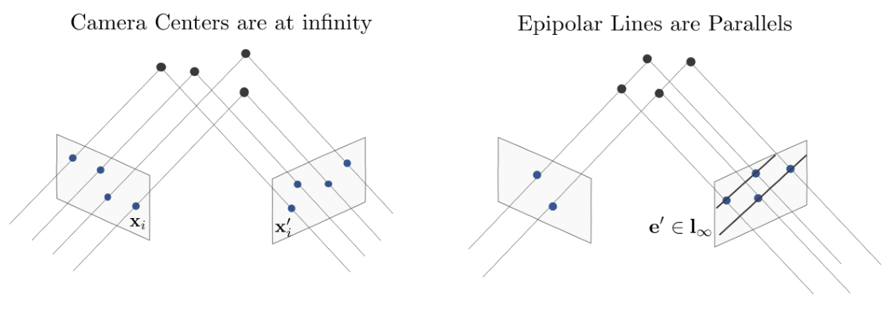

### Epipolar lines

두 개의 동일한 Affine 카메라가 주어졌을 때, 이들의 Back-projection 직선을 생각해보자. 첫 번째 Affine
카메라의 이미지 평면 상의 한 점 $\mathbf{x}$를 Back-projection하면

$$\mathbf{X}(\lambda) = \mathbf{P}^\dagger_A\mathbf{x} + \lambda\begin{pmatrix} \tilde{\mathbf{C}} \\ 0 \end{pmatrix} \tag{389}$$

이 되므로 Back-projection 직선들의 방향이 곧 Affine 카메라의 중심점 방향 $\begin{pmatrix} \tilde{\mathbf{C}} \\ 0 \end{pmatrix}$이 된다. ==즉, Affine 카
메라의 이미지 평면 상 모든 점들의 Back-projection 직선들은 평행하므로 이를 두 번째 Affine 카메라에
프로젝션한 Epipolar Line들 또한 모두 평행하다.==

### The epipoles

Epipolar Line들이 모두 평행하므로 ==Epipole들은 모두 무한대 직선(line at infinity) 상에 존재한다.==

## The affine fundamental matrix

### Result 14.1

두 개의 동일한 Affine 카메라가 주어졌을 때 이를 통해 Affine Fundamental Matrix $\mathbf{F}_A$를 정의할 수 있다.
이 때, $\mathbf{F}_A$는

$$\mathbf{F}_A = \begin{bmatrix} 0 & 0 & * \\ 0 & 0 & * \\ * & * & * \end{bmatrix} \tag{390}$$

꼴로 나타난다. $*$는 0이 아닌 값을 의미한다. 일반적으로 $\mathbf{F}_A$는

$$\mathbf{F}_A = \begin{bmatrix} 0 & 0 & a \\ 0 & 0 & b \\ c & d & e \end{bmatrix} \tag{391}$$

와 같이 작성한다. $\mathbf{F}_A$는 일반적인 Fundamental Matrix와 동일하게 rank 2를 가진다.

### Derivation

### Geometric derivation

두 개의 Affine 카메라 행렬 $\mathbf{P}_A, \mathbf{P}'_A$가 주어졌을 때 둘 사이에는 Affine 변환의 성질에 의해 평행한 선들이
보존된다. 따라서 두 이미지 평면의 Homography $\mathbf{H}_A$는 Affine Homography가 되어

$$\mathbf{x}' = \mathbf{H}_A\mathbf{x} \quad \text{where, } \mathbf{H}_A = \begin{bmatrix} * & * & * \\ * & * & * \\ 0 & 0 & 1 \end{bmatrix} \tag{392}$$

을 만족한다. Affine 카메라의 Epipole $\mathbf{e}'$은 무한대 직선(line at infinity) 상에 존재하므로 $\mathbf{e}'$의 Cross
Product는

$$\mathbf{e}'^\wedge = \begin{bmatrix} 0 & 0 & * \\ 0 & 0 & * \\ * & * & 0 \end{bmatrix} \tag{393}$$

꼴이다. Affine Fundamental Matrix $\mathbf{F}_A$는 $\mathbf{F}_A = \mathbf{e}'^\wedge\mathbf{H}_A$를 통해 계산할 수 있으므로

$$\begin{aligned}
\mathbf{F}_A &= \mathbf{e}'^\wedge\mathbf{H}_A \\
&= \begin{bmatrix} 0 & 0 & * \\ 0 & 0 & * \\ * & * & 0 \end{bmatrix}\begin{bmatrix} * & * & * \\ * & * & * \\ 0 & 0 & 1 \end{bmatrix} = \begin{bmatrix} 0 & 0 & * \\ 0 & 0 & * \\ * & * & * \end{bmatrix}
\end{aligned} \tag{394}$$

와 같은 형태가 된다.

### Properties

### The epipoles

Affine Fundamental Matrix $\mathbf{F}_A$가 주어졌을 때 이를 통해 Epipole $\mathbf{e}, \mathbf{e}'$를 계산할 수 있다. $\mathbf{F}_A$가

$$\mathbf{F}_A = \begin{bmatrix} 0 & 0 & a \\ 0 & 0 & b \\ c & d & e \end{bmatrix} \tag{395}$$

일 때 ==Fundamental Matrix의 성질로 인해 $\mathbf{F}_A\mathbf{e} = 0$와 $\mathbf{e}'^\intercal\mathbf{F}_A = 0$가 성립하므로 다음과 같이 계산할
수 있다.==

$$\begin{aligned}
\mathbf{e} &= \begin{pmatrix} -d & c & 0 \end{pmatrix}^\intercal \\
\mathbf{e}' &= \begin{pmatrix} -b & a & 0 \end{pmatrix}^\intercal
\end{aligned} \tag{396}$$

### Epipolar lines

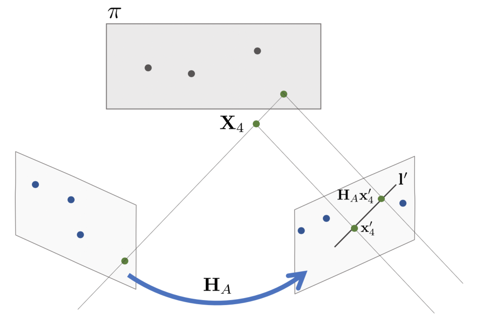

첫 번째 Affine 이미지 평면 상의 점 $\mathbf{x}$와 Affine Fundamental Matrix $\mathbf{F}_A$가 주어졌을 때 두 번째 Affine
이미지 평면 상의 Epipolar Line $\mathbf{l}'$는 다음과 같이 계산할 수 있다.

$$\begin{aligned}
\mathbf{x} &= \begin{pmatrix} x & y & 1 \end{pmatrix}^\intercal \qquad \mathbf{F}_A = \begin{bmatrix} 0 & 0 & a \\ 0 & 0 & b \\ c & d & e \end{bmatrix} \\
\mathbf{l}' &= \mathbf{F}_A\mathbf{x} = \begin{pmatrix} a & b & cx + dy + e \end{pmatrix}^\intercal
\end{aligned} \tag{397}$$

==Epipolar Line $\mathbf{l}'$의 처음 두 개의 항 $(a, b)$가 이미지 평면 상의 점 $\mathbf{x} = (x, y, 1)^\intercal$에 독립적이므로 이는
곧 $\mathbf{x}$에 관계없이 Epipolar Line들이 평행하다는 것을 의미한다.==

## Estimating $\mathbf{F}_A$ from image point correspondences

Projective 카메라의 Fundamental Matrix $\mathbf{F}$를 계산하기 위해서는 두 이미지 평면 사이에 대응점 쌍 $(\mathbf{x}, \mathbf{x}')$
가 최소 8개 이상이 필요하다. 하지만 Affine 카메라의 Affine Fundamental Matrix $\mathbf{F}_A$는 앞서 설명한 것과
같이 좌상단 $2 \times 2$ 항이 0이므로 최소 4개 이상의 대응점 쌍 $(\mathbf{x}, \mathbf{x}')$만으로도 $\mathbf{F}_A$를 구할 수 있다.

### Algorithm 14.2

- ==Objective:== Affine 이미지 평면에서 4개의 대응점 쌍 $(\mathbf{x}_i, \mathbf{x}'_i), i = 1, \cdots, 4$가 주어졌을 때 이를 통해
  Affine Fundamental Matrix를 구한다.
- 우선 처음 세 개의 대응점 쌍 $(\mathbf{x}_i, \mathbf{x}'_i), i = 1, 2, 3$을 Back-projection함으로써 월드 상의 점 $\mathbf{X}_i, i = 1, 2, 3$을 구할 수 있고 이 점들을 Span함으로써 유일한 평면 $\pi$가 결정할 수 있다.

$$\pi = \mathrm{Span}\{\mathbf{X}_1, \mathbf{X}_2, \mathbf{X}_3\} \tag{398}$$

- ==월드 상의 평면 $\pi$에 대해 $\mathbf{x}' = \mathbf{H}_A\mathbf{x}$를 만족하는 Affine Homography $\mathbf{H}_A$를 구한다.== 일반적으로
  Homography를 구하기 위해서는 네 개 이상의 대응점 쌍이 필요하지만 Affine Homography는 마지막
  행이 항상 $(0, 0, 1)$이므로 세 개의 대응점 쌍을 통해서도 $\mathbf{H}_A$를 계산할 수 있다.
- 나머지 한 점 $\mathbf{x}_4$를 사용하여 $\mathbf{H}_A\mathbf{x}_4$와 $\mathbf{x}_4$를 잇는 ==Epipolar Line $\mathbf{l}'$을 계산한다.==

$$\mathbf{l}' = \mathbf{H}_A\mathbf{x}_4 \times \mathbf{x}'_4 \tag{399}$$

==Epipolar Line $\mathbf{l}'$를 계산했으면 이를 통해 Epipole $\mathbf{e}' = (-l'_2, l'_1, 0)^\intercal$를 계산할 수 있다.== 만약 $\mathbf{x}_4$를
Back-projection한 월드 상의 점 $\mathbf{X}_4$가 월드 상의 평면 $\pi$ 위에 존재하는 경우 Epipolar Line을 구할 수
없다.

- $\mathbf{F}_A = \mathbf{e}'^\wedge\mathbf{H}_A$를 통해 Affine Fundamental Matrix를 계산한다.

$$\mathbf{F}_A = \begin{pmatrix} -l'_2 & l'_1 & 0 \end{pmatrix}^{\intercal\wedge}\mathbf{H}_A \tag{400}$$

# 12 The Trifocal Tensor

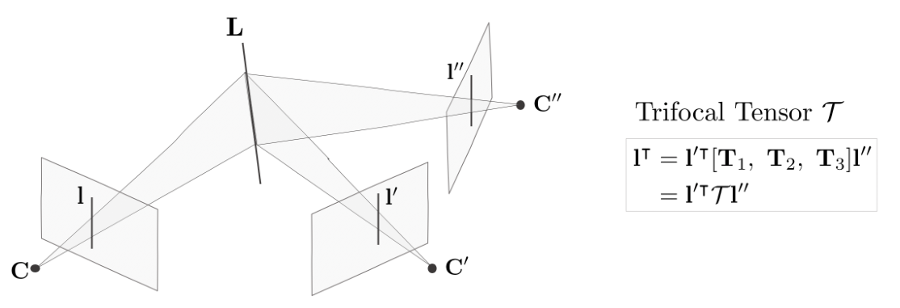

## The geometric basis for the trifocal tensor

Three-View Geometry에서 Trifocal Tensor $\mathcal{T}$ 는 Two-View Geometry에서 Fundamental Matrix $\mathbf{F}$와 유
사한 역할을 한다. $\mathbf{F}$와 유사하게 $\mathcal{T}$ 은 서로 다른 세 개의 카메라 이미지 평면들을 특별한 제약조건으로
구속시킨다.

### Incidence relations for lines

월드 평면 상의 한 직선 $\mathbf{L}$과 이를 바라보고 있는 서로 다른 세 개의 카메라가 주어졌다고 가정하자. 세 개의
카메라의 이미지 평면을 각각 $\pi_P, \pi_{P'}, \pi_{P''}$이라고 하고 $\mathbf{L}$을 이미지 평면 상에 프로젝션한 직선들은 $\mathbf{l}, \mathbf{l}', \mathbf{l}''$
이라고 했을 때 $\mathbf{l} \leftrightarrow \mathbf{l}' \leftrightarrow \mathbf{l}''$ 사이의 관계를 알아보자.

카메라 행렬을 각각 $(\mathbf{P}, \mathbf{P}', \mathbf{P}'')$이라고 했을 때 이를 Canonical Form으로 나타내면

$$\begin{aligned}
\mathbf{P} &= [\mathbf{I} \mid \mathbf{0}] \\
\mathbf{P}' &= [\mathbf{A} \mid \mathbf{a}_4] \\
\mathbf{P}'' &= [\mathbf{B} \mid \mathbf{b}_4]
\end{aligned} \tag{401}$$

와 같이 항상 사영모호성을 포함하여(up to projectivity) 나타낼 수 있다. 월드 상의 직선 $\mathbf{L}$은 $\mathbf{l}, \mathbf{l}', \mathbf{l}''$을
Back-projection한 평면들 $\pi, \pi', \pi''$의 교차선이므로 $\mathbf{l}, \mathbf{l}', \mathbf{l}''$를 Back-projection 해보면

$$\begin{aligned}
\pi &= \mathbf{P}^\intercal\mathbf{l} = \begin{pmatrix} \mathbf{l} \\ 0 \end{pmatrix} \\
\pi' &= \mathbf{P}'^\intercal\mathbf{l}' = \begin{pmatrix} \mathbf{A}^\intercal\mathbf{l}' \\ \mathbf{a}^\intercal_4\mathbf{l}' \end{pmatrix} \\
\pi'' &= \mathbf{P}''^\intercal\mathbf{l}'' = \begin{pmatrix} \mathbf{B}^\intercal\mathbf{l}'' \\ \mathbf{b}^\intercal_4\mathbf{l}'' \end{pmatrix}
\end{aligned} \tag{402}$$

같은 평면들의 법선벡터(normal vector)를 얻을 수 있다. 이러한 세 평면의 법선벡터를 열벡터로 가지는
행렬 $\mathbf{M} \in \mathbb{R}^{4\times3}$이 다음과 같이 주어졌을 때

$$\mathbf{M} = \begin{bmatrix} \pi & \pi' & \pi'' \end{bmatrix} \tag{403}$$

$\mathbf{M}$의 열공간(column space)는 월드 상의 직선 $\mathbf{L}$과 수직인 2차원 평면을 의미하므로 $\mathbf{M}$의 rank는 2이다.
따라서

$$\mathbf{M} = \begin{bmatrix} \mathbf{m}_1 & \mathbf{m}_2 & \mathbf{m}_3 \end{bmatrix} = \begin{bmatrix} \mathbf{l} & \mathbf{A}^\intercal\mathbf{l}' & \mathbf{B}^\intercal\mathbf{l}'' \\ 0 & \mathbf{a}^\intercal_4\mathbf{l}' & \mathbf{b}^\intercal_4\mathbf{l}'' \end{bmatrix} \tag{404}$$

에서 $\mathbf{m}_1 = \alpha\mathbf{m}_2 + \beta\mathbf{m}_3$가 성립한다. 이 때, 행렬 $\mathbf{M}$의 두 번째 행에서 첫번째 열 $(2, 1)$ 값이 0이므로
$\alpha, \beta$를 구할 수 있다.

$$0 = k(\mathbf{b}^\intercal_4\mathbf{l}'')\mathbf{m}_2 - (k\mathbf{a}^\intercal_4\mathbf{l}')\mathbf{m}_3 \tag{405}$$

따라서 임의의 상수 $k$에 대하여 $\alpha = k(\mathbf{b}^\intercal_4\mathbf{l}'), \beta = k(\mathbf{a}^\intercal_4\mathbf{l}')$이 된다. 다음으로 행렬 $\mathbf{M}$의 첫번째 행을
전개해보면

$$\begin{aligned}
\mathbf{l} &= (\mathbf{b}^\intercal_4\mathbf{l}'')\mathbf{A}^\intercal\mathbf{l}' - (\mathbf{a}^\intercal_4\mathbf{l}')\mathbf{B}^\intercal\mathbf{l}'' \\
&= (\mathbf{l}''^\intercal\mathbf{b}_4)\mathbf{A}^\intercal\mathbf{l}' - (\mathbf{l}'^\intercal\mathbf{a}_4)\mathbf{B}^\intercal\mathbf{l}''
\end{aligned} \tag{406}$$

이 된다. $\mathbf{a}^\intercal_4\mathbf{l}', \mathbf{b}^\intercal_4\mathbf{l}''$은 스칼라 값이므로 전치(transpose)를 취해도 같은 값을 나타낸다. 직선 $\mathbf{l}$의 $i$번째
좌표값을 $l_i$라고 하면

$$\begin{aligned}
l_i &= \mathbf{l}''^\intercal(\mathbf{b}_4\mathbf{a}^\intercal_i)\mathbf{l}' - \mathbf{l}'^\intercal(\mathbf{a}_4\mathbf{b}^\intercal_i)\mathbf{l}'' \\
&= \mathbf{l}'^\intercal(\mathbf{a}_i\mathbf{b}^\intercal_4)\mathbf{l}'' - \mathbf{l}'^\intercal(\mathbf{a}_4\mathbf{b}^\intercal_i)\mathbf{l}'' \\
&= \mathbf{l}'^\intercal(\mathbf{a}_i\mathbf{b}^\intercal_4 - \mathbf{a}_4\mathbf{b}^\intercal_i)\mathbf{l}''
\end{aligned} \tag{407}$$

과 같이 나타낼 수 있다. 이 때 $\mathbf{a}_i\mathbf{b}^\intercal_4 - \mathbf{a}_4\mathbf{b}^\intercal_i$를 $\mathbf{T}_i$로 치환하면

$$l_i = \mathbf{l}'^\intercal\mathbf{T}_i\mathbf{l}'' \tag{408}$$

으로 간결하게 표현할 수 있다.

### Definition 15.1

이 때, ==행렬의 집합 $\{\mathbf{T}_1, \mathbf{T}_2, \mathbf{T}_3\}$은 Trifocal Tensor $\mathcal{T}$ 을 행렬로 표현한 것을 의미한다. 이를 사용하여
직선 $\mathbf{l}$을 다시 표현해보면 다음과 같다.==

$$\begin{aligned}
\mathbf{l}^\intercal &= \mathbf{l}'^\intercal\begin{bmatrix} \mathbf{T}_1 & \mathbf{T}_2 & \mathbf{T}_3 \end{bmatrix}\mathbf{l}'' \\
&= (\mathbf{l}'^\intercal\mathbf{T}_1\mathbf{l}'',\ \mathbf{l}'^\intercal\mathbf{T}_2\mathbf{l}'',\ \mathbf{l}'^\intercal\mathbf{T}_3\mathbf{l}'')
\end{aligned} \tag{409}$$

### Homographies induced by a plane

### Result 15.2

서로 다른 세 카메라의 이미지 평면을 각각 $\pi_P, \pi_{P'}, \pi_{P''}$ 하자. 두 번째 카메라 이미지 평면 상의 직선 $\mathbf{l}'$을
Back-projection하여 얻은 월드 상의 평면을 $\pi'$이라고 하면 $\pi'$을 통해 $\pi_P$에서 $\pi_{P''}$으로 변환하는 Homography $\mathbf{H}_{13}$가 존재한다. 해당 섹션에서는 $\mathbf{H}_{13}$를 $\mathbf{l}'$을 통해 기술하는 방법에 대해 설명한다.

첫 번째 이미지 평면 상의 직선 $\mathbf{l}$은 Trifocal Tensor에 의해

$$\mathbf{l}^\intercal = \mathbf{l}'^\intercal\begin{bmatrix} \mathbf{T}_1 & \mathbf{T}_2 & \mathbf{T}_3 \end{bmatrix}\mathbf{l}'' \tag{410}$$

과 같이 나타낼 수 있고 이를 정리하여 $\mathbf{l} = \mathbf{H}^\intercal_{13}\mathbf{l}''$ 꼴로 나타내면

$$\begin{aligned}
\mathbf{l}^\intercal &= \mathbf{l}'^\intercal\begin{bmatrix} \mathbf{T}_1 & \mathbf{T}_2 & \mathbf{T}_3 \end{bmatrix}\mathbf{l}'' \\
&= \left(\begin{bmatrix} \mathbf{T}^\intercal_1 & \mathbf{T}^\intercal_2 & \mathbf{T}^\intercal_3 \end{bmatrix}\mathbf{l}'\right)^\intercal\mathbf{l}'' \\
&= \mathbf{H}^\intercal_{13}\mathbf{l}''
\end{aligned} \tag{411}$$

이 된다. 따라서 $\mathbf{H}_{13} = \begin{bmatrix} \mathbf{T}^\intercal_1, & \mathbf{T}^\intercal_2 & \mathbf{T}^\intercal_3 \end{bmatrix}\mathbf{l}'$과 같다. $\mathbf{H}_{13}$을 사용하면 $\mathbf{x}'' = \mathbf{H}_{13}\mathbf{x}$와 같이 $\pi_P \rightarrow \pi_{P''}$으로
Homography 변환을 할 수 있다.

이와 유사하게 $\mathbf{H}_{12}$는 $\mathbf{x}' = \mathbf{H}_{12}\mathbf{x}$ 공식을 만족하며 다음과 같다.

$$\mathbf{H}_{12} = \begin{bmatrix} \mathbf{T}_1 & \mathbf{T}_2 & \mathbf{T}_3 \end{bmatrix}\mathbf{l}'' \quad \forall\mathbf{l}'' \tag{412}$$

### Point and line incidence relations

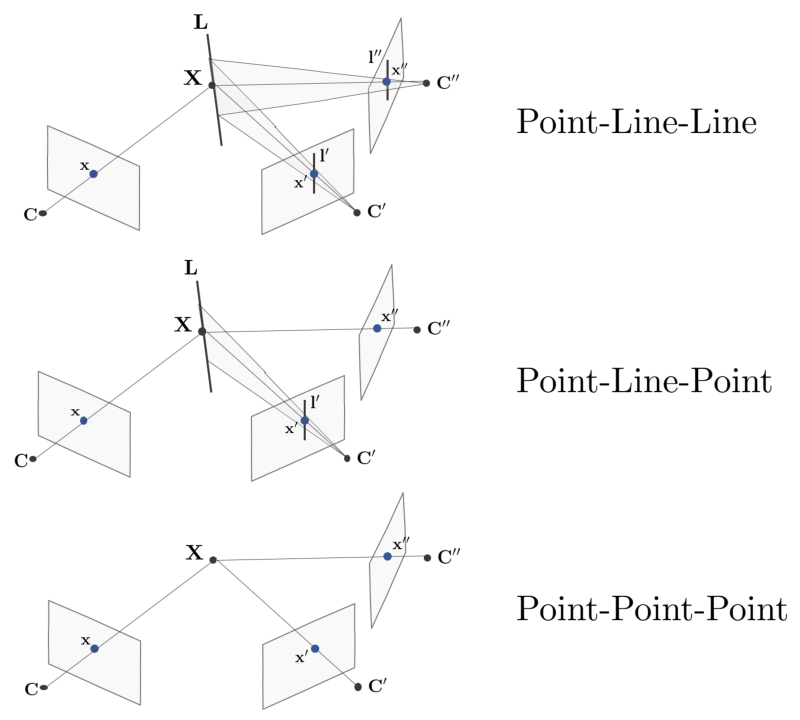

이전 섹션에서는 $\mathbf{l} = \mathbf{l}'^\intercal\mathcal{T}\mathbf{l}''$ 공식을 통해 세 이미지 평면에 존재하는 직선들이 Trifocal Tensor $\mathcal{T}$ 에 의해
제약된다는 것에 대해 설명했다. ==해당 섹션에서는 세 개의 직선들 뿐만 아니라 점과 직선들의 관계들이
Trifocal Tensor $\mathcal{T}$ 에 의해 어떻게 제약되는 지 설명한다.==

직선 $\mathbf{l}$ 위에 존재하는 임의의 점 $\mathbf{x}$에 대해 $\mathbf{x}^\intercal\mathbf{l} = 0$ 이 성립하고 이를 Tensor 표현법으로 다시 나타내면

$$\begin{aligned}
\mathbf{x}^\intercal\mathbf{l} &= \sum_i x_il_i \\
&= \sum_i x_i\mathbf{l}'^\intercal\mathbf{T}_i\mathbf{l}'' \quad \because l_i = \mathbf{l}'^\intercal\mathbf{T}_i\mathbf{l}'' \\
&= \mathbf{l}'^\intercal\left(\sum_i x_i\mathbf{T}_i\right)\mathbf{l}'' = 0
\end{aligned} \tag{413}$$

같이 나타낼 수 있고 이는 ==한 점과 두 직선(point-line-line) 사이의 관계를 의미한다.==

이전 섹션에서 설명한 $\mathbf{H}_{13}$은 첫 번째 이미지 평면에서 세 번째 이미지 평면으로 변환하는 Homography
를 의미한다. 이를 통해 $\mathbf{x}'' = \mathbf{H}_{13}\mathbf{x}$와 같이 세 번째 이미지 평면 상의 점 $\mathbf{x}''$을 구할 수 있고

$$\mathbf{x}'' = \mathbf{H}_{13}\mathbf{x} = \begin{bmatrix} \mathbf{T}^\intercal_1\mathbf{l}' & \mathbf{T}^\intercal_2\mathbf{l}' & \mathbf{T}^\intercal_3\mathbf{l}' \end{bmatrix}\mathbf{x} = \left(\sum_i x_i\mathbf{T}^\intercal_i\right)\mathbf{l}' \tag{414}$$

같이 전개할 수 있다. 이 때, $\mathbf{x}''$은 Scale Factor를 포함하고 있으므로 유일하게 $\mathbf{x}''$를 결정하기 위해 $\mathbf{x}''^\wedge$
를 곱하면

$$\mathbf{x}''^\intercal\mathbf{x}''^\wedge = \mathbf{l}'^\intercal\left(\sum_i x_i\mathbf{T}_i\right)\mathbf{x}''^\wedge = \mathbf{0}^\intercal \tag{415}$$

이 된다. 이는 ==두 개의 점과 하나의 직선 사이(point-line-point)의 관계를 의미한다.==

이와 유사하게 세 개의 점이 주어졌을 때

$$\mathbf{x}'^\wedge\left(\sum_i x_i\mathbf{T}_i\right)\mathbf{x}''^\wedge = 0 \tag{416}$$

을 통해 Scale Factor를 제거하여 유일한 $\mathbf{x}'$을 구할 수 있으며 ==해당 공식은 세 점 사이(point-point-point)의 관계를 의미한다.==

## Epipolar lines

### Result 15.3

==Trifocal Tensor $\mathcal{T}$ 를 통해 두 카메라의 Epipoar Line을 구할 수 있다.== 세 이미지 평면 $\pi_P, \pi_{P'}, \pi_{P''}$이
주어지고 $\pi_P$ 위의 한 점 $\mathbf{x}$가 존재하며 $\pi_{P'}, \pi_{P''}$ 평면에 Epipolar Line $\mathbf{l}', \mathbf{l}''$이 존재한다고 가정하면 이들
사이에는

$$\begin{aligned}
\mathbf{l}'^\intercal\left(\sum_i x_i\mathbf{T}_i\right) &= 0 \\
\left(\sum_i x_i\mathbf{T}_i\right)\mathbf{l}'' &= 0
\end{aligned} \tag{417}$$

관계가 성립한다. 즉, ==$\mathbf{l}'^\intercal$은 $(\sum_i x_i\mathbf{T}_i)$의 Left Null Vector이며 $\mathbf{l}''$은 $(\sum_i x_i\mathbf{T}_i)$의 Right Null Vector
가 된다.==

### Proof

두 번째 이미지 평면 $\pi_{P'}$ 상의 Epipolar Line $\mathbf{l}'$을 Back-projection하여 생성된 평면을 $\pi'$이라고 하면 $\pi'$과
$\pi_P$ 사이에는 교차선이 생성되고 해당 교차선은 $\pi_P$ 평면의 Epipolar Line $\mathbf{l}$이 된다. 이 때 세 번째 이미지
평면 $\pi_{P''}$ 상의 임의의 직선 $\mathbf{l}''$을 Back-projection한 평면 $\pi''$과 $\pi'$은 월드 평면 상의 직선 $\mathbf{L}$에서 교차선을
생성하며 이를 다시 $\pi_P$로 프로젝션하면 $\mathbf{L}$은 항상 Epipolar Line $\mathbf{l}$ 위에 한 점 $\mathbf{x} \in \mathbf{l}$로 프로젝션된다.

이러한 $\mathbf{l} \leftrightarrow \mathbf{l}' \leftrightarrow \mathbf{l}''$ 관계를 통해 Trifocal Tensor $\mathcal{T}$ 을 구할 수 있으며 이전 섹션에서 설명한 ==한 점 $\mathbf{x}$와
두 직선 사이(point-line-line)의 관계 공식이 성립한다.==

$$\begin{aligned}
\mathbf{x} &\in \mathbf{l} = \mathbf{l}'^\intercal\mathcal{T}\mathbf{l}'' \\
\mathbf{l}'^\intercal\left(\sum_i x_i\mathbf{T}_i\right)\mathbf{l}'' &= 0 \quad \forall\mathbf{l}'' \\
\therefore\ \mathbf{l}'^\intercal\left(\sum_i x_i\mathbf{T}_i\right) &= 0
\end{aligned} \tag{418}$$

위와 같이 ==모든 $\mathbf{l}''$에 대해 위 공식을 만족해야 하므로 $\mathbf{l}'^\intercal(\sum_i x_i\mathbf{T}_i) = 0$ 공식이 성립하게 된다. 이를
모든 $\mathbf{l}'$에 대해서도 마찬가지로 성립하므로 $(\sum_i x_i\mathbf{T}_i)\mathbf{l}'' = 0$ 또한 성립한다.==

### Result 15.4

==추가적으로 Epipole $\mathbf{e}', \mathbf{e}''$은 모든 $\forall\mathbf{x}$에 대해 구할 수 있는 $\mathbf{l}', \mathbf{l}''$들의 교차점을 계산함으로써 구할 수 있다.==

### Extracting the fundamental matrices

이전 섹션에서 설명한 것과 같이 여러 점과 직선들과 관계를 통해 세 개의 이미지 평면에 대한 Trifocal
Tensor $\mathcal{T}$ 를 구할 수 있다. 해당 섹션에서는 $\mathcal{T}$ 를 통해 세 카메라에 대한 Fundamental Matrix $\mathbf{F}$를 구하는
방법에 대해 설명한다.

Fundamental Matrix $\mathbf{F}_{21}$는 $\mathbf{F}_{21} = \mathbf{e}'^\wedge\mathbf{H}_{21}$를 통해 구할 수 있다. $\mathbf{F}_{ij}$는 $i$번째 이미지 평면과 $j$번째 이미지
평면 사이의 Fundamental Matrix를 의미한다. $\mathbf{e}'$은 이전 섹션에서 설명한 방법대로 $\mathbf{T}_i$의 Left Null Vector
를 계산하여 $\mathbf{l}', \mathbf{e}'$을 통해 구하고 $\mathbf{H}_{21}$은 $\begin{bmatrix} \mathbf{T}_1 & \mathbf{T}_2 & \mathbf{T}_3 \end{bmatrix}\mathbf{l}''$과 같이 구할 수 있으므로

$$\begin{aligned}
\mathbf{F}_{21} &= \mathbf{e}'^\wedge\mathbf{H} \\
&= \mathbf{e}'^\wedge\begin{bmatrix} \mathbf{T}_1 & \mathbf{T}_2 & \mathbf{T}_3 \end{bmatrix}\mathbf{l}'' \quad \exists\mathbf{l}''
\end{aligned} \tag{419}$$

이 된다. 이 때 $\mathbf{l}''$은 $\mathbf{T}_i$의 Null Space에 존재하면 안된다. 즉 $\mathbf{T}_i\mathbf{l}'' \neq 0$이어야 한다. 다시 말하면
$\begin{bmatrix} \mathbf{T}_1 & \mathbf{T}_2 & \mathbf{T}_3 \end{bmatrix}\mathbf{l}''$의 rank가 3이어야 한다. 이 때, Epipole $\mathbf{e}''$은 $\mathbf{l}''$의 Null Space에 존재하므로 $\mathbf{e}''^\intercal\mathbf{l}'' = 0$을
만족한다. 따라서

$$\mathbf{e}'' \perp \mathrm{Nul}\,\mathbf{T}_i \quad \forall i \tag{420}$$

를 만족하므로 ==$\mathbf{l}''$ 대신 $\mathbf{e}''$을 대입하면 항상 행렬의 rank가 3이 된다. 결론적으로 Fundamental
Matrix $\mathbf{F}_{21}$은==

$$\mathbf{F}_{21} = \mathbf{e}'^\wedge\begin{bmatrix} \mathbf{T}_1 & \mathbf{T}_2 & \mathbf{T}_3 \end{bmatrix}\mathbf{e}'' \tag{421}$$

==을 통해 구할 수 있다. 동일한 방법을 사용하여 $\mathbf{F}_{31} = \mathbf{e}''^\wedge\begin{bmatrix} \mathbf{T}^\intercal_1 & \mathbf{T}^\intercal_2 & \mathbf{T}^\intercal_3 \end{bmatrix}\mathbf{e}'$을 구할 수 있다.==

### Retrieving the camera matrices

Two-view Geometry에서는 Fundamental Matrix $\mathbf{F}$가 주어지면 카메라 행렬 대응쌍 $(\mathbf{P}, \mathbf{P}')$을 사영모호성을
포함하여(up to projectivity) 구할 수 있었다.

$$\begin{aligned}
\mathbf{P} &= [\mathbf{I} \mid \mathbf{0}] \\
\mathbf{P}' &= [\mathbf{A} \mid \mathbf{e}'] \quad \text{where, } \mathbf{F} = \mathbf{e}'^\wedge\mathbf{A} \text{ in two-view.}
\end{aligned} \tag{422}$$

Three-view Geoemtry에서는 Trifocal Tensor $\mathcal{T}$ 를 통해 $\mathbf{F}_{21} = \mathbf{e}'^\wedge\begin{bmatrix} \mathbf{T}_1 & \mathbf{T}_2 & \mathbf{T}_3 \end{bmatrix}\mathbf{e}''$ 그리고 $\mathbf{F}_{31} = \mathbf{e}''^\wedge\begin{bmatrix} \mathbf{T}^\intercal_1 & \mathbf{T}^\intercal_2 & \mathbf{T}^\intercal_3 \end{bmatrix}\mathbf{e}'$을 구했을 때

$$\begin{aligned}
\mathbf{P} &= [\mathbf{I} \mid \mathbf{0}] \\
\mathbf{P}' &= \left[\begin{bmatrix} \mathbf{T}_1 & \mathbf{T}_2 & \mathbf{T}_3 \end{bmatrix}\mathbf{e}'' \mid \mathbf{e}'\right] \\
\text{but, } \mathbf{P}'' &\neq \left[\begin{bmatrix} \mathbf{T}^\intercal_1 & \mathbf{T}^\intercal_2 & \mathbf{T}^\intercal_3 \end{bmatrix}\mathbf{e}' \mid \mathbf{e}''\right] \text{ in three-view.}
\end{aligned} \tag{423}$$

관계가 성립한다. 다시 말하면 ==$(\mathbf{P}, \mathbf{P}')$을 계산하면 월드좌표계가 고정되고 따라서 $\mathbf{P}''$은 고정된 월드좌
표계에 대해서 다시 표현해야 한다는 것을 의미한다.== p256 공식 (9.10)에 의해 Canonical Form에 대한 가장
일반적인 카메라 행렬은 다음과 같이 나타낼 수 있다.

$$\mathbf{P}'' = [\mathbf{H} + \mathbf{e}''\mathbf{v}^\intercal \mid \lambda\mathbf{e}''] \tag{424}$$

이를 전개하면

$$\begin{aligned}
\mathbf{P}'' &= [\mathbf{H} + \mathbf{e}''\mathbf{v}^\intercal \mid \lambda\mathbf{e}''] \\
&= \left[\underbrace{\begin{bmatrix} \mathbf{T}^\intercal_1 & \mathbf{T}^\intercal_2 & \mathbf{T}^\intercal_3 \end{bmatrix}\mathbf{e}' + \mathbf{e}''\mathbf{v}^\intercal}_{\mathbf{B}} \mid \underbrace{\lambda\mathbf{e}''}_{\mathbf{b}_4}\right]
\end{aligned} \tag{425}$$

이 되고 $\mathbf{P}' = [\mathbf{A} \mid \mathbf{a}_4]$은

$$\begin{aligned}
\mathbf{P}' &= [\mathbf{A} \mid \mathbf{a}_4] \\
&= \left[\underbrace{\begin{bmatrix} \mathbf{T}_1 & \mathbf{T}_2 & \mathbf{T}_3 \end{bmatrix}\mathbf{e}''}_{\mathbf{A}} \mid \underbrace{\mathbf{e}'}_{\mathbf{a}_4}\right]
\end{aligned} \tag{426}$$

이므로 $\mathbf{T}_i$의 정의에 의해

$$\begin{aligned}
\mathbf{T}_i &= \mathbf{a}_i\mathbf{b}^\intercal_4 + \mathbf{a}_4\mathbf{b}^\intercal_i \\
&= \mathbf{T}_i\mathbf{e}''\mathbf{e}''^\intercal - \mathbf{e}'\mathbf{b}^\intercal_i
\end{aligned} \tag{427}$$

이 된다. 이를 정리하면

$$\mathbf{T}_i(\mathbf{I} - \mathbf{e}''\mathbf{e}''^\intercal) = -\mathbf{e}'\mathbf{b}^\intercal_i \tag{428}$$

이 된다. 이 때 $\|\mathbf{e}'\| = 1$이라고 가정하고 양 변에 $\mathbf{e}'^\intercal$을 곱하면

$$\mathbf{b}^\intercal_i = \mathbf{e}'^\intercal\mathbf{T}_i(\mathbf{e}''\mathbf{e}'' - \mathbf{I}) \tag{429}$$

가 된다. ==최종적으로 $\mathbf{P}''$은 다음과 같다.==

$$\mathbf{P}'' = \left[(\mathbf{e}''\mathbf{e}''^\intercal - \mathbf{I})\begin{bmatrix} \mathbf{T}^\intercal_1 & \mathbf{T}^\intercal_2 & \mathbf{T}^\intercal_3 \end{bmatrix}\mathbf{e}' \mid \mathbf{e}''\right] \tag{430}$$

## The trifocal tensor and tensor notation

Trifocal Tensor $\mathcal{T}$ 를 Tensor 표현법으로 나타내면 다음과 같다.

$$\begin{aligned}
\mathcal{T}^{jk}_i &= (j, k) \text{ entry of } \mathbf{T}_i \\
&= a^j_ib^k_4 - a^j_4b^k_i
\end{aligned} \tag{431}$$

행렬로 표현한 직선 $\mathbf{l}$의 $i$번째 좌표는 $l_i = \mathbf{l}'^\intercal\mathbf{T}_i\mathbf{l}''$과 같이 나타낼 수 있고 이를 Tensor 표현법으로
나타내면

$$\begin{aligned}
l_i &= l'_i\mathcal{T}^{jk}_i l''_k \\
&= l'_i l''_k \mathcal{T}^{jk}_i
\end{aligned} \tag{432}$$

가 된다. Tensor 표현법을 통해 첫 번째 카메라의 직선 $\mathbf{l}$을 세 번째 카메라의 직선 $\mathbf{l}''$으로 변환하는
Homography $\mathbf{H} : \pi_P \mapsto \pi_{P''}$을 구할 수 있다.

$$l_i = l''_k(l'_j\mathcal{T}^{jk}_i) = l''_k h^k_i \tag{433}$$

이 때, $h^k_i = l'_j\mathcal{T}^{jk}_i$를 의미한다. Homography $\mathbf{H}$를 사용하여 점을 변환하는 경우

$$x''^k = h^k_i x^i \tag{434}$$

가 된다.

Tensor 표현법을 나타내는데 유용한 $\epsilon_{ijk}$에 대해 설명하면

$$\epsilon_{ijk} = \begin{cases} 0 & \text{unless i,j,k are all distinct} \\ +1 & \text{i,j,k are even permutation of 1,2,3} \\ -1 & \text{i,j,k are odd permutation of 1,2,3} \end{cases} \tag{435}$$

과 같다. 다시 말하면 $\epsilon_{ijk}$는 $i, j, k$가 전부 다르지 않은 이상 0의 값을 가지며 $i, j, k$가 $(1, 2, 3), (3, 1, 2)$
또는 $(2, 3, 1)$과 같이 순차적일 때는 $+1$의 값을 가지고 아닌 경우에는 $-1$의 값을 가진다. 이를 통해 $3 \times 3$
벡터들의 Cross Product를 표현해보면 $\mathbf{c} = \mathbf{a} \times \mathbf{b}$일 때

$$c_i = \epsilon_{ijk}a^jb^k \tag{436}$$

와 같이 나타낼 수 있다. 이는 $\begin{pmatrix} c_1 \\ c_2 \\ c_3 \end{pmatrix} = \begin{pmatrix} a_2b_3 - a_3b_2 \\ a_3b_1 - a_1b_3 \\ a_1b_2 - a_2b_1 \end{pmatrix}$을 Tensor 표현법으로 나타낸 것이다. 따라서 $(\mathbf{a}^\wedge)_{ik}$
는 Tensor 표현법으로

$$(\mathbf{a}^\wedge)_{ik} = \epsilon_{ijk}a^j \tag{437}$$

같이 나타낼 수 있다.

### The trilinearities

Tensor 표현법을 사용해서 이전 섹션에서 설명한 여러 점들과 직선의 관계를 다시 표현할 수 있다. 예를 들어
두 점과 한 직선 사이(point-line-point)의 관계 공식을 일반적인 형태로 나타내면 다음과 같다.

$$\mathbf{l}'^\intercal\left(\sum_i x_i\mathbf{T}_i\right)\mathbf{x}''^\wedge = \mathbf{0}^\intercal \tag{438}$$

이를 Tensor 표현법으로 나타내면 $(\mathbf{x}''^\wedge)_{qs} = -x''^k\epsilon_{kqs}$가 되므로 이를 다시 정리하면

$$l'_jx^i\mathcal{T}^{jq}_i x''^k\epsilon_{kqs} = 0_s \tag{439}$$

과 같이 나타낼 수 있다. 이는 ==세 개의(tri-) 서로 다른 이미지에 존재하는 점 또는 직선을 사용하여
선형방정식(linear)을 도출했으므로 다른 용어로 Trilinearities라고 한다.==

<!--widget:trifocal-tensor-->

## Transfer

세 개의 카메라가 주어졌을 때 이 중 두 개의 이미지 평면에서 점 또는 직선의 위치를 알고 있을 때 Trifocal
Tensor $\mathcal{T}$ 를 사용하여 나머지 한 개의 이미지 평면 상의 점 또는 직선의 위치를 결정하는 방법을 Transfer
라고 한다.

### Point transfer using fundamental matrices

==Point Transfer는 세 개의 이미지 평면 $\pi_P, \pi_{P'}, \pi_{P''}$에 대한 Fundamental Matrix $\mathbf{F}_{21}, \mathbf{F}_{31}, \mathbf{F}_{32}$가 주
어졌을 때 이미 알고 있는 $\mathbf{x}, \mathbf{x}'$의 위치를 통해 $\mathbf{x}''$의 위치를 결정하는 것을 말한다.== 이는 Epipolar Geometry
를 통해 결정할 수 있다. 세 번째 이미지 평면 $\pi_{P''}$ 상에 존재하는 Epipolar Line $\mathbf{l}''$은

$$\begin{aligned}
\mathbf{l}''_{31} &= \mathbf{F}_{31}\mathbf{x} \\
\mathbf{l}''_{32} &= \mathbf{F}_{32}\mathbf{x}'
\end{aligned} \tag{440}$$

이므로 $\pi_{P''}$ 위에 존재하는 한 점 $\mathbf{x}''$은

$$\mathbf{x}'' \in \mathbf{l}''_{31} \text{ and } \mathbf{l}''_{32} \tag{441}$$

을 만족해야 한다. 따라서 $\mathbf{x}''$은 위 두 직선의 교차점으로 결정된다.

$$\mathbf{x}'' = (\mathbf{F}_{31}\mathbf{x}) \times (\mathbf{F}_{32}\mathbf{x}') \tag{442}$$

이 때, ==위 공식에서 $\mathbf{F}_{21}$은 사용되지 않았는데 실제로는 대응점 쌍 $(\mathbf{x}, \mathbf{x}')$에 노이즈가 존재하기 때문에
이를 개선시키기 위해 사용된다.== 대응점 쌍의 노이즈로 인해 $\mathbf{x}^\intercal\mathbf{F}_{21}\mathbf{x}' = 0$ 공식을 만족하지 않으므로 이전
섹션에서 설명한 Optimal Triangulation 방법을 사용하여 $d(\mathbf{x}, \mathbf{l}(t))^2 + d(\mathbf{x}', \mathbf{l}'(t))^2$ 값이 최소가 되는 $\hat{\mathbf{x}} \leftrightarrow \hat{\mathbf{x}}'$
를 구한 후 이를 통해 $\mathbf{x}''$을 계산한다.

$$\mathbf{x}'' = (\mathbf{F}_{31}\hat{\mathbf{x}}) \times (\mathbf{F}_{32}\hat{\mathbf{x}}') \tag{443}$$

하지만 ==해당 Point Transfer는 세 개의 카메라의 중심점 $\mathbf{C}, \mathbf{C}', \mathbf{C}''$이 이루는 Trifocal 평면에 대응점
쌍 $\mathbf{x}, \mathbf{x}'$이 존재하는 경우 $\pi_{P''}$에 프로젝션되는 Epipolar Line이 다음과 같이 동일하게 생성되어==

$$\mathbf{F}_{31}\mathbf{x} = \mathbf{F}_{32}\mathbf{x}' \tag{444}$$

==이를 통해 $\mathbf{x}''$의 유일한 위치를 결정할 수 없다. 이는 Fundamental Matrix를 이용한 Point Transfer
의 한계점으로 볼 수 있다.==

### Point transfer using the trifocal tensor

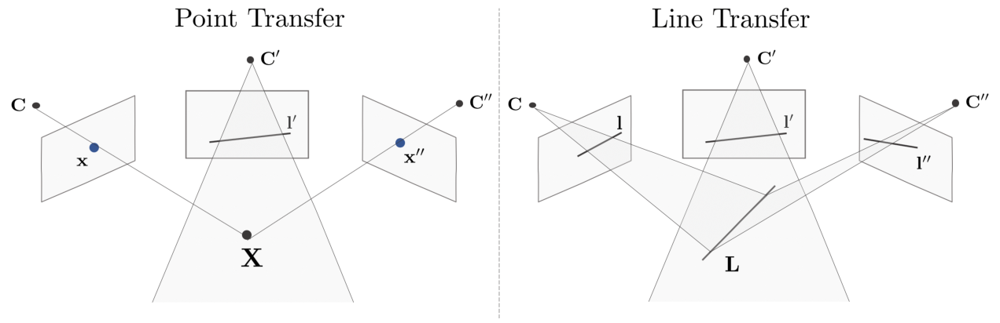

Fundamental Matrix $\mathbf{F}_{ij}$가 아닌 Trifocal Tensor $\mathcal{T}$ 를 사용하면 더욱 다양한 경우에 Transfer를 수행할 수
있다. $\mathcal{T}$ 를 이용해 Point Transfer를 하는 방법은 다음과 같다.

- $\mathcal{T}$ 를 이용해 $\mathbf{F}_{21}$를 계산한다.

$$\mathbf{F}_{21} = \mathbf{e}'^\intercal\begin{bmatrix} \mathbf{T}_1 & \mathbf{T}_2 & \mathbf{T}_3 \end{bmatrix}\mathbf{e}'' \tag{445}$$

- Optimal Triangulation 방법을 사용하여 노이즈를 제거한 최적의 대응점 쌍을 계산한다.

$$(\mathbf{x}, \mathbf{x}') \rightarrow (\hat{\mathbf{x}}, \hat{\mathbf{x}}') \tag{446}$$

- 두 번째 이미지 평면 $\pi_{P'}$의 Epipolar Line $\mathbf{l}'_e$을 계산한다. $\mathbf{l}'_e = \mathbf{F}_{21}\hat{\mathbf{x}}$. 다음으로 $\mathbf{l}'_e$과 수직이고 $\hat{\mathbf{x}}'$를
  통과하는 직선 $\mathbf{l}'$을 계산한다.

$$\begin{aligned}
\hat{\mathbf{x}}' &= (x'_1, x'_2, 1)^\intercal \\
\mathbf{l}'_e &= \begin{pmatrix} l_1 & l_2 & l_3 \end{pmatrix}^\intercal \Rightarrow \mathbf{l}' = \begin{pmatrix} l_2 \\ -l_1 \\ -l_2x'_1 + l_1x'_2 \end{pmatrix}
\end{aligned} \tag{447}$$

- $\mathbf{l}'$을 사용하여 $\mathbf{x}'$을 Point Transfer한다.

$$x''^k = x'^il'_j\mathcal{T}^{jk}_i \tag{448}$$

### Degenerate configurations

Trifocal Tensor $\mathcal{T}$ 를 사용하는 경우에도 두 카메라의 중심점 $\mathbf{C}, \mathbf{C}'$을 잇는 baseline 직선 상 위에 3차원 공간
상의 점 $\mathbf{X}$가 존재하는 경우 이를 통해 $\mathbf{x}''$을 결정할 수 없다.

### Line transfer using the trifocal tensor

Trifocal Trnsor $\mathcal{T}$ 를 사용하면 점 뿐만 아니라 직선 또한 Transfer할 수 있다. 세 이미지 평면 상의 직선
$\mathbf{l} \leftrightarrow \mathbf{l}' \leftrightarrow \mathbf{l}''$이 대응관계를 가지는 경우

$$l_i = l'_jl''_k\mathcal{T}^{jk}_i \tag{449}$$

와 같이 $\mathcal{T}$ 를 통해 표현할 수 있고 이는 곧 직선 $\mathbf{l}$이 벡터 $[l'_jl''_k\mathcal{T}^{jk}_i]$과 평행하다는 의미이다.

$$\mathbf{l} \parallel [l'_jl''_k\mathcal{T}^{jk}_i]_{3\times1}, \quad i = 1, 2, 3 \tag{450}$$

평행한 직선들은 Cross Product가 0이 되어야 하므로

$$\begin{aligned}
(\mathbf{l}^\wedge)_{si}l'_jl''_k\mathcal{T}^{jk}_i &= 0 \\
(l_s\epsilon_{ris})l'_jl''_k\mathcal{T}^{jk}_i &= 0
\end{aligned} \tag{451}$$

이 성립한다. 이는 곧 $\mathbf{l}''$에 대한 선형방정식이므로 이를 다시 정리하면

$$(l_s\epsilon_{ris}l'_j\mathcal{T}^{jk}_i)l''_k = 0 \tag{452}$$

==선형방정식을 품으로써 $\mathbf{l} \leftrightarrow \mathbf{l}'$이 주어진 경우 $\mathbf{l}''$을 계산할 수 있다.==

### Degeneracies

직선 $\mathbf{l}, \mathbf{l}'$이 Epipolar Line인 경우 이를 Back-projection한 평면 $\pi$는 $\pi'$과 동일한 Epipolar Plane이 되고 이
경우 세 번째 이미지 평면 $\pi_{P''}$ 상의 직선 $\mathbf{l}''$을 유일하게 결정할 수 없다.

## The fundamental matrices for three views

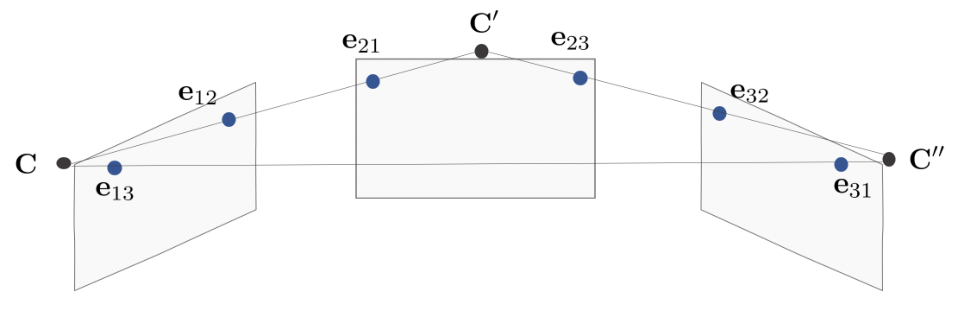

세 개의 카메라에 대한 Fundamental Matrix $\mathbf{F}_{21}, \mathbf{F}_{31}, \mathbf{F}_{32}$가 주어졌을 때 이들은 서로 독립적이지 않다. 세
개의 이미지 평면에 대해 총 6개의 Epipole이 생성되고

$$\mathbf{e}^\intercal_{23}\mathbf{F}_{21}\mathbf{e}_{13} = \mathbf{e}^\intercal_{31}\mathbf{F}_{32}\mathbf{e}_{21} = \mathbf{e}^\intercal_{32}\mathbf{F}_{31}\mathbf{e}_{12} = 0 \tag{453}$$

공식을 만족한다.

### Definition 15.5

==세 개의 Fundamental Matrix $\mathbf{F}_{21}, \mathbf{F}_{31}, \mathbf{F}_{32}$가 독립적이지 않고 서로 상호호환(compatible)하기 위해
서는 위 공식이 성립해야 한다.==

### Uniqueness of camera matrices given three fundamental matrices

만약 세 개의 Fundamental Matrix가 상호호환인 경우 이를 생성하는 세 개의 카메라 행렬 $(\mathbf{P}_1, \mathbf{P}_2, \mathbf{P}_3)$이
사영모호성을 포함하여(up to projectivity) 유일하게 결정된다.

$$\begin{aligned}
&\exists(\mathbf{P}_1, \mathbf{P}_2, \mathbf{P}_3) \text{ such that fundamental matrix of } (\mathbf{P}_i, \mathbf{P}_j) \text{ is } \mathbf{F}_{ij} \\
&(\mathbf{P}_1, \mathbf{P}_2, \mathbf{P}_3) \text{ are unique up to projectivity.}
\end{aligned} \tag{454}$$

이를 증명하기 위해 다음 순서대로 진행한다.

- Two-view Geometry의 원리를 사용하면 $\mathbf{F}_{21} = \mathbf{e}^\wedge_{21}\mathbf{A}$ 일 때 카메라 행렬 $\mathbf{P}_1, \mathbf{P}_2$는 다음과 같이 구할
  수 있다.

$$\begin{aligned}
\mathbf{P}_1 &= [\mathbf{I} \mid \mathbf{0}] \\
\mathbf{P}_2 &= [\mathbf{A} \mid \mathbf{e}_{21}]
\end{aligned} \tag{455}$$

- $\mathbf{x}'^\intercal\mathbf{F}_{21}\mathbf{x} = 0$을 만족하는 대응점 쌍 $(\mathbf{x}_i, \mathbf{x}'_i)$을 생성한다. 이를 통해 월드 공간 상의 점 $\mathbf{X}_i$를 Triangulation한다.
- 세 점 사이(point-point-point)의 관계 공식을 사용하여 $\mathbf{x}''_i$ 을 구한다.

$$\mathbf{x}''_i = (\mathbf{F}_{31}\mathbf{x}_i) \times (\mathbf{F}_{32}\mathbf{x}'_i) \tag{456}$$

- $\mathbf{P}_3\mathbf{X}_i = \mathbf{x}''_i$ 공식을 사용하여 $\mathbf{P}_3$을 계산할 수 있다.

단, 월드 공간 상의 점 $\mathbf{X}_i$가 세 카메라의 중심점 $\mathbf{C}, \mathbf{C}', \mathbf{C}''$을 포함하는 Trifocal 평면에 존재하는 경우
$\mathbf{x}''$을 유일하게 결정할 수 없다.

# 13 Revision log

- 1st: 2020-05-12
- 2nd: 2020-06-06
- 3rd: 2020-06-07
- 4th: 2020-06-09
- 5th: 2020-06-10
- 6th: 2020-06-11
- 7th: 2020-06-12
- 8th: 2020-06-14
- 9th: 2020-06-15
- 10th: 2020-06-16
- 11th: 2020-06-20
- 12th: 2020-06-22
- 13th: 2020-06-23
- 14th: 2022-06-28
- 15th: 2022-12-20
- 16th: 2023-01-01
- 17th: 2023-01-21
- 18th: 2024-03-20
- 19th: 2024-03-23
- 20th: 2024-05-25
- 21th: 2026-07-12: 3. Camera Models typo 수정

# 14 References

Hartley, Richard, and Andrew Zisserman. Multiple view geometry in computer vision. Cambridge university press, 2003

# 15 Closure

Check out alida.tistory.com for the web version posting.

---

# 옮기며 바로잡은 것

원문(Gyubeom Edward Im, *Notes on Multiple View Geometry in Computer Vision*,
104쪽, 21차 개정 2026-07-12)을 **문장·절 순서·식 번호·그림 위치를 그대로** 옮겼다.
손을 댄 곳은 한 군데뿐이다.

| # | 위치 | 원문 | 노트 | 이유 |
|---|---|---|---|---|
| 1 | 3.2.6 The principal axis vector, 식 (107) 위 | `방향벡터 v = det(M)m₃,row`**`e`**`는 동일한 방향을 …` | `… det(M)m₃,row는 …` | 수식 끝에 붙은 글자 `e` 하나. 바로 앞뒤 세 문장이 모두 `det(M)m₃,row` 로 쓰므로 조판 잔재로 보인다 |

---

# 원문 그대로 둔 것

전사 원칙상 **원문의 철자·표기는 손대지 않았다.** 아래는 옮기면서 눈에 띄었지만
그대로 둔 것들이다. 읽다가 오탈자로 보이더라도 노트가 잘못 옮긴 것이 아니다.

| 위치 | 원문 표기 | 아마도 |
|---|---|---|
| 3.2.3 Column vectors, 식 (101) 아래 | `소실점(vanisinh point)` | `vanishing` |
| 3.2.3 Column vectors, 식 (101) 아래 | `윌드 좌표계의 원점` | `월드` |
| 4.2.1 Algorithm 7.1 | `MLE(maximum likelihook estimation)` | `likelihood` |
| 6.6.3 Theorem 9.10 | `Fundemental Matrix` | `Fundamental` |
| 6.10 Extraction of cameras … / 8.3 | `Conjuate Configuration` | `Conjugate` |
| 8.2 The normalized 8-point algorithm | `Degenrate configurations` (절 제목) | `Degenerate` |
| 9.3 An optimial solution (절 제목) | `optimial` | `optimal` |
| 9.3 An optimial solution, 식 (314) 아래 | `Levenerg-Marquardt` (다른 두 곳은 `Levenberg`) | `Levenberg` |
| 3.4.4 Error in employing and affine camera (절 제목) | `employing and affine camera` | `an affine camera` |
| 12.6.1 The fundamental matrices for three views, 식 (453) 아래 | `선형방정식을 품으로써` | `풂으로써` |
| 12.2.1 Result 15.3 | `두 카메라의 Epipoar Line` | `Epipolar` |

---

# 수치로 확인한 것 — 원문에 어긋난 식은 없었다

앞선 스터디들과 달리 **이 원문에서는 수치로 어긋나는 식을 찾지 못했다.**
위젯을 만들면서 `_study_kit/tools/widgets/_mv_helper.js` 의 `window.MV` 로
항등식 44개를 기계정밀도까지 검산했고 모두 통과했다. 묶어서 적으면 다음과 같다.

| 검산한 식 | 오차 |
|---|---|
| (13)(12) 점·직선 쌍대 $\mathbf{l} = \mathbf{x}\times\mathbf{x}'$, $\mathbf{x} = \mathbf{l}\times\mathbf{l}'$ | $\le 10^{-16}$ |
| (26)(28) 접선 $\mathbf{l} = \mathbf{C}\mathbf{x}$ · 쌍대 Conic $\mathbf{C}^* = \mathbf{C}^{-1}$ | $\le 10^{-15}$ |
| (39) $\mathbf{H}_P = \mathbf{H}_S\mathbf{H}_A\mathbf{H}_P$ 분해 | $\le 10^{-16}$ |
| (41)~(50) affine rectification · (51)~(78) metric rectification | $\le 10^{-14}$ |
| (96)~(109) 카메라 중심·주평면·주점·주축·역투영·깊이 | $\le 10^{-15}$ |
| (129)~(139) affine 카메라 discrepancy 식 | $\le 10^{-14}$ |
| (140)~(156) DLT 카메라 행렬 · 기하 오차 | $\le 10^{-12}$ |
| (174)~(190) IAC $\omega = \mathbf{K}^{-\intercal}\mathbf{K}^{-1}$ · 소실점 각도 · 소실선 | $\le 10^{-14}$ |
| (202)~(213) $\mathbf{x}'^\intercal\mathbf{F}\mathbf{x} = 0$ · $\mathbf{F} = [\mathbf{e}']_\times\mathbf{H}_\pi$ | $\le 10^{-15}$ |
| (238)~(245) $\mathbf{P}' = [[\mathbf{e}']_\times\mathbf{F} \mid \mathbf{e}']$ 가 $\mathbf{F}$ 를 되돌려 주는지 | $\le 10^{-15}$ |
| (250)~(275) $\mathbf{E} = [\mathbf{t}]_\times\mathbf{R}$ · SVD 특이값 $(\sigma,\sigma,0)$ · 네 해와 cheirality | $\le 10^{-14}$ |
| (299)~(311) 8-point 알고리즘 · rank 2 강제 | $\le 10^{-12}$ |
| (321)~(326) DLT triangulation | $\le 10^{-13}$ |
| (342)~(384) 평면 유도 Homography · $\mathbf{H}_\infty$ · 호환 조건 | $\le 10^{-14}$ |
| (385)~(400) Affine $\mathbf{F}_A$ · epipolar line 평행성 | $\le 10^{-15}$ |
| (407)(408) $\mathbf{T}_i = \mathbf{a}_i\mathbf{b}_4^\intercal - \mathbf{a}_4\mathbf{b}_i^\intercal$ · $l_i = \mathbf{l}'^\intercal\mathbf{T}_i\mathbf{l}''$ | $7.8\times10^{-16}$ |
| (413) $\mathbf{l}'^\intercal(\sum_i x_i\mathbf{T}_i)\mathbf{l}'' = 0$ | $1.2\times10^{-16}$ |
| (421) $\mathbf{F}_{21} = [\mathbf{e}']_\times[\mathbf{T}_1\ \mathbf{T}_2\ \mathbf{T}_3]\mathbf{e}''$ | $4.4\times10^{-16}$ |
| (452) line transfer $\mathbf{l},\mathbf{l}' \to \mathbf{l}''$ | $7.8\times10^{-16}$ |

**어긋남이 아니라 읽는 법의 문제인 것 두 가지**는 적어 둔다.

- **식 (39) 의 $\mathbf{A} = s\mathbf{R}\mathbf{K} + \mathbf{t}\mathbf{v}^\intercal$ 는 QR 이지 RQ 가 아니다.**
  $s\mathbf{R}\mathbf{K}$ 에서 $\mathbf{R}$ 이 **왼쪽**, 상삼각 $\mathbf{K}$ 가 **오른쪽**이므로,
  $\mathbf{A} - \mathbf{t}\mathbf{v}^\intercal$ 를 분해할 때는 QR 을 써야 한다.
  카메라 행렬 분해(식 96)의 $\mathbf{M} = \mathbf{K}\mathbf{R}$ 이 RQ 인 것과 순서가 반대다.
  RQ 로 풀면 $s$ 는 맞지만 $\mathbf{R}, \mathbf{K}$ 가 $2.7\times10^{-2}$ 만큼 어긋난다. → **실험 4**
- **식 (155) 의 정규화(normalization)는 카메라 DLT 에서는 거의 차이가 없다.**
  월드 좌표의 스케일은 $\mathbf{P}$ 가 그대로 흡수하고 이미지 좌표만 커져도
  조건수 비가 $1.0$ 근처에 머문다 (여러 스케일에서 확인).
  정규화가 결정적인 것은 **$\mathbf{F}$ 를 푸는 8-point 쪽**이다 — 같은 데이터로
  픽셀 좌표를 그대로 쓰면 오차가 $33$배에서 $10^{14}$배까지 벌어진다. → **실험 9 · 실험 15**

---

# 이 노트에 대하여

- 전사: 식 (1)~(456) · 장 15개 + 절 195개 · 그림 63개 — 누락·중복·순서 어긋남 없음
- 원문 대조: PDF 문장 959개 전부 노트에 있음 (미검출 2건은 제목 경계의 정규화 잔재)
- 색: 원문이 쓰는 색은 파랑 `#197fb2` 한 가지이며 **190구간 전부 재현**했다 (수식 안에는 색이 없다)
- 추가: **실험 1~18** (원문에 없는 대화형 위젯). 계산은 전부
  `_study_kit/tools/widgets/_mv_helper.js` 의 `window.MV` 가 하고,
  위 표의 항등식으로 검산한 함수만 쓴다
- 이 HTML 은 단일 파일이며 인터넷 없이 열린다 (MathJax·이미지·위젯 모두 내장)
