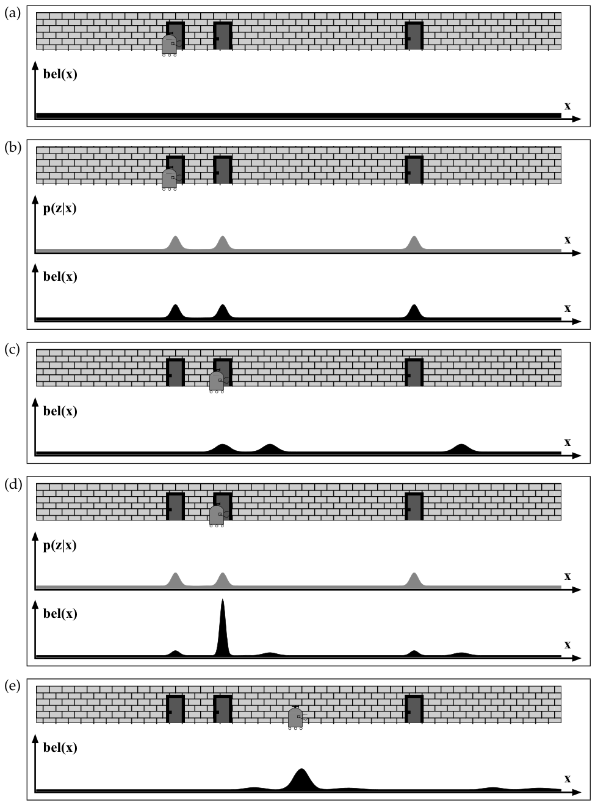
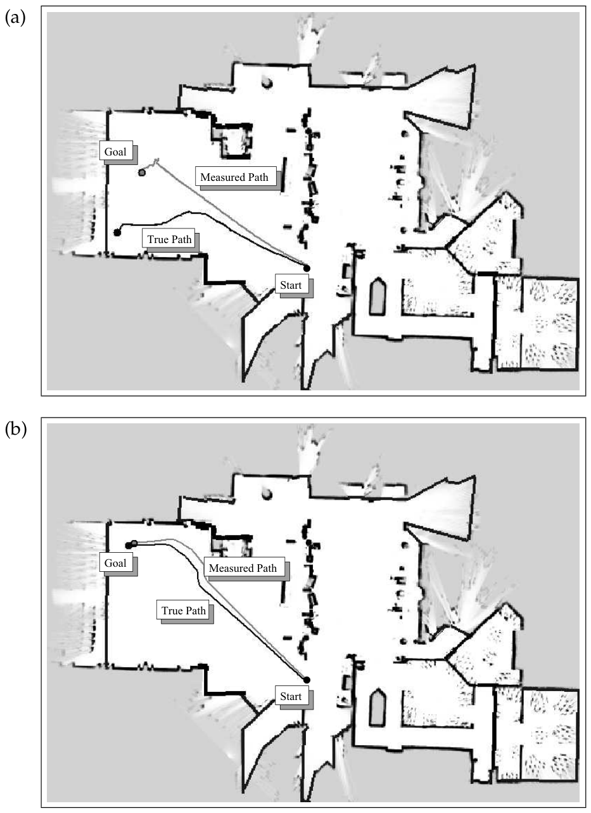

# 1장. Introduction

> 원문: *Probabilistic Robotics*, Chapter 1 (책 p.3~12 / PDF p.24~33)
>
> **이 노트는 다른 장과 성격이 다르다.** 1장은 수식도 알고리즘도 없는 개괄 장이고, 이 스터디에서는
> 2~8장을 모두 마친 **뒤에** 작성되었다. 그래서 원문을 따라가면서 동시에
> **"1장이 예고한 것이 실제로 어디서 실현되었는가"** 를 함께 짚는다.
>
> 처음 읽는 사람에게는 지도이고, 다 읽은 사람에게는 답안지다.

---

# 1.1 Uncertainty in Robotics (책 p.3~4)

## 1. 개념적 이해

**로보틱스는 컴퓨터 제어 장치를 통해 물리 세계를 지각하고 조작하는 과학이다. 성공적인 로봇 시스템의
예로는 행성 탐사를 위한 이동 플랫폼, 조립 라인의 산업용 로봇 팔, 스스로 주행하는 자동차, 외과의를
보조하는 매니퓰레이터가 있다. 로봇 시스템은 물리 세계 안에 놓여 있고, 센서를 통해 환경 정보를
지각하며, 물리적 힘을 통해 조작한다.** (책 p.3)

**이런 과제를 수행하려면 로봇은 물리 세계에 존재하는 **엄청난 불확실성을 수용**할 수 있어야 한다.
로봇의 불확실성에 기여하는 요인은 여러 가지다.** (책 p.3)

### 불확실성의 다섯 가지 원천

책이 드는 다섯 원천을, 이 스터디에서 각각을 어떻게 다뤘는지와 함께 정리한다.

| # | 원천 | 책의 서술 | 이 스터디에서 |
|---|---|---|---|
| 1 | **환경** | **"로봇 환경은 본질적으로 예측 불가능하다. 조립 라인처럼 잘 구조화된 환경에서는 불확실성의 정도가 작지만, 고속도로나 개인 주택 같은 환경은 고도로 동적이고 여러 면에서 고도로 예측 불가능하다. **사람 근처에서 동작하는 로봇에 대해 불확실성이 특히 높다.**"** | **8.4절** 동적 환경 — Figure 8.20의 박물관 군중 |
| 2 | **센서** | **"센서는 지각할 수 있는 것이 제한된다. (…) 카메라는 벽을 통과해 볼 수 없고 카메라 이미지의 공간 해상도는 제한된다. 센서는 또한 노이즈의 대상이며 (…) 마지막으로 센서는 고장 날 수 있다. 고장 난 센서를 검출하는 것은 극히 어려울 수 있다."** | **6장** 전체 — 특히 6.3.1절의 네 오차 성분($p_{\text{max}}$ 가 검출 실패) |
| 3 | **구동** | **"로봇 구동은 적어도 어느 정도는 예측 불가능한 모터를 수반한다. 불확실성은 제어 노이즈, 마모, 기계적 고장 같은 효과에서 발생한다. (…) 저가 모바일 로봇 같은 것은 극도로 변덕스러울 수 있다."** | **5장** motion model의 $\alpha_1 \ldots \alpha_6$ |
| 4 | **모델** | **"일부 불확실성은 로봇의 소프트웨어가 야기한다. **세계의 모든 내부 모델은 근사다.** 모델은 실세계의 추상이다. (…) 모델 오차는 로보틱스에서 흔히 무시되어 온 불확실성의 원천인데, 최신 로봇 시스템에서 쓰이는 대부분의 로봇 모델이 오히려 조잡하다는 사실에도 불구하고 그렇다."** | **6.2절** "맵과 물리 세계의 구분을 버린다"는 정직한 각주 |
| 5 | **알고리즘 근사** | **"불확실성은 알고리즘적 근사를 통해서도 만들어진다. 로봇은 실시간 시스템이다. 이는 수행할 수 있는 계산량을 제한한다. 많은 인기 알고리즘은 근사적이며, **정확도를 희생해 시의적절한 응답을 달성**한다."** | **3.3절** EKF linearization, **4.1절** 격자 이산화, **8.2.2절** 거친 격자 보정 |

> **⑤가 특히 중요하다.** 앞의 넷은 "세상이 원래 불확실하다"는 이야기지만, ⑤는 **우리가 쓰는
> 알고리즘 자체가 불확실성을 추가한다**는 고백이다. 이 스터디에서 반복해서 만난 문제들이 전부
> 여기 속한다:
>
> - 7.7.2절 Figure 7.16 — EKF의 선형화 오차
> - 8.2.2절 — 격자가 거칠어서 "로봇이 영원히 같은 칸에 머문다"
> - 8.3.6절 — particle이 유한해서 "완벽한 센서가 MCL을 죽인다"
>
> 그리고 책이 다섯 번이나 반복한 처방 — **"노이즈를 부풀려라"**(5장 p.118, 6.7절, 8.2.2절, 8.3.6절,
> 8.5절) — 은 정확히 이 ⑤를 흡수하기 위한 것이다.

### 왜 지금 이 문제가 중요한가

**불확실성의 수준은 응용 영역에 달려 있다. 조립 라인 같은 일부 로봇 응용에서는 인간이 시스템을
영리하게 설계해 불확실성이 주변적 요인에 그치게 할 수 있다. 반면 주거 가정이나 다른 행성에서
동작하는 로봇은 **상당한 불확실성에 대처해야 한다.** 그런 로봇은 센서도 내부 모델도 절대적 확신을
가지고 옳은 결정을 내리기에 충분한 정보를 제공하지 못함에도 불구하고 **행동하도록 강요된다.**
(책 p.4)

**로보틱스가 이제 열린 세계로 이동함에 따라, 불확실성 문제는 유능한 로봇 시스템 설계의 주요
걸림돌이 되었다. **불확실성을 관리하는 것은 아마도 강건한 실세계 로봇 시스템을 향한 가장 중요한
단계일 것이다.**** (책 p.4)

**따라서 이 책이 있다.** (책 p.4)

> 원문의 **"Hence this book."** 은 이 책 전체에서 가장 짧은 문단이다. 앞의 다섯 원천을 나열한 뒤
> 이 한 줄로 끝낸다.

## 2. 예제/실습

#### 예제 — 다섯 원천이 한 스텝에서 동시에 작용하는 모습

7.4절 예제(EKF localization 한 스텝)를 다섯 원천으로 분해해 보자.

| 원천 | 그 스텝의 어디에 |
|---|---|
| ③ 구동 | $M_t = \operatorname{diag}(\alpha_1 v_t^2 + \alpha_2\omega_t^2,\ \ldots)$ — 명령한 $v_t$ 와 실제 $\hat{v}_t$ 의 차이 |
| ② 센서 | $Q_t = \operatorname{diag}(\sigma_r^2, \sigma_\phi^2, \sigma_s^2)$ — 측정 노이즈 |
| ④ 모델 | 맵의 랜드마크 좌표 $(m_{j,x}, m_{j,y})$ 가 실제와 다를 수 있음 (모델에 없음!) |
| ⑤ 근사 | $G_t$, $V_t$, $H_t$ — 전부 1차 Taylor 근사 |
| ① 환경 | 사람이 랜드마크를 가려 관측이 아예 없을 수 있음 (모델에 없음!) |

**②③⑤는 필터가 명시적으로 모델링하지만 ①④는 하지 않는다.** 그래서 실무에서 $\alpha$ 와 $\sigma$ 를
"실제보다 크게" 잡는 것이다 — 모델링하지 않은 ①④를 그 여유분이 흡수하도록.

#### 연습문제

1. 자신이 아는 로봇(청소로봇, 드론, 자율주행차 등)을 하나 골라 다섯 원천이 각각 어떻게 나타나는지
   적어 보라. 어느 것이 지배적인가?
2. "조립 라인은 불확실성을 설계로 없앨 수 있다"고 했다. 구체적으로 어떤 설계인가? 그 대가는?
3. 원천 ⑤(알고리즘 근사)가 다른 넷과 성격이 다른 이유는 무엇인가?

---

# 1.2 Probabilistic Robotics (책 p.4~8)

## 1. 개념적 이해

### 핵심 아이디어 한 문단

**이 책은 probabilistic robotics의 포괄적 개관을 제공한다. Probabilistic robotics는 로봇 perception과
action의 불확실성에 경의를 표하는 비교적 새로운 접근이다.**

> **Probabilistic robotics의 핵심 아이디어는 **확률론의 계산법을 사용해 불확실성을 명시적으로
> 표현하는 것**이다. 달리 말해, 무엇이 사실일지에 대한 **단 하나의 "최선의 추측"에 의존하는 대신,
> 확률적 알고리즘은 추측의 전체 공간에 대한 확률분포로 정보를 표현한다.**** (책 p.4~5)

**그렇게 함으로써 그것들은 **모호성과 믿음의 정도**를 수학적으로 건전한 방식으로 표현할 수 있다.
제어 선택은 남아 있는 불확실성에 대해 강건하게 만들어질 수 있고, probabilistic robotics는 그것이
우월한 선택으로 보일 때 **능동적으로 불확실성을 줄이는 선택**을 할 수도 있다. 따라서 확률적
알고리즘은 불확실성 앞에서 **우아하게 저하된다(degrade gracefully).** 그 결과 많은 실세계 응용에서
대안 기법을 능가한다.** (책 p.5)

> **"단 하나의 최선의 추측 대신 전체 공간에 대한 분포"** — 이 한 문장이 8장까지의 모든 내용이다.
>
> | 무엇으로 표현하는가 | 어디서 |
> |---|---|
> | 평균과 공분산 $(\mu, \Sigma)$ | 3장 KF·EKF·UKF, 7장 EKF·UKF Localization |
> | Gaussian 여러 개 | 7.6절 MHT |
> | 격자 칸마다 확률값 | 4.1절 histogram filter, 8.2절 grid localization |
> | particle 집합 | 4.3절 particle filter, 8.3절 MCL |
>
> **네 가지 전부가 "분포를 들고 다니는" 서로 다른 방법**이다. 그리고 어느 것을 고르느냐가
> Table 8.6의 비교표를 만든다.

### 첫 번째 예 — mobile robot localization

*Figure 1.1 — Markov localization의 기본 아이디어: global localization 중인 모바일 로봇.
Markov localization 기법은 7장과 8장에서 조사될 것이다. (책 p.6)*

**우리의 첫 예는 **mobile robot localization**이다. 로봇 localization은 외부 기준 좌표계에 대한
로봇의 좌표를 추정하는 문제다. 로봇은 환경의 맵을 받지만, 이 맵에 대해 자신을 localize하려면 센서
데이터를 참조해야 한다. (…) 환경은 **구분 불가능한 문 세 개**를 갖는 것으로 알려져 있다. 로봇의
과제는 센싱과 운동을 통해 자신이 어디 있는지 알아내는 것이다.** (책 p.5)

**이 특정 localization 문제는 **global localization**으로 알려져 있다. Global localization에서 로봇은
알려진 환경 어딘가에 놓이고 **처음부터** 자신을 localize해야 한다.** (책 p.5)

책이 (a)~(e)를 하나씩 설명하는데, **이 그림이 곧 Figure 7.5(Markov localization)이고 Figure 8.1
(grid)이며 Figure 8.11(MCL)이다.** 같은 그림이 이 책에 네 번 나온다.

**(a) 균등 분포** — **"확률적 패러다임은 로봇의 순간적 belief를 모든 위치 공간에 대한 확률밀도함수로
표현한다. (…) 이 도표는 모든 위치에 대한 균등분포를 보여준다."** (책 p.5)

→ **7.2절 식 (3)** $bel(x_0) = 1/|X|$

**(b) 첫 측정 — mode 세 개** — **"로봇이 첫 센서 측정을 취해 자기가 문 옆에 있음을 관측한다고
하자. 확률적 기법은 이 정보를 활용해 belief를 갱신한다. (…) 이 분포가 **세 개의 mode**를 가짐에
주목하라. 각각은 환경의 구분 불가능한 문 중 하나에 대응한다. 따라서 **로봇은 결코 자기가 어디
있는지 알지 못한다.** 대신 이제 센서 데이터가 주어졌을 때 각각 똑같이 그럴듯한 세 개의 뚜렷한
가설을 갖는다."** (책 p.5)

> **⚠️ 여기에 이 책 전체에서 가장 중요한 한 문장이 숨어 있다** (책 p.5)
>
> **"우리는 또한 로봇이 **문 옆이 아닌 장소에도 양의 확률을 할당**함에 주목한다. 이는 센싱에 내재한
> 불확실성의 자연스러운 결과다: 작지만 0이 아닌 확률로 로봇은 문을 봤다는 판단에서 틀렸을 수 있다.
> **낮은 확률의 가설을 유지하는 능력은 강건성을 달성하는 데 필수적이다.**"**
>
> 이 문장이 이 스터디 전체에서 반복적으로 되살아난다:
>
> | 어디서 | 어떻게 |
> |---|---|
> | **6.3.1절** | 네 성분 중 하나라도 빠지면 확률 0 → "올바른 pose 가설이 즉사한다" |
> | **7.4.3절** | 이상치 문턱 처리 없이는 "EKF localization이 취약해진다" |
> | **8.3.5절** | particle 고갈 — "올바른 pose 근처의 모든 particle을 우연히 버릴 수 있다" |
> | **8.4절** | 기각 검사가 **긴 측정은 받아들이는** 이유 — 회복 가능성을 남기려고 |
>
> **"0을 주지 마라"** 가 확률적 로보틱스의 제1 실무 원칙이다.

**(c) 이동 — 밀리고 퍼진다** — **"belief가 운동 방향으로 이동했다. 또한 더 큰 퍼짐을 갖는데,
이는 로봇 운동이 도입한 불확실성을 반영한다."** (책 p.5~8)

→ **5장** motion model, **7.3절** convolution

**(d) 두 번째 측정 — 답이 정해진다** — **"또 다른 문을 관측한 뒤의 belief를 묘사한다. 이 관측은
우리 알고리즘이 확률 질량의 대부분을 문 중 하나 근처 위치에 놓게 하며, **로봇은 이제 자기가 어디
있는지 꽤 확신한다.**"** (책 p.8)

**(e) 계속 이동** (책 p.8)

### 이 예가 말하는 것

**이 예는 확률적 패러다임의 여러 측면을 예시한다. 확률적으로 서술하면 **로봇 perception 문제는
state estimation 문제**이며, 우리의 localization 예제는 로봇 위치 공간에 대한 posterior 추정을 위해
**Bayes filter**로 알려진 알고리즘을 사용한다. 정보의 표현은 확률밀도함수다. 이 함수의 갱신은
센서 측정을 통해 얻은 정보, 또는 로봇의 불확실성을 증가시키는 세계의 과정을 통해 잃은 정보를
표현한다.** (책 p.8)

> **"Bayes filter"라는 이름이 책에서 처음 등장하는 곳이 여기다.** 그리고 2장 전체가 이 한 단어의
> 전개이며, 3·4장은 그 구현, 7·8장은 그 적용이다.

### 두 번째 예 — coastal navigation

*Figure 1.2 — 위 그림: 개방된 특징 없는 공간을 항행하는 로봇은 자기가 어디 있는지 놓칠 수 있다.
아래: 알려진 장애물 근처에 머무름으로써 이를 피할 수 있다. 이 그림들은 coastal navigation이라
불리는 알고리즘의 결과이며, 16장에서 논의될 것이다. (책 p.7)*

**우리의 두 번째 예는 로봇 계획과 제어의 영역으로 데려간다. 방금 논한 대로 확률적 알고리즘은 로봇의
순간적 불확실성을 계산할 수 있다. 그러나 그것들은 **미래의 불확실성을 예상**하고, 올바른 제어 선택을
결정할 때 그런 불확실성을 고려할 수도 있다.** (책 p.8)

**흥미로운 통찰은 이것이다: **모든 궤적이 같은 수준의 불확실성을 유발하지는 않는다.** Figure 1.2a의
경로는 비교적 개방된 공간을 지나며, 로봇이 localize된 상태를 유지하도록 도울 수 있는 특징이 없다.
Figure 1.2b는 대안 경로를 보여준다. 이 궤적은 뚜렷한 모서리를 찾아가고, 그 다음 localize된 상태를
유지하기 위해 벽을 **"껴안는다(hug)".** 놀랍지 않게도 후자 경로에서 불확실성이 줄어들 것이고,
따라서 목표 위치에 도착할 가능성이 실제로 더 높다.** (책 p.8)

**이 예에서 한 궤적을 따라 발생할 수 있는 불확실성의 예상이 로봇으로 하여금 **불확실성을 줄이기
위해 두 번째의 더 긴 경로를 선호**하게 만든다. 새 경로가 더 나은 이유는, 로봇이 목표에 있다고 믿을 때
실제로 목표에 있을 가능성이 훨씬 높다는 점에서다. 사실 두 번째 경로는 **능동적 정보 수집(active
information gathering)** 의 예다.** (책 p.8)

> **이 예는 이 스터디의 범위 밖이다** (16장). 하지만 7.1절에서 만난 개념과 직결된다 —
> **active localization**이다. 7.1절 Figure 7.3에서 "대칭 복도에서는 방으로 들어가야 모호성이
> 해소된다"고 했고, 여기서는 그 아이디어가 **경로 계획**으로 확장된다.
>
> 우리가 배운 7·8장은 전부 **passive**다 — 로봇이 어디로 갈지는 정해져 있고 필터는 관찰만 한다.
> "불확실성을 줄이려고 일부러 돌아가는" 것은 그 다음 단계다.

## 2. 예제/실습

#### 예제 — Figure 1.1을 실제로 돌려보기

아래 위젯은 7장에서 만든 것으로, **Figure 1.1의 (a)~(e)를 그대로 재현한다.**
"Figure 7.5 전체 재생" 버튼이 곧 Figure 1.1의 다섯 단계다.

<!--widget:markov-1d-hallway-->

**(b) 단계에서 확인할 것**: 문이 아닌 위치의 막대가 **0이 아니다.** 위 인용구에서 강조한
"낮은 확률의 가설을 유지하는 능력"이 이것이다. `p(문 봄 | 문 아님)` 슬라이더를 0.02까지 낮춰 보면
그 여유분이 사라지고, 필터가 문 세 곳에만 극단적으로 확신하게 된다.

#### 연습문제

1. Figure 1.1(b)의 belief를 EKF로 표현하려 하면 무슨 일이 생기는가? 7.4.1절 Figure 7.6이
   이 문제를 어떻게 회피했는지 설명하라.
2. "낮은 확률의 가설을 유지하는 능력이 강건성에 필수적"이라는 주장을 8.3.5절 particle 고갈과
   연결해 설명하라.
3. Coastal navigation이 "더 긴 경로를 고르는" 것이 왜 합리적인가? 기대 도착 성공률로 논해 보라.

---

# 1.3 Implications (책 p.9~10)

## 1. 개념적 이해

### 장점 — 모델과 센서의 한계를 동시에 넘는다

**Probabilistic robotics는 **모델과 센서 데이터를 매끄럽게 통합**하여 양쪽의 한계를 동시에 극복한다.
이 아이디어는 저수준 제어만의 문제가 아니다. 그것은 로봇 소프트웨어의 모든 수준을, 최하위에서
최상위까지 관통한다.** (책 p.9)

**로보틱스의 전통적 프로그래밍 기법 — 모델 기반 motion planning 기법이나 반응형 behavior-based
접근 같은 — 과 대조적으로, 확률적 접근은 **센서 한계와 모델 한계 앞에서 더 강건한** 경향이 있다.
이는 그것들이 이전 패러다임보다 복잡한 실세계 환경으로 훨씬 잘 확장되게 해준다.** (책 p.9)

**사실 **특정 확률적 알고리즘은 어려운 로봇 추정 문제에 대해 현재 알려진 유일한 작동 해법**이다.
몇 페이지 전에 논의한 localization 문제나, 매우 큰 환경의 정확한 맵을 만드는 문제 같은 것이다.**
(책 p.9)

| 비교 대상 | 확률적 접근의 우위 |
|---|---|
| **모델 기반 기법** | **"로봇 모델의 정확도에 대한 요구가 더 약하며, 따라서 정확한 모델을 만들어내야 하는 감당 못 할 부담에서 프로그래머를 해방시킨다"** |
| **반응형 기법** | **"많은 반응형 기법이 하는 것보다 로봇 센서의 정확도에 대한 요구가 더 약하다. 그런 기법의 유일한 제어 입력은 순간적 센서 입력이다"** |

**확률적으로 볼 때 **로봇 학습 문제는 장기 추정 문제**다. 따라서 확률적 알고리즘은 여러 형태의 로봇
학습에 건전한 방법론을 제공한다.** (책 p.9)

> **6.3.2절이 그 예다.** intrinsic parameter $\Theta$ 를 EM으로 학습한 것은 "로봇 학습"이지만,
> 사실은 그냥 **추정 문제**로 다뤄졌다. 별도의 학습 이론이 필요 없었다.

### 대가 — 두 가지

**그러나 이 장점들은 대가를 치른다. 확률적 알고리즘의 가장 자주 인용되는 두 한계는
**계산 복잡도**와 **근사의 필요성**이다.** (책 p.9)

**① 계산 복잡도** — **"확률적 알고리즘은 본질적으로 비확률적 대응물보다 덜 효율적이다. 이는 그것들이
**단 하나의 추측 대신 전체 확률밀도를 고려**한다는 사실 때문이다."** (책 p.9)

> 8.2.1절 예제가 이것이다 — 격자 $1.28\times10^6$ 칸, 순진한 구현이면 스텝당 $1.6\times10^{12}$ 연산.
> "단 하나의 추측"이었다면 pose 하나만 갱신하면 됐을 것이다.

**② 근사의 필요성** — **"근사의 필요성은 대부분의 로봇 세계가 **연속**이라는 사실에서 발생한다.
정확한 posterior 분포를 계산하는 것은 계산적으로 다루기 어려운 경향이 있다. 때로는 운 좋게도
불확실성이 **컴팩트한 파라미터적 모델(예: Gaussian)** 로 촘촘히 근사될 수 있다. 다른 경우에는 그런
근사가 너무 조잡해 쓸모없고, **더 복잡한 표현**을 써야 한다."** (책 p.9)

> **이 두 문장이 3장과 4장을 가른다.**
>
> | 책의 표현 | 해당 장 |
> |---|---|
> | "컴팩트한 파라미터적 모델(예: Gaussian)" | **3장** Gaussian Filters |
> | "더 복잡한 표현" | **4장** Nonparametric Filters |
>
> 그리고 그 선택이 7장(Gaussian)과 8장(nonparametric)으로 이어진다. **1장의 이 한 문단이 Part I과
> Part II의 구조를 통째로 결정한다.**

**컴퓨터 하드웨어의 최근 발전은 전례 없는 수의 FLOPS를 저렴한 가격에 제공했다. (…) 그럼에도 계산적
도전은 남아 있다. 우리는 특정 확률적 해법의 강점과 약점을 조사하는 여러 곳에서 이 논의를 다시
방문할 것이다.** (책 p.9~10)

> 실제로 "다시 방문"한 곳들: 6.3.4절, 7.8절, 8.2.3절, 8.3.7절, 8.5절.

## 2. 예제/실습

#### 예제 — 두 대가를 숫자로

같은 localization 문제를 세 방식으로 풀 때 스텝당 비용:

| 방식 | 표현 | 상태 개수 | 비고 |
|---|---|---|---|
| 비확률적 (추측 항법) | pose 하나 | **3개 실수** | 8.2.4절 Figure 8.10 — 40m에 50도 오차 |
| EKF (7.4절) | $\mu, \Sigma$ | **3 + 9 = 12개 실수** | 4배. global localization 불가 |
| Grid (8.2절) | 격자 | **$1.28\times10^6$ 개** | 40만 배 |
| MCL (8.3절) | particle 1000개 | **3000개 실수** | 1000배. 하지만 KLD로 줄일 수 있음 |

**"단 하나의 추측 대신 전체 분포"의 비용이 이것이다.** 그리고 그 대가로 얻는 것이 Figure 8.10(b)의
보정된 경로다.

#### 연습문제

1. "확률적 알고리즘은 모델 정확도에 대한 요구가 약하다"는 주장을 6.1절의 "극도로 조잡한 모델로도
   해나갈 수 있다"와 연결해 설명하라.
2. 반응형(behavior-based) 접근이 "순간적 센서 입력만" 쓴다는 것은 Bayes filter의 무엇을 포기한
   것인가?
3. 위 표에서 MCL이 grid보다 훨씬 적은데도 8.3.7절 KLD-sampling이 필요한 이유는?

---

# 1.4 Road Map (책 p.10)

**이 책은 네 개의 주요 부분으로 조직되어 있다.** (책 p.10) — (실제로는 다섯 항목으로 나열된다.)

| 책의 서술 | 장 | 이 스터디에서 |
|---|---|---|
| **"이 책에 기술된 모든 알고리즘의 기초가 되는 기본 수학 틀과 핵심 알고리즘을 소개한다. 이 장들은 이 책의 **수학적 기초**다"** | **2~4장** | ✅ 완료 |
| **"모바일 로봇의 확률 모델을 제시한다. 여러 면에서 이 장들은 고전적 로보틱스 모델의 **확률적 일반화**다. 이후 자료의 **로봇공학적 기초**를 이룬다"** | **5~6장** | ✅ 완료 |
| **"mobile robot localization 문제가 논의된다. 이 장들은 기본 추정 알고리즘과 앞 두 장에서 논의한 확률 모델을 **결합**한다"** | **7~8장** | ✅ 완료 |
| **"훨씬 풍부한 문제인 robotic mapping을 논의한다"** | 9~13장 | 범위 밖 |
| **"확률적 계획과 제어의 문제를 논의한다. (…) 마지막 장인 17장은 확률적 관점에서 로봇 exploration 문제를 논의한다"** | 14~17장 | 범위 밖 |

> **이 스터디는 앞의 세 덩어리를 정확히 다뤘다.** `0_Contents.md`가 세운 범위가 책의 자연스러운
> 구획과 일치한다.
>
> 세 번째 줄의 **"결합한다(combine)"** 가 7·8장의 성격을 정확히 표현한다 — 7장은 3장 + 5장 + 6장,
> 8장은 4장 + 5장 + 6장이다.

**책은 처음부터 끝까지 순서대로 읽는 것이 가장 좋다. 그러나 우리는 각 개별 장이 자기 완결적이도록
시도했다. **"…의 수학적 유도"라 불리는 절들은 첫 독서에서 안전하게 건너뛸 수 있으며**, 이 책 전체
자료의 일관성을 훼손하지 않는다.** (책 p.10)

> 이 스터디는 그 조언을 따르지 **않았다.** `2_Template_and_Rule.md`의 "생략 금지 규칙"에 따라
> 수학적 유도 절도 모두 다뤘다. 단 하나의 예외가 **6.3.2~6.3.3절(EM)** 인데, 그것도 결과 알고리즘
> (Table 6.2)까지는 다뤘고 미분 전개만 생략했다.

---

# 1.5 Teaching Probabilistic Robotics (책 p.11)

**교실에서 사용할 때, 학생들이 추상적 수학 개념에 대해 유별나게 강한 이해를 갖고 있지 않은 한
**장을 순서대로 가르치는 것을 권하지 않는다.**** (책 p.11)

**Particle filter는 Gaussian filter보다 가르치기 쉽고, 학생들은 추상적 필터 알고리즘보다 mobile robot
localization 문제에 더 흥미를 느끼는 경향이 있다. 우리 자신의 강의에서 우리는 보통 **2장으로 시작해
곧바로 7장과 8장으로 넘어간다.** Localization을 가르치면서 필요에 따라 3장부터 6장까지의 자료로
돌아간다. 또한 계획과 제어 관련 문제에 학생들을 일찍 노출시키기 위해 **14장을 일찍 가르친다.**
(책 p.11)

> **저자들이 권하는 순서**: 2 → 7 → 8 → (필요할 때 3~6) → 14
> **`0_Contents.md`가 택한 순서**: 1 → 2 → 3 → 4 → 5 → 6 → 7 → 8 (책 순서)
>
> 두 순서 모두 타당하다. 저자의 순서는 **동기 부여**가 빠르고, 책 순서는 **의존성이 깔끔**하다.
> 이 스터디는 후자를 택했고, 그 덕에 7장에 도달했을 때 EKF·landmark model·correspondence가 전부
> 이미 손에 있었다.
>
> 다만 저자의 지적 하나는 이 스터디에서도 확인됐다 — **"particle filter가 Gaussian filter보다
> 가르치기 쉽다."** 8.3.2절 MCL이 12줄인데 7.4.2절 EKF localization은 22줄에 Jacobian 세 개다.

**이 책의 자료는 **직접 구현해 보는 과제**와 함께 가르치는 것이 가장 좋다. 로보틱스에서 실제 로봇을
프로그래밍하는 것보다 교육적인 것은 없다. 그리고 **로보틱스의 함정과 도전을 자연(Nature)보다 잘
설명할 수 있는 것은 없다!**** (책 p.11)

> 이 스터디의 각 장 끝에 붙인 "구현 연습"들이 그 취지다. 특히 8.8절의 추가 연습문제 1~5는
> Table 8.1·8.2·8.3·8.4·8.5를 전부 코드로 옮기는 과제다.

---

# 1.6 Bibliographical Remarks (책 p.11~12)

이 절은 **로보틱스 소프트웨어 설계의 세 패러다임**을 역사적으로 정리한다. 확률적 접근이 왜 등장했는지
이해하는 데 유용하다.

## 세 패러다임

### ① Model-based paradigm (1970년대 중반~)

**로보틱스 분야는 소프트웨어 설계의 일련의 패러다임을 거쳐 왔다. 첫 주요 패러다임은 1970년대 중반에
등장했으며 **model-based paradigm**으로 알려져 있다.** (책 p.11)

**이 초기 연구는 **불확실성 문제를 크게 무시했다** — 어려운 motion planning 문제를 푸는 기법으로
무작위화를 광범위하게 사용하기 시작했음에도 그랬다. 대신 **로봇과 환경의 완전하고 정확한 모델이
주어지고 로봇이 결정론적이라는 가정**이었다. 모델은 잔여 불확실성이 저수준 motion controller로
관리될 만큼 충분히 정확해야 했다.** (책 p.11)

**이런 초기 기법의 응용은, 있다 하더라도, **모든 불확실성을 설계로 제거하거나 충분한 정확도로 감지할
수 있는 환경에 국한**되었다.** (책 p.11)

| 주요 문헌 | 기여 |
|---|---|
| Reif (1979) | 고자유도 매니퓰레이터 제어의 어려움 |
| Schwartz et al. (1987) | 로봇 운동 복잡도 분석 |
| Canny (1987) | 첫 단일 지수 일반 motion planning 알고리즘 |
| **Latombe (1991)** | 모델 기반 motion planning 분야의 선구적 입문서 |
| Kavraki et al. (1996) | 무작위화 기법 |
| Khatib (1986) | potential fields |
| Koditschek (1987) | navigation functions |

### ② Behavior-based robotics (1980년대 중반~)

**분야는 1980년대 중반에 급진적 전환을 겪었는데, 감각 피드백의 결여가 로보틱스 내 연구자 공동체
전체의 초점이 되었을 때다. 강한 확신을 가지고 **behavior-based robotics** 분야는 **어떤 내부 모델의
아이디어도 거부했다.** 대신 복잡성을 만드는 것은 **상황 지어진 에이전트와 물리적 환경의 상호작용**
이었다(흔히 **emergent behavior**라 불리는 현상). 결과적으로 센싱이 절대적 역할을 했고 내부 모델은
거부되었다.** (책 p.11~12)

| 주요 문헌 | 기여 |
|---|---|
| Brooks (1986) | **"Genghis"** — 육족 로봇. 단순한 유한 상태 오토마타로 험지 보행 제어 |
| Brooks (1990) | 내부 모델 거부 |
| Steels (1991) | emergent behavior |
| Connell (1990) | 환경 피드백의 영리한 활용 |
| **IRobots Inc. (2004)** | **로봇 청소기** — behavior-based 패러다임의 상업적 성공 |

**내부 모델의 결여와 단순한 제어 메커니즘에 대한 초점 때문에, 대부분의 로봇 시스템은 **순간적 센서
정보가 올바른 제어 선택을 결정하기에 충분한 비교적 단순한 과제**에 국한되었다. 이 한계를 인식하고,
이 분야의 더 최근 연구는 **hybrid 제어 아키텍처**를 받아들였다. 여기서 behavior-based 기법이 저수준
제어를 제공하고, 모델 기반 planner가 높은 추상 수준에서 로봇의 행동을 조율한다. **그런 hybrid
아키텍처는 오늘날 로보틱스에서 흔하다.**** (책 p.12)

### ③ Probabilistic robotics (1990년대 중반~)

> **현대 probabilistic robotics는 1990년대 중반 이후 등장했으며, 그 뿌리는 **Kalman filter의
> 발명(Kalman 1960)** 까지 거슬러 올라갈 수 있다. 여러 면에서 probabilistic robotics는 **model-based와
> behavior-based 기법의 중간**에 놓인다.**
>
> **Probabilistic robotics에는 **모델이 있지만, 불완전하고 제어에 불충분하다고 가정된다.**
> **센서 측정도 있지만, 그것 역시 불완전하고 제어에 불충분하다고 가정된다.** 모델과 센서 측정 양쪽의
> 통합을 통해 제어 행동이 고안될 수 있다. **통계학이 모델과 센서 측정을 통합하는 수학적 접착제를
> 제공한다.** (책 p.12)

> **이 문단이 1장에서 가장 중요하다.** 세 패러다임의 관계를 한 그림으로 정리하면:
>
> | | 모델 | 센서 | 통합 방법 |
> |---|---|---|---|
> | model-based | **완전하다고 가정** | 보조적 | (필요 없음) |
> | behavior-based | **없다** | **전부** | (필요 없음) |
> | **probabilistic** | **불완전** | **불완전** | **통계학** |
>
> 그리고 그 "수학적 접착제"의 구체적 형태가 **Bayes filter**다:
>
> $$bel(x_t) = \eta\ \underbrace{p(z_t \mid x_t, m)}_{\text{센서}}\ \int \underbrace{p(x_t \mid u_t, x_{t-1})}_{\text{모델}}\ bel(x_{t-1})\ dx_{t-1}$$
>
> **모델(motion)과 센서(measurement)가 이 한 식에서 만난다.** 1장의 이 서술이 2장 식 (2.42)로
> 정확히 구현된다.

### 확률적 로보틱스의 이정표

| 문헌 | 기여 | 이 스터디에서 |
|---|---|---|
| **Kalman (1960)** | Kalman filter | **3.2절** |
| Smith and Cheeseman (1986) | 고차원 perception을 위한 Kalman filter | (10장 SLAM) |
| **Elfes (1987); Moravec (1988)** | **occupancy grid map 발명** | 6.2절 언급, (9장) |
| Kaelbling et al. (1998) | 부분 관측 계획 기법 재도입 | (15장 POMDP) |
| **Dellaert et al. (1999)** | **particle filter의 대중화** | **4.3절 · 8.3절 MCL** |
| Thrun (2000b); Lebeltel et al. (2004); Park et al. (2005) | Bayesian 정보 처리 프로그래밍 방법론 | — |
| Durrant-Whyte (1996) | 화물 처리 산업 기계 | — |
| **Burgard et al. (1999a); Thrun et al. (2000a)** | **박물관 안내 로봇** | **8.4절 Figure 8.20의 "Rhino"** |
| Pineau et al. (2003d) | 간호·의료 로봇 | — |
| Montemerlo et al. (2003a) | 오픈소스 모바일 로봇 제어 패키지 | — |

**상업 로보틱스 분야도 전환점에 있다. 연례 World Robotics Survey에서 UN과 International Federation of
Robotics(2004)는 전 세계 로봇 시장 규모의 **연 19% 증가**를 발견한다. 더 볼 만한 것은 시장 부문의
변화인데, 이는 **산업 응용에서 서비스 로보틱스와 소비자 제품으로의 확실한 전환**을 나타낸다.**
(책 p.12)

> 이 책은 2005년에 쓰였다. 20년이 지난 지금 그 예측이 어떻게 되었는지는 독자가 아는 대로다 —
> 로봇 청소기, 자율주행, 물류 로봇이 전부 이 전환의 결과다. 그리고 **그 대부분이 이 책의 알고리즘
> 위에 서 있다.**

---

# 되돌아보기 — 1장의 약속과 8장의 결과

1장은 세 가지를 약속했다. 스터디를 마친 지금 그것들이 어떻게 지켜졌는지 확인한다.

### 약속 1 — "단 하나의 추측 대신 전체 분포"

| 1장의 서술 | 실현 |
|---|---|
| "확률분포로 정보를 표현한다" | 2장 $bel(x_t)$ |
| "컴팩트한 파라미터적 모델(Gaussian)" | 3장 KF·EKF·UKF·IF → 7장 |
| "더 복잡한 표현" | 4장 histogram·particle → 8장 |

### 약속 2 — "모델과 센서를 통계학으로 접착"

| 1장의 서술 | 실현 |
|---|---|
| "모델이 있지만 불완전하다" | **5장** $p(x_t \mid u_t, x_{t-1})$ — 노이즈 $\alpha_1 \ldots \alpha_6$ |
| "센서 측정도 불완전하다" | **6장** $p(z_t \mid x_t, m)$ — 네 성분 mixture |
| "통계학이 접착제" | **2장** Bayes filter — 두 항의 곱과 적분 |

### 약속 3 — "불확실성 앞에서 우아하게 저하된다"

| 1장의 서술 | 실현 |
|---|---|
| "낮은 확률의 가설을 유지하는 능력" | 6.3.1절 네 성분 필수 · 8.3.5절 랜덤 particle |
| "제어 선택이 강건해진다" | (14~17장, 범위 밖) |
| "능동적으로 불확실성을 줄인다" | 7.1절 active localization 언급 · Figure 1.2 coastal navigation (16장) |

### 1장이 예고했지만 이 스터디에서 다루지 않은 것

| 주제 | 책 위치 | 왜 다루지 않았나 |
|---|---|---|
| Robotic mapping | 9~13장 | `0_Contents.md`의 범위 밖 |
| Coastal navigation (Figure 1.2) | 16장 | 계획·제어 영역 |
| Active localization | 17장 | 7.1절에서 명시적으로 미룸 |
| POMDP | 15장 | 계획·제어 영역 |

> **가장 자연스러운 다음 걸음은 여전히 10장 EKF SLAM이다.** 8장 노트 마지막에 적었듯,
> 7.4절 EKF Localization의 상태 벡터에 랜드마크를 추가하면 그대로 SLAM이 된다.

---

> **다음 노트**: 2장 Recursive State Estimation (책 p.13~38)
