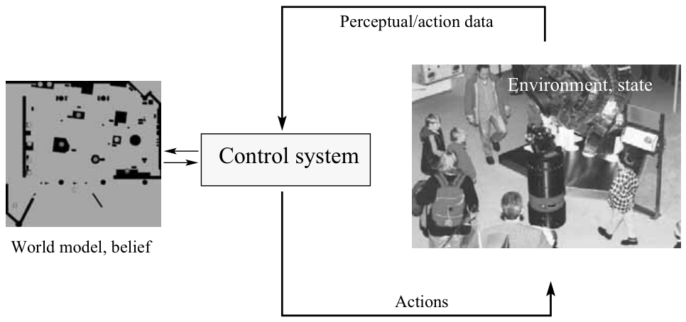
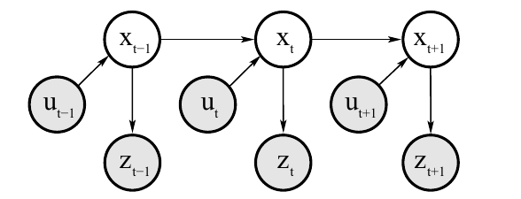
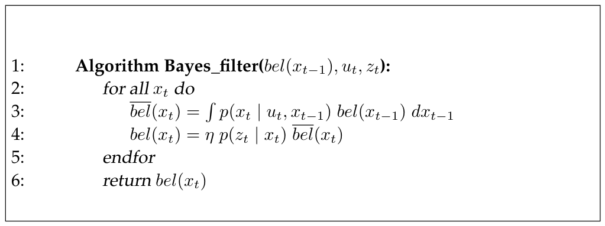
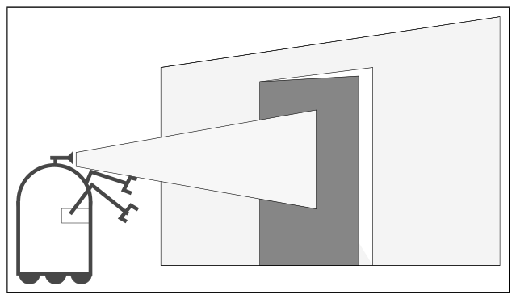

# 2장. Recursive State Estimation

> 원문: *Probabilistic Robotics*, Chapter 2 (책 p.13~38 / PDF p.34~59)
> 이 노트는 **2.2 Basic Concepts in Probability**와 **2.3 Robot Environment Interaction** (책 p.14~26)을 다룬다.

---

## 2장이 왜 필요한가 (2.1 Introduction, 책 p.13)

Probabilistic robotics의 핵심은 **센서 데이터로부터 상태를 추정(state estimation)** 하는 것이다.
로봇이 무엇을 해야 할지 결정하는 것 자체는, "어떤 값들을 알고만 있다면" 대체로 쉽다. 예를 들어
모바일 로봇을 움직이는 일은 로봇의 정확한 위치와 주변 장애물 위치를 안다면 비교적 간단하다.

문제는 이 값들이 **직접 측정되지 않는다(not directly observable)** 는 데 있다. 로봇은 센서에 의존해야
하는데, 센서는 그 값들에 대한 **부분적인 정보(partial information)** 만 담고 있고, 측정값은 **노이즈로
오염(corrupted by noise)** 되어 있다.

그래서 probabilistic state estimation 알고리즘은 하나의 정답을 내놓는 대신, 가능한 세계 상태들에 대한
**믿음 분포(belief distribution)** 를 계산한다. 2장은 그 계산에 필요한 어휘와 수학 도구를 세팅하는 장이다.

---

# 2.2 Basic Concepts in Probability (책 p.14~18)

## 1. 개념적 이해

Probabilistic robotics에서는 센서 측정값, 제어 명령, 로봇과 환경의 상태를 전부
**확률변수(random variable)** 로 모델링한다. 확률변수란 여러 값을 가질 수 있고, 어떤 값을 가질지가
특정한 확률 법칙에 따라 정해지는 변수다. 동전 던지기에서 결과 $X$가 앞면/뒷면 중 하나를 갖는 것이
전형적인 예다.

**확률적 추론(probabilistic inference)** 이란, 이미 아는 확률변수와 관측된 데이터로부터 파생되는
다른 확률변수들의 확률 법칙을 계산해내는 과정이다. 이 절에서 필요한 도구는 다음과 같다.

- **확률질량/밀도(probability, probability density)**: 이산 상태(문이 열림/닫힘)냐 연속 상태(로봇의 위치)냐에
  따라 표현이 달라진다. 이 책의 대부분은 연속 공간을 다루므로 **확률밀도함수(probability density function, PDF)**,
  특히 **정규분포(normal distribution / Gaussian)** 가 주인공이다.
- **결합확률(joint distribution)**: 두 사건이 동시에 일어날 확률. "로봇이 여기 있고 *동시에* 센서가 이 값을 읽을" 확률.
- **조건부확률(conditional probability)**: 한쪽을 이미 알고 있을 때 다른 쪽의 확률. 로봇 입장에서는
  "센서가 이 값을 읽었다는 걸 아는 상태에서, 로봇이 여기 있을 확률"이 바로 우리가 원하는 값이다.
- **독립(independence)과 조건부 독립(conditional independence)**: 어떤 변수가 다른 변수에 대해 아무 정보도 주지
  않는 상황. 이 책의 거의 모든 알고리즘이 계산 가능해지는 이유가 조건부 독립 덕분이다.
- **전확률 정리(theorem of total probability)**: 관심 없는 변수를 전부 더해서 없애는 도구.
- **베이즈 규칙(Bayes rule)**: 우리가 *갖고 있는* 확률($p(y \mid x)$, 센서 모델)로부터 우리가 *원하는* 확률
  ($p(x \mid y)$, 상태 추정)을 뒤집어 계산하는 규칙. 이 책 전체의 토대다.
- **기댓값(expectation), 공분산(covariance), 엔트로피(entropy)**: 분포의 특징(feature/statistic)을 요약하는 값들.

여기서 로봇 관점의 방향을 확실히 잡고 가자. 우리가 추론하고 싶은 것은 상태 $x$이고, 손에 들어오는 것은
데이터 $y$(센서 측정값)다. 그런데 물리적으로 모델링하기 쉬운 것은 반대 방향, 즉 "상태가 $x$일 때 센서가
$y$를 읽을 확률" $p(y \mid x)$다. 이것을 **생성 모델(generative model)** 이라 부르는데, 상태 $X$가 어떻게
측정값 $Y$를 *만들어내는지*를 기술하기 때문이다. Bayes rule은 이 쉬운 방향의 모델을 우리가 원하는
방향으로 뒤집어주는 장치다.

---

## 2. 수식/유도

### 전체 유도 과정 (먼저 한 번에)

$$p(X = x) \;\longrightarrow\; p(x), \qquad \sum_x p(x) = 1, \qquad p(x) \ge 0 \tag{1}$$

$$p(x) = \left(2\pi\sigma^2\right)^{-\frac{1}{2}} \exp\left\{-\frac{1}{2}\frac{(x-\mu)^2}{\sigma^2}\right\} \tag{2}$$

$$p(\mathbf{x}) = \det(2\pi\Sigma)^{-\frac{1}{2}} \exp\left\{-\tfrac{1}{2}(\mathbf{x}-\mu)^T \Sigma^{-1} (\mathbf{x}-\mu)\right\} \tag{3}$$

$$\int p(x)\,dx = 1 \tag{4}$$

$$p(x,y) = p(X = x \text{ and } Y = y), \qquad p(x,y) = p(x)\,p(y) \;\; \text{(if independent)} \tag{5}$$

$$p(x \mid y) = \frac{p(x,y)}{p(y)}, \qquad p(y) > 0 \tag{6}$$

$$p(x \mid y) = \frac{p(x)\,p(y)}{p(y)} = p(x) \;\; \text{(if independent)} \tag{7}$$

$$
\begin{aligned}
p(x) &= \sum_y p(x \mid y)\,p(y) &&\text{(discrete)} \\[4pt]
p(x) &= \int p(x \mid y)\,p(y)\,dy &&\text{(continuous)}
\end{aligned}
\tag{8}
$$

$$p(x \mid y) = \frac{p(y \mid x)\,p(x)}{p(y)} = \frac{p(y \mid x)\,p(x)}{\sum_{x'} p(y \mid x')\,p(x')} \quad \text{(discrete)} \tag{9}$$

$$p(x \mid y) = \frac{p(y \mid x)\,p(x)}{p(y)} = \frac{p(y \mid x)\,p(x)}{\int p(y \mid x')\,p(x')\,dx'} \quad \text{(continuous)} \tag{10}$$

$$p(x \mid y) = \eta\, p(y \mid x)\, p(x), \qquad \eta = p(y)^{-1} \tag{11}$$

$$p(x \mid y, z) = \frac{p(y \mid x, z)\,p(x \mid z)}{p(y \mid z)} \tag{12}$$

$$p(x, y \mid z) = p(x \mid z)\,p(y \mid z) \tag{13}$$

$$p(x \mid z) = p(x \mid z, y), \qquad p(y \mid z) = p(y \mid z, x) \tag{14}$$

$$E[X] = \sum_x x\,p(x) \quad \text{(discrete)}, \qquad E[X] = \int x\,p(x)\,dx \quad \text{(continuous)} \tag{15}$$

$$E[aX + b] = a\,E[X] + b \tag{16}$$

$$\mathrm{Cov}[X] = E\big[X - E[X]\big]^2 = E[X^2] - E[X]^2 \tag{17}$$

$$
\begin{aligned}
H_p(x) &= E[-\log_2 p(x)] \\[4pt]
&= -\sum_x p(x)\log_2 p(x) \quad \text{(discrete)} \\[2pt]
&= -\int p(x)\log_2 p(x)\,dx \quad \text{(continuous)}
\end{aligned}
\tag{18}
$$

---

### 단계별 설명 (생략 없이)

**(1) Discrete random variable과 표기 규칙** — 책 (2.1), (2.2)

$X$를 random variable, $x$를 $X$가 취할 수 있는 특정 값이라 하자. $X$가 가질 수 있는 값의 공간이
discrete하면 (동전 던지기처럼) $p(X = x)$로 "random variable $X$가 값 $x$를 가질 확률"을 표기한다.
공정한 동전이라면 $p(X = head) = p(X = tail) = \frac{1}{2}$이다.

Discrete probability는 모두 더하면 1이 되어야 하고($\sum_x p(X=x) = 1$), 항상 non-negative다
($p(X=x) \ge 0$).

표기를 간결히 하기 위해, 이 책에서는 가능한 한 random variable을 명시하지 않고 $p(X=x)$ 대신
**$p(x)$로 축약**한다. 앞으로 나오는 모든 $p(\cdot)$ 표기는 이 축약 규칙을 따른 것이다.

**(2) Normal distribution (1차원)** — 책 (2.3)

이 책의 대부분은 continuous space에서의 추정과 의사결정을 다룬다. Continuous space는 연속적인 값을
가질 수 있는 random variable로 특징지어지며, 별도 언급이 없는 한 모든 continuous random variable이
**probability density function (PDF)** 를 가진다고 가정한다.

가장 흔한 density function이 mean $\mu$, variance $\sigma^2$를 갖는 1차원 normal distribution이고,
그 PDF는 다음 Gaussian function으로 주어진다:

$$p(x) = \left(2\pi\sigma^2\right)^{-\frac{1}{2}} \exp\left\{-\frac{1}{2}\frac{(x-\mu)^2}{\sigma^2}\right\}$$

이 책에서는 이를 자주 $\mathcal{N}(x;\mu,\sigma^2)$로 축약 표기한다 — random variable, 그 mean, 그 variance를
차례로 명시하는 표기다. Normal distribution은 3장 Gaussian Filters (KF/EKF/UKF)의 전제이므로
이 표기에 익숙해져야 한다.

**(3) Multivariate normal distribution** — 책 (2.4)

식 (2)는 $x$가 scalar일 때의 이야기다. 실제로는 $x$가 다차원 벡터인 경우가 많다 (예: 로봇 pose
$\langle x, y, \theta\rangle$). 벡터에 대한 normal distribution을 **multivariate**라 부르며, density function은
다음 형태다:

$$p(\mathbf{x}) = \det(2\pi\Sigma)^{-\frac{1}{2}} \exp\left\{-\tfrac{1}{2}(\mathbf{x}-\mu)^T \Sigma^{-1} (\mathbf{x}-\mu)\right\}$$

여기서 $\mu$는 mean vector이고, $\Sigma$는 **positive semidefinite이고 symmetric한 행렬**로
**covariance matrix**라 부른다. 위첨자 $T$는 vector의 transpose를 뜻한다.

이 PDF의 지수부 인자는 $\mathbf{x}$에 대해 **quadratic(2차식)** 이며, 그 quadratic function의 파라미터가
바로 $\mu$와 $\Sigma$다. (이 "지수부가 quadratic"이라는 성질이 3장에서 Kalman filter를 유도할 때
핵심적으로 쓰인다.)

식 (3)은 식 (2)의 **엄밀한 일반화(strict generalization)** 다. $\mathbf{x}$가 scalar이고 $\Sigma = \sigma^2$이면
두 정의는 완전히 동일해진다. (직접 대입해서 확인해보면 좋다: $\det(2\pi\sigma^2) = 2\pi\sigma^2$,
$\Sigma^{-1} = 1/\sigma^2$.)

**(4) PDF의 정규화 조건** — 책 (2.5)

Discrete probability distribution이 합해서 1이 되는 것처럼, PDF는 적분해서 1이 된다:

$$\int p(x)\,dx = 1$$

단, discrete probability와 달리 **PDF의 값 자체는 1로 upper-bound되지 않는다** (좁고 뾰족한 분포는
밀도값이 1을 훌쩍 넘을 수 있다). 이 책에서는 probability, probability density, probability density function
이라는 용어를 서로 바꿔가며 사용하고, 모든 continuous random variable이 measurable하며 density를
실제로 가진다고 암묵적으로 가정한다.

**(5) Joint distribution과 independence** — 책 (2.6), (2.7)

두 random variable $X$, $Y$의 **joint distribution**은

$$p(x,y) = p(X = x \text{ and } Y = y)$$

즉 "$X$가 $x$ 값을 갖고 *동시에* $Y$가 $y$ 값을 갖는 사건"의 확률이다.

만약 $X$와 $Y$가 **independent**하다면:

$$p(x,y) = p(x)\,p(y)$$

**(6) Conditional probability의 정의** — 책 (2.8), (2.9)

종종 하나의 random variable이 다른 random variable에 대한 정보를 담고 있다. $Y$의 값이 $y$라는 것을
이미 알고 있고, 그 사실을 조건으로 했을 때 $X$의 값이 $x$일 확률을 알고 싶다고 하자. 이를
$p(x \mid y) = p(X = x \mid Y = y)$로 표기하고 **conditional probability**라 부른다.

$p(y) > 0$일 때, conditional probability는 다음과 같이 **정의된다**:

$$p(x \mid y) = \frac{p(x,y)}{p(y)}$$

> 여기서 중요한 점: 이것은 유도된 정리가 아니라 **definition**이다. "$y$가 일어났다는 조건 하에서 $x$의 확률"을
> joint probability와 $y$ 자체의 확률의 비율로 *정의한* 것이다. 뒤에 나올 Bayes rule은 이 정의를
> 두 번 적용해서 재배열한 것에 불과하다.

**(7) Independence일 때의 conditional probability** — 책 (2.10)

$X$와 $Y$가 independent하면, (5)의 $p(x,y) = p(x)p(y)$를 (6)의 정의에 대입해서:

$$p(x \mid y) = \frac{p(x)\,p(y)}{p(y)} = p(x)$$

즉 **$X$와 $Y$가 independent하면 $Y$는 $X$의 값에 대해 아무것도 알려주지 않는다.** $X$에 관심이 있을 때
$Y$의 값을 아는 것에 아무런 이득이 없다는 뜻이다. Independence와 그 일반화인 conditional independence는
이 책 전체에서 핵심적인 역할을 한다.

**(8) Theorem of total probability** — 책 (2.11), (2.12)

Conditional probability의 정의와 probability measure의 공리로부터 따라나오는 흥미로운 사실이
**theorem of total probability**다:

$$p(x) = \sum_y p(x \mid y)\,p(y) \quad \text{(discrete)}$$
$$p(x) = \int p(x \mid y)\,p(y)\,dy \quad \text{(continuous)}$$

> **이 정리가 왜 성립하는가 (marginalization 개념)**
>
> Joint distribution $p(x,y)$가 있을 때, 관심 없는 변수($y$)를 그 변수가 가질 수 있는 모든 값에 대해
> 다 더해서 없애면 남은 변수($x$)만의 distribution을 얻는다. 이것을 **marginalization**이라 한다.
> 근거는 확률의 기본 공리다 — $y$가 가질 수 있는 각 값에 대해 "$x$가 일어나고 $Y=y$인 사건"들은 서로
> **mutually exclusive**하고, 그 사건들을 모두 합치면 정확히 "$x$가 일어난 사건" 전체가 된다. 따라서
> $$p(x) = \sum_y p(x, y)$$
> 여기에 (6)의 정의를 $p(x,y) = p(x \mid y)\,p(y)$ 형태로 적용하면 위 theorem of total probability가 나온다.
> Continuous case는 합 대신 적분을 쓸 뿐 논리는 동일하다.

주의사항: $p(x \mid y)$나 $p(y)$가 0이면, 나머지 인자의 값과 무관하게 곱 $p(x \mid y)\,p(y)$를 0으로 정의한다.

**(9), (10) Bayes rule** — 책 (2.13), (2.14)

똑같이 중요한 것이 **Bayes rule**이다. 이는 $p(x \mid y)$ 형태의 conditional을 그 "역방향"인 $p(y \mid x)$와
연결해준다. 여기 적힌 형태는 $p(y) > 0$을 요구한다:

$$p(x \mid y) = \frac{p(y \mid x)\,p(x)}{p(y)}$$

*유도*: (6)의 정의를 양방향으로 쓰면 $p(x \mid y) = \dfrac{p(x,y)}{p(y)}$이고 $p(y \mid x) = \dfrac{p(x,y)}{p(x)}$이다.
두 번째 식에서 $p(x,y) = p(y \mid x)\,p(x)$를 얻고, 이를 첫 번째 식에 대입하면 위 결과가 나온다.
즉 Bayes rule은 conditional probability의 정의만 재배열한 항등식이며, 증명이랄 것도 없다.

분모 $p(y)$는 직접 주어지지 않는 경우가 많으므로, (8)의 theorem of total probability로 풀어 쓴다.
$p(x', y) = p(y \mid x')\,p(x')$이므로:

$$p(x \mid y) = \frac{p(y \mid x)\,p(x)}{\sum_{x'} p(y \mid x')\,p(x')} \quad \text{(discrete)}$$
$$p(x \mid y) = \frac{p(y \mid x)\,p(x)}{\int p(y \mid x')\,p(x')\,dx'} \quad \text{(continuous)}$$

**각 항의 이름과 역할** (책 p.16~17):
- $p(x)$ — **prior probability distribution**. 데이터 $y$를 반영하기 *전에* $X$에 대해 갖고 있는 지식을 요약한다.
- $y$ — **data** (예: sensor measurement).
- $p(x \mid y)$ — **posterior probability distribution**. 데이터를 반영한 후의 분포.
- $p(y \mid x)$ — **generative model**. 로보틱스에서는 이렇게 부르는데, state variable $X$가 어떤 수준의
  추상화에서 sensor measurement $Y$를 *일으키는지(cause)* 를 기술하기 때문이다.

즉 Bayes rule은 "$x$를 $y$로부터 추론하고 싶을 때, 역방향 확률(= $x$가 사실이라고 가정했을 때 데이터
$y$가 나올 확률)과 prior를 이용해 그 추론을 가능하게 해준다."

**(11) Normalizer $\eta$** — 책 (2.15)

중요한 관찰: Bayes rule의 분모 $p(y)$는 **$x$에 의존하지 않는다.** 따라서 posterior $p(x \mid y)$ 안에서
인자 $p(y)^{-1}$은 어떤 $x$ 값에 대해서든 동일한 상수다. 이 때문에 $p(y)^{-1}$을 흔히
**normalizer**로 쓰고 일반적으로 $\eta$로 표기한다:

$$p(x \mid y) = \eta\, p(y \mid x)\, p(x)$$

이 표기의 장점은 간결함이다. 수학적 유도 과정에서 정규화 상수의 정확한 공식은 매우 빠르게 커질 수
있는데, 그것을 매번 명시하는 대신 "최종 결과를 합이 1이 되도록 정규화한다"는 표시로 $\eta$만 쓰는 것이다.

> **중요 (책의 명시적 경고)**: 이 책에서는 서로 다른 식에서 **실제 값이 다르더라도 같은 $\eta$ 기호를
> 자유롭게 재사용한다.** ($\eta$, $\eta'$, $\eta''$, ... 로도 쓴다.) 따라서 $\eta$를 "특정한 하나의 수"로
> 추적하려 하지 말고, "여기서 정규화한다"는 표식으로 읽어야 한다. 3장 이후 유도에서 이 규칙을 모르면
> 식이 틀린 것처럼 보인다.

**(12) 임의의 변수로 조건화하기** — 책 (2.16)

지금까지 논의한 모든 규칙은 임의의 random variable(예: $Z$)로 조건화해도 그대로 성립한다.
Bayes rule을 $Z = z$로 조건화하면:

$$p(x \mid y, z) = \frac{p(y \mid x, z)\,p(x \mid z)}{p(y \mid z)}$$

($p(y \mid z) > 0$인 한.) 즉 "모든 항에 $\mid z$를 추가로 붙여도 규칙의 구조는 그대로"라는 뜻이다.
이 성질은 뒤에서 Bayes filter를 유도할 때, 과거 데이터 $z_{1:t-1}, u_{1:t}$를 조건으로 달고 Bayes rule을
적용하는 데 그대로 쓰인다.

**(13), (14) Conditional independence** — 책 (2.17)~(2.19)

마찬가지로, independent random variable의 결합 규칙 (5)도 다른 변수 $z$로 조건화할 수 있다:

$$p(x, y \mid z) = p(x \mid z)\,p(y \mid z)$$

이런 관계를 **conditional independence**라 한다. 이는 다음 두 식과 동치다:

$$p(x \mid z) = p(x \mid z, y), \qquad p(y \mid z) = p(y \mid z, x)$$

의미: **또 다른 변수 $z$의 값을 알고 있다면, $y$는 $x$에 대해 아무 정보도 추가로 주지 않는다**는 뜻이다.
이 성질이 2.3.3절에서 로봇의 state transition / measurement 모델을 단순화하는 근거가 된다.

**주의 — 두 방향 모두 성립하지 않는다** (책 (2.20), (2.21)):

$$p(x,y \mid z) = p(x \mid z)p(y \mid z) \;\;\nRightarrow\;\; p(x,y) = p(x)p(y)$$
$$p(x,y) = p(x)p(y) \;\;\nRightarrow\;\; p(x,y \mid z) = p(x \mid z)p(y \mid z)$$

즉 conditional independence는 (절대적) independence를 함의하지 않으며, 그 역도 일반적으로 성립하지
않는다. 특수한 경우에는 둘이 일치할 수도 있다.

**(15), (16) Expectation** — 책 (2.22)~(2.24)

일부 확률 알고리즘은 분포의 특징(feature) 또는 통계량(statistic)을 계산해야 한다.
Random variable $X$의 **expectation**은:

$$E[X] = \sum_x x\,p(x) \quad \text{(discrete)}, \qquad E[X] = \int x\,p(x)\,dx \quad \text{(continuous)}$$

모든 random variable이 유한한 expectation을 갖지는 않지만, 그렇지 않은 것들은 이 책의 내용과 무관하다.

Expectation은 random variable에 대한 **linear function**이다. 임의의 수 $a, b$에 대해:

$$E[aX+b] = a\,E[X] + b$$

(이 linearity가 3장 Kalman filter 유도에서 선형 변환 후의 mean을 구할 때 직접 사용된다.)

**(17) Covariance** — 책 (2.25)

$X$의 **covariance**는 다음과 같이 얻는다:

$$\mathrm{Cov}[X] = E\big[X - E[X]\big]^2 = E[X^2] - E[X]^2$$

Covariance는 **mean으로부터의 제곱 기대 편차(squared expected deviation from the mean)** 를 측정한다.
앞서 말했듯, multivariate normal distribution $\mathcal{N}(x;\mu,\Sigma)$의 mean은 $\mu$이고 covariance는 $\Sigma$다.

**(18) Entropy** — 책 (2.26)~(2.28)

이 책에서 중요한 마지막 개념은 **entropy**다. 확률분포의 entropy는:

$$H_p(x) = E[-\log_2 p(x)]$$

이를 풀어 쓰면:

$$
\begin{aligned}
H_p(x) &= -\sum_x p(x)\log_2 p(x) &&\text{(discrete)} \\[4pt]
H_p(x) &= -\int p(x)\log_2 p(x)\,dx &&\text{(continuous)}
\end{aligned}
$$

Entropy 개념은 정보이론(information theory)에서 왔다. Entropy는 $x$의 값이 담고 있는 **기대 정보량**이다.
Discrete case에서 $-\log_2 p(x)$는, $p(x)$가 $x$를 관측할 확률이라고 할 때 최적 부호화(optimal encoding)로
$x$를 인코딩하는 데 필요한 비트 수다.

이 책에서 entropy는 로봇의 **정보 수집(information gathering)** 에 사용된다 — 특정 행동을 실행했을 때
로봇이 얻게 될 정보량을 표현하는 데 쓰인다. (17장 Exploration에서 본격적으로 등장한다.)

---

## 3. 예제/실습

### 예제 1 — Bayes rule로 posterior 계산하기

**설정**: 로봇이 문이 열려 있는지($x = \text{open}$) 닫혀 있는지($x = \text{closed}$) 모른다.

- Prior: $p(\text{open}) = 0.5$, $p(\text{closed}) = 0.5$ (아무 정보 없음)
- Generative model (센서 모델): 센서가 "열림"이라고 읽을 확률
  - $p(z = \text{open} \mid x = \text{open}) = 0.6$
  - $p(z = \text{open} \mid x = \text{closed}) = 0.2$

**계산 (모든 단계)**

1. 분자 (식 (9)의 $p(y \mid x)p(x)$):
   $$p(z{=}\text{open} \mid \text{open})\,p(\text{open}) = 0.6 \times 0.5 = 0.3$$

2. 분모 (marginalization, 식 (8)):
   $$\sum_{x'} p(z{=}\text{open} \mid x')\,p(x') = \underbrace{0.6 \times 0.5}_{x'=\text{open}} + \underbrace{0.2 \times 0.5}_{x'=\text{closed}} = 0.3 + 0.1 = 0.4$$

3. Posterior:
   $$p(\text{open} \mid z{=}\text{open}) = \frac{0.3}{0.4} = 0.75$$

→ 관측 한 번으로 믿음이 $0.5 \to 0.75$로 이동했다. Normalizer로 보면 $\eta = 1/0.4 = 2.5$이고,
$p(\text{open} \mid z) = \eta \times 0.3 = 0.75$, $p(\text{closed} \mid z) = \eta \times 0.1 = 0.25$로
합이 1이 되는 것을 확인할 수 있다.

### 예제 2 — Independence 확인

식 (7)을 직접 검증해보자. 만약 센서가 완전히 고장나서 문 상태와 무관하게 항상 50%로 "열림"이라 읽는다면,
$p(z{=}\text{open} \mid \text{open}) = p(z{=}\text{open} \mid \text{closed}) = 0.5$이다.

- 분자: $0.5 \times 0.5 = 0.25$
- 분모: $0.5\times0.5 + 0.5\times0.5 = 0.5$
- Posterior: $0.25 / 0.5 = 0.5 = p(\text{open})$ ← **prior와 동일**

즉 $z$가 $x$와 independent하면 관측이 믿음을 전혀 바꾸지 못한다. 식 (7)의 $p(x \mid y) = p(x)$가
숫자로 확인된 것이다.

### 연습문제

1. 예제 1에서 같은 센서로 한 번 더 "open"을 관측하면 posterior는? (이번 prior는 방금 구한 0.75)
2. 두 번째 관측이 "closed"였다면? ($p(z{=}\text{closed} \mid x) = 1 - p(z{=}\text{open} \mid x)$를 이용)
3. 식 (17)의 두 표현 $E[X - E[X]]^2$와 $E[X^2] - E[X]^2$가 같음을 expectation의 linearity (식 (16))를
   이용해 전개로 보여라.

### 코드 스니펫

```python
def bayes_update(prior, lik_given_x, lik_given_not_x):
    """Bayes rule, binary state. 식 (9)의 discrete 형태."""
    num = lik_given_x * prior                      # 분자: p(z|x) p(x)
    den = num + lik_given_not_x * (1 - prior)      # 분모: marginalization, 식 (8)
    return num / den

belief = 0.5
belief = bayes_update(belief, 0.6, 0.2)   # 1차 관측 z=open -> 0.75
print(belief)
belief = bayes_update(belief, 0.6, 0.2)   # 2차 관측 z=open -> ?
print(belief)
```

---

# 2.3 Robot Environment Interaction (책 p.19~26)



*Figure 2.1 — Robot environment interaction (책 p.19)*

## 1. 개념적 이해

**환경(environment, world)** 은 내부 상태를 가진 동적 시스템(dynamical system)이다. 로봇은 센서로 환경에
대한 정보를 얻을 수 있지만, 센서에는 노이즈가 있고 직접 감지할 수 없는 것들도 많다. 그 결과 로봇은
환경의 상태에 대한 **내부적인 믿음(belief)** 을 유지한다 (Figure 2.1의 왼쪽).

로봇은 또한 **구동기(actuator)** 를 통해 환경에 영향을 줄 수 있다. 그런데 그 효과는 종종 다소 예측 불가능하다.
따라서 각각의 **제어 행동(control action)** 은 환경의 상태와 로봇의 내부 믿음 **둘 다**에 영향을 준다.

이 절은 이 상호작용을 형식화하며, 다음 네 가지를 정의한다.

- **2.3.1 상태(state)** — 미래에 영향을 줄 수 있는 로봇과 환경의 모든 측면. 특히 **완전한 상태(complete state)**
  라는 개념이 Markov 성질의 근거가 된다.
- **2.3.2 환경 상호작용(environment interaction)** — 로봇이 환경과 주고받는 두 가지 데이터 흐름:
  **측정값(measurement)** $z_t$와 **제어 데이터(control data)** $u_t$.
- **2.3.3 확률적 생성 법칙(probabilistic generative laws)** — 상태와 측정값이 시간에 따라 어떻게 만들어지는가.
  결과적으로 **상태 전이 확률(state transition probability)** 과 **측정 확률(measurement probability)** 두 개로 압축된다.
- **2.3.4 믿음 분포(belief distributions)** — 로봇이 유지하는 내부 지식의 형식적 정의 $bel(x_t)$.

여기서 미리 잡아둘 큰 그림: 이 절의 목표는 "로봇-환경 상호작용"이라는 복잡해 보이는 현상을
**딱 두 개의 조건부 확률** $p(x_t \mid x_{t-1}, u_t)$와 $p(z_t \mid x_t)$로 환원하는 것이다. 이 환원이
가능한 이유가 바로 2.2절에서 배운 **conditional independence**이고, 이 환원 덕분에 2.4절의 Bayes filter가
재귀적으로(recursively) 계산 가능해진다.

---

## 2.3.1 State

### 1. 개념적 이해

환경은 **상태(state)** 로 특징지어진다. 이 책에서는 상태를 **"미래에 영향을 줄 수 있는 로봇과 환경의
모든 측면의 집합"** 으로 생각하는 것이 편리하다.

- 시간에 따라 변하는 상태를 **동적 상태(dynamic state)**, 변하지 않는 것을 **정적 상태(static state)** 라 한다.
  (예: 주변 사람들의 위치는 dynamic, 건물 벽의 위치는 대체로 static)
- 상태는 로봇 자신에 관한 변수도 포함한다 — pose, velocity, 센서가 제대로 작동하는지 여부 등.

상태는 $x$로 표기하고, 시각 $t$에서의 상태는 $x_t$로 쓴다. 이 책에서 자주 쓰이는 상태 변수들:

- **로봇의 자세(pose)** — 전역 좌표계에 대한 위치와 방향. 강체(rigid) 모바일 로봇은 6개의 상태 변수를
  갖는다 (직교 좌표 3개 + 각도 방향 3개: pitch, roll, yaw). **평면 환경에 국한된 강체 모바일 로봇은
  보통 3개 변수** — 평면상의 두 위치 좌표와 진행 방향(yaw)이다. (7, 8장 Localization이 다루는 것이 바로 이 경우다.)
- **매니퓰레이션에서의 pose** — 로봇 구동기의 configuration 변수들, 예를 들어 회전 관절의 관절 각도.
  로봇 팔의 각 자유도(degree of freedom)는 매 시점 1차원 configuration으로 특징지어지며, 이것이 로봇의
  **kinematic state**의 일부다. 로봇의 configuration을 흔히 kinematic state라 부른다.
- **속도(velocity)** — 로봇과 관절들의 속도를 보통 **dynamic state**라 부른다. 공간을 움직이는 강체 로봇은
  각 pose 변수마다 하나씩 최대 6개의 속도 변수를 갖는다. Dynamic state는 이 책에서 비중이 작다.
- **주변 물체의 위치와 특징(features)** — 물체는 나무, 벽, 혹은 더 큰 표면 위의 한 픽셀일 수도 있다.
  특징은 시각적 외형(색, 질감) 같은 것이다. 모델링하는 상태의 세분화 정도에 따라 로봇 환경은
  수십 개에서 수천억 개 이상의 상태 변수를 가질 수 있다. 이 책에서 다루는 많은 문제에서 환경 내 물체의
  위치는 static이다. 어떤 문제에서는 물체가 **랜드마크(landmark)** 형태를 띠는데, 이는 **신뢰성 있게 인식할 수
  있는 구별되고 고정된 환경 특징**을 말한다. (6.6절 Feature-Based Measurement Models와 7장 EKF Localization의
  핵심 소재다.)
- **움직이는 물체와 사람의 위치·속도** — 로봇만 움직이는 것은 아니다. 다른 움직이는 개체들도 각자의
  kinematic/dynamic state를 갖는다. (8.4절 Localization in Dynamic Environments와 연결된다.)
- **그 외** — 센서가 고장났는지 여부, 배터리 잔량 등. 잠재적 상태 변수 목록은 끝이 없다.

### 핵심 개념: Complete state

상태 $x_t$가 **미래에 대한 최선의 예측자(best predictor of the future)** 일 때 이를 **완전(complete)** 하다고 한다.
달리 말하면, **완전성이란 과거의 상태·측정값·제어가 미래를 더 정확히 예측하는 데 어떤 추가 정보도 주지
않는다**는 뜻이다.

#### 한 문장으로: "과거 기록을 다 버려도 되는 요약본"

Complete state를 직관적으로 이해하는 가장 좋은 방법은 이것을 **"압축"** 으로 보는 것이다.
로봇은 원리상 $t=0$부터 지금까지의 모든 기록을 갖고 있다 — 지나온 모든 상태 $x_{0:t-1}$, 찍은 모든
측정값 $z_{1:t-1}$, 내린 모든 제어 명령 $u_{1:t-1}$. 이 기록은 시간이 갈수록 무한히 길어진다.

여기서 던질 질문은 하나다.

> **"이 기록 전체를 지워버리고 $x_t$ 하나만 남겨도, 미래를 예측하는 능력이 조금이라도 줄어드는가?"**

- 줄어들지 **않는다** → $x_t$는 **complete**하다. 기록 전체가 $x_t$ 하나로 손실 없이 압축된 것이다.
- 줄어**든다** → $x_t$는 **incomplete**하다. 기록 안에 $x_t$가 담아내지 못한 정보가 아직 남아 있다는 뜻이다.

2.2절의 용어로 말하면, complete state란 $x_t$가 과거 전체의 **충분통계량(sufficient statistic)** 이라는 뜻이다.
과거를 "미래 예측에 필요한 만큼만" 요약한 값이다.

#### 예제 A, B — 위치만 vs 위치 + 속도

날아가는 공의 상태를 **위치만**으로 정의했다고 하자: $x_t = (\text{위치})$.
지금 공이 좌표 5m에 있다는 것만 알 때, 1초 뒤 위치를 예측할 수 있는가? 못 한다.
그런데 여기서 과거 기록을 살짝 열어보면 — "직전에 3m에 있었다" — 갑자기 예측이 가능해진다
(초속 2m로 오른쪽으로 가고 있으니 대략 7m). **과거가 추가 정보를 줬으므로 incomplete하다.**

이제 상태를 $x_t = (\text{위치}, \text{속도})$로 확장하자. "5m, 초속 2m"만 알면 1초 뒤를 예측할 수 있고,
"직전에 3m에 있었다"는 과거 정보는 **아무것도 새로 알려주지 않는다** — 속도 안에 이미 녹아 있기 때문이다.
**과거가 쓸모없어졌으므로 complete하다.**

> 여기서 얻는 실전 교훈: **incomplete하다는 것은 곧 상태 변수가 부족하다는 신호다.** "어떤 변수를 상태에
> 넣어야 하는가"라는 질문의 답은 "과거가 미래에 대해 말해주는 것을 현재로 끌어올 수 있을 만큼"이다.
> 5장의 velocity motion model이 속도를 상태에 포함시키고, 8.4절이 움직이는 물체의 속도를 상태에 넣는
> 이유가 바로 이것이다.

#### 예제 C — 체스판 (상태 설계의 미묘함)

체스에서 상태는 무엇인가? "현재 기물 배치"라고 답하기 쉽다. 하지만 엄밀히는 부족하다 —
캐슬링 가능 여부, 앙파상 가능 여부, 50수 규칙 카운터는 배치만 봐서는 알 수 없고 **과거 기보를 봐야**
알 수 있다. 즉 "배치"만으로는 incomplete하며, 그래서 체스 엔진의 상태 표현(FEN)에는 이 플래그들이
명시적으로 포함되어 있다. 이 플래그들까지 넣으면 비로소 complete해지고, **그 순간부터 기보 전체를
버려도 된다.**

#### 예제 D — 확률적이어도 complete할 수 있다

여기서 중요한 오해를 하나 짚고 가야 한다. **완전성의 정의는 미래가 상태의 결정론적(deterministic) 함수일 것을
요구하지 않는다.** 미래는 확률적(stochastic)일 수 있다. 다만 $x_t$ 이전의 어떤 변수도 미래 상태의 확률적 전개에
영향을 주어서는 안 된다 — 그런 의존성이 있다면 반드시 상태 $x_t$를 *경유해서만* 매개되어야 한다.

주사위를 굴려 그 칸수만큼 전진하는 보드게임을 생각해보자. 지금 7번 칸에 있다면 다음 위치는 8~13번 칸
중 하나로 **랜덤**하다 — 결정론적으로 예측할 수 없다. 하지만 "이전에 어느 칸들을 거쳐 왔는가"를 알려줘도
그 확률분포는 **전혀 바뀌지 않는다.** 예측이 불확실한 것과, 과거가 추가 정보를 주는 것은 완전히 다른
문제다. Complete state가 요구하는 것은 후자가 없다는 것뿐이다.

> 정리하면:
> - **Complete ≠ 미래를 정확히 맞힌다** (불확실성은 남아 있어도 된다)
> - **Complete = 과거를 더 들여다봐도 그 불확실성이 줄어들지 않는다**

#### Markov chain: "미래는 현재를 통해서만 과거와 연결된다"

이 조건을 만족하는 시간 과정(temporal process)을 **마르코프 연쇄(Markov chain)** 라 부른다.

Markov chain은 그림으로 보면 가장 명확하다. 상태들이 **한 줄로 이어진 사슬**을 이루고,
정보는 이 사슬을 따라서만 흐른다.

```
   x_0  ──▶  x_1  ──▶  x_2  ──▶  x_3  ──▶  ...
                        ▲
              여기만 알면 x_3 이후는
              x_0, x_1 을 몰라도 된다
```

$x_2$는 과거($x_0, x_1$)와 미래($x_3, x_4, \ldots$) 사이에 놓인 **정보의 유일한 통로(bottleneck)** 다.
과거가 미래에 영향을 주는 경로는 오직 "$x_2$를 어떤 값으로 만들었는가"뿐이고, 일단 $x_2$의 값이
주어지면 그 통로는 닫힌다. 이것이 2.2절 (13),(14)의 **conditional independence** — $x_2$로 조건화하면
과거와 미래가 독립이 된다 — 를 시간축에 적용한 것이다.

이 성질을 **Markov property(마르코프 성질)** 또는 **memorylessness(무기억성)** 라 부른다. "기억이 없다"는
말은 과거가 무의미하다는 뜻이 **아니다.** 과거의 영향이 이미 **현재 상태 안에 전부 흡수되어 있어서**,
과거를 따로 기억할 필요가 없다는 뜻이다.

일상적인 비유를 들면:

- **은행 잔고**는 Markov하다. 지금 잔고가 100만 원이라면, 그 돈을 어떻게 벌었는지(입출금 내역)는
  다음 달 잔고를 예측하는 데 필요 없다. 잔고 숫자 하나가 모든 내역을 요약한다.
- 반면 **"현재 위치"만으로 사람의 다음 행동을 예측**하는 것은 Markov하지 **않다.**
  누적 피로도라는 숨은 변수가 과거에 의존하기 때문이다. 피로도를 상태에 넣으면 Markov해진다.

#### 왜 이 개념이 이 책 전체의 토대인가

Markov property 없이는 상태 전이 확률이 $p(x_t \mid x_{0:t-1}, z_{1:t-1}, u_{1:t})$ 형태가 되어
**조건부의 길이가 시간에 따라 무한히 늘어난다.** $t=10000$이면 만 개의 변수에 조건화해야 하고,
이는 저장도 계산도 불가능하다.

Complete state를 가정하면 이것이 $p(x_t \mid x_{t-1}, u_t)$로 줄어든다 — **조건부가 항상 두 개로 고정**된다.
그 결과 로봇은 "지금까지의 belief" 하나만 들고 있으면 되고, 새 데이터가 올 때마다 그것을 갱신하는
**재귀적(recursive)** 계산이 성립한다. 이 장의 제목이 *Recursive* State Estimation인 이유가 바로 이것이다.
이 논증은 2.3.3절에서 식 (22), (23)으로 정식화되고, 2.4절 Bayes filter 알고리즘에서 결실을 맺는다.

> **실용적 관점**: 상태 완전성은 대체로 이론적 중요성만 갖는다. 실제로는 어떤 현실적인 로봇 시스템에 대해서도
> complete state를 명시하는 것은 불가능하다. Complete state는 미래에 영향을 줄 수 있는 환경의 모든 측면뿐 아니라
> 로봇 자신, 컴퓨터 메모리의 내용, 주변 사람들의 머릿속까지 포함해야 하기 때문이다. 그래서 실제 구현에서는
> 위에 나열한 것 같은 **상태 변수의 작은 부분집합만 골라내며, 이런 상태를 불완전 상태(incomplete state)** 라 한다.

#### 그런데 실제로는 incomplete인데 왜 알고리즘이 작동하는가

책이 "complete state는 실현 불가능하다"고 인정한 뒤에 자연스럽게 남는 의문이다. 답은
**빠진 정보를 노이즈로 취급해서 흡수하기 때문이다.** 예를 들어 바퀴 슬립, 카펫의 마찰 변화, 배터리 전압
저하 같은 요인은 상태에 들어 있지 않지만, 이들 때문에 발생하는 예측 오차를 $p(x_t \mid x_{t-1}, u_t)$의
**분포 폭(확률적 불확실성)** 으로 모델링한다. 즉 **"모르는 것은 랜덤으로 처리한다"** 는 것이 확률적
접근의 핵심 타협점이다.

대가는 있다. 빠뜨린 변수가 실제로는 시간적으로 상관된(correlated) 오차를 만드는데 그것을 매 스텝
독립적인 노이즈로 근사하면, **불확실성을 과소평가**하게 되어 필터가 과신(overconfident)하거나 발산한다.
이것이 EKF가 실무에서 노이즈 튜닝을 필요로 하는 근본 이유이며, 8.4절 dynamic environment나 SLAM의
data association 문제에서 반복해서 등장하는 주제다.

### 상태 공간의 종류와 시간

- 대부분의 로보틱스 응용에서 상태는 **연속(continuous)** 이다 — $x_t$가 연속체 위에서 정의된다.
  로봇 pose가 좋은 예다.
- 때로는 **이산(discrete)** 이다 — 센서 고장 여부를 나타내는 이진 상태 변수가 예다.
- 연속 변수와 이산 변수를 모두 포함하는 상태 공간을 **하이브리드 상태 공간(hybrid state space)** 이라 한다.
- **시간은 이 책 전체에서 이산(discrete)** 이다. 모든 관심 있는 사건은 이산 시각 $t = 0, 1, 2, \ldots$에서
  일어난다. 로봇이 특정 시점에 동작을 시작하면 그 시각을 $t=0$으로 표기한다.

---

## 2.3.2 Environment Interaction

### 1. 개념적 이해

로봇과 환경 사이에는 **두 가지 근본적인 상호작용**이 있다: 로봇은 구동기를 통해 환경의 상태에 영향을 줄 수
있고, 센서를 통해 그 상태에 대한 정보를 모을 수 있다. 두 상호작용은 동시에 일어날 수 있지만, 교육적 이유로
이 책에서는 둘을 분리해서 다룬다 (Figure 2.1).

- **환경 센서 측정값(environment sensor measurements)** — **perception**은 로봇이 센서를 이용해 환경
  상태에 대한 정보를 얻는 과정이다. 카메라 이미지를 찍거나, range scan을 하거나, 촉각 센서를 조회하는 것이 예다.
  이런 perception 상호작용의 결과를 **측정값(measurement)** 이라 부르며, 때로는 관측(observation) 또는 percept라고도
  한다. 일반적으로 센서 측정값은 **약간의 지연을 두고 도착**하므로, 실제로는 조금 전의 상태에 대한 정보를 준다.
- **제어 행동(control actions)** — 세계의 상태를 바꾼다. 로봇의 환경에 능동적으로 힘을 가함으로써 그렇게 한다.
  로봇의 이동, 물체의 조작 등이 예다. **로봇이 아무 행동도 하지 않아도 상태는 보통 변한다.** 따라서 일관성을 위해
  이 책에서는 **로봇이 항상 제어 행동을 실행한다고 가정**한다 — 모터를 전혀 움직이지 않기로 선택했더라도 마찬가지다.
  실제로 로봇은 제어를 연속적으로 실행하며 측정도 동시에 이루어진다.

로봇은 가설적으로 과거의 모든 센서 측정값과 제어 행동의 기록을 유지할 수 있다. 이 모음을 **데이터(data)** 라 부른다
(실제로 메모리에 저장하든 아니든 상관없이). 두 종류의 환경 상호작용에 대응해, 로봇은 두 개의 서로 다른
데이터 스트림에 접근한다.

### 2. 수식/유도

**전체 수식 (먼저 한 번에)**

$$z_{t_1:t_2} = z_{t_1},\, z_{t_1+1},\, z_{t_1+2},\, \ldots,\, z_{t_2} \tag{19}$$

$$u_{t_1:t_2} = u_{t_1},\, u_{t_1+1},\, u_{t_1+2},\, \ldots,\, u_{t_2} \tag{20}$$

**단계별 설명**

**(19) Measurement data** — 책 (2.29)

**환경 측정 데이터(environment measurement data)** 는 환경의 순간적인 상태에 대한 정보를 제공한다.
카메라 이미지, range scan 등이 예다. 대부분의 경우 작은 타이밍 효과는 무시한다 (예: 대부분의 laser sensor는
매우 빠른 속도로 환경을 순차적으로 스캔하지만, 우리는 그냥 측정값이 특정 한 시점에 대응한다고 가정한다).
시각 $t$에서의 측정 데이터를 $z_t$로 표기한다.

이 책 대부분에서는 **로봇이 한 시점에 정확히 하나의 측정을 취한다고 가정**한다. 이 가정은 주로 표기의 편의를
위한 것으로, 이 책의 거의 모든 알고리즘은 한 시간 스텝 안에서 가변 개수의 측정을 얻는 로봇으로 쉽게 확장된다.

$t_1 \le t_2$일 때, 시각 $t_1$부터 $t_2$까지 획득한 모든 측정값의 집합을 다음 표기로 나타낸다:

$$z_{t_1:t_2} = z_{t_1},\, z_{t_1+1},\, z_{t_1+2},\, \ldots,\, z_{t_2}$$

**(20) Control data** — 책 (2.30)

**제어 데이터(control data)** 는 환경 상태의 *변화*에 대한 정보를 담는다. 모바일 로보틱스에서 전형적인 예는
로봇의 속도다. 속도를 5초 동안 10 cm/s로 설정했다면, 이 이동 명령 실행 후 로봇의 pose는 명령 실행 전보다
대략 50 cm 앞에 있음을 시사한다. 즉 제어는 **상태 변화에 관한 정보**를 전달한다.

제어 데이터의 또 다른 출처는 **odometer**다. Odometer는 로봇 바퀴의 회전을 측정하는 센서로,
역시 상태의 변화에 대한 정보를 전달한다.

> **주의 — 이 책의 중요한 관례**: Odometer는 **센서임에도 불구하고, 이 책에서는 odometry를 control data로
> 취급한다.** 이유는 odometry가 *제어 행동의 결과(effect)* 를 측정하기 때문이다. (5.4절 Odometry Motion Model이
> 이 관례 위에 세워진다. 처음 읽을 때 가장 헷갈리는 지점 중 하나이므로 여기서 확실히 해두자.)

제어 데이터는 $u_t$로 표기한다. **변수 $u_t$는 항상 시간 구간 $(t-1;\, t]$ 에서의 상태 변화에 대응한다.**
앞서와 같이, $t_1 \le t_2$일 때 제어 데이터의 열은 $u_{t_1:t_2}$로 표기한다:

$$u_{t_1:t_2} = u_{t_1},\, u_{t_1+1},\, u_{t_1+2},\, \ldots,\, u_{t_2}$$

로봇이 특정 제어 행동을 실행하지 않더라도 환경은 변할 수 있으므로, 엄밀히 말하면 **시간이 흘렀다는 사실 자체가
제어 정보**를 구성한다. 따라서 **매 시간 스텝 $t$마다 정확히 하나의 제어 데이터 항목이 있다고 가정**하며,
"아무것도 하지 않음(do-nothing)"도 적법한 행동으로 포함한다.

### Measurement와 control의 근본적 차이

측정과 제어의 구분은 결정적으로 중요하다. 두 종류의 데이터가 앞으로의 내용에서 **근본적으로 다른 역할**을
하기 때문이다:

- **환경 perception**은 환경 상태에 대한 정보를 제공하므로 **로봇의 지식을 증가시키는 경향**이 있다.
- **이동(motion)** 은 로봇 구동의 본질적인 노이즈와 로봇 환경의 확률성 때문에 **지식의 손실을 유발하는 경향**이 있다.

단, 이 구분이 행동과 perception이 시간적으로 분리되어 있음을 시사하는 것은 결코 아니다. 오히려 perception과 제어는
**동시에** 일어난다. 우리의 분리는 순전히 편의를 위한 것이다.

> 이 "정보 증가 vs 정보 손실"이라는 대비는 2.4절 Bayes filter의 두 단계 —
> **prediction(제어 반영, 불확실성 증가)** 과 **correction/measurement update(측정 반영, 불확실성 감소)** —
> 로 그대로 이어진다.

---

## 2.3.3 Probabilistic Generative Laws

### 1. 개념적 이해

상태와 측정값의 전개(evolution)는 **확률적 법칙(probabilistic laws)** 에 의해 지배된다. 일반적으로 상태 $x_t$는
상태 $x_{t-1}$로부터 **확률적으로 생성**된다. 따라서 $x_t$가 생성되는 확률분포를 명시하는 것이 타당하다.

언뜻 보면 상태 $x_t$의 출현은 **과거의 모든 상태, 측정값, 제어**에 조건화되어야 할 것처럼 보인다. 즉 상태 전개를
특징짓는 확률 법칙이 $p(x_t \mid x_{0:t-1}, z_{1:t-1}, u_{1:t})$ 형태여야 할 것 같다. 만약 정말 그렇다면, 시간이
갈수록 조건부에 붙는 항이 무한정 늘어나 계산이 불가능해진다.

**핵심 통찰**: 상태 $x$가 complete하다면, 그것은 이전 시간 스텝들에서 일어난 모든 일의 **충분한 요약(sufficient
summary)** 이다. 이것이 2.3.1절에서 complete state를 정의한 이유다.

### 2. 수식/유도

**전체 유도 과정 (먼저 한 번에)**

$$p(x_t \mid x_{0:t-1}, z_{1:t-1}, u_{1:t}) \tag{21}$$

$$p(x_t \mid x_{0:t-1}, z_{1:t-1}, u_{1:t}) = p(x_t \mid x_{t-1}, u_t) \tag{22}$$

$$p(z_t \mid x_{0:t}, z_{1:t-1}, u_{1:t}) = p(z_t \mid x_t) \tag{23}$$

**단계별 설명 (생략 없이)**

**(21) 조건화의 출발점**

상태 전개를 가장 일반적으로 쓰면 $p(x_t \mid x_{0:t-1}, z_{1:t-1}, u_{1:t})$이다.

여기서 인덱스를 정확히 읽자. 조건부에 $x_{0:t-1}$ (시각 0부터 $t-1$까지의 모든 상태),
$z_{1:t-1}$ (시각 1부터 $t-1$까지의 모든 측정), $u_{1:t}$ (시각 1부터 **$t$까지**의 모든 제어)가 들어간다.
제어만 $t$까지 포함되는 이유는, 앞서 (20)에서 정의했듯 $u_t$가 구간 $(t-1;\,t]$의 상태 변화에 대응하므로
$x_t$를 만들어내는 데 직접 관여하기 때문이다.

> 책의 각주: 특별한 동기 없이, 여기서는 로봇이 **제어 $u_1$을 먼저 실행하고 그 다음 측정 $z_1$을 취한다**고
> 가정한다. 이 순서 규약은 이후 모든 유도에서 일관되게 유지된다.

**(22) State transition probability — conditional independence 적용** — 책 (2.31)

만약 상태 $x$가 complete하다면, $x_{t-1}$은 그 시점까지의 모든 이전 제어와 측정, 즉 $u_{1:t-1}$과 $z_{1:t-1}$의
**충분통계량(sufficient statistic)** 이다. 위 표현의 모든 변수 중에서, $x_{t-1}$을 안다면 **오직 제어 $u_t$만이 의미가
있다.** 확률적 용어로 표현하면:

$$p(x_t \mid x_{0:t-1}, z_{1:t-1}, u_{1:t}) = p(x_t \mid x_{t-1}, u_t)$$

이 등식이 표현하는 성질이 바로 2.2절 (13),(14)에서 본 **conditional independence**의 한 예다.
"조건화 변수"라는 제3의 변수 그룹($x_{t-1}, u_t$)의 값을 알면, 어떤 변수들($x_{0:t-2}, z_{1:t-1}, u_{1:t-1}$)이
다른 변수($x_t$)와 독립이 된다는 것을 말한다.

> **왜 이것이 결정적인가**: Conditional independence는 이 책 전반에서 광범위하게 활용된다. 이것이
> **이 책에 제시된 많은 알고리즘이 계산적으로 다루기 쉬운(computationally tractable) 주된 이유**다.
> 조건부의 길이가 시간에 따라 늘어나지 않고 **항상 두 개($x_{t-1}$, $u_t$)로 고정**되기 때문에,
> 2.4절의 Bayes filter가 재귀적으로 계산될 수 있다.

**(23) Measurement probability — 측정에도 같은 논리** — 책 (2.32)

측정값이 생성되는 과정도 모델링하고 싶다. 다시, $x_t$가 complete하다면 중요한 conditional independence를 얻는다:

$$p(z_t \mid x_{0:t}, z_{1:t-1}, u_{1:t}) = p(z_t \mid x_t)$$

즉 **상태 $x_t$만으로 (잠재적으로 노이즈가 있는) 측정 $z_t$를 예측하기에 충분하다.** 과거의 측정값, 제어,
심지어 과거의 상태 같은 다른 어떤 변수에 대한 지식도, $x_t$가 complete하다면 무관하다(irrelevant).

**두 확률의 이름과 의미** (책 p.25)

위 논의는 결과로 나온 두 조건부 확률이 *무엇인지*는 열어둔 채 남겨둔다: $p(x_t \mid x_{t-1}, u_t)$와 $p(z_t \mid x_t)$.

- $p(x_t \mid x_{t-1}, u_t)$ — **state transition probability**. 환경 상태가 로봇 제어 $u_t$의 함수로서 시간에 따라
  어떻게 전개되는지를 명시한다. 로봇 환경은 확률적(stochastic)이며, 이는 $p(x_t \mid x_{t-1}, u_t)$가
  **결정론적 함수가 아니라 확률분포**라는 사실에 반영되어 있다. 때로는 state transition distribution이 시간 인덱스
  $t$에 의존하지 않는데, 이 경우 $p(x' \mid u, x)$로 쓸 수 있다. 여기서 $x'$은 후속(successor) 상태, $x$는
  선행(predecessor) 상태다.
  → **5장 Robot Motion이 이 확률을 구체적으로 모델링한다.**

- $p(z_t \mid x_t)$ — **measurement probability**. 이 역시 시간 인덱스 $t$에 의존하지 않을 수 있으며, 그 경우
  $p(z \mid x)$로 쓴다. Measurement probability는 측정값 $z$가 환경 상태 $x$로부터 생성되는 확률 법칙을 명시한다.
  **측정을 상태의 노이즈 섞인 projection**으로 생각하는 것이 적절하다.
  → **6장 Robot Perception이 이 확률을 구체적으로 모델링한다.**

State transition probability와 measurement probability는 **함께 로봇과 그 환경으로 이루어진 동적 확률 시스템
(dynamical stochastic system)** 을 기술한다.



*Figure 2.2 — 제어, 상태, 측정의 전개를 특징짓는 dynamic Bayes network (책 p.25)*

Figure 2.2는 이 두 확률로 정의되는 상태와 측정의 전개를 보여준다. 그림을 읽는 법:

- 시각 $t$의 상태 $x_t$는 시각 $t-1$의 상태 $x_{t-1}$과 제어 $u_t$에 **확률적으로 의존**한다
  (화살표: $x_{t-1} \to x_t$, $u_t \to x_t$). ← 식 (22)
- 측정 $z_t$는 시각 $t$의 상태에 **확률적으로 의존**한다 (화살표: $x_t \to z_t$). ← 식 (23)
- $z$들 사이나 $u$와 $z$ 사이에 직접 화살표가 **없다**는 점이 핵심이다. 모든 의존성이 상태 $x$를 경유한다.

이런 시간적 생성 모델(temporal generative model)을 **은닉 마르코프 모델(hidden Markov model, HMM)** 또는
**동적 베이즈 네트워크(dynamic Bayes network, DBN)** 라고도 부른다.

---

## 2.3.4 Belief Distributions

### 1. 개념적 이해

Probabilistic robotics의 또 다른 핵심 개념이 **믿음(belief)** 이다. Belief는 환경 상태에 대한 로봇의
**내부적 지식(internal knowledge)** 을 반영한다.

상태는 직접 측정될 수 없다는 것을 이미 논의했다. 예를 들어 로봇의 pose가 어떤 전역 좌표계에서
$x_t = \langle 14.12,\; 12.7,\; 45^\circ \rangle$일 수 있지만, 로봇은 보통 자신의 pose를 알 수 없다 —
**GPS로도 알 수 없다.** 대신 로봇은 데이터로부터 자신의 pose를 추론해야 한다.

그래서 우리는 **참 상태(true state)** 와 그 상태에 대한 **로봇의 내부 믿음(belief)** 을 구분한다.
문헌에서 belief의 동의어로 **state of knowledge**, **information state**라는 용어를 쓴다.
(단, 3.5절에서 논의될 information vector / information matrix와 혼동하지 말 것.)

Probabilistic robotics는 belief를 **조건부 확률분포(conditional probability distribution)** 로 표현한다.
Belief distribution은 참 상태에 대한 **가능한 각 가설에 확률(또는 density 값)을 할당**한다. 즉 belief
distribution은 **사용 가능한 데이터에 조건화된, 상태 변수에 대한 posterior probability**다.

### 2. 수식/유도

**전체 수식 (먼저 한 번에)**

$$bel(x_t) = p(x_t \mid z_{1:t},\, u_{1:t}) \tag{24}$$

$$\overline{bel}(x_t) = p(x_t \mid z_{1:t-1},\, u_{1:t}) \tag{25}$$

**단계별 설명**

**(24) Belief $bel(x_t)$** — 책 (2.33)

상태 변수 $x_t$에 대한 belief를 $bel(x_t)$로 표기하며, 이는 다음 posterior의 축약이다:

$$bel(x_t) = p(x_t \mid z_{1:t},\, u_{1:t})$$

이 posterior는 **과거의 모든 측정값 $z_{1:t}$와 과거의 모든 제어 $u_{1:t}$에 조건화된**, 시각 $t$에서의 상태
$x_t$에 대한 확률분포다.

여기서 인덱스를 다시 확인하자. 측정도 $t$까지, 제어도 $t$까지 포함되어 있다 — 즉 이 belief는
**시각 $t$의 측정 $z_t$까지 반영한 뒤**의 값이다.

**(25) Prediction $\overline{bel}(x_t)$** — 책 (2.34)

위에서 우리는 belief가 측정 $z_t$를 반영한 *후에* 취해진다고 암묵적으로 가정했다. 때로는 $z_t$를 반영하기
*전*, 즉 **제어 $u_t$를 막 실행한 직후**의 posterior를 계산하는 것이 유용하다. 그런 posterior는 다음과 같이
표기한다:

$$\overline{bel}(x_t) = p(x_t \mid z_{1:t-1},\, u_{1:t})$$

(24)와 비교하면 차이는 딱 하나다: 조건부의 측정이 $z_{1:t}$가 아니라 **$z_{1:t-1}$** 이다. 제어는 여전히
$u_{1:t}$로 $t$까지 포함된다 — 제어 $u_t$는 이미 반영했고 측정 $z_t$만 아직 반영하지 않은 상태이기 때문이다.

이 확률분포를 probabilistic filtering의 맥락에서 흔히 **prediction(예측)** 이라 부른다. 이 용어는
$\overline{bel}(x_t)$가 **시각 $t$의 측정을 반영하기 전에, 이전 상태 posterior를 바탕으로 시각 $t$의 상태를
예측한다**는 사실을 반영한다.

그리고 $\overline{bel}(x_t)$로부터 $bel(x_t)$를 계산하는 것을 **correction(보정)** 또는
**measurement update(측정 갱신)** 라 부른다.

> **여기서 2.4절로 이어진다**: 이 두 표기 $\overline{bel}$과 $bel$, 그리고 두 연산 prediction과 correction이
> 바로 Bayes filter 알고리즘의 두 줄이 된다. Prediction에는 (22)의 state transition probability
> $p(x_t \mid x_{t-1}, u_t)$가, correction에는 (23)의 measurement probability $p(z_t \mid x_t)$가 쓰인다.
> 2.2절에서 배운 Bayes rule (11)과 theorem of total probability (8)가 그 유도의 전부다.

---

## 3. 예제/실습 (2.3절)

### 예제 1 — 표기 읽기 연습

다음 각 표현이 무엇을 의미하는지 말로 풀어보자. (답은 바로 아래)

1. $z_{2:5}$
2. $p(x_3 \mid x_2, u_3)$
3. $\overline{bel}(x_4)$
4. $bel(x_4)$

**답**
1. 시각 2부터 5까지 획득한 측정값의 열 $z_2, z_3, z_4, z_5$.
2. State transition probability. 시각 2의 상태와 구간 $(2;3]$의 제어가 주어졌을 때 시각 3의 상태 분포.
3. 제어 $u_4$까지는 반영했지만 측정 $z_4$는 아직 반영하지 않은 prediction: $p(x_4 \mid z_{1:3}, u_{1:4})$.
4. 측정 $z_4$까지 모두 반영한 belief: $p(x_4 \mid z_{1:4}, u_{1:4})$.

### 예제 2 — Complete state 판별

1차원 직선 위를 움직이는 로봇을 생각하자. 상태 후보를 두 가지로 둔다.

- **(a)** $x_t = (\text{위치})$
- **(b)** $x_t = (\text{위치},\, \text{속도})$

로봇이 관성을 가져서 다음 시점의 위치가 현재 위치와 **현재 속도**에 의해 결정된다고 하자.

- (a)의 경우: $x_{t+1}$을 예측하려면 위치만으로는 부족하고 과거 위치들($x_{t-1}$ 등)로부터 속도를 추정해야 한다.
  즉 과거 상태가 추가 정보를 주므로 **complete하지 않다 (incomplete state)**.
- (b)의 경우: 위치와 속도를 알면 과거 정보가 미래 예측에 추가로 기여하지 않는다. → **complete state**이며
  Markov chain 조건을 만족한다.

이 예가 보여주는 것: **completeness는 "상태에 무엇을 넣느냐"의 문제**이고, 식 (22)의 conditional independence가
성립하려면 상태를 그렇게 설계해야 한다는 것이다.

### 예제 3 — Figure 2.2 읽기

Figure 2.2의 DBN에서 다음이 성립하는지 판단해보자.

1. $z_t$와 $z_{t-1}$은 서로 independent한가?
2. $x_t$가 주어졌을 때 $z_t$와 $z_{t-1}$은 conditionally independent한가?

**답**
1. **아니다.** $z_{t-1} \leftarrow x_{t-1} \to x_t \to z_t$ 경로를 통해 정보가 흐르므로 서로 상관이 있다.
   (실제로 이전 측정은 현재 측정에 대한 정보를 준다 — 로봇이 같은 장소 근처에 있을 것이므로.)
2. **그렇다.** 이것이 정확히 식 (23)이 말하는 바다: $p(z_t \mid x_{0:t}, z_{1:t-1}, u_{1:t}) = p(z_t \mid x_t)$.
   상태 $x_t$를 알면 과거 측정은 $z_t$에 대해 아무 추가 정보도 주지 않는다.

이 두 답의 대비가 2.2절 (20), (21)에서 본 **"conditional independence는 absolute independence를 함의하지 않는다"** 의
구체적 사례다.

### 연습문제

1. 식 (22)에서 조건부의 제어가 $u_{1:t}$인데 결과에는 $u_t$만 남는다. 만약 상태가 incomplete하다면
   이 등식이 왜 깨지는지, 예제 2의 (a)를 이용해 설명해보라.
2. Odometry를 measurement가 아니라 control로 취급하는 이 책의 관례를 따를 때, 바퀴 회전 센서 값은
   $z_t$와 $u_t$ 중 어디에 들어가는가? 그 이유는?
3. $\overline{bel}(x_t)$와 $bel(x_t)$ 중 일반적으로 어느 쪽의 불확실성(예: entropy, 식 (18))이 더 큰가?
   2.3.2절 마지막의 "perception은 지식을 증가시키고 motion은 지식을 손실시킨다"는 서술과 연결해 답하라.

---

# 2.4 Bayes Filters (책 p.26~33)

## 2.4.1 The Bayes Filter Algorithm

### 1. 개념적 이해

앞 절들에서 재료가 모두 준비되었다. 이제 그것들을 조립해서 **믿음을 계산하는 가장 일반적인 알고리즘**을
만든다. 그것이 **베이즈 필터(Bayes filter)** 알고리즘이다. 이 알고리즘은 측정 데이터와 제어 데이터로부터
belief distribution $bel$을 계산한다.

가장 중요한 성질은 **재귀적(recursive)** 이라는 것이다. 시각 $t$에서의 belief $bel(x_t)$가 시각 $t-1$에서의
belief $bel(x_{t-1})$로부터 계산된다. 입력은 시각 $t-1$의 belief와 **가장 최근의 제어 $u_t$, 가장 최근의 측정
$z_t$** 이고, 출력은 시각 $t$의 belief $bel(x_t)$다.

> **왜 재귀가 결정적인가**: 재귀적이지 않다면 매 시각마다 처음부터 모든 과거 데이터 $z_{1:t}, u_{1:t}$를
> 다시 훑어야 한다 — 시간이 갈수록 계산량이 무한히 늘어난다. 재귀 덕분에 로봇은 **직전 belief 하나만
> 메모리에 들고 있으면 된다.** 그리고 이것을 가능하게 해준 것이 2.3.3절의 conditional independence,
> 즉 Markov 가정이다.

알고리즘은 **두 개의 본질적인 단계**로 이루어진다. 이것이 2.3.2절에서 본 "제어 vs 측정"의 구분과
정확히 대응된다.

1. **제어 갱신(control update) 또는 예측(prediction)** — 제어 $u_t$를 처리한다. 상태 $x_{t-1}$에 대한 prior belief와
   제어 $u_t$를 바탕으로 상태 $x_t$에 대한 belief를 계산한다. (불확실성이 커지는 단계)
2. **측정 갱신(measurement update)** — 측정 $z_t$를 반영한다. 각 가설적 상태 $x_t$에 대해, 그 측정이
   관측되었을 확률을 곱한다. (불확실성이 줄어드는 단계)

### 2. 수식/유도

**알고리즘 전체 (먼저 한 번에)** — 책 Table 2.1



*Table 2.1 — Bayes filtering의 일반 알고리즘 (책 p.27)*

$$
\begin{aligned}
&1:\quad \textbf{Algorithm Bayes\_filter}(bel(x_{t-1}),\, u_t,\, z_t): \\
&2:\qquad \text{for all } x_t \text{ do} \\
&3:\qquad\quad \overline{bel}(x_t) = \int p(x_t \mid u_t,\, x_{t-1})\; bel(x_{t-1})\; dx_{t-1} \\
&4:\qquad\quad bel(x_t) = \eta\; p(z_t \mid x_t)\; \overline{bel}(x_t) \\
&5:\qquad \text{endfor} \\
&6:\qquad \textbf{return } bel(x_t)
\end{aligned}
\tag{26}
$$

**단계별 설명 (생략 없이)**

**입력과 출력, 그리고 "단 한 번의 반복"이라는 점**

Table 2.1은 Bayes filter 알고리즘의 **단 한 번의 반복(a single iteration)** 만을 보여준다. 이를
**Bayes filter의 갱신 규칙(update rule of a Bayes filter)** 이라 부른다. 이 갱신 규칙이 재귀적으로 적용되어,
이전에 계산해둔 belief $bel(x_{t-1})$로부터 belief $bel(x_t)$를 계산한다.

- 입력: $bel(x_{t-1})$ (시각 $t-1$의 belief), $u_t$ (가장 최근 제어), $z_t$ (가장 최근 측정)
- 출력: $bel(x_t)$ (시각 $t$의 belief)

**라인 2 — "for all $x_t$"의 의미**

$x_t$가 취할 수 있는 **모든 값 각각에 대해** 라인 3, 4를 수행한다. 즉 belief는 하나의 숫자가 아니라
**상태 공간 전체에 걸친 분포**이므로, 그 분포의 모든 점을 갱신해야 한다는 뜻이다. 이 한 줄이
"Bayes filter를 실제 컴퓨터에서 그대로 돌릴 수 없는" 근본 이유가 된다 (뒤에서 다시 설명).

**라인 3 — Prediction (control update)** — 유도는 아래 2.4.3절 식 (37)

$$\overline{bel}(x_t) = \int p(x_t \mid u_t,\, x_{t-1})\; bel(x_{t-1})\; dx_{t-1}$$

라인 3에서 알고리즘은 제어 $u_t$를 **처리(process)** 한다. 상태 $x_{t-1}$에 대한 prior belief와 제어 $u_t$를
바탕으로 상태 $x_t$에 대한 belief를 계산함으로써 그렇게 한다.

구체적으로, 로봇이 상태 $x_t$에 부여하는 belief $\overline{bel}(x_t)$는 **두 분포의 곱의 적분(이산이면 합)** 으로
얻어진다:

- $bel(x_{t-1})$ — $x_{t-1}$에 부여된 prior
- $p(x_t \mid u_t, x_{t-1})$ — 제어 $u_t$가 $x_{t-1}$에서 $x_t$로의 전이를 일으킬 확률
  (= 2.3.3절 (22)의 **state transition probability**)

> **읽는 법**: "가능한 모든 출발점 $x_{t-1}$에 대해, ① 거기 있었을 법한 정도($bel(x_{t-1})$)와
> ② 거기서 $x_t$로 넘어올 확률($p(x_t \mid u_t, x_{t-1})$)을 곱하고, 그 모든 출발점에 대해 합산한다."

이 갱신 단계가 **2.2절 식 (8)의 theorem of total probability와 형태가 닮았다**는 점을 알아챌 수 있다
(책이 명시적으로 "Equation (2.12)와의 유사성을 알아볼 것"이라 언급한다). 실제로 2.4.3절의 유도에서
이 식은 정확히 theorem of total probability로부터 나온다.

앞서 언급했듯 이 갱신 단계를 **control update** 또는 **prediction**이라 부른다.

**라인 4 — Measurement update (correction)** — 유도는 아래 2.4.3절 식 (34)

$$bel(x_t) = \eta\; p(z_t \mid x_t)\; \overline{bel}(x_t)$$

Bayes filter의 두 번째 단계는 **measurement update**라 불린다. 라인 4에서 알고리즘은 belief
$\overline{bel}(x_t)$에 **측정 $z_t$가 관측되었을 확률**을 곱한다. 그리고 이것을 **각각의 가설적 사후 상태 $x_t$에
대해** 수행한다.

> **여기서 $\eta$가 왜 필요한가 (책이 명시하는 이유)**: 실제로 기본 필터 방정식을 유도해보면 분명해지겠지만,
> **그 결과로 나온 곱은 일반적으로 확률이 아니다.** 적분해서 1이 되지 않을 수 있다. 왜냐하면
> $p(z_t \mid x_t)$는 $z_t$에 대한 분포이지 $x_t$에 대한 분포가 아니기 때문이다 — $x_t$를 변수로 놓고 보면
> 이것은 단지 "가능도(likelihood)"라는 함수값일 뿐 정규화되어 있지 않다. 따라서 정규화 상수 $\eta$
> (2.2절 식 (11))로 결과를 정규화한다. 이렇게 해서 최종 belief $bel(x_t)$가 나오고, 알고리즘의 라인 6에서
> 반환된다.

**초기 belief $bel(x_0)$ — 경계 조건**

Posterior belief를 재귀적으로 계산하려면, 알고리즘은 **경계 조건(boundary condition)** 으로서 시각 $t=0$의
**초기 belief $bel(x_0)$** 를 필요로 한다. 재귀는 반드시 어딘가에서 시작해야 하기 때문이다.

- **$x_0$의 값을 확실히 아는 경우**: $bel(x_0)$를 **point mass distribution**으로 초기화해야 한다.
  즉 $x_0$의 올바른 값에 모든 확률질량을 몰아주고, 다른 모든 곳에는 확률 0을 할당한다.
- **초기값 $x_0$에 대해 완전히 무지한 경우**: $bel(x_0)$를 $x_0$의 정의역에 대한 **균등분포(uniform
  distribution)** 로 초기화할 수 있다 (또는 Dirichlet 분포족의 관련 분포로).
- **부분적인 지식이 있는 경우**: 균등하지 않은(non-uniform) 분포로 표현할 수 있다.

다만 실제로는 **완전한 지식과 완전한 무지, 이 두 경우가 가장 흔하다.**

> 이 구분은 7장에서 다시 등장한다. 완전한 지식에서 시작하는 것이 **position tracking**, 완전한 무지에서
> 시작하는 것이 **global localization** 문제다 (7.1절 A Taxonomy of Localization Problems).

**중요한 한계 — 이 알고리즘은 그대로는 구현할 수 없다**

Bayes filter 알고리즘은 **여기 서술된 형태 그대로는 매우 단순한 추정 문제에 대해서만 구현될 수 있다.**
구체적으로, 다음 둘 중 하나여야 한다:

1. 라인 3의 **적분**과 라인 4의 **곱셈**을 **닫힌 형태(closed form)** 로 수행할 수 있거나,
2. **유한한 상태 공간(finite state spaces)** 으로 제한해서 라인 3의 적분이 **유한합(finite sum)** 이 되거나.

> **이것이 3장과 4장이 존재하는 이유다.**
> - 3장: belief를 Gaussian으로 제한 → 적분과 곱셈이 closed form으로 풀림 (Kalman filter 계열)
> - 4장: 상태 공간을 유한하게 이산화하거나(histogram) 샘플로 근사(particle) → 합으로 계산
>
> 즉 앞으로 배울 모든 필터는 **"Table 2.1을 어떻게 실제로 계산 가능하게 만들 것인가"에 대한 서로 다른 답**이다.

---

## 2.4.2 Example

### 1. 개념적 이해

이제 실제 숫자로 Bayes filter를 한 번 돌려본다. 시나리오는 **로봇이 카메라로 문의 상태를 추정하는 것**이다.



*Figure 2.3 — 문의 상태를 추정하는 모바일 로봇 (책 p.28)*

문제를 단순하게 만들기 위해 다음을 가정한다:

- 문은 **열림(open)** 또는 **닫힘(closed)** 두 상태 중 하나만 가질 수 있다.
- **오직 로봇만이 문의 상태를 바꿀 수 있다.** (그래서 아무 행동도 하지 않으면 문 상태는 그대로다.)
- 로봇은 초기에 문의 상태를 모른다.

### 2. 수식/유도

**모델 전체 (먼저 한 번에)**

*초기 belief (prior)*

$$bel(X_0 = \textbf{open}) = 0.5, \qquad bel(X_0 = \textbf{closed}) = 0.5 \tag{27}$$

*Measurement probability $p(z_t \mid x_t)$ — 노이즈 있는 센서*

$$
\begin{aligned}
p(Z_t = \textbf{sense\_open} \mid X_t = \textbf{is\_open}) &= 0.6 \\
p(Z_t = \textbf{sense\_closed} \mid X_t = \textbf{is\_open}) &= 0.4 \\
p(Z_t = \textbf{sense\_open} \mid X_t = \textbf{is\_closed}) &= 0.2 \\
p(Z_t = \textbf{sense\_closed} \mid X_t = \textbf{is\_closed}) &= 0.8
\end{aligned}
\tag{28}
$$

*State transition probability $p(x_t \mid u_t, x_{t-1})$ — 두 가지 제어*

$$
\begin{aligned}
p(X_t = \textbf{is\_open} \mid U_t = \textbf{push},\, X_{t-1} = \textbf{is\_open}) &= 1 \\
p(X_t = \textbf{is\_closed} \mid U_t = \textbf{push},\, X_{t-1} = \textbf{is\_open}) &= 0 \\
p(X_t = \textbf{is\_open} \mid U_t = \textbf{push},\, X_{t-1} = \textbf{is\_closed}) &= 0.8 \\
p(X_t = \textbf{is\_closed} \mid U_t = \textbf{push},\, X_{t-1} = \textbf{is\_closed}) &= 0.2
\end{aligned}
\tag{29}
$$

$$
\begin{aligned}
p(X_t = \textbf{is\_open} \mid U_t = \textbf{do\_nothing},\, X_{t-1} = \textbf{is\_open}) &= 1 \\
p(X_t = \textbf{is\_closed} \mid U_t = \textbf{do\_nothing},\, X_{t-1} = \textbf{is\_open}) &= 0 \\
p(X_t = \textbf{is\_open} \mid U_t = \textbf{do\_nothing},\, X_{t-1} = \textbf{is\_closed}) &= 0 \\
p(X_t = \textbf{is\_closed} \mid U_t = \textbf{do\_nothing},\, X_{t-1} = \textbf{is\_closed}) &= 1
\end{aligned}
\tag{30}
$$

**모델 읽기 (생략 없이)**

**(27) 초기 belief**: 로봇은 문의 상태를 초기에 모르므로, 두 가지 가능한 문 상태에 **동일한 prior 확률**을
부여한다. 이는 2.4.1절에서 말한 "완전한 무지 → uniform distribution" 경우에 해당한다.

**(28) 센서 모델**: 로봇의 센서에는 노이즈가 있다. 이 확률들이 시사하는 바를 정확히 읽자.

- 문이 **닫혀 있을 때**: 오류 확률이 $0.2$이다 ($p(\textbf{sense\_open} \mid \textbf{is\_closed}) = 0.2$).
  → 닫힌 문을 탐지하는 데는 **상대적으로 신뢰할 만하다.**
- 문이 **열려 있을 때**: 잘못된 측정을 할 확률이 $0.4$이다 ($p(\textbf{sense\_closed} \mid \textbf{is\_open}) = 0.4$).
  → 열린 문에 대해서는 **훨씬 부정확하다.**

각 행이 아니라 **각 상태에 대한 두 측정값의 확률이 합해서 1**이 된다는 점을 확인하자
($0.6 + 0.4 = 1$, $0.2 + 0.8 = 1$). 이는 $p(z \mid x)$가 $z$에 대한 분포이기 때문이다.
(이것이 앞서 라인 4에서 $\eta$가 필요했던 이유와 직결된다 — $x$ 방향으로는 합이 1이 아니다:
$0.6 + 0.2 = 0.8 \ne 1$.)

**(29) 제어 `push`**: 로봇이 매니퓰레이터로 문을 밀어서 연다고 가정한다.

- 문이 **이미 열려 있으면** 계속 열린 채로 남는다 (확률 $1$).
- 문이 **닫혀 있으면**, 그 후에 열려 있을 확률이 $0.8$이다 (즉 $0.2$의 확률로 미는 데 실패).

**(30) 제어 `do_nothing`**: 로봇은 매니퓰레이터를 사용하지 않기로 선택할 수도 있다. 그 경우
**세계의 상태는 변하지 않는다.** (대각 성분이 모두 1인 항등 전이.)

### 3. 예제/실습 — 실제 계산

#### 시각 $t=1$: $u_1 = \textbf{do\_nothing}$, $z_1 = \textbf{sense\_open}$

**Step 1 — 라인 3 (prediction)**

상태 공간이 유한하므로 라인 3의 적분이 유한합이 된다:

$$
\begin{aligned}
\overline{bel}(x_1) &= \int p(x_1 \mid u_1, x_0)\; bel(x_0)\; dx_0 \\
&= \sum_{x_0} p(x_1 \mid u_1, x_0)\; bel(x_0) \\
&= p(x_1 \mid U_1 = \textbf{do\_nothing},\, X_0 = \textbf{is\_open})\; bel(X_0 = \textbf{is\_open}) \\
&\quad + p(x_1 \mid U_1 = \textbf{do\_nothing},\, X_0 = \textbf{is\_closed})\; bel(X_0 = \textbf{is\_closed})
\end{aligned}
$$

이제 상태 변수 $X_1$에 두 가지 가능한 값을 대입한다.

가설 $X_1 = \textbf{is\_open}$에 대해:

$$
\begin{aligned}
\overline{bel}(X_1 = \textbf{is\_open})
&= p(X_1 = \textbf{is\_open} \mid U_1 = \textbf{do\_nothing},\, X_0 = \textbf{is\_open})\; bel(X_0 = \textbf{is\_open}) \\
&\quad + p(X_1 = \textbf{is\_open} \mid U_1 = \textbf{do\_nothing},\, X_0 = \textbf{is\_closed})\; bel(X_0 = \textbf{is\_closed}) \\
&= 1 \cdot 0.5 + 0 \cdot 0.5 = 0.5
\end{aligned}
$$

마찬가지로 $X_1 = \textbf{is\_closed}$에 대해:

$$
\begin{aligned}
\overline{bel}(X_1 = \textbf{is\_closed})
&= p(X_1 = \textbf{is\_closed} \mid U_1 = \textbf{do\_nothing},\, X_0 = \textbf{is\_open})\; bel(X_0 = \textbf{is\_open}) \\
&\quad + p(X_1 = \textbf{is\_closed} \mid U_1 = \textbf{do\_nothing},\, X_0 = \textbf{is\_closed})\; bel(X_0 = \textbf{is\_closed}) \\
&= 0 \cdot 0.5 + 1 \cdot 0.5 = 0.5
\end{aligned}
$$

belief $\overline{bel}(x_1)$이 prior belief $bel(x_0)$와 **같다**는 사실은 놀랍지 않다. 행동 `do_nothing`은
세계의 상태에 영향을 주지 않으며, 이 예제에서는 세계가 저절로 변하지도 않기 때문이다.

**Step 2 — 라인 4 (measurement update)**

그러나 **측정을 반영하면 belief가 바뀐다.** 알고리즘의 라인 4는:

$$\overline{bel}(x_1) \;\to\; bel(x_1) = \eta\; p(Z_1 = \textbf{sense\_open} \mid x_1)\; \overline{bel}(x_1)$$

두 가지 경우에 대해:

$$
\begin{aligned}
bel(X_1 = \textbf{is\_open}) &= \eta\; p(Z_1 = \textbf{sense\_open} \mid X_1 = \textbf{is\_open})\; \overline{bel}(X_1 = \textbf{is\_open}) \\
&= \eta \cdot 0.6 \cdot 0.5 = \eta \cdot 0.3
\end{aligned}
$$

$$
\begin{aligned}
bel(X_1 = \textbf{is\_closed}) &= \eta\; p(Z_1 = \textbf{sense\_open} \mid X_1 = \textbf{is\_closed})\; \overline{bel}(X_1 = \textbf{is\_closed}) \\
&= \eta \cdot 0.2 \cdot 0.5 = \eta \cdot 0.1
\end{aligned}
$$

정규화 상수 $\eta$는 이제 쉽게 계산된다 (두 값의 합이 1이 되어야 하므로):

$$\eta = (0.3 + 0.1)^{-1} = 2.5$$

따라서:

$$bel(X_1 = \textbf{is\_open}) = 0.75, \qquad bel(X_1 = \textbf{is\_closed}) = 0.25$$

> 여기서 $\eta$의 정체가 숫자로 확인된다. $0.3 + 0.1 = 0.4$는 정확히 2.2절 식 (8)의
> marginalization $\sum_{x'} p(z \mid x')\overline{bel}(x')$이며, 곧 $p(z_1)$이다.

#### 시각 $t=2$: $u_2 = \textbf{push}$, $z_2 = \textbf{sense\_open}$

이 계산은 다음 시간 스텝에 대해 쉽게 반복된다. 독자가 쉽게 검증할 수 있듯이:

**Step 1 — prediction** (이번엔 `push`이므로 식 (29) 사용, 직전 belief $0.75 / 0.25$가 새 prior):

$$\overline{bel}(X_2 = \textbf{is\_open}) = 1 \cdot 0.75 + 0.8 \cdot 0.25 = 0.75 + 0.2 = 0.95$$
$$\overline{bel}(X_2 = \textbf{is\_closed}) = 0 \cdot 0.75 + 0.2 \cdot 0.25 = 0 + 0.05 = 0.05$$

> **주목**: 측정 없이 제어만으로도 belief가 $0.75 \to 0.95$로 이동했다. 이것은 `push`라는 행동 자체가
> "문을 여는 방향으로 세계를 바꾼다"는 정보를 담고 있기 때문이다. (2.3.2절에서 "motion은 일반적으로
> 지식의 손실을 유발한다"고 했지만, 이처럼 **행동의 효과가 상태를 특정 방향으로 수렴시키는 경우**에는
> 오히려 확신이 커질 수 있다.)

**Step 2 — measurement update**:

$$bel(X_2 = \textbf{is\_open}) = \eta \cdot 0.6 \cdot 0.95 \approx 0.983$$
$$bel(X_2 = \textbf{is\_closed}) = \eta \cdot 0.2 \cdot 0.05 \approx 0.017$$

($\eta = (0.6 \cdot 0.95 + 0.2 \cdot 0.05)^{-1} = (0.57 + 0.01)^{-1} = 1/0.58 \approx 1.724$)

이 시점에서 로봇은 **0.983의 확률로 문이 열려 있다고 믿는다.**

<!--widget:bayes-stepper-->

<!--widget:param-lab-->

### 이 예제의 교훈 (책 p.31)

언뜻 보기에 이 확률은 그냥 이 가설을 세계의 상태로 받아들이고 그에 따라 행동해도 될 만큼 충분히 높아
보인다. **그러나 그런 접근은 불필요하게 높은 비용을 초래할 수 있다.**

닫힌 문을 열린 문으로 착각하는 것이 비용을 발생시킨다면 (예: 로봇이 문에 충돌한다면), 한쪽이 아무리
가능성이 낮아 보여도 **의사결정 과정에서 두 가설을 모두 고려하는 것이 필수적**이다.

> 책의 비유: **추락하지 않을 확률이 0.983으로 인식되는 상태에서 자동조종으로 항공기를 조종한다고
> 상상해보라!**

이것이 이 책이 "하나의 최선 추정값"이 아니라 **분포 전체**를 유지하는 이유이며, 14~16장의 MDP/POMDP가
"belief 위에서 의사결정"을 다루는 이유이기도 하다.

---

## 2.4.3 Mathematical Derivation of the Bayes Filter

### 1. 개념적 이해

이제 Table 2.1의 두 줄(라인 3, 4)이 **왜 옳은지**를 수학적으로 유도한다.

증명 전략은 **수학적 귀납법(induction)** 이다. 보여야 할 것은 다음과 같다:

> 알고리즘이 한 시간 스텝 이전의 posterior $p(x_{t-1} \mid z_{1:t-1}, u_{1:t-1})$로부터
> posterior $p(x_t \mid z_{1:t}, u_{1:t})$를 **올바르게** 계산한다.

이것이 보여지면, 시각 $t=0$에서 prior belief $bel(x_0)$를 올바르게 초기화했다는 가정 하에
귀납법에 의해 전체의 정확성이 따라나온다.

**유도에 필요한 두 가지 전제**:
1. 상태 $x_t$가 **complete**하다 (2.3.1절의 정의).
2. **제어가 무작위로 선택된다(controls are chosen at random)**.

> **귀납의 구조를 미리 못 박아두자** — 유도 안에서 귀납법을 다시 찾을 필요가 없다.
>
> - **base case**: $t=0$에서 $bel(x_0)$를 올바르게 초기화했다 (2.4.1절의 경계 조건).
> - **step**: $bel(x_{t-1})$이 옳다면 $bel(x_t)$도 옳다. ← **2.4.3절의 유도 전체가 이 step 하나다.**
>
> 즉 유도가 끝나면 귀납도 끝난다. 아래 식들 사이에서 귀납의 흔적을 찾으려 하면 오히려 헤맨다.

### 읽는 순서 주의 — 유도는 알고리즘과 **반대 방향**으로 진행된다

이 절에서 가장 헷갈리는 지점을 미리 밝혀둔다.

| | 순서 |
|---|---|
| **알고리즘 실행** | 라인 3 (prediction) → 라인 4 (correction) |
| **유도 진행** | 라인 4 먼저 (식 (31)~(34)) → 라인 3 나중 (식 (35)~(37)) |

**왜 역순인가**: 유도는 목표 $bel(x_t)$에서 출발해 아래로 쪼개 내려가는 **top-down** 방식이다.
목표에 가장 가까이 붙어 있는 데이터가 $z_t$이므로, 그것부터 떼어낼 수밖에 없다.

```
   목표   bel(x_t)
           │   z_t 를 떼어낸다        (31)~(34)   → 라인 4 완성
           ▼
         bel_bar(x_t)
           │   x_{t-1} 로 쪼갠다      (35)~(37)   → 라인 3 완성
           ▼
         bel(x_{t-1})                도착. 재귀 성립.
```

따라서 **(31)에서 갑자기 $z_t$가 등장하는 것이 정상이다.** 라인 3(prediction)의 유도를 찾는다면
(31)이 아니라 **(35)~(37)** 로 가야 한다.

### 2. 수식/유도

**전체 유도 과정 (먼저 한 번에)**

$$
\begin{aligned}
p(x_t \mid z_{1:t}, u_{1:t})
&= \frac{p(z_t \mid x_t, z_{1:t-1}, u_{1:t})\; p(x_t \mid z_{1:t-1}, u_{1:t})}{p(z_t \mid z_{1:t-1}, u_{1:t})} \\[4pt]
&= \eta\; p(z_t \mid x_t, z_{1:t-1}, u_{1:t})\; p(x_t \mid z_{1:t-1}, u_{1:t})
\end{aligned}
\tag{31}
$$

$$p(z_t \mid x_t, z_{1:t-1}, u_{1:t}) = p(z_t \mid x_t) \tag{32}$$

$$p(x_t \mid z_{1:t}, u_{1:t}) = \eta\; p(z_t \mid x_t)\; p(x_t \mid z_{1:t-1}, u_{1:t}) \tag{33}$$

$$bel(x_t) = \eta\; p(z_t \mid x_t)\; \overline{bel}(x_t) \tag{34}$$

$$
\begin{aligned}
\overline{bel}(x_t) &= p(x_t \mid z_{1:t-1}, u_{1:t}) \\[4pt]
&= \int p(x_t \mid x_{t-1}, z_{1:t-1}, u_{1:t})\; p(x_{t-1} \mid z_{1:t-1}, u_{1:t})\; dx_{t-1}
\end{aligned}
\tag{35}
$$

$$p(x_t \mid x_{t-1}, z_{1:t-1}, u_{1:t}) = p(x_t \mid x_{t-1}, u_t) \tag{36}$$

$$\overline{bel}(x_t) = \int p(x_t \mid x_{t-1}, u_t)\; p(x_{t-1} \mid z_{1:t-1}, u_{1:t-1})\; dx_{t-1} \tag{37}$$

**단계별 설명 (생략 없이)**

**(31) 목표 posterior에 Bayes rule 적용** — 책 (2.35)

유도의 첫 단계는 **목표 posterior에 Bayes rule을 적용**하는 것이다. 여기서 쓰는 것은 2.2절 식 (12)의
**조건화된 Bayes rule**이다.

> **왜 조건화된 형태가 필요한가**: 우리가 구하려는 것은 $p(x_t \mid z_{1:t}, u_{1:t})$인데, 조건부에
> $z_{1:t}$와 $u_{1:t}$가 이미 잔뜩 들어 있다. 여기서 **가장 최근 측정 $z_t$만 떼어내서** Bayes rule의
> "데이터" 역할로 삼고, 나머지 $z_{1:t-1}, u_{1:t}$는 **조건화 변수로 그대로 달고 간다.** 2.2절 식 (12)
> $p(x \mid y, z) = \dfrac{p(y \mid x, z)\, p(x \mid z)}{p(y \mid z)}$에서 $x \to x_t$, $y \to z_t$,
> $z \to (z_{1:t-1}, u_{1:t})$로 대응시킨 것이다.

> **왜 $z_t$만 떼어내고 $u_t$는 그대로 두는가 — 이 분해는 $\overline{bel}$의 정의에 맞춰 역설계된 것이다**
>
> 두 정의를 나란히 놓아보자 (식 (24), (25)).
>
> $$bel(x_t) = p(x_t \mid z_{1:t},\, u_{1:t}), \qquad \overline{bel}(x_t) = p(x_t \mid z_{1:t-1},\, u_{1:t})$$
>
> **차이가 정확히 $z_t$ 하나다** — $u$는 양쪽 모두 $t$까지 들어 있다. 그러므로 Bayes rule에서 $z_t$를
> 데이터로 잡으면, prior 자리에 남는 $p(x_t \mid z_{1:t-1}, u_{1:t})$가 **정의상 정확히
> $\overline{bel}(x_t)$** 가 된다. 만약 $u_t$까지 데이터로 떼어냈다면 이 대응이 깨진다.
>
> 즉 (31)은 임의의 분해가 아니라 **"$\overline{bel}$가 튀어나오도록" 역으로 설계된 분해**이며,
> 그래서 (34)에서 정의 치환이 매끄럽게 이루어진다.

$$p(x_t \mid z_{1:t}, u_{1:t}) = \frac{p(z_t \mid x_t, z_{1:t-1}, u_{1:t})\; p(x_t \mid z_{1:t-1}, u_{1:t})}{p(z_t \mid z_{1:t-1}, u_{1:t})}$$

분모 $p(z_t \mid z_{1:t-1}, u_{1:t})$는 $x_t$에 의존하지 않으므로 (2.2절 식 (11)의 논리 그대로)
normalizer $\eta$로 대체한다:

$$= \eta\; p(z_t \mid x_t, z_{1:t-1}, u_{1:t})\; p(x_t \mid z_{1:t-1}, u_{1:t})$$

**(32) Complete state 가정으로 첫 항 단순화** — 책 (2.36)

이제 우리의 상태가 complete하다는 가정을 활용한다. 2.3.1절에서 **상태 $x_t$ 이전의 어떤 변수도 미래 상태의
확률적 전개에 영향을 줄 수 없을 때** $x_t$가 complete하다고 정의했다. 특히, 만약 우리가 (가설적으로)
상태 $x_t$를 알고 있고 측정 $z_t$를 예측하는 데 관심이 있다면, **어떤 과거의 측정이나 제어도 추가 정보를
제공하지 않는다.** 수학적 용어로 이는 다음 conditional independence로 표현된다:

$$p(z_t \mid x_t, z_{1:t-1}, u_{1:t}) = p(z_t \mid x_t)$$

이런 진술은 **conditional independence의 또 다른 예**다. (2.3.3절 식 (23)과 동일한 내용이며, 조건부에
$u_{1:t}$가 $u_t$까지 포함된 형태다.)

**(33), (34) 라인 4가 유도됨** — 책 (2.37), (2.38)

(32)를 (31)에 대입하면:

$$p(x_t \mid z_{1:t}, u_{1:t}) = \eta\; p(z_t \mid x_t)\; p(x_t \mid z_{1:t-1}, u_{1:t})$$

여기서 좌변은 정의상 $bel(x_t)$ (식 (24))이고, 우변의 마지막 인자는 정의상 $\overline{bel}(x_t)$ (식 (25))이다.
따라서:

$$bel(x_t) = \eta\; p(z_t \mid x_t)\; \overline{bel}(x_t)$$

**이 식이 Table 2.1의 Bayes filter 알고리즘 라인 4에 구현되어 있다.** ✔

**(35) $\overline{bel}(x_t)$를 전개 — theorem of total probability 적용** — 책 (2.39)

다음으로, 항 $\overline{bel}(x_t)$를 2.2절 식 (8)의 **theorem of total probability**를 사용해 전개한다:

$$
\begin{aligned}
\overline{bel}(x_t) &= p(x_t \mid z_{1:t-1}, u_{1:t}) \\
&= \int p(x_t \mid x_{t-1}, z_{1:t-1}, u_{1:t})\; p(x_{t-1} \mid z_{1:t-1}, u_{1:t})\; dx_{t-1}
\end{aligned}
$$

> **여기서 무슨 일이 일어났는가 (marginalization 재확인)**: 우리가 원하는 것은 $x_t$의 분포인데,
> 직접 알 수 있는 건 "$x_{t-1}$에서 $x_t$로 어떻게 가는가"뿐이다. 그래서 **존재하지 않던 변수 $x_{t-1}$를
> 일부러 도입하고, 그것에 대해 적분해서 없앤다.** 이것이 2.2절 식 (8)의 theorem of total probability를
> "거꾸로" 쓰는 전형적 방식이다:
> $$p(x \mid \cdot) = \int p(x \mid y, \cdot)\; p(y \mid \cdot)\; dy$$
> 모든 항이 $(z_{1:t-1}, u_{1:t})$로 조건화되어 있는데, 이는 2.2절 식 (12)에서 봤듯 **모든 규칙이 임의의
> 변수로 조건화되어도 그대로 성립**하기 때문에 가능하다.

**(36) 다시 complete state 가정 — 전이 항 단순화** — 책 (2.40)

또 한 번, 상태가 complete하다는 가정을 활용한다. 이는 **우리가 $x_{t-1}$을 알면, 과거의 측정과 제어는
상태 $x_t$에 관해 아무 정보도 전달하지 않음**을 함의한다. 이로부터:

$$p(x_t \mid x_{t-1}, z_{1:t-1}, u_{1:t}) = p(x_t \mid x_{t-1}, u_t)$$

> **여기서 $u_t$가 남는 이유 (책이 명시하는 부분)**: 여기서 우리는 **제어 변수 $u_t$를 유지한다.
> 왜냐하면 $u_t$는 상태 $x_{t-1}$보다 시간적으로 앞서지 않기 때문이다(does not predate the state $x_{t-1}$).**
> $u_t$는 구간 $(t-1;\,t]$의 변화를 나타내므로 $x_{t-1}$ 이후의 정보다. 반면 $z_{1:t-1}, u_{1:t-1}$은 모두
> $x_{t-1}$보다 과거이므로 complete state 가정에 의해 지워진다.
>
> **주의 — 이 항에서 $u_t$를 지우면 안 된다**: $p(x_t \mid x_{t-1}, u_t) \ne p(x_t \mid x_{t-1})$이다.
> 제어 $u_t$는 $x_t$의 직접적인 원인이므로 반드시 남는다.
>
> "$u_t$를 생략할 수 있다"는 주장은 **이 항이 아니라 아래 (37)의 belief 항**에 대한 것이며,
> 그쪽은 $p(x_{t-1} \mid z_{1:t-1}, u_{1:t}) = p(x_{t-1} \mid z_{1:t-1}, u_{1:t-1})$ 형태다.
> 같은 $u_t$가 (36)에서는 남고 (37)에서는 지워지는데 **근거가 서로 다르다** — (37) 설명의 표를 참조.

**(37) 재귀를 닫는 단계 — 라인 3이 유도됨** — 책 (2.41)

마지막으로, **무작위로 선택된 제어에 대해서는 $p(x_{t-1} \mid z_{1:t-1}, u_{1:t})$의 조건화 변수 집합에서
제어 $u_t$를 안전하게 생략할 수 있다**는 점에 주목한다.

> **왜 생략할 수 있는가**: $u_t$는 시각 $t-1$ *이후*에 선택되는 제어다. 제어가 무작위로 선택된다면
> (즉 $x_{t-1}$에 대한 지식에 의존해 선택되지 않는다면), 미래의 제어 $u_t$를 아는 것은 과거의 상태
> $x_{t-1}$에 대해 아무 정보도 주지 않는다. 그래서 $u_{1:t} \to u_{1:t-1}$로 줄일 수 있다.
> (이것이 유도의 두 번째 전제 "controls are chosen at random"이 쓰이는 유일한 지점이다.
> 다시 말해 **유도 전체에서 Markov 가정이 아닌 전제가 쓰이는 곳은 여기뿐이다.**)

#### 이 단계가 왜 사소하지 않은가 — 재귀가 여기서 닫힌다

(35)의 두 번째 인자와 $bel(x_{t-1})$의 정의를 비교해보자.

$$\underbrace{p(x_{t-1} \mid z_{1:t-1},\, u_{1:t})}_{\text{(35)의 인자}} \qquad\text{vs}\qquad \underbrace{p(x_{t-1} \mid z_{1:t-1},\, u_{1:t-1})}_{bel(x_{t-1})\;\text{의 정의}}$$

$u_t$가 남아 있어서 **아직 다르다.** 이 둘이 같아지지 않으면 재귀가 성립하지 않는다 — 알고리즘의
입력은 $bel(x_{t-1})$ 하나인데, 필요한 것이 "$u_t$까지 조건에 넣은 다른 분포"라면 입력이 부족해지기
때문이다. 그래서 (37)은 단순한 뒷정리가 아니라 **유도를 성공시키는 결정적 단계**다.

#### 같은 $u_t$가 (36)에서는 남고 (37)에서는 지워지는 이유

| 단계 | 항의 역할 | $u_t$ | 근거 |
|---|---|---|---|
| **(36)** $p(x_t \mid x_{t-1}, \cdots)$ | $x_t$를 **예측**한다 | **남는다** | $u_t$는 $x_{t-1}$ 이후의 정보이며 $x_t$의 원인이다 |
| **(37)** $p(x_{t-1} \mid \cdots)$ | $x_{t-1}$을 **회고**한다 | **지워진다** | $u_t$는 $x_{t-1}$ 이후에 선택되므로 과거 상태에 대한 정보가 없다 |

모순이 아니라 **항의 역할이 다르다.** (36)은 미래를 내다보는 항이라 $u_t$가 필요하고,
(37)은 과거를 되돌아보는 항이라 미래의 제어가 쓸모없다.

이로써 **재귀 갱신 방정식(recursive update equation)** 을 얻는다:

$$\overline{bel}(x_t) = \int p(x_t \mid x_{t-1}, u_t)\; p(x_{t-1} \mid z_{1:t-1}, u_{1:t-1})\; dx_{t-1}$$

여기서 우변의 두 번째 인자 $p(x_{t-1} \mid z_{1:t-1}, u_{1:t-1})$는 정의상 정확히 $bel(x_{t-1})$ (식 (24)의
$t \to t-1$)이다. 따라서:

$$\overline{bel}(x_t) = \int p(x_t \mid x_{t-1}, u_t)\; bel(x_{t-1})\; dx_{t-1}$$

**독자가 쉽게 검증할 수 있듯이, 이 방정식은 Table 2.1의 Bayes filter 알고리즘 라인 3에 구현되어 있다.** ✔

### 유도의 요약 (책 p.32~33)

요약하면, **Bayes filter 알고리즘은 시각 $t$까지의 측정 및 제어 데이터에 조건화된 상태 $x_t$에 대한
posterior를 계산한다.** 이 유도는 **세계가 Markov라고, 즉 상태가 complete하다고 가정**한다.

이 알고리즘의 어떤 구체적인 구현이든 **세 개의 확률분포**를 필요로 한다:

| 필요한 것 | 표기 | 어디서 다루는가 |
|---|---|---|
| 초기 belief | $p(x_0)$ | 문제 설정에 따라 (7.1절 localization 유형과 연결) |
| Measurement probability | $p(z_t \mid x_t)$ | **6장 Robot Perception 전체** |
| State transition probability | $p(x_t \mid u_t, x_{t-1})$ | **5장 Robot Motion 전체** |

우리는 아직 실제 로봇 시스템에 대해 이 밀도들을 명시하지 않았다. 하지만 곧 할 것이다.
또한 **belief $bel(x_t)$에 대한 표현(representation)** 도 필요한데, 이는 **3장과 4장**에서 논의된다.

> **이 표가 이 책 전체의 구조 지도다.** 2장에서 골격(Bayes filter)을 세웠고, 5·6장이 그 골격에 들어갈
> 두 확률 모델을 채우며, 3·4장이 belief를 어떻게 표현할지를 정한다. 7·8장은 이 모두를 결합해
> localization 문제를 푼다.

---

## 2.4.4 The Markov Assumption

### 1. 개념적 이해

**마르코프 가정(Markov assumption)**, 또는 **완전 상태 가정(complete state assumption)** 에 대해 한마디 할
필요가 있다. 이 책에 제시된 내용에서 워낙 근본적인 역할을 하기 때문이다.

Markov 가정은 **현재 상태 $x_t$를 알면 과거 데이터와 미래 데이터가 독립이라고 상정(postulate)** 한다.

이것이 얼마나 강한 가정인지 보기 위해, 모바일 로봇 localization 예제를 생각해보자. 모바일 로봇
localization에서 $x_t$는 로봇의 pose이고, Bayes filter는 고정된 지도에 대한 pose를 추정하는 데 적용된다.

### Markov 가정을 위반하게 만드는 요인들 (책 p.33)

다음 요인들은 센서 읽기값에 **체계적인(systematic) 영향**을 줄 수 있고, 따라서 Markov 가정의 위반을 유발한다:

1. **$x_t$에 포함되지 않은, 환경의 모델링되지 않은 동역학(unmodeled dynamics)**
   — 예: localization 예제에서 움직이는 사람들과 그들이 센서 측정에 미치는 영향.
2. **확률 모델 $p(z_t \mid x_t)$와 $p(x_t \mid u_t, x_{t-1})$의 부정확성(inaccuracies)**
   — 예: localization 중인 로봇에게 주어진 **지도의 오류**.
3. **Belief function의 근사 표현을 사용할 때의 근사 오차(approximation errors)**
   — 예: grid나 Gaussian (아래에서 논의될 것들).
4. **여러 제어에 영향을 주는 로봇 제어 소프트웨어의 소프트웨어 변수**
   — 예: "목표 위치(target location)"라는 변수는 전형적으로 **일련의 제어 명령 전체**에 영향을 준다.

> 4번이 특히 미묘하다. 유도 (37)에서 우리는 "제어가 무작위로 선택된다"고 가정했는데, 실제 로봇에서
> 제어는 목표 지점을 향해 **체계적으로** 선택된다. 이것이 그 가정의 위반이다.

### 실용적 관점 (책의 결론)

원칙적으로는 이런 변수 중 다수를 상태 표현에 포함시킬 수 있다. 그러나 **Bayes filter 알고리즘의 계산
복잡도를 줄이기 위해, 더 완전한 표현보다 불완전한(incomplete) 상태 표현이 종종 선호된다.**

실제로 **Bayes filter는 그러한 위반에 대해 놀라울 만큼 강건한(surprisingly robust) 것으로 밝혀졌다.**

다만 일반적인 경험칙(rule of thumb)으로서, **상태 $x_t$를 정의할 때 모델링되지 않은 상태 변수의 효과가
무작위에 가까운(close-to-random) 효과를 갖도록 주의를 기울여야 한다.**

> 이 "체계적 오차는 나쁘고, 무작위 오차는 괜찮다"는 기준은 실무에서 매우 유용하다. 예를 들어
> 센서 노이즈가 매번 독립적으로 튀는 것은 필터가 잘 흡수하지만, 지도가 한쪽으로 5cm 밀려 있는
> 체계적 오차는 필터가 흡수하지 못하고 추정을 왜곡시킨다.

### 연습문제 (2.4절 전체)

1. **알고리즘 되짚기.** Table 2.1의 세 줄(prediction, measurement update, 정규화)을 보지 않고
   써 보라. 각 줄이 2.4.3절 유도의 어느 식에서 나왔는가?
2. **2.4.2절 예제 이어가기.** 본문은 $t=2$ 까지 계산했다. $t=3$ 에서 $u_3 = \textbf{do\_nothing}$,
   $z_3 = \textbf{sense\_open}$ 이라면 $bel(x_3)$ 은? 문이 열려 있다는 확신이 계속 올라가는지 확인하라.
3. **Markov 가정 위반 판별.** 아래 각 상황이 2.4.4절의 네 가지 위반 요인 중 어디에 해당하는지,
   그리고 "무작위에 가까운 효과"인지 "체계적 효과"인지 답하라.
   - (a) 복도에 사람이 지나가며 range 측정 몇 개가 짧아진다
   - (b) 지도가 실제 건물보다 전체적으로 2% 축소되어 있다
   - (c) 로봇이 목표 지점을 향해 일관되게 우회전한다
   - (d) 바퀴 하나에 공기가 빠져 계속 왼쪽으로 치우친다
4. **정규화 상수의 의미.** 라인 3의 $\eta$ 를 계산하지 않으면 어떤 일이 생기는가?
   2.4.2절 예제의 숫자로 확인해 보라.
5. **재귀의 힘.** Bayes filter가 $z_{1:t}$ 전체가 아니라 $bel(x_{t-1})$ 만 있으면 되는 이유를,
   식 (2.42)의 어느 단계에서 과거가 사라지는지 짚어 설명하라.

---

# 2.5 Representation and Computation (책 p.34)

## 1. 개념적 이해

Probabilistic robotics에서 Bayes filter는 **여러 가지 서로 다른 방식으로 구현된다.** 다음 두 장에서 보게
되겠지만, 모두 Bayes filter로부터 유도된 상당히 다양한 기법과 알고리즘이 존재한다.

각각의 기법은 **measurement probability, state transition probability, 그리고 initial belief에 관해 서로 다른
가정**에 의존한다. 이 가정들이 서로 다른 유형의 posterior distribution을 낳고, 그것들을 계산하는 알고리즘은
서로 다른 계산적 특성을 갖는다.

일반적인 경험칙으로서, **belief를 계산하는 정확한(exact) 기법은 고도로 특수화된 경우에만 존재한다.**
일반적인 로보틱스 문제에서 **belief는 근사되어야 한다(approximated).** 그리고 그 근사의 성격이 알고리즘의
복잡도에 중요한 파급 효과를 갖는다. 적합한 근사를 찾는 것은 대개 어려운 문제이며, **모든 로보틱스 문제에
대한 유일한 최선의 답은 없다.**

## 2. 근사를 선택할 때의 트레이드오프 (책 p.34)

근사를 선택할 때는 다음 성질들 사이에서 절충해야 한다.

**1. 계산 효율성 (Computational efficiency)**

- 어떤 근사(예: 아래에서 논의될 **선형 가우시안 근사**)는 belief를 **상태 공간 차원의 다항 시간(polynomial
  time)** 안에 계산할 수 있게 해준다.
- 다른 것들은 **지수 시간(exponential time)** 을 요구할 수 있다.
- **파티클 기반 기법(particle-based techniques)** 은 **anytime 특성**을 가져서, 정확도와 계산 효율성을
  맞바꿀 수 있게 해준다. (계산을 중간에 끊어도 그 시점까지의 답이 나온다는 뜻.)

**2. 근사의 정확도 (Accuracy of the approximation)**

- 어떤 근사는 다른 것보다 더 넓은 범위의 분포를 더 정확하게 근사할 수 있다.
- **선형 가우시안 근사는 unimodal 분포로 제한된다.** ← 3장의 근본적 한계
- **히스토그램 표현은 multi-modal 분포를 근사할 수 있지만 정확도가 제한적이다.** ← 4.1절
- **파티클 표현은 아주 다양한 분포를 근사할 수 있지만, 원하는 정확도를 달성하는 데 필요한 파티클의
  수가 클 수 있다.** ← 4.3절

**3. 구현의 용이성 (Ease of implementation)**

확률 알고리즘 구현의 난이도는 여러 요인에 의존한다 — measurement probability $p(z_t \mid x_t)$와
state transition probability $p(x_t \mid u_t, x_{t-1})$의 형태 같은 것들이다.

**파티클 표현은 복잡한 비선형 시스템에 대해 종종 놀라울 만큼 단순한 구현을 낳는다** — 이것이 최근
파티클 표현이 인기를 얻은 이유 중 하나다.

<!--widget:continuous-belief-->

## 3. 이것이 3장과 4장으로 이어진다

다음 두 장은 위 기준들에 대해 상당히 다르게 작동하는 **구체적이고 구현 가능한 알고리즘들**을 소개한다.

| | 3장 Gaussian Filters | 4장 Nonparametric Filters |
|---|---|---|
| Belief 표현 | Gaussian ($\mu$, $\Sigma$) | Histogram / Particle set |
| 계산 효율성 | 상태 차원의 다항 시간 | Histogram: 차원에 지수적 / Particle: anytime |
| 표현 가능한 분포 | **Unimodal만** | Multi-modal 가능 |
| 구현 난이도 | 선형대수 필요, 비선형에 약함 | 특히 particle은 비선형에도 단순 |
| 대표 알고리즘 | KF, EKF, UKF, Information Filter | Histogram Filter, Particle Filter |

> **선택의 기준을 미리 잡아두자**: 로봇이 이미 대략 어디 있는지 알고(unimodal) 정밀 추적만 하면 되는
> 상황이면 3장(EKF/UKF)이 효율적이다. 로봇이 어디 있는지 전혀 모르고 여러 후보 위치를 동시에 들고
> 있어야 하면(multi-modal) 4장(Particle Filter)이 필요하다. 이 대비가 7장(EKF/UKF Localization)과
> 8장(Monte Carlo Localization)의 차이로 그대로 나타난다.

---

## 3. 예제/실습 (2.4~2.5절)

### 예제 1 — Bayes filter 손으로 한 스텝 더 돌리기

2.4.2절의 예제를 이어서, 시각 $t=3$에 $u_3 = \textbf{do\_nothing}$, $z_3 = \textbf{sense\_closed}$를
관측했다고 하자. ($bel(X_2 = \textbf{is\_open}) \approx 0.983$에서 시작)

**Step 1 — prediction** (`do_nothing`은 항등 전이, 식 (30)):
$$\overline{bel}(X_3 = \textbf{is\_open}) = 1 \cdot 0.983 + 0 \cdot 0.017 = 0.983$$
$$\overline{bel}(X_3 = \textbf{is\_closed}) = 0 \cdot 0.983 + 1 \cdot 0.017 = 0.017$$

**Step 2 — measurement update** (식 (28)에서 $p(\textbf{sense\_closed} \mid \textbf{is\_open}) = 0.4$,
$p(\textbf{sense\_closed} \mid \textbf{is\_closed}) = 0.8$):

$$bel(X_3 = \textbf{is\_open}) = \eta \cdot 0.4 \cdot 0.983 = \eta \cdot 0.3932$$
$$bel(X_3 = \textbf{is\_closed}) = \eta \cdot 0.8 \cdot 0.017 = \eta \cdot 0.0136$$
$$\eta = (0.3932 + 0.0136)^{-1} = 1/0.4068 \approx 2.458$$
$$\Rightarrow bel(X_3 = \textbf{is\_open}) \approx 0.967, \qquad bel(X_3 = \textbf{is\_closed}) \approx 0.033$$

**해석**: "닫힘"을 한 번 관측했는데도 belief가 $0.983 \to 0.967$로 아주 조금만 떨어졌다. 센서가 열린 문에
대해 부정확하기 때문에($0.4$의 오류율), "닫힘" 관측 하나로는 누적된 확신을 크게 흔들지 못한다.

### 예제 2 — 유도의 각 단계가 어디서 왔는지 되짚기

식 (31)~(37)의 각 단계에 사용된 도구를 2.2절의 어느 식에서 가져왔는지 매칭해보자.

| 유도 단계 | 사용한 도구 | 2.2절 대응 |
|---|---|---|
| (31) | 조건화된 Bayes rule | 식 (12) |
| (31) 분모 → $\eta$ | Normalizer 표기 | 식 (11) |
| (32) | Conditional independence (complete state) | 식 (13),(14) + 2.3.3절 (23) |
| (35) | Theorem of total probability (marginalization) | 식 (8) |
| (36) | Conditional independence (complete state) | 식 (13),(14) + 2.3.3절 (22) |
| (37) | 제어의 무작위성 가정 | (2.4.3절의 전제) |

**즉 Bayes filter 유도에 새로 등장한 수학은 하나도 없다.** 전부 2.2절의 기본 도구 + 2.3절의 Markov 가정이다.

### 예제 3 — 왜 라인 4의 곱이 확률이 아닌가

식 (28)의 센서 모델로 확인해보자. $\overline{bel}(X_1 = \textbf{is\_open}) = \overline{bel}(X_1 = \textbf{is\_closed}) = 0.5$일 때,
$\eta$ 없이 라인 4를 계산하면:

$$0.6 \times 0.5 = 0.3, \qquad 0.2 \times 0.5 = 0.1$$
$$\text{합} = 0.4 \ne 1$$

합이 1이 아닌 이유는, $p(z \mid x)$가 **$x$에 대해 정규화되어 있지 않기** 때문이다
($p(\textbf{sense\_open} \mid \textbf{is\_open}) + p(\textbf{sense\_open} \mid \textbf{is\_closed}) = 0.6 + 0.2 = 0.8$).
그래서 $\eta = 1/0.4 = 2.5$가 필요하다. 이것이 2.4.1절에서 책이 "결과로 나온 곱은 일반적으로 확률이
아니다"라고 말한 것의 구체적 확인이다.

### 연습문제

1. 2.4.2절 예제에서 로봇이 `push`를 **연속으로 3번** 실행하고 매번 `sense_open`을 관측했다면
   최종 belief는? (코드로 검증해보라.)
2. 초기 belief를 $bel(X_0 = \textbf{is\_open}) = 0$ (문이 닫혀 있다고 100% 확신)으로 놓고 같은 시퀀스를
   돌리면 어떻게 되는가? Point mass 초기화의 위험성을 논하라.
3. 2.4.4절의 Markov 가정 위반 요인 4가지 중, 7장 EKF Localization에서 가장 문제가 될 것 같은 것은
   무엇이며 왜인가?
4. (책 2.8절 Exercise 1) 로봇이 0~3m를 측정하는 range sensor를 쓴다. 실제 거리는 이 구간에 균등분포한다.
   센서가 고장나면 실제 거리와 무관하게 항상 1m 미만을 출력한다. 센서 고장의 prior는 $p = 0.01$이다.
   센서를 $N$번 조회해서 매번 1m 미만이 나왔다면, $N = 1, 2, \ldots, 10$에 대해 센서 고장의 posterior는?

### 코드 스니펫 — 이산 Bayes filter 전체 구현

```python
# 상태: 0 = is_open, 1 = is_closed
# Table 2.1을 유한 상태 공간에 대해 그대로 구현한 것

# state transition probability p(x_t | u_t, x_{t-1}), 식 (29),(30)
#   P[u][x_prev][x_t]
P = {
    'push':       [[1.0, 0.0],    # x_prev = is_open  -> [open, closed]
                   [0.8, 0.2]],   # x_prev = is_closed
    'do_nothing': [[1.0, 0.0],
                   [0.0, 1.0]],
}

# measurement probability p(z_t | x_t), 식 (28)
#   M[z][x_t]
M = {
    'sense_open':   [0.6, 0.2],   # x_t = is_open, is_closed
    'sense_closed': [0.4, 0.8],
}

def bayes_filter(bel, u, z):
    """Table 2.1: 한 번의 update rule."""
    # 라인 3: prediction (적분 -> 유한합)
    bel_bar = [sum(P[u][xp][xt] * bel[xp] for xp in range(2)) for xt in range(2)]
    # 라인 4: measurement update (정규화 전)
    unnorm = [M[z][xt] * bel_bar[xt] for xt in range(2)]
    eta = 1.0 / sum(unnorm)                       # normalizer, 식 (11)
    return [eta * v for v in unnorm], bel_bar

bel = [0.5, 0.5]                                   # 식 (27) 초기 belief
for t, (u, z) in enumerate([('do_nothing', 'sense_open'),
                            ('push',       'sense_open')], start=1):
    bel, bel_bar = bayes_filter(bel, u, z)
    print(f"t={t}  bel_bar={[round(v,4) for v in bel_bar]}  bel={[round(v,4) for v in bel]}")

# 기대 출력:
# t=1  bel_bar=[0.5, 0.5]      bel=[0.75, 0.25]
# t=2  bel_bar=[0.95, 0.05]    bel=[0.9828, 0.0172]
```

---

## 2.6 Summary — 2장 정리 (책 p.35)

이 장에서는 환경과 로봇의 상태를 추정하는 수단으로서 로보틱스에서의 Bayes filter의 기본 아이디어를
소개했다.

- 로봇과 그 환경의 상호작용은 **결합된 동적 시스템(coupled dynamical system)** 으로 모델링된다. 여기서
  로봇은 제어를 선택함으로써 환경을 조작하고, 센서를 통해 환경을 감지할 수 있다.

- Probabilistic robotics에서 로봇과 환경의 동역학은 **두 개의 확률 법칙**으로 특징지어진다:
  **state transition distribution**과 **measurement distribution**. 전자는 (가능하면 로봇 제어의 효과로서)
  상태가 시간에 따라 어떻게 변하는지를, 후자는 측정이 상태에 의해 어떻게 지배되는지를 특징짓는다.
  **두 법칙 모두 확률적이며**, 이는 상태 전개와 센싱에 내재된 불확실성을 설명한다.

- 로봇의 **belief**는 과거의 모든 센서 측정과 모든 과거 제어가 주어졌을 때 (로봇 상태를 포함한) 환경
  상태에 대한 **posterior distribution**이다. **Bayes filter는 로보틱스에서 belief를 계산하는 주된
  알고리즘**이다. Bayes filter는 재귀적이다 — 시각 $t$의 belief는 시각 $t-1$의 belief로부터 계산된다.

- Bayes filter는 **Markov 가정**을 하는데, 이에 따르면 상태는 과거의 완전한 요약이다. 이 가정은
  belief가 로봇의 과거 이력을 표현하기에 충분함을 함의한다. 로보틱스에서 **Markov 가정은 보통 근사일
  뿐**이며, 우리는 그것이 위반되는 조건들을 확인했다.

- **Bayes filter는 디지털 컴퓨터에서 구현될 수 없다는 점에서 실용적인 알고리즘이 아니므로**, 확률
  알고리즘들은 다루기 쉬운(tractable) 근사를 사용한다. 그러한 근사들은 정확도, 효율성, 구현 용이성과
  관련된 서로 다른 기준에 따라 평가될 수 있다.

다음 두 장은 모두 Bayes filter로부터 유도된, 재귀적 상태 추정 기법의 두 가지 인기 있는 계열을 논한다.

---

## 다음 단계

- **3장 Gaussian Filters** — belief를 Gaussian으로 표현해서 Table 2.1의 적분과 곱을 closed form으로 푼다.
  → Kalman Filter → EKF → UKF → Information Filter
- **4장 Nonparametric Filters** — belief를 histogram이나 particle로 표현해서 유한합으로 계산한다.
  → Histogram Filter → Particle Filter
- 두 장 모두 **"Table 2.1을 어떻게 실제로 계산하는가"에 대한 서로 다른 답**이라는 점을 기억하며 읽으면
  구조가 잡힌다.
