# 3장. Gaussian Filters

> 원문: *Probabilistic Robotics*, Chapter 3 (책 p.39~84 / PDF p.60~105)
> 이 노트는 **3.1 Introduction**과 **3.2 The Kalman Filter** (책 p.39~54)를 다룬다.
> 이어지는 3.3 EKF, 3.4 UKF, 3.5 Information Filter는 별도로 정리한다.

---

# 3.1 Introduction (책 p.39~40)

## 1. 개념적 이해

2장에서 Bayes filter라는 골격을 세웠지만, Table 2.1의 알고리즘은 **적분과 곱셈을 실제로 계산할 수 없어서**
그대로는 컴퓨터에서 돌릴 수 없다는 한계가 있었다. 3장은 그 한계를 넘는 첫 번째 방법을 다룬다.

이 장은 **가우시안 필터(Gaussian filters)** 라 불리는 재귀적 상태 추정기 계열을 설명한다. 역사적으로
Gaussian filter는 **연속 공간(continuous space)에 대한 Bayes filter의 가장 이른 실용적(tractable) 구현**이며,
여러 단점에도 불구하고 **현재까지 단연 가장 널리 쓰이는 기법 계열**이다.

핵심 아이디어는 단순하다 — **믿음(belief)을 다변량 정규분포(multivariate normal distribution)로 표현한다.**
그러면 belief를 표현하는 데 필요한 것이 **평균(mean) $\mu$와 공분산(covariance) $\Sigma$ 딱 두 개**로 줄어들고,
Bayes filter의 적분과 곱셈이 이 두 파라미터에 대한 **행렬 연산의 닫힌 형태(closed form)** 로 풀린다.

### 이 선택이 낳는 중요한 결과

Posterior를 Gaussian으로 표현하기로 한 약속(commitment)에는 중대한 파급 효과가 있다.

**가장 중요한 것은 Gaussian이 unimodal이라는 점이다** — 최댓값을 단 하나만 갖는다. 이런 posterior는
로보틱스의 많은 **추적(tracking) 문제**의 특징이다. 즉 posterior가 참 상태 주변에 작은 불확실성의 여유를 두고
집중되어 있는 경우다.

반대로 **Gaussian posterior는 여러 개의 뚜렷한 가설이 존재하고 각각이 posterior에서 자기 자신의 mode를
형성하는 전역 추정(global estimation) 문제에는 잘 맞지 않는다.**

> 이 한 문단이 3장과 4장을 가르는 기준이다. 로봇이 "대략 어디 있는지 알고 정밀하게 추적"하는 상황이면 3장,
> "어디 있는지 전혀 몰라 여러 후보를 동시에 들고 있어야 하는" 상황이면 4장(Particle Filter)이 필요하다.
> 이 대비가 7장(EKF/UKF Localization)과 8장(Monte Carlo Localization)의 차이로 그대로 나타난다.

### 두 가지 파라미터화(parameterization)

Gaussian을 평균과 공분산으로 파라미터화하는 것을 **모멘트 파라미터화(moments parameterization)** 라 한다.
평균과 공분산이 확률분포의 **1차·2차 모멘트**이기 때문이다. (정규분포에서는 그 밖의 모든 모멘트가 0이다.)

이 장에서는 또 다른 파라미터화인 **canonical parameterization**, 때로는 **natural parameterization**이라
불리는 것도 논의한다.

두 파라미터화는 **하나를 다른 하나로 변환하는 bijective mapping이 존재한다는 점에서 기능적으로
동등하다.** 그러나 **계산적 특성이 다소 다른 필터 알고리즘으로 이어진다.** 앞으로 보게 되듯, 이 둘은
**쌍대(duals)** 로 생각하는 것이 가장 좋다 — **한쪽에서 계산적으로 쉬워 보이는 것이 다른 쪽에서는 복잡하고,
그 반대도 마찬가지다.**

### 3장의 구성

- **3.2 Kalman filter** — moments parameterization을 사용해, **선형(linear) 동역학과 측정 함수**를 갖는
  제한된 문제군에 대해 Bayes filter를 구현한다.
- **3.3 Extended Kalman filter (EKF)** — Kalman filter를 **비선형** 문제로 확장한다.
- **3.4 Unscented Kalman filter (UKF)** — 또 다른 비선형 Kalman filter.
- **3.5 Information filter** — Gaussian의 canonical parameterization을 사용하는 **Kalman filter의 쌍대**.

## 2. 수식/유도

### 전체 수식 (먼저 한 번에)

$$p(x) = \det(2\pi\Sigma)^{-\frac{1}{2}} \exp\left\{-\tfrac{1}{2}(x-\mu)^T \Sigma^{-1} (x-\mu)\right\} \tag{1}$$

### 단계별 설명 (생략 없이)

**(1) 다변량 정규분포** — 책 (3.1), 2장 식 (2.4)의 재게시

우리는 이미 2장 식 (2.4)에서 multivariate normal distribution의 정의를 만났다. 편의를 위해 다시 적으면:

$$p(x) = \det(2\pi\Sigma)^{-\frac{1}{2}} \exp\left\{-\tfrac{1}{2}(x-\mu)^T \Sigma^{-1} (x-\mu)\right\}$$

변수 $x$에 대한 이 밀도는 **두 묶음의 파라미터**로 특징지어진다: 평균 $\mu$와 공분산 $\Sigma$.

- **평균 $\mu$** 는 **상태 $x$와 같은 차원**을 갖는 벡터다.
- **공분산 $\Sigma$** 는 **대칭(symmetric)이고 positive-semidefinite인 정방행렬(square matrix)** 이다.
  그 차원은 **상태 $x$의 차원의 제곱**이다.

> **여기서 계산량에 관한 중요한 사실이 따라나온다**: **공분산 행렬의 원소 개수는 상태 벡터의 원소 개수에
> 이차적(quadratically)으로 의존한다.** 상태가 $n$차원이면 $\Sigma$는 $n^2$개의 원소를 갖는다.
> 이것이 나중에 SLAM(10~13장)에서 지도의 랜드마크가 수천 개로 늘어날 때 EKF가 한계에 부딪히는 근본 이유이며,
> 3.5절의 Information Filter와 12장의 Sparse Extended Information Filter가 등장하는 배경이다.

## 3. 예제/실습

### 예제 1 — 파라미터 개수 세어보기

평면 위 모바일 로봇의 pose는 $x = \langle x, y, \theta \rangle$로 $n = 3$이다.

- 평균 $\mu$: 3개 원소
- 공분산 $\Sigma$: $3 \times 3 = 9$개 원소 (단, 대칭이므로 독립적인 값은 $\frac{3\cdot4}{2} = 6$개)

이제 7장 EKF Localization을 넘어 10장 SLAM으로 가서, 랜드마크 100개의 위치까지 상태에 넣는다면
$n = 3 + 2\times100 = 203$이다.

- 공분산 $\Sigma$: $203^2 = 41{,}209$개 원소

**교훈**: 상태 차원이 68배 늘었는데 공분산은 4,578배 늘었다. 이것이 "quadratically depends"의 실제 의미다.

### 예제 2 — Unimodal의 한계 체감하기

로봇이 완전히 대칭인 복도의 어느 쪽 끝에 있는지 모른다고 하자. 참 posterior는 양 끝에 각각 mode를 갖는
**bimodal 분포**다. 이를 Gaussian 하나로 근사하면?

→ 두 mode의 **가운데**(복도 한가운데, 실제로는 로봇이 있을 리 없는 곳)에 평균이 놓이고, 분산만 거대해진다.
**가장 확률이 낮은 지점을 최선의 추정으로 내놓는** 최악의 결과다.

이것이 3.1절이 "Gaussian posterior는 global estimation 문제에 잘 맞지 않는다"고 말하는 바의 구체적 모습이다.

### 연습문제

1. 예제 1에서 랜드마크가 500개라면 $n$ 과 공분산 원소 수는? 상태 차원이 선형으로 늘 때 공분산이
   제곱으로 느는 것이, 10장 EKF SLAM이 대규모 지도에서 겪는 한계와 어떻게 연결되는가?
2. 공분산 $\Sigma$ 가 대칭이므로 독립적인 값은 $\frac{n(n+1)}{2}$ 개다. $n = 203$ 에서 이 값을 구하고,
   $203^2$ 과 비교하라. 구현에서 어느 쪽을 저장해야 하는가?
3. 예제 2의 bimodal 상황을 Gaussian 하나로 근사하면 평균이 "가장 확률이 낮은 지점"에 놓인다고 했다.
   같은 상황을 7.6절 MHT는 어떻게 다루는가? 8.3절 MCL은?
4. Unimodal Gaussian이 오히려 **적절한** 상황을 하나 들어 보라. 7.1절의 문제 분류 중 어디에
   해당하는가?

---

# 3.2 The Kalman Filter (책 p.40~54)

## 3.2.1 Linear Gaussian Systems

### 1. 개념적 이해

Bayes filter를 구현하는 기법 중 아마도 가장 잘 연구된 것이 **칼만 필터(Kalman filter, KF)** 다.
Kalman filter는 **선형 가우시안 시스템(linear Gaussian systems)** 에서의 필터링과 예측 기법으로
Swerling(1958)과 Kalman(1960)에 의해 발명되었다.

두 가지를 먼저 못박아두자.

- Kalman filter는 **연속 상태(continuous states)** 에 대한 belief 계산을 구현한다.
- **이산(discrete) 또는 하이브리드(hybrid) 상태 공간에는 적용할 수 없다.**
  (2장의 도어 예제 같은 문제에는 못 쓴다는 뜻이다.)

Kalman filter는 belief를 **moments parameterization**으로 표현한다. 시각 $t$에서 belief는 **평균 $\mu_t$와
공분산 $\Sigma_t$** 로 표현된다.

### 언제 posterior가 Gaussian이 되는가

핵심 질문은 이것이다. 2장에서 belief를 계산하는 규칙(Bayes filter)은 알았는데, **그 계산 결과가 계속
Gaussian으로 유지되려면 무엇이 필요한가?** 만약 한 스텝 돌렸더니 Gaussian이 아닌 이상한 분포가 나온다면,
"$\mu$와 $\Sigma$만 들고 다니면 된다"는 전제가 무너진다.

책은 답을 명확히 제시한다. Bayes filter의 **Markov 가정에 더해**, 다음 **세 가지 성질**이 성립하면
posterior는 Gaussian이다.

1. **State transition probability가 선형 + 가우시안 노이즈**여야 한다
2. **Measurement probability도 선형 + 가우시안 노이즈**여야 한다
3. **초기 belief $bel(x_0)$가 정규분포**여야 한다

이 세 가정은 **임의의 시점 $t$에 대해 posterior $bel(x_t)$가 항상 Gaussian임을 보장하기에 충분하다.**
이 자명하지 않은(non-trivial) 결과의 증명은 3.2.4절의 수학적 유도에 있다.

### 2. 수식/유도

#### 전체 수식 (먼저 한 번에)

$$x_t = A_t\, x_{t-1} + B_t\, u_t + \varepsilon_t \tag{2}$$

$$x_t = \begin{pmatrix} x_{1,t} \\ x_{2,t} \\ \vdots \\ x_{n,t} \end{pmatrix}, \qquad u_t = \begin{pmatrix} u_{1,t} \\ u_{2,t} \\ \vdots \\ u_{m,t} \end{pmatrix} \tag{3}$$

$$
\begin{aligned}
p(x_t \mid u_t, x_{t-1}) = \det(2\pi R_t)^{-\frac{1}{2}} \exp\Big\{ &-\tfrac{1}{2}(x_t - A_t x_{t-1} - B_t u_t)^T \\
&\times R_t^{-1}(x_t - A_t x_{t-1} - B_t u_t) \Big\}
\end{aligned}
\tag{4}
$$

$$z_t = C_t\, x_t + \delta_t \tag{5}$$

$$p(z_t \mid x_t) = \det(2\pi Q_t)^{-\frac{1}{2}} \exp\left\{-\tfrac{1}{2}(z_t - C_t x_t)^T Q_t^{-1} (z_t - C_t x_t)\right\} \tag{6}$$

$$bel(x_0) = p(x_0) = \det(2\pi\Sigma_0)^{-\frac{1}{2}} \exp\left\{-\tfrac{1}{2}(x_0 - \mu_0)^T \Sigma_0^{-1} (x_0 - \mu_0)\right\} \tag{7}$$

#### 단계별 설명 (생략 없이)

**(2) 가정 1 — Linear Gaussian state transition** — 책 (3.2)

State transition probability $p(x_t \mid u_t, x_{t-1})$는 **인자에 대해 선형 함수이고 가우시안 노이즈가
더해진 형태**여야 한다:

$$x_t = A_t\, x_{t-1} + B_t\, u_t + \varepsilon_t$$

**(3) 벡터와 행렬의 크기** — 책 (3.3)

여기서 $x_t$와 $x_{t-1}$은 상태 벡터, $u_t$는 시각 $t$의 제어 벡터다. 이 책의 표기에서 **둘 다 세로 벡터
(vertical vector)** 다:

$$x_t = \begin{pmatrix} x_{1,t} \\ \vdots \\ x_{n,t} \end{pmatrix}, \qquad u_t = \begin{pmatrix} u_{1,t} \\ \vdots \\ u_{m,t} \end{pmatrix}$$

$A_t$와 $B_t$는 행렬이다.

- **$A_t$** 는 크기 $n \times n$의 **정방행렬**이다. $n$은 상태 벡터 $x_t$의 차원.
- **$B_t$** 는 크기 $n \times m$이다. $m$은 제어 벡터 $u_t$의 차원.

상태와 제어 벡터에 각각 행렬 $A_t$, $B_t$를 곱함으로써 **state transition function이 인자에 대해 선형이 된다.**
따라서 **Kalman filter는 선형 시스템 동역학(linear system dynamics)을 가정한다.**

**노이즈 항 $\varepsilon_t$**: (2)의 확률변수 $\varepsilon_t$는 **state transition이 도입하는 불확실성을 모델링하는
가우시안 확률벡터**다.

- 상태 벡터와 **같은 차원**을 갖는다.
- **평균은 0**이다.
- 그 **공분산을 $R_t$로 표기**한다.

(2) 형태의 state transition probability를 **linear Gaussian**이라 부르는데, 인자에 대해 선형이면서
가우시안 노이즈가 가법적(additive)으로 붙는다는 사실을 반영한 이름이다.

> 기술적으로는 (2)에 **상수 가법항(constant additive term)** 을 포함시킬 수도 있으나, 앞으로의 내용에서
> 아무 역할도 하지 않으므로 여기서는 생략한다. (책의 명시적 언급)

**(4) (2)로부터 확률분포를 얻기** — 책 (3.4)

식 (2)는 state transition probability $p(x_t \mid u_t, x_{t-1})$를 **정의한다.** 이 확률은 **식 (2)를
multivariate normal distribution의 정의 (1)에 대입함으로써 얻어진다.**

> **어떻게 대입되는가 (생략 없이)**: 식 (2)에서 $\varepsilon_t$만 남기도록 이항하면
> $\varepsilon_t = x_t - A_t x_{t-1} - B_t u_t$이다. $\varepsilon_t$는 평균 0, 공분산 $R_t$인 Gaussian이므로,
> 식 (1)의 $\mu$ 자리에 $0$을, $\Sigma$ 자리에 $R_t$를, $x$ 자리에 $\varepsilon_t$를 넣으면 된다. 즉
> $(x - \mu) \to (x_t - A_t x_{t-1} - B_t u_t)$로 치환되는 것이다.

> **더 자세히**: 위 대입이 왜 정당한지 — 조건화가 $\varepsilon_t$의 분포를 바꾸지 않는다는 확인,
> 이항으로 문제를 $\varepsilon_t$ 쪽으로 옮기는 단계, 평행이동의 야코비안이 1이라는 확인까지 —
> 를 Step 0~9로 나눠 정리한 것이 **[부록 A](#부록-a-식-4-유도의-상세-단계-책-3-4)** 다.
> 책과 이 노트 본문은 이 중 결론만 적고 있다.

따라서 **posterior state의 평균은 $A_t x_{t-1} + B_t u_t$, 공분산은 $R_t$** 로 주어진다:

$$
\begin{aligned}
p(x_t \mid u_t, x_{t-1}) = \det(2\pi R_t)^{-\frac{1}{2}} \exp\Big\{ &-\tfrac{1}{2}(x_t - A_t x_{t-1} - B_t u_t)^T \\
&\times R_t^{-1}(x_t - A_t x_{t-1} - B_t u_t) \Big\}
\end{aligned}
$$

**(5) 가정 2 — Linear Gaussian measurement** — 책 (3.5)

Measurement probability $p(z_t \mid x_t)$ **역시 인자에 대해 선형이고 가우시안 노이즈가 더해진 형태**여야 한다:

$$z_t = C_t\, x_t + \delta_t$$

- **$C_t$** 는 크기 $k \times n$의 행렬이다. $k$는 측정 벡터 $z_t$의 차원.
- **벡터 $\delta_t$** 는 **측정 노이즈(measurement noise)** 를 기술한다. $\delta_t$의 분포는 **평균 0, 공분산 $Q_t$인
  다변량 가우시안**이다.

**(6) 측정 확률분포** — 책 (3.6)

따라서 measurement probability는 다음 다변량 정규분포로 주어진다 ((4)와 같은 방식의 대입):

$$p(z_t \mid x_t) = \det(2\pi Q_t)^{-\frac{1}{2}} \exp\left\{-\tfrac{1}{2}(z_t - C_t x_t)^T Q_t^{-1} (z_t - C_t x_t)\right\}$$

**(7) 가정 3 — 초기 belief가 정규분포** — 책 (3.7)

마지막으로, **초기 belief $bel(x_0)$가 정규분포여야 한다.** 이 belief의 평균을 $\mu_0$, 공분산을 $\Sigma_0$로
표기한다:

$$bel(x_0) = p(x_0) = \det(2\pi\Sigma_0)^{-\frac{1}{2}} \exp\left\{-\tfrac{1}{2}(x_0 - \mu_0)^T \Sigma_0^{-1} (x_0 - \mu_0)\right\}$$

> **왜 초기 belief까지 조건에 들어가는가**: Bayes filter는 재귀이므로, 재귀의 시작점이 Gaussian이 아니면
> 이후 모든 단계가 Gaussian이라는 보장이 깨진다. 2.4.1절에서 본 "완전한 무지 → uniform distribution"은
> **Gaussian이 아니므로** 엄밀히는 KF의 가정을 만족하지 않는다. 실무에서는 $\Sigma_0$를 아주 크게 잡아
> "거의 uniform에 가까운 Gaussian"으로 흉내내지만, 이는 근사일 뿐이다.

### 3. 예제/실습

#### 예제 1 — 등속 직선 운동 로봇을 행렬로 쓰기

1차원 직선 위를 움직이는 로봇. 상태를 $x_t = \begin{pmatrix} p_t \\ v_t \end{pmatrix}$ (위치, 속도),
제어를 가속도 $u_t = a_t$, 시간 간격을 $\Delta t$라 하자. 물리 법칙은:

$$p_t = p_{t-1} + v_{t-1}\Delta t + \tfrac{1}{2}a_t \Delta t^2, \qquad v_t = v_{t-1} + a_t \Delta t$$

이를 식 (2)의 형태로 쓰면:

$$A_t = \begin{pmatrix} 1 & \Delta t \\ 0 & 1 \end{pmatrix}, \qquad B_t = \begin{pmatrix} \tfrac{1}{2}\Delta t^2 \\ \Delta t \end{pmatrix}$$

여기서 $n = 2$ (상태 차원), $m = 1$ (제어 차원)이므로 $A_t$는 $2\times2$, $B_t$는 $2\times1$ — 식 (3)의
크기 규칙과 일치한다.

GPS로 **위치만** 측정한다면 $z_t = p_t + \delta_t$이므로:

$$C_t = \begin{pmatrix} 1 & 0 \end{pmatrix}$$

$k = 1$ (측정 차원)이므로 $C_t$는 $1 \times 2$ — 역시 $k \times n$ 규칙과 일치한다.

> **주목할 점**: 속도 $v_t$는 **직접 측정되지 않는데도** 필터가 추정해낸다. $C_t$에 $v$ 자리가 0이지만,
> $A_t$를 통해 위치와 속도가 얽혀 있어서 위치 관측이 속도 정보까지 준다. 이것이 2.3.1절 예제 2에서
> "속도를 상태에 넣어야 complete state가 된다"고 한 것의 실제 활용이다.

#### 예제 2 — 세 가정 중 무엇이 깨지는지 판별하기

다음 각 상황에서 KF의 세 가정 중 어느 것이 위반되는가?

1. 로봇이 일정한 병진·회전 속도로 움직여 **원형 궤적**을 그린다
2. 레이저 거리계로 벽까지의 거리를 재는데, 로봇의 자세 $\theta$가 바뀌면 거리가 삼각함수로 변한다
3. 문이 열림/닫힘 두 상태만 갖는다
4. 로봇이 건물 안 어디에 있는지 전혀 모른다

**답**
1. **가정 1 위반** — 원형 궤적은 선형 state transition으로 기술할 수 없다. (3.3절 EKF의 도입 동기가 바로 이것)
2. **가정 2 위반** — 측정이 상태의 비선형(삼각) 함수다. (역시 EKF/UKF가 필요한 이유)
3. **KF 자체가 적용 불가** — 이산 상태 공간이라 3.2.1절 첫머리의 "연속 상태에만 적용"에 걸린다.
   → 4.1절 Histogram Filter의 영역.
4. **가정 3 위반 + unimodal 한계** — 초기 belief가 Gaussian이 아니고(uniform), posterior도 multi-modal이 된다.
   → 4.3절 Particle Filter / 8장 MCL의 영역.

---

## 3.2.2 The Kalman Filter Algorithm

### 1. 개념적 이해

이제 실제 알고리즘이다. 2장의 Table 2.1(Bayes filter)이 "적분과 곱"이라는 추상적 연산이었다면,
Table 3.1은 그것을 **평균과 공분산에 대한 여섯 줄의 행렬 연산**으로 바꾼 것이다.

Kalman filter는 시각 $t$의 belief $bel(x_t)$를 **평균 $\mu_t$와 공분산 $\Sigma_t$** 로 표현한다.

- **입력**: 시각 $t-1$의 belief ($\mu_{t-1}$, $\Sigma_{t-1}$) + 제어 $u_t$ + 측정 $z_t$
- **출력**: 시각 $t$의 belief ($\mu_t$, $\Sigma_t$)

2장에서 본 prediction / measurement update의 2단 구조가 그대로 유지된다 — 라인 2~3이 prediction,
라인 4~6이 measurement update다.

### 2. 수식/유도

#### 알고리즘 전체 (먼저 한 번에) — 책 Table 3.1

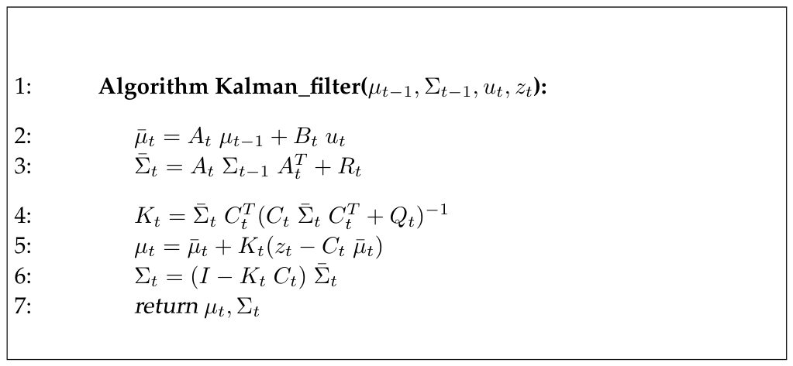

*Table 3.1 — 선형 가우시안 상태 전이와 측정에 대한 Kalman filter 알고리즘 (책 p.42)*

$$
\begin{aligned}
&1:\quad \textbf{Algorithm Kalman\_filter}(\mu_{t-1},\, \Sigma_{t-1},\, u_t,\, z_t): \\[4pt]
&2:\qquad \bar\mu_t = A_t\,\mu_{t-1} + B_t\,u_t \\
&3:\qquad \bar\Sigma_t = A_t\,\Sigma_{t-1}\,A_t^T + R_t \\[4pt]
&4:\qquad K_t = \bar\Sigma_t\,C_t^T\,(C_t\,\bar\Sigma_t\,C_t^T + Q_t)^{-1} \\
&5:\qquad \mu_t = \bar\mu_t + K_t\,(z_t - C_t\,\bar\mu_t) \\
&6:\qquad \Sigma_t = (I - K_t\,C_t)\,\bar\Sigma_t \\[4pt]
&7:\qquad \textbf{return } \mu_t,\, \Sigma_t
\end{aligned}
\tag{8}
$$

#### 단계별 설명 (생략 없이)

**라인 2~3 — Prediction (제어 반영)**

라인 2와 3에서는 **예측된 belief $\bar\mu$와 $\bar\Sigma$** 가 계산되는데, 이는 **한 시간 스텝 뒤이지만
측정 $z_t$를 반영하기 전의 belief $\overline{bel}(x_t)$** 를 표현한다. 이 belief는 **제어 $u_t$를 반영함으로써**
얻어진다.

**라인 2 — 평균의 갱신**:

$$\bar\mu_t = A_t\,\mu_{t-1} + B_t\,u_t$$

평균은 **state transition function (2)의 결정론적(deterministic) 버전**을 사용해 갱신된다. 즉 노이즈 항
$\varepsilon_t$를 뺀 형태에, **상태 $x_{t-1}$ 자리에 평균 $\mu_{t-1}$을 대입한 것**이다.

> 왜 이게 되는가: $\varepsilon_t$의 평균이 0이므로, 기댓값을 취하면 노이즈 항이 사라진다. 그리고 2장 식 (16)의
> **expectation의 linearity** $E[aX+b] = aE[X]+b$에 의해, 선형 변환의 기댓값은 기댓값의 선형 변환과 같다.
> 여기서 "선형"이라는 가정 1이 결정적으로 쓰인다.

**라인 3 — 공분산의 갱신**:

$$\bar\Sigma_t = A_t\,\Sigma_{t-1}\,A_t^T + R_t$$

공분산의 갱신은 **상태가 선형 행렬 $A_t$를 통해 이전 상태에 의존한다는 사실**을 고려한다.
**이 행렬은 공분산에 두 번 곱해지는데, 공분산이 quadratic(제곱 스케일의) 양이기 때문이다.**

> **직관**: 분산은 "제곱" 스케일의 양이다. 1차원에서 $y = ax$이면 $\mathrm{Var}[y] = a^2 \mathrm{Var}[x]$인 것과
> 같은 이치로, 다차원에서는 $A \Sigma A^T$가 된다. 그리고 여기에 **모션 노이즈 $R_t$가 더해진다** —
> 이것이 2.3.2절에서 말한 "motion은 지식의 손실을 유발한다"의 수식적 표현이다. $R_t$는 항상
> positive-semidefinite이므로 불확실성은 반드시 늘어난다.

**라인 4~6 — Measurement update (측정 반영)**

Belief $\overline{bel}(x_t)$는 이어서 라인 4부터 6에 걸쳐 **측정 $z_t$를 반영함으로써** 원하는 belief
$bel(x_t)$로 변환된다.

**라인 4 — Kalman gain**:

$$K_t = \bar\Sigma_t\,C_t^T\,(C_t\,\bar\Sigma_t\,C_t^T + Q_t)^{-1}$$

라인 4에서 계산되는 변수 $K_t$를 **Kalman gain**이라 한다. 이는 **측정이 새로운 상태 추정에
어느 정도로 반영되는지를 명시한다.** (그 방식은 3.2.4절에서 더 분명해진다.)

> **읽는 법**: 괄호 안 $C_t\bar\Sigma_t C_t^T + Q_t$는 "측정 공간에서의 총 불확실성" — 앞항은 상태
> 불확실성을 측정 공간으로 옮긴 것, 뒷항은 센서 자체의 노이즈다. $K_t$는 대략
> "**상태 불확실성 ÷ (상태 불확실성 + 센서 불확실성)**"의 행렬판이다. 센서가 정확하면($Q_t$ 작음) $K_t$가
> 커져 측정을 많이 믿고, 센서가 부정확하면($Q_t$ 큼) $K_t$가 작아져 예측을 유지한다.

**라인 5 — 평균의 보정과 innovation**:

$$\mu_t = \bar\mu_t + K_t\,(z_t - C_t\,\bar\mu_t)$$

라인 5는 평균을 조작하는데, **Kalman gain $K_t$와, 실제 측정 $z_t$ 및 measurement probability (5)에 따라
예측된 측정의 편차에 비례해서** 조정한다.

**여기서 핵심 개념이 innovation**이다 — 라인 5에서 **실제 측정 $z_t$와 기대 측정 $C_t\bar\mu_t$의 차이**를
말한다.

> **읽는 법**: $z_t - C_t\bar\mu_t$는 "내가 예상한 센서값과 실제 센서값이 얼마나 다른가"다. 이 차이가 0이면
> 예측이 완벽했다는 뜻이라 평균을 전혀 안 바꾼다. 차이가 크면 그 방향으로 $K_t$만큼 끌려간다.
> 즉 **KF의 보정은 "예측 + 이득 × 놀라움"** 이라는 한 줄로 요약된다.

**라인 6 — 공분산의 보정**:

$$\Sigma_t = (I - K_t\,C_t)\,\bar\Sigma_t$$

마지막으로 posterior belief의 새 공분산이 라인 6에서 계산되는데, **측정으로부터 얻은 정보 이득(information
gain)을 반영해 조정한다.**

> $I - K_tC_t$는 항상 "$I$보다 작은" 행렬이므로 $\Sigma_t \le \bar\Sigma_t$ — **측정은 반드시 불확실성을 줄인다.**
> 라인 3에서 $R_t$가 더해져 늘어난 것과 정확히 대비된다. 이것이 2.3.2절 "perception은 지식을 증가시킨다"의
> 수식적 표현이다.

### 계산 복잡도 (책 p.43)

Kalman filter는 **계산적으로 상당히 효율적**이다.

- 오늘날 최선의 알고리즘 기준으로, $d \times d$ 행렬의 **역행렬 복잡도는 대략 $O(d^{2.4})$** 다.
- 여기 서술된 형태의 Kalman filter 알고리즘의 **매 반복은 (대략) $O(k^{2.4})$로 하한이 잡힌다.**
  여기서 $k$는 측정 벡터 $z_t$의 차원이다. 이 (근사적) 삼차 복잡도는 **라인 4의 행렬 역변환**에서 나온다.
- 이후 장들에서 논의될 특정한 희소(sparse) 갱신의 경우에도, **라인 6의 곱셈 때문에 최소한 $O(n^2)$** 이다.
  여기서 $n$은 상태 공간의 차원이다. (행렬 $K_tC_t$는 희소할 수 있다.)

많은 응용에서 — 이후 장들에서 논의되는 **로봇 매핑(robot mapping) 응용** 같은 — **측정 공간이 상태 공간보다
훨씬 저차원**이며, 이 경우 **갱신은 $O(n^2)$ 연산에 지배된다.**

### 3. 예제/실습

#### 예제 1 — Kalman gain의 극단값 확인 (1차원)

1차원에서 $C_t = 1$이라 하면 라인 4는 스칼라 식이 된다:

$$K_t = \frac{\bar\sigma_t^2}{\bar\sigma_t^2 + \sigma_z^2}$$

| 상황 | $K_t$ | 라인 5의 결과 | 해석 |
|---|---|---|---|
| 센서가 완벽 ($\sigma_z^2 \to 0$) | $\to 1$ | $\mu_t \to z_t$ | 측정을 그대로 믿는다 |
| 센서가 무의미 ($\sigma_z^2 \to \infty$) | $\to 0$ | $\mu_t \to \bar\mu_t$ | 측정을 무시하고 예측 유지 |
| 예측이 완벽 ($\bar\sigma_t^2 \to 0$) | $\to 0$ | $\mu_t \to \bar\mu_t$ | 이미 확신하므로 안 흔들린다 |
| 둘이 같음 ($\bar\sigma_t^2 = \sigma_z^2$) | $= 0.5$ | 중간값 | 정확히 반반 섞는다 |

라인 6도 확인해보자: $\sigma_t^2 = (1-K_t)\bar\sigma_t^2$. $K_t = 0.5$이면 $\sigma_t^2 = 0.5\bar\sigma_t^2$ —
**두 정보를 합치면 분산이 절반으로 준다.**

#### 예제 2 — 손으로 한 스텝 돌리기 (1차원)

- 이전 belief: $\mu_{t-1} = 10$, $\sigma_{t-1}^2 = 4$
- 모션: $A_t = 1$, $B_t = 1$, $u_t = 5$ (5만큼 전진), 모션 노이즈 $R_t = 2$
- 측정: $C_t = 1$, $z_t = 16$, 센서 노이즈 $Q_t = 3$

**라인 2**: $\bar\mu_t = 1 \cdot 10 + 1 \cdot 5 = 15$
**라인 3**: $\bar\sigma_t^2 = 1 \cdot 4 \cdot 1 + 2 = 6$ ← 4에서 6으로 **증가** (모션이 불확실성을 키움)
**라인 4**: $K_t = \dfrac{6}{6 + 3} = \dfrac{2}{3} \approx 0.667$
**라인 5**: $\mu_t = 15 + 0.667 \times (16 - 15) = 15.667$
**라인 6**: $\sigma_t^2 = (1 - 0.667) \times 6 = 2$ ← 6에서 2로 **감소** (측정이 불확실성을 줄임)

**해석**: 예측(15)과 측정(16) 사이에서 측정 쪽으로 2/3만큼 이동한 15.667이 나왔다. 예측 분산(6)이 센서
분산(3)보다 커서 측정을 더 신뢰한 것이다. 그리고 최종 분산 2는 **예측 분산 6보다도, 센서 분산 3보다도 작다** —
다음 절 3.2.3에서 다룰 "직관에 반하는" 성질이다.

#### 연습문제

1. 위 예제에서 센서 노이즈를 $Q_t = 12$로 바꾸면 $\mu_t$와 $\sigma_t^2$는? 측정을 덜 믿게 되는지 확인하라.
2. 라인 3에서 $R_t = 0$ (모션이 완벽)이면 $\bar\Sigma_t = A_t\Sigma_{t-1}A_t^T$가 된다. $A_t = 1$이면
   분산이 그대로 유지된다. 이것이 물리적으로 타당한 이유를 설명하라.
3. 예제 1의 1차원 유도를 직접 해보라 — 라인 4에 $C_t = 1$, $\bar\Sigma_t = \bar\sigma_t^2$, $Q_t = \sigma_z^2$를
   대입하면 위 표의 식이 나오는지 확인.

---

## 3.2.3 Illustration

### 1. 개념적 이해

이제 알고리즘이 실제로 무엇을 하는지 그림으로 본다.

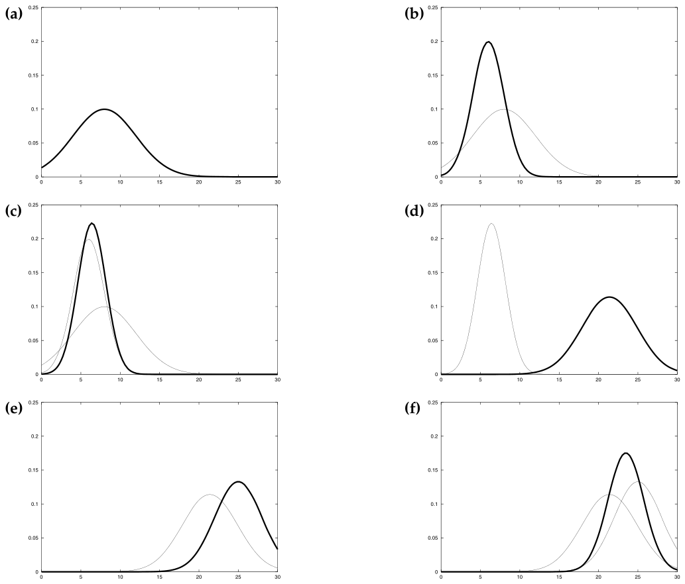

*Figure 3.2 — Kalman filter의 예시: (a) 초기 belief, (b) 측정(굵은 선)과 그에 따른 불확실성,
(c) Kalman filter 알고리즘으로 측정을 belief에 통합한 후의 belief, (d) 오른쪽으로 이동한 후의 belief
(불확실성이 도입됨), (e) 새로운 측정과 그 불확실성, (f) 그 결과 belief (책 p.44)*

Figure 3.2는 **아주 단순한 1차원 localization 시나리오**에 대해 Kalman filter 알고리즘을 예시한다.
Figure 3.2의 각 그림에서 로봇이 **가로축을 따라 움직인다**고 하자.

### 각 단계 읽기 (생략 없이)

**(a) 초기 belief**

로봇 위치에 대한 prior가 Figure 3.2a에 보이는 정규분포로 주어진다.

**(b) 측정**

로봇이 자신의 위치에 대해 센서(예: **GPS 시스템**)를 조회하고, 센서는 Figure 3.2b의 **굵은 가우시안의
peak에 중심을 둔 측정값**을 반환한다.

이 굵은 가우시안이 측정을 나타낸다:
- **peak**는 센서가 예측한 값
- **폭(분산, width/variance)** 은 측정의 불확실성에 대응

**(c) 측정 통합 후**

prior를 측정과 결합하면 — **Table 3.1의 Kalman filter 알고리즘 라인 4~6을 통해** — Figure 3.2c의 굵은
가우시안이 나온다. 이 belief에 대해 두 가지를 관찰하자:

1. **평균이 원래 두 평균 사이에 놓인다.**
2. **불확실성 반경이 기여한 두 가우시안 각각보다도 작다.**

> **책이 명시적으로 짚는 부분**: "**잔여 불확실성이 기여한 가우시안들보다 작다는 사실은 직관에 반하는 것처럼
> 보일 수 있지만, 이는 Kalman filter에서 정보 통합의 일반적인 특성이다.**"
>
> 왜 그런가: 두 개의 독립적인 정보원이 같은 양에 대해 말하고 있으므로, 둘을 합치면 각각보다 더 확실해진다.
> 3.2.2절 예제 1의 표에서 $K_t = 0.5$일 때 $\sigma_t^2 = 0.5\bar\sigma_t^2$가 되는 것으로 이미 확인했다.
> "두 사람의 증언이 일치하면 한 사람의 증언보다 더 믿을 만하다"는 것과 같은 이치다.

**(d) 이동 후**

다음으로 로봇이 오른쪽으로 움직인다고 가정하자. **state transition이 확률적(stochastic)이라는 사실 때문에
불확실성이 커진다.** Kalman filter의 **라인 2와 3**이 Figure 3.2d에 굵게 표시된 가우시안을 준다.

이 가우시안은:
- **로봇이 움직인 양만큼 이동(shift)** 했고 ← 라인 2
- **방금 설명한 이유로 더 넓어졌다(wider)** ← 라인 3의 $+R_t$

**(e), (f) 두 번째 측정과 최종 belief**

로봇은 Figure 3.2e의 굵은 가우시안으로 예시된 **두 번째 측정**을 받고, 이는 Figure 3.2f에 굵게 표시된
posterior로 이어진다.

### 이 예시의 요약 (책 p.45)

이 예가 보여주듯, **Kalman filter는 두 단계를 번갈아 수행한다**:

- **measurement update step** — 센서 데이터가 현재 belief에 통합된다
- **prediction step (또는 control update step)** — 행동에 따라 belief가 수정된다

그리고 결정적으로:

> **update step은 로봇 belief의 불확실성을 감소시키고, prediction step은 증가시킨다.**

이는 2.3.2절에서 예고한 "perception은 지식을 증가시키고, motion은 지식의 손실을 유발한다"가
Gaussian 세계에서 구체화된 모습이다.

<!--widget:kalman-1d-->

### 3. 예제/실습

#### 예제 — Figure 3.2의 각 그림을 알고리즘 라인에 대응시키기

| 그림 | 무슨 일이 일어났나 | Table 3.1의 라인 | 분산의 변화 |
|---|---|---|---|
| (a) → (b) | 센서가 측정값을 반환 | (입력 $z_t$ 도착) | — |
| (b) → (c) | 측정을 belief에 통합 | 라인 4, 5, 6 | **감소** |
| (c) → (d) | 오른쪽으로 이동 | 라인 2, 3 | **증가** |
| (d) → (e) | 두 번째 측정 도착 | (입력 $z_t$ 도착) | — |
| (e) → (f) | 두 번째 측정 통합 | 라인 4, 5, 6 | **감소** |

#### 연습문제

1. Figure 3.2(c)에서 만약 센서가 훨씬 부정확했다면(굵은 가우시안이 훨씬 넓었다면), 결과 belief의 평균은
   prior 쪽과 측정 쪽 중 어디에 더 가까웠겠는가? Kalman gain으로 설명하라.
2. 로봇이 측정을 전혀 받지 못한 채 이동만 10번 반복하면 belief는 어떻게 되는가? 라인 3만 반복 적용해
   답하라. (이것이 8.3.5절에서 다룰 "센서 없이 오래 달리면 길을 잃는다"의 원형이다.)

---

## 3.2.4 Mathematical Derivation of the KF

> **책의 안내**: 이 절은 Table 3.1의 Kalman filter 알고리즘을 유도한다. **첫 독서에서는 안전하게 건너뛸 수
> 있으며, 완전성을 위해 포함되었을 뿐이다.**
>
> 다만 우리 스터디의 목표가 EKF/UKF까지 제대로 이해하는 것이므로, 여기서는 생략 없이 따라간다.
> 이 유도를 이해하면 3.3절 EKF가 "이 유도의 어느 지점을 어떻게 바꾼 것인지"가 명확해진다.

### 1. 개념적 이해

**유도의 전체 성격을 먼저 잡고 가자.** 책이 스스로 밝히듯:

> **KF의 유도는 대체로 이차식(quadratic expressions)을 조작하는 연습이다.**

왜 그런가:

1. Gaussian의 지수부는 $x$에 대한 **이차식**이다 (식 (1)).
2. **두 Gaussian을 곱하면 지수가 더해진다.** ($e^a \cdot e^b = e^{a+b}$)
3. 원래 두 지수가 모두 이차식이므로, **그 합도 이차식이다.**
4. 남은 작업은 그 결과를 **원하는 파라미터($\mu$, $\Sigma$)를 읽어낼 수 있는 형태로 인수분해(factorization)** 하는
   것뿐이다.

> **이것이 "Gaussian이 닫혀 있다(closed under these operations)"는 말의 실체다.** 이차식끼리 더해도 이차식이므로
> 결과가 다시 Gaussian이고, 따라서 $\mu$와 $\Sigma$만 갱신하면 된다. 3.3절에서 $g$, $h$가 비선형이 되면
> 지수부가 더 이상 이차식이 아니게 되고, 바로 그 지점에서 **선형화(linearization)** 가 필요해진다.

유도는 두 부분으로 나뉜다.

- **Part 1: Prediction** — 라인 2, 3의 정확성 증명
- **Part 2: Measurement Update** — 라인 4, 5, 6의 정확성 증명

---

### Part 1: Prediction (라인 2, 3)

#### 2. 수식/유도

##### 전체 유도 과정 (먼저 한 번에)

$$bel(x_t) = \int \underbrace{p(x_t \mid x_{t-1}, u_t)}_{\sim \mathcal{N}(x_t;\, A_t x_{t-1} + B_t u_t,\, R_t)} \; \underbrace{bel(x_{t-1})}_{\sim \mathcal{N}(x_{t-1};\, \mu_{t-1},\, \Sigma_{t-1})} \; dx_{t-1} \tag{9}$$

$$
\begin{aligned}
\overline{bel}(x_t) = \eta \int &\exp\left\{-\tfrac{1}{2}(x_t - A_t x_{t-1} - B_t u_t)^T R_t^{-1}(x_t - A_t x_{t-1} - B_t u_t)\right\} \\
&\times \exp\left\{-\tfrac{1}{2}(x_{t-1}-\mu_{t-1})^T \Sigma_{t-1}^{-1}(x_{t-1}-\mu_{t-1})\right\} dx_{t-1}
\end{aligned}
\tag{10}
$$

$$\overline{bel}(x_t) = \eta \int \exp\{-L_t\}\, dx_{t-1} \tag{11}$$

$$
\begin{aligned}
L_t = &\tfrac{1}{2}(x_t - A_t x_{t-1} - B_t u_t)^T R_t^{-1}(x_t - A_t x_{t-1} - B_t u_t) \\
&+ \tfrac{1}{2}(x_{t-1}-\mu_{t-1})^T \Sigma_{t-1}^{-1}(x_{t-1}-\mu_{t-1})
\end{aligned}
\tag{12}
$$

$$L_t = L_t(x_{t-1}, x_t) + L_t(x_t) \tag{13}$$

$$
\begin{aligned}
\overline{bel}(x_t) &= \eta \int \exp\{-L_t\}\, dx_{t-1} \\
&= \eta \int \exp\{-L_t(x_{t-1},x_t) - L_t(x_t)\}\, dx_{t-1} \\
&= \eta \exp\{-L_t(x_t)\} \int \exp\{-L_t(x_{t-1},x_t)\}\, dx_{t-1}
\end{aligned}
\tag{14}
$$

$$\overline{bel}(x_t) = \eta \exp\{-L_t(x_t)\} \tag{15}$$

$$\frac{\partial L_t}{\partial x_{t-1}} = -A_t^T R_t^{-1}(x_t - A_t x_{t-1} - B_t u_t) + \Sigma_{t-1}^{-1}(x_{t-1}-\mu_{t-1}) \tag{16}$$

$$\frac{\partial^2 L_t}{\partial x_{t-1}^2} = A_t^T R_t^{-1} A_t + \Sigma_{t-1}^{-1} =: \Psi_t^{-1} \tag{17}$$

$$x_{t-1} = \Psi_t\left[A_t^T R_t^{-1}(x_t - B_t u_t) + \Sigma_{t-1}^{-1}\mu_{t-1}\right] \tag{18}$$

$$\int \exp\{-L_t(x_{t-1},x_t)\}\, dx_{t-1} = \det(2\pi\Psi)^{\frac{1}{2}} \tag{19}$$

$$\frac{\partial L_t(x_t)}{\partial x_t} = (R_t + A_t\Sigma_{t-1}A_t^T)^{-1}(x_t - B_t u_t) - R_t^{-1}A_t(A_t^T R_t^{-1}A_t + \Sigma_{t-1}^{-1})^{-1}\Sigma_{t-1}^{-1}\mu_{t-1} \tag{20}$$

$$x_t = B_t u_t + A_t \mu_{t-1} \qquad \Rightarrow \qquad \bar\mu_t = A_t\mu_{t-1} + B_t u_t \tag{21}$$

$$\frac{\partial^2 L_t(x_t)}{\partial x_t^2} = (A_t\Sigma_{t-1}A_t^T + R_t)^{-1} \qquad \Rightarrow \qquad \bar\Sigma_t = A_t\Sigma_{t-1}A_t^T + R_t \tag{22}$$

##### 단계별 설명 (생략 없이)

**(9) 출발점 — 2장의 prediction 식** — 책 (3.8)

유도는 알고리즘의 라인 2와 3에서 시작한다. 여기서는 한 시간 스텝 이전의 belief $bel(x_{t-1})$로부터
belief $\overline{bel}(x_t)$가 계산된다. 라인 2와 3은 **2장 식 (2.41)(우리 2장 노트의 식 (37))에 서술된
갱신 단계를 구현한다.** 독자의 편의를 위해 다시 적으면:

$$\overline{bel}(x_t) = \int \underbrace{p(x_t \mid x_{t-1}, u_t)}_{\sim \mathcal{N}(x_t;\, A_t x_{t-1} + B_t u_t,\, R_t)} \; \underbrace{bel(x_{t-1})}_{\sim \mathcal{N}(x_{t-1};\, \mu_{t-1},\, \Sigma_{t-1})} \; dx_{t-1}$$

- Belief $bel(x_{t-1})$은 평균 $\mu_{t-1}$과 공분산 $\Sigma_{t-1}$로 표현된다.
- State transition probability $p(x_t \mid x_{t-1}, u_t)$는 식 (4)에서 **평균 $A_t x_{t-1} + B_t u_t$, 공분산 $R_t$인
  $x_t$에 대한 정규분포**로 주어졌다.

이제 보일 것은, **(9)의 결과가 다시 Gaussian이며 그 평균이 $\bar\mu_t$, 공분산이 $\bar\Sigma_t$ (Table 3.1의 값)** 라는
것이다.

**(10), (11), (12) Gaussian 형태로 쓰고 지수부를 $L_t$로 묶기** — 책 (3.9)~(3.11)

(9)를 Gaussian 형태로 쓰면 (정규화 상수들은 모두 $\eta$로 흡수):

$$
\begin{aligned}
\overline{bel}(x_t) = \eta \int &\exp\left\{-\tfrac{1}{2}(x_t - A_t x_{t-1} - B_t u_t)^T R_t^{-1}(\cdots)\right\} \\
&\times \exp\left\{-\tfrac{1}{2}(x_{t-1}-\mu_{t-1})^T \Sigma_{t-1}^{-1}(\cdots)\right\} dx_{t-1}
\end{aligned}
$$

간단히 하면 $\overline{bel}(x_t) = \eta \int \exp\{-L_t\}\, dx_{t-1}$이고, 여기서

$$
\begin{aligned}
L_t = &\tfrac{1}{2}(x_t - A_t x_{t-1} - B_t u_t)^T R_t^{-1}(x_t - A_t x_{t-1} - B_t u_t) \\
&+ \tfrac{1}{2}(x_{t-1}-\mu_{t-1})^T \Sigma_{t-1}^{-1}(x_{t-1}-\mu_{t-1})
\end{aligned}
$$

**$L_t$가 $x_{t-1}$에 대해 이차식이며, $x_t$에 대해서도 이차식이라는 점에 주목하자.** (앞서 말한 "지수가 더해지고
그 합도 이차식"이 여기서 실현된 것이다.)

**(13), (14) 결정적 아이디어 — $L_t$의 분해** — 책 (3.12), (3.13)

표현 (11)은 **적분을 포함한다.** 이 적분을 푸는 것은 항들을 재배열하기를 요구하는데, **처음에는 직관에
반하는 것처럼 보일 수 있다.**

구체적으로, $L_t$를 **두 함수 $L_t(x_{t-1}, x_t)$와 $L_t(x_t)$로 분해**한다:

$$L_t = L_t(x_{t-1}, x_t) + L_t(x_t)$$

이 분해는 단순히 $L_t$의 항들을 재배열한 결과일 뿐이다.

> **이 분해 단계의 핵심 목표**: $L_t$의 변수들을 **두 집합으로 분할하되, 그중 하나만 변수 $x_{t-1}$에 의존하도록**
> 하는 것이다. 다른 하나 $L_t(x_t)$는 $x_{t-1}$에 의존하지 않는다. 그 결과 **후자를 $x_{t-1}$에 대한 적분 밖으로
> 빼낼 수 있게 된다.**

이는 다음 변환으로 예시된다:

$$
\begin{aligned}
\overline{bel}(x_t) &= \eta \int \exp\{-L_t\}\, dx_{t-1} \\
&= \eta \int \exp\{-L_t(x_{t-1},x_t) - L_t(x_t)\}\, dx_{t-1} \\
&= \eta \exp\{-L_t(x_t)\} \int \exp\{-L_t(x_{t-1},x_t)\}\, dx_{t-1}
\end{aligned}
$$

**(15) 왜 적분이 사라지는가** — 책 (3.14)

물론 이 기준을 만족하도록 $L_t$를 두 집합으로 분해하는 방법은 여러 가지가 있다. **핵심 통찰은,
(14)의 적분 값이 $x_t$에 의존하지 않도록 $L_t(x_{t-1}, x_t)$를 고른다는 것이다.**

그런 함수 $L_t(x_{t-1}, x_t)$를 정의하는 데 성공한다면, **$L_t(x_{t-1}, x_t)$에 대한 적분 전체가 $x_t$에 대한
belief 분포를 추정하는 문제에 대해서는 그저 상수가 된다.** 상수는 보통 정규화 상수 $\eta$에 흡수되므로,
이 분해 하에서 우리는 그 상수를 $\eta$에 포함시킬 수 있다 (앞의 $\eta$와는 **실제 값이 다른** $\eta$로):

$$\overline{bel}(x_t) = \eta \exp\{-L_t(x_t)\}$$

> **여기서 2장에서 짚어둔 $\eta$ 규칙이 그대로 쓰인다** — 책은 서로 다른 식에서 값이 달라도 같은 $\eta$ 기호를
> 자유롭게 재사용한다. 그것을 모르면 이 줄이 틀린 것처럼 보인다.

따라서 이 분해는 **belief (11)에서 적분을 제거하는 것을 가능하게 한다.** 결과는 **이차 함수에 대한 정규화된
지수(normalized exponential)** 이며, 이는 **Gaussian으로 밝혀진다.**

**(16), (17), (18) 분해를 실제로 수행하기** — 책 (3.15)~(3.18)

이제 이 분해를 수행하자. 우리는 **$x_{t-1}$에 대해 이차인 함수 $L_t(x_{t-1}, x_t)$** 를 찾고 있다.
(이 함수는 $x_t$에도 의존하겠지만, 지금 시점에서는 신경 쓰지 않는다.)

이 이차식의 계수를 결정하기 위해 **$L_t$의 처음 두 도함수를 계산한다.**

1차 도함수:

$$\frac{\partial L_t}{\partial x_{t-1}} = -A_t^T R_t^{-1}(x_t - A_t x_{t-1} - B_t u_t) + \Sigma_{t-1}^{-1}(x_{t-1}-\mu_{t-1})$$

2차 도함수:

$$\frac{\partial^2 L_t}{\partial x_{t-1}^2} = A_t^T R_t^{-1} A_t + \Sigma_{t-1}^{-1} =: \Psi_t^{-1}$$

**$\Psi_t$는 $L_t(x_{t-1}, x_t)$의 곡률(curvature)을 정의한다.**

> **왜 도함수를 보는가**: 이차함수 $f(x) = \frac{1}{2}(x-m)^T S^{-1}(x-m)$에 대해, 1차 도함수를 0으로 놓으면
> $x = m$(평균)이 나오고, 2차 도함수는 $S^{-1}$(공분산의 역, 곡률)이 된다. 즉 **이차식의 두 도함수가 곧
> Gaussian의 두 파라미터**다. 이 대응이 이 유도 전체를 관통하는 도구다.

**1차 도함수를 0으로 놓으면 평균을 얻는다:**

$$A_t^T R_t^{-1}(x_t - A_t x_{t-1} - B_t u_t) = \Sigma_{t-1}^{-1}(x_{t-1}-\mu_{t-1})$$

이 표현을 $x_{t-1}$에 대해 푼다 (책 (3.18), 모든 단계):

$$
\begin{aligned}
&\Longleftrightarrow\; A_t^T R_t^{-1}(x_t - B_t u_t) - A_t^T R_t^{-1}A_t x_{t-1} = \Sigma_{t-1}^{-1}x_{t-1} - \Sigma_{t-1}^{-1}\mu_{t-1} \\[3pt]
&\Longleftrightarrow\; A_t^T R_t^{-1}A_t x_{t-1} + \Sigma_{t-1}^{-1}x_{t-1} = A_t^T R_t^{-1}(x_t - B_t u_t) + \Sigma_{t-1}^{-1}\mu_{t-1} \\[3pt]
&\Longleftrightarrow\; (A_t^T R_t^{-1}A_t + \Sigma_{t-1}^{-1})\, x_{t-1} = A_t^T R_t^{-1}(x_t - B_t u_t) + \Sigma_{t-1}^{-1}\mu_{t-1} \\[3pt]
&\Longleftrightarrow\; \Psi_t^{-1} x_{t-1} = A_t^T R_t^{-1}(x_t - B_t u_t) + \Sigma_{t-1}^{-1}\mu_{t-1} \\[3pt]
&\Longleftrightarrow\; x_{t-1} = \Psi_t\left[A_t^T R_t^{-1}(x_t - B_t u_t) + \Sigma_{t-1}^{-1}\mu_{t-1}\right]
\end{aligned}
$$

따라서 이제 우리는 다음과 같이 정의되는 이차함수 $L_t(x_{t-1}, x_t)$를 갖게 되었다 (책 (3.19)) —
"평균"이 방금 구한 $x_{t-1}$ 값이고 "공분산의 역"이 $\Psi^{-1}$인 이차식:

$$
\begin{aligned}
L_t(x_{t-1}, x_t) = \tfrac{1}{2}\big(x_{t-1} - \Psi_t[&A_t^T R_t^{-1}(x_t - B_t u_t) + \Sigma_{t-1}^{-1}\mu_{t-1}]\big)^T \Psi^{-1} \\
\times \big(x_{t-1} - \Psi_t[&A_t^T R_t^{-1}(x_t - B_t u_t) + \Sigma_{t-1}^{-1}\mu_{t-1}]\big)
\end{aligned}
$$

**(19) 적분이 상수임을 증명** — 책 (3.20)~(3.22)

물론 이것이 우리의 분해 (13)을 만족하는 유일한 이차함수는 아니다. 그러나 **$L_t(x_{t-1},x_t)$는 정규분포의
음의 지수(negative exponent)가 갖는 흔한 이차 형태**다. 실제로 함수

$$\det(2\pi\Psi)^{-\frac{1}{2}} \exp\{-L_t(x_{t-1},x_t)\}$$

는 **변수 $x_{t-1}$에 대한 유효한 확률밀도함수(PDF)** 다. 독자가 쉽게 확인하듯, 이 함수는 (1)에 정의된 형태다.

우리는 2장 식 (2.5)(우리 2장 노트의 식 (4))로부터 **PDF는 적분하면 1이 된다**는 것을 안다. 따라서:

$$\int \det(2\pi\Psi)^{-\frac{1}{2}} \exp\{-L_t(x_{t-1},x_t)\}\, dx_{t-1} = 1$$

이로부터 다음이 따라나온다:

$$\int \exp\{-L_t(x_{t-1},x_t)\}\, dx_{t-1} = \det(2\pi\Psi)^{\frac{1}{2}}$$

> **주목해야 할 중요한 점**: **이 적분의 값은 우리의 목표 변수인 $x_t$에 독립적이다.** ($\Psi_t$의 정의
> (17)을 보면 $A_t, R_t, \Sigma_{t-1}$만으로 이루어져 있고 $x_t$가 없다.) 따라서 $x_t$에 대한 분포를 계산하는
> 우리 문제에 대해 **이 적분은 상수다.** 이 상수를 정규화자 $\eta$에 흡수시키면 (14)에 대해:

$$
\begin{aligned}
\overline{bel}(x_t) &= \eta \exp\{-L_t(x_t)\} \int \exp\{-L_t(x_{t-1},x_t)\}\, dx_{t-1} \\
&= \eta \exp\{-L_t(x_t)\}
\end{aligned}
$$

이 분해가 **(15)의 정확성을 확립한다.** (다시 한 번, 두 줄의 $\eta$는 같지 않다.)

**$L_t(x_t)$를 결정하기 — $x_{t-1}$이 정말 사라지는가** — 책 (3.24)~(3.26)

이제 $L_t(x_t)$를 결정하는 일이 남았는데, 이는 (12)에 정의된 $L_t$와 (위의) $L_t(x_{t-1},x_t)$의 **차이**다:

$$L_t(x_t) = L_t - L_t(x_{t-1}, x_t)$$

**$L_t(x_t)$가 정말로 $x_{t-1}$에 의존하지 않는지 빠르게 확인해보자.** 이를 위해 $\Psi_t = (A_t^T R_t^{-1}A_t +
\Sigma_{t-1}^{-1})^{-1}$을 다시 대입하고 위의 항들을 전개한다. (책은 $x_{t-1}$을 포함한 항에 밑줄을,
$x_{t-1}$에 대해 이차인 항에 이중 밑줄을 그어 보여준다. 책 (3.25))

전개하면 $x_{t-1}$을 포함하는 항들은 다음 세 묶음이다:

- $\tfrac{1}{2}x_{t-1}^T A_t^T R_t^{-1} A_t x_{t-1}$ 와 $\tfrac{1}{2}x_{t-1}^T \Sigma_{t-1}^{-1} x_{t-1}$
  (합쳐서 $\tfrac{1}{2}x_{t-1}^T(A_t^TR_t^{-1}A_t + \Sigma_{t-1}^{-1})x_{t-1}$)
- $-x_{t-1}^T A_t^T R_t^{-1}(x_t - B_tu_t)$ 와 $-x_{t-1}^T\Sigma_{t-1}^{-1}\mu_{t-1}$
- 그리고 $L_t(x_{t-1},x_t)$를 빼면서 나오는 $-\tfrac{1}{2}x_{t-1}^T(A_t^TR_t^{-1}A_t+\Sigma_{t-1}^{-1})x_{t-1}$ 와
  $+x_{t-1}^T[A_t^TR_t^{-1}(x_t-B_tu_t)+\Sigma_{t-1}^{-1}\mu_{t-1}]$

**$x_{t-1}$을 포함하는 모든 항이 상쇄된다는 것이 이제 쉽게 보인다.** 이는 **놀랄 일이 아니다 — 우리가
$L_t(x_{t-1},x_t)$를 그렇게 구성한 것의 결과이기 때문이다.** (책의 표현)

남는 것은 (책 (3.26)):

$$
\begin{aligned}
L_t(x_t) = &+\tfrac{1}{2}(x_t - B_t u_t)^T R_t^{-1}(x_t - B_t u_t) + \tfrac{1}{2}\mu_{t-1}^T\Sigma_{t-1}^{-1}\mu_{t-1} \\
&-\tfrac{1}{2}\left[A_t^TR_t^{-1}(x_t - B_tu_t) + \Sigma_{t-1}^{-1}\mu_{t-1}\right]^T (A_t^TR_t^{-1}A_t + \Sigma_{t-1}^{-1})^{-1} \\
&\qquad \times \left[A_t^TR_t^{-1}(x_t - B_tu_t) + \Sigma_{t-1}^{-1}\mu_{t-1}\right]
\end{aligned}
$$

**더 나아가 $L_t(x_t)$는 $x_t$에 대해 이차식이다. 이 관찰은 $\overline{bel}(x_t)$가 실제로 정규분포임을 뜻한다.**

이 분포의 평균과 공분산은 물론 **$L_t(x_t)$의 최솟값과 곡률**이며, 이는 $L_t(x_t)$의 $x_t$에 대한 1차·2차
도함수를 계산해 쉽게 얻는다.

**(20), (21) 평균 — 라인 2의 증명** — 책 (3.27)~(3.31)

1차 도함수 (책 (3.27)):

$$
\begin{aligned}
\frac{\partial L_t(x_t)}{\partial x_t} =\;& R_t^{-1}(x_t - B_tu_t) \\
&- R_t^{-1}A_t(A_t^TR_t^{-1}A_t + \Sigma_{t-1}^{-1})^{-1}\left[A_t^TR_t^{-1}(x_t-B_tu_t) + \Sigma_{t-1}^{-1}\mu_{t-1}\right] \\[4pt]
=\;& \left[R_t^{-1} - R_t^{-1}A_t(A_t^TR_t^{-1}A_t+\Sigma_{t-1}^{-1})^{-1}A_t^TR_t^{-1}\right](x_t - B_tu_t) \\
&- R_t^{-1}A_t(A_t^TR_t^{-1}A_t+\Sigma_{t-1}^{-1})^{-1}\Sigma_{t-1}^{-1}\mu_{t-1}
\end{aligned}
$$

> **여기서 inversion lemma가 등장한다.** 첫 번째 인자를 더 간단한 형태로 바꾸기 위해서다.

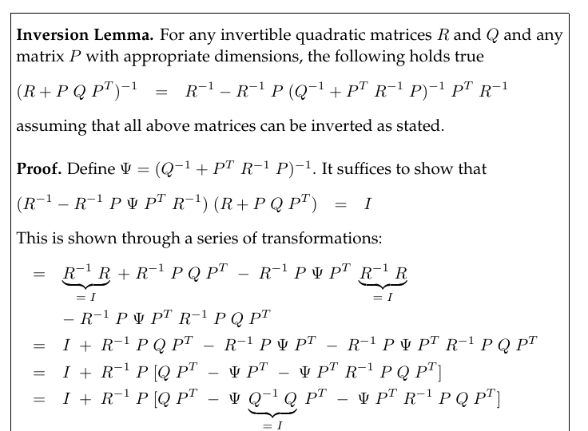

*Table 3.2 — (특수화된) inversion lemma, 때로는 Sherman/Morrison 공식이라 불린다 (책 p.50)*

> **Inversion Lemma (역행렬 보조정리)** — 책 Table 3.2
>
> 임의의 가역 정방행렬 $R$, $Q$와 적절한 차원의 임의의 행렬 $P$에 대해 다음이 성립한다
> (위 모든 행렬이 서술된 대로 역행렬을 가진다고 가정):
>
> $$(R + PQP^T)^{-1} = R^{-1} - R^{-1}P(Q^{-1} + P^TR^{-1}P)^{-1}P^TR^{-1}$$
>
> **왜 필요한가**: 좌변은 "큰 행렬 하나의 역", 우변은 "작은 행렬들의 역의 조합"이다. 상태 차원이 크고
> 측정 차원이 작을 때 우변이 훨씬 싸다 — 그래서 3.2.2절의 복잡도 논의에서 라인 4가 $O(k^{2.4})$로
> 측정 차원 $k$에만 의존했던 것이다. **이 보조정리는 이 유도에서 두 번(라인 2 유도와 라인 6 유도) 쓰인다.**
>
> **증명 개요** (Table 3.2): $\Psi = (Q^{-1}+P^TR^{-1}P)^{-1}$로 두고
> $(R^{-1} - R^{-1}P\Psi P^TR^{-1})(R + PQP^T) = I$ 임을 일련의 변환으로 보인다. 전개하면
> $I + R^{-1}P[QP^T - \Psi Q^{-1}QP^T - \Psi P^TR^{-1}PQP^T]$가 되고, 대괄호 안이
> $QP^T - \Psi(Q^{-1} + P^TR^{-1}P)QP^T = QP^T - \Psi\Psi^{-1}QP^T = QP^T - QP^T = 0$ 이므로 $I$가 된다.

Table 3.2의 inversion lemma를 적용하면 첫 번째 인자를 다음과 같이 표현할 수 있다 (책 (3.28)):

$$R_t^{-1} - R_t^{-1}A_t(A_t^TR_t^{-1}A_t + \Sigma_{t-1}^{-1})^{-1}A_t^TR_t^{-1} = (R_t + A_t\Sigma_{t-1}A_t^T)^{-1}$$

(보조정리에서 $R \to R_t$, $P \to A_t$, $Q \to \Sigma_{t-1}$로 대응시킨 것이다.)

따라서 원하는 도함수는 (책 (3.29)):

$$\frac{\partial L_t(x_t)}{\partial x_t} = (R_t + A_t\Sigma_{t-1}A_t^T)^{-1}(x_t - B_tu_t) - R_t^{-1}A_t(A_t^TR_t^{-1}A_t+\Sigma_{t-1}^{-1})^{-1}\Sigma_{t-1}^{-1}\mu_{t-1}$$

**$L_t(x_t)$의 최솟값은 1차 도함수가 0일 때 얻어진다** (책 (3.30)):

$$(R_t + A_t\Sigma_{t-1}A_t^T)^{-1}(x_t - B_tu_t) = R_t^{-1}A_t(A_t^TR_t^{-1}A_t + \Sigma_{t-1}^{-1})^{-1}\Sigma_{t-1}^{-1}\mu_{t-1}$$

이를 목표 변수 $x_t$에 대해 풀면 **놀라울 만큼 간결한 결과**가 나온다 (책 (3.31), 모든 단계):

$$
x_t = B_tu_t + \underbrace{(R_t + A_t\Sigma_{t-1}A_t^T)\,R_t^{-1}A_t}_{(\ast)} \; \underbrace{(A_t^TR_t^{-1}A_t + \Sigma_{t-1}^{-1})^{-1}\Sigma_{t-1}^{-1}}_{(\ast\ast)} \; \mu_{t-1}
$$

표기를 줄이기 위해 $M := \Sigma_{t-1}A_t^TR_t^{-1}A_t$ 로 두고 두 묶음을 각각 정리하면:

$$(\ast) = A_t + A_t\Sigma_{t-1}A_t^TR_t^{-1}A_t = A_t\,(I + M)$$

$$(\ast\ast) = (A_t^TR_t^{-1}A_t + \Sigma_{t-1}^{-1})^{-1}\Sigma_{t-1}^{-1} = (M + I)^{-1}$$

따라서:

$$
x_t = B_tu_t + A_t \underbrace{(I + M)(M + I)^{-1}}_{=\;I} \mu_{t-1} = B_tu_t + A_t\mu_{t-1}
$$

> **마지막 상쇄를 놓치지 말자**: 가운데 두 묶음이 $(I+M)(M+I)^{-1} = I$ 형태로 정확히 상쇄된다.
> 복잡해 보이던 식이 한순간에 사라지는 지점이다.

**따라서 이동 명령 $u_t$를 반영한 후 belief $\overline{bel}(x_t)$의 평균은 $B_tu_t + A_t\mu_{t-1}$이다.
이것이 Table 3.1의 Kalman filter 알고리즘 라인 2의 정확성을 증명한다.** ✔

**(22) 공분산 — 라인 3의 증명** — 책 (3.32)

**라인 3은 이제 $L_t(x_t)$의 2차 도함수를 계산함으로써 얻어진다:**

$$\frac{\partial^2 L_t(x_t)}{\partial x_t^2} = (A_t\Sigma_{t-1}A_t^T + R_t)^{-1}$$

이것이 **이차함수 $L_t(x_t)$의 곡률이며, 그 역행렬이 belief $\overline{bel}(x_t)$의 공분산**이다:

$$\bar\Sigma_t = A_t\Sigma_{t-1}A_t^T + R_t$$

**이것이 라인 3의 정확성을 증명한다.** ✔

##### Part 1 요약 (책 p.51)

정리하면, 우리는 Kalman filter 알고리즘의 라인 2와 3의 prediction 단계가 실제로 Bayes filter의 prediction
단계를 구현함을 보였다. 그 방법은:

1. 먼저 belief $\overline{bel}(x_t)$의 지수부를 **두 함수 $L_t(x_{t-1},x_t)$와 $L_t(x_t)$로 분해**했다.
2. 그런 다음 $L_t(x_{t-1},x_t)$가 예측된 belief $\overline{bel}(x_t)$를 **상수 배만큼만 바꾸며, 그 상수는
   정규화 상수 $\eta$에 흡수될 수 있음**을 보였다.
3. 마지막으로 함수 $L_t(x_t)$를 결정하고, 그것이 **Kalman filter prediction $\overline{bel}(x_t)$의 평균
   $\bar\mu_t$와 공분산 $\bar\Sigma_t$** 를 낳음을 보였다.

---

### Part 2: Measurement Update (라인 4, 5, 6)

#### 2. 수식/유도

##### 전체 유도 과정 (먼저 한 번에)

$$bel(x_t) = \eta \; \underbrace{p(z_t \mid x_t)}_{\sim \mathcal{N}(z_t;\, C_tx_t,\, Q_t)} \; \underbrace{\overline{bel}(x_t)}_{\sim \mathcal{N}(x_t;\, \bar\mu_t,\, \bar\Sigma_t)} \tag{23}$$

$$bel(x_t) = \eta \exp\{-J_t\} \tag{24}$$

$$J_t = \tfrac{1}{2}(z_t - C_tx_t)^TQ_t^{-1}(z_t - C_tx_t) + \tfrac{1}{2}(x_t - \bar\mu_t)^T\bar\Sigma_t^{-1}(x_t - \bar\mu_t) \tag{25}$$

$$\frac{\partial J_t}{\partial x_t} = -C_t^TQ_t^{-1}(z_t - C_tx_t) + \bar\Sigma_t^{-1}(x_t - \bar\mu_t) \tag{26}$$

$$\frac{\partial^2 J_t}{\partial x_t^2} = C_t^TQ_t^{-1}C_t + \bar\Sigma_t^{-1} \tag{27}$$

$$\Sigma_t = (C_t^TQ_t^{-1}C_t + \bar\Sigma_t^{-1})^{-1} \tag{28}$$

$$C_t^TQ_t^{-1}(z_t - C_t\mu_t) = \bar\Sigma_t^{-1}(\mu_t - \bar\mu_t) \tag{29}$$

$$
\begin{aligned}
C_t^TQ_t^{-1}(z_t - C_t\mu_t) &= C_t^TQ_t^{-1}(z_t - C_t\mu_t + C_t\bar\mu_t - C_t\bar\mu_t) \\
&= C_t^TQ_t^{-1}(z_t - C_t\bar\mu_t) - C_t^TQ_t^{-1}C_t(\mu_t - \bar\mu_t)
\end{aligned}
\tag{30}
$$

$$C_t^TQ_t^{-1}(z_t - C_t\bar\mu_t) = \underbrace{(C_t^TQ_t^{-1}C_t + \bar\Sigma_t^{-1})}_{=\;\Sigma_t^{-1}}(\mu_t - \bar\mu_t) \tag{31}$$

$$\Sigma_t C_t^TQ_t^{-1}(z_t - C_t\bar\mu_t) = \mu_t - \bar\mu_t \tag{32}$$

$$K_t := \Sigma_t C_t^T Q_t^{-1} \tag{33}$$

$$\mu_t = \bar\mu_t + K_t(z_t - C_t\bar\mu_t) \tag{34}$$

$$K_t = \bar\Sigma_t C_t^T (C_t\bar\Sigma_t C_t^T + Q_t)^{-1} \tag{35}$$

$$(\bar\Sigma_t^{-1} + C_t^TQ_t^{-1}C_t)^{-1} = \bar\Sigma_t - \bar\Sigma_tC_t^T(Q_t + C_t\bar\Sigma_tC_t^T)^{-1}C_t\bar\Sigma_t \tag{36}$$

$$
\begin{aligned}
\Sigma_t &= (C_t^TQ_t^{-1}C_t + \bar\Sigma_t^{-1})^{-1} \\
&= \bar\Sigma_t - \bar\Sigma_tC_t^T(Q_t + C_t\bar\Sigma_tC_t^T)^{-1}C_t\bar\Sigma_t \\
&= \big[I - \underbrace{\bar\Sigma_tC_t^T(Q_t + C_t\bar\Sigma_tC_t^T)^{-1}}_{=\;K_t}C_t\big]\bar\Sigma_t \\
&= (I - K_tC_t)\bar\Sigma_t
\end{aligned}
\tag{37}
$$

##### 단계별 설명 (생략 없이)

**(23), (24), (25) 출발점 — 2장의 measurement update 식** — 책 (3.33)~(3.35)

이제 Kalman filter 알고리즘의 라인 4, 5, 6의 measurement update를 유도한다. **측정을 반영하는 일반적인
Bayes filter 메커니즘**, 즉 2장 식 (2.38)(우리 2장 노트의 식 (34))에서 시작하며, 여기서는 주석을 달아 다시 적는다:

$$bel(x_t) = \eta \; \underbrace{p(z_t \mid x_t)}_{\sim \mathcal{N}(z_t;\, C_tx_t,\, Q_t)} \; \underbrace{\overline{bel}(x_t)}_{\sim \mathcal{N}(x_t;\, \bar\mu_t,\, \bar\Sigma_t)}$$

- $\overline{bel}(x_t)$의 평균과 공분산은 당연히 **Part 1에서 구한 $\bar\mu_t$와 $\bar\Sigma_t$** 로 주어진다.
- Measurement probability $p(z_t \mid x_t)$는 식 (6)에서 **평균 $C_tx_t$, 공분산 $Q_t$인 정규분포**로 정의되었다.

따라서 **그 곱은 지수함수로 주어진다**:

$$bel(x_t) = \eta \exp\{-J_t\}$$

여기서 (두 지수부를 더한 것):

$$J_t = \tfrac{1}{2}(z_t - C_tx_t)^TQ_t^{-1}(z_t - C_tx_t) + \tfrac{1}{2}(x_t - \bar\mu_t)^T\bar\Sigma_t^{-1}(x_t - \bar\mu_t)$$

> **Part 1보다 훨씬 간단하다는 점에 주목하자.** Part 1에는 적분이 있어서 분해라는 기교가 필요했지만,
> measurement update는 **단순한 곱**이라 지수를 더하기만 하면 된다. 이것이 이 유도 첫머리에서 말한
> "두 Gaussian을 곱하면 지수가 더해진다"의 가장 직접적인 활용이다.

**(26), (27), (28) 공분산 구하기** — 책 (3.36)~(3.38)

**이 함수는 $x_t$에 대해 이차식이며, 따라서 $bel(x_t)$는 Gaussian이다.** 그 파라미터를 계산하기 위해
다시 한 번 $J_t$의 $x_t$에 대한 처음 두 도함수를 계산한다:

$$\frac{\partial J_t}{\partial x_t} = -C_t^TQ_t^{-1}(z_t - C_tx_t) + \bar\Sigma_t^{-1}(x_t - \bar\mu_t)$$

$$\frac{\partial^2 J_t}{\partial x_t^2} = C_t^TQ_t^{-1}C_t + \bar\Sigma_t^{-1}$$

**두 번째 항(2차 도함수)은 $bel(x_t)$의 공분산의 역**이다:

$$\Sigma_t = (C_t^TQ_t^{-1}C_t + \bar\Sigma_t^{-1})^{-1}$$

> **이 형태를 기억해두자.** 역행렬끼리 더하는 이 모양이 바로 **3.5절 Information Filter의 핵심**이다.
> Information filter는 $\Sigma^{-1}$ (information matrix)을 직접 들고 다니는데, 그러면 measurement update가
> **그냥 덧셈**이 된다. 여기서 이미 그 사실이 드러나 있다.

**(29)~(34) 평균 구하기 — 라인 5의 증명** — 책 (3.39)~(3.44)

$bel(x_t)$의 평균은 이 이차함수의 최솟값이며, **$J_t$의 1차 도함수를 0으로 놓아** 계산한다
($x_t$ 자리에 $\mu_t$를 대입):

$$C_t^TQ_t^{-1}(z_t - C_t\mu_t) = \bar\Sigma_t^{-1}(\mu_t - \bar\mu_t)$$

등호 왼쪽의 표현은 다음과 같이 변형할 수 있다 (책 (3.40)):

$$
\begin{aligned}
C_t^TQ_t^{-1}(z_t - C_t\mu_t) &= C_t^TQ_t^{-1}(z_t - C_t\mu_t + C_t\bar\mu_t - C_t\bar\mu_t) \\
&= C_t^TQ_t^{-1}(z_t - C_t\bar\mu_t) - C_t^TQ_t^{-1}C_t(\mu_t - \bar\mu_t)
\end{aligned}
$$

> **무슨 기교인가**: $+C_t\bar\mu_t - C_t\bar\mu_t$ (0을 더한 것)를 끼워 넣어, **innovation
> $(z_t - C_t\bar\mu_t)$** 와 **보정량 $(\mu_t - \bar\mu_t)$** 이라는 우리가 원하는 두 덩어리로 재조립한 것이다.
> 이 한 줄이 라인 5의 형태를 만들어낸다.

이를 (29)에 대입하면 (책 (3.41)):

$$C_t^TQ_t^{-1}(z_t - C_t\bar\mu_t) = \underbrace{(C_t^TQ_t^{-1}C_t + \bar\Sigma_t^{-1})}_{=\;\Sigma_t^{-1}}(\mu_t - \bar\mu_t)$$

(우변의 괄호가 정확히 (28)의 $\Sigma_t^{-1}$임을 이용한다.) 따라서 (책 (3.42)):

$$\Sigma_t C_t^TQ_t^{-1}(z_t - C_t\bar\mu_t) = \mu_t - \bar\mu_t$$

이제 **Kalman gain을 다음과 같이 정의한다** (책 (3.43)):

$$K_t := \Sigma_t C_t^T Q_t^{-1}$$

그러면 (책 (3.44)):

$$\mu_t = \bar\mu_t + K_t(z_t - C_t\bar\mu_t)$$

**이것이 Table 3.1의 Kalman filter 알고리즘 라인 5의 정확성을 증명한다.** ✔

**(35) Kalman gain을 다시 쓰기 — 라인 4의 증명** — 책 (3.45)

**문제가 하나 있다.** (33)에 정의된 Kalman gain은 **$\Sigma_t$의 함수**다. 이는 우리가 알고리즘 라인 6에서
**$\Sigma_t$를 계산하는 데 $K_t$를 이용한다는 사실과 모순된다.** (닭이 먼저냐 달걀이 먼저냐)

다음 변환은 **$K_t$를 $\Sigma_t$가 아닌 다른 공분산들로 표현하는 방법**을 보여준다. (33)의 $K_t$ 정의에서
시작한다 (책 (3.45), 모든 단계):

$$
\begin{aligned}
K_t &= \Sigma_t C_t^TQ_t^{-1} \\[3pt]
&= \Sigma_t C_t^TQ_t^{-1}\underbrace{(C_t\bar\Sigma_tC_t^T + Q_t)(C_t\bar\Sigma_tC_t^T + Q_t)^{-1}}_{=\;I} \\[3pt]
&= \Sigma_t (C_t^TQ_t^{-1}C_t\bar\Sigma_tC_t^T + C_t^T\underbrace{Q_t^{-1}Q_t}_{=\;I})(C_t\bar\Sigma_tC_t^T + Q_t)^{-1} \\[3pt]
&= \Sigma_t (C_t^TQ_t^{-1}C_t\bar\Sigma_tC_t^T + C_t^T)(C_t\bar\Sigma_tC_t^T + Q_t)^{-1} \\[3pt]
&= \Sigma_t (C_t^TQ_t^{-1}C_t\bar\Sigma_tC_t^T + \underbrace{\bar\Sigma_t^{-1}\bar\Sigma_t}_{=\;I}C_t^T)(C_t\bar\Sigma_tC_t^T + Q_t)^{-1} \\[3pt]
&= \Sigma_t \underbrace{(C_t^TQ_t^{-1}C_t + \bar\Sigma_t^{-1})}_{=\;\Sigma_t^{-1}}\bar\Sigma_tC_t^T(C_t\bar\Sigma_tC_t^T + Q_t)^{-1} \\[3pt]
&= \underbrace{\Sigma_t\Sigma_t^{-1}}_{=\;I}\bar\Sigma_tC_t^T(C_t\bar\Sigma_tC_t^T + Q_t)^{-1} \\[3pt]
&= \bar\Sigma_tC_t^T(C_t\bar\Sigma_tC_t^T + Q_t)^{-1}
\end{aligned}
$$

> **기교의 요약**: ① $I$를 $(C_t\bar\Sigma_tC_t^T+Q_t)(C_t\bar\Sigma_tC_t^T+Q_t)^{-1}$로 끼워 넣고,
> ② $Q_t^{-1}Q_t = I$, $\bar\Sigma_t^{-1}\bar\Sigma_t = I$를 이용해 항을 재조립한 뒤,
> ③ (28)의 $\Sigma_t^{-1}$ 형태를 알아보고 $\Sigma_t\Sigma_t^{-1} = I$로 소거한다.
> **결과적으로 $\Sigma_t$가 완전히 사라져서 순환 의존이 해소된다.**

**이 표현이 우리 Kalman filter 알고리즘 라인 4의 정확성을 증명한다.** ✔

**(36), (37) 공분산을 gain으로 표현 — 라인 6의 증명** — 책 (3.46), (3.47)

**라인 6은 공분산을 Kalman gain $K_t$를 사용해 표현함으로써 얻어진다.**

> **Table 3.1의 계산이 (28)의 정의보다 나은 점**은, **상태 공분산 행렬의 역을 취하는 것을 피할 수 있다**는
> 데 있다. **이는 고차원 상태 공간에 Kalman filter를 적용하는 데 필수적이다.** ($n \times n$ 역행렬은
> $n$이 커지면 감당할 수 없다.)

우리의 변환은 다시 한 번 **inversion lemma**(Table 3.2)를 사용해 수행된다. 여기서는 (28)의 표기로 다시 적는다:

$$(\bar\Sigma_t^{-1} + C_t^TQ_t^{-1}C_t)^{-1} = \bar\Sigma_t - \bar\Sigma_tC_t^T(Q_t + C_t\bar\Sigma_tC_t^T)^{-1}C_t\bar\Sigma_t$$

(보조정리에서 $R \to \bar\Sigma_t$, $P \to C_t^T$, $Q \to Q_t^{-1}$로 대응시킨 형태다.)

이것이 공분산에 대한 다음 표현에 도달하게 해준다 (책 (3.47)):

$$
\begin{aligned}
\Sigma_t &= (C_t^TQ_t^{-1}C_t + \bar\Sigma_t^{-1})^{-1} \\[3pt]
&= \bar\Sigma_t - \bar\Sigma_tC_t^T(Q_t + C_t\bar\Sigma_tC_t^T)^{-1}C_t\bar\Sigma_t \\[3pt]
&= \big[I - \underbrace{\bar\Sigma_tC_t^T(Q_t + C_t\bar\Sigma_tC_t^T)^{-1}}_{=\;K_t,\;\text{식 (35) 참조}}C_t\big]\bar\Sigma_t \\[3pt]
&= (I - K_tC_t)\bar\Sigma_t
\end{aligned}
$$

**이것으로 정확성 증명이 완료되며, 우리 Kalman filter 알고리즘 라인 6의 정확성을 보인 것이다.** ✔

### 3. 예제/실습

#### 예제 1 — 유도의 큰 그림 되짚기

| 알고리즘 라인 | 무엇을 증명했나 | 핵심 도구 |
|---|---|---|
| 라인 2 ($\bar\mu_t$) | $L_t(x_t)$의 1차 도함수 = 0 | $L_t$ 분해 + inversion lemma + $(I+M)(M+I)^{-1}=I$ 상쇄 |
| 라인 3 ($\bar\Sigma_t$) | $L_t(x_t)$의 2차 도함수의 역 | 곡률 = 공분산의 역 |
| 라인 4 ($K_t$) | (33)의 $K_t$에서 $\Sigma_t$를 소거 | $I$ 끼워넣기 + $\Sigma_t\Sigma_t^{-1}=I$ |
| 라인 5 ($\mu_t$) | $J_t$의 1차 도함수 = 0 | 0을 더해 innovation 형태로 재조립 |
| 라인 6 ($\Sigma_t$) | (28)을 gain으로 다시 씀 | inversion lemma (두 번째 사용) |

**전체를 관통하는 단 하나의 원리**: *Gaussian의 지수부는 이차식이고, 이차식의 1차 도함수 0점이 평균,
2차 도함수의 역이 공분산이다.*

#### 예제 2 — 1차원에서 Part 2 전체를 직접 확인

1차원, $C_t = 1$로 두고 (28)과 (35)를 계산해보자.

**(28)**: $\sigma_t^2 = \left(\dfrac{1}{\sigma_z^2} + \dfrac{1}{\bar\sigma_t^2}\right)^{-1} = \dfrac{\bar\sigma_t^2\sigma_z^2}{\bar\sigma_t^2 + \sigma_z^2}$

**(35)**: $K_t = \dfrac{\bar\sigma_t^2}{\bar\sigma_t^2 + \sigma_z^2}$

**(37) 확인**: $(1-K_t)\bar\sigma_t^2 = \left(1 - \dfrac{\bar\sigma_t^2}{\bar\sigma_t^2+\sigma_z^2}\right)\bar\sigma_t^2 = \dfrac{\sigma_z^2}{\bar\sigma_t^2+\sigma_z^2}\bar\sigma_t^2 = \dfrac{\bar\sigma_t^2\sigma_z^2}{\bar\sigma_t^2+\sigma_z^2}$

→ **(28)과 (37)이 정확히 일치한다.** inversion lemma가 1차원에서 무엇을 한 것인지 눈으로 확인된다.

또한 $\dfrac{1}{\sigma_t^2} = \dfrac{1}{\bar\sigma_t^2} + \dfrac{1}{\sigma_z^2}$ 이므로 — **"정밀도(precision,
분산의 역)는 더해진다"** — 이는 3.2.3절의 "결합 후 불확실성이 둘 중 어느 것보다도 작다"를 한 줄로 설명한다.
정밀도가 더해지니 분산은 반드시 작아진다.

#### 연습문제

1. 식 (17)의 $\Psi_t$에 $x_t$가 포함되지 않는다는 것을 정의로부터 직접 확인하라. 만약 포함되었다면
   (19)의 논증이 왜 무너지는가?
2. 식 (30)에서 $+C_t\bar\mu_t - C_t\bar\mu_t$를 끼워 넣지 않고 그냥 풀면 어떤 형태가 나오는가?
   왜 그 형태로는 라인 5를 얻을 수 없는가?
3. Inversion lemma에서 $P = C_t^T$, $Q = Q_t^{-1}$, $R = \bar\Sigma_t$로 두면 (36)이 나오는지 대입해서 확인하라.
4. 라인 6이 $\Sigma_t = (I-K_tC_t)\bar\Sigma_t$ 대신 (28)의 형태로 구현된다면, 상태 차원 $n=203$
   (3.1절 예제 1)일 때 어떤 계산이 추가로 필요한가?

---

---

# 3.3 The Extended Kalman Filter (책 p.54~65)

## 3.3.1 Why Linearize?

### 1. 개념적 이해

3.2절의 모든 것은 **선형성 가정** 위에 세워져 있었다. 이제 그 가정이 왜 깨지고, 깨지면 무슨 일이
일어나는지 본다.

**관측이 상태의 선형 함수이고 다음 상태가 이전 상태의 선형 함수라는 가정은 Kalman filter의 정확성에
결정적(crucial)이다.** Kalman filter 알고리즘의 유도에서는 다음 관찰이 중요한 역할을 했다:

> **가우시안 확률변수의 임의의 선형 변환은 다시 가우시안 확률변수가 된다.**

Kalman filter의 효율성은 **그 결과 가우시안의 파라미터를 닫힌 형태(closed form)로 계산할 수 있다**는
사실에서 나온다. (3.2.4절 유도에서 "지수부가 이차식이라 더해도 이차식"이었던 것이 정확히 이 이야기다.)

### 문제 — 실제 세계는 선형이 아니다

**불행히도 실제로 상태 전이와 측정이 선형인 경우는 드물다.** 책이 드는 예:

> **일정한 병진 속도와 회전 속도로 움직이는 로봇은 전형적으로 원형 궤적(circular trajectory)을 그리는데,
> 이는 선형 상태 전이로 기술될 수 없다.**

이 관찰은 **unimodal belief 가정과 더불어, 지금까지 논의한 순수한 Kalman filter를 가장 사소한 문제를 제외한
모든 로보틱스 문제에 적용 불가능하게 만든다.**

### EKF의 해법

**확장 칼만 필터(extended Kalman filter, EKF)** 는 **이 가정들 중 하나, 즉 선형성 가정을 완화한다.**
여기서의 가정은 state transition probability와 measurement probability가 각각 **비선형 함수 $g$와 $h$** 에
의해 지배된다는 것이다.

이 모델은 식 (2), (5)에 상정된 **Kalman filter의 기반인 선형 가우시안 모델을 엄밀히 일반화한다.**

- **함수 $g$** 가 식 (2)의 **행렬 $A_t$와 $B_t$를 대체**한다.
- **함수 $h$** 가 식 (5)의 **행렬 $C_t$를 대체**한다.

**그런데 문제가 생긴다**: 임의의 함수 $g$, $h$에 대해 **belief는 더 이상 가우시안이 아니다.** 실제로
**비선형 함수 $g$, $h$에 대해 belief 갱신을 정확히 수행하는 것은 보통 불가능하며, Bayes filter는 닫힌 형태
해를 갖지 않는다.**

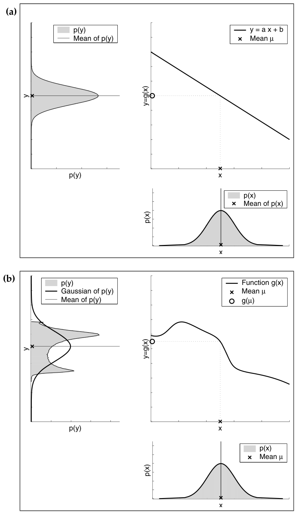

*Figure 3.3 — 가우시안 확률변수의 (a) 선형 및 (b) 비선형 변환. 오른쪽 아래 그림은 원래 확률변수 $X$의
밀도를 보여준다. 이 확률변수는 오른쪽 위 그래프에 표시된 함수를 통과하며(평균의 변환은 점선으로 표시),
그 결과 확률변수 $Y$의 밀도가 왼쪽 위 그래프에 그려진다 (책 p.55)*

### Figure 3.3 읽기 (생략 없이)

**(a) 선형 변환의 경우** (책 p.54)

오른쪽 아래 그래프는 확률변수 $X \sim \mathcal{N}(x;\mu,\sigma^2)$의 밀도를 보여준다. $X$가 오른쪽 위 그래프에
표시된 **선형 함수 $y = ax+b$** 를 통과한다고 하자. 그 결과 확률변수 $Y$는 **평균 $a\mu+b$, 분산
$a^2\sigma^2$인 가우시안**을 따른다. 이 가우시안이 Figure 3.3a 왼쪽 위 그래프의 회색 영역으로 예시된다.

> **독자가 알아챌 점 (책의 언급)**: 이 예는 **Kalman filter의 다음 상태 갱신과 밀접하게 관련**되어 있다.
> $X = x_{t-1}$, $Y = x_t$로 두되 가법 노이즈 변수는 없는 경우다. 식 (2)도 참조.
>
> 즉 3.2.2절 라인 2의 $\bar\mu_t = A_t\mu_{t-1}+B_tu_t$ (평균이 $a\mu+b$)와 라인 3의
> $\bar\Sigma_t = A_t\Sigma_{t-1}A_t^T$ (분산이 $a^2\sigma^2$)가 여기 그림으로 나타난 것이다.

**(b) 비선형 변환의 경우** (책 p.56)

Figure 3.3b는 **가우시안 확률변수에 대한 비선형 변환의 영향**을 예시한다. 오른쪽 아래와 오른쪽 위 그래프는
각각 확률변수 $X$와 비선형 함수 $g$를 그린다. 변환된 확률변수 $Y = g(X)$의 밀도는 Figure 3.3b 왼쪽 위
그래프의 회색 영역으로 표시된다.

> **이 밀도는 어떻게 그려졌는가 (책의 명시)**: **이 밀도는 닫힌 형태로 계산될 수 없기 때문에,
> $p(x)$에 따라 500,000개의 샘플을 뽑아 함수 $g$를 통과시킨 다음 $g$의 치역에 대해 히스토그램을 만들어
> 추정한 것이다.**

보다시피 **$Y$는 가우시안이 아니다.** $g$의 비선형성이 $X$의 밀도를 **가우시안 형태를 파괴하는 방식으로
왜곡하기 때문이다.**

### EKF의 목표 전환

**EKF는 참 belief에 대한 가우시안 근사를 계산한다.** Figure 3.3b 왼쪽 위 그래프의 파선 곡선이 확률변수 $Y$의
밀도에 대한 가우시안 근사를 보여준다.

따라서 EKF는 시각 $t$의 belief $bel(x_t)$를 **평균 $\mu_t$와 공분산 $\Sigma_t$** 로 표현한다. 즉:

> **EKF는 Kalman filter로부터 기본적인 belief 표현을 물려받지만, 이 belief가 Kalman filter에서처럼
> 정확(exact)한 것이 아니라 근사(approximate)일 뿐이라는 점에서 다르다.**

**따라서 EKF의 목표는 정확한 posterior를 계산하는 것에서, 그 평균과 공분산을 효율적으로 추정하는 것으로
옮겨간다.** 그런데 **이 통계량들조차 닫힌 형태로 계산될 수 없으므로, EKF는 추가적인 근사에 의존해야 한다.**
그 근사가 다음 절의 **선형화(linearization)** 다.

### 2. 수식/유도

#### 전체 수식 (먼저 한 번에)

$$x_t = g(u_t,\, x_{t-1}) + \varepsilon_t \tag{38}$$

$$z_t = h(x_t) + \delta_t \tag{39}$$

#### 단계별 설명

**(38), (39) 비선형 모델** — 책 (3.48), (3.49)

$$x_t = g(u_t,\, x_{t-1}) + \varepsilon_t, \qquad z_t = h(x_t) + \delta_t$$

식 (2), (5)와 나란히 놓고 보면 대응이 명확하다:

| | Kalman filter | EKF |
|---|---|---|
| State transition | $x_t = A_tx_{t-1} + B_tu_t + \varepsilon_t$ | $x_t = g(u_t, x_{t-1}) + \varepsilon_t$ |
| Measurement | $z_t = C_tx_t + \delta_t$ | $z_t = h(x_t) + \delta_t$ |

노이즈 항 $\varepsilon_t$(공분산 $R_t$), $\delta_t$(공분산 $Q_t$)는 **그대로 유지**된다 — 여전히 평균 0의
가우시안이 가법적으로 붙는다. **바뀐 것은 오직 "선형 행렬 곱"이 "임의의 함수"로 바뀐 것뿐이다.**

### 3. 예제/실습

#### 예제 — 원형 궤적이 왜 선형이 아닌가

평면 로봇의 상태를 $x_t = \langle x, y, \theta\rangle^T$, 제어를 $u_t = \langle v, \omega\rangle^T$
(병진 속도, 회전 속도)라 하자. 일정 속도로 $\Delta t$ 동안 움직이면 (5장에서 정확히 유도할 velocity motion model):

$$g(u_t, x_{t-1}) = \begin{pmatrix} x - \frac{v}{\omega}\sin\theta + \frac{v}{\omega}\sin(\theta + \omega\Delta t) \\ y + \frac{v}{\omega}\cos\theta - \frac{v}{\omega}\cos(\theta + \omega\Delta t) \\ \theta + \omega\Delta t \end{pmatrix}$$

**$\sin$과 $\cos$이 상태 $\theta$에 걸려 있으므로 어떤 행렬 $A_t$로도 이를 표현할 수 없다.** 이것이
3.3.1절의 "원형 궤적은 선형 상태 전이로 기술될 수 없다"의 구체적 모습이다.

마찬가지로, 랜드마크 $(m_x, m_y)$까지의 거리와 방위를 재는 센서는

$$h(x_t) = \begin{pmatrix} \sqrt{(m_x-x)^2 + (m_y-y)^2} \\ \operatorname{atan2}(m_y-y,\, m_x-x) - \theta \end{pmatrix}$$

로 역시 비선형이다. (6.6절과 7.4절에서 다시 만난다.)

---

## 3.3.2 Linearization Via Taylor Expansion

### 1. 개념적 이해

**EKF 근사의 기반이 되는 핵심 아이디어를 선형화(linearization)라 한다.**

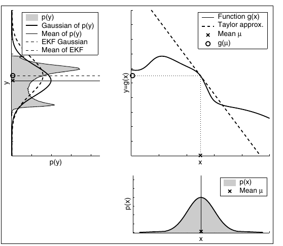

*Figure 3.4 — EKF가 적용하는 선형화의 예시. 가우시안을 비선형 함수 $g$에 통과시키는 대신, **$g$의 선형
근사**에 통과시킨다. 그 선형 함수는 원래 가우시안의 평균에서 $g$에 접한다. 결과 가우시안이 왼쪽 위
그래프의 파선으로 표시된다. 선형화는 근사 오차를 유발하며, 이는 선형화된 가우시안(파선)과 매우 정확한
Monte-Carlo 추정으로 계산된 가우시안(실선)의 불일치로 나타난다 (책 p.57)*

**Figure 3.4가 기본 개념을 예시한다. 선형화는 비선형 함수 $g$를, 가우시안의 평균에서 $g$에 접하는(tangent)
선형 함수로 근사한다** (오른쪽 위 그래프의 파선). **이 선형 근사를 통해 가우시안을 통과시키면 가우시안 밀도가
나온다** (왼쪽 위 그래프의 파선).

왼쪽 위 그래프의 **실선은 Monte-Carlo 근사의 평균과 공분산**을 나타낸다. **이 두 가우시안 사이의 불일치가
$g$의 선형 근사가 야기한 오차를 나타낸다.**

### 왜 선형화를 쓰는가 — 효율성

**그러나 선형화의 핵심 장점은 효율성에 있다.**

- **Monte-Carlo 추정**: 가우시안의 추정을 위해 **500,000개의 점을 $g$에 통과시킨 후 그들의 평균과 공분산을
  계산**해야 했다.
- **EKF의 선형화**: 반면 **선형 근사를 결정한 다음, 결과 가우시안을 닫힌 형태로 계산하기만 하면 된다.**

그리고 결정적으로:

> **실제로 $g$가 일단 선형화되면, EKF의 belief 전파(propagation) 메커니즘은 Kalman filter의 그것과
> 동등하다(equivalent).**

이것이 EKF를 이해하는 가장 좋은 방법이다 — **"매 시각마다 접선을 그어 선형 시스템을 만들고, 그 위에서
그냥 Kalman filter를 돌린다."**

이 기법은 **측정 함수 $h$가 관여하는 가우시안의 곱셈에도 적용된다.** 다시, **EKF는 $h$를 $h$에 접하는
선형 함수로 근사하며, 그럼으로써 posterior belief의 가우시안 성질을 유지한다.**

### 어떤 선형화 기법인가

**비선형 함수를 선형화하는 기법에는 여러 가지가 있다. EKF는 (1차) 테일러 전개(Taylor expansion)라 불리는
방법을 활용한다.**

> **테일러 전개는 함수 $g$의 값과 기울기로부터 $g$에 대한 선형 근사를 구성한다.**

### 2. 수식/유도

#### 전체 유도 과정 (먼저 한 번에)

$$g'(u_t, x_{t-1}) := \frac{\partial g(u_t, x_{t-1})}{\partial x_{t-1}} \tag{40}$$

$$
\begin{aligned}
g(u_t, x_{t-1}) &\approx g(u_t, \mu_{t-1}) + \underbrace{g'(u_t,\mu_{t-1})}_{=:\;G_t}(x_{t-1}-\mu_{t-1}) \\
&= g(u_t, \mu_{t-1}) + G_t\,(x_{t-1}-\mu_{t-1})
\end{aligned}
\tag{41}
$$

$$
\begin{aligned}
p(x_t \mid u_t, x_{t-1}) \approx \det(2\pi R_t)^{-\frac{1}{2}} \exp\Big\{&-\tfrac{1}{2}\left[x_t - g(u_t,\mu_{t-1}) - G_t(x_{t-1}-\mu_{t-1})\right]^T \\
&\times R_t^{-1}\left[x_t - g(u_t,\mu_{t-1}) - G_t(x_{t-1}-\mu_{t-1})\right]\Big\}
\end{aligned}
\tag{42}
$$

$$
\begin{aligned}
h(x_t) &\approx h(\bar\mu_t) + \underbrace{h'(\bar\mu_t)}_{=:\;H_t}(x_t - \bar\mu_t) \\
&= h(\bar\mu_t) + H_t\,(x_t - \bar\mu_t)
\end{aligned}
\tag{43}
$$

$$
\begin{aligned}
p(z_t \mid x_t) = \det(2\pi Q_t)^{-\frac{1}{2}} \exp\Big\{&-\tfrac{1}{2}\left[z_t - h(\bar\mu_t) - H_t(x_t-\bar\mu_t)\right]^T \\
&\times Q_t^{-1}\left[z_t - h(\bar\mu_t) - H_t(x_t-\bar\mu_t)\right]\Big\}
\end{aligned}
\tag{44}
$$

#### 단계별 설명 (생략 없이)

**(40) 기울기 — 편미분** — 책 (3.50)

테일러 전개는 함수의 **값과 기울기**로 선형 근사를 만든다. 기울기는 편미분으로 주어진다:

$$g'(u_t, x_{t-1}) := \frac{\partial g(u_t, x_{t-1})}{\partial x_{t-1}}$$

> **테일러 전개란 (개념부터)**
>
> 미분 가능한 함수 $f$를 점 $a$ 근처에서 다항식으로 근사하는 방법이다. 무한급수로 쓰면
> $$f(x) = f(a) + f'(a)(x-a) + \tfrac{1}{2}f''(a)(x-a)^2 + \cdots$$
> **1차(first order) 테일러 전개**란 여기서 **1차 항까지만 남기고 자르는 것**이다:
> $$f(x) \approx f(a) + f'(a)(x-a)$$
> 기하학적으로 이는 **점 $a$에서 $f$에 그은 접선**이다. 그래서 Figure 3.4에서 파선이 $g$에 "접한다"고
> 표현한 것이다. 잘라낸 2차 이상의 항들이 곧 **선형화 오차**이며, $g$가 굽을수록($f''$이 클수록),
> 그리고 $x$가 $a$에서 멀수록 커진다 — 이것이 3.3.5절에서 다룰 "비선형성의 정도"와 "불확실성의 정도"
> 두 요인의 수학적 근거다.

**(41) 어느 점에서 전개할 것인가 — 그리고 Jacobian $G_t$** — 책 (3.51)

**분명히 $g$의 값과 그 기울기 모두 $g$의 인자에 의존한다.** 그렇다면 **어느 인자를 골라야 하는가?**

> **논리적인 선택은 선형화 시점에 가장 그럴듯하다고 여겨지는(most likely) 상태를 고르는 것이다.
> 가우시안에서 가장 그럴듯한 상태는 posterior의 평균 $\mu_{t-1}$이다.**

다시 말해, **$g$는 $\mu_{t-1}$(그리고 $u_t$)에서의 값으로 근사되며, 선형 외삽은 $\mu_{t-1}$과 $u_t$에서의
$g$의 기울기에 비례하는 항으로 달성된다:**

$$
\begin{aligned}
g(u_t, x_{t-1}) &\approx g(u_t, \mu_{t-1}) + \underbrace{g'(u_t,\mu_{t-1})}_{=:\;G_t}(x_{t-1}-\mu_{t-1}) \\
&= g(u_t, \mu_{t-1}) + G_t\,(x_{t-1}-\mu_{t-1})
\end{aligned}
$$

**(42) 가우시안으로 쓴 state transition probability** — 책 (3.52)

가우시안으로 쓰면, state transition probability는 다음과 같이 근사된다:

$$
\begin{aligned}
p(x_t \mid u_t, x_{t-1}) \approx \det(2\pi R_t)^{-\frac{1}{2}} \exp\Big\{&-\tfrac{1}{2}\left[x_t - g(u_t,\mu_{t-1}) - G_t(x_{t-1}-\mu_{t-1})\right]^T \\
&\times R_t^{-1}\left[x_t - g(u_t,\mu_{t-1}) - G_t(x_{t-1}-\mu_{t-1})\right]\Big\}
\end{aligned}
$$

식 (4)와 비교하면 **$A_tx_{t-1}+B_tu_t$ 자리에 $g(u_t,\mu_{t-1}) + G_t(x_{t-1}-\mu_{t-1})$가 들어간 것뿐**임을
알 수 있다.

**Jacobian에 대해** (책 p.58):

> **$G_t$는 크기 $n \times n$의 행렬임에 주목하자. $n$은 상태의 차원이다. 이 행렬은 흔히
> **Jacobian**이라 불린다. Jacobian의 값은 $u_t$와 $\mu_{t-1}$에 의존하며, 따라서 서로 다른 시점마다
> 달라진다.**

> **Jacobian이란 (개념부터)**
>
> 다변수 벡터 함수 $g: \mathbb{R}^n \to \mathbb{R}^n$의 **모든 1차 편도함수를 모아놓은 행렬**이다.
> $i$행 $j$열 원소가 $\partial g_i / \partial x_j$다:
> $$G_t = \begin{pmatrix} \frac{\partial g_1}{\partial x_1} & \cdots & \frac{\partial g_1}{\partial x_n} \\ \vdots & \ddots & \vdots \\ \frac{\partial g_n}{\partial x_1} & \cdots & \frac{\partial g_n}{\partial x_n} \end{pmatrix}$$
> 1차원에서 도함수가 "기울기"였던 것의 다차원판이며, **비선형 함수를 그 점에서 가장 잘 근사하는 선형
> 변환**이다. 즉 **Jacobian이 곧 그 시점의 $A_t$ 역할**을 한다.
>
> **"시점마다 달라진다"가 핵심**이다. Kalman filter의 $A_t$는 시스템이 주어지면 정해지지만, EKF의 $G_t$는
> **매 스텝 현재 추정 $\mu_{t-1}$에서 새로 계산해야 한다.** 추정이 틀린 곳에 있으면 엉뚱한 점에서 접선을
> 긋게 되고, 그것이 EKF 발산의 주요 원인이다.

**(43) 측정 함수의 선형화** — 책 (3.53)

**EKF는 측정 함수 $h$에 대해 정확히 동일한 선형화를 구현한다.** 여기서 테일러 전개는 **$\bar\mu_t$ 주위에서
전개되는데, 이는 로봇이 $h$를 선형화하는 시점에 가장 그럴듯하다고 여기는 상태**다:

$$h(x_t) \approx h(\bar\mu_t) + \underbrace{h'(\bar\mu_t)}_{=:\;H_t}(x_t - \bar\mu_t) = h(\bar\mu_t) + H_t\,(x_t - \bar\mu_t)$$

여기서 $h'(x_t) = \dfrac{\partial h(x_t)}{\partial x_t}$ 이다.

> **전개 중심이 다른 이유를 놓치지 말자**: $g$는 $\mu_{t-1}$에서, $h$는 $\bar\mu_t$에서 전개한다.
> 각각을 **적용하는 시점에 손에 들고 있는 최선의 추정**이 다르기 때문이다. $g$를 쓸 때는 아직 예측 전이라
> $\mu_{t-1}$이 최선이고, $h$를 쓸 때는 이미 예측을 마쳤으므로 $\bar\mu_t$가 최선이다.

**(44) 가우시안으로 쓴 measurement probability** — 책 (3.54)

가우시안으로 쓰면:

$$
\begin{aligned}
p(z_t \mid x_t) = \det(2\pi Q_t)^{-\frac{1}{2}} \exp\Big\{&-\tfrac{1}{2}\left[z_t - h(\bar\mu_t) - H_t(x_t-\bar\mu_t)\right]^T \\
&\times Q_t^{-1}\left[z_t - h(\bar\mu_t) - H_t(x_t-\bar\mu_t)\right]\Big\}
\end{aligned}
$$

### 3. 예제/실습

#### 예제 — Jacobian을 직접 계산해보기

3.3.1절 예제의 측정 함수에서 거리 성분만 떼어보자. 랜드마크 $(m_x, m_y)$, 상태 $x_t = \langle x,y,\theta\rangle^T$:

$$h_1(x_t) = \sqrt{(m_x-x)^2 + (m_y-y)^2} =: r$$

편미분을 하나씩 계산하면:

$$\frac{\partial h_1}{\partial x} = \frac{-(m_x-x)}{r}, \qquad \frac{\partial h_1}{\partial y} = \frac{-(m_y-y)}{r}, \qquad \frac{\partial h_1}{\partial \theta} = 0$$

따라서 이 성분에 해당하는 $H_t$의 행은:

$$\begin{pmatrix} -\dfrac{m_x-x}{r} & -\dfrac{m_y-y}{r} & 0 \end{pmatrix}\Bigg|_{x = \bar\mu_t}$$

**$\bar\mu_t$를 대입해야 비로소 구체적인 숫자 행렬이 된다** — 이것이 "매 시점 달라진다"의 실제 의미다.
(7.4.3절에서 이 계산을 전체 $H_t$에 대해 완성한다.)

#### 연습문제

1. 만약 $g$가 실제로 선형이라면($g(u_t,x_{t-1}) = A_tx_{t-1}+B_tu_t$), Jacobian $G_t$는 무엇이 되는가?
   그리고 식 (41)의 근사가 **등식**이 되는 것을 확인하라. (즉 EKF가 KF로 환원됨을 보여라.)
2. 식 (41)에서 2차 항까지 남기면 어떤 형태가 되는가? 왜 EKF는 그것을 쓰지 않는가?
   (힌트: 2차 항이 있으면 지수부가 4차식이 되어 더 이상 가우시안이 아니다.)

---

## 3.3.3 The EKF Algorithm

### 1. 개념적 이해

이제 알고리즘이다. **여러 면에서 이 알고리즘은 Table 3.1의 Kalman filter 알고리즘과 유사하다.**
실제로 바뀐 곳은 딱 네 군데뿐이다.

### 2. 수식/유도

#### 알고리즘 전체 (먼저 한 번에) — 책 Table 3.3

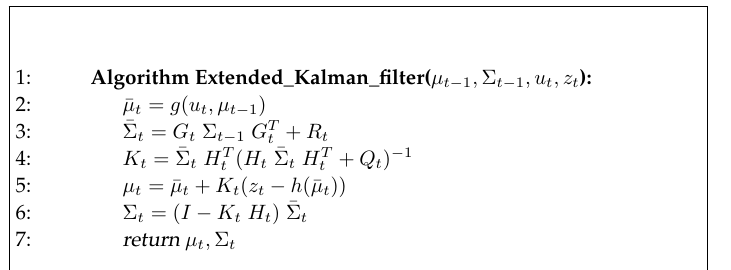

*Table 3.3 — 확장 칼만 필터 알고리즘 (책 p.59)*

$$
\begin{aligned}
&1:\quad \textbf{Algorithm Extended\_Kalman\_filter}(\mu_{t-1},\, \Sigma_{t-1},\, u_t,\, z_t): \\[4pt]
&2:\qquad \bar\mu_t = g(u_t,\, \mu_{t-1}) \\
&3:\qquad \bar\Sigma_t = G_t\,\Sigma_{t-1}\,G_t^T + R_t \\[4pt]
&4:\qquad K_t = \bar\Sigma_t\,H_t^T\,(H_t\,\bar\Sigma_t\,H_t^T + Q_t)^{-1} \\
&5:\qquad \mu_t = \bar\mu_t + K_t\,(z_t - h(\bar\mu_t)) \\
&6:\qquad \Sigma_t = (I - K_t\,H_t)\,\bar\Sigma_t \\[4pt]
&7:\qquad \textbf{return } \mu_t,\, \Sigma_t
\end{aligned}
\tag{45}
$$

#### 단계별 설명

**가장 중요한 차이 (책의 표를 그대로)**

| | Kalman filter | EKF |
|---|---|---|
| state prediction (라인 2) | $A_t\mu_{t-1} + B_tu_t$ | $g(u_t, \mu_{t-1})$ |
| measurement prediction (라인 5) | $C_t\bar\mu_t$ | $h(\bar\mu_t)$ |

**즉, Kalman filter에서의 선형 예측이 EKF에서는 그것의 비선형 일반화로 대체된다.**

**더 나아가, EKF는 Kalman filter의 대응하는 선형 시스템 행렬 $A_t$, $B_t$, $C_t$ 대신 Jacobian $G_t$와 $H_t$를
사용한다.**

- **Jacobian $G_t$가 행렬 $A_t$와 $B_t$에 대응한다.**
- **Jacobian $H_t$가 $C_t$에 대응한다.**

> **$G_t$ 하나가 $A_t$와 $B_t$ **둘 다**를 대신한다는 점에 주목하자.** 비선형 함수 $g(u_t, x_{t-1})$ 안에
> 상태 의존성과 제어 의존성이 이미 함께 들어 있고, 우리는 그것을 **상태 $x_{t-1}$에 대해서만 미분**하기
> 때문이다 (식 (40)의 분모가 $\partial x_{t-1}$인 것을 확인하라). 제어 $u_t$는 라인 2의 $g(u_t,\mu_{t-1})$
> 안에서 직접 반영되므로 별도의 $B_t$가 필요 없다.

**책의 안내**: **확장 칼만 필터에 대한 상세한 예제는 7장에서 주어진다.** (7.4절 EKF Localization)

### 라인별로 무엇이 바뀌고 무엇이 그대로인가

| 라인 | KF | EKF | 바뀌었나 |
|---|---|---|---|
| 2 | $\bar\mu_t = A_t\mu_{t-1}+B_tu_t$ | $\bar\mu_t = g(u_t,\mu_{t-1})$ | **바뀜** — 비선형 함수를 그대로 사용 |
| 3 | $\bar\Sigma_t = A_t\Sigma_{t-1}A_t^T + R_t$ | $\bar\Sigma_t = G_t\Sigma_{t-1}G_t^T + R_t$ | **행렬만 교체** ($A_t \to G_t$) |
| 4 | $K_t = \bar\Sigma_tC_t^T(\cdots)^{-1}$ | $K_t = \bar\Sigma_tH_t^T(\cdots)^{-1}$ | **행렬만 교체** ($C_t \to H_t$) |
| 5 | $\mu_t = \bar\mu_t + K_t(z_t - C_t\bar\mu_t)$ | $\mu_t = \bar\mu_t + K_t(z_t - h(\bar\mu_t))$ | **바뀜** — 기대 측정을 $h$로 계산 |
| 6 | $\Sigma_t = (I-K_tC_t)\bar\Sigma_t$ | $\Sigma_t = (I-K_tH_t)\bar\Sigma_t$ | **행렬만 교체** ($C_t \to H_t$) |

> **패턴이 보인다**: **평균을 다루는 라인(2, 5)에서는 비선형 함수 $g$, $h$를 그대로 쓰고, 공분산을 다루는
> 라인(3, 4, 6)에서는 Jacobian $G_t$, $H_t$를 쓴다.**
>
> 이유: 평균은 "한 점"이므로 비선형 함수에 그냥 통과시킬 수 있다. 하지만 공분산은 "퍼짐"이므로
> 비선형 함수에 통과시킬 방법이 없고, **그 점에서의 선형 근사(Jacobian)를 통해 전파**할 수밖에 없다.
> 이것이 3.4절 UKF가 문제 삼는 바로 그 지점이다.

### 3. 예제/실습

#### 예제 — EKF 한 스텝을 의사코드로

```python
# EKF 한 스텝 (Table 3.3)
def ekf_step(mu, Sigma, u, z, g, h, jacobian_G, jacobian_H, R, Q):
    # 라인 2: 비선형 함수를 평균에 직접 적용
    mu_bar = g(u, mu)
    # 라인 3: 현재 추정점에서 Jacobian을 새로 계산 (매 스텝 달라진다!)
    G = jacobian_G(u, mu)
    Sigma_bar = G @ Sigma @ G.T + R

    # 라인 4: 예측된 평균에서 측정 Jacobian을 계산
    H = jacobian_H(mu_bar)
    K = Sigma_bar @ H.T @ inv(H @ Sigma_bar @ H.T + Q)
    # 라인 5: 기대 측정은 h(mu_bar) — 여기도 비선형 함수를 직접 사용
    mu = mu_bar + K @ (z - h(mu_bar))
    # 라인 6
    Sigma = (I - K @ H) @ Sigma_bar
    return mu, Sigma
```

**KF 구현과의 유일한 실질적 차이**: `jacobian_G`, `jacobian_H`를 **매 스텝 호출**한다는 것.
KF에서는 $A_t$, $C_t$가 상수 행렬로 미리 주어져 있었다.

#### 연습문제

1. 위 코드에서 `jacobian_G(u, mu)`의 인자가 `mu`(직전 평균)이고 `jacobian_H(mu_bar)`의 인자가
   `mu_bar`(예측 평균)인 이유를 식 (41)과 (43)으로 설명하라.
2. 만약 실수로 `jacobian_H(mu)`처럼 예측 전 평균을 넘긴다면 어떤 문제가 생기겠는가?

---

## 3.3.4 Mathematical Derivation of the EKF

### 1. 개념적 이해

> **책의 안내**: **EKF의 수학적 유도는 3.2.4절 Kalman filter의 유도와 나란히 진행되며, 따라서 여기서는
> 개요만 스케치한다.**

즉 **새로운 수학은 없다.** 3.2.4절에서 $A_t x_{t-1} + B_t u_t$였던 자리에 $g(u_t,\mu_{t-1}) +
G_t(x_{t-1}-\mu_{t-1})$을, $C_tx_t$였던 자리에 $h(\bar\mu_t)+H_t(x_t-\bar\mu_t)$를 넣고 그대로 따라가면 된다.

**선형화 덕분에 지수부가 다시 이차식이 되었기 때문에**, 3.2.4절의 모든 기교($L_t$ 분해, inversion lemma,
도함수로 평균·공분산 읽기)가 그대로 작동한다. **이것이 선형화의 존재 이유다.**

### 2. 수식/유도

#### 전체 유도 과정 (먼저 한 번에)

$$
\overline{bel}(x_t) = \int p(x_t \mid x_{t-1}, u_t)\; bel(x_{t-1})\; dx_{t-1}
\tag{46}
$$

여기서 각 항은 다음 분포를 따른다:

$$
\begin{aligned}
p(x_t \mid x_{t-1}, u_t) &\sim \mathcal{N}\big(x_t;\; g(u_t,\mu_{t-1}) + G_t(x_{t-1}-\mu_{t-1}),\; R_t\big) \\[2pt]
bel(x_{t-1}) &\sim \mathcal{N}(x_{t-1};\; \mu_{t-1},\; \Sigma_{t-1})
\end{aligned}
$$

$$
\begin{aligned}
L_t = &\tfrac{1}{2}\left(x_t - g(u_t,\mu_{t-1}) - G_t(x_{t-1}-\mu_{t-1})\right)^T R_t^{-1}\left(x_t - g(u_t,\mu_{t-1}) - G_t(x_{t-1}-\mu_{t-1})\right) \\
&+ \tfrac{1}{2}(x_{t-1}-\mu_{t-1})^T\Sigma_{t-1}^{-1}(x_{t-1}-\mu_{t-1})
\end{aligned}
\tag{47}
$$

$$\Phi_t = (G_t^TR_t^{-1}G_t + \Sigma_{t-1}^{-1})^{-1} \tag{48}$$

$$\bar\mu_t = g(u_t, \mu_{t-1}), \qquad \bar\Sigma_t = G_t\Sigma_{t-1}G_t^T + R_t \tag{49}$$

$$bel(x_t) = \eta \; \underbrace{p(z_t \mid x_t)}_{\sim \mathcal{N}(z_t;\; h(\bar\mu_t)+H_t(x_t-\bar\mu_t),\; Q_t)} \; \underbrace{\overline{bel}(x_t)}_{\sim \mathcal{N}(x_t;\, \bar\mu_t,\, \bar\Sigma_t)} \tag{50}$$

$$
\begin{aligned}
J_t = &\tfrac{1}{2}\left(z_t - h(\bar\mu_t) - H_t(x_t-\bar\mu_t)\right)^T Q_t^{-1}\left(z_t - h(\bar\mu_t) - H_t(x_t-\bar\mu_t)\right) \\
&+ \tfrac{1}{2}(x_t-\bar\mu_t)^T\bar\Sigma_t^{-1}(x_t-\bar\mu_t)
\end{aligned}
\tag{51}
$$

$$\mu_t = \bar\mu_t + K_t(z_t - h(\bar\mu_t)) \tag{52}$$

$$\Sigma_t = (I - K_tH_t)\bar\Sigma_t \tag{53}$$

$$K_t = \bar\Sigma_tH_t^T(H_t\bar\Sigma_tH_t^T + Q_t)^{-1} \tag{54}$$

#### 단계별 설명 (생략 없이)

**(46) Prediction의 출발점** — 책 (3.55)

Prediction은 다음과 같이 계산된다 (식 (9), 책 (3.8)과 비교):

$$
\overline{bel}(x_t) = \int p(x_t \mid x_{t-1}, u_t)\; bel(x_{t-1})\; dx_{t-1}
$$

여기서 각 항은 다음 분포를 따른다:

$$
\begin{aligned}
p(x_t \mid x_{t-1}, u_t) &\sim \mathcal{N}\big(x_t;\; g(u_t,\mu_{t-1}) + G_t(x_{t-1}-\mu_{t-1}),\; R_t\big) \\[2pt]
bel(x_{t-1}) &\sim \mathcal{N}(x_{t-1};\; \mu_{t-1},\; \Sigma_{t-1})
\end{aligned}
$$

**이 분포는 식 (9)에 서술된 Kalman filter의 prediction 분포에 대응하는 EKF 버전이다.**
가우시안 $p(x_t \mid x_{t-1}, u_t)$는 식 (42)에서 찾을 수 있다.

**(47) 지수부 $L_t$** — 책 (3.56)

함수 $L_t$는 다음과 같이 주어진다 (식 (12), 책 (3.11)과 비교):

$$
\begin{aligned}
L_t = &\tfrac{1}{2}\left(x_t - g(u_t,\mu_{t-1}) - G_t(x_{t-1}-\mu_{t-1})\right)^T R_t^{-1}(\cdots) \\
&+ \tfrac{1}{2}(x_{t-1}-\mu_{t-1})^T\Sigma_{t-1}^{-1}(x_{t-1}-\mu_{t-1})
\end{aligned}
$$

**이는 위에서와 마찬가지로 $x_{t-1}$과 $x_t$ 둘 다에 대해 이차식이다.**

> **이 한 문장이 EKF 전체의 정당화다.** 선형화하지 않았다면 $g(u_t, x_{t-1})$가 지수부에 그대로 들어가
> **이차식이 아니게 되고**, 3.2.4절의 모든 기교가 무너진다. 선형화는 정확히 **"지수부를 다시 이차식으로
> 만들기 위해"** 하는 것이다.

**(48) $L_t$의 분해와 $\Phi_t$** — 책 (3.57), (3.58)

식 (13)(책 (3.12))에서처럼, $L_t$를 $L_t(x_{t-1},x_t)$와 $L_t(x_t)$로 분해한다:

$$
\begin{aligned}
L_t(x_{t-1},x_t) = \tfrac{1}{2}\big(x_{t-1} - \Phi_t[&G_t^TR_t^{-1}(x_t - g(u_t,\mu_{t-1}) + G_t\mu_{t-1}) + \Sigma_{t-1}^{-1}\mu_{t-1}]\big)^T \Phi^{-1} \\
\times \big(x_{t-1} - \Phi_t[&G_t^TR_t^{-1}(x_t - g(u_t,\mu_{t-1}) + G_t\mu_{t-1}) + \Sigma_{t-1}^{-1}\mu_{t-1}]\big)
\end{aligned}
$$

여기서:

$$\Phi_t = (G_t^TR_t^{-1}G_t + \Sigma_{t-1}^{-1})^{-1}$$

> **3.2.4절의 $\Psi_t$와 비교하라**: $\Psi_t = (A_t^TR_t^{-1}A_t + \Sigma_{t-1}^{-1})^{-1}$이었다.
> **$A_t$가 $G_t$로 바뀐 것 외에는 완전히 동일하다.** (책이 기호만 $\Psi \to \Phi$로 바꿔 쓴 것뿐이다.)

그리고 따라서 $L_t(x_t)$는 (책 (3.59)):

$$
\begin{aligned}
L_t(x_t) = &\tfrac{1}{2}(x_t - g(u_t,\mu_{t-1}) + G_t\mu_{t-1})^TR_t^{-1}(x_t - g(u_t,\mu_{t-1}) + G_t\mu_{t-1}) \\
&+ \tfrac{1}{2}(x_{t-1}-\mu_{t-1})^T\Sigma_{t-1}^{-1}(x_{t-1}-\mu_{t-1}) \\
&- \tfrac{1}{2}[G_t^TR_t^{-1}(x_t - g(u_t,\mu_{t-1}) + G_t\mu_{t-1}) + \Sigma_{t-1}^{-1}\mu_{t-1}]^T \\
&\qquad \times \Phi_t[G_t^TR_t^{-1}(x_t - g(u_t,\mu_{t-1}) + G_t\mu_{t-1}) + \Sigma_{t-1}^{-1}\mu_{t-1}]
\end{aligned}
$$

**(49) 라인 2, 3의 결과** — 책 p.60

> **독자가 쉽게 확인할 수 있듯이, $L_t(x_t)$의 1차 도함수를 0으로 놓으면 식 (3.27)부터 (3.31)까지의 유도와
> 유사하게 갱신식 $\bar\mu_t = g(u_t,\mu_{t-1})$을 얻는다. 2차 도함수는 $(R_t + G_t\Sigma_{t-1}G_t^T)^{-1}$로
> 주어진다** (식 (22), 책 (3.32) 참조).

즉:

$$\bar\mu_t = g(u_t, \mu_{t-1}) \quad \text{(라인 2)}, \qquad \bar\Sigma_t = G_t\Sigma_{t-1}G_t^T + R_t \quad \text{(라인 3)}$$

> **라인 2의 결과가 흥미롭다.** 선형화 항 $G_t(x_{t-1}-\mu_{t-1})$이 들어 있었는데, 최종 평균에는
> $g(u_t,\mu_{t-1})$만 남았다. 이유는 $x_{t-1}$의 평균이 정확히 $\mu_{t-1}$이라서 **선형화 항의 기댓값이
> $G_t(\mu_{t-1}-\mu_{t-1}) = 0$** 이기 때문이다. 3.2.4절에서 $(I+M)(M+I)^{-1}=I$ 상쇄가 일어난 것과
> 같은 자리다.

**(50), (51) Measurement update의 출발점** — 책 (3.60), (3.61)

**Measurement update 역시 3.2.4절의 Kalman filter와 유사하게 유도된다.** 식 (23)(책 (3.33))과 유사하게,
EKF에 대해:

$$bel(x_t) = \eta \; \underbrace{p(z_t \mid x_t)}_{\sim \mathcal{N}(z_t;\; h(\bar\mu_t)+H_t(x_t-\bar\mu_t),\; Q_t)} \; \underbrace{\overline{bel}(x_t)}_{\sim \mathcal{N}(x_t;\, \bar\mu_t,\, \bar\Sigma_t)}$$

식 (43)의 선형화된 함수를 사용한 것이다. 이는 다음 지수부로 이어진다 (식 (25), 책 (3.35) 참조):

$$
\begin{aligned}
J_t = &\tfrac{1}{2}\left(z_t - h(\bar\mu_t) - H_t(x_t-\bar\mu_t)\right)^T Q_t^{-1}\left(z_t - h(\bar\mu_t) - H_t(x_t-\bar\mu_t)\right) \\
&+ \tfrac{1}{2}(x_t-\bar\mu_t)^T\bar\Sigma_t^{-1}(x_t-\bar\mu_t)
\end{aligned}
$$

**(52), (53), (54) 결과** — 책 (3.62)~(3.64)

**그 결과 평균과 공분산은 다음과 같이 주어진다:**

$$\mu_t = \bar\mu_t + K_t(z_t - h(\bar\mu_t))$$
$$\Sigma_t = (I - K_tH_t)\bar\Sigma_t$$

**Kalman gain은:**

$$K_t = \bar\Sigma_tH_t^T(H_t\bar\Sigma_tH_t^T + Q_t)^{-1}$$

**이 식들의 유도는 식 (3.36)부터 (3.47)까지와 유사하다.** (우리 노트의 식 (26)~(37))

### 3. 예제/실습

#### 예제 — 3.2.4절과의 대응표

| 3.2.4절 (KF) | 3.3.4절 (EKF) | 대체 규칙 |
|---|---|---|
| $A_tx_{t-1}+B_tu_t$ | $g(u_t,\mu_{t-1}) + G_t(x_{t-1}-\mu_{t-1})$ | 선형화된 전이 |
| $C_tx_t$ | $h(\bar\mu_t) + H_t(x_t-\bar\mu_t)$ | 선형화된 측정 |
| $\Psi_t = (A_t^TR_t^{-1}A_t+\Sigma_{t-1}^{-1})^{-1}$ | $\Phi_t = (G_t^TR_t^{-1}G_t+\Sigma_{t-1}^{-1})^{-1}$ | $A_t \to G_t$ |
| $\bar\mu_t = A_t\mu_{t-1}+B_tu_t$ | $\bar\mu_t = g(u_t,\mu_{t-1})$ | 선형화 항이 0이 됨 |
| $\bar\Sigma_t = A_t\Sigma_{t-1}A_t^T+R_t$ | $\bar\Sigma_t = G_t\Sigma_{t-1}G_t^T+R_t$ | $A_t \to G_t$ |
| $K_t = \bar\Sigma_tC_t^T(C_t\bar\Sigma_tC_t^T+Q_t)^{-1}$ | $K_t = \bar\Sigma_tH_t^T(H_t\bar\Sigma_tH_t^T+Q_t)^{-1}$ | $C_t \to H_t$ |

**단 하나의 문장으로 요약하면**: *EKF의 유도는 KF의 유도에서 $A_t \to G_t$, $C_t \to H_t$로 바꾸고,
평균을 다루는 곳에서만 $g$, $h$를 직접 쓴 것이다.*

#### 연습문제

1. 식 (47)의 $L_t$가 왜 $x_{t-1}$에 대해 이차식인지, $G_t$가 상수 행렬이라는 점을 이용해 설명하라.
2. 만약 선형화하지 않고 $g(u_t,x_{t-1})$를 그대로 $L_t$에 넣었다면, $\partial L_t / \partial x_{t-1}$이
   어떤 형태가 되는가? 왜 (18)처럼 $x_{t-1}$에 대해 풀 수 없는가?

---

## 3.3.5 Practical Considerations

### 1. 개념적 이해

**EKF는 로보틱스에서 상태 추정을 위한 거의 가장 인기 있는 도구가 되었다. 그 강점은 단순성과 계산
효율성에 있다.**

- Kalman filter가 그랬듯 **매 갱신은 $O(k^{2.4} + n^2)$ 시간을 요구한다.** 여기서 $k$는 측정 벡터 $z_t$의
  차원, $n$은 상태 벡터 $x_t$의 차원이다.
- **아래에서 논의할 파티클 필터 같은 다른 알고리즘은 $n$에 대해 지수 시간을 요구할 수 있다.**

**EKF는 belief를 다변량 가우시안 분포로 표현한다는 사실 덕분에 계산 효율성을 얻는다.** 가우시안은
**unimodal 분포이며, 불확실성 타원(uncertainty ellipse)이 주석으로 달린 하나의 추측**이라고 생각할 수 있다.

**많은 실용적 문제에서 가우시안은 강건한(robust) 추정기다.** 이 책의 이후 장들에서는 **1,000차원 이상의
상태 공간에 대한 Kalman filter의 응용**이 논의될 것이다. **EKF는 기저 가정을 위반하는 여러 상태 추정
문제들에도 큰 성공을 거두며 적용되어 왔다.**

### 근사 품질을 좌우하는 두 가지 요인

**EKF의 중요한 한계는 그것이 선형 테일러 전개를 사용해 상태 전이와 측정을 근사한다는 사실에서 발생한다.**
대부분의 로보틱스 문제에서 상태 전이와 측정은 비선형이다.

> **EKF가 적용하는 선형 근사의 좋음(goodness)은 두 가지 주요 요인에 의존한다:
> ① 불확실성의 정도(degree of uncertainty), ② 근사되는 함수의 국소 비선형성의 정도(degree of local
> nonlinearity).**

#### 요인 ① — 불확실성의 정도

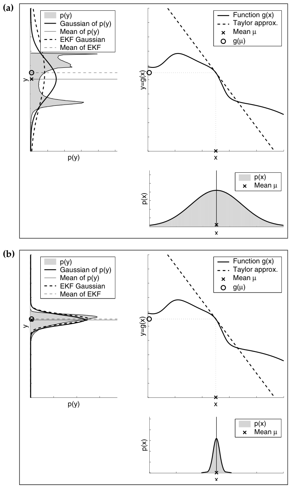

*Figure 3.5 — 근사 품질의 불확실성 의존성. 두 가우시안(각 패널 오른쪽 아래)은 **같은 평균**을 가지며
**같은 비선형 함수**(오른쪽 위)를 통과한다. 왼쪽 가우시안의 더 높은 불확실성이 결과 확률변수의 더 왜곡된
밀도(왼쪽 위 회색 영역)를 만든다. 왼쪽 위 그래프의 실선은 이 밀도들로부터 추출된 가우시안이고, 파선은
EKF가 적용하는 선형화로 생성된 가우시안이다 (책 p.62)*

Figure 3.5의 두 그래프는 **불확실성에 대한 의존성**을 예시한다. 여기서 **두 가우시안 확률변수가 동일한
비선형 함수를 통과한다** (Figure 3.4도 참조). **두 가우시안은 같은 평균을 갖지만, (a)에 표시된 변수가
(b)의 것보다 더 높은 불확실성을 갖는다.**

> **결정적인 관찰**: **테일러 전개는 평균에만 의존하므로, 두 가우시안 모두 동일한 선형 근사를 통과한다.**

두 그림의 왼쪽 위 그래프의 회색 영역은 Monte-Carlo 추정으로 계산된 결과 확률변수의 밀도를 보여준다.
**더 넓은 가우시안에서 나온 밀도가 좁고 덜 불확실한 가우시안에서 나온 밀도보다 훨씬 더 왜곡되어 있다.**

이 밀도들의 가우시안 근사가 그림의 실선으로 주어진다. 파선 그래프는 선형화로 추정된 가우시안을 보여준다.
Monte-Carlo 근사에서 나온 가우시안과 비교하면 다음 사실이 드러난다:

> **더 높은 불확실성은 일반적으로 결과 확률변수의 평균과 공분산에 대해 덜 정확한 추정을 낳는다.**

#### 요인 ② — 국소 비선형성의 정도

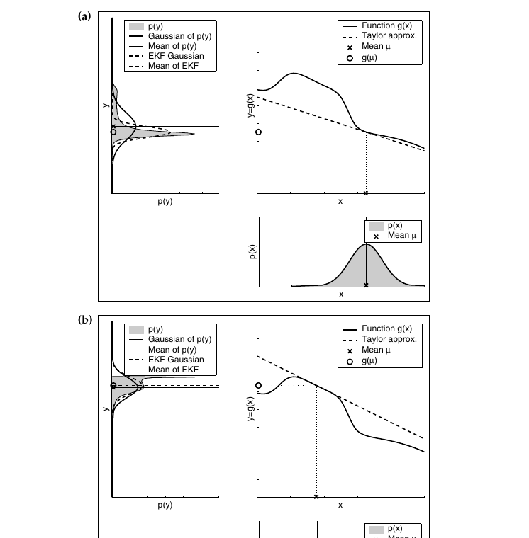

*Figure 3.6 — 함수 $g$의 국소 비선형성에 대한 근사 품질의 의존성. 두 가우시안(각 패널 오른쪽 아래)은
**같은 공분산**을 가지며 같은 함수(오른쪽 위)를 통과한다. EKF가 적용하는 선형 근사가 오른쪽 위 그래프의
파선으로 표시된다. 왼쪽 위 그래프의 실선은 매우 정확한 Monte-Carlo 추정으로부터 추출된 가우시안이고,
파선은 EKF 선형화로 생성된 가우시안이다 (책 p.64)*

**선형 가우시안 근사 품질의 두 번째 요인은 함수 $g$의 국소 비선형성**이며, Figure 3.6에 예시되어 있다.
거기 표시된 것은 **같은 분산을 갖는 두 가우시안이 같은 비선형 함수를 통과하는 모습**이다.

**패널 (a)에서는 가우시안의 평균이 패널 (b)에서보다 함수 $g$의 더 비선형적인 영역에 놓인다.**

가우시안의 정확한 Monte-Carlo 추정(실선, 왼쪽 위)과 선형 근사에서 나온 가우시안(파선) 사이의 불일치는
다음을 보여준다:

> **더 높은 비선형성은 더 큰 근사 오차를 낳는다. EKF 가우시안은 결과 밀도의 퍼짐(spread)을 명백히
> 과소평가한다.**

> **"과소평가"가 특히 위험한 이유**: 필터가 실제보다 자신을 더 확신한다는 뜻이다(overconfident).
> 그러면 라인 4의 Kalman gain이 부당하게 작아져 새 측정을 무시하기 시작하고, 결국 **발산(divergence)** 으로
> 이어질 수 있다. 이것이 EKF 실무에서 $R_t$, $Q_t$를 이론값보다 크게 잡는(inflate) 관행의 이유다.

### multi-modal belief의 한계와 MHEKF

**때로는 여러 개의 서로 다른 가설을 추구하고 싶을 수 있다.** 예를 들어 로봇이 자신의 위치에 대해 두 개의
뚜렷한 가설을 가질 수 있는데, **이 가설들의 산술 평균은 그럴듯한 후보가 아니다.** (3.1절 예제 2의
복도 예시와 정확히 같은 상황이다.)

**그런 상황은 posterior belief에 대한 multi-modal 표현을 요구한다. 여기 기술된 형태의 EKF는 그런
multi-modal belief를 표현할 수 없다.**

**EKF의 흔한 확장은 posterior를 가우시안의 혼합(mixture) 또는 합(sum)으로 표현하는 것이다.**

### 2. 수식/유도

$$bel(x_t) = \frac{1}{\sum_l \psi_{t,l}} \sum_l \psi_{t,l} \det(2\pi\Sigma_{t,l})^{-\frac{1}{2}} \exp\left\{-\tfrac{1}{2}(x_t - \mu_{t,l})^T\Sigma_{t,l}^{-1}(x_t-\mu_{t,l})\right\} \tag{55}$$

**(55) Mixture of Gaussians** — 책 (3.65)

가우시안 혼합은 위 형태일 수 있다. **여기서 $\psi_{t,l}$은 $\psi_{t,l} \ge 0$인 혼합 파라미터다.
이 파라미터들은 혼합 성분들의 가중치 역할을 한다. 이들은 대응하는 가우시안에 조건화된 관측의 가능도
(likelihood)로부터 추정된다.**

**그런 혼합 표현을 활용하는 EKF를 다가설 (확장) 칼만 필터(multi-hypothesis (extended) Kalman filters,
MHEKF)라 부른다.** (7.6절 Multi-Hypothesis Tracking에서 다시 다룬다.)

> 앞의 $\frac{1}{\sum_l \psi_{t,l}}$은 가중치의 합을 1로 만드는 정규화 인자다 — 2장의 $\eta$와 같은 역할.

### 3.3절의 결론 (책 p.63)

**요약하면**:

- **비선형 함수들이 추정값의 평균에서 대략 선형이라면, EKF 근사는 일반적으로 좋을 수 있으며, EKF는
  posterior belief를 충분한 정확도로 근사할 수 있다.**
- **더 나아가, 로봇이 덜 확신할수록 가우시안 belief가 더 넓어지고, 상태 전이 및 측정 함수의 비선형성에
  더 많은 영향을 받는다.**
- **따라서 실무에서 EKF를 적용할 때는 상태 추정의 불확실성을 작게 유지하는 것이 중요하다.**

<!--widget:ekf-linearization-->

### 3. 예제/실습

#### 예제 — 두 요인이 겹치면 어떻게 되는가

| | 낮은 비선형성 | 높은 비선형성 |
|---|---|---|
| **낮은 불확실성** | EKF 근사 매우 좋음 | 접점 근처만 쓰므로 견딜 만함 |
| **높은 불확실성** | 넓어도 함수가 곧으면 괜찮음 | **최악** — 퍼짐을 크게 과소평가, 발산 위험 |

**실무 지침**: 오른쪽 아래 칸을 피하는 것이 EKF 운용의 전부다. 방법은 두 가지 —
① 불확실성을 작게 유지 (센서 업데이트를 자주, 시간 간격 $\Delta t$를 짧게),
② 비선형성이 심한 영역을 피하거나 상태 표현을 바꿔 비선형성을 낮추기.

#### 연습문제

1. 로봇이 회전 속도 $\omega$가 매우 클 때와 매우 작을 때, 3.3.1절 예제의 $g$의 비선형성은 어느 쪽이 더
   심한가? EKF 관점에서 어느 상황이 위험한가?
2. 식 (55)의 혼합에서 성분이 하나뿐이면($l$이 1개) 무엇이 되는가? 성분 개수를 무한히 늘리면 어떤 표현에
   가까워지는가? (힌트: 4.3절)
3. Figure 3.5에서 두 가우시안이 같은 선형 근사를 통과하는 이유는 무엇인가? 만약 선형화 점을 평균이 아니라
   "분포 전체를 대표하는 여러 점"으로 잡는다면 개선될까? (이것이 3.4절 UKF의 착상이다.)

---

---

# 3.4 The Unscented Kalman Filter (책 p.65~71)

## 3.4.1 Linearization Via the Unscented Transform

### 1. 개념적 이해

**EKF가 적용하는 테일러 급수 전개는 선형화의 한 가지 방법일 뿐이다.**

3.3.5절에서 EKF의 약점을 두 가지로 정리했다. 그중 Figure 3.5의 관찰이 특히 뼈아팠다 —
**"테일러 전개는 평균에만 의존하므로, 불확실성이 크든 작든 똑같은 선형 근사를 쓴다."** 분포가 넓게
퍼져 있는데도 딱 한 점(평균)에서 그은 접선으로 전체를 대표하려 하니, 넓을수록 오차가 커지는 것이다.

**UKF는 이 문제를 정면으로 공략한다.** 아이디어는 단순하다:

> **한 점에서 접선을 긋는 대신, 분포를 대표하는 여러 개의 점을 뽑아 비선형 함수에 직접 통과시킨 뒤,
> 통과한 점들로부터 결과의 평균과 공분산을 되읽는다.**

이때 뽑는 점들을 **sigma point**라 하고, 이 선형화 방법을 **unscented transform**이라 한다.

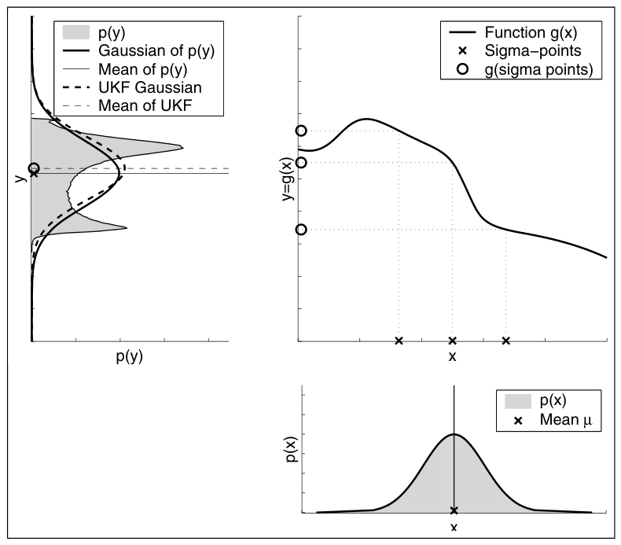

*Figure 3.7 — UKF가 적용하는 선형화의 예시. 필터는 먼저 $n$차원 가우시안으로부터 $2n+1$개의 가중된
sigma point를 추출한다(이 예에서는 $n=1$). 이 sigma point들은 비선형 함수 $g$를 통과한다. 그런 다음
사상된 sigma point들(오른쪽 위 그림의 작은 원)로부터 선형화된 가우시안이 추출된다. EKF와 마찬가지로
선형화는 근사 오차를 유발하며, 이는 선형화된 가우시안(파선)과 매우 정확한 Monte-Carlo 추정으로 계산된
가우시안(실선)의 불일치로 나타난다 (책 p.66)*

**Figure 3.7이 UKF가 적용하는 선형화, 즉 unscented transform을 예시한다.**

> **함수 $g$를 테일러 급수 전개로 근사하는 대신, UKF는 가우시안으로부터 이른바 sigma point들을
> 결정론적으로(deterministically) 추출하여 이들을 $g$에 통과시킨다.**

**"결정론적으로"가 핵심 단어다.** 4장의 particle filter도 점들을 뽑아 통과시키지만, 그쪽은 **무작위로**
뽑는다. UKF는 **정해진 규칙에 따라 정확히 $2n+1$개**를 뽑는다. (이 대비는 3.4.2절 끝에서 다시 다룬다.)

**일반적인 경우, 이 sigma point들은 평균에 하나, 그리고 공분산의 주축(main axes)을 따라 대칭으로
(차원당 두 개씩) 위치한다.**

### 2. 수식/유도

#### 전체 수식 (먼저 한 번에)

$$
\begin{aligned}
\mathcal{X}^{[0]} &= \mu \\[2pt]
\mathcal{X}^{[i]} &= \mu + \left(\sqrt{(n+\lambda)\,\Sigma}\right)_i && \text{for } i = 1,\ldots,n \\[2pt]
\mathcal{X}^{[i]} &= \mu - \left(\sqrt{(n+\lambda)\,\Sigma}\right)_{i-n} && \text{for } i = n+1,\ldots,2n
\end{aligned}
\tag{56}
$$

$$\lambda = \alpha^2 (n+\kappa) - n \tag{57}$$

$$
\begin{aligned}
w_m^{[0]} &= \frac{\lambda}{n+\lambda} \\[4pt]
w_c^{[0]} &= \frac{\lambda}{n+\lambda} + (1 - \alpha^2 + \beta) \\[4pt]
w_m^{[i]} &= w_c^{[i]} = \frac{1}{2(n+\lambda)} && \text{for } i = 1,\ldots,2n
\end{aligned}
\tag{58}
$$

$$\mathcal{Y}^{[i]} = g\left(\mathcal{X}^{[i]}\right) \tag{59}$$

$$
\begin{aligned}
\mu' &= \sum_{i=0}^{2n} w_m^{[i]}\, \mathcal{Y}^{[i]} \\[4pt]
\Sigma' &= \sum_{i=0}^{2n} w_c^{[i]}\, \left(\mathcal{Y}^{[i]} - \mu'\right)\left(\mathcal{Y}^{[i]} - \mu'\right)^T
\end{aligned}
\tag{60}
$$

#### 단계별 설명 (생략 없이)

**(56) Sigma point를 어디에 놓는가** — 책 (3.66)

**평균 $\mu$와 공분산 $\Sigma$를 갖는 $n$차원 가우시안에 대해, 그 결과인 $2n+1$개의 sigma point
$\mathcal{X}^{[i]}$는 다음 규칙에 따라 선택된다:**

$$\mathcal{X}^{[0]} = \mu$$
$$\mathcal{X}^{[i]} = \mu + \left(\sqrt{(n+\lambda)\Sigma}\right)_i \quad (i = 1,\ldots,n)$$
$$\mathcal{X}^{[i]} = \mu - \left(\sqrt{(n+\lambda)\Sigma}\right)_{i-n} \quad (i = n+1,\ldots,2n)$$

> **행렬의 제곱근이란 (개념부터)**
>
> 스칼라에서 $\sqrt{\sigma^2} = \sigma$가 "표준편차"였듯, 행렬에서도 $\sqrt{\Sigma}$는 "퍼짐의 크기"를
> 나타낸다. 정확히는 **$LL^T = \Sigma$를 만족하는 행렬 $L$** 을 말하며, $\Sigma$가 symmetric이고
> positive-semidefinite이므로 항상 존재한다. 실무에서는 **Cholesky 분해**로 구한다.
>
> 아래첨자 $(\cdot)_i$는 **그 행렬의 $i$번째 열(column)** 을 뜻한다. 즉 $\sqrt{(n+\lambda)\Sigma}$의
> 각 열이 공분산 타원의 한 주축 방향과 그 방향의 퍼짐 크기를 담고 있고, 평균에서 그 방향으로
> **양쪽으로 하나씩** 점을 찍는 것이다.
>
> **그래서 개수가 $2n+1$이다** — 중심 1개 + 각 차원마다 ± 2개.

**(57) 스케일링 파라미터 $\lambda$, $\alpha$, $\kappa$** — 책 p.65

**여기서 $\lambda = \alpha^2(n+\kappa) - n$ 이며, $\alpha$와 $\kappa$는 sigma point들이 평균으로부터
얼마나 멀리 퍼질지를 결정하는 스케일링 파라미터다.**

> **직관**: $\lambda$가 크면 $\sqrt{(n+\lambda)\Sigma}$가 커져 sigma point들이 평균에서 멀리 퍼진다.
> 멀리 퍼지면 함수 $g$의 넓은 영역을 탐색하므로 전역적 거동을 잘 잡지만, 지나치게 멀면 확률이 거의 없는
> 영역까지 표본으로 삼게 된다. 가까이 모으면 국소 거동만 정확해진다 — 극단적으로는 EKF(한 점)에
> 가까워지는 셈이다.

**(58) 각 sigma point의 두 가중치** — 책 (3.67)

**각 sigma point $\mathcal{X}^{[i]}$에는 두 개의 가중치가 연관된다. 하나인 $w_m^{[i]}$는 평균을 계산할 때
쓰이고, 다른 하나인 $w_c^{[i]}$는 가우시안의 공분산을 복원할 때 쓰인다.**

$$w_m^{[0]} = \frac{\lambda}{n+\lambda}, \qquad w_c^{[0]} = \frac{\lambda}{n+\lambda} + (1-\alpha^2+\beta)$$
$$w_m^{[i]} = w_c^{[i]} = \frac{1}{2(n+\lambda)} \quad (i = 1,\ldots,2n)$$

> **가중치가 왜 두 종류인가**: 평균 복원과 공분산 복원은 다른 통계량이라, 중심점의 기여도를 각각
> 다르게 조정하는 편이 근사 정확도에 유리하다. 실제로 **$i \ge 1$인 점들은 두 가중치가 같고, 중심점
> $i=0$만 다르다.** 차이는 $(1-\alpha^2+\beta)$ 항 하나뿐이다.
>
> **가중치 합 확인**: $\dfrac{\lambda}{n+\lambda} + 2n \cdot \dfrac{1}{2(n+\lambda)}
> = \dfrac{\lambda+n}{n+\lambda} = 1$ ✔ — $w_m$의 합은 정확히 1이다.

**파라미터 $\beta$에 대해** (책 p.66):

> **파라미터 $\beta$는 가우시안 표현의 기저에 있는 분포에 대한 추가적인 (고차) 지식을 부호화하기 위해
> 선택될 수 있다. 만약 분포가 정확히 가우시안이라면 $\beta = 2$가 최적의 선택이다.**

**(59) Sigma point를 함수에 통과시키기** — 책 (3.68)

**그런 다음 sigma point들은 함수 $g$를 통과하며, 그럼으로써 $g$가 가우시안의 형태를 어떻게 바꾸는지를
탐색(probe)한다.**

$$\mathcal{Y}^{[i]} = g\left(\mathcal{X}^{[i]}\right)$$

> **"probe(탐색)"라는 단어가 UKF의 철학을 담고 있다.** EKF는 $g$를 **미분해서** 그 자리의 기울기를
> 알아냈다. UKF는 $g$를 **여러 점에서 실제로 평가해봄으로써** 그 거동을 알아낸다. 그래서
> **Jacobian이 필요 없다** (3.4.2절 끝의 derivative-free filter).

**(60) 결과 가우시안의 파라미터 복원** — 책 (3.69)

**결과 가우시안의 파라미터 $(\mu', \Sigma')$는 사상된 sigma point $\mathcal{Y}^{[i]}$로부터 다음에 따라
추출된다:**

$$\mu' = \sum_{i=0}^{2n} w_m^{[i]}\,\mathcal{Y}^{[i]}$$
$$\Sigma' = \sum_{i=0}^{2n} w_c^{[i]}\left(\mathcal{Y}^{[i]}-\mu'\right)\left(\mathcal{Y}^{[i]}-\mu'\right)^T$$

**이 두 식은 정확히 2장 식 (15)의 expectation과 식 (17)의 covariance의 가중 표본 버전**이다.
연속 적분 $\int y\,p(y)\,dy$ 자리에 유한합 $\sum w^{[i]}\mathcal{Y}^{[i]}$가 들어간 것이다.

### UKF와 EKF의 정확도 비교 (책 p.67)

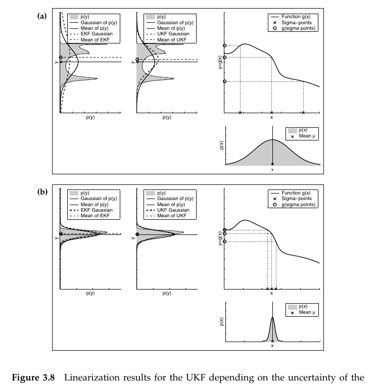

*Figure 3.8 — 원래 가우시안의 불확실성에 따른 UKF의 선형화 결과. 비교를 위해 EKF 선형화의 결과도 함께
표시했다(Figure 3.5 참조). **파선과 실선 가우시안의 더 강한 유사성**에서 볼 수 있듯, unscented transform은
더 작은 근사 오차를 유발한다 (책 p.68)*

**Figure 3.8은 원래 가우시안의 불확실성에 대한 unscented transform의 의존성을 예시한다. 비교를 위해
EKF 테일러 급수 전개를 사용한 결과가 UKF 결과와 나란히 그려져 있다.**

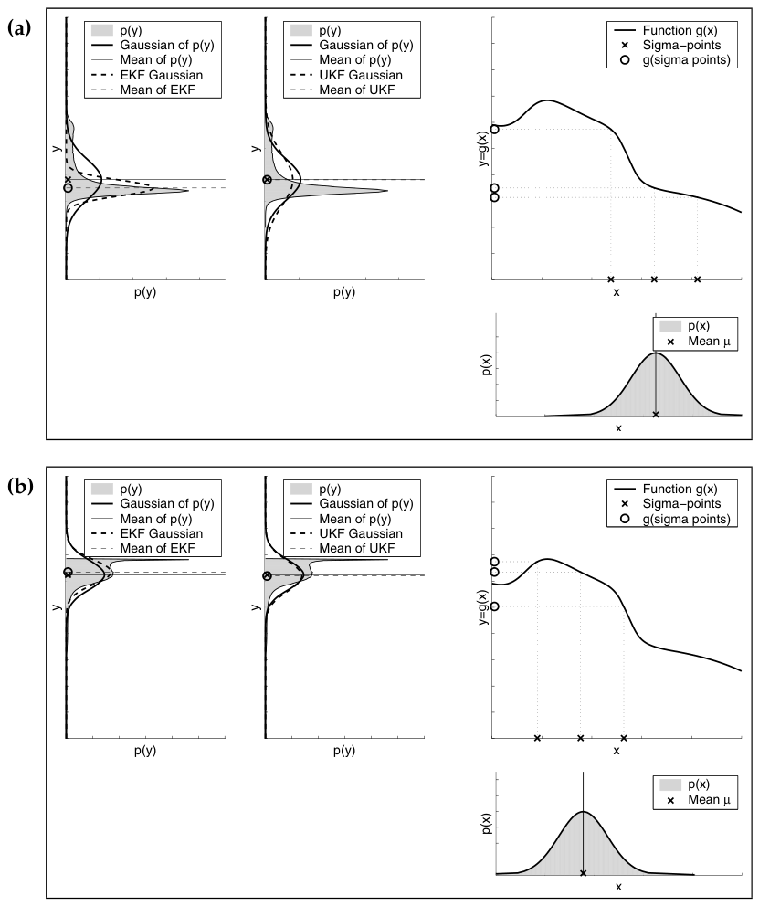

*Figure 3.9 — 원래 가우시안의 평균에 따른 UKF의 선형화 결과. 비교를 위해 EKF 선형화 결과도 함께 표시했다
(Figure 3.6 참조). sigma point 선형화가 더 작은 근사 오차를 유발한다 (책 p.69)*

**Figure 3.9는 UKF와 EKF 근사 사이의 추가적인 비교를 보여주는데, 여기서는 함수 $g$의 국소 비선형성에
대한 의존성이다.**

**보다시피 unscented transform은 EKF가 적용하는 1차 테일러 급수 전개보다 더 정확하다.**

> **실제로 unscented transform이 테일러 전개의 처음 두 항(the first two terms)까지 정확한 반면,
> EKF는 1차 항만을 포착한다는 것을 보일 수 있다.**
>
> **(단, EKF와 UKF 모두 더 높은 차수의 항을 포착하도록 수정될 수 있다는 점은 언급해두어야 한다.)**

이것이 UKF의 정확도 우위의 정확한 크기다 — **2차까지 맞다.** 3.3.2절에서 테일러 전개를 설명하며
"잘라낸 2차 이상의 항들이 곧 선형화 오차"라고 했는데, UKF는 그중 2차 항까지 회수하는 셈이다.

### 3. 예제/실습

#### 예제 1 — 1차원에서 sigma point를 직접 계산

$n=1$, $\mu = 5$, $\sigma^2 = 4$인 가우시안. 계산이 눈에 보이도록 $\alpha = 1$, $\kappa = 2$, $\beta = 2$로 두자.

**Step 1 — $\lambda$**: $\lambda = \alpha^2(n+\kappa) - n = 1\cdot(1+2) - 1 = 2$

**Step 2 — 퍼짐**: $\sqrt{(n+\lambda)\sigma^2} = \sqrt{3 \times 4} = \sqrt{12} \approx 3.464$

**Step 3 — sigma point 3개** ($2n+1 = 3$):

$$\mathcal{X}^{[0]} = 5, \qquad \mathcal{X}^{[1]} = 5 + 3.464 = 8.464, \qquad \mathcal{X}^{[2]} = 5 - 3.464 = 1.536$$

**Step 4 — 가중치**:

$$w_m^{[0]} = \frac{2}{1+2} = 0.667, \qquad w_c^{[0]} = 0.667 + (1 - 1 + 2) = 2.667$$
$$w_m^{[1]} = w_m^{[2]} = w_c^{[1]} = w_c^{[2]} = \frac{1}{2(1+2)} = 0.167$$

**검산 — $g$가 항등함수($g(x)=x$)라면 원래 분포가 그대로 복원되어야 한다:**

$$\mu' = 0.667(5) + 0.167(8.464) + 0.167(1.536) = 3.333 + 1.667 = 5.0 \;\; ✔$$
$$\Sigma' = 2.667(0)^2 + 0.167(3.464)^2 + 0.167(-3.464)^2 = 0 + 2.0 + 2.0 = 4.0 \;\; ✔$$

**평균 5, 분산 4가 정확히 복원되었다.** 이것이 "선형 시스템에서 UKF = KF"의 가장 작은 사례다.

#### 예제 2 — 비선형 함수에서 EKF와 비교

$g(x) = x^2$, $\mu = 2$, $\sigma^2 = 1$이라 하자. 참값은 해석적으로 구할 수 있다:
$E[X^2] = \mu^2 + \sigma^2 = 5$.

**EKF**: $g'(x) = 2x$이므로 $G = g'(2) = 4$.

$$\mu'_{\text{EKF}} = g(2) = 4, \qquad \sigma'^2_{\text{EKF}} = 4^2 \cdot 1 = 16$$

**UKF** ($\alpha=1,\kappa=2,\beta=2$이면 $\lambda=2$, 퍼짐 $=\sqrt{3\cdot1}=1.732$):

- sigma points: $2,\; 3.732,\; 0.268$
- 통과 후: $4,\; 13.93,\; 0.072$

$$\mu'_{\text{UKF}} = 0.667(4) + 0.167(13.93) + 0.167(0.072) = 2.667 + 2.333 = 5.0$$

**결과**: 참값 5에 대해 **UKF는 5.0으로 정확히 맞췄고, EKF는 4로 1만큼 틀렸다.**

이것이 "unscented transform은 테일러 전개의 두 항까지 정확하다"의 구체적 확인이다 —
$x^2$은 2차 함수이므로 2차까지 정확한 UKF는 오차가 0이고, 1차만 잡는 EKF는 정확히 $\sigma^2$만큼 틀린다.

#### 연습문제

1. 예제 1에서 $g(x) = 3x + 1$ (선형)일 때 $\mu'$과 $\Sigma'$를 계산하고, 참값 $3\cdot5+1 = 16$,
   $3^2\cdot4 = 36$과 일치하는지 확인하라.
2. $\lambda$를 키우면(예: $\kappa = 10$) 예제 2의 UKF 결과가 어떻게 되는가? 왜 $x^2$에서는 여전히
   정확한가?
3. $n = 3$ (평면 로봇 pose)일 때 sigma point는 몇 개인가? $n = 203$ (3.1절 예제 1의 SLAM)이면?

---

## 3.4.2 The UKF Algorithm

### 1. 개념적 이해

**unscented transform을 활용하는 UKF 알고리즘이 Table 3.4에 제시되어 있다. 입력과 출력은 EKF 알고리즘과
동일하다.**

즉 바깥에서 보면 EKF와 똑같이 $(\mu_{t-1}, \Sigma_{t-1}, u_t, z_t) \to (\mu_t, \Sigma_t)$다.
**안에서 Jacobian 대신 sigma point를 쓸 뿐이다.**

### 2. 수식/유도

#### 알고리즘 전체 (먼저 한 번에) — 책 Table 3.4

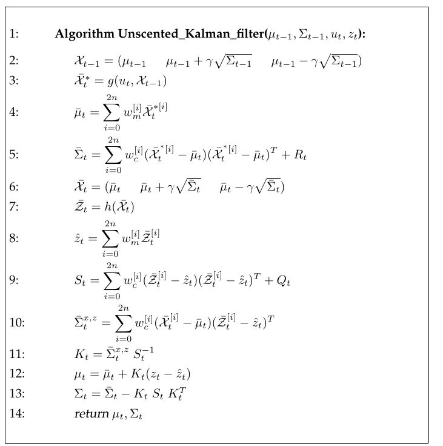

*Table 3.4 — unscented Kalman filter 알고리즘. 변수 $n$은 상태 벡터의 차원을 나타낸다 (책 p.70)*

$$
\begin{aligned}
&1:\;\; \textbf{Algorithm Unscented\_Kalman\_filter}(\mu_{t-1}, \Sigma_{t-1}, u_t, z_t): \\[3pt]
&2:\quad \mathcal{X}_{t-1} = \left(\mu_{t-1} \;\;\; \mu_{t-1}+\gamma\sqrt{\Sigma_{t-1}} \;\;\; \mu_{t-1}-\gamma\sqrt{\Sigma_{t-1}}\right) \\
&3:\quad \bar{\mathcal{X}}_t^{*} = g(u_t,\, \mathcal{X}_{t-1}) \\
&4:\quad \bar\mu_t = \sum_{i=0}^{2n} w_m^{[i]}\, \bar{\mathcal{X}}_t^{*[i]} \\
&5:\quad \bar\Sigma_t = \sum_{i=0}^{2n} w_c^{[i]}\left(\bar{\mathcal{X}}_t^{*[i]} - \bar\mu_t\right)\left(\bar{\mathcal{X}}_t^{*[i]} - \bar\mu_t\right)^T + R_t \\[3pt]
&6:\quad \bar{\mathcal{X}}_t = \left(\bar\mu_t \;\;\; \bar\mu_t+\gamma\sqrt{\bar\Sigma_t} \;\;\; \bar\mu_t-\gamma\sqrt{\bar\Sigma_t}\right) \\
&7:\quad \bar{\mathcal{Z}}_t = h(\bar{\mathcal{X}}_t) \\
&8:\quad \hat z_t = \sum_{i=0}^{2n} w_m^{[i]}\, \bar{\mathcal{Z}}_t^{[i]} \\
&9:\quad S_t = \sum_{i=0}^{2n} w_c^{[i]}\left(\bar{\mathcal{Z}}_t^{[i]} - \hat z_t\right)\left(\bar{\mathcal{Z}}_t^{[i]} - \hat z_t\right)^T + Q_t \\
&10:\quad \bar\Sigma_t^{x,z} = \sum_{i=0}^{2n} w_c^{[i]}\left(\bar{\mathcal{X}}_t^{[i]} - \bar\mu_t\right)\left(\bar{\mathcal{Z}}_t^{[i]} - \hat z_t\right)^T \\
&11:\quad K_t = \bar\Sigma_t^{x,z}\, S_t^{-1} \\
&12:\quad \mu_t = \bar\mu_t + K_t(z_t - \hat z_t) \\
&13:\quad \Sigma_t = \bar\Sigma_t - K_t\, S_t\, K_t^T \\[3pt]
&14:\quad \textbf{return } \mu_t,\, \Sigma_t
\end{aligned}
\tag{61}
$$

여기서 $\gamma$는 $\sqrt{n+\lambda}$의 축약이다.

#### 단계별 설명 (생략 없이)

**라인 2 — 이전 belief의 sigma point 추출**

**라인 2는 식 (56)을 사용해 이전 belief의 sigma point들을 결정한다. $\gamma$는 $\sqrt{n+\lambda}$의
축약이다.**

식 (56)을 행렬 표기로 압축한 것으로, 세 묶음이 각각 $\mathcal{X}^{[0]}$, $\mathcal{X}^{[1..n]}$,
$\mathcal{X}^{[n+1..2n]}$에 해당한다.

**라인 3 — 노이즈 없는 상태 예측을 통과**

**이 점들은 라인 3에서 노이즈 없는(noise-free) 상태 예측을 통해 전파된다.**

$$\bar{\mathcal{X}}_t^{*} = g(u_t,\, \mathcal{X}_{t-1})$$

> **"노이즈 없는"이 중요하다**: $g$만 적용하고 $\varepsilon_t$는 넣지 않는다. 모션 노이즈 $R_t$는
> 라인 5에서 한꺼번에 더해진다. 별표 $(*)$는 "아직 $R_t$가 반영되지 않은 중간 결과"라는 표시다.

**라인 4, 5 — 예측된 평균과 공분산**

**예측된 평균과 분산은 그 결과 sigma point들로부터 계산된다(라인 4와 5).**

**라인 5의 $R_t$는 추가적인 예측 노이즈 불확실성을 모델링하기 위해 sigma point 공분산에 더해진다**
(Table 3.3의 EKF 알고리즘 라인 3과 비교). **예측 노이즈 $R_t$는 가법적(additive)이라고 가정된다.**

> **책의 예고**: **나중에 7장에서, 예측 및 측정 노이즈 항을 더 정확하게 추정하는 UKF 알고리즘 버전을
> 제시한다.** (7.7절 UKF Localization — 노이즈를 상태에 포함시키는 augmented 형태다.)

**라인 6 — sigma point 재추출**

**예측된 가우시안으로부터 새로운 sigma point 집합이 라인 6에서 추출된다. 이 sigma point 집합
$\bar{\mathcal{X}}_t$는 이제 예측 단계 이후의 전체 불확실성을 포착한다.**

> **왜 다시 뽑는가**: 라인 5에서 $R_t$를 더했으므로 분포가 라인 3의 결과보다 넓어졌다. 그 넓어진 분포를
> 대표하려면 점들도 다시 배치해야 한다. **이 재추출이 UKF의 계산량이 늘어나는 주된 지점**이다.

**라인 7 — 각 sigma point에 대한 예측 관측**

**라인 7에서는 각 sigma point에 대해 예측된 관측이 계산된다.**

$$\bar{\mathcal{Z}}_t = h(\bar{\mathcal{X}}_t)$$

**라인 8, 9 — 예측 관측과 그 불확실성**

**그 결과인 관측 sigma point $\bar{\mathcal{Z}}_t$는 예측된 관측 $\hat z_t$와 그 불확실성 $S_t$를
계산하는 데 사용된다. 행렬 $Q_t$는 가법적 측정 노이즈의 공분산 행렬이다.**

> **결정적인 대응 관계 (책의 명시)**: **$S_t$는 Table 3.3의 EKF 알고리즘 라인 4에 있는
> $H_t\bar\Sigma_tH_t^T + Q_t$와 동일한 불확실성을 나타낸다는 점에 주목하라.**

**라인 10, 11 — 교차 공분산과 Kalman gain**

**라인 10은 상태와 관측 사이의 교차 공분산(cross-covariance)을 결정하며, 이는 라인 11에서 Kalman gain
$K_t$를 계산하는 데 사용된다.**

> **또 하나의 대응 (책의 명시)**: **교차 공분산 $\bar\Sigma_t^{x,z}$는 EKF 알고리즘 라인 4의
> $\bar\Sigma_tH_t^T$ 항에 대응한다.**

**이를 염두에 두면, 라인 12와 13에서 수행되는 추정 갱신이 EKF 알고리즘이 수행하는 갱신과 동등한
형태임을 보이는 것은 간단하다.**

**라인 12, 13 — 최종 갱신**

$$\mu_t = \bar\mu_t + K_t(z_t - \hat z_t), \qquad \Sigma_t = \bar\Sigma_t - K_tS_tK_t^T$$

### EKF ↔ UKF 대응표

책이 명시한 두 대응을 정리하면 두 알고리즘이 완전히 겹쳐 읽힌다.

| 개념 | EKF (Table 3.3) | UKF (Table 3.4) |
|---|---|---|
| 예측 평균 | $g(u_t,\mu_{t-1})$ | 라인 4 — sigma point의 가중 평균 |
| 예측 공분산 | $G_t\Sigma_{t-1}G_t^T + R_t$ | 라인 5 — sigma point 공분산 $+\,R_t$ |
| 기대 측정 | $h(\bar\mu_t)$ | 라인 8 — $\hat z_t$ |
| 측정 공간 불확실성 | $H_t\bar\Sigma_tH_t^T + Q_t$ | 라인 9 — $S_t$ |
| 상태–측정 결합 | $\bar\Sigma_tH_t^T$ | 라인 10 — $\bar\Sigma_t^{x,z}$ |
| Kalman gain | $\bar\Sigma_tH_t^T(H_t\bar\Sigma_tH_t^T+Q_t)^{-1}$ | 라인 11 — $\bar\Sigma_t^{x,z}S_t^{-1}$ |
| 평균 갱신 | $\bar\mu_t + K_t(z_t - h(\bar\mu_t))$ | 라인 12 — 동일 형태 |
| 공분산 갱신 | $(I-K_tH_t)\bar\Sigma_t$ | 라인 13 — $\bar\Sigma_t - K_tS_tK_t^T$ |

> **라인 13이 EKF 라인 6과 같은 이유**: $K_t = \bar\Sigma_t^{x,z}S_t^{-1}$이므로
> $K_tS_tK_t^T = K_t(\bar\Sigma_t^{x,z})^T$이고, EKF 표기로
> $\bar\Sigma_t^{x,z} \leftrightarrow \bar\Sigma_tH_t^T$를 대입하면 $K_tH_t\bar\Sigma_t$가 되어
> $\bar\Sigma_t - K_tH_t\bar\Sigma_t = (I-K_tH_t)\bar\Sigma_t$가 된다. ✔

### 3. UKF의 성질 (책 p.69~71)

#### 계산 복잡도

**UKF 알고리즘의 점근적 복잡도는 EKF와 동일하다. 실제로는 EKF가 UKF보다 약간 더 빠른 경우가 많다.
이런 상수 배의 감속에도 불구하고 UKF는 여전히 매우 효율적이다.**

#### 정확도

**더 나아가, UKF는 선형화에 대한 unscented transform의 이점을 물려받는다.**

- **순수하게 선형인 시스템에 대해서는, UKF가 생성하는 추정값이 Kalman filter가 생성하는 것과
  동일함(identical)을 보일 수 있다.**
- **비선형 시스템에 대해서는 UKF가 EKF와 같거나 더 나은 결과를 낸다.** 여기서 **EKF 대비 개선 정도는
  비선형성과 사전 상태 불확실성의 퍼짐에 의존한다.**
- **많은 실용적 응용에서 EKF와 UKF의 차이는 무시할 만하다.**

#### Derivative-free filter

> **UKF의 또 다른 장점은 Jacobian의 계산을 요구하지 않는다는 사실인데, Jacobian은 일부 영역에서
> 결정하기 어렵다. 따라서 UKF는 흔히 derivative-free filter라 불린다.**

이는 실무에서 생각보다 큰 이점이다. $g$나 $h$가 복잡한 코드(예: 물리 시뮬레이터, 룩업 테이블)로만
주어져 해석적 미분이 불가능한 경우에도 UKF는 그대로 작동한다.

#### Particle filter와의 관계 (4장 예고)

**마지막으로, unscented transform은 다음 장에서 논의할 particle filter가 사용하는 표본 기반 표현과
어느 정도 닮은 점이 있다.**

> **그러나 핵심적인 차이는, unscented transform의 sigma point들은 결정론적으로 결정되는 반면
> particle filter는 표본을 무작위로 뽑는다는 것이다. 이는 중요한 함의를 갖는다.**
>
> - **기저 분포가 대략 가우시안이라면, UKF 표현이 particle filter 표현보다 훨씬 더 효율적이다.**
> - **반면 belief가 매우 비가우시안이라면, UKF 표현은 지나치게 제약적이며 필터는 임의로 나쁘게
>   동작할 수 있다.**

> **정리하면**: UKF는 **"가우시안이라는 가정은 유지하되, 선형화만 더 잘하자"** 는 입장이다.
> 3.1절에서 말한 **unimodal 한계는 EKF와 똑같이 그대로 안고 간다.** 그 한계를 넘으려면 4장이 필요하다.

<!--widget:ukf-sigma-points-->

### 4. 예제/실습

#### 예제 1 — 세 필터를 한 문장으로 구분하기

| 필터 | 비선형 함수를 어떻게 다루는가 | Jacobian 필요? | 정확도 |
|---|---|---|---|
| **KF** | 다루지 않음 (선형만 허용) | — | 선형이면 정확 |
| **EKF** | 평균에서 **미분**해 접선을 긋는다 | **필요** | 테일러 1차 |
| **UKF** | 여러 점에서 **평가**해본다 | 불필요 | 테일러 2차 |

#### 예제 2 — sigma point 개수 세기

| 상황 | $n$ | sigma point 수 $2n+1$ | 라인 3·7의 $g$/$h$ 평가 횟수 |
|---|---|---|---|
| 1차원 예제 | 1 | 3 | 3 |
| 평면 로봇 pose | 3 | 7 | 7 |
| 로봇 + 랜드마크 100개 (SLAM) | 203 | 407 | 407 |

**이것이 UKF가 EKF보다 상수배 느린 이유다** — EKF는 $g$를 한 번, Jacobian을 한 번 계산하지만
UKF는 $g$를 $2n+1$번 호출한다. 점근 복잡도는 같지만 상수가 다르다.

#### 연습문제

1. 라인 6에서 sigma point를 다시 뽑지 않고 라인 3의 결과를 그대로 쓰면 무엇이 잘못되는가?
2. UKF가 선형 시스템에서 KF와 정확히 같은 결과를 낸다는 것을, 3.4.1절 예제 1의 검산을 확장해
   $g(x) = ax+b$에 대해 보여라.
3. $h$가 로봇의 방위각을 반환하는 함수라 $-\pi$와 $\pi$ 사이에서 불연속이라면, 라인 8의 가중 평균
   $\hat z_t$를 그대로 계산하면 무슨 문제가 생기는가? (각도 평균의 함정 — 7.7절에서 실제로 다룬다.)

---

---

# 3.5 The Information Filter (책 p.71~77)

## 개요 — KF의 쌍대(dual)

**Kalman filter의 쌍대가 information filter, 줄여서 IF다.**

**KF 및 그 비선형 버전인 EKF, UKF와 마찬가지로 information filter도 belief를 가우시안으로 표현한다.
따라서 표준 information filter는 Kalman filter의 기저 가정들과 동일한 가정의 지배를 받는다.**
(3.2.1절의 세 가지 가정 — 선형 가우시안 전이, 선형 가우시안 측정, 정규분포 초기 belief.)

> **KF와 IF의 핵심 차이는 가우시안 belief가 표현되는 방식에서 발생한다. Kalman filter 계열의
> 알고리즘에서는 가우시안이 그 모멘트(평균, 공분산)로 표현되는 반면, information filter는 가우시안을
> canonical parameterization으로 표현하며, 이는 information matrix와 information vector로 구성된다.**

**파라미터화의 차이는 서로 다른 갱신 방정식으로 이어진다. 특히 한 파라미터화에서 계산적으로 복잡한 것이
다른 쪽에서는 단순하게 되고, 그 반대도 마찬가지다. canonical parameterization과 moments
parameterization은 흔히 서로 dual로 여겨지며, 따라서 IF와 KF도 그러하다.**

> **"dual"의 실질적 의미**: 3.2.4절에서 이미 그 씨앗을 봤다. 식 (28)에서
> $\Sigma_t = (C_t^TQ_t^{-1}C_t + \bar\Sigma_t^{-1})^{-1}$ 이었는데, 양변의 역을 취하면
> $\Sigma_t^{-1} = C_t^TQ_t^{-1}C_t + \bar\Sigma_t^{-1}$ — **역행렬끼리의 덧셈**이다. KF는 이 결과를
> 다시 $\Sigma$로 되돌리느라 inversion lemma를 동원해야 했지만, 애초에 $\Sigma^{-1}$을 들고 다녔다면
> **그냥 더하면 끝**이었다. 그것이 information filter다.

---

## 3.5.1 Canonical Parameterization

### 1. 개념적 이해

같은 가우시안을 표현하는 **두 가지 좌표계**가 있다고 생각하면 된다.

| | moments parameterization | canonical parameterization |
|---|---|---|
| 들고 다니는 것 | 평균 $\mu$, 공분산 $\Sigma$ | information vector $\xi$, information matrix $\Omega$ |
| 직관 | "**어디에** 있고 **얼마나** 퍼져 있나" | "**얼마나 확신**하고, 그 확신이 **어디를 가리키나**" |
| 쓰는 필터 | KF, EKF, UKF | IF, EIF |

$\Omega = \Sigma^{-1}$이므로 **불확실성이 클수록 $\Omega$가 작아진다.** 그래서 "information(정보)"이라는
이름이 붙었다 — **$\Omega$는 우리가 가진 정보의 양을 재는 것**이다. 아무것도 모르면 $\Omega = 0$,
확신이 클수록 $\Omega$가 커진다.

### 2. 수식/유도

#### 전체 유도 과정 (먼저 한 번에)

$$\Omega = \Sigma^{-1} \tag{62}$$

$$\xi = \Sigma^{-1}\mu \tag{63}$$

$$\Sigma = \Omega^{-1}, \qquad \mu = \Omega^{-1}\xi \tag{64}$$

$$p(x) = \det(2\pi\Sigma)^{-\frac{1}{2}} \exp\left\{-\tfrac{1}{2}(x-\mu)^T\Sigma^{-1}(x-\mu)\right\} \tag{65}$$

$$
\begin{aligned}
p(x) &= \det(2\pi\Sigma)^{-\frac{1}{2}} \exp\left\{-\tfrac{1}{2}x^T\Sigma^{-1}x + x^T\Sigma^{-1}\mu - \tfrac{1}{2}\mu^T\Sigma^{-1}\mu\right\} \\[3pt]
&= \underbrace{\det(2\pi\Sigma)^{-\frac{1}{2}} \exp\left\{-\tfrac{1}{2}\mu^T\Sigma^{-1}\mu\right\}}_{\text{const.}} \exp\left\{-\tfrac{1}{2}x^T\Sigma^{-1}x + x^T\Sigma^{-1}\mu\right\}
\end{aligned}
\tag{66}
$$

$$p(x) = \eta\, \exp\left\{-\tfrac{1}{2}x^T\Sigma^{-1}x + x^T\Sigma^{-1}\mu\right\} \tag{67}$$

$$p(x) = \eta\, \exp\left\{-\tfrac{1}{2}x^T\Omega\,x + x^T\xi\right\} \tag{68}$$

$$-\log p(x) = \text{const.} + \tfrac{1}{2}x^T\Omega\,x - x^T\xi \tag{69}$$

$$\frac{\partial[-\log p(x)]}{\partial x} = 0 \iff \Omega x - \xi = 0 \iff x = \Omega^{-1}\xi \tag{70}$$

#### 단계별 설명 (생략 없이)

**(62), (63) 정의** — 책 (3.70), (3.71)

**다변량 가우시안의 canonical parameterization은 행렬 $\Omega$와 벡터 $\xi$로 주어진다.
행렬 $\Omega$는 공분산 행렬의 역이다:**

$$\Omega = \Sigma^{-1}$$

**$\Omega$는 information matrix, 때로는 precision matrix라 불린다. 벡터 $\xi$는 information vector라
불리며 다음과 같이 정의된다:**

$$\xi = \Sigma^{-1}\mu$$

**(64) 되돌리기 — 완전한 파라미터화임을 확인** — 책 (3.72), (3.73)

**$\Omega$와 $\xi$가 가우시안의 완전한(complete) 파라미터화임을 보는 것은 쉽다. 특히 가우시안의 평균과
공분산은 (62)와 (63)의 역을 통해 canonical parameterization으로부터 쉽게 얻어진다:**

$$\Sigma = \Omega^{-1}, \qquad \mu = \Omega^{-1}\xi$$

> **"완전한 파라미터화"의 뜻**: 정보 손실 없이 양방향으로 오갈 수 있다는 것이다. 3.1절에서 말한
> "두 파라미터화 사이에 bijective mapping이 존재한다"가 바로 (62)~(64)다.
>
> $\mu = \Omega^{-1}\xi$가 나오는 이유: $\xi = \Sigma^{-1}\mu = \Omega\mu$ 이므로 양변에 $\Omega^{-1}$을
> 곱하면 된다.

**(65)~(67) 지수부를 전개해서 canonical form 얻기** — 책 (3.74)~(3.76)

**canonical parameterization은 흔히 가우시안의 지수부를 전개함으로써 유도된다.** 식 (1)(책 (3.1))에서
우리는 multivariate normal distribution을 다음과 같이 정의했다:

$$p(x) = \det(2\pi\Sigma)^{-\frac{1}{2}} \exp\left\{-\tfrac{1}{2}(x-\mu)^T\Sigma^{-1}(x-\mu)\right\}$$

**직접적인 일련의 변환이 다음 파라미터화로 이어진다:**

> **전개 과정 (생략 없이)**: 지수부의 이차식을 곱해서 펼치면
> $$-\tfrac{1}{2}(x-\mu)^T\Sigma^{-1}(x-\mu) = -\tfrac{1}{2}\left(x^T\Sigma^{-1}x - x^T\Sigma^{-1}\mu - \mu^T\Sigma^{-1}x + \mu^T\Sigma^{-1}\mu\right)$$
> 여기서 $\Sigma^{-1}$이 symmetric이므로 $\mu^T\Sigma^{-1}x = x^T\Sigma^{-1}\mu$ (스칼라의 transpose는
> 자기 자신)이고, 따라서 가운데 두 항이 합쳐져 $+x^T\Sigma^{-1}\mu$가 된다:
> $$= -\tfrac{1}{2}x^T\Sigma^{-1}x + x^T\Sigma^{-1}\mu - \tfrac{1}{2}\mu^T\Sigma^{-1}\mu$$

$$p(x) = \det(2\pi\Sigma)^{-\frac{1}{2}} \exp\left\{-\tfrac{1}{2}x^T\Sigma^{-1}x + x^T\Sigma^{-1}\mu - \tfrac{1}{2}\mu^T\Sigma^{-1}\mu\right\}$$

지수를 분리하면 ($e^{a+b} = e^ae^b$):

$$= \underbrace{\det(2\pi\Sigma)^{-\frac{1}{2}}\exp\left\{-\tfrac{1}{2}\mu^T\Sigma^{-1}\mu\right\}}_{\text{const.}} \exp\left\{-\tfrac{1}{2}x^T\Sigma^{-1}x + x^T\Sigma^{-1}\mu\right\}$$

**"const."라고 표시된 항은 목표 변수 $x$에 의존하지 않는다. 따라서 정규화자 $\eta$에 흡수될 수 있다.**

$$p(x) = \eta\exp\left\{-\tfrac{1}{2}x^T\Sigma^{-1}x + x^T\Sigma^{-1}\mu\right\}$$

**(68) canonical parameter로 다시 쓰기** — 책 (3.77)

**이 형태가 가우시안을 그 canonical parameter $\Omega$와 $\xi$로 파라미터화하는 동기를 준다.**

$$p(x) = \eta\exp\left\{-\tfrac{1}{2}x^T\Omega\,x + x^T\xi\right\}$$

(62)의 $\Omega = \Sigma^{-1}$과 (63)의 $\xi = \Sigma^{-1}\mu$를 대입한 것뿐이다. **$\mu$와 $\Sigma$가
식에서 완전히 사라지고 $\Omega$와 $\xi$만 남았다는 점에 주목하자** — 이것이 이 파라미터화가 "자연스러운
(natural)" 이유다.

**(69) 음의 로그가 이차식이 된다** — 책 (3.78)

**여러 면에서 canonical parameterization은 moments parameterization보다 더 우아하다. 특히 가우시안의
음의 로그(negative logarithm)가 canonical parameter $\Omega$와 $\xi$를 갖는 $x$에 대한 이차함수가 된다:**

$$-\log p(x) = \text{const.} + \tfrac{1}{2}x^T\Omega\,x - x^T\xi$$

> **책의 주의사항**: **여기서 "const."는 상수다. 독자는 이 상수를 나타내는 데 기호 $\eta$를 사용할 수
> 없음을 알아챌 것인데, 확률의 음의 로그는 1로 정규화되지 않기 때문이다.**
>
> ($\eta$는 "곱해서 정규화하는 인자"였다. 로그를 취하면 곱이 합이 되므로 더 이상 정규화의 의미를
> 갖지 않는다.)

**우리 분포 $p(x)$의 음의 로그는 $x$에 대해 이차식이며, 이차 항은 $\Omega$로, 일차 항은 $\xi$로
파라미터화된다.**

**(70) 최솟값이 평균임을 확인 + Mahalanobis distance** — 책 (3.79)

**실제로 가우시안에 대해 $\Omega$는 반드시 positive semidefinite이며, 따라서 $-\log p(x)$는 평균
$\mu = \Omega^{-1}\xi$를 갖는 이차 거리 함수(quadratic distance function)다. 이는 (69)의 1차 도함수를
0으로 놓음으로써 쉽게 확인된다:**

$$\frac{\partial[-\log p(x)]}{\partial x} = 0 \iff \Omega x - \xi = 0 \iff x = \Omega^{-1}\xi$$

> **미분 계산 확인**: $\dfrac{\partial}{\partial x}\left(\tfrac{1}{2}x^T\Omega x\right) = \Omega x$
> ($\Omega$가 symmetric일 때), $\dfrac{\partial}{\partial x}(x^T\xi) = \xi$. 따라서 도함수는
> $\Omega x - \xi$이고, 0으로 놓으면 $x = \Omega^{-1}\xi = \mu$ — **(64)와 일치한다.** ✔

**행렬 $\Omega$는 변수 $x$의 서로 다른 차원에서 거리 함수가 증가하는 비율을 결정한다.**

> **행렬 $\Omega$로 가중된 이차 거리를 Mahalanobis distance라 한다.**

> **Mahalanobis distance란 (개념부터)**
>
> 보통의 유클리드 거리 $\|x-\mu\|^2$는 모든 방향을 동등하게 취급한다. 그런데 어떤 방향으로는 불확실성이
> 크고 다른 방향으로는 작다면, **불확실성이 큰 방향으로 1미터 벗어난 것과 작은 방향으로 1미터 벗어난 것을
> 같게 볼 수 없다.**
>
> Mahalanobis distance $(x-\mu)^T\Sigma^{-1}(x-\mu)$는 **각 방향을 그 방향의 불확실성으로 나누어 재는**
> 거리다. 즉 "표준편차 몇 개만큼 떨어져 있나"를 다차원으로 일반화한 것이다. 가우시안의 지수부가 정확히
> 이 형태이므로, **"확률이 높다 = Mahalanobis distance가 짧다"** 가 된다.
>
> 이 개념은 7.5절(데이터 연관 — 관측이 어느 랜드마크에서 온 것인지 판정)에서 핵심 도구로 다시 등장한다.

### 3. 예제/실습

#### 예제 1 — 1차원에서 변환해보기

$\mu = 10$, $\sigma^2 = 4$인 1차원 가우시안.

$$\Omega = \frac{1}{4} = 0.25, \qquad \xi = \frac{1}{4}\times 10 = 2.5$$

되돌리면: $\sigma^2 = 1/0.25 = 4$ ✔, $\mu = 2.5/0.25 = 10$ ✔

**불확실성이 커지면?** $\sigma^2 = 100$이면 $\Omega = 0.01$ — **정보가 거의 없으니 $\Omega$가 0에 가깝다.**
완전히 모르는 상태($\sigma^2 \to \infty$)는 $\Omega = 0$이다.

#### 예제 2 — 두 관측을 합칠 때 무엇이 더 쉬운가

같은 양을 두 센서로 재서 $\mathcal{N}(\mu_1,\sigma_1^2)$, $\mathcal{N}(\mu_2,\sigma_2^2)$를 얻었다고 하자.

**moments로 합치기** (3.2.4절 예제 2에서 본 형태):

$$\sigma^2 = \frac{\sigma_1^2\sigma_2^2}{\sigma_1^2+\sigma_2^2}, \qquad \mu = \frac{\sigma_2^2\mu_1 + \sigma_1^2\mu_2}{\sigma_1^2+\sigma_2^2}$$

**canonical로 합치기**:

$$\Omega = \Omega_1 + \Omega_2, \qquad \xi = \xi_1 + \xi_2$$

**그냥 더하면 끝이다.** 이것이 "measurement update가 information filter에서 가법적(additive)"이라는 말의
가장 단순한 형태이며, 다음 절 라인 4~5가 정확히 이 모습이다.

#### 연습문제

1. $\mu = 10, \sigma^2=4$와 $\mu=16,\sigma^2=2$를 canonical로 변환해 더한 뒤 다시 moments로 되돌려라.
   moments 공식으로 직접 계산한 값과 일치하는가?
2. $\Omega = 0$일 때 $\mu = \Omega^{-1}\xi$를 계산할 수 있는가? 이것이 3.5.6절에서 말할
   "$\Omega=0$으로 global uncertainty를 표현한다"의 대가로 무엇을 뜻하는가?

---

## 3.5.2 The Information Filter Algorithm

### 1. 개념적 이해

**Table 3.5는 information filter로 알려진 갱신 알고리즘을 서술한다.**

- **입력**: 시각 $t-1$의 belief를 표현하는 canonical parameterization의 가우시안 $\xi_{t-1}$, $\Omega_{t-1}$.
  **모든 Bayes filter와 마찬가지로 입력에는 제어 $u_t$와 측정 $z_t$가 포함된다.**
- **출력**: 갱신된 가우시안의 파라미터 $\xi_t$와 $\Omega_t$.

**갱신은 행렬 $A_t$, $B_t$, $C_t$, $R_t$, $Q_t$를 수반한다. 이들은 3.2절에서 정의되었다.**

### 2. 수식/유도

#### 알고리즘 전체 (먼저 한 번에) — 책 Table 3.5

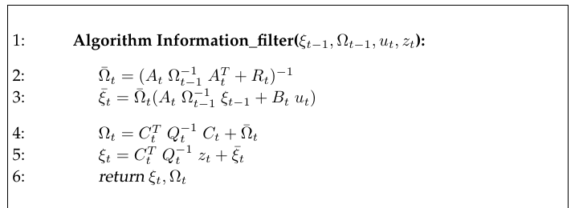

*Table 3.5 — information filter 알고리즘 (책 p.73)*

$$
\begin{aligned}
&1:\quad \textbf{Algorithm Information\_filter}(\xi_{t-1},\, \Omega_{t-1},\, u_t,\, z_t): \\[4pt]
&2:\qquad \bar\Omega_t = \left(A_t\,\Omega_{t-1}^{-1}\,A_t^T + R_t\right)^{-1} \\
&3:\qquad \bar\xi_t = \bar\Omega_t\left(A_t\,\Omega_{t-1}^{-1}\,\xi_{t-1} + B_t\,u_t\right) \\[4pt]
&4:\qquad \Omega_t = C_t^T\,Q_t^{-1}\,C_t + \bar\Omega_t \\
&5:\qquad \xi_t = C_t^T\,Q_t^{-1}\,z_t + \bar\xi_t \\[4pt]
&6:\qquad \textbf{return } \xi_t,\, \Omega_t
\end{aligned}
\tag{71}
$$

전제가 되는 선형 가우시안 모델은 식 (2), (5)와 동일하다 (책 (3.80), (3.81)):

$$x_t = A_tx_{t-1} + B_tu_t + \varepsilon_t, \qquad z_t = C_tx_t + \delta_t \tag{72}$$

**여기서 $R_t$와 $Q_t$는 각각 평균 0인 노이즈 변수 $\varepsilon_t$와 $\delta_t$의 공분산이다.**

#### 단계별 설명 (생략 없이)

**두 단계 구조는 그대로**

**Kalman filter와 마찬가지로 information filter는 두 단계로 갱신된다 — prediction step과 measurement
update step.**

- **prediction step은 Table 3.5의 라인 2와 3에 구현된다. 파라미터 $\bar\xi_t$와 $\bar\Omega_t$는 제어
  $u_t$를 반영한 후, 그러나 측정 $z_t$를 반영하기 전의 $x_t$에 대한 가우시안 belief를 기술한다.**
- **후자는 라인 4와 5를 통해 이루어진다. 여기서 belief는 측정 $z_t$에 기반해 갱신된다.**

**라인 2, 3 — Prediction (어렵다)**

$$\bar\Omega_t = (A_t\Omega_{t-1}^{-1}A_t^T + R_t)^{-1}, \qquad \bar\xi_t = \bar\Omega_t(A_t\Omega_{t-1}^{-1}\xi_{t-1} + B_tu_t)$$

**역행렬이 두 번 중첩되어 있다** — 안쪽의 $\Omega_{t-1}^{-1}$과 바깥쪽의 전체 역. 이것이 IF에서
prediction이 비싼 이유다.

**라인 4, 5 — Measurement update (쉽다)**

$$\Omega_t = C_t^TQ_t^{-1}C_t + \bar\Omega_t, \qquad \xi_t = C_t^TQ_t^{-1}z_t + \bar\xi_t$$

**순수한 덧셈이다.** 역행렬도, Kalman gain도, innovation도 없다. 3.5.1절 예제 2에서 본 "그냥 더하면 끝"이
그대로 실현되었다.

### 복잡도 — 쌍대성이 드러나는 지점 (책 p.73~74)

**이 두 갱신 단계는 복잡도가 크게 다를 수 있는데, 특히 상태 공간이 많은 차원을 가질 때 그렇다.**

**Prediction step**:
- **Table 3.5에 서술된 대로 prediction step은 크기 $n\times n$인 두 행렬의 역변환을 수반한다.
  이 역변환은 대략 $O(n^{2.4})$ 시간을 요구한다.**
- **Kalman filter에서 이 갱신 단계는 가법적이며 최대 $O(n^2)$ 시간을 요구한다. 제어에 의해 변수의
  부분집합만 영향을 받거나 변수들이 서로 독립적으로 전이한다면 더 적은 시간이 걸린다.**

**Measurement update step — 역할이 뒤바뀐다**:
- **측정 갱신은 information filter에서 가법적이다. 최대 $O(n^2)$ 시간을 요구하며, 측정이 한 번에 모든
  상태 변수 중 부분집합에 대한 정보만 담는다면 훨씬 더 효율적이다.**
- **측정 갱신은 Kalman filter에서 어려운 단계다. 최악의 경우 복잡도가 $O(n^{2.4})$인 행렬 역변환을
  요구한다.**

> **이것이 Kalman filter와 information filter의 dual한 성격을 예시한다.** (책의 결론 문장)

### 쌍대성 정리표

| | Kalman filter (moments) | Information filter (canonical) |
|---|---|---|
| **Prediction** | 가법적, $O(n^2)$ — **쉬움** | 중첩 역행렬, $O(n^{2.4})$ — **어려움** |
| **Measurement update** | Kalman gain + 역행렬, $O(n^{2.4})$ — **어려움** | 가법적, $O(n^2)$ — **쉬움** |
| 무지 표현 | $\Sigma \to \infty$ (표현 곤란) | $\Omega = 0$ (간단) |
| 확신 표현 | $\Sigma \to 0$ (간단) | $\Omega \to \infty$ (표현 곤란) |

> **어느 쪽을 쓸지는 문제가 결정한다.** 측정이 아주 많고 모션이 적으면 IF가 유리하고, 그 반대면 KF가
> 유리하다. **SLAM(10~13장)에서는 랜드마크 관측이 압도적으로 많기 때문에 information 형태가 매력적이며,
> 그것이 12장 Sparse Extended Information Filter의 출발점이다.**

<!--widget:information-filter-->

### 3. 예제/실습

#### 예제 — 같은 문제를 두 필터로

3.2.2절 예제 2와 같은 설정: $\mu_{t-1}=10$, $\sigma^2_{t-1}=4$, $A=B=C=1$, $u_t=5$, $R_t=2$, $z_t=16$, $Q_t=3$.

**KF (3.2.2절에서 계산했던 것)**: $\bar\mu_t=15$, $\bar\sigma_t^2=6$, $K_t=2/3$, $\mu_t=15.667$, $\sigma_t^2=2$

**IF로 같은 계산**:

시작: $\Omega_{t-1} = 1/4 = 0.25$, $\xi_{t-1} = 0.25\times10 = 2.5$

- **라인 2**: $\bar\Omega_t = (1\cdot(1/0.25)\cdot1 + 2)^{-1} = (4+2)^{-1} = 1/6 \approx 0.1667$
- **라인 3**: $\bar\xi_t = 0.1667\times(1\cdot4\cdot2.5 + 1\cdot5) = 0.1667\times15 = 2.5$
- **라인 4**: $\Omega_t = 1\cdot(1/3)\cdot1 + 0.1667 = 0.3333+0.1667 = 0.5$
- **라인 5**: $\xi_t = 1\cdot(1/3)\cdot16 + 2.5 = 5.333+2.5 = 7.833$

**moments로 되돌리면**: $\sigma_t^2 = 1/0.5 = 2$ ✔, $\mu_t = 7.833/0.5 = 15.667$ ✔

**KF와 정확히 같은 답이 나온다.** 같은 가우시안을 다른 좌표로 계산했을 뿐이기 때문이다.

#### 연습문제

1. 위 예제에서 라인 4~5가 왜 "가법적"인지, 그리고 라인 2가 왜 그렇지 않은지를 식의 모양으로 설명하라.
2. 측정이 두 개($z_t^{(1)}, z_t^{(2)}$) 동시에 들어온다면 IF의 라인 4~5는 어떻게 확장되는가?
   KF에서는 같은 일을 어떻게 해야 하는가?

---

## 3.5.3 Mathematical Derivation of the Information Filter

### 1. 개념적 이해

**information filter의 유도는 Kalman filter의 유도와 유사하다.** 새로운 수학은 없고, **3.2.4절의 결과에
(62)~(64)의 변환을 대입하기만 하면 된다.**

### 2. 수식/유도

#### 전체 유도 과정 (먼저 한 번에)

$$\bar\mu_t = A_t\mu_{t-1} + B_tu_t, \qquad \bar\Sigma_t = A_t\Sigma_{t-1}A_t^T + R_t \tag{73}$$

$$\mu_{t-1} = \Omega_{t-1}^{-1}\xi_{t-1}, \qquad \Sigma_{t-1} = \Omega_{t-1}^{-1} \tag{74}$$

$$\bar\Omega_t = (A_t\Omega_{t-1}^{-1}A_t^T + R_t)^{-1}, \qquad \bar\xi_t = \bar\Omega_t(A_t\Omega_{t-1}^{-1}\xi_{t-1} + B_tu_t) \tag{75}$$

$$bel(x_t) = \eta\exp\left\{-\tfrac{1}{2}(z_t - C_tx_t)^TQ_t^{-1}(z_t-C_tx_t) - \tfrac{1}{2}(x_t-\bar\mu_t)^T\bar\Sigma_t^{-1}(x_t-\bar\mu_t)\right\} \tag{76}$$

$$bel(x_t) = \eta\exp\left\{-\tfrac{1}{2}x_t^TC_t^TQ_t^{-1}C_tx_t + x_t^TC_t^TQ_t^{-1}z_t - \tfrac{1}{2}x_t^T\bar\Omega_tx_t + x_t^T\bar\xi_t\right\} \tag{77}$$

$$bel(x_t) = \eta\exp\left\{-\tfrac{1}{2}x_t^T\left[C_t^TQ_t^{-1}C_t + \bar\Omega_t\right]x_t + x_t^T\left[C_t^TQ_t^{-1}z_t + \bar\xi_t\right]\right\} \tag{78}$$

$$\xi_t = C_t^TQ_t^{-1}z_t + \bar\xi_t, \qquad \Omega_t = C_t^TQ_t^{-1}C_t + \bar\Omega_t \tag{79}$$

#### 단계별 설명 (생략 없이)

**(73) Prediction의 출발점 — KF 라인 2, 3** — 책 (3.82), (3.83)

**prediction step(Table 3.5의 라인 2와 3)을 유도하기 위해, Kalman filter의 대응하는 갱신 방정식에서
시작한다.** 이는 Table 3.1 알고리즘의 라인 2, 3에서 찾을 수 있으며 독자의 편의를 위해 다시 적는다:

$$\bar\mu_t = A_t\mu_{t-1} + B_tu_t, \qquad \bar\Sigma_t = A_t\Sigma_{t-1}A_t^T + R_t$$

**(74), (75) 변환을 대입** — 책 (3.84)~(3.87)

**information filter의 prediction step은 이제 (64)의 정의에 따라 moment $\mu$와 $\Sigma$를 canonical
parameter $\xi$와 $\Omega$로 치환함으로써 곧바로 따라나온다:**

$$\mu_{t-1} = \Omega_{t-1}^{-1}\xi_{t-1}, \qquad \Sigma_{t-1} = \Omega_{t-1}^{-1}$$

**이 표현들을 (73)에 대입하면 prediction 방정식 집합을 얻는다:**

$$\bar\Omega_t = (A_t\Omega_{t-1}^{-1}A_t^T + R_t)^{-1}$$
$$\bar\xi_t = \bar\Omega_t(A_t\Omega_{t-1}^{-1}\xi_{t-1} + B_tu_t)$$

> **각 줄이 어떻게 나왔는지 (생략 없이)**
>
> - **$\bar\Omega_t$**: $\bar\Sigma_t = A_t\Sigma_{t-1}A_t^T + R_t$에 $\Sigma_{t-1} = \Omega_{t-1}^{-1}$을
>   넣으면 $\bar\Sigma_t = A_t\Omega_{t-1}^{-1}A_t^T + R_t$. 그리고 $\bar\Omega_t = \bar\Sigma_t^{-1}$
>   이므로 전체에 역을 취한다.
> - **$\bar\xi_t$**: $\bar\xi_t = \bar\Omega_t\bar\mu_t$ (정의 (63))이고,
>   $\bar\mu_t = A_t\mu_{t-1}+B_tu_t = A_t\Omega_{t-1}^{-1}\xi_{t-1} + B_tu_t$ 이므로 대입하면 된다.

**이 방정식들은 Table 3.5의 것들과 동일하다.** ✔

> **보다시피 prediction step은 잠재적으로 큰 행렬의 두 번 중첩된 역변환(two nested inversions)을
> 수반한다. 이 중첩된 역변환은 모션 갱신에 의해 적은 수의 상태 변수만 영향을 받을 때 피할 수 있는데,
> 이 주제는 이 책의 뒷부분에서 논의될 것이다.** (12장 SEIF)

**(76)~(78) Measurement update의 유도** — 책 (3.88)~(3.90)

**measurement update의 유도는 훨씬 더 간단하다.** 시각 $t$의 belief의 가우시안에서 시작하는데,
이는 식 (25)(책 (3.35))에서 제공되었고 여기 다시 적는다:

$$bel(x_t) = \eta\exp\left\{-\tfrac{1}{2}(z_t - C_tx_t)^TQ_t^{-1}(z_t-C_tx_t) - \tfrac{1}{2}(x_t-\bar\mu_t)^T\bar\Sigma_t^{-1}(x_t-\bar\mu_t)\right\}$$

**canonical form으로 표현된 가우시안에 대해 이 분포는 다음과 같이 주어진다:**

$$bel(x_t) = \eta\exp\left\{-\tfrac{1}{2}x_t^TC_t^TQ_t^{-1}C_tx_t + x_t^TC_t^TQ_t^{-1}z_t - \tfrac{1}{2}x_t^T\bar\Omega_tx_t + x_t^T\bar\xi_t\right\}$$

> **어떻게 이렇게 되는가**: 두 항 각각에 (65)→(67)에서 했던 **똑같은 전개**를 적용한 것이다.
> - 첫 항: $(z_t - C_tx_t)^TQ_t^{-1}(z_t-C_tx_t)$를 펼치면 $x_t$에 대한 이차항
>   $x_t^TC_t^TQ_t^{-1}C_tx_t$, 일차항 $2x_t^TC_t^TQ_t^{-1}z_t$, 그리고 $x_t$와 무관한 항 $z_t^TQ_t^{-1}z_t$가
>   나온다. 마지막은 $\eta$에 흡수된다.
> - 둘째 항: 정확히 (67)의 형태이므로 $-\tfrac{1}{2}x_t^T\bar\Omega_tx_t + x_t^T\bar\xi_t$가 된다.

**지수부의 항들을 재배열하면 다음으로 정리된다:**

$$bel(x_t) = \eta\exp\left\{-\tfrac{1}{2}x_t^T\left[C_t^TQ_t^{-1}C_t + \bar\Omega_t\right]x_t + x_t^T\left[C_t^TQ_t^{-1}z_t + \bar\xi_t\right]\right\}$$

**(79) 읽어내기** — 책 (3.91), (3.92)

**이제 대괄호 안의 항들을 모음으로써 measurement update 방정식을 읽어낼 수 있다:**

$$\xi_t = C_t^TQ_t^{-1}z_t + \bar\xi_t, \qquad \Omega_t = C_t^TQ_t^{-1}C_t + \bar\Omega_t$$

**이 방정식들은 Table 3.5의 라인 4, 5의 measurement update 방정식과 동일하다.** ✔

> **왜 "읽어낼 수 있는가"**: (68)이 canonical form의 표준 모양
> $\eta\exp\{-\tfrac{1}{2}x^T\Omega x + x^T\xi\}$였다. (78)이 정확히 그 모양이므로, **$x_t^T[\cdot]x_t$의
> 대괄호가 곧 $\Omega_t$이고 $x_t^T[\cdot]$의 대괄호가 곧 $\xi_t$다.** KF에서는 여기서 도함수를 두 번
> 계산하고 inversion lemma까지 동원해야 했는데, canonical form에서는 **모양을 대조하는 것만으로 끝난다.**
> 이것이 3.5.1절에서 "canonical parameterization이 더 우아하다"고 한 것의 실체다.

### 3. 예제/실습

#### 예제 — KF 유도와 나란히 놓기

| 단계 | KF (3.2.4절) | IF (3.5.3절) |
|---|---|---|
| Prediction | $L_t$ 분해 + 적분 소거 + inversion lemma (긴 유도) | (73)에 (74) 대입 (2줄) |
| Measurement | $J_t$ 미분 2회 + $I$ 끼워넣기 + inversion lemma | 지수 전개 후 **모양 대조** (3줄) |

**유도의 난이도조차 정확히 뒤집혀 있다** — KF는 measurement update 유도가 길고, IF는 prediction이 (계산은
비싸도) 유도는 짧다.

#### 연습문제

1. (77)의 첫 항 전개에서 $z_t^TQ_t^{-1}z_t$가 왜 $\eta$에 흡수될 수 있는지 설명하라.
2. (78)에서 $\Omega_t$를 읽어낼 때 계수 $-\tfrac{1}{2}$가 양쪽에 공통이라 사라진다. 만약 한쪽에만
   있었다면 어떻게 되는가?

---

## 3.5.4 The Extended Information Filter Algorithm

### 1. 개념적 이해

**extended information filter, 줄여서 EIF는 information filter를 비선형 경우로 확장하는데, EKF가
Kalman filter의 비선형 확장인 것과 매우 같은 방식이다.**

즉 이 절의 관계는 3.3절이 3.2절에 대해 갖는 관계와 정확히 같다.

### 2. 수식/유도

#### 알고리즘 전체 (먼저 한 번에) — 책 Table 3.6

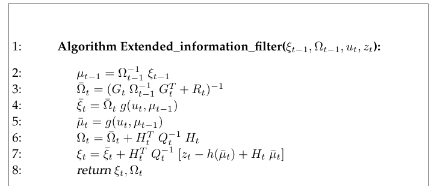

*Table 3.6 — extended information filter (EIF) 알고리즘 (책 p.76)*

$$
\begin{aligned}
&1:\quad \textbf{Algorithm Extended\_information\_filter}(\xi_{t-1},\, \Omega_{t-1},\, u_t,\, z_t): \\[4pt]
&2:\qquad \mu_{t-1} = \Omega_{t-1}^{-1}\,\xi_{t-1} \\
&3:\qquad \bar\Omega_t = \left(G_t\,\Omega_{t-1}^{-1}\,G_t^T + R_t\right)^{-1} \\
&4:\qquad \bar\xi_t = \bar\Omega_t\; g(u_t,\, \mu_{t-1}) \\[4pt]
&5:\qquad \bar\mu_t = g(u_t,\, \mu_{t-1}) \\
&6:\qquad \Omega_t = \bar\Omega_t + H_t^T\,Q_t^{-1}\,H_t \\
&7:\qquad \xi_t = \bar\xi_t + H_t^T\,Q_t^{-1}\left[z_t - h(\bar\mu_t) + H_t\,\bar\mu_t\right] \\[4pt]
&8:\qquad \textbf{return } \xi_t,\, \Omega_t
\end{aligned}
\tag{80}
$$

비선형 모델은 식 (38), (39)와 동일하다 (책 (3.93), (3.94)):

$$x_t = g(u_t, x_{t-1}) + \varepsilon_t, \qquad z_t = h(x_t) + \delta_t \tag{81}$$

#### 단계별 설명 (생략 없이)

**구조**: **prediction은 라인 2부터 4에서, measurement update는 라인 5부터 7에서 실현된다.**

**이 갱신 방정식들은 대체로 선형 information filter와 유사하며, 함수 $g$와 $h$ (그리고 그들의 Jacobian
$G_t$와 $H_t$)가 선형 모델의 파라미터 $A_t$, $B_t$, $C_t$를 대체한다.**

**라인 2 — 상태 복원이라는 골칫거리**

> **불행히도 $g$와 $h$는 둘 다 상태를 입력으로 요구한다. 이는 canonical parameter로부터 상태 추정값
> $\mu$를 복원할 것을 강제한다.**

**복원은 라인 2에서 일어나며, 여기서 상태 $\mu_{t-1}$이 $\Omega_{t-1}$과 $\xi_{t-1}$로부터 명백한 방식으로
계산된다.**

$$\mu_{t-1} = \Omega_{t-1}^{-1}\xi_{t-1}$$

**라인 5 — 예측 상태 복원**

**라인 5는 EKF에서 익숙한 방정식(Table 3.3의 라인 2)을 사용해 상태 $\bar\mu_t$를 계산한다.**

$$\bar\mu_t = g(u_t, \mu_{t-1})$$

> **책이 지적하는 근본적 긴장**: **상태 추정값을 복원해야 한다는 필요성은, 필터를 canonical parameter로
> 표현하고자 하는 바람과 상충하는 것처럼 보인다. 우리는 로봇 매핑의 맥락에서 extended information
> filter의 사용을 논의할 때 이 주제를 다시 다룰 것이다.** (12장 SEIF)
>
> **왜 문제인가**: IF를 쓰는 이유는 $\Omega$를 들고 다니는 게 유리해서인데, 비선형이 되는 순간
> **매 스텝 $\Omega^{-1}$을 계산해야 한다** — 즉 IF의 장점이 상당 부분 상쇄된다. 12장은 $\Omega$가
> 희소(sparse)하다는 성질을 이용해 이 복원을 근사적으로 싸게 하는 방법을 다룬다.

**라인 3, 4 — Prediction**

$$\bar\Omega_t = (G_t\Omega_{t-1}^{-1}G_t^T + R_t)^{-1}, \qquad \bar\xi_t = \bar\Omega_t\,g(u_t,\mu_{t-1})$$

식 (75)와 비교하면 **$A_t \to G_t$로 바뀌고, $A_t\Omega_{t-1}^{-1}\xi_{t-1} + B_tu_t$ 자리에
$g(u_t,\mu_{t-1})$이 들어간 것**이다. (평균을 다루는 곳은 비선형 함수를 직접 쓴다는 3.3.3절의 패턴 그대로.)

**라인 6, 7 — Measurement update**

$$\Omega_t = \bar\Omega_t + H_t^TQ_t^{-1}H_t, \qquad \xi_t = \bar\xi_t + H_t^TQ_t^{-1}\left[z_t - h(\bar\mu_t) + H_t\bar\mu_t\right]$$

라인 6은 식 (79)에서 $C_t \to H_t$로 바꾼 것뿐이다. **라인 7의 대괄호가 눈여겨볼 부분** —
선형일 때 $z_t$였던 자리에 $z_t - h(\bar\mu_t) + H_t\bar\mu_t$가 들어왔다. 다음 절에서 이것이 어디서
나오는지 본다.

---

## 3.5.5 Mathematical Derivation of the Extended Information Filter

### 1. 개념적 이해

**extended information filter는 위에서 extended Kalman filter로 이어졌던 것과 본질적으로 동일한 선형화를
수행함으로써 쉽게 유도된다.**

### 2. 수식/유도

#### 전체 유도 과정 (먼저 한 번에)

$$g(u_t, x_{t-1}) \approx g(u_t, \mu_{t-1}) + G_t(x_{t-1}-\mu_{t-1}), \qquad h(x_t) \approx h(\bar\mu_t) + H_t(x_t - \bar\mu_t) \tag{82}$$

$$G_t = g'(u_t, \mu_{t-1}), \qquad H_t = h'(\bar\mu_t) \tag{83}$$

$$\bar\Sigma_t = G_t\Sigma_{t-1}G_t^T + R_t, \qquad \bar\mu_t = g(u_t,\mu_{t-1}) \tag{84}$$

$$\bar\Omega_t = (G_t\Omega_{t-1}^{-1}G_t^T + R_t)^{-1}, \qquad \bar\xi_t = \bar\Omega_t\, g\!\left(u_t,\, \Omega_{t-1}^{-1}\xi_{t-1}\right) \tag{85}$$

$$
\begin{aligned}
bel(x_t) = \eta\exp\Big\{&-\tfrac{1}{2}\left(z_t - h(\bar\mu_t) - H_t(x_t-\bar\mu_t)\right)^TQ_t^{-1}\left(z_t - h(\bar\mu_t) - H_t(x_t-\bar\mu_t)\right) \\
&-\tfrac{1}{2}(x_t-\bar\mu_t)^T\bar\Sigma_t^{-1}(x_t-\bar\mu_t)\Big\}
\end{aligned}
\tag{86}
$$

$$
\begin{aligned}
bel(x_t) = \eta\exp\Big\{&-\tfrac{1}{2}x_t^T\left[H_t^TQ_t^{-1}H_t + \bar\Sigma_t^{-1}\right]x_t \\
&+ x_t^T\left[H_t^TQ_t^{-1}\left(z_t - h(\bar\mu_t) + H_t\bar\mu_t\right) + \bar\Sigma_t^{-1}\bar\mu_t\right]\Big\}
\end{aligned}
\tag{87}
$$

$$
\begin{aligned}
bel(x_t) = \eta\exp\Big\{&-\tfrac{1}{2}x_t^T\left[H_t^TQ_t^{-1}H_t + \bar\Omega_t\right]x_t \\
&+ x_t^T\left[H_t^TQ_t^{-1}\left(z_t - h(\bar\mu_t) + H_t\bar\mu_t\right) + \bar\xi_t\right]\Big\}
\end{aligned}
\tag{88}
$$

$$\Omega_t = \bar\Omega_t + H_t^TQ_t^{-1}H_t, \qquad \xi_t = \bar\xi_t + H_t^TQ_t^{-1}\left[z_t - h(\bar\mu_t) + H_t\bar\mu_t\right] \tag{89}$$

#### 단계별 설명 (생략 없이)

**(82), (83) 선형화 — EKF와 동일** — 책 (3.95)~(3.98)

**식 (41)과 (43)(책 (3.51), (3.53))에서처럼, extended information filter는 $g$와 $h$를 테일러 전개로
근사한다:**

$$g(u_t, x_{t-1}) \approx g(u_t, \mu_{t-1}) + G_t(x_{t-1}-\mu_{t-1})$$
$$h(x_t) \approx h(\bar\mu_t) + H_t(x_t - \bar\mu_t)$$

**여기서 $G_t$와 $H_t$는 각각 $\mu_{t-1}$과 $\bar\mu_t$에서의 $g$와 $h$의 Jacobian이다:**

$$G_t = g'(u_t, \mu_{t-1}), \qquad H_t = h'(\bar\mu_t)$$

**이 정의들은 EKF의 것들과 동등하다.**

**(84), (85) Prediction 유도** — 책 (3.99)~(3.102)

**prediction step은 이제 EKF 알고리즘(Table 3.3)의 라인 2와 3으로부터 유도되는데, 여기 다시 적는다:**

$$\bar\Sigma_t = G_t\Sigma_{t-1}G_t^T + R_t, \qquad \bar\mu_t = g(u_t,\mu_{t-1})$$

**$\Sigma_{t-1}$을 $\Omega_{t-1}^{-1}$로, $\bar\mu_t$를 $\bar\Omega_t^{-1}\bar\xi_t$로 치환하면
extended information filter의 prediction 방정식을 얻는다:**

$$\bar\Omega_t = (G_t\Omega_{t-1}^{-1}G_t^T + R_t)^{-1}, \qquad \bar\xi_t = \bar\Omega_t\,g(u_t, \Omega_{t-1}^{-1}\xi_{t-1})$$

> $\bar\xi_t = \bar\Omega_t\bar\mu_t$ 이고 $\bar\mu_t = g(u_t,\mu_{t-1})$, 그리고
> $\mu_{t-1} = \Omega_{t-1}^{-1}\xi_{t-1}$을 안쪽에 넣으면 위 형태가 된다. **Table 3.6의 라인 2~4가
> 정확히 이것이다** — 라인 2가 안쪽 $\Omega_{t-1}^{-1}\xi_{t-1}$을 따로 계산해두는 것.

**(86) Measurement update의 출발점** — 책 (3.103)

**measurement update는 식 (50)과 (51)(책 (3.60), (3.61))로부터 유도된다. 특히 (51)이 다음 가우시안
posterior를 정의한다:**

$$
\begin{aligned}
bel(x_t) = \eta\exp\Big\{&-\tfrac{1}{2}\left(z_t - h(\bar\mu_t) - H_t(x_t-\bar\mu_t)\right)^TQ_t^{-1}(\cdots) \\
&-\tfrac{1}{2}(x_t-\bar\mu_t)^T\bar\Sigma_t^{-1}(x_t-\bar\mu_t)\Big\}
\end{aligned}
$$

**(87) 지수 전개와 항 재배열** — 책 (3.104)

**지수부를 전개하고 항들을 재배열하면 posterior에 대한 다음 표현을 얻는다:**

$$
\begin{aligned}
bel(x_t) = \eta\exp\Big\{&-\tfrac{1}{2}x_t^T\left[H_t^TQ_t^{-1}H_t + \bar\Sigma_t^{-1}\right]x_t \\
&+ x_t^T\left[H_t^TQ_t^{-1}\left(z_t - h(\bar\mu_t) + H_t\bar\mu_t\right) + \bar\Sigma_t^{-1}\bar\mu_t\right]\Big\}
\end{aligned}
$$

> **라인 7의 대괄호가 어디서 나오는가 (핵심)**
>
> 첫 항의 괄호 안을 $x_t$에 대해 정리해보자:
> $$z_t - h(\bar\mu_t) - H_t(x_t - \bar\mu_t) = \underbrace{\big(z_t - h(\bar\mu_t) + H_t\bar\mu_t\big)}_{\text{$x_t$와 무관}} - H_tx_t$$
> **즉 $x_t$와 무관한 부분을 한 덩어리로 묶으면, 이것이 선형 IF에서 $z_t$가 하던 역할을 그대로 한다.**
> 선형 경우 $h(x_t) = C_tx_t$이므로 $h(\bar\mu_t) = C_t\bar\mu_t$, $H_t = C_t$가 되어
> $z_t - C_t\bar\mu_t + C_t\bar\mu_t = z_t$ — **정확히 (79)로 환원된다.** ✔
>
> 이 묶음을 $\tilde z_t := z_t - h(\bar\mu_t) + H_t\bar\mu_t$라 부르면, EIF의 measurement update는
> **"선형 IF에서 $z_t \to \tilde z_t$, $C_t \to H_t$로 바꾼 것"** 이 전부다.

**(88) $\bar\Sigma_t^{-1} = \bar\Omega_t$ 대입** — 책 (3.105)

**$\bar\Sigma_t^{-1} = \bar\Omega_t$를 사용하면 이 표현은 다음 information form으로 정리된다:**

$$
\begin{aligned}
bel(x_t) = \eta\exp\Big\{&-\tfrac{1}{2}x_t^T\left[H_t^TQ_t^{-1}H_t + \bar\Omega_t\right]x_t \\
&+ x_t^T\left[H_t^TQ_t^{-1}\left(z_t - h(\bar\mu_t) + H_t\bar\mu_t\right) + \bar\xi_t\right]\Big\}
\end{aligned}
$$

($\bar\Sigma_t^{-1}\bar\mu_t = \bar\Omega_t\bar\mu_t = \bar\xi_t$ — 정의 (63) 그대로.)

**(89) 읽어내기** — 책 (3.106), (3.107)

**이제 대괄호 안의 항들을 모음으로써 measurement update 방정식을 읽어낼 수 있다:**

$$\Omega_t = \bar\Omega_t + H_t^TQ_t^{-1}H_t$$
$$\xi_t = \bar\xi_t + H_t^TQ_t^{-1}\left[z_t - h(\bar\mu_t) + H_t\bar\mu_t\right]$$

**Table 3.6의 라인 6, 7과 정확히 일치한다.** ✔

### 3. 예제/실습

#### 예제 — 네 필터 한눈에

| | 선형 | 비선형 |
|---|---|---|
| **Moments** ($\mu,\Sigma$) | KF (Table 3.1) | EKF (Table 3.3), UKF (Table 3.4) |
| **Canonical** ($\xi,\Omega$) | IF (Table 3.5) | EIF (Table 3.6) |

**세로 이동 = 파라미터화 바꾸기 ((62)~(64) 대입), 가로 이동 = 선형화 ((82) 테일러 전개).**
3장 전체가 이 2×2 표를 채우는 과정이었다.

#### 연습문제

1. $h$가 선형($h(x)=C_tx$)일 때 (89)의 $\xi_t$ 식이 (79)로 환원됨을 직접 대입해 보여라.
2. EIF 라인 2의 $\Omega_{t-1}^{-1}$ 계산 비용은 얼마인가? 이것이 IF를 쓰는 동기와 어떻게 충돌하는가?
3. UKF에 대응하는 "unscented information filter"를 만든다면 어느 라인이 문제가 되겠는가?
   (힌트: sigma point를 뽑으려면 $\Sigma$가 필요하다.)

---

## 3.5.6 Practical Considerations

### 1. 개념적 이해

**로보틱스 문제에 적용될 때, information filter는 Kalman filter에 비해 여러 장점을 갖는다.**
장점 세 가지와 그것을 상쇄하는 한계, 그리고 그 한계를 벗어나는 조건까지 차례로 본다.

### 장점 ① — 전역 불확실성을 표현하기 쉽다

**예를 들어 information filter에서는 전역 불확실성(global uncertainty)을 표현하는 것이 간단하다 —
그냥 $\Omega = 0$으로 두면 된다. 모멘트를 사용할 때 그런 전역 불확실성은 무한대 크기의 공분산에
해당한다.**

> **이는 센서 측정이 모든 상태 변수의 진부분집합(strict subset)에 대한 정보를 담을 때 특히 문제가
> 되는데, 이런 상황은 로보틱스에서 자주 마주친다. EKF에서 그런 상황을 다루려면 특별한 조치가
> 필요하다.**

**information filter는 이 책에서 나중에 논의되는 많은 응용에서 Kalman filter보다 수치적으로 더
안정적(numerically more stable)인 경향이 있다.**

> **연결**: 3.2.1절 가정 3에서 "초기 belief가 정규분포여야 한다"고 했고, "완전한 무지(uniform)는
> 엄밀히는 KF의 가정을 만족하지 않으며 $\Sigma_0$를 아주 크게 잡아 흉내낼 뿐"이라고 했다.
> **IF는 이 문제를 깔끔하게 푼다** — $\Omega = 0$은 무한대가 아니라 그냥 0이므로 수치적으로 아무
> 문제가 없다. 반대급부도 분명하다: **완전한 확신($\Sigma=0$)은 $\Omega\to\infty$가 되어 IF에서
> 표현하기 어렵다.**

### 장점 ② — 정보를 즉시 확률로 풀지 않고 누적할 수 있다

**이 책의 뒷장들에서 보게 되듯, information filter와 그 여러 확장은 로봇이 정보를 즉시 확률로
해소(resolve)하지 않고도 통합할 수 있게 해준다.**

**이는 수백 개 혹은 수백만 개의 변수를 수반하는 복잡한 추정 문제에서 큰 이점이 될 수 있다.**

> **그런 큰 문제에서 Kalman filter식 통합은 심각한 계산 문제를 유발하는데, 새로운 정보 조각 하나하나가
> 거대한 변수 시스템 전체를 통과하며 전파되어야 하기 때문이다. information filter는 적절한 수정을
> 거치면, 새 정보를 시스템에 국소적으로(locally) 더하기만 함으로써 이 문제를 우회할 수 있다.**

**단, 이는 여기서 논의한 단순한 information filter가 아직 갖고 있는 성질은 아니다. 이 필터는
12장에서 확장한다.**

### 장점 ③ — 다중 로봇 문제에 자연스럽게 맞는다

**Kalman filter 대비 information filter의 또 다른 장점은 다중 로봇(multi-robot) 문제에 자연스럽게
들어맞는다는 데서 나온다.**

**다중 로봇 문제는 흔히 분산적으로(decentrally) 수집된 센서 데이터의 통합을 수반한다. 그런 통합은
보통 Bayes rule을 통해 수행된다.**

> **로그 형태로 표현하면 Bayes rule은 덧셈이 된다. 앞서 말했듯 information filter의 canonical
> parameter는 확률을 로그 형태로 표현한다. 따라서 정보 통합은 여러 로봇으로부터의 정보를 합산함으로써
> 달성된다.**
>
> **덧셈은 교환법칙이 성립한다(commutative). 이 때문에 information filter는 흔히 임의의 순서로,
> 임의의 지연을 두고, 완전히 분산된 방식으로 정보를 통합할 수 있다.**

**moments parameterization을 사용해도 같은 일이 가능하지만 — 결국 같은 정보를 표현하므로 —
그렇게 하기 위한 필요 오버헤드가 훨씬 크다.**

**이런 장점에도 불구하고 다중 로봇 시스템에서 information filter의 사용은 대체로 아직 충분히 탐구되지
않았다. 다중 로봇 주제는 12장에서 다시 다룬다.**

> **왜 "로그 형태"인가**: 식 (69) $-\log p(x) = \text{const.} + \frac{1}{2}x^T\Omega x - x^T\xi$를
> 다시 보자. 곱셈이던 Bayes rule($bel = \eta\, p(z|x)\,\overline{bel}$)이 로그를 취하면 덧셈이 되고,
> canonical parameter는 바로 그 로그 표현의 계수다. 그래서 식 (79)의 measurement update가
> **$\Omega_t = \bar\Omega_t + C_t^TQ_t^{-1}C_t$ 라는 순수한 덧셈**이었던 것이다. 덧셈이니 순서를
> 바꿔도 되고(교환법칙), 그래서 로봇 A의 정보를 먼저 받든 B의 정보를 먼저 받든 결과가 같다.

### 한계 — 상태 복원과 행렬 역변환

**information filter의 이런 장점들은 중요한 한계들에 의해 상쇄된다.**

> **extended information filter의 주된 단점은, 비선형 시스템에 적용될 때 갱신 단계에서 상태 추정값을
> 복원해야 할 필요성이다. 이 단계는 여기 서술된 대로 구현하면 information matrix의 역변환을 요구한다.
> information filter의 prediction step에도 추가적인 행렬 역변환이 요구된다.**

**많은 로보틱스 문제에서 EKF는 비슷한 크기의 행렬 역변환을 수반하지 않는다. 고차원 상태 공간에 대해
information filter는 일반적으로 Kalman filter보다 계산적으로 열등하다고 여겨진다.**

> **실제로 이것이 EKF가 extended information filter보다 훨씬 더 인기 있었던 이유 중 하나다.**

(3.5.4절 라인 2에서 이미 짚었던 긴장이 여기서 명시적으로 결론지어진다.)

### 탈출구 — information matrix의 희소 구조

**이 책의 뒷부분에서 보게 되듯, 이런 한계들이 information matrix가 구조(structure)를 갖는 문제에는
반드시 적용되지는 않는다.**

> **많은 로보틱스 문제에서 상태 변수들의 상호작용은 국소적(local)이며, 그 결과 information matrix가
> 희소(sparse)할 수 있다. 그런 희소성이 공분산의 희소성으로 이어지지는 않는다.**

이 마지막 문장이 결정적이다 — **$\Omega$가 희소해도 $\Sigma = \Omega^{-1}$은 조밀(dense)하다.**
즉 같은 belief를 두 좌표계로 보면 한쪽에서만 희소 구조가 드러난다.

**information filter는 그래프(graph)로 생각할 수 있는데, information matrix의 대응하는 비대각 원소가
0이 아닐 때마다 상태들이 연결된다. 희소한 information matrix는 희소한 그래프에 대응하며, 실제로 그런
그래프는 흔히 Gaussian Markov random field로 알려져 있다.**

**loopy belief propagation 같은 이름으로 그런 field에 대해 기본 갱신 및 추정 방정식을 효율적으로
수행하는 알고리즘들이 쏟아져 나와 있다.**

**이 책에서 우리는 information matrix가 (근사적으로) 희소한 매핑 문제를 만나게 되며, Kalman filter와
비희소 information filter 양쪽보다 훨씬 더 효율적인 extended information filter를 개발할 것이다.**
(12장 Sparse Extended Information Filter)

### 3. 예제/실습

#### 예제 — 왜 $\Omega$는 희소한데 $\Sigma$는 조밀한가

로봇 1대와 랜드마크 2개가 있는 아주 작은 SLAM을 생각하자. 로봇은 랜드마크 1과 2를 각각 관측했지만,
**두 랜드마크는 서로 직접적인 관계가 없다.**

**information matrix $\Omega$**: 로봇–랜드마크1, 로봇–랜드마크2 자리에는 0이 아닌 값이 들어가지만,
**랜드마크1–랜드마크2 자리는 0이다** (직접 상호작용이 없으므로). → 희소

$$\Omega = \begin{pmatrix} \bullet & \bullet & \bullet \\ \bullet & \bullet & 0 \\ \bullet & 0 & \bullet \end{pmatrix}$$

**공분산 $\Sigma = \Omega^{-1}$**: 두 랜드마크는 **로봇을 경유해 간접적으로 상관된다** — 로봇 위치가
틀리면 두 랜드마크 추정이 같은 방향으로 함께 틀리기 때문이다. 그래서 랜드마크1–랜드마크2 자리에도
0이 아닌 값이 생긴다. → 조밀

$$\Sigma = \begin{pmatrix} \bullet & \bullet & \bullet \\ \bullet & \bullet & \bullet \\ \bullet & \bullet & \bullet \end{pmatrix}$$

**"희소성이 공분산의 희소성으로 이어지지 않는다"의 실체가 이것이다.** 그리고 이것이 12장에서 SEIF가
EKF SLAM보다 극적으로 빨라지는 이유이기도 하다 — 랜드마크가 1,000개면 $\Sigma$는 100만 개 원소가
전부 채워지지만, $\Omega$는 대부분이 0이다.

#### 연습문제

1. 로봇 3대가 각자 측정한 정보를 통합한다고 하자. IF에서 통합 순서를 바꿔도 결과가 같은 이유를
   식 (79)로 설명하라. KF에서 같은 일을 하려면 무엇이 필요한가?
2. $\Omega = 0$인 상태에서 measurement update(식 (79))를 한 번 적용하면 $\Omega$는 어떻게 되는가?
   이때 $\mu = \Omega^{-1}\xi$를 계산할 수 있게 되는 조건은?

---

# 3.6 Summary (책 p.79~81)

**이 절에서 우리는 posterior를 다변량 가우시안으로 표현하는 효율적인 Bayes filter 알고리즘들을
소개했다.** 책이 정리한 항목을 그대로 옮기고, 각 항목이 우리 노트의 어느 부분이었는지 표시한다.

**● 가우시안은 두 가지 서로 다른 방식으로 표현될 수 있다** — moments parameterization과 canonical
parameterization. **moments parameterization은 가우시안의 평균(1차 모멘트)과 공분산(2차 모멘트)으로
구성된다. canonical, 또는 natural parameterization은 information matrix와 information vector로
구성된다. 두 파라미터화는 서로 dual이며, 각각은 행렬 역변환을 통해 다른 쪽으로부터 복원될 수 있다.**
→ 3.1절, 3.5.1절 식 (62)~(64)

**● Bayes filter는 두 파라미터화 모두에 대해 구현될 수 있다. moments parameterization을 사용할 때
결과 필터를 Kalman filter라 한다. Kalman filter의 dual이 information filter이며, 이는 posterior를
canonical parameterization으로 표현한다. 제어에 기반해 Kalman filter를 갱신하는 것은 계산적으로
단순한 반면 측정을 반영하는 것은 더 어렵다. information filter에서는 정반대인데, 측정을 반영하는 것은
단순하지만 제어에 기반해 필터를 갱신하는 것은 어렵다.**
→ 3.5.2절 쌍대성 정리표

**● 두 필터가 올바른 posterior를 계산하려면 세 가지 가정이 충족되어야 한다. 첫째, 초기 belief가
가우시안이어야 한다. 둘째, state transition probability가 인자에 대해 선형인 함수에 독립적인 가우시안
노이즈가 더해진 것으로 구성되어야 한다. 셋째, 같은 것이 measurement probability에도 적용된다. 이 역시
인자에 대해 선형이고 가우시안 노이즈가 더해져야 한다. 이 가정들을 만족하는 시스템을 linear Gaussian
system이라 한다.**
→ 3.2.1절 식 (2)~(7)

**● 두 필터 모두 비선형 문제로 확장될 수 있다. 이 장에서 기술한 한 기법은 비선형 함수에 대한 접선을
계산한다. 접선은 선형이므로 필터를 적용 가능하게 만든다. 접선을 찾는 기법을 Taylor expansion이라 한다.
Taylor expansion을 수행하는 것은 목표 함수의 1차 도함수를 계산하고 그것을 특정 점에서 평가하는 것을
수반한다. 이 연산의 결과가 Jacobian으로 알려진 행렬이다. 그 결과 필터들을 'extended'라 부른다.**
→ 3.3.2절, 3.5.5절

**● unscented Kalman filter는 unscented transform이라 불리는 다른 선형화 기법을 사용한다. 이는
선형화될 함수를 선택된 점들에서 탐색(probe)하고 그 탐색 결과에 기반해 선형화된 근사를 계산한다.
이 필터는 어떤 Jacobian도 필요 없이 구현될 수 있으며, 따라서 흔히 derivative-free라 불린다.
unscented Kalman filter는 선형 시스템에 대해서는 Kalman filter와 동등하지만 비선형 시스템에 대해서는
종종 개선된 추정을 제공한다. 이 필터의 계산 복잡도는 extended Kalman filter와 동일하다.**
→ 3.4절

**● Taylor 급수 전개와 unscented transform의 정확도는 두 요인에 의존한다: 시스템의 비선형성의 정도와
posterior의 폭. extended filter는 시스템의 상태가 비교적 높은 정확도로 알려져 잔여 공분산이 작을 때
좋은 결과를 내는 경향이 있다. 불확실성이 클수록 선형화가 도입하는 오차가 높아진다.**
→ 3.3.5절 Figure 3.5, 3.6

**● Gaussian filter의 주된 장점 중 하나는 계산적인 것이다: 갱신이 상태 공간의 차원에 대해 다항 시간을
요구한다. 이는 다음 장에서 기술하는 일부 기법에는 해당되지 않는다. 주된 단점은 unimodal 가우시안
분포에 갇혀 있다는 것이다.**
→ 3.1절, 4장 예고

**● multimodal posterior로의 가우시안 확장은 multi-hypothesis Kalman filter로 알려져 있다. 이 필터는
posterior를 가우시안의 혼합으로 표현하는데, 이는 가우시안의 가중합에 다름 아니다. 이 필터를 갱신하는
메커니즘은 개별 가우시안을 분할(splitting)하고 융합(fusing) 또는 가지치기(pruning)하는 장치를 요구한다.
multi-hypothesis Kalman filter는 이산 데이터 연관(discrete data association)이 있는 문제에 특히 잘
맞으며, 이는 로보틱스에서 흔히 발생한다.**
→ 3.3.5절 식 (55), 7.6절 예고

**● 다변량 가우시안 체제 안에서 두 필터, Kalman filter와 information filter는 직교하는(orthogonal)
강점과 약점을 갖는다. 그러나 Kalman filter와 그 비선형 확장인 extended Kalman filter가 information
filter보다 훨씬 더 인기 있다.**

**이 장의 자료 선택은 오늘날 로보틱스에서 가장 인기 있는 기법들에 기반한다. 개별 필터들의 다양한 한계와
결점을 다루는 Gaussian filter의 변형과 확장이 엄청나게 많이 존재한다.**

**이 책의 상당수 알고리즘이 Gaussian filter에 기반한다. 많은 실용적 로보틱스 문제는 posterior의 희소
구조나 분해(factorization)를 활용하는 확장을 요구한다.**

---

# 3.7 Bibliographical Remarks (책 p.81)

핵심 출처만 정리한다.

- **Kalman filter는 Swerling (1958)과 Kalman (1960)에 의해 발명되었다.** 보통 **최소제곱 가정 하의
  최적 추정기(optimal estimator)** 로 소개되며, posterior 분포를 계산하는 방법으로는 덜 자주 소개된다 —
  **다만 적절한 가정 하에서 두 관점은 동일하다.**
- 교과서: **Maybeck (1990)**, **Jazwinsky (1970)**. 데이터 연관을 포함한 현대적 취급은
  **Bar-Shalom and Fortmann (1988)**, **Bar-Shalom and Li (1998)**.
- **Inversion lemma는 Golub and Loan (1986)에서 찾을 수 있다.** (우리 노트 3.2.4절 Table 3.2)
- **행렬 역변환은 Coppersmith and Winograd (1990)에 따르면 $O(n^{2.376})$ 시간에 수행될 수 있다.**
  이는 variable elimination algorithm의 $O(n^3)$ 복잡도를 개선한 일련의 논문 중 가장 최근 결과이며,
  그 계열은 **Strassen (1969)** 의 $O(n^{2.807})$ 알고리즘에서 시작되었다.
  → 3.2.2절에서 말한 "$O(n^{2.4})$"의 출처가 이것이다.
- **정보이론 개관은 Cover and Thomas (1991)** (이산 시스템 중심).
- **unscented Kalman filter는 Julier and Uhlmann (1997)에 기인한다.** 다양한 상태 추정 문제 맥락에서
  UKF와 EKF의 비교는 **van der Merwe (2004)** 에 있다.
- **Minka (2001)** 은 가우시안 혼합에 대한 moments matching과 assumed density filtering의 최근 취급을
  제공한다.

---

# 3.8 Exercises (책 p.81~84)

책의 연습문제 6개를 옮기고, 각 문제가 노트의 어느 절과 연결되는지 표시한다.

### 문제 1 — 선형 동역학 자동차에 대한 Kalman filter 설계 (→ 3.2.1, 3.2.2절)

이 문제와 다음 문제에서는 단순한 동적 시스템에 대한 Kalman filter를 설계한다: **선형 환경에서 선형
동역학으로 움직이는 자동차.** 단순화를 위해 $\Delta t = 1$로 가정한다. 시각 $t$에서 자동차의 위치는
$x_t$, 속도는 $\dot x_t$, 가속도는 $\ddot x_t$다. **가속도는 매 시점 평균 0, 공분산 $\sigma^2 = 1$인
가우시안에 따라 무작위로 설정된다고 하자.**

**(a)** Kalman filter를 위한 **최소 상태 벡터**는 무엇인가 (그 결과 시스템이 Markov가 되도록)?
**(b)** 그 상태 벡터에 대해 state transition probability $p(x_t \mid u_t, x_{t-1})$를 설계하라.
*힌트: 이 전이 함수는 선형 행렬 $A$, $B$와 노이즈 공분산 $R$을 가질 것이다* (식 (4)와 Table 3.1 참조).
**(c)** Kalman filter의 state prediction step을 구현하라. 시각 $t=0$에서 $x_0 = \dot x_0 = \ddot x_0 = 0$을
안다고 가정하고, $t = 1,2,\ldots,5$에 대한 상태 분포를 계산하라.
**(d)** 각 $t$ 값에 대해 $x$와 $\dot x$에 대한 joint posterior를 다이어그램에 그려라 ($x$가 가로축,
$\dot x$가 세로축). 각 posterior에 대해 **uncertainty ellipse** — 평균으로부터 1 표준편차 떨어진 점들의
타원 — 를 그려라. *힌트: 수학 라이브러리가 없다면 공분산 행렬의 고유값(eigenvalue)을 분석해 타원을
만들 수 있다.*
**(e)** $t \uparrow \infty$일 때 $x_t$와 $\dot x_t$ 사이의 상관(correlation)에는 무슨 일이 일어나는가?

> 이 문제는 3.2.2절 예제 1(등속 직선 운동 로봇을 행렬로 쓰기)의 확장이다. (a)의 답은 2.3.1절 예제 2에서
> 다룬 complete state 개념과 직결된다.

### 문제 2 — 측정 추가 (→ 3.2.2절)

이제 Kalman filter에 측정을 추가한다. 시각 $t$에 $x$에 대한 노이즈 섞인 관측을 받을 수 있다고 하자.
기댓값으로는 센서가 참 위치를 측정한다. 그러나 이 측정은 **공분산 $\sigma^2 = 10$인 가우시안 노이즈로
오염**되어 있다.

**(a)** measurement model을 정의하라. *힌트: 행렬 $C$와 또 다른 행렬 $Q$를 정의해야 한다*
(식 (6)과 Table 3.1 참조).
**(b)** measurement update를 구현하라. 시각 $t=5$에 측정 $z=5$를 관측했다고 하자. KF 갱신 **전과 후**의
가우시안 추정 파라미터를 서술하라. 측정을 반영하기 전과 후의 uncertainty ellipse를 그려라.

### 문제 3 — 변환을 이용한 prediction step 재유도 (→ 3.2.4절 Part 1)

3.2.4절에서 우리는 KF의 prediction step을 유도했다. 이 단계는 흔히 **Z 변환이나 Fourier 변환**으로,
**합성곱 정리(Convolution Theorem)** 를 사용해 유도된다. 변환을 사용해 prediction step을 재유도하라.

> *주의(책의 명시): 이 문제는 변환과 합성곱에 대한 지식을 요구하며, 이는 이 책의 내용을 넘어선다.*
>
> 왜 합성곱인가: 식 (9)의 prediction $\int p(x_t|x_{t-1},u_t)\,bel(x_{t-1})\,dx_{t-1}$은 형태상
> **두 분포의 합성곱**이다. 그리고 "가우시안 두 개의 합성곱은 다시 가우시안이고 분산이 더해진다"는
> 사실이 라인 3의 $+R_t$를 곧바로 설명한다.

### 문제 4 — EKF 선형화가 얼마나 나쁜지 직접 확인하기 (→ 3.3.5절)

**본문에서 우리는 EKF 선형화가 근사임을 언급했다. 이 근사가 얼마나 나쁜지 보기 위해 예제를 풀어보라.**

평면 환경에서 동작하는 모바일 로봇이 있다고 하자. 그 상태는 $x$-$y$ 위치와 전역 방위 $\theta$다.
**$x$와 $y$는 높은 확신으로 알지만 방위 $\theta$는 모른다고 하자.** 이는 다음 초기 추정으로 반영된다:

$$\mu = \begin{pmatrix} 0 \\ 0 \\ 0 \end{pmatrix}, \qquad \Sigma = \begin{pmatrix} 0.01 & 0 & 0 \\ 0 & 0.01 & 0 \\ 0 & 0 & 10000 \end{pmatrix}$$

**(a)** 로봇이 $d = 1$ 단위 전진한 후의 로봇 pose에 대한 posterior를 **직관적으로(graphically)** 그려라.
이 문제에서는 로봇이 노이즈 없이 완벽하게 움직인다고 가정한다. 따라서 이동 후 기대 위치는:

$$\begin{pmatrix} x' \\ y' \\ \theta' \end{pmatrix} = \begin{pmatrix} x + \cos\theta \\ y + \sin\theta \\ \theta \end{pmatrix}$$

그림에서는 $\theta$를 무시하고 $x$-$y$ 좌표의 posterior만 그려도 된다.

**(b)** 이제 이 이동을 EKF의 prediction step으로 발전시켜라. 이를 위해 state transition function을
정의하고 선형화해야 한다. 그런 다음 선형화된 모델을 사용해 로봇 pose의 새로운 가우시안 추정을 생성하라.
각 단계의 정확한 수학적 방정식을 제시하고, 결과 가우시안을 서술하라.
**(c)** 그 가우시안의 uncertainty ellipse를 그리고 직관적 해와 비교하라.
**(d)** 이제 측정을 반영하라. 측정은 로봇의 $x$ 좌표의 노이즈 섞인 projection이며 공분산 $Q = 0.01$이다.
measurement model을 명시하라. 이제 측정을 **직관적 posterior에도, 표준 EKF 기계장치를 사용한 EKF
추정에도** 적용하라. EKF의 정확한 결과를 제시하고 직관적 분석 결과와 비교하라.
**(e)** 네 posterior 추정과 EKF가 생성한 가우시안의 차이를 논하라. 그 차이는 얼마나 유의미한가?
근사를 더 정확하게 만들려면 무엇을 바꿀 수 있는가? **만약 초기 방위는 알려져 있고 로봇의 $y$ 좌표를
몰랐다면 어떻게 되었겠는가?**

> **이 문제가 이 장에서 가장 중요한 연습문제다.** $\theta$의 분산이 10000이라는 것은 방위를 전혀
> 모른다는 뜻이고, 참 posterior는 **원점을 중심으로 반지름 1인 원 위에 퍼진 고리 모양**이다.
> 가우시안 하나로는 절대 표현할 수 없는 형태다. 3.3.5절의 "불확실성이 크면 선형화 오차가 커진다"가
> 극단적으로 드러나는 사례이며, 4장 particle filter가 필요한 이유를 몸으로 보여준다.

### 문제 5 — 상수 가법항 추가 (→ 3.2.1절)

**Table 3.1의 Kalman filter는 모션 모델과 측정 모델에 상수 가법항(constant additive term)이 없었다.
그런 항을 포함하도록 이 알고리즘을 확장하라.**

> 3.2.1절 (2)의 설명에서 책이 "기술적으로는 상수 가법항을 포함시킬 수도 있으나 앞으로의 내용에서
> 아무 역할도 하지 않으므로 생략한다"고 했던 바로 그 항이다.

### 문제 6 — 희소 information matrix의 존재 증명 (→ 3.5.6절)

**차원 $d$의 다변량 가우시안에서, 상관계수가 1에 $\varepsilon$만큼 가깝게 모든 $d$개 변수를 상관시키면서도
information matrix가 희소한 예를 (예시를 통해) 증명하라.** 여기서 information matrix가 **희소하다**는
것은 각 행과 각 열에서 상수 개를 제외한 모든 원소가 0임을 뜻한다.

> 3.5.6절 예제("왜 $\Omega$는 희소한데 $\Sigma$는 조밀한가")를 $d$차원으로 일반화하는 문제다.
> 힌트: 사슬 구조($x_1 - x_2 - \cdots - x_d$, 이웃끼리만 연결)를 만들어보라.

---

## 3장 정리 (3.1~3.5)

### 이 장에서 채운 2×2 표

| | 선형 | 비선형 |
|---|---|---|
| **Moments** | **KF** — Table 3.1, 유도 3.2.4 | **EKF** — Table 3.3 (Taylor 1차) / **UKF** — Table 3.4 (sigma point, 2차) |
| **Canonical** | **IF** — Table 3.5 | **EIF** — Table 3.6 |

### 세 가지 축으로 요약

**① 무엇을 들고 다니는가**
- Moments $(\mu, \Sigma)$ → "어디에, 얼마나 퍼져" / Canonical $(\xi, \Omega)$ → "얼마나 확신, 어디를 가리켜"
- 둘은 (62)~(64)로 자유롭게 오간다 (bijective mapping)

**② 비선형을 어떻게 다루는가**
- EKF/EIF: 평균에서 **미분** (Jacobian) → 테일러 1차
- UKF: 여러 점에서 **평가** (sigma point) → 테일러 2차, derivative-free

**③ 무엇이 쉽고 무엇이 어려운가 (쌍대성)**
- KF/EKF: prediction 쉬움, measurement 어려움
- IF/EIF: prediction 어려움, measurement 쉬움

### 3장 전체를 관통하는 한 문장

> **Bayes filter(Table 2.1)의 적분과 곱을, belief를 가우시안으로 제한함으로써 행렬 연산의 닫힌 형태로
> 바꾼 것이 Gaussian filter다. 비선형이면 선형화해서 지수부를 다시 이차식으로 만들고, 파라미터화를
> 바꾸면 계산의 난이도가 뒤집힌다.**

### 남는 한계 — 4장으로

3.1절에서 예고한 **unimodal 한계는 이 장의 어떤 필터로도 해결되지 않는다.** KF, EKF, UKF, IF, EIF 모두
belief를 하나의 가우시안으로 표현하므로, 로봇이 "여기 아니면 저기"라고 생각해야 하는 상황을 표현할 수
없다. 3.3.5절의 mixture of Gaussians(식 (55))가 부분적 해법이지만 근본적이지는 않다.

**4장 Nonparametric Filters**가 이 제약을 걷어낸다 — belief를 함수 형태로 가정하지 않고, histogram이나
particle 집합으로 표현한다.

## 다음 단계

- **4장 Nonparametric Filters** (책 p.85~116 = PDF p.106~137) — belief를 가우시안이라는 고정된 함수
  형태로 가정하지 않는 필터들. Histogram Filter와 Particle Filter가 이 장의 두 축이며, 3장이 끝내
  넘지 못한 **unimodal 한계**를 여기서 걷어낸다.

---

# 부록 A — 식 (4) 유도의 상세 단계 (책 (3.4))

3.2.1절의 식 (4)에 대해 책은 **결론만** 적는다 — "(3.2)를 (3.1)에 대입해서 얻어지며, 평균은
$A_t x_{t-1} + B_t u_t$, 공분산은 $R_t$다." 실무에서는 이 결론을 즉시 읽어 쓰는 것이 표준이지만,
**왜 그 대입이 정당한지**는 한 번 확인해둘 값이 있다. 이 부록은 그 유도를 생략 없이 단계로 나눈 것이다.

특히 책과 본문이 건너뛴 세 지점을 명시한다.

| 생략된 지점 | 내용 |
|---|---|
| **Step 3** | 조건화 후에도 $\varepsilon_t \sim \mathcal{N}(0, R_t)$인가 (독립 가정이 필요) |
| **Step 4** | 이항으로 문제를 $\varepsilon_t$ 쪽으로 옮기는 전환 |
| **Step 6** | 평행이동의 야코비안이 $1$이라 보정 인자가 붙지 않는다는 확인 |

## A.1 준비물과 목표

**재료 ①** — 식 (1), multivariate normal distribution의 정의:

$$p(x) = \det(2\pi\Sigma)^{-\frac{1}{2}} \exp\left\{-\tfrac{1}{2}(x-\mu)^T \Sigma^{-1} (x-\mu)\right\}$$

**재료 ②** — 식 (2), linear Gaussian state transition:

$$x_t = A_t\, x_{t-1} + B_t\, u_t + \varepsilon_t, \qquad \varepsilon_t \sim \mathcal{N}(0, R_t)$$

**구할 것**: $p(x_t \mid u_t, x_{t-1})$

## A.2 단계별 유도

**Step 0 — 무엇을 구하는지 확정한다**

$$p(x_t \mid u_t, x_{t-1})$$

- **자유변수**: $x_t$ — 밀도를 평가할 대상
- **고정**: $x_{t-1},\, u_t$ — 주어진 값

이 구분이 이후 모든 단계를 지배한다.

**Step 1 — 조건화를 식 (2)에 반영한다**

$x_{t-1}$과 $u_t$가 고정되었으므로 $A_t x_{t-1}$, $B_t u_t$, 그리고 그 합이 모두 **고정된 벡터**다.
이 합에 이름을 붙인다 (표기 축약이며, 아직 아무 주장도 하지 않는다):

$$m_t \;:=\; A_t x_{t-1} + B_t u_t \;\in\; \mathbb{R}^n$$

**Step 2 — 식 (2)를 축약한다**

$$x_t = m_t + \varepsilon_t$$

우변에서 확률적인 항은 $\varepsilon_t$ 하나뿐이다. 즉 $x_t$의 불확실성은 전부 $\varepsilon_t$에서 온다.

**Step 3 — 조건화가 $\varepsilon_t$의 분포를 바꾸지 않음을 확인한다** ← *책이 생략*

$\varepsilon_t$가 $(x_{t-1}, u_t)$와 **독립**이라고 가정했으므로:

$$\varepsilon_t \mid u_t, x_{t-1} \;\sim\; \varepsilon_t \;\sim\; \mathcal{N}(0, R_t)$$

이 확인이 없으면 다음 단계가 성립하지 않는다. 만약 $\varepsilon_t$가 $x_{t-1}$에 의존한다면
조건을 거는 순간 $\varepsilon_t$의 분포가 달라지기 때문이다.

**Step 4 — 문제를 $\varepsilon_t$의 문제로 바꾼다 (전환점)** ← *본문 인용 박스가 다루는 부분*

Step 2를 $\varepsilon_t$에 대해 이항한다:

$$\varepsilon_t = x_t - m_t$$

이 등식이 뜻하는 것은 다음과 같다.

> "$x_t$가 특정 값을 가질 밀도" $=$ "$\varepsilon_t$가 $x_t - m_t$ 값을 가질 밀도"

$x_t$의 분포는 아직 모르지만 $\varepsilon_t$의 분포는 알고 있다. 그래서 **아는 쪽으로 문제를 옮긴다.**
이것이 이 유도의 핵심 아이디어이고, 나머지는 대입과 표기 정리다.

**Step 5 — $\varepsilon_t$의 밀도를 식 (1)로 적는다**

$\varepsilon_t \sim \mathcal{N}(0, R_t)$이므로 식 (1)에 다음을 대입한다.

| (1)의 자리 | 대입 |
|---|---|
| $x$ | $\varepsilon_t$ |
| $\mu$ | $0$ |
| $\Sigma$ | $R_t$ |

$$p(\varepsilon_t) = \det(2\pi R_t)^{-\frac{1}{2}} \exp\left\{-\tfrac{1}{2}(\varepsilon_t - 0)^T R_t^{-1} (\varepsilon_t - 0)\right\} = \det(2\pi R_t)^{-\frac{1}{2}} \exp\left\{-\tfrac{1}{2}\varepsilon_t^T R_t^{-1} \varepsilon_t\right\}$$

$\mu = 0$이므로 편차항이 $\varepsilon_t$ 자체로 단순해진다.

**Step 6 — 평행이동이 밀도값을 보존함을 확인한다** ← *책이 생략*

Step 4의 대입을 정당화하는 단계다. 변수변환은 원칙적으로 야코비안 보정을 요구한다.

$$x_t = m_t + \varepsilon_t \;\;\Longrightarrow\;\; \varepsilon_t = x_t - m_t, \qquad \frac{\partial \varepsilon_t}{\partial x_t} = I, \qquad |\det I| = 1$$

야코비안이 $1$이므로 보정 인자가 붙지 않는다:

$$p(x_t \mid u_t, x_{t-1}) = p(\varepsilon_t)\big|_{\varepsilon_t = x_t - m_t} \times 1$$

즉 **$\varepsilon_t$ 자리에 $x_t - m_t$를 그대로 써넣으면 된다.** 일반적인 선형변환이 아니라
순수한 평행이동이기 때문에 이렇게 간단해진다. (일반 선형변환 $Gx$였다면 $|\det G|^{-1}$이 붙는다.)

**Step 7 — 대입한다**

Step 5의 식에서 $\varepsilon_t \to x_t - m_t$로 바꾼다:

$$p(x_t \mid u_t, x_{t-1}) = \det(2\pi R_t)^{-\frac{1}{2}} \exp\left\{-\tfrac{1}{2}(x_t - m_t)^T R_t^{-1} (x_t - m_t)\right\}$$

**Step 8 — $m_t$를 원래 식으로 풀어 쓴다**

$m_t = A_t x_{t-1} + B_t u_t$를 되돌려 넣으면 **식 (4)** 를 얻는다:

$$
\begin{aligned}
p(x_t \mid u_t, x_{t-1}) = \det(2\pi R_t)^{-\frac{1}{2}} \exp\Big\{ &-\tfrac{1}{2}(x_t - A_t x_{t-1} - B_t u_t)^T \\
&\times R_t^{-1}(x_t - A_t x_{t-1} - B_t u_t) \Big\}
\end{aligned}
$$

$m_t$로 두지 않고 풀어 쓰는 이유는, 이 밀도가 $x_{t-1}$과 $u_t$에 **어떻게** 의존하는지를
식 안에 드러내야 하기 때문이다. 그래서 식 (4)가 길어 보이는 것뿐이다.

**Step 9 — 좌변의 조건부 표기를 정당화한다**

식 (1)의 좌변은 $p(x)$이지만, 이는 파라미터 의존성을 생략한 표기이며 정확히는 $p(x;\mu,\Sigma)$다.
Step 7에서 대입한 파라미터가

$$\mu = A_t x_{t-1} + B_t u_t \quad (\leftarrow x_{t-1}, u_t \text{ 를 포함}), \qquad \Sigma = R_t$$

이므로 결과 밀도는 $x_{t-1}, u_t$에 의존한다. **그 의존성을 조건부로 옮겨 적은 것이
$p(x_t \mid u_t, x_{t-1})$의 세로 막대다.** 대입 때문에 좌변이 바뀐 것이 아니라, 식 (1)의 좌변이
원래부터 밀도였고 파라미터 의존성만 표기에 드러난 것이다.

## A.3 검산

| 항목 | 확인 |
|---|---|
| **차원** | $(x_t - A_tx_{t-1} - B_tu_t) \in \mathbb{R}^n$, $R_t^{-1} \in \mathbb{R}^{n\times n}$ → $(1{\times}n)(n{\times}n)(n{\times}1)$ = 스칼라 ✓ |
| **정규화** | $\int p(x_t \mid u_t,x_{t-1})\,dx_t = \int p(\varepsilon_t)\,d\varepsilon_t = 1$ (Step 6의 야코비안이 1이므로 적분값 보존) ✓ |
| **평균** | 지수부는 $x_t = A_tx_{t-1}+B_tu_t$에서만 $0$이고 그 밖에서 음수 → 그 점에서 밀도 최대 → 평균이자 mode ✓ |
| **공분산** | $\Sigma$ 자리에 $R_t$가 들어갔으므로 공분산은 $R_t$ ✓ |

**공분산에 $A_t$가 없는 이유**: Step 1에서 $x_{t-1}$을 상수로 고정했으므로 $A_t x_{t-1}$은 상수벡터이고,
상수는 공분산에 기여하지 않는다. $x_{t-1}$이 상수가 아니라 분포 $bel(x_{t-1}) = \mathcal{N}(\mu_{t-1},\Sigma_{t-1})$를
따르는 경우는 다르며, 그때 $A_t \Sigma_{t-1} A_t^T$ 항이 추가된다 (Bayes filter 라인 3).

$$\text{조건부 } (x_{t-1} \text{ 고정}): \;\; \mathrm{Cov} = R_t \qquad\text{vs}\qquad \text{prediction } (x_{t-1} \text{ 분포}): \;\; \overline{\Sigma}_t = A_t\Sigma_{t-1}A_t^T + R_t$$

이 구분이 3.2.4절 유도에서 가장 혼동하기 쉬운 지점이다.

## A.4 보충

### A.4.1 동등한 대안 경로

Step 4~7 대신 조건부 모멘트를 먼저 계산하고 식 (1)에 바로 대입해도 같은 결과가 나온다.

| 경로 A — 책·본문의 방식 | 경로 B — 모멘트 방식 |
|---|---|
| $\varepsilon_t$를 이항한다 | 조건부 모멘트를 계산한다 |
| $\varepsilon_t$의 밀도를 (1)로 쓴다 | $E[x_t \mid \cdot] = A_tx_{t-1}+B_tu_t$ |
| 야코비안 $=1$ 확인 | $\mathrm{Cov}[x_t \mid \cdot] = R_t$ |
| $\varepsilon_t$ 자리에 $x_t - m_t$ 대입 | 아핀변환 보존 보조정리 적용 후 (1)에 대입 |

경로 B의 모멘트 계산은 기댓값의 선형성(2장 식 (16))만으로 끝난다:

$$E[x_t \mid u_t, x_{t-1}] = A_tx_{t-1} + B_tu_t + \underbrace{E[\varepsilon_t]}_{=\,0} = A_tx_{t-1} + B_tu_t$$
$$\mathrm{Cov}[x_t \mid u_t, x_{t-1}] = \mathrm{Cov}[m_t + \varepsilon_t] = \mathrm{Cov}[\varepsilon_t] = R_t$$

그리고 아핀변환 보존 보조정리를 쓴다 — $x \sim \mathcal{N}(\mu,\Sigma)$이고 $G$가 상수행렬, $b$가 상수벡터이면

$$Gx + b \sim \mathcal{N}(G\mu + b,\; G\Sigma G^T)$$

여기서는 $G = I$, $b = m_t$인 평행이동이므로 $x_t \sim \mathcal{N}(m_t, R_t)$다.
경로 A는 $(x-\mu)$ 자리에 무엇이 들어가는지가 눈에 보이고, 경로 B는 평균·공분산이 먼저 확정된다.
결과는 동일하다.

### A.4.2 표기 주의 — $\varepsilon_t$는 분산이 아니다

식 (2)를 읽을 때 흔한 혼동이다.

| 대상 | 정체 | 식 (4)에서의 위치 |
|---|---|---|
| $A_tx_{t-1} + B_tu_t$ | 고정된 벡터 | $\mu$ 자리 (평균) |
| $R_t = \mathrm{Cov}[\varepsilon_t]$ | 고정된 행렬 | $\Sigma$ 자리 (공분산) |
| $\varepsilon_t$ | **확률변수** ($\in \mathbb{R}^n$) | 파라미터 자리에 가지 않는다 |

$\varepsilon_t$는 파라미터가 아니라 **변수 부분**에 나타난다 — 식 (4)의 편차항이 곧 $\varepsilon_t$다:

$$\underbrace{x_t - A_tx_{t-1} - B_tu_t}_{(x-\mu) \text{ 자리}} = \varepsilon_t$$

"$\varepsilon_t$가 분산"이라고 기억하면 식 (4)를 쓸 때 어디에 넣어야 할지 헷갈린다.

### A.4.3 지름길로 읽을 때의 조건

실무·문헌에서는 유도 없이 다음 패턴을 즉시 읽는다.

$$x_t = (\text{결정론적 부분}) + (\text{평균 } 0 \text{ 인 가우시안 노이즈}) \;\;\Longrightarrow\;\; \mathcal{N}(\text{결정론적 부분},\; \text{노이즈 공분산})$$

이 지름길이 성립하려면 네 조건이 필요하며, 그것이 곧 식 (2)에 담긴 가정이다.

| 조건 | 깨지면 |
|---|---|
| ① 노이즈가 **덧셈**으로 결합 | 곱셈($x_t = (A_tx_{t-1})(1+\varepsilon_t)$)이면 평균·공분산을 새로 계산해야 한다 |
| ② $E[\varepsilon_t] = 0$ | $E[\varepsilon_t] = b$면 평균이 $A_tx_{t-1}+B_tu_t+b$가 된다 |
| ③ $\varepsilon_t \perp (x_{t-1}, u_t)$ | 조건화가 $\varepsilon_t$의 분포를 바꾸므로 Step 3이 무너진다 |
| ④ $\varepsilon_t$가 Gaussian | 평균·공분산은 읽을 수 있으나 식 (1) 형태로 쓸 수 없다 |

②와 관련해, 체계적 편향은 노이즈가 아니라 결정론적 부분이 담당해야 한다. 편향 $c$가 있다면
$x_t = A_tx_{t-1} + B_tu_t + c + \varepsilon_t$로 옮겨 적고 $\varepsilon_t$를 다시 평균 $0$으로 만든다.
3.2.1절이 언급한 "상수 가법항"이 바로 이 자리이며, $E[\varepsilon_t]=0$은 **이 분업을 지켰다는 선언**이다.

### A.4.4 곁가지 — 식 (4)에 선형성은 필요하지 않다

위 조건 목록에 **선형성이 없다는 점**을 눈여겨볼 만하다. 실제로 $g$가 비선형이어도

$$x_t = g(x_{t-1}, u_t) + \varepsilon_t, \qquad \varepsilon_t \sim \mathcal{N}(0, R_t)$$

에서 $x_{t-1}, u_t$를 고정하면 $g(x_{t-1},u_t)$도 고정된 벡터이므로

$$p(x_t \mid u_t, x_{t-1}) = \mathcal{N}\big(x_t;\; g(x_{t-1},u_t),\; R_t\big)$$

가 **정확히** 성립한다 (근사가 아니다). 그러면 선형성은 어디에 필요한가?

| 대상 | 선형성 필요 여부 |
|---|---|
| 식 (4) — 조건부 밀도 | **불필요.** 비선형이어도 정확히 Gaussian |
| Bayes filter 라인 3 — prediction | **필요.** $x_{t-1}$이 분포이므로 $g$를 통과시켜야 하고, 비선형이면 결과가 Gaussian이 아니다 |

즉 **선형성이 지키는 것은 "적분 후에도 Gaussian으로 남는다"** 이며, 3.2.1절이 선형성을 가정으로
든 이유는 식 (4)를 만들기 위해서가 아니라 식 (4)를 적분한 뒤에도 Gaussian이 유지되게 하기 위해서다.
이 성질이 깨지는 지점을 다루는 것이 **3.3절 EKF**(비선형 $g$를 테일러 1차로 선형화)와
**3.4절 UKF**(sigma point로 통과)다.

## A.5 요약

| Step | 한 일 | 사용한 도구 |
|---|---|---|
| 0 | 구할 것 확정 — 자유변수 $x_t$, 고정 $x_{t-1}, u_t$ | 조건부 확률의 정의 |
| 1 | $A_tx_{t-1}+B_tu_t$가 상수벡터임을 확인, $m_t$로 명명 | 조건화 |
| 2 | 식 (2)를 $x_t = m_t + \varepsilon_t$로 축약 | — |
| 3 | 조건화 후에도 $\varepsilon_t \sim \mathcal{N}(0,R_t)$ 확인 | 독립 가정 |
| 4 | 이항 — $\varepsilon_t = x_t - m_t$. 문제를 $\varepsilon_t$ 쪽으로 옮긴다 | **핵심 전환** |
| 5 | $\varepsilon_t$의 밀도를 식 (1)로 작성 ($x{\leftarrow}\varepsilon_t$, $\mu{\leftarrow}0$, $\Sigma{\leftarrow}R_t$) | 식 (1) |
| 6 | 야코비안 $|\det I| = 1$ 확인 → 보정 없이 대입 가능 | 변수변환 공식 |
| 7 | $\varepsilon_t$ 자리에 $x_t - m_t$ 대입 | — |
| 8 | $m_t$를 풀어 써서 **식 (4)** 완성 | — |
| 9 | 파라미터가 $x_{t-1}, u_t$에 의존하므로 좌변을 조건부로 표기 | — |

핵심은 **Step 4**다. $x_t$의 분포는 모르지만 $\varepsilon_t$의 분포는 알고 있으므로, 등식을 이항해
**아는 쪽으로 문제를 옮긴 것**이 이 유도의 전부이고 나머지는 대입과 표기 정리다.

> **같은 절차가 반복되는 곳**: 식 (5)→(6)의 measurement probability도 이 부록과 완전히 동일한
> Step 0~9를 따른다. $m_t$ 자리에 $C_t x_t$, $R_t$ 자리에 $Q_t$, 자유변수 자리에 $z_t$를 넣으면 된다.
