# 4장. Nonparametric Filters

> 원문: *Probabilistic Robotics*, Chapter 4 (책 p.85~116 / PDF p.106~137)
> 이 노트는 **4장 도입부**, **4.1 The Histogram Filter**, **4.2 Binary Bayes Filters with Static State**
> (책 p.85~96)를 다룬다. 4.3 The Particle Filter는 별도로 정리한다.

---

# 4장 도입 (책 p.85~86)

## 1. 개념적 이해

3장의 Gaussian filter들은 강력했지만 하나의 제약을 끝내 벗지 못했다 — **belief가 반드시 가우시안이어야
한다**는 것. 그 대가로 3.1절에서 본 unimodal 한계를 안고 갔다.

**가우시안 기법의 인기 있는 대안이 비모수 필터(nonparametric filters)다.**

> **비모수 필터는 가우시안 같은 posterior의 고정된 함수 형태(fixed functional form)에 의존하지 않는다.
> 대신 posterior를 유한한 개수의 값으로 근사하는데, 각 값은 대략 상태 공간의 한 영역에 대응한다.**

"비모수(nonparametric)"라는 이름이 여기서 온다 — **분포의 모양을 미리 정해두는 파라미터($\mu$, $\Sigma$
같은)가 없다**는 뜻이지, 파라미터가 아예 없다는 뜻이 아니다.

### 두 가지 접근

**어떤 비모수 Bayes filter는 상태 공간의 분해(decomposition)에 의존하는데, 각 값이 상태 공간의 컴팩트한
부분영역에서 posterior 밀도의 누적 확률에 대응한다. 다른 것들은 posterior 분포로부터 뽑은 무작위
표본(random samples)으로 상태 공간을 근사한다.**

- **첫 번째** — 상태 공간을 유한한 개수의 영역으로 분해하고 posterior를 **히스토그램**으로 표현한다.
  **히스토그램은 각 영역에 하나의 누적 확률을 할당하며, 연속 밀도에 대한 조각별 상수(piecewise constant)
  근사로 생각하는 것이 가장 좋다.** → **4.1절**
- **두 번째** — posterior를 **유한한 개수의 표본**으로 표현한다. 그 결과 필터가 **particle filter**로
  알려져 있으며 **로보틱스에서 엄청나게 인기를 얻었다.** → **4.3절**

### 파라미터 개수와 근사 품질

**모든 경우에 posterior를 근사하는 데 사용되는 파라미터의 개수는 변경될 수 있다. 근사의 품질은 posterior를
표현하는 데 사용된 파라미터의 개수에 의존한다.**

> **파라미터 개수가 무한대로 가면, 비모수 기법은 — 특정한 매끄러움(smoothness) 가정 하에서 —
> 올바른 posterior로 균등하게 수렴하는 경향이 있다.**

이것이 Gaussian filter와의 근본적 차이다. **EKF는 파라미터를 아무리 늘려도 가우시안 이상이 될 수 없지만,
비모수 필터는 자원을 더 쓰면 참값에 임의로 가까워질 수 있다.**

### 왜 로보틱스에서 중요한가

**히스토그램과 particle filter 두 종류 모두 posterior 밀도에 강한 모수적 가정을 하지 않는다.
특히 이들은 복잡한 multi-modal belief를 표현하는 데 매우 적합하다.**

> **이 때문에 이들은 로봇이 전역 불확실성(global uncertainty)의 국면에 대처해야 할 때, 그리고 분리되고
> 뚜렷한 가설들을 낳는 어려운 data association 문제에 직면할 때 흔히 선택되는 방법이다.**

**그러나 이 기법들의 표현력은 추가적인 계산 복잡도라는 대가를 치른다.**

### Adaptive와 resource-adaptive

**다행히 이 장에서 기술하는 두 비모수 기법 모두 파라미터의 개수를 posterior의 (추정되는) 복잡도에 맞게
조정하는 것을 가능하게 한다.**

- **posterior가 낮은 복잡도일 때** (예: 작은 불확실성 여유를 갖고 하나의 상태에 집중되어 있을 때) —
  **적은 수의 파라미터만 사용한다.**
- **복잡한 posterior** (예: 상태 공간 전체에 흩어진 여러 mode를 갖는 posterior) — **파라미터 개수가
  더 커진다.**

**posterior를 표현하는 파라미터의 개수를 온라인으로 조정할 수 있는 기법을 adaptive라 한다.
belief 계산에 사용 가능한 계산 자원에 기반해 조정할 수 있으면 resource-adaptive라 한다.**

> **resource-adaptive 기법은 로보틱스에서 중요한 역할을 한다. 사용 가능한 계산 자원과 무관하게 로봇이
> 실시간으로 결정을 내릴 수 있게 해주기 때문이다. particle filter는 사용 가능한 계산 자원에 기반해
> 파티클 수를 온라인으로 조정함으로써 흔히 resource-adaptive 알고리즘으로 구현된다.**

## 2. 3장과의 대비

| | 3장 Gaussian Filters | 4장 Nonparametric Filters |
|---|---|---|
| belief 표현 | 고정된 함수 형태 (가우시안) | 유한 개의 값 (히스토그램 / 표본) |
| 표현 가능한 분포 | **unimodal만** | **multi-modal 가능** |
| 파라미터를 늘리면 | 가우시안에 갇힘 | 참 posterior로 수렴 |
| 계산 복잡도 | 상태 차원의 다항 시간 | 더 비쌈 (차원에 지수적일 수 있음) |
| 적합한 상황 | 추적(tracking), 불확실성이 작을 때 | 전역 불확실성, 어려운 data association |

## 3. 예제/실습

#### 예제 — 3장 연습문제 4를 다시 보기

3.8절 문제 4에서 로봇이 $x,y$는 알지만 방위 $\theta$를 전혀 모르는 상태($\sigma^2_\theta = 10000$)로
1만큼 전진하는 상황을 봤다. 참 posterior는 **원점 중심 반지름 1인 고리(ring)** 였고, 가우시안 하나로는
표현이 불가능했다.

- **히스토그램 필터**: 평면을 격자로 나누면 고리 위의 셀들에 높은 확률, 안팎에는 낮은 확률이 할당된다
  → **고리 모양이 그대로 표현된다.**
- **particle filter**: 고리 위에 파티클들이 흩뿌려진다 → **역시 표현된다.**

**이것이 4장이 존재하는 이유 전부다.**

#### 연습문제

1. "비모수(nonparametric)"라는 이름이 "파라미터가 없다"는 뜻이 아닌 이유를 설명하라.
2. 어떤 상황에서 3장의 EKF가 4장의 필터보다 여전히 나은가? (힌트: 계산 복잡도와 unimodal 여부)

---

# 4.1 The Histogram Filter (책 p.86~93)

## 개요

**히스토그램 필터는 상태 공간을 유한한 개수의 영역으로 분해하고, 각 영역에 대한 누적 posterior를
하나의 확률값으로 표현한다.**

> **유한 공간에 적용될 때 그런 필터는 discrete Bayes filter로 알려져 있고, 연속 공간에 적용될 때는
> 흔히 histogram filter라 불린다.**

즉 **같은 알고리즘의 두 이름**이며, 차이는 적용 대상이 원래 이산이냐 연속을 잘라서 이산으로 만든
것이냐뿐이다. 먼저 discrete Bayes filter를 기술하고, 그 다음 연속 상태 공간에서의 사용을 논의한다.

---

## 4.1.1 The Discrete Bayes Filter Algorithm

### 1. 개념적 이해

**Discrete Bayes filter는 유한한 상태 공간을 갖는 문제, 즉 확률변수 $X_t$가 유한한 개수의 값을 취할 수
있는 문제에 적용된다.**

> **우리는 이미 2.4.2절에서 discrete Bayes filter를 만났다** — 로봇이 문이 열려 있을 확률을 추정하는
> 예제를 논의할 때다. 2장 노트의 도어 예제 코드(`bayes_filter`)가 정확히 이 알고리즘이었다.

**이후 장들에서 논의되는 일부 로봇 매핑 문제들도 이산 확률변수를 수반한다.**

> **예를 들어 occupancy grid mapping 알고리즘은 환경의 각 위치가 점유(occupied)되어 있거나 비어(free)
> 있다고 가정한다. 대응하는 확률변수는 이진(binary)이다. 두 가지 다른 값을 취할 수 있다.**

**따라서 유한 상태 공간은 로보틱스에서 중요한 역할을 한다.** (9장 Occupancy Grid Mapping)

### 2. 수식/유도

#### 알고리즘 전체 (먼저 한 번에) — 책 Table 4.1

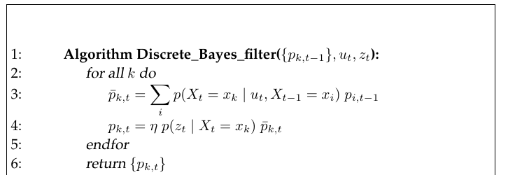

*Table 4.1 — discrete Bayes filter. 여기서 $x_i$, $x_k$는 개별 상태를 나타낸다 (책 p.87)*

$$
\begin{aligned}
&1:\quad \textbf{Algorithm Discrete\_Bayes\_filter}(\{p_{k,t-1}\},\, u_t,\, z_t): \\[4pt]
&2:\qquad \text{for all } k \text{ do} \\
&3:\qquad\quad \bar p_{k,t} = \sum_i p(X_t = x_k \mid u_t,\, X_{t-1} = x_i)\; p_{i,t-1} \\
&4:\qquad\quad p_{k,t} = \eta\; p(z_t \mid X_t = x_k)\; \bar p_{k,t} \\
&5:\qquad \text{endfor} \\[4pt]
&6:\qquad \textbf{return } \{p_{k,t}\}
\end{aligned}
\tag{1}
$$

#### 단계별 설명 (생략 없이)

**이 코드가 어디서 왔는가**

> **이 코드는 Table 2.1의 일반 Bayes filter로부터 적분을 유한합으로 대체함으로써 유도된다.**

2장 노트의 식 (26) 라인 3이 $\overline{bel}(x_t) = \int p(x_t\mid u_t,x_{t-1})\,bel(x_{t-1})\,dx_{t-1}$
였는데, $\int \to \sum_i$로 바뀐 것이 전부다. **2.4.1절에서 "Bayes filter를 실제로 계산하려면 유한
상태 공간으로 제한해 적분이 유한합이 되게 하거나, closed form으로 풀어야 한다"고 했던 두 갈래 중
전자를 택한 것이다.**

**표기**

**변수 $x_i$와 $x_k$는 개별 상태를 나타내며, 이들은 유한한 개수만 존재할 수 있다. 시각 $t$의 belief는
각 상태 $x_k$에 확률을 할당한 것이며 $p_{k,t}$로 표기한다.**

**따라서 알고리즘의 입력은 이산 확률분포 $\{p_{k,t}\}$와, 가장 최근의 제어 $u_t$ 및 측정 $z_t$다.**

**라인 3 — prediction**

$$\bar p_{k,t} = \sum_i p(X_t = x_k \mid u_t, X_{t-1} = x_i)\; p_{i,t-1}$$

**라인 3은 prediction, 즉 제어만에 기반한 새 상태에 대한 belief를 계산한다.**

> **읽는 법**: "가능한 모든 출발 상태 $x_i$에 대해, ① 거기 있었을 법한 정도 $p_{i,t-1}$와 ② 거기서
> $x_k$로 넘어올 확률을 곱해 전부 더한다." 2장 노트 라인 3의 해설과 완전히 같고, 적분이 합으로
> 바뀌었을 뿐이다.

**라인 4 — measurement update**

$$p_{k,t} = \eta\; p(z_t \mid X_t = x_k)\; \bar p_{k,t}$$

**이 prediction은 라인 4에서 측정을 반영하도록 갱신된다.**

**신호처리와의 연결**

> **discrete Bayes filter 알고리즘은 신호처리의 많은 영역에서 인기가 있으며, 거기서는 흔히 hidden
> Markov model(HMM)의 forward pass라 불린다.**

(2.3.3절에서 Figure 2.2를 두고 "이런 시간적 생성 모델을 HMM 또는 DBN이라 부른다"고 했던 것과 이어진다.)

### 3. 예제/실습

#### 예제 — 2장 도어 예제가 Table 4.1이었음을 확인

2장 노트의 코드 스니펫을 Table 4.1의 표기로 다시 읽어보자.

```python
bel_bar = [sum(P[u][xp][xt] * bel[xp] for xp in range(2)) for xt in range(2)]   # 라인 3
unnorm  = [M[z][xt] * bel_bar[xt] for xt in range(2)]                           # 라인 4 (η 전)
eta = 1.0 / sum(unnorm)
bel = [eta * v for v in unnorm]                                                 # 라인 4 (η 적용)
```

| 코드 | Table 4.1 |
|---|---|
| `xt` | $k$ (목표 상태의 인덱스) |
| `xp` | $i$ (출발 상태의 인덱스) |
| `bel[xp]` | $p_{i,t-1}$ |
| `P[u][xp][xt]` | $p(X_t=x_k \mid u_t, X_{t-1}=x_i)$ |
| `bel_bar[xt]` | $\bar p_{k,t}$ |
| `M[z][xt]` | $p(z_t \mid X_t = x_k)$ |

**상태가 2개($K=2$)인 Table 4.1을 그대로 구현한 것**이었다.

#### 연습문제

1. 상태가 $K$개일 때 라인 3의 계산량은 얼마인가? 이것이 4.1.4절에서 selective updating이 필요해지는
   이유와 어떻게 연결되는가?
2. 라인 4의 $\eta$는 어떻게 계산되는가? (2장 식 (11) 참조)

---

## 4.1.2 Continuous State

### 1. 개념적 이해

**특히 관심이 가는 것은 discrete Bayes filter를 연속 상태 공간에 대한 근사 추론 도구로 사용하는
것이다. 앞서 언급했듯 그런 필터를 histogram filter라 한다.**

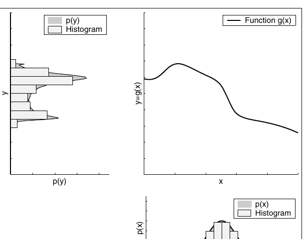

*Figure 4.1 — 연속 확률변수의 히스토그램 표현. 오른쪽 아래 그림의 회색 음영 영역은 연속 확률변수 $X$의
밀도를 보여준다. 이 밀도의 히스토그램 근사가 옅은 회색으로 겹쳐져 있다. 확률변수는 오른쪽 위 그래프에
표시된 함수를 통과한다. 그 결과 확률변수 $Y$의 밀도와 히스토그램 근사가 왼쪽 위 그래프에 그려진다.
변환된 확률변수의 히스토그램은 $X$의 각 히스토그램 bin에서 여러 점을 비선형 함수에 통과시켜 계산했다
(책 p.88)*

**Figure 4.1은 histogram filter가 확률변수와 그 비선형 변환을 어떻게 표현하는지 예시한다.** 거기 표시된
것은 **히스토그램화된 가우시안을 비선형 함수에 통과시킨 것**이다.

> **원래 가우시안 분포는 10개의 bin을 갖는다. 통과된 확률분포도 마찬가지지만, 결과 bin 중 두 개에서는
> 확률이 0에 너무 가까워 이 그림에서 볼 수 없다. Figure 4.1은 비교를 위해 올바른 연속 분포도 함께
> 보여준다.**

> **3장 Figure 3.3b·3.4·3.7과 나란히 놓고 보자.** 같은 "가우시안을 비선형 함수에 통과시키기" 문제에 대해:
> - **EKF**: 평균에서 접선을 그어 가우시안 하나로 근사 → 모양이 왜곡되면 못 따라감
> - **UKF**: sigma point 3개로 탐색 → 2차까지 정확하지만 결과는 여전히 가우시안 하나
> - **Histogram filter**: bin 10개로 통째로 옮김 → **결과가 가우시안이 아니어도 그 모양 그대로 표현**
>
> 이것이 "고정된 함수 형태에 의존하지 않는다"의 실제 모습이다.

### 2. 수식/유도

#### 전체 수식 (먼저 한 번에)

$$\mathrm{dom}(X_t) = \mathbf{x}_{1,t} \cup \mathbf{x}_{2,t} \cup \ldots \cup \mathbf{x}_{K,t} \tag{2}$$

$$p(x_t) = \frac{p_{k,t}}{|\mathbf{x}_{k,t}|} \tag{3}$$

$$\hat x_{k,t} = |\mathbf{x}_{k,t}|^{-1} \int_{\mathbf{x}_{k,t}} x_t\, dx_t \tag{4}$$

$$p(z_t \mid \mathbf{x}_{k,t}) \approx p(z_t \mid \hat x_{k,t}) \tag{5}$$

$$p(\mathbf{x}_{k,t} \mid u_t, \mathbf{x}_{i,t-1}) \approx \eta\, |\mathbf{x}_{k,t}|\, p(\hat x_{k,t} \mid u_t, \hat x_{i,t-1}) \tag{6}$$

#### 단계별 설명 (생략 없이)

**(2) 상태 공간의 분해** — 책 (4.1)

**Histogram filter는 연속 상태 공간을 유한한 개수의 bin 또는 region으로 분해한다:**

$$\mathrm{dom}(X_t) = \mathbf{x}_{1,t} \cup \mathbf{x}_{2,t} \cup \ldots \cup \mathbf{x}_{K,t}$$

**여기서 $X_t$는 시각 $t$의 로봇 상태를 기술하는 익숙한 확률변수다. 함수 $\mathrm{dom}(X_t)$는 상태 공간,
즉 $X_t$가 취할 수 있는 값들의 전체 집합을 나타낸다.**

**각 $\mathbf{x}_{k,t}$는 볼록(convex) 영역을 기술한다. 이 영역들이 함께 상태 공간의 분할(partitioning)을
형성한다.** 즉 $i \ne k$에 대해 다음이 성립한다:

$$\mathbf{x}_{i,t} \cap \mathbf{x}_{k,t} = \emptyset, \qquad \bigcup_k \mathbf{x}_{k,t} = \mathrm{dom}(X_t)$$

> **"분할(partition)"의 두 조건**: ① 서로 겹치지 않고(교집합이 공집합), ② 다 합치면 전체가 된다.
> 이는 2장 식 (8) marginalization의 근거였던 "mutually exclusive하고 합치면 전체"와 정확히 같은 조건이다.
> 그래서 각 영역의 확률을 그냥 더할 수 있는 것이다.

**격자 분해**

> **연속 상태 공간의 직접적인 분해는 다차원 격자(multi-dimensional grid)이며, 여기서 각 $\mathbf{x}_{k,t}$가
> 하나의 격자 셀이다. 분해의 입도(granularity)를 통해 우리는 정확도와 계산 효율성을 맞바꿀 수 있다.
> 세밀한 분해는 성긴 것보다 작은 근사 오차를 낳지만, 증가된 계산 복잡도라는 대가를 치른다.**

**(3) 조각별 상수 PDF** — 책 (4.2)

**앞서 논의했듯 discrete Bayes filter는 각 영역 $\mathbf{x}_{k,t}$에 확률 $p_{k,t}$를 할당한다.
각 영역 안에서 discrete Bayes filter는 belief 분포에 대한 더 이상의 정보를 갖지 않는다.**

**따라서 posterior는 조각별 상수(piecewise constant) PDF가 되며, 각 영역 $\mathbf{x}_{k,t}$ 안의 각 상태
$x_t$에 균등한 확률을 할당한다:**

$$p(x_t) = \frac{p_{k,t}}{|\mathbf{x}_{k,t}|}$$

**여기서 $|\mathbf{x}_{k,t}|$는 영역 $\mathbf{x}_{k,t}$의 부피(volume)다.**

> **왜 부피로 나누는가**: $p_{k,t}$는 **영역 전체의 누적 확률**(질량)이고, $p(x_t)$는 **한 점에서의
> 밀도**다. 2장 (4)에서 봤듯 PDF는 적분해서 1이 되어야 하므로, 질량을 부피로 나눠야 밀도가 된다.
> 부피가 넓은 영역은 같은 질량이라도 밀도가 낮다.

**(4) 대표점으로 "탐색"하기** — 책 (4.3)

**상태 공간이 진짜로 이산이라면 조건부 확률 $p(\mathbf{x}_{k,t}\mid u_t, \mathbf{x}_{i,t-1})$과
$p(z_t \mid \mathbf{x}_{k,t})$가 잘 정의되어 있고, 알고리즘은 서술된 대로 구현될 수 있다.**

**연속 상태 공간에서는 보통 밀도 $p(x_t \mid u_t, x_{t-1})$과 $p(z_t \mid x_t)$가 주어지는데, 이들은
개별 상태에 대해 정의된 것이지 상태 공간의 영역에 대해 정의된 것이 아니다.**

> **문제**: 5장과 6장이 우리에게 주는 것은 **점에 대한 밀도**인데, 히스토그램 필터가 필요로 하는 것은
> **영역에 대한 확률**이다. 이 간극을 메워야 한다.

**각 영역 $\mathbf{x}_{k,t}$가 작고 같은 크기인 경우, 이 밀도들은 보통 $\mathbf{x}_{k,t}$를 이 영역의
대표(representative)로 치환함으로써 근사된다. 예를 들어 우리는 단순히 $\mathbf{x}_{k,t}$의 평균 상태를
사용해 "탐색(probe)"할 수 있다:**

$$\hat x_{k,t} = |\mathbf{x}_{k,t}|^{-1}\int_{\mathbf{x}_{k,t}} x_t\, dx_t$$

> **"probe"라는 단어가 3.4.1절 UKF에서 sigma point를 설명할 때 쓰였던 그 단어다.** 발상이 닮았다 —
> 영역/분포 전체를 다룰 수 없으니 **대표점 몇 개를 골라 함수를 평가해본다.** 다만 UKF는 대표점의
> 결과로 다시 가우시안을 만들고, 히스토그램 필터는 각 영역의 값을 그대로 유지한다.
>
> 격자 셀이라면 $\hat x_{k,t}$는 그냥 **셀의 중심점**이다.

**(5), (6) 근사 치환** — 책 (4.4), (4.5)

**그러면 우리는 단순히 다음으로 치환한다:**

$$p(z_t \mid \mathbf{x}_{k,t}) \approx p(z_t \mid \hat x_{k,t})$$
$$p(\mathbf{x}_{k,t} \mid u_t, \mathbf{x}_{i,t-1}) \approx \eta\, |\mathbf{x}_{k,t}|\, p(\hat x_{k,t} \mid u_t, \hat x_{i,t-1})$$

> **이 근사들은 (3)에 서술된 discrete Bayes filter의 조각별 균등(piecewise uniform) 해석의 결과이며,
> EKF가 사용한 것과 유사한 Taylor 근사의 결과다.**

**왜 (6)에만 $|\mathbf{x}_{k,t}|$와 $\eta$가 붙는지**는 다음 절에서 유도한다.

### 3. 예제/실습

#### 예제 — 1차원 격자로 나눠보기

$-1 \le x \le 1$ 구간을 $K=4$개 셀로 균등 분할하면:

| $k$ | 영역 $\mathbf{x}_k$ | 부피 $\|\mathbf{x}_k\|$ | 대표점 $\hat x_k$ (중심) |
|---|---|---|---|
| 1 | $[-1, -0.5)$ | 0.5 | $-0.75$ |
| 2 | $[-0.5, 0)$ | 0.5 | $-0.25$ |
| 3 | $[0, 0.5)$ | 0.5 | $0.25$ |
| 4 | $[0.5, 1]$ | 0.5 | $0.75$ |

**분할 조건 확인**: 서로 겹치지 않고($\cap = \emptyset$), 합치면 $[-1,1]$ 전체 ✔

셀 3의 확률이 $p_3 = 0.4$라면, 식 (3)에 의해 그 셀 안 임의의 점에서의 밀도는
$p(x) = 0.4 / 0.5 = 0.8$ — **셀 안에서는 어디든 같은 값**이다. 이것이 "조각별 상수"의 의미다.

#### 연습문제

1. 셀 크기를 절반으로 줄이면($K=8$) 계산량과 근사 오차는 각각 어떻게 되는가?
2. 평면 로봇 pose $\langle x,y,\theta\rangle$를 각 축 100분할로 격자화하면 셀은 몇 개인가?
   이것이 4.1.4절의 selective updating이 필요한 이유다.

---

## 4.1.3 Mathematical Derivation of the Histogram Approximation

### 1. 개념적 이해

앞 절에서 제시한 두 근사 (5), (6)이 **왜 타당한지**를 유도한다. 핵심 도구는 두 가지뿐이다:

1. **식 (3)의 조각별 균등 가정** — 영역 안에서 밀도가 상수다
2. **대표점 근사** — 영역 안 모든 점에서 $p(z_t\mid x_t) \approx p(z_t\mid \hat x_{k,t})$

### 2. 수식/유도

#### 전체 유도 과정 (먼저 한 번에)

$$
\begin{aligned}
p(z_t \mid \mathbf{x}_{k,t})
&= \frac{p(z_t, \mathbf{x}_{k,t})}{p(\mathbf{x}_{k,t})} \\[4pt]
&= \frac{\displaystyle\int_{\mathbf{x}_{k,t}} p(z_t, x_t)\,dx_t}{\displaystyle\int_{\mathbf{x}_{k,t}} p(x_t)\,dx_t} \\[4pt]
&= \frac{\displaystyle\int_{\mathbf{x}_{k,t}} p(z_t \mid x_t)\,p(x_t)\,dx_t}{\displaystyle\int_{\mathbf{x}_{k,t}} p(x_t)\,dx_t} \\[4pt]
&\overset{(3)}{=} \frac{\displaystyle\int_{\mathbf{x}_{k,t}} p(z_t \mid x_t)\,\frac{p_{k,t}}{|\mathbf{x}_{k,t}|}\,dx_t}{\displaystyle\int_{\mathbf{x}_{k,t}} \frac{p_{k,t}}{|\mathbf{x}_{k,t}|}\,dx_t} \\[4pt]
&= \frac{\displaystyle\int_{\mathbf{x}_{k,t}} p(z_t \mid x_t)\,dx_t}{\displaystyle\int_{\mathbf{x}_{k,t}} 1\,dx_t} \\[4pt]
&= |\mathbf{x}_{k,t}|^{-1}\int_{\mathbf{x}_{k,t}} p(z_t \mid x_t)\,dx_t
\end{aligned}
\tag{7}
$$

$$
\begin{aligned}
p(z_t \mid \mathbf{x}_{k,t})
&\approx |\mathbf{x}_{k,t}|^{-1}\int_{\mathbf{x}_{k,t}} p(z_t \mid \hat x_{k,t})\,dx_t \\
&= |\mathbf{x}_{k,t}|^{-1}\, p(z_t \mid \hat x_{k,t}) \int_{\mathbf{x}_{k,t}} 1\,dx_t \\
&= |\mathbf{x}_{k,t}|^{-1}\, p(z_t \mid \hat x_{k,t})\, |\mathbf{x}_{k,t}| \\
&= p(z_t \mid \hat x_{k,t})
\end{aligned}
\tag{8}
$$

$$
\begin{aligned}
p(\mathbf{x}_{k,t} \mid u_t, \mathbf{x}_{i,t-1})
&= \frac{p(\mathbf{x}_{k,t}, \mathbf{x}_{i,t-1} \mid u_t)}{p(\mathbf{x}_{i,t-1} \mid u_t)} \\[4pt]
&= \frac{\displaystyle\int_{\mathbf{x}_{k,t}}\int_{\mathbf{x}_{i,t-1}} p(x_t, x_{t-1}\mid u_t)\,dx_t\,dx_{t-1}}{\displaystyle\int_{\mathbf{x}_{i,t-1}} p(x_{t-1}\mid u_t)\,dx_{t-1}} \\[4pt]
&= \frac{\displaystyle\int_{\mathbf{x}_{k,t}}\int_{\mathbf{x}_{i,t-1}} p(x_t \mid u_t, x_{t-1})\,p(x_{t-1}\mid u_t)\,dx_t\,dx_{t-1}}{\displaystyle\int_{\mathbf{x}_{i,t-1}} p(x_{t-1}\mid u_t)\,dx_{t-1}}
\end{aligned}
\tag{9}
$$

$$p(x_{t-1} \mid u_t) = p(x_{t-1}) \tag{10}$$

$$
\begin{aligned}
p(\mathbf{x}_{k,t} \mid u_t, \mathbf{x}_{i,t-1})
&\overset{(3)}{=} \frac{\displaystyle\int_{\mathbf{x}_{k,t}}\int_{\mathbf{x}_{i,t-1}} p(x_t \mid u_t, x_{t-1})\,dx_t\,dx_{t-1}}{\displaystyle\int_{\mathbf{x}_{i,t-1}} 1\,dx_{t-1}} \\[4pt]
&= |\mathbf{x}_{i,t-1}|^{-1}\int_{\mathbf{x}_{k,t}}\int_{\mathbf{x}_{i,t-1}} p(x_t \mid u_t, x_{t-1})\,dx_t\,dx_{t-1}
\end{aligned}
\tag{11}
$$

$$
\begin{aligned}
p(\mathbf{x}_{k,t} \mid u_t, \mathbf{x}_{i,t-1})
&\approx \eta\,|\mathbf{x}_{i,t-1}|^{-1}\int_{\mathbf{x}_{k,t}}\int_{\mathbf{x}_{i,t-1}} p(\hat x_{k,t}\mid u_t, \hat x_{i,t-1})\,dx_t\,dx_{t-1} \\
&= \eta\,|\mathbf{x}_{i,t-1}|^{-1}\, p(\hat x_{k,t}\mid u_t, \hat x_{i,t-1})\,|\mathbf{x}_{k,t}|\,|\mathbf{x}_{i,t-1}| \\
&= \eta\,|\mathbf{x}_{k,t}|\, p(\hat x_{k,t}\mid u_t, \hat x_{i,t-1})
\end{aligned}
\tag{12}
$$

#### 단계별 설명 (생략 없이)

**(7) 측정 확률을 적분으로 표현** — 책 (4.6)

**(5)가 합리적인 근사임을 보기 위해, $p(z_t\mid \mathbf{x}_{k,t})$가 다음 적분으로 표현될 수 있음에
주목한다.** 각 등호를 하나씩 짚자.

1. **$\dfrac{p(z_t,\mathbf{x}_{k,t})}{p(\mathbf{x}_{k,t})}$** — 2장 식 (6) conditional probability의 정의.
2. **분자·분모를 적분으로** — $\mathbf{x}_{k,t}$는 영역이므로, 그 영역에 속할 확률은 영역 위에서
   밀도를 적분한 것이다.
3. **$p(z_t, x_t) = p(z_t\mid x_t)p(x_t)$** — 다시 조건부 확률의 정의.
4. **(3) 대입** — $p(x_t) = p_{k,t}/|\mathbf{x}_{k,t}|$ (영역 안에서 상수).
5. **상수 약분** — 분자·분모에 똑같이 있는 $p_{k,t}/|\mathbf{x}_{k,t}|$가 적분 밖으로 나와 소거된다.
6. **$\int_{\mathbf{x}_{k,t}} 1\,dx_t = |\mathbf{x}_{k,t}|$** — 영역 위에서 1을 적분하면 그 부피.

**이 표현은 (3)의 조각별 균등 분포 모델 하에서 원하는 확률의 정확한 기술이다.**

**(8) 대표점 근사 적용** — 책 (4.7)

**이제 $x_t \in \mathbf{x}_{k,t}$에 대해 $p(z_t\mid x_t)$를 $p(z_t\mid \hat x_{k,t})$로 근사하면:**

$p(z_t\mid\hat x_{k,t})$는 **$x_t$에 의존하지 않는 상수**이므로 적분 밖으로 나오고,
$\int 1\,dx_t = |\mathbf{x}_{k,t}|$가 앞의 $|\mathbf{x}_{k,t}|^{-1}$와 상쇄된다.

**이것이 위 (5)에 서술된 근사다.** ✔

**(9) 상태 전이 확률 — 조건부 양쪽에 영역이 온다** — 책 (4.8)

**(6)의 $p(\mathbf{x}_{k,t}\mid u_t,\mathbf{x}_{i,t-1})$에 대한 근사의 유도는 조금 더 복잡한데,
조건화 막대(conditioning bar)의 양쪽에 영역이 나타나기 때문이다.**

> **이게 왜 어려운가**: (7)에서는 $\mathbf{x}_{k,t}$가 오른쪽(조건)에만 있어서 적분이 한 겹이었다.
> 여기서는 $\mathbf{x}_{k,t}$(왼쪽)와 $\mathbf{x}_{i,t-1}$(오른쪽) **둘 다 영역**이라 **이중 적분**이 된다.

위 변환과 유사하게 진행하면 (9)를 얻는다 — 조건부 확률의 정의, 영역에 대한 이중 적분, 그리고
$p(x_t,x_{t-1}\mid u_t) = p(x_t\mid u_t,x_{t-1})\,p(x_{t-1}\mid u_t)$ 분해.

**(10) Markov 가정 활용** — 책 p.91

**이제 우리는 Markov 가정을 활용하는데, 이는 $x_{t-1}$과 $u_t$ 사이의 독립을 함의하며 따라서:**

$$p(x_{t-1}\mid u_t) = p(x_{t-1})$$

> **2장 유도에서 본 그 논증이다.** 2장 노트 식 (37) 설명에서 "제어 $u_t$는 시각 $t-1$ 이후에 선택되므로,
> 무작위로 선택된다면 과거 상태 $x_{t-1}$에 대해 아무 정보도 주지 않는다"고 했다. 여기서 다시 쓰인다.

**(11) 조각별 균등 대입** — 책 (4.9)

(3)을 대입하면 분자·분모의 $p_{i,t-1}/|\mathbf{x}_{i,t-1}|$이 상쇄되고, 분모는
$\int_{\mathbf{x}_{i,t-1}} 1\,dx_{t-1} = |\mathbf{x}_{i,t-1}|$가 된다.

**(12) 대표점 근사와 $\eta$의 등장** — 책 (4.10)

**이제 앞서처럼 $p(x_t\mid u_t,x_{t-1})$를 $p(\hat x_{k,t}\mid u_t,\hat x_{i,t-1})$로 근사하면 다음
근사를 얻는다.**

> **주목: 근사가 유효한 확률분포가 되도록 보장하기 위해 정규화자 $\eta$가 필요해진다.** (책의 명시)

이중 적분에서 $\int_{\mathbf{x}_{k,t}}\int_{\mathbf{x}_{i,t-1}} 1\,dx_t\,dx_{t-1} =
|\mathbf{x}_{k,t}|\,|\mathbf{x}_{i,t-1}|$이므로, $|\mathbf{x}_{i,t-1}|$이 앞의 $|\mathbf{x}_{i,t-1}|^{-1}$과
상쇄되고 **$|\mathbf{x}_{k,t}|$만 남는다.**

$$p(\mathbf{x}_{k,t}\mid u_t,\mathbf{x}_{i,t-1}) \approx \eta\,|\mathbf{x}_{k,t}|\,p(\hat x_{k,t}\mid u_t,\hat x_{i,t-1})$$

**이것이 (6)이다.** ✔

**(7)과 대비되는 점**: (8)에서는 부피가 완전히 상쇄되어 깔끔했는데, (12)에서는 **$|\mathbf{x}_{k,t}|$가
살아남는다.** 영역이 조건부 양쪽에 있어서 상쇄가 한쪽만 일어나기 때문이다.

### 모든 영역이 같은 크기라면 — Table 4.1로의 환원

> **모든 영역이 같은 크기라면(즉 $|\mathbf{x}_{k,t}|$가 모든 $k$에 대해 같다면), 우리는 단순히
> $|\mathbf{x}_{k,t}|$ 인자를 생략할 수 있다 — 정규화자에 흡수되기 때문이다. 그 결과인 discrete Bayes
> filter는 Table 4.1에 개괄된 알고리즘과 동등하다.**

**중요한 단서 하나** (책 p.91):

> **거기 서술된 대로 구현하면, 보조 파라미터 $\bar p_k$는 확률분포를 구성하지 않는데, 정규화되지 않았기
> 때문이다 (라인 3을 (12)와 비교하라). 그러나 정규화는 라인 4에서 일어나므로, 출력 파라미터는 실제로
> 유효한 확률분포다.**

즉 **Table 4.1 라인 3의 결과 $\bar p_{k,t}$는 합이 1이 아닐 수 있지만, 라인 4의 $\eta$가 최종적으로
바로잡는다.** (2장 3.2절 예제 3에서 "왜 라인 4의 곱이 확률이 아닌가"를 다룬 것과 같은 종류의 이야기다.)

### 3. 예제/실습

#### 예제 — 부피가 상쇄되는지 직접 세어보기

| | 앞에 붙은 인자 | 적분에서 나온 부피 | 남는 것 |
|---|---|---|---|
| (8) 측정 | $\|\mathbf{x}_{k,t}\|^{-1}$ | $\|\mathbf{x}_{k,t}\|$ | **없음** → $p(z_t\mid\hat x_{k,t})$ |
| (12) 전이 | $\|\mathbf{x}_{i,t-1}\|^{-1}$ | $\|\mathbf{x}_{k,t}\|\cdot\|\mathbf{x}_{i,t-1}\|$ | $\|\mathbf{x}_{k,t}\|$ |

#### 연습문제

1. 격자 셀이 균등하지 않은 경우(예: density tree, 4.1.4절) 식 (6)의 $|\mathbf{x}_{k,t}|$를 생략하면
   어떤 오류가 생기는가?
2. (10)에서 Markov 가정을 쓸 수 없다면(제어가 상태에 의존해 선택된다면) 유도의 어느 부분이 무너지는가?

---

## 4.1.4 Decomposition Techniques

### 1. 개념적 이해

**로보틱스에서 연속 상태 공간의 분해 기법은 두 가지 기본 유형으로 나뉜다: 정적(static)과 동적(dynamic).**

> - **정적 기법은 근사되는 posterior의 모양과 무관하게 미리 선택된 고정 분해에 의존한다.**
> - **동적 기법은 분해를 posterior 분포의 구체적인 모양에 맞게 조정한다.**
>
> **정적 기법은 보통 구현하기 더 쉽지만 계산 자원 면에서 낭비적일 수 있다.**

### Density tree — 동적 분해의 대표

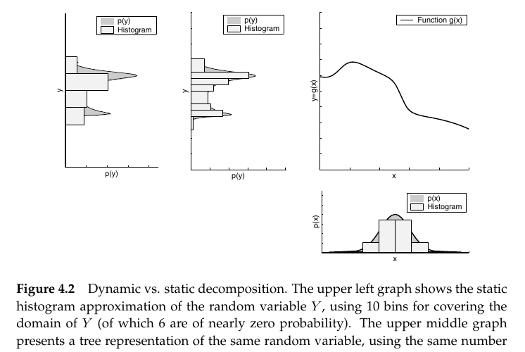

*Figure 4.2 — 동적 대 정적 분해. 왼쪽 위 그래프는 확률변수 $Y$의 정적 히스토그램 근사를 보여주며,
$Y$의 정의역을 덮는 데 10개의 bin을 사용한다(그중 6개는 확률이 거의 0이다). 가운데 위 그래프는 같은
확률변수의 트리 표현을 같은 개수의 bin으로 제시한다 (책 p.92)*

**동적 분해 기법의 주된 예가 density tree 계열이다.**

> **Density tree는 posterior 확률질량에 해상도를 맞추는 방식으로 상태 공간을 재귀적으로 분해한다.
> 이 분해의 직관은 분해의 상세 수준이 posterior 확률의 함수라는 것이다 — 영역의 확률이 낮을수록
> 분해가 성기다.**

**Figure 4.2는 정적 격자 표현과 density tree 표현의 차이를 예시한다. 더 컴팩트한 표현 덕분에 density
tree는 같은 개수의 bin으로 더 높은 근사 품질을 달성한다.**

> **density tree 같은 동적 기법은 흔히 정적 기법 대비 계산 복잡도를 몇 자릿수(orders of magnitude)나
> 줄일 수 있지만, 추가적인 구현 노력을 요구한다.**

**Figure 4.2 읽는 법**: 정적 히스토그램은 **10개 bin 중 6개가 거의 확률 0** — 즉 자원의 60%를 낭비하고
있다. 트리 표현은 같은 10개를 **확률이 몰린 곳에 집중 배치**한다.

### Selective updating — 갱신할 셀만 고르기

**동적 분해와 유사한 효과가 selective updating으로 달성될 수 있다.**

> **격자로 표현된 posterior를 갱신할 때, selective 기법은 모든 격자 셀 중 일부만 갱신한다. 이 아이디어의
> 흔한 구현은 posterior 확률이 사용자 지정 임계값을 넘는 격자 셀만 갱신한다.**

**Selective updating은 하이브리드 분해로 볼 수 있는데, 상태 공간을 세밀한 격자와, selective update
절차가 선택하지 않은 모든 영역을 담는 하나의 큰 집합으로 분해하는 것이다.**

> **이런 관점에서 이는 동적 분해 기법으로 생각할 수 있는데, 갱신 중 어느 격자 셀을 고려할지에 대한
> 결정이 posterior 분포의 모양에 기반해 온라인으로 이루어지기 때문이다.**

**Selective updating 기법은 belief 갱신에 수반되는 계산 노력을 몇 자릿수나 줄일 수 있다. 이는 3차원
이상의 공간에서 격자 분해를 사용하는 것을 가능하게 한다.**

> **왜 3차원부터 문제인가**: 4.1.2절 연습문제 2에서 봤듯 평면 로봇 pose $\langle x,y,\theta\rangle$를
> 각 축 100분할하면 $100^3 = 10^6$개 셀이다. 매 스텝 라인 3의 이중 루프를 돌면 $10^{12}$번 연산 —
> 불가능하다. **selective updating은 확률이 유의미한 소수의 셀만 갱신해 이를 감당 가능하게 만든다.**
> 8.2.3절 Computational Considerations에서 다시 다룬다.

### Topological vs. metric 표현

**모바일 로보틱스 문헌은 흔히 공간의 위상적(topological) 표현과 거리적(metric) 표현을 구분한다.**

> **이 용어들에 대한 명확한 정의는 존재하지 않지만**, 대체로:
>
> - **topological 표현**은 흔히 **성긴 그래프 같은 표현**으로 생각되며, **그래프의 노드가 환경의 유의미한
>   장소(또는 특징)에 대응한다.** 실내 환경이라면 그런 장소는 **교차로, T자 분기점, 막다른 길** 등에
>   대응할 수 있다. **따라서 그런 분해의 해상도는 환경의 구조에 의존한다.**
> - 대안으로 **규칙적으로 배치된 격자**로 상태 공간을 분해할 수 있다. **그런 분해는 환경 특징의 모양과
>   위치에 의존하지 않는다. 격자 표현은 흔히 metric으로 생각되지만, 엄밀히 말하면 metric인 것은
>   내장 공간(embedding space)이지 분해가 아니다.**

**모바일 로보틱스에서 격자 표현의 공간 해상도는 topological 표현의 그것보다 높은 경향이 있다.
예를 들어 7장의 일부 예제는 셀 크기가 10센티미터 이하인 격자 분해를 사용한다. 이 증가된 정확도는
증가된 계산 비용이라는 대가를 치른다.**

<!--widget:histogram-filter-->

### 2. 정리표

| 기법 | 유형 | 장점 | 단점 |
|---|---|---|---|
| 균등 격자 | 정적 | 구현 단순 | 확률 0인 영역에도 자원 낭비 |
| Density tree | 동적 | 같은 bin 수로 더 높은 정확도, 복잡도 대폭 감소 | 구현 노력 증가 |
| Selective updating | 하이브리드/동적 | 갱신 비용 대폭 감소, 3D 이상 가능 | 임계값 아래로 떨어진 가설을 놓칠 위험 |
| Topological | 정적(환경 의존) | 매우 컴팩트 | 해상도 낮음, 환경 구조에 의존 |

### 3. 예제/실습

#### 예제 — Selective updating의 위험

로봇이 두 후보 위치 A(확률 0.97)와 B(확률 0.03)를 갖고 있고, 임계값이 0.05라 하자.

- B는 임계값 미만이라 **갱신에서 제외**된다.
- 이후 센서 데이터가 실제로는 B를 지지하는 방향으로 들어와도, **B는 갱신되지 않으므로 결코 되살아나지
  못한다.**

**이것이 selective updating의 근본 위험이다** — 계산은 아끼지만 **가설을 영구히 잃을 수 있다.**
8.3.5절 Random Particle MCL(실패로부터의 복구)이 particle filter에서 같은 문제를 다루는 방식이다.

#### 연습문제

1. Figure 4.2에서 정적 히스토그램의 10개 bin 중 6개가 거의 0이라면, 실질적으로 몇 개의 bin이 일하고
   있는가? density tree가 같은 10개로 얻는 이득을 그 관점에서 설명하라.
2. Topological 표현으로 "복도 중간의 정확한 위치"를 표현할 수 있는가? 어떤 문제에서 topological이
   충분하고 어떤 문제에서 metric이 필요한가?

---

# 4.2 Binary Bayes Filters with Static State (책 p.94~96)

## 1. 개념적 이해

**로보틱스의 어떤 문제들은 시간에 따라 변하지 않는 이진 상태(binary state)를 갖는 추정 문제로 정식화하는
것이 가장 좋다. 그런 문제들은 binary Bayes filter로 다뤄진다.**

**이런 유형의 문제는 로봇이 일련의 센서 측정으로부터 환경의 고정된 이진 양(fixed binary quantity)을
추정할 때 발생한다.**

- **예를 들어 로봇은 문이 열려 있는지 닫혀 있는지 알고 싶을 수 있다** — 센싱하는 동안 문 상태가 변하지
  않는 맥락에서.
- **정적 상태를 갖는 binary Bayes filter의 또 다른 예는 occupancy grid map이며, 이는 9장에서 만난다.**

> **2장의 도어 예제와 무엇이 다른가**: 2장에서는 로봇이 `push`로 **문 상태를 바꿀 수 있었다.** 여기서는
> **상태가 절대 변하지 않는다.** 그래서 제어 $u_t$가 아예 등장하지 않고, prediction 단계도 없다 —
> **measurement update만 무한히 반복된다.**

### 왜 log odds인가

**상태가 정적일 때 belief는 측정만의 함수가 된다.**

**이런 유형의 이진 추정 문제는 당연히 Table 4.1의 discrete Bayes filter를 사용해 다룰 수 있다.
그러나 belief는 흔히 log odds ratio로 구현된다.**

> **log odds는 $-\infty$부터 $\infty$까지의 값을 취한다. log odds 표현으로 belief를 갱신하는 Bayes
> filter는 계산적으로 우아하다. 이는 0이나 1에 가까운 확률에 대해 발생하는 절단(truncation) 문제를
> 피한다.**

**왜 절단 문제가 생기나**: 확률을 0~1로 저장하면, 확신이 커질수록 값이 $0.9999999\ldots$처럼 되어
부동소수점 정밀도가 바닥난다. **log odds로 두면 그 영역이 $+\infty$ 방향으로 시원하게 펼쳐진다.**

### Inverse measurement model

**이 binary Bayes filter는 익숙한 forward model $p(z_t\mid x)$ 대신 inverse measurement model
$p(x\mid z_t)$를 사용한다. inverse measurement model은 측정 $z_t$의 함수로서 (이진) 상태 변수에 대한
분포를 명시한다.**

> **inverse model은 측정이 이진 상태보다 더 복잡한 상황에서 흔히 사용된다.**
>
> **그런 상황의 예가 카메라 이미지로부터 문이 닫혀 있는지 여부를 추정하는 문제다. 여기서 상태는 극도로
> 단순하지만 모든 측정의 공간은 거대하다. 카메라 이미지로부터 문이 닫혀 있을 확률을 계산하는 함수를
> 고안하는 것이, 닫힌 문을 보여주는 모든 카메라 이미지에 대한 분포를 기술하는 것보다 쉽다.
> 다시 말해, forward sensor model보다 inverse를 구현하는 것이 더 쉽다.**

이 대비를 확실히 잡아두자.

| | forward model $p(z\mid x)$ | inverse model $p(x\mid z)$ |
|---|---|---|
| 묻는 것 | "문이 닫혔을 때 **이 이미지가 나올** 확률은?" | "이 이미지를 봤을 때 **문이 닫혔을** 확률은?" |
| 난이도 | 모든 가능한 이미지에 대한 분포를 기술해야 함 — **매우 어려움** | 이미지 하나를 입력받아 확률 하나 출력 — **분류기 하나면 됨** |
| 쓰는 곳 | 3장까지의 모든 필터, 6장 | 4.2절, 9.3절 |

## 2. 수식/유도

### 알고리즘과 전체 유도 (먼저 한 번에) — 책 Table 4.2

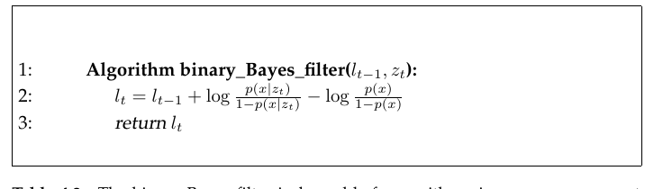

*Table 4.2 — inverse measurement model을 갖는 log odds 형태의 binary Bayes filter. 여기서 $l_t$는
시간에 따라 변하지 않는 이진 상태 변수에 대한 posterior belief의 log odds다 (책 p.94)*

$$
\begin{aligned}
&1:\quad \textbf{Algorithm binary\_Bayes\_filter}(l_{t-1},\, z_t): \\[4pt]
&2:\qquad l_t = l_{t-1} + \log\frac{p(x\mid z_t)}{1-p(x\mid z_t)} - \log\frac{p(x)}{1-p(x)} \\[4pt]
&3:\qquad \textbf{return } l_t
\end{aligned}
\tag{13}
$$

$$bel_t(x) = p(x \mid z_{1:t}, u_{1:t}) = p(x \mid z_{1:t}) \tag{14}$$

$$\frac{p(x)}{p(\neg x)} = \frac{p(x)}{1-p(x)} \tag{15}$$

$$l(x) := \log\frac{p(x)}{1-p(x)} \tag{16}$$

$$bel_t(x) = 1 - \frac{1}{1+\exp\{l_t\}} \tag{17}$$

$$p(x\mid z_{1:t}) = \frac{p(z_t\mid x, z_{1:t-1})\,p(x\mid z_{1:t-1})}{p(z_t\mid z_{1:t-1})} = \frac{p(z_t\mid x)\,p(x\mid z_{1:t-1})}{p(z_t\mid z_{1:t-1})} \tag{18}$$

$$p(z_t\mid x) = \frac{p(x\mid z_t)\,p(z_t)}{p(x)} \tag{19}$$

$$p(x\mid z_{1:t}) = \frac{p(x\mid z_t)\,p(z_t)\,p(x\mid z_{1:t-1})}{p(x)\,p(z_t\mid z_{1:t-1})} \tag{20}$$

$$p(\neg x\mid z_{1:t}) = \frac{p(\neg x\mid z_t)\,p(z_t)\,p(\neg x\mid z_{1:t-1})}{p(\neg x)\,p(z_t\mid z_{1:t-1})} \tag{21}$$

$$
\begin{aligned}
\frac{p(x\mid z_{1:t})}{p(\neg x\mid z_{1:t})}
&= \frac{p(x\mid z_t)}{p(\neg x\mid z_t)}\cdot\frac{p(x\mid z_{1:t-1})}{p(\neg x\mid z_{1:t-1})}\cdot\frac{p(\neg x)}{p(x)} \\[4pt]
&= \frac{p(x\mid z_t)}{1-p(x\mid z_t)}\cdot\frac{p(x\mid z_{1:t-1})}{1-p(x\mid z_{1:t-1})}\cdot\frac{1-p(x)}{p(x)}
\end{aligned}
\tag{22}
$$

$$
\begin{aligned}
l_t(x) &= \log\frac{p(x\mid z_t)}{1-p(x\mid z_t)} + \log\frac{p(x\mid z_{1:t-1})}{1-p(x\mid z_{1:t-1})} + \log\frac{1-p(x)}{p(x)} \\[4pt]
&= \log\frac{p(x\mid z_t)}{1-p(x\mid z_t)} - \log\frac{p(x)}{1-p(x)} + l_{t-1}(x)
\end{aligned}
\tag{23}
$$

$$l_0(x) = \log\frac{p(x)}{1-p(x)} \tag{24}$$

### 단계별 설명 (생략 없이)

**(14) 정적 상태에서의 belief** — 책 (4.11)

**상태가 정적일 때 belief는 측정만의 함수다:**

$$bel_t(x) = p(x\mid z_{1:t}, u_{1:t}) = p(x\mid z_{1:t})$$

**여기서 상태는 $x$와 $\neg x$로 표기되는 두 가지 가능한 값 중에서 선택된다. 특히
$bel_t(\neg x) = 1 - bel_t(x)$다.**

> **상태 $x$에 시간 인덱스가 없다는 점이 상태가 변하지 않는다는 사실을 반영한다.** (책의 명시)
>
> 2장 식 (24) $bel(x_t) = p(x_t\mid z_{1:t},u_{1:t})$와 비교하면 차이가 명확하다 — $x_t$의 아래첨자
> $t$가 사라졌고, 조건에서 $u_{1:t}$도 빠졌다.

**(15), (16) Odds와 log odds** — 책 (4.12), (4.13)

**상태 $x$의 odds는 이 사건의 확률을 그 부정의 확률로 나눈 비율로 정의된다:**

$$\frac{p(x)}{p(\neg x)} = \frac{p(x)}{1-p(x)}$$

**log odds는 이 표현의 로그다:**

$$l(x) := \log\frac{p(x)}{1-p(x)}$$

> **Odds란 (개념부터)**
>
> 확률이 "전체 중 몇"이라면, odds는 "**반대편 대비 몇 배**"다. 확률 0.75는 odds $0.75/0.25 = 3$ —
> "3대 1"이라는 말이 이것이다. 경마나 스포츠 배당에서 쓰는 그 odds가 맞다.
>
> **범위 대응**:
>
> | 확률 $p$ | odds | log odds $l$ |
> |---|---|---|
> | 0 | 0 | $-\infty$ |
> | 0.25 | 1/3 | $-1.10$ |
> | 0.5 | 1 | **0** |
> | 0.75 | 3 | $+1.10$ |
> | 0.99 | 99 | $+4.60$ |
> | 1 | $\infty$ | $+\infty$ |
>
> **$p=0.5$(모름)가 $l=0$에 대응한다**는 점이 편리하다. 그리고 확률 축에서 좁게 뭉쳐 있던
> $0.99, 0.999, 0.9999$가 log odds에서는 $4.6, 6.9, 9.2$로 시원하게 벌어진다 — 이것이 "절단 문제를
> 피한다"는 말의 의미다.

**(13) 알고리즘 — 덧셈이 전부다** — 책 Table 4.2

**Table 4.2가 기본 갱신 알고리즘을 서술한다.**

> **이 알고리즘은 가법적(additive)이다. 실제로 측정에 반응해 변수를 증가시키고 감소시키는 어떤
> 알고리즘이든 log odds 형태의 Bayes filter로 해석될 수 있다.**

이 문장이 인상적이다 — **"센서가 뭔가 보면 카운터를 올리고 아니면 내린다"는 소박한 휴리스틱조차,
log odds 관점에서는 정당한 Bayes filter다.**

**(17) belief 복원** — 책 (4.14)

**독자가 log odds의 정의 (16)으로부터 쉽게 확인하듯, belief $bel_t(x)$는 log odds ratio $l_t$로부터
다음 식에 의해 복원될 수 있다:**

$$bel_t(x) = 1 - \frac{1}{1+\exp\{l_t\}}$$

> **유도 확인**: $l = \log\dfrac{p}{1-p}$에서 $e^l = \dfrac{p}{1-p}$, 따라서 $p = \dfrac{e^l}{1+e^l}$.
> 그리고 $\dfrac{e^l}{1+e^l} = \dfrac{1+e^l-1}{1+e^l} = 1 - \dfrac{1}{1+e^l}$ ✔
>
> 이 함수가 바로 **로지스틱 시그모이드**다.

**(18) 정확성 검증의 시작** — 책 (4.15)

**binary Bayes filter 알고리즘의 정확성을 검증하기 위해, Bayes 정규화자를 명시한 기본 필터 방정식을
간략히 다시 적는다:**

$$p(x\mid z_{1:t}) = \frac{p(z_t\mid x, z_{1:t-1})\,p(x\mid z_{1:t-1})}{p(z_t\mid z_{1:t-1})} = \frac{p(z_t\mid x)\,p(x\mid z_{1:t-1})}{p(z_t\mid z_{1:t-1})}$$

두 번째 등호는 **conditional independence** — 상태 $x$를 알면 과거 측정은 $z_t$에 대한 정보를 주지
않는다 (2장 식 (23)).

**(19), (20) forward를 inverse로 바꾸기** — 책 (4.16), (4.17)

**이제 measurement model $p(z_t\mid x)$에 Bayes rule을 적용한다:**

$$p(z_t\mid x) = \frac{p(x\mid z_t)\,p(z_t)}{p(x)}$$

**그리고 다음을 얻는다:**

$$p(x\mid z_{1:t}) = \frac{p(x\mid z_t)\,p(z_t)\,p(x\mid z_{1:t-1})}{p(x)\,p(z_t\mid z_{1:t-1})}$$

> **여기가 이 유도의 핵심이다.** forward model $p(z_t\mid x)$를 inverse model $p(x\mid z_t)$로 바꿔치기
> 했다. 그 대가로 $p(z_t)$와 $p(x)$가 식에 등장했는데, 둘 다 계산하기 곤란한 양이다. **다음 단계에서
> 이들이 전부 소거된다.**

**(21) 반대 사건에 대해서도 똑같이** — 책 (4.18)

**유추에 의해, 반대 사건 $\neg x$에 대해 (21)을 얻는다.**

**(22) 나누기 — 어려운 항들이 소거된다** — 책 (4.19)

**(20)을 (21)로 나누면 계산하기 어려운 여러 확률들이 소거된다:**

$$\frac{p(x\mid z_{1:t})}{p(\neg x\mid z_{1:t})} = \frac{p(x\mid z_t)}{p(\neg x\mid z_t)}\cdot\frac{p(x\mid z_{1:t-1})}{p(\neg x\mid z_{1:t-1})}\cdot\frac{p(\neg x)}{p(x)}$$

> **무엇이 소거되었는가**: $p(z_t)$와 $p(z_t\mid z_{1:t-1})$ — **둘 다 "이 측정값이 나올 확률"이라는,
> 실제로 계산할 방법이 없는 양들이다.** 분자와 분모에 똑같이 있으므로 나누는 순간 사라진다.
>
> **이것이 odds를 쓰는 진짜 이유다.** 확률 자체로 다루면 이 항들을 어떻게든 정규화로 처리해야 하지만,
> **비율로 다루면 저절로 없어진다.**

$p(\neg x) = 1-p(x)$를 적용하면 두 번째 줄이 된다.

**(23) 로그를 취하면 덧셈** — 책 (4.20)

**belief $bel_t(x)$의 log odds ratio를 $l_t(x)$로 표기한다. 시각 $t$의 log odds belief는 (22)의
로그로 주어진다:**

$$l_t(x) = \log\frac{p(x\mid z_t)}{1-p(x\mid z_t)} + \log\frac{p(x\mid z_{1:t-1})}{1-p(x\mid z_{1:t-1})} + \log\frac{1-p(x)}{p(x)}$$

**가운데 항이 정의상 $l_{t-1}(x)$이고, 마지막 항은 $-\log\dfrac{p(x)}{1-p(x)}$이므로:**

$$l_t(x) = \log\frac{p(x\mid z_t)}{1-p(x\mid z_t)} - \log\frac{p(x)}{1-p(x)} + l_{t-1}(x)$$

**이것이 Table 4.2의 라인 2다.** ✔

**(24) 초기값** — 책 (4.21)

**여기서 $p(x)$는 상태 $x$의 prior 확률이다. (23)에서처럼 각 measurement update는 prior의 (log odds
형태의) 덧셈을 수반한다. prior는 또한 어떤 센서 측정도 처리하기 전 초기 belief의 log odds를 정의한다:**

$$l_0(x) = \log\frac{p(x)}{1-p(x)}$$

> **왜 매번 prior를 빼는가**: inverse model $p(x\mid z_t)$는 **그 자체가 이미 prior를 포함**하고 있다
> (분류기가 "이 이미지면 문이 닫혔을 확률 0.8"이라 할 때, 그 0.8에는 사전 믿음이 녹아 있다).
> 측정을 $t$번 반영하면 prior가 $t$번 중복 계산되므로, **매번 한 번씩 빼서 상쇄**해야 한다.
> $p(x)=0.5$(무정보 prior)라면 $\log 1 = 0$이라 이 항이 사라진다.

<!--widget:log-odds-->

## 3. 예제/실습

### 예제 1 — 문 상태를 카메라로 추정하기

문이 닫혀 있을 사전 확률 $p(x) = 0.5$ (모름), 카메라 분류기가 이미지를 보고 $p(x\mid z) = 0.7$을
반환한다고 하자. 같은 관측이 3번 반복되면?

**초기값** (식 (24)): $l_0 = \log\dfrac{0.5}{0.5} = 0$

**측정 항** (식 (23)의 첫 두 항): $\log\dfrac{0.7}{0.3} - \log\dfrac{0.5}{0.5} = 0.847 - 0 = 0.847$

| $t$ | $l_t$ | $bel_t(x)$ (식 (17)) |
|---|---|---|
| 0 | 0 | 0.500 |
| 1 | 0.847 | 0.700 |
| 2 | 1.694 | 0.845 |
| 3 | 2.541 | 0.927 |

**매번 같은 값 0.847을 더하기만 하면 된다** — 곱셈도, 정규화도 없다. 이것이 "가법적"의 실체다.

### 예제 2 — Prior가 0.5가 아니면

문이 원래 잘 닫혀 있는 편이라 $p(x) = 0.8$이라 하자. 분류기는 여전히 $p(x\mid z) = 0.7$.

**초기값**: $l_0 = \log\dfrac{0.8}{0.2} = 1.386$

**측정 항**: $\log\dfrac{0.7}{0.3} - \log\dfrac{0.8}{0.2} = 0.847 - 1.386 = -0.539$

**측정 항이 음수다!** 분류기가 "닫혔을 확률 0.7"이라고 말했는데도 belief가 **내려간다.**

**왜 그런가**: prior가 이미 0.8인데 분류기가 0.7밖에 안 준다는 것은, **이 관측이 오히려 사전 믿음보다
약한 증거**라는 뜻이다. 식 (23)의 prior 뺄셈이 정확히 이 보정을 해준다.

| $t$ | $l_t$ | $bel_t(x)$ |
|---|---|---|
| 0 | 1.386 | 0.800 |
| 1 | 0.847 | 0.700 |
| 2 | 0.308 | 0.576 |
| 3 | $-0.231$ | 0.443 |

### 코드 스니펫

```python
import math

def log_odds(p):
    return math.log(p / (1 - p))                  # 식 (16)

def prob(l):
    return 1 - 1 / (1 + math.exp(l))              # 식 (17)

def binary_bayes_filter(l_prev, p_x_given_z, p_prior):
    """Table 4.2 라인 2 — 덧셈 한 번으로 끝난다."""
    return l_prev + log_odds(p_x_given_z) - log_odds(p_prior)

prior = 0.5
l = log_odds(prior)                               # 식 (24)
for t in range(1, 4):
    l = binary_bayes_filter(l, 0.7, prior)
    print(f"t={t}  l={l:.3f}  bel={prob(l):.3f}")

# t=1  l=0.847  bel=0.700
# t=2  l=1.694  bel=0.845
# t=3  l=2.541  bel=0.927
```

### 연습문제

1. 예제 1에서 분류기가 $t=4$에 $p(x\mid z)=0.2$ (문이 열렸다고 봄)를 반환하면 $l_4$와 $bel_4$는?
2. $p(x\mid z_t) \to 1$이면 $l_t$는 어떻게 되는가? 실무에서 이를 막으려면 무엇을 해야 하는가?
   (힌트: 9.2절 occupancy grid mapping에서 log odds에 상한/하한을 두는 이유)
3. 왜 이 필터에는 prediction 단계가 없는가? 만약 문이 가끔 열리고 닫힌다면 무엇을 추가해야 하는가?

---

---

# 4.3 The Particle Filter (책 p.96~113)

## 4.3.1 Basic Algorithm

### 1. 개념적 이해

**Particle filter는 Bayes filter의 또 다른 비모수적 구현이다.**

**히스토그램 필터와 마찬가지로 particle filter도 posterior를 유한한 개수의 파라미터로 근사한다.
그러나 이 파라미터들이 생성되는 방식과, 그것들이 상태 공간을 채우는 방식에서 다르다.**

> **Particle filter의 핵심 아이디어는 posterior $bel(x_t)$를, 그 posterior로부터 뽑은 무작위 상태 표본의
> 집합으로 표현하는 것이다.**

**정규분포의 밀도를 정의하는 지수함수 같은 모수적 형태(parametric form)로 분포를 표현하는 대신,
particle filter는 그 분포에서 뽑은 표본들의 집합으로 분포를 표현한다.**

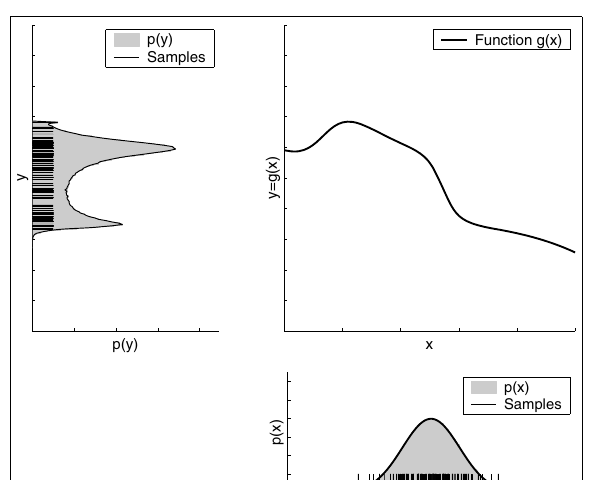

*Figure 4.3 — particle filter가 사용하는 "particle" 표현. 오른쪽 아래 그림은 가우시안 확률변수 $X$로부터
뽑은 표본들을 보여준다. 이 표본들은 오른쪽 위 그래프에 표시된 비선형 함수를 통과한다. 그 결과 표본들은
확률변수 $Y$에 따라 분포한다 (책 p.97)*

**그런 표현은 근사적이지만 비모수적이며, 따라서 예를 들어 가우시안보다 훨씬 넓은 분포 공간을 표현할 수
있다. 표본 기반 표현의 또 다른 장점은 Figure 4.3에서 보이듯 확률변수의 비선형 변환을 모델링하는 능력이다.**

> **3장·4.1절의 같은 그림들과 나란히 보자** — 같은 "가우시안을 비선형 함수에 통과시키기" 문제:
>
> | 방법 | 하는 일 | 결과 |
> |---|---|---|
> | EKF (Fig 3.4) | 평균에서 접선 | 가우시안 하나 |
> | UKF (Fig 3.7) | sigma point $2n+1$개 | 가우시안 하나 (2차까지 정확) |
> | Histogram (Fig 4.1) | bin 10개를 통째로 옮김 | 조각별 상수 분포 |
> | **Particle (Fig 4.3)** | **표본 $M$개를 그냥 통과** | **표본 집합 그 자체** |
>
> particle filter가 가장 단순하다 — **각 표본을 $g$에 넣기만 하면 된다.** 선형화도, 격자도 없다.

### 2. 수식/유도

#### 전체 수식 (먼저 한 번에)

$$\mathcal{X}_t := x_t^{[1]},\, x_t^{[2]},\, \ldots,\, x_t^{[M]} \tag{25}$$

$$x_t^{[m]} \sim p(x_t \mid z_{1:t},\, u_{1:t}) \tag{26}$$

$$w_t^{[m]} = p(z_t \mid x_t^{[m]})\, w_{t-1}^{[m]} \tag{27}$$

#### 단계별 설명 (생략 없이)

**(25) Particle의 정의** — 책 (4.22)

**Particle filter에서 posterior 분포의 표본을 particle이라 부르며 다음과 같이 표기한다:**

$$\mathcal{X}_t := x_t^{[1]},\, x_t^{[2]},\, \ldots,\, x_t^{[M]}$$

> **각 particle $x_t^{[m]}$ ($1 \le m \le M$)은 시각 $t$에서의 상태의 구체적인 한 실현(instantiation)이다.
> 달리 말하면, particle은 시각 $t$에서 참 세계 상태가 무엇일지에 대한 하나의 가설(hypothesis)이다.**

**여기서 $M$은 particle 집합 $\mathcal{X}_t$의 particle 개수를 나타낸다. 실제로 particle 개수 $M$은
종종 큰 수인데, 예를 들어 $M = 1{,}000$이다. 어떤 구현에서 $M$은 $t$나 belief $bel(x_t)$와 관련된 다른
양의 함수다.**

> **"particle = 가설"이라는 관점이 중요하다.** 각 particle은 "로봇이 여기 있을지도 모른다"는 하나의
> 후보이고, particle이 몰려 있는 곳이 곧 확률이 높은 곳이다. multi-modal이 자연스럽게 표현되는 이유가
> 이것이다 — 후보들이 여러 덩어리로 나뉘어 있으면 그만이다.

**(26) 이상적인 성질** — 책 (4.23)

**Particle filter의 직관은 belief $bel(x_t)$를 particle 집합 $\mathcal{X}_t$로 근사하는 것이다.
이상적으로는 상태 가설 $x_t$가 particle 집합 $\mathcal{X}_t$에 포함될 가능도가 그것의 Bayes filter
posterior $bel(x_t)$에 비례해야 한다:**

$$x_t^{[m]} \sim p(x_t \mid z_{1:t}, u_{1:t})$$

**(26)의 결과로, 상태 공간의 어떤 부분영역이 표본으로 조밀하게 채워질수록 참 상태가 그 영역에 들어갈
가능성이 높아진다.**

> **책의 중요한 단서**: **아래에서 논의하겠지만 성질 (26)은 표준 particle filter 알고리즘에 대해
> $M \uparrow \infty$일 때에만 점근적으로(asymptotically) 성립한다. 유한한 $M$에 대해 particle들은
> 약간 다른 분포로부터 뽑힌다. 실제로 이 차이는 particle 개수가 너무 작지만 않다면
> (예: $M \ge 100$) 무시할 만하다.**
>
> 이 "약간 다른 분포"의 정체가 4.3.4절 **Sampling Bias**에서 밝혀진다.

**재귀 구조는 그대로**

**지금까지 논의한 다른 모든 Bayes filter 알고리즘과 마찬가지로, particle filter 알고리즘은 한 시간 스텝
이전의 belief $bel(x_{t-1})$로부터 belief $bel(x_t)$를 재귀적으로 구성한다. belief가 particle 집합으로
표현되므로, 이는 particle filter가 집합 $\mathcal{X}_{t-1}$로부터 particle 집합 $\mathcal{X}_t$를
재귀적으로 구성함을 뜻한다.**

### 알고리즘 — 책 Table 4.3

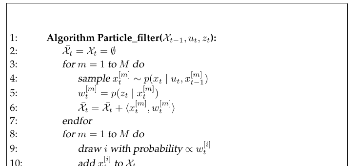

*Table 4.3 — importance sampling에 기반한 Bayes filter의 변형인 particle filter 알고리즘 (책 p.98)*

$$
\begin{aligned}
&1:\;\; \textbf{Algorithm Particle\_filter}(\mathcal{X}_{t-1},\, u_t,\, z_t): \\[3pt]
&2:\quad \bar{\mathcal{X}}_t = \mathcal{X}_t = \emptyset \\
&3:\quad \textbf{for } m = 1 \textbf{ to } M \textbf{ do} \\
&4:\qquad \text{sample } x_t^{[m]} \sim p(x_t \mid u_t,\, x_{t-1}^{[m]}) \\
&5:\qquad w_t^{[m]} = p(z_t \mid x_t^{[m]}) \\
&6:\qquad \bar{\mathcal{X}}_t = \bar{\mathcal{X}}_t + \langle x_t^{[m]},\, w_t^{[m]}\rangle \\
&7:\quad \textbf{endfor} \\[3pt]
&8:\quad \textbf{for } m = 1 \textbf{ to } M \textbf{ do} \\
&9:\qquad \text{draw } i \text{ with probability} \propto w_t^{[i]} \\
&10:\qquad \text{add } x_t^{[i]} \text{ to } \mathcal{X}_t \\
&11:\quad \textbf{endfor} \\[3pt]
&12:\quad \textbf{return } \mathcal{X}_t
\end{aligned}
\tag{28}
$$

### 세 단계 (책 p.99, 생략 없이)

**입력은 particle 집합 $\mathcal{X}_{t-1}$과 가장 최근의 제어 $u_t$, 가장 최근의 측정 $z_t$다.
알고리즘은 먼저 $\overline{bel}(x_t)$를 표현하는 임시 particle 집합 $\bar{\mathcal{X}}$를 구성한다.
입력 particle 집합의 각 particle $x_{t-1}^{[m]}$를 체계적으로 처리함으로써 그렇게 한다. 이어서 이
particle들을 posterior 분포 $bel(x_t)$를 근사하는 집합 $\mathcal{X}_t$로 변환한다.**

**① 라인 4 — 상태 전이로부터 표집 (prediction)**

> **라인 4는 particle $x_{t-1}^{[m]}$과 제어 $u_t$에 기반해 시각 $t$의 가설적 상태 $x_t^{[m]}$을 생성한다.
> 그 결과 표본은 $m$으로 인덱싱되며, 이는 $\mathcal{X}_{t-1}$의 $m$번째 particle로부터 생성되었음을
> 나타낸다.**
>
> **이 단계는 state transition distribution $p(x_t \mid u_t, x_{t-1})$로부터 표집하는 것을 수반한다.
> 이 단계를 구현하려면 이 분포로부터 표집할 수 있어야 한다.**

**$M$번 반복 후 얻어지는 particle 집합이 필터의 $\overline{bel}(x_t)$ 표현이다.**

> **결정적인 실무 요구사항**: 3장까지의 필터들은 $p(x_t\mid u_t,x_{t-1})$의 **값을 계산**할 수 있으면
> 됐다. Particle filter는 그 분포로부터 **표본을 뽑을 수 있어야** 한다. 이것이 5장에서 velocity·odometry
> motion model마다 "closed form calculation"과 **"sampling algorithm"** 두 가지를 각각 제시하는 이유다.

**② 라인 5 — importance factor (measurement)**

> **라인 5는 각 particle $x_t^{[m]}$에 대해 이른바 importance factor를 계산하며 $w_t^{[m]}$로 표기한다.
> Importance factor는 측정 $z_t$를 particle 집합에 반영하는 데 사용된다.**
>
> **따라서 importance는 particle $x_t^{[m]}$ 하에서 측정 $z_t$의 확률이며, $w_t^{[m]} = p(z_t\mid x_t^{[m]})$
> 로 주어진다. $w_t^{[m]}$을 particle의 가중치로 해석하면, 가중된 particle의 집합이 (근사적으로)
> Bayes filter posterior $bel(x_t)$를 표현한다.**

**③ 라인 8~11 — Resampling (진짜 "트릭")**

> **Particle filter 알고리즘의 진짜 "트릭"은 Table 4.3의 라인 8부터 11에서 일어난다. 이 줄들은
> resampling 또는 importance sampling으로 알려진 것을 구현한다.**
>
> **알고리즘은 임시 집합 $\bar{\mathcal{X}}_t$로부터 $M$개의 particle을 복원추출(with replacement)한다.
> 각 particle을 뽑을 확률은 그 importance weight로 주어진다.**

**Resampling은 $M$개 particle 집합을 같은 크기의 다른 particle 집합으로 변환한다.**

> **importance weight를 resampling 과정에 반영함으로써 particle들의 분포가 바뀐다: resampling 단계 전에는
> 그들이 $\overline{bel}(x_t)$에 따라 분포했지만, resampling 후에는 (근사적으로) posterior
> $bel(x_t) = \eta\, p(z_t\mid x_t^{[m]})\,\overline{bel}(x_t)$에 따라 분포한다.**

**실제로 그 결과 표본 집합은 보통 많은 중복(duplicate)을 갖는데, particle이 복원추출되기 때문이다.
더 중요한 것은 $\mathcal{X}_t$에 포함되지 않은 particle들이다 — 그들은 importance weight가 낮은
particle인 경향이 있다.**

### Resampling을 안 하면 어떻게 되는가

**Resampling 단계는 particle들을 posterior $bel(x_t)$로 되돌리는 중요한 기능을 갖는다.**

**실제로 particle filter의 대안적(그리고 보통 열등한) 버전은 resampling을 전혀 하지 않고, 대신 각
particle에 대해 1로 초기화되고 곱셈적으로 갱신되는 importance weight를 유지할 것이다** (식 (27),
책 (4.24)):

$$w_t^{[m]} = p(z_t \mid x_t^{[m]})\, w_{t-1}^{[m]}$$

**그런 particle filter 알고리즘도 여전히 posterior를 근사하겠지만, 많은 particle이 posterior 확률이 낮은
영역에 머물게 될 것이다. 그 결과 훨씬 더 많은 particle이 필요할 것이며, 얼마나 많이 필요할지는
posterior의 모양에 의존한다.**

> **Resampling 단계는 적자생존(survival of the fittest)이라는 다윈적 발상의 확률적 구현이다. 이는
> particle 집합을 posterior 확률이 높은 상태 공간의 영역으로 다시 집중시킨다. 그렇게 함으로써 필터
> 알고리즘의 계산 자원을 가장 중요한 상태 공간 영역에 집중시킨다.**

이 문장이 particle filter의 핵심 철학이다. **4.1.4절의 selective updating이 "확률 높은 셀만 갱신하자"였다면,
resampling은 "확률 높은 곳으로 particle을 옮기자"다.** 같은 문제(자원을 어디에 쓸 것인가)에 대한 다른 답이다.

### 3. 예제/실습

#### 예제 — Table 4.3을 코드로

```python
import random

def particle_filter(X_prev, u, z, sample_motion, measurement_prob, M):
    """Table 4.3 — 세 부분이 그대로 보인다."""
    X_bar = []
    for m in range(M):
        x = sample_motion(u, X_prev[m])        # 라인 4: 상태 전이로부터 표집
        w = measurement_prob(z, x)             # 라인 5: importance factor
        X_bar.append((x, w))                   # 라인 6

    total = sum(w for _, w in X_bar)           # 라인 9의 ∝ 를 위한 정규화
    X = []
    for m in range(M):                         # 라인 8~11: resampling
        u_r = random.random() * total
        acc = 0.0
        for x, w in X_bar:
            acc += w
            if acc >= u_r:
                X.append(x)                    # 라인 10
                break
    return X                                   # 라인 12
```

**라인 9의 이 순진한 구현은 particle 하나당 $O(M)$ 탐색이라 전체가 $O(M^2)$다.**
4.3.4절의 low variance sampler가 이를 $O(M)$으로 줄인다.

#### 연습문제

1. 라인 4를 구현하려면 $p(x_t\mid u_t,x_{t-1})$의 **값을 계산**하는 능력과 **표본을 뽑는** 능력 중
   무엇이 필요한가? 라인 5는?
2. 모든 particle의 weight가 같다면 resampling 후 집합은 어떻게 되는가?
3. 식 (27)처럼 resampling 없이 weight만 곱해 나가면, 시간이 지날수록 weight 분포는 어떻게 변하겠는가?

---

## 4.3.2 Importance Sampling

### 1. 개념적 이해

**Particle filter의 유도를 위해 resampling 단계를 더 자세히 논의하는 것이 유용하다.**

> **직관적으로 우리는 확률밀도함수 $f$에 대한 기댓값을 계산하는 문제에 직면해 있는데, 우리에게는
> 다른 확률밀도함수 $g$로부터 생성된 표본만 주어져 있다.**

이것이 **importance sampling**이 푸는 문제다. 왜 이런 상황이 생기나? **우리가 표본을 뽑고 싶은 분포
($bel(x_t)$, 측정까지 반영한 것)에서 직접 뽑는 방법을 모르기 때문**이다. 우리가 뽑을 수 있는 것은
$\overline{bel}(x_t)$(모션만 반영한 것)뿐이다.

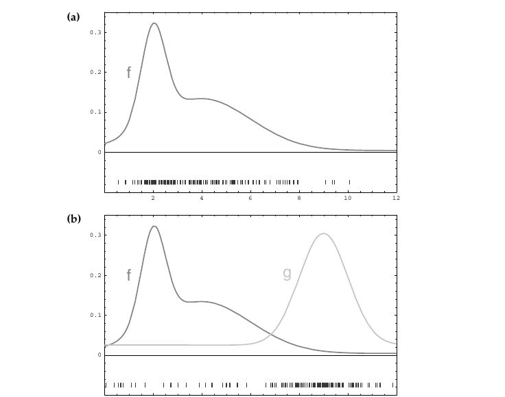

*Figure 4.4 — particle filter에서 importance factor의 예시: (a) 우리는 목표 밀도 $f$를 근사하고자 한다.
(b) $f$로부터 직접 표집하는 대신, 우리는 다른 밀도 $g$로부터만 표본을 생성할 수 있다. $g$에서 뽑은
표본들이 이 그림 아래쪽에 표시되어 있다. (c) $f$의 표본은 각 표본 $x$에 가중치 $f(x)/g(x)$를
붙임으로써 얻어진다. Particle filter에서 $f$는 belief $bel(x_t)$에, $g$는 $\overline{bel}(x_t)$에
대응한다 (책 p.101)*

### 2. 수식/유도

#### 전체 유도 과정 (먼저 한 번에)

$$
\begin{aligned}
E_f[I(x \in A)] &= \int f(x)\, I(x\in A)\, dx \\[4pt]
&= \int \underbrace{\frac{f(x)}{g(x)}}_{=:\,w(x)}\, g(x)\, I(x\in A)\, dx \\[4pt]
&= E_g[w(x)\, I(x\in A)]
\end{aligned}
\tag{29}
$$

$$\frac{1}{M}\sum_{m=1}^{M} I(x^{[m]} \in A) \;\longrightarrow\; \int_A g(x)\, dx \tag{30}$$

$$w^{[m]} = \frac{f(x^{[m]})}{g(x^{[m]})} \tag{31}$$

$$\left(\sum_{m=1}^{M} w^{[m]}\right)^{-1} \sum_{m=1}^{M} I(x^{[m]}\in A)\, w^{[m]} \;\longrightarrow\; \int_A f(x)\, dx \tag{32}$$

$$p(x_t \mid u_t, x_{t-1})\; bel(x_{t-1}) \tag{33}$$

#### 단계별 설명 (생략 없이)

**(29) 기댓값을 다른 분포로 바꿔 쓰기** — 책 (4.25)

**예를 들어 우리는 $x \in A$일 기댓값에 관심이 있을 수 있다. 우리는 이 확률을 $g$에 대한 기댓값으로
표현할 수 있다. 여기서 $I$는 지시 함수(indicator function)로, 인자가 참이면 1, 그렇지 않으면 0이다.**

$$E_f[I(x\in A)] = \int f(x)\,I(x\in A)\,dx = \int \frac{f(x)}{g(x)}\,g(x)\,I(x\in A)\,dx = E_g[w(x)\,I(x\in A)]$$

> **가운데 등호에서 한 일은 $\frac{g(x)}{g(x)} = 1$을 곱한 것뿐이다.** 그런데 이 사소한 조작이 결정적이다 —
> 적분이 이제 $g(x)\,dx$에 대한 것이 되어, **$g$에서 뽑은 표본으로 근사할 수 있는 형태**가 되었다.

**여기서 $w(x) = \dfrac{f(x)}{g(x)}$는 $f$와 $g$ 사이의 "불일치(mismatch)"를 설명하는 가중 인자다.**

> **이 식이 옳으려면 우리는 $f(x) > 0 \longrightarrow g(x) > 0$이 필요하다.** (책의 명시)
>
> **왜 필요한가**: $g(x) = 0$인 곳에서는 표본이 절대 생기지 않는데, 거기서 $f(x) > 0$이라면 그 영역을
> 영원히 놓친다. 게다가 $w = f/g$가 0으로 나누기가 된다.

**Target distribution과 proposal distribution** (책 p.100~102)

**Figure 4.4a는 확률분포의 밀도 함수 $f$를 보여주는데, 이제부터 이를 target distribution이라 부른다.
앞서와 같이 우리가 달성하고 싶은 것은 $f$로부터 표본을 얻는 것이다. 그러나 $f$로부터 직접 표집하는 것은
불가능하다고 하자. 대신 우리는 Figure 4.4b의 밀도 $g$로부터 particle을 생성한다.**

> **밀도 $g$에 대응하는 분포를 proposal distribution이라 한다. 밀도 $g$는 $f(x) > 0$이 $g(x) > 0$을
> 함의하도록 해야 하는데, 그래야 $f$에서 표집해 생성될 수 있는 어떤 상태에 대해서도 $g$에서 표집할 때
> particle을 생성할 0이 아닌 확률이 있다.**

**(30) $g$에서 뽑은 표본은 $g$를 따른다** — 책 (4.26)

**그러나 그 결과 particle 집합(Figure 4.4b 아래)은 $f$가 아니라 $g$에 따라 분포한다. 특히 임의의 구간
$A \subseteq \mathrm{dom}(X)$에 대해, $A$에 들어가는 particle의 경험적 개수는 $A$ 하에서 $g$의 적분으로
수렴한다:**

$$\frac{1}{M}\sum_{m=1}^{M} I(x^{[m]}\in A) \longrightarrow \int_A g(x)\,dx$$

**(31) 가중치로 차이를 보정** — 책 (4.27)

**$f$와 $g$ 사이의 이 차이를 상쇄하기 위해, particle $x^{[m]}$은 다음 몫으로 가중된다:**

$$w^{[m]} = \frac{f(x^{[m]})}{g(x^{[m]})}$$

**이는 Figure 4.4c에 예시된다: 이 그림의 수직 막대들이 importance weight의 크기를 나타낸다.**

> **Importance weight는 각 particle의 정규화되지 않은 확률질량(non-normalized probability mass)이다.**

**(32) 가중된 표본은 $f$로 수렴한다** — 책 (4.28)

$$\left(\sum_{m=1}^{M} w^{[m]}\right)^{-1}\sum_{m=1}^{M} I(x^{[m]}\in A)\,w^{[m]} \longrightarrow \int_A f(x)\,dx$$

**여기서 첫 번째 항은 모든 importance weight에 대한 정규화자 역할을 한다.**

> **다시 말해, 우리가 particle을 밀도 $g$로부터 생성했음에도 불구하고, 적절히 가중된 particle들은 밀도
> $f$로 수렴한다.**

**수렴 속도**

**온화한 조건 하에서 이 근사가 임의의 집합 $A$에 대해 원하는 $E_f[I(x\in A)]$로 수렴함을 보일 수 있다.**

> **대부분의 경우 수렴 속도는 $O\!\left(\frac{1}{\sqrt{M}}\right)$이며, 여기서 $M$은 표본의 개수다.
> 상수 인자는 $f(x)$와 $g(x)$의 유사성에 의존한다.**

이 두 문장에 실무적 함의가 다 들어 있다:
- **$\frac{1}{\sqrt{M}}$**: 정확도를 2배 높이려면 particle을 **4배** 늘려야 한다.
- **상수 인자가 $f$와 $g$의 유사성에 의존**: proposal이 target과 비슷할수록 효율적이다.
  → 8.3.6절 "Modifying the Proposal Distribution"이 정확히 이 상수를 개선하는 기법이다.

**(33) Particle filter에서 $f$와 $g$는 무엇인가** — 책 (4.29)

**Particle filter에서 밀도 $f$는 target belief $bel(x_t)$에 대응한다. $\mathcal{X}_{t-1}$의 particle들이
$bel(x_{t-1})$에 따라 분포한다는 (점근적으로 옳은) 가정 하에서, 밀도 $g$는 곱 분포에 대응한다:**

$$p(x_t \mid u_t, x_{t-1})\; bel(x_{t-1})$$

**다시 한 번, 이 분포가 proposal distribution이다.**

> **정리하면**:
>
> | | 정체 | 알고리즘에서 |
> |---|---|---|
> | proposal $g$ | $p(x_t\mid u_t,x_{t-1})\,bel(x_{t-1}) = \overline{bel}(x_t)$ | **라인 4**가 이것에서 표집 |
> | target $f$ | $bel(x_t)$ | 우리가 원하는 것 |
> | weight $w = f/g$ | $\eta\,p(z_t\mid x_t)$ | **라인 5** |
>
> **즉 Table 4.3의 라인 4·5·9는 importance sampling 그 자체다.** 다음 절에서 $w = f/g$가 정말
> $p(z_t\mid x_t)$가 되는지 유도한다.

### 3. 예제/실습

#### 예제 — 1차원에서 importance sampling 직접 해보기

목표 $f = \mathcal{N}(2, 1)$에서 표본을 원하는데, $g = \mathcal{N}(0, 2^2)$에서만 뽑을 수 있다고 하자.

```python
import random, math

def gauss(x, mu, sd):
    return math.exp(-0.5*((x-mu)/sd)**2) / (sd*math.sqrt(2*math.pi))

M = 20000
samples = [random.gauss(0, 2) for _ in range(M)]          # proposal g 에서 표집
weights = [gauss(x, 2, 1) / gauss(x, 0, 2) for x in samples]   # 식 (31): w = f/g

# 식 (32): 가중 평균은 f 의 평균(=2)으로 수렴해야 한다
wsum = sum(weights)
mean = sum(w*x for w, x in zip(weights, samples)) / wsum
var  = sum(w*(x-mean)**2 for w, x in zip(weights, samples)) / wsum
print(f"가중 평균 {mean:.3f} (참 2.0),  가중 분산 {var:.3f} (참 1.0)")
```

**$g$에서 뽑았는데도 가중치를 붙이면 $f$의 통계량이 복원된다** — 식 (32)가 하는 말이 이것이다.

#### 연습문제

1. 위 예제에서 $g = \mathcal{N}(0, 0.5^2)$로 바꾸면(즉 $g$가 $f$보다 훨씬 좁으면) 무슨 일이
   일어나는가? 조건 $f(x)>0 \Rightarrow g(x)>0$은 형식적으로 만족되지만 실무적으로 무엇이 문제인가?
2. 수렴 속도 $O(1/\sqrt{M})$에서, 오차를 1/10로 줄이려면 $M$을 몇 배로 늘려야 하는가?

---

## 4.3.3 Mathematical Derivation of the PF

### 1. 개념적 이해

**Particle filter를 수학적으로 유도하기 위해, particle을 상태 열(state sequence)의 표본으로 생각하는 것이
유용하다.**

> **왜 열 전체를 보는가**: 2.4.3절의 Bayes filter 유도에는 **적분이 있었다** (marginalization).
> 그런데 상태 열 전체 $x_{0:t}$를 유지하면 **적분이 아예 필요 없어진다** — 과거를 지우지 않으니 지울
> 것도 없다. 유도가 훨씬 깔끔해지고, 마지막에 "열의 마지막 원소만 보면 그게 $bel(x_t)$"라고 말하면 된다.

**알고리즘을 그에 맞게 수정하는 것은 쉽다: particle $x_t^{[m]}$에 그것이 생성된 상태 표본의 열
$x_{0:t-1}^{[m]}$을 이어붙이기만 하면 된다.**

**이 particle filter는 모든 상태 열에 대한 posterior를 계산한다.**

> **인정하건대 모든 상태 열의 공간은 거대하고, 그것을 particle로 덮는 것은 보통 좋은 생각이 아니다.
> 그러나 이것이 우리를 단념시키지는 않는데, 이 정의는 Table 4.3의 particle filter 알고리즘을 유도하는
> 수단으로만 쓰이기 때문이다.** (책의 명시)

### 2. 수식/유도

#### 전체 유도 과정 (먼저 한 번에)

$$x_{0:t}^{[m]} = x_0^{[m]},\, x_1^{[m]},\, \ldots,\, x_t^{[m]} \tag{34}$$

$$bel(x_{0:t}) = p(x_{0:t} \mid u_{1:t},\, z_{1:t}) \tag{35}$$

$$
\begin{aligned}
p(x_{0:t}\mid z_{1:t}, u_{1:t})
&\overset{\text{Bayes}}{=} \eta\; p(z_t\mid x_{0:t}, z_{1:t-1}, u_{1:t})\; p(x_{0:t}\mid z_{1:t-1}, u_{1:t}) \\[3pt]
&\overset{\text{Markov}}{=} \eta\; p(z_t\mid x_t)\; p(x_{0:t}\mid z_{1:t-1}, u_{1:t}) \\[3pt]
&= \eta\; p(z_t\mid x_t)\; p(x_t\mid x_{0:t-1}, z_{1:t-1}, u_{1:t})\; p(x_{0:t-1}\mid z_{1:t-1}, u_{1:t}) \\[3pt]
&\overset{\text{Markov}}{=} \eta\; p(z_t\mid x_t)\; p(x_t\mid x_{t-1}, u_t)\; p(x_{0:t-1}\mid z_{1:t-1}, u_{1:t-1})
\end{aligned}
\tag{36}
$$

$$p(x_t\mid x_{t-1}, u_t)\; bel(x_{0:t-1}) = p(x_t\mid x_{t-1}, u_t)\; p(x_{0:t-1}\mid z_{1:t-1}, u_{1:t-1}) \tag{37}$$

$$
\begin{aligned}
w_t^{[m]} &= \frac{\text{target distribution}}{\text{proposal distribution}} \\[4pt]
&= \frac{\eta\; p(z_t\mid x_t)\; p(x_t\mid x_{t-1},u_t)\; p(x_{0:t-1}\mid z_{1:t-1},u_{1:t-1})}{p(x_t\mid x_{t-1},u_t)\; p(x_{0:t-1}\mid z_{1:t-1},u_{1:t-1})} \\[4pt]
&= \eta\; p(z_t\mid x_t)
\end{aligned}
\tag{38}
$$

$$\eta\, w_t^{[m]}\; p(x_t\mid x_{t-1},u_t)\; p(x_{0:t-1}\mid z_{1:t-1},u_{1:t-1}) = bel(x_{0:t}) \tag{39}$$

#### 단계별 설명 (생략 없이)

**(34), (35) 상태 열 posterior** — 책 (4.30), (4.31)

$bel(x_t) = p(x_t\mid u_{1:t},z_{1:t})$ 대신 **상태 열 전체에 대한 posterior**를 계산한다.

**(36) 재귀식 유도 — 적분이 없다** — 책 (4.32)

**posterior $bel(x_{0:t})$는 2.4.3절의 $bel(x_t)$ 유도와 유사하게 얻어진다.**

각 등호를 짚자 (2장 노트의 식 (31)~(37)과 나란히 놓고 보면 대응이 명확하다):

1. **Bayes** — 조건화된 Bayes rule (2장 식 (12)). 가장 최근 측정 $z_t$를 떼어낸다.
2. **Markov** — $p(z_t\mid x_{0:t},z_{1:t-1},u_{1:t}) = p(z_t\mid x_t)$. 2장 식 (32)와 동일.
3. **분해** — $p(x_{0:t}\mid\cdot) = p(x_t\mid x_{0:t-1},\cdot)\,p(x_{0:t-1}\mid\cdot)$.
   조건부 확률의 정의를 열의 마지막 원소에 적용한 것.
4. **Markov** — $p(x_t\mid x_{0:t-1},z_{1:t-1},u_{1:t}) = p(x_t\mid x_{t-1},u_t)$ (2장 식 (36)),
   그리고 $u_t$를 마지막 항의 조건에서 제거 (2장 식 (37)의 논증).

> **이 유도에서 적분 기호가 없다는 점에 주목하라. 이는 2.4.3절에서처럼 가장 최근 상태만이 아니라
> 모든 상태를 posterior에 유지한 결과다.** (책의 명시)

**(37) Proposal distribution** — 책 (4.33)

**유도는 이제 귀납법으로 수행된다. 초기 조건은 검증하기 자명한데, 우리의 첫 particle 집합이 prior
$p(x_0)$를 표집해 얻어진다고 가정한다.**

**시각 $t-1$의 particle 집합이 $bel(x_{0:t-1})$에 따라 분포한다고 가정하자. 이 집합의 $m$번째 particle
$x_{0:t-1}^{[m]}$에 대해, 우리 알고리즘의 4단계에서 생성된 표본 $x_t^{[m]}$은 proposal distribution으로부터
생성된다:**

$$p(x_t\mid x_{t-1},u_t)\; bel(x_{0:t-1}) = p(x_t\mid x_{t-1},u_t)\; p(x_{0:t-1}\mid z_{1:t-1},u_{1:t-1})$$

**(38) 가중치가 $\eta\,p(z_t\mid x_t)$가 되는 이유** — 책 (4.34)

$$w_t^{[m]} = \frac{\text{target distribution}}{\text{proposal distribution}}$$

분자에 (36)의 최종 결과를, 분모에 (37)을 넣으면:

$$= \frac{\eta\; p(z_t\mid x_t)\; \cancel{p(x_t\mid x_{t-1},u_t)}\; \cancel{p(x_{0:t-1}\mid z_{1:t-1},u_{1:t-1})}}{\cancel{p(x_t\mid x_{t-1},u_t)}\; \cancel{p(x_{0:t-1}\mid z_{1:t-1},u_{1:t-1})}} = \eta\; p(z_t\mid x_t)$$

**두 항이 통째로 약분되어 $\eta\,p(z_t\mid x_t)$만 남는다.** 이것이 Table 4.3 라인 5의 정당화다. ✔

> **왜 이렇게 깔끔한가**: proposal(라인 4가 하는 일)이 target의 **일부를 그대로 포함**하고 있기 때문이다.
> target = proposal × (측정 항)이라는 구조라서, 나누면 측정 항만 남는다. **모션 모델로 표집하고 측정
> 모델로 가중한다**는 particle filter의 구조가 여기서 나온다.

**(39) Resampling이 target을 만든다** — 책 (4.35)

**상수 $\eta$는 resampling이 importance weight에 비례하는 확률로 일어나므로 아무 역할도 하지 않는다.
$w_t^{[m]}$에 비례하는 확률로 particle을 resampling함으로써, 그 결과 particle들은 실제로 proposal과
importance weight $w_t^{[m]}$의 곱에 따라 분포한다:**

$$\eta\, w_t^{[m]}\; p(x_t\mid x_{t-1},u_t)\; p(x_{0:t-1}\mid z_{1:t-1},u_{1:t-1}) = bel(x_{0:t})$$

**(여기서 상수 인자 $\eta$는 (38)의 것과 다르다는 점에 주목하라.)**

**마지막으로, 알고리즘은 $x_{0:t}^{[m]}$이 $bel(x_{0:t})$에 따라 분포한다면 상태 표본 $x_t^{[m]}$이
(자명하게) $bel(x_t)$에 따라 분포한다는 단순한 관찰로부터 따라나온다.**

> **책의 단서**: **아래에서 논할 것이듯, 이 유도는 정규화 상수에 대한 우리의 고려가 느슨했기 때문에
> $M\uparrow\infty$에 대해서만 옳다. 그러나 유한한 $M$에 대해서도 particle filter 뒤의 직관을 설명한다.**
>
> 이 "느슨함"이 4.3.4절 Sampling Bias에서 정확히 해명된다.

### 3. 예제/실습

#### 예제 — 2장 유도와 나란히 놓기

| 단계 | 2.4.3절 (Bayes filter) | 4.3.3절 (Particle filter) |
|---|---|---|
| 시작 | $p(x_t\mid z_{1:t},u_{1:t})$ | $p(x_{0:t}\mid z_{1:t},u_{1:t})$ |
| Bayes rule | 식 (31) | (36) 1번째 등호 |
| 측정의 conditional independence | 식 (32) | (36) 2번째 등호 |
| 전개 | **적분** (marginalization, 식 (35)) | **곱의 분해** (적분 없음) |
| 전이의 conditional independence | 식 (36) | (36) 4번째 등호 |

**핵심 차이는 단 하나** — 2장은 $x_{t-1}$을 지우려고 적분했고, 4.3.3절은 지우지 않아서 적분이 없다.

#### 연습문제

1. (38)에서 약분되는 두 항이 무엇이며, 왜 정확히 상쇄되는지 설명하라.
2. 만약 라인 4가 $p(x_t\mid u_t,x_{t-1})$이 아니라 다른 분포 $q$에서 표집한다면, (38)의 weight는
   어떤 형태가 되는가? (이것이 8.3.6절 proposal 수정의 출발점이다.)

---

## 4.3.4 Practical Considerations and Properties of Particle Filters

책은 이 절에서 네 가지 실무 주제를 다룬다: **density extraction**, **sampling variance**, **resampling**,
**sampling bias**, **particle deprivation**.

---

### A. Density Extraction — 표본에서 연속 밀도 얻기

**Particle filter가 유지하는 표본 집합은 연속 belief의 이산 근사를 표현한다. 그러나 많은 응용은 연속
추정값의 가용성을 요구한다 — 즉 particle로 표현된 상태에서만이 아니라 상태 공간의 임의의 점에서의
추정값이다.**

> **그런 표본으로부터 연속 밀도를 추출하는 문제를 density estimation이라 한다.**

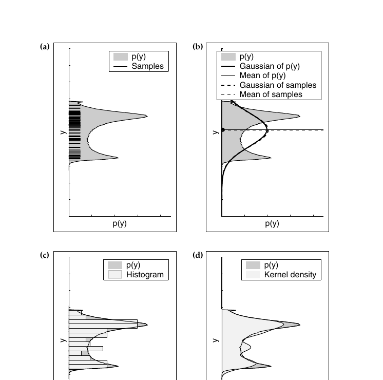

*Figure 4.5 — particle로부터 밀도를 추출하는 여러 방법. (a) 밀도와 표본 집합 근사, (b) 가우시안 근사
(평균과 분산), (c) 히스토그램 근사, (d) kernel density estimate. 근사의 선택은 구체적인 응용과 계산
자원에 강하게 의존한다 (책 p.106)*

**① 가우시안 근사** (Figure 4.5b)

**그런 particle로부터 밀도를 추출하는 단순하고 매우 효율적인 접근은 가우시안 근사를 계산하는 것이다.
이 경우 particle로부터 추출된 가우시안은 참 밀도의 가우시안 근사(실선)와 사실상 동일하다.**

> **명백히 가우시안 근사는 밀도의 기본 성질만을 포착하며, 밀도가 unimodal일 때에만 적절하다.**

**② k-means 클러스터링**

**Multimodal 표본 분포는 k-means clustering 같은 더 복잡한 기법을 요구하며, 이는 가우시안 혼합을 사용해
밀도를 근사한다.** (3.3.5절 식 (55)의 mixture of Gaussians와 연결된다.)

**③ 히스토그램** (Figure 4.5c)

**대안적 접근은 상태 공간 위에 이산 히스토그램을 씌우고, 그 범위에 들어가는 particle들의 가중치를 합산해
각 bin의 확률을 계산하는 것이다.**

> **histogram filter와 마찬가지로 이 기법의 중요한 단점은 공간 복잡도가 차원 수에 지수적이라는 사실이다.
> 반면 히스토그램은 multi-modal 분포를 표현할 수 있고, 극도로 효율적으로 계산될 수 있으며, 임의의
> 상태에서의 밀도를 particle 개수와 무관한 시간에 추출할 수 있다.**

**④ Density tree**

**히스토그램 표현의 공간 복잡도는 4.1.4절에서 논의한 대로 particle로부터 density tree를 생성함으로써
상당히 줄일 수 있다. 그러나 density tree는 상태 공간의 임의의 점에서 밀도를 추출할 때 더 비싼 조회
비용을 치른다 (트리 깊이에 로그).**

**⑤ Kernel density estimation** (Figure 4.5d)

**Kernel density estimation은 particle 집합을 연속 밀도로 변환하는 또 다른 방법이다. 여기서 각 particle이
이른바 kernel의 중심으로 사용되고, 전체 밀도는 kernel 밀도들의 혼합으로 주어진다.**

> **kernel density estimate의 장점은 매끄러움과 알고리즘적 단순성이다. 그러나 임의의 점에서 밀도를
> 계산하는 복잡도는 particle 또는 kernel의 개수에 선형이다.**

**어느 것을 쓸 것인가** (책 p.105)

**이는 당면한 문제에 의존한다.**

- **많은 로보틱스 응용에서 처리 능력이 매우 제한적이고 particle의 평균이 로봇을 제어하기에 충분한 정보를
  제공한다.**
- **active localization 같은 다른 응용은 상태 공간의 불확실성에 대한 더 복잡한 정보에 의존한다. 그런
  상황에서는 히스토그램이나 가우시안 혼합이 더 나은 선택이다.**
- **여러 로봇이 수집한 데이터의 결합은 때때로 서로 다른 표본 집합의 기저 밀도들의 곱셈을 요구한다.
  Density tree나 kernel density estimate가 이 목적에 잘 맞는다.**

---

### B. Sampling Variance — 무작위 표집의 대가

**Particle filter의 중요한 오차원 하나는 무작위 표집에 내재된 변동과 관련된다.**

> **유한한 개수의 표본이 확률밀도로부터 뽑힐 때마다, 이 표본들로부터 추출된 통계량은 원래 밀도의
> 통계량과 약간 다르다. 무작위 표집으로 인한 변동성을 sampler의 variance라 한다.**

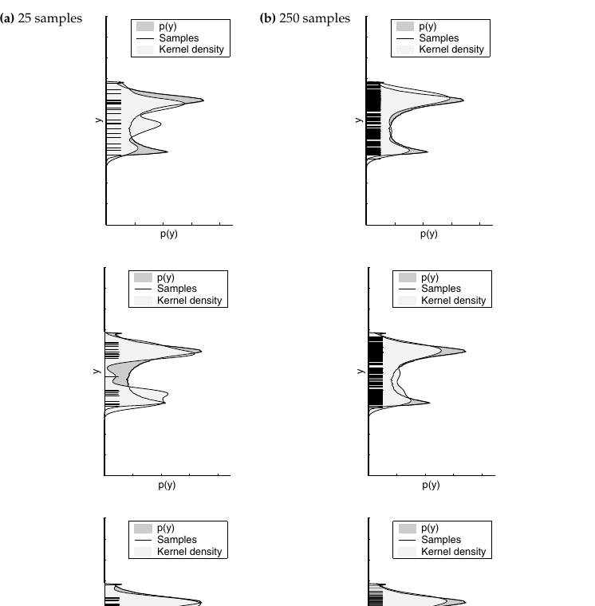

*Figure 4.6 — 무작위 표집으로 인한 분산. 표본들이 가우시안으로부터 뽑혀 비선형 함수를 통과한다.
25개(왼쪽 열)와 250개(오른쪽 열) 표본의 반복 표집으로 나온 표본과 kernel 추정값이 표시되어 있다.
각 행은 하나의 무작위 실험이다 (책 p.107)*

**책의 사고 실험**:

> **동일한 가우시안 belief를 갖는 동일한 두 로봇이 동일하고 노이즈 없는 행동을 수행한다고 상상하자.
> 명백히 두 로봇은 행동 후 같은 belief를 가져야 한다.**

**이 상황을 시뮬레이션하기 위해 가우시안 밀도로부터 반복적으로 표본을 뽑아 비선형 변환을 통과시킨다.**

**Figure 4.6의 위쪽 행 각 그래프는 가우시안에서 25개 표본을 뽑은 결과다.**

> **원하는 결과와 반대로, kernel density estimate 중 일부는 참 밀도와 상당히 다르며, 서로 다른 kernel
> 밀도들 사이에 큰 변동성이 있다.**

**다행히 sampling variance는 표본 개수에 따라 감소한다. Figure 4.6의 아래쪽 행은 250개 표본으로 얻은
전형적인 결과를 보여준다. 명백히 더 많은 표본이 더 적은 변동성으로 더 정확한 근사를 낳는다.**

**실제로 충분한 표본이 선택되면, 로봇이 하는 관측이 표본 기반 belief를 참 belief에 "충분히 가깝게"
유지하는 것이 보통이다.**

---

### C. Resampling — 다양성의 상실

**Sampling variance는 반복적인 resampling을 통해 증폭된다.**

**극단적인 경우를 생각해보자 — 상태가 변하지 않는 로봇이다.**

> **때때로 우리는 $x_t = x_{t-1}$임을 확실히 안다. 좋은 예가 움직이지 않는 로봇의 mobile robot
> localization이다. 나아가 로봇에 센서가 없어서 상태를 추정할 수 없고 상태를 모른다고 가정하자.**
>
> **명백히 그런 로봇은 자기 위치에 대해 결코 아무것도 알아낼 수 없으며, 따라서 시각 $t$의 추정값은
> 어떤 시점 $t$에 대해서도 초기 추정값과 동일해야 한다.**

**그런데 vanilla particle filter는 그렇게 하지 않는다:**

> **초기에 우리 particle 집합은 prior로부터 생성되고 particle들은 상태 공간 전체에 퍼져 있을 것이다.
> 그러나 resampling 단계(알고리즘 라인 8)는 때때로 상태 표본 $x^{[m]}$을 재생산하는 데 실패할 것이다.
> 우리의 상태 전이는 결정론적이므로 전방 표집 단계(라인 4)에서 새로운 상태가 도입되지 않는다.
> 시간이 지남에 따라 새로운 particle의 생성 없이 단지 resampling 단계의 무작위적 성질 때문에 점점 더
> 많은 particle이 지워진다.**
>
> **그 결과는 상당히 섬뜩하다: 확률 1로 단 하나의 particle의 동일한 복사본 $M$개가 살아남을 것이다.
> 반복적인 resampling 때문에 다양성이 사라진다. 외부 관찰자에게는 로봇이 세계 상태를 유일하게 결정한
> 것처럼 보일 수 있다 — 로봇에 센서가 없다는 사실과 명백히 모순된다.**

**이 예가 시사하는 근본 문제**:

> **resampling 과정은 particle 개체군의 다양성 상실을 유발하며, 이는 실제로 근사 오차로 나타난다:
> particle 집합 자체의 분산은 감소하지만, 참 belief의 추정기로서 particle 집합의 분산은 증가한다.**

**이 분산 또는 오차를 제어하는 것은 어떤 실용적 구현에도 필수적이다.**

### 분산 감소 전략 ① — resampling 빈도 줄이기

**두 가지 주요 variance reduction 전략이 존재한다. 첫째, resampling이 일어나는 빈도를 줄일 수 있다.**

> **상태가 정적임을 아는 경우($x_t = x_{t-1}$) 절대 resampling해서는 안 된다. 예를 들어 mobile robot
> localization에서 로봇이 멈추면 resampling을 중단해야 한다 (그리고 사실 측정의 통합도 중단하는 것이
> 대체로 좋은 생각이다).**

**상태가 변하더라도 resampling 빈도를 줄이는 것이 좋은 경우가 많다. 여러 측정은 앞서 언급한 대로
importance factor를 곱셈적으로 갱신함으로써 항상 통합할 수 있다:**

$$w_t^{[m]} = \begin{cases} 1 & \text{resampling이 일어났으면} \\[3pt] p(z_t\mid x_t^{[m]})\, w_{t-1}^{[m]} & \text{resampling이 없었으면} \end{cases} \tag{40}$$

**언제 resampling할지의 선택은 까다롭고 실무 경험을 요구한다:**

> **너무 자주 표집하면 다양성을 잃을 위험이 커진다. 너무 드물게 표집하면 많은 표본이 낮은 확률의 영역에
> 낭비될 수 있다.**

**resampling 수행 여부를 결정하는 표준적 접근은 importance weight의 분산을 측정하는 것이다.**

> **가중치의 분산은 표본 기반 표현의 효율성과 관련된다. 모든 가중치가 동일하면 분산이 0이고 resampling을
> 수행하지 않아야 한다. 반면 가중치가 소수의 표본에 집중되어 있으면 가중치 분산이 높고 resampling을
> 수행해야 한다.**

### 분산 감소 전략 ② — Low variance sampling

**표집 오차를 줄이는 두 번째 전략은 low variance sampling으로 알려져 있다.**

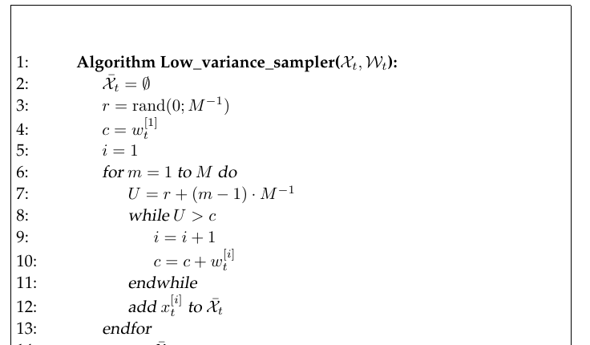

*Table 4.4 — particle filter를 위한 low variance resampling. 이 루틴은 하나의 난수를 사용해 가중치
$\mathcal{W}$를 갖는 particle 집합 $\mathcal{X}$로부터 표집하지만, particle이 resampling될 확률은 여전히
그 가중치에 비례한다. 나아가 이 sampler는 효율적이다: $M$개 particle 표집에 $O(M)$ 시간이 필요하다
(책 p.110)*

$$
\begin{aligned}
&1:\;\; \textbf{Algorithm Low\_variance\_sampler}(\mathcal{X}_t,\, \mathcal{W}_t): \\[3pt]
&2:\quad \bar{\mathcal{X}}_t = \emptyset \\
&3:\quad r = \mathrm{rand}(0;\, M^{-1}) \\
&4:\quad c = w_t^{[1]} \\
&5:\quad i = 1 \\
&6:\quad \textbf{for } m = 1 \textbf{ to } M \textbf{ do} \\
&7:\qquad U = r + (m-1)\cdot M^{-1} \\
&8:\qquad \textbf{while } U > c \\
&9:\qquad\quad i = i + 1 \\
&10:\qquad\quad c = c + w_t^{[i]} \\
&11:\qquad \textbf{endwhile} \\
&12:\qquad \text{add } x_t^{[i]} \text{ to } \bar{\mathcal{X}}_t \\
&13:\quad \textbf{endfor} \\[3pt]
&14:\quad \textbf{return } \bar{\mathcal{X}}_t
\end{aligned}
\tag{41}
$$

$$i = \operatorname*{argmin}_j \sum_{m=1}^{j} w_t^{[m]} \ge U \tag{42}$$

**기본 아이디어**:

> **기본 particle filter(Table 4.3)의 경우처럼 resampling 과정에서 표본을 서로 독립적으로 선택하는 대신,
> 선택이 순차적 확률 과정을 수반한다.**

**$M$개의 난수를 고르고 그 난수에 대응하는 particle을 선택하는 대신, 이 알고리즘은 단 하나의 난수를
계산하고 그 수에 따라 표본을 선택하지만 여전히 표본 가중치에 비례하는 확률로 선택한다.**

**이는 구간 $[0; M^{-1}]$에서 난수 $r$을 뽑음으로써 달성된다. Table 4.4의 알고리즘은 $r$에 고정된 양
$M^{-1}$을 반복적으로 더하고 그 결과 숫자에 대응하는 particle을 선택함으로써 particle을 선택한다.**

**$[0;1]$의 어떤 수 $U$든 정확히 하나의 particle을 가리키는데, 바로 (42)를 만족하는 particle $i$다.**

**Table 4.4의 while 루프는 두 가지 일을 한다 — 이 식의 우변의 합을 계산하고, 추가로 $i$가 대응하는
가중치 합이 $U$를 초과하는 첫 particle의 인덱스인지 확인한다.**

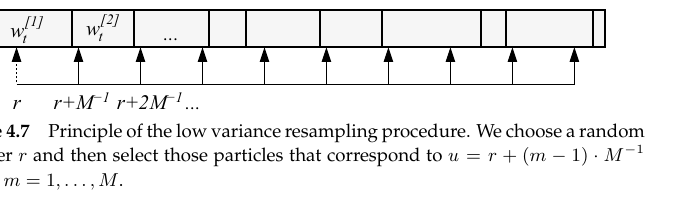

*Figure 4.7 — low variance resampling 절차의 원리. 우리는 난수 $r$을 고르고, $m = 1,\ldots,M$에 대해
$u = r + (m-1)\cdot M^{-1}$에 대응하는 particle들을 선택한다 (책 p.111)*

### Low variance sampler의 세 가지 장점 (책 p.111)

> **① 독립 무작위 sampler보다 표본 공간을 더 체계적인 방식으로 덮는다.** 이는 종속 sampler가 particle들을
> 독립적으로 무작위 선택하는 대신 모든 particle을 체계적으로 순회한다는 사실에서 명백해야 한다.
>
> **② 모든 표본이 같은 importance factor를 가지면, 그 결과 표본 집합 $\bar{\mathcal{X}}_t$가
> $\mathcal{X}_t$와 동등해서, 관측을 $\mathcal{X}_t$에 통합하지 않고 resampling해도 표본이 손실되지 않는다.**
>
> **③ low-variance sampler는 $O(M)$의 복잡도를 갖는다.** 독립 표집으로 같은 복잡도를 달성하기는 어렵다 —
> 명백한 구현은 난수를 뽑은 후 각 particle마다 $O(\log M)$ 탐색을 요구해 전체 resampling 과정이
> $O(M\log M)$이 된다.

**계산 시간은 particle filter 사용에서 본질적이며, 종종 resampling 과정의 효율적 구현이 실용적 성능에
큰 차이를 만든다. 이런 이유로 로보틱스에서 particle filter 구현은 방금 논의한 것 같은 메커니즘에
의존하는 경향이 있다.**

**Stratified sampling**

**일반적으로 효율적 표집에 대한 문헌은 방대하다. 또 다른 인기 있는 선택지는 stratified sampling이며,
여기서 particle들이 부분집합으로 묶인다. 이 집합들로부터의 표집은 2단계 절차로 수행된다.**

1. **먼저 각 부분집합에서 뽑을 표본의 개수가 그 부분집합에 포함된 particle들의 총 가중치에 기반해 결정된다.**
2. **두 번째 단계에서 개별 표본들이 각 부분집합으로부터, 예를 들어 low variance resampling을 사용해
   무작위로 뽑힌다.**

**그런 기법은 더 낮은 표집 분산을 가지며, 로봇이 하나의 particle filter로 여러 개의 뚜렷한 가설을
추적할 때 잘 작동하는 경향이 있다.**

<!--widget:particle-filter-->

---

### D. Sampling Bias — 유한한 $M$이 낳는 체계적 편향

**유한한 개수의 particle만 사용된다는 사실은 posterior 추정에 체계적 편향(systematic bias)도 도입한다.**

**$M = 1$인 극단적 경우를 생각해보자:**

> **이 경우 Table 4.3의 라인 3~7의 루프가 단 한 번만 실행되고 $\bar{\mathcal{X}}_t$는 모션 모델로부터
> 표집된 단 하나의 particle만 담게 된다. 핵심 통찰은 resampling 단계(라인 8~11)가 이제 그 표본을
> importance factor $w_t^{[m]}$과 무관하게 결정론적으로 받아들인다는 것이다.**
>
> **따라서 measurement probability $p(z_t\mid x_t^{[m]})$는 갱신 결과에 아무 역할도 하지 않으며 $z_t$도
> 마찬가지다. 즉 $M=1$이면 particle filter는 원하는 posterior $p(x_t\mid u_{1:t},z_{1:t})$ 대신
> $p(x_t\mid u_{1:t})$로부터 particle을 생성한다. 모든 측정을 완전히 무시하는 것이다.**

**어떻게 이런 일이? 범인은 resampling 단계에 암묵적으로 들어 있는 정규화다.** importance weight에
비례해 표집할 때(라인 9), $M=1$이면 $w_t^{[m]}$이 자기 자신의 정규화자가 된다:

$$p\left(\text{라인 9에서 } x_t^{[m]} \text{를 뽑음}\right) = \frac{w_t^{[m]}}{w_t^{[m]}} = 1 \tag{43}$$

**일반적으로 문제는 정규화되지 않은 값 $w_t^{[m]}$이 $M$차원 공간에서 뽑히지만, 정규화 후에는
$M-1$차원 공간에 놓인다는 것이다.**

> **이는 정규화 후 $m$번째 가중치가 나머지 $M-1$개 가중치로부터 1에서 그것들을 빼서 복원될 수 있기
> 때문이다. 다행히 $M$ 값이 커질수록 차원 또는 자유도 상실의 효과는 점점 덜 두드러진다.**

이것이 4.3.1절에서 예고한 **"유한한 $M$에 대해 particle들은 약간 다른 분포에서 뽑힌다"** 의 정체다.

---

### E. Particle Deprivation — 참 상태 근처에 particle이 없어지는 문제

**많은 수의 particle을 쓰더라도, 올바른 상태 근처에 particle이 하나도 없는 일이 일어날 수 있다.
이 문제는 particle deprivation 문제로 알려져 있다.**

**이는 대부분 particle 개수가 관련된 모든 고확률 영역을 덮기에 너무 작을 때 발생한다. 그러나 particle
집합 크기 $M$과 무관하게 어떤 particle filter에서도 궁극적으로 이런 일이 일어날 수밖에 없다고 주장할
수도 있다.**

> **Particle deprivation은 무작위 표집의 분산의 결과로 발생한다 — 운 나쁜 난수의 연속이 참 상태 근처의
> 모든 particle을 쓸어버릴 수 있다. 각 표집 단계에서 이런 일이 일어날 확률은 0보다 크다 (보통 $M$에
> 지수적으로 작긴 하지만). 따라서 우리는 particle filter를 충분히 오래 돌리기만 하면 된다. 결국 우리는
> 임의로 부정확한 추정값을 생성하게 될 것이다.**

**실제로 이런 성질의 문제는 $M$이 모든 고가능도 상태의 공간에 비해 작을 때에만 발생하는 경향이 있다.**

**해결책 — 무작위 particle 추가**

> **particle deprivation 문제에 대한 인기 있는 해법은 실제 이동 및 측정 명령의 열과 무관하게, 각
> resampling 과정 후에 소수의 무작위로 생성된 particle을 집합에 추가하는 것이다.**
>
> **그런 방법론은 deprivation 문제를 줄일 수 있지만(고칠 수는 없다), 부정확한 posterior 추정이라는
> 대가를 치른다. 무작위 표본 추가의 장점은 단순성에 있다 — particle filter에 무작위 표본을 추가하는 데
> 필요한 소프트웨어 수정은 최소한이다.**
>
> **경험칙으로, 무작위 표본 추가는 **최후의 수단**으로 여겨져야 하며, deprivation 문제를 고치는 다른
> 모든 기법이 실패한 경우에만 적용되어야 한다. particle deprivation을 다루는 대안적 접근은 로봇
> localization의 맥락에서 8장에서 논의된다.** (8.3.5절 Random Particle MCL)

### Particle 개수는 몇 개여야 하는가

**이 논의는 표본 기반 표현의 품질이 표본 개수에 따라 증가함을 보였다. 따라서 중요한 질문은 특정 추정
문제에 몇 개의 표본을 써야 하는가다.**

> **불행히도 이 질문에 완벽한 답은 없으며, 필요한 표본 개수를 결정하는 것은 종종 사용자에게 맡겨진다.**
>
> **경험칙으로, 표본 개수는 상태 공간의 차원과 particle filter가 근사하는 분포의 불확실성에 강하게
> 의존한다. 예를 들어 균등 분포는 상태 공간의 작은 영역에 집중된 분포보다 훨씬 더 많은 표본을 요구한다.**

**표본 크기에 대한 더 자세한 논의는 이 책의 이후 장들에서 로봇 localization과 mapping의 맥락에서
주어진다.** (8.3.7절 KLD-Sampling — particle 개수를 적응적으로 조절하는 기법)

### 3. 예제/실습

#### 예제 1 — Resampling으로 다양성이 사라지는 것 확인

상태가 변하지 않고 모든 weight가 같은($w = 1/M$) 상황에서 resampling을 반복하면?

```python
import random

random.seed(7)
M = 100
particles = list(range(M))          # 서로 다른 M개 가설
for step in range(1, 51):
    particles = [random.choice(particles) for _ in range(M)]   # 균등 weight resampling
    if step in (1, 5, 10, 20, 50):
        print(f"step {step:2d}: 고유 particle {len(set(particles))}개")

# step  1: 고유 particle 62개
# step  5: 고유 particle 23개
# step 10: 고유 particle 11개
# step 20: 고유 particle  6개
# step 50: 고유 particle  3개    ← 다양성 소멸
```

(난수라 실행마다 값은 달라지지만 감소 추세는 동일하다.)

**아무 정보도 얻지 않았는데 particle이 한 점으로 수렴한다** — 책이 "섬뜩하다(daunting)"고 표현한 현상이다.

#### 예제 2 — Low variance sampler는 이 문제가 없다

Table 4.4를 같은 상황(모든 weight 동일)에 적용하면, 장점 ②에 의해 **표본 집합이 원본과 동등**해진다.

$w^{[i]} = 1/M$이므로 누적합이 $c_j = j/M$이고, $U_m = r + (m-1)/M$은 각각 서로 다른 $i$를 정확히
하나씩 가리킨다 → **모든 particle이 정확히 한 번씩 선택된다. 다양성 손실 0.**

#### 연습문제

1. 예제 1의 코드를 low variance sampler로 바꿔 실행하면 고유 particle 수가 어떻게 되는가?
2. 식 (40)에서 resampling을 아예 안 하면 어떤 문제가 생기는가? (힌트: 4.3.1절 마지막 문단)
3. $M=2$일 때 sampling bias는 어느 정도인가? (책 4.6절 연습문제 3)

---

# 4.4 Summary (책 p.113~114)

**이 절은 두 가지 비모수 Bayes filter, histogram filter와 particle filter를 소개했다. 비모수 필터는
posterior를 유한한 개수의 값으로 근사한다.**

> **시스템 모델과 posterior의 모양에 대한 온화한 가정 하에서, 둘 다 posterior를 표현하는 데 사용된 값의
> 개수가 무한대로 갈 때 근사 오차가 균등하게 0으로 수렴하는 성질을 갖는다.**

**● Histogram filter는 상태 공간을 유한한 개수의 볼록 영역으로 분해한다. 각 영역의 누적 posterior 확률을
하나의 수치값으로 표현한다.** → 4.1.1~4.1.2절

**● 로보틱스에는 많은 분해 기법이 존재한다. 특히 분해의 입도는 환경의 구조에 의존할 수도 있고 아닐 수도
있다. 의존할 때 그 결과 알고리즘은 흔히 'topological'이라 불린다.** → 4.1.4절

**● 분해 기법은 정적과 동적으로 나뉠 수 있다. 정적 분해는 belief의 모양과 무관하게 미리 이루어진다.
동적 분해는 상태 공간을 분해할 때 로봇 belief의 구체적 특성에 의존하며, 종종 posterior 확률에 비례해
공간 해상도를 높이려 시도한다. 동적 분해가 더 나은 결과를 주는 경향이 있지만 구현하기도 더 어렵다.**
→ 4.1.4절

**● 대안적 비모수 기법이 particle filter로 알려져 있다. Particle filter는 posterior로부터 뽑은 상태의
무작위 표본으로 posterior를 표현한다. 그런 표본을 particle이라 한다.**

> **Particle filter는 구현하기 극도로 쉬우며, 이 책에 표현된 모든 Bayes filter 알고리즘 중 가장
> 다재다능하다(most versatile).**

**● Particle filter의 오차를 줄이는 구체적 전략들이 존재한다. 가장 인기 있는 것 중에는 알고리즘의
무작위성에서 발생하는 추정값의 분산을 줄이는 기법과, posterior의 복잡도에 맞게 particle 개수를 조정하는
기법이 있다.** → 4.3.4절

**이 장과 이전 장에서 논의한 필터 알고리즘들은 이 책의 나머지 부분에서 논의되는 대부분의 probabilistic
robotics 알고리즘의 기초를 놓는다. 여기 제시된 자료는 오늘날 probabilistic robotics에서 가장 인기 있는
알고리즘과 표현 다수를 대표한다.**

---

# 4.5 Bibliographical Remarks (책 p.114~115)

- **West and Harrison (1997)** 은 이 장과 이전 장에서 논의된 여러 기법의 심층적 취급을 제공한다.
- **히스토그램**은 통계학에서 수십 년간 사용되어 왔다. **Sturges (1926)** 은 히스토그램 근사의 해상도를
  선택하는 초기 규칙 중 하나를 제공하고, 더 최근 취급은 **Freedman and Diaconis (1981)**, 현대적 분석은
  **Scott (1992)** 에 있다.
- 상태 공간이 이산 히스토그램으로 사상되면 그 결과 시간적 추론 문제는 **Rabiner and Juang (1986)** 이
  대중화한 유형의 **이산 Hidden Markov model**의 한 사례가 된다. 현대 교재는
  **MacDonald and Zucchini (1997)**, **Elliott et al. (1995)**.
- **Particle filter는 Monte Carlo 방법의 발명자인 Metropolis and Ulam (1949)** 까지 거슬러 올라간다.
  더 현대적인 입문은 **Rubinstein (1981)**.
- **particle filter의 일부인 sampling importance resampling 기법**은 **Rubin (1988)** 과
  **Smith and Gelfand (1992)** 의 두 선구적 논문으로 거슬러 올라간다.
- **Stratified sampling은 Neyman (1934)** 이 처음 발명했다.
- 최근 몇 년간 particle filter는 베이지안 통계학 분야에서 광범위하게 연구되었다
  (**Doucet 1998; Kitagawa 1996; Liu and Chen 1998; Pitt and Shephard 1999**).
- **AI에서 particle filter는 survival of the fittest라는 이름으로 재발명되었고**
  (**Kanazawa et al. 1995**), **컴퓨터 비전에서는 Isard and Blake (1998)** 의 **condensation**이라는
  알고리즘이 이를 추적 문제에 적용한다.
- particle filter에 대한 좋은 현대 교재는 **Doucet et al. (2001)**.

---

# 4.6 Exercises (책 p.115~116)

### 문제 1 — 선형 동역학 시스템에 대한 histogram filter (→ 4.1절)

**(a)** 이전 장 연습문제 1(책 p.81, 우리 3장 노트 3.8절 문제 1)에 기술된 동적 시스템에 대해 histogram
filter를 구현하라. 이 필터로 $t=1,2,\ldots,5$에 대한 posterior 분포의 열을 예측하라. 각 $t$ 값에 대해
$x$와 $\dot x$에 대한 joint posterior를 다이어그램에 그려라 ($x$가 가로축, $\dot x$가 세로축).

**(b)** 이제 이전 장 연습문제 2(책 p.82)에 기술된 대로 measurement update 단계를 histogram filter에
구현하라. 시각 $t=5$에 측정 $z=5$를 관측한다고 하자. histogram filter를 갱신하기 전과 후의 posterior를
서술하고 그려라.

### 문제 2 — 비선형 시스템에 대한 histogram filter (→ 4.1절, 3장 문제 4와 연결)

이전 장 연습문제 4(책 p.83)에서 연구한 비선형 시스템에 대해 histogram filter를 구현하라. 거기서 우리는
세 상태 변수에 대해 정의되고 결정론적 상태 전이를 갖는 비선형 시스템을 연구했다:

$$\begin{pmatrix} x' \\ y' \\ \theta' \end{pmatrix} = \begin{pmatrix} x + \cos\theta \\ y + \sin\theta \\ \theta \end{pmatrix}$$

초기 상태 추정은 다음과 같았다:

$$\mu = \begin{pmatrix} 0 \\ 0 \\ 0 \end{pmatrix}, \qquad \Sigma = \begin{pmatrix} 0.01 & 0 & 0 \\ 0 & 0.01 & 0 \\ 0 & 0 & 10000 \end{pmatrix}$$

**(a)** 가우시안 prior의 지식 상태를 반영하는, histogram filter에 적합한 초기 추정을 제안하라.
**(b)** histogram filter를 구현하고 prediction 단계를 실행하라. 그 결과 posterior를 EKF의 것 및 네
직관적 분석의 것과 비교하라. **histogram filter에서 $x$-$y$ 좌표와 방위 $\theta$의 해상도에 대해 무엇을
배울 수 있는가?**
**(c)** 이제 측정을 추정에 반영하라. 앞서와 같이 측정은 로봇 $x$ 좌표의 노이즈 섞인 projection이며
공분산 $Q = 0.01$이다. 이 단계를 구현하고 결과를 계산해 그린 뒤, EKF의 결과 및 네 직관적 그림과 비교하라.

> *주의(책의 명시): histogram filter의 결과를 그릴 때, 모든 $\theta$ 값의 공간에서 각 이산 슬라이스마다
> 하나씩 여러 밀도 그림을 보여줄 수 있다.*
>
> **이 문제가 4장의 핵심 연습문제다.** 3장 문제 4에서 EKF가 참 posterior(고리 모양)를 전혀 표현하지
> 못했던 그 문제를, 이제 histogram filter로 풀어보는 것이다. **가우시안이 실패한 자리에서 비모수 필터가
> 무엇을 해내는지 직접 확인하게 된다.**

### 문제 3 — $M=2$일 때의 sampling bias (→ 4.3.4절 D)

**우리는 particle 하나를 사용하는 효과에 대해 이야기했다. Particle filtering에서 $M=2$개의 particle을
사용하는 효과는 무엇인가? posterior가 편향되는 예를 들 수 있는가? 그렇다면 얼마만큼 편향되는가?**

### 문제 4 — 문제 1을 particle filter로 (→ 4.3절)

히스토그램 대신 particle filter를 사용해 연습문제 1을 구현하고, 결과를 그려 논하라.

### 문제 5 — 문제 2를 particle filter로 (→ 4.3절)

히스토그램 대신 particle filter를 사용해 연습문제 2를 구현하고, 결과를 그려 논하라.
**서로 다른 particle 개수가 결과에 미치는 영향을 조사하라.**

---

## 4장 정리

### 필터 계보 한눈에

| | 표현 | 대표 알고리즘 | multi-modal? | 주 약점 |
|---|---|---|---|---|
| **2장** | 임의 (추상) | Bayes filter (Table 2.1) | 원리상 가능 | **계산 불가** |
| **3장** | 가우시안 $(\mu,\Sigma)$ | KF, EKF, UKF, IF, EIF | **불가** | unimodal 한계 |
| **4.1절** | 격자 (조각별 상수) | Histogram filter | 가능 | 차원에 지수적 |
| **4.3절** | 무작위 표본 | Particle filter | 가능 | 표집 분산, deprivation |

### 다음 단계

- **5장 Robot Motion** (책 p.117~148 = PDF p.138~169) — 지금까지 모든 필터가 요구했던
  $p(x_t\mid u_t,x_{t-1})$을 실제 로봇에 대해 구체적으로 모델링한다. 특히 particle filter의 라인 4를
  위해 **"이 분포에서 표본을 뽑는 알고리즘"** 이 각 모델마다 함께 제시된다.
- **6장 Robot Perception** — $p(z_t\mid x_t)$, 즉 라인 5의 importance factor를 계산하는 모델.