# 5장. Robot Motion

> 원문: *Probabilistic Robotics*, Chapter 5 (책 p.117~148 / PDF p.138~169)
> 이 노트는 5장 전체(5.1 Introduction ~ 5.8 Exercises)를 다룬다.
> 단, **5.3 Velocity Motion Model**과 **5.4 Odometry Motion Model** 안에서는 책의 절 순서를 바꾸어
> **수학적 유도 → sampling 알고리즘 → closed form 계산** 순으로 배치했다 (이해 순서에 맞춘 것으로,
> 각 절 제목에 책의 원래 절 번호와 페이지를 함께 적어 두었다).

---

# 5.1 Introduction (책 p.117~118)

## 1. 개념적 이해

2~4장에서 우리는 Bayes filter와 그 구현들(KF, EKF, UKF, IF, Histogram, Particle)을 모두 훑었다.
그런데 **그 모든 알고리즘이 두 개의 확률분포를 "주어졌다"고 가정하고 있었다.**

2장 2.4.3절의 요약표를 다시 보면:

| 필요한 것 | 표기 | 어디서 다루는가 |
|---|---|---|
| 초기 belief | $p(x_0)$ | 문제 설정 |
| **Measurement probability** | $p(z_t \mid x_t)$ | **6장** |
| **State transition probability** | $p(x_t \mid u_t, x_{t-1})$ | **5장 ← 지금** |

**이 장과 다음 장은 지금까지 기술한 필터 알고리즘을 구현하기 위한 나머지 두 구성요소를 기술한다:
motion model과 measurement model이다.**

> **이 장은 motion model에 집중한다. Motion model은 state transition probability
> $p(x_t \mid u_t, x_{t-1})$를 구성하며, 이는 Bayes filter의 prediction 단계에서 본질적인 역할을 한다.**

**이 장은 실제 로보틱스 구현에서 사용되는 확률적 motion model의 심층 예제를 제공한다. 여기 제시된
자료는 이후 장들에서 기술되는 어떤 알고리즘을 구현하는 데에도 필수적이다.**

## 로봇 운동학(kinematics)이란

이 장의 중심 주제인 **로봇 운동학(robot kinematics)** 이 무엇인지 먼저 잡고 가자.

> **운동학은 제어 행동이 로봇의 구성(configuration)에 미치는 효과를 기술하는 계산법이다.** (5.2.1절)

쉽게 말해 **"이런 명령을 주면 로봇이 어디로 가는가"** 를 계산하는 것이다. 힘이나 질량, 관성 같은 것은
다루지 않는다 — 그건 **동역학(dynamics)** 의 영역이고, 이 책은 다루지 않는다.

**로봇 운동학은 지난 수십 년간 철저히 연구되어 왔다. 그러나 거의 예외 없이 결정론적(deterministic)
형태로 다루어졌다.**

> **Probabilistic robotics는 제어의 결과가 — 제어 노이즈나 모델링되지 않은 외부 효과 때문에 —
> 불확실하다는 사실에 맞게 운동학 방정식을 일반화한다.**

**이 책의 주제에 따라 우리의 기술은 확률적일 것이다: 제어의 결과가 posterior 확률로 기술될 것이다.
그렇게 함으로써 그 결과 모델들은 이전 장들에서 기술한 확률적 상태 추정 기법에 적합해진다.**

## 이 장의 범위와 한계 (책 p.117~118)

**우리의 설명은 전적으로 평면 환경에서 동작하는 로봇의 mobile robot kinematics에 집중한다.**

> **이런 점에서 이는 대부분의 현대 운동학 취급보다 훨씬 더 특정적이다. 매니퓰레이터 운동학의 모델은
> 제공되지 않을 것이고, 로봇 동역학 모델도 논의하지 않을 것이다.**

**그러나 이 제한된 자료 선택이 확률적 아이디어가 모바일 로봇의 단순한 운동학 모델에 국한된다는 뜻으로
해석되어서는 결코 안 된다.**

> **오히려 이는 현재 기술 수준을 서술한 것인데, 확률적 기법이 이 장에서 기술하는 유형의 비교적 기본적인
> 모델을 사용해 모바일 로보틱스에서 가장 큰 성공을 거두었기 때문이다. 더 정교한 확률 모델(예: 로봇
> 동역학의 확률 모델)의 사용은 문헌에서 대체로 미탐구 상태로 남아 있다.**

**이 장이 예시하듯, 결정론적 로봇 구동기 모델은 로봇 구동에 존재하는 불확실성의 유형을 특징짓는 노이즈
변수를 추가함으로써 "확률화(probilified)"된다.**

> **이 한 문장이 5장 전체의 방법론이다** — 기존 운동학 공식을 그대로 가져다가, **속도나 위치에 노이즈
> 항을 더하는 것**이 전부다. 새로운 물리학이 아니다.

## 실무에서 가장 중요한 조언 (책 p.118)

**이론상 제대로 된 확률 모델의 목표는 로봇 구동과 perception에 존재하는 특정 유형의 불확실성을 정확하게
모델링하는 것으로 보일 수 있다.**

> **실제로는 모델의 정확한 모양이, 불확실한 결과에 대한 대비가 애초에 마련되어 있다는 사실보다 덜
> 중요해 보이는 경우가 많다.**
>
> **실제로 실용적 응용에서 가장 성공적인 것으로 판명된 많은 모델은 불확실성의 양을 크게 과대평가한다
> (vastly overestimate).**

**그렇게 함으로써 그 결과 알고리즘은 Markov 가정(2.4.4절)의 위반 — 모델링되지 않은 상태나 알고리즘적
근사의 효과 같은 — 에 대해 더 강건해진다.**

> **매우 실용적인 지침이다.** 2.4.4절에서 "Markov 가정을 위반하는 요인" 네 가지를 봤고, 3.3.5절에서는
> "EKF가 퍼짐을 과소평가하면 발산 위험"이라 했다. 여기서 그 해법이 명시된다 —
> **노이즈 파라미터를 실제보다 크게 잡아라.** 필터가 지나치게 확신하지 않게 되어, 모델이 틀린 부분을
> 흡수할 여지가 생긴다.

## 2. 예제/실습

#### 예제 — 왜 5장과 6장이 필요한가

3장 3.2.2절 예제 1에서 우리는 등속 직선 운동 로봇의 $A_t$, $B_t$를 손으로 만들었다:

$$A_t = \begin{pmatrix} 1 & \Delta t \\ 0 & 1\end{pmatrix}, \qquad B_t = \begin{pmatrix} \tfrac12\Delta t^2 \\ \Delta t\end{pmatrix}$$

그런데 그때 **모션 노이즈 $R_t$는 그냥 "2"라고 던져놓고 넘어갔다.** 실제 로봇에서 $R_t$가 얼마인지,
그리고 애초에 평면 로봇의 $g(u_t, x_{t-1})$이 무엇인지는 아무도 알려주지 않았다.

**5장이 그 빈칸을 채운다.**

#### 연습문제

1. 운동학(kinematics)과 동역학(dynamics)의 차이는 무엇인가? 이 책이 동역학을 다루지 않는 이유는?
2. "불확실성을 과대평가하는 모델이 실용적으로 더 성공적"이라는 서술을 2.4.4절 Markov 가정 위반 요인과
   연결해 설명하라.

---

# 5.2 Preliminaries (책 p.118~121)

## 5.2.1 Kinematic Configuration

### 1. 개념적 이해

**운동학은 제어 행동이 로봇의 구성(configuration)에 미치는 효과를 기술하는 계산법이다.**

### 좌표계부터 — 로봇의 위치를 어떻게 숫자로 쓰는가

로봇이 어디 있는지 말하려면 **기준이 필요하다.** "여기서 3미터 앞"이라고 하면 "여기"가 어디인지 알아야
한다. 그래서 로보틱스에서는 **외부 좌표계(external coordinate frame)** 또는 **전역 좌표계(global
coordinate frame)** 를 하나 고정해놓고, 모든 위치를 그 기준으로 표현한다.

> 방 한구석을 원점 $\langle 0,0\rangle$으로 정하고, 벽 한 면을 $x$축, 다른 면을 $y$축으로 삼는 식이다.
> 이 기준은 한번 정하면 바뀌지 않는다.

**강체 모바일 로봇(rigid mobile robot)의 configuration은 흔히 여섯 개의 변수로 기술된다 — 외부 좌표계에
대한 3차원 데카르트 좌표와 세 개의 오일러 각(roll, pitch, yaw)이다.**

> **6개인 이유**: 3차원 공간에서 강체가 가질 수 있는 자유도(degree of freedom)가 6이다 —
> **어디에 있는가**(위치 3개: $x, y, z$)와 **어느 쪽을 보고 어떻게 기울어져 있는가**(자세 3개).
>
> | 오일러 각 | 뜻 | 비행기로 비유 |
> |---|---|---|
> | **roll** | 진행 방향 축을 중심으로 한 회전 | 좌우로 기우뚱 |
> | **pitch** | 좌우 축을 중심으로 한 회전 | 기수 들림/내림 |
> | **yaw** | 수직 축을 중심으로 한 회전 | 좌우로 방향 전환 |

### 평면으로 제한하면 3개로 줄어든다

**이 책에 제시된 자료는 대체로 평면 환경에서 동작하는 모바일 로봇에 국한되며, 그 kinematic state는
세 개의 변수로 요약되고 이 책에서는 이를 pose라 부른다.**

**왜 3개인가**: 로봇이 바닥에 붙어 평면에서만 움직이면 —
- $z$는 항상 0 (바닥) → 필요 없음
- roll, pitch는 항상 0 (기울어지지 않음) → 필요 없음
- 남는 것: **$x$, $y$ (평면 위치)와 yaw (바라보는 방향)**

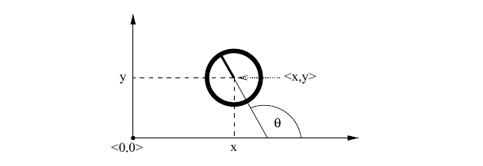

*Figure 5.1 — 전역 좌표계에서 표시된 로봇 pose (책 p.119)*

**평면에서 동작하는 모바일 로봇의 pose가 Figure 5.1에 예시되어 있다. 이는 외부 좌표계에 대한 2차원 평면
좌표와 각도 방향(angular orientation)으로 구성된다.**

### 2. 수식/유도

#### 전체 수식 (먼저 한 번에)

$$x_t = \begin{pmatrix} x \\ y \\ \theta \end{pmatrix} \tag{1}$$

$$\begin{pmatrix} x \\ y \end{pmatrix} \tag{2}$$

#### 단계별 설명 (생략 없이)

**(1) Pose** — 책 (5.1)

**전자를 $x$와 $y$로 (상태 변수 $x_t$와 혼동하지 말 것), 후자를 $\theta$로 표기하면, 로봇의 pose는
다음 벡터로 기술된다:**

$$\begin{pmatrix} x \\ y \\ \theta \end{pmatrix}$$

> **표기 주의 (책이 직접 경고한다)**: 이 장에서 $x$는 두 가지 뜻으로 쓰인다 —
> **① 상태 벡터 전체 $x_t$**, **② pose의 첫 성분(가로 좌표) $x$**. 문맥으로 구분해야 한다.
> 헷갈릴 때는 아래첨자 $t$가 붙었는지 보면 된다.

**Bearing / heading direction**

**로봇의 방향(orientation)은 흔히 bearing 또는 heading direction이라 불린다.**

> **Figure 5.1에서 보이듯, 우리는 방향 $\theta = 0$인 로봇이 자신의 $x$축 방향을 가리킨다고 상정한다.
> 방향 $\theta = 0.5\pi$인 로봇은 자신의 $y$축 방향을 가리킨다.**

**이 규약을 기억해두자**:

| $\theta$ | 라디안 | 가리키는 방향 |
|---|---|---|
| $0$ | 0 | $+x$ (오른쪽) |
| $0.5\pi$ | 90° | $+y$ (위) |
| $\pi$ | 180° | $-x$ (왼쪽) |
| $1.5\pi$ | 270° | $-y$ (아래) |

이 규약 때문에 **앞으로 나아가는 방향의 단위벡터가 $(\cos\theta, \sin\theta)$** 가 된다. 5.3절의 모든
삼각함수가 여기서 나온다.

**(2) Location** — 책 (5.2)

**방향이 없는 pose를 location이라 부른다.**

> **location 개념은 다음 장에서 로봇 환경을 기술하는 척도를 논의할 때 중요해질 것이다. 단순화를 위해
> 이 책에서 location은 보통 2차원 벡터로 기술되며, 이는 물체의 $x$-$y$ 좌표를 가리킨다:**

$$\begin{pmatrix} x \\ y \end{pmatrix}$$

**환경 내 물체들의 pose와 location이 로봇-환경 시스템의 kinematic state $x_t$를 구성할 수 있다.**

> **이 마지막 문장이 SLAM으로 가는 문이다** — 상태에 로봇 pose만이 아니라 **환경 물체들의 location까지
> 넣으면** 그것이 10장 이후의 SLAM 상태 벡터다. 3장 3.1절 예제 1에서 $n = 3 + 2\times100 = 203$이라
> 계산했던 것이 정확히 이것이다.

### 3. 예제/실습

#### 예제 1 — pose를 읽어보기

로봇의 pose가 $\begin{pmatrix} 4 \\ 2 \\ \pi \end{pmatrix}$라면?

- 전역 좌표계 원점에서 $x$ 방향으로 4, $y$ 방향으로 2만큼 떨어진 곳에 있고
- $\theta = \pi$이므로 **$-x$ 방향(왼쪽)을 바라보고 있다**
- 앞으로 1만큼 전진하면 $(\cos\pi, \sin\pi) = (-1, 0)$ 방향이므로 $\begin{pmatrix} 3 \\ 2 \\ \pi\end{pmatrix}$

#### 예제 2 — 자유도 세어보기

| 로봇 | 자유도 | 상태 벡터 |
|---|---|---|
| 평면 모바일 로봇 | 3 | $\langle x,y,\theta\rangle$ |
| 공중/수중 로봇 (강체) | 6 | $\langle x,y,z,\text{roll},\text{pitch},\text{yaw}\rangle$ |
| 평면 로봇 + 랜드마크 $N$개 | $3 + 2N$ | pose + 각 랜드마크 location |

#### 연습문제

1. $\theta = 0.25\pi$인 로봇이 앞으로 $\sqrt{2}$만큼 전진하면 새 $x$, $y$는?
2. 왜 평면 로봇에는 roll과 pitch가 필요 없는가? 어떤 상황에서 이 가정이 깨지는가?

---

## 5.2.2 Probabilistic Kinematics

### 1. 개념적 이해

**확률적 운동학 모델(probabilistic kinematic model), 또는 motion model이 모바일 로보틱스에서 state
transition model의 역할을 한다.**

**이 모델은 익숙한 조건부 밀도다:**

$$p(x_t \mid u_t, x_{t-1}) \tag{3}$$

> **여기서 $x_t$와 $x_{t-1}$은 둘 다 로봇 pose이며 (단지 그것의 $x$ 좌표가 아니다), $u_t$는 이동
> 명령(motion command)이다.** (책이 다시 한 번 표기 혼동을 경고한다.)

**이 모델은 로봇이 $x_{t-1}$에서 이동 명령 $u_t$를 실행할 때 취하는 kinematic state에 대한 posterior
분포를 기술한다.**

> **구현에서 $u_t$는 때때로 로봇의 odometry로 제공된다. 그러나 개념적 이유로 우리는 $u_t$를 control이라
> 부를 것이다.**
>
> 2장 2.3.2절에서 "odometer는 센서지만 이 책은 odometry를 control data로 취급한다"고 했던 그 규약이
> 여기서 다시 확인된다.

### Motion model이 실제로 어떻게 생겼는가

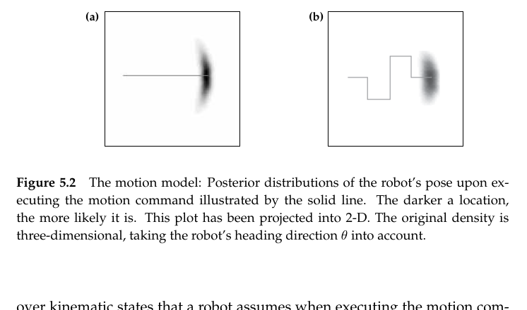

*Figure 5.2 — motion model: 실선으로 표시된 이동 명령을 실행했을 때 로봇 pose의 posterior 분포.
위치가 어두울수록 가능성이 높다. 이 그림은 2차원 평면으로 투영한 것이다. 원래 밀도는 3차원으로, 로봇의
heading direction $\theta$까지 고려한다 (책 p.120)*

**Figure 5.2는 평면 환경에서 동작하는 강체 모바일 로봇의 운동학 모델을 예시하는 두 예를 보여준다.**

**두 경우 모두 로봇의 초기 pose는 $x_{t-1}$이다. 분포 $p(x_t\mid u_t,x_{t-1})$은 음영 영역으로 시각화된다:
pose가 어두울수록 가능성이 높다.**

> **이 그림에서 posterior pose 확률은 $x$-$y$ 공간으로 투영되었다. 그림에는 로봇 방향에 대응하는 차원이
> 빠져 있다.**

- **Figure 5.2a**: 로봇이 앞으로 어느 정도 이동하며, 그동안 표시된 대로 **병진 오차와 회전 오차**를
  누적할 수 있다.
- **Figure 5.2b**: 더 복잡한 이동 명령의 결과 분포를 보여주며, 이는 **불확실성의 더 큰 퍼짐**으로 이어진다.

> **이 그림이 "바나나 모양"인 이유**: 로봇이 앞으로 갈 때 오차가 두 방향으로 생긴다 —
> **얼마나 갔나(병진 오차)** 는 진행 방향으로 길게 퍼지고, **어느 쪽으로 갔나(회전 오차)** 는 진행 방향에
> 수직으로 부채꼴로 퍼진다. 둘이 합쳐지면 휘어진 바나나 모양이 된다.
>
> 그리고 이것이 **가우시안이 아니다.** 3장에서 EKF가 이걸 타원으로 근사할 수밖에 없었던 이유이고,
> 4장 particle filter가 이 모양을 그대로 표현할 수 있는 이유다.

### 두 가지 motion model

**이 장은 평면에서 동작하는 모바일 로봇에 대해 두 가지 구체적인 확률적 motion model
$p(x_t\mid u_t,x_{t-1})$을 자세히 제공한다. 두 모델은 처리되는 이동 정보의 유형에서 다소 상보적이다.**

| | **Velocity motion model** (5.3절) | **Odometry motion model** (5.4절) |
|---|---|---|
| $u_t$가 무엇인가 | 모터에 준 **속도 명령** | 바퀴 회전에서 적분한 **이동량 측정** |
| 언제 알 수 있나 | 이동 **전** (명령이므로) | 이동 **후** (측정이므로) |
| 정확도 | 상대적으로 낮음 | **더 높음** |
| 주 용도 | **motion planning** (예측) | **estimation** (추정) |

**첫 번째는 이동 데이터 $u_t$가 로봇 모터에 주어진 속도 명령을 명시한다고 가정한다.**

> **많은 상용 모바일 로봇(예: differential drive, synchro drive)이 독립적인 병진 속도와 회전 속도로
> 구동되거나, 그렇게 구동된다고 생각하는 것이 최선이다.**

**두 번째는 odometry 정보에 접근할 수 있다고 가정한다.**

> **대부분의 상용 베이스는 운동학적 정보(이동한 거리, 회전한 각도)를 사용해 odometry를 제공한다.
> 그런 정보를 통합하는 결과 확률 모델은 velocity model과 다소 다르다.**

### 어느 쪽을 언제 쓰는가 (책 p.121)

> **실제로 odometry model이 velocity model보다 더 정확한 경향이 있는데, 이유는 단순하다 — 대부분의 상용
> 로봇이 로봇 바퀴의 회전을 측정해 얻을 수 있는 수준의 정확도로 속도 명령을 실행하지 못하기 때문이다.**

**그러나 odometry는 이동 명령을 실행한 후에만 사용 가능하다. 따라서 motion planning에는 사용될 수 없다.**

> **충돌 회피 같은 planning 알고리즘은 이동의 효과를 예측해야 한다. 따라서 odometry model은 보통
> estimation에 적용되는 반면, velocity model은 확률적 motion planning에 사용된다.**

### 2. 예제/실습

#### 예제 — 두 모델의 차이를 시간축에서 보기

```
시각:        t-1 ────────── 이동 ────────── t
velocity:    u_t 를 여기서 안다 (명령)        ← planning 가능
odometry:                          u_t 를 여기서 안다 (측정)  ← planning 불가, estimation만
```

**"앞으로 1초간 0.5 m/s로 가면 어디 있을까?"** 는 velocity model만 답할 수 있다.
**"방금 어디까지 갔지?"** 는 odometry model이 더 정확하게 답한다.

#### 연습문제

1. 로봇이 카펫 위에서 바퀴가 헛돈다면(slippage), 두 모델 중 어느 쪽이 더 큰 오차를 내는가?
2. Figure 5.2의 posterior가 가우시안이 아닌 이유를 병진 오차·회전 오차로 나눠 설명하라.

---

# 5.3 Velocity Motion Model (책 p.121~132)

## 개요

**Velocity motion model은 우리가 로봇을 두 개의 속도, 즉 회전 속도와 병진 속도로 제어할 수 있다고
가정한다.**

> **많은 상용 로봇이 프로그래머가 속도를 지정하는 제어 인터페이스를 제공한다. 이런 방식으로 흔히
> 제어되는 구동계에는 differential drive, Ackerman drive, synchro-drive가 포함된다.**
>
> **우리 모델이 다루지 않는 구동 시스템은 non-holonomic 제약이 없는 것들이며, Mecanum 휠을 장착한
> 로봇이나 다리 달린 로봇이 그렇다.**

> **Non-holonomic 제약이란 (개념부터)**
>
> **"아무 방향으로나 곧바로 갈 수는 없다"는 제약**이다. 자동차를 생각해보면 명확하다 — 옆으로 평행이동은
> 불가능하고, 반드시 **앞뒤로 움직이면서 방향을 틀어야** 한다. 그래서 주차할 때 여러 번 왔다갔다 하는 것이다.
>
> 이 책의 모델은 **로봇이 항상 자신이 바라보는 방향으로만 전진한다**고 가정한다. Mecanum 휠(옆으로도
> 굴러가는 특수 바퀴)이나 다리 로봇은 옆으로 곧장 갈 수 있어서 이 가정이 깨진다.

### 제어 벡터

$$u_t = \begin{pmatrix} v_t \\ \omega_t \end{pmatrix} \tag{4}$$

**시각 $t$의 병진 속도(translational velocity)를 $v_t$로, 회전 속도(rotational velocity)를 $\omega_t$로
표기한다.**

> **우리는 임의로 양의 회전 속도 $\omega_t$가 반시계 방향 회전(좌회전)을 유발한다고 상정한다.
> 양의 병진 속도 $v_t$는 전진 운동에 대응한다.**

| 기호 | 이름 | 단위 | 양수일 때 |
|---|---|---|---|
| $v_t$ | 병진 속도 | m/s | 전진 |
| $\omega_t$ | 회전 속도 | rad/s | 좌회전 (반시계) |

---

## 5.3.3 Mathematical Derivation — 먼저 이해할 물리 (책 p.125~129)

> **순서를 바꿔 읽는다.** 책은 알고리즘(5.3.1, 5.3.2)을 먼저 제시하고 유도(5.3.3)를 나중에 하지만,
> 운동학 배경이 없다면 **"로봇이 왜 원을 그리는가"** 를 먼저 이해하는 편이 훨씬 낫다. 물리를 먼저 보고
> 알고리즘으로 돌아오자.

### 1. 개념적 이해 — 왜 원인가

**확률적 경우로 넘어가기 전에, 이상적이고 노이즈 없는 로봇의 운동학부터 서술하자.**

> **$u_t = (v\ \omega)^T$를 시각 $t$의 제어라 하자. 두 속도가 전체 시간 구간 $(t-1, t]$ 동안 고정된 값으로
> 유지되면, 로봇은 반지름 $r$인 원 위에서 움직인다.**

**직관**: 앞으로 나가면서($v$) 동시에 일정하게 방향을 틀면($\omega$) — **원을 그린다.** 자동차 핸들을
한쪽으로 고정하고 일정 속도로 달리면 제자리 원을 도는 것과 같다.

- $\omega$가 크면(많이 틀면) → 반지름이 **작은** 원
- $v$가 크면(빨리 가면) → 반지름이 **큰** 원

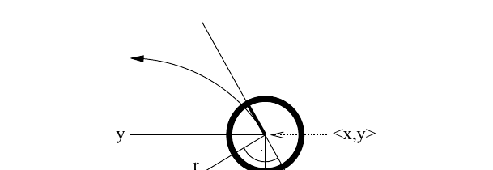

*Figure 5.5 — 일정 속도 $v$와 $\omega$로 움직이며 $(x\ y\ \theta)^T$에서 출발하는 노이즈 없는 로봇이
수행하는 운동 (책 p.126)*

### 2. 수식/유도

#### 전체 유도 과정 (먼저 한 번에)

$$v = \omega \cdot r \tag{5}$$

$$r = \left|\frac{v}{\omega}\right| \tag{6}$$

$$x_c = x - \frac{v}{\omega}\sin\theta, \qquad y_c = y + \frac{v}{\omega}\cos\theta \tag{7}$$

$$
\begin{pmatrix} x' \\ y' \\ \theta' \end{pmatrix}
= \begin{pmatrix} x_c + \frac{v}{\omega}\sin(\theta + \omega\Delta t) \\[3pt]
y_c - \frac{v}{\omega}\cos(\theta + \omega\Delta t) \\[3pt]
\theta + \omega\Delta t \end{pmatrix}
\tag{8}
$$

$$
\begin{pmatrix} x' \\ y' \\ \theta' \end{pmatrix}
= \begin{pmatrix} x \\ y \\ \theta \end{pmatrix}
+ \begin{pmatrix} -\frac{v}{\omega}\sin\theta + \frac{v}{\omega}\sin(\theta + \omega\Delta t) \\[3pt]
\frac{v}{\omega}\cos\theta - \frac{v}{\omega}\cos(\theta + \omega\Delta t) \\[3pt]
\omega\Delta t \end{pmatrix}
\tag{9}
$$

#### 단계별 설명 (생략 없이)

**(5), (6) 반지름 공식** — 책 (5.6), (5.5)

**이는 반지름 $r$인 원형 궤적 위를 움직이는 임의의 물체에 대한 병진 속도 $v$와 회전 속도 $\omega$
사이의 일반적 관계로부터 따라나온다:**

$$v = \omega \cdot r$$

> **이 관계가 어디서 오는가 (개념부터)**
>
> 반지름 $r$인 원의 둘레는 $2\pi r$이다. 한 바퀴 도는 데 걸리는 시간을 $T$라 하면:
> - 병진 속도 $v = \dfrac{2\pi r}{T}$ (거리 ÷ 시간)
> - 회전 속도 $\omega = \dfrac{2\pi}{T}$ (각도 ÷ 시간, 한 바퀴 = $2\pi$ 라디안)
>
> 두 식을 나누면 $\dfrac{v}{\omega} = r$, 즉 $v = \omega r$. ✔

따라서 반지름은:

$$r = \left|\frac{v}{\omega}\right|$$

> **식 (6)은 로봇이 전혀 회전하지 않는 경우($\omega = 0$)를 포함하는데, 이 경우 로봇은 직선 위를 움직인다.
> 직선은 무한 반지름의 원에 대응하므로, $r$이 무한할 수 있음에 주목한다.**

**⚠️ 구현상 주의**: $\omega = 0$이면 $v/\omega$가 0으로 나누기가 된다. 실제 코드에서는
$|\omega| < \epsilon$일 때 직선 운동 공식($x' = x + v\Delta t\cos\theta$ 등)으로 분기해야 한다.

**(7) 원의 중심** — 책 (5.7), (5.8)

**$x_{t-1} = (x,y,\theta)^T$를 로봇의 초기 pose라 하고, 속도를 어떤 시간 $\Delta t$ 동안
$(v\ \omega)^T$로 일정하게 유지한다고 하자. 쉽게 보일 수 있듯 원의 중심은 다음에 있다:**

$$x_c = x - \frac{v}{\omega}\sin\theta, \qquad y_c = y + \frac{v}{\omega}\cos\theta$$

> **왜 이 자리인가 (생략 없이)**
>
> 원운동에서 **중심은 항상 진행 방향에 수직인 쪽에 있다.** 로봇은 $\theta$ 방향으로 가고 있으므로
> 진행 방향 단위벡터는 $(\cos\theta, \sin\theta)$다.
>
> 이를 **반시계 방향으로 90° 돌린** 벡터가 $(-\sin\theta, \cos\theta)$다.
> ($90°$ 회전은 $(a,b) \to (-b,a)$.)
>
> 좌회전($\omega > 0$)하면 중심은 **왼쪽**에 있고, 거리는 반지름 $r = v/\omega$다. 따라서
> $$\begin{pmatrix}x_c\\y_c\end{pmatrix} = \begin{pmatrix}x\\y\end{pmatrix} + \frac{v}{\omega}\begin{pmatrix}-\sin\theta\\\cos\theta\end{pmatrix}$$
> 이것이 식 (7)이다. ✔ ($\omega<0$이면 $v/\omega$가 음수가 되어 자동으로 오른쪽을 가리킨다.)

**(8), (9) $\Delta t$ 후의 pose** — 책 (5.9)

**$(x_c\ y_c)^T$는 이 좌표를 나타낸다. $\Delta t$ 시간의 운동 후 우리의 이상적 로봇은
$x_t = (x'\ y'\ \theta')^T$에 있게 된다.**

> **이 표현의 유도는 단순한 삼각법에서 따라나온다: $\Delta t$ 시간 단위 후 노이즈 없는 로봇은 원을 따라
> $v\cdot\Delta t$만큼 진행했고, 이는 heading direction을 $\omega\cdot\Delta t$만큼 돌게 했다. 동시에
> $x$와 $y$ 좌표는 $(x_c\ y_c)^T$를 중심으로 하는 원과, $(x_c\ y_c)^T$에서 $\omega\cdot\Delta t$에 수직인
> 각도로 출발하는 광선의 교점으로 주어진다.**

> **읽는 법**: 식 (8)의 첫 두 줄은 **"중심에서 반지름만큼 떨어진 점"** 을 새 각도로 다시 쓴 것이다.
> 식 (7)에서 출발점이 중심 + $\frac{v}{\omega}(\sin\theta, -\cos\theta)$였으니, 각도가
> $\theta \to \theta+\omega\Delta t$로 바뀌면 그 자리에 새 각도를 넣으면 된다.

**두 번째 변환은 단순히 (7)을 그 결과 운동 방정식에 대입한 것이다.** 즉 식 (9)는 $x_c, y_c$를 소거해
**"원래 pose + 변화량"** 형태로 정리한 것이다.

$$\begin{pmatrix} x' \\ y' \\ \theta' \end{pmatrix} = \begin{pmatrix} x \\ y \\ \theta \end{pmatrix} + \begin{pmatrix} -\frac{v}{\omega}\sin\theta + \frac{v}{\omega}\sin(\theta+\omega\Delta t) \\ \frac{v}{\omega}\cos\theta - \frac{v}{\omega}\cos(\theta+\omega\Delta t) \\ \omega\Delta t \end{pmatrix}$$

> **이 식 (9)가 3장 3.3.1절 예제에서 EKF의 $g(u_t, x_{t-1})$로 미리 등장했던 그 식이다.**
> 그때는 "5장에서 정확히 유도할 velocity motion model"이라고만 하고 넘어갔는데, 여기서 그 유도가 끝났다.

**비상수 속도는 어떻게 하나** (책 p.127)

> **물론 실제 로봇은 한 속도에서 다른 속도로 점프할 수 없고, 각 시간 구간에서 속도를 일정하게 유지하지도
> 못한다. 비상수 속도로 운동학을 계산하기 위해, 따라서 $\Delta t$에 작은 값을 사용하고 각 시간 구간
> 안에서 실제 속도를 상수로 근사하는 것이 일반적 관행이다. (근사적) 최종 pose는 방금 서술한 수학
> 방정식들을 사용해 대응하는 원형 궤적들을 이어붙여 얻어진다.**

---

## Real Motion — 노이즈 추가하기 (책 p.127~129)

### 1. 개념적 이해

**실제로 로봇 운동은 노이즈의 지배를 받는다. 실제 속도는 명령된 속도(또는 로봇에 속도 측정 센서가 있다면
측정된 속도)와 다르다.**

**우리는 이 차이를 유한한 분산을 갖는 평균 0의 확률변수로 모델링할 것이다.**

이것이 5.1절에서 말한 **"결정론적 구동기 모델을 확률화한다"** 의 실행이다 — 식 (9)의 $v, \omega$를
노이즈가 섞인 $\hat v, \hat\omega$로 바꾸기만 하면 된다.

### 2. 수식/유도

#### 전체 수식 (먼저 한 번에)

$$\begin{pmatrix} \hat v \\ \hat\omega \end{pmatrix} = \begin{pmatrix} v \\ \omega \end{pmatrix} + \begin{pmatrix} \varepsilon_{\alpha_1 v^2 + \alpha_2\omega^2} \\ \varepsilon_{\alpha_3 v^2 + \alpha_4\omega^2} \end{pmatrix} \tag{10}$$

$$\varepsilon_{b^2}(a) = \frac{1}{\sqrt{2\pi b^2}}\exp\left\{-\frac{1}{2}\frac{a^2}{b^2}\right\} \tag{11}$$

$$\varepsilon_{b^2}(a) = \max\left\{0,\; \frac{1}{\sqrt 6\, b} - \frac{|a|}{6b^2}\right\} \tag{12}$$

$$\theta' = \theta + \hat\omega\Delta t + \hat\gamma\Delta t, \qquad \hat\gamma = \varepsilon_{\alpha_5 v^2 + \alpha_6\omega^2} \tag{13}$$

$$
\begin{pmatrix} x' \\ y' \\ \theta' \end{pmatrix}
= \begin{pmatrix} x \\ y \\ \theta \end{pmatrix}
+ \begin{pmatrix} -\frac{\hat v}{\hat\omega}\sin\theta + \frac{\hat v}{\hat\omega}\sin(\theta + \hat\omega\Delta t) \\[3pt]
\frac{\hat v}{\hat\omega}\cos\theta - \frac{\hat v}{\hat\omega}\cos(\theta + \hat\omega\Delta t) \\[3pt]
\hat\omega\Delta t + \hat\gamma\Delta t \end{pmatrix}
\tag{14}
$$

#### 단계별 설명 (생략 없이)

**(10) 노이즈 섞인 속도** — 책 (5.10)

**더 정확히 말해, 실제 속도가 다음과 같이 주어진다고 가정하자:**

$$\begin{pmatrix} \hat v \\ \hat\omega \end{pmatrix} = \begin{pmatrix} v \\ \omega \end{pmatrix} + \begin{pmatrix} \varepsilon_{\alpha_1 v^2 + \alpha_2\omega^2} \\ \varepsilon_{\alpha_3 v^2 + \alpha_4\omega^2} \end{pmatrix}$$

**여기서 $\varepsilon_{b^2}$는 분산 $b^2$를 갖는 평균 0의 오차 변수다. 따라서 참 속도는 명령된 속도에
작은 가법적 오차(노이즈)를 더한 것과 같다.**

> **핵심 설계 결정 (책의 명시)**: **우리 모델에서 오차의 표준편차는 명령된 속도에 비례한다.**
>
> 즉 **빨리 갈수록 오차도 커진다.** 분산이 $\alpha_1 v^2 + \alpha_2\omega^2$ 형태인 이유가 이것이다 —
> $v$와 $\omega$의 **제곱**에 비례하는 분산은 곧 표준편차가 $v, \omega$에 **비례**한다는 뜻이다.
> (분산 = 표준편차의 제곱이므로.)
>
> 물리적으로 타당하다: 시속 1 km로 가면 오차가 몇 cm지만 시속 100 km로 가면 몇 m가 된다.

**여섯 개 파라미터의 의미**

**파라미터 $\alpha_1$부터 $\alpha_4$ ($i=1,\ldots,4$에 대해 $\alpha_i \ge 0$)는 로봇별 오차 파라미터다.
이들은 로봇의 정확도를 모델링한다. 로봇이 부정확할수록 이 파라미터들이 커진다.**

| 파라미터 | 어느 노이즈의 | 무엇에 비례 | 읽는 법 |
|---|---|---|---|
| $\alpha_1$ | 병진 속도 오차 $\hat v$ | $v^2$ | "빨리 갈수록 속도 오차↑" |
| $\alpha_2$ | 병진 속도 오차 $\hat v$ | $\omega^2$ | "많이 틀수록 속도 오차↑" |
| $\alpha_3$ | 회전 속도 오차 $\hat\omega$ | $v^2$ | "빨리 갈수록 회전 오차↑" |
| $\alpha_4$ | 회전 속도 오차 $\hat\omega$ | $\omega^2$ | "많이 틀수록 회전 오차↑" |
| $\alpha_5$ | 최종 방향 오차 $\hat\gamma$ | $v^2$ | (아래 설명) |
| $\alpha_6$ | 최종 방향 오차 $\hat\gamma$ | $\omega^2$ | (아래 설명) |

**(11), (12) 오차 분포 두 가지** — 책 (5.11), (5.12)

**오차 $\varepsilon_{b^2}$에 대한 두 가지 흔한 선택은 정규분포와 삼각분포다.**

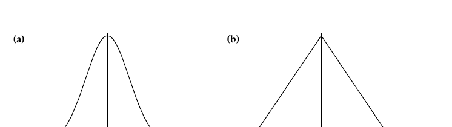

*Figure 5.6 — 분산 $b^2$를 갖는 확률밀도함수: (a) 정규분포, (b) 삼각분포 (책 p.128)*

**정규분포** — 평균 0, 분산 $b^2$:

$$\varepsilon_{b^2}(a) = \frac{1}{\sqrt{2\pi b^2}}\, e^{-\frac{1}{2}\frac{a^2}{b^2}}$$

**정규분포는 연속 확률 과정의 노이즈를 모델링하는 데 흔히 사용된다. 그 support — $p(a) > 0$인 점 $a$의
집합 — 는 $\mathbb{R}$ 전체다.**

**삼각분포** — 평균 0, 분산 $b^2$:

$$\varepsilon_{b^2}(a) = \max\left\{0,\; \frac{1}{\sqrt 6\, b} - \frac{|a|}{6b^2}\right\}$$

**이는 $(-\sqrt6 b;\ \sqrt6 b)$에서만 0이 아니다. Figure 5.6b가 시사하듯 이 밀도는 대칭 삼각형의 모양을
닮았다 — 그래서 이런 이름이 붙었다.**

> **왜 삼각분포도 쓰는가**: 정규분포는 support가 무한이라 **"아주 낮은 확률이지만 로봇이 100m 순간이동
> 했을 수도 있다"** 는 값을 허용한다. 삼각분포는 $\pm\sqrt6 b$ 밖을 확률 0으로 잘라내므로 물리적으로
> 더 그럴듯하고, 계산도 더 싸다.

**노이즈를 넣은 운동 방정식** (책 (5.13))

**$x_{t-1} = (x\ y\ \theta)^T$에서 이동 명령 $u_t = (v\ \omega)^T$를 실행한 후의 실제 pose에 대한 더 나은
모델은 (9)의 명령 속도 $(v\ \omega)^T$를 노이즈 섞인 운동 $(\hat v\ \hat\omega)^T$로 치환한 것이다.**

**그러나 이 모델은 여전히 그리 현실적이지 않은데, 그 이유를 이제 논의한다.**

### 결정적인 문제 — Final Orientation (책 p.129)

**위에 주어진 두 방정식은, 로봇이 실제로 반지름 $r = \hat v/\hat\omega$인 정확한 원형 궤적 위를 움직인다는
전제 하에서 로봇의 최종 위치를 정확히 기술한다.**

> **이 원호의 반지름과 이동한 거리는 제어 노이즈에 영향을 받지만, 궤적이 원형이라는 바로 그 사실은
> 영향받지 않는다. 원형 운동의 가정은 중요한 퇴화(degeneracy)로 이어진다.**

**무엇이 문제인가**:

> **특히 밀도 $p(x_t\mid u_t,x_{t-1})$의 support가 3차원 pose 공간 안에서 2차원이다. 모든 posterior pose가
> 3차원 pose 공간 안의 2차원 다양체(manifold) 위에 놓인다는 사실은, 우리가 노이즈 변수를 두 개만 —
> $v$에 하나, $\omega$에 하나 — 사용했다는 사실의 직접적 결과다.**
>
> **불행히도 이 퇴화는 상태 추정에 Bayes filter를 적용할 때 중요한 파급 효과를 갖는다.**

> **이게 무슨 뜻인가 (풀어서)**
>
> 노이즈 변수가 2개($v$, $\omega$)뿐이면, 가능한 결과 pose는 **2개의 자유도**만 갖는다. 그런데 pose 공간은
> 3차원($x,y,\theta$)이다. 즉 **3차원 공간 안에 2차원 면(면 위)에만 확률이 있고, 그 면을 벗어난 곳은
> 확률이 정확히 0이다.**
>
> **왜 문제인가**: 임의의 $x_t$가 주어졌을 때 $p(x_t\mid u_t,x_{t-1})$를 계산해야 하는데, 그 $x_t$가
> 우연히 이 2차원 면 위에 정확히 놓일 확률은 0이다. **즉 거의 모든 $x_t$에 대해 확률이 0이 나온다.**
> Particle filter의 라인 5(importance factor)나 EKF의 계산이 전부 무의미해진다.
>
> 책도 5.3.3절 뒤에서 이를 명시한다: **"$x_{t-1}$, $u_t$, $x_t$의 거의 모든 값에 대해, 최종 회전을
> 허용하지 않으면 운동 확률이 단순히 0이 될 것이다."**

**(13) 해법 — 최종 회전 $\hat\gamma$ 추가** — 책 (5.14), (5.15)

**현실에서 의미 있는 posterior 분포는 물론 퇴화하지 않으며, pose는 $x$, $y$, $\theta$의 3차원 변화 공간
안에서 찾을 수 있다.**

> **우리 motion model을 그에 맞게 일반화하기 위해, 우리는 로봇이 최종 pose에 도착했을 때 회전
> $\hat\gamma$를 수행한다고 가정할 것이다.**

$$\theta' = \theta + \hat\omega\Delta t + \hat\gamma\Delta t, \qquad \hat\gamma = \varepsilon_{\alpha_5 v^2 + \alpha_6\omega^2}$$

**여기서 $\alpha_5$와 $\alpha_6$는 추가적인 회전 노이즈의 분산을 결정하는 추가적인 로봇별 파라미터다.**

> **직관적 해석**: "로봇이 목적지에 도착한 뒤 제자리에서 살짝 더 돌았다"고 보는 것이다. 물리적으로
> 실제 일어나는 일이라기보다는, **3번째 자유도를 확보해 퇴화를 없애기 위한 모델링 장치**에 가깝다.
> 이것이 $\alpha_5, \alpha_6$가 존재하는 이유 전부다.

**(14) 최종 motion model** — 책 (5.16)

**따라서 그 결과 motion model은 식 (14)와 같다.** — 식 (9)에서 $v \to \hat v$, $\omega\to\hat\omega$로
바꾸고, 세 번째 성분에 $+\hat\gamma\Delta t$를 더한 것이다.

### 3. 예제/실습

#### 예제 — 원 궤적을 직접 계산

$x_{t-1} = (0,0,0)^T$, $v = 1.0$ m/s, $\omega = 0.5$ rad/s, $\Delta t = 2$ s. (노이즈 없음)

**Step 1 — 반지름**: $r = |v/\omega| = |1.0/0.5| = 2.0$ m

**Step 2 — 원의 중심** (식 (7)):
$$x_c = 0 - 2.0\sin 0 = 0, \qquad y_c = 0 + 2.0\cos 0 = 2.0$$
→ 중심은 $(0, 2)$. **로봇의 왼쪽 2m 지점** (좌회전 중이므로) ✔

**Step 3 — 최종 pose** (식 (9)):
$$\omega\Delta t = 0.5 \times 2 = 1.0 \text{ rad} \approx 57.3°$$
$$x' = 0 + (-2\sin 0 + 2\sin 1.0) = 2 \times 0.8415 = 1.683$$
$$y' = 0 + (2\cos 0 - 2\cos 1.0) = 2 - 2\times0.5403 = 0.919$$
$$\theta' = 0 + 1.0 = 1.0 \text{ rad}$$

**검산**: 이동 거리는 $v\Delta t = 2$ m여야 한다. 호의 길이 $= r\cdot\omega\Delta t = 2\times1.0 = 2$ m ✔
그리고 중심 $(0,2)$에서 $(1.683, 0.919)$까지 거리는
$\sqrt{1.683^2 + 1.081^2} = \sqrt{2.833+1.169} = \sqrt{4.002} = 2.0$ ✔ — 원 위에 있다.

#### 연습문제

1. $\omega = -0.5$ (우회전)로 바꾸면 중심은 어디인가? 최종 pose는?
2. $\omega \to 0$일 때 식 (9)의 극한이 직선 운동 $x' = x + v\Delta t\cos\theta$가 됨을 보여라.
   (힌트: $\sin(\theta+\epsilon) - \sin\theta \approx \epsilon\cos\theta$)
3. $\alpha_5 = \alpha_6 = 0$으로 두면 어떤 문제가 생기는가?

---

## 5.3.2 Sampling Algorithm (책 p.122~125)

> **순서 주의**: 책에서는 5.3.1(밀도 계산)이 먼저지만, **sampling이 훨씬 쉽고 직관적**이므로 먼저 본다.
> 책 자신도 "많은 경우 $x_t$를 표집하는 것이 주어진 $x_t$의 밀도를 계산하는 것보다 쉽다"고 말한다.

### 1. 개념적 이해

**Particle filter(4.3절)에 대해서는, 임의의 $x_t$, $u_t$, $x_{t-1}$에 대해 posterior를 계산하는 대신
motion model $p(x_t\mid u_t,x_{t-1})$로부터 표집하는 것으로 충분하다.**

> **조건부 밀도로부터 표집하는 것은 밀도를 계산하는 것과 다르다:**
>
> - **표집(sampling)에서는 $u_t$와 $x_{t-1}$이 주어지고, motion model $p(x_t\mid u_t,x_{t-1})$에 따라
>   뽑힌 무작위 $x_t$를 생성하려 한다.**
> - **밀도 계산(calculating the density)에서는 다른 수단으로 생성된 $x_t$도 주어지고,
>   $p(x_t\mid u_t,x_{t-1})$ 하에서 $x_t$의 확률을 계산하려 한다.**

**이것이 4.3.1절 연습문제 1의 답이다** — particle filter 라인 4는 **표집** 능력을, 라인 5는 **계산** 능력을
요구한다.

### 2. 알고리즘

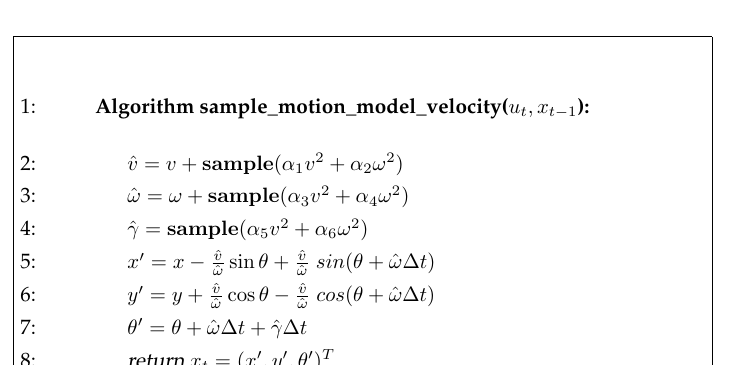

*Table 5.3 — pose $x_{t-1} = (x\ y\ \theta)^T$와 제어 $u_t = (v\ \omega)^T$로부터 pose
$x_t = (x'\ y'\ \theta')^T$를 표집하는 알고리즘. 최종 방향을 추가적인 무작위 항 $\hat\gamma$로
교란시킨다는 점에 주목하라. 변수 $\alpha_1$부터 $\alpha_6$는 motion noise의 파라미터다. 함수
$\mathrm{sample}(b^2)$은 분산 $b^2$를 갖는 평균 0 분포로부터 무작위 표본을 생성한다 (책 p.124)*

$$
\begin{aligned}
&1:\;\; \textbf{Algorithm sample\_motion\_model\_velocity}(u_t,\, x_{t-1}): \\[3pt]
&2:\quad \hat v = v + \mathbf{sample}(\alpha_1 v^2 + \alpha_2\omega^2) \\
&3:\quad \hat\omega = \omega + \mathbf{sample}(\alpha_3 v^2 + \alpha_4\omega^2) \\
&4:\quad \hat\gamma = \mathbf{sample}(\alpha_5 v^2 + \alpha_6\omega^2) \\[3pt]
&5:\quad x' = x - \frac{\hat v}{\hat\omega}\sin\theta + \frac{\hat v}{\hat\omega}\sin(\theta + \hat\omega\Delta t) \\
&6:\quad y' = y + \frac{\hat v}{\hat\omega}\cos\theta - \frac{\hat v}{\hat\omega}\cos(\theta + \hat\omega\Delta t) \\
&7:\quad \theta' = \theta + \hat\omega\Delta t + \hat\gamma\Delta t \\[3pt]
&8:\quad \textbf{return } x_t = (x',\, y',\, \theta')^T
\end{aligned}
\tag{15}
$$

**라인 2부터 4는 명령된 제어 파라미터를 운동학 motion model의 오차 파라미터로부터 뽑은 노이즈로
"교란(perturb)"한다. 그런 다음 이 노이즈 값들이 라인 5부터 7에서 표본의 새 pose를 생성하는 데 사용된다.**

> **따라서 표집 절차는 제어 노이즈를 예측에 반영하는 단순한 물리적 로봇 motion model을, 거의 가장
> 직접적인 방식으로 구현한다.**

**라인 5~7이 정확히 식 (14)이고, 라인 2~4가 식 (10)과 (13)이다.**

### 표집 함수 구현

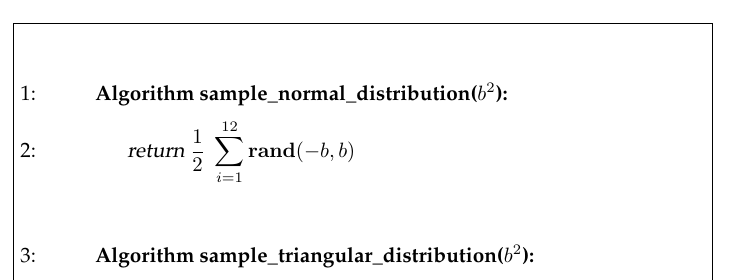

*Table 5.4 — 평균 0, 분산 $b^2$를 갖는 (근사적) 정규분포와 삼각분포로부터 표집하는 알고리즘;
Winkler (1995: p293) 참조. 함수 $\mathrm{rand}(x,y)$는 $[x,y]$에서 균등분포를 갖는 유사난수
생성기로 가정한다 (책 p.124)*

$$
\begin{aligned}
&1:\;\; \textbf{Algorithm sample\_normal\_distribution}(b^2): \\[3pt]
&2:\quad \textbf{return } \frac{1}{2}\sum_{i=1}^{12} \mathrm{rand}(-b,\, b) \\[8pt]
&3:\;\; \textbf{Algorithm sample\_triangular\_distribution}(b^2): \\[3pt]
&4:\quad \textbf{return } \frac{\sqrt 6}{2}\left[\mathrm{rand}(-b,\, b) + \mathrm{rand}(-b,\, b)\right]
\end{aligned}
\tag{16}
$$

**정규분포 표집이 왜 이렇게 되는가** (책 p.132):

> **Table 5.4의 sample_normal_distribution 알고리즘은 정규분포로부터 표집하는 흔한 근사를 구현한다.
> 이 근사는 중심극한정리(central limit theorem)를 활용하는데, 이는 비퇴화 확률변수들의 어떤 평균이든
> 정규분포로 수렴한다는 것이다.**
>
> **12개의 균등분포를 평균냄으로써 sample_normal_distribution은 근사적으로 정규분포를 따르는 값을
> 생성한다. 다만 기술적으로 그 결과 값은 항상 $[-2b, 2b]$에 놓인다.**

> **왜 하필 12개인가**: $[-b,b]$ 균등분포의 분산은 $\dfrac{(2b)^2}{12} = \dfrac{b^2}{3}$이다.
> 12개를 더하면 분산이 $12\times\dfrac{b^2}{3} = 4b^2$가 되고, $\dfrac12$을 곱하면
> $\left(\dfrac12\right)^2\times 4b^2 = b^2$ ✔ — **정확히 원하는 분산이 나온다.**
> 12는 이 계산이 깔끔하게 떨어지는 수라서 선택된 것이다.

### 밀도 계산보다 표집이 쉬운 이유 (책 p.125)

**우리는 많은 경우 $x_t$를 표집하는 것이 주어진 $x_t$의 밀도를 계산하는 것보다 쉽다는 점에 주목한다.**

> **이는 표본이 물리적 motion model의 전방 시뮬레이션(forward simulation)만을 요구하기 때문이다.
> 가설적 pose의 확률을 계산하는 것은 오차 파라미터를 역추측(retro-guessing)하는 것에 해당하며,
> 이는 우리가 물리적 motion model의 역(inverse)을 계산할 것을 요구한다.**
>
> **Particle filter가 표집에 의존한다는 사실이, 구현 관점에서 particle filter를 특히 매력적으로 만든다.**

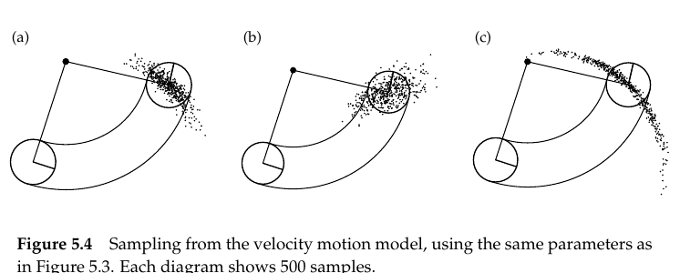

*Figure 5.4 — Figure 5.3과 같은 파라미터를 사용한 velocity motion model로부터의 표집.
각 다이어그램은 500개 표본을 보여준다 (책 p.125)*

<!--widget:velocity-motion-->

### 3. 예제/실습

#### 예제 — 표집 알고리즘 구현

```python
import random, math

def sample_normal(b2):
    """Table 5.4 라인 2 — 균등분포 12개의 평균으로 정규분포 근사"""
    b = math.sqrt(b2)
    return 0.5 * sum(random.uniform(-b, b) for _ in range(12))

def sample_triangular(b2):
    """Table 5.4 라인 4"""
    b = math.sqrt(b2)
    return (math.sqrt(6) / 2) * (random.uniform(-b, b) + random.uniform(-b, b))

def sample_motion_model_velocity(u, x, alpha, dt, sample=sample_normal):
    """Table 5.3"""
    v, w = u
    px, py, th = x
    a1, a2, a3, a4, a5, a6 = alpha

    v_hat = v + sample(a1*v*v + a2*w*w)          # 라인 2
    w_hat = w + sample(a3*v*v + a4*w*w)          # 라인 3
    g_hat = sample(a5*v*v + a6*w*w)              # 라인 4

    if abs(w_hat) < 1e-6:                        # ω≈0 이면 직선 (식 6의 주의사항)
        x_new = px + v_hat*dt*math.cos(th)
        y_new = py + v_hat*dt*math.sin(th)
    else:
        r = v_hat / w_hat
        x_new = px - r*math.sin(th) + r*math.sin(th + w_hat*dt)   # 라인 5
        y_new = py + r*math.cos(th) - r*math.cos(th + w_hat*dt)   # 라인 6
    th_new = th + w_hat*dt + g_hat*dt                             # 라인 7
    return (x_new, y_new, th_new)
```

#### 연습문제

1. `sample_normal(b2)`를 10,000번 호출해 표본분산을 구하면 $b^2$에 가까운가? 직접 확인하라.
2. 라인 4의 $\hat\gamma$를 제거하면 500개 표본이 어떤 모양으로 분포하는가? (힌트: 2차원 곡선)

---

## 5.3.1 Closed Form Calculation (책 p.121~122, 129~132)

### 1. 개념적 이해

이제 반대 방향이다 — **$x_{t-1}$, $u_t$, 그리고 가설적 $x_t$가 주어졌을 때 $p(x_t\mid u_t,x_{t-1})$의
값을 계산**한다. EKF나 히스토그램 필터, 또는 particle filter의 가중치 계산에 필요하다.

**핵심 아이디어**: 노이즈 없는 로봇이라면 $x_{t-1}$에서 $x_t$로 가기 위해 **어떤 제어 $\hat u = (\hat v\ \hat\omega)^T$가
필요했을까**를 역산하고, 그것이 실제 명령 $u_t$와 얼마나 다른지를 오차 분포에 넣는 것이다.

> **책의 표현**: **"이 알고리즘의 유도는 다소 복잡한데, 실질적으로 역 motion model(inverse motion model)을
> 구현하기 때문이다. 특히 motion_model_velocity는 pose $x_{t-1}$과 $x_t$로부터 운동 파라미터
> $\hat u_t = (\hat v\ \hat\omega)^T$를 결정하며, 적절한 최종 회전 $\hat\gamma$도 함께 결정한다."**
>
> **"우리의 유도는 왜 최종 회전이 필요한지를 명백하게 만든다: $x_{t-1}$, $u_t$, $x_t$의 거의 모든 값에
> 대해, 최종 회전을 허용하지 않으면 운동 확률이 단순히 0이 될 것이다."**

### 2. 수식/유도

#### 전체 유도 과정 (먼저 한 번에)

$$\begin{pmatrix} x^* \\ y^* \end{pmatrix} = \begin{pmatrix} x \\ y \end{pmatrix} + \begin{pmatrix} -\lambda\sin\theta \\ \lambda\cos\theta \end{pmatrix} = \begin{pmatrix} \frac{x+x'}{2} + \mu(y-y') \\[3pt] \frac{y+y'}{2} + \mu(x'-x) \end{pmatrix} \tag{17}$$

$$\mu = \frac{1}{2}\,\frac{(x-x')\cos\theta + (y-y')\sin\theta}{(y-y')\cos\theta - (x-x')\sin\theta} \tag{18}$$

$$r^* = \sqrt{(x-x^*)^2 + (y-y^*)^2} \tag{19}$$

$$\Delta\theta = \operatorname{atan2}(y'-y^*,\, x'-x^*) - \operatorname{atan2}(y-y^*,\, x-x^*) \tag{20}$$

$$\Delta_{\text{dist}} = r^* \cdot \Delta\theta \tag{21}$$

$$\hat u_t = \begin{pmatrix} \hat v \\ \hat\omega \end{pmatrix} = \Delta t^{-1}\begin{pmatrix} \Delta_{\text{dist}} \\ \Delta\theta \end{pmatrix} \tag{22}$$

$$\hat\gamma = \Delta t^{-1}(\theta'-\theta) - \hat\omega \tag{23}$$

$$v_{\text{err}} = v - \hat v, \qquad \omega_{\text{err}} = \omega - \hat\omega, \qquad \gamma_{\text{err}} = \hat\gamma \tag{24}$$

$$p(x_t\mid u_t,x_{t-1}) = \varepsilon_{\alpha_1v^2+\alpha_2\omega^2}(v_{\text{err}}) \cdot \varepsilon_{\alpha_3v^2+\alpha_4\omega^2}(\omega_{\text{err}}) \cdot \varepsilon_{\alpha_5v^2+\alpha_6\omega^2}(\gamma_{\text{err}}) \tag{25}$$

#### 단계별 설명 (생략 없이)

**(17) 원의 중심을 두 가지 방식으로 표현** — 책 (5.17)

**독자는 우리 모델이 로봇이 $\Delta t$ 동안 고정된 속도로 이동해 원형 궤적을 낳는다고 가정함을 기억할
것이다. $x_{t-1} = (x\ y\ \theta)^T$에서 $x_t = (x'\ y')^T$로 이동한 로봇에 대해, 원의 중심은
$(x^*\ y^*)^T$로 정의되며 어떤 미지의 $\lambda, \mu \in \mathbb{R}$에 대해 식 (17)로 주어진다.**

> **두 표현의 근거 (책의 명시)**
>
> - **첫 번째 등식은 원의 중심이 로봇의 초기 heading direction에 직교한다는 사실의 결과다.**
>   → 식 (7)에서 봤듯 중심 방향은 $(-\sin\theta, \cos\theta)$이므로, 중심은 그 방향으로 어떤 거리
>   $\lambda$만큼 떨어져 있다.
> - **두 번째는 원의 중심이, $(x\ y)^T$와 $(x'\ y')^T$ 사이의 중간점 위에 놓이고 이 좌표들을 잇는 선에
>   직교하는 광선 위에 있다는 직접적인 제약이다.**
>   → 원 위의 두 점에서 같은 거리인 점들의 집합은 **수직이등분선**이다. 중간점이
>   $\left(\frac{x+x'}{2}, \frac{y+y'}{2}\right)$이고, 두 점을 잇는 벡터 $(x'-x, y'-y)$에 수직인
>   방향이 $(y-y', x'-x)$다. 그래서 두 번째 형태가 나온다.

**(18) $\mu$의 해** — 책 (5.18)

**보통 식 (17)은 유일한 해를 갖는다 — $\omega = 0$이라 원의 중심이 무한대에 놓이는 퇴화된 경우를 제외하면.
독자가 확인하고 싶을 수 있듯, 그 해는 (18)로 주어진다.**

이 $\mu$를 (17)의 두 번째 형태에 넣으면 중심 $(x^*, y^*)$가 구체적으로 결정된다 (책 (5.19)).

**(19) 반지름** — 책 (5.20)

**원의 반지름은 이제 유클리드 거리로 주어진다:**

$$r^* = \sqrt{(x-x^*)^2 + (y-y^*)^2} = \sqrt{(x'-x^*)^2 + (y'-y^*)^2}$$

(두 표현이 같은 값이어야 한다 — 시작점과 끝점 모두 원 위에 있으므로.)

**(20) 방향 변화** — 책 (5.21), (5.22)

**나아가 우리는 이제 heading direction의 변화를 계산할 수 있다:**

$$\Delta\theta = \operatorname{atan2}(y'-y^*,\, x'-x^*) - \operatorname{atan2}(y-y^*,\, x-x^*)$$

> **atan2란 (개념부터)**
>
> **여기서 atan2는 $y/x$의 아크탄젠트를 $\mathbb{R}^2$로 확장한 흔한 확장이다 (대부분의 프로그래밍 언어가
> 이 함수의 구현을 제공한다):**
>
> $$\operatorname{atan2}(y,x) = \begin{cases} \operatorname{atan}(y/x) & x > 0 \\ \operatorname{sign}(y)\,(\pi - \operatorname{atan}(|y/x|)) & x < 0 \\ 0 & x = y = 0 \\ \operatorname{sign}(y)\,\pi/2 & x = 0,\ y \ne 0\end{cases}$$
>
> **왜 보통 $\arctan$이 아닌가**: $\arctan(y/x)$는 $(-\pi/2, \pi/2)$만 반환하므로 **1·4사분면만 구분**한다.
> $(1,1)$과 $(-1,-1)$은 $y/x$가 둘 다 1이라 구분이 안 된다. atan2는 $x$와 $y$의 **부호를 따로 보므로**
> 네 사분면을 전부 구분해 $(-\pi, \pi]$ 전체를 반환한다. **로봇의 방향을 다룰 때는 반드시 atan2를 써야 한다.**

**(21), (22) 필요했던 속도 역산** — 책 (5.23), (5.24)

**우리가 로봇이 원형 궤적을 따른다고 가정하므로, 이 원을 따라 $x_t$와 $x_{t-1}$ 사이의 병진 거리는:**

$$\Delta_{\text{dist}} = r^*\cdot\Delta\theta$$

(호의 길이 = 반지름 × 중심각.)

**$\Delta_{\text{dist}}$와 $\Delta\theta$로부터 이제 속도 $\hat v$와 $\hat\omega$를 계산하는 것은 쉽다:**

$$\hat u_t = \begin{pmatrix}\hat v\\\hat\omega\end{pmatrix} = \Delta t^{-1}\begin{pmatrix}\Delta_{\text{dist}}\\\Delta\theta\end{pmatrix}$$

(거리 ÷ 시간 = 속도, 각도 ÷ 시간 = 각속도.)

**(23) 필요했던 최종 회전** — 책 (5.25)

**$(x'\ y')$에서 로봇의 최종 heading $\theta'$을 $\Delta t$ 안에 달성하는 데 필요한 회전 속도
$\hat\gamma$는 (13)에 따라 다음과 같이 결정될 수 있다:**

$$\hat\gamma = \Delta t^{-1}(\theta'-\theta) - \hat\omega$$

> 식 (13) $\theta' = \theta + \hat\omega\Delta t + \hat\gamma\Delta t$를 $\hat\gamma$에 대해 푼 것이다. ✔

**(24) 오차 정의** — 책 (5.26)~(5.28)

**운동 오차는 $\hat u_t$와 $\hat\gamma$가 명령된 속도 $u_t = (v\ \omega)^T$ 및 $\gamma = 0$으로부터
벗어난 정도다:**

$$v_{\text{err}} = v - \hat v, \qquad \omega_{\text{err}} = \omega - \hat\omega, \qquad \gamma_{\text{err}} = \hat\gamma$$

($\gamma$는 명령값이 0이므로 오차가 곧 $\hat\gamma$ 자신이다.)

**(25) 최종 확률 — 세 오차의 곱** — 책 (5.29)~(5.32)

**(10)과 (13)에 명시된 우리 오차 모델 하에서 이 오차들은 다음 확률을 갖는다:**

$$\varepsilon_{\alpha_1v^2+\alpha_2\omega^2}(v_{\text{err}}), \quad \varepsilon_{\alpha_3v^2+\alpha_4\omega^2}(\omega_{\text{err}}), \quad \varepsilon_{\alpha_5v^2+\alpha_6\omega^2}(\gamma_{\text{err}})$$

> **우리가 서로 다른 오차원 사이의 독립을 가정하므로, 원하는 확률 $p(x_t\mid u_t,x_{t-1})$은 이 개별
> 오차들의 곱이다:**

$$p(x_t\mid u_t,x_{t-1}) = \varepsilon_{\alpha_1v^2+\alpha_2\omega^2}(v_{\text{err}})\cdot\varepsilon_{\alpha_3v^2+\alpha_4\omega^2}(\omega_{\text{err}})\cdot\varepsilon_{\alpha_5v^2+\alpha_6\omega^2}(\gamma_{\text{err}})$$

(2장 식 (5)의 independence: 독립이면 결합확률은 곱.)

### 알고리즘 — 책 Table 5.1

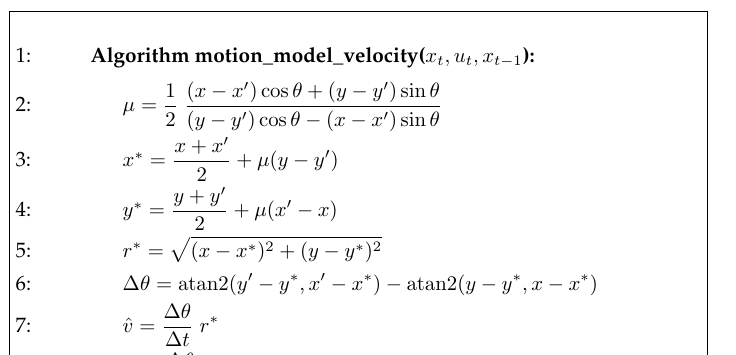

*Table 5.1 — 속도 정보에 기반해 $p(x_t\mid u_t,x_{t-1})$를 계산하는 알고리즘. 여기서 $x_{t-1}$은 벡터
$(x\ y\ \theta)^T$로, $x_t$는 $(x'\ y'\ \theta')^T$로, $u_t$는 속도 벡터 $(v\ \omega)^T$로 표현된다고
가정한다. 함수 $\mathrm{prob}(a,b^2)$는 분산 $b^2$를 갖는 평균 0 분포 하에서 인자 $a$의 확률을 계산한다.
Table 5.2의 어느 알고리즘으로든 구현될 수 있다 (책 p.123)*

$$
\begin{aligned}
&1:\;\; \textbf{Algorithm motion\_model\_velocity}(x_t,\, u_t,\, x_{t-1}): \\[3pt]
&2:\quad \mu = \frac{1}{2}\,\frac{(x-x')\cos\theta + (y-y')\sin\theta}{(y-y')\cos\theta - (x-x')\sin\theta} \\[4pt]
&3:\quad x^* = \frac{x+x'}{2} + \mu(y-y') \\[4pt]
&4:\quad y^* = \frac{y+y'}{2} + \mu(x'-x) \\[4pt]
&5:\quad r^* = \sqrt{(x-x^*)^2 + (y-y^*)^2} \\[4pt]
&6:\quad \Delta\theta = \operatorname{atan2}(y'-y^*,\, x'-x^*) - \operatorname{atan2}(y-y^*,\, x-x^*) \\[4pt]
&7:\quad \hat v = \frac{\Delta\theta}{\Delta t}\, r^* \\[4pt]
&8:\quad \hat\omega = \frac{\Delta\theta}{\Delta t} \\[4pt]
&9:\quad \hat\gamma = \frac{\theta'-\theta}{\Delta t} - \hat\omega \\[4pt]
&10:\quad \textbf{return } \mathrm{prob}(v-\hat v,\, \alpha_1v^2+\alpha_2\omega^2)\cdot \mathrm{prob}(\omega-\hat\omega,\, \alpha_3v^2+\alpha_4\omega^2) \\
&\qquad\qquad\quad \cdot\, \mathrm{prob}(\hat\gamma,\, \alpha_5v^2+\alpha_6\omega^2)
\end{aligned}
\tag{26}
$$

**알고리즘과 유도의 대응** (책 p.132):

> **Table 5.1의 motion_model_velocity 알고리즘의 정확성을 보기 위해, 독자는 이 알고리즘이 이 표현을
> 구현함에 주목할 수 있다. 더 구체적으로, 라인 2부터 9는 식 (18), (17-두번째), (19), (20), (22), (23)과
> 동등하다. 라인 10은 (25)를 구현하며, 오차 항들을 (24)에 명시된 대로 치환한다.**

| Table 5.1 라인 | 대응 식 | 하는 일 |
|---|---|---|
| 2 | (18) | $\mu$ 계산 |
| 3, 4 | (17) | 원의 중심 $(x^*, y^*)$ |
| 5 | (19) | 반지름 $r^*$ |
| 6 | (20) | 방향 변화 $\Delta\theta$ |
| 7, 8 | (21), (22) | 필요했던 속도 $\hat v, \hat\omega$ |
| 9 | (23) | 필요했던 최종 회전 $\hat\gamma$ |
| 10 | (24), (25) | 세 오차의 확률을 곱함 |

### prob 함수 — 책 Table 5.2

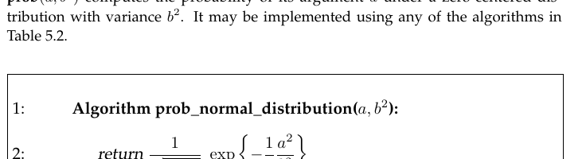

*Table 5.2 — 분산 $b^2$를 갖는 평균 0 정규분포와 삼각분포의 밀도를 계산하는 알고리즘 (책 p.123)*

$$
\begin{aligned}
&1:\;\; \textbf{Algorithm prob\_normal\_distribution}(a, b^2): \\[3pt]
&2:\quad \textbf{return } \frac{1}{\sqrt{2\pi b^2}}\exp\left\{-\frac{1}{2}\frac{a^2}{b^2}\right\} \\[8pt]
&3:\;\; \textbf{Algorithm prob\_triangular\_distribution}(a, b^2): \\[3pt]
&4:\quad \textbf{return } \max\left\{0,\; \frac{1}{\sqrt 6\, b} - \frac{|a|}{6b^2}\right\}
\end{aligned}
\tag{27}
$$

**Table 5.1의 알고리즘은 먼저 오차 없는 로봇의 제어를 계산한다. 이 계산에서 개별 변수들의 의미는
유도할 때 더 분명해질 것이다. 이 파라미터들은 $\hat v$와 $\hat\omega$로 주어진다.**

**함수 $\mathrm{prob}(x, b^2)$는 운동 오차를 모델링한다. 이는 분산 $b^2$를 갖는 평균 0 확률변수 하에서
파라미터 $x$의 확률을 계산한다.**

### 노이즈 파라미터가 분포 모양을 어떻게 바꾸는가

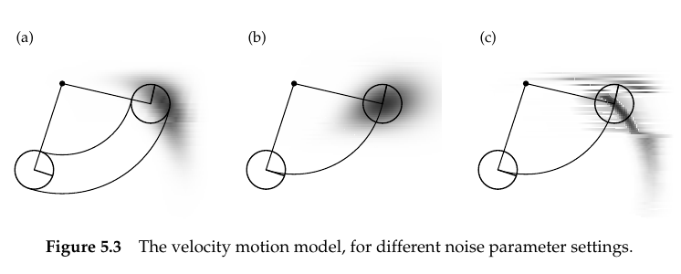

*Figure 5.3 — 서로 다른 노이즈 파라미터 설정에 대한 velocity motion model (책 p.122)*

**Figure 5.3은 $x$-$y$ 공간으로 투영한 velocity motion model의 그래픽 예를 보여준다. 세 경우 모두 로봇은
동일한 병진 속도와 각속도를 설정한다.**

- **(a)** 중간 정도의 오차 파라미터 $\alpha_1$~$\alpha_6$로 얻은 분포
- **(b)** **더 작은 각도 오차**($\alpha_3, \alpha_4$)와 **더 큰 병진 오차**($\alpha_1, \alpha_2$)로 얻은 분포
- **(c)** **큰 각도 오차와 작은 병진 오차** 하의 분포

> **읽는 법**: (b)는 궤적을 따라 **길게** 퍼지고(얼마나 갔는지 불확실), (c)는 궤적에 **수직으로 부채꼴로**
> 퍼진다(어느 쪽으로 갔는지 불확실). 5.2.2절에서 말한 "바나나 모양"이 두 오차의 비율에 따라 어떻게
> 달라지는지 보여준다.

### 3. 예제/실습

#### 예제 — 왜 밀도 계산이 "역모델"인가

| | 표집 (Table 5.3) | 밀도 계산 (Table 5.1) |
|---|---|---|
| 입력 | $u_t$, $x_{t-1}$ | $u_t$, $x_{t-1}$, **그리고 $x_t$** |
| 하는 일 | 노이즈를 뽑아 앞으로 시뮬레이션 | $x_t$에 도달하려면 **어떤 노이즈였어야 하는지 역산** |
| 방향 | 전방(forward) | **역방향(inverse)** |
| 난이도 | 쉬움 (라인 2~7, 7줄) | 어려움 (라인 2~10, 기하 계산 필요) |

#### 연습문제

1. Table 5.1 라인 2의 분모 $(y-y')\cos\theta - (x-x')\sin\theta$가 0이 되는 것은 어떤 상황인가?
   그때 어떻게 처리해야 하는가?
2. 로봇이 실제로 명령대로 정확히 움직였다면($x_t$가 노이즈 없는 예측과 일치), 라인 10의 세 `prob`
   인자는 각각 무엇이 되는가? 확률은 최대인가?
3. Table 5.1이 $\theta'$을 사용하는 라인은 어디인가? 만약 최종 방향을 무시한다면 어느 라인이 사라지는가?

---

---

# 5.4 Odometry Motion Model (책 p.132~140)

## 개요

**지금까지 논의한 velocity motion model은 로봇의 속도를 사용해 pose에 대한 posterior를 계산한다.
대안으로, 시간에 따른 로봇의 운동을 계산하는 근거로 odometry 측정값을 사용하고 싶을 수 있다.**

> **Odometry는 흔히 바퀴 엔코더(wheel encoder) 정보를 적분해 얻어진다. 대부분의 상용 로봇은 그렇게
> 통합된 pose 추정값을 주기적인 시간 간격(예: 0.1초마다)으로 제공한다.**

**이것이 이 장에서 논의하는 두 번째 motion model인 odometry motion model로 이어진다.
Odometry motion model은 제어 대신 odometry 측정값을 사용한다.**

> **바퀴 엔코더란 (개념부터)**
>
> 바퀴 축에 달린 센서로, **바퀴가 몇 번 회전했는지**를 센다. 바퀴 지름을 알면 회전수 × 둘레 = 이동
> 거리이고, 좌우 바퀴의 회전량 차이로 얼마나 돌았는지도 계산된다. 이렇게 누적 계산한 위치 추정이
> odometry다.
>
> 문제는 **바퀴가 헛돌거나(slippage) 미끄러지면** 실제로 안 갔는데 갔다고 세거나 그 반대가 된다는 것.
> 그래서 시간이 갈수록 오차가 누적된다(**drift**).

### 왜 odometry가 더 정확한가

**실무 경험은 odometry가 여전히 오차가 있긴 하지만 보통 속도보다 더 정확함을 시사한다.**

> **둘 다 drift와 slippage를 겪지만, 속도는 추가로 실제 모션 컨트롤러와 그것의 (조잡한) 수학 모델
> 사이의 불일치를 겪는다.**

**그러나 odometry는 로봇이 움직인 후에야 사후적으로만 사용 가능하다.**

> **이는 이후 장들에서 논의되는 localization과 mapping 알고리즘 같은 필터 알고리즘에는 아무 문제가
> 되지 않는다. 그러나 이 정보를 정확한 motion planning과 제어에는 사용할 수 없게 만든다.**

(5.2.2절의 두 모델 비교표가 여기서 확인된다.)

---

## 5.4.1 Closed Form Calculation

### 1. 개념적 이해

### 왜 odometry를 "제어"로 취급하는가

**기술적으로 odometry 정보는 센서 측정값이지 제어가 아니다.**

> **odometry를 측정값으로 모델링하려면, 그 결과 Bayes filter가 실제 속도를 상태 변수로 포함해야 할
> 것이다 — 이는 상태 공간의 차원을 증가시킨다. 상태 공간을 작게 유지하기 위해, 따라서 odometry 데이터를
> 마치 제어 신호인 것처럼 간주하는 것이 일반적이다.**

**이 절에서 우리는 odometry 측정값을 제어처럼 취급할 것이다. 그 결과 모델은 오늘날 최고의 확률적 로봇
시스템 다수의 핵심에 있다.**

(2장 2.3.2절에서 "odometer는 센서지만 control로 취급한다"고 한 규약의 근거가 여기서 밝혀진다 —
**상태 공간을 작게 유지하기 위해서**다.)

### 핵심 통찰 — 좌표계는 몰라도 된다

**우리의 제어 정보 형식을 정의하자. 시각 $t$에 로봇의 올바른 pose는 확률변수 $x_t$로 모델링된다.
로봇 odometry가 이 pose를 추정한다.**

> **그러나 drift와 slippage 때문에 로봇의 내부 odometry가 사용하는 좌표와 물리적 세계 좌표 사이에
> 고정된 좌표 변환이 존재하지 않는다. 실제로 이 변환을 안다면 로봇 localization 문제가 풀린 셈이다!**

**이 문장이 결정적이다.** Odometry가 "나는 $(3.2, 1.7, 0.4)$에 있다"고 말해도, 그 좌표계가 실제 세계
좌표계와 어떻게 대응되는지 모른다. **그런데도 이 정보가 쓸모 있는 이유는:**

> **Odometry 모델은 로봇의 내부 odometry가 측정한 **상대 운동 정보(relative motion information)** 를
> 사용한다.**
>
> **더 구체적으로, 시간 구간 $(t-1, t]$에서 로봇은 pose $x_{t-1}$에서 pose $x_t$로 나아간다. Odometry는
> 우리에게 $\bar x_{t-1} = (\bar x\ \bar y\ \bar\theta)^T$에서 $\bar x_t = (\bar x'\ \bar y'\ \bar\theta')^T$로의
> 관련된 전진을 보고한다. 여기서 바(bar)는 이들이 로봇 내부 좌표에 놓인 odometry 측정값이며, 전역 세계
> 좌표와의 관계가 알려지지 않았음을 나타낸다.**

> **상태 추정에 이 정보를 활용하기 위한 핵심 통찰은, "차이"라는 용어의 적절한 정의 하에서
> $\bar x_{t-1}$과 $\bar x_t$ 사이의 상대적 차이가 참 pose $x_{t-1}$과 $x_t$의 차이에 대한 좋은
> 추정량이라는 것이다.**

**비유하자면**: 내 걸음 수 세는 기계가 "10걸음 앞으로, 왼쪽으로 30도"라고 말하면, 그 기계가 나침반을
못 갖고 있어도 **"앞으로 10걸음, 왼쪽 30도"라는 상대적 정보는 유효하다.** 절대 위치는 몰라도 된다.

### 회전–직진–회전 분해

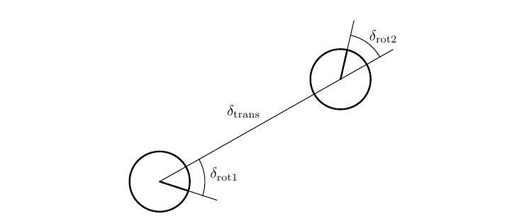

*Figure 5.7 — Odometry 모델: 시간 구간 $(t-1,t]$의 로봇 운동이 회전 $\delta_{\text{rot1}}$, 이어서 병진
$\delta_{\text{trans}}$, 그리고 두 번째 회전 $\delta_{\text{rot2}}$로 근사된다. 회전과 병진에는 노이즈가
있다 (책 p.133)*

**상대 odometry를 추출하기 위해 $u_t$는 세 단계의 열로 변환된다: 회전, 이어서 직선 운동(병진), 그리고
또 한 번의 회전.**

> **Figure 5.7이 이 분해를 예시한다: 초기 회전을 $\delta_{\text{rot1}}$, 병진을 $\delta_{\text{trans}}$,
> 두 번째 회전을 $\delta_{\text{rot2}}$라 부른다.**

**직관**: 어디로든 가는 방법은 **① 목적지 쪽으로 몸을 돌리고 ② 직진하고 ③ 최종 방향으로 다시 돌기**다.
평면 위 두 pose 사이의 어떤 이동이든 이 세 단계로 표현할 수 있다.

> **독자가 쉽게 확인하듯, 각 위치 쌍 $(\bar s\ \bar s')$는 유일한 파라미터 벡터
> $(\delta_{\text{rot1}}\ \delta_{\text{trans}}\ \delta_{\text{rot2}})^T$를 가지며, 이 파라미터들은
> $\bar s$와 $\bar s'$ 사이의 상대 운동을 재구성하기에 충분하다. 따라서 $\delta_{\text{rot1}}$,
> $\delta_{\text{trans}}$, $\delta_{\text{rot2}}$는 함께 odometry가 부호화한 상대 운동의 충분통계량을
> 형성한다.**

### 퇴화 문제가 없다 — 파라미터가 하나 더 많다

**확률적 motion model은 이 세 파라미터가 독립적인 노이즈로 오염되었다고 가정한다.**

> **독자는 odometry motion이 이전 절에서 정의한 속도 벡터보다 파라미터를 하나 더 사용한다는 점에
> 주목할 수 있는데, 그 때문에 우리는 "최종 회전"의 정의로 이어졌던 그 퇴화(degeneracy)를 겪지 않을
> 것이다.**

**대비가 명확하다**:

| | velocity model | odometry model |
|---|---|---|
| 노이즈 변수 | $v, \omega$ **2개** | $\delta_{\text{rot1}}, \delta_{\text{trans}}, \delta_{\text{rot2}}$ **3개** |
| pose 공간 차원 | 3 | 3 |
| 결과 | **퇴화** → $\hat\gamma$ 인위적 추가 필요 | **퇴화 없음** ✔ |

5.3절에서 $\alpha_5, \alpha_6$가 왜 필요했는지 고생해서 이해했다면, 여기서는 그 문제가 애초에 생기지
않는다는 것이 얼마나 깔끔한지 알 수 있다.

### 2. 수식/유도

#### 전체 유도 과정 (먼저 한 번에)

$$u_t = \begin{pmatrix} \bar x_{t-1} \\ \bar x_t \end{pmatrix} \tag{28}$$

$$\delta_{\text{rot1}} = \operatorname{atan2}(\bar y' - \bar y,\; \bar x' - \bar x) - \bar\theta \tag{29}$$

$$\delta_{\text{trans}} = \sqrt{(\bar x - \bar x')^2 + (\bar y - \bar y')^2} \tag{30}$$

$$\delta_{\text{rot2}} = \bar\theta' - \bar\theta - \delta_{\text{rot1}} \tag{31}$$

$$
\begin{aligned}
\hat\delta_{\text{rot1}} &= \delta_{\text{rot1}} - \varepsilon_{\alpha_1\delta_{\text{rot1}}^2 + \alpha_2\delta_{\text{trans}}^2} \\[3pt]
\hat\delta_{\text{trans}} &= \delta_{\text{trans}} - \varepsilon_{\alpha_3\delta_{\text{trans}}^2 + \alpha_4\delta_{\text{rot1}}^2 + \alpha_4\delta_{\text{rot2}}^2} \\[3pt]
\hat\delta_{\text{rot2}} &= \delta_{\text{rot2}} - \varepsilon_{\alpha_1\delta_{\text{rot2}}^2 + \alpha_2\delta_{\text{trans}}^2}
\end{aligned}
\tag{32}
$$

$$
\begin{pmatrix} x' \\ y' \\ \theta' \end{pmatrix}
= \begin{pmatrix} x \\ y \\ \theta \end{pmatrix}
+ \begin{pmatrix} \hat\delta_{\text{trans}}\cos(\theta + \hat\delta_{\text{rot1}}) \\[3pt]
\hat\delta_{\text{trans}}\sin(\theta + \hat\delta_{\text{rot1}}) \\[3pt]
\hat\delta_{\text{rot1}} + \hat\delta_{\text{rot2}} \end{pmatrix}
\tag{33}
$$

$$
\begin{aligned}
p_1 &= \varepsilon_{\alpha_1\delta_{\text{rot1}}^2 + \alpha_2\delta_{\text{trans}}^2}\left(\delta_{\text{rot1}} - \hat\delta_{\text{rot1}}\right) \\[3pt]
p_2 &= \varepsilon_{\alpha_3\delta_{\text{trans}}^2 + \alpha_4\delta_{\text{rot1}}^2 + \alpha_4\delta_{\text{rot2}}^2}\left(\delta_{\text{trans}} - \hat\delta_{\text{trans}}\right) \\[3pt]
p_3 &= \varepsilon_{\alpha_1\delta_{\text{rot2}}^2 + \alpha_2\delta_{\text{trans}}^2}\left(\delta_{\text{rot2}} - \hat\delta_{\text{rot2}}\right)
\end{aligned}
\tag{34}
$$

#### 단계별 설명 (생략 없이)

**(28) 제어 벡터** — 책 (5.33)

**운동 정보 $u_t$는 따라서 한 쌍으로 주어진다:**

$$u_t = \begin{pmatrix} \bar x_{t-1} \\ \bar x_t \end{pmatrix}$$

**즉 $u_t$는 "이전 odometry 읽기값과 현재 odometry 읽기값의 쌍"이다.** velocity model의 $u_t = (v\ \omega)^T$와
전혀 다른 형태라는 점에 주의하자.

**(29), (30), (31) 세 파라미터 계산** — 책 (5.34)~(5.36)

**odometry 읽기값 $u_t = (\bar x_{t-1}\ \bar x_t)^T$로부터 두 회전과 병진의 값을 계산하는 방법:**

$$\delta_{\text{rot1}} = \operatorname{atan2}(\bar y'-\bar y,\; \bar x'-\bar x) - \bar\theta$$

> **읽는 법**: $\operatorname{atan2}(\bar y'-\bar y, \bar x'-\bar x)$는 **출발점에서 도착점을 향하는
> 절대 방향**이다. 거기서 현재 바라보는 방향 $\bar\theta$를 빼면 **"얼마나 돌아야 목적지를 보게 되는가"**
> 가 나온다. 그것이 첫 번째 회전이다.

$$\delta_{\text{trans}} = \sqrt{(\bar x-\bar x')^2 + (\bar y-\bar y')^2}$$

> 두 점 사이의 **직선 거리** (유클리드 거리). 그냥 직진하면 되는 양이다.

$$\delta_{\text{rot2}} = \bar\theta' - \bar\theta - \delta_{\text{rot1}}$$

> **읽는 법**: 전체 방향 변화가 $\bar\theta' - \bar\theta$인데, 그중 $\delta_{\text{rot1}}$은 이미
> 첫 회전에서 썼다. **남은 만큼이 두 번째 회전**이다.

> **⚠️ 구현 주의 (책이 강조하는 흔한 버그)**
>
> **구현자는 모든 각도 차이가 $[-\pi,\pi]$에 놓여야 함을 지켜야 한다. 따라서
> $\delta_{\text{rot2}} - \hat\delta_{\text{rot2}}$의 결과는 그에 맞게 잘려야 한다 — 이는 디버그하기
> 어려운 경향이 있는 흔한 오류다.**
>
> **왜 문제인가**: 로봇이 $359°$에서 $1°$로 돌면 실제로는 $2°$ 돈 것이지만, 그냥 빼면 $-358°$가 나온다.
> 각도를 다룰 때는 항상 다음처럼 정규화해야 한다:
> ```python
> def normalize_angle(a):
>     while a >  math.pi: a -= 2*math.pi
>     while a < -math.pi: a += 2*math.pi
>     return a
> ```

**(32) 노이즈 모델** — 책 (5.37)~(5.39)

**운동 오차를 모델링하기 위해, 회전과 병진의 "참" 값이 측정값에서 평균 0, 분산 $b^2$인 독립 노이즈
$\varepsilon_{b^2}$를 **빼서** 얻어진다고 가정한다.**

> **부호에 주의**: velocity model 식 (10)에서는 노이즈를 **더했는데**($\hat v = v + \varepsilon$),
> 여기서는 **뺀다**($\hat\delta = \delta - \varepsilon$). $\varepsilon$이 평균 0 대칭 분포라 수학적으로는
> 차이가 없지만, 책의 표기를 그대로 따른다.

**분산 항의 구조를 읽자**:

| 노이즈 | 분산 | 뜻 |
|---|---|---|
| $\hat\delta_{\text{rot1}}$ | $\alpha_1\delta_{\text{rot1}}^2 + \alpha_2\delta_{\text{trans}}^2$ | 많이 돌수록·멀리 갈수록 회전 오차↑ |
| $\hat\delta_{\text{trans}}$ | $\alpha_3\delta_{\text{trans}}^2 + \alpha_4(\delta_{\text{rot1}}^2 + \delta_{\text{rot2}}^2)$ | 멀리 갈수록·많이 돌수록 거리 오차↑ |
| $\hat\delta_{\text{rot2}}$ | $\alpha_1\delta_{\text{rot2}}^2 + \alpha_2\delta_{\text{trans}}^2$ | (첫 회전과 같은 형태) |

**$\alpha$가 4개뿐인 점에 주목**: 두 회전이 **같은 파라미터 $\alpha_1, \alpha_2$를 공유**한다. 물리적으로
"회전할 때 생기는 오차 특성은 첫 회전이든 두 번째 회전이든 같다"는 가정이다.

**파라미터 $\alpha_1$부터 $\alpha_4$는 로봇별 오차 파라미터로, 운동에 따라 누적되는 오차를 명시한다.**

**(33) 최종 pose** — 책 (5.40)

**결과적으로 참 위치 $x_t$는 $x_{t-1}$로부터 각도 $\hat\delta_{\text{rot1}}$의 초기 회전, 이어서 거리
$\hat\delta_{\text{trans}}$의 병진, 이어서 각도 $\hat\delta_{\text{rot2}}$의 또 한 번의 회전으로 얻어진다.**

> **왜 $\cos(\theta + \hat\delta_{\text{rot1}})$인가**: 먼저 $\hat\delta_{\text{rot1}}$만큼 돌았으므로
> 이제 바라보는 방향이 $\theta + \hat\delta_{\text{rot1}}$이다. 그 방향으로 $\hat\delta_{\text{trans}}$만큼
> 직진하니, 5.2.1절의 규약대로 $x$ 증가분이 $\hat\delta_{\text{trans}}\cos(\cdot)$, $y$ 증가분이
> $\hat\delta_{\text{trans}}\sin(\cdot)$이다. ✔
>
> **식 (33)이 식 (14)(velocity model)보다 훨씬 단순하다** — 원의 중심도, $v/\omega$ 나눗셈도, 0으로
> 나누기 예외 처리도 없다.

**(34) 확률 계산** — 책 (5.41)~(5.46)

**알고리즘 motion_model_odometry는 라인 5~7이 초기 pose $x_{t-1}$에 대한 가설적 pose $x_t$의 운동
파라미터 $\hat\delta_{\text{rot1}}, \hat\delta_{\text{trans}}, \hat\delta_{\text{rot2}}$를 계산한다는 점에
주목함으로써 얻어진다. 둘의 차이가 odometry의 오차다 — 물론 $x_t$가 참 최종 pose라고 가정하고서.**

**오차 모델 (32)는 이 오차들의 확률이 (34)로 주어짐을 함의한다.**

**오차들이 독립이라고 가정되므로, 결합 오차 확률은 곱 $p_1\cdot p_2\cdot p_3$이다.**

### 알고리즘 — 책 Table 5.5

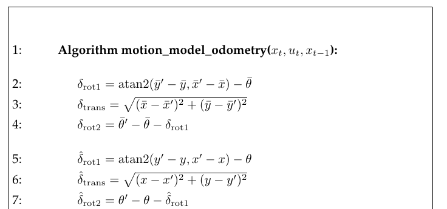

*Table 5.5 — odometry 정보에 기반해 $p(x_t\mid u_t,x_{t-1})$를 계산하는 알고리즘. 여기서 제어 $u_t$는
$(\bar x_{t-1}\ \bar x_t)^T$로 주어지며, $\bar x_{t-1} = (\bar x\ \bar y\ \bar\theta)$,
$\bar x_t = (\bar x'\ \bar y'\ \bar\theta')$ (책 p.134)*

$$
\begin{aligned}
&1:\;\; \textbf{Algorithm motion\_model\_odometry}(x_t,\, u_t,\, x_{t-1}): \\[3pt]
&2:\quad \delta_{\text{rot1}} = \operatorname{atan2}(\bar y'-\bar y,\; \bar x'-\bar x) - \bar\theta \\
&3:\quad \delta_{\text{trans}} = \sqrt{(\bar x-\bar x')^2 + (\bar y-\bar y')^2} \\
&4:\quad \delta_{\text{rot2}} = \bar\theta'-\bar\theta-\delta_{\text{rot1}} \\[3pt]
&5:\quad \hat\delta_{\text{rot1}} = \operatorname{atan2}(y'-y,\; x'-x) - \theta \\
&6:\quad \hat\delta_{\text{trans}} = \sqrt{(x-x')^2 + (y-y')^2} \\
&7:\quad \hat\delta_{\text{rot2}} = \theta'-\theta-\hat\delta_{\text{rot1}} \\[3pt]
&8:\quad p_1 = \mathrm{prob}(\delta_{\text{rot1}} - \hat\delta_{\text{rot1}},\; \alpha_1\hat\delta_{\text{rot1}}^2 + \alpha_2\hat\delta_{\text{trans}}^2) \\
&9:\quad p_2 = \mathrm{prob}(\delta_{\text{trans}} - \hat\delta_{\text{trans}},\; \alpha_3\hat\delta_{\text{trans}}^2 + \alpha_4\hat\delta_{\text{rot1}}^2 + \alpha_4\hat\delta_{\text{rot2}}^2) \\
&10:\quad p_3 = \mathrm{prob}(\delta_{\text{rot2}} - \hat\delta_{\text{rot2}},\; \alpha_1\hat\delta_{\text{rot2}}^2 + \alpha_2\hat\delta_{\text{trans}}^2) \\[3pt]
&11:\quad \textbf{return } p_1 \cdot p_2 \cdot p_3
\end{aligned}
\tag{35}
$$

**알고리즘 구조 (책 p.135)**:

> **이 알고리즘은 입력으로 초기 pose $x_{t-1}$, 로봇의 odometry에서 얻은 pose 쌍
> $u_t = (\bar x_{t-1}\ \bar x_t)^T$, 그리고 가설적 최종 pose $x_t$를 받는다. 수치적 확률
> $p(x_t\mid u_t,x_{t-1})$를 출력한다.**

| 라인 | 하는 일 | 입력 |
|---|---|---|
| 2~4 | **odometry가 보고한** 세 파라미터 복원 | $\bar x_{t-1}, \bar x_t$ (바 있음) |
| 5~7 | **가설 pose가 요구하는** 세 파라미터 계산 | $x_{t-1}, x_t$ (바 없음) |
| 8~10 | 둘의 차이(= 오차)의 확률 | |
| 11 | 세 확률의 곱 | |

> **라인 2~4와 라인 5~7이 형태가 완전히 같고 입력만 다르다는 점**이 이 알고리즘의 우아함이다.
> "odometry가 말한 것"과 "가설이 요구하는 것"을 같은 방식으로 분해해서 비교하는 것이다.
>
> **라인 5~7도 역 motion model이다** (책: "앞서와 같이 이들은 역 motion model을 구현한다"). 하지만
> velocity model의 Table 5.1보다 훨씬 단순하다 — 원의 중심을 구할 필요가 없기 때문이다.

### 노이즈 파라미터의 효과

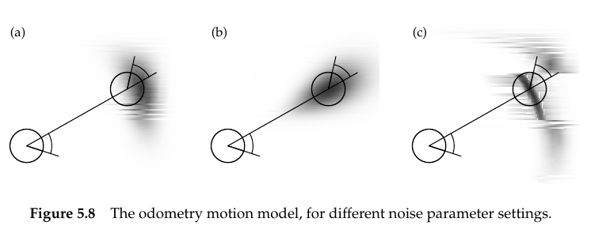

*Figure 5.8 — 서로 다른 노이즈 파라미터 설정에 대한 odometry motion model (책 p.135)*

**Figure 5.8은 오차 파라미터 $\alpha_1$부터 $\alpha_4$의 서로 다른 값에 대한 odometry motion model의
예를 보여준다.**

- **(a)** 전형적인 분포
- **(b)** 비정상적으로 **큰 병진 오차**
- **(c)** 비정상적으로 **큰 회전 오차**

> **책의 권유**: **독자는 이 다이어그램들을 책 p.122의 Figure 5.3(velocity model)과 주의 깊게 비교해보고
> 싶을 수 있다.**
>
> **연속된 두 측정 사이의 시간이 짧을수록 이 서로 다른 motion model들은 더 비슷해진다. 따라서 belief가
> 자주 갱신되면 — 예를 들어 전통적인 실내 로봇의 경우 0.1초마다 — 이 motion model들 사이의 차이는 그리
> 유의미하지 않다.**

**실무적으로 중요한 결론이다** — 갱신 주기가 짧으면 어느 모델을 쓰든 거의 같다.

---

## 5.4.2 Sampling Algorithm

### 1. 개념적 이해

**Particle filter가 localization에 사용된다면, 우리는 $p(x_t\mid u_t,x_{t-1})$로부터 표집하는 알고리즘도
갖고 싶을 것이다.**

**Particle filter(4.3절)는 임의의 $x_{t-1}$, $u_t$, $x_t$에 대해 $p(x_t\mid u_t,x_{t-1})$를 계산하는
닫힌 형태 표현이 아니라 $p(x_t\mid u_t,x_{t-1})$의 표본을 요구함을 상기하자.**

### 2. 알고리즘 — 책 Table 5.6

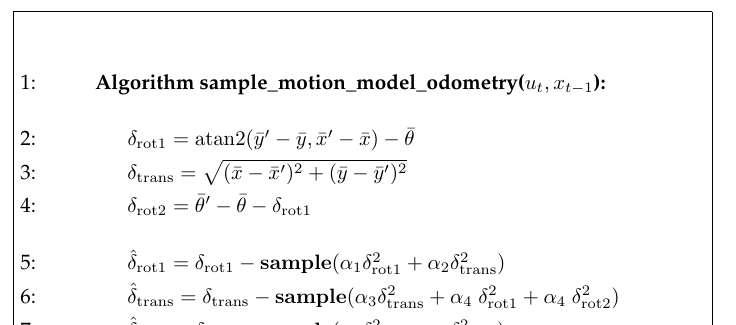

*Table 5.6 — odometry 정보에 기반해 $p(x_t\mid u_t,x_{t-1})$로부터 표집하는 알고리즘. 여기서 시각 $t$의
pose는 $x_{t-1} = (x\ y\ \theta)^T$로 표현된다. 제어는 로봇의 odometer가 얻은 두 pose 추정값의 집합
$u_t = (\bar x_{t-1}\ \bar x_t)^T$다 (책 p.136)*

$$
\begin{aligned}
&1:\;\; \textbf{Algorithm sample\_motion\_model\_odometry}(u_t,\, x_{t-1}): \\[3pt]
&2:\quad \delta_{\text{rot1}} = \operatorname{atan2}(\bar y'-\bar y,\; \bar x'-\bar x) - \bar\theta \\
&3:\quad \delta_{\text{trans}} = \sqrt{(\bar x-\bar x')^2 + (\bar y-\bar y')^2} \\
&4:\quad \delta_{\text{rot2}} = \bar\theta'-\bar\theta-\delta_{\text{rot1}} \\[3pt]
&5:\quad \hat\delta_{\text{rot1}} = \delta_{\text{rot1}} - \mathbf{sample}(\alpha_1\delta_{\text{rot1}}^2 + \alpha_2\delta_{\text{trans}}^2) \\
&6:\quad \hat\delta_{\text{trans}} = \delta_{\text{trans}} - \mathbf{sample}(\alpha_3\delta_{\text{trans}}^2 + \alpha_4\delta_{\text{rot1}}^2 + \alpha_4\delta_{\text{rot2}}^2) \\
&7:\quad \hat\delta_{\text{rot2}} = \delta_{\text{rot2}} - \mathbf{sample}(\alpha_1\delta_{\text{rot2}}^2 + \alpha_2\delta_{\text{trans}}^2) \\[3pt]
&8:\quad x' = x + \hat\delta_{\text{trans}}\cos(\theta + \hat\delta_{\text{rot1}}) \\
&9:\quad y' = y + \hat\delta_{\text{trans}}\sin(\theta + \hat\delta_{\text{rot1}}) \\
&10:\quad \theta' = \theta + \hat\delta_{\text{rot1}} + \hat\delta_{\text{rot2}} \\[3pt]
&11:\quad \textbf{return } x_t = (x',\, y',\, \theta')^T
\end{aligned}
\tag{36}
$$

**이 알고리즘은 초기 pose $x_{t-1}$과 odometry 읽기값 $u_t$를 입력으로 받아, $p(x_t\mid u_t,x_{t-1})$에
따라 분포하는 무작위 $x_t$를 출력한다.**

> **이전 알고리즘과 다른 점은 주어진 $x_t$의 확률을 계산하는 대신 pose $x_t$를 무작위로 추측한다(라인 5-10)는
> 것이다. 앞서와 같이 표집 알고리즘 sample_motion_model_odometry는 닫힌 형태 알고리즘
> motion_model_odometry보다 구현하기 다소 쉬운데, 역모델의 필요성을 회피하기 때문이다.**

**라인 2~4는 Table 5.5와 완전히 동일하고**(odometry 분해), **라인 5~7이 노이즈를 뺀 값**, **라인 8~10이
식 (33)** 이다.

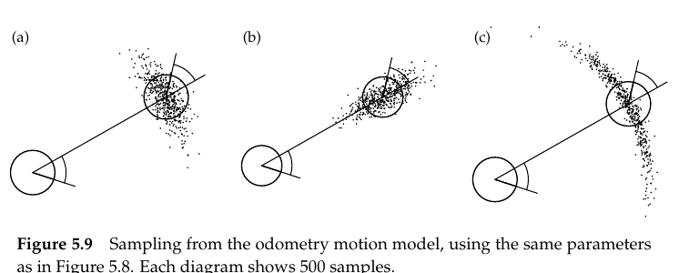

*Figure 5.9 — Figure 5.8과 같은 파라미터를 사용한 odometry motion model로부터의 표집. 각 다이어그램은
500개 표본을 보여준다 (책 p.137)*

### 불확실성이 시간에 따라 자라는 모습

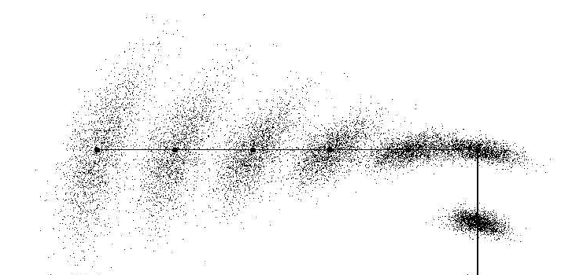

*Figure 5.10 — 센싱하지 않는 로봇의 위치 belief의 표집 근사. 실선은 행동을 표시하고, 표본들은 서로 다른
시점의 로봇 belief를 나타낸다 (책 p.138)*

**Figure 5.10은 여러 시간 스텝의 표본 집합을 겹쳐 그림으로써 motion model이 "작동하는 모습"을 예시한다.**

> **이 데이터는 로봇의 odometry가 실선으로 표시된 경로를 따른다고 가정하고, 알고리즘
> particle_filter(Table 4.3)의 motion update 방정식을 사용해 생성되었다.**
>
> **이 그림은 로봇이 움직임에 따라 불확실성이 어떻게 자라는지를 예시한다. 표본들이 점점 더 큰 공간에
> 걸쳐 퍼진다.**

**이것이 2.3.2절에서 말한 "motion은 지식의 손실을 유발한다"의 시각적 확인이며, 3.2.3절 Figure 3.2(d)의
가우시안 버전에 대응한다.** 그리고 **측정 없이 이동만 하면 결국 아무것도 모르게 된다**는 것을 보여준다 —
6장이 필요한 이유다.

<!--widget:odometry-motion-->

### 3. 예제/실습

#### 예제 — 손으로 분해해보기

Odometry가 $\bar x_{t-1} = (0,0,0)$에서 $\bar x_t = (3, 4, 1.5)$로 갔다고 보고했다.

**Step 1 — $\delta_{\text{rot1}}$** (식 (29)):
$$\operatorname{atan2}(4-0,\; 3-0) - 0 = \operatorname{atan2}(4,3) = 0.927 \text{ rad } (53.1°)$$

**Step 2 — $\delta_{\text{trans}}$** (식 (30)):
$$\sqrt{3^2+4^2} = 5.0$$

**Step 3 — $\delta_{\text{rot2}}$** (식 (31)):
$$1.5 - 0 - 0.927 = 0.573 \text{ rad } (32.8°)$$

**해석**: "왼쪽으로 53.1° 돌고 → 5.0만큼 직진 → 다시 왼쪽으로 32.8° 돌았다."

**검산** (식 (33), 노이즈 없이 $x_{t-1}=(0,0,0)$에 적용):
$$x' = 0 + 5\cos(0+0.927) = 5 \times 0.6 = 3.0 \;✔$$
$$y' = 0 + 5\sin(0+0.927) = 5 \times 0.8 = 4.0 \;✔$$
$$\theta' = 0 + 0.927 + 0.573 = 1.5 \;✔$$

#### 코드 스니펫

```python
import math, random

def normalize_angle(a):
    """각도를 [-π, π]로 — 책이 경고한 흔한 버그 방지"""
    return (a + math.pi) % (2 * math.pi) - math.pi

def sample_normal(b2):
    if b2 <= 0: return 0.0
    b = math.sqrt(b2)
    return 0.5 * sum(random.uniform(-b, b) for _ in range(12))

def sample_motion_model_odometry(u, x, alpha):
    """Table 5.6"""
    (bx, by, bth), (bx2, by2, bth2) = u        # odometry 읽기값 쌍
    px, py, th = x
    a1, a2, a3, a4 = alpha

    d_rot1  = normalize_angle(math.atan2(by2 - by, bx2 - bx) - bth)   # 라인 2
    d_trans = math.hypot(bx - bx2, by - by2)                          # 라인 3
    d_rot2  = normalize_angle(bth2 - bth - d_rot1)                    # 라인 4

    dh_rot1  = d_rot1  - sample_normal(a1*d_rot1**2 + a2*d_trans**2)  # 라인 5
    dh_trans = d_trans - sample_normal(a3*d_trans**2 + a4*d_rot1**2
                                                     + a4*d_rot2**2)  # 라인 6
    dh_rot2  = d_rot2  - sample_normal(a1*d_rot2**2 + a2*d_trans**2)  # 라인 7

    return (px + dh_trans*math.cos(th + dh_rot1),                     # 라인 8
            py + dh_trans*math.sin(th + dh_rot1),                     # 라인 9
            normalize_angle(th + dh_rot1 + dh_rot2))                  # 라인 10
```

**Velocity model의 구현(5.3.2절)과 비교하면 훨씬 단순하다** — $\omega \approx 0$ 예외 처리도, 나눗셈도 없다.

#### 연습문제

1. 로봇이 제자리에서 회전만 했다면($\bar x' = \bar x$, $\bar y' = \bar y$) $\delta_{\text{rot1}}$은
   어떻게 되는가? 이때 어떤 수치적 문제가 생길 수 있는가?
2. $\delta_{\text{trans}} = 0$이면 식 (32)의 분산들이 어떻게 되는가? 그것이 물리적으로 타당한가?
3. Table 5.5 라인 8~10에서 분산 계산에 $\hat\delta$(가설 쪽)를 쓰는데, 왜 $\delta$(odometry 쪽)가
   아닌가? 책의 원문을 확인해보라.

---

# 5.5 Motion and Maps (책 p.140~143)

## 1. 개념적 이해

**$p(x_t\mid u_t,x_{t-1})$를 고려함으로써 우리는 진공 상태에서의 로봇 운동을 정의했다.**

> **특히 이 모델은 환경의 성질에 대한 어떤 지식도 없는 상태에서의 로봇 운동을 기술한다.**

**그러나 많은 경우 우리에게는 지도 $m$도 주어지며, 이는 로봇이 항행할 수 있거나 없는 장소에 관한 정보를
담을 수 있다.**

> **예를 들어 9장에서 설명할 occupancy map은 자유로운(통행 가능한) 지형과 점유된 지형을 구분한다.
> 로봇의 pose는 항상 자유 공간에 있어야 한다. 따라서 $m$을 아는 것은 제어 $u_t$를 실행하기 전, 도중,
> 후의 로봇 pose에 대한 추가 정보를 준다.**

**이 고려가 지도 $m$을 고려하는 motion model을 요구한다.** 이를 $p(x_t\mid u_t,x_{t-1},m)$로 표기하며,
표준 변수들에 더해 지도 $m$을 고려함을 나타낸다.

**만약 $m$이 pose 추정에 관련된 정보를 담고 있다면:**

$$p(x_t\mid u_t,x_{t-1}) \ne p(x_t\mid u_t,x_{t-1},m) \tag{37}$$

**motion model $p(x_t\mid u_t,x_{t-1},m)$은 지도 없는 motion model $p(x_t\mid u_t,x_{t-1})$보다 더 나은
결과를 주어야 한다. 우리는 $p(x_t\mid u_t,x_{t-1},m)$을 map-based motion model이라 부를 것이다.**

**Map-based motion model은 지도 $m$을 가진 세계에 놓인 로봇이 pose $x_{t-1}$에서 행동 $u_t$를 실행했을
때 pose $x_t$에 도착할 가능도를 계산한다.**

> **불행히도 이 motion model을 닫힌 형태로 계산하는 것은 어렵다. 왜냐하면 행동 $u_t$를 실행한 후
> $x_t$에 있을 가능도를 계산하려면, $x_{t-1}$과 $x_t$ 사이에 점유되지 않은 경로가 존재할 확률과 로봇이
> [그 경로를 따라갔을] 확률을 반영해야 하기 때문이다.**

## 2. 근사 — 최종 pose만 확인하기

### 수식

$$p(x_t\mid u_t,x_{t-1},m) = \eta\; \frac{p(x_t\mid m)\, p(x_t\mid u_t,x_{t-1})}{p(x_t)} \tag{38}$$

$$p(x_t\mid u_t,x_{t-1},m) \approx \eta\; p(x_t\mid m)\, p(x_t\mid u_t,x_{t-1}) \tag{39}$$

### 알고리즘 — 책 Table 5.7

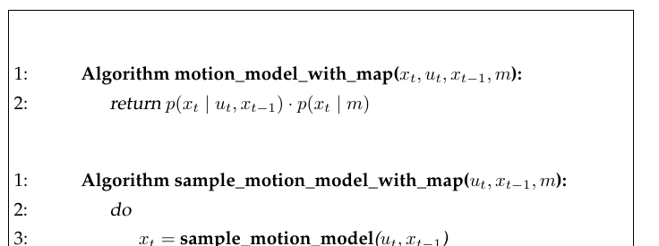

*Table 5.7 — 환경의 지도 $m$을 활용하는 $p(x_t\mid u_t,x_{t-1},m)$를 계산하는 알고리즘. 이 알고리즘들은
이전 motion model들(Table 5.1, 5.3, 5.5, 5.6)을, 로봇이 지도 $m$의 점유된 공간에 놓일 수 없다는 점을
고려하는 모델로 부트스트랩한다 (책 p.141)*

$$
\begin{aligned}
&1:\;\; \textbf{Algorithm motion\_model\_with\_map}(x_t,\, u_t,\, x_{t-1},\, m): \\
&2:\quad \textbf{return } p(x_t\mid u_t,x_{t-1}) \cdot p(x_t\mid m) \\[10pt]
&1:\;\; \textbf{Algorithm sample\_motion\_model\_with\_map}(u_t,\, x_{t-1},\, m): \\
&2:\quad \textbf{do} \\
&3:\qquad x_t = \textbf{sample\_motion\_model}(u_t,\, x_{t-1}) \\
&3:\qquad \pi = p(x_t\mid m) \\
&4:\quad \textbf{until } \pi > 0 \\
&5:\quad \textbf{return } x_t,\, \pi
\end{aligned}
\tag{40}
$$

**$p(x_t\mid m)$과 $p(x_t\mid u_t,x_{t-1})$를 곱함으로써, 우리는 지도와 일관된 pose $x_t$에 모든 확률질량을
할당하되 그 외에는 $p(x_t\mid u_t,x_{t-1})$와 같은 모양을 갖는 분포를 얻는다.**

> **$\eta$는 정규화로 계산될 수 있으므로, 이 map-based motion model의 근사는 지도 없는 motion model에
> 비해 유의미한 오버헤드 없이 효율적으로 계산될 수 있다.**

**표집 버전에 대한 주의**:

> **표집 알고리즘이 가중된 표본을 반환한다는 점에 주목하라 — 여기에는 $p(x_t\mid m)$에 비례하는
> importance factor가 포함된다. 표집 버전 구현에서는 내부 루프의 종료를 보장하도록 주의해야 한다.**

(로봇이 벽으로 완전히 둘러싸인 상황 등에서 무한 루프가 될 수 있다.)

## 3. 이 근사의 한계 — 벽을 통과하는 문제

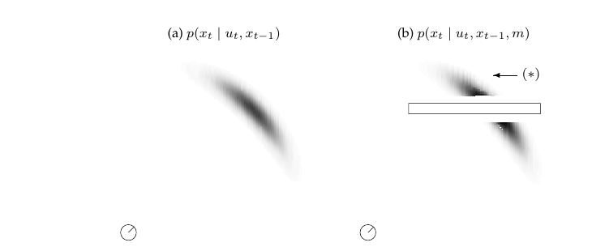

*Figure 5.11 — Velocity motion model (a) 지도 없이, (b) 지도 $m$에 조건화 (책 p.142)*

**Figure 5.11a의 밀도는 velocity motion model에 따라 계산된 $p(x_t\mid u_t,x_{t-1})$이다. 이제 지도 $m$이
Figure 5.11b에 표시된 대로 긴 직사각형 장애물을 갖는다고 하자.**

> **확률 $p(x_t\mid m)$은 로봇이 장애물과 교차하게 될 모든 pose $x_t$에서 0이다. 우리 예제 로봇이
> 원형이므로 이 영역은 **로봇 반지름만큼 부풀려진 장애물**과 동등하다 — 이는 장애물을 작업공간(workspace)에서
> 로봇의 **configuration space** 또는 pose space로 사상하는 것과 동등하다.**

> **Configuration space란 (개념부터)**
>
> 실제 공간(workspace)에서 장애물과 로봇은 둘 다 크기가 있다. 충돌 판정을 매번 하기 번거로우니,
> **로봇을 점으로 줄이는 대신 장애물을 로봇 반지름만큼 부풀린** 공간을 쓴다. 그 공간이 configuration
> space다. 로봇 중심이 부푼 장애물 밖에 있으면 충돌하지 않는다는 것이 보장된다.

**그 결과 확률 $p(x_t\mid u_t,x_{t-1},m)$은 $p(x_t\mid m)$과 $p(x_t\mid u_t,x_{t-1})$의 정규화된 곱이다.
확장된 장애물 영역에서 0이고, 그 외 모든 곳에서 $p(x_t\mid u_t,x_{t-1})$에 비례한다.**

### 문제 — $(*)$로 표시된 영역

**Figure 5.11은 우리 근사의 문제도 예시한다.**

> **$(*)$로 표시된 영역은 0이 아닌 가능도를 갖는데, $p(x_t\mid u_t,x_{t-1})$와 $p(x_t\mid m)$ 둘 다
> 이 영역에서 0이 아니기 때문이다. 그러나 로봇이 이 특정 영역에 있으려면 **벽을 통과했어야** 하는데,
> 이는 실제 세계에서 불가능하다.**
>
> **이 오류는 목표까지의 로봇 경로의 일관성을 검증하는 대신 **최종 pose $x_t$에서만** 모델 일관성을
> 확인한 결과다. 그러나 실제로 그런 오류는 상대적으로 큰 이동 $u_t$에 대해서만 발생하며, 더 높은
> 갱신 주기에서는 무시할 수 있다.**

## 4. 근사의 유도 (책 p.142~143)

### 전체 유도 과정 (먼저 한 번에)

$$p(x_t\mid u_t,x_{t-1},m) = \eta\; p(m\mid x_t,u_t,x_{t-1})\; p(x_t\mid u_t,x_{t-1}) \tag{41}$$

$$
\begin{aligned}
p(x_t\mid u_t,x_{t-1},m) &= \eta\; p(m\mid x_t)\; p(x_t\mid u_t,x_{t-1}) \\[3pt]
&= \eta\; \frac{p(x_t\mid m)\, p(m)}{p(x_t)}\; p(x_t\mid u_t,x_{t-1}) \\[3pt]
&= \eta\; \frac{p(x_t\mid m)\; p(x_t\mid u_t,x_{t-1})}{p(x_t)}
\end{aligned}
\tag{42}
$$

$$p(m\mid x_t,u_t,x_{t-1}) = p(m\mid x_t) \tag{43}$$

### 단계별 설명 (생략 없이)

**(41) Bayes rule 적용** — 책 (5.49)

**식 (38)은 Bayes rule을 적용해 얻어질 수 있다.** (2장 식 (12)의 조건화된 Bayes rule에서 $m$을 "데이터"
역할로 놓은 것이다.)

**(42) 근사와 정리** — 책 (5.50)

**만약 우리가 $p(m\mid x_t,u_t,x_{t-1})$을 $p(m\mid x_t)$로 근사하고 $p(m)$이 원하는 posterior에 대해
상수임을 관찰하면, 다음과 같이 원하는 식을 얻는다.**

두 번째 줄에서 다시 Bayes rule($p(m\mid x_t) = \frac{p(x_t\mid m)p(m)}{p(x_t)}$)을 적용하고,
$p(m)$을 $\eta$에 흡수시킨다.

> **여기서 $\eta$는 정규화자다 (우리 변환의 서로 다른 단계에서 $\eta$의 값이 다르다는 점에 주목하라).**
>
> (2장에서 확립한 $\eta$ 재사용 규칙 그대로다.)

**(43) 근사의 정체** — 책 (5.51)

**이 짧은 분석은 우리의 map-based 모델이 다음의 거친 가정 하에서 정당화됨을 보여준다:**

$$p(m\mid x_t,u_t,x_{t-1}) = p(m\mid x_t)$$

> **명백히 이 표현들은 같지 않다. $m$에 대한 조건부를 계산할 때 우리의 근사는 두 항 $u_t$와 $x_{t-1}$을
> 생략한다. 이 항들을 생략함으로써 우리는 $x_t$로 이어지는 로봇의 **경로**에 관한 모든 정보를 버린다.
> 우리가 아는 것은 최종 pose가 $x_t$라는 것뿐이다.**
>
> **우리는 이미 위 예제에서 이 생략의 결과를 확인했다 — 벽 뒤의 pose가 0이 아닌 가능도를 가질 수 있음을
> 관찰했을 때다. 우리의 근사적 map-based motion model은 초기 pose와 최종 pose가 비점유 공간에 있는 한
> 로봇이 방금 벽을 통과했다고 잘못 가정할 수 있다.**

**얼마나 해로운가?**

> **위에서 말했듯 이는 갱신 간격에 달려 있다. 실제로 충분히 높은 갱신률에 대해, 그리고 motion model의
> 노이즈 변수가 유계라고 가정하면, 우리는 근사가 촘촘하고 이 효과가 발생하지 않을 것임을 보장할 수 있다.**

> **이 분석은 알고리즘 구현에 관한 미묘한 통찰을 예시한다. 특히 **갱신 주기에 주의를 기울여야 한다.
> 자주 갱신되는 Bayes filter는 가끔만 갱신되는 것과 근본적으로 다른 결과를 낼 수 있다.**

### 5. 예제/실습

#### 예제 — 갱신 주기의 효과

로봇이 1 m/s로 움직이고 벽 두께가 0.2 m라 하자.

| 갱신 주기 | 한 스텝 이동 거리 | 벽 통과 오류 가능? |
|---|---|---|
| 0.1 s | 0.1 m | **불가능** (벽 두께보다 짧음) |
| 1.0 s | 1.0 m | 가능 |
| 5.0 s | 5.0 m | 흔히 발생 |

**"노이즈 변수가 유계이고 갱신률이 충분히 높으면 근사가 촘촘하다"는 책의 보장이 이것이다.**

#### 연습문제

1. 식 (43)의 근사에서 $u_t$와 $x_{t-1}$을 버리는 것이 왜 "경로 정보를 버리는" 것인지 설명하라.
2. Table 5.7의 표집 알고리즘에서 내부 루프가 종료되지 않을 수 있는 상황은? 어떻게 방지하겠는가?
3. 식 (42)의 마지막 줄에 $p(x_t)$가 분모에 남아 있는데, Table 5.7 라인 2에는 없다. 어떤 가정이
   추가로 사용된 것인가?

---

# 5.6 Summary (책 p.143~144)

**이 절은 평면에서 동작하는 모바일 로봇을 위한 두 가지 주요 확률적 motion model을 유도했다.**

**● 우리는 제어 $u_t$를 고정된 시간 구간 $\Delta t$ 동안 실행되는 병진 속도와 각속도로 표현하는 확률적
motion model $p(x_t\mid u_t,x_{t-1})$에 대한 알고리즘을 유도했다.**

> **이 모델을 구현하면서 우리는 두 개의 제어 노이즈 파라미터 — 병진 속도에 하나, 회전 속도에 하나 — 가
> 공간을 채우는(퇴화하지 않는) posterior를 생성하기에 불충분함을 깨달았다. 따라서 우리는 노이즈 섞인
> "최종 회전"으로 표현되는 세 번째 노이즈 파라미터를 추가했다.**

**● 우리는 로봇의 odometry를 입력으로 사용하는 대안적 motion model을 제시했다. Odometry 측정값은
초기 회전, 이어서 병진, 그리고 최종 회전의 세 파라미터로 표현되었다. 확률적 motion model은 이 세
파라미터 모두가 노이즈의 지배를 받는다고 가정함으로써 구현되었다.**

> **우리는 odometry 읽기값이 기술적으로 제어가 아님을 언급했다. 그러나 그것을 제어처럼 사용함으로써
> 우리는 추정 문제의 더 단순한 정식화에 도달했다.**

**● 두 motion model 모두에 대해 우리는 두 유형의 구현을 제시했다** — 확률 $p(x_t\mid u_t,x_{t-1})$가
닫힌 형태로 계산되는 것과, $p(x_t\mid u_t,x_{t-1})$로부터 표본을 생성하게 해주는 것.

> **닫힌 형태 표현은 $x_t$, $u_t$, $x_{t-1}$을 입력으로 받아 수치적 확률값을 출력한다. 이 확률을 계산하기
> 위해 알고리즘들은 실질적으로 motion model을 뒤집어서, 실제 제어 파라미터와 명령된 제어 파라미터를
> 비교한다.**
>
> **표집 모델은 그런 역변환을 요구하지 않는다. 대신 motion model $p(x_t\mid u_t,x_{t-1})$의 전방 모델을
> 구현한다. $u_t$와 $x_{t-1}$ 값을 입력받아 $p(x_t\mid u_t,x_{t-1})$에 따라 뽑힌 무작위 $x_t$를 출력한다.**
>
> **닫힌 형태 모델은 일부 확률 알고리즘에 요구된다. 다른 것들, 특히 particle filter는 [표집을 요구한다].**

**● 마지막으로 우리는 지도 $m$을 반영하도록 motion model을 확장했다. 그 결과 알고리즘은 최종 pose의
유효성만 확인했다는 점에서 근사적이었다.**

## 이 장의 한계 (책 p.144)

**여기서 논의한 motion model은 예시일 뿐이다:**

> **명백히 로봇 구동기의 분야는 평평한 지형에서 동작하는 모바일 로봇보다 훨씬 풍부하다. 모바일 로보틱스
> 분야 안에서도 여기서 논의한 모델이 다루지 않는 장치가 다수 존재한다. 예로는 옆으로 움직일 수 있는
> holonomic 로봇이나 서스펜션이 있는 자동차가 있다.**
>
> **우리의 기술은 로봇 동역학도 고려하지 않는데, 이는 고속도로의 자동차 같은 빠르게 움직이는 차량에
> 중요하다.**

**이 로봇들 대부분은 유사하게 모델링될 수 있다 — 단순히 로봇 운동의 물리 법칙을 명시하고 적절한 노이즈
파라미터를 명시하면 된다.**

> **동역학 모델의 경우 이는 차량의 동적 상태를 포착하는 속도 벡터로 로봇 상태를 확장할 것을 요구한다.
> 여러 면에서 이 확장들은 직접적이다.**

**자기 운동(ego-motion) 측정에 관한 한, 많은 로봇이 odometry를 보완하거나 대체하는 것으로 운동을 측정하기
위해 관성 센서(inertial sensor)에 의존한다. 관성 센서를 사용한 필터 설계에 책 전체가 헌정되기도 했다.
odometry가 불충분할 때 독자들은 더 풍부한 모델과 센서를 포함하기를 권장한다.**

---

# 5.7 Bibliographical Remarks (책 p.145)

- **본 자료는 특정 유형 모바일 로봇의 기본 운동학 방정식(Cox and Wilfong 1990)을 확률적 구성요소로
  확장한 것이다.**
- **우리 모델이 다루는 구동계**: differential drive, Ackerman drive, synchro-drive
  (**Borenstein et al. 1996**).
- **우리 모델이 다루지 않는 구동계**: non-holonomic 제약이 없는 것들(**Latombe 1991**) —
  Mecanum 휠 장착 로봇(**Ilon 1975**), 다리 로봇(**Raibert et al. 1986; Raibert 1991;
  Saranli and Koditschek 2002**).
- 운동학·동역학을 다루는 현대 모바일 로봇 교재: **Murphy (2000c); Dudek and Jenkin (2000);
  Siegwart and Nourbakhsh (2004)**.
- 고전적 로봇 운동학·동역학: **Craig (1989); Vukobratović (1989); Paul (1981); Yoshikawa (1990)**.
  현대적 동역학 교재: **Featherstone (1987)**.
- **Terramechanics** (바퀴 로봇과 지면의 상호작용): **Bekker (1956, 1969); Wong (1989)**,
  현대적 교재는 **Iagnemma and Dubowsky (2004)**.
  → **책의 언급: 그런 모델을 확률적 틀로 일반화하는 것은 향후 연구의 유망한 방향이다.**

---

# 5.8 Exercises (책 p.145~148)

### 문제 1 — 동역학이 있는 로봇 (→ 5.1절, 3장 문제 1과 연결)

**이 장의 모든 로봇 모델은 운동학적이었다. 이 문제에서는 동역학이 있는 로봇을 고려한다.**

1차원 좌표계에 사는 로봇. 위치를 $x$, 속도를 $\dot x$, 가속도를 $\ddot x$로 표기한다.
**가속도 $\ddot x$만 제어할 수 있다고 하자.**

초기 pose $x$와 속도 $\dot x$로부터 pose $x$와 속도 $\dot x$에 대한 posterior를 계산하는 수학적 motion
model을 개발하라. 가속도 $\ddot x$가 **명령된 가속도와 분산 $\sigma^2$인 평균 0 가우시안 노이즈 항의
합**이라고 가정한다 (그리고 실제 가속도가 시뮬레이션 구간 $\Delta t$ 동안 상수로 유지된다고 가정).

**posterior에서 $x$와 $\dot x$는 상관되어 있는가? 왜 그런지/아닌지 설명하라.**

### 문제 2 — 역방향 추론

문제 1의 동적 로봇을 다시 고려하자. **초기 로봇 위치 $x$, 초기 속도 $\dot x$, 그리고 최종 pose $x'$으로부터
최종 속도 $\dot x'$에 대한 posterior 분포를 계산하는 수학 공식을 제공하라. 이 posterior에서 주목할 만한
점은 무엇인가?**

### 문제 3 — 장시간 후의 상관

**$T$ 시간 구간 동안 무작위 가속도로 이 로봇을 제어한다고 하자 ($T$는 큰 값). 최종 위치 $x$와 속도
$\dot x$는 상관되겠는가? 만약 그렇다면, $T \uparrow \infty$일 때 완전히 상관되어 한 변수가 다른 변수의
결정론적 함수가 되겠는가?**

### 문제 4 — 자전거 운동학 모델 (→ 5.3절)

**이상화된 자전거의 단순한 운동학 모델을 고려하자.** 두 바퀴 모두 지름 $d$이고 길이 $l$인 프레임에
장착되어 있다. 앞바퀴는 수직축을 중심으로 회전할 수 있고, 그 조향각을 $\alpha$로 표기한다. 뒷바퀴는
항상 자전거 프레임과 평행하며 회전할 수 없다.

이 문제에서 자전거의 pose는 세 변수로 정의된다: **앞바퀴 중심의 $x$-$y$ 위치**와, 외부 좌표계에 대한
자전거 프레임의 각도 방향 $\theta$ (yaw). 제어는 자전거의 전진 속도 $v$와 조향각 $\alpha$이며,
각 예측 주기 동안 상수라고 가정한다.

**시간 구간 $\Delta t$에 대한 수학적 예측 모델을 제공하라.** 조향각 $\alpha$와 전진 속도 $v$에 가우시안
노이즈가 있다고 가정한다. 모델은 알려진 상태에서 시작해 $\Delta t$ 시간 후 자전거 상태의 posterior를
예측해야 한다. 정확한 모델을 찾을 수 없다면 근사하고 근사를 설명하라.

### 문제 5 — 자전거 모델 표집 구현 (→ 5.3.2절)

문제 4의 운동학 자전거 모델에 대해, 같은 노이즈 가정 하에서 posterior pose에 대한 표집 함수를 구현하라.

시뮬레이션 값: $l = 100$cm, $d = 80$cm, $\Delta t = 1$sec, $|\alpha| \le 80°$,
$v \in [0; 100]$cm/sec. 조향각의 분산은 $\sigma_\alpha^2 = 25\,\text{deg}^2$, 속도의 분산은
$\sigma_v^2 = 50\,\text{cm}^2/\text{sec}^2 \cdot v^2$.

> **속도의 분산이 명령된 속도에 의존한다는 점에 주목하라.** — 5.3절 식 (10)의 설계 원칙과 같다.

원점에서 출발하는 자전거에 대해 다음 제어 파라미터 값들에 대한 결과 표본 집합을 그려라:

| 문제 번호 | $\alpha$ | $v$ |
|---|---|---|
| 1 | $25°$ | 20 cm/sec |
| 2 | $-25°$ | 20 cm/sec |
| 3 | $25°$ | 90 cm/sec |
| 4 | $80°$ | 10 cm/sec |
| 5 | $85°$ | 90 cm/sec |

**모든 그림은 단위가 표시된 좌표축을 보여야 한다.**

### 문제 6 — 자전거 역모델 (→ 5.3.1절)

운동학 자전거 모델에 대해, 초기 상태 $x, y, \theta$와 최종 $x', y'$이 주어졌을 때 (최종 $\theta'$은
주어지지 않음) **$\alpha$, $v$, $\theta'$의 가장 그럴듯한 값을 결정하는 수학 공식을 제공하라.**
닫힌 형태 해를 찾을 수 없다면 원하는 값을 근사하는 기법을 제시하라.

### 문제 7 — Holonomic 로봇으로 일반화 (→ 5.3절)

**실내 로봇의 흔한 구동은 holonomic이다. Holonomic 로봇은 그 configuration(또는 pose) 공간의 차원만큼
제어 가능한 자유도를 갖는다.** 이 문제에서는 평면에서 동작하는 holonomic 로봇으로 velocity model을
일반화하는 것이 요구된다.

> **Holonomic이란**: 5.3절에서 본 non-holonomic의 반대다. 평면 로봇의 pose 공간이 3차원($x,y,\theta$)이므로,
> holonomic 로봇은 **세 방향 모두를 독립적으로 제어**할 수 있다 — 즉 **옆으로도 곧장 갈 수 있고,
> 제자리에서 방향만 바꿀 수도 있다.** Mecanum 휠 로봇이 대표적이다.

---

## 5장 정리

### 두 motion model 비교

| | **Velocity model** (5.3절) | **Odometry model** (5.4절) |
|---|---|---|
| 제어 $u_t$ | $(v\ \omega)^T$ 속도 명령 | $(\bar x_{t-1}\ \bar x_t)^T$ odometry 쌍 |
| 궤적 가정 | **원호** | **회전–직진–회전** |
| 노이즈 변수 | 3개 ($\hat v, \hat\omega, \hat\gamma$) | 3개 ($\hat\delta_{\text{rot1}}, \hat\delta_{\text{trans}}, \hat\delta_{\text{rot2}}$) |
| 퇴화 문제 | **있음** → $\hat\gamma$ 인위적 추가 | **없음** |
| $\alpha$ 개수 | 6개 | 4개 |
| 구현 난이도 | 복잡 ($\omega\approx0$ 예외 처리) | **단순** |
| 알고리즘 | Table 5.1(계산), 5.3(표집) | Table 5.5(계산), 5.6(표집) |
| 주 용도 | motion planning | **estimation** |

### 네 알고리즘의 구조

|  | 닫힌 형태 계산 (역모델) | 표집 (전방 모델) |
|---|---|---|
| Velocity | Table 5.1 | Table 5.3 |
| Odometry | Table 5.5 | Table 5.6 |
| 누가 쓰나 | EKF, histogram filter | **Particle filter** |
| 난이도 | 어려움 | 쉬움 |

### 다음 단계

- **6장 Robot Perception** (책 p.149~188 = PDF p.170~209) — 나머지 하나인 **measurement model
  $p(z_t\mid x_t)$**. Particle filter 라인 5의 importance factor를 계산하는 모델이며, beam model,
  likelihood field, feature-based model 세 가지를 다룬다.
- 6장까지 끝나면 **Part I(1~6장)이 완결되고**, Part II의 7장 EKF/UKF Localization으로 넘어갈 수 있다.