# 6장. Robot Perception

> 원문: *Probabilistic Robotics*, Chapter 6 (책 p.149~186 / PDF p.170~207)
> 이 노트는 6장 전체(6.1 Introduction ~ 6.10 Exercises)를 다룬다.
> 단, **6.3.2~6.3.3(intrinsic parameter의 ML/EM 학습)** 은 개념과 결과 알고리즘 중심으로 압축했다.
> 이유는 해당 절 도입부에 밝혀 두었다.

---

# 6.1 Introduction (책 p.149~152)

## 1. 개념적 이해

5장 첫머리에서 우리는 Bayes filter가 두 개의 확률분포를 "주어졌다"고 가정한 채 돌아간다는 것을 확인했다.
그중 하나를 5장에서 채웠다. **나머지 하나가 이 장이다.**

| 필요한 것 | 표기 | 어디서 다루는가 | Bayes filter의 어느 단계 |
|---|---|---|---|
| 초기 belief | $p(x_0)$ | 문제 설정 | 초기화 |
| State transition probability | $p(x_t \mid u_t, x_{t-1})$ | **5장 (완료)** | prediction |
| **Measurement probability** | $p(z_t \mid x_t, m)$ | **6장 ← 지금** | **correction (measurement update)** |

**환경 measurement model은 probabilistic robotics에서 motion model 다음가는 두 번째 도메인 특화 모델을
구성한다. Measurement model은 물리 세계에서 센서 측정이 생성되는 형성 과정(formation process)을
기술한다.** (책 p.149)

여기서 눈여겨볼 단어가 **"형성 과정"** 이다. Measurement model은 "센서 값을 보고 위치를 알아내는 법"이
**아니다.** 정반대로 **"로봇이 여기 있다면 센서가 무슨 값을 뱉을까"** 를 기술한다. 이 방향을 헷갈리면
6장 전체가 뒤집힌다.

> **모델의 방향**
>
> - 우리가 원하는 것: $z_t$ 를 보고 $x_t$ 를 알아내기 (**inverse**, 어렵다)
> - 우리가 모델링하는 것: $x_t$ 가 주어졌을 때 $z_t$ 의 분포 (**forward**, 쉽다)
>
> 5.3.1절에서 velocity motion model의 밀도 계산을 두고 "역모델"이라 불렀던 것과 같은 구도다.
> Bayes filter가 forward model을 받아 inverse 추론을 대신 해준다. 그래서 우리는 forward만 쓰면 된다.

**오늘날의 로봇은 촉각 센서, range 센서, 카메라 같은 다양한 센서 modality를 사용한다. 모델의 세부는
센서에 따라 다르다: 영상 센서는 projective geometry로 모델링하는 것이 최선이고, 소나 센서는 음파와
표면에서의 반사를 기술하는 것이 최선이다.** (책 p.149)

**Probabilistic robotics는 센서 측정의 노이즈를 명시적으로 모델링한다. 형식적으로 measurement model은
조건부 확률분포 $p(z_t \mid x_t, m)$ 로 정의되며, 여기서 $x_t$ 는 로봇 pose, $z_t$ 는 시각 $t$ 의 측정,
$m$ 은 환경의 맵이다.** (책 p.149)

> **5장과 달라진 점 — 조건에 $m$ 이 들어왔다.**
> Motion model은 $p(x_t \mid u_t, x_{t-1})$ 로 맵이 없어도 정의됐다(5.5절에서 맵을 추가했을 뿐이다).
> 하지만 센서는 **환경을 보는** 장치이므로, 무엇이 보일지 말하려면 환경이 어떻게 생겼는지 알아야 한다.
> 그래서 6.2절에서 맵부터 정의하고 시작한다.

**이 장에서는 주로 range 센서를 다루지만, 그 밑에 깔린 원리와 방정식은 이런 유형의 센서에 한정되지
않는다. 오히려 기본 원리는 카메라나 바코드로 동작하는 랜드마크 검출기 같은 어떤 종류의 센서에도
적용될 수 있다.** (책 p.149)

### 소나는 어떻게 틀리는가 (책 p.149~150)

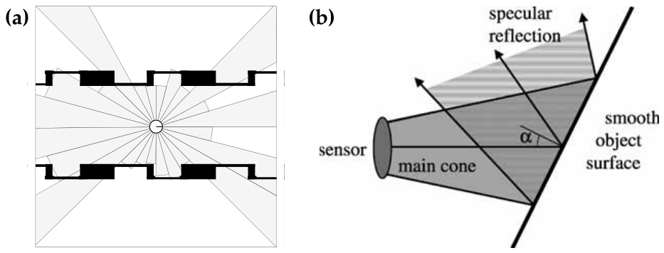

*Figure 6.1 — (a) 환경 속 로봇의 전형적인 ultrasound scan. (b) 초음파 센싱에서의 오독(misreading).
센서의 개방각 절반을 초과하는 각도 $\alpha$ 로 반사성 표면을 향해 소나 신호를 쏠 때 발생한다. (책 p.150)*

**모바일 로봇이 센서로 환경을 perceive할 때의 기본 문제를 예시하기 위해, Figure 6.1a는 24개의 초음파
센서가 원형 배열로 장착된 모바일 로봇이 복도에서 얻은 전형적인 sonar range scan을 보여준다. 개별
센서가 측정한 거리는 밝은 회색으로, 환경의 맵은 검은색으로 표시되어 있다. 이 측정 대부분은 측정
cone 안 가장 가까운 물체까지의 거리에 대응하지만, 일부 측정은 어떤 물체도 검출하지 못했다.** (책 p.149)

**소나가 가까운 물체까지의 거리를 신뢰성 있게 측정하지 못하는 것은 흔히 센서 노이즈라고 바꿔 말해진다.
기술적으로 이 노이즈는 상당히 예측 가능하다: 매끄러운 표면(벽 같은)을 측정할 때 반사는 보통
specular이고, 벽은 사실상 음파에 대한 거울이 된다.** (책 p.150)

> **specular reflection(정반사)** — 거울처럼 입사각 = 반사각으로 튕기는 반사. 반대말은 난반사(diffuse).
> 벽이 매끄러우면 음파가 사방으로 흩어지지 않고 한 방향으로만 튄다.

**이는 매끄러운 표면을 비스듬한 각도로 때릴 때 문제가 될 수 있다. 여기서 echo가 소나 센서가 아닌 다른
방향으로 진행할 수 있으며, 이는 Figure 6.1b에 예시되어 있다. 이 효과는 main cone 안 가장 가까운
물체까지의 실제 거리와 비교했을 때 **지나치게 큰 range 측정**으로 이어지는 경우가 많다.** (책 p.150)

**이런 일이 일어날 likelihood는 표면 재질, 표면 법선과 센서 cone 방향 사이의 각도, 표면까지의 거리,
main sensor cone의 폭, 소나 센서의 민감도 같은 여러 속성에 의존한다. short reading 같은 다른 오차는
서로 다른 센서 간의 cross-talk(음속이 느리다!)이나 로봇 근처의 모델링되지 않은 물체(예: 사람)에 의해
발생할 수 있다.** (책 p.150)

> 이 문단에 6.3절에서 모델링할 **네 가지 오차가 전부 예고**되어 있다.
>
> | 이 문단의 서술 | 6.3.1절의 성분 |
> |---|---|
> | 지나치게 큰 측정 / 물체 미검출 | $p_{\text{max}}$ (max range 반환) |
> | 모델링되지 않은 물체(사람) | $p_{\text{short}}$ |
> | cross-talk, phantom reading | $p_{\text{rand}}$ |
> | 정상 측정에도 남는 오차 | $p_{\text{hit}}$ |

### 레이저는 어떻게 다른가 (책 p.150~151)

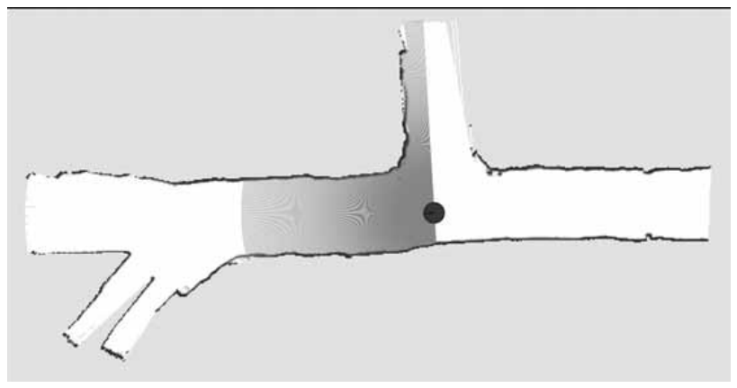

*Figure 6.2 — SICK LMS 레이저로 획득한 전형적인 laser range scan. 여기 보이는 환경은 탄광이다.
(책 p.151)*

**Figure 6.2는 2-D laser range finder로 획득한 전형적인 laser range scan을 보여준다. 레이저는 신호를
능동적으로 방출하고 그 echo를 기록한다는 점에서 소나와 유사하지만, 레이저의 경우 그 신호는 광선(light
beam)이다. 소나와의 핵심 차이는 레이저가 훨씬 더 집중된(focused) 빔을 제공한다는 것이다. Figure 6.2의
특정 레이저는 time-of-flight 측정에 기반하며, 측정은 1도 간격으로 배치된다.** (책 p.150)

> | | 소나 | 레이저 |
> |---|---|---|
> | 신호 | 음파 | 광선 |
> | 빔 형태 | 넓은 **cone** | 좁은 **beam** |
> | 오차 특성 | specular reflection, cross-talk 심함 | 훨씬 정확, 가끔 오측정 |
> | 6.3절에서의 취급 | cone 모델이 적절 | beam 모델이 적절 (책 p.153) |
>
> 6.3절 제목이 "**Beam** Models of Range Finders"인 이유가 이것이다. 레이저를 기본으로 놓고 설명한다.

### 정확한 모델이 좋지만, 정확할 수 없다 (책 p.150~151)

**대략적인 규칙으로, 센서 모델이 정확할수록 결과가 좋다 — 다만 2.4.4절에서 이미 논의한 몇 가지 중요한
단서가 있다. 그러나 실제로는 물리 현상의 복잡성 때문에 센서를 정확하게 모델링하는 것이 불가능한 경우가
많다.** (책 p.150~151)

**흔히 센서의 응답 특성은 우리가 probabilistic robotics 알고리즘에서 명시하고 싶지 않은 변수들(예: 벽의
표면 재질 — 특별한 이유 없이 로봇 mapping에서 보통 고려되지 않는다)에 의존한다.** (책 p.151)

> **Probabilistic robotics는 센서 모델의 부정확성을 stochastic한 측면으로 수용한다: 측정 과정을
> 결정론적 함수 $z_t = f(x_t)$ 대신 조건부 확률밀도 $p(z_t \mid x_t)$ 로 모델링함으로써, 센서 모델의
> 불확실성이 모델의 비결정론적 측면에 흡수될 수 있다.** (책 p.151)
>
> **여기에 classical robotics 대비 확률적 기법의 핵심 이점이 있다: 실제로 우리는 극도로 조잡한(crude)
> 모델로도 문제없이 해나갈 수 있다.** (책 p.151)

**그러나 확률 모델을 고안할 때는 센서 측정에 영향을 줄 수 있는 여러 유형의 불확실성을 포착하도록
주의를 기울여야 한다.** (책 p.151)

> **5장 p.118의 조언과 정확히 같은 메시지다.** 5장에서는 "많은 성공적 모델이 불확실성을 크게
> 과대평가한다"고 했다. 여기서는 "조잡한 모델로도 된다, 대신 **불확실성의 유형**은 빠짐없이 담아라"
> 고 한다. 6.3절이 오차를 굳이 네 종류로 나누는 이유가 이것이다 — 각 성분의 모양은 대충이어도 되지만,
> **네 종류 중 하나라도 빠지면** 그 유형의 오차가 들어왔을 때 모델이 확률 0을 주고 필터가 무너진다.

## 2. 수식/유도

### 전체 수식 (먼저 한 번에)

$$z_t = \{z_t^1, \ldots, z_t^K\} \tag{1}$$

$$p(z_t \mid x_t, m) = \prod_{k=1}^{K} p(z_t^k \mid x_t, m) \tag{2}$$

### 단계별 설명 (생략 없이)

**(1) 하나의 측정은 여러 개의 값이다** — 책 (6.1)

**많은 센서는 질의될 때 하나 이상의 수치 측정값을 생성한다. 예를 들어 카메라는 값의 배열 전체(밝기,
채도, 색)를 생성하고, 마찬가지로 range finder는 보통 range의 스캔 전체를 생성한다. 측정 $z_t$ 안의
그런 측정값의 개수를 $K$ 로 표기하면 다음과 같이 쓸 수 있다:** (책 p.151)

$$z_t = \{z_t^1, \ldots, z_t^K\}$$

**우리는 $z_t^k$ 를 개별 측정(예: 하나의 range 값)을 가리키는 데 사용할 것이다.** (책 p.151)

> **표기 정리.** 위첨자 $k$ 는 시간이 아니라 **스캔 안의 몇 번째 빔인지**를 가리킨다. SICK 레이저라면
> $K = 180$ (1도 간격 180개)이고, Figure 6.1a의 소나 배열이라면 $K = 24$ 다.
> 아래첨자 $t$ 가 시간, 위첨자 $k$ 가 빔 번호다.

**(2) 스캔 전체의 likelihood는 개별 빔의 곱** — 책 (6.2)

**확률 $p(z_t \mid x_t, m)$ 은 개별 측정 likelihood들의 곱으로 얻어진다:** (책 p.152)

$$p(z_t \mid x_t, m) = \prod_{k=1}^{K} p(z_t^k \mid x_t, m)$$

> **곱이 되려면 무엇이 필요한가 — 독립(independence)**
>
> 일반적으로 결합확률은 chain rule로만 분해된다:
> $$p(z^1, z^2 \mid x) = p(z^1 \mid x)\, p(z^2 \mid z^1, x)$$
> 두 번째 항의 조건에서 $z^1$ 을 지울 수 있을 때에만 곱이 된다. 그것이 conditional independence 가정이다:
> $$p(z^2 \mid z^1, x) = p(z^2 \mid x)$$
> 즉 **로봇 pose와 맵을 알고 나면, 1번 빔이 얼마였는지는 2번 빔을 예측하는 데 아무 정보도 주지
> 않는다**고 가정하는 것이다.

**기술적으로 이는 개별 측정 빔 각각의 노이즈 사이의 독립 가정에 해당한다 — 우리의 Markov 가정이 시간에
걸친 독립 노이즈를 가정하는 것과 꼭 같다(2.4.4절 참조). 이 가정은 이상적인 경우에만 참이다.**
(책 p.152)

**2.4.4절에서 의존적 노이즈의 가능한 원인들을 이미 논의했다. 요약하면, 의존성은 여러 요인 때문에
전형적으로 존재한다: 인접한 여러 센서의 측정을 흔히 오염시키는 **사람들**, 모델 $m$ 의 **오차**,
posterior의 **근사** 등이다. 그러나 지금은 독립 가정의 위반을 그냥 걱정하지 않겠다. 이 문제는 이후
장들에서 다시 다룬다.** (책 p.152)

> **이 가정이 실제로 위험한 지점.**
> $K = 180$ 이면 확률 180개를 곱한다. 각 빔이 조금씩만 "잘 맞는다"고 해도 곱하면 극단적으로 뾰족한
> 분포가 된다. 인접 빔이 사실은 같은 벽을 보고 있어 노이즈가 함께 움직이는데도 독립인 척 곱하면,
> 필터는 실제 정보량보다 훨씬 많은 정보를 얻었다고 착각한다. 이것이 6.3.4절과 6.7절에서 나올
> **overconfidence** 문제이고, 그 해법(빔 솎아내기, $\alpha$ 지수) 역시 거기서 다룬다.

## 3. 예제/실습

#### 예제 — 독립 가정이 만드는 숫자 감각

레이저 스캔 $K = 180$, 각 빔이 현재 pose 가설에서 $p(z_t^k \mid x_t, m) = 0.9$ 로 잘 맞는다고 하자.

$$p(z_t \mid x_t, m) = 0.9^{180} \approx 5.80 \times 10^{-9}$$

옆 pose 가설에서는 각 빔이 $0.8$ 로 조금 덜 맞는다고 하자.

$$0.8^{180} \approx 3.60 \times 10^{-18}$$

빔 하나당 차이는 $0.9$ 대 $0.8$ 로 12% 남짓인데, 스캔 전체로는 **약 16억 배** 차이가 난다.

$$\frac{0.9^{180}}{0.8^{180}} = \left(\frac{0.9}{0.8}\right)^{180} = 1.125^{180} \approx 1.61 \times 10^{9}$$

- 이 극단적 민감도가 **장점**이다: 스캔 하나로도 pose를 날카롭게 구분한다.
- 동시에 **위험**이다: 빔들이 사실 독립이 아니었다면, 이 16억 배는 근거 없는 확신이다.
- 실무 대응은 6.3.4절 — 180개를 다 쓰지 말고 **8개만 균등 간격으로** 쓰거나, 전체에 $\alpha < 1$ 지수를
  씌워 정보량을 깎는다.

#### 연습문제

1. $p(z_t \mid x_t, m)$ 가 "역모델"이 아니라 "forward model"인 이유를 설명하라. Bayes filter의 어느
   단계에서 이 분포가 쓰이며, 어떻게 inverse 추론으로 바뀌는가?
2. 소나와 레이저의 오차 특성 차이를 서술하고, 왜 6.3절이 cone이 아니라 beam을 기본 모델로 삼는지
   설명하라.
3. 위 예제에서 $K = 8$ 로 줄이면 두 pose 가설의 likelihood 비는 얼마가 되는가? 이것이 6.3.4절의
   "빔 솎아내기"와 어떻게 연결되는가?

---

# 6.2 Maps (책 p.152~153)

## 1. 개념적 이해

**측정이 생성되는 과정을 표현하려면, 측정이 생성되는 환경을 명시해야 한다. 환경의 맵은 환경 안의 물체
목록과 그 위치들이다.** (책 p.152)

5.5절 "Motion and Maps"에서 이미 맵을 비공식적으로 다뤘다. 여기서 형식적으로 정의한다.

**형식적으로 맵 $m$ 은 환경 안 물체들의 목록과 그 속성들이다.** (책 p.152)

### 맵을 색인하는 두 가지 방식

**맵은 보통 두 가지 방식 중 하나로 색인되며, 이는 feature-based와 location-based로 알려져 있다.**
(책 p.152)

| | **feature-based** | **location-based** |
|---|---|---|
| 색인 $n$ 이 뜻하는 것 | **feature 번호** | **특정 위치** |
| $m_n$ 이 담는 것 | feature의 속성 + 그 feature의 데카르트 좌표 | 그 좌표의 속성 |
| 표기 | $m_n$ | $m_{x,y}$ (평면 맵에서) |
| 크기 | 물체 개수 $N$ | 격자 칸 개수 |
| 대표 예 | 랜드마크 목록 | occupancy grid map |
| 이 장에서 쓰는 곳 | 6.6절 feature-based model | 6.3·6.4·6.5절 |

**feature-based 맵에서 $n$ 은 feature 색인이다. $m_n$ 의 값은 feature의 속성과 함께 그 feature의
데카르트 위치를 담는다. location-based 맵에서 색인 $n$ 은 특정 위치에 대응한다. 평면 맵에서는 $m_n$
대신 $m_{x,y}$ 로 맵 원소를 표기하는 것이 일반적인데, $m_{x,y}$ 가 특정 세계 좌표 $(x\ y)$ 의 속성임을
명시하기 위함이다.** (책 p.152)

### 어느 쪽이 무엇을 잘하는가

**두 유형의 맵 모두 장단점이 있다. location-based 맵은 volumetric이며, 세계의 어떤 위치에 대해서도
라벨을 제공한다는 점에서 그렇다. Volumetric 맵은 환경 안 물체에 대한 정보뿐 아니라 **물체의 부재**
(예: free-space)에 대한 정보도 담는다.** (책 p.152)

**이는 feature-based 맵에서 상당히 다르다. Feature-based 맵은 특정 위치에서만, 즉 맵에 담긴 물체들의
위치에서만 환경의 모양을 명시한다.** (책 p.153)

> **"물체의 부재"가 왜 중요한가.**
> 랜드마크 목록 `{(3,4) 기둥, (7,1) 모서리}` 를 보고 "그럼 (5,5)에는 아무것도 없나?"를 물으면 답할 수
> 없다. 목록에 없다는 게 "비었다"는 뜻인지 "아직 못 봤다"는 뜻인지 구분이 안 되기 때문이다.
> occupancy grid는 모든 칸에 값이 있으므로 이 질문에 답한다.
> 이 차이가 6.5절에서 map matching이 likelihood field보다 낫다고 말하는 근거가 된다 —
> **map matching은 free-space를 점수에 반영한다.**

**Feature 표현은 물체의 위치를 조정하기 쉽게 만든다. 예를 들어 추가 센싱의 결과로 그렇다. 이런 이유로
feature-based 맵은 센서 데이터로부터 맵이 구성되는 로봇 mapping 분야에서 인기가 있다. 이 책에서 우리는
두 유형의 맵을 모두 만나게 될 것이다 — 사실 우리는 때때로 한 표현에서 다른 표현으로 옮겨갈 것이다.**
(책 p.153)

**고전적인 맵 표현은 occupancy grid map으로 알려져 있으며, 9장에서 자세히 논의될 것이다. Occupancy 맵은
location-based다: 각 $x$-$y$ 좌표에 그 위치가 물체로 점유되어 있는지 여부를 명시하는 이진 occupancy
값을 할당한다. Occupancy grid map은 모바일 로봇 항법에 훌륭하다: 점유되지 않은 공간을 통과하는 경로를
찾기 쉽게 만들어 준다.** (책 p.153)

> 4.2절 "Binary Bayes Filters with Static State"에서 log odds로 다뤘던 그 문제가 occupancy grid의
> 각 칸이다. 9장에서 그 필터를 격자 전체에 적용해 맵을 만든다.

### 맵과 물리 세계를 구분하지 않는다

**이 책 전체에서 우리는 물리 세계와 맵의 구분을 버릴 것이다. 기술적으로 센서 측정은 물리적 물체에
의해 야기되는 것이지 그 물체의 맵에 의해서가 아니다. 그러나 센서 모델을 맵 $m$ 에 조건화하는 것이
전통이다. 따라서 우리는 측정이 맵에 의존함을 시사하는 표기를 채택할 것이다.** (책 p.153)

> **정직한 각주다.** $p(z_t \mid x_t, m)$ 은 엄밀히 말하면 틀린 표기다 — 센서는 맵을 보는 게 아니라
> 세계를 본다. 맵은 세계의 **근사**일 뿐이다. 이 근사 오차가 6.4.2절의 "맵 불확실성을 고려하지 못한다"
> 는 한계와, 6.7절의 overconfidence 경고로 되돌아온다.

## 2. 수식/유도

### 전체 수식 (먼저 한 번에)

$$m = \{m_1, m_2, \ldots, m_N\} \tag{1}$$

### 단계별 설명 (생략 없이)

**(1) 맵의 정의** — 책 (6.3)

$$m = \{m_1, m_2, \ldots, m_N\}$$

**여기서 $N$ 은 환경 안 물체의 총 개수이고, $1 \le n \le N$ 인 각 $m_n$ 은 하나의 속성을 명시한다.**
(책 p.152)

> 이것은 **정리가 아니라 definition이다.** 유도할 것이 없다. 중요한 것은 이 목록의 색인 $n$ 을 어떻게
> 해석하느냐(feature 번호 vs 위치)이며, 그 선택이 6.3~6.5절과 6.6절을 가른다.

## 3. 예제/실습

#### 예제 — 같은 방을 두 방식으로 적기

가로 4m, 세로 3m 방에 기둥 하나가 $(3, 1)$ 에 서 있다. 격자 해상도는 1m.

**feature-based**

$$m = \{\ m_1 = \langle 3,\ 1,\ \text{“기둥”}\rangle\ \}, \qquad N = 1$$

원소 하나. "이 방에 기둥이 하나 있고 $(3,1)$ 에 있다."

**location-based** (occupancy, 1 = 점유)

| $y \backslash x$ | 0 | 1 | 2 | 3 |
|---|---|---|---|---|
| **2** | 0 | 0 | 0 | 0 |
| **1** | 0 | 0 | 0 | **1** |
| **0** | 0 | 0 | 0 | 0 |

원소 12개. 같은 정보를 담지만 **"(1,2)는 비어 있다"** 까지 말해준다.

- 로봇이 $(0,1)$ 에서 $+x$ 방향으로 range 측정을 한다면? location-based 맵은 ray casting으로 3m를
  즉시 계산한다. feature-based 맵은 "측정 cone 안 가장 가까운 feature 찾기"로 계산한다 (책 p.154).
- 기둥 위치가 사실 $(3.2, 1.1)$ 이었다고 정정하려면? feature-based는 숫자 두 개만 고치면 된다.
  location-based는 격자를 다시 칠해야 하고, 해상도보다 작은 보정은 아예 표현되지 않는다.

#### 연습문제

1. 같은 환경을 두 방식으로 표현할 때 저장 원소 수가 어떻게 달라지는가? $10\text{m} \times 10\text{m}$
   방에 랜드마크 5개, 격자 해상도 10cm라면?
2. "물체의 부재"를 표현하지 못하는 것이 왜 문제가 되는지, 6.5절 map matching의 장점과 연결해 설명하라.
3. $p(z_t \mid x_t, m)$ 이라는 표기가 기술적으로 부정확한 이유는 무엇인가? 이 부정확성이 어떤 실무적
   문제로 나타나는가?

---

# 6.3 Beam Models of Range Finders (책 p.153~168)

**Range finder는 로보틱스에서 가장 인기 있는 센서에 속한다. 따라서 이 장의 첫 measurement model은 range
finder의 근사적 물리 모델(approximative physical model)이다. Range finder는 가까운 물체까지의 거리를
측정한다. Range는 **빔을 따라** 측정될 수도 있고 — 이는 laser range finder의 작동 방식을 잘 모델링한다 —
**cone 안에서** 측정될 수도 있다 — 이는 초음파 센서에 선호되는 모델이다.** (책 p.153)

> **"근사적 물리 모델"** 이라는 표현을 기억해 두자. 6.4절의 likelihood field는 스스로 **"ad hoc"** 이며
> **"그럴듯한 물리적 설명이 없다"** 고 책이 못박는다 (p.169). 그 대비가 6장의 핵심 구도다.
>
> | | 6.3 Beam model | 6.4 Likelihood field | 6.5 Map matching |
> |---|---|---|---|
> | 물리적 근거 | **있음** (ray casting) | 없음 (ad hoc) | 없음 |
> | $x_t$ 에 대한 평활성 | **나쁨** (불연속) | **좋음** | 나쁨 (평활화 가능) |
> | 계산 비용 | 높음 (3-D 사전계산) | 낮음 (2-D 사전계산) | 낮음 |
> | free-space 반영 | **함** | 안 함 | **함** |
> | 벽 투시 문제 | 없음 | **있음** | 있을 수 있음 |

## 6.3.1 The Basic Measurement Algorithm

### 1. 개념적 이해

**우리 모델은 네 가지 유형의 측정 오차를 포함하며, 그 모두가 이 모델이 작동하게 만드는 데 필수적이다:
작은 측정 노이즈, 예상치 못한 물체로 인한 오차, 물체 검출 실패로 인한 오차, 그리고 설명되지 않는
랜덤 노이즈. 따라서 원하는 모델 $p(z_t \mid x_t, m)$ 은 네 밀도의 mixture이며, 각각은 특정 유형의
오차에 대응한다.** (책 p.153)

> **"그 모두가 필수적"** — 앞서 6.1절에서 말한 그대로다. 성분 하나를 빼면 그 유형의 측정이 들어왔을 때
> 확률이 0이 되고, 곱 (2)에서 스캔 전체의 likelihood가 0이 된다. 즉 **올바른 pose 가설이 단 한 번의
> 이상 측정으로 완전히 죽는다.**

네 성분을 먼저 표로 잡고 들어가자.

| 성분 | 원인 | 분포 모양 | 지지집합 | 파라미터 |
|---|---|---|---|---|
| $p_{\text{hit}}$ | 정상 측정 + 센서 정밀도 한계 | 좁은 Gaussian | $[0, z_{\max}]$ | $\sigma_{\text{hit}}$ |
| $p_{\text{short}}$ | 맵에 없는 물체(사람 등) | 지수분포 | $[0, z_t^{k*}]$ | $\lambda_{\text{short}}$ |
| $p_{\text{max}}$ | 검출 실패 | point mass distribution | $\{z_{\max}\}$ | 없음 |
| $p_{\text{rand}}$ | 설명 불가 (phantom, cross-talk) | 균등분포 | $[0, z_{\max})$ | 없음 |

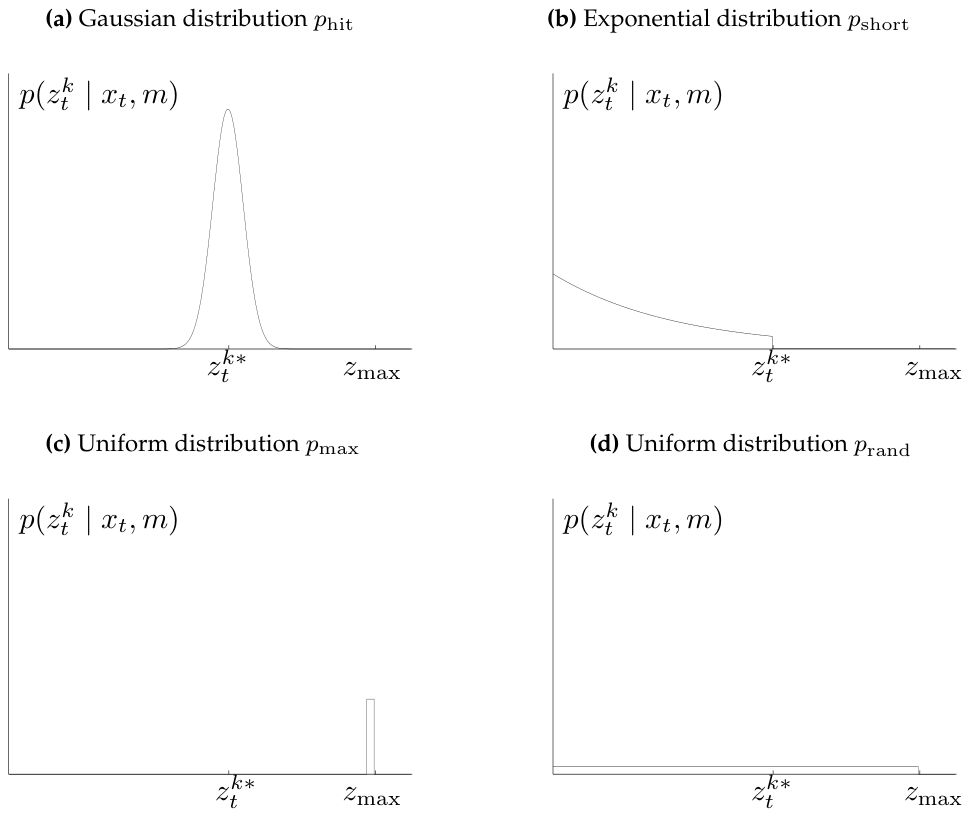

*Figure 6.3 — Range finder 센서 모델의 성분들. 각 도표에서 가로축은 측정 $z_t^k$, 세로축은 likelihood에
대응한다. (책 p.154)*

여기서 **$z_t^{k*}$** 라는 기호가 처음 등장한다. 별표가 붙은 이 값이 6.3절 전체의 중심이다.

> **$z_t^{k*}$ — "참" range**
>
> **$z_t^{k*}$ 를 $z_t^k$ 가 측정한 물체의 "참(true)" range를 표기하는 데 사용하자. location-based
> 맵에서 range $z_t^{k*}$ 는 **ray casting**으로 결정될 수 있다. feature-based 맵에서는 보통 측정 cone
> 안에서 가장 가까운 feature를 찾아서 얻는다.** (책 p.154)
>
> 즉 $z_t^{k*}$ 는 **센서가 읽은 값이 아니라, 로봇이 $x_t$ 에 있고 맵이 $m$ 이라면 이 빔이 마땅히
> 읽었어야 할 값**이다. 계산으로 얻는 값이지 측정값이 아니다.
>
> **ray casting(광선 투사)** — 로봇 위치에서 빔 방향으로 격자를 한 칸씩 따라가며 점유된 칸을 처음
> 만나는 지점까지의 거리를 재는 절차. 6.3.4절과 6.3.5절에서 지적하듯 이것이 beam model 계산 비용의
> 주범이다.

#### 성분 1 — 정상 측정 $p_{\text{hit}}$ (책 p.154~155)

**이상적인 세계라면 range finder는 언제나 측정 영역 안 가장 가까운 물체까지의 올바른 range를 측정할
것이다. (…) 그러나 센서가 가장 가까운 물체까지의 range를 올바르게 측정하더라도, 반환하는 값은 오차의
대상이다. 이 오차는 range 센서의 제한된 해상도, 측정 신호에 대한 대기 효과 등에서 발생한다. 이
**measurement noise**는 보통 평균 $z_t^{k*}$, 표준편차 $\sigma_{\text{hit}}$ 의 좁은 Gaussian으로
모델링된다.** (책 p.154)

#### 성분 2 — 예상치 못한 물체 $p_{\text{short}}$ (책 p.155)

**모바일 로봇의 환경은 동적인데 맵 $m$ 은 정적이다. 결과적으로 맵에 담기지 않은 물체가 range finder로
하여금 놀랍도록 짧은 range를 생성하게 만들 수 있다 — 적어도 맵과 비교했을 때는 그렇다. 움직이는 물체의
전형적인 예는 로봇의 작업 공간을 공유하는 사람들이다.**

**그런 물체를 다루는 한 가지 방법은 상태 벡터의 일부로 취급해 그 위치를 추정하는 것이다. 훨씬 단순한
다른 접근은 그것들을 센서 노이즈로 취급하는 것이다. 센서 노이즈로 취급되면, 모델링되지 않은 물체는
range를 $z_t^{k*}$ 보다 **짧게** 만들지 길게 만들지는 않는다는 성질을 가진다.** (책 p.155)

> **왜 지수분포인가 — 책의 논증 (p.155)**
>
> **예상치 못한 물체를 감지할 likelihood는 range가 커질수록 감소한다. 이를 보기 위해, 독립적으로 그리고
> 같은 고정 likelihood로 근접 센서의 지각 영역에 나타나는 두 사람이 있다고 상상해 보자. 한 사람의
> range는 $r_1$, 두 번째 사람의 range는 $r_2$ 다. 일반성을 잃지 않고 $r_1 < r_2$ 라고 더 가정하자.
> 그러면 우리는 $r_2$ 보다 $r_1$ 을 측정할 가능성이 더 높다. 첫 번째 사람이 있을 때마다 센서는 $r_1$ 을
> 측정한다. 그러나 $r_2$ 를 측정하려면 두 번째 사람이 있고 첫 번째 사람이 없어야 한다.**
>
> 가까운 장애물이 먼 장애물을 **가린다**는 것 — 이 "생존 확률이 거리에 따라 기하급수적으로 줄어드는"
> 구조가 정확히 지수분포의 정의다. 그래서 $p_{\text{short}}$ 는 지수분포다.

#### 성분 3 — 검출 실패 $p_{\text{max}}$ (책 p.156)

**때때로 장애물이 아예 놓쳐진다. 예를 들어 이는 specular reflection의 결과로 소나 센서에서 자주
일어난다. 검출 실패는 검은색의 빛을 흡수하는 물체를 감지할 때, 또는 일부 레이저 시스템에서 밝은
햇빛 아래 물체를 측정할 때 laser range finder에서도 발생한다. 센서 실패의 전형적 결과는 max-range
측정이다: 센서가 허용 최대값 $z_{\max}$ 를 반환한다. 그런 사건은 상당히 빈번하므로, measurement model에
max-range 측정을 명시적으로 모델링할 필요가 있다.** (책 p.156)

> **point mass distribution — 밀도함수가 없다**
>
> **기술적으로 $p_{\text{max}}$ 는 확률밀도함수를 갖지 않는다. 이는 $p_{\text{max}}$ 가 이산 분포이기
> 때문이다. 그러나 이것이 여기서 우리를 걱정시키지는 않는데, 센서 측정의 확률을 평가하는 우리의 수학적
> 모델은 밀도함수의 비존재에 영향받지 않기 때문이다. (우리 도표에서는 밀도가 존재하는 척할 수 있도록
> $p_{\text{max}}$ 를 $z_{\max}$ 를 중심으로 한 매우 좁은 균등분포로 그냥 그린다).** (책 p.156)
>
> Figure 6.3(c)와 Figure 6.4의 오른쪽 끝 얇은 막대가 그 "그리기 위한 거짓말"이다.

#### 성분 4 — 랜덤 측정 $p_{\text{rand}}$ (책 p.157)

**마지막으로 range finder는 때때로 완전히 설명 불가능한 측정을 생성한다. 예를 들어 소나는 벽에서
튕길 때, 또는 서로 다른 센서 간 cross-talk의 대상일 때 흔히 phantom reading을 생성한다. 단순함을
유지하기 위해 그런 측정은 전체 센서 측정 범위 $[0; z_{\max}]$ 에 퍼진 균등분포로 모델링될 것이다.**
(책 p.157)

> 이 성분은 **보험**이다. 어떤 이상한 값이 들어와도 확률이 0이 되지 않게 바닥을 깔아준다.
> $z_{\text{rand}}$ 를 키우면 필터가 이상 측정에 둔감해지고, 대신 정상 측정으로부터 얻는 정보량도 줄어든다.
> 6.3.2절 Figure 6.6 논의에서 책이 이 trade-off를 명시한다.

### 2. 수식/유도

#### 전체 유도 과정 (먼저 한 번에)

$$p_{\text{hit}}(z_t^k \mid x_t, m) = \begin{cases} \eta\, \mathcal{N}(z_t^k;\, z_t^{k*},\, \sigma_{\text{hit}}^2) & \text{if } 0 \le z_t^k \le z_{\max} \\ 0 & \text{otherwise} \end{cases} \tag{1}$$

$$\mathcal{N}(z_t^k;\, z_t^{k*},\, \sigma_{\text{hit}}^2) = \frac{1}{\sqrt{2\pi\sigma_{\text{hit}}^2}}\, e^{-\frac{1}{2}\frac{(z_t^k - z_t^{k*})^2}{\sigma_{\text{hit}}^2}} \tag{2}$$

$$\eta = \left(\int_0^{z_{\max}} \mathcal{N}(z_t^k;\, z_t^{k*},\, \sigma_{\text{hit}}^2)\, dz_t^k\right)^{-1} \tag{3}$$

$$p_{\text{short}}(z_t^k \mid x_t, m) = \begin{cases} \eta\, \lambda_{\text{short}}\, e^{-\lambda_{\text{short}} z_t^k} & \text{if } 0 \le z_t^k \le z_t^{k*} \\ 0 & \text{otherwise} \end{cases} \tag{4}$$

$$\int_0^{z_t^{k*}} \lambda_{\text{short}}\, e^{-\lambda_{\text{short}} z_t^k}\, dz_t^k = -e^{-\lambda_{\text{short}} z_t^{k*}} + e^{-\lambda_{\text{short}} \cdot 0} = 1 - e^{-\lambda_{\text{short}} z_t^{k*}} \tag{5}$$

$$\eta = \frac{1}{1 - e^{-\lambda_{\text{short}} z_t^{k*}}} \tag{6}$$

$$p_{\text{max}}(z_t^k \mid x_t, m) = I(z = z_{\max}) = \begin{cases} 1 & \text{if } z = z_{\max} \\ 0 & \text{otherwise} \end{cases} \tag{7}$$

$$p_{\text{rand}}(z_t^k \mid x_t, m) = \begin{cases} \dfrac{1}{z_{\max}} & \text{if } 0 \le z_t^k < z_{\max} \\ 0 & \text{otherwise} \end{cases} \tag{8}$$

$$z_{\text{hit}} + z_{\text{short}} + z_{\text{max}} + z_{\text{rand}} = 1 \tag{9}$$

$$p(z_t^k \mid x_t, m) = \begin{pmatrix} z_{\text{hit}} \\ z_{\text{short}} \\ z_{\text{max}} \\ z_{\text{rand}} \end{pmatrix}^{T} \cdot \begin{pmatrix} p_{\text{hit}}(z_t^k \mid x_t, m) \\ p_{\text{short}}(z_t^k \mid x_t, m) \\ p_{\text{max}}(z_t^k \mid x_t, m) \\ p_{\text{rand}}(z_t^k \mid x_t, m) \end{pmatrix} \tag{10}$$

#### 단계별 설명 (생략 없이)

**(1) $p_{\text{hit}}$ 의 정의** — 책 (6.4)

**실제로 range 센서가 측정하는 값은 구간 $[0; z_{\max}]$ 로 제한되며, 여기서 $z_{\max}$ 는 최대 센서
range를 표기한다. 따라서 측정 확률은 다음과 같이 주어진다** (책 p.155) — 위 식 (1).

**여기서 $z_t^{k*}$ 는 $x_t$ 와 $m$ 으로부터 ray casting을 통해 계산된다.** (책 p.155)

두 가지가 동시에 일어나고 있다:
- **평균이 $z_t^{k*}$** — 센서는 "참값 근처"를 읽는다.
- **구간 밖은 0, 그리고 $\eta$ 로 다시 정규화** — 물리적으로 불가능한 값(음수, $z_{\max}$ 초과)을 잘라낸다.

**(2) Gaussian의 정의** — 책 (6.5)

**$\mathcal{N}(z_t^k; z_t^{k*}, \sigma_{\text{hit}}^2)$ 은 평균 $z_t^{k*}$, 표준편차
$\sigma_{\text{hit}}$ 인 일변량 정규분포를 표기한다** (책 p.155) — 위 식 (2).

> 3.2.1절 식 (3.1)에서 본 그 일변량 Gaussian이다. 새로운 것은 **평균 자리에 $z_t^{k*}$ 가 들어갔다**는
> 점뿐이다. 즉 이 분포의 중심은 로봇 pose $x_t$ 와 맵 $m$ 에 따라 매 빔마다 달라진다.
> **$p_{\text{hit}}$ 가 $x_t$ 에 의존하는 통로가 오직 $z_t^{k*}$ 하나**라는 사실이 6.3.5절의 불연속성
> 문제의 원인이다 — $x_t$ 가 조금 움직여 빔이 의자 다리를 비껴가면 $z_t^{k*}$ 가 확 뛴다.

**(3) 절단(truncation) 정규화 상수** — 책 (6.6)

**정규화 상수 $\eta$ 는 다음과 같이 계산된다** (책 p.155) — 위 식 (3).

> **왜 $\eta$ 가 필요한가 — 절단 분포**
>
> 원래 Gaussian은 $(-\infty, \infty)$ 전체에서 적분하면 1이다. 그런데 우리는 $[0, z_{\max}]$ 밖을
> 0으로 잘라냈다. 잘라낸 만큼 총 질량이 1보다 작아졌으므로, 남은 부분을 그 값으로 나눠 다시 1로
> 만들어야 확률분포가 된다. $\eta$ 는 **"남은 질량의 역수"** 다.
>
> $z_t^{k*}$ 가 $z_{\max}$ 근처이거나 0 근처일 때 잘려나가는 양이 커지므로 $\eta$ 도 커진다.
> $z_t^{k*}$ 가 한가운데 있고 $\sigma_{\text{hit}}$ 이 작으면 $\eta \approx 1$ 이다.

**(4) $p_{\text{short}}$ 의 정의** — 책 (6.7)

**수학적으로 그런 상황에서의 range 측정 확률은 지수분포로 기술된다. 이 분포의 파라미터
$\lambda_{\text{short}}$ 는 measurement model의 intrinsic parameter다.** (책 p.155)

**지수분포의 정의에 따라 $p_{\text{short}}(z_t^k \mid x_t, m)$ 에 대해 다음 식을 얻는다** (책 p.156)
— 위 식 (4).

지지집합이 $[0,\ z_t^{k*}]$ 임에 주목하라. **참값보다 먼 곳에서는 이 성분이 0이다.** 예상치 못한 물체는
range를 짧게만 만든다는 앞의 논증이 여기 반영되어 있다.

**(5) 지수분포의 누적확률** — 책 (6.8)

**앞의 경우와 마찬가지로, 우리 지수가 구간 $[0; z_t^{k*}]$ 로 제한되므로 정규화 상수 $\eta$ 가
필요하다. 이 구간에서의 누적 확률이 다음과 같이 주어지므로** (책 p.156) — 위 식 (5).

> **적분을 직접 해보면**
> $$\int_0^{a} \lambda e^{-\lambda z}\, dz = \Big[-e^{-\lambda z}\Big]_0^{a} = -e^{-\lambda a} + e^{0} = 1 - e^{-\lambda a}$$
> $a = z_t^{k*}$ 를 넣으면 식 (5)다. $a \to \infty$ 면 1이 되어(전체 지수분포) 정규화가 필요 없어진다.

**(6) $p_{\text{short}}$ 의 정규화 상수** — 책 (6.9)

**$\eta$ 의 값은 다음과 같이 유도될 수 있다** (책 p.156) — 위 식 (6).

식 (5)의 결과가 "남은 질량"이므로 그 역수가 $\eta$ 다. 식 (3)의 $\eta$ 와 **같은 기호지만 다른 값**임에
주의하라 — 책은 두 곳 모두 $\eta$ 를 재사용한다.

**(7) $p_{\text{max}}$ 의 정의** — 책 (6.10)

**이 경우를 $z_{\max}$ 를 중심으로 한 point mass distribution으로 모델링할 것이다** (책 p.156)
— 위 식 (7).

**여기서 $I$ 는 인자가 참이면 값 1을, 아니면 0을 취하는 indicator function을 표기한다.** (책 p.156)

**(8) $p_{\text{rand}}$ 의 정의** — 책 (6.11) — 위 식 (8).

구간 길이가 $z_{\max}$ 이므로 높이는 $1/z_{\max}$ 여야 적분이 1이 된다.

**(9) 혼합 가중치의 제약** — 책 p.157

**이 네 가지 서로 다른 분포는 이제 파라미터 $z_{\text{hit}}$, $z_{\text{short}}$, $z_{\text{max}}$,
$z_{\text{rand}}$ 로 정의되는 가중 평균으로 혼합되며, $z_{\text{hit}} + z_{\text{short}} +
z_{\text{max}} + z_{\text{rand}} = 1$ 이다.** (책 p.157)

> **표기 함정 — 반드시 짚고 갈 것**
>
> $z_{\text{hit}}$ 와 $z_t^{k}$ 는 **완전히 다른 것**이다.
>
> | 기호 | 정체 | 값의 성격 |
> |---|---|---|
> | $z_t^k$ | $k$ 번째 빔의 측정값 | 거리 (m) |
> | $z_t^{k*}$ | 그 빔의 참 range | 거리 (m) |
> | $z_{\max}$ | 센서 최대 range | 거리 (m) |
> | $z_{\text{hit}},\, z_{\text{short}},\, z_{\text{rand}}$ | **혼합 가중치** | **확률 (합 1)** |
> | $z_{\text{max}}$ | **혼합 가중치** | **확률** |
>
> 특히 $z_{\max}$(거리)와 $z_{\text{max}}$(가중치)는 아래첨자 서체만 다르다. 책의 표기 그대로이니
> 문맥으로 구분해야 한다 — 거리와 곱해지면 가중치, 비교 대상이면 거리다.

**(10) 최종 mixture** — 책 (6.12) — 위 식 (10).

내적 형태로 쓰였지만 결국 다음과 같다:

$$p(z_t^k \mid x_t, m) = z_{\text{hit}} \cdot p_{\text{hit}} + z_{\text{short}} \cdot p_{\text{short}} + z_{\text{max}} \cdot p_{\text{max}} + z_{\text{rand}} \cdot p_{\text{rand}}$$

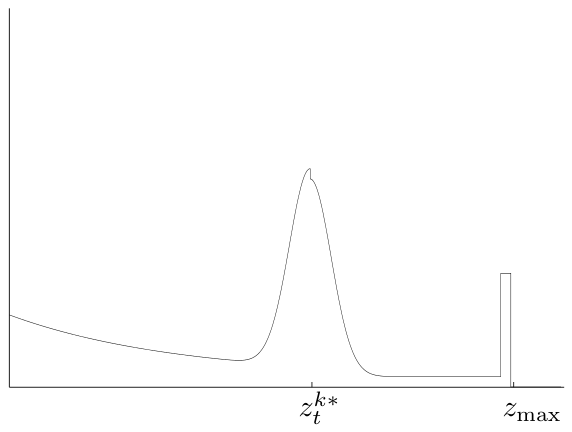

*Figure 6.4 — 전형적인 mixture 분포 $p(z_t^k \mid x_t, m)$ 의 "pseudo-density". (책 p.157)*

**이 개별 밀도들의 선형 결합에서 나오는 전형적인 밀도가 Figure 6.4에 나와 있다(point mass distribution
$p_{\text{max}}$ 를 작은 균등 밀도로 시각화한 것과 함께). 독자가 알아챌 수 있듯, 네 기본 모델의 기본
특성이 이 결합된 밀도에 여전히 모두 존재한다.** (책 p.157)

Figure 6.4를 왼쪽부터 읽으면 네 성분이 그대로 보인다:

1. 왼쪽에서 완만히 내려오는 곡선 → $p_{\text{short}}$ (지수)
2. $z_t^{k*}$ 위의 뾰족한 mode → $p_{\text{hit}}$ (Gaussian)
3. 바닥에 깔린 얇은 판 → $p_{\text{rand}}$ (균등)
4. $z_{\max}$ 위의 가는 막대 → $p_{\text{max}}$ (point mass)

<!--widget:beam-model-mixture-->

### 알고리즘 — 책 Table 6.1

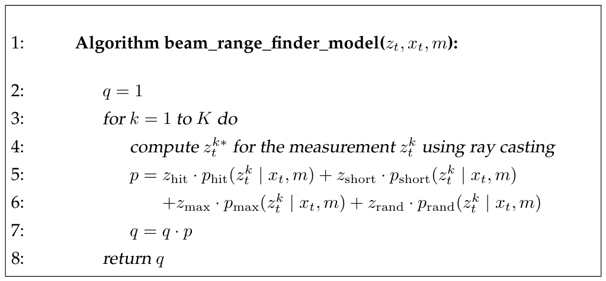

*Table 6.1 — 스캔 안 개별 range 측정 사이의 conditional independence를 가정하고, range scan $z_t$ 의
likelihood를 계산하는 알고리즘. (책 p.158)*

```
1:  Algorithm beam_range_finder_model(z_t, x_t, m):
2:      q = 1
3:      for k = 1 to K do
4:          compute z_t^{k*} for the measurement z_t^k using ray casting
5:          p = z_hit   · p_hit(z_t^k | x_t, m)  +  z_short · p_short(z_t^k | x_t, m)
6:            + z_max   · p_max(z_t^k | x_t, m)  +  z_rand  · p_rand(z_t^k | x_t, m)
7:          q = q · p
8:      return q
```

**Range finder 모델은 Table 6.1의 알고리즘 beam_range_finder_model로 구현된다. 이 알고리즘의 입력은
완전한 range scan $z_t$, 로봇 pose $x_t$, 그리고 맵 $m$ 이다. 바깥 루프(라인 2와 7)는 식 (6.2)에 따라
개별 센서 빔 $z_t^k$ 의 likelihood를 곱한다. 라인 4는 특정 센서 측정에 대한 노이즈 없는 range를
계산하기 위해 ray casting을 적용한다. 각 개별 range 측정 $z_t^k$ 의 likelihood는 라인 5에서 계산되며,
이는 (6.12)에 서술된 밀도 혼합 규칙을 구현한다. 스캔 $z_t$ 안의 모든 센서 측정 $z_t^k$ 를 순회한 뒤,
알고리즘은 원하는 확률 $p(z_t \mid x_t, m)$ 을 반환한다.** (책 p.158)

> **알고리즘 구조가 곧 수식이다.**
> - 라인 2·7의 곱 = 식 (2) (독립 가정)
> - 라인 5·6 = 식 (10) (mixture)
> - 라인 4 = $z_t^{k*}$ 계산, 유일하게 **맵과 pose가 들어오는 지점**이자 비용의 대부분

### 3. 예제/실습

#### 예제 — 숫자를 직접 넣어보기

**설정** (책의 Figure 6.5 상황과 같은 수치를 쓴다 — 참 range 300cm, 최대 range 500cm)

| 파라미터 | 값 |
|---|---|
| $z_t^{k*}$ | 300 cm |
| $z_{\max}$ | 500 cm |
| $\sigma_{\text{hit}}$ | 10 cm |
| $\lambda_{\text{short}}$ | 0.01 cm⁻¹ |
| $(z_{\text{hit}}, z_{\text{short}}, z_{\text{max}}, z_{\text{rand}})$ | $(0.7,\ 0.1,\ 0.15,\ 0.05)$ |

**측정값 $z_t^k = 305$ cm 일 때**

**단계 1 — $p_{\text{hit}}$**

$$\mathcal{N}(305; 300, 10^2) = \frac{1}{\sqrt{2\pi \cdot 100}}\, e^{-\frac{1}{2}\frac{(305-300)^2}{100}} = \frac{1}{25.066}\, e^{-0.125} = 0.03989 \times 0.8825 = 0.03521$$

정규화 상수 $\eta$ 는 $[0, 500]$ 구간이 평균 300에서 $\pm 3\sigma = \pm 30$ 을 훨씬 넘게 덮으므로
$\eta \approx 1$ 이다. 따라서 $p_{\text{hit}} \approx 0.03521$.

**단계 2 — $p_{\text{short}}$**

$305 > z_t^{k*} = 300$ 이므로 지지집합 밖이다.

$$p_{\text{short}} = 0$$

**단계 3 — $p_{\text{max}}$**

$305 \ne 500$ 이므로

$$p_{\text{max}} = 0$$

**단계 4 — $p_{\text{rand}}$**

$$p_{\text{rand}} = \frac{1}{500} = 0.002$$

**단계 5 — mixture (식 10)**

$$p(z_t^k \mid x_t, m) = 0.7 \times 0.03521 + 0.1 \times 0 + 0.15 \times 0 + 0.05 \times 0.002$$
$$= 0.024647 + 0 + 0 + 0.0001 = 0.024747$$

**측정값 $z_t^k = 150$ cm 일 때 (사람이 앞을 가로막은 경우)**

**단계 1 — $p_{\text{hit}}$**

$$\mathcal{N}(150; 300, 10^2) = 0.03989 \times e^{-\frac{1}{2}\frac{(150-300)^2}{100}} = 0.03989 \times e^{-112.5} \approx 5.53 \times 10^{-51}$$

사실상 0이다.

**단계 2 — $p_{\text{short}}$**

$150 \le 300$ 이므로 지지집합 안이다. 식 (6)의 정규화 상수부터:

$$\eta = \frac{1}{1 - e^{-0.01 \times 300}} = \frac{1}{1 - e^{-3}} = \frac{1}{1 - 0.049787} = \frac{1}{0.950213} = 1.05239$$

$$p_{\text{short}} = 1.05239 \times 0.01 \times e^{-0.01 \times 150} = 1.05239 \times 0.01 \times 0.22313 = 0.002348$$

**단계 3·4 — $p_{\text{max}} = 0$, $p_{\text{rand}} = 0.002$**

**단계 5 — mixture**

$$p = 0.7 \times (5.53\times10^{-51}) + 0.1 \times 0.002348 + 0.15 \times 0 + 0.05 \times 0.002$$
$$= 0 + 0.0002348 + 0 + 0.0001 = 0.0003348$$

**측정값 $z_t^k = 500$ cm 일 때 (검출 실패)**

$$p = 0.7 \times (\approx 0) + 0.1 \times 0 + 0.15 \times 1 + 0.05 \times 0 = 0.15$$

($z_t^k = z_{\max}$ 이므로 $p_{\text{rand}}$ 의 지지집합 $[0, z_{\max})$ 밖이다 — 식 (8)의 부등호가
한쪽만 등호임에 주의.)

**세 경우 비교**

| $z_t^k$ | 해석 | $p(z_t^k \mid x_t, m)$ | 지배 성분 |
|---|---|---|---|
| 305 cm | 정상 측정 | 0.0247 | $p_{\text{hit}}$ (99.6%) |
| 150 cm | 사람이 가림 | 0.000335 | $p_{\text{short}}$ (70%) |
| 500 cm | 검출 실패 | 0.15 | $p_{\text{max}}$ (100%) |

**여기서 배울 것**: 만약 $z_{\text{short}}$ 를 0으로 두었다면 150cm 측정에서 $p = 0.0001$ 로 떨어지고,
$z_{\text{rand}}$ 마저 0이었다면 $p = 0$ 이 되어 **곱 (2)에 의해 올바른 pose 가설이 즉사한다.**
"네 성분 모두가 필수"라는 책의 말이 이 숫자로 확인된다.

#### 연습문제

1. 위 설정에서 $z_t^k = 280$ cm 일 때 $p(z_t^k \mid x_t, m)$ 을 계산하라. $p_{\text{hit}}$ 와
   $p_{\text{short}}$ 가 모두 0이 아님에 주의하라.
2. $z_t^{k*} = 480$ cm 이고 $\sigma_{\text{hit}} = 30$ cm 라면 식 (3)의 $\eta$ 가 1에서 크게
   벗어난다. 왜 그런가? 대략적인 값을 추정하라.
3. 아래 Python 스니펫을 완성해 Figure 6.4를 재현하라.

```python
# 실행에는 numpy 가 필요하다:  sudo apt install -y python3-numpy
import numpy as np

def beam_model_density(z, z_star, z_max=500.0,
                       sigma_hit=10.0, lam_short=0.01,
                       w=(0.7, 0.1, 0.15, 0.05)):
    """책 식 (6.4)~(6.12). z는 스칼라 또는 배열."""
    z = np.asarray(z, dtype=float)
    w_hit, w_short, w_max, w_rand = w

    # p_hit — 식 (6.4)(6.5)(6.6)
    from math import erf, sqrt
    cdf = lambda a: 0.5 * (1 + erf((a - z_star) / (sigma_hit * sqrt(2))))
    eta_hit = 1.0 / (cdf(z_max) - cdf(0.0))
    p_hit = eta_hit / np.sqrt(2 * np.pi * sigma_hit**2) \
            * np.exp(-0.5 * (z - z_star)**2 / sigma_hit**2)
    p_hit = np.where((z >= 0) & (z <= z_max), p_hit, 0.0)

    # p_short — 식 (6.7)(6.8)(6.9)
    eta_short = 1.0 / (1.0 - np.exp(-lam_short * z_star))
    p_short = eta_short * lam_short * np.exp(-lam_short * z)
    p_short = np.where((z >= 0) & (z <= z_star), p_short, 0.0)

    # p_max — 식 (6.10) : point mass. 이산이므로 밀도로 그릴 땐 좁은 막대로 근사
    p_max = np.where(np.isclose(z, z_max), 1.0, 0.0)

    # p_rand — 식 (6.11)
    p_rand = np.where((z >= 0) & (z < z_max), 1.0 / z_max, 0.0)

    return w_hit*p_hit + w_short*p_short + w_max*p_max + w_rand*p_rand

# 검산: 위 예제의 세 값
for z in (305.0, 150.0, 500.0):
    print(z, beam_model_density(z, z_star=300.0))
```

---

## 6.3.2~6.3.3 Adjusting the Intrinsic Model Parameters (책 p.158~167)

> **이 절은 압축해서 다룬다.**
> 여기서 다루는 것은 "$\Theta$ 를 데이터로부터 자동으로 학습하는 절차"인데, 책 스스로
> **"intrinsic parameter $\Theta$ 를 손으로 설정하는 것도 완벽하게 받아들일 만한 방법이다: 결과 밀도가
> 자신의 경험과 일치할 때까지 그냥 눈대중하면 된다"** (책 p.159) 라고 말한다. 또한 이 절차는 7·8장
> Localization 알고리즘 안에서 돌아가지 않는다(뒤의 "왜 localization에서는 안 쓰이는가" 참조).
> 따라서 **개념과 결과 알고리즘(Table 6.2)** 을 정확히 잡고, ML 유도 식 (6.15)~(6.23)의 미분 전개는
> 결과만 인용한다. 원문 대조가 필요하면 책 p.163~167을 직접 보라.

### 1. 개념적 이해

#### intrinsic parameter $\Theta$ 란 무엇인가

**지금까지의 논의에서 우리는 센서 모델의 여러 파라미터를 어떻게 고를지의 문제를 다루지 않았다. 이
파라미터에는 혼합 파라미터 $z_{\text{hit}}$, $z_{\text{short}}$, $z_{\text{max}}$, $z_{\text{rand}}$ 가
포함된다. 또한 파라미터 $\sigma_{\text{hit}}$ 와 $\lambda_{\text{short}}$ 도 포함된다. 우리는 모든
intrinsic parameter의 집합을 $\Theta$ 로 부를 것이다.** (책 p.158)

$$\Theta = \{z_{\text{hit}},\ z_{\text{short}},\ z_{\text{max}},\ z_{\text{rand}},\ \sigma_{\text{hit}},\ \lambda_{\text{short}}\}$$

**분명히 어떤 센서 측정의 likelihood도 $\Theta$ 의 함수다. 따라서 이제 모델 파라미터를 조정하는
알고리즘을 논의하겠다.** (책 p.158)

> **왜 "intrinsic(내재적)"인가**
>
> $x_t$ 와 $m$ 은 매 시각 바뀐다. 그러나 $\Theta$ 는 **그 센서를 쓰는 한 고정**이다. 로봇이 어디에
> 있든, 환경이 무엇이든 상관없이 그 센서 자체의 성질이다. 6.3.1절 본문에서 책이
> "$\sigma_{\text{hit}}$ 은 measurement model의 intrinsic noise parameter다"(p.155),
> "$\lambda_{\text{short}}$ 는 measurement model의 intrinsic parameter다"(p.155)라고 그때그때
> 예고해 둔 것을 여기서 모아 다룬다.

#### 소나와 레이저는 얼마나 다른가 (책 p.158~159)

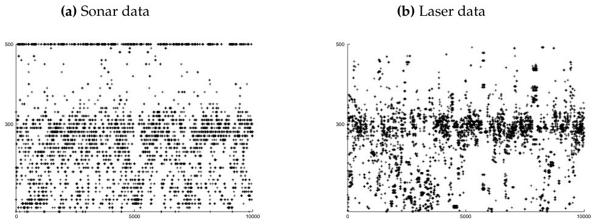

*Figure 6.5 — 사무실 환경에서 "참" range 300cm, 최대 range 500cm 조건에서 (a) 소나 센서와 (b) laser
range 센서로 얻은 전형적 데이터. (책 p.159)*

**intrinsic parameter를 결정하는 한 가지 방법은 데이터에 의존하는 것이다. Figure 6.5는 전형적인 사무실
환경을 주행하는 모바일 로봇으로 얻은 10,000회 측정의 두 계열을 묘사한다. 두 도표 모두 기대 range가
대략 3미터(2.9m와 3.1m 사이)인 range 측정만 보여준다. 왼쪽 도표는 소나 센서의 데이터를, 오른쪽 도표는
레이저 센서의 대응 데이터를 묘사한다. 두 도표 모두 $x$ 축은 읽기 번호(1부터 10,000까지)를, $y$ 축은
센서가 측정한 range를 보여준다.** (책 p.158~159)

**두 센서 모두 측정 대부분이 올바른 range에 가깝지만, 센서들의 행태는 실질적으로 다르다. 초음파 센서는
훨씬 더 많은 측정 노이즈와 검출 오차를 겪는 것으로 보인다. 꽤 자주 장애물 검출에 실패하고, 대신 최대
range를 보고한다. 반면 laser range finder는 더 정확하다. 그러나 그것도 가끔 잘못된 range를 보고한다.**
(책 p.159)

> Figure 6.5(a)의 맨 윗줄에 촘촘히 깔린 500cm 점들이 곧 $z_{\text{max}}$ 가 커야 할 이유이고,
> 300cm 줄 주변의 퍼짐 폭이 $\sigma_{\text{hit}}$ 이며, 아래쪽에 흩어진 점들이 $z_{\text{short}}$ 와
> $z_{\text{rand}}$ 다. **같은 그림을 레이저(b)로 보면 500cm 줄이 사라진다** — 그래서 두 센서의
> $\Theta$ 는 다른 값이어야 한다.

#### 손으로 정해도 된다, 다만 데이터로 하면 더 원칙적이다

**intrinsic parameter $\Theta$ 를 설정하는 완벽하게 받아들일 만한 방법은 손으로 하는 것이다: 결과
밀도가 자신의 경험과 일치할 때까지 그냥 눈대중하면 된다. 또 다른, 더 원칙적인 방법은 이 파라미터를
실제 데이터로부터 학습하는 것이다.** (책 p.159)

**이는 참조 데이터셋 $Z = \{z_i\}$ 의 likelihood를 최대화함으로써 달성되며, 여기에는 연관된 위치
$X = \{x_i\}$ 와 맵 $m$ 이 함께 주어진다. 각 $z_i$ 는 실제 측정, $x_i$ 는 그 측정이 이루어진 pose,
$m$ 은 맵이다.** (책 p.159)

$$p(Z \mid X, m, \Theta) \tag{책 6.13}$$

**우리의 목표는 이 likelihood를 최대화하는 intrinsic parameter $\Theta$ 를 식별하는 것이다. 데이터의
likelihood를 최대화하는 어떤 추정기 또는 알고리즘도 maximum likelihood estimator, 줄여서 ML estimator로
알려져 있다.** (책 p.159)

> **입력에 $X$ 가 있다는 점을 꼭 보라.** 학습하려면 **각 측정이 이루어진 정답 pose를 알아야 한다.**
> 이것이 뒤에서 "localization에서는 못 쓴다"고 말하는 이유의 핵심이다.

#### EM — 왜 반복이 필요한가

문제를 두 경우로 나누면 구조가 선명해진다. 책 6.3.3절이 정확히 이 순서로 유도한다.

**경우 A — 정답 라벨을 아는 경우 (닫힌 해가 있다)**

**ML estimator를 유도하기 위해, 보조 변수 $c_i$ — 이른바 correspondence variable — 를 도입하는 것이
유용할 것이다. 각 $c_i$ 는 hit, short, max, random 네 값 중 하나를 취할 수 있으며, 이는 측정 $z_i$ 를
생성했을 수 있는 네 가지 가능한 메커니즘에 대응한다.** (책 p.162)

**먼저 $c_i$ 들이 알려진 경우를 생각해 보자. (…) $c_i$ 들의 값에 근거해 우리는 $Z$ 를 네 개의 서로소
집합 $Z_{\text{hit}}$, $Z_{\text{short}}$, $Z_{\text{max}}$, $Z_{\text{rand}}$ 로 분해할 수 있으며,
이들이 합쳐져 집합 $Z$ 를 이룬다.** (책 p.162)

그러면 답은 **그냥 세고 나누는 것**이다 (책 6.14, 6.19, 6.23):

$$\begin{pmatrix} z_{\text{hit}} \\ z_{\text{short}} \\ z_{\text{max}} \\ z_{\text{rand}} \end{pmatrix} = |Z|^{-1} \begin{pmatrix} |Z_{\text{hit}}| \\ |Z_{\text{short}}| \\ |Z_{\text{max}}| \\ |Z_{\text{rand}}| \end{pmatrix}, \qquad \sigma_{\text{hit}} = \sqrt{\frac{1}{|Z_{\text{hit}}|}\sum_{z_i \in Z_{\text{hit}}} (z_i - z_i^*)^2}, \qquad \lambda_{\text{short}} = \frac{|Z_{\text{short}}|}{\sum_{z_i \in Z_{\text{short}}} z_i}$$

> **이 세 식이 어디서 나오는가 (책 p.163~165, 유도 요약)**
>
> $Z_{\text{hit}}$ 의 likelihood는 독립 가정으로 곱 (6.15)이 되고, 로그를 취하면 (6.16)이 된다.
> **ML 추정의 고전적 요령은 likelihood를 직접 최대화하는 대신 그 로그를 최대화하는 것이다. 로그는
> 강한 단조 함수이므로 log-likelihood의 최대는 원래 likelihood의 최대이기도 하다.** (책 p.164)
> 로그를 정리하면 (6.17)이 되고, $\sigma_{\text{hit}}$ 로 편미분한 것이 (6.18)이며, 이를 0으로 놓고
> 풀면 위의 $\sigma_{\text{hit}}$ 식 (6.19)가 나온다. $\lambda_{\text{short}}$ 도 (6.20)~(6.23)에서
> 똑같은 절차(곱 → 로그 → 미분 → 0)로 얻는다.
>
> 결과만 보면 익숙한 것들이다 — 표본 표준편차와, 지수분포 평균의 역수.

**경우 B — 라벨을 모르는 실제 상황 (닫힌 해가 없다)**

**이 유도는 파라미터 $c_i$ 의 지식을 가정했다. 이제 $c_i$ 들이 알려지지 않은 경우로 확장한다. 보게
되겠지만, 결과적인 ML 추정 문제는 닫힌 형식의 해를 결여한다. 그러나 우리는 두 단계를 반복하는 기법을
고안할 수 있다 — 하나는 $c_i$ 들에 대한 expectation을 계산하고, 다른 하나는 그 expectation 아래에서
intrinsic model parameter를 계산한다. 언급했듯 결과 알고리즘은 expectation maximization 알고리즘,
보통 EM으로 축약되는 것의 한 사례다.** (책 p.165)

> **현실에는 라벨이 없다.** 센서가 270cm를 반환했을 때 그것이 300cm를 노이즈 섞어 잰 hit인지, 앞을
> 지나간 사람 때문인 short인지, 순전한 random인지 아무도 알려주지 않는다. 그런데 $\Theta$ 를 알아야
> 그 판단을 할 수 있고, 그 판단을 해야 $\Theta$ 를 계산할 수 있다. 닭과 달걀이다.
>
> **EM은 이 순환을 번갈아 끊는다.**
>
> | 단계 | 하는 일 | 고정하는 것 |
> |---|---|---|
> | **E-step** | 각 측정이 어느 성분에서 왔을 **확률** $e_{i,\cdot}$ 계산 | 현재 $\Theta$ |
> | **M-step** | 그 확률을 가중치로 써서 $\Theta$ 갱신 | 방금 구한 $e_{i,\cdot}$ |

**E-step** (책 6.27, 6.28) — 이는 6.3.1절의 mixture를 그대로 뒤집은 것이다. 각 성분이 이 측정을
설명할 상대적 몫을 구한다:

$$\begin{pmatrix} e_{i,\text{hit}} \\ e_{i,\text{short}} \\ e_{i,\text{max}} \\ e_{i,\text{rand}} \end{pmatrix} := \begin{pmatrix} p(c_i = \text{hit}) \\ p(c_i = \text{short}) \\ p(c_i = \text{max}) \\ p(c_i = \text{rand}) \end{pmatrix} = \eta \begin{pmatrix} p_{\text{hit}}(z_i \mid x_i, m) \\ p_{\text{short}}(z_i \mid x_i, m) \\ p_{\text{max}}(z_i \mid x_i, m) \\ p_{\text{rand}}(z_i \mid x_i, m) \end{pmatrix}$$

$$\eta = \big[\, p_{\text{hit}}(z_i \mid x_i, m) + p_{\text{short}}(z_i \mid x_i, m) + p_{\text{max}}(z_i \mid x_i, m) + p_{\text{rand}}(z_i \mid x_i, m) \,\big]^{-1}$$

**이 단계는 "E-step"이라 불리며, 이는 우리가 latent variable $c_i$ 에 대한 expectation을 계산함을
가리킨다.** (책 p.166)

**M-step** (책 6.29~6.31) — **경우 A의 공식에서 hard assignment를 soft assignment로 바꾼 것뿐이다.**

$$\begin{pmatrix} z_{\text{hit}} \\ z_{\text{short}} \\ z_{\text{max}} \\ z_{\text{rand}} \end{pmatrix} = |Z|^{-1} \sum_i \begin{pmatrix} e_{i,\text{hit}} \\ e_{i,\text{short}} \\ e_{i,\text{max}} \\ e_{i,\text{rand}} \end{pmatrix}$$

$$\sigma_{\text{hit}} = \sqrt{\frac{1}{\sum_{z_i \in Z} e_{i,\text{hit}}} \sum_{z_i \in Z} e_{i,\text{hit}}\,(z_i - z_i^*)^2}, \qquad \lambda_{\text{short}} = \frac{\sum_{z_i \in Z} e_{i,\text{short}}}{\sum_{z_i \in Z} e_{i,\text{short}}\, z_i}$$

**ML 파라미터 $\sigma_{\text{hit}}$ 와 $\lambda_{\text{short}}$ 는 (6.19)와 (6.23)의 hard assignment를
expectation으로 가중된 soft assignment로 대체함으로써 유사하게 얻어진다.** (책 p.167)

> **경우 A와 경우 B를 나란히 놓고 보라 — 이것이 EM의 전부다.**
>
> | | 경우 A (라벨 있음) | 경우 B (EM) |
> |---|---|---|
> | 혼합 가중치 | $\dfrac{\|Z_{\text{hit}}\|}{\|Z\|}$ (개수 세기) | $\dfrac{\sum_i e_{i,\text{hit}}}{\|Z\|}$ (확률 합) |
> | $\sigma_{\text{hit}}$ | $Z_{\text{hit}}$ 안의 것만 평균 | 모든 측정을 $e_{i,\text{hit}}$ 로 가중 평균 |
> | 반복 필요? | 아니오 (한 번에 끝) | 예 (수렴까지) |
>
> "이 측정은 hit이다(1) 또는 아니다(0)" 대신 **"이 측정은 0.83만큼 hit이다"** 로 바꾼 것이 유일한
> 차이다. 그리고 그 0.83이 $\Theta$ 에 의존하므로 반복해야 한다.

### 2. 알고리즘 — 책 Table 6.2

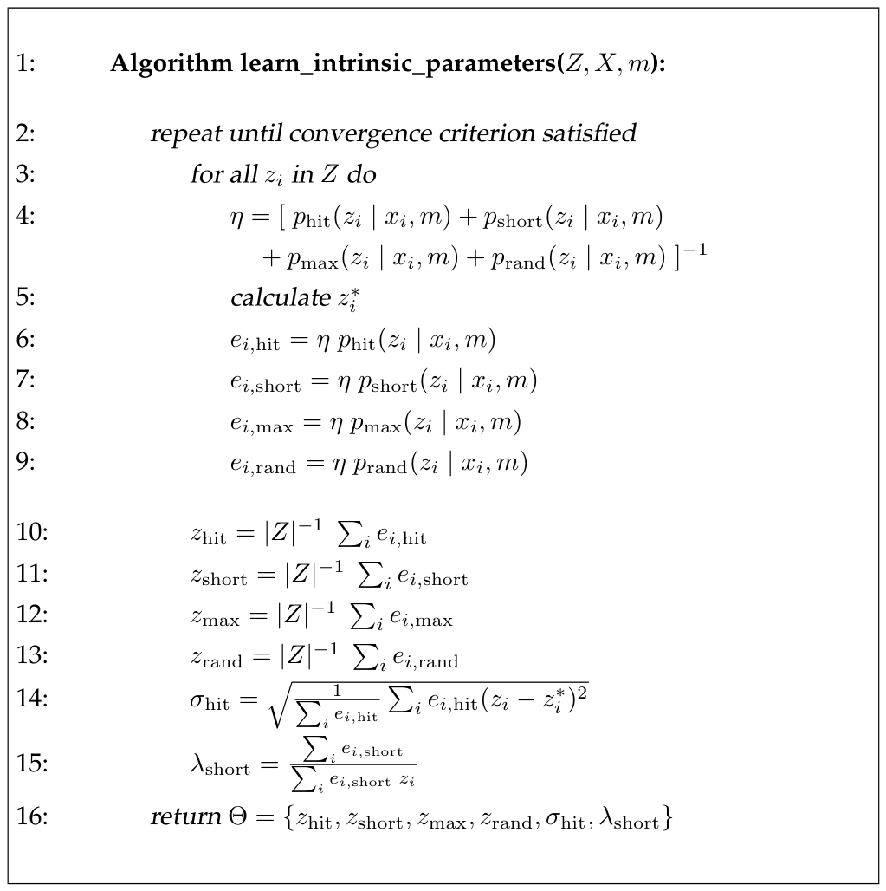

*Table 6.2 — 데이터로부터 beam 기반 센서 모델의 intrinsic parameter를 학습하는 알고리즘. (책 p.160)*

```
 1:  Algorithm learn_intrinsic_parameters(Z, X, m):
 2:      repeat until convergence criterion satisfied
 3:          for all z_i in Z do
 4:              η = [ p_hit(z_i|x_i,m) + p_short(z_i|x_i,m)
                     + p_max(z_i|x_i,m) + p_rand(z_i|x_i,m) ]^(-1)
 5:              calculate z_i*
 6:              e_{i,hit}   = η · p_hit(z_i | x_i, m)
 7:              e_{i,short} = η · p_short(z_i | x_i, m)
 8:              e_{i,max}   = η · p_max(z_i | x_i, m)
 9:              e_{i,rand}  = η · p_rand(z_i | x_i, m)
10:          z_hit   = |Z|^(-1) Σ_i e_{i,hit}
11:          z_short = |Z|^(-1) Σ_i e_{i,short}
12:          z_max   = |Z|^(-1) Σ_i e_{i,max}
13:          z_rand  = |Z|^(-1) Σ_i e_{i,rand}
14:          σ_hit   = sqrt( (1 / Σ_i e_{i,hit}) · Σ_i e_{i,hit} (z_i - z_i*)^2 )
15:          λ_short = (Σ_i e_{i,short}) / (Σ_i e_{i,short} z_i)
16:      return Θ = {z_hit, z_short, z_max, z_rand, σ_hit, λ_short}
```

**Table 6.2의 알고리즘 learn_intrinsic_parameters는 처음에 intrinsic parameter $\sigma_{\text{hit}}$
와 $\lambda_{\text{short}}$ 의 좋은 초기화를 요구한다. 라인 3부터 9까지에서 보조 변수를 추정한다: 각
$e_{i,\text{xxx}}$ 는 측정 $z_i$ 가 "xxx"에 의해 야기되었을 확률이며, 여기서 "xxx"는 센서 모델의 네
측면 hit, short, max, random 중에서 선택된다. 이어서 라인 10부터 15까지에서 intrinsic parameter를
추정한다.** (책 p.160~161)

**그러나 intrinsic parameter는 앞서 계산된 expectation의 함수다. Intrinsic parameter를 조정하면
expectation이 바뀌고, 이 때문에 알고리즘은 반복되어야 한다. 그러나 실제로 그 반복은 빠르게 수렴하며,
보통 열두 번 정도의 반복이면 좋은 결과를 내기에 충분하다.** (책 p.161)

> **라인 3~9가 E-step, 라인 10~15가 M-step**이다. 그리고 라인 2의 `repeat`이 그 둘을 번갈아 돌린다.
> 초기값이 필요하다는 점(라인 3 이전)도 명시되어 있다 — EM은 초기값에 의존하는 지역 최적화다.

### 3. 학습 결과와 그 함의

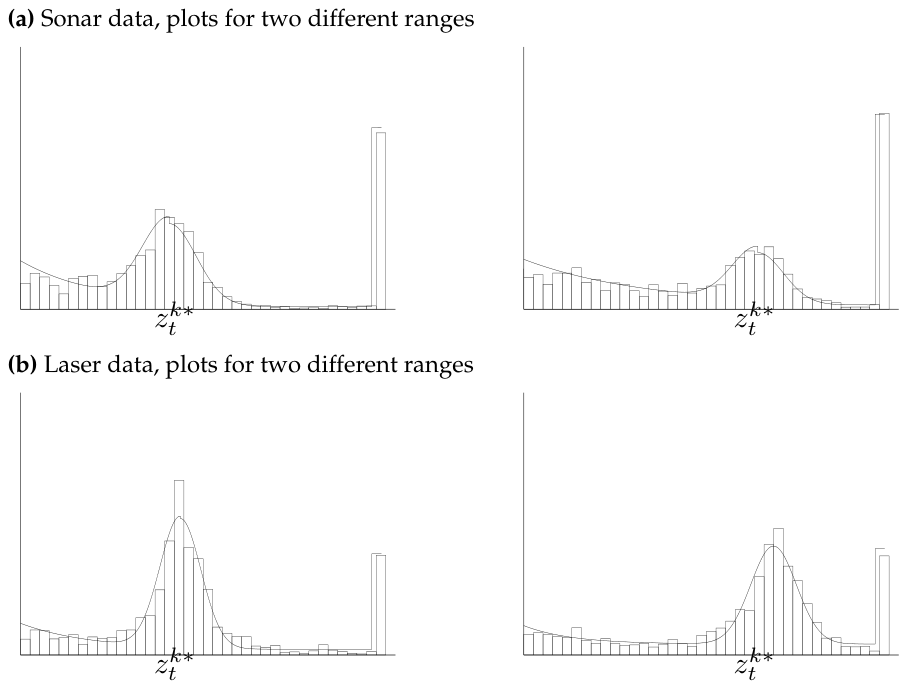

*Figure 6.6 — (a) 소나 데이터와 (b) laser range 데이터에 기반한 beam model의 근사. 왼쪽에 묘사된 센서
모델들은 Figure 6.5에 묘사된 데이터셋에 대한 maximum likelihood 근사로 얻어졌다. (책 p.162)*

**Figure 6.6은 learn_intrinsic_parameters로 계산된 데이터와 ML measurement model의 네 예를 그래픽으로
묘사한다. 첫 행은 초음파 센서로 기록된 데이터에 대한 근사를 보여준다. 둘째 행은 laser range 데이터에
대해 생성된 두 함수의 도표를 담는다. 열은 서로 다른 "참" range에 대응한다. 데이터는 히스토그램으로
정리되어 있다.** (책 p.161)

**서로 다른 그래프 사이의 차이를 명확히 볼 수 있다. range $z_t^{k*}$ 가 작을수록 측정이 더 정확하다.
두 센서 모두 Gaussian이 긴 측정보다 짧은 range에서 더 좁다. 나아가 laser range finder가 초음파 센서보다
더 정확한데, 이는 더 좁은 Gaussian과 더 적은 수의 최대 range 측정으로 나타난다.** (책 p.161)

> 이 관찰은 **$\Theta$ 가 사실 $z_t^{k*}$ 에 따라서도 달라진다**는 뜻이다. 6.3.1절 모델은 단일 $\Theta$
> 를 쓰므로 이 의존성을 무시한다 — 또 하나의 "crude model" 지점이다.

**주목할 다른 중요한 점은 short와 random 측정의 상대적으로 높은 likelihood다. 이 큰 오차 likelihood는
단점과 장점을 함께 갖는다: 부정적인 면에서는 각 센서 읽기의 정보량을 줄이는데, hit과 random 측정 사이의
likelihood 차이가 작기 때문이다. 긍정적인 면에서는 이 모델이 로봇의 경로를 오랫동안 막는 사람들처럼
모델링되지 않은 체계적 교란에 덜 취약하다.** (책 p.161)

> **5장 p.118의 "불확실성을 과대평가하라"가 여기서 데이터로 확인된다.** ML로 학습한 결과가
> 저절로 그런 모델이 되었다는 것이다.

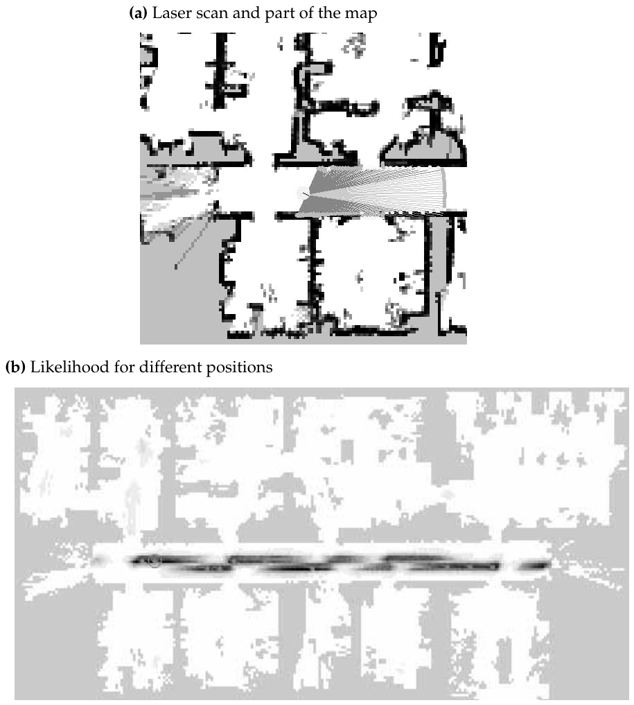

*Figure 6.7 — perception의 확률 모델: (a) 이전에 획득한 맵 $m$ 에 투영된 laser range scan.
(b) 모든 위치 $x_t$ 에 대해 평가되어 맵(회색)에 투영된 likelihood $p(z_t \mid x_t, m)$. 위치가
어두울수록 $p(z_t \mid x_t, m)$ 이 크다. (책 p.163)*

**Figure 6.7은 학습된 센서 모델이 작동하는 모습을 예시한다. Figure 6.7a에 180도 range scan이 보인다.
로봇은 이전에 획득한 occupancy grid map 안 그것의 참 pose에 놓여 있다. Figure 6.7b는 환경의 맵과 함께
이 range scan의 likelihood $p(z_t \mid x_t, m)$ 을 $x$-$y$ 공간으로 투영(방향 $\theta$ 에 대해
최대화하여)해 도시한다. 위치가 어두울수록 더 그럴듯하다.** (책 p.161)

**쉽게 보이듯 높은 likelihood를 가진 모든 영역이 복도에 위치한다. 특정 스캔이 방 안 어떤 위치보다
복도 위치와 기하학적으로 더 일관되므로 이는 별로 놀랍지 않다. 확률 질량이 복도 전체에 퍼져 있다는
사실은 **단일 센서 스캔이 로봇의 정확한 pose를 결정하기에 불충분함**을 시사한다. 이는 대체로 복도의
대칭성 때문이다. Posterior가 두 개의 좁은 수평 띠로 조직되어 있다는 사실은 로봇의 방향이 알려지지
않았다는 사실 때문이다: 이 띠 각각은 로봇의 살아남은 두 heading 방향 중 하나에 대응한다.** (책 p.161)

> **7·8장으로 가는 다리다.** 측정 하나로는 pose가 정해지지 않는다 — 그래서 **필터**가 필요하다.
> Figure 6.7b의 이 multi-modal·띠 모양 posterior가 바로 EKF의 단일 Gaussian으로 표현할 수 없는 모양이며,
> 8장 MCL이 particle로 표현하려는 대상이다.

### 왜 localization에서는 이 절차가 안 쓰이는가

$\Theta$ **값 자체는** 7·8장의 모든 localization에 반드시 필요하다. measurement model을 호출하려면
숫자가 있어야 한다. 그러나 **`learn_intrinsic_parameters` 라는 절차는 localization 루프 바깥에 있다.**

1. **입력이 순환한다.** 이 알고리즘은 정답 pose $X = \{x_i\}$ 를 알아야 $z_i^*$ 를 ray casting으로
   계산할 수 있다(Table 6.2 라인 5). 그런데 localization은 **pose를 모르는 것이 문제인 상황**이다.
   따라서 이것은 pose를 이미 아는 조건에서 미리 돌리는 **오프라인 캘리브레이션**이다.
2. **한 번 하고 끝난다.** $\Theta$ 는 센서 고유값이라 로봇이 움직인다고 바뀌지 않는다.
3. **7·8장 원문에 등장하지 않는다.** 책 p.191~276(7·8장 전체)에서 `intrinsic`, `EM`,
   `expectation maximization` 은 한 번도 나오지 않는다.

다만 책은 6.3.4절에서 관련 언급을 한 줄 남긴다:

> **또 다른 가능성 — 여기서는 언급만 하겠지만 — 은 응용의 맥락 안에서 intrinsic parameter를 학습하는
> 것이다: 예를 들어 모바일 localization에서는 여러 시간 단계에 걸쳐 좋은 localization 결과를 내도록
> gradient descent를 통해 intrinsic parameter를 훈련하는 것이 가능하다. 그런 다중 시간 단계 방법론은
> 위에서 기술한 단일 시간 단계 ML estimator와 상당히 다르다. 실제 구현에서 그것은 더 우수한 결과를
> 낼 수 있다.** (책 p.167)

### 예제/실습

#### 예제 — E-step을 손으로 한 번

6.3.1절 예제와 같은 $\Theta$ 초기값에서, 측정 $z_i = 150$ cm, $z_i^* = 300$ cm 인 표본 하나의
$e$ 값을 구해 보자. 6.3.1절 예제에서 이미 계산한 값들을 그대로 쓴다.

| 성분 | $p_{\cdot}(z_i \mid x_i, m)$ |
|---|---|
| hit | $5.53 \times 10^{-51}$ |
| short | $0.002348$ |
| max | $0$ |
| rand | $0.002$ |

**단계 1 — 정규화 상수 (Table 6.2 라인 4)**

$$\eta = \big[\,5.53\times10^{-51} + 0.002348 + 0 + 0.002\,\big]^{-1} = \frac{1}{0.004348} = 229.98$$

**단계 2 — expectation (라인 6~9)**

$$e_{i,\text{hit}} = 229.98 \times 5.53\times10^{-51} \approx 0$$
$$e_{i,\text{short}} = 229.98 \times 0.002348 = 0.540$$
$$e_{i,\text{max}} = 229.98 \times 0 = 0$$
$$e_{i,\text{rand}} = 229.98 \times 0.002 = 0.460$$

합이 $0.540 + 0.460 = 1.000$ 으로 1이 된다 (정규화의 확인).

**해석**: 이 측정 하나를 "54% 만큼 short, 46% 만큼 random"으로 쪼개어 두 성분에 나눠 기여시킨다.
hard assignment였다면 "short"라고 단정하고 $Z_{\text{short}}$ 에만 넣었을 것이다.

여기서 주목할 점 — 이 $e$ 값은 현재 $\Theta$ (특히 $\lambda_{\text{short}} = 0.01$)에 의존한다.
M-step에서 $\lambda_{\text{short}}$ 가 갱신되면 이 54:46 비율도 달라진다. **그래서 반복한다.**

#### 연습문제

1. 위 예제에서 $z_{\text{rand}}$ 가 아니라 $p_{\text{rand}}$ 가 $\eta$ 계산에 들어갔음을 확인하라.
   Table 6.2 라인 4에 혼합 가중치가 등장하지 않는 이유는 무엇인가?
2. 어떤 표본에서 $e_{i,\text{hit}} = 1$, 나머지가 0이라면 M-step의 $\sigma_{\text{hit}}$ 식은
   경우 A의 식 (6.19)와 어떻게 같아지는가?
3. `learn_intrinsic_parameters` 를 실제 로봇에서 돌리려면 무엇을 준비해야 하는가? 그것을 준비하는
   일이 localization 문제와 어떤 관계인지 설명하라.

---

## 6.3.4 Practical Considerations (책 p.167~168)

### 1. 개념적 이해

이 절은 짧지만 **실제 구현에서 가장 자주 필요한 세 가지 요령**을 담고 있다.

#### 요령 1 — 빔을 솎아낸다

**실제로 모든 센서 읽기의 밀도를 계산하는 것은 계산 관점에서 꽤 부담이 될 수 있다. 예를 들어 laser
range 스캐너는 흔히 스캔당 수백 개의 값을, 초당 여러 스캔의 속도로 반환한다. 스캔의 모든 빔에 대해,
그리고 고려되는 모든 가능한 pose에 대해 ray casting 연산을 수행해야 하므로, 스캔 전체를 현재 belief에
통합하는 일이 실시간으로 수행될 수 없는 경우가 있다.** (책 p.167)

**이 문제를 해결하는 전형적인 접근 하나는 모든 측정 중 작은 부분집합만 통합하는 것이다(예: laser range
scan당 360개 대신 균등 간격의 8개 측정).** (책 p.167)

**이 접근에는 중요한 추가 이점이 있다. Range scan의 인접 빔은 흔히 독립이 아니므로, 상태 추정 과정이
인접 측정의 상관된 노이즈에 덜 취약해진다.** (책 p.167)

> 계산량을 45배 줄이는 것이 목적이었는데, **독립 가정 위반 문제까지 같이 완화된다.** 6.1절 예제에서
> 본 "9억 배" 과신이 여기서 억제된다.

#### 요령 2 — likelihood에 지수 $\alpha$ 를 씌운다

**인접 측정 사이의 의존성이 강할 때, ML 모델은 로봇을 overconfident하게 만들어 최적이 아닌 결과를 낼 수
있다. 간단한 처방 하나는 $p(z_t^k \mid x_t, m)$ 을 $\alpha < 1$ 에 대해 "더 약한" 버전
$p(z_t^k \mid x_t, m)^{\alpha}$ 로 대체하는 것이다. 여기서의 직관은 센서 측정에서 추출되는 정보를
$\alpha$ 배만큼 줄이는 것이다(이 확률의 로그가 $\alpha \log p(z_t^k \mid x_t, m)$ 로 주어진다).**
(책 p.167)

> $\alpha = 0.5$ 라면 로그 스케일에서 정보량이 절반이 된다. 앞의 예제 숫자로 보면
> $(0.9/0.8)^{180} \approx 1.61\times10^9$ 이던 비가 $(1.61\times10^9)^{0.5} \approx 4.0\times10^4$ 로
> 줄어든다. 여전히 구분은 되지만 4만 배로 온건해진다.
>
> 6.7절에서 책은 이 방법을 **feature 추출보다 더 나은 정보 감쇠 방법**이라고 평가한다.

#### 요령 3 — ray casting을 미리 계산해 표로 만든다

**beam 기반 모델에서 계산 시간의 주된 소모원은 ray casting 연산이다. $p(z_t \mid x_t, m)$ 계산의 런타임
비용은 ray casting 알고리즘을 **미리 캐싱**하고 그 결과를 메모리에 저장함으로써 실질적으로 줄일 수
있다 — 그러면 ray casting 연산이 (훨씬 빠른) 표 조회로 대체될 수 있다.** (책 p.167~168)

**이 아이디어의 명백한 구현은 상태 공간을 세밀한 3차원 격자로 분해하고 각 격자 칸에 대해 range
$z_t^{k*}$ 를 미리 계산하는 것이다. 이 아이디어는 4.1절에서 이미 탐구되었다. 격자의 해상도에 따라
메모리 요구량이 상당할 수 있다. 모바일 로봇 localization에서 우리는 15센티미터와 2도의 격자 해상도로
range를 미리 계산하는 것이 실내 localization 문제에 잘 작동함을 발견한다. 이는 중간 규모 컴퓨터의
RAM에 잘 맞으며, 온라인으로 광선을 투사하는 평범한 구현 대비 한 자릿수의 속도 향상을 낸다.**
(책 p.168)

> **"3차원"인 이유가 중요하다.** $z_t^{k*}$ 는 $x$, $y$, $\theta$ 모두에 의존한다. 그래서 표가
> 3차원이다. 6.4절 likelihood field는 이 사전계산이 **2차원**으로 줄어든다는 점을 핵심 이점으로 든다
> (p.172) — 방향 $\theta$ 가 사라지기 때문이다.

### 2. 예제/실습

#### 예제 — 사전계산 표의 크기

$20\text{m} \times 20\text{m}$ 실내, 격자 15cm, 각도 2도로 3차원 표를 만들면:

$$\frac{20}{0.15} \times \frac{20}{0.15} \times \frac{360}{2} = 133.3 \times 133.3 \times 180 \approx 3.20 \times 10^{6}\ \text{칸}$$

빔 방향마다 값을 따로 저장하는 것이 아니라 "이 pose에서 이 방향으로 쏘면 몇 m"를 저장하는 것이므로,
각 칸에 float 4바이트라면

$$3.20 \times 10^{6} \times 4\ \text{B} \approx 12.8\ \text{MB}$$

책이 "중간 규모 컴퓨터의 RAM에 잘 맞는다"고 한 규모가 이 정도다. 반면 6.4절 likelihood field의
사전계산은 $\theta$ 축이 없으므로

$$133.3 \times 133.3 \times 4\ \text{B} \approx 71\ \text{KB}$$

**180배 작다.** 이것이 6.4.2절이 말하는 "사전계산이 3-D 대신 2-D에서 일어나 미리 계산된 정보의
압축성이 증가한다"(책 p.172)의 실제 크기다.

#### 연습문제

1. 360개 빔을 8개로 줄이면 계산량은 몇 배 줄어드는가? 그 대가로 잃는 것은 무엇인가?
2. $\alpha = 0.3$ 일 때 6.1절 예제의 likelihood 비 $9.1\times10^8$ 은 얼마가 되는가?
3. 각도 해상도를 2도에서 1도로 높이면 위 예제의 표 크기는 어떻게 되는가? 15cm를 5cm로 바꾸면?

---

## 6.3.5 Limitations of the Beam Model (책 p.168~169)

### 1. 개념적 이해

**beam 기반 센서 모델은 range finder의 기하와 물리에 밀접히 연결되어 있지만, 두 가지 주요 단점을
겪는다.** (책 p.168)

#### 한계 1 — 평활성의 결여 (lack of smoothness)

**특히 beam 기반 모델은 평활성의 결여를 보인다. 작은 장애물이 많은 어질러진 환경에서 분포
$p(z_t^k \mid x_t, m)$ 은 $x_t$ 에 대해 매우 평활하지 않을 수 있다. 예를 들어 의자와 탁자가 많은
환경(전형적인 회의실 같은)을 생각해 보자. 1장에 나온 것 같은 로봇은 그 장애물들의 다리를 감지할
것이다. 명백히 로봇 pose $x_t$ 의 작은 변화가 센서 빔의 올바른 range에 엄청난 영향을 줄 수 있다.
결과적으로 measurement model $p(z_t^k \mid x_t, m)$ 은 $x_t$ 에 대해 고도로 불연속이다. Heading
방향 $\theta_t$ 가 특히 영향을 받는데, heading의 작은 변화가 먼 거리에서 $x$-$y$ 공간의 큰 변위를
일으킬 수 있기 때문이다.** (책 p.168)

> **숫자로 감을 잡자.** 5m 떨어진 물체를 보는 빔에서 $\theta$ 가 1도만 틀어지면 끝점은
> $5 \times \tan(1°) \approx 8.7$ cm 옮겨간다. 의자 다리 굵기가 5cm라면 **그 1도로 다리를 맞히던 빔이
> 완전히 빗나가** $z_t^{k*}$ 가 5m에서 8m로 점프한다. 그러면 $p_{\text{hit}}$ 가 통째로 다른 위치로
> 옮겨가고 likelihood가 절벽처럼 떨어진다.

**평활성의 결여는 두 가지 문제적 결과를 갖는다. 첫째, 어떤 근사적 belief 표현도 올바른 상태를 놓칠
위험에 처하는데, 인근 상태가 극적으로 다른 posterior likelihood를 가질 수 있기 때문이다. 이는 근사의
정확도에 제약을 가하며, 충족되지 않으면 결과 posterior의 오차를 증가시킨다. 둘째, 최대 가능 상태를
찾는 hill climbing 방법은 그런 평활하지 않은 모델에서의 많은 지역 최대 때문에 지역 최소에 빠지기
쉽다.** (책 p.168)

> **"근사적 belief 표현"이란 무엇인가**
>
> 4.3절의 particle filter가 정확히 그것이다. Particle은 상태 공간의 유한한 점들일 뿐이다.
> likelihood가 좁고 뾰족한 mode들로 이루어져 있으면, **정답 근처에 particle이 하나도 없을 수 있고**
> 그러면 모든 particle의 weight가 0에 가까워진다. 8장 MCL에서 이 문제가 실제로 나타나며, 그래서
> 8.3.5절 "Random Particle MCL: Recovery from Failures"가 필요해진다.
>
> 4.3.4절에서 "particle filter는 measurement model이 좁을수록 particle deprivation에 취약하다"고
> 했던 그 이야기다.

#### 한계 2 — 계산 부담

**beam 기반 모델은 계산적으로도 부담이 크다. 각 개별 센서 측정 $z_t^k$ 에 대해
$p(z_t^k \mid x_t, m)$ 을 평가하는 데 ray casting이 관여하며, 이는 계산 비용이 크다. 위에서 언급했듯
pose 공간의 이산 격자에 대해 range를 미리 계산함으로써 문제를 부분적으로 완화할 수 있다. 그런 접근은
계산을 초기 오프라인 단계로 옮기며, 알고리즘이 런타임에 더 빨라진다는 이점이 있다. 그러나 결과 표는
큰 3차원 공간을 덮으므로 매우 크다. 따라서 range 사전계산은 계산 비용이 크고 상당한 메모리를
요구한다.** (책 p.168~169)

### 2. 예제/실습

#### 예제 — 불연속을 1차원으로 그려보기

로봇이 $y = 0$ 선 위를 $x$ 방향으로 조금씩 움직이고, 정면($+x$)으로 빔 하나를 쏜다.
$x = 5$ 에 폭 5cm 기둥이 있고, 그 뒤 $x = 8$ 에 벽이 있다.

| 로봇 $x$ | 빔이 맞히는 것 | $z_t^{k*}$ |
|---|---|---|
| 0.00 m | 기둥 | 5.00 m |
| 0.02 m | 기둥 | 4.98 m |
| 0.04 m | 기둥 **가장자리** | 4.96 m |
| 0.05 m | **기둥을 비껴감 → 벽** | **7.95 m** |
| 0.06 m | 벽 | 7.94 m |

$x$ 가 1cm 움직였을 뿐인데 $z_t^{k*}$ 가 **3m 점프**한다. 실제 측정이 $z_t^k = 4.96$ m 였다면:

- $x = 0.04$ 에서: $p_{\text{hit}}$ 의 중심이 4.96이므로 likelihood **최대**
- $x = 0.05$ 에서: 중심이 7.95로 옮겨가 $|z_t^k - z_t^{k*}| = 2.99$ m, $\sigma_{\text{hit}} = 0.1$ m
  라면 $e^{-\frac{1}{2}(29.9)^2} \approx e^{-447}$ → **사실상 0**

likelihood 함수가 $x$ 에 대해 **절벽**을 갖는다. 6.4절 likelihood field는 이 절벽을 없애는 것이
목적이다.

#### 연습문제

1. $\theta$ 가 heading이라 특히 문제가 되는 이유를 거리에 따른 변위로 설명하라. 10m 떨어진 물체에서
   $\theta$ 오차 0.5도는 몇 cm의 변위인가?
2. 위 예제에서 $\sigma_{\text{hit}}$ 를 1.0m로 크게 잡으면 절벽이 완화되는가? 그 대가는 무엇인가?
3. beam model의 두 한계 중, particle filter를 쓸 때 더 치명적인 것은 어느 쪽인가? 이유와 함께
   설명하라.

---

# 6.4 Likelihood Fields for Range Finders (책 p.169~174)

## 6.4.1 Basic Algorithm

### 1. 개념적 이해

**이제 이 한계들을 극복하는 대안 모델, likelihood field라 불리는 것을 기술하겠다. 이 모델은 그럴듯한
물리적 설명을 결여한다. 사실 이것은 센서 물리의 어떤 의미 있는 생성 모델에 대해서도 조건부 확률을
반드시 계산하지는 않는 "ad hoc" 알고리즘이다. 그러나 이 접근은 실제로 잘 작동한다. 결과 posterior는
어질러진 공간에서도 훨씬 더 평활하고, 계산은 더 효율적이다.** (책 p.169)

> 책이 자기 모델을 **"ad hoc"** 이라 부르는 흔치 않은 대목이다. 6.3절이 "근사적 **물리** 모델"이었던
> 것과 정면으로 대비된다. 물리적 정당성을 포기하는 대신 **평활성과 속도**를 얻는 거래다.

#### 핵심 아이디어 — 광선을 따라가지 말고, 끝점만 보라

**핵심 아이디어는 먼저 센서 스캔 $z_t$ 의 끝점(end points)을 맵의 전역 좌표 공간으로 투영하는
것이다.** (책 p.169)

두 모델의 계산 방식을 나란히 놓으면 차이가 분명하다.

| | **beam model (6.3)** | **likelihood field (6.4)** |
|---|---|---|
| 물어보는 것 | "이 pose에서 이 방향으로 쏘면 몇 m 나와야 하나?" | "이 측정의 끝점이 장애물에서 얼마나 떨어져 있나?" |
| 계산 방법 | **ray casting** (광선 추적) | **nearest neighbor** (최근접 장애물 거리) |
| 필요한 사전계산 | 3-D 표 ($x, y, \theta$) | **2-D 표** ($x, y$) |
| $x_t$ 의존성 | $z_t^{k*}$ 를 통해 (불연속) | 끝점 좌표를 통해 (연속) |
| 벽 뒤 물체 | 가려져서 안 보임 (올바름) | **투시함** (오류) |
| free-space | 반영됨 | **무시됨** |

> **왜 평활해지는가.** beam model에서 $x_t$ 는 ray casting을 거쳐 $z_t^{k*}$ 로 들어갔다. ray casting은
> "처음 만나는 장애물"을 찾으므로 본질적으로 **불연속**이다(6.3.5절 예제의 절벽). likelihood field는
> $x_t$ 가 식 (1)의 삼각함수 변환을 거쳐 끝점 좌표로만 들어가고, 그 뒤에는 **유클리드 거리**를
> 계산한다. 좌표 변환도 거리 함수도 모두 연속이므로 전체가 평활하다.

#### 세 가지 노이즈 원인 (책 p.169~171)

beam model의 네 성분에서 **$p_{\text{short}}$ 가 빠진 세 성분**이다.

**1. Measurement noise.** **측정 과정에서 발생하는 노이즈는 Gaussian으로 모델링된다. $x$-$y$ 공간에서
이는 맵 안 가장 가까운 장애물을 찾는 것을 수반한다. $\text{dist}$ 를 측정 좌표
$(x_{z_t^k}\ y_{z_t^k})^T$ 와 맵 $m$ 안 가장 가까운 물체 사이의 유클리드 거리라고 하자. 그러면 센서
측정의 확률은 센서 노이즈를 포착하는 영점 중심 Gaussian으로 주어진다.** (책 p.170~171)

**2. Failures.** **앞서와 마찬가지로 max-range 읽기가 뚜렷하게 큰 likelihood를 갖는다고 가정한다.
앞서처럼 이는 point mass distribution $p_{\text{max}}$ 로 모델링된다.** (책 p.171)

**3. Unexplained random measurements.** **마지막으로 perception의 랜덤 노이즈를 모델링하는 데 균등분포
$p_{\text{rand}}$ 가 사용된다.** (책 p.171)

> **$p_{\text{short}}$ 가 없는 이유**는 6.4.2절에서 한계로 명시된다 — **"사람과 짧은 읽기를 유발할 수
> 있는 다른 동역학을 명시적으로 모델링하지 않는다"** (책 p.173). 끝점만 보는 방식에서는 "예상보다
> 짧다"는 개념 자체를 만들 수 없다. 참 range $z_t^{k*}$ 를 계산하지 않으니 비교 기준이 없기 때문이다.

#### max-range 읽기는 버린다

**이 좌표들은 센서가 장애물을 검출했을 때만 의미가 있다. Range 센서가 최대값 $z_t^k = z_{\max}$ 를
취하면, 이 좌표들은 물리 세계에서 아무 의미가 없다(측정이 정보를 담고 있기는 하지만). Likelihood field
measurement model은 max-range 읽기를 그냥 버린다.** (책 p.169)

> **"측정이 정보를 담고 있기는 하지만"** 이라는 단서에 주의하라. "아무것도 안 보인다"는 것도 정보다
> — 그 방향이 비어 있다는 뜻이니까. Likelihood field는 그 정보를 **의도적으로 포기**한다. 이것이
> 6.4.2절의 "free-space를 무시한다"는 한계와 같은 뿌리다.

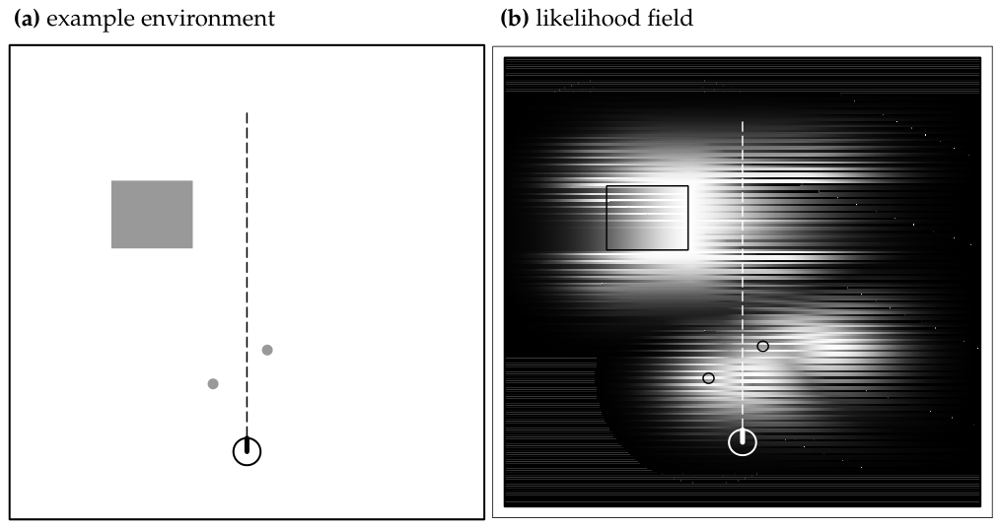

*Figure 6.8 — (a) 장애물 세 개(회색)가 있는 예제 환경. 로봇은 그림 아래쪽에 위치하며, 점선으로 표시된
측정 $z_t^k$ 를 취한다. (b) 이 장애물 배치에 대한 likelihood field: 위치가 밝을수록 그곳에서 장애물을
지각할 가능성이 크다. (책 p.170)*

**Figure 6.8a는 맵을 묘사하고, Figure 6.8b는 2-D 공간의 측정 점 $(x_{z_t^k}\ y_{z_t^k})^T$ 에 대한
대응 Gaussian likelihood를 보여준다. 위치가 밝을수록 range finder로 물체를 측정할 가능성이 크다.
밀도 $p_{\text{hit}}$ 는 이제 Figure 6.8의 점선으로 표시된 센서 축으로 likelihood field를 자르고(그리고
정규화하여) 얻어진다. 결과 함수가 Figure 6.9a에 보이는 것이다.** (책 p.171)

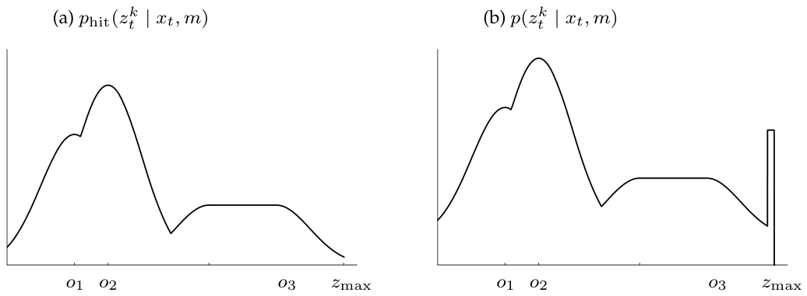

*Figure 6.9 — (a) Figure 6.8의 상황에서 측정 $z_t^k$ 의 함수로서의 확률 $p_{\text{hit}}(z_t^k)$.
여기서 센서 빔은 장애물 세 개를 지나가며, 각각의 최근접점이 $o_1$, $o_2$, $o_3$ 다. (b) 두 균등분포를
더해 얻은 센서 확률 $p(z_t^k \mid x_t, m)$. (책 p.170)*

> **Figure 6.9를 읽는 법.** 가로축은 "이 빔이 얼마를 읽었는가"다. mode 세 개($o_1, o_2, o_3$)는 그
> 빔 선분 위에서 장애물에 가까워지는 세 지점에 대응한다. **beam model이었다면 mode는 하나뿐이다**
> — 첫 장애물에서 광선이 멈추기 때문이다. Likelihood field가 mode를 세 개 갖는 것이 곧
> "벽을 투시한다"는 한계의 시각적 정체다.

<!--widget:likelihood-field-->

### 2. 수식/유도

#### 전체 유도 과정 (먼저 한 번에)

$$\begin{pmatrix} x_{z_t^k} \\ y_{z_t^k} \end{pmatrix} = \begin{pmatrix} x \\ y \end{pmatrix} + \begin{pmatrix} \cos\theta & -\sin\theta \\ \sin\theta & \cos\theta \end{pmatrix} \begin{pmatrix} x_{k,\text{sens}} \\ y_{k,\text{sens}} \end{pmatrix} + z_t^k \begin{pmatrix} \cos(\theta + \theta_{k,\text{sens}}) \\ \sin(\theta + \theta_{k,\text{sens}}) \end{pmatrix} \tag{1}$$

$$p_{\text{hit}}(z_t^k \mid x_t, m) = \varepsilon_{\sigma_{\text{hit}}}(\text{dist}) \tag{2}$$

$$\text{dist} = \min_{x', y'} \left\{ \sqrt{(x_{z_t^k} - x')^2 + (y_{z_t^k} - y')^2} \ \Big|\ \langle x', y'\rangle \text{ occupied in } m \right\} \tag{3}$$

$$p(z_t^k \mid x_t, m) = z_{\text{hit}} \cdot p_{\text{hit}} + z_{\text{rand}} \cdot p_{\text{rand}} + z_{\text{max}} \cdot p_{\text{max}} \tag{4}$$

#### 단계별 설명 (생략 없이)

**(1) 끝점을 전역 좌표로 투영** — 책 (6.32)

**그렇게 하려면 우리는 전역 좌표계에 대해 로봇의 지역 좌표계가 어디 위치하는지, 로봇 위 어디에서 센서
빔 $z^k$ 가 시작되는지, 그리고 센서가 어디를 가리키는지 알아야 한다. 평소처럼 $x_t = (x\ y\ \theta)^T$
를 시각 $t$ 의 로봇 pose라 하자. 세계에 대한 2차원 관점을 유지하면서, 로봇의 고정된 지역 좌표계에서
센서의 상대 위치를 $(x_{k,\text{sens}}\ y_{k,\text{sens}})^T$ 로, 로봇의 heading 방향에 대한 센서 빔의
각도 방향을 $\theta_{k,\text{sens}}$ 로 표기한다. 이 값들은 센서 특정적이다. 측정 $z_t^k$ 의 끝점은
이제 명백한 삼각함수 변환을 통해 전역 좌표계로 사상된다.** (책 p.169)

> **세 항을 하나씩 뜯어보자.** 로봇 위 어딘가에 달린 센서에서 쏜 빔의 끝이 세계 어디에 찍히는지를
> 세 번의 이동으로 구한다.
>
> | 항 | 뜻 |
> |---|---|
> | $\begin{pmatrix} x \\ y \end{pmatrix}$ | ① 로봇이 세계 어디 있는가 |
> | $\begin{pmatrix} \cos\theta & -\sin\theta \\ \sin\theta & \cos\theta \end{pmatrix}\begin{pmatrix} x_{k,\text{sens}} \\ y_{k,\text{sens}} \end{pmatrix}$ | ② 로봇 몸체 위 센서 장착 위치를, 로봇이 $\theta$ 만큼 돌아 있으므로 **회전시켜** 더함 |
> | $z_t^k \begin{pmatrix} \cos(\theta + \theta_{k,\text{sens}}) \\ \sin(\theta + \theta_{k,\text{sens}}) \end{pmatrix}$ | ③ 그 센서에서 빔 방향으로 측정 거리 $z_t^k$ 만큼 나아감 |
>
> **처음 등장하는 도구 — 2차원 회전행렬**
>
> $$R(\theta) = \begin{pmatrix} \cos\theta & -\sin\theta \\ \sin\theta & \cos\theta \end{pmatrix}$$
>
> 벡터를 원점 중심으로 반시계 방향 $\theta$ 만큼 돌린다. 로봇 기준 좌표
> $(x_{k,\text{sens}}, y_{k,\text{sens}})$ 는 로봇이 어느 방향을 보든 같은 값이지만, **세계 기준으로는
> 로봇이 돈 만큼 같이 돌아간다.** 그래서 회전행렬을 곱한다.
>
> 빔 방향이 $\theta + \theta_{k,\text{sens}}$ 인 것도 같은 이유다 — 센서가 로봇 정면에서
> $\theta_{k,\text{sens}}$ 만큼 틀어져 달려 있고, 로봇 자체가 $\theta$ 를 보고 있으므로 세계 기준
> 빔 방향은 둘의 합이다. 5.2.1절에서 정한 규약($\theta = 0$ 이면 $+x$ 방향)이 여기서 그대로 쓰인다.
>
> **센서가 로봇 중심에 있다면** $(x_{k,\text{sens}}, y_{k,\text{sens}}) = (0,0)$ 이므로 두 번째 항이
> 통째로 사라져 식이 훨씬 단순해진다.

**(2) 최근접 장애물까지의 거리로 likelihood를 정의** — 책 (6.33)

$$p_{\text{hit}}(z_t^k \mid x_t, m) = \varepsilon_{\sigma_{\text{hit}}}(\text{dist})$$

**여기서 $\varepsilon_{\sigma_{\text{hit}}}$ 는 표준편차 $\sigma_{\text{hit}}$ 의 영점 중심
Gaussian이다.** (책 p.171 및 Table 6.3 캡션)

> **6.3절과 무엇이 바뀌었는지 정확히 보라.**
>
> | | beam model 식 (6.4) | likelihood field 식 (6.33) |
> |---|---|---|
> | Gaussian의 중심 | $z_t^{k*}$ (참 range) | **0** |
> | Gaussian의 변수 | $z_t^k$ (측정 range) | **$\text{dist}$** (끝점~장애물 거리) |
> | 무엇을 재는가 | 거리 축에서의 오차 | **평면상의 오차** |
>
> 즉 "얼마나 읽었어야 하는데 얼마를 읽었나"에서 **"찍힌 점이 장애물에서 얼마나 떨어졌나"** 로 질문이
> 바뀌었다. 5장에서 표기한 $\varepsilon_{\sigma^2}$ 는 분산 $\sigma^2$ 의 영점 중심 노이즈 변수였고,
> 여기서도 같은 표기법이다.

**(3) $\text{dist}$ 의 정의** — 책 Table 6.3 라인 7

$$\text{dist} = \min_{x', y'} \left\{ \sqrt{(x_{z_t^k} - x')^2 + (y_{z_t^k} - y')^2} \ \Big|\ \langle x', y'\rangle \text{ occupied in } m \right\}$$

맵에서 **점유된 모든 칸** $\langle x', y' \rangle$ 을 후보로 놓고, 끝점까지의 유클리드 거리 중
**최소값**을 취한다. 이것이 정의이지 유도된 결과가 아니다.

> **여기에 "벽 투시" 버그가 숨어 있다.** $\min$ 은 **어느 장애물인지 묻지 않는다.** 끝점 근처에
> 장애물이 있기만 하면 되고, 그 장애물이 로봇에서 보이는지(중간에 벽이 가로막지 않는지)는 전혀 따지지
> 않는다. 6.4.2절이 **"센서가 벽을 통과해 볼 수 있는 것처럼 취급한다. 이는 ray casting 연산이 최근접
> 이웃 함수로 대체되었기 때문이며, 이 함수는 어떤 점까지의 경로가 맵 안 장애물에 의해 가로막히는지
> 판단할 능력이 없다"** (책 p.173)고 지적하는 바가 이것이다.

**(4) 세 성분의 mixture** — 책 (6.34)

**beam 기반 센서 모델과 마찬가지로, 원하는 확률 $p(z_t^k \mid x_t, m)$ 은 세 분포 모두를 통합한다:
$z_{\text{hit}} \cdot p_{\text{hit}} + z_{\text{rand}} \cdot p_{\text{rand}} + z_{\text{max}} \cdot
p_{\text{max}}$ — 익숙한 혼합 가중치 $z_{\text{hit}}$, $z_{\text{rand}}$, $z_{\text{max}}$ 를
사용한다.** (책 p.171)

**Figure 6.9b는 측정 빔을 따라 결과적으로 나오는 분포 $p(z_t^k \mid x_t, m)$ 의 예를 보여준다. 이 분포가
Figure 6.9a에 보인 $p_{\text{hit}}$ 와 분포 $p_{\max}$, $p_{\text{rand}}$ 를 결합함을 쉽게 알 수 있을
것이다. 혼합 파라미터 조정에 대해 우리가 말한 많은 것이 이 새 센서 모델로도 이전된다. 손으로 조정할
수도 있고 ML estimator로 학습할 수도 있다.** (책 p.171)

**Figure 6.8b처럼 전역 $x$-$y$ 좌표의 함수로서 장애물 검출의 likelihood를 묘사하는 표현을
**likelihood field**라 부른다.** (책 p.171)

### 알고리즘 — 책 Table 6.3

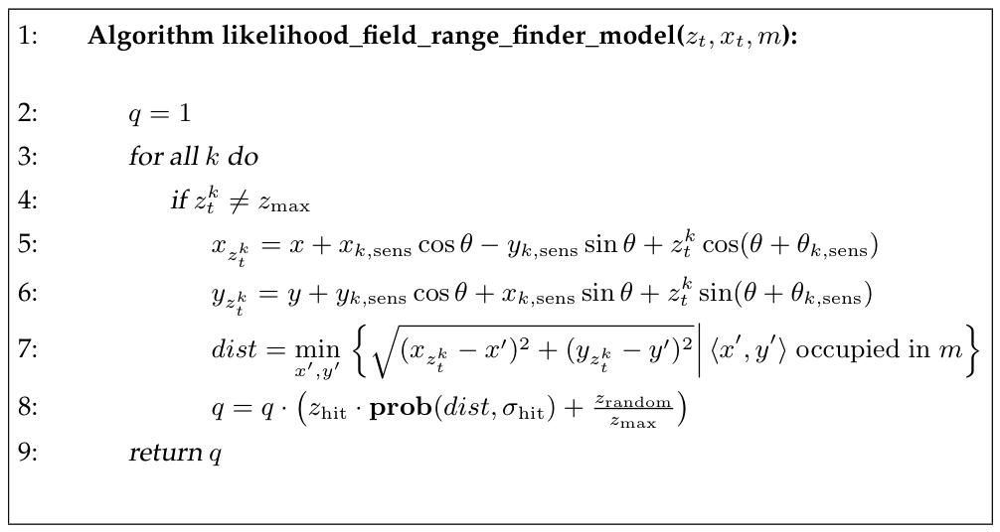

*Table 6.3 — 최근접 이웃까지의 유클리드 거리를 사용해 range finder 스캔의 likelihood를 계산하는
알고리즘. 함수 $\text{prob}(\text{dist}, \sigma_{\text{hit}})$ 은 표준편차 $\sigma_{\text{hit}}$ 의
영점 중심 Gaussian 아래에서 $\text{dist}$ 의 확률을 계산한다. (책 p.172)*

```
1:  Algorithm likelihood_field_range_finder_model(z_t, x_t, m):
2:      q = 1
3:      for all k do
4:          if z_t^k ≠ z_max
5:              x_{z_t^k} = x + x_{k,sens} cos θ − y_{k,sens} sin θ + z_t^k cos(θ + θ_{k,sens})
6:              y_{z_t^k} = y + y_{k,sens} cos θ + x_{k,sens} sin θ + z_t^k sin(θ + θ_{k,sens})
7:              dist = min_{x',y'} { sqrt((x_{z_t^k} − x')² + (y_{z_t^k} − y')²)
                                     | ⟨x',y'⟩ occupied in m }
8:              q = q · ( z_hit · prob(dist, σ_hit) + z_random / z_max )
9:      return q
```

**Table 6.3은 likelihood field를 사용해 측정 확률을 계산하는 알고리즘을 제공한다. 독자는 이미 바깥
루프에 익숙할 것인데, 이는 서로 다른 센서 빔의 노이즈 사이 독립을 가정하고 개별
$p(z_t^k \mid x_t, m)$ 값을 곱한다. 라인 4는 센서 읽기가 max range 읽기인지 확인하며, 그 경우 그냥
무시된다. 라인 5부터 8까지가 흥미로운 경우를 다룬다: 여기서 $x$-$y$ 공간에서 가장 가까운 장애물까지의
거리가 계산되고(라인 7), 결과 likelihood가 라인 8에서 정규분포와 균등분포를 혼합해 얻어진다.
앞서처럼 함수 $\text{prob}(\text{dist}, \sigma_{\text{hit}})$ 은 표준편차 $\sigma_{\text{hit}}$ 의
영점 중심 Gaussian 아래에서 $\text{dist}$ 의 확률을 계산한다.** (책 p.171~172)

> **라인 5·6이 식 (1)을 풀어 쓴 것**이다. 회전행렬을 성분별로 전개하면
> $x$ 성분은 $x_{k,\text{sens}}\cos\theta - y_{k,\text{sens}}\sin\theta$,
> $y$ 성분은 $y_{k,\text{sens}}\cos\theta + x_{k,\text{sens}}\sin\theta$ 가 된다.
>
> **라인 8에 $p_{\text{max}}$ 가 없는 것에 주목하라.** 라인 4에서 max-range를 이미 건너뛰었으므로
> 남은 것은 $z_{\text{hit}}$ 항과 $z_{\text{random}}/z_{\max}$ (= $z_{\text{rand}} \cdot
> p_{\text{rand}}$) 뿐이다. 즉 알고리즘은 식 (4)를 그대로 구현하되 max 항은 `if` 로 처리한다.

**맵에서 최근접 이웃을 찾는 것(라인 7)이 알고리즘
likelihood_field_range_finder_model에서 가장 비용이 큰 연산이다. 이 탐색을 빠르게 하려면 likelihood
field를 미리 계산해 두는 것이 유리하며, 그러면 측정 확률 계산이 좌표 변환에 이은 표 조회로 끝난다.
물론 이산 격자를 사용하면 조회 결과는 근사에 불과한데, 잘못된 장애물 좌표를 반환할 수 있기 때문이다.
그러나 확률 $p(z_t^k \mid x_t, m)$ 에 대한 영향은 적당히 거친 격자에서도 전형적으로 작다.**
(책 p.172)

### 3. 예제/실습

#### 예제 — 끝점 투영을 손으로 계산

**설정**

| 항목 | 값 |
|---|---|
| 로봇 pose $x_t$ | $(2.0,\ 1.0,\ \tfrac{\pi}{2})$ — $(2,1)$ 에서 $+y$ 방향을 봄 |
| 센서 장착 위치 | $(x_{k,\text{sens}},\ y_{k,\text{sens}}) = (0.2,\ 0)$ — 로봇 중심에서 앞쪽 20cm |
| 빔 각도 | $\theta_{k,\text{sens}} = -\tfrac{\pi}{4}$ — 로봇 정면 기준 오른쪽 45도 |
| 측정값 | $z_t^k = 3.0$ m |
| 맵의 장애물 | $(4.0,\ 3.0)$ 에 점 장애물 |
| $\sigma_{\text{hit}}$ | 0.2 m |

**단계 1 — 센서 장착 위치를 회전 (식 1의 둘째 항)**

$\theta = \tfrac{\pi}{2}$ 이므로 $\cos\theta = 0$, $\sin\theta = 1$.

$$\begin{pmatrix} 0 & -1 \\ 1 & 0 \end{pmatrix}\begin{pmatrix} 0.2 \\ 0 \end{pmatrix} = \begin{pmatrix} 0 \times 0.2 - 1 \times 0 \\ 1 \times 0.2 + 0 \times 0 \end{pmatrix} = \begin{pmatrix} 0 \\ 0.2 \end{pmatrix}$$

로봇이 $+y$ 를 보고 있으므로, "앞쪽 20cm"는 세계 기준으로 $+y$ 방향 20cm다. 타당하다.

**단계 2 — 빔 방향 (식 1의 셋째 항)**

$$\theta + \theta_{k,\text{sens}} = \frac{\pi}{2} - \frac{\pi}{4} = \frac{\pi}{4}$$

$$3.0 \begin{pmatrix} \cos\tfrac{\pi}{4} \\ \sin\tfrac{\pi}{4} \end{pmatrix} = 3.0 \begin{pmatrix} 0.7071 \\ 0.7071 \end{pmatrix} = \begin{pmatrix} 2.1213 \\ 2.1213 \end{pmatrix}$$

**단계 3 — 세 항을 더한다**

$$\begin{pmatrix} x_{z_t^k} \\ y_{z_t^k} \end{pmatrix} = \begin{pmatrix} 2.0 \\ 1.0 \end{pmatrix} + \begin{pmatrix} 0 \\ 0.2 \end{pmatrix} + \begin{pmatrix} 2.1213 \\ 2.1213 \end{pmatrix} = \begin{pmatrix} 4.1213 \\ 3.3213 \end{pmatrix}$$

**단계 4 — 최근접 장애물까지의 거리 (식 3)**

장애물이 $(4.0, 3.0)$ 하나뿐이므로

$$\text{dist} = \sqrt{(4.12132 - 4.0)^2 + (3.32132 - 3.0)^2} = \sqrt{0.12132^2 + 0.32132^2} = \sqrt{0.014719 + 0.103247} = \sqrt{0.117966} = 0.34346\ \text{m}$$

**단계 5 — likelihood (식 2)**

$$p_{\text{hit}} = \frac{1}{\sqrt{2\pi \times 0.04}}\, e^{-\frac{1}{2}\frac{0.34346^2}{0.04}} = \frac{1}{0.50133}\, e^{-1.47457} = 1.99471 \times 0.22888 = 0.45655$$

**단계 6 — mixture (식 4), $z_{\text{hit}} = 0.8$, $z_{\text{rand}} = 0.2$, $z_{\max} = 10$ m**

$$q = 0.8 \times 0.45655 + \frac{0.2}{10} = 0.36524 + 0.02 = 0.38524$$

#### 예제 — 평활성 확인

같은 설정에서 로봇 $x$ 좌표만 $2.00 \to 2.05$ 로 5cm 옮겨보자. 끝점도 그대로 5cm 옮겨간다:
$(4.17132,\ 3.32132)$.

$$\text{dist} = \sqrt{0.17132^2 + 0.32132^2} = \sqrt{0.029351 + 0.103247} = \sqrt{0.132598} = 0.36414\ \text{m}$$

$$p_{\text{hit}} = 1.99471 \times e^{-\frac{1}{2}\frac{0.36414^2}{0.04}} = 1.99471 \times e^{-1.65744} = 1.99471 \times 0.19062 = 0.38023$$

| 로봇 $x$ | dist | $p_{\text{hit}}$ | 변화 |
|---|---|---|---|
| 2.00 | 0.34346 | 0.45655 | — |
| 2.05 | 0.36414 | 0.38023 | −16.7% |

5cm 이동에 16.7% 감소 — **부드럽다.** 6.3.5절 예제에서 같은 크기의 이동이 likelihood를 $e^{-447}$ 배로
날려버렸던 것과 비교하라. **이 차이 하나가 6.4절이 존재하는 이유다.**

#### 연습문제

1. 위 예제에서 로봇 방향만 $\theta = \tfrac{\pi}{2} \to \tfrac{\pi}{2} + 0.05$ 로 바꾸면 끝점과
   $p_{\text{hit}}$ 는 어떻게 되는가?
2. 센서가 로봇 중심에 달려 있다면 $(x_{k,\text{sens}}, y_{k,\text{sens}}) = (0,0)$ 이다. 이때 식 (1)은
   어떻게 단순해지는가?
3. 장애물이 $(4.0, 3.0)$ 과 $(4.3, 3.5)$ 두 개라면 $\text{dist}$ 는 얼마인가? "가장 가까운 것만
   본다"는 성질이 벽 투시 문제와 어떻게 연결되는지 설명하라.

---

## 6.4.2 Extensions (책 p.172~174)

### 1. 개념적 이해

#### 장점 둘

**앞서 논의한 beam 기반 모델 대비 likelihood field 모델의 핵심 이점은 평활성이다. 유클리드 거리의
평활성 덕분에 로봇 pose $x_t$ 의 작은 변화는 결과 분포 $p(z_t^k \mid x_t, m)$ 에 작은 효과만 준다.
또 다른 핵심 이점은 사전계산이 3-D 대신 2-D에서 일어나 미리 계산된 정보의 압축성이 증가한다는
것이다.** (책 p.172)

#### 단점 셋 (책 p.173)

**그러나 현재 모델은 세 가지 핵심 단점을 갖는다:**

| # | 단점 | 원문 |
|---|---|---|
| 1 | **동적 물체를 모델링하지 않음** | **"사람과 짧은 읽기를 유발할 수 있는 다른 동역학을 명시적으로 모델링하지 않는다"** |
| 2 | **벽을 투시함** | **"센서가 벽을 통과해 볼 수 있는 것처럼 취급한다. 이는 ray casting 연산이 최근접 이웃 함수로 대체되었기 때문이며, 이 함수는 어떤 점까지의 경로가 맵 안 장애물에 의해 가로막히는지 판단할 능력이 없다"** |
| 3 | **맵 불확실성을 무시함** | **"우리 접근은 맵 불확실성을 고려하지 않는다. 특히 맵이 매우 불확실하거나 명시되지 않은 미탐사 영역을 다룰 수 없다"** |

#### 확장 — 미탐사 영역을 셋째 범주로

**기본 알고리즘 likelihood_field_range_finder_model은 이 한계들의 효과를 줄이도록 확장될 수 있다.
예를 들어 맵 occupancy 값을 처음 둘만이 아니라 occupied, free, unknown 세 범주로 분류할 수 있다.
센서 측정 $z_t^k$ 가 unknown 범주에 떨어지면 그 확률 $p(z_t^k \mid x_t, m)$ 은 상수값
$\frac{1}{z_{\max}}$ 로 가정된다. 결과 확률 모델은 조잡하다. 미탐사 공간에서는 모든 센서 측정이
똑같이 그럴듯하다고 가정하는 것이다.** (책 p.173)

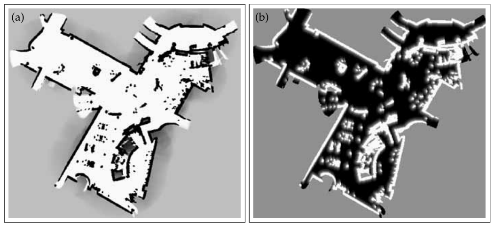

*Figure 6.10 — (a) San Jose Tech Museum의 occupancy grid map, (b) 전처리된 likelihood field.
(책 p.173)*

**Figure 6.10은 맵과 대응하는 likelihood field를 보여준다. 여기서도 $x$-$y$ 위치의 회색 수준이 그곳에서
센서 읽기를 받을 likelihood를 가리킨다. 독자는 최근접 장애물까지의 거리가 맵 **안에서만**, 즉 탐사된
지형에 대응하는 곳에서만 사용됨을 알아챌 수 있다. 바깥에서는 likelihood $p(z_t^k \mid x_t, m)$ 이
상수다. 계산 효율을 위해 세밀한 2-D 격자에 대해 최근접 이웃을 미리 계산하는 것이 가치가 있다.**
(책 p.173)

#### 확장 — 가장 최근 스캔으로 만드는 지역 맵

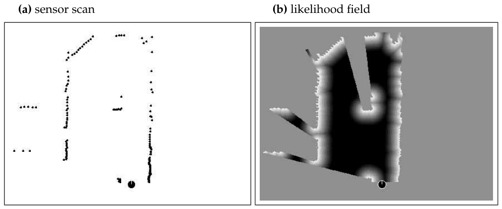

*Figure 6.11 — (a) 조감 시점에서 본 센서 스캔. 로봇은 그림 아래쪽에 놓여 있으며, 앞쪽 180개 점으로
이루어진 근접 스캔을 생성한다. (b) 이 센서 스캔에서 생성된 likelihood 함수. 영역이 어두울수록 그곳에서
물체를 감지할 likelihood가 작다. 가려진 영역은 흰색이며, 따라서 아무 벌점도 부과하지 않음에 주목하라.
(책 p.174)*

**가시 공간에 대한 likelihood field는 가장 최근 스캔에 대해서도 정의될 수 있으며, 이는 사실상 지역
맵을 정의한다. Figure 6.11이 그런 likelihood field를 보여준다. 이는 개별 스캔을 정렬하는 기법에서
중요한 역할을 한다.** (책 p.174)

> **"개별 스캔을 정렬하는 기법"** 이 바로 scan matching이며, 6.5절 map matching과 이후 장의 SLAM
> front-end로 이어진다. Figure 6.11(b)에서 **가려진 영역이 흰색(벌점 없음)** 으로 처리된 것에 주목하라
> — 위의 단점 2(벽 투시)를 지역 맵 수준에서 부분적으로 보완한 형태다.

### 2. 예제/실습

#### 예제 — 벽 투시가 실제로 만드는 오류

로봇이 $(0,0)$ 에서 $+x$ 방향으로 빔을 쏜다. 맵에는 $x = 3$ 에 벽이 있고, $x = 7$ 에도 벽이 있다
(벽 두 개가 나란히).

**측정값이 $z_t^k = 7.0$ m 로 들어왔다면?**

- **물리적으로 불가능하다.** $x = 3$ 의 벽에 막혀 7m를 볼 수 없다.
- **beam model**: ray casting이 $z_t^{k*} = 3.0$ 을 준다. $|7.0 - 3.0| = 4$ m 오차이므로
  $p_{\text{hit}} \approx 0$. **올바르게 낮은 likelihood.**
- **likelihood field**: 끝점 $(7, 0)$ 이 $x=7$ 벽 위에 정확히 놓이므로 $\text{dist} = 0$,
  $p_{\text{hit}}$ **최대**. **틀렸다.**

이 오류가 실무에서 얼마나 문제인가? 책의 평가는 온건하다 — 위 단점 목록에 올려두고도 likelihood field를
권장한다. 이유는 **실제 환경에서 그런 배치가 흔치 않고, 평활성의 이득이 이 오류의 손해보다 크기**
때문이다. 6.7절이 말하는 "물리적 현실성이 유일한 기준은 아니다"가 이것이다.

#### 연습문제

1. Likelihood field의 세 단점 각각에 대해, 그것이 실제 localization에서 어떤 증상으로 나타날지
   서술하라.
2. 미탐사 영역에 상수 $\frac{1}{z_{\max}}$ 를 부여하는 것이 왜 "조잡한(crude)" 모델인가? 더 나은
   대안을 하나 제안해 보라.
3. Figure 6.11(b)에서 가려진 영역이 흰색인 것과, 전역 맵 likelihood field가 벽을 투시하는 것은 서로
   모순되는가? 두 그림이 서로 다른 것을 계산하고 있음을 설명하라.

---

# 6.5 Correlation-Based Measurement Models (책 p.174~176)

### 1. 개념적 이해

**문헌에는 측정과 맵 사이의 상관(correlation)을 측정하는 여러 range 센서 모델이 존재한다. 흔한 기법
하나는 map matching으로 알려져 있다.** (책 p.174)

앞의 두 모델과 근본적으로 다른 점은 **비교 대상**이다.

| 모델 | 무엇과 무엇을 비교하는가 |
|---|---|
| beam model | 측정 range $z_t^k$ ↔ 계산된 참 range $z_t^{k*}$ |
| likelihood field | 측정 끝점 ↔ 맵의 최근접 장애물 |
| **map matching** | **측정으로 만든 지역 맵 $m_{\text{local}}$ ↔ 전역 맵 $m$** |

**Map matching은 이 책 후반부에서 논의되는 기법, 즉 스캔을 occupancy 맵으로 변환하는 능력을 요구한다.
전형적으로 map matching은 소수의 연속된 스캔을 지역 맵 $m_{\text{local}}$ 로 컴파일한다.**
(책 p.174)

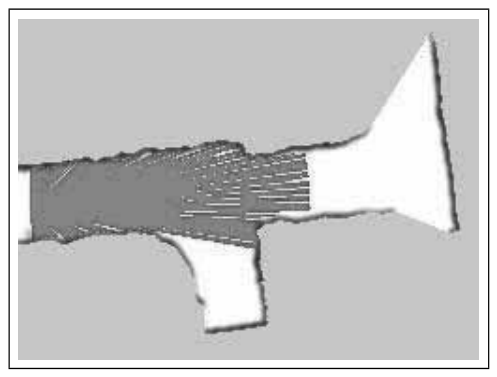

*Figure 6.12 — 10개의 range scan으로 생성된 지역 맵의 예. 그중 하나가 그림에 표시되어 있다.
(책 p.175)*

**Figure 6.12는 그런 지역 맵을, 여기서는 occupancy grid map의 형태로 보여준다.**

**센서 measurement model은 지역 맵 $m_{\text{local}}$ 을 전역 맵 $m$ 과 비교하여, $m$ 과
$m_{\text{local}}$ 이 유사할수록 $p(m_{\text{local}} \mid x_t, m)$ 이 커지도록 한다.** (책 p.174)

**지역 맵은 로봇 위치에 상대적으로 표현되므로, 이 비교는 지역 맵의 칸들이 전역 맵의 좌표계로 변환될
것을 요구한다. 그런 변환은 likelihood field 모델에서 사용된 센서 측정의 좌표 변환 (6.32)와 유사하게
수행될 수 있다. 로봇이 위치 $x_t$ 에 있다면, 우리는 $m_{x,y,\text{local}}(x_t)$ 로 전역 좌표
$(x\ y)^T$ 에 대응하는 지역 맵의 격자 칸을 표기한다.** (책 p.174~175)

### 2. 수식/유도

#### 전체 유도 과정 (먼저 한 번에)

$$\rho_{m, m_{\text{local}}, x_t} = \frac{\sum_{x,y} (m_{x,y} - \bar{m}) \cdot (m_{x,y,\text{local}}(x_t) - \bar{m})}{\sqrt{\sum_{x,y} (m_{x,y} - \bar{m})^2\ \sum_{x,y} (m_{x,y,\text{local}}(x_t) - \bar{m})^2}} \tag{1}$$

$$\bar{m} = \frac{1}{2N} \sum_{x,y} \left( m_{x,y} + m_{x,y,\text{local}} \right) \tag{2}$$

$$p(m_{\text{local}} \mid x_t, m) = \max\{\rho_{m, m_{\text{local}}, x_t},\ 0\} \tag{3}$$

#### 단계별 설명 (생략 없이)

**(1) map correlation function** — 책 (6.35)

**두 맵이 같은 기준 좌표계에 놓이면, 다음과 같이 정의되는 map correlation function을 사용해 비교할 수
있다.** (책 p.175)

> **처음 등장하는 도구 — 정규화 상관(normalized correlation)**
>
> 이것은 통계학의 **Pearson 상관계수**를 두 맵에 적용한 것이다. 구조를 나눠 보면:
>
> - **분자**: 각 칸에서 "평균보다 얼마나 큰가"를 두 맵에서 각각 구해 곱한 뒤 전부 더한다.
>   두 맵이 같은 칸에서 함께 크거나 함께 작으면 양수가 쌓인다.
> - **분모**: 각 맵의 편차 제곱합의 곱의 제곱근. 이것으로 나누면 값이 $[-1, +1]$ 로 정규화된다.
>
> 정규화가 있어서 **맵의 전체 밝기나 대비에 영향받지 않는다.** 두 맵이 "모양이 같은가"만 본다.

**여기서 합은 두 맵 모두에 정의된 칸들에 대해 평가되며, $\bar{m}$ 은 평균 맵 값이다.** (책 p.175)

**(2) 평균 맵 값** — 책 (6.36)

**여기서 $N$ 은 지역 맵과 전역 맵의 겹침(overlap) 안의 원소 수를 표기한다.** (책 p.175)

> $2N$ 으로 나누는 이유: 겹침 영역의 칸 $N$ 개 각각에 대해 전역 맵 값과 지역 맵 값 **두 개**를 더하고
> 있으므로, 총 $2N$ 개 값의 평균이다. 두 맵에 **공통의 평균 하나**를 쓴다는 점이 특징이다.

**(3) 상관을 확률로 해석** — 책 (6.37)

**상관 $\rho_{m, m_{\text{local}}, x_t}$ 는 $\pm 1$ 사이로 스케일된다. Map matching은 이 값을 전역 맵
$m$ 과 로봇 pose $x_t$ 에 조건화된 지역 맵의 확률로 해석한다. 지역 맵이 단일 range scan $z_t$ 로부터
생성된다면, 이 확률이 measurement probability $p(z_t \mid x_t, m)$ 을 대체한다.** (책 p.175)

> **$\max\{\cdot, 0\}$ 이 하는 일과, 그것이 정직하지 않은 이유**
>
> 상관은 $-1$ 까지 내려갈 수 있는데 확률은 음수일 수 없다. 그래서 음수를 0으로 자른다.
> 이것은 **정규화된 확률분포가 아니다** — 모든 $x_t$ 에 대해 적분해도 1이 되지 않는다.
> 책이 6.5절 마지막에 **"map matching은 그럴듯한 물리적 설명을 갖지 못한다. 상관은 맵 사이의 정규화된
> 이차 거리이며, 이는 range 센서의 노이즈 특성이 아니다"** (책 p.176) 라고 적은 이유다.
> Bayes filter 안에서는 어차피 정규화 상수 $\eta$ 가 붙으므로 실용적으로는 굴러간다.

### 3. 장단점 (책 p.175~176)

**Map matching은 여러 좋은 성질을 갖는다: likelihood field 모델과 꼭 마찬가지로 계산하기 쉽지만,
pose 파라미터 $x_t$ 에 대해 평활한 확률을 내지는 않는다. Likelihood field를 근사하는(그리고 평활성을
얻는) 한 가지 방법은 맵 $m$ 을 Gaussian 평활 커널로 convolve한 뒤 이 평활화된 맵에 대해 map matching을
실행하는 것이다.** (책 p.175)

**Likelihood field 대비 map matching의 핵심 이점은 두 맵의 점수 계산에서 **free-space를 명시적으로
고려한다는 것**이다; likelihood field 기법은 스캔의 끝점만 고려하며, 이는 정의상 점유된 공간(또는
노이즈)에 대응한다.** (책 p.176)

**반면 많은 mapping 기법은 센서의 도달 범위를 넘어서까지 지역 맵을 만든다. 예를 들어 많은 기법이 로봇
주위에 원형 맵을 만들면서 실제 센서 측정 범위를 넘어선 영역을 0.5로 설정한다. 그런 경우 map matching의
결과가 실제 측정 범위를 넘어선 영역을 포함하여, 마치 센서가 벽을 통과해 볼 수 있는 것처럼 되는 위험이
있다. 그런 부작용은 구현된 여러 map matching 기법에서 발견된다.** (책 p.176)

**추가 단점은 map matching이 그럴듯한 물리적 설명을 갖지 못한다는 것이다. 상관은 맵 사이의 정규화된
이차 거리이며, 이는 range 센서의 노이즈 특성이 아니다.** (책 p.176)

> **세 모델 최종 비교**
>
> | | beam model | likelihood field | map matching |
> |---|---|---|---|
> | 물리적 근거 | 있음 | 없음 | 없음 |
> | 평활성 | 나쁨 | **좋음** | 나쁨 (평활화 가능) |
> | 계산 | 무거움 | 가벼움 | 가벼움 |
> | free-space | 반영 | **무시** | **반영** |
> | 벽 투시 | 없음 | 있음 | 있을 수 있음 |
> | 사전계산 차원 | 3-D | **2-D** | — |

### 4. 예제/실습

#### 예제 — 상관계수를 손으로 계산

$2 \times 2$ 겹침 영역에서 전역 맵과 지역 맵이 다음과 같다고 하자 (1 = 점유, 0 = 비점유).

**전역 맵 $m$**

| | $x{=}0$ | $x{=}1$ |
|---|---|---|
| $y{=}1$ | 1 | 1 |
| $y{=}0$ | 0 | 0 |

**지역 맵 $m_{\text{local}}(x_t)$ — 잘 맞는 경우**

| | $x{=}0$ | $x{=}1$ |
|---|---|---|
| $y{=}1$ | 1 | 1 |
| $y{=}0$ | 0 | 0 |

**단계 1 — 평균 (식 2), $N = 4$**

$$\bar{m} = \frac{1}{2 \times 4}\big[(1+1+0+0) + (1+1+0+0)\big] = \frac{4}{8} = 0.5$$

**단계 2 — 편차**

두 맵 모두 편차가 $(+0.5, +0.5, -0.5, -0.5)$ 다.

**단계 3 — 분자**

$$(0.5)(0.5) + (0.5)(0.5) + (-0.5)(-0.5) + (-0.5)(-0.5) = 0.25 \times 4 = 1.0$$

**단계 4 — 분모**

$$\sqrt{(4 \times 0.25) \times (4 \times 0.25)} = \sqrt{1 \times 1} = 1.0$$

**단계 5 — 상관과 확률**

$$\rho = \frac{1.0}{1.0} = 1.0, \qquad p(m_{\text{local}} \mid x_t, m) = \max\{1.0,\ 0\} = 1.0$$

**지역 맵이 상하로 뒤집혀 있는 경우** (pose 가설이 틀린 경우)

| | $x{=}0$ | $x{=}1$ |
|---|---|---|
| $y{=}1$ | 0 | 0 |
| $y{=}0$ | 1 | 1 |

$\bar{m} = 0.5$ 는 그대로. 편차는 $(-0.5, -0.5, +0.5, +0.5)$.

$$\text{분자} = (0.5)(-0.5) \times 2 + (-0.5)(0.5) \times 2 = -1.0, \qquad \rho = -1.0$$

$$p(m_{\text{local}} \mid x_t, m) = \max\{-1.0,\ 0\} = 0$$

완전히 어긋난 pose 가설이 확률 0을 받는다. 다만 $\rho = -0.3$ 인 가설과 $\rho = -0.9$ 인 가설이
**둘 다 0** 이 되어 구분이 사라진다는 점이 $\max$ 연산의 대가다.

#### 연습문제

1. 위 예제에서 지역 맵이 $\begin{pmatrix} 1 & 0 \\ 0 & 0\end{pmatrix}$ (한 칸만 점유)이면 $\rho$ 는
   얼마인가?
2. Map matching이 $x_t$ 에 대해 평활하지 않은 이유는 무엇인가? 격자 해상도와 어떤 관계가 있는가?
3. "센서 도달 범위 밖을 0.5로 채운다"는 관행이 왜 벽 투시 문제를 만드는가? 겹침 영역 $N$ 의 정의와
   연결해 설명하라.

---

# 6.6 Feature-Based Measurement Models (책 p.176~182)

## 6.6.1 Feature Extraction

### 1. 개념적 이해

**지금까지 논의한 센서 모델은 모두 원시 센서 측정에 기반한다. 대안적 접근은 측정에서 **feature**를
추출하는 것이다. Feature extractor를 함수 $f$ 로 표기하면, range 측정에서 추출된 feature는
$f(z_t)$ 로 주어진다.** (책 p.176)

**대부분의 feature extractor는 고차원 센서 측정에서 소수의 feature를 추출한다. 이 접근의 핵심 이점은
계산 복잡도의 엄청난 감소다: 고차원 측정 공간에서의 추론은 비용이 클 수 있는 반면, 저차원 feature
공간에서의 추론은 몇 자릿수 더 효율적일 수 있다.** (책 p.176)

> **숫자로 보면**: SICK 레이저 스캔 하나가 180개 값이다. 여기서 "벽 모서리 3개"를 뽑으면
> $180 \to 3$ 으로 60배 줄어든다. 6.6.5절에서 책이 "몇 십억 개의 range 측정보다 몇 백 개의 feature를
> 다루는 게 훨씬 쉽다"고 말하는 것이 이 이야기다.

**구체적인 feature extraction 알고리즘 논의는 이 책의 범위를 벗어난다. 문헌은 여러 센서에 대한 폭넓은
feature를 제공한다. Range 센서의 경우 range 스캔에서 선, 모서리, 또는 지역 최소를 식별하는 것이
일반적이며, 이는 벽, 모서리, 또는 나무 줄기 같은 물체에 대응한다. 카메라가 항법에 사용될 때, 카메라
영상 처리는 computer vision의 영역에 든다. Computer vision은 카메라 영상에서의 무수한 feature
extraction 기법을 고안해 왔다. 인기 있는 feature로는 에지, 모서리, 뚜렷한 패턴, 그리고 뚜렷한 외양의
물체가 있다. 로보틱스에서는 복도와 교차로 같은 **장소(places)** 를 feature로 정의하는 것도
일반적이다.** (책 p.176)

## 6.6.2 Landmark Measurements

### 1. 개념적 이해

**많은 로보틱스 응용에서 feature는 물리 세계의 뚜렷한 물체에 대응한다. 예를 들어 실내 환경에서
feature는 문설주나 창턱일 수 있고, 실외에서는 나무 줄기나 건물 모서리에 대응할 수 있다. 로보틱스에서는
그런 물리적 물체를 **랜드마크(landmarks)** 라 부르는 것이 일반적이며, 이는 그것들이 로봇 항법에
사용됨을 나타낸다.** (책 p.177)

**랜드마크를 처리하는 가장 흔한 모델은 센서가 로봇의 지역 좌표계에 대한 랜드마크의 **range와 bearing**
을 측정할 수 있다고 가정한다. 그런 센서를 **range and bearing sensor** 라 부른다.** (책 p.177)

> - **range** $r$ — 랜드마크까지의 거리
> - **bearing** $\phi$ — 로봇이 보는 방향 기준으로 랜드마크가 몇 도 방향에 있는가

**range-bearing 센서의 존재는 그럴듯하지 않은 가정이 아니다: range 스캔에서 추출된 어떤 지역 feature도
range와 bearing 정보를 함께 갖고 오며, 스테레오 비전으로 검출된 시각 feature도 마찬가지다. 덧붙여
feature extractor는 **signature**를 생성할 수 있다. 이 책에서 우리는 signature가 수치값(예: 평균
색)이라고 가정한다. 그것은 마찬가지로 관측된 랜드마크의 유형을 특징짓는 정수일 수도 있고, 랜드마크를
특징짓는 다차원 벡터(예: 높이와 색)일 수도 있다.** (책 p.177)

> **signature는 "이름표"다.** 랜드마크가 전부 똑같이 생겼으면 "지금 본 이 기둥이 3번 기둥인지 7번
> 기둥인지" 알 수 없다. Signature가 있으면 그 판단이 쉬워진다. 이것이 6.6.3절의 **correspondence
> 문제**와 직결되며, 6.6.5절에서 책은 **"signature가 제공되지 않으면 모든 랜드마크가 똑같아 보이고,
> correspondence variable을 추정하는 data association 문제가 더 어려워진다"** (책 p.181)고 말한다.

### 2. 수식/유도

#### 전체 유도 과정 (먼저 한 번에)

$$f(z_t) = \{f_t^1, f_t^2, \ldots\} = \left\{ \begin{pmatrix} r_t^1 \\ \phi_t^1 \\ s_t^1 \end{pmatrix}, \begin{pmatrix} r_t^2 \\ \phi_t^2 \\ s_t^2 \end{pmatrix}, \ldots \right\} \tag{1}$$

$$p(f(z_t) \mid x_t, m) = \prod_i p(r_t^i, \phi_t^i, s_t^i \mid x_t, m) \tag{2}$$

$$\begin{pmatrix} r_t^i \\ \phi_t^i \\ s_t^i \end{pmatrix} = \begin{pmatrix} \sqrt{(m_{j,x} - x)^2 + (m_{j,y} - y)^2} \\ \operatorname{atan2}(m_{j,y} - y,\ m_{j,x} - x) - \theta \\ s_j \end{pmatrix} + \begin{pmatrix} \varepsilon_{\sigma_r^2} \\ \varepsilon_{\sigma_\phi^2} \\ \varepsilon_{\sigma_s^2} \end{pmatrix} \tag{3}$$

#### 단계별 설명 (생략 없이)

**(1) feature 벡터** — 책 (6.38)

**range를 $r$, bearing을 $\phi$, signature를 $s$ 로 표기하면, feature 벡터는 삼중항의 모음으로
주어진다.** (책 p.177)

**각 시각에 식별되는 feature의 개수는 가변적이다.** (책 p.177)

> 이 "가변적"이라는 성질이 중요하다. Range 스캔은 언제나 정확히 $K$ 개 값이지만, feature는 이번에
> 3개, 다음에 5개, 때로는 0개일 수 있다. 그래서 7.5절에서 "관측된 feature를 맵의 어느 랜드마크에
> 대응시킬 것인가"라는 문제가 필연적으로 생긴다.

**(2) feature 사이의 conditional independence** — 책 (6.39)

**그러나 많은 확률적 로보틱스 알고리즘은 feature 사이의 conditional independence를 가정한다.**
(책 p.177)

**Conditional independence는 각 개별 측정 $(r_t^i\ \phi_t^i\ s_t^i)^T$ 의 노이즈가 다른 측정
$(r_t^j\ \phi_t^j\ s_t^j)^T$ 의 노이즈와 독립일 때($i \ne j$) 적용된다. Conditional independence
가정 아래에서 우리는 한 번에 하나의 feature를 처리할 수 있으며, 이는 여러 range measurement model에서
했던 것과 꼭 같다. 이는 확률적 measurement model을 구현하는 알고리즘 개발을 훨씬 쉽게 만든다.**
(책 p.177)

> 6.1절 식 (2)와 같은 구조의 가정이다. 다른 점은 곱의 대상이 **빔**이 아니라 **feature**라는 것뿐이다.

**(3) landmark measurement model** — 책 (6.40)

**이제 feature를 위한 센서 모델을 고안하자. 이 장 초입에서 우리는 feature-based와 location-based 두
유형의 맵을 구분했다. Landmark measurement model은 보통 feature-based 맵에 대해서만 정의된다. 독자는
그 맵이 feature의 목록 $m = \{m_1, m_2, \ldots\}$ 으로 구성됨을 기억할 것이다. 각 feature는 signature와
위치 좌표를 가질 수 있다. Feature의 위치는 $m_{i,x}$ 와 $m_{i,y}$ 로 표기되며, 이는 단순히 맵의 전역
좌표계에서의 좌표다.** (책 p.177~178)

**노이즈 없는 랜드마크 센서의 측정 벡터는 표준 기하 법칙으로 쉽게 명시된다. 우리는 랜드마크
perception의 노이즈를 range, bearing, signature에 대한 독립적인 Gaussian 노이즈로 모델링할 것이다.
결과 measurement model은 시각 $t$ 의 $i$ 번째 feature가 맵의 $j$ 번째 랜드마크에 대응하는 경우에 대해
정식화된다. 평소처럼 로봇 pose는 $x_t = (x\ y\ \theta)^T$ 로 주어진다.** (책 p.178)

**여기서 $\varepsilon_{\sigma_r}$, $\varepsilon_{\sigma_\phi}$, $\varepsilon_{\sigma_s}$ 는 각각
표준편차 $\sigma_r$, $\sigma_\phi$, $\sigma_s$ 의 영평균 Gaussian 오차 변수다.** (책 p.178)

> **세 성분을 하나씩 읽자.**
>
> **① range** — 피타고라스 정리 그대로다.
> $$r = \sqrt{(m_{j,x} - x)^2 + (m_{j,y} - y)^2}$$
> 로봇 $(x, y)$ 와 랜드마크 $(m_{j,x}, m_{j,y})$ 사이의 직선 거리.
>
> **② bearing** — 여기에 $-\theta$ 가 붙는 것이 핵심이다.
> $$\phi = \operatorname{atan2}(m_{j,y} - y,\ m_{j,x} - x) - \theta$$
>
> > **처음 등장하는 도구 — atan2**
> >
> > $\operatorname{atan2}(\Delta y, \Delta x)$ 는 원점에서 $(\Delta x, \Delta y)$ 를 향하는 각도를
> > $(-\pi, \pi]$ 범위로 돌려준다. 보통의 $\arctan(\Delta y / \Delta x)$ 와 달리 **두 인자의 부호를
> > 모두 보므로 사분면을 올바르게 구분**하고, $\Delta x = 0$ 에서도 정의된다. 인자 순서가
> > $(y, x)$ 임에 주의하라.
>
> $\operatorname{atan2}(\cdots)$ 만 있으면 **세계 기준** 방향이다. 그런데 bearing은 **로봇이 보는
> 방향 기준**이어야 하므로 로봇의 heading $\theta$ 를 빼준다. 로봇이 정면으로 랜드마크를 보고 있으면
> $\phi = 0$ 이다.
>
> **③ signature** — $s_j$ 는 맵에 적힌 그 랜드마크의 signature 값이고, 관측값은 거기에 노이즈가
> 더해진 것이다.
>
> **④ 노이즈** — 세 성분이 각각 독립인 영평균 Gaussian이다. 5.3절 velocity motion model에서
> $\varepsilon$ 표기를 쓴 것과 같은 규약이다.

> **beam model과의 대비.**
> beam model은 pose에서 측정까지 가는 데 ray casting이라는 **알고리즘**이 필요했다. 여기서는 그냥
> **닫힌 형식의 삼각함수 식**이다. 그래서 미분 가능하고, 그래서 7.4절 EKF Localization이 이 모델의
> Jacobian을 바로 계산할 수 있다. **6.6절이 7장으로 직결되는 이유가 이것이다.**

## 6.6.3 Sensor Model with Known Correspondence

### 1. 개념적 이해

**range/bearing 센서의 핵심 문제는 **data association problem** 으로 알려져 있다. 이 문제는 랜드마크가
유일하게 식별될 수 없어서 랜드마크의 정체에 관해 어떤 잔여 불확실성이 존재할 때 발생한다.**
(책 p.178)

**range/bearing 센서 모델을 개발하기 위해, feature $f_t^i$ 와 맵 안 랜드마크 $m_j$ 사이의
**correspondence variable** 을 도입하는 것이 유용할 것이다. 이 변수는 $c_t^i$ 로 표기되며
$c_t^i \in \{1, \ldots, N+1\}$ 이다; $N$ 은 맵 $m$ 안 랜드마크의 개수다.** (책 p.178)

**$c_t^i = j \le N$ 이면, 시각 $t$ 에 관측된 $i$ 번째 feature가 맵의 $j$ 번째 랜드마크에 대응한다.
다시 말해 $c_t^i$ 는 관측된 feature의 **참 정체**다. 유일한 예외는 $c_t^i = N+1$ 인 경우다: 여기서는
feature 관측이 맵 $m$ 안 어떤 feature에도 대응하지 않는다. 이 경우는 spurious 랜드마크를 다루는 데
중요하다; 로봇이 이전에 관측되지 않은 랜드마크를 만날 수 있는 로봇 mapping 주제에도 큰 관련이 있다.**
(책 p.178)

> **$N+1$ 이라는 여분의 값**이 두 가지 상황을 담당한다.
>
> | 상황 | 의미 |
> |---|---|
> | 오검출 (spurious) | 없는 것을 봤다 — 버려야 할 관측 |
> | 새 랜드마크 | 맵에 아직 없는 진짜 랜드마크 — SLAM에서 맵에 추가할 대상 |
>
> 6.3.3절의 $c_i$ 와 **이름은 같지만 다른 것**이다. 그때의 $c_i$ 는 "네 가지 오차 유형 중 무엇인가"
> 였고, 여기의 $c_t^i$ 는 "맵의 몇 번 랜드마크인가"다.

**Table 6.4는 알려진 correspondence $c_t^i \le N$ 을 갖는 feature $f_t^i$ 의 확률을 계산하는 알고리즘을
묘사한다. 라인 3과 4는 랜드마크까지의 참 range와 bearing을 계산한다. 측정된 range와 bearing의 확률은
노이즈의 독립을 가정하여 라인 5에서 계산된다. 독자가 쉽게 확인하듯, 이 알고리즘은 식 (6.40)을
구현한다.** (책 p.178)

### 2. 알고리즘 — 책 Table 6.4

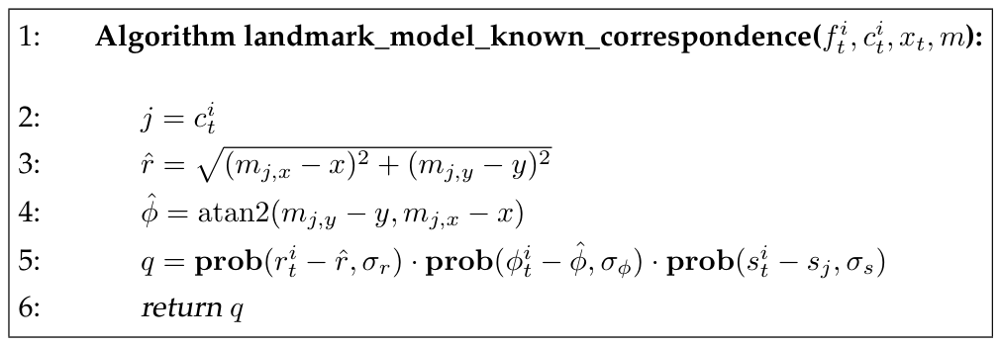

*Table 6.4 — 랜드마크 측정의 likelihood를 계산하는 알고리즘. 알고리즘은 관측된 feature
$f_t^i = (r_t^i\ \phi_t^i\ s_t^i)^T$, feature의 참 정체 $c_t^i$, 로봇 pose
$x_t = (x\ y\ \theta)^T$, 맵 $m$ 을 입력으로 요구한다. 출력은 수치 확률
$p(f_t^i \mid c_t^i, m, x_t)$ 다. (책 p.179)*

```
1:  Algorithm landmark_model_known_correspondence(f_t^i, c_t^i, x_t, m):
2:      j = c_t^i
3:      r̂ = sqrt( (m_{j,x} − x)² + (m_{j,y} − y)² )
4:      φ̂ = atan2(m_{j,y} − y, m_{j,x} − x)
5:      q = prob(r_t^i − r̂, σ_r) · prob(φ_t^i − φ̂, σ_φ) · prob(s_t^i − s_j, σ_s)
6:      return q
```

> **라인 4에 $-\theta$ 가 없다.** 식 (3)에서는 $\operatorname{atan2}(\cdots) - \theta$ 였는데
> 알고리즘에서는 빠져 있다. 책 Table 6.4의 표기 그대로다. 라인 5에서 $\phi_t^i - \hat{\phi}$ 를 쓸 때
> 관측 $\phi_t^i$ 가 로봇 기준이라면 $\hat{\phi}$ 도 로봇 기준이어야 일관되므로, 구현할 때는
> **라인 4를 $\hat{\phi} = \operatorname{atan2}(m_{j,y} - y,\ m_{j,x} - x) - \theta$ 로 두는 것이
> 식 (6.40)과 맞다.** 아래 예제에서는 이 형태로 계산한다.
>
> 또한 각도 차 $\phi_t^i - \hat{\phi}$ 는 $[-\pi, \pi]$ 로 감싸주어야 한다 —
> 예를 들어 $359°$ 와 $1°$ 의 차이는 $358°$ 가 아니라 $-2°$ 다.

**라인 5의 $\text{prob}(\cdot, \sigma)$** 는 5장 Table 5.2에서 정의한 그 함수다 — 영평균, 표준편차
$\sigma$ 인 분포 아래에서 인자의 확률(밀도)을 계산한다.

## 6.6.4 Sampling Poses

### 1. 개념적 이해

**때때로 feature 정체 $c_t^i$ 를 갖는 측정 $f_t^i$ 에 대응하는 로봇 pose $x_t$ 를 표집하는 것이
바람직하다. 우리는 이미 이전 장에서 로봇 motion model을 논의할 때 그런 표집 알고리즘을 만났다. 그런
표집 모델은 센서 모델에서도 바람직하다. 예를 들어 로봇을 전역적으로 localize할 때, 로봇 pose의 초기
추측을 생성하기 위해 센서 측정을 통합한 표본 pose를 생성하는 것이 유용해질 것이다.** (책 p.179)

> **이것이 8.3.6절 "Modifying the Proposal Distribution"의 씨앗이다.** MCL에서 particle을 motion
> model로만 뿌리면 측정을 무시하게 된다. 측정에서 직접 pose를 뽑아낼 수 있으면 훨씬 효율적인
> proposal이 된다.

**일반적인 경우 센서 측정 $z_t$ 에 대응하는 pose $x_t$ 를 표집하는 것은 어렵지만, 우리의 랜드마크
모델에 대해서는 실제로 효율적인 표집 알고리즘을 제공할 수 있다. 그러나 그런 표집은 추가 가정 아래에서만
가능하다. 특히 우리는 prior $p(x_t \mid c_t^i, m)$ 을 알아야 한다. 단순함을 위해 이 prior가 균등하다고
가정하자 (일반적으로는 그렇지 않다!).** (책 p.179)

**그러면 Bayes rule이 다음을 시사한다** (책 6.41):

$$p(x_t \mid f_t^i, c_t^i, m) = \eta\, p(f_t^i \mid c_t^i, x_t, m)\, p(x_t \mid c_t^i, m) = \eta\, p(f_t^i \mid c_t^i, x_t, m)$$

**이제 $p(x_t \mid f_t^i, c_t^i, m)$ 으로부터의 표집은 센서 모델
$p(f_t^i \mid c_t^i, x_t, m)$ 의 "역(inverse)"으로부터 달성될 수 있다.** (책 p.179)

> **prior가 균등하다는 가정이 하는 일.** Bayes rule에서 $p(x_t \mid c_t^i, m)$ 이 상수가 되므로
> 정규화 상수 $\eta$ 에 흡수되어 사라진다. 그러면 posterior의 모양이 likelihood의 모양과 같아진다.
> 책이 **"일반적으로는 그렇지 않다!"** 고 느낌표까지 붙인 것은, 실제로는 로봇이 벽 속에 있을 수 없는
> 등의 제약이 있기 때문이다.

#### 왜 원(ring)이 나오는가

**이 알고리즘은 까다롭다: 노이즈 없는 경우에도 랜드마크 관측은 로봇의 위치를 유일하게 결정하지 않는다.
대신 로봇은 랜드마크를 중심으로 하는 원 위에 있을 수 있으며, 그 지름은 랜드마크까지의 range다. 로봇
pose의 비결정성은 range와 bearing이 3차원 로봇 pose 공간에서 두 개의 제약을 제공한다는 사실에서도
따라 나온다.** (책 p.179~180)

> **자유도 계산이 명쾌하다.**
>
> | | 개수 |
> |---|---|
> | pose의 자유도 | 3 ($x, y, \theta$) |
> | 측정이 주는 제약 | 2 (range, bearing) |
> | **남는 자유도** | **1** |
>
> 그 남은 1차원이 "랜드마크 주위 원 위에서 어디인가"다. 알고리즘은 그것을 $\hat{\gamma}$ 라 부르고
> **랜덤하게 뽑는다.**
>
> (책 본문은 "원의 지름(diameter)이 랜드마크까지의 range"라고 적었는데, 기하적으로는 **반지름**이
> range다 — 랜드마크에서 거리 $r$ 인 점들의 자취이므로. Table 6.5 라인 6·7이
> $m_{j,x} + \hat{r}\cos\hat{\gamma}$ 로 반지름을 쓰고 있어 알고리즘 쪽이 맞다.)

### 2. 알고리즘 — 책 Table 6.5

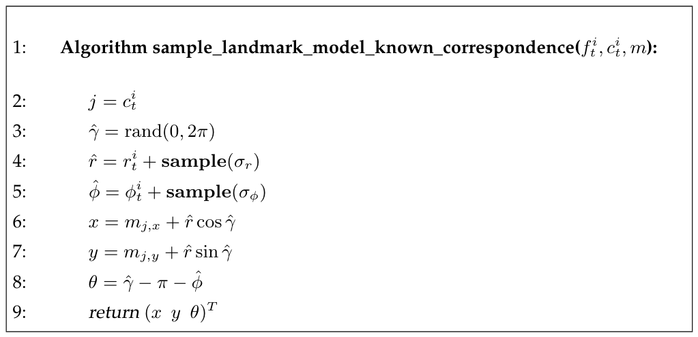

*Table 6.5 — 알려진 정체 $c_t^i$ 를 갖는 랜드마크 측정
$f_t^i = (r_t^i\ \phi_t^i\ s_t^i)^T$ 로부터 pose를 표집하는 알고리즘. (책 p.180)*

```
1:  Algorithm sample_landmark_model_known_correspondence(f_t^i, c_t^i, m):
2:      j = c_t^i
3:      γ̂ = rand(0, 2π)
4:      r̂ = r_t^i + sample(σ_r)
5:      φ̂ = φ_t^i + sample(σ_φ)
6:      x = m_{j,x} + r̂ cos γ̂
7:      y = m_{j,y} + r̂ sin γ̂
8:      θ = γ̂ − π − φ̂
9:      return (x y θ)^T
```

**pose sampler를 구현하려면 우리는 남은 자유 파라미터를 표집해야 하며, 이는 로봇이 랜드마크 주위 원
위 어디에 위치하는지를 결정한다. 이 파라미터는 Table 6.5에서 $\hat{\gamma}$ 라 불리며 라인 3에서
무작위로 선택된다. 라인 4와 5는 측정된 range와 bearing을 교란하는데, 이는 Gaussian에서 평균과 측정이
대칭적으로 취급된다는 사실을 이용한다. 마지막으로 라인 6부터 8까지가 $\hat{\gamma}$, $\hat{r}$,
$\hat{\phi}$ 에 대응하는 pose를 복원한다.** (책 p.180)

> **라인 4·5의 "대칭성" 논증이 무엇인가**
>
> 원래 모델은 $r_t^i = \hat{r} + \varepsilon$, 즉 **참값에 노이즈를 더해 측정이 나온다**는 것이다.
> 그런데 Gaussian은 대칭이므로 $p(r_t^i \mid \hat{r}) = p(\hat{r} \mid r_t^i)$ 이고, 따라서
> **측정값에 노이즈를 더해 참값 후보를 만들어도 같은 분포**가 된다. 그래서 라인 4처럼
> $\hat{r} = r_t^i + \text{sample}(\sigma_r)$ 로 쓸 수 있다. 5.3.2절에서 sampling 알고리즘을 만들 때
> 쓴 것과 같은 성질이다.
>
> **라인 8의 $\theta = \hat{\gamma} - \pi - \hat{\phi}$ 는 어디서 오는가**
>
> - $\hat{\gamma}$ 는 랜드마크에서 로봇을 향하는 방향이다 (라인 6·7이 랜드마크 좌표에
>   $\hat{r}(\cos\hat\gamma, \sin\hat\gamma)$ 를 더하므로).
> - 그러면 로봇에서 랜드마크를 향하는 방향은 그 반대인 $\hat{\gamma} - \pi$ 다.
> - bearing의 정의가 $\phi = (\text{세계 기준 랜드마크 방향}) - \theta$ 이므로,
>   $\theta = (\text{세계 기준 랜드마크 방향}) - \phi = (\hat{\gamma} - \pi) - \hat{\phi}$.
>
> 식 (3)의 bearing 정의를 $\theta$ 에 대해 푼 것이다.

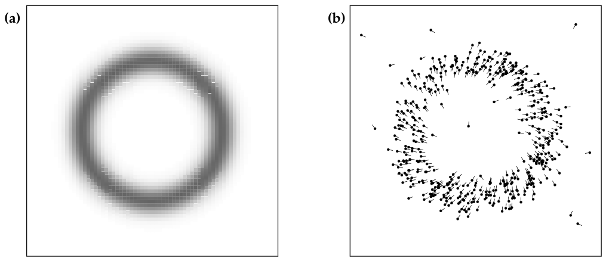

*Figure 6.13 — 랜드마크 검출 모델: (a) 5m 거리, 상대 bearing 30도에서 랜드마크를 검출했을 때 로봇
pose의 posterior 분포 (2-D로 투영). (b) 그런 검출에서 생성된 표본 로봇 pose들. 선은 pose의 방향을
나타낸다. (책 p.181)*

**Figure 6.13은 pose 분포 $p(x_t \mid f_t^i, c_t^i, m)$ (왼쪽 도표)를 예시하며, 알고리즘
sample_landmark_model_known_correspondence로 뽑은 표본도 보여준다(오른쪽 도표). Posterior는
$x$-$y$ 공간으로 투영되며, 거기서 측정된 range $r_t^i$ 주위의 **고리(ring)** 가 된다. 3-D pose
공간에서는 각도 $\theta$ 로 고리를 펼친 **나선(spiral)** 이다.** (책 p.180)

<!--widget:landmark-measurement-->

### 3. 예제/실습

#### 예제 1 — landmark_model_known_correspondence 손계산

**설정**

| 항목 | 값 |
|---|---|
| 로봇 pose $x_t$ | $(2.0,\ 3.0,\ 0.5)$ rad |
| 맵의 랜드마크 $m_3$ | $(m_{3,x},\ m_{3,y},\ s_3) = (6.0,\ 6.0,\ 1)$ |
| 관측 $f_t^1$ | $(r_t^1,\ \phi_t^1,\ s_t^1) = (5.1,\ 0.15,\ 1)$ |
| correspondence | $c_t^1 = 3$ |
| 노이즈 | $\sigma_r = 0.3$ m, $\sigma_\phi = 0.05$ rad, $\sigma_s = 0.1$ |

**단계 1 — $j$ 결정 (라인 2)**

$$j = c_t^1 = 3$$

**단계 2 — 참 range (라인 3)**

$$\hat{r} = \sqrt{(6.0 - 2.0)^2 + (6.0 - 3.0)^2} = \sqrt{16 + 9} = \sqrt{25} = 5.0$$

**단계 3 — 참 bearing (라인 4, $-\theta$ 포함)**

$$\operatorname{atan2}(6.0 - 3.0,\ 6.0 - 2.0) = \operatorname{atan2}(3, 4) = 0.6435\ \text{rad}$$

$$\hat{\phi} = 0.6435 - 0.5 = 0.1435\ \text{rad}$$

**단계 4 — 각 성분의 확률 (라인 5)**

range:
$$r_t^1 - \hat{r} = 5.1 - 5.0 = 0.1$$
$$\text{prob}(0.1,\ 0.3) = \frac{1}{\sqrt{2\pi \times 0.09}}\, e^{-\frac{1}{2}\frac{0.01}{0.09}} = \frac{1}{0.75199}\, e^{-0.05556} = 1.32981 \times 0.94596 = 1.25794$$

bearing:
$$\phi_t^1 - \hat{\phi} = 0.15 - 0.1435 = 0.0065$$
$$\text{prob}(0.0065,\ 0.05) = \frac{1}{\sqrt{2\pi \times 0.0025}}\, e^{-\frac{1}{2}\frac{0.00004225}{0.0025}} = \frac{1}{0.12533}\, e^{-0.00845} = 7.97885 \times 0.99159 = 7.91173$$

signature:
$$s_t^1 - s_3 = 1 - 1 = 0$$
$$\text{prob}(0,\ 0.1) = \frac{1}{\sqrt{2\pi \times 0.01}} = \frac{1}{0.25066} = 3.98942$$

**단계 5 — 곱 (라인 5)**

$$q = 1.25794 \times 7.91173 \times 3.98942 = 39.705$$

> **확률이 1보다 크다?** 밀도(density)이므로 정상이다. $\sigma$ 가 작을수록 밀도값은 커진다.
> 비교에만 쓰이므로 문제되지 않는다.

**틀린 correspondence를 넣어보면** — 맵에 $m_5 = (1.0,\ 8.0,\ 2)$ 가 있고 $c_t^1 = 5$ 라 가정하면:

$$\hat{r} = \sqrt{(1-2)^2 + (8-3)^2} = \sqrt{26} = 5.0990, \qquad r_t^1 - \hat{r} = 0.001$$

range는 거의 완벽하게 맞는다! 그러나 bearing은:

$$\operatorname{atan2}(5, -1) = 1.7682, \qquad \hat{\phi} = 1.7682 - 0.5 = 1.2682$$
$$\phi_t^1 - \hat{\phi} = 0.15 - 1.2682 = -1.1182$$
$$\text{prob}(-1.1182,\ 0.05) = 7.97885 \times e^{-\frac{1}{2}\frac{1.25037}{0.0025}} = 7.97885 \times e^{-250.07} \approx 0$$

signature도 $2 - 1 = 1$ 로 $\text{prob}(1, 0.1) = 3.98942 \times e^{-50} \approx 0$.

$$q \approx 0$$

**bearing과 signature가 correspondence를 걸러낸다.** range만으로는 구분되지 않았을 두 랜드마크가
확실히 분리된다. 이것이 6.6.5절에서 signature의 가치를 강조하는 이유다.

#### 예제 2 — sample_landmark_model 로 pose 표집

같은 관측 $f_t^1 = (5.1,\ 0.15,\ 1)$, $c_t^1 = 3$, 랜드마크 $m_3 = (6.0, 6.0)$.

**표본 1** — $\hat{\gamma} = 3.9270$ rad ($= 225°$), 노이즈 표본이 각각 $-0.05$, $+0.01$ 이라 하자.

$$\hat{r} = 5.1 + (-0.05) = 5.05, \qquad \hat{\phi} = 0.15 + 0.01 = 0.16$$
$$x = 6.0 + 5.05\cos(3.9270) = 6.0 + 5.05 \times (-0.70711) = 6.0 - 3.5709 = 2.4291$$
$$y = 6.0 + 5.05\sin(3.9270) = 6.0 + 5.05 \times (-0.70711) = 2.4291$$
$$\theta = 3.9270 - \pi - 0.16 = 3.9270 - 3.1416 - 0.16 = 0.6254$$

표본 pose: $(2.4291,\ 2.4291,\ 0.6254)$

**검산** — 이 pose에서 랜드마크를 보면 정말 $(5.05, 0.16)$ 이 나오는가?

$$r = \sqrt{(6 - 2.4291)^2 + (6 - 2.4291)^2} = \sqrt{3.5709^2 \times 2} = 3.5709 \times 1.41421 = 5.0500\ \checkmark$$
$$\operatorname{atan2}(3.5709,\ 3.5709) = \frac{\pi}{4} = 0.7854$$
$$\phi = 0.7854 - 0.6254 = 0.1600\ \checkmark$$

**표본 2** — $\hat{\gamma} = 1.5708$ rad ($= 90°$), 노이즈 $+0.2$, $-0.03$.

$$\hat{r} = 5.3, \qquad \hat{\phi} = 0.12$$
$$x = 6.0 + 5.3 \times 0 = 6.0, \qquad y = 6.0 + 5.3 \times 1 = 11.3$$
$$\theta = 1.5708 - 3.1416 - 0.12 = -1.6908$$

표본 pose: $(6.0,\ 11.3,\ -1.6908)$

**두 표본이 완전히 다른 위치**에 있음에 주목하라. 둘 다 "랜드마크 $m_3$ 를 거리 5.1, 상대 각도 0.15로
본다"는 관측과 일관된다. 이것이 Figure 6.13(a)의 고리이고, 관측 하나로는 pose가 정해지지 않는다는
뜻이다.

#### 연습문제

1. 예제 1에서 $\sigma_\phi$ 를 0.05에서 0.5로 키우면 틀린 correspondence($c_t^1 = 5$)의 $q$ 는 어떻게
   되는가? Signature가 없다면 어떻게 되는가?
2. Table 6.5 라인 8의 $\theta = \hat{\gamma} - \pi - \hat{\phi}$ 를 식 (3)의 bearing 정의에서
   직접 유도하라.
3. 랜드마크를 **두 개** 동시에 관측하면 pose가 유일하게 결정되는가? 자유도로 따져 보고, 애매성이
   남는다면 어떤 경우인지 설명하라.

## 6.6.5 Further Considerations (책 p.180~182)

### 1. 개념적 이해

**두 랜드마크 기반 측정 알고리즘은 모두 알려진 correspondence를 가정한다. 알려지지 않은
correspondence의 경우는 알려지지 않은 correspondence 아래에서의 localization과 mapping 알고리즘을
다룰 때 이후 장에서 자세히 논의될 것이다.** (책 p.180)

> 그 "이후 장"이 **7.5절 Estimating Correspondences**(EKF Localization with Unknown
> Correspondences)이다. 이 노트의 다음 대상이다.

**랜드마크 signature 주제에 관해 한마디 필요하다. 발표된 대부분의 알고리즘은 외양 feature의 사용을
명시하지 않는다. Signature가 제공되지 않으면 모든 랜드마크가 똑같아 보이고, correspondence variable을
추정하는 data association 문제가 더 어려워진다. 우리가 모델에 signature를 포함시킨 것은 그것이 센서
측정에서 흔히 쉽게 추출될 수 있는 가치 있는 정보원이기 때문이다.** (책 p.181)

**위에서 언급했듯 전체 측정 벡터 대신 feature를 사용하는 주된 동기는 계산적 성격이다: 몇십억 개의
range 측정보다 몇백 개의 feature를 관리하는 것이 훨씬 쉽다. 여기 제시된 우리 모델은 극도로 조잡하며,
센서 형성 과정의 기저에 있는 물리 법칙을 명백히 포착하지 못한다. 그럼에도 이 모델은 많은 응용에서 잘
작동하는 경향이 있다.** (책 p.181)

#### feature를 쓰면 무엇을 잃는가 — 충분통계량

**측정을 feature로 축소하는 것에 대가가 따른다는 점에 유의하는 것이 중요하다. 로보틱스 문헌에서
feature는 흔히 측정 벡터 $z_t$ 의 **충분통계량(sufficient statistics)** 으로 (잘못) 여겨진다.**
(책 p.181)

> **처음 등장하는 개념 — 충분통계량**
>
> $X$ 를 관심 변수(맵, pose 등), $Y$ 를 우리가 동원할 수 있는 다른 정보(과거 측정 등)라 하자.
> $f$ 가 $z_t$ 의 충분통계량이라는 것은 다음이 성립한다는 뜻이다 (책 6.42):
>
> $$p(X \mid z_t, Y) = p(X \mid f(z_t), Y)$$
>
> **원시 측정 $z_t$ 를 전부 갖고 있을 때와, 거기서 뽑은 feature $f(z_t)$ 만 갖고 있을 때의 결론이
> 같다**는 것 — 즉 축약 과정에서 잃은 정보가 없다는 것이다.

**그러나 실제로는 전체 측정 벡터 대신 feature를 사용함으로써 많은 정보가 희생된다. 이 잃어버린 정보는
어떤 문제들을 더 어렵게 만드는데, 로봇이 방금 이전에 탐사한 위치를 재방문했는지 판단하는 data
association 문제 같은 것이 그렇다.** (책 p.181~182)

**내성(introspection)으로 feature extraction의 효과를 이해하기는 쉽다: 눈을 뜨면 환경의 시각 영상은
아마 당신이 어디 있는지 모호함 없이 말해주기에 충분할 것이다 — 이전에 전역적으로 불확실했더라도.
반면 문설주와 창턱의 상대 위치 같은 특정 feature만 감지한다면, 당신은 자신이 어디 있는지에 대해 훨씬
덜 확신할 것이다. 그 정보는 전역 localization에 불충분할 가능성이 꽤 높다.** (책 p.182)

> 이 비유가 6.6절 전체의 요약이다. **feature는 충분통계량이 아니다** — 편의를 위해 정보를 버리는
> 것이고, 그 대가는 전역 localization과 loop closing에서 나타난다.

#### 그럼에도 feature를 배우는 이유

**빠른 컴퓨터의 등장으로 feature는 로보틱스 분야에서 점차 중요성을 잃어 왔다. 특히 range 센서를 사용할
때, 최신 알고리즘 대부분은 밀집 측정 벡터에 의존하며 환경을 표현하는 데 밀집 location-based 맵을
사용한다.** (책 p.182)

**그럼에도 feature는 교육 목적으로 여전히 훌륭하다. 그것은 우리가 probabilistic robotics의 기본 개념을
도입하게 해주며, correspondence 문제 같은 문제를 적절히 다루면 맵이 밀집 스캔 점 집합으로 구성된
경우에도 적용될 수 있다. 이런 이유로 이 책의 여러 알고리즘은 먼저 feature 표현에 대해 기술되고, 이후
원시 센서 측정을 사용하는 알고리즘으로 확장된다.** (책 p.182)

> **이 책의 서술 전략이 여기 명시되어 있다.** 7장이 정확히 그렇게 전개된다 —
> 7.4절 EKF Localization은 **feature 기반**(6.6절 모델)으로 먼저 기술되고,
> 8장 MCL에 가서야 **밀집 range 측정**(6.4절 likelihood field)으로 넘어간다.

### 2. 예제/실습

#### 예제 — 충분통계량이 아님을 보이기

복도 양쪽에 문이 늘어선 건물에서, 로봇이 "문설주 두 개가 각각 range 2m/bearing $+30°$,
range 2m/bearing $-30°$" 를 관측했다고 하자.

- **feature만 보면**: 이 관측과 일관된 위치가 복도를 따라 **수십 곳** 있다. 모든 문 쌍이 똑같이 생겼기
  때문이다. $p(x_t \mid f(z_t), m)$ 은 넓게 퍼진 multi-modal 분포다.
- **원시 스캔 $z_t$ 를 보면**: 복도 끝까지의 거리, 벽의 미세한 요철, 소화전 위치 등이 전부 들어 있어
  후보가 하나로 좁혀질 수 있다. $p(x_t \mid z_t, m)$ 은 훨씬 뾰족하다.

$$p(x_t \mid z_t, m) \ne p(x_t \mid f(z_t), m)$$

따라서 이 feature extractor는 충분통계량이 **아니다.**

#### 연습문제

1. 어떤 feature extractor가 충분통계량이 되려면 어떤 조건을 만족해야 하는가? 실제로 그런 extractor를
   만들 수 있는가?
2. Signature를 추가하면 위 예제의 상황이 개선되는가? 어떤 종류의 signature가 필요한가?
3. "빠른 컴퓨터 때문에 feature의 중요성이 줄었다"는 서술과, 그럼에도 7장이 feature 기반 EKF
   Localization부터 시작하는 것은 어떻게 양립하는가?

---

# 6.7 Practical Considerations (책 p.182~183)

### 1. 개념적 이해

**이 절은 여러 measurement model을 개관했다. 우리는 range finder를 위한 모델에 강한 중점을 두었는데,
로보틱스에서 그것의 큰 중요성 때문이다. 그러나 여기서 논의된 모델은 훨씬 넓은 확률 모델 부류의
대표일 뿐이다.** (책 p.182)

#### 기준 1 — 물리적 현실성이 유일한 기준이 아니다

**올바른 모델을 선택할 때 물리적 현실성과, 그 모델을 사용하는 알고리즘에 바람직할 수 있는 성질 사이의
trade-off가 중요하다. 예를 들어 우리는 range 센서의 물리적으로 현실적인 모델이 추정된 로봇 pose에 대해
평활하지 않은 확률을 낼 수 있음을 언급했다 — 이는 다시 particle filter 같은 알고리즘에 문제를 일으킨다.
따라서 물리적 현실성은 올바른 센서 모델을 고르는 유일한 기준이 아니다; 똑같이 중요한 기준은 그 모델을
활용하는 알고리즘에 대한 모델의 적합성이다.** (책 p.182)

> 6.3(물리적) vs 6.4(ad hoc) 대결의 최종 판정이다. **어느 쪽이 "옳은" 모델인가가 아니라, 어느 쪽이
> 내가 쓸 필터와 궁합이 맞는가**를 묻는다.
>
> | 쓰려는 필터 | 권장 모델 | 이유 |
> |---|---|---|
> | Particle filter (8장 MCL) | **likelihood field** | 평활해야 particle이 정답을 놓치지 않음 |
> | EKF/UKF (7장) | **feature-based** | 미분 가능해야 Jacobian 계산 가능 |
> | Grid localization (8.2절) | beam / likelihood field 모두 | 격자가 이미 이산이라 평활성 요구가 덜함 |

#### 기준 2 — 정보는 많을수록 좋다, 그러나

**대략적인 규칙으로, 모델이 정확할수록 좋다. 특히 센서 측정에서 더 많은 정보를 추출할 수 있을수록
좋다. Feature 기반 모델은 상대적으로 적은 정보를 추출하는데, feature extractor가 고차원 센서 측정을
저차원 공간으로 투영한다는 사실 때문이다. 결과적으로 feature 기반 방법은 열등한 결과를 내는 경향이
있다. 이 단점은 feature 기반 표현의 우월한 계산적 성질로 상쇄된다.** (책 p.182~183)

#### 기준 3 — 불확실성을 일부러 부풀려라

**measurement model의 intrinsic parameter를 조정할 때, 불확실성을 인위적으로 부풀리는 것이 흔히
유용하다. 이는 확률적 접근의 핵심 한계 때문이다: 확률적 기법을 계산적으로 다루기 쉽게 만들기 위해
우리는 물리 세계에 존재하는 의존성과, 그 의존성을 유발하는 무수한 latent variable을 무시해야 한다.
그런 의존성이 모델링되지 않으면, 여러 측정의 증거를 통합하는 알고리즘은 빠르게 **overconfident** 해진다.
그런 overconfidence는 궁극적으로 잘못된 결론으로 이어질 수 있으며, 이는 결과에 부정적 영향을 준다.**
(책 p.183)

**따라서 실제로는 센서가 전달하는 정보를 줄이는 것이 좋은 경험 법칙이다.** (책 p.183)

**그렇게 하는 두 가지 방법과 그 평가:**

| 방법 | 책의 평가 |
|---|---|
| 측정을 저차원 feature 공간으로 투영 | **"위에 언급한 한계를 겪는다"** (정보 손실이 통제되지 않음) |
| $\alpha$ 로 measurement model을 지수화 (6.3.4절) | **"훨씬 나은 방법인데, 확률적 알고리즘 결과에 추가 분산을 도입하지 않기 때문이다"** |

> **"추가 분산을 도입하지 않는다"가 무슨 뜻인가.**
> Feature 추출은 정보를 버리되 **어떤 정보를 버릴지 선택**해 버린다 — 그 선택이 편향을 만들고, 상황에
> 따라 결과가 크게 달라진다. 반면 $\alpha$ 지수는 모든 방향으로 **균일하게** 확신만 낮춘다. 분포의
> 모양은 유지하고 뾰족함만 덜어내는 것이다.
>
> 이는 5장 p.118의 "성공적인 모델은 불확실성을 크게 과대평가한다"와 같은 주장이며, 6.3.2절에서 ML로
> 학습한 모델이 저절로 short·random likelihood를 높게 잡았던 관찰과도 일치한다. **책이 이 조언을
> 세 번 반복한다는 사실 자체가 그 중요도다.**

### 2. 예제/실습

#### 예제 — $\alpha$ 지수의 효과를 숫자로

6.1절 예제로 돌아가자. 두 pose 가설 A(빔당 0.9)와 B(빔당 0.8), $K = 180$.

| $\alpha$ | $p_A / p_B$ | 해석 |
|---|---|---|
| 1.0 (원래) | $1.125^{180} = 1.61 \times 10^{9}$ | 16억 배 — B는 사실상 즉사 |
| 0.5 | $1.125^{90} = 4.02 \times 10^{4}$ | 4만 배 |
| 0.1 | $1.125^{18} = 8.33$ | 8배 — B가 살아남을 여지 |
| 0.05 | $1.125^{9} = 2.89$ | 3배 |

**계산 근거**: $\left(\frac{p_A}{p_B}\right)^{\alpha} = (1.125^{180})^{\alpha} = 1.125^{180\alpha}$.

Particle filter에서 이 비가 곧 weight 비다. $\alpha = 1$ 이면 B에 있던 particle이 한 스텝에 전멸하고
(particle deprivation), $\alpha = 0.1$ 이면 몇 스텝 더 살아남아 다음 측정으로 판정할 기회를 얻는다.

$K$ 개 빔에 $\alpha$ 를 씌우는 것은 **유효 빔 수를 $\alpha K$ 개로 줄이는 것과 같다**:
$\alpha = 0.05$, $K = 180$ 이면 유효 9개 — 6.3.4절이 권한 "360개 중 8개만 쓰기"와 사실상 같은 효과다.

#### 연습문제

1. 세 가지 기준(물리적 현실성 / 정보량 / overconfidence 억제)이 서로 충돌하는 구체적 상황을 하나
   만들어 보라. 어떻게 절충하겠는가?
2. Feature 추출과 $\alpha$ 지수화가 모두 "정보를 줄이는" 방법인데, 책이 후자를 선호하는 이유를
   자신의 말로 설명하라.
3. $\alpha$ 를 어떻게 정해야 하는가? 6.3.4절이 언급한 "localization 결과를 목적함수로 삼는 gradient
   descent"와 연결해 생각해 보라.

---

# 6.8 Summary (책 p.183~184)

**이 절은 확률적 measurement model을 기술했다.** (책 p.183) 책의 요약을 그대로 옮기고, 각 항목에
이 노트의 해당 위치를 붙인다.

**• range finder — 특히 레이저 — 를 위한 모델에서 출발해 measurement model
$p(z_t^k \mid x_t, m)$ 을 논의했다. 그런 첫 모델은 특정 맵 $m$ 과 pose $x_t$ 에 대해
$p(z_t^k \mid x_t, m)$ 의 모양을 결정하는 데 **ray casting**을 사용했다. 우리는 range 측정에 영향을 줄
수 있는 여러 유형의 노이즈를 다루는 **mixture model**을 고안했다.** (책 p.183) → **6.3.1절**

**• measurement model의 intrinsic noise parameter를 식별하기 위한 maximum likelihood 기법을 고안했다.
Measurement model이 mixture model이므로 우리는 maximum likelihood 추정을 위한 반복 절차를 제공했다.
우리의 접근은 **expectation maximization** 알고리즘의 한 사례였으며, 이는 측정의 기저에 있는 오차
유형에 대한 expectation을 계산하는 단계와, 그 expectation에 대해 최선의 intrinsic parameter 집합을
닫힌 형식으로 찾는 maximization 단계를 번갈아 수행한다.** (책 p.183) → **6.3.2~6.3.3절**

**• range finder를 위한 대안 measurement model은 **likelihood field**에 기반한다. 이 기법은 2-D
좌표에서의 최근접 거리를 사용해 확률 $p(z_t^k \mid x_t, m)$ 을 모델링했다. 우리는 이 접근이 더 평활한
분포 $p(z_t^k \mid x_t, m)$ 을 내는 경향이 있음을 언급했다. 이는 바람직하지 않은 부작용을 대가로 한다:
Likelihood field 기법은 free-space에 관련된 정보를 무시하고, range 측정 해석에서 가려짐(occlusion)을
고려하지 못한다.** (책 p.183~184) → **6.4절**

**• 세 번째 measurement model은 **map matching**에 기반한다. Map matching은 센서 스캔을 지역 맵으로
사상하고 그 맵을 전역 맵과 상관시킨다. 이 접근은 물리적 동기를 결여하지만 매우 효율적으로 구현될 수
있다.** (책 p.184) → **6.5절**

**• 우리는 사전계산이 런타임의 계산 부담을 어떻게 줄일 수 있는지 논의했다. beam 기반 measurement
model에서 사전계산은 **3-D**에서 일어난다; likelihood field는 **2-D** 사전계산만 요구한다.**
(책 p.184) → **6.3.4절 · 6.4.2절**

**• 로봇이 근처 랜드마크의 range, bearing, signature를 추출하는 **feature 기반 센서 모델**을
제시했다. Feature 기반 기법은 원시 센서 측정에서 뚜렷한 feature를 추출한다. 그렇게 함으로써 센서
측정의 차원을 여러 자릿수 줄인다.** (책 p.184) → **6.6절**

**• 장 말미에서 실무 문제에 대한 논의가 구체적 구현에서 발생할 수 있는 함정 몇 가지를 짚었다.**
(책 p.184) → **6.7절**

### 6장 전체 한 장 정리

| 절 | 모델 | 핵심 식 | 알고리즘 | 7·8장에서 쓰이는 곳 |
|---|---|---|---|---|
| 6.3 | beam model | (6.12) 4성분 mixture | Table 6.1 | 8.2 Grid Localization |
| 6.3.2 | intrinsic parameter 학습 | EM (6.27)~(6.31) | Table 6.2 | — (오프라인) |
| 6.4 | likelihood field | (6.32)~(6.34) | Table 6.3 | **8.3 MCL** |
| 6.5 | map matching | (6.35)~(6.37) | — | scan matching / SLAM |
| 6.6 | feature-based | (6.40) range-bearing-signature | Table 6.4, 6.5 | **7.4 EKF Localization** |

### 다음 장으로 가는 다리

6장이 끝나면 Bayes filter의 두 빈칸이 모두 채워진다.

$$\overline{bel}(x_t) = \int \underbrace{p(x_t \mid u_t, x_{t-1})}_{\textbf{5장}}\ bel(x_{t-1})\ dx_{t-1}$$

$$bel(x_t) = \eta\ \underbrace{p(z_t \mid x_t, m)}_{\textbf{6장}}\ \overline{bel}(x_t)$$

**Part I이 여기서 끝난다.** 7장부터는 이 두 모델을 실제 필터에 꽂아 넣어 로봇의 위치를 추정한다.

| 다음에 배울 것 | 이 장에서 준비한 것 |
|---|---|
| 7.4 EKF Localization | 6.6.2절 식 (6.40) — 미분 가능한 measurement model |
| 7.5 Estimating Correspondences | 6.6.3절 correspondence variable $c_t^i$ |
| 7.7 UKF Localization | 같은 feature 모델, sigma point로 전파 |
| 8.2 Grid Localization | 6.2절 location-based 맵 + 6.3절 beam model |
| 8.3 Monte Carlo Localization | 6.4절 likelihood field (평활성이 필수) |
| 8.3.6 Proposal 수정 | 6.6.4절 sample_landmark_model |

---

# 6.9 Bibliographical Remarks (책 p.184~185)

책이 제시한 참고문헌 갈래만 정리한다.

| 주제 | 문헌 (책 p.184~185) |
|---|---|
| 소나 range 센서의 정밀 모델 | Blahut et al. (1991); Grunbaum et al. (1992); Etter (1996) |
| laser range finder 모델 | Rees (2001) |
| 적절한 노이즈 모델의 경험적 논의 | Sahin et al. (1998) |
| range 센서 beam 모델의 초기 연구 | Moravec (1988) — 선구적 연구 |
| 그것을 모바일 로봇 localization에 적용 | Burgard et al. (1996) |
| 이 장의 beam 모델 + range 사전 캐싱 | Fox et al. (1999b) |
| **likelihood field** 최초 발표 | **Thrun (2001)** |
| scan matching 문헌과의 관계 | Besl and McKay (1992) |
| correlation 모델의 soft 변형으로서의 위치 | Konolige and Chou (1999) |
| occupancy grid 간 correlation 계산 | Thrun (1993) — 격자 간 제곱오차 합 |
| 여러 모델 비교 | Schiele and Crowley (1994) |
| 동적 환경에서 map matching의 강건성 | Yamauchi and Langley (1997) |
| 지역 occupancy grid → 히스토그램 변환 | Duckett and Nehmzow (2001) |
| 점 랜드마크의 range-bearing 측정 (SLAM) | Leonard and Durrant-Whyte (1991) — 아마 최초 언급 |
| 직선 물체를 위한 measurement model | Crowley (1989) |

**"이 장은 센서의 물리적 모델링에 관한 풍부한 문헌을 겉핥기했을 뿐이다. (…) 이 모델들에 비하면
이 장의 모델은 극도로 조잡하다."** (책 p.184)

---

# 6.10 Exercises (책 p.185~186)

책의 연습문제를 그대로 옮긴다. 6.6절 feature 기반 모델을 카메라로 확장하는 문제다.

### 문제 1 — 천장에 붙인 시각 마커 (책 p.185~186)

**초기의 feature 기반 항법 로봇 다수는 인식하기 쉬운 인공 랜드마크를 환경에 사용했다. 그런 마커를
붙이기 좋은 곳은 천장이다(왜인가?). 고전적 예는 시각 마커다: 천장에 다음 마커를 붙인다고 하자.**


*문제 1의 마커 — 90도 회전에 대해 대칭이다. (책 p.185)*

**마커의 세계 좌표를 $x_m$, $y_m$, 전역 좌표계에 대한 방향을 $\theta_m$ 이라 하자. 로봇의 pose는
$x_r$, $y_r$, $\theta_r$ 로 표기한다.**

**이제 perspective 카메라의 상 평면(image plane)에서 마커를 검출할 수 있는 루틴이 주어졌다고 가정하자.
$x_i$, $y_i$ 를 상 평면에서의 마커 좌표, $\theta_i$ 를 그 각도 방향이라 하자. 카메라의 초점거리는
$f$ 다. Projective geometry로부터 우리는 $x$-$y$ 공간의 각 변위 $d$ 가 상 평면에서 비례하는 변위
$d \cdot \frac{f}{h}$ 로 투영됨을 안다. (좌표계에 대해 몇 가지 선택을 해야 한다; 그 선택을 명시하라.)**

- **(a)** 상 좌표가 $x_i$, $y_i$, $\theta_i$ 이고 로봇이 $x_r$, $y_r$, $\theta_r$ 에 있을 때 마커를
  전역 좌표 $x_m$, $y_m$, $\theta_m$ 의 어디에서 기대해야 하는지 수학적으로 기술하라.
- **(b)** 로봇 pose $x_r$, $y_r$, $\theta_r$ 와 마커 좌표 $x_m$, $y_m$, $\theta_m$ 로부터 상 좌표
  $x_i$, $y_i$, $\theta_i$ 를 계산하는 수학적 방정식을 제시하라.
- **(c)** 이제 참 마커 좌표 $x_m$, $y_m$, $\theta_m$ 과 상 좌표 $x_i$, $y_i$, $\theta_i$ 를 안다고
  가정하고, 로봇 좌표 $x_r$, $y_r$, $\theta_r$ 를 결정하는 수학적 방정식을 제시하라.
- **(d)** 지금까지 마커가 하나뿐이라고 가정했다. 이제 위와 같은 유형의 (구별 불가능한) 마커가 여러 개
  있다고 하자. 로봇이 자신의 pose를 유일하게 식별하려면 그런 마커를 몇 개나 볼 수 있어야 하는가?
  그런 배치를 그리고 왜 충분한지 논하라.

**힌트: 이 문제에 답하는 데 측정의 불확실성을 고려할 필요는 없다. 또한 마커가 대칭임에 주의하라.
이것이 답에 영향을 준다!**

> **(b)가 forward model, (c)가 inverse model이다.** 6.1절에서 강조한 그 구분이다. 측정 모델로 쓰는
> 것은 (b)이고, (c)는 6.6.4절 sampling poses에 해당한다.
>
> **(d)의 자유도 분석**: 6.6.4절과 같은 방식으로 세어 보라. pose 자유도 3개, 마커 하나가 주는 제약이
> 몇 개인지가 관건이며, 마커가 **대칭**이라 방향 정보의 일부를 잃는다는 힌트가 핵심이다.
>
> **"왜 천장인가"**: 천장은 (i) 가려지지 않고, (ii) 사람이 건드리지 않으며, (iii) 높이 $h$ 가
> 일정해 위 투영 공식의 $\frac{f}{h}$ 를 상수로 쓸 수 있다.

### 문제 2 — 오차 공분산까지 (책 p.186)

**이 연습에서는 앞 문제의 계산을 오차 공분산을 포함하도록 확장한다. 계산을 단순화하기 위해 이제 절대
방향을 추정할 수 있는 비대칭 마커를 가정한다:**


*문제 2의 마커 — 회전 대칭이 없으므로 절대 방향 $\theta_m$ 을 유일하게 읽을 수 있다. (책 p.186)*

**역시 단순함을 위해 방향에는 노이즈가 없다고 가정한다. 그러나 상 평면의 $x$-$y$ 추정은 노이즈가 있다.
구체적으로 측정이 다음 공분산의 영평균 Gaussian 노이즈를 받는다고 하자:**

$$\Sigma = \begin{pmatrix} \sigma^2 & 0 & 0 \\ 0 & \sigma^2 & 0 \\ 0 & 0 & 0 \end{pmatrix}$$

**어떤 양수 $\sigma^2$ 에 대해. 위 세 질문에 대해 대응하는 공분산을 계산하라. 특히,**

- **(a)** 상 좌표 $x_i$, $y_i$, $\theta_i$ 와 로봇 좌표 $x_r$, $y_r$, $\theta_r$ 가 주어졌을 때
  $x_m$, $y_m$, $\theta_m$ 값의 오차 공분산은 무엇인가?
- **(b)** 로봇 좌표 $x_r$, $y_r$, $\theta_r$ 와 마커 공분산 $x_m$, $y_m$, $\theta_m$ 이 주어졌을 때
  $x_i$, $y_i$, $\theta_i$ 값에 대한 오차 공분산은 무엇인가?
- **(c)** 마커 공분산 $x_m$, $y_m$, $\theta_m$ 과 상 좌표 $x_i$, $y_i$, $\theta_i$ 가 주어졌을 때
  $x_r$, $y_r$, $\theta_r$ 값에 대한 오차 공분산은 무엇인가?

> **이 문제가 요구하는 도구는 3.3.2절의 linearization이다.** 비선형 변환 $g$ 를 통과하는 Gaussian의
> 공분산은 Jacobian $G$ 로
> $$\Sigma' = G\,\Sigma\,G^T$$
> 로 전파된다. 세 문항 각각에서 어떤 함수의 Jacobian을 잡아야 하는지 먼저 정하라.
> 이 계산이 곧 7.4.3절 EKF Localization의 유도와 같은 구조다 — **이 연습문제는 7장 예습이다.**

### 이 노트의 추가 연습문제

1. **모델 선택 연습.** 다음 각 상황에서 6.3~6.6절 중 어느 measurement model을 고르겠는가? 근거를
   6.7절의 세 기준으로 제시하라.
   - (a) 사무실에서 SICK 레이저 + particle filter 1000개로 전역 localization
   - (b) 실외에서 나무 줄기를 랜드마크로 쓰는 EKF Localization
   - (c) 연속 스캔을 정렬해 지도를 만드는 SLAM front-end
   - (d) 임베디드 프로세서, 소나 8개, 메모리 극히 제한

2. **구현 연습.** 6.3.1절의 `beam_model_density` 를 확장해 Table 6.1의
   `beam_range_finder_model` 전체를 구현하라. 간단한 격자 맵과 ray casting을 포함해야 한다.
   그런 다음 같은 맵에 대해 Table 6.3의 `likelihood_field_range_finder_model` 을 구현하고,
   두 모델의 $p(z_t \mid x_t, m)$ 을 $x$ 축을 따라 그려 6.3.5절이 말한 평활성 차이를 눈으로 확인하라.

3. **통합 연습.** 6.6절 landmark model과 5.4절 odometry motion model을 결합해, 랜드마크 3개가 있는
   환경에서 로봇이 10스텝 이동하며 관측하는 상황을 시뮬레이션하라. 각 스텝에서
   $p(z_t \mid x_t, m)$ 를 격자 위에서 평가해 posterior를 그려 보라. (이것이 사실상 8.2절 Grid
   Localization의 축소판이다.)

---

> **다음 노트**: 7장 Mobile Robot Localization: Markov and Gaussian (책 p.191~236)
