# 7장. Mobile Robot Localization: Markov and Gaussian

> 원문: *Probabilistic Robotics*, Chapter 7 (책 p.191~236 / PDF p.212~257)
> 이 노트는 7장 전체(도입 ~ 7.11 Exercises)를 다룬다.
>
> **Part II의 시작이다.** Part I(1~6장)에서 만든 부품이 여기서 처음으로 하나의 완성된 시스템이 된다.
>
> | Part I에서 만든 것 | 7장에서 쓰이는 곳 |
> |---|---|
> | 2장 Bayes filter | 7.2 Markov localization (= Bayes filter의 다른 이름) |
> | 3.3 EKF | 7.4 EKF Localization |
> | 3.4 UKF | 7.7 UKF Localization |
> | 5.3 Velocity motion model | 7.4.3 prediction step의 $g$ |
> | 6.6 Landmark measurement model | 7.4.3 correction step의 $h$ |
> | 6.6.3 Correspondence variable $c_t^i$ | 7.5 Estimating Correspondences |

---

# 7장 도입 — Localization이란 무엇인가 (책 p.191~192)

## 1. 개념적 이해

**이 장은 mobile robot localization을 위한 여러 구체적 알고리즘을 소개한다. Mobile robot localization은
**주어진 환경 맵에 대한 로봇의 pose를 결정하는 문제**다. 흔히 position estimation이라 불린다.**
(책 p.191)

**Mobile robot localization은 일반적인 localization 문제의 한 사례이며, 이는 로보틱스에서 가장 기본적인
perceptual 문제다. 거의 모든 로보틱스 과제는 조작되는 물체의 위치에 대한 지식을 필요로 한다. 이
장과 다음 장에서 기술되는 기법들은 물체 localization 과제에도 똑같이 적용 가능하다.** (책 p.191)

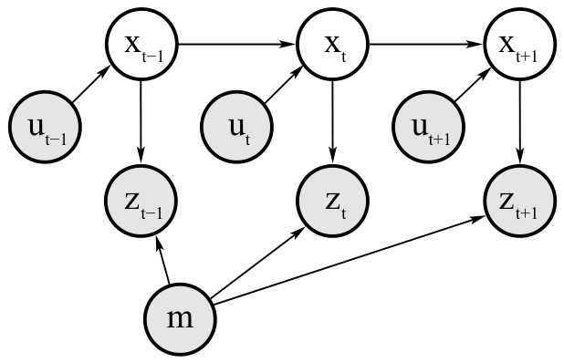

*Figure 7.1 — Mobile robot localization의 그래프 모델. 음영 처리된 노드의 값은 알려져 있다: 맵 $m$,
측정 $z$, 제어 $u$. Localization의 목표는 로봇 pose 변수 $x$ 를 추론하는 것이다. (책 p.192)*

> **Figure 7.1을 2장 Figure 2.2와 비교하라.** 구조는 같은 dynamic Bayes network인데, **맵 $m$ 이
> 노드로 추가되고 모든 측정 $z$ 로 화살표를 보낸다.** 그리고 $m$, $z$, $u$ 가 전부 음영(= 알려짐)이고
> $x$ 만 흰색(= 추론 대상)이다. 이 그림 한 장이 localization 문제의 정의다.

### Localization은 좌표 변환 문제다

**Mobile robot localization은 좌표 변환(coordinate transformation) 문제로 볼 수 있다. 맵은 로봇의
pose와 무관한 전역 좌표계로 기술된다. Localization은 **맵 좌표계와 로봇의 지역 좌표계 사이의
대응을 확립하는 과정**이다.** (책 p.191)

**이 좌표 변환을 알면 로봇은 관심 물체의 위치를 자기 자신의 좌표계 안에서 표현할 수 있다 — 로봇
항법에 필요한 전제조건이다. 독자가 쉽게 확인하듯, pose가 맵과 같은 좌표계로 표현된다고 가정하면
로봇의 pose $x_t = (x\ y\ \theta)^T$ 를 아는 것으로 이 좌표 변환을 결정하기에 충분하다.** (책 p.191)

> **왜 이 관점이 유용한가.** "로봇이 어디 있나"와 "맵을 로봇 눈앞의 광경에 어떻게 겹쳐 놓을 것인가"는
> 같은 질문이다. 6.4.1절 식 (6.32)에서 센서 끝점을 전역 좌표로 투영할 때 쓴 그 변환이고,
> $(x, y, \theta)$ 세 숫자가 그 변환을 완전히 결정한다.

### 왜 어려운가 — 측정 하나로는 안 된다

**불행히도 — 그리고 여기에 mobile robot localization의 문제가 있다 — pose는 보통 직접 감지될 수 없다.
달리 말해 대부분의 로봇은 pose를 측정하는 노이즈 없는 센서를 갖고 있지 않다. 따라서 pose는 데이터로부터
추론되어야 한다.** (책 p.191)

**핵심 난점은 **단일 센서 측정이 보통 pose를 결정하기에 불충분하다**는 사실에서 발생한다. 대신 로봇은
자신의 pose를 결정하기 위해 시간에 걸쳐 데이터를 통합해야 한다. 왜 이것이 필요한지 보려면, 많은
복도가 비슷하게 생긴 건물 안에 있는 로봇을 그려보라. 여기서 단일 센서 측정(예: range scan)은 보통
특정 복도를 식별하기에 불충분하다.** (책 p.191~192)

> **6.3.2절 Figure 6.7에서 이미 본 그림이다.** 스캔 하나의 likelihood를 맵 전체에 투영했더니 복도
> 전체에 확률 질량이 퍼졌다. 그때 "단일 스캔으로는 부족하다"고 했던 것이 여기서 localization을
> **필터 문제**로 만드는 근거가 된다.

### 맵의 종류

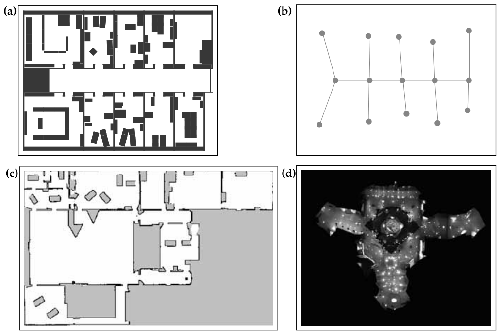

*Figure 7.2 — 로봇 localization에 사용되는 맵의 예: (a) 손으로 구성한 2-D 미터법 배치도,
(b) 그래프 형태의 topological 맵, (c) occupancy grid map, (d) 천장의 이미지 모자이크. (책 p.193)*

**Localization 기법은 폭넓은 맵 표현에 대해 개발되어 왔다. 우리는 이미 두 유형의 맵을 논의했다:
feature-based와 location-based. 후자의 예가 occupancy grid map이며, 이는 이 책 뒷장의 주제다.
다른 유형의 맵 몇 가지가 Figure 7.2에 보인다. (…) 뒷장들에서 특정 맵 유형을 조사하고 데이터로부터
맵을 획득하는 알고리즘을 논의할 것이다. **Localization은 정확한 맵이 사용 가능하다고 가정한다.**
(책 p.192)

> 마지막 문장이 7·8장의 전제다. 맵을 **모르는** 상태에서 동시에 추정하는 문제가 SLAM(10장 이후)이다.

**이 장과 다음 장에서 우리는 mobile localization을 위한 몇 가지 기본 확률 알고리즘을 제시한다.
**이 알고리즘 모두가 2장에서 기술한 기본 Bayes filter의 변형이다.** 우리는 각 표현과 관련 알고리즘의
장점과 단점을 논의한다.** (책 p.192)

## 2. 예제/실습

#### 예제 — 좌표 변환을 직접 해보기

로봇의 참 pose가 $x_t = (2,\ 3,\ \tfrac{\pi}{2})$ 이고, 맵에 랜드마크가 전역 좌표 $(5, 7)$ 에 있다.
로봇 기준으로 이 랜드마크는 어디 있는가?

**단계 1 — 전역 좌표에서의 상대 벡터**

$$\Delta = \begin{pmatrix} 5 - 2 \\ 7 - 3 \end{pmatrix} = \begin{pmatrix} 3 \\ 4 \end{pmatrix}$$

**단계 2 — 로봇 좌표계로 회전 (전역 → 지역은 $-\theta$ 만큼 회전)**

$$R(-\theta)\Delta = \begin{pmatrix} \cos(-\tfrac{\pi}{2}) & -\sin(-\tfrac{\pi}{2}) \\ \sin(-\tfrac{\pi}{2}) & \cos(-\tfrac{\pi}{2}) \end{pmatrix}\begin{pmatrix} 3 \\ 4 \end{pmatrix} = \begin{pmatrix} 0 & 1 \\ -1 & 0 \end{pmatrix}\begin{pmatrix} 3 \\ 4 \end{pmatrix} = \begin{pmatrix} 4 \\ -3 \end{pmatrix}$$

로봇 기준으로 **앞으로 4m, 오른쪽으로 3m**에 있다.

**검산 — 6.6절 range-bearing으로**

$$r = \sqrt{3^2 + 4^2} = 5, \qquad \phi = \operatorname{atan2}(4, 3) - \frac{\pi}{2} = 0.9273 - 1.5708 = -0.6435\ \text{rad} = -36.87°$$

지역 좌표 $(4, -3)$ 의 극좌표가 $r = 5$, 각도 $\operatorname{atan2}(-3, 4) = -0.6435$ — 일치한다.
**pose 세 숫자를 알면 맵의 모든 것을 로봇 시점으로 옮길 수 있다**는 것이 이 계산이다.

#### 연습문제

1. Figure 7.1에서 $m$ 이 $z_{t-1}, z_t, z_{t+1}$ 모두로 화살표를 보내는 이유는? $u$ 로는 왜 화살표가
   없는가? (5.5절 Motion and Maps를 떠올려 보라.)
2. 위 예제에서 로봇 pose가 $(2, 3, 0)$ 이라면 같은 랜드마크의 지역 좌표와 range/bearing은?
3. "localization은 정확한 맵이 사용 가능하다고 가정한다"는 전제가 깨지면 어떤 문제가 되는가?

---

# 7.1 A Taxonomy of Localization Problems (책 p.193~197)

## 1. 개념적 이해

**모든 localization 문제가 똑같이 어렵지는 않다. Localization 문제의 난이도를 이해하기 위해, 먼저
localization 문제의 분류를 간략히 논의하자. 이 분류는 환경의 성질과 로봇이 가질 수 있는 초기 지식에
관한 여러 중요한 차원을 따라 localization 문제를 나눈다.** (책 p.193)

네 가지 축이 있고, 각각이 **어떤 알고리즘을 쓸 수 있는지**를 결정한다.

### 축 1 — Local vs Global (책 p.193~194)

난이도 순으로 세 가지다.

| | **position tracking** | **global localization** | **kidnapped robot problem** |
|---|---|---|---|
| 초기 pose | **알려짐** | 모름 | 알려졌다고 **믿지만 틀림** |
| 오차 범위 | 작고 국소적 | 유계가 아님 | 유계가 아님 |
| belief 표현 | unimodal (Gaussian) 가능 | unimodal **부적합** | unimodal 부적합 |
| 7장에서 | **EKF/UKF로 풀 수 있음** | MHT만 가능 | MHT (가설 주입) |
| 8장에서 | 전부 가능 | **MCL로 가능** | Augmented MCL |

**Position tracking은 초기 로봇 pose가 알려졌다고 가정한다. 로봇을 localize하는 것은 로봇 운동의
노이즈를 수용함으로써 달성될 수 있다. 그런 노이즈의 효과는 보통 작다. 따라서 position tracking
방법은 흔히 pose 오차가 작다는 가정에 의존한다. Pose 불확실성은 흔히 unimodal 분포(예: Gaussian)로
근사된다. Position tracking 문제는 **local** 문제인데, 불확실성이 국소적이고 로봇의 참 pose 근방
영역에 국한되기 때문이다.** (책 p.193~194)

**Global localization에서는 로봇의 초기 pose가 알려지지 않았다. 로봇은 처음에 환경 어딘가에 놓이지만
자신의 소재에 대한 지식이 없다. Global localization 접근은 pose 오차의 유계성을 가정할 수 없다.
이 장 뒤에서 보겠지만, **unimodal 확률분포는 보통 부적절하다.** Global localization은 position
tracking보다 어렵다; 사실 그것은 position tracking 문제를 포함한다.** (책 p.194)

**Kidnapped robot problem은 global localization 문제의 변형이지만 더욱 어렵다. 운용 중에 로봇이
납치되어 다른 위치로 순간이동될 수 있다. Kidnapped robot problem이 global localization 문제보다
어려운 이유는, **로봇이 자기 위치를 안다고 믿고 있는데 실은 모른다**는 점에 있다. Global
localization에서는 로봇이 자기가 모른다는 것을 안다.** (책 p.194)

> **"모른다는 것을 아는가"** 가 두 문제를 가르는 지점이다. 필터는 자기 belief가 틀렸다는 것을 알아야
> 회복을 시도한다. Kidnapping은 belief가 뾰족하고 확신에 차 있는데 그게 오답인 상황이라, 들어오는
> 측정을 전부 "이상치"로 취급하며 버틸 수 있다.

**로봇이 실제로 납치되는 일은 드물다고 주장할 수 있다. 그러나 이 문제의 실용적 중요성은 **최신
localization 알고리즘 대부분이 결코 실패하지 않는다고 보장될 수 없다**는 관찰에서 나온다. 실패로부터
회복하는 능력은 진정으로 자율적인 로봇에 필수적이다. Localization 알고리즘을 납치해 시험하는 것은
global localization 실패로부터 회복하는 능력을 측정하는 일이다.** (책 p.194)

### 축 2 — Static vs Dynamic (책 p.194~195)

**Static 환경은 유일한 가변량(상태)이 로봇의 pose인 환경이다. 달리 말해 static 환경에서는 로봇만
움직인다. 환경 안 다른 모든 물체는 영원히 같은 위치에 머문다. Static 환경은 효율적인 확률적 추정에
적합하게 만드는 좋은 수학적 성질을 갖는다.** (책 p.194)

**Dynamic 환경은 로봇 외에 시간에 따라 위치나 구성이 변하는 물체를 갖는다. 특히 관심 있는 것은
**시간에 걸쳐 지속되고 단일 센서 읽기 이상에 영향을 주는 변화**다. 측정 불가능한 변화는 당연히
localization과 무관하고, 단일 측정에만 영향을 주는 것은 노이즈로 취급하는 것이 최선이다(2.4.4절 참조).
더 지속적인 변화의 예: 사람, 일광(카메라를 갖춘 로봇의 경우), 이동 가능한 가구, 문.** (책 p.194~195)

> **6.3.1절 $p_{\text{short}}$ 가 다룬 것이 바로 "단일 측정에만 영향을 주는" 동적 물체**였다.
> 여기서 말하는 것은 그보다 오래가는 변화 — 예를 들어 문이 닫힌 채 30분간 유지되는 상황이다.

**두 가지 주된 접근이 있다: 첫째, 동적 개체를 상태 벡터에 포함시킬 수 있다. 그 결과 Markov 가정이
정당화될 수 있지만, 그런 접근은 추가적인 계산 및 모델링 복잡도의 부담을 진다. 둘째, 특정 상황에서는
모델링되지 않은 동역학의 해로운 효과를 제거하도록 센서 데이터를 필터링할 수 있다. 그런 접근은
8.4절에서 더 기술된다.** (책 p.195)

### 축 3 — Passive vs Active (책 p.195~196)

**Passive localization에서는 localization 모듈이 로봇이 동작하는 것을 관찰하기만 한다. 로봇은 다른
수단으로 제어되고, 로봇의 운동은 localization을 돕는 것을 목표로 하지 않는다.** (책 p.195)

**Active localization 알고리즘은 localization 오차, 그리고/또는 잘못 localize된 로봇을 위험한 장소로
이동시켜 발생하는 비용을 최소화하도록 로봇을 제어한다.** (책 p.195)

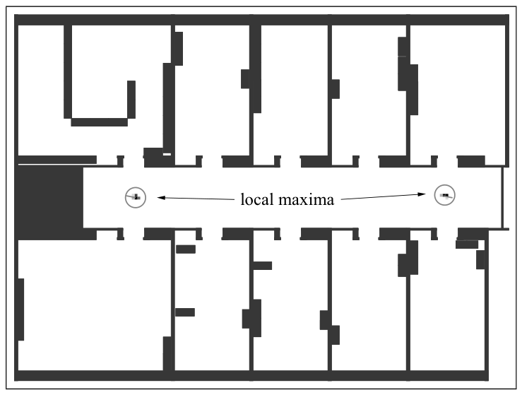

*Figure 7.3 — 국소적으로 대칭인 환경에서 global localization 중의 전형적인 belief 상태를 보여주는
예시 상황. 로봇은 자기 위치를 결정하려면 방 중 하나로 들어가야 한다. (책 p.196)*

**Figure 7.3에 두 번째 예시 상황이 있다. 여기서 로봇은 대칭적인 복도에 있고, 한동안 복도를 항행한 뒤의
belief는 두 개의 (대칭인) pose에 중심을 둔다. 환경의 국소적 대칭성은 복도에 있는 동안 로봇을 localize
하는 것을 불가능하게 만든다. **방으로 들어가야만** 모호성을 제거하고 pose를 결정할 수 있다. 이런
상황에서 active localization이 훨씬 나은 결과를 준다: 로봇이 우연히 방으로 들어갈 때까지 그저
기다리는 대신, active localization은 이 교착을 인식하고 거기서 탈출할 수 있다.** (책 p.195)

**그러나 active 접근의 핵심 한계는 로봇에 대한 제어를 요구한다는 것이다. (…) **이 장은 오로지 passive
localization 알고리즘만 다룬다.** Active localization은 17장에서 논의된다.** (책 p.195~196)

### 축 4 — Single-Robot vs Multi-Robot (책 p.196)

**Single-robot localization이 가장 흔히 연구되는 접근이다. (…) Multi-robot localization 문제는 로봇
팀에서 발생한다. 얼핏 각 로봇이 개별적으로 localize할 수 있으므로 single-robot localization으로 풀
수 있다. 그러나 **로봇들이 서로를 검출할 수 있다면 더 잘할 기회가 있다.** 한 로봇의 belief가 다른
로봇의 belief를 편향시키는 데 쓰일 수 있기 때문이다 — 두 로봇의 상대 위치에 대한 지식이 있다면.**
(책 p.196)

**이 네 차원이 mobile robot localization 문제의 가장 중요한 네 가지 특성을 포착한다. (…) 또한
대칭 환경이 비대칭 환경보다 어려운데, 모호성의 정도가 더 높기 때문이다.** (책 p.196~197)

> **이 장의 좌표.** 7장은 **passive · static · single-robot** 을 가정하고, 주로 **position tracking**
> 을 푼다 (MHT만 global까지). 8장이 global과 kidnapping으로 넘어간다.

## 2. 예제/실습

#### 예제 — 어느 알고리즘을 쓸 수 있는가

| 상황 | 분류 | 7·8장 중 가능한 것 |
|---|---|---|
| 로봇을 충전 도크에서 켰다. 도크 위치는 안다 | position tracking | EKF, UKF, MHT, Grid, MCL |
| 로봇을 건물 어딘가에 놓고 켰다 | global localization | MHT, Grid, MCL (**EKF·UKF 불가**) |
| 운용 중 누군가 로봇을 옆방으로 옮겼다 | kidnapping | Augmented MCL (8.3.5), MHT (가설 주입) |
| 복도에 사람이 오래 서 있다 | dynamic | 8.4절 기법 |

#### 연습문제

1. Global localization이 position tracking을 "포함한다(subsume)"는 말의 뜻은? 반대는 성립하는가?
2. Kidnapping이 global localization보다 어려운 이유를 belief의 모양으로 설명하라.
3. Figure 7.3의 상황에서 active localization은 구체적으로 어떤 행동을 취해야 하는가?

---

# 7.2 Markov Localization (책 p.197~200)

## 1. 개념적 이해

**확률적 localization 알고리즘은 Bayes filter의 변형이다. Bayes filter를 localization 문제에 직접
적용한 것을 **Markov localization**이라 부른다.** (책 p.197)

> **새 알고리즘이 아니다.** 2장 Table 2.1의 Bayes filter에 맵 $m$ 을 조건으로 추가하고 이름만 바꾼
> 것이다. 책이 7.9절 요약에서 **"Markov localization은 mobile robot localization 문제에 적용된
> Bayes filter의 다른 이름일 뿐이다"** (책 p.232)라고 못박는다.

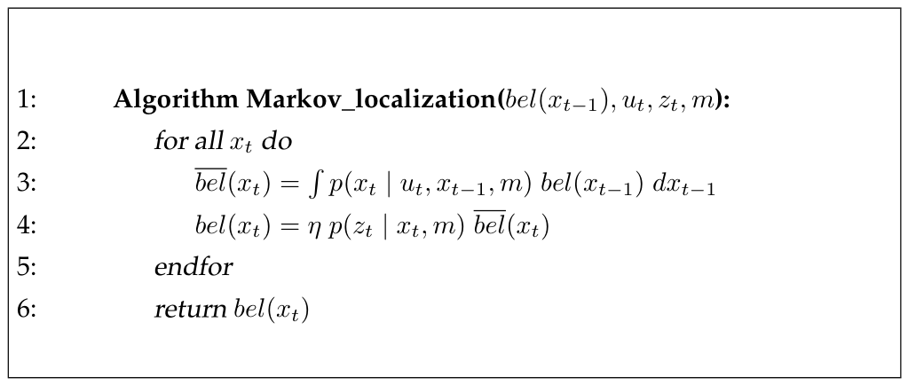

*Table 7.1 — Markov localization. (책 p.197)*

```
1:  Algorithm Markov_localization(bel(x_{t-1}), u_t, z_t, m):
2:      for all x_t do
3:          bel̄(x_t) = ∫ p(x_t | u_t, x_{t-1}, m) bel(x_{t-1}) dx_{t-1}
4:          bel(x_t)  = η p(z_t | x_t, m) bel̄(x_t)
5:      endfor
6:      return bel(x_t)
```

**이 알고리즘은 알고리즘 Bayes_filter(27쪽 Table 2.1)에서 유도된다. Markov_localization도 맵 $m$ 을
입력으로 요구함에 주목하라. 맵은 measurement model $p(z_t \mid x_t, m)$ (라인 4)에서 역할을 한다.
흔히, 그러나 항상은 아니게, motion model $p(x_t \mid u_t, x_{t-1}, m)$ (라인 3)에도 포함된다.**
(책 p.197)

> **라인 3의 $m$ 이 괄호 안에 들어간 이유** — 5.5절 "Motion and Maps"에서 다룬 그 이야기다. 맵을
> motion model에 넣으면 "벽을 통과하는 운동"에 확률 0을 줄 수 있다. 넣지 않아도 알고리즘은 돌아간다.

**Bayes filter와 꼭 마찬가지로 Markov localization은 시각 $t-1$ 의 확률적 belief를 시각 $t$ 의 belief로
변환한다. Markov localization은 static 환경에서 **global localization 문제, position tracking 문제,
kidnapped robot 문제**를 다룬다.** (책 p.197)

> **Markov localization 자체는 세 문제를 다 풀 수 있다.** 못 푸는 것은 이것을 **Gaussian으로 구현한**
> EKF/UKF다. 알고리즘의 한계가 아니라 표현의 한계다.

### 초기 belief를 어떻게 놓는가

**초기 belief $bel(x_0)$ 는 로봇 pose에 대한 초기 지식을 반영한다. Localization 문제의 유형에 따라
다르게 설정된다.** (책 p.197)

이 부분이 7.1절 분류와 알고리즘을 잇는 다리다.

## 2. 수식/유도

### 전체 수식 (먼저 한 번에)

$$bel(x_0) = \begin{cases} 1 & \text{if } x_0 = \bar{x}_0 \\ 0 & \text{otherwise} \end{cases} \tag{1}$$

$$bel(x_0) = \det(2\pi\Sigma)^{-\frac{1}{2}} \exp\left\{-\tfrac{1}{2}(x_0 - \bar{x}_0)^T \Sigma^{-1} (x_0 - \bar{x}_0)\right\} \tag{2}$$

$$bel(x_0) = \frac{1}{|X|} \tag{3}$$

### 단계별 설명 (생략 없이)

**(1) Position tracking — 초기 pose를 정확히 아는 경우** — 책 (7.1)

**초기 pose가 알려져 있으면 $bel(x_0)$ 는 point-mass distribution으로 초기화된다. $\bar{x}_0$ 를
(알려진) 초기 pose라 하자.** (책 p.197)

**Point-mass distribution은 이산이며 따라서 밀도를 갖지 않는다.** (책 p.198)

> 6.3.1절 $p_{\text{max}}$ 와 같은 성질이다. 밀도가 없어도 계산에는 지장이 없다.

**(2) Position tracking — 근사적으로만 아는 경우** — 책 (7.2)

**실제로 초기 pose는 흔히 근사적으로만 알려진다. 그러면 belief $bel(x_0)$ 는 보통 $\bar{x}_0$ 를
중심으로 하는 **좁은 Gaussian 분포**로 초기화된다. Gaussian은 15쪽 식 (2.4)에서 정의되었다.**
(책 p.198)

$$bel(x_0) = \underbrace{\det(2\pi\Sigma)^{-\frac{1}{2}} \exp\left\{-\tfrac{1}{2}(x_0 - \bar{x}_0)^T \Sigma^{-1} (x_0 - \bar{x}_0)\right\}}_{\sim\, \mathcal{N}(x_0;\, \bar{x}_0,\, \Sigma)}$$

**$\Sigma$ 는 초기 pose 불확실성의 공분산이다.** (책 p.198)

> 이것이 EKF localization의 실제 출발점이다. 3.2절에서 본 다변량 Gaussian 표기 그대로이며,
> $x_0$ 가 3차원 pose이므로 $\Sigma$ 는 $3\times3$ 이다.

**(3) Global localization — 초기 pose를 모르는 경우** — 책 (7.3)

**초기 pose가 알려지지 않았으면 $bel(x_0)$ 는 맵 안 모든 합법적 pose의 공간에 대한 균등분포로
초기화된다.** (책 p.198)

**여기서 $|X|$ 는 맵 안 모든 pose 공간의 부피(Lebesgue 측도)를 나타낸다.** (책 p.198)

> **여기서 EKF가 탈락한다.** 균등분포는 Gaussian으로 표현할 수 없다. 억지로 하려면 $\Sigma$ 를
> 무한대로 보내야 하는데, 그러면 3.3.2절의 linearization이 완전히 무의미해진다(선형 근사는 국소적으로만
> 유효하다). 7.8절에서 책이 **"방향 $\theta$ 의 표준편차가 $\pm 20$ 도보다 크면 linearization 효과가
> EKF와 UKF를 실패하게 만들 가능성이 높다"** (책 p.230)고 구체적 숫자까지 준다.

**(4) 기타 — 부분적 지식**

**로봇 위치에 대한 부분적 지식은 보통 적절한 초기 분포로 쉽게 변환될 수 있다. 예를 들어 로봇이 문
옆에서 시작한다고 알려져 있으면, 문 근처를 제외하고 0인 밀도(문 근처에서는 균등할 수 있다)로
$bel(x_0)$ 를 초기화할 수 있다. 특정 복도에 있다고 알려져 있으면 그 복도 영역에서 균등하고 다른
곳에서 0인 분포로 초기화할 수 있다.** (책 p.198)

## 3. 예제/실습

#### 예제 — 세 가지 초기화를 숫자로

$10\text{m} \times 10\text{m}$ 방, 방향은 $[0, 2\pi)$. 격자 해상도 10cm, 각도 5도로 이산화하면
pose 개수는

$$100 \times 100 \times 72 = 720{,}000$$

| 상황 | 초기 belief | 값 |
|---|---|---|
| pose를 정확히 안다 | point mass | 한 칸에 1, 나머지 719,999칸에 0 |
| 대략 안다 ($\sigma = 20$cm, $10°$) | 좁은 Gaussian | 중심 근처 수십 칸에 질량 집중 |
| 전혀 모른다 | 균등 | 모든 칸에 $1/720{,}000 = 1.39\times10^{-6}$ |

세 번째 경우, **어떤 Gaussian도 이 분포를 근사할 수 없다.** 8.2절 grid localization은 이 720,000개
칸을 그대로 들고 가고, 8.3절 MCL은 이 분포에서 particle을 뽑는다.

#### 연습문제

1. Markov localization이 세 가지 localization 문제를 모두 다룰 수 있는데도 EKF localization은
   position tracking만 가능한 이유는?
2. 식 (3)에서 "합법적(legal) pose"란 무엇인가? 벽 안쪽 좌표는 왜 제외되는가?
3. 로봇이 "복도 A 또는 복도 B 중 하나에 있다"는 정보가 있다면 $bel(x_0)$ 를 어떻게 놓겠는가?

---

# 7.3 Illustration of Markov Localization (책 p.200)

## 1. 개념적 이해

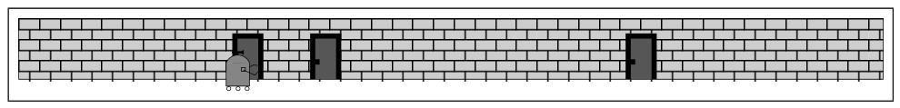

*Figure 7.4 — Mobile robot localization을 예시하는 데 쓰이는 예제 환경: 구분 불가능한 문 세 개가 있는
1차원 복도 환경. 처음에 로봇은 heading 방향 외에는 자기 위치를 모른다. 목표는 자기가 어디 있는지
알아내는 것이다. (책 p.198)*

**우리는 이 책의 서론에서 Markov localization을 이미 논의했다. 확률적 로보틱스의 동기 부여 예제로서.
이제 구체적인 수학적 틀로 이 예제를 뒷받침할 수 있다.** (책 p.200)

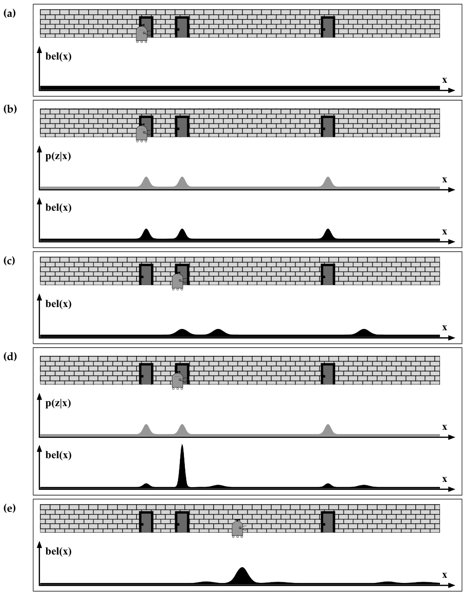

*Figure 7.5 — Markov localization 알고리즘의 예시. 각 그림은 복도에서의 로봇 위치와 현재 belief
$bel(x)$ 를 묘사한다. (b)와 (d)는 추가로 observation model $p(z_t \mid x_t)$ 를 묘사하며, 이는 복도의
서로 다른 위치에서 문을 관측할 확률을 기술한다. (책 p.199)*

### 다섯 단계를 한 줄씩 (책 p.200)

**(a) 초기 belief** — **Figure 7.4는 동일한 문 세 개가 있는 1차원 복도를 묘사한다. 초기 belief
$bel(x_0)$ 는 모든 pose에 대해 균등하며, 이는 Figure 7.5a의 균등 밀도로 예시된다.** (책 p.200)

식 (3)이 그대로 그림이 된 것이다.

**(b) 첫 측정 — 문을 본다** — **로봇이 센서를 질의해 자기가 문 중 하나 옆에 있음을 알아채면,
알고리즘 라인 4에 서술된 대로 belief $bel(x_0)$ 에 $p(z_t \mid x_t, m)$ 을 곱한다. Figure 7.5b의
위쪽 밀도는 복도 예제에 대한 $p(z_t \mid x_t, m)$ 을 시각화한다. 아래쪽 밀도는 이 밀도를 로봇의 균등한
prior belief에 곱한 결과다. 다시 한 번, 결과 belief는 **multi-modal**이며 이 시점 로봇의 잔여
불확실성을 반영한다.** (책 p.200)

> **문이 세 개라서 mode가 세 개다.** 이 순간이 "Gaussian으로는 표현할 수 없는 belief"의 가장 단순한
> 예다. EKF라면 이 세 mode를 하나의 Gaussian으로 뭉개야 하고, 그 평균은 **문이 없는 엉뚱한 지점**에
> 놓인다.

**(c) 이동 — belief가 밀리고 퍼진다** — **로봇이 오른쪽으로 이동하면(Figure 7.5c), Markov
localization 알고리즘 라인 3이 belief를 motion model $p(x_t \mid u_t, x_{t-1})$ 과 **convolve**한다.
Motion model $p(x_t \mid u_t, x_{t-1})$ 은 단일 pose가 아니라 노이즈 없는 운동의 기대 결과를 중심으로
하는 pose 연속체에 집중되어 있다. 그 효과가 Figure 7.5c에 시각화되어 있는데, convolution의 결과로
**이동하면서 동시에 평평해진** belief를 보여준다.** (책 p.200)

> **convolution(합성곱)** — 라인 3의 적분이 하는 일을 부르는 이름이다. 각 이전 pose에 motion model의
> 퍼짐을 씌워 전부 더한다. 결과는 항상 **더 퍼진다** — 운동은 정보를 잃는 과정이다.
> 4.1절 histogram filter에서 이 적분을 격자 합으로 구현했던 그 계산이다.

**(d) 두 번째 측정 — 결정적 순간** — **최종 측정이 Figure 7.5d에 예시된다. 여기서 Markov
localization 알고리즘은 현재 belief에 perceptual 확률 $p(z_t \mid x_t)$ 를 곱한다. 이 시점에서
**대부분의 확률 질량이 올바른 pose에 집중**되고, 로봇은 자신을 localize했다고 상당히 확신한다.**
(책 p.200)

> **왜 여기서 답이 하나로 좁혀지는가.** (b)에서 세 mode가 생겼고, (c)에서 그것들이 오른쪽으로
> 밀렸다. (d)에서 다시 문을 보는데, **밀려간 세 mode 중 두 번째 문 위치와 겹치는 것은 하나뿐**이다.
> 나머지는 "문이 있어야 할 자리에 문이 없다"는 이유로 죽는다.
> **측정 하나가 아니라 측정-운동-측정의 순서**가 정보를 만든다 — 7장 도입부에서 "시간에 걸쳐 데이터를
> 통합해야 한다"고 한 것의 구체적 모습이다.

**(e) 계속 이동** — **Figure 7.5e는 복도를 더 내려간 뒤의 로봇 belief를 예시한다.** (책 p.200)

측정 없이 이동만 하므로 다시 퍼진다. 확신은 유지되지만 조금씩 흐려진다.

<!--widget:markov-1d-hallway-->

### 표현을 고르는 문제로 넘어간다

**우리는 Markov localization이 상태 공간의 기저 표현과 무관함을 이미 언급했다. 사실 Markov
localization은 2장에서 논의한 어떤 표현으로도 구현될 수 있다. 이제 세 가지 다른 표현을 고려하고
모바일 로봇을 실시간으로 localize할 수 있는 실용적 알고리즘을 고안한다. **Kalman filter**로 시작하는데,
이는 belief를 1차·2차 moment로 표현한다. 그 다음 이산 **격자** 표현으로 이어가고, 마지막으로
**particle filter**를 사용하는 알고리즘을 소개한다.** (책 p.200)

| 표현 | 알고리즘 | 어디서 |
|---|---|---|
| moments (평균·공분산) | EKF / UKF / MHT localization | **7.4 · 7.6 · 7.7** |
| 격자 (histogram) | Grid localization | 8.2 |
| particle | Monte Carlo localization | 8.3 |

## 2. 예제/실습

#### 예제 — Figure 7.5를 1차원 숫자로 재현

복도를 21칸($x = 0, 1, \ldots, 20$)으로 이산화하고, 문이 $x = 5, 9, 17$ 에 있다고 하자.

**측정 모델**: 문을 봤을 때 $p(z = \text{door} \mid x) = 0.6$ (문 위치), $0.2$ (그 외)
**운동 모델**: $u = +3$ 명령에 대해 $p(x' = x+2) = 0.25$, $p(x'=x+3) = 0.5$, $p(x'=x+4) = 0.25$

**(a) 초기** — 모든 칸 $bel = 1/21 = 0.0476$

**(b) 문 관측 후** — 라인 4

미정규화 값: 문 3칸은 $0.0476 \times 0.6 = 0.02857$, 나머지 18칸은 $0.0476 \times 0.2 = 0.00952$

정규화 상수:
$$\eta^{-1} = 3(0.02857) + 18(0.00952) = 0.08571 + 0.17143 = 0.25714$$

$$bel(5) = bel(9) = bel(17) = \frac{0.02857}{0.25714} = 0.1111, \qquad \text{그 외} = \frac{0.00952}{0.25714} = 0.0370$$

mode 셋. 각 문이 11.1%, 나머지 각각 3.7%다. 확실히 **multi-modal**이다.

**(c) $u = +3$ 이동 후** — 라인 3. 문에서 온 질량이 퍼진다. 예를 들어 $x = 12$ 로 오는 질량은

$$bel(12) = 0.25\, bel(10) + 0.5\, bel(9) + 0.25\, bel(8) = 0.25(0.0370) + 0.5(0.1111) + 0.25(0.0370) = 0.0741$$

원래 0.1111이던 mode가 0.0741로 낮아지고 옆 칸들로 번졌다 — **평평해짐**이 숫자로 확인된다.

**(d) 두 번째 문 관측** — 이동 후 mode는 $x \approx 8, 12, 20$ 근처에 있다. 문은 $5, 9, 17$ 에
있으므로, **$x = 12$ 와 $x = 20$ mode는 문 위치가 아니고 $x \approx 8$ mode만 문($x=9$)에 가깝다.**
따라서 $x = 8{\sim}9$ 만 $0.6$ 을 곱해 받고 나머지는 $0.2$ 로 깎인다. 정규화하면 그 하나만 살아남는다.

**직접 확인해 볼 것**: 위 규칙으로 (d) 단계를 끝까지 계산해 $bel(9)$ 가 얼마가 되는지 구하라.
(아래 스니펫으로 검산할 수 있다.)

```python
# 실행에는 numpy 가 필요하다:  sudo apt install -y python3-numpy
import numpy as np

N, DOORS = 21, (5, 9, 17)
def sense(bel, saw_door=True):
    lik = np.array([0.6 if x in DOORS else 0.2 for x in range(N)])
    if not saw_door:
        lik = 1 - lik
    b = bel * lik
    return b / b.sum()                      # Table 7.1 라인 4

def move(bel, u=3, kernel=(0.25, 0.5, 0.25), offs=(2, 3, 4)):
    b = np.zeros(N)
    for w, d in zip(kernel, offs):          # Table 7.1 라인 3 (convolution)
        for x in range(N):
            if x + d < N:
                b[x + d] += w * bel[x]
    return b / b.sum()

bel = np.ones(N) / N                        # (a) 식 (3)
bel = sense(bel)                            # (b)
bel = move(bel)                             # (c)
bel = sense(bel)                            # (d)
print(np.round(bel, 4))
print("최빈 위치:", bel.argmax(), " 확률:", round(bel.max(), 4))
```

#### 연습문제

1. Figure 7.5(b)의 belief를 하나의 Gaussian으로 근사하면 평균은 어디에 놓이는가? 그 위치에 로봇이
   있을 가능성은?
2. 위 스니펫에서 문을 **못 봤을 때**(`sense(bel, saw_door=False)`)의 갱신은 어떤 효과를 내는가?
   이것이 7.8절의 negative information과 어떻게 연결되는가?
3. 운동 커널을 $(0.1, 0.8, 0.1)$ 로 바꾸면 (c)의 평평해짐이 어떻게 달라지는가? 노이즈가 큰 로봇과
   작은 로봇의 차이를 설명하라.

---

# 7.4 EKF Localization (책 p.201~215)

**Extended Kalman filter localization 알고리즘, 줄여서 EKF localization은 Markov localization의
특수한 경우다. EKF localization은 belief $bel(x_t)$ 를 1차·2차 moment, 즉 평균 $\mu_t$ 와 공분산
$\Sigma_t$ 로 표현한다. 기본 EKF 알고리즘은 3.3절 Table 3.3(59쪽)에 서술되었다. EKF localization은
실제 로보틱스 문제의 맥락에서 EKF를 구현하는 우리의 첫 사례가 될 것이다.** (책 p.201)

**우리의 EKF localization 알고리즘은 맵이 feature의 모음으로 표현된다고 가정한다. 임의의 시각 $t$ 에
로봇은 근처 feature까지의 range와 bearing 벡터를 관측한다: $z_t = \{z_t^1, z_t^2, \ldots\}$.**
(책 p.201)

**우리는 모든 feature가 유일하게 식별 가능한 localization 알고리즘으로 시작한다. 유일하게 식별
가능한 feature의 존재가 나쁜 가정은 아닐 수 있다: 예를 들어 파리의 에펠탑은 다른 랜드마크와 혼동되는
일이 드문 랜드마크이며, 파리 전역에서 널리 보인다. Feature의 정체는 **correspondence variable**
$c_t^i$ 의 집합으로 표현되며, 각 feature 벡터 $z_t^i$ 마다 하나씩 있다. Correspondence variable은
6.6절에서 이미 논의되었다.** (책 p.201)

**먼저 correspondence가 알려졌다고 가정하자. 그 다음 feature 간 모호성을 허용하는 더 일반적인 버전으로
나아간다. 두 번째의 더 일반적인 버전은 **maximum likelihood estimator**를 적용해 latent
correspondence variable의 값을 추정하고, 그 추정 결과를 마치 ground truth인 양 사용한다.**
(책 p.201~202)

> **7장의 진행 순서가 여기 예고되어 있다.**
> 7.4 (correspondence 알려짐) → 7.5 (ML로 추정) → 7.6 (여러 가설 유지)

## 7.4.1 Illustration (책 p.201~203)

### 1. 개념적 이해

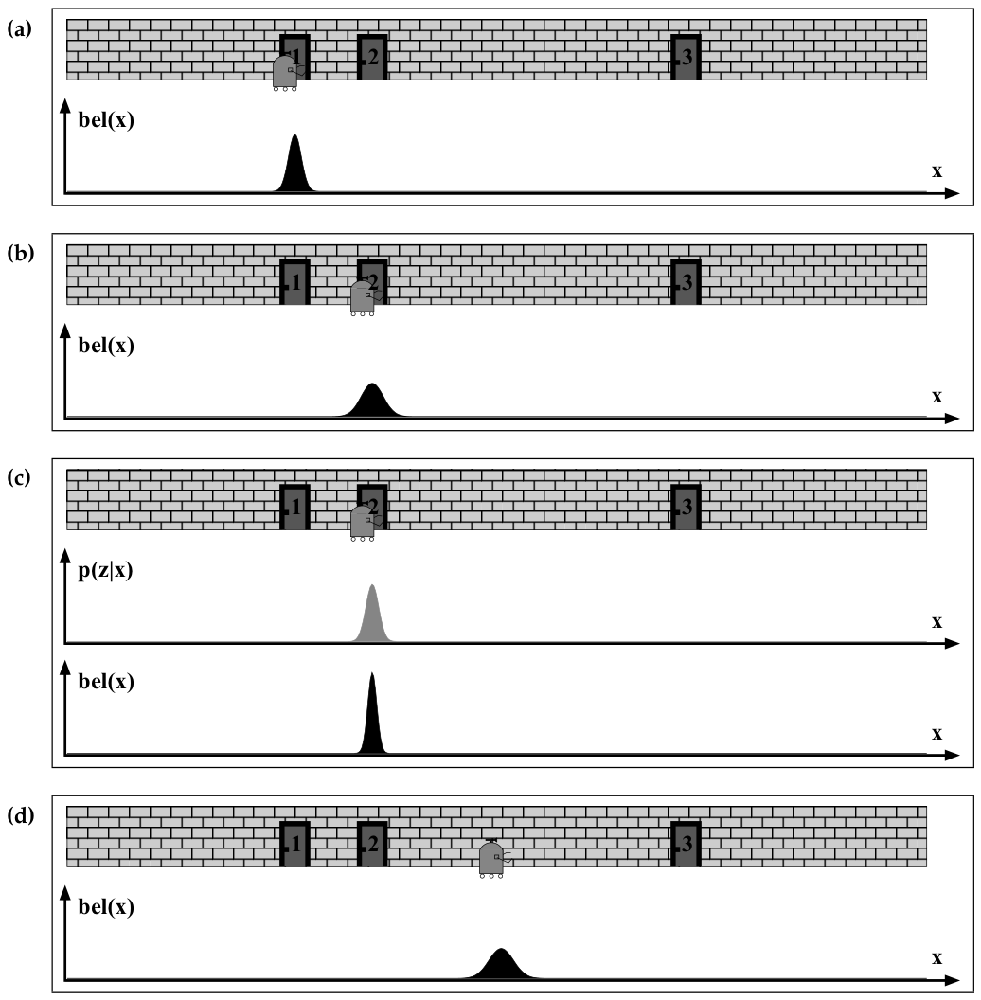

*Figure 7.6 — Kalman filter 알고리즘을 mobile robot localization에 적용. 모든 밀도는 unimodal
Gaussian으로 표현된다. (책 p.202)*

**Figure 7.6은 1차원 복도 환경(Figure 7.4 참조)에서의 mobile robot localization 예제를 사용해 EKF
localization 알고리즘을 예시한다. EKF에서 belief의 unimodal 모양을 수용하기 위해 우리는 두 가지 편리한
가정을 한다:** (책 p.201)

| | 가정 | 왜 필요한가 |
|---|---|---|
| 첫째 | **correspondence가 알려짐** — 문마다 고유 라벨 1, 2, 3 | 문 셋이 구분 불가능하면 Figure 7.5b처럼 mode가 셋이 되어 Gaussian으로 표현 불가 |
| 둘째 | **초기 pose가 비교적 잘 알려짐** | global localization이면 균등분포에서 출발해야 하는데 Gaussian이 아님 |

**첫째, correspondence가 알려졌다고 가정한다. 각 문에 고유한 라벨(1, 2, 3)을 붙이고, measurement
model을 $p(z_t \mid x_t, m, c_t)$ 로 표기한다. 여기서 $m$ 은 맵이고 $c_t \in \{1, 2, 3\}$ 은 시각
$t$ 에 관측된 문의 정체다. 둘째, 초기 pose가 비교적 잘 알려졌다고 가정한다.** (책 p.201)

**전형적인 초기 belief는 Figure 7.6a에 보인 Gaussian 분포로 표현되며, 문 1 근처 영역에 중심을 두고
그림에 표시된 Gaussian 불확실성을 갖는다.** (책 p.201)

**(b) 이동** — **로봇이 오른쪽으로 이동하면 belief는 motion model과 convolve된다. 결과 belief는
Figure 7.6b에 보인 것처럼 **폭이 증가한, 이동된 Gaussian**이다.** (책 p.201)

**(c) 측정** — **이제 로봇이 자기가 문 $c_t = 2$ 앞에 있음을 검출한다고 하자. Figure 7.6c의 위쪽
밀도는 이 관측에 대한 $p(z_t \mid x_t, m, c_t)$ 를 시각화한다 — 역시 Gaussian이다. 이 측정 확률을
로봇의 belief에 접어 넣으면 Figure 7.6c에 보인 posterior가 나온다.** (책 p.201~202)

> **결과 belief의 분산이 이전 belief와 관측 밀도 **둘 다보다 작다**는 점에 주목하라. 두 독립적인
> 추정을 통합하면 각각을 따로 볼 때보다 더 확신하게 되므로 이는 자연스럽다.** (책 p.202)
>
> 3.2.3절 Figure 3.2에서 1차원 Kalman filter로 확인했던 그 성질이다. **정보를 더하면 분산은 반드시
> 줄어든다** — $\Sigma_t = (I - K_t H_t)\bar\Sigma_t$ 의 의미다.

**(d) 다시 이동** — **복도를 내려간 뒤 로봇의 위치 불확실성은 다시 증가하는데, EKF가 운동 불확실성을
계속 로봇의 belief에 통합하기 때문이다.** (책 p.203)

> **Figure 7.5와 7.6을 나란히 보라.** 같은 복도, 같은 사건 순서인데
>
> | | Figure 7.5 (Markov, 일반) | Figure 7.6 (EKF, Gaussian) |
> |---|---|---|
> | 문 구분 | 불가 → mode 3개 | **라벨로 구분** → mode 1개 |
> | 초기 belief | 균등 | 좁은 Gaussian |
> | 표현 | 임의의 밀도 | 평균 + 분산 두 숫자 |
> | 풀 수 있는 문제 | global까지 | **position tracking만** |
>
> EKF는 표현력을 포기하는 대신 **계산량이 상수**가 된다. Figure 7.5는 격자 21칸을 전부 들고 있어야
> 하지만 Figure 7.6은 $\mu, \Sigma$ 뿐이다.

## 7.4.2 The EKF Localization Algorithm (책 p.203~205)

### 1. 개념적 이해

**지금까지의 논의는 상당히 추상적이었다: 우리는 적절한 motion model과 measurement model의 가용성을
조용히 가정했고, EKF 갱신의 여러 핵심 변수를 명시하지 않은 채 두었다. 이제 feature-based 맵에 대한
EKF의 구체적 구현을 논의한다.** (책 p.203)

**우리의 feature-based 맵은 6.2절에서 이미 논의한 대로 **점 랜드마크**로 구성된다. 그런 점 랜드마크에
대해 우리는 6.6절에서 논의한 흔한 measurement model을 사용한다. 또한 5.3절에서 정의한 **velocity
motion model**을 채택한다. 독자는 계속 읽기 전에 이 장들에서 논의한 기본 measurement 및 motion
방정식을 잠시 다시 익히는 것이 좋겠다.** (책 p.203)

> **이 문장이 5·6장과 7장을 잇는 못이다.** 알고리즘에 들어가기 전에 무엇이 어디서 오는지 정리하자.
>
> | Table 7.2의 요소 | 출처 |
> |---|---|
> | 라인 3·4·6의 삼각함수 덩어리 | **5.3절 식 (5.9)/(5.13)** velocity motion model |
> | 라인 5의 $\alpha_1 \ldots \alpha_4$ | **5.3절** 노이즈 파라미터 |
> | 라인 11·12의 $\sqrt{q}$, atan2 | **6.6.2절 식 (6.40)** landmark model |
> | 라인 8의 $\sigma_r, \sigma_\phi, \sigma_s$ | **6.6.2절** 측정 노이즈 |
> | 라인 10의 $c_t^i$ | **6.6.3절** correspondence variable |
> | 전체 골격 (예측→보정) | **3.3.3절 Table 3.3** EKF |

### 2. 알고리즘 — 책 Table 7.2

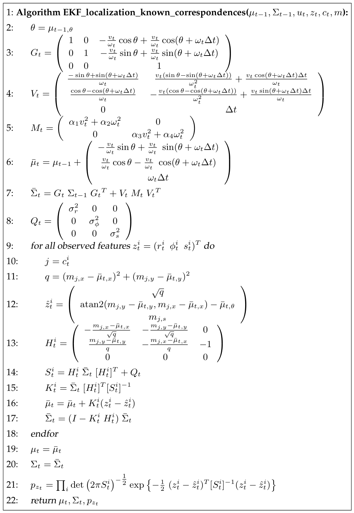

*Table 7.2 — Extended Kalman filter (EKF) localization 알고리즘. 여기서는 feature-based 맵과 range·
bearing 측정 센서를 갖춘 로봇에 대해 정식화되었다. 이 버전은 정확한 correspondence의 지식을 가정한다.
(책 p.204)*

```
 1: Algorithm EKF_localization_known_correspondences(μ_{t-1}, Σ_{t-1}, u_t, z_t, c_t, m):
 2:     θ = μ_{t-1,θ}
 3:     G_t = ⎛ 1  0  −(v_t/ω_t) cos θ + (v_t/ω_t) cos(θ + ω_t Δt) ⎞
              ⎜ 0  1  −(v_t/ω_t) sin θ + (v_t/ω_t) sin(θ + ω_t Δt) ⎟
              ⎝ 0  0                    1                          ⎠
 4:     V_t = ⎛ (−sin θ + sin(θ+ω_tΔt))/ω_t   v_t(sin θ − sin(θ+ω_tΔt))/ω_t² + v_t cos(θ+ω_tΔt)Δt/ω_t ⎞
              ⎜ ( cos θ − cos(θ+ω_tΔt))/ω_t  −v_t(cos θ − cos(θ+ω_tΔt))/ω_t² + v_t sin(θ+ω_tΔt)Δt/ω_t ⎟
              ⎝              0                                     Δt                                  ⎠
 5:     M_t = ⎛ α₁v_t² + α₂ω_t²        0        ⎞
              ⎝        0        α₃v_t² + α₄ω_t² ⎠
 6:     μ̄_t = μ_{t-1} + ⎛ −(v_t/ω_t) sin θ + (v_t/ω_t) sin(θ + ω_t Δt) ⎞
                        ⎜  (v_t/ω_t) cos θ − (v_t/ω_t) cos(θ + ω_t Δt) ⎟
                        ⎝                  ω_t Δt                      ⎠
 7:     Σ̄_t = G_t Σ_{t-1} G_tᵀ + V_t M_t V_tᵀ
 8:     Q_t = diag(σ_r², σ_φ², σ_s²)
 9:     for all observed features z_t^i = (r_t^i  φ_t^i  s_t^i)ᵀ do
10:         j = c_t^i
11:         q = (m_{j,x} − μ̄_{t,x})² + (m_{j,y} − μ̄_{t,y})²
12:         ẑ_t^i = ⎛              √q                                    ⎞
                    ⎜ atan2(m_{j,y} − μ̄_{t,y}, m_{j,x} − μ̄_{t,x}) − μ̄_{t,θ} ⎟
                    ⎝              m_{j,s}                               ⎠
13:         H_t^i = ⎛ −(m_{j,x} − μ̄_{t,x})/√q   −(m_{j,y} − μ̄_{t,y})/√q    0 ⎞
                    ⎜  (m_{j,y} − μ̄_{t,y})/q    −(m_{j,x} − μ̄_{t,x})/q    −1 ⎟
                    ⎝            0                        0               0 ⎠
14:         S_t^i = H_t^i Σ̄_t [H_t^i]ᵀ + Q_t
15:         K_t^i = Σ̄_t [H_t^i]ᵀ [S_t^i]^(−1)
16:         μ̄_t = μ̄_t + K_t^i (z_t^i − ẑ_t^i)
17:         Σ̄_t = (I − K_t^i H_t^i) Σ̄_t
18:     endfor
19:     μ_t = μ̄_t
20:     Σ_t = Σ̄_t
21:     p_{z_t} = ∏_i det(2π S_t^i)^(−1/2) exp{ −½ (z_t^i − ẑ_t^i)ᵀ [S_t^i]^(−1) (z_t^i − ẑ_t^i) }
22:     return μ_t, Σ_t, p_{z_t}
```

**이 알고리즘은 3장 Table 3.3의 EKF에서 유도된다. 입력으로 시각 $t-1$ 의 로봇 pose에 대한 Gaussian
추정(평균 $\mu_{t-1}$, 공분산 $\Sigma_{t-1}$)을 요구한다. 나아가 제어 $u_t$, 맵 $m$, 시각 $t$ 에
측정된 feature 집합 $z_t = \{z_t^1, z_t^2, \ldots\}$ 과 correspondence variable
$c_t = \{c_t^1, c_t^2, \ldots\}$ 를 요구한다. 출력은 새로운, 수정된 추정 $\mu_t$, $\Sigma_t$ 와
feature 관측의 likelihood $p_{z_t}$ 다.** (책 p.203)

> **⚠️ 알고리즘은 $\omega_t = 0$ 인 직진 운동의 경우를 다루지 않는다. 이 특수 경우의 처리는
> 연습문제로 남긴다.** (책 p.203)
>
> 라인 3·4·6에 $\omega_t$ 가 분모에 있어 0으로 나누게 된다. 5.3.3절에서 본 것과 같은 문제이며, 실무
> 구현에서는 $|\omega_t| < \epsilon$ 일 때 직선 운동 공식으로 분기한다.

### 라인별로 무엇을 하는가 (책 p.203~205)

**라인 3과 4는 선형화된 motion model에 필요한 Jacobian을 계산한다. 라인 5는 제어로부터 motion noise
공분산 행렬을 결정한다. 라인 6과 7은 익숙한 motion 갱신을 구현한다. 운동 후 예측된 pose는 라인 6에서
$\bar\mu_t$ 로 계산되고, 라인 7은 대응하는 불확실성 타원을 계산한다.** (책 p.203)

**Measurement 갱신(correction step)은 라인 8부터 21까지로 실현된다. 이 갱신의 핵심은 시각 $t$ 에
관측된 모든 feature $i$ 에 대한 루프다. 라인 10에서 알고리즘은 측정 벡터의 $i$ 번째 feature의
correspondence를 $j$ 에 할당한다. 그 다음 예측 측정 $\hat{z}_t^i$ 와 measurement model의 Jacobian
$H_t^i$ 를 계산한다. 이 Jacobian을 사용해 알고리즘은 예측 측정 $\hat{z}_t^i$ 에 대응하는 불확실성
$S_t^i$ 를 결정한다. Kalman gain은 라인 15에서 계산된다. 추정은 라인 16과 17에서, feature마다 한 번씩
갱신된다. 라인 19와 20은 새 pose 추정을 설정하고, 이어서 라인 21에서 측정 likelihood를 계산한다.**
(책 p.203~204)

> **⚠️ 이 알고리즘에서 두 각도의 차를 계산할 때 주의해야 한다. 결과가 $2\pi$ 만큼 어긋날 수 있기
> 때문이다.** (책 p.205)
>
> 라인 16의 $z_t^i - \hat{z}_t^i$ 에서 bearing 성분이 문제다. 관측이 $179°$ 이고 예측이 $-179°$ 라면
> 차이는 $358°$ 가 아니라 $-2°$ 다. 이것을 놓치면 필터가 완전히 엉뚱한 방향으로 보정된다.
> 6.6.3절에서도 같은 경고를 했다. **실무에서 EKF localization이 깨지는 가장 흔한 버그가 이것이다.**

### 3. 알고리즘의 구조 한눈에

| 단계 | 라인 | 하는 일 | 3.3절 Table 3.3의 대응 |
|---|---|---|---|
| **예측** | 3~4 | Jacobian $G_t$ (상태에 대한), $V_t$ (제어에 대한) | $G_t$ |
| | 5 | 제어 공간 노이즈 $M_t$ | — (Table 3.3은 $R_t$ 를 그냥 받음) |
| | 6 | $\bar\mu_t = g(u_t, \mu_{t-1})$ | 라인 2 |
| | 7 | $\bar\Sigma_t = G_t \Sigma_{t-1} G_t^T + V_t M_t V_t^T$ | 라인 3 ($R_t = V_t M_t V_t^T$) |
| **보정** | 8 | 측정 노이즈 $Q_t$ | — |
| | 11~12 | 예측 측정 $\hat{z}_t^i = h(\bar\mu_t, j, m)$ | 라인 5의 $h$ |
| | 13 | Jacobian $H_t^i$ | $H_t$ |
| | 14 | innovation 공분산 $S_t^i$ | 라인 4 안쪽 |
| | 15 | Kalman gain $K_t^i$ | 라인 4 |
| | 16~17 | 평균·공분산 갱신 | 라인 5~6 |
| | 21 | 측정 likelihood | — (7장에서 추가) |

**Table 3.3과 달라진 두 가지**가 핵심이다.

1. **$R_t$ 가 $V_t M_t V_t^T$ 로 대체되었다.** 3장 EKF는 상태 공간의 운동 노이즈 $R_t$ 를 그냥 주어진
   것으로 받았다. 그런데 실제 로봇의 노이즈는 **제어 공간**(속도 $v, \omega$)에서 발생한다. 그래서
   제어 공간 노이즈 $M_t$ 를 만들고, Jacobian $V_t$ 로 상태 공간에 사상한다. **이것이 7장이 3장에
   더한 가장 중요한 것이다.**
2. **feature마다 루프를 돈다.** 측정이 여러 개이므로 라인 9~18을 반복한다. 매 반복에서 $\bar\mu_t$ 와
   $\bar\Sigma_t$ 가 갱신되므로 **다음 feature의 예측 측정은 갱신된 값으로 계산된다.**

<!--widget:ekf-localization-->

## 7.4.3 Mathematical Derivation of EKF Localization (책 p.205~209)

### 1. 개념적 이해

이 절은 Table 7.2의 모든 행렬이 어디서 나왔는지를 유도한다. 크게 세 덩어리다.

| 덩어리 | 유도하는 것 | 책 식 |
|---|---|---|
| **예측** | $G_t$, $M_t$, $V_t$ | (7.4)~(7.11) |
| **보정** | $H_t$, $Q_t$ | (7.12)~(7.16) |
| **측정 likelihood** | 라인 21 | (7.17)~(7.21) |

### 2. 수식/유도

#### 전체 유도 과정 (먼저 한 번에)

$$\begin{pmatrix} x' \\ y' \\ \theta' \end{pmatrix} = \begin{pmatrix} x \\ y \\ \theta \end{pmatrix} + \begin{pmatrix} -\frac{\hat{v}_t}{\hat{\omega}_t}\sin\theta + \frac{\hat{v}_t}{\hat{\omega}_t}\sin(\theta + \hat{\omega}_t \Delta t) \\ \frac{\hat{v}_t}{\hat{\omega}_t}\cos\theta - \frac{\hat{v}_t}{\hat{\omega}_t}\cos(\theta + \hat{\omega}_t \Delta t) \\ \hat{\omega}_t \Delta t \end{pmatrix} \tag{1}$$

$$\begin{pmatrix} \hat{v}_t \\ \hat{\omega}_t \end{pmatrix} = \begin{pmatrix} v_t \\ \omega_t \end{pmatrix} + \begin{pmatrix} \varepsilon_{\alpha_1 v_t^2 + \alpha_2 \omega_t^2} \\ \varepsilon_{\alpha_3 v_t^2 + \alpha_4 \omega_t^2} \end{pmatrix} = \begin{pmatrix} v_t \\ \omega_t \end{pmatrix} + \mathcal{N}(0, M_t) \tag{2}$$

$$\underbrace{\begin{pmatrix} x' \\ y' \\ \theta' \end{pmatrix}}_{x_t} = \begin{pmatrix} x \\ y \\ \theta \end{pmatrix} + \underbrace{\begin{pmatrix} -\frac{v_t}{\omega_t}\sin\theta + \frac{v_t}{\omega_t}\sin(\theta + \omega_t \Delta t) \\ \frac{v_t}{\omega_t}\cos\theta - \frac{v_t}{\omega_t}\cos(\theta + \omega_t \Delta t) \\ \omega_t \Delta t \end{pmatrix}}_{g(u_t,\, x_{t-1})} + \mathcal{N}(0, R_t) \tag{3}$$

$$g(u_t, x_{t-1}) \approx g(u_t, \mu_{t-1}) + G_t\,(x_{t-1} - \mu_{t-1}) \tag{4}$$

$$G_t = \frac{\partial g(u_t, \mu_{t-1})}{\partial x_{t-1}} = \begin{pmatrix} \frac{\partial x'}{\partial \mu_{t-1,x}} & \frac{\partial x'}{\partial \mu_{t-1,y}} & \frac{\partial x'}{\partial \mu_{t-1,\theta}} \\ \frac{\partial y'}{\partial \mu_{t-1,x}} & \frac{\partial y'}{\partial \mu_{t-1,y}} & \frac{\partial y'}{\partial \mu_{t-1,\theta}} \\ \frac{\partial \theta'}{\partial \mu_{t-1,x}} & \frac{\partial \theta'}{\partial \mu_{t-1,y}} & \frac{\partial \theta'}{\partial \mu_{t-1,\theta}} \end{pmatrix} \tag{5}$$

$$G_t = \begin{pmatrix} 1 & 0 & \frac{v_t}{\omega_t}\big(-\cos\mu_{t-1,\theta} + \cos(\mu_{t-1,\theta} + \omega_t \Delta t)\big) \\ 0 & 1 & \frac{v_t}{\omega_t}\big(-\sin\mu_{t-1,\theta} + \sin(\mu_{t-1,\theta} + \omega_t \Delta t)\big) \\ 0 & 0 & 1 \end{pmatrix} \tag{6}$$

$$M_t = \begin{pmatrix} \alpha_1 v_t^2 + \alpha_2 \omega_t^2 & 0 \\ 0 & \alpha_3 v_t^2 + \alpha_4 \omega_t^2 \end{pmatrix} \tag{7}$$

$$V_t = \frac{\partial g(u_t, \mu_{t-1})}{\partial u_t} = \begin{pmatrix} \frac{\partial x'}{\partial v_t} & \frac{\partial x'}{\partial \omega_t} \\ \frac{\partial y'}{\partial v_t} & \frac{\partial y'}{\partial \omega_t} \\ \frac{\partial \theta'}{\partial v_t} & \frac{\partial \theta'}{\partial \omega_t} \end{pmatrix} \tag{8}$$

$$V_t = \begin{pmatrix} \frac{-\sin\theta + \sin(\theta + \omega_t \Delta t)}{\omega_t} & \frac{v_t(\sin\theta - \sin(\theta + \omega_t\Delta t))}{\omega_t^2} + \frac{v_t \cos(\theta + \omega_t \Delta t)\Delta t}{\omega_t} \\ \frac{\cos\theta - \cos(\theta + \omega_t \Delta t)}{\omega_t} & -\frac{v_t(\cos\theta - \cos(\theta + \omega_t\Delta t))}{\omega_t^2} + \frac{v_t \sin(\theta + \omega_t \Delta t)\Delta t}{\omega_t} \\ 0 & \Delta t \end{pmatrix} \tag{9}$$

$$\underbrace{\begin{pmatrix} r_t^i \\ \phi_t^i \\ s_t^i \end{pmatrix}}_{z_t^i} = \underbrace{\begin{pmatrix} \sqrt{(m_{j,x} - x)^2 + (m_{j,y} - y)^2} \\ \operatorname{atan2}(m_{j,y} - y,\ m_{j,x} - x) - \theta \\ m_{j,s} \end{pmatrix}}_{h(x_t,\, j,\, m)} + \mathcal{N}(0, Q_t) \tag{10}$$

$$h(x_t, j, m) \approx h(\bar\mu_t, j, m) + H_t^i\,(x_t - \bar\mu_t) \tag{11}$$

$$H_t^i = \frac{\partial h(\bar\mu_t, j, m)}{\partial x_t} = \begin{pmatrix} -\frac{m_{j,x} - \bar\mu_{t,x}}{\sqrt{q}} & -\frac{m_{j,y} - \bar\mu_{t,y}}{\sqrt{q}} & 0 \\ \frac{m_{j,y} - \bar\mu_{t,y}}{q} & -\frac{m_{j,x} - \bar\mu_{t,x}}{q} & -1 \\ 0 & 0 & 0 \end{pmatrix} \tag{12}$$

$$Q_t = \begin{pmatrix} \sigma_r^2 & 0 & 0 \\ 0 & \sigma_\phi^2 & 0 \\ 0 & 0 & \sigma_s^2 \end{pmatrix} \tag{13}$$

$$p(z_t \mid x_t, c_t, m) = \prod_i p(z_t^i \mid x_t, c_t^i, m) \tag{14}$$

$$p(z_t^i \mid c_{1:t}, m, z_{1:t-1}, u_{1:t}) = \int p(z_t^i \mid x_t, c_t^i, m)\, \overline{bel}(x_t)\, dx_t \tag{15}$$

$$p(z_t^i \mid x_t, c_t^i, m) \sim \mathcal{N}(z_t^i;\, h(x_t, c_t^i, m),\, Q_t) \approx \mathcal{N}(z_t^i;\, h(\bar\mu_t, c_t^i, m) + H_t(x_t - \bar\mu_t),\, Q_t) \tag{16}$$

$$p(z_t^i \mid c_{1:t}, m, z_{1:t-1}, u_{1:t}) \approx \mathcal{N}(z_t^i;\, h(\bar\mu_t, c_t^i, m) + H_t(x_t - \bar\mu_t),\, Q_t) \otimes \mathcal{N}(x_t;\, \bar\mu_t,\, \bar\Sigma_t) \tag{17}$$

$$p(z_t^i \mid c_{1:t}, m, z_{1:t-1}, u_{1:t}) \sim \mathcal{N}(z_t^i;\, h(\bar\mu_t, c_t^i, m),\, H_t \bar\Sigma_t H_t^T + Q_t) \tag{18}$$

#### 단계별 설명 (생략 없이)

## 예측 단계 (라인 3~7)

**(1) 참 운동** — 책 (7.4)

**EKF localization 알고리즘은 식 (5.13)에서 정의된 motion model을 사용한다.** (책 p.205)

**여기서 $x_{t-1} = (x\ y\ \theta)^T$ 와 $x_t = (x'\ y'\ \theta')^T$ 는 각각 시각 $t-1$ 과 $t$ 의
상태 벡터다. 참 운동은 병진 속도 $\hat{v}_t$ 와 회전 속도 $\hat{\omega}_t$ 로 기술된다.** (책 p.205)

> 모자($\hat{\ }$)가 붙은 것은 **로봇이 실제로 낸 속도**다. 우리가 명령한 값이 아니다.
> 5.3.3절에서 유도한 원 궤적 공식 그대로다 — 반지름 $r = v/\omega$ 의 원을 $\omega\Delta t$ 만큼 돈다.

**(2) 제어 노이즈** — 책 (7.5)

**식 (5.10)에서 이미 서술했듯, 이 속도들은 **가법 Gaussian 노이즈**를 갖는 motion control
$u_t = (v_t\ \omega_t)^T$ 로부터 생성된다.** (책 p.205)

> **노이즈가 어디에 붙어 있는지 보라.** 상태 $(x, y, \theta)$ 가 아니라 **속도 $(v, \omega)$** 에
> 붙어 있다. 이것이 5장 velocity motion model의 구조이고, 그래서 뒤에서 $V_t$ 라는 추가 Jacobian이
> 필요해진다.
>
> 노이즈 크기가 $\alpha_1 v_t^2 + \alpha_2 \omega_t^2$ 처럼 **속도의 제곱에 비례**한다는 것도 5.3절
> 그대로다 — 빨리 갈수록 더 많이 틀린다.

**(3) 노이즈 없는 부분과 노이즈로 분해** — 책 (7.6)

**3장에서 우리는 EKF localization이 평균 $\mu_{t-1}$ 과 공분산 $\Sigma_{t-1}$ 로 표현되는 상태의
국소 posterior 추정을 유지함을 이미 안다. 또한 **EKF의 "요령"이 motion model과 measurement model을
선형화하는 데 있음**을 상기한다. 이를 위해 우리는 motion model을 노이즈 없는 부분과 랜덤 노이즈
성분으로 분해한다.** (책 p.205)

**식 (7.6)은 참 운동 $(\hat{v}_t\ \hat{\omega}_t)^T$ 를 실행된 제어 $(v_t\ \omega_t)^T$ 로 대체하고,
motion 노이즈를 평균 0의 가법 Gaussian으로 포착함으로써 식 (7.4)를 근사한다. 따라서 식 (7.6)의 왼쪽
항은 **제어를 마치 로봇의 참 운동인 것처럼 취급한다.**** (책 p.205)

> **여기서 근사가 하나 일어났다.** 원래 노이즈는 $\hat{v}, \hat{\omega}$ 안에 들어가 **비선형 함수를
> 통과**했다. 그런데 (3)에서는 그것을 함수 **바깥에 더하는** $\mathcal{N}(0, R_t)$ 로 바꿨다.
> 비선형 변환을 거친 Gaussian은 더 이상 Gaussian이 아니므로 이는 근사다.
> 이 근사의 대가가 7.7.2절 Figure 7.16에서 눈에 보이게 된다 — UKF는 이 지점에서 EKF보다 낫다.

**(4) Taylor 전개** — 책 (7.7)

**3.3절에서 우리는 EKF 선형화가 함수 $g$ 를 Taylor 전개로 근사함을 상기한다.** (책 p.205)

> **처음 등장하는 것은 아니다 — 3.3.2절의 복습이다.** 비선형 함수를 한 점 주위에서 1차 다항식으로
> 바꾼다. 그 점이 $\mu_{t-1}$ 인 이유는 **우리가 아는 최선의 추정**이기 때문이다.
> $$g(x) \approx g(\mu) + \underbrace{\frac{\partial g}{\partial x}\Big|_{\mu}}_{G_t}(x - \mu)$$

**(5) $G_t$ 의 정의** — 책 (7.8)

**함수 $g(u_t, \mu_{t-1})$ 은 우리가 모르는 정확한 상태 $x_{t-1}$ 을, 우리가 아는 기댓값
$\mu_{t-1}$ 로 대체함으로써 단순히 얻어진다. Jacobian $G_t$ 는 $u_t$ 와 $\mu_{t-1}$ 에서 평가된,
$x_{t-1}$ 에 대한 함수 $g$ 의 도함수다.** (책 p.206)

**여기서 $\mu_{t-1} = (\mu_{t-1,x}\ \mu_{t-1,y}\ \mu_{t-1,\theta})^T$ 는 평균 추정을 개별 세 값으로
분해한 것이고, $\frac{\partial x'}{\partial \mu_{t-1,x}}$ 는 $\mu_{t-1}$ 에서 $x$ 에 대해 취한
$g$ 의 $x$ 차원 도함수의 축약이다.** (책 p.206)

**(6) $G_t$ 를 실제로 계산하면** — 책 (7.9)

**식 (7.6)으로부터 이 도함수들을 계산하면 다음 행렬을 얻는다.** (책 p.206)

> **직접 미분해 보자.** 식 (3)에서 $x' = x + \frac{v_t}{\omega_t}\big(-\sin\theta + \sin(\theta + \omega_t\Delta t)\big)$ 이다.
>
> | 미분 | 계산 | 결과 |
> |---|---|---|
> | $\partial x'/\partial x$ | $x$ 는 첫 항에만 있고 계수 1 | $1$ |
> | $\partial x'/\partial y$ | $y$ 가 없다 | $0$ |
> | $\partial x'/\partial \theta$ | $\frac{v_t}{\omega_t}\big(-\cos\theta + \cos(\theta + \omega_t\Delta t)\big)$ | 3행 |
> | $\partial \theta'/\partial \theta$ | $\theta' = \theta + \omega_t\Delta t$ | $1$ |
> | $\partial \theta'/\partial x,\ \partial \theta'/\partial y$ | 없다 | $0$ |
>
> **$G_t$ 가 항등행렬에 세 번째 열만 다른 이유**가 이것이다 — 운동은 이전 위치를 **평행이동**시킬 뿐,
> 위치가 위치에 미치는 영향은 1:1이다. 오직 **이전 방향 $\theta$ 만이 새 위치 $x', y'$ 에 비선형으로
> 영향**을 준다 (어느 쪽을 보고 있었느냐에 따라 도착점이 달라지므로).

**(7) 제어 공간의 노이즈 $M_t$** — 책 (7.10)

**추가 motion 노이즈 $\mathcal{N}(0, R_t)$ 의 공분산을 유도하기 위해, 먼저 **제어 공간**에서 노이즈의
공분산 행렬 $M_t$ 를 결정한다. 이는 식 (7.5)의 motion model에서 직접 따라 나온다.** (책 p.206)

> $2 \times 2$ 행렬임에 주목하라 — 제어가 $(v, \omega)$ 두 개이기 때문이다. 대각행렬인 것은 병진
> 노이즈와 회전 노이즈가 **독립**이라고 가정했기 때문이다.
>
> (책 식 (7.10)의 두 번째 대각 성분은 원문에 $\alpha_3 v_t^2 + \alpha_3 \omega_t^2$ 로 인쇄되어
> 있으나, Table 7.2 라인 5와 5.3절 식 (5.10)에 따르면 $\alpha_3 v_t^2 + \alpha_4 \omega_t^2$ 가 맞다.
> 원문의 오식으로 보인다.)

**(8)(9) 제어 공간 → 상태 공간 사상 $V_t$** — 책 (7.11)

**식 (7.6)의 motion model은 이 motion 노이즈가 **상태 공간으로 사상**될 것을 요구한다. 제어 공간에서
상태 공간으로의 변환은 또 다른 선형 근사로 수행된다. 이 근사에 필요한 Jacobian, $V_t$ 로 표기되는
것은, $u_t$ 와 $\mu_{t-1}$ 에서 평가된, motion 파라미터에 대한 motion 함수 $g$ 의 도함수다.**
(책 p.206)

**곱 $V_t M_t V_t^T$ 가 제어 공간의 motion 노이즈와 상태 공간의 motion 노이즈 사이의 근사적 사상을
제공한다. 이 유도로써 EKF localization 알고리즘의 라인 6과 7은 Table 3.3에 기술된 일반 EKF 알고리즘의
예측 갱신에 정확히 대응한다.** (책 p.206~207)

> **왜 $V_t M_t V_t^T$ 인가 — 공분산의 선형 변환**
>
> 확률변수 $u$ 의 공분산이 $M$ 이고 $x = Vu$ 라면, $x$ 의 공분산은 $V M V^T$ 다. 3.2.4절 Kalman
> filter 유도에서 이미 쓴 성질이다. 여기서는 $g$ 가 비선형이므로 그 Jacobian $V_t$ 를 $V$ 자리에
> 쓴다.
>
> **차원을 따라가 보면 명확하다:**
> $$\underbrace{V_t}_{3\times2}\ \underbrace{M_t}_{2\times2}\ \underbrace{V_t^T}_{2\times3} = \underbrace{\ \cdot\ }_{3\times3}$$
> 제어 노이즈 2차원이 상태 노이즈 3차원으로 펼쳐졌다. 다만 **rank는 여전히 2 이하**다 —
> 제어 노이즈만으로는 3차원 전체를 채울 수 없다는 뜻이고, 이것이 Figure 7.8에서
> $V_t M_t V_t^T$ 타원이 납작한 이유다.
>
> $V_t$ 의 $(3,1)$ 성분이 0인 것도 읽어두자: $\theta' = \theta + \omega_t\Delta t$ 에 $v_t$ 가
> 없으므로 **병진 속도 오차는 방향 오차를 만들지 않는다.**

## 보정 단계 (라인 8~20)

**(10) 측정 모델** — 책 (7.12)

**보정 단계를 수행하기 위해 EKF localization은 가법 Gaussian 노이즈를 갖는 선형화된 measurement
model도 요구한다. 우리의 feature-based 맵을 위한 measurement model은 6.6절 식 (6.40)의 변형이며,
이는 correspondence variable $c_t$ 를 통해 랜드마크 정체의 지식을 전제한다. $j = c_t^i$ 를 측정
벡터의 $i$ 번째 성분에 대응하는 랜드마크의 정체라 하자.** (책 p.207)

> **6.6.2절 식 (6.40)과 정확히 같다.** 달라진 것은 표기뿐 — 6장에서 $s_j$ 라 쓴 것을 여기서는
> $m_{j,s}$ 로 쓴다.

**(11) 측정 모델의 Taylor 근사** — 책 (7.13)

$$h(x_t, j, m) \approx h(\bar\mu_t, j, m) + H_t^i (x_t - \bar\mu_t)$$

전개점이 $\mu_{t-1}$ 이 아니라 **$\bar\mu_t$** (예측된 평균)임에 주목하라. 보정 단계는 예측이
끝난 뒤에 일어나므로, 그 시점의 최선 추정은 $\bar\mu_t$ 다.

**(12) $H_t^i$ 를 계산하면** — 책 (7.14)

**$H_t^i$ 는 예측 평균 $\bar\mu_t$ 에서 계산된, 로봇 위치에 대한 $h$ 의 Jacobian이다.** (책 p.207)

**$q$ 는 $(m_{j,x} - \bar\mu_{t,x})^2 + (m_{j,y} - \bar\mu_{t,y})^2$ 의 축약이다.** (책 p.207)

> **직접 미분해 보자.** $r = \sqrt{q}$ 이고 $q = (m_x - x)^2 + (m_y - y)^2$ 이므로 연쇄법칙으로
> $$\frac{\partial r}{\partial x} = \frac{1}{2\sqrt{q}} \cdot 2(m_x - x)(-1) = -\frac{m_x - x}{\sqrt{q}}$$
> 부호가 음수인 이유: 로봇이 $+x$ 로 가면 (랜드마크가 오른쪽에 있을 때) 거리가 **줄어든다.**
>
> bearing은 $\phi = \operatorname{atan2}(m_y - y,\ m_x - x) - \theta$ 이고,
> $\frac{\partial}{\partial x}\arctan\frac{m_y-y}{m_x-x} = \frac{m_y - y}{q}$ 이다.
> $\partial \phi/\partial\theta = -1$ 은 식에서 바로 읽힌다.

**마지막 행이 전부 0임에 주목하라. 이는 signature가 로봇 pose에 의존하지 않기 때문이다. 이
축퇴(degeneracy)의 효과는 **관측된 signature $s_t^i$ 가 EKF 갱신 결과에 아무 영향을 주지 않는다**는
것이다. 이는 놀라운 일이 아니다: 올바른 correspondence $c_t^i$ 를 안다는 것이 관측된 signature를
전적으로 무정보하게 만든다.** (책 p.207)

> **중요한 지적이다.** correspondence를 이미 알면 signature는 쓸모가 없다 — "이게 3번 랜드마크다"를
> 아는데 "색이 빨갛다"는 정보가 무슨 소용인가. **signature는 7.5절에서 correspondence를 추정할 때
> 비로소 일한다.**

**(13) 측정 노이즈** — 책 (7.15)

**식 (7.12)의 추가 측정 노이즈의 공분산 $Q_t$ 는 (6.40)에서 직접 따라 나온다.** (책 p.208)

**(14) 여러 feature를 순차 처리** — 책 (7.16)

**마지막으로, 우리의 feature-based localizer는 한 번에 여러 측정을 처리하는 반면, 3.2절에서 논의한
EKF는 단일 센서 항목만 처리했음에 유의한다. 우리 알고리즘은 6.6절 식 (6.39)에서 간략히 논의한 암묵적
conditional independence 가정에 의존한다. 본질적으로 우리는 모든 feature 측정 확률이 pose $x_t$,
랜드마크 정체 $c_t$, 맵 $m$ 이 주어졌을 때 독립이라고 가정한다.** (책 p.208)

**이는 보통 좋은 가정이며, 특히 세계가 static이면 그렇다. 이는 Table 7.2의 라인 9부터 18까지에
명시된 대로, 여러 feature의 정보를 **점진적으로(incrementally)** 필터에 추가할 수 있게 해준다.**
(책 p.208)

> **⚠️ 루프의 함정 — 책이 직접 경고한다.**
>
> **루프의 매 반복에서 pose 추정이 갱신되도록 주의해야 한다. 그렇지 않으면 알고리즘이 잘못된 관측
> 예측을 계산한다 (직관적으로 이 루프는 사이에 운동이 없는 여러 번의 관측 갱신에 대응한다).**
> (책 p.208)
>
> 즉 라인 12의 $\hat{z}_t^i$ 를 **루프 시작 전에 한꺼번에 계산해 두면 틀린다.** 매 반복마다 방금
> 갱신된 $\bar\mu_t$ 로 다시 계산해야 한다.

## 측정 likelihood (라인 21)

**(15)~(18) likelihood의 유도** — 책 (7.17)~(7.21)

**라인 21은 측정 $z_t$ 의 likelihood $p(z_t \mid c_{1:t}, m, z_{1:t-1}, u_{1:t})$ 를 계산한다.
이 likelihood는 **EKF 갱신에 필수적이지는 않지만**, 이상치 제거(outlier rejection)의 목적이나
correspondence를 모르는 경우에 유용하다.** (책 p.208)

**개별 feature 벡터 사이의 독립을 가정하면, 유도를 개별 feature 벡터 $z_t^i$ 에 국한하고 전체
likelihood를 (7.16)과 유사하게 계산할 수 있다. 알려진 data association $c_{1:t}$ 에 대해, likelihood는
예측 belief $\overline{bel}(x_t) = \mathcal{N}(x_t; \bar\mu_t, \bar\Sigma_t)$ 로부터 pose $x_t$ 에
대해 적분하고 무관한 조건 변수를 생략함으로써 계산될 수 있다.** (책 p.208)

> **식 (15)의 구조를 읽자.** "이 측정이 나올 확률"을 구하려면 로봇이 어디 있는지 알아야 하는데,
> 그것을 모르니 **가능한 모든 pose에 대해 평균**낸다. 이것이 2장에서 여러 번 쓴
> **전확률 정리(total probability)** 다.

**최종 적분의 왼쪽 항은 로봇 위치 $x_t$ 의 지식을 가정한 측정 likelihood다. 이 likelihood는 위치
$x_t$ 에서 기대되는 측정에 평균을 둔 Gaussian으로 주어진다. $\hat{z}_t^i$ 로 표기되는 이 측정은
measurement 함수 $h$ 가 제공한다. Gaussian의 공분산은 측정 노이즈 $Q_t$ 로 주어진다.** (책 p.209)

**(7.18)은 우리의 Taylor 전개 (7.13)을 $h$ 에 적용하면 따라 나온다. 이 식을 (7.17)에 다시 넣고
$\overline{bel}(x_t)$ 를 그 Gaussian 형태로 대체하면 다음 측정 likelihood를 얻는다.** (책 p.209)

**여기서 $\otimes$ 는 변수 $x_t$ 에 대한 익숙한 **convolution**을 표기한다. 이 식은 likelihood 함수가
**두 Gaussian의 convolution**임을 드러낸다; 하나는 측정 노이즈를, 다른 하나는 상태 불확실성을
표현한다. 우리는 3.2절에서 Kalman filter와 EKF의 motion 갱신을 유도할 때 이런 형태의 적분을 이미
만났다. 이 적분의 닫힌 형식 해는 그 유도와 완전히 유사하게 유도된다.** (책 p.209)

> **두 Gaussian의 convolution은 Gaussian이고, 평균은 더해지고 공분산도 더해진다.** 3.2.4절에서
> 증명한 성질이다. 그래서 결과가 식 (18)처럼 깔끔하다.

**특히 (7.19)로 정의되는 Gaussian은 평균 $h(\bar\mu_t, c_t^i, m)$ 과 공분산
$H_t \bar\Sigma_t H_t^T + Q_t$ 를 갖는다. 따라서 우리의 선형 근사 아래에서 측정 likelihood에 대한
다음 표현을 얻는다.** (책 p.209)

**이 표현의 평균과 공분산을 각각 $\hat{z}_t^i$ 와 $S_t$ 로 대체하면 Table 7.2의 EKF 알고리즘 라인
21을 얻는다.** (책 p.209)

> **결론이 아름답다.** 라인 14에서 이미 계산한 $S_t^i = H_t^i \bar\Sigma_t [H_t^i]^T + Q_t$ 가
> 바로 이 likelihood의 공분산이다. **innovation 공분산과 측정 likelihood의 공분산이 같은 것**이고,
> 따라서 추가 계산 없이 라인 21을 얻는다.
>
> 7.4.4절에서 책이 이를 직관적으로 정리한다: **"innovation 벡터가 (Mahalanobis 거리 의미에서) 짧을수록
> 측정이 더 그럴듯하다."** (책 p.214)

**EKF localization 알고리즘은 이제 이상치를 수용하도록 쉽게 수정될 수 있다. 표준적 접근은 likelihood가
문턱값 검사를 통과하는 랜드마크만 받아들이는 것이다. 이는 일반적으로 좋은 생각이다: **Gaussian은
지수적으로 감소하며, 단 하나의 이상치가 pose 추정에 거대한 영향을 줄 수 있다.** 실제로 문턱 처리는
알고리즘에 중요한 강건성 층을 더하며, 그것 없이는 EKF localization이 취약해지는 경향이 있다.**
(책 p.209)

## 7.4.4 Physical Implementation (책 p.210~215)

### 1. 개념적 이해

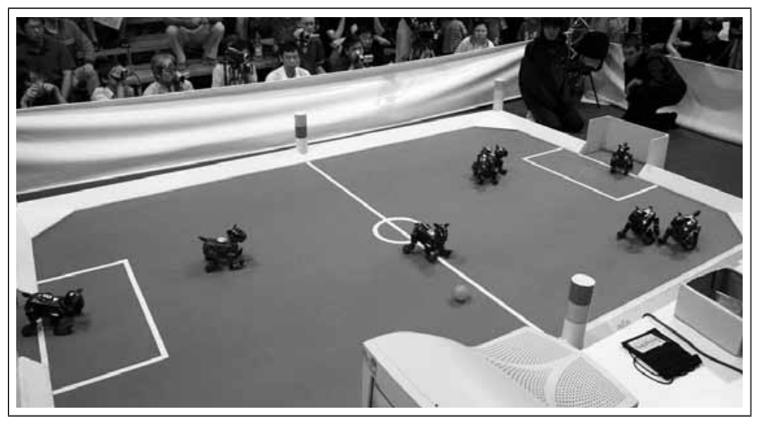

*Figure 7.7 — RoboCup 축구장 위의 AIBO 로봇들. 여섯 개의 랜드마크가 필드의 모서리와 중앙선에 놓여
있다. (책 p.210)*

**이제 RoboCup 축구장에서 localize하는 네 발 AIBO 로봇의 시뮬레이션으로 EKF 알고리즘을 예시한다.
여기서 로봇은 필드 주위에 놓인 여섯 개의 고유하게 색칠된 마커를 사용해 localize한다(Figure 7.7 참조).
Table 7.2의 EKF 알고리즘과 꼭 마찬가지로 motion control $u_t = (v_t\ \omega_t)^T$ 는 병진·회전 속도로
모델링되고, 관측 $z_t = (r_t\ \phi_t\ s_t)^T$ 는 마커까지의 상대 거리와 bearing을 측정한다.
단순함을 위해 로봇이 한 번에 하나의 랜드마크만 검출한다고 가정한다.** (책 p.210~211)

### 예측 단계를 눈으로 (책 p.211~212)

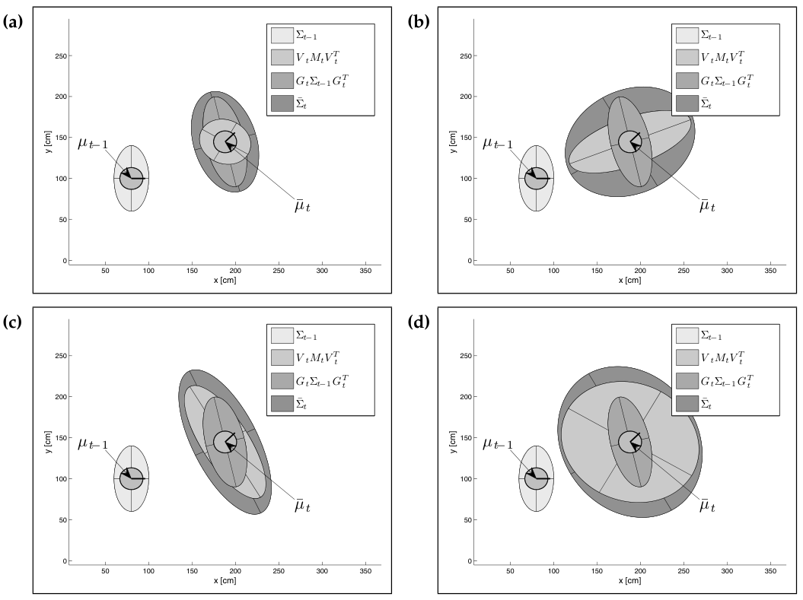

*Figure 7.8 — EKF 알고리즘의 예측 단계. 패널들은 서로 다른 motion 노이즈 파라미터로 생성되었다.
로봇의 초기 추정은 $\mu_{t-1}$ 에 중심을 둔 타원으로 표현된다. 90cm 길이의 원호를 따라 왼쪽으로 45도
회전하며 이동한 뒤, 예측된 위치는 $\bar\mu_t$ 에 중심을 둔다. 패널 (a)에서는 병진과 회전 모두 motion
노이즈가 비교적 작다. 다른 패널들은 (b) 높은 병진 노이즈, (c) 높은 회전 노이즈, (d) 병진·회전 모두
높은 노이즈를 나타낸다. (책 p.211)*

**Figure 7.8은 EKF localization 알고리즘의 예측 단계를 예시한다. 여기 보이는 것은 알고리즘 라인 5에서
사용된 서로 다른 motion 노이즈 파라미터 $\alpha_1$~$\alpha_4$ 로부터 나오는 예측 불확실성이다.
파라미터 $\alpha_2$ 와 $\alpha_3$ 는 모든 시각화에서 5%로 설정된다. 주된 병진·회전 노이즈 파라미터
$\alpha_1$ 과 $\alpha_4$ 는 $\langle 10\%, 10\%\rangle$, $\langle 30\%, 10\%\rangle$,
$\langle 10\%, 30\%\rangle$, $\langle 30\%, 30\%\rangle$ 사이에서 변한다(Figure 7.8의 좌상단에서
우하단으로). 각 도표에서 로봇은 제어 $u_t = \langle 10\text{cm/sec}, 5°/\text{sec}\rangle$ 를 9초간
실행하여 길이 90cm, 회전 45도의 원호를 만든다. 로봇의 이전 위치 추정은 평균
$\mu_{t-1} = \langle 80, 100, 0\rangle$ 에 중심을 둔 타원으로 표현된다.** (책 p.211)

**EKF 알고리즘은 노이즈 없는 운동의 가정 아래 이전 추정을 이동시켜 예측 평균 $\bar\mu_t$ 를 계산한다
(라인 6). 대응하는 불확실성 타원 $\bar\Sigma_t$ 는 **두 성분**으로 이루어진다; 하나는 초기 위치
불확실성으로 인한 불확실성을 추정하고, 다른 하나는 motion 노이즈로 인한 불확실성을 추정한다
(라인 7).** (책 p.211~212)

**첫 번째 성분 $G_t \Sigma_{t-1} G_t^T$ 는 motion 노이즈를 무시하고 이전 불확실성 $\Sigma_{t-1}$ 을
motion 함수의 선형 근사를 통해 투영한다. (…) **결과 노이즈 타원은 네 패널에서 동일한데, motion
노이즈를 고려하지 않기 때문이다.**** (책 p.212)

**Motion 노이즈로 인한 불확실성은 $\bar\Sigma_t$ 의 두 번째 성분 $V_t M_t V_t^T$ 로 모델링된다
(라인 7). 행렬 $M_t$ 는 제어 공간의 motion 노이즈를 표현한다(라인 5). 이 motion 노이즈 행렬은
$V_t$ 와의 곱셈으로 상태 공간에 사상되며, $V_t$ 는 motion control에 대한 motion 함수의 Jacobian이다
(라인 4).** (책 p.212)

> **Figure 7.8에서 읽어야 할 두 가지 (책 p.212)**
>
> **보이는 대로, 결과 타원은 큰 병진 속도 오차($\alpha_1 = 30\%$)를 **운동 방향을 따라 큰 불확실성**
> 으로 나타낸다(Figure 7.8의 오른쪽 도표들). 큰 회전 오차($\alpha_4 = 30\%$)는 **운동 방향에
> 직교하는 큰 불확실성**을 낳는다(아래쪽 도표들). 예측의 전체 불확실성 $\bar\Sigma_t$ 는 두 불확실성
> 성분을 더해 주어진다.**
>
> 5.3.2절 Figure 5.4의 "바나나 모양"을 Gaussian 하나로 근사한 것이 이 타원이다.

### 보정 단계를 눈으로 (책 p.212~214)

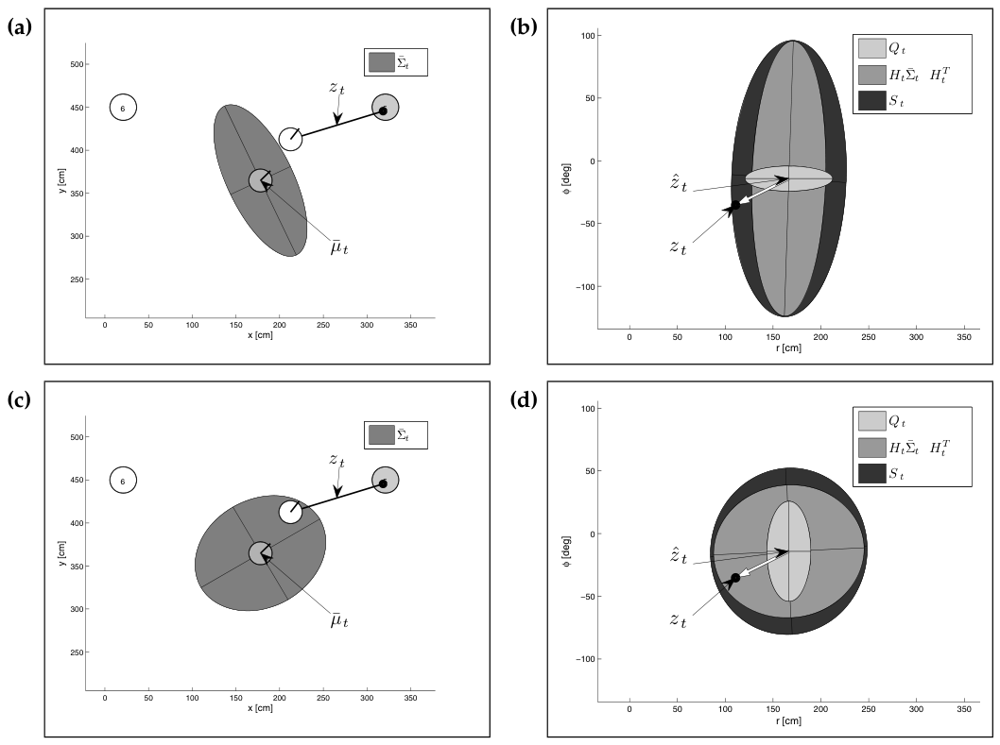

*Figure 7.9 — 측정 예측. 왼쪽 도표는 예측된 두 로봇 위치와 그 불확실성 타원을 보여준다. 참 로봇과
관측은 각각 흰 원과 굵은 선으로 표시된다. 오른쪽 패널은 결과 측정 예측을 보여준다. 흰 화살표는
innovation, 즉 관측된 측정과 예측된 측정의 차이를 가리킨다. (책 p.212)*

**보정 단계의 첫 부분에서 EKF 알고리즘은 예측된 로봇 위치와 그 불확실성을 사용해 측정
$\bar{z}_t$ 를 예측한다. (…) 예측 측정 $\bar{z}_t$ 는 예측 평균 $\bar\mu_t$ 와 관측된 랜드마크
사이의 상대 거리와 bearing으로부터 계산된다(라인 12). 이 예측의 불확실성은 타원 $S_t$ 로 표현된다.
상태 예측과 유사하게 이 불확실성은 **두 Gaussian의 convolution**에서 나온다. 타원 $Q_t$ 는 측정
노이즈로 인한 불확실성을 표현하고(라인 8), 타원 $H_t \bar\Sigma_t H_t^T$ 는 로봇 위치의 불확실성으로
인한 불확실성을 표현한다.** (책 p.212~213)

> **$S_t = H_t \bar\Sigma_t H_t^T + Q_t$ 를 그림으로 이해하는 지점이다.**
>
> | 항 | 뜻 | 어디서 오는가 |
> |---|---|---|
> | $Q_t$ | 센서가 원래 부정확함 | 센서 스펙 |
> | $H_t \bar\Sigma_t H_t^T$ | **로봇 위치를 모르니 측정도 예측 못 함** | pose 불확실성이 측정 공간으로 사상됨 |
>
> 로봇 위치가 정확히 알려지면($\bar\Sigma_t \to 0$) $S_t \to Q_t$ 가 되어 센서 노이즈만 남는다.

**로봇 위치 불확실성 $\bar\Sigma_t$ 는 $H_t$ 와의 곱셈으로 관측 불확실성에 사상되며, $H_t$ 는 로봇
위치에 대한 measurement 함수의 Jacobian이다(라인 13). 전체 측정 예측 불확실성 $S_t$ 는 이 두 타원의
합이다(라인 14). 오른쪽 패널의 흰 화살표는 이른바 **innovation 벡터** $z_t - \bar{z}_t$ 를
예시하는데, 이는 단순히 관측된 측정과 예측된 측정의 차이다. 이 벡터는 이후 갱신 단계에서 결정적인
역할을 한다. 또한 이는 측정 $z_t$ 의 likelihood를 제공하는데, 이는 공분산 $S_t$ 의 영평균 Gaussian
아래에서 innovation 벡터의 likelihood로 주어진다(라인 21). 즉 **innovation 벡터가 (Mahalanobis 거리
의미에서) "짧을수록" 측정이 더 그럴듯하다.**** (책 p.213~214)

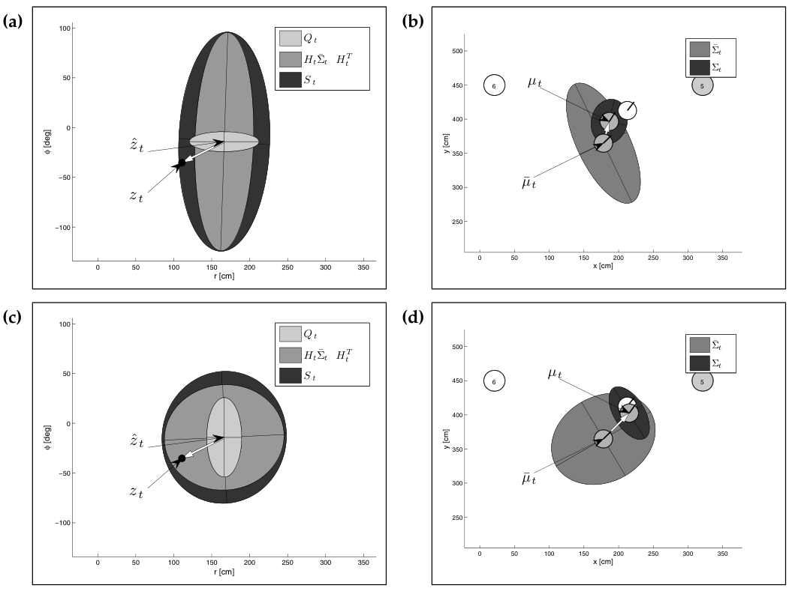

*Figure 7.10 — EKF 알고리즘의 보정 단계. 왼쪽 패널은 측정 예측을, 오른쪽 패널은 결과 보정을
보여주며, 이는 평균 추정을 갱신하고 위치 불확실성 타원을 줄인다. (책 p.213)*

**EKF localization 알고리즘의 보정 단계는 innovation 벡터와 측정 예측 불확실성에 근거해 위치 추정을
갱신한다. (…) 이 보정 벡터는 측정 innovation 벡터(왼쪽 패널의 흰 화살표)를 **상태 공간으로
축척 사상(scaled mapping)** 하여 계산된다(라인 16). 이 사상과 축척은 라인 15에서 계산되는 Kalman
gain 행렬 $K_t$ 가 수행한다.** (책 p.214)

**직관적으로 measurement innovation은 예측된 측정과 관측된 측정 사이의 차이를 준다. 이 차이는 상태
공간으로 사상되어 measurement innovation을 줄이는 방향으로 위치 추정을 옮기는 데 사용된다.
Kalman gain은 추가로 innovation 벡터를 축척하여 측정 예측의 불확실성을 고려한다. **관측이 확실할수록
Kalman gain이 커지고, 따라서 결과 위치 보정이 강해진다.** 위치 추정의 불확실성 타원도 유사한 논리로
갱신된다(라인 17).** (책 p.214)

> **Kalman gain의 두 역할이 이 문단에 다 있다.**
> 1. **사상**: 측정 공간(range·bearing)의 오차를 상태 공간($x, y, \theta$)의 보정으로 번역
> 2. **축척**: 얼마나 믿을지 결정. $K_t = \bar\Sigma_t H_t^T S_t^{-1}$ 에서 $S_t$ 가 크면(측정을
>    못 믿으면) gain이 작아진다.
>
> 3.2.2절에서 1차원으로 본 $K = \frac{\sigma^2_{\text{belief}}}{\sigma^2_{\text{belief}} + \sigma^2_{\text{obs}}}$
> 의 다변량 판이다.

### 전체 시퀀스 (책 p.214)

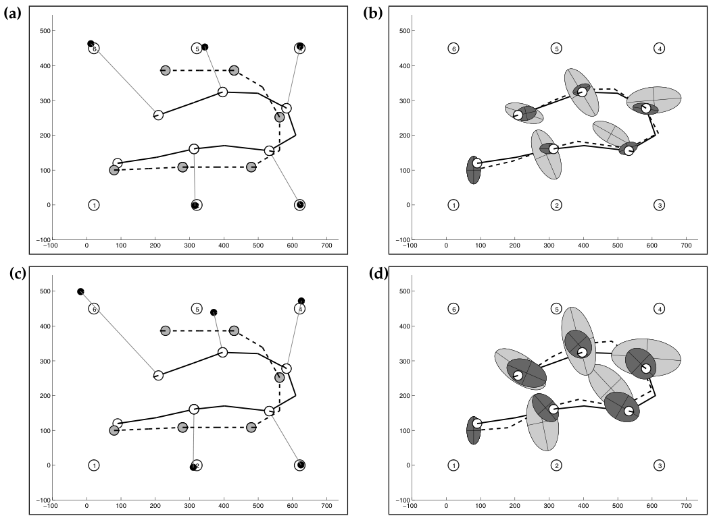

*Figure 7.11 — 정확한(위 행)·덜 정확한(아래 행) 랜드마크 검출 센서를 사용한 EKF 기반 localization.
왼쪽 패널의 점선은 motion control로부터 추정된 로봇 궤적을 나타낸다. 실선은 그 제어로 인한 참 로봇
운동을 표현한다. 다섯 위치에서의 랜드마크 검출이 가는 선으로 표시된다. 오른쪽 패널의 점선은 보정된
로봇 궤적을, 랜드마크 검출을 통합하기 전(밝은 회색, $\bar\Sigma_t$)과 후(짙은 회색, $\Sigma_t$)의
불확실성과 함께 보여준다. (책 p.215)*

**Figure 7.11은 서로 다른 관측 불확실성을 사용한 두 EKF 갱신 시퀀스를 보여준다. (…) 예상대로
**위 행의 더 작은 측정 불확실성은 더 작은 불확실성 타원과 더 작은 추정 오차를 낳는다.**** (책 p.214)

> **Figure 7.11에서 꼭 볼 것**: 오른쪽 패널에서 타원이 랜드마크를 볼 때마다 **줄었다가**(짙은 회색)
> 이동하면서 다시 **커진다**(밝은 회색). 이 톱니 모양이 filter가 하는 일의 전부다 —
> **운동은 불확실성을 키우고 측정은 줄인다.**

### 2. 예제/실습

#### 예제 — EKF localization 한 스텝을 손으로

**설정** (숫자를 단순하게 골랐다)

| 항목 | 값 |
|---|---|
| $\mu_{t-1}$ | $(2.0,\ 3.0,\ 0.0)^T$ |
| $\Sigma_{t-1}$ | $\operatorname{diag}(0.10,\ 0.10,\ 0.05)$ |
| 제어 $u_t$ | $v_t = 1.0$ m/s, $\omega_t = 0.5$ rad/s, $\Delta t = 1.0$ s |
| 노이즈 $\alpha$ | $\alpha_1 = \alpha_4 = 0.1$, $\alpha_2 = \alpha_3 = 0.01$ |
| 랜드마크 $m_5$ | $(6.0,\ 4.0)$, signature 5 |
| 측정 $z_t^1$ | $r = 3.6$ m, $\phi = 0.30$ rad, $s = 5$ |
| correspondence | $c_t^1 = 5$ |
| 센서 노이즈 | $\sigma_r = 0.2$, $\sigma_\phi = 0.1$, $\sigma_s = 0.01$ |

**단계 1 — 라인 2**

$$\theta = \mu_{t-1,\theta} = 0.0$$

**단계 2 — 라인 6: 예측 평균**

$\frac{v_t}{\omega_t} = \frac{1.0}{0.5} = 2.0$, $\theta + \omega_t\Delta t = 0 + 0.5 = 0.5$ rad.

$$\bar\mu_t = \begin{pmatrix} 2.0 \\ 3.0 \\ 0.0 \end{pmatrix} + \begin{pmatrix} -2.0\sin(0) + 2.0\sin(0.5) \\ 2.0\cos(0) - 2.0\cos(0.5) \\ 0.5 \end{pmatrix} = \begin{pmatrix} 2.0 \\ 3.0 \\ 0.0 \end{pmatrix} + \begin{pmatrix} 0 + 0.958851 \\ 2.0 - 1.755165 \\ 0.5 \end{pmatrix} = \begin{pmatrix} 2.958851 \\ 3.244835 \\ 0.5 \end{pmatrix}$$

**단계 3 — 라인 3: $G_t$**

$$G_t = \begin{pmatrix} 1 & 0 & 2.0(-\cos 0 + \cos 0.5) \\ 0 & 1 & 2.0(-\sin 0 + \sin 0.5) \\ 0 & 0 & 1 \end{pmatrix} = \begin{pmatrix} 1 & 0 & 2.0(-1 + 0.877583) \\ 0 & 1 & 2.0(0 + 0.479426) \\ 0 & 0 & 1 \end{pmatrix} = \begin{pmatrix} 1 & 0 & -0.244835 \\ 0 & 1 & 0.958851 \\ 0 & 0 & 1 \end{pmatrix}$$

> 세 번째 열이 곧 $\bar\mu_t - \mu_{t-1}$ 의 앞 두 성분을 뒤바꾼 것과 관련됨을 눈치챌 수 있다:
> $-0.244835 = -(3.244835 - 3.0)$, $0.958851 = 2.958851 - 2.0$. 원운동의 기하에서 나오는 성질이다.

**단계 4 — 라인 5: $M_t$**

$$M_t = \begin{pmatrix} 0.1(1.0)^2 + 0.01(0.5)^2 & 0 \\ 0 & 0.01(1.0)^2 + 0.1(0.5)^2 \end{pmatrix} = \begin{pmatrix} 0.1025 & 0 \\ 0 & 0.0350 \end{pmatrix}$$

**단계 5 — 라인 4: $V_t$**

$$V_{11} = \frac{-\sin 0 + \sin 0.5}{0.5} = \frac{0.479426}{0.5} = 0.958851$$
$$V_{12} = \frac{1.0(\sin 0 - \sin 0.5)}{0.25} + \frac{1.0\cos(0.5)(1.0)}{0.5} = \frac{-0.479426}{0.25} + \frac{0.877583}{0.5} = -1.917702 + 1.755165 = -0.162537$$
$$V_{21} = \frac{\cos 0 - \cos 0.5}{0.5} = \frac{1 - 0.877583}{0.5} = 0.244835$$
$$V_{22} = -\frac{1.0(\cos 0 - \cos 0.5)}{0.25} + \frac{1.0\sin(0.5)(1.0)}{0.5} = -\frac{0.1224174}{0.25} + \frac{0.4794255}{0.5} = -0.4896698 + 0.9588511 = 0.469181$$

$$V_t = \begin{pmatrix} 0.958851 & -0.162537 \\ 0.244835 & 0.469181 \\ 0 & 1.0 \end{pmatrix}$$

**단계 6 — 라인 7: $\bar\Sigma_t$**

$$G_t \Sigma_{t-1} G_t^T = \begin{pmatrix} 0.102997 & -0.011738 & -0.012242 \\ -0.011738 & 0.145970 & 0.047943 \\ -0.012242 & 0.047943 & 0.050000 \end{pmatrix}$$

$$V_t M_t V_t^T = \begin{pmatrix} 0.095163 & 0.021394 & -0.005689 \\ 0.021394 & 0.013849 & 0.016421 \\ -0.005689 & 0.016421 & 0.035000 \end{pmatrix}$$

$$\bar\Sigma_t = \begin{pmatrix} 0.198160 & 0.009656 & -0.017931 \\ 0.009656 & 0.159819 & 0.064364 \\ -0.017931 & 0.064364 & 0.085000 \end{pmatrix}$$

**불확실성이 커졌다** — 대각 성분이 $(0.10, 0.10, 0.05) \to (0.198, 0.160, 0.085)$. 운동은 정보를
잃는 과정이라는 것이 숫자로 확인된다.

**단계 7 — 라인 11~12: 예측 측정**

$$q = (6.0 - 2.958851)^2 + (4.0 - 3.244835)^2 = 3.041149^2 + 0.755165^2 = 9.248587 + 0.570274 = 9.818861$$

$$\sqrt{q} = 3.133506$$

$$\hat{z}_t^1 = \begin{pmatrix} 3.133506 \\ \operatorname{atan2}(0.755165,\ 3.041149) - 0.5 \\ 5 \end{pmatrix} = \begin{pmatrix} 3.133506 \\ 0.243393 - 0.5 \\ 5 \end{pmatrix} = \begin{pmatrix} 3.133506 \\ -0.256607 \\ 5 \end{pmatrix}$$

**단계 8 — 라인 13: $H_t$**

$$H_t = \begin{pmatrix} -\frac{3.041149}{3.133506} & -\frac{0.755165}{3.133506} & 0 \\ \frac{0.755165}{9.818861} & -\frac{3.041149}{9.818861} & -1 \\ 0 & 0 & 0 \end{pmatrix} = \begin{pmatrix} -0.970526 & -0.240997 & 0 \\ 0.076910 & -0.309725 & -1 \\ 0 & 0 & 0 \end{pmatrix}$$

**단계 9 — 라인 14: $S_t$**

$$H_t \bar\Sigma_t H_t^T = \begin{pmatrix} 0.200450 & -0.002029 & 0 \\ -0.002029 & 0.143672 & 0 \\ 0 & 0 & 0 \end{pmatrix}$$

$$S_t = H_t\bar\Sigma_t H_t^T + Q_t = \begin{pmatrix} 0.240450 & -0.002029 & 0 \\ -0.002029 & 0.153672 & 0 \\ 0 & 0 & 0.0001 \end{pmatrix}$$

> **$S_t$ 의 두 대각 성분을 뜯어 보면** $Q_t$ 의 기여가 각각 $0.04$, $0.01$ 이고 나머지
> $0.200$, $0.144$ 는 전부 **pose 불확실성**에서 왔다. 즉 이 시점에서 측정 예측이 부정확한 주된
> 이유는 센서가 나빠서가 아니라 **로봇이 자기 위치를 몰라서**다. bearing 쪽이 특히 심한데,
> $H_t$ 의 $(2,3)$ 성분이 $-1$ 이라 방향 불확실성 $0.085$ 가 그대로 실려 오기 때문이다.

**단계 10 — innovation**

$$z_t^1 - \hat{z}_t^1 = \begin{pmatrix} 3.6 - 3.133506 \\ 0.30 - (-0.256607) \\ 5 - 5 \end{pmatrix} = \begin{pmatrix} 0.466494 \\ 0.556607 \\ 0 \end{pmatrix}$$

> **bearing innovation이 0.557 rad(약 32도)로 꽤 크다.** 실제로는 이 정도면 correspondence를 의심해
> 봐야 할 수준이다 — 7.5절의 주제로 이어진다.

**단계 11 — 라인 15~17: 갱신**

$$K_t = \bar\Sigma_t H_t^T S_t^{-1} = \begin{pmatrix} -0.807942 & 0.185727 & 0 \\ -0.205390 & -0.738833 & 0 \\ 0.002025 & -0.691799 & 0 \end{pmatrix}$$

(signature에 대응하는 세 번째 열이 0이다 — $H_t$ 의 마지막 행이 0이기 때문이며, 연습문제 3의 답이다.)

$$K_t (z_t^1 - \hat{z}_t^1) = \begin{pmatrix} -0.273523 \\ -0.507053 \\ -0.384116 \end{pmatrix}$$

$$\mu_t = \bar\mu_t + K_t(z_t^1 - \hat{z}_t^1) = \begin{pmatrix} 2.958851 \\ 3.244835 \\ 0.5 \end{pmatrix} + \begin{pmatrix} -0.273523 \\ -0.507053 \\ -0.384116 \end{pmatrix} = \begin{pmatrix} 2.685328 \\ 2.737782 \\ 0.115884 \end{pmatrix}$$

$$\Sigma_t = (I - K_t H_t)\bar\Sigma_t = \begin{pmatrix} 0.035292 & -0.008024 & 0.003342 \\ -0.008024 & 0.066405 & -0.013796 \\ 0.003342 & -0.013796 & 0.011448 \end{pmatrix}$$

**불확실성이 다시 줄었다**: $(0.198, 0.160, 0.085) \to (0.035, 0.066, 0.011)$. 측정 하나가
분산을 1/2~1/8로 깎았다. 특히 **방향 $\theta$ 의 분산이 0.085에서 0.011로 8배 가까이 줄었는데**,
bearing 측정이 방향에 직접적인 정보를 주기 때문이다($H_t$ 의 $(2,3)$ 성분 $-1$).

**아래 코드로 위 계산 전체를 검산할 수 있다.**

```python
# 실행에는 numpy 가 필요하다:  sudo apt install -y python3-numpy
import numpy as np

def ekf_localization_step(mu, Sigma, u, z, c, m, alpha, sigma, dt=1.0):
    """Table 7.2를 그대로 옮긴 것 (관측 1개, correspondence 알려진 경우)."""
    v, w = u
    th = mu[2]
    a1, a2, a3, a4 = alpha
    sr, sphi, ss = sigma

    # 라인 3 — G_t (식 6)
    G = np.array([[1, 0, (v/w)*(-np.cos(th) + np.cos(th + w*dt))],
                  [0, 1, (v/w)*(-np.sin(th) + np.sin(th + w*dt))],
                  [0, 0, 1]])
    # 라인 4 — V_t (식 9)
    V = np.array([
        [(-np.sin(th) + np.sin(th + w*dt))/w,
          v*(np.sin(th) - np.sin(th + w*dt))/w**2 + v*np.cos(th + w*dt)*dt/w],
        [( np.cos(th) - np.cos(th + w*dt))/w,
         -v*(np.cos(th) - np.cos(th + w*dt))/w**2 + v*np.sin(th + w*dt)*dt/w],
        [0, dt]])
    # 라인 5 — M_t (식 7)
    M = np.diag([a1*v**2 + a2*w**2, a3*v**2 + a4*w**2])
    # 라인 6 — 예측 평균
    mu_bar = mu + np.array([(v/w)*(-np.sin(th) + np.sin(th + w*dt)),
                            (v/w)*( np.cos(th) - np.cos(th + w*dt)),
                            w*dt])
    # 라인 7 — 예측 공분산
    Sigma_bar = G @ Sigma @ G.T + V @ M @ V.T

    # 라인 8 — Q_t (식 13)
    Q = np.diag([sr**2, sphi**2, ss**2])
    j = c
    dx, dy = m[j][0] - mu_bar[0], m[j][1] - mu_bar[1]
    q = dx**2 + dy**2                                        # 라인 11
    z_hat = np.array([np.sqrt(q),                            # 라인 12
                      np.arctan2(dy, dx) - mu_bar[2],
                      m[j][2]])
    H = np.array([[-dx/np.sqrt(q), -dy/np.sqrt(q),  0],      # 라인 13 (식 12)
                  [ dy/q,          -dx/q,          -1],
                  [ 0,              0,              0]])
    S = H @ Sigma_bar @ H.T + Q                              # 라인 14
    K = Sigma_bar @ H.T @ np.linalg.inv(S)                   # 라인 15
    innov = z - z_hat
    innov[1] = (innov[1] + np.pi) % (2*np.pi) - np.pi        # 각도 감싸기 (책 p.205 경고)
    mu_new = mu_bar + K @ innov                              # 라인 16
    Sigma_new = (np.eye(3) - K @ H) @ Sigma_bar              # 라인 17
    return mu_bar, Sigma_bar, z_hat, S, K, mu_new, Sigma_new

m = {5: (6.0, 4.0, 5)}
out = ekf_localization_step(
    mu=np.array([2.0, 3.0, 0.0]), Sigma=np.diag([0.10, 0.10, 0.05]),
    u=(1.0, 0.5), z=np.array([3.6, 0.30, 5.0]), c=5, m=m,
    alpha=(0.1, 0.01, 0.01, 0.1), sigma=(0.2, 0.1, 0.01))
for name, val in zip(["mu_bar", "Sigma_bar", "z_hat", "S", "K", "mu", "Sigma"], out):
    print(name, "=", np.round(val, 6), sep="\n")
```

#### 연습문제

1. $\omega_t = 0$ (직진)일 때 Table 7.2가 깨지는 이유를 라인 3·4·6에서 각각 지적하고, 5.3.3절을
   참고해 올바른 극한값을 유도하라. (책이 연습문제로 남긴 문제다.)
2. 위 예제에서 $\sigma_r$ 을 0.2에서 2.0으로 키우면 $K_t$ 와 $\Sigma_t$ 는 어떻게 변하는가?
   직관과 맞는지 확인하라.
3. $H_t$ 의 마지막 행이 0이라는 사실이 $K_t$ 의 어느 부분에 반영되는가? signature가 갱신에 기여하지
   않음을 행렬 계산으로 보여라.
4. 라인 16의 각도 감싸기를 생략하면 어떤 상황에서 필터가 깨지는가? 구체적 숫자로 예를 만들어 보라.

---

# 7.5 Estimating Correspondences (책 p.215~218)

## 7.5.1 EKF Localization with Unknown Correspondences

### 1. 개념적 이해

**지금까지 논의한 EKF localization은 랜드마크 correspondence가 절대적 확실성으로 결정될 수 있을 때만
적용 가능하다. **실제로 이런 경우는 드물다.** 따라서 대부분의 구현은 localization 중에 랜드마크의
정체를 결정한다.** (책 p.215)

**이 책 전체에서 우리는 correspondence 문제에 대처하는 여러 전략을 만날 것이다. 그중 가장 단순한
것이 **maximum likelihood correspondence**로 알려진 것인데, 여기서는 먼저 correspondence variable의
가장 그럴듯한 값을 결정하고, 그 다음 그 값을 참인 것으로 받아들인다.** (책 p.215)

> **"그리고 그 값을 참으로 받아들인다"** 가 이 접근의 전부이자 위험이다. 한 번 "이건 3번 랜드마크"라고
> 정하면 되돌리지 않는다. 틀렸다면 그 오차가 이후 모든 스텝에 누적된다.

**Maximum likelihood 기법은 correspondence variable에 대해 똑같이 그럴듯한 가설이 많으면 취약하다.
그러나 흔히 그렇게 되지 않도록 시스템을 설계할 수 있다. 잘못된 data association을 주장할 위험을
줄이기 위해 본질적으로 두 가지 기법이 있다:** (책 p.216)

| 전략 | 내용 |
|---|---|
| 1 | **충분히 고유하고 서로 충분히 멀리 떨어진 랜드마크를 고른다** — 서로 혼동될 가능성이 낮도록 |
| 2 | **로봇의 pose 불확실성이 작게 유지되도록 한다** |

**불행히도 이 두 전략은 다소 서로 상충하며, 환경에서 랜드마크의 적절한 세밀도를 찾는 것은 다소
기예(art)에 가까울 수 있다.** (책 p.216)

> **왜 상충하는가.** 랜드마크를 멀찍이 띄우면 혼동은 줄지만, 로봇이 랜드마크를 보지 못하는 구간이
> 길어져 **pose 불확실성이 커진다.** 촘촘히 놓으면 불확실성은 작게 유지되지만 **혼동 위험이 커진다.**
> 7.8절에서 책은 이 딜레마의 실무적 답을 준다 — **"큰 수의 랜드마크가 작은 수보다 잘 작동하는 경향이
> 있다. 다만 랜드마크가 조밀하면 mutual exclusion 원리를 적용하는 것이 결정적이다."** (책 p.231)

**그럼에도 maximum likelihood 기법은 큰 실용적 중요성을 갖는다.** (책 p.216)

### 2. 알고리즘 — 책 Table 7.3

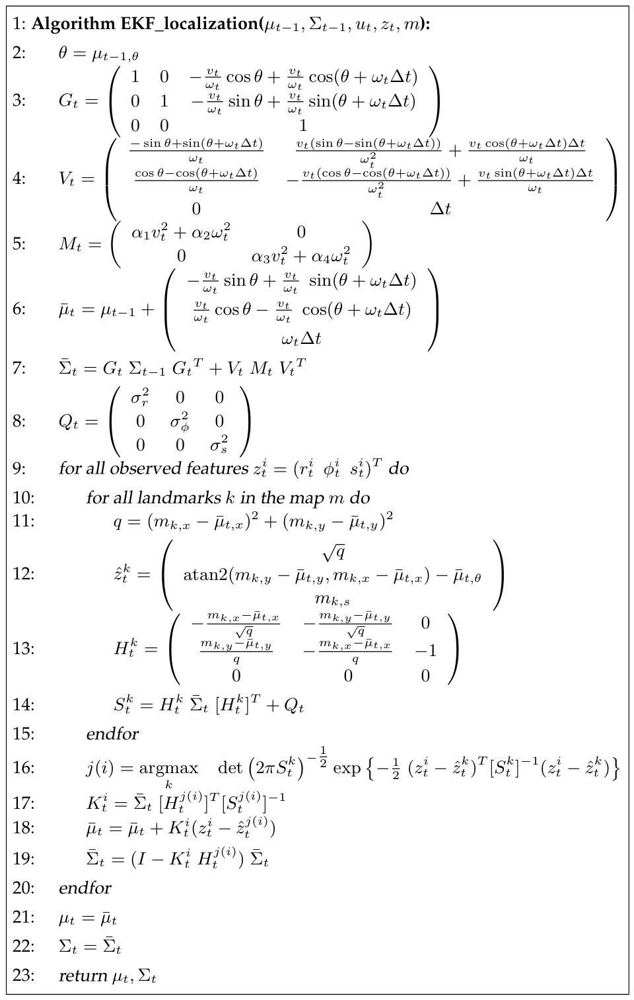

*Table 7.3 — Correspondence가 알려지지 않은 extended Kalman filter (EKF) localization 알고리즘.
Correspondence $j(i)$ 는 maximum likelihood estimator로 추정된다. (책 p.217)*

```
 1: Algorithm EKF_localization(μ_{t-1}, Σ_{t-1}, u_t, z_t, m):
 2~ 7:   (Table 7.2의 라인 2~7과 완전히 동일 — 예측 단계)
 8:     Q_t = diag(σ_r², σ_φ², σ_s²)
 9:     for all observed features z_t^i = (r_t^i  φ_t^i  s_t^i)ᵀ do
10:         for all landmarks k in the map m do
11:             q = (m_{k,x} − μ̄_{t,x})² + (m_{k,y} − μ̄_{t,y})²
12:             ẑ_t^k = ( √q,  atan2(m_{k,y} − μ̄_{t,y}, m_{k,x} − μ̄_{t,x}) − μ̄_{t,θ},  m_{k,s} )ᵀ
13:             H_t^k = ⎛ −(m_{k,x} − μ̄_{t,x})/√q  −(m_{k,y} − μ̄_{t,y})/√q   0 ⎞
                        ⎜  (m_{k,y} − μ̄_{t,y})/q   −(m_{k,x} − μ̄_{t,x})/q   −1 ⎟
                        ⎝            0                       0              0 ⎠
14:             S_t^k = H_t^k Σ̄_t [H_t^k]ᵀ + Q_t
15:         endfor
16:         j(i) = argmax_k  det(2π S_t^k)^(−1/2) exp{ −½ (z_t^i − ẑ_t^k)ᵀ [S_t^k]^(−1) (z_t^i − ẑ_t^k) }
17:         K_t^i = Σ̄_t [H_t^{j(i)}]ᵀ [S_t^{j(i)}]^(−1)
18:         μ̄_t = μ̄_t + K_t^i (z_t^i − ẑ_t^{j(i)})
19:         Σ̄_t = (I − K_t^i H_t^{j(i)}) Σ̄_t
20:     endfor
21:     μ_t = μ̄_t
22:     Σ_t = Σ̄_t
23:     return μ_t, Σ_t
```

**Motion 갱신 라인 2~7은 Table 7.2의 것과 동일하다. **핵심 차이는 measurement 갱신에 있다**: 각 관측에
대해 우리는 먼저 맵의 **모든 랜드마크 $k$** 에 대해 가장 그럴듯한 correspondence를 결정하게 해주는
여러 양을 계산한다(라인 10~15). Correspondence variable $j(i)$ 는 라인 16에서, 맵의 어떤 가능한
랜드마크 $m_k$ 에 대해서든 측정 $z_t^i$ 의 likelihood를 최대화함으로써 선택된다.** (책 p.216)

**이 likelihood 함수가 correspondence를 아는 경우의 EKF 알고리즘이 사용한 likelihood 함수와 **동일**
함에 유의하라. 라인 18과 19의 EKF 갱신은 가장 그럴듯한 correspondence만 통합한다.** (책 p.216)

> **Table 7.2와 7.3의 차이는 딱 하나다.**
>
> | | Table 7.2 | Table 7.3 |
> |---|---|---|
> | 입력 | $\ldots,\ z_t,\ \mathbf{c_t},\ m$ | $\ldots,\ z_t,\ m$ (**$c_t$ 없음**) |
> | 라인 10 | $j = c_t^i$ (**주어짐**) | 맵의 모든 $k$ 에 대해 루프 |
> | 새 라인 16 | — | $j(i) = \arg\max_k (\ldots)$ |
> | 출력 | $\mu_t, \Sigma_t, p_{z_t}$ | $\mu_t, \Sigma_t$ |
>
> 라인 21의 $p_{z_t}$ 가 출력에서 빠진 이유: **여기서는 그 likelihood를 내부에서 이미 소비**했다
> (라인 16의 argmax가 곧 그 likelihood 비교다).
>
> **7.4.3절에서 "likelihood는 EKF 갱신에 필수적이지 않지만 correspondence를 모르는 경우에 유용하다"**
> 고 한 것이 여기서 실현된다.

**우리는 Table 7.3의 알고리즘이 그다지 효율적이지 않을 수 있음에 유의한다. 라인 10에서 랜드마크를 더
사려 깊게 선택하면 개선될 수 있다. 대부분의 설정에서 로봇은 자기 바로 근처의 소수 랜드마크만 한 번에
보며, 간단한 검사로 맵의 많은 그럴듯하지 않은 랜드마크를 기각할 수 있다.** (책 p.216)

## 7.5.2 Mathematical Derivation of the ML Data Association (책 p.216~218)

### 수식/유도

#### 전체 유도 과정 (먼저 한 번에)

$$\hat{c}_t = \operatorname*{argmax}_{c_t}\ p(z_t \mid c_{1:t}, m, z_{1:t-1}, u_{1:t}) \tag{1}$$

$$\hat{c}_t^i = \operatorname*{argmax}_{c_t^i}\ p(z_t^i \mid c_{1:t}, m, z_{1:t-1}, u_{1:t}) \approx \operatorname*{argmax}_{c_t^i}\ \mathcal{N}\big(z_t^i;\, h(\bar\mu_t, c_t^i, m),\, H_t \bar\Sigma_t H_t^T + Q_t\big) \tag{2}$$

#### 단계별 설명 (생략 없이)

**(1) 이상적인 목표** — 책 (7.22)

**Maximum likelihood estimator는 데이터 likelihood를 최대화하는 correspondence를 결정한다.**
(책 p.216)

**여기서 $c_t$ 는 시각 $t$ 의 correspondence 벡터다. 앞서와 마찬가지로 벡터
$z_t = \{z_t^1, z_t^2, \ldots\}$ 는 시각 $t$ 에 관측된 feature 또는 랜드마크 $z_t^i$ 의 목록을 담는
측정 벡터다.** (책 p.216)

> **$c_t$ 가 **벡터**임에 주목하라.** 관측 feature가 3개면 $c_t = (c_t^1, c_t^2, c_t^3)$ 이고,
> argmax는 이 **조합 전체**에 대해 이루어져야 한다.

**(1)의 두 가지 함의** (책 p.218)

**(7.22)의 argmax 연산자는 측정의 likelihood를 최대화하는 correspondence 벡터 $\hat{c}_t$ 를 선택한다.
이 표현이 **이전 correspondence $c_{1:t-1}$ 에 조건화**되어 있음에 유의하라. 그것들이 이전 갱신
단계에서 추정되었지만, maximum likelihood 접근은 마치 항상 옳은 것처럼 취급한다. 이는 두 가지 중요한
파급 효과를 갖는다:** (책 p.218)

| | 효과 |
|---|---|
| 좋은 점 | **필터를 점진적으로(incrementally) 갱신할 수 있게 한다** |
| 나쁜 점 | **필터에 취약성을 도입한다** — correspondence 추정이 잘못되면 발산하는 경향이 있다 |

> **왜 발산하는가.** 잘못된 correspondence로 갱신하면 pose 추정이 틀어진다. 틀어진 pose로 다음
> correspondence를 추정하면 또 틀릴 확률이 높아진다. **오차가 스스로를 강화하는 고리**가 만들어진다.
> 7.8절에서 책이 **"단 하나의 잘못된 correspondence가 localization과 correspondence 오차의 흐름
> 전체를 유발하여 tracker를 탈선시킬 수 있다"** (책 p.230)고 경고한다.

**(2) 지수적 복잡도를 피하는 근사** — 책 (7.23)

**알려진 이전 correspondence의 가정 아래에서도 최대화 (7.22)에는 **지수적으로 많은 항**이 있다. 측정당
검출된 랜드마크의 수가 크면 가능한 correspondence의 수가 실용적 구현에 비해 너무 커질 수 있다.**
(책 p.218)

> **얼마나 많은가.** 맵에 랜드마크 $N$ 개, 이번에 관측된 feature $I$ 개라면 조합은 $N^I$ 개다.
> $N = 20$, $I = 5$ 면 $20^5 = 320$ 만 가지다. 매 스텝 이걸 다 볼 수는 없다.

**그런 지수적 복잡도를 피하는 가장 흔한 기법은 **측정 벡터 $z_t$ 안의 각 개별 feature $z_t^i$ 에
대해 최대화를 따로 수행**하는 것이다. 우리는 correspondence를 아는 EKF localization 알고리즘의
유도에서 개별 feature에 대한 likelihood 함수를 이미 유도했다. 식 (7.17)부터 (7.20)까지를 따라가면
각 feature의 correspondence가 다음과 같이 나온다.** (책 p.218)

**이 계산이 Table 7.3의 라인 16에 구현되어 있다.** (책 p.218)

> **성분별 최적화로 바뀌면 $N^I$ 가 $N \times I$ 로 줄어든다.** 위 예에서 320만 → 100.

**이 성분별 최적화는 개별 feature 벡터가 conditionally independent임을 우리가 마침 알 때에만
"정당화"된다 — 편의를 위해 흔히 채택되는 가정이다. 이 가정 아래에서 (7.22)에서 최대화되는 항은
**서로소인 최적화 파라미터를 갖는 항들의 곱**이 되고, 그 최대는 (7.23)에서 결정되는 대로 각 개별
인자가 최대일 때 달성된다. 이 maximum likelihood data association을 사용하면, 알고리즘의 정확성은
이제 correspondence를 아는 EKF localization 알고리즘의 정확성에서 직접 따라 나온다.** (책 p.218)

> **"정당화"에 따옴표가 붙은 이유**를 7.8절이 설명한다. 성분별로 따로 고르면 **두 개의 관측이 같은
> 랜드마크에 배정될 수 있다** ($\hat{c}_t^i = \hat{c}_t^j$). 물리적으로 불가능한 이 상황을 막는 것이
> **mutual exclusion principle**이며, 이 알고리즘은 그것을 강제하지 않는다.

### 3. 예제/실습

#### 예제 — ML data association을 손으로

7.4절 예제의 상태를 그대로 쓴다. 예측 후 $\bar\mu_t = (2.958851,\ 3.244835,\ 0.5)$,
$\bar\Sigma_t$ 는 앞서 구한 값. 관측은 $z_t^1 = (3.6,\ 0.30,\ 5)$.

맵에 랜드마크가 **셋** 있다고 하자.

| $k$ | 위치 | signature |
|---|---|---|
| 5 | $(6.0,\ 4.0)$ | 5 |
| 7 | $(5.0,\ 6.0)$ | 7 |
| 9 | $(3.5,\ 6.5)$ | 9 |

**$k = 5$** (7.4절에서 이미 계산)

$$\hat{z}_t^5 = (3.133506,\ -0.256607,\ 5), \qquad z_t^1 - \hat{z}_t^5 = (0.466494,\ 0.556607,\ 0)$$

**$k = 7$**

$$dx = 5.0 - 2.958851 = 2.041149,\quad dy = 6.0 - 3.244835 = 2.755165,\quad q = 4.166290 + 7.590934 = 11.757224$$
$$\sqrt{q} = 3.428881, \qquad \operatorname{atan2}(2.755165,\ 2.041149) = 0.933180$$
$$\hat{z}_t^7 = (3.428881,\ 0.433180,\ 7), \qquad z_t^1 - \hat{z}_t^7 = (0.171119,\ -0.133180,\ -2)$$

**$k = 9$**

$$dx = 0.541149,\quad dy = 3.255165,\quad q = 0.292842 + 10.596099 = 10.888941$$
$$\sqrt{q} = 3.299840, \qquad \operatorname{atan2}(3.255165,\ 0.541149) = 1.406060$$
$$\hat{z}_t^9 = (3.299840,\ 0.906060,\ 9), \qquad z_t^1 - \hat{z}_t^9 = (0.300160,\ -0.606060,\ -4)$$

**likelihood 비교 (라인 16)**

signature 노이즈 $\sigma_s = 0.01$ 이 매우 작으므로 signature 불일치가 결정적이다.
$k=7$ 은 signature 차가 $-2$ 이고 $\sigma_s = 0.01$ 이므로 지수 항이
$\exp\{-\frac{1}{2}\frac{4}{0.0001}\} = e^{-20000}$ — 완전히 0이다. $k=9$ 도 마찬가지다.

$$j(1) = \arg\max_k(\cdots) = 5$$

**signature가 없다면?** ($\sigma_s$ 를 무한대로 두어 signature를 무시하면) range와 bearing만 남는다.
Mahalanobis 거리 $d^2 = (z - \hat{z})^T S^{-1} (z - \hat{z})$ 로 비교하면 (2차원만):

| $k$ | range 차 | bearing 차 | $d^2$ (대략) |
|---|---|---|---|
| 5 | $+0.4665$ | $+0.5566$ | $\frac{0.4665^2}{0.240} + \frac{0.5566^2}{0.154} \approx 0.907 + 2.011 = 2.918$ |
| 7 | $+0.1711$ | $-0.1332$ | $\frac{0.1711^2}{0.240} + \frac{0.1332^2}{0.154} \approx 0.122 + 0.115 = 0.237$ |
| 9 | $+0.3002$ | $-0.6061$ | $\frac{0.3002^2}{0.240} + \frac{0.6061^2}{0.154} \approx 0.375 + 2.386 = 2.761$ |

(각 $S_t^k$ 는 랜드마크마다 조금씩 다르지만 크기가 비슷해 근사값으로 비교했다.)

**signature 없이는 $k = 7$ 이 선택된다 — 참값 5와 다르다!** signature 하나가 data association을
구해낸 것이다. 6.6.5절에서 **"signature가 제공되지 않으면 모든 랜드마크가 똑같아 보이고 data
association 문제가 더 어려워진다"** 고 한 것이 이 숫자다.

#### 연습문제

1. 위 예제에서 pose 불확실성 $\bar\Sigma_t$ 가 10배 커지면 (signature 없는 경우) 어느 랜드마크가
   선택되는가? 7.5.1절의 "pose 불확실성을 작게 유지하라"는 전략과 연결해 설명하라.
2. $N^I$ 와 $N \times I$ 의 차이를 $N = 50$, $I = 8$ 로 계산하라.
3. 성분별 최적화가 두 관측을 같은 랜드마크에 배정하는 구체적 상황을 만들어 보라.

---

# 7.6 Multi-Hypothesis Tracking (책 p.218~220)

### 1. 개념적 이해

**기본 EKF의 확장으로, 올바른 data association을 충분한 신뢰도로 결정할 수 없는 상황을 수용하는
여러 기법이 존재한다. (…) 데이터 연관의 어려움을 극복하는 고전적 기법이 **multi-hypothesis tracking
filter**, 즉 **MHT**다. MHT는 belief를 **여러 Gaussian으로** 표현할 수 있다.** (책 p.218)

> **7장의 세 알고리즘을 한 줄로 구분하면:**
>
> | | belief 표현 | correspondence 처리 |
> |---|---|---|
> | 7.4 EKF (known) | Gaussian 1개 | 주어짐 |
> | 7.5 EKF (ML) | Gaussian 1개 | **가장 그럴듯한 것 하나 고르고 확정** |
> | 7.6 MHT | **Gaussian 여러 개** | **여러 가능성을 동시에 유지** |

### 2. 수식/유도

#### 전체 유도 과정 (먼저 한 번에)

$$bel(x_t) = \frac{1}{\sum_l \psi_{t,l}} \sum_l \psi_{t,l}\, \det(2\pi\Sigma_{t,l})^{-\frac{1}{2}} \exp\left\{-\tfrac{1}{2}(x_t - \mu_{t,l})^T \Sigma_{t,l}^{-1}(x_t - \mu_{t,l})\right\} \tag{1}$$

$$bel_l(x_t) = p(x_t \mid z_{1:t}, u_{1:t}, c_{1:t,l}) \tag{2}$$

$$\psi_{t,m} = \psi_{t,l}\, p(z_t \mid c_{1:t-1,l},\, c_{t,m},\, z_{1:t-1},\, u_{1:t}) \tag{3}$$

$$\frac{\psi_{t,l}}{\sum_m \psi_{t,m}} < \psi_{\min} \ \Longrightarrow\ \text{해당 성분을 종료(pruning)} \tag{4}$$

#### 단계별 설명 (생략 없이)

**(1) Gaussian mixture로서의 belief** — 책 (7.24)

**MHT는 posterior를 mixture로 표현한다.** (책 p.219)

**여기서 $l$ 은 mixture 성분의 색인이다. 그런 각 성분, MHT 용어로 **"track"** 은 그 자체가 평균
$\mu_{t,l}$ 과 공분산 $\Sigma_{t,l}$ 을 갖는 Gaussian이다. 스칼라 $\psi_{t,l} \ge 0$ 은
**mixture weight**다. 이는 posterior에서 $l$ 번째 mixture 성분의 가중치를 결정한다. Posterior가
$\sum_l \psi_{t,l}$ 로 정규화되므로 각 $\psi_{t,l}$ 은 **상대 가중치**이며, $l$ 번째 mixture 성분의
기여는 다른 모든 mixture 가중치의 크기에 의존한다.** (책 p.219)

> **4.3절 particle filter와 비교하면 구조가 같다.** particle 각각이 "가중치 붙은 상태 하나"였다면,
> MHT의 track은 **"가중치 붙은 Gaussian 하나"** 다. particle은 점이고 track은 타원이라는 차이뿐이다.
> 그래서 MHT는 흔히 **"Gaussian mixture로 하는 particle filter"** 처럼 이해된다.

**(2) 각 성분은 하나의 data association 이력이다** — 책 (7.25)

**아래에서 MHT 알고리즘을 기술할 때 보겠지만, 각 mixture 성분은 **고유한 data association 결정의
수열**에 의존한다. 따라서 $l$ 번째 track에 연관된 data association 벡터를 $c_{t,l}$ 로, $l$ 번째
mixture 성분에 연관된 모든 과거·현재 data association을 $c_{1:t,l}$ 로 쓰는 것이 타당하다. 이 표기로
우리는 이제 mixture 성분을 **고유한 data association 수열에 조건화된 국소 belief 함수**로 생각할 수
있다.** (책 p.219)

> **track이란 곧 "하나의 이야기"다.** "1번 랜드마크를 봤고, 그 다음 3번을, 그 다음 3번을 다시 봤다"가
> 하나의 track이고, "1번, 5번, 3번"이 또 다른 track이다. 각 이야기마다 그것이 참일 때의 pose 추정
> Gaussian을 하나씩 들고 간다.

**(3) 다루기 불가능한 이상적 알고리즘** — 책 (7.26)

**MHT를 기술하기 전에, MHT가 유도되어 나온 **완전히 다루기 불가능한(intractable) 알고리즘**을 논의하는
것이 타당하다. 이 알고리즘은 알려지지 않은 data association 아래 EKF의 완전한 Bayesian 구현이다.
놀랍도록 단순하다: 가장 그럴듯한 data association 벡터를 선택하는 대신, 우리의 가상 알고리즘은
**그것들을 모두 유지한다.**** (책 p.219)

**더 구체적으로, 시각 $t$ 에 각 mixture는 많은 새 mixture로 분할되며, 각각은 고유한 correspondence
벡터 $c_t$ 에 조건화된다. $m$ 을 새 Gaussian 중 하나의 색인, $l$ 을 이 새 Gaussian이 유도되어 나온
색인이라 하자. 그러면 이 새 mixture의 가중치는 식 (3)처럼 설정된다.** (책 p.219)

**이는 새 성분이 유도되어 나온 mixture 가중치 $\psi_{t,l}$ 과, 그 새 mixture 성분으로 이어진 특정
correspondence 벡터 아래에서의 측정 $z_t$ 의 likelihood의 **곱**이다. 달리 말해 우리는
correspondence를 latent variable로 취급하고 mixture 성분이 옳을 posterior likelihood를 계산한다.**
(책 p.219)

**이 접근의 좋은 점은 식 (7.26)의 측정 likelihood $p(z_t \mid c_{1:t-1,l}, c_{t,m}, z_{1:t-1}, u_{1:t})$
를 계산하는 법을 우리가 **이미 안다**는 것이다: 그것은 단순히 알려진 data association에 대한 EKF
localization 알고리즘(Table 7.2)의 **라인 21에서 계산된 측정 likelihood**다. 따라서 각 새 성분에 대한
mixture 가중치를 점진적으로 계산할 수 있다.** (책 p.219~220)

> **7.4.3절에서 유도한 라인 21이 여기서 쓰인다.** 그때 "EKF 갱신에 필수적이지 않다"고 했던 그 값이
> MHT에서는 **가중치 갱신의 핵심**이다. 7.5절에서는 argmax의 기준으로, 7.6절에서는 가중치로 —
> 같은 값이 두 곳에서 다르게 쓰인다.

**이 알고리즘의 유일한 단점은 mixture 성분 또는 track의 수가 시간에 따라 **지수적으로 증가**한다는
사실이다.** (책 p.220)

**(4) Pruning — 실용화의 열쇠** — 책 (7.27)

**MHT 알고리즘은 mixture 성분의 수를 작게 유지함으로써 이 알고리즘을 근사한다. 이 과정을
**pruning**이라 부른다. Pruning은 상대 mixture 가중치가 문턱값 $\psi_{\min}$ 보다 작은 모든 성분을
종료시킨다.** (책 p.220)

**mixture 성분의 수가 항상 최대 $\psi_{\min}^{-1}$ 개임을 보기 쉽다. 따라서 MHT는 효율적으로 갱신될
수 있는 컴팩트한 posterior를 유지한다. 이는 매우 적은 수의 Gaussian을 유지한다는 점에서 근사적이지만,
실제로 **그럴듯한 로봇 위치의 수는 보통 매우 적다.**** (책 p.220)

> **왜 최대 $\psi_{\min}^{-1}$ 개인가 — 한 줄 증명**
>
> 정규화된 가중치의 합은 1이다. 모든 살아남은 성분의 가중치가 $\psi_{\min}$ 이상이므로,
> 성분이 $n$ 개라면
> $$1 = \sum_l \frac{\psi_{t,l}}{\sum_m \psi_{t,m}} \ge n \cdot \psi_{\min} \quad\Longrightarrow\quad n \le \frac{1}{\psi_{\min}}$$
> $\psi_{\min} = 0.01$ 이면 최대 100개다. **메모리 사용량에 확정적 상한이 생긴다** — 이것이 pruning의
> 진짜 가치다.

**우리는 이 시점에서 MHT 알고리즘의 형식적 기술을 생략하고, 대신 독자를 이 책의 여러 관련 알고리즘으로
안내한다. MHT를 구현할 때, 성분을 실체화하기 전에 낮은 likelihood의 track을 식별하는 전략을 고안하는
것이 유용하다는 점에 유의한다.** (책 p.220)

### 3. MHT가 열어주는 것 (7.8절 선취)

7.8절에서 책은 MHT가 EKF의 한계를 어떻게 넘는지 정리한다 (책 p.230~231).

| EKF의 한계 | MHT의 답 |
|---|---|
| global localization 불가 | **여러 Gaussian 가설로 belief를 초기화**해 풀 수 있다. 가설은 첫 측정에 따라 초기화 |
| kidnapping 불가 | **추가 가설을 mixture에 주입**해 대응 |
| 벽 같은 hard 제약 표현 못 함 | 여전히 어렵지만 **여러 Gaussian으로 더 잘 근사** |
| 잘못된 correspondence에 취약 | **더 강건하다** — 다만 올바른 correspondence가 유지 중인 가설에 없으면 똑같이 실패 |
| linearization 오차 | **같은 문제를 겪는다** — 각 가설을 UKF로 구현할 수도 있다 |

**MHT 알고리즘은 이 문제 대부분을 극복한다 — 계산 복잡도 증가를 대가로.** (책 p.230)

### 4. 예제/실습

#### 예제 — track이 갈라지고 죽는 과정

로봇이 두 랜드마크 중 어느 것을 봤는지 모호한 상황. 초기 track 1개 ($\psi = 1.0$).

**$t=1$** — 관측 $z_1$ 이 랜드마크 A와 B 둘 다에 어느 정도 맞는다.

| 새 track | 가정 | 라인 21의 likelihood | $\psi$ |
|---|---|---|---|
| 1a | $c_1 = A$ | 0.30 | $1.0 \times 0.30 = 0.30$ |
| 1b | $c_1 = B$ | 0.12 | $1.0 \times 0.12 = 0.12$ |

정규화: $0.30/0.42 = 0.714$, $0.12/0.42 = 0.286$. 둘 다 $\psi_{\min} = 0.01$ 을 넘으므로 생존.

**$t=2$** — 관측 $z_2$. 각 track에서 다시 두 갈래.

| track | likelihood | 갱신 전 $\psi$ | 곱 |
|---|---|---|---|
| 1a→A | 0.40 | 0.30 | 0.120 |
| 1a→B | 0.02 | 0.30 | 0.006 |
| 1b→A | 0.01 | 0.12 | 0.0012 |
| 1b→B | 0.35 | 0.12 | 0.042 |

합 $= 0.1692$. 정규화하면 $0.709,\ 0.035,\ 0.007,\ 0.248$.

**pruning** ($\psi_{\min} = 0.01$): 세 번째 track($0.007$)이 제거된다. 3개 생존.

**$t=3$** 이후 이 과정이 반복되지만, pruning 덕에 track 수가 $1/\psi_{\min} = 100$ 을 넘지 않는다.
그리고 실제로는 대개 **2~3개로 수렴**한다 — "그럴듯한 로봇 위치의 수는 보통 매우 적다"는 말 그대로다.

#### 연습문제

1. $\psi_{\min} = 0.001$ 로 낮추면 성분 수의 상한은? 계산량과 강건성의 trade-off를 논하라.
2. MHT가 kidnapped robot 문제를 다루려면 언제 어떤 가설을 주입해야 하는가?
3. 위 예제에서 track 1b가 사실 정답이었다면 무슨 일이 일어나는가? MHT가 EKF보다 나은 점과 여전히
   남는 위험을 함께 설명하라.

---

# 7.7 UKF Localization (책 p.220~229)

**UKF localization은 unscented Kalman filter를 사용하는 feature-based 로봇 localization 알고리즘이다.
3.4절에서 기술한 대로 UKF는 **unscented transform**을 사용해 motion model과 measurement model을
선형화한다. 이 모델들의 도함수를 계산하는 대신, unscented transform은 Gaussian을 **시그마 포인트**로
표현하고 이것들을 모델에 통과시킨다.** (책 p.220)

**Table 7.4는 랜드마크 기반 로봇 localization을 위한 UKF 알고리즘을 요약한다. 이는 관측 $z_t$ 에
**단 하나의 랜드마크 검출**만 담겨 있고 그 랜드마크의 정체가 알려졌다고 가정한다.** (책 p.220)

> **EKF와 UKF의 근본 차이 한 줄** (3.4.1절 복습)
>
> | | EKF | UKF |
> |---|---|---|
> | 비선형 함수 처리 | **미분**해서 Jacobian $G_t$, $H_t$ | **표본점**을 통과시킴 |
> | 필요한 것 | 해석적 도함수 | 함수 평가만 (도함수 불필요) |
> | 정확도 | 1차 Taylor | 2차까지 정확 |
> | 계산 | Jacobian 계산 | $2L+1$ 번의 함수 평가 |

## 7.7.1 Mathematical Derivation of UKF Localization (책 p.220~223)

### 1. 개념적 이해 — state augmentation이라는 요령

**localization 버전과 Table 3.4의 일반 UKF 사이의 주된 차이는 **예측 노이즈와 측정 노이즈의 처리**에
있다. Table 3.4의 UKF는 예측 노이즈와 측정 노이즈가 **가법(additive)** 이라는 가정에 기반함을 상기하라.
이는 노이즈 항을 예측 상태 불확실성과 측정 불확실성에 그 공분산 $R_t$ 와 $Q_t$ 를 단순히 더함으로써
고려하는 것을 가능하게 했다(Table 3.4의 라인 5와 9).** (책 p.220~222)

**UKF_localization은 추정 과정에 대한 노이즈의 영향을 고려하는 **대안적이고 더 정확한 접근**을
제공한다. 핵심 "요령"은 **제어 노이즈와 측정 노이즈를 표현하는 추가 성분으로 상태를 증강(augment)**
하는 것이다.** (책 p.222)

> **왜 이것이 더 정확한가.**
>
> 7.4.3절 식 (3)에서 EKF는 "노이즈가 비선형 함수를 통과한 결과"를 "함수 밖에서 더한 Gaussian"으로
> 근사했다. 그것이 근사인 이유는 **비선형 변환을 거친 Gaussian은 Gaussian이 아니기** 때문이다.
>
> UKF의 state augmentation은 이 근사를 하지 않는다. 노이즈를 상태에 포함시켜 **시그마 포인트가
> 노이즈 값까지 들고 함수를 통과**하게 한다. 즉 노이즈가 **실제로 비선형 함수를 거친다.**
> 그 결과가 7.7.2절 Figure 7.16에서 눈에 보이는 차이다.

**증강 상태의 차원 $L$ 은 상태, 제어, 측정 차원의 합으로 주어지며, 이 경우 $3 + 2 + 2 = 7$ 이다
(단순함을 위해 feature 측정의 signature는 무시된다).** (책 p.222)

$$L = \underbrace{3}_{x,\,y,\,\theta} + \underbrace{2}_{v,\,\omega\ \text{노이즈}} + \underbrace{2}_{r,\,\phi\ \text{노이즈}} = 7 \quad\Longrightarrow\quad 2L + 1 = 15\ \text{개의 시그마 포인트}$$

### 2. 알고리즘 — 책 Table 7.4

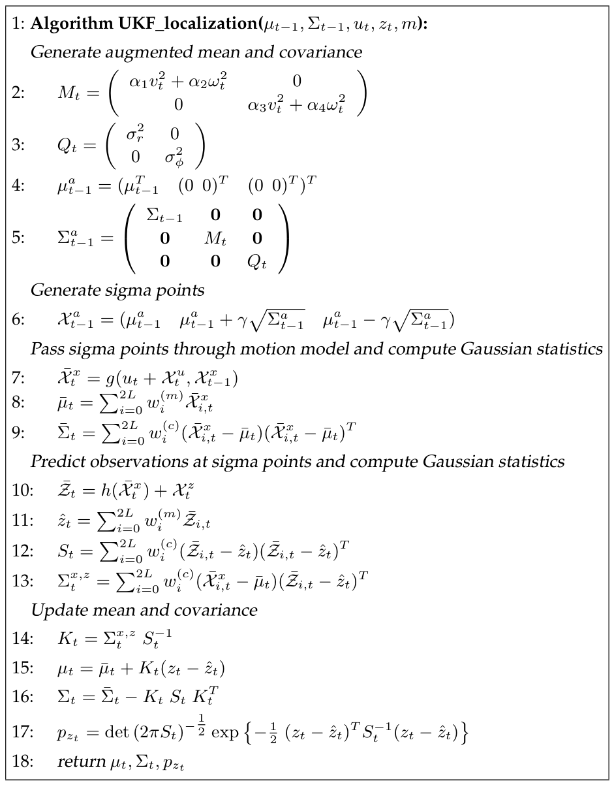

*Table 7.4 — Unscented Kalman filter (UKF) localization 알고리즘. 여기서는 feature-based 맵과
range·bearing 측정 센서를 갖춘 로봇에 대해 정식화되었다. 이 버전은 단일 feature 관측만 다루며 정확한
correspondence의 지식을 가정한다. $L$ 은 증강 상태 벡터의 차원이며, 상태·제어·측정 차원의 합으로
주어진다. (책 p.221)*

```
 1: Algorithm UKF_localization(μ_{t-1}, Σ_{t-1}, u_t, z_t, m):
      ── 증강 평균·공분산 생성 ──
 2:     M_t = ⎛ α₁v_t² + α₂ω_t²        0        ⎞
              ⎝        0        α₃v_t² + α₄ω_t² ⎠
 3:     Q_t = diag(σ_r², σ_φ²)
 4:     μ^a_{t-1} = ( μ_{t-1}ᵀ   (0 0)ᵀ   (0 0)ᵀ )ᵀ
 5:     Σ^a_{t-1} = ⎛ Σ_{t-1}   0    0  ⎞
                    ⎜    0     M_t   0  ⎟
                    ⎝    0      0   Q_t ⎠
      ── 시그마 포인트 생성 ──
 6:     X^a_{t-1} = ( μ^a_{t-1}   μ^a_{t-1} + γ√Σ^a_{t-1}   μ^a_{t-1} − γ√Σ^a_{t-1} )
      ── 시그마 포인트를 motion model에 통과, Gaussian 통계 계산 ──
 7:     X̄^x_t = g(u_t + X^u_t,  X^x_{t-1})
 8:     μ̄_t = Σ_{i=0}^{2L} w_i^{(m)} X̄^x_{i,t}
 9:     Σ̄_t = Σ_{i=0}^{2L} w_i^{(c)} (X̄^x_{i,t} − μ̄_t)(X̄^x_{i,t} − μ̄_t)ᵀ
      ── 시그마 포인트에서 관측 예측, Gaussian 통계 계산 ──
10:     Z̄_t = h(X̄^x_t) + X^z_t
11:     ẑ_t = Σ_{i=0}^{2L} w_i^{(m)} Z̄_{i,t}
12:     S_t = Σ_{i=0}^{2L} w_i^{(c)} (Z̄_{i,t} − ẑ_t)(Z̄_{i,t} − ẑ_t)ᵀ
13:     Σ^{x,z}_t = Σ_{i=0}^{2L} w_i^{(c)} (X̄^x_{i,t} − μ̄_t)(Z̄_{i,t} − ẑ_t)ᵀ
      ── 평균·공분산 갱신 ──
14:     K_t = Σ^{x,z}_t S_t^{−1}
15:     μ_t = μ̄_t + K_t (z_t − ẑ_t)
16:     Σ_t = Σ̄_t − K_t S_t K_tᵀ
17:     p_{z_t} = det(2πS_t)^{−1/2} exp{ −½ (z_t − ẑ_t)ᵀ S_t^{−1} (z_t − ẑ_t) }
18:     return μ_t, Σ_t, p_{z_t}
```

### 3. 수식/유도

#### 전체 유도 과정 (먼저 한 번에)

$$\mathcal{X}_{t-1}^a = \begin{pmatrix} \mathcal{X}_{t-1}^{x\,T} \\ \mathcal{X}_t^{u\,T} \\ \mathcal{X}_t^{z\,T} \end{pmatrix} \tag{1}$$

$$\bar{\mathcal{X}}_{i,t}^x = \mathcal{X}_{i,t-1}^x + \begin{pmatrix} -\frac{v_{i,t}}{\omega_{i,t}}\sin\theta_{i,t-1} + \frac{v_{i,t}}{\omega_{i,t}}\sin(\theta_{i,t-1} + \omega_{i,t}\Delta t) \\ \frac{v_{i,t}}{\omega_{i,t}}\cos\theta_{i,t-1} - \frac{v_{i,t}}{\omega_{i,t}}\cos(\theta_{i,t-1} + \omega_{i,t}\Delta t) \\ \omega_{i,t}\Delta t \end{pmatrix} \tag{2}$$

$$v_{i,t} = v_t + \mathcal{X}_{i,t}^{u[v]}, \qquad \omega_{i,t} = \omega_t + \mathcal{X}_{i,t}^{u[\omega]}, \qquad \theta_{i,t-1} = \mathcal{X}_{i,t-1}^{x[\theta]} \tag{3}$$

$$\bar{\mathcal{Z}}_{i,t} = \begin{pmatrix} \sqrt{(m_x - \bar{\mathcal{X}}_{i,t}^{x[x]})^2 + (m_y - \bar{\mathcal{X}}_{i,t}^{x[y]})^2} \\ \operatorname{atan2}(m_y - \bar{\mathcal{X}}_{i,t}^{x[y]},\ m_x - \bar{\mathcal{X}}_{i,t}^{x[x]}) - \bar{\mathcal{X}}_{i,t}^{x[\theta]} \end{pmatrix} + \begin{pmatrix} \mathcal{X}_{i,t}^{z[r]} \\ \mathcal{X}_{i,t}^{z[\phi]} \end{pmatrix} \tag{4}$$

#### 단계별 설명 (생략 없이)

**(0) 증강 평균과 공분산** — Table 7.4 라인 4~5

**우리가 영평균 Gaussian 노이즈를 가정하므로, 증강 상태 추정의 평균 $\mu_{t-1}^a$ 는 위치 추정의
평균 $\mu_{t-1}$ 과 제어·측정 노이즈에 대한 영벡터로 주어진다(라인 4). 증강 상태 추정의 공분산
$\Sigma_{t-1}^a$ 는 위치 공분산 $\Sigma_{t-1}$, 제어 노이즈 공분산 $M_t$, 측정 노이즈 공분산 $Q_t$ 를
결합해 주어진다(라인 5).** (책 p.222)

> **블록 대각 구조가 뜻하는 것**: 세 종류의 불확실성(위치·제어·측정)이 서로 **독립**이라는 가정이다.
> $7 \times 7$ 행렬이지만 비대각 블록이 전부 0이라 실제 정보는 $3\times3$, $2\times2$, $2\times2$ 뿐이다.

**(1) 시그마 포인트의 구조** — 책 (7.28)

**증강 상태 추정의 시그마 포인트 표현은 라인 6에서 unscented transform의 식 (3.66)을 사용해 생성된다.
이 예에서 $\mathcal{X}_{t-1}^a$ 는 $2L+1 = 15$ 개의 시그마 포인트를 담으며, 각각은 상태·제어·측정
공간의 성분을 갖는다.** (책 p.222)

**우리는 $\mathcal{X}_{t-1}^x$ 가 $x_{t-1}$ 을 가리키고 제어·측정 성분은 각각 $u_t$ 와 $z_t$ 를
가리킨다는 것을 분명히 하기 위해 **시간 색인을 혼합**해 표기한다.** (책 p.222)

> **시그마 포인트 하나가 7차원 벡터**라는 점이 핵심이다. 그중
> - 앞 3개는 "이 포인트가 상정하는 로봇 pose"
> - 가운데 2개는 "이 포인트가 상정하는 제어 오차"
> - 뒤 2개는 "이 포인트가 상정하는 측정 오차"
>
> 즉 각 시그마 포인트가 **"이런 pose에서 이만큼 제어가 틀리고 이만큼 센서가 틀렸다면"** 이라는
> 하나의 시나리오다. 15개 시나리오를 전부 굴려보고 결과를 모으는 것이 UKF다.

**(2) 시그마 포인트를 motion model에 통과** — 책 (7.29)~(7.32)

**이 시그마 포인트들의 위치 성분 $\mathcal{X}_{t-1}^x$ 는 식 (5.9)에서 정의된 velocity motion model
$g$ 를 통과한다. 라인 7은 각 시그마 포인트의 **제어 노이즈 성분 $\mathcal{X}_{i,t}^u$ 가 더해진**
제어 $u_t$ 를 사용해 식 (5.13)에서 정의된 velocity motion model을 적용함으로써 이 예측 단계를 수행한다.**
(책 p.222)

**여기서 $v_{i,t}$, $\omega_{i,t}$ 는 제어 $u_t = (v_t\ \omega_t)^T$ 와 시그마 포인트의 개별 성분으로부터
생성된다. 예를 들어 $\mathcal{X}_{i,t}^{u[v]}$ 는 $i$ 번째 시그마 포인트의 병진 속도 $v_t$ 를 표현한다.
따라서 예측된 시그마 포인트 $\bar{\mathcal{X}}_t^x$ 는 **이전 위치와 제어의 서로 다른 조합에서 나오는
로봇 위치들의 집합**이다.** (책 p.223)

> **식 (2)를 7.4.3절 식 (1)과 비교하라.** 형태가 **완전히 같다.** 차이는 어디에 무엇을 넣느냐뿐이다.
>
> | | EKF (7.4.3절) | UKF (여기) |
> |---|---|---|
> | 넣는 pose | $\mu_{t-1}$ 하나 | 시그마 포인트 15개 각각 |
> | 넣는 속도 | $v_t, \omega_t$ (명령값) | $v_t + \mathcal{X}^{u[v]}_{i,t}$ (**노이즈 포함**) |
> | 결과 | 점 하나 + Jacobian | **점 15개** |
>
> **노이즈가 함수 안으로 들어간 것**이 UKF가 더 정확한 이유다.

**(3) 예측 통계 계산** — Table 7.4 라인 8~9

**라인 8과 9는 unscented transform 기법을 사용해 예측된 로봇 위치의 평균과 공분산을 계산한다.**
(책 p.223)

> **⚠️ 여기서 Table 3.4와 두 가지가 달라진다** (책 p.223)
>
> **라인 9는 Table 3.4에서 필요했던 motion 노이즈 항의 추가를 요구하지 않는다. 이는 state
> augmentation 때문인데, 그 결과 예측된 시그마 포인트가 **이미 motion 노이즈를 통합**하고 있다.
> 이 사실은 추가로 예측된 Gaussian에서 시그마 포인트를 **다시 뽑는 것도 불필요**하게 만든다
> (Table 3.4의 라인 6 참조).**
>
> | | Table 3.4 (일반 UKF) | Table 7.4 (UKF localization) |
> |---|---|---|
> | $\bar\Sigma_t$ 에 $R_t$ 를 더하는가 | **예** | **아니오** (이미 포함됨) |
> | 시그마 포인트 재추출 | **예** (라인 6) | **아니오** (불필요) |

**(4) 관측 예측** — 책 (7.33)

**라인 10에서 예측된 시그마 포인트는 6.6절 식 (6.40)에서 정의된 measurement model에 근거해 측정
시그마 포인트를 생성하는 데 사용된다.** (책 p.223)

**이 경우 관측 노이즈는 가법으로 가정된다.** (책 p.223)

> 식 (4)의 오른쪽 두 번째 항 $(\mathcal{X}^{z[r]}_{i,t},\ \mathcal{X}^{z[\phi]}_{i,t})^T$ 가 각
> 시그마 포인트가 들고 있던 **측정 노이즈 성분**이다. 그래서 라인 12에서 $Q_t$ 를 따로 더하지 않는다.
>
> **결과적으로 위치 시그마 포인트 11개가 측정 시그마 포인트 15개를 만든다** — 7.7.2절에서 책이
> 지적하는 이 숫자의 이유는, 서로 다른 측정 노이즈 성분이 더해지기 때문이다.

**(5) 나머지는 일반 UKF와 같다** — Table 7.4 라인 11~17

**나머지 갱신 단계는 Table 3.4에 서술된 일반 UKF 알고리즘과 동일하다. 라인 11과 12는 예측 측정의
평균과 공분산을 계산한다. 로봇 위치와 관측 사이의 **cross-covariance**는 라인 13에서 결정된다.
라인 14부터 16까지는 위치 추정을 갱신한다. 측정의 likelihood는 innovation과 예측 측정 불확실성으로부터
계산되며, 이는 Table 7.2의 EKF localization 알고리즘과 꼭 같다.** (책 p.223)

> **Kalman gain의 형태가 EKF와 다르다는 점에 주목하라.**
>
> $$\text{EKF: } K_t = \bar\Sigma_t H_t^T S_t^{-1} \qquad\qquad \text{UKF: } K_t = \Sigma_t^{x,z} S_t^{-1}$$
>
> EKF는 $\bar\Sigma_t H_t^T$ 로 **Jacobian을 써서** 상태-측정 상관을 계산한다. UKF는 시그마 포인트
> 로부터 **직접 표본 cross-covariance $\Sigma_t^{x,z}$ 를 계산**한다. 도함수가 필요 없는 이유가
> 이것이다.
>
> 공분산 갱신도 형태가 다르다: EKF는 $(I - K_t H_t)\bar\Sigma_t$, UKF는
> $\bar\Sigma_t - K_t S_t K_t^T$. 선형 가우시안 경우에는 두 식이 같아진다(3.2.4절).

## 7.7.2 Illustration (책 p.223~229)

**이제 EKF localization 알고리즘에 사용된 것과 같은 예제를 사용해 UKF localization 알고리즘을
예시한다. 독자는 다음 그림들을 7.4.4절의 그림들과 비교해 보기를 권한다.** (책 p.223)

### 예측 단계 (책 p.223~226)

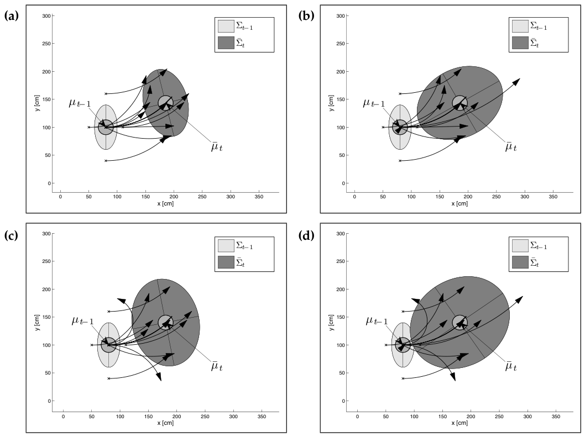

*Figure 7.12 — UKF 알고리즘의 예측 단계. 그래프는 서로 다른 motion 노이즈 파라미터로 생성되었다.
로봇의 초기 추정은 $\mu_{t-1}$ 에 중심을 둔 타원으로 표현된다. 로봇은 90cm 길이의 원호를 따라 왼쪽으로
45도 회전하며 이동한다. 패널 (a)에서는 병진과 회전 모두 motion 노이즈가 비교적 작다. 다른 패널들은
(b) 높은 병진 노이즈, (c) 높은 회전 노이즈, (d) 병진·회전 모두 높은 노이즈를 나타낸다. (책 p.224)*

**이전 belief로부터 생성된 시그마 포인트의 위치 성분 $\mathcal{X}_{t-1}^x$ 는 $\mu_{t-1}$ 주위에
대칭적으로 놓인 십자 표시로 표시된다. **15개 시그마 포인트는 7개의 서로 다른 로봇 위치를 갖는데,
그중 5개만 이 $x$-$y$ 투영에서 보인다.** 추가 두 점은 평균 시그마 포인트의 "위"와 "아래"에 위치하며
서로 다른 로봇 방향을 표현한다.** (책 p.223)

> **숫자를 따라가 보자.** 시그마 포인트는 15개인데 위치가 7개인 이유:
> - 증강 상태 7차원 → 시그마 포인트 $2 \times 7 + 1 = 15$ 개
> - 그중 **위치 성분이 0이 아닌 것은 앞 3차원에 대응하는 $2\times3 = 6$ 개 + 평균 1개 = 7개**
> - 나머지 8개는 제어·측정 노이즈 차원의 포인트라 **위치는 평균과 같다**
> - 7개 중 $\theta$ 방향으로만 다른 2개는 $x$-$y$ 평면에 투영하면 겹쳐서 5개만 보인다

**호(arc)는 라인 7에서 수행되는 motion 예측을 나타낸다. 보이는 대로 **11개의 서로 다른 예측**이
생성되며, 이는 이전 위치와 motion 노이즈의 서로 다른 조합에서 나온다. 패널들은 이 갱신에 대한 motion
노이즈의 영향을 예시한다. 예측된 로봇 위치의 평균 $\bar\mu_t$ 와 불확실성 타원 $\bar\Sigma_t$ 는
예측된 시그마 포인트로부터 생성된다.** (책 p.226)

> **7개 위치 × 제어 노이즈 조합 → 11개 예측.** 위치가 같아도 제어 노이즈가 다르면 다른 곳에 도착한다.
> 이 11개 점의 퍼짐이 곧 $\bar\Sigma_t$ 다 — **Jacobian 없이 공분산을 얻었다.**

### 측정 예측 (책 p.226)

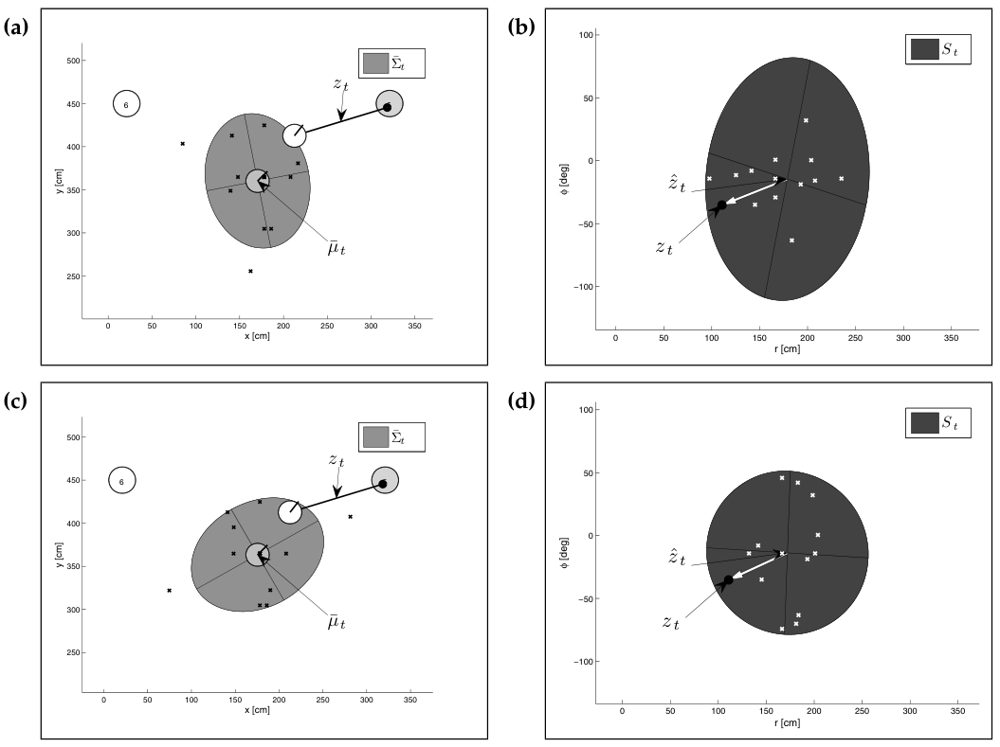

*Figure 7.13 — 측정 예측. 왼쪽 도표는 두 motion 갱신으로부터 예측된 시그마 포인트와 결과 불확실성
타원을 보여준다. 참 로봇과 관측은 각각 흰 원과 굵은 선으로 표시된다. 오른쪽 패널은 결과 측정 예측
시그마 포인트를 보여준다. 흰 화살표는 innovation, 즉 관측된 측정과 예측된 측정의 차이를 가리킨다.
(책 p.225)*

**측정 예측 단계에서 예측된 로봇 위치 $\bar{\mathcal{X}}_t^x$ 는 측정 시그마 포인트
$\bar{\mathcal{Z}}_t$ 를 생성하는 데 사용된다(라인 10). (…) **11개의 서로 다른 위치 시그마 포인트가
15개의 서로 다른 측정을 생성**함에 주목하라. 이는 라인 10에서 서로 다른 측정 노이즈 성분
$\mathcal{X}_t^z$ 가 더해지기 때문이다. 패널들은 또한 라인 11과 12에서 추출된 예측 측정의 평균
$\hat{z}_t$ 와 불확실성 타원 $S_t$ 를 보여준다.** (책 p.226)

### 보정 단계 (책 p.226)

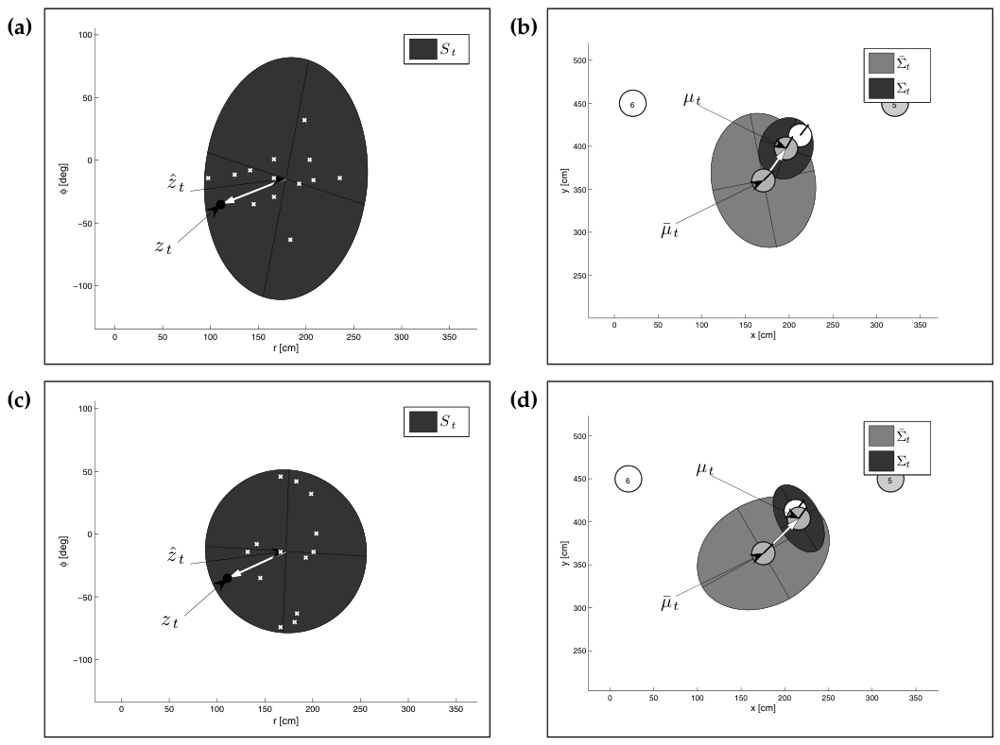

*Figure 7.14 — UKF 알고리즘의 보정 단계. 왼쪽 패널은 측정 예측을, 오른쪽 패널은 결과 보정을
보여주며, 이는 평균 추정을 갱신하고 위치 불확실성 타원을 줄인다. (책 p.226)*

**UKF localization 알고리즘의 보정 단계는 EKF 보정 단계와 **사실상 동일**하다. Innovation 벡터와
측정 예측 불확실성이 추정을 갱신하는 데 사용된다.** (책 p.226)

### EKF와 UKF, 무엇이 다른가 (책 p.226~228)

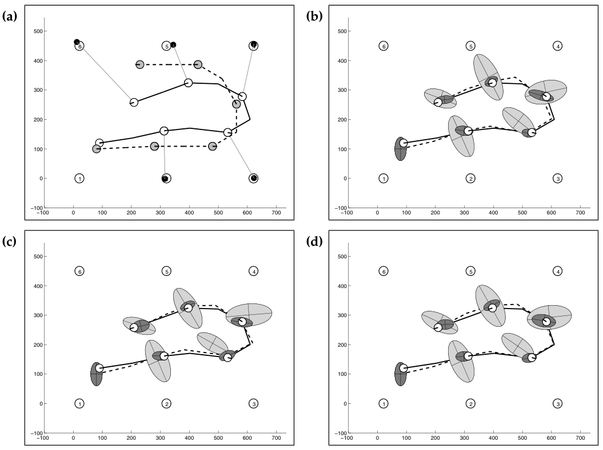

*Figure 7.15 — UKF와 EKF 추정의 비교: (a) motion control에 따른 로봇 궤적(점선)과 결과 참 궤적(실선).
랜드마크 검출은 가는 선으로 표시된다. (b) particle filter로 생성된 참조 추정. (c) EKF, (d) UKF 추정.
(책 p.227)*

**Figure 7.15는 particle filter(우상단), EKF(좌하단), UKF(우하단)로 생성된 위치 추정 시퀀스를
보여준다. (…) 보이는 대로 **EKF와 UKF의 추정은 이 참조 추정에 극도로 가까우며, UKF가 약간 더
가깝다.**** (책 p.226~228)

> **일상적인 tracking에서는 둘의 차이가 거의 없다.** 이것이 EKF가 여전히 널리 쓰이는 이유다.
> 차이가 드러나는 곳은 다음 그림이다.

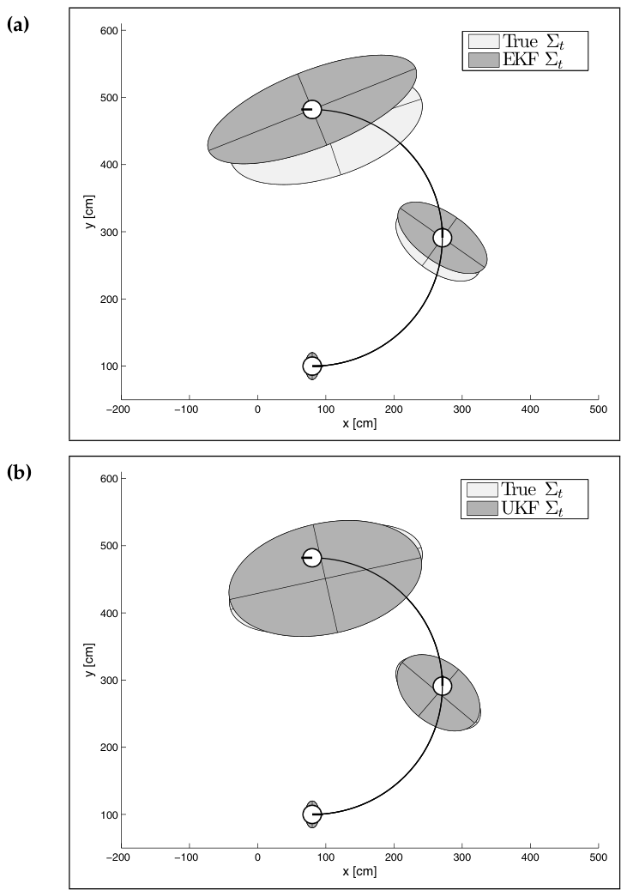

*Figure 7.16 — 선형화로 인한 근사 오차. 로봇이 원을 따라 이동한다. (a) EKF 예측과 (b) UKF 예측에
기반한 추정. 참조 공분산은 정확한 표본 기반 예측에서 추출되었다. (책 p.228)*

**UKF가 적용하는 개선된 선형화의 영향은 Figure 7.16의 예에서 더 두드러진다. 여기서 로봇은 가는 선으로
표시된 원을 따라 **두 번의 motion control**을 수행한다. 패널들은 두 운동 후의 불확실성 타원을 보여준다
(로봇은 관측을 하지 않는다). 다시 한 번, 정확한 표본 기반 motion 갱신에서 추출된 공분산이 참조로
표시된다. 참조 표본은 **Table 5.3의 알고리즘 sample_motion_model_velocity**를 사용해 생성되었다.**
(책 p.228)

**EKF 선형화는 **평균의 위치와 공분산의 "모양" 모두에서 상당한 오차**를 초래하는 반면, UKF 추정은
참조 추정과 거의 동일하다.** (책 p.228)

> **5.3.2절에서 만든 sampling 알고리즘이 여기서 "정답"의 역할을 한다.** 표본을 충분히 뽑으면
> 근사 없이 참 분포를 알 수 있으므로, 두 필터의 근사 품질을 재는 자로 쓸 수 있다.

**이 예는 또한 EKF와 UKF 예측 사이의 **미묘한 차이** 하나를 보여준다. **EKF가 예측한 평균은 언제나
제어로부터 예측된 위치에 정확히 놓인다**(Table 7.2의 라인 6). 반면 **UKF의 평균은 시그마 포인트로부터
추출**되므로 제어로부터 예측된 평균에서 벗어날 수 있다(Table 7.4의 라인 7).** (책 p.228)

> **이 차이가 왜 중요한가.** 원운동처럼 휜 궤적에서는 "노이즈 없이 갔을 때의 도착점"과 "노이즈를 섞어
> 여러 번 갔을 때의 평균 도착점"이 **다르다**. 곡선 위에서 평균을 내면 곡선 안쪽으로 당겨지기 때문이다
> (Jensen 부등식과 같은 구조). EKF는 이 효과를 구조적으로 포착할 수 없고, UKF는 포착한다.

<!--widget:ekf-vs-ukf-linearization-->

### 3. 예제/실습

#### 예제 — 시그마 포인트 개수와 구성

7.4절 예제와 같은 설정에서 UKF를 쓴다면:

| 항목 | 값 |
|---|---|
| 상태 차원 | 3 ($x, y, \theta$) |
| 제어 노이즈 차원 | 2 ($v, \omega$) |
| 측정 노이즈 차원 | 2 ($r, \phi$) |
| **증강 차원 $L$** | **7** |
| **시그마 포인트 수** | $2(7) + 1 = $ **15** |
| $\Sigma^a_{t-1}$ 크기 | $7 \times 7$ |

증강 공분산은 다음과 같다 (7.4절 예제의 값 사용):

$$\Sigma_{t-1}^a = \begin{pmatrix} 0.10 & 0 & 0 & & & & \\ 0 & 0.10 & 0 & & 0 & & \\ 0 & 0 & 0.05 & & & & \\ & & & 0.1025 & 0 & & \\ & 0 & & 0 & 0.035 & & 0 \\ & & & & & 0.04 & 0 \\ & & 0 & & & 0 & 0.01 \end{pmatrix}$$

**계산량 비교**

| | EKF | UKF |
|---|---|---|
| motion model 평가 | 1회 | **15회** |
| measurement model 평가 | 1회 | 15회 |
| Jacobian 계산 | $G_t$ (3×3), $V_t$ (3×2), $H_t$ (3×3) | **없음** |
| 행렬 제곱근 | 없음 | $\sqrt{\Sigma^a}$ (7×7) **1회** |

**UKF가 무조건 느린 것은 아니다.** Jacobian을 해석적으로 유도하기 어렵거나(복잡한 모델) 수치
미분해야 하는 경우, UKF의 15회 함수 평가가 오히려 싸다.

#### 예제 — 왜 EKF의 평균이 곡선 바깥에 놓이는가

반지름 $r = 2$ 인 원호를 각도 $\Delta\phi$ 만큼 도는 운동에서, 회전 속도에 $\pm 20\%$ 노이즈가 있다고
하자. $\omega\Delta t = 0.5$ rad 를 명령했다면 실제로는 $0.4$ 또는 $0.6$ rad 를 돌 수 있다.

$x$ 변위는 $r\sin(\omega\Delta t)$ 이므로:

| 시나리오 | $\omega\Delta t$ | $x$ 변위 $= 2\sin(\cdot)$ |
|---|---|---|
| 노이즈 $-20\%$ | 0.4 | $2(0.389418) = 0.778837$ |
| **명령값 (EKF의 평균)** | **0.5** | $2(0.479426) = 0.958851$ |
| 노이즈 $+20\%$ | 0.6 | $2(0.564642) = 1.129285$ |
| **두 극단의 평균 (UKF에 가까움)** | — | $\frac{0.778837 + 1.129285}{2} = 0.954061$ |

**EKF의 평균 $0.958851$ 과 표본 평균 $0.954061$ 이 다르다.** 차이는 작지만 ($0.0048$), 이것이 매
스텝 누적되고 곡률이 클수록 커진다. Figure 7.16이 두 번의 운동 후에 그 차이를 보여준 것이다.

$\sin$ 이 이 구간에서 **위로 볼록**이므로 $\mathbb{E}[\sin(X)] < \sin(\mathbb{E}[X])$ 이고,
따라서 표본 평균이 항상 더 작다. **비선형 함수에 대해 "평균의 상"과 "상의 평균"은 다르다** —
UKF가 잡아내는 것이 정확히 이 차이다.

#### 연습문제

1. 상태에 랜드마크 $N$ 개를 추가하면($3 + 2N$ 차원) 증강 차원 $L$ 과 시그마 포인트 수는? 이것이
   SLAM에서 UKF를 쓰기 어려운 이유와 어떻게 연결되는가?
2. Table 7.4가 "단일 feature 관측만 다룬다"는 제약을 여러 feature로 확장하려면 무엇을 바꿔야 하는가?
3. 위 두 번째 예제에서 노이즈를 $\pm 40\%$ 로 키우면 EKF 평균과 표본 평균의 차이는 얼마가 되는가?

---

# 7.8 Practical Considerations (책 p.229~232)

### 1. 개념적 이해

**EKF localization 알고리즘과 그 가까운 친척 MHT localization은 **position tracking**을 위한 인기
있는 기법이다. 효율성과 강건성을 높이는 이 알고리즘들의 변형이 다수 존재한다.** (책 p.229)

## 구현을 개선하는 세 가지 (책 p.229~230)

### ① 효율적 탐색 (Efficient search)

**첫째, correspondence를 모르는 우리의 EKF localization 알고리즘이 하는 것처럼 맵의 **모든 랜드마크
$k$ 를 순회하는 것은 흔히 비실용적**이다. 흔히 그럴듯한 후보 랜드마크를 식별하는 간단한 검사가 존재하며
(예: 측정을 단순히 $x$-$y$ 공간으로 투영해서), 이를 통해 상수 개를 제외한 모든 후보를 배제할 수 있다.
그런 알고리즘은 우리의 순진한 구현보다 **몇 자릿수 빠를** 수 있다.** (책 p.229)

> Table 7.3 라인 10의 루프를 그대로 구현하면 맵 랜드마크 수 $N$ 에 비례한다. 실제 구현은 공간 색인
> (k-d tree 등)이나 게이팅(gating)으로 후보를 좁힌다.

### ② Mutual exclusion — 우리 구현의 핵심 한계

**우리 구현의 핵심 한계는 EKF에서 (그리고 상속에 의해 MHT에서) **feature 노이즈의 독립을 가정**한
데서 발생한다. 독자는 조건 (7.16)을 상기할 수 있는데, 이는 개별 feature를 순차적으로 처리하여 모든
correspondence 벡터 공간에 대한 잠재적 지수 탐색을 피하게 해주었다.** (책 p.229)

**불행히도 그런 접근은 **두 개의 관측된 feature $z_t^i$ 와 $z_t^j$ ($i \ne j$) 를 맵의 같은
랜드마크에 배정**하는 것을 허용한다: $\hat{c}_t^i = \hat{c}_t^j$. 많은 센서에 대해 그런
correspondence 배정은 기본적으로 잘못된 것이다.** (책 p.229)

**예를 들어 feature 벡터가 단일 카메라 이미지에서 추출된다면, 이미지 공간의 서로 다른 두 영역은
기본적으로 물리 세계의 서로 다른 위치에 대응해야 함을 우리는 안다. 달리 말해 우리는 보통
$i \ne j \longrightarrow \hat{c}_t^i \ne \hat{c}_t^j$ 임을 안다. 이 (**hard!**) 제약을 data
association의 **mutual exclusion principle**이라 부른다. 이는 모든 가능한 correspondence 벡터의
공간을 줄인다.** (책 p.229)

**고급 구현은 이 제약을 고려한다. 예를 들어 먼저 각 correspondence를 따로 탐색한 뒤 — 우리의 EKF
localizer 버전처럼 — mutual exclusion 원리의 위반을 correspondence 값을 적절히 바꿔 해소하는
"수리(repair)" 단계를 거칠 수 있다.** (책 p.229)

> **7.5.2절의 "정당화"에 붙은 따옴표가 여기서 해소된다.** 성분별 최적화는 계산을 $N^I$ 에서
> $N \times I$ 로 줄여주지만, 그 대가로 물리적으로 불가능한 배정을 허용한다.

### ③ 이상치 제거 (Outlier rejection)

**나아가 우리 구현은 이상치 문제를 다루지 않는다. 독자는 6.6절에서 우리가 $c = N + 1$ 인
correspondence를 허용했음을 상기할 수 있는데, $N$ 은 맵의 랜드마크 수다. 그런 이상치 검사는 EKF
localization 알고리즘에 꽤 쉽게 추가된다.** (책 p.229)

**특히 $\pi_{N+1}$ 을 이상치의 사전 확률로 설정하면, EKF localization(Table 7.3) 라인 16의 argmax
단계가 **이상치가 측정 벡터의 가장 그럴듯한 설명일 때 $N+1$ 로 기본 설정**될 수 있다. 명백히
이상치는 로봇의 pose에 대한 아무 정보도 제공하지 않는다; 따라서 pose 관련 항은 Table 7.3의 라인 18과
19에서 단순히 생략된다.** (책 p.229~230)

> 6.6.3절에서 도입한 $c_t^i = N+1$ 이 여기서 실제로 쓰인다. **"어느 랜드마크에도 대응하지 않음"**
> 이 argmax의 후보 중 하나가 되고, 그것이 이기면 그 관측을 통째로 버린다.

## Gaussian 기법은 왜 position tracking에만 쓰이는가 (책 p.230)

**EKF와 UKF localization은 **position tracking 문제에만 적용 가능**하다. 일반적으로 선형화된 Gaussian
기법은 위치 불확실성이 작을 때만 잘 작동하는 경향이 있다. 이 관찰에는 몇 가지 상호보완적 이유가
있다:** (책 p.230)

| # | 이유 |
|---|---|
| 1 | **unimodal Gaussian은 tracking에서는 보통 불확실성의 좋은 표현이지만, 더 일반적인 global localization 문제에서는 그렇지 않다** |
| 2 | **tracking 중에도 unimodal Gaussian은 "로봇이 벽에 가깝지만 벽 안에 있을 수는 없다" 같은 hard 공간 제약을 표현하기에 적합하지 않다.** 이 한계의 심각성은 로봇 위치의 불확실성이 커질수록 증가한다 |
| 3 | **좁은 Gaussian은 잘못된 correspondence 결정의 위험을 줄인다.** 이는 특히 EKF에 중요한데, **단 하나의 잘못된 correspondence가 localization과 correspondence 오차의 흐름 전체를 유발하여 tracker를 탈선시킬 수 있기** 때문이다 |
| 4 | **선형화는 보통 선형화 점의 가까운 근방에서만 좋다. 경험 법칙으로, 방향 $\theta$ 의 표준편차가 $\pm 20$ 도보다 크면 선형화 효과가 EKF와 UKF 알고리즘 모두를 실패하게 만들 가능성이 높다** |

> **④의 $\pm 20°$ 는 실무에서 기억해 둘 만한 구체적 숫자다.** 방향 표준편차가 이보다 커지면
> Gaussian 필터를 포기하고 8장의 방법으로 가야 한다는 신호다.

## Feature 설계는 기예다 (책 p.231)

**Gaussian localization 알고리즘을 위한 적절한 feature의 설계는 다소 기예에 가깝다. 여러 경쟁하는
목표를 충족해야 하기 때문이다.** (책 p.231)

| 목표 | 방향 |
|---|---|
| pose 불확실성을 작게 유지 | 환경에 **feature가 충분히 많아야** 한다 |
| 혼동·오검출 최소화 | 랜드마크가 **서로 충분히 달라야** 한다 |

**한편으로 우리는 로봇의 pose 추정 불확실성이 작게 유지될 수 있도록 환경에 충분히 많은 feature를
원한다. 작은 불확실성은 이미 논의한 이유로 절대적으로 중요하다. 다른 한편으로 랜드마크가 서로
혼동되거나 랜드마크 검출기가 가짜 feature를 검출할 가능성을 최소화하고 싶다. 많은 환경은 높은
신뢰도로 검출될 수 있는 점 랜드마크를 그리 많이 갖고 있지 않으므로, 많은 구현이 비교적 성기게 분포된
랜드마크에 의존한다.** (책 p.231)

**여기서 MHT는 명백한 이점을 갖는데, data association 오차에 더 강건하기 때문이다. 경험 법칙으로,
**많은 수의 랜드마크가 적은 수보다 잘 작동하는 경향이 있다** — EKF와 UKF에 대해서도 그렇다. 그러나
**랜드마크가 조밀할 때는 data association의 mutual exclusion 원리를 적용하는 것이 결정적이다.**
(책 p.231)

## Negative information (책 p.231)

**마지막으로, EKF와 UKF localization은 센서 측정의 **모든 정보 중 일부만** 처리함에 유의한다. 원시
측정에서 feature로 가면서 처리되는 정보의 양이 이미 극적으로 줄어든다. 나아가 EKF와 UKF localization은
**negative information**을 처리할 수 없다.** (책 p.231)

**Negative information은 **feature의 부재**에 관련된다. 명백히 어떤 feature를 볼 것으로 기대했는데
보지 못하는 것은 관련 정보를 담고 있다. 예를 들어 파리에서 에펠탑을 보지 못한다면 우리가 그 바로
옆에 있을 가능성은 낮다는 뜻이다.** (책 p.231)

**Negative information의 문제는 그것이 **non-Gaussian belief를 유발**한다는 것이며, 이는 평균과 분산
으로 표현될 수 없다. 이런 이유로 EKF와 UKF 구현은 negative information 문제를 단순히 무시하고, 대신
관측된 feature의 정보만 통합한다. 표준 MHT도 negative information을 피한다. 그러나 **랜드마크 관측에
실패한 mixture 성분을 감쇠시킴으로써 negative information을 mixture 가중치에 접어 넣는 것은
가능하다.**** (책 p.231)

> **7.3절 연습문제 2에서 물었던 것이 이것이다.** 1차원 복도 예제에서 "문을 못 봤다"는 정보로
> belief를 갱신하면 문 위치의 확률이 **줄어든다.** Markov localization은 이것을 자연스럽게 처리하지만
> (측정 모델에 $p(z = \text{no door} \mid x)$ 를 넣으면 된다), Gaussian 필터는 그 결과가 "문 위치만
> 파인" 비-Gaussian 모양이 되어 표현할 수 없다.
>
> **8장의 grid·particle 방법은 negative information을 자연스럽게 처리한다** — 8.1절 도입부가
> 이것을 첫 번째 장점으로 든다.

## 그래서 Gaussian 기법은 취약한가 (책 p.231~232)

**이 모든 한계에도 불구하고, Gaussian 기법이 취약한 localization 기법이라는 뜻인가? 답은 **아니오**다.
EKF, UKF, 특히 MHT는 선형 시스템 가정의 위반에 **놀랍도록 강건**하다. 사실 **성공적 localization의
열쇠는 성공적 data association에 있다.** 이 책 뒷부분에서 우리는 지금까지 논의한 것보다 더 정교한
correspondence 처리 기법을 만날 것이다. 그런 기법의 다수가 Gaussian 표현에 적용 가능하며(적용될
것이며), 그 결과 알고리즘은 흔히 **알려진 것 중 최고**에 속한다.** (책 p.231~232)

> **7장 전체의 결론이다.** 필터의 선택보다 **correspondence를 제대로 푸는 것**이 중요하다.
> 그래서 7.5·7.6절이 이 장에서 가장 실무적인 부분이다.

### 2. 예제/실습

#### 예제 — mutual exclusion 위반이 만드는 오류

로봇 앞에 랜드마크 A$(5, 5)$ 와 B$(5, 6)$ 가 1m 간격으로 있다. 로봇은 두 개의 feature를 관측했다.

| 관측 | $r$ | $\phi$ |
|---|---|---|
| $z_t^1$ | 4.9 | 0.02 |
| $z_t^2$ | 5.1 | 0.19 |

예측 pose에서 계산한 예측 측정이 $\hat{z}^A = (5.0,\ 0.05)$, $\hat{z}^B = (5.6,\ 0.25)$ 라 하자.

**성분별 argmax (Table 7.3 라인 16)를 그대로 적용하면:**

| 관측 | A와의 차이 | B와의 차이 | 선택 |
|---|---|---|---|
| $z_t^1$ | $(-0.1,\ -0.03)$ | $(-0.7,\ -0.23)$ | **A** |
| $z_t^2$ | $(+0.1,\ +0.14)$ | $(-0.5,\ -0.06)$ | **A** ← 둘 다 A |

$\hat{c}_t^1 = \hat{c}_t^2 = A$ — **물리적으로 불가능하다.** 한 번의 관측에서 서로 다른 두 feature가
같은 물체일 수 없다.

**mutual exclusion을 강제하면**, 가능한 배정은 $(A, B)$ 또는 $(B, A)$ 두 가지뿐이고, 전체 likelihood
곱이 큰 쪽을 고른다. 여기서는 $(A, B)$ 가 선택되어 $z_t^2$ 가 B에 올바르게 배정된다.

#### 예제 — negative information을 Markov localization으로

7.3절 스니펫을 다시 쓰되, 이번엔 문을 **못 봤을** 때:

```python
bel = np.ones(N) / N
bel = sense(bel, saw_door=False)     # 문을 못 봄
print("문 위치 확률:", [round(bel[d], 4) for d in DOORS])
print("문 아닌 곳 확률:", round(bel[0], 4))
```

측정 모델이 $p(\text{no door} \mid \text{문 위치}) = 0.4$, $p(\text{no door} \mid \text{그 외}) = 0.8$
이므로 문 위치의 확률이 **줄어든다**. 이 갱신 후의 belief는 "문 세 곳만 움푹 파인" 모양이며,
**어떤 Gaussian으로도 표현할 수 없다.** EKF가 이 정보를 버리는 이유가 이것이다.

#### 연습문제

1. 세 가지 개선(효율적 탐색 / mutual exclusion / 이상치 제거) 각각을 Table 7.3의 어느 라인에
   어떻게 끼워 넣겠는가?
2. "방향 표준편차 $\pm 20$ 도"라는 경험 법칙의 근거를 3.3.2절 linearization과 연결해 설명하라.
   10m 떨어진 랜드마크에 대해 $20°$ 오차는 몇 m의 위치 오차에 해당하는가?
3. Negative information을 MHT의 mixture 가중치에 반영하려면 식 (7.26)을 어떻게 수정해야 하는가?

---

# 7.9 Summary (책 p.232~233)

**이 장에서 우리는 mobile robot localization 문제를 소개하고 그것을 푸는 첫 실용적 알고리즘을
고안했다.** (책 p.232) 책의 요약을 옮기고 각 항목에 이 노트의 위치를 붙인다.

**• Localization 문제는 알려진 환경 맵에 대한 로봇의 pose를 추정하는 문제다.** → **7장 도입부**

**• Position tracking은 초기 pose가 알려진 로봇의 국소 불확실성을 수용하는 문제를 다룬다;
global localization은 로봇을 처음부터 localize하는 더 일반적인 문제다. Kidnapping은 잘 localize된
로봇이 몰래 다른 곳으로 순간이동되는 localization 문제이며 — **셋 중 가장 어렵다.**** → **7.1절**

**• Localization 문제의 어려움은 환경이 시간에 따라 변하는 정도의 함수이기도 하다. 지금까지 논의한
모든 알고리즘은 static 환경을 가정한다.** → **7.1절**

**• Passive localization 접근은 필터다: 로봇이 획득한 데이터를 처리하지만 로봇을 제어하지 않는다.
Active 기법은 로봇의 불확실성을 최소화할 목적으로 localization 중에 로봇을 제어한다. 지금까지 우리는
passive 알고리즘만 공부했다.** → **7.1절**

**• Markov localization은 mobile robot localization 문제에 적용된 **Bayes filter의 다른 이름일
뿐**이다.** → **7.2절**

**• EKF localization은 extended Kalman filter를 localization 문제에 적용한다. EKF localization은
주로 feature-based 맵에 적용된다.** → **7.4절**

**• Correspondence 문제를 다루는 가장 흔한 기법은 **maximum likelihood** 기법이다. 이 접근은 각
시점에서 가장 그럴듯한 correspondence가 옳다고 단순히 가정한다.** → **7.5절**

**• Multi-hypothesis tracking 알고리즘(MHT)은 여러 correspondence를 추구하며, posterior를 표현하는 데
Gaussian mixture를 사용한다. Mixture 성분은 동적으로 생성되고, 전체 likelihood가 사용자 지정 문턱값
아래로 가라앉으면 종료된다.** → **7.6절**

**• MHT는 EKF보다 data association 문제에 더 강건하다 — 계산 비용 증가를 대가로. MHT는 개별 가설에
UKF를 사용해 구현될 수도 있다.** → **7.6절**

**• UKF localization은 unscented transform을 사용해 localization 문제의 motion model과 measurement
model을 선형화한다.** → **7.7절**

**• 모든 Gaussian 필터는 **제한된 불확실성을 갖는 국소 position tracking 문제**와 **뚜렷한 feature가
있는 환경**에 적합하다. EKF와 UKF는 global localization이나 대부분의 물체가 비슷하게 보이는 환경에는
덜 적용 가능하다.** → **7.8절**

**• Gaussian 필터를 위한 feature 선택에는 기술이 필요하다. Feature는 혼동 가능성을 최소화할 만큼
충분히 모호하지 않아야 하고, 로봇이 자주 feature를 만날 만큼 충분히 많아야 한다.** → **7.8절**

**• Gaussian localization 알고리즘의 성능은 data association에 mutual exclusion을 강제하는 등 여러
조치로 개선될 수 있다.** → **7.8절**

**다음 장에서 우리는 서로 다른 belief 표현을 사용하여 EKF의 한계를 다루려는 대안적 localization
기법을 논의할 것이다.** (책 p.232)

## 7장 전체 한 장 정리

| 절 | 알고리즘 | belief 표현 | correspondence | 풀 수 있는 문제 |
|---|---|---|---|---|
| 7.2 | Markov localization | **임의** | — | 셋 다 (표현에 따라) |
| 7.4 | EKF (known corr.) | Gaussian 1개 | 주어짐 | position tracking |
| 7.5 | EKF (ML corr.) | Gaussian 1개 | ML로 추정 | position tracking |
| 7.6 | MHT | Gaussian $\le \psi_{\min}^{-1}$ 개 | 여러 가설 유지 | **+ global, kidnapping** |
| 7.7 | UKF | Gaussian 1개 | 주어짐 | position tracking (**선형화 더 정확**) |

## 8장으로 가는 다리

8.1절 도입부가 8장이 7장과 무엇이 다른지 직접 밝힌다 (책 p.237).

**• 원시 센서 측정을 처리할 수 있다. 센서 값에서 feature를 추출할 필요가 없다. 직접적인 함의로
**negative information도 처리할 수 있다.**
• **non-parametric**이다. 특히 EKF localizer의 경우처럼 unimodal 분포에 묶이지 않는다.
• **global localization과 — 어떤 경우에는 — kidnapped robot 문제를 풀 수 있다.** EKF 알고리즘은
그런 문제를 풀 수 없다 — MHT는 global localization 문제를 풀도록 수정될 수 있지만.**

| 8장에서 배울 것 | 7장에서 준비한 것 | 6장에서 준비한 것 |
|---|---|---|
| 8.2 Grid Localization | 7.2 Markov localization (Table 7.1) | 6.3 beam model |
| 8.3 Monte Carlo Localization | 7.2 Markov localization + 4.3 particle filter | **6.4 likelihood field** |
| 8.3.5 Augmented MCL | 7.1 kidnapped robot problem | — |
| 8.4 동적 환경 | 7.1 dynamic environment | 6.3.1 $p_{\text{short}}$ |

---

# 7.10 Bibliographical Remarks (책 p.233~234)

책이 제시한 문헌 갈래를 정리한다.

**Localization은 "모바일 로봇에게 자율 능력을 제공하는 데 가장 근본적인 문제"라 불려 왔다
(Cox 1991).** (책 p.233)

| 주제 | 문헌 |
|---|---|
| 실외 로보틱스 상태 추정에 EKF 선구적 사용 | Dickmanns and Graefe (1988) — 카메라 이미지로 고속도로 곡률 추정 |
| 초기 실내 mobile robot localization 개관 | Borenstein et al. (1996); Feng et al. (1994) |
| 초기 모바일 로보틱스 교과서 | Cox and Wilfong (1990) |
| 소나 스캔의 기하 beacon과 맵 예측 beacon 정합에 EKF | Leonard and Durrant-Whyte (1991) |
| 인공 마커 사용 (현재까지 이어짐) | Salichs et al. (1999) |
| 미개조 환경을 레이저로 스캔 | Hinkel and Knieriemen (1988) |
| 적외선 거리와 선분 환경 기술 정합 | Cox (1991) |
| range 측정 상관 기반 접근 | Weiss et al. (1994) |
| **map matching** (지역 occupancy grid ↔ 전역 맵) | Moravec (1988) |
| 그 아이디어 기반 gradient descent localizer | Thrun (1993), 1992년 첫 AAAI 대회에 사용 (Simmons et al. 1992) |
| occupancy grid + 초음파 추적 전략 비교 | Schiele and Crowley (1994) |
| map matching과 feature 기반 기법의 강건성 비교 | Shaffer et al. (1992) — **둘의 조합이 최선** |
| 환경 변화에 대한 map matching의 강건성 | Yamauchi and Langley (1997) |
| **scan matching** localization | Lu and Milios (1994, 1998); Gutmann and Schlegel (1996); Besl and McKay (1992) |
| scan matching의 정확도 | Arras and Vestli (1998) |
| 레이저 스트라이프 + 카메라로 강건성 향상 | Ortin et al. (2004) |
| localization의 기하학적 기법 | Betke and Gurvits (1994) |
| **"kidnapped robot problem"** 용어의 출처 | Engelson and McDermott (1992) |
| **"Markov localization"** 이름의 출처 | Simmons and Koenig (1995) — 격자로 posterior 표현 |
| 그 지적 뿌리 — "certainty factors" | Nourbakhsh et al. (1995) |
| 가설 트리를 동적으로 유지 | Cox and Leonard (1994) — 선구적 논문 |
| 퍼지 논리 기반 localization | Saffiotti (1997); Driankov and Saffiotti (2001) |

---

# 7.11 Exercises (책 p.234~236)

책의 연습문제를 그대로 옮긴다.

### 문제 1 — 랜드마크 여러 개와 Gaussian posterior (책 p.234)

**로봇이 랜드마크까지의 range와 bearing을 측정하는 센서를 갖추고 있다고 하자; 단순함을 위해 로봇이
랜드마크의 정체도 감지할 수 있다고 하자(정체 센서는 노이즈가 없다). 우리는 EKF로 global
localization을 수행하고자 한다. **단일 랜드마크를 볼 때 posterior는 보통 Gaussian으로 잘 근사되지
않는다. 그러나 둘 이상의 랜드마크를 동시에 감지할 때 posterior는 흔히 Gaussian으로 잘 근사된다.**

- **(a)** 왜 그런지 설명하라.
- **(b)** $k$ 개의 식별 가능한 랜드마크에 대한 range와 bearing의 $k$ 개 동시 측정이 주어졌을 때,
  균등한 초기 prior 아래에서 로봇의 Gaussian pose 추정을 계산하는 절차를 고안하라. 6.6절에서 제공된
  range/bearing measurement model에서 시작해야 한다.

> **(a)의 힌트**: 6.6.4절 Figure 7.13(a)의 고리를 떠올리라. 랜드마크 하나는 pose 3자유도 중 2개만
> 묶어 **고리**를 남긴다 — 이는 Gaussian이 아니다. 두 개면 고리 두 개의 **교점**이 되고, 교점은
> 국소적으로 Gaussian에 가깝다.
>
> **(b)의 방향**: 두 랜드마크의 range로 삼각측량하여 $(x, y)$ 후보를 구하고, bearing으로 $\theta$ 를
> 정한 뒤, 3.3절 linearization으로 측정 노이즈를 pose 공분산으로 전파한다($\Sigma = J Q J^T$ 꼴).

### 문제 2 — 어려운 환경 설계하기 (책 p.234~235)

**이 문제에서 우리는 global localization을 위한 어려운 환경을 설계하려 한다. $n$ 개의 교차하지 않는
직선 선분으로 평면 환경을 구성할 수 있다고 하자. 환경의 자유 공간은 유계여야 한다; 그러나 맵 안에
점유된 지형의 섬이 있을 수 있다. 이 연습에서는 로봇이 360개 range finder의 원형 배열을 갖추고 있고
이 finder들이 **결코 틀리지 않는다**고 가정한다.**

- **(a)** Global localize하는 로봇이 belief 함수에서 만날 수 있는 **뚜렷한 mode의 최대 개수**는?
  $n = 3, \ldots, 8$ 에 대해 최악 환경의 예를 그리고, mode 수를 최대화하는 그럴듯한 belief도 함께
  그려라.
- **(b)** Range finder가 틀릴 수 있으면 분석이 달라지는가? 특히 $n = 4$ 에서 그럴듯한 mode의 수가
  위에서 유도한 것보다 큰 예를 줄 수 있는가? 그런 환경을 (잘못된) range scan 및 posterior와 함께
  보여라.

> **이 문제가 7.1절의 "대칭 환경이 더 어렵다"를 정량화한다.** mode 개수 = 환경의 대칭성.

### 문제 3 — 수중 로봇을 위한 EKF localization (책 p.235)

**단순한 수중 로봇을 위한 EKF localization 알고리즘을 유도하도록 요청받았다. 이 로봇은 3-D 공간에
살며 완벽한 나침반을 갖추고 있다(항상 자기 방향을 안다). 단순함을 위해 로봇이 세 데카르트 방향
($x$, $y$, $z$)으로 속도 $\dot{x}$, $\dot{y}$, $\dot{z}$ 를 설정함으로써 독립적으로 움직인다고
가정한다. Motion 노이즈는 Gaussian이고 모든 방향에 대해 독립이다.**

**로봇은 음향 신호를 방출하는 여러 beacon으로 둘러싸여 있다. 각 신호의 방출 시각은 알려져 있고,
로봇은 각 신호로부터 방출 beacon의 정체를 결정할 수 있다(따라서 correspondence 문제가 없다).
로봇은 또한 모든 beacon의 위치를 알고, 각 신호의 도착 시각을 측정하는 정확한 시계가 주어진다.
**그러나 로봇은 신호를 받은 방향을 감지할 수 없다.**

- **(a)** 이 로봇을 위한 EKF localization 알고리즘을 고안하라. 이는 motion model과 measurement
  model의 수학적 유도, Taylor 근사를 포함한다. 또한 알려진 correspondence를 가정한 최종 EKF
  알고리즘의 서술을 포함한다.
- **(b)** EKF 알고리즘과 환경 시뮬레이션을 구현하라. 세 가지 localization 문제(global localization,
  position tracking, kidnapped robot problem)의 맥락에서 EKF localizer의 정확도와 실패 모드를
  조사하라.

> **이 문제의 핵심**: 방향을 못 재므로 measurement model이 **range만**이다:
> $h(x_t) = \sqrt{(b_x - x)^2 + (b_y - y)^2 + (b_z - z)^2}$.
> 나침반이 완벽하므로 상태는 $(x, y, z)$ 3차원이고, 각 측정은 1차원 → $H_t$ 는 $1 \times 3$.
> 7.4.3절의 유도를 그대로 3-D로 옮기면 된다.

### 문제 4 — 개루프 localization 전략 (책 p.235~236)

**다음 여섯 개 격자 스타일 환경 중 하나에서의 단순화된 global localization을 고려하라.**

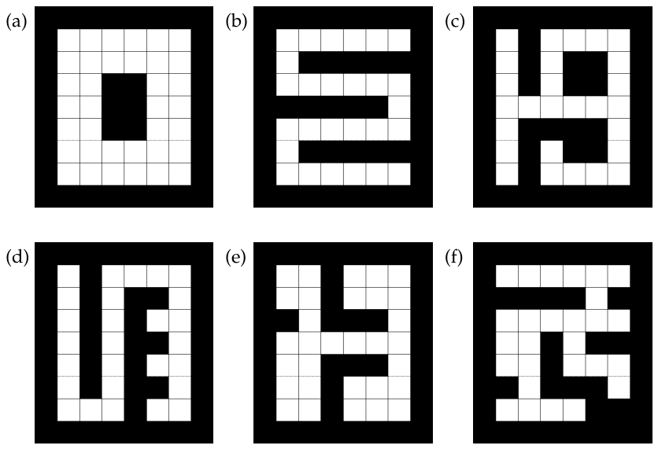

*문제 4·5의 여섯 환경 (a)~(f). 검은 칸이 장애물이다. (책 p.236)*

**각 환경에서 로봇은 북쪽을 향한 임의의 위치에 놓인다. 다음 명령의 수열을 담는 **개루프(open-loop)
localization 전략**을 고안하라:**

```
Action L: 왼쪽으로 90도 회전
Action R: 오른쪽으로 90도 회전
Action M: 장애물에 부딪힐 때까지 전진
```

**이 전략의 끝에서 로봇은 **예측 가능한 위치**에 있어야 한다. 각 환경에 대해 그런 가장 짧은 수열을
제시하라("M" 동작만 센다). 동작 수열을 실행한 뒤 로봇이 어디 있을지 서술하라. 그런 수열이 없으면
왜 없는지 설명하라.**

> **개루프**란 센서를 전혀 쓰지 않는다는 뜻이다. "벽에 붙을 때까지 밀기"를 반복해 어느 출발점에서
> 시작하든 같은 곳으로 모으는 문제다. 이는 사실 8장의 확률적 방법 없이도 풀리는
> **결정론적 localization** 이며, 대칭성이 왜 문제인지를 다른 각도에서 보여준다.

### 문제 5 — 걸음 수를 셀 수 있다면 (책 p.236)

**이제 앞 연습에서 로봇이 "M" 동작을 실행하는 동안 **걸음 수를 셀 수 있다**고 가정하자. 로봇이 자기
위치를 결정하기 위한 가장 짧은 개루프 수열은 무엇인가? 답을 설명하라.**

**참고: 이 문제에서는 로봇의 최종 위치가 출발 위치의 함수일 수 있다. 여기서 요구하는 것은 로봇이
자기 자신을 localize하는 것뿐이다.**

> 문제 4는 "**같은 곳으로 모으기**", 문제 5는 "**어디였는지 알아내기**"다. 후자가 진짜
> localization이고, 걸음 수라는 **측정**이 추가되면서 문제의 성격이 바뀐다.

### 이 노트의 추가 연습문제

1. **구현 연습.** 7.4절 예제의 `ekf_localization_step` 을 확장해 완전한 시뮬레이션을 만들어라:
   랜드마크 6개(RoboCup 필드처럼), 원 궤적 30스텝, 매 스텝 랜드마크 하나 관측. 참 궤적, 추측 항법
   (dead reckoning, 측정 없이 motion model만), EKF 추정 세 개를 함께 그려 Figure 7.11을 재현하라.

2. **비교 연습.** 같은 시뮬레이션에서 Table 7.2(correspondence 알려짐)와 Table 7.3(ML 추정)을
   모두 돌려라. 랜드마크 간격을 좁혀 가면서 ML 버전이 언제 처음 틀린 correspondence를 고르는지,
   그리고 그 뒤 필터가 어떻게 되는지 관찰하라 (7.8절의 "탈선" 현상).

3. **UKF 연습.** Table 7.4를 구현해 같은 시뮬레이션에 적용하고 EKF와 비교하라. 곡률이 큰 궤적
   (예: $\omega = 1.5$ rad/s)에서 차이가 커지는지 Figure 7.16처럼 확인하라.

4. **통합 연습.** 7.6절 MHT를 구현하라. Table 7.2를 track마다 하나씩 돌리고, 라인 21의 likelihood로
   가중치를 갱신하며, $\psi_{\min}$ 이하를 pruning한다. 랜드마크가 구분 불가능한 대칭 환경
   (Figure 7.3 같은)에서 track이 몇 개로 수렴하는지 보라.

---

> **다음 노트**: 8장 Mobile Robot Localization: Grid and Monte Carlo (책 p.237~276)
