# 8장. Mobile Robot Localization: Grid and Monte Carlo

> 원문: *Probabilistic Robotics*, Chapter 8 (책 p.237~278 / PDF p.258~299)
> 이 노트는 8장 전체(8.1 Introduction ~ 8.8 Exercises)를 다룬다.
>
> **이 스터디의 종착점이다.** `0_Contents.md`가 세운 목표 — EKF/UKF + Particle Filter 기반
> Localization — 의 마지막 조각이 여기서 맞춰진다.
>
> | 지금까지 쌓은 것 | 8장에서 쓰이는 곳 |
> |---|---|
> | 4.1 Histogram filter | **8.2 Grid Localization** |
> | 4.3 Particle filter | **8.3 Monte Carlo Localization** |
> | 4.3.4 랜덤 particle 주입 | 8.3.5 Augmented MCL |
> | 5.3 Velocity motion model (Table 5.3 sampling) | 8.3.2 라인 4 |
> | 6.3 Beam model (Table 6.1) | 8.2.4 · 8.3.3 · 8.4 |
> | 6.4 Likelihood field | 8.4 마지막 문단 |
> | 6.6 Landmark model (Table 6.4·6.5) | 8.3.3 · 8.3.5 |
> | 7.1 문제 분류 (global · kidnapping) | 8장 전체의 목표 |
> | 7.2 Markov localization (Table 7.1) | 8.2·8.3의 뼈대 |
>
> **📌 Figure 8.15는 이 책에 존재하지 않는다.** Figure 8.14 다음이 8.16이다. PDF 전문을 검색해
> 확인한 사실이며, 저자의 번호 건너뜀이다.

---

# 8.1 Introduction (책 p.237~238)

## 1. 개념적 이해

**이 장은 **global localization 문제를 풀 수 있는** 두 가지 localization 알고리즘을 기술한다.
여기서 논의되는 알고리즘은 앞 장에서 논의한 unimodal Gaussian 기법과 여러 차이를 갖는다.**
(책 p.237)

세 가지 차이가 7장과 8장을 가른다.

**• 원시 센서 측정을 처리할 수 있다. 센서 값에서 feature를 추출할 필요가 없다. 직접적인 함의로
**negative information도 처리할 수 있다.**** (책 p.237)

> 7.8절에서 EKF가 **negative information을 쓸 수 없다**고 했다. "보여야 할 것이 안 보인다"는 정보가
> non-Gaussian belief를 만들기 때문이다. Grid와 particle은 belief 모양에 제약이 없으니 이 정보를
> 그냥 곱하면 된다.

**• **non-parametric**이다. 특히 EKF localizer의 경우처럼 unimodal 분포에 묶이지 않는다.**
(책 p.237)

**• **global localization과 — 어떤 경우에는 — kidnapped robot 문제를 풀 수 있다.** EKF 알고리즘은
그런 문제를 풀 수 없다 — MHT(multi-hypothesis tracking)는 global localization 문제를 풀도록
수정될 수 있지만.** (책 p.237)

**여기 제시된 기법들은 여러 실제 로봇 시스템에서 훌륭한 성능을 보여 왔다.** (책 p.237)

### 두 알고리즘 미리보기

**첫 번째 접근은 **grid localization**이라 불린다. 이는 posterior belief를 표현하는 데 histogram
filter를 사용한다. Grid localization을 구현할 때 여러 문제가 발생한다: 세밀한 격자에서는 순진한
구현에 필요한 계산이 알고리즘을 견딜 수 없을 만큼 느리게 만들 수 있다. 거친 격자에서는 이산화로 인한
추가 정보 손실이 필터에 부정적 영향을 주며 — 적절히 처리하지 않으면 — 필터가 아예 작동하지 못하게
만들 수도 있다.** (책 p.237)

**두 번째 접근은 **Monte Carlo localization (MCL)** 알고리즘으로, 아마도 현재까지 가장 인기 있는
localization 알고리즘일 것이다. 이는 로봇 pose에 대한 posterior를 추정하는 데 particle filter를
사용한다. MCL의 여러 단점이 논의되고, 이를 kidnapped robot 문제와 동적 환경에 적용하는 기법이
제시된다.** (책 p.238)

> **8장의 구도**
>
> | | 8.2 Grid Localization | 8.3 Monte Carlo Localization |
> |---|---|---|
> | 뿌리 | 4.1 Histogram filter | 4.3 Particle filter |
> | belief 표현 | 격자 칸마다 확률값 $\{p_{k,t}\}$ | particle 집합 $\mathcal{X}_t$ |
> | 해상도 결정 | **미리** 정해야 함 (고정 격자) | **자동으로** 따라감 (particle이 모이는 곳) |
> | 주된 약점 | 계산량 (3-D 격자 convolution) | particle 고갈, proposal 문제 |
> | 8장의 개선 | 8.2.3 네 가지 가속 기법 | 8.3.5·8.3.6·8.3.7 세 가지 변형 |

## 2. 예제/실습

#### 예제 — 7장 EKF가 못 푸는 것을 8장은 어떻게 푸는가

7.3절 Figure 7.5(b)의 상황 — 로봇이 문을 봤고 문이 셋이라 belief mode가 세 개다.

| 알고리즘 | 이 belief를 어떻게 표현하는가 |
|---|---|
| EKF (7.4) | **불가능.** Gaussian 하나로는 mode 셋을 못 그린다. 평균은 문이 없는 지점에 놓인다 |
| MHT (7.6) | Gaussian 3개로 표현. 가능하지만 track 관리가 필요 |
| **Grid (8.2)** | 격자 칸 세 무리의 확률값이 높아진다. **자연스럽다** |
| **MCL (8.3)** | particle이 세 곳에 뭉친다. **자연스럽다** |

#### 연습문제

1. Negative information이 왜 non-Gaussian belief를 만드는지 1차원 복도 예로 설명하라.
2. "MHT도 global localization을 풀 수 있다"면 grid·MCL이 필요한 이유는 무엇인가?
3. Grid와 MCL 중, 로봇이 20m × 20m 실내에서 global localization을 한다면 어느 쪽이 메모리를 덜
   쓰겠는가? 상황에 따라 답이 달라지는가?

---

# 8.2 Grid Localization (책 p.238~250)

## 8.2.1 Basic Algorithm (책 p.238~239)

### 1. 개념적 이해

**Grid localization은 pose 공간의 격자 분해에 대한 **histogram filter**를 사용해 posterior를
근사한다. Discrete Bayes filter는 4.1절에서 이미 광범위하게 논의되었고 Table 4.1에 묘사되어 있다.**
(책 p.238)

> **새 알고리즘이 아니다.** 7.2절 Markov localization을 격자로 구현한 것이고, 그 격자 구현이 곧
> 4.1절 histogram filter다. 이름이 세 개인 하나의 알고리즘이다.

### 2. 수식/유도

#### 전체 수식 (먼저 한 번에)

$$bel(x_t) = \{p_{k,t}\} \tag{1}$$

$$\operatorname{domain}(X_t) = x_{1,t} \cup x_{2,t} \cup \ldots \cup x_{K,t} \tag{2}$$

#### 단계별 설명 (생략 없이)

**(1) belief는 이산 확률값의 모음** — 책 (8.1)

**이는 posterior로서 이산 확률값의 모음을 유지한다. 여기서 각 확률 $p_{k,t}$ 는 격자 칸 $x_k$ 에
대해 정의된다.** (책 p.238)

**(2) 격자 칸들은 pose 공간의 분할이다** — 책 (8.2)

**모든 격자 칸의 집합은 **모든 합법적 pose 공간의 분할(partition)** 을 이룬다.** (책 p.238)

> **분할(partition)이라는 말이 정확히 무엇을 요구하는가**
> - **덮음**: 모든 합법적 pose가 어떤 칸엔가 속한다 (빠진 곳이 없다)
> - **서로소**: 어떤 pose도 두 칸에 동시에 속하지 않는다 (겹침이 없다)
>
> 이것이 보장되어야 $\sum_k p_{k,t} = 1$ 이 의미를 갖는다. 7.2절 식 (3)의 $|X|$ 가 여기서 칸 개수
> $K$ 로 이산화된 것이다.

**Grid localization의 가장 기본적인 버전에서 모든 pose 공간의 분할은 **시간 불변**이고, 각 격자 칸은
같은 크기다. 많은 실내 환경에서 사용되는 흔한 세밀도는 $x$·$y$ 차원에 대해 **15센티미터**,
회전 차원에 대해 **5도**다. 더 세밀한 표현은 더 나은 결과를 내지만 계산 증가를 대가로 한다.**
(책 p.238~239)

### 3. 알고리즘 — 책 Table 8.1

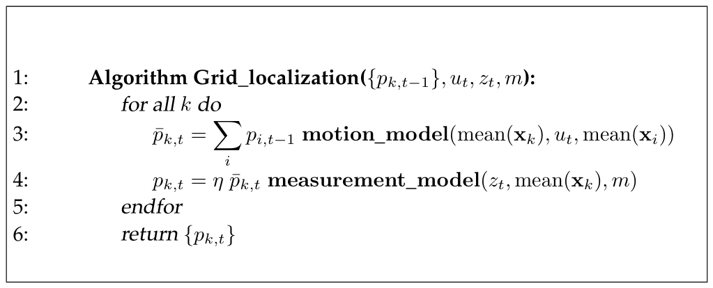

*Table 8.1 — Grid localization, discrete Bayes filter의 변형. 함수 motion_model은 motion model 중
하나를, measurement_model은 센서 모델을 구현한다. 함수 "mean"은 격자 칸 $x_k$ 의 질량중심
(center-of-mass)을 반환한다. (책 p.238)*

```
1:  Algorithm Grid_localization({p_{k,t-1}}, u_t, z_t, m):
2:      for all k do
3:          p̄_{k,t} = Σ_i  p_{i,t-1} · motion_model(mean(x_k), u_t, mean(x_i))
4:          p_{k,t}  = η · p̄_{k,t} · measurement_model(z_t, mean(x_k), m)
5:      endfor
6:      return {p_{k,t}}
```

**Grid localization은 그것이 유도되어 나온 기본 histogram filter와 대체로 동일하다. Table 8.1은 가장
기본적인 구현의 의사코드를 제공한다. 입력으로 이산 확률값 $\{p_{t-1,k}\}$ 와 가장 최근의 측정, 제어,
맵을 요구한다. 안쪽 루프는 모든 격자 칸을 순회한다. 라인 3은 motion model 갱신을, 라인 4는
measurement 갱신을 구현한다. 최종 확률은 라인 4의 정규화 상수 $\eta$ 로 정규화된다.** (책 p.239)

**함수 motion_model과 measurement_model은 각각 5장의 motion model 중 아무거나, 6장의 measurement
model 중 아무거나로 구현될 수 있다. Table 8.1의 알고리즘은 각 칸이 같은 부피를 가진다고 가정한다.**
(책 p.239)

> **Table 7.1(Markov localization)과 나란히 놓으면 대응이 정확하다.**
>
> | Table 7.1 (연속) | Table 8.1 (이산) |
> |---|---|
> | $\overline{bel}(x_t) = \int p(x_t \mid u_t, x_{t-1}, m)\, bel(x_{t-1})\, dx_{t-1}$ | $\bar{p}_{k,t} = \sum_i p_{i,t-1}\cdot \text{motion\_model}(\cdot)$ |
> | $bel(x_t) = \eta\, p(z_t \mid x_t, m)\, \overline{bel}(x_t)$ | $p_{k,t} = \eta\, \bar{p}_{k,t}\cdot \text{measurement\_model}(\cdot)$ |
>
> **적분이 합으로 바뀐 것이 전부다.** 그리고 그 합이 바로 계산 비용의 근원이다 — 칸이 $K$ 개면
> 라인 3의 이중 루프가 $O(K^2)$ 다.
>
> **`mean(x_k)` 이라는 함수가 근사의 정체다.** 칸 전체를 대표하는 값으로 **질량중심 한 점**만 쓴다.
> 8.2.2절이 지적할 문제가 여기서 출발한다.

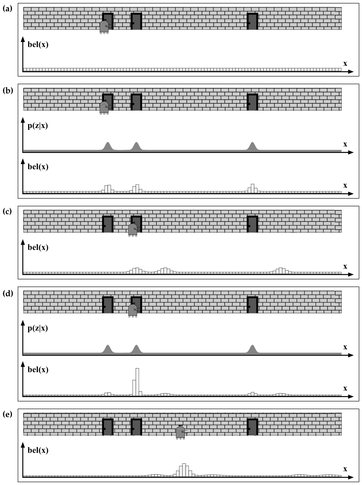

*Figure 8.1 — 세밀한 미터법 분해를 사용한 grid localization. 각 그림은 복도에서의 로봇 위치와,
격자에 대한 histogram으로 표현된 belief $bel(x_t)$ 를 묘사한다. (책 p.240)*

**Figure 8.1은 우리의 1차원 복도 예제에서 grid localization을 예시한다. 이 도표는 표현의 이산적
성질을 제외하면 일반 Bayes filter의 것과 동등하다. 앞서와 마찬가지로 로봇은 균등 histogram으로
표현되는 전역 불확실성으로 시작한다. 센싱함에 따라 대응하는 격자 칸들이 그 확률값을 높인다.
이 예제는 grid localization으로 **multi-modal 분포를 표현하는 능력**을 부각한다.** (책 p.239)

> Figure 7.5(Markov localization)와 **같은 그림**이다. 다른 점은 belief가 매끄러운 곡선이 아니라
> **막대(histogram)** 라는 것뿐이다.

<!--widget:grid-vs-mcl-hallway-->

### 4. 예제/실습

#### 예제 — 격자 크기와 계산량

$20\text{m} \times 20\text{m}$ 실내, 해상도 15cm · 5도:

$$K = \frac{20}{0.15} \times \frac{20}{0.15} \times \frac{360}{5} = 133.3 \times 133.3 \times 72 \approx 1.28 \times 10^{6}\ \text{칸}$$

Table 8.1 라인 3을 곧이곧대로 구현하면 각 칸 $k$ 마다 모든 칸 $i$ 를 훑으므로

$$K^2 \approx 1.6 \times 10^{12}\ \text{번의 연산}$$

**초당 10억 번 연산해도 27분이 걸린다.** 한 스텝에. 이것이 8.2.3절이 필요한 이유다.

실제로는 motion model이 국소적이라(로봇이 한 스텝에 멀리 못 간다) $i$ 를 이웃 칸으로 제한할 수
있다. 이웃을 $n = 100$ 칸으로 보면

$$K \times n \approx 1.28 \times 10^{8}$$

여전히 무겁다. 8.2.3절의 selective updating이 여기에 또 몇 자릿수를 깎는다.

#### 연습문제

1. 해상도를 30cm · 10도로 낮추면 $K$ 와 $K^2$ 는 각각 몇 배 줄어드는가?
2. 식 (2)의 "분할"이 깨지면(칸이 겹치거나 빈틈이 있으면) 어떤 문제가 생기는가?
3. Table 8.1 라인 4의 $\eta$ 는 어떻게 계산하는가? 라인 3에도 정규화가 필요한가?

---

## 8.2.2 Grid Resolutions (책 p.239~243)

### 1. 개념적 이해

**Grid localizer의 핵심 변수는 **격자의 해상도**다. 표면적으로는 사소한 세부처럼 보일 수 있다;
그러나 **적용 가능한 센서 모델의 유형, belief 갱신에 관여하는 계산, 기대할 수 있는 결과의 유형이
모두 격자 해상도에 의존한다.**** (책 p.239)

**양 극단에 두 가지 표현이 있으며, 둘 다 실제 로봇 시스템에 성공적으로 적용되어 왔다.**
(책 p.239)

### Topological — 거친 격자

**격자를 정의하는 흔한 접근은 **topological**이다; 결과 격자는 극도로 거친 경향이 있고, 그 해상도는
환경의 구조에 영향을 받는 경향이 있다. Topological 표현은 모든 pose 공간을 환경의 **의미 있는
장소(significant places)** 에 대응하는 영역들로 분해한다. 그런 장소는 문이나 창문 같은 특정 랜드마크의
존재(또는 부재)로 정의될 수 있다. 복도 환경에서 장소는 교차로, T자 갈림길, 막다른 길 등에 대응할 수
있다.** (책 p.239)

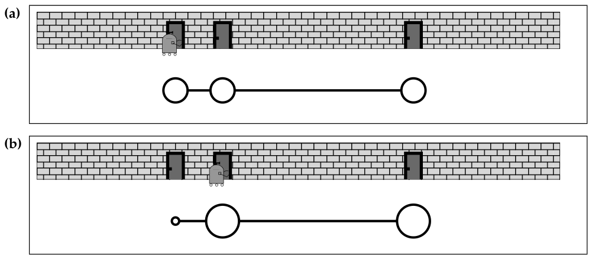

*Figure 8.5 — 거칠고 topological한 표현을 mobile robot localization에 적용. 각 상태는 환경의 뚜렷한
장소(이 경우 문)에 대응한다. 어떤 상태에 있다는 로봇의 belief $bel(x_t)$ 는 원의 크기로 표현된다.
(a) 초기 belief는 모든 pose에 대해 균등하다. (b) 로봇이 한 번의 상태 전이를 하고 문을 검출한 뒤의
belief를 보여준다. 이 시점에서 로봇이 여전히 왼쪽 위치에 있을 가능성은 낮다. (책 p.244)*

### Metric — 세밀한 격자

**훨씬 세밀한 표현은 흔히 **metric** 표현을 통해 발견된다. 그런 표현은 상태 공간을 균일한 크기의
세밀한 칸으로 분해한다. 그런 분해의 해상도는 보통 topological 격자의 것보다 훨씬 높다. 예를 들어
7장의 일부 예제는 15센티미터 이하의 칸 크기를 갖는 격자 분해를 사용한다. 따라서 더 정확하지만
계산 비용의 증가를 대가로 한다.** (책 p.241)

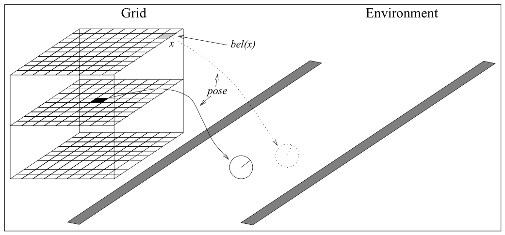

*Figure 8.2 — 로봇 pose 변수 $x$, $y$, $\theta$ 에 대한 고정 해상도 격자의 예. 각 격자 칸은 환경에서의
로봇 pose를 표현한다. 로봇의 서로 다른 방향은 격자의 서로 다른 평면에 대응한다(세 방향만 표시).
(책 p.241)*

> **Figure 8.2가 보여주는 것은 격자가 3차원이라는 사실**이다. $\theta$ 마다 별개의 평면이 하나씩
> 쌓여 있다. 6.3.4절에서 beam model의 사전계산이 3-D라고 했던 것과 같은 구조다.

| | **topological** | **metric** |
|---|---|---|
| 칸의 뜻 | "복도", "교차로", "3번 문 앞" | "$x\in[3.0, 3.15)$, $y\in[1.2,1.35)$, $\theta\in[10°,15°)$" |
| 칸 개수 | 수십 개 | 수백만 개 |
| 칸 크기 | 불균일, 환경 구조가 결정 | 균일 |
| 정확도 | 낮음 | 높음 |
| 측정 모델 | landmark 기반이 자연스러움 | 원시 측정 가능 |

### 거친 격자를 쓸 때 반드시 해야 하는 보정

**거친 해상도로 grid localization을 구현할 때는 **센서 모델과 motion model에서 해상도의 거칠기를
보상하는 것이 중요하다.**** (책 p.241)

#### 문제 1 — 측정 모델이 칸 안에서 급변한다

**특히 laser range finder 같은 고해상도 센서의 경우 measurement model $p(z_t \mid x_t)$ 의 값이 각
격자 칸 $x_{k,t}$ 내부에서 **극적으로 변할 수 있다.** 이 경우 질량중심에서 평가하기만 하면 일반적으로
나쁜 결과를 낳는다.** (책 p.241)

> 6.3.5절에서 본 beam model의 불연속성이 여기서 다시 문제가 된다. 칸 하나가 15cm인데 그 안에서
> likelihood가 $e^{-447}$ 배씩 뛴다면, 질량중심 한 점의 값으로 칸 전체를 대표하는 것은 무의미하다.

#### 문제 2 — 로봇이 영원히 같은 칸에 머문다

**마찬가지로 질량중심에서 로봇 운동을 예측하면 나쁜 결과를 낳을 수 있다: 10cm/sec로 움직이는 로봇에
대해 운동이 1초 간격으로 갱신되고 격자 해상도가 1미터라면, **순진한 구현은 결코 상태 전이를 낳지
않는다!** 이는 격자 칸의 질량중심에서 약 10cm 떨어진 어떤 위치도 여전히 같은 격자 칸에 떨어지기
때문이다.** (책 p.241)

> **이것이 가장 치명적이다.** 필터가 "로봇이 움직이지 않는다"고 확신하게 되고, 그 상태로 측정만
> 계속 곱하면 belief가 잘못된 칸에 극도로 뾰족하게 수렴한다.

#### 해법 — 양쪽 모델의 노이즈를 부풀린다

**이 효과를 보상하는 흔한 방법은 **노이즈의 양을 부풀림으로써** 측정 모델과 motion model을 모두
수정하는 것이다.** (책 p.242)

| 대상 | 방법 | 대가 |
|---|---|---|
| **측정 모델** | **"range finder 모델의 주 Gaussian cone의 분산을 격자 칸 지름의 절반만큼 키울 수 있다. 그렇게 하면 새 모델은 훨씬 평활해지고, 그 해석은 올바른 로봇 위치에 대한 표본점의 정확한 위치에 덜 취약해진다"** | **"그러나 이 수정된 측정 모델은 센서 측정에서 추출되는 정보를 줄인다"** |
| **motion model** | **"운동 호의 길이를 칸의 지름으로 나눈 값에 비례하는 확률로 인근 칸으로의 랜덤 전이를 예측할 수 있다. 그런 부풀린 motion model의 결과로 로봇은 연속 갱신 사이의 운동이 격자 칸 크기에 비해 작더라도 실제로 한 칸에서 다른 칸으로 이동할 수 있다"** | **"그러나 결과 posterior는 로봇이 매 motion 갱신마다 칸을 바꾼다 — 따라서 명령된 것보다 훨씬 빨리 움직인다 — 는 가설에 불합리하게 큰 확률이 놓인다는 점에서 틀렸다"** |

(책 p.242)

> **5장 p.118, 6.7절에 이어 세 번째로 나오는 "노이즈를 부풀려라"** 다. 다만 여기서는 이유가 다르다 —
> 물리적 불확실성 때문이 아니라 **표현의 이산화 때문**이다. 그리고 책은 그 대가를 정직하게 적는다:
> **"결과 posterior는 틀렸다."**

### 해상도가 성능에 미치는 영향

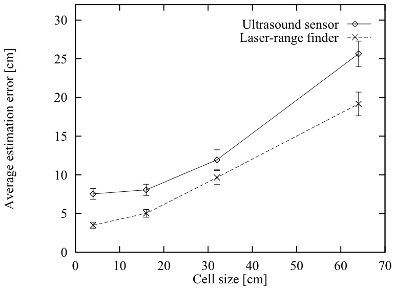

*Figure 8.3 — 초음파 센서와 laser range-finder에 대해, 격자 칸 크기의 함수로 나타낸 평균 localization
오차. (책 p.242)*

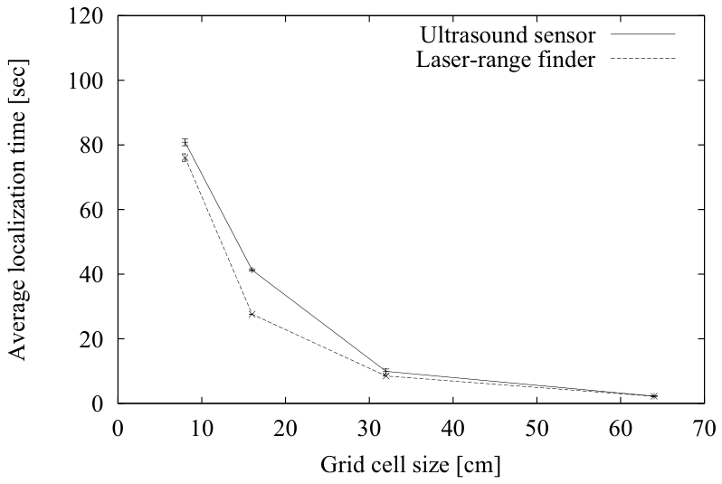

*Figure 8.4 — 격자 해상도의 함수로 나타낸 global localization에 필요한 평균 CPU 시간. 초음파 센서와
laser range-finder 모두에 대해 표시. (책 p.243)*

**Figure 8.3과 8.4는 두 가지 다른 유형의 range 센서에 대해 해상도의 함수로서 grid localization의
성능을 도시한다. 예상대로 **해상도가 낮아질수록 localization 오차가 증가한다.** 로봇을 localize하는
데 필요한 총 시간은 Figure 8.4에 보이듯 **격자가 거칠어질수록 감소한다.**** (책 p.242~243)

> **두 그림이 정확히 trade-off를 그린다.** 칸을 키우면 빨라지지만 부정확해진다. 두 곡선을 겹쳐 보고
> 허용 오차 안에서 가장 빠른 해상도를 고르는 것이 실무의 선택이다.
>
> 레이저가 소나보다 두 그림 모두에서 유리하다 — 6.3.2절 Figure 6.5·6.6에서 본 센서 품질 차이가
> localization 성능으로 그대로 이어진다.

### 2. 예제/실습

#### 예제 — 문제 2를 숫자로

로봇 10cm/s, 갱신 1초, 격자 1m. 로봇이 칸 중심에 있다고 하자.

- 1초 후 실제 위치: 중심에서 10cm
- 그 위치가 속한 칸: **같은 칸** (칸이 1m이므로 ±50cm가 같은 칸)
- Table 8.1 라인 3이 계산하는 것: `motion_model(mean(x_k), u_t, mean(x_i))` — 질량중심에서 질량중심
  으로의 전이 확률. 이웃 칸은 100cm 떨어져 있는데 로봇은 10cm만 갔으므로 **전이 확률 ≈ 0**

$$\bar{p}_{k,t} \approx p_{k,t-1}, \qquad \bar{p}_{\text{이웃},t} \approx 0$$

**10초가 지나도 belief는 같은 칸에 머문다.** 실제 로봇은 1m를 갔는데도.

**부풀린 motion model을 쓰면**: 이동 거리 10cm ÷ 칸 지름 100cm = 0.1 이므로, 확률 0.1로 이웃 칸으로
전이시킨다. 10스텝이면 기대 전이 횟수 1회 — 평균적으로는 맞다. 하지만 **"1스텝에 이미 10% 확률로
1m를 갔다"** 고 말하는 셈이라 posterior의 모양은 틀린다.

#### 연습문제

1. Figure 8.3·8.4에서 레이저의 곡선이 소나보다 낮은/가파른 이유를 6.3.2절과 연결해 설명하라.
2. 측정 모델의 분산을 "칸 지름의 절반"만큼 키우는 것이 왜 합리적인가? 칸 안 임의 지점과 중심의
   최대 거리를 생각해 보라.
3. 위 예제에서 격자를 15cm로 바꾸면 문제가 해소되는가? 계산량은 몇 배가 되는가?

---

## 8.2.3 Computational Considerations (책 p.243~245)

### 1. 개념적 이해

**앞 절에서 기술한 미터법 격자처럼 세밀한 격자를 사용할 때, 기본 알고리즘은 **실시간으로 실행될 수
없다.** 잘못은 motion 갱신과 measurement 갱신 양쪽에 있다. Motion 갱신은 **convolution**을 요구하는데,
3-D 격자에 대해서는 **6-D 연산**이다. Measurement 갱신은 3-D 연산이지만 전체 스캔의 likelihood를
계산하는 것은 비용이 큰 연산이다.** (책 p.243)

> **왜 6-D인가.** 3차원 격자의 모든 칸 $k$ 에 대해, 3차원 격자의 모든 칸 $i$ 를 훑는다.
> $(x,y,\theta) \times (x',y',\theta')$ = 6차원. 8.2.1절 예제의 $K^2$ 가 이것이다.

**Grid localization의 계산 복잡도를 줄이는 여러 기법이 존재한다.** (책 p.243)

### 네 가지 가속 기법 (책 p.243~244)

#### ① Model pre-caching

**Model pre-caching은 특정 measurement model이 계산 비용이 크다는 사실을 인정한다. 예를 들어
measurement model의 계산은 ray casting을 요구할 수 있는데, 이는 **어떤 고정된 맵에 대해서도 미리
캐싱될 수 있다.** 6.3.4절에서 동기를 부여했듯, 흔한 전략은 각 격자 칸에 대해 measurement 갱신을
쉽게 하는 필수 통계량을 계산하는 것이다. 특히 beam model을 사용할 때는 각 격자 칸에 대해 올바른
range를 캐싱해 두는 것이 일반적이다. 나아가 센서 모델은 가능한 range의 세밀한 배열에 대해 미리
계산될 수 있다. 그러면 measurement model의 계산은 **두 번의 표 조회**로 줄어들며, 이는 훨씬 빠르다.**
(책 p.243~244)

> 6.3.4절 "요령 3"이 그대로 재등장한다. 그때 계산한 표 크기가 12.8MB였다.

#### ② Sensor subsampling

**Sensor subsampling은 **모든 range의 부분집합에 대해서만** measurement model을 평가함으로써 추가적인
속도 향상을 달성한다. 우리 시스템 중 일부에서는 360개 레이저 range 측정 중 **8개만** 사용하고도
훌륭한 결과를 얻는다. Subsampling은 **공간적으로도 시간적으로도** 일어날 수 있다.** (책 p.244)

> 6.3.4절 "요령 1"과 같다. "360개 중 8개"라는 숫자까지 같다. 6장에서는 독립 가정 위반 완화가
> 부수 효과였는데, 여기서는 속도가 주목적이다.

#### ③ Delayed motion updates

**Delayed motion updates는 로봇의 제어 또는 측정 빈도보다 **낮은 빈도로** motion 갱신을 적용한다.
이는 짧은 시간 구간에 걸쳐 제어나 odometry 읽기를 기하학적으로 적분함으로써 달성된다. 좋은 delayed
motion update 기법은 알고리즘을 **한 자릿수(order of magnitude)** 쉽게 가속할 수 있다.** (책 p.244)

> 8.2.2절 "문제 2"의 해법이기도 하다. 10cm씩 열 번 갱신하는 대신 1m를 한 번에 갱신하면, 칸 전이가
> 실제로 일어나고 계산도 1/10이 된다. **두 마리 토끼를 잡는 기법이다.**

#### ④ Selective updating

**Selective updating은 4.1.4절에서 이미 기술되었다. 격자를 갱신할 때 selective 기법은 **모든 격자 칸의
일부만** 갱신한다. 이 아이디어의 흔한 구현은 posterior 확률이 사용자 지정 문턱값을 초과하는 격자
칸만 갱신한다. Selective updating 기법은 belief 갱신에 관여하는 계산 노력을 **여러 자릿수(many orders
of magnitude)** 줄일 수 있다.** (책 p.244)

> **⚠️ 그러나 대가가 있다.**
>
> **이 접근을 kidnapped robot 문제에 적용하려 할 때는 **낮은 likelihood의 격자 칸을 재활성화하는 데
> 특별한 주의를 기울여야 한다.**** (책 p.244)
>
> 확률이 낮다고 버린 칸에 로봇이 실제로 있을 수 있기 때문이다. MCL의 particle 고갈(8.3.5절)과
> **정확히 같은 문제**다 — 표현이 달라도 병은 같다.

**이런 수정들로 grid localization은 사실 꽤 효율적이 될 수 있다; 심지어 10년 전에도 저사양 PC가 이
장에 보인 결과를 생성하기에 충분히 빨랐다. 그러나 우리의 수정들은 프로그래머에게 추가 부담을 지우며,
최종 구현을 Table 8.1의 짧은 알고리즘이 시사하는 것보다 복잡하게 만든다.** (책 p.245)

### 2. 예제/실습

#### 예제 — 네 기법의 누적 효과

8.2.1절 예제의 $K = 1.28\times10^6$, 이웃 100칸 제한 → 스텝당 $1.28\times10^8$ 연산에서 출발한다.

| 기법 | 배율 | 남은 연산 |
|---|---|---|
| 출발 (이웃 제한만) | — | $1.28 \times 10^{8}$ |
| ③ delayed motion (10스텝 모아서) | $\times \tfrac{1}{10}$ | $1.28 \times 10^{7}$ |
| ④ selective updating (상위 1% 칸만) | $\times \tfrac{1}{100}$ | $1.28 \times 10^{5}$ |
| ② sensor subsampling (360→8빔) | measurement 갱신에 $\times\tfrac{1}{45}$ | — |
| ① pre-caching | ray casting → 표 조회 | — |

**motion 갱신만 봐도 $10^8 \to 10^5$ 로 세 자릿수가 줄었다.** 책이 "many orders of magnitude"라 한
것이 과장이 아니다.

#### 연습문제

1. Selective updating에서 문턱값을 너무 높게 잡으면 어떤 일이 생기는가? 8.3.5절 particle 고갈과
   비교하라.
2. Delayed motion update가 8.2.2절 "문제 2"를 해결하는 이유를 설명하라. 부작용은 없는가?
3. 네 기법 중 kidnapped robot 문제와 충돌하는 것은 어느 것인가? 왜인가?

---

## 8.2.4 Illustration (책 p.245~250)

### 1. 실제 실행 결과

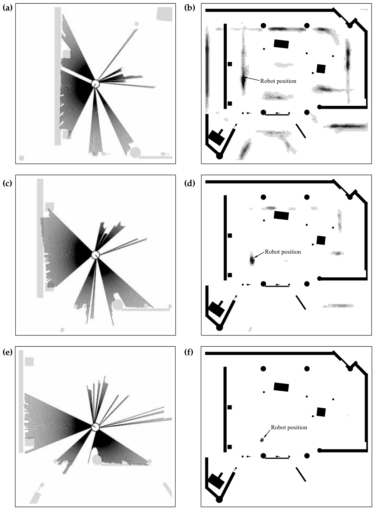

*Figure 8.6 — 공간 해상도 15cm, 각도 해상도 5도의 미터법 격자를 사용한 Markov localization 예.
(책 p.246)*

**Figure 8.6은 공간 해상도 15센티미터, 각도 해상도 5도에서 미터법 격자를 사용한 Markov localization의
예를 보여준다. 여기 보이는 것은 두 개의 laser range-finder를 갖춘 모바일 로봇이 처음부터 localize
하는 global localization 실행이다. Range-finder의 확률 모델은 **6.3절에서 기술한 beam model**로
계산된다.** (책 p.245)

**처음에 로봇의 belief는 pose 공간에 균등하게 분포한다. Figure 8.6a는 로봇의 출발 위치에서 취한
laser range-finder 스캔을 묘사한다. 여기서 max range 측정은 생략되고 맵의 관련 부분이 회색으로
음영 처리되어 있다. 이 센서 스캔을 통합한 뒤, 로봇의 위치는 (고도로 비대칭인) 공간의 **몇 개 영역**
으로 좁혀지며, 이는 Figure 8.6b의 회색조로 나타난다.** (책 p.245)

> **⚠️ 중요한 주의 (책 p.245)**
>
> **belief가 $x$-$y$ 공간으로 **투영**되어 있음에 유의하라; 참 belief는 세 번째 차원인 로봇의 방향
> $\theta$ 에 대해 정의되며, 이 도표와 이후 도표에서는 생략되었다.**
>
> 7.4.4절 Figure 6.7에서도 같은 투영이 있었다. 화면에 그릴 수 없어서 $\theta$ 를 접어 버린 것이지,
> 필터가 2차원으로 도는 것이 아니다.

**Figure 8.6d는 로봇이 2m 이동하고 Figure 8.6c에 보인 두 번째 range 스캔을 통합한 뒤의 belief를
보여준다. 위치 추정의 확신이 증가하고 belief의 전역 최대가 이미 로봇의 참 위치에 대응한다. 또 하나의
스캔을 belief에 통합한 뒤 로봇은 마침내 Figure 8.6e에 보인 센서 스캔을 지각한다. 이제 사실상 모든
확률 질량이 실제 로봇 pose에 집중된다(Figure 8.6f 참조). 직관적으로 우리는 로봇이 성공적으로
localize했다고 말한다.** (책 p.245)

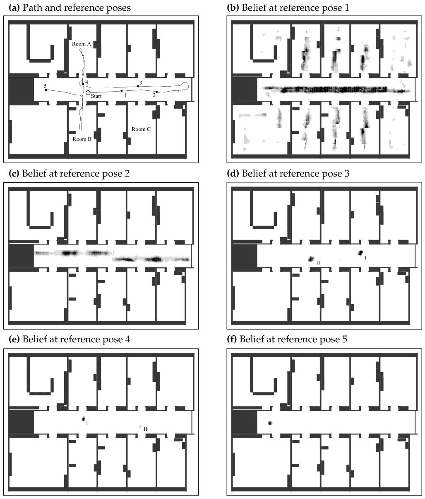

*Figure 8.7 — 소나 데이터를 사용한 사무실 환경에서의 global localization. (a) 로봇의 경로.
(b) 로봇이 위치 1을 지날 때의 belief. (c) 몇 미터 이동 후 로봇은 자신이 복도에 있음을 안다.
(d) 위치 3에 도달하면서 소나 센서로 복도의 끝을 스캔했고, 따라서 분포가 두 개의 지역 최대에
집중된다. **I 로 표시된 최대는 로봇의 참 위치를 표현하고, 두 번째 최대는 복도의 대칭성 때문에
발생한다**(위치 II는 위치 I에 대해 180° 회전되어 있다). (e) Room A를 지난 뒤 올바른 위치 I 에 있을
확률이 이제 위치 II 에 있을 확률보다 높다. (f) 마침내 로봇의 belief가 올바른 pose에 중심을 둔다.
(책 p.247)*

**두 번째 예가 Figure 8.7에 보인다. 여기서 환경은 **부분적으로 대칭적**이며, 이것이 localization
과정에서 대칭적인 mode가 나타나게 만든다.** (책 p.245)

> **7.1절 Figure 7.3의 상황이 실제 데이터로 재현된 것이다.** 대칭 복도에서 belief가 두 mode로
> 갈라지고, 비대칭 영역(Room A)에 들어가서야 해소된다. EKF였다면 이 두 mode를 표현할 수 없었다.

### 소나만으로도 되는가

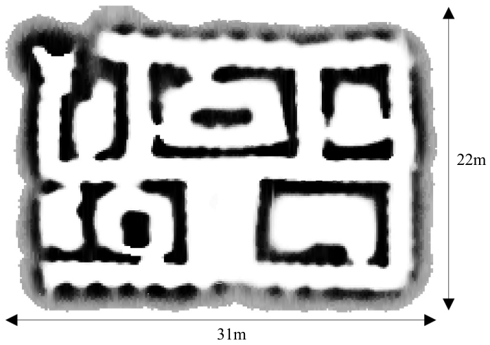

*Figure 8.8 — 1994 AAAI 모바일 로봇 대회 경기장의 occupancy grid map. (책 p.248)*

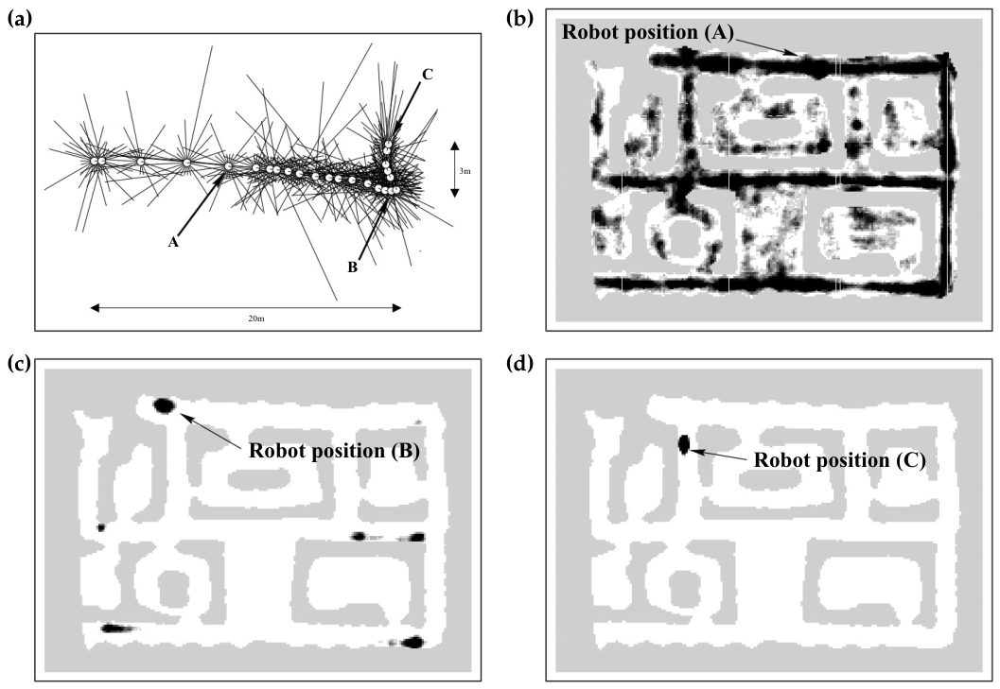

*Figure 8.9 — (a) Figure 8.8에 보인 환경에서 수집한 데이터셋(odometry와 소나 range 스캔). 이
데이터셋은 grid localization을 사용한 global localization에 충분하다. "A", "B", "C"로 표시된 지점의
belief가 (b), (c), (d)에 보인다. (책 p.249)*

**Figures 8.8부터 8.10까지는 **소나 센서만** 갖춘 모바일 로봇을 사용하고, 대략 같은 폭의 복도가 많은
환경에서의 global localization을 예시한다. (…) 이 특정 환경에서 벽은 매끄럽고 **소나 읽기의 상당
부분이 손상되어 있다.** 역시 센서 읽기의 확률 모델은 6.3절에서 기술한 beam 기반 모델이다.**
(책 p.245~248)

**약 3미터 이동하는 동안 로봇이 5개의 소나 스캔을 통합한 뒤, belief는 대략 같은 크기의 모든 복도를
따라 거의 균등하게 퍼져 있다(Figure 8.9b). 몇 초 뒤 belief는 이제 몇 개의 뚜렷한 가설에
집중된다(Figure 8.9c). 마침내 로봇이 모퉁이를 돌아 "C"로 표시된 지점에 도달하면, 센서 데이터는 이제
로봇의 위치를 유일하게 결정하기에 충분하다.** (책 p.248)

**이 예는 grid 표현이 **고노이즈 소나 데이터**와, global localization 중에 여러 가설을 유지해야 하는
**대칭 환경**에서 잘 작동함을 예시한다.** (책 p.248)

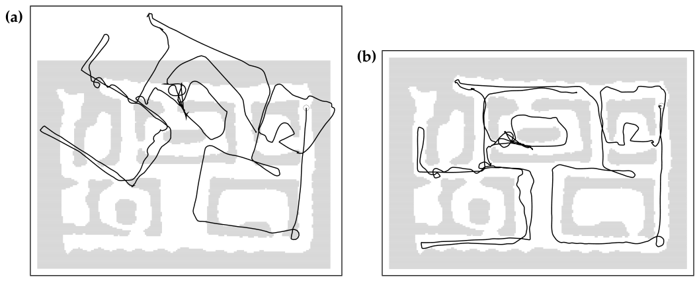

*Figure 8.10 — (a) Odometry 정보와 (b) 로봇의 보정된 경로. (책 p.250)*

**Figure 8.10은 소나 데이터를 occupancy grid map과 정합함으로써 **누적된 추측 항법 오차를 보정하는**
grid 접근의 능력을 예시한다. Figure 8.10a는 240m 길이 궤적의 원시 odometry 데이터를 보여준다. 명백히
odometry의 회전 오차가 빠르게 증가한다. **단 40m를 주행한 뒤 방향의 누적 오차(원시 odometry)가 약
50도**다. Figure 8.10b는 grid localizer가 추정한 로봇의 경로를 보여준다.** (책 p.248~249)

> **40m에 50도.** 5.4절 odometry motion model에서 "odometry가 velocity보다 정확하다"고 했지만,
> **누적되면 이렇게 된다.** 이것이 localization이 필요한 근본 이유다.

### 해상도에 대한 최종 판단 (책 p.249)

**명백히 이산 표현의 해상도는 grid Markov localization의 핵심 파라미터다. **충분한 계산·메모리
자원이 주어진다면 세밀한 접근이 일반적으로 거친 것보다 선호된다.** (…) 2.4.4절에서 이미 논의했듯,
histogram 표현은 Bayes filter의 Markov 가정을 위반할 수 있는 **체계적 오차**를 유발한다. 해상도가
세밀할수록 오차가 덜 도입되고 결과가 좋아진다.**

**세밀한 근사는 또한 **catastrophic failure** — 로봇의 belief가 실제 위치와 상당히 다른 경우 — 를
덜 겪는 경향이 있다.** (책 p.249)

### 2. 예제/실습

#### 예제 — Figure 8.7(d)의 두 mode를 각도로 이해하기

대칭 복도에서 mode I(참값)과 II가 나타나고, 책은 **"위치 II는 위치 I에 대해 180° 회전되어 있다"**
고 적는다.

로봇이 복도 한가운데서 양옆 벽까지 각각 2m, 앞쪽 끝까지 10m를 측정했다고 하자.

- pose $(x, y, \theta)$ 에서 이 스캔이 나온다면
- pose $(x', y', \theta + \pi)$ 에서도 **똑같은 스캔**이 나올 수 있다 (복도가 대칭이므로)

**측정만으로는 두 pose를 구분할 수 없다.** 구분하려면 비대칭 정보가 필요하고, 그것이 Room A다.
$\theta$ 를 투영해 버린 Figure 8.7의 그림에서는 두 mode가 서로 다른 **위치**로 보이지만, 실제
3차원 belief에서는 **방향이 180° 다른 두 mode**다.

#### 연습문제

1. Figure 8.10에서 40m에 50도 오차라면, 이 로봇이 240m를 추측 항법만으로 가면 어떻게 되는가?
2. Figure 8.6은 3스캔, Figure 8.9는 훨씬 많은 스캔이 필요했다. 무엇이 이 차이를 만드는가?
3. "세밀한 격자가 Markov 가정 위반을 줄인다"는 서술을 2.4.4절과 연결해 설명하라.

---

# 8.3 Monte Carlo Localization (책 p.250~267)

**이제 belief $bel(x_t)$ 를 **particle**로 표현하는 인기 있는 localization 알고리즘으로 주의를 돌린다.
이 알고리즘은 **Monte Carlo Localization**, 줄여서 **MCL**이라 불린다. 격자 기반 Markov localization과
마찬가지로 MCL은 local과 global localization 문제 모두에 적용 가능하다. 비교적 짧은 역사에도 불구하고
MCL은 이미 **로보틱스에서 가장 인기 있는 localization 알고리즘 중 하나**가 되었다. 구현하기 쉽고
폭넓은 localization 문제에 걸쳐 잘 작동하는 경향이 있다.** (책 p.250)

## 8.3.1 Illustration (책 p.250~252)

### 1. 개념적 이해

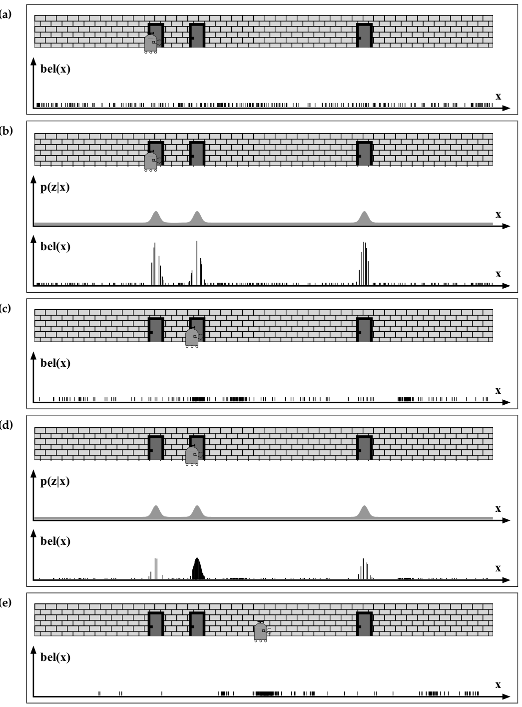

*Figure 8.11 — Monte Carlo Localization, mobile robot localization에 적용된 particle filter.
(책 p.251)*

**Figure 8.11은 1차원 복도 예제를 사용해 MCL을 예시한다.** (책 p.250) Figure 8.1(grid)·Figure 7.5
(Markov)와 **같은 상황**이며, 표현만 particle로 바뀌었다.

**(a) 초기 — 균등하게 뿌린다**

**초기 전역 불확실성은 전체 pose 공간에 대해 **무작위로 균등하게** 뽑은 pose particle 집합으로
달성된다.** (책 p.250)

**(b) 측정 — 무게만 바뀐다**

**로봇이 문을 센싱하면 MCL은 각 particle에 importance factor를 할당한다. 결과 particle 집합이
Figure 8.11b에 보인다. 이 그림에서 각 particle의 **높이**가 그 importance weight를 나타낸다.**
(책 p.250)

> **⚠️ 여기가 MCL을 이해하는 결정적 지점이다.**
>
> **이 particle 집합이 Figure 8.11a의 것과 **동일**하다는 점에 유의하는 것이 중요하다 —
> measurement 갱신이 수정하는 유일한 것은 **importance weight**다.** (책 p.250)
>
> particle이 움직이지 않는다. 위치는 그대로이고 **무게만 달라진다.** grid에서 칸이 고정된 채
> 확률값만 바뀌는 것과 정확히 같은 구조다.

**(c) 재표집 + 이동 — 무게가 위치로 바뀐다**

**Figure 8.11c는 **resampling 후, 그리고 로봇 운동을 통합한 후**의 particle 집합을 보여준다. 이는
**균등한 importance weight를 갖지만 세 개의 그럴듯한 장소 근처에 particle 개수가 증가한** 새 particle
집합으로 이어진다.** (책 p.250)

> **무게 → 개수의 변환**이 resampling이다. 무게가 큰 particle이 여러 번 복제되고 작은 것은 사라진다.
> 그 결과 **모든 particle의 무게가 다시 같아지고**, 대신 **밀도**가 정보를 담게 된다.
> 4.3.1절에서 본 particle filter의 핵심이 그대로다.

**(d) 두 번째 측정 — 답이 좁혀진다**

**새 측정은 particle 집합에 균등하지 않은 importance weight를 할당한다(Figure 8.11d). 이 시점에서
누적 확률 질량의 대부분이 **두 번째 문**에 집중되며, 이는 또한 가장 그럴듯한 위치다.** (책 p.250~252)

**(e) 계속**

**추가 운동이 또 한 번의 resampling 단계와, motion model에 따라 새 particle 집합이 생성되는 단계로
이어진다(Figure 8.11e).** (책 p.252)

**이 예제에서 명백해야 하듯, **particle 집합은 정확한 Bayes filter가 계산할 올바른 posterior를
근사한다.**** (책 p.252)

### 세 표현을 나란히 놓고 보기

| | Figure 7.5 (Markov, 연속) | Figure 8.1 (Grid) | Figure 8.11 (MCL) |
|---|---|---|---|
| belief | 연속 밀도 곡선 | 막대 높이 | **particle 밀도 + 무게** |
| 측정 갱신 | 곡선에 $p(z\mid x)$ 곱하기 | 칸 값에 곱하기 | **무게에 곱하기** (위치 불변) |
| 운동 갱신 | convolution | 칸 간 전이 합 | **각 particle을 sampling으로 이동** |
| 표현 비용 | (개념적) | 칸 $K$ 개 고정 | **particle $M$ 개, 어디든 갈 수 있음** |
| 해상도 | — | 격자가 결정 | **particle이 모이는 곳에서 자동으로 높아짐** |

> **MCL의 근본 이점이 마지막 줄이다.** grid는 로봇이 어디 있든 $1.28\times10^6$ 칸을 전부 들고
> 있어야 한다. MCL은 particle을 필요한 곳에만 둔다 — belief가 좁아지면 particle도 그 좁은 영역에
> 몰리므로, **같은 개수로 훨씬 높은 유효 해상도**를 얻는다.

## 8.3.2 The MCL Algorithm (책 p.252~253)

### 알고리즘 — 책 Table 8.2

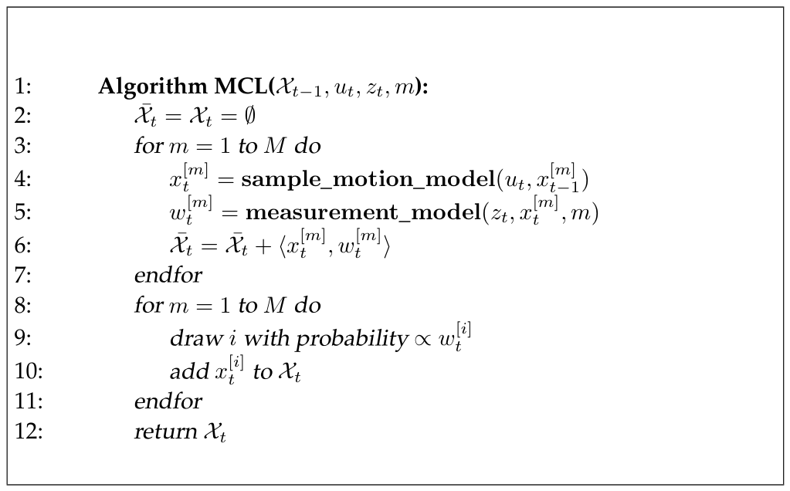

*Table 8.2 — MCL, 또는 Monte Carlo Localization, particle filter에 기반한 localization 알고리즘.
(책 p.252)*

```
 1:  Algorithm MCL(X_{t-1}, u_t, z_t, m):
 2:      X̄_t = X_t = ∅
 3:      for m = 1 to M do
 4:          x_t^[m] = sample_motion_model(u_t, x_{t-1}^[m])
 5:          w_t^[m] = measurement_model(z_t, x_t^[m], m)
 6:          X̄_t = X̄_t + ⟨x_t^[m], w_t^[m]⟩
 7:      endfor
 8:      for m = 1 to M do
 9:          draw i with probability ∝ w_t^[i]
10:          add x_t^[i] to X_t
11:      endfor
12:      return X_t
```

**Table 8.2는 기본 MCL 알고리즘을 보여주며, 이는 알고리즘 particle_filters(98쪽 Table 4.3)에 적절한
확률적 motion model과 perceptual model을 대입해 얻어진다.** (책 p.252)

**기본 MCL 알고리즘은 belief $bel(x_t)$ 를 $M$ 개 particle의 집합
$\mathcal{X}_t = \{x_t^{[1]}, x_t^{[2]}, \ldots, x_t^{[M]}\}$ 로 표현한다. 알고리즘의 라인 4는 현재
belief의 particle을 출발점으로 사용해 **motion model에서 표집**한다. 그 다음 라인 5에서 measurement
model이 적용되어 그 particle의 **importance weight를 결정**한다.** (책 p.252)

**초기 belief $bel(x_0)$ 는 prior 분포 $p(x_0)$ 로부터 $M$ 개의 particle을 무작위로 생성하고 각
particle에 균등한 importance factor $M^{-1}$ 을 할당함으로써 얻어진다.** (책 p.252)

**Grid localization에서와 마찬가지로 함수 motion_model과 measurement_model은 각각 5장의 motion model
중 아무거나, 6장의 measurement model 중 아무거나로 구현될 수 있다.** (책 p.253)

> **알고리즘이 12줄이다.** 7장 Table 7.2(EKF)의 22줄과 비교하면 절반이고, Jacobian도 없다.
> 8.6절에서 책이 **"MCL은 구현하기 가장 쉬운 localization 알고리즘"** 이라 하는 이유다.
>
> **두 개의 루프가 하는 일**
>
> | 루프 | 라인 | 하는 일 | 대응하는 Bayes filter 단계 |
> |---|---|---|---|
> | 첫째 | 3~7 | 이동시키고 무게 매기기 | prediction + measurement |
> | 둘째 | 8~11 | **resampling** | (표현을 유지하기 위한 연산) |
>
> 둘째 루프는 Bayes filter에 없는 것이다. **particle 표현 때문에 필요한 절차**이며, 4.3.2절
> importance sampling의 결과다.

## 8.3.3 Physical Implementations (책 p.253)

**7장의 랜드마크 기반 localization 시나리오에 대해 MCL 알고리즘을 구현하는 것은 간단하다. 그렇게
하려면 라인 4의 표집 절차는 **Table 5.3의 sample_motion_model_velocity**를 사용해 구현된다.
**Table 6.4의 landmark_model_known_correspondence** 알고리즘이 라인 5에서 예측된 표본에 무게를
매기는 데 사용되는 likelihood 모델을 제공한다.** (책 p.253)

> **5장·6장의 알고리즘이 그대로 부품으로 끼워진다.** 이것이 이 책의 설계다 —
>
> $$\underbrace{\text{Table 5.3}}_{\text{라인 4}} + \underbrace{\text{Table 6.4}}_{\text{라인 5}} + \underbrace{\text{Table 8.2}}_{\text{골격}} = \text{동작하는 localizer}$$

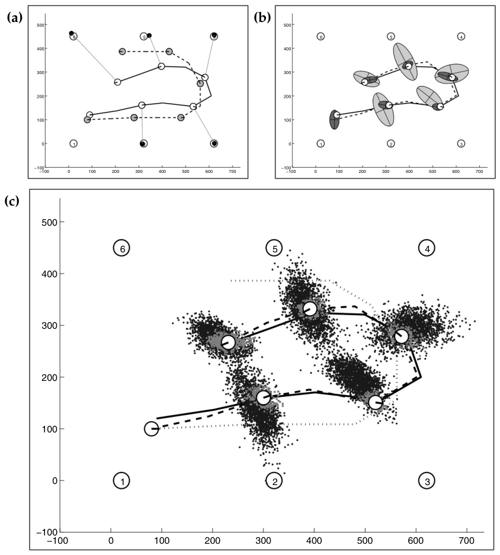

*Figure 8.12 — 랜드마크 기반 localization을 위한 MCL 알고리즘. (a) motion control에 따른 로봇 궤적
(점선)과 결과 참 궤적(실선). 랜드마크 검출은 가는 선으로 표시. (b) resampling 전후 표본 집합의
공분산. (c) resampling 전후의 표본 집합. (책 p.254)*

**Figure 8.12는 이 버전의 MCL 알고리즘을 예시한다. 시나리오는 **Figure 7.15에 보인 것과 동일**하다.
(…) 실선은 로봇의 참 경로, 점선은 제어 정보에 기반한 경로, 파선은 MCL 알고리즘이 추정한 평균
경로를 표현한다. 서로 다른 시점의 예측 표본 집합 $\bar{\mathcal{X}}_t$ 는 어둡게, resampling 단계
후의 표본 $\mathcal{X}_t$ 는 밝은 회색으로 표시된다. 각 particle 집합은 3차원 pose 공간에 대해
정의되지만 각 particle의 $x$·$y$ 좌표만 표시된다.** (책 p.253)

> **Figure 7.15와 Figure 8.12를 나란히 보라.** 같은 데이터, 같은 궤적인데 7장은 타원 하나,
> 8장은 점 구름이다. 7.7.2절에서 UKF/EKF의 "참조 추정"을 particle filter로 만들었다고 했는데,
> **그 particle filter가 바로 이것**이다.

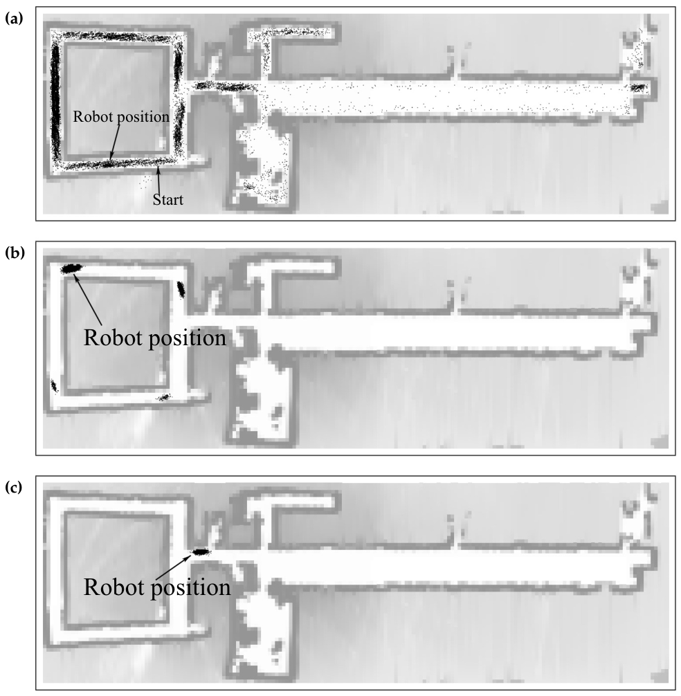

*Figure 8.13 — Monte Carlo localization의 예시: 여기 보이는 것은 54m × 18m 크기의 사무실 환경에서
동작하는 로봇이다. (a) 5m 이동 후 로봇은 여전히 자기 위치에 대해 전역적으로 불확실하며 particle이
자유 공간의 주요 부분에 퍼져 있다. (b) 로봇이 맵의 좌상단 모서리에 도달해도 belief는 여전히 네 개의
가능한 위치 주위에 집중되어 있다. (c) 마침내 약 55m 이동 후 모호성이 해소되고 로봇은 자기가 어디
있는지 안다. 모든 계산은 저사양 PC에서 실시간으로 수행된다. (책 p.255)*

**Figure 8.13은 소나 range finder 배열을 갖춘 로봇에 대해 실제 사무실 환경에서 MCL을 적용한 결과를
보여준다. 이 버전의 MCL은 **Table 6.1의 beam_range_finder_model** 알고리즘을 사용해 측정의
likelihood를 계산한다.** (책 p.253)

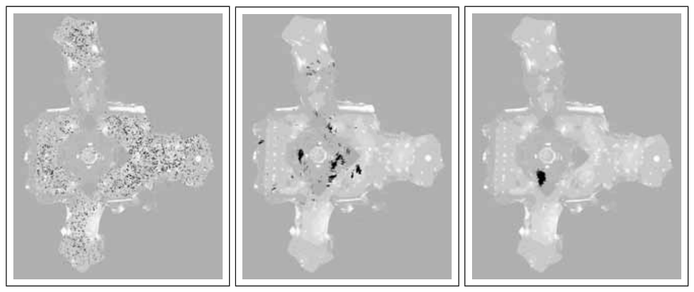

*Figure 8.14 — 천장을 향한 카메라를 사용한 global localization. (책 p.256)*

**세 번째 예시가 Figure 8.14에 제공되며, 여기서는 천장을 향한 카메라와, 이미지 중심의 밝기를 이전에
획득한 천장 맵에 관련짓는 measurement model을 사용한다.** (책 p.253)

> **같은 MCL 알고리즘이 세 가지 다른 센서로 돌아간다** — 랜드마크(Fig 8.12), 소나(Fig 8.13),
> 카메라(Fig 8.14). 라인 5의 `measurement_model` 만 갈아 끼우면 된다. 6장이 여러 측정 모델을
> 만들어 둔 것이 여기서 결실을 맺는다.

## 8.3.4 Properties of MCL (책 p.253~256)

### 1. 개념적 이해

#### 장점 1 — 거의 모든 분포를 근사한다

**MCL은 실용적 중요성을 갖는 거의 모든 분포를 근사할 수 있다. EKF localization의 경우처럼 제한된
파라미터적 분포 부분집합에 묶이지 않는다.** (책 p.253)

#### 장점 2 — 정확도와 계산량을 사용자가 조절한다

**전체 particle 개수를 늘리면 근사의 정확도가 증가한다. **particle 개수 $M$ 은 계산의 정확도와 MCL을
실행하는 데 필요한 계산 자원을 절충할 수 있게 해주는 파라미터**다.** (책 p.253~254)

**$M$ 을 설정하는 흔한 전략은 다음 쌍 $u_t$ 와 $z_t$ 가 도착할 때까지 계속 표집하는 것이다. 이런
방식으로 구현은 계산 자원에 대해 **적응적**이 된다: 기저 프로세서가 빠를수록 localization 알고리즘이
좋아진다.** (책 p.254)

> **아름다운 성질이다.** "시간이 허락하는 만큼 particle을 뽑아라." 하드웨어가 좋아지면 코드를
> 고치지 않아도 성능이 올라간다.
>
> **⚠️ 그러나 책은 곧바로 경고한다**: **"8.3.7절에서 보겠지만, 필터 발산을 피하려면 particle 개수가
> 충분히 높게 유지되도록 주의해야 한다."** (책 p.254)

#### 장점 3 — multi-modal과 unimodal을 매끄럽게 오간다

**MCL의 마지막 이점은 근사의 non-parametric한 성질에 관련된다. 우리의 예시 결과가 시사하듯, MCL은
**복잡한 multi-modal 확률분포를 표현하고, 그것을 집중된 Gaussian 스타일 분포와 매끄럽게 섞을 수
있다.**** (책 p.254~256)

> Figure 8.13이 그 과정 자체다 — (a) 넓게 퍼진 multi-modal → (b) 네 mode → (c) 하나의 뾰족한 mode.
> **같은 알고리즘이 같은 파라미터로** 이 셋을 전부 표현한다. EKF는 (c)만, MHT는 (b)까지 가능하다.

### 2. 예제/실습

#### 예제 — particle 개수와 유효 해상도

$54\text{m} \times 18\text{m}$ 사무실(Figure 8.13)에서 particle 100,000개를 쓴다고 하자.

**(a) global localization 초기** — particle이 자유 공간 전체(약 $500\ \text{m}^2$ 라 하자)에 퍼져 있다.

$$\text{particle 밀도} = \frac{100{,}000}{500\ \text{m}^2} = 200\ \text{개}/\text{m}^2 \quad\Rightarrow\quad \text{평균 간격} \approx \frac{1}{\sqrt{200}} = 7.07\ \text{cm}$$

**(c) localize 완료** — particle이 $0.5\text{m} \times 0.5\text{m}$ 영역에 모였다.

$$\frac{100{,}000}{0.25\ \text{m}^2} = 400{,}000\ \text{개}/\text{m}^2 \quad\Rightarrow\quad \text{평균 간격} \approx \frac{1}{\sqrt{400{,}000}} = 1.58\ \text{mm}$$

**같은 particle 수로 유효 해상도가 7.07cm에서 1.58mm로 약 45배 높아졌다.** grid였다면 처음부터 1.6mm 격자를
깔아야 했을 것이다 — $54 \times 18$ m 를 1.6mm로 나누면 $3.8\times10^8$ 칸(각도 무시하고도).

**이것이 MCL이 grid를 이긴 이유다.** 그리고 동시에 **8.3.7절 KLD-sampling의 동기**이기도 하다 —
(c) 단계에서 100,000개는 명백한 낭비다.

#### 연습문제

1. 위 예제에서 (c) 단계에 particle 1,000개면 충분한가? 평균 간격을 계산해 보라.
2. "다음 측정이 도착할 때까지 표집한다"는 전략의 위험은 무엇인가? 8.3.7절이 어떻게 답하는가?
3. Figure 8.13(b)에서 mode가 정확히 네 개인 이유를 환경의 대칭성으로 설명해 보라.

---

## 8.3.5 Random Particle MCL: Recovery from Failures (책 p.256~261)

### 1. 개념적 이해

#### 문제 — MCL은 회복할 수 없다

**현재 형태의 MCL은 global localization 문제는 풀지만 **로봇 kidnapping이나 global localization
실패로부터 회복할 수 없다.** 이는 Figure 8.13의 결과에서 꽤 명백하다: 위치가 획득됨에 따라 가장
그럴듯한 pose가 아닌 곳의 particle은 점차 사라진다. 어느 시점에서 particle은 **단일 pose 근처에서만
"생존"** 하며, 그 pose가 틀린 것으로 판명되면 알고리즘은 회복할 수 없다.** (책 p.256)

**이 문제는 심각하다. 실제로 MCL 같은 어떤 확률적 알고리즘도 resampling 단계에서 **올바른 pose 근처의
모든 particle을 우연히 버릴 수 있다.** 이 문제는 particle 개수가 작을 때(예: $M = 50$)와 particle이
큰 부피에 퍼져 있을 때(예: global localization 중) 특히 두드러진다.** (책 p.256)

> **4.3.4절의 particle deprivation이 그대로 재등장한다.** 그때는 일반론이었고 여기서는 localization
> 이라는 구체적 맥락이다. 8.2.3절 selective updating의 "낮은 likelihood 칸 재활성화" 경고와도
> 같은 병이다.

#### 해법 — 랜덤 particle을 넣는다

**다행히 이 문제는 꽤 단순한 휴리스틱으로 풀 수 있다. 이 휴리스틱의 아이디어는 4.3.4절에서 이미
논의한 대로 **particle 집합에 랜덤 particle을 추가**하는 것이다.** (책 p.256)

**그런 **injection of random particles**는 로봇이 작은 확률로 kidnap될 수 있다고 가정함으로써
수학적으로 정당화될 수 있으며, 그럼으로써 motion model에서 랜덤 상태의 일부를 생성한다. 로봇이
kidnap되지 않더라도 랜덤 particle은 추가적인 강건성을 더한다.** (책 p.256)

> **정당화가 우아하다.** "랜덤 particle을 넣자"는 임시방편이 아니라, **motion model에
> $\epsilon$ 확률의 순간이동을 포함시킨 것**과 수학적으로 같다. 실제로 로봇이 납치될 수 있다면
> 그 모델이 오히려 정확하다.

**이 접근은 두 가지 질문을 제기한다. 첫째, 알고리즘의 각 반복에서 **몇 개**의 particle을 추가해야
하는가; 둘째, **어떤 분포**에서 이 particle을 생성해야 하는가.** (책 p.256~257)

### 2. 수식/유도

#### 전체 유도 과정 (먼저 한 번에)

$$p(z_t \mid z_{1:t-1}, u_{1:t}, m) \tag{1}$$

$$\frac{1}{M}\sum_{m=1}^{M} w_t^{[m]} \;\approx\; p(z_t \mid z_{1:t-1}, u_{1:t}, m) \tag{2}$$

$$w_{\text{slow}} = w_{\text{slow}} + \alpha_{\text{slow}}\,(w_{\text{avg}} - w_{\text{slow}}), \qquad w_{\text{fast}} = w_{\text{fast}} + \alpha_{\text{fast}}\,(w_{\text{avg}} - w_{\text{fast}}) \tag{3}$$

$$\max\left\{0.0,\ 1.0 - \frac{w_{\text{fast}}}{w_{\text{slow}}}\right\} \tag{4}$$

#### 단계별 설명 (생략 없이)

**(1) 얼마나 추가할지 — 측정 확률을 감시한다** — 책 (8.3)

**매 반복마다 고정된 수의 랜덤 particle을 추가할 수도 있다. **더 나은 아이디어는 localization 성능의
어떤 추정치에 기반해 particle을 추가하는 것**이다.** (책 p.257)

**이 아이디어를 구현하는 한 방법은 **센서 측정의 확률**을 감시하고 그것을 평균 측정 확률(데이터에서
쉽게 학습된다)에 관련짓는 것이다.** (책 p.257)

**(2) importance weight의 평균이 그 확률의 추정치다** — 책 (8.4)

**Particle filter에서 이 양의 근사는 importance factor로부터 쉽게 얻어진다. 정의상 importance weight는
이 확률의 확률적 추정치이기 때문이다. 평균값이 서술된 대로 원하는 확률을 근사한다.** (책 p.257)

> **왜 무게의 평균이 $p(z_t \mid \ldots)$ 인가**
>
> importance weight는 $w_t^{[m]} = p(z_t \mid x_t^{[m]}, m)$ 이고, particle들은 $\overline{bel}(x_t)$
> 에서 뽑힌 표본이다. 따라서
> $$\frac{1}{M}\sum_m w_t^{[m]} \approx \int p(z_t \mid x_t, m)\, \overline{bel}(x_t)\, dx_t = p(z_t \mid z_{1:t-1}, u_{1:t}, m)$$
> **Monte Carlo 적분** 그 자체다. 7.4.3절 식 (15)에서 EKF가 이 적분을 Gaussian 가정으로 닫힌 형식
> 계산했던 것을, MCL은 **표본 평균으로** 계산한다.
>
> 즉 이 값은 **"내 belief가 이 측정을 얼마나 잘 예측했는가"** 다. localization이 잘 되고 있으면 크고,
> 어긋나 있으면 작다. **필터가 스스로의 건강을 진단하는 지표**다.

**(3) 단기·장기 평균을 함께 본다** — 책 Table 8.3 라인 10~11

**측정 확률이 낮을 수 있는 이유는 localization 실패 외에도 여럿 존재한다. 센서 노이즈의 양이
비정상적으로 높을 수도 있고, global localization 단계에서 particle이 여전히 퍼져 있을 수도 있다.
이런 이유로 **측정 likelihood의 단기 평균을 유지하고, 랜덤 표본의 개수를 결정할 때 그것을 장기
평균에 관련짓는 것이 좋은 생각**이다.** (책 p.257)

> **왜 두 개를 비교하는가.** 절댓값은 의미가 없다. 센서가 원래 나쁘면 $w$ 는 늘 작다.
> 중요한 것은 **"평소보다 갑자기 나빠졌는가"** 이고, 그것을 재려면 기준선(장기 평균)이 필요하다.
>
> 식 (3)은 **지수 이동 평균(exponential moving average)** 이다. $\alpha$ 가 클수록 최근 값을 빨리
> 따라간다. 조건 $0 \le \alpha_{\text{slow}} \ll \alpha_{\text{fast}}$ 가 "느린 것"과 "빠른 것"을
> 만든다.

**(4) 추가 확률** — 책 (8.5)

**이 알고리즘의 핵심은 라인 13에서 발견된다: resampling 과정에서 랜덤 표본이 다음 확률로 추가된다.**
(책 p.258)

$$\max\left\{0.0,\ 1.0 - \frac{w_{\text{fast}}}{w_{\text{slow}}}\right\}$$

**그렇지 않으면 resampling이 익숙한 방식으로 진행된다. 랜덤 표본을 추가할 확률은 측정 likelihood의
단기 평균과 장기 평균 사이의 **괴리**를 고려한다.** (책 p.258)

| 상황 | $w_{\text{fast}}/w_{\text{slow}}$ | 추가 확률 | 해석 |
|---|---|---|---|
| 잘 되고 있다 | $\ge 1$ | **0** | 랜덤 particle 불필요 |
| 조금 나빠졌다 | 0.9 | 0.1 | particle 10%를 랜덤으로 |
| 크게 나빠졌다 | 0.3 | **0.7** | 대부분을 랜덤으로 — 사실상 재시작 |

**단기 likelihood가 장기 likelihood보다 좋거나 같으면 랜덤 표본이 추가되지 않는다. 그러나 단기
likelihood가 장기 것보다 나쁘면 이 값들의 몫에 비례해 랜덤 표본이 추가된다. 이런 방식으로
**측정 likelihood의 갑작스러운 감소가 랜덤 표본 개수의 증가를 유발한다.** 지수 평활화는 순간적인
센서 노이즈를 나쁜 localization 결과로 오인할 위험에 대항한다.** (책 p.258~259)

#### 어떤 분포에서 뽑을 것인가 (책 p.257)

**표집 분포를 결정하는 두 번째 문제는 두 가지 방식으로 다룰 수 있다.**

| 방법 | 내용 | 조건 |
|---|---|---|
| ① | **"pose 공간에 대한 균등분포에 따라 particle을 뽑고 현재 관측으로 무게를 매긴다"** | 언제나 가능 |
| ② | **"어떤 센서 모델에 대해서는 측정 분포에 직접 따라 particle을 생성하는 것이 가능하다. 그런 센서 모델의 한 예가 6.6절에서 논의한 랜드마크 검출 모델이다. 이 경우 추가 particle은 관측 likelihood에 따라 분포된 위치에 직접 놓일 수 있다(Table 6.5 참조)"** | **역모델이 있을 때** |

> **6.6.4절 `sample_landmark_model_known_correspondence`(Table 6.5)가 여기서 쓰인다.**
> 그때 "8.3.6절 proposal 개선의 씨앗"이라고 예고했는데, 실은 8.3.5절에서 먼저 쓰인다.
> ②가 훨씬 효율적이다 — 균등하게 뿌리면 대부분이 헛수고지만, 측정에서 직접 뽑으면 **처음부터
> 그럴듯한 곳**에 놓인다.

### 3. 알고리즘 — 책 Table 8.3

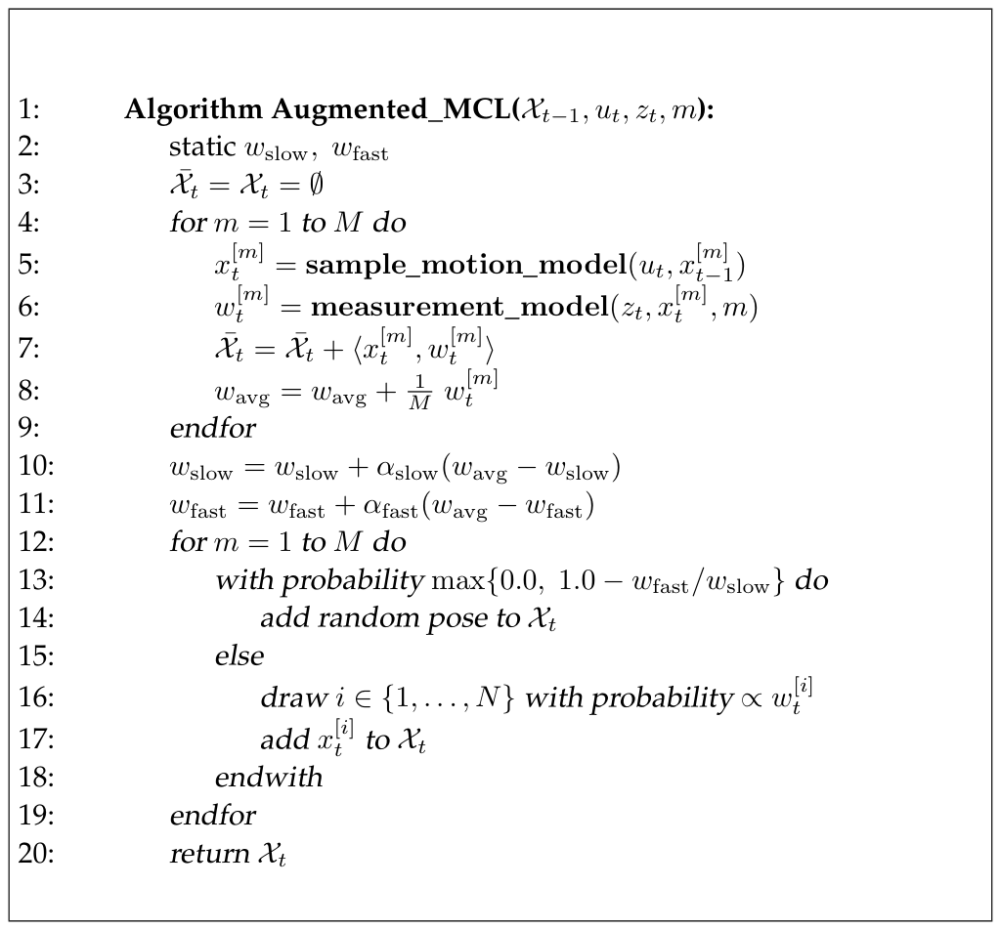

*Table 8.3 — 랜덤 표본을 추가하는 MCL의 적응적 변형. 랜덤 표본의 개수는 센서 측정의 단기 likelihood와
장기 likelihood를 비교해 결정된다. (책 p.258)*

```
 1:  Algorithm Augmented_MCL(X_{t-1}, u_t, z_t, m):
 2:      static w_slow, w_fast
 3:      X̄_t = X_t = ∅
 4:      for m = 1 to M do
 5:          x_t^[m] = sample_motion_model(u_t, x_{t-1}^[m])
 6:          w_t^[m] = measurement_model(z_t, x_t^[m], m)
 7:          X̄_t = X̄_t + ⟨x_t^[m], w_t^[m]⟩
 8:          w_avg = w_avg + (1/M) · w_t^[m]
 9:      endfor
10:      w_slow = w_slow + α_slow · (w_avg − w_slow)
11:      w_fast = w_fast + α_fast · (w_avg − w_fast)
12:      for m = 1 to M do
13:          with probability max{0.0, 1.0 − w_fast/w_slow} do
14:              add random pose to X_t
15:          else
16:              draw i ∈ {1, …, N} with probability ∝ w_t^[i]
17:              add x_t^[i] to X_t
18:          endwith
19:      endfor
20:      return X_t
```

**Augmented_MCL은 라인 8에서 경험적 측정 likelihood를 계산하고, 라인 10과 11에서 이 likelihood의
단기·장기 평균을 유지한다. 알고리즘은 $0 \le \alpha_{\text{slow}} \ll \alpha_{\text{fast}}$ 를
요구한다. 파라미터 $\alpha_{\text{slow}}$ 와 $\alpha_{\text{fast}}$ 는 각각 장기 평균과 단기 평균을
추정하는 지수 필터의 감쇠율이다.** (책 p.259)

> **Table 8.2와 다른 곳은 딱 네 군데다**: 라인 2(정적 변수), 라인 8(평균 누적), 라인 10~11(지수
> 평활), 라인 13~14(랜덤 주입). 나머지는 그대로다.

### 4. 실제 동작 — RoboCup에서의 kidnapping

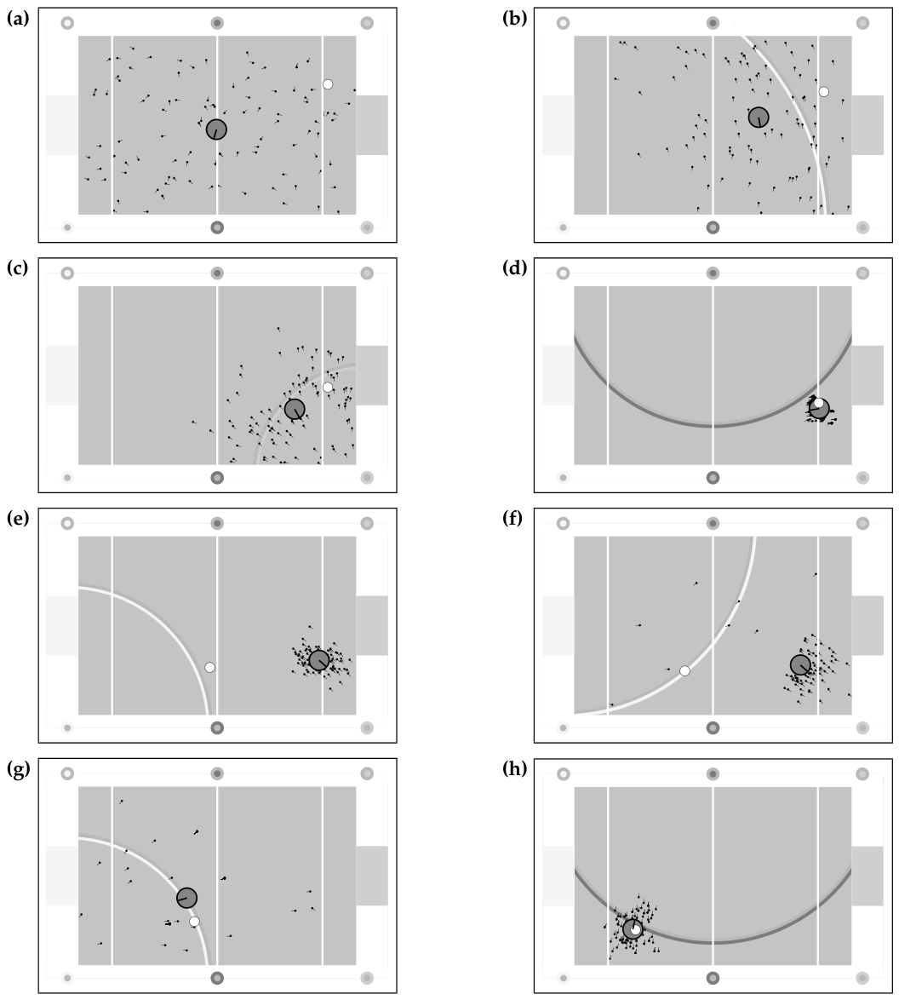

*Figure 8.16 — 랜덤 particle을 사용한 Monte Carlo localization. 각 그림은 로봇의 위치 추정을 표현하는
particle 집합을 보여준다(작은 선은 particle의 방향을 나타낸다). 큰 원은 particle의 평균을 묘사하고,
참 로봇 위치는 작은 흰 원으로 표시된다. 마커 검출은 검출된 마커를 중심으로 하는 호로 예시된다.
그림들은 global localization (a)–(d)와 relocalization (e)–(h)를 예시한다. (책 p.260)*

**Figure 8.16은 우리의 augmented MCL 알고리즘을 실제로 예시한다. 여기 보이는 것은 컬러 카메라를 갖추고
RoboCup 축구 대회에서 사용된 3×2m 필드에서 동작하는 다리 달린 로봇의 global localization과
relocalization 중 particle 집합의 수열이다. 센서 측정은 필드 주위에 놓인 여섯 개 시각 마커의 검출과
상대 localization에 대응하며, 이는 **210쪽 Figure 7.7**에 보인 그대로다.** (책 p.259)

**Table 6.4의 알고리즘이 검출의 likelihood를 결정하는 데 사용된다. Figure 8.3의 단계 14는 가장 최근
센서 측정에 따라 표집하는 알고리즘으로 대체되며, 이는 **Table 6.5의
sample_landmark_model_known_correspondence**를 사용해 쉽게 구현된다.** (책 p.259)

*(원문의 "Figure 8.3의 단계 14"는 Table 8.3의 라인 14를 가리키는 오식으로 보인다.)*

**(a)~(d) global localization** — **첫 마커 검출에서 사실상 모든 particle이 이 검출에 따라
뽑힌다(Figure 8.16b). 이 단계는 측정 확률의 단기 평균이 장기 대응물보다 훨씬 나쁜 상황에 대응한다.
몇 번 더 검출한 뒤 particle은 참 로봇 위치 주위에 뭉치고(Figure 8.16d), 측정 likelihood의 단기·장기
평균이 모두 증가한다. localization의 이 단계에서 로봇은 단지 자기 위치를 추적하고 있으며, 관측
likelihood가 상당히 높고, 아주 적은 수의 랜덤 particle만 가끔 추가된다.** (책 p.259)

**(e)~(h) 납치와 회복** — **심판이 로봇을 물리적으로 다른 위치에 놓으면 — 로봇 축구 대회에서 흔한
사건 — 측정 확률이 떨어진다. 새 위치에서의 첫 마커 검출은 아직 추가 particle을 유발하지 않는데,
평활화된 추정 $w_{\text{fast}}$ 가 여전히 높기 때문이다(Figure 8.16e 참조). 새 위치에서 몇 번의 마커
검출이 관측된 뒤 $w_{\text{fast}}$ 가 $w_{\text{slow}}$ 보다 훨씬 빠르게 감소하고 더 많은 랜덤
particle이 추가된다(Figure 8.16f&g). 마침내 로봇은 Figure 8.16h에 보이듯 성공적으로 재localize하며,
우리의 augmented MCL 알고리즘이 실제로 납치에서 **"생존"** 할 수 있음을 보여준다.** (책 p.259)

> **(e)에서 곧바로 반응하지 않는 것이 의도된 설계다.** 측정 하나 나빴다고 particle을 흩뿌리면
> 순간적인 센서 노이즈에 매번 무너진다. 지수 평활이 **"여러 번 연속으로 나쁠 때만"** 반응하게 한다.

<!--widget:mcl-global-kidnapping-->

### 5. 예제/실습

#### 예제 — $w_{\text{fast}}$, $w_{\text{slow}}$ 를 손으로 굴려보기

$\alpha_{\text{slow}} = 0.01$, $\alpha_{\text{fast}} = 0.5$, 초기
$w_{\text{slow}} = w_{\text{fast}} = 0.5$ 로 두고, 납치가 $t=4$ 에 일어났다고 하자.

| $t$ | $w_{\text{avg}}$ | $w_{\text{slow}}$ | $w_{\text{fast}}$ | $w_{\text{fast}}/w_{\text{slow}}$ | 랜덤 확률 |
|---|---|---|---|---|---|
| 1 | 0.50 | 0.5000 | 0.5000 | 1.000 | 0.000 |
| 2 | 0.52 | 0.5002 | 0.5100 | 1.020 | 0.000 |
| 3 | 0.50 | 0.5002 | 0.5050 | 1.010 | 0.000 |
| **4** | **0.05** | 0.4957 | 0.2775 | 0.560 | **0.440** |
| 5 | 0.04 | 0.4911 | 0.1588 | 0.323 | **0.677** |
| 6 | 0.30 | 0.4892 | 0.2294 | 0.469 | 0.531 |
| 7 | 0.45 | 0.4888 | 0.3397 | 0.695 | 0.305 |
| 8 | 0.50 | 0.4889 | 0.4198 | 0.859 | 0.141 |
| 9 | 0.52 | 0.4893 | 0.4699 | 0.960 | 0.040 |
| 10 | 0.53 | 0.4897 | 0.5000 | 1.021 | **0.000** |

**계산 예 ($t=4$)**:
$$w_{\text{slow}} = 0.5002 + 0.01(0.05 - 0.5002) = 0.5002 - 0.0045 = 0.4957$$
$$w_{\text{fast}} = 0.5050 + 0.5(0.05 - 0.5050) = 0.5050 - 0.2275 = 0.2775$$

**읽을 것 세 가지**
1. $t=4$ 에 $w_{\text{fast}}$ 가 급락하지만 $w_{\text{slow}}$ 는 거의 안 움직인다 — 이 **격차**가
   랜덤 확률을 만든다.
2. $t=5$ 에 랜덤 확률이 **0.677**로 최대 — particle 2/3이 새로 뿌려진다. 사실상 재시작이다.
3. 새 위치에서 localize되자($t=8{\sim}10$) 랜덤 확률이 **자동으로 0으로 돌아간다.** 스위치를 끌
   필요가 없다.

#### 연습문제

1. $\alpha_{\text{fast}} = \alpha_{\text{slow}}$ 로 두면 어떻게 되는가? 왜 책이
   $\alpha_{\text{slow}} \ll \alpha_{\text{fast}}$ 를 요구하는가?
2. 위 표에서 $\alpha_{\text{fast}} = 0.9$ 로 바꾸면 반응이 어떻게 달라지는가? 부작용은?
3. 랜덤 particle을 균등분포 대신 Table 6.5로 뽑으면 회복이 얼마나 빨라지겠는가? Figure 8.16(b)가
   그 답을 보여준다 — 설명하라.

---

## 8.3.6 Modifying the Proposal Distribution (책 p.261~263)

### 1. 개념적 이해

#### 놀라운 실패 모드 — 완벽한 센서가 MCL을 망친다

**MCL의 proposal 메커니즘은 MCL을 비효율적으로 만들 수 있는 또 다른 원천이다. 4.3.4절에서 논의했듯
particle filter는 **motion model을 proposal 분포로 사용**하지만, 이 분포와 **perceptual likelihood의
곱**을 근사하려 한다. Proposal과 target 분포의 차이가 클수록 더 많은 표본이 필요하다.** (책 p.261)

**MCL에서 이는 놀라운 실패 모드를 유발한다: **노이즈 없이 언제나 로봇에게 올바른 pose를 알려주는
완벽한 센서를 획득한다면 MCL은 실패한다.** 이는 localization에 충분한 정보를 담지 않는 노이즈 없는
센서에 대해서도 참이다.** (책 p.261)

**후자의 예는 1-D 노이즈 없는 range 센서일 것이다: 그런 range 측정을 받으면 유효한 pose 가설의 공간은
3-D pose 공간의 **2-D 부분공간**이 된다. 로봇 motion model에서 표집할 때 이 2-D 부분다양체 안으로
표집될 확률이 **0**임을 4.3.4절에서 이미 길게 논의했다.** (책 p.261)

> **직관**: motion model이 뿌린 particle 구름은 **부피**를 갖는다. 완벽한 센서의 likelihood는 **면**
> (부피 0)이다. 부피가 있는 곳에서 무작위로 점을 뽑아 면 위에 정확히 떨어질 확률은 0이다.
> 결과적으로 **모든 particle의 무게가 0**이 되어 필터가 죽는다.

**따라서 우리는 **어떤 상황에서는 MCL을 localization에 사용할 때 더 정확한 센서보다 덜 정확한 센서가
선호될 것**이라는 이상한 상황에 직면한다. EKF localization에서는 이렇지 않은데, EKF 갱신은 새 평균을
계산할 때 측정을 고려하기 때문이다 — motion model만으로 평균을 생성하는 대신.** (책 p.261)

#### 해법 1 — 노이즈를 부풀린다 (임시방편)

**다행히 간단한 요령이 처방을 제공한다: **센서의 노이즈 양을 인위적으로 부풀리는** measurement model을
그냥 사용하는 것이다. 이 부풀림을 측정 불확실성뿐 아니라 **particle filter 알고리즘의 근사적 성질이
유발하는 불확실성**까지 수용하는 것으로 생각할 수 있다.** (책 p.261~262)

> **네 번째로 나오는 "노이즈를 부풀려라"** 다 (5장 p.118, 6.7절, 8.2.2절에 이어). 여기서의 이유는
> 또 다르다 — **particle 표현이 유한하기 때문**이다.

#### 해법 2 — proposal을 섞는다 (Mixture MCL)

**대안적이고 더 건전한 해법은 4.3.4절에서 간략히 논의한 **표집 과정의 수정**을 수반한다. 아이디어는
모든 particle 중 작은 일부에 대해 **motion model과 measurement model의 역할을 뒤바꾸는** 것이다.**
(책 p.262)

### 2. 수식/유도

#### 전체 수식 (먼저 한 번에)

$$x_t^{[m]} \sim p(z_t \mid x_t) \tag{1}$$

$$w_t^{[m]} = \int p(x_t^{[m]} \mid u_t, x_{t-1})\, bel(x_{t-1})\, dx_{t-1} \tag{2}$$

#### 단계별 설명 (생략 없이)

**(1) 측정에서 particle을 뽑는다** — 책 (8.6)

**particle이 measurement model에 따라 생성된다.** (책 p.262)

**(2) 무게는 motion model로 매긴다** — 책 (8.7)

**그리고 importance weight가 이에 비례해 계산된다.** (책 p.262)

> **완전히 뒤집힌 구조다.**
>
> | | 보통 MCL (Table 8.2) | 뒤집은 버전 |
> |---|---|---|
> | particle 생성 | motion model (라인 4) | **measurement model** |
> | 무게 계산 | measurement model (라인 5) | **motion model** |
>
> 왜 이게 도움이 되는가: 완벽한 센서라면 (1)은 **정확히 옳은 곳**에 particle을 놓는다. 부피 0인 면
> 위에 정확히. motion model로는 결코 도달할 수 없던 그곳이다.

**이 새로운 표집 과정은 평범한 particle filter의 정당한 대안이다. **그것만으로는 비효율적**인데,
particle을 생성할 때 **역사를 완전히 무시**하기 때문이다. 그러나 두 메커니즘 중 어느 것으로든
particle의 일부를 생성하고 두 particle 집합을 병합하는 것도 똑같이 정당하다.** (책 p.262)

**결과 알고리즘은 **MCL with mixture proposal distribution**, 또는 **Mixture MCL**이라 불린다. 실제로는
새 과정을 통해 **작은 일부(예: 5%)** 의 particle을 생성하는 것으로 충분한 경향이 있다.** (책 p.262)

> **5%라는 숫자를 기억해 두자.** 대부분(95%)은 여전히 역사를 반영하는 정상 경로로 만들고,
> 5%만 "지금 이 측정이 말하는 곳"에 새로 놓는다. 8.3.5절 랜덤 particle과 비슷하지만,
> **균등하게 뿌리는 대신 측정이 가리키는 곳에** 놓는다는 점이 다르다.

#### 구현의 어려움 (책 p.262)

**불행히도 우리의 아이디어는 도전 없이 오지 않는다. 두 주요 단계 — $p(z_t \mid x_t)$ 에서 표집하는
것과 importance weight $w_t^{[m]}$ 를 계산하는 것 — 는 실현하기 어려울 수 있다.**

| 어려움 | 이유 |
|---|---|
| **$p(z_t \mid x_t)$ 에서 표집** | **"measurement model에서 표집하는 것은 그 역이 닫힌 형식 해를 가져 표집하기 쉬울 때만 쉽다. 보통은 그렇지 않다: 주어진 레이저 range 스캔에 맞는 모든 pose의 공간에서 표집하는 것을 상상해 보라!"** |
| **무게 $w_t^{[m]}$ 계산** | **"(8.7)의 적분 때문에, 그리고 $bel(x_{t-1})$ 자체가 particle 집합으로 표현된다는 사실 때문에 복잡하다"** |

**너무 자세히 파고들지 않고, 우리는 두 단계 모두 구현될 수 있지만 **추가적인 근사와 함께만** 가능함을
언급한다.** (책 p.262)

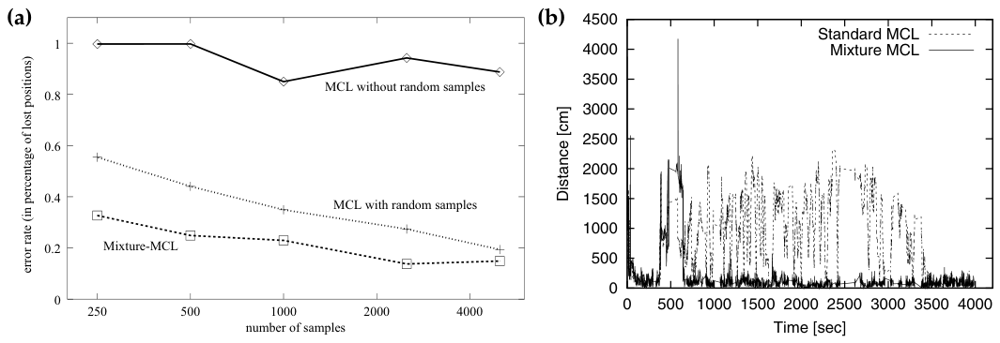

*Figure 8.17 — (a) 평범한 MCL(위 곡선), 랜덤 표본을 사용한 MCL(가운데 곡선), mixture proposal 분포를
사용한 Mixture MCL(아래 곡선). 오차율은 붐비는 박물관에서 동작한 로봇이 획득한 데이터셋에 대해,
로봇이 자기 위치를 놓친 시간의 백분율로 측정된다. (b) 천장 맵을 사용한 localization에서 표준 MCL과
mixture MCL의 시간에 따른 오차. (책 p.261)*

**Figure 8.17은 두 실세계 데이터셋에 대해 MCL, 랜덤 표본으로 증강한 MCL, Mixture MCL의 비교 결과를
보여준다. 두 경우 모두 $p(z_t \mid x_t)$ 자체가 데이터로부터 학습되어 **density tree**로 표현되었다 —
이 책의 범위를 벗어나는 정교한 절차다. Importance weight 계산을 위해 적분은 **stochastic integration**
으로 대체되었고, prior belief는 각 particle을 좁은 Gaussian으로 convolve해 공간을 채우는 밀도로
연장되었다. 세부는 차치하고, 이 결과는 **mixture 아이디어가 우월한 결과를 낳지만 구현하기 어려울 수
있음**을 예시한다.** (책 p.262)

**우리는 또한 **Mixture MCL이 kidnapped robot 문제에 건전한 해법을 제공**함에 유의한다. 가장 최근
측정만 사용해 particle을 seed-start함으로써, 우리는 과거 측정과 제어에 상관없이 **순간적인 센서
입력이 주어졌을 때 그럴듯한 위치에 지속적으로 particle을 생성**한다. 문헌에는 그런 접근이 전면적인
localization 실패에 잘 대처할 수 있다는 풍부한 증거가 존재하며(Figure 8.17b가 마침 평범한 MCL의 그런
실패 하나를 보여준다), 따라서 실용적 구현에서 개선된 강건성을 제공한다.** (책 p.263)

### 3. 예제/실습

#### 예제 — 완벽한 센서가 MCL을 죽이는 것을 숫자로

1차원 문제로 단순화하자. 로봇 위치 $x \in [0, 10]$, particle 1000개가 균등하게 퍼져 있다.

**경우 A — 노이즈 있는 센서** ($\sigma = 0.5$, 측정값 $z = 5.0$)

$$w^{[m]} = \frac{1}{\sqrt{2\pi(0.25)}}e^{-\frac{(x^{[m]}-5)^2}{2(0.25)}}$$

$x \in [4, 6]$ 인 particle이 약 200개, 이들이 의미 있는 무게를 받는다. **필터가 잘 돈다.**

**경우 B — 매우 정밀한 센서** ($\sigma = 0.001$)

$x^{[m]}$ 가 $5.0$ 에서 $0.005$ 이내여야 무게가 0이 아니다. 균등하게 퍼진 1000개 중 그 구간
($0.01$ 폭)에 들어갈 기대 개수:

$$1000 \times \frac{0.01}{10} = 1\ \text{개}$$

**particle 하나에 모든 무게가 실린다.** resampling하면 1000개가 전부 그 하나의 복제가 된다 —
**particle 다양성이 완전히 소멸**한다.

**경우 C — 완벽한 센서** ($\sigma = 0$)

$x^{[m]} = 5.0$ 을 정확히 만족하는 particle이 존재할 확률 = **0**. 모든 무게가 0이고
$\sum_m w^{[m]} = 0$ 이라 **resampling이 정의되지 않는다. 필터가 죽는다.**

**해법 비교**

| 방법 | 경우 C에서의 동작 |
|---|---|
| 노이즈 부풀리기 | $\sigma$ 를 0.5로 강제 → 경우 A로 되돌림. 정보를 버리는 대가 |
| Mixture MCL | 5%의 particle을 $x = 5.0$ 에 **직접 생성** → 정보를 버리지 않고 해결 |

#### 연습문제

1. 경우 B에서 particle을 100,000개로 늘리면 문제가 해결되는가? 기대 개수를 계산해 보라.
   3차원 pose 공간이라면?
2. Mixture MCL의 두 어려움(표집·무게 계산) 중, 랜드마크 모델(6.6절)을 쓸 때는 어느 쪽이 쉬워지는가?
3. 8.3.5절 랜덤 particle과 8.3.6절 mixture proposal의 차이를 한 문장으로 정리하라. 둘을 함께
   쓸 수 있는가?

---

## 8.3.7 KLD-Sampling: Adapting the Size of Sample Sets (책 p.263~267)

### 1. 개념적 이해

#### 문제 — 고정 크기는 낭비다

**belief를 표현하는 데 사용되는 표본 집합의 크기는 particle filter의 효율에 중요한 파라미터다.
지금까지 우리는 **고정 크기**의 표본 집합을 사용하는 particle filter만 논의했다. 불행히도 MCL에서
표본 고갈로 인한 발산을 피하려면, 모바일 로봇이 global localization과 position tracking 문제를 모두
다룰 수 있도록 **큰 표본 집합**을 골라야 한다.** (책 p.263)

**이는 계산 자원의 낭비일 수 있으며, Figure 8.13이 이를 드러낸다. 이 예에서 모든 표본 집합은
**100,000개**의 particle을 담는다. localization 초기 단계에서 belief를 정확히 표현하려면 그렇게 높은
수의 particle이 필요할 수 있지만(Figure 8.13a 참조), **일단 로봇이 자기가 어디 있는지 알고 나면 그
수의 작은 일부만으로 위치를 추적하기에 충분함**이 명백하다(Figure 8.13c).** (책 p.263)

> 8.3.4절 예제에서 계산한 바로 그 낭비다. localize된 뒤 particle 간격이 1.6mm — 명백한 과잉이다.

#### 해법 — 통계적 한계로 개수를 정한다

**KLD-sampling은 시간에 따라 particle 개수를 조정하는 MCL의 변형이다. (…) 이름 KLD-sampling은
**Kullback-Leibler divergence**에서 유래하며, 이는 두 확률분포 사이의 차이를 재는 척도다.**
(책 p.263)

**KLD-sampling의 아이디어는 **표본 기반 근사 품질에 대한 통계적 한계**에 근거해 particle 개수를
결정하는 것이다. 더 구체적으로, particle filter의 각 반복에서 KLD-sampling은 **확률 $1-\delta$ 로
참 posterior와 표본 기반 근사 사이의 오차가 $\varepsilon$ 보다 작도록** 표본 개수를 결정한다. 여기
서술하지 않은 여러 가정이 이 아이디어의 효율적 구현을 가능하게 한다.** (책 p.263)

> **Kullback-Leibler divergence (KL divergence)**
>
> 두 분포 $p$, $q$ 의 차이를 재는 값이다:
> $$\mathrm{KL}(p, q) = \sum_i p(x_i)\log\frac{p(x_i)}{q(x_i)}$$
> (8.8절 연습문제 4(b)에 정의가 나온다.) 항상 $\ge 0$ 이고, 두 분포가 같을 때만 0이다.
> 대칭이 아니므로 "거리"는 아니다.
>
> 여기서 $p$ 는 **참 posterior**, $q$ 는 **particle이 만든 근사**다.

### 2. 알고리즘 — 책 Table 8.4

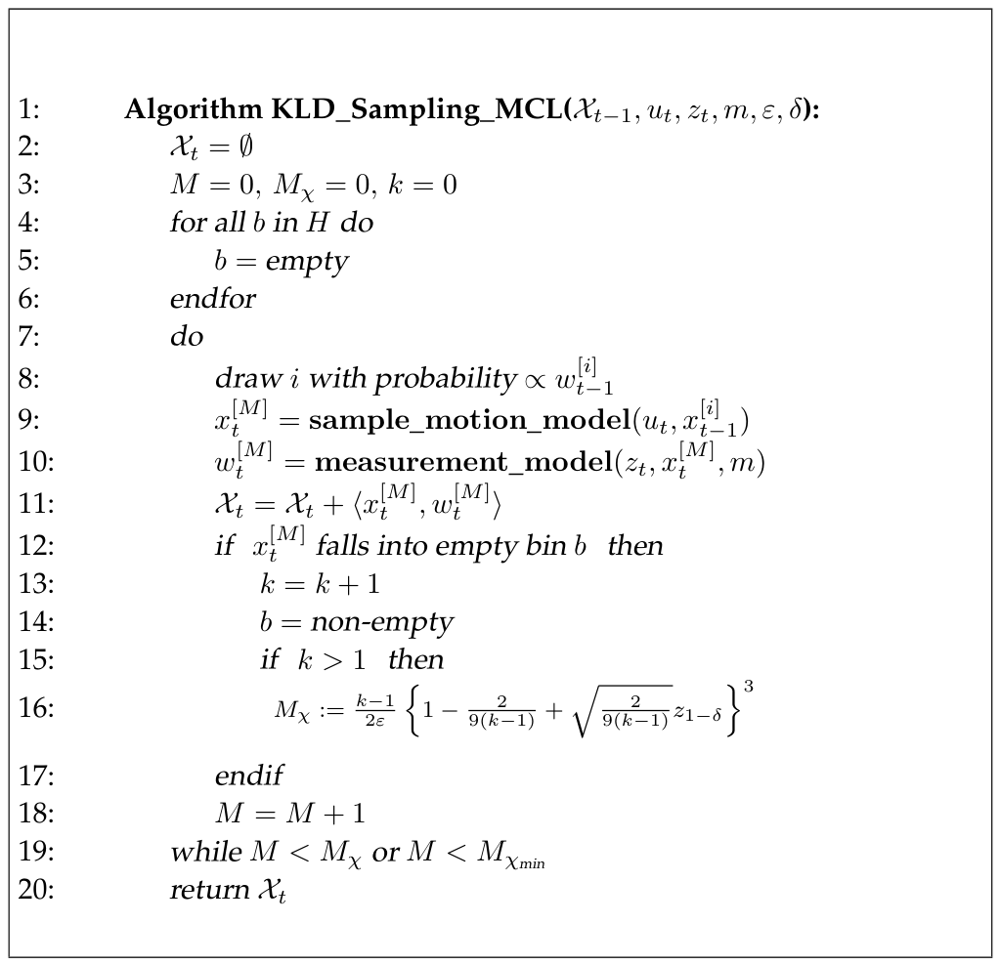

*Table 8.4 — 적응적 표본 집합 크기를 갖는 KLD-sampling MCL. 알고리즘은 근사 오차에 대한 통계적 한계에
도달할 때까지 표본을 생성한다. (책 p.264)*

```
 1:  Algorithm KLD_Sampling_MCL(X_{t-1}, u_t, z_t, m, ε, δ):
 2:      X_t = ∅
 3:      M = 0,  M_χ = 0,  k = 0
 4:      for all b in H do
 5:          b = empty
 6:      endfor
 7:      do
 8:          draw i with probability ∝ w_{t-1}^[i]
 9:          x_t^[M] = sample_motion_model(u_t, x_{t-1}^[i])
10:          w_t^[M] = measurement_model(z_t, x_t^[M], m)
11:          X_t = X_t + ⟨x_t^[M], w_t^[M]⟩
12:          if x_t^[M] falls into empty bin b then
13:              k = k + 1
14:              b = non-empty
15:              if k > 1 then
16:                  M_χ := ((k−1)/(2ε)) · { 1 − 2/(9(k−1)) + sqrt(2/(9(k−1))) · z_{1−δ} }³
17:              endif
18:          M = M + 1
19:      while M < M_χ  or  M < M_{χ_min}
20:      return X_t
```

**알고리즘은 이전 표본 집합과 함께 맵, 가장 최근의 제어와 측정을 입력으로 받는다. **MCL과 달리
KLD-sampling은 가중된 표본 집합을 입력으로 받는다. 즉 $\mathcal{X}_{t-1}$ 의 표본은 resampling되지
않는다.** 추가로 알고리즘은 통계적 오차 한계 $\varepsilon$ 과 $\delta$ 를 요구한다.** (책 p.263)

**간단히 말해 KLD-sampling은 라인 16의 통계적 한계가 만족될 때까지 particle을 생성한다. 이 한계는
**particle이 덮는 상태 공간의 "부피"** 에 기반한다. particle이 덮는 부피는 3차원 상태 공간에 겹쳐진
**histogram, 또는 격자**로 측정된다. Histogram $H$ 의 각 bin은 비어 있거나 적어도 하나의 particle로
점유되어 있다.** (책 p.265)

**라인 12부터 19까지가 KLD-sampling의 핵심 아이디어를 구현한다. 새로 생성된 particle이 histogram의
**빈 bin에 떨어지면**, 비어 있지 않은 bin의 개수 $k$ 가 증가하고 그 bin은 non-empty로 표시된다.
따라서 $k$ 는 적어도 하나의 particle로 채워진 histogram bin의 개수를 잰다. 이 수가 라인 16에서
결정되는 통계적 한계에서 결정적 역할을 한다.** (책 p.265)

### 라인 16의 식을 읽는 법

$$M_\chi := \frac{k-1}{2\varepsilon}\left\{1 - \frac{2}{9(k-1)} + \sqrt{\frac{2}{9(k-1)}}\; z_{1-\delta}\right\}^3$$

**양 $M_\chi$ 는 이 한계에 도달하는 데 필요한 particle의 개수를 준다. 주어진 $\varepsilon$ 에 대해
$M_\chi$ 는 **비어 있지 않은 bin의 개수 $k$ 에 대체로 선형**임에 유의하라; 두 번째 비선형 항은 $k$ 가
증가함에 따라 무시할 만해진다. 항 $z_{1-\delta}$ 는 파라미터 $\delta$ 에 기반한다. 이는 **표준정규분포의
상위 $1-\delta$ 분위수**를 표현한다. 전형적인 $\delta$ 값에 대한 $z_{1-\delta}$ 값은 표준 통계표에서
쉽게 구할 수 있다.** (책 p.265)

> **식을 세 부분으로 뜯어보면**
>
> | 부분 | 역할 |
> |---|---|
> | $\dfrac{k-1}{2\varepsilon}$ | **주된 항.** bin이 많을수록(belief가 퍼져 있을수록), 오차 한계 $\varepsilon$ 이 작을수록 particle이 많이 필요하다 |
> | $\left\{1 - \frac{2}{9(k-1)} + \cdots\right\}^3$ | **보정 항.** $k$ 가 커지면 중괄호 안이 1에 가까워져 무시된다 |
> | $z_{1-\delta}$ | **신뢰수준.** $\delta = 0.01$ 이면 $z_{0.99} = 2.326$ |
>
> 큰 $k$ 에 대해 $M_\chi \approx \dfrac{k-1}{2\varepsilon}$ — **"채워진 bin 하나당 particle
> $\frac{1}{2\varepsilon}$ 개"** 라는 단순한 규칙이다.

**알고리즘은 particle 개수 $M$ 이 $M_\chi$ 와 사용자 정의 최소값 $M_{\chi_{\min}}$ 을 초과할 때까지
새 particle을 생성한다. 보이는 대로 **문턱값 $M_\chi$ 는 $M$ 에 대한 "움직이는 목표"** 로 작동한다.
표본 $M$ 이 많이 생성될수록 histogram의 bin $k$ 가 더 많이 채워지고, 문턱값 $M_\chi$ 도 높아진다.**
(책 p.265)

**실제로 알고리즘은 다음 논리로 종료한다. 표집 초기 단계에서는 사실상 모든 bin이 비어 있으므로 거의
모든 새 표본마다 $k$ 가 증가한다. 이 $k$ 의 증가가 문턱값 $M_\chi$ 의 증가를 낳는다. 그러나 시간이
지나면 점점 더 많은 bin이 채워지고 $M_\chi$ 는 가끔만 증가한다. $M$ 은 새 표본마다 증가하므로 결국
$M$ 이 $M_\chi$ 에 도달하고 표집이 멈춘다.** (책 p.265)

**언제 이런 일이 일어나는지는 belief에 달려 있다. **particle이 넓게 퍼져 있을수록 더 많은 bin이 채워
지고 문턱값 $M_\chi$ 가 높아진다. 추적 중에는 particle이 적은 수의 bin에 집중되므로 KLD-sampling이
더 적은 표본을 생성한다.**** (책 p.265)

> **⚠️ 흔한 오해를 책이 미리 막는다**
>
> **histogram은 particle 분포 자체에 아무 영향도 주지 않음에 유의해야 한다. 그 유일한 목적은
> belief의 **복잡도, 또는 부피를 재는 것**이다. 격자는 각 particle filter 반복이 끝날 때 폐기된다.**
> (책 p.265)
>
> 즉 KLD-sampling은 grid localization으로 되돌아가는 것이 **아니다.** 격자는 "얼마나 많이 뽑을지"를
> 세는 자일 뿐이고, belief는 여전히 particle이 표현한다.

### 3. 실험 결과

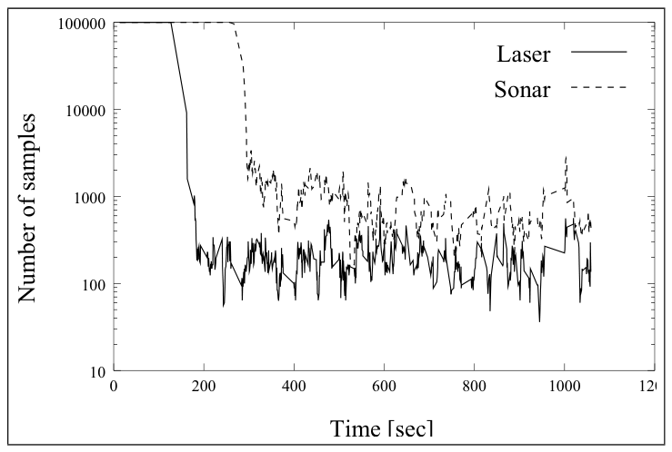

*Figure 8.18 — KLD-sampling: global localization 실행에서 표본 개수의 전형적 변화를 시간에 대해 도시
(표본 개수는 로그 스케일). 실선은 로봇의 laser range-finder를 사용할 때의 표본 개수, 파선은 소나 센서
데이터에 기반한 그래프. (책 p.266)*

**Figure 8.18은 KLD-sampling을 사용한 전형적인 global localization 실행 동안의 표본 집합 크기를
보여준다. 두 경우 모두 알고리즘은 global localization 초기 단계에서 **많은 수의 표본을 고른다.**
로봇이 localize되고 나면 particle 개수가 훨씬 낮은 수준으로 **떨어진다(초기 particle 수의 1% 미만).**
이 전이가 언제, 얼마나 빨리 일어나는지는 환경의 유형과 센서의 정확도에 달려 있다. 이 예에서
laser range-finder의 더 높은 정확도가 더 이른 전이로 반영된다.** (책 p.265)

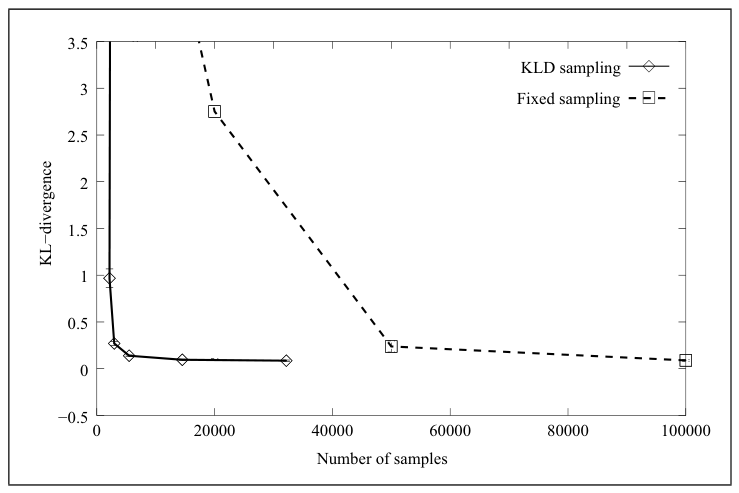

*Figure 8.19 — KLD-sampling과 고정 표본 집합 크기 MCL의 비교. $x$ 축은 평균 표본 집합 크기를 표현한다.
$y$ 축은 참조 belief와 두 접근이 생성한 표본 집합 사이의 KL 거리를 도시한다. (책 p.267)*

**Figure 8.19는 KLD-sampling과 고정 표본 집합 MCL의 근사 오차를 비교한다. (…) 보이는 대로 **고정
접근은 KL 거리가 0.25 아래로 수렴하기 전에 약 50,000개의 표본을 요구한다.** 더 큰 오차는 전형적으로
particle filter가 발산하고 로봇이 localize할 수 없음을 나타낸다. 실선은 KLD-sampling을 사용한 결과를
보여준다. (…) **KLD-sampling은 평균 3,000개의 표본만 사용해 작은 오차 수준으로 수렴한다.**
그래프는 또한 KLD-sampling이 최적 belief를 정확히 추적하도록 보장되지는 않음을 보여준다. 실선의 가장
왼쪽 데이터 점들은 **너무 느슨한 오차 한계 때문에 KLD-sampling이 발산함**을 나타낸다.** (책 p.265~266)

> **50,000 → 3,000, 약 17배 절약.** 그리고 마지막 문장이 중요하다 — $\varepsilon$ 을 너무 크게
> 잡으면 particle이 부족해져 오히려 발산한다. 공짜가 아니다.

**KLD-sampling은 MCL뿐 아니라 **어떤 particle filter에도** 사용될 수 있다. Histogram은 고정된 다차원
격자로 구현될 수도 있고, 더 컴팩트하게는 트리 구조로 구현될 수도 있다. 로봇 localization의 맥락에서
KLD-sampling은 고정 표본 집합 크기 MCL을 **일관되게 능가**함이 보여졌다. 이 기법의 이점은
**global localization과 tracking 문제의 조합**에 대해 가장 유의미하다.** (책 p.266~267)

**실제로 $(1-\delta)$ 에 대해 **0.99** 정도, $\varepsilon$ 에 대해 **0.05** 정도의 오차 한계 값을,
**50cm × 50cm × 15도**의 histogram bin 크기와 조합하면 좋은 결과가 달성된다.** (책 p.267)

<!--widget:kld-sampling-->

### 4. 예제/실습

#### 예제 — $M_\chi$ 를 실제로 계산해 보기

책이 권한 값 $\varepsilon = 0.05$, $\delta = 0.01$ 을 쓰자. $z_{1-\delta} = z_{0.99} = 2.326$.

**global localization 초기** — particle이 퍼져 있어 채워진 bin이 $k = 2000$ 개라 하자.

$$\frac{k-1}{2\varepsilon} = \frac{1999}{0.1} = 19{,}990$$

$$\frac{2}{9(k-1)} = \frac{2}{17991} = 0.0001112$$

$$\left\{1 - 0.0001112 + \sqrt{0.0001112}\times 2.326\right\}^3 = \{1 - 0.0001112 + 0.010545 \times 2.326\}^3$$
$$= \{1 - 0.0001112 + 0.024528\}^3 = \{1.024417\}^3 = 1.075026$$

$$M_\chi = 19{,}990 \times 1.075026 \approx 21{,}490\ \text{개}$$

**tracking 단계** — particle이 뭉쳐 채워진 bin이 $k = 20$ 개라 하자.

$$\frac{19}{0.1} = 190, \qquad \frac{2}{9(19)} = 0.011696, \qquad \sqrt{0.011696} = 0.108148$$

$$\{1 - 0.011696 + 0.108148 \times 2.326\}^3 = \{1 - 0.011696 + 0.251552\}^3 = \{1.239856\}^3 = 1.90596$$

$$M_\chi = 190 \times 1.90596 \approx 362\ \text{개}$$

**21,490개에서 362개로 — 약 59배 감소.** Figure 8.18의 "1% 미만"이 이 계산이다.

**보정 항의 효과도 눈여겨보자**: $k = 2000$ 일 때 중괄호가 $1.075$ (7.5% 증가)인데
$k = 20$ 일 때는 $1.906$ (91% 증가)이다. **$k$ 가 작을 때 보정 항이 크게 작용해** 표본이 너무 적어
지는 것을 막는다. 책이 "$k$ 가 증가하면 무시할 만해진다"고 한 것의 반대편이다.

#### 예제 — bin 크기의 영향

같은 belief에 대해 bin을 50cm에서 25cm로 줄이면 (3차원이므로) 채워지는 bin이 최대 8배 늘 수 있다.
$k = 20 \to 160$ 이라면:

$$\frac{159}{0.1} = 1590, \quad \frac{2}{9(159)} = 0.001398, \quad \{1 - 0.001398 + 0.037390\times2.326\}^3 = \{1.085578\}^3 = 1.279$$

$$M_\chi \approx 1590 \times 1.279 = 2034\ \text{개}$$

**362개 → 2034개.** bin을 잘게 쪼개면 같은 belief에도 particle이 훨씬 많이 필요해진다.
**bin 크기가 사실상 "얼마나 정밀하게 추적할 것인가"를 정하는 손잡이**다.

#### 연습문제

1. $\varepsilon$ 을 0.05에서 0.01로 줄이면 위 두 경우의 $M_\chi$ 는 각각 얼마가 되는가?
2. $k = 1$ 일 때 라인 16이 실행되지 않는(`if k > 1`) 이유는 무엇인가? 식에 $k-1$ 이 분모에 있음을
   보라.
3. KLD-sampling이 쓰는 histogram과 8.2절 grid localization의 격자는 무엇이 다른가? 세 가지를 들라.

---

# 8.4 Localization in Dynamic Environments (책 p.267~273)

### 1. 개념적 이해

#### 문제 — static world 가정이 깨질 때

**지금까지 논의한 모든 localization 알고리즘의 핵심 한계는 **static world 가정, 또는 Markov 가정**
에서 발생한다. 대부분의 흥미로운 환경은 사람들로 채워져 있고, 따라서 상태 $x_t$ 로 모델링되지 않은
동역학을 보인다.** (책 p.267)

**어느 정도까지 확률적 접근은 센서 노이즈를 수용하는 능력 덕분에 그런 모델링되지 않은 동역학에
강건하다. 그러나 앞서 언급했듯 **확률적 필터링 틀에서 수용되는 센서 노이즈의 유형은 각 시각에서
독립이어야 하는 반면, 모델링되지 않은 동역학은 여러 시각에 걸쳐 센서 측정에 영향을 준다.** 그런 효과가
두드러지면 static world 가정에 의존하는 확률적 localization 알고리즘은 실패할 수 있다.** (책 p.267)

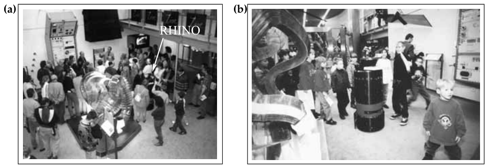

*Figure 8.20 — 모바일 로봇 "Rhino"가 수십 명의 사람들에게 자주 둘러싸였던 "Deutsches Museum Bonn"의
장면들. (책 p.268)*

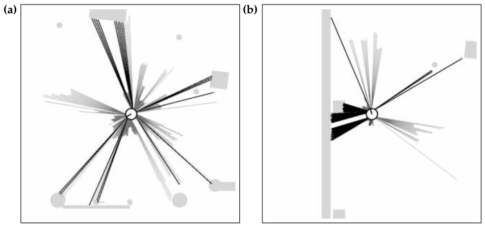

*Figure 8.21 — 사람들이 로봇을 둘러쌀 때 laser range 스캔은 흔히 심하게 손상된다. 이런 상황에서
로봇은 어떻게 정확한 localization을 유지할 수 있는가? (책 p.268)*

**그런 실패 상황의 좋은 예가 Figure 8.20에 보인다. 이 예는 사람들로 가득한 박물관에서 항행하는
모바일 투어 가이드 로봇을 수반한다. 사람들 — 그들의 위치, 속도, 의도 등 — 은 지금까지 논의한
알고리즘에 포착되지 않는, localization 알고리즘에 대해 **숨은 상태(hidden state)** 다.** (책 p.268)

> **왜 문제인가 — 책의 설명이 생생하다 (책 p.268)**
>
> **왜 이것이 문제인가? **사람들이 로봇이 벽을 마주하고 있다고 시사하는 방식으로 줄지어 서 있는
> 것을 상상해 보라.** 각 단일 센서 측정마다 로봇은 자기가 벽 옆에 있다는 belief를 높인다. 정보가
> 독립으로 취급되므로 로봇은 궁극적으로 벽 근처 pose에 높은 likelihood를 할당하게 된다. 그런 효과는
> 독립적인 센서 노이즈로도 가능하지만, 그 likelihood는 사라질 만큼 작다.**
>
> 6.1절 예제에서 계산한 "16억 배"가 여기서 **반대로 작용한다.** 사람 때문에 일관되게 짧은 측정이
> 20번 들어오면, 필터는 그 잘못된 가설에 천문학적 확신을 갖게 된다.

#### 두 가지 대응 (책 p.269)

**동적 환경을 다루는 두 가지 근본적 기법이 존재한다.**

| | **state augmentation** | **outlier rejection** |
|---|---|---|
| 방법 | **"숨은 상태를 필터가 추정하는 상태에 포함시킨다"** | **"숨은 상태에 영향받은 측정을 제거하도록 센서 측정을 전처리한다"** |
| 일반성 | **"수학적으로 더 일반적"** — 로봇 pose뿐 아니라 사람들의 위치·속도도 추정 | 제한적 |
| 비용 | **"3개 변수 대신 훨씬 많은 변수에 대한 posterior를 계산해야 한다. 사실 변수의 개수 자체가 변수인데, 사람 수가 시간에 따라 변할 수 있기 때문이다"** | 낮음 |
| 이 절에서 | 언급만 (뒷장에서 다룸) | **여기서 개발한다** |

**대안인 outlier rejection은 특정한 제한적 상황에서 잘 작동하며, 여기에는 사람의 존재가 range finder
(또는 정도가 덜하지만 카메라 이미지)에 영향을 줄 수 있는 상황이 포함된다. 여기서 우리는 6.3절의
beam 기반 range finder 모델에 대해 이를 개발한다.** (책 p.269)

#### 아이디어 — 6.3절의 EM을 온라인으로

**아이디어는 **센서 측정의 원인을 조사하고, 모델링되지 않은 환경 동역학에 영향받았을 가능성이 높은
것들을 기각하는 것**이다. 지금까지 논의한 센서 모델은 모두 측정이 생겨날 수 있는 서로 다른 대안적
경로를 다룬다. 만약 특정 경로를 원치 않는 동적 효과 — 사람 같은 — 의 존재와 연관시킬 수 있다면,
우리가 할 일은 그런 모델링되지 않은 개체에 의해 높은 likelihood로 야기된 측정을 버리는 것뿐이다.**
(책 p.269)

**이 아이디어는 놀랍도록 일반적이다; 사실 **수학은 본질적으로 6.3절의 EM 학습 알고리즘과 같지만,
온라인 방식으로 적용된다.**** (책 p.269)

> **6.3.3절 E-step이 여기서 재활용된다.** 그때는 오프라인으로 $\Theta$ 를 학습하려고 각 측정이
> 어느 성분에서 왔는지 확률을 계산했다. 여기서는 **온라인으로, 그 확률이 높은 측정을 버리려고**
> 같은 계산을 한다. **같은 수식, 다른 목적.**

### 2. 수식/유도

#### 전체 유도 과정 (먼저 한 번에)

$$p(z_t^k \mid x_t, m) = \begin{pmatrix} z_{\text{hit}} \\ z_{\text{short}} \\ z_{\text{max}} \\ z_{\text{rand}} \end{pmatrix}^T \cdot \begin{pmatrix} p_{\text{hit}}(z_t^k \mid x_t, m) \\ p_{\text{short}}(z_t^k \mid x_t, m) \\ p_{\text{max}}(z_t^k \mid x_t, m) \\ p_{\text{rand}}(z_t^k \mid x_t, m) \end{pmatrix} \tag{1}$$

$$p(\bar{c}_t^k = \text{short} \mid z_t^k, z_{1:t-1}, u_{1:t}, m) = \frac{p(z_t^k \mid \bar{c}_t^k = \text{short},\, z_{1:t-1}, u_{1:t}, m)\; p(\bar{c}_t^k = \text{short})}{\sum_c p(z_t^k \mid \bar{c}_t^k = c,\, z_{1:t-1}, u_{1:t}, m)\; p(\bar{c}_t^k = c)} \tag{2}$$

$$p(z_t^k \mid \bar{c}_t^k = c,\, z_{1:t-1}, u_{1:t}, m) = \int p(z_t^k \mid x_t, \bar{c}_t^k = c, m)\; \overline{bel}(x_t)\, dx_t \tag{3}$$

$$p(\bar{c}_t^k = \text{short} \mid z_t^k, z_{1:t-1}, u_{1:t}, m) = \frac{\int p_{\text{short}}(z_t^k \mid x_t, m)\, z_{\text{short}}\, \overline{bel}(x_t)\, dx_t}{\sum_c \int p_c(z_t^k \mid x_t, m)\, z_c\, \overline{bel}(x_t)\, dx_t} \tag{4}$$

#### 단계별 설명 (생략 없이)

**(1) 출발점 — 6.3절의 4성분 mixture** — 책 (8.8)

**6.3절 식 (6.12)에서 우리는 range finder를 위한 beam 기반 measurement model을 네 항의 mixture로
정의했다.** (책 p.269)

**모델 유도가 명확히 말하듯, 그중 하나의 항 — $z_{\text{short}}$ 와 $p_{\text{short}}$ 를 수반하는
것 — 이 **예상치 못한 물체**에 대응한다.** (책 p.269)

> **6.3.1절 성분 2가 여기서 주인공이 된다.** 그때 "사람이 앞을 가로막으면 range가 짧아진다"고 했고,
> 그것을 노이즈로 취급해 모델에 넣었다. 이제 그 성분을 **탐지기**로 쓴다.

**(2) 새 correspondence variable** — 책 (8.9)

**측정 $z_t^k$ 가 예상치 못한 물체에 대응할 확률을 계산하려면 새로운 correspondence variable
$\bar{c}_t^k$ 를 도입해야 하며, 이는 $\{\text{hit}, \text{short}, \text{max}, \text{rand}\}$ 네 값 중
하나를 취할 수 있다.** (책 p.269)

**range 측정 $z_t^k$ 가 "short" 읽기 — 예상치 못한 장애물에 대한 6.3절의 우리 기억법 — 에 대응할
posterior 확률은 **Bayes rule을 적용하고 이어서 무관한 조건 변수를 버림**으로써 얻어진다.**
(책 p.270)

> **⚠️ 표기 주의.** $\bar{c}_t^k$ 는 6.3.3절의 $c_i$ (네 오차 유형)와 같은 뜻이고,
> 6.6.3절·7.5절의 $c_t^i$ (어느 랜드마크인가)와는 **다른 것**이다. 책이 바(bar)를 붙여 구분한다.
>
> | 기호 | 절 | 뜻 | 값의 범위 |
> |---|---|---|---|
> | $c_i$ | 6.3.3 | 오차 유형 | hit / short / max / rand |
> | $c_t^i$ | 6.6.3 · 7.5 | 랜드마크 정체 | $1 \ldots N+1$ |
> | $\bar{c}_t^k$ | **8.4** | 오차 유형 (온라인) | hit / short / max / rand |

**여기서 분모의 변수 $c$ 는 네 값 중 아무것이나 취한다. 식 (8.8)의 표기를 사용하면 prior
$p(\bar{c}_t^k = c)$ 는 $c$ 의 네 값에 대해 변수 $z_{\text{hit}}$, $z_{\text{short}}$,
$z_{\text{max}}$, $z_{\text{rand}}$ 로 주어진다.** (책 p.270)

> **혼합 가중치가 prior 역할을 한다.** 6.3.1절에서 "네 성분의 비율"이었던 것이, 여기서는
> "이 측정이 각 유형일 사전 확률"로 해석된다. 같은 숫자의 두 얼굴이다.

**(3) $x_t$ 를 적분으로 없앤다** — 책 (8.10)

**(8.9)의 나머지 확률은 $x_t$ 를 적분해 없앰(integrating out)으로써 얻어진다.** (책 p.270)

> **왜 적분하는가.** "이 측정이 short일 확률"을 알려면 로봇이 어디 있는지 알아야 하는데 모른다.
> 그래서 belief에 대해 평균낸다. 7.4.3절 식 (15)와 **같은 구조**이며, 8.3.5절 식 (2)와도 같다.
> 이 책에서 세 번째로 나오는 같은 패턴이다.
>
> 두 번째 등호에서 조건 변수가 사라지는 것은 **"$x_t$ 를 알면 과거는 무관"** 이라는 Markov 가정이다.

**(4) 최종 형태** — 책 (8.11)

**$p(z_t^k \mid x_t, \bar{c}_t^k = c, m)$ 형태의 확률은 6.3절에서 $p_{\text{hit}}$, $p_{\text{short}}$,
$p_{\text{max}}$, $p_{\text{rand}}$ 로 축약되었다. 이것이 원하는 확률 (8.9)에 대한 표현을 준다.**
(책 p.270)

**일반적으로 (8.11)의 적분은 닫힌 형식 해를 갖지 않는다. 이를 평가하려면 상태 $x_t$ 에 대한 posterior
$\overline{bel}(x_t)$ 의 **대표 표본으로 근사**하는 것으로 충분하다. 그 표본은 grid localizer에서는
높은 likelihood의 격자 칸일 수도 있고, MCL 알고리즘에서는 **particle**일 수도 있다. 그러면 측정은
예상치 못한 장애물에 의해 야기되었을 확률이 사용자가 선택한 문턱값 $\chi$ 를 초과하면 **기각된다.**
(책 p.270)

> **적분을 particle 평균으로 바꾸는 것** — 8.3.5절 식 (2)에서 한 것과 똑같다. Monte Carlo 적분이
> 이 책에서 반복적으로 쓰이는 도구임을 다시 확인할 수 있다.

### 3. 알고리즘 — 책 Table 8.5

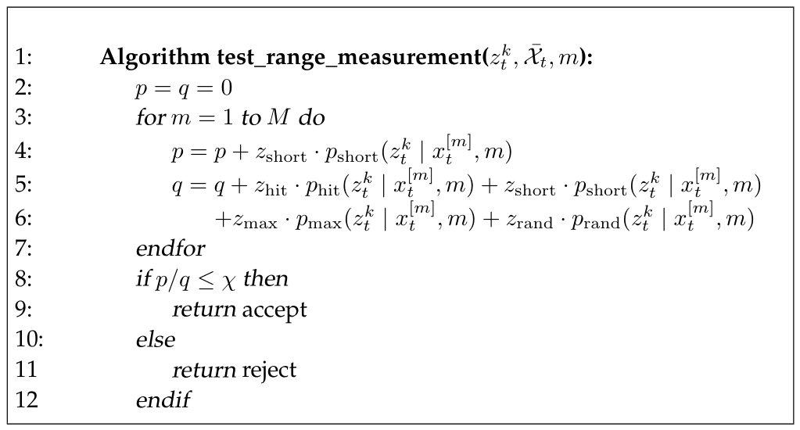

*Table 8.5 — 동적 환경에서 range 측정을 검사하는 알고리즘. (책 p.271)*

```
 1:  Algorithm test_range_measurement(z_t^k, X̄_t, m):
 2:      p = q = 0
 3:      for m = 1 to M do
 4:          p = p + z_short · p_short(z_t^k | x_t^[m], m)
 5:          q = q + z_hit  · p_hit(z_t^k | x_t^[m], m)  +  z_short · p_short(z_t^k | x_t^[m], m)
 6:                + z_max  · p_max(z_t^k | x_t^[m], m)  +  z_rand  · p_rand(z_t^k | x_t^[m], m)
 7:      endfor
 8:      if p/q ≤ χ then
 9:          return accept
10:      else
11:          return reject
12:      endif
```

**Table 8.5는 particle filter 맥락에서 이 기법의 구현을 묘사한다. 입력으로 belief $bel(x_t)$ 를
대표하는 particle 집합 $\bar{\mathcal{X}}_t$ 와, range 측정 $z_t^k$ 및 맵을 요구한다. 측정이
$\chi$ 보다 큰 확률로 예상치 못한 물체에 대응하면 "reject"를, 아니면 "accept"를 반환한다.
**이 루틴은 MCL의 measurement 통합 단계에 선행한다.**** (책 p.271)

> **라인 4가 식 (4)의 분자, 라인 5~6이 분모다.** particle 평균으로 두 적분을 동시에 근사하고
> 그 비를 문턱값과 비교한다. 알고리즘이 12줄로 끝난다.

### 4. 효과

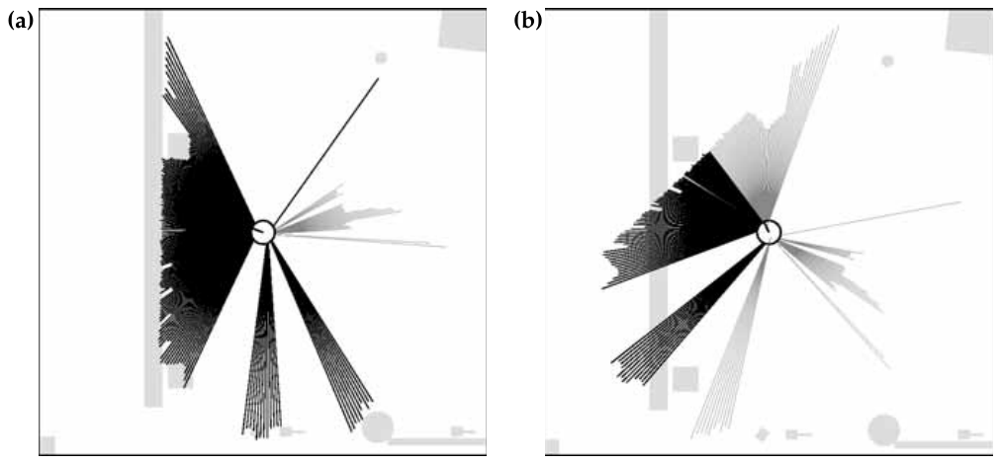

*Figure 8.22 — 우리 측정 기각 알고리즘의 예시: 두 도표 모두 range 스캔을 보여준다(max-range 읽기 없음).
옅게 음영 처리된 읽기가 걸러진 것이다. (책 p.272)*

**Figure 8.22는 필터의 효과를 예시한다. 두 패널 모두 로봇 pose의 서로 다른 정렬에 대한 range 스캔을
보여준다. 옅게 음영 처리된 스캔은 문턱값을 넘어 기각된 것이다.** (책 p.271)

> **⚠️ 이 기법의 핵심 성질 (책 p.271)**
>
> **우리 기각 메커니즘의 핵심 성질은 그것이 **"놀랍도록 짧은" 측정은 걸러내지만 "놀랍도록 긴" 것은
> 그대로 둔다**는 것이다. 이 **비대칭성**은 사람의 존재가 예상보다 짧은 측정을 유발하는 경향이 있다는
> 사실을 반영한다. 놀랍도록 긴 측정을 받아들임으로써 이 접근은 **global localization 실패로부터
> 회복하는 능력을 유지한다.****
>
> 대단히 영리한 설계다. "이상한 측정은 다 버린다"고 하면 kidnapping에서 영영 못 돌아온다 —
> 새 위치의 측정은 전부 "이상"할 테니까. **짧은 것만 버리면** 사람은 걸러내면서 회복 능력은 남는다.

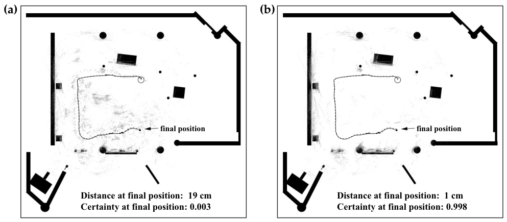

*Figure 8.23 — (a) 표준 MCL과 (b) 예상치 못한 장애물에 의해 야기되었을 가능성이 높은 센서 측정을
제거한 MCL의 비교. 두 도표 모두 로봇 경로와 localization에 사용된 스캔의 끝점을 보여준다.
(책 p.273)*

**Figure 8.23은 로봇이 사람으로 밀집된 환경을 항행하는 에피소드를 묘사한다(Figure 8.21 참조).
여기 보이는 것은 로봇의 추정 경로와, localizer에 통합된 모든 스캔의 끝점이다. 이 그림은 맵의 물리적
물체에 대응하지 않는 측정을 제거하는 것의 효과를 보여준다: 문턱값 검사를 통과할 때만 측정을 받아들인
오른쪽 도표에서는 **자유 공간에 "살아남은" range 측정이 거의 없다.**** (책 p.271~272)

> 원문 그림에 인쇄된 수치가 결과를 요약한다:
>
> | | (a) 표준 MCL | (b) 기각 적용 |
> |---|---|---|
> | 최종 위치에서의 거리 오차 | **19 cm** | **1 cm** |
> | 최종 위치에서의 확신도 | **0.003** | **0.998** |

### 5. 일반적 조언과 뜻밖의 효용 (책 p.272)

**대략적 규칙으로 **측정의 outlier rejection은 일반적으로 좋은 생각**이다. 정적 환경은 거의 존재하지
않는다; 사무실 환경에서조차 가구가 옮겨지고 문이 열리고 닫힌다. 여기서의 우리 특정 구현은 range
측정의 비대칭성 — 사람은 측정을 짧게 만들지 길게 만들지 않는다 — 에서 이득을 본다.**

**같은 아이디어를 다른 데이터(예: 비전 데이터)나 다른 유형의 환경 수정(예: 물리적 장애물의 제거)에
적용할 때 그런 비대칭성이 존재하지 않을 수 있다. 그럼에도 같은 확률적 분석이 보통 적용 가능하다.
그런 대칭성 결여의 단점은 **모든 놀라운 측정이 기각되므로 global localization 실패로부터 회복하는
것이 불가능해질 수 있다**는 점일 것이다. 그런 경우 **손상될 수 있는 측정의 비율에 제한을 두는 등의
추가 제약**을 부과하는 것이 타당할 수 있다.**

#### 정적 환경에서도 도움이 되는 이유

**우리는 이 기각 검사가 **매우 정적인 환경에서조차** 성공적으로 적용되어 왔음에 유의한다. 이유는
상당히 미묘하다. **beam 기반 센서 모델은 불연속이다: pose의 작은 변화가 센서 측정의 posterior 확률을
극적으로 바꿀 수 있다.** 이는 ray casting의 결과가 로봇 방향 같은 pose 파라미터의 연속 함수가 아니기
때문이다. 어수선한 물체가 있는 환경에서 이 불연속성은 성공적 localization에 필요한 particle의 개수를
증가시킨다.** (책 p.272)

**맵에서 어수선함을 **수동으로 제거**하고 — 대신 결과적으로 생기는 "놀랍도록 짧은" 측정을 필터가
관리하게 함으로써 — **particle 개수를 극적으로 줄일 수 있다.** 같은 전략은 likelihood field 모델에는
적용되지 않는데, 이 모델은 pose 파라미터에 대해 평활하기 때문이다.** (책 p.272~273)

> **6.3.5절과 6.4절의 대비가 여기서 실용적 결론을 맺는다.**
>
> | 쓰는 모델 | 맵에 어수선함을 | 이유 |
> |---|---|---|
> | beam model (6.3) | **빼는 게 낫다** | 불연속성이 particle 요구량을 키운다. 뺀 물체는 $p_{\text{short}}$ 가 흡수하고, 기각 검사가 처리한다 |
> | likelihood field (6.4) | 넣어도 무방 | 애초에 평활하므로 불연속 문제가 없다 |

### 6. 예제/실습

#### 예제 — 기각 판정을 손으로

6.3.1절 예제의 파라미터를 쓴다: $z_t^{k*} = 300$cm(모든 particle에서 대략 같다고 가정),
$z_{\max} = 500$, $\sigma_{\text{hit}} = 10$, $\lambda_{\text{short}} = 0.01$,
$(z_{\text{hit}}, z_{\text{short}}, z_{\text{max}}, z_{\text{rand}}) = (0.7, 0.1, 0.15, 0.05)$,
문턱값 $\chi = 0.4$.

**측정 A: $z_t^k = 305$cm (정상)** — 6.3.1절에서 계산한 값을 그대로 쓰면

$$p = 0.1 \times 0 = 0 \qquad (305 > 300\ \text{이므로 } p_{\text{short}} = 0)$$
$$q = 0.7(0.0352065) + 0 + 0 + 0.05(0.002) = 0.0247446$$
$$\frac{p}{q} = 0 \le 0.4 \quad\Rightarrow\quad \textbf{accept}$$

**측정 B: $z_t^k = 150$cm (사람이 가로막음)**

$$p = 0.1 \times 0.00234821 = 0.000234821$$
$$q = 0.7(5.53\times10^{-51}) + 0.000234821 + 0 + 0.05(0.002) = 0.000334821$$
$$\frac{p}{q} = \frac{0.000234821}{0.000334821} = 0.7013 > 0.4 \quad\Rightarrow\quad \textbf{reject}$$

**측정 C: $z_t^k = 450$cm (놀랍도록 긴 측정 — 벽이 없어졌거나 로봇이 딴 데 있거나)**

$$p = 0 \qquad (450 > 300)$$
$$q = 0.7(\approx 0) + 0 + 0 + 0.05(0.002) = 0.0001$$
$$\frac{p}{q} = 0 \le 0.4 \quad\Rightarrow\quad \textbf{accept}$$

**세 결과가 정확히 책의 비대칭성이다.** 짧은 B는 버리고, 긴 C는 받는다. C를 받기 때문에
"내가 생각하는 위치가 틀렸다"는 신호가 필터에 전달되고, kidnapping에서 회복할 수 있다.

#### 연습문제

1. 위 예제에서 $\chi = 0.8$ 로 올리면 측정 B는 어떻게 되는가? $\chi$ 를 크게/작게 잡는 것의
   trade-off를 설명하라.
2. 측정 C를 받아들이는 것이 왜 "회복 능력 유지"인지, 8.3.5절 Augmented MCL과 연결해 설명하라.
3. 카메라 데이터에는 이 비대칭성이 없다. 어떤 추가 제약을 두겠는가? (책이 힌트를 준다.)

---

# 8.5 Practical Considerations (책 p.273~274)

### 1. 개념적 이해

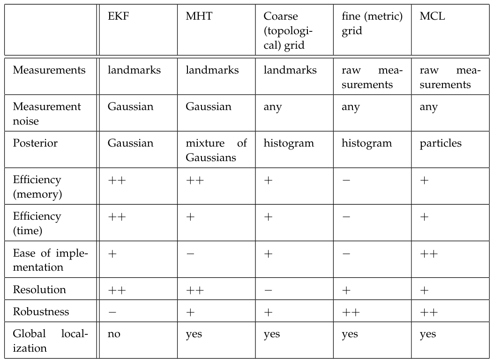

*Table 8.6 — Markov localization의 서로 다른 구현들의 비교. (책 p.274)*

**Table 8.6은 이 장과 앞 장에서 논의한 주요 localization 기법을 요약하고 비교한다.** (책 p.273)

책의 표를 그대로 옮긴다.

| | **EKF** | **MHT** | **거친 (topological) 격자** | **세밀한 (metric) 격자** | **MCL** |
|---|---|---|---|---|---|
| 측정 | 랜드마크 | 랜드마크 | 랜드마크 | 원시 측정 | 원시 측정 |
| 측정 노이즈 | Gaussian | Gaussian | 임의 | 임의 | 임의 |
| Posterior | Gaussian | Gaussian mixture | histogram | histogram | particle |
| 효율 (메모리) | ++ | ++ | + | − | + |
| 효율 (시간) | ++ | + | + | − | + |
| 구현 용이성 | + | − | + | − | **++** |
| 해상도 | ++ | ++ | − | + | + |
| 강건성 | − | + | + | **++** | **++** |
| Global localization | **no** | yes | yes | yes | yes |

> **이 표 한 장이 7·8장의 결론이다.** 읽는 법:
> - **EKF**: 빠르고 정확하지만 강건성이 최하이고 global localization을 못 한다
> - **세밀한 격자**: 가장 강건하지만 효율이 최하
> - **MCL**: 구현이 가장 쉽고, 강건성도 최고 수준이며, 효율도 나쁘지 않다 — **균형이 가장 좋다**
>
> 8.6절 마지막 문장이 이를 요약한다: **"MCL의 인기는 아마 두 사실 때문일 것이다: MCL은 구현하기
> 가장 쉬운 localization 알고리즘이고, 동시에 거의 모든 분포를 근사할 수 있다는 점에서 가장 강력한
> 것 중 하나다."**

### 세 가지 조언 (책 p.273)

**① feature를 뽑을 것인가**

**기법을 고를 때 여러 요구사항을 절충해야 한다. 첫 질문은 언제나 **센서 측정에서 feature를 추출하는
것이 바람직한가**일 것이다. Feature 추출은 계산 관점에서 유익할 수 있지만, **정확도와 강건성의 감소**
라는 대가를 치른다.**

> 6.6.5절의 "feature는 충분통계량이 아니다"가 여기서 실무 지침이 된다.

**② 동적 환경 대응은 MCL 전용이 아니다**

**이 장에서 우리는 MCL 알고리즘의 맥락에서 동적 환경을 다루는 기법을 논의했지만, **유사한 아이디어를
다른 localization 기법에도 적용할 수 있다.** 사실 여기서 논의한 기법들은 훨씬 풍부한 접근 체계의
대표일 뿐이다.**

**③ 파라미터를 데이터로 튜닝하라**

**localization 알고리즘을 구현할 때 **여러 파라미터 설정을 가지고 놀아 보는 것이 가치가 있다.**
예를 들어 인근 측정을 통합할 때 조건부 확률이 흔히 부풀려지는데, 이는 로보틱스에 언제나 존재하는
모델링되지 않은 의존성을 수용하기 위함이다. 좋은 전략은 **참조 데이터셋을 수집하고 전체 결과가
만족스러울 때까지 알고리즘을 튜닝하는 것**이다. 이는 수학적 모델이 아무리 정교해도 전체 결과에
영향을 주는 모델링되지 않은 의존성과 체계적 노이즈의 원천이 언제나 남기 때문에 필요하다.**

> **"노이즈를 부풀려라"가 다섯 번째로 나온다** (5장 p.118, 6.7절, 8.2.2절, 8.3.6절에 이어).
> 이 책이 같은 말을 다섯 번 하는 데는 이유가 있다.

### 2. 예제/실습

#### 예제 — 상황별 알고리즘 선택

| 상황 | 권장 | 근거 (Table 8.6) |
|---|---|---|
| 실내 청소로봇, 도킹 스테이션에서 시작, 저사양 MCU | **EKF** 또는 KLD-MCL | 효율 최우선, position tracking만 필요 |
| 창고 로봇, 전원 켜면 어디 있을지 모름 | **MCL** | global localization 필요 + 구현 용이 |
| RoboCup 로봇, 심판이 자주 들어 옮김 | **Augmented MCL** (8.3.5) | kidnapping 회복 |
| 박물관 안내 로봇, 사람 밀집 | **MCL + 기각 검사** (8.4) | 동적 환경 |
| 정밀 도킹 마지막 10cm | **EKF** | 해상도 ++ |
| 랜드마크가 성기고 혼동 위험 큼 | **MHT** (7.6) | data association 강건성 |

#### 연습문제

1. Table 8.6에서 "세밀한 격자"의 효율이 둘 다 −인데도 강건성이 ++인 이유는?
2. MCL의 "해상도"가 EKF보다 낮게(+ vs ++) 평가된 이유는? 8.3.4절 예제와 모순되지 않는가?
3. 자신의 응용을 하나 정하고 Table 8.6의 8개 항목으로 알고리즘을 선택해 보라.

---

# 8.6 Summary (책 p.274~275)

**이 장에서 우리는 두 가지 확률적 localization 알고리즘 계열, **격자 기법**과 **Monte Carlo
localization (MCL)** 을 논의했다.** (책 p.274) 책의 요약에 이 노트의 위치를 붙인다.

**• 격자 기법은 posterior를 **histogram**으로 표현한다.** → **8.2절**

**• **격자의 거칠기가 정확도와 계산 효율을 절충**한다. 거친 격자에서는 표현의 거칠기에서 발생하는
효과를 설명하기 위해 센서 모델과 motion model을 조정하는 것이 보통 필요하다. 세밀한 격자에서는 전체
계산을 줄이기 위해 격자 칸을 **선택적으로 갱신**하는 것이 필요할 수 있다.** → **8.2.2 · 8.2.3절**

**• Monte Carlo localization 알고리즘은 posterior를 **particle**을 사용해 표현한다. 정확도-계산비용
절충은 **particle 집합의 크기**를 통해 달성된다.** → **8.3.1 · 8.3.2절**

**• **격자 localization과 MCL 모두 로봇을 전역적으로 localize할 수 있다.**** → **8.2.4 · 8.3.3절**

**• **랜덤 particle을 추가**함으로써 MCL은 **kidnapped robot 문제**도 푼다.** → **8.3.5절**

**• **Mixture MCL**은 모든 particle의 일부에 대해 particle 생성 과정을 뒤집는 확장이다. 이는 특히
**저노이즈 센서**를 가진 로봇에 대해 개선된 성능을 낳지만, 더 복잡한 구현을 대가로 한다.**
→ **8.3.6절**

**• **KLD-sampling**은 시간에 따라 표본 집합의 크기를 조정함으로써 particle filter의 효율을 높인다.
이 접근의 이점은 **belief의 복잡도가 시간에 따라 극적으로 변할 때** 최대다.** → **8.3.7절**

**• 모델링되지 않은 환경 동역학은 센서 데이터를 필터링해 — 모델링되지 않은 물체에 높은 likelihood로
대응하는 것을 기각함으로써 — 수용될 수 있다. Range 센서를 사용할 때 로봇은 **놀랍도록 짧은 측정을
기각하는 경향**이 있다.** → **8.4절**

**MCL의 인기는 아마 두 사실 때문일 것이다: **MCL은 구현하기 가장 쉬운 localization 알고리즘이고,
동시에 거의 모든 분포를 근사할 수 있다는 점에서 가장 강력한 것 중 하나다.**** (책 p.275)

## 8장 전체 한 장 정리

| 절 | 알고리즘 | 표현 | 해결하는 문제 | 대가 |
|---|---|---|---|---|
| 8.2 | Grid localization (Table 8.1) | histogram | global localization | 계산량 (8.2.3절 네 기법 필요) |
| 8.3.2 | MCL (Table 8.2) | particle $M$ 개 | global localization | particle 고갈 |
| 8.3.5 | Augmented MCL (Table 8.3) | particle + 랜덤 주입 | **kidnapping** | $\alpha$ 두 개 튜닝 |
| 8.3.6 | Mixture MCL | particle, proposal 혼합 | **저노이즈 센서** | 구현 난이도 |
| 8.3.7 | KLD-sampling (Table 8.4) | particle, 크기 가변 | **계산 낭비** | $\varepsilon$ 너무 크면 발산 |
| 8.4 | 측정 기각 (Table 8.5) | (전처리) | **동적 환경** | $\chi$ 튜닝 |

---

# 8.7 Bibliographical Remarks (책 p.275~276)

책이 제시한 문헌 갈래를 정리한다.

### Grid 계열

| 주제 | 문헌 |
|---|---|
| Grid 기반 Markov localization 도입 | **Simmons and Koenig (1995)** — 선구적 논문. Nourbakhsh et al. (1995)의 "certainty factors"에 기반 |
| localization을 위한 histogram 유지 | Kaelbling et al. (1996) |
| **selective update로 고해상도 격자 처리** | **Burgard et al. (1996)** — "거친 topological → 세밀한 metric" 전환의 계기 |
| 개관 논문 | Koenig and Simmons (1998); Fox et al. (1999c) |
| 하수관 로봇에 적용 | Hertzberg and Kirchner (1996) |
| 사무실 환경 | Simmons et al. (2000b) |
| 박물관 로봇 | Burgard et al. (1999a) |
| map matching을 Markov localization에 도입 | Konolige and Chou (1999) — 빠른 convolution |
| global localization + 고정밀 추적 결합 | Burgard et al. (1998) — "dynamic Markov localization" |
| 장소 인식 학습 | Oore et al. (1997); Thrun (1998a); Greiner and Isukapalli (1994) |
| semi Markov decision process로 확장 | Mahadevan and Khaleeli (1999) |
| 격자 vs Kalman filter 실험 비교 | Gutmann et al. (1998) |
| active localization | Burgard et al. (1997); Austin and Jensfelt (2000); Jensfelt and Christensen (2001a) |
| multi-robot localization | Fox et al. (2000); Howard et al. (2003) |
| multi-hypothesis EKF도 global localization 가능 | Jensfelt and Christensen (2001a); Roumeliotis and Bekey (2000); Reuter (2000) |

### MCL 계열

| 주제 | 문헌 |
|---|---|
| 컴퓨터 비전의 **condensation 알고리즘** (동기 부여) | Isard and Blake (1998) |
| **MCL 최초 개발 및 명명** | **Dellaert et al. (1999); Fox et al. (1999a)** |
| 랜덤 표본 추가 아이디어 | Fox et al. (1999a) |
| **sensor resetting** — kidnapping 대응 | Lenser and Veloso (2000) |
| **Augmented MCL** (particle 개수 결정) | Gutmann and Fox (2002) |
| **Mixture MCL** | Thrun et al. (2000c); van der Merwe et al. (2001) |
| **KLD-sampling** | **Fox (2003)** |
| feature 기반 맵에 MCL 적용 | Jensfelt et al. (2000); Jensfelt and Christensen (2001b) |
| 실시간 적응 MCL | Kwok et al. (2004) |
| 카메라 기반 MCL | Lenser and Veloso (2000); Schulz and Fox (2004); Wolf et al. (2005) |
| 전방위 카메라 | Kröse et al. (2002); Vlassis et al. (2002) |
| localization + 사람 추적 동시 수행 | Montemerlo et al. (2002b) — nested particle filter |
| 가변 인원 추적 | Schulz et al. (2001b, 2001a) |

---

# 8.8 Exercises (책 p.276~278)

책의 연습문제를 그대로 옮긴다.

### 문제 1 — 차원에 따른 복잡도 (책 p.276)

**$d$ 개의 상태 변수를 갖는 로봇을 고려하라. 예를 들어 자유 비행하는 강체 로봇의 kinematic state는
보통 $d = 6$ 이다; 속도가 상태 벡터에 포함되면 차원이 $d = 12$ 로 증가한다. 다음 localization
알고리즘의 **복잡도(갱신 시간과 메모리)** 가 $d$ 에 따라 어떻게 증가하는가: **EKF localization,
grid localization, Monte Carlo localization.** $O(\ )$ 표기를 사용하고 왜 답이 옳은지 논하라.**

> **이 문제가 8장 전체를 관통한다.** 힌트: grid는 각 차원을 $n$ 칸으로 나누면 $n^d$ 칸이다.
> EKF는 $d \times d$ 공분산 행렬을 다룬다. MCL의 particle 개수는 차원에 어떻게 의존하는가?
> (마지막 질문이 가장 미묘하다 — 8.3.7절의 $k$ 와 연결해 생각해 보라.)

### 문제 2 — 다중 feature 정보 통합 (책 p.277)

**Table 7.2의 라인 14와 15에서 다중 feature 정보 통합의 가법 형태에 대한 수학적 유도를 제공하라.**

> 7.4.3절 식 (14) conditional independence 가정에서 출발하라.

### 문제 3 — 식 (8.4)의 정확성 (책 p.277)

**257쪽 식 (8.4)의 정확성을 $M \uparrow \infty$ 인 극한에서 증명하라.**

> 8.3.5절 (2)의 인용구에서 다룬 Monte Carlo 적분의 수렴이다. 큰 수의 법칙을 적용하라.

### 문제 4 — MCL의 편향 (책 p.277~278)

**본문에서 언급했듯 **Monte Carlo localization은 유한한 표본 크기에 대해 편향되어 있다** — 즉
알고리즘이 계산한 위치의 기댓값이 참 기댓값과 다르다. 이 문제에서는 이 편향을 정량화하도록 요청받는다.**

**단순화를 위해 네 개의 가능한 로봇 위치가 있는 세계를 고려하라: $X = \{x_1, x_2, x_3, x_4\}$.
처음에 우리는 이 위치들 중에서 균등하게 $N \ge 1$ 개의 표본을 뽑는다. (…) $Z$ 를 다음 조건부 확률로
특징지어지는 불리언 센서 변수라 하자:**

$$p(z \mid x_1) = 0.8 \qquad p(\lnot z \mid x_1) = 0.2$$
$$p(z \mid x_2) = 0.4 \qquad p(\lnot z \mid x_2) = 0.6$$
$$p(z \mid x_3) = 0.1 \qquad p(\lnot z \mid x_3) = 0.9$$
$$p(z \mid x_4) = 0.1 \qquad p(\lnot z \mid x_4) = 0.9$$

**MCL은 이 확률로 particle 무게를 생성하고, 이후 정규화되어 resampling 과정에 쓰인다. 단순화를 위해
$N$ 과 무관하게 resampling 과정에서 **새 표본을 하나만** 생성한다고 가정하자. (…) 따라서 표집 과정은
$X$ 에 대한 확률분포를 정의한다.**

- **(a)** 이 새 표본에 대해 $X$ 에 대한 결과 확률분포는 무엇인가? $N = 1, \ldots, 10$ 과
  $N = \infty$ 에 대해 각각 답하라.
- **(b)** 두 확률분포 $p$ 와 $q$ 의 차이는 **KL divergence**로 잴 수 있으며 다음과 같이 정의된다:
  $$\mathrm{KL}(p, q) = \sum_i p(x_i)\log\frac{p(x_i)}{q(x_i)}$$
  (a)의 분포들과 참 posterior 사이의 KL divergence는 무엇인가?
- **(c)** 유한한 $N$ 값에 대해서도 위 특정 추정기가 **편향되지 않도록** 보장하려면 문제 정식화를
  (알고리즘이 아니라!) 어떻게 수정해야 하는가? 그런 수정을 **적어도 두 가지** 제시하라.

> **이 문제가 4.3.4절과 8.3절의 이론적 핵심이다.** $N = 1$ 이면 무게가 무엇이든 그 하나가 뽑히므로
> 사전분포가 그대로 나온다 — 측정이 무시된다. $N \to \infty$ 여야 참 posterior에 수렴한다.
> 그 사이가 편향이다.

### 문제 5 — $k$ 개 랜드마크 동시 표집 (책 p.278)

**6.6절에서 논의한 유형의 range/bearing 센서를 갖춘 로봇을 고려하라. 이 문제에서는 **$k$ 개의 식별
가능한 랜드마크의 동시 측정을 통합할 수 있는 효율적인 표집 절차**를 고안하도록 요청받는다. 루틴이
작동함을 예시하기 위해 $k = 1, \ldots, 5$ 개의 인접 랜드마크를 사용해 서로 다른 랜드마크 배치의
그림을 생성해도 좋다. 무엇이 루틴을 효율적으로 만드는지 논하라.**

> 6.6.4절 Table 6.5는 랜드마크 **하나**에서 표집한다. $k$ 개면 고리 $k$ 개의 **교집합**에서 뽑아야
> 한다. 7.11절 연습문제 1(b)와 짝을 이루는 문제다.

### 문제 6 — 수중 로봇의 grid localization (책 p.278)

**235쪽 연습문제 3은 localization을 위해 음향 beacon을 들을 수 있는 단순한 수중 로봇을 기술했다.
여기서는 이 로봇을 위한 **grid localization 알고리즘을 구현**하도록 요청받는다. 세 가지 localization
문제(global localization, position tracking, kidnapped robot problem)의 맥락에서 정확도와 실패 모드를
분석하라.**

> 7.11절 문제 3의 EKF 버전과 비교하면 두 접근의 차이가 선명해진다.

### 이 노트의 추가 연습문제

1. **구현 연습 — MCL 만들기.** Table 8.2를 구현하라. 5.3절 `sample_motion_model_velocity`와
   6.4절 `likelihood_field_range_finder_model`을 부품으로 쓴다. 간단한 격자 맵에서 global
   localization을 돌려 Figure 8.13처럼 particle이 좁혀지는 과정을 그려라.

2. **비교 연습 — 세 알고리즘.** 같은 맵·같은 궤적에서 grid localization(Table 8.1), MCL(Table 8.2),
   EKF localization(Table 7.2)을 모두 돌려라. 다음을 측정해 Table 8.6의 평가를 직접 검증하라:
   위치 오차, 스텝당 계산 시간, 메모리 사용량, global localization 성공 여부.

3. **강건성 연습 — 납치.** 위 MCL에 Augmented MCL(Table 8.3)을 얹고, 실행 도중 로봇을 순간이동
   시켜라. $\alpha_{\text{slow}}$, $\alpha_{\text{fast}}$ 를 바꿔가며 회복까지 걸리는 스텝 수를
   재라. 회복이 안 되는 조합도 찾아보라.

4. **효율 연습 — KLD.** KLD-sampling(Table 8.4)을 구현해 particle 개수의 시간 변화를 Figure 8.18처럼
   그려라. $\varepsilon$ 을 0.4에서 0.015까지 바꿔가며 Figure 8.19를 재현해 보라.

5. **통합 연습 — 동적 환경.** 맵에 없는 "사람"을 몇 명 움직이게 하고, Table 8.5의 기각 검사를
   켜고 끄면서 localization 오차를 비교하라. Figure 8.23의 "19cm vs 1cm"에 해당하는 차이가
   재현되는가?

---

# 스터디를 마치며

`0_Contents.md`가 세운 목표 — **EKF/UKF + Particle Filter 기반 Localization** — 에 도달했다.
전체 구조를 한 장으로 되돌아보면 이렇다.

$$\underbrace{bel(x_t) = \eta\ \underbrace{p(z_t \mid x_t, m)}_{\textbf{6장}}\ \int \underbrace{p(x_t \mid u_t, x_{t-1})}_{\textbf{5장}}\ bel(x_{t-1})\ dx_{t-1}}_{\textbf{2장 Bayes filter}}$$

| Part | 장 | 무엇을 만들었나 |
|---|---|---|
| **I. Basics** | 2 | **Bayes filter** — 모든 것의 골격 |
| | 3 | 그것을 Gaussian으로 구현: **KF · EKF · UKF · IF** |
| | 4 | 그것을 non-parametric으로 구현: **Histogram · Particle filter** |
| | 5 | $p(x_t \mid u_t, x_{t-1})$ 채우기: **velocity · odometry motion model** |
| | 6 | $p(z_t \mid x_t, m)$ 채우기: **beam · likelihood field · map matching · landmark** |
| **II. Localization** | 7 | 3장 + 5장 + 6장 → **EKF · UKF · MHT Localization** |
| | 8 | 4장 + 5장 + 6장 → **Grid · Monte Carlo Localization** |

**같은 하나의 식을, 표현을 바꿔가며 일곱 번 구현한 것**이 이 여덟 장의 내용이다.

### 다음에 갈 수 있는 곳

이 스터디의 범위는 여기까지지만, 책은 계속된다. 지금까지 쌓은 것으로 바로 이어갈 수 있는 곳:

| 다음 주제 | 책 위치 | 지금까지의 무엇이 쓰이는가 |
|---|---|---|
| **Occupancy Grid Mapping** | 9장 (p.281) | 4.2절 binary Bayes filter + 6.2절 location-based map |
| **EKF SLAM** | 10장 (p.309) | **7.4절 EKF Localization** — 상태에 랜드마크를 추가하면 그대로 SLAM |
| **FastSLAM** | 13장 (p.437) | **8.3절 MCL** + 9장 mapping — particle 하나가 지도 하나를 든다 |
| **Active Localization** | 17장 | 7.1절에서 미룬 그 주제 |

> **10장 EKF SLAM이 가장 자연스러운 다음 걸음이다.** 7.4절에서 상태 $x_t = (x, y, \theta)^T$ 였던
> 것을 $(x, y, \theta, m_{1,x}, m_{1,y}, \ldots)^T$ 로 늘리면 된다 — 5.2.1절에서
> "$3 + 2N$ 차원"이라 계산해 뒀던 바로 그 벡터다.

---

> **이전 노트**: 7장 Mobile Robot Localization: Markov and Gaussian
