# Notes on Kalman Filter (KF, EKF, ESKF, IEKF, IESKF)

> **원문** — Gyubeom Edward Im, *Notes on Kalman Filter (KF, EKF, ESKF, IEKF, IESKF)* (49쪽)
> blog: [alida.tistory.com](https://alida.tistory.com) · email: criterion.im@gmail.com
> 파일: `ref/Notes on Kalman Filter(KF, EKF, ESKF, IEKF, IESKF).pdf`
>
> **이 문서에 대하여** — 원문을 **내용 수정 없이 그대로** 옮긴 것이다. 절 구성·문장·수식 번호
> (1)~(166)이 모두 원문과 같고 순서도 바꾸지 않았다. 원문의 그림 24개도 같은 자리에 넣었다.
>
> 원문에 없는 것은 **인터랙티브 위젯 11개**뿐이며, 전부 **원문에 없는 추가 요소**라고 표시된
> 회색 박스 안에 들어 있어 본문과 섞이지 않는다. 슬라이더를 움직이면 그 절의 수식이 그대로 그림과
> 숫자로 나타난다.
>
> 명백한 오타는 바로잡았고, 무엇을 고쳤는지는 맨 아래
> [옮기며 바로잡은 것](#옮기며-바로잡은-것)에 전부 적어 두었다. 다만 원문이 수식·문장에서 쓰는
> **색 강조는 재현하지 않았다** — 오프라인 MathJax 번들에 color 패키지가 없어 색을 넣으면 문서의
> 수식이 전부 렌더링되지 않는다. 수식 내용 자체는 원문과 동일하다.

| 장 | 원문 쪽 | 장 | 원문 쪽 |
|---|---|---|---|
| 1 Preliminaries | 3 | 8 Derivation of Kalman filter | 31 |
| 2 Recursive bayes filter | 6 | 9 MAP, GN, and EKF relationship | 38 |
| 3 Kalman filter (KF) | 10 | 10 Derivation of IESKF update step | 43 |
| 4 Extended kalman filter (EKF) | 15 | 11 Wrap-up | 45 |
| 5 Error-state kalman filter (ESKF) | 18 | 12 Reference | 48 |
| 6 Iterated extended kalman filter (IEKF) | 23 | 13 Revision log | 49 |
| 7 Iterated error-state kalman filter (IESKF) | 26 | | |

# 1 Preliminaries

칼만 필터(Kalman filter)는 시간에 따라 변하는 시스템의 상태를 추정하는 방법 중 하나로써 시스템 모델의
예측값과 노이즈가 포함된 관측값을 바탕으로 현재 상태를 재귀적으로 예측하고 업데이트하는 알고리즘을
말한다.

해당 섹션에서는 칼만 필터를 본격적으로 설명하기 앞서 기반이 되는 지식들을 간단히 소개한다.

## 1.1 Estimation theory

추정 이론(estimation theory)은 관측된 데이터를 바탕으로 모델의 파라미터나 상태를 예측하는 다양한 방법을
정리한 이론이다. 데이터 분석, 신호처리, 기계학습, 금융, 로봇공학 등 다양한 분야에서 널리 쓰이고 있으며
주로 불확실성을 다루는 과정에서 정확한 결정을 내리기 위한 필수적인 도구로 사용되고 있다. 보다 자세한
내용은 해당 포스팅을 참조하면 된다.

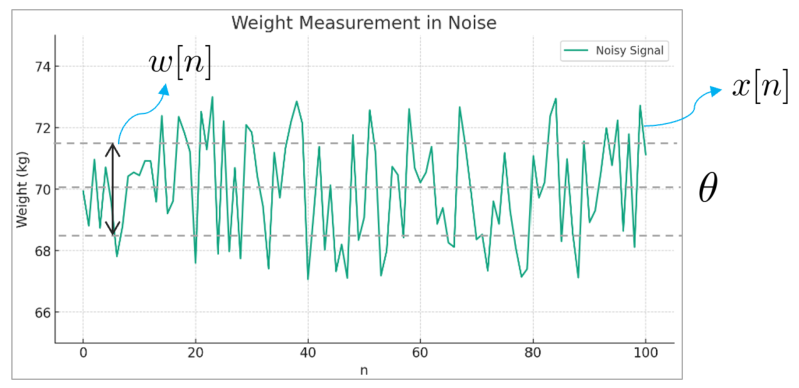

*(원문 p.3)*

예를 들어 위 그림과 같이 평균 몸무게가 70kg인 사람을 1년 동안 측정한 데이터가 주어졌다고 가정하자.
그래프를 이루고 있는 초록색 데이터들은 $x[n]$이며 데이터들의 중심값은 추정하고자 하는 파라미터
$\theta$가 된다. 그리고 $\theta$로부터 위 아래로 벌어진 정도(=분산)는 $w[n]$을 통해 수학적으로 표현할
수 있다.

위와 같이 관측된 데이터 $x[n]$을 바탕으로 파라미터 $\theta$를 추정하는 문제는 다음과 같은 간단한
수학적 모델로 표현할 수 있다.

$$x[n] = \theta + w[n] \quad n = 0, 1, \cdots, N-1 \tag{1}$$

- $x[n]$: 관측된 데이터
- $\theta$: 추정하고자 하는 파라미터
- $w[n]$: 랜덤 노이즈

## 1.2 Bayesian philosophy

추정 이론에는 추정해야 하는 파라미터 $\theta$를 보는 관점에 따라 크게 빈도주의와 베이지안 관점으로
나뉜다.

- Frequentist: 추정해야 하는 파라미터 $\theta$가 미지의 결정론적(deterministic) 파라미터로 보는
  빈도주의적 관점
- Bayesian: 추정해야 하는 파라미터 $\theta$가 사전 확률분포(prior)를 가지는 확률 변수(random variable,
  r.v.)로 간주하는 관점

$$\begin{aligned}
\text{Frequentist:} \quad & \underbrace{x[n]}_{\text{r.v.}} = \underbrace{\theta}_{\text{deterministic}} + w[n] \\
\text{Bayesian:} \quad & \underbrace{x[n]}_{\text{r.v.}} = \underbrace{\theta}_{\text{r.v.}} + w[n]
\end{aligned} \tag{2}$$

베이지안 철학은 만약 우리가 파라미터 $\theta$에 대한 사전(prior) 정보를 알고 있다면 이는 더 나은 추정에
활용될 수 있다는 모티브에서 출발하였으며 이를 위해서는 $\theta$에 대한 prior pdf가 미리 주어져 있거나
계산할 수 있어야 한다는 특징이 존재한다.

베이지안 철학 관점에서는 파라미터 $\theta$ 또한 확률변수로 모델링할 수 있으므로 다음과 같은 베이지안
룰이 성립한다.

$$p(\theta|x) = \frac{p(\theta)p(x|\theta)}{p(x)} \tag{3}$$

- $p(\theta|x)$: 관측된 데이터 $x$가 주어졌을 때 파라미터 $\theta$의 사후 조건부 확률 분포(posterior)
- $p(x|\theta)$: $\theta$가 주어졌을 때 $x$의 조건부 확률 분포, 또는 가능도(likelihood)
- $p(x)$: $x$의 확률 분포
- $p(\theta)$: $\theta$ 사전 확률 분포(prior)

## 1.3 Estimation problem

추정 문제는 일반적으로 다음과 같이 도식화하여 나타낼 수 있다.

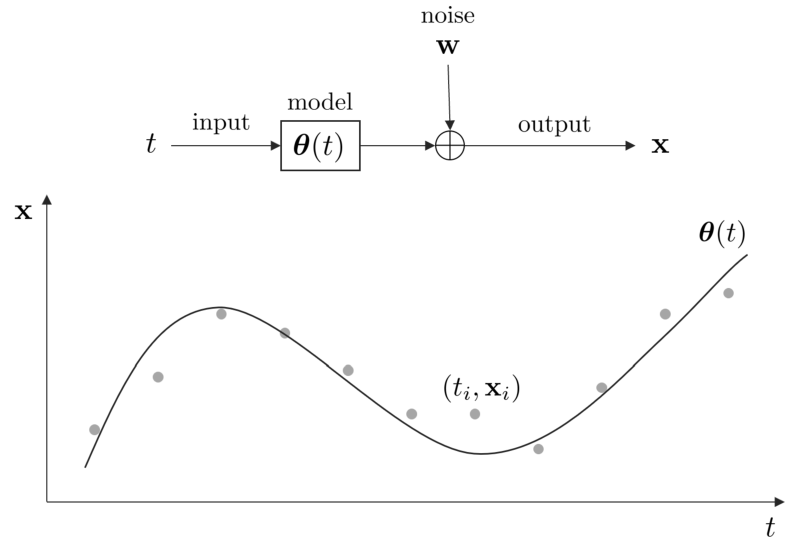

*(원문 p.4)*

추정 문제의 목적은 주어진 데이터 $(t_i, \mathbf{x}_i)$를 사용하여 최적의 모델
$\pmb{\theta}(t)$를 찾는 것이다. 이 때, 어느 시점을 추정하느냐에 따라 다른 추정 문제가 된다.

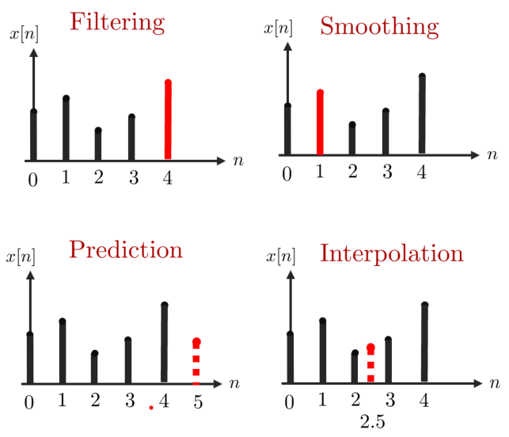

*(원문 p.5)*

1. Filtering : 필터링은 관측 데이터 $\{x[0], x[1], \cdots, x[N-1]\}$가 주어졌을 때 $\theta = x[N-1]$을
   추정하는 문제를 말한다. 최적의 파라미터를 추정함으로써 우리는 신호에서 노이즈를 필터링하고자 한다.
   필터링에서는 파라미터가 현재와 과거 데이터에만 의존하는 것에 유의하자.
2. Smoothing: 스무딩은 관측 데이터 $\{x[0], x[1], \cdots, x[N-1]\}$이 주어졌을 때 중간에 있는
   $\theta = s[n]$을 추정하는 경우를 말한다. 예를 들어 $s[1]$을 추정하기 위해 모든 관측 데이터가
   사용된다. 당연하게도 스무딩은 모든 데이터가 관측되기 전에는 수행할 수 없다.
3. Prediction: 예측은 관측 데이터 $\{x[0], x[1], \cdots, x[N-1]\}$가 주어졌을 때
   $\theta = x[N-1+l]$을 추정하는 경우를 말한다. 이 때, $l$은 임의의 양수이다.
4. Interpolation: 보간은 관측 데이터 $\{x[0], \cdots, x[n-1], x[n+1], \cdots, x[N-1]\}$이 주어졌을 때
   $\theta = x[n]$을 추정하는 경우를 말한다.

## 1.4 Dynamic system

시간에 따라 상태 변수가 변하는 시스템은 다음과 같이 모델링할 수 있다.

$$\begin{aligned}
\text{Motion Model:} \qquad & \mathbf{x}_t = \mathbf{f}(\mathbf{x}_{t-1}, \mathbf{u}_t) + \mathbf{w}_t \\
\text{Observation Model:} \qquad & \mathbf{z}_t = \mathbf{h}(\mathbf{x}_t) + \mathbf{v}_t
\end{aligned} \tag{4}$$

- $\mathbf{x}_t$: $t$ 시점에서 모델의 상태 변수
- $\mathbf{u}_t$: $t$ 시점에서 모델의 제어 입력
- $\mathbf{z}_t$: $t$ 시점에서 관측값
- $\mathbf{f}(\mathbf{x}_{t-1}, \mathbf{u}_t)$: 이전 상태 $\mathbf{x}_{t-1}$와 현재 제어 입력
  $\mathbf{u}_t$으로부터 현재 상태 $\mathbf{x}_t$를 예측하는 모션 모델 함수
- $\mathbf{h}(\mathbf{x}_t)$: 현재 상태 변수 $\mathbf{x}_t$를 관측값 $\mathbf{z}_t$으로 변환해주는
  관측 모델 함수
- $\mathbf{w}_t$: $t$ 시점에서 모션 모델의 노이즈
- $\mathbf{v}_t$: $t$ 시점에서 관측 모델의 노이즈

위 표기법을 사용하여 앞서 추정 문제를 다시 그려보면 다음과 같다.

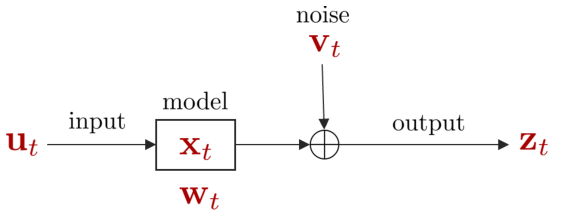

*(원문 p.6)*

위와 같은 동적 시스템을 그래프로 그려보면 다음과 같다.

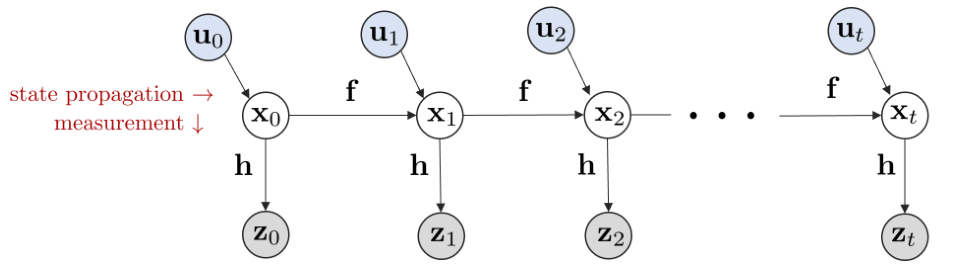

*(원문 p.6)*

동적 시스템은 일반적으로 상태 예측(prediction) 단계와 업데이트(update, 또는 correction) 단계로 나뉜다.
예측 단계는 다음과 같이 현재까지 측정한 모든 관측값 $\mathbf{z}_{0:t}$과 현재 상태 $\mathbf{x}_t$를
통해 다음 상태 $\mathbf{x}_{t+1}$를 예측하는 것을 말한다.

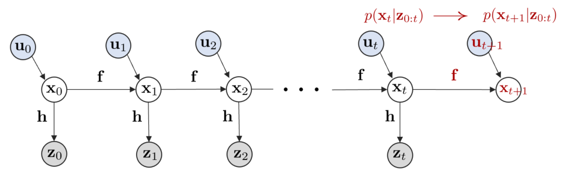

*(원문 p.6)*

업데이트 단계는 다음과 같이 다음 상태 $\mathbf{x}_{t+1}$로부터 새로운 관측값 $\mathbf{z}_{t+1}$을 얻는
과정을 말한다.

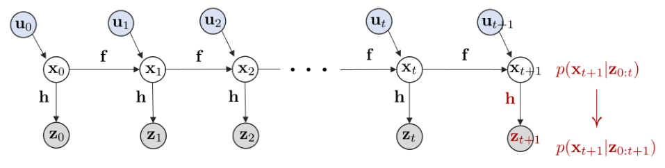

*(원문 p.6)*

# 2 Recursive bayes filter

제어입력과 관측값이 주어졌을 때 현재 상태 $\mathbf{x}_t$의 믿을만한 정도, 또는 $\mathbf{x}_t$에 대한
Belief $\mathrm{bel}(\mathbf{x}_t)$은 같이 정의한다.

$$\boxed{\mathrm{bel}(\mathbf{x}_t) = p(\mathbf{x}_t \mid \mathbf{z}_{1:t}, \mathbf{u}_{1:t})} \tag{5}$$

- $\mathbf{x}_t$ : t 시간에서 상태 변수
- $\mathbf{z}_{1:t} = \{\mathbf{z}_1, \cdots, \mathbf{z}_t\}$ : 1 t 시간에서 관측값
- $\mathbf{u}_{1:t} = \{\mathbf{u}_1, \cdots, \mathbf{u}_t\}$ : 1 t 시간에서 제어입력
- $\mathrm{bel}(\mathbf{x}_t)$ : Belief of $\mathbf{x}_t$라고 불리며 시작 시간부터 $t$초까지 센서를
  통한 관측 $\mathbf{z}_{1:t}$과 제어입력 $\mathbf{u}_{1:t}$으로 인해 현재 로봇이 $\mathbf{x}_t$에
  위치할 확률(믿을만한 정도)을 의미

이전 섹션에서 언급한 그래프로 설명하면 다음 부분이 $\mathrm{bel}(\mathbf{x}_t)$에 해당한다.

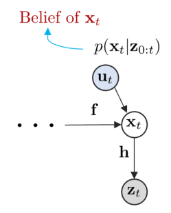

*(원문 p.7)*

$\mathrm{bel}(\cdot)$은 bayesian rule에 따라 표현되고 전개되기 때문에 bayes filter라고도 불린다. 위 식을
markov assumption과 bayesian rule을 사용하여 전개하면 재귀적인 필터를 유도할 수 있고 이를 recursive
bayes filter라고 한다.

$$\begin{aligned}
\mathrm{bel}(\mathbf{x}_t) &= \eta \cdot p(\mathbf{z}_t \mid \mathbf{x}_t) \overline{\mathrm{bel}}(\mathbf{x}_t) \\
\overline{\mathrm{bel}}(\mathbf{x}_t) &= \int p(\mathbf{x}_t \mid \mathbf{x}_{t-1}, \mathbf{u}_t) \mathrm{bel}(\mathbf{x}_{t-1}) d\mathbf{x}_{t-1}
\end{aligned} \tag{6}$$

- $\eta = 1/p(\mathbf{z}_t|\mathbf{z}_{1:t-1}, \mathbf{u}_{1:t})$ : 확률분포의 넓이를 1로 정규화하여
  확률분포의 정의를 유지시켜주는 값
- $p(\mathbf{z}_t \mid \mathbf{x}_t)$ : 관측 모델(observation model)
- $\int p(\mathbf{x}_t \mid \mathbf{x}_{t-1}, \mathbf{u}_t) d\mathbf{x}_{t-1}$ : 모션 모델(motion model)

Recursive bayes filter는 위와 같이 이전 스텝의 $\mathrm{bel}(\mathbf{x}_{t-1})$로부터 현재 스텝의
$\mathrm{bel}(\mathbf{x}_t)$를 구할 수 있으므로 재귀 필터라고 부른다.

## 2.1 Derivation of recursive bayes filter

Recursive bayes filter의 수식은 다음과 같이 유도된다.

$$\begin{aligned}
\mathrm{bel}(\mathbf{x}_t) &= p(\mathbf{x}_t|\mathbf{z}_{1:t}, \mathbf{u}_{1:t}) \\
&= \eta \cdot p(\mathbf{z}_t|\mathbf{x}_t, \mathbf{z}_{1:t-1}, \mathbf{u}_{1:t}) \cdot p(\mathbf{x}_t|\mathbf{z}_{1:t-1}, \mathbf{u}_{1:t}) \\
&= \eta \cdot p(\mathbf{z}_t|\mathbf{x}_t) \cdot p(\mathbf{x}_t|\mathbf{z}_{1:t-1}, \mathbf{u}_{1:t}) \\
&= \eta \cdot p(\mathbf{z}_t|\mathbf{x}_t) \cdot \int_{\mathbf{x}_{t-1}} p(\mathbf{x}_t|\mathbf{x}_{t-1}, \mathbf{z}_{1:t-1}, \mathbf{u}_{1:t}) \cdot p(\mathbf{x}_{t-1}|\mathbf{z}_{1:t-1}, \mathbf{u}_{1:t}) d\mathbf{x}_{t-1} \\
&= \eta \cdot p(\mathbf{z}_t|\mathbf{x}_t) \cdot \int_{\mathbf{x}_{t-1}} p(\mathbf{x}_t|\mathbf{x}_{t-1}, \mathbf{u}_t) \cdot p(\mathbf{x}_{t-1}|\mathbf{z}_{1:t-1}, \mathbf{u}_{1:t}) d\mathbf{x}_{t-1} \\
&= \eta \cdot p(\mathbf{z}_t|\mathbf{x}_t) \cdot \int_{\mathbf{x}_{t-1}} p(\mathbf{x}_t|\mathbf{x}_{t-1}, \mathbf{u}_t) \cdot p(\mathbf{x}_{t-1}|\mathbf{z}_{1:t-1}, \mathbf{u}_{1:t-1}) d\mathbf{x}_{t-1} \\
&= \eta \cdot p(\mathbf{z}_t|\mathbf{x}_t) \cdot \int_{\mathbf{x}_{t-1}} p(\mathbf{x}_t|\mathbf{x}_{t-1}, \mathbf{u}_t) \mathrm{bel}(\mathbf{x}_{t-1}) d\mathbf{x}_{t-1} \\
&= \eta \cdot p(\mathbf{z}_t|\mathbf{x}_t) \cdot \overline{\mathrm{bel}}(\mathbf{x}_t)
\end{aligned} \tag{7}$$

**Step 1:**

$$\begin{aligned}
\mathrm{bel}(\mathbf{x}_t) &= p(\mathbf{x}_t|\mathbf{z}_{1:t}, \mathbf{u}_{1:t}) \\
&= \eta \cdot p(\mathbf{z}_t|\mathbf{x}_t, \mathbf{z}_{1:t-1}, \mathbf{u}_{1:t}) \cdot p(\mathbf{x}_t|\mathbf{z}_{1:t-1}, \mathbf{u}_{1:t})
\end{aligned} \tag{8}$$

Bayesian rule을 적용한다. $p(x|y) = \frac{p(y|x)p(x)}{p(y)}$

**Step 2:**

$$\begin{aligned}
\mathrm{bel}(\mathbf{x}_t) &= p(\mathbf{x}_t|\mathbf{z}_{1:t}, \mathbf{u}_{1:t}) \\
&= \eta \cdot p(\mathbf{z}_t|\mathbf{x}_t, \mathbf{z}_{1:t-1}, \mathbf{u}_{1:t}) \cdot p(\mathbf{x}_t|\mathbf{z}_{1:t-1}, \mathbf{u}_{1:t}) \\
&= \eta \cdot p(\mathbf{z}_t|\mathbf{x}_t) \cdot p(\mathbf{x}_t|\mathbf{z}_{1:t-1}, \mathbf{u}_{1:t})
\end{aligned} \tag{9}$$

현재 상태는 바로 이전 상태에만 의존성을 지니는 Markov Assumption을 적용한다.

**Step 3:**

$$\begin{aligned}
\mathrm{bel}(\mathbf{x}_t) &= p(\mathbf{x}_t|\mathbf{z}_{1:t}, \mathbf{u}_{1:t}) \\
&= \eta \cdot p(\mathbf{z}_t|\mathbf{x}_t, \mathbf{z}_{1:t-1}, \mathbf{u}_{1:t}) \cdot p(\mathbf{x}_t|\mathbf{z}_{1:t-1}, \mathbf{u}_{1:t}) \\
&= \eta \cdot p(\mathbf{z}_t|\mathbf{x}_t) \cdot p(\mathbf{x}_t|\mathbf{z}_{1:t-1}, \mathbf{u}_{1:t}) \\
&= \eta \cdot p(\mathbf{z}_t|\mathbf{x}_t) \cdot \int_{\mathbf{x}_{t-1}} p(\mathbf{x}_t|\mathbf{x}_{t-1}, \mathbf{z}_{1:t-1}, \mathbf{u}_{1:t}) \cdot p(\mathbf{x}_{t-1}|\mathbf{z}_{1:t-1}, \mathbf{u}_{1:t}) d\mathbf{x}_{t-1}
\end{aligned} \tag{10}$$

총합의 법칙(Law of total probability) 또는 Marginalization를 적용한다.
$p(x) = \int_y p(x|y) \cdot p(y) dy$

**Step 4:**

$$\begin{aligned}
\mathrm{bel}(\mathbf{x}_t) &= p(\mathbf{x}_t|\mathbf{z}_{1:t}, \mathbf{u}_{1:t}) \\
&= \eta \cdot p(\mathbf{z}_t|\mathbf{x}_t, \mathbf{z}_{1:t-1}, \mathbf{u}_{1:t}) \cdot p(\mathbf{x}_t|\mathbf{z}_{1:t-1}, \mathbf{u}_{1:t}) \\
&= \eta \cdot p(\mathbf{z}_t|\mathbf{x}_t) \cdot p(\mathbf{x}_t|\mathbf{z}_{1:t-1}, \mathbf{u}_{1:t}) \\
&= \eta \cdot p(\mathbf{z}_t|\mathbf{x}_t) \cdot \int_{\mathbf{x}_{t-1}} p(\mathbf{x}_t|\mathbf{x}_{t-1}, \mathbf{z}_{1:t-1}, \mathbf{u}_{1:t}) \cdot p(\mathbf{x}_{t-1}|\mathbf{z}_{1:t-1}, \mathbf{u}_{1:t}) d\mathbf{x}_{t-1} \\
&= \eta \cdot p(\mathbf{z}_t|\mathbf{x}_t) \cdot \int_{\mathbf{x}_{t-1}} p(\mathbf{x}_t|\mathbf{x}_{t-1}, \mathbf{u}_t) \cdot p(\mathbf{x}_{t-1}|\mathbf{z}_{1:t-1}, \mathbf{u}_{1:t}) d\mathbf{x}_{t-1}
\end{aligned} \tag{11}$$

현재 상태는 바로 이전 상태에만 의존성을 지니는 Markov Assumption을 적용한다.

**Step 5:**

$$\begin{aligned}
\mathrm{bel}(\mathbf{x}_t) &= p(\mathbf{x}_t|\mathbf{z}_{1:t}, \mathbf{u}_{1:t}) \\
&= \eta \cdot p(\mathbf{z}_t|\mathbf{x}_t, \mathbf{z}_{1:t-1}, \mathbf{u}_{1:t}) \cdot p(\mathbf{x}_t|\mathbf{z}_{1:t-1}, \mathbf{u}_{1:t}) \\
&= \eta \cdot p(\mathbf{z}_t|\mathbf{x}_t) \cdot p(\mathbf{x}_t|\mathbf{z}_{1:t-1}, \mathbf{u}_{1:t}) \\
&= \eta \cdot p(\mathbf{z}_t|\mathbf{x}_t) \cdot \int_{\mathbf{x}_{t-1}} p(\mathbf{x}_t|\mathbf{x}_{t-1}, \mathbf{z}_{1:t-1}, \mathbf{u}_{1:t}) \cdot p(\mathbf{x}_{t-1}|\mathbf{z}_{1:t-1}, \mathbf{u}_{1:t}) d\mathbf{x}_{t-1} \\
&= \eta \cdot p(\mathbf{z}_t|\mathbf{x}_t) \cdot \int_{\mathbf{x}_{t-1}} p(\mathbf{x}_t|\mathbf{x}_{t-1}, \mathbf{u}_t) \cdot p(\mathbf{x}_{t-1}|\mathbf{z}_{1:t-1}, \mathbf{u}_{1:t}) d\mathbf{x}_{t-1} \\
&= \eta \cdot p(\mathbf{z}_t|\mathbf{x}_t) \cdot \int_{\mathbf{x}_{t-1}} p(\mathbf{x}_t|\mathbf{x}_{t-1}, \mathbf{u}_t) \cdot p(\mathbf{x}_{t-1}|\mathbf{z}_{1:t-1}, \mathbf{u}_{1:t-1}) d\mathbf{x}_{t-1}
\end{aligned} \tag{12}$$

$t$ 시점에서 제어 입력 $\mathbf{u}_t$는 $t-1$ 시점에서 상태 변수 $\mathbf{x}_{t-1}$에 영향을 주지
않으므로 생략한다.

**Step 6:**

$$\begin{aligned}
\mathrm{bel}(\mathbf{x}_t) &= p(\mathbf{x}_t|\mathbf{z}_{1:t}, \mathbf{u}_{1:t}) \\
&= \eta \cdot p(\mathbf{z}_t|\mathbf{x}_t, \mathbf{z}_{1:t-1}, \mathbf{u}_{1:t}) \cdot p(\mathbf{x}_t|\mathbf{z}_{1:t-1}, \mathbf{u}_{1:t}) \\
&= \eta \cdot p(\mathbf{z}_t|\mathbf{x}_t) \cdot p(\mathbf{x}_t|\mathbf{z}_{1:t-1}, \mathbf{u}_{1:t}) \\
&= \eta \cdot p(\mathbf{z}_t|\mathbf{x}_t) \cdot \int_{\mathbf{x}_{t-1}} p(\mathbf{x}_t|\mathbf{x}_{t-1}, \mathbf{z}_{1:t-1}, \mathbf{u}_{1:t}) \cdot p(\mathbf{x}_{t-1}|\mathbf{z}_{1:t-1}, \mathbf{u}_{1:t}) d\mathbf{x}_{t-1} \\
&= \eta \cdot p(\mathbf{z}_t|\mathbf{x}_t) \cdot \int_{\mathbf{x}_{t-1}} p(\mathbf{x}_t|\mathbf{x}_{t-1}, \mathbf{u}_t) \cdot p(\mathbf{x}_{t-1}|\mathbf{z}_{1:t-1}, \mathbf{u}_{1:t}) d\mathbf{x}_{t-1} \\
&= \eta \cdot p(\mathbf{z}_t|\mathbf{x}_t) \cdot \int_{\mathbf{x}_{t-1}} p(\mathbf{x}_t|\mathbf{x}_{t-1}, \mathbf{u}_t) \cdot p(\mathbf{x}_{t-1}|\mathbf{z}_{1:t-1}, \mathbf{u}_{1:t-1}) d\mathbf{x}_{t-1} \\
&= \eta \cdot p(\mathbf{z}_t|\mathbf{x}_t) \cdot \int_{\mathbf{x}_{t-1}} p(\mathbf{x}_t|\mathbf{x}_{t-1}, \mathbf{u}_t) \cdot \mathrm{bel}(\mathbf{x}_{t-1}) d\mathbf{x}_{t-1}
\end{aligned} \tag{13}$$

$p(\mathbf{x}_{t-1}|\mathbf{z}_{1:t-1}, \mathbf{u}_{1:t-1})$는 $\mathrm{bel}(\mathbf{x}_{t-1})$의 정의와
동일하므로 치환한다.

**Step 7:**

$$\begin{aligned}
\mathrm{bel}(\mathbf{x}_t) &= p(\mathbf{x}_t|\mathbf{z}_{1:t}, \mathbf{u}_{1:t}) \\
&= \eta \cdot p(\mathbf{z}_t|\mathbf{x}_t, \mathbf{z}_{1:t-1}, \mathbf{u}_{1:t}) \cdot p(\mathbf{x}_t|\mathbf{z}_{1:t-1}, \mathbf{u}_{1:t}) \\
&= \eta \cdot p(\mathbf{z}_t|\mathbf{x}_t) \cdot p(\mathbf{x}_t|\mathbf{z}_{1:t-1}, \mathbf{u}_{1:t}) \\
&= \eta \cdot p(\mathbf{z}_t|\mathbf{x}_t) \cdot \int_{\mathbf{x}_{t-1}} p(\mathbf{x}_t|\mathbf{x}_{t-1}, \mathbf{z}_{1:t-1}, \mathbf{u}_{1:t}) \cdot p(\mathbf{x}_{t-1}|\mathbf{z}_{1:t-1}, \mathbf{u}_{1:t}) d\mathbf{x}_{t-1} \\
&= \eta \cdot p(\mathbf{z}_t|\mathbf{x}_t) \cdot \int_{\mathbf{x}_{t-1}} p(\mathbf{x}_t|\mathbf{x}_{t-1}, \mathbf{u}_t) \cdot p(\mathbf{x}_{t-1}|\mathbf{z}_{1:t-1}, \mathbf{u}_{1:t}) d\mathbf{x}_{t-1} \\
&= \eta \cdot p(\mathbf{z}_t|\mathbf{x}_t) \cdot \int_{\mathbf{x}_{t-1}} p(\mathbf{x}_t|\mathbf{x}_{t-1}, \mathbf{u}_t) \cdot p(\mathbf{x}_{t-1}|\mathbf{z}_{1:t-1}, \mathbf{u}_{1:t-1}) d\mathbf{x}_{t-1} \\
&= \eta \cdot p(\mathbf{z}_t|\mathbf{x}_t) \cdot \int_{\mathbf{x}_{t-1}} p(\mathbf{x}_t|\mathbf{x}_{t-1}, \mathbf{u}_t) \cdot \mathrm{bel}(\mathbf{x}_{t-1}) d\mathbf{x}_{t-1} \\
&= \eta \cdot p(\mathbf{z}_t|\mathbf{x}_t) \cdot \overline{\mathrm{bel}}(\mathbf{x}_t)
\end{aligned} \tag{14}$$

$\int_{\mathbf{x}_{t-1}} p(\mathbf{x}_t|\mathbf{x}_{t-1}, \mathbf{u}_t) \cdot \mathrm{bel}(\mathbf{x}_{t-1}) d\mathbf{x}_{t-1}$를
$\overline{\mathrm{bel}}(\mathbf{x}_t)$로 치환한다.

<!--widget:kf-bayes-filter-->

## 2.2 Gaussian belief case

$\mathrm{bel}(\mathbf{x}_t)$가 가우시안 분포를 따르는 경우 이를 특별히 칼만 필터(kalman filter)라고 한다.

$$\begin{aligned}
\overline{\mathrm{bel}}(\mathbf{x}_t) &\sim \mathcal{N}(\hat{\mathbf{x}}_{t|t-1}, \mathbf{P}_{t|t-1}) \quad \text{(Kalman Filter Prediction)} \\
\mathrm{bel}(\mathbf{x}_t) &\sim \mathcal{N}(\hat{\mathbf{x}}_{t|t}, \mathbf{P}_{t|t}) \quad \text{(Kalman Filter Correction)}
\end{aligned} \tag{15}$$

평균과 분산은 $(\hat{\mathbf{x}}, \mathbf{P})$ 또는 $(\hat{\pmb{\mu}}, \pmb{\Sigma})$로
표현하기도 한다. 이는 표기법만 다를 뿐 동일한 의미를 지닌다.

# 3 Kalman filter (KF)

**NOMENCLATURE of kalman filter**

- 스칼라는 일반 소문자로 표기한다 e.g., a
- 벡터는 굵은 소문자로 표기한다 e.g., $\mathbf{a}$
- 행렬은 굵은(bold) 대문자로 표기한다 e.g., $\mathbf{R}$
- prediction: $\overline{\mathrm{bel}}(\mathbf{x}_t) \sim \mathcal{N}(\hat{\mathbf{x}}_{t|t-1}, \mathbf{P}_{t|t-1})$
  - $\hat{\mathbf{x}}_{t|t-1}$ : $t-1$ 스텝의 correction 값이 주어졌을 때 $t$ 스텝의 평균. 일부 문헌은
    $\mathbf{x}_t^-$로 표기함.
  - $\hat{\mathbf{P}}_{t|t-1}$ : $t-1$ 스텝의 correction 값이 주어졌을 때 $t$ 스텝의 공분산. 일부
    문헌은 $\mathbf{P}_t^-$로 표기함.
- correction: $\mathrm{bel}(\mathbf{x}_t) \sim \mathcal{N}(\hat{\mathbf{x}}_{t|t}, \mathbf{P}_{t|t})$
  - $\hat{\mathbf{x}}_{t|t}$ : $t$ 스텝의 prediction 값이 주어졌을 때 $t$ 스텝의 평균. 일부 문헌은
    $\mathbf{x}_t^+$로 표기함.
  - $\hat{\mathbf{P}}_{t|t}$ : $t$ 스텝의 prediction 값이 주어졌을 때 $t$ 스텝의 공분산. 일부 문헌은
    $\mathbf{P}_t^+$로 표기함.

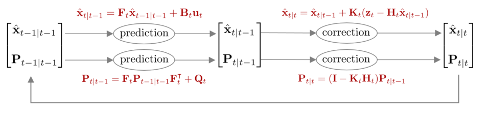

*(원문 p.10)*

시간 $t$에 로봇의 위치를 $\mathbf{x}_t$, 로봇의 센서로 부터 관측한 값을 $\mathbf{z}_t$, 로봇의 제어입력을
$\mathbf{u}_t$라고 하면 이를 통해 모션 모델(motion model)과 관측 모델(observation model)을 정의할 수 있다.
이 때, 모션 모델과 관측 모델은 선형이어야(linear model) 한다는 제약조건이 있다. 모션 모델과 관측 모델은
다음과 같다.

$$\begin{aligned}
\text{Motion Model:} \qquad & \mathbf{x}_t = \mathbf{F}_t\mathbf{x}_{t-1} + \mathbf{B}_t\mathbf{u}_t + \mathbf{w}_t \\
\text{Observation Model:} \qquad & \mathbf{z}_t = \mathbf{H}_t\mathbf{x}_t + \mathbf{v}_t
\end{aligned} \tag{16}$$

- $\mathbf{x}_t$: 모델의 상태 변수(state variable)
- $\mathbf{u}_t$: 모델의 입력(input)
- $\mathbf{z}_t$: 모델의 관측값(measurement)
- $\mathbf{F}_t$: 모델의 상태천이(state transition) 행렬
- $\mathbf{B}_t$: 모델에 입력 $\mathbf{u}_t$가 주어졌을 때 $\mathbf{u}_t$를 상태 변수로 변환해주는 행렬
- $\mathbf{H}_t$: 모델의 관측(observation) 행렬
- $\mathbf{w}_t \sim \mathcal{N}(0, \mathbf{Q}_t)$: 모션 모델의 노이즈. $\mathbf{Q}_t$는
  $\mathbf{w}_t$의 공분산 행렬을 의미한다.
- $\mathbf{v}_t \sim \mathcal{N}(0, \mathbf{R}_t)$: 관측 모델의 노이즈. $\mathbf{R}_t$는
  $\mathbf{v}_t$의 공분산 행렬을 의미한다.

확률변수가 모두 가우시안 분포를 따른다고 가정하면
$p(\mathbf{x}_t \mid \mathbf{x}_{t-1}, \mathbf{u}_t), p(\mathbf{z}_t \mid \mathbf{x}_t)$는 다음과 같이
나타낼 수 있다.

$$\begin{aligned}
p(\mathbf{x}_t \mid \mathbf{x}_{t-1}, \mathbf{u}_t) \quad &\sim \mathcal{N}(\mathbf{F}_t\mathbf{x}_{t-1} + \mathbf{B}_t\mathbf{u}_t, \mathbf{Q}_t) \\
&= \frac{1}{\sqrt{\det(2\pi\mathbf{Q}_t)}} \exp\left(-\frac{1}{2}(\mathbf{x}_t - \mathbf{F}_t\mathbf{x}_{t-1} - \mathbf{B}_t\mathbf{u}_t)^{\intercal}\mathbf{Q}_t^{-1}(\mathbf{x}_t - \mathbf{F}_t\mathbf{x}_{t-1} - \mathbf{B}_t\mathbf{u}_t)\right)
\end{aligned} \tag{17}$$

$$\begin{aligned}
p(\mathbf{z}_t \mid \mathbf{x}_t) \quad &\sim \mathcal{N}(\mathbf{H}_t\mathbf{x}_t, \mathbf{R}_t) \\
&= \frac{1}{\sqrt{\det(2\pi\mathbf{R}_t)}} \exp\left(-\frac{1}{2}(\mathbf{z}_t - \mathbf{H}_t\mathbf{x}_t)^{\intercal}\mathbf{R}_t^{-1}(\mathbf{z}_t - \mathbf{H}_t\mathbf{x}_t)\right)
\end{aligned} \tag{18}$$

다음으로 칼만 필터를 통해 구해야 하는 $\overline{\mathrm{bel}}(\mathbf{x}_t), \mathrm{bel}(\mathbf{x}_t)$은
아래와 같이 나타낼 수 있다.

$$\begin{aligned}
\overline{\mathrm{bel}}(\mathbf{x}_t) &= \int p(\mathbf{x}_t \mid \mathbf{x}_{t-1}, \mathbf{u}_t) \mathrm{bel}(\mathbf{x}_{t-1}) d\mathbf{x}_{t-1} \sim \mathcal{N}(\hat{\mathbf{x}}_{t|t-1}, \mathbf{P}_{t|t-1}) \\
\mathrm{bel}(\mathbf{x}_t) &= \eta \cdot p(\mathbf{z}_t \mid \mathbf{x}_t) \overline{\mathrm{bel}}(\mathbf{x}_t) \sim \mathcal{N}(\hat{\mathbf{x}}_{t|t}, \mathbf{P}_{t|t})
\end{aligned} \tag{19}$$

(19)에서 보다시피 칼만 필터는 prediction에서 이전 스텝의 값과 모션 모델을 사용하여 예측값
$\overline{\mathrm{bel}}(\mathbf{x}_t)$을 먼저 구한 후 correction에서 관측값과 관측 모델을 사용하여
보정된 값 $\mathrm{bel}(\mathbf{x}_t)$를 구하는 방식으로 동작한다. (17), (18)를 (19)에 대입하여
정리하면 prediction, correction 스텝의 평균과 공분산
$(\hat{\mathbf{x}}_{t|t-1}, \mathbf{P}_{t|t-1}), (\hat{\mathbf{x}}_{t|t}, \mathbf{P}_{t|t})$을 각각
구할 수 있다. 자세한 유도 과정은 섹션 8을 참조하면 된다.

초기값 $\mathrm{bel}(\mathbf{x}_0)$은 다음과 같이 주어진다.

$$\mathrm{bel}(\mathbf{x}_0) \sim \mathcal{N}(\hat{\mathbf{x}}_0, \mathbf{P}_0) \tag{20}$$

- $\hat{\mathbf{x}}_0$: 일반적으로 0으로 설정한다
- $\mathbf{P}_0$ : 일반적으로 작은 값(&lt;1e-2)으로 설정한다.

## 3.1 Prediction step

Prediction은 $\overline{\mathrm{bel}}(\mathbf{x}_t)$를 구하는 과정을 말한다.
$\overline{\mathrm{bel}}(\mathbf{x}_t)$는 가우시안 분포를 따르므로 평균 $\hat{\mathbf{x}}_{t|t-1}$과
분산 $\mathbf{P}_{t|t-1}$을 각각 구해보면 아래와 같이 구할 수 있다.

$$\boxed{\begin{aligned}
\hat{\mathbf{x}}_{t|t-1} &= \mathbf{F}_t\hat{\mathbf{x}}_{t-1|t-1} + \mathbf{B}_t\mathbf{u}_t \\
\mathbf{P}_{t|t-1} &= \mathbf{F}_t\mathbf{P}_{t-1|t-1}\mathbf{F}_t^{\intercal} + \mathbf{Q}_t
\end{aligned}} \tag{21}$$

## 3.2 Correction step

Correction은 $\mathrm{bel}(\mathbf{x}_t)$를 구하는 과정을 말한다. $\mathrm{bel}(\mathbf{x}_t)$ 또한
가우시안 분포를 따르므로 평균 $\hat{\mathbf{x}}_{t|t}$과 분산 $\mathbf{P}_{t|t}$을 각각 구해보면 다음과
같다. 이 때, $\mathbf{K}_t$는 칼만 게인(kalman gain)을 의미한다.

$$\boxed{\begin{aligned}
\mathbf{K}_t &= \mathbf{P}_{t|t-1}\mathbf{H}_t^{\intercal}(\mathbf{H}_t\mathbf{P}_{t|t-1}\mathbf{H}_t^{\intercal} + \mathbf{R}_t)^{-1} \\
\hat{\mathbf{x}}_{t|t} &= \hat{\mathbf{x}}_{t|t-1} + \mathbf{K}_t(\mathbf{z}_t - \mathbf{H}_t\hat{\mathbf{x}}_{t|t-1}) \\
\mathbf{P}_{t|t} &= (\mathbf{I} - \mathbf{K}_t\mathbf{H}_t)\mathbf{P}_{t|t-1}
\end{aligned}} \tag{22}$$

## 3.3 1D Kalman filter

지금까지 설명한 칼만 필터는 상태 변수가 벡터인($=\mathbf{x}_t$) 경우에 대한 내용이었다. 다음으로 상태
변수가 스칼라인($=x_t$) 1D 칼만 필터를 살펴보자. 1D 칼만 필터는 기존 nD 칼만 필터와 모든 내용이
동일하지만 행렬이 아닌 스칼라 값을 통해 식이 구성된다는 점이 다르다. 1D 칼만 필터 버전으로 나타낸
Belief는 다음과 같다.

$$\begin{aligned}
\overline{\mathrm{bel}}(x_t) &\sim \mathcal{N}(\bar{\mu}_t, \bar{\sigma}_t^2) \\
\mathrm{bel}(x_t) &\sim \mathcal{N}(\mu_t, \sigma_t^2)
\end{aligned} \tag{23}$$

- $\bar{\mu}_t$: prediction 스텝의 평균
- $\bar{\sigma}_t^2$: prediction 스텝의 분산
- $\mu_t$: correction 스텝의 평균
- $\sigma_t^2$: correction 스텝의 분산

모션 모델과 관측 모델은 다음과 같다.

$$\begin{aligned}
\text{Motion Model:} \qquad & x_t = x_{t-1} + u_t + \sigma_{\mathrm{motion},t}^2 \\
\text{Observation Model:} \qquad & z_t = x_t + \sigma_{\mathrm{obs},t}^2
\end{aligned} \tag{24}$$

- $u_t$: 모션 모델의 제어 입력
- $\sigma_{\mathrm{motion},t}^2$: 모션 모델의 노이즈
- $\sigma_{\mathrm{obs},t}^2$: 관측 모델의 노이즈

1D 칼만 필터의 prediction 스텝은 다음과 같다.

$$\boxed{\begin{aligned}
\bar{\mu}_t &= \mu_{t-1} + u_t \\
\bar{\sigma}_t^2 &= \sigma_{t-1}^2 + \sigma_{\mathrm{motion},t}^2
\end{aligned}} \tag{25}$$

다음으로 1D 칼만 필터의 correction 스텝은 다음과 같다.

$$\boxed{\begin{aligned}
K_t &= \frac{\bar{\sigma}_t^2}{\bar{\sigma}_t^2 + \sigma_{\mathrm{obs},t}^2} \\
\mu_t &= \bar{\mu}_t + K_t(\mu_{\mathrm{obs},t} - \bar{\mu}_t) = \frac{\mu_{\mathrm{obs},t}\bar{\sigma}_t^2 + \bar{\mu}_t\sigma_{\mathrm{obs},t}^2}{\bar{\sigma}_t^2 + \sigma_{\mathrm{obs},t}^2} \\
\sigma_t^2 &= (1 - K_t)\bar{\sigma}_t^2 = \frac{\bar{\sigma}_t^2\sigma_{\mathrm{obs},t}^2}{\bar{\sigma}_t^2 + \sigma_{\mathrm{obs},t}^2}
\end{aligned}} \tag{26}$$

- $\mu_{\mathrm{obs},t}$: 관측 모델의 평균
- $\sigma_{\mathrm{obs},t}^2$: 관측 모델의 노이즈

식을 자세히 살펴보면 앞서 언급했던 벡터 버전 칼만 필터와 구조가 동일한 것을 확인할 수 있다.
$\mathbf{F}_t, \mathbf{B}_t, \mathbf{H}_t$는 1이 되어 생략되고 $\mathbf{Q}_t \leftrightarrow \sigma_{\mathrm{motion},t}$와
대응하며 $\mathbf{R}_t \leftrightarrow \sigma_{\mathrm{obs},t}$와 대응하는 것을 알 수 있다. 보다 쉽게
한눈에 비교하기 위해 그림을 첨부하였다.

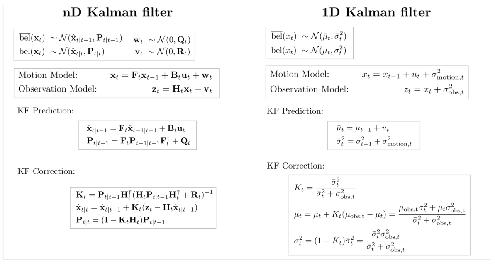

*(원문 p.13)*

<!--widget:kf-1d-->

## 3.4 Discussion

### 3.4.1 Discussion about KF and posterior pdf

다음과 같이 간단한 1차원에서 로봇의 위치 $x_t$를 KF로 추정하는 문제가 주어졌다고 하자. 세로축은
확률밀도함수(probability density function, pdf), 가로축은 1차원 위치 $x$라고 하고 $t$ 시점의 로봇의
위치를 상태 변수 $x_t$라고 하자.

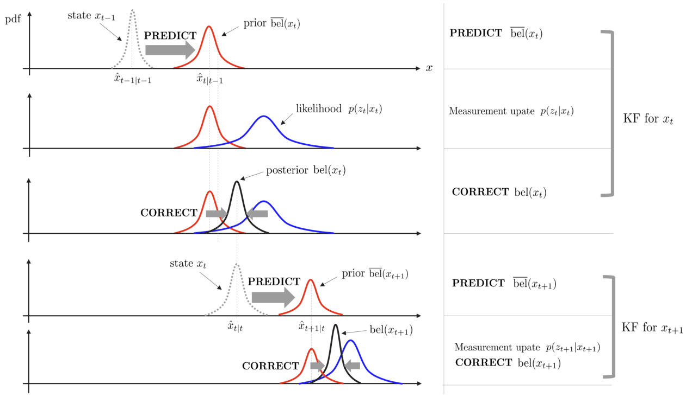

*(원문 p.13)*

위 그림을 단계 별로 자세히 살펴보면 다음과 같다.

1. 로봇은 이전 스텝의 위치 $x_{t-1}$로부터 모션 모델에 의해 prediction을 수행하여 prior
   $\overline{\mathrm{bel}}(x_t)$를 예측한다.
2. 다음으로 로봇의 센서로부터 현재의 위치를 측정하여 likelihood $p(z_t|x_t)$를 얻는다.
3. prior $\overline{\mathrm{bel}}(x_t)$와 likelihood $p(z_t|x_t)$로부터 correction 스텝을 수행하여
   posterior $\mathrm{bel}(x_t)$를 얻는다.
4. 1~3 과정을 다음 스텝에 대해 반복하여 $x_{t+1}$에 대한 posterior $\mathrm{bel}(x_{t+1})$을 얻는다.

따라서 KF의 한 스텝은 이전 상태 변수로부터 prior를 예측(=prediction)하고 관측값이 주어지면 이를 통해
likelihood를 구한 후 bayesian rule에 따라 posterior pdf를 구하는(=correction) 전형적인 Bayesian 필터의
특성을 지님을 알 수 있다. Bayesian 필터링을 가우시안 분포를 따르는 Belief에 대하여 재귀적으로 수행하는
것이 칼만 필터이다.

### 3.4.2 Discussion about Kalman gain

Correction 스텝을 자세히 살펴 보면 평균 $\hat{\mathbf{x}}_{t|t}$을 구할 때 칼만 게인 $\mathbf{K}_t$에
따라 가중치가 다르게 더해진다.

$$\hat{\mathbf{x}}_{t|t} = \underbrace{\hat{\mathbf{x}}_{t|t-1}}_{\text{prediction}} + \mathbf{K}_t \underbrace{(\mathbf{z}_t - \mathbf{H}_t\hat{\mathbf{x}}_{t|t-1})}_{\text{innovation}} \tag{27}$$

- innovation: 관측값($\mathbf{z}_t$)와 예측값($\mathbf{H}_t\hat{\mathbf{x}}_{t|t-1}$)의 차이, 즉
  에러(error)값

$\mathbf{K}_t \to \mathbf{0}$이면 센서의 관측값 $\mathbf{z}_t$를 전혀 신뢰하지 않고 오직 시스템의
예측값만을 반영하겠다는 것을 의미한다(관측값 $\mathbf{z}_t$ 반영 안함). 반면에
$\mathbf{K}_t \to \mathbf{1}$이면 센서의 관측값 $\mathbf{z}_t$를 100% 신뢰하여 센서 관측값만을
반영하겠다는 것을 의미한다(예측값 $\hat{\mathbf{x}}_{t|t-1}$ 반영 안함).

또한, 센서 노이즈 $\mathbf{R}$이 큰 경우 $\mathbf{K}_t$는 감소하게 되고 이는 센서의 관측값보다 시스템
모델의 예측값을 더 반영하겠다는 것을 의미한다. 반면에 시스템 노이즈 $\mathbf{Q}$가 큰 경우
$\mathbf{P}_{t|t-1}$이 증가하여 $\mathbf{K}_t$ 또한 증가하게 되고 이는 곧 시스템 모델의 예측값보다
관측값을 더 반영하겠다는 것을 의미한다.

$$\begin{aligned}
\mathbf{P}_{t|t-1} &= \mathbf{F}_t\mathbf{P}_{t-1|t-1}\mathbf{F}_t^{\intercal} + \mathbf{Q}_t \\
\mathbf{K}_t &= \mathbf{P}_{t|t-1}\mathbf{H}_t^{\intercal}(\mathbf{H}_t\mathbf{P}_{t|t-1}\mathbf{H}_t^{\intercal} + \mathbf{R}_t)^{-1}
\end{aligned} \tag{28}$$

- $\mathbf{R}_t(\uparrow) \Rightarrow (* + \mathbf{R}_t)^{-1}(\downarrow) \Rightarrow \mathbf{K}_t(\downarrow)$
- $\mathbf{Q}_t(\uparrow) \Rightarrow \mathbf{P}_{t|t-1}(\uparrow) \Rightarrow \mathbf{K}_t(\uparrow)$

<!--widget:kf-gain-->

## 3.5 Summary

칼만 필터를 함수로 표현하면 다음과 같다.

$$\boxed{\begin{aligned}
&\mathrm{KalmanFilter}(\hat{\mathbf{x}}_{t-1|t-1}, \mathbf{P}_{t-1|t-1}, \mathbf{u}_t, \mathbf{z}_t)\{ \\
&\qquad \text{(Prediction Step)} \\
&\qquad \hat{\mathbf{x}}_{t|t-1} = \mathbf{F}_t\hat{\mathbf{x}}_{t-1|t-1} + \mathbf{B}_t\mathbf{u}_t \\
&\qquad \mathbf{P}_{t|t-1} = \mathbf{F}_t\mathbf{P}_{t-1|t-1}\mathbf{F}_t^{\intercal} + \mathbf{Q}_t \\
&\\
&\qquad \text{(Correction Step)} \\
&\qquad \mathbf{K}_t = \mathbf{P}_{t|t-1}\mathbf{H}_t^{\intercal}(\mathbf{H}_t\mathbf{P}_{t|t-1}\mathbf{H}_t^{\intercal} + \mathbf{R}_t)^{-1} \\
&\qquad \hat{\mathbf{x}}_{t|t} = \hat{\mathbf{x}}_{t|t-1} + \mathbf{K}_t(\mathbf{z}_t - \mathbf{H}_t\hat{\mathbf{x}}_{t|t-1}) \\
&\qquad \mathbf{P}_{t|t} = (\mathbf{I} - \mathbf{K}_t\mathbf{H}_t)\mathbf{P}_{t|t-1} \\
&\qquad \text{return } \ \hat{\mathbf{x}}_{t|t}, \mathbf{P}_{t|t} \\
&\}
\end{aligned}} \tag{29}$$

<!--widget:kf-2d-tracking-->

# 4 Extended kalman filter (EKF)

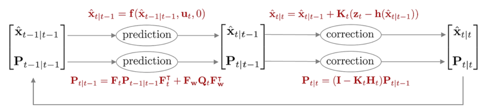

*(원문 p.15)*

칼만 필터는 모션 모델과 관측 모델이 선형이라는 가정 하에 상태를 추정한다. 하지만 현실세계의 대부분의
현상들은 비선형으로 모델링되므로 앞서 정의한 칼만 필터를 그대로 적용하면 정상적으로 동작하지 않는다.
비선형의 모션 모델과 관측 모델에서도 칼만 필터를 사용하기 위해 확장칼만필터(extended kalman filter,
EKF)가 제안되었다. EKF는 테일러 1차 근사(Taylor 1st approximation)을 사용하여 비선형 모델을 선형 모델로
근사한 후 칼만 필터를 적용하는 방법을 사용한다. EKF의 모션 모델과 관측 모델은 다음과 같다.

$$\begin{aligned}
\text{Motion Model:} \qquad & \mathbf{x}_t = \mathbf{f}(\mathbf{x}_{t-1}, \mathbf{u}_t, \mathbf{w}_t) \\
\text{Observation Model:} \qquad & \mathbf{z}_t = \mathbf{h}(\mathbf{x}_t, \mathbf{v}_t)
\end{aligned} \tag{30}$$

- $\mathbf{x}_t$: 모델의 상태 변수(state variable)
- $\mathbf{u}_t$: 모델의 입력(input)
- $\mathbf{z}_t$: 모델의 관측값(measurement)
- $\mathbf{f}(\cdot)$: 비선형 모션(motion) 모델 함수
- $\mathbf{h}(\cdot)$: 비선형 관측(observation) 모델 함수
- $\mathbf{w}_t \sim \mathcal{N}(0, \mathbf{Q}_t)$: 모션 모델의 노이즈. $\mathbf{Q}_t$는
  $\mathbf{w}_t$의 공분산 행렬을 의미
- $\mathbf{v}_t \sim \mathcal{N}(0, \mathbf{R}_t)$: 관측 모델의 노이즈. $\mathbf{R}_t$는
  $\mathbf{v}_t$의 공분산 행렬을 의미

위 식에서 $\mathbf{f}(\cdot)$은 비선형 모션 모델을 의미하고 $\mathbf{h}(\cdot)$은 비선형 관측 모델을
의미한다. $\mathbf{f}(\cdot), \mathbf{h}(\cdot)$에 각각 1차 테일러 근사를 수행하면 다음과 같다.

$$\begin{aligned}
\mathbf{x}_t &\approx \mathbf{f}(\hat{\mathbf{x}}_{t-1|t-1}, \mathbf{u}_t, 0) + \mathbf{F}_t(\mathbf{x}_{t-1} - \hat{\mathbf{x}}_{t-1|t-1}) + \mathbf{F}_{\mathbf{w}}\mathbf{w}_t \\
\mathbf{z}_t &\approx \mathbf{h}(\hat{\mathbf{x}}_{t|t-1}, 0) + \mathbf{H}_t(\mathbf{x}_t - \hat{\mathbf{x}}_{t|t-1}) + \mathbf{H}_{\mathbf{v}}\mathbf{v}_t
\end{aligned} \tag{31}$$

이 때, $\mathbf{F}_t$는 $\hat{\mathbf{x}}_{t-1|t-1}$에서 계산한 모션 모델의 자코비안 행렬을 의미하며
$\mathbf{H}_t$는 $\hat{\mathbf{x}}_{t|t-1}$에서 계산한 관측 모델의 자코비안 행렬을 의미한다. 그리고
$\mathbf{F}_{\mathbf{w}}, \mathbf{H}_{\mathbf{v}}$는 각각 $\mathbf{w}_t = 0, \mathbf{v}_t = 0$에서
노이즈에 대한 자코비안 행렬을 의미한다. 자코비안에 대한 자세한 내용은 해당 포스트를 참조하면된다.

$$\mathbf{F}_t = \left.\frac{\partial \mathbf{f}}{\partial \mathbf{x}_{t-1}}\right|_{\mathbf{x}_{t-1} = \hat{\mathbf{x}}_{t-1|t-1}} \qquad \mathbf{F}_{\mathbf{w}} = \left.\frac{\partial \mathbf{f}}{\partial \mathbf{w}_t}\right|_{\substack{\mathbf{x}_{t-1} = \hat{\mathbf{x}}_{t-1|t-1} \\ \mathbf{w}_t = 0}} \tag{32}$$

$$\mathbf{H}_t = \left.\frac{\partial \mathbf{h}}{\partial \mathbf{x}_t}\right|_{\mathbf{x}_t = \hat{\mathbf{x}}_{t|t-1}} \qquad \mathbf{H}_{\mathbf{v}} = \left.\frac{\partial \mathbf{h}}{\partial \mathbf{v}_t}\right|_{\substack{\mathbf{x}_t = \hat{\mathbf{x}}_{t|t-1} \\ \mathbf{v}_t = 0}} \tag{33}$$

(31) 식을 전개하면 다음과 같다.

$$\boxed{\begin{aligned}
\mathbf{x}_t &= \mathbf{F}_t\mathbf{x}_{t-1} + \mathbf{f}(\hat{\mathbf{x}}_{t-1|t-1}, \mathbf{u}_t, 0) - \mathbf{F}_t\hat{\mathbf{x}}_{t-1|t-1} + \mathbf{F}_{\mathbf{w}}\mathbf{w}_t \\
&= \mathbf{F}_t\mathbf{x}_{t-1} + \tilde{\mathbf{u}}_t + \tilde{\mathbf{w}}_t
\end{aligned}} \tag{34}$$

- $\tilde{\mathbf{u}}_t = \mathbf{f}(\hat{\mathbf{x}}_{t-1|t-1}, \mathbf{u}_t, 0) - \mathbf{F}_t\hat{\mathbf{x}}_{t-1|t-1}$
- $\tilde{\mathbf{w}}_t = \mathbf{F}_{\mathbf{w}}\mathbf{w}_t \sim \mathcal{N}(0, \mathbf{F}_{\mathbf{w}}\mathbf{Q}_t\mathbf{F}_{\mathbf{w}}^{\intercal})$

$$\boxed{\begin{aligned}
\mathbf{z}_t &= \mathbf{H}_t\mathbf{x}_t + \mathbf{h}(\hat{\mathbf{x}}_{t|t-1}, 0) - \mathbf{H}_t\hat{\mathbf{x}}_{t|t-1} + \mathbf{H}_{\mathbf{v}}\mathbf{v}_t \\
&= \mathbf{H}_t\mathbf{x}_t + \tilde{\mathbf{z}}_t + \tilde{\mathbf{v}}_t
\end{aligned}} \tag{35}$$

- $\tilde{\mathbf{z}}_t = \mathbf{h}(\hat{\mathbf{x}}_{t|t-1}, 0) - \mathbf{H}_t\hat{\mathbf{x}}_{t|t-1}$
- $\tilde{\mathbf{v}}_t = \mathbf{H}_{\mathbf{v}}\mathbf{v}_t \sim \mathcal{N}(0, \mathbf{H}_{\mathbf{v}}\mathbf{R}_t\mathbf{H}_{\mathbf{v}}^{\intercal})$

확률변수가 모두 가우시안 분포를 따른다고 가정하면
$p(\mathbf{x}_t \mid \mathbf{x}_{t-1}, \mathbf{u}_t), p(\mathbf{z}_t \mid \mathbf{x}_t)$는 다음과 같이
나타낼 수 있다.

$$\begin{aligned}
p(\mathbf{x}_t \mid \mathbf{x}_{t-1}, \mathbf{u}_t) \quad &\sim \mathcal{N}(\mathbf{F}_t\mathbf{x}_{t-1} + \tilde{\mathbf{u}}_t, \mathbf{F}_{\mathbf{w}}\mathbf{Q}_t\mathbf{F}_{\mathbf{w}}^{\intercal}) \\
&= \frac{1}{\sqrt{\det(2\pi\mathbf{F}_{\mathbf{w}}\mathbf{Q}_t\mathbf{F}_{\mathbf{w}}^{\intercal})}} \exp\left(-\frac{1}{2}(\mathbf{x}_t - \mathbf{F}_t\mathbf{x}_{t-1} - \tilde{\mathbf{u}}_t)^{\intercal}(\mathbf{F}_{\mathbf{w}}\mathbf{Q}_t\mathbf{F}_{\mathbf{w}}^{\intercal})^{-1}(\mathbf{x}_t - \mathbf{F}_t\mathbf{x}_{t-1} - \tilde{\mathbf{u}}_t)\right)
\end{aligned} \tag{36}$$

$$\begin{aligned}
p(\mathbf{z}_t \mid \mathbf{x}_t) \quad &\sim \mathcal{N}(\mathbf{H}_t\mathbf{x}_t + \tilde{\mathbf{z}}_t, \mathbf{H}_{\mathbf{v}}\mathbf{R}_t\mathbf{H}_{\mathbf{v}}^{\intercal}) \\
&= \frac{1}{\sqrt{\det(2\pi\mathbf{H}_{\mathbf{v}}\mathbf{R}_t\mathbf{H}_{\mathbf{v}}^{\intercal})}} \exp\left(-\frac{1}{2}(\mathbf{z}_t - \mathbf{H}_t\mathbf{x}_t - \tilde{\mathbf{z}}_t)^{\intercal}(\mathbf{H}_{\mathbf{v}}\mathbf{R}_t\mathbf{H}_{\mathbf{v}}^{\intercal})^{-1}(\mathbf{z}_t - \mathbf{H}_t\mathbf{x}_t - \tilde{\mathbf{z}}_t)\right)
\end{aligned} \tag{37}$$

$\mathbf{F}_{\mathbf{w}}\mathbf{Q}_t\mathbf{F}_{\mathbf{w}}^{\intercal}$는 선형화된 모션 모델의 노이즈를
의미하며 $\mathbf{H}_{\mathbf{v}}\mathbf{R}_t\mathbf{H}_{\mathbf{v}}^{\intercal}$은 선형화된 관측 모델의
노이즈를 의미한다. 다음으로 칼만 필터를 통해 구해야 하는
$\overline{\mathrm{bel}}(\mathbf{x}_t), \mathrm{bel}(\mathbf{x}_t)$은 아래와 같이 나타낼 수 있다.

$$\begin{aligned}
\overline{\mathrm{bel}}(\mathbf{x}_t) &= \int p(\mathbf{x}_t \mid \mathbf{x}_{t-1}, \mathbf{u}_t)\mathrm{bel}(\mathbf{x}_{t-1})d\mathbf{x}_{t-1} \sim \mathcal{N}(\hat{\mathbf{x}}_{t|t-1}, \mathbf{P}_{t|t-1}) \\
\mathrm{bel}(\mathbf{x}_t) &= \eta \cdot p(\mathbf{z}_t \mid \mathbf{x}_t)\overline{\mathrm{bel}}(\mathbf{x}_t) \sim \mathcal{N}(\hat{\mathbf{x}}_{t|t}, \mathbf{P}_{t|t})
\end{aligned} \tag{38}$$

EKF 또한 KF와 동일하게 prediction에서 이전 스텝의 값과 모션 모델을 사용하여 예측값
$\overline{\mathrm{bel}}(\mathbf{x}_t)$을 먼저 구한 후 correction에서 관측값과 관측 모델을 사용하여
보정된 값 $\mathrm{bel}(\mathbf{x}_t)$을 구하는 방식으로 동작한다.
$p(\mathbf{x}_t|\mathbf{x}_{t-1}, \mathbf{u}_t), p(\mathbf{z}_t|\mathbf{x}_t)$를 위 식에 대입하여
정리하면 prediction, correction 스텝의 평균과 공분산
$(\hat{\mathbf{x}}_{t|t-1}, \mathbf{P}_{t|t-1}), (\hat{\mathbf{x}}_{t|t}, \mathbf{P}_{t|t})$을 각각
구할 수 있다. 자세한 유도 과정은 섹션 8을 참조하면 된다.

초기값 $\mathrm{bel}(\mathbf{x}_0)$은 다음과 같이 주어진다.

$$\mathrm{bel}(\mathbf{x}_0) \sim \mathcal{N}(\hat{\mathbf{x}}_0, \mathbf{P}_0) \tag{39}$$

- $\hat{\mathbf{x}}_0$: 일반적으로 0으로 설정한다
- $\mathbf{P}_0$ : 일반적으로 작은 값(&lt;1e-2)으로 설정한다.

## 4.1 Prediction step

Prediction은 $\overline{\mathrm{bel}}(\mathbf{x}_t)$를 구하는 과정을 말한다. 공분산 행렬을 구할 때
선형화된 자코비안 행렬 $\mathbf{F}_t$가 사용된다.

$$\boxed{\begin{aligned}
\hat{\mathbf{x}}_{t|t-1} &= \mathbf{f}(\hat{\mathbf{x}}_{t-1|t-1}, \mathbf{u}_t, 0) \\
\mathbf{P}_{t|t-1} &= \mathbf{F}_t\mathbf{P}_{t-1|t-1}\mathbf{F}_t^{\intercal} + \mathbf{F}_{\mathbf{w}}\mathbf{Q}_t\mathbf{F}_{\mathbf{w}}^{\intercal}
\end{aligned}} \tag{40}$$

## 4.2 Correction step

Correction은 $\mathrm{bel}(\mathbf{x}_t)$를 구하는 과정을 말한다. 칼만 게인과 공분산 행렬을 구할 때
선형화된 자코비안 행렬 $\mathbf{H}_t$가 사용된다.

$$\boxed{\begin{aligned}
\mathbf{K}_t &= \mathbf{P}_{t|t-1}\mathbf{H}_t^{\intercal}(\mathbf{H}_t\mathbf{P}_{t|t-1}\mathbf{H}_t^{\intercal} + \mathbf{H}_{\mathbf{v}}\mathbf{R}_t\mathbf{H}_{\mathbf{v}}^{\intercal})^{-1} \\
\hat{\mathbf{x}}_{t|t} &= \hat{\mathbf{x}}_{t|t-1} + \mathbf{K}_t(\mathbf{z}_t - \mathbf{h}(\hat{\mathbf{x}}_{t|t-1}, 0)) \\
\mathbf{P}_{t|t} &= (\mathbf{I} - \mathbf{K}_t\mathbf{H}_t)\mathbf{P}_{t|t-1}
\end{aligned}} \tag{41}$$

## 4.3 Summary

확장칼만필터를 함수로 표현하면 다음과 같다.

$$\boxed{\begin{aligned}
&\mathrm{ExtendedKalmanFilter}(\hat{\mathbf{x}}_{t-1|t-1}, \mathbf{P}_{t-1|t-1}, \mathbf{u}_t, \mathbf{z}_t)\{ \\
&\qquad \text{(Prediction Step)} \\
&\qquad \hat{\mathbf{x}}_{t|t-1} = \mathbf{f}_t(\hat{\mathbf{x}}_{t-1|t-1}, \mathbf{u}_t, 0) \\
&\qquad \mathbf{P}_{t|t-1} = \mathbf{F}_t\mathbf{P}_{t-1|t-1}\mathbf{F}_t^{\intercal} + \mathbf{F}_{\mathbf{w}}\mathbf{Q}_t\mathbf{F}_{\mathbf{w}}^{\intercal} \\
&\\
&\qquad \text{(Correction Step)} \\
&\qquad \mathbf{K}_t = \mathbf{P}_{t|t-1}\mathbf{H}_t^{\intercal}(\mathbf{H}_t\mathbf{P}_{t|t-1}\mathbf{H}_t^{\intercal} + \mathbf{H}_{\mathbf{v}}\mathbf{R}_t\mathbf{H}_{\mathbf{v}}^{\intercal})^{-1} \\
&\qquad \hat{\mathbf{x}}_{t|t} = \hat{\mathbf{x}}_{t|t-1} + \mathbf{K}_t(\mathbf{z}_t - \mathbf{h}_t(\hat{\mathbf{x}}_{t|t-1}, 0)) \\
&\qquad \mathbf{P}_{t|t} = (\mathbf{I} - \mathbf{K}_t\mathbf{H}_t)\mathbf{P}_{t|t-1} \\
&\qquad \text{return } \ \hat{\mathbf{x}}_{t|t}, \mathbf{P}_{t|t} \\
&\}
\end{aligned}} \tag{42}$$

<!--widget:ekf-linearization-->

# 5 Error-state kalman filter (ESKF)

**NOMENCLATURE of error-state kalman filter**

- prediction: $\overline{\mathrm{bel}}(\delta\mathbf{x}_t) \sim \mathcal{N}(\delta\hat{\mathbf{x}}_{t|t-1}, \mathbf{P}_{t|t-1})$
  - $\delta\hat{\mathbf{x}}_{t|t-1}$ : $t-1$ 스텝의 correction 값이 주어졌을 때 $t$ 스텝의 평균. 일부
    문헌은 $\delta\mathbf{x}_t^-$로 표기함.
  - $\hat{\mathbf{P}}_{t|t-1}$ : $t-1$ 스텝의 correction 값이 주어졌을 때 $t$ 스텝의 공분산. 일부
    문헌은 $\mathbf{P}_t^-$로 표기함.
- correction: $\mathrm{bel}(\delta\mathbf{x}_t) \sim \mathcal{N}(\delta\hat{\mathbf{x}}_{t|t}, \mathbf{P}_{t|t})$
  - $\delta\hat{\mathbf{x}}_{t|t}$ : $t$ 스텝의 prediction 값이 주어졌을 때 $t$ 스텝의 평균. 일부
    문헌은 $\delta\mathbf{x}_t^+$로 표기함.
  - $\hat{\mathbf{P}}_{t|t}$ : $t$ 스텝의 prediction 값이 주어졌을 때 $t$ 스텝의 공분산. 일부 문헌은
    $\mathbf{P}_t^+$로 표기함.

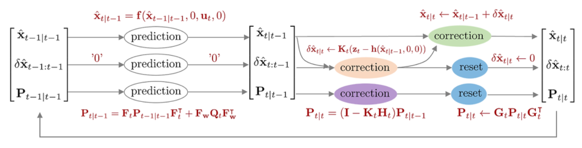

*(원문 p.18)*

에러상태 칼만필터(error-state kalman filter, ESKF)는 기존의 상태 변수 $\mathbf{x}_t$의 평균과 분산을
추정하는 EKF와 달리 에러 상태 변수 $\delta\mathbf{x}_t$의 평균과 분산을 추정하는 칼만 필터 알고리즘을
말한다. 상태변수를 바로 추정하지 않고 에러상태를 통해 추정하기 때문에 indirect kalman filter라고도
불린다. 또다른 이름으로는 error-state extended kalman filter(ES-EKF)로도 불린다. ESKF는 기존
상태변수룰 true 상태 변수라고 부르며 이를 다음과 같이 명목(nominal) 상태와 에러(error) 상태의 합으로
표현한다.

$$\mathbf{x}_{\mathrm{true},t} = \mathbf{x}_t + \delta\mathbf{x}_t \tag{43}$$

- $\mathbf{x}_{\mathrm{true},t}$: 기존 KF, EKF에서 업데이트된 $t$ 스텝의 true 상태변수
- $\mathbf{x}_t$: $t$ 스텝의 명목(nominal) 상태 변수. 에러가 없는 상태를 의미한다
- $\delta\mathbf{x}_t$: $t$ 스텝의 에러(error) 상태 변수

위 식을 해석하면 실제(true) 추정하고자 하는 상태 변수 $\mathbf{x}_t$는 에러가 없는 일반(또는 명목,
nominal) 상태 $\hat{\mathbf{x}}_t$과 모델 및 센서 노이즈로 부터 발생하는 에러 상태
$\delta\mathbf{x}_t$의 합으로 나타낼 수 있다는 의미이다. 이 때, nominal 상태는 (상대적으로) 큰 값을
가지며 비선형성을 가진다. 반면에 에러 상태는 0 근처의 작은 값을 가지고 선형성을 가진다. 기존의 EKF는
비선형성이 큰 true (nominal + error) 상태 변수를 선형화하여 필터링하기 때문에 속도가 느리고 시간이
지날수록 에러 값이 누적되는 반면에, ESKF는 에러 상태만을 선형화하여 필터링하기 때문에 속도 및 정확성이
더욱 빠른 장점이 있다. 기존 EKF와 비교했을 때 ESKF이 가지는 장점들을 정리하면 다음과 같다
(Madyastha et al., 2011):

- 방향(orientation)에 대한 에러 상태 표현법이 최소한의 파라미터를 가진다. 즉, 자유도만큼의 최소
  파라미터를 가지기 때문에 over-parameterized로 인해 발생하는 특이점(singularity) 같은 현상이 발생하지
  않는다.
- 에러 상태 시스템은 항상 원점(origin) 근처에서만 동작하기 때문에 선형화하기 용이하다. 따라서 짐벌락
  같은 파라미터 특이점 현상이 발생하지 않으며 항상 선형화를 수행할 수 있다.
- 에러 상태는 일반적으로 값이 작기 때문에 2차항 이상의 값들은 무시할 수 있다. 이는 자코비안 연산을 쉽고
  빠르게 수행할 수 있도록 도와준다. 몇몇 자코비안은 상수화하여 사용하기도 한다.

다만 ESKF는 prediction 속도는 빠르지만 nominal 상태에서 일반적으로 비선형을 가진 큰 값들이 처리되므로
nominal 상태가 처리되는 correction 스텝의 속도가 느린 편이다.

ESKF의 모션 모델과 관측 모델은 다음과 같다.

$$\begin{aligned}
\text{Error-state Motion Model:} \qquad & \mathbf{x}_t + \delta\mathbf{x}_t = \mathbf{f}(\mathbf{x}_{t-1}, \delta\mathbf{x}_{t-1}, \mathbf{u}_t, \mathbf{w}_t) \\
\text{Error-state Observation Model:} \qquad & \mathbf{z}_t = \mathbf{h}(\mathbf{x}_t, \delta\mathbf{x}_t, \mathbf{v}_t)
\end{aligned} \tag{44}$$

- $\mathbf{x}_t$: 모델의 nominal 상태 변수
- $\delta\mathbf{x}_t$: 모델의 에러 상태 변수
- $\mathbf{u}_t$: 모델의 입력(input)
- $\mathbf{z}_t$: 모델의 관측값(measurement)
- $\mathbf{f}(\cdot)$: 비선형 모션(motion) 모델 함수
- $\mathbf{h}(\cdot)$: 비선형 관측(observation) 모델 함수
- $\mathbf{w}_t \sim \mathcal{N}(0, \mathbf{Q}_t)$: 에러 상태 모델의 노이즈. $\mathbf{Q}_t$는
  $\mathbf{w}_t$의 공분산 행렬을 의미
- $\mathbf{v}_t \sim \mathcal{N}(0, \mathbf{R}_t)$: 관측 모델의 노이즈. $\mathbf{R}_t$는
  $\mathbf{v}_t$의 공분산 행렬을 의미

$\mathbf{f}(\cdot), \mathbf{h}(\cdot)$에 각각 1차 테일러 근사를 수행하면 다음과 같다. 해당 전개는 [5]를
참고하여 작성하였다.

$$\begin{aligned}
\mathbf{x}_t + \delta\mathbf{x}_t &\approx \mathbf{f}(\mathbf{x}_{t-1|t-1}, \delta\hat{\mathbf{x}}_{t-1|t-1}, \mathbf{u}_t, 0) + \mathbf{F}_t(\delta\mathbf{x}_{t-1} - \delta\hat{\mathbf{x}}_{t-1|t-1}) + \mathbf{F}_{\mathbf{w}}\mathbf{w}_t \\
\mathbf{z}_t &\approx \mathbf{h}(\mathbf{x}_{t|t-1}, \delta\hat{\mathbf{x}}_{t|t-1}, 0) + \mathbf{H}_t(\delta\mathbf{x}_t - \delta\hat{\mathbf{x}}_{t|t-1}) + \mathbf{H}_{\mathbf{v}}\mathbf{v}_t
\end{aligned} \tag{45}$$

이 때, 두 자코비안 $\mathbf{F}_t, \mathbf{H}_t$ 모두 true 상태 $\mathbf{x}_{\mathrm{true},t}$가 아닌
에러 상태 $\delta\mathbf{x}_t$에 대한 자코비안임에 유의한다. 해당 자코비안 부분이 EKF와 가장 다른
부분이다

$$\boxed{\mathbf{F}_t = \left.\frac{\partial \mathbf{f}}{\partial \delta\mathbf{x}_{t-1}}\right|_{\delta\mathbf{x}_{t-1} = \delta\hat{\mathbf{x}}_{t-1|t-1}} \qquad \mathbf{F}_{\mathbf{w}} = \left.\frac{\partial \mathbf{f}}{\partial \mathbf{w}_t}\right|_{\substack{\delta\mathbf{x}_{t-1} = \delta\hat{\mathbf{x}}_{t-1|t-1} \\ \mathbf{w}_t = 0}}} \tag{46}$$

$$\boxed{\mathbf{H}_t = \left.\frac{\partial \mathbf{h}}{\partial \delta\mathbf{x}_t}\right|_{\delta\mathbf{x}_t = \delta\hat{\mathbf{x}}_{t|t-1}} \qquad \mathbf{H}_{\mathbf{v}} = \left.\frac{\partial \mathbf{h}}{\partial \mathbf{v}_t}\right|_{\substack{\delta\mathbf{x}_t = \delta\hat{\mathbf{x}}_{t|t-1} \\ \mathbf{v}_t = 0}}} \tag{47}$$

$\mathbf{H}_t$는 다음과 같이 연쇄법칙을 통해 표현할 수 있다.

$$\mathbf{H}_t = \frac{\partial \mathbf{h}}{\partial \delta\mathbf{x}_t} = \frac{\partial \mathbf{h}}{\partial \mathbf{x}_{\mathrm{true},t}}\frac{\partial \mathbf{x}_{\mathrm{true},t}}{\partial \delta\mathbf{x}_t} \tag{48}$$

이 중 앞 부분 $\frac{\partial \mathbf{h}}{\partial \mathbf{x}_{\mathrm{true},t}}$은 EKF에서 구한
자코비안과 동일하지만 에러 상태 변수에 대한 자코비안
$\frac{\partial \mathbf{x}_{\mathrm{true},t}}{\partial \delta\mathbf{x}_t}$이 추가되었다. 이에 대한
자세한 내용은 Quaternion kinematics for the error-state Kalman filter 내용 정리 포스트를 참고하면 된다.

(45) 식을 전개하면 다음과 같다.

$$\mathbf{x}_t + \delta\mathbf{x}_t = \mathbf{F}_t\delta\mathbf{x}_{t-1} + \mathbf{f}(\mathbf{x}_{t-1|t-1}, \delta\hat{\mathbf{x}}_{t-1|t-1}, \mathbf{u}_t, 0) - \mathbf{F}_t\delta\hat{\mathbf{x}}_{t-1|t-1} + \mathbf{F}_{\mathbf{w}}\mathbf{w}_t \tag{49}$$

이전 correction 스텝에서 항상 $\delta\hat{\mathbf{x}}_{t-1|t-1} = 0$으로 초기화되므로 관련된 항에 0을
대입한다.

$$\mathbf{x}_t + \delta\mathbf{x}_t = \mathbf{F}_t\delta\mathbf{x}_{t-1} + \mathbf{f}(\mathbf{x}_{t-1|t-1}, 0, \mathbf{u}_t, 0) + \mathbf{F}_{\mathbf{w}}\mathbf{w}_t \tag{50}$$

nominal 상태 변수 $\mathbf{x}_t$는 정의 상 노이즈가 없는
$\mathbf{f}(\mathbf{x}_{t-1}, 0, \mathbf{u}_t, 0)$과 동일하므로 서로 소거된다.

$$\boxed{\begin{aligned}
\delta\mathbf{x}_t &= \mathbf{F}_t\delta\mathbf{x}_{t-1} + \mathbf{F}_{\mathbf{w}}\mathbf{w}_t \\
&= \mathbf{F}_t\delta\mathbf{x}_{t-1} + \tilde{\mathbf{w}}_t \\
&= 0 + \tilde{\mathbf{w}}_t
\end{aligned}} \tag{51}$$

- $\tilde{\mathbf{w}}_t = \mathbf{F}_{\mathbf{w}}\mathbf{w}_t \sim \mathcal{N}(0, \mathbf{F}_{\mathbf{w}}\mathbf{Q}_t\mathbf{F}_{\mathbf{w}}^{\intercal})$

관측 모델 함수도 동일하게 에러 상태 변수의 값을 0으로 치환하면 아래와 같이 전개된다.

$$\boxed{\begin{aligned}
\mathbf{z}_t &= \mathbf{H}_t\delta\mathbf{x}_t + \mathbf{h}(\mathbf{x}_{t|t-1}, \delta\hat{\mathbf{x}}_{t-1|t-1}, 0) - \mathbf{H}_t\delta\hat{\mathbf{x}}_{t|t-1} + \mathbf{H}_{\mathbf{v}}\mathbf{v}_t \\
&= \mathbf{h}(\mathbf{x}_{t|t-1}, 0, 0) + \mathbf{H}_{\mathbf{v}}\mathbf{v}_t \\
&= \tilde{\mathbf{z}}_t + \tilde{\mathbf{v}}_t
\end{aligned}} \tag{52}$$

- $\tilde{\mathbf{z}}_t = \mathbf{h}(\mathbf{x}_{t|t-1}, 0, 0)$
- $\tilde{\mathbf{v}}_t = \mathbf{H}_{\mathbf{v}}\mathbf{v}_t \sim \mathcal{N}(0, \mathbf{H}_{\mathbf{v}}\mathbf{R}_t\mathbf{H}_{\mathbf{v}}^{\intercal})$

확률 변수가 모두 가우시안 분포를 따른다고 가정하면
$p(\delta\mathbf{x}_t \mid \delta\mathbf{x}_{t-1}, \mathbf{u}_t), p(\mathbf{z}_t \mid \delta\mathbf{x}_t)$는
다음과 같이 나타낼 수 있다.

$$\begin{aligned}
p(\delta\mathbf{x}_t \mid \delta\mathbf{x}_{t-1}, \mathbf{u}_t) \quad &\sim \mathcal{N}(0, \mathbf{F}_{\mathbf{w}}\mathbf{Q}_t\mathbf{F}_{\mathbf{w}}^{\intercal}) \\
&= \frac{1}{\sqrt{\det(2\pi\mathbf{F}_{\mathbf{w}}\mathbf{Q}_t\mathbf{F}_{\mathbf{w}}^{\intercal})}} \exp\left(-\frac{1}{2}(\delta\mathbf{x}_t)^{\intercal}(\mathbf{F}_{\mathbf{w}}\mathbf{Q}_t\mathbf{F}_{\mathbf{w}}^{\intercal})^{-1}(\delta\mathbf{x}_t)\right)
\end{aligned} \tag{53}$$

$$\begin{aligned}
p(\mathbf{z}_t \mid \delta\mathbf{x}_t) \quad &\sim \mathcal{N}(\tilde{\mathbf{z}}_t, \mathbf{H}_{\mathbf{v}}\mathbf{R}_t\mathbf{H}_{\mathbf{v}}^{\intercal}) \\
&= \frac{1}{\sqrt{\det(2\pi\mathbf{H}_{\mathbf{v}}\mathbf{R}_t\mathbf{H}_{\mathbf{v}}^{\intercal})}} \exp\left(-\frac{1}{2}(\mathbf{z}_t - \tilde{\mathbf{z}}_t)^{\intercal}(\mathbf{H}_{\mathbf{v}}\mathbf{R}_t\mathbf{H}_{\mathbf{v}}^{\intercal})^{-1}(\mathbf{z}_t - \tilde{\mathbf{z}}_t)\right)
\end{aligned} \tag{54}$$

$\mathbf{F}_{\mathbf{w}}\mathbf{Q}_t\mathbf{F}_{\mathbf{w}}^{\intercal}$는 선형화된 에러 상태 모션
모델의 노이즈를 의미하며 $\mathbf{H}_{\mathbf{v}}\mathbf{R}_t\mathbf{H}_{\mathbf{v}}^{\intercal}$은
선형화된 관측 모델의 노이즈를 의미한다. 다음으로 칼만 필터를 통해 구해야 하는
$\overline{\mathrm{bel}}(\delta\mathbf{x}_t), \mathrm{bel}(\delta\mathbf{x}_t)$은 아래와 같이 나타낼 수
있다.

$$\begin{aligned}
\overline{\mathrm{bel}}(\delta\mathbf{x}_t) &= \int p(\delta\mathbf{x}_t \mid \delta\mathbf{x}_{t-1}, \mathbf{u}_t)\mathrm{bel}(\delta\mathbf{x}_{t-1})d\mathbf{x}_{t-1} \sim \mathcal{N}(\delta\hat{\mathbf{x}}_{t|t-1}, \mathbf{P}_{t|t-1}) \\
\mathrm{bel}(\delta\mathbf{x}_t) &= \eta \cdot p(\mathbf{z}_t \mid \delta\mathbf{x}_t)\overline{\mathrm{bel}}(\delta\mathbf{x}_t) \sim \mathcal{N}(\delta\hat{\mathbf{x}}_{t|t}, \mathbf{P}_{t|t})
\end{aligned} \tag{55}$$

ESKF 또한 EKF와 동일하게 prediction에서 이전 스텝의 값과 모션 모델을 사용하여 예측값
$\overline{\mathrm{bel}}(\delta\mathbf{x}_t)$을 먼저 구한 후 correction에서 관측값과 관측 모델을
사용하여 보정된 값 $\mathrm{bel}(\delta\mathbf{x}_t)$을 구하는 방식으로 동작한다.
$p(\delta\mathbf{x}_t|\delta\mathbf{x}_{t-1}, \mathbf{u}_t), p(\mathbf{z}_t|\delta\mathbf{x}_t)$를 위
식에 대입하여 정리하면 prediction, correction 스텝의 평균과 공분산
$(\delta\hat{\mathbf{x}}_{t|t-1}, \mathbf{P}_{t|t-1}), (\delta\hat{\mathbf{x}}_{t|t}, \mathbf{P}_{t|t})$을
각각 구할 수 있다. 자세한 유도 과정은 섹션 8을 참조하면 된다.

초기값 $\mathrm{bel}(\delta\mathbf{x}_0)$은 다음과 같이 주어진다.

$$\mathrm{bel}(\delta\mathbf{x}_0) \sim \mathcal{N}(0, \mathbf{P}_0) \tag{56}$$

- $\delta\hat{\mathbf{x}}_0 = 0$ : 항상 0의 값을 가진다
- $\mathbf{P}_0$ : 일반적으로 작은 값(&lt;1e-2)으로 설정한다.

## 5.1 Prediction step

Prediction은 $\overline{\mathrm{bel}}(\delta\mathbf{x}_t)$를 구하는 과정을 말한다. 공분산 행렬을 구할 때
선형화된 자코비안 행렬 $\mathbf{F}_t$가 사용된다.

$$\boxed{\begin{aligned}
\delta\hat{\mathbf{x}}_{t|t-1} &= \mathbf{F}_t\delta\hat{\mathbf{x}}_{t-1|t-1} = 0 \quad \leftarrow \text{Always 0} \\
\hat{\mathbf{x}}_{t|t-1} &= \mathbf{f}(\hat{\mathbf{x}}_{t-1|t-1}, 0, \mathbf{u}_t, 0) \\
\mathbf{P}_{t|t-1} &= \mathbf{F}_t\mathbf{P}_{t-1|t-1}\mathbf{F}_t^{\intercal} + \mathbf{F}_{\mathbf{w}}\mathbf{Q}_t\mathbf{F}_{\mathbf{w}}^{\intercal}
\end{aligned}} \tag{57}$$

위 식에서 $\mathbf{F}_t$는 에러 상태에 대한 자코비안임에 유의한다. 에러 상태 변수
$\delta\hat{\mathbf{x}}$는 매 correction 스텝이 끝나면 0으로 초기화된다. 여기에 선형 자코비안
$\mathbf{F}_t$를 곱해도 값은 0이 되기 때문에 prediction 스텝에서 $\delta\hat{\mathbf{x}}$ 값은 항상
0이 된다. 따라서 에러 상태 $\delta\hat{\mathbf{x}}_{t|t-1}$는 prediction 스텝에서는 변하지 않고
nominal 상태 $\hat{\mathbf{x}}_{t|t-1}$와 에러 상태의 공분산 $\mathbf{P}_{t|t-1}$만 업데이트된다.

## 5.2 Correction step

Correction은 $\mathrm{bel}(\delta\mathbf{x}_t)$를 구하는 과정을 말한다. 칼만 게인과 공분산 행렬을 구할
때 선형화된 자코비안 행렬 $\mathbf{H}_t$가 사용된다.

$$\boxed{\begin{aligned}
&\mathbf{K}_t = \mathbf{P}_{t|t-1}\mathbf{H}_t^{\intercal}(\mathbf{H}_t\mathbf{P}_{t|t-1}\mathbf{H}_t^{\intercal} + \mathbf{H}_{\mathbf{v}}\mathbf{R}_t\mathbf{H}_{\mathbf{v}})^{-1} \\
&\delta\hat{\mathbf{x}}_{t|t} = \mathbf{K}_t(\mathbf{z}_t - \mathbf{h}(\hat{\mathbf{x}}_{t|t-1}, 0, 0)) \\
&\hat{\mathbf{x}}_{t|t} = \hat{\mathbf{x}}_{t|t-1} + \delta\hat{\mathbf{x}}_{t|t} \\
&\mathbf{P}_{t|t} = (\mathbf{I} - \mathbf{K}_t\mathbf{H}_t)\mathbf{P}_{t|t-1} \\
&\text{reset } \delta\hat{\mathbf{x}}_{t|t} \\
&\qquad \delta\hat{\mathbf{x}}_{t|t} \leftarrow 0 \\
&\qquad \mathbf{P}_{t|t} \leftarrow \mathbf{G}\mathbf{P}_{t|t}\mathbf{G}^{\intercal}
\end{aligned}} \tag{58}$$

위 식에서 $\mathbf{H}_t$는 관측 모델에 대한 true 상태 $\mathbf{x}_{\mathrm{true},t}$의 자코비안이 아닌
에러 상태 $\delta\mathbf{x}_t$의 자코비안에 유의한다. $\mathbf{P}_{t|t-1}, \mathbf{K}_t$ 또한 EKF와
기호만 같을 뿐 실제 값은 다름에 유의한다. 즉, 전체적인 공식은 EKF와 동일하지만
$\mathbf{F}, \mathbf{H}, \mathbf{P}, \mathbf{K}$ 행렬이 에러 상태 $\delta\mathbf{x}_t$에 대한 값을
의미하는 점이 다르다.

### 5.2.1 Reset

nominal 상태가 정상적으로 업데이트되면 다음으로 에러 상태의 값을 0으로 리셋해야 한다. 리셋을 하는 이유는
새로운 nominal 상태에 대한 새로운 에러(new error)를 표현해야 하기 때문이다. 리셋으로 인해 에러 상태의
공분산 $\mathbf{P}_{t|t}$이 업데이트된다.

리셋 함수를 $\mathbf{g}(\cdot)$라고 하면 이는 다음과 같이 나타낼 수 있다. 이에 대한 자세한 내용은
Quaternion kinematics for the error-state Kalman filter 내용 정리 포스트의 챕터 6 내용을 참고하면 된다.

$$\delta\mathbf{x} \leftarrow \mathbf{g}(\delta\mathbf{x}) = \delta\mathbf{x} - \delta\hat{\mathbf{x}}_{t|t-1} \tag{59}$$

ESKF의 리셋 과정은 다음과 같다.

$$\begin{aligned}
\delta\hat{\mathbf{x}}_{t|t} &\leftarrow 0 \\
\mathbf{P}_{t|t} &\leftarrow \mathbf{G}\mathbf{P}_{t|t}\mathbf{G}^{\intercal}
\end{aligned} \tag{60}$$

$\mathbf{G}$는 다음과 같이 정의된 리셋에 대한 자코비안을 의미한다.

$$\mathbf{G} = \left.\frac{\partial \mathbf{g}}{\partial \delta\mathbf{x}}\right|_{\delta\mathbf{x}_t = \delta\hat{\mathbf{x}}_{t|t}} \tag{61}$$

## 5.3 Summary

ESKF를 함수로 표현하면 다음과 같다.

$$\boxed{\begin{aligned}
&\mathrm{ErrorStateKalmanFilter}(\hat{\mathbf{x}}_{t-1|t-1}, \delta\hat{\mathbf{x}}_{t-1|t-1}, \mathbf{P}_{t-1|t-1}, \mathbf{u}_t, \mathbf{z}_t)\{ \\
&\qquad \text{(Prediction Step)} \\
&\qquad \delta\hat{\mathbf{x}}_{t|t-1} = \mathbf{F}_t\delta\hat{\mathbf{x}}_{t-1|t-1} = 0 \quad \leftarrow \text{Always 0} \\
&\qquad \hat{\mathbf{x}}_{t|t-1} = \mathbf{f}(\hat{\mathbf{x}}_{t-1|t-1}, 0, \mathbf{u}_t, 0) \\
&\qquad \mathbf{P}_{t|t-1} = \mathbf{F}_t\mathbf{P}_{t-1|t-1}\mathbf{F}_t^{\intercal} + \mathbf{F}_{\mathbf{w}}\mathbf{Q}_t\mathbf{F}_{\mathbf{w}}^{\intercal} \\
&\\
&\qquad \text{(Correction Step)} \\
&\qquad \mathbf{K}_t = \mathbf{P}_{t|t-1}\mathbf{H}_t^{\intercal}(\mathbf{H}_t\mathbf{P}_{t|t-1}\mathbf{H}_t^{\intercal} + \mathbf{H}_{\mathbf{v}}\mathbf{R}_t\mathbf{H}_{\mathbf{v}}^{\intercal})^{-1} \\
&\qquad \delta\hat{\mathbf{x}}_{t|t} = \mathbf{K}_t(\mathbf{z}_t - \mathbf{h}_t(\hat{\mathbf{x}}_{t|t-1}, 0, 0)) \\
&\qquad \hat{\mathbf{x}}_{t|t} = \hat{\mathbf{x}}_{t|t-1} + \delta\hat{\mathbf{x}}_{t|t} \\
&\qquad \mathbf{P}_{t|t} = (\mathbf{I} - \mathbf{K}_t\mathbf{H}_t)\mathbf{P}_{t|t-1} \\
&\qquad \text{reset } \delta\hat{\mathbf{x}}_{t|t} \\
&\qquad\qquad \delta\hat{\mathbf{x}}_{t|t} \leftarrow 0 \\
&\qquad\qquad \mathbf{P}_{t|t} \leftarrow \mathbf{G}\mathbf{P}_{t|t}\mathbf{P}^{\intercal} \\
&\qquad \text{return } \ \delta\hat{\mathbf{x}}_{t|t}, \mathbf{P}_{t|t} \\
&\}
\end{aligned}} \tag{62}$$

<!--widget:eskf-error-state-->

# 6 Iterated extended kalman filter (IEKF)

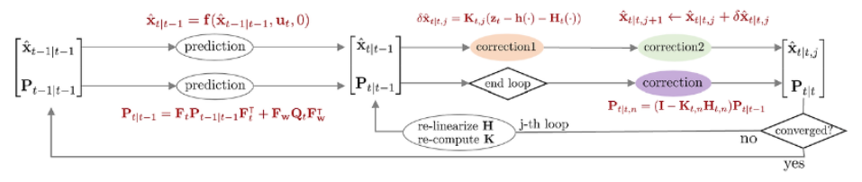

*(원문 p.23)*

Iterated extended kalman filter (IEKF)는 EKF에서 correction 스텝 부분을 반복적으로 수행하는
알고리즘이다. EKF는 비선형 함수를 선형화하여 상태 변수를 추정하기 때문에 선형화 과정에서 필연적으로
오차가 발생할 수 밖에 없다. IEKF는 이러한 선형화 오차를 줄이기 위해서 correction 스텝이 종료된 후
업데이트 변화량 $\delta\hat{\mathbf{x}}_{t|t,j}$이 충분히 크다면 다시 선형화를 수행하여 반복적으로
correction 스텝을 진행한다.

이 때, $\delta\mathbf{x}$는 문맥 상 에러 상태 변수가 아닌 업데이트 변화량으로 해석된다. 즉
$\hat{\mathbf{x}}_{t|t,j+1} \leftarrow \hat{\mathbf{x}}_{t|t,j} + \delta\hat{\mathbf{x}}_{t|t,j}$와 같이
$j$번째 posterior 값에 더해져서 $j+1$ 번째 posterior 값을 업데이트하는 용도로만 사용된다. 다시 말하면,
상태 추정의 대상이 아니다.

## 6.1 Compare to EKF

### 6.1.1 Commonality 1

IEKF에서 모션 모델과 관측 모델은 다음과 같다. 이는 EKF와 완전히 동일하다.

$$\begin{aligned}
\text{Motion Model:} \qquad & \mathbf{x}_t = \mathbf{f}(\mathbf{x}_{t-1}, \mathbf{u}_t, \mathbf{w}_t) \\
\text{Observation Model:} \qquad & \mathbf{z}_t = \mathbf{h}(\mathbf{x}_t, \mathbf{v}_t)
\end{aligned} \tag{63}$$

- $\mathbf{x}_t$: 모델의 상태 변수(state variable)
- $\mathbf{u}_t$: 모델의 입력(input)
- $\mathbf{z}_t$: 모델의 관측값(measurement)
- $\mathbf{f}(\cdot)$: 비선형 모션(motion) 모델 함수
- $\mathbf{h}(\cdot)$: 비선형 관측(observation) 모델 함수
- $\mathbf{w}_t \sim \mathcal{N}(0, \mathbf{Q}_t)$: 모션 모델의 노이즈. $\mathbf{Q}_t$는
  $\mathbf{w}_t$의 공분산 행렬을 의미
- $\mathbf{v}_t \sim \mathcal{N}(0, \mathbf{R}_t)$: 관측 모델의 노이즈. $\mathbf{R}_t$는
  $\mathbf{v}_t$의 공분산 행렬을 의미

### 6.1.2 Commonality 2

다음으로 선형화 과정도 EKF의 (34), (35)와 완전히 동일하다.

$$\boxed{\begin{aligned}
\mathbf{x}_t &= \mathbf{F}_t\mathbf{x}_{t-1} + \mathbf{f}(\hat{\mathbf{x}}_{t-1|t-1}, \mathbf{u}_t, 0) - \mathbf{F}_t\hat{\mathbf{x}}_{t-1|t-1} + \mathbf{F}_{\mathbf{w}}\mathbf{w}_t \\
&= \mathbf{F}_t\mathbf{x}_{t-1} + \tilde{\mathbf{u}}_t + \tilde{\mathbf{w}}_t
\end{aligned}} \tag{64}$$

- $\tilde{\mathbf{u}}_t = \mathbf{f}(\hat{\mathbf{x}}_{t-1|t-1}, \mathbf{u}_t, 0) - \mathbf{F}_t\hat{\mathbf{x}}_{t-1|t-1}$
- $\tilde{\mathbf{w}}_t = \mathbf{F}_{\mathbf{w}}\mathbf{w}_t \sim \mathcal{N}(0, \mathbf{F}_{\mathbf{w}}\mathbf{Q}_t\mathbf{F}_{\mathbf{w}}^{\intercal})$

$$\boxed{\begin{aligned}
\mathbf{z}_t &= \mathbf{H}_t\mathbf{x}_t + \mathbf{h}(\hat{\mathbf{x}}_{t|t-1}, 0) - \mathbf{H}_t\hat{\mathbf{x}}_{t|t-1} + \mathbf{H}_{\mathbf{v}}\mathbf{v}_t \\
&= \mathbf{H}_t\mathbf{x}_t + \tilde{\mathbf{z}}_t + \tilde{\mathbf{v}}_t
\end{aligned}} \tag{65}$$

- $\tilde{\mathbf{z}}_t = \mathbf{h}(\hat{\mathbf{x}}_{t|t-1}, 0) - \mathbf{H}_t\hat{\mathbf{x}}_{t|t-1}$
- $\tilde{\mathbf{v}}_t = \mathbf{H}_{\mathbf{v}}\mathbf{v}_t \sim \mathcal{N}(0, \mathbf{H}_{\mathbf{v}}\mathbf{R}_t\mathbf{H}_{\mathbf{v}}^{\intercal})$

### 6.1.3 Commonality 3

IEKF는 EKF와 동일하게 $\mathbf{F}, \mathbf{H}, \mathbf{K}$ 행렬이 true 상태 변수
$\mathbf{x}_{\mathrm{true}}$에 대한 행렬을 사용한다.

### 6.1.4 Difference 1

EKF: prediction 값으로부터 한 번에 correction 값이 나온다.
IEKF: correction 값이 다시 prediction 값이 되어 correction 스텝을 반복적으로 진행한다.

$$\boxed{\begin{aligned}
\text{EKF Correction : } \quad & \hat{\mathbf{x}}_{t|t-1} \to \hat{\mathbf{x}}_{t|t} \\
\text{IEKF Correction : } \quad & \hat{\mathbf{x}}_{t|t,j} \leftrightarrows \hat{\mathbf{x}}_{t|t,j+1}
\end{aligned}} \tag{66}$$

- $j$: j-th iteration

### 6.1.5 Difference 2

(65) 식을 전개하여 innovation term $\mathbf{r}_t$을 만들어보면 다음과 같다.

$$\mathbf{r}_t = \mathbf{z}_t - \mathbf{h}(\hat{\mathbf{x}}_{t|t-1}, 0) - \mathbf{H}_t(\mathbf{x}_t - \hat{\mathbf{x}}_{t|t-1}) \tag{67}$$

EKF의 경우 correction 스텝 (41)의 두 번째 줄을 보면 칼만 게인 $\mathbf{K}_t$에 $\mathbf{r}_t$가
곱해져서 posterior를 계산하는 것을 볼 수 있다.

$$\begin{aligned}
\text{EKF correction : } \quad \hat{\mathbf{x}}_{t|t} &= \hat{\mathbf{x}}_{t|t-1} + \mathbf{K}_t(\mathbf{r}_t) \\
&= \hat{\mathbf{x}}_{t|t-1} + \mathbf{K}_t(\mathbf{z}_t - \mathbf{h}(\hat{\mathbf{x}}_{t|t-1}, 0))
\end{aligned} \tag{68}$$

EKF: $\mathbf{H}_t(\mathbf{x}_t - \hat{\mathbf{x}}_{t|t-1})$ 부분은
$\mathbf{x}_t = \hat{\mathbf{x}}_{t|t-1}$이 대입되어 소거되고 나머지 부분만 사용된다.

IEKF: 매 순간 correction 스텝을 반복하면서 새로운 상태(new operating point)에 대한 선형화를 수행하기
때문에 해당 부분이 소거되지 않는다.

$$\boxed{\begin{aligned}
\text{EKF innovation term : } \quad & \mathbf{r}_t = \mathbf{z}_t - \mathbf{h}(\hat{\mathbf{x}}_{t|t-1}, 0) \\
\text{IEKF innovation term : } \quad & \mathbf{r}_{t,j} = \mathbf{z}_t - \mathbf{h}(\hat{\mathbf{x}}_{t|t,j}, 0) - \mathbf{H}_{t,j}(\hat{\mathbf{x}}_{t|t-1} - \hat{\mathbf{x}}_{t|t,j})
\end{aligned}} \tag{69}$$

만약 첫 번째 iteration $j = 0$의 경우 $\hat{\mathbf{x}}_{t|t,0} = \hat{\mathbf{x}}_{t|t-1}$이므로
소거되어 EKF와 동일한 식이 되지만 $j = 1$ 이상부터는 다른 값이 되므로 소거되지 않는다.

## 6.2 Prediction step

Prediction은 $\overline{\mathrm{bel}}(\mathbf{x}_t)$를 구하는 과정을 말한다. 공분산 행렬을 구할 때
선형화된 자코비안 행렬 $\mathbf{F}_t$가 사용된다. 이는 EKF의 prediction 스텝과 완전히 동일하다.

$$\boxed{\begin{aligned}
\hat{\mathbf{x}}_{t|t-1} &= \mathbf{f}(\hat{\mathbf{x}}_{t-1|t-1}, \mathbf{u}_t, 0) \\
\mathbf{P}_{t|t-1} &= \mathbf{F}_t\mathbf{P}_{t-1|t-1}\mathbf{F}_t^{\intercal} + \mathbf{F}_{\mathbf{w}}\mathbf{Q}_t\mathbf{F}_{\mathbf{w}}^{\intercal}
\end{aligned}} \tag{70}$$

## 6.3 Correction step

Correction은 $\mathrm{bel}(\mathbf{x}_t)$를 구하는 과정을 말한다. 칼만 게인과 공분산 행렬을 구할 때
선형화된 자코비안 행렬 $\mathbf{H}_t$가 사용된다. IEKF의 correction 스텝은 업데이트 변화량
$\delta\hat{\mathbf{x}}_{t|t,j}$가 충분히 작아질 때까지 반복적(iterative)으로 수행한다.

$$\boxed{\begin{aligned}
&\text{set } \epsilon \\
&\text{start j-th loop} \\
&\qquad \mathbf{K}_{t,j} = \mathbf{P}_{t|t-1}\mathbf{H}_{t,j}^{\intercal}(\mathbf{H}_{t,j}\mathbf{P}_{t|t-1}\mathbf{H}_{t,j}^{\intercal} + \mathbf{H}_{\mathbf{v},j}\mathbf{R}_t\mathbf{H}_{\mathbf{v},j}^{\intercal})^{-1} \\
&\qquad \delta\hat{\mathbf{x}}_{t|t,j} = \mathbf{K}_{t,j}(\mathbf{z}_t - \mathbf{h}(\hat{\mathbf{x}}_{t|t,j}, 0) - \mathbf{H}_t(\hat{\mathbf{x}}_{t|t-1} - \hat{\mathbf{x}}_{t|t,j})) \\
&\qquad \hat{\mathbf{x}}_{t|t,j+1} = \hat{\mathbf{x}}_{t|t,j} + \delta\hat{\mathbf{x}}_{t|t,j} \\
&\qquad \text{iterate until } \delta\hat{\mathbf{x}}_{t|t,j} < \epsilon. \\
&\text{end loop} \\
&\mathbf{P}_{t|t,n} = (\mathbf{I} - \mathbf{K}_{t,n}\mathbf{H}_{t,n})\mathbf{P}_{t|t-1}
\end{aligned}} \tag{71}$$

## 6.4 Summary

IEKF를 함수로 표현하면 다음과 같다.

$$\boxed{\begin{aligned}
&\mathrm{IteratedExtendedKalmanFilter}(\hat{\mathbf{x}}_{t-1|t-1}, \mathbf{P}_{t-1|t-1}, \mathbf{u}_t, \mathbf{z}_t)\{ \\
&\qquad \text{(Prediction Step)} \\
&\qquad \hat{\mathbf{x}}_{t|t-1} = \mathbf{f}_t(\hat{\mathbf{x}}_{t-1|t-1}, \mathbf{u}_t, 0) \\
&\qquad \mathbf{P}_{t|t-1} = \mathbf{F}_t\mathbf{P}_{t-1|t-1}\mathbf{F}_t^{\intercal} + \mathbf{F}_{\mathbf{w}}\mathbf{Q}_t\mathbf{F}_{\mathbf{w}}^{\intercal} \\
&\\
&\qquad \text{(Correction Step)} \\
&\qquad \text{set } \epsilon \\
&\qquad \text{start j-th loop} \\
&\qquad\qquad \mathbf{K}_{t,j} = \mathbf{P}_{t|t-1}\mathbf{H}_{t,j}^{\intercal}(\mathbf{H}_{t,j}\mathbf{P}_{t|t-1}\mathbf{H}_{t,j}^{\intercal} + \mathbf{H}_{\mathbf{v},j}\mathbf{R}_t\mathbf{H}_{\mathbf{v},j}^{\intercal})^{-1} \\
&\qquad\qquad \delta\hat{\mathbf{x}}_{t|t,j} = \mathbf{K}_{t,j}(\mathbf{z}_t - \mathbf{h}(\hat{\mathbf{x}}_{t|t,j}, 0) - \mathbf{H}_t(\hat{\mathbf{x}}_{t|t-1} - \hat{\mathbf{x}}_{t|t,j})) \\
&\qquad\qquad \hat{\mathbf{x}}_{t|t,j+1} = \hat{\mathbf{x}}_{t|t,j} + \delta\hat{\mathbf{x}}_{t|t,j} \\
&\qquad\qquad \text{iterate until } \delta\hat{\mathbf{x}}_{t|t,j} < \epsilon. \\
&\qquad \text{end loop} \\
&\qquad \mathbf{P}_{t|t,n} = (\mathbf{I} - \mathbf{K}_{t,n}\mathbf{H}_{t,n})\mathbf{P}_{t|t-1} \\
&\qquad \text{return } \ \hat{\mathbf{x}}_{t|t}, \mathbf{P}_{t|t} \\
&\}
\end{aligned}} \tag{72}$$

<!--widget:iekf-iteration-->

# 7 Iterated error-state kalman filter (IESKF)

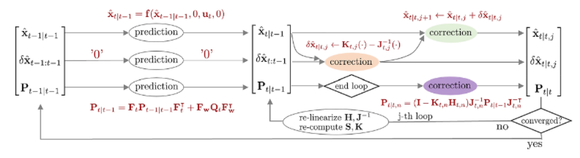

*(원문 p.26)*

IEKF가 correction 스텝에서 true 상태 변수 $\mathbf{x}_{\mathrm{true}}$를 반복적으로 추정한다면 IESKF는
에러 상태 변수 $\delta\mathbf{x}_t$를 반복적으로 추정하는 알고리즘이다. 두 상태 변수 사이의 관계는
다음과 같다.

$$\mathbf{x}_{\mathrm{true},t} = \mathbf{x}_t + \delta\mathbf{x}_t \tag{73}$$

- $\mathbf{x}_{\mathrm{true},t}$: 기존 KF, EKF에서 업데이트 된 $t$ 스텝의 true 상태변수
- $\mathbf{x}_t$: $t$ 스텝의 명목(nominal) 상태 변수. 에러가 없는 상태를 의미한다
- $\delta\mathbf{x}_t$: $t$ 스텝의 에러(error) 상태 변수

반복적(iterative)으로 값이 업데이트 되는 IESKF 과정에서 $\mathbf{x}_{\mathrm{true},t}$는 업데이트 된
이후 상태, nominal $\mathbf{x}_t$는 업데이트 되기 전 상태, 에러 상태 변수 $\delta\mathbf{x}_t$는
업데이트 변화량으로 해석하면 된다.

## 7.1 Compare to ESKF

### 7.1.1 Commonality 1

IESKF의 모션 모델과 관측 모델은 다음과 같다. 이는 ESKF와 완전히 동일하다.

$$\begin{aligned}
\text{Error-state Motion Model:} \qquad & \mathbf{x}_t + \delta\mathbf{x}_t = \mathbf{f}(\mathbf{x}_{t-1}, \delta\mathbf{x}_{t-1}, \mathbf{u}_t, \mathbf{w}_t) \\
\text{Error-state Observation Model:} \qquad & \mathbf{z}_t = \mathbf{h}(\mathbf{x}_t, \delta\mathbf{x}_t, \mathbf{v}_t)
\end{aligned} \tag{74}$$

- $\mathbf{x}_t$: 모델의 nominal 상태 변수
- $\delta\mathbf{x}_t$: 모델의 에러 상태 변수
- $\mathbf{u}_t$: 모델의 입력(input)
- $\mathbf{z}_t$: 모델의 관측값(measurement)
- $\mathbf{f}(\cdot)$: 비선형 모션(motion) 모델 함수
- $\mathbf{h}(\cdot)$: 비선형 관측(observation) 모델 함수
- $\mathbf{w}_t \sim \mathcal{N}(0, \mathbf{Q}_t)$: 에러 상태 모델의 노이즈. $\mathbf{Q}_t$는
  $\mathbf{w}_t$의 공분산 행렬을 의미
- $\mathbf{v}_t \sim \mathcal{N}(0, \mathbf{R}_t)$: 관측 모델의 노이즈. $\mathbf{R}_t$는
  $\mathbf{v}_t$의 공분산 행렬을 의미

### 7.1.2 Commonality 2

IESKF의 두 자코비안 $\mathbf{F}_t, \mathbf{H}_t$ 모두 true 상태 $\mathbf{x}_{\mathrm{true},t}$가 아닌
ESKF와 동일하게 에러 상태 $\delta\mathbf{x}_t$에 대한 자코비안을 의미한다.

$$\boxed{\mathbf{F}_t = \left.\frac{\partial \mathbf{f}}{\partial \delta\mathbf{x}_{t-1}}\right|_{\delta\mathbf{x}_{t-1} = \delta\hat{\mathbf{x}}_{t-1|t-1}} \qquad \mathbf{F}_{\mathbf{w}} = \left.\frac{\partial \mathbf{f}}{\partial \mathbf{w}_t}\right|_{\substack{\delta\mathbf{x}_{t-1} = \delta\hat{\mathbf{x}}_{t-1|t-1} \\ \mathbf{w}_t = 0}}} \tag{75}$$

$$\boxed{\mathbf{H}_t = \left.\frac{\partial \mathbf{h}}{\partial \delta\mathbf{x}_t}\right|_{\delta\mathbf{x}_t = \delta\hat{\mathbf{x}}_{t|t-1}} \qquad \mathbf{H}_{\mathbf{v}} = \left.\frac{\partial \mathbf{h}}{\partial \mathbf{v}_t}\right|_{\substack{\delta\mathbf{x}_t = \delta\hat{\mathbf{x}}_{t|t-1} \\ \mathbf{v}_t = 0}}} \tag{76}$$

$\mathbf{H}_t$는 다음과 같이 연쇄법칙을 통해 표현할 수 있다.

$$\mathbf{H}_t = \frac{\partial \mathbf{h}}{\partial \delta\mathbf{x}_t} = \frac{\partial \mathbf{h}}{\partial \mathbf{x}_{\mathrm{true},t}}\frac{\partial \mathbf{x}_{\mathrm{true},t}}{\partial \delta\mathbf{x}_t} \tag{77}$$

### 7.1.3 Commonality 3

선형화된 에러 상태 변수 $\hat{\mathbf{x}}_t$ 또한 ESKF와 동일하게 구할 수 있다.

$$\boxed{\begin{aligned}
\delta\mathbf{x}_t &= \mathbf{F}_t\delta\mathbf{x}_{t-1} + \mathbf{F}_{\mathbf{w}}\mathbf{w}_t \\
&= \mathbf{F}_t\delta\mathbf{x}_{t-1} + \tilde{\mathbf{w}}_t \\
&= 0 + \tilde{\mathbf{w}}_t
\end{aligned}} \tag{78}$$

- $\tilde{\mathbf{w}}_t = \mathbf{F}_{\mathbf{w}}\mathbf{w}_t \sim \mathcal{N}(0, \mathbf{F}_{\mathbf{w}}\mathbf{Q}_t\mathbf{F}_{\mathbf{w}}^{\intercal})$

### 7.1.4 Difference (MAP-based derivation)

**ESKF derivation:**

ESKF의 correction 스텝은 아래 수식을 전개하여 평균 $\delta\hat{\mathbf{x}}_{t|t}$와 공분산
$\mathbf{P}_{t|t}$를 유도한다.

$$\mathrm{bel}(\delta\mathbf{x}_t) = \eta \cdot p(\mathbf{z}_t \mid \delta\mathbf{x}_t)\overline{\mathrm{bel}}(\delta\mathbf{x}_t) \sim \mathcal{N}(\delta\hat{\mathbf{x}}_{t|t}, \mathbf{P}_{t|t}) \tag{79}$$

- $p(\mathbf{z}_t \mid \delta\mathbf{x}_t) \sim \mathcal{N}(\tilde{\mathbf{z}}_t, \mathbf{H}_{\mathbf{v}}\mathbf{R}_t\mathbf{H}_{\mathbf{v}}^{\intercal})$ : (54) 참조
- $\overline{\mathrm{bel}}(\delta\mathbf{x}_t) \sim \mathcal{N}(\delta\hat{\mathbf{x}}_{t|t-1}, \mathbf{P}_{t|t-1})$

$$\boxed{\begin{aligned}
\delta\hat{\mathbf{x}}_{t|t} &= \mathbf{K}_t(\mathbf{z}_t - \mathbf{h}(\hat{\mathbf{x}}_{t|t-1}, 0, 0)) \\
\mathbf{P}_{t|t} &= (\mathbf{I} - \mathbf{K}_t\mathbf{H}_t)\mathbf{P}_{t|t-1}
\end{aligned}} \tag{80}$$

**IESKF derivation:**

IESKF는 maximum a posteriori(MAP)을 사용하여 correction 스텝을 유도한다. 이 때, MAP 추정을 위해
Gauss-Newton 최적화 방식이 사용된다. 보다 자세한 내용은 섹션 9을 참조하면 된다. 해당 유도 과정은
[6][7][8][9][10][11] 을 참고하여 작성하였다. 이 중 [6]이 가장 자세하게 IESKF 유도 과정에 대해 설명하고
있다.

EKF를 MAP 방식으로 유도하면 최종적으로 아래와 같은 식을 최적화해야 한다.

$$\arg\min_{\mathbf{x}_t} \quad \|\mathbf{z}_t - \mathbf{h}(\mathbf{x}_{\mathrm{true},t}, 0)\|_{\mathbf{H}_{\mathbf{v}}\mathbf{R}^{-1}\mathbf{H}_{\mathbf{v}}^{\intercal}} + \|\mathbf{x}_{\mathrm{true},t} - \hat{\mathbf{x}}_{t|t-1}\|_{\mathbf{P}_{t|t-1}^{-1}} \tag{81}$$

위 식을 nominal 상태 $\mathbf{x}_t$와 에러 상태 $\delta\mathbf{x}_t$에 대한 식으로 표현하면 다음과 같다.

$$\arg\min_{\delta\hat{\mathbf{x}}_{t|t}} \quad \|\mathbf{z}_t - \mathbf{h}(\mathbf{x}_t, \delta\mathbf{x}_t, 0)\|_{\mathbf{H}_{\mathbf{v}}\mathbf{R}^{-1}\mathbf{H}_{\mathbf{v}}^{\intercal}} + \|\delta\hat{\mathbf{x}}_{t|t}\|_{\mathbf{P}_{t|t-1}^{-1}} \tag{82}$$

> **Tip**
>
> Prediction 에러 상태 변수 $\delta\hat{\mathbf{x}}_{t|t-1}$은 다음과 같이 정의한다.
>
> $$\begin{aligned} \delta\hat{\mathbf{x}}_{t|t-1} &= \mathbf{x}_{\mathrm{true},t} - \hat{\mathbf{x}}_{t|t-1} \\ &\sim \mathcal{N}(0, \mathbf{P}_{t|t-1}) \end{aligned} \tag{83}$$
>
> Posterior(=correction) 에러 상태 변수 $\delta\hat{\mathbf{x}}_{t|t}$는 다음과 같이 정의한다.
>
> $$\delta\hat{\mathbf{x}}_{t|t} = \mathbf{x}_{\mathrm{true},t|t} - \hat{\mathbf{x}}_{t|t} \tag{84}$$
>
> 위 식을 이항하면 아래 공식이 성립한다.
>
> $$\mathbf{x}_{\mathrm{true},t|t} = \hat{\mathbf{x}}_{t|t} + \delta\hat{\mathbf{x}}_{t|t} \tag{85}$$

(82)의 앞 부분은 (52) 선형화와 동일하게 진행하면 된다.

$$\mathbf{z}_t - \mathbf{h}(\hat{\mathbf{x}}_{t|t-1}, \delta\hat{\mathbf{x}}_{t|t-1}, 0) \approx \mathbf{z}_t - \mathbf{h}(\hat{\mathbf{x}}_{t|t-1}, 0, 0) - \mathbf{H}_t\delta\mathbf{x}_t \tag{86}$$

위 식에서 $\delta\mathbf{x}_t$는 ESKF에서는 항상 0이므로 제거하였으나 IESKF에서는 0이 아닌 값을 가지므로
제거하지 않는다. 다음으로 (82)의 뒷 부분에 (85)를 대입하면 아래와 같이 전개된다.

$$\begin{aligned}
\delta\hat{\mathbf{x}}_{t|t-1} &= \mathbf{x}_{\mathrm{true},t} - \hat{\mathbf{x}}_{t|t-1} \\
&= (\hat{\mathbf{x}}_{t|t} + \delta\hat{\mathbf{x}}_{t|t}) - \hat{\mathbf{x}}_{t|t-1} \\
&\approx \hat{\mathbf{x}}_{t|t} - \hat{\mathbf{x}}_{t|t-1} + \mathbf{J}_t\delta\hat{\mathbf{x}}_{t|t} \\
&\sim \mathcal{N}(0, \mathbf{P}_{t|t-1})
\end{aligned} \tag{87}$$

이 때, $\mathbf{J}_t$는 다음과 같이 정의된다.

$$\mathbf{J}_t = \left.\frac{\partial}{\partial \delta\hat{\mathbf{x}}_{t|t}}\left((\hat{\mathbf{x}}_{t|t} + \delta\hat{\mathbf{x}}_{t|t}) - \hat{\mathbf{x}}_{t|t-1}\right)\right|_{\delta\hat{\mathbf{x}}_{t|t} = 0} \tag{88}$$

(87)의 세 번째 줄과 네 번째 줄을 이항한 후 정리하면 아래와 같은 공식을 얻는다.

$$\delta\hat{\mathbf{x}}_{t|t} \sim \mathcal{N}(-\mathbf{J}_t^{-1}(\hat{\mathbf{x}}_{t|t} - \hat{\mathbf{x}}_{t|t-1}), \ \mathbf{J}_t^{-1}\mathbf{P}_{t|t-1}\mathbf{J}_t^{-\intercal}) \tag{89}$$

지금까지 계산한 (86), (87)를 (82)에 대입하면 아래와 같은 MAP 추정 문제가 된다.

$$\begin{aligned}
\arg\min_{\delta\hat{\mathbf{x}}_{t|t}} \quad & \|\mathbf{z}_t - \mathbf{h}(\hat{\mathbf{x}}_{t|t-1}, 0, 0) - \mathbf{H}_t\delta\hat{\mathbf{x}}_{t|t}\|_{\mathbf{H}_{\mathbf{v}}\mathbf{R}^{-1}\mathbf{H}_{\mathbf{v}}^{\intercal}} \\
& + \|\hat{\mathbf{x}}_{t|t} - \hat{\mathbf{x}}_{t|t-1} + \mathbf{J}_t\delta\hat{\mathbf{x}}_{t|t}\|_{\mathbf{P}_{t|t-1}^{-1}}
\end{aligned} \tag{90}$$

IESKF는 이를 반복적으로(iterative)하게 추정함으로써 에러 상태 변수 $\delta\hat{\mathbf{x}}_{t|t}$가
특정 값 $\epsilon$ 이하로 수렴할 때까지 반복한다. $j$번째 iteration에 대한 표현은 다음과 같다.

$$\boxed{\delta\hat{\mathbf{x}}_{t|t,j} \sim \mathcal{N}(-\mathbf{J}_{t,j}^{-1}(\hat{\mathbf{x}}_{t|t,j} - \hat{\mathbf{x}}_{t|t-1}), \ \mathbf{J}_{t,j}^{-1}\mathbf{P}_{t|t-1}\mathbf{J}_{t,j}^{-\intercal})} \tag{91}$$

$$\boxed{\begin{aligned}
\arg\min_{\delta\hat{\mathbf{x}}_{t|t,j}} \quad & \|\mathbf{z}_t - \mathbf{h}(\hat{\mathbf{x}}_{t|t-1}, 0, 0) - \mathbf{H}_t\delta\hat{\mathbf{x}}_{t|t,j}\|_{\mathbf{H}_{\mathbf{v}}\mathbf{R}^{-1}\mathbf{H}_{\mathbf{v}}^{\intercal}} \\
& + \|\hat{\mathbf{x}}_{t|t,j} - \hat{\mathbf{x}}_{t|t-1} + \mathbf{J}_{t,j}\delta\hat{\mathbf{x}}_{t|t,j}\|_{\mathbf{P}_{t|t-1}^{-1}}
\end{aligned}} \tag{92}$$

위 수식으로부터 업데이트 수식을 유도하는 과정은 섹션 10을 참조하면 된다.

## 7.2 Prediction step

Prediction은 $\overline{\mathrm{bel}}(\delta\mathbf{x}_t)$를 구하는 과정을 말한다. 공분산 행렬을 구할 때
선형화된 자코비안 행렬 $\mathbf{F}_t$가 사용된다. 이는 ESKF와 완전히 동일하다.

$$\boxed{\begin{aligned}
\delta\hat{\mathbf{x}}_{t|t-1} &= \mathbf{F}_t\delta\hat{\mathbf{x}}_{t-1|t-1} = 0 \quad \leftarrow \text{Always 0} \\
\hat{\mathbf{x}}_{t|t-1} &= \mathbf{f}(\hat{\mathbf{x}}_{t-1|t-1}, 0, \mathbf{u}_t, 0) \\
\mathbf{P}_{t|t-1} &= \mathbf{F}_t\mathbf{P}_{t-1|t-1}\mathbf{F}_t^{\intercal} + \mathbf{F}_{\mathbf{w}}\mathbf{Q}_t\mathbf{F}_{\mathbf{w}}^{\intercal}
\end{aligned}} \tag{93}$$

## 7.3 Correction step

Correction은 $\mathrm{bel}(\mathbf{x}_t)$를 구하는 과정을 말한다. 칼만 게인과 공분산 행렬을 구할 때
선형화된 자코비안 행렬 $\mathbf{H}_t$가 사용된다. IESKF의 correction 스텝은 업데이트 변화량
$\delta\hat{\mathbf{x}}_{t|t,j}$가 충분히 작아질 때까지 반복적(iterative)으로 수행한다. 앞서 유도한
(92)을 미분한 후 0으로 설정하여 풀면 아래와 같은 공식을 얻는다. 보다 자세한 유도 과정은 섹션 10을
참조하면 된다.

$$\boxed{\begin{aligned}
&\text{set } \epsilon \\
&\text{start j-th loop} \\
&\qquad \mathbf{S}_{t,j} = \mathbf{H}_{t,j}\mathbf{J}_{t,j}^{-1}\mathbf{P}_{t|t-1}\mathbf{J}_{t,j}^{-\intercal}\mathbf{H}_{t,j}^{\intercal} + \mathbf{H}_{\mathbf{v},j}\mathbf{R}_t\mathbf{H}_{\mathbf{v},j}^{\intercal} \\
&\qquad \mathbf{K}_{t,j} = \mathbf{J}_{t,j}^{-1}\mathbf{P}_{t|t-1}\mathbf{J}_{t,j}^{-\intercal}\mathbf{H}_{t,j}^{\intercal}\mathbf{S}_{t,j}^{-1} \\
&\qquad \delta\hat{\mathbf{x}}_{t|t,j} = \mathbf{K}_{t,j}\left(\mathbf{z}_t - \mathbf{h}(\hat{\mathbf{x}}_{t|t,j}, 0, 0) + \mathbf{H}_{t,j}\mathbf{J}_{t,j}^{-1}(\hat{\mathbf{x}}_{t|t,j} - \hat{\mathbf{x}}_{t|t-1})\right) - \mathbf{J}_{t,j}^{-1}(\hat{\mathbf{x}}_{t|t,j} - \hat{\mathbf{x}}_{t|t-1}) \\
&\qquad \hat{\mathbf{x}}_{t|t,j+1} = \hat{\mathbf{x}}_{t|t,j} \boxplus \delta\hat{\mathbf{x}}_{t|t,j} \\
&\qquad \text{iterate until } \delta\hat{\mathbf{x}}_{t|t,j} < \epsilon. \\
&\text{end loop} \\
&\mathbf{P}_{t|t,n} = (\mathbf{I} - \mathbf{K}_{t,n}\mathbf{H}_{t,n})\mathbf{J}_{t,n}^{-1}\mathbf{P}_{t|t-1}\mathbf{J}_{t,n}^{-\intercal}
\end{aligned}} \tag{94}$$

## 7.4 Summary

IESKF를 함수로 표현하면 다음과 같다.

$$\boxed{\begin{aligned}
&\mathrm{IteratedErrorStateKalmanFilter}(\hat{\mathbf{x}}_{t-1|t-1}, \delta\hat{\mathbf{x}}_{t-1|t-1}, \mathbf{P}_{t-1|t-1}, \mathbf{u}_t, \mathbf{z}_t)\{ \\
&\qquad \text{(Prediction Step)} \\
&\qquad \delta\hat{\mathbf{x}}_{t|t-1} = \mathbf{F}_t\hat{\mathbf{x}}_{t-1|t-1} = 0 \quad \leftarrow \text{Always 0} \\
&\qquad \hat{\mathbf{x}}_{t|t-1} = \mathbf{f}(\hat{\mathbf{x}}_{t-1|t-1}, 0, \mathbf{u}_t, 0) \\
&\qquad \mathbf{P}_{t|t-1} = \mathbf{F}_t\mathbf{P}_{t-1|t-1}\mathbf{F}_t^{\intercal} + \mathbf{F}_{\mathbf{w}}\mathbf{Q}_t\mathbf{F}_{\mathbf{w}}^{\intercal} \\
&\\
&\qquad \text{(Correction Step)} \\
&\qquad \text{set } \epsilon \\
&\qquad \text{start j-th loop} \\
&\qquad\qquad \mathbf{S}_{t,j} = \mathbf{H}_{t,j}\mathbf{J}_{t,j}^{-1}\mathbf{P}_{t|t-1}\mathbf{J}_{t,j}^{-\intercal}\mathbf{H}_{t,j}^{\intercal} + \mathbf{H}_{\mathbf{v},j}\mathbf{R}_t\mathbf{H}_{\mathbf{v},j}^{\intercal} \\
&\qquad\qquad \mathbf{K}_{t,j} = \mathbf{J}_{t,j}^{-1}\mathbf{P}_{t|t-1}\mathbf{J}_{t,j}^{-\intercal}\mathbf{H}_{t,j}^{\intercal}\mathbf{S}_{t,j}^{-1} \\
&\qquad\qquad \delta\hat{\mathbf{x}}_{t|t,j} = \mathbf{K}_{t,j}\left(\mathbf{z}_t - \mathbf{h}(\hat{\mathbf{x}}_{t|t,j}, 0, 0) + \mathbf{H}_{t,j}\mathbf{J}_{t,j}^{-1}(\hat{\mathbf{x}}_{t|t,j} - \hat{\mathbf{x}}_{t|t-1})\right) - \mathbf{J}_{t,j}^{-1}(\hat{\mathbf{x}}_{t|t,j} - \hat{\mathbf{x}}_{t|t-1}) \\
&\qquad\qquad \hat{\mathbf{x}}_{t|t,j+1} = \hat{\mathbf{x}}_{t|t,j} \boxplus \delta\hat{\mathbf{x}}_{t|t,j} \\
&\qquad\qquad \text{iterate until } \delta\hat{\mathbf{x}}_{t|t,j} < \epsilon. \\
&\qquad \text{end loop} \\
&\qquad \mathbf{P}_{t|t,n} = (\mathbf{I} - \mathbf{K}_{t,n}\mathbf{H}_{t,n})\mathbf{J}_{t,n}^{-1}\mathbf{P}_{t|t-1}\mathbf{J}_{t,n}^{-\intercal} \\
&\qquad \text{return } \ \hat{\mathbf{x}}_{t|t}, \mathbf{P}_{t|t} \\
&\}
\end{aligned}} \tag{95}$$

<!--widget:ieskf-->

# 8 Derivation of Kalman filter

본 섹션에서는 칼만 필터의 prediction 스텝과 update 스텝의 수식 유도 과정에 대해 설명한다. 대부분의
내용은 [13]의 3.2.4 "Mathematical Derivation of the KF" 섹션을 참조하여 작성하였다.

칼만 필터는 $\mathrm{bel}(\mathbf{x}_t), \overline{\mathrm{bel}}(\mathbf{x}_t)$가 모두 가우시안 분포를
따른다고 가정하므로 각각 평균 $\hat{\mathbf{x}}_t$와 공분산 $\mathbf{P}$를 구할 수 있다.

$$\begin{aligned}
\overline{\mathrm{bel}}(\mathbf{x}_t) &= \int p(\mathbf{x}_t \mid \mathbf{x}_{t-1}, \mathbf{u}_t)\mathrm{bel}(\mathbf{x}_{t-1})d\mathbf{x}_{t-1} \sim \mathcal{N}(\hat{\mathbf{x}}_{t|t-1}, \mathbf{P}_{t|t-1}) \\
\mathrm{bel}(\mathbf{x}_t) &= \eta \cdot p(\mathbf{z}_t \mid \mathbf{x}_t)\overline{\mathrm{bel}}(\mathbf{x}_t) \sim \mathcal{N}(\hat{\mathbf{x}}_{t|t}, \mathbf{P}_{t|t})
\end{aligned} \tag{96}$$

(16)의 모션 모델과 관측 모델로부터
$p(\mathbf{x}_t \mid \mathbf{x}_{t-1}, \mathbf{u}_t), p(\mathbf{z}_t \mid \mathbf{x}_t)$ 는 (17), (18)
같이 나타낼 수 있음을 보였다.

$$\begin{aligned}
p(\mathbf{x}_t \mid \mathbf{x}_{t-1}, \mathbf{u}_t) \quad &\sim \mathcal{N}(\mathbf{F}_t\mathbf{x}_{t-1} + \mathbf{B}_t\mathbf{u}_t, \mathbf{Q}_t) \\
&= \frac{1}{\sqrt{\det(2\pi\mathbf{Q}_t)}} \exp\left(-\frac{1}{2}(\mathbf{x}_t - \mathbf{F}_t\mathbf{x}_{t-1} - \mathbf{B}_t\mathbf{u}_t)^{\intercal}\mathbf{Q}_t^{-1}(\mathbf{x}_t - \mathbf{F}_t\mathbf{x}_{t-1} - \mathbf{B}_t\mathbf{u}_t)\right)
\end{aligned} \tag{97}$$

$$\begin{aligned}
p(\mathbf{z}_t \mid \mathbf{x}_t) \quad &\sim \mathcal{N}(\mathbf{H}_t\mathbf{x}_t, \mathbf{R}_t) \\
&= \frac{1}{\sqrt{\det(2\pi\mathbf{R}_t)}} \exp\left(-\frac{1}{2}(\mathbf{z}_t - \mathbf{H}_t\mathbf{x}_t)^{\intercal}\mathbf{R}_t^{-1}(\mathbf{z}_t - \mathbf{H}_t\mathbf{x}_t)\right)
\end{aligned} \tag{98}$$

## 8.1 Derivation of KF prediction step

먼저 $\overline{\mathrm{bel}}(\mathbf{x}_t)$ 수식을 유도해보자. $\overline{\mathrm{bel}}(\mathbf{x}_t)$에서
구하고자 하는 평균과 분산은 다음과 같다.

$$\underbrace{\overline{\mathrm{bel}}(\mathbf{x}_t)}_{\sim\mathcal{N}(\hat{\mathbf{x}}_{t|t-1}, \mathbf{P}_{t|t-1})} = \int \underbrace{p(\mathbf{x}_t \mid \mathbf{x}_{t-1}, \mathbf{u}_t)}_{\sim\mathcal{N}(\mathbf{F}_t\mathbf{x}_{t-1} + \mathbf{B}_t\mathbf{u}_t, \mathbf{R}_t)} \ \underbrace{\mathrm{bel}(\mathbf{x}_{t-1})}_{\sim\mathcal{N}(\hat{\mathbf{x}}_{t-1}, \mathbf{P}_{t-1})} \ d\mathbf{x}_{t-1} \tag{99}$$

위 식을 가우시안 분포 형태로 펼쳐보면 다음과 같다.

$$\begin{aligned}
\overline{\mathrm{bel}}(\mathbf{x}_t) = \eta \int &\exp\left(-\frac{1}{2}(\mathbf{x}_t - \mathbf{F}_t\mathbf{x}_{t-1} - \mathbf{B}_t\mathbf{u}_t)^{\intercal}\mathbf{R}_t^{-1}(\mathbf{x}_t - \mathbf{F}_t\mathbf{x}_{t-1} - \mathbf{B}_t\mathbf{u}_t)\right) \\
&\cdot \exp\left(-\frac{1}{2}(\mathbf{x}_{t-1} - \hat{\mathbf{x}}_{t-1})^{\intercal}\mathbf{P}_{t-1}^{-1}(\mathbf{x}_{t-1} - \hat{\mathbf{x}}_{t-1})\right) d\mathbf{x}_{t-1}
\end{aligned} \tag{100}$$

위 식은 다음과 같이 더 간단하게 치환할 수 있다.

$$\overline{\mathrm{bel}}(\mathbf{x}_t) = \eta \int \exp(-\mathbf{L}_t)d\mathbf{x}_{t-1} \tag{101}$$

$$\boxed{\begin{aligned}
\text{where, } \mathbf{L}_t = \ &\frac{1}{2}(\mathbf{x}_t - \mathbf{F}_t\mathbf{x}_{t-1} - \mathbf{B}_t\mathbf{u}_t)^{\intercal}\mathbf{R}_t^{-1}(\mathbf{x}_t - \mathbf{F}_t\mathbf{x}_{t-1} - \mathbf{B}_t\mathbf{u}_t) \\
&+ \frac{1}{2}(\mathbf{x}_{t-1} - \hat{\mathbf{x}}_{t-1})^{\intercal}\mathbf{P}_{t-1}^{-1}(\mathbf{x}_{t-1} - \hat{\mathbf{x}}_{t-1})
\end{aligned}} \tag{102}$$

$\mathbf{L}_t$를 자세히 살펴보면 $\mathbf{x}_t, \mathbf{x}_{t-1}$에 대한 2차식 형태(=quadratic)를 가짐을
알 수 있다. $\overline{\mathrm{bel}}(\mathbf{x}_t)$는 적분 $\int$ 연산을 포함하고 있으므로 적분
연산에서 closed form 솔루션을 얻으려면 $\mathbf{L}_t$를 적분 밖으로 빼는 작업이 필요하다. 이를 위해
$\mathbf{L}_t$를 $\mathbf{L}_t(\mathbf{x}_{t-1}, \mathbf{x}_t)$와 $\mathbf{L}_t(\mathbf{x}_t)$ 항으로
분리한다.

$$\mathbf{L}_t = \mathbf{L}_t(\mathbf{x}_{t-1}, \mathbf{x}_t) + \mathbf{L}_t(\mathbf{x}_t) \tag{103}$$

$\mathbf{L}_t(\mathbf{x}_{t-1}, \mathbf{x}_t)$는 $\mathbf{x}_{t-1}$ 항이 포함되어 있는 항들을 전부
포함하며 $\mathbf{L}_t(\mathbf{x}_t)$는 오직 $\mathbf{x}_t$만 있는 항을 포함한다. 이를 통해
$\mathbf{L}_t(\mathbf{x}_t)$는 $\mathbf{x}_{t-1}$에 독립이 되어 적분 $\int$ 기호 밖으로 빼낼 수 있다.

$$\begin{aligned}
\overline{\mathrm{bel}}(\mathbf{x}_t) &= \eta \int \exp(-\mathbf{L}_t)d\mathbf{x}_{t-1} \\
&= \eta \int \exp(-\mathbf{L}_t(\mathbf{x}_{t-1}, \mathbf{x}_t) - \mathbf{L}_t(\mathbf{x}_t))d\mathbf{x}_{t-1} \\
&= \eta \exp(-\mathbf{L}_t(\mathbf{x}_t)) \int \exp(-\mathbf{L}_t(\mathbf{x}_{t-1}, \mathbf{x}_t))d\mathbf{x}_{t-1}
\end{aligned} \tag{104}$$

다음으로 $\mathbf{L}_t(\mathbf{x}_{t-1}, \mathbf{x}_t)$를 $\mathbf{x}_t$에 대해 독립이 되도록 설정하여
적분 내부의 값이 상수(=constant)가 되도록 해야한다. $\mathbf{x}_t$에 독립인
$\mathbf{L}_t(\mathbf{x}_{t-1}, \mathbf{x}_t)$을 분해(decompose)하기 위해 우선 $\mathbf{L}_t$를
$\mathbf{x}_{t-1}$에 대해 편미분을 수행한다.

$$\frac{\partial \mathbf{L}_t}{\partial \mathbf{x}_{t-1}} = -\mathbf{F}_t^{\intercal}\mathbf{R}_t^{-1}(\mathbf{x}_t - \mathbf{F}_t\mathbf{x}_{t-1} - \mathbf{B}_t\mathbf{u}_t) + \mathbf{P}_{t-1}^{-1}(\mathbf{x}_{t-1} - \hat{\mathbf{x}}_{t-1}) \tag{105}$$

$$\frac{\partial^2 \mathbf{L}_t}{\partial \mathbf{x}_{t-1}^2} = \mathbf{F}_t^{\intercal}\mathbf{R}_t^{-1}\mathbf{F}_t + \mathbf{P}_{t-1}^{-1} := \Psi_t^{-1} \tag{106}$$

- $\Psi_t^{-1}$ : $\mathbf{L}_t$의 곡률(curvature)을 의미하며 공분산의 역행렬을 의미한다.

(102)에서 보다시피 $\mathbf{L}_t$는 이차식(quadratic) 형태이며 공분산 행렬에 의해 Positive
semi-definite을 만족하므로 $\mathbf{x}_{t-1}$로 1차 편미분 후 0이 되는 값은 $\mathbf{x}_{t-1}$에 대한
평균, 2차 편미분 값은 $\mathbf{x}_{t-1}$에 대한 공분산의 역행렬이 된다.

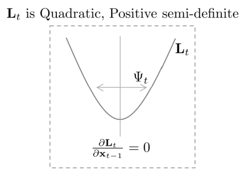

*(원문 p.32)*

우선 1차 편미분한 (105)을 0으로 설정한 후 정리하면 다음과 같다.

$$\mathbf{F}_t^{\intercal}\mathbf{R}_t^{-1}(\mathbf{x}_t - \mathbf{F}_t\mathbf{x}_{t-1} - \mathbf{B}_t\mathbf{u}_t) = \mathbf{P}_{t-1}^{-1}(\mathbf{x}_{t-1} - \hat{\mathbf{x}}_{t-1}) \tag{107}$$

위 식을 $\mathbf{x}_{t-1}$에 대해 정리하면 다음과 같다.

$$\begin{aligned}
&\Leftrightarrow \mathbf{F}_t^{\intercal}\mathbf{R}_t^{-1}(\mathbf{x}_t - \mathbf{B}_t\mathbf{u}_t) - \mathbf{F}_t^{\intercal}\mathbf{R}_t^{-1}\mathbf{F}_t\mathbf{x}_{t-1} = \mathbf{P}_{t-1}^{-1}\mathbf{x}_{t-1} - \mathbf{P}_{t-1}^{-1}\hat{\mathbf{x}}_{t-1} \\
&\Leftrightarrow \mathbf{F}_t^{\intercal}\mathbf{R}_t^{-1}\mathbf{F}_t\mathbf{x}_{t-1} + \mathbf{P}_{t-1}^{-1}\mathbf{x}_{t-1} = \mathbf{F}_t^{\intercal}\mathbf{R}_t^{-1}(\mathbf{x}_t - \mathbf{B}_t\mathbf{u}_t) + \mathbf{P}_{t-1}^{-1}\hat{\mathbf{x}}_{t-1} \\
&\Leftrightarrow (\mathbf{F}_t^{\intercal}\mathbf{R}_t^{-1}\mathbf{F}_t + \mathbf{P}_{t-1}^{-1})\mathbf{x}_{t-1} = \mathbf{F}_t^{\intercal}\mathbf{R}_t^{-1}(\mathbf{x}_t - \mathbf{B}_t\mathbf{u}_t) + \mathbf{P}_{t-1}^{-1}\hat{\mathbf{x}}_{t-1} \\
&\Leftrightarrow \Psi_t^{-1}\mathbf{x}_{t-1} = \mathbf{F}_t^{\intercal}\mathbf{R}_t^{-1}(\mathbf{x}_t - \mathbf{B}_t\mathbf{u}_t) + \mathbf{P}_{t-1}^{-1}\hat{\mathbf{x}}_{t-1} \\
&\Leftrightarrow \mathbf{x}_{t-1} = \Psi_t[\mathbf{F}_t^{\intercal}\mathbf{R}_t^{-1}(\mathbf{x}_t - \mathbf{B}_t\mathbf{u}_t) + \mathbf{P}_{t-1}^{-1}\hat{\mathbf{x}}_{t-1}]
\end{aligned} \tag{108}$$

지금까지 구한 $\mathbf{x}_{t-1}$을 통해 $\mathbf{L}_t$에서
$\mathbf{L}_t(\mathbf{x}_{t-1}, \mathbf{x}_t)$을 다음과 같이 2차식 형태로 분해(decompose)할 수 있다.

$$\boxed{\begin{aligned}
\mathbf{L}_t(\mathbf{x}_{t-1}, \mathbf{x}_t) = \ &\frac{1}{2}(\mathbf{x}_{t-1} - \Psi_t[\mathbf{F}_t^{\intercal}\mathbf{R}_t^{-1}(\mathbf{x}_t - \mathbf{B}_t\mathbf{u}_t) + \mathbf{P}_{t-1}^{-1}\hat{\mathbf{x}}_{t-1}])^{\intercal}\Psi^{-1} \\
&(\mathbf{x}_{t-1} - \Psi_t[\mathbf{F}_t^{\intercal}\mathbf{R}_t^{-1}(\mathbf{x}_t - \mathbf{B}_t\mathbf{u}_t) + \mathbf{P}_{t-1}^{-1}\hat{\mathbf{x}}_{t-1}])
\end{aligned}} \tag{109}$$

이는 $\mathbf{L}_t(\mathbf{x}_{t-1}, \mathbf{x}_t)$ 부분만을 분해(decompose)한 것으로 유일한 해는 아님에
유의한다. $\mathbf{L}_t(\mathbf{x}_{t-1}, \mathbf{x}_t)$을 $\exp(\cdot)$ 내부에 넣으면 다음과 같이
가우시안 분포 형태로 정의할 수 있다.

$$\det(2\pi\Psi)^{-\frac{1}{2}}\exp(-\mathbf{L}_t(\mathbf{x}_{t-1}, \mathbf{x}_t)) \tag{110}$$

가우시안 분포이므로 모든 영역에 대한 넓이의 합은 1이 된다.

$$\int \det(2\pi\Psi)^{-\frac{1}{2}}\exp(-\mathbf{L}_t(\mathbf{x}_{t-1}, \mathbf{x}_t))d\mathbf{x}_{t-1} = 1 \tag{111}$$

위 식을 정리하면 다음과 같다.

$$\int \exp(-\mathbf{L}_t(\mathbf{x}_{t-1}, \mathbf{x}_t))d\mathbf{x}_{t-1} = \det(2\pi\Psi)^{\frac{1}{2}} \tag{112}$$

위 식을 통해 앞서 설명했던 (104)에서 적분 항이 상수(constant)가 되는 것을 확인할 수 있다.

$$\begin{aligned}
\overline{\mathrm{bel}}(\mathbf{x}_t) &= \eta \int \exp(-\mathbf{L}_t)d\mathbf{x}_{t-1} \\
&= \eta \int \exp(-\mathbf{L}_t(\mathbf{x}_{t-1}, \mathbf{x}_t) - \mathbf{L}_t(\mathbf{x}_t))d\mathbf{x}_{t-1} \\
&= \eta \exp(-\mathbf{L}_t(\mathbf{x}_t))\int \exp(-\mathbf{L}_t(\mathbf{x}_{t-1}, \mathbf{x}_t))d\mathbf{x}_{t-1} \\
&= \eta' \exp(-\mathbf{L}_t(\mathbf{x}_t))
\end{aligned} \tag{113}$$

$\overline{\mathrm{bel}}(\mathbf{x}_t)$ 식이 한결 간결해졌지만 아직 정확한 $\mathbf{L}_t(\mathbf{x}_t)$
수식의 유도가 필요하다. $\mathbf{L}_t(\mathbf{x}_t)$는 다음과 같이 전체 $\mathbf{L}_t$에서 분해된 값을
빼줌으로써 구할 수 있다.

$$\begin{aligned}
\mathbf{L}_t(\mathbf{x}_t) &= \mathbf{L}_t - \mathbf{L}_t(\mathbf{x}_{t-1}, \mathbf{x}_t) \\
&= \frac{1}{2}(\mathbf{x}_t - \mathbf{F}_t\mathbf{x}_{t-1} - \mathbf{B}_t\mathbf{u}_t)^{\intercal}\mathbf{R}_t^{-1}(\mathbf{x}_t - \mathbf{F}_t\mathbf{x}_{t-1} - \mathbf{B}_t\mathbf{u}_t) \\
&\quad + \frac{1}{2}(\mathbf{x}_{t-1} - \hat{\mathbf{x}}_{t-1})^{\intercal}\mathbf{P}_{t-1}^{-1}(\mathbf{x}_{t-1} - \hat{\mathbf{x}}_{t-1}) \\
&\quad - \frac{1}{2}(\mathbf{x}_{t-1} - \Psi_t[\mathbf{F}_t^{\intercal}\mathbf{R}_t^{-1}(\mathbf{x}_t - \mathbf{B}_t\mathbf{u}_t) + \mathbf{P}_{t-1}^{-1}\hat{\mathbf{x}}_{t-1}])^{\intercal}\Psi^{-1} \\
&\qquad (\mathbf{x}_{t-1} - \Psi_t[\mathbf{F}_t^{\intercal}\mathbf{R}_t^{-1}(\mathbf{x}_t - \mathbf{B}_t\mathbf{u}_t) + \mathbf{P}_{t-1}^{-1}\hat{\mathbf{x}}_{t-1}])
\end{aligned} \tag{114}$$

$\mathbf{L}_t(\mathbf{x}_t)$의 정확한 수식을 얻기 위해 식을 전개하면 다음과 같다. 이 때
$\Psi = (\mathbf{F}_t^{\intercal}\mathbf{R}_t^{-1}\mathbf{F}_t + \mathbf{P}_{t-1}^{-1})^{-1}$을 적용하여
치환했던 기호를 복원하였다.

$$\begin{aligned}
\mathbf{L}_t(\mathbf{x}_t) &= \mathbf{L}_t - \mathbf{L}_t(\mathbf{x}_{t-1}, \mathbf{x}_t) \\
&= \underline{\underline{\frac{1}{2}\mathbf{x}_{t-1}^{\intercal}\mathbf{F}_t^{\intercal}\mathbf{R}_t^{-1}\mathbf{F}_t\mathbf{x}_{t-1}}} - \underline{\mathbf{x}_{t-1}^{\intercal}\mathbf{F}_t^{\intercal}\mathbf{R}_t^{-1}(\mathbf{x}_t - \mathbf{B}_t\mathbf{u}_t)} \\
&\quad + \frac{1}{2}(\mathbf{x}_t - \mathbf{B}_t\mathbf{u}_t)^{\intercal}\mathbf{R}_t^{-1}(\mathbf{x}_t - \mathbf{B}_t\mathbf{u}_t) \\
&\quad + \underline{\underline{\frac{1}{2}\mathbf{x}_{t-1}^{\intercal}\mathbf{P}_{t-1}^{-1}\mathbf{x}_{t-1}}} - \underline{\mathbf{x}_{t-1}^{\intercal}\mathbf{P}_{t-1}^{-1}\hat{\mathbf{x}}_{t-1}} + \frac{1}{2}\hat{\mathbf{x}}_{t-1}^{\intercal}\mathbf{P}_{t-1}^{-1}\hat{\mathbf{x}}_{t-1} \\
&\quad - \underline{\underline{\frac{1}{2}\mathbf{x}_{t-1}^{\intercal}(\mathbf{F}_t^{\intercal}\mathbf{R}_t^{-1}\mathbf{F}_t + \mathbf{P}_{t-1}^{-1})\mathbf{x}_{t-1}}} \\
&\quad + \underline{\mathbf{x}_{t-1}^{\intercal}[\mathbf{F}_t^{\intercal}\mathbf{R}_t^{-1}(\mathbf{x}_t - \mathbf{B}_t\mathbf{u}_t) + \mathbf{P}_{t-1}^{-1}\hat{\mathbf{x}}_{t-1}]} \\
&\quad - \frac{1}{2}[\mathbf{F}_t^{\intercal}\mathbf{R}_t^{-1}(\mathbf{x}_t - \mathbf{B}_t\mathbf{u}_t) + \mathbf{P}_{t-1}^{-1}\hat{\mathbf{x}}_{t-1}]^{\intercal}(\mathbf{F}_t^{\intercal}\mathbf{R}_t^{-1}\mathbf{F}_t + \mathbf{P}_{t-1}^{-1})^{-1} \\
&\qquad [\mathbf{F}_t^{\intercal}\mathbf{R}_t^{-1}(\mathbf{x}_t - \mathbf{B}_t\mathbf{u}_t) + \mathbf{P}_{t-1}^{-1}\hat{\mathbf{x}}_{t-1}]
\end{aligned} \tag{115}$$

- $\underline{\underline{(\cdot)}}$ : $\mathbf{x}_{t-1}$의 2차식
- $\underline{(\cdot)}$ : $\mathbf{x}_{t-1}$의 1차식

위 식을 자세히 살펴보면 $\mathbf{x}_{t-1}$ 관련 2차식과 1차식이 서로 소거되어 제거되는 것을 알 수 있다.
이는 $\mathbf{L}_t$에서 $\mathbf{x}_{t-1}$ 성분만을 추출한
$\mathbf{L}_t(\mathbf{x}_{t-1}, \mathbf{x}_t)$를 제외해줬으므로 당연한 결과라고 할 수 있다. 소거된 항을
제거하면 $\mathbf{L}_t(\mathbf{x}_t)$을 얻을 수 있다.

$$\boxed{\begin{aligned}
\mathbf{L}_t(\mathbf{x}_t) = \ &\frac{1}{2}(\mathbf{x}_t - \mathbf{B}_t\mathbf{u}_t)^{\intercal}\mathbf{R}_t^{-1}(\mathbf{x}_t - \mathbf{B}_t\mathbf{u}_t) + \frac{1}{2}\hat{\mathbf{x}}_{t-1}^{\intercal}\mathbf{P}_{t-1}^{-1}\hat{\mathbf{x}}_{t-1} \\
&- \frac{1}{2}[\mathbf{F}_t^{\intercal}\mathbf{R}_t^{-1}(\mathbf{x}_t - \mathbf{B}_t\mathbf{u}_t) + \mathbf{P}_{t-1}^{-1}\hat{\mathbf{x}}_{t-1}]^{\intercal}(\mathbf{F}_t^{\intercal}\mathbf{R}_t^{-1}\mathbf{F}_t + \mathbf{P}_{t-1}^{-1})^{-1} \\
&[\mathbf{F}_t^{\intercal}\mathbf{R}_t^{-1}(\mathbf{x}_t - \mathbf{B}_t\mathbf{u}_t) + \mathbf{P}_{t-1}^{-1}\hat{\mathbf{x}}_{t-1}]
\end{aligned}} \tag{116}$$

$\overline{\mathrm{bel}}(\mathbf{x}_t)$는 정규분포를 따르기 때문에 $\mathbf{L}_t(\mathbf{x}_t)$ 또한
정규분포를 가지는 2차식 형태(quadratic)으로 나타낼 수 있다. 이전에 수행했던
$\mathbf{L}_t(\mathbf{x}_{t-1}, \mathbf{x}_t)$와 마찬가지로 $\mathbf{L}_t(\mathbf{x}_t)$를 편미분하여
평균과 공분산을 구한다.

우선 1차 편미분을 통해 $\mathbf{x}_t$에 대한 평균을 구한다. 이 때, matrix inversion lemma를 사용하여
식을 간결하게 변형시킨다.

$$\begin{aligned}
\frac{\partial \mathbf{L}_t(\mathbf{x}_t)}{\partial \mathbf{x}_t} &= \mathbf{R}_t^{-1}(\mathbf{x}_t - \mathbf{B}_t\mathbf{u}_t) - \mathbf{R}_t^{-1}\mathbf{F}_t(\mathbf{F}_t^{\intercal}\mathbf{R}_t^{-1}\mathbf{F}_t + \mathbf{P}_{t-1}^{-1})^{-1}[\mathbf{F}_t^{\intercal}\mathbf{R}_t^{-1}(\mathbf{x}_t - \mathbf{B}_t\mathbf{u}_t) + \mathbf{P}_{t-1}^{-1}\hat{\mathbf{x}}_{t-1}] \\
&= [\mathbf{R}_t^{-1} - \mathbf{R}_t^{-1}\mathbf{F}_t(\mathbf{F}_t^{\intercal}\mathbf{R}_t^{-1}\mathbf{F}_t + \mathbf{P}_{t-1}^{-1})^{-1}\mathbf{F}_t^{\intercal}\mathbf{R}_t^{-1}](\mathbf{x}_t - \mathbf{B}_t\mathbf{u}_t) - \mathbf{R}_t^{-1}\mathbf{F}_t(\mathbf{F}_t^{\intercal}\mathbf{R}_t^{-1}\mathbf{F}_t + \mathbf{P}_{t-1}^{-1})^{-1}\mathbf{P}_{t-1}^{-1}\hat{\mathbf{x}}_{t-1} \\
&= (\mathbf{R}_t + \mathbf{F}_t\mathbf{P}_{t-1}\mathbf{F}_t^{\intercal})^{-1}(\mathbf{x}_t - \mathbf{B}_t\mathbf{u}_t) - \mathbf{R}_t^{-1}\mathbf{F}_t(\mathbf{F}_t^{\intercal}\mathbf{R}_t^{-1}\mathbf{F}_t + \mathbf{P}_{t-1}^{-1})^{-1}\mathbf{P}_{t-1}^{-1}\hat{\mathbf{x}}_{t-1}
\end{aligned} \tag{117}$$

$\frac{\partial \mathbf{L}_t(\mathbf{x}_t)}{\partial \mathbf{x}_t} = 0$으로 설정하여 평균을 구한다.

$$(\mathbf{R}_t + \mathbf{F}_t\mathbf{P}_{t-1}\mathbf{F}_t^{\intercal})^{-1}(\mathbf{x}_t - \mathbf{B}_t\mathbf{u}_t) = \mathbf{R}_t^{-1}\mathbf{F}_t(\mathbf{F}_t^{\intercal}\mathbf{R}_t^{-1}\mathbf{F}_t + \mathbf{P}_{t-1}^{-1})^{-1}\mathbf{P}_{t-1}^{-1}\hat{\mathbf{x}}_{t-1} \tag{118}$$

위 식을 $\mathbf{x}_t$에 대하여 풀면 다음과 같은 간단한 식이 도출된다.

$$\begin{aligned}
\mathbf{x}_t &= \mathbf{B}_t\mathbf{u}_t + \underbrace{(\mathbf{R}_t + \mathbf{F}_t\mathbf{P}_{t-1}\mathbf{F}_t^{\intercal})\mathbf{R}_t^{-1}\mathbf{F}_t}_{\mathbf{F}_t + \mathbf{F}_t\mathbf{P}_{t-1}\mathbf{F}_t^{\intercal}\mathbf{R}_t^{-1}\mathbf{F}_t} \underbrace{(\mathbf{F}_t^{\intercal}\mathbf{R}_t^{-1}\mathbf{F}_t + \mathbf{P}_{t-1}^{-1})^{-1}\mathbf{P}_{t-1}^{-1}}_{(\mathbf{P}_{t-1}\mathbf{F}_t^{\intercal}\mathbf{R}_t^{-1}\mathbf{F}_t + \mathbf{I})^{-1}} \hat{\mathbf{x}}_{t-1} \\
&= \mathbf{B}_t\mathbf{u}_t + \mathbf{F}_t\underbrace{(\mathbf{I} + \mathbf{P}_{t-1}\mathbf{F}_t^{\intercal}\mathbf{R}_t^{-1}\mathbf{F}_t)(\mathbf{P}_{t-1}\mathbf{F}_t^{\intercal}\mathbf{R}_t^{-1}\mathbf{F}_t + \mathbf{I})^{-1}}_{\mathbf{I}}\hat{\mathbf{x}}_{t-1} \\
&= \mathbf{B}_t\mathbf{u}_t + \mathbf{F}_t\hat{\mathbf{x}}_{t-1}
\end{aligned} \tag{119}$$

다음으로 2차 편미분을 통해 공분산의 역행렬을 구할 수 있다.

$$\frac{\partial^2 \mathbf{L}_t(\mathbf{x}_t)}{\partial \mathbf{x}_t^2} = (\mathbf{R}_t + \mathbf{F}_t\mathbf{P}_{t-1}\mathbf{F}_t^{\intercal})^{-1} \tag{120}$$

최종적으로 $\overline{\mathrm{bel}}(\mathbf{x}_t)$는 다음과 같이 정리할 수 있다.

$$\begin{aligned}
\underbrace{\overline{\mathrm{bel}}(\mathbf{x}_t)}_{\sim\mathcal{N}(\hat{\mathbf{x}}_{t|t-1}, \mathbf{P}_{t|t-1})} &= \int \underbrace{p(\mathbf{x}_t \mid \mathbf{x}_{t-1}, \mathbf{u}_t)}_{\sim\mathcal{N}(\mathbf{F}_t\mathbf{x}_{t-1} + \mathbf{B}_t\mathbf{u}_t, \mathbf{R}_t)} \ \underbrace{\mathrm{bel}(\mathbf{x}_{t-1})}_{\sim\mathcal{N}(\hat{\mathbf{x}}_{t-1}, \mathbf{P}_{t-1})} \ d\mathbf{x}_{t-1} \\
&= \eta \int \exp(-\mathbf{L}_t)d\mathbf{x}_{t-1} \\
&= \eta \int \exp(-\mathbf{L}_t(\mathbf{x}_{t-1}, \mathbf{x}_t) - \mathbf{L}_t(\mathbf{x}_t))d\mathbf{x}_{t-1} \\
&= \eta \exp(-\mathbf{L}_t(\mathbf{x}_t))\int \exp(-\mathbf{L}_t(\mathbf{x}_{t-1}, \mathbf{x}_t))d\mathbf{x}_{t-1} \\
&= \eta' \exp(-\mathbf{L}_t(\mathbf{x}_t))
\end{aligned} \tag{121}$$

$$\boxed{\begin{aligned}
&\text{mean } \ : \hat{\mathbf{x}}_{t|t-1} = \mathbf{F}_t\hat{\mathbf{x}}_{t-1|t-1} + \mathbf{B}_t\mathbf{u}_t \\
&\text{covariance } : \mathbf{P}_{t|t-1} = \mathbf{F}_t\mathbf{P}_{t-1}\mathbf{F}_t^{\intercal} + \mathbf{R}_t
\end{aligned}} \tag{122}$$

위 식은 prediction 스텝의 평균과 공분산을 구하는데 사용된다.

## 8.2 Derivation of KF update step (ver. 1)

다음으로 $\mathrm{bel}(\mathbf{x}_t)$ 수식을 유도해보자. $\mathrm{bel}(\mathbf{x}_t)$에서 구하고자 하는
평균과 분산은 다음과 같다.

$$\underbrace{\mathrm{bel}(\mathbf{x}_t)}_{\sim\mathcal{N}(\hat{\mathbf{x}}_{t|t}, \mathbf{P}_{t|t})} = \eta \ \underbrace{p(\mathbf{z}_t \mid \mathbf{x}_t)}_{\sim\mathcal{N}(\mathbf{H}_t\mathbf{x}_t, \mathbf{Q}_t)} \ \underbrace{\overline{\mathrm{bel}}(\mathbf{x}_t)}_{\sim\mathcal{N}(\hat{\mathbf{x}}_{t|t-1}, \mathbf{P}_{t|t-1})} \tag{123}$$

위 식을 가우시안 형태로 펼쳐보면 다음과 같다.

$$\mathrm{bel}(\mathbf{x}_t) = \eta \exp\left(-\frac{1}{2}(\mathbf{z}_t - \mathbf{H}_t\mathbf{x}_t)^{\intercal}\mathbf{Q}_t^{-1}(\mathbf{z}_t - \mathbf{H}_t\mathbf{x}_t)\right) \cdot \exp\left(-\frac{1}{2}(\mathbf{x}_t - \hat{\mathbf{x}}_{t|t-1})^{\intercal}\mathbf{P}_{t|t-1}^{-1}(\mathbf{x}_t - \hat{\mathbf{x}}_{t|t-1})\right) \tag{124}$$

위 식은 다음과 같이 더 간단하게 치환할 수 있다.

$$\mathrm{bel}(\mathbf{x}_t) = \eta \exp(-\mathbf{J}_t) \tag{125}$$

$$\boxed{\text{where, } \mathbf{J}_t = \frac{1}{2}(\mathbf{z}_t - \mathbf{H}_t\mathbf{x}_t)^{\intercal}\mathbf{Q}_t^{-1}(\mathbf{z}_t - \mathbf{H}_t\mathbf{x}_t) + \frac{1}{2}(\mathbf{x}_t - \hat{\mathbf{x}}_{t|t-1})^{\intercal}\mathbf{P}_{t|t-1}^{-1}(\mathbf{x}_t - \hat{\mathbf{x}}_{t|t-1})} \tag{126}$$

$\mathrm{bel}(\mathbf{x}_t)$는 가우시안 분포를 따르므로 $\mathbf{J}_t$를 편미분하여 평균과 공분산을 구할
수 있다.

$$\frac{\partial \mathbf{J}_t}{\partial \mathbf{x}_t} = -\mathbf{H}_t^{\intercal}\mathbf{Q}_t^{-1}(\mathbf{z}_t - \mathbf{H}_t\mathbf{x}_t) + \mathbf{P}_{t|t-1}^{-1}(\mathbf{x}_t - \hat{\mathbf{x}}_{t|t-1}) \tag{127}$$

$$\frac{\partial^2 \mathbf{J}_t}{\partial \mathbf{x}_t^2} = \mathbf{H}_t^{\intercal}\mathbf{Q}_t^{-1}\mathbf{H}_t + \mathbf{P}_{t|t-1}^{-1} := \mathbf{P}_{t|t}^{-1} \quad \cdots \text{covariance}^{-1} \tag{128}$$

1차 편미분 $\frac{\partial \mathbf{J}_t}{\partial \mathbf{x}_t}$를 0으로 설정하면 다음과 같은 공식을 얻을
수 있다.

$$\mathbf{H}_t^{\intercal}\mathbf{Q}_t^{-1}(\mathbf{z}_t - \mathbf{H}_t\mathbf{x}_t) = \mathbf{P}_{t|t-1}^{-1}(\mathbf{x}_t - \hat{\mathbf{x}}_{t|t-1}) \tag{129}$$

위 식을 $\mathbf{x}_t$에 대해 풀면 다음과 같다.

$$\begin{aligned}
&\Leftrightarrow \mathbf{H}_t^{\intercal}\mathbf{Q}_t^{-1}(\mathbf{z}_t - \mathbf{H}_t\mathbf{x}_t + \mathbf{H}_t\hat{\mathbf{x}}_{t|t-1} - \mathbf{H}_t\hat{\mathbf{x}}_{t|t-1}) = \mathbf{P}_{t|t-1}^{-1}(\mathbf{x}_t - \hat{\mathbf{x}}_{t|t-1}) \\
&\Leftrightarrow \mathbf{H}_t^{\intercal}\mathbf{Q}_t^{-1}(\mathbf{z}_t - \mathbf{H}_t\hat{\mathbf{x}}_{t|t-1}) - \mathbf{H}_t^{\intercal}\mathbf{Q}_t^{-1}\mathbf{H}_t(\mathbf{x}_t - \hat{\mathbf{x}}_{t|t-1}) = \mathbf{P}_{t|t-1}^{-1}(\mathbf{x}_t - \hat{\mathbf{x}}_{t|t-1}) \\
&\Leftrightarrow \mathbf{H}_t^{\intercal}\mathbf{Q}_t^{-1}(\mathbf{z}_t - \mathbf{H}_t\hat{\mathbf{x}}_{t|t-1}) = (\mathbf{H}_t^{\intercal}\mathbf{Q}_t^{-1}\mathbf{H}_t + \mathbf{P}_{t|t-1}^{-1})(\mathbf{x}_t - \hat{\mathbf{x}}_{t|t-1}) \\
&\Leftrightarrow \mathbf{H}_t^{\intercal}\mathbf{Q}_t^{-1}(\mathbf{z}_t - \mathbf{H}_t\hat{\mathbf{x}}_{t|t-1}) = \mathbf{P}_{t|t}^{-1}(\mathbf{x}_t - \hat{\mathbf{x}}_{t|t-1}) \\
&\Leftrightarrow \underline{\mathbf{P}_{t|t}\mathbf{H}_t^{\intercal}\mathbf{Q}_t^{-1}}(\mathbf{z}_t - \mathbf{H}_t\hat{\mathbf{x}}_{t|t-1}) = \mathbf{x}_t - \hat{\mathbf{x}}_{t|t-1} \\
&\Leftrightarrow \underline{\mathbf{K}_t}(\mathbf{z}_t - \mathbf{H}_t\hat{\mathbf{x}}_{t|t-1}) = \mathbf{x}_t - \hat{\mathbf{x}}_{t|t-1} \\
&\therefore \mathbf{x}_t = \hat{\mathbf{x}}_{t|t-1} + \mathbf{K}_t(\mathbf{z}_t - \mathbf{H}_t\hat{\mathbf{x}}_{t|t-1}) \quad \cdots \text{mean}
\end{aligned} \tag{130}$$

따라서 $\mathrm{bel}(\mathbf{x}_t)$의 평균과 분산은 다음과 같이 구할 수 있다.

$$\boxed{\begin{aligned}
&\text{kalman gain } \ : \mathbf{K}_t = \mathbf{P}_{t|t}\mathbf{H}_t^{\intercal}\mathbf{Q}_t^{-1} \\
&\text{mean } : \hat{\mathbf{x}}_{t|t} = \hat{\mathbf{x}}_{t|t-1} + \mathbf{K}_t(\mathbf{z}_t - \mathbf{H}_t\hat{\mathbf{x}}_{t|t-1}) \\
&\text{covariance } : \mathbf{P}_{t|t} = (\mathbf{H}_t^{\intercal}\mathbf{Q}_t^{-1}\mathbf{H}_t + \mathbf{P}_{t|t-1}^{-1})^{-1}
\end{aligned}} \tag{131}$$

하지만 $\mathrm{bel}(\mathbf{x}_t)$의 분산 $\mathbf{P}_{t|t}$을 계산할 때 역행렬을 계산해야 하므로
시간이 오래 걸리는 단점이 존재한다. Matrix inversion lemma를 사용하여 해당 수식을 변형할 수 있다.

$$\begin{aligned}
\mathbf{P}_{t|t} &= (\mathbf{H}_t^{\intercal}\mathbf{Q}_t^{-1}\mathbf{H}_t + \mathbf{P}_{t|t-1}^{-1})^{-1} \\
&= (\mathbf{P}_{t|t-1}^{-1} + \mathbf{H}_t^{\intercal}\mathbf{Q}_t^{-1}\mathbf{H}_t)^{-1} \\
&= \mathbf{P}_{t|t-1} - \underline{\underline{\mathbf{P}_{t|t-1}\mathbf{H}_t^{\intercal}(\mathbf{Q}_t + \mathbf{H}_t\mathbf{P}_{t|t-1}\mathbf{H}_t^{\intercal})^{-1}}}\mathbf{H}_t\mathbf{P}_{t|t-1} \\
&= \mathbf{P}_{t|t-1} - \underline{\underline{\mathbf{K}_t}}\mathbf{H}_t\mathbf{P}_{t|t-1} \\
&= (\mathbf{I} - \mathbf{K}_t\mathbf{H}_t)\mathbf{P}_{t|t-1}
\end{aligned} \tag{132}$$

(130)와 (132)의 칼만 게인 $\mathbf{K}_t$ 사이에는 다음과 같이 변형이 존재한다.

$$\begin{aligned}
\mathbf{K}_t &= \underline{\mathbf{P}_{t|t}\mathbf{H}_t^{\intercal}\mathbf{Q}_t^{-1}} \\
&= \mathbf{P}_{t|t}\mathbf{H}_t^{\intercal}\mathbf{Q}_t^{-1}\underbrace{(\mathbf{H}_t\mathbf{P}_{t|t-1}\mathbf{H}_t^{\intercal} + \mathbf{Q}_t)(\mathbf{H}_t\mathbf{P}_{t|t-1}\mathbf{H}_t^{\intercal} + \mathbf{Q}_t)^{-1}}_{\mathbf{I}} \\
&= \mathbf{P}_{t|t}(\mathbf{H}_t^{\intercal}\mathbf{Q}_t^{-1}\mathbf{H}_t\mathbf{P}_{t|t-1}\mathbf{H}_t^{\intercal} + \mathbf{H}_t^{\intercal}\underbrace{\mathbf{Q}_t^{-1}\mathbf{Q}_t}_{\mathbf{I}})(\mathbf{H}_t\mathbf{P}_{t|t-1}\mathbf{H}_t^{\intercal} + \mathbf{Q}_t)^{-1} \\
&= \mathbf{P}_{t|t}(\mathbf{H}_t^{\intercal}\mathbf{Q}_t^{-1}\mathbf{H}_t\mathbf{P}_{t|t-1}\mathbf{H}_t^{\intercal} + \mathbf{H}_t^{\intercal})(\mathbf{H}_t\mathbf{P}_{t|t-1}\mathbf{H}_t^{\intercal} + \mathbf{Q}_t)^{-1} \\
&= \mathbf{P}_{t|t}(\mathbf{H}_t^{\intercal}\mathbf{Q}_t^{-1}\mathbf{H}_t\mathbf{P}_{t|t-1}\mathbf{H}_t^{\intercal} + \underbrace{\mathbf{P}_{t|t-1}^{-1}\mathbf{P}_{t|t-1}}_{\mathbf{I}}\mathbf{H}_t^{\intercal})(\mathbf{H}_t\mathbf{P}_{t|t-1}\mathbf{H}_t^{\intercal} + \mathbf{Q}_t)^{-1} \\
&= \mathbf{P}_{t|t}\underbrace{(\mathbf{H}_t^{\intercal}\mathbf{Q}_t^{-1}\mathbf{H}_t + \mathbf{P}_{t|t-1}^{-1})}_{\mathbf{P}_{t|t}^{-1}}\mathbf{P}_{t|t-1}\mathbf{H}_t^{\intercal}(\mathbf{H}_t\mathbf{P}_{t|t-1}\mathbf{H}_t^{\intercal} + \mathbf{Q}_t)^{-1} \\
&= \underline{\mathbf{P}_{t|t-1}\mathbf{H}_t^{\intercal}(\mathbf{H}_t\mathbf{P}_{t|t-1}\mathbf{H}_t^{\intercal} + \mathbf{Q}_t)^{-1}}
\end{aligned} \tag{133}$$

최종적으로 $\mathrm{bel}(\mathbf{x}_t)$는 다음과 같이 정리할 수 있다.

$$\begin{aligned}
\underbrace{\mathrm{bel}(\mathbf{x}_t)}_{\sim\mathcal{N}(\hat{\mathbf{x}}_{t|t}, \mathbf{P}_{t|t})} &= \eta \ \underbrace{p(\mathbf{z}_t \mid \mathbf{x}_t)}_{\sim\mathcal{N}(\mathbf{H}_t\mathbf{x}_t, \mathbf{Q}_t)} \ \underbrace{\overline{\mathrm{bel}}(\mathbf{x}_t)}_{\sim\mathcal{N}(\hat{\mathbf{x}}_{t|t-1}, \mathbf{P}_{t|t-1})} \\
&= \eta \exp(-\mathbf{J}_t)
\end{aligned} \tag{134}$$

$$\boxed{\begin{aligned}
&\text{kalman gain } \ : \mathbf{K}_t = \mathbf{P}_{t|t-1}\mathbf{H}_t^{\intercal}(\mathbf{H}_t\mathbf{P}_{t|t-1}\mathbf{H}_t^{\intercal} + \mathbf{Q}_t)^{-1} \\
&\text{mean } : \hat{\mathbf{x}}_{t|t} = \hat{\mathbf{x}}_{t|t-1} + \mathbf{K}_t(\mathbf{z}_t - \mathbf{H}_t\hat{\mathbf{x}}_{t|t-1}) \\
&\text{covariance } : \mathbf{P}_{t|t} = (\mathbf{I} - \mathbf{K}_t\mathbf{H}_t)\mathbf{P}_{t|t-1}
\end{aligned}} \tag{135}$$

<!--widget:gaussian-product-->

## 8.3 Derivation of KF update step (ver. 2)

$\mathrm{bel}(\mathbf{x}_t)$는 likelihood와 prior의 곱으로 이루어져 있기 때문에 조건부
확률(conditional pdf)을 구함으로써 posterior의 평균과 분산을 비교적 간단하게 구할 수 있다.

$$\begin{aligned}
&\underbrace{\mathrm{bel}(\mathbf{x}_t)}_{\sim\mathcal{N}(\hat{\mathbf{x}}_{t|t}, \mathbf{P}_{t|t})} \quad = \eta \ \underbrace{p(\mathbf{z}_t \mid \mathbf{x}_t)}_{\sim\mathcal{N}(\mathbf{H}_t\mathbf{x}_t, \mathbf{Q}_t)} \ \underbrace{\overline{\mathrm{bel}}(\mathbf{x}_t)}_{\sim\mathcal{N}(\hat{\mathbf{x}}_{t|t-1}, \mathbf{P}_{t|t-1})} \\
&\text{posterior } = \ \text{likelihood } \times \ \text{prior}
\end{aligned} \tag{136}$$

> **Tip — Conditional gaussian distribution**
>
> 두 벡터 확률변수 $\mathbf{x}, \mathbf{z}$가 주어졌을 때 조건부 확률분포 $p(\mathbf{x}|\mathbf{z})$가
> 가우시안 분포를 따른다고 하면
>
> $$\begin{aligned} p(\mathbf{x}|\mathbf{z}) &= \frac{p(\mathbf{x}, \mathbf{z})}{p(\mathbf{z})} = \frac{p(\mathbf{z}|\mathbf{x})p(\mathbf{x})}{p(\mathbf{z})} = \eta \cdot p(\mathbf{z}|\mathbf{x})p(\mathbf{x}) \\ &\sim \mathcal{N}(\mathbb{E}(\mathbf{x}|\mathbf{z}), \mathbf{C}_{x|z}) \end{aligned} \tag{137}$$
>
> 가 된다. 평균 $\mathbb{E}(\mathbf{x}|\mathbf{z})$과 분산 $\mathbf{C}_{x|z}$은 아래와 같다.
>
> $$\boxed{\begin{aligned} \mathbb{E}(\mathbf{x}|\mathbf{z}) &= \mathbb{E}(\mathbf{x}) + \mathbf{C}_{xz}\mathbf{C}_{zz}^{-1}(\mathbf{z} - \mathbb{E}(\mathbf{z})) \\ \mathbf{C}_{x|z} &= \mathbf{C}_{xx} - \mathbf{C}_{xz}\mathbf{C}_{zz}^{-1}\mathbf{C}_{xz}^{\intercal} \end{aligned}} \tag{138}$$

그림으로 설명하면 다음과 같다.

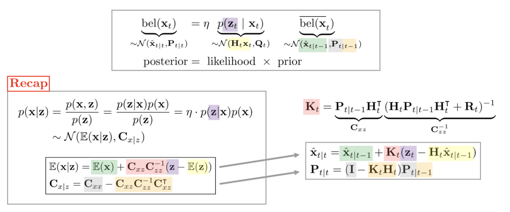

*(원문 p.38)*

# 9 MAP, GN, and EKF relationship

## 9.1 Traditional EKF derivation

EKF의 관측 모델 함수가 다음과 같이 주어졌다고 하자. 전개의 편의를 위해 관측 노이즈 $\mathbf{v}_t$를
밖으로 위치하였다.

$$\text{Observation Model:} \qquad \mathbf{z}_t = \mathbf{h}(\mathbf{x}_t) + \mathbf{v}_t \tag{139}$$

EKF의 correction 스텝은 아래 수식을 전개하여 평균 $\hat{\mathbf{x}}_{t|t}$와 공분산
$\mathbf{P}_{t|t}$를 유도한다.

$$\mathrm{bel}(\mathbf{x}_t) = \eta \cdot p(\mathbf{z}_t \mid \mathbf{x}_t)\overline{\mathrm{bel}}(\mathbf{x}_t) \sim \mathcal{N}(\hat{\mathbf{x}}_{t|t}, \mathbf{P}_{t|t}) \tag{140}$$

- $p(\mathbf{z}_t \mid \mathbf{x}_t) \sim \mathcal{N}(\mathbf{h}_t(\mathbf{x}_t), \mathbf{R}_t)$
- $\overline{\mathrm{bel}}(\mathbf{x}_t) \sim \mathcal{N}(\hat{\mathbf{x}}_{t|t-1}, \mathbf{P}_{t|t-1})$

$$\boxed{\begin{aligned}
\hat{\mathbf{x}}_{t|t} &= \mathbf{K}_t(\mathbf{z}_t - \mathbf{h}(\hat{\mathbf{x}}_{t|t-1})) \\
\mathbf{P}_{t|t} &= (\mathbf{I} - \mathbf{K}_t\mathbf{H}_t)\mathbf{P}_{t|t-1}
\end{aligned}} \tag{141}$$

## 9.2 MAP-based EKF derivation

### 9.2.1 Start from MAP estimator

Correction 스텝을 유도하는 방법으로 posterior의 확률을 최대화하는 maximum a posteriori(MAP) 추정을
사용할 수 있다. 자세한 내용은 [12]를 참고하여 작성하였다.

$$\begin{aligned}
\hat{\mathbf{x}}_{t|t} &= \arg\max_{\mathbf{x}_t} \mathrm{bel}(\mathbf{x}_t) \\
&= \arg\max_{\mathbf{x}_t} p(\mathbf{x}_t|\mathbf{z}_{1:t}, \mathbf{u}_{1:t}) \quad \cdots \text{posterior} \\
&\propto \arg\max_{\mathbf{x}_t} p(\mathbf{z}_t|\mathbf{x}_t)\overline{\mathrm{bel}}(\mathbf{x}_t) \quad \cdots \text{likelihood} \cdot \text{prior} \\
&\propto \arg\max_{\mathbf{x}_t} \exp\left(-\frac{1}{2}\Big[(\mathbf{z}_t - \mathbf{h}(\mathbf{x}_t))^{\intercal}\mathbf{R}_t^{-1}(\mathbf{z}_t - \mathbf{h}(\mathbf{x}_t)) \right. \\
&\qquad\qquad\qquad \left. + (\mathbf{x}_t - \hat{\mathbf{x}}_{t|t-1})^{\intercal}\mathbf{P}_{t|t-1}^{-1}(\mathbf{x}_t - \hat{\mathbf{x}}_{t|t-1})\Big]\right)
\end{aligned} \tag{142}$$

- $p(\mathbf{z}_t \mid \mathbf{x}_t) \sim \mathcal{N}(\mathbf{h}_t(\mathbf{x}_t), \mathbf{R}_t)$
- $\overline{\mathrm{bel}}(\mathbf{x}_t) \sim \mathcal{N}(\hat{\mathbf{x}}_{t|t-1}, \mathbf{P}_{t|t-1})$

마이너스 부호를 제거하면 최대화(maximization) 문제가 최소화(minimization) 문제로 변하고 다음과 같은
최적화 식으로 정리할 수 있다.

$$\begin{aligned}
\hat{\mathbf{x}}_{t|t} \propto \arg\min_{\mathbf{x}_t} \exp\Big(&(\mathbf{z}_t - \mathbf{h}(\mathbf{x}_t))^{\intercal}\mathbf{R}_t^{-1}(\mathbf{z}_t - \mathbf{h}(\mathbf{x}_t)) \\
&+ (\mathbf{x}_t - \hat{\mathbf{x}}_{t|t-1})^{\intercal}\mathbf{P}_{t|t-1}^{-1}(\mathbf{x}_t - \hat{\mathbf{x}}_{t|t-1})\Big)
\end{aligned} \tag{143}$$

$$\boxed{\hat{\mathbf{x}}_{t|t} = \arg\min_{\mathbf{x}_t} \|\mathbf{z}_t - \mathbf{h}(\mathbf{x}_t)\|_{\mathbf{R}_t^{-1}} + \|\mathbf{x}_t - \hat{\mathbf{x}}_{t|t-1}\|_{\mathbf{P}_{t|t-1}^{-1}}} \tag{144}$$

- $\|\mathbf{a}\|_{\mathbf{B}} = \mathbf{a}^{\intercal}\mathbf{B}\mathbf{a}$

(144) 내부의 식을 전개하고 cost function $\mathbf{C}_t$라고 정의하면 다음과 같다. 이 때,
$\mathbf{x}_t - \hat{\mathbf{x}}_{t|t-1}$의 순서를 바꿔도 전체 값에는 영향을 주지 않는다.

$$\mathbf{C}_t = (\mathbf{z}_t - \mathbf{h}(\mathbf{x}_t))^{\intercal}\mathbf{R}_t^{-1}(\mathbf{z}_t - \mathbf{h}(\mathbf{x}_t)) + (\hat{\mathbf{x}}_{t|t-1} - \mathbf{x}_t)^{\intercal}\mathbf{P}_{t|t-1}^{-1}(\hat{\mathbf{x}}_{t|t-1} - \mathbf{x}_t) \tag{145}$$

이를 행렬 형태로 표현하면 다음과 같다.

$$\mathbf{C}_t = \begin{bmatrix} \hat{\mathbf{x}}_{t|t-1} - \mathbf{x}_t \\ \mathbf{z}_t - \mathbf{h}(\mathbf{x}_t) \end{bmatrix}^{\intercal} \begin{bmatrix} \mathbf{P}_{t|t-1}^{-1} & \mathbf{0} \\ \mathbf{0} & \mathbf{R}_t^{-1} \end{bmatrix} \begin{bmatrix} \hat{\mathbf{x}}_{t|t-1} - \mathbf{x}_t \\ \mathbf{z}_t - \mathbf{h}(\mathbf{x}_t) \end{bmatrix} \tag{146}$$

### 9.2.2 MLE of new observation function

위 식을 만족하는 새로운 관측 함수를 다음과 같이 정의할 수 있다.

$$\boxed{\begin{aligned}
\mathbf{y}_t &= \mathbf{g}(\mathbf{x}_t) + \mathbf{e}_t \\
&\sim \mathcal{N}(\mathbf{g}(\mathbf{x}_t), \mathbf{P}_{\mathbf{e}})
\end{aligned}} \tag{147}$$

- $\mathbf{y}_t = \begin{bmatrix} \hat{\mathbf{x}}_{t|t-1} \\ \mathbf{z}_t \end{bmatrix}$
- $\mathbf{g}(\mathbf{x}_t) = \begin{bmatrix} \mathbf{x}_t \\ \mathbf{h}(\mathbf{x}_t) \end{bmatrix}$
- $\mathbf{e}_t \sim \mathcal{N}(0, \mathbf{P}_{\mathbf{e}})$
- $\mathbf{P}_{\mathbf{e}} = \begin{bmatrix} \mathbf{P}_{t|t-1} & \mathbf{0} \\ \mathbf{0} & \mathbf{R}_t \end{bmatrix}$

비선형 함수 $\mathbf{g}(\mathbf{x}_t)$는 다음과 같이 선형화할 수 있다.

$$\begin{aligned}
\mathbf{g}(\mathbf{x}_t) &\approx \mathbf{g}(\hat{\mathbf{x}}_{t|t-1}) + \mathbf{J}_t(\mathbf{x}_t - \hat{\mathbf{x}}_{t|t-1}) \\
&= \mathbf{g}(\hat{\mathbf{x}}_{t|t-1}) + \mathbf{J}_t\delta\hat{\mathbf{x}}_{t|t-1}
\end{aligned} \tag{148}$$

자코비안 $\mathbf{J}_t$는 다음과 같다.

$$\begin{aligned}
\mathbf{J}_t &= \left.\frac{\partial \mathbf{g}}{\partial \mathbf{x}_t}\right|_{\mathbf{x}_t = \hat{\mathbf{x}}_{t|t-1}} \\
&\quad \left.\frac{\partial \begin{bmatrix} \mathbf{x}_t \\ \mathbf{h}(\mathbf{x}_t) \end{bmatrix}}{\partial \mathbf{x}_t}\right|_{\mathbf{x}_t = \hat{\mathbf{x}}_{t|t-1}} \\
&\quad \left.\frac{\partial \begin{bmatrix} \mathbf{x}_t \\ \mathbf{h}(\hat{\mathbf{x}}_{t|t-1}) + \mathbf{H}_t(\mathbf{x}_t - \hat{\mathbf{x}}_{t|t-1}) \end{bmatrix}}{\partial \mathbf{x}_t}\right|_{\mathbf{x}_t = \hat{\mathbf{x}}_{t|t-1}} \\
&= \begin{bmatrix} \mathbf{I} \\ \mathbf{H}_t \end{bmatrix}
\end{aligned} \tag{149}$$

따라서 다음과 같이 $\mathbf{y}_t$에 대한 likelihood를 전개할 수 있다.

$$\begin{aligned}
p(\mathbf{y}_t|\mathbf{x}_t) &\sim \mathcal{N}(\mathbf{g}(\mathbf{x}_t), \mathbf{P}_{\mathbf{e}}) \\
&= \eta \cdot \exp\left(-\frac{1}{2}(\mathbf{y}_t - \mathbf{g}(\mathbf{x}_t))^{\intercal}\mathbf{P}_{\mathbf{e}}^{-1}(\mathbf{y}_t - \mathbf{g}(\mathbf{x}_t))\right)
\end{aligned} \tag{150}$$

즉, 기존의 $\mathrm{bel}(\mathbf{x}_t)$에 대한 maximum a posteriori(MAP) 문제는
$p(\mathbf{y}_t|\mathbf{x}_t)$에 대한 maximum likelihood estimation(MLE) 문제를 푸는 것으로 귀결된다.
(150) 식을 MLE로 풀면 다음과 같다.

### 9.2.3 Gauss-Newton Optimization

$$\begin{aligned}
\hat{\mathbf{x}}_{t|t} &= \arg\max_{\mathbf{x}_t} p(\mathbf{y}_t|\mathbf{x}_t) \\
&\propto \arg\min_{\mathbf{x}_t} -\ln p(\mathbf{y}_t|\mathbf{x}_t) \\
&\propto \arg\min_{\mathbf{x}_t} \frac{1}{2}(\mathbf{y}_t - \mathbf{g}(\mathbf{x}_t))^{\intercal}\mathbf{P}_{\mathbf{e}}^{-1}(\mathbf{y}_t - \mathbf{g}(\mathbf{x}_t)) \\
&\propto \arg\min_{\mathbf{x}_t} \|\mathbf{y}_t - \mathbf{g}(\mathbf{x}_t)\|_{\mathbf{P}_{\mathbf{e}}^{-1}}
\end{aligned} \tag{151}$$

(151) 식은 최소제곱법의 형태를 지닌다. 특히 가중치 $\mathbf{P}_{\mathbf{e}}^{-1}$가 중간에 곱해지므로
weighted least squares(WLS)라고도 부른다. 식을 선형화한 후 다시 정리하면 아래와 같다.

$$\begin{aligned}
\hat{\mathbf{x}}_{t|t} &= \arg\min_{\mathbf{x}_t} \|\mathbf{y}_t - \mathbf{g}(\mathbf{x}_t)\|_{\mathbf{P}_{\mathbf{e}}^{-1}} \\
&= \arg\min_{\mathbf{x}_t} \|\mathbf{y}_t - \mathbf{g}(\hat{\mathbf{x}}_{t|t-1}) - \mathbf{J}_t\delta\hat{\mathbf{x}}_{t|t-1}\|_{\mathbf{P}_{\mathbf{e}}^{-1}} \\
&= \arg\min_{\mathbf{x}_t} \|\mathbf{J}_t\delta\hat{\mathbf{x}}_{t|t-1} - (\mathbf{y}_t - \mathbf{g}(\hat{\mathbf{x}}_{t|t-1}))\|_{\mathbf{P}_{\mathbf{e}}^{-1}} \\
&= \arg\min_{\mathbf{x}_t} \|\mathbf{J}_t\delta\hat{\mathbf{x}}_{t|t-1} - \mathbf{r}_t\|_{\mathbf{P}_{\mathbf{e}}^{-1}}
\end{aligned} \tag{152}$$

- $\delta\hat{\mathbf{x}}_{t|t-1} = \mathbf{x}_t - \hat{\mathbf{x}}_{t|t-1}$ : 표현의 편의를 위해
  $\mathbf{x}_t$를 true 상태로 표현

선형화된 residual term $\mathbf{r}_t$는 다음과 같다.

$$\begin{aligned}
\mathbf{r}_t &= \mathbf{y}_t - \mathbf{g}(\hat{\mathbf{x}}_{t|t-1}) \\
&= \mathbf{J}_t\delta\hat{\mathbf{x}}_{t|t-1} + \mathbf{e} \\
&\sim \mathcal{N}(0, \mathbf{P}_{\mathbf{e}})
\end{aligned} \tag{153}$$

GN의 정규방정식으로 통해 해를 구하면 다음과 같다.

$$(\mathbf{J}_t^{\intercal}\mathbf{P}_{\mathbf{e}}^{-1}\mathbf{J}_t)\delta\hat{\mathbf{x}}_{t|t-1} = \mathbf{J}_t^{\intercal}\mathbf{P}_{\mathbf{e}}^{-1}\mathbf{r}_t \tag{154}$$

$$\boxed{\therefore \delta\hat{\mathbf{x}}_{t|t-1} = (\mathbf{J}_t^{\intercal}\mathbf{P}_{\mathbf{e}}^{-1}\mathbf{J}_t)^{-1}\mathbf{J}_t^{\intercal}\mathbf{P}_{\mathbf{e}}^{-1}\mathbf{r}_t} \tag{155}$$

위 식에서 $(\mathbf{J}_t^{\intercal}\mathbf{P}_{\mathbf{e}}^{-1}\mathbf{J}_t)$ 부분을 일반적으로 근사
헤시안(approximate hessian) 행렬 $\tilde{\mathbf{H}}$이라고 부른다.

**Posterior covariance matrix $\mathbf{P}_{t|t}$:**

$\mathbf{P}_{t|t}$는 다음과 같이 구할 수 있다.

$$\boxed{\begin{aligned}
\mathbf{P}_{t|t} =& \mathbb{E}[(\mathbf{x}_t - \hat{\mathbf{x}}_{t|t-1})(\mathbf{x}_t - \hat{\mathbf{x}}_{t|t-1})^{\intercal}] \\
=& \mathbb{E}(\delta\hat{\mathbf{x}}_{t|t-1}\delta\hat{\mathbf{x}}_{t|t-1}^{\intercal}) \\
=& \mathbb{E}\left[(\mathbf{J}_t^{\intercal}\mathbf{P}_{\mathbf{e}}^{-1}\mathbf{J}_t)^{-1}\mathbf{J}_t^{\intercal}\mathbf{P}_{\mathbf{e}}^{-1}\mathbf{r}_t\mathbf{r}_t^{\intercal}\mathbf{P}_{\mathbf{e}}^{-\intercal}\mathbf{J}_t(\mathbf{J}_t^{\intercal}\mathbf{P}_{\mathbf{e}}^{-1}\mathbf{J}_t)^{-\intercal}\right] \\
=& (\mathbf{J}_t^{\intercal}\mathbf{P}_{\mathbf{e}}^{-1}\mathbf{J}_t)^{-1}\mathbf{J}_t^{\intercal}\mathbf{P}_{\mathbf{e}}^{-1}\mathbb{E}(\mathbf{r}_t\mathbf{r}_t^{\intercal})\mathbf{P}_{\mathbf{e}}^{-\intercal}\mathbf{J}_t(\mathbf{J}_t^{\intercal}\mathbf{P}_{\mathbf{e}}^{-1}\mathbf{J}_t)^{-\intercal} \quad \leftarrow \mathbb{E}(\mathbf{r}_t\mathbf{r}_t^{\intercal}) = \mathbf{P}_{\mathbf{e}} \\
=& (\mathbf{J}_t^{\intercal}\mathbf{P}_{\mathbf{e}}^{-1}\mathbf{J}_t)^{-1} \\
=& \left(\begin{bmatrix} \mathbf{I} & \mathbf{H}_t^{\intercal} \end{bmatrix}\begin{bmatrix} \mathbf{P}_{t|t-1} & \mathbf{0} \\ \mathbf{0} & \mathbf{R}_t \end{bmatrix}^{-1}\begin{bmatrix} \mathbf{I} \\ \mathbf{H}_t \end{bmatrix}\right)^{-1} \\
=& \left(\mathbf{P}_{t|t-1}^{-1} + \mathbf{H}_t^{\intercal}\mathbf{R}_t^{-1}\mathbf{H}_t\right)^{-1} \\
=& \mathbf{P}_{t|t-1} - \mathbf{P}_{t|t-1}\mathbf{H}_t^{\intercal}(\mathbf{H}_t\mathbf{P}_{t|t-1}\mathbf{H}_t^{\intercal} + \mathbf{R}_t)^{-1}\mathbf{H}_t\mathbf{P}_{t|t-1} \quad \leftarrow \text{matrix inversion lemmas} \\
=& (\mathbf{I} - \mathbf{K}_t\mathbf{H}_t)\mathbf{P}_{t|t-1}
\end{aligned}} \tag{156}$$

위 식의 다섯번 째 줄에서 보다시피 GN을 통해 구한 근사 헤시안 행렬의 역함수
$\tilde{\mathbf{H}}^{-1}$와 EKF의 posterior 공분산 $\mathbf{P}_{t|t}$는 같은 값을 가지는 것을 알 수 있다.

$$\tilde{\mathbf{H}}^{-1} = (\mathbf{J}_t^{\intercal}\mathbf{P}_{\mathbf{e}}^{-1}\mathbf{J}_t)^{-1} = \mathbf{P}_{t|t} \tag{157}$$

**Posterior mean $\mathbf{x}_{t|t}$:**

GN을 반복적으로 수행함에 따라 $j$번째 $\mathbf{x}_{t|t,j}$는 다음과 같이 구할 수 있다.

$$\boxed{\begin{aligned}
\hat{\mathbf{x}}_{t|t,j+1} =& \hat{\mathbf{x}}_{t|t,j} + \delta\hat{\mathbf{x}}_{t|t,j} \\
=& \hat{\mathbf{x}}_{t|t,j} + (\mathbf{J}_t^{\intercal}\mathbf{P}_{t|t-1}^{-1}\mathbf{J}_t)^{-1}(\mathbf{J}_t^{\intercal}\mathbf{P}_{t|t-1}^{-1}\mathbf{r}_t) \\
=& (\mathbf{J}_t^{\intercal}\mathbf{P}_{t|t-1}^{-1}\mathbf{J}_t)^{-1}\mathbf{J}_t^{\intercal}\mathbf{P}_{t|t-1}^{-1}(\mathbf{y}_t - \mathbf{g}(\hat{\mathbf{x}}_{t|t,j}) + \mathbf{J}_t\hat{\mathbf{x}}_{t|t,j}) \quad \leftarrow \mathbf{r}_t = \mathbf{y}_t - \mathbf{g}(\hat{\mathbf{x}}_{t|t,j}) \\
=& \left(\mathbf{P}_{t|t-1}^{-1} + \mathbf{H}_t^{\intercal}\mathbf{R}_t^{-1}\mathbf{H}_t\right)^{-1}\begin{bmatrix} \mathbf{P}_{t|t-1}^{-1} & \mathbf{H}_t^{\intercal}\mathbf{R}_t^{-1} \end{bmatrix}\begin{bmatrix} \hat{\mathbf{x}}_{t|t-1} \\ \mathbf{z}_t - \mathbf{h}(\hat{\mathbf{x}}_{t|t,j}) + \mathbf{H}_t\hat{\mathbf{x}}_{t|t,j} \end{bmatrix} \quad \leftarrow \text{expand } \mathbf{J}_t \\
=& \left(\mathbf{P}_{t|t-1}^{-1} + \mathbf{H}_t^{\intercal}\mathbf{R}_t^{-1}\mathbf{H}_t\right)^{-1}\left(\mathbf{H}_t^{\intercal}\mathbf{R}_t^{-1}(\mathbf{z}_t - \mathbf{h}(\hat{\mathbf{x}}_{t|t,j}) + \mathbf{H}_t\hat{\mathbf{x}}_{t|t,j}) + \mathbf{P}_{t|t-1}^{-1}\hat{\mathbf{x}}_{t|t-1}\right) \\
=& \left(\mathbf{P}_{t|t-1}^{-1} + \mathbf{H}_t^{\intercal}\mathbf{R}_t^{-1}\mathbf{H}_t\right)^{-1}\left(\mathbf{H}_t^{\intercal}\mathbf{R}_t^{-1}(\mathbf{z}_t - \mathbf{h}(\hat{\mathbf{x}}_{t|t,j}) - \mathbf{H}_t(\hat{\mathbf{x}}_{t|t-1} - \hat{\mathbf{x}}_{t|t,j}) + \mathbf{H}_t\hat{\mathbf{x}}_{t|t-1}) + \mathbf{P}_{t|t-1}^{-1}\hat{\mathbf{x}}_{t|t-1}\right) \\
=& \left(\mathbf{P}_{t|t-1}^{-1} + \mathbf{H}_t^{\intercal}\mathbf{R}_t^{-1}\mathbf{H}_t\right)^{-1}\left(\mathbf{H}^{\intercal}\mathbf{R}_t^{-1}(\mathbf{z}_t - \mathbf{h}(\hat{\mathbf{x}}_{t|t,j}) - \mathbf{H}_t(\hat{\mathbf{x}}_{t|t-1} - \hat{\mathbf{x}}_{t|t,j})) + \underbrace{(\mathbf{P}_{t|t-1}^{-1} + \mathbf{H}_t^{\intercal}\mathbf{R}_t^{-1}\mathbf{H}_t)\hat{\mathbf{x}}_{t|t-1}}_{\hat{\mathbf{x}}_{t|t-1}}\right) \\
=& \hat{\mathbf{x}}_{t|t-1} + \left(\mathbf{P}_{t|t-1}^{-1} + \mathbf{H}_t^{\intercal}\mathbf{R}_t^{-1}\mathbf{H}_t\right)^{-1}\mathbf{H}_t^{\intercal}\mathbf{R}_t^{-1}(\mathbf{z}_t - \mathbf{h}(\hat{\mathbf{x}}_{t|t,j}) - \mathbf{H}_t(\hat{\mathbf{x}}_{t|t-1} - \hat{\mathbf{x}}_{t|t,j})) \\
=& \hat{\mathbf{x}}_{t|t-1} + \mathbf{K}_t(\mathbf{z}_t - \mathbf{h}(\hat{\mathbf{x}}_{t|t,j}) - \mathbf{H}_t(\hat{\mathbf{x}}_{t|t-1} - \hat{\mathbf{x}}_{t|t,j}))
\end{aligned}} \tag{158}$$

위 식은 IEKF의 (71) 식과 동일하다. 마지막 식에서 보다시피 Gauss-Newton을 통해 EKF의 해를 추정하는
것과 IEKF를 통해 해를 추정하는 것은 동일한 의미를 지닌다. 만약 처음 iteration $j = 0$인 경우
$\hat{\mathbf{x}}_{t|t,0} = \hat{\mathbf{x}}_{t|t-1}$이 되어서 식은 다음과 같이 정리된다.

$$\boxed{\hat{\mathbf{x}}_{t|t} = \hat{\mathbf{x}}_{t|t-1} + \mathbf{K}_t(\mathbf{z}_t - \mathbf{h}(\hat{\mathbf{x}}_{t|t-1}))} \tag{159}$$

이는 EKF의 해와 동일하다. 즉, EKF는 GN iteration=1과 동일한 의미를 지니며 IEKF는 GN과 동일한 연산을
수행하는 것을 알 수 있다.

<!--widget:map-gn-ekf-->

# 10 Derivation of IESKF update step

본 섹션에서는 IESKF 과정 중 업데이트 스텝부터 $\delta\hat{\mathbf{x}}$를 구하는 중간 유도 과정에 대해
설명한다. 이는 주로 링크의 내용을 참고하여 유도하였다. 우선 (92) 업데이트 공식부터 다시 살펴보자

$$\boxed{\begin{aligned}
\arg\min_{\delta\hat{\mathbf{x}}_{t|t,j}} \quad & \|\mathbf{z}_t - \mathbf{h}(\hat{\mathbf{x}}_{t|t-1}, 0, 0) - \mathbf{H}_t\delta\hat{\mathbf{x}}_{t|t,j}\|_{\mathbf{H}_{\mathbf{v}}\mathbf{R}^{-1}\mathbf{H}_{\mathbf{v}}^{\intercal}} \\
& + \|\hat{\mathbf{x}}_{t|t,j} - \hat{\mathbf{x}}_{t|t-1} + \mathbf{J}_t\delta\hat{\mathbf{x}}_{t|t,j}\|_{\mathbf{P}_{t|t-1}^{-1}}
\end{aligned}} \tag{160}$$

위 식의 기호를 단순화하여 다음과 같이 나타낸다

$$\mathbf{x} = \arg\min_{\mathbf{x}} \quad \|\mathbf{z} - \mathbf{H}\mathbf{x}\|_{\mathbf{R}}^2 + \|\mathbf{c} + \mathbf{J}\mathbf{x}\|_{\mathbf{P}}^2$$

- $\mathbf{z} = \mathbf{z}_t - \mathbf{h}(\hat{\mathbf{x}}_{t|t-1}, 0, 0)$
- $\mathbf{c} = \hat{\mathbf{x}}_{t|t,j} - \hat{\mathbf{x}}_{t|t-1}$
- $\mathbf{R} = \mathbf{H}_{\mathbf{v}}\mathbf{R}^{-1}\mathbf{H}_{\mathbf{v}}^{\intercal}$
- $\mathbf{x} = \delta\hat{\mathbf{x}}$

위 식에서 norm을 전개하면 다음과 같다.

$$\mathbf{x} = \arg\min_{\mathbf{x}} \left[\underbrace{(\mathbf{z} - \mathbf{H}\mathbf{x})^{\intercal}\mathbf{R}^{-1}(\mathbf{z} - \mathbf{H}\mathbf{x}) + (\mathbf{c} + \mathbf{J}\mathbf{x})^{\intercal}\mathbf{P}^{-1}(\mathbf{c} + \mathbf{J}\mathbf{x})}_{\mathbf{r}}\right]$$

위 식에서 $\mathbf{r}$ 부분만 따로 전개하면 다음과 같다.

$$\begin{aligned}
\mathbf{r} &= \mathbf{z}^{\intercal}\mathbf{R}^{-1}\mathbf{z} - \mathbf{x}^{\intercal}\mathbf{H}^{\intercal}\mathbf{R}^{-1}\mathbf{z} - \mathbf{z}^{\intercal}\mathbf{R}^{-1}\mathbf{H}\mathbf{x} + \mathbf{x}^{\intercal}\mathbf{H}^{\intercal}\mathbf{R}^{-1}\mathbf{H}\mathbf{x} + \mathbf{c}^{\intercal}\mathbf{P}^{-1}\mathbf{c} + \mathbf{x}^{\intercal}\mathbf{J}^{\intercal}\mathbf{P}^{-1}\mathbf{c} + \mathbf{c}^{\intercal}\mathbf{P}^{-1}\mathbf{J}\mathbf{x} + \mathbf{x}^{\intercal}\mathbf{J}^{\intercal}\mathbf{P}^{-1}\mathbf{J}\mathbf{x} \\
&= \mathbf{z}^{\intercal}\mathbf{R}^{-1}\mathbf{z} - 2\mathbf{x}^{\intercal}\mathbf{H}^{\intercal}\mathbf{R}^{-1}\mathbf{z} + \mathbf{x}^{\intercal}\mathbf{H}^{\intercal}\mathbf{R}^{-1}\mathbf{H}\mathbf{x} + \mathbf{c}^{\intercal}\mathbf{P}^{-1}\mathbf{c} + 2\mathbf{x}^{\intercal}\mathbf{J}^{\intercal}\mathbf{P}^{-1}\mathbf{c} + \mathbf{x}^{\intercal}\mathbf{J}^{\intercal}\mathbf{P}^{-1}\mathbf{J}\mathbf{x}
\end{aligned} \tag{161}$$

$\mathbf{r}$을 $\mathbf{x}$에 대해 편미분하면 다음과 같다.

$$\begin{aligned}
\frac{\partial \mathbf{r}}{\partial \mathbf{x}} &= -\mathbf{H}^{\intercal}\mathbf{R}^{-1}\mathbf{z} + \mathbf{H}^{\intercal}\mathbf{R}^{-1}\mathbf{H}\mathbf{x} + \mathbf{J}^{\intercal}\mathbf{P}^{-1}\mathbf{c} + \mathbf{J}^{\intercal}\mathbf{P}^{-1}\mathbf{J}\mathbf{x} = 0 \\
&(\mathbf{H}^{\intercal}\mathbf{R}^{-1}\mathbf{H} + \mathbf{J}^{\intercal}\mathbf{P}^{-1}\mathbf{J})\mathbf{x} = \mathbf{H}^{\intercal}\mathbf{R}^{-1}\mathbf{z} - \mathbf{J}^{\intercal}\mathbf{P}^{-1}\mathbf{c} \\
&\mathbf{x} = (\mathbf{H}^{\intercal}\mathbf{R}^{-1}\mathbf{H} + \mathbf{J}^{\intercal}\mathbf{P}^{-1}\mathbf{J})^{-1}(\mathbf{H}^{\intercal}\mathbf{R}^{-1}\mathbf{z} - \mathbf{J}^{\intercal}\mathbf{P}^{-1}\mathbf{c})
\end{aligned} \tag{162}$$

$(\mathbf{H}^{\intercal}\mathbf{R}^{-1}\mathbf{H} + \mathbf{J}^{\intercal}\mathbf{P}^{-1}\mathbf{J})^{-1}$
부분은 matrix inversion lemma를 통해 다음과 같이 전개할 수 있다.

$$(\underbrace{\mathbf{J}^{\intercal}\mathbf{P}^{-1}\mathbf{J}}_{\bar{\mathbf{P}}^{-1}} + \mathbf{H}^{\intercal}\mathbf{R}^{-1}\mathbf{H})^{-1} = (\bar{\mathbf{P}} - \bar{\mathbf{P}}\mathbf{H}^{\intercal}(\mathbf{R} + \mathbf{H}\bar{\mathbf{P}}\mathbf{H}^{\intercal})^{-1}\mathbf{H}\bar{\mathbf{P}}) \tag{163}$$

- $\bar{\mathbf{P}} = \mathbf{J}^{-1}\mathbf{P}\mathbf{J}^{-\intercal}$로 치환

> **Tip**
>
> **Matrix Inversion Lemma**
> $(\mathbf{A} + \mathbf{U}\mathbf{C}\mathbf{V})^{-1} = \mathbf{A}^{-1} - \mathbf{A}^{-1}\mathbf{U}(\mathbf{C}^{-1} + \mathbf{V}\mathbf{A}^{-1}\mathbf{U})^{-1}\mathbf{V}\mathbf{A}^{-1}$

위 식을 (162) 식에 대입하면 다음과 같다.

$$\mathbf{x} = (\bar{\mathbf{P}} - \bar{\mathbf{P}}\mathbf{H}^{\intercal}(\mathbf{R} + \mathbf{H}\bar{\mathbf{P}}\mathbf{H}^{\intercal})^{-1}\mathbf{H}\bar{\mathbf{P}})(\mathbf{H}^{\intercal}\mathbf{R}^{-1}\mathbf{z} - \mathbf{J}^{\intercal}\mathbf{P}^{-1}\mathbf{c}) \tag{164}$$

위 식을 전개하면 다음과 같다

$$\begin{aligned}
\mathbf{x} =& (\bar{\mathbf{P}} - \bar{\mathbf{P}}\mathbf{H}^{\intercal}(\mathbf{R} + \mathbf{H}\bar{\mathbf{P}}\mathbf{H}^{\intercal})^{-1}\mathbf{H}\bar{\mathbf{P}})(\mathbf{H}^{\intercal}\mathbf{R}^{-1}\mathbf{z} - \mathbf{J}^{\intercal}\mathbf{P}^{-1}\mathbf{c}) \\
=& \bar{\mathbf{P}}\mathbf{H}^{\intercal}\mathbf{R}^{-1}\mathbf{z} - \bar{\mathbf{P}}\mathbf{J}^{\intercal}\mathbf{P}^{-1}\mathbf{c} - \bar{\mathbf{P}}\mathbf{H}^{\intercal}(\mathbf{R} + \mathbf{H}\bar{\mathbf{P}}\mathbf{H}^{\intercal})^{-1}\mathbf{H}\bar{\mathbf{P}}\mathbf{H}^{\intercal}\mathbf{R}^{-1}\mathbf{z} + \bar{\mathbf{P}}\mathbf{H}^{\intercal}(\mathbf{R} + \mathbf{H}\bar{\mathbf{P}}\mathbf{H}^{\intercal})^{-1}\mathbf{H}\bar{\mathbf{P}}\mathbf{J}^{\intercal}\mathbf{P}^{-1}\mathbf{c} \\
=& \bar{\mathbf{P}}\mathbf{H}^{\intercal}\mathbf{R}^{-1}\mathbf{z} - \bar{\mathbf{P}}\mathbf{J}^{\intercal}\mathbf{P}^{-1}\mathbf{c} - \bar{\mathbf{P}}\mathbf{H}^{\intercal}(\mathbf{R} + \mathbf{H}\bar{\mathbf{P}}\mathbf{H}^{\intercal})^{-1}((\mathbf{H}\bar{\mathbf{P}}\mathbf{H}^{\intercal} + \mathbf{R})\mathbf{R}^{-1} - \mathbf{I})\mathbf{z} + \bar{\mathbf{P}}\mathbf{H}^{\intercal}(\mathbf{R} + \mathbf{H}\bar{\mathbf{P}}\mathbf{H}^{\intercal})^{-1}\mathbf{H}\bar{\mathbf{P}}\mathbf{J}^{\intercal}\mathbf{P}^{-1}\mathbf{c} \\
=& -\bar{\mathbf{P}}\mathbf{J}^{\intercal}\mathbf{P}^{-1}\mathbf{c} + \bar{\mathbf{P}}\mathbf{H}^{\intercal}(\mathbf{R} + \mathbf{H}\bar{\mathbf{P}}\mathbf{H}^{\intercal})^{-1}\mathbf{z} + \bar{\mathbf{P}}\mathbf{H}^{\intercal}(\mathbf{R} + \mathbf{H}\bar{\mathbf{P}}\mathbf{H}^{\intercal})^{-1}\mathbf{H}\bar{\mathbf{P}}\mathbf{J}^{\intercal}\mathbf{P}^{-1}\mathbf{c} \\
=& -\mathbf{J}^{-1}\underbrace{\mathbf{P}\mathbf{J}^{-\intercal}\mathbf{J}^{\intercal}\mathbf{P}^{-1}}_{\mathbf{I}}\mathbf{c} + \mathbf{J}^{-1}\mathbf{P}\mathbf{J}^{-\intercal}\mathbf{H}^{\intercal}\underbrace{(\mathbf{R} + \mathbf{H}\mathbf{J}^{-1}\mathbf{P}\mathbf{J}^{-\intercal}\mathbf{H}^{\intercal})^{-1}}_{\mathbf{S}}\mathbf{z} + \mathbf{J}^{-1}\mathbf{P}\mathbf{J}^{-\intercal}\mathbf{H}^{\intercal}\underbrace{(\mathbf{R} + \mathbf{H}\mathbf{J}^{-1}\mathbf{P}\mathbf{J}^{-\intercal}\mathbf{H}^{\intercal})^{-1}}_{\mathbf{S}}\mathbf{H}\mathbf{J}^{-1}\underbrace{\mathbf{P}\mathbf{J}^{-\intercal}\mathbf{J}^{\intercal}\mathbf{P}^{-1}}_{\mathbf{I}}\mathbf{c} \\
=& \mathbf{K}\mathbf{z} + \mathbf{K}\mathbf{H}\mathbf{J}^{-1}\mathbf{c} - \mathbf{J}^{-1}\mathbf{c}
\end{aligned} \tag{165}$$

- $\mathbf{K} = \mathbf{J}^{-1}\mathbf{P}\mathbf{J}^{-\intercal}\mathbf{H}^{\intercal}\mathbf{S}^{-1}$

위 마지막 줄의 식에서 치환했던 기호를 복원하면 다음과 같이 최종 업데이트 식 (94)를 얻을 수 있다.

$$\boxed{\therefore \delta\hat{\mathbf{x}}_{t|t,j} = \mathbf{K}_{t,j}\left(\mathbf{z}_t - \mathbf{h}(\hat{\mathbf{x}}_{t|t,j}, 0, 0) + \mathbf{H}_{t,j}\mathbf{J}_{t,j}^{-1}(\hat{\mathbf{x}}_{t|t,j} - \hat{\mathbf{x}}_{t|t-1})\right) - \mathbf{J}_{t,j}^{-1}(\hat{\mathbf{x}}_{t|t,j} - \hat{\mathbf{x}}_{t|t-1})} \tag{166}$$

- $\mathbf{z} = \mathbf{z}_t - \mathbf{h}(\hat{\mathbf{x}}_{t|t-1}, 0, 0)$
- $\mathbf{c} = \hat{\mathbf{x}}_{t|t,j} - \hat{\mathbf{x}}_{t|t-1}$
- $\mathbf{R} = \mathbf{H}_{\mathbf{v}}\mathbf{R}\mathbf{H}_{\mathbf{v}}^{\intercal}$
- $\mathbf{x} = \delta\hat{\mathbf{x}}$

지금까지의 유도 과정을 그림으로 나타내면 다음과 같다.

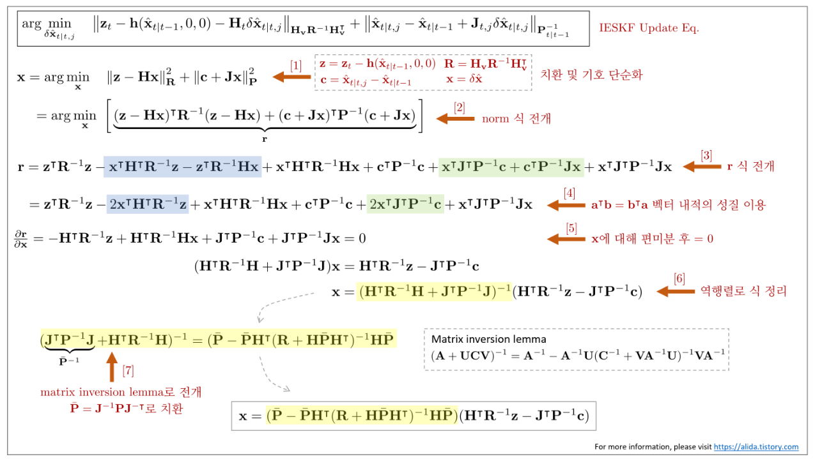

*(원문 p.45)*

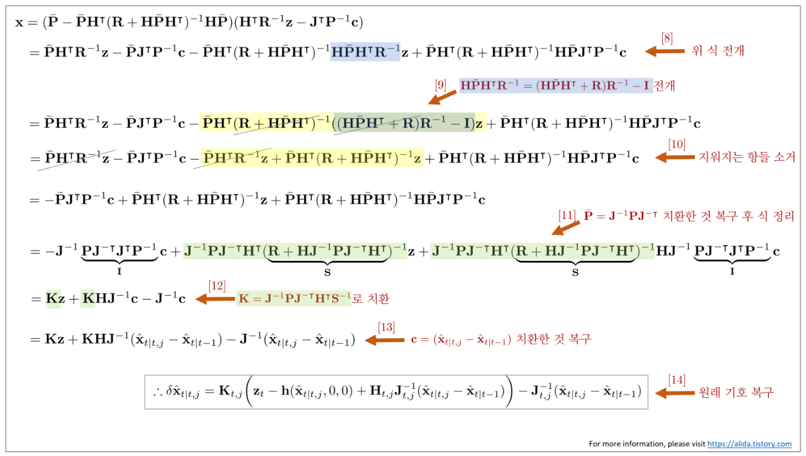

*(원문 p.45)*

# 11 Wrap-up

지금까지 설명한 KF, EKF, ESKF, IEKF, IESKF를 한 장의 슬라이드로 표현하면 다음과 같다.
클릭하면 큰 그림으로 볼 수 있다.

## 11.1 Kalman Filter (KF)

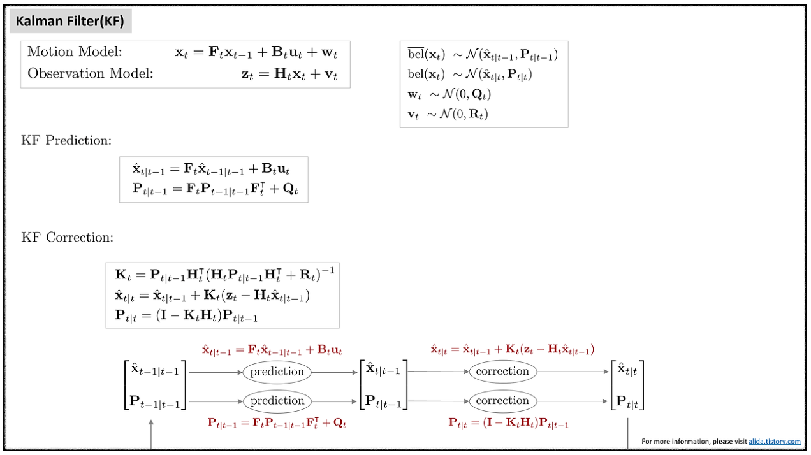

*(원문 p.46)*

## 11.2 Extended Kalman Filter (EKF)

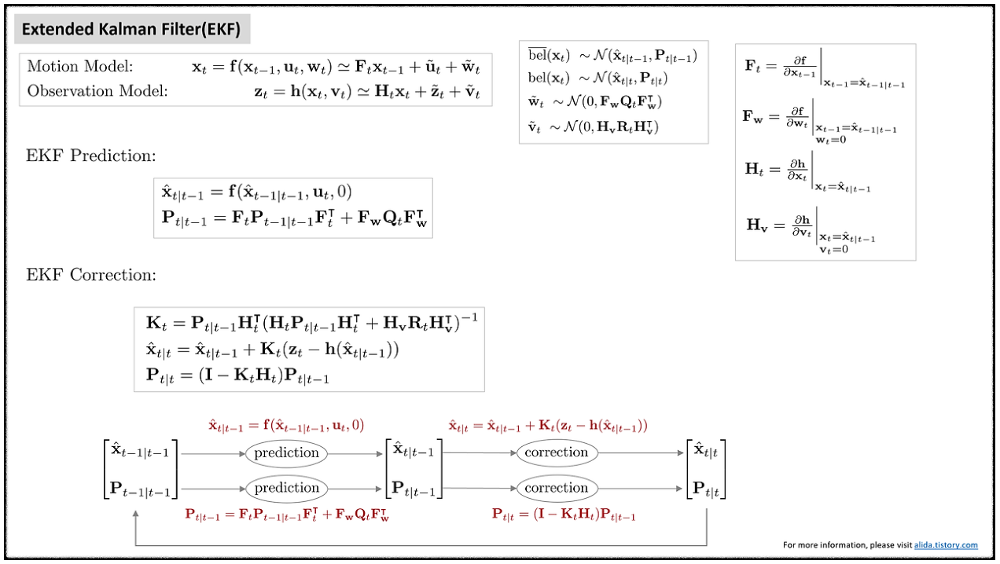

*(원문 p.46)*

## 11.3 Error-state Kalman Filter (ESKF)

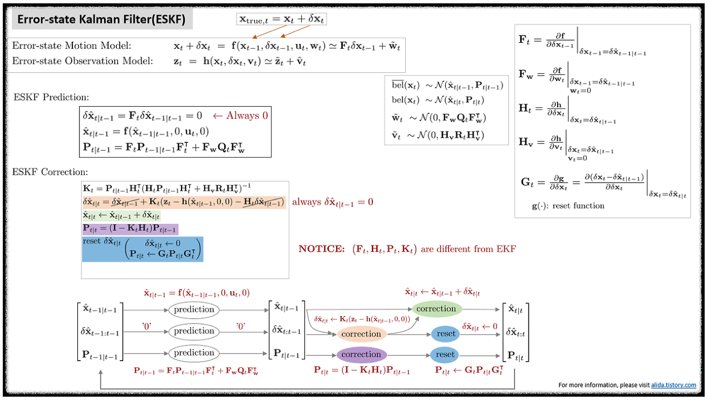

*(원문 p.47)*

## 11.4 Iterated Extended Kalman Filter (IEKF)

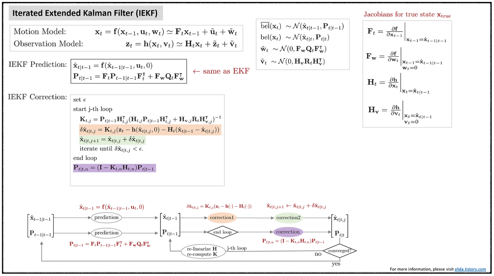

*(원문 p.47)*

## 11.5 Iterated Error-state Kalman Filter (IESKF)

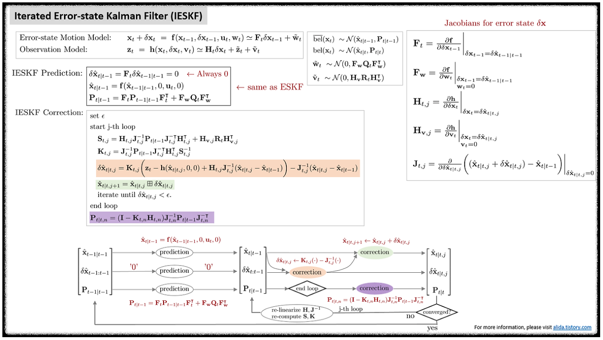

*(원문 p.48)*

<!--widget:filter-comparison-->

# 12 Reference

1. [(Wiki) Kalman Filter](https://en.wikipedia.org/wiki/Kalman_filter)
2. [(Paper) Sola, Joan. "Quaternion kinematics for the error-state Kalman filter." arXiv preprint arXiv:1711.02508 (2017).](https://arxiv.org/abs/1711.02508)
3. [(Youtube) Robot Mapping Coure - Freiburg Univ](https://youtu.be/wVsfCnyt5jA)
4. [(Blog) [SLAM] Kalman filter and EKF(Extended Kalman Filter) - Jinyong Jeong](http://jinyongjeong.github.io/2017/02/14/lec03_kalman_filter_and_EKF/)
5. [(Blog) Error-State Kalman Filter understanding and formula derivation - CSDN](https://blog.csdn.net/liu3612162/article/details/114120772)
6. [(Paper) He, Dongjiao, Wei Xu, and Fu Zhang. "Kalman filters on differentiable manifolds." arXiv preprint arXiv:2102.03804 (2021).](https://arxiv.org/pdf/2102.03804.pdf)
7. [(Book) SLAM in Autonomous Driving book (SAD book)](https://github.com/gaoxiang12/slam_in_autonomous_driving)
8. [(Paper) Xu, Wei, and Fu Zhang. "Fast-lio: A fast, robust lidar-inertial odometry package by tightly-coupled iterated kalman filter." IEEE Robotics and Automation Letters 6.2 (2021): 3317-3324.](https://arxiv.org/pdf/2010.08196.pdf)
9. [(Paper) Huai, Jianzhu, and Xiang Gao. "A Quick Guide for the Iterated Extended Kalman Filter on Manifolds." arXiv preprint arXiv:2307.09237 (2023).](https://arxiv.org/pdf/2307.09237.pdf)
10. [(Paper) Bloesch, Michael, et al. "Iterated extended Kalman filter based visual-inertial odometry using direct photometric feedback." The International Journal of Robotics Research 36.10 (2017): 1053-1072.](https://www.research-collection.ethz.ch/bitstream/handle/20.500.11850/263423/1/ROVIO.pdf)
11. [(Paper) Skoglund, Martin A., Gustaf Hendeby, and Daniel Axehill. "Extended Kalman filter modifications based on an optimization view point." 2015 18th International Conference on Information Fusion (Fusion). IEEE, 2015.](https://ieeexplore.ieee.org/stamp/stamp.jsp?tp=&arnumber=7266781)
12. [(Blog) From MAP, MLE, OLS, GN to IEKF, EKF](https://cgabc.xyz/posts/784a80cb/)
13. [(Book) Thrun, Sebastian. "Probabilistic robotics." Communications of the ACM 45.3 (2002): 52-57.](https://docs.ufpr.br/~danielsantos/ProbabilisticRobotics.pdf)

# 13 Revision log

- 1st: 2020-06-23
- 2nd: 2020-06-24
- 3rd: 2020-06-26
- 4th: 2023-01-21
- 5th: 2023-01-31
- 6th: 2023-02-02
- 7th: 2023-02-04
- 8th: 2024-02-08
- 9th: 2024-02-09
- 10th: 2024-05-02
- 11th: 2024-06-12: Derivation of recursive bayesian filter Step 7 설명 수정 (thanks to 칼만님)
- 12th: 2024-06-22: Estimation theory, Dynamic system, 1D Kalman filter, Derivation of Kalman filter,
  Discussion 추가
- 13th: 2024-06-29: Derivation of recursive bayesian filter Step 5 설명 수정 (thanks to 신우진님)
- 14th: 2024-07-13: Derivation of Kalman filter typo 수정
- 15th: 2025-06-12: Mahalanobis norm typo 수정

# 옮기며 바로잡은 것

원문을 옮기면서 고친 것은 아래가 전부다. 그 외의 문장·수식·절 구성은 손대지 않았다.

## 맞춤법·철자

| 원문 쪽 | 위치 | 원문 | 고친 것 |
|---|---|---|---|
| 12 | 3.3 식 (25) 앞 | 1D 칼만 필터의 **precition** 스텝 | prediction 스텝 |
| 15 | 4장 첫 문단 | 테일러 1차 근사(**talyor** 1st approximation) | Taylor 1st approximation |
| 19 | 5장 ESKF 장점 첫 항목 | 특이점(**signularity**) | 특이점(singularity) |
| 19 | 5장 ESKF 장점 도입부 | (Madyastha **el tal.**, 2011) | (Madyastha et al., 2011) |

## 재현하지 않은 표현

원문의 **색 강조**(수식 안에서 바뀌는 항을 파랑·빨강으로 칠한 것, 본문의 파란 강조 문장)와
**취소선**(식 (165)에서 소거되는 항에 그은 줄)은 재현하지 않았다. 오프라인 MathJax 번들에
`color`·`cancel` 패키지가 없어 이를 쓰면 **문서의 수식이 전부 렌더링되지 않는다**(자세한 내용은
`_study_kit/3_Pitfalls.md` B6). 수식과 문장의 **내용 자체는 원문과 동일**하며, 어떤 항이 소거되는지는
바로 다음 줄에서 그대로 확인할 수 있다.

## 원문 그대로 둔 것

아래는 원문의 표기가 앞뒤와 어긋나지만 저자의 표기 선택일 수 있어 **고치지 않고 그대로** 두었다.
읽을 때만 참고하면 된다.

- **8장의 $\mathbf{Q}_t$와 $\mathbf{R}_t$가 3장과 반대다** — 3장에서는 $\mathbf{Q}_t$가 모션 노이즈,
  $\mathbf{R}_t$가 관측 노이즈인데, 8장 유도((99)~(122))에서는 $\mathbf{R}_t$를 모션 노이즈로,
  8.2절((123)~(135))에서는 $\mathbf{Q}_t$를 관측 노이즈로 쓴다. 그 결과 (122)의 공분산이
  $\mathbf{P}_{t|t-1} = \mathbf{F}_t\mathbf{P}_{t-1}\mathbf{F}_t^{\intercal} + \mathbf{R}_t$로 적혀
  (21)의 $+\mathbf{Q}_t$와 달라 보인다. 8장 안에서는 일관되므로 유도 자체에는 문제가 없다.
- **식 (58)의 $\mathbf{H}_{\mathbf{v}}\mathbf{R}_t\mathbf{H}_{\mathbf{v}}$** — 같은 항이 (41)·(62)에서는
  $\mathbf{H}_{\mathbf{v}}\mathbf{R}_t\mathbf{H}_{\mathbf{v}}^{\intercal}$로 적혀 있어 전치 기호가
  빠진 것으로 보이지만 원문 그대로 두었다.
- **식 (62)의 마지막 리셋 줄** — $\mathbf{P}_{t|t} \leftarrow \mathbf{G}\mathbf{P}_{t|t}\mathbf{P}^{\intercal}$로
  적혀 있다. (60)과 비교하면 마지막 항이 $\mathbf{G}^{\intercal}$여야 하지만 원문 그대로 두었다.
- **식 (95)의 prediction 첫 줄** — $\delta\hat{\mathbf{x}}_{t|t-1} = \mathbf{F}_t\hat{\mathbf{x}}_{t-1|t-1}$로
  적혀 있다. (93)과 비교하면 $\mathbf{F}_t\delta\hat{\mathbf{x}}_{t-1|t-1}$이어야 하지만 원문 그대로 두었다.
- **식 (71)·(72)의 반복 갱신이 (94)·(158)과 다르다** — 옮기는 중에 위젯으로 확인한 것이라 적어 둔다.
  IEKF의 (71)은 $\hat{\mathbf{x}}_{t|t,j+1} = \hat{\mathbf{x}}_{t|t,j} + \mathbf{K}(\cdots)$이지만,
  같은 저자의 §9 결론인 (158) 마지막 줄은
  $\hat{\mathbf{x}}_{t|t,j+1} = \hat{\mathbf{x}}_{t|t-1} + \mathbf{K}(\cdots)$이고, IESKF의 (94)에도
  $-\mathbf{J}_{t,j}^{-1}(\hat{\mathbf{x}}_{t|t,j} - \hat{\mathbf{x}}_{t|t-1})$ 항이 있어
  $\mathbf{J} = \mathbf{I}$일 때 (158)과 같은 식이 된다. (71)에만 이 항이 없어 반복의 수렴점이 달라진다 —
  **실험 7·8**에서 세 식을 나란히 돌려 수치로 확인할 수 있다. 어느 쪽이 저자의 의도인지 단정할 수 없어
  본문은 원문 그대로 두었고, 위젯은 (158) 형태를 기본으로 쓰되 (71)을 문자 그대로 돌린 결과도 함께
  표시했다.

