# Notes on Quaternion kinematics for the error-state Kalman filter

> **원문** — Gyubeom Edward Im, *Notes on Quaternion kinematics for the error-state Kalman filter* (58쪽)
> (Orig. by Joan Solà) · blog: [alida.tistory.com](https://alida.tistory.com) · email: criterion.im@gmail.com
> 파일: `ref/Notes on Quaternion kinematics for the error-state Kalman filter.pdf`
>
> **이 문서에 대하여** — 원문을 **내용 수정 없이 그대로** 옮긴 것이다. 절 구성·문장·수식 번호
> (1)~(319)가 모두 원문과 같고 순서도 바꾸지 않았다. 원문의 그림 19개도 캡션과 함께 같은 자리에
> 넣었다.
>
> 원문에 없는 것은 **인터랙티브 위젯 12개**뿐이며, 전부 **원문에 없는 추가 요소**라고 표시된
> 회색 박스 안에 들어 있어 본문과 섞이지 않는다. 회전을 다루는 문서인 만큼 3D로 직접 돌려 볼 수 있는
> 위젯을 여럿 넣었다.
>
> 명백한 오타는 바로잡았고, 무엇을 고쳤는지는 맨 아래
> [옮기며 바로잡은 것](#옮기며-바로잡은-것)에 전부 적어 두었다. 원문이 수식·문장에서 쓰는
> **색 강조는 재현하지 않았다** — 오프라인 MathJax 번들에 color 패키지가 없어 색을 넣으면 문서의
> 수식이 전부 렌더링되지 않는다. 수식 내용 자체는 원문과 동일하다.

| 장 | 원문 쪽 | 장 | 원문 쪽 |
|---|---|---|---|
| 1 Quaternion Definition and properties | 4 | 5 Error-state kinematics for IMU-driven systems | 41 |
| 2 Rotations and cross-relations | 10 | 6 Fusing IMU with complementary sensory data | 49 |
| 3 Quaternion conventions. My choice | 28 | 7 The ESKF using global angular errors | 53 |
| 4 Perturbations, derivatives and integrals | 31 | 8 Revision log | 58 |

# 1 Quaternion Definition and properties

## 1.1 Definition of quaternion

두 개의 복소수 $A = a + bi, C = c + di$가 주어졌을 때 이를 $Q = A + Cj$와 같이 구성하고
$k \triangleq ij$로 정의하면 $Q$는 쿼터니언 공간 $\mathbb{H}$ 안에 존재하는 수가 된다.

$$Q = a + bi + cj + dk \in \mathbb{H} \tag{1}$$

이 때, $a, b, c, d \in \mathbb{R}$이고 $\{i, j, k\}$는 다음과 같이 정의된 3개의 허수를 의미한다.

$$i^2 = j^2 = k^2 = ijk = -1 \tag{2}$$

이는 다음과 같은 성질을 만족한다.

$$ij = -ji = k, \quad jk = -kj = i, \quad ki = -ik = j \tag{3}$$

임의의 쿼터니언 $Q$는 복소수가 0일 때도 쿼터니언을 만족해야하므로 다음과 같은 수 또한 모두
쿼터니언이다.

$$Q = a \in \mathbb{R} \subset \mathbb{H}, \quad Q = bi \in \mathbb{I} \subset \mathbb{H}, \quad Q = a + bi \in \mathbb{Z} \subset \mathbb{H} \tag{4}$$

또한 실수가 0일 때도 쿼터니언을 만족해야 하는데 이때는 특별히 복소수 $\{i, j, k\}$만으로 구성된 순수
쿼터니언(pure quaternion)이라고 한다. 이는 순수 쿼터니언 공간 $\mathbb{H}_p = \mathrm{Im}(\mathbb{H})$에
존재한다고 정의한다.

$$Q = bi + cj + dk \in \mathbb{H}_p \subset \mathbb{H}. \tag{5}$$

쿼터니언을 표기하는데는 다양한 방법들이 존재한다. 본 페이지에서 설명하는 쿼터니언은 $ijk = -1$ 조건인
오른손법칙을 만족하는 쿼터니언이다. 이는 $Q = (w, x, y, z)$와 같이 실수부 $w$가 앞에있고 허수부
$x, y, z$가 뒤에 있는 순서로 표기한다. 이러한 성질들을 만족하는 쿼터니언을 특별히 Hamilton Quaternion
이라고 한다.

### 1.1.1 Alternative representations of the quaternion

쿼터니언은 앞서 설명한 실수부+허수부로 표기할 수 있을 뿐만 아니라 스칼라+벡터로도 표기할 수 있다.

$$Q = q_w + q_x i + q_y j + q_z k \quad \Leftrightarrow \quad Q = q_w + \mathbf{q}_v, \tag{6}$$

여기서 $q_w$는 실수부 또는 스칼라 파트이며, $\mathbf{q}_v = q_x i + q_y j + q_z k$는 허수부 또는 벡터
파트이다. 이는 다음과 같이 표기되기도 한다.

$$Q = <q_w, \mathbf{q}_v> \tag{7}$$

가장 자주 사용되는 표기법은 다음과 같이 벡터로 표기하는 법이다.

$$\mathbf{q} \triangleq \begin{bmatrix} q_w \\ \mathbf{q}_v \end{bmatrix} = \begin{bmatrix} q_w \\ q_x \\ q_y \\ q_z \end{bmatrix} \tag{8}$$

이와 같은 표기법은 쿼터니언과 관련된 대수 연산을 사용할 수 있도록 해준다.

## 1.2 Main quaternion properties

### 1.2.1 Sum

두 쿼터니언의 덧셈은 다음과 같이 정의한다.

$$\mathbf{p} + \mathbf{q} = \begin{bmatrix} p_w \\ \mathbf{p}_v \end{bmatrix} \pm \begin{bmatrix} q_w \\ \mathbf{q}_v \end{bmatrix} = \begin{bmatrix} p_w \pm q_w \\ \mathbf{p}_v \pm \mathbf{q}_w \end{bmatrix} \tag{9}$$

쿼터니언의 덧셈 연산은 교환법칙과 결합법칙을 만족한다

$$\mathbf{p} + \mathbf{q} = \mathbf{q} + \mathbf{p} \tag{10}$$

$$\mathbf{p} + (\mathbf{q} + \mathbf{r}) = (\mathbf{p} + \mathbf{q}) + \mathbf{r} \tag{11}$$

### 1.2.2 Product

Hamilton Quaternion의 곱은 $\otimes$과 같이 표기하며, 앞서 설명한 (1)과 (2)의 법칙을 따른다.

$$\mathbf{p} \otimes \mathbf{q} = \begin{bmatrix}
p_w q_w - p_x q_x - p_y q_y - p_z q_z \\
p_w q_x + p_x q_w + p_y q_z - p_z q_y \\
p_w q_y - p_x q_z + p_y q_w + p_z q_x \\
p_w q_z + p_x q_y - p_y q_x + p_z q_w
\end{bmatrix} \tag{12}$$

이를 스칼라와 벡터 표기로 다시 나타내면 다음과 같다.

$$\mathbf{p} \otimes \mathbf{q} = \begin{bmatrix}
p_w q_w - \mathbf{p}_v^{\intercal}\mathbf{q}_v \\
p_w \mathbf{q}_v + q_w \mathbf{p}_v + \mathbf{p}_v \times \mathbf{q}_v
\end{bmatrix} \tag{13}$$

위 연산에는 cross product가 포함되어 있으므로 쿼터니언의 곱셈은 교환법칙이 성립하지 않는다.

$$\mathbf{p} \otimes \mathbf{q} \neq \mathbf{q} \otimes \mathbf{p} \tag{14}$$

하지만 만약 $\mathbf{p}_v \times \mathbf{q}_v = 0$이 성립하는 경우 교환법칙이 성립한다. 또한, 쿼터니언의
곱셈은 결합법칙이 성립한다.

$$(\mathbf{p} \otimes \mathbf{q}) \otimes \mathbf{r} = \mathbf{p} \otimes (\mathbf{q} \otimes \mathbf{r}) \tag{15}$$

그리고 덧셈에 대한 분배법칙이 성립한다.

$$\mathbf{p} \otimes (\mathbf{q} + \mathbf{r}) = \mathbf{p} \otimes \mathbf{q} + \mathbf{p} \otimes \mathbf{r} \tag{16}$$

$$(\mathbf{p} + \mathbf{q}) \otimes \mathbf{r} = \mathbf{p} \otimes \mathbf{r} + \mathbf{q} \otimes \mathbf{r} \tag{17}$$

두 쿼터니언의 곱은 다음과 같이 행렬곱으로도 나타낼 수 있다.

$$\mathbf{q}_1 \otimes \mathbf{q}_2 = [\mathbf{q}_1]_L \mathbf{q}_2 \quad \text{and} \quad \mathbf{q}_1 \otimes \mathbf{q}_2 = [\mathbf{q}_2]_R \mathbf{q}_1 \tag{18}$$

이 때, $[\mathbf{q}_1]_L, [\mathbf{q}_2]_R$은 각각 왼쪽, 오른쪽 쿼터니언 곱셈에 대한 행렬을 의미하며
(12)에 의해 다음과 같이 나타될 수 있다.

$$[\mathbf{q}_1]_L = \begin{bmatrix}
q_w & -q_x & -q_y & -q_z \\
q_x & q_w & -q_z & q_y \\
q_y & q_z & q_w & -q_x \\
q_z & -q_y & q_x & q_w
\end{bmatrix} \qquad
[\mathbf{q}_2]_R = \begin{bmatrix}
q_w & -q_x & -q_y & -q_z \\
q_x & q_w & q_z & -q_y \\
q_y & -q_z & q_w & q_x \\
q_z & q_y & -q_x & q_w
\end{bmatrix} \tag{19}$$

또한, (13)로부터 다음과 같이 나타낼 수 있다.

$$[\mathbf{q}_1]_L = q_w \mathbf{I} + \begin{bmatrix} 0 & -\mathbf{q}_v^{\intercal} \\ \mathbf{q}_v & [\mathbf{q}_v]_{\times} \end{bmatrix} \qquad
[\mathbf{q}_2]_R = q_w \mathbf{I} + \begin{bmatrix} 0 & -\mathbf{q}_v^{\intercal} \\ \mathbf{q}_v & -[\mathbf{q}_v]_{\times} \end{bmatrix} \tag{20}$$

여기서 $[\cdot]_{\times}$ 연산자는 3차원 벡터로부터 반대칭행렬(skew symmetric matrix)를 생성하는
연산자이다.

$$[\mathbf{a}]_{\times} \triangleq \begin{bmatrix}
0 & -a_z & a_y \\
a_z & 0 & -a_x \\
-a_y & a_x & 0
\end{bmatrix} \tag{21}$$

또한 반대칭행렬은 $[\mathbf{a}]_{\times}^{\intercal} = -[\mathbf{a}]_{\times}$를 만족한다. 반대칭행렬은
벡터에 곱해지면 cross product를 하는 것과 동일한 연산을 수행한다.

$$[\mathbf{a}]_{\times}\mathbf{b} = \mathbf{a} \times \mathbf{b}, \quad \forall \mathbf{a}, \mathbf{b} \in \mathbb{R}^3 \tag{22}$$

따라서 임의의 3개의 쿼터니언 $\mathbf{q}, \mathbf{x}, \mathbf{p}$이 존재할 때 곱셈은 다음과 같이 나타낼
수 있다.

$$\begin{aligned}
\mathbf{q} \otimes \mathbf{x} \otimes \mathbf{p} &= (\mathbf{q} \otimes \mathbf{x}) \otimes \mathbf{p} = [\mathbf{p}]_R[\mathbf{q}]_L\mathbf{x} \\
&= \mathbf{q} \otimes (\mathbf{x} \otimes \mathbf{p}) = [\mathbf{q}]_L[\mathbf{p}]_R\mathbf{x}
\end{aligned} \tag{23}$$

이는 곧 아래 공식이 성립하는 것을 의미한다.

$$[\mathbf{p}]_R[\mathbf{q}]_L = [\mathbf{q}]_L[\mathbf{p}]_R \tag{24}$$

<!--widget:quat-product-->

### 1.2.3 Identity

항등 쿼터니언(identity quaternion) $\mathbf{q}_1$은 다음과 같은 공식
$\mathbf{q}_1 \otimes \mathbf{q} = \mathbf{q} \otimes \mathbf{q}_1 = \mathbf{q}$를 만족하며 다음과 같이
정의된다.

$$\mathbf{q}_1 = 1 = \begin{bmatrix} 1 \\ \mathbf{0}_v \end{bmatrix} \tag{25}$$

### 1.2.4 Conjugate

쿼터니언의 켤레복소수는 다음과 같이 정의된다.

$$\mathbf{q}^* \triangleq q_w - \mathbf{q}_v = \begin{bmatrix} q_w \\ -\mathbf{q}_v \end{bmatrix} \tag{26}$$

이는 다음과 같은 성질을 갖는다.

$$\mathbf{q} \otimes \mathbf{q}^* = \mathbf{q}^* \otimes \mathbf{q} = q_w^2 + q_x^2 + q_y^2 + q_z^2 = \begin{bmatrix} q_w^2 + q_x^2 + q_y^2 + q_z^2 \\ \mathbf{0}_v \end{bmatrix} \tag{27}$$

$$(\mathbf{p} \otimes \mathbf{q})^* = \mathbf{q}^* \otimes \mathbf{p}^* \tag{28}$$

### 1.2.5 Norm

쿼터니언의 놈은 다음과 같이 정의된다.

$$\|\mathbf{q}\| \triangleq \sqrt{\mathbf{q} \otimes \mathbf{q}^*} = \sqrt{\mathbf{q}^* \otimes \mathbf{q}} = \sqrt{q_w^2 + q_x^2 + q_y^2 + q_z^2} \in \mathbb{R} \tag{29}$$

이는 다음과 같은 성질을 갖는다.

$$\|\mathbf{p} \otimes \mathbf{q}\| = \|\mathbf{q} \otimes \mathbf{p}\| = \|\mathbf{p}\| \|\mathbf{q}\| \tag{30}$$

### 1.2.6 Inverse

쿼터니언의 역은 $\mathbf{q}^{-1}$과 같이 표기하며 다음과 같은 특성을 지닌다.

$$\mathbf{q} \otimes \mathbf{q}^{-1} = \mathbf{q}^{-1} \otimes \mathbf{q} = \mathbf{q}_1 \tag{31}$$

$\mathbf{q}^{-1}$은 다음과 같이 구할 수 있다.

$$\mathbf{q}^{-1} = \mathbf{q}^* / \|\mathbf{q}\|^2 \tag{32}$$

### 1.2.7 Unit or normalized quaternion

단위 쿼터니언은 $\|\mathbf{q}\| = 1$의 특징을 가진다. 따라서 아래와 같은 특성을 만족한다.

$$\mathbf{q}^{-1} = \mathbf{q}^* \tag{33}$$

단위 쿼터니언은 3차원 공간에서 물체의 방향을 표현하거나 회전을 수행하는 연산자로써 사용된다. 위 성질은
역방향 회전이 기존 벡터에 켤레복소수 쿼터니언을 곱함으로써 얻어질 수 있다는 것을 의미한다. 단위
쿼터니언은 항상 다음과 같이 표현될 수 있다.

$$\mathbf{q} = \begin{bmatrix} \cos\theta \\ \mathbf{u}\sin\theta \end{bmatrix} \tag{34}$$

이 때, $\mathbf{u} = u_x i + u_y j + u_z k$는 단위 벡터를 의미하며 $\theta$는 스칼라 값이다.

## 1.3 Additional quaternion properties

### 1.3.1 Quaternion commutator

쿼터니언 교환자(commutator)는
$[\mathbf{p}, \mathbf{q}] \triangleq \mathbf{p} \otimes \mathbf{q} - \mathbf{q} \otimes \mathbf{p}$와 같이
정의한다. (13)로부터 다음 공식을 얻을 수 있다.

$$\mathbf{p} \otimes \mathbf{q} - \mathbf{q} \otimes \mathbf{p} = 2\mathbf{p}_v \times \mathbf{q}_v \tag{35}$$

이는 곧 다음과 같다.

$$\mathbf{p}_v \otimes \mathbf{q}_v - \mathbf{q}_v \otimes \mathbf{p}_v = 2\mathbf{p}_v \times \mathbf{q}_v \tag{36}$$

해당 성질은 특정 공식의 유도과정에서 종종 사용된다.

### 1.3.2 Product of pure quaternions

순수 쿼터니언은 $Q = \mathbf{q}_v$, $\mathbf{q} = [0, \mathbf{q}_v]$와 같이 실수부가 0이고 허수부만
존재하는 쿼터니언을 말한다. (13)로부터 두 순수 쿼터니언의 곱셈을 다음과 같이 나타낼 수 있다.

$$\mathbf{p}_v \otimes \mathbf{q}_v = -\mathbf{p}_v^{\intercal}\mathbf{q}_v + \mathbf{p}_v \times \mathbf{q}_v = \begin{bmatrix} -\mathbf{p}_v^{\intercal}\mathbf{q}_v \\ \mathbf{p}_v \times \mathbf{q}_v \end{bmatrix} \tag{37}$$

동일한 순수 쿼터니언의 곱셈에 대해서는 다음과 같다.

$$\mathbf{q}_v \otimes \mathbf{q}_v = -\mathbf{q}_v^{\intercal}\mathbf{q}_v = -\|\mathbf{q}_v\|^2 \tag{38}$$

또한 pure unitary quaternion $\mathbf{u} \in \mathbb{H}_p, \|\mathbf{u}\| = 1$의 곱셈에 대해서는 다음과
같다.

$$\mathbf{u} \otimes \mathbf{u} = -1 \tag{39}$$

이는 허수의 곱셈 $i \cdot i = -1$과 동일한 결과이다.

### 1.3.3 Natural powers of pure quaternions

임의의 자연수 $n \in \mathbb{N}$에 대하여 $\otimes$ 연산자를 사용하여 $n$번 곱한 쿼터니언을
$\mathbf{q}^n$이라고 하자. 만약 순수 쿼터니언 $\mathbf{v}$가 $\mathbf{v} = \mathbf{u}\theta$이고
$\theta = \|\mathbf{v}\| \in \mathbb{R}$, $\mathbf{u}$는 pure unitary quaternion 일 때, (38)에 의해
다음과 같은 순환적 패턴이 형성된다.

$$\mathbf{v}^2 = -\theta^2, \quad \mathbf{v}^3 = -\mathbf{u}\theta^3, \quad \mathbf{v}^4 = \theta^4, \quad \mathbf{v}^5 = \mathbf{u}\theta^5, \quad \mathbf{v}^6 = -\theta^6 \quad \cdots \tag{40}$$

그리고 $\mathbf{u}$에 대해 다음과 같은 패턴이 형성된다.

$$\mathbf{u}^2 = -1, \quad \mathbf{u}^3 = -\mathbf{u}, \quad \mathbf{u}^4 = 1, \quad \mathbf{u}^5 = \mathbf{u}, \quad \mathbf{u}^6 = -1, \quad \cdots \tag{41}$$

### 1.3.4 Exponential of pure quaternions

쿼터니언의 exponential은 다음과 같이 나타낼 수 있다.

$$e^{\mathbf{q}} \triangleq \sum_{k=0}^{\infty} \frac{1}{k!}\mathbf{q}^k \in \mathbb{H} \tag{42}$$

실수부만 존재하는 쿼터니언의 경우 이에 대한 exponential은 일반적인 exponential과 동일하다. 순수
쿼터니언 $\mathbf{v} = v_x i + v_y j + v_z k$에 대한 exponential 은 다음과 같이 정의한다.

$$e^{\mathbf{v}} = \sum_{k=0}^{\infty} \frac{1}{k!}\mathbf{v}^k \in \mathbb{H} \tag{43}$$

이 때, $\mathbf{v} = \mathbf{u}\theta$, $\theta = \|\mathbf{v}\|$, unitary $\mathbf{u}$과 (40)을
활용하여 위 식을 전개하면 다음과 같이 스칼라와 벡터 수열로 분리할 수 있다.

$$e^{\mathbf{u}\theta} = \left(1 - \frac{\theta^2}{2!} + \frac{\theta^4}{4!} + \cdots\right) + \left(\mathbf{u}\theta - \frac{\mathbf{u}\theta^3}{3!} + \frac{\mathbf{u}\theta^5}{5!} + \cdots\right) \tag{44}$$

이는 $\cos\theta, \sin\theta$ 공식에 대한 수열을 나타내므로 다음과 같이 표현할 수 있다.

$$e^{\mathbf{v}} = e^{\mathbf{u}\theta} = \cos\theta + \mathbf{u}\sin\theta = \begin{bmatrix} \cos\theta \\ \mathbf{u}\sin\theta \end{bmatrix} \tag{45}$$

이는 오일러 공식 $e^{i\theta} = \cos\theta + i\sin\theta$와 동일하다. 또한,
$\|e^{\mathbf{v}}\|^2 = \cos^2\theta + \sin^2\theta = 1$이므로 순수 쿼터니언(pure quaternion)의
exponential은 단위 쿼터니언(unit quaternion)이 된다는 것을 확인할 수 있다. 순수 쿼터니언의 exponential은
다음의 성질을 만족한다.

$$e^{-\mathbf{v}} = (e^{\mathbf{v}})^*. \tag{46}$$

매우 작은 각에 대한 쿼터니언은 $\mathbf{u} = \mathbf{v}/\|\mathbf{v}\|$ 공식이 0으로 나눠지는 것을
방지하기 위해 고차항을 제거한 테일러 급수로 나타낸다.

$$e^{\mathbf{v}} \simeq \begin{bmatrix} 1 - \theta^2/2 \\ \mathbf{v}(1 - \theta^2/6) \end{bmatrix} \simeq \begin{bmatrix} 1 \\ \mathbf{v} \end{bmatrix} \Rightarrow_{\theta \to 0} \begin{bmatrix} 1 \\ 0 \end{bmatrix} \tag{47}$$

### 1.3.5 Exponential of general quaternions

쿼터니언의 곱셈은 교환법칙을 만족하지 않으므로 일반적인 쿼터니언 $\mathbf{p}, \mathbf{q}$에 대해
$e^{\mathbf{p}+\mathbf{q}} = e^{\mathbf{p}}e^{\mathbf{q}}$가 성립하지 않는다. 하지만 실수부끼리 곱하는
경우 교환법칙이 성립한다. 일반적인 쿼터니언의 exponential은 다음과 같이 실수부와 허수부로 분해할 수 있다.

$$e^{\mathbf{q}} = e^{q_w + \mathbf{q}_v} = e^{q_w}e^{\mathbf{q}_v} \tag{48}$$

이를 (45)을 사용하여 $\mathbf{u}\theta = \mathbf{q}_v$와 같이 표현하면 다음 공식을 얻을 수 있다.

$$e^{\mathbf{q}} = e^{q_w}\begin{bmatrix} \cos\|\mathbf{q}_v\| \\ \frac{\mathbf{q}_v}{\|\mathbf{q}_v\|}\sin\|\mathbf{q}_v\| \end{bmatrix} \tag{49}$$

### 1.3.6 Logarithm of unit quaternions

단위 쿼터니언은 $\|\mathbf{q}\| = 1$의 성질을 만족하므로 이에 대한 log 연산은 다음과 같이 나타낼 수 있다.

$$\log \mathbf{q} = \log(\cos\theta + \mathbf{u}\sin\theta) = \log(e^{\mathbf{u}\theta}) = \mathbf{u}\theta = \begin{bmatrix} 0 \\ \mathbf{u}\theta \end{bmatrix} \tag{50}$$

따라서 단위 쿼터니언(unit quaternion)의 log 연산은 순수 쿼터니언(pure quaternion)이 되는 것을 알 수
있다. angle-axis 값 $\mathbf{u}, \theta$는 (45)을 통해 구할 수 있다.

$$\begin{aligned}
\mathbf{u} &= \mathbf{q}_v / \|\mathbf{q}_v\| \\
\theta &= \arctan(\|\mathbf{q}_v\|, q_w)
\end{aligned} \tag{51}$$

매우 작은 각도에 대한 쿼터니언은 0으로 나누어지는 것을 방지하기 위해 arctan에 대한 테일러 급수로
나타낸다.

$$\log(\mathbf{q}) = \mathbf{u}\theta = \mathbf{q}_v \frac{\arctan(\|\mathbf{q}_v\|, q_w)}{|\mathbf{q}_v|} \simeq \frac{\mathbf{q}_v}{q_w}\left(1 - \frac{\|\mathbf{q}_v\|^2}{3q_w^2}\right) \simeq \mathbf{q}_v \Rightarrow_{\theta \to 0} 0. \tag{52}$$

### 1.3.7 Logarithm of general quaternions

만약 $\mathbf{q}$가 일반적인 쿼터니언이라면 log 연산은 다음과 같다.

$$\log \mathbf{q} = \log\left(\|\mathbf{q}\|\frac{\mathbf{q}}{\|\mathbf{q}\|}\right) = \log\|\mathbf{q}\| + \log\frac{\mathbf{q}}{\|\mathbf{q}\|} = \log\|\mathbf{q}\| + \mathbf{u}\theta = \begin{bmatrix} \log\|\mathbf{q}\| \\ \mathbf{u}\theta \end{bmatrix} \tag{53}$$

### 1.3.8 Exponential forms of the type qt

임의의 쿼터니언 $\mathbf{q} \in \mathbb{H}$와 실수 $t \in \mathbb{R}$가 주어졌을 때 이에 대한 지수승은
다음과 같이 나타낼 수 있다.

$$\mathbf{q}^t = \exp(\log(\mathbf{q}^t)) = \exp(t\log(\mathbf{q})). \tag{54}$$

만약 $\|\mathbf{q}\| = 1$이면 $\mathbf{q} = [\cos\theta, \mathbf{u}\sin\theta]$이고
$\log(\mathbf{q}) = \mathbf{u}\theta$를 만족하므로 이를 활용하면 다음과 같이 나타낼 수 있다.

$$\mathbf{q}^t = \exp(t\mathbf{u}\theta) = \begin{bmatrix} \cos t\theta \\ \mathbf{u}\sin t\theta \end{bmatrix} \tag{55}$$

<!--widget:quat-exp-log-->

# 2 Rotations and cross-relations

## 2.1 The 3D vector rotation formula

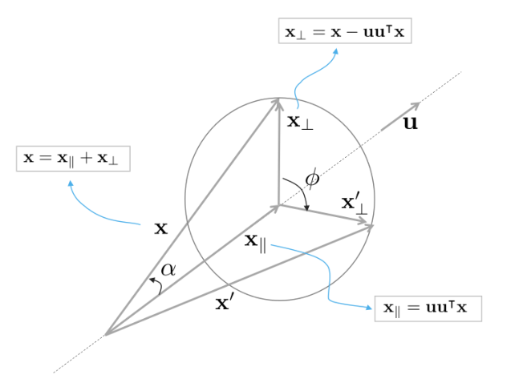

*Figure 1: 3차원 공간 상의 임의의 벡터 $\mathbf{x}$를 $\mathbf{u}$축을 중심으로 $\phi$만큼 회전하여
$\mathbf{x}'$가 되는 과정. (원문 p.10)*

그림 1은 오른손법칙을 사용하여 3차원 공간 상의 임의의 벡터 $\mathbf{x}$를 $\mathbf{u}$축을 중심으로
$\phi$만큼 회전시키는 모습을 나타낸다. $\mathbf{x}$를 $\mathbf{u}$축에 평행인 벡터
$\mathbf{x}_{\parallel}$와 직교하는 벡터 $\mathbf{x}_{\perp}$로 분해할 수 있다.

$$\mathbf{x} = \mathbf{x}_{\parallel} + \mathbf{x}_{\perp}. \tag{56}$$

두 벡터는 다음과 같이 계산할 수 있다. 이 때, $\alpha$ 는 $\mathbf{x}$와 $\mathbf{u}$축 사이의 각도를
의미한다.

$$\begin{aligned}
\mathbf{x}_{\parallel} &= \mathbf{u}(\|\mathbf{x}\|\cos\alpha) = \mathbf{u}\mathbf{u}^{\intercal}\mathbf{x} \\
\mathbf{x}_{\perp} &= \mathbf{x} - \mathbf{x}_{\parallel} = \mathbf{x} - \mathbf{u}\mathbf{u}^{\intercal}\mathbf{x}.
\end{aligned} \tag{57}$$

회전이 수행되는 동안 $\mathbf{u}$축에 평행한 $\mathbf{x}_{\parallel}$은 회전하지 않는다.

$$\mathbf{x}'_{\parallel} = \mathbf{x}_{\parallel} \tag{58}$$

그리고 $\mathbf{u}$축에 직교하는 파트들은 $\mathbf{u}$와 수직인 평면 내부에서 회전하게 된다. 따라서 평면
내부에 서로 직교하는 두 basis $\{\mathbf{e}_1, \mathbf{e}_2\}$가 있다고 했을 때 이는 다음과 같이 나타낼
수 있다.

$$\begin{aligned}
\mathbf{e}_1 &= \mathbf{x}_{\perp} \\
\mathbf{e}_2 &= \mathbf{u} \times \mathbf{x}_{\perp} = \mathbf{u} \times \mathbf{x}
\end{aligned} \tag{59}$$

두 basis는 $\|\mathbf{e}_1\| = \|\mathbf{e}_2\|$를 만족한다. 따라서
$\mathbf{x}_{\perp} = \mathbf{e}_1 \cdot 1 + \mathbf{e}_2 \cdot 0$과 같이 쓸 수 있고 $\phi$만큼 회전한
직교벡터에 대해서는 다음과 같이 나타낼 수 있다.

$$\mathbf{x}'_{\perp} = \mathbf{e}_1\cos\phi + \mathbf{e}_2\sin\phi \tag{60}$$

이는 다음과 같이 전개해서 나타낼 수 있다.

$$\mathbf{x}'_{\perp} = \mathbf{x}_{\perp}\cos\phi + (\mathbf{u} \times \mathbf{x})\sin\phi \tag{61}$$

따라서 최종적으로 회전한 벡터 $\mathbf{x}'$는 다음과 같이 쓸 수 있다.

$$\boxed{\mathbf{x}' = \mathbf{x}'_{\parallel} + \mathbf{x}'_{\perp} = \mathbf{x}_{\parallel} + \mathbf{x}_{\perp}\cos\phi + (\mathbf{u} \times \mathbf{x})\sin\phi} \tag{62}$$

<!--widget:vector-rotation-3d-->

## 2.2 The rotation group SO(3)

3차원 공간에서 SO(3) 군은 원점을 중심으로 회전하는 연산에 대한 군을 말한다. 회전은 벡터의 길이와
상대벡터의 방향을 보존하는 선형 변환 연산이다. 이는 로보틱스에서 강체(rigid body)의 움직임 중 회전을
표현하는데 주로 사용된다. 강체의 움직임이란 물체의 형태가 변화하지 않아서 각도, 상대적인 회전량
(relative orientation), 거리 등이 보존되는 움직임을 의미한다.

유클리디언 공간에서 $\mathbf{v} \in \mathbb{R}^3$ 벡터에 대해 회전을 수행하는 연산자
$r : \mathbb{R}^3 \to \mathbb{R}^3; \mathbf{v} \mapsto r(\mathbf{v})$가 주어졌을 때 이는 다음과 같은
성질을 만족한다.

- 회전은 벡터의 놈을 보존한다.

$$\|r(\mathbf{v})\| = \sqrt{<r(\mathbf{v}), r(\mathbf{v})>} = \sqrt{<\mathbf{v}, \mathbf{v}>} \triangleq \|\mathbf{v}\|, \quad \forall \mathbf{v} \in \mathbb{R}^3 \tag{63}$$

- 회전은 두 벡터에 대한 각도를 보존한다.

$$<r(\mathbf{v}), r(\mathbf{w})> = <\mathbf{v}, \mathbf{w}> = \|\mathbf{v}\|\|\mathbf{w}\|\cos\alpha, \quad \forall \mathbf{v}, \mathbf{w} \in \mathbb{R}^3 \tag{64}$$

- 회전은 두 벡터의 상대 회전량(relative orientation)을 보존한다.

$$\mathbf{u} \times \mathbf{v} = \mathbf{w} \Leftrightarrow r(\mathbf{u}) \times r(\mathbf{v}) = r(\mathbf{w}) \tag{65}$$

위 성질을 토대로 SO(3) 군을 다음과 같이 정의할 수 있다.

$$SO(3) : \{r : \mathbb{R}^3 \to \mathbb{R}^3 / \forall \mathbf{v}, \mathbf{w} \in \mathbb{R}^3, \ \ \|r(\mathbf{v})\| = \|\mathbf{v}\|, \ \ r(\mathbf{v}) \times r(\mathbf{w}) = r(\mathbf{v} \times \mathbf{w})\} \tag{66}$$

SO(3) 군은 일반적으로 회전행렬(rotation matrix)를 사용하여 표기한다. 하지만 쿼터니언을 사용하여 SO(3)를
표기하는 방법 또한 널리 사용된다. 본 챕터에서는 두 표기법이 동일하다는 것을 증명한다. 두 표기법은
개념적으로나 대수적으로 많은 부분에서 유사하다.

## 2.3 The rotation group and the rotation matrix

회전연산자 $r$은 선형성을 가진다. 따라서 선형성을 가진 스칼라나 벡터, 행렬로도 $r$을 표현할 수 있다. 그 중
대표적인 것이 회전행렬 $\mathbf{R} \in \mathbb{R}^{3\times3}$을 통해 회전연산자를 표현하는 방법이다.

$$r(\mathbf{v}) = \mathbf{R}\mathbf{v} \tag{67}$$

내적 $<\mathbf{a}, \mathbf{b}> = \mathbf{a}^{\intercal}\mathbf{b}$ 을 활용하여 (63)에 해당 공식을
적용하면 모든 $\mathbf{v}$에 대해 다음 공식이 적용된다.

$$(\mathbf{R}\mathbf{v})^{\intercal}(\mathbf{R}\mathbf{v}) = \mathbf{v}^{\intercal}\mathbf{R}^{\intercal}\mathbf{R}\mathbf{v} = \mathbf{v}^{\intercal}\mathbf{v}. \tag{68}$$

이를 통해 회전행렬의 직교하는 성질을 유도할 수 있다.

$$\boxed{\mathbf{R}^{\intercal}\mathbf{R} = \mathbf{I} = \mathbf{R}\mathbf{R}^{\intercal}} \tag{69}$$

회전행렬 $\mathbf{R} = [\mathbf{r}_1, \mathbf{r}_2, \mathbf{r}_3]$와 같이 열행렬 $\mathbf{r}_i$로
표기하면 직교행렬의 성질에 의해 다음 공식이 성립한다.

$$\begin{aligned}
<\mathbf{r}_i, \mathbf{r}_i> &= \mathbf{r}_i^{\intercal}\mathbf{r}_i = 1 \\
<\mathbf{r}_i, \mathbf{r}_j> &= \mathbf{r}_i^{\intercal}\mathbf{r}_j = 0, \quad \text{if } i \neq j
\end{aligned} \tag{70}$$

이에 따라 3차원 공간에서 변환 시 벡터의 놈과 각도를 보존하는 군을 Orthogonal 군이라고 하며 줄여서
O(3)라고 표현한다. Orthogonal 군은 강체의 변환일 때 회전과 비강체의 변환일 때 반사(reflection)로
구성되어 있다. 여기서 군이라는 표현을 사용하는 이유는 두 개의 직교하는 O(3) 행렬을 곱하면 언제나
직교하는 O(3) 행렬이 나오기 때문이다. 즉, 곱셈에 대해 닫혀있다. 이는 역행렬 또한 직교행렬의 성질을
만족하는 것을 의미한다. 따라서 (69)에 의해 회전행렬의 역행렬은 전치행렬과 동일하다.

$$\mathbf{R}^{-1} = \mathbf{R}^{\intercal} \tag{71}$$

그리고 강체의 움직임에 한해서 상대적인 회전량을 보존하는 성질 (65)에 의해 다음과 같은 제약조건이
추가된다.

$$\boxed{\det(\mathbf{R}) = 1} \tag{72}$$

Orthogonal 군에서 특별히 위와같이 positive unit determinant를 만족하는 군을 Special Orthogonal 군, 즉
SO(3)군이라고 한다. 군의 성질을 만족해야 하므로 임의의 두 SO(3) 회전행렬의 곱은 항상 SO(3) 회전행렬이
된다.

### 2.3.1 The exponential map

Exponential map(+Logarithm map)은 3차원 공간의 회전을 조금 더 편하게 쉽게 이해 및 응용할 수 있게 해주는
강력한 수학적 도구이다. 이는 미세한 변화량에 대한 미적분(infinitesimal calculus)과 3차원 회전을
연결시켜주는 고리 역할을 수행한다. 또한, 3차원 회전에 대한 자코비안을 정의하거나, 섭동(perturbation)
모델링을 정의하거나 속도를 정의하고 사용할 수 있도록 해주는 핵심적인 역할을 수행한다. 따라서 3차원
공간에서 회전에 대한 추정 문제를 사용할 때 필수적으로 사용된다.

회전은 강체 움직임(rigid motion)의 성질을 만족한다. 이 때, 강체 움직임의 성질이란 처음 $t_0 = 0$ 순간의
방향 $r(0)$으로부터 $t$ 초 후 현재의 방향 $r(t)$까지 물체가 회전했을 때 SO(3) 군 내에서 연속적인 궤적
(continuous trajectory)를 정의할 수 있음을 말한다. 이러한 연속적인 궤적은 시간 $t$에 따라 회전을 미분할
수 있음을 의미한다.

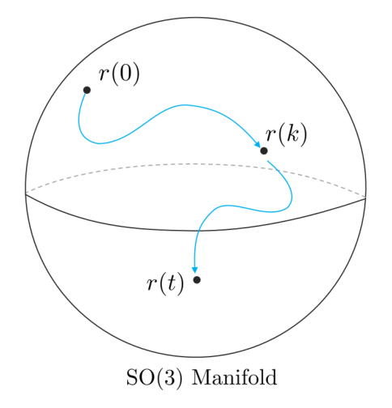

*Figure 2: SO(3) 군 내에서 시간 t에 따른 연속적인 궤적 (원문 p.13)*

앞서 SO(3)의 제약조건 중 (69)에 대한 시간미분 값을 유도하면 다음과 같다.

$$\frac{d}{dt}(\mathbf{R}^{\intercal}\mathbf{R}) = \dot{\mathbf{R}}^{\intercal}\mathbf{R} + \mathbf{R}^{\intercal}\dot{\mathbf{R}} = 0 \tag{73}$$

위 식을 정리하면 다음과 같은 공식을 얻을 수 있다.

$$\mathbf{R}^{\intercal}\dot{\mathbf{R}} = -(\mathbf{R}^{\intercal}\dot{\mathbf{R}})^{\intercal} \tag{74}$$

이는 $\mathbf{R}^{\intercal}\dot{\mathbf{R}}$이 반대칭행렬(skew-symmetric matrix)의 성질을 만족하는 것을
의미한다. 이러한 3x3 반대칭행렬의 집합을 so(3)라고 하며 SO(3) 군의 Lie Algebra라고 한다. 3x3
반대칭행렬은 다음과 같은 형태를 갖는다.

$$[\pmb{\omega}]_{\times} \triangleq \begin{bmatrix}
0 & -\omega_z & \omega_y \\
\omega_z & 0 & -\omega_x \\
-\omega_y & \omega_x & 0
\end{bmatrix} \tag{75}$$

반대칭행렬은 3자유도를 가지며 (21)에서 설명한 것처럼 cross product 연산자로 사용된다. 이는
$\pmb{\omega} \in \mathbb{R}^3 \leftrightarrow [\pmb{\omega}]_{\times} \in so(3)$과 같이
임의의 3차원 벡터는 so(3)와 일대일 매핑 관계에 있다는 것을 알 수 있다.

$$\mathbf{R}^{\intercal}\dot{\mathbf{R}} = [\pmb{\omega}]_{\times} \tag{76}$$

위 식은 다음과 같이 일반미분방정식(ordinary differential equation, ODE) 형태를 가진다.

$$\dot{\mathbf{R}} = \mathbf{R}[\pmb{\omega}]_{\times} \tag{77}$$

원점 부근에서 $\mathbf{R} = I$라고 하면 $\dot{\mathbf{R}} = [\pmb{\omega}]_{\times}$의 식이
유도된다. 따라서 so(3)는 원점 근처에서 $r(t)$의 시간에 대한 미분 공간으로 해석할 수 있다. 이는 SO(3) 군에
대한 접평면(tangent space)를 의미한다. 또는 velocity space이라고도 불린다. 따라서, $\pmb{\omega}$는
순간적인 각속도를 의미한다.

만약 각속도 $\pmb{\omega}$가 일정한 경우, 미분방정식은 다음과 같이 나타낼 수 있다.

$$\mathbf{R}(t) = \mathbf{R}(0)e^{[\pmb{\omega}]_{\times}t} = \mathbf{R}_0 e^{[\pmb{\omega}t]_{\times}} \tag{78}$$

exponential $e^{[x]_{\times}}$는 테일러 급수로 전개하여 나타낼 수 있다.
$\mathbf{R}_0, \mathbf{R}(t)$는 회전행렬을 의미하므로
$e^{[\pmb{\omega}t]_{\times}} = \mathbf{R}(0)^{\intercal}\mathbf{R}(t)$와 같이 나타낼 수 있다.
임의의 벡터 $\phi \triangleq \pmb{\omega}\Delta t$를 시간 $\Delta t$에 대한 회전벡터로 정의하면
다음 공식을 얻을 수 있다.

$$\boxed{\mathbf{R} = e^{[\phi]_{\times}}} \tag{79}$$

이는 $[\phi]_{\times}$를 exponential map을 통해 회전행렬로 변환이 가능함을 의미한다. 즉, so(3)에서 SO(3)
군으로 변환을 의미한다.

$$\exp : so(3) \to SO(3); \quad [\phi]_{\times} \mapsto \exp([\phi]_{\times}) = e^{[\phi]_{\times}} \tag{80}$$

### 2.3.2 The capitalized exponential map

앞서 소개한 exponential map은 종종 표기법에서 혼란을 일으킨다. 이는 주로 $\phi \in \mathbb{R}^3$와
$[\phi]_{\times} \in so(3)$을 혼용하면서 발생한다. 이러한 표기의 혼란을 막기 위해
$\mathbb{R}^3 \to SO(3)$로 변환하는 연산은 대문자 Exp 연산이라고 정의한다.

$$\mathrm{Exp} : \mathbb{R}^3 \to SO(3); \quad \phi \mapsto \mathrm{Exp}(\phi) = e^{[\phi]_{\times}} \tag{81}$$

두 연산자 exp, Exp 사이에는 다음과 같은 관계가 성립한다.

$$\mathrm{Exp}(\phi) \triangleq \exp([\phi]_{\times}) \tag{82}$$

다음 섹션에서는 벡터 $\phi$가 회전벡터 또는 angle-axis 벡터로 불리는 것에 대해 설명한다. 따라서 임의의
각도 $\theta$와 $\mathbf{u}$축에 대해 $\phi = \pmb{\omega}\Delta t = \theta\mathbf{u}$와 같이
나타낼 수 있다.

### 2.3.3 Rotation matrix and rotation vector: the Rodrigues rotation formula

회전행렬 $\mathbf{R}$은 회전벡터 $\phi = \theta\mathbf{u}$에 exponential map을 적용함으로써 정의된다.
(79)에 $\phi = \theta\mathbf{u}$를 활용하여 테일러 전개해보면 다음과 같다.

$$\mathbf{R} = e^{\theta[\mathbf{u}]_{\times}} = \mathbf{I} + \theta[\mathbf{u}]_{\times} + \frac{1}{2}\theta^2[\mathbf{u}]_{\times}^2 + \frac{1}{3!}\theta^3[\mathbf{u}]_{\times}^3 + \frac{1}{4!}\theta^4[\mathbf{u}]_{\times}^4 + \cdots \tag{83}$$

$\mathbf{u}$는 단위벡터이므로 반대칭행렬 $[\mathbf{u}]_{\times}$는 다음을 만족한다.

$$\begin{aligned}
[\mathbf{u}]_{\times}^2 &= \mathbf{u}\mathbf{u}^{\intercal} - \mathbf{I} \\
[\mathbf{u}]_{\times}^3 &= -[\mathbf{u}]_{\times}
\end{aligned} \tag{84}$$

따라서 모든 $[\mathbf{u}]_{\times}$의 지수승은 $[\mathbf{u}]_{\times}$와 $[\mathbf{u}]_{\times}^2$로
표현이 가능하다.

$$[\mathbf{u}]_{\times}^4 = -[\mathbf{u}]_{\times}^2, \quad [\mathbf{u}]_{\times}^5 = [\mathbf{u}]_{\times}, \quad [\mathbf{u}]_{\times}^6 = [\mathbf{u}]_{\times}^2, \quad [\mathbf{u}]_{\times}^7 = -[\mathbf{u}]_{\times}, \quad \cdots \tag{85}$$

따라서 $[\mathbf{u}]_{\times}$와 $[\mathbf{u}]_{\times}^2$로 테일러 전개를 묶은 후
$\sin\theta, \cos\theta$ 공식을 적용하면 회전벡터로부터 회전행렬을 구하는 공식이 나오는데 이를 특별히
Rodrigues rotation formula라고 한다.

$$\boxed{\mathbf{R} = \mathbf{I} + \sin\theta[\mathbf{u}]_{\times} + (1 - \cos\theta)[\mathbf{u}]_{\times}^2} \tag{86}$$

이는 $\mathbf{R}\{\theta\} \triangleq \mathrm{Exp}(\theta)$와 같이 나타낼 수 있다. 위 공식은 다양한 변형
공식이 존재하는데 대표적으로 (84)를 활용하여 다음과 같이 나타낼 수 있다.

$$\mathbf{R} = \mathbf{I}\cos\theta + [\mathbf{u}]_{\times}\sin\theta + \mathbf{u}\mathbf{u}^{\intercal}(1 - \cos\theta) \tag{87}$$

<!--widget:rodrigues-->

### 2.3.4 The logarithm maps

exponential map의 역연산으로 logarithm map을 정의할 수 있다.

$$\log : SO(3) \to so(3); \quad \mathbf{R} \mapsto \log(\mathbf{R}) = [\mathbf{u}\theta]_{\times} \tag{88}$$

이 때,

$$\begin{aligned}
\theta &= \arccos\left(\frac{\mathrm{trace}(\mathbf{R}) - 1}{2}\right) \\
\mathbf{u} &= \frac{(\mathbf{R} - \mathbf{R}^{\intercal})^{\vee}}{2\sin\theta}
\end{aligned} \tag{89}$$

와 같으며 $(\cdot)^{\vee}$ 연산은 $[\cdot]_{\times}$ 연산의 역연산을 의미히나다. 즉,
$([\mathbf{v}]_{\times})^{\vee} = \mathbf{v}$이고 $[\mathbf{V}^{\vee}]_{\times} = \mathbf{V}$이다.
exponential map과 동일하게 대문자 연산 Log를 정의할 수 있다. 이는 회전행렬로부터 회전벡터를 구하는
연산이다.

$$\mathrm{Log} : SO(3) \to \mathbb{R}^3; \quad \mathbf{R} \mapsto \mathrm{Log}(\mathbf{R}) = \mathbf{u}\theta \tag{90}$$

소문자 연산자와 대문자 연산자 사이에는 다음과 같은 성질을 만족한다.

$$\mathrm{Log}(\mathbf{R}) \triangleq (\log(\mathbf{R}))^{\vee} \tag{91}$$

지금까지 설명한 대소문자 exponential, logarithm map을 그림으로 표현하면 다음과 같다.

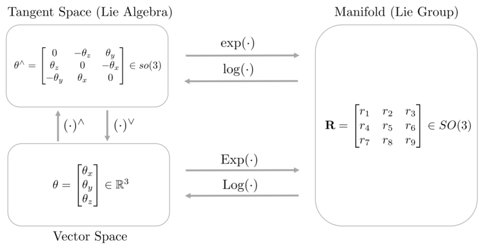

*Figure 3: Exponential map and Logarithm map (원문 p.15)*

### 2.3.5 The rotation action

3차원 공간에서 임의의 벡터 $\mathbf{x}$를 $\mathbf{u}$축을 중심으로 각도 $\theta$만큼 회전시키기
위해서는 다음과 같은 선형연산이 적용된다.

$$\mathbf{x}' = \mathbf{R}\mathbf{x} \tag{92}$$

이 때, $\mathbf{R} = \mathrm{Exp}(\mathbf{u}\theta)$이다. 이를 Rodrigues formula (86)을 사용하여
표현하면 다음과 같다.

$$\begin{aligned}
\mathbf{x}' &= \mathbf{R}\mathbf{x} \\
&= (\mathbf{I} + \sin\theta[\mathbf{u}]_{\times} + (1 - \cos\theta)[\mathbf{u}]_{\times}^2)\mathbf{x} \\
&= \mathbf{x} + \sin\theta[\mathbf{u}]_{\times}\mathbf{x} + (1 - \cos\theta)[\mathbf{u}]_{\times}^2\mathbf{x} \\
&= \mathbf{x} + \sin\theta(\mathbf{u} \times \mathbf{x}) + (1 - \cos\theta)(\mathbf{u}\mathbf{u}^{\intercal} - \mathbf{I})\mathbf{x} \\
&= \mathbf{x}_{\parallel} + \mathbf{x}_{\perp} + \sin\theta(\mathbf{u} \times \mathbf{x}) - (1 - \cos\theta)\mathbf{x}_{\perp} \\
&= \mathbf{x}_{\parallel} + (\mathbf{u} \times \mathbf{x})\sin\theta + \mathbf{x}_{\perp}\cos\theta
\end{aligned} \tag{93}$$

이는 정확히 벡터의 회전 공식 (62)과 동일하다.

## 2.4 The rotation group and the quaternion

본 섹션에서는 SO(3)의 표기법으로 쿼터니언을 사용하는 방법에 대해 설명한다. 또한, 쿼터니언과 회전행렬이
어떠한 연관성이 있는지 설명한다. 쿼터니언이 벡터를 회전하는 연산은 다음과 같이 나타낼 수 있다.

$$r(\mathbf{v}) = \mathbf{q} \otimes \mathbf{v} \otimes \mathbf{q}^* \tag{94}$$

또한, 이를 통해 제약조건 (30)를 활용하여 (63)를 다시 표기하면 다음과 같다.

$$\|\mathbf{q} \otimes \mathbf{v} \otimes \mathbf{q}^*\| = \|\mathbf{q}\|^2\|\mathbf{v}\| = \|\mathbf{v}\| \tag{95}$$

이를 통해 $\|\mathbf{q}\| = 1$ 조건을 유도할 수 있다. 즉, 단위 쿼터니언(unit quaternion)만이 물체의
3차원 회전에 대한 연산을 수행할 수 있음을 의미한다. 이를 통해 다음 공식이 성립한다

$$\boxed{\mathbf{q}^* \otimes \mathbf{q} = 1 = \mathbf{q} \otimes \mathbf{q}^*} \tag{96}$$

이는 회전행렬의 직교성질인 $\mathbf{R}^{\intercal}\mathbf{R} = \mathbf{I} = \mathbf{R}\mathbf{R}^{\intercal}$
(69)와 유사하다. 또한 아래와 같은 전개를 통해 (65)이 성립함을 보일 수 있다.

$$\begin{aligned}
r(\mathbf{v}) \times r(\mathbf{w}) &= (\mathbf{q} \otimes \mathbf{v} \otimes \mathbf{q}^*) \times (\mathbf{q} \otimes \mathbf{w} \otimes \mathbf{q}^*) \\
&= \frac{1}{2}((\mathbf{q} \otimes \mathbf{v} \otimes \mathbf{q}^*) \otimes (\mathbf{q} \otimes \mathbf{w} \otimes \mathbf{q}^*) - (\mathbf{q} \otimes \mathbf{w} \otimes \mathbf{q}^*) \otimes (\mathbf{q} \otimes \mathbf{v} \otimes \mathbf{q}^*)) \\
&= \frac{1}{2}(\mathbf{q} \otimes \mathbf{v} \otimes \mathbf{w} \otimes \mathbf{q}^* - \mathbf{q} \otimes \mathbf{w} \otimes \mathbf{v} \otimes \mathbf{q}^*) \\
&= \frac{1}{2}(\mathbf{q} \otimes (\mathbf{v} \otimes \mathbf{w} - \mathbf{w} \otimes \mathbf{v}) \otimes \mathbf{q}^*) \\
&= \mathbf{q} \otimes (\mathbf{v} \times \mathbf{w}) \otimes \mathbf{q}^* \\
&= r(\mathbf{v} \times \mathbf{w})
\end{aligned} \tag{97}$$

위 전개를 통해 단위 쿼터니언은 곱셈 연산에 대해 닫힌 연산을 수행하는 군을 형성하는 것을 알 수 있다.
단위 쿼터니언 군의 manifold는 기하학적으로 $\mathbb{R}^4$차원의 단위 구(unit sphere)를 형성한다. 4차원
구는 일반적으로 표현할 수 없으므로 이를 단순화하여 3차원 구를 통해 manifold를 설명한다. 이러한 단위
쿼터니언의 군을 $\mathcal{S}^3$라고 부른다.

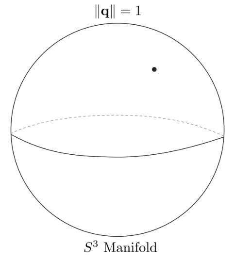

*Figure 4: 단위 쿼터니언의 manifold $S^3$. (원문 p.17)*

### 2.4.1 The exponential map

임의의 단위 쿼터니언이 $\mathbf{q} \in S^3$가 주어졌을 때 이는 직교조건
$\mathbf{q}^* \otimes \mathbf{q} = 1$을 만족한다. 따라서 회전행렬과 마찬가지로 직교조건에 대해 미분을
취하면 다음과 같다.

$$\frac{d(\mathbf{q}^* \otimes \mathbf{q})}{dt} = \dot{\mathbf{q}}^* \otimes \mathbf{q} + \mathbf{q}^* \otimes \dot{\mathbf{q}} = 0 \tag{98}$$

이를 전개하면 다음과 같다.

$$\mathbf{q}^* \otimes \dot{\mathbf{q}} = -(\dot{\mathbf{q}}^* \otimes \mathbf{q}) = -(\mathbf{q}^* \otimes \dot{\mathbf{q}})^* \tag{99}$$

이는 곧 $\mathbf{q}^* \otimes \dot{\mathbf{q}}$이 순수 쿼터니언임(pure quaternion)을 의미한다. 순수
쿼터니언은 실수부가 0이므로 켤레복소수를 취하면 음수인 자기 자신이 된다. 순수 쿼터니언을
$\Omega \in \mathbb{H}$라고 하면 다음과 같이 나타낼 수 있다.

$$\mathbf{q}^* \otimes \dot{\mathbf{q}} = \Omega = \begin{bmatrix} 0 \\ \Omega \end{bmatrix} \in \mathbb{H}_p \tag{100}$$

이를 정리하면 다음과 같다.

$$\dot{\mathbf{q}} = \mathbf{q} \otimes \Omega \tag{101}$$

원점 부근에서 $\mathbf{q} = 1$이 되고 위 식은 $\dot{\mathbf{q}} = \Omega \in \mathbb{H}_p$와 같이 나타낼
수 있다. 따라서 순수 쿼터니언 공간 $\mathbb{H}_p$는 접평면(tangent space)을 의미하며 $S^3$ 군의 Lie
Algebra라고 불린다.

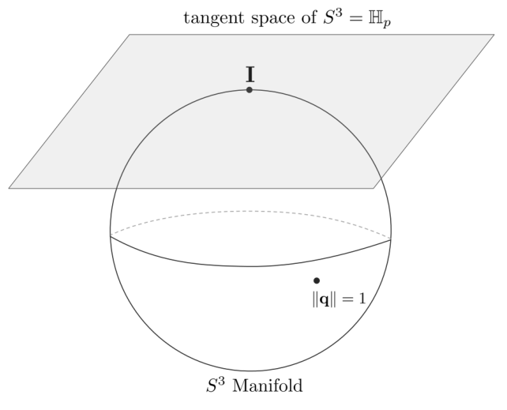

*Figure 5: 단위 쿼터니언의 manifold $S^3$와 접평면 $\mathbb{H}_p$ (원문 p.18)*

단위 쿼터니언의 경우 회전행렬과 달리 접평면이 velocity space를 의미하지 않고 half-velocity space를
의미한다. 이에 대해서는 뒷 섹션에서 자세히 설명한다. 만약 $\Omega$가 일정한 경우 미분방정식은 다음과 같이
나타낼 수 있다.

$$\mathbf{q}(t) = \mathbf{q}(0) \otimes e^{\Omega t} \tag{102}$$

위 식에서 $\mathbf{q}(t)$와 $\mathbf{q}_0$가 모두 단위 쿼터니언이므로 $e^{\Omega t}$ 또한 단위
쿼터니언이 된다. 이는 (45)에서 한 번 유도한 적이 있다. $\mathbf{V} \triangleq \Omega\Delta t$와 같이
정의하면

$$\boxed{\mathbf{q} = e^{\mathbf{V}}} \tag{103}$$

와 같이 나타낼 수 있다. 이는 회전행렬과 마찬가지로 순수 쿼터니언(pure quaternion)에 exponential map을
취하면 단위 쿼터니언(unit quaternion)을 만들 수 있음을 의미한다.

$$\exp : \mathbb{H}_p \to S^3; \quad \mathbf{V} \mapsto \exp(\mathbf{V}) = e^{\mathbf{V}} \tag{104}$$

### 2.4.2 The capitalized exponential map

exponential map에 사용되는 순수 쿼터니언 $\mathbf{V}$은 일반적으로
$\mathbf{V} = \theta\mathbf{u} = \phi\mathbf{u}/2$와 같이 $\mathbf{u}$축을 중심으로 회전하고자 하는 각도
$\phi$의 절반의 각도 $\theta = \phi/2$를 사용한다. 이에 대해 직관적으로 이해해보면 다음과 같다. 임의의
벡터 $\mathbf{x}$가 쿼터니언에 의해 회전하기 위해서는
$\mathbf{x}' = \mathbf{q} \otimes \mathbf{x} \otimes \mathbf{q}^*$과 같이 두 번에 걸쳐서 쿼터니언이
곱해지기 때문에 $\mathbf{V}$에 절반의 각도를 사용하는 것으로 이해할 수 있다.

쿼터니언과 angle-axis 표현법 $\pmb{\phi} = \phi\mathbf{u} \in \mathbb{R}^3$ 사이의 직접적인
관계를 표현하기 위해 angle-axis의 절반의 각도를 사용하는 순수 쿼터니언으로 변환하는 대문자 exponential
map에 대해 정의할 수 있다.

$$\mathrm{Exp} : \mathbb{R}^3 \to S^3; \quad \pmb{\phi} \mapsto \mathrm{Exp}(\pmb{\phi}) = e^{\pmb{\phi}/2} \tag{105}$$

대문자와 소문자 exponential map 사이의 관계는 다음과 같다.

$$\mathrm{Exp}(\pmb{\phi}) \triangleq \exp(\pmb{\phi}/2) \tag{106}$$

임의의 각속도를 $\pmb{\omega} = 2\Omega \in \mathbb{R}^3$와 같이 정의하면 (101), (102)은 다음과
같이 다시 나타낼 수 있다.

$$\begin{aligned}
\dot{\mathbf{q}} &= \frac{1}{2}\mathbf{q} \otimes \pmb{\omega} \\
\mathbf{q} &= e^{\pmb{\omega}t/2}
\end{aligned} \tag{107}$$

### 2.4.3 Quaternion and rotation vector

임의의 angle-axis 벡터 $\pmb{\phi} = \phi\mathbf{u}$가 주어졌을 때, 이에 대한 exponential map은
오일러 공식의 확장 버전으로 표현할 수 있다.

$$\boxed{\mathbf{q} \triangleq \mathrm{Exp}(\pmb{\phi}) = \mathrm{Exp}(\phi\mathbf{u}) = e^{\phi\mathbf{u}/2} = \cos\frac{\phi}{2} + \mathbf{u}\sin\frac{\phi}{2} = \begin{bmatrix} \cos(\phi/2) \\ \mathbf{u}\sin(\phi/2) \end{bmatrix}} \tag{108}$$

위 식은 주로 angle-axis 표현법에서 쿼터니언으로 변환하는 공식으로 사용되며
$\mathbf{q} = \mathbf{q}\{\pmb{\phi}\} \triangleq \mathrm{Exp}(\pmb{\phi})$와 같이 표기한다.

### 2.4.4 The logarithmic maps

단위 쿼터니언 또한 회전행렬과 마찬가지로 exponential map에 대한 역연산인 logarithmic map이 존재한다.

$$\log : S^3 \to \mathbb{H}_p; \quad \mathbf{q} \mapsto \log(\mathbf{q}) = \mathbf{u}\theta \tag{109}$$

또한 대문자 logarithmic map 역시 존재한다. 이는 임의의 쿼터니언을 3차원 벡터로 변환하는 연산이다.

$$\mathrm{Log} : S^3 \to \mathbb{R}^3; \quad \mathbf{q} \mapsto \mathrm{Log}(\mathbf{q}) = \mathbf{u}\phi \tag{110}$$

두 연산 사이에는 다음과 같은 관계가 성립한다.

$$\mathrm{Log}(\mathbf{q}) \triangleq 2\log(\mathbf{q}) \tag{111}$$

$\phi$와 $\mathbf{u}$는 다음과 같이 구할 수 있다.

$$\begin{aligned}
\phi &= 2\arctan(\|\mathbf{q}_v\|, q_w) \\
\mathbf{u} &= \mathbf{q}_v / \|\mathbf{q}_v\|
\end{aligned} \tag{112}$$

매우 작은 움직임을 표현하는 쿼터니언에 대해서는 위 식과 같이 $\mathbf{u}$를 구할 수 없다. 이럴 경우에는
테일러 급수를 사용하여 고차항을 버리고 근사된 값을 사용한다.

$$\mathrm{Log}(\mathbf{q}) = \theta\mathbf{u} \simeq 2\frac{\mathbf{q}_v}{q_w}\left(1 - \frac{\|\mathbf{q}_v\|^2}{3q_w^2}\right) \tag{113}$$

### 2.4.5 The rotation action

앞서 설명한 내용과 같이 3차원 공간에서 임의의 벡터 $\mathbf{x}$를 $\mathbf{u}$축을 중심으로 $\phi$만큼
회전하고 싶으면 다음과 같이 2번의 쿼터니언 곱을 통해 회전을 표현할 수 있다.

$$\mathbf{x}' = \mathbf{q} \otimes \mathbf{x} \otimes \mathbf{q}^* \tag{114}$$

이 때, $\mathbf{q} = \mathrm{Exp}(\mathbf{u}\phi)$를 의미하며 임의의 벡터 $\mathbf{x}$ 또한 다음과 같은
쿼터니언 형태로 변형된다.

$$\mathbf{x} = xi + yj + zk = \begin{bmatrix} 0 \\ \mathbf{x} \end{bmatrix} \in \mathbb{H}_p \tag{115}$$

2번의 쿼터니언 곱이 벡터의 회전을 수행하는 것을 증명하기 위해서 (13), (107)를 사용하여 위 공식을 다음과
같이 나타낼 수 있다.

$$\begin{aligned}
\mathbf{x}' &= \mathbf{q} \otimes \mathbf{x} \otimes \mathbf{q}^* \\
&= \left(\cos\frac{\phi}{2} + \mathbf{u}\sin\frac{\phi}{2}\right) \otimes (0 + \mathbf{x}) \otimes \left(\cos\frac{\phi}{2} - \mathbf{u}\sin\frac{\phi}{2}\right) \\
&= \mathbf{x}\cos^2\frac{\phi}{2} + (\mathbf{u} \otimes \mathbf{x} - \mathbf{x} \otimes \mathbf{u})\sin\frac{\phi}{2}\cos\frac{\phi}{2} - \mathbf{u} \otimes \mathbf{x} \otimes \mathbf{u}\sin^2\frac{\phi}{2} \\
&= \mathbf{x}\cos^2\frac{\phi}{2} + 2(\mathbf{u} \times \mathbf{x})\sin\frac{\phi}{2}\cos\frac{\phi}{2} - (\mathbf{x}(\mathbf{u}^{\intercal}\mathbf{u}) - 2\mathbf{u}(\mathbf{u}^{\intercal}\mathbf{x}))\sin^2\frac{\phi}{2} \\
&= \mathbf{x}\left(\cos^2\frac{\phi}{2} - \sin^2\frac{\phi}{2}\right) + (\mathbf{u} \times \mathbf{x})\left(2\sin\frac{\phi}{2}\cos\frac{\phi}{2}\right) + \mathbf{u}(\mathbf{u}^{\intercal}\mathbf{x})\left(2\sin^2\frac{\phi}{2}\right) \\
&= \mathbf{x}\cos\phi + (\mathbf{u} \times \mathbf{x})\sin\phi + \mathbf{u}(\mathbf{u}^{\intercal}\mathbf{x})(1 - \cos\phi) \\
&= (\mathbf{x} - \mathbf{u}\mathbf{u}^{\intercal}\mathbf{x})\cos\phi + (\mathbf{u} \times \mathbf{x})\sin\phi + \mathbf{u}\mathbf{u}^{\intercal}\mathbf{x} \\
&= \mathbf{x}_{\perp}\cos\phi + (\mathbf{u} \times \mathbf{x})\sin\phi + \mathbf{x}_{\parallel}
\end{aligned} \tag{116}$$

위 전개를 통해 쿼터니언 연산이 벡터의 회전 공식과 동일하다는 것을 알 수 있다.

### 2.4.6 The double cover of the manifold of SO(3)

임의의 단위 쿼터니언 $\mathbf{q}$가 주어졌다고 했을 때, 항등 쿼터니언(identity quaternion)
$\mathbf{q}_1 = [1, 0, 0, 0]$과 $\mathbf{q}$ 사이의 각도 $\theta$는 다음과 같이 표현할 수 있다.

$$\cos\theta = \mathbf{q}_1^{\intercal}\mathbf{q} = \mathbf{q}(1) = q_w \tag{117}$$

또한, 3차원 물체가 $\mathbf{q}$에 의해 $\phi$ 각도만큼 회전했을 때 $\mathbf{q}$는 다음과 같다.

$$\mathbf{q} = \begin{bmatrix} q_w \\ \mathbf{q}_v \end{bmatrix} = \begin{bmatrix} \cos\phi/2 \\ \mathbf{u}\sin\phi/2 \end{bmatrix} \tag{118}$$

위 두 식을 종합해보면 $q_w = \cos\theta = \cos\phi/2$인 것을 알 수 있다. 즉, 단위 쿼터니언 공간 $S^3$에서
움직이는 각도 $\theta$는 실제 물체가 움직이는 각도의 절반 $\phi/2$ 인 것을 알 수 있다.

$$\theta = \phi/2 \tag{119}$$

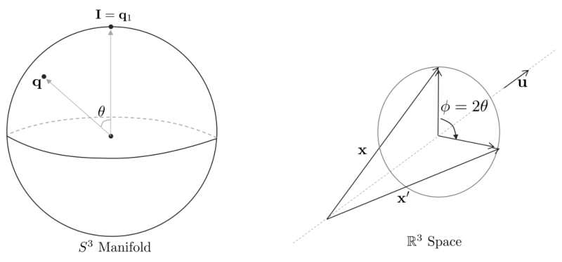

*Figure 6: 쿼터니언 공간에서 $\theta$만큼 회전하면 실제 월드 상에서 물체는 $2\theta$만큼 회전한다
(원문 p.20)*

만약 $\theta = \pi/2$인 경우 실제 월드 상의 물체는 $\phi = \pi$만큼 회전한다. 그리고 $\theta = \pi$만큼
반바퀴 회전을 하면 실제 월드 상의 물체는 $\phi = 2\pi$만큼 한 바퀴 회전을 한다.

<!--widget:double-cover-->

## 2.5 Rotation matrix and quaternion

임의의 angle-axis 벡터 $\pmb{\phi} = \mathbf{u}\phi$가 주어졌을 때,
$\mathbf{q} = \mathrm{Exp}(\mathbf{u}\phi)$를 통해 단위 쿼터니언을 만들 수 있고 또한
$\mathbf{R} = \mathrm{Exp}(\mathbf{u}\phi)$를 통해 회전행렬을 만들 수 있다. 그리고 위 두 값을 통해 3차원
공간 상의 임의의 벡터 $\mathbf{x}$를 $\mathbf{u}$축을 중심으로 $\phi$만큼 회전시킬 수 있다.

$$\forall \pmb{\phi}, \mathbf{x} \in \mathbb{R}^3, \quad \mathbf{q} = \mathrm{Exp}(\pmb{\phi}), \quad \mathbf{R} = \mathrm{Exp}(\pmb{\phi}) \tag{120}$$

이는 곧 다음 공식이 성립함을 의미한다.

$$\mathbf{q} \otimes \mathbf{x} \otimes \mathbf{q}^* = \mathbf{R}\mathbf{x} \tag{121}$$

위 두 식은 모두 $\mathbf{x}$에 대한 선형변환 식이다. 이를 토대로 회전행렬과 단위 쿼터니언 사이의
변환식을 다음과 같이 유도할 수 있다.

$$\boxed{\mathbf{R} = \begin{bmatrix}
q_w^2 + q_x^2 - q_y^2 - q_z^2 & 2(q_x q_y - q_w q_z) & 2(q_x q_z + q_w q_y) \\
2(q_x q_y + q_w q_z) & q_w^2 - q_x^2 + q_y^2 - q_z^2 & 2(q_y q_z - q_w q_x) \\
2(q_x q_z - q_w q_y) & 2(q_y q_z + q_w q_x) & q_w^2 - q_x^2 - q_y^2 + q_z^2
\end{bmatrix}} \tag{122}$$

위 변환식은 $\mathbf{R} = \mathbf{R}\{\mathbf{q}\}$와 같이 나타낸다. 또한, (18)를 참고해서 쿼터니언을
행렬곱 형태로 만들면 다음과 같이 다시 쓸 수 있다.

$$\mathbf{q} \otimes \mathbf{x} \otimes \mathbf{q}^* = [\mathbf{q}^*]_R[\mathbf{q}]_L\begin{bmatrix} 0 \\ \mathbf{x} \end{bmatrix} = \begin{bmatrix} 0 \\ \mathbf{R}\mathbf{x} \end{bmatrix} \tag{123}$$

이를 통해 다음과 같이 다른 변환 공식을 유도할 수 있다.

$$\boxed{\mathbf{R} = (q_w^2 - \mathbf{q}_v^{\intercal}\mathbf{q}_v)\mathbf{I} + 2\mathbf{q}_v\mathbf{q}_v^{\intercal} + 2q_w[\mathbf{q}_v]_{\times}} \tag{124}$$

회전행렬과 단위 쿼터니언 사이에는 다음과 같은 성질이 만족한다.

$$\begin{aligned}
\mathbf{R}\{[1, 0, 0, 0]^{\intercal}\} &= \mathbf{I} \\
\mathbf{R}\{-\mathbf{q}\} &= \mathbf{R}\{\mathbf{q}\} \\
\mathbf{R}\{\mathbf{q}^*\} &= \mathbf{R}\{\mathbf{q}\}^{\intercal} \\
\mathbf{R}\{\mathbf{q}_1 \otimes \mathbf{q}_2\} &= \mathbf{R}\{\mathbf{q}_1\}\mathbf{R}\{\mathbf{q}_2\}
\end{aligned} \tag{125}$$

위 성질들을 토대로 쿼터니언의 지수승은 다음과 같이 변환된다.

$$\mathbf{R}\{\mathbf{q}^t\} = \mathbf{R}\{\mathbf{q}\}^t \tag{126}$$

이는 스칼라 $t$에 대해 단위 쿼터니언과 회전행렬의 구형 보간법(spherical interpolation)이 서로 연관이
있음을 의미한다.

## 2.6 Rotation composition

단위 쿼터니언의 합성(composition)은 회전함수의 합성과 유사하다. 즉, 동일한 순서로 곱셈을 수행한다.

$$\mathbf{q}_{AC} = \mathbf{q}_{AB} \otimes \mathbf{q}_{BC} \qquad \mathbf{R}_{AC} = \mathbf{R}_{AB}\mathbf{R}_{BC} \tag{127}$$

이는 결합법칙을 사용하여 다음과 같이 나타낼 수 있다.

$$\begin{aligned}
\mathbf{x}_A &= \mathbf{q}_{AB} \otimes \mathbf{x}_B \otimes \mathbf{q}_{AB}^* \\
&= \mathbf{q}_{AB} \otimes (\mathbf{q}_{BC} \otimes \mathbf{x}_c \otimes \mathbf{q}_{BC}^*) \otimes \mathbf{q}_{AB}^* \\
&= (\mathbf{q}_{AB} \otimes \mathbf{q}_{BC}) \otimes \mathbf{x}_c \otimes (\mathbf{q}_{BC}^* \otimes \mathbf{q}_{AB}^*) \\
&= (\mathbf{q}_{AB} \otimes \mathbf{q}_{BC}) \otimes \mathbf{x}_c \otimes (\mathbf{q}_{AB} \otimes \mathbf{q}_{BC})^* \\
&= \mathbf{q}_{AC} \otimes \mathbf{x}_c \otimes \mathbf{q}_{AC}^* \quad \text{for quaternion}
\end{aligned} \tag{128}$$

$$\begin{aligned}
\mathbf{x}_A &= \mathbf{R}_{AB}\mathbf{x}_B \\
&= \mathbf{R}_{AB}(\mathbf{R}_{BC}\mathbf{x}_C) \\
&= (\mathbf{R}_{AB}\mathbf{R}_{BC})\mathbf{x}_C \\
&= \mathbf{R}_{AC}\mathbf{x}_C \quad \text{for rotation matrix}
\end{aligned} \tag{129}$$

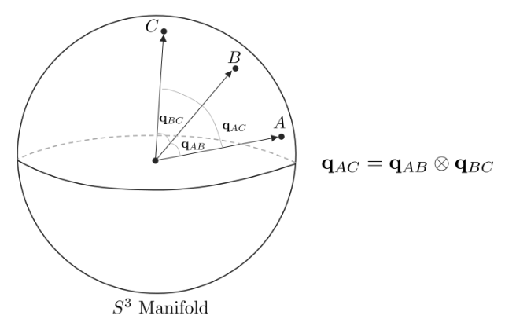

*Figure 7: 단위 쿼터니언의 합성 (원문 p.22)*

이 때, $\mathbf{q}_{ij}$ 또는 $\mathbf{R}_{ij}$의 의미는 특정 i 방향(orientation)에서 j 방향으로
변환하는 연산자를 의미한다. 또는 i 좌표계에서 j 좌표계로의 변환으로도 이해할 수 있다.

## 2.7 Spherical linear interpolation (SLERP)

단위 쿼터니언은 두 방향(orientation) $\mathbf{q}_0, \mathbf{q}_1$이 주어졌을 때 두 지점을 구의 선형
보간(spherical linear interpolation)하기 상대적으로 쉬운 특징을 가지고 있다. 구의 선형보간은 출발지가
$\mathbf{q}_0$ 이고 목적지가 $\mathbf{q}_1$ 일 때, 특정 시간 $t$에서 보간함수
$\mathbf{q}(t), t \in [0, 1]$를 구하는 문제가 된다. 보간함수는 초기조건으로
$\mathbf{q}(0) = \mathbf{q}_0, \mathbf{q}(1) = \mathbf{q}_1$를 가진다. 보간함수 $\mathbf{q}(t)$를
사용하면 $t \in [0, 1]$ 구간에서 물체가 고정된 속도로 자연스럽게
$\mathbf{q}_0 \to \mathbf{q}_1$로 회전할 수있다.

**Method 1** 첫 번째 방법은 쿼터니언 대수학을 이용하는 것이다. 방향의 변화량 $\Delta\mathbf{q}$를
사용하여 $\mathbf{q}_1 = \mathbf{q}_0 \otimes \Delta\mathbf{q}_0$와 같이 표현하는 방법이다.

$$\Delta\mathbf{q} = \mathbf{q}_0^* \otimes \mathbf{q}_1 \tag{130}$$

위 변화량에 logarithmic map을 사용하여 angle-axis 회전벡터 $\Delta\pmb{\phi} = \mathbf{u}\Delta\phi$를
얻을 수 있다.

$$\mathbf{u}\Delta\phi = \mathrm{Log}(\Delta\mathbf{q}) \tag{131}$$

최종적으로 $\mathbf{u}$축은 유지한 상태에서 시간 $t \in [0, 1]$에 따른 각도의 변화량을
$\delta\phi = t\Delta\phi$라고 하면 $\delta\mathbf{q} = \mathrm{Exp}(\mathbf{u}\delta\phi)$와 같이 나타낼
수 있다. 이를 다시 위 공식에 대입하면 다음과 같이 보간함수를 구할 수 있다.

$$\mathbf{q}(t) = \mathbf{q}_0 \otimes \mathrm{Exp}(t\mathbf{u}\Delta\phi) \tag{132}$$

이를 자세히 풀어쓰면
$\mathbf{q}(t) = \mathbf{q}_0 \otimes \mathrm{Exp}(t\mathrm{Log}(\mathbf{q}_0^* \otimes \mathbf{q}_1))$가
되고 이를 다시 정리하면 다음과 같다.

$$\boxed{\mathbf{q}(t) = \mathbf{q}_0 \otimes (\mathbf{q}_0^* \otimes \mathbf{q}_1)^t} \tag{133}$$

이는 (55)과 같이 벡터 형태로 나타낼 수 있다.

$$\mathbf{q}(t) = \mathbf{q}_0 \otimes \begin{bmatrix} \cos(t\Delta\phi/2) \\ \mathbf{u}\sin(t\Delta\phi/2) \end{bmatrix} \tag{134}$$

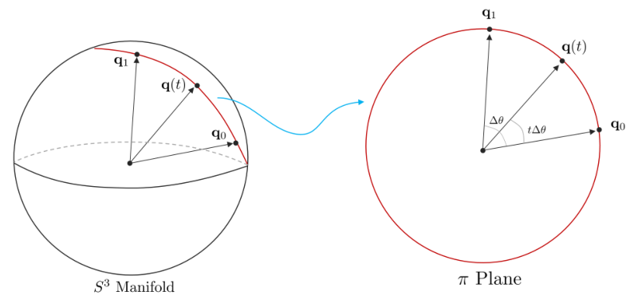

*Figure 8: 쿼터니언의 $\mathbb{R}^4$ 단위 구에서 선형보간. (원문 p.23)*

**Note:** 위 식을 회전행렬에 대한 식으로 변경하면 다음과 같다.

$$\mathbf{R}(t) = \mathbf{R}_0\mathrm{Exp}(t\mathrm{Log}(\mathbf{R}_0^{\intercal}\mathbf{R}_1)) = \mathbf{R}_0(\mathbf{R}_0^{\intercal}\mathbf{R}_1)^t \tag{135}$$

$\mathbf{R}^t$를 Rodrigues 공식 (86)을 사용하여 다시 표현하면 다음과 같다.

$$\mathbf{R}(t) = \mathbf{R}_0(\mathbf{I} + \sin(t\Delta\phi)[\mathbf{u}]_{\times} + (1 - \cos(t\Delta\phi))[\mathbf{u}]_{\times}) \tag{136}$$

**Method 2** 다른 구의 선형보간 방법은 쿼터니언 대수학을 사용하거나 manifold에 종속되지 않는 방법이다.
Fig. 8에서 보면 $\mathbf{q}_0, \mathbf{q}_1$은 단위 원 내에 존재하는 단위벡터로 볼 수 있다. 보간함수
$\mathbf{q}(t)$는 $\mathbf{q}_0$와 $\mathbf{q}_1$의 최단거리를 동일한 각속도로 움직이는 단위벡터로
생각할 수 있다. 최단거리는 두 지점을 포함하는 하나의 평면 호(planar arc)를 형성하는데 이를 $\pi$
평면이라고 정의한다.

첫 번째 접근 방법은 두 단위벡터 $\mathbf{q}_0, \mathbf{q}_1$ 사이의 각도를 대수학적으로 구하는 것이다.

$$\cos(\Delta\theta) = \mathbf{q}_0^{\intercal}\mathbf{q}_1 \quad \Delta\theta = \arccos(\mathbf{q}_0^{\intercal}\mathbf{q}_1) \tag{137}$$

다음으로 $\pi$ 평면 내에서 두 개의 직교하는 basis $\{\mathbf{q}_0, \mathbf{q}_{\perp}\}$를 정의한다.
$\mathbf{q}_{\perp}$는 $\mathbf{q}_1$를 $\mathbf{q}_0$에 대해 직교화한 basis 벡터를 의미한다.

$$\mathbf{q}_{\perp} = \frac{\mathbf{q}_1 - (\mathbf{q}_0^{\intercal}\mathbf{q}_1)\mathbf{q}_0}{\|\mathbf{q}_1 - (\mathbf{q}_0^{\intercal}\mathbf{q}_1)\mathbf{q}_0\|} \tag{138}$$

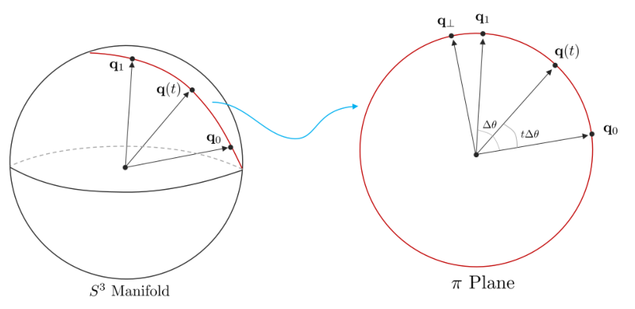

*Figure 9: 쿼터니언의 $\mathbb{R}^4$ 단위 구에서 선형보간. $\mathbf{q}_{\perp}$를 정의한 그림
(원문 p.24)*

따라서 $\mathbf{q}_1$은 다음과 같이 나타낼 수 있다.

$$\mathbf{q}_1 = \mathbf{q}_0\cos\Delta\theta + \mathbf{q}_{\perp}\sin\Delta\theta \tag{139}$$

따라서 보간함수 $\mathbf{q}(t)$는 $\mathbf{q}_0$를 $\pi$ 평면을 따라 각도 $t\Delta\theta$만큼 움직이는
함수가 된다.

$$\boxed{\mathbf{q}(t) = \mathbf{q}_0\cos(t\Delta\theta) + \mathbf{q}_{\perp}\sin(t\Delta\theta)} \tag{140}$$

**Method 3** 이와 유사한 방법으로 Glenn Davis in Shoemake (1985)가 제안한 방법이 있다. 이 방법은
$\mathbf{q}_0, \mathbf{q}_1$이 속한 $\pi$ 평면 내에 임의의 벡터는 선형조합(linear combination)을 통해
나타낼 수 있는 성질을 활용한다. $\Delta\theta$를 (137)을 통해 계산하고 $\mathbf{q}_{\perp}$를 (139)을
통해 구한 후 (140)에 넣으면 다음과 같다. 이 때,
$\sin(\Delta\theta - t\Delta\theta) = \sin\Delta\theta\cos t\Delta\theta - \cos\Delta\theta\sin t\Delta\theta$의
성질을 활용함으로써 Davis's formula를 얻을 수 있다.

$$\boxed{\mathbf{q}(t) = \mathbf{q}_0\frac{\sin((1-t)\Delta\theta)}{\sin(\Delta\theta)} + \mathbf{q}_1\frac{\sin(t\Delta\theta)}{\sin\Delta\theta}} \tag{141}$$

위 식을 $s = 1 - t$과 같이 치환하여 표현하면 다음과 같은 대칭성을 가진다.

$$\mathbf{q}(s) = \mathbf{q}_1\frac{\sin((1-s)\Delta\theta)}{\sin(\Delta\theta)} + \mathbf{q}_0\frac{\sin(s\Delta\theta)}{\sin(\Delta\theta)} \tag{142}$$

이는 위 공식과 $\mathbf{q}_0, \mathbf{q}_1$이 바뀐 것을 제외하고 정확히 동일하다.

앞서 소개한 모든 쿼터니언 기반의 구의 선형보간 방법들(SLERPs)들은 보간하는 실제 회전각도가
$\phi \leq \pi$ 와 같은 조건을 가진다. 하지만 이전 챕터에서 설명한 쿼터니언의 SO(3) double cover 성질에
의해, 실제 단위 쿼터니언 공간에서 수행되는 보간은 $\Delta\theta \leq \pi/2$를 만족해야 한다. 따라서 만약
$\cos(\Delta\theta) = \mathbf{q}_0^{\intercal}\mathbf{q}_1 < 0$ 이면 $\mathbf{q}_1$을
$-\mathbf{q}_1$로 치환한 후 보간을 수행한다.

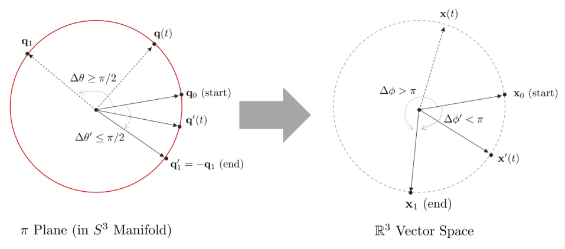

*Figure 10: 쿼터니언 공간에서 $\Delta\theta \geq \pi/2$인 각도의 보간은 $\mathbf{q}_1$에 음수를 곱해서
$-\mathbf{q}_1$를 만들고 이에 대한 보간을 수행한다. 실제 월드 상에서는 오른쪽 그림과 같이 회전한다.
(원문 p.25)*

<!--widget:slerp-->

## 2.8 Quaternion and isoclinic rotations: explaining the magic

본 섹션에서는 다음 두 질문에 대한 답변을 제시한다. 필자는 이를 마법이라고 부른다.

- 왜 $\mathbf{q} \otimes \mathbf{x} \otimes \mathbf{q}^*$ 연산이 벡터 $\mathbf{x}$를 회전하는 공식이
  되는가?
- 왜 쿼터니언을 생성할 때 회전하고자 하는 각도의 절반의 각도를 입력해야 하는가?
  $\mathbf{q} = e^{\phi/2} = [\cos\phi/2, \mathbf{u}\sin\phi/2]$?

위 질문에 답을 하기 위해서는 대수적으로 단위 쿼터니언 곱이 벡터의 회전이라는 것을 증명한 (116) 이상의
기하학적인 설명이 필요하다. (123)을 다시 보면 다음과 같다.

$$\mathbf{q} \otimes \mathbf{x} \otimes \mathbf{q}^* = [\mathbf{q}^*]_R[\mathbf{q}]_L\begin{bmatrix} 0 \\ \mathbf{x} \end{bmatrix} = \begin{bmatrix} 0 \\ \mathbf{R}\mathbf{x} \end{bmatrix} \tag{143}$$

단위 쿼터니언 $\mathbf{q}$은 다음 두 성질을 만족한다.

$$\begin{aligned}
[\mathbf{q}][\mathbf{q}]^{\intercal} &= \mathbf{I}_4 \\
\det([\mathbf{q}]) &= +1
\end{aligned} \tag{144}$$

이는 SO(4)의 성질과 동일하다. 즉, 단위 쿼터니언은 $\mathbb{R}^4$ 공간에서 회전행렬을 의미한다.
구체적으로 말하면, 단위 쿼터니언의 곱은 $\mathbb{R}^4$ 공간에서 등복각회전(isoclinic rotation)을
수행한다. 따라서 (123)은 $\mathbb{R}^4$ 공간에서 $\mathbf{x}$가 2번의 등복각회전을 수행하는 것을
의미한다. 등복각회전을 이해하기 위해서는 우선 $\mathbb{R}^4$ 공간에서 일반적인 회전을 이해해야 한다.

다음은 양영욱님의 저서 **수학으로 시작하는 3D 게임 개발**에 회전 관련 챕터 내용을 주로 참고하여
작성하였다. 2차원 $\mathbb{R}^2$ 공간에서 회전은 점을 중심으로 회전한다. 그리고 3차원 $\mathbb{R}^3$
공간에서 회전은 선을 중심으로 회전한다. 두 차원에서 회전의 공통점이 있다면 점들은 회전하면서 반드시 원을
그린다 사실이다. $\mathbb{R}^2$ 공간에서는 이러한 원들이 모두 한 평면 공간상에 존재하지만
$\mathbb{R}^3$ 공간에서는 서로 평행한 여러 평면에 존재한다.

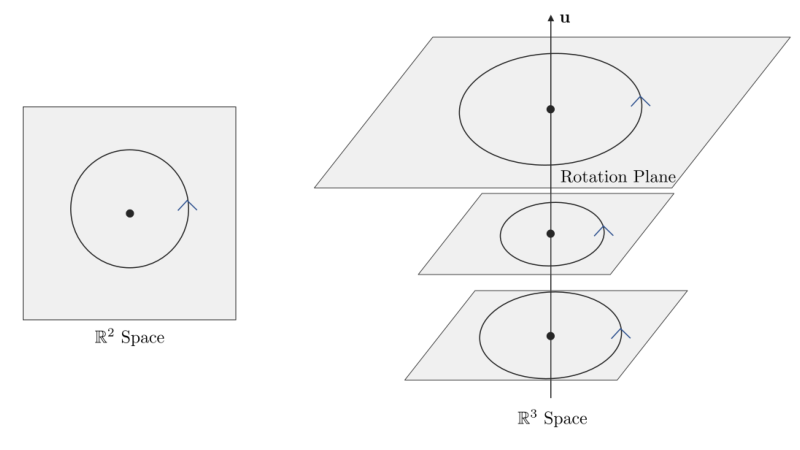

*Figure 11: $\mathbb{R}^2$ 공간에서 회전과 $\mathbb{R}^3$ 공간에서 회전 (원문 p.26)*

어느 차원에서든 점이 회전하면 당연히 원이 그려지며 그 원이 존재하는 평면이 있게 된다. 따라서 회전을
점이나 선을 기준으로 하지 않고 특정 면을 기준으로 보면 차원과 상관없이 회전을 정의할 수 있으며 이러한
평면을 회전평면(rotation plane)이라고 부른다. 회전이 성립하려면 우선 2차원의 면이 존재해야하므로
1차원에서는 회전이 불가능함을 알 수 있다. $\mathbb{R}^2$ 공간에서는 2차원 회전평면을 제외하면 0차원
(2차원-2차원)이 남기 때문에 점을 중심으로 회전한다고 볼 수 있고 $\mathbb{R}^3$ 공간에서는 2차원
회전평면을 제외한 1차원 (3차원-2차원)이 남기 때문에 선을 중심으로 회전한다고 볼 수 있다. 따라서 이를
확장하면 $\mathbb{R}^4$ 공간에서는 2차원 회전평면을 제외하면 2차원 (4차원-2차원)이 남기 때문에
$\mathbb{R}^4$ 공간에서 회전은 면을 중심으로 회전한다는 것을 알수 있다.

하지만 우리는 $\mathbb{R}^4$ 공간에서 면을 중심으로 회전하는 것을 쉽게 생각할 수 없으므로 이를 2차원 면이
아닌 1차원의 회전축 2개를 중심으로 회전한다고 생각해볼 수 있다. 그렇다면 각각의 회전축과 수직을 이루는
회전평면 2개를 생각할 수 있다. 즉, $\mathbb{R}^4$ 공간에서 회전은 회전평면 $\pi_A, \pi_B$ 상에서 각각
$\alpha, \beta$ 각만큼 2개의 회전동시에 일어난다고 볼 수 있다. 이 때, $\pi_A, \pi_B$ 평면은 서로
직교(orthogonal)하며 이런 회전을 이중회전(double rotation)이라고 부른다. 만약 회전각 $\alpha, \beta$가
같다면 특별히 이를 등복각 회전(isoclinic rotation)이라고 부른다.

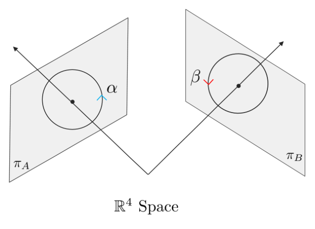

*Figure 12: $\mathbb{R}^4$ 공간에서 회전은 1차원의 회전축 2개를 중심으로 2개의 회전평면
$\pi_A, \pi_B$가 동시에 회전하는 것으로 생각할 수 있다. (원문 p.26)*

앞서 소개한 단위 쿼터니언 $\mathbf{q}$의 곱은 이러한 $\mathbb{R}^4$ 공간에서 등복각 회전을 의미하며
따라서 $\mathbf{q}$를 곱하는 것의 기하학적 의미는 $\mathbb{R}^4$ 공간에 존재하는 두 개의 회전평면
$\pi_A, \pi_B$에서 $\theta$만큼 동시에 두 회전이 일어나게 되는 것을 말한다. 흥미로운 점은 이러한 두 개의
회전평면 $\pi_A, \pi_B$ 중 하나의 회전평면은 쿼터니언의 벡터를 이루는 $i, j, k$축을 중심으로 회전하는
3차원 공간의 회전평면이라는 사실이다. 따라서 우리는 3차원 공간 상에서 순수 쿼터니언(pure quaternion)으로
변형된 벡터 $\mathbf{x}$가 회전하는 것을 원하므로 하나의 회전평면에서만 회전이 일어나게끔 해야한다.

등복각 회전에는 왼쪽 등복각(left-isoclinic) 회전과 오른쪽 등복각(right-isoclinic) 회전이 존재한다. 왼쪽
등복각 회전은 단위 쿼터니언을 왼쪽에서 곱했을 때 나타나고 오른쪽 등복각 회전은 오른쪽에서 곱했을 때
나타난다.

$$\begin{aligned}
\mathbf{q} \otimes \mathbf{x} &: \text{Left isoclinic rotation} \\
\mathbf{x} \otimes \mathbf{q} &: \text{Right isoclinic rotation}
\end{aligned} \tag{145}$$

이 때, 두 회전의 곱셈은 교환법칙을 만족한다.

$$[\mathbf{q}]_R[\mathbf{q}]_L = [\mathbf{q}]_L[\mathbf{q}]_R \tag{146}$$

i,j,k 축이 이루는 3차원의 회전평면을 $\pi_A$라고 하고 나머지 회전평면을 $\pi_B$라고 했을 때, 실제 벡터가
회전하려면 $\pi_A$에서만 회전이 일어나고 $\pi_B$에서는 회전이 발생하면 안된다. 왼쪽 등복각 회전은
$\pi_A$에서 반시계 방향 회전이 일어나고 $\pi_B$에서도 반시계 방향 회전이 일어나는 반면, 오른쪽 등복각
회전은 $\pi_A$에서 시계방향 회전이 일어나고 $\pi_B$에서는 반시계방향 회전이 일어난다. 즉, $\pi_A$는 단위
쿼터니언을 곱하는 방향에 따라 회전의 방향이 바뀌지만 $\pi_B$에서는 방향에 상관없이 항상 같은 방향의
회전이 일어난다. 따라서 단위 쿼터니언을 양쪽에 곱하면 $\pi_A$ 평면의 회전은 상쇄되어 없어지고 $\pi_B$
평면 상의 회전만 반시계 방향으로 연달아 두 번 하는 것과 동일한 효과를 얻는다.

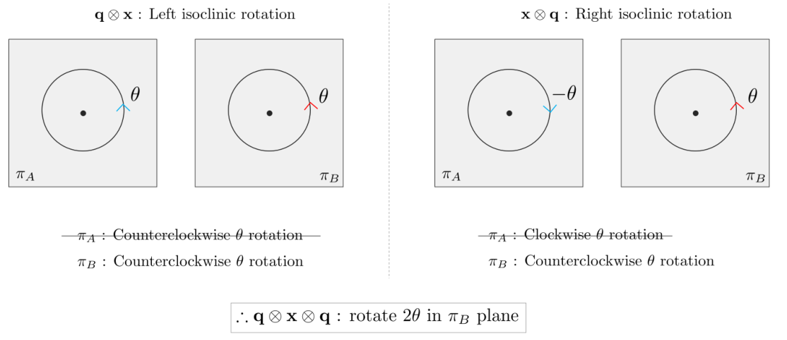

*Figure 13: $\mathbf{q} \otimes \mathbf{x} \otimes \mathbf{q}$를 수행했을 때 $\mathbb{R}^4$ 공간에서
회전 변화 (원문 p.27)*

하지만 우리의 목적은 $\pi_A$에서만 회전이 일어나는 것을 원하므로 오른쪽 등복각 회전에 반대 방향의 단위
쿼터니언 $\mathbf{q}^*$을 곱해줌으로써 $\pi_B$ 평면의 회전을 상쇄시켜줌과 동시에 $\pi_A$에 $2\theta$만큼
회전을 수행할 수 있다. 이러한 기하학적 이유로 인해 단위 쿼터니언의 곱이
$\mathbf{q} \otimes \mathbf{x} \otimes \mathbf{q}^*$가 된다.

$$\boxed{\begin{bmatrix} 0 \\ \mathbf{x}' \end{bmatrix} = \mathbf{q} \otimes \mathbf{x} \otimes \mathbf{q}^* = [\mathbf{q}^*]_R[\mathbf{q}]_L\begin{bmatrix} 0 \\ \mathbf{x} \end{bmatrix}} \tag{147}$$

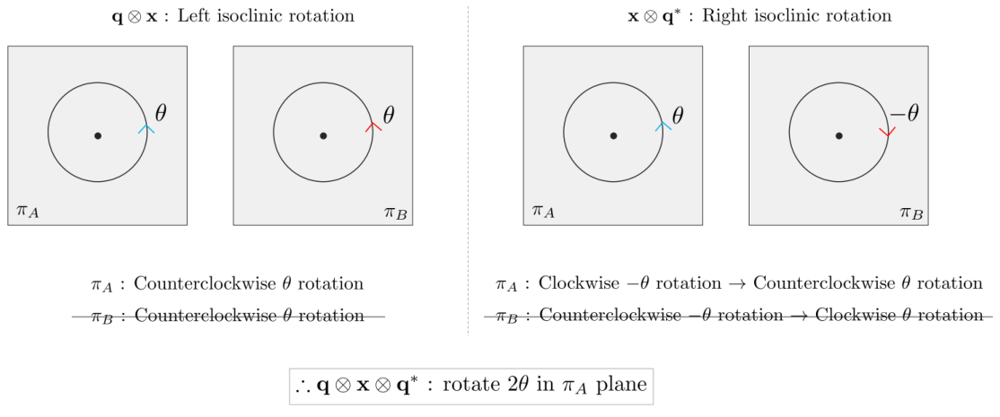

*Figure 14: $\mathbf{q} \otimes \mathbf{x} \otimes \mathbf{q}^*$를 수행했을 때 $\mathbb{R}^4$ 공간에서
회전 변화 (원문 p.28)*

단위 쿼터니언 곱은 하나의 동등한 $\mathbf{R}_4$ 행렬로 나타낼수 있다.

$$\mathbf{R}_4 \triangleq [\mathbf{q}^*]_R[\mathbf{q}]_L = [\mathbf{q}]_L[\mathbf{q}^*]_R = \begin{bmatrix} 1 & \mathbf{0} \\ \mathbf{0} & \mathbf{R} \end{bmatrix} \tag{148}$$

이 때, $\mathbf{R}$는 $\mathbb{R}^3$ 공간에서 회전행렬을 의미하며 $\mathbf{R}_4$는 $\mathbb{R}^4$의
부분공간인 $\mathbb{R}^3$ 공간 내의 벡터를 회전시키는 행렬이 된다.

<!--widget:isoclinic-->

# 3 Quaternion conventions. My choice

## 3.1 Quaternion flavors

쿼터니언은 다양한 표기법이 존재한다. 일반적으로 다음과 같이 4개의 선택지가 존재한다.

- 실수부와 허수부를 어디에 둘 것인가에 따라

$$\mathbf{q} = \begin{bmatrix} q_w \\ \mathbf{q}_v \end{bmatrix} \quad \text{vs.} \quad \mathbf{q} = \begin{bmatrix} \mathbf{q}_v \\ q_w \end{bmatrix} \tag{149}$$

- 쿼터니언 대수학을 어떻게 정의하느냐에 따라

$$ij = -ji = k \quad \text{vs.} \quad ji = -ij = k \tag{150}$$

  이는 곧 오른손법칙, 왼손법칙과 관련이 있다.

$$\text{right-handed} \quad \text{vs.} \quad \text{left-handed} \tag{151}$$

  3차원 공간에서 임의의 축 $\mathbf{u}$가 주어졌을 때 이를 중심으로
  $\mathbf{q}_{\text{right}}\{\mathbf{u}\theta\}$는 오른손법칙을 사용하여 벡터를 $\theta$만큼
  회전시키고 $\mathbf{q}_{\text{left}}\{\mathbf{u}\theta\}$는 왼손법칙을 사용하여 벡터를 $\theta$만큼
  회전시킨다.

- 회전 연산자로써 기능에 따라

$$\text{Passive} \quad \text{vs.} \quad \text{Active} \tag{152}$$

  프레임을 회전시키느냐, 벡터를 회전시키느냐 차이가 있다.

- 프레임을 회전시키는 Passive 케이스인 경우, 연산의 방향에 따라서

$$\mathbf{x}_{global} = \mathbf{q} \otimes \mathbf{x}_{local} \otimes \mathbf{q}^* \quad \text{vs.} \quad \mathbf{x}_{local} = \mathbf{q} \otimes \mathbf{x}_{global} \otimes \mathbf{q}^* \tag{153}$$

위 경우의 수만 보더라도 총 12가지의 서로 다른 조합이 나온다. 최근 대표적으로 사용하는 규약
(convention)은 Hamilton, STS, JPL, ISS, ESA, 로봇공학회 표기법 정도가 존재한다. 대부분의 규약들은 서로
미세한 차이를 가지고 있으나 자주 정확히 명시하지 않은 상태로 사용된다. 이러한 차이점은 실제 회전연산에
큰 차이를 가져오고 서로 호환이 불가능하기 때문에 어떤 쿼터니언 표기법을 사용하는지 명확한 설명이
필요하다.

가장 유명한 2개의 규약은 Hamilton 표기법과 JPL 표기법이다. JPL 표기법은 항공분야에서 주로 사용되는
반면, Hamilton 표기법은 로봇공학 분야에서 주로 사용된다. 필자는 본 페이퍼에 Hamilton 표기법을 사용하여
쿼터니언을 표기하였다. 이는 로보틱스에서 자주 사용하는 라이브러리인 Eigen, ROS, Ceres에서 채택한
쿼터니언 표기법이고 칼만필터를 이용한 IMU 상태 추정 자료에도 주로 Hamilton 표기법이 사용되기 때문이다.
JPL은 Hamilton에 비해 상대적으로 로보틱스 분야에서 적게 사용된다.

### 3.1.1 Order of the quaternion components

Hamilton과 JPL의 가장 근본적인 차이는 아니지만 확연히 구분 가능한 차이는 쿼터니언 원소를 표기하는
순서이다. Hamilton은 스칼라 파트를 앞에 위치시키고 JPL은 뒤에 위치시킨다. 이러한 스칼라, 벡터의 표현
순서 차이는 명확히 구분 가능하나 해석의 어려움을 줄 정도로 큰 차이는 아니다. 예를 들어 Hamilton 표기법을
따르는 Eigen 라이브러리 또한 쿼터니언의 실수부를 맨 뒤에 위치시키는 경우가 존재한다. 일반적으로 쿼터니언
$\mathbf{q}$를 $(w, x, y, z)$라고 표기하면 $w$가 실수부이고 $x, y, z$가 허수부를 의미한다.

### 3.1.2 Specification of the quaternion algebra

Hamilton 표기법의 쿼터니언 대수 규칙은 다음과 같다. $(ij = k)$

$$i^2 = j^2 = k^2 = ijk = -1, \quad ij = -ji = k, \quad jk = -kj = i, \quad ki = -ik = j \tag{154}$$

반면에, JPL 표기법의 쿼터니언 대수 규칙은 다음과 같다. $(ji = k)$

$$i^2 = j^2 = k^2 = -ijk = -1, \quad -ij = ji = k, \quad -jk = kj = i, \quad -ki = ik = j \tag{155}$$

흥미롭게도 이러한 작은 부호의 변화는 실제 회전 연산에서 근본적인 변화를 야기한다. 수학적으로 부호의
차이는 외적 결과의 차이이므로 Hamilton은 왼손법칙을 사용하고 JPL은 오른손법칙을 사용해서 외적을
해석하는 것으로 볼 수 있다. 왼손법칙 회전을 수행하는 쿼터니언을 $\mathbf{q}_{left}$라고 하고 오른손법칙
회전을 수행하는 쿼터니언을 $\mathbf{q}_{right}$라고 하면 둘 사이에는 다음과 같은 규칙이 성립한다.

$$\mathbf{q}_{left} = \mathbf{q}_{right}^* \tag{156}$$

### 3.1.3 Function of the rotating operator

지금까지 설명했던 쿼터니언의 회전은 3차원 공간의 벡터를 회전시키는 것이었다. (Shuster, 1993)에서는 이를
active 회전 연산이라고 해석한다.

$$\mathbf{x}' = \mathbf{q}_{active} \otimes \mathbf{x} \otimes \mathbf{q}_{active}^* \quad \mathbf{x}' = \mathbf{R}_{active}\mathbf{x} \tag{157}$$

다른 회전의 관점으로 벡터는 가만이 있으나 기존의 $\mathbf{q}, \mathbf{R}$에서 다른
$\mathbf{q}', \mathbf{R}'$로 좌표계를 변환하는 방법이 있다. (Shuster 1993)에서는 이를 벡터가 직접
회전하지 않았으므로 passive 회전 연산이라고 한다.

$$\mathbf{x}_{\mathcal{B}} = \mathbf{q}_{passive} \otimes \mathbf{x}_{\mathcal{A}} \otimes \mathbf{q}_{passive}^* \quad \mathbf{x}_{\mathcal{B}} = \mathbf{R}_{passive}\mathbf{x}_{\mathcal{A}} \tag{158}$$

이 때, $\mathcal{A}, \mathcal{B}$는 두 개의 서로 다른 좌표계를 의미한다.
$\mathbf{x}_{\mathcal{A}}, \mathbf{x}_{\mathcal{B}}$는 동일한 벡터를 각각 다른 좌표계에서 바라본 것을
의미한다.

passive와 active는 다음과 같은 역함수 관계가 성립한다.

$$\mathbf{q}_{active} = \mathbf{q}_{passive}^* \quad \mathbf{R}_{active} = \mathbf{R}_{passive}^{\intercal} \tag{159}$$

Hamilton과 JPL 모두 동일한 passive 연산 규약을 따른다.

**Direction cosine matrix** passive 연산자는 종종 회전 연산자(rotation operator)로 보지 않고 방향에
대한 표기법(orientation specification)으로 보는 시각 또한 존재한다. 이를 direction cosine matrix라고
한다.

$$\mathbf{C} = \begin{bmatrix}
c_{xx} & c_{xy} & c_{zx} \\
c_{xy} & c_{yy} & c_{zy} \\
c_{xz} & c_{yz} & c_{zz}
\end{bmatrix} \tag{160}$$

$c_{ij}$는 시작 좌표계 i 축과 타겟 좌표계 j 축 사이의 각도를 의미한다. 이는 회전행렬과 동일하다.

$$\mathbf{C} \equiv \mathbf{R}_{passive} \tag{161}$$

### 3.1.4 Direction of the rotation operator

passive 회전 연산에서 쿼터니언 곱의 방향에 따라 local to global 변환인지, global to local 변환인지
달라지게 된다. $\mathcal{G}, \mathcal{L}$을 각각 global, local 좌표계라고 하자. global과 local은
상대적인 정의이다. 즉, $\mathcal{G}$는 $\mathcal{L}$의 관점에서 global 좌표계이고 $\mathcal{L}$은
$\mathcal{G}$ 관점에서 local 좌표계이다. 우리는 $\mathbf{q}_{\mathcal{GL}}, \mathbf{R}_{\mathcal{GL}}$을
local to global 회전을 수행하는 회전 연산자로 정의할 수 있다. 이에 따라 $\mathcal{L}$ 좌표계 상의 임의의
벡터 $\mathbf{x}_{\mathcal{L}}$을 $\mathcal{G}$에서 표현하면 다음과 같다.

$$\mathbf{x}_{\mathcal{G}} = \mathbf{q}_{\mathcal{GL}} \otimes \mathbf{x}_{\mathcal{L}} \otimes \mathbf{q}_{\mathcal{GL}}^*, \quad \mathbf{x}_{\mathcal{G}} = \mathbf{R}_{\mathcal{GL}}\mathbf{x}_{\mathcal{L}} \tag{162}$$

반대의 변환은 다음과 같다.

$$\mathbf{x}_{\mathcal{L}} = \mathbf{q}_{\mathcal{LG}} \otimes \mathbf{x}_{\mathcal{G}} \otimes \mathbf{q}_{\mathcal{LG}}^*, \quad \mathbf{x}_{\mathcal{L}} = \mathbf{R}_{\mathcal{LG}}\mathbf{x}_{\mathcal{G}} \tag{163}$$

이 때, 다음이 성립한다.

$$\mathbf{q}_{\mathcal{LG}} = \mathbf{q}_{\mathcal{GL}}^*, \quad \mathbf{R}_{\mathcal{LG}} = \mathbf{R}_{\mathcal{GL}}^{\intercal} \tag{164}$$

Hamilton은 local-to-global을 기본 회전 연산으로 사용한다.

$$\mathbf{q}_{Hamilton} \triangleq \mathbf{q}_{[withrespectto][of]} = \mathbf{q}_{[to][from]} = \mathbf{q}_{\mathcal{GL}} \tag{165}$$

반면에 JPL은 global-to-local 규약을 사용한다.

$$\mathbf{q}_{JPG} \triangleq \mathbf{q}_{[of][withrespectto]} = \mathbf{q}_{[to][from]} = \mathbf{q}_{\mathcal{LG}} \tag{166}$$

따라서 다음이 성립한다.

$$\mathbf{q}_{JPL} \triangleq \mathbf{q}_{\mathcal{LG},left} = \mathbf{q}_{\mathcal{LG},right}^* = \mathbf{q}_{\mathcal{GL},right} \triangleq \mathbf{q}_{Hamilton} \tag{167}$$

위 식은 특별히 유용한 식은 아니지만 두 표현 규약이 얼마나 혼동되어 사용될 수 있는지 보여준다.
결론적으로 $\mathbf{q}_{JPL} = \mathbf{q}_{Hamilton}$이지만 이는 곧 쿼터니언의 값에 대해서만 동일한
것을 의미하고 실제 두 쿼터니언이 순서를 포함한 모든 것이 같다는 의미가 아니다. 따라서 쿼터니언을 사용할
때는 표현 규약에 대해 유의하며 사용해야 한다.

# 4 Perturbations, derivatives and integrals

## 4.1 The additive and subtractive operators in SO(3)

n차원 벡터 공간 $\mathbb{R}^n$에서는 덧셈과 뺄셈 연산이 $+, -$ 연산자로 수행된다. 그러나 SO(3)
공간에서는 해당 연산자를 사용하는게 불가능하기 때문에 동일한 기능을 수행하는 연산자를 정의하는 것이
필요하다. 이러한 연산들이 정의되어야 미적분과 같은 다양한 수학적 도구들을 SO(3)에서도 사용할 수 있다.
따라서 SO(3) 공간에서 두 원소 $\mathbf{R} \in SO(3)$와 $\theta \in \mathbb{R}^3$ 사이의 덧셈과 뺄셈은
$\oplus, \ominus$로 정의한다.

**The plus operator.** 덧셈 연산자는 $\oplus : SO(3) \times \mathbb{R}^3 \to SO(3)$로 정의된다. 해당
연산자는 기준이 되는 원소 $\mathbf{R} \in SO(3)$에 (일반적으로 작은) 회전을 적용함으로써 새로운 원소
$\mathbf{S} \in SO(3)$를 도출하는 연산자이다. 회전은 일반적으로 $\mathbf{R}^3$의 접평면(tangent space)
상에 존재하는 벡터 $\theta \in \mathbb{R}^3$로 나타낸다.

$$\mathbf{S} = \mathbf{R} \oplus \theta \triangleq \mathbf{R} \cdot \mathrm{Exp}(\theta) \qquad \mathbf{R}, \mathbf{S} \in SO(3), \theta \in \mathbb{R}^3 \tag{168}$$

이러한 연산은 다양한 SO(3) 표기법에 대해 적용될 수 있다. 쿼터니언과 회전행렬에 대한 표기법은 다음과 같다.

$$\begin{aligned}
\mathbf{q_S} &= \mathbf{q_R} \oplus \theta = \mathbf{q_R} \otimes \mathrm{Exp}(\theta) \\
\mathbf{R_S} &= \mathbf{R_R} \oplus \theta = \mathbf{R_R} \cdot \mathrm{Exp}(\theta)
\end{aligned} \tag{169}$$

**The minus operator.** 뺄셈 연산자는 $\ominus : SO(3) \times SO(3) \to \mathbb{R}^3$로 정의된다. 해당
연산자는 두 개의 SO(3) 원소에 대한 각도 차이 $\theta \in \mathbb{R}^3$를 도출한다. 이 때, 각도 차이
$\theta$는 기준이 되는 원소 $\mathbf{R}$의 접평면 상에 존재하는 벡터 공간으로 표현한다.

$$\theta = \mathbf{S} \ominus \mathbf{R} \triangleq \mathrm{Log}(\mathbf{R}^{-1} \times \mathbf{S}) \qquad \mathbf{R}, \mathbf{S} \in SO(3), \theta \in \mathbb{R}^3 \tag{170}$$

$\ominus$ 연산자도 쿼터니언과 회전행렬로 나타낼 수 있다.

$$\begin{aligned}
\theta &= \mathbf{q_S} \ominus \mathbf{q_R} = \mathrm{Log}(\mathbf{q_R}^* \otimes \mathbf{q_S}) \\
\theta &= \mathbf{R_S} \ominus \mathbf{R_R} = \mathrm{Log}(\mathbf{R_R}^{\intercal}\mathbf{R_S})
\end{aligned} \tag{171}$$

위 두 연산자를 사용할 때 벡터 $\theta$ 값은 일반적으로 작은 값이라고 가정하지만, $\theta < \pi$를
만족하는 모든 값에 대해서도 위 연산이 만족한다.

## 4.2 The four possible derivative definitions

### 4.2.1 Functions from vector space to vector space

벡터 공간에서 함수 $f : \mathbb{R}^m \to \mathbb{R}^n$가 주어졌을 때, $+, -$ 연산자를 사용하여 미분을
다음과 같이 정의할 수 있다.

$$\frac{\partial f(\mathbf{x})}{\partial \mathbf{x}} \triangleq \lim_{\delta\mathbf{x} \to 0} \frac{f(\mathbf{x} + \delta\mathbf{x}) - f(\mathbf{x})}{\delta\mathbf{x}} \in \mathbb{R}^{n \times m} \tag{172}$$

오일러 적분은 다음과 같이 선형적인 형태로 정의할 수 있다.

$$f(\mathbf{x} + \Delta\mathbf{x}) \approx f(\mathbf{x}) + \frac{\partial f(\mathbf{x})}{\partial \mathbf{x}}\Delta\mathbf{x} \in \mathbb{R}^n \tag{173}$$

### 4.2.2 Functions from SO(3) to SO(3)

함수 $f : SO(3) \to SO(3)$와 원소 $\mathbf{R} \in SO(3)$, $\theta \in \mathbb{R}^3$가 주어졌을 때,
$\oplus, \ominus$ 연산자를 사용하여 미분을 다음과 같이 정의할 수 있다.

$$\begin{aligned}
\frac{\partial f(\mathbf{R})}{\partial \theta} &\triangleq \lim_{\delta\theta \to 0} \frac{f(\mathbf{R} \oplus \delta\theta) \ominus f(\mathbf{R})}{\delta\theta} \in \mathbb{R}^{3\times3} \\
&= \lim_{\delta\theta \to 0} \frac{\mathrm{Log}(f^{-1}(\mathbf{R})f(\mathbf{R}\mathrm{Exp}(\delta\theta)))}{\delta\theta}
\end{aligned} \tag{174}$$

오일러 적분은 다음과 같이 정의할 수 있다.

$$f(\mathbf{R} \oplus \Delta\theta) \approx f(\mathbf{R}) \oplus \frac{\partial f(\mathbf{R})}{\partial \theta}\Delta\theta \triangleq f(\mathbf{R})\mathrm{Exp}\left(\frac{\partial f(\mathbf{R})}{\partial \theta}\Delta\theta\right) \in SO(3) \tag{175}$$

### 4.2.3 Functions from vector space to SO(3)

함수 $f : \mathbb{R}^m \to SO(3)$에 주어졌을 때, 함수의 perturbations는 + 연산자를 사용하고 SO(3) 차이는
$\ominus$를 사용하여 표현할 수 있다.

$$\begin{aligned}
\frac{\partial f(\mathbf{x})}{\partial \mathbf{x}} &\triangleq \lim_{\delta\mathbf{x} \to 0} \frac{f(\mathbf{x} + \delta\mathbf{x}) \ominus f(\mathbf{x})}{\delta\mathbf{x}} \in \mathbb{R}^{3\times m} \\
&= \lim_{\delta\mathbf{x} \to 0} \frac{\mathrm{Log}(f^{-1}(\mathbf{x})f(\mathbf{x} + \delta\mathbf{x}))}{\delta\mathbf{x}}
\end{aligned} \tag{176}$$

오일러 적분은 다음과 같이 정의할 수 있다.

$$f(\mathbf{x} + \Delta\mathbf{x}) \approx f(\mathbf{x}) \oplus \frac{\partial f(\mathbf{x})}{\partial \mathbf{x}}\Delta\mathbf{x} \triangleq f(\mathbf{x})\mathrm{Exp}\left(\frac{\partial f(\mathbf{x})}{\partial \mathbf{x}}\Delta\mathbf{x}\right) \in SO(3) \tag{177}$$

### 4.2.4 Functions from SO(3) to vector space

함수 $f : SO(3) \to \mathbb{R}^n$이 주어졌을 때, $\oplus$ 연산자는 SO(3) perturbations에 사용하고 함수의
차이는 $-$ 연산자를 통해 표현할 수 있다.

$$\begin{aligned}
\frac{\partial f(\mathbf{R})}{\partial \theta} &\triangleq \lim_{\delta\theta \to 0} \frac{f(\mathbf{R} \oplus \delta\theta) - f(\mathbf{R})}{\partial\theta} \in \mathbb{R}^{n\times3} \\
&= \lim_{\delta\theta \to 0} \frac{f(\mathbf{R}\mathrm{Exp}(\delta\theta)) - f(\mathbf{R})}{\delta\theta}
\end{aligned} \tag{178}$$

오일러 적분은 다음과 같이 정의할 수 있다.

$$f(\mathbf{R} \oplus \delta\theta) \approx f(\mathbf{R}) + \frac{\partial f(\mathbf{R})}{\partial \theta}\Delta\theta \triangleq f(\mathbf{R}) + \mathrm{Exp}\left(\frac{\partial f(\mathbf{R})}{\partial \theta}\Delta\theta\right) \in SO(3) \tag{179}$$

## 4.3 Useful, and very useful, Jacobians of the rotation

3차원 공간에서 임의의 벡터 $\mathbf{a}$가 $\mathbf{u}$축을 중심으로 $\theta$만큼 회전하여 $\mathbf{a}'$가
되었다고 가정하자. 이는 다음과 같은 3개의 동등한 회전 연산자를 사용하여 나타낼 수 있다.
$\pmb{\theta} = \theta\mathbf{u}$, $\mathbf{q} = \mathbf{q}\{\theta\}$,
$\mathbf{R} = \mathbf{R}\{\theta\}$. 해당 섹션에서는 이러한 다양한 표기법들에 대한 자코비안을 유도한다.

### 4.3.1 Jacobian with respect to the vector

벡터 a의 회전을 동일한 벡터에 대해 미분한 결과는 다음과 같이 단순하게 얻을 수 있다.

$$\boxed{\frac{\partial(\mathbf{q} \otimes \mathbf{a} \otimes \mathbf{q}^*)}{\partial \mathbf{a}} = \frac{\partial(\mathbf{R}\mathbf{a})}{\partial \mathbf{a}} = \mathbf{R}} \tag{180}$$

### 4.3.2 Jacobian with respect to the quaternion

이와 대조적으로, 벡터 $\mathbf{a}$의 회전을 쿼터니언 $\mathbf{q}$에 대해 미분한 결과는 조금 복잡하다.
표기의 편의를 위해, $\mathbf{q} = [w \ \mathbf{v}] = w + \mathbf{v}$와 같이 나타낸다. (36), (37)와
$\mathbf{a} \times (\mathbf{b} \times \mathbf{c}) = (\mathbf{c} \times \mathbf{b}) \times \mathbf{a} = (\mathbf{a}^{\intercal}\mathbf{c})\mathbf{b} - (\mathbf{a}^{\intercal}\mathbf{b})\mathbf{c}$를
사용하여 (114)을 다음과 같이 나타낼 수 있다.

$$\begin{aligned}
\mathbf{a}' &= \mathbf{q} \otimes \mathbf{a} \otimes \mathbf{q}^* \\
&= (w + \mathbf{v}) \otimes \mathbf{a} \otimes (w - \mathbf{v}) \\
&= w^2\mathbf{a} + w(\mathbf{v} \otimes \mathbf{a} - \mathbf{a} \otimes \mathbf{v}) - \mathbf{v} \otimes \mathbf{a} \otimes \mathbf{v} \\
&= w^2\mathbf{a} + 2w(\mathbf{v} \times \mathbf{a}) - [(-\mathbf{v}^{\intercal}\mathbf{a} + \mathbf{v} \times \mathbf{a}) \otimes \mathbf{v}] \\
&= w^2\mathbf{a} + 2w(\mathbf{v} \times \mathbf{a}) - [(-\mathbf{v}^{\intercal}\mathbf{a})\mathbf{v} + (\mathbf{v} \times \mathbf{a}) \otimes \mathbf{v}] \\
&= w^2\mathbf{a} + 2w(\mathbf{v} \times \mathbf{a}) - [(-\mathbf{v}^{\intercal}\mathbf{a})\mathbf{v} + (\mathbf{v} \times \mathbf{a})^{\intercal}\mathbf{v} + (\mathbf{v} \times \mathbf{a}) \times \mathbf{v}] \\
&= w^2\mathbf{a} + 2w(\mathbf{v} \times \mathbf{a}) - [(-\mathbf{v}^{\intercal}\mathbf{a})\mathbf{v} + (\mathbf{v}^{\intercal}\mathbf{v})\mathbf{a} - (\mathbf{v}^{\intercal}\mathbf{a})\mathbf{v}] \\
&= w^2\mathbf{a} + 2w(\mathbf{v} \times \mathbf{a}) + 2(\mathbf{v}^{\intercal}\mathbf{a})\mathbf{v} - (\mathbf{v}^{\intercal}\mathbf{v})\mathbf{a}
\end{aligned} \tag{181}$$

위 유도를 통해 $\frac{\partial\mathbf{a}'}{\partial w}, \frac{\partial\mathbf{a}'}{\partial\mathbf{v}}$를
구할 수 있다.

$$\begin{aligned}
\frac{\partial\mathbf{a}'}{\partial w} &= 2(w\mathbf{a} + \mathbf{v} \times \mathbf{a}) \\
\frac{\partial\mathbf{a}'}{\partial\mathbf{v}} &= -2w[\mathbf{a}]_{\times} + 2(\mathbf{v}^{\intercal}\mathbf{a}\mathbf{I} + \mathbf{v}\mathbf{a}^{\intercal}) - 2\mathbf{a}\mathbf{v}^{\intercal} \\
&= 2(\mathbf{v}^{\intercal}\mathbf{a}\mathbf{I} + \mathbf{v}\mathbf{a}^{\intercal} - \mathbf{a}\mathbf{v}^{\intercal} - w[\mathbf{a}]_{\times})
\end{aligned} \tag{182}$$

따라서 자코비안은 다음과 같이 구할 수 있다.

$$\boxed{\frac{\partial\mathbf{q} \otimes \mathbf{a} \otimes \mathbf{q}}{\partial\mathbf{q}} = 2\left[w\mathbf{a} + \mathbf{v} \times \mathbf{a} \ \middle| \ \mathbf{v}^{\intercal}\mathbf{a}\mathbf{I}_3 + \mathbf{v}\mathbf{a}^{\intercal} - \mathbf{a}\mathbf{v}^{\intercal} - w[\mathbf{a}]_{\times}\right] \in \mathbb{R}^{3\times4}} \tag{183}$$

### 4.3.3 Right Jacobian of SO(3)

임의의 회전행렬 $\mathbf{R} \in SO(3)$과 회전벡터 $\theta \in \mathbb{R}^3$가 주어져 있고
$\mathbf{R} = \mathrm{Exp}(\theta)$와 같이 나타낼 수 있다고 하자. 만약 $\theta$ 값이 미세 변화량
$\delta\theta$만큼 변한다고 할 때, 이는 $\mathbf{R}$의 접평면 상에 존재하는 so(3) 원소 $\delta\phi$로
표현할 수 있다.

$$\mathrm{Exp}(\theta) \oplus \delta\phi = \mathrm{Exp}(\theta + \delta\theta) \tag{184}$$

이는 다음과 같이 나타낼 수 있다.

$$\mathrm{Exp}(\theta) \cdot \mathrm{Exp}(\delta\phi) = \mathrm{Exp}(\theta + \delta\theta) \tag{185}$$

또한, 다음과 같이 나타낼 수 있다.

$$\delta\phi = \mathrm{Log}\left(\mathrm{Exp}(\theta)^{-1} \cdot \mathrm{Exp}(\theta + \delta\theta)\right) = \mathrm{Exp}(\theta + \delta\theta) \ominus \mathrm{Exp}(\theta) \tag{186}$$

파라미터 공간에서 미세 변화량 $\delta\theta$와에 대한 so(3)에서 미세 변화량 $\delta\phi$는 다음과 같이
자코비안으로 나타낼 수 있다.

$$\frac{\partial\delta\phi}{\partial\delta\theta} = \lim_{\delta\theta \to 0}\frac{\delta\phi}{\delta\theta} = \lim_{\partial\theta \to 0}\frac{\mathrm{Exp}(\theta + \delta\theta) \ominus \mathrm{Exp}(\theta)}{\delta\theta} \tag{187}$$

이는 $\mathbb{R}^3 \mapsto SO(3)$를 만족하는 함수 $f(\theta) = \mathrm{Exp}(\theta)$에 대한 미분인
(176)의 형태를 가진다. 이는 미세 변화량 $\delta\phi$을 기존 SO(3)군의 오른쪽에 곱하는
$\mathrm{Exp}(\theta)\mathrm{Exp}(\delta\phi)$ 형태를 가지므로 오른 자코비안(right jacobian)이라고 한다.

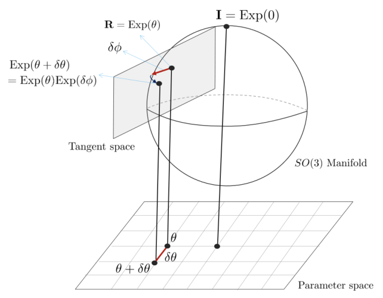

*Figure 15: Right Jacobian $\mathbf{J}_r = \frac{\partial\delta\phi}{\partial\delta\theta}$는 미세
변화량 $\delta\theta$와 $\delta\phi$ 사이의 관계를 의미한다. (원문 p.34)*

오른 자코비안은 다음과 같이 정의된다.

$$\mathbf{J}_r \triangleq \frac{\partial\mathrm{Exp}(\theta)}{\partial\theta} \tag{188}$$

이는 회전 연산자 표기법과 독립적으로 정의할 수 있다. (176)를 사용하여 $\mathbf{R}, \mathbf{q}$ 회전
연산장에 대해 정의하면 다음과 같다.

$$\begin{aligned}
\mathbf{J}_r(\theta) &= \lim_{\delta\theta \to 0}\frac{\mathrm{Exp}(\theta + \delta\theta) \ominus \mathrm{Exp}(\theta)}{\partial\theta} \\
&= \lim_{\partial\theta \to 0}\frac{\mathrm{Log}(\mathrm{Exp}(\theta)^{\intercal}\mathrm{Exp}(\theta + \delta\theta))}{\partial\theta} \quad \text{if using } \mathbf{R} \\
&= \lim_{\partial\theta \to 0}\frac{\mathrm{Log}(\mathrm{Exp}(\theta)^* \otimes \mathrm{Exp}(\theta + \delta\theta))}{\delta\theta} \quad \text{if using } \mathbf{q}
\end{aligned} \tag{189}$$

오른 자코비안의 역함수는 다음과 같이 closed form으로 계산할 수 있다. (Chirikjian, 2012, paper 40).

$$\begin{aligned}
\mathbf{J}_r(\theta) &= \mathbf{I} - \frac{1 - \cos\|\theta\|}{\|\theta\|^2}[\theta]_{\times} + \frac{\|\theta\| - \sin\|\theta\|}{\|\theta\|^3}[\theta]_{\times}^2 \\
\mathbf{J}_r^{-1}(\theta) &= \mathbf{I} + \frac{1}{2}[\theta]_{\times} + \left(\frac{1}{\|\theta\|^2} - \frac{1 + \cos\|\theta\|}{2\|\theta\|\sin\|\theta\|}\right)[\theta]_{\times}^2
\end{aligned} \tag{190}$$

추가적으로 SO(3)의 오른 자코비안은 미세 변화량 $\delta\theta$에 대해 다음과 같은 성질을 같는다.

$$\begin{aligned}
\mathrm{Exp}(\theta + \delta\theta) &\approx \mathrm{Exp}(\theta)\mathrm{Exp}(\mathbf{J}_r(\theta)\delta\theta) \\
\mathrm{Exp}(\theta)\mathrm{Exp}(\delta\theta) &\approx \mathrm{Exp}(\theta + \mathbf{J}_r^{-1}(\theta)\delta\theta) \\
\mathrm{Log}(\mathrm{Exp}(\theta)\mathrm{Exp}(\delta\theta)) &\approx \theta + \mathbf{J}_r^{-1}(\theta)\delta\theta
\end{aligned} \tag{191}$$

<!--widget:right-jacobian-->

### 4.3.4 Jacobian with respect to the rotation vector

임의의 회전벡터 $\theta$에 대한 회전 $\mathbf{a}' = \mathbf{R}\{\theta\}\mathbf{a}$은
$\mathbb{R}^3 \mapsto \mathbb{R}^3$를 만족하는 함수이다. 이는 (172)와 같이 나타낼 수 있으며 (191)를
사용하여 다음과 같이 나타낼 수 있다.

$$\begin{aligned}
\frac{\partial(\mathbf{q} \otimes \mathbf{a} \otimes \mathbf{q}^*)}{\partial\delta\theta} = \frac{\partial(\mathbf{R}\mathbf{a})}{\partial\delta\theta} &= \lim_{\partial\theta \to 0}\frac{\mathbf{R}\{\theta + \delta\theta\}\mathbf{a} - \mathbf{R}\{\theta\}\mathbf{a}}{\delta\theta} \\
&= \lim_{\partial\theta \to 0}\frac{(\mathbf{R}\{\theta\}\mathrm{Exp}(\mathbf{J}_r(\theta)\theta) - \mathbf{R}\{\theta\})\mathbf{a}}{\delta\theta} \\
&= \lim_{\partial\theta \to 0}\frac{(\mathbf{R}\{\theta\}(\mathbf{I} + [\mathbf{J}_r(\theta)\delta\theta]_{\times}) - \mathbf{R}\{\theta\}\mathbf{a})}{\delta\theta} \\
&= \lim_{\partial\theta \to 0}\frac{\mathbf{R}\{\theta\}[\mathbf{J}_r(\theta)\delta\theta]_{\times}\mathbf{a}}{\delta\theta} \\
&= \lim_{\partial\theta \to 0}\frac{-\mathbf{R}\{\theta\}[\mathbf{a}]_{\times}\mathbf{J}_r(\theta)\delta\theta}{\delta\theta} \\
&= -\mathbf{R}\{\theta\}[\mathbf{a}]_{\times}\mathbf{J}_r(\theta)
\end{aligned} \tag{192}$$

이 때, $\mathbf{R}\{\theta\} \triangleq \mathrm{Exp}(\theta)$이다. 이를 정리하면 다음과 같다.

$$\boxed{\frac{\partial(\mathbf{q} \otimes \mathbf{a} \otimes \mathbf{q}^*)}{\partial\delta\theta} = \frac{\partial(\mathbf{R}\mathbf{a})}{\partial\delta\theta} = -\mathbf{R}\{\theta\}[\mathbf{a}]_{\times}\mathbf{J}_r(\theta)} \tag{193}$$

### 4.3.5 Jacobians of the rotation composition

SO(3)군의 합성 $\mathbf{P} = \mathbf{Q} \cdot \mathbf{R}$이 주어졌을 때, 이는 쿼터니언 또는 회전행렬의
형태로 다음과 같이 나타낼 수 있다.

$$\mathbf{p} = \mathbf{q}_{\theta} \otimes \mathbf{r}_{\phi} \qquad \mathbf{P} = \mathbf{Q}_{\theta}\mathbf{R}_{\phi} \tag{194}$$

접평면에서 미세 변화량 $\delta\theta, \delta\phi$에 대한 $SO(3) \mapsto SO(3)$ 함수의 미분을 (174)을
사용하여 나타내면 다음과 같다.

$$\begin{aligned}
\frac{\partial\mathbf{Q} \cdot \mathbf{R}}{\partial\mathbf{Q}} = \frac{\partial\mathbf{q}_{\theta} \otimes \mathbf{r}_{\phi}}{\partial\theta} = \frac{\partial\mathbf{Q}_{\theta}\mathbf{R}_{\phi}}{\partial\theta} &= \lim_{\delta\theta \to 0}\frac{((\mathbf{Q}_{\theta} \oplus \delta\theta)\mathbf{R}_{\phi}) \ominus (\mathbf{Q}_{\theta}\mathbf{R}_{\phi})}{\delta\theta} \\
&= \lim_{\delta\theta \to 0}\frac{\mathrm{Log}[(\mathbf{Q}_{\theta}\mathbf{R}_{\phi})^{\intercal}(\mathbf{Q}_{\theta}\mathrm{Exp}(\delta\theta)\mathbf{R}_{\phi})]}{\delta\theta} \\
&= \lim_{\delta\theta \to 0}\frac{\mathrm{Log}[\mathbf{R}_{\phi}^{\intercal}\mathrm{Exp}(\delta\theta)\mathbf{R}_{\phi}]}{\delta\theta} \\
&= \lim_{\delta\theta \to 0}\frac{\mathrm{Log}[\mathrm{Exp}(\mathbf{R}_{\phi}^{\intercal}\delta\theta)]}{\delta\theta} \\
&= \lim_{\delta\theta \to 0}\frac{\mathbf{R}_{\phi}^{\intercal}\delta\theta}{\delta\theta} \\
&= \mathbf{R}_{\phi}^{\intercal}
\end{aligned} \tag{195}$$

$$\begin{aligned}
\frac{\partial\mathbf{Q} \cdot \mathbf{R}}{\partial\mathbf{R}} = \frac{\partial\mathbf{q}_{\theta} \otimes \mathbf{r}_{\phi}}{\partial\phi} = \frac{\partial\mathbf{Q}_{\theta}\mathbf{R}_{\phi}}{\partial\phi} &= \lim_{\delta\phi \to 0}\frac{(\mathbf{Q}_{\theta}(\mathbf{R}_{\phi} \oplus \delta\phi)) \ominus (\mathbf{Q}_{\theta}\mathbf{R}_{\phi})}{\delta\phi} \\
&= \lim_{\delta\phi \to 0}\frac{\mathrm{Log}[(\mathbf{Q}_{\theta}\mathbf{R}_{\phi})^{\intercal}(\mathbf{Q}_{\theta}\mathbf{R}_{\phi}\mathrm{Exp}(\delta\phi))]}{\partial\phi} \\
&= \lim_{\delta\phi \to 0}\frac{\mathrm{Log}[\mathrm{Exp}(\delta\phi)]}{\delta\phi} \\
&= \lim_{\delta\phi \to 0}\frac{\delta\phi}{\delta\phi} \\
&= \mathbf{I}
\end{aligned} \tag{196}$$

## 4.4 Perturbations, uncertainties, noise

### 4.4.1 Local perturbations

섭동 쿼터니언 (perturbed quaternion) $\tilde{\mathbf{q}}$는 원래 섭동하지 않은 쿼터니언 (unperturbed
quaternion) $\mathbf{q}$과 작은 로컬 섭동 (small local perturbation) $\Delta\mathbf{q}_{\mathcal{L}}$의
조합으로 나타낼 수 있다. 본 페이지에서는 Hamilton 표기법을 사용하기 때문에 기존 원소 오른쪽에 로컬
섭동을 곱함으로써 나타낼 수 있다. 이는 회전행렬 형태로도 나타낼 수 있다.

$$\tilde{\mathbf{q}} = \mathbf{q} \otimes \Delta\mathbf{q}_{\mathcal{L}} \qquad \tilde{\mathbf{R}} = \mathbf{R}\Delta\mathbf{R}_{\mathcal{L}} \tag{197}$$

또한, 로컬 섭동 $\Delta\mathbf{q}_{\mathcal{L}}, \Delta\mathbf{R}_{\mathcal{L}}$은 회전벡터의 변화량
$\Delta\pmb{\phi}_{\mathcal{L}} = \mathbf{u}\Delta\phi_{\mathcal{L}}$의 exponential map을
사용하여 쉽게 구할 수 있다.

$$\tilde{\mathbf{q}}_{\mathcal{L}} = \mathbf{q}_{\mathcal{L}} \otimes \mathrm{Exp}(\Delta\pmb{\phi}_{\mathcal{L}}) \qquad \tilde{\mathbf{R}}_{\mathcal{L}} = \mathbf{R}_{\mathcal{L}} \cdot \mathrm{Exp}(\Delta\pmb{\phi}_{\mathcal{L}}) \tag{198}$$

위 식을 로컬 섭동을 기준으로 정리하면 다음과 같다.

$$\Delta\pmb{\phi}_{\mathcal{L}} = \mathrm{Log}(\mathbf{q}_{\mathcal{L}}^* \otimes \tilde{\mathbf{q}}_{\mathcal{L}}) = \mathrm{Log}(\mathbf{R}_{\mathcal{L}}^{\intercal} \cdot \tilde{\mathbf{R}}_{\mathcal{L}}) \tag{199}$$

만약 $\Delta\pmb{\phi}_{\mathcal{L}} = \mathbf{u}\Delta\phi_{\mathcal{L}}$ 값이 충분히 작으면
쿼터니언과 회전행렬은 (79), (108)의 테일러 전개를 통해 선형적으로 표현할 수 있다.

$$\Delta\mathbf{q}_{\mathcal{L}} \approx \begin{bmatrix} 1 \\ \frac{1}{2}\Delta\pmb{\phi}_{\mathcal{L}} \end{bmatrix} \qquad \Delta\mathbf{R}_{\mathcal{L}} \approx \mathbf{I} + [\Delta\pmb{\phi}_{\mathcal{L}}]_{\times} \tag{200}$$

작은 회전량 $\Delta\phi_{\mathcal{L}}$에 대하여
$\cos(\frac{1}{2}\Delta\phi_{\mathcal{L}}) \approx 1$이고
$\mathbf{u}\sin(\frac{1}{2}\Delta\phi_{\mathcal{L}}) \approx \mathbf{u}\frac{1}{2}\Delta\phi_{\mathcal{L}} = \frac{1}{2}\Delta\pmb{\phi}_{\mathcal{L}}$이므로
위 쿼터니언 식이 성립한다. 이와 같이 회전의 섭동(perturbations)은 SO(3) 원소의 접평면인 so(3) 벡터 공간
$\Delta\pmb{\phi}_{\mathcal{L}}$으로 모델링 할 수 있다. 이는 회전 섭동의 공분산 행렬을 벡터
공간에 대한 $3 \times 3$ 행렬로 표현할 수 있는 등 여러가지 이점이 있다.

### 4.4.2 Global perturbations

다음으로 전역적으로 정의된(globally-defined) 섭동을 생각해볼 수 있다. Hamilton 표기법에서 기존 원소
왼쪽에 곱함으로써 나타낼 수 있다.

$$\tilde{\mathbf{q}}_{\mathcal{G}} = \mathrm{Exp}(\Delta\pmb{\phi}_{\mathcal{G}}) \otimes \mathbf{q}_{\mathcal{G}} \qquad \tilde{\mathbf{R}} = \mathrm{Exp}(\Delta\pmb{\phi}_{\mathcal{G}}) \cdot \mathbf{R}_{\mathcal{G}} \tag{201}$$

전역 섭동은 다음과 같이 나타낼 수 있다.

$$\Delta\pmb{\phi}_{\mathcal{G}} = \mathrm{Log}(\tilde{\mathbf{q}}_{\mathcal{G}} \otimes \mathbf{q}_{\mathcal{G}}^*) = \mathrm{Log}(\tilde{\mathbf{R}} \cdot \mathbf{R}_{\mathcal{G}}^{\intercal}) \tag{202}$$

<!--widget:local-vs-global-perturbation-->

## 4.5 Time derivatives

회전의 로컬 섭동(local perturbations)을 벡터로 표현함으로써 이에 대한 시간미분을 쉽게 계산할 수 있는
이점이 있다. 시간에 따른 쿼터니언 함수를 $\mathbf{q} = \mathbf{q}(t)$라고 하고 해당 함수의 섭동을
$\tilde{\mathbf{q}} = \mathbf{q}(t + \Delta t)$라고 하면, 이에 대한 시간 미분은 다음과 같다.

$$\frac{d\mathbf{q}(t)}{dt} \triangleq \lim_{\Delta t \to 0}\frac{\mathbf{q}(t + \Delta t) - \mathbf{q}(t)}{\Delta t} \tag{203}$$

또한, 로컬 각속도 $\pmb{\omega}_{\mathcal{L}}$을 다음과 같이 정의할 수 있다.

$$\pmb{\omega}_{\mathcal{L}}(t) \triangleq \frac{d\pmb{\phi}_{\mathcal{L}}}{dt} \triangleq \frac{\Delta\pmb{\phi}_{\mathcal{L}}}{\Delta t} \tag{204}$$

이 때, $\Delta\pmb{\phi}_{\mathcal{L}}$은 $\mathbf{q}$의 접평면 상에 존재하는 로컬 각속도 섭동
(local angular perturbation)을 의미한다. 쿼터니언의 시간 미분은 다음과 같이 유도할 수 있다.

$$\begin{aligned}
\dot{\mathbf{q}} &\triangleq \lim_{\Delta t \to 0}\frac{\mathbf{q}(t + \Delta t) - \mathbf{q}(t)}{\Delta t} \\
&= \lim_{\Delta t \to 0}\frac{\mathbf{q} \otimes \Delta\mathbf{q}_{\mathcal{L}} - \mathbf{q}}{\Delta t} \\
&= \lim_{\Delta t \to 0}\frac{\mathbf{q} \otimes \left(\begin{bmatrix} 1 \\ \Delta\pmb{\phi}_{\mathcal{L}}/2 \end{bmatrix} - \begin{bmatrix} 1 \\ 0 \end{bmatrix}\right)}{\Delta t} \\
&= \lim_{\Delta t \to 0}\frac{\mathbf{q} \otimes \begin{bmatrix} 0 \\ \Delta\pmb{\phi}_{\mathcal{L}}/2 \end{bmatrix}}{\Delta t} \\
&= \frac{1}{2}\mathbf{q} \otimes \begin{bmatrix} 0 \\ \pmb{\omega}_{\mathcal{L}} \end{bmatrix}
\end{aligned} \tag{205}$$

표기의 편의를 위해 다음과 같이 정의한다.

$$\Omega(\pmb{\omega}) \triangleq [\pmb{\omega}]_R = \begin{bmatrix} 0 & -\pmb{\omega}^{\intercal} \\ \pmb{\omega} & -[\pmb{\omega}]_{\times} \end{bmatrix} = \begin{bmatrix}
0 & -\omega_x & -\omega_y & -\omega_z \\
\omega_x & 0 & \omega_z & -\omega_y \\
\omega_y & -\omega_z & 0 & \omega_x \\
\omega_z & \omega_y & -\omega_x & 0
\end{bmatrix} \tag{206}$$

최종적으로 (18), (205)로부터 다음을 얻을 수 있다.

$$\boxed{\dot{\mathbf{q}} = \frac{1}{2}\Omega(\pmb{\omega}_{\mathcal{L}})\mathbf{q} = \frac{1}{2}\mathbf{q} \otimes \pmb{\omega}_{\mathcal{L}} \qquad \dot{\mathbf{R}} = \mathbf{R}[\pmb{\omega}_{\mathcal{L}}]_{\times}} \tag{207}$$

이는 (77), (107)을 SO(3) 프레임워크로 확장한 표현이다. 위 식은 $\mathbf{q}, \mathbf{R}$의 시간미분을
이에 대한 각속도 $\pmb{\omega}_{\mathcal{L}}$로 표현할 수 있음을 의미한다.

(207)은 각속도가 로컬 좌표계에서 표현되었을 때 미분 값을 의미한다. 이와 달리 전역 섭동(global
perturbations)에 대한 시간미분은 (205)를 사용하여 다음과 같이 나타낼 수 있다.

$$\boxed{\dot{\mathbf{q}} = \frac{1}{2}\pmb{\omega}_{\mathcal{G}} \otimes \mathbf{q} \qquad \dot{\mathbf{R}} = [\pmb{\omega}_{\mathcal{G}}]_{\times}\mathbf{R}} \tag{208}$$

이 때, $\pmb{\omega}_{\mathcal{G}} \triangleq \frac{d\pmb{\phi}_{\mathcal{G}}(t)}{dt}$은
전역 프레임에서 바라본 각속도 벡터를 의미한다. 따라서 (208)은 전역 좌표계에서 각속도를 나타내었을 때
미분 값을 의미한다.

### 4.5.1 Global-to-local relations

전역 미분값과 지역(=로컬) 미분값의 관계는 다음과 같다.

$$\frac{1}{2}\pmb{\omega}_{\mathcal{G}} \otimes \mathbf{q} = \dot{\mathbf{q}} = \frac{1}{2}\mathbf{q} \otimes \pmb{\omega}_{\mathcal{L}} \tag{209}$$

이를 정리하면 다음과 같다.

$$\pmb{\omega}_{\mathcal{G}} = \mathbf{q} \otimes \pmb{\omega}_{\mathcal{L}} \otimes \mathbf{q}^* = \mathbf{R}\pmb{\omega}_{\mathcal{L}} \tag{210}$$

충분히 작은 시간 변화량 $\Delta t$에 대해 $\Delta\phi_R \approx \omega\Delta t$이라고 하면 다음과 같다.

$$\Delta\pmb{\phi}_{\mathcal{G}} = \mathbf{q} \otimes \Delta\pmb{\phi}_{\mathcal{L}} \otimes \mathbf{q}^* = \mathbf{R}\Delta\pmb{\phi}_{\mathcal{L}} \tag{211}$$

이는 각속도 벡터 $\pmb{\omega}$와 작은 각도 섭동 $\Delta\pmb{\phi}$를 쿼터니언과
회전행렬을 통해 일반 벡터와 같이 좌표계 변환을 수행할 수 있음을 의미한다. 이는
$\pmb{\omega} = \mathbf{u}\omega$와 $\Delta\pmb{\phi} = \mathbf{u}\Delta\phi$에서
회전축 $\mathbf{u}$에 대해서도 동일하게 적용된다.

$$\mathbf{u}_{\mathcal{G}} = \mathbf{q} \otimes \mathbf{u}_{\mathcal{L}} \otimes \mathbf{q}^* = \mathbf{R}\mathbf{u}_{\mathcal{L}} \tag{212}$$

### 4.5.2 Time-derivative of the quaternion product

회전 곱셈 연산자에 대한 시간 미분은 다음과 같다.

$$\dot{\overline{\mathbf{q}_1 \otimes \mathbf{q}_2}} = \dot{\mathbf{q}}_1 \otimes \mathbf{q}_2 + \mathbf{q}_1 \otimes \dot{\mathbf{q}}_2, \qquad \dot{\overline{(\mathbf{R}_1\mathbf{R}_2)}} = \dot{\mathbf{R}}_1\mathbf{R}_2 + \mathbf{R}_1\dot{\mathbf{R}}_2 \tag{213}$$

회전의 곱셈 연산자는 교환법칙이 성립하지 않기 때문에, 순서를 엄격하게 지켜서 표기해야 한다. 이는 즉,
$\dot{\mathbf{q}^2} \neq 2\mathbf{q} \otimes \dot{\mathbf{q}}$임을 의미한다. 동일한 쿼터니언의 곱에 대한
미분은 다음과 같다.

$$\dot{\overline{\mathbf{q}^2}} = \dot{\mathbf{q}} \otimes \mathbf{q} + \mathbf{q} \otimes \dot{\mathbf{q}} \tag{214}$$

### 4.5.3 Other useful expressions with the derivatives

로컬 회전에 대한 미분을 정리하면 $\pmb{\omega}_{\mathcal{L}}$를 다음과 같이 나타낼 수 있다.

$$\pmb{\omega}_{\mathcal{L}} = 2\mathbf{q}^* \otimes \dot{\mathbf{q}}, \qquad [\pmb{\omega}_{\mathcal{L}}]_{\times} = \mathbf{R}^{\intercal}\dot{\mathbf{R}} \tag{215}$$

전역 회전에 대한 미분을 정리하면 $\pmb{\omega}_{\mathcal{G}}$를 다음과 같이 나타낼 수 있다.

$$\pmb{\omega}_{\mathcal{G}} = 2\dot{\mathbf{q}} \otimes \mathbf{q}^*, \qquad [\pmb{\omega}_{\mathcal{G}}]_{\times} = \dot{\mathbf{R}}\mathbf{R}^{\intercal} \tag{216}$$

## 4.6 Time-integration of rotation rates

시간에 따른 쿼터니언 회전 변화는 이전 섹션에서 유도했던 (207)과 (208)을 적분함으로써 구할 수 있다. 이
때, 각속도가 로컬 각속도인 경우에는 (207)를 사용하고 전역 각속도인 경우에는 (208)를 사용한다. SLAM과
같은 문제는 일반적으로 로봇에 부착된 로컬 센서가 각속도를 측정하여 로컬 각속도 측정값
$\pmb{\omega}(t_n), t_n = n\Delta t$을 제공한다. 본 섹션에서는 이러한 로컬 케이스에 대한 적분
내용만 다룬다. (207)는 다음과 같다.

$$\dot{\mathbf{q}}(t) = \frac{1}{2}\mathbf{q}(t) \otimes \pmb{\omega}(t) \tag{217}$$

실제 센서 데이터는 이산시간(discrete time) 입력으로 들어오기 때문에 위 식을 바로 사용할 수 없다. 따라서
여러 가지 수치적분 방법들이 개발되었는데 본 문서에서는 0차, 1차 수치적분(zeroth, first order
integration) 방법에 대해서 설명한다. 두 방법은 모두 $\mathbf{q}(t + \Delta t)$를 $t = t_n$에 대한 테일러
급수로 근사화하는 방법이다. $\mathbf{q} \triangleq \mathbf{q}(t), \mathbf{q}_n = \mathbf{q}(t_n)$과 같이
간단하게 표기한다. 시간함수의 테일러 급수는 다음과 같다.

$$\mathbf{q}_{n+1} = \mathbf{q}_n + \dot{\mathbf{q}}_n\Delta t + \frac{1}{2!}\ddot{\mathbf{q}}_n\Delta t^2 + \frac{1}{3!}\dddot{\mathbf{q}}_n\Delta t^3 + \frac{1}{4!}\ddddot{\mathbf{q}}_n\Delta t^4 + \cdots \tag{218}$$

쿼터니언 미분 값은 (217)를 통해 구할 수 있다. 이 때, 각속도의 두 번 미분값인 $\ddot{\pmb{\omega}} = 0$이다.

$$\begin{aligned}
\dot{\mathbf{q}} &= \frac{1}{2}\mathbf{q}_n\pmb{\omega}_n \\
\ddot{\mathbf{q}}_n &= \frac{1}{2^2}\mathbf{q}_n\pmb{\omega}_n^2 + \frac{1}{2}\mathbf{q}_n\dot{\pmb{\omega}}_n \\
\dddot{\mathbf{q}}_n &= \frac{1}{2^3}\pmb{\omega}_n^3 + \frac{1}{4}\mathbf{q}_n\dot{\pmb{\omega}}\pmb{\omega}_n + \frac{1}{2}\mathbf{q}\pmb{\omega}_n\dot{\pmb{\omega}} \\
\mathbf{q}_n^{(i \geq 4)} &= \frac{1}{2^i}\mathbf{q}_n\pmb{\omega}_n^i + \cdots
\end{aligned} \tag{219}$$

위 식은 표기의 편의 상 $\otimes$ 연산자를 생략하였다. 실제 연산에서는 모든 $\pmb{\omega}$의
지수승들이 쿼터니언 곱으로 곱해져야한다.

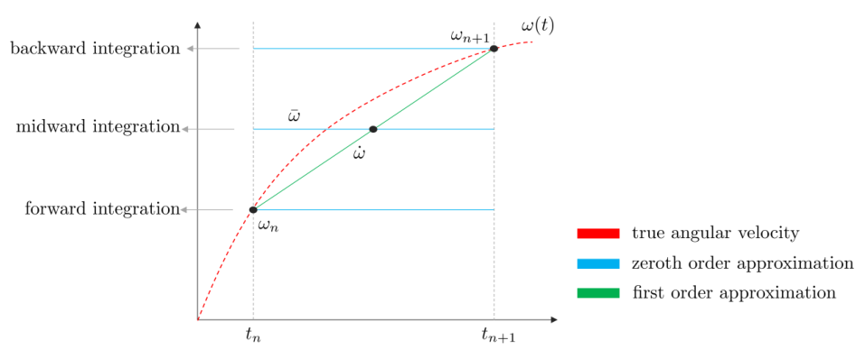

*Figure 16: 수치적분에서 0차, 1차 근사를 그래픽으로 표현한 모습 (원문 p.39)*

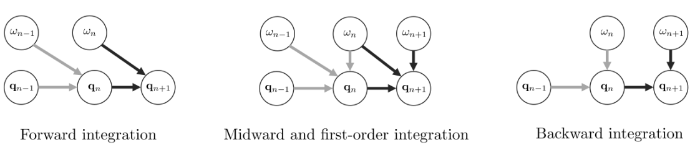

*Figure 17: 수치적분에서 전향, 중앙, 후향 적분법을 그래픽으로 표현한 모습. 회색 화살표와 검은색 화살표는
동일한 변수를 공유하고 있는 시간 스텝을 의미한다. (원문 p.39)*

### 4.6.1 Zeroth order integration

**Forward integration** 각속도 $\pmb{\omega}_n$가 시간 $[t_n, t_{n+1}]$ 구간동안 일정하다고
가정하여 적분하는 방법이다. 이 때, $\dot{\pmb{\omega}} = 0$이 된다. (218)을 다시 나타내면 다음과
같다.

$$\mathbf{q}_{n+1} = \mathbf{q}_n \otimes \left(1 + \frac{1}{2}\pmb{\omega}_n\Delta t + \frac{1}{2!}\left(\frac{1}{2}\pmb{\omega}_n\Delta t\right)^2 + \frac{1}{3!}\left(\frac{1}{2}\pmb{\omega}_n\Delta t\right)^3 + \cdots\right) \tag{220}$$

위 식에서 뒷 부분은 $e^{\pmb{\omega}\Delta t/2}$의 테일러 급수를 (43)과 같이 펼쳐놓은 형태이다.
(108)로부터 이러한 exponential term은 쿼터니언으로 변환될 수 있다.

$$e^{\pmb{\omega}\Delta t/2} = \mathrm{Exp}(\pmb{\omega}\Delta t) = \mathbf{q}\{\pmb{\omega}\Delta t\} = \begin{bmatrix} \cos(\|\pmb{\omega}\|\Delta t/2) \\ \frac{\pmb{\omega}}{\|\pmb{\omega}\|}\sin(\|\pmb{\omega}\|\Delta t/2) \end{bmatrix} \tag{221}$$

따라서 다음 식이 유도된다.

$$\boxed{\mathbf{q}_{n+1} = \mathbf{q}_n \otimes \mathbf{q}\{\pmb{\omega}\Delta t\}} \tag{222}$$

**Backward integration** $\Delta t$의 맨 마지막 구간 $t_{n+1}$의 각속도인
$\pmb{\omega}_{n+1}$을 사용하여 적분하는 방법이다. 이는 $t_{n+1}$에서 $\mathbf{q}_n$의 테일러
급수를 전개하는 것과 유사하다.

$$\mathbf{q}_{n+1} \approx \mathbf{q}_n \otimes \mathbf{q}\{\pmb{\omega}_{n+1}\Delta t\} \tag{223}$$

위 방법은 마지막으로 측정된 각속도 $\pmb{\omega}_{n+1}$을 기준으로 적분하는 성질로 인해 실시간
처리가 중요한 로보틱스 분야 등에서 주로 사용하는 방법이다. 시간 스텝을 한 단계 앞서서 표현하면 다음과
같다.

$$\boxed{\mathbf{q}_n = \mathbf{q}_{n-1} \otimes \mathbf{q}\{\pmb{\omega}_n\Delta t\}} \tag{224}$$

**Midward integration** 각속도 $\pmb{\omega}$를 처음과 끝의 중간값으로 설정하여 적분하는
방법이다.

$$\bar{\pmb{\omega}} = \frac{\pmb{\omega}_{n+1} + \pmb{\omega}_n}{2} \tag{225}$$

이를 통해 다음 식을 구할 수 있다.

$$\boxed{\mathbf{q}_{n+1} = \mathbf{q}_n \otimes \mathbf{q}\{\bar{\pmb{\omega}}\Delta t\}} \tag{226}$$

### 4.6.2 First order integration

1차 수치적분은 각속도 $\pmb{\omega}(t)$를 1차 함수(직선)으로 근사하는 적분이다. 테일러 급수
항에서 2차 이상의 항은 전부 0으로 간주한다.

$$\begin{aligned}
\dot{\pmb{\omega}} &= \frac{\pmb{\omega}_{n+1} - \pmb{\omega}_n}{\Delta t} \\
\ddot{\pmb{\omega}} &= \dddot{\pmb{\omega}} = \cdots = 0
\end{aligned} \tag{227}$$

이를 사용하여 중간값 $\bar{\pmb{\omega}}$를 다음과 같이 나타낼 수 있다.

$$\bar{\pmb{\omega}} = \pmb{\omega}_n + \frac{1}{2}\dot{\pmb{\omega}}\Delta t \tag{228}$$

또한 각속도의 지수승 $\pmb{\omega}_n^k$를 다음과 같이 나타낼 수 있다.

$$\begin{aligned}
\pmb{\omega}_n &= \bar{\pmb{\omega}} - \frac{1}{2}\dot{\pmb{\omega}}\Delta t \\
\pmb{\omega}_n^2 &= \bar{\pmb{\omega}}^2 - \frac{1}{2}\bar{\pmb{\omega}}\dot{\pmb{\omega}}\Delta t - \frac{1}{2}\dot{\pmb{\omega}}\bar{\pmb{\omega}}\Delta t + \frac{1}{4}\dot{\pmb{\omega}}^2\Delta t^2 \\
\pmb{\omega}_n^3 &= \bar{\pmb{\omega}}^3 - \frac{3}{2}\bar{\pmb{\omega}}^2\dot{\pmb{\omega}}\Delta t + \frac{3}{4}\bar{\pmb{\omega}}\dot{\pmb{\omega}}^2\Delta t^2 + \frac{1}{8}\dot{\pmb{\omega}}^3\Delta t^3 \\
\pmb{\omega}_n^4 &= \bar{\pmb{\omega}}^4 + \cdots
\end{aligned} \tag{229}$$

이를 쿼터니언 테일러 급수 식에 넣고 정리하면 다음과 같다. 식이 복잡하므로 $\otimes$ 연산자는 생략한다.

$$\begin{aligned}
\mathbf{q}_{n+1} = \ &\mathbf{q}\left(1 + \frac{1}{2}\bar{\pmb{\omega}}\Delta t + \frac{1}{2!}\left(\frac{1}{2}\bar{\pmb{\omega}}\Delta t\right)^2 + \frac{1}{3!}\left(\frac{1}{2}\bar{\pmb{\omega}}\Delta t\right)^3 + \cdots\right) \\
&+ \mathbf{q}\left(-\frac{1}{4}\dot{\pmb{\omega}} + \frac{1}{4}\ddot{\pmb{\omega}}\right)\Delta t^2 \\
&+ \mathbf{q}\left(-\frac{1}{16}\bar{\pmb{\omega}}\dot{\pmb{\omega}} - \frac{1}{16}\dot{\pmb{\omega}}\bar{\pmb{\omega}} + \frac{1}{24}\dot{\pmb{\omega}}\bar{\pmb{\omega}} + \frac{1}{12}\bar{\pmb{\omega}}\dot{\pmb{\omega}}\right)\Delta t^3 \\
&+ \mathbf{q}(\cdots)\Delta t^4 + \cdots
\end{aligned} \tag{230}$$

위 식에서 첫번째 줄은 $e^{\bar{\pmb{\omega}}\Delta t} = \mathbf{q}\{\bar{\pmb{\omega}}\Delta t\}$인
것을 알 수 있다. 두번째 줄은 소거되어 없어지고 네번째 줄 이상은 고차항이므로 무시하면 다음과 같이
비교적 간단하게 나타낼 수 있다. $\otimes$ 연산자를 다시 표기하면 다음과 같다.

$$\mathbf{q}_{n+1} = \mathbf{q}_n \otimes \mathbf{q}\{\bar{\pmb{\omega}}\Delta t\} + \frac{\Delta t^3}{48}\mathbf{q}_n \otimes (\bar{\pmb{\omega}} \otimes \dot{\pmb{\omega}} - \dot{\pmb{\omega}} \otimes \bar{\pmb{\omega}}) + \cdots \tag{231}$$

$\bar{\pmb{\omega}}, \dot{\pmb{\omega}}$를 (225), (227) 같이 풀어서 쓰면 다음과 같다.

$$\mathbf{q}_{n+1} = \mathbf{q}_n \otimes \mathbf{q}\{\bar{\pmb{\omega}}\Delta t\} + \frac{\Delta t^3}{48}\mathbf{q}_n \otimes (\pmb{\omega}_n \otimes \pmb{\omega}_{n+1} - \pmb{\omega}_{n+1} \otimes \pmb{\omega}_n) + \cdots \tag{232}$$

위 식은 (Trawny and Roumelitis, 2005)의 결과와 동일하지만 Hamilton 쿼터니언 표기법을 사용하는 점이
다르다. 최종적으로
$\mathbf{a}_v \otimes \mathbf{b}_v - \mathbf{b}_v \otimes \mathbf{a}_v = 2\mathbf{a}_v \times \mathbf{b}_v$를
사용하여 다음과 같이 나타낼 수 있다.

$$\boxed{\mathbf{q}_{n+1} \approx \mathbf{q}_n \otimes \left(\mathbf{q}\{\bar{\pmb{\omega}}\Delta t\} + \frac{\Delta t^2}{24}\begin{bmatrix} 0 \\ \pmb{\omega}_n \times \pmb{\omega}_{n+1} \end{bmatrix}\right)} \tag{233}$$

위 식에서 앞에 있는 항은 midward 1차 수치적분과 동일한 형태 (226)를 띤다는 것을 알 수 있고 뒤에 있는
항은 $\pmb{\omega}_n$와 $\pmb{\omega}_{n+1}$이 서로 collinear한 경우 소거되는 2차항인
것을 알 수 있다. collinear하다는 의미는 $[t_n, t_{n+1}]$ 구간에서 회전축이 변하지 않는다는 것을
의미한다.

**Case of fixed rotation axis** 회전축 $\mathbf{u}$를 중심으로 $\pmb{\omega}$만큼 회전하는
각속도의 시간함수를 $\pmb{\omega}(t) = \mathbf{u}(t)\omega(t)$라고 하자. 만약 $\mathbf{u}$가
일정하다고 하면 $\mathbf{u}(t) = \mathbf{u}$이고
$\pmb{\omega}_n \times \pmb{\omega}_{n+1} = 0$을 만족한다. 이를 통해 위 1차 수치적분
공식을 나타내면 다음과 같다.

$$\mathbf{q}_{n+1} = \mathbf{q}_n \otimes \mathbf{q}\{\mathbf{u}\bar{\omega}\Delta t\} \tag{234}$$

또한, 회전축이 고정되어 있으면 미세 변화량에 대해 쿼터니언의 교환법칙이 성립한다.

$$e^{\mathbf{u}\omega_1\delta t_1}e^{\mathbf{u}\omega_2\delta t_2} = e^{\mathbf{u}\omega_2\delta t_2}e^{\mathbf{u}\omega_1\delta t_1} = e^{\mathbf{u}(\omega_1\delta t_1 + \omega_2\delta t_2)} \tag{235}$$

또한 다음 공식이 성립한다.

$$\begin{aligned}
\mathbf{q}_{n+1} &= \mathbf{q} \otimes e^{\frac{1}{2}\int_{t_n}^{t_{n+1}}\omega(t)\delta t} \\
&= \mathbf{q}_n \otimes e^{\mathbf{u}\Delta\theta_n/2} \\
&= \mathbf{q}_n \otimes \mathbf{q}\{\mathbf{u}\Delta\theta_n\}
\end{aligned} \tag{236}$$

이 때, $\Delta\theta_n = \int_{t_n}^{t_{n+1}}\omega(t)dt \in \mathbb{R}$은 $[t_n, t_{n+1}]$ 시간동안
최종적으로 돌아간 각도를 의미한다.

**Case of varying rotation axis** 회전축이 고정되어 있지 않다면
$\pmb{\omega}_n \times \pmb{\omega}_{n+1} \neq 0$을 만족하고 이에 따라 (233)에서 뒤에 있는
2차항은 사라지지 않고 영향을 준다. 실제 IMU를 사용할 때는 이를 고려하여 샘플링 시간을
$\Delta t \leq 0.01s$로 설정한다. 샘플링 시간이 매우 짧으므로 관성에 의해
$\pmb{\omega}_n \simeq \pmb{\omega}_{n+1}$이 만족하고 2차항 값은 일반적으로
$10^{-6}\|\pmb{\omega}\|^2$보다 작아지게 된다. 2차항 이상의 값은 그보다 더 작아지므로 무시 가능한
값이 된다.

실제 활용 예시에서, 0차 수치적분은 단위 쿼터니언(unit quaternion)을 유지하는 반면에 1차 수치적분은 앞서
말한 2차항의 값으로 인해 단위 쿼터니언 제약조건이 깨질 수 있다. 따라서 1차 수치적분을 사용한다면
주기적으로 단위 쿼터니언 제약조건을 업데이트 해야 한다 ($\mathbf{q} \leftarrow \mathbf{q}/\|\mathbf{q}\|$).
만약 회전축이 고정되어 있다는 조건이 유지될때만 제약조건 업데이트를 고려하지 않아도 된다.

<!--widget:rotation-integration-->

# 5 Error-state kinematics for IMU-driven systems

## 5.1 Motivation

본 섹션에서는 에러 상태 방정식(error-state equations)을 통해 노이즈와 bias가 포함된 IMU의 가속도와
각속도를 표현하는 방법에 대해 설명한다. 이 때, 회전 표기법은 Hamilton 쿼터니언을 사용하였다. 일반적으로
가속도와 각속도는 IMU 센서를 통해 입력받으며 이를 누적하여 포즈를 추적하는 방법을 dead-reckoning이라고
한다. Dead-reckoning은 시간에 따라 에러가 누적되어 드리프트되는 현상이 발생하므로 이러한 문제를
해결하기 위해 일반적으로 카메라 또는 GPS 센서 정보를 퓨전하여 사용한다.

Error-state Kalman Filter(ESKF)는 앞서 설명한 dead-reckoning과 센서 퓨전에 사용되는 유용한 도구 중
하나이다. 칼만 필터의 패러다임을 사용하는 ESKF는 다음과 같은 성질들이 존재한다 (Madyastha el tal.,
2011):

- 방향(orientation)에 대한 에러 상태 표현법이 최소한의 파라미터를 가진다. 즉, 자유도만큼의 최소
  파라미터를 가지기 때문에 over-parameterized로 인해 발생하는 특이점(singularity) 같은 현상이
  발생하지 않는다.
- 에러 상태 시스템은 항상 원점(origin) 근처에서만 동작한다. 따라서 짐벌락 같은 파라미터 특이점 현상이
  발생하지 않으며 항상 선형화를 수행할 수 있다.
- 에러 상태는 일반적으로 값이 작기 때문에 2차항 이상의 값들은 무시할 수 있다. 이는 자코비안 연산을
  쉽고 빠르게 수행할 수 있도록 도와준다. 몇몇 자코비안은 상수화하여 사용하기도 한다.
- 에러 방정식은 일반적으로 비선형을 가진 큰 값들이 nominal 상태에서 처리되므로 속도가 느린 편이다.
  이는 KF correction 스텝이 prediction 스텝보다 느린 속도로 적용될 수 있다는 것을 의미한다.

## 5.2 The error-state Kalman filter explained

ESKF에는 true, nominal, error의 세가지 상태가 존재한다. true 상태는 nominal과 error 상태를 적절하게
조합하여 표현할 수 있다. nominal 상태는 일반적으로 큰 값들로 구성되며 비선형성을 가지고 error 상태는
작은 값들로 구성되어 선형성을 가진다.

ESKF는 다음과 같이 동작한다. 우선, 고속으로 들어오는 IMU 데이터 $\mathbf{u}_m$은 nominal 상태
$\mathbf{x}$에 적분된다. 이 때, nominal 상태는 노이즈 항 $\mathbf{w}$를 고려하지 않고 적분한다. 따라서
시간이 지날수록 적분된 nominal 상태는 에러가 증가하게 된다. 노이즈와 섭동(perturbation)을 포함한 에러는
error 상태 $\delta\mathbf{x}$에 누적되고 추후 ESKF 시스템에 의해 처리된다. error 상태는 작은 값들로
구성되어 있으며 nominal 상태에서 계산된 행렬들과 함께 선형 시스템으로 표현할 수 있다. nominal 상태에서
값이 적분됨과 동시에 error 상태에 대한 가우시안 추정을 수행한다. 이를 prediction 스텝이라고 하며 해당
스텝에서는 아직 추정치를 개선할 수 있는 관측값들이 입력되지 않았으므로 오직 추정만 수행한다. 다음으로
IMU를 제외한 카메라 또는 GPS와 같은 다른 관측 값들이 들어오면 correction 스텝을 진행한다. correction
스텝은 일반적으로 IMU의 적분 속도보다 매우 느린 속도로 진행된다. correction 스텝을 수행하면 error 상태에
대한 posterior를 구할 수 있다. 다음으로 업데이트 된 error 상태의 평균값이 nominal 상태에 적용되고 error
상태는 0으로 리셋된다. 마지막으로 리셋을 반영하기 위한 error 상태의 공분산 행렬이 업데이트 되며 ESKF의
한 사이클이 종료된다. ESKF는 이러한 과정을 계속 반복하면서 실행된다.

## 5.3 System kinematics in continuous time

ESKF에서 사용하는 모든 변수들의 정의는 아래 테이블에 요약하였다.

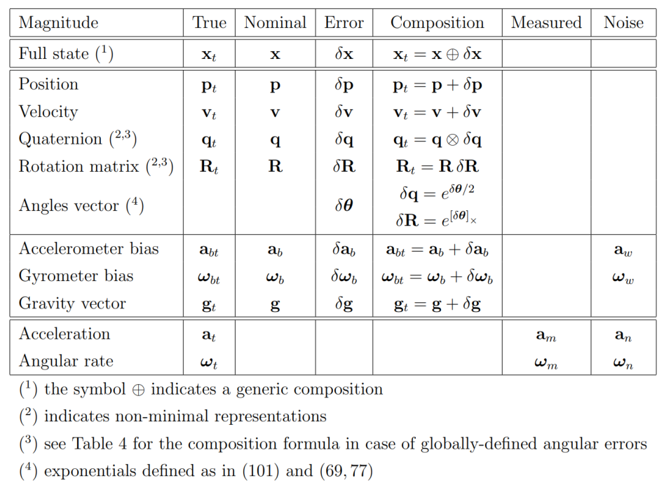

*Figure 18: Table (원문 p.43)*

수식을 전개하기 전에 두 개의 중요한 규약(convention)에 대해 언급하면 다음과 같다.

- nominal 상태를 표현할 때 사용하는 각속도 $\pmb{\omega}$는 지역적(locally) 의미의 각속도로 정의한다.
  즉, 월드 좌표계에서 바라 본 각속도를 의미하는 것이 아닌 현재 IMU 좌표계에서 각속도를 의미한다. 이러한
  규약을 통해 IMU 센서에서 들어오는 각속도 값인 $\pmb{\omega}_m$을 바로 사용할 수 있는 이점이 있다.
- 각 에러(angular error) $\delta\pmb{\theta}$ 또한 지역적 의미의 각 에러로 정의된다. 이러한 규약이
  최적의 성능을 주는 표현법은 아니지만 대다수의 IMU 필터링 작업에서 지역적으로 표현하였기 때문에 이를
  사용한다. (Li and Mourikis, 2012)에 따르면 전역적(globally)으로 정의된 각 에러가 더 좋은 성능을
  보여주는 것을 확인했다. 전역적 정의에 대한 내용은 섹션 7에서 설명한다.

### 5.3.1 The true-state kinematics

true 상태 방정식은 다음과 같다.

$$\begin{aligned}
\dot{\mathbf{p}}_t &= \mathbf{v}_t \\
\dot{\mathbf{v}}_t &= \mathbf{a}_t \\
\dot{\mathbf{q}}_t &= \frac{1}{2}\mathbf{q}_t \otimes \pmb{\omega}_t \\
\dot{\mathbf{a}}_{bt} &= \mathbf{a}_\omega \\
\dot{\pmb{\omega}}_{bt} &= \pmb{\omega}_\omega \\
\dot{\mathbf{g}}_t &= 0
\end{aligned} \tag{237}$$

true 가속도 $\mathbf{a}_t$와 각속도 $\pmb{\omega}_t$는 IMU 센서 데이터에서 나온 측정 가속도와 각속도
$\mathbf{a}_m, \pmb{\omega}_m$으로부터 구할 수 있다.

$$\begin{aligned}
\mathbf{a}_m &= \mathbf{R}_t^\intercal(\mathbf{a}_t - \mathbf{g}_t) + \mathbf{a}_{bt} + \mathbf{a}_n \\
\pmb{\omega}_m &= \pmb{\omega}_t + \pmb{\omega}_{bt} + \pmb{\omega}_n
\end{aligned} \tag{238}$$

이 때, $\mathbf{R}_t \triangleq \mathbf{R}\{\mathbf{q}_t\}$이다. 위 식을 정리하면 다음과 같이 true
가속도와 각속도를 구할 수 있다.

$$\begin{aligned}
\mathbf{a}_t &= \mathbf{R}_t(\mathbf{a}_m - \mathbf{a}_{bt} - \mathbf{a}_n) + \mathbf{g}_t \\
\pmb{\omega}_t &= \pmb{\omega}_m - \pmb{\omega}_{bt} - \pmb{\omega}_n
\end{aligned} \tag{239}$$

위 식을 대입하여 true 상태 방정식을 다시 표현하면 다음과 같다.

$$\begin{aligned}
\dot{\mathbf{p}}_t &= \mathbf{v}_t \\
\dot{\mathbf{v}}_t &= \mathbf{R}_t(\mathbf{a}_m - \mathbf{a}_{bt} - \mathbf{a}_n) + \mathbf{g}_t \\
\dot{\mathbf{q}}_t &= \frac{1}{2}\mathbf{q}_t \otimes (\pmb{\omega}_m - \pmb{\omega}_{bt} - \pmb{\omega}_n) \\
\dot{\mathbf{a}}_{bt} &= \mathbf{a}_\omega \\
\dot{\pmb{\omega}}_{bt} &= \pmb{\omega}_\omega \\
\dot{\mathbf{g}}_t &= 0
\end{aligned} \tag{240}$$

위 식은 $\dot{\mathbf{x}}_t = f_t(\mathbf{x}_t, \mathbf{u}, \mathbf{w})$와 같이 함수로 표현할 수 있다.
true 상태 $\mathbf{x}_t$는 노이즈가 포함된 IMU 센서 데이터 $\mathbf{u}_m$의 영향을 받으며 white
gaussian noise $\mathbf{w}$가 포함된다. 입력 파라미터를 정리하면 다음과 같다.

$$\mathbf{x}_t = \begin{bmatrix} \mathbf{p}_t \\ \mathbf{v}_t \\ \mathbf{q}_t \\ \mathbf{a}_{bt} \\ \pmb{\omega}_{bt} \\ \mathbf{g}_t \end{bmatrix} \qquad \mathbf{u} = \begin{bmatrix} \mathbf{a}_m - \mathbf{a}_n \\ \pmb{\omega}_m - \pmb{\omega}_n \end{bmatrix} \qquad \mathbf{w} = \begin{bmatrix} \mathbf{a}_\omega \\ \pmb{\omega}_\omega \end{bmatrix} \tag{241}$$

위 식에서 중력 벡터 $\mathbf{g}_t$ 또한 필터에 의해 추정되는 것을 확인할 수 있다. 중력은 이미 값을 알고
있는 상수이므로 이를 미분한 값은 0이 된다. 시스템은 일반적으로 랜덤한 임의의 방향(orientation)
$\mathbf{q}_t(t=0) = \mathbf{q}_0$에서 시작하기 때문에 초기 중력 벡터의 값은 알 수 없다. 일반적으로
시스템의 시작 지점이 곧 월드 좌표계의 원점이므로 $\mathbf{q}_0 = (1,0,0,0)$이고
$\mathbf{R}_0 = \mathbf{R}\{\mathbf{q}_0 = \mathbf{I}\}$라고 하자. 이 때, 우리는 지면과 평행한 임의의
$\mathbf{q}_t$ 프레임이 아닌 $\mathbf{q}_0$ 프레임에서 바라 본 중력 벡터 $\mathbf{g}_t$를 추정하고자
한다. 따라서 노이즈로 인한 초기 방향의 불확정성이 초기 중력 벡터의 불확정성에도 영향을 미친다. (240)의
$\dot{\mathbf{v}}_t$ 항은 불확정성을 포함하는 $\mathbf{g}$에 대해 선형이다. 또한 초기 방향
$\mathbf{q}_0$는 이미 알고 있는 값이고 불확정성이 존재하지 않으므로 $\mathbf{q}$는 불확정성이 없는
상태에서 시작한다. 이후 중력 벡터가 추정되고 중력에 수평한 평면에 예측되면 모든 상태와 궤적(trajectory)를
중력에 맞게 방향을 재조절할 수 있다 (Lupton and Sukkarieh, 2009). 이러한 방향 재조절은 옵션 사항으로
독자가 원한다면 상태 방정식에서 중력 관련된 항을 제거할 수 있다. 그리고 일반적으로 사용하는
$\mathbf{g} \triangleq (0, 0, -9.8xx)$와 같이 설정하고 $xx$는 독자의 실험의 정확도에 맞게 설정할 수 있다.

### 5.3.2 The nominal-state kinematics

nominal 상태 방정식은 노이즈와 섭동(perturbation)이 없는 상태로 모델링한다.

$$\begin{aligned}
\dot{\mathbf{p}} &= \mathbf{v} \\
\dot{\mathbf{v}} &= \mathbf{R}(\mathbf{a}_m - \mathbf{a}_b) + \mathbf{g} \\
\dot{\mathbf{q}} &= \frac{1}{2}\mathbf{q} \otimes (\pmb{\omega}_m - \pmb{\omega}_b) \\
\dot{\mathbf{a}}_b &= 0 \\
\dot{\pmb{\omega}}_b &= 0 \\
\dot{\mathbf{g}} &= 0
\end{aligned} \tag{242}$$

### 5.3.3 The error-state kinematics

다음으로 error 상태 방정식에 대해 설명한다. 테이블 18을 보면 각각 상태 방정식에 따라 2차항 이상의 작은
값들을 생략한 합성(composition)에 대해 정리하였다. 해당 섹션에서는 모든 error 상태 방정식을 우선적으로
소개하고 이에 대한 유도 및 증명 과정은 추후에 기술한다.

$$\begin{aligned}
\dot{\delta\mathbf{p}} &= \delta\mathbf{v} \\
\dot{\delta\mathbf{v}} &= -\mathbf{R}[\mathbf{a}_m - \mathbf{a}_b]_\times \delta\pmb{\theta} - \mathbf{R}\delta\mathbf{a}_b + \delta\mathbf{g} - \mathbf{R}\mathbf{a}_n \\
\dot{\delta\pmb{\theta}} &= -[\pmb{\omega}_m - \pmb{\omega}_b]_\times \delta\pmb{\theta} - \delta\pmb{\omega}_b - \pmb{\omega}_n \\
\dot{\delta\mathbf{a}}_b &= \mathbf{a}_\omega \\
\dot{\delta\pmb{\omega}}_b &= \pmb{\omega}_\omega \\
\dot{\delta\mathbf{g}} &= 0
\end{aligned} \tag{243}$$

위 식 중 $\dot{\delta\mathbf{p}}, \dot{\delta\mathbf{a}}_b, \dot{\delta\pmb{\omega}}_b,
\dot{\delta\mathbf{g}}$ 항은 선형 방정식으로부터 유도된 자명한 값들이다. 하지만
$\dot{\delta\mathbf{v}}, \dot{\delta\pmb{\theta}}$ 항은 비선형적인 $\dot{\mathbf{p}}_t,
\dot{\mathbf{v}}_t, \dot{\mathbf{p}}, \dot{\mathbf{v}}$ 식으로부터 선형화된 식을 얻기 위해 별도의 유도
과정이 필요하다.

**Equation (243): The linear velocity error** 속도 에러 $\dot{\delta\mathbf{v}}$를 구하기 위해 다음과
같은 식으로부터 시작한다.

$$\begin{aligned}
\mathbf{R}_t &= \mathbf{R}(\mathbf{I} + [\delta\pmb{\theta}]_\times) + O(\|\delta\pmb{\theta}\|^2) \\
\dot{\mathbf{v}} &= \mathbf{R}\mathbf{a}_\mathcal{B} + \mathbf{g}
\end{aligned} \tag{244}$$

$\mathbf{R}_t$ 식은 회전량이 작을 때 이를 근사하는 식을 의미하며 $\dot{\mathbf{v}}$ 식은 nominal 상태의
$\dot{\mathbf{v}}$ 식을 $\mathbf{a}_\mathcal{B}$와 $\delta\mathbf{a}_\mathcal{B}$를 통해 나타낸 식이다.
$\mathbf{a}_\mathcal{B}$와 $\delta\mathbf{a}_\mathcal{B}$는 body 프레임의 가속도를 의미하며 다음과 같이
정의할 수 있다.

$$\begin{aligned}
\mathbf{a}_\mathcal{B} &\triangleq \mathbf{a}_m - \mathbf{a}_b \\
\delta\mathbf{a}_\mathcal{B} &\triangleq -\delta\mathbf{a}_b - \mathbf{a}_n
\end{aligned} \tag{245}$$

이를 통해 true 가속도 $\mathbf{a}_t$을 다시 나타내면 다음과 같다.

$$\mathbf{a}_t = \mathbf{R}_t(\mathbf{a}_\mathcal{B} + \delta\mathbf{a}_\mathcal{B}) + \mathbf{g} + \delta\mathbf{g} \tag{246}$$

식 (240)에서 $\dot{\mathbf{v}}_t$는 다음과 같이 나타날 수 있고 이 때 $O(|\delta\pmb{\theta}|^2)$항은
무시한다.

$$\begin{aligned}
\dot{\mathbf{v}} + \dot{\delta\mathbf{v}} = \quad & \boxed{\dot{\mathbf{v}}_t} && = \mathbf{R}(\mathbf{I} + [\delta\pmb{\theta}]_\times)(\mathbf{a}_\mathcal{B} + \delta\mathbf{a}_\mathcal{B}) + \mathbf{g} + \delta\mathbf{g} \\
\mathbf{R}\mathbf{a}_\mathcal{B} + \mathbf{g} + \dot{\delta\mathbf{v}} = \quad & && = \mathbf{R}\mathbf{a}_\mathcal{B} + \mathbf{R}\delta\mathbf{a}_\mathcal{B} + \mathbf{R}[\delta\pmb{\theta}]_\times\mathbf{a}_\mathcal{B} + \mathbf{R}[\delta\pmb{\theta}]_\times\delta\mathbf{a}_\mathcal{B} + \mathbf{g} + \delta\mathbf{g}
\end{aligned} \tag{247}$$

위 식 양 변의 $\mathbf{R}\mathbf{a}_\mathcal{B} + \mathbf{g}$ 항을 제거하면 다음과 같다.

$$\dot{\delta\mathbf{v}} = \mathbf{R}(\delta\mathbf{a}_\mathcal{B} - [\mathbf{a}_\mathcal{B}]_\times \delta\pmb{\theta}) + \delta\mathbf{g} \tag{248}$$

식 (245)을 사용하여 풀어서 전개하면 다음과 같다.

$$\dot{\delta\mathbf{v}} = \mathbf{R}(-[\mathbf{a}_m - \mathbf{a}_b]_\times \delta\pmb{\theta} - \delta\mathbf{a}_b - \mathbf{a}_n) + \delta\mathbf{g} \tag{249}$$

위 식을 전개하면 속도 에러에 대한 식을 얻을 수 있다.

$$\boxed{\dot{\delta\mathbf{v}} = -\mathbf{R}[\mathbf{a}_m - \mathbf{a}_b]_\times \delta\pmb{\theta} - \mathbf{R}\delta\mathbf{a}_b + \delta\mathbf{g} - \mathbf{R}\mathbf{a}_n} \tag{250}$$

식을 조금 더 다듬기 위해 가속도계의 노이즈가 white, uncorrelated, isotopic하다고 가정하면 다음 식이
성립한다.

$$\mathbb{E}[\mathbf{a}_n] = 0 \qquad \mathbb{E}[\mathbf{a}_n \mathbf{a}_n^\intercal] = \sigma_a^2 \mathbf{I} \tag{251}$$

이는 공분산이 3차원 공간 상에 구(sphere)의 형태를 지니며 구의 중심은 원점(origin)임을 의미한다. 그러므로
공분산 행렬은 회전에 대해 불변성을 지니게 된다. ($\mathbb{E}[\mathbf{R}\mathbf{a}_n] =
\mathbf{R}\mathbb{E}[\mathbf{a}_n] = 0$ and $\mathbb{E}[(\mathbf{R}\mathbf{a}_n)(\mathbf{R}\mathbf{a}_n)^\intercal] =
\mathbf{R}\mathbb{E}[\mathbf{a}_n\mathbf{a}_n^\intercal]\mathbf{R}^\intercal = \mathbf{R}\sigma_a^2\mathbf{I}\mathbf{R}^\intercal = \sigma_a^2\mathbf{I}$).
따라서 가속도 노이즈 벡터는 다음과 같이 나타낼 수 있다.

$$\mathbf{a}_n \leftarrow \mathbf{R}\mathbf{a}_n \tag{252}$$

따라서 최종적인 속도 에러 공식은 다음과 같다.

$$\boxed{\dot{\delta\mathbf{v}} = -\mathbf{R}[\mathbf{a}_m - \mathbf{a}_b]_\times \delta\pmb{\theta} - \mathbf{R}\delta\mathbf{a}_b + \delta\mathbf{g} - \mathbf{a}_n} \tag{253}$$

**Equation (243): The orientation error** 각도 에러 $\dot{\delta\pmb{\theta}}$를 구하기 위해 다음과 같은
식으로부터 시작한다.

$$\begin{aligned}
\dot{\mathbf{q}}_t &= \frac{1}{2}\mathbf{q}_t \otimes \pmb{\omega}_t \\
\dot{\mathbf{q}} &= \frac{1}{2}\mathbf{q} \otimes \pmb{\omega}
\end{aligned} \tag{254}$$

위 식은 true 상태와 nominal 상태에서 쿼터니언 공식이다. 앞서 속도 에러를 구했을 때와 마찬가지로 각속도를
두 개의 항으로 나눈다.

$$\begin{aligned}
\pmb{\omega} &\triangleq \pmb{\omega}_m - \pmb{\omega}_b \\
\delta\pmb{\omega} &\triangleq -\delta\pmb{\omega}_b - \pmb{\omega}_n
\end{aligned} \tag{255}$$

true 상태 각속도는 다음과 같이 nominal 파트와 error 파트로 나눌 수 있다.

$$\pmb{\omega}_t = \pmb{\omega} + \delta\pmb{\omega} \tag{256}$$

위 식을 토대로 $\dot{\mathbf{q}}_t$를 전개하면 다음과 같다.

$$\begin{aligned}
(\mathbf{q} \otimes \dot{\delta\mathbf{q}}) \quad & \boxed{\dot{\mathbf{q}}_t} && = \frac{1}{2}\mathbf{q}_t \otimes \pmb{\omega}_t \\
\dot{\mathbf{q}} \otimes \delta\mathbf{q} + \mathbf{q} \otimes \dot{\delta\mathbf{q}} = \quad & && = \frac{1}{2}\mathbf{q} \otimes \delta\mathbf{q} \otimes \pmb{\omega}_t \\
\frac{1}{2}\mathbf{q} \otimes \pmb{\omega} \otimes \delta\mathbf{q} + \mathbf{q} \otimes \dot{\delta\mathbf{q}} = \quad & &&
\end{aligned} \tag{257}$$

이를 $\delta\mathbf{q}$에 대해 정리하면 다음과 같다.

$$\begin{aligned}
\begin{bmatrix} 0 \\ \dot{\delta\pmb{\theta}} \end{bmatrix} = \boxed{2\dot{\delta\mathbf{q}}} &= \delta\mathbf{q} \otimes \pmb{\omega}_t - \pmb{\omega} \otimes \delta\mathbf{q} \\
&= [\mathbf{q}]_R(\pmb{\omega}_t)\delta\mathbf{q} - [\mathbf{q}]_L(\pmb{\omega})\delta\mathbf{q} \\
&= \begin{bmatrix} 0 & -(\pmb{\omega}_t - \pmb{\omega})^\intercal \\ (\pmb{\omega}_t - \pmb{\omega}) & -[\pmb{\omega}_t + \pmb{\omega}]_\times \end{bmatrix} \begin{bmatrix} 1 \\ \delta\pmb{\theta}/2 \end{bmatrix} + O(\|\delta\pmb{\theta}\|^2) \\
&= \begin{bmatrix} 0 & -\delta\pmb{\omega}^\intercal \\ \delta\pmb{\omega} & -[2\pmb{\omega} + \delta\pmb{\omega}]_\times \end{bmatrix} \begin{bmatrix} 1 \\ \delta\pmb{\theta}/2 \end{bmatrix} + O(\|\delta\pmb{\theta}\|^2)
\end{aligned} \tag{258}$$

스칼라와 벡터 파트로 나누어서 전개하면 다음과 같다.

$$\begin{aligned}
0 &= \delta\pmb{\omega}^\intercal \delta\pmb{\theta} + O(\|\delta\pmb{\theta}\|^2) \\
\dot{\delta\pmb{\theta}} &= \delta\pmb{\omega} - [\pmb{\omega}]_\times \delta\pmb{\theta} - \frac{1}{2}[\delta\pmb{\omega}]_\times \delta\pmb{\theta} + O(\|\delta\pmb{\theta}\|^2)
\end{aligned} \tag{259}$$

위 첫번째 공식을 통해 $\delta\pmb{\omega}^\intercal \delta\pmb{\theta} = O(\|\delta\pmb{\theta}\|^2)$가
유도된다. 이는 2차항 이상의 고차항으로써 작은 값을 가지므로 실제로 큰 의미를 가지지는 않는다. 위 두번째
공식에서 고차항을 제거하고 정리하면 다음과 같다.

$$\dot{\delta\pmb{\theta}} = -[\pmb{\omega}]_\times \delta\pmb{\theta} + \delta\pmb{\omega} \tag{260}$$

최종적으로 (255)을 사용하여 위 식을 다시 표기하면 각도 에러에 대한 선형화 공식을 얻을 수 있다.

$$\boxed{\dot{\delta\pmb{\theta}} = -[\pmb{\omega}_m - \pmb{\omega}_b]_\times \delta\pmb{\theta} - \delta\pmb{\omega}_b - \pmb{\omega}_n} \tag{261}$$

<!--widget:eskf-state-decomposition-->

## 5.4 System kinematics in discrete time

이론과 달리 실제 IMU 센서 데이터는 샘플링 시간 $\Delta t > 0$ 간격으로 들어오는 이산 신호(discrete
signal)이기 때문에 앞서 설명한 ESKF의 미분 방정식(differential equation)을 차분 방정식(difference
equation)으로 이산 변환하는 작업이 필요하다. 이산 변환을 수행할 때 몇몇 식들은 closed-form solution이
존재하지만 몇몇 식들은 수치 적분이 필요한 경우가 존재한다. 차분 방정식의 다양한 수치 해법은 Appendix를
참조하면 된다. **해당 섹션에서는 Euler 수치 해법을 통해 식을 표현하였다.**

이산 변환이 필요한 파트는 다음과 같다.

- nominal 상태 방정식
- error 상태 방정식 중
  - The deterministic part: state dynamics and control
  - The stochastic part: noise and perturbations

### 5.4.1 The nominal state kinematics

nominal 상태에 대한 차분 방정식은 다음과 같다.

$$\begin{aligned}
\mathbf{p} &\leftarrow \mathbf{p} + \mathbf{v}\Delta t + \frac{1}{2}(\mathbf{R}(\mathbf{a}_m - \mathbf{a}_b) + \mathbf{g})\Delta t^2 \\
\mathbf{v} &\leftarrow \mathbf{v} + (\mathbf{R}(\mathbf{a}_m - \mathbf{a}_b) + \mathbf{g})\Delta t \\
\mathbf{q} &\leftarrow \mathbf{q} \otimes \mathbf{q}\{\pmb{\omega}_m - \pmb{\omega}_b \Delta t\} \\
\mathbf{a}_b &\leftarrow \mathbf{a}_b \\
\pmb{\omega}_b &\leftarrow \pmb{\omega}_b \\
\mathbf{g} &\leftarrow \mathbf{g}
\end{aligned} \tag{262}$$

위 식에서 $x \leftarrow f(x, \cdot)$의 의미는 시간에 따른 업데이트 $x_{k+1} = f(x_k, \cdot_k)$를
의미한다. $\mathbf{R} \triangleq \mathbf{R}\{\mathbf{q}\}$는 쿼터니언을 회전 행렬로 표기한 것을 의미하며
$\mathbf{q}\{v\}$는 angle-axis 벡터 $v$를 쿼터니언으로 변환한 것을 의미한다. 위 방식 외에도 다양한 수치
적분 방식들이 존재하는데 자세한 내용은 Appendix를 참조하면 된다.

### 5.4.2 The error-state kinematics

다음은 error 상태 방정식을 차분 방정식으로 변환해야 한다. error 상태 방정식 중 deterministic 파트는 일반
적분 공식과 동일하게 적분된다 (해당 파트가 Appendix C.2의 근사 공식을 따르는 경우에 해당). 이와 달리
stochastic 파트의 적분에는 random impulse 항이 추가된다. 자세한 내용은 Appendix E 파트를 참조하면 된다.

$$\begin{aligned}
\delta\mathbf{p} &\leftarrow \delta\mathbf{p} + \delta\mathbf{v}\Delta t \\
\delta\mathbf{v} &\leftarrow \delta\mathbf{v} + (-\mathbf{R}[\mathbf{a}_m - \mathbf{a}_b]_\times \delta\pmb{\theta} - \mathbf{R}\delta\mathbf{a}_b + \delta\mathbf{g})\Delta t + \mathbf{v_i} \\
\delta\pmb{\theta} &\leftarrow \mathbf{R}^\intercal\{(\pmb{\omega}_m - \pmb{\omega}_b)\Delta t\}\delta\pmb{\theta} - \delta\pmb{\omega}_b \Delta t + \pmb{\theta}_\mathbf{i} \\
\delta\mathbf{a}_b &\leftarrow \delta\mathbf{a}_b + \mathbf{a_i} \\
\delta\pmb{\omega}_b &\leftarrow \delta\pmb{\omega}_b + \pmb{\omega}_\mathbf{i} \\
\delta\mathbf{g} &\leftarrow \delta\mathbf{g}
\end{aligned} \tag{263}$$

위 식 중 $\mathbf{v_i}, \pmb{\theta}_\mathbf{i}, \mathbf{a_i}, \pmb{\omega}_\mathbf{i}$는 각각 속도,
각도, 가속도 bias, 각속도 bias와 관련된 random impulse 항을 의미한다. 모든 random impulse 항은 white
gaussian process로 모델링되었으며 평균은 0이다. 이들의 공분산 행렬은 $\mathbf{a}_n, \pmb{\omega}_n,
\mathbf{a}_\omega, \pmb{\omega}_\omega$을 샘플링 시간 $\Delta t$에 대해 적분함으로써 구할 수 있다.
자세한 유도 과정은 Appendix E를 참조하면 된다.

$$\begin{aligned}
\mathbf{V_i} &= \sigma_{\tilde{\mathbf{a}}_n}^2 \Delta t^2 \mathbf{I} && [m^2/s^2] \\
\Theta_\mathbf{i} &= \sigma_{\tilde{\pmb{\omega}}_n}^2 \Delta t^2 \mathbf{I} && [rad^2] \\
\mathbf{A_i} &= \sigma_{\mathbf{a}_\omega}^2 \Delta t \mathbf{I} && [m^2/s^4] \\
\Omega_\mathbf{i} &= \sigma_{\pmb{\omega}_\omega}^2 \Delta t \mathbf{I} && [rad^2/s^2]
\end{aligned} \tag{264}$$

위 식에서 $\sigma_{\tilde{\mathbf{a}}_n}[m/s^2], \sigma_{\tilde{\pmb{\omega}}_n}[rad/s],
\sigma_{\mathbf{a}_\omega}[m/s^2\sqrt{s}], \sigma_{\pmb{\omega}_\omega}[rad/s\sqrt{s}]$ 항은 IMU
datasheet에 주어진 값을 사용하거나 실험적으로 측정하여 사용한다.

### 5.4.3 The error-state Jacobian and perturbation matrices

해당 섹션에서는 error 차분 방정식의 자코비안을 구하는 방법에 대해 설명한다.

지금까지 설명한 공식을 컴팩트한 형태로 표현하면 다음과 같다.

$$\mathbf{x} = \begin{bmatrix} \mathbf{p} \\ \mathbf{v} \\ \mathbf{q} \\ \mathbf{a}_b \\ \pmb{\omega}_b \\ \mathbf{g} \end{bmatrix}, \qquad \delta\mathbf{x} = \begin{bmatrix} \delta\mathbf{p} \\ \delta\mathbf{v} \\ \delta\pmb{\theta} \\ \delta\mathbf{a}_b \\ \delta\pmb{\omega}_b \\ \delta\mathbf{g} \end{bmatrix} \qquad \mathbf{u}_m = \begin{bmatrix} \mathbf{a}_m \\ \pmb{\omega}_m \end{bmatrix} \qquad \mathbf{i} = \begin{bmatrix} \mathbf{v_i} \\ \pmb{\theta}_\mathbf{i} \\ \mathbf{a_i} \\ \pmb{\omega}_\mathbf{i} \end{bmatrix} \tag{265}$$

$\mathbf{x}$는 nominal 상태, $\delta\mathbf{x}$는 error 상태, $\mathbf{u}_m$은 IMU 센서 데이터,
$\mathbf{i}$는 섭동 임펄스 벡터(perturbation impulses vector)를 의미한다.

이를 통해 에러 상태 시스템을 나타내면 다음과 같다.

$$\delta\mathbf{x} \leftarrow f(\mathbf{x}, \delta\mathbf{x}, \mathbf{u}_m, \mathbf{i}) = \mathbf{F_x}(\mathbf{x}, \mathbf{u}_m)\cdot \delta\mathbf{x} + \mathbf{F_i}\cdot\mathbf{i} \tag{266}$$

ESKF의 prediction 스텝은 다음과 같다.

$$\begin{aligned}
\hat{\delta\mathbf{x}} &\leftarrow \mathbf{F_x}(\mathbf{x}, \mathbf{u}_m)\cdot \hat{\delta\mathbf{x}} \\
\mathbf{P} &\leftarrow \mathbf{F_x}\mathbf{P}\mathbf{F_x}^\intercal + \mathbf{F_i}\mathbf{Q_i}\mathbf{F_i}^\intercal
\end{aligned} \tag{267}$$

위 식에서 $\delta\mathbf{x} \sim \mathcal{N}(\hat{\delta\mathbf{x}}, \mathbf{P})$이고
$\mathbf{F_x}, \mathbf{F_i}$는 $f()$ 함수의 에러와 섭동에 대한 자코비안을 의미한다. $\mathbf{Q_i}$는 섭동
임펄스 벡터의 공분산 행렬을 의미한다. 자코비안을 자세하게 전개하면 다음과 같다.

$$\mathbf{F_x} = \left.\frac{\partial f}{\partial \delta\mathbf{x}}\right|_{\mathbf{x}, \mathbf{u}_m} = \begin{bmatrix} \mathbf{I} & \mathbf{I}\Delta t & 0 & 0 & 0 & 0 \\ 0 & \mathbf{I} & -\mathbf{R}[\mathbf{a}_m - \mathbf{a}_b]_\times \Delta t & -\mathbf{R}\Delta t & 0 & \mathbf{I}\Delta t \\ 0 & 0 & \mathbf{R}^\intercal\{(\pmb{\omega}_m - \pmb{\omega}_b)\Delta t\} & 0 & -\mathbf{I}\Delta t & 0 \\ 0 & 0 & 0 & \mathbf{I} & 0 & 0 \\ 0 & 0 & 0 & 0 & \mathbf{I} & 0 \\ 0 & 0 & 0 & 0 & 0 & \mathbf{I} \end{bmatrix} \tag{268}$$

$$\mathbf{F_i} = \left.\frac{\partial f}{\partial \delta\mathbf{i}}\right|_{\mathbf{x}, \mathbf{u}_m} = \begin{bmatrix} 0 & 0 & 0 & 0 \\ \mathbf{I} & 0 & 0 & 0 \\ 0 & \mathbf{I} & 0 & 0 \\ 0 & 0 & \mathbf{I} & 0 \\ 0 & 0 & 0 & \mathbf{I} \\ 0 & 0 & 0 & 0 \end{bmatrix} \qquad \mathbf{Q_i} = \begin{bmatrix} \mathbf{V_i} & 0 & 0 & 0 \\ 0 & \Theta_\mathbf{i} & 0 & 0 \\ 0 & 0 & \mathbf{A_i} & 0 \\ 0 & 0 & 0 & \Omega_\mathbf{i} \end{bmatrix} \tag{269}$$

위 식에서 자코비안 $\mathbf{F_x}$는 시스템 천이행렬(system transition matrix)라고 불린다. 이는 어떤 수치
적분을 사용하느냐에 따라 형태가 달라지며 위 식은 미분방정식의 수치 해법 중 Euler 방법을 수행한 경우
자코비안을 의미한다. 보다 다양한 수치 해법에 대한 내용은 Appendix B,D를 참조하면 된다.

또한 $\delta\mathbf{x}$의 평균 $\hat{\delta\mathbf{x}}$은 0으로 초기화되어 시작하기 때문에 선형방정식인
(267)의 첫번째 식은 항상 0이 된다. 따라서 실제 코드에서는 첫번째 식을 생략해도 되지만 코드로 구현할 때
헷갈림을 방지하기 위해 미리 구현해놓고 코멘트 처리해놓는 것을 추천한다.

(267)의 두번째 공식은 반드시 사용해야 한다. 특히 $\mathbf{F_i}\mathbf{Q_i}\mathbf{F_i}^\intercal$ 항은
시간이 지날수록 공분산 항이 증가하기 때문에 간과하지 않고 반드시 식에 포함해서 계산해야 한다.

# 6 Fusing IMU with complementary sensory data

IMU 센서를 보완할 수 있는 카메라 이미지 또는 GPS 데이터가 들어오게 되면, ESKF는 correction 스텝을
진행한다. 잘 디자인된 ESKF 시스템의 경우 IMU bias 값들이 관측 가능하고 정상적으로 이를 추정할 수 있어야
한다. 센서 조합은 다양하게 구성할 수 있으나 가장 일반적으로 사용하는 조합은 GPS + IMU, 단안 카메라 + IMU
또는 스테레오 카메라 + IMU와 같이 구성하여 사용한다. 최근 몇 년 동안 카메라와 IMU를 퓨전하는 작업은
다양한 주목을 받아왔으며 활발히 연구가 진행된다. 이러한 카메라 + IMU 조합은 GPS가 불가능한 지역 또는
스마트폰이나 UAV 같은 소형 디바이스에 사용하기 위해 주로 연구된다.

IMU 자체 센서 데이터는 ESKF의 prediction 스텝에 사용되었으나 IMU를 제외한 다른 센서 데이터는 correction
스텝에 사용되며 또한 IMU bias 에러 값을 관측 및 추정하는데 사용한다. correction 스텝은 다음과 같이 세
단계로 구성되어 있다.

- 칼만 필터링을 통해 error 상태 업데이트
- nominal 상태에 error 상태의 평균값을 적용
- error 상태 리셋

다음으로 위 세 단계를 각 섹션으로 다루어 설명한다.

## 6.1 Observation of the error state via filter correction

센서의 관측은 다음과 같은 방정식으로 표현할 수 있다.

$$\mathbf{y} = h(\mathbf{x}_t) + v \tag{270}$$

위 식에서 $h()$는 true 상태의 비선형 관측 함수이고 $v$는 공분산 $\mathbf{V}$의 white gaussian
noise이다.

$$v \sim \mathcal{N}(0, \mathbf{V}) \tag{271}$$

다음으로 error 상태를 추정하기 위한 ESKF의 correction 공식은 다음과 같다.

$$\begin{aligned}
\mathbf{K} &= \mathbf{P}\mathbf{H}^\intercal(\mathbf{H}\mathbf{P}\mathbf{H}^\intercal + \mathbf{V})^{-1} \\
\hat{\delta\mathbf{x}} &\leftarrow \mathbf{K}(\mathbf{y} - h(\hat{\mathbf{x}}_t)) \\
\mathbf{P} &\leftarrow (\mathbf{I} - \mathbf{K}\mathbf{H})\mathbf{P}
\end{aligned} \tag{272}$$

위 식에서 $\mathbf{H}$는 함수 $h()$의 $\delta\mathbf{x}$에 대한 자코비안을 의미하며 true 상태
$\hat{\mathbf{x}}_t = \mathbf{x} \oplus \hat{\delta\mathbf{x}}$ 일 때 측정(evaluated) 값을 의미한다.
그리고 prediction 스텝의 마지막 과정에서 error 상태는 0이 되므로 $\hat{\mathbf{x}}_t = \mathbf{x}$가
된다. 즉, $\mathbf{H}$는 nominal 에러 $\mathbf{x}$일 때 측정된 값을 가진다.

$$\mathbf{H} \equiv \left.\frac{\partial h}{\partial \delta\mathbf{x}}\right|_\mathbf{x} \tag{273}$$

### 6.1.1 Jacobian computation for the filter correction

앞서 설명한 자코비안 $\mathbf{H}$는 다양한 방법으로 계산할 수 있다. 가장 자주 사용되는 방법 중 하나는
연쇄 법칙(chain rule)을 사용하는 것이다.

$$\mathbf{H} \triangleq \left.\frac{\partial h}{\partial \delta\mathbf{x}}\right|_\mathbf{x} = \left.\frac{\partial h}{\partial \mathbf{x}_t}\right|_\mathbf{x} \left.\frac{\partial \mathbf{x}_t}{\partial \delta\mathbf{x}}\right|_\mathbf{x} = \mathbf{H_x}\mathbf{X}_{\delta\mathbf{x}} \tag{274}$$

이 때, $\mathbf{H_x} \triangleq \left.\frac{\partial h}{\partial \mathbf{x}_t}\right|_\mathbf{x}$는
EKF에서 사용하는 자코비안과 동일하다. 위 연쇄 법칙 중 첫번째 부분이 특정 센서를 사용했을 때 관측 함수와
연관되어 있다.

두번째 부분인 $\mathbf{X}_{\delta\mathbf{x}} \triangleq \left.\frac{\partial \mathbf{x}_t}{\partial \delta\mathbf{x}}\right|_\mathbf{x}$는
true 상태의 error 상태에 대한 자코비안을 의미한다. 해당 파트는 ESKF의 합성(composition) 공식을 통해
유도가 가능하다.

$$\mathbf{X}_{\delta\mathbf{x}} = \begin{bmatrix} \frac{\partial(\mathbf{p} + \delta\mathbf{p})}{\partial\delta\mathbf{p}} & & & & & \\ & \frac{\partial(\mathbf{v} + \delta\mathbf{v})}{\partial\delta\mathbf{v}} & & & & \\ & & \frac{\partial(\mathbf{q} \otimes \delta\mathbf{q})}{\partial\delta\pmb{\theta}} & & & \\ & & & \frac{\partial(\mathbf{a}_b + \delta\mathbf{a}_b)}{\partial\delta\mathbf{a}_b} & & \\ & & & & \frac{\partial(\pmb{\omega}_b + \delta\pmb{\omega}_b)}{\partial\delta\pmb{\omega}_b} & \\ & & & & & \frac{\partial(\mathbf{g} + \delta\mathbf{g})}{\partial\delta\mathbf{g}} \end{bmatrix} \tag{275}$$

위 행렬은 $\mathbf{Q}_{\delta\pmb{\theta}} = \partial(\mathbf{q} \otimes \mathbf{q})/\partial\delta\pmb{\theta}$의
4x3 행렬 값을 제외하고 모두 3x3 항등 행렬($\mathbf{I}_3$) 값을 가진다. (e.g.,
$\frac{\partial(\mathbf{p} + \delta\mathbf{p})}{\partial\mathbf{p}} = \mathbf{I}_3$). 따라서 이를
컴팩트하게 나타내면 다음과 같다.

$$\mathbf{X}_{\delta\mathbf{x}} \triangleq \left.\frac{\partial\mathbf{x}_t}{\partial\delta\mathbf{x}}\right|_\mathbf{x} = \begin{bmatrix} \mathbf{I}_6 & 0 & 0 \\ 0 & \mathbf{Q}_{\delta\pmb{\theta}} & 0 \\ 0 & 0 & \mathbf{I}_9 \end{bmatrix} \tag{276}$$

충분히 작은 쿼터니언 값은 (200)에 따라 $\delta\mathbf{q} \to_{(\delta\pmb{\theta}\to 0)} \begin{bmatrix} 1 \\ \frac{1}{2}\delta\pmb{\theta} \end{bmatrix}$
같이 근사될 수 있으므로 이를 사용하여 $\mathbf{Q}_{\delta\pmb{\theta}}$를 다시 표현하면 다음과 같다.

$$\begin{aligned}
\mathbf{Q}_{\delta\pmb{\theta}} \triangleq \left.\frac{\partial(\mathbf{q} \otimes \delta\mathbf{q})}{\partial\delta\pmb{\theta}}\right|_\mathbf{q} &= \left.\frac{\partial(\mathbf{q} \otimes \delta\mathbf{q})}{\partial\delta\mathbf{q}}\right|_\mathbf{q} \left.\frac{\partial\delta\mathbf{q}}{\partial\delta\pmb{\theta}}\right|_{\delta\pmb{\theta} = 0} \\
&= \left.\frac{\partial([\mathbf{q}]_L\delta\mathbf{q})}{\partial\delta\mathbf{q}}\right|_\mathbf{q} \left.\frac{\partial\begin{bmatrix} 1 \\ \frac{1}{2}\delta\pmb{\theta} \end{bmatrix}}{\partial\delta\pmb{\theta}}\right|_{\delta\pmb{\theta} = 0} \\
&= [\mathbf{q}]_L \frac{1}{2}\begin{bmatrix} 0 & 0 & 0 \\ 1 & 0 & 0 \\ 0 & 1 & 0 \\ 0 & 0 & 1 \end{bmatrix}
\end{aligned} \tag{277}$$

이를 정리하면 최종적으로 다음과 같은 공식을 얻을 수 있다.

$$\mathbf{Q}_{\delta\pmb{\theta}} = \frac{1}{2}\begin{bmatrix} -q_x & -q_y & -q_z \\ q_w & -q_z & q_y \\ q_z & q_w & -q_x \\ -q_y & q_x & q_w \end{bmatrix} \tag{278}$$

## 6.2 Injection of the observed error into the nominal state

이전 단계를 수행하여 ESKF 값이 업데이트가 되면 nominal 상태 값에 업데이트된 error 상태값이 적용된다.

$$\mathbf{x} \leftarrow \mathbf{x} \oplus \hat{\delta\mathbf{x}} \tag{279}$$

이를 풀어쓰면 다음과 같다.

$$\begin{aligned}
\mathbf{p} &\leftarrow \mathbf{p} + \hat{\delta\mathbf{p}} \\
\mathbf{v} &\leftarrow \mathbf{v} + \hat{\delta\mathbf{v}} \\
\mathbf{q} &\leftarrow \mathbf{q} \otimes \mathbf{q}\{\hat{\delta\pmb{\theta}}\} \\
\mathbf{a}_b &\leftarrow \mathbf{a}_b + \hat{\delta\mathbf{a}_b} \\
\pmb{\omega}_b &\leftarrow \pmb{\omega}_b + \hat{\delta\pmb{\omega}_b} \\
\mathbf{g} &\leftarrow \mathbf{g} + \hat{\delta\mathbf{g}}
\end{aligned} \tag{280}$$

## 6.3 ESKF reset

nominal 상태가 정상적으로 업데이트되면 다음으로 error 상태의 평균값 $\hat{\delta\mathbf{x}}$을
리셋한다. 리셋을 하는 이유는 새로운 nominal 상태의 방향 프레임(orientation frame)에 대한 지역적(locally)인
새로운 방향 에러(new orientation error)를 표현해야 하기 때문이다. ESKF 업데이트의 최종 단계에서는 이러한
새로운 방향 에러를 기반으로 error 상태의 공분산 행렬 $\mathbf{P}$이 업데이트된다.

error 리셋 함수를 $g()$라고 하면 이는 다음과 같이 나타낼 수 있다.

$$\delta\mathbf{x} \leftarrow g(\delta\mathbf{x}) = \delta\mathbf{x} \ominus \hat{\delta\mathbf{x}} \tag{281}$$

여기서 $\ominus$는 합성(composition)의 역연산을 의미한다. ESKF의 리셋 과정은 다음과 같다.

$$\begin{aligned}
\hat{\delta\mathbf{x}} &\leftarrow 0 \\
\mathbf{P} &\leftarrow \mathbf{G}\mathbf{P}\mathbf{G}^\intercal
\end{aligned} \tag{282}$$

$\mathbf{G}$는 다음과 같이 정의된 자코비안을 의미한다.

$$\mathbf{G} \triangleq \left.\frac{\partial g}{\partial \delta\mathbf{x}}\right|_{\hat{\delta\mathbf{x}}} \tag{283}$$

앞서 설명했던 다른 자코비안들과 동일하게 $\mathbf{G}$도 방향 에러를 제외하고 모든 부분은 항등
행렬($\mathbf{I}$)를 가진다. 방향 에러 $\partial\delta\pmb{\theta}^+/\partial\delta\pmb{\theta} = \mathbf{I} - [\frac{1}{2}\delta\pmb{\theta}]_\times$는
다음 섹션에서 자세히 유도한다. 자코비안 $\mathbf{G}$을 풀어서 표현하면 다음과 같다.

$$\mathbf{G} = \begin{bmatrix} \mathbf{I}_6 & 0 & 0 \\ 0 & \mathbf{I} - [\frac{1}{2}\hat{\delta\pmb{\theta}}]_\times & 0 \\ 0 & 0 & \mathbf{I}_9 \end{bmatrix} \tag{284}$$

대부분의 구현된 ESKF 코드들은 에러항 $\delta\pmb{\theta}$ 값을 무시하여 $\mathbf{G} = \mathbf{I}_{18}$과
같이 단순하게 표현하여 사용한다. 필자는 위 자코비안을 근사한 값이 아닌 정확한 값을 표기하였으며 독자들 중
장기간 odometry를 추정할 때 생기는 드리프트와 같은 에러를 디버깅할 때 해당 행렬을 참조하면 좋을 것이라고
생각한다.

### 6.3.1 Jacobian of the reset operation with respect to the orientation error

새로운 nominal 상태의 방향 에러를 $\delta\pmb{\theta}^+$라고 하고 기존의 에러를 $\delta\pmb{\theta}$,
업데이트된 에러의 평균값을 $\hat{\delta\pmb{\theta}}$라고 하자. 이를 사용하여 다음과 같은 사실을 알 수
있다.

- true 방향 값은 error가 리셋될 때 변하지 않는다. i.e., $\mathbf{q}_t^+ = \mathbf{q}_t$이다.

$$\mathbf{q}^+ \otimes \delta\mathbf{q}^+ = \mathbf{q} \otimes \delta\mathbf{q} \tag{285}$$

- 업데이트된 에러의 평균값은 nominal 상태에 적용된다.

$$\mathbf{q}^+ = \mathbf{q} \otimes \hat{\delta\mathbf{q}} \tag{286}$$

위 두 사실을 결합하여 $\delta\mathbf{q}^+$를 나타낼 수 있다.

$$\delta\mathbf{q}^+ = (\mathbf{q}^+)^* \otimes \mathbf{q} \otimes \delta\mathbf{q} = (\mathbf{q} \otimes \hat{\delta\mathbf{q}})^* \otimes \mathbf{q} \otimes \delta\mathbf{q} = \hat{\delta\mathbf{q}}^* \otimes \delta\mathbf{q} = [\hat{\delta\mathbf{q}}]_L \cdot \delta\mathbf{q} \tag{287}$$

(200)에 따라 충분히 작은 쿼터니언은 $\hat{\delta\mathbf{q}}^* \approx \begin{bmatrix} 1 \\ -\frac{1}{2}\hat{\delta\pmb{\theta}} \end{bmatrix}$와
같이 나타낼 수 있으므로 위 식은 다음과 같이 전개된다.

$$\begin{bmatrix} 1 \\ \frac{1}{2}\delta\pmb{\theta}^+ \end{bmatrix} = \begin{bmatrix} 1 & \frac{1}{2}\hat{\delta\pmb{\theta}}^\intercal \\ -\frac{1}{2}\hat{\delta\pmb{\theta}} & \mathbf{I} - [\frac{1}{2}\hat{\delta\pmb{\theta}}]_\times \end{bmatrix} \cdot \begin{bmatrix} 1 \\ \frac{1}{2}\delta\pmb{\theta} \end{bmatrix} + O(\|\delta\pmb{\theta}\|^2) \tag{288}$$

위 식은 하나의 스칼라와 하나의 벡터 식으로 분리할 수 있다.

$$\begin{aligned}
\frac{1}{4}\hat{\delta\pmb{\theta}}^\intercal \delta\pmb{\theta} &= O(\|\delta\pmb{\theta}\|^2) \\
\delta\pmb{\theta}^+ &= -\hat{\delta\pmb{\theta}} + \left(\mathbf{I} - \left[\frac{1}{2}\hat{\delta\pmb{\theta}}\right]_\times\right)\delta\pmb{\theta} + O(\|\delta\pmb{\theta}\|^2)
\end{aligned} \tag{289}$$

위 첫번째 식은 고차항의 관련된 식이므로 크게 중요하지 않은 식이다. 하지만 위 두번째 식은
$\hat{\delta\pmb{\theta}} = 0$일 때 리셋 연산을 의미하므로 중요한 식이다. 이를 통해 자코비안을 쉽게 구할
수 있다.

$$\boxed{\frac{\partial\delta\pmb{\theta}^+}{\partial\delta\pmb{\theta}} = \mathbf{I} - \left[\frac{1}{2}\hat{\delta\pmb{\theta}}\right]_\times} \tag{290}$$

# 7 The ESKF using global angular errors

이전 섹션에서 각 에러(angular error)를 지역(local) 좌표계에서 정의하였던 것과 달리 해당 섹션에서는 각
에러를 전역(global) 좌표계에서 정의하여 에러 상태 방정식을 표현하는 것에 대해 설명한다. 전역 좌표계에서
정의된 각 에러 $\delta\pmb{\theta}$는 왼쪽 방향에서 합성 연산을 하는 것으로 표현할 수 있다.

$$\mathbf{q}_t = \delta\mathbf{q} \otimes \mathbf{q} = \mathbf{q}\{\delta\pmb{\theta}\} \otimes \mathbf{q} \tag{291}$$

각 에러와 달리 각속도 벡터 $\pmb{\omega}$는 지역적으로 정의된 표현을 그대로 사용한다. 즉, 연속 시간의
경우 $\dot{\mathbf{q}} = \frac{1}{2}\mathbf{q}\otimes\pmb{\omega}$를 만족하고 이산 시간의 경우
$\mathbf{q} \leftarrow \mathbf{q} \otimes \mathbf{q}\{\pmb{\omega}\Delta t\}$를 만족한다. 이는 IMU
센서에서 나오는 각속도 벡터를 변환없이 그대로 사용해도 되기 때문에 편리한 이점을 지닌다.

## 7.1 System kinematics in continuous time

### 7.1.1 The true- and nominal-state kinematics

true, nominal 상태는 에러를 포함하고 있지 않으므로 지역 좌표계와 동일한 수식을 가진다.

### 7.1.2 The error-state kinematics

각 에러 $\delta\pmb{\theta}$가 전역 좌표계에서 정의된 경우 error 상태 방정식은 다음과 같다. 우선 수식을
먼저 소개한 후 이후에 유도 과정에 대해 설명한다.

$$\begin{aligned}
\dot{\delta\mathbf{p}} &= \delta\mathbf{v} \\
\dot{\delta\mathbf{v}} &= -[\mathbf{R}(\mathbf{a}_m - \mathbf{a}_b)]_\times \delta\pmb{\theta} - \mathbf{R}\delta\mathbf{a}_b + \delta\mathbf{g} - \mathbf{R}\mathbf{a}_n \\
\dot{\delta\pmb{\theta}} &= -\mathbf{R}\delta\pmb{\omega}_b - \mathbf{R}\pmb{\omega}_n \\
\dot{\delta\mathbf{a}}_b &= \mathbf{a}_\omega \\
\dot{\delta\pmb{\omega}}_b &= \pmb{\omega}_\omega \\
\dot{\delta\mathbf{g}} &= 0
\end{aligned} \tag{292}$$

지역 좌표계에서 정의되었을 때와 동일하게 $\dot{\delta\mathbf{v}}, \dot{\delta\pmb{\theta}}$를 제외한
식들은 자명하다. 자명하지 않은 두 상태 방정식을 유도하는 과정은 다음과 같다.

**Equation (292): The linear velocity error**: $\dot{\delta\mathbf{v}}$를 유도하기 위해 아래
방정식으로부터 시작한다.

$$\begin{aligned}
\mathbf{R}_t &= (\mathbf{I} + [\delta\pmb{\theta}]_\times)\mathbf{R} + O(\|\delta\pmb{\theta}\|^2) \\
\dot{\mathbf{v}} &= \mathbf{R}\mathbf{a}_\mathcal{B} + \mathbf{g}
\end{aligned} \tag{293}$$

$\mathbf{R}_t$ 식은 회전량이 작을 때 이를 근사하는 식을 의미하며 이 때 각 에러 $\delta\pmb{\theta}$는
전역 좌표계에서 정의된 각 에러를 의미한다. $\dot{\mathbf{v}}$ 식은 nominal 상태의 $\dot{\mathbf{v}}$
식을 $\mathbf{a}_\mathcal{B}$와 $\delta\mathbf{a}_\mathcal{B}$를 통해 나타낸 식이다.
$\mathbf{a}_\mathcal{B}$와 $\delta\mathbf{a}_\mathcal{B}$는 앞서 정의했던 식 (245)과 동일하다.

이를 통해 (240)에서 정의한 $\dot{\mathbf{v}}_t$ 식을 좌우로 전개하면 다음과 같다. 이 때, 2차항 이상의
고차항 $O(\|\delta\pmb{\theta}\|^2)$는 작은 값이므로 무시한다.

$$\begin{aligned}
\dot{\mathbf{v}} + \dot{\delta\mathbf{v}} = \quad & \boxed{\dot{\mathbf{v}}_t} && = (\mathbf{I} + [\delta\pmb{\theta}]_\times)\mathbf{R}(\mathbf{a}_\mathcal{B} + \delta\mathbf{a}_\mathcal{B}) + \mathbf{g} + \delta\mathbf{g} \\
\mathbf{R}\mathbf{a}_\mathcal{B} + \mathbf{g} + \dot{\delta\mathbf{v}} = \quad & && = \mathbf{R}\mathbf{a}_\mathcal{B} + \mathbf{R}\delta\mathbf{a}_\mathcal{B} + [\delta\pmb{\theta}]_\times\mathbf{R}\mathbf{a}_\mathcal{B} + [\delta\pmb{\theta}]_\times\mathbf{R}\delta\mathbf{a}_\mathcal{B} + \mathbf{g} + \delta\mathbf{g}
\end{aligned} \tag{294}$$

양 변의 $\mathbf{R}\mathbf{a}_\mathcal{B} + \mathbf{g}$를 제거한 후 정리하면 다음과 같다.

$$\dot{\delta\mathbf{v}} = \mathbf{R}\delta\mathbf{a}_\mathcal{B} + [\delta\pmb{\theta}]_\times\mathbf{R}(\mathbf{a}_\mathcal{B} + \delta\mathbf{a}_\mathcal{B}) + \delta\mathbf{g} \tag{295}$$

고차항 값들을 제거하고 $[\mathbf{a}]_\times\mathbf{b} = -[\mathbf{b}]_\times\mathbf{a}$ 성질을 사용하여
식을 정리하면 다음과 같다.

$$\dot{\delta\mathbf{v}} = \mathbf{R}\delta\mathbf{a}_\mathcal{B} - [\mathbf{R}\mathbf{a}_\mathcal{B}]_\times \delta\pmb{\theta} + \delta\mathbf{g} \tag{296}$$

최종적으로 (245)을 사용하여 정리하면 다음과 같다.

$$\boxed{\dot{\delta\mathbf{v}} = -[\mathbf{R}(\mathbf{a}_m - \mathbf{a}_b)]_\times \delta\pmb{\theta} - \mathbf{R}\delta\mathbf{a}_b + \delta\mathbf{g} - \mathbf{R}\mathbf{a}_n} \tag{297}$$

**Equation (292): The orientation error**: 각도 에러를 구하기 위해서 쿼터니언의 true, nominal 상태의
미분 방정식으로부터 시작한다.

$$\begin{aligned}
\dot{\mathbf{q}}_t &= \frac{1}{2}\mathbf{q}_t \otimes \pmb{\omega}_t \\
\dot{\mathbf{q}} &= \frac{1}{2}\mathbf{q} \otimes \pmb{\omega}
\end{aligned} \tag{298}$$

이 때 사용한 쿼터니언은 전역 좌표계에서 정의된 쿼터니언을 의미한다.

$$\mathbf{q}_t = \delta\mathbf{q} \otimes \mathbf{q} \tag{299}$$

(255)과 같이 지역 좌표계에서 유도할 때와 동일하게 각속도를 큰 값과 작은 값으로 나눈다. 그리고 좌우로
전개하여 전개해보면 다음과 같다.

$$\begin{aligned}
(\delta\mathbf{q} \otimes \dot{\mathbf{q}}) = \quad & \boxed{\dot{\mathbf{q}}_t} && = \frac{1}{2}\mathbf{q}_t \otimes \pmb{\omega}_t \\
\dot{\delta\mathbf{q}} \otimes \mathbf{q} + \delta\mathbf{q} \otimes \dot{\mathbf{q}} = \quad & && = \frac{1}{2}\delta\mathbf{q} \otimes \mathbf{q} \otimes \pmb{\omega}_t \\
\dot{\delta\mathbf{q}} \otimes \mathbf{q} + \frac{1}{2}\delta\mathbf{q} \otimes \mathbf{q} \otimes \pmb{\omega} = \quad & &&
\end{aligned} \tag{300}$$

$\pmb{\omega}_t = \pmb{\omega} + \delta\pmb{\omega}$를 활용하여 위 식은 다음과 같이 나타낼 수 있다.

$$\dot{\delta\mathbf{q}} \otimes \mathbf{q} = \frac{1}{2}\delta\mathbf{q} \otimes \mathbf{q} \otimes \delta\pmb{\omega} \tag{301}$$

양변에 $\mathbf{q}^*$를 곱해주고 $\mathbf{q} \otimes \delta\pmb{\omega} \otimes \mathbf{q}^* =
\mathbf{R}\delta\pmb{\omega}$를 활용하여 다음과 같이 식을 정리할 수 있다.

$$\begin{aligned}
\dot{\delta\mathbf{q}} &= \frac{1}{2}\delta\mathbf{q} \otimes \mathbf{q} \otimes \delta\pmb{\omega} \otimes \mathbf{q}^* \\
&= \frac{1}{2}\delta\mathbf{q} \otimes (\mathbf{R}\delta\pmb{\omega}) \\
&= \frac{1}{2}\delta\mathbf{q} \otimes \delta\pmb{\omega}_G
\end{aligned} \tag{302}$$

이 때, $\delta\pmb{\omega}_G \triangleq \mathbf{R}\delta\pmb{\omega}$는 전역 좌표계에서 정의된 작은
각속도를 의미한다.

$$\begin{aligned}
\begin{bmatrix} 0 \\ \dot{\delta\pmb{\theta}} \end{bmatrix} = \boxed{2\dot{\delta\mathbf{q}}} &= \delta\mathbf{q} \otimes \delta\pmb{\omega}_G \\
&= \Omega(\delta\pmb{\omega}_G)\delta\mathbf{q} \\
&= \begin{bmatrix} 0 & -\delta\pmb{\omega}_G^\intercal \\ \delta\pmb{\omega}_G & -[\delta\pmb{\omega}_G]_\times \end{bmatrix} \begin{bmatrix} 1 \\ \delta\pmb{\theta}/2 \end{bmatrix} + O(\|\delta\pmb{\theta}\|^2)
\end{aligned} \tag{303}$$

위 식을 스칼라와 벡터 파트로 나누면 다음과 같다.

$$\begin{aligned}
0 &= \delta\pmb{\omega}_G^\intercal \delta\pmb{\theta} + O(\|\delta\pmb{\theta}\|^2) \\
\dot{\delta\pmb{\theta}} &= \delta\pmb{\omega}_G - \frac{1}{2}[\delta\pmb{\omega}_G]_\times \delta\pmb{\theta} + O(\|\delta\pmb{\theta}\|^2)
\end{aligned} \tag{304}$$

위 첫번째 식을 통해 $\delta\pmb{\omega}_G^\intercal \delta\pmb{\theta} = O(\|\delta\pmb{\theta}\|^2)$를
얻을 수 있다. 이는 2차항 이상의 고차항으로써 작은 값을 가지므로 실제로 큰 의미를 가지지는 않는다. 위
두번째 공식에서 고차항을 제거하고 정리하면 다음과 같다.

$$\dot{\delta\pmb{\theta}} = -[\pmb{\omega}]_\times \delta\pmb{\theta} + \delta\pmb{\omega} \tag{305}$$

최종적으로 (255)을 사용하여 위 식을 다시 표기하면 각도 에러에 대한 선형화 공식을 얻을 수 있다.

$$\boxed{\dot{\delta\pmb{\theta}} = -\mathbf{R}\delta\pmb{\omega}_b - \mathbf{R}\pmb{\omega}_n} \tag{306}$$

## 7.2 System kinematics in discrete time

### 7.2.1 The nominal state

nominal 상태는 에러 값을 포함하지 않으므로 지역 좌표계에서 표기한 식과 동일하다.

### 7.2.2 The error state

Euler 수치 해법을 사용하여 error 상태 방정식을 차분 방정식으로 표기하면 다음과 같다.

$$\begin{aligned}
\delta\mathbf{p} &\leftarrow \delta\mathbf{p} + \delta\mathbf{v}\Delta t \\
\delta\mathbf{v} &\leftarrow \delta\mathbf{v} + (-\mathbf{R}[\mathbf{a}_m - \mathbf{a}_b]_\times \delta\pmb{\theta} - \mathbf{R}\delta\mathbf{a}_b + \delta\mathbf{g})\Delta t + \mathbf{v_i} \\
\delta\pmb{\theta} &\leftarrow \delta\pmb{\theta} - \mathbf{R}\delta\pmb{\omega}_b \Delta t + \pmb{\theta}_\mathbf{i} \\
\delta\mathbf{a}_b &\leftarrow \delta\mathbf{a}_b + \mathbf{a_i} \\
\delta\pmb{\omega}_b &\leftarrow \delta\pmb{\omega}_b + \pmb{\omega}_\mathbf{i} \\
\delta\mathbf{g} &\leftarrow \delta\mathbf{g}
\end{aligned} \tag{307}$$

위 방정식은 $\delta\pmb{\theta}$를 제외하고는 지역 좌표계에서 표기한 식과 동일하다.

### 7.2.3 The error state Jacobian and perturbation matrices

전역 좌표계일 때 상태 천이행렬 $\mathbf{F_x}$는 앞서 설명한 error 상태 방정식으로부터 얻을 수 있다.

$$\mathbf{F_x} = \begin{bmatrix} \mathbf{I} & \mathbf{I}\Delta t & 0 & 0 & 0 & 0 \\ 0 & \mathbf{I} & \boxed{-[\mathbf{R}(\mathbf{a}_m - \mathbf{a}_b)]_\times \Delta t} & -\mathbf{R}\Delta t & 0 & \mathbf{I}\Delta t \\ 0 & 0 & \boxed{\mathbf{I}} & 0 & \boxed{-\mathbf{R}\Delta t} & 0 \\ 0 & 0 & 0 & \mathbf{I} & 0 & 0 \\ 0 & 0 & 0 & 0 & \mathbf{I} & 0 \\ 0 & 0 & 0 & 0 & 0 & \mathbf{I} \end{bmatrix} \tag{308}$$

지역 좌표계의 $\mathbf{F_x}$와 다른 부분은 박스로 표기하였다. 자세한 변경 사항은 테이블 19에 정리하였다.

섭동 자코비안(perturbation jacobian)과 섭동 행렬은 지역 좌표계에서 사용했던 행렬과 동일하다.

$$\mathbf{F_i} = \begin{bmatrix} 0 & 0 & 0 & 0 \\ \mathbf{I} & 0 & 0 & 0 \\ 0 & \mathbf{I} & 0 & 0 \\ 0 & 0 & \mathbf{I} & 0 \\ 0 & 0 & 0 & \mathbf{I} \\ 0 & 0 & 0 & 0 \end{bmatrix} \qquad \mathbf{Q_i} = \begin{bmatrix} \mathbf{V_i} & 0 & 0 & 0 \\ 0 & \Theta_\mathbf{i} & 0 & 0 \\ 0 & 0 & \mathbf{A_i} & 0 \\ 0 & 0 & 0 & \Omega_\mathbf{i} \end{bmatrix} \tag{309}$$

## 7.3 Fusing with complementary sensory data

IMU 이외의 센서를 퓨전하여 ESKF correction 스텝을 진행하는 과정은 전역 각 에러(global angular error)
부분만 변경되었다. 따라서 모든 correction 스텝에서 전역 각 에러 부분만 변경해주면 된다.

### 7.3.1 Error state observation

지역 좌표계에서 소개했던 자코비안 행렬의 블록 중에서 전역 각 에러에 대한 부분만 변경해주면 된다. 작은
쿼터니언 값에 대한 1차 테일러 근사 $\delta\mathbf{q} \to \begin{bmatrix} 1 \\ \frac{1}{2}\delta\pmb{\theta} \end{bmatrix}$를
활용하여 $\mathbf{Q}_{\delta\pmb{\theta}}$를 나타내면 다음과 같다.

$$\begin{aligned}
\mathbf{Q}_{\delta\pmb{\theta}} \triangleq \left.\frac{\partial(\delta\mathbf{q} \otimes \mathbf{q})}{\partial\delta\pmb{\theta}}\right|_\mathbf{q} &= \left.\frac{\partial(\delta\mathbf{q} \otimes \mathbf{q})}{\partial\delta\mathbf{q}}\right|_\mathbf{q} \left.\frac{\partial\delta\mathbf{q}}{\partial\delta\pmb{\theta}}\right|_{\delta\pmb{\theta}=0} \\
&= [\mathbf{q}]_R \frac{1}{2}\begin{bmatrix} 0 & 0 & 0 \\ 1 & 0 & 0 \\ 0 & 1 & 0 \\ 0 & 0 & 1 \end{bmatrix} \\
&= \frac{1}{2}\begin{bmatrix} -q_x & -q_y & -q_z \\ q_w & q_z & -q_y \\ -q_z & q_w & q_x \\ q_y & -q_x & q_w \end{bmatrix}
\end{aligned} \tag{310}$$

위 식은 지역 좌표계의 $\mathbf{Q}_{\delta\pmb{\theta}} = [\mathbf{q}]_L \frac{1}{2}\begin{bmatrix} 0 & 0 & 0 \\ 1 & 0 & 0 \\ 0 & 1 & 0 \\ 0 & 0 & 1 \end{bmatrix}$
과 $[\mathbf{q}]_L \leftrightarrow [\mathbf{q}]_R$ 부분이 다른 것을 확인할 수 있다.

### 7.3.2 Injection of the observed error into the nominal state

이전 단계를 수행하여 ESKF 값이 업데이트가 되면 $\mathbf{x} \leftarrow \mathbf{x} \oplus \hat{\delta\mathbf{x}}$와
같이 nominal 상태 값에 업데이트된 error 상태값이 적용된다.

$$\begin{aligned}
\mathbf{p} &\leftarrow \mathbf{p} + \hat{\delta\mathbf{p}} \\
\mathbf{v} &\leftarrow \mathbf{v} + \hat{\delta\mathbf{v}} \\
\mathbf{q} &\leftarrow \mathbf{q}\{\hat{\delta\pmb{\theta}}\} \otimes \mathbf{q} \\
\mathbf{a}_b &\leftarrow \mathbf{a}_b + \hat{\delta\mathbf{a}_b} \\
\pmb{\omega}_b &\leftarrow \pmb{\omega}_b + \hat{\delta\pmb{\omega}_b} \\
\mathbf{g} &\leftarrow \mathbf{g} + \hat{\delta\mathbf{g}}
\end{aligned} \tag{311}$$

위 식은 지역 좌표계의 업데이트 식에서 쿼터니언 부분만 변경되었다. 모든 변경사항은 테이블 19에
요약하였다.

### 7.3.3 ESKF reset

nominal 상태가 정상적으로 업데이트되면 다음으로 error 상태의 평균값 $\hat{\delta\mathbf{x}}$을 리셋한다.

$$\begin{aligned}
\hat{\delta\mathbf{x}} &\leftarrow 0 \\
\mathbf{P} &\leftarrow \mathbf{G}\mathbf{P}\mathbf{G}^\intercal
\end{aligned} \tag{312}$$

자코비안 $\mathbf{G}$는 다음과 같다.

$$\mathbf{G} = \begin{bmatrix} \mathbf{I}_6 & 0 & 0 \\ 0 & \mathbf{I} + [\frac{1}{2}\hat{\delta\pmb{\theta}}]_\times & 0 \\ 0 & 0 & \mathbf{I}_9 \end{bmatrix} \tag{313}$$

위 행렬 중간 부분은 다음 과정을 통해 얻을 수 있다. 새로운 nominal 상태의 방향 에러를
$\delta\pmb{\theta}^+$라고 하고 기존의 에러를 $\delta\pmb{\theta}$, 업데이트된 에러의 평균값을
$\hat{\delta\theta}$라고 하자. 이를 사용하여 다음과 같은 사실을 알 수 있다.

- true 방향 값은 error가 리셋될 때 변하지 않는다. i.e., $\mathbf{q}_t^+ = \mathbf{q}_t$이다.

$$\delta\mathbf{q}^+ \otimes \mathbf{q}^+ = \delta\mathbf{q} \otimes \mathbf{q} \tag{314}$$

- 업데이트된 에러의 평균값은 nominal 상태에 적용된다.

$$\mathbf{q}^+ = \hat{\delta\mathbf{q}} \otimes \mathbf{q} \tag{315}$$

위 두 사실을 결합하여 $\delta\mathbf{q}^+$를 나타낼 수 있다.

$$\delta\mathbf{q}^+ = \delta\mathbf{q} \otimes \hat{\delta\mathbf{q}}^* = [\hat{\delta\mathbf{q}}^*]_R \cdot \delta\mathbf{q} \tag{316}$$

(200)에 따라 충분히 작은 쿼터니언은 $\hat{\delta\mathbf{q}}^* \approx \begin{bmatrix} 1 \\ -\frac{1}{2}\hat{\delta\pmb{\theta}} \end{bmatrix}$와
같이 나타낼 수 있으므로 위 식은 다음과 같이 전개된다.

$$\begin{bmatrix} 1 \\ \frac{1}{2}\delta\pmb{\theta}^+ \end{bmatrix} = \begin{bmatrix} 1 & \frac{1}{2}\hat{\delta\pmb{\theta}}^\intercal \\ -\frac{1}{2}\hat{\delta\pmb{\theta}} & \mathbf{I} + [\frac{1}{2}\hat{\delta\pmb{\theta}}]_\times \end{bmatrix} \cdot \begin{bmatrix} 1 \\ \frac{1}{2}\delta\pmb{\theta} \end{bmatrix} + O(\|\delta\pmb{\theta}\|^2) \tag{317}$$

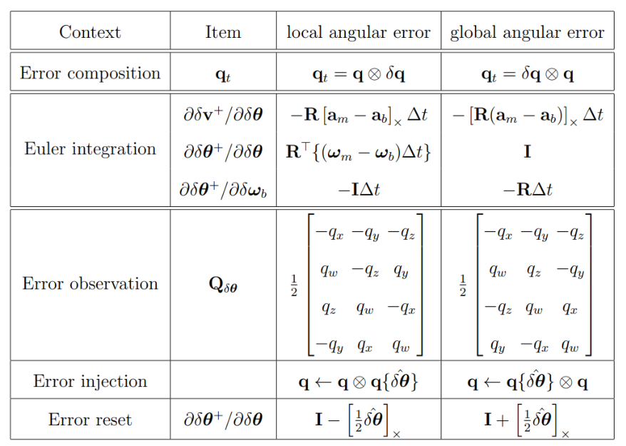

*Figure 19: Table (원문 p.57)*

위 식은 하나의 스칼라와 하나의 벡터 식으로 분리할 수 있다.

$$\begin{aligned}
\frac{1}{4}\hat{\delta\pmb{\theta}}^\intercal \delta\pmb{\theta} &= O(\|\delta\pmb{\theta}\|^2) \\
\delta\pmb{\theta}^+ &= -\hat{\delta\pmb{\theta}} + \left(\mathbf{I} + \left[\frac{1}{2}\hat{\delta\pmb{\theta}}\right]_\times\right)\delta\pmb{\theta} + O(\|\delta\pmb{\theta}\|^2)
\end{aligned} \tag{318}$$

위 첫번째 식은 고차항의 관련된 식이므로 크게 중요하지 않은 식이다. 하지만 위 두번째 식은
$\hat{\delta\pmb{\theta}} = 0$일 때 리셋 연산을 의미하므로 중요한 식이다. 이를 통해 자코비안을 쉽게 구할
수 있다.

$$\boxed{\frac{\partial\delta\pmb{\theta}^+}{\partial\delta\pmb{\theta}} = \mathbf{I} + \left[\frac{1}{2}\hat{\delta\pmb{\theta}}\right]_\times} \tag{319}$$

이는 지역 좌표계일 때 자코비안과 비교했을 때 $+, -$ 부호만 바뀐 것을 알 수 있다.

<!--widget:local-vs-global-eskf-->

# 8 Revision log

- 1st: 2022-08-27
- 2nd: 2022-09-01
- 3rd: 2022-09-04
- 4th: 2022-10-09
- 5th: 2022-10-13
- 6th: 2022-11-10
- 7th: 2022-12-28
- 8th: 2023-01-21
- 9th: 2023-01-29
- 10th: 2024-01-19
- 11th: 2024-05-07
- 12th: 2024-07-11: 오타 수정 (thanks to 방랑자님)
- 13th: 2025-02-12: 1.2.2 섹션 오타 수정 (thanks to sususu님)
- 14th: 2025-10-27: 1.3.5 섹션 오타 수정 (thanks to Victor Song님)
- 15th: 2025-11-03: 2.8 섹션 오타 수정 (thanks to Victor Song님)

# 옮기며 바로잡은 것

원문을 옮기면서 고친 것은 아래가 전부다. 그 외의 문장·수식·절 구성은 손대지 않았다.

## 맞춤법·철자

| 원문 쪽 | 위치 | 원문 | 고친 것 |
|---|---|---|---|
| 7 | 1.3 절 제목 | **Additinoal** quaternion properties | Additional quaternion properties |
| 12 | 2.1 절 | **Speical Orthonogal** 군 | Special Orthogonal 군 |
| 18 | 2.4 절 | 순수 쿼터니언(pure **quaterinon**) | pure quaternion |
| 19 | 2.4 절 (109) 뒤 | 대문자 **logratihmic** map | logarithmic map |
| 41 | 4.6.2 절 (233) 앞 | (Trawny and **Roumelotis**, 2005) | (Trawny and Roumeliotis, 2005) |
| 42 | 5.1 절 첫 항목 | 특이점(**signularity**) | 특이점(singularity) |
| 42 | 5.2 절 제목 | The error-state Kalman filter **expalined** | ... explained |
| 47 | 5.4 절 목록 | The **stocastic** part | The stochastic part |
| 47 | 5.4.2 절 | **stocastic** 파트의 적분 | stochastic 파트의 적분 |
| 47 | 5.4.2 절 | random **impluse** 항이 추가된다 | random impulse |
| 48 | 5.4.2 절 (263) 뒤 | 모든 random **impluse** 항은 | 모든 random impulse 항은 |
| 48 | 5.4.3 절 (265) 뒤 | perturbation **impluses** vector | perturbation impulses vector |
| 53 | 7.1.1 절 제목 | The **true-and** nominal-state kinematics | The true- and nominal-state kinematics |
| 55 | 7.2.3 절 제목 | ... Jacobian and **pertubation** matrices | ... perturbation matrices |

## 수식의 명백한 오기

아래 세 곳은 **바로 앞뒤 식과 어긋나는 것이 분명해** 고쳤다. 원문 표기를 함께 적어 둔다.

| 원문 쪽 | 식 | 원문 | 고친 것 | 근거 |
|---|---|---|---|---|
| 46 | (258) 3번째 줄 | 행렬 (2,1) 성분이 $(\pmb{\omega} - \pmb{\omega})$ | $(\pmb{\omega}_t - \pmb{\omega})$ | 바로 다음 줄에서 같은 자리가 $\delta\pmb{\omega}$이고 (256)이 $\delta\pmb{\omega} = \pmb{\omega}_t - \pmb{\omega}$ |
| 53 | (292) 2번째 줄 | $-[\mathbf{R}(\mathbf{a}_m - b\mathbf{a}_b)]_\times$ | $-[\mathbf{R}(\mathbf{a}_m - \mathbf{a}_b)]_\times$ | 같은 식을 유도한 결과인 (297)에는 $b$가 없다 |
| 54 | (297) | $\cdots - \mathbf{R}\mathbf{a}_b + \delta\mathbf{g} - \mathbf{R}\mathbf{a}_n$ | $\cdots - \mathbf{R}\delta\mathbf{a}_b + \delta\mathbf{g} - \mathbf{R}\mathbf{a}_n$ | (296)에 (245) $\delta\mathbf{a}_\mathcal{B} = -\delta\mathbf{a}_b - \mathbf{a}_n$을 넣으면 $\delta\mathbf{a}_b$가 나온다. (292)도 $\mathbf{R}\delta\mathbf{a}_b$다 |

## 재현하지 않은 표현

원문은 참조되는 식 번호를 **빨간 네모**로, 강조하려는 항을 **파란색**으로 칠해 두었다. 색은
재현하지 않았다 — 오프라인 MathJax 번들에 `color` 패키지가 없어 색을 쓰면 **문서의 수식이 전부
렌더링되지 않는다**(자세한 내용은 `_study_kit/3_Pitfalls.md` B6). 식 번호 참조는 `(240)`처럼 괄호 숫자
그대로 두었으므로 읽는 데 지장이 없다.

굵은 그리스 문자는 `\boldsymbol` 대신 `\pmb`로 조판했다. 같은 이유(오프라인 번들에 `boldsymbol`
패키지가 없다)이며 모양만 미세하게 다르고 의미는 같다.

식 (315)는 원문에서 이 식만 가는 $q^+$로 조판되어 있으나(다른 곳은 모두 굵은 $\mathbf{q}$다) 조판상의
차이일 뿐이라 굵게 통일해 옮겼다.

## 원문 그대로 둔 것

아래는 앞뒤와 어긋나 보이지만 저자의 표기 선택일 수 있어 **고치지 않고 그대로** 두었다.

- **(305)의 결과가 (306)과 이어지지 않는다** — 전역 각 에러를 유도하는 (304) 두번째 줄은
  $\dot{\delta\pmb{\theta}} = \delta\pmb{\omega}_G - \frac{1}{2}[\delta\pmb{\omega}_G]_\times\delta\pmb{\theta}$
  이므로 고차항을 지우면 $\dot{\delta\pmb{\theta}} = \delta\pmb{\omega}_G$가 되고, 여기에
  $\delta\pmb{\omega}_G = \mathbf{R}\delta\pmb{\omega}$와 (255)를 넣으면 곧바로 (306)이 된다. 그런데
  (305)에는 지역 좌표계 유도에서 쓰인 $-[\pmb{\omega}]_\times\delta\pmb{\theta}$ 항이 그대로 남아 있다
  (지역 좌표계의 (260)과 같은 식이다). (306)은 맞으므로 (305)만 (260)에서 옮겨 온 것으로 보이지만,
  단정할 수 없어 원문 그대로 두었다.
- **(307)의 $\delta\mathbf{v}$ 줄** — $-\mathbf{R}[\mathbf{a}_m - \mathbf{a}_b]_\times$로 적혀 있다.
  전역 좌표계의 연속 시간 식 (297)·(292)와 천이행렬 (308)은 모두
  $-[\mathbf{R}(\mathbf{a}_m - \mathbf{a}_b)]_\times$이므로 괄호 위치가 다르지만 원문 그대로 두었다.
  (지역 좌표계의 (263)과 글자까지 같은 줄이다.)
- **테이블 18·19의 캡션이 그냥 "Table"이다** — `Figure 18: Table`, `Figure 19: Table`로 원문 그대로
  두었다.

<!--END-->
