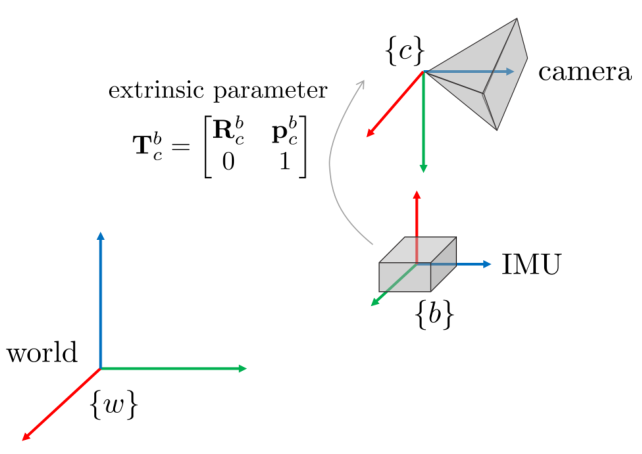
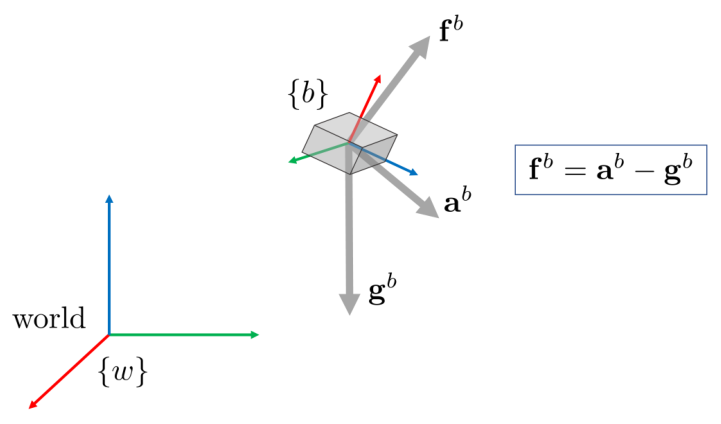
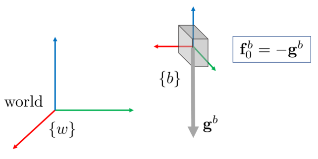
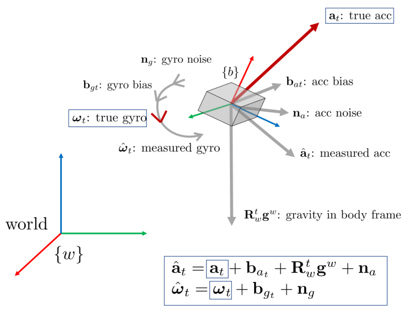
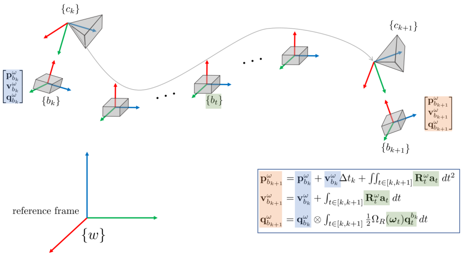
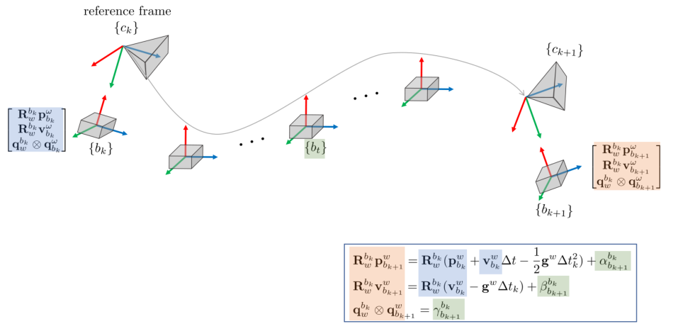
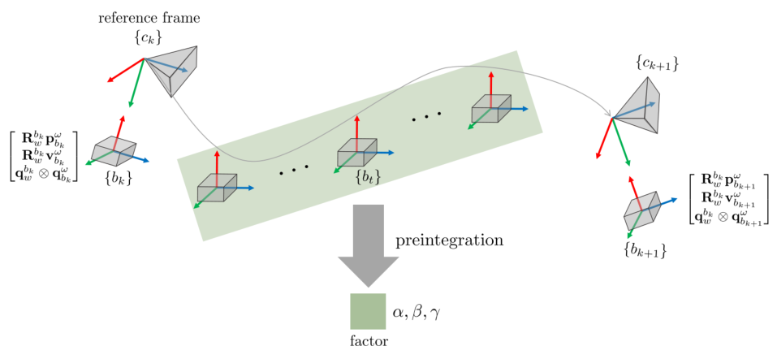
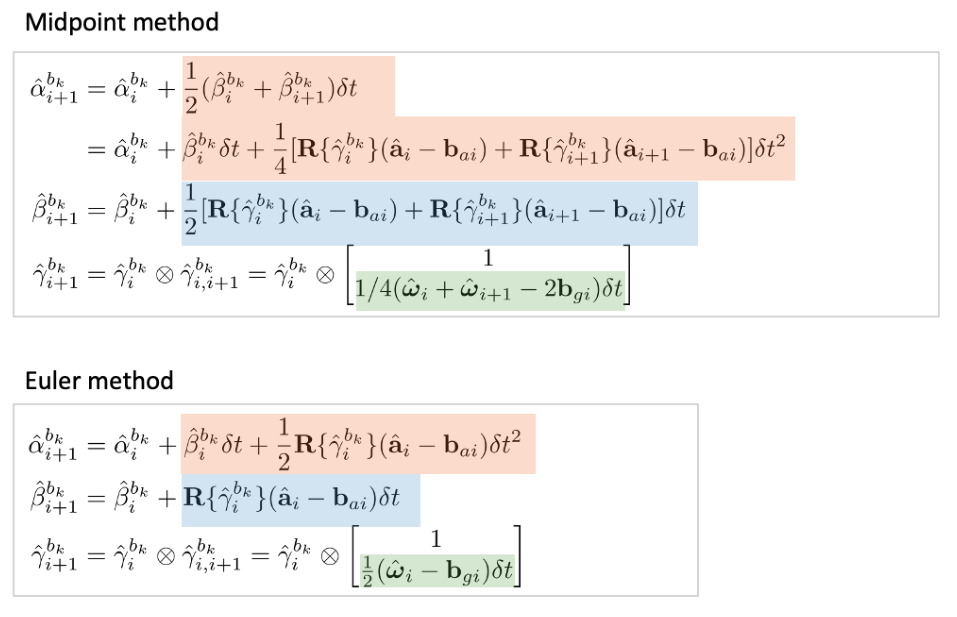
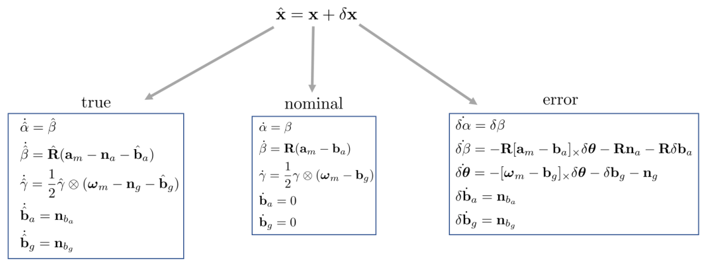
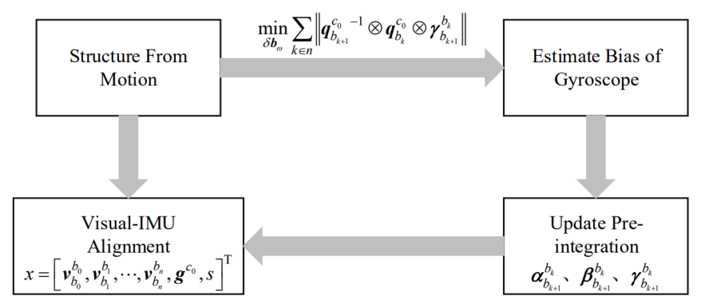

# Formula Derivation and Analysis of the VINS-Mono

> **원문** — Edward Gyubeom Im, *Formula Derivation and Analysis of the VINS-Mono*
> (22쪽, 원문은 Yibin Wu) ·
> blog: [alida.tistory.com](https://alida.tistory.com) · email: criterion.im@gmail.com
> 파일: `ref/Formula Derivation and Analysis of the VINS-Mono.pdf`
>
> **이 문서에 대하여** — 원문을 **내용 수정 없이 그대로** 옮긴 것이다. 절 구성·문장·수식 번호
> (1)~(88)이 모두 원문과 같고 순서도 바꾸지 않았다. 원문의 그림 10개도 같은 자리에 넣었다.
> 원문에는 그림 캡션이 하나도 없어 `(원문 p.N)`만 붙였다.
>
> 원문에 없는 것은 **인터랙티브 위젯 12개**뿐이며, 전부 **원문에 없는 추가 요소**라고 표시된
> 회색 박스 안에 들어 있어 본문과 섞이지 않는다.
>
> 명백한 오타는 바로잡았고, 무엇을 고쳤는지는 맨 아래
> [옮기며 바로잡은 것](#옮기며-바로잡은-것)에 전부 적어 두었다.
> 원문이 쓰는 **세 가지 색 강조를 모두 재현**했다 — 산문의 파란 강조 23곳과,
> 수식 안에서 두 항을 짝지어 가리키는 $\color{#ff0000}{빨강}$ 4곳 · $\color{#0000ff}{파랑}$ 4곳이다.

| 장 | 원문 쪽 | 식 | 장 | 원문 쪽 | 식 |
|---|---|---|---|---|---|
| 1 Introduction | 1 | — | 5 Marginalization | 20 | (81)~(88) |
| 2 Imu Preintegration | 2 | (1)~(31) | 6 Global Optimization in the VINS-Fusion | 21 | — |
| 3 Initialization | 13 | (32)~(52) | 7 References | 22 | — |
| 4 Tightly-Coupled Nonlinear Optimization | 15 | (53)~(80) | 8 Revision log | 22 | — |

# 1 Introduction

카메라와 IMU 좌표계를 시각화하면 다음과 같다. 두 센서는 단일 보드에 고정되어 있으며 보드를 캘리브레이션하면
두 센서 사이의 상대 포즈인 외부 파라미터(extrinsic parameter) $\mathbf{T}_C^b$ 를 구할 수 있다.

==NOMENCLATURE==

- 행렬은 굵은(bold) 대문자로 표기한다 e.g., $\mathbf{R}$
- 벡터는 굵은 소문자로 표기한다 e.g., $\mathbf{a}$
- 스칼라는 일반 소문자로 표기한다 e.g., $a$
- 벡터 변환과 관련된 좌표계는 위첨자$^a$ 와 아래첨자$_a$ 로 표기한다 e.g., $\mathbf{R}_w^b$ (from world to body frame). $\mathbf{R}_w^b\mathbf{v}^w = \mathbf{v}^b$
- 벡터의 경우 위첨자$^a$ 는 해당 좌표계에서 본 벡터를 의미한다 e.g., $\mathbf{g}^w$
- $\hat{*}$은 추정(estimated)한 값은 의미한다 e.g., $\hat{\mathbf{p}}$
- $\tilde{*}$은 관측(observed)한 값을 의미한다 $\tilde{\mathbf{p}}$
- $\mathbf{a}_x$는 벡터의 x 성분을 의미한다
- $[*]_\times$는 벡터 $*$의 반대칭행렬(skew-symmetric matrix)를 의미한다 e.g., $\mathbf{x} = \begin{bmatrix} x,y,z \end{bmatrix}^\intercal$일 때 $[\mathbf{x}]_\times = \begin{bmatrix} 0 & -z & y \\ z & 0 & -x \\ -y & x & 0 \end{bmatrix}$
- $\mathbf{R}\{*\}$은 $*$을 회전행렬로 변환하는 것을 의미한다 e.g., $\mathbf{R}\{\mathbf{I} + [\delta\boldsymbol{\theta}]_\times\}$
- $\otimes$는 쿼터니언 곱을 의미한다 e.g., $\mathbf{q}_1 \otimes \mathbf{q}_2$
- $\Omega_L(\boldsymbol{\omega})$은 순수 쿼터니언 $\boldsymbol{\omega} = [0, \omega_x, \omega_y, \omega_z]$가 주어졌을 때 쿼터니언 좌측(left) 곱셈 연산자를 의미한다. 즉, $\Omega_L = \begin{bmatrix} 0 & -\boldsymbol{\omega}^\intercal \\ \boldsymbol{\omega} & [\boldsymbol{\omega}]_\times \end{bmatrix}$이다. 이와 반대로, $\Omega_R(\boldsymbol{\omega})$은 쿼터니언 우측(right) 곱셈 연산자를 의미하며 $\Omega_R(\boldsymbol{\omega}) = \begin{bmatrix} 0 & -\boldsymbol{\omega}^\intercal \\ \boldsymbol{\omega} & -[\boldsymbol{\omega}]_\times \end{bmatrix}$이다. 자세한 내용은 [3]의 (19)를 참조하면 된다.
- $\mathbf{b}_g$는 $\mathbf{b}_w$와 동일하게 gyro bias를 의미한다. 본 자료에서는 통일성을 위해 $\mathbf{b}_g$만 사용하였다.
- $\mathbf{I} \in \mathbb{R}^{3\times 3}$은 3x3 항등행렬을 의미한다.

<!--widget:frames-and-notation-->

# 2 Imu Preintegration

## 2.1 IMU Preintegration in Continuous Time

SLAM에 사용하는 IMU 센서는 일반적으로 카메라 센서보다 훨씬 빠른 속도로 데이터를 취득한다. 카메라가 15-
30 [Hz]의 속도로 데이터를 취득하면 IMU 센서는 100-1000 [Hz]의 속도로 데이터를 취득한다. 따라서 일반적으로
두 개의 이미지 좌표계 사이에는 수 십개의 IMU 데이터가 존재한다. 이 때, 모든 IMU 데이터를 tightly-coupled
nonlinear optimization에 사용하는 경우 엄청난 연산량 부하가 발생한다. ==따라서 최근에서는 두 개의 이미지 좌표
계(또는 키프레임) 사이에 존재하는 여러 IMU 데이터를 하나의 factor로 변환하여 연산량 부하를 줄이는 방법이
연구되었는데 이러한 방법을 IMU Preintegration==이라고 한다.
3차원 공간 상에 IMU 센서가 존재한다고 하자. IMU 센서는 중력의 영향을 지속적으로 받기 때문에 IMU
가속도계에서 측정되는 값은 중력을 제거해야 실제로 센서가 움직이는 가속도가 된다.

$$\mathbf{f}^b = \mathbf{a}^b - \mathbf{g}^b \tag{1}$$

- $b$ : 바디 좌표계 (= IMU 좌표계)
- $\mathbf{f}$ : 최종 IMU 가속도
- $\mathbf{a}$ : 측정된 가속도
- $\mathbf{g}$ : 중력 벡터

만약 IMU 센서가 지표면과 평행한 바닥에서 위를 보고 누워있다면(right-front-up), 이 때의 관측값은 $\mathbf{f}_0^b =
-\mathbf{g}^b \sim 9.8m/s$가 된다.

==IMU noise and bias==

IMU 좌표계에서 측정되는 IMU 데이터는 센서의 움직임에 따른 가속도, 각속도의 변화와 중력의 성분을 포함하고
있으며 IMU 제조 과정에서 필연적으로 발생하는 bias의 영향과 센서 자체의 noise의 영향을 받는다. 따라서 IMU
센서를 통해 측정되는 값에는 다음 성분들이 포함되어 있다.

$$\begin{aligned}
\hat{\mathbf{a}}_t &= \mathbf{a}_t + \mathbf{b}_{a_t} + \mathbf{R}_w^t\mathbf{g}^w + \mathbf{n}_a \\
\hat{\boldsymbol{\omega}}_t &= \boldsymbol{\omega}_t + \mathbf{b}_{g_t} + \mathbf{n}_g
\end{aligned} \tag{2}$$

- $\hat{\mathbf{a}}_t$ : $t$ 시간의 측정된 가속도
- $\hat{\boldsymbol{\omega}}_t$ : $t$ 시간의 측정된 각속도
- $\mathbf{a}_t$ : $t$ 시간의 실제 가속도
- $\boldsymbol{\omega}_t$ : $t$ 시간의 실제 각속도
- $\mathbf{g}^w = [0,0,9.8]^\intercal$ : 월드 좌표계에서 본 중력 벡터
- $\mathbf{R}_w^t$ : (from world to t) 회전행렬
- $\mathbf{b}_{a_t}, \mathbf{b}_{g_t}$ : $t$ 시간의 가속도 bias와 각속도 bias 값.
  - $\dot{\mathbf{b}}_{a_t} = \mathbf{n}_{b_a}$, $\dot{\mathbf{b}}_{g_t} = \mathbf{n}_{b_g}$
  - $\mathbf{n}_{b_a} \sim \mathcal{N}(0, \sigma_{b_a}^2)$, $\mathbf{n}_{b_g} \sim \mathcal{N}(0, \sigma_{b_g}^2)$.
- $\mathbf{n}_a, \mathbf{n}_g$ : 가속도와 각속도의 노이즈.
  - $\mathbf{n}_a \sim \mathcal{N}(0,\sigma_a^2)$, $\mathbf{n}_g \sim \mathcal{N}(0,\sigma_g^2)$

==따라서 IMU 센서를 통해 들어오는 중력, 노이즈, bias를 포함한 가속도와 각속도 $\hat{\mathbf{a}}_t, \hat{\boldsymbol{\omega}}_t$이므로 실제 IMU 센서의
가속도와 각속도 값을 별도로 구해야 한다.== 실제 구하고자 하는 값 $\mathbf{a}_t, \boldsymbol{\omega}_t$를 기준으로 식을 정리하면 다음과 같다.

$$\begin{aligned}
\mathbf{a}_t &= \hat{\mathbf{a}}_t - \mathbf{b}_{a_t} - \mathbf{n}_a - \mathbf{R}_w^t\mathbf{g}^w \\
\boldsymbol{\omega}_t &= \hat{\boldsymbol{\omega}}_t - \mathbf{b}_{g_t} - \mathbf{n}_g
\end{aligned} \tag{3}$$

==IMU Preintegration:==

두 개의 이미지 좌표계에 대응하는 IMU 좌표계 $b_k, b_{k+1}$이 존재할 때, IMU로부터 위치(position), 속도, 각도 값들은
다음과 같이 구할 수 있다.

$$\begin{aligned}
\mathbf{p}_{b_{k+1}}^w &= \mathbf{p}_{b_k}^w + \mathbf{v}_{b_k}^w\Delta t_k + \iint_{t\in[k,k+1]}\mathbf{R}_t^w\mathbf{a}_t\,dt^2 \\
\mathbf{v}_{b_{k+1}}^w &= \mathbf{v}_{b_k}^w + \int_{t\in[k,k+1]}\mathbf{R}_t^w\mathbf{a}_t\,dt \\
\mathbf{q}_{b_{k+1}}^w &= \mathbf{q}_{b_k}^w \otimes \int_{t\in[k,k+1]}\dot{\mathbf{q}}\,dt \\
&= \mathbf{q}_{b_k}^w \otimes \int_{t\in[k,k+1]}\frac{1}{2}\Omega_R(\boldsymbol{\omega}_t)\mathbf{q}_t^{b_k}\,dt
\end{aligned} \tag{4}$$

앞서 유도한 공식으로 $\mathbf{a}_t, \boldsymbol{\omega}_t$를 치환하여 다시 표현하면 다음과 같다.

$$\begin{aligned}
\mathbf{p}_{b_{k+1}}^w &= \mathbf{p}_{b_k}^w + \mathbf{v}_{b_k}^w\Delta t_k + \iint_{t\in[k,k+1]}(\mathbf{R}_t^w(\hat{\mathbf{a}}_t - \mathbf{b}_{a_t} - \mathbf{n}_a) - \mathbf{g}^w)\,dt^2 \\
\mathbf{v}_{b_{k+1}}^w &= \mathbf{v}_{b_k}^w + \int_{t\in[k,k+1]}(\mathbf{R}_t^w(\hat{\mathbf{a}}_t - \mathbf{b}_{a_t} - \mathbf{n}_a) - \mathbf{g}^w)\,dt \\
\mathbf{q}_{b_{k+1}}^w &= \mathbf{q}_{b_k}^w \otimes \int_{t\in[k,k+1]}\frac{1}{2}\Omega_R(\hat{\boldsymbol{\omega}}_t - \mathbf{b}_{g_t} - \mathbf{n}_g)\mathbf{q}_t^{b_k}\,dt
\end{aligned} \tag{5}$$

- $\mathbf{p}_{b_{k+1}}^w$ : 월드 좌표계에서 바라본 $b_{k+1}$ 좌표계의 위치
- $\mathbf{v}_{b_{k+1}}^w$ : 월드 좌표계에서 바라본 $b_{k+1}$ 좌표계의 속도
- $\mathbf{q}_{b_{k+1}}^w$ : 월드 좌표계에서 바라본 $b_{k+1}$ 좌표계의 방향(orientation)
- $\Omega_R(\boldsymbol{\omega}) = [\boldsymbol{\omega}]_R = \begin{bmatrix} 0 & -\boldsymbol{\omega}^\intercal \\ \boldsymbol{\omega} & -[\boldsymbol{\omega}]_\times \end{bmatrix}$ where, $[\boldsymbol{\omega}]_\times = \begin{bmatrix} 0 & -\omega_z & \omega_y \\ \omega_z & 0 & -\omega_x \\ -\omega_y & \omega_x & 0 \end{bmatrix}$
- $\otimes$ : 쿼터니언 곱셈 연산자 (e.g., $\mathbf{q} = \mathbf{q}_1 \otimes \mathbf{q}_2$)

==NOTICE:== 이 때, $\mathbf{g}^w$ 는 실제 월드 좌표계 상의 중력을 나타내는 것이 아닌 IMU 시스템의 초기 좌표계 $\mathbf{f}_0^b$ 에서 중력
벡터를 의미한다.

(5) 쿼터니언 부분에서 $\int_{t\in[k,k+1]}\frac{1}{2}\Omega(\hat{\boldsymbol{\omega}}_t - \mathbf{b}_{g_t} - \mathbf{n}_g)\mathbf{q}_t^{b_k}dt$ 부분은 $\int\dot{\mathbf{q}}\,dt$ 형태이고 이는 다음과 같이 유도할 수 있다.

$$\begin{aligned}
\dot{\mathbf{q}} &= \lim_{\delta t \to 0}\frac{\mathbf{q}(t + \delta t) - \mathbf{q}(t)}{\delta t} \\
&= \lim_{\delta t \to 0}\frac{\mathbf{q}(t) \otimes \delta\mathbf{q} - \mathbf{q}(t)}{\delta t} \\
&= \lim_{\delta t \to 0}\frac{\mathbf{q}(t) \otimes \left(\begin{bmatrix} 1 \\ \frac{1}{2}\boldsymbol{\omega}_t \end{bmatrix} - \begin{bmatrix} 1 \\ 0 \end{bmatrix}\right)}{\delta t} \\
&= \frac{1}{2}\mathbf{q} \otimes \boldsymbol{\omega}_t = \frac{1}{2}\Omega_R(\boldsymbol{\omega}_t)\mathbf{q}
\end{aligned} \tag{6}$$

- 충분히 작은 쿼터니언 $\delta\mathbf{q}$에 대해 근사적으로 $\delta\mathbf{q} \approx \begin{bmatrix} 1 \\ \frac{1}{2}\delta\boldsymbol{\theta} \end{bmatrix} = \begin{bmatrix} 1 \\ \frac{1}{2}\boldsymbol{\omega}_t \end{bmatrix}$가 성립한다

다음으로 레퍼런스 좌표계를 월드 좌표계 $\{w\}$에서 IMU 좌표계 $\{b_k\}$로 변경한다. ==레퍼런스 좌표계를 $\{b_k\}$로
변경해야 $\{b_k\}$와 $\{b_{k+1}\}$ 사이의 위치, 속도, 각도를 적분한 preintegration 값을 구할 수 있다.==

$$\begin{aligned}
\mathbf{R}_w^{b_k}\mathbf{p}_{b_{k+1}}^w &= \mathbf{R}_w^{b_k}\left(\mathbf{p}_{b_k}^w + \mathbf{v}_{b_k}^w\Delta t - \frac{1}{2}\mathbf{g}^w\Delta t_k^2\right) + \alpha_{b_{k+1}}^{b_k} \\
\mathbf{R}_w^{b_k}\mathbf{v}_{b_{k+1}}^w &= \mathbf{R}_w^{b_k}(\mathbf{v}_{b_k}^w - \mathbf{g}^w\Delta t_k) + \beta_{b_{k+1}}^{b_k} \\
\mathbf{q}_w^{b_k} \otimes \mathbf{q}_{b_{k+1}}^w &= \gamma_{b_{k+1}}^{b_k}
\end{aligned} \tag{7}$$

- $\mathbf{R}_w^{b_k}$ : (from world to $b_k$) 회전행렬

위 그림에서 빨간색과 파란색으로 하이라이팅한 부분은 $b_k, b_{k+1}$ 두 시점에서 IMU 값을 의미하며 초록색으로 하이
라이팅한 부분이 $[b_k, b_{k+1}]$ 시간 사이에 preintegration되는 $\alpha_{b_{k+1}}^{b_k}, \beta_{b_{k+1}}^{b_k}, \gamma_{b_{k+1}}^{b_k}$ 값을 의미한다. 이를 자세히 풀어쓰면
다음과 같다.

$$\begin{aligned}
\alpha_{b_{k+1}}^{b_k} &= \iint_{t\in[k,k+1]}\mathbf{R}_t^{b_k}(\hat{\mathbf{a}}_t - \mathbf{b}_{at} - \mathbf{n}_a)\,dt^2 \\
\beta_{b_{k+1}}^{b_k} &= \int_{t\in[k,k+1]}\mathbf{R}_t^{b_k}(\hat{\mathbf{a}}_t - \mathbf{b}_{at} - \mathbf{n}_a)\,dt \\
\gamma_{b_{k+1}}^{b_k} &= \int_{t\in[k,k+1]}\frac{1}{2}\Omega_R(\hat{\boldsymbol{\omega}}_t - \mathbf{b}_{gt} - \mathbf{n}_g)\gamma_t^{b_k}\,dt
\end{aligned} \tag{8}$$

preintegration을 수행하면 VIO로 인해 IMU 포즈가 업데이트될 때마다 $t \in [k,k+1]$ 사이의 수많은 IMU
데이터에 일일히 repropagation을 수행할 필요없이 preintegration된 IMU 값들만 업데이트하면 되므로 연산량이
감소하는 효과가 있다.

<!--widget:alpha-beta-gamma-->

## 2.2 IMU Preintegration in Discrete Time

지금까지 유도한 (8)은 연속 신호(continuous signal)에서 사용 가능한 공식이다. 하지만 실제 IMU 신호는 이산 신호
(discrete signal)로 들어오므로 미분 방정식(differential equation)을 차분 방정식(difference equation)으로 표현해
야 한다. 해당 과정에서 미분방정식의 수치 해법들이 사용되는데, 대표적으로 zero-order hold(Euler), first-order
hold(Midpoint), higher order (RK4) 등이 존재한다. 이 중 VINS-mono에서 사용한 ==Mid-point method==를 사용해
차분 방정식을 표현하면 다음과 같다.

$$\begin{aligned}
\hat{\alpha}_{i+1}^{b_k} &= \hat{\alpha}_i^{b_k} + \frac{1}{2}(\hat{\beta}_i^{b_k} + \hat{\beta}_{i+1}^{b_k})\delta t \\
&= \hat{\alpha}_i^{b_k} + \hat{\beta}_i^{b_k}\delta t + \frac{1}{4}[\mathbf{R}\{\hat{\gamma}_i^{b_k}\}(\hat{\mathbf{a}}_i - \mathbf{b}_{ai}) + \mathbf{R}\{\hat{\gamma}_{i+1}^{b_k}\}(\hat{\mathbf{a}}_{i+1} - \mathbf{b}_{ai})]\delta t^2 \\
\hat{\beta}_{i+1}^{b_k} &= \hat{\beta}_i^{b_k} + \frac{1}{2}[\mathbf{R}\{\hat{\gamma}_i^{b_k}\}(\hat{\mathbf{a}}_i - \mathbf{b}_{ai}) + \mathbf{R}\{\hat{\gamma}_{i+1}^{b_k}\}(\hat{\mathbf{a}}_{i+1} - \mathbf{b}_{ai})]\delta t \\
\hat{\gamma}_{i+1}^{b_k} &= \hat{\gamma}_i^{b_k} \otimes \hat{\gamma}_{i,i+1}^{b_k} = \hat{\gamma}_i^{b_k} \otimes \begin{bmatrix} 1 \\ 1/4(\hat{\boldsymbol{\omega}}_i + \hat{\boldsymbol{\omega}}_{i+1} - 2\mathbf{b}_{gi})\delta t \end{bmatrix}
\end{aligned} \tag{9}$$

- $\hat{\alpha}, \hat{\beta}, \hat{\gamma}$: 이산 변환한 preintegration 값들은 수치 해법에 의해 근사되므로 $\hat{(\cdot)}$으로 표기한다
- $i$ : $[t_k, t_{k+1}]$ 시간 사이에서 이산 시간 스텝
- $\delta t$ : $i$와 $i+1$ 사이의 시간 간격
- $\mathbf{R}\{\gamma_{i+1}^{b_k}\}$: $\gamma_{i+1}^{b_k}$를 회전행렬로 변환하는 연산자

비교를 위해 Euler method을 통해 표현하면 다음과 같다.

$$\begin{aligned}
\hat{\alpha}_{i+1}^{b_k} &= \hat{\alpha}_i^{b_k} + \hat{\beta}_i^{b_k}\delta t + \frac{1}{2}\mathbf{R}\{\hat{\gamma}_i^{b_k}\}(\hat{\mathbf{a}}_i - \mathbf{b}_{ai})\delta t^2 \\
\hat{\beta}_{i+1}^{b_k} &= \hat{\beta}_i^{b_k} + \mathbf{R}\{\hat{\gamma}_i^{b_k}\}(\hat{\mathbf{a}}_i - \mathbf{b}_{ai})\delta t \\
\hat{\gamma}_{i+1}^{b_k} &= \hat{\gamma}_i^{b_k} \otimes \hat{\gamma}_{i,i+1}^{b_k} = \hat{\gamma}_i^{b_k} \otimes \begin{bmatrix} 1 \\ \frac{1}{2}(\hat{\boldsymbol{\omega}}_i - \mathbf{b}_{gi})\delta t \end{bmatrix}
\end{aligned} \tag{10}$$

==NOTICE:== VINS-mono의 저자는 노이즈 $\mathbf{n}_a, \mathbf{n}_g$ 값을 모르기 때문에 실제 코드 구현 상에서 0으로 놓고 진행하였다.
(VINS-mono 논문에 언급됨)
==NOTICE:== 엄밀하게 말하면 preintegration의 위치 $\alpha_{b_{k+1}}^{b_k}$와 속도 $\beta_{b_{k+1}}^{b_k}$ 값은 중력을 포함하고 있지 않기 때문에
무중력 공간에서 IMU 센서를 움직일 때 측정되는 위치와 속도로 이해하면 된다.

실제 VINS-mono 코드에는 Mid-point method가 구현되어 있다. ==따라서 $b_k$ 시점부터 $b_{k+1}$ 시점까지 IMU가
입력되는 매 순간 $t \in [k, k+1]$마다 위 (9) 공식에 의해 $\hat{\alpha}, \hat{\beta}, \hat{\gamma}$ 값이 업데이트된다.==

<!--widget:midpoint-vs-euler-->

## 2.3 Error-state Kinematics in Continuous Time

다음으로 tightly-coupled VIO에 의해 bias $\mathbf{b}_a, \mathbf{b}_g$가 최적화되었을 때 이를 기존의 preintegration $\alpha, \beta, \gamma$에 업데
이트하기 위한 자코비안 $\mathbf{J}_{b_{k+1}}^{b_k}$ 을 구해야한다. 또한 추후 VIO 과정에 사용하기 위한 preintegration 상태 변수들의
공분산 $\mathbf{P}_{b_{k+1}}^{b_k}$ 을 구해야한다. ==이러한 $\mathbf{J}, \mathbf{P}$를 구하기 위해서는 에러 상태 방정식(error-state equation)으로 IMU
상태 변수들을 표현해야 한다.==
[3] 페이퍼에서 설명한 내용을 참고하여 IMU preintegration의 에러 상태 방정식을 만들어보자. 일반적인 에러
상태 방정식은 다음과 같이 표현할 수 있다.

$$\hat{\mathbf{x}} = \mathbf{x} + \delta\mathbf{x} \tag{11}$$

- $\hat{\mathbf{x}}$ : true 상태
- $\mathbf{x}$ : nominal 상태
- $\delta\mathbf{x}$ : error 상태

nominal 상태는 다음과 같이 자세하게 나타낼 수 있다.

$$\begin{aligned}
\dot{\alpha} &= \beta \\
\dot{\beta} &= \mathbf{R}(\mathbf{a}_m - \mathbf{b}_a) \\
\dot{\gamma} &= \frac{1}{2}\gamma \otimes (\boldsymbol{\omega}_m - \mathbf{b}_g) \\
\dot{\mathbf{b}}_a &= 0 \\
\dot{\mathbf{b}}_g &= 0
\end{aligned} \tag{12}$$

이 때, $\mathbf{R}$은 쿼터니언 $\gamma$를 회전행렬로 변환한 행렬을 의미한다. 즉, $\mathbf{R}$은 $\mathbf{R}\{\gamma\}$이다. 다음으로 true 상태는 다음과
같이 자세하게 나타낼 수 있다.

$$\begin{aligned}
\dot{\hat{\alpha}} &= \hat{\beta} \\
\dot{\hat{\beta}} &= \hat{\mathbf{R}}(\mathbf{a}_m - \mathbf{n}_a - \hat{\mathbf{b}}_a) \\
\dot{\hat{\gamma}} &= \frac{1}{2}\hat{\gamma} \otimes (\boldsymbol{\omega}_m - \mathbf{n}_g - \hat{\mathbf{b}}_g) \\
\dot{\hat{\mathbf{b}}}_a &= \mathbf{n}_{b_a} \\
\dot{\hat{\mathbf{b}}}_g &= \mathbf{n}_{b_g}
\end{aligned} \tag{13}$$

이 때, 가속도 bias와 각속도 bias는 random walk 모델을 따르며 이들의 미분은 white gaussian noise라고 가정
한다. 즉, $\mathbf{n}_{b_a} \sim \mathcal{N}(0,\sigma_{b_a}^2), \mathbf{n}_{b_g} \sim \mathcal{N}(0,\sigma_{b_g}^2)$를 만족한다. 마지막으로 error 상태를 자세히 나타내면 다음과 같다.

$$\begin{aligned}
\dot{\delta\alpha} &= \delta\beta \\
\dot{\delta\beta} &= -\mathbf{R}[\mathbf{a}_m - \mathbf{b}_a]_\times\delta\boldsymbol{\theta} - \mathbf{R}\mathbf{n}_a - \mathbf{R}\delta\mathbf{b}_a \\
\dot{\delta\boldsymbol{\theta}} &= -[\boldsymbol{\omega}_m - \mathbf{b}_g]_\times\delta\boldsymbol{\theta} - \delta\mathbf{b}_g - \mathbf{n}_g \\
\dot{\delta\mathbf{b}}_a &= \mathbf{n}_{b_a} \\
\dot{\delta\mathbf{b}}_g &= \mathbf{n}_{b_g}
\end{aligned} \tag{14}$$

- $\dot{\delta\boldsymbol{\theta}}$: error 상태의 각도 에러는 $\dot{\delta\gamma}$가 아닌 $\dot{\delta\boldsymbol{\theta}}$를 사용하여 표현한 것에 유의한다

지금까지 정리한 에러 상태 방정식을 정리하면 아래 그림과 같다.

위 차등방정식에서 $\dot{\delta\beta}, \dot{\delta\boldsymbol{\theta}}$은 아래와 같이 유도할 수 있다. 2차항 이상의 값들은 상대적으로 값이 작으므로 무시
한다. 우선 $\dot{\delta\beta}$는 다음과 같이 구할 수 있다.

$$\begin{aligned}
\dot{\beta} + \dot{\delta\beta} = \boxed{\dot{\hat{\beta}}} \quad &= \hat{\mathbf{R}}(\mathbf{a}_m - \mathbf{n}_a - \hat{\mathbf{b}}_a) \\
\mathbf{R}(\mathbf{a}_m - \mathbf{b}_a) + \dot{\delta\beta} = \quad &= \mathbf{R}\{\mathbf{I} + [\delta\boldsymbol{\theta}]_\times\}(\mathbf{a}_m - \mathbf{n}_a - \mathbf{b}_a - \delta\mathbf{b}_a) \\
\dot{\delta\beta} = \quad &= -\mathbf{R}[\mathbf{a}_m - \mathbf{b}_a]_\times\delta\boldsymbol{\theta} - \mathbf{R}\mathbf{n}_a - \mathbf{R}\delta\mathbf{b}_a
\end{aligned} \tag{15}$$

$$\boxed{\dot{\delta\beta} = -\mathbf{R}[\mathbf{a}_m - \mathbf{b}_a]_\times\delta\boldsymbol{\theta} - \mathbf{R}\mathbf{n}_a - \mathbf{R}\delta\mathbf{b}_a} \tag{16}$$

다음으로 $\dot{\delta\boldsymbol{\theta}}$는 다음과 같이 구할 수 있다.

$$\begin{aligned}
(\gamma \otimes \dot{\delta\gamma}) = \boxed{\dot{\hat{\gamma}}} \quad &= \frac{1}{2}\hat{\gamma} \otimes (\boldsymbol{\omega}_m - \mathbf{n}_g - \hat{\mathbf{b}}_g) \\
\dot{\gamma} \otimes \delta\gamma + \gamma \otimes \dot{\delta\gamma} = \quad &= \frac{1}{2}\gamma \otimes \delta\gamma \otimes (\boldsymbol{\omega}_m - \mathbf{n}_g - \mathbf{b}_g - \delta\mathbf{b}_g)
\end{aligned} \tag{17}$$

$$\frac{1}{2}\gamma \otimes (\boldsymbol{\omega}_m - \mathbf{b}_g) \otimes \delta\gamma + \gamma \otimes \dot{\delta\gamma} = \frac{1}{2}\gamma \otimes \delta\gamma \otimes (\boldsymbol{\omega}_m - \mathbf{n}_g - \mathbf{b}_g - \delta\mathbf{b}_g) \tag{18}$$

- $\hat{\boldsymbol{\omega}} = \boldsymbol{\omega}_m - \mathbf{n}_g - \mathbf{b}_g - \delta\mathbf{b}_g$
- $\boldsymbol{\omega} = \boldsymbol{\omega}_m - \mathbf{b}_g$

라고 치환하여 표현하면 다음과 같다.

$$\frac{1}{2}\gamma \otimes \boldsymbol{\omega} \otimes \delta\gamma + \gamma \otimes \dot{\delta\gamma} = \frac{1}{2}\gamma \otimes \delta\gamma \otimes \hat{\boldsymbol{\omega}} \tag{19}$$

양변에 공통된 $\gamma\otimes$를 생략하고 정리하면 다음과 같다.

$$\begin{aligned}
2\dot{\delta\gamma} &= \delta\gamma \otimes \hat{\boldsymbol{\omega}} - \boldsymbol{\omega} \otimes \delta\gamma \\
&= \Omega_R(\hat{\boldsymbol{\omega}})\delta\gamma - \Omega_L(\boldsymbol{\omega})\delta\gamma \\
&= \begin{bmatrix} 0 & (\boldsymbol{\omega} - \hat{\boldsymbol{\omega}})^\intercal \\ \hat{\boldsymbol{\omega}} - \boldsymbol{\omega} & -[\boldsymbol{\omega} + \hat{\boldsymbol{\omega}}]_\times \end{bmatrix}\delta\gamma
\end{aligned} \tag{20}$$

위 식을 행렬로 풀어서 표기하면 다음과 같다.

$$\begin{bmatrix} 0 \\ \dot{\delta\boldsymbol{\theta}} \end{bmatrix} = \begin{bmatrix} 0 & (\delta\mathbf{b}_g + \mathbf{n}_g)^\intercal \\ -\delta\mathbf{b}_g - \mathbf{n}_g & -[2\boldsymbol{\omega}_m - \mathbf{n}_g - 2\mathbf{b}_g - \delta\mathbf{b}_g]_\times \end{bmatrix}\begin{bmatrix} 1 \\ \frac{1}{2}\delta\boldsymbol{\theta} \end{bmatrix} \tag{21}$$

최종적으로 $\dot{\delta\boldsymbol{\theta}}$는 다음과 같다.

$$\boxed{\dot{\delta\boldsymbol{\theta}} = -[\boldsymbol{\omega}_m - \mathbf{b}_g]_\times\delta\boldsymbol{\theta} - \delta\mathbf{b}_g - \mathbf{n}_g} \tag{22}$$

에러 상태 방정식을 한 번에 표기하면 다음과 같다.

$$\begin{bmatrix} \dot{\delta\alpha}_t^{b_k} \\ \dot{\delta\beta}_t^{b_k} \\ \dot{\delta\boldsymbol{\theta}}_t^{b_k} \\ \dot{\delta\mathbf{b}}_{a_t} \\ \dot{\delta\mathbf{b}}_{g_t} \end{bmatrix} =
\begin{bmatrix}
& \mathbf{I} & & & \\
& & -\mathbf{R}_t^{b_k}[\mathbf{a}_m - \mathbf{b}_a]_\times & -\mathbf{R}_t^{b_k} & \\
& & -[\boldsymbol{\omega}_m - \mathbf{b}_g]_\times & & -\mathbf{I} \\
& & & & \\
& & & &
\end{bmatrix}
\begin{bmatrix} \delta\alpha_t^{b_k} \\ \delta\beta_t^{b_k} \\ \delta\boldsymbol{\theta}_t^{b_k} \\ \delta\mathbf{b}_{a_t} \\ \delta\mathbf{b}_{g_t} \end{bmatrix} +
\begin{bmatrix}
& & & \\
-\mathbf{R}_t^{b_k} & & & \\
& -\mathbf{I} & & \\
& & \mathbf{I} & \\
& & & \mathbf{I}
\end{bmatrix}
\begin{bmatrix} \mathbf{n}_a \\ \mathbf{n}_g \\ \mathbf{n}_{b_a} \\ \mathbf{n}_{b_g} \end{bmatrix} \tag{23}$$

이는 다음과 같이 컴팩트하게 나타낼 수 있다.

$$\dot{\delta\mathbf{x}}_t = \mathbf{F}_t\delta\mathbf{x}_t + \mathbf{G}_t\mathbf{n}_t \tag{24}$$

함수의 미분은 다음과 같이 나타낼 수 있다.

$$\dot{\mathbf{x}} = \lim_{\delta t \to 0}\frac{\mathbf{x}(x + \delta t) - \mathbf{x}(t)}{\delta t} \tag{25}$$

충분히 작은 $\delta t$에 대해 $\lim$을 생략하고 $\mathbf{x} \to \delta\mathbf{x}$로 표기하면 $\dot{\delta\mathbf{x}} = \frac{\delta\mathbf{x}(t+\delta t)-\delta\mathbf{x}(t)}{\delta t}$와 같이 나타낼 수 있고 이를
풀어서 쓰면 다음과 같다. 이 때, 편의를 위해 $\mathbf{x}(t) \to \mathbf{x}_t$로 표기한다.

$$\begin{aligned}
\delta\mathbf{x}_{t+\delta t} &= \dot{\delta\mathbf{x}}\delta t + \delta\mathbf{x}_t \\
\delta\mathbf{x}_{t+\delta t} &= \mathbf{F}_t\delta\mathbf{x}_t + \mathbf{G}_t\mathbf{n}_t\delta t + \delta\mathbf{x}_t \\
\boxed{\delta\mathbf{x}_{t+\delta t}} &\boxed{= (\mathbf{I} + \mathbf{F}_t\delta t)\delta\mathbf{x}_t + \mathbf{G}_t\mathbf{n}_t\delta t}
\end{aligned} \tag{26}$$

위 식에 따라 공분산 $\mathbf{P}_{b_{k+1}}^{b_k}$은 초기값 $\mathbf{P}_{b_k}^{b_k} = 0$을 시작으로 다음과 같이 업데이트 된다. 이 때, $cov(\mathbf{x}) = \Sigma$ 일 때,
$cov(\mathbf{A}\mathbf{x}) = \mathbf{A}\Sigma\mathbf{A}^\intercal$의 성질을 이용한다.

$$\mathbf{P}_{t+\delta t}^{b_k} = (\mathbf{I} + \mathbf{F}_t\delta t)\mathbf{P}_t^{b_k}(\mathbf{I} + \mathbf{F}_t\delta t)^\intercal + (\mathbf{G}_t\delta t)\mathbf{Q}(\mathbf{G}_t\delta t)^\intercal \tag{27}$$

- $\delta t$: IMU의 샘플링 시간
- $\mathbf{Q}$: 노이즈에 대한 공분산 값 $\mathbf{Q} = diag(\sigma_a^2, \sigma_g^2, \sigma_{b_a}^2, \sigma_{b_g}^2)$

다음으로 1차 근사 자코비안 $\mathbf{J}_{b_{k+1}}^{b_k} = \frac{\partial\delta\mathbf{x}_{b_{k+1}}^{b_k}}{\partial\delta\mathbf{x}_{b_k}^{b_k}}$ 값은 초기값 $\mathbf{J}_{b_k}^{b_k} = \mathbf{I}$을 시작으로 다음과 같이 업데이트 된다.

$$\mathbf{J}_{t+\delta t} = (\mathbf{I} + \mathbf{F}_t\delta t)\mathbf{J}_t, \quad t \in [k, k+1] \tag{28}$$

따라서 preintegration의 변수($\alpha_{b_{k+1}}^{b_k}, \beta_{b_{k+1}}^{b_k}, \gamma_{b_{k+1}}^{b_k}$)의 1차 근사로 표현하면 다음과 같다.

$$\begin{aligned}
\alpha_{b_{k+1}}^{b_k} &\approx \hat{\alpha}_{b_{k+1}}^{b_k} + \mathbf{J}_{b_a}^\alpha\delta\mathbf{b}_{a_k} + \mathbf{J}_{b_k}^\alpha\delta\mathbf{b}_{g_k} \\
\beta_{b_{k+1}}^{b_k} &\approx \hat{\beta}_{b_{k+1}}^{b_k} + \mathbf{J}_{b_a}^\beta\delta\mathbf{b}_{a_k} + \mathbf{J}_{b_k}^\beta\delta\mathbf{b}_{g_k} \\
\gamma_{b_{k+1}}^{b_k} &= \hat{\gamma}_{b_{k+1}}^{b_k} \otimes \begin{bmatrix} 1 \\ \frac{1}{2}\mathbf{J}_{b_g}^\gamma\delta\mathbf{b}_{g_k} \end{bmatrix}
\end{aligned} \tag{29}$$

위 식에서 $\mathbf{J}_{b_a}^\alpha$는 $\mathbf{J}_{b_{k+1}}$의 $\frac{\partial\delta\mathbf{x}_{b_{k+1}}^{b_k}}{\partial\delta\mathbf{b}_a}$ 블록을 의미하는 부분행렬이며 다른 행렬도 동일한 의미의 부분행렬이다.
==이를 사용하면 VIO로 인해 충분히 작은 bias 값이 업데이트 되었을 때 모든 preintegration에 repropagation
을 수행하는 대신 위 식을 통해 근사적으로 업데이트할 수 있다. 이는 많은 연산량이 감소되는 이점을 가진다.==

<!--widget:error-state-continuous-->

## 2.4 Error-state Kinematics in Discrete Time

지금까지 유도한 에러 상태 방정식은 연속 신호(continuous signal)에 대한 방정식이었다. 하지만 이론과 달리 실제
IMU 데이터는 샘플링 시간 $\delta t > 0$ 간격으로 들어오는 이산 신호(discrete signal)이므로 앞서 설명한 미분 방정식
(differential equation)을 차분 방정식(difference equation)으로 변환하는 작업이 필요하다. 이산 변환을 위해서는
Euler method, Midpoint method, RK method 등 다양한 수치 해법들이 필요하다. ==본 섹션에서는 실제 VINS-
fusion에서 사용한 방법인 Midpoint 방법을 통해 앞서 설명한 에러 상태방정식을 변환한다.==

==Midpoint numerical integration method:==

Midpoint 수치 해법은 기존의 변수들을 다음과 같이 변환한다.

$$\begin{aligned}
\mathbf{n}_{g_t} &\to \frac{\mathbf{n}_{g_t} + \mathbf{n}_{g_{t+1}}}{2} \\
\boldsymbol{\omega}_t &\to \frac{\boldsymbol{\omega}_t + \boldsymbol{\omega}_{t+1}}{2} \\
\mathbf{R}_t^{b_k} &\to \frac{1}{2}(\mathbf{R}_t^{b_k} + \mathbf{R}_{t+1}^{b_k}) \\
\delta\beta_t^{b_k} &\to \frac{\delta\beta_t^{b_k} + \delta\beta_{t+1}^{b_k}}{2}
\end{aligned} \tag{30}$$

위 변환과 앞서 설명했던 (26)를 활용하여 기존의 에러 상태 방정식을 이산화하면 다음과 같다. 우선 $\dot{\delta\boldsymbol{\theta}}$를
이산화하면 다음과 같다.

$$\dot{\delta\boldsymbol{\theta}} = -\left[\frac{\boldsymbol{\omega}_t + \boldsymbol{\omega}_{t+1}}{2} - \mathbf{b}_{g_t}\right]_\times\delta\boldsymbol{\theta}_t^{b_k} - \delta\mathbf{b}_{g_t} - \frac{\mathbf{n}_{g_t} + \mathbf{n}_{g_{t+1}}}{2} \tag{31}$$

위 식을 (26)에 넣은 후 전개하면 다음과 같다.

$$\delta\boldsymbol{\theta}_{t+1}^{b_{k+1}} = \left(\mathbf{I} - \delta t\left[\frac{\boldsymbol{\omega}_t + \boldsymbol{\omega}_{t+1}}{2} - \mathbf{b}_{g_t}\right]_\times\right)\delta\boldsymbol{\theta}_t^{b_k} - \delta\mathbf{b}_{g_t}\delta t - \frac{\mathbf{n}_{g_t} + \mathbf{n}_{g_{t+1}}}{2}\delta t \tag{32}$$

다음으로 $\dot{\delta\beta}_t^{b_k}$를 이산화하면 다음과 같다.

$$\begin{aligned}
\dot{\delta\beta}_t^{b_k} = &-\frac{1}{2}\mathbf{R}_t^{b_k}[\mathbf{a}_t - \mathbf{b}_{a_t}]_\times\delta\boldsymbol{\theta}_t^{b_k} - \frac{1}{2}\mathbf{R}_{t+1}^{b_k}[\mathbf{a}_{t+1} - \mathbf{b}_{a_t}]_\times\delta\boldsymbol{\theta}_{t+1}^{b_k} - \frac{1}{2}(\mathbf{R}_t^{b_k} + \mathbf{R}_{t+1}^{b_k})\delta\mathbf{b}_{a_t} \\
&- \frac{1}{2}(\mathbf{R}_t^{b_k} + \mathbf{R}_{t+1}^{b_k})\mathbf{n}_{a_t}
\end{aligned} \tag{33}$$

위 식에 앞서 계산한 $\delta\boldsymbol{\theta}_{t+1}^{b_{k+1}}$를 치환하고 전개하면 다음과 같은 식을 얻을 수 있다.

$$\boxed{\begin{aligned}
\delta\beta_{t+1}^{b_k} = &\ \delta\beta_t^{b_k} \\
&+ \left(-\frac{\delta t}{2}\mathbf{R}_t^{b_k}[\mathbf{a}_t - \mathbf{b}_{\mathbf{a}_t}]_\times - \frac{\delta t}{2}\mathbf{R}_{t+1}^{b_k}[\mathbf{a}_{t+1} - \mathbf{b}_{a_t}]_\times\delta\boldsymbol{\theta}_{t+1}^{b_k}\left(\mathbf{I} - \delta t\left[\frac{\boldsymbol{\omega}_t + \boldsymbol{\omega}_{t+1}}{2} - \mathbf{b}_{g_t}\right]_\times\right)\right)\delta\boldsymbol{\theta}_t^{b_k} \\
&+ \frac{\delta t^2}{2}\mathbf{R}_{t+1}^{b_k}(\mathbf{a}_{t+1} - \mathbf{b}_{a_t}) - \frac{\delta t^2}{4}\mathbf{R}_{t+1}^{b_k}(\mathbf{a}_{t+1} - \mathbf{b}_{\mathbf{a}_t})(\mathbf{n}_{g_t} + \mathbf{n}_{g_{t+1}}) - \frac{\delta t}{2}(\mathbf{R}_t^{b_k} + \mathbf{R}_{t+1}^{b_k})\delta\mathbf{b}_{a_t} \\
&- \frac{\delta t}{2}\mathbf{R}_t^{b_k}\mathbf{n}_{a_t} - \frac{\delta t}{2}\mathbf{R}_{t+1}^{b_k}\mathbf{n}_{a_{t+1}}
\end{aligned}} \tag{34}$$

마지막으로 $\dot{\delta\alpha}_t^{b_k}$를 이산화하면 다음과 같다.

$$\dot{\delta\alpha}_t^{b_k} = \frac{1}{2}(\delta\beta_t^{b_k} + \delta\beta_{t+1}^{b_k}) \tag{35}$$

위 식과 (26)를 활용하여 $\delta\alpha_{t+1}^{b_k}$을 구하면 다음과 같다.

$$\boxed{\delta\alpha_{t+1}^{b_k} = \delta\alpha_t^{b_k} + \frac{1}{2}\left(\delta\beta_t^{b_k} + \delta\beta_{t+1}^{b_k}\right)\delta t} \tag{36}$$

지금까지 구한 에러 상태 방정식을 행렬 형태로 나타내면 다음과 같다.

$$\begin{bmatrix} \delta\alpha_{k+1} \\ \delta\boldsymbol{\theta}_{k+1} \\ \delta\beta_{k+1} \\ \delta\mathbf{b}_{a_{k+1}} \\ \delta\mathbf{b}_{g_{k+1}} \end{bmatrix} =
\begin{bmatrix}
\mathbf{I} & \mathbf{F}_{01} & \delta t\mathbf{I} & \mathbf{F}_{03} & \mathbf{F}_{04} \\
& \mathbf{F}_{11} & & & -\delta t\mathbf{I} \\
& \mathbf{F}_{21} & \mathbf{I} & \mathbf{F}_{23} & \mathbf{F}_{24} \\
& & & \mathbf{I} & \\
& & & & \mathbf{I}
\end{bmatrix}
\begin{bmatrix} \delta\alpha_k \\ \delta\boldsymbol{\theta}_k \\ \delta\beta_k \\ \delta\mathbf{b}_{a_k} \\ \delta\mathbf{b}_{g_k} \end{bmatrix} +
\begin{bmatrix}
\mathbf{G}_{00} & \mathbf{G}_{01} & \mathbf{G}_{02} & \mathbf{G}_{03} & & \\
& -\delta t/2\mathbf{I} & & -\delta t/2\mathbf{I} & & \\
-\frac{\mathbf{R}_k\delta t}{2} & \mathbf{G}_{21} & -\frac{\mathbf{R}_{k+1}\delta t}{2} & \mathbf{G}_{23} & & \\
& & & & \delta t\mathbf{I} & \\
& & & & & \delta t\mathbf{I}
\end{bmatrix}
\begin{bmatrix} \mathbf{n}_{a_k} \\ \mathbf{n}_{g_k} \\ \mathbf{n}_{a_{k+1}} \\ \mathbf{n}_{g_{k+1}} \\ \mathbf{n}_{b_a} \\ \mathbf{n}_{b_g} \end{bmatrix} \tag{37}$$

각각 부분행렬은 다음과 같다.

$$\begin{aligned}
\mathbf{F}_{01} &= -\frac{\delta t^2}{4}\mathbf{R}_k[\hat{\mathbf{a}}_k - \mathbf{b}_{a_k}]_\times - \frac{\delta t^2}{4}\mathbf{R}_{k+1}[\hat{\mathbf{a}}_{k+1} - \mathbf{b}_{a_k}]_\times\left(\mathbf{I} - \left[\frac{\hat{\boldsymbol{\omega}}_k + \hat{\boldsymbol{\omega}}_{k+1}}{2} - \mathbf{b}_{g_k}\right]_\times\delta t\right) \\
\mathbf{F}_{03} &= -\frac{\delta t^2}{4}(\mathbf{R}_k + \mathbf{R}_{k+1}) \\
\mathbf{F}_{04} &= \frac{\delta t^3}{4}\mathbf{R}_{k+1}[\hat{\mathbf{a}}_{k+1} - \mathbf{b}_{a_k}]_\times \\
\mathbf{F}_{11} &= \mathbf{I} - \left[\frac{\hat{\boldsymbol{\omega}}_k + \hat{\boldsymbol{\omega}}_{k+1}}{2} - \mathbf{b}_{g_k}\right]_\times\delta t \\
\mathbf{F}_{21} &= -\frac{\delta t}{2}\mathbf{R}_k[\hat{\mathbf{a}}_k - \mathbf{b}_{a_k}]_\times - \frac{\delta t}{2}\mathbf{R}_{k+1}[\hat{\mathbf{a}}_{k+1} - \mathbf{b}_{a_k}]_\times\left(\mathbf{I} - \left[\frac{\hat{\boldsymbol{\omega}}_k + \hat{\boldsymbol{\omega}}_{k+1}}{2} - \mathbf{b}_{g_k}\right]_\times\delta t\right) \\
\mathbf{F}_{23} &= -\frac{\delta t}{2}(\mathbf{R}_k + \mathbf{R}_{k+1}) \\
\mathbf{F}_{24} &= \frac{\delta t^2}{2}\mathbf{R}_{k+1}[\hat{\mathbf{a}}_{k+1} - \mathbf{b}_{a_k}]_\times \\
\\
\mathbf{G}_{00} &= -\frac{\delta t^2}{4}\mathbf{R}_k \\
\mathbf{G}_{01} = \mathbf{G}_{03} &= \frac{\delta t^3}{8}\mathbf{R}_{k+1}[\hat{\mathbf{a}}_{k+1} - \mathbf{b}_{a_k}]_\times \\
\mathbf{G}_{02} &= -\frac{\delta t^2}{4}\mathbf{R}_{k+1} \\
\mathbf{G}_{21} = \mathbf{G}_{23} &= \frac{\delta t^2}{4}\mathbf{R}_{k+1}[\hat{\mathbf{a}}_{k+1} - \mathbf{b}_{a_k}]_\times
\end{aligned} \tag{38}$$

<!--widget:jacobian-covariance-propagation-->

위 자코비안 $\mathbf{F}, \mathbf{G}$은 VINS-mono 코드 중 *integration_base.h :: midPointIntegration()* 함수에 구현되어 있다.

VINS-mono에서는 지금까지 구한 에러 상태 방정식을 활용하여 다음과 같은 작업을 수행한다.

- $[b_k, b_{k+1}]$ 구간 사이의 매 $t$ 순간마다 공분산 $\mathbf{P}_t^{b_k}$를 구한다(27). 이 때 앞서 구한 이산화된 $\mathbf{F}, \mathbf{G}$ 행렬이 사용된다. 이는 다음 키프레임 생성 시점 $b_{k+1}$까지 지속적으로 계산되며 최종적으로 구해진 $\mathbf{P}_{b_{k+1}}^{b_k}$은 VIO를 최적화할 때 사용된다.
- $[b_k, b_{k+1}]$ 구간 사이의 매 $t$ 순간마다 공분산 $\mathbf{J}_t^{b_k}$를 구한다(28). 이 때 앞서 구한 이산화된 $\mathbf{F}, \mathbf{G}$ 행렬이 사용된다. VIO에 의해 bias $\mathbf{b}_a, \mathbf{b}_g$ 값이 최적화되면 (29)를 통해 기존 preintegration 값에 업데이트한다.

# 3 Initialization

VINS-mono의 초기화(initialization) 과정은 다음과 같이 4개의 과정으로 구성되어 있다.

## 3.1 Vision-Only SfM in Sliding Window

초기화 과정은 슬라이딩 윈도우 내에서 vision-only SFM을 수행하는 것부터 시작한다. 우선 두 좌표계 $F_t, F_{t+1}$가
시간 순서로 주어졌다고 하자.

1. $F_t$에서 30개 이상의 특징점이 추출되고 동시에 $F_t \leftrightarrow F_{t+1}$ 사이의 평균 parallex가 20 픽셀 이상 차이가 나면
   두 좌표계 사이의 3차원 상대 포즈(relative pose)를 Five-point 방법을 통해 계산한다. 이 때, parallex는 2
   차원 이미지 평면 상에서 두 픽셀의 거리 차이를 의미한다. 상대 포즈는 스케일 값을 제외하고(up to scale)
   추정이 가능하다.
2. 다음으로 $F_t$를 레퍼런스 좌표계 $c_0$로 설정한다. $F_t$는 항상 첫번째 좌표계를 의미하는 것이 아닌 두 좌표계
   $F_t, F_{t+1}$ 중 이전 좌표계를 의미한다.
3. 다음으로 두 좌표계 내의 모든 특징점을 triangulation한다.
4. triangulation된 3차원 점들을 사용하여 슬라이드 윈도우 내의 다른 좌표계들의 포즈를 구하기 위해 EPnP를
   수행한다.
5. 슬라이드 윈도우 내의 모든 포즈를 최적화하기 위해 bundle adjustment를 수행한다.

## 3.2 Visual-Inertial Alignment

==1) Gyroscope Bias Calibration:== vision-only SFM이 모두 수행되고 나면 IMU preintegration된 값과 SFM된
값을 사용하여 여러 파라미터들을 초기화할 수 있다. 우선, 두 키프레임 좌표계 $\{b_k\}, \{b_{k+1}\}$이 주어졌을 때 SFM
을 통해 구한 $\mathbf{q}_{b_{k+1}}^{c_0}, \mathbf{q}_{b_k}^{c_0}$와 IMU preintegration을 통해 구한 $\gamma_{b_{k+1}}^{b_k}$을 사용하여 gyroscope bias 값을 업데이트할 수
있다.

$$\begin{aligned}
&\min_{\delta\mathbf{b}_g}\sum_{k\in\mathcal{B}}\left\|(\mathbf{q}_{b_{k+1}}^{c_0})^{-1} \otimes \mathbf{q}_{b_k}^{c_0} \otimes \gamma_{b_{k+1}}^{b_k}\right\|^2 \\
&= \min_{\delta\mathbf{b}_g}\sum_{k\in\mathcal{B}}\left\|\mathbf{q}_{b_k}^{b_{k+1}} \otimes \gamma_{b_{k+1}}^{b_k}\right\|^2 \\
&= \min_{\delta\mathbf{b}_g}\sum_{k\in\mathcal{B}}\|\mathbf{r}_{gyr}\|^2
\end{aligned} \tag{39}$$

(32)에서 자코비안 $\mathbf{J}_{\mathbf{b}_g}^\gamma = -\delta t\mathbf{I}$이므로 이를 통해 다음 식을 업데이트하면서 최적의 $\delta\mathbf{b}_g$를 업데이트한다.

$$\gamma_{b_{k+1}}^{b_k} \approx \hat{\gamma}_{b_{k+1}}^{b_k} \otimes \begin{bmatrix} 1 \\ \frac{1}{2}\mathbf{J}_{\mathbf{b}_g}^\gamma\delta\mathbf{b}_g \end{bmatrix} \tag{40}$$

코드 구현에서는 모든 키프레임들에 대해 $\mathbf{J}^\intercal\mathbf{J}\delta\mathbf{b}_g^* = \mathbf{J}^\intercal\mathbf{r}_{gyr}$ 형태로 식을 만든 후 cholesky decomposition을
통해 한 번에 최적의 값을 구한다.

<!--widget:gyro-bias-calibration-->

==2) Velocity, Gravity Vector, and Metric Scale Initialization :== 캘리브레이션 된 외부 파라미터(extrinsic
parameter) $\color{#ff0000}{\mathbf{p}_c^b}, \color{#0000ff}{\mathbf{q}_c^b}$를 사용하여 카메라와 IMU 사이의 상대 포즈를 구하면 다음과 같다.

$$\begin{aligned}
s\bar{\mathbf{p}}_{b_k}^{c_0} &= s\bar{\mathbf{p}}_{c_k}^{c_0} - \mathbf{R}_{b_k}^{c_0}\color{#ff0000}{\mathbf{p}_c^b} \\
\mathbf{q}_{b_k}^{c_0} &= \mathbf{q}_{c_k}^{c_0} \otimes (\color{#0000ff}{\mathbf{q}_c^b})^{-1}
\end{aligned} \tag{41}$$

- $c_0$: 초기화가 시작된 시점의 가장 첫번째 좌표계
- $\bar{\mathbf{p}}$: 스케일을 제외한(up to scale) 위치 벡터 $\mathbf{p}$
- $s$: 스케일 값

(7)에서 모든 좌표계의 레퍼런스 좌표계를 월드 좌표계 $\{w\}$에서 $\{c_0\}$ 좌표계로 변환하고 preintegation 항을
이항하여 정리하면 다음과 같이 나타낼 수 있다.

$$\begin{aligned}
\hat{\alpha}_{b_{k+1}}^{b_k} &= \mathbf{R}_{c_0}^{b_k}\left(s\left(\bar{\mathbf{p}}_{b_{k+1}}^{c_0} - \bar{\mathbf{p}}_{b_k}^{c_0}\right) + \frac{1}{2}\mathbf{g}^{c_0}\delta t^2 - \mathbf{R}_{b_k}^{c_0}\mathbf{v}_{b_k}^{b_k}\delta t\right) \\
\hat{\beta}_{b_{k+1}}^{b_k} &= \mathbf{R}_{c_0}^{b_k}\left(\mathbf{R}_{b_{k+1}}^{c_0}\mathbf{v}_{b_{k+1}}^{b_{k+1}} + \mathbf{g}^{c_0}\delta t - \mathbf{R}_{b_k}^{c_0}\mathbf{v}_{b_k}^{b_k}\right)
\end{aligned} \tag{42}$$

(41), (42)로부터 선형 방정식으로 구성된 선형 시스템을 얻을 수 있다.

$$\begin{aligned}
\hat{\alpha}_{b_{k+1}}^{b_k} &= \mathbf{R}_{c_0}^{b_k}\left(s\left(\bar{\mathbf{p}}_{b_{k+1}}^{c_0} - \bar{\mathbf{p}}_{b_k}^{c_0}\right) + \frac{1}{2}\mathbf{g}^{c_0}\delta t^2 - \mathbf{R}_{b_k}^{c_0}\mathbf{v}_{b_k}^{b_k}\delta t\right) \\
&= \mathbf{R}_{c_0}^{b_k}\left(s\bar{\mathbf{p}}_{c_{k+1}}^{c_0} - \mathbf{R}_{b_{k+1}}^{c_0}\mathbf{p}_c^b - (s\bar{\mathbf{p}}_{c_k}^{c_0} - \mathbf{R}_{b_k}^{c_0}\mathbf{p}_c^b) + \frac{1}{2}\mathbf{g}^{c_0}\delta t^2 - \mathbf{R}_{b_k}^{c_0}\mathbf{v}_{b_k}^{b_k}\delta t\right) \\
&= \mathbf{R}_{c_0}^{b_k}(\bar{\mathbf{p}}_{c_{k+1}}^{c_0} - \bar{\mathbf{p}}_{c_k}^{c_0})s + \frac{1}{2}\mathbf{R}_{c_0}^{b_k}\mathbf{g}^{c_0}\delta t^2 - \mathbf{v}_{b_k}^{b_k}\delta t + \mathbf{p}_c^b - \mathbf{R}_{c_0}^{b_k}\mathbf{R}_{b_{k+1}}^{c_0}\mathbf{p}_c^b
\end{aligned} \tag{43}$$

선형 시스템은 다양한 행렬 분해(decomposition) 방법을 통해 비교적 쉽게 해를 구할 수 있는 이점이 있다. 위
식을 선형시스템 $\mathbf{Ax} = \mathbf{b}$ 형태로 정리하면 다음과 같다.

$$\begin{bmatrix} \hat{\alpha}_{b_{k+1}}^{b_k} - \mathbf{p}_c^b + \mathbf{R}_{c_0}^{b_k}\mathbf{R}_{b_{k+1}}^{c0}\mathbf{p}_c^b \\ \hat{\beta}_{b_{k+1}}^{b_k} \end{bmatrix} =
\begin{bmatrix} \delta t\mathbf{I} & 0 & \frac{1}{2}\mathbf{R}_{c_0}^{b_k}\delta t^2 & \mathbf{R}_{c_0}^{b_k}(\bar{\mathbf{p}}_{c_{k+1}}^{c_0} - \bar{\mathbf{p}}_{c_k}^{c_0}) \\ -\mathbf{I} & \mathbf{R}_{c_0}^{b_k}\mathbf{R}_{b_{k+1}}^{c_0} & \delta t\mathbf{R}_{c_0}^{b_k} & 0 \end{bmatrix}
\begin{bmatrix} \mathbf{v}_{b_k}^{b_k} \\ \mathbf{v}_{b_{k+1}}^{b_{k+1}} \\ \mathbf{g}^{c_0} \\ s \end{bmatrix} \tag{44}$$

$$\hat{\mathbf{z}}_{b_{k+1}}^{b_k} = \mathbf{H}_{b_{k+1}}^{b_k}\mathcal{X}_I + \mathbf{n}_{b_{k+1}}^{b_k} \tag{45}$$

- $\mathcal{X}_I = [\mathbf{v}_{b_0}^{b_0}, \mathbf{v}_{b_1}^{b_1}, \cdots, \mathbf{v}_{b_n}^{b_n}, \mathbf{g}^{c_0}, s]$
- $\mathbf{n}_{b_{k+1}}^{b_k}$ : $[b_k, b_{k+1}]$ 좌표계 사이의 모든 노이즈 항

이는 VINS-mono의 (10),(11) 식과 동일하다. 위 식 중 $\mathbf{R}_{c_0}^{b_k}, \mathbf{R}_{c_0}^{b_{k+1}}, \bar{\mathbf{p}}_{c_k}^{c_0}, \bar{\mathbf{p}}_{c_{k+1}}^{c_0}$은 SFM으로 부터 얻은 값이다.
따라서 최종적으로 계산해야 하는 최적화 공식은 다음과 같이 나타낼 수 있다.

$$\min_{\mathcal{X}_I}\sum_{k\in\mathcal{B}}\left\|\hat{\mathbf{z}}_{b_{k+1}}^{b_k} - \mathbf{H}_{b_{k+1}}^{b_k}\mathcal{X}_I\right\|^2 \tag{46}$$

<!--widget:velocity-gravity-scale-->

==3) Gravity Refinement:== 위 과정에서 중력 벡터 값이 1차적으로 추정되고 이후 다시 한 번 미세 조정되는 최적
화를 거친다. 중력은 크기가 고정되어 있는 상수이므로 ($9.8m/s^2$) 만약 추정된 중력의 크기가 9.8보다 크다면 작게
만들고 9.8보다 작다면 크게 만들 수 있다. 크기를 알고 있는 중력 벡터는 자유도가 2이므로 우리가 세 개의 벡터
값 중 두 개를 알고 있으면 나머지 값은 자동으로 결정된다. 따라서 중력 벡터는 2차원 접평면을 가지는 매니폴드로
파라미터화 할 수 있다.

$$\mathbf{g}^{c_0} = \|\mathbf{g}\|\frac{\mathbf{g}^{c_0}}{\|\mathbf{g}^{c_0}\|} + \begin{bmatrix} \mathbf{b}_1 & \mathbf{b}_2 \end{bmatrix}\begin{bmatrix} w_1 \\ w_2 \end{bmatrix} \tag{47}$$

위 식에서 $\mathbf{g}^{c_0}, \mathbf{b}_1, \mathbf{b}_2$는 서로 직교(orthogonal)하며 이 중 $\mathbf{b}_1, \mathbf{b}_2$는 접평면을 span하는 두 basis 벡터이다. 그리고
$w_1, w_2$는 섭동(perturbation) 또는 에러를 의미하며 1차적으로 추정된 중력 벡터에 의해 결정되는 값이다. 이러한
$w_1, w_2$ 최적화를 통해 0에 가깝게 만드는 것이 gravity refinement의 목적이다.

<!--widget:gravity-refinement-->

==4) Completing Initialization:== 중력 벡터까지 미세 조정이 완료되었으면 다음으로 중력 벡터를 z축으로 하는
월드 좌표계 $(\cdot)^w$ 를 생성하여 기존의 $(\cdot)^{c_0}$ 좌표계의 파라미터를 모두 월드 좌표계 $(\cdot)^w$ 으로 회전시킨다. 이 때 IMU
좌표계의 속도 또한 월드 좌표계로 회전시킨다. 다음으로 visual SFM으로 생성한 값에 스케일을 적용하며 metric
단위를 갖도록 한다. 해당 시점에서 모든 초기화 과정이 마무리되고 모든 파라미터는 VIO의 입력으로 들어간다.

# 4 Tightly-Coupled Nonlinear Optimization

## 4.1 Basic of the State Estimation

상태 추정 문제는 일반적으로 베이지안 확률의 Maximum A Posteriori(MAP)를 구하는 문제로 해석할 수 있다.
이는 관측 값이 있는 상태에서 로봇의 상태의 조건부 확률분포를 계산하는 것과 동일하다.

$$P(x|z) \tag{48}$$

- $x$: 로봇의 상태
- $z$: 관측된 센서 데이터

위 식에 베이지안 법칙을 적용하면 다음 식을 얻을 수 있다.

$$P(x|z) = \frac{P(z|x)P(x)}{P(z)} \propto P(z|x)P(x) \tag{49}$$

위 식에서 $P(x|z)$를 posterior라고 하고 $P(x)$를 priori라고 하며 $P(z|x)$를 likelihood라고 한다. 일반적으로
posterior를 바로 구하는 것은 어렵다고 알려져 있다. 따라서 priori와 likelihood를 변경하여 posterior가 최대가
되는 최적의 상태 변수를 구하는 방식이 널리 사용되는데 이를 Maximum A Posteriori(MAP)라고 한다. 대부분의
경우 priori 정보는 모르는 상황에서 상태 추정을 진행하므로 수식은 다음과 같이 변형된다.

$$\mathcal{X}^* = \arg\max P(x|z) \propto \arg\max P(z|x)P(x) \propto \arg\max P(z|x) \tag{50}$$

위 식에서 보듯이 MAP 문제는 관측치를 최대로하는 상태 $\arg\max P(z|x)$를 구하는 문제로 변형되었다. 이렇게
priori 없이 likelihood의 최대값을 추정하는 문제를 Maximum Likelihood Estimator (MLE)라고 한다. 만약 관측치
$z$가 가우시안 분포를 따른다고 가정하면 $z \sim \mathcal{N}(\bar{z}, \mathbf{Q})$와 같이 나타낼 수 있으며 (50)를 다음과 같이 나타낼 수 있다.

$$\mathcal{X}^* = \arg\max P(z|x) = \arg\min\sum\|z - h(x)\|_\mathbf{Q} \tag{51}$$

이 때, $h(\cdot)$은 상태 함수를 나타내며 $\|x\|_\mathbf{Q} = x^\intercal\mathbf{Q}^{-1}x$는 마할라노비스 놈(mahalanobis norm)을 의미한다.

==NOTICE:== 다차원 가우시안 분포가 $x \sim \mathcal{N}(\mu, \mathbf{Q})$를 만족할 때 $x$의 확률밀도함수(probability density function;
pdf)는 다음과 같이 쓸 수 있다.

$$\begin{aligned}
P(x) &= \frac{1}{\sqrt{(2\pi)^N\det(\mathbf{Q})}}\exp\left(-\frac{1}{2}(x-\mu)^\intercal\mathbf{Q}^{-1}(x-\mu)\right) \\
-\ln P(x) &= \ln\left(\sqrt{(2\pi)^N\det(\mathbf{Q})}\right) + \frac{1}{2}(x-\mu)^\intercal\mathbf{Q}^{-1}(x-\mu)
\end{aligned} \tag{52}$$

위 식에서 $\ln\sqrt{\cdots}$ 부분은 $x$를 포함하고 있지 않으므로 $\frac{1}{2}(\cdots)$ 부분만이 $x$를 최적화시킬 때 사용한다.
이후 (51)은 비선형 최소제곱법(nonlinear least squares)을 사용하여 최적해를 구할 수 있다. 이를 수행하는 구
체적인 방법에는 크게 Gauss-Newton(GN) 방법과 Levenberg-Marquardt(LM) 방법이 존재한다. 이 중 GN 방법을
사용하여 최적화 공식을 풀어보자.

$$\mathcal{X} = \arg\min_x\|f(x)\|_\mathbf{P} \tag{53}$$

위 식에서 $\mathbf{P}$는 에러의 공분산 행렬을 의미하며 $\|\cdot\|$은 L2 norm을 의미한다. $f(x)$를 1차 테일러 근사하여 표현하면
$f(x + \delta x) \approx f(x) + \mathbf{J}(x)\delta x$가 되고 이를 최적의 증분량 $\delta x^*$에 대해 다음과 같이 식을 전개할 수 있다.

$$\delta x^* = \arg\min_{\delta x}\|f(x) + \mathbf{J}(x)\delta x\|_\mathbf{P} \tag{54}$$

$$\begin{aligned}
\|f(x) + \mathbf{J}(x)\delta x\|_\mathbf{P} &= \left(f(x) + \mathbf{J}(x)\delta x\right)^\intercal\mathbf{P}^{-1}\left(f(x) + \mathbf{J}(x)\delta x\right) \\
&= f(x)^{-1}\mathbf{P}^{-1}f(x) + 2\mathbf{J}(x)^\intercal\mathbf{P}^{-1}f(x)\delta x + \delta x^\intercal\mathbf{J}(x)^\intercal\mathbf{P}^{-1}\mathbf{J}(x)\delta x
\end{aligned} \tag{55}$$

위 식을 $\delta x$에 대해 미분하고 $(\cdot)' = 0$로 최소값을 구하면 다음과 같은 식을 구할 수 있다.

$$\begin{aligned}
\mathbf{J}(x)^\intercal\mathbf{P}^{-1}\mathbf{J}(x)\delta x^* &= -\mathbf{J}(x)^\intercal\mathbf{P}^{-1}f(x) \\
\mathbf{H}\delta x^* &= \mathbf{b}
\end{aligned} \tag{56}$$

위 식은 SVD 또는 cholesky decomposition과 같은 다양한 행렬 분해(decomposition) 방법을 통해 최적해 $\delta x^*$
를 구할 수 있다. 최적해를 구한 다음 이를 기존의 상태에 업데이트함으로써 GN의 한 사이클이 마무리된다.

$$x \leftarrow x + \delta x^* \tag{57}$$

<!--widget:quaternion-error-parameterization-->

## 4.2 Cost Function

SLAM 초기화가 완료되었으면 다음으로 슬라이딩 윈도우 기반의 tightly-coupled monocular VIO를 수행한다. VIO
에는 특징점의 inverse depth $\lambda$와 모든 좌표계의 속도 $\mathbf{v}_k$와 포즈 $\mathbf{p}_k, \mathbf{q}_k$, 그리고 IMU bias $\mathbf{b}_a, \mathbf{b}_g$, 외부 파라미터
(extrinsic) $x_c^b$ 값이 한 번에 최적화된다.

$$\begin{aligned}
\mathcal{X} &= [x_0, x_1, \cdots, x_n, x_c^b, \lambda_0, \lambda_1, \cdots, \lambda_m] \\
x_k &= [\mathbf{p}_{b_k}^w, \mathbf{v}_{b_k}^w, \mathbf{q}_{b_k}^w, \mathbf{b}_a, \mathbf{b}_g] \\
x_c^b &= [\mathbf{p}_c^b, \mathbf{q}_c^b]
\end{aligned} \tag{58}$$

VINS-mono에서 VIO의 최적화 함수는 다음과 같이 정의된다.

$$\min_\mathcal{X}\left\{\|\mathbf{r}_p - \mathbf{J}_p\mathcal{X}\|_{\mathbf{P}_M} + \sum_{k\in\mathcal{B}}\left\|\mathbf{r}_\mathcal{B}\left(\hat{\mathbf{z}}_{b_{k+1}}^{b_k}, \mathcal{X}\right)\right\|_{\mathbf{P}_\mathcal{B}} + \sum_{(l,j)\in\mathcal{C}}\left\|\mathbf{r}_\mathcal{C}\left(\hat{\mathbf{z}}_l^{c_j}, \mathcal{X}\right)\right\|_{\mathbf{P}_l^{c_j}}\right\} \tag{59}$$

위 식에서 앞의 $\mathbf{r}_p, \mathbf{J}_p$ 부분은 marginalization으로 인한 priori 정보를 의미하며 $\mathbf{r}_\mathcal{B}$ 부분은 IMU의 residual을
의미하고 $\mathbf{r}_\mathcal{C}$는 카메라 이미지의 residual을 의미한다. $\mathcal{B}$는 슬라이딩 윈도우 내의 모든 IMU 측정값의 집합을 의미
하고 $\mathcal{C}$는 슬라이딩 윈도우 내에서 두 번 이상 관측된 모든 특징점들의 집합을 의미한다. $\mathbf{P}_M, \mathbf{P}_\mathcal{B}, \mathbf{P}_\mathcal{C}$는 각각 prior,
IMU, visual residual의 공분산 값을 의미한다.

## 4.3 IMU Model

(7)에서 IMU 측정값의 residual을 다음과 같이 나타낼 수 있다. 이 때, residual은 에러와 동일한 의미를 지니며
관측값 - 예측값을 의미한다.

$$\mathbf{r}_\mathcal{B}\left(\hat{\mathbf{z}}_{b_{k+1}}^{b_k}, \mathcal{X}\right) = \begin{bmatrix} \delta\alpha_{b_{k+1}}^{b_k} \\ \delta\boldsymbol{\theta}_{b_{k+1}}^{b_k} \\ \delta\beta_{b_{k+1}}^{b_k} \\ \delta\mathbf{b}_a \\ \delta\mathbf{b}_g \end{bmatrix} = \begin{bmatrix} \mathbf{R}_w^{b_k}(\mathbf{p}_{b_{k+1}}^w - \mathbf{p}_{b_k}^w - \mathbf{v}_{b_k}^w\Delta t_k + \frac{1}{2}\mathbf{g}^w\Delta t_k^2) - \hat{\alpha}_{b_{k+1}}^{b_k} \\ 2\left[\left(\hat{\gamma}_{b_{k+1}}^{b_k}\right)^{-1} \otimes (\mathbf{q}_{b_k}^w)^{-1} \otimes \mathbf{q}_{b_{k+1}}^w\right]_{xyz} \\ \mathbf{R}_w^{b_k}(\mathbf{v}_{b_{k+1}}^w - \mathbf{v}_{b_k}^w + \mathbf{g}^w\Delta t_k) - \hat{\beta}_{b_{k+1}}^{b_k} \\ \mathbf{b}_{a_{k+1}} - \mathbf{b}_{a_k} \\ \mathbf{b}_{g_{k+1}} - \mathbf{b}_{g_k} \end{bmatrix} \tag{60}$$

- $[\cdot]_{xyz}$ : 쿼터니언에서 벡터 파트 $(x,y,z)$만 따로 추출하는 연산자
- $\delta\boldsymbol{\theta}_{b_{k+1}}^{b_k}$ : 쿼터니언의 에러 상태 표현법. $\mathbf{q}$가 아닌 $\boldsymbol{\theta}$로 각도 에러를 표기한다.
- $(\delta\alpha_{b_{k+1}}^{b_k}, \delta\beta_{b_{k+1}}^{b_k}, \delta\gamma_{b_{k+1}}^{b_k})$: 두 이미지 사이에 preintegration된 IMU 측정 에러(measurement error) 또는 IMU residual

IMU residual에서 최적화해야 하는 상태 변수는 다음과 같다.

$$\begin{aligned}
x[0] &= [\mathbf{p}_{b_k}^w, \mathbf{q}_{b_k}^w] \\
x[1] &= [\mathbf{v}_{b_k}^w, \mathbf{b}_{a_k}, \mathbf{b}_{g_k}] \\
x[2] &= [\mathbf{p}_{b_{k+1}}^w, \mathbf{q}_{b_{k+1}}^w] \\
x[3] &= [\mathbf{v}_{b_{k+1}}^w, \mathbf{b}_{a_{k+1}}, \mathbf{b}_{g_{k+1}}]
\end{aligned} \tag{61}$$

위 상태 변수는 코드에서 구현된 내용을 기반으로 네 그룹으로 나누었다. 각 상태 변수의 차원은 각각 7,9,7,9
이다.

==NOTICE:== 상태 변수를 최적화할 때 방향 표기법으로 쿼터니언 $\mathbf{q}$을 사용하는 경우 over-parameterization과 같은
문제로 인해 최적화에 사용하기 쉽지 않다. ==따라서 $\mathbf{q}$의 실수부 $w$를 제외한 허수부 $(x,y,z)$만 최적화에 사용함으
로써 별도의 제약조건이 없는 lie algebra so(3) 기반의 최적화를 진행할 수 있다. 이 때, 허수부만 사용하는
쿼터니언은 순수 쿼터니언이 되므로 회전 벡터 $\boldsymbol{\theta}$와 물리적 의미가 동일하다.== 최적화가 된 다음에 포즈를 업데이트
할 때는 다시 단위 쿼터니언 $\mathbf{q}$로 변환하여 업데이트한다. 이는 ceres solver의 "LocalParameterization"에 구현되어
자동으로 변환 및 업데이트된다. 이는 IMU 뿐만 아니라 visual residual의 회전을 표현할 때도 동일하게 적용된다.
따라서 기존의 IMU residual 자코비안의 차원은 $<15\times 7, 15\times 9, 15\times 7, 15\times 9>$이지만 회전을 업데이트할 때
4개가 아닌 3개의 파라미터만 사용되므로 $J[0], J[2]$의 마지막 열은 항상 0이된다. 따라서 표현의 편의 상 $J[0], J[2]$
은 $<15\times 6>$ 크기의 행렬로 나타내었다.

따라서 자코비안은 다음과 같다. 자세한 자코비안의 유도 과정은 Appendix를 참고하면 된다.

$$\mathbf{J}[0]_{15\times 6} = \frac{\partial\mathbf{r}_\mathcal{B}\left(\hat{\mathbf{z}}_{b_{k+1}}^{b_k}, \mathcal{X}\right)}{\partial[\mathbf{p}_{b_k}^w, \mathbf{q}_{b_k}^w]} = \begin{bmatrix} -\mathbf{R}_w^{b_k} & [\mathbf{R}_w^{b_k}(\mathbf{p}_{b_{k+1}}^w - \mathbf{p}_{b_k}^w - \mathbf{v}_{b_k}^w\Delta t_k + \frac{1}{2}\mathbf{g}^w\Delta t_k^2)]_\times \\ 0 & [\gamma_{b_{k+1}}^{b_k}]_R[(\mathbf{q}_{b_{k+1}}^w)^{-1} \otimes \mathbf{q}_w^{b_k}]_{L,3\times 3} \\ 0 & [\mathbf{R}_w^{b_k}(\mathbf{p}_{b_{k+1}}^w - \mathbf{p}_{b_k}^w + \mathbf{g}^w\Delta t_k)]_\times \\ 0 & 0 \\ 0 & 0 \end{bmatrix} \tag{62}$$

$$\mathbf{J}[1]_{15\times 9} = \frac{\partial\mathbf{r}_\mathcal{B}\left(\hat{\mathbf{z}}_{b_{k+1}}^{b_k}, \mathcal{X}\right)}{\partial[\mathbf{v}_{b_k}^w, \mathbf{b}_{a_k}, \mathbf{b}_{g_k}]} = \begin{bmatrix} -\mathbf{R}_w^{b_k}\Delta t_k & -\mathbf{J}_{b_a}^\alpha & -\mathbf{J}_{b_g}^\alpha \\ 0 & 0 & -[(\hat{\gamma}_{b_{k+1}}^{b_k})^{-1} \otimes (\mathbf{q}_{b_k}^w)^{-1} \otimes \mathbf{q}_{b_{k+1}}^w]_{R,3\times 3}\mathbf{J}_{b_g}^\gamma \\ -\mathbf{R}_w^{b_k} & -\mathbf{J}_{b_a}^\beta & -\mathbf{J}_{b_g}^\beta \\ 0 & -\mathbf{I} & 0 \\ 0 & 0 & -\mathbf{I} \end{bmatrix} \tag{63}$$

$$\mathbf{J}[2]_{15\times 6} = \frac{\partial\mathbf{r}_\mathcal{B}\left(\hat{\mathbf{z}}_{b_{k+1}}^{b_k}, \mathcal{X}\right)}{\partial[\mathbf{p}_{b_{k+1}}^w, \mathbf{q}_{b_{k+1}}^w]} = \begin{bmatrix} \mathbf{R}_w^{b_k} & 0 \\ 0 & [(\hat{\gamma}_{b_{k+1}}^{b_k})^{-1} \otimes (\mathbf{q}_{b_k}^w)^{-1} \otimes \mathbf{q}_{b_{k+1}}^w]_L \\ 0 & 0 \\ 0 & 0 \\ 0 & 0 \end{bmatrix} \tag{64}$$

$$\mathbf{J}[3]_{15\times 9} = \frac{\partial\mathbf{r}_\mathcal{B}\left(\hat{\mathbf{z}}_{b_{k+1}}^{b_k}, \mathcal{X}\right)}{\partial[\mathbf{v}_{b_{k+1}}^w, \mathbf{b}_{a_{k+1}}, \mathbf{b}_{g_{k+1}}]} = \begin{bmatrix} 0 & 0 & 0 \\ 0 & 0 & 0 \\ \mathbf{R}_w^{b_k} & 0 & 0 \\ 0 & \mathbf{I} & 0 \\ 0 & 0 & \mathbf{I} \end{bmatrix} \tag{65}$$

<!--widget:imu-residual-vins-->

## 4.4 Vision Model

$i$번째 이미지에서 $l$번째 특징점이 처음 관측되었을 때, 해당 특징점을 $j$번째 이미지에서 관측한 visual residual은
다음과 같다.

$$\begin{aligned}
\hat{\bar{\mathbf{P}}}_l^{c_j} &= \pi_c^{-1}\left(\begin{bmatrix} \hat{u}_l^{c_j} \\ \hat{v}_l^{c_j} \end{bmatrix}\right) \\
&= \begin{bmatrix} \hat{x}_l^{c_j} & \hat{y}_l^{c_j} & \hat{z}_l^{c_j} \end{bmatrix}^\intercal \\
\tilde{\mathbf{P}}_l^{c_j} &= \mathbf{R}_b^c\left\{\mathbf{R}_w^{b_j}\left[\mathbf{R}_{b_i}^w\left(\mathbf{R}_c^b\frac{1}{\lambda_l}\pi_c^{-1}\begin{bmatrix} \hat{u}_l^{c_i} \\ \hat{v}_l^{c_i} \end{bmatrix} + \mathbf{P}_c^b\right) + \mathbf{P}_{b_i}^w\right] + \color{#ff0000}{\mathbf{P}_w^{b_j}}\right\} + \color{#0000ff}{\mathbf{P}_b^c} \\
&= \mathbf{R}_b^c\left\{\mathbf{R}_w^{b_j}\left[\mathbf{R}_{b_i}^w\left(\mathbf{R}_c^b\frac{1}{\lambda_l}\pi_c^{-1}\begin{bmatrix} \hat{u}_l^{c_i} \\ \hat{v}_l^{c_i} \end{bmatrix} + \mathbf{P}_c^b\right) + \mathbf{P}_{b_i}^w\color{#ff0000}{-\mathbf{P}_{b_j}^w}\right]\color{#0000ff}{-\mathbf{P}_c^b}\right\} \\
&= \begin{bmatrix} x_l^{c_j} & y_l^{c_j} & z_l^{c_j} \end{bmatrix}^\intercal
\end{aligned} \tag{66}$$

- $\hat{\bar{\mathbf{P}}}_l^{c_j} \in \mathbb{R}^3$: $j$번째 이미지에서 $l$번째 특징점의 관측값. 최적화를 위해 단위벡터의 크기를 가진다
- $\tilde{\mathbf{P}}_l^{c_j} \in \mathbb{R}^3$: $j$번째 이미지에서 $l$번째 특징점의 예측값
- $\pi_c^{-1}(\cdot)$: back projection 함수. 이미지 평면 상의 2D 포인트를 월드 상의 3D 포인트로 변환한다. ==VINS-mono
  논문에서는 해당 함수를 통과한 벡터가 단위 벡터가 된다. 이는 단위 벡터로 변환해야 최적화를 수행할 수 있기
  때문으로 보인다==
- $\begin{bmatrix} \hat{u}_l^{c_j} \\ \hat{v}_l^{c_j} \end{bmatrix}$: $j$번째 이미지에서 본 $l$번째 특징점의 픽셀 좌표

위 식은 VINS-mono (17) 식과 동일하다. 위 식은 임의의 변환 행렬(transformation matrix) $\mathbf{T}_b^a = \begin{bmatrix} \mathbf{R}_b^a & \mathbf{P}_b^a \\ 0 & 1 \end{bmatrix}$
이 주어졌을 때 $\mathbf{T}_b^a\mathbf{P}^b = \mathbf{P}^a$ 를 풀어 쓴 형태이다.

$$\mathbf{R}_b^a\mathbf{P}^b + \mathbf{P}_b^a = \mathbf{P}^a \tag{67}$$

또한, 위 식에서 색칠한 부분은 변환 행렬의 역행렬 $(\mathbf{T}_b^a)^{-1} = \mathbf{T}_a^b = \begin{bmatrix} \mathbf{R}_a^b & -\mathbf{R}_a^b\mathbf{P}_b^a \\ 0 & 1 \end{bmatrix} = \begin{bmatrix} \mathbf{R}_a^b & \mathbf{P}_a^b \\ 0 & 1 \end{bmatrix}$ 인 성질을
참고하면 된다.

$$-\mathbf{R}_a^b\mathbf{P}_b^a = \mathbf{P}_a^b \quad \Rightarrow \quad \mathbf{P}_b^a = -\mathbf{R}_b^a\mathbf{P}_a^b \tag{68}$$

VINS-mono의 필자는 visual residual 벡터가 이미지 픽셀 좌표의 특성 상 2 자유도를 갖는다는 점을 참고하여
중력 벡터 최적화 방법과 유사한 방법을 사용하였다. 따라서 $\hat{\bar{\mathbf{P}}}_l^{c_j}$ 을 매니폴드화 하여 임의의 두 직교하는 basis 벡터
$[\mathbf{b}_1, \mathbf{b}_2]$로 부터 span되는 접평면이 주어졌을 때 에러 값 $w_1, w_2$의 크기를 최소화하는 방향으로 최적화를 진행한다.
우선, basis 벡터를 사용하지 않은 경우 visual residual은 다음과 같다.

$$\mathbf{r}_c(\hat{\mathbf{z}}_l^{c_j}, \mathcal{X}) = \left[\frac{\tilde{\mathbf{P}}_l^{c_j}}{\tilde{\mathbf{P}}_l^{c_j}.z} - \hat{\bar{\mathbf{P}}}_l^{c_j}\right]_{xy} \in \mathbb{R}^{2\times 1} \tag{69}$$

basis 벡터 $[\mathbf{b}_1, \mathbf{b}_2]$를 사용한 visual residual은 다음과 같이 나타낼 수 있다.

$$\mathbf{r}_c(\hat{\mathbf{z}}_l^{c_j}, \mathcal{X}) = \begin{bmatrix} \mathbf{b}_1 & \mathbf{b}_2 \end{bmatrix}^\intercal \cdot \left(\frac{\tilde{\mathbf{P}}_l^{c_j}}{\|\tilde{\mathbf{P}}_l^{c_j}\|} - \hat{\bar{\mathbf{P}}}_l^{c_j}\right) \tag{70}$$

- $\frac{\tilde{\mathbf{P}}_l^{c_j}}{\|\tilde{\mathbf{P}}_l^{c_j}\|}$ : 벡터의 크기를 단위 벡터로 만들기 위해 정규화한다

visual residual에서 최적화해야 하는 변수는 다음과 같다.

$$\begin{aligned}
x[0] &= [\mathbf{p}_{b_i}^w, \mathbf{q}_{b_i}^w] \\
x[1] &= [\mathbf{p}_{b_j}^w, \mathbf{q}_{b_j}^w] \\
x[2] &= [\mathbf{p}_c^b, \mathbf{q}_c^b] \\
x[3] &= [\lambda_l]
\end{aligned} \tag{71}$$

자코비안은 다음과 같이 연쇄 법칙(chain rule)을 사용하여 계산할 수 있다.

$$\frac{\partial\mathbf{r}_c}{\partial x} = \frac{\partial\mathbf{r}_c}{\partial\tilde{\mathbf{P}}_l^{c_j}} \cdot \frac{\partial\tilde{\mathbf{P}}_l^{c_j}}{\partial x} \tag{72}$$

basis를 사용하지 않는 visual residual의 자코비안은 $\frac{\partial\mathbf{r}_c}{\partial\tilde{\mathbf{P}}_l^{c_j}}$ 은 다음과 같다.

$$\frac{\partial\mathbf{r}_c}{\partial\tilde{\mathbf{P}}_l^{c_j}} = \begin{bmatrix} \frac{1}{z_l^{c_j}} & 0 & -\frac{x_l^{c_j}}{(z_l^{c_j})^2} \\ 0 & \frac{1}{z_l^{c_j}} & -\frac{y_l^{c_j}}{(z_l^{c_j})^2} \end{bmatrix} \tag{73}$$

- $\mathbf{r}_c = \begin{bmatrix} \frac{x_l^{c_j}}{z_l^{c_j}} - \hat{u}_l^{c_j} & \frac{y_l^{c_j}}{z_l^{c_j}} - -\hat{v}_l^{c_j} \end{bmatrix}^\intercal$
- $\tilde{\mathbf{P}}_l^{c_j} = \begin{bmatrix} x_l^{c_j} & y_l^{c_j} & z_l^{c_j} \end{bmatrix}^\intercal$

반면, basis $\mathbf{b}_1, \mathbf{b}_2$이 적용된 자코비안은 다음과 같이 구할 수 있다.

$$\begin{aligned}
\frac{\partial\mathbf{r}_c}{\partial\tilde{\mathbf{P}}_l^{c_j}} &= \begin{bmatrix} \mathbf{b}_1 & \mathbf{b}_2 \end{bmatrix}^\intercal \cdot \frac{\partial\left(\frac{\tilde{\mathbf{P}}_l^{c_j}}{\|\tilde{\mathbf{P}}_l^{c_j}\|} - \hat{\bar{\mathbf{P}}}_l^{c_j}\right)}{\partial\tilde{\mathbf{P}}_l^{c_j}} \\
&= \frac{\partial\frac{\tilde{\mathbf{P}}_l^{c_j}}{\|\tilde{\mathbf{P}}_l^{c_j}\|}}{\partial\tilde{\mathbf{P}}_l^{c_j}} = \frac{1}{\left\|\tilde{\mathbf{P}}_l^{c_j}\right\|}\mathbf{I} - \frac{\tilde{\mathbf{P}}_l^{c_j}\frac{\partial\|\tilde{\mathbf{P}}_l^{c_j}\|}{\partial\tilde{\mathbf{P}}_l^{c_j}}}{\left\|\tilde{\mathbf{P}}_l^{c_j}\right\|^2} \\
&= \begin{bmatrix}
\frac{1}{\|\tilde{\mathbf{P}}_l^{c_j}\|} - \frac{x^2}{\|\tilde{\mathbf{P}}_l^{c_j}\|^3} & -\frac{xy}{\|\tilde{\mathbf{P}}_l^{c_j}\|^3} & -\frac{xz}{\|\tilde{\mathbf{P}}_l^{c_j}\|^3} \\
-\frac{xy}{\|\tilde{\mathbf{P}}_l^{c_j}\|^3} & \frac{1}{\|\tilde{\mathbf{P}}_l^{c_j}\|} - \frac{y^2}{\|\tilde{\mathbf{P}}_l^{c_j}\|^3} & -\frac{yz}{\|\tilde{\mathbf{P}}_l^{c_j}\|^3} \\
-\frac{xz}{\|\tilde{\mathbf{P}}_l^{c_j}\|^3} & -\frac{yz}{\|\tilde{\mathbf{P}}_l^{c_j}\|^3} & \frac{1}{\|\tilde{\mathbf{P}}_l^{c_j}\|} - \frac{z^2}{\|\tilde{\mathbf{P}}_l^{c_j}\|^3}
\end{bmatrix}
\end{aligned} \tag{74}$$

다음으로 $\frac{\partial\tilde{\mathbf{P}}_l^{c_j}}{\partial\mathbf{x}}$는 다음과 같이 구할 수 있다. 디테일한 자코비안 유도는 Appendix를 참조하면 된다.

$$\mathbf{J}[0]_{3\times 6} = \frac{\partial\tilde{\mathbf{P}}_l^{c_j}}{\partial\begin{bmatrix} \mathbf{p}_{b_i}^w & \mathbf{q}_{b_i}^w \end{bmatrix}} = \begin{bmatrix} \mathbf{R}_b^c\mathbf{R}_w^{b_j} & -\mathbf{R}_b^c\mathbf{R}_w^{b_j}\mathbf{R}_{b_i}^w\left(\left[\frac{1}{\lambda_l}\mathbf{R}_c^b\hat{\bar{\mathbf{P}}}_l^{c_i} + \mathbf{P}_c^b\right]_\times\right) \end{bmatrix} \tag{75}$$

$$\mathbf{J}[1]_{3\times 6} = \frac{\partial\tilde{\mathbf{P}}_l^{c_j}}{\partial\begin{bmatrix} \mathbf{p}_{b_j}^w & \mathbf{q}_{b_j}^w \end{bmatrix}} = \begin{bmatrix} -\mathbf{R}_b^c\mathbf{R}_w^{b_j} & \mathbf{R}_b^c\left[\mathbf{R}_w^{b_j}\left(\mathbf{R}_{b_i}^w\left(\mathbf{R}_c^b\frac{1}{\lambda_l}\hat{\bar{\mathbf{P}}}_l^{c_i}\right) + \mathbf{P}_{b_i}^w - \mathbf{P}_{b_j}^w\right)\right]_\times \end{bmatrix} \tag{76}$$

$$\mathbf{J}[2]_{3\times 6} = \frac{\partial\tilde{\mathbf{P}}_l^{c_j}}{\partial\begin{bmatrix} \mathbf{p}_c^b & \mathbf{q}_c^b \end{bmatrix}} = \begin{bmatrix} \mathbf{R}_b^c(\mathbf{R}_w^{b_j}\mathbf{R}_{b_i}^w - \mathbf{I}) & \begin{aligned} &\left[\mathbf{R}_b^c\left(\mathbf{R}_w^{b_j}\left(\mathbf{R}_{b_i}^w\mathbf{P}_c^b + \mathbf{P}_{b_i}^w - \mathbf{P}_{b_j}^w\right) - \mathbf{P}_c^b\right)\right]_\times + \\ &\left[\mathbf{R}_b^c\mathbf{R}_w^{b_j}\mathbf{R}_{b_i}^w\mathbf{R}_c^b\frac{1}{\lambda_l}\hat{\bar{\mathbf{P}}}_l^{c_i}\right]_\times - \mathbf{R}_b^c\mathbf{R}_w^{b_j}\mathbf{R}_{b_i}^w\mathbf{R}_c^b\left(\frac{1}{\lambda_l}[\hat{\bar{\mathbf{P}}}_l^{c_i}]_\times\right) \end{aligned} \end{bmatrix} \tag{77}$$

$$\mathbf{J}[3]_{3\times 1} = \frac{\partial\tilde{\mathbf{P}}_l^{c_j}}{\partial\lambda_l} = \begin{bmatrix} -\frac{1}{\lambda_l^2}\mathbf{R}_b^c\mathbf{R}_w^{b_j}\mathbf{R}_{b_i}^w\mathbf{R}_c^b\hat{\bar{\mathbf{P}}}_l^{c_i} \end{bmatrix} \tag{78}$$

<!--widget:vision-residual-tangent-->

# 5 Marginalization

시간이 지남에 따라 VIO의 상태 변수는 증가하게 되어 이에 따른 연산량 또한 기하급수적으로 증가하게 된다.
==정보의 손실없이 연산량을 줄이기 위해서는 이전의(또는 오래된) 관측값들의 정보를 prior 항으로 넘겨주고 이를
제거하는 작업이 필요한데 이를 marginalization이라고 한다.== marginalization이 적용되어 사라지는 상태를 $\mathcal{X}_m$,
사라지지 않고 남겨지는(remain) 상태를 $\mathcal{X}_r$이라고 하자.
(56) 에서 오래된 관측값들을 별도로 마킹하여 marginalization 파트로 설정한 뒤 marginalization 파트와 remain
파트로 아래와 같이 정렬한다.

$$\begin{bmatrix} \mathbf{H}_{mm} & \mathbf{H}_{mr} \\ \mathbf{H}_{rm} & \mathbf{H}_{rr} \end{bmatrix}\begin{bmatrix} \delta\mathbf{x}_m \\ \delta\mathbf{x}_r \end{bmatrix} = \begin{bmatrix} \mathbf{b}_m \\ \mathbf{b}_r \end{bmatrix} \tag{79}$$

marginalization을 수행하기 위해서 위 행렬에 schur complement를 수행하면 다음과 같이 행렬이 변형된다.

$$\begin{bmatrix} \mathbf{I} & 0 \\ -\mathbf{H}_{rm}\mathbf{H}_{mm}^{-1} & \mathbf{I} \end{bmatrix}\begin{bmatrix} \mathbf{H}_{mm} & \mathbf{H}_{mr} \\ \mathbf{H}_{rm} & \mathbf{H}_{rr} \end{bmatrix}\begin{bmatrix} \delta\mathbf{x}_m \\ \delta\mathbf{x}_r \end{bmatrix} = \begin{bmatrix} \mathbf{I} & 0 \\ -\mathbf{H}_{rm}\mathbf{H}_{mm}^{-1} & \mathbf{I} \end{bmatrix}\begin{bmatrix} \mathbf{b}_m \\ \mathbf{b}_r \end{bmatrix} \tag{80}$$

$$\begin{bmatrix} \mathbf{H}_{mm} & \mathbf{H}_{mr} \\ 0 & \underbrace{\mathbf{H}_{rr} - \mathbf{H}_{rm}\mathbf{H}_{mm}^{-1}\mathbf{H}_{mr}}_{\mathbf{H}_p} \end{bmatrix}\begin{bmatrix} \delta\mathbf{x}_m \\ \delta\mathbf{x}_r \end{bmatrix} = \begin{bmatrix} \mathbf{b}_m \\ \underbrace{\mathbf{b}_r - \mathbf{H}_{rm}\mathbf{H}_{mm}^{-1}\mathbf{b}_m}_{\mathbf{b}_\mathbf{p}} \end{bmatrix} \tag{81}$$

$$\begin{aligned}
\therefore (\mathbf{H}_{rr} - \mathbf{H}_{rm}\mathbf{H}_{mm}^{-1}\mathbf{H}_{mr})\delta\mathbf{x}_r &= \mathbf{b}_r - \mathbf{H}_{rm}\mathbf{H}_{mm}^{-1}\mathbf{b}_m \\
\mathbf{H}_p\delta\mathbf{x}_r &= \mathbf{b}_p
\end{aligned} \tag{82}$$

슬라이딩 윈도우의 키프레임 개수를 유지하기 위해 인스턴스를 $[m,n]$개만 유지하는 경우, $m$ 이전의 상태는
marginalized되어 prior 항이 된다. 따라서 MAP 문제는 다음과 같이 쓸 수 있다.

$$\mathcal{X}_{m:n}^* = \arg\min_{\mathcal{X}_{m:n}}\left\{\sum_{t=m}^{n}\sum_{k\in S}\left\|z_l^k - h_l^k(\mathcal{X}_{m:n})\right\|_{\Omega_l^k}^2 + (\mathbf{H}_p\delta\mathbf{x}_r - \mathbf{b}_p)\right\} \tag{83}$$

- $S$: 관측값들의 집합
- $\mathcal{X}_{m:n}$ : $m$부터 $n$ 인스턴스 사이의 상태 변수

<!--widget:marginalization-schur-->

# 6 Global Optimization in the VINS-Fusion

2019년도에 VINS-mono의 프레임워크를 기반으로 사용하면서 전역 포즈를 추정(global pose estimation)하는
VINS-fusion이 제안되었다. 지역(local)적으로 추정되는 VIO 포즈는 pose graph optimization(PGO)에 의해 GPS
와 같은 전역 센서 데이터와 퓨전된다. PGO를 수행하면 지역 좌표계 $\{L\}$와 전역 좌표계 $\{G\}$ 사이의 변환 행렬
$\mathbf{T}_G^L$이 추정되어 지역 상태 변수들이 전역 좌표계로 변환된다. PGO에서 추정하는 상태 변수는 다음과 같다.

$$\mathcal{X} = \begin{bmatrix} \mathbf{q}_i^G & \mathbf{P}_i^G & \cdots & \mathbf{q}_n^G & \mathbf{P}_n^G \end{bmatrix} \tag{84}$$

VINS-fusion에서 모든 노드는 전역 좌표계(GPS 좌표계)에서 로봇의 포즈를 가지고 있으며 두 연속적인 노드
사이의 엣지는 상대 포즈를 의미하며 VIO를 통해 추정된다. 지역 포즈와 전역 포즈는 다음과 같이 나타낼 수 있다.

$$\begin{aligned}
\mathbf{T}_i^L &= \begin{bmatrix} \mathbf{R}_i^L & \mathbf{P}_i^L \\ 0 & 1 \end{bmatrix} \\
\mathbf{T}_i^G &= \begin{bmatrix} \mathbf{R}_i^G & \mathbf{P}_i^G \\ 0 & 1 \end{bmatrix}
\end{aligned} \tag{85}$$

이 때, $i$는 $i$번째 노드를 의미하며 $L$은 지역 레퍼런스 좌표계(local reference frame)을 의미한다. $G$는 전역 레
퍼런스 좌표계를 의미한다. 연속적인 두 노드 $i, j$가 주어졌을 때 두 노드 사이의 상대 포즈는 다음과 같이 두 가지
방법으로 유도할 수 있다.

$$\begin{aligned}
{}_L\mathbf{T}_j^i &= \begin{bmatrix} \mathbf{R}_i^L & \mathbf{P}_i^L \\ 0 & 1 \end{bmatrix}^{-1}\begin{bmatrix} \mathbf{R}_j^L & \mathbf{P}_j^L \\ 0 & 1 \end{bmatrix} = \begin{bmatrix} {}_L\mathbf{R}_j^i & {}_L\mathbf{P}_{ij}^i \\ 0 & 1 \end{bmatrix} \\
{}_G\mathbf{T}_j^i &= \begin{bmatrix} \mathbf{R}_G^i\mathbf{R}_j^G & \mathbf{R}_G^i(\mathbf{P}_j^G - \mathbf{P}_i^G) \\ 0 & 1 \end{bmatrix} = \begin{bmatrix} {}_G\mathbf{R}_j^i & {}_G\mathbf{P}_{ij}^i \\ 0 & 1 \end{bmatrix}
\end{aligned} \tag{86}$$

이 때,VINS-fusion 저자는 첫 번째 GPS 신호가 잡히는 지점을 전역 좌표계의 원점으로 설정하였으며 ENU(East-
North-Up) 좌표계를 사용하여 방향을 설정하였다. 위 식에서 residual은 다음과 같다.

$$\begin{bmatrix} \delta\mathbf{P}_{ij} \\ \delta\boldsymbol{\theta}_{ij} \end{bmatrix} = \begin{bmatrix} {}_G\mathbf{P}_{ij}^i - {}_L\mathbf{P}_{ij}^i \\ 2({}_L\mathbf{q}_j^i)^{-1}({}_G\mathbf{q}_{ij}^i) \end{bmatrix} \tag{87}$$

- ${}_L\mathbf{T}_{ij}$ : 지역 좌표계에서 바라본 $i$ 노드와 $j$ 노드의 상대 포즈
- ${}_G\mathbf{T}_{ij}$ : 전역 좌표계에서 바라본 $i$ 노드와 $j$ 노드의 상대 포즈

또한 GPS 위치 제약 조건에 의해 다음 공식이 성립한다.

$$\delta\mathbf{P}_i = \begin{bmatrix} \hat{\mathbf{P}}_i^G - \tilde{\mathbf{P}}_i^G \end{bmatrix} \tag{88}$$

- $\hat{\mathbf{P}}_i^G$ : 전역 좌표계에서 바라본 $i$ 노드의 위치 추정값
- $\tilde{\mathbf{P}}_i^G$ : 전역 좌표계에서 바라본 $i$ 노드의 위치 관측값

전역 위치 에러에 대한 표준편차(stdev) 값은 GPS 위치 추정 알고리즘에 의해 구할 수 있다. 지역 위치와 회전에
대한 표준편차는 VINS-fusion 코드 상에서 각각 0.1 [m]와 0.01 [rad]로 고정하여 사용하였다.
PGO는 ceres-solver를 사용하여 최적화하였으며 VIO에 비해 상당히 간헐적인(quite sparse) 주기로 업데이트
된다. 이에 따라 윈도우 크기를 크게하여 drift-free한 포즈를 추정한다고 논문에 언급하였으나 코드를 분석해봤을
때는 구현되지 않은 것으로 보인다(not implemented in the code). PGO에서 많은 노드가 한 번에 업데이트되지만
지역 좌표계와 전역 좌표계 사이의 변환 행렬 $\mathbf{T}_L^G$은 가장 최근 지역 좌표계에 대해서만 추정된다.
본 페이퍼의 저자(Yibin Wu)는 모든 노드에 대해서 변환 행렬을 추정하는게 에러를 줄이는데 효과적일 것으로
예상한다. 그리고 VIO와 GPS 측정값에 대한 시간 동기화(time synchronization)이 제대로 구현되어 있지 않다
고 한다. 이러한 시간 동기화 문제는 심각한 포즈 에러를 야기할 수 있으며 또한, VIO와 GPS는 loosely-coupled
방식으로 동작하기 때문에 GPS 측정값이 IMU 센서의 값을 보정해주지 못하는 한계점을 가지고 있다.

# 7 References

[1] Qin, Tong, Peiliang Li, and Shaojie Shen. "Vins-mono: A robust and versatile monocular visual-inertial state estimator." IEEE Transactions on Robotics 34.4 (2018): 1004-1020.

[2] Wu, Yibin. "Formula Derivation and Analysis of the VINS-Mono." arXiv preprint arXiv:1912.11986 (2019).

[3] Sola, Joan. "Quaternion kinematics for the error-state Kalman filter." arXiv preprint arXiv:1711.02508 (2017).

# 8 Revision log

- 1st: 2022-07-25
- 2nd: 2022-10-11
- 3rd: 2022-10-15
- 4th: 2022-10-18
- 5th: 2022-11-10
- 6th: 2023-01-21
- 7th: 2023-01-25
- 8th: 2023-11-30
- 9th: 2024-01-06
- 10th: 2024-01-18
- 11th: 2025-01-18 : IMU Model 설명 중 IMU 측정값 → IMU 측정 에러 용어 수정 (thanks to sususu님)
- 12th: 2025-07-26 : Euler method 설명 중 typo 수정: $\hat{\gamma}_{i+1}^{b_k} \to \hat{\gamma}_i^{b_k}$

# 옮기며 바로잡은 것

원문에서 명백한 오타로 보이는 것만 고쳤다. 아래가 전부이며, 그 밖의 표현·기호·문장 순서는
원문 그대로 두었다.

## 고친 것

| # | 원문 쪽 · 위치 | 원문 | 고친 것 |
|---|---|---|---|
| 1 | p7 · (9) 아래 설명 | 이산 변환한 **pretinegration** 값들 | **preintegration** |
| 2 | p8 · 2.3 첫 문단 | IMU **preinegration**의 에러 상태 방정식 | **preintegration** |
| 3 | p8 · (12) 아래 | 즉, $\mathbf{R}$ **쓰** $\mathbf{R}\{\gamma\}$이다 | $\mathbf{R}$ **은** $\mathbf{R}\{\gamma\}$이다 |
| 4 | p10 · (21) 아래 | **촤종**적으로 $\dot{\delta\boldsymbol{\theta}}$는 | **최종**적으로 |
| 5 | p13 · 3.2 1) | IMU **preinegration**된 값과 SFM된 | **preintegration** |
| 6 | p14 · 3.2 2) | extrinsic **paramter** | extrinsic **parameter** |
| 7 | p16 · (50) 아래 | **Maxium** Likelihood Estimator | **Maximum** Likelihood Estimator |
| 8 | p21 · 6장 | 전역 레**페**런스 좌표계 | 전역 레**퍼**런스 좌표계 |

## 원문 그대로 둔 것

고칠지 망설였지만 손대면 원문의 서술을 바꾸게 되므로 그대로 옮긴 것들이다. 읽을 때
참고하라고 적어 둔다.

| # | 원문 쪽 · 위치 | 내용 |
|---|---|---|
| 1 | p3 · 2.1 | "따라서 **최근에서는** 두 개의 이미지 좌표계…" — "최근에는" 이 자연스럽다 |
| 2 | p3 · (1) 아래 | $\mathbf{f}$ 를 "최종 IMU 가속도", $\mathbf{a}$ 를 "측정된 가속도"라고 적었다. 식 (1) $\mathbf{f}^b = \mathbf{a}^b - \mathbf{g}^b$ 와 그림을 보면 $\mathbf{a}$ 가 실제 가속도이고 $\mathbf{f}$ 가 비력(specific force, 실제로 가속도계가 읽는 값)이다 |
| 3 | p3 · (1) 아래 | $\mathbf{f}_0^b = -\mathbf{g}^b \sim 9.8m/s$ — 가속도이므로 단위는 $m/s^2$ 이다 |
| 4 | p10 · (23) vs p12 · (37) | 상태 벡터의 순서가 다르다. (23)은 $[\delta\alpha, \delta\beta, \delta\boldsymbol{\theta}, \delta\mathbf{b}_a, \delta\mathbf{b}_g]$, (37)은 $[\delta\alpha, \delta\boldsymbol{\theta}, \delta\beta, \delta\mathbf{b}_a, \delta\mathbf{b}_g]$ 다. (37)의 순서가 VINS-mono 코드와 같다 |
| 5 | p11 · (29) | $\mathbf{J}_{b_k}^\alpha\delta\mathbf{b}_{g_k}$, $\mathbf{J}_{b_k}^\beta\delta\mathbf{b}_{g_k}$ — 아래첨자가 $b_g$ 여야 짝이 맞는다 ($\mathbf{J}_{b_a}^\alpha$ 와 대비) |
| 6 | p13 · 3.1 | **parallex** — parallax 다 (두 곳) |
| 7 | p15 · (44) | 행렬 안에서만 $\mathbf{R}_{b_{k+1}}^{c0}$ 처럼 `c0` 으로 쓰고 나머지는 모두 $c_0$ 다 |
| 8 | p16 · (55) 2행 | $f(x)^{-1}\mathbf{P}^{-1}f(x)$ — 전개상 $f(x)^\intercal\mathbf{P}^{-1}f(x)$ 다 |
| 9 | p19 · (73) 아래 | $\mathbf{r}_c = \left[\frac{x}{z} - \hat{u} \quad \frac{y}{z} - -\hat{v}\right]^\intercal$ — 마이너스가 두 번 붙어 있다 |
| 10 | p20 · (83) | 마지막 prior 항 $(\mathbf{H}_p\delta\mathbf{x}_r - \mathbf{b}_p)$ 에는 앞 항과 달리 놈·제곱이 없다 |
| 11 | p21 · (84) | $\mathcal{X} = [\mathbf{q}_i^G\ \mathbf{P}_i^G\ \cdots\ \mathbf{q}_n^G\ \mathbf{P}_n^G]$ — 첫 첨자가 $i$ 인데 문맥상 1 또는 $m$ 이다 |
| 12 | p22 · 8장 | 12차 개정 기록의 오타 수정은 이미 (10)에 반영되어 있다 |
