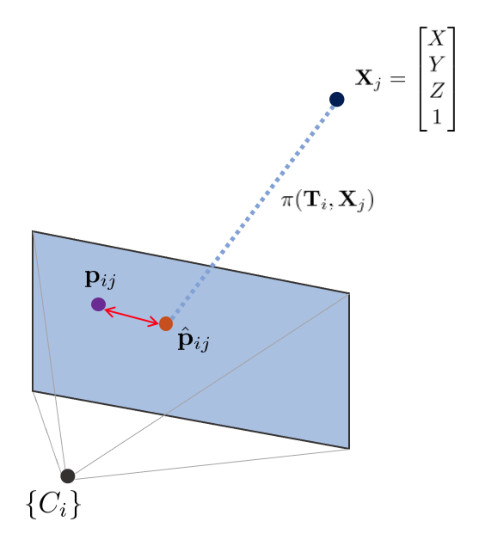
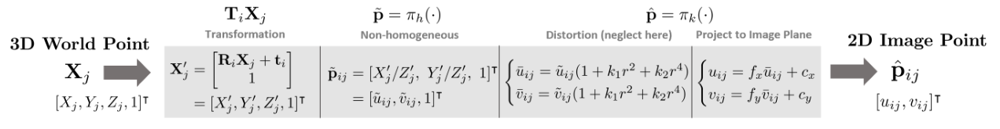
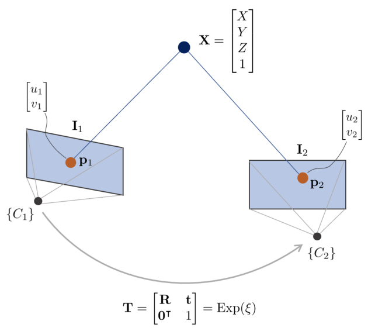
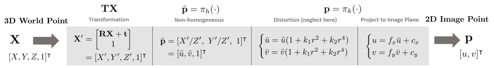
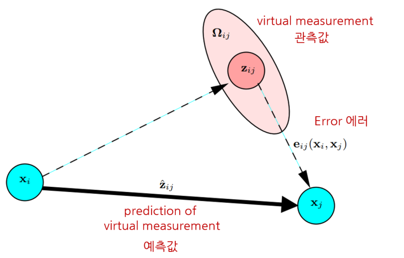
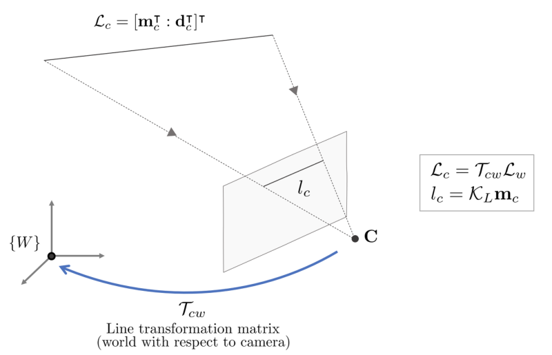
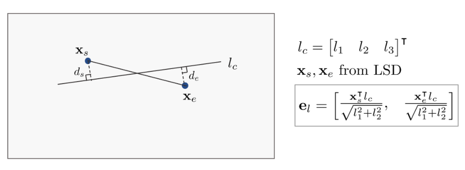
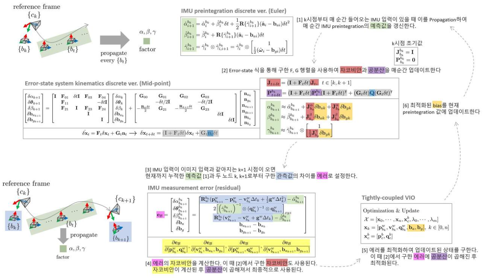
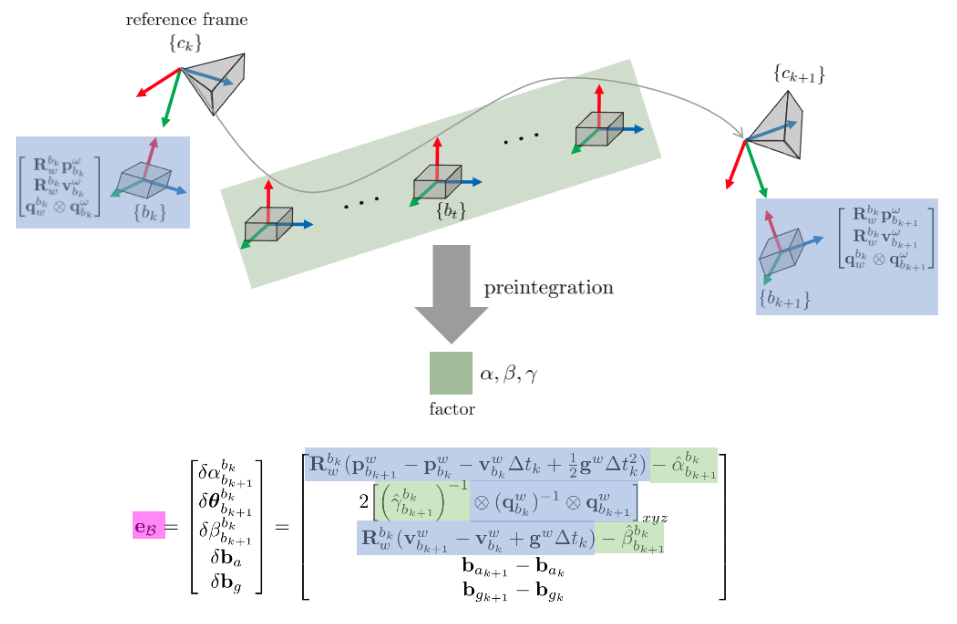

# Errors and Jacobian Derivations for SLAM

> **원문** — Gyubeom Edward Im, *Errors and Jacobian Derivations for SLAM* (45쪽) ·
> blog: [alida.tistory.com](https://alida.tistory.com) · email: criterion.im@gmail.com
> 파일: `ref/Errors and Jacobian Derivations for SLAM.pdf`
>
> **이 문서에 대하여** — 원문을 **내용 수정 없이 그대로** 옮긴 것이다. 절 구성·문장·수식 번호
> (1)~(204)가 모두 원문과 같고 순서도 바꾸지 않았다. 원문의 그림 9개도 같은 자리에 넣었다.
> 원문에는 그림 캡션이 하나도 없어 `(원문 p.N)`만 붙였다. Tip 박스 13개도 그대로 살렸다.
>
> 원문에 없는 것은 **인터랙티브 위젯 12개**뿐이며, 전부 **원문에 없는 추가 요소**라고 표시된
> 회색 박스 안에 들어 있어 본문과 섞이지 않는다.
>
> 명백한 오타는 바로잡았고, 무엇을 고쳤는지는 맨 아래
> [옮기며 바로잡은 것](#옮기며-바로잡은-것)에 전부 적어 두었다.
> 원문이 본문에서 쓰는 **파란 강조 41곳도 그대로 재현**했다.

| 장 | 원문 쪽 | 식 | 장 | 원문 쪽 | 식 |
|---|---|---|---|---|---|
| 1 Introduction | 2 | (1)~(15) | 6 Line reprojection error | 26 | (118)~(151) |
| 2 Optimization formulation | 3 | (16)~(35) | 7 IMU measurement error | 31 | (152)~(180) |
| 3 Reprojection error | 6 | (36)~(69) | 8 Other jacobians | 39 | (181)~(204) |
| 4 Photometric error | 13 | (70)~(101) | 9 References | 45 | — |
| 5 Relative pose error | 21 | (102)~(117) | 10 Revision log | 45 | — |

# 1 Introduction

본 포스트에서는 SLAM에서 사용하는 다양한 에러에 대한 정의 및 이를 최적화하기 위해 사용하는 자코비안에
대해 설명한다. 본 포스트에서 다루는 에러는 다음과 같다...

- Reprojection error

$$\mathbf{e} = \mathbf{p} - \hat{\mathbf{p}} \in \mathbb{R}^2 \tag{1}$$

- Photometric error

$$\mathbf{e} = \mathbf{I}_1(\mathbf{p}_1) - \mathbf{I}_2(\mathbf{p}_2) \in \mathbb{R}^1 \tag{2}$$

- Relative pose error (PGO)

$$\mathbf{e}_{ij} = \mathrm{Log}(\mathbf{z}_{ij}^{-1}\hat{\mathbf{z}}_{ij}) \in \mathbb{R}^6 \tag{3}$$

- Line reprojection error

$$\mathbf{e}_l = \begin{bmatrix} \frac{\mathbf{x}_s^\intercal\mathbf{l}_c}{\sqrt{l_1^2 + l_2^2}}, & \frac{\mathbf{x}_e^\intercal\mathbf{l}_c}{\sqrt{l_1^2 + l_2^2}} \end{bmatrix}^\intercal \in \mathbb{R}^2 \tag{4}$$

- IMU measurement error :

$$\mathbf{e}_\mathcal{B} = \begin{bmatrix} \delta\alpha_{b_{k+1}}^{b_k} \\ \delta\boldsymbol{\theta}_{b_{k+1}}^{b_k} \\ \delta\beta_{b_{k+1}}^{b_k} \\ \delta\mathbf{b}_a \\ \delta\mathbf{b}_g \end{bmatrix} = \begin{bmatrix} \mathbf{R}_w^{b_k}(\mathbf{p}_{b_{k+1}}^w - \mathbf{p}_{b_k}^w - \mathbf{v}_{b_k}^w\Delta t_k + \frac{1}{2}\mathbf{g}^w\Delta t_k^2) - \hat{\alpha}_{b_{k+1}}^{b_k} \\ 2\left[\left(\hat{\gamma}_{b_{k+1}}^{b_k}\right)^{-1} \otimes (\mathbf{q}_{b_k}^w)^{-1} \otimes \mathbf{q}_{b_{k+1}}^w\right]_{xyz} \\ \mathbf{R}_w^{b_k}(\mathbf{v}_{b_{k+1}}^w - \mathbf{v}_{b_k}^w + \mathbf{g}^w\Delta t_k) - \hat{\beta}_{b_{k+1}}^{b_k} \\ \mathbf{b}_{a_{k+1}} - \mathbf{b}_{a_k} \\ \mathbf{b}_{g_{k+1}} - \mathbf{b}_{g_k} \end{bmatrix} \tag{5}$$

카메라 포즈는 회전행렬 $\mathbf{R} \in SO(3)$로 표현하느냐 또는 변환행렬 $\mathbf{T} \in SE(3)$로 표현하느냐에 따라 서로 다른
자코비안이 유도된다. 두 가지 자코비안을 구하기 위해 reprojection 에러의 경우 SO(3)에 대한 자코비안을 유도하
고 photometric 에러의 경우 SE(3)에 대한 자코비안을 유도한다. 또한 3차원 공간 상의 점 또한 $\mathbf{X} = [X,Y,Z,W]^\intercal$
로 표현하는 방법과 inverse depth $\rho$로 표현하는 방법에 따라 자코비안이 달라진다. 두 경우에 대한 자코비안 유도
과정에 대해서도 설명한다.

본 포스트에서 다루는 자코비안은 다음과 같다.

- Camera pose (SO(3)-based)

$$\frac{\partial\mathbf{e}}{\partial\mathbf{R}} \to \frac{\partial\mathbf{e}}{\partial\Delta\mathbf{w}} \tag{6}$$

- Camera pose (SE(3)-based)

$$\frac{\partial\mathbf{e}}{\partial\mathbf{T}} \to \frac{\partial\mathbf{e}}{\partial\Delta\boldsymbol{\xi}} \tag{7}$$

- Map point

$$\frac{\partial\mathbf{e}}{\partial\mathbf{X}} \tag{8}$$

- Relative pose (SE(3)-based)

$$\frac{\partial\mathbf{e}_{ij}}{\partial\Delta\boldsymbol{\xi}_i}, \frac{\partial\mathbf{e}_{ij}}{\partial\Delta\boldsymbol{\xi}_j} \tag{9}$$

- 3D plücker line

$$\frac{\partial\mathbf{e}_l}{\partial\mathbf{l}}, \frac{\partial\mathbf{l}}{\partial\mathcal{L}_c}, \frac{\partial\mathcal{L}_c}{\partial\mathcal{L}_w}, \frac{\partial\mathcal{L}_w}{\partial\delta\boldsymbol{\theta}} \tag{10}$$

- Quaternion representation

$$\frac{\partial\mathbf{X}'}{\partial\mathbf{q}} \tag{11}$$

- Camera intrinsics

$$\frac{\partial\mathbf{e}}{\partial f_x}, \frac{\partial\mathbf{e}}{\partial f_y}, \frac{\partial\mathbf{e}}{\partial c_x}, \frac{\partial\mathbf{e}}{\partial c_y} \tag{12}$$

- Inverse depth

$$\frac{\partial\mathbf{e}}{\partial\rho} \tag{13}$$

- IMU error-state system kinematics :

$$\mathbf{J}_{b_{k+1}}^{b_k} \tag{14}$$

- IMU measurement :

$$\frac{\partial\mathbf{e}_\mathcal{B}}{\partial[\mathbf{p}_{b_k}^w, \mathbf{q}_{b_k}^w]}, \quad \frac{\partial\mathbf{e}_\mathcal{B}}{\partial[\mathbf{v}_{b_k}^w, \mathbf{b}_{a_k}, \mathbf{b}_{g_k}]}, \quad \frac{\partial\mathbf{e}_\mathcal{B}}{\partial[\mathbf{p}_{b_{k+1}}^w, \mathbf{q}_{b_{k+1}}^w]}, \quad \frac{\partial\mathbf{e}_\mathcal{B}}{\partial[\mathbf{v}_{b_{k+1}}^w, \mathbf{b}_{a_{k+1}}, \mathbf{b}_{g_{k+1}}]} \tag{15}$$

# 2 Optimization formulation

## 2.1 Error derivation

==SLAM에서 에러는 센서 데이터에 의한 관측값(measurement) $\mathbf{z}$과 수학적 모델링에 의한 예측값(estimate) $\hat{\mathbf{z}}$
의 차이로 정의한다.==

$$\mathbf{e}(\mathbf{x}) = \mathbf{z} - \hat{\mathbf{z}}(\mathbf{x}) \tag{16}$$

- $\mathbf{x}$: 모델의 상태 변수

위와 같이 관측값과 예측값의 차이를 에러로 정하고 에러를 최소로 하는 최적의 상태변수 $\mathbf{x}$를 계산하는 것이
SLAM에서 최적화 문제가 된다. 이 때, 일반적인 경우 SLAM의 상태변수에는 회전과 관련된 비선형 항이 포함되
므로 비선형 최소제곱법(non-linear least squares) 방법이 주로 사용된다.

## 2.2 Error function derivation

일반적으로 다량의 센서 데이터가 들어오면 이에 대한 수십 수백개의 에러가 벡터 형태로 계산된다. 이 때, 에러가
정규분포를 따른다고 가정하고 에러 함수로 변환하는 작업을 수행한다.

$$\mathbf{e}(\mathbf{x}) = \mathbf{z} - \hat{\mathbf{z}}(\mathbf{x}) \sim \mathcal{N}(0, \Sigma) \tag{17}$$

> [!TIP]
> 에러 함수를 모델링하기 위한 확률 변수 $\mathbf{x}$의 다변수 정규분포는 다음과 같다.
>
> $$p(\mathbf{x}) = \frac{1}{\sqrt{(2\pi)^n|\Sigma|}}\exp\left(-\frac{1}{2}(\mathbf{x}-\boldsymbol{\mu})^\intercal\Omega(\mathbf{x}-\boldsymbol{\mu})\right) \sim \mathcal{N}(\boldsymbol{\mu}, \Sigma) \tag{18}$$
>
> - $\mathbf{x} \in \mathbb{R}^n$
> - $\boldsymbol{\mu} \in \mathbb{R}^n$ : mean vector
> - $\Sigma \in \mathbb{R}^{n\times n}$ : covariance matrix
> - $|\Sigma|$: determinant of $\Sigma$
> - $\Omega = \Sigma^{-1}$ : information matrix (inverse of covariance matrix)

에러를 평균이 0이고 분산이 $\Sigma$인 다변수 정규분포로 모델링할 수 있다.

$$p(\mathbf{e}) = \frac{1}{\sqrt{(2\pi)^n|\Sigma|}}\exp\left(-\frac{1}{2}(\mathbf{z}-\hat{\mathbf{z}}(\mathbf{x}))^\intercal\Sigma^{-1}(\mathbf{z}-\hat{\mathbf{z}}(\mathbf{x}))\right) \tag{19}$$

위 식으로부터 다음과 같은 비례식이 성립한다.

$$p(\mathbf{e}) \propto \exp\left(-\frac{1}{2}(\mathbf{z}-\hat{\mathbf{z}}(\mathbf{x}))^\intercal\Omega(\mathbf{z}-\hat{\mathbf{z}}(\mathbf{x}))\right) \tag{20}$$

위 식에 log-likelihood를 적용한 $\ln p(\mathbf{e})$는 다음과 같다.

$$\begin{aligned}
\ln p(\mathbf{e}) &\propto -\frac{1}{2}(\mathbf{z}-\hat{\mathbf{z}}(\mathbf{x}))^\intercal\Omega(\mathbf{z}-\hat{\mathbf{z}}(\mathbf{x})) \\
&\propto -\frac{1}{2}\mathbf{e}(\mathbf{x})^\intercal\Omega\mathbf{e}(\mathbf{x})
\end{aligned} \tag{21}$$

log-likelihood $\ln p(\mathbf{e})$가 최대가 되는 $\mathbf{x}^*$를 찾으면 다변수 정규분포의 확률이 최대가 된다. 이를 ==Maximum
Liklihood Estimation (MLE)==라고 한다. $\ln p(\mathbf{e})$는 앞에 음수(-)가 있으므로 negative log-likelihood가 최소가
되는 $\ln p(\mathbf{e})$를 찾으면 다음과 같다.

$$\begin{aligned}
\mathbf{x}^* &= \arg\max \ln p(\mathbf{e}) \\
&= \arg\max -\frac{1}{2}\mathbf{e}(\mathbf{x})^\intercal\Omega\mathbf{e}(\mathbf{x}) \\
&= \arg\min \mathbf{e}(\mathbf{x})^\intercal\Omega\mathbf{e}(\mathbf{x})
\end{aligned} \tag{22}$$

==단일 에러가 아닌 모든 에러를 더하여 표현하면 다음과 같고 이를 에러 함수 $E$ 라고 한다. 실제 최적화
문제에서는 단일 에러 $\mathbf{e}_i$가 아닌 에러 함수 $E$를 최소화하는 $\mathbf{x}^*$를 찾는다.==

$$\begin{aligned}
E(\mathbf{x}) &= \sum_i \mathbf{e}_i(\mathbf{x})^\intercal\Omega_i\mathbf{e}_i(\mathbf{x}) \\
\mathbf{x}^* &= \arg\min E(\mathbf{x})
\end{aligned} \tag{23}$$

## 2.3 Non-linear least squares

최종적으로 풀어야 하는 최적화 수식은 다음과 같다.

$$\mathbf{x}^* = \arg\min E(\mathbf{x}) = \arg\min \sum_i \mathbf{e}_i(\mathbf{x})^\intercal\Omega_i\mathbf{e}_i(\mathbf{x}) \tag{24}$$

위 공식에서 에러를 최소화하는 최적 파라미터 $\mathbf{x}^*$를 찾아야 한다. ==하지만 위 공식은 SLAM에서 일반적으로
회전에 대한 비선형 항을 포함하므로 closed-form solution이 존재하지 않는다. 따라서 비선형 최적화 방법
(Gauss-Newton (GN), Levenberg-Marquardt (LM))을 사용하여 문제를 풀어야 한다.==
실제 SLAM의 최적화 수식을 유도하는 과정은 크게 두 방법이 존재한다. 첫 번째로 앞서 설명한 것처럼 ==MLE==
를 통해 information matrix를 고려하여 $\mathbf{e}_i^\intercal\Omega_i\mathbf{e}_i$ 수식을 최적화하는 방법이 있고 두 번째 방법은 확률을 고려하지
않고 ==최소제곱법== 형태로 나타내어 information matrix가 없는 $\mathbf{e}_i^\intercal\mathbf{e}_i$ 수식을 최적화를 수행하는 방법이 있다. 본
포스트에서는 확률을 고려한 MLE 방법에 대해 설명한다.

예를 들어, GN 방법을 사용해서 해당 문제를 푼다고 가정해보자. 문제를 푸는 순서는 다음과 같다.

- 에러함수를 정의한다
- 테일러 전개로 근사 선형화한다
- 1차 미분 후 0으로 설정한다.
- 이 때 값을 구하고 이를 에러함수에 대입한다
- 값이 수렴할 때 까지 반복한다.

에러함수 $\mathbf{e}$를 자세히 나타내면 $\mathbf{e}(\mathbf{x})$와 같고 이는 로봇의 포즈 벡터 $\mathbf{x}$에 따라 에러함수의 값이 달라지는 것을 의미
한다. GN 방법은 $\mathbf{e}(\mathbf{x})$에 반복적(iterative)으로 에러가 감소하는 방향으로 증분량 $\Delta\mathbf{x}$를 업데이트한다.

$$\mathbf{e}(\mathbf{x}+\Delta\mathbf{x})^\intercal\Omega\mathbf{e}(\mathbf{x}+\Delta\mathbf{x}) \tag{25}$$

이 때, $\mathbf{e}(\mathbf{x}+\Delta\mathbf{x})$를 $\mathbf{x}$ 부근에서 1차 테일러 전개를 사용하면 위 식은 다음과 같이 근사된다.

$$\begin{aligned}
\mathbf{e}(\mathbf{x}+\Delta\mathbf{x})|_\mathbf{x} &\approx \mathbf{e}(\mathbf{x}) + \mathbf{J}(\mathbf{x}+\Delta\mathbf{x}-\mathbf{x}) \\
&= \mathbf{e}(\mathbf{x}) + \mathbf{J}\Delta\mathbf{x}
\end{aligned} \tag{26}$$

이 때, $\mathbf{J} = \frac{\partial\mathbf{e}(\mathbf{x}+\Delta\mathbf{x})}{\partial\mathbf{x}}$이다. 이를 에러함수 전체에 적용하면 아래와 같다.

$$\mathbf{e}(\mathbf{x}+\Delta\mathbf{x})^\intercal\Omega\mathbf{e}(\mathbf{x}+\Delta\mathbf{x}) \approx (\mathbf{e}(\mathbf{x})+\mathbf{J}\Delta\mathbf{x})^\intercal\Omega(\mathbf{e}(\mathbf{x})+\mathbf{J}\Delta\mathbf{x}) \tag{27}$$

위 식을 전개한 후 치환하면 아래와 같다.

$$\begin{aligned}
&= \underbrace{\mathbf{e}^\intercal\Omega\mathbf{e}}_{c} + 2\underbrace{\mathbf{e}^\intercal\Omega\mathbf{J}}_{b}\Delta\mathbf{x} + \Delta\mathbf{x}^\intercal\underbrace{\mathbf{J}^\intercal\Omega\mathbf{J}}_{H}\Delta\mathbf{x} \\
&= c + 2b\Delta\mathbf{x} + \Delta\mathbf{x}^\intercal H\Delta\mathbf{x}
\end{aligned} \tag{28}$$

위 전체 에러에 적용하면 다음과 같다.

$$E(\mathbf{x}+\Delta\mathbf{x}) = \sum_i \mathbf{e}_i(\mathbf{x})^\intercal\Omega_i\mathbf{e}_i(\mathbf{x}) = c + 2b\Delta\mathbf{x} + \Delta\mathbf{x}^\intercal H\Delta\mathbf{x} \tag{29}$$

$E(\mathbf{x}+\Delta\mathbf{x})$은 $\Delta\mathbf{x}$에 대한 2차식(Quadratic) 형태이고 $H = \mathbf{J}^\intercal\Omega\mathbf{J}$는 positive definite 행렬이므로 $E(\mathbf{x}+\Delta\mathbf{x})$를
1차 미분하여 0으로 설정한 값이 $\Delta\mathbf{x}$의 극소가 된다.

$$\frac{\partial E(\mathbf{x}+\Delta\mathbf{x})}{\partial\Delta\mathbf{x}} \approx 2b + 2H\Delta\mathbf{x} = 0 \tag{30}$$

이를 정리하면 다음과 같은 공식이 도출된다.

$$H\Delta\mathbf{x} = -b \tag{31}$$

이렇게 구한 $\Delta\mathbf{x} = -H^{-1}b$를 $\mathbf{x}$에 업데이트해준다.

$$\mathbf{x} \leftarrow \mathbf{x} + \Delta\mathbf{x} \tag{32}$$

==지금까지 과정을 반복적(iterative)으로 수행하는 알고리즘을 Gauss-Newton 방법이라고 한다.== LM 방법은
GN 방법과 비교했을 때 전체적인 프로세스는 동일하나 증분량을 구하는 공식에서 damping factor $\lambda$항이 추가된다.

$$\begin{aligned}
&(\text{GN}) \quad H\Delta\mathbf{x} = -b \\
&(\text{LM}) \quad (H + \lambda I)\Delta\mathbf{x} = -b
\end{aligned} \tag{33}$$

<!--widget:gauss-newton-vs-lm-->

# 3 Reprojection error

Reprojection 에러는 feature-based Visual SLAM에서 주로 사용되는 에러이다. 주로 feature-based method 기반
의 visual odometry(VO) 또는 bundle adjustment(BA)를 수행할 때 사용된다. BA에 대한 자세한 내용은 [SLAM]
Bundle Adjustment 개념 리뷰 포스트를 참조하면 된다.

**NOMENCLATURE of reprojection error**

- $\tilde{\mathbf{p}} = \pi_h(\cdot)$ : $\begin{bmatrix} X' \\ Y' \\ Z' \\ 1 \end{bmatrix} \to \begin{bmatrix} X'/Z' \\ Y'/Z' \\ 1 \end{bmatrix} = \begin{bmatrix} \tilde{u} \\ \tilde{v} \\ 1 \end{bmatrix}$
  - 이미지 평면에 프로젝션하기 위해 3차원 공간 상의 점 $\mathbf{X}'$를 non-homogeneous 변환한 점
- $\hat{\mathbf{p}} = \pi_k(\cdot) = \tilde{\mathbf{K}}\tilde{\mathbf{p}} = \begin{bmatrix} f & 0 & c_x \\ 0 & f & c_y \end{bmatrix}\begin{bmatrix} \tilde{u} \\ \tilde{v} \\ 1 \end{bmatrix} = \begin{bmatrix} f\tilde{u} + c_x \\ f\tilde{v} + c_y \end{bmatrix} = \begin{bmatrix} u \\ v \end{bmatrix}$
  - 렌즈 왜곡을 보정한 후 이미지 평면에 프로젝션한 점. 만약 왜곡 보정이 입력 단계에서 이미 수행된 경우
    $\pi_k(\cdot) = \tilde{\mathbf{K}}(\cdot)$이 된다.
- $\mathbf{K} = \begin{bmatrix} f & 0 & c_x \\ 0 & f & c_y \\ 0 & 0 & 1 \end{bmatrix}$ : 카메라 내부(intrinsic) 파라미터
- $\tilde{\mathbf{K}} = \begin{bmatrix} f & 0 & c_x \\ 0 & f & c_y \end{bmatrix}$ : $\mathbb{P}^2 \to \mathbb{R}^2$ 로 프로젝션하기 위해 내부 파라미터의 마지막 행을 생략했다.
- $\mathcal{X} = [\mathbf{T}_1, \cdots, \mathbf{T}_m, \mathbf{X}_1, \cdots, \mathbf{X}_n]^\intercal$ : 모델의 상태변수
- $m$ : 카메라 포즈의 개수
- $n$: 3차원 점의 개수
- $\mathbf{T}_i = [\mathbf{R}_i, \mathbf{t}_i]$
- $\mathbf{e}_{ij} = \mathbf{e}_{ij}(\mathcal{X})$: 간략한 표기를 위해 $\mathcal{X}$ 생략하기도 한다
- $\mathbf{p}_{ij}$ : 관측된(observed) 특정짐의 픽셀 좌표
- $\hat{\mathbf{p}}_{ij}$ : 예측된(estimated) 특징점의 픽셀 좌표
- $\mathbf{T}_i\mathbf{X}_j$ : Transformation, 3차원 점 $\mathbf{X}_j$를 카메라 좌표계 $\{i\}$로 변환, $\mathbf{T}_i\mathbf{X}_j = \begin{bmatrix} \mathbf{R}_i\mathbf{X}_j + \mathbf{t}_i \\ 1 \end{bmatrix} \in \mathbb{R}^{4\times 1}$
  - $\mathbf{X}' = \mathbf{T}\mathbf{X} = [X',Y',Z',1]^\intercal = [\tilde{\mathbf{X}}',1]^\intercal$
- $\oplus$ : SO(3) 회전행렬 $\mathbf{R}$과 3차원 벡터 $\mathbf{t}, \mathbf{X}$를 한 번에 업데이트할 수 있는 연산자.
- $\mathbf{J} = \frac{\partial\mathbf{e}}{\partial\mathcal{X}} = \frac{\partial\mathbf{e}}{\partial[\mathbf{T},\mathbf{X}]}$
- $\mathbf{w} = \begin{bmatrix} w_x & w_y & w_z \end{bmatrix}^\intercal$ : 각속도
- $[\mathbf{w}]_\times = \begin{bmatrix} 0 & -w_z & w_y \\ w_z & 0 & -w_x \\ -w_y & w_x & 0 \end{bmatrix}$ : 각속도 $\mathbf{w}$의 반대칭 행렬
- $\mathrm{Exp}(\mathbf{w}) = \exp([\mathbf{w}]_\times)$

$i$번째 핀홀카메라 $\{C_i\}$의 포즈 $\mathbf{T}_i$와 $j$번째 월드 상의 한 점 $\mathbf{X}_j$가 있을 때 $\mathbf{X}_j$는 다음과 같은 변환을 통해 이미지
평면 상에 투영된다.

$$\text{projection model:} \quad \hat{\mathbf{p}}_{ij} = \pi(\mathbf{T}_i, \mathbf{X}_j) \tag{34}$$

위와 같이 카메라 내부/외부(intrinsic/extrinsic) 파라미터를 활용한 모델을 projection model이라고 한다. 이를
통한 reprojection 에러는 다음과 같이 정의한다.

$$\begin{aligned}
\mathbf{e}_{ij}(\mathcal{X}) &= \mathbf{p}_{ij} - \hat{\mathbf{p}}_{ij} \\
&= \mathbf{p}_{ij} - \pi(\mathbf{T}_i, \mathbf{X}_j) \\
&= \mathbf{p}_{ij} - \pi_k(\pi_h(\mathbf{T}_i\mathbf{X}_j))
\end{aligned} \tag{35}$$

모든 카메라 포즈, 3차원 점들에 대한 에러 함수는 다음과 같이 정의된다.

$$E(\mathcal{X}) = \sum_i\sum_j \|\mathbf{e}_{ij}(\mathcal{X})\|^2 \tag{36}$$

$$\begin{aligned}
\mathcal{X}^* &= \arg\min_{\mathcal{X}^*} E(\mathcal{X}) \\
&= \arg\min_{\mathcal{X}^*} \sum_i\sum_j \|\mathbf{e}_{ij}(\mathcal{X})\|^2 \\
&= \arg\min_{\mathcal{X}^*} \sum_i\sum_j \mathbf{e}_{ij}(\mathcal{X})^\intercal\mathbf{e}_{ij}(\mathcal{X}) \\
&= \arg\min_{\mathcal{X}^*} \sum_i\sum_j (\mathbf{p}_{ij} - \hat{\mathbf{p}}_{ij})^\intercal(\mathbf{p}_{ij} - \hat{\mathbf{p}}_{ij})
\end{aligned} \tag{37}$$

<!--widget:projection-pipeline-->

$E(\mathcal{X}^*)$를 만족하는 $\|\mathbf{e}(\mathcal{X}^*)\|^2$를 non-linear least squares를 통해 반복적으로 계산할 수 있다. 작은 증분량 $\Delta\mathcal{X}$
를 반복적으로 $\mathcal{X}$에 업데이트함으로써 최적의 상태를 찾는다.

$$\arg\min_{\mathcal{X}^*} E(\mathcal{X}+\Delta\mathcal{X}) = \arg\min_{\mathcal{X}^*}\sum_i\sum_j \|\mathbf{e}(\mathcal{X}+\Delta\mathcal{X})\|^2 \tag{38}$$

엄밀하게 말하면 상태 증분량 $\Delta\mathcal{X}$은 SO(3) 회전행렬을 포함하므로 $\oplus$ 연산자를 통해 기존 상태 $\mathcal{X}$에 더해지는게
맞지만 표현의 편의를 위해 $+$ 연산자를 사용하였다.

$$\mathbf{e}(\mathcal{X} \oplus \Delta\mathcal{X}) \quad \to \quad \mathbf{e}(\mathcal{X} + \Delta\mathcal{X}) \tag{39}$$

위 식은 테일러 1차 근사를 통해 다음과 같이 표현이 가능하다.

$$\begin{aligned}
\mathbf{e}(\mathcal{X}+\Delta\mathcal{X}) &\approx \mathbf{e}(\mathcal{X}) + \mathbf{J}\Delta\mathcal{X} \\
&= \mathbf{e}(\mathcal{X}) + \mathbf{J}_c\Delta\mathbf{T} + \mathbf{J}_p\Delta\mathbf{X} \\
&= \mathbf{e}(\mathcal{X}) + \frac{\partial\mathbf{e}}{\partial\mathbf{T}}\Delta\mathbf{T} + \frac{\partial\mathbf{e}}{\partial\mathbf{X}}\Delta\mathbf{X}
\end{aligned} \tag{40}$$

$$\arg\min_{\mathcal{X}^*} E(\mathcal{X}+\Delta\mathcal{X}) \approx \arg\min_{\mathcal{X}^*}\sum_i\sum_j \|\mathbf{e}(\mathcal{X}) + \mathbf{J}\Delta\mathcal{X}\|^2 \tag{41}$$

이를 미분하여 최적의 증분량 $\Delta\mathcal{X}^*$ 값을 구하면 다음과 같다. 자세한 유도 과정은 본 섹션에서는 생략한다. 유도
과정에 대해 자세히 알고 싶으면 이전 섹션을 참조하면 된다.

$$\begin{aligned}
\mathbf{J}^\intercal\mathbf{J}\Delta\mathcal{X}^* &= -\mathbf{J}^\intercal\mathbf{e} \\
H\Delta\mathcal{X}^* &= -b
\end{aligned} \tag{42}$$

위 식은 선형시스템 $\mathbf{Ax} = \mathbf{b}$ 형태이므로 schur complement, cholesky decomposition과 같은 다양한 선형대수학
테크닉을 사용하여 $\Delta\mathcal{X}^*$를 구할 수 있다. 이 때, 기존 상태 $\mathcal{X}$ 중 $\mathbf{t}, \mathbf{X}$는 선형 벡터 공간에 존재하므로 오른쪽에서
더하는 지 또는 왼쪽에서 더하는 지에 따른 차이가 없지만 ==회전 행렬 $\mathbf{R}$은 비선형 SO(3)군에 속하므로 오른쪽에
곱하느냐 왼쪽에 곱하느냐에 따라 각각 로컬 좌표계에서 본 포즈를 업데이트할 것 인지(오른쪽) 전역 좌표계
에서 본 포즈를 업데이트할 것 인지(왼쪽) 달라지게 된다. Reprojection 에러는 전역 좌표계의 변환 행렬을
업데이트하므로 일반적으로 왼쪽 곱셈 방법을 사용한다.==

$$\mathcal{X} \leftarrow \mathcal{X} \oplus \Delta\mathcal{X}^* \tag{43}$$

$\mathcal{X}$는 $[\mathcal{T}, \mathbf{X}]$로 구성되어 있으므로 다음과 같이 풀어 쓸 수 있다.

$$\begin{aligned}
\mathcal{T} &\leftarrow \mathcal{T} \oplus \Delta\mathcal{T}^* \\
\mathbf{X} &\leftarrow \mathbf{X} \oplus \Delta\mathbf{X}^*
\end{aligned} \tag{44}$$

왼쪽 곱셈 $\oplus$ 연산의 정의는 다음과 같다.

$$\begin{aligned}
\mathbf{R} \oplus \Delta\mathbf{R}^* &= \Delta\mathbf{R}^*\mathbf{R} \\
&= \mathrm{Exp}(\Delta\mathbf{w}^*)\mathbf{R} \quad \cdots \text{ globally updated (left mult)} \\
\mathbf{t} \oplus \Delta\mathbf{t}^* &= \mathbf{t} + \Delta\mathbf{t}^* \\
\mathbf{X} \oplus \Delta\mathbf{X}^* &= \mathbf{X} + \Delta\mathbf{X}^*
\end{aligned} \tag{45}$$

## 3.1 Jacobian of the reprojection error

### 3.1.1 Jacobian of camera pose

포즈에 대한 자코비안 $\mathbf{J}_c$은 다음과 같이 분해할 수 있다.

$$\begin{aligned}
\mathbf{J}_c = \frac{\partial\mathbf{e}}{\partial\mathbf{T}} &= \frac{\partial}{\partial\mathbf{T}}(\mathbf{p} - \hat{\mathbf{p}}) \\
&= \frac{\partial}{\partial\mathbf{T}}\left(\mathbf{p} - \pi_k(\pi_h(\mathbf{T}_i\mathbf{X}_j))\right) \\
&= \frac{\partial}{\partial\mathbf{T}}\left(-\pi_k(\pi_h(\mathbf{T}_i\mathbf{X}_j))\right)
\end{aligned} \tag{46}$$

Chain rule을 사용하여 위 식을 정리하면 다음과 같다. 이 때, 편의를 위해 $\mathbf{T}_i\mathbf{X}_j \to \mathbf{X}'$로 표기한다.

$$\begin{aligned}
\mathbf{J}_c &= \frac{\partial\hat{\mathbf{p}}}{\partial\tilde{\mathbf{p}}}\frac{\partial\tilde{\mathbf{p}}}{\partial\mathbf{X}'}\frac{\partial\mathbf{X}'}{\partial[\mathbf{w},\mathbf{t}]} \\
&= \mathbb{R}^{2\times 3} \cdot \mathbb{R}^{3\times 4} \cdot \mathbb{R}^{4\times 6} = \mathbb{R}^{2\times 6}
\end{aligned} \tag{47}$$

이 때, ==회전행렬 $\mathbf{R}$에 대한 자코비안 $\frac{\partial\mathbf{X}'}{\partial\mathbf{R}}$을 구하는 것이 아닌 각속도 $\mathbf{w}$에 대한 자코비안 $\frac{\partial\mathbf{X}'}{\partial\mathbf{w}}$을 구하는 이유는
다음 섹션에서 설명한다.== 또한 에러를 $\mathbf{p}-\hat{\mathbf{p}}$로 정의하느냐 $\hat{\mathbf{p}}-\mathbf{p}$로 정의하느냐에 따라 $\mathbf{J}_c$의 부호 또한 변경되므로
이는 실제 코드로 구현할 때 유의하여 적용해야 한다. 해당 자료에서는 부호는 $+$로 간주하고 표기하였다.
렌즈에 의한 왜곡(distortion)은 일반적으로 계산의 복잡성으로 인해 자코비안 계산 시 고려하지 않는다. 또한
렌즈 왜곡 보정(undistortion)이 이미지 입력 과정에서 이미 수행되었다고 가정하면 이를 고려할 필요가 없어진다.
따라서 $\frac{\partial\hat{\mathbf{p}}}{\partial\tilde{\mathbf{p}}}$은 다음과 같이 단순히 카메라 내부 행렬 $\mathbf{K}$를 곱하는 것으로 구할 수 있다. 아래 수식에서는 마지막
행 $[0\ 0\ 1]$을 생략한 $\tilde{\mathbf{K}}$가 사용되었다.

$$\begin{aligned}
\frac{\partial\hat{\mathbf{p}}}{\partial\tilde{\mathbf{p}}} &= \frac{\partial}{\partial\tilde{\mathbf{p}}}\tilde{\mathbf{K}}\tilde{\mathbf{p}} \\
&= \tilde{\mathbf{K}} \\
&= \begin{bmatrix} f & 0 & c_x \\ 0 & f & c_y \end{bmatrix} \in \mathbb{R}^{2\times 3}
\end{aligned} \tag{48}$$

다음으로 $\frac{\partial\tilde{\mathbf{p}}}{\partial\mathbf{X}'}$은 다음과 같다.

$$\begin{aligned}
\frac{\partial\tilde{\mathbf{p}}}{\partial\mathbf{X}'} &= \frac{\partial[\tilde{u},\tilde{v},1]}{\partial[X',Y',Z',1]} \\
&= \begin{bmatrix} \frac{1}{Z'} & 0 & \frac{-X'}{Z'^2} & 0 \\ 0 & \frac{1}{Z'} & \frac{-Y'}{Z'^2} & 0 \\ 0 & 0 & 0 & 0 \end{bmatrix} \in \mathbb{R}^{3\times 4}
\end{aligned} \tag{49}$$

다음으로 $\frac{\partial\mathbf{X}'}{\partial\mathbf{t}}$를 구해야 한다. 이는 다음과 같이 비교적 간단하게 구할 수 있다.

$$\begin{aligned}
\frac{\partial\mathbf{X}'}{\partial\mathbf{t}} &= \frac{\partial}{\partial[t_x,t_y,t_z]}\begin{bmatrix} \mathbf{RX}+\mathbf{t} \\ 1 \end{bmatrix} \\
&= \frac{\partial}{\partial[t_x,t_y,t_z]}\begin{bmatrix} \mathbf{t} \\ 1 \end{bmatrix} \\
&= \frac{\partial}{\partial[t_x,t_y,t_z]}\left(\begin{bmatrix} t_x \\ t_y \\ t_z \\ 1 \end{bmatrix}\right) \\
&= \begin{bmatrix} 1 & 0 & 0 \\ 0 & 1 & 0 \\ 0 & 0 & 1 \\ 0 & 0 & 0 \end{bmatrix} \in \mathbb{R}^{4\times 3}
\end{aligned} \tag{50}$$

### 3.1.2 Lie theory-based SO(3) optimization

마지막으로 $\frac{\partial\mathbf{X}'}{\partial\mathbf{w}}$를 구해야 한다. 이 때, 회전 관련 파라미터를 회전행렬 $\mathbf{R}$이 아닌 각속도 $\mathbf{w}$로 표현하였다. 회전행
렬 $\mathbf{R}$은 파라미터의 개수가 9개인 반면에 실제 회전에는 3개의 자유도로 제한되므로 over-parameterized 되었다.
over-parameterized 표현법의 단점은 다음과 같다.

- 중복되는 파라미터를 계산해야 하기 때문에 최적화 수행 시 연산량이 증가한다.
- 추가적인 자유도로 인해 수치적인 불안정성(numerical instability) 문제가 야기될 수 있다.
- 파라미터가 업데이트될 때마다 항상 제약조건을 만족하는 지 체크해줘야 한다.

lie theory를 사용하면 제약조건으로부터 자유롭게 최적화를 수행할 수 있다. 따라서 lie group SO(3) $\mathbf{R}$ 대신 lie
algebra so(3) $[\mathbf{w}]_\times$을 사용하여 제약조건으로부터 자유롭게 파라미터를 업데이트할 수 있게 된다. 이 때, $\mathbf{w} \in \mathbb{R}^3$
는 각속도 벡터를 의미한다.

$$\frac{\partial\mathbf{e}}{\partial[\mathbf{R},\mathbf{t}]} \to \frac{\partial\mathbf{e}}{\partial[\mathbf{w},\mathbf{t}]} \tag{51}$$

하지만 $\mathbf{X}'$에서 $\mathbf{w}$이 바로 보이지 않으므로 $\mathbf{X}'$를 lie algebra로 표현해야 한다. 이 때, 회전과 관련된 $\mathbf{w}$ 항에
대한 자코비안을 구해야 하므로 3차원 점 $\mathbf{X}_t$를 $\mathbf{X}$가 $\mathbf{t}$만큼 병진 이동한 후 $\mathbf{X}'$를 동일한 위치의 $\mathbf{X}_t$가 $\mathbf{R}$만큼 회전한
점이라고 하자.

$$\begin{aligned}
\mathbf{X}_t &= \mathbf{X} + \mathbf{t} \\
\mathbf{X}' &= \mathbf{R}\mathbf{X}_t \\
&= \mathrm{Exp}(\mathbf{w})\mathbf{X}_t
\end{aligned} \tag{52}$$

> [!TIP]
> $\mathrm{Exp}(\mathbf{w}) \in SO(3)$는 각속도 $\mathbf{w}$를 exponential mapping하여 3차원 회전행렬 $\mathbf{R}$로 변환하는 연산을 말한다.
> exponential mapping에 대한 자세한 내용은 해당 링크를 참조하면 된다.
>
> $$\mathrm{Exp}(\mathbf{w}) = \mathbf{R} \tag{53}$$

이 때, 작은 lie algebra 증분량 $\Delta\mathbf{w}$를 기존 $\mathrm{Exp}(\mathbf{w})$에 업데이트하는 방식에 따라 두 가지 방법으로 나뉘게 된
다. 우선 [1] 기본적인 lie algebra를 사용한 업데이트 방법이 있다. 다음으로 [2] 섭동(perturbation) 모델을 활용한
업데이트 방법이 있다.

$$\begin{aligned}
\mathrm{Exp}(\mathbf{w}) &\leftarrow \mathrm{Exp}(\mathbf{w}+\Delta\mathbf{w}) \quad \cdots \text{ [1]} \\
\mathrm{Exp}(\mathbf{w}) &\leftarrow \mathrm{Exp}(\Delta\mathbf{w})\mathrm{Exp}(\mathbf{w}) \quad \cdots \text{ [2]}
\end{aligned} \tag{54}$$

> [!TIP]
> 위 두 방법 사이에는 다음과 같은 관계가 존재한다. 자세한 내용은 해당 링크의 4.3.3 챕터를 참조하면 된
> 다.
>
> $$\begin{aligned}
> \mathrm{Exp}(\Delta\mathbf{w})\mathrm{Exp}(\mathbf{w}) &= \mathrm{Exp}(\mathbf{w}+\mathbf{J}_l^{-1}\Delta\mathbf{w}) \\
> \mathrm{Exp}(\mathbf{w}+\Delta\mathbf{w}) &= \mathrm{Exp}(\mathbf{J}_l\Delta\mathbf{w})\mathrm{Exp}(\mathbf{w})
> \end{aligned} \tag{55}$$

==[1] Lie algebra-based update:== 우선 [1] 방법을 사용해서 자코비안 $\frac{\partial\mathbf{RX}_t}{\partial\mathbf{w}}$를 바로 계산하면 다음과 같은 복잡한
식이 유도된다.

$$\begin{aligned}
\frac{\partial\mathbf{RX}_t}{\partial\mathbf{w}} &= \lim_{\Delta\mathbf{w}\to 0}\frac{\mathrm{Exp}(\mathbf{w}+\Delta\mathbf{w})\mathbf{X}_t - \mathrm{Exp}(\mathbf{w})\mathbf{X}_t}{\Delta\mathbf{w}} \\
&\approx \lim_{\Delta\mathbf{w}\to 0}\frac{\mathrm{Exp}(\mathbf{J}_l\Delta\mathbf{w})\mathrm{Exp}(\mathbf{w})\mathbf{X}_t - \mathrm{Exp}(\mathbf{w})\mathbf{X}_t}{\Delta\mathbf{w}} \\
&\approx \lim_{\Delta\mathbf{w}\to 0}\frac{(\mathbf{I} + [\mathbf{J}_l\Delta\mathbf{w}]_\times)\mathrm{Exp}(\mathbf{w})\mathbf{X}_t - \mathrm{Exp}(\mathbf{w})\mathbf{X}_t}{\Delta\mathbf{w}} \\
&= \lim_{\Delta\mathbf{w}\to 0}\frac{[\mathbf{J}_l\Delta\mathbf{w}]_\times\mathbf{RX}_t}{\Delta\mathbf{w}} \quad (\because \mathrm{Exp}(\mathbf{w})\mathbf{X}_t = \mathbf{RX}_t) \\
&= \lim_{\Delta\mathbf{w}\to 0}\frac{-[\mathbf{RX}_t]_\times\mathbf{J}_l\Delta\mathbf{w}}{\Delta\mathbf{w}} \\
&= -[\mathbf{RX}_t]_\times\mathbf{J}_l \\
&= -[\mathbf{X}']_\times\mathbf{J}_l
\end{aligned} \tag{56}$$

> [!TIP]
> 위 식에서 두 번째 행은 BCH 근사를 사용하여 왼쪽 자코비안(left jacobian) $\mathbf{J}_l$이 유도된 형태이고 세 번
> 째 행은 작은 회전량 $\mathrm{Exp}(\mathbf{J}_l\Delta\mathbf{w})$에 대해 1차 테일러 근사가 적용된 형태이다. $\mathbf{J}_l$에 대한 자세한 내용은
> Lie theory 개념 리뷰 포스팅을 참조하면 된다.
> 세 번째 행의 근사를 이해하기 위해 임의의 회전 벡터 $\mathbf{w} = [w_x,w_y,w_z]^\intercal$가 주어졌을 때 회전행렬을 expo-
> nential mapping 형태로 전개하면 다음과 같이 나타낼 수 있다.
>
> $$\begin{aligned}
> \mathbf{R} &= \mathrm{Exp}(\mathbf{w}) \\
> &= \exp([\mathbf{w}]_\times) \\
> &= \mathbf{I} + [\mathbf{w}]_\times + \frac{1}{2}[\mathbf{w}]_\times^2 + \frac{1}{3!}[\mathbf{w}]_\times^3 + \frac{1}{4!}[\mathbf{w}]_\times^4 + \cdots
> \end{aligned} \tag{57}$$
>
> 작은 크기의 회전행렬 $\Delta\mathbf{R}$에 대해서는 2차 이상의 고차항을 무시하여 다음과 같이 근사적으로 나타낼 수
> 있다.
>
> $$\Delta\mathbf{R} \approx \mathbf{I} + [\Delta\mathbf{w}]_\times \tag{58}$$

==[2] Perturbation model-based update:== $\mathbf{J}_l$을 사용하지 않고 보다 간단한 자코비안을 구하기 위해 [2] lie
algebra so(3)의 섭동(perturbation) 모델을 일반적으로 사용한다. 섭동 모델을 사용하여 자코비안 $\frac{\partial\mathbf{RX}_t}{\partial\Delta\mathbf{w}}$를 구하면
다음과 같다.

$$\begin{aligned}
\frac{\partial\mathbf{RX}_t}{\partial\Delta\mathbf{w}} &= \lim_{\Delta\mathbf{w}\to 0}\frac{\mathrm{Exp}(\Delta\mathbf{w})\mathrm{Exp}(\mathbf{w})\mathbf{X}_t - \mathrm{Exp}(\mathbf{w})\mathbf{X}_t}{\Delta\mathbf{w}} \\
&\approx \lim_{\Delta\mathbf{w}\to 0}\frac{(\mathbf{I}+[\Delta\mathbf{w}]_\times)\mathrm{Exp}(\mathbf{w})\mathbf{X}_t - \mathrm{Exp}(\mathbf{w})\mathbf{X}_t}{\Delta\mathbf{w}} \\
&= \lim_{\Delta\mathbf{w}\to 0}\frac{[\Delta\mathbf{w}]_\times\mathbf{RX}_t}{\Delta\mathbf{w}} \quad (\because \mathrm{Exp}(\mathbf{w})\mathbf{X}_t = \mathbf{RX}_t) \\
&= \lim_{\Delta\mathbf{w}\to 0}\frac{-[\mathbf{RX}_t]_\times\Delta\mathbf{w}}{\Delta\mathbf{w}} \\
&= -[\mathbf{RX}_t]_\times \\
&= -[\mathbf{X}']_\times
\end{aligned} \tag{59}$$

위 식 또한 두 번째 행에서 작은 회전행렬에 대한 근사 $\mathrm{Exp}(\Delta\mathbf{w}) \approx \mathbf{I}+[\Delta\mathbf{w}]_\times$를 사용하였다. ==따라서 [2] 섭동
모델을 사용하는 경우 3차원 공간 상의 점 $\mathbf{X}'$의 반대칭 행렬을 사용하여 간단하게 자코비안을 구할 수 있는 이점이
있다. reprojection 에러 최적화의 경우 대부분 순차적으로 들어오는 이미지들의 특징점에 대한 에러를 최적화
하므로 카메라 포즈 변화가 크지 않고 따라서 $\Delta\mathbf{w}$의 크기 또한 크지 않으므로 일반적으로 위의 자코비안을 주로
사용한다.== [2] 방법을 사용하므로 기존 회전행렬 $\mathbf{R}$에 작은 증분량 $\Delta\mathbf{w}$를 업데이트할 때 (45) 같이 업데이트한다.

$$\mathbf{R} \leftarrow \Delta\mathbf{R}^*\mathbf{R} \quad \text{where, } \Delta\mathbf{R}^* = \mathrm{Exp}(\Delta\mathbf{w}^*) \tag{60}$$

<!--widget:so3-perturbation-->

따라서 기존의 자코비안은 $\frac{\partial\mathbf{X}'}{\partial[\mathbf{w},\mathbf{t}]}$에서 $\frac{\partial\mathbf{X}'}{\partial[\Delta\mathbf{w},\mathbf{t}]}$로 변경되고 이는 다음과 같다.

$$\boxed{\frac{\partial}{\partial[\Delta\mathbf{w},\mathbf{t}]}\begin{bmatrix} \mathbf{RX}+\mathbf{t} \\ 1 \end{bmatrix} = \begin{bmatrix} 0 & Z' & -Y' & 1 & 0 & 0 \\ -Z' & 0 & X' & 0 & 1 & 0 \\ Y' & -X' & 0 & 0 & 0 & 1 \\ 0 & 0 & 0 & 0 & 0 & 0 \end{bmatrix} \in \mathbb{R}^{4\times 6}} \tag{61}$$

최종적인 포즈에 대한 자코비안 $\mathbf{J}_c$는 다음과 같다.

$$\boxed{\begin{aligned}
\mathbf{J}_c &= \frac{\partial\hat{\mathbf{p}}}{\partial\tilde{\mathbf{p}}}\frac{\partial\tilde{\mathbf{p}}}{\partial\mathbf{X}'}\frac{\partial\mathbf{X}'}{\partial[\Delta\mathbf{w},\mathbf{t}]} \\
&= \begin{bmatrix} f & 0 & c_x \\ 0 & f & c_y \end{bmatrix}\begin{bmatrix} \frac{1}{Z'} & 0 & \frac{-X'}{Z'^2} & 0 \\ 0 & \frac{1}{Z'} & \frac{-Y'}{Z'^2} & 0 \\ 0 & 0 & 0 & 0 \end{bmatrix}\begin{bmatrix} 0 & Z' & -Y' & 1 & 0 & 0 \\ -Z' & 0 & X' & 0 & 1 & 0 \\ Y' & -X' & 0 & 0 & 0 & 1 \\ 0 & 0 & 0 & 0 & 0 & 0 \end{bmatrix} \\
&= \begin{bmatrix} \frac{f}{Z'} & 0 & -\frac{fX}{Z'^2} & 0 \\ 0 & \frac{f}{Z'} & -\frac{fY}{Z'^2} & 0 \end{bmatrix}\begin{bmatrix} 0 & Z' & -Y' & 1 & 0 & 0 \\ -Z' & 0 & X' & 0 & 1 & 0 \\ Y' & -X' & 0 & 0 & 0 & 1 \\ 0 & 0 & 0 & 0 & 0 & 0 \end{bmatrix} \\
&= \begin{bmatrix} -\frac{fX'Y'}{Z'^2} & \frac{f(1+X'^2)}{Z'^2} & -\frac{fY'}{Z'} & \frac{f}{Z'} & 0 & -\frac{fX'}{Z'^2} \\ -\frac{f(1+y^2)}{Z'^2} & \frac{fX'Y'}{Z'^2} & \frac{fX'}{Z'} & 0 & \frac{f}{Z'} & -\frac{fY'}{Z'^2} \end{bmatrix} \in \mathbb{R}^{2\times 6}
\end{aligned}} \tag{62}$$

<!--widget:camera-pose-jacobian-->

## 3.2 Jacobian of Map Point

3차원 점 $\mathbf{X}$에 대한 자코비안 $\mathbf{J}_p$은 다음과 같이 구할 수 있다.

$$\begin{aligned}
\mathbf{J}_p = \frac{\partial\mathbf{e}}{\partial\mathbf{X}} &= \frac{\partial}{\partial\mathbf{X}}(\mathbf{p}-\hat{\mathbf{p}}) \\
&= \frac{\partial}{\partial\mathbf{X}}\left(\mathbf{p} - \pi_k(\pi_h(\mathbf{T}_i\mathbf{X}_j))\right) \\
&= \frac{\partial}{\partial\mathbf{X}}\left(-\pi_k(\pi_h(\mathbf{T}_i\mathbf{X}_j))\right)
\end{aligned} \tag{63}$$

Chain rule을 사용하여 위 식을 정리하면 다음과 같다.

$$\begin{aligned}
\mathbf{J}_p &= \frac{\partial\hat{\mathbf{p}}}{\partial\tilde{\mathbf{p}}}\frac{\partial\tilde{\mathbf{p}}}{\partial\mathbf{X}'}\frac{\partial\mathbf{X}'}{\partial\mathbf{X}} \\
&= \mathbb{R}^{2\times 3} \cdot \mathbb{R}^{3\times 4} \cdot \mathbb{R}^{4\times 4} = \mathbb{R}^{2\times 4}
\end{aligned} \tag{64}$$

이 중, $\frac{\partial\hat{\mathbf{p}}}{\partial\tilde{\mathbf{p}}}\frac{\partial\tilde{\mathbf{p}}}{\partial\mathbf{X}'}$는 앞서 구한 자코비안과 동일하다. 따라서 $\frac{\partial\mathbf{X}'}{\partial\mathbf{X}}$만 계산하면 된다.

$$\begin{aligned}
\frac{\partial\mathbf{X}'}{\partial\mathbf{X}} &= \frac{\partial}{\partial\mathbf{X}}\begin{bmatrix} \mathbf{RX}+\mathbf{t} \\ 1 \end{bmatrix} \\
&= \begin{bmatrix} \mathbf{R} \\ 0 \end{bmatrix}
\end{aligned} \tag{65}$$

따라서 $\mathbf{J}_p$는 다음과 같다.

$$\begin{aligned}
\mathbf{J}_p &= \frac{\partial\hat{\mathbf{p}}}{\partial\tilde{\mathbf{p}}}\frac{\partial\tilde{\mathbf{p}}}{\partial\mathbf{X}'}\frac{\partial\mathbf{X}'}{\partial\mathbf{X}} \\
&= \begin{bmatrix} f & 0 & c_x \\ 0 & f & c_y \end{bmatrix}\begin{bmatrix} \frac{1}{Z'} & 0 & \frac{-X'}{Z'^2} & 0 \\ 0 & \frac{1}{Z'} & \frac{-Y'}{Z'^2} & 0 \\ 0 & 0 & 0 & 0 \end{bmatrix}\begin{bmatrix} \mathbf{R} \\ 0 \end{bmatrix} \\
&= \begin{bmatrix} \frac{f}{Z'} & 0 & -\frac{fX'}{Z'^2} & 0 \\ 0 & \frac{f}{Z'} & -\frac{fY'}{Z'^2} & 0 \end{bmatrix}\begin{bmatrix} \mathbf{R} \\ 0 \end{bmatrix} \in \mathbb{R}^{2\times 4}
\end{aligned} \tag{66}$$

일반적으로 $\mathbf{J}_p$의 마지막 열은 항상 0이므로 이를 생략하여 non-homogeneous 형태로 나타내기도 한다.

$$\boxed{\mathbf{J}_p = \begin{bmatrix} \frac{f}{Z'} & 0 & -\frac{fX'}{Z'^2} \\ 0 & \frac{f}{Z'} & -\frac{fY'}{Z'^2} \end{bmatrix}\mathbf{R} \in \mathbb{R}^{2\times 3}} \tag{67}$$

<!--widget:map-point-jacobian-->

## 3.3 Code implementations

- g2o 코드: edge_project_xyz.cpp#L80
- g2o 코드: edge_project_xyz.cpp#L82

# 4 Photometric error

Phtometric 에러는 direct Visual SLAM에서 주로 사용되는 에러이다. 주로 direct method 기반의 visual odom-
etry(VO) 또는 bundle adjustment(BA)를 수행할 때 사용된다. direct method에 대한 자세한 내용은 [SLAM]
Optical Flow와 Direct Method 개념 및 코드 리뷰 포스트를 참조하면 된다.

**NOMENCLATURE of photometric error**

- $\tilde{\mathbf{p}}_2 = \pi_h(\cdot)$ : $\begin{bmatrix} X' \\ Y' \\ Z' \\ 1 \end{bmatrix} \to \begin{bmatrix} X'/Z' \\ Y'/Z' \\ 1 \end{bmatrix} = \begin{bmatrix} \tilde{u}_2 \\ \tilde{v}_2 \\ 1 \end{bmatrix}$
  - 이미지 평면에 프로젝션하기 위해 3차원 공간 상의 점 $\mathbf{X}'$를 non-homogeneous 변환한 점
- $\mathbf{p}_2 = \pi_k(\cdot) = \tilde{\mathbf{K}}\tilde{\mathbf{p}}_2 = \begin{bmatrix} f & 0 & c_x \\ 0 & f & c_y \end{bmatrix}\begin{bmatrix} \tilde{u}_2 \\ \tilde{v}_2 \\ 1 \end{bmatrix} = \begin{bmatrix} f\tilde{u}+c_x \\ f\tilde{v}+c_y \end{bmatrix} = \begin{bmatrix} u_2 \\ v_2 \end{bmatrix}$
  - 렌즈 왜곡을 보정한 후 이미지 평면에 프로젝션한 점. 만약 왜곡 보정이 입력 단계에서 이미 수행된 경우
    $\pi_k(\cdot) = \tilde{\mathbf{K}}(\cdot)$이 된다.
- $\mathbf{K} = \begin{bmatrix} f & 0 & c_x \\ 0 & f & c_y \\ 0 & 0 & 1 \end{bmatrix}$ : 카메라 내부(intrinsic) 파라미터
- $\tilde{\mathbf{K}} = \begin{bmatrix} f & 0 & c_x \\ 0 & f & c_y \end{bmatrix}$ : $\mathbb{P}^2 \to \mathbb{R}^2$ 로 프로젝션하기 위해 내부 파라미터의 마지막 행을 생략했다.
- $\mathcal{P}$: 이미지 내의 모든 특징점들의 집합
- $\mathbf{e}(\mathbf{T}) \to \mathbf{e}$: 일반적으로 표기를 생략하여 간단하게 나타내기도 한다.
- $\mathbf{p}_{i1}, \mathbf{p}_{i2}$ : 첫번째 이미지와 두번째 이미지에서 $i$번째 특징점의 픽셀 좌표
- $\oplus$ : 두 SE(3) 군을 결합(composition)하는 연산자
- $\mathbf{J} = \frac{\partial\mathbf{e}}{\partial\mathbf{T}} = \frac{\partial\mathbf{e}}{\partial[\mathbf{R},\mathbf{t}]}$
- $\mathbf{X}' = [X,Y,Z,1]^\intercal = [\tilde{\mathbf{X}}',1]^\intercal = \mathbf{TX}$
- $\mathbf{TX}$: Transformation, 3차원 점 $\mathbf{X}$를 카메라 좌표계로 변환, $\mathbf{TX} = \begin{bmatrix} \mathbf{RX}+\mathbf{t} \\ 1 \end{bmatrix} \in \mathbb{R}^{4\times 1}$
- $\mathbf{X}' = [X',Y',Z',1]^\intercal = [\tilde{\mathbf{X}}',1]^\intercal$
- $\boldsymbol{\xi} = [\mathbf{w},\mathbf{v}]^\intercal = [w_x,w_y,w_z,v_x,v_y,v_z]^\intercal$ : 3차원 각속도와 속도로 구성된 벡터. twist라고 불린다.
- $[\boldsymbol{\xi}]_\times = \begin{bmatrix} [\mathbf{w}]_\times & \mathbf{v} \\ \mathbf{0}^\intercal & 0 \end{bmatrix} \in se(3)$ : hat 연산자가 적용된 twist의 lie algebra (4x4 행렬)
- $\mathrm{Exp}(\boldsymbol{\xi}) = \exp([\boldsymbol{\xi}]_\times)$

위 그림에서 3차원 점 $\mathbf{X}$의 월드 좌표는 $[X,Y,Z,1]^\intercal \in \mathbb{P}^3$이고 이에 대응하는 두 카메라 이미지 평면 상의
픽셀 좌표는 $\mathbf{p}_1, \mathbf{p}_2 \in \mathbb{P}^2$이다. 이 때, 두 카메라 $\{C_1\}, \{C_2\}$의 내부 파라미터 $\mathbf{K}$는 동일하다고 가정한다. 카메라
$\{C_1\}$을 원점($\mathbf{R} = \mathbf{I}, \mathbf{t} = 0$)이라고 했을 때 픽셀 좌표 $\mathbf{p}_1, \mathbf{p}_2$를 3차원 점 $\mathbf{X}$을 통해 표현하면 아래와 같은 순서로
프로젝션된다.

$$\mathbf{p} = \pi(\mathbf{T},\mathbf{X}) \tag{68}$$

$$\begin{aligned}
\mathbf{p}_1 &= \begin{pmatrix} u_1 \\ v_1 \end{pmatrix} = \pi(\mathbf{I},\mathbf{X}) = \pi_k(\pi_h(\mathbf{X})) \\
\mathbf{p}_2 &= \begin{pmatrix} u_2 \\ v_2 \end{pmatrix} = \pi(\mathbf{T},\mathbf{X}) = \pi_k(\pi_h(\mathbf{TX}))
\end{aligned} \tag{69}$$

==direct method의 특징 중 하나는 feature-based와 달리 어떤 $\mathbf{p}_2$가 $\mathbf{p}_1$과 매칭하는지 알 수 있는 방법이 없다.
따라서 현재 포즈 추정치를 기반으로 $\mathbf{p}_2$의 위치를 찾는다.== 즉, 카메라의 포즈를 최적화하여 $\mathbf{p}_2$와 $\mathbf{p}_1$을 유사하게
만드는데 이 때 photometric 에러를 최소화하여 문제를 해결한다. photometric 에러는 다음과 같다.

$$\begin{aligned}
\mathbf{e}(\mathbf{T}) &= \mathbf{I}_1(\mathbf{p}_1) - \mathbf{I}_2(\mathbf{p}_2) \\
&= \mathbf{I}_1\left(\pi_k(\pi_h(\mathbf{X}))\right) - \mathbf{I}_2\left(\pi_k(\pi_h(\mathbf{TX}))\right)
\end{aligned} \tag{70}$$

photometric 에러는 grayscale 불변성 가정에 기반하며 스칼라 값을 가진다. photometric 에러를 통해 non-linear
least squares를 풀기 위해 다음과 같은 에러 함수 $E(\mathbf{T})$를 정의할 수 있다.

$$E(\mathbf{T}) = \sum_{i\in\mathcal{P}} \|\mathbf{e}_i(\mathbf{T})\|^2 \tag{71}$$

$$\begin{aligned}
\mathbf{T}^* &= \arg\min_{\mathbf{T}^*} E(\mathbf{T}) \\
&= \arg\min_{\mathbf{T}^*}\sum_{i\in\mathcal{P}} \|\mathbf{e}_i(\mathbf{T})\|^2 \\
&= \arg\min_{\mathbf{T}^*}\sum_{i\in\mathcal{P}} \mathbf{e}_i(\mathbf{T})^\intercal\mathbf{e}_i(\mathbf{T}) \\
&= \arg\min_{\mathbf{T}^*}\sum_{i\in\mathcal{P}} \left(\mathbf{I}_1(\mathbf{p}_{i1}) - \mathbf{I}_2(\mathbf{p}_{i2})\right)^\intercal\left(\mathbf{I}_1(\mathbf{p}_{i1}) - \mathbf{I}_2(\mathbf{p}_{i2})\right)
\end{aligned} \tag{72}$$

$E(\mathbf{T}^*)$를 만족하는 $\|\mathbf{e}(\mathbf{T}^*)\|^2$를 non-linear least squares를 통해 반복적으로 계산할 수 있다. 작은 증분량 $\Delta\mathbf{T}$
를 반복적으로 $\mathbf{T}$에 업데이트함으로써 최적의 상태를 찾는다.

$$\arg\min_{\mathbf{T}^*} E(\mathbf{T}+\Delta\mathbf{T}) = \arg\min_{\mathbf{T}^*}\sum_{i\in\mathcal{P}} \|\mathbf{e}_i(\mathbf{T}+\Delta\mathbf{T})\|^2 \tag{73}$$

엄밀하게 말하면 상태 증분량 $\Delta\mathbf{T}$은 SE(3) 변환행렬이므로 $\oplus$ 연산자를 통해 기존 상태 $\mathbf{T}$에 더해지는게 맞지만
표현의 편의를 위해 $+$ 연산자를 사용하였다.

$$\mathbf{T} \oplus \Delta\mathbf{T} \quad \to \quad \mathbf{T} + \Delta\mathbf{T} \tag{74}$$

이는 1차 테일러 근사를 통해 다음과 같이 표현이 가능하다.

$$\begin{aligned}
\mathbf{e}(\mathbf{T}+\Delta\mathbf{T}) &\approx \mathbf{e}_i(\mathbf{T}) + \mathbf{J}\Delta\mathbf{T} \\
&= \mathbf{e}_i(\mathbf{T}) + \frac{\partial\mathbf{e}}{\partial\mathbf{T}}\Delta\mathbf{T}
\end{aligned} \tag{75}$$

$$\arg\min_{\mathbf{T}^*} E(\mathbf{T}+\Delta\mathbf{T}) = \arg\min_{\mathbf{T}^*}\sum_{i\in\mathcal{P}} \|\mathbf{e}_i(\mathbf{T}) + \mathbf{J}\Delta\mathbf{T}\|^2 \tag{76}$$

이를 미분하여 최적의 증분량 $\Delta\mathbf{T}^*$ 값을 구하면 다음과 같다. 자세한 유도 과정은 본 섹션에서는 생략한다. 유도
과정에 대해 자세히 알고 싶으면 이전 섹션을 참조하면 된다.

$$\begin{aligned}
\mathbf{J}^\intercal\mathbf{J}\Delta\mathbf{T}^* &= -\mathbf{J}^\intercal\mathbf{e} \\
H\Delta\mathbf{T}^* &= -b
\end{aligned} \tag{77}$$

위 식은 선형시스템 $\mathbf{Ax} = \mathbf{b}$ 형태이므로 schur complement, cholesky decomposition과 같은 다양한 선형대수학
테크닉을 사용하여 $\Delta\mathbf{T}^*$를 구할 수 있다. 이렇게 구한 최적의 증분량을 현재 상태에 더한다. ==이 때, 기존 상태 $\mathbf{T}$
의 오른쪽에 곱하느냐 왼쪽에 곱하느냐에 따라서 각각 로컬 좌표계에서 본 포즈를 업데이트할 것 인지(오른쪽)
전역 좌표계에서 본 포즈를 업데이트할 것 인지(왼쪽) 달라지게 된다. Photometric 에러는 전역 좌표계의 변환
행렬을 업데이트하므로 일반적으로 왼쪽 곱셈 방법을 사용한다.==

$$\mathbf{T} \leftarrow \mathbf{T} \oplus \Delta\mathbf{T}^* \tag{78}$$

왼쪽 곱셈 $\oplus$ 연산의 정의는 다음과 같다.

$$\begin{aligned}
\mathbf{T} \oplus \Delta\mathbf{T}^* &= \Delta\mathbf{T}^*\mathbf{T} \\
&= \mathrm{Exp}(\Delta\boldsymbol{\xi}^*)\mathbf{T} \quad \cdots \text{ globally updated (left mult)}
\end{aligned} \tag{79}$$

<!--widget:photometric-convergence-->

## 4.1 Jacobian of the photometric error

(77)를 수행하기 위해서는 photometric 에러에 대한 자코비안 $\mathbf{J}$을 구해야 한다. 이는 다음과 같이 나타낼 수 있다.

$$\begin{aligned}
\mathbf{J} &= \frac{\partial\mathbf{e}}{\partial\mathbf{T}} \\
&= \frac{\partial\mathbf{e}}{\partial[\mathbf{R},\mathbf{t}]}
\end{aligned} \tag{80}$$

이를 자세히 풀어서 보면 다음과 같다.

$$\begin{aligned}
\mathbf{J} = \frac{\partial\mathbf{e}}{\partial\mathbf{T}} &= \frac{\partial}{\partial\mathbf{T}}\left(\mathbf{I}_1(\mathbf{p}_1) - \mathbf{I}_2(\mathbf{p}_2)\right) \\
&= \frac{\partial}{\partial\mathbf{T}}\left(\mathbf{I}_1\left(\pi_k(\pi_h(\mathbf{X}))\right) - \mathbf{I}_2\left(\pi_k(\pi_h(\mathbf{TX}))\right)\right) \\
&= \frac{\partial}{\partial\mathbf{T}}\left(-\mathbf{I}_2\left(\pi_k(\pi_h(\mathbf{TX}))\right)\right) \\
&= \frac{\partial}{\partial\mathbf{T}}\left(-\mathbf{I}_2\left(\pi_k(\pi_h(\mathbf{X}'))\right)\right)
\end{aligned} \tag{81}$$

Chain rule을 적용하여 위 식을 다시 표현하면 다음과 같다.

$$\begin{aligned}
\frac{\partial\mathbf{e}}{\partial\boldsymbol{\xi}} &= \frac{\partial\mathbf{I}}{\partial\mathbf{p}_2}\frac{\partial\mathbf{p}_2}{\partial\tilde{\mathbf{p}}_2}\frac{\partial\tilde{\mathbf{p}}_2}{\partial\mathbf{X}'}\frac{\partial\mathbf{X}'}{\partial\boldsymbol{\xi}} \\
&= \mathbb{R}^{1\times 2} \cdot \mathbb{R}^{2\times 3} \cdot \mathbb{R}^{3\times 4} \cdot \mathbb{R}^{4\times 6} = \mathbb{R}^{1\times 6}
\end{aligned} \tag{82}$$

==이 때, 변환행렬 $\mathbf{T}$에 대한 자코비안 $\frac{\partial\mathbf{X}'}{\partial\mathbf{T}}$을 구하는 것이 아닌 twist $\boldsymbol{\xi}$에 대한 자코비안 $\frac{\partial\mathbf{X}'}{\partial\boldsymbol{\xi}}$을 구하는 이유는
다음 섹션에서 설명한다.== 우선 $\frac{\partial\mathbf{I}}{\partial\mathbf{p}_2}$은 이미지의 기울기(gradient)를 의미한다.

$$\begin{aligned}
\frac{\partial\mathbf{I}}{\partial\mathbf{p}_2} &= \begin{bmatrix} \frac{\partial\mathbf{I}}{\partial u} & \frac{\partial\mathbf{I}}{\partial v} \end{bmatrix} \\
&= \begin{bmatrix} \nabla\mathbf{I}_u & \nabla\mathbf{I}_v \end{bmatrix}
\end{aligned} \tag{83}$$

렌즈에 의한 왜곡(distortion)은 일반적으로 계산의 복잡성으로 인해 자코비안 계산 시 고려하지 않는다. 또한
렌즈 왜곡 보정(undistortion)이 이미지 입력 과정에서 이미 수행되었다고 가정하면 이를 고려할 필요가 없어진다.
따라서 $\frac{\partial\mathbf{p}_2}{\partial\tilde{\mathbf{p}}_2}$은 다음과 같이 단순히 카메라 내부 행렬 $\mathbf{K}$를 곱하는 것으로 구할 수 있다. 아래 수식에서는 마지막
행 $[0\ 0\ 1]$을 생략한 $\tilde{\mathbf{K}}$가 사용되었다.

$$\begin{aligned}
\frac{\partial\mathbf{p}_2}{\partial\tilde{\mathbf{p}}_2} &= \frac{\partial}{\partial\tilde{\mathbf{p}}_2}\tilde{\mathbf{K}}\tilde{\mathbf{p}}_2 \\
&= \tilde{\mathbf{K}} \\
&= \begin{bmatrix} f & 0 & c_x \\ 0 & f & c_y \end{bmatrix} \in \mathbb{R}^{2\times 3}
\end{aligned} \tag{84}$$

다음으로 $\frac{\partial\tilde{\mathbf{p}}_2}{\partial\mathbf{X}'}$은 다음과 같다.

$$\begin{aligned}
\frac{\partial\tilde{\mathbf{p}}_2}{\partial\mathbf{X}'} &= \frac{\partial[\tilde{u}_2,\tilde{v}_2,1]}{\partial[X',Y',Z',1]} \\
&= \begin{bmatrix} \frac{1}{Z'} & 0 & \frac{-X'}{Z'^2} & 0 \\ 0 & \frac{1}{Z'} & \frac{-Y'}{Z'^2} & 0 \\ 0 & 0 & 0 & 0 \end{bmatrix} \in \mathbb{R}^{3\times 4}
\end{aligned} \tag{85}$$

### 4.1.1 Lie theory-based SE(3) optimization

마지막으로 $\frac{\partial\mathbf{X}'}{\partial\mathbf{T}} = \frac{\partial\mathbf{X}'}{\partial[\mathbf{R},\mathbf{t}]}$를 구해야 한다. 이 때, 위치에 관련된 항 $\mathbf{t}$는 3차원 벡터이고 해당 벡터의 크기가 3차원 위
치를 표현하는 최소한의 자유도인 3 자유도와 동일하므로 최적화 업데이트를 수행할 때 별도의 제약조건이 존재하지
않는다. ==반면에, 회전행렬 $\mathbf{R}$은 파라미터의 개수가 9개이고 이는 3차원 회전을 표현하는 최소 자유도인 3 자유도
보다 많으므로 다양한 제약조건이 존재한다. 이를 over-parameterized 되었다고 한다. over-parameterized
표현법의 단점은 다음과 같다.==

- 중복되는 파라미터를 계산해야 하기 때문에 최적화 수행 시 연산량이 증가한다.
- 추가적인 자유도로 인해 수치적인 불안정성(numerical instability) 문제가 야기될 수 있다.
- 파라미터가 업데이트될 때마다 항상 제약조건을 만족하는 지 체크해줘야 한다.

따라서 제약조건으로 부터 자유로운 최소 파라미터(minimal parameter) 표현법인 lie theory 기반 최적화 방식
을 일반적으로 사용한다. ==lie group SE(3) 기반 최적화 방법은 비선형의 회전행렬을 포함하는 $\Delta\mathbf{T}^*$를 구하는
대신 회전 관련된 항은 $\mathbf{R} \to \mathbf{w}$으로 변경하고 위치 관련된 항은 $\mathbf{t} \to \mathbf{v}$로 변경하여 최적의 twist $\Delta\boldsymbol{\xi}^*$를 구한 후
lie algebra se(3) $[\Delta\boldsymbol{\xi}]_\times$를 exponential mapping을 통해 SE(3)에 업데이트 하는 방법을 말한다.==

$$\Delta\mathbf{T}^* \to \Delta\boldsymbol{\xi}^* \tag{86}$$

$\boldsymbol{\xi}$에 대한 자코비안은 다음과 같다.

$$\begin{aligned}
\mathbf{J} = \frac{\partial\mathbf{e}}{\partial[\mathbf{R},\mathbf{t}]} &\to \frac{\partial\mathbf{e}}{\partial[\mathbf{w},\mathbf{v}]} \\
&\to \frac{\partial\mathbf{e}}{\partial\boldsymbol{\xi}}
\end{aligned} \tag{87}$$

이를 통해 기존의 식은 다음과 같이 변경된다.

$$\begin{aligned}
\mathbf{e}(\mathbf{T}) &\to \mathbf{e}(\boldsymbol{\xi}) \\
E(\mathbf{T}) &\to E(\boldsymbol{\xi}) \\
\mathbf{e}(\mathbf{T}) + \mathbf{J}'\Delta\mathbf{T} &\to \mathbf{e}(\boldsymbol{\xi}) + \mathbf{J}\Delta\boldsymbol{\xi} \\
H\Delta\mathbf{T}^* = -b &\to H\Delta\boldsymbol{\xi}^* = -b \\
\mathbf{T} \leftarrow \Delta\mathbf{T}^*\mathbf{T} &\to \mathbf{T} \leftarrow \mathrm{Exp}(\Delta\boldsymbol{\xi}^*)\mathbf{T}
\end{aligned} \tag{88}$$

- $\mathbf{J}' = \frac{\partial\mathbf{e}}{\partial\mathbf{T}}$
- $\mathbf{J} = \frac{\partial\mathbf{e}}{\partial\boldsymbol{\xi}}$

> [!TIP]
> $\mathrm{Exp}(\boldsymbol{\xi}) \in SE(3)$는 twist $\boldsymbol{\xi}$를 exponential mapping하여 3차원 포즈로 변환하는 연산을 말한다. exponen-
> tial mapping에 대한 자세한 내용은 해당 링크를 참조하면 된다.
>
> $$\mathrm{Exp}(\Delta\boldsymbol{\xi}) = \Delta\mathbf{T} \tag{89}$$

지금까지 자코비안들은 계산하기 용이했던 반면에 $\frac{\partial\mathbf{X}'}{\partial\boldsymbol{\xi}}$은 파라미터 $\boldsymbol{\xi}$가 $\mathbf{X}'$에서 바로 보이지 않으므로 $\mathbf{X}'$를 lie
algebra와 관련된 항으로 변경해야 한다.

$$\mathbf{X}' \to \mathbf{TX} \to \mathrm{Exp}(\boldsymbol{\xi})\mathbf{X} \tag{90}$$

이 때, 작은 lie algebra 증분량 $\Delta\boldsymbol{\xi}$를 기존 $\mathrm{Exp}(\boldsymbol{\xi})$에 업데이트하는 방식에 따라 두 가지 방법으로 나뉘게 된
다. 우선 [1] 기본적인 lie algebra를 사용한 업데이트 방법이 있다. 다음으로 [2] 섭동(perturbation) 모델을 활용한
업데이트 방법이 있다.

$$\begin{aligned}
\mathrm{Exp}(\boldsymbol{\xi}) &\leftarrow \mathrm{Exp}(\boldsymbol{\xi}+\Delta\boldsymbol{\xi}) \quad \cdots \text{ [1]} \\
\mathrm{Exp}(\boldsymbol{\xi}) &\leftarrow \mathrm{Exp}(\Delta\boldsymbol{\xi})\mathrm{Exp}(\boldsymbol{\xi}) \quad \cdots \text{ [2]}
\end{aligned} \tag{91}$$

위 두 방법 중 [1] 방법은 기존 $\boldsymbol{\xi}$에 미세 증분량 $\Delta\boldsymbol{\xi}$를 더한 후 exponential mapping을 수행하여 자코비안을 구하
는 방법이며 [2] 방법은 기존 $\boldsymbol{\xi}$ 왼쪽에 섭동(perturbation) 모델 $\mathrm{Exp}(\Delta\boldsymbol{\xi})$을 곱함으로써 기존 상태를 업데이트하는
방법이다.

> [!TIP]
> 두 방법 사이에는 다음과 같은 변환이 존재하며 이를 BCH 근사라고 한다. 자세한 내용은 Lie theory 개념
> 정리 포스팅을 참조하면 된다.
>
> $$\begin{aligned}
> \mathrm{Exp}(\Delta\boldsymbol{\xi})\mathrm{Exp}(\boldsymbol{\xi}) &= \mathrm{Exp}(\boldsymbol{\xi}+\mathcal{J}_l^{-1}\Delta\boldsymbol{\xi}) \\
> \mathrm{Exp}(\boldsymbol{\xi}+\Delta\boldsymbol{\xi}) &= \mathrm{Exp}(\mathcal{J}_l\Delta\boldsymbol{\xi})\mathrm{Exp}(\boldsymbol{\xi})
> \end{aligned} \tag{92}$$

[1] 방법을 사용하여 $\frac{\partial\mathbf{X}'}{\partial\boldsymbol{\xi}}$에 대한 자코비안을 계산하면 다음과 같다.

$$\begin{aligned}
\frac{\partial\mathbf{X}'}{\partial\Delta\boldsymbol{\xi}} &= \lim_{\Delta\boldsymbol{\xi}\to 0}\frac{\mathrm{Exp}(\boldsymbol{\xi}+\Delta\boldsymbol{\xi}) - \mathrm{Exp}(\boldsymbol{\xi})}{\Delta\boldsymbol{\xi}} \\
&= \lim_{\Delta\boldsymbol{\xi}\to 0}\frac{\mathrm{Exp}(\mathcal{J}_l\Delta\boldsymbol{\xi})\mathrm{Exp}(\boldsymbol{\xi}) - \mathrm{Exp}(\boldsymbol{\xi})}{\Delta\boldsymbol{\xi}} \\
&\approx \lim_{\Delta\boldsymbol{\xi}\to 0}\frac{(\mathbf{I}+[\mathcal{J}_l\Delta\boldsymbol{\xi}]_\times)\mathrm{Exp}(\boldsymbol{\xi}) - \mathrm{Exp}(\boldsymbol{\xi})}{\Delta\boldsymbol{\xi}} \\
&= \lim_{\Delta\boldsymbol{\xi}\to 0}\frac{[\mathcal{J}_l\Delta\boldsymbol{\xi}]_\times\mathbf{X}'}{\Delta\boldsymbol{\xi}} \\
&= \lim_{\Delta\boldsymbol{\xi}\to 0}\frac{\left[\begin{bmatrix} \mathbf{J}_l & \mathbf{Q}_l \\ 0 & \mathbf{J}_l \end{bmatrix}\begin{bmatrix} \Delta\boldsymbol{\omega} \\ \Delta\mathbf{v} \end{bmatrix}\right]_\times\begin{bmatrix} \tilde{\mathbf{X}}' \\ 1 \end{bmatrix}}{\Delta\boldsymbol{\xi}} \\
&= \lim_{\Delta\boldsymbol{\xi}\to 0}\frac{\left[\begin{bmatrix} \mathbf{J}_l\Delta\boldsymbol{\omega} + \mathbf{Q}_l\Delta\mathbf{v} \\ \mathbf{J}_l\Delta\mathbf{v} \end{bmatrix}\right]_\times\begin{bmatrix} \tilde{\mathbf{X}}' \\ 1 \end{bmatrix}}{\Delta\boldsymbol{\xi}} \\
&= \lim_{\Delta\boldsymbol{\xi}\to 0}\frac{\begin{bmatrix} [\mathbf{J}_l\Delta\mathbf{w}+\mathbf{Q}_l\Delta\mathbf{v}]_\times & \mathbf{J}_l\Delta\mathbf{v} \\ \mathbf{0}^\intercal & 0 \end{bmatrix}\begin{bmatrix} \tilde{\mathbf{X}}' \\ 1 \end{bmatrix}}{\Delta\boldsymbol{\xi}} \\
&= \lim_{\Delta\boldsymbol{\xi}\to 0}\frac{\begin{bmatrix} [\mathbf{J}_l\Delta\mathbf{w}+\mathbf{Q}_l\Delta\mathbf{v}]_\times\tilde{\mathbf{X}}' + \mathbf{J}_l\Delta\mathbf{v} \\ \mathbf{0}^\intercal \end{bmatrix}}{[\Delta\mathbf{w},\Delta\mathbf{v}]^\intercal} \\
&= \lim_{\Delta\boldsymbol{\xi}\to 0}\frac{\begin{bmatrix} -[\tilde{\mathbf{X}}']_\times(\mathbf{J}_l\Delta\mathbf{w}+\mathbf{Q}_l\Delta\mathbf{v}) + \mathbf{J}_l\Delta\mathbf{v} \\ \mathbf{0}^\intercal \end{bmatrix}}{[\Delta\mathbf{w},\Delta\mathbf{v}]^\intercal} \\
&= \begin{bmatrix} -[\tilde{\mathbf{X}}']_\times\mathbf{J}_l & -[\tilde{\mathbf{X}}']_\times\mathbf{Q}_l + \mathbf{J}_l \\ \mathbf{0}^\intercal & \mathbf{0}^\intercal \end{bmatrix} \in \mathbb{R}^{4\times 6}
\end{aligned} \tag{93}$$

- $\mathcal{J}_l = \begin{bmatrix} \mathbf{J}_l & \mathbf{Q}_l \\ 0 & \mathbf{J}_l \end{bmatrix}$ : Lie theory 개념 정리 포스트 참조

위 식에서 보다시피 ==[1] 방법을 사용하면 매우 복잡한 식이 유도되기 때문에 해당 방법은 잘 사용되지 않고 [2]
의 섭동 모델을 주로 사용한다. 따라서 $\frac{\partial\mathbf{X}'}{\partial\boldsymbol{\xi}}$은 다음과 같이 변형된다.==

$$\frac{\partial\mathbf{X}'}{\partial\boldsymbol{\xi}} \to \frac{\partial\mathbf{X}'}{\partial\Delta\boldsymbol{\xi}} \tag{94}$$

[2] 섭동 모델을 사용하면 $\frac{\partial\mathbf{X}'}{\partial\Delta\boldsymbol{\xi}}$에 대한 자코비안은 다음과 같이 계산할 수 있다.

$$\begin{aligned}
\frac{\partial\mathbf{X}'}{\partial\Delta\boldsymbol{\xi}} &= \lim_{\Delta\boldsymbol{\xi}\to 0}\frac{\mathrm{Exp}(\Delta\boldsymbol{\xi})\mathbf{X}' - \mathbf{X}'}{\Delta\boldsymbol{\xi}} \\
&\approx \lim_{\Delta\boldsymbol{\xi}\to 0}\frac{(\mathbf{I}+[\Delta\boldsymbol{\xi}]_\times)\mathbf{X}' - \mathbf{X}'}{\Delta\boldsymbol{\xi}} \\
&= \lim_{\Delta\boldsymbol{\xi}\to 0}\frac{[\Delta\boldsymbol{\xi}]_\times\mathbf{X}'}{\Delta\boldsymbol{\xi}} \\
&= \lim_{\Delta\boldsymbol{\xi}\to 0}\frac{\begin{bmatrix} [\Delta\mathbf{w}]_\times & \Delta\mathbf{v} \\ \mathbf{0}^\intercal & 0 \end{bmatrix}\begin{bmatrix} \tilde{\mathbf{X}}' \\ 1 \end{bmatrix}}{\Delta\boldsymbol{\xi}} \\
&= \lim_{\Delta\boldsymbol{\xi}\to 0}\frac{\begin{bmatrix} -[\tilde{\mathbf{X}}']_\times\Delta\mathbf{w} + \Delta\mathbf{v} \\ \mathbf{0}^\intercal \end{bmatrix}}{[\Delta\mathbf{w},\Delta\mathbf{v}]^\intercal} \\
&= \begin{bmatrix} -[\tilde{\mathbf{X}}']_\times & \mathbf{I} \\ \mathbf{0}^\intercal & \mathbf{0}^\intercal \end{bmatrix} \in \mathbb{R}^{4\times 6}
\end{aligned} \tag{95}$$

==따라서 [2] 섭동 모델을 사용하는 경우 3차원 공간 상의 점 $\mathbf{X}'$의 반대칭 행렬을 사용하여 간단하게 자코비안을
구할 수 있는 이점이 있다. photometric 에러 최적화의 경우 대부분 순차적으로 들어오는 이미지들의 밝기 변화
에 대한 에러를 최적화하므로 카메라 포즈 변화가 크지 않고 따라서 $\Delta\boldsymbol{\xi}$의 크기 또한 크지 않으므로 일반적으로
위의 자코비안을 주로 사용한다.== [2] 섭동 모델을 사용하므로 작은 증분량 $\Delta\boldsymbol{\xi}^*$는 (79)와 같이 업데이트된다.

$$\mathbf{T} \leftarrow \Delta\mathbf{T}^*\mathbf{T} = \mathrm{Exp}(\Delta\boldsymbol{\xi}^*)\mathbf{T} \tag{96}$$

> [!TIP]
> 위 식에서 두 번째 행은 작은 twist 증분량 $\mathrm{Exp}(\Delta\boldsymbol{\xi})$에 대해 1차 테일러 근사가 적용된 형태이다. 두 번째
> 행의 근사를 이해하기 위해 임의의 twist $\boldsymbol{\xi} = [\mathbf{w},\mathbf{v}]^\intercal$가 주어졌을 때 변환행렬 $\mathbf{T}$를 exponential mapping
> 형태로 전개하면 다음과 같이 나타낼 수 있다.
>
> $$\begin{aligned}
> \mathbf{T} &= \mathrm{Exp}(\boldsymbol{\xi}) \\
> &= \exp([\boldsymbol{\xi}]_\times) \\
> &= \mathbf{I} + \begin{bmatrix} [\mathbf{w}]_\times & \mathbf{v} \\ \mathbf{0}^\intercal & 0 \end{bmatrix} + \frac{1}{2!}\begin{bmatrix} [\mathbf{w}]_\times^2 & [\mathbf{w}]_\times\mathbf{v} \\ \mathbf{0}^\intercal & 0 \end{bmatrix} + \frac{1}{3!}\begin{bmatrix} [\mathbf{w}]_\times^3 & [\mathbf{w}]_\times^2\mathbf{v} \\ \mathbf{0}^\intercal & 0 \end{bmatrix} + \cdots \\
> &= \mathbf{I} + [\boldsymbol{\xi}]_\times + \frac{1}{2!}[\boldsymbol{\xi}]_\times^2 + \frac{1}{3!}[\boldsymbol{\xi}]_\times^3 + \cdots
> \end{aligned} \tag{97}$$
>
> 작은 크기의 twist 증분량 $\Delta\boldsymbol{\xi}$에 대해서는 2차 이상의 고차항을 무시하여 다음과 같이 근사적으로 나타낼
> 수 있다.
>
> $$\mathrm{Exp}(\Delta\boldsymbol{\xi}) \approx \mathbf{I} + [\Delta\boldsymbol{\xi}]_\times \tag{98}$$

최종적인 포즈에 대한 자코비안 $\mathbf{J}$은 다음과 같다.

$$\boxed{\begin{aligned}
\mathbf{J} = \frac{\partial\mathbf{e}}{\partial\Delta\boldsymbol{\xi}} &= \frac{\partial\mathbf{I}}{\partial\mathbf{p}_2}\frac{\partial\mathbf{p}_2}{\partial\tilde{\mathbf{p}}_2}\frac{\partial\tilde{\mathbf{p}}_2}{\partial\mathbf{X}'}\frac{\partial\mathbf{X}'}{\partial\Delta\boldsymbol{\xi}} \\
&= \begin{bmatrix} \nabla\mathbf{I}_u & \nabla\mathbf{I}_v \end{bmatrix}\begin{bmatrix} f & 0 & c_x \\ 0 & f & c_y \end{bmatrix}\begin{bmatrix} \frac{1}{Z'} & 0 & \frac{-X'}{Z'^2} & 0 \\ 0 & \frac{1}{Z'} & \frac{-Y'}{Z'^2} & 0 \\ 0 & 0 & 0 & 0 \end{bmatrix}\begin{bmatrix} -[\tilde{\mathbf{X}}']_\times & \mathbf{I} \\ \mathbf{0}^\intercal & \mathbf{0}^\intercal \end{bmatrix} \\
&= \begin{bmatrix} \nabla\mathbf{I}_u & \nabla\mathbf{I}_v \end{bmatrix}\begin{bmatrix} \frac{f}{Z'} & 0 & -\frac{fX}{Z'^2} & 0 \\ 0 & \frac{f}{Z'} & -\frac{fY}{Z'^2} & 0 \end{bmatrix}\begin{bmatrix} 0 & Z' & -Y' & 1 & 0 & 0 \\ -Z' & 0 & X' & 0 & 1 & 0 \\ Y' & -X' & 0 & 0 & 0 & 1 \\ 0 & 0 & 0 & 0 & 0 & 0 \end{bmatrix} \\
&= \begin{bmatrix} \nabla\mathbf{I}_u & \nabla\mathbf{I}_v \end{bmatrix}\begin{bmatrix} -\frac{fX'Y'}{Z'^2} & \frac{f(1+X'^2)}{Z'^2} & -\frac{fY'}{Z'} & \frac{f}{Z'} & 0 & -\frac{fX'}{Z'^2} \\ -\frac{f(1+Y'^2)}{Z'^2} & \frac{fX'Y'}{Z'^2} & \frac{fX'}{Z'} & 0 & \frac{f}{Z'} & -\frac{fY'}{Z'^2} \end{bmatrix} \in \mathbb{R}^{1\times 6}
\end{aligned}} \tag{99}$$

이 때, $\frac{\partial\mathbf{X}'}{\partial\Delta\boldsymbol{\xi}}$의 마지막 행은 항상 0이므로 이를 생략하고 계산하기도 한다.

<!--widget:se3-photometric-jacobian-->

## 4.2 Code implementations

- Visual SLAM 입문 챕터8 코드: direct_sparse.cpp#L111
- DSO 코드: CoarseInitializer.cpp#L430
- DSO 코드2: CoarseTracker.cpp#L320

# 5 Relative pose error

Relative pose 에러는 주로 pose graph optimization(PGO)에서 사용하는 에러이다. PGO에 대한 자세한 내용은
[SLAM] Pose Graph Optimization 개념 설명 및 예제 코드 분석 포스트를 참조하면 된다.

**NOMENCLATURE of relative pose error**

- (Node) $\mathbf{x}_i = \begin{bmatrix} \mathbf{R}_i & \mathbf{t}_i \\ \mathbf{0}^\intercal & 1 \end{bmatrix} \in \mathbb{R}^{4\times 4}$
- (Edge) $\mathbf{z}_{ij} = \begin{bmatrix} \mathbf{R}_{ij} & \mathbf{t}_{ij} \\ \mathbf{0}^\intercal & 1 \end{bmatrix} \in \mathbb{R}^{4\times 4}$
- $\hat{\mathbf{z}}_{ij} = \mathbf{x}_i^{-1}\mathbf{x}_j$ : 예측값
- $\mathbf{z}_{ij}$ : 관측값 (virtual measurement)
- $\mathbf{x} = [\mathbf{x}_1, \cdots, \mathbf{x}_n]$: pose graph의 모든 포즈 노드
- $\mathbf{e}_{ij}(\mathbf{x}_i,\mathbf{x}_j) \leftrightarrow \mathbf{e}_{ij}$ : 표현의 편의를 위해 생략하여 표기하기도 한다.
- $\mathbf{J} = \frac{\partial\mathbf{e}}{\partial\mathbf{x}}$
- $\oplus$ : 두 SE(3) 군을 결합(composition)하는 연산자
- $\mathrm{Log}(\cdot)$: SE(3)를 twist $\boldsymbol{\xi} \in \mathbb{R}^6$로 변환하는 연산자. Logarithm mapping에 대한 자세한 내용은 해당 포스트를
  참조하면 된다.
- $\mathrm{Exp}(\mathbf{w}) = \exp([\mathbf{w}]_\times)$

Pose graph 상에서 두 노드 $\mathbf{x}_i, \mathbf{x}_j$가 주어졌을 때 센서 데이터에 의해 새롭게 계산한 상대포즈(관측값) $\mathbf{z}_{ij}$와
기존의 알고 있는 상대포즈(예측값) $\hat{\mathbf{z}}_{ij}$의 차이를 relative pose 에러로 정의한다. (Freiburg univ. Robot Mapping
Course 그림 참조).

$$\mathbf{e}_{ij}(\mathbf{x}_i,\mathbf{x}_j) = \mathbf{z}_{ij}^{-1}\hat{\mathbf{z}}_{ij} = \mathbf{z}_{ij}^{-1}\mathbf{x}_i^{-1}\mathbf{x}_j \tag{100}$$

==relative pose 에러를 최적화하는 과정을 pose graph optimization(PGO)라고 하며 graph-based SLAM
의 back-end 알고리즘으로도 불린다.== Front-end의 visual odometry(VO) 또는 lidar odometry(LO)에 의해 순차
적으로 계산되는 노드 $\mathbf{x}_i, \mathbf{x}_{i+1}, \cdots$는 관측값과 예측값이 동일하기 때문에 PGO가 수행되지 않지만 loop closing이
발생하여 비순차적인 두 노드 $\mathbf{x}_i, \mathbf{x}_j$ 사이에 엣지가 연결되면 관측값과 예측값의 차이가 발생하기 때문에 PGO가
수행된다.
==즉, PGO는 일반적으로 loop closing과 같은 특수한 상황이 발생할 때 수행된다.== 로봇이 이동하면서 같은
장소를 재방문하는 경우 loop detection 알고리즘이 동작하여 루프를 판별한다. 이 때 루프가 탐지되면 기존 노드 $\mathbf{x}_i$
와 재방문하여 생성된 노드 $\mathbf{x}_j$가 loop edge로 연결되고 여러 매칭 알고리즘 (GICP, NDT, etc...)에 의해 관측값을
생성한다. ==이러한 관측값은 실제로 관측한 값이 아닌 매칭 알고리즘에 의해 생성된 가상의 관측값이므로 virtual
measurement라고 불린다.==
Pose graph 상의 모든 노드에 대한 relative pose 에러는 다음과 같이 정의할 수 있다.

$$E(\mathbf{x}) = \sum_i\sum_j \|\mathbf{e}_{ij}(\mathbf{x})\|^2 \tag{101}$$

$$\begin{aligned}
\mathbf{x}^* &= \arg\min_{\mathbf{x}^*} E(\mathbf{x}) \\
&= \arg\min_{\mathbf{x}^*}\sum_i\sum_j \|\mathbf{e}_{ij}(\mathbf{x})\|^2 \\
&= \arg\min_{\mathbf{x}^*}\sum_i\sum_j \mathbf{e}_{ij}(\mathbf{x})^\intercal\mathbf{e}_{ij}(\mathbf{x})
\end{aligned} \tag{102}$$

$E(\mathbf{x}^*)$를 만족하는 $\|\mathbf{e}(\mathbf{x}^*)\|^2$를 non-linear least squares를 통해 반복적으로 계산할 수 있다. 작은 증분량 $\Delta\mathbf{x}$를
반복적으로 $\mathbf{x}$에 업데이트함으로써 최적의 상태를 찾는다.

$$\arg\min_{\mathbf{x}^*} E(\mathbf{x}+\Delta\mathbf{x}) = \arg\min_{\mathbf{x}^*}\sum_i\sum_j \|\mathbf{e}_{ij}(\mathbf{x}_i+\Delta\mathbf{x}_i, \mathbf{x}_j+\Delta\mathbf{x}_j)\|^2 \tag{103}$$

엄밀하게 말하면 상태 증분량 $\Delta\mathbf{x}$은 SE(3) 변환행렬이므로 $\oplus$ 연산자를 통해 기존 상태 $\mathbf{x}$에 더해지는게 맞지만
표현의 편의를 위해 $+$ 연산자를 사용하였다.

$$\mathbf{x} \oplus \Delta\mathbf{x} \quad \to \quad \mathbf{x} + \Delta\mathbf{x} \tag{104}$$

위 식은 테일러 1차 근사를 통해 다음과 같이 표현이 가능하다.

$$\begin{aligned}
\mathbf{e}_{ij}(\mathbf{x}_i+\Delta\mathbf{x}_i, \mathbf{x}_j+\Delta\mathbf{x}_j) &\approx \mathbf{e}_{ij}(\mathbf{x}_i,\mathbf{x}_j) + \mathbf{J}_{ij}\begin{bmatrix} \Delta\mathbf{x}_i \\ \Delta\mathbf{x}_j \end{bmatrix} \\
&= \mathbf{e}_{ij}(\mathbf{x}_i,\mathbf{x}_j) + \mathbf{J}_i\Delta\mathbf{x}_i + \mathbf{J}_j\Delta\mathbf{x}_j \\
&= \mathbf{e}_{ij}(\mathbf{x}_i,\mathbf{x}_j) + \frac{\partial\mathbf{e}_{ij}}{\partial\mathbf{x}_i}\Delta\mathbf{x}_i + + \frac{\partial\mathbf{e}_{ij}}{\partial\mathbf{x}_j}\Delta\mathbf{x}_j
\end{aligned} \tag{105}$$

$$\arg\min_{\mathbf{x}^*} E(\mathbf{x}+\Delta\mathbf{x}) \approx \arg\min_{\mathbf{x}^*}\sum_i\sum_j\left\|\mathbf{e}_{ij}(\mathbf{x}_i,\mathbf{x}_j) + \mathbf{J}_{ij}\begin{bmatrix} \Delta\mathbf{x}_i \\ \Delta\mathbf{x}_j \end{bmatrix}\right\|^2 \tag{106}$$

이를 미분하여 모든 노드에 대한 최적의 증분량 $\Delta\mathbf{x}^*$ 값을 구하면 다음과 같다. 자세한 유도 과정은 본 섹션에서는
생략한다. 유도 과정에 대해 자세히 알고 싶으면 이전 섹션을 참조하면 된다.

$$\begin{aligned}
\mathbf{J}^\intercal\mathbf{J}\Delta\mathbf{x}^* &= -\mathbf{J}^\intercal\mathbf{e} \\
H\Delta\mathbf{x}^* &= -b
\end{aligned} \tag{107}$$

위 식은 선형시스템 $\mathbf{Ax} = \mathbf{b}$ 형태이므로 schur complement, cholesky decomposition과 같은 다양한 선형대수
학 테크닉을 사용하여 $\Delta\mathbf{x}^*$를 구할 수 있다. 이렇게 구한 최적의 증분량을 현재 상태에 더한다. 이 때, 기존 상태
$\mathbf{x}$의 오른쪽에 곱하느냐 왼쪽에 곱하느냐에 따라서 각각 로컬 좌표계에서 본 포즈를 업데이트할 것 인지(오른쪽)
전역 좌표계에서 본 포즈를 업데이트할 것 인지(왼쪽) 달라지게 된다. relative pose 에러는 두 노드의 상대 포즈에
관련되어 있으므로 로컬 좌표계에서 업데이트하는 오른쪽 곱셈이 적용된다.

$$\mathbf{x} \leftarrow \mathbf{x} \oplus \Delta\mathbf{x}^* \tag{108}$$

오른쪽 곱셈 $\oplus$ 연산의 정의는 다음과 같다.

$$\begin{aligned}
\mathbf{x} \oplus \Delta\mathbf{x}^* &= \mathbf{x}\Delta\mathbf{x}^* \\
&= \mathbf{x}\mathrm{Exp}(\Delta\boldsymbol{\xi}^*) \quad \cdots \text{ locally updated (right mult)}
\end{aligned} \tag{109}$$

## 5.1 Jacobian of relative pose error

(107)를 수행하기 위해서는 relative pose 에러에 대한 자코비안 $\mathbf{J}$을 구해야 한다. 비순차적인 두 노드 $\mathbf{x}_i, \mathbf{x}_j$가
주어졌을 때 이에 대한 자코비안 $\mathbf{J}_{ij}$ 다음과 같이 나타낼 수 있다.

$$\begin{aligned}
\mathbf{J}_{ij} &= \frac{\partial\mathbf{e}_{ij}}{\partial\mathbf{x}_{ij}} \\
&= \frac{\partial\mathbf{e}_{ij}}{\partial[\mathbf{x}_i,\mathbf{x}_j]} \\
&= [\mathbf{J}_i, \mathbf{J}_j]
\end{aligned} \tag{110}$$

이를 자세히 풀어서 보면 다음과 같다.

$$\begin{aligned}
\mathbf{J}_{ij} = \frac{\partial\mathbf{e}_{ij}}{\partial[\mathbf{x}_i,\mathbf{x}_j]} &= \frac{\partial}{\partial[\mathbf{x}_i,\mathbf{x}_j]}\left(\mathbf{z}_{ij}^{-1}\hat{\mathbf{z}}_{ij}\right) \\
&= \frac{\partial}{\partial[\mathbf{R}_i,\mathbf{t}_i,\mathbf{R}_j,\mathbf{t}_j]}\left(\mathbf{z}_{ij}^{-1}\hat{\mathbf{z}}_{ij}\right)
\end{aligned} \tag{111}$$

### 5.1.1 Lie theory-based SE(3) optimization

위 자코비안을 구할 때, 위치에 관련된 항 $\mathbf{t}$는 3차원 벡터이고 해당 벡터의 크기가 3차원 위치를 표현하는 최소한의
자유도인 3 자유도와 동일하므로 최적화 업데이트를 수행할 때 별도의 제약조건이 존재하지 않는다. ==반면에, 회전
행렬 $\mathbf{R}$은 파라미터의 개수가 9개이고 이는 3차원 회전을 표현하는 최소 자유도인 3 자유도보다 많으므로 다양한
제약조건이 존재한다. 이를 over-parameterized 되었다고 한다. over-parameterized 표현법의 단점은 다음과
같다.==

- 중복되는 파라미터를 계산해야 하기 때문에 최적화 수행 시 연산량이 증가한다.
- 추가적인 자유도로 인해 수치적인 불안정성(numerical instability) 문제가 야기될 수 있다.
- 파라미터가 업데이트될 때마다 항상 제약조건을 만족하는 지 체크해줘야 한다.

따라서 제약조건으로 부터 자유로운 최소 파라미터(minimal parameter) 표현법인 lie theory 기반 최적화 방식
을 일반적으로 사용한다. ==lie group SE(3) 기반 최적화 방법은 비선형의 회전행렬을 포함하는 $\Delta\mathbf{T}^*$를 구하는
대신 회전 관련된 항은 $\mathbf{R} \to \mathbf{w}$으로 변경하고 위치 관련된 항은 $\mathbf{t} \to \mathbf{v}$로 변경하여 최적의 twist $\Delta\boldsymbol{\xi}^*$를 구한 후
lie algebra se(3) $[\Delta\boldsymbol{\xi}]_\times$를 exponential mapping을 통해 SE(3)에 업데이트 하는 방법을 말한다.==

$$\left[\Delta\mathbf{x}_i^*, \Delta\mathbf{x}_j^*\right] \to [\Delta\boldsymbol{\xi}_i^*, \Delta\boldsymbol{\xi}_j^*] \tag{112}$$

$\boldsymbol{\xi}$에 대한 자코비안은 다음과 같다.

$$\mathbf{J}_{ij} = \frac{\partial\mathbf{e}_{ij}}{\partial[\mathbf{x}_i,\mathbf{x}_j]} \to \frac{\partial\mathbf{e}_{ij}}{\partial[\boldsymbol{\xi}_i,\boldsymbol{\xi}_j]} \tag{113}$$

이를 통해 기존의 식은 다음과 같이 변경된다.

$$\begin{aligned}
\mathbf{e}_{ij}(\mathbf{x}_i,\mathbf{x}_j) &\to \mathbf{e}_{ij}(\boldsymbol{\xi}_i,\boldsymbol{\xi}_j) \\
E(\mathbf{x}) &\to E(\boldsymbol{\xi}) \\
\mathbf{e}_{ij}(\mathbf{x}_i,\mathbf{x}_j) + \mathbf{J}'_i\Delta\mathbf{x}_i + \mathbf{J}'_j\Delta\mathbf{x}_j &\to \mathbf{e}_{ij}(\boldsymbol{\xi}_i,\boldsymbol{\xi}_j) + \mathbf{J}_i\Delta\boldsymbol{\xi}_i + \mathbf{J}_j\Delta\boldsymbol{\xi}_j \\
H\Delta\mathbf{x}^* = -b &\to H\Delta\boldsymbol{\xi}^* = -b \\
\mathbf{x} \leftarrow \Delta\mathbf{x}^*\mathbf{x} &\to \mathbf{x} \leftarrow \mathrm{Exp}(\Delta\boldsymbol{\xi}^*)\mathbf{x}
\end{aligned} \tag{114}$$

- $\mathbf{J}'_{ij} = \frac{\partial\mathbf{e}}{\partial[\mathbf{x}_i,\mathbf{x}_j]}$
- $\mathbf{J}_{ij} = \frac{\partial\mathbf{e}}{\partial[\boldsymbol{\xi}_i,\boldsymbol{\xi}_j]}$

> [!TIP]
> $\mathrm{Exp}(\boldsymbol{\xi}) \in SE(3)$는 twist $\boldsymbol{\xi}$를 exponential mapping하여 3차원 포즈로 변환하는 연산을 말한다. exponen-
> tial mapping에 대한 자세한 내용은 해당 링크를 참조하면 된다.
>
> $$\mathrm{Exp}(\Delta\boldsymbol{\xi}) = \Delta\mathbf{x} \tag{115}$$

$\frac{\partial}{\partial\boldsymbol{\xi}}(\mathbf{z}_{ij}^{-1}\hat{\mathbf{z}}_{ij})$은 파라미터 $\boldsymbol{\xi}$가 $\mathbf{z}_{ij}^{-1}\hat{\mathbf{z}}_{ij}$에서 바로 보이지 않으므로 이를 lie algebra와 관련된 항으로 변경해야 한다.

$$\mathbf{z}_{ij}^{-1}\hat{\mathbf{z}}_{ij} \to \mathrm{Log}(\mathbf{z}_{ij}^{-1}\hat{\mathbf{z}}_{ij}) \tag{116}$$

이 때, $\mathrm{Log}(\cdot)$는 SE(3)에서 twist $\boldsymbol{\xi} \in \mathbb{R}^6$로 변경하는 logarithm mapping을 의미한다. Logarithm mapping
에 대한 자세한 내용은 해당 포스트를 참조하면 된다. 따라서 SE(3) 버전 relative pose 에러 $\mathbf{e}_{ij}$는 다음과 같이
변경된다.

$$\mathbf{e}_{ij}(\mathbf{x}_i,\mathbf{x}_j) = \mathbf{z}_{ij}^{-1}\hat{\mathbf{z}}_{ij} \quad \to \quad \mathbf{e}_{ij}(\boldsymbol{\xi}_i,\boldsymbol{\xi}_j) = \mathrm{Log}(\mathbf{z}_{ij}^{-1}\hat{\mathbf{z}}_{ij}) \tag{117}$$

이를 자세히 풀어쓰면 다음과 같다.

$$\begin{aligned}
\mathbf{e}_{ij}(\boldsymbol{\xi}_i,\boldsymbol{\xi}_j) &= \mathrm{Log}(\mathbf{z}_{ij}^{-1}\hat{\mathbf{z}}_{ij}) \\
&= \mathrm{Log}(\mathbf{z}_{ij}^{-1}\mathbf{x}_i^{-1}\mathbf{x}_j) \\
&= \mathrm{Log}(\mathrm{Exp}(-\boldsymbol{\xi}_{ij})\mathrm{Exp}(-\boldsymbol{\xi}_i)\mathrm{Exp}(\boldsymbol{\xi}_j))
\end{aligned} \tag{118}$$

위 식을 보면 $\mathbf{z}_{ij}$ 안에 $\boldsymbol{\xi}_i, \boldsymbol{\xi}_j$ 파라미터가 exponential mapping으로 연결되어 있는 것을 알 수 있다. 위 식 두
번째 라인의 공식에 왼쪽 섭동(perturbation) 모델을 적용하여 증분량을 표현하면 다음과 같다.

$$\mathbf{e}_{ij}(\boldsymbol{\xi}_i+\Delta\boldsymbol{\xi}_i, \boldsymbol{\xi}_j+\Delta\boldsymbol{\xi}_j) = \mathrm{Log}(\hat{\mathbf{z}}_{ij}^{-1}\mathbf{x}_i^{-1}\mathrm{Exp}(-\Delta\boldsymbol{\xi}_i)\mathrm{Exp}(\Delta\boldsymbol{\xi}_j)\mathbf{x}_j) \tag{119}$$

> [!TIP]
> 위 식에서 증분량 항을 왼쪽 또는 오른쪽으로 이동시켜야 $\mathbf{e} + \mathbf{J}\Delta\boldsymbol{\xi}$ 꼴로 항이 정리된다. 이를 수행하기 위
> 해 아래와 같은 adjoint matrix of SE(3)의 성질을 이용해야 한다. Adjoint martix에 대한 자세한 내용은
> 해당 포스트를 참조하면 된다.
>
> $$\mathrm{Exp}(\mathrm{Ad}_\mathbf{T}\boldsymbol{\xi}) = \mathbf{T}\mathrm{Exp}(\boldsymbol{\xi})\mathbf{T}^{-1} \tag{120}$$
>
> 위 식을 $\mathbf{T} \to \mathbf{T}^{-1}$에 대한 식으로 변형하면 다음과 같다.
>
> $$\mathrm{Exp}(\mathrm{Ad}_{\mathbf{T}^{-1}}\boldsymbol{\xi}) = \mathbf{T}^{-1}\mathrm{Exp}(\boldsymbol{\xi})\mathbf{T} \tag{121}$$
>
> 그리고 정리하면 다음과 같은 공식을 얻을 수 있다.
>
> $$\mathrm{Exp}(\boldsymbol{\xi})\mathbf{T} = \mathbf{T}\mathrm{Exp}(\mathrm{Ad}_{\mathbf{T}^{-1}}\boldsymbol{\xi}) \tag{122}$$

(122)을 사용하면 (119)의 중간에 있는 $\mathrm{Exp}(\cdot)\mathrm{Exp}(\cdot)$ 항을 오른쪽 또는 왼쪽으로 이동시킬 수 있다. 본 포스트
에서는 오른쪽으로 이동시키는 과정에 대해 설명한다. 이를 $\Delta\boldsymbol{\xi}_i, \Delta\boldsymbol{\xi}_j$별로 각각 전개하면 다음과 같다.

$$\begin{aligned}
\mathbf{e}_{ij}(\boldsymbol{\xi}_i+\Delta\boldsymbol{\xi}_i, \boldsymbol{\xi}_j) &= \mathrm{Log}(\hat{\mathbf{z}}_{ij}^{-1}\mathbf{x}_i^{-1}\mathrm{Exp}(-\Delta\boldsymbol{\xi}_i)\mathbf{x}_j) \\
&= \mathrm{Log}(\mathbf{z}_{ij}^{-1}\mathbf{x}_i^{-1}\mathbf{x}_j\mathrm{Exp}(-\mathrm{Ad}_{\mathbf{x}_j^{-1}}\Delta\boldsymbol{\xi}_i)) \quad \cdots \text{ [1]} \\
\\
\mathbf{e}_{ij}(\boldsymbol{\xi}_i, \boldsymbol{\xi}_j+\Delta\boldsymbol{\xi}_j) &= \mathrm{Log}(\hat{\mathbf{z}}_{ij}^{-1}\mathbf{x}_i^{-1}\mathrm{Exp}(\Delta\boldsymbol{\xi}_j)\mathbf{x}_j) \\
&= \mathrm{Log}(\mathbf{z}_{ij}^{-1}\mathbf{x}_i^{-1}\mathbf{x}_j\mathrm{Exp}(\mathrm{Ad}_{\mathbf{x}_j^{-1}}\Delta\boldsymbol{\xi}_j)) \quad \cdots \text{ [2]}
\end{aligned} \tag{123}$$

이를 간단하게 표현하기 위해 치환하여 표시하면 [1], [2]는 각각 다음과 같다.

$$\begin{aligned}
&\mathrm{Log}(\mathrm{Exp}(\mathbf{a})\mathrm{Exp}(\mathbf{b})) \quad \cdots \text{ [1]} \\
&\mathrm{Log}(\mathrm{Exp}(\mathbf{a})\mathrm{Exp}(\mathbf{c})) \quad \cdots \text{ [2]}
\end{aligned} \tag{124}$$

- $\mathrm{Exp}(\mathbf{a}) = \mathbf{z}_{ij}^{-1}\mathbf{x}_i^{-1}\mathbf{x}_j$ : 변환행렬을 exponential 항으로 표현한 모습. 앞서 (117) 정의에 따라 $\mathbf{a} = \mathbf{e}_{ij}(\boldsymbol{\xi}_i,\boldsymbol{\xi}_j)$이다.
- $\mathbf{b} = -\mathrm{Ad}_{\mathbf{x}_j^{-1}}\Delta\boldsymbol{\xi}_i$
- $\mathbf{c} = \mathrm{Ad}_{\mathbf{x}_j^{-1}}\Delta\boldsymbol{\xi}_j$

위 식은 오른쪽 BCH 근사를 사용하여 정리할 수 있다.

> [!TIP]
> 오른쪽 BCH 근사는 다음과 같다.
>
> $$\begin{aligned}
> \mathrm{Exp}(\boldsymbol{\xi})\mathrm{Exp}(\Delta\boldsymbol{\xi}) &= \mathrm{Exp}(\boldsymbol{\xi}+\mathcal{J}_r^{-1}\Delta\boldsymbol{\xi}) \\
> \mathrm{Exp}(\boldsymbol{\xi}+\Delta\boldsymbol{\xi}) &= \mathrm{Exp}(\boldsymbol{\xi})\mathrm{Exp}(\mathcal{J}_r\Delta\boldsymbol{\xi})
> \end{aligned} \tag{125}$$
>
> 자세한 내용은 Lie theory 개념 정리 포스팅을 참조하면 된다.

BCH 근사를 사용하여 (124)을 정리하면 아래와 같다.

$$\begin{aligned}
\mathrm{Log}(\mathrm{Exp}(\mathbf{a})\mathrm{Exp}(\mathbf{b})) &= \mathrm{Log}(\mathrm{Exp}(\mathbf{a}+\mathcal{J}_r^{-1}\mathbf{b})) \\
&= \mathbf{a} + \mathcal{J}_r^{-1}\mathbf{b} \quad \cdots \text{ [1]} \\
\mathrm{Log}(\mathrm{Exp}(\mathbf{a})\mathrm{Exp}(\mathbf{c})) &= \mathrm{Log}(\mathrm{Exp}(\mathbf{a}+\mathcal{J}_r^{-1}\mathbf{c})) \\
&= \mathbf{a} + \mathcal{J}_r^{-1}\mathbf{c} \quad \cdots \text{ [2]}
\end{aligned} \tag{126}$$

최종적으로 치환을 풀고 $\Delta\boldsymbol{\xi}_i, \Delta\boldsymbol{\xi}_j$ 식을 합하여 다시 쓰면 (105)의 SE(3) 버전 공식이 된다.

$$\begin{aligned}
\mathbf{e}_{ij}(\boldsymbol{\xi}_i+\Delta\boldsymbol{\xi}_i, \boldsymbol{\xi}_j+\Delta\boldsymbol{\xi}_j) &= \mathbf{a} + \mathcal{J}_r^{-1}\mathbf{b} + \mathcal{J}_r^{-1}\mathbf{c} \\
&= \mathbf{e}_{ij}(\boldsymbol{\xi}_i,\boldsymbol{\xi}_j) - \mathcal{J}_r^{-1}\mathrm{Ad}_{\mathbf{x}_j^{-1}}\Delta\boldsymbol{\xi}_i + \mathcal{J}_r^{-1}\mathrm{Ad}_{\mathbf{x}_j^{-1}}\Delta\boldsymbol{\xi}_j \\
&= \mathbf{e}_{ij}(\boldsymbol{\xi}_i,\boldsymbol{\xi}_j) + \frac{\partial\mathbf{e}_{ij}}{\partial\Delta\boldsymbol{\xi}_i}\Delta\boldsymbol{\xi}_i + \frac{\partial\mathbf{e}_{ij}}{\partial\Delta\boldsymbol{\xi}_j}\Delta\boldsymbol{\xi}_j
\end{aligned} \tag{127}$$

따라서 최종적인 relative pose 에러의 SE(3) 버전 자코비안은 다음과 같다.

$$\boxed{\begin{aligned}
\frac{\partial\mathbf{e}_{ij}}{\partial\Delta\boldsymbol{\xi}_i} &= -\mathcal{J}_r^{-1}\mathrm{Ad}_{\mathbf{x}_j^{-1}} \in \mathbb{R}^{6\times 6} \\
\frac{\partial\mathbf{e}_{ij}}{\partial\Delta\boldsymbol{\xi}_j} &= \mathcal{J}_r^{-1}\mathrm{Ad}_{\mathbf{x}_j^{-1}} \in \mathbb{R}^{6\times 6}
\end{aligned}} \tag{128}$$

이 때, $\mathcal{J}_r^{-1}$은 식이 복잡하여 일반적으로 이를 아래와 같이 근사하여 사용하여 사용하거나 $\mathbf{I}_6$로 놓고 사용하기도
한다.

$$\mathcal{J}_r^{-1} \approx \mathbf{I}_6 + \frac{1}{2}\begin{bmatrix} [\mathbf{w}]_\times & [\mathbf{v}]_\times \\ 0 & [\mathbf{w}]_\times \end{bmatrix} \in \mathbb{R}^{6\times 6} \tag{129}$$

만약 $\mathcal{J}_r^{-1} = \mathbf{I}_6$로 가정하고 최적화를 수행하면 연산량 측면에서 감소 효과는 있지만 최적화 성능은 위와 같이
근사한 자코비안을 사용하는 방법이 미세하게 우세하다. 자세한 내용은 Visual SLAM 입문 챕터 11을 참조하면
된다.

<!--widget:relative-pose-error-->

## 5.2 Code implementations

- g2o 코드: edge_se3_expmap.cpp#L55
  - 위 g2o 코드에서는 에러를 $\mathbf{e}_{ij} = \mathbf{x}_j^{-1}\mathbf{z}_{ij}\mathbf{x}_i$로 정의하여 자코비안이 위 설명과 약간 달라지게 된다.
  - $\frac{\partial\mathbf{e}_{ij}}{\partial\Delta\boldsymbol{\xi}_i} = \mathcal{J}_l^{-1}\mathrm{Ad}_{\mathbf{x}_j^{-1}\mathbf{z}_{ij}}$
  - $\frac{\partial\mathbf{e}_{ij}}{\partial\Delta\boldsymbol{\xi}_j} = -\mathcal{J}_r^{-1}\mathrm{Ad}_{\mathbf{x}_i^{-1}\mathbf{z}_{ij}^{-1}}$
  - 이는 (123)에서 $\Delta\boldsymbol{\xi}_i$는 왼쪽으로 항을 넘겨서 정리하고 $\Delta\boldsymbol{\xi}_j$는 오른쪽으로 항을 넘겨서 정리한 후 합쳐준
    형식과 동일하다.
  - 또한 $\mathcal{J}_l^{-1} \approx \mathbf{I}_6, \mathcal{J}_r^{-1} \approx \mathbf{I}_6$으로 근사한 것으로 보인다. 따라서 실제 구현된 코드는 다음과 같다.
    - $\frac{\partial\mathbf{e}_{ij}}{\partial\Delta\boldsymbol{\xi}_i} \approx \mathrm{Ad}_{\mathbf{x}_j^{-1}\mathbf{z}_{ij}}$
    - $\frac{\partial\mathbf{e}_{ij}}{\partial\Delta\boldsymbol{\xi}_j} \approx -\mathrm{Ad}_{\mathbf{x}_i^{-1}\mathbf{z}_{ij}^{-1}}$

# 6 Line reprojection error

Line reprojection 에러는 plücker coordinate로 표현한 3차원 공간 상의 직선을 최적화할 때 사용하는 에러이다.
Plücker coordinate에 대한 자세한 내용은 Plücker Coordinate 개념 정리 포스트를 참조하면 된다.

**NOMENCLATURE of line reprojection error**

- $\mathcal{T}_{cw} \in \mathbb{R}^{6\times 6}$ : Plücker 직선의 변환 행렬
- $\mathcal{K}_L$ : 직선의 내부 파라미터 행렬(line intrinsic matrix)
- $\mathbf{U} \in SO(3)$: 3차원 직선의 회전 행렬
- $\mathbf{W} \in SO(2)$: 3차원 직선이 원점과 떨어진 거리 정보를 포함하는 행렬
- $\boldsymbol{\theta} \in \mathbb{R}^3$ : SO(3) 회전행렬에 대응하는 파라미터
- $\theta \in \mathbb{R}$: SO(2) 회전행렬에 대응하는 파라미터
- $\mathbf{u}_i$ : $i$번째 열벡터(column vector)
- $\mathcal{X} = [\delta_\theta, \delta_\xi]$: 상태 변수
- $\delta_\theta = [\boldsymbol{\theta}^\intercal, \theta] \in \mathbb{R}^4$ : orthonormal 표현법의 상태 변수
- $\delta_\xi = [\delta\boldsymbol{\xi}] \in se(3)$: Lie theory를 통한 업데이트 방법은 해당 링크를 참조하면 된다
- $\oplus$ : 상태 변수 $\delta_\theta, \delta_\xi$를 한 번에 업데이트할 수 있는 연산자.
- $\mathbf{J} = \frac{\partial\mathbf{e}_l}{\partial\mathcal{X}} = \frac{\partial\mathbf{e}_l}{\partial[\delta_\theta,\delta_\xi]}$

3차원 공간 상의 직선은 Plücker Coordinate를 사용하여 6차원 열벡터로 표현할 수 있다.

$$\mathcal{L} = [\mathbf{m}^\intercal : \mathbf{d}^\intercal]^\intercal = [m_x : m_y : m_z : d_x : d_y : d_z]^\intercal \tag{130}$$

앞서 설명한 $[\mathbf{d} : \mathbf{m}]$ 순서와 달리 Plücker Coordinate를 활용한 논문에서는 대부분 $[\mathbf{m} : \mathbf{d}]$ 순서를 사용하기
때문에 본 섹션에서도 해당 순서로 직선을 표현한다. 해당 직선 표현법은 스케일 모호성을 가지고 있기 때문에(up
to scale) 5자유도를 가지며 $\mathbf{m}, \mathbf{d}$은 단위 벡터가 아니어도 두 벡터 값의 비율에 의해 직선을 유일하게 표현할 수
있다.

## 6.1 Line Transformation and projection

월드 좌표계에서 본 직선을 $\mathcal{L}_w$라고 하면 이를 카메라 좌표계에서 봤을 경우 다음과 같이 변환할 수 있다.

$$\mathcal{L}_c = \begin{bmatrix} \mathbf{m}_c \\ \mathbf{d}_c \end{bmatrix} = \mathcal{T}_{cw}\mathcal{L}_w = \begin{bmatrix} \mathbf{R}_{cw} & \mathbf{t}^\wedge\mathbf{R}_{cw} \\ 0 & \mathbf{R}_{cw} \end{bmatrix}\begin{bmatrix} \mathbf{m}_w \\ \mathbf{d}_w \end{bmatrix} \tag{131}$$

해당 직선을 이미지 평면 상에 프로젝션시키면 다음과 같다.

$$\mathbf{l}_c = \begin{bmatrix} l_1 \\ l_2 \\ l_3 \end{bmatrix} = \mathcal{K}_L\mathbf{m}_c = \begin{bmatrix} f_y & & \\ & f_x & \\ -f_yc_x & -f_xc_y & f_xf_y \end{bmatrix}\begin{bmatrix} m_x \\ m_y \\ m_z \end{bmatrix} \tag{132}$$

$\mathcal{K}_L$는 $\mathbf{P} = [\det(\mathbf{N})\mathbf{N}^{-\intercal}|\mathbf{n}^\wedge\mathbf{N}]$에서 $\mathbf{P} = \mathbf{K}[\mathbf{I}|0]$인 경우를 의미한다. 따라서 $\mathbf{P} = [\det(\mathbf{K})\mathbf{K}^{-\intercal}|0]$이 되므로 $\mathcal{L}$의
$\mathbf{d}$ 항이 0으로 소거된다. 따라서 $\mathbf{K} = \begin{bmatrix} f_x & & c_x \\ & f_y & c_y \\ & & 1 \end{bmatrix}$일 때 다음과 같은 식이 유도된다.

$$\mathcal{K}_L = \det(\mathbf{K})\mathbf{K}^{-\intercal} = \begin{bmatrix} f_y & & \\ & f_x & \\ -f_yc_x & -f_xc_y & f_xf_y \end{bmatrix} \in \mathbb{R}^{3\times 3} \tag{133}$$

## 6.2 Line reprojection error

직선의 reprojection 에러 $\mathbf{e}_l$은 다음과 같이 나타낼 수 있다.

$$\mathbf{e}_l = \begin{bmatrix} d_s, & d_e \end{bmatrix} = \begin{bmatrix} \frac{\mathbf{x}_s^\intercal\mathbf{l}_c}{\sqrt{l_1^2+l_2^2}}, & \frac{\mathbf{x}_e^\intercal\mathbf{l}_c}{\sqrt{l_1^2+l_2^2}} \end{bmatrix}^\intercal \in \mathbb{R}^2 \tag{134}$$

이는 점과 직선 사이의 거리 공식을 통해 나타낼 수 있다. 이 때, $\{\mathbf{x}_s, \mathbf{x}_e\}$는 각각 line feature extracture(e.g.,
LSD)를 사용하여 추출한 직선의 시작점과 끝점을 의미한다. ==즉, $\mathbf{l}_c$가 모델링을 통해 구한 예측값이고 $\mathbf{x}_s, \mathbf{x}_e$를 잇는
직선이 센서 데이터를 통해 측정한 관측값이 된다.==

## 6.3 Orthonormal representation

앞서 구한 $\mathbf{e}_l$를 사용하여 BA 최적화를 수행할 때 Plücker Coordinate 표현법을 그대로 사용하게 되면 문제가 발생
한다. Plücker Coordinate는 항상 $\mathbf{m}^\intercal\mathbf{d} = 0$이라는 Klein quadric 제약조건을 만족해야 하기 때문에 5자유도를 가지
므로 직선을 표현할 수 있는 최소 파라미터 개수인 4개의 비해 over-parameterized 되어 있다. Over-parameterized
된 표현법의 단점은 다음과 같다.

- 중복되는 파라미터를 계산해야 하기 때문에 최적화 수행 시 연산량이 증가한다.
- 추가적인 자유도로 인해 수치적인 불안정성(numerical instability) 문제가 야기될 수 있다.
- 파라미터가 업데이트될 때마다 항상 제약조건을 만족하는 지 체크해줘야 한다.

따라서 직선을 최적화 할 때는 일반적으로 최소 파라미터인 4자유도로 변경하기 위해 orthonormal 표현법을
사용한다. ==즉, 직선을 표현할 때는 Plücker Coordinate를 사용하지만 최적화를 수행할 때는 orthonormal
표현법으로 변형한 뒤 최적값을 업데이트하고 다시 Plücker Coordinate로 돌아오는 방식을 취한다.==
Orthonormal 표현법은 다음과 같다. 3차원 공간 상의 직선은 항상 다음과 같이 표현 가능하다.

$$(\mathbf{U},\mathbf{W}) \in SO(3) \times SO(2) \tag{135}$$

임의의 Plücker 직선 $\mathcal{L} = [\mathbf{m}^\intercal : \mathbf{d}^\intercal]^\intercal$은 이와 일대일 대응하는 $(\mathbf{U},\mathbf{W})$를 항상 가지고 있으며 이러한 표현 방법을
orthonormal 표현법이라고 한다. 월드 상의 한 직선 $\mathcal{L}_w = [\mathbf{m}_w^\intercal : \mathbf{d}_w^\intercal]^\intercal$이 주어졌을 때 $\mathcal{L}_w$을 QR decomposition
함으로써 $(\mathbf{U},\mathbf{W})$구할 수 있다.

$$\begin{bmatrix} \mathbf{m}_w | \mathbf{d}_w \end{bmatrix} = \mathbf{U}\begin{bmatrix} w_1 & 0 \\ 0 & w_2 \\ 0 & 0 \end{bmatrix}, \quad \text{with set: } \mathbf{W} = \begin{bmatrix} w_1 & -w_2 \\ w_2 & w_1 \end{bmatrix} \tag{136}$$

이 때, 상삼각행렬(upper triangle matrix) $\mathbf{R}$의 $(1,2)$ 원소는 Plücker 제약조건(Klein quadric)으로 인해 항상
0이 된다. $\mathbf{U}, \mathbf{W}$는 각각 3차원, 2차원 회전행렬을 의미하므로 $\mathbf{U} = \mathbf{R}(\boldsymbol{\theta}), \mathbf{W} = \mathbf{R}(\theta)$와 같이 나타낼 수 있다.

$$\begin{aligned}
\mathbf{R}(\boldsymbol{\theta}) = \mathbf{U} &= \begin{bmatrix} \mathbf{u}_1 & \mathbf{u}_2 & \mathbf{u}_3 \end{bmatrix} = \begin{bmatrix} \frac{\mathbf{m}_w}{\|\mathbf{m}_w\|} & \frac{\mathbf{d}_w}{\|\mathbf{d}_w\|} & \frac{\mathbf{m}_w\times\mathbf{d}_w}{\|\mathbf{m}_w\times\mathbf{d}_w\|} \end{bmatrix} \\
\mathbf{R}(\theta) = \mathbf{W} &= \begin{bmatrix} w_1 & -w_2 \\ w_2 & w_1 \end{bmatrix} = \begin{bmatrix} \cos\theta & -\sin\theta \\ \sin\theta & \cos\theta \end{bmatrix} \\
&= \frac{1}{\sqrt{\|\mathbf{m}_w\|^2 + \|\mathbf{d}_w\|^2}}\begin{bmatrix} \|\mathbf{m}_w\| & -\|\mathbf{d}_w\| \\ \|\mathbf{d}_w\| & \|\mathbf{m}_w\| \end{bmatrix}
\end{aligned} \tag{137}$$

실제 최적화를 수행할 때는 $\mathbf{U} \leftarrow \mathbf{U}\mathbf{R}(\boldsymbol{\theta}), \mathbf{W} \leftarrow \mathbf{W}\mathbf{R}(\theta)$과 같이 업데이트된다. ==따라서 orthonormal 표현법은
3차원 공간 상의 직선을 $\delta_\theta = [\boldsymbol{\theta}^\intercal, \theta] \in \mathbb{R}^4$를 통해 4자유도로 표현할 수 있다.== 최적화를 통해 업데이트된 $[\boldsymbol{\theta}^\intercal, \theta]$는
다음과 같이 $\mathcal{L}_w$로 변환된다.

$$\mathcal{L}_w = \begin{bmatrix} w_1\mathbf{u}_1^\intercal & w_2\mathbf{u}_2^\intercal \end{bmatrix} \tag{138}$$

<!--widget:plucker-orthonormal-->

## 6.4 Error function formulation

직선에 대한 reprojection 에러 $\mathbf{e}_l$를 최적화하기 위해서는 Gauss-Newton(GN), Levenberg-Marquardt(LM) 등의 비
선형 최소제곱법을 사용하여 반복적으로(iterative) 최적 변수를 업데이트해야 한다. reprojection 에러를 사용하여
에러 함수를 표현하면 다음과 같다.

$$E_l(\mathcal{X}) = \sum_i\sum_j \|\mathbf{e}_{l,ij}\|^2 \tag{139}$$

$$\begin{aligned}
\mathcal{X}^* &= \arg\min_{\mathcal{X}^*} E_l(\mathcal{X}) \\
&= \arg\min_{\mathcal{X}^*}\sum_i\sum_j \|\mathbf{e}_{l,ij}\|^2 \\
&= \arg\min_{\mathcal{X}^*}\sum_i\sum_j \mathbf{e}_{l,ij}^\intercal\mathbf{e}_{l,ij}
\end{aligned} \tag{140}$$

$E_l(\mathcal{X}^*)$를 만족하는 $\|\mathbf{e}_l(\mathcal{X}^*)\|^2$를 non-linear least squares를 통해 반복적으로 계산할 수 있다. 작은 증분량 $\Delta\mathcal{X}$
를 반복적으로 $\mathcal{X}$에 업데이트함으로써 최적의 상태를 찾는다.

$$\arg\min_{\mathcal{X}^*} E_l(\mathcal{X}+\Delta\mathcal{X}) = \arg\min_{\mathcal{X}^*}\sum_i\sum_j \|\mathbf{e}_l(\mathcal{X}+\Delta\mathcal{X})\|^2 \tag{141}$$

엄밀하게 말하면 상태 증분량 $\Delta\mathcal{X}$은 SE(3) 변환행렬을 포함하므로 $\oplus$ 연산자를 통해 기존 상태 $\mathcal{X}$에 더해지는게
맞지만 표현의 편의를 위해 $+$ 연산자를 사용하였다.

$$\mathbf{e}_l(\mathcal{X} \oplus \Delta\mathcal{X}) \quad \to \quad \mathbf{e}_l(\mathcal{X} + \Delta\mathcal{X}) \tag{142}$$

위 식은 테일러 1차 근사를 통해 다음과 같이 표현이 가능하다.

$$\begin{aligned}
\mathbf{e}_l(\mathcal{X}+\Delta\mathcal{X}) &\approx \mathbf{e}_l(\mathcal{X}) + \mathbf{J}\Delta\mathcal{X} \\
&= \mathbf{e}_l(\mathcal{X}) + \mathbf{J}_\theta\Delta\delta_\theta + \mathbf{J}_\xi\Delta\delta_\xi \\
&= \mathbf{e}_l(\mathcal{X}) + \frac{\partial\mathbf{e}_l}{\partial\delta_\theta}\Delta\delta_\theta + \frac{\partial\mathbf{e}_l}{\partial\delta_\xi}\Delta\delta_\xi
\end{aligned} \tag{143}$$

$$\arg\min_{\mathcal{X}^*} E_l(\mathcal{X}+\Delta\mathcal{X}) \approx \arg\min_{\mathcal{X}^*}\sum_i\sum_j \|\mathbf{e}_l(\mathcal{X}) + \mathbf{J}\Delta\mathcal{X}\|^2 \tag{144}$$

이를 미분하여 최적의 증분량 $\Delta\mathcal{X}^*$ 값을 구하면 다음과 같다. 자세한 유도 과정은 본 섹션에서는 생략한다. 유도
과정에 대해 자세히 알고 싶으면 이전 섹션을 참조하면 된다.

$$\begin{aligned}
\mathbf{J}^\intercal\mathbf{J}\Delta\mathcal{X}^* &= -\mathbf{J}^\intercal\mathbf{e} \\
H\Delta\mathcal{X}^* &= -b
\end{aligned} \tag{145}$$

### 6.4.1 The analytical jacobian of 3d line

이전 섹션에서 설명한 것처럼 비선형 최적화를 수행하기 위해서는 $\mathbf{J}$를 계산해야 한다. $\mathbf{J}$는 다음과 같이 구성되어
있다.

$$\mathbf{J} = [\mathbf{J}_\theta, \mathbf{J}_\xi] \tag{146}$$

$[\mathbf{J}_\theta, \mathbf{J}_\xi]$는 다음과 같이 전개할 수 있다.

$$\begin{aligned}
\mathbf{J}_\theta = \frac{\partial\mathbf{e}_l}{\partial\delta_\theta} &= \frac{\partial\mathbf{e}_l}{\partial\mathbf{l}}\frac{\partial\mathbf{l}}{\partial\mathcal{L}_c}\frac{\partial\mathcal{L}_c}{\partial\mathcal{L}_w}\frac{\partial\mathcal{L}_w}{\partial\delta_\theta} \\
\mathbf{J}_\xi = \frac{\partial\mathbf{e}_l}{\partial\delta_\xi} &= \frac{\partial\mathbf{e}_l}{\partial\mathbf{l}}\frac{\partial\mathbf{l}}{\partial\mathcal{L}_c}\frac{\partial\mathcal{L}_c}{\partial\delta_\xi}
\end{aligned} \tag{147}$$

$\frac{\partial\mathbf{e}_l}{\partial\mathbf{l}}$는 다음과 같이 구할 수 있다. 이 때, $\mathbf{l}$은 벡터이고 $l_i$는 스칼라임에 유의한다.

$$\frac{\partial\mathbf{e}_l}{\partial\mathbf{l}} = \frac{1}{\sqrt{l_1^2+l_2^2}}\begin{bmatrix} x_s - \frac{l_1\mathbf{x}_s\mathbf{l}}{l_1^2+l_2^2} & y_s - \frac{l_2\mathbf{x}_s\mathbf{l}}{l_1^2+l_2^2} & 1 \\ x_e - \frac{l_1\mathbf{x}_e\mathbf{l}}{l_1^2+l_2^2} & y_e - \frac{l_2\mathbf{x}_e\mathbf{l}}{l_1^2+l_2^2} & 1 \end{bmatrix} \in \mathbb{R}^{2\times 3} \tag{148}$$

$\frac{\partial\mathbf{l}}{\partial\mathcal{L}_c}$는 다음과 같이 구할 수 있다.

$$\frac{\partial\mathbf{l}}{\partial\mathcal{L}_c} = \frac{\partial\mathcal{K}_L\mathbf{m}_c}{\partial\mathcal{L}_c} = \begin{bmatrix} \mathcal{K}_L & \mathbf{0}_{3\times 3} \end{bmatrix} = \begin{bmatrix} f_y & & & 0 & 0 & 0 \\ & f_x & & 0 & 0 & 0 \\ -f_yc_x & -f_xc_y & f_xf_y & 0 & 0 & 0 \end{bmatrix} \in \mathbb{R}^{3\times 6} \tag{149}$$

$\frac{\partial\mathcal{L}_c}{\partial\mathcal{L}_w}$는 다음과 같이 구할 수 있다.

$$\frac{\partial\mathcal{L}_c}{\partial\mathcal{L}_w} = \frac{\partial\mathcal{T}_{cw}\mathcal{L}_w}{\partial\mathcal{L}_w} = \mathcal{T}_{cw} = \begin{bmatrix} \mathbf{R}_{cw} & \mathbf{t}^\wedge\mathbf{R}_{cw} \\ 0 & \mathbf{R}_{cw} \end{bmatrix} \in \mathbb{R}^{6\times 6} \tag{150}$$

orthonormal 표현법에 대한 자코비안 $\frac{\partial\mathcal{L}_w}{\partial\delta_\theta}$는 다음과 같이 구할 수 있다.

$$\frac{\partial\mathcal{L}_w}{\partial\delta_\theta} = \begin{bmatrix} \mathbf{0}_{3\times 1} & -w_1\mathbf{u}_3 & w_1\mathbf{u}_2 & -w_2\mathbf{u}_1 \\ w_2\mathbf{u}_3 & \mathbf{0}_{3\times 1} & -w_2\mathbf{u}_1 & w_1\mathbf{u}_2 \end{bmatrix} \in \mathbb{R}^{6\times 4} \tag{151}$$

카메라 포즈에 대한 자코비안 $\frac{\partial\mathcal{L}_c}{\partial\delta_\xi}$는 다음과 같이 구할 수 있다.

$$\frac{\partial\mathcal{L}_c}{\partial\delta_\xi} = \begin{bmatrix} -(\mathbf{Rm})^\wedge - (\mathbf{t}^\wedge\mathbf{Rd})^\wedge & -(\mathbf{Rd})^\wedge \\ -(\mathbf{Rd})^\wedge & \mathbf{0}_{3\times 3} \end{bmatrix} \in \mathbb{R}^{6\times 6} \tag{152}$$

<!--widget:line-jacobian-->

## 6.5 Code implementations

- Structure PLP SLAM 코드: g2o/se3/pose_opt_edge_line3d_orthonormal.h#L62
- Structure PLP SLAM 코드2: g2o/se3/pose_opt_edge_line3d_orthonormal.h#L81

# 7 IMU measurement error

IMU measurement 에러를 구하기 위해서는 우선 IMU preintegration 기법과 error-state 모델링에 대해 알아야
한다. 전반적인 IMU measurement 에러 기반 최적화 과정을 표현한 그림은 위와 같다. [1]-[6] 순서대로 보면 된다.
보다 자세한 내용은 [SLAM] Formula Derivation and Analysis of the VINS-mono 내용 정리를 참조하면 된다.

**NOMENCLATURE of IMU measurement error**

- $\alpha_{b_{k+1}}^{b_k} \in \mathbb{R}^{3\times 1}$ : $t \in [b_k, b_{k+1}]$ 시간 동안 누적된 위치의 관측값
- $\hat{\alpha}_{b_{k+1}}^{b_k} \in \mathbb{R}^{3\times 1}$ : $t \in [b_k, b_{k+1}]$ 시간 동안 누적된 위치의 예측값
- $\beta_{b_{k+1}}^{b_k} \in \mathbb{R}^{3\times 1}$ : $t \in [b_k, b_{k+1}]$ 시간 동안 누적된 속도의 관측값
- $\hat{\beta}_{b_{k+1}}^{b_k} \in \mathbb{R}^{3\times 1}$ : $t \in [b_k, b_{k+1}]$ 시간 동안 누적된 속도의 예측값
- $\gamma_{b_{k+1}}^{b_k} \in \mathbb{R}^{3\times 1}$ : $t \in [b_k, b_{k+1}]$ 시간 동안 누적된 방향(orientation)의 관측값
- $\hat{\gamma}_{b_{k+1}}^{b_k} \in \mathbb{R}^{3\times 1}$ : $t \in [b_k, b_{k+1}]$ 시간 동안 누적된 방향(orientation)의 예측값
- $\mathcal{X} = [x_0, x_1, \cdots, x_n, x_c^b, \lambda_0, \lambda_1, \cdots, \lambda_m]$: 모든 상태 변수
- $x_k = [\mathbf{p}_{b_k}^w, \mathbf{v}_{b_k}^w, \mathbf{q}_{b_k}^w, \mathbf{b}_a, \mathbf{b}_g]$: 특정 $k$ 시점에서 IMU 모델의 상태 변수
- $x_c^b = [\mathbf{p}_c^b, \mathbf{q}_c^b]$: 카메라와 IMU의 외부 파라미터(extrinsic parameter)
- $\mathcal{X}_k$ : 특정 두 시점 $[b_k, b_{k+1}]$의 상태변수. 이는 즉 $\mathcal{X}_k = (x_k, x_{k+1})$과 같다.
- $\lambda$: 특징점의 inverse depth
- $\otimes$: 쿼터니언 곱셈 연산자. (e.g., $\mathbf{q} = \mathbf{q}_1 \otimes \mathbf{q}_2$)
- $\mathcal{B}$: 모든 IMU $b_k$ 값들의 집합
- $\ominus$: 벡터와 쿼터니언을 한 번에 뺄셈 연산하는 연산자
- $\mathbf{P}_\mathcal{B}$ : 모든 IMU $b_k$ 값들의 공분산
- $\Omega_\mathcal{B}$ : 공분산 $\mathbf{P}_\mathcal{B}$의 역행렬. Information 행렬을 의미한다.
- $\mathbf{e}_{\mathcal{B},k} = \mathbf{e}_\mathcal{B}(\mathcal{X}_k)$

IMU 또한 이전 섹션에서 설명한 에러들과 동일하게 관측값 - 예측값을 에러로 정의하며 이를 IMU measurement
에러 $\mathbf{e}_\mathcal{B}$라고 한다. ==자세히 설명하면, IMU measurement 에러 $\mathbf{e}_\mathcal{B}$는 $t \in [b_k, b_{k+1}]$ 시간 동안 들어오는 IMU
데이터를 누적한 preintegration과 bias $[\alpha,\beta,\gamma,\mathbf{b}_a,\mathbf{b}_g]$의 관측값($\mathbf{z}_{b_{k+1}}^{b_k}$)과 예측값($\hat{\mathbf{z}}_{b_{k+1}}^{b_k}$)의 차이를 의미한다.==

$$\mathbf{e}_\mathcal{B}(\mathcal{X}_k) = \mathbf{z}_{b_{k+1}}^{b_k} \ominus \hat{\mathbf{z}}_{b_{k+1}}^{b_k} = \begin{bmatrix} \alpha_{b_{k+1}}^{b_k} - \hat{\alpha}_{b_{k+1}}^{b_k} \\ \beta_{b_{k+1}}^{b_k} - \hat{\beta}_{b_{k+1}}^{b_k} \\ \gamma_{b_{k+1}}^{b_k} \otimes \hat{\gamma}_{b_{k+1}}^{b_k} \\ \mathbf{b}_{a_k} - \hat{\mathbf{b}}_a \\ \mathbf{b}_g - \hat{\mathbf{b}}_g \end{bmatrix} \tag{153}$$

관측값과 예측값에 대해 자세히 알아보자. ==우선, 관측값은 두 시점 $b_k, b_{k+1}$의 위치 $\mathbf{p}$와 속도 $\mathbf{v}$ 그리고 방향 $\mathbf{q}$
값을 사용하여 구할 수 있다.== 관측값을 구하기 위해 $[b_k, b_{k+1}]$ 구간의 IMU kinematics 공식을 보면 다음과 같다.

$$\begin{aligned}
\mathbf{R}_w^{b_k}\mathbf{p}_{b_{k+1}}^w &= \mathbf{R}_w^{b_k}\left(\mathbf{p}_{b_k}^w + \mathbf{v}_{b_k}^w\Delta t - \frac{1}{2}\mathbf{g}^w\Delta t_k^2\right) + \alpha_{b_{k+1}}^{b_k} \\
\mathbf{R}_w^{b_k}\mathbf{v}_{b_{k+1}}^w &= \mathbf{R}_w^{b_k}(\mathbf{v}_{b_k}^w - \mathbf{g}^w\Delta t_k) + \beta_{b_{k+1}}^{b_k} \\
\mathbf{q}_w^{b_k} \otimes \mathbf{q}_{b_{k+1}}^w &= \gamma_{b_{k+1}}^{b_k}
\end{aligned} \tag{154}$$

따라서 관측값은 다음과 같이 구할 수 있다.

$$\mathbf{z}_{b_{k+1}}^{b_k} = \begin{bmatrix} \alpha_{b_{k+1}}^{b_k} \\ \beta_{b_{k+1}}^{b_k} \\ \gamma_{b_{k+1}}^{b_k} \\ \mathbf{b}_{a_{k+1}} - \mathbf{b}_{a_k} \\ \mathbf{b}_{g_{k+1}} - \mathbf{b}_{g_k} \end{bmatrix} = \begin{bmatrix} \mathbf{R}_w^{b_k}(\mathbf{p}_{b_{k+1}}^w - \mathbf{p}_{b_k}^w - \mathbf{v}_{b_k}^w\Delta t_k + \frac{1}{2}\mathbf{g}^w\Delta t_k^2) \\ \mathbf{R}_w^{b_k}(\mathbf{v}_{b_{k+1}}^w - \mathbf{v}_{b_k}^w + \mathbf{g}^w\Delta t_k) \\ (\mathbf{q}_{b_k}^w)^{-1} \otimes \mathbf{q}_{b_{k+1}}^w \\ \mathbf{b}_{a_{k+1}} - \mathbf{b}_{a_k} \\ \mathbf{b}_{g_{k+1}} - \mathbf{b}_{g_k} \end{bmatrix} \tag{155}$$

==다음으로 예측값은 $t \in [b_k, b_{k+1}]$ 시간동안 누적한 preintegration 값을 통해 구할 수 있다.== 예측값을 구하기
위해 preintegration 식을 자세히 보면 다음과 같다.

$$\begin{aligned}
\hat{\alpha}_{b_{k+1}}^{b_k} &= \iint_{t\in[k,k+1]}\mathbf{R}_t^{b_k}(\hat{\mathbf{a}}_t - \mathbf{b}_{at} - \mathbf{n}_a)dt^2 \\
\hat{\beta}_{b_{k+1}}^{b_k} &= \int_{t\in[k,k+1]}\mathbf{R}_t^{b_k}(\hat{\mathbf{a}}_t - \mathbf{b}_{at} - \mathbf{n}_a)dt \\
\hat{\gamma}_{b_{k+1}}^{b_k} &= \int_{t\in[k,k+1]}\frac{1}{2}\Omega_R(\hat{\boldsymbol{\omega}}_t - \mathbf{b}_{gt} - \mathbf{n}_g)\gamma_t^{b_k}dt
\end{aligned} \tag{156}$$

위 식은 연속 신호에서 사용 가능한 공식이다. 하지만 실제 IMU 신호는 이산 신호(discrete signal)로 들어오므로
미분 방정식(differential equation)을 차분 방정식(difference equation)으로 표현해야 한다. 해당 과정에서 다양한
수치적분 알고리즘이 사용되는데, 수치적분에는 zero-order hold(euler), first-order hold(mid-point), higher order
(RK4) 등이 존재한다. ==이 중 VINS-mono에서 사용한 mid-point method를 사용해 차분 방정식을 표현하면
다음과 같다.==

$$\begin{aligned}
\hat{\alpha}_{t+1}^{b_k} &= \hat{\alpha}_t^{b_k} + \frac{1}{2}(\hat{\beta}_t^{b_k} + \hat{\beta}_{t+1}^{b_k})\delta t \\
&= \hat{\alpha}_t^{b_k} + \hat{\beta}_t^{b_k}\delta t + \frac{1}{4}[\mathbf{R}\{\hat{\gamma}_t^{b_k}\}(\hat{\mathbf{a}}_t - \mathbf{b}_{at}) + \mathbf{R}\{\hat{\gamma}_{t+1}^{b_k}\}(\hat{\mathbf{a}}_{t+1} - \mathbf{b}_{at})]\delta t^2 \\
\hat{\beta}_{t+1}^{b_k} &= \hat{\beta}_t^{b_k} + \frac{1}{2}[\mathbf{R}\{\hat{\gamma}_t^{b_k}\}(\hat{\mathbf{a}}_t - \mathbf{b}_{at}) + \mathbf{R}\{\hat{\gamma}_{t+1}^{b_k}\}(\hat{\mathbf{a}}_{t+1} - \mathbf{b}_{at})]\delta t \\
\hat{\gamma}_{t+1}^{b_k} &= \hat{\gamma}_t^{b_k} \otimes \hat{\gamma}_{t,t+1}^{b_k} = \hat{\gamma}_t^{b_k} \otimes \begin{bmatrix} 1 \\ 1/4(\hat{\boldsymbol{\omega}}_t + \hat{\boldsymbol{\omega}}_{t+1} - 2\mathbf{b}_{gt})\delta t \end{bmatrix}
\end{aligned} \tag{157}$$

따라서 예측값은 (157) 식을 $t \in [b_k, b_{k+1}]$ 시간 동안 누적한 값으로 구할 수 있다. Bias 값은 예측값을 구할 수
없기 때문에 0으로 설정한다.

$$\hat{\mathbf{z}}_{b_{k+1}}^{b_k} = \begin{bmatrix} \hat{\alpha}_{b_{k+1}}^{b_k} \\ \hat{\beta}_{b_{k+1}}^{b_k} \\ \hat{\gamma}_{b_{k+1}}^{b_k} \\ 0 \\ 0 \end{bmatrix} \tag{158}$$

지금까지 구한 값을 토대로 (153)를 풀어쓰면 IMU measurement 에러는 다음과 같이 나타낼 수 있다.

$$\mathbf{e}_\mathcal{B}(\mathcal{X}_k) = \mathbf{z}_{b_{k+1}}^{b_k} \ominus \hat{\mathbf{z}}_{b_{k+1}}^{b_k} = \begin{bmatrix} \mathbf{R}_w^{b_k}(\mathbf{p}_{b_{k+1}}^w - \mathbf{p}_{b_k}^w - \mathbf{v}_{b_k}^w\Delta t_k + \frac{1}{2}\mathbf{g}^w\Delta t_k^2) - \hat{\alpha}_{b_{k+1}}^{b_k} \\ \mathbf{R}_w^{b_k}(\mathbf{v}_{b_{k+1}}^w - \mathbf{v}_{b_k}^w + \mathbf{g}^w\Delta t_k) - \hat{\beta}_{b_{k+1}}^{b_k} \\ \left(\hat{\gamma}_{b_{k+1}}^{b_k}\right)^{-1} \otimes (\mathbf{q}_{b_k}^w)^{-1} \otimes \mathbf{q}_{b_{k+1}}^w \\ \mathbf{b}_{a_{k+1}} - \mathbf{b}_{a_k} \\ \mathbf{b}_{g_{k+1}} - \mathbf{b}_{g_k} \end{bmatrix} \tag{159}$$

## 7.1 Error function formulation

모든 preintegration, bias들에 대한 에러 함수는 다음과 같이 정의된다.

$$E_\mathcal{B}(\mathcal{X}) = \sum_{k\in\mathcal{B}} \|\mathbf{e}_{\mathcal{B},k}\|_{\mathbf{P}_\mathcal{B}}^2 \tag{160}$$

$$\begin{aligned}
\mathcal{X}^* &= \arg\min_{\mathcal{X}^*} E_\mathcal{B}(\mathcal{X}) \\
&= \arg\min_{\mathcal{X}^*}\sum_{k\in\mathcal{B}} \|\mathbf{e}_{\mathcal{B},k}\|_{\mathbf{P}_\mathcal{B}}^2 \\
&= \arg\min_{\mathcal{X}^*}\sum_{k\in\mathcal{B}} \mathbf{e}_{\mathcal{B},k}^\intercal\Omega_\mathcal{B}\mathbf{e}_{\mathcal{B},k}
\end{aligned} \tag{161}$$

> [!TIP]
> 실제 VINS-mono에서는 IMU measurement 에러 뿐만 아니라 visual residual $\mathbf{r}_\mathcal{C}$, marginalization prior
> residual $\mathbf{r}_p$ 값도 동시에 최적화하여 tightly-coupled VIO를 수행한다. VINS-mono에서는 IMU measure-
> ment 에러를 residual $\mathbf{r}_\mathcal{B}(\hat{\mathbf{z}}_{b_{k+1}}^{b_k}, \mathcal{X})$로 표현하였다.
>
> $$\min_\mathcal{X}\left\{\|\mathbf{r}_p - \mathbf{J}_p\mathcal{X}\|_{\mathbf{P}_M} + \sum_{k\in\mathcal{B}}\left\|\mathbf{r}_\mathcal{B}\left(\hat{\mathbf{z}}_{b_{k+1}}^{b_k},\mathcal{X}\right)\right\|_{\mathbf{P}_\mathcal{B}} + \sum_{(l,j)\in\mathcal{C}}\left\|\mathbf{r}_\mathcal{C}\left(\hat{\mathbf{z}}_l^{c_j},\mathcal{X}\right)\right\|_{\mathbf{P}_l^{c_j}}\right\} \tag{162}$$
>
> 본 섹션에서는 이 중 IMU measurement 에러 $\mathbf{r}_\mathcal{B}(\hat{\mathbf{z}}_{b_{k+1}}^{b_k},\mathcal{X})$에 대한 내용만 설명한다.

$E_\mathcal{B}(\mathcal{X}^*)$를 만족하는 $\|\mathbf{e}_\mathcal{B}(\mathcal{X}_k^*)\|_{\mathbf{P}_\mathcal{B}}^2$를 non-linear least squares를 통해 반복적으로 계산할 수 있다. 작은 증분량
$\Delta\mathcal{X}$를 반복적으로 $\mathcal{X}$에 업데이트함으로써 최적의 상태를 찾는다.

$$\arg\min_{\mathcal{X}^*} E_\mathcal{B}(\mathcal{X}+\Delta\mathcal{X}) = \arg\min_{\mathcal{X}^*}\sum_{k\in\mathcal{B}} \|\mathbf{e}_\mathcal{B}(\mathcal{X}_k+\Delta\mathcal{X}_k)\|^2 \tag{163}$$

엄밀하게 말하면 상태 증분량 $\Delta\mathcal{X}$은 쿼터니언을 포함하므로 $\oplus$ 연산자를 통해 기존 상태 $\mathcal{X}$에 더해지는게 맞지만
표현의 편의를 위해 $+$ 연산자를 사용하였다.

$$\mathbf{e}_\mathcal{B}(\mathcal{X}_k \oplus \Delta\mathcal{X}_k) \quad \to \quad \mathbf{e}_\mathcal{B}(\mathcal{X}_k + \Delta\mathcal{X}_k) \tag{164}$$

위 식은 테일러 1차 근사를 통해 다음과 같이 표현이 가능하다.

$$\begin{aligned}
\mathbf{e}_\mathcal{B}(\mathcal{X}_k+\Delta\mathcal{X}_k) &\approx \mathbf{e}_\mathcal{B}(\mathcal{X}) + \mathbf{J}\Delta\mathcal{X}_k \\
&= \mathbf{e}_\mathcal{B}(\mathcal{X}_k) + \begin{bmatrix} \frac{\partial\mathbf{e}_\mathcal{B}}{\partial[\mathbf{p}_{b_k}^w,\mathbf{q}_{b_k}^w]} & \frac{\partial\mathbf{e}_\mathcal{B}}{\partial[\mathbf{v}_{b_k}^w,\mathbf{b}_{a_k},\mathbf{b}_{g_k}]} & \frac{\partial\mathbf{e}_\mathcal{B}}{\partial[\mathbf{p}_{b_{k+1}}^w,\mathbf{q}_{b_{k+1}}^w]} & \frac{\partial\mathbf{e}_\mathcal{B}}{\partial[\mathbf{v}_{b_{k+1}}^w,\mathbf{b}_{a_{k+1}},\mathbf{b}_{a_{k+1}}]} \end{bmatrix}\begin{bmatrix} \Delta\mathbf{p}_k^w \\ \Delta\mathbf{q}_k^w \\ \Delta\mathbf{v}_k^w \\ \Delta\mathbf{b}_{a_k} \\ \Delta\mathbf{b}_{g_k} \\ \Delta\mathbf{p}_{k+1}^w \\ \Delta\mathbf{q}_{k+1}^w \\ \Delta\mathbf{v}_{k+1}^w \\ \Delta\mathbf{b}_{a_{k+1}} \\ \Delta\mathbf{b}_{g_{k+1}} \end{bmatrix} \\
&= \mathbf{e}_\mathcal{B}(\mathcal{X}_k) + \frac{\partial\mathbf{e}_\mathcal{B}}{\partial[\mathbf{p}_{b_k}^w,\mathbf{q}_{b_k}^w]}(\Delta\mathbf{p}_k^w,\Delta\mathbf{q}_k^w) + \frac{\partial\mathbf{e}_\mathcal{B}}{\partial[\mathbf{v}_{b_k}^w,\mathbf{b}_{a_k},\mathbf{b}_{g_k}]}(\Delta\mathbf{v}_k^w,\Delta\mathbf{b}_{a_k},\Delta\mathbf{b}_{g_k}) \\
&\quad + \frac{\partial\mathbf{e}_\mathcal{B}}{\partial[\mathbf{p}_{b_{k+1}}^w,\mathbf{q}_{b_{k+1}}^w]}(\Delta\mathbf{p}_{k+1}^w,\Delta\mathbf{q}_{k+1}^w) + \frac{\partial\mathbf{e}_\mathcal{B}}{\partial[\mathbf{v}_{b_{k+1}}^w,\mathbf{b}_{a_{k+1}},\mathbf{b}_{a_{k+1}}]}(\Delta\mathbf{v}_{k+1}^w,\Delta\mathbf{b}_{a_{k+1}},\Delta\mathbf{b}_{g_{k+1}})
\end{aligned} \tag{165}$$

$b_k$ 시점의 $[\mathbf{p}_{b_k}^w,\mathbf{v}_{b_k}^w,\mathbf{q}_{b_k}^w,\mathbf{b}_{a_k},\mathbf{b}_{g_k}]$와 $b_{k+1}$ 시점의 $[\mathbf{p}_{b_{k+1}}^w,\mathbf{v}_{b_{k+1}}^w,\mathbf{q}_{b_{k+1}}^w,\mathbf{b}_{a_{k+1}},\mathbf{b}_{g_{k+1}}]$ 모두 에러 값에 관여하기 때
문에 총 10개 변수에 대한 자코비안을 모두 계산해야 한다. VINS-mono에서는 다음과 같이 4개의 그룹으로 묶어서
상태 변수를 표현하였다.

$$\begin{aligned}
&[\mathbf{p}_{b_k}^w,\mathbf{q}_{b_k}^w] &&\cdots \text{ for } J[0] \\
&[\mathbf{v}_{b_k}^w,\mathbf{b}_{a_k},\mathbf{b}_{g_k}] &&\cdots \text{ for } J[1] \\
&[\mathbf{p}_{b_{k+1}}^w,\mathbf{q}_{b_{k+1}}^w] &&\cdots \text{ for } J[2] \\
&[\mathbf{v}_{b_{k+1}}^w,\mathbf{b}_{a_{k+1}},\mathbf{b}_{a_{k+1}}] &&\cdots \text{ for } J[3]
\end{aligned} \tag{166}$$

==Tightly-coupled VIO에서 최적화하는 상태 변수 $\mathcal{X}$은 inverse depth $\lambda$와 외부 파라미터(extrinsic pa-
rameter) $x_c^b$, time difference $td$의 상태를 포함하지만 IMU measurement 에러에서는 위와 같이 두 시점
$[b_k, b_{k+1}]$에서 포즈와 속도, bias 값들만 업데이트함에 유의한다.==
에러 함수는 다음과 같이 근사할 수 있다.

$$\arg\min_{\mathcal{X}^*} E_\mathcal{B}(\mathcal{X}+\Delta\mathcal{X}) \approx \arg\min_{\mathcal{X}^*}\sum_{k\in\mathcal{B}} \|\mathbf{e}_\mathcal{B}(\mathcal{X}_k) + \mathbf{J}\Delta\mathcal{X}_k\|_{\mathbf{P}_\mathcal{B}}^2 \tag{167}$$

이를 미분하여 최적의 증분량 $\Delta\mathcal{X}^*$ 값을 구하면 다음과 같다. 자세한 유도 과정은 본 섹션에서는 생략한다. 유도
과정에 대해 자세히 알고 싶으면 이전 섹션을 참조하면 된다.

$$\begin{aligned}
\mathbf{J}^\intercal\mathbf{J}\Delta\mathcal{X}^* &= -\mathbf{J}^\intercal\mathbf{e} \\
H\Delta\mathcal{X}^* &= -b
\end{aligned} \tag{168}$$

위 식은 선형시스템 $\mathbf{Ax} = \mathbf{b}$ 형태이므로 schur complement, cholesky decomposition과 같은 다양한 선형대수학
테크닉을 사용하여 $\Delta\mathcal{X}^*$를 구할 수 있다. 이렇게 구한 최적의 증분량을 현재 상태에 더한다. ==이 때, 기존 상태 $\mathbf{x}$의
오른쪽에 곱하느냐 왼쪽에 곱하느냐에 따라서 각각 로컬 좌표계에서 본 포즈를 업데이트할 것 인지(오른쪽) 전역
좌표계에서 본 포즈를 업데이트할 것 인지(왼쪽) 달라지게 된다. IMU measurement 에러는 두 노드 $b_k, b_{k+1}$
과 관련되어 있으므로 로컬 좌표계에서 업데이트하는 오른쪽 곱셈이 적용된다.==

$$\mathcal{X} \leftarrow \mathcal{X} \oplus \Delta\mathcal{X}^* \tag{169}$$

$\mathcal{X}$ 중에서 IMU measurement 에러에 의해 업데이트되는 $\mathcal{X}_k$는 $[\mathbf{p}_{b_k}^w,\mathbf{v}_{b_k}^w,\mathbf{q}_{b_k}^w,\mathbf{b}_{a_k},\mathbf{b}_{g_k},\mathbf{p}_{b_{k+1}}^w,\mathbf{v}_{b_{k+1}}^w,\mathbf{q}_{b_{k+1}}^w,\mathbf{b}_{a_{k+1}},\mathbf{b}_{g_{k+1}}]$
로 구성되어 있으므로 다음과 같이 풀어 쓸 수 있다.

$$\begin{aligned}
\mathbf{p}_{b_k}^w &\leftarrow \mathbf{p}_{b_k}^w \oplus \Delta\mathbf{p}_{b_k}^{w*} \\
\mathbf{q}_{b_k}^w &\leftarrow \mathbf{q}_{b_k}^w \oplus \Delta\mathbf{q}_{b_k}^{w*} \\
\mathbf{v}_{b_k}^w &\leftarrow \mathbf{v}_{b_k}^w \oplus \Delta\mathbf{v}_{b_k}^{w*} \\
\mathbf{b}_{a_k} &\leftarrow \mathbf{b}_{a_k} \oplus \Delta\mathbf{b}_{a_k}^* \\
\mathbf{b}_{g_k} &\leftarrow \mathbf{b}_{g_k} \oplus \Delta\mathbf{b}_{g_k}^* \\
\mathbf{p}_{b_{k+1}}^w &\leftarrow \mathbf{p}_{b_{k+1}}^w \oplus \Delta\mathbf{p}_{b_{k+1}}^{w*} \\
\mathbf{q}_{b_{k+1}}^w &\leftarrow \mathbf{q}_{b_{k+1}}^w \oplus \Delta\mathbf{q}_{b_{k+1}}^{w*} \\
\mathbf{v}_{b_{k+1}}^w &\leftarrow \mathbf{v}_{b_{k+1}}^w \oplus \Delta\mathbf{v}_{b_{k+1}}^{w*} \\
\mathbf{b}_{a_{k+1}} &\leftarrow \mathbf{b}_{a_{k+1}} \oplus \Delta\mathbf{b}_{a_{k+1}}^* \\
\mathbf{b}_{g_{k+1}} &\leftarrow \mathbf{b}_{g_{k+1}} \oplus \Delta\mathbf{b}_{g_{k+1}}^*
\end{aligned} \tag{170}$$

오른쪽 곱셈 $\oplus$ 연산의 정의는 다음과 같다.

$$\begin{aligned}
\mathbf{p}_{b_k}^w &\leftarrow \mathbf{p}_{b_k}^w + \Delta\mathbf{p}_{b_k}^{w*} \\
\mathbf{q}_{b_k}^w &\leftarrow \mathbf{q}_{b_k}^w \otimes \Delta\mathbf{q}_{b_k}^{w*} \quad \cdots \text{ locally updated (right mult)} \\
\mathbf{v}_{b_k}^w &\leftarrow \mathbf{v}_{b_k}^w + \Delta\mathbf{v}_{b_k}^{w*} \\
\mathbf{b}_{a_k} &\leftarrow \mathbf{b}_{a_k} + \Delta\mathbf{b}_{a_k}^* \\
\mathbf{b}_{g_k} &\leftarrow \mathbf{b}_{g_k} + \Delta\mathbf{b}_{g_k}^* \\
\mathbf{p}_{b_{k+1}}^w &\leftarrow \mathbf{p}_{b_{k+1}}^w + \Delta\mathbf{p}_{b_{k+1}}^{w*} \\
\mathbf{q}_{b_{k+1}}^w &\leftarrow \mathbf{q}_{b_{k+1}}^w \otimes \Delta\mathbf{q}_{b_{k+1}}^{w*} \quad \cdots \text{ locally updated (right mult)} \\
\mathbf{v}_{b_{k+1}}^w &\leftarrow \mathbf{v}_{b_{k+1}}^w + \Delta\mathbf{v}_{b_{k+1}}^{w*} \\
\mathbf{b}_{a_{k+1}} &\leftarrow \mathbf{b}_{a_{k+1}} + \Delta\mathbf{b}_{a_{k+1}}^* \\
\mathbf{b}_{g_{k+1}} &\leftarrow \mathbf{b}_{g_{k+1}} + \Delta\mathbf{b}_{g_{k+1}}^*
\end{aligned} \tag{171}$$

## 7.2 Jacobian of IMU measurement error

(168)를 수행하기 위해서는 IMU measurement 에러에 대한 자코비안 $\mathbf{J}$를 구해야 한다. 이를 풀어쓰면 다음과 같이
나타낼 수 있다.

$$\begin{aligned}
\mathbf{J} &= \begin{bmatrix} J[0] & J[1] & J[2] & J[3] \end{bmatrix} \\
&= \begin{bmatrix} \frac{\partial\mathbf{e}_\mathcal{B}}{\partial[\mathbf{p}_{b_k}^w,\mathbf{q}_{b_k}^w]} & \frac{\partial\mathbf{e}_\mathcal{B}}{\partial[\mathbf{v}_{b_k}^w,\mathbf{b}_{a_k},\mathbf{b}_{g_k}]} & \frac{\partial\mathbf{e}_\mathcal{B}}{\partial[\mathbf{p}_{b_{k+1}}^w,\mathbf{q}_{b_{k+1}}^w]} & \frac{\partial\mathbf{e}_\mathcal{B}}{\partial[\mathbf{v}_{b_{k+1}}^w,\mathbf{b}_{a_{k+1}},\mathbf{b}_{a_{k+1}}]} \end{bmatrix} \\
&= \begin{bmatrix} \mathbb{R}^{15\times 7} & \mathbb{R}^{15\times 9} & \mathbb{R}^{15\times 7} & \mathbb{R}^{15\times 9} \end{bmatrix} = \mathbb{R}^{15\times 32}
\end{aligned} \tag{172}$$

### 7.2.1 Lie theory-based SO(3) optimization

==위 자코비안을 구할 때, 위치 $\mathbf{p}$, 속도 $\mathbf{v}$, bias $\mathbf{b}_a, \mathbf{b}_g$에 관련된 항은 각각 3차원 벡터이므로 최적화 업데이트를
수행할 때 별도의 제약조건이 존재하지 않는다. 반면에, 쿼터니언 $\mathbf{q}$는 파라미터의 개수가 4개이고 이는 3차원
회전을 표현하는 최소 자유도인 3 자유도보다 많으므로 다양한 제약조건이 존재한다.== 이를 over-parameterized
되었다고 한다. over-parameterized 표현법의 단점은 다음과 같다.

- 중복되는 파라미터를 계산해야 하기 때문에 최적화 수행 시 연산량이 증가한다.
- 추가적인 자유도로 인해 수치적인 불안정성(numerical instability) 문제가 야기될 수 있다.
- 파라미터가 업데이트될 때마다 항상 제약조건을 만족하는 지 체크해줘야 한다.

lie theory를 사용하면 제약조건으로부터 자유롭게 최적화를 수행할 수 있다. 따라서 쿼터니언 $\mathbf{q}$을 사용하는 대신
lie algebra so(3) $[\boldsymbol{\theta}]_\times$을 사용하여 제약조건으로부터 자유롭게 파라미터를 업데이트할 수 있게 된다. 이 때, $\boldsymbol{\theta} \in \mathbb{R}^3$
는 각속도 벡터를 의미한다. SO(3)-based 최적화에 대한 디테일한 내용은 reproejction 에러 섹션과 동일하므로
이에 대한 자세한 설명은 생략한다.
각속도 벡터 $\boldsymbol{\theta}$를 사용하면 기존의 쿼터니언 $\mathbf{q}$의 자코비안은 다음과 같이 변경된다.

$$\begin{aligned}
\frac{\partial\mathbf{e}_\mathcal{B}}{\partial\mathbf{q}_{b_k}^w} &\to \frac{\partial\mathbf{e}_\mathcal{B}}{\partial\begin{bmatrix} 1 \\ \frac{1}{2}\boldsymbol{\theta}_{b_k}^w \end{bmatrix}} \\
\frac{\partial\mathbf{e}_\mathcal{B}}{\partial\mathbf{q}_{b_{k+1}}^w} &\to \frac{\partial\mathbf{e}_\mathcal{B}}{\partial\begin{bmatrix} 1 \\ \frac{1}{2}\boldsymbol{\theta}_{b_{k+1}}^w \end{bmatrix}}
\end{aligned} \tag{173}$$

> [!TIP]
> 임의의 angle-axis 벡터 $\boldsymbol{\theta} = \theta\mathbf{u}$가 주어졌을 때, 이에 대한 exponential map은 오일러 공식의 확장 버전으
> 로 표현할 수 있다.
>
> $$\mathbf{q} \triangleq \mathrm{Exp}(\boldsymbol{\theta}) = \mathrm{Exp}(\theta\mathbf{u}) = e^{\theta\mathbf{u}/2} = \cos\frac{\theta}{2} + \mathbf{u}\sin\frac{\theta}{2} = \begin{bmatrix} \cos(\theta/2) \\ \mathbf{u}\sin(\theta/2) \end{bmatrix} \tag{174}$$
>
> 충분히 작은 $\theta$값에 대해 $\cos\frac{\theta}{2} \approx 1$과 $\sin\frac{\theta}{2} \approx \frac{\theta}{2}$이 만족하므로 충분히 작은 쿼터니언에 대한 다음 식이
> 성립한다.
>
> $$\mathbf{q} \approx \begin{bmatrix} 1 \\ \frac{1}{2}\boldsymbol{\theta} \end{bmatrix} \tag{175}$$
>
> 이에 대한 자세한 내용은 Quaternion kinematics for the error-state Kalman filter 내용 정리 포스트의
> 4.4 챕터를 참고하면 된다.

==일반적으로 최적화에 사용하는 에러는 크기가 작으므로 $\gamma$에 대한 에러 $\left(\hat{\gamma}_{b_{k+1}}^{b_k}\right)^{-1} \otimes (\mathbf{q}_{b_k}^w)^{-1} \otimes \mathbf{q}_{b_{k+1}}^w$ 또한
크기가 작다고 가정한다. 따라서 실제 쿼터니언의 $\mathbf{q} = [w,x,y,z]$ 중에서 허수 부분 $[x,y,z] = \frac{1}{2}\boldsymbol{\theta}$만 최적화에
사용한다.== 이를 통해 $\gamma$ 부분은 다음과 같이 변형된다.

$$\begin{aligned}
\gamma &\to 2[\gamma]_{xyz} = 2[x,y,z] = \boldsymbol{\theta} \\
\left(\hat{\gamma}_{b_{k+1}}^{b_k}\right)^{-1} \otimes (\mathbf{q}_{b_k}^w)^{-1} \otimes \mathbf{q}_{b_{k+1}}^w &\to 2\left[\left(\hat{\gamma}_{b_{k+1}}^{b_k}\right)^{-1} \otimes (\mathbf{q}_{b_k}^w)^{-1} \otimes \mathbf{q}_{b_{k+1}}^w\right]_{xyz}
\end{aligned} \tag{176}$$

최종적인 SO(3) 버전 IMU measurement 에러 $\mathbf{e}_\mathcal{B}$는 다음과 같다.

$$\mathbf{e}_\mathcal{B}(\mathcal{X}_k) = \begin{bmatrix} \mathbf{R}_w^{b_k}(\mathbf{p}_{b_{k+1}}^w - \mathbf{p}_{b_k}^w - \mathbf{v}_{b_k}^w\Delta t_k + \frac{1}{2}\mathbf{g}^w\Delta t_k^2) - \hat{\alpha}_{b_{k+1}}^{b_k} \\ 2\left[\left(\hat{\gamma}_{b_{k+1}}^{b_k}\right)^{-1} \otimes (\mathbf{q}_{b_k}^w)^{-1} \otimes \mathbf{q}_{b_{k+1}}^w\right]_{xyz} \\ \mathbf{R}_w^{b_k}(\mathbf{v}_{b_{k+1}}^w - \mathbf{v}_{b_k}^w + \mathbf{g}^w\Delta t_k) - \hat{\beta}_{b_{k+1}}^{b_k} \\ \mathbf{b}_{a_{k+1}} - \mathbf{b}_{a_k} \\ \mathbf{b}_{g_{k+1}} - \mathbf{b}_{g_k} \end{bmatrix} \tag{177}$$

$[\mathbf{p},\mathbf{q}], [\mathbf{v},\mathbf{b}_a,\mathbf{b}_g]$에 대한 자코비안을 편하게 계산하기 위해 기존 상태 변수의 두번째 줄 $\beta$와 세번째 줄 $\gamma$의
순서를 서로 변경하였다.

최종적으로 SO(3) 버전 IMU measurement 에러의 자코비안은 다음과 같이 구할 수 있다. 자세한 유도 과정은
Formula Derivation and Analysis of the VINS-Mono 논문의 Appendix 섹션을 참고하면 된다.

$$\boxed{\mathbf{J}[0]_{15\times 6} = \frac{\partial\mathbf{e}_\mathcal{B}}{\partial[\mathbf{p}_{b_k}^w,\mathbf{q}_{b_k}^w]} = \begin{bmatrix} -\mathbf{R}_w^{b_k} & [\mathbf{R}_w^{b_k}(\mathbf{p}_{b_{k+1}}^w - \mathbf{p}_{b_k}^w - \mathbf{v}_{b_k}^w\Delta t_k + \frac{1}{2}\mathbf{g}^w\Delta t_k^2)]_\times \\ 0 & [\gamma_{b_{k+1}}^{b_k}]_R[(\mathbf{q}_{b_{k+1}}^w)^{-1} \otimes \mathbf{q}_w^{b_k}]_{L,3\times 3} \\ 0 & [\mathbf{R}_w^{b_k}(\mathbf{p}_{b_{k+1}}^w - \mathbf{p}_{b_k}^w + \mathbf{g}^w\Delta t_k)]_\times \\ 0 & 0 \\ 0 & 0 \end{bmatrix}} \tag{178}$$

$$\boxed{\mathbf{J}[1]_{15\times 9} = \frac{\partial\mathbf{e}_\mathcal{B}}{\partial[\mathbf{v}_{b_k}^w,\mathbf{b}_{a_k},\mathbf{b}_{g_k}]} = \begin{bmatrix} -\mathbf{R}_w^{b_k}\Delta t_k & -\mathbf{J}_{b_a}^\alpha & -\mathbf{J}_{b_g}^\alpha \\ 0 & 0 & -[(\hat{\gamma}_{b_{k+1}}^{b_k})^{-1} \otimes (\mathbf{q}_{b_k}^w)^{-1} \otimes \mathbf{q}_{b_{k+1}}^w]_{R,3\times 3}\mathbf{J}_{b_g}^\gamma \\ -\mathbf{R}_w^{b_k} & -\mathbf{J}_{b_a}^\beta & -\mathbf{J}_{b_g}^\beta \\ 0 & -\mathbf{I} & 0 \\ 0 & 0 & -\mathbf{I} \end{bmatrix}} \tag{179}$$

$$\boxed{\mathbf{J}[2]_{15\times 6} = \frac{\partial\mathbf{e}_\mathcal{B}}{\partial[\mathbf{p}_{b_{k+1}}^w,\mathbf{q}_{b_{k+1}}^w]} = \begin{bmatrix} \mathbf{R}_w^{b_k} & 0 \\ 0 & [(\hat{\gamma}_{b_{k+1}}^{b_k})^{-1} \otimes (\mathbf{q}_{b_k}^w)^{-1} \otimes \mathbf{q}_{b_{k+1}}^w]_L \\ 0 & 0 \\ 0 & 0 \\ 0 & 0 \end{bmatrix}} \tag{180}$$

$$\boxed{\mathbf{J}[3]_{15\times 9} = \frac{\partial\mathbf{e}_\mathcal{B}}{\partial[\mathbf{v}_{b_{k+1}}^w,\mathbf{b}_{a_{k+1}},\mathbf{b}_{g_{k+1}}]} = \begin{bmatrix} 0 & 0 & 0 \\ 0 & 0 & 0 \\ \mathbf{R}_w^{b_k} & 0 & 0 \\ 0 & \mathbf{I} & 0 \\ 0 & 0 & \mathbf{I} \end{bmatrix}} \tag{181}$$

==NOTICE:== 기존의 $\mathbf{J}[0], \mathbf{J}[2] \in \mathbb{R}^{15\times 7}$이었으나 쿼터니언을 SO(3) 기반으로 업데이트하면서 $[xyz]$ 부분만 사용하
므로 $w$ 부분은 항상 0이된다. $w$ 부분을 생략하여 표기하면 $\mathbf{J}[0], \mathbf{J}[2] \in \mathbb{R}^{15\times 6}$이 된다.
==NOTICE:== 위 식을 보면 자코비안 안에 또다른 자코비안 $\mathbf{J}_{b_a}^\alpha, \mathbf{J}_{b_g}^\alpha, \mathbf{J}_{b_a}^\beta, \mathbf{J}_{b_g}^\beta\mathbf{J}_{b_g}^\gamma$이 사용된 것을 알 수 있다. 이는
IMU의 에러 상태 방정식(error-state equation)에서 파생된 자코비안 $\mathbf{J}_{b_{k+1}}^{b_k}$의 부분 자코비안을 의미한다.

> [!TIP]
> IMU의 이산(discrete) 신호에 대한 에러 상태 방정식은 다음과 같다. (Mid-point 근사 방법 사용)
>
> $$\begin{bmatrix} \delta\alpha_{k+1} \\ \delta\boldsymbol{\theta}_{k+1} \\ \delta\beta_{k+1} \\ \delta\mathbf{b}_{a_{k+1}} \\ \delta\mathbf{b}_{g_{k+1}} \end{bmatrix} = \begin{bmatrix} \mathbf{I} & \mathbf{F}_{01} & \delta t\mathbf{I} & \mathbf{F}_{03} & \mathbf{F}_{04} \\ & \mathbf{F}_{11} & & & -\delta t\mathbf{I} \\ & \mathbf{F}_{21} & \mathbf{I} & \mathbf{F}_{23} & \mathbf{F}_{24} \\ & & & \mathbf{I} & \\ & & & & \mathbf{I} \end{bmatrix}\begin{bmatrix} \delta\alpha_k \\ \delta\boldsymbol{\theta}_k \\ \delta\beta_k \\ \delta\mathbf{b}_{a_k} \\ \delta\mathbf{b}_{g_k} \end{bmatrix} + \begin{bmatrix} \mathbf{G}_{00} & \mathbf{G}_{01} & \mathbf{G}_{02} & \mathbf{G}_{03} & & \\ & -\delta t/2\mathbf{I} & & -\delta t/2\mathbf{I} & & \\ -\frac{\mathbf{R}_k\delta t}{2} & \mathbf{G}_{21} & -\frac{\mathbf{R}_{k+1}\delta t}{2} & \mathbf{G}_{23} & & \\ & & & & \delta t\mathbf{I} & \\ & & & & & \delta t\mathbf{I} \end{bmatrix}\begin{bmatrix} \mathbf{n}_{a_k} \\ \mathbf{n}_{g_k} \\ \mathbf{n}_{a_{k+1}} \\ \mathbf{n}_{g_{k+1}} \\ \mathbf{n}_{b_a} \\ \mathbf{n}_{b_g} \end{bmatrix} \tag{182}$$
>
> 이 때 상태 변수에 대한 자코비안 $\mathbf{J}_t^{b_k}$은 다음과 같이 업데이트 된다.
>
> $$\mathbf{J}_{t+\delta t}^{b_k} = (\mathbf{I} + \mathbf{F}_t\delta t)\mathbf{J}_t^{b_k}, \quad t \in [k,k+1] \tag{183}$$
>
> 보다 자세한 내용은 [SLAM] Formula Derivation and Analysis of the VINS-mono 내용 정리 포스트의
> 2.3, 2.4 섹션을 참조하면 된다.

<!--widget:imu-error-jacobian-->

## 7.3 Code implementations

- VINS-mono 코드: integration_base.h#L180
  - SO(3) 버전 IMU measurement 에러 $\mathbf{e}_\mathcal{B}$가 구현되어 있다.
- VINS-mono 코드: imu_factor.h#L86
  - $J[0], J[1], J[2], J[3]$가 구현되어 있다.
  - 자코비안과 에러 함수에 공분산의 제곱근 역함수 $\sqrt{(\mathbf{P}_{b_{k+1}}^{b_k})^{-1}} = \sqrt{\Omega_\mathcal{B}}$ 이 information 행렬의 형태로
    곱해진다.
    - $\mathbf{e}_{\mathcal{B},k} \to \sqrt{\Omega_\mathcal{B}}^\intercal\mathbf{e}_{\mathcal{B},k}$ : 실제 코드에서는 오른쪽 에러항이 최적화된다.
    - 이는 실제 코드 구현에서 에러 함수 $E_\mathcal{B}(\mathcal{X}) = \mathbf{e}_{\mathcal{B},k}^\intercal\Omega_\mathcal{B}\mathbf{e}_{\mathcal{B},k}$의 제곱근 $\sqrt{\Omega_\mathcal{B}}^\intercal\mathbf{e}_{\mathcal{B},k}$을 에러로 설정했기
      때문이다.
- VINS-mono 코드: integration_base.h#L90
  - 에러 상태 방정식을 Mid-point 방법으로 근사한 $\mathbf{F}, \mathbf{G}$ 상태천이행렬이 구현되어 있다.
  - IMU 상태 변수의 자코비안 업데이트 공식 $\mathbf{J}_{t+\delta t}^{b_k} = (\mathbf{I} + \mathbf{F}_t\delta t)\mathbf{J}_t^{b_k}$ 이 구현되어 있다.
  - IMU 상태 변수의 공분산 업데이트 공식 $\mathbf{P}_{t+\delta t}^{b_k} = (\mathbf{I}+\mathbf{F}_t\delta t)\mathbf{P}_t^{b_k}(\mathbf{I}+\mathbf{F}_t\delta t)^\intercal + (\mathbf{G}_t\delta t)\mathbf{Q}(\mathbf{G}_t\delta t)^\intercal$ 이 구현되어
    있다.

# 8 Other jacobians

## 8.1 Jacobian of unit quaternion

**NOMENCLATURE of jacobian of unit quaternion**

- $\mathbf{X} = [X,Y,Z,1]^\intercal = [\tilde{\mathbf{X}},1]^\intercal \in \mathbb{P}^3$
- $\tilde{\mathbf{X}} = [X,Y,Z]^\intercal \in \mathbb{P}^2$
- $\mathbf{q} = [w,x,y,z]^\intercal = [w,\mathbf{v}]^\intercal$
  - hamilton 표기법으로 표현한 쿼터니언. 이에 대한 자세한 내용은 해당 포스트를 참조하면 된다.

앞서 reprojection 에러 섹션에서 설명했던 자코비안은 다음과 같다.

$$\mathbf{J}_c = \frac{\partial\hat{\mathbf{p}}}{\partial\tilde{\mathbf{p}}}\frac{\partial\tilde{\mathbf{p}}}{\partial\mathbf{X}'}\frac{\partial\mathbf{X}'}{\partial[\mathbf{R},\mathbf{t}]} \tag{184}$$

이 중, $\frac{\partial\mathbf{X}'}{\partial\mathbf{R}}$은 회전을 회전행렬 $\mathbf{R}$로 표현하였을 때 사용할 수 있는 자코비안이다. 해당 섹션에서는 회전을 단위
쿼터니언 $\mathbf{q}$로 표현하였을 때 사용할 수 있는 자코비안 $\frac{\partial\mathbf{X}'}{\partial\mathbf{q}}$에 대해 설명한다.
3차원 공간 상의 점 $\mathbf{X}$이 주어졌을 때 임의의 단위 쿼터니언 $\mathbf{q}$을 통해 회전한 점 $\mathbf{X}'$는 다음과 같이 나타낼 수
있다.

$$\tilde{\mathbf{X}}' = \mathbf{q} \otimes \tilde{\mathbf{X}} \otimes \mathbf{q}^* \tag{185}$$

이를 다시 풀어서 전개하면 다음과 같다.

$$\begin{aligned}
\tilde{\mathbf{X}}' &= \mathbf{q} \otimes \tilde{\mathbf{X}} \otimes \mathbf{q}^* \\
&= (w+\mathbf{v}) \otimes \tilde{\mathbf{X}} \otimes (w-\mathbf{v}) \\
&= w^2\tilde{\mathbf{X}} + w(\mathbf{v}\otimes\tilde{\mathbf{X}} - \tilde{\mathbf{X}}\otimes\mathbf{v}) - \mathbf{v}\otimes\tilde{\mathbf{X}}\otimes\mathbf{v} \\
&= w^2\tilde{\mathbf{X}} + 2w(\mathbf{v}\times\tilde{\mathbf{X}}) - [(-\mathbf{v}^\intercal\tilde{\mathbf{X}} + \mathbf{v}\times\tilde{\mathbf{X}})\otimes\mathbf{v}] \\
&= w^2\tilde{\mathbf{X}} + 2w(\mathbf{v}\times\tilde{\mathbf{X}}) - [(-\mathbf{v}^\intercal\tilde{\mathbf{X}})\mathbf{v} + (\mathbf{v}\times\tilde{\mathbf{X}})\otimes\mathbf{v}] \\
&= w^2\tilde{\mathbf{X}} + 2w(\mathbf{v}\times\tilde{\mathbf{X}}) - [(-\mathbf{v}^\intercal\tilde{\mathbf{X}})\mathbf{v} - \underbrace{(\mathbf{v}\times\tilde{\mathbf{X}})^\intercal\mathbf{v}}_{=\,0} + (\mathbf{v}\times\tilde{\mathbf{X}})\times\mathbf{v}] \\
&= w^2\tilde{\mathbf{X}} + 2w(\mathbf{v}\times\tilde{\mathbf{X}}) - [(-\mathbf{v}^\intercal\tilde{\mathbf{X}})\mathbf{v} + (\mathbf{v}^\intercal\mathbf{v})\tilde{\mathbf{X}} - (\mathbf{v}^\intercal\tilde{\mathbf{X}})\mathbf{v}] \\
&= w^2\tilde{\mathbf{X}} + 2w(\mathbf{v}\times\tilde{\mathbf{X}}) + 2(\mathbf{v}^\intercal\tilde{\mathbf{X}})\mathbf{v} - (\mathbf{v}^\intercal\mathbf{v})\tilde{\mathbf{X}}
\end{aligned} \tag{186}$$

이를 사용하여 쿼터니언에 대한 자코비안 $\frac{\partial\tilde{\mathbf{X}}'}{\partial\mathbf{q}}$을 구할 수 있다. 스칼라 파트 $\frac{\partial\tilde{\mathbf{X}}'}{\partial w}$와 벡터 파트 $\frac{\partial\tilde{\mathbf{X}}'}{\partial\mathbf{v}}$로 나누어
구하면 다음과 같다.

$$\begin{aligned}
\frac{\partial\tilde{\mathbf{X}}'}{\partial w} &= 2(w\tilde{\mathbf{X}} + \mathbf{v}\times\tilde{\mathbf{X}}) \\
\frac{\partial\tilde{\mathbf{X}}'}{\partial\mathbf{v}} &= -2w[\tilde{\mathbf{X}}]_\times + 2(\mathbf{v}^\intercal\tilde{\mathbf{X}}\mathbf{I} + \mathbf{v}\tilde{\mathbf{X}}^\intercal) - 2\tilde{\mathbf{X}}\mathbf{v}^\intercal \\
&= 2(\mathbf{v}^\intercal\tilde{\mathbf{X}}\mathbf{I} + \mathbf{v}\tilde{\mathbf{X}}^\intercal - \tilde{\mathbf{X}}\mathbf{v}^\intercal - w[\tilde{\mathbf{X}}]_\times)
\end{aligned} \tag{187}$$

이 때, 쿼터니언 곱셈 중앙에 들어가는 $\tilde{\mathbf{X}}$는 실제로는 3차원 벡터가 들어가지 않고 스칼라 값이 0인 순수 쿼터
니언(pure quaternion) $[0,X,Y,Z]^\intercal$ 형태로 변형되어 들어간다. ==따라서 위 식에서 스칼라에 대한 자코비안 $\frac{\partial\tilde{\mathbf{X}}'}{\partial w}$는
실제 최적화 수행 시 사용되지 않기 때문에 별도로 구하지 않고 벡터에 대한 자코비안 $\frac{\partial\tilde{\mathbf{X}}'}{\partial\mathbf{v}}$만 구한다.==

$$\begin{aligned}
\tilde{\mathbf{X}}' = \mathbf{q}\otimes\tilde{\mathbf{X}}\otimes\mathbf{q}^* \quad &\to \quad \begin{bmatrix} 0 \\ \tilde{\mathbf{X}}' \end{bmatrix} = \mathbf{q} \otimes \begin{bmatrix} 0 \\ \tilde{\mathbf{X}} \end{bmatrix} \otimes \mathbf{q}^* \quad \cdots \text{ strict notation} \\
&\text{Then, } \frac{\partial\tilde{\mathbf{X}}'}{\partial w} \text{ is going to be useless}
\end{aligned} \tag{188}$$

또한, 충분히 작은 회전행렬을 $\mathbf{R} \approx \mathbf{I}+[\mathbf{w}]_\times$로 근사했던 방법과 동일하게 쿼터니언 $\mathbf{q}$이 충분히 작다고 가정하면
이는 identity로 근사할 수 있다($\mathbf{q} \approx \mathbf{q}_1 = [1,0,0,0]^\intercal$).

$$\begin{aligned}
\left.\frac{\partial\tilde{\mathbf{X}}'}{\partial\mathbf{v}}\right|_{\mathbf{q}\approx\mathbf{q}_1} &= 2(\mathbf{v}^\intercal\tilde{\mathbf{X}}\mathbf{I} + \mathbf{v}\tilde{\mathbf{X}}^\intercal - \tilde{\mathbf{X}}\mathbf{v}^\intercal - w[\tilde{\mathbf{X}}]_\times) \\
&= -2[\tilde{\mathbf{X}}]_\times
\end{aligned} \tag{189}$$

따라서 최종적인 쿼터니언에 대한 자코비안 $\frac{\partial\tilde{\mathbf{X}}'}{\partial\mathbf{q}}$은 다음과 같다.

$$\boxed{\frac{\partial\tilde{\mathbf{X}}'}{\partial\mathbf{q}} = -2[\tilde{\mathbf{X}}]_\times = -2\begin{bmatrix} 0 & -Z & Y \\ Z & 0 & -X \\ -Y & X & 0 \end{bmatrix} \in \mathbb{R}^{3\times 3}} \tag{190}$$

### 8.1.1 Code Implementations

- ProSLAM 코드: trajectory_analyzer.cpp#L253
  - jinyongjeong님의 블로그 포스트를 참고하였다.

## 8.2 Jacobian of camera intrinsics

**NOMENCLATURE of jacobian of camera intrinsics**

- $\pi^{-1}(\cdot) = Z\mathbf{K}^{-1}(\cdot)$: 이미지 상의 점을 3차원 공간 상에 back projection하는 함수
- $\pi(\cdot) = \pi_k(\pi_h(\cdot)) = \mathbf{K}(\frac{1}{Z}\cdot)$: 3차원 공간 상의 점을 이미지 평면 상에 프로젝션하는 함수
- $\mathbf{K} = \begin{bmatrix} f_x & 0 & c_x \\ 0 & f_y & c_y \\ 0 & 0 & 1 \end{bmatrix}$: 카메라 내부(intrinsic) 파라미터
- $\mathbf{K}^{-1} = \begin{bmatrix} f_x^{-1} & 0 & -f_x^{-1}c_x \\ 0 & f_y^{-1} & -f_y^{-1}c_y \\ 0 & 0 & 1 \end{bmatrix}$
- $\tilde{\mathbf{K}} = \begin{bmatrix} f_x & 0 & c_x \\ 0 & f_y & c_y \end{bmatrix}$ : $\mathbb{P}^2 \to \mathbb{R}^2$ 로 프로젝션하기 위해 내부 파라미터의 마지막 행을 생략했다.
- $\mathbf{X} = [\tilde{\mathbf{X}},1]^\intercal$

SLAM을 수행하기 위해 카메라 캘리브레이션을 수행하면 내부 파라미터(intrinsic matrix) $\mathbf{c} = [f_x,f_y,c_x,c_y]$와
렌즈 왜곡 파라미터 $\mathbf{d} = [k_1,k_2,p_1,p_2]$를 구할 수 있다. 하지만 캘리브레이션 값이 정확히 실제 센서의 파라미터와
일치하지는 않으므로 이를 최적화를 통해 fine tuning할 수 있다. 본 섹션에서는 이 중 $\mathbf{c}$에 대한 자코비안 $\mathbf{J}_c$을
유도하는 과정에 대해 설명한다. 이 때, 초점 거리(focal length)는 $f_x \neq f_y$라고 가정한다.
예를 들어, (70) photometric 에러 대한 $\mathbf{J}_c$를 구한다고 가정해보자. 이는 다음과 같이 나타낼 수 있다.

$$\begin{aligned}
\mathbf{J}_c &= \frac{\partial\mathbf{e}}{\partial\mathbf{c}} \\
&= \frac{\partial\mathbf{I}}{\partial\mathbf{p}_2}\frac{\partial\mathbf{p}_2}{\partial\tilde{\mathbf{p}}_2}\frac{\partial\tilde{\mathbf{p}}_2}{\partial\mathbf{X}'}\frac{\partial\mathbf{X}'}{\partial\mathbf{c}} \\
&= \mathbb{R}^{1\times 2} \cdot \mathbb{R}^{2\times 3} \cdot \mathbb{R}^{3\times 4} \cdot \mathbb{R}^{4\times 4} = \mathbb{R}^{1\times 4}
\end{aligned} \tag{191}$$

이 때, 맨 앞의 $\frac{\partial\mathbf{I}}{\partial\mathbf{p}_2}$ 항은 photometric 에러를 구하기 위해 구해야 하는 자코비안이고 나머지 세 자코비안은
reprojection, photometric 에러 항과 관계없이 항상 구해야하는 항이다. ==따라서 $\frac{\partial\mathbf{p}_2}{\partial\tilde{\mathbf{p}}_2}\frac{\partial\tilde{\mathbf{p}}_2}{\partial\mathbf{X}'}\frac{\partial\mathbf{X}'}{\partial\mathbf{c}}$를 구하면 일반적으로
SLAM에서 사용하는 에러 항에 대해 모두 적용이 가능하다.==

두 카메라 $\{C_1\}, \{C_2\}$의 이미지 평면 상의 점 $\mathbf{p}_1, \mathbf{p}_2$의 관계는 다음과 같이 풀어 쓸 수 있다.

$$\begin{aligned}
\mathbf{p}_1 &= \begin{bmatrix} u_1 & v_1 \end{bmatrix}^\intercal \\
\mathbf{p}_2 &= \begin{bmatrix} u_2 & v_2 \end{bmatrix}^\intercal
\end{aligned} \tag{192}$$

$$\begin{aligned}
\mathbf{p}_2 &= \pi(\mathbf{X}') \\
&= \pi(\mathbf{RX}+\mathbf{t}) \\
&= \pi(\mathbf{R}\pi^{-1}(\mathbf{p}_1)+\mathbf{t}) \quad \cdots \text{ apply back-proj} \\
&= \pi(\mathbf{R}(Z\mathbf{K}^{-1}\mathbf{p}_1)+\mathbf{t}) \\
&= \pi_k(\pi_h(\mathbf{R}(Z\mathbf{K}^{-1}\mathbf{p}_1)+\mathbf{t})) \\
&= \pi_k\left(\frac{Z}{Z'}\mathbf{RK}^{-1}\mathbf{p}_1 + \frac{1}{Z'}\mathbf{t}\right) \quad \cdots \text{ apply } \pi_h(\cdot) \\
&= \frac{Z}{Z'}\tilde{\mathbf{K}}\mathbf{RK}^{-1}\mathbf{p}_1 + \frac{1}{Z'}\tilde{\mathbf{K}}\mathbf{t} \quad \cdots \text{ apply } \pi_k(\cdot)
\end{aligned} \tag{193}$$

$\mathbf{p}_1$에 back projection → 변환행렬 적용 → 프로젝션이 연쇄적으로 발생하여 $\mathbf{p}_2$가 되기 때문에 위와 같은 복잡한
형태의 공식이 얻어진다. 위 식에서 보다시피 $\frac{\partial\mathbf{p}_2}{\partial\tilde{\mathbf{p}}_2}\frac{\partial\tilde{\mathbf{p}}_2}{\partial\mathbf{X}'}\frac{\partial\mathbf{X}'}{\partial\mathbf{c}}$는 $\mathbf{p}_2$부터 $\mathbf{c}$ 파라미터를 포함한다. 따라서 세 자코비안을
묶어서 $\frac{\partial\mathbf{p}_2}{\partial\mathbf{c}}$를 한 번에 계산해야 한다.

$$\begin{aligned}
\frac{\partial\mathbf{p}_2}{\partial\mathbf{c}} &= \frac{\partial}{\partial\mathbf{c}}\begin{bmatrix} u_2 \\ v_2 \end{bmatrix} \\
&= \frac{\partial}{\partial[f_x,f_y,c_x,c_y]}\begin{bmatrix} f_x\tilde{u}_2 + c_x \\ f_y\tilde{v}_2 + c_y \end{bmatrix} \\
&= \begin{bmatrix} \frac{\partial u_2}{\partial f_x} & \frac{\partial u_2}{\partial f_y} & \frac{\partial u_2}{\partial c_x} & \frac{\partial u_2}{\partial c_y} \\ \frac{\partial v_2}{\partial f_x} & \frac{\partial v_2}{\partial f_y} & \frac{\partial v_2}{\partial c_x} & \frac{\partial v_2}{\partial c_y} \end{bmatrix} \\
&= \begin{bmatrix} \tilde{u}_2 + f_x\frac{\partial\tilde{u}_2}{\partial f_x} & f_x\frac{\partial\tilde{u}_2}{\partial f_y} & f_x\frac{\partial\tilde{u}_2}{\partial c_x}+1 & f_x\frac{\partial\tilde{u}_2}{\partial c_y} \\ f_y\frac{\partial\tilde{v}_2}{\partial f_x} & \tilde{v}_2 + f_y\frac{\partial\tilde{v}_2}{\partial f_y} & f_y\frac{\partial\tilde{v}_2}{\partial c_x} & f_y\frac{\partial\tilde{v}_2}{\partial c_y}+1 \end{bmatrix} \in \mathbb{R}^{2\times 4}
\end{aligned} \tag{194}$$

다음으로 위 식의 원소를 계산해야 한다.

$$\begin{pmatrix} \frac{\partial\tilde{u}_2}{\partial f_x} & \frac{\partial\tilde{u}_2}{\partial f_y} & \frac{\partial\tilde{u}_2}{\partial c_x} & \frac{\partial\tilde{u}_2}{\partial c_y} \\ \frac{\partial\tilde{v}_2}{\partial f_x} & \frac{\partial\tilde{v}_2}{\partial f_y} & \frac{\partial\tilde{v}_2}{\partial c_x} & \frac{\partial\tilde{v}_2}{\partial c_y} \end{pmatrix} \tag{195}$$

이를 구하기 위해 우선 $\tilde{\mathbf{p}}_2 = [\tilde{u}_2,\tilde{v}_2,1]^\intercal$을 구하면 다음과 같다.

$$\begin{aligned}
\tilde{\mathbf{p}}_2 &= [\tilde{u}_2,\tilde{v}_2,1]^\intercal \\
&= \frac{1}{Z'}\tilde{\mathbf{X}}' \\
&= \frac{1}{Z'}(\mathbf{R}\tilde{\mathbf{X}}+\mathbf{t}) \\
&= \frac{Z}{Z'}\mathbf{RK}^{-1}\mathbf{p}_1 + \frac{1}{Z'}\mathbf{t} \\
&= \frac{Z}{Z'}\mathbf{R}\begin{bmatrix} f_x^{-1} & & -f_x^{-1}c_x \\ & f_y^{-1} & -f_y^{-1}c_y \\ & & 1 \end{bmatrix}\begin{bmatrix} u_1 \\ v_1 \\ 1 \end{bmatrix} + \frac{1}{Z'}\begin{bmatrix} t_x \\ t_y \\ t_z \end{bmatrix} \\
&= \frac{Z}{Z'}\mathbf{R}\begin{bmatrix} f_x^{-1}(u_1-c_x) \\ f_y^{-1}(v_1-c_y) \\ 1 \end{bmatrix} + \frac{1}{Z'}\begin{bmatrix} t_x \\ t_y \\ t_z \end{bmatrix} \\
&= \frac{Z}{Z'}\begin{bmatrix} r_{11}f_x^{-1}(u_1-c_x) + r_{12}f_y^{-1}(v_1-c_y) + r_{13} \\ r_{21}f_x^{-1}(u_1-c_x) + r_{22}f_y^{-1}(v_1-c_y) + r_{23} \\ r_{31}f_x^{-1}(u_1-c_x) + r_{32}f_y^{-1}(v_1-c_y) + r_{33} \end{bmatrix} + \frac{1}{Z'}\begin{bmatrix} t_x \\ t_y \\ t_z \end{bmatrix}
\end{aligned} \tag{196}$$

위 식을 정리하면 다음과 같다.

$$\begin{bmatrix} \tilde{u}_2 \\ \tilde{v}_2 \\ 1 \end{bmatrix} = \begin{bmatrix} \frac{r_{11}f_x^{-1}(u_1-c_x)+r_{12}f_y^{-1}(v_1-c_y)+r_{13}+\frac{1}{Z}t_x}{r_{31}f_x^{-1}(u_1-c_x)+r_{32}f_y^{-1}(v_1-c_y)+r_{33}+\frac{1}{Z}t_z} \\ \frac{r_{21}f_x^{-1}(u_1-c_x)+r_{22}f_y^{-1}(v_1-c_y)+r_{23}+\frac{1}{Z}t_y}{r_{31}f_x^{-1}(u_1-c_x)+r_{32}f_y^{-1}(v_1-c_y)+r_{33}+\frac{1}{Z}t_z} \\ 1 \end{bmatrix} \tag{197}$$

이를 바탕으로 (195)을 구해보면 다음과 같다.

$$\begin{aligned}
\frac{\partial\tilde{u}_2}{\partial f_x} &= \frac{Z}{Z'}(r_{31}\tilde{u}_2 - r_{11})f_x^{-2}(u_1-c_x) \\
\frac{\partial\tilde{u}_2}{\partial f_y} &= \frac{Z}{Z'}(r_{32}\tilde{u}_2 - r_{12})f_y^{-2}(v_1-c_y) \\
\frac{\partial\tilde{u}_2}{\partial c_x} &= \frac{Z}{Z'}(r_{31}\tilde{u}_2 - r_{11})f_x^{-1} \\
\frac{\partial\tilde{u}_2}{\partial c_y} &= \frac{Z}{Z'}(r_{32}\tilde{u}_2 - r_{12})f_y^{-1} \\
\frac{\partial\tilde{v}_2}{\partial f_x} &= \frac{Z}{Z'}(r_{31}\tilde{v}_2 - r_{21})f_x^{-2}(u_1-c_x) \\
\frac{\partial\tilde{v}_2}{\partial f_y} &= \frac{Z}{Z'}(r_{32}\tilde{v}_2 - r_{22})f_y^{-2}(v_1-c_y) \\
\frac{\partial\tilde{v}_2}{\partial c_x} &= \frac{Z}{Z'}(r_{31}\tilde{v}_2 - r_{21})f_x^{-1} \\
\frac{\partial\tilde{u}_2}{\partial c_y} &= \frac{Z}{Z'}(r_{32}\tilde{v}_2 - r_{22})f_y^{-1}
\end{aligned} \tag{198}$$

최종적으로 (194)는 다음과 같다.

$$\boxed{\begin{aligned}
\frac{\partial\mathbf{p}_2}{\partial\mathbf{c}} &= \begin{bmatrix} \frac{\partial u_2}{\partial f_x} & \frac{\partial u_2}{\partial f_y} & \frac{\partial u_2}{\partial c_x} & \frac{\partial u_2}{\partial c_y} \\ \frac{\partial v_2}{\partial f_x} & \frac{\partial v_2}{\partial f_y} & \frac{\partial v_2}{\partial c_x} & \frac{\partial v_2}{\partial c_y} \end{bmatrix} \\
&= \begin{bmatrix} \tilde{u}_2 + f_x\frac{\partial\tilde{u}_2}{\partial f_x} & f_x\frac{\partial\tilde{u}_2}{\partial f_y} & f_x\frac{\partial\tilde{u}_2}{\partial c_x}+1 & f_x\frac{\partial\tilde{u}_2}{\partial c_y} \\ f_y\frac{\partial\tilde{v}_2}{\partial f_x} & \tilde{v}_2 + f_y\frac{\partial\tilde{v}_2}{\partial f_y} & f_y\frac{\partial\tilde{v}_2}{\partial c_x} & f_y\frac{\partial\tilde{v}_2}{\partial c_y}+1 \end{bmatrix} \\
&= \begin{bmatrix} \tilde{u}_2 + \frac{Z}{Z'}f_x^{-1}(r_{31}\tilde{u}_2-r_{11})(u_1-c_x) & \frac{Z}{Z'}f_xf_y^{-2}(r_{32}\tilde{u}_2-r_{12})(v_1-c_y) & \frac{Z}{Z'}(r_{31}\tilde{u}_2-r_{11})+1 & \frac{Z}{Z'}f_xf_y^{-1}(r_{32}\tilde{u}_2-r_{12}) \\ \frac{Z}{Z'}f_x^{-2}f_y(r_{31}\tilde{v}_2-r_{21})(u_1-c_x) & \tilde{v}_2 + \frac{Z}{Z'}f_y^{-1}(r_{32}\tilde{v}_2-r_{22})(v_1-c_y) & \frac{Z}{Z'}f_x^{-1}f_y(r_{31}\tilde{v}_2-r_{21}) & \frac{Z}{Z'}(r_{32}\tilde{u}_2-r_{12})+1 \end{bmatrix}
\end{aligned}} \tag{199}$$

### 8.2.1 Code Implementations

- DSO 코드: Residuals.cpp#L123
  - 코드에 대한 자세한 설명은 [SLAM] Direct Sparse Odometry (DSO) 논문 및 코드 리뷰 (2)를 참조하면
    된다.

## 8.3 Jacobian of inverse depth

**NOMENCLATURE of jacobian of inverse depth**

- $\mathbf{X} = [X,Y,Z,1]^\intercal = [\tilde{\mathbf{X}},1]^\intercal \in \mathbb{P}^3$
- $\tilde{\mathbf{X}} = [X,Y,Z]^\intercal \in \mathbb{P}^2$
- $\rho = \frac{1}{Z}, \rho^{-1} = Z$

### 8.3.1 Inverse depth parameterization

SLAM에서 inverse depth parameterization란 3차원 점 $\mathbf{X}$를 표현할 때 3개의 파라미터 $[X,Y,Z,1]$을 사용하는
것이 아닌 1개의 파라미터 ($Z$의 역수 $\rho$)만 사용하여 표현하는 방법을 말한다. 이를 통해 이미지 평면 상의 픽셀
$\mathbf{p} = [u,v]$의 위치만 알고 있으면 오직 inverse depth $\rho$를 사용하여 3차원 점 $\mathbf{X}$를 완벽하게 표현할 수 있다. 이는
최적화를 수행할 때 1개의 파라미터만 추정하면 되므로 계산 상의 이점을 지닌다.

### 8.3.2 Jacobian of inverse depth

inverse depth의 자코비안을 $\mathbf{J}_\rho$라고 했을 때 photometric 에러에 대한 $\mathbf{J}_\rho$를 구한다고 가정해보자. 이는 다음과 같이
나타낼 수 있다.

$$\begin{aligned}
\mathbf{J}_\rho &= \frac{\partial\mathbf{e}}{\partial\rho} \\
&= \frac{\partial\mathbf{I}}{\partial\mathbf{p}_2}\frac{\partial\mathbf{p}_2}{\partial\tilde{\mathbf{p}}_2}\frac{\partial\tilde{\mathbf{p}}_2}{\partial\mathbf{X}'}\frac{\partial\mathbf{X}'}{\partial\rho} \\
&= \mathbb{R}^{1\times 2} \cdot \mathbb{R}^{2\times 3} \cdot \mathbb{R}^{3\times 4} \cdot \mathbb{R}^{4\times 1} = \mathbb{R}^{1\times 1}
\end{aligned} \tag{200}$$

이 때, 맨 앞의 $\frac{\partial\mathbf{I}}{\partial\mathbf{p}_2}$ 항은 photometric 에러를 구하기 위해 구해야 하는 자코비안이고 나머지 세 자코비안은
reprojection, photometric 에러 항과 관계없이 항상 구해야하는 항이다. ==따라서 $\frac{\partial\mathbf{p}_2}{\partial\tilde{\mathbf{p}}_2}\frac{\partial\tilde{\mathbf{p}}_2}{\partial\mathbf{X}'}\frac{\partial\mathbf{X}'}{\partial\rho}$를 구하면 일반적으로
SLAM에서 사용하는 에러 항에 대해 모두 적용이 가능하다.==
우선 $\frac{\partial\tilde{\mathbf{p}}_2}{\partial\mathbf{X}'}$를 inverse depth로 표현하면 아래와 같다. 이는 $\rho' = \frac{1}{Z'}$로 치환하여 표현한 것과 같다.

$$\begin{aligned}
\frac{\partial\tilde{\mathbf{p}}_2}{\partial\mathbf{X}'} &= \frac{\partial[\tilde{u}_2,\tilde{v}_2,1]}{\partial\mathbf{X}'} \\
&= \begin{bmatrix} \rho' & 0 & -\rho'^2X' & 0 \\ 0 & \rho' & -\rho'^2Y' & 0 \\ 0 & 0 & 0 & 0 \end{bmatrix} \in \mathbb{R}^{3\times 4}
\end{aligned} \tag{201}$$

다음으로 $\frac{\partial\mathbf{X}'}{\partial\rho}$를 구해야 한다. 우선 $\mathbf{X}'$는 다음과 같이 풀어서 쓸 수 있다.

$$\begin{aligned}
\mathbf{X}' = \begin{bmatrix} \tilde{\mathbf{X}}' \\ 1 \end{bmatrix} &= \begin{bmatrix} \mathbf{R}\tilde{\mathbf{X}}+\mathbf{t} \\ 1 \end{bmatrix} \\
&= \begin{bmatrix} \mathbf{R}\left(Z\mathbf{K}^{-1}\tilde{\mathbf{X}}\right)+\mathbf{t} \\ 1 \end{bmatrix} \\
&= \begin{bmatrix} \mathbf{R}\left(\frac{\mathbf{K}^{-1}}{\rho}\tilde{\mathbf{X}}\right)+\mathbf{t} \\ 1 \end{bmatrix}
\end{aligned} \tag{202}$$

위 식을 참고하여 $\frac{\partial\mathbf{X}'}{\partial\rho}$를 구하면 다음과 같다.

$$\begin{aligned}
\frac{\partial\mathbf{X}'}{\partial\rho} &= \begin{bmatrix} -\mathbf{R}\frac{\mathbf{K}^{-1}}{\rho^2}\tilde{\mathbf{X}} \\ 0 \end{bmatrix} \\
&= \begin{bmatrix} -\frac{\tilde{\mathbf{X}}'-\mathbf{t}}{\rho} \\ 0 \end{bmatrix}
\end{aligned} \tag{203}$$

위 식에서 두 번째 줄은 (202)을 변형하여 구할 수 있다. 위 두 자코비안을 사용하여 최종적으로
$\frac{\partial\mathbf{p}_2}{\partial\rho}$를 구하면 다음과 같다.

$$\boxed{\begin{aligned}
\frac{\partial\mathbf{p}_2}{\partial\rho} &= \frac{\partial\mathbf{p}_2}{\partial\tilde{\mathbf{p}}_2}\frac{\partial\tilde{\mathbf{p}}_2}{\partial\mathbf{X}'}\frac{\partial\mathbf{X}'}{\partial\rho} \\
&= \begin{bmatrix} f_x & 0 & c_x \\ 0 & f_y & c_y \end{bmatrix}\begin{bmatrix} \rho' & 0 & -\rho'^2X' & 0 \\ 0 & \rho' & -\rho'^2Y' & 0 \\ 0 & 0 & 0 & 0 \end{bmatrix} \cdot -\rho^{-1}\begin{bmatrix} X'-t_x \\ Y'-t_y \\ Z'-t_z \\ 0 \end{bmatrix} \\
&= -\rho^{-1}\rho'\begin{bmatrix} f_x(\tilde{u}_2t_z - t_x) \\ f_y(\tilde{v}_2t_z - t_y) \end{bmatrix} \in \mathbb{R}^{2\times 1}
\end{aligned}} \tag{204}$$

- $\tilde{u}_2 = \frac{X'}{Z'} = \rho'X'$
- $\tilde{v}_2 = \frac{Y'}{Z'} = \rho'Y'$

<!--widget:other-jacobians-->

### 8.3.3 Code Implementations

- DSO 코드: CoarseInitializer.cpp#L424
  - 코드에 대한 자세한 설명은 [SLAM] Direct Sparse Odometry (DSO) 논문 및 코드 리뷰 (2)를 참조하면
    된다.

# 9 References

[1] [Blog] [SLAM] Bundle Adjustment 개념 리뷰: Reprojection error

[2] [Blog] [SLAM] Optical Flow와 Direct Method 개념 및 코드 리뷰: Photometric error

[3] [Blog] [SLAM] Pose Graph Optimization 개념 설명 및 예제 코드 분석: Relative pose error

[4] [Blog] Plücker Coordinate 개념 정리: Line projection error

[5] [Blog] [SLAM] Formula Derivation and Analysis of the VINS-mono 내용 정리: IMU measurement error

# 10 Revision log

- 1st: 2023-01-21
- 2nd: 2023-01-22
- 3rd: 2023-01-25
- 4th: 2023-01-28
- 5th: 2023-09-26
- 6th: 2023-11-14
- 7th: 2024-02-06
- 8th: 2024-04-02
- 9th: 2024-05-21
- 10th: 2024-05-25

---

# 옮기며 바로잡은 것

원문(Gyubeom Edward Im, *Errors and Jacobian Derivations for SLAM*, 45쪽, 10차 개정 2024-05-25)을
**문장·절 순서·식 번호·그림 위치를 그대로** 옮겼다. 아래 두 곳만 손을 댔다.

| # | 위치 | 원문 | 노트 | 이유 |
|---|---|---|---|---|
| 1 | 3.1.2 절 제목 | `Lie theory-based SO(3) optmization` | `… optimization` | 철자 |
| 2 | 7.1 절, 식 (171) 아래 Tip | `… 설정했기 떄문이다.` | `… 때문이다.` | 오타 (떄 → 때) |

그 밖에 조판상 바꾼 것이 하나 있다.

| 위치 | 원문 | 노트 | 이유 |
|---|---|---|---|
| 6.2 절, 식 (134) 유도 | `\cancelto{0}{(\mathbf{v}\times\tilde{\mathbf{X}})^\intercal\mathbf{v}}` | `\underbrace{(\mathbf{v}\times\tilde{\mathbf{X}})^\intercal\mathbf{v}}_{=\,0}` | MathJax `cancel` 패키지를 오프라인 번들에 넣을 수 없어 같은 뜻의 표기로 대체 |

---

# 원문 그대로 둔 것 — 수치로 확인한 어긋남

전사 원칙상 **식은 원문 그대로 두었다.** 다만 위젯을 만들며 모든 자코비안을 수치미분과
대조하는 과정에서, 아래 세 곳이 원문대로는 맞지 않는다는 것을 확인했다.
셋 다 해당 위젯 안에서 「원문 그대로 / 고쳐서」 버튼으로 직접 비교할 수 있다.

| # | 식 | 원문 | 실제 미분값 | 확인한 곳 |
|---|---|---|---|---|
| 1 | (178) 2행 | $[\gamma_{b_{k+1}}^{b_k}]_R[(\mathbf{q}_{b_{k+1}}^w)^{-1}\otimes\mathbf{q}_w^{b_k}]_{L,3\times3}$ | **음수**를 붙여야 한다. 부호를 뒤집으면 상대오차 $1.2\times10^{-10}$ | 실험 11 |
| 2 | (178) 3행 | $[\mathbf{R}_w^{b_k}(\mathbf{p}_{b_{k+1}}^w-\mathbf{p}_{b_k}^w+\mathbf{g}^w\Delta t_k)]_\times$ | $\mathbf{p}$ 가 아니라 $\mathbf{v}$. 식 (177) 3행과 맞춰야 한다 ($3.1\times10^{-10}$) | 실험 11 |
| 3 | (198) 마지막 줄 · (199) (2,4) 성분 | $\frac{\partial\tilde{u}_2}{\partial c_y}$ · $\frac{Z}{Z'}(r_{32}\tilde{u}_2-r_{12})+1$ | $\frac{\partial\tilde{v}_2}{\partial c_y}$ · $\frac{Z}{Z'}(r_{32}\tilde{v}_2-r_{22})+1$ ($7.3\times10^{-8}$) | 실험 12 |

1·2 는 VINS-Mono 원 코드(`integration_base.h`)와 대조해도 같은 결론이 나온다.
3 은 (198) 의 오타가 (199) 로 그대로 옮겨간 것으로 보인다 — 나머지 일곱 성분은 모두 맞다.

**어긋남이 아니라 읽는 법의 문제인 것 두 가지**도 적어 둔다.

- **식 (52) 와 (61) 의 섭동 규약이 다르다.** (52) 는 $\mathbf{X}_t=\mathbf{X}+\mathbf{t},\ \mathbf{X}'=\mathbf{R}\mathbf{X}_t$ 로
  정의하지만, 최종 결과 (61) 의 $[-(\mathbf{X}')^\wedge\ \ \mathbf{I}]$ 는 **포즈 전체에 대한 표준 좌섭동**
  $\mathbf{X}'\leftarrow\mathrm{Exp}(\Delta\mathbf{w})\mathbf{X}'+\Delta\mathbf{t}$ 를 미분한 값이다 (상대오차 $2.9\times10^{-8}$).
  (52) 의 정의를 그대로 미분하면 $\partial\mathbf{X}'/\partial\mathbf{t}=\mathbf{R}$ 이 되어 (61) 의 $\mathbf{I}$ 와 다르다.
  (52) 는 유도를 설명하기 위한 중간 표기로 읽어야 한다. → **실험 4**
- **식 (109) 와 (119) 의 섭동 방향이 다르다.** (109) 는 $\mathbf{x}\oplus\Delta\mathbf{x}=\mathbf{x}\,\mathrm{Exp}(\delta\boldsymbol\xi)$ 로
  **오른쪽** 곱이라고 했지만, (119) 는 $\mathbf{x}_i^{-1}\mathrm{Exp}(-\delta\boldsymbol\xi_i)\mathrm{Exp}(\delta\boldsymbol\xi_j)\mathbf{x}_j$ 로
  **왼쪽** 섭동을 쓴다. 최종 식 (128) 은 왼쪽 규약에서만 맞는다
  (왼쪽 $1.5\times10^{-10}$ vs 오른쪽 $2.0\times10^{0}$). 구현할 때 상태 갱신 방향을 (128) 에 맞춰야 한다. → **실험 8**
- **(178) 의 $[\cdot]_{3\times3}$ 은 $4\times4$ 곱을 먼저 하고 오른쪽 아래 $3\times3$ 을 떼는 것**이다.
  각각의 $3\times3$ 블록을 곱하는 것으로 읽으면 상대오차가 $1.5\times10^{-2}$ 남는다.

---

# 이 노트에 대하여

- 전사: 식 (1)~(204) · 절 42개 · 그림 9개 · Tip 13개 · 파란 강조 40구간 — 누락·중복 없음
- 추가: **실험 1~12** (원문에 없는 대화형 위젯). 계산은 전부
  `_study_kit/tools/widgets/_ej_helper.js` 의 `window.EJ` 가 하고,
  자코비안은 모두 **수치미분과 대조한 값**을 함께 찍는다.
- 이 HTML 은 단일 파일이며 인터넷 없이 열린다 (MathJax·이미지·위젯 모두 내장).
