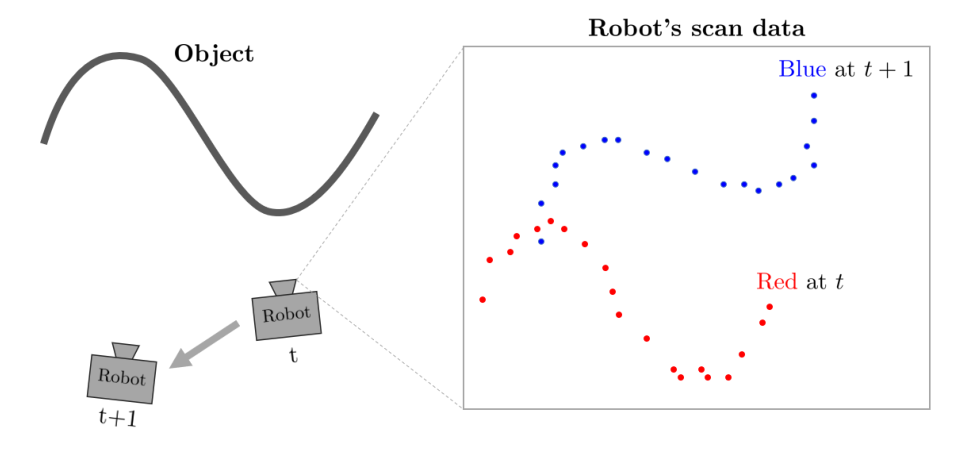
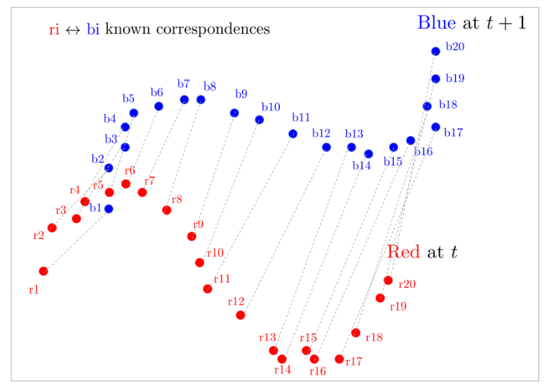
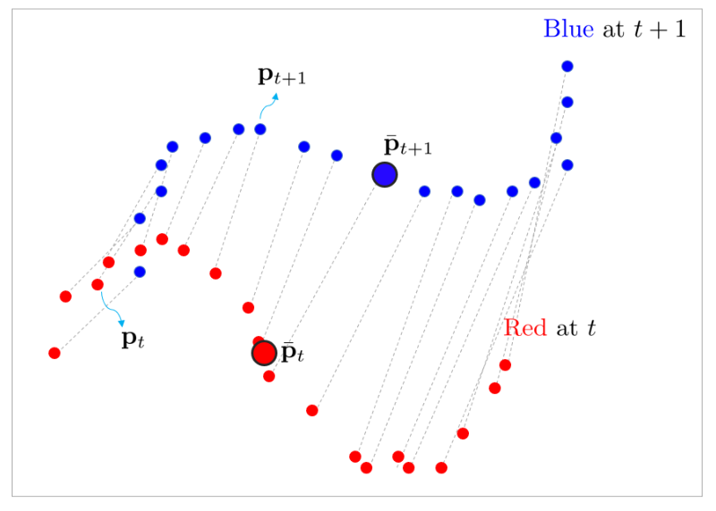
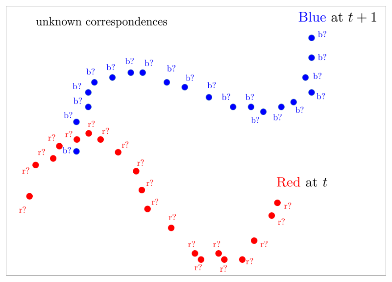
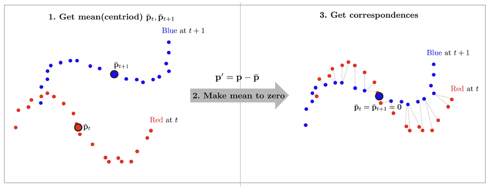
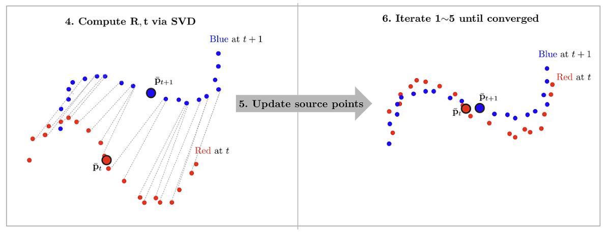
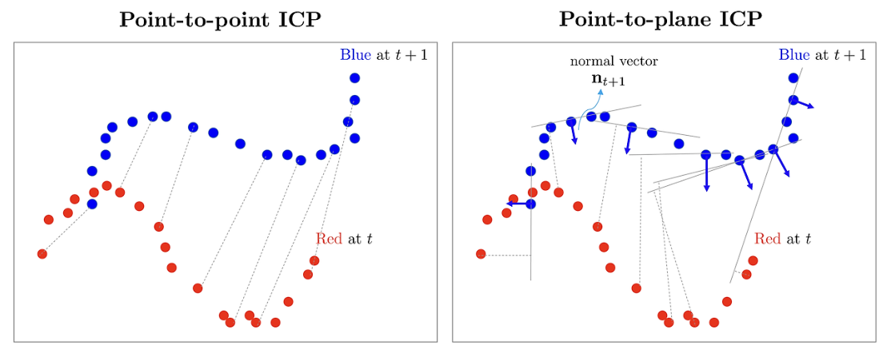
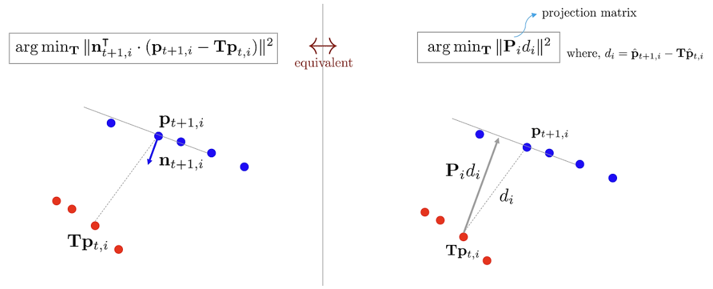
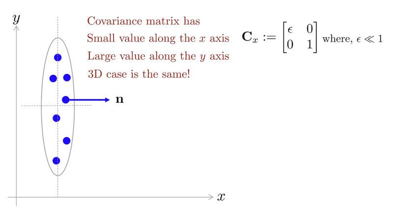

# Notes on Iterative Closest Point (Point-to-Point, Point-to-Plane, GICP)

Gyubeom Edward Im

> blog: alida.tistory.com, email: criterion.im@gmail.com

---

# 1 Introduction

==Iterative Closest Point (ICP)== 알고리즘은 두 점군(pointcloud) 집합들이 주어졌을 때 각 점으로부터 ==최단
거리의 점들을 탐색==하여 이를 바탕으로 ==반복적으로 정합(registration)==하는 방법을 말한다. ICP는 주로 LiDAR
SLAM에서 3D 스캔 데이터 정렬에 사용되며 Point-to-Point, Point-to-Plane 기법 등이 존재한다.

<!--widget:icp-overview-->

# 2 Example pointcloud data (2D)

우선 2D 점군 데이터를 예시로 들어보자. 로봇이 2D 스캐너를 통해 다음과 같은 데이터를 $t, t+1$ 시점에 대해
획득하였다고 가정하자.

$t$ 시점의 포인트({{r|빨간색}})과 $t+1$ 시점의 포인트({{t|파란색}})의 2D 점군의 좌표는 다음과 같다.

> [!TIP]
> {{r|sourcePoints}} = [ [-19, -15], [-18, -10], [-15, -9], [-14, -7], [-11, -6], [-9, -5], [-7, -6], [-4, -8], [-1, -11], [0,
> -14], [1, -17], [5, -20], [9, -24], [10, -25], [13, -24], [14, -25], [17, -25], [19, -22], [22, -18], [23, -16] ]
>
> –
>
> {{t|targetPoints}} = [ [-12, -8], [-12, -2], [-10, 1], [-10, 4], [-9, 6], [-6, 7], [-3, 8], [-1, 8], [3, 6], [6, 5], [10, 3],
> [14, 1], [17, 1], [19, 0], [22, 1], [24, 2], [27, 4], [26, 7], [27, 11], [27, 15] ]

# 3 Example pointcloud data (3D)

하지만 실제 주어지는 데이터는 일반적으로 다음과 같은 3D 점군 데이터가 주어진다. 로봇이 3D 스캐너를 통해
다음과 같은 데이터를 $t, t+1$ 시점에 대해 획득하였다고 가정하자.

$t$ 시점의 포인트({{r|빨간색}})과 $t+1$ 시점의 포인트({{t|파란색}})의 3D 점군의 좌표는 다음과 같다.

> [!TIP]
> {{r|sourcePoints}} = [ [-19, -15, 7], [-18, -10, 6], [-15, -9, 5], [-14, -7, 4], [-11, -6, 8], [-9, -5, 5], [-7, -6, 7], [-4,
> -8, 6], [-1, -11, 4], [0, -14, 6], [1, -17, 8], [5, -20, 7], [9, -24, 5], [10, -25, 6], [13, -24, 8], [14, -25, 5], [17,
> -25, 7], [19, -22, 6], [22, -18, 8], [23, -16, 7] ]
>
> –
>
> {{t|targetPoints}} = [ [-12, -8, 9], [-12, -2, 11], [-10, 1, 10], [-10, 4, 12], [-9, 6, 9], [-6, 7, 10], [-3, 8, 8], [-1, 8,
> 12], [3, 6, 11], [6, 5, 9], [10, 3, 8], [14, 1, 12], [17, 1, 11], [19, 0, 10], [22, 1, 8], [24, 2, 9], [27, 4, 11], [26,
> 7, 12], [27, 11, 9], [27, 15, 10] ]

# 4 Point-to-point ICP

## 4.1 With known data associations

ICP를 본격적으로 설명하기에 앞서 가장 쉬운 케이스를 먼저 생각해보자. 만약 위 그림과 같이 두 점군의 데이터들
간 관계(association, correspondence) {{r|$r_i$}} $\leftrightarrow$ {{t|$b_i$}}가 미리 주어져 있는 경우 해당 정합 문제는 closed form 해가 존재하여
간단하게 문제를 풀 수 있다. (No initial guess, no iterative)

빨간색 점군을 {{r|$\mathbf{p}_t$}} $= [\mathbf{p}_{t,1}, \mathbf{p}_{t,2}, \cdots, \mathbf{p}_{t,n}]^\intercal$ 파란색 점군을 {{t|$\mathbf{p}_{t+1}$}} $= [\mathbf{p}_{t+1,1}, \mathbf{p}_{t+1,2}, \cdots, \mathbf{p}_{t+1,n}]^\intercal$라고 하면 두 점군
사이의 관계는 다음과 같이 나타낼 수 있다.

$$\color{#00ffff}{\mathbf{p}_{t+1}} \approx \mathbf{R}\color{#ff0000}{\mathbf{p}_t} + \mathbf{t} \tag{1}$$

- 위 식은 2D, 3D 데이터 $\mathbf{p}_t$에 대해 모두 성립한다. 따라서 $\mathbf{R} \in SO(2)$와 $\mathbf{R} \in SO(3)$ 모두 성립한다.

위 식은 다음과 같은 최소제곱법 문제로 변환할 수 있다.

$$\arg\min_{\mathbf{R},\mathbf{t}} \|\color{#00ffff}{\mathbf{p}_{t+1}} - \mathbf{R}\color{#ff0000}{\mathbf{p}_t} - \mathbf{t}\|^2 \tag{2}$$

위 최소제곱법 문제는 비선형 항 $\mathbf{R}$가 포함되어 있기 때문에 정규방정식(normal equation) 형태로 풀 수 없다.
따라서 이를 해결하기 위해 공분산 행렬을 SVD 분해하는 방법과 비선형 최소제곱법(Gauss-Newton)으로 푸는
방법이 존재한다. 우선 공분산 행렬을 SVD 분해하는 방법에 대해 먼저 설명한다.

### 4.1.1 Covariance SVD-based solution

결론부터 말하자면 두 점군에 대한 공분산 행렬 $\mathbf{C}$를 구한 후 이를 SVD 분해하여 회전 행렬의 최적해 $\mathbf{R}^*$를 구할
수 있다.

우선 이를 위해 두 점군의 무게 중심(centroid)를 먼저 구한다.

$$\begin{aligned}
\bar{\mathbf{p}}_t &= \frac{1}{n}\sum \mathbf{p}_{t,i} \\
\bar{\mathbf{p}}_{t+1} &= \frac{1}{n}\sum \mathbf{p}_{t+1,i}
\end{aligned} \tag{3}$$

다음으로 기존의 모든 점들 $\mathbf{p}$에 대해 무게 중심 $\bar{\mathbf{p}}$을 빼준 $\mathbf{p}'$ 값을 구한다.

$$\begin{aligned}
\mathbf{p}'_t &= \mathbf{p}_t - \bar{\mathbf{p}}_t \\
\mathbf{p}'_{t+1} &= \mathbf{p}_{t+1} - \bar{\mathbf{p}}_{t+1}
\end{aligned} \tag{4}$$

위 결과를 사용하여 (2) 식을 다시 표현하면 다음과 같다.

$$\arg\min_{\mathbf{R},\mathbf{t}} \|(\mathbf{p}'_{t+1} + \bar{\mathbf{p}}_{t+1}) - \mathbf{R}(\mathbf{p}'_t + \bar{\mathbf{p}}_t) - \mathbf{t}\|^2 \tag{5}$$

- $\mathbf{p}_{t+1} = \mathbf{p}'_{t+1} + \bar{\mathbf{p}}_{t+1}$
- $\mathbf{p}_t = \mathbf{p}'_t + \bar{\mathbf{p}}_t$

이 때, 두 점군의 이동 벡터 $\mathbf{t}$는 $t+1$시점 점군의 무게중심 $\bar{\mathbf{p}}_{t+1}$과 $t$ 시점 회전한 점군의 무게중심 $\mathbf{R}\bar{\mathbf{p}}_t$의 차이로
설정한다. 즉, ==두 점군의 상대 회전량을 정확히 보정한다면 두 점군은 정확히 $\mathbf{t}$만큼 떨어져 있다고 가정하는 것이다.==

$$\mathbf{t} = \bar{\mathbf{p}}_{t+1} - \mathbf{R}\bar{\mathbf{p}}_t \tag{6}$$

(5)에 위 식을 대입하면 다음과 같이 $\mathbf{t}$ 항이 소거되어 $\mathbf{R}$을 찾는 문제로 단순화된다.

$$\arg\min_{\mathbf{R}} \|\mathbf{p}'_{t+1} - \mathbf{R}\mathbf{p}'_t\|^2 \tag{7}$$

위 식을 전개하면 다음과 같다. 식이 전개되면서 $\mathbf{R}$이 소거되어 중간의 항만 $\mathbf{R}$과 관련있는 항이 된다.

$$\begin{aligned}
\arg\min_{\mathbf{R}} \left\|\mathbf{p}'_{t+1} - \mathbf{R}\mathbf{p}'_t\right\|^2
&= \arg\min_{\mathbf{R}} \left(\mathbf{p}'^\intercal_{t+1}\mathbf{p}'_{t+1} \color{#a50000}{- 2\mathbf{p}'^\intercal_{t+1}\mathbf{R}\mathbf{p}'_t} + \mathbf{p}'^\intercal_t\underbrace{\mathbf{R}^\intercal\mathbf{R}}_{\mathbf{I}}\mathbf{p}'_t\right) \\
&= \arg\min_{\mathbf{R}} \left(\color{#a50000}{- 2\mathbf{p}'^\intercal_{t+1}\mathbf{R}\mathbf{p}'_t} + C\right)
\end{aligned} \tag{8}$$

따라서 최적화 수식은 다음과 같이 다시 쓸 수 있다. 마이너스 부호($-$)가 사라지면서 $\arg\min$ 문제가 $\arg\max$
문제로 변환된다.

$$\begin{aligned}
\mathbf{R}^* &= \arg\min_{\mathbf{R}} \left(-2\mathbf{p}'^\intercal_{t+1}\mathbf{R}\mathbf{p}'_t\right) \\
&= \arg\max_{\mathbf{R}} \left(\mathbf{p}'^\intercal_{t+1}\mathbf{R}\mathbf{p}'_t\right) \\
&= \arg\max_{\mathbf{R}} \left(\mathrm{tr}(\mathbf{p}'^\intercal_{t+1}\mathbf{R}\mathbf{p}'_t)\right) \\
&= \arg\max_{\mathbf{R}} \left(\mathrm{tr}(\mathbf{R}\color{#a50000}{\mathbf{p}'_t\mathbf{p}'^\intercal_{t+1}})\right) \quad \leftarrow \because \mathrm{tr}(\mathbf{A}\mathbf{B}) = \mathrm{tr}(\mathbf{B}\mathbf{A}) \\
&= \arg\max_{\mathbf{R}} \left(\mathrm{tr}(\mathbf{R}\color{#a50000}{\mathbf{C}})\right)
\end{aligned} \tag{9}$$

- $\mathbf{C} = \mathbf{p}'_t\mathbf{p}'^\intercal_{t+1}$

위 식의 세번째 줄을 보면 $\mathbf{p}'^\intercal_{t+1}\mathbf{R}\mathbf{p}'_t = \mathbb{R}^{1\times n}\cdot\mathbb{R}^{n\times n}\cdot\mathbb{R}^{n\times 1} = \mathbb{R}$로 스칼라 값이 나오는 것을 알 수 있다.
==따라서 최종 결과가 스칼라(=1x1 행렬)이므로 행렬의 대각 성분의 합인 trace의 유용한 성질을 활용할 수 있다.==
$\mathrm{tr}(\mathbf{A}\mathbf{B}) = \mathrm{tr}(\mathbf{B}\mathbf{A})$의 성질을 활용하여 $\mathbf{A} = \mathbf{p}'^\intercal_{t+1}$과 $\mathbf{B} = \mathbf{R}\mathbf{p}'_t$의 위치를 바꿔준다.

위 식의 네번째 줄을 보면 {{c|$\mathbf{p}'_t\mathbf{p}'^\intercal_{t+1}$}} 식은 ==두 점군의 공분산 행렬(covariance matrix)의 정의와 동일하다.== 따라서
이를 {{c|$\mathbf{C}$}}로 치환해준다.

> [!TIP]
> ==Covariance matrix of $x, y$==
>
> 두 데이터 집합 $\mathbf{x} = [x_1, x_2, \cdots, x_n]^\intercal$과 $\mathbf{y} = [y_1, y_2, \cdots, y_n]^\intercal$이 주어졌을 때 두 데이터의 공분산 행렬은
> 다음과 같이 구할 수 있다.
>
> 1\. 두 데이터의 평균을 구한다
>
> $$\begin{aligned} \bar{x} &= \frac{1}{n}\sum x_i \\ \bar{y} &= \frac{1}{n}\sum y_i \end{aligned} \tag{10}$$
>
> 2\. 원본 데이터에서 각각 평균을 빼준다
>
> $$\begin{aligned} \mathbf{x}' &= \mathbf{x} - \bar{x} \\ \mathbf{y}' &= \mathbf{y} - \bar{y} \end{aligned} \tag{11}$$
>
> 3\. 두 데이터의 공분산 행렬 $\mathbf{C}_{xy}$은 다음과 같이 구할 수 있다
>
> $$\begin{aligned} \mathbf{C}_{xy} &= \mathbf{x}'\mathbf{y}'^\intercal \\ &= (\mathbf{x} - \bar{x})(\mathbf{y} - \bar{y})^\intercal \end{aligned} \tag{12}$$

따라서 최적의 $\mathbf{R}^*$을 구하기 위해서는 다음 식을 풀어야 한다.

$$\begin{aligned}
\mathbf{R}^* &= \arg\max_{\mathbf{R}} \left(\mathrm{tr}(\mathbf{R}\mathbf{C})\right) \\
&= \arg\max_{\mathbf{R}} \left(\mathrm{tr}(\mathbf{R}\mathbf{U}\mathbf{D}\mathbf{V}^\intercal)\right)
\end{aligned} \tag{13}$$

==공분산 행렬 $\mathbf{C}$은 값이 마이너스($-$)가 나올 수 없으므로 항상 positive (semi-)definite 행렬이다.== 따라서 위
식의 두번째 줄에서 $\mathbf{C}$를 SVD 분해하면 모든 특이값(singular value)는 항상 0보다 크거나 같다.

> [!TIP]
> ==Lemma==
>
> 임의의 positive definite 행렬 $\mathbf{A}\mathbf{A}^\intercal$과 정규직교행렬(orthonormal) $\mathbf{B}$에 대하여 다음과 같은 Cauchy-Schwarz 부등식이 성립한다.
>
> $$\mathrm{tr}(\mathbf{A}\mathbf{A}^\intercal) \geq \mathrm{tr}(\mathbf{B}\mathbf{A}\mathbf{A}^\intercal) \tag{14}$$
>
> ==Proof==
>
> 임의의 벡터에 대한 Cauchy-Schwarz 부등식은 다음과 같다.
>
> $$|\langle \mathbf{u}, \mathbf{v}\rangle \leq \|\mathbf{u}\|\cdot\|\mathbf{v}\| \tag{15}$$
>
> - $\mathbf{u}, \mathbf{v}$: 임의의 벡터
> - $\langle\cdot,\cdot\rangle$: 벡터의 내적(inner product)
> - $\|\mathbf{a}\| = \sqrt{\langle\mathbf{a},\mathbf{a}\rangle}$: 벡터의 놈(norm)
>
> $\mathrm{tr}(\mathbf{B}\mathbf{A}\mathbf{A}^\intercal)$은 다음과 같이 벡터 형태로 표현이 가능하다
>
> $$\begin{aligned} \mathrm{tr}(\mathbf{B}\mathbf{A}\cdot\mathbf{A}^\intercal) &= \mathrm{tr}(\mathbf{A}^\intercal\cdot\mathbf{B}\mathbf{A}) \\ &= \sum \mathbf{a}_i^\intercal\mathbf{B}\mathbf{a}_i \end{aligned} \tag{16}$$
>
> 위 식을 Cauchy-Schwarz 부등식에 대입하면 다음과 같은 식을 얻는다.
>
> $$\begin{aligned} \mathbf{a}_i^\intercal\mathbf{B}\mathbf{a}_i &\leq \sqrt{(\mathbf{a}_i^\intercal\mathbf{a}_i)(\mathbf{a}_i^\intercal\underbrace{\mathbf{B}^\intercal\mathbf{B}}_{\mathbf{I}}\mathbf{a}_i)} \\ &= \mathbf{a}_i^\intercal\mathbf{a}_i \end{aligned} \tag{17}$$
>
> $$\mathbf{a}_i^\intercal\mathbf{B}\mathbf{a}_i \leq \mathbf{a}_i^\intercal\mathbf{a}_i \tag{18}$$
>
> 따라서 다음과 같은 Lemma를 얻는다.
>
> $$\therefore \mathrm{tr}(\mathbf{A}\mathbf{A}^\intercal) \geq \mathrm{tr}(\mathbf{B}\mathbf{A}\mathbf{A}^\intercal) \tag{19}$$

### 4.1.2 Method 1 for $\mathbf{R}^*$

만약 $\mathbf{R} = \mathbf{V}\mathbf{U}^\intercal$로 정의하면 (13)에서 정규직교행렬 $\mathbf{U}^\intercal\mathbf{U}$가 서로 소거되어 $\mathbf{V}\mathbf{D}\mathbf{V}^\intercal$만 남는다. 이를 통해 $\mathbf{A}\mathbf{A}^\intercal$
형태로 만들 수 있다.

$$\begin{aligned}
\mathrm{tr}(\mathbf{R}\mathbf{U}\mathbf{D}\mathbf{V}^\intercal) &= \mathrm{tr}(\mathbf{V}\underbrace{\mathbf{U}^\intercal\mathbf{U}}_{\mathbf{I}}\mathbf{D}\mathbf{V}^\intercal) \\
&= \mathrm{tr}(\mathbf{V}\mathbf{D}\mathbf{V}^\intercal) \\
&= \mathrm{tr}(\mathbf{V}\mathbf{D}^{\frac{1}{2}}\mathbf{D}^{\frac{1}{2}}\mathbf{V}^\intercal) \\
&= \mathrm{tr}(\mathbf{V}\mathbf{D}^{\frac{1}{2}})(\mathbf{D}^{\frac{1}{2}}\mathbf{V}^\intercal) \quad \leftarrow \mathbf{A}\mathbf{A}^\intercal\ \text{form} \\
&= \mathrm{tr}(\mathbf{A}\mathbf{A}^\intercal) \\
&\geq \mathrm{tr}(\mathbf{R}'\mathbf{A}\mathbf{A}^\intercal)
\end{aligned} \tag{20}$$

- $\mathbf{R}'$: 임의의 정규직교행렬(orthonormal)
- $\mathbf{A} = \mathbf{V}\mathbf{D}^{\frac{1}{2}}$

이를 다시 정리하면 다음과 같다.

$$\mathrm{tr}(\mathbf{R}\mathbf{C}) = \mathrm{tr}(\mathbf{V}\mathbf{U}^\intercal\mathbf{C}) \geq \mathrm{tr}(\mathbf{R}'\mathbf{A}\mathbf{A}^\intercal) = \mathrm{tr}(\mathbf{R}'\mathbf{R}\mathbf{C}) \tag{21}$$

위 식의 의미는 $\mathbf{R}$은 $\mathbf{R} = \mathbf{V}\mathbf{U}^\intercal$인 경우에 모든 다른 임의의 회전행렬 $\mathbf{R}'\mathbf{R}$보다 큰 값을 가진다는 의미이다.
따라서 $\arg\max$의 해가 된다.

$$\begin{aligned}
\mathbf{R} &= \mathbf{V}\mathbf{U}^\intercal \\
\mathbf{t} &= \mathbf{R}\bar{\mathbf{p}}_t - \bar{\mathbf{p}}_{t+1}
\end{aligned} \tag{22}$$

### 4.1.3 Method 2 for $\mathbf{R}^*$

(13) 식을 다시 보면 trace 내부의 값을 최대화해야 한다. 이 때, 앞서 언급했듯이 공분산 행렬 $\mathbf{C}$는 positive (semi-)definite 행렬이므로 특이값이 항상 0보다 크거나 같고 따라서 대각행렬 $\mathbf{D}$의 모든 값은 항상 0보다 크거나 같다.
그리고 $\mathbf{R}, \mathbf{U}, \mathbf{V}$는 정규직교행렬(orthonormal) 행렬이므로 대각행렬과 곱해지면 항상 trace 값은 $\mathbf{D}$ 자체보다 작아
지게 된다.

$$\mathrm{tr}(\mathbf{D}) \geq \mathrm{tr}(\mathbf{R}\mathbf{U}\mathbf{D}\mathbf{V}^\intercal) \tag{23}$$

Trace 성질에 의해 순서를 바꿔주게 되면 다음과 같다.

$$\begin{aligned}
\mathbf{R}^* &= \arg\max_{\mathbf{R}} \left(\mathrm{tr}(\mathbf{R}\mathbf{U}\cdot\mathbf{D}\mathbf{V}^\intercal)\right) \\
&= \arg\max_{\mathbf{R}} \left(\mathrm{tr}(\mathbf{D}\mathbf{V}^\intercal\cdot\mathbf{R}\mathbf{U})\right)
\end{aligned} \tag{24}$$

만약 $\mathbf{R} = \mathbf{V}\mathbf{U}^\intercal$인 경우 정규직교행렬들이 소거되어 최대 trace 값을 가진다.

$$\begin{aligned}
\mathbf{R}^* &= \arg\max_{\mathbf{R}} \left(\mathrm{tr}(\mathbf{D}\mathbf{V}^\intercal\mathbf{R}\mathbf{U})\right) \\
&= \arg\max_{\mathbf{R}} \left(\mathrm{tr}(\mathbf{D}\underbrace{\mathbf{V}^\intercal\mathbf{R}\mathbf{U}}_{\mathbf{I}})\right)
\end{aligned} \tag{25}$$

- $\mathbf{R} = \mathbf{V}\mathbf{U}^\intercal$

따라서 앞서 method1에서 유도한 (22)와 동일한 $\mathbf{R}$ 값을 구할 수 있다.

$$\begin{aligned}
\mathbf{R} &= \mathbf{V}\mathbf{U}^\intercal \\
\mathbf{t} &= \bar{\mathbf{p}}_{t+1} - \mathbf{R}\bar{\mathbf{p}}_t
\end{aligned} \tag{26}$$

회전행렬의 최적해를 구할 때 $\mathbf{R}$이 $SO(3)$군의 조건을 만족하려면 반드시 행렬식이 $+1$이어야 한다. $\det(\mathbf{R}) = 1$.
하지만 실제 ICP 해를 구하다보면 행렬식이 $-1$이 되는 경우가 발생하는데 이는 reflection (특정 축 기준으로 상하좌
우 반전)이 된 경우이다. 이러한 degenerate 케이스를 방지하기 위해 일반적으로 다음과 같이 회전 행렬의 최적해를
구한다.

$$\mathbf{R} = \mathbf{V}\begin{bmatrix} 1 & & \\ & 1 & \\ & & \det(\mathbf{V}\mathbf{U}^\intercal) \end{bmatrix}\mathbf{U}^\intercal \tag{27}$$

<!--widget:svd-solution-->

## 4.2 With unknown data associations

이전 섹션에서 살펴본 최적해 $\mathbf{R}^*, \mathbf{t}^*$는 두 점군 사이의 대응 관계(association, correspondences)를 모두 알고 있는
경우에 사용할 수 있는 방법이었다. 하지만 일반적으로 센서에서 얻어지는 두 점군 데이터는 어느 포인트가 어느
포인트와 대응하는지 알 수 없다.

위와 같이 대응 관계를 모르는 경우, 바로 구할 수 있는 closed form 해는 존재하지 않는다. ==따라서 하나의
점으로부터 가장 가까운 점(closest point)을 대응점 쌍으로 설정하여 반복적(iterative)으로 최적해를 구하는
알고리즘이 Iterative Closest Point(ICP)이다.== ICP의 전체적인 과정은 다음과 같다. ($j$: 현재 반복 횟수)

1. source 점군과 target 점군의 평균(또는 centroid) $\bar{\mathbf{p}}_t, \bar{\mathbf{p}}_{t+1}$를 구한다.
2. 각 점군에 두 평균을 빼줌으로써 평균을 0으로 정규화한다. ($\mathbf{p}' = \mathbf{p} - \bar{\mathbf{p}}$)
3. 각 source 점들마다 최단 거리의 target 점들을 correspondence로 설정한다. (nearest neighborhood 알고리즘
   사용 e.g., KD-tree)
4. 공분산 행렬을 SVD 분해하여 회전행렬 $\mathbf{R}$을 구하고 평균 간 차이를 통해 이동 벡터 $\mathbf{t}$를 구한다. ($\mathbf{R}_j = \mathbf{V}\mathbf{U}^\intercal, \mathbf{t}_j = \bar{\mathbf{p}}_{t+1} - \mathbf{R}_j\bar{\mathbf{p}}_t$)
5. source 점군을 최적해만큼 이동시킨다. $\mathbf{p}_{t,j+1} = \mathbf{R}_j\mathbf{p}_{t,j} + \mathbf{t}_j$
6. 두 점군의 거리가 충분히 가까워질 때까지 1~5 과정을 반복한다.

ICP 과정을 그림으로 나타내면 다음과 같다.

지금까지 설명한 알고리즘을 가장 기본적인 ICP 알고리즘이라는 뜻에서 일반적으로 ==Vanila ICP==라고 부른다.
Vanila ICP는 구현하기 비교적 쉽고 초기 추정값(initial guess)가 정확하면 잘 동작한다는 장점이 있으나 일반적으
로 수렴하는데 많은 반복 횟수가 필요하며 잘못된 correspondence에 영향을 많이 받아 결과가 안 좋아질 수 있는
한계점이 존재한다.

이러한 Vanila ICP의 한계점을 극복하기 위해 모든 점들이 아닌 점군의 부분 집합(e.g., 특징점)만 추출하여 ICP
를 수행한다거나 point-to-plane과 같이 다른 대응 관계를 이용한다거나 correspondence에 가중치를 두어 outlier
의 영향력을 축소한다거나 잠재적인 point outlier를 아예 제거하여 보다 강건한 ICP를 수행하는 등 많은 변형 ICP
방법들이 존재한다. 자세한 내용은 Cyrill 교수님의 ICP 강의 를 참고하면 된다.

<!--widget:vanila-icp-->

## 4.3 Least squares point-to-point ICP (2D)

지금까지 설명했던 ICP 방법의 핵심은 두 점군의 공분산 행렬을 구한 후 SVD 분해하여 회전 행렬을 $\mathbf{R} = \mathbf{V}\mathbf{U}^\intercal$과
같이 구하는 방법이었다. 이번 섹션에서는 비선형 최소제곱법(=Gauss-Newton, GN)을 사용하여 ICP 문제를 푸는
방법에 대해 설명한다. Least squares ICP는 기본적으로 대응 관계를 모르는 경우(unknown data association)에
적용할 수 있다.

==Least squares ICP는 대부분 과정이 기존 ICP와 동일하지만 매 iteration마다 최적해 $\mathbf{R}, \mathbf{t}$를 추정하는 방
법이 SVD -> Gauss-Newton 방법으로 변경된 점이 다르다. 또한 가장 가까운 대응점 쌍(correspondences)
을 구할 때 평균을 0으로 설정 후 대응점 쌍을 구하지 않고 바로 대응점 쌍을 구한다는 점이 다르다.==
SVD 해는 점군들의 correspondence가 point-to-point 대응점 쌍임을 가정하고 해를 구하지만 실제 ICP는 point-to-point 이외에도 다양한 에러 함수를 설정할 수 있으므로 Least squares ICP를 사용하면 이러한 에러함수를 일
관되게 최적화할 수 있다. 또한 Robust estimator 같은 항을 사용하여 보다 outlier에 강건한 최적화를 수행할 수
있다.

Least squares ICP를 수행하기 위해 2차원 포즈 상태 변수 $\mathbf{x} = [t_x, t_y, \theta]^\intercal$를 선언한다. 2차원 회전 행렬 $\mathbf{R}$과
이동 벡터 $\mathbf{t}$는 다음과 같다.

$$\begin{aligned}
\mathbf{x} &= [t_x, t_y, \theta]^\intercal \\
\mathbf{R}(\theta) &= \begin{bmatrix} \cos\theta & -\sin\theta \\ \sin\theta & \cos\theta \end{bmatrix} \\
\mathbf{t} &= \begin{bmatrix} t_x \\ t_y \end{bmatrix}
\end{aligned} \tag{28}$$

- $\mathbf{R}(\theta)$: 회전 행렬의 입력 파라미터로 $\theta$가 들어간다는 것을 명시적으로 써준 형태이다.

==최적화 식은 기존의 (2)와 동일하지만 자코비안 전개의 편의를 위해 기존의 '관측값-예측값' 형태에서 '예측
값-관측값' 형태로 변경해주자==. $i$번째 점에 대한 에러 함수 $\mathbf{e}_i$는 다음과 같이 나타낼 수 있다.

$$\mathbf{e}_i(\mathbf{x}) = \mathbf{R}(\theta)\mathbf{p}_{t,i} + \mathbf{t} - \mathbf{p}_{t+1,i} \in \mathbb{R}^2 \tag{29}$$

$$\begin{aligned}
\mathbf{x}^* &= \arg\min_{\mathbf{x}} \|\mathbf{e}_i(\mathbf{x})\|^2 \\
&= \arg\min_{\mathbf{x}} \|\mathbf{R}(\theta)\mathbf{p}_{t,i} + \mathbf{t} - \mathbf{p}_{t+1,i}\|^2
\end{aligned} \tag{30}$$

- 에러 함수가 '예측값-관측값' 형태로 변경되어도 제곱이 되므로 전체 최적화 과정에는 영향을 주지 않는다. 다만
  에러 함수에 모양에 따라 자코비안의 부호가 달라지므로 실제 코드 구현 시 이에 유의한다.

위 식은 비선형 최소제곱법의 형태를 띄므로 Gauss-Newton(GN) 또는 Levenberg-Marquardt(LM) 방법으로
풀 수 있다. GN 방법을 예로 들어 설명해보자. 미소한 변화량 $\Delta\mathbf{x}$에 대하여 에러 함수 $\mathbf{e}(\mathbf{x}+\Delta\mathbf{x})$는 다음과 같이
테일러 근사를 통해 선형화할 수 있다.

$$\mathbf{e}_i(\mathbf{x} + \Delta\mathbf{x}) \approx \mathbf{e}_i(\mathbf{x}) + \mathbf{J}_i\Delta\mathbf{x} \tag{31}$$

$i$번째 점에 대한 자코비안 $\mathbf{J}_i$는 다음과 같다.

$$\begin{aligned}
\mathbf{J}_i = \frac{\partial\mathbf{e}_i}{\partial\mathbf{x}} &= \begin{bmatrix} \frac{\partial\mathbf{e}_i}{\partial t_x} & \frac{\partial\mathbf{e}_i}{\partial t_y} & \frac{\partial\mathbf{e}_i}{\partial\theta} \end{bmatrix} \\
&= \begin{bmatrix} \frac{\partial e_i^x}{\partial t_x} & \frac{\partial e_i^x}{\partial t_y} & \frac{\partial e_i^x}{\partial\theta} \\ \frac{\partial e_i^y}{\partial t_x} & \frac{\partial e_i^y}{\partial t_y} & \frac{\partial e_i^y}{\partial\theta} \end{bmatrix} \\
&= \begin{bmatrix} 1 & 0 & -\sin\theta\, x_{t,i} - \cos\theta\, y_{t,i} \\ 0 & 1 & \cos\theta\, x_{t,i} - \sin\theta\, y_{t,i} \end{bmatrix} \in \mathbb{R}^{2\times 3}
\end{aligned} \tag{32}$$

위 식에서 $\theta$에 대한 자코비안 성분은 다음과 같이 구할 수 있다.

$$\begin{aligned}
\frac{\partial\mathbf{e}_i}{\partial\theta} &= \frac{\partial}{\partial\theta}\left(\mathbf{R}(\theta)\mathbf{p}_{t,i}\right) \\
&= \frac{\partial}{\partial\theta}\begin{bmatrix} \cos\theta & -\sin\theta \\ \sin\theta & \cos\theta \end{bmatrix}\begin{bmatrix} x_{t,i} \\ y_{t,i} \end{bmatrix} \\
&= \begin{bmatrix} -\sin\theta & -\cos\theta \\ \cos\theta & -\sin\theta \end{bmatrix}\begin{bmatrix} x_{t,i} \\ y_{t,i} \end{bmatrix} \\
&= \begin{bmatrix} -\sin\theta\, x_{t,i} - \cos\theta\, y_{t,i} \\ \cos\theta\, x_{t,i} - \sin\theta\, y_{t,i} \end{bmatrix} \in \mathbb{R}^{2\times 1}
\end{aligned} \tag{33}$$

- $\mathbf{p}_{t,i} = [x_{t,i}, y_{t,i}]^\intercal$

모든 점들에 대한 에러 함수를 합치면 다음과 같이 점군에 대한 에러 함수가 된다.

$$\begin{aligned}
E(\mathbf{x}) &= \sum_i^n \|\mathbf{e}_i(\mathbf{x})\|^2 \\
\mathbf{x} &= \arg\min_{\mathbf{x}} E(\mathbf{x})
\end{aligned} \tag{34}$$

점군에 대한 자코비안 $\mathbf{J}_i$와 $\mathbf{H}_i, \mathbf{b}_i$도 다음과 같이 합쳐지게 된다.

$$\begin{aligned}
\mathbf{H}_i &= \mathbf{J}_i^\intercal\mathbf{J}_i \\
\mathbf{b}_i &= \mathbf{J}_i^\intercal\mathbf{e}_i
\end{aligned} \tag{35}$$

$$\begin{aligned}
\mathbf{J} &= \sum_i^n \mathbf{J}_i \\
\mathbf{H} &= \sum_i^n \mathbf{H}_i \\
\mathbf{b} &= \sum_i^n \mathbf{b}_i
\end{aligned} \tag{36}$$

GN 방법의 해는 다음과 같이 구할 수 있다. 유도 과정에 대해 궁금한 독자들은 에러와 자코비안 정리 포스팅을
참고하면 된다.

$$\Delta\mathbf{x}^* = -\mathbf{H}^{-1}\mathbf{b} \tag{37}$$

미소 증분량의 최적해 $\Delta\mathbf{x}^*$를 위와 같이 구했으면 이를 원래 상태 변수 $\mathbf{x}$에 업데이트 해준다. 업데이트를 통해
source 점군이 target 점군에 점진적으로 정합(registration)된다.

$$\mathbf{x} \leftarrow \mathbf{x} + \Delta\mathbf{x}^* \tag{38}$$

지금까지 설명한 과정을 source 점군이 더 이상 업데이트 되지 않을 때까지 반복한다. 이러한 과정을 Least
squares ICP (2D ver.) 알고리즘이라고 부른다.

> [!TIP]
> ==Gauss-Newton method (point-to-point ICP 2D)==
>
> 1. Nearest neighborhood (e.g., KD-tree) 방법을 통해 source 점에 가장 가까운 target 점들을 correspondence
>    로 설정한다.
> 2. (29)과 같이 에러함수를 정의한다. $\mathbf{e}(\mathbf{x})$
> 3. 테일러 전개로 근사 선형화하여 자코비안을 구한다. $\mathbf{H} = \mathbf{J}^\intercal\mathbf{J}, \mathbf{b} = \mathbf{J}^\intercal\mathbf{e}$
> 4. 5\. 1차 미분 후 0으로 설정한다. $\Delta\mathbf{x}^* = -\mathbf{H}^{-1}\mathbf{b}$
> 6. 이 때 값을 구하고 이를 에러함수에 대입한다. $\mathbf{x} \leftarrow \mathbf{x} + \Delta\mathbf{x}^*$
> 7. 값이 수렴할 때 까지 반복한다.

<!--widget:ls-icp-2d-->

### 4.3.1 Least squares point-to-point ICP (3D)

3D 점군에 대한 Least squares ICP는 2D 점군과 비교해서 자코비안을 제외하고 모든 과정이 동일하다. 이 때, ==자코비
안에 3차원 회전 행렬 $\mathbf{R} \in SO(3)$이 포함되므로 자코비안을 구할 때 Lie algebra so(3)-based optimization이
적용된다는 점이 유의할만한 점이다.== Lie theory-based optimization에 대한 내용은 에러와 자코비안 정리 포스팅을
참고하면 된다.

Least squares ICP를 수행하기 위해 3차원 포즈 상태 변수 $\mathbf{x} = [t_x, t_y, t_z, \mathbf{R}]^\intercal$를 선언한다. 3차원 회전 행렬
$\mathbf{R} \in SO(3)$과 이동 벡터 $\mathbf{t}$는 다음과 같다.

$$\begin{aligned}
\mathbf{x} &= [t_x, t_y, t_z, \mathbf{R}]^\intercal \\
\mathbf{R} &= \begin{bmatrix} r_{11} & r_{12} & r_{13} \\ r_{21} & r_{22} & r_{23} \\ r_{31} & r_{32} & r_{33} \end{bmatrix} \in SO(3) \\
\mathbf{t} &= \begin{bmatrix} t_x \\ t_y \\ t_z \end{bmatrix}
\end{aligned} \tag{39}$$

$i$번째 점에 대한 에러 함수 $\mathbf{e}_i$는 다음과 같이 나타낼 수 있다.

$$\mathbf{e}_i(\mathbf{x}) = \mathbf{R}\mathbf{p}_{t,i} + \mathbf{t} - \mathbf{p}_{t+1,i} \in \mathbb{R}^3 \tag{40}$$

$$\begin{aligned}
\mathbf{x}^* &= \arg\min_{\mathbf{x}} \|\mathbf{e}_i(\mathbf{x})\|^2 \\
&= \arg\min_{\mathbf{x}} \|\mathbf{R}\mathbf{p}_{t,i} + \mathbf{t} - \mathbf{p}_{t+1,i}\|^2
\end{aligned} \tag{41}$$

위 식은 비선형 최소제곱법의 형태를 띄므로 Gauss-Newton(GN) 또는 Levenberg-Marquardt(LM) 방법으로
풀 수 있다. GN 방법을 예로 들어 설명해보자. 미소한 변화량 $\Delta\mathbf{x}$에 대하여 에러 함수 $\mathbf{e}(\mathbf{x}+\Delta\mathbf{x})$는 다음과 같이
테일러 근사를 통해 선형화할 수 있다.

$$\mathbf{e}_i(\mathbf{x} + \Delta\mathbf{x}) \approx \mathbf{e}_i(\mathbf{x}) + \mathbf{J}_i\Delta\mathbf{x} \tag{42}$$

$i$번째 3D 점에 대한 자코비안 $\mathbf{J}_i$은 다음과 같다.

$$\begin{aligned}
\mathbf{J}_i = \frac{\partial\mathbf{e}_i(\mathbf{x})}{\partial[\mathbf{t}, \mathbf{R}]}
&= \frac{\partial\mathbf{e}_i(\mathbf{x})}{\partial[\mathbf{t}, \Delta\mathbf{w}]} \quad \leftarrow \color{#a50000}{so(3)\text{-based optimization}} \\
&= \frac{\partial\left(\mathbf{R}\mathbf{p}_{t,i} + \mathbf{t} - \mathbf{p}_{t+1,i}\right)}{\partial[\mathbf{t}, \Delta\mathbf{w}]} \\
&= \begin{bmatrix} 1 & 0 & 0 & 0 & z'_{t,i} & -y'_{t,i} \\ 0 & 1 & 0 & -z'_{t,i} & 0 & x'_{t,i} \\ 0 & 0 & 1 & y'_{t,i} & -x'_{t,i} & 0 \end{bmatrix} \in \mathbb{R}^{3\times 6}
\end{aligned} \tag{43}$$

- Lie theory-based optimization에 대한 내용은 에러와 자코비안 정리 포스팅을 참고하면 된다.

$\frac{\partial\mathbf{e}_i(\mathbf{x})}{\partial\mathbf{t}}$은 다음과 같다.

$$\begin{aligned}
\frac{\partial\mathbf{e}_i(\mathbf{x})}{\partial\mathbf{t}} &= \frac{\partial\mathbf{t}}{\partial\mathbf{t}} \\
&= \begin{bmatrix} 1 & 0 & 0 \\ 0 & 1 & 0 \\ 0 & 0 & 1 \end{bmatrix} \in \mathbb{R}^{3\times 3}
\end{aligned} \tag{44}$$

$\frac{\partial\mathbf{e}_i(\mathbf{x})}{\partial\Delta\mathbf{w}}$은 다음과 같다.

$$\begin{aligned}
\frac{\partial\mathbf{e}_i(\mathbf{x})}{\partial\Delta\mathbf{w}} &= -[\mathbf{R}\mathbf{p}_{t,i} + \mathbf{t}]_\times \\
&= \begin{bmatrix} 0 & z'_{t,i} & -y'_{t,i} \\ -z'_{t,i} & 0 & x'_{t,i} \\ y'_{t,i} & -x'_{t,i} & 0 \end{bmatrix} \in \mathbb{R}^{3\times 3}
\end{aligned} \tag{45}$$

- $\mathbf{R}\mathbf{p}_{t,i} + \mathbf{t} = [x'_{t,i}\ y'_{t,i}\ z'_{t,i}]^\intercal$
- $[\mathbf{a}]_\times = \begin{bmatrix} a_x \\ a_y \\ a_z \end{bmatrix}_\times = \begin{bmatrix} 0 & -a_z & a_y \\ a_z & 0 & -a_x \\ -a_y & a_x & 0 \end{bmatrix}$ : 반대칭행렬 연산자

모든 점들에 대한 에러 함수를 합치면 다음과 같이 점군에 대한 에러 함수가 된다.

$$\begin{aligned}
E(\mathbf{x}) &= \sum_i^n \|\mathbf{e}_i(\mathbf{x})\|^2 \\
\mathbf{x} &= \arg\min_{\mathbf{x}} E(\mathbf{x})
\end{aligned} \tag{46}$$

점군에 대한 자코비안 $\mathbf{J}_i$와 $\mathbf{H}_i, \mathbf{b}_i$도 다음과 같이 합쳐지게 된다.

$$\begin{aligned}
\mathbf{H}_i &= \mathbf{J}_i^\intercal\mathbf{J}_i \\
\mathbf{b}_i &= \mathbf{J}_i^\intercal\mathbf{e}_i
\end{aligned} \tag{47}$$

$$\begin{aligned}
\mathbf{J} &= \sum_i^n \mathbf{J}_i \\
\mathbf{H} &= \sum_i^n \mathbf{H}_i \\
\mathbf{b} &= \sum_i^n \mathbf{b}_i
\end{aligned} \tag{48}$$

GN 방법의 해는 다음과 같이 구할 수 있다. 유도 과정에 대해 궁금한 독자들은 에러와 자코비안 정리 포스팅을
참고하면 된다.

$$\Delta\mathbf{x}^* = -\mathbf{H}^{-1}\mathbf{b} \tag{49}$$

미소 증분량의 최적해 $\Delta\mathbf{x}^*$를 위와 같이 구했으면 이를 원래 상태 변수 $\mathbf{x}$에 업데이트 해준다. 업데이트를 통해
source 점군이 target 점군에 점진적으로 정합(registration)된다.

$$\mathbf{x} \leftarrow \mathbf{x} + \Delta\mathbf{x}^* \tag{50}$$

지금까지 설명한 과정을 source 점군이 더 이상 업데이트 되지 않을 때까지 반복한다. 이러한 과정을 Least
squares ICP (3D ver.) 알고리즘이라고 부른다.

> [!TIP]
> ==Gauss-Newton method (point-to-point ICP 3D)==
>
> 1. Nearest neighborhood (e.g., KD-tree) 방법을 통해 source 점에 가장 가까운 target 점들을 correspondence
>    로 설정한다.
> 2. (40)과 같이 에러함수를 정의한다. $\mathbf{e}(\mathbf{x})$
> 3. 테일러 전개로 근사 선형화하여 자코비안을 구한다. $\mathbf{H} = \mathbf{J}^\intercal\mathbf{J}, \mathbf{b} = \mathbf{J}^\intercal\mathbf{e}$
> 4. 1차 미분 후 0으로 설정한다. $\Delta\mathbf{x}^* = -\mathbf{H}^{-1}\mathbf{b}$
> 5. 이 때 값을 구하고 이를 에러함수에 대입한다. $\mathbf{x} \leftarrow \mathbf{x} + \Delta\mathbf{x}^*$
> 6. 값이 수렴할 때 까지 반복한다.

<!--widget:ls-icp-3d-->

# 5 Point-to-plane ICP

기존 point-to-point ICP는 source 점과 target 점 사이의 유클리디언 거리(euclidean distance)를 최소화하는 방
향으로 최적화를 수행하였다. 반면에 point-to-plane ICP는 source 점과 target 법선 벡터(normal vector) 거리를
최소화하는 방향으로 최적화를 수행한다. Point-to-plane의 원조격이 되는 논문은 [5],[6],[7]가 있다.

Point-to-plane 알고리즘은 point-to-point 대비 일반적으로 ==수렴 속도가 빠르며 노이즈와 outlier에 덜 민감==
하다는 특징이 있다. 반면에 법선 벡터를 계산한 후 최적화하는 과정이 추가되어 ==연산량이 증가==한다는 trade-off
관계가 존재한다. 또한 point-to-point와 최적화 수식이 달라지므로 SVD 해를 구할 수 없고 least squares(=GN)을
통해서만 최적해를 구할 수 있다.

<!--widget:point-to-plane-vs-point-->

## 5.1 Least squares point-to-plane ICP (2D)

Point-to-plane ICP의 대부분의 과정은 point-to-point ICP와 동일하며 법선 벡터(normal vector)를 구하는 과
정과 최적화 수식이 약간 변경되었다는 점이 다르다. Least squares ICP를 수행하기 위해 2차원 포즈 상태 변수
$\mathbf{x} = [t_x, t_y, \theta]^\intercal$를 선언한다. 2차원 회전 행렬 $\mathbf{R}$과 이동 벡터 $\mathbf{t}$는 다음과 같다.

$$\begin{aligned}
\mathbf{x} &= [t_x, t_y, \theta]^\intercal \\
\mathbf{R}(\theta) &= \begin{bmatrix} \cos\theta & -\sin\theta \\ \sin\theta & \cos\theta \end{bmatrix} \\
\mathbf{t} &= \begin{bmatrix} t_x \\ t_y \end{bmatrix}
\end{aligned} \tag{51}$$

- $\mathbf{R}(\theta)$: 회전 행렬의 입력 파라미터로 $\theta$가 들어간다는 것을 명시적으로 써준 형태이다.

$i$번째 점에 대한 에러 함수 $\mathbf{e}_i$는 다음과 같이 나타낼 수 있다.

$$\mathbf{e}_i(\mathbf{x}) = \mathbf{n}^\intercal_{t+1,i}(\mathbf{R}(\theta)\mathbf{p}_{t,i} + \mathbf{t} - \mathbf{p}_{t+1,i}) \in \mathbb{R} \tag{52}$$

$$\begin{aligned}
\mathbf{x}^* &= \arg\min_{\mathbf{x}} \|\mathbf{e}_i(\mathbf{x})\|^2 \\
&= \arg\min_{\mathbf{x}} \|\mathbf{n}^\intercal_{t+1,i}(\mathbf{R}(\theta)\mathbf{p}_{t,i} + \mathbf{t} - \mathbf{p}_{t+1,i})\|^2
\end{aligned} \tag{53}$$

- $\mathbf{n}_{t+1,i} = [n^x_{t+1,i}, n^y_{t+1,i}]^\intercal$: target 점군에서 $i$번째 점의 법선 벡터(normal vector)
- $\mathbf{n}^\intercal(\cdot) = (\cdot)^\intercal\mathbf{n}$의 성질로 인해 법선 벡터는 식의 오른쪽과 왼쪽 어느 방향이든 위치할 수 있다.

기존 point-to-point의 최적화 수식에 법선 벡터 $\mathbf{n}_{t+1,i}$를 내적한 형태로 수식이 구성되어 있는 것을 알 수 있다.
==이는 source 점과 target 점이 완벽히 정합(registration)되어 있는 경우 두 점 사이의 벡터가 법선벡터와 수직을
이루기 때문에 내적=0의 성질을 이용한 것으로 해석할 수 있다.
2D의 경우 법선 벡터는 점 $\mathbf{p} = [x, y]^\intercal$가 주어져 있을 때 $\mathbf{n} = [-y, x]^\intercal$와 같이 간단하게 구할 수 있다.==

위 식은 비선형 최소제곱법의 형태를 띄므로 Gauss-Newton(GN) 또는 Levenberg-Marquardt(LM) 방법으로
풀 수 있다. GN 방법을 예로 들어 설명해보자. 미소한 변화량 $\Delta\mathbf{x}$에 대하여 에러 함수 $\mathbf{e}(\mathbf{x}+\Delta\mathbf{x})$는 다음과 같이
테일러 근사를 통해 선형화할 수 있다.

$$\mathbf{e}_i(\mathbf{x} + \Delta\mathbf{x}) \approx \mathbf{e}_i(\mathbf{x}) + \mathbf{J}_i\Delta\mathbf{x} \tag{54}$$

$i$번째 점에 대한 자코비안 $\mathbf{J}_i$는 다음과 같다.

$$\begin{aligned}
\mathbf{J}_i = \frac{\partial\mathbf{e}_i}{\partial\mathbf{x}} &= \begin{bmatrix} \frac{\partial\mathbf{e}_i}{\partial t_x} & \frac{\partial\mathbf{e}_i}{\partial t_y} & \frac{\partial\mathbf{e}_i}{\partial\theta} \end{bmatrix} \\
&= \begin{bmatrix} \frac{\partial e_i^x}{\partial t_x} & \frac{\partial e_i^x}{\partial t_y} & \frac{\partial e_i^x}{\partial\theta} \\ \frac{\partial e_i^y}{\partial t_x} & \frac{\partial e_i^y}{\partial t_y} & \frac{\partial e_i^y}{\partial\theta} \end{bmatrix} \\
&= \begin{bmatrix} n^x_{t+1,i} & n^y_{t+1,i} & n^x_{t+1,i}(-\sin\theta\, x_{t,i} - \cos\theta\, y_{t,i}) + n^y_{t+1,i}(\cos\theta\, x_{t,i} - \sin\theta\, y_{t,i}) \end{bmatrix} \in \mathbb{R}^{1\times 3}
\end{aligned} \tag{55}$$

위 식에서 $\theta$에 대한 자코비안 성분은 다음과 같이 구할 수 있다.

$$\begin{aligned}
\frac{\partial\mathbf{e}_i}{\partial\theta} &= \frac{\partial}{\partial\theta}\left(\mathbf{n}^\intercal_{t+1,i}\mathbf{R}(\theta)\mathbf{p}_{t,i}\right) \\
&= \frac{\partial}{\partial\theta}\begin{bmatrix} n^x_{t+1,i} & n^y_{t+1,i} \end{bmatrix}\begin{bmatrix} \cos\theta & -\sin\theta \\ \sin\theta & \cos\theta \end{bmatrix}\begin{bmatrix} x_{t,i} \\ y_{t,i} \end{bmatrix} \\
&= \begin{bmatrix} n^x_{t+1,i} & n^y_{t+1,i} \end{bmatrix}\begin{bmatrix} -\sin\theta & -\cos\theta \\ \cos\theta & -\sin\theta \end{bmatrix}\begin{bmatrix} x_{t,i} \\ y_{t,i} \end{bmatrix} \\
&= \begin{bmatrix} n^x_{t+1,i}(-\sin\theta\, x_{t,i} - \cos\theta\, y_{t,i}) - n^y_{t+1,i}(\cos\theta\, x_{t,i} - \sin\theta\, y_{t,i}) \end{bmatrix} \in \mathbb{R}
\end{aligned} \tag{56}$$

- $\mathbf{p}_{t,i} = [x_{t,i}, y_{t,i}]^\intercal$
- $\mathbf{n}_{t+1,i} = [n^x_{t+1,i}, n^y_{t+1,i}]^\intercal$

모든 점들에 대한 에러 함수를 합치면 다음과 같이 점군에 대한 에러 함수가 된다.

$$\begin{aligned}
E(\mathbf{x}) &= \sum_i^n \|\mathbf{e}_i(\mathbf{x})\|^2 \\
\mathbf{x} &= \arg\min_{\mathbf{x}} E(\mathbf{x})
\end{aligned} \tag{57}$$

점군에 대한 자코비안 $\mathbf{J}_i$와 $\mathbf{H}_i, \mathbf{b}_i$도 다음과 같이 합쳐지게 된다.

$$\begin{aligned}
\mathbf{H}_i &= \mathbf{J}_i^\intercal\mathbf{J}_i \\
\mathbf{b}_i &= \mathbf{J}_i^\intercal\mathbf{e}_i
\end{aligned} \tag{58}$$

$$\begin{aligned}
\mathbf{J} &= \sum_i^n \mathbf{J}_i \\
\mathbf{H} &= \sum_i^n \mathbf{H}_i \\
\mathbf{b} &= \sum_i^n \mathbf{b}_i
\end{aligned} \tag{59}$$

GN 방법의 해는 다음과 같이 구할 수 있다. 유도 과정에 대해 궁금한 독자들은 에러와 자코비안 정리 포스팅을
참고하면 된다.

$$\Delta\mathbf{x}^* = -\mathbf{H}^{-1}\mathbf{b} \tag{60}$$

미소 증분량의 최적해 $\Delta\mathbf{x}^*$를 위와 같이 구했으면 이를 원래 상태 변수 $\mathbf{x}$에 업데이트 해준다. 업데이트를 통해
source 점군이 target 점군에 점진적으로 정합(registration)된다.

$$\mathbf{x} \leftarrow \mathbf{x} + \Delta\mathbf{x}^* \tag{61}$$

지금까지 설명한 과정을 source 점군이 더 이상 업데이트 되지 않을 때까지 반복한다. 이러한 과정을 Least
squares ICP (2D ver.) 알고리즘이라고 부른다.

> [!TIP]
> ==Gauss-Newton method (point-to-plane ICP 2D)==
>
> 1. Nearest neighborhood (e.g., KD-tree) 방법을 통해 source 점에 가장 가까운 target 점들을 correspondence
>    로 설정한다.
> 2. target 점들의 법선 벡터(normal vector) $\mathbf{n}$을 계산한다. (2D: $\mathbf{p} = [x, y]^\intercal, \mathbf{n} = [-y, x]^\intercal$)
> 3. (52)과 같이 에러함수를 정의한다. $\mathbf{e}(\mathbf{x})$
> 4. 테일러 전개로 근사 선형화하여 자코비안을 구한다. $\mathbf{H} = \mathbf{J}^\intercal\mathbf{J}, \mathbf{b} = \mathbf{J}^\intercal\mathbf{e}$
> 5. 1차 미분 후 0으로 설정한다. $\Delta\mathbf{x}^* = -\mathbf{H}^{-1}\mathbf{b}$
> 6. 이 때 값을 구하고 이를 에러함수에 대입한다. $\mathbf{x} \leftarrow \mathbf{x} + \Delta\mathbf{x}^*$
> 7. 값이 수렴할 때 까지 반복한다.

<!--widget:normal-estimation-->

## 5.2 Least squares point-to-plane ICP (3D)

3D 역시 point-to-plane ICP의 대부분의 과정은 point-to-point ICP와 동일하며 법선 벡터(normal vector)를 구하
는 과정과 최적화 수식이 약간 변경되었다는 점이 다르다. Least squares ICP를 수행하기 위해 3차원 포즈 상태
변수 $\mathbf{x} = [t_x, t_y, t_z, \mathbf{R}]^\intercal$를 선언한다. 3차원 회전 행렬 $\mathbf{R} \in SO(3)$과 이동 벡터 $\mathbf{t}$는 다음과 같다.

$$\begin{aligned}
\mathbf{x} &= [t_x, t_y, t_z, \mathbf{R}]^\intercal \\
\mathbf{R} &= \begin{bmatrix} r_{11} & r_{12} & r_{13} \\ r_{21} & r_{22} & r_{23} \\ r_{31} & r_{32} & r_{33} \end{bmatrix} \in SO(3) \\
\mathbf{t} &= \begin{bmatrix} t_x \\ t_y \\ t_z \end{bmatrix}
\end{aligned} \tag{62}$$

$i$번째 점에 대한 에러 함수 $\mathbf{e}_i$는 다음과 같이 나타낼 수 있다.

$$\mathbf{e}_i(\mathbf{x}) = \mathbf{n}^\intercal_{t+1,i}(\mathbf{R}\mathbf{p}_{t,i} + \mathbf{t} - \mathbf{p}_{t+1,i}) \in \mathbb{R} \tag{63}$$

$$\begin{aligned}
\mathbf{x}^* &= \arg\min_{\mathbf{x}} \|\mathbf{e}_i(\mathbf{x})\|^2 \\
&= \arg\min_{\mathbf{x}} \|\mathbf{n}^\intercal_{t+1,i}(\mathbf{R}\mathbf{p}_{t,i} + \mathbf{t} - \mathbf{p}_{t+1,i})\|^2
\end{aligned} \tag{64}$$

- $\mathbf{n}_{t+1,i} = [n^x_{t+1,i}, n^y_{t+1,i}, n^z_{t+1,i}]^\intercal$: target 점군에서 $i$번째 점의 법선 벡터(normal vector)
- $\mathbf{n}^\intercal(\cdot) = (\cdot)^\intercal\mathbf{n}$의 성질로 인해 법선 벡터는 식의 오른쪽과 왼쪽 어느 방향이든 위치할 수 있다.

기존 point-to-point의 최적화 수식에 법선 벡터 $\mathbf{n}_{t+1,i}$를 내적한 형태로 수식이 구성되어 있는 것을 알 수 있다.
이는 source 점과 target 점이 완벽히 정합(registration)되어 있는 경우 두 점 사이의 벡터가 법선벡터와 수직을
이루기 때문에 내적=0의 성질을 이용한 것으로 해석할 수 있다.
법선 벡터는 다양한 방법을 통해 구할 수 있는데 3D의 경우 점 $\mathbf{p} = [x, y, z]^\intercal$가 주어져 있을 때 $\mathbf{p}$로부터 가장
가까운 점 2개 $\mathbf{p}_1, \mathbf{p}_2$를 nearest neighbor(e.g., KD-tree)를 통해 구한 후 두 점을 외적하여 $\mathbf{n} = \mathbf{p}_1 \times \mathbf{p}_2$를 구할
수 있다. 또한 주변의 $k$개의 점을 구한 다음 PCA를 통해 가장 작은 고유값(eigenvalue)에 대응하는 고유 벡터
(eigenvector)가 법선벡터인 성질을 이용하여 구할 수 있다.

위 식은 비선형 최소제곱법의 형태를 띄므로 Gauss-Newton(GN) 또는 Levenberg-Marquardt(LM) 방법으로
풀 수 있다. GN 방법을 예로 들어 설명해보자. 미소한 변화량 $\Delta\mathbf{x}$에 대하여 에러 함수 $\mathbf{e}(\mathbf{x}+\Delta\mathbf{x})$는 다음과 같이
테일러 근사를 통해 선형화할 수 있다.

$$\mathbf{e}_i(\mathbf{x} + \Delta\mathbf{x}) \approx \mathbf{e}_i(\mathbf{x}) + \mathbf{J}_i\Delta\mathbf{x} \tag{65}$$

$i$번째 3D 점에 대한 자코비안 $\mathbf{J}_i$은 다음과 같다.

$$\begin{aligned}
\mathbf{J}_i = \frac{\partial\mathbf{e}_i(\mathbf{x})}{\partial[\mathbf{t}, \mathbf{R}]}
&= \frac{\partial\mathbf{e}_i(\mathbf{x})}{\partial[\mathbf{t}, \Delta\mathbf{w}]} \quad \leftarrow \color{#a50000}{so(3)\text{-based optimization}} \\
&= \frac{\partial\left(\mathbf{n}^\intercal_{t+1,i}(\mathbf{R}\mathbf{p}_{t,i} + \mathbf{t} - \mathbf{p}_{t+1,i})\right)}{\partial[\mathbf{t}, \Delta\mathbf{w}]} \\
&= \begin{bmatrix} n^x_{t+1,i} & n^y_{t+1,i} & n^z_{t+1,i} \end{bmatrix}\begin{bmatrix} 1 & 0 & 0 & 0 & z'_{t,i} & -y'_{t,i} \\ 0 & 1 & 0 & -z'_{t,i} & 0 & x'_{t,i} \\ 0 & 0 & 1 & y'_{t,i} & -x'_{t,i} & 0 \end{bmatrix} \\
&= \begin{bmatrix} n^x_{t+1,i} & n^y_{t+1,i} & n^z_{t+1,i} & n^x_{t+1,i}(-z'_{t,i} + y'_{t,i}) & n^y_{t+1,i}(z'_{t,i} - x'_{t,i}) & n^z_{t+1,i}(-y'_{t,i} + x'_{t,i}) \end{bmatrix} \in \mathbb{R}^{1\times 6}
\end{aligned} \tag{66}$$

- Lie theory-based optimization에 대한 내용은 에러와 자코비안 정리 포스팅을 참고하면 된다.

$\frac{\partial\mathbf{e}_i(\mathbf{x})}{\partial\mathbf{t}}$은 다음과 같다.

$$\begin{aligned}
\frac{\partial\mathbf{e}_i(\mathbf{x})}{\partial\mathbf{t}} &= \frac{\partial}{\partial\mathbf{t}}\mathbf{n}^\intercal_{t+1,i}\mathbf{t} \\
&= \begin{bmatrix} n^x_{t+1,i} & n^y_{t+1,i} & n^z_{t+1,i} \end{bmatrix}\begin{bmatrix} 1 & 0 & 0 \\ 0 & 1 & 0 \\ 0 & 0 & 1 \end{bmatrix} \\
&= \begin{bmatrix} n^x_{t+1,i} & n^y_{t+1,i} & n^z_{t+1,i} \end{bmatrix} \in \mathbb{R}^{1\times 3}
\end{aligned} \tag{67}$$

$\frac{\partial\mathbf{e}_i(\mathbf{x})}{\partial\Delta\mathbf{w}}$은 다음과 같다.

$$\begin{aligned}
\frac{\partial\mathbf{e}_i(\mathbf{x})}{\partial\Delta\mathbf{w}} &= -\mathbf{n}^\intercal_{t+1,i}[\mathbf{R}\mathbf{p}_{t,i} + \mathbf{t}]_\times \\
&= \begin{bmatrix} n^x_{t+1,i} & n^y_{t+1,i} & n^z_{t+1,i} \end{bmatrix}\begin{bmatrix} 0 & z'_{t,i} & -y'_{t,i} \\ -z'_{t,i} & 0 & x'_{t,i} \\ y'_{t,i} & -x'_{t,i} & 0 \end{bmatrix} \\
&= \begin{bmatrix} n^x_{t+1,i}(-z'_{t,i} + y'_{t,i}) & n^y_{t+1,i}(z'_{t,i} - x'_{t,i}) & n^z_{t+1,i}(-y'_{t,i} + x'_{t,i}) \end{bmatrix} \in \mathbb{R}^{1\times 3}
\end{aligned} \tag{68}$$

- $\mathbf{R}\mathbf{p}_{t,i} + \mathbf{t} = [x'_{t,i}\ y'_{t,i}\ z'_{t,i}]^\intercal$
- $[\mathbf{a}]_\times = \begin{bmatrix} a_x \\ a_y \\ a_z \end{bmatrix}_\times = \begin{bmatrix} 0 & -a_z & a_y \\ a_z & 0 & -a_x \\ -a_y & a_x & 0 \end{bmatrix}$ : 반대칭행렬 연산자

모든 점들에 대한 에러 함수를 합치면 다음과 같이 점군에 대한 에러 함수가 된다.

$$\begin{aligned}
E(\mathbf{x}) &= \sum_i^n \|\mathbf{e}_i(\mathbf{x})\|^2 \\
\mathbf{x} &= \arg\min_{\mathbf{x}} E(\mathbf{x})
\end{aligned} \tag{69}$$

점군에 대한 자코비안 $\mathbf{J}_i$와 $\mathbf{H}_i, \mathbf{b}_i$도 다음과 같이 합쳐지게 된다.

$$\begin{aligned}
\mathbf{H}_i &= \mathbf{J}_i^\intercal\mathbf{J}_i \\
\mathbf{b}_i &= \mathbf{J}_i^\intercal\mathbf{e}_i
\end{aligned} \tag{70}$$

$$\begin{aligned}
\mathbf{J} &= \sum_i^n \mathbf{J}_i \\
\mathbf{H} &= \sum_i^n \mathbf{H}_i \\
\mathbf{b} &= \sum_i^n \mathbf{b}_i
\end{aligned} \tag{71}$$

GN 방법의 해는 다음과 같이 구할 수 있다. 유도 과정에 대해 궁금한 독자들은 에러와 자코비안 정리 포스팅을
참고하면 된다.

$$\Delta\mathbf{x}^* = -\mathbf{H}^{-1}\mathbf{b} \tag{72}$$

미소 증분량의 최적해 $\Delta\mathbf{x}^*$를 위와 같이 구했으면 이를 원래 상태 변수 $\mathbf{x}$에 업데이트 해준다. 업데이트를 통해
source 점군이 target 점군에 점진적으로 정합(registration)된다.

$$\mathbf{x} \leftarrow \mathbf{x} + \Delta\mathbf{x}^* \tag{73}$$

지금까지 설명한 과정을 source 점군이 더 이상 업데이트 되지 않을 때까지 반복한다. 이러한 과정을 Least
squares ICP (3D ver.) 알고리즘이라고 부른다.

> [!TIP]
> ==Gauss-Newton method (point-to-plane ICP 3D)==
>
> 1. Nearest neighborhood (e.g., KD-tree) 방법을 통해 source 점에 가장 가까운 target 점들을 correspondence
>    로 설정한다.
> 2. target 점들의 법선 벡터(normal vector) $\mathbf{n}$을 계산한다.
> 3. (63)과 같이 에러함수를 정의한다. $\mathbf{e}(\mathbf{x})$
> 4. 테일러 전개로 근사 선형화하여 자코비안을 구한다. $\mathbf{H} = \mathbf{J}^\intercal\mathbf{J}, \mathbf{b} = \mathbf{J}^\intercal\mathbf{e}$
> 5. 1차 미분 후 0으로 설정한다. $\Delta\mathbf{x}^* = -\mathbf{H}^{-1}\mathbf{b}$
> 6. 이 때 값을 구하고 이를 에러함수에 대입한다. $\mathbf{x} \leftarrow \mathbf{x} + \Delta\mathbf{x}^*$
> 7. 값이 수렴할 때 까지 반복한다.

<!--widget:point-to-plane-jacobian-->

# 6 Generalized-ICP (GICP)

Generalized-ICP(GICP)는 기존 ICP 알고리즘들과 달리 ==점을 확률 기반으로 모델링하여 점군 간 변환을 추정하는
알고리즘==이다. GICP는 공분산 행렬의 형태에 따라 point-to-point, point-to-plane, plane-to-plane ICP 방법을 모두
포함할 수 있다. 이러한 이유로 인해 일반화된(generalized) ICP라는 이름이 붙여진 것으로 보인다. 하지만 가장
가까운 대응점 쌍(correspondence)를 구할 때는 여전히 확률 기반이 아닌 거리 기반(nearest neighbor, KD-tree)을
사용하여 KNN 알고리즘의 속도는 유지하였다.

GICP[8]는 대응점 쌍이 구해졌다고 가정한 상태에서 수식을 유도한다. Source 점군이 $\mathbf{p}_t = [\mathbf{p}_{t,1}, \mathbf{p}_{t,2}, \cdots, \mathbf{p}_{t,n}]^\intercal$
이고 target 점군이 $\mathbf{p}_{t+1} = [\mathbf{p}_{t+1,1}, \mathbf{p}_{t+1,2}, \cdots, \mathbf{p}_{t+1,n}]^\intercal$와 같이 주어져 있을 때 ==각각의 점들이 가우시안 확률 분포를
따르고 있다고 모델링한다.==

$$\begin{aligned}
\mathbf{p}_{t,i} &\sim \mathcal{N}(\hat{\mathbf{p}}_{t,i}, \mathbf{C}_{t,i}) \\
\mathbf{p}_{t+1,i} &\sim \mathcal{N}(\hat{\mathbf{p}}_{t+1,i}, \mathbf{C}_{t+1,i})
\end{aligned} \tag{74}$$

$$\begin{aligned}
\hat{\mathbf{p}}_t &= [\hat{\mathbf{p}}_{t,1}, \hat{\mathbf{p}}_{t,2}, \cdots, \hat{\mathbf{p}}_{t,n}]^\intercal \\
\hat{\mathbf{p}}_{t+1} &= [\hat{\mathbf{p}}_{t+1,1}, \hat{\mathbf{p}}_{t+1,2}, \cdots, \hat{\mathbf{p}}_{t+1,n}]^\intercal
\end{aligned} \tag{75}$$

만약 두 점군이 노이즈 또는 outlier 없이 정확히 유클리디언 거리만큼 떨어져 있는 경우 두 점 사이에는 다음과
같은 변환 관계가 성립한다.

$$\hat{\mathbf{p}}_{t+1,i} = \mathbf{T}^*\hat{\mathbf{p}}_{t,i} \tag{76}$$

두 점 사이의 임의의 변환 $\mathbf{T}$에 대하여

$$d_i = \color{#a50000}{\hat{\mathbf{p}}_{t+1,i} - \mathbf{T}^*\hat{\mathbf{p}}_{t,i}} \tag{77}$$

와 같이 거리 함수 $d_i$를 정의할 수 있다. 이 때, $\hat{\mathbf{p}}_{t,i}, \hat{\mathbf{p}}_{t+1,i}$ 모두 확률 변수(random variable)이므로 $d_i$ 또한 확률
분포를 따른다.

$$\begin{aligned}
d_i|_{\mathbf{T}=\mathbf{T}^*} &\sim \mathcal{N}(\hat{\mathbf{p}}_{t+1,i} - \mathbf{T}^*\hat{\mathbf{p}}_{t,i}, \mathbf{C}_{t+1,i} + \mathbf{T}^*\mathbf{C}_{t,i}\mathbf{T}^{*\intercal}) \\
&= \mathcal{N}(\color{#a50000}{0}, \mathbf{C}_{t+1,i} + \mathbf{T}^*\mathbf{C}_{t,i}\mathbf{T}^{*\intercal})
\end{aligned} \tag{78}$$

- 두 점 $\hat{\mathbf{p}}_{t,i}, \hat{\mathbf{p}}_{t+1,i}$은 서로 독립적인(independent) 가우시안 분포를 따른다고 가정한다.

> [!TIP]
> ==Linear transformation of gaussian random variable==
>
> 확률 변수 $\mathbf{x}$가 $\mathbf{x} \sim \mathcal{N}(\mathbf{a}, \mathbf{B})$와 같이 평균이 $\mathbf{a}$이고 공분산이 $\mathbf{B}$인 가우시안 분포를 따른다고 했을 때, 임의
> 의 행렬 $\mathbf{C}$에 대하여 $\mathbf{y} = \mathbf{C}\mathbf{x}$를 만족하는 $\mathbf{y}$ 또한 확률 변수이고 $\mathbf{y} \sim \mathcal{N}(\mathbf{C}\mathbf{a}, \mathbf{C}\mathbf{B}\mathbf{C}^\intercal)$인 가우시안 분포를
> 따른다.
>
> 보다 자세한 내용은 확률 이론 포스팅을 참조하면 된다.

위 식은 $i$번째 source, target 점들의 거리에 대한 함수이므로 이를 모든 점군에 대하여 합하여 $d_i$에 대한 pdf
$p(d_i)$를 모두 곱하면 다음과 같은 $\mathbf{T}$에 대한 maximum likelihood estimation(MLE) 최적화 공식이 구해진다.

$$\begin{aligned}
\mathbf{T} &= \arg\max_{\mathbf{T}} \Pi_i p(d_i) \quad &&\leftarrow \color{#a50000}{\text{likelihood}} \\
&= \arg\max_{\mathbf{T}} \sum_i \log p(d_i) \quad &&\leftarrow \color{#a50000}{\text{log-likelihood}}
\end{aligned} \tag{79}$$

$p(d_i)$는 다음과 같다. ==$p(d_i)$의 평균은 $d_i|_{\mathbf{T}=\mathbf{T}^*} = 0$처럼 0이 되어 생략되었다.==

$$\begin{aligned}
p(d_i) &= \eta\cdot\exp\left(-\frac{1}{2}d_i^\intercal(\mathbf{C}_{t+1,i} + \mathbf{T}\mathbf{C}_{t,i}\mathbf{T}^\intercal)^{-1}d_i\right) \\
&\sim \mathcal{N}(\color{#a50000}{0}, \mathbf{C}_{t+1,i} + \mathbf{T}\mathbf{C}_{t,i}\mathbf{T}^\intercal)
\end{aligned} \tag{80}$$

따라서 (79)은 다음과 같이 쓸 수 있다. 위 식의 log-likelihood에서 $(-)$ 부호를 제거하고 나머지 식만 고려하여
argmax가 argmin으로 변경되었다(=$\color{#a50000}{\text{negative log-likelihood}}$) .

$$\mathbf{T} = \arg\min_{\mathbf{T}} \sum_i d_i^\intercal(\mathbf{C}_{t+1,i} + \mathbf{T}\mathbf{C}_{t,i}\mathbf{T}^\intercal)^{-1}d_i \tag{81}$$

<!--widget:gicp-probabilistic-->

## 6.1 Point-to-point ICP in GICP

==GICP가 일반화된(generalized) ICP로 불리는 이유는 (81) 수식에서 공분산 행렬 $\mathbf{C}_{t,i}, \mathbf{C}_{t+1,i}$ 값을 변형함으
로써 point-to-point, point-to-plane, plane-to-plane ICP의 수식이 모두 도출되기 때문이다.==
만약 공분산 행렬이 다음과 같은 경우 ==point-to-point ICP== 수식이 유도된다.

$$\begin{aligned}
\mathbf{C}_{t+1,i} &= \mathbf{I} \\
\mathbf{C}_{t,i} &= 0
\end{aligned} \tag{82}$$

위 식을 (81)에 대입하면 다음과 같은 식이 도출된다.

$$\begin{aligned}
\mathbf{T} &= \arg\min_{\mathbf{T}} \sum_i d_i^\intercal d_i \\
&= \arg\min_{\mathbf{T}} \sum_i \|d_i\|^2
\end{aligned} \tag{83}$$

이는 point-to-point ICP의 수식과 정확히 일치한다.

## 6.2 Point-to-plane ICP in GICP

앞서 설명한 point-to-plane ICP는 source 점과 target 평면 사이의 거리를 최소화하는 알고리즘이었다. 따라서
target 평면의 법선 벡터 $\mathbf{n}_i$를 기존 수식에 내적하는 식으로 최적화 수식이 구성되었다. GICP에서는 관점을 약간
다르게하여 두 점 사이의 거리 벡터 $d_i$에 target 평면 방향으로 프로젝션한 투영 행렬 $\mathbf{P}_i$를 곱한 식을 최적화하는
방식으로 해석한다.

$$\mathbf{T} = \arg\min_{\mathbf{T}} \sum_i \|\mathbf{P}_i d_i\|^2 \tag{84}$$

위 식에서 $\mathbf{P}_i$는 source 점으로부터 target 평면의 법선 방향에 대한 프로젝션한 투영 행렬을 의미한다. 투영
행렬의 성질에 따라 $\mathbf{P}_i = \mathbf{P}_i^2 = \mathbf{P}_i^\intercal$이 성립한다. 따라서 위 식은 다음과 같이 변형될 수 있다.

$$\begin{aligned}
\|\mathbf{P}_i d_i\|^2 &= (\mathbf{P}_i d_i)^\intercal(\mathbf{P}_i d_i) \\
&= d_i^\intercal\mathbf{P}_i d_i
\end{aligned} \tag{85}$$

이에 따라 (84) 수식은 다음과 같이 쓸 수 있다.

$$\begin{aligned}
\mathbf{T} &= \arg\min_{\mathbf{T}} \sum_i \|\mathbf{P}_i d_i\|^2 \\
&= \arg\min_{\mathbf{T}} \sum_i \|d_i^\intercal\mathbf{P}_i d_i\|^2
\end{aligned} \tag{86}$$

이는 GICP 수식 (81)에서 공분산 행렬이 다음과 같은 경우에 해당한다.

$$\begin{aligned}
\mathbf{C}_{t+1,i} &= \mathbf{P}_i^{-1} \\
\mathbf{C}_{t,i} &= 0
\end{aligned} \tag{87}$$

==엄밀하게 말하면 투영 행렬 $\mathbf{P}_i$는 rank deficient이기 때문에 full rank가 아니므로 역행렬이 존재하지 않는다.==
그러나 $\mathbf{P}_i$를 역행렬이 존재하는 $\mathbf{Q}_i$로 근사화할 수는 있다. $\mathbf{Q}_i$는 $\mathbf{P}_i$와 비슷하지만 full rank인 역행렬이 존재하는
행렬로 가정한다. 따라서 GICP 식에서 $\mathbf{Q}_i$가 $\mathbf{P}_i$에 가까울수록 GICP는 point-to-plane ICP로 수렴하게 된다.

> [!TIP]
> ==Projection Matrix $\mathbf{P}$==
>
> 투영 행렬 $\mathbf{P}_i$가 rank deficient인 이유는 고차원 벡터 공간의 점(또는 벡터)를 저차원 부분 공간으로 투영
> (projection)하는 역할을 하기 때문이다. Point-to-plane 예시에서는 source 점 $\mathbf{T}\mathbf{p}_{t,i}$가 target 점 $\mathbf{p}_{t+1,i}$
> 가 이루는 평면의 부분 공간으로 투영(projection)되는 것으로 해석할 수 있다. 투영 행렬에 대한 자세한
> 설명은 선형대수학 개념 정리 포스팅을 참조하면 된다.

<!--widget:projection-matrix-->

## 6.3 Plane-to-plane ICP in GICP

마지막으로 GICP는 source 평면과 target 평면 사이의 거리를 최소화하는 ==plane-to-plane ICP== 또한 수행할 수
있다. 이는 단순히 (87) 식에서 $\mathbf{C}_{t,i}$를 0이 아닌 프로젝션 행렬 $\mathbf{P}_i'^{-1}$로 나타내면 된다고 생각할 수 있으나 그렇게
되면 두 투영 행렬들 $\mathbf{P}_i, \mathbf{P}_i'$이 rank deficient하여 singular한 값을 가지므로 이를 근사화한다고 해도 높은 정확도를
기대하기는 힘들다.

이에 따라 여러 가정을 통해 plane에 대한 공분산 행렬을 모델링한다.

1. 스캔 데이터는 실제 3차원 공간의 부드러운 다양체(2-manifold)를 샘플링 한 것이므로 모든 포인트에서 미분
   가능하다(=법선 벡터를 구할 수 있다).
2. 서로 다른 시점($t, t+1$)에서 샘플링한 데이터는 일반적으로 정확히 같은 점을 샘플링하지 않는다. 따라서 가장
   가까운 대응점 쌍(nearest correspondence)는 0이 될 수 없다.
3. 샘플링된 점은 평면의 수평한 방향으로 높은 공분산을 가지고 수직한(법선벡터) 방향으로는 낮은 공분산을
   가진다고 간주한다.

만약 $x$축으로 법선 벡터를 갖는 경우 위 가정에 따라 공분산 $\mathbf{C}_x$은 다음과 같이 모델링할 수 있다.

$$\mathbf{C}_x = \begin{bmatrix} \epsilon & & \\ & 1 & \\ & & 1 \end{bmatrix} \tag{88}$$

- $\epsilon$: 법선 방향으로 공분산을 나타내는 작은 상수값 ($\epsilon \ll 1$)

$i$번째 source 점 $\mathbf{p}_{t,i}$와 target 점 $\mathbf{p}_{t+1,i}$의 법선 벡터를 각각 $\boldsymbol{\mu}_i$와 $\boldsymbol{\nu}_i$라고 하면 plane-to-plane의 공분산 행렬은
다음과 같이 나타낼 수 있다.

$$\begin{aligned}
\mathbf{C}_{t,i} &= \mathbf{R}_{\mu_i}\begin{bmatrix} \epsilon & & \\ & 1 & \\ & & 1 \end{bmatrix}\mathbf{R}^\intercal_{\mu_i} \\
\mathbf{C}_{t+1,i} &= \mathbf{R}_{\nu_i}\begin{bmatrix} \epsilon & & \\ & 1 & \\ & & 1 \end{bmatrix}\mathbf{R}^\intercal_{\nu_i}
\end{aligned} \tag{89}$$

- $\mathbf{R}_{\mu_i}$: $x$축의 방향 벡터를 $\boldsymbol{\mu}_i$로 회전해주는 행렬
- $\mathbf{R}_{\nu_i}$: $x$축의 방향 벡터를 $\boldsymbol{\nu}_i$로 회전해주는 행렬

위 식을 (81)에 대입함으로써 plane-to-plane ICP를 수행할 수 있다. Plane-to-plane ICP는 법선 벡터의 방향이
다른 두 점이 대응점 쌍으로 주어진 경우 최종 합산된 공분산 행렬이 등방성을 가지게 되어 최적화 수식 기여하는
정도가 매우 작아진다. 즉, ==outlier에 강건한 특성==을 지닌다. 다만 모든 스캔 점들에 대한 법선 벡터를 계산해야
하므로 ==연산량이 많다==는 특징이 있다.

법선 벡터를 추정하는 방법은 다양하게 있으며 GICP 논문에서는 각 스캔한 점에 대해 가장 가까운 주변의 20
개의 점을 KD-Tree를 통해 구한 후 공분산 행렬에 PCA를 사용하여 법선 벡터를 계산하였다. 이 때, 가장 작은
고유값(eigenvalue)에 해당하는 고유 벡터(eigenvector)가 법선 벡터에 해당한다.

<!--widget:plane-to-plane-covariance-->

## 6.4 Least squares GICP (3D)

GICP는 (81) 수식을 비선형 최소제곱법(GN, LM)을 반복적으로 최적해를 구한다. 앞서 설명한 point-to-point,
point-to-plane ICP와 비교했을 때 ==확률 기반 모델링으로 인한 공분산이 최적화 수식에 추가된다는 점을 제외하곤
거의 모든 과정이 동일하다.== Least squares GICP를 수행하기 위해 3차원 포즈 상태 변수 $\mathbf{x} = [t_x, t_y, t_z, \mathbf{R}]^\intercal$를
선언한다. 3차원 회전 행렬 $\mathbf{R} \in SO(3)$과 이동 벡터 $\mathbf{t}$는 다음과 같다.

$$\begin{aligned}
\mathbf{x} &= [t_x, t_y, t_z, \mathbf{R}]^\intercal \\
\mathbf{R} &= \begin{bmatrix} r_{11} & r_{12} & r_{13} \\ r_{21} & r_{22} & r_{23} \\ r_{31} & r_{32} & r_{33} \end{bmatrix} \in SO(3) \\
\mathbf{t} &= \begin{bmatrix} t_x \\ t_y \\ t_z \end{bmatrix}
\end{aligned} \tag{90}$$

$i$번째 점에 대한 에러 함수 $\mathbf{e}_i$는 다음과 같이 나타낼 수 있다.

$$\mathbf{e}_i(\mathbf{x}) = (\hat{\mathbf{p}}_{t+1,i} - \mathbf{R}\hat{\mathbf{p}}_{t,i} - \mathbf{t}) \tag{91}$$

$$\begin{aligned}
\mathbf{x}^* &= \arg\min_{\mathbf{x}} \|\mathbf{e}_i(\mathbf{x})\|^2_{\mathbf{M}^{-1}} \\
&= \arg\min_{\mathbf{x}} \|(\hat{\mathbf{p}}_{t+1,i} - \mathbf{R}\hat{\mathbf{p}}_{t,i} - \mathbf{t})\|^2_{\mathbf{M}^{-1}}
\end{aligned} \tag{92}$$

- $d_i = \hat{\mathbf{p}}_{t+1,i} - \mathbf{R}\hat{\mathbf{p}}_{t,i} - \mathbf{t}$: 위 식에는 $d_i$를 풀어서 작성하였다.
- $\|\mathbf{a}\|^2_{\mathbf{B}} = \mathbf{a}^\intercal\mathbf{B}^{-1}\mathbf{a}$: 마할라노비스 놈(Mahalanobis norm)
- $\mathbf{M} = (\mathbf{C}_{t+1,i} + \mathbf{R}\mathbf{C}_{t,i}\mathbf{R}^\intercal)^{-1}$: 공분산의 역행렬
- $\mathbf{M}^{-1}$: 공분산 행렬

==기존 ICP들과 달리 GICP는 확률 기반으로 모델링하였기 때문에 mahalanobis norm $\|\cdot\|^2_{\mathbf{M}^{-1}}$을 최적
화해야 한다.== (81)에서 수식을 유도할 때는 $\mathbf{T} \in SE(3)$를 사용하였으나 실제 코드 상으로는 $\mathbf{R} \in SO(3), \mathbf{t} \in \mathbb{R}^3$를
사용하였다. 따라서 회전 행렬 $\mathbf{R}$에 대한 covariance propagation된다[9].

$$\mathbf{C}_{t+1,i} + \mathbf{T}\mathbf{C}_{t,i}\mathbf{T}^\intercal \rightarrow \mathbf{C}_{t+1,i} + \mathbf{R}\mathbf{C}_{t,i}\mathbf{R}^\intercal \tag{93}$$

Gauss-Newton 수식 유도는 ==least-squares point-to-point ICP와 완전히 동일하다.==

$$\mathbf{e}_i(\mathbf{x} + \Delta\mathbf{x}) \approx \mathbf{e}_i(\mathbf{x}) + \mathbf{J}_i\Delta\mathbf{x} \tag{94}$$

$i$번째 점의 자코비안 또한 ==least-squares point-to-point ICP와 완전히 동일하다.==

$$\begin{aligned}
\mathbf{J}_i = \frac{\partial\mathbf{e}_i(\mathbf{x})}{\partial[\mathbf{t}, \mathbf{R}]}
&= \frac{\partial\mathbf{e}_i(\mathbf{x})}{\partial[\mathbf{t}, \Delta\mathbf{w}]} \quad \leftarrow \color{#a50000}{so(3)\text{-based optimization}} \\
&= \frac{\partial\left(\mathbf{R}\mathbf{p}_{t,i} + \mathbf{t} - \mathbf{p}_{t+1,i}\right)}{\partial[\mathbf{t}, \Delta\mathbf{w}]} \\
&= \begin{bmatrix} 1 & 0 & 0 & 0 & z'_{t,i} & -y'_{t,i} \\ 0 & 1 & 0 & -z'_{t,i} & 0 & x'_{t,i} \\ 0 & 0 & 1 & y'_{t,i} & -x'_{t,i} & 0 \end{bmatrix} \in \mathbb{R}^{3\times 6}
\end{aligned} \tag{95}$$

- Lie theory-based optimization에 대한 내용은 에러와 자코비안 정리 포스팅을 참고하면 된다.

모든 점들에 대한 에러 함수를 합치면 다음과 같이 점군에 대한 에러 함수가 된다.

$$\begin{aligned}
E(\mathbf{x}) &= \sum_i^n \|\mathbf{e}_i(\mathbf{x})\|^2_{\mathbf{M}^{-1}} \\
\mathbf{x} &= \arg\min_{\mathbf{x}} E(\mathbf{x})
\end{aligned} \tag{96}$$

위 식을 자세하게 전개하면 (81) 수식이 된다.

$$\begin{aligned}
\mathbf{x} &= \arg\min_{\mathbf{x}} E(\mathbf{x}) \\
&= \arg\min_{\mathbf{x}} \sum_i d_i^\intercal\mathbf{M}d_i
\end{aligned} \tag{97}$$

점군에 대한 자코비안 $\mathbf{J}_i$와 $\mathbf{H}_i, \mathbf{b}_i$도 다음과 같이 합쳐지게 된다. ==GICP는 확률 기반 모델링이기 때문에 공분
산의 역행렬 $\mathbf{M}$이 곱해진 것에 유의한다.==

$$\begin{aligned}
\mathbf{H}_i &= \mathbf{J}_i^\intercal\mathbf{M}\mathbf{J}_i \\
\mathbf{b}_i &= \mathbf{J}_i^\intercal\mathbf{M}\mathbf{e}_i
\end{aligned} \tag{98}$$

$$\begin{aligned}
\mathbf{J} &= \sum_i^n \mathbf{J}_i \\
\mathbf{H} &= \sum_i^n \mathbf{H}_i \\
\mathbf{b} &= \sum_i^n \mathbf{b}_i
\end{aligned} \tag{99}$$

GN 방법의 해는 다음과 같이 구할 수 있다. 유도 과정에 대해 궁금한 독자들은 에러와 자코비안 정리 포스팅을
참고하면 된다.

$$\Delta\mathbf{x}^* = -\mathbf{H}^{-1}\mathbf{b} \tag{100}$$

미소 증분량의 최적해 $\Delta\mathbf{x}^*$를 위와 같이 구했으면 이를 원래 상태 변수 $\mathbf{x}$에 업데이트 해준다. 업데이트를 통해
source 점군이 target 점군에 점진적으로 정합(registration)된다.

$$\mathbf{x} \leftarrow \mathbf{x} + \Delta\mathbf{x}^* \tag{101}$$

지금까지 설명한 과정을 source 점군이 더 이상 업데이트 되지 않을 때까지 반복한다. 이러한 과정을 Least
squares GICP (3D ver.) 알고리즘이라고 부른다.

> [!TIP]
> ==Gauss-Newton method (GICP 3D)==
>
> 1. Nearest neighborhood (e.g., KD-tree) 방법을 통해 source 점에 가장 가까운 target 점들을 correspondence
>    로 설정한다.
> 2. 공분산 $\mathbf{C}_{t,i}, \mathbf{C}_{t+1,i}$의 초기값을 설정한다. (fast gicp[9]에서는 plane-to-plane 공분산이 기본값으로 설정되어
>    있음)
> 3. (81)과 같이 에러함수를 정의한다. $\mathbf{e}(\mathbf{x})$
> 4. 테일러 전개로 근사 선형화하여 자코비안을 구한다. $\mathbf{H} = \mathbf{J}^\intercal\mathbf{M}\mathbf{J}, \mathbf{b} = \mathbf{J}^\intercal\mathbf{M}\mathbf{e}$
> 5. 1차 미분 후 0으로 설정한다. $\Delta\mathbf{x}^* = -\mathbf{H}^{-1}\mathbf{b}$
> 6. 이 때 값을 구하고 이를 에러함수에 대입한다. $\mathbf{x} \leftarrow \mathbf{x} + \Delta\mathbf{x}^*$
> 7. 값이 수렴할 때 까지 반복한다.

<!--widget:gicp-unified-->

# 7 References

[1] (youtube) ICP & Point Cloud Registration - Part 2: Unknown Data Association (Cyrill Stachniss, 2021)

[2] (blog) ICP (Iterative Closest Point) 와 Point Cloud Registration - Jinsol Kim님 블로그

[3] (blog) Slam 3-2강 (ICP algorithm & Unknown Data Association) 요약 - taeyoung96님 블로그

[4] (youtube) [AIX7063] Inclass 19 | Iterative Closest Point 강의

[5] (paper) Chen, Yang, and Gérard Medioni. "Object modelling by registration of multiple range images."
Image and vision computing 10.3 (1992): 145-155.

[6] (paper) Rusinkiewicz, Szymon, and Marc Levoy. "Efficient variants of the ICP algorithm." Proceedings
third international conference on 3-D digital imaging and modeling. IEEE, 2001.

[7] (paper) Low, Kok-Lim. "Linear least-squares optimization for point-to-plane icp surface registration."
Chapel Hill, University of North Carolina 4.10 (2004): 1-3.

[8] (paper) Segal, Aleksandr, Dirk Haehnel, and Sebastian Thrun. "Generalized-icp." Robotics: science and
systems. Vol. 2. No. 4. 2009.

[9] (code) SMRT-AIST/fast gicp

[10] (code) ICP Jupyter notebook

# 8 Revision log

- 1st: 2024-07-06

---

# 옮기며 바로잡은 것

원문(Gyubeom Edward Im, *Notes on Iterative Closest Point (Point-to-Point, Point-to-Plane, GICP)*,
24쪽, 2024-07-06)을 **문장·절 순서·식 번호·그림 위치를 그대로** 옮겼다.
아래 네 곳만 손을 댔다.

| # | 위치 | 원문 | 노트 | 이유 |
|---|---|---|---|---|
| 1 | 4.1.1 Tip (Lemma) | `임의의 postive definite 행렬` | `… positive …` | 철자 |
| 2 | 6장, 식 (79) 위 | `maximum likelihood esitmation(MLE)` | `… estimation …` | 철자 |
| 3 | 6.3절 가정 2 | `일반적으러 정확히 같은 점을` | `일반적으로 …` | 오타 |
| 4 | 6.4절, 식 (93) 위 | `확률 기반으로 모델링하기였기 때문에` | `… 모델링하였기 …` | 오타 |

---

# 원문 그대로 둔 것 — 수치로 확인한 어긋남

전사 원칙상 **식은 원문 그대로 두었다.** 다만 위젯을 만들며 모든 식을 수치미분·직접 계산과
대조하는 과정에서, 아래 네 곳이 원문대로는 맞지 않는다는 것을 확인했다.
1·2·3 은 해당 위젯의 「고쳐서」 버튼으로 직접 비교할 수 있다.

| # | 식 | 원문 | 실제 값 | 확인한 곳 |
|---|---|---|---|---|
| 1 | (22) 둘째 줄 | $\mathbf{t} = \mathbf{R}\bar{\mathbf{p}}_t - \bar{\mathbf{p}}_{t+1}$ | 부호가 반대다. $\bar{\mathbf{p}}_{t+1} - \mathbf{R}\bar{\mathbf{p}}_t$ 여야 하며 이는 (6)·(26) 과 같다 (오차 $4.2 \to 5.2\times10^{-14}$) | 실험 2 |
| 2 | (56) 마지막 줄 | $\cdots - n^y_{t+1,i}(\cos\theta\,x - \sin\theta\,y)$ | 부호가 $+$ 여야 한다. **바로 앞 (55) 의 $\theta$ 열은 $+$ 로 맞다** — 두 식이 서로 모순이다 | 실험 8 |
| 3 | (66)(68) 회전 3열 | $[\,n^x(-z'+y'),\ n^y(z'-x'),\ n^z(-y'+x')\,]$ | 성분마다 자기 $n$ 만 곱했다. 행렬곱이므로 세 성분이 섞여야 한다: $[-n^yz'+n^zy',\ n^xz'-n^zx',\ -n^xy'+n^yx']$ (상대오차 $1.8 \to 1\times10^{-9}$) | 실험 8 |
| 4 | (86) 둘째 줄 | $\arg\min\sum_i \|d_i^\intercal\mathbf{P}_i d_i\|^2$ | 한 번 더 제곱되어 있다. (85) 가 이미 $\|\mathbf{P}_id_i\|^2 = d_i^\intercal\mathbf{P}_id_i$ 를 보였으므로 $\sum_i d_i^\intercal\mathbf{P}_i d_i$ 여야 한다 | 실험 10 |

**어긋남이 아니라 읽는 법의 문제인 것 세 가지**도 적어 둔다.

- **(55) 둘째 줄의 행렬 모양.** point-to-plane 의 $\mathbf{e}_i$ 는 스칼라인데
  $\frac{\partial e^x_i}{\partial t_x}$, $\frac{\partial e^y_i}{\partial t_x}$ 처럼 **두 행으로** 적혀 있다.
  셋째 줄과 결과 차원($\mathbb{R}^{1\times3}$)은 맞으므로, 앞 (32) 를 옮겨 쓰다 남은 자국으로 보인다.
  같은 자국이 (66) 에는 없다.
- **5.1절의 $\mathbf{n} = [-y, x]^\intercal$.** 글자 그대로 **점의 위치 벡터**를 90° 돌리면 표면 법선이 아니다
  (PCA 법선과 중앙값 **58°** 차이, point-to-plane ICP 성공률 **9%**).
  같은 공식을 **이웃 차분 벡터** $\mathbf{p}_{i+1}-\mathbf{p}_{i-1}$ 에 적용하면 8.6° 차이에 성공률 91% 가 된다.
  원문이 뜻한 것은 이쪽으로 보인다. → **실험 7**
- **`Vanila ICP`** 는 `Vanilla` 의 오기로 보이나, 3회 모두 같은 철자로 일관되게 쓰였고
  용어처럼 굳어져 있어 원문 그대로 두었다.

**원문이 적지 않은 절충 하나**도 실험에서 드러났다. 5장은 point-to-plane 이
"수렴 속도가 빠르며 노이즈와 outlier 에 덜 민감"하다고만 적는데,
대신 **초기값 허용 범위가 좁아진다** (성공률 100% → 82%, 대신 평균 반복수 6.0회 → 3.0회).
법선 방향 오차만 재기 때문에 표면을 따라 미끄러질 수 있다는 같은 성질이
속도로도, 취약함으로도 나타난다. → **실험 6**

---

# 이 노트에 대하여

- 전사: 식 (1)~(101) · 절 8장 + 소절 12개 · 그림 9개 · Tip 11개 — 누락·중복 없음
- 원문 대조: PDF 문장 265개·불릿 36개 전부 노트에 있음
- 색: **네 가지 모두 재현** — 파랑 `#197fb2`(산문 39구간), 진홍 `#a50000`(산문 2·수식 6),
  빨강 `#ff0000`·하늘 `#00ffff`(각각 산문 6·수식 2). 빨강/하늘은 그림의 점 색을 가리키는 범례다
- 추가: **실험 1~12** (원문에 없는 대화형 위젯). 계산은 전부
  `_study_kit/tools/widgets/_ic_helper.js` 의 `window.IC` 가 하고,
  자코비안은 모두 **수치미분과 대조한 값**을 함께 찍는다
- 이 HTML 은 단일 파일이며 인터넷 없이 열린다 (MathJax·이미지·위젯 모두 내장)
