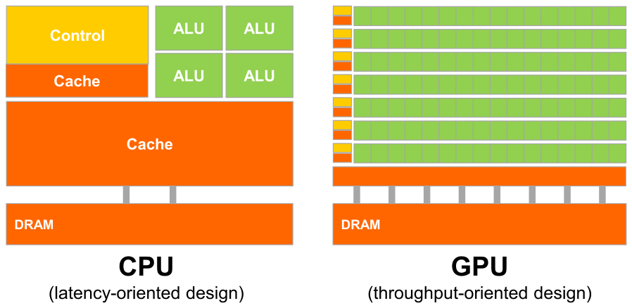
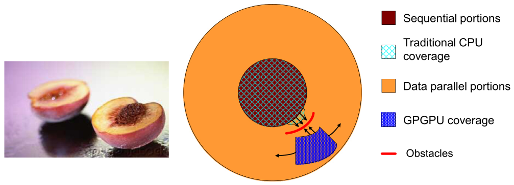
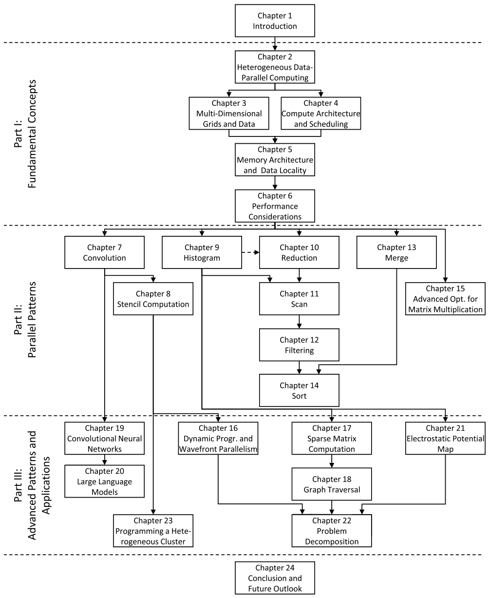

# 1장. Introduction

> **원문 범위**: 책 p.1~19 (1.1~1.7절 + References)
> **절 순서**: 책 순서를 그대로 따랐다. 재배치 없음.
> **연습문제 출처**: 이 장에는 책에 연습문제가 없다. 아래 연습문제는 원문의 수치와 논지를
> 확인하기 위해 직접 만든 것이고, 답을 함께 적었다.

이 장은 코드가 한 줄도 나오지 않는 개괄이다. 하지만 **이 책 전체가 답하려는 질문이
무엇인지**를 정하는 장이라, 여기서 잡은 관점이 뒤 23개 장에 계속 재활용된다.
특히 1.3절의 Amdahl's Law 는 "이 최적화를 할 가치가 있는가"를 판단하는 기준으로
책 전체에서 반복해서 등장한다.

---

## 들어가며 — 왜 병렬 프로그래밍인가 (책 p.1~2)

### 1. 개념적 이해

1980~90년대의 성능 향상은 **프로그래머가 아무것도 안 해도** 얻어지는 것이었다.
clock frequency 가 올라가고 하드웨어 자원이 늘어나면서, 같은 sequential 프로그램이
새 프로세서 세대마다 그냥 더 빨리 돌았다. 이 시기에 단일 CPU 마이크로프로세서는
desktop 에 GFLOPS(10⁹ FLOPS), datacenter 에 TFLOPS(10¹²  FLOPS)를 가져다주었다 (책 p.1).

이 흐름이 **2003년에 멈췄다.** 원인은 에너지 소비와 발열(heat dissipation)이다 (책 p.2).
clock frequency 를 더 올릴 수도, 한 clock 주기 안에서 하는 일을 더 늘릴 수도 없게 되자,
사실상 모든 제조사가 **한 칩에 여러 개의 물리적 CPU** 를 넣는 쪽으로 방향을 틀었다.
이 물리적 CPU 하나하나를 processor core 라고 부른다.

여기서 소프트웨어 쪽에 결정적인 변화가 생긴다. 전통적인 프로그램은 von Neumann 이
1945년 보고서에서 그린 모델대로 작성돼 있었다 (책 p.2). 이 모델에서 실행은
**program counter**(instruction pointer)가 가리키는 다음 명령을 하나씩 밟아 나가는 과정이고,
이렇게 순차적으로 밟아 나가는 실행 활동의 흐름 하나를 **thread of execution**, 줄여서
**thread** 라고 한다. 이 개념은 책 전체에서 계속 쓰이므로 여기서 정확히 잡고 간다.

문제는 이것이다 — **sequential 프로그램은 core 하나에서만 돈다.** 그런데 core 하나의
속도는 더 이상 세대마다 유의미하게 빨라지지 않는다. 그래서 sequential 프로그램은
새 프로세서가 나와도 더 빨라지지 않게 됐다. 반면 여러 thread 가 협력해 일을 나누는
**parallel 소프트웨어**는 세대마다 계속 빨라졌다. 이 격차가 극적으로 벌어진 현상을
**concurrency revolution** 이라 부른다 (책 p.2, Sutter & Larus 2005).

> **오해하기 쉬운 지점.** parallel programming 자체는 새로운 것이 아니다. HPC 커뮤니티는
> 수십 년간 해 왔다. 바뀐 것은 **누가 해야 하는가**다. 예전에는 비싼 대형 컴퓨터를 정당화할 수
> 있는 소수의 엘리트 애플리케이션만 해당됐지만, 모든 마이크로프로세서가 parallel computer 가
> 된 지금은 훨씬 많은 개발자가 이걸 알아야 한다 (책 p.3).

### 3. 예제/실습

**연습문제 0-1.** 2003년 이후 "새 CPU 를 사면 내 프로그램이 빨라진다"는 기대가 왜 더 이상
유효하지 않은가? core 개수와 thread 개수를 구분해서 한 문장으로 답하라.

> **답.** 새 CPU 는 core 를 늘려서 성능을 올리는데, sequential 프로그램은 thread 가 하나뿐이라
> core 를 하나밖에 쓰지 못하고, 그 core 하나의 속도는 세대가 바뀌어도 거의 그대로이기 때문이다.

**연습문제 0-2.** 다음 중 "thread 가 여러 개"인 상황을 모두 고르라.
(a) 한 애플리케이션이 일을 여러 명령 시퀀스로 쪼갠 경우
(b) 서로 다른 애플리케이션 여러 개를 동시에 실행하는 경우
(c) 한 애플리케이션이 더 빠른 clock 의 CPU 에서 도는 경우

> **답.** (a), (b). 책 p.2 는 "같은 애플리케이션에서 나왔든 다른 애플리케이션에서 나왔든"
> 여러 개의 instruction sequence 가 있어야 여러 core 의 이득을 본다고 말한다.
> 다만 **한 애플리케이션이 이득을 보려면** (a) 여야 한다. (c) 는 thread 수와 무관하다.

---

## 1.1 Heterogeneous parallel computing (책 p.3)

### 1. 개념적 이해

2003년 이후 반도체 업계는 두 갈래로 갈라졌다 (책 p.3).

| | multi-core | many-thread |
|---|---|---|
| 무엇을 최적화하는가 | sequential 프로그램의 **실행 속도** | parallel 애플리케이션의 **실행 throughput** |
| 대표 | Intel/AMD 서버 CPU (100+ core), ARM Ampere (최대 128 core) | NVIDIA Hopper H100 GPU (수십만 thread) |
| core 하나의 성격 | out-of-order, multiple instruction issue, 전체 x86 명령어 집합, hyper-threading 2개 | 단순한 in-order pipeline |

2022년 기준 H100 의 peak floating-point throughput 은 FP64 34 TFLOPS,
FP32 67 TFLOPS, FP16 1979 TFLOPS 다. 같은 해 서버급 CPU 는 겨우 몇 TFLOPS 수준이다 (책 p.3).

> **주의**: 이건 애플리케이션 속도가 아니라 **실행 자원이 잠재적으로 낼 수 있는 raw speed** 다
> (책 p.3). 실제로 이만큼 나오게 만드는 것이 이 책의 나머지 전부다.

#### 왜 이만큼 차이가 나는가 — 두 개의 설계 철학



*Figure 1.1 — CPU 와 GPU 는 근본적으로 다른 설계 철학을 갖는다. (책 p.4)*

**CPU: latency-oriented design** (Figure 1.1(a), 책 p.4)

sequential 코드 성능에 최적화돼 있다. 구체적으로:

- arithmetic unit 과 operand 전달 로직이 **연산 하나의 실효 latency 를 최소화**하도록 설계됨.
  대가는 unit 당 chip 면적과 전력 증가.
- 큰 last-level on-chip cache 로 자주 쓰는 데이터를 붙잡아, 긴 memory access 를
  짧은 cache access 로 바꾼다.
- 정교한 branch prediction 과 execution control 로 conditional branch 의 latency 를 줄인다.

이 모든 것이 **thread 하나의 실행 latency** 를 줄인다. 그런데 낮은 latency 의 arithmetic unit,
정교한 operand 전달 로직, 큰 cache, 복잡한 control logic 은 전부 면적과 전력을 먹는다.
그 면적과 전력을 대신 arithmetic unit 과 memory access channel 을 더 두는 데 쓸 수도 있었다.

**GPU: throughput-oriented design** (Figure 1.1(b), 책 p.5~6)

GPU 의 설계는 비디오 게임 산업의 경제적 압력이 빚어냈다. 프레임마다 엄청난 수의
floating-point 연산과 memory access 를 해내야 한다는 요구가, chip 면적과 전력 예산을
floating-point 계산과 memory access throughput 에 몰아주게 만들었다.

memory 쪽이 특히 중요하다. 많은 graphics 애플리케이션의 속도는 **DRAM 과 프로세서 사이에서
데이터를 얼마나 빨리 나를 수 있는가**로 결정된다. 게다가 게임 애플리케이션이 받아들이는
relaxed memory model 덕분에 GPU 는 memory access 를 대규모로 병렬화하기가 쉽다.
반대로 general-purpose 프로세서는 legacy OS·애플리케이션·I/O 장치의 요구를 만족시켜야 해서
memory access throughput(= **memory bandwidth**)을 올리기 어렵다.
그 결과 graphics chip 은 동시기 CPU chip 의 **약 10×** memory bandwidth 로 동작해 왔다 (책 p.5).

#### 핵심 관찰 — latency 를 줄이는 것이 throughput 을 늘리는 것보다 훨씬 비싸다

이것이 두 철학이 갈리는 진짜 이유다 (책 p.5).

- arithmetic throughput 을 **2배**로: arithmetic unit 을 2배로 → 면적 2배, 전력 2배
- arithmetic latency 를 **절반**으로: 전류를 2배로 → 면적은 2배보다 더, 전력은 **4배**

그래서 GPU 는 thread 하나의 latency 를 줄이는 대신, **엄청난 수의 thread 의 실행
throughput** 을 최적화하는 쪽을 택한다. pipelined memory channel 과 arithmetic 연산이
긴 latency 를 갖도록 허용하면 면적과 전력이 절약되고, 그만큼 더 많이 집어넣을 수 있다.

그 대신 소프트웨어가 **많은 수의 parallel thread** 로 작성돼 있어야 한다. 하드웨어는
일부 thread 가 긴 latency 의 memory access 나 연산을 기다리는 동안 **다른 할 일을 찾기 위해**
그 많은 thread 를 이용한다. Figure 1.1(b) 의 작은 cache 들은, 같은 데이터를 보는 여러 thread 가
전부 DRAM 까지 가지 않도록 bandwidth 요구를 억제하는 역할이다 (책 p.5).

> **그래서 GPU 가 항상 빠른 게 아니다.** thread 가 하나이거나 아주 적은 프로그램에서는
> 연산 latency 가 낮은 CPU 가 훨씬 낫다 (책 p.5~6). 그래서 많은 애플리케이션이 둘 다 쓴다 —
> sequential 부분은 CPU, 수치집약적 부분은 GPU. 2007년 NVIDIA 가 내놓은 **CUDA
> programming model 이 CPU-GPU 공동 실행을 지원하도록 설계된 이유**가 이것이다 (책 p.6).

#### 속도만으로 결정되지 않는다

프로세서 선택에서 속도 말고도 중요한 요인이 있다 (책 p.6).

1. **installed base** — 시장에 얼마나 깔려 있는가. 소프트웨어 개발비는 큰 고객 기반으로만
   정당화된다. 전통적 parallel computing 시스템이 실패한 지점이 여기다. GPU 는 PC 시장 덕에
   수억 대가 팔렸고, 현재 **10억 대 이상**의 CUDA 지원 GPU 가 사용 중이다.
2. **form factor 와 접근성** — 2006년까지 parallel 애플리케이션은 데이터센터 서버나
   부서 클러스터에서 돌았다. 의료영상이 좋은 예다. 64-node 클러스터로 논문을 쓰는 건 되지만,
   GE·Siemens 가 서버 랙을 얹은 MRI 를 병원에 팔 수는 없다. 실제로 미국 NIH 는 한동안
   parallel programming 과제에 연구비를 주지 않았다 — 임상 현장에서 안 돌아갈 것이라고 봤기
   때문이다. 지금은 많은 회사가 GPU 를 넣은 MRI 를 팔고 NIH 도 GPU computing 연구를 지원한다.

#### GPGPU 에서 CUDA 로

2006년까지 graphics chip 을 쓰려면 **graphics API**(OpenGL, Direct3D)를 통해야 했다.
즉 계산을 "어떤 식으로든 pixel 을 칠하는 함수"로 표현해야 실행됐다. 이 기법을
**GPGPU**(General Purpose Programming using a GPU)라 불렀다. 상위 수준 환경을 써도
결국 pixel 칠하기용 API 에 맞춰 넣어야 했고, 그래서 쓸 수 있는 애플리케이션 종류가
제한됐다 — GPGPU 가 널리 퍼지지 못한 이유다 (책 p.6).

2007년 CUDA 가 이걸 바꿨다 (책 p.7). 중요한 것은 **소프트웨어만 바뀐 게 아니라는 점**이다.
NVIDIA 는 parallel programming 을 쉽게 하려고 **실리콘 면적을 할애했다.** G80 과 후속 칩부터
GPGPU 프로그램은 graphics interface 를 아예 거치지 않고, 칩 위의 새로운 general-purpose
parallel programming interface 가 CUDA 프로그램의 요청을 처리한다.

> GPU 만 heterogeneous computing 의 가속기인 것은 아니다. FPGA 는 네트워킹 가속에 널리
> 쓰인다. 이 책이 GPU 를 학습 수단으로 다루는 기법들은 그런 가속기 프로그래밍에도 적용된다
> (책 p.7).

### 3. 예제/실습

**연습문제 1.1-1.** H100 의 FP16 throughput 은 FP64 의 몇 배인가? FP32 는 FP64 의 몇 배인가?
두 비율이 크게 다른 이유를 throughput-oriented design 관점에서 설명하라.

> **답.** 1979 / 34 ≈ **58.2×**, 67 / 34 ≈ **1.97×**.
> FP32 는 FP64 대비 대략 2× — 정밀도를 절반으로 줄이면 연산 유닛이 대략 2배 들어간다는
> 면적 논리 그대로다. 반면 FP16 의 58× 는 단순히 폭을 줄여서 나오는 수가 아니다.
> 딥러닝 수요에 맞춰 저정밀 연산을 위한 **전용 하드웨어**에 면적을 몰아준 결과다
> (이 하드웨어가 15장에 나오는 Tensor Core 다). "면적과 전력을 어디에 쓸 것인가"라는
> throughput-oriented 설계 판단이 숫자로 드러난 사례다.

**연습문제 1.1-2.** 어떤 연산의 latency 를 절반으로 줄이는 것과 throughput 을 2배로
늘리는 것 중 무엇이 더 비싼가? 전력 기준으로 답하고, 이 사실이 Figure 1.1 의 그림에서
어떻게 나타나는지 설명하라.

> **답.** latency 를 절반으로 줄이는 쪽이 훨씬 비싸다 — 전류를 2배로 흘려야 하고 전력은
> **4배**가 된다 (throughput 2배는 전력 2배). 그래서 같은 예산이면 "느리지만 많은" 쪽이
> 이긴다. Figure 1.1 에서 CPU 는 **크고 적은** ALU 와 적은 memory channel 을,
> GPU 는 **작고 많은** ALU 와 많은 memory channel 을 갖는 것으로 나타난다.

**연습문제 1.1-3.** thread 가 2개뿐인 프로그램을 GPU 로 옮기면 빨라질까?

> **답.** 거의 확실히 느려진다. GPU 는 개별 thread 의 latency 를 희생하는 대신 많은 thread 의
> throughput 을 얻는 설계다. thread 가 적으면 긴 latency 를 가려 줄 다른 일이 없어서
> 손해만 본다. 책 p.5~6 이 명시적으로 말하는 지점이다.

---

## 1.2 Why more speed or parallelism? (책 p.7)

### 1. 개념적 이해

massively parallel programming 을 하는 주된 동기는 **앞으로의 하드웨어 세대에서도
계속 빨라지기 위해서**다 (책 p.7). 병렬 실행에 적합한 애플리케이션이라면 GPU 에서 잘 구현했을 때
단일 CPU core 대비 **100× 이상**의 speedup 이 가능하고, data parallelism 이 있는 경우
**몇 시간 작업으로 10×** 를 얻는 일도 흔하다.

"지금도 충분히 빠른데 왜 더 필요한가"에 대한 책의 답은, 앞으로의 대중적 애플리케이션이
예전의 **supercomputing 애플리케이션(super-application)** 이라는 것이다 (책 p.7~8).

- **분자생물학** — 현미경 같은 전통적 기기의 관측 한계를, 경계조건을 기기로 잡고
  분자 활동을 계산으로 시뮬레이션해 넘어선다. 계산이 빨라질수록 모델링할 수 있는
  생물계의 **크기**와 시뮬레이션할 수 있는 반응 **시간**이 늘어난다.
- **비디오/오디오** — HDTV 처리 자체가 고도로 병렬적인 과정이다. view synthesis,
  저해상도 영상의 고해상도 표시 같은 새 기능이 더 많은 계산을 요구한다.
- **사용자 인터페이스** — 3차원 perspective 센서/디스플레이, 가상·물리 공간 정보를 결합한
  애플리케이션, 음성·컴퓨터비전 기반 인터페이스.
- **게임과 digital twin** — 예전 게임의 자동차 충돌은 미리 준비된 장면이라 바퀴가 휘지도
  않았다. 계산이 빨라지면 미리 짜 둔 장면 대신 **동적 시뮬레이션**에 기반할 수 있다.
  물리 현상을 정확히 모델링하는 능력은 **digital twin** 개념으로 이어진다 — 물리적 객체의
  정확한 모델을 시뮬레이션 공간에 두고 스트레스 테스트와 열화 예측을 훨씬 싸게 수행한다.
- **deep learning** — 이 절에서 가장 중요한 예다. 신경망은 1970년대부터 연구됐지만
  **labeled data 와 계산량이 너무 많이 필요해서** 실무에서 무력했다. 인터넷이 엄청난 양의
  labeled 이미지를 제공하고 GPU 가 계산 throughput 을 폭증시키자, 2012년부터
  컴퓨터비전과 자연어처리에서 빠르게 채택됐다 (책 p.8).

이 모든 새 애플리케이션의 공통점은 **물리적이고 동시적인 세계를 여러 방식과 여러 수준에서
시뮬레이션하거나 표현하며, 엄청난 양의 데이터를 처리한다**는 것이다 (책 p.8~9).
데이터가 많으면 그 서로 다른 부분에 대한 계산을 병렬로 할 수 있다 — 언젠가는 맞춰야 하지만.
그리고 대부분의 경우 **데이터 전달을 효과적으로 관리하는 것**이 달성 가능한 속도를 좌우한다.
이 데이터 관리 기법을 직관적으로 전달하는 것이 이 책의 목표다.

### 3. 예제/실습

**연습문제 1.2-1.** 신경망은 1970년대부터 있었는데 왜 2012년에야 폭발했는가?
책이 드는 두 가지 요인을 쓰고, 각각이 어느 병목을 풀었는지 대응시켜라.

> **답.** (1) 인터넷 → 대량의 **labeled data** 부족을 해소. (2) GPU → **계산 throughput** 부족을
> 해소. 책 p.8 은 신경망이 무력했던 이유로 "labeled data 가 너무 많이 필요하고 훈련에
> 계산이 너무 많이 든다"는 두 가지를 들고, 두 요인이 각각을 풀었다고 서술한다.

**연습문제 1.2-2.** 1.2절에 나온 애플리케이션들의 공통 구조를 한 문장으로 요약하고,
그 구조가 왜 병렬화에 유리한지 설명하라.

> **답.** 물리적·동시적 세계를 시뮬레이션/표현하며 대량의 데이터를 처리한다는 것이 공통점이다.
> 데이터가 많고 그 각 부분에 같은 종류의 계산이 적용되므로, 서로 다른 부분을 동시에 처리할 수
> 있다 — 2장에서 **data parallelism** 이라는 이름으로 정식화되는 성질이다.

---

## 1.3 Speeding up real applications (책 p.9)

이 절이 1장의 핵심이다. 여기서 나오는 Amdahl's Law 는 이후 모든 최적화 장에서
"이 노력이 값어치가 있는가"를 판단하는 기준으로 쓰인다.

### 1. 개념적 이해

먼저 **speedup 의 정의**부터 (책 p.9). 이건 유도된 결과가 아니라 **definition** 이다.

> 애플리케이션에 대해 시스템 A 의 시스템 B 대비 speedup 은,
> **B 에서 실행한 시간을 A 에서 실행한 시간으로 나눈 비율**이다.

예: 어떤 애플리케이션이 A 에서 10초, B 에서 200초 걸린다면 A 의 B 대비 speedup 은
200/10 = 20, 즉 **20×** 다.

핵심 통찰은 이것이다 — **parallel 시스템이 serial 시스템 대비 낼 수 있는 speedup 은
애플리케이션에서 병렬화 가능한 부분의 비율에 좌우된다.** 병렬화한 부분을 아무리 빠르게
만들어도, 병렬화하지 못한 부분은 그대로 남아 전체 시간의 하한이 된다.
이 사실을 **Amdahl's Law** 라 부른다 (책 p.9).

### 2. 수식/유도

#### 전체 유도 과정 (먼저 한 번에)

전체 실행시간을 1로 정규화하고, 병렬화 가능한 시간 비율을 $p$, 그 부분에 적용한
speedup 을 $s$ 라 하자.

$$
T_{\text{before}} = (1-p) + p \tag{1}
$$

$$
T_{\text{after}} = (1-p) + \frac{p}{s} \tag{2}
$$

$$
S_{\text{total}} = \frac{T_{\text{before}}}{T_{\text{after}}} = \frac{1}{(1-p) + \dfrac{p}{s}} \tag{3}
$$

$$
\lim_{s \to \infty} S_{\text{total}} = \frac{1}{1-p} \tag{4}
$$

#### 단계별 설명 (생략 없이)

**(1) 실행시간을 두 조각으로 쪼갠다**

Amdahl's Law 의 출발점은 모델링 가정 하나다 — 실행시간을 **병렬화할 수 있는 부분**과
**할 수 없는 부분** 딱 둘로 나눈다. 전체를 1로 정규화하면 병렬 부분이 $p$,
직렬 부분이 $1-p$ 다. 정규화는 편의일 뿐이다. speedup 이 시간의 **비율**로 정의되므로
(위 definition), 절대 시간 단위는 약분되어 사라진다.

**(2) 병렬 부분만 $s$ 배 빨라진다**

병렬화의 효과는 **$p$ 에만** 적용된다. $p$ 만큼 걸리던 일이 $p/s$ 로 줄고,
$1-p$ 는 손대지 않았으므로 그대로다. 이 "그대로 남는 항"이 Amdahl's Law 의 전부다.

**(3) 정의를 적용한다**

speedup 의 정의(B 시간 / A 시간)에 (1)과 (2)를 그대로 대입한다.
$T_{\text{before}} = (1-p) + p = 1$ 이므로 분자가 1이 되어 식 (3)이 나온다.

**(4) $s \to \infty$ 로 보낸다**

$s$ 를 무한대로 보내면 $p/s \to 0$ 이고, 분모에 $1-p$ 만 남는다.
이것이 **이 애플리케이션에서 병렬화로 얻을 수 있는 speedup 의 절대 상한**이다.
$s$ 에 전혀 의존하지 않는다는 점이 중요하다 — GPU 를 몇 장 꽂든, 하드웨어가 몇 세대
발전하든, $1/(1-p)$ 를 넘을 수 없다. 넘으려면 **$p$ 자체를 키우는 수밖에 없다.**

> **여기서 방향이 정해진다.** 그래서 이 책의 최적화 장들이 "병렬 부분을 더 빠르게"만이
> 아니라 **"직렬로 남아 있던 부분을 병렬로 끌어오기"** 에 그렇게 많은 지면을 쓴다.
> 10장의 control divergence 제거, 11장의 work efficiency, 22장의 problem decomposition 이
> 전부 $p$ 를 키우는 이야기다.

### 3. 예제/실습

#### 책에 나온 세 가지 경우 (책 p.9)

| # | $p$ | $s$ | 남은 시간 $(1-p)+p/s$ | 단축률 | 전체 speedup |
|---|---|---|---|---|---|
| ① | 30% | 100× | 0.703 | 29.70% | 1.42× |
| ② | 30% | ∞ | 0.700 | 30.00% | 1.43× |
| ③ | 99% | 100× | 0.0199 | 98.01% | 50.25× |

계산 과정을 생략 없이:

- **①** $(1-0.3) + 0.3/100 = 0.7 + 0.003 = 0.703$ → 단축률 $1 - 0.703 = 0.297 = 29.7\%$
  → speedup $= 1/0.703 = 1.4225 \approx 1.42\times$.
  책이 $1/(1-0.297)$ 로 쓴 것과 같은 값이다.
- **②** $s \to \infty$ 이므로 $1-p = 0.7$ → 단축률 30% → $1/0.7 = 1.4286 \approx 1.43\times$.
  **①과 ②의 차이가 0.01× 밖에 안 된다는 게 요점이다.** 병렬 부분을 100× 에서 무한대로
  올려도 얻는 게 거의 없다.
- **③** $(1-0.99) + 0.99/100 = 0.01 + 0.0099 = 0.0199$ → 원래의 **1.99%** 로 줄어
  speedup $= 1/0.0199 = 50.25 \approx 50\times$.

$p$ 가 30%에서 99%로 바뀌었을 뿐인데 같은 $s=100$ 에서 결과가 1.42× 와 50× 로 갈린다.

#### 검산 코드

위 표의 값을 손으로 쓴 뒤 같은 계산을 코드로 다시 해 대조했다.

```python
# 필요시: sudo apt install -y python3-numpy   (이 스니펫은 표준 라이브러리만 씀)
def speedup(p, s):
    """p = 병렬화 가능한 시간 비율, s = 그 부분의 speedup (책 1.3절 식 (3))"""
    rest = (1 - p) + (p / s if s != float('inf') else 0)
    return 1 / rest, rest

for p, s, note in [(0.30, 100, '책 ①'), (0.30, float('inf'), '책 ②'), (0.99, 100, '책 ③')]:
    S, rest = speedup(p, s)
    print(f"{note}: p={p:.0%} s={s} → 남은시간 {rest:.4f} "
          f"단축률 {1-rest:.2%} speedup {S:.2f}×")
# 책 ①: p=30% s=100 → 남은시간 0.7030 단축률 29.70% speedup 1.42×
# 책 ②: p=30% s=inf → 남은시간 0.7000 단축률 30.00% speedup 1.43×
# 책 ③: p=99% s=100 → 남은시간 0.0199 단축률 98.01% speedup 50.25×
```

#### 전체 지도

표 하나로 보면 Amdahl's Law 의 모양이 드러난다. 열은 $s$, 행은 $p$, 값은 전체 speedup 이다.

| $p$ \ $s$ | 2× | 10× | 100× | 1000× | ∞ |
|---|---|---|---|---|---|
| 30% | 1.18 | 1.37 | 1.42 | 1.43 | **1.43** |
| 50% | 1.33 | 1.82 | 1.98 | 2.00 | **2.00** |
| 90% | 1.82 | 5.26 | 9.17 | 9.91 | **10.00** |
| 99% | 1.98 | 9.17 | 50.25 | 90.99 | **100.00** |
| 99.9% | 2.00 | 9.91 | 90.99 | 500.25 | **1000.00** |

**행을 따라 오른쪽으로 갈수록 굵은 값(상한)에 붙어 버린다.** 그리고 상한 자체는
$p$ 로만 정해진다. 아래 위젯에서 직접 움직여 볼 수 있다.

<!--widget:amdahl-->

#### 책의 다른 수치들도 같은 식으로 읽힌다

- **"100× 이상을 달성하려면 작업의 99.9% 이상이 병렬 부분이어야 한다"** (책 p.10).
  표에서 확인된다 — $p=99\%$ 는 $s=\infty$ 여야 겨우 100× 다. $p=99.9\%$ 라야
  $s=1000$ 에서 500×, $s=100$ 에서도 91× 가 나온다.
- **"단순한 병렬화는 대개 DRAM bandwidth 를 포화시켜 10× 정도에 그친다"** (책 p.10).
  이건 Amdahl's Law 와 **다른 종류의 천장**이다. $p$ 가 커도 데이터를 못 나르면 소용없다.
  이 천장을 뚫는 것이 5·6장(on-chip memory 활용으로 DRAM 접근 횟수를 줄이기)의 주제다.
- **CPU 에게 공정한 기회를 주라** (책 p.10). GPU 대비 speedup 수치는 **CPU 가 그 애플리케이션에
  얼마나 잘 맞는지**도 반영한다. 대부분의 애플리케이션에는 CPU 가 훨씬 잘 하는 부분이 있다.

#### 복숭아 비유 (Figure 1.2)



*Figure 1.2 — 순차 부분과 병렬 부분의 커버리지. 순차 부분과 전통적 (단일 core) CPU 커버리지는
서로 겹친다. 기존 GPGPU 기법은 pixel 칠하기로 표현할 수 있는 계산에 한정되므로 data parallel
부분을 아주 조금만 덮는다. obstacle 은 단일 core CPU 를 data parallel 부분으로 확장하기
어렵게 만드는 전력 제약을 가리킨다. (책 p.10)*

- **씨(pit)** = sequential 부분. 병렬화 기법을 적용하려는 건 복숭아 씨를 깨무는 것과 같다.
  CPU 가 이 부분을 아주 잘 한다. 다행히 **코드의 많은 부분을 차지하더라도
  super-application 의 실행 시간에서는 작은 비중**인 경우가 많다 (책 p.10~11).
- **과육(meat)** = 병렬화하기 쉬운 부분. heterogeneous 시스템에서 극적으로 빨라진다.
- Figure 1.2 가 보여주듯 **기존 GPGPU 인터페이스는 과육의 아주 일부만** 덮었다.
  CUDA 는 훨씬 넓은 부분을 덮도록 설계됐다 (책 p.11).

**주의할 점**: 씨가 "코드의 많은 부분"이지만 "실행 시간의 작은 부분"이라는 구별이 중요하다.
Amdahl's Law 의 $p$ 는 **코드 줄 수의 비율이 아니라 시간의 비율**이다.

#### 연습문제

**연습문제 1.3-1.** 어떤 프로그램의 90% 가 병렬화 가능하다. 병렬 부분을 10× 빠르게 했을 때
전체 speedup 은? 그리고 이 프로그램의 이론적 상한은?

> **답.** $1/((1-0.9) + 0.9/10) = 1/(0.1 + 0.09) = 1/0.19 = \mathbf{5.26\times}$.
> 상한은 $1/(1-0.9) = \mathbf{10\times}$. 10× 하드웨어를 넣어 상한의 52.6% 를 얻었다.

**연습문제 1.3-2.** $s = 100$ 인 가속기로 **전체 100×** 를 얻으려면 $p$ 가 최소 얼마여야 하는가?

> **답.** $1/((1-p) + p/100) = 100$ 을 풀면 $(1-p) + p/100 = 0.01$,
> $1 - 0.99p = 0.01$, $p = 1.0$ — 즉 **$p = 100\%$, 실질적으로 불가능하다.**
> $s=100$ 짜리 가속기로는 전체 100× 를 낼 수 없다. $s=1000$ 이면 $p \ge 99.0991\%$,
> $s=\infty$ 라도 $p \ge 99\%$ 가 필요하다.
> 책이 "100× 는 99.9% 이상 병렬화한 뒤에야 나온다"고 한 이유가 이 계산이다.

**연습문제 1.3-3.** 두 팀이 있다. A팀은 병렬 부분의 $s$ 를 100× 에서 200× 로 올렸고,
B팀은 $p$ 를 90% 에서 95% 로 올렸다. 원래가 $p=90\%$, $s=100$ 이었다면 누가 더 기여했는가?

> **답.** 원래: $1/(0.1 + 0.009) = 9.17\times$.
> A팀: $1/(0.1 + 0.0045) = 9.57\times$ (+0.40).
> B팀: $1/(0.05 + 0.95/100) = 1/0.0595 = 16.81\times$ (+7.64).
> **B팀이 압도적이다.** 상한이 10× 에서 20× 로 올라갔기 때문이다.
> $p$ 를 키우는 일이 $s$ 를 키우는 일보다 값어치 있는 구간이 넓다는 것을 보여준다.

---

## 1.4 Challenges in parallel programming (책 p.11)

### 1. 개념적 이해

> "성능에 신경 쓰지 않는다면 parallel programming 은 아주 쉽다. 한 시간이면 parallel 프로그램을
> 쓸 수 있다. 그런데 성능에 신경 쓰지 않을 거면 왜 parallel 프로그램을 쓰겠는가?" (책 p.11)

책이 드는 네 가지 어려움이다.

**첫째, sequential 알고리즘과 같은 수준의 computational complexity 를 갖는 parallel 알고리즘을
설계하기 어렵다** (책 p.11). 많은 parallel 알고리즘은 sequential 판과 같은 양의 일을 하지만,
**어떤 것은 더 많은 일을 한다.** 심하면 큰 입력에서 오히려 더 느려진다. 큰 입력을 빨리
처리하는 것이 병렬화의 주요 동기인데 바로 그 지점에서 무너지므로 특히 문제다.

현실 문제 상당수가 **mathematical recurrence** 로 가장 자연스럽게 기술되는데, 이걸 병렬화하려면
직관적이지 않은 사고와 **중복 작업(redundant work)** 이 필요하다. prefix-sum(scan) 같은
알고리즘 primitive 가 순차적·재귀적 형태를 병렬 형태로 바꾸는 것을 도와준다.
**work efficiency** 개념과 그 trade-off 는 11장에서 정식으로 다룬다.

**둘째, 많은 애플리케이션의 속도가 memory access latency 나 throughput 에 묶여 있다** (책 p.11).
이런 애플리케이션을 **memory-bound** 라 하고, 하드웨어의 연산 속도에 묶인 것을
**compute-bound** 라 한다. memory-bound 에서 성능을 내려면 memory access 속도를 개선하는
방법이 필요하다 — 5장과 6장의 주제다.

**셋째, parallel 프로그램의 속도가 입력 데이터 특성에 훨씬 민감하다** (책 p.12).
불규칙하거나 예측 불가능한 데이터 크기, 고르지 않은 데이터 분포 같은 것들이
**thread 마다 일의 양을 불균등하게** 만들어 병렬 실행의 효과를 크게 떨어뜨린다.
데이터 분포를 규칙화하거나 thread 에 데이터를 배정하는 방식을 손보는 기법들이
패턴·응용 장들에서 나온다.

**넷째, 어떤 애플리케이션은 thread 간 협력이 거의 필요 없지만 어떤 것은 그렇지 않다** (책 p.12).
협력이 거의 필요 없는 쪽을 **embarrassingly parallel** 이라 부른다. 협력이 필요하면
barrier 나 atomic operation 같은 **synchronization** 연산을 써야 하는데, 이건 오버헤드다 —
thread 가 유용한 일을 하는 대신 서로를 기다리게 되기 때문이다.

> 다행히 이 어려움 대부분은 이미 연구자들이 다뤄 왔고, 응용 분야를 가로지르는 **공통 패턴**이
> 있어서 한 분야의 해법을 다른 분야에 적용할 수 있다. 이 책이 기법을 **병렬 계산 패턴과
> 응용의 맥락에서** 제시하는 주된 이유가 이것이다 (책 p.12).

### 3. 예제/실습

**연습문제 1.4-1.** 다음 상황이 네 가지 어려움 중 어디에 해당하는지 짝지어라.
(a) 이미지마다 크기가 제각각이라 어떤 thread 는 놀고 어떤 thread 는 과부하
(b) 병렬 버전이 sequential 대비 로그 배 더 많은 덧셈을 수행
(c) 모든 thread 가 하나의 카운터를 갱신하느라 줄을 섬
(d) 연산 유닛은 놀고 있는데 DRAM 만 바쁘다

> **답.** (a) 셋째 — 입력 데이터 특성 민감성. (b) 첫째 — work efficiency / computational
> complexity. (c) 넷째 — synchronization 오버헤드 (9장의 atomic·privatization 주제).
> (d) 둘째 — memory-bound.

**연습문제 1.4-2.** `memory-bound` 와 `compute-bound` 를 구분하는 기준은 무엇인가?
어떤 프로그램이 둘 중 어느 쪽인지 알아내려면 무엇을 봐야 하겠는가?

> **답.** 실행 속도를 제한하는 것이 memory access 의 latency/throughput 이면 memory-bound,
> 하드웨어의 산술 연산 수행 속도면 compute-bound 다 (책 p.11).
> 판별하려면 **연산량 대비 메모리 이동량의 비율**을 봐야 한다 — 6장에서
> arithmetic intensity 라는 이름으로 정량화된다.

---

## 1.5 Related parallel programming interfaces (책 p.12)

### 1. 개념적 이해

| 인터페이스 | 대상 | 성격 | CUDA 와의 관계 |
|---|---|---|---|
| **OpenMP** | 공유 메모리 multiprocessor (CPU 중심, GPU 로 확장됨) | 컴파일러 + 런타임. directive(명령)와 pragma(힌트)를 주면 컴파일러가 병렬 코드를 생성 | 추상화가 높아 편하지만, 효과적으로 쓰려면 **결국 같은 병렬 개념을 다 알아야 한다** |
| **MPI** | 메모리를 공유하지 않는 클러스터 | 모든 데이터 공유를 **명시적 message passing** 으로. 10만 노드 이상에서 성공적으로 실행됨 | 노드 **사이**는 MPI, 노드 **안**은 CUDA. 23장에서 함께 다룸 |
| **OpenCL** | 여러 벤더의 massively parallel 프로세서 | 2009년 Apple·Intel·AMD/ATI·NVIDIA 가 공동 개발한 표준. 언어 확장보다 **API 에 더 의존** | 핵심 개념과 기능이 CUDA 와 **놀랍도록 유사**하다 |

**OpenMP 의 장점과 한계** (책 p.12~13). 장점은 컴파일러 자동화와 런타임 지원으로 많은 세부사항을
추상화해 준다는 것이고, 그 덕에 벤더와 세대를 넘나드는 **performance portability** 를 얻는다.
한계는 그럼에도 프로그래머가 관련된 병렬 프로그래밍 개념을 **전부 이해해야** 효과적으로 쓸 수
있다는 것이다. CUDA 는 이 세부사항을 명시적으로 통제하게 해 주므로, OpenMP 를 주력으로 쓸
사람에게도 훌륭한 학습 수단이다.

**MPI 의 비용** (책 p.13). 노드 간 공유 메모리가 없어서 포팅 비용이 꽤 크다. 프로그래머가
**domain decomposition** 으로 입출력 데이터를 노드에 나누고, 데이터 교환을 위해 송수신 함수를
직접 호출해야 한다. CUDA 는 GPU 안에서 shared memory 를 제공해 이 어려움을 던다.
요즘 HPC 클러스터는 CPU/GPU 혼합 노드를 쓰고, MPI 자체가 CUDA-aware 해지고 NCCL·NVSHMEM
같은 API 도 생겼다.

**OpenCL 의 표준성** (책 p.13). OpenCL 로 개발한 애플리케이션은 OpenCL 을 지원하는 모든
프로세서에서 **수정 없이 올바르게 동작**한다. 다만 새 프로세서에서 **높은 성능**을 내려면
수정이 필요할 것이다 — 이 구별이 중요하다. 표준이 보장하는 것은 correctness 지
performance 가 아니다.

### 3. 예제/실습

**연습문제 1.5-1.** "OpenCL 로 짜면 어디서든 잘 돈다"는 말의 어디가 맞고 어디가 틀렸는가?

> **답.** **correctness** 는 맞다 — OpenCL 확장과 API 를 지원하는 프로세서에서 수정 없이
> 올바르게 동작한다. **performance** 는 틀렸다 — 새 프로세서에서 높은 성능을 내려면
> 애플리케이션을 수정해야 할 가능성이 높다 (책 p.13).

**연습문제 1.5-2.** GPU 4장이 달린 노드 8개짜리 클러스터에서 프로그램을 돌리려 한다.
노드 안과 노드 사이에 각각 어떤 인터페이스가 필요한가?

> **답.** 노드 **사이**는 메모리를 공유하지 않으므로 MPI 같은 message passing 인터페이스가
> 필요하다. 노드 **안**의 GPU 실행은 CUDA 가 담당한다. 요즘은 GPU 간 통신을 위해
> NCCL·NVSHMEM 도 쓰고 MPI 자체도 CUDA-aware 하다 — 23장의 주제다 (책 p.13).

---

## 1.6 Overarching goals (책 p.14)

### 1. 개념적 이해

책이 내세우는 세 가지 목표다.

**목표 1 — 높은 성능** (책 p.14). 하드웨어 전문성을 많이 요구하지는 않지만,
코드의 성능 거동을 **추론할 수 있을 만큼**의 병렬 하드웨어 아키텍처 개념 이해는 필요하다.
그래서 4장을 GPU 아키텍처 기초에 할애한다. 특히 **computational thinking** — 문제를
massively parallel 프로세서에서 고성능으로 실행되기 좋은 형태로 사고하는 기법 — 에 집중한다.

> 저자의 논지 하나가 눈여겨볼 만하다: 하드웨어 지식 없이 고성능 코드를 만들어 주는 도구를
> 만들려면 아마 수년이 더 걸릴 것이고, **설령 그런 도구가 나오더라도 하드웨어를 아는
> 프로그래머가 그 도구를 훨씬 잘 쓸 것**이다 (책 p.14).

**목표 2 — 올바른 기능과 신뢰성** (책 p.14). 병렬 컴퓨팅에서 미묘한 문제다.
초기 성능을 내는 것만으로는 부족하고, **디버깅할 수 있고 사용자를 지원할 수 있는 방식으로**
달성해야 한다. CUDA 는 단순한 형태의 barrier synchronization, atomicity, memory consistency 를
권장하고, 기능뿐 아니라 성능 병목까지 디버깅할 도구를 제공한다.

**목표 3 — 미래 하드웨어 세대로의 scalability** (책 p.14). 앞으로 더 병렬적인 기계가
내 코드를 오늘보다 빠르게 돌리게 하는 것. 여기서 **핵심 열쇠**를 명시한다 —
**메모리 데이터 접근을 규칙화(regularize)하고 지역화(localize)해서 critical resource 소비와
자료구조 갱신 충돌을 최소화하는 것**. 즉 고성능 기법과 미래 scalability 는 같은 것을 향한다.

### 3. 예제/실습

**연습문제 1.6-1.** 목표 3의 "핵심 열쇠" 두 단어는 무엇이며, 그것이 왜 목표 1과 같은 방향인가?

> **답.** **regularize**(규칙화)와 **localize**(지역화)다. 메모리 접근을 규칙적으로 만들면
> critical resource 소비가 줄고, 지역화하면 자료구조 갱신 충돌이 준다. 이 둘은 오늘의 하드웨어에서
> 성능을 내는 방법이면서 동시에 더 병렬적인 미래 하드웨어에서도 계속 통하는 성질이라,
> 고성능 기법 = 미래 scalability 확보 기법이 된다 (책 p.14).

**연습문제 1.6-2.** "성능이 나왔다"와 "목표 2를 달성했다"의 차이는 무엇인가?

> **답.** 목표 2는 **디버깅 가능하고 사용자 지원이 가능한 방식으로** 성능을 냈는가를 묻는다.
> 동작은 하지만 왜 그런지 모르고 재현도 안 되는 코드는 목표 2를 만족하지 못한다.

---

## 1.7 Organization of the book (책 p.15)

### 1. 개념적 이해

책은 세 부분으로 구성된다 (책 p.15).

- **Part 1 (2~6장)** — 병렬 프로그래밍, data parallelism, GPU, 성능 최적화의 기초 개념.
  GPU 프로그래머가 되기 위한 기본 지식과 기술.
- **Part 2 (7~15장)** — primitive parallel pattern.
- **Part 3 (16~23장)** — 더 정교한 pattern 과 응용. 새 기법 소개보다 **응용별 고려사항**에
  초점. 각 응용마다 병렬 실행 구조를 짜는 **대안들을 먼저 나열하고 장단점을 따진 뒤**,
  고성능에 이르는 코드 변환 단계를 밟는다.
- **24장** — 맺음말과 전망.

각 장의 역할을 원문 그대로 옮기면 다음과 같다 (책 p.15~18).

| 장 | 다루는 것 | 함께 도입되는 개념 |
|---|---|---|
| 2 | data parallelism 과 CUDA 프로그래밍 모델. vector addition 예제 | SPMD, host/device 메모리 할당·전송, kernel 함수 |
| 3 | 다차원 데이터를 다차원 thread 조직으로 다루기 | thread 의 생성·조직·자원 바인딩·데이터 바인딩 |
| 4 | GPU compute 아키텍처 — 연산 core 의 조직과 thread 스케줄링 | transparent scalability, SIMD 실행과 control divergence, multi-threading 과 latency tolerance, occupancy |
| 5 | GPU 메모리 아키텍처, CUDA 변수를 담는 특수 메모리들 | 메모리 할당·사용 언어 기능 |
| 6 | 성능 고려사항. **최적화 체크리스트로 끝난다** | 바람직한 thread 실행·메모리 접근 패턴 |
| 7 | convolution — 데이터 접근 locality 관리 | constant memory, caching |
| 8 | stencil — convolution 과 유사하나 미분방정식에서 유래 | 3차원 thread/데이터 조직, thread granularity |
| 9 | histogram | atomic operation, privatization |
| 10 | reduction tree | control divergence 와 과도한 barrier synchronization 의 영향 |
| 11 | prefix sum(scan) — 본질적으로 순차적인 계산을 병렬로 | **work efficiency** |
| 12 | filter — unstable(순서 바뀜) / stable(순서 유지) 두 형태 | thread 협력으로 atomic 줄이기, scan 의 응용 |
| 13 | parallel merge | dynamic input data 식별과 조직 |
| 14 | sorting — odd-even sort, merge sort, radix sort | 13장의 merge, 11장의 scan 에 의존 |
| 15 | matrix multiplication 재방문 | 6장 체크리스트의 고급 최적화 총동원 |
| 16 | Floyd-Warshall, Smith-Waterman | dynamic programming, wavefront parallelism |
| 17 | sparse matrix computation | 데이터 압축·padding·정렬·transposition·규칙화 |
| 18 | graph 알고리즘과 graph search | graph 구조가 알고리즘 선택에 미치는 영향 |
| 19 | convolutional neural network | tiling, convolution 패턴의 활용 |
| 20 | large language model | KV caching, batching |
| 21 | electrostatic potential map | scatter-to-gather 변환 |
| 22 | computational thinking | input-centric vs output-centric 병렬화 전략 |
| 23 | 이종 클러스터에서의 CUDA | MPI, NCCL, NVSHMEM |

> **원문의 오기 하나.** 책 p.16 은 14장 radix sort 를 두고 "which relies on the scan pattern
> covered in Chapter 14" 라고 쓰는데, scan 은 **11장**이다 (14장은 sorting 자신).
> 같은 문단이 merge 는 "Chapter 13" 으로 올바르게 가리키고 있어 단순 오기로 보인다.

#### 저자가 그린 장 의존 관계

저자는 머리말에 장 사이의 의존 관계를 그림으로 남겼다. 1장을 읽는 시점에 이 그림을 손에 쥐면
이후 학습 경로를 스스로 설계할 수 있다.



*Figure P.1 — 책의 구성. (책 머리말, p.xxiii)*

읽는 법:

- **6장이 Part 2 전체의 관문이다.** 7·9·10·13·15장이 모두 6장에서 갈라져 나온다.
- Part 2 안의 사슬: `9 → 10 → 11 → 12 → 14`, `13 → 14`, `7 → 8`.
  15장은 6장에서 바로 갈라져 나오고 **나가는 화살표가 없다** (다른 장이 의존하지 않는다).
- **Part 3 의 각 응용 장은 Part 2 의 특정 패턴 하나에 붙어 있다** —
  19장(CNN) ← 7장(convolution), 23장(multi-GPU) ← 8장(stencil),
  16장(DP) ← 9장, 17·21장 ← 14장(sort).
- Part 3 안에서는 `17 → 18`, `19 → 20`, 그리고 `16 · 18 · 21 → 22` 로 모인다.

> **이 그림은 5판에서 일부 갱신되지 않았다.** 상자 제목이 인쇄된 목차와 다른 곳이 있다 —
> 12장 "Filtering"(실제 "Filter"), 22장 "Problem Decomposition"(실제 "Algorithm selection,
> problem decomposition, and problem formulation"), 23장 "Programming a Heterogeneous
> Cluster"(실제 "Multi-GPU programming"). **의존 관계 자체는 유효하지만 제목은 목차를 따른다.**

마지막으로 저자의 교육 철학이 명시돼 있다 (책 p.17~18) — 인간은 구체적인 예에서 가장 잘
배우므로, 먼저 **특정 프로그래밍 모델의 맥락에서** 개념을 배우고 그 위에서 다른 모델로
일반화한다. CUDA 를 깊이 경험하면 CUDA 모델과 무관한 개념을 배울 때 도움이 되는
성숙함(maturity)을 얻는다.

### 3. 예제/실습

**연습문제 1.7-1.** Figure P.1 을 보고, **20장(LLM)** 을 읽기 위해 반드시 먼저 읽어야 하는
장들을 의존 관계를 따라 나열하라.

> **답.** `19 → 20` 이고 `7 → 19` 이며 `6 → 7` 이다. 그리고 Part 1 은 `1 → 2 → {3,4} → 5 → 6`
> 으로 이어진다. 따라서 최소 경로는 **1 → 2 → 3 → 4 → 5 → 6 → 7 → 19 → 20**.
> (딥러닝 배경이 얕다면 19장 앞에 부록 B 를 끼워 넣는다. 또 Flash Attention 을 제대로 보려면
> 15장의 tiling·software pipelining 이 사실상 필요하다.)

**연습문제 1.7-2.** "6장을 건너뛰고 9장(histogram)부터 보겠다"는 계획의 문제는?

> **답.** Figure P.1 에서 9장은 6장에서 직접 갈라져 나온다. 6장은 coalescing·bank conflict·
> thread coarsening 같은 최적화 도구상자와 **체크리스트**를 제공하고, 그 체크리스트가
> Part 2·3 전체에서 반복 사용된다 (책 p.16). 6장 없이는 9장의 최적화가 왜 그렇게
> 생겼는지를 알 수 없다.

**연습문제 1.7-3.** 15장은 다른 장이 의존하지 않는 잎(leaf)이다. 그렇다면 건너뛰어도 되는가?

> **답.** 의존 관계상으로는 건너뛸 수 있다. 하지만 15장은 **6장 체크리스트의 고급 최적화를
> 총동원해 matrix multiplication 을 다시 푸는 장**이라, 앞에서 배운 기법들이 실제로 어떻게
> 함께 쓰이는지 보여주는 종합편이다. 그리고 20장의 Flash Attention 이 여기의 tiling·
> software pipelining 위에 서 있으므로, LLM 이 목적이라면 사실상 필요하다.

---

## 정리

1장에서 가져갈 것을 셋으로 줄이면:

1. **CPU 와 GPU 는 우열이 아니라 서로 다른 설계 철학이다.** latency-oriented 대
   throughput-oriented. latency 를 줄이는 것이 throughput 을 늘리는 것보다 훨씬 비싸다는
   물리적 사실(전력 4배 대 2배)이 이 분기를 만들었다. 그래서 둘을 함께 쓴다.
2. **Amdahl's Law 가 최적화의 방향을 정한다.** $S = 1/((1-p) + p/s)$ 이고 상한은 $1/(1-p)$ 다.
   $s$ 를 키우는 데는 천장이 있고, 그 천장은 **$p$ 로만** 올릴 수 있다.
3. **책 전체가 두 가지 천장을 뚫는 이야기다** — Amdahl's Law 의 $p$ 천장(직렬 부분을 병렬로
   끌어오기)과 DRAM bandwidth 천장(on-chip memory 로 DRAM 접근을 줄이기).
   전자는 패턴 장들이, 후자는 5·6장이 담당한다.

다음은 2장 — 첫 CUDA kernel 을 직접 쓴다.
