# 2장. Heterogeneous data-parallel computing

> **원문 범위**: 책 p.21~43 (2.1~2.9절 + References)
> **절 순서**: 책 순서를 그대로 따랐다. 재배치 없음.
> **연습문제**: 이 장은 책에 연습문제 10개(2.9절, p.41~43)가 있다. 그것을 우선 쓰고,
> 답과 풀이를 함께 적었다. 책 문제가 닿지 않는 곳에만 직접 만든 문제를 덧붙였다.

1장이 "왜"였다면 2장은 **첫 "어떻게"** 다. 이 장 하나로 CUDA 프로그램의 뼈대가 전부 나온다 —
device memory 할당, host↔device 전송, kernel 작성, grid 실행, 컴파일. 앞으로 나올 모든
코드가 이 뼈대 위에 얹힌다.

이 장에서 가장 중요한 한 줄은 이것이다.

```cuda
int i = threadIdx.x + blockDim.x * blockIdx.x;
```

**순차 코드의 루프가 이 한 줄로 사라진다.** 루프 인덱스가 thread 의 좌표로 바뀌는 것,
그것이 CUDA 프로그래밍의 출발점이다.

---

## 2.1 Data parallelism (책 p.21)

### 1. 개념적 이해

현대 애플리케이션이 느린 이유는 대개 **데이터가 너무 많아서**다 (책 p.21).
영상 처리는 수백만~수조 개의 pixel 을, 유체 시뮬레이션은 수십억 개의 grid point 를,
분자 동역학은 수천~수십억 개의 원자를 다룬다.

그런데 이 데이터 조각 대부분은 **서로 독립적으로 처리할 수 있다.**

- color pixel 하나를 grayscale 로 바꾸는 데는 **그 pixel 의 데이터만** 있으면 된다.
- image blur 는 각 pixel 을 주변 pixel 들과 평균 내므로 **그 작은 이웃만** 있으면 된다.
- "전체 pixel 의 평균 밝기" 같은 겉보기에 전역적인 연산조차 독립적으로 실행 가능한
  작은 계산 여러 개로 쪼갤 수 있다.

이렇게 **서로 다른 데이터 조각을 독립적으로 평가하는 것**이 data parallelism 의 근거다.
data parallel 코드를 쓴다는 것은 곧 **계산을 데이터 중심으로 (재)조직해서**, 그 결과로 나온
독립적인 계산들을 병렬로 실행하는 것이다 (책 p.21).

#### 예제 — color to grayscale


*Figure 2.1 — 컬러 이미지를 grayscale 이미지로 변환. (책 p.22)*

RGB 표현에서 각 pixel 은 0(검정)에서 1(최대 강도)까지 변하는 `(r, g, b)` 튜플이다.
각 pixel 의 luminance $L$ 은 가중합으로 계산한다 (책 식 (2.1), p.22).

$$
L = r \times 0.299 + g \times 0.587 + b \times 0.114 \tag{2.1}
$$

> **계수의 합이 1이다** ($0.299 + 0.587 + 0.114 = 1.000$). 그래서 $r = g = b = v$ 인
> 무채색 pixel 은 $L = v$ 로 그대로 보존된다. 계수가 서로 다른 것은 사람 눈이
> 녹색에 가장 민감하고 파랑에 가장 둔감하기 때문이다.

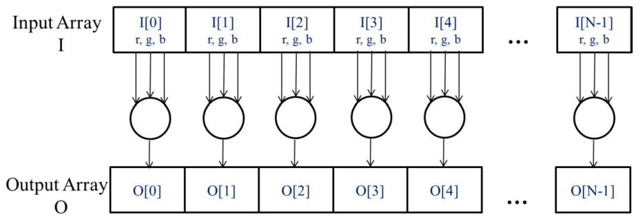

*Figure 2.2 — 컬러→grayscale 변환에서의 data parallelism. pixel 들은 서로 독립적으로
계산될 수 있다. (책 p.23)*

입력을 RGB 값의 배열 `I`, 출력을 luminance 값의 배열 `O` 로 보면 구조가 단순해진다 —
`O[0]` 은 `I[0]` 의 가중합, `O[1]` 은 `I[1]` 의 가중합, … **이 pixel 별 계산 중 어느 것도
서로에게 의존하지 않는다** (책 p.23).

#### Data parallelism vs. Task parallelism (책 p.23 사이드바)

| | data parallelism | task parallelism |
|---|---|---|
| 무엇을 나누는가 | 같은 연산을 **데이터 조각들**에 | 서로 다른 **작업(task)** 들을 |
| 어떻게 드러나는가 | 데이터 중심으로 계산을 재조직 | 애플리케이션의 task decomposition |
| 예 | pixel 100만 개를 각각 변환 | vector addition 과 matrix-vector multiplication 을 동시에 |
| 규모 | 데이터가 커지면 **같이 커진다** | 애플리케이션이 커지면 task 수가 늘지만 한계가 있다 |

책의 판단은 분명하다 — **일반적으로 data parallelism 이 병렬 프로그램 성능 향상의
주된 원천**이다 (책 p.23). 데이터가 크면 massively parallel 프로세서를 채울 만큼 풍부한
data parallelism 을 찾을 수 있고, 그래야 실행 자원이 늘어나는 다음 세대 하드웨어에서
애플리케이션 성능이 함께 자란다. 이 바람직한 성질을 **scalability** 라 부른다.
다만 task parallelism 도 성능 목표 달성에 중요한 역할을 할 수 있다.

> 분자 동역학 시뮬레이터의 task 목록 예 (책 p.23): 진동력 계산, 회전력 계산,
> 비결합력을 위한 이웃 식별, 비결합력 계산, 속도·위치 계산 등. I/O 와 데이터 전송도
> 흔한 task 의 원천이다.

### 3. 예제/실습

**연습문제 2.1-1.** 다음 연산 중 data parallelism 이 풍부한 것은? 각각 "한 출력 원소를
계산하는 데 필요한 입력 범위"로 판단하라.
(a) grayscale 변환 (b) image blur (c) 전체 pixel 의 평균 밝기 (d) 정렬(sort)

> **답.** (a) 가장 풍부 — 출력 pixel 하나에 입력 pixel 하나. (b) 풍부 — 작은 이웃만 필요.
> (c) 책은 "겉보기에 전역적이지만 독립 실행 가능한 작은 계산들로 쪼갤 수 있다"고 본다
> (책 p.21). 실제로 이것이 10장 reduction 이다. (d) 출력 한 원소의 위치가 **입력 전체**에
> 의존하므로 (a)~(c)와 성격이 다르다 — 14장에서 따로 다룬다.

**연습문제 2.1-2.** 식 (2.1)에서 계수의 합이 1인 것이 왜 중요한가?

> **답.** 합이 1이라야 무채색 pixel($r=g=b=v$)의 luminance 가 $v$ 로 보존되고,
> 전체 밝기 범위가 $[0, 1]$ 밖으로 나가지 않는다. 실제로 $0.299+0.587+0.114 = 1.000$ 이다.

---

## 2.2 CUDA C++ program structure (책 p.24)

### 1. 개념적 이해

CUDA C++ 는 C++ 를 **최소한의 새 문법과 라이브러리 함수로 확장**해서, CPU 와 GPU 를
함께 갖춘 heterogeneous 시스템을 겨냥할 수 있게 한다 (책 p.24).

핵심 구조는 **host(CPU)와 하나 이상의 device(GPU)가 공존**한다는 사실을 반영한다.

- CUDA C++ 소스 파일 하나에 **host code 와 device code 가 섞여** 있을 수 있다.
- 기본적으로 **모든 전통적 C++ 프로그램은 host code 만 있는 CUDA C++ 프로그램**이다.
  여기에 device code 를 추가하면 되고, device code 는 특별한 CUDA 키워드로 명확히 표시된다.
- device code 에는 **kernel** 이 포함된다 — data-parallel 방식으로 실행되는 함수다.

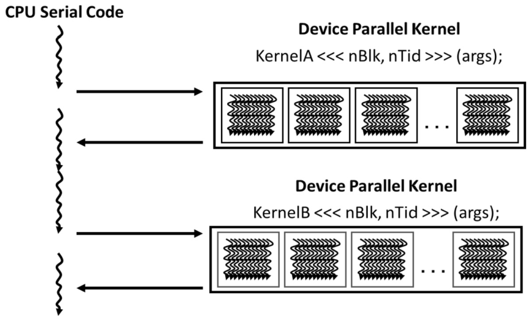

*Figure 2.3 — CUDA 프로그램의 실행. (책 p.25)*

실행 흐름은 이렇다 (책 p.24).

1. **host code(CPU 직렬 코드)로 시작**한다. Figure 2.3 에서 thread 하나를 나타내는
   구부러진 화살표 하나로 그려져 있다.
2. **kernel 이 호출되면 device 에서 엄청난 수의 thread 가 launch** 된다.
   한 번의 kernel 호출로 launch 된 모든 thread 를 통틀어 **grid** 라 부른다.
   Figure 2.3 은 grid 두 개의 실행을 보여주고, 각 grid 는 여러 개의 **block** 으로 그려져 있다.
3. **grid 의 모든 thread 가 끝나면 grid 가 종료**되고, 다음 grid 가 launch 될 때까지
   host 에서 실행이 이어진다.

> Figure 2.3 이 함축하듯 heterogeneous 애플리케이션은 **CPU 실행과 GPU 실행을 겹치게**
> 관리해서 둘 다 활용할 수 있다 (책 p.24).

#### thread 란 무엇인가 (책 p.24~25 사이드바)

1장에서 잡은 개념을 여기서 더 정확히 한다. **thread 는 현대 컴퓨터가 순차 프로그램을
실행하는 방식을 단순화한 관점**이고, 세 가지로 구성된다.

1. 프로그램의 **코드**
2. 코드에서 **지금 실행 중인 지점**
3. **변수와 자료구조의 값**

사용자가 보기에 thread 의 실행은 순차적이다. source-level debugger 로 한 문장씩 진행하며
다음에 실행될 문장과 변수 값을 확인할 수 있다. **CUDA 에서도 각 device thread 의 실행은
순차적이다.** CUDA 프로그램은 kernel 함수를 호출해서 병렬 실행을 개시하고, 그러면
런타임이 데이터의 서로 다른 부분을 처리하는 **device thread 의 grid** 를 launch 한다.

> **CPU thread 와의 결정적 차이** (책 p.25). CUDA 프로그래머는 이 thread 들이
> **아주 적은 clock cycle 로 생성·스케줄된다고 가정해도 된다** — 효율적인 하드웨어 지원
> 덕분이다. 전통적 CPU thread 가 생성·스케줄에 **수천 clock cycle** 이 드는 것과 대조된다.
> 그래서 CUDA 에서는 "thread 를 백만 개 만든다"는 말이 자연스럽다.

grayscale 변환이라면 thread 하나가 출력 pixel 하나를 계산하게 할 수 있고, 그러면
launch 해야 할 thread 수는 이미지의 pixel 수와 같다. 큰 이미지라면 수백만 개가 된다.
(실무에서는 실행·데이터 접근 효율을 위해 thread 하나가 여러 출력 pixel 을 맡게 하기도
한다 — 6장의 thread coarsening.)

### 3. 예제/실습

**연습문제 2.2-1.** "아무 CUDA 키워드도 안 쓴 평범한 C++ 파일은 CUDA C++ 프로그램인가?"

> **답.** 그렇다. 책 p.24 는 "기본적으로 모든 전통적 C++ 프로그램은 host code 만 담은
> CUDA C++ 프로그램"이라고 명시한다. 이 설계 덕분에 기존 CPU 코드를 포팅할 때
> 기존 함수 선언을 하나도 고치지 않고 kernel 만 추가해 나갈 수 있다 (2.5절에서 다시 나온다).

**연습문제 2.2-2.** grid, block, thread 를 포함 관계로 정리하고, 각각이 무엇에 의해
정해지는지 쓰라.

> **답.** grid ⊃ block ⊃ thread. **grid** 는 kernel 호출 한 번으로 launch 된 thread 전체이고,
> grid 의 block 수와 block 당 thread 수는 **host code 가 kernel 을 호출할 때** 지정한다
> (2.6절의 execution configuration). 같은 kernel 을 host code 의 다른 지점에서
> 다른 개수로 호출해도 된다 (책 p.33).

---

## 2.3 A vector addition example (책 p.26)

### 1. 개념적 이해

vector addition 은 **data parallel 계산 중 가장 단순한 것** — 순차 프로그래밍의
"Hello World" 에 해당한다 (책 p.26).

> **`_h` / `_d` 접미사 규약** (책 p.26). 이 책은 host 가 쓰는 변수에 `_h`,
> device 가 쓰는 변수에 `_d` 를 붙여 의도를 상기시킨다. 이 규약은 **코드가 아니라
> 사람을 위한 것**이다 — 컴파일러는 구분하지 않으므로, 섞어 쓰면 host 에서
> device 포인터를 역참조하는 사고가 난다 (2.4절 참조).

### 2. 코드

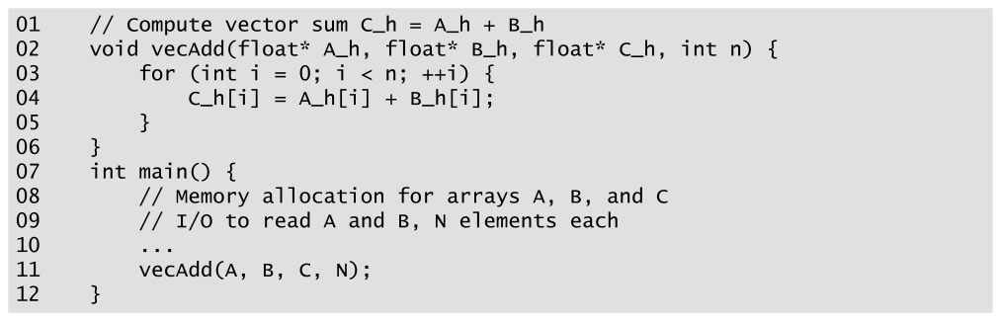

*Figure 2.4 — 간단한 전통적 vector addition C++ 코드 예. (책 p.26)*

```cpp
01  // Compute vector sum C_h = A_h + B_h
02  void vecAdd(float* A_h, float* B_h, float* C_h, int n) {
03      for (int i = 0; i < n; ++i) {
04          C_h[i] = A_h[i] + B_h[i];
05      }
06  }
07  int main() {
08      // Memory allocation for arrays A, B, and C
09      // I/O to read A and B, N elements each
10      ...
11      vecAdd(A, B, C, N);
12  }
```

- **02** — 포인터 3개와 길이 `n` 을 받는다. 매개변수에 `_h` 를 붙여 host 가 쓰는 것임을 강조한다.
- **03~05** — `for` 루프로 원소를 훑는다. $i$ 번째 반복에서 `C_h[i]` 가
  `A_h[i] + B_h[i]` 를 받는다. **이 루프가 뒤에서 grid 로 바뀐다.**
- **11** — 배열 이름 `A` 를 넘기면 그 0번 원소를 가리키는 포인터가 전달된다.

> **C++ 의 포인터** (책 p.26~27 사이드바). `float V;` 로 변수를 선언하듯
> `float *P;` 로 포인터를 선언한다. `P = &V` 로 `P` 가 `V` 를 "가리키게" 하면
> `*P` 가 `V` 의 동의어가 된다. 배열은 0번 원소를 가리키는 포인터로 접근할 수 있고,
> `P = &(A[0])` 이면 `P[i]` 가 `A[i]` 의 동의어다. **배열 이름 `A` 자체가
> 0번 원소를 가리키는 포인터다.**

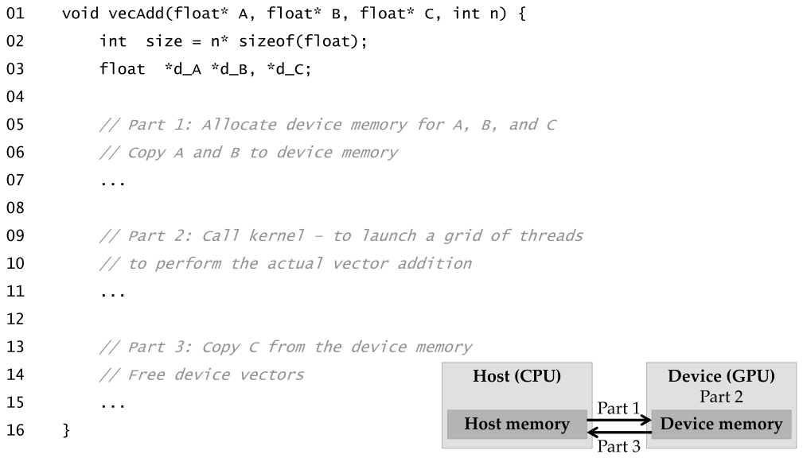

*Figure 2.5 — 작업을 device 로 옮기도록 수정한 vecAdd(host code) 함수의 개요. (책 p.27)*

수정된 `vecAdd` 는 세 부분으로 나뉜다 (책 p.27).

| | 하는 일 |
|---|---|
| **Part 1** | device memory 에 A·B·C 공간을 할당하고, A 와 B 를 host → device 로 복사 |
| **Part 2** | vector addition kernel 을 호출해 device 에 thread 의 grid 를 launch |
| **Part 3** | 합 벡터 C 를 device → host 로 복사하고, device 의 배열 3개를 해제 |

> **원문 오기 두 곳** (Figure 2.5, 책 p.27).
> ① 03번 줄이 `float  *d_A *d_B, *d_C;` 로 **`*d_A` 뒤 쉼표가 빠져 있다** — 그대로면 컴파일되지 않는다.
> ② 같은 줄이 **`d_A` 접두사**를 쓰는데, 책 본문(p.26)과 이후 모든 그림은 **`A_d` 접미사**
> 규약이다. Figure 2.8·2.13 은 `A_d` 로 되어 있다. 노트에서는 `A_d` 로 통일한다.

#### 이 구조의 한계를 저자가 먼저 밝힌다

수정된 `vecAdd` 는 본질적으로 **아웃소싱 대행업체**다 — 입력을 device 로 실어 보내고,
계산을 시키고, 결과를 걷어 온다. main 프로그램은 vector addition 이 device 에서
일어난다는 사실조차 알 필요가 없다 (책 p.28).

**그런데 이런 "투명한" 아웃소싱 모델은 실무에서 매우 비효율적일 수 있다** — 데이터를
앞뒤로 복사하는 비용 때문이다. 실제로는 크고 중요한 자료구조를 **device 에 계속 두고**,
host code 에서 그 자료구조를 다루는 device 함수만 호출하는 편이다.
여기서는 기본 구조를 소개하기 위해 단순화된 모델을 쓴다 (책 p.28).

### 3. 예제/실습

**연습문제 2.3-1.** Figure 2.4 의 `vecAdd` 를 Figure 2.5 구조로 바꿀 때, 원래 있던
`for` 루프는 어디로 가는가?

> **답.** Part 2 의 kernel 호출로 흡수된다. 루프의 각 반복이 grid 의 thread 하나가 된다.
> 책 p.37 은 이것을 **loop parallelism** 이라 부른다. 2.5절에서 다시 확인한다.

**연습문제 2.3-2.** 저자가 "투명한 아웃소싱 모델은 비효율적"이라고 미리 밝히는 이유는?
실무에서는 대신 무엇을 하는가?

> **답.** 매 호출마다 입력을 host→device, 출력을 device→host 로 복사하는 비용이
> 계산 이득을 갉아먹기 때문이다. 실무에서는 **크고 중요한 자료구조를 device 에 상주**시키고
> host 는 그 위에서 동작하는 device 함수만 호출한다 (책 p.28).

---

## 2.4 Device global memory and data transfer (책 p.28)

### 1. 개념적 이해

현재의 CUDA 시스템에서 device 는 대개 **자신만의 DRAM 을 가진 하드웨어 카드**다.
이 DRAM 을 **device global memory**, 줄여서 **global memory** 라 부른다.
NVIDIA Hopper H100 은 80 GB 또는 94 GB 의 global memory 를 갖는다 (책 p.28).

> "global" 이라 부르는 것은 **프로그래머가 접근할 수 있는 다른 종류의 device memory 와
> 구별하기 위해서**다. 메모리 종류 전체는 5장에서 다룬다 (책 p.28).

Part 1 과 Part 3 이 하는 일이 바로 이 global memory 를 다루는 것이고, CUDA 런타임
시스템(보통 host 에서 동작)이 이를 위한 API 함수를 제공한다 (책 p.28).

> 앞으로 **"데이터가 host 에서 device 로 전송된다"**는 말은
> "host memory 에서 device global memory 로 복사된다"의 줄임말로 쓴다 (책 p.28).

### 2. API

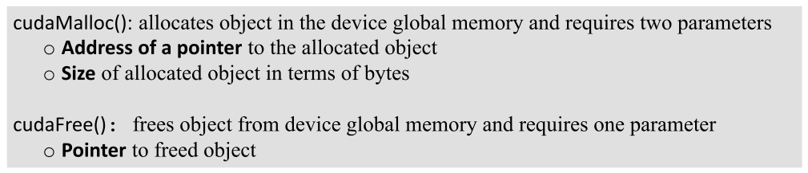

*Figure 2.6 — device global memory 를 관리하는 CUDA API 함수. (책 p.29)*

| 함수 | 매개변수 | 대응하는 C 함수 |
|---|---|---|
| `cudaMalloc()` | ① 할당된 객체를 가리킬 **포인터의 주소** ② 할당할 **크기(바이트)** | `malloc` |
| `cudaFree()` | 해제할 객체의 **포인터** | `free` |

`cudaMalloc` 과 `malloc` 의 유사성은 **의도적**이다 — CUDA C++ 는 최소한의 확장만 더한
C++ 이고, 인터페이스를 원래 런타임 라이브러리에 최대한 가깝게 유지해서 C/C++ 프로그래머의
재학습 시간을 줄인다 (책 p.29).

#### 왜 `cudaMalloc` 은 매개변수가 두 개인가

이것이 이 절에서 가장 헷갈리는 지점이다. 단계로 나누면 이렇다 (책 p.29~30).

**(1) C 의 `malloc` 은 할당된 객체의 포인터를 `return` 한다.** 그래서 매개변수가
크기 하나뿐이다.

**(2) `cudaMalloc` 은 `return` 자리를 다른 데 쓴다.** CUDA API 함수는 관례적으로
**반환값으로 오류를 보고**한다. 그러니 할당된 주소를 반환값으로 줄 수 없다.

**(3) 그래서 주소를 "써 넣을 곳"을 인자로 받는다.** 포인터 변수 자체가 아니라
**포인터 변수의 주소**(`&A_d`)를 받아야, 함수가 그 변수에 값을 써 넣을 수 있다.

**(4) 타입은 `(void**)` 로 캐스팅한다.** 메모리 할당 함수는 특정 타입에 매이지 않는
generic 함수라, 어떤 타입의 포인터 변수든 그 주소를 받아 쓸 수 있어야 하기 때문이다.

```cpp
float *A_d;
int size = n * sizeof(float);
cudaMalloc((void**)&A_d, size);   // A_d '변수의 주소'를 넘긴다 → 함수가 A_d 에 써 넣는다
...
cudaFree(A_d);                     // 해제는 A_d 의 '값'만 있으면 된다 → 주소가 아니다
```

> **`cudaFree` 는 왜 `&A_d` 가 아닌가?** `cudaFree` 는 `A_d` 의 값을 **바꿀 필요가 없다.**
> 그 값을 이용해 메모리를 가용 풀로 돌려주기만 하면 된다. 그래서 주소가 아니라
> 값만 넘긴다 (책 p.30). **`cudaMalloc` 은 쓰고, `cudaFree` 는 읽기만 한다** —
> 이 차이가 인자 형태의 차이를 만든다.

크기는 **바이트 단위**다. 원소 `n` 개의 single-precision floating-point 배열이면
오늘날 컴퓨터에서 `float` 하나가 4바이트이므로 `size` 는 `n*4` 가 된다 (책 p.30).

> **절대 하지 말 것** (책 p.30). `A_d`, `B_d`, `C_d` 의 주소는 device global memory 의
> 위치를 가리킨다. **host code 에서 이 포인터를 역참조하면 안 된다.** API 함수와
> kernel 함수를 호출할 때 넘기는 용도로만 쓴다. host code 에서 역참조하면 예외나
> 런타임 오류가 난다 — 그 주소는 host code 가 접근할 수 없는 곳이기 때문이다.

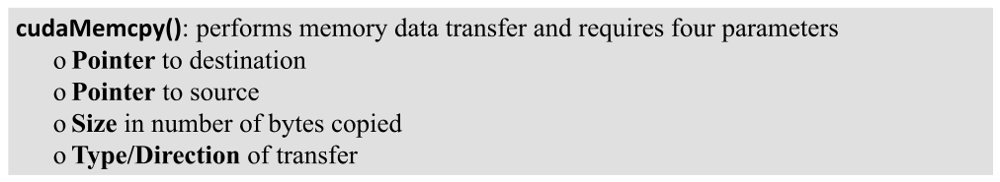

*Figure 2.7 — host 와 device 사이의 데이터 전송을 위한 CUDA API 함수. (책 p.31)*

`cudaMemcpy` 는 네 개의 매개변수를 받는다 (책 p.30).

1. **목적지** 위치의 포인터
2. **원본** 위치의 포인터
3. 복사할 **바이트 수**
4. 복사에 관여하는 메모리의 **위치** — host→host, host→device, device→host, device→device

```cpp
cudaMemcpy(A_d, A_h, size, cudaMemcpyHostToDevice);
cudaMemcpy(B_d, B_h, size, cudaMemcpyHostToDevice);
...
cudaMemcpy(C_h, C_d, size, cudaMemcpyDeviceToHost);
```

`cudaMemcpyHostToDevice` 와 `cudaMemcpyDeviceToHost` 는 CUDA 프로그래밍 환경이
미리 정의한 상수다. **같은 `cudaMemcpy` 함수로 양방향 전송을 다 한다** — 원본과 목적지
포인터의 순서를 맞추고 적절한 상수를 쓰면 된다 (책 p.31).

### 3. 예제/실습

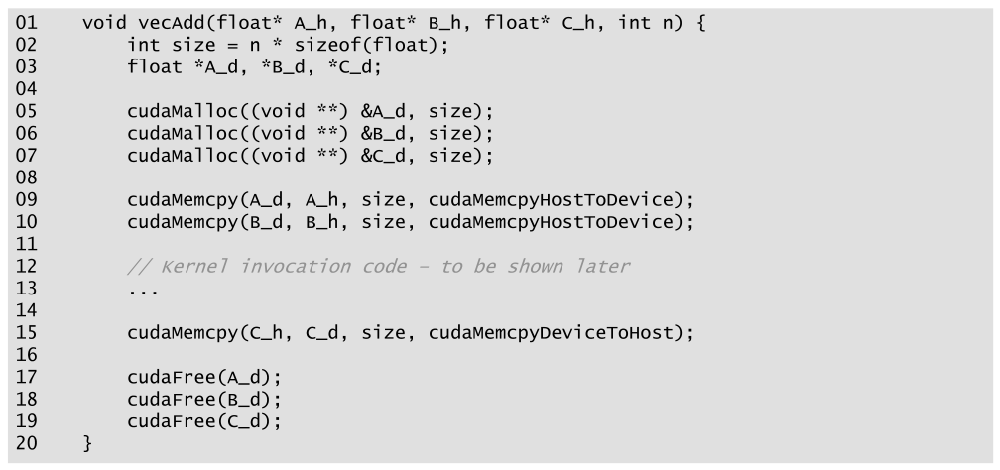

*Figure 2.8 — vecAdd 함수의 더 완전한 버전. (책 p.31)*

```cpp
01  void vecAdd(float* A_h, float* B_h, float* C_h, int n) {
02      int size = n * sizeof(float);
03      float *A_d, *B_d, *C_d;
04
05      cudaMalloc((void **) &A_d, size);
06      cudaMalloc((void **) &B_d, size);
07      cudaMalloc((void **) &C_d, size);
08
09      cudaMemcpy(A_d, A_h, size, cudaMemcpyHostToDevice);
10      cudaMemcpy(B_d, B_h, size, cudaMemcpyHostToDevice);
11
12      // Kernel invocation code - to be shown later
13      ...
14
15      cudaMemcpy(C_h, C_d, size, cudaMemcpyDeviceToHost);
16
17      cudaFree(A_d);
18      cudaFree(B_d);
19      cudaFree(C_d);
20  }
```

- **02** — 바이트 수를 한 번 계산해 재사용한다. `n * sizeof(float)`.
- **03** — device 포인터 3개. 여기서는 Figure 2.5 의 오기가 고쳐져 `A_d` 규약을 따른다.
- **05~07** — Part 1 의 할당. 세 번 모두 `&`(주소)와 `(void **)` 캐스팅이 붙는다.
- **09~10** — Part 1 의 전송. **C 는 복사하지 않는다** — 아직 값이 없고 출력이기 때문이다.
- **12~13** — Part 2. 2.6절에서 채운다.
- **15** — Part 3 의 회수. 방향 상수가 `DeviceToHost` 로 바뀌고 **인자 순서도 뒤집힌다**.
- **17~19** — Part 3 의 해제. `&` 없이 값만 넘긴다.

> **오류 검사** (책 p.32 사이드바). CUDA API 함수는 요청 처리 중 오류가 났는지를
> **플래그로 반환**한다. 대부분의 오류는 호출에 쓰인 인자 값이 부적절해서 생긴다.
> 책은 간결함을 위해 예제에서 오류 검사를 생략하지만, 실무에서는 감싸야 한다.
>
> ```cpp
> cudaError_t err = cudaMalloc((void **) &A_d, size);
> if (err != cudaSuccess) {
>     printf("%s in %s at line %d \n", cudaGetErrorString(err),
>            __FILE__, __LINE__);
>     exit(EXIT_FAILURE);
> }
> ```
>
> 이렇게 해 두면 device memory 가 부족할 때 사용자가 상황을 알 수 있다.
> **적절한 오류 검사는 디버깅 시간을 몇 시간씩 아껴 준다.** C++ 매크로로 정의하면
> 소스가 간결해진다.
>
> (책 p.32 의 코드는 `cudaError_t err = ...` 로 선언해 놓고 `if (error != cudaSuccess)`
> 로 **다른 이름**을 검사한다. 오기이므로 위에서는 `err` 로 맞췄다.)

**연습문제 (책 2.9절 5번, p.41).** `v` 개의 `int` 원소 배열을 device global memory 에
할당하려면 `cudaMalloc` 의 **두 번째** 인자로 무엇이 적절한가?
(a) `n` (b) `v` (c) `n * sizeof(int)` (d) `v * sizeof(int)`

> **답: (d)** `v * sizeof(int)`. 두 번째 인자는 **바이트 수**이고, 원소 수는 `v` 다.
> (b)는 원소 수일 뿐 바이트가 아니고, (a)·(c)는 이 문제에 없는 변수 `n` 을 쓴다.

**연습문제 (책 2.9절 6번, p.41).** `n` 개의 floating-point 원소 배열을 할당하고
포인터 변수 `A_d` 가 그것을 가리키게 하려면 `cudaMalloc` 의 **첫 번째** 인자는?
(a) `n` (b) `(void *) A_d` (c) `*A_d` (d) `(void **) &A_d`

> **답: (d)** `(void **) &A_d`. 함수가 `A_d` **에 값을 써 넣어야** 하므로 `A_d` 의
> **주소**가 필요하고, generic 함수이므로 `(void **)` 로 캐스팅한다.
> (b)는 아직 값이 없는 `A_d` 를 넘기는 것이라 함수가 결과를 돌려줄 곳이 없다.

**연습문제 (책 2.9절 7번, p.42).** host 배열 `A_h` 에서 device 배열 `A_d` 로
3000바이트를 복사하는 올바른 호출은?
(a) `cudaMemcpy(3000, A_h, A_d, cudaMemcpyHostToDevice);`
(b) `cudaMemcpy(A_h, A_d, 3000, cudaMemcpyDeviceToHost);`
(c) `cudaMemcpy(A_d, A_h, 3000, cudaMemcpyHostToDevice);`
(d) `cudaMemcpy(3000, A_d, A_h, cudaMemcpyHostToDevice);`

> **답: (c).** 순서는 **(목적지, 원본, 바이트 수, 방향)** 이다. 목적지가 device 이므로
> `A_d` 가 먼저이고 방향은 `HostToDevice`. (b)는 목적지·원본이 뒤집혔고 방향 상수도 틀렸다.

**연습문제 (책 2.9절 8번, p.42).** CUDA API 호출의 반환값을 받을 변수 `err` 의 선언은?
(a) `int err;` (b) `cudaError err;` (c) `cudaError_t err;` (d) `cudaSuccess_t err;`

> **답: (c)** `cudaError_t err;`. 책 p.32 사이드바의 코드가 이 타입을 쓴다.
> `cudaSuccess` 는 타입이 아니라 **비교에 쓰는 값**이다.

---

## 2.5 Kernel functions and threading (책 p.32)

### 1. 개념적 이해

**kernel 함수는 병렬 단계 동안 GPU thread 들이 실행할 코드를 지정한다.**
모든 thread 가 같은 코드를 실행하므로, CUDA C++ 프로그래밍은
**SPMD**(Single-Program Multiple-Data) 병렬 프로그래밍 스타일의 한 사례다 (책 p.33).

host code 가 kernel 을 호출하면 런타임이 **2단계 계층**으로 조직된 GPU thread 의 grid 를
launch 한다 (책 p.33).

- grid 는 **thread block**(줄여서 block)의 배열이다.
- **한 grid 의 모든 block 은 크기가 같다.**
- 현재 시스템에서 **block 하나는 최대 1024개의 thread** 를 담을 수 있다.

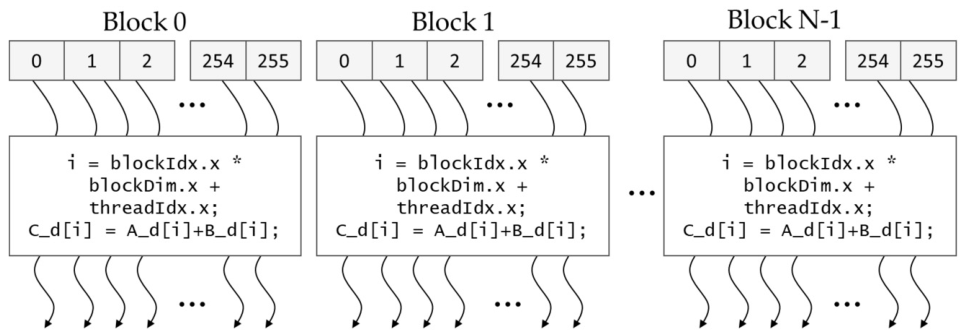

*Figure 2.9 — grid 의 모든 thread 가 같은 kernel 코드를 실행한다. (책 p.33)*

#### 세 개의 built-in 변수

kernel 은 세 개의 built-in 변수로 자기 위치를 안다 (책 p.33~34).

| 변수 | 무엇인가 | Figure 2.9 에서 |
|---|---|---|
| `blockDim` | **block 하나의 thread 수** | `blockDim.x` = 256 |
| `threadIdx` | block **안에서** 이 thread 의 고유 좌표 | 각 thread 상자 안의 0, 1, 2, … 255 |
| `blockIdx` | 이 block 의 좌표 (block 안 모든 thread 가 공유) | Block 0, Block 1, … |

`blockDim` 의 타입은 **`x`, `y`, `z` 세 개의 unsigned integer 필드를 가진 C++ struct** 다.
thread 를 1·2·3차원 배열로 조직할 수 있게 해 준다. 1차원이면 `x` 만, 2차원이면 `x`·`y`,
3차원이면 셋 다 쓴다. **차원 선택은 보통 데이터의 차원을 반영한다** — thread 는 데이터를
병렬 처리하려고 만들어지니 thread 의 조직이 데이터의 조직을 닮는 것이 자연스럽다 (책 p.33).

> **built-in 변수** (책 p.33 사이드바). 특별한 의미와 목적을 갖고, 런타임이 값을
> 미리 초기화하며, 프로그램에서는 보통 **읽기 전용**이다. 다른 용도로 재정의하지 말 것.

> **block 크기는 32의 배수로** (책 p.34). 하드웨어 효율 때문에 block 당 총 thread 수를
> 32의 배수로 하는 것이 권장된다. 이유는 4장(warp)에서 밝혀진다.

#### 전역 index 만들기 — 전화번호 비유

`threadIdx` 는 block 안에서만 고유하다. **grid 전체에서 고유한 번호**가 필요하다.

> **전화번호 비유** (책 p.34 사이드바). 미국 전화 시스템은 계층적이다. 같은 지역의
> 모든 회선은 3자리 **area code** 를 공유하고(예: 일리노이 중부는 217), 지역 안에서는
> 7자리 **local number** 로 구분된다. 회선 하나를 CUDA thread 로 보면
> **`blockIdx` 가 area code, `threadIdx` 가 local number** 다. 둘을 합치면 전국에서
> 고유한 번호가 된다.
>
> 이 계층 구조는 **locality** 도 준다 — 같은 지역에 걸 때는 local number 만 누르면 된다.
> CUDA thread 의 계층도 같은 형태의 locality 를 제공하고, 그것을 곧(5장) 배운다.

그래서 전역 index 는 이렇게 만든다 (책 p.34).

```cuda
i = blockIdx.x * blockDim.x + threadIdx.x;
```

`blockDim.x` 가 256일 때 (책 p.34):

| block | `blockIdx.x` | `i` 의 범위 |
|---|---|---|
| 0 | 0 | 0 … 255 |
| 1 | 1 | 256 … 511 |
| 2 | 2 | 512 … 767 |

세 block 이 0~767 을 **끊김 없이 덮는다**. block 을 더 많이 launch 하면 더 긴 vector 를
처리할 수 있고, **`n` 개 이상의 thread 를 launch 하면 길이 `n` 의 vector 를 처리한다.**

### 2. 코드

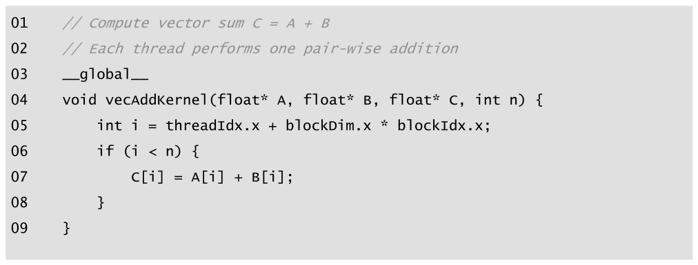

*Figure 2.10 — 간단한 vector addition kernel 함수. (책 p.35)*

```cuda
01  // Compute vector sum C = A + B
02  // Each thread performs one pair-wise addition
03  __global__
04  void vecAddKernel(float* A, float* B, float* C, int n) {
05      int i = threadIdx.x + blockDim.x * blockIdx.x;
06      if (i < n) {
07          C[i] = A[i] + B[i];
08      }
09  }
```

- **03** — `__global__` 이 "이것은 kernel 이며 device 에 thread 의 grid 를 만들 수 있다"를
  뜻한다. **밑줄이 양쪽에 두 개씩**이다.
- **04** — kernel 코드에서는 `_h`/`_d` 규약을 쓰지 않는다. 혼동의 여지가 없기 때문이다
  (예제에서 kernel 은 host memory 에 접근하지 않는다).
- **05** — 전역 index. 본문(p.34)은 `blockIdx.x * blockDim.x + threadIdx.x` 순서로 쓰고
  그림은 `threadIdx.x + blockDim.x * blockIdx.x` 순서로 쓰는데, **덧셈·곱셈은 교환법칙이
  성립하므로 같은 값**이다. 이 `i` 는 **automatic(local) 변수**라 **thread 마다 사본이 하나씩**
  생긴다. thread 를 10,000개 launch 하면 `i` 도 10,000개다. 한 thread 가 자기 `i` 에 넣은
  값은 다른 thread 에게 보이지 않는다 (책 p.37, 자세히는 5장).
- **06** — **경계 검사.** 아래에서 따로 다룬다.
- **07** — 실제 계산. 원래 루프의 몸통 그대로다.

#### 루프는 어디로 갔는가

Figure 2.4 와 Figure 2.10 을 나란히 놓으면 중요한 통찰이 나온다 (책 p.37) —
**kernel 에는 루프가 없다.**

> 루프가 **grid 로 대체**되었다. grid 전체가 루프에 해당하고,
> grid 의 thread 하나하나가 원래 루프의 반복 하나에 대응한다.
> 이것을 **loop parallelism** 이라 부른다.

이것이 2장 전체에서 가장 중요한 한 문장이다.

> **원문 오기** (책 p.37): "The kernel function in Fig. 2.10 does not have a loop that
> corresponds to the one in **Fig. 2.10**" — 뒤의 것은 **Fig. 2.4** 여야 한다.
> 같은 문단이 "Fig. 2.4 와 Fig. 2.10 을 비교하면"으로 시작하므로 단순 오기다.
> (같은 쪽에서 kernel 이름을 `vecAddVecKernel` 로 쓴 것도 그림의 `vecAddKernel` 과 다르다.)

#### 왜 `if (i < n)` 이 필요한가

**모든 vector 길이가 block 크기의 배수는 아니기 때문**이다 (책 p.37).

책의 예: 길이 100, block 크기 32.

1. 100개를 다 덮으려면 block 이 $\lceil 100/32 \rceil = 4$ 개 필요하다.
2. 그런데 4개 block 은 $4 \times 32 = 128$ 개의 thread 를 갖는다.
3. **28개가 남는다.** 이들이 원래 프로그램이 의도하지 않은 일을 하면 안 된다.
4. 모든 thread 가 같은 코드를 실행하므로, 모두가 자기 `i` 를 `n`(=100)과 비교한다.
   `if (i < n)` 덕분에 앞의 100개만 덧셈하고 뒤의 28개는 하지 않는다.

**이 검사 덕분에 kernel 이 임의 길이의 vector 를 처리할 수 있다.**

<!--widget:thread-index-->

#### 함수 선언 한정자 세 가지

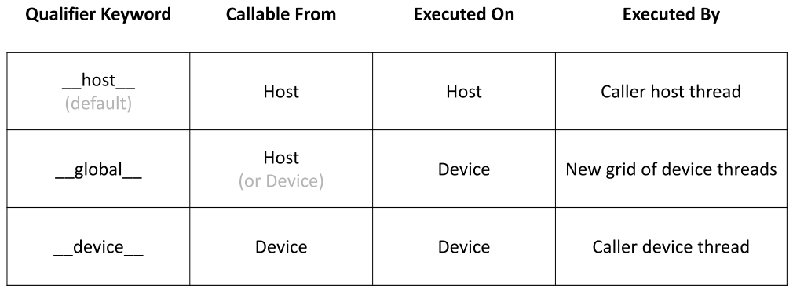

*Figure 2.11 — 함수 선언을 위한 CUDA C++ 키워드. (책 p.36)*

| 키워드 | 어디서 호출 가능 | 어디서 실행 | 누가 실행 |
|---|---|---|---|
| `__host__` (기본값) | Host | Host | 호출한 host thread |
| `__global__` | Host (또는 Device) | Device | **새 device thread grid** |
| `__device__` | Device | Device | 호출한 device thread |

- **`__global__`** — kernel 이다. 호출하면 **device 에 새 grid 가 launch 된다.**
  dynamic parallelism 을 지원하는 시스템(Kepler 이후)에서는 device 에서도 호출할 수 있다.
- **`__device__`** — device 함수다. kernel 이나 다른 device 함수에서만 호출할 수 있고,
  **호출한 device thread 가 그대로 실행한다. 새 thread 가 생기지 않는다.**
- **`__host__`** — 평범한 C++ 함수다. **키워드가 없으면 전부 host 함수가 기본값**이다.

> **`__host__` 는 왜 필요한가?** (책 p.36) 기본값이 host 인데 굳이 쓸 일이 있나 싶지만,
> **`__host__` 와 `__device__` 를 함께** 붙이는 용법이 있다. 그러면 컴파일러가
> **같은 함수의 object code 두 벌**을 만든다 — 하나는 host 용, 하나는 device 용.
> 같은 소스를 재컴파일해 device 버전을 얻고 싶을 때 쓰며, 많은 사용자 라이브러리 함수가
> 이 범주에 든다.
>
> 그리고 **모든 함수가 host 로 기본 설정되는 것 자체가 설계 의도**다 (책 p.36).
> CPU 전용 코드를 포팅할 때 원래 함수 선언을 하나도 손대지 않아도 되기 때문이다.

### 3. 예제/실습

**연습문제 (책 2.9절 1번, p.41).** grid 의 각 thread 로 vector addition 의 출력 원소
하나를 계산하려 한다. thread/block 인덱스를 데이터 인덱스 `i` 로 매핑하는 식은?
(a) `i=threadIdx.x + threadIdx.y;` (b) `i=blockIdx.x + threadIdx.x;`
(c) `i=blockIdx.x*blockDim.x + threadIdx.x;` (d) `i=blockIdx.x * threadIdx.x;`

> **답: (c).** `blockIdx.x` 에 **block 크기를 곱해야** 그 block 의 시작 위치가 나오고,
> 거기에 block 안 좌표를 더한다. (b)는 곱셈이 없어 block 마다 겹치고,
> (a)는 `y` 를 쓰는데 1차원 조직이라 항상 0이며, (d)는 blockIdx 0 이면 항상 0이 된다.

**연습문제 (책 2.9절 2번, p.41).** thread 하나가 **인접한 두 원소**를 계산하게 하려 한다.
그 thread 가 처리할 **첫 원소**의 인덱스 식은?
(a) `i=blockIdx.x*blockDim.x + threadIdx.x +2;` (b) `i=blockIdx.x*threadIdx.x*2;`
(c) `i=(blockIdx.x*blockDim.x + threadIdx.x)*2;` (d) `i=blockIdx.x*blockDim.x*2 + threadIdx.x;`

> **답: (c).** 전역 thread 번호를 먼저 구하고 **2를 곱한다.** thread 0→0·1,
> thread 1→2·3, thread 2→4·5 … 로 **인접한 두 개**를 맡는다.
> (a)는 그냥 2를 더할 뿐이라 thread 들이 겹친다.

**연습문제 (책 2.9절 3번, p.41).** thread 하나가 두 원소를 계산하되, 각 block 이
`2*blockDim.x` 개의 연속 원소를 **두 구간(section)** 으로 나눠 처리한다. 모든 thread 가
먼저 첫 구간에서 하나씩 처리하고, 그 다음 다 같이 두 번째 구간으로 옮겨 하나씩 처리한다.
**첫 원소**의 인덱스 식은? (보기는 2번과 같다)

> **답: (d)** `i=blockIdx.x*blockDim.x*2 + threadIdx.x;`
> block 이 맡는 구간의 시작이 `blockIdx.x * (2*blockDim.x)` 이고, 그 안에서
> thread 는 `threadIdx.x` 만큼 떨어진 곳을 맡는다. 두 번째 원소는 `i + blockDim.x` 다.
>
> **2번과 3번의 차이가 이 장의 숨은 요점이다.** 같은 "thread 당 2원소"인데
> (c)는 thread 마다 **인접**한 두 개, (d)는 **`blockDim.x` 만큼 떨어진** 두 개를 맡는다.
> 6장에서 (d) 쪽이 memory coalescing 에 유리하다는 것을 배운다.

**연습문제 (책 2.9절 4번, p.41).** vector 길이 8000, thread 당 출력 원소 1개,
block 크기 1024. 모든 출력 원소를 덮는 **최소 개수**의 block 으로 구성했을 때
grid 의 thread 수는? (a) 8000 (b) 8196 (c) 8192 (d) 8200

> **답: (c) 8192.** $\lceil 8000/1024 \rceil = \lceil 7.8125 \rceil = 8$ block 이고
> $8 \times 1024 = 8192$ 개다. 192개가 `if (i < n)` 에 걸려 논다.
> (a)는 thread 수가 아니라 원소 수다.

**연습문제 (책 2.9절 10번, p.42).** 어떤 신입 CUDA 프로그래머가 불평한다 —
host 와 device 양쪽에서 실행할 함수를 **두 번씩 선언**해야 해서 너무 번거롭다는 것이다.
어떻게 도와주겠는가?

> **답.** 두 번 선언할 필요가 없다. **`__host__` 와 `__device__` 를 한 선언에 함께**
> 붙이면 컴파일러가 host 용·device 용 object code 두 벌을 알아서 만들어 준다 (책 p.36).

**연습문제 2.5-1 (직접).** `if (i < n)` 을 빼면 정확히 무슨 일이 일어나는가?
길이 100, block 32 인 경우로 설명하라.

> **답.** 128개 thread 전부가 `C[i] = A[i] + B[i]` 를 실행하고, `i` = 100~127 인 28개가
> **할당 범위 밖의 device memory 를 읽고 쓴다.** 이는 다른 할당 영역을 덮어써 조용히
> 데이터를 망가뜨리거나, 매핑되지 않은 주소면 kernel 이 죽는다. 위 위젯의
> "본문 예 n=100, 32" 버튼으로 노는 28개를 눈으로 볼 수 있다.

---

## 2.6 Calling kernel functions (책 p.37)

### 1. 개념적 이해

kernel 을 만들었으면 남은 일은 host code 에서 호출해 grid 를 launch 하는 것이다.
호출할 때 **execution configuration parameter** 로 grid 와 block 의 크기를 정한다.
이 파라미터는 전통적인 C++ 인자 앞에, **`<<<` 와 `>>>` 사이**에 넣는다 (책 p.38).

1. 첫 번째 — grid 의 **block 수**
2. 두 번째 — block 하나의 **thread 수**

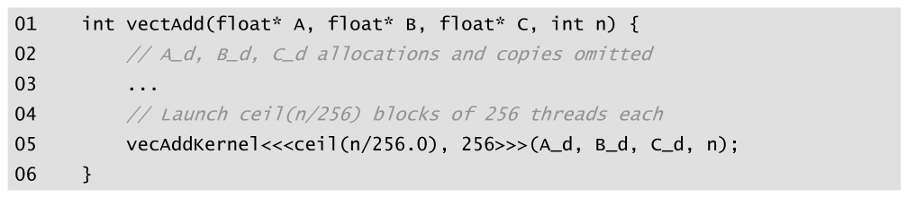

*Figure 2.12 — vector addition kernel 호출문이 있는 host code 예. (책 p.38)*

```cuda
01  void vecAdd(float* A, float* B, float* C, int n) {
02      // A_d, B_d, C_d allocations and copies omitted
03      ...
04      // Launch ceil(n/256) blocks of 256 threads each
05      vecAddKernel<<<ceil(n/256.0), 256>>>(A_d, B_d, C_d, n);
06  }
```

> **원문 오기** (Figure 2.12, 책 p.38): 01번 줄이 `int vectAdd(` 로 되어 있다.
> 함수명이 **`vectAdd`**(t 가 하나 더 있다)이고 반환형이 **`int`** 인데,
> 이 함수는 아무것도 반환하지 않으며 다른 모든 그림에서 `void vecAdd` 다.
> 위 코드에서는 `void vecAdd` 로 바로잡았다.

#### ceiling division — 왜 `256.0` 인가

모든 vector 원소를 덮을 만큼 thread 를 확보하려면 block 수를
**원하는 thread 수를 block 크기로 나눈 뒤 올림**해야 한다 (책 p.38).

$$
\text{blocks} = \left\lceil \frac{n}{256} \right\rceil \tag{2.2}
$$

책이 쓰는 방법은 `ceil(n/256.0)` 이다. **`256` 이 아니라 `256.0` 인 것이 핵심**이다 —
`n/256` 은 정수 나눗셈이라 이미 내림이 일어나 버려서 `ceil` 이 할 일이 없다.
`256.0` 을 쓰면 floating-point 나눗셈이 되어 `ceil` 이 제대로 올림한다.

예: 1000개의 thread 가 필요하면 $\lceil 1000/256.0 \rceil = \lceil 3.90625 \rceil = 4$ block,
즉 $4 \times 256 = 1024$ 개의 thread 를 launch 한다. `if (i < n)` 덕분에 앞의 1000개가
덧셈을 하고 나머지 24개는 하지 않는다 (책 p.38~39).

> **다른 방법**: 연습문제 9의 Figure 2.15 는 `(N + 128 - 1)/128` 이라는 정수 연산만
> 쓰는 관용구를 쓴다. 결과는 같고 floating-point 를 거치지 않아 더 안전하다.
> 일반형은 `(n + bs - 1) / bs` 다.

### 2. 코드

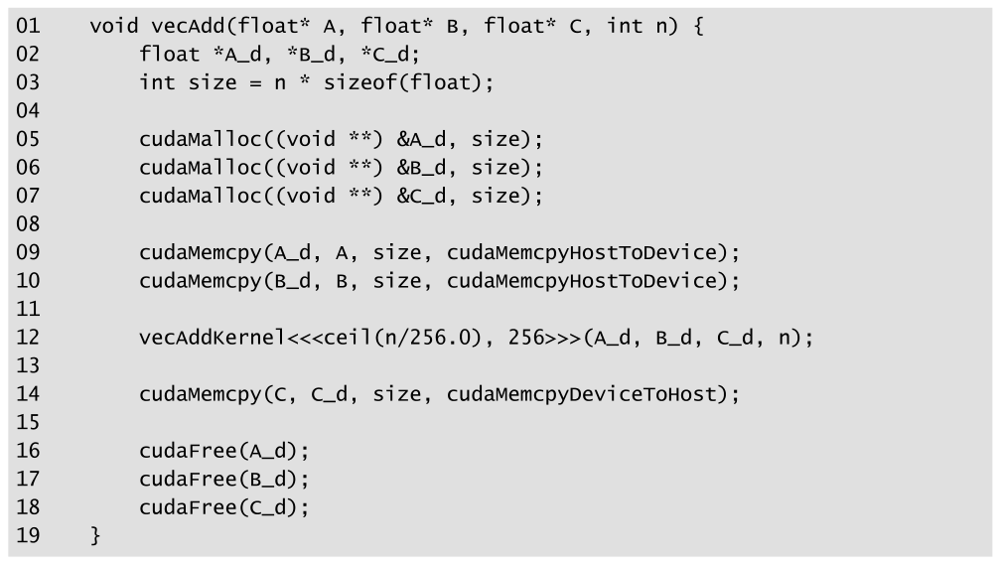

*Figure 2.13 — vector addition kernel 호출문. (책 p.38)*

```cuda
01  void vecAdd(float* A, float* B, float* C, int n) {
02      float *A_d, *B_d, *C_d;
03      int size = n * sizeof(float);
04
05      cudaMalloc((void **) &A_d, size);
06      cudaMalloc((void **) &B_d, size);
07      cudaMalloc((void **) &C_d, size);
08
09      cudaMemcpy(A_d, A, size, cudaMemcpyHostToDevice);
10      cudaMemcpy(B_d, B, size, cudaMemcpyHostToDevice);
11
12      vecAddKernel<<<ceil(n/256.0), 256>>>(A_d, B_d, C_d, n);
13
14      cudaMemcpy(C, C_d, size, cudaMemcpyDeviceToHost);
15
16      cudaFree(A_d);
17      cudaFree(B_d);
18      cudaFree(C_d);
19  }
```

이것이 **완성된 host code** 다. Figure 2.10(kernel)과 Figure 2.13(host)이 함께
host code 와 device kernel 로 이루어진 하나의 CUDA 프로그램을 이룬다 (책 p.39).

- **12** — Figure 2.8 의 `...` 자리가 채워졌다. 이 한 줄이 Part 2 전부다.
- **09·14** — Figure 2.8 과 달리 매개변수 이름에 `_h` 가 없다 (`A`, `B`, `C`).
  device 쪽만 `_d` 로 구분하는 축약형인데, 같은 장 안에서 규약이 흔들리는 셈이다.

#### 여기서 scalability 가 나온다

코드는 block 당 256 thread 로 **하드코딩**되어 있다. 그런데 **block 의 개수는 `n` 에 따라
달라진다** (책 p.39).

| `n` | block 수 |
|---|---|
| 750 | 3 |
| 4,000 | 16 |
| 2,000,000 | 7,813 |

**모든 block 은 vector 의 서로 다른 부분을 다루므로 임의의 순서로 실행될 수 있다.**
프로그래머는 **실행 순서에 대해 어떤 가정도 해서는 안 된다** (책 p.39).

그 대가로 얻는 것이 scalability 다 — 실행 자원이 적은 작은 GPU 는 한두 block 만 병렬로
실행하고, 큰 GPU 는 128개나 256개를 병렬로 실행한다. **같은 코드가 작은 GPU 에서는
느리게, 큰 GPU 에서는 빠르게 돈다.** 4장에서 다시 다룬다.

### 3. 예제/실습

**검산 코드** — 위 표와 본문 수치를 코드로 다시 계산해 대조했다.

```python
import math
for n in (750, 1000, 4000, 2_000_000):
    b = math.ceil(n / 256.0)                 # 책 2.6절의 ceil(n/256.0)
    b2 = (n + 256 - 1) // 256                # Figure 2.15 의 정수 관용구
    assert b == b2, (n, b, b2)               # 두 방법이 같은지 확인
    print(f"n={n:>9,} → {b:>5} blocks · {b*256:>9,} threads · 노는 thread {b*256-n:>4}")
# n=      750 →     3 blocks ·       768 threads · 노는 thread   18
# n=    1,000 →     4 blocks ·     1,024 threads · 노는 thread   24
# n=    4,000 →    16 blocks ·     4,096 threads · 노는 thread   96
# n=2,000,000 →  7813 blocks · 2,000,128 threads · 노는 thread  128
```

책이 든 세 수치(3, 16, 7813)와 1000개 예(4 block, 1024 thread)가 모두 일치한다.

**연습문제 (책 2.9절 9번, p.42).** Figure 2.15 의 kernel 과 host 함수를 보고 답하라.

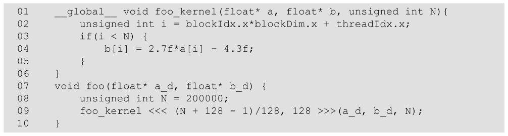

*Figure 2.15 — 연습문제 9번을 위한 CUDA 코드. (책 p.42)*

```cuda
01  __global__ void foo_kernel(float* a, float* b, unsigned int N){
02      unsigned int i = blockIdx.x*blockDim.x + threadIdx.x;
03      if(i < N) {
04          b[i] = 2.7f*a[i] - 4.3f;
05      }
06  }
07  void foo(float* a_d, float* b_d) {
08      unsigned int N = 200000;
09      foo_kernel <<< (N + 128 - 1)/128, 128 >>>(a_d, b_d, N);
10  }
```

> **답.**
> **a. block 당 thread 수** = `128` (실행 구성의 두 번째 파라미터).
> **c. grid 의 block 수** = $(200000 + 127) / 128 = 200127 / 128 = \mathbf{1563}$
>    (정수 나눗셈이라 1563.49… 가 1563으로 잘린다).
> **b. grid 의 thread 수** = $1563 \times 128 = \mathbf{200{,}064}$.
> **d. line 02 를 실행하는 thread 수** = **200,064** — `if` 보다 **앞**이라 모든 thread 가 실행한다.
> **e. line 04 를 실행하는 thread 수** = **200,000** — `i < N` 을 통과한 것만.
>    나머지 **64개**는 논다.
>
> b·d 가 같고 e 만 다른 것이 이 문제의 핵심이다. **경계 검사는 thread 를 없애지 않는다 —
> 일부가 일을 건너뛰게 할 뿐이다.**

**검산 코드**

```python
N, BS = 200000, 128
nb = (N + BS - 1) // BS
print(f"a. {BS}  b. {nb*BS:,}  c. {nb:,}  d. {nb*BS:,}  e. {N:,}  (노는 thread {nb*BS-N})")
# a. 128  b. 200,064  c. 1,563  d. 200,064  e. 200,000  (노는 thread 64)
```

**연습문제 2.6-1 (직접).** `ceil(n/256)` 이라고 썼다면(`.0` 없이) `n = 1000` 에서
무슨 일이 일어나는가?

> **답.** `n/256` 이 **정수 나눗셈**이라 `1000/256 = 3` 으로 이미 잘린다. `ceil(3)` 은 3이므로
> block 3개, thread 768개만 launch 된다. **원소 1000개 중 232개가 계산되지 않는다.**
> 게다가 `if (i < n)` 은 이 오류를 잡아 주지 못한다 — 부족한 쪽이라 아무 경고도 없이
> 결과 일부가 낡은 값으로 남는다. `256.0` 을 쓰거나 `(n + 255) / 256` 을 쓴다.

---

## 2.7 Compilation (책 p.39)

### 1. 개념적 이해

CUDA kernel 은 C++ 에 없는 확장을 쓰므로 **전통적인 C++ 컴파일러가 받아들이지 않는다.**
이 확장을 이해하는 컴파일러, 즉 **NVCC**(NVIDIA CUDA Compiler)가 필요하다 (책 p.39).

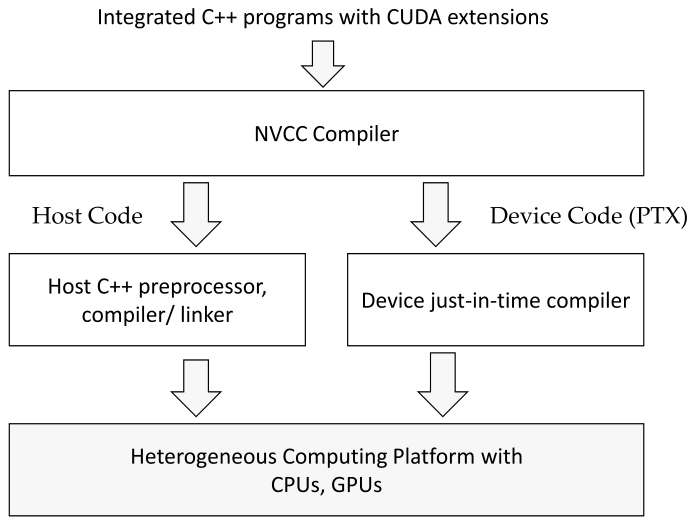

*Figure 2.14 — CUDA C++ 프로그램의 컴파일 과정 개요. (책 p.39)*

1. **NVCC 가 CUDA 키워드를 보고 host code 와 device code 를 분리**한다.
2. **host code** 는 순수 C++ 이므로 표준 C/C++ 컴파일러로 컴파일되어
   전통적인 CPU 프로세스로 실행된다.
3. **device code** 는 NVCC 가 **PTX** 라는 가상 바이너리 파일로 컴파일한다.
4. PTX 는 다시 **NVCC 의 런타임 구성요소**가 실제 object 파일로 컴파일하고,
   CUDA 지원 GPU 에서 실행된다.

> **왜 2단계인가.** PTX 는 특정 GPU 세대에 묶이지 않은 **가상 명령어 집합**이다.
> 최종 기계어 생성을 실행 시점으로 미루기 때문에, **컴파일 당시 존재하지 않던 GPU 에서도
> 같은 바이너리가 돈다.** 1장 목표 3(미래 하드웨어 세대로의 scalability)이 도구 수준에서
> 구현된 형태다.

### 3. 예제/실습

**연습문제 2.7-1 (직접).** `.cpp` 확장자로 저장한 파일에 `__global__` kernel 을 넣고
`g++` 로 컴파일하면 어떻게 되는가?

> **답.** `__global__`·`<<<>>>` 같은 확장을 `g++` 가 알지 못해 문법 오류로 실패한다.
> NVCC 로 컴파일해야 하고, 관례상 파일 확장자도 `.cu` 를 쓴다 (책 p.39).

---

## 2.8 Summary (책 p.40)

이 장이 도입한 CUDA C++ 확장을 네 갈래로 정리한다 (책 p.40).

| 갈래 | 내용 |
|---|---|
| **함수 선언** | `__global__` / `__device__` / `__host__`. 키워드가 없으면 host 함수가 기본값. `__host__`+`__device__` 를 함께 쓰면 두 버전이 생성된다 |
| **kernel 호출과 grid launch** | `<<<` 와 `>>>` 사이의 execution configuration parameter. **kernel 호출에만** 쓴다 |
| **built-in 변수** | `threadIdx`, `blockDim`, `blockIdx`. 읽기 전용이며 thread 가 자기 위치와 담당 데이터를 알아내는 수단 |
| **런타임 API** | `cudaMalloc`, `cudaFree`, `cudaMemcpy`. host code 가 호출해 device global memory 를 할당·해제하고 데이터를 옮긴다 |

> 저자가 못박는 점 (책 p.40): 이 장은 **CUDA 기능의 포괄적 설명이 아니다.**
> 병렬 컴퓨팅 개념을 다루는 데 필요한 만큼만 CUDA C++ 기능을 도입한다.
> 최신 기능은 항상 CUDA C++ Programming Guide 를 참고할 것.

---

## 정리

2장에서 가져갈 것을 넷으로 줄이면:

1. **루프가 grid 가 된다.** `for (i = 0; i < n; ++i)` 의 반복 하나하나가 thread 하나가 되고,
   루프 인덱스 `i` 는 `blockIdx.x * blockDim.x + threadIdx.x` 로 계산된다.
   이것이 loop parallelism 이고, 앞으로 나올 모든 kernel 의 첫 줄이다.
2. **CUDA 프로그램의 뼈대는 3부분이다.** ① 할당 + host→device 전송
   ② kernel launch ③ device→host 전송 + 해제. 저자 스스로 이 "투명한 아웃소싱" 모델이
   비효율적이라고 밝혔다는 점을 기억해 둘 것 — 실무에서는 데이터를 device 에 상주시킨다.
3. **`if (i < n)` 은 선택이 아니다.** vector 길이가 block 크기의 배수가 아니면
   반드시 남는 thread 가 생기고, 이들을 막지 않으면 할당 범위 밖을 건드린다.
   그리고 이 검사는 **thread 를 없애는 게 아니라 일을 건너뛰게 할 뿐**이다 (연습문제 9의 d·e).
4. **block 실행 순서를 가정하지 마라.** 이 제약이 곧 scalability 의 대가이자 원천이다.
   같은 코드가 GPU 크기에 따라 알아서 빨라진다.

다음은 3장 — 다차원 grid 로 이미지 같은 2차원 데이터를 다룬다.
