# 3장. Multidimensional grids and data

> **원문 범위**: 책 p.45~65 (3.1~3.5절 + 연습문제 5개)
> **절 순서**: 책 순서를 그대로 따랐다. 재배치 없음.
> **연습문제**: 책 연습문제 5개를 우선 쓰고 답·풀이를 붙였다. 책이 닿지 않는 곳에만
> 직접 만든 문제를 덧붙였다.
> **책 편집 특이점**: 2장은 "2.9 Exercises", 4장은 "4.10 Exercises" 라는 절이 있는데
> **3장에는 연습문제 절 제목이 없다.** 5개 문제가 3.5 Summary 끝에 번호만 달린 채 이어진다
> (인쇄된 목차도 3.5까지만 있다). 노트에서는 각 문제를 관련 절 아래로 옮겨 배치했다.

2장은 1차원이었다. 3장은 **grid 와 block 이 최대 3차원**이라는 사실과, 그것을
**다차원 데이터에 어떻게 대응시키는가**를 다룬다. 핵심 질문은 둘이다.

1. thread 의 좌표를 어떻게 데이터의 좌표로 바꾸는가 → `row`, `col` 계산
2. 다차원 데이터를 1차원 메모리에 어떻게 눕히는가 → **row-major 선형화** `row*Width + col`

이 두 식이 3장의 전부이고, 7장 convolution·8장 stencil·15장 matmul 까지 계속 재활용된다.

---

## 3.1 Multidimensional grid organization (책 p.45)

### 1. 개념적 이해

2장에서 본 2단계 계층을 정확히 다시 말하면 이렇다 (책 p.45~46).

> **grid 는 block 의 3차원 배열이고, 각 block 은 thread 의 3차원 배열이다.**

kernel 을 호출할 때 각 차원의 크기를 execution configuration parameter 로 지정한다.

| 파라미터 | 무엇을 정하는가 | kernel 안에서 읽는 built-in 변수 |
|---|---|---|
| 첫 번째 | grid 의 크기 (**block 개수**) | `gridDim.x/.y/.z` |
| 두 번째 | 각 block 의 크기 (**thread 개수**) | `blockDim.x/.y/.z` |

두 파라미터의 타입은 **`dim3`** — `x`, `y`, `z` 세 원소를 갖는 정수 vector 타입이다.
**안 쓰는 차원은 크기를 1로 두면 된다.**

```cpp
dim3 dimGrid(32, 1, 1);
dim3 dimBlock(128, 1, 1);
vecAddKernel<<<dimGrid, dimBlock>>>(...);      // grid 의 thread = 128 * 32 = 4096
```

> **변수 이름은 아무래도 된다** (책 p.46). `dimGrid`·`dimBlock` 은 프로그래머가 정한
> host code 변수일 뿐이다. 타입이 `dim3` 이기만 하면 된다 — 책은 일부러
> `dim3 dog(32,1,1); dim3 cat(128,1,1); vecAddKernel<<<dog, cat>>>(...);` 라는
> 예를 들어 이 점을 못박는다.
>
> **반면 kernel 안의 `gridDim`·`blockDim` 은 이름을 바꿀 수 없다** (책 p.47).
> 이들은 CUDA C++ 명세의 일부인 built-in 변수이고, 항상 grid 와 block 의 차원을 반영한다.

#### 2장의 `<<<ceil(n/256.0), 256>>>` 은 축약형이었다

`dim3` 로 쓰면 이렇게 된다 (책 p.46).

```cpp
dim3 dimGrid(ceil(n/256.0), 1, 1);
dim3 dimBlock(256, 1, 1);
vecAddKernel<<<dimGrid, dimBlock>>>(...);
```

CUDA 는 1D grid·block 을 위한 **축약 표기**를 제공한다 — `dim3` 변수 대신 산술식을
그대로 쓰면 컴파일러가 그 값을 `x` 차원으로 삼고 `y`·`z` 는 1로 가정한다.
그래서 2장의 `vecAddKernel<<<ceil(n/256.0), 256>>>(...)` 이 성립한다.

> **왜 되는가** (책 p.47). C++ 의 **생성자와 기본 매개변수** 덕분이다.
> `dim3` 생성자의 매개변수 기본값이 전부 1이라, `dim3` 자리에 값 하나를 넘기면
> 그것이 첫 번째 매개변수로 가고 나머지 둘은 기본값 1을 받는다.
> 결과는 `x` 만 그 값이고 `y`·`z` 는 1인 1D grid/block 이다.

#### 한계값

| 항목 | 허용 범위 | 출처 |
|---|---|---|
| `gridDim.x` | 1 ~ $2^{31}-1$ | 책 p.47 |
| `gridDim.y`, `gridDim.z` | 1 ~ $2^{16}-1$ (65,535) | 책 p.47 |
| `blockIdx.x` | 0 ~ `gridDim.x`−1 (y·z 도 동일) | 책 p.47 |
| **block 하나의 총 thread 수** | **최대 1024** | 책 p.47 |

block 의 1024 제한은 **세 차원에 어떻게 나누든 총합만 넘지 않으면 된다** (책 p.47).

- 허용: `(512, 1, 1)`, `(8, 16, 4)`, `(32, 16, 2)` → 각각 512, 512, 1024
- 불가: `(32, 32, 2)` → 2048 > 1024

#### grid 와 block 의 차원 수는 서로 달라도 된다

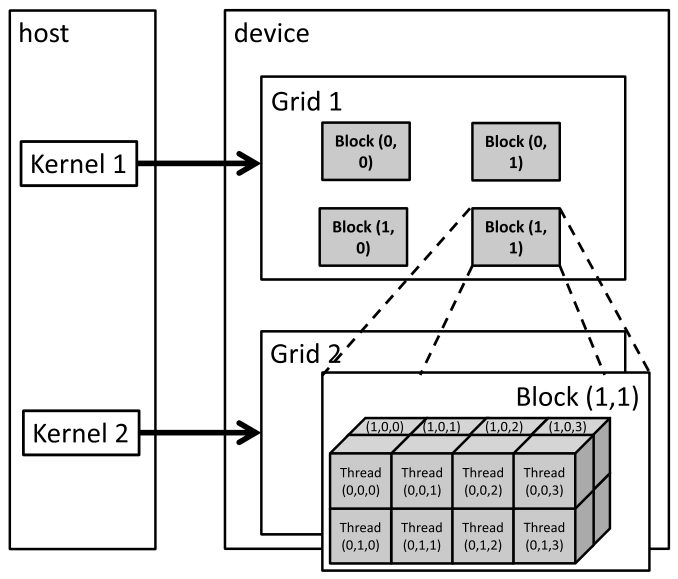

*Figure 3.1 — CUDA grid 조직의 다차원 예. (책 p.48)*

```cpp
dim3 dimGrid(2, 2, 1);
dim3 dimBlock(4, 2, 2);
KernelFunction<<<dimGrid, dimBlock>>>(...);
```

- grid: block 4개가 2×2 배열. 각 block 은 **(blockIdx.y, blockIdx.x)** 로 이름 붙는다.
  예: Block (1,0) 은 `blockIdx.y = 1`, `blockIdx.x = 0`.
- block: thread 16개가 4×2×2 배열. 예: Thread (1,0,2) 는
  `threadIdx.z = 1`, `threadIdx.y = 0`, `threadIdx.x = 2`.
- 총 4 block × 16 thread = **64 thread**.

> **⚠️ 순서가 뒤집힌다 — 이 장에서 가장 헷갈리는 지점** (책 p.48).
> 그림의 라벨은 **높은 차원이 먼저** 온다 — `(z, y, x)`.
> 그런데 코드에서 configuration parameter 를 줄 때는 **낮은 차원이 먼저**다 — `dim3(x, y, z)`.
>
> | | 순서 | 예 |
> |---|---|---|
> | 코드 (`dim3`) | **x, y, z** | `dim3 dimBlock(4, 2, 2)` → x=4, y=2, z=2 |
> | 그림·본문 라벨 | **z, y, x** | Thread (1, 0, 2) → z=1, y=0, x=2 |
>
> 책은 이 역순 라벨이 **다차원 데이터 인덱스로의 매핑을 그릴 때 더 낫기 때문**이라고
> 밝힌다. 3.2절에서 그 이유가 드러난다 — 데이터 쪽도 `P[y][x]` 처럼 높은 차원이 먼저다.

### 3. 예제/실습

**연습문제 3.1-1.** 다음 `blockDim` 중 허용되지 않는 것은? 이유를 쓰라.
(a) `(1024, 1, 1)` (b) `(32, 32, 1)` (c) `(16, 16, 4)` (d) `(8, 8, 8)`

> **답.** 전부 **허용된다.** (a) 1024, (b) 1024, (c) 1024, (d) 512 — 모두 1024 이하다.
> 제한은 **총 thread 수**이지 개별 차원이 아니다 (책 p.47). 책이 든 불가 예는
> `(32, 32, 2)` = 2048 이다.

**연습문제 3.1-2.** `dim3 dimBlock(4, 2, 2)` 로 만든 block 에서 Thread (1,0,2) 의
`threadIdx.x`·`.y`·`.z` 는 각각 무엇인가?

> **답.** 라벨은 `(z, y, x)` 순이므로 `threadIdx.z = 1`, `threadIdx.y = 0`,
> `threadIdx.x = 2` 다 (책 p.48). **`dim3(4, 2, 2)` 의 인자 순서 `(x, y, z)` 와
> 반대**라는 점이 핵심이다.

---

## 3.2 Mapping threads to multidimensional data (책 p.48)

### 1. 개념적 이해

**1D·2D·3D thread 조직의 선택은 보통 데이터의 성질에서 나온다** (책 p.48).
그림은 pixel 의 2D 배열이니, 2D block 으로 이루어진 2D grid 를 쓰는 편이 편하다.

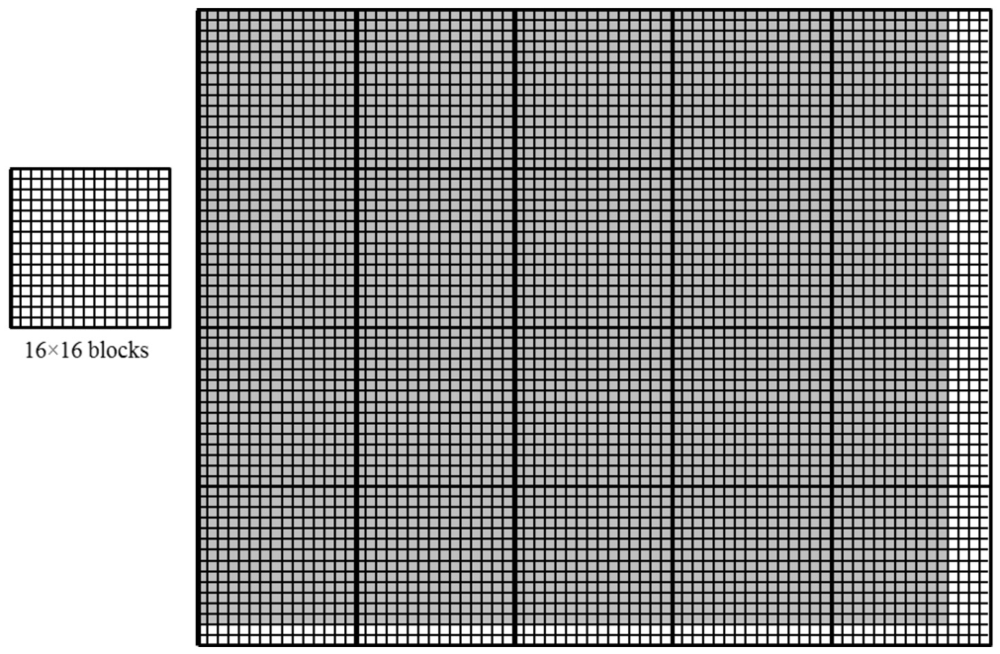

*Figure 3.2 — 62×76 그림 `Pin` 을 처리하는 2D thread grid. (책 p.49)*

62×76 그림(세로 62, 가로 76)을 16×16 block 으로 덮으면:

- y 방향 block $\lceil 62/16 \rceil = 4$ 개, x 방향 block $\lceil 76/16 \rceil = 5$ 개 → **20 block**
- thread 는 $64 \times 80$ 개 → **y 로 2개, x 로 4개가 남는다**

각 thread 가 맡을 pixel 좌표는 이렇게 나온다 (책 p.49).

$$
\text{row} = \texttt{blockIdx.y} \times \texttt{blockDim.y} + \texttt{threadIdx.y} \tag{3.1}
$$

$$
\text{col} = \texttt{blockIdx.x} \times \texttt{blockDim.x} + \texttt{threadIdx.x} \tag{3.2}
$$

2장의 `i = blockIdx.x*blockDim.x + threadIdx.x` 와 **똑같은 식을 축마다 한 번씩** 쓴 것뿐이다.

예: Block (1,0) 의 Thread (0,0) → row $= 1 \times 16 + 0 = 16$, col $= 0 \times 16 + 0 = 0$
→ $Pin_{16,0}$ (책 p.50).

> **⚠️ 차원 순서 규약** (책 p.49 각주 1). 이 책은 다차원 데이터의 차원을
> **내림차순**(z → y → x)으로 부른다. 세로 $n$, 가로 $m$ 인 그림은 **$n \times m$** 그림이다.
> C++ 다차원 배열 인덱싱 규약(`P[y][x]`)을 따른 것이다.
>
> **그런데 이 순서는 `gridDim`·`blockDim` 의 차원 순서와 반대다.** 책이 각주에서
> 직접 "특히 헷갈릴 수 있다"고 인정한다. 3.1절의 라벨 역순과 같은 뿌리의 문제다.

host code 는 이렇게 된다 (책 p.50).

```cpp
dim3 dimGrid(ceil(m/16.0), ceil(n/16.0), 1);   // x 가 가로(m), y 가 세로(n) — 순서 주의
dim3 dimBlock(16, 16, 1);
colorToGrayscaleConversion<<<dimGrid, dimBlock>>>(Pin_d, Pout_d, m, n);
```

1500×2000 (300만 pixel) 그림이면 y 로 94개, x 로 125개 → **11,750 block** 이 생기고,
kernel 안에서 `gridDim.x`, `gridDim.y`, `blockDim.x`, `blockDim.y` 는 각각
125, 94, 16, 16 이 된다 (책 p.50).

#### 왜 손으로 선형화해야 하는가

이 절의 두 번째 핵심이다. `Pin_d[j][i]` 처럼 쓰고 싶지만 **CUDA C++ 에서는 안 된다.**
이유를 단계로 나누면 (책 p.50~51):

1. C++ 표준은 `Pin` 을 2D 배열로 접근하려면 **열 개수를 컴파일 시점에 알아야** 한다.
2. 그런데 **동적 할당 배열은 그 정보가 컴파일 시점에 없다.**
3. 게다가 그것이 동적 할당을 쓰는 **이유** 중 하나다 — 실행 시점의 데이터 크기에 따라
   배열의 크기와 차원이 달라지게 하려는 것. 즉 **설계상 알 수 없다.**
4. 그래서 프로그래머가 직접 **선형화(linearize) 또는 평탄화(flatten)** 해야 한다.

> **사실 C·C++ 의 모든 다차원 배열은 선형화된다** (책 p.50). 현대 컴퓨터가
> "평평한(flat)" 메모리 공간을 쓰기 때문이다. **정적 할당** 배열에서는 컴파일러가
> `Pin_d[j][i]` 같은 문법을 허용하고 **내부적으로 알아서 1D offset 으로 번역**한다.
> **동적 할당**에서는 번역에 필요한 차원 정보가 없어서 그 일이 프로그래머에게 넘어온다.

> **memory space** (책 p.51 사이드바). 프로세서가 메모리를 보는 단순화된 관점이고,
> 보통 실행 중인 애플리케이션마다 하나씩 딸린다. 각 위치는 대개 **1바이트**를 담고
> **주소**를 갖는다. 여러 바이트가 필요한 변수(`float` 4바이트, `double` 8바이트)는
> **연속된 위치**에 저장된다. 데이터를 읽을 때 프로세서는 **시작 주소와 바이트 수**를 준다.
> 위치마다 주소가 **하나뿐**이라 이 조직을 "flat" 하다고 부르고,
> 그래서 모든 다차원 배열이 결국 1차원으로 평탄화된다.

#### row-major vs column-major

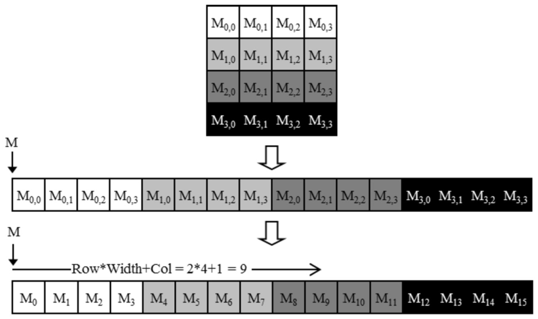

*Figure 3.3 — 2D C++ 배열의 row-major 배치. 한 행에 `Width` 개의 원소가 있는 배열에서
$j$ 행 $i$ 열 원소는 $j \times Width + i$ 라는 인덱스 식으로 접근된다. (책 p.52)*

| 배치 | 무엇을 연속으로 두는가 | 쓰는 곳 |
|---|---|---|
| **row-major** | 같은 **행**의 원소들 | **C / C++ / CUDA C++** |
| **column-major** | 같은 **열**의 원소들 | FORTRAN |

row-major 의 인덱스 식은 이렇다 (책 p.52).

$$
\text{1D index of } M_{j,i} = j \times Width + i \tag{3.3}
$$

- $j \times Width$ — **$j$ 행 앞의 모든 행을 건너뛴다.**
- $i$ — **그 행 안에서 올바른 원소를 고른다.**

$4 \times 4$ 행렬에서 $M_{2,1}$ 의 1D 인덱스는 $2 \times 4 + 1 = 9$, 즉 $M_9$ 다.

> **column-major 는 transpose 의 row-major 와 같다** (책 p.52). FORTRAN 출신이라면
> CUDA C++ 가 row-major 라는 점을 유의해야 한다. FORTRAN 프로그램용으로 설계된
> C 라이브러리들이 column-major 를 쓰는 경우가 많아서, 그 매뉴얼은 대개
> "C/C++ 에서 부를 거면 입력 배열을 transpose 하라"고 안내한다.

### 2. 코드

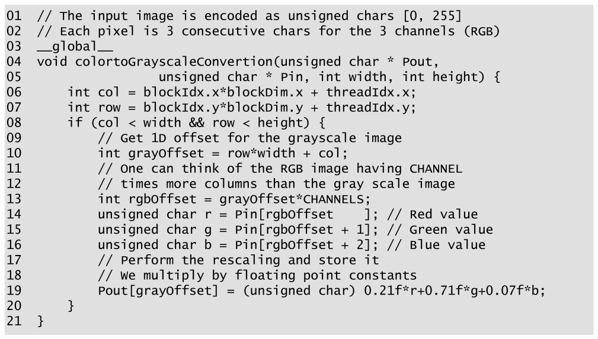

*Figure 3.4 — 2D thread-데이터 매핑을 쓴 `colorToGrayscaleConversion` 의 소스 코드. (책 p.53)*

```cuda
01  // The input image is encoded as unsigned chars [0, 255]
02  // Each pixel is 3 consecutive chars for the 3 channels (RGB)
03  __global__
04  void colorToGrayscaleConversion(unsigned char * Pout,
05                    unsigned char * Pin, int width, int height) {
06      int col = blockIdx.x*blockDim.x + threadIdx.x;
07      int row = blockIdx.y*blockDim.y + threadIdx.y;
08      if (col < width && row < height) {
09          // Get 1D offset for the grayscale image
10          int grayOffset = row*width + col;
11          // One can think of the RGB image having CHANNEL
12          // times more columns than the gray scale image
13          int rgbOffset = grayOffset*CHANNELS;
14          unsigned char r = Pin[rgbOffset    ];  // Red value
15          unsigned char g = Pin[rgbOffset + 1];  // Green value
16          unsigned char b = Pin[rgbOffset + 2];  // Blue value
17          // Perform the rescaling and store it
18          // We multiply by floating point constants
19          Pout[grayOffset] = (unsigned char) 0.21f*r + 0.71f*g + 0.07f*b;
20      }
21  }
```

- **06~07** — 식 (3.1)·(3.2). x 가 `col`, y 가 `row` 다. **`col` 이 먼저 나온다는 점**에
  주의 — 데이터 쪽 표기 $P_{row,col}$ 과 순서가 반대다.
- **08** — 2D 판 경계 검사. `col < width && row < height` **둘 다** 통과해야 한다.
- **10** — 식 (3.3). 출력 grayscale 이미지의 1D 인덱스. 출력 pixel 하나가
  1바이트(`unsigned char`)라 이 값이 곧 `Pout` 의 인덱스다.
- **13** — 입력은 pixel 하나가 `(r, g, b)` **3바이트**라 `CHANNELS`(=3)를 곱한다.
  주석의 표현이 좋다 — "RGB 이미지는 grayscale 이미지보다 열이 `CHANNEL` 배 많다고
  생각하면 된다."
- **14~16** — 연속한 세 바이트에서 r·g·b 를 읽는다.
- **19** — 가중합을 계산해 `Pout` 에 쓴다.

> **원문 오기 세 곳** (Figure 3.4 · 책 p.53).
> ① **04번 줄의 함수 이름이 `colortoGrayscaleConvertion`** 이다 — 본문과 호출 예에서는
>    `colorToGrayscaleConversion` 인데, 그림에서는 `To` 의 `t` 가 소문자이고
>    `Conversion` 이 **`Convertion`** 으로 잘못 적혀 있다. 위 코드에서는 바로잡았다.
> ② **19번 줄의 계수가 본문과 다르다.** 그림은 `0.21f / 0.71f / 0.07f` 인데
>    본문(책 p.52)과 2장 식 (2.1)은 **0.299 / 0.587 / 0.114** 다.
>    합도 0.21+0.71+0.07 = **0.99** 로 1이 아니다. 그림 그대로 구현하면
>    본문이 말한 것과 다른 결과가 나온다. **본문 쪽 계수를 쓰는 것이 맞다.**
> ③ 본문이 경계 검사를 **"line 07"** 이라고 가리키는데 그림에서는 **08번 줄**이다
>    (다른 줄 번호 인용 — 06, 10, 13, 14~16, 19 — 은 전부 맞다).

#### 예제로 확인

62×76 이미지, Block (1,0) 의 Thread (0,0) (책 p.53~54):

$$
\begin{aligned}
\text{row} &= 1 \times 16 + 0 = 16, \quad \text{col} = 0 \times 16 + 0 = 0 \\
\texttt{grayOffset} &= 16 \times 76 + 0 = 1216 \\
\texttt{rgbOffset} &= 1216 \times 3 = 3648
\end{aligned}
$$

즉 `Pout[1216]` 에 쓰고, `Pin[3648]` 부터 3바이트를 읽는다.

### 3. 예제/실습

#### 네 가지 block — Figure 3.5

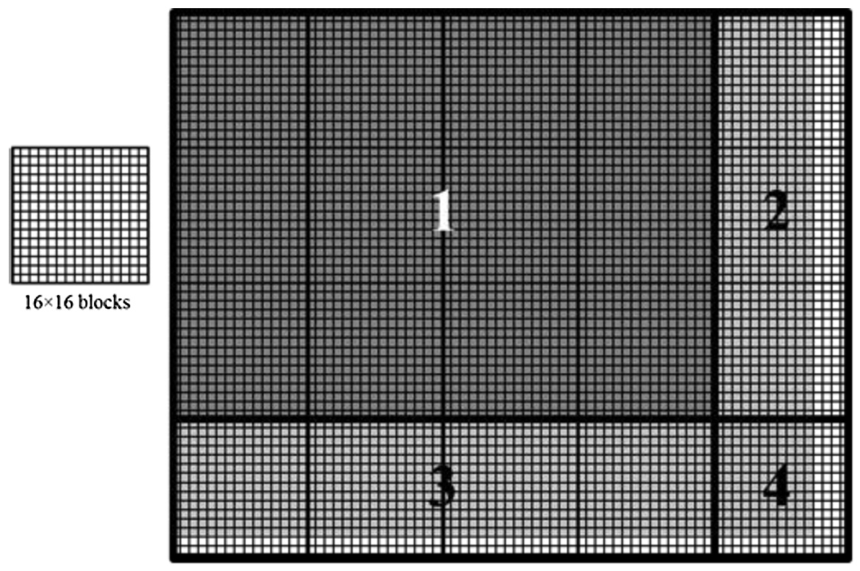

*Figure 3.5 — 76 × 62 그림을 16 × 16 block 으로 덮기. (책 p.54)*

> **캡션의 순서가 뒤집혀 있다.** 책의 규약(각주 1)과 Figure 3.2 의 캡션은
> **세로 × 가로**이므로 이 그림도 "62 × 76" 이어야 한다. 본문(p.54)도
> "our 62 × 76 example" 이라고 쓴다. 그림 자체는 5 block 폭 × 4 block 높이로
> 가로가 더 길어 62×76 이 맞다. 책 스스로 각주에서 경고한 혼동이 캡션에서 일어난 셈이다.

20개 block 의 실행 양상이 네 가지로 갈린다 (책 p.54~55).

| 영역 | block 수 | 어떤 상황 | 일하는 thread |
|---|---|---|---|
| **①** | 12 | `row`·`col` 모두 범위 안 | $16 \times 16 = 256$ (전부) |
| **②** | 3 | 오른쪽 끝. `col` 이 76을 넘는 것이 생김 | $12 \times 16 = 192$ |
| **③** | 4 | 아래쪽 끝. `row` 가 62를 넘는 것이 생김 | $16 \times 14 = 224$ |
| **④** | 1 | 오른쪽 아래 모서리. 둘 다 넘침 | $12 \times 14 = 168$ |

왜 12와 14인가 (책 p.54~55):

- 가로 thread 수는 항상 `blockDim.x`(=16)의 배수다. 76을 덮는 가장 작은 16의 배수는 **80**.
  그래서 마지막 block 열에서 각 행의 **앞 12개만** 범위 안이고 **뒤 4개**는 탈락한다.
- 세로도 같다. 62를 덮는 가장 작은 16의 배수는 **64**. 마지막 block 행에서
  각 열의 **위 14개만** 범위 안이고 **아래 2개**는 탈락한다.

**검산** — 네 영역의 일하는 thread 를 다 더하면 정확히 pixel 수가 나와야 한다.

```python
n, m, bs = 62, 76, 16
fy, fx = n // bs, m // bs          # 꽉 찬 block 행·열 수
py, px = n % bs,  m % bs           # 자투리 (세로 14, 가로 12)
cases = [("①", fy*fx, bs*bs), ("②", fy, px*bs), ("③", fx, bs*py), ("④", 1, px*py)]
total = 0
for name, cnt, per in cases:
    total += cnt * per
    print(f"  {name} block {cnt:2d}개 × thread {per:3d} = {cnt*per:5d}")
print(f"  합계 {total} · n*m = {n*m} →", "일치" if total == n*m else "불일치")
#   ① block 12개 × thread 256 =  3072
#   ② block  3개 × thread 192 =   576
#   ③ block  4개 × thread 224 =   896
#   ④ block  1개 × thread 168 =   168
#   합계 4712 · n*m = 4712 → 일치
```

아래 위젯에서 `n`·`m`·block 크기를 바꿔 가며 네 영역이 어떻게 변하는지 볼 수 있다.
칸에 마우스를 올리면 그 thread 의 `blockIdx`·`threadIdx`·선형 index 가 나온다.

<!--widget:grid-2d-->

#### 3D 로의 확장

차원 하나를 더 붙이면 된다. 배열의 각 "평면(plane)"을 주소 공간에 차례로 놓는다 (책 p.55).

```cuda
int plane = blockIdx.z*blockDim.z + threadIdx.z;
```

$m$ = 열 수, $n$ = 행 수라 할 때 3D 배열 `P` 의 선형화 접근은 이렇다.

$$
\texttt{P[plane*m*n + row*m + col]} \tag{3.4}
$$

`plane`, `row`, `col` **세 개 모두** 유효 범위 안인지 검사해야 한다.
3D 배열은 8장 stencil 에서 본격적으로 다룬다.

#### 연습문제

**연습문제 (책 3번, p.65).** 다음 kernel 과 host 함수를 보고 답하라.

```cuda
01  __global__ void foo_kernel(float* a, float* b, unsigned int M,
        unsigned int N) {
02      unsigned int row = blockIdx.y*blockDim.y + threadIdx.y;
03      unsigned int col = blockIdx.x*blockDim.x + threadIdx.x;
04      if(row < M && col < N) {
05          b[row*N + col] = a[row*N + col]/2.1f + 4.8f;
06      }
07  }
08  void foo(float* a_d, float* b_d) {
09      unsigned int M = 150;
10      unsigned int N = 300;
11      dim3 bd(16, 32);
12      dim3 gd((N - 1)/16 + 1, (M - 1)/32 + 1);
13      foo_kernel <<< gd, bd >>>(a_d, b_d, M, N);
14  }
```

> **답.**
> **a. block 당 thread** = `bd(16, 32)` 이므로 $16 \times 32 = \mathbf{512}$.
> **c. grid 의 block** = `gd((300-1)/16+1, (150-1)/32+1)` = $(18+1,\ 4+1) = (19, 5)$
>    → $19 \times 5 = \mathbf{95}$.
>    (정수 나눗셈이라 $299/16 = 18$, $149/32 = 4$ 로 잘린 뒤 1을 더한다.)
> **b. grid 의 thread** = $95 \times 512 = \mathbf{48{,}640}$
>    (= 가로 $19 \times 16 = 304$, 세로 $5 \times 32 = 160$ → $304 \times 160$).
> **d. line 05 를 실행하는 thread** = `row < M && col < N` 을 통과한 것,
>    즉 $150 \times 300 = \mathbf{45{,}000}$. 나머지 3,640개는 논다.
>
> **주의할 점 두 가지.** ① `dim3 bd(16, 32)` 는 **x=16, y=32** 다 — 그런데 이 kernel 은
> `col` 에 x, `row` 에 y 를 쓰므로 **가로로 16, 세로로 32** 인 block 이다.
> ② `gd` 의 첫 인자가 `N`(가로) 기준, 둘째가 `M`(세로) 기준으로 **올바르게 짝지어져 있다.**
> 순서를 바꿔 쓰는 것이 이 장에서 가장 흔한 실수다.

**연습문제 (책 4번, p.65).** 너비 400, 높이 500 인 2D 행렬을 1D 배열로 저장했다.
row 20, column 10 원소의 배열 인덱스는? (a) row-major (b) column-major

> **답.** **(a) row-major** — 한 행에 400개가 있으므로 $20 \times 400 + 10 = \mathbf{8{,}010}$.
> **(b) column-major** — 한 열에 500개가 있으므로 $10 \times 500 + 20 = \mathbf{5{,}020}$.
> 두 배치에서 **곱하는 수가 다르다**는 것이 요점이다. row-major 는 **너비**를,
> column-major 는 **높이**를 곱한다.

**연습문제 (책 5번, p.65).** 너비 400, 높이 500, 깊이 300 인 3D tensor 를
row-major 1D 배열로 저장했다. $x=10$, $y=20$, $z=5$ 원소의 인덱스는?

> **답.** 식 (3.4)에 $m = 400$(열 수), $n = 500$(행 수)을 넣는다.
> $$5 \times 400 \times 500 + 20 \times 400 + 10 = 1{,}000{,}000 + 8{,}000 + 10 = \mathbf{1{,}008{,}010}$$
> **깊이 300은 인덱스 계산에 쓰이지 않는다** — 앞선 평면을 건너뛰는 데 필요한 것은
> 평면 하나의 크기($m \times n$)이지 평면의 개수가 아니다. 문제에 나온 숫자를
> 전부 써야 한다고 생각하면 틀린다.

**연습문제 3.2-1 (직접).** `dim3 dimGrid(ceil(n/16.0), ceil(m/16.0), 1)` 처럼
`n` 과 `m` 을 바꿔 쓰면 62×76 이미지에서 무슨 일이 일어나는가?

> **답.** 올바른 것은 `(ceil(m/16.0), ceil(n/16.0), 1)` = (5, 4) 인데, 바꿔 쓰면 (4, 5) 가 된다.
> 그러면 가로로 $4 \times 16 = 64$ thread 밖에 없어 **가로 76 중 12열이 처리되지 않고**,
> 세로로는 $5 \times 16 = 80$ 개라 불필요한 thread 가 는다.
> 경계 검사가 있으니 **죽지는 않고 결과 일부만 조용히 비어 있다** — 가장 찾기 힘든 종류의 버그다.

---

## 3.3 Image blur — a more complex kernel (책 p.55)

### 1. 개념적 이해

지금까지의 `vecAddKernel` 과 `colorToGrayscaleConversion` 은 thread 하나가
**배열 원소 하나에 적은 수의 산술 연산**만 했다. 여기서 저자가 독자에게 던지는 질문
(책 p.55):

> "CUDA 프로그램의 모든 thread 가 이렇게 단순하고 사소한 연산만 서로 독립적으로
> 수행하는가? — 답은 아니다."

실제 CUDA 프로그램에서 thread 는 **복잡한 연산**을 하고 **서로 협력**해야 한다.
image blur 가 그 첫 걸음이다.


*Figure 3.6 — 원본 이미지(왼쪽)와 blur 처리한 버전(오른쪽). (책 p.56)*

blur 의 쓰임새 (책 p.56): 잡음과 입자감을 주변 pixel 값으로 보정해 줄이는 것,
컴퓨터 비전에서 edge detection·객체 인식이 미세한 것에 매몰되지 않고 주요 객체에
집중하게 하는 것, 디스플레이에서 나머지를 흐리게 해 특정 부분을 강조하는 것.

수학적으로 blur 는 **출력 pixel 값을, 원본에서 그 pixel 을 둘러싼 patch 의 가중합**으로
계산한다. 이 가중합 계산이 곧 **convolution 패턴**이고 7장에서 배운다 (책 p.56).

> **이 장에서는 단순화한다** (책 p.56). 가중치를 두지 않고 대상 pixel 을 포함한
> $N \times N$ patch 의 **단순 평균**을 쓴다. 실제로는 거리에 따라 가중치를 주는 것이
> 흔하다 — Gaussian Blur 같은 것.

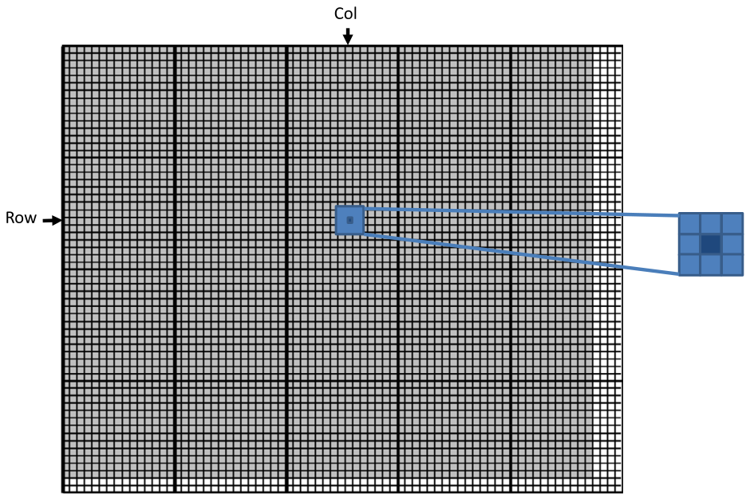

*Figure 3.7 — 각 출력 pixel 은 입력 이미지에서 자신과 주변 pixel 로 이루어진 patch 의
평균이다. (책 p.57)*

$3 \times 3$ patch 라면, 출력 `(row, col)` 을 계산할 때 patch 는 입력의 `(row, col)` 을
**중심으로** 세 행(`row-1`, `row`, `row+1`)과 세 열(`col-1`, `col`, `col+1`)에 걸친다.
출력 (25, 50) 의 아홉 pixel 은 (24,49) (24,50) (24,51) (25,49) (25,50) (25,51)
(26,49) (26,50) (26,51) 이다 (책 p.56).

### 2. 코드

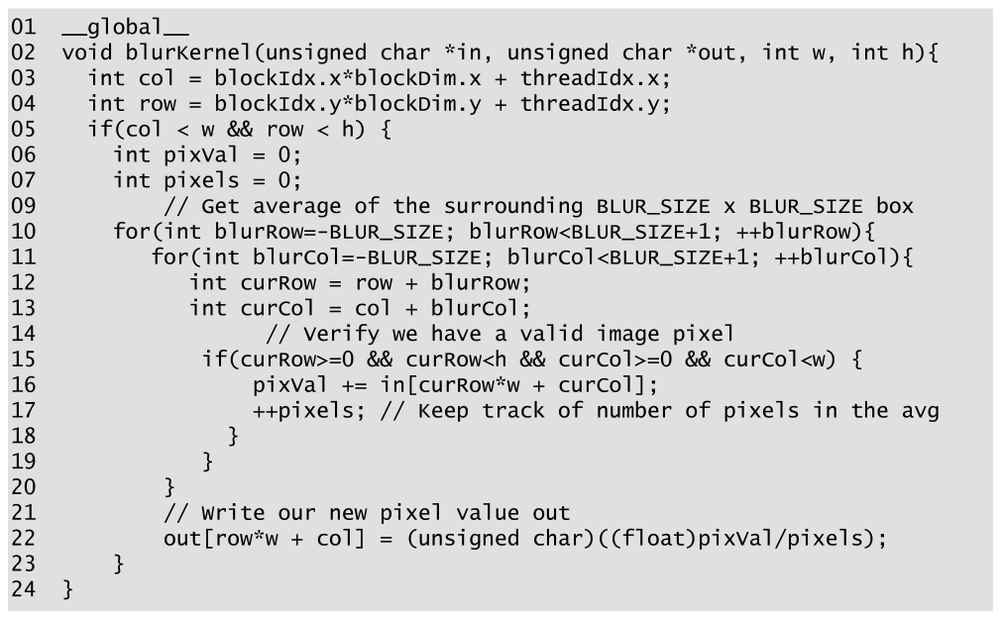

*Figure 3.8 — image blur kernel. (책 p.57)*

```cuda
01  __global__
02  void blurKernel(unsigned char *in, unsigned char *out, int w, int h){
03    int col = blockIdx.x*blockDim.x + threadIdx.x;
04    int row = blockIdx.y*blockDim.y + threadIdx.y;
05    if(col < w && row < h) {
06      int pixVal = 0;
07      int pixels = 0;
09      // Get average of the surrounding BLUR_SIZE x BLUR_SIZE box
10      for(int blurRow=-BLUR_SIZE; blurRow<BLUR_SIZE+1; ++blurRow){
11        for(int blurCol=-BLUR_SIZE; blurCol<BLUR_SIZE+1; ++blurCol){
12          int curRow = row + blurRow;
13          int curCol = col + blurCol;
14          // Verify we have a valid image pixel
15          if(curRow>=0 && curRow<h && curCol>=0 && curCol<w) {
16            pixVal += in[curRow*w + curCol];
17            ++pixels;  // Keep track of number of pixels in the avg
18          }
19        }
20      }
21      // Write our new pixel value out
22      out[row*w + col] = (unsigned char)((float)pixVal/pixels);
23    }
24  }
```

> **원문 특이점 두 가지** (Figure 3.8).
> ① **08번 줄이 없다.** 줄 번호가 07 다음 09 로 건너뛴다 (빈 줄에 번호를 안 매긴 듯하다).
>    위에서도 원문 그대로 두었다 — 본문의 줄 번호 인용과 맞추기 위해서다.
> ② **09번 줄 주석이 틀렸다.** "BLUR_SIZE x BLUR_SIZE box" 라고 쓰여 있지만,
>    본문(p.58)이 설명하듯 patch 의 한 변은 **`2*BLUR_SIZE+1`** 이다.
>    $3 \times 3$ patch 면 `BLUR_SIZE` 는 3이 아니라 **1**이다.

줄별로 (책 p.56~58):

- **03~05** — `colorToGrayscaleConversion` 과 **완전히 같은** thread-출력 매핑과 경계 검사.
  thread 하나가 출력 pixel 하나를 맡는다는 전략이 그대로다.
- **06~07** — `pixVal` 은 누적합, `pixels` 는 **실제로 더한 pixel 개수**.
  두 번째 변수가 왜 필요한지가 이 kernel 의 핵심이다.
- **10~11** — patch 를 훑는 이중 루프. `BLUR_SIZE` 는 **patch 의 반지름(radius)** —
  한 변의 pixel 수는 `2*BLUR_SIZE+1` 이다. $3\times3$ 이면 1, $7\times7$ 이면 3.
  바깥 루프가 patch 의 행을, 안쪽 루프가 열을 훑는다.
- **12~13** — patch 안 현재 위치의 절대 좌표.
- **15** — **경계 검사 두 번째 층.** 아래에서 따로 본다.
- **16** — 식 (3.3) 으로 선형화해 입력 pixel 을 읽어 누적한다.
- **17** — 더한 개수를 센다.
- **22** — 누적합을 **실제로 더한 개수**로 나눠 평균을 낸다.

#### 추적 — `BLUR_SIZE = 1`, 출력 (25, 50)

바깥 루프 첫 반복에서 `curRow = row - BLUR_SIZE = 25 - 1 = 24`.
안쪽 루프는 `curCol` 을 `col - 1 = 49` 부터 `col + 1 = 51` 까지 돈다 (책 p.58).

| 바깥 반복 | `curRow` | 방문하는 pixel |
|---|---|---|
| 1 | 24 | (24,49) (24,50) (24,51) |
| 2 | 25 | (25,49) (25,50) (25,51) |
| 3 | 26 | (26,49) (26,50) (26,51) |

Figure 3.7 의 아홉 pixel 과 일치한다.

#### 왜 경계 검사가 두 번인가

이것이 3.3절이 3.2절보다 한 걸음 나아간 지점이다.

- **5번 줄** — "이 **thread** 가 유효한 출력 pixel 을 맡았는가"
- **15번 줄** — "지금 읽으려는 **입력 pixel** 이 이미지 안에 있는가"

둘은 다른 질문이다. 이미지 **가장자리**의 출력 pixel 은 자기 자신은 유효하지만
patch 가 이미지 밖으로 삐져나간다.

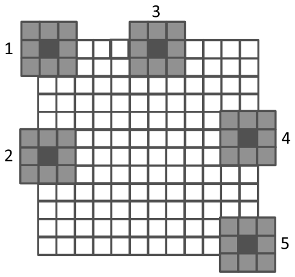

*Figure 3.9 — 이미지 가장자리 근처 pixel 의 경계 조건 처리. (책 p.59)*

책이 드는 Case 1 — 왼쪽 위 모서리 pixel `(0,0)` 을 blur 할 때 (책 p.58):

아홉 번의 반복에서 `(curRow, curCol)` 은
$(-1,-1)\ (-1,0)\ (-1,1)\ (0,-1)\ (0,0)\ (0,1)\ (1,-1)\ (1,0)\ (1,1)$ 이 된다.
이 중 **다섯 개는 인덱스 하나 이상이 0보다 작다.** 15번 줄의 `curRow>=0 && curCol>=0`
조건이 이들을 걸러 16~17번 줄을 건너뛴다. 결과적으로 **유효한 네 개만** 누적되고,
`pixels` 도 **네 번만** 증가해서 22번 줄의 평균이 올바르게 나온다.

| 위치 | 누적되는 pixel 수 |
|---|---|
| 안쪽 (대부분) | 9 |
| 네 변 (모서리 제외) | 6 |
| 네 모서리 | 4 |

**`pixels` 변수가 필요한 이유가 바로 이 변동**이다 (책 p.59). 9로 고정해 나누면
가장자리가 어두워진다.

### 3. 예제/실습

**연습문제 3.3-1 (직접).** `pixels` 변수를 없애고 항상 `pixVal / 9` 로 나누면
결과 이미지가 어떻게 되는가? $3\times3$ patch 기준으로 설명하라.

> **답.** 안쪽 pixel 은 정상이지만, **네 변에서는 실제 6개만 더해 놓고 9로 나누므로
> 값이 $2/3$ 로, 네 모서리에서는 4개를 더해 놓고 9로 나누므로 $4/9$ 로 줄어든다.**
> 이미지 테두리가 검게 어두워진다. patch 가 클수록(=`BLUR_SIZE` 가 클수록) 어두운
> 테두리가 두꺼워진다.

**연습문제 3.3-2 (직접).** $7 \times 7$ patch 를 쓰려면 `BLUR_SIZE` 를 얼마로 두는가?
그리고 thread 하나가 읽는 입력 pixel 은 최대 몇 개인가?

> **답.** 한 변이 `2*BLUR_SIZE+1` 이므로 $7 = 2 \times 3 + 1$ → **`BLUR_SIZE = 3`**.
> 안쪽 thread 는 최대 $7 \times 7 = \mathbf{49}$ 개를 읽는다.
> **출력 하나에 입력 49개** — `colorToGrayscaleConversion` 이 출력 하나에 입력 3개였던
> 것과 비교하면 데이터 재사용이 크게 늘었고, 이 재사용을 어떻게 살리느냐가
> 5장(tiling)과 7장(convolution)의 주제가 된다.

**연습문제 3.3-3 (직접).** 15번 줄에서 `curRow<h` 와 `curCol<w` 검사를 빼면
어떤 pixel 에서 문제가 생기는가?

> **답.** **오른쪽·아래 가장자리**다. `curRow>=0 && curCol>=0` 만 남으면 위·왼쪽은
> 막히지만 아래·오른쪽으로 삐져나간 접근은 통과한다. `in[curRow*w + curCol]` 이
> 배열 범위를 넘어 다른 행의 값을 읽거나(선형화 때문에 옆 행으로 감싸 들어간다)
> 할당 범위 밖을 읽는다. 조용히 잘못된 값이 섞이는 종류의 버그다.

---

## 3.4 Matrix multiplication (책 p.59)

### 1. 개념적 이해

matrix multiplication 은 BLAS 표준의 중요한 구성요소이고, LU 분해 같은 선형대수
solver 의 기반이며, 19장(CNN)·20장(LLM)에서 보듯 **딥러닝의 핵심 연산**이다 (책 p.59).

> **BLAS 의 세 수준** (책 p.59~60 사이드바). 수준이 올라갈수록 함수가 하는 연산량이 는다.
>
> | 수준 | 형태 | 이 책의 예 |
> |---|---|---|
> | Level-1 | $y = \alpha x + y$ (vector) | 2장 vector addition ($\alpha = 1$) |
> | Level-2 | $y = \alpha A x + \beta y$ (matrix-vector) | 17장 sparse linear algebra |
> | Level-3 | $C = \alpha AB + \beta C$ (matrix-matrix) | 이 절 ($\alpha = 1$, $\beta = 0$) |
>
> 이 함수들이 중요한 이유는 선형 시스템 solver·고윳값 분석 같은 상위 함수의
> **기본 building block** 이기 때문이다. 그리고 **BLAS 구현에 따라 성능이
> 몇 자릿수(orders of magnitude)씩 차이 난다** — 순차든 병렬이든.

### 2. 수식/유도

#### 전체 유도 과정 (먼저 한 번에)

$i \times j$ 행렬 $M$ 과 $j \times k$ 행렬 $N$ 을 곱하면 $i \times k$ 행렬 $P$ 가 나온다.

$$
P_{row,col} = \sum_{k=0}^{Width-1} M_{row,k} \times N_{k,col} \tag{3.5}
$$

$$
\texttt{row} = \texttt{blockIdx.y} \times \texttt{blockDim.y} + \texttt{threadIdx.y} \tag{3.6}
$$

$$
\texttt{col} = \texttt{blockIdx.x} \times \texttt{blockDim.x} + \texttt{threadIdx.x} \tag{3.7}
$$

$$
\texttt{M[row*Width + k]} \quad\text{와}\quad \texttt{N[k*Width + col]} \tag{3.8}
$$

$$
\texttt{P[row*Width + col]} \tag{3.9}
$$

#### 단계별 설명 (생략 없이)

**(3.5) 출력 원소 하나는 inner product 다**

$P$ 의 각 원소는 **$M$ 의 한 행과 $N$ 의 한 열의 inner product** 다.

> **inner product(dot product)** 는 두 vector 의 대응 원소끼리 곱해서 전부 더한 것이다.
> 이건 유도된 결과가 아니라 **정의**다.

Figure 3.10 에서 $P_{row,col}$ (작은 정사각형)은 $M$ 의 $row$ 행(가로 띠)과
$N$ 의 $col$ 열(세로 띠)의 inner product 다 (책 p.60).

예로 $row = 1$, $col = 5$ 이면:

$$
P_{1,5} = M_{1,0} N_{0,5} + M_{1,1} N_{1,5} + M_{1,2} N_{2,5} + \cdots + M_{1,Width-1} N_{Width-1,5}
$$

**(3.6)·(3.7) thread 를 출력 원소에 대응시킨다**

`colorToGrayscaleConversion` 과 **완전히 같은 방식**이다 — thread 하나가 $P$ 원소 하나를
맡는다. 이 일대일 매핑 덕분에 thread 의 `row`·`col` 이 곧 출력 원소의 행·열 인덱스가 된다.

**(3.8) 두 입력의 인덱스는 서로 다르게 생겼다** — 여기가 이 절의 핵심이다

둘 다 row-major 선형화(식 3.3)를 쓰지만 **훑는 방향이 다르다.**

- **$M$ 은 행을 따라 간다.** $row$ 행의 시작은 `M[row*Width]` 이고, 한 행의 원소들은
  **연속된 위치**에 있으므로 $k$ 번째 원소는 **`M[row*Width + k]`** 다.
  → `k` 가 늘면 주소가 **1씩** 증가한다.
- **$N$ 은 열을 따라 간다.** $col$ 열의 시작은 0행의 $col$ 번째 원소, 즉 `N[col]` 이다.
  같은 열의 다음 원소는 **다음 행의 같은 위치**이므로 **행 하나를 통째로 건너뛰어야** 한다.
  따라서 $k$ 번째 원소는 **`N[k*Width + col]`** 다.
  → `k` 가 늘면 주소가 **`Width` 씩** 증가한다.

> **이 비대칭이 나중에 성능 문제가 된다.** 6장에서 배울 memory coalescing 관점에서
> 보면 $M$ 접근과 $N$ 접근은 전혀 다른 성격이다. 지금은 "왜 두 인덱스 식이 다르게
> 생겼는가"만 확실히 해 두면 된다.

**(3.9) 출력 쓰기**

`colorToGrayscaleConversion` 의 `grayOffset` 과 같은 패턴이다.

### 3. 예제/실습

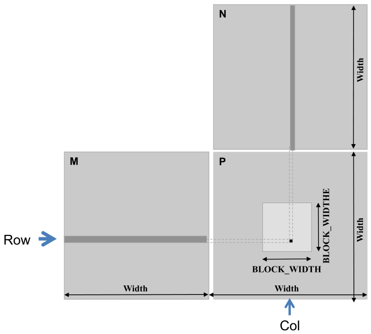

*Figure 3.10 — $P$ 를 tiling 해 여러 block 으로 하는 matrix multiplication. (책 p.61)*

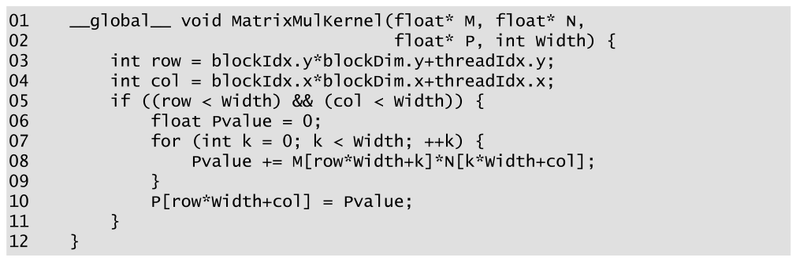

*Figure 3.11 — 한 thread 가 $P$ 원소 하나를 계산하는 matrix multiplication kernel. (책 p.61)*

```cuda
01  __global__ void matrixMulKernel(float* M, float* N,
02                                  float* P, int Width) {
03      int row = blockIdx.y*blockDim.y+threadIdx.y;
04      int col = blockIdx.x*blockDim.x+threadIdx.x;
05      if ((row < Width) && (col < Width)) {
06          float Pvalue = 0;
07          for (int k = 0; k < Width; ++k) {
08              Pvalue += M[row*Width+k]*N[k*Width+col];
09          }
10          P[row*Width+col] = Pvalue;
11      }
12  }
```

> **원문 표기 흔들림.** 그림은 함수 이름을 **`MatrixMulKernel`**(대문자 M)로 쓰는데
> 본문(책 p.61·62)은 전부 **`matrixMulKernel`**(소문자 m)이다. 위에서는 본문을 따랐다.

- **05** — `colorToGrayscaleConversion` 과 거의 같다. **유일한 차이는 정사각 행렬만
  다룬다는 단순화 가정**이라 `width`·`height` 대신 `Width` 하나를 쓴다 (책 p.61).
- **06** — 누적용 지역 변수. thread 마다 사본이 하나씩 생긴다.
- **07~09** — 식 (3.5)의 합을 루프로 돈다. 매 반복에서 $M$ 의 원소 하나와 $N$ 의 원소
  하나를 읽어 곱하고 `Pvalue` 에 누적한다.
- **10** — 식 (3.9).

> **이 매핑이 곧 tiling 이다** (책 p.61). thread-데이터 매핑이 $P$ 를 **tile 로 나누고**,
> **block 하나가 tile 하나를 맡는다.** Figure 3.10 의 크고 밝은 정사각형이 그 tile 이다.
> "tile" 이라는 말이 여기서 처음 나오고, 5장에서 이것이 성능 기법으로 발전한다.

#### 작은 예로 추적하기

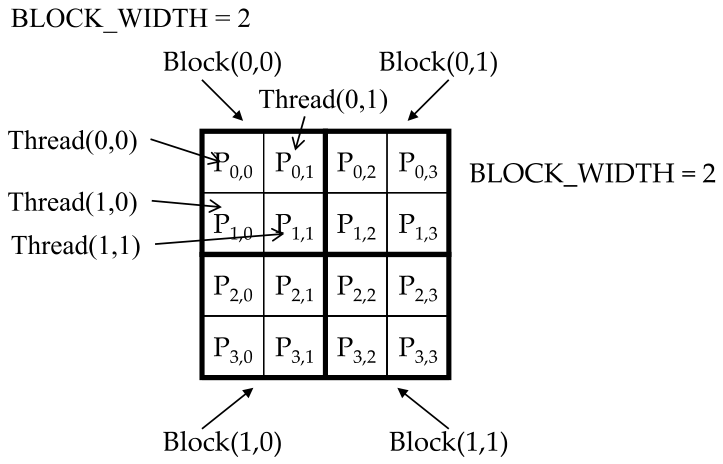

*Figure 3.12 — `matrixMulKernel` 의 작은 실행 예. (책 p.62)*

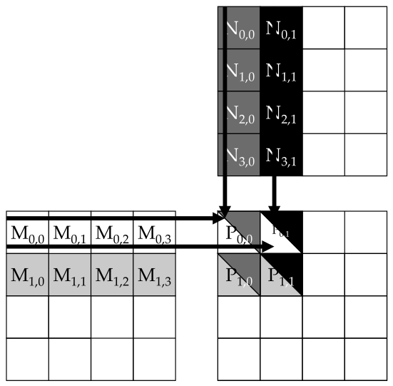

*Figure 3.13 — 한 thread block 의 matrix multiplication 동작. (책 p.63)*

$4 \times 4$ 행렬 $P$ 에 `BLOCK_WIDTH = 2` 인 예다 (책 p.62). $P$ 가 tile 4개로 나뉘고
block 하나가 tile 하나를 계산한다. 각 block 은 $2 \times 2$ thread 배열이다.

- Block (0,0) 의 Thread (0,0) → $P_{0,0}$
- Block (1,0) 의 Thread (0,0) → $P_{2,0}$
- Block (0,0) 의 Thread (1,0) → row $= 0 \times 0 + 1 = 1$, col $= 0 \times 0 + 0 = 0$
  → $P_{1,0}$, 즉 $M$ 의 1행과 $N$ 의 0열의 dot product

**Block (0,0) 의 Thread (0,0) 에 대한 루프 추적** (책 p.63). `row = 0`, `col = 0`, `Width = 4`:

| $k$ | `row*Width+k` | `k*Width+col` | 읽는 것 | 2D 로는 |
|---|---|---|---|---|
| 0 | $0 \times 4 + 0 = 0$ | $0 \times 4 + 0 = 0$ | `M[0]`, `N[0]` | $M_{0,0}$, $N_{0,0}$ |
| 1 | $0 \times 4 + 1 = 1$ | $1 \times 4 + 0 = 4$ | `M[1]`, `N[4]` | $M_{0,1}$, $N_{1,0}$ |
| 2 | $0 \times 4 + 2 = 2$ | $2 \times 4 + 0 = 8$ | `M[2]`, `N[8]` | $M_{0,2}$, $N_{2,0}$ |
| 3 | $0 \times 4 + 3 = 3$ | $3 \times 4 + 0 = 12$ | `M[3]`, `N[12]` | $M_{0,3}$, $N_{3,0}$ |

$M$ 인덱스는 **1씩**, $N$ 인덱스는 **4(=Width)씩** 뛴다 — 위에서 본 비대칭이 그대로 보인다.
루프가 끝나면 `P[0*4+0]` = `P[0]` = $P_{0,0}$ 에 쓴다.

**검산 코드**

```python
Width = 4
row, col = 0, 0
for k in range(Width):
    mi, ni = row*Width + k, k*Width + col
    print(f"  k={k}: M[{mi:2d}] = M[{mi//Width}][{mi%Width}] · "
          f"N[{ni:2d}] = N[{ni//Width}][{ni%Width}]")
print(f"  → P[{row*Width+col}] = P[{row}][{col}]")
#   k=0: M[ 0] = M[0][0] · N[ 0] = N[0][0]
#   k=1: M[ 1] = M[0][1] · N[ 4] = N[1][0]
#   k=2: M[ 2] = M[0][2] · N[ 8] = N[2][0]
#   k=3: M[ 3] = M[0][3] · N[12] = N[3][0]
#   → P[0] = P[0][0]
```

책의 추적과 일치한다.

#### 크기 한계

grid 크기는 **grid 당 최대 block 수와 block 당 최대 thread 수**로 제한되므로,
`matrixMulKernel` 이 다룰 수 있는 $P$ 의 크기도 그만큼 제한된다 (책 p.64).
넘어서려면 두 가지 방법이 있다.

1. 출력 행렬을 **부분 행렬로 나누고**, host code 에서 부분 행렬마다 다른 grid 를 launch
2. kernel 을 고쳐 **thread 하나가 $P$ 의 원소 여러 개**를 계산하게 하기
   (6장의 thread coarsening)

이 구현은 5장에서 더 최적화하고, 15장에서 고급 최적화를 깊이 파고든다.

#### 연습문제

**연습문제 (책 1번, p.64).** 이 장의 kernel 은 thread 하나가 출력 원소 하나를 만들었다.
(a) thread 하나가 **출력 행 하나**를 만드는 kernel 을 쓰고 실행 구성을 채워라.
(b) thread 하나가 **출력 열 하나**를 만드는 kernel 을 쓰고 실행 구성을 채워라.
(c) 두 설계의 장단점을 분석하라.

> **답.**
>
> **(a) 행 하나 담당** — thread 가 $Width$ 개의 출력을 만들므로 1D grid 면 된다.
>
> ```cuda
> __global__ void matMulRowKernel(float* M, float* N, float* P, int Width) {
>     int row = blockIdx.x*blockDim.x + threadIdx.x;
>     if (row < Width) {
>         for (int col = 0; col < Width; ++col) {
>             float Pvalue = 0;
>             for (int k = 0; k < Width; ++k)
>                 Pvalue += M[row*Width + k] * N[k*Width + col];
>             P[row*Width + col] = Pvalue;
>         }
>     }
> }
> // 실행 구성: dim3 dimBlock(256, 1, 1);
> //            dim3 dimGrid(ceil(Width/256.0), 1, 1);
> ```
>
> **(b) 열 하나 담당** — 바깥 루프를 `row` 로 바꾸면 된다.
>
> ```cuda
> __global__ void matMulColKernel(float* M, float* N, float* P, int Width) {
>     int col = blockIdx.x*blockDim.x + threadIdx.x;
>     if (col < Width) {
>         for (int row = 0; row < Width; ++row) {
>             float Pvalue = 0;
>             for (int k = 0; k < Width; ++k)
>                 Pvalue += M[row*Width + k] * N[k*Width + col];
>             P[row*Width + col] = Pvalue;
>         }
>     }
> }
> // 실행 구성은 (a) 와 동일
> ```
>
> **(c) 장단점.**
>
> | | 원본 (원소 1개) | (a) 행 1개 | (b) 열 1개 |
> |---|---|---|---|
> | thread 수 | $Width^2$ | $Width$ | $Width$ |
> | thread 당 연산 | $Width$ 번 곱셈-누적 | $Width^2$ | $Width^2$ |
> | 병렬성 | 가장 높다 | $Width$ 배 낮다 | $Width$ 배 낮다 |
> | 데이터 재사용 | 없다 | **$M$ 의 한 행을 $Width$ 번 재사용** | **$N$ 의 한 열을 $Width$ 번 재사용** |
>
> 공통 단점은 **병렬성이 $Width$ 배 줄어든다**는 것이다. $Width$ 가 작으면 GPU 를
> 채우지 못한다. 공통 장점은 **한 thread 안에서 입력을 재사용**할 수 있다는 것이다 —
> (a) 는 바깥 루프 내내 $M$ 의 같은 행을 쓰고, (b) 는 $N$ 의 같은 열을 쓴다.
>
> (a)와 (b)의 차이는 **메모리 접근 패턴**이다. (b)는 이웃한 thread 들이 이웃한 `col` 을
> 맡아 $P$ 와 $N$ 에 **연속된 주소로** 접근하는 반면, (a)는 이웃 thread 가
> `Width` 만큼 떨어진 곳을 건드린다. 6장의 coalescing 기준으로는 **(b)가 유리하다.**
> 이 판단의 근거는 6장에서 정식으로 배운다.

**연습문제 (책 2번, p.64).** matrix-vector multiplication $a_i = \sum_j B_{i,j} \times c_j$ 을
계산하는 kernel 과 host stub 을 쓰라. 정사각 행렬, single precision, thread 하나가
출력 vector 원소 하나를 계산한다. 매개변수는 출력 `a`, 입력 `B`, 입력 `c`, 차원 `N`.

> **답.** 출력이 1D vector 이므로 1D grid 를 쓴다. $B$ 의 $i$ 행과 $c$ 의 inner product 다.
>
> ```cuda
> __global__ void matVecMulKernel(float* a, float* B, float* c, int N) {
>     int i = blockIdx.x*blockDim.x + threadIdx.x;
>     if (i < N) {
>         float sum = 0.0f;
>         for (int j = 0; j < N; ++j)
>             sum += B[i*N + j] * c[j];      // B 는 row-major → 행을 따라 연속 접근
>         a[i] = sum;
>     }
> }
>
> void matVecMul(float* a_h, float* B_h, float* c_h, int N) {
>     int vBytes = N * sizeof(float), mBytes = N * N * sizeof(float);
>     float *a_d, *B_d, *c_d;
>     cudaMalloc((void**)&a_d, vBytes);
>     cudaMalloc((void**)&B_d, mBytes);
>     cudaMalloc((void**)&c_d, vBytes);
>
>     cudaMemcpy(B_d, B_h, mBytes, cudaMemcpyHostToDevice);
>     cudaMemcpy(c_d, c_h, vBytes, cudaMemcpyHostToDevice);
>
>     matVecMulKernel<<<ceil(N/256.0), 256>>>(a_d, B_d, c_d, N);
>
>     cudaMemcpy(a_h, a_d, vBytes, cudaMemcpyDeviceToHost);
>     cudaFree(a_d);  cudaFree(B_d);  cudaFree(c_d);
> }
> ```
>
> 2장의 3부 구조(할당·전송 → launch → 회수·해제)가 그대로 쓰인다.
> **`B` 는 $N^2$ 바이트가 아니라 $N \times N \times$ `sizeof(float)`** 라는 점,
> **`c` 는 출력이 아니므로 되돌려 받지 않는다**는 점을 놓치기 쉽다.

**연습문제 3.4-1 (직접).** 식 (3.8)에서 $M$ 인덱스는 `k` 가 늘 때 1씩 증가하고
$N$ 인덱스는 `Width` 씩 증가한다. 이 비대칭은 어디서 오는가?

> **답.** **row-major 선형화 때문**이다. $M$ 은 한 **행**을 따라 훑는데 같은 행의 원소가
> 연속으로 놓여 있으므로 1씩 간다. $N$ 은 한 **열**을 따라 훑는데 같은 열의 다음 원소는
> 한 행 뒤에 있으므로 `Width` 씩 건너뛴다. 데이터 배치(row-major)와 접근 방향(행 vs 열)이
> 어긋나면 이런 stride 가 생긴다 — 6장 coalescing 과 5장 tiling 의 출발점이다.

---

## 3.5 Summary (책 p.64)

이 장의 요지를 책의 정리대로 옮기면 (책 p.64):

- CUDA grid 와 block 은 **최대 3차원**이다. 이 다차원성이 thread 를 다차원 데이터에
  대응시켜 조직하는 데 쓸모 있다.
- kernel 의 execution configuration parameter 가 grid 와 block 의 차원을 정한다.
- `blockIdx` 와 `threadIdx` 의 고유 좌표가 thread 로 하여금 자기 자신과 자기 데이터 영역을
  식별하게 한다. **이 변수들을 써서 처리할 데이터 부분을 올바로 식별하는 것은
  프로그래머의 책임이다.**
- 다차원 데이터에 접근할 때는 다차원 인덱스를 **1차원 offset 으로 선형화**해야 하는 일이 잦다.
  C++ 에서 동적 할당된 다차원 배열이 보통 **row-major 의 1차원 배열**로 저장되기 때문이다.

---

## 정리

3장에서 가져갈 것을 넷으로 줄이면:

1. **2장의 식을 축마다 한 번씩 쓰면 그게 다차원이다.**
   `row = blockIdx.y*blockDim.y + threadIdx.y`, `col = blockIdx.x*blockDim.x + threadIdx.x`.
   경계 검사도 축마다 하나씩 늘어난다.
2. **차원 순서가 두 군데서 뒤집힌다.** 코드의 `dim3(x, y, z)` 와
   그림·데이터의 `(z, y, x)`. 책이 각주에서 직접 경고할 만큼 흔한 실수의 원천이고,
   grid 차원을 데이터 크기에서 계산할 때 `n`·`m` 을 바꿔 쓰면 **조용히 일부만 계산된다.**
3. **row-major 선형화 `row*Width + col` 이 앞으로 계속 나온다.** 동적 할당 배열에서는
   컴파일러가 해 주지 않으므로 프로그래머가 직접 쓴다. $M$ 은 stride 1, $N$ 은 stride
   `Width` — 이 비대칭이 5·6장의 출발점이다.
4. **경계 검사는 한 층이 아닐 수 있다.** blur kernel 은 "내가 유효한 출력을 맡았나"(5번 줄)와
   "내가 읽으려는 입력이 존재하나"(15번 줄)를 따로 검사하고, 실제로 더한 개수를
   세어 두었다가 그것으로 나눈다.

다음은 4장 — 지금까지 "thread 를 많이 만들면 된다"고 해 온 것 뒤에서
하드웨어가 실제로 무엇을 하는지 본다.
