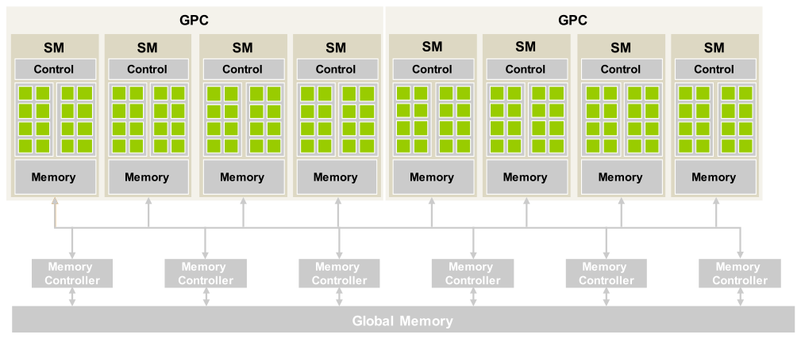
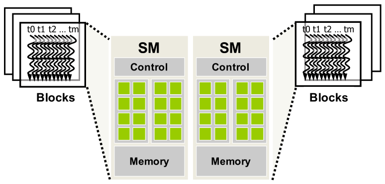
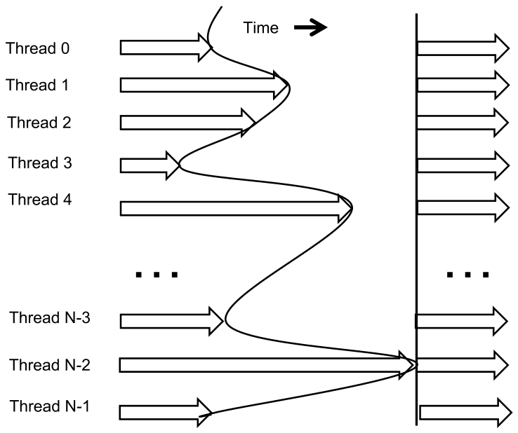
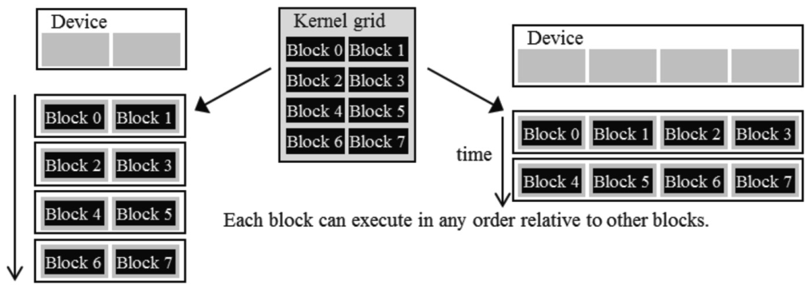
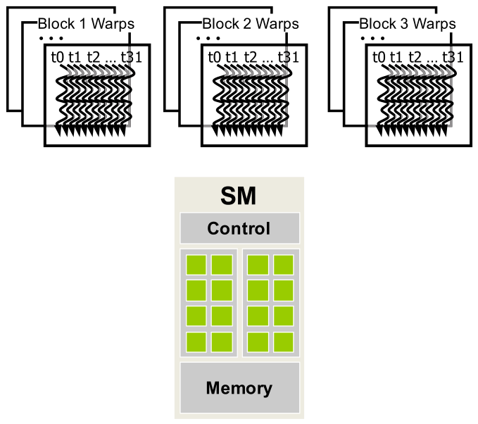
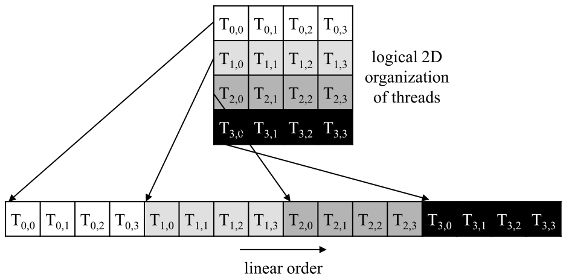
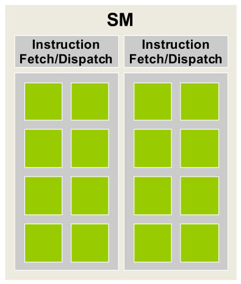
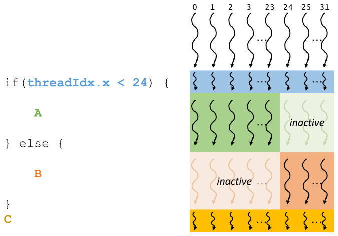
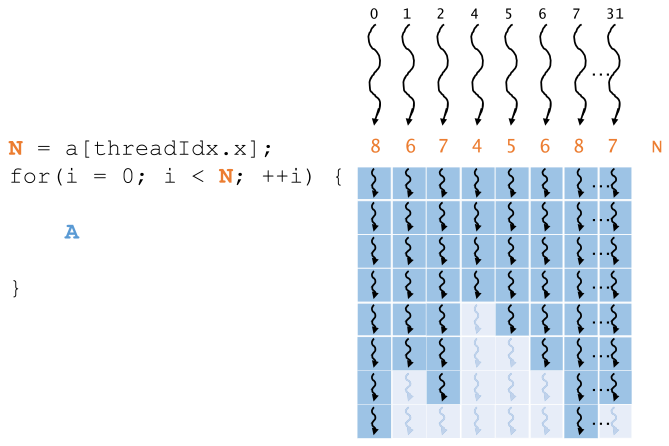

# 4장. Compute architecture and scheduling

> **원문 범위**: 책 p.67~92 (4.1~4.10절 + References)
> **절 순서**: 책 순서를 그대로 따랐다. 재배치 없음.
> **연습문제**: 책 4.10절의 9문제를 전부 풀고 답·풀이를 붙였다. 관련 절 아래로 옮겨 배치했다.

2·3장은 "thread 를 많이 만들면 된다"고 했다. 4장은 **그 뒤에서 하드웨어가 실제로 무엇을
하는지** 보여준다. 여기서 다섯 가지 새 개념이 한꺼번에 나오는데, 서로 맞물려 있다.

| 개념 | 한 줄 요약 |
|---|---|
| **SM** | block 이 배정되는 단위. block 하나는 통째로 SM 하나에 들어간다 |
| **transparent scalability** | block 끼리 동기화하지 않기 때문에 아무 순서로나 실행 가능 → 같은 코드가 GPU 크기에 맞춰 빨라진다 |
| **warp** | thread 32개 묶음. **스케줄링의 단위**이자 SIMD 실행의 단위 |
| **control divergence** | 한 warp 안에서 갈래가 갈리면 하드웨어가 **여러 번 훑는다** — 그만큼 손해 |
| **occupancy** | SM 에 배정된 warp 수 / SM 이 지원하는 최대 warp 수. latency 를 가릴 여력의 지표 |

관통하는 논리는 하나다 — **GPU 는 latency 를 줄이는 대신 가릴 거리를 많이 확보한다.**
그래서 warp 를 많이 배정하고(occupancy), 놀고 있는 warp 로 갈아타며(latency tolerance),
그 대가로 warp 안에서 갈래가 갈리는 것을 싫어한다(control divergence).

---

## 4.1 Architecture of a modern GPU (책 p.68)

### 1. 개념적 이해



*Figure 4.1 — CUDA 지원 GPU 의 구조. (책 p.68)*

GPU 는 **고도로 multi-thread 화된 Streaming Multiprocessor(SM) 의 배열**로 조직된다 (책 p.68).

- **SM** 하나는 여러 개의 **streaming processor** 를 갖는데, 이들은 **control logic 과 메모리
  자원을 공유**한다. Figure 4.1 에서 SM 안의 작은 타일들이다.
- **GPC**(GPU Processing Cluster) — Hopper 부터 SM 들이 이 단위로 묶인다.

Hopper H100 의 수치 (책 p.68):

| 항목 | 값 |
|---|---|
| SM | 132개 |
| SM 당 streaming processor | 128개 |
| 전체 streaming processor | $132 \times 128 = 16{,}896$ |
| GPC | 8개 |

> **"CUDA core" 라고 부르지 않는 이유** (책 p.68 각주 1). streaming processor 를 CUDA core 라
> 부르기도 하지만, 이 책은 **CPU core 와 혼동될 수 있어서** streaming processor 라는 말만 쓴다.
> 1장에서 본 대로 CPU core 와 streaming processor 는 설계 철학이 전혀 다르다.

메모리 쪽은 두 층이다 (책 p.68).

- **on-chip memory** — Figure 4.1 에서 Memory 로 묶인 것. 5장의 주제다.
- **global memory** — off-chip device memory. 여러 개의 **memory controller(channel)** 을 통해
  접근하고, 이들이 합쳐져 높은 bandwidth 를 만든다.

> **DRAM 종류** (책 p.68). 옛 GPU 는 GDDR SDRAM 을 썼고, Pascal 이후는 **HBM**(High-Bandwidth
> Memory)·HBM2·HBM2E·HBM3 를 쓸 수 있다. HBM 은 DRAM 모듈이 GPU 와 **같은 패키지 안에
> 밀착 집적**된 것이다. 책은 이후 이들을 통틀어 그냥 **DRAM** 이라 부른다.

### 3. 예제/실습

**연습문제 4.1-1.** H100 의 streaming processor 총 개수를 구하고, 이것이 "동시에 실행되는
thread 수"와 같은 말인지 답하라.

> **답.** $132 \times 128 = \mathbf{16{,}896}$ 개.
> **같은 말이 아니다.** 4.6절에서 보듯 SM 하나에 최대 2048개의 thread 가 **배정**될 수 있고,
> 이는 streaming processor 128개의 **16×** 다. 배정된 thread 전부가 매 순간 실행되는 것이 아니라,
> 실행 자원은 그중 일부만 감당하고 나머지는 대기한다. 이 초과 배정이 곧 latency tolerance 의 밑천이다.

---

## 4.2 Thread block scheduling (책 p.69)

### 1. 개념적 이해

grid 가 요구하는 자원은 GPU 가 가진 자원을 쉽게 넘어선다. 그래서 자원이 나는 대로 thread 를
배정하는 스케줄링 기구가 필요하다. **CUDA 에서 thread 는 block 단위로 SM 에 배정된다** (책 p.69).

> **한 block 의 모든 thread 는 동시에 같은 SM 에 배정된다.**



*Figure 4.2 — Streaming Multiprocessor(SM) 로의 thread block 배정. (책 p.69)*

- SM 자원이 허락하는 만큼 **여러 block 이 같은 SM 에 동시 배정**될 수 있다
  (Figure 4.2 는 SM 당 3 block).
- 하지만 block 은 실행에 필요한 하드웨어 자원을 **예약**해야 하므로, 동시 배정 수에 한계가 있다.
  그 한계를 정하는 요인들이 4.7절의 주제다.
- grid 의 block 수는 보통 이 한계보다 훨씬 많다. 런타임은 **실행할 block 목록을 유지**하다가,
  먼저 배정된 block 이 끝나면 새 block 을 배정한다.

#### 이 배정 규칙이 무엇을 보장하는가

block 단위 배정은 **같은 block 의 thread 들이 같은 SM 에서 같은 시각에 실행됨**을 보장한다.
이 보장 덕분에 같은 block 의 thread 들은 **다른 block 의 thread 와는 할 수 없는 방식으로
상호작용**할 수 있다 (책 p.69).

1. **block 전체 barrier synchronization** — 4.3절
2. **shared memory** 를 통한 데이터 교환 — SM 안에 있는 저지연 SRAM. 5장

> **thread block cluster** (책 p.69~70). Hopper 부터 CUDA 는 선택적 계층을 하나 더 둔다 —
> thread block 들의 그룹인 **thread block cluster** 다. 같은 block 의 thread 가 같은 SM 에
> 배정되듯, **같은 cluster 의 block 은 같은 GPC 에 함께 스케줄**된다. cluster 안의 thread 는
> API 로 동기화할 수 있고, 참여 block 들의 shared memory 를 합친
> **distributed shared memory** 에 접근할 수 있다 (5장).

### 3. 예제/실습

**연습문제 4.2-1.** "block 을 작게 쪼개면 SM 에 더 많이 들어가니 항상 유리하다" — 맞는가?

> **답.** 아니다. 4.7절에서 보듯 SM 에는 **block 슬롯 수 제한**도 있다. H100 은 SM 당
> block 32개까지만 받으므로, block 을 32 thread 로 쪼개면 $32 \times 32 = 1024$ thread 밖에
> 못 채워 occupancy 가 50% 로 떨어진다. block 이 너무 작으면 오히려 손해다.

---

## 4.3 Synchronization and transparent scalability (책 p.70)

### 1. 개념적 이해

CUDA 는 같은 block 의 thread 들이 활동을 맞출 수 있도록 **block 전체 barrier synchronization**
함수 `__syncthreads()` 를 제공한다 (책 p.70).

> thread 가 `__syncthreads()` 를 호출하면 **같은 block 의 모든 thread 가 그 지점에 도달할 때까지**
> 그 자리에 붙들린다. 동기화 함수를 호출한 thread 를 두고 그 지점의 **barrier 에 도착했다**고 한다.
> barrier 는 **block 의 모든 thread 가 한 단계를 끝낸 뒤에야 다음 단계로 넘어가게** 보장한다.

> **`__` 는 intrinsic 의 표시** (책 p.70). `__` 는 밑줄 두 개이고, CUDA 에서 intrinsic function
> 을 나타내는 규약이다.
>
> **intrinsic function** (책 p.70 사이드바). 현대 프로세서는 결정적 기능이나 큰 성능 향상을
> 주는 특수 명령을 제공하는데, 이를 **intrinsic**(내장 함수)으로 프로그래머에게 노출한다.
> 프로그래머가 보기엔 라이브러리 함수지만 **컴파일러가 특별 취급**해서, 호출 하나가 대응하는
> 특수 명령으로 번역된다. 최종 코드에는 함수 호출이 없고 사용자 코드 사이에 명령만 들어간다.
> gcc·Intel C Compiler·Clang/LLVM 등 주요 컴파일러가 모두 지원한다.



*Figure 4.3 — barrier synchronization 의 실행 타이밍 예. 화살표는 시간에 따른 실행 활동이다.
곡선은 각 thread 가 `__syncthreads` 를 실행하는 시각을, 그 오른쪽 빈 공간은 모든 thread 가
끝나기를 기다리는 시간을 나타낸다. 세로 직선은 마지막 thread 가 `__syncthreads` 를 실행하는
시각으로, 그 뒤에 모든 thread 가 다음 문장으로 진행할 수 있다. (책 p.71)*

> **쇼핑몰 비유** (책 p.71). 친구 넷이 차 한 대로 쇼핑몰에 갔다. 각자 다른 가게에 가서 옷을
> 고르는 것이 병렬 활동이고, 다 같이 몰려다니며 순차적으로 도는 것보다 훨씬 효율적이다.
> 하지만 **몰을 떠나기 전에는 barrier 가 필요하다** — 넷이 다 차로 돌아올 때까지 기다려야 한다.
> 먼저 끝낸 사람은 늦는 사람을 기다린다. barrier 가 없으면 누군가 몰에 남겨진 채 차가 떠나고,
> 우정이 심각하게 손상될 수 있다.

#### 반드시 지켜야 할 규칙

**`__syncthreads()` 가 있으면 block 의 모든 thread 가 그것을 실행해야 한다** (책 p.72).

- `if` 문 안에 있으면 → block 의 **모든** thread 가 그 경로를 타거나, **아무도** 타지 않아야 한다.
- `if-else` 의 **양쪽 모두**에 `__syncthreads()` 가 있으면 → 모두가 then 을 타거나 모두가 else 를
  타야 한다. **두 `__syncthreads()` 는 서로 다른 barrier 지점**이기 때문이다.


*Figure 4.4 — `__syncthreads()` 의 잘못된 사용 예. (책 p.72)*

```cuda
 1  void incorrect_barrier_example(int n) {
 2      ...
 3      if (threadIdx.x % 2 == 0) {
 4          ...
 5          __syncthreads();
 6      }
 7      else {
 8          ...
 9          __syncthreads();
10      }
11  }
```

`threadIdx.x` 가 짝수인 thread 는 then 경로를, 나머지는 else 경로를 탄다.
**5번 줄과 9번 줄의 `__syncthreads()` 는 서로 다른 두 개의 barrier** 를 정의한다.
block 의 모든 thread 가 둘 중 어느 하나에 도달한다는 보장이 없으므로 이 코드는 규칙을 위반하고,
**정의되지 않은 실행 동작**을 낳는다.

> **원문 오기** (책 p.72). 본문은 이 그림을 두고 "the if-statement starting in **line 04**",
> "the `__syncthreads()` calls at **line 06** and **line 10**" 이라고 인용하는데,
> 그림에서는 각각 **3번·5번·9번** 줄이다. 세 인용이 모두 **1씩 밀려 있다.**
> (3장 Figure 3.4 에서도 같은 종류의 줄 번호 오기가 있었다.)

잘못된 barrier 사용은 **틀린 결과**를 내거나, thread 들이 서로를 영원히 기다리는
**deadlock** 을 낳는다. 이를 피하는 것은 프로그래머의 책임이다 (책 p.72).

#### barrier 의 scope, 그리고 왜 block 단위인가

barrier 에 참여하는 thread 의 집합을 그 barrier 의 **scope** 라 한다 (책 p.70).

| scope | 방법 | 비고 |
|---|---|---|
| **block** | `__syncthreads()` | 이 절의 주제 |
| **cluster** | Cooperative Groups API | distributed shared memory 연산 완료까지 보장 |
| **grid** | Cooperative Groups API | **훨씬 무겁고** 제약이 많다. 모든 thread 가 실제로 동시 실행 중이어야 한다 (18장) |

barrier 가 성립하려면 참여 thread 전원이 **결국 barrier 에 도달할 자원**을 가져야 한다.
도달하지 못하는 thread 하나가 deadlock 을 만들기 때문이다. CUDA 런타임은 이 제약을
**block 의 모든 thread 에게 실행 자원을 한 덩어리로 배정**해서 만족시킨다 (책 p.72).

> 같은 SM 에 배정될 뿐 아니라 **동시에** 배정되어야 한다. 즉 **block 은 그 안의 모든 thread 가
> 실행을 마치는 데 필요한 자원을 런타임이 전부 확보한 뒤에야 실행을 시작**할 수 있다.

#### transparent scalability

barrier 를 block scope 로 **제한**했기 때문에 얻는 것이 이것이다 (책 p.73).



*Figure 4.5 — block 사이에 동기화 제약이 없다는 점이 CUDA 프로그램의 transparent scalability 를
가능하게 한다. (책 p.73)*

barrier 가 block 안으로만 묶여 있으면 런타임은 **block 을 서로 아무 순서로나 실행**해도 된다.
그래서 실행 자원이 적은 저가 시스템은 한 번에 2개씩, 자원이 많은 고급 시스템은 4개씩
(오늘날 고성능 GPU 는 수백~수천 개씩) 실행할 수 있다. **같은 애플리케이션 코드를 자원량이
다른 다양한 GPU 에서 그대로 돌릴 수 있는 능력**을 **transparent scalability** 라 한다.

> 모바일 프로세서는 같은 프로그램을 느리지만 극히 낮은 전력으로, 데스크톱 프로세서는 더 빠르게
> 대신 더 많은 전력을 쓰며 실행한다. **코드 변경은 전혀 없다** (책 p.74).

#### wave 와 tail effect

**동시에 실행되는 block 들의 무리**를 **wave** 라 하고, grid 의 총 block 수를 동시 실행 가능한
수로 나눈 것을 **wave 의 수**라 한다 (책 p.73).

Figure 4.5 에서 왼쪽(한 번에 2개)은 4 wave, 오른쪽(한 번에 4개)은 2 wave 다.

| 상황 | 바람직한 wave 수 |
|---|---|
| block 간 부하가 **불균형** | **많은 편이 좋다** — 하드웨어가 SM 사이 부하를 고를 기회가 생긴다 |
| block 간 부하가 **균형** | 적어도 괜찮고 때로는 그편이 낫다 (6장 thread coarsening) |

wave 수가 적을 때 조심할 것이 **tail effect** 다 (책 p.73~74).

> 660개 block 을 동시에 264개를 실행할 수 있는 GPU 에서 돌리면 $660/264 = 2.5$ wave 다.
> 264 → 264 → **132** 순으로 실행되는데, 마지막 132개짜리 부분 wave 가 하드웨어를 **절반만**
> 쓴다. 이 현상이 tail effect 다.

피하려면 **grid 의 block 수를 동시 실행 가능 수의 배수로** 잡아 wave 수가 정수가 되게 한다.
그 수는 GPU 의 하드웨어 자원량에 달렸다.

### 3. 예제/실습

**연습문제 (책 4번, p.91).** block 에 thread 8개가 있고 barrier 에 닿기 전 구간을 실행하는 데
각각 2.0, 2.3, 3.0, 2.8, 2.4, 1.9, 2.6, 2.9 마이크로초가 걸린다. 나머지 시간은 barrier 를
기다린다. **thread 들의 총 실행 시간 중 몇 %가 대기인가?**

> **답.** 모든 thread 는 가장 느린 thread(3.0)가 도착할 때까지 붙들리므로, thread 하나의
> 총 시간은 **3.0** 이다.
>
> $$\text{총 시간} = 8 \times 3.0 = 24.0,\quad \text{실행 합} = 19.9,\quad \text{대기 합} = 24.0 - 19.9 = 4.1$$
>
> $$\text{대기 비율} = \frac{4.1}{24.0} = \mathbf{17.08\%}$$
>
> **함정은 "총 실행 시간"의 정의다.** 각자의 실행 시간 합(19.9)이 아니라 **barrier 까지
> 붙들린 시간의 합(24.0)** 이 분모다.

**검산 코드**

```python
ts = [2.0, 2.3, 3.0, 2.8, 2.4, 1.9, 2.6, 2.9]
mx = max(ts); total = mx * len(ts); wait = total - sum(ts)
print(f"최대 {mx} · 총 {total} · 실행합 {sum(ts):.1f} · 대기합 {wait:.1f} → {wait/total:.2%}")
# 최대 3.0 · 총 24.0 · 실행합 19.9 · 대기합 4.1 → 17.08%
```

**연습문제 (책 5번, p.91).** 어떤 CUDA 프로그래머가 "block 당 thread 를 32개로만 launch 하면
barrier 가 필요한 곳에서 `__syncthreads()` 를 빼도 된다"고 말한다. 좋은 생각인가?

> **답.** **좋은 생각이 아니다.** 이유가 셋이다.
>
> 1. **Volta 이후로는 warp 안에서도 보장되지 않는다.** 4.5절에서 보듯 Volta 부터
>    **independent thread scheduling** 이 도입되어, 갈라진 경로가 실행된 뒤 warp 가
>    **다시 합쳐진다고 가정할 수 없다.** warp 단위로 맞추려면 `__syncwarp()` 를 써야 한다.
> 2. **warp 크기는 하드웨어에 달렸다** (책 p.77). 지금까지의 CUDA 장치는 전부 32였지만
>    구현마다 달라질 수 있고, `devProp.warpSize` 로 조회하라고 책이 안내한다.
>    32를 가정한 코드는 이식성이 없다.
> 3. **메모리 가시성까지 보장하지는 않는다.** barrier 는 실행 시점만이 아니라 그 전까지의
>    메모리 연산이 보이는 것도 보장하는데, 암묵적 동기에 기대면 그 보장이 사라진다.

**연습문제 4.3-1 (직접).** 660 block 을 동시 264 block 을 실행하는 GPU 에서 돌린다.
tail effect 를 없애려면 block 수를 어떻게 잡아야 하는가?

> **답.** wave 수가 정수가 되도록 **264의 배수**로 잡는다. 660 근처면 528(2 wave) 또는
> 792(3 wave) 다. 문제 크기가 고정이라면 block 수를 바꿀 수 없으므로, 대신
> **block 하나가 맡는 일을 늘려**(6장 thread coarsening) block 수를 264의 배수로 만든다.

---

## 4.4 Warps and SIMD hardware (책 p.74)

### 1. 개념적 이해

block 사이의 실행 순서는 자유롭다는 것을 봤다. 그러면 **block 안의 thread 들의 실행 타이밍**은?

> **개념적으로는 block 안의 thread 도 서로 아무 순서로나 실행된다고 가정해야 한다** (책 p.74).
> 단계가 있는 알고리즘이라면 barrier 를 써야 하고, kernel 의 정확성이
> **barrier 없이 특정 thread 들이 동기적으로 실행된다는 가정에 의존해서는 안 된다.**

그런데 **하드웨어 구현** 수준에서는 이야기가 다르다. 지금까지의 대부분 구현에서, block 이 SM 에
배정되면 **32-thread 단위인 warp** 로 쪼개진다 (책 p.74).

> **warp 는 SM 에서 thread 스케줄링의 단위다.**
> warp 크기는 구현에 따라 다를 수 있고 미래 세대에서 바뀔 수 있다.



*Figure 4.6 — thread 스케줄링을 위해 block 이 warp 로 분할된다. (책 p.75)*

Figure 4.6 의 예 — block 3개가 한 SM 에 배정되고 각 block 이 256 thread 라면 (책 p.74~75):

$$
\frac{256}{32} = 8 \text{ warp/block}, \qquad 8 \times 3 = 24 \text{ warp/SM}
$$

#### 어떻게 쪼개지는가

**thread index 순서**로 쪼갠다 (책 p.75).

- **1D block** — 단순하다. warp $n$ 은 thread $32n$ 부터 $32(n+1)-1$ 까지.
- **크기가 32의 배수가 아니면** 마지막 warp 는 **비활성 thread 로 채워진다**(padding).
  48-thread block 이면 warp 2개가 되고 둘째 warp 에 **비활성 16개**가 붙는다.
- **다차원 block** — **row-major 로 선형화한 뒤** 쪼갠다. 3장의 배열 선형화와 같은 규칙이다.
  `threadIdx.y` 가 큰 행이 작은 행 뒤에 오고, 같은 `y` 안에서는 `threadIdx.x` 오름차순이다.
  3D 라면 `threadIdx.z` 가 0인 것들을 먼저 다 늘어놓고, 그 안에서 2D 규칙을 적용한다.



*Figure 4.7 — 2D thread 를 선형 배치로 늘어놓기. (책 p.76)*

Figure 4.7 은 $4 \times 4$ block 이다. 위는 논리적 2D 배치, 아래는 선형화된 모습이다.
$T_{y,x}$ 에서 $x$ 가 `threadIdx.x`, $y$ 가 `threadIdx.y` 다.
**3장의 row-major 배열 배치와 똑같이 생겼다는 점**을 알아보면 된다.
이 예의 16개 thread 는 **warp 의 절반**을 이루고, 나머지 16개로 채워져 32-thread warp 가 된다.

책이 독자에게 그려 보라고 권하는 예들 (책 p.76):

| block | thread 수 | warp | 경계 |
|---|---|---|---|
| $8 \times 8$ (2D) | 64 | 2 | warp 0: $T_{0,0} \sim T_{3,7}$ · warp 1: $T_{4,0} \sim T_{7,7}$ |
| $2 \times 8 \times 4$ (3D, x=4·y=8·z=2) | 64 | 2 | warp 0: $T_{0,0,0} \sim T_{0,7,3}$ · warp 1: $T_{1,0,0} \sim T_{1,7,3}$ |

#### SIMD 와 SIMT

SM 은 warp 의 모든 thread 를 **SIMD**(Single Instruction, Multiple Data) 모델로 실행한다 —
**어느 순간에나 명령 하나가 fetch 되어 warp 의 모든 thread 에서 실행된다** (책 p.76).



*Figure 4.8 — SM 은 SIMD 실행을 위해 processing block 으로 조직된다. 이 예에서는 streaming
processor 8개가 processing block 하나를 이루고, SM 은 processing block 2개로 이루어진다. (책 p.77)*

- SM 은 여러 개의 **processing block** 으로 나뉘고, SM 의 warp 들이 그 위에 분배된다.
- **같은 warp 의 thread 는 같은 processing block 에 배정**되며, 그 block 이 warp 를 위해
  명령을 fetch 해서 warp 의 모든 thread 에 대해 실행한다.
- 실제 예: **H100 의 SM 은 streaming processor 128개를 32개씩 4개의 processing block** 으로 나눈다.

> **SIMT 라는 이름** (책 p.77). 스케줄링 기구가 warp 를 processing block 에 매핑하고 warp 의
> 모든 thread 가 어느 순간에나 같은 명령을 실행하도록 사실상 제한하므로, warp 의 실행 방식을
> **SIMT**(Single Instruction, Multiple Thread)라 부른다.
>
> **SIMT 의 중요한 장점**은 프로그래머가 **scalar thread 기준으로 kernel 코드를 쓴다**는 것이다.
> 그것을 SM 이 알아서 warp 로 묶어 SIMD 하드웨어를 투명하게 쓴다. 전통적 CPU SIMD 프로그래밍에서
> 프로그래머나 컴파일러가 thread 안에서 SIMD 하드웨어를 쓰려고 API 함수를 동원해야 하는 것과
> 대조된다. (다만 **control divergence 는 피해야 한다** — 각주 2.)

> **SIMD 의 이점은 비용 분담이다** (책 p.77). instruction fetch/dispatch unit 같은 **제어 하드웨어의
> 비용이 많은 실행 유닛에 걸쳐 공유**된다. 그래서 하드웨어 중 제어에 쓰이는 비율이 작아지고
> 산술 throughput 을 늘리는 데 쓰이는 비율이 커진다. 1장의 "면적과 전력을 어디에 쓸 것인가"가
> 여기서 구체적인 구조로 나타난 것이다.

> **von Neumann 모델과 warp** (책 p.78~79 사이드바). 1945년 von Neumann 이 기술한 모델에서
> **Control Unit** 은 다음 명령의 주소를 담은 **PC**(Program Counter)를 유지하고, 매
> "instruction cycle" 마다 PC 로 명령을 **IR**(Instruction Register)에 fetch 한다.
> 메모리에 다른 프로그램을 저장하면 동작이 바뀌므로 **"stored program" 모델**이라고도 한다.
>
> GPU 에 맞게 고친 모델에서는 **processing block 하나가 control unit 을 딱 하나만** 갖고,
> 같은 제어 신호가 여러 **processing unit**(= streaming processor)으로 간다. 각 unit 은 warp 의
> thread 하나를 실행한다. **모든 unit 이 IR 의 같은 명령으로 제어되므로, 실행 차이는 오직
> register file 의 데이터 값 차이에서 온다.** 예컨대 `add r1, r2, r3` 하나로 제어되지만
> unit 마다 `r2`·`r3` 의 내용이 다르다. 이것이 SIMD 다.
>
> SIMD 는 **Flynn 분류**의 네 부류 중 하나이고, 나머지는 SISD·MISD·MIMD 다.
> 현대 프로세서의 control unit 은 명령 fetch 로직과 instruction cache 접근 포트를 포함해 꽤
> 복잡하므로, **여러 processing unit 이 하나를 공유하면 제조 비용과 전력이 크게 준다.**

> **warp-level primitive** (책 p.77~78). 같은 warp 의 thread 들이 스케줄링상 특별한 관계를 갖기
> 때문에, CUDA 는 warp 안의 효율적 데이터 교환·동기화를 노출하는 **warp-level primitive** 를
> 제공한다. 이를 쓰면 warp 를 block 과 thread 사이의 **소프트웨어 계층 하나**로 취급하는
> **warp-centric 프로그래밍 스타일**이 가능하고, 성능 이득이 상당할 수 있다.
> 10·11·12장에서 다룬다.

### 3. 예제/실습

**연습문제 4.4-1.** $16 \times 16$ block 은 warp 몇 개로 쪼개지고, warp 하나는 block 의
무엇에 해당하는가?

> **답.** $16 \times 16 = 256$ thread → $256/32 = \mathbf{8}$ warp.
> row-major 선형화이므로 warp 하나는 **연속된 두 행**(16+16=32)에 해당한다.
> 이 사실이 4.5절에서 2D 경계 검사의 divergence 를 셀 때 결정적으로 쓰인다.

**연습문제 4.4-2.** $2 \times 8 \times 4$ block(x=4, y=8, z=2)에서 warp 1의 첫 thread 는 무엇인가?

> **답.** 총 $2 \times 8 \times 4 = 64$ thread → warp 2개. z=0 인 32개가 warp 0
> ($T_{0,0,0} \sim T_{0,7,3}$), z=1 인 32개가 warp 1 이므로 첫 thread 는 $\mathbf{T_{1,0,0}}$ 이다
> (책 p.76).

**연습문제 4.4-3 (직접).** block 크기를 100 thread 로 잡으면 어떤 낭비가 생기는가?

> **답.** $\lceil 100/32 \rceil = 4$ warp 가 되고 마지막 warp 는 $128 - 100 = \mathbf{28}$ 개가
> **비활성 padding** 이다. 그 28개 자리는 실행 자원을 차지하면서 아무 일도 하지 않는다.
> 3장에서 본 "block 당 thread 수를 32의 배수로" 권고(책 p.34)의 이유가 이것이다.

---

## 4.5 Control divergence (책 p.79)

### 1. 개념적 이해

SIMD 실행은 **warp 안의 모든 thread 가 같은 control flow 경로를 탈 때** 잘 돌아간다.
그렇지 않으면 **SIMD 하드웨어가 경로마다 한 번씩, 여러 번 훑는다** (책 p.79).



*Figure 4.9 — if-else 문에서 갈라지는 warp 의 예. (책 p.80)*

Figure 4.9 에서 warp(thread 0~31)가 `if(threadIdx.x < 24)` 에 도달하면 (책 p.80):

| pass | 실행하는 thread | 노는 thread |
|---|---|---|
| 1 | 0~23 이 **A** 실행 | 24~31 **inactive** |
| 2 | 24~31 이 **B** 실행 | 0~23 **inactive** |
| 이후 | 다시 합쳐져 **C** 실행 | — |

같은 warp 의 thread 들이 서로 다른 control flow 경로를 탈 때 이들이 **control divergence** 를
보인다고 한다.

> **다중 pass 방식이 하는 일** (책 p.80). 하드웨어는 warp 의 모든 thread 에 대해 같은 명령을
> 실행하되, **자기가 택한 경로에 해당하는 pass 에서만 효과가 나타나게** 선택적으로 허용한다.
> 그래서 모든 thread 가 자기만의 control flow 를 가진 것처럼 보인다 — **thread 의 독립성을
> 보존하면서 SIMD 하드웨어의 낮은 비용을 누리는 것**이다.
>
> **대가**는 두 가지다. ① 하드웨어가 더 훑어야 하는 **여분의 pass**, ② 각 pass 에서
> **비활성 thread 가 잡아먹는 실행 자원.**

> **Volta 이후의 변화 — independent thread scheduling** (책 p.80~81).
> Pascal 이전에는 이 pass 들이 **순차적으로** 실행됐다(하나를 끝내고 다음). **Volta 부터는
> 동시에** 실행될 수 있어 한 pass 의 실행이 다른 pass 와 섞일 수 있다.
>
> **중요한 함의**: 갈라진 경로들이 실행된 뒤 **warp 가 다시 합쳐진다고 가정할 수 없다.**
> warp 의 모든 thread 가 한 단계를 끝내야 다음으로 갈 수 있다면
> **`__syncwarp()` 같은 warp-level barrier 를 명시적으로 써야 한다.**



*Figure 4.10 — for-loop 에서 갈라지는 warp 의 예. (책 p.81)*

divergence 는 다른 control flow 구조에서도 생긴다. Figure 4.10 은 thread 마다 반복 횟수가
다른 for-loop 다. 그림에 표시된 thread 들의 반복 횟수 $N$ 은 이렇다.

| thread | 0 | 1 | 2 | 4 | 5 | 6 | 7 | 31 |
|---|---|---|---|---|---|---|---|---|
| $N$ | 8 | 6 | 7 | 4 | 5 | 6 | 8 | 7 |

- **처음 네 번**의 반복에서는 모두 활성이라 **A** 를 실행한다 (가장 작은 $N$ 이 4).
- **다섯 번째** 반복부터 일부가 빠진다 — 예컨대 thread 4는 $N=4$ 라 이미 끝났다.
- **여덟 번째** 반복에서는 $N=8$ 인 **thread 0과 7만** 실행한다.

> **원문 오기** (책 p.81). 본문은 여덟 번째 반복에서 "only **threads 1 and 7**" 이 실행한다고
> 쓰는데, 그림의 값으로는 thread 1은 $N=6$ 이라 이미 끝났다. $N=8$ 인 것은
> **thread 0과 7** 이다. 위 표는 그림에서 직접 읽은 값이다.

#### 언제 divergence 가 생기는가

**판단 조건이 `threadIdx` 값에 기반하면** 그 control 문은 divergence 를 일으킬 수 있다 (책 p.81).

- `if(threadIdx.x > 2) { ... }` → block 의 첫 warp 에서 thread 0·1·2 와 나머지가 갈린다.
- loop 조건이 thread index 에 기반해도 마찬가지다.

#### 가장 흔한 원인 — 경계 검사

divergence 를 감수하고 control 문을 쓰는 가장 흔한 이유는 **thread 를 데이터에 매핑할 때의
경계 조건 처리**다 (책 p.81). thread 총수는 block 크기의 배수여야 하는데 데이터 크기는 임의이기
때문이다. 2장의 `if(i < n)` 이 바로 그것이다.

책의 예 — vector 길이 1003, block 크기 64 (책 p.81~82):

- block 16개 → thread 1024개. **마지막 21개**를 막아야 한다.
- 16 block = **32 warp**. 그중 **마지막 warp**(마지막 block 의 둘째 warp) 하나만 divergence.

### 2. 정량화

**divergence 의 성능 영향은 데이터가 커질수록 줄어든다** (책 p.82). 이유는 단순하다 —
경계에 걸리는 warp 는 **개수가 늘지 않는데** 전체 warp 수는 늘기 때문이다.

| vector 길이 (block 64) | 전체 warp | divergent warp | 비율 |
|---|---|---|---|
| 100 | 4 | 1 | 25% |
| 1,000 | 32 | 1 | 3.1% |
| 10,000 | **314** | 1 | 0.32% |

> **원문 오기** (책 p.82). 책은 10,000 인 경우를 "one of the **313** warps" 라고 쓰는데,
> $\lceil 10000/64 \rceil = 157$ block × 2 warp = **314** warp 다.
> 결론("1% 훨씬 미만")은 그대로 유효하다.

#### 2D 경계 검사의 divergence 세기

3장 Figure 3.5 의 네 영역을 warp 관점에서 다시 보는 것이 이 절의 백미다 (책 p.82).

$62 \times 76$ 이미지를 $16 \times 16$ block 으로 덮으면 20 block, block 당 8 warp,
**총 160 warp** 다. **warp 하나가 block 의 연속된 두 행**이라는 사실이 열쇠다.

| 영역 | block | warp | divergent | 왜 |
|---|---|---|---|---|
| ① 안쪽 | 12 | 96 | **0** | 모든 thread 가 범위 안 |
| ② 오른쪽 | 3 | 24 | **24** | 각 warp 의 두 행 모두 가로 경계에 걸린다 |
| ③ 아래 | 4 | 32 | **0** | 아래 warp 들은 **통째로 이미지 밖** — 전원 탈락이라 갈리지 않는다 |
| ④ 모서리 | 1 | 8 | **7** | 위 7개는 가로 경계에 걸리고, 마지막 1개는 통째로 밖 |
| **합** | 20 | 160 | **31** | |

> **영역 ③ 이 divergence 0 인 것이 이 분석의 핵심**이다. 세로 자투리가 14행인데 warp 는
> 2행씩 묶이므로, warp 0~6 은 전원 통과하고 warp 7 은 전원 탈락한다. **갈리지 않는다.**
> 책도 "세로 pixel 수가 홀수였다면 이 warp 들도 divergence 를 가졌을 것" 이라고 짚는다 —
> 자투리가 홀수면 경계가 warp 한가운데를 지나기 때문이다.

### 3. 예제/실습

**검산 코드** — warp 를 직접 시뮬레이션해 divergent warp 를 셌다.

```python
import math

def warps_2d(n, m, bs=16):
    """2D kernel: if(col<m && row<n). warp = 연속 32 thread (row-major)"""
    by, bx = math.ceil(n/bs), math.ceil(m/bs)
    W = div = 0
    for yb in range(by):
        for xb in range(bx):
            act = [1 if (yb*bs+ty < n and xb*bs+tx < m) else 0
                   for ty in range(bs) for tx in range(bs)]
            for w in range(len(act)//32):
                W += 1
                if 0 < sum(act[32*w:32*w+32]) < 32: div += 1
    return W, div

for n, m in [(62, 76), (150, 200)]:
    W, d = warps_2d(n, m)
    print(f"세로 {n} × 가로 {m}: warp {W}개 중 divergent {d}개 ({d/W:.2%})")
# 세로  62 × 가로  76: warp  160개 중 divergent 31개 (19.38%)
# 세로 150 × 가로 200: warp 1040개 중 divergent 75개 (7.21%)
```

$62 \times 76$ 의 **31** 은 책과 일치한다.

> **원문 오기** (책 p.82). 두 번째 예에서 책은 divergent warp 를 **80개**라고 하는데
> 실제로는 **75개**다. 영역별 warp 수(864 / 72 / 96 / 8)는 책과 정확히 일치하고 영역 ②의 72개도
> 맞지만, **영역 ④에서 divergence 를 갖는 것은 8개가 아니라 3개**다.
> 세로 자투리가 6행이라 warp 0~2 만 유효한 행에 걸치고 warp 3~7 은 통째로 이미지 밖이기 때문이다
> — 62×76 예에서 책이 스스로 올바르게 적용한 논리(8개 중 7개)와 같은 것이다.
> 결론("8% 미만")은 75개(7.21%)로도 그대로 성립한다.
>
> 참고로 이 예에서 책이 "200 × 150 picture" 라고 쓴 것은 **가로 200 × 세로 150** 을 뜻한다 —
> 영역별 warp 수가 그래야만 맞는다. 3장 각주 1이 정한 "세로 × 가로" 규약과 반대이고,
> 3장 Figure 3.5 캡션에서도 같은 뒤집힘이 있었다.

**연습문제 (책 1번, p.90~91).** 다음 kernel 과 host 함수를 보고 답하라.

```cuda
 1  __global__ void foo_kernel(int* a, int* b) {
 2      unsigned int i = blockIdx.x*blockDim.x + threadIdx.x;
 3      if(threadIdx.x < 40 || threadIdx.x >= 104) {
 4          b[i] = a[i] + 1;
 5      }
 6      if(i%2 == 0) {
 7          a[i] = b[i]*2;
 8      }
 9      for(unsigned int j = 0; j < 5 - (i%3); ++j) {
10          b[i] += j;
11      }
12  }
13  void foo(int* a_d, int* b_d) {
14      unsigned int N = 1024;
15      foo_kernel <<< (N + 128 - 1)/128, 128 >>>(a_d, b_d);
16  }
```

> **답.** block 크기 128, $\lceil 1024/128 \rceil = 8$ block.
>
> **a. block 당 warp** = $128/32 = \mathbf{4}$
> **b. grid 의 warp** = $8 \times 4 = \mathbf{32}$
>
> **c. 4번 줄** — 조건은 `threadIdx.x < 40 || threadIdx.x >= 104`. block 안에서 warp 별로 보면:
>
> | warp | `threadIdx.x` | 통과하는 thread | 상태 |
> |---|---|---|---|
> | 0 | 0~31 | 32개 (전부 <40) | 활성, **갈리지 않음** |
> | 1 | 32~63 | 8개 (32~39) | 활성, **갈림** |
> | 2 | 64~95 | 0개 | **비활성**, 갈리지 않음 |
> | 3 | 96~127 | 24개 (104~127) | 활성, **갈림** |
>
> 모든 block 이 같은 모양이므로:
> **i. 활성 warp** = $3 \times 8 = \mathbf{24}$
> **ii. divergent warp** = $2 \times 8 = \mathbf{16}$
> **iii. block 0 warp 0 의 SIMD 효율** = $32/32 = \mathbf{100\%}$
> **iv. block 0 warp 1** = $8/32 = \mathbf{25\%}$
> **v. block 0 warp 3** = $24/32 = \mathbf{75\%}$
>
> **d. 7번 줄** — 조건은 `i%2 == 0` 이고 `i` 는 **전역** index 다. 연속된 32개 안에는 짝수 16개,
> 홀수 16개가 반드시 있으므로 **모든 warp 가 활성이고 모든 warp 가 갈린다.**
> **i. 활성 warp** = $\mathbf{32}$
> **ii. divergent warp** = $\mathbf{32}$
> **iii. block 0 warp 0 의 SIMD 효율** = $16/32 = \mathbf{50\%}$
>
> **e. 9번 줄 loop** — 반복 횟수는 `5 - (i%3)` 이므로 `i%3` 에 따라 **5, 4, 3** 이다.
> 연속된 32개 안에 세 잔여류가 모두 있으므로 warp 안에서 반복 횟수가 섞인다.
>
> | $j$ | 실행하는 `i%3` | divergence |
> |---|---|---|
> | 0, 1, 2 | 0, 1, 2 (전부) | **없음** |
> | 3 | 0, 1 | **있음** |
> | 4 | 0 | **있음** |
>
> **i. divergence 없는 반복** = $\mathbf{3}$회
> **ii. divergence 있는 반복** = $\mathbf{2}$회

**연습문제 (책 2·3번, p.91).** vector 길이 2000, thread 당 출력 1개, block 크기 512.
**2.** grid 의 thread 수는? **3.** 경계 검사 때문에 divergence 를 갖는 warp 는 몇 개인가?

> **답.**
> **2.** $\lceil 2000/512 \rceil = 4$ block → $4 \times 512 = \mathbf{2048}$ thread.
> **3.** 2048 thread = **64 warp**. 유효 index 는 0~1999 다.
> warp 62 는 index 1984~2015 를 덮는데 1984~1999(16개)만 유효하므로 **갈린다.**
> warp 63 은 2016~2047 로 **전부 무효라 갈리지 않는다.**
> 따라서 divergence 를 갖는 warp 는 **1개**다.
>
> **"남는 thread 가 48개니까 warp 2개"** 라고 답하기 쉽지만 틀리다. divergence 는
> **warp 안에 통과/탈락이 섞일 때만** 생긴다.

---

## 4.6 Warp scheduling and latency tolerance (책 p.82)

### 1. 개념적 이해

SM 에는 보통 **streaming processor 수보다 많은 thread** 가 배정된다. 즉 어느 순간에도
SM 은 배정된 thread 의 **일부만** 실행할 실행 유닛을 갖는다 (책 p.82~83).

> **그러면 왜 그렇게 많이 배정하는가?**
> **긴 지연 연산(global memory 접근 같은)을 견디기 위해서**다.

동작은 이렇다 (책 p.83).

1. warp 가 실행할 명령이 **앞서 시작한 긴 지연 연산의 결과를 기다려야 하면**, 그 warp 는
   실행 대상으로 선택되지 않는다.
2. 대신 **결과를 기다리지 않는 다른 상주 warp** 가 선택된다. 기다리지 않는 warp 를
   **실행 준비된(ready)** 상태라 한다.
3. 준비된 warp 가 여럿이면 **우선순위 로직**이 하나를 고른다.

매 순간 서로 다른 준비된 warp 를 고를 수 있는 이 능력을 **fine-grained multithreading** 이라
하고, 그 결과로 얻는 것이 **latency tolerance**(또는 latency hiding)다.

> **우체국 비유** (책 p.83 사이드바). 소포를 부치려면 서식을 미리 다 채워 오는 것이 이상적이지만,
> 창구에서 직원에게 어떤 서식을 어떻게 채우는지 물어보는 사람이 늘 있다.
> 줄이 길 때 창구 직원의 생산성을 높이려면, **그 사람을 옆으로 비켜서게 하고 다음 손님을
> 받아야 한다.** 뒤에 선 손님들은 "준비된" 상태이고, 서식을 채워야 하는 손님 때문에 막혀서는
> 안 된다. 대개 그 사람은 서식을 다 채우는 대로 다시 서비스를 받는다 — 줄 맨 뒤로 가는 것이 아니라.
>
> 손님이 **warp**, 직원이 **하드웨어 실행 유닛**이다.

> **zero-overhead thread scheduling** (책 p.84). 준비된 warp 를 고르는 일이 실행 타임라인에
> **어떤 유휴 시간도 끼워 넣지 않는다.**
>
> **왜 CPU 는 안 되는가** (책 p.84 사이드바). CPU 의 context switching 은 나가는 thread 의
> register 내용 등 실행 상태를 **메모리에 저장**하고 들어오는 thread 의 상태를 **메모리에서
> 로드**해야 해서 유휴 사이클이 생긴다. **GPU SM 은 배정된 warp 전부의 실행 상태를
> 하드웨어 register 에 그대로 들고 있어서** 저장·복원이 필요 없다.

> **이것이 GPU 가 cache 와 branch prediction 에 CPU 만큼 면적을 쓰지 않는 이유다** (책 p.84).
> 긴 지연을 견딜 수 있으니 그 면적을 floating-point 실행 유닛과 메모리 접근 채널에 돌린다.
> **1장의 설계 철학이 여기서 완결된다.**

#### 얼마나 많이 배정해야 하는가

latency tolerance 가 효과를 보려면 **실행 자원이 동시에 감당할 수 있는 것보다 훨씬 많은
thread** 가 SM 에 배정되어야 한다 (책 p.85).

> H100 의 SM 은 streaming processor 128개인데 **thread 는 최대 2048개**까지 배정된다 —
> **16×** 의 초과 배정(oversubscription)이다.

### 3. 예제/실습

**연습문제 4.6-1.** GPU 가 CPU 보다 cache 에 면적을 덜 쓰는 이유를 warp scheduling 으로 설명하라.

> **답.** CPU 는 thread 가 적어서 memory latency 를 **줄이는** 수밖에 없고, 그래서 큰 cache 와
> branch prediction 에 면적을 쓴다. GPU 는 상주 warp 가 많아 한 warp 가 기다리는 동안 **다른 warp 로
> 갈아타 latency 를 가릴 수 있다.** 그러니 latency 자체를 줄일 필요가 덜하고, 그 면적을
> 연산 유닛과 메모리 채널에 돌려 throughput 을 키운다 (책 p.84).

**연습문제 4.6-2 (직접).** occupancy 가 낮으면 왜 latency tolerance 가 나빠지는가?

> **답.** occupancy 는 SM 에 상주하는 warp 의 비율이다. 상주 warp 가 적으면 어떤 warp 가
> 긴 지연 연산을 만났을 때 **갈아탈 준비된 warp 를 찾을 확률이 낮아진다.** 그러면 실행 유닛이
> 놀게 되고, 초과 배정으로 latency 를 가린다는 전제가 무너진다.

---

## 4.7 Resource partitioning and occupancy (책 p.85)

### 1. 개념적 이해

> **occupancy = (SM 에 배정된 warp 수) / (SM 이 지원하는 최대 warp 수)** (책 p.85)

최대치에 도달하지 못하게 막는 것이 무엇인지 알려면 **SM 자원이 어떻게 분할되는지** 알아야 한다.

SM 의 실행 자원은 streaming processor 말고도 **register, shared memory, thread block 슬롯,
thread 슬롯**이 있고, 이들은 **동적으로 분할**된다 (책 p.85).

H100 의 한계 (책 p.85):

| 자원 | 한계 |
|---|---|
| SM 당 block | 32 |
| SM 당 warp (thread) | 64 warp = **2048 thread** |
| block 당 thread | 1024 |
| SM 당 register | **65,536** |

### 2. 계산

#### (1) thread 슬롯과 block 슬롯의 상호작용

thread 슬롯 2048개를 block 크기에 따라 나누면 (책 p.85):

| block 크기 | block 수 | 배정 thread | occupancy |
|---|---|---|---|
| 1024 | 2 | 2048 | 100% |
| 512 | 4 | 2048 | 100% |
| 256 | 8 | 2048 | 100% |
| 128 | 16 | 2048 | 100% |
| 64 | 32 | 2048 | 100% |
| **32** | **32** (64가 아니라) | **1024** | **50%** |

> **32 thread block 이 함정이다.** 2048 슬롯을 채우려면 block 이 **64개** 필요한데
> H100 SM 은 **block 슬롯이 32개뿐**이다. 그래서 $32 \times 32 = 1024$ thread 만 배정되고
> occupancy 는 $1024/2048 = 50\%$ 다. **최대 occupancy 를 얻으려면 block 당 최소 64 thread**
> 가 필요하다 (책 p.85~86).

> **동적 분할의 이점** (책 p.85). SM 은 thread 가 적은 block 을 많이 실행할 수도, thread 가 많은
> block 을 적게 실행할 수도 있다. 각 block 이 실제 필요와 무관하게 고정량을 받는
> **고정 분할** 방식과 대조된다 — 고정 분할은 적게 쓰는 block 에서 슬롯을 낭비하고,
> 많이 필요한 block 은 아예 지원하지 못한다.

#### (2) 나누어떨어지지 않는 block 크기

$2048 / 768 = 2.67$ 이므로 block 2개(1536 thread)만 들어가고 **512 슬롯이 놀게** 된다 (책 p.86).

$$
\text{occupancy} = \frac{1536}{2048} = 75\%
$$

이 경우 **thread 최대치도 block 최대치도 도달하지 못한다.**

#### (3) register 제약

register 도 동적으로 분할된다. kernel 이 자동 변수를 많이 쓰면 thread 당 register 가 많이 필요하고,
그러면 SM 에 들어갈 block 수가 준다 (책 p.86).

$$
\text{full occupancy 를 위한 thread 당 register} \le \frac{65{,}536}{2048} = 32 \tag{4.1}
$$

thread 당 64 register 를 쓰면 $65{,}536/64 = 1024$ thread 가 최대이고 occupancy 는
**block 크기와 무관하게** 최대 50% 다.

> **register spilling** (책 p.86). 컴파일러가 thread 당 register 요구를 줄여 occupancy 를
> 끌어올릴 수 있다. 다만 **넘친 값을 메모리에서 읽어야 해서 실행 시간이 늘고**, grid 전체
> 실행 시간이 오히려 늘 수도 있다.

#### (4) performance cliff — 자동 변수 두 개가 만드는 절벽

책이 드는 가장 인상적인 예다 (책 p.86). block 512 thread 로 고정하고 register 만 바꾼다.

| thread 당 register | 필요 register (2048 thread) | 배정 block | thread | occupancy |
|---|---|---|---|---|
| **31** | $2048 \times 31 = 63{,}488$ ≤ 65,536 ✓ | 4 | 2048 | **100%** |
| **33** | $2048 \times 33 = 67{,}584$ > 65,536 ✗ | **3** | 1536 | **75%** |

33인 경우 런타임은 block 을 3개만 배정해 register 요구를 $1536 \times 33 = 50{,}688$ 로 낮춘다.

> **자동 변수 두 개를 더 선언했을 뿐인데 occupancy 가 100% 에서 75% 로 떨어졌다.**
> 자원 사용이 조금 늘었을 뿐인데 병렬성과 성능이 크게 주는 이 현상을 **performance cliff** 라
> 부른다 (책 p.86).

아래 위젯의 "performance cliff" 버튼으로 이 절벽을 직접 볼 수 있다.

<!--widget:occupancy-->

> **정확한 계산은 도구에 맡겨라** (책 p.87). 동적으로 분할되는 자원들의 제약은 복잡하게
> 상호작용해서, SM 에서 실제로 도는 thread 수를 정확히 알아내기는 어렵다. 책은 세 가지를 든다.
> ① **Occupancy Calculator** (NVIDIA Nsight Compute profiler 의 일부),
> ② host code 에서 부르는 **`cudaOccupancyMaxActiveBlocksPerMultiprocessor()`**,
> ③ 5장에서 다룰 shared memory 에 대한 같은 방식의 분석.

### 3. 예제/실습

**검산 코드**

```python
MAXB, MAXT, MAXR = 32, 2048, 65536      # H100

def occ(bs, reg):
    blocks = min(MAXB, MAXT // bs, MAXR // (bs * reg))
    return blocks, blocks * bs, blocks * bs / MAXT

for bs, reg, note in [(32, 31, "block 슬롯이 막는다"), (768, 31, "나누어떨어지지 않는다"),
                      (512, 31, "cliff 직전"), (512, 33, "cliff 직후")]:
    b, t, o = occ(bs, reg)
    print(f"  block {bs:>4} · reg {reg} → block {b}개 = {t:>4} thread · occupancy {o:>5.0%}  ({note})")
#   block   32 · reg 31 → block 32개 = 1024 thread · occupancy   50%  (block 슬롯이 막는다)
#   block  768 · reg 31 → block 2개 = 1536 thread · occupancy   75%  (나누어떨어지지 않는다)
#   block  512 · reg 31 → block 4개 = 2048 thread · occupancy  100%  (cliff 직전)
#   block  512 · reg 33 → block 3개 = 1536 thread · occupancy   75%  (cliff 직후)
```

**연습문제 (책 6번, p.91).** SM 이 최대 **1536 thread** 와 **4 block** 을 받을 수 있다.
어느 block 구성이 SM 에 가장 많은 thread 를 넣는가?
(a) 128 (b) 256 (c) 512 (d) 1024 thread/block

> **답: (c) 512.**
>
> | block 크기 | thread 제한 | block 제한 | 실제 block | thread |
> |---|---|---|---|---|
> | 128 | $1536/128 = 12$ | **4** | 4 | 512 |
> | 256 | $1536/256 = 6$ | **4** | 4 | 1024 |
> | **512** | **$1536/512 = 3$** | 4 | 3 | **1536** |
> | 1024 | **$\lfloor 1536/1024 \rfloor = 1$** | 4 | 1 | 1024 |
>
> **(a)·(b)는 block 슬롯 4개가 막고, (d)는 thread 슬롯이 막는다.** 둘이 딱 맞물리는
> 512에서만 1536을 다 채운다. "block 이 크면 좋다"도 "작으면 좋다"도 아니라는 것이 요점이다.

**연습문제 (책 7번, p.92).** SM 이 최대 **64 block**, **2048 thread** 를 받는다.
다음 배정이 가능한가? 가능하면 occupancy 는?

> **답.** 모두 가능하다 (block 수 ≤ 64, thread 수 ≤ 2048).
>
> | | 배정 | thread | occupancy |
> |---|---|---|---|
> | a | 8 block × 128 | 1024 | 50% |
> | b | 16 block × 64 | 1024 | 50% |
> | c | 32 block × 32 | 1024 | 50% |
> | d | **64 block × 32** | **2048** | **100%** |
> | e | **32 block × 64** | **2048** | **100%** |
>
> **(c)와 (d)를 비교하면 4.7절의 요점이 보인다.** 같은 32-thread block 인데 block 슬롯이
> 64개로 넉넉해지자 100% 가 된다. 앞서 H100(block 슬롯 32개)에서 32-thread block 이 50% 에
> 묶였던 것은 **block 크기 자체의 문제가 아니라 그 장치의 block 슬롯 한계 때문**이었다.

**연습문제 (책 8번, p.92).** 2048 thread/SM, 32 block/SM, 65,536 register/SM 인 GPU 다.
각 kernel 이 full occupancy 를 낼 수 있는가? 아니면 제약 요인은?

> **답.**
>
> | | block 크기 | reg/thread | thread 제한 | block 제한 | register 제한 | 결과 |
> |---|---|---|---|---|---|---|
> | a | 128 | 30 | 16 block | 32 | $65536/(128 \times 30) = 17$ | **16 block = 2048 → full (100%)** |
> | b | 32 | 29 | 64 block | **32** | $65536/(32 \times 29) = 70$ | **32 block = 1024 → 50%, block 슬롯 제약** |
> | c | 256 | 34 | 8 block | 32 | **$65536/(256 \times 34) = 7$** | **7 block = 1792 → 87.5%, register 제약** |
>
> **(c)의 계산을 생략 없이.** block 하나가 쓰는 register 는 $256 \times 34 = 8{,}704$ 다.
> $65{,}536 / 8{,}704 = 7.53$ 이므로 **7 block** 만 들어간다.
> $7 \times 256 = 1792$ thread → $1792/2048 = 87.5\%$.
> **thread 수 기준으로 $65536/34 = 1927$ 을 쓰면 틀린다** — 자원은 **block 단위**로 배정된다.

**연습문제 (책 9번, p.92).** 어떤 학생이 $32 \times 32$ thread block 으로 $1024 \times 1024$
행렬 곱을 했다고 말한다. 쓰는 장치는 **block 당 최대 512 thread**, SM 당 최대 8 block 이고,
각 thread 가 결과 행렬 원소 하나를 계산한다고 한다. 어떻게 반응하겠는가?

> **답.** **그 말은 성립할 수 없다.** $32 \times 32 = 1024$ thread/block 인데 장치의 한계는
> **512** 다. 이 kernel 은 애초에 launch 되지 않고 런타임이 오류를 반환한다.
> (학생이 오류 검사를 안 해서 실패를 못 봤을 가능성이 높다 — 2장 p.32 사이드바의 교훈이다.)
>
> 고치려면 block 을 $16 \times 16 = 256$ thread 로 줄이면 된다. 그러면 grid 는
> $64 \times 64 = 4096$ block 이 된다. SM 당 8 block 한계는 걸리지 않는다 —
> 그것은 **동시 상주** 수의 한계일 뿐 grid 전체 크기의 한계가 아니기 때문이다 (4.2절).

---

## 4.8 Querying device properties (책 p.87)

### 1. 개념적 이해

SM 자원 분할을 이야기했으니 자연스러운 질문이 나온다 — **특정 장치에서 쓸 수 있는 자원량을
어떻게 알아내는가?** (책 p.87)

각 CUDA 장치 SM 의 자원량은 그 장치의 **compute capability** 로 규정된다. 대체로 수준이 높을수록
SM 의 자원이 많고, 세대가 지날수록 올라간다 — **A100 은 8.0, H100 은 9.0** 이다 (책 p.88).

```cpp
int devCount;
cudaGetDeviceCount(&devCount);                 // 시스템의 CUDA 장치 개수

cudaDeviceProp devProp;
for (unsigned int i = 0; i < devCount; i++) {
    cudaGetDeviceProperties(&devProp, i);
    // 이 장치가 충분한 자원·능력을 갖췄는지 판단
}
```

> **PC 에 CUDA 장치가 여러 개인 경우가 흔하다** (책 p.88). 많은 시스템이 **통합 GPU** 를
> 갖고 있는데, 이들은 창 기반 UI 를 위한 최소한의 그래픽 기능만 제공한다.
> **대부분의 CUDA 애플리케이션은 통합 장치에서 성능이 잘 안 나온다.** 그래서 장치를 순회하며
> 자원을 조회하고 만족스러운 성능을 낼 것을 고르는 것이 좋다.

주요 필드 (책 p.89):

| 필드 | 의미 |
|---|---|
| `maxThreadsPerBlock` | block 당 최대 thread. 장치마다 다르고 미래엔 1024를 넘을 수도 있다 |
| `multiProcessorCount` | 장치의 SM 총 개수 |
| `clockRate` | 클럭 주파수. **SM 수와 조합하면 최대 실행 throughput 의 좋은 지표** |
| `maxThreadsDim[0..2]` | block 의 각 차원별 최대 thread 수 |
| `maxGridSize[0..2]` | grid 의 각 차원별 최대 block 수 |
| `regsPerBlock` | **이름과 달리** SM 에서 쓸 수 있는 register 수 (아래 주의) |
| `warpSize` | warp 크기 |

> **`regsPerBlock` 이름이 헷갈린다** (책 p.89). 대부분의 compute capability 에서는 block 하나가
> 쓸 수 있는 최대 register 수가 SM 전체의 register 수와 같지만, **어떤 수준에서는 block 이
> 쓸 수 있는 양이 SM 전체보다 적다.**

> thread block cluster 를 쓰는 프로그램이라면 **`cudaOccupancyMaxPotentialClusterSize()`** 로
> 최대 cluster 크기를 조회하는 것이 권장된다 (책 p.89).

### 3. 예제/실습

**연습문제 4.8-1.** 4.4절에서 warp 크기를 32로 가정했다. 이식성 있는 코드를 쓰려면
무엇을 해야 하는가?

> **답.** `devProp.warpSize` 로 **실행 시점에 조회**한다 (책 p.89). 책은 "warp 크기는
> 구현에 따라 다를 수 있다"고 여러 번 못박는다 (p.74, p.77). 연습문제 5번의 답과 같은 맥락이다.

**연습문제 4.8-2 (직접).** `maxGridSize` 를 조회해야 하는 상황은 언제인가?

> **답.** grid 하나가 **전체 데이터를 담을 만큼 thread 를 가질 수 있는지** 판단할 때다 (책 p.89).
> 안 되면 3장에서 본 대로 데이터를 부분으로 나눠 여러 grid 를 launch 하거나,
> thread 하나가 여러 원소를 맡게(thread coarsening) 고쳐야 한다.

---

## 4.9 Summary (책 p.89)

책의 정리를 옮기면 (책 p.89~90):

- CUDA GPU 는 **SM** 으로 조직되고, SM 은 control logic 과 메모리 자원을 공유하는
  streaming processor 의 **processing block** 여럿으로 이루어진다.
- grid 가 launch 되면 block 이 **임의 순서로** SM 에 배정되어 **transparent scalability** 가 생긴다.
  그 대가로 **다른 block 의 thread 끼리는 동기화하면 안 된다**는 제약이 붙는다.
- thread 는 **block 단위**로 SM 에 배정되고, 배정된 뒤 **warp** 로 분할된다.
  warp 의 thread 는 **SIMD** 모델로 실행되며, 갈라지면 processing block 이 경로마다 pass 를
  돌면서 각 thread 를 자기 경로의 pass 에서만 활성화한다.
- SM 에는 동시에 실행할 수 있는 것보다 **훨씬 많은 thread** 가 배정될 수 있다. 덕분에 다른 warp 가
  긴 지연 연산을 기다려도 전체 throughput 이 유지된다. 이 비율이 **occupancy** 이고,
  **높을수록 긴 지연을 잘 감추고 높은 throughput 을 낸다.**
- 각 장치는 SM 자원에 서로 다른 한계를 둔다. kernel 마다 이 중 하나 이상이 occupancy 의
  **제약 요인**이 될 수 있다.

---

## 정리

4장에서 가져갈 것을 넷으로 줄이면:

1. **block 은 통째로 SM 에 배정되고, 그 안에서 32개씩 warp 로 쪼개진다.**
   앞의 사실이 `__syncthreads()` 와 shared memory 를 가능하게 하고,
   뒤의 사실이 control divergence 와 "32의 배수" 권고를 낳는다.
2. **block 끼리 동기화하지 않는다는 제약이 transparent scalability 를 산다.**
   같은 코드가 작은 GPU 에서 느리게, 큰 GPU 에서 빠르게 돈다. 대신 wave 수가 정수가 아니면
   **tail effect** 로 마지막 wave 가 하드웨어를 놀린다.
3. **control divergence 는 warp 안에 통과/탈락이 섞일 때만 생긴다.**
   통째로 탈락하는 warp 는 갈리지 않는다 — 2D 경계 검사에서 영역 ③이 divergence 0인 이유이고,
   책의 계산 오류(80 vs 75)도 정확히 이 지점에서 나왔다.
   그리고 **divergence 의 비용 비중은 데이터가 커질수록 줄어든다.**
4. **occupancy 는 세 제약(thread 슬롯 · block 슬롯 · register) 중 가장 빡빡한 것이 정한다.**
   어느 하나만 봐서는 안 된다. 자동 변수 두 개가 100% 를 75% 로 떨어뜨리는
   **performance cliff** 가 실제로 일어난다.

다음은 5장 — SM 안의 메모리(shared memory)를 쓰고, **tiling** 으로 DRAM 접근을 줄인다.
