# 5장. Memory architecture and data locality

> **원문 범위**: 책 p.93~121 (5.1~5.8절 + References)
> **절 순서**: 책 순서를 그대로 따랐다. 재배치 없음.
> **연습문제**: 책 5.8절의 12문제를 전부 풀고 답·풀이를 붙였다. 관련 절 아래로 옮겨 배치했다.

4장까지는 "어떻게 돌아가는가"였다. **5장은 처음으로 "몇 배 빨라지는가"** 를 다룬다.
지금까지 쓴 kernel 은 하드웨어 잠재력의 아주 일부만 쓰고 있었고, 그 이유는 하나다 —
**global memory 가 느리고(수백 clock cycle) bandwidth이 유한하다.**

이 장의 논리는 한 줄로 압축된다.

> **연산량 대비 메모리 접근량의 비(比)를 올려라. 그 방법이 tiling 이다.**

| 개념 | 한 줄 요약 |
|---|---|
| **compute-to-global-memory-access ratio** | FLOP/B. 이 값이 하드웨어의 임계값보다 낮으면 memory-bound |
| **roofline** | 그 비와 도달 가능한 throughput 의 관계를 그린 지붕 모양 그래프 |
| **CUDA memory types** | register · shared · local · constant · global. 각각 scope 와 lifetime 이 다르다 |
| **tiling** | 데이터를 shared memory 에 들어가는 조각으로 나눠 **여러 thread 가 나눠 읽고 함께 쓰는** 것 |
| **strip-mining** | 긴 루프를 여러 phase 로 쪼개는 기법. tiling 이 필요로 하는 phase 를 만든다 |

---

## 5.1 Memory bandwidth as a performance limiter (책 p.93)

### 1. 개념적 이해

GPU 의 하드웨어 자원이 유한하므로 단위 시간에 할 수 있는 일에도 한계가 있다.
가장 자주 인용되는 두 한계는 이렇다 (책 p.93~94).

| 한계 | 무엇을 정하는가 | H100 |
|---|---|---|
| **peak computational throughput** | 단위 시간에 할 수 있는 산술 연산 수 | **66.9 TFLOPS** (single precision) |
| **peak memory bandwidth** | 단위 시간에 접근할 수 있는 바이트 수 | **3.35 TB/s** (global memory) |

kernel 은 둘 중 무엇에 묶이느냐로 갈린다 (책 p.94).

- **compute-bound** — 연산 throughput 에 묶인다. 연산 core 가 대부분의 시간 바쁘고,
  성능은 core 가 명령을 얼마나 빨리 실행하느냐로 정해진다.
- **memory-bound** — memory bandwidth에 묶인다. 메모리 채널이 대부분의 시간 바쁘고,
  **연산 core 는 데이터가 오기를 기다리며 자주 논다.**

### 2. 수식

#### 전체 유도 과정 (먼저 한 번에)

$$
\text{ratio} = \frac{\text{FLOP}}{\text{global memory 접근 바이트}} \quad [\text{FLOP/B}] \tag{5.1}
$$

$$
\text{임계값} = \frac{\text{peak computational throughput}}{\text{peak memory bandwidth}} \tag{5.2}
$$

$$
\text{도달 가능 throughput} = \min\bigl(\text{peak compute},\ \text{bandwidth} \times \text{ratio}\bigr) \tag{5.3}
$$

#### 단계별 설명

**(5.1) compute-to-global-memory-access ratio 를 정의한다**

kernel 이 수행하는 floating-point 연산 수를 global memory 에서 접근하는 바이트 수로 나눈 값이다.
문헌에서 **arithmetic intensity** 또는 **computational intensity** 라고도 부른다 (책 p.94).
이건 유도된 결과가 아니라 **정의**다.

- **compute-bound** kernel 은 이 비가 **높다** — 접근하는 메모리에 비해 연산을 많이 한다.
- **memory-bound** kernel 은 이 비가 **낮다.**

**(5.2) 둘을 가르는 임계값은 하드웨어가 정한다**

peak 연산 throughput 을 peak memory bandwidth으로 나누면 된다. 단위를 따라가면 보인다 —
$\text{FLOP/s} \div \text{B/s} = \text{FLOP/B}$ 로, ratio 와 같은 단위가 나온다.

$$
\text{H100 임계값} = \frac{66.9\ \text{TFLOPS}}{3.35\ \text{TB/s}} = 20.0\ \text{FLOP/B}
$$

> 이 값보다 ratio 가 **높으면 compute-bound**, **낮으면 memory-bound** 일 가능성이 높다 (책 p.94).

**(5.3) 도달 가능한 최대 throughput 이 나온다**

memory-bound 구간에서는 bandwidth이 병목이므로 초당 옮길 수 있는 바이트에 ratio 를 곱한 만큼만
연산할 수 있다. compute-bound 구간에서는 peak 연산 성능이 천장이다. 둘 중 작은 쪽이 답이다.

> **peak 은 한계이지 보장이 아니다** (책 p.94). compute-bound kernel 이라고 66.9 TFLOPS 가
> 나오는 것도, memory-bound kernel 이라고 3.35 TB/s 가 나오는 것도 아니다.
> **하드웨어 자원을 효율적으로 쓰는 잘 최적화된 kernel 만** 이 한계에 근접한다.
> 그래서 **내 kernel 의 성능을 이 한계와 비교하면 최적화가 얼마나 잘 됐는지 가늠할 수 있다.**

#### Roofline model (책 p.95~96 사이드바)

식 (5.3)을 그림으로 그린 것이 **roofline** 이다.

- **가로축** — arithmetic intensity (FLOP/B). 로드하는 바이트당 하는 일의 양.
- **세로축** — computational throughput (GFLOPS).
- **수평선** — peak 연산 throughput 이 정한다.
- **원점에서 뻗는 양의 기울기 직선** — peak memory bandwidth이 정한다.
- **두 선이 만나는 점** — memory-bound 에서 compute-bound 로 넘어가는 임계 intensity.

> **점의 위치가 말해 주는 것** (책 p.96). 점은 지붕 아래에 있을 수밖에 없다.
> **지붕에 가까우면** memory bandwidth이나 연산 유닛을 효율적으로 쓰고 있다는 뜻이고,
> **한참 아래면** 자원을 비효율적으로 쓰고 있다는 뜻이다.
>
> 사이드바의 예에서 A1·A2 는 둘 다 memory-bound, A3 는 compute-bound 다.
> **A1 은 지붕에 가까워 bandwidth을 잘 쓰고 있고, A2 는 아니다.** A2 에게는 bandwidth 활용을
> 개선해 throughput 을 올릴 여지가 남아 있지만, **A1 이 더 올라가려면 intensity 자체를
> 키우는 수밖에 없다.** — 이것이 5.3절 tiling 의 동기다.

아래 위젯에서 지붕과 점을 직접 움직여 볼 수 있다.

<!--widget:roofline-->

### 3. 예제/실습

#### 예제 1 — vector addition (책 p.96)

2장 Figure 2.10 의 핵심 한 줄이다.

```cuda
C[i] = A[i] + B[i];
```

| 항목 | 값 |
|---|---|
| floating-point 연산 | 덧셈 **1 FLOP** |
| global memory 접근 | `A[i]` 4 B + `B[i]` 4 B + `C[i]` 4 B = **12 B** |
| ratio | $1/12 = \mathbf{0.083\ \text{FLOP/B}}$ |

임계값 20.0 에 한참 못 미친다 — **memory-bound 영역 깊숙이** 있다.

#### 예제 2 — speed-of-light 분석 (책 p.96)

10억 개짜리 vector 두 개를 더한다면:

$$
\begin{aligned}
\text{접근량} &= 4\ \text{GB} + 4\ \text{GB} + 4\ \text{GB} = 12\ \text{GB} \\
\text{4 ms 에 끝났다면 실효 bandwidth} &= \frac{12\ \text{GB}}{4\ \text{ms}} = 3\ \text{TB/s} \\
\text{peak 대비} &= \frac{3}{3.35} = \mathbf{90\%}
\end{aligned}
$$

이런 분석을 **speed-of-light 분석**이라 하고, 이 kernel 은 "빛의 속도의 90% 로 실행된다"고 말한다.
**최적화 여지가 10% 밖에 없다**는 뜻이라 유용하다. 이론적 최소 시간은
$12\ \text{GB} / 3.35\ \text{TB/s} = \mathbf{3.6\ \text{ms}}$ 다.

#### 예제 3 — matrix multiplication, 두 가지 계산 (책 p.96~97)

**(a) 이상적인 구현이라면** — $N \times N$ 두 행렬을 곱할 때:

$$
\begin{aligned}
\text{FLOP} &= N^2 \times (N + N) = 2N^3 \quad \text{(출력 원소마다 곱 }N\text{, 합 }N\text{)}\\
\text{바이트} &= 3 N^2 \times 4\ \text{B} = 12N^2 \quad \text{(입력 2개 + 출력 1개)}\\
\text{ratio} &= \frac{2N^3}{12N^2} = \frac{N}{6} = 0.167N\ \text{FLOP/B}
\end{aligned}
$$

**각 데이터 원소를 딱 한 번만 접근한다고 가정**했을 때의 값이다.
$N = 1024$ 이면 $1024/6 = \mathbf{170.7}$ FLOP/B — 임계값 20.0 을 크게 넘는다.
**matmul 은 본래 매우 compute-bound 가 될 잠재력이 있다.**

> **원문 오기 두 곳** (책 p.96~97).
> ① $N = 1024$ 의 ratio 를 **"167 FLOP/B"** 라고 쓰는데, $0.167N = 0.167 \times 1024 = 171$ 이다.
>    정확히는 $N/6 = \mathbf{170.7}$. 167 은 $0.167 \times 1000$ 으로 보인다.
> ② 바로 다음 문장이 임계값을 **"25.1 FLOP/B or 20.0 FLOP/B"** 라고 두 개 적는다.
>    앞뒤 모든 곳에서 20.0 을 쓰므로 **25.1 은 이전 판의 잔재**로 보인다.

**(b) 3장 Figure 3.11 의 실제 구현이라면** — 내부 루프를 보자.

```cuda
for (int k = 0; k < Width; ++k) {
    Pvalue += M[row*Width+k] * N[k*Width+col];
}
```

| 항목 | 반복 하나당 |
|---|---|
| floating-point 연산 | 곱 1 + 합 1 = **2 FLOP** |
| global memory 접근 | `M` 4 B + `N` 4 B = **8 B** |
| ratio | $2/8 = \mathbf{0.25\ \text{FLOP/B}}$ |

(루프를 나온 뒤 `Pvalue` 를 저장하므로 실제로는 이보다 **약간 더 낮다.**)

이상적 구현의 $0.167N$ 보다 훨씬 낮은 이유는 명확하다 — **각 입력 원소를 여러 번 접근하기
때문이다.** 그리고 임계값 20.0 보다도 훨씬 낮으므로 **이 구현은 memory-bound** 다.

$$
\text{도달 가능 throughput} = 3.35\ \text{TB/s} \times 0.25\ \text{FLOP/B} = \mathbf{0.84\ \text{TFLOPS}}
$$

peak 66.9 TFLOPS 의 **약 1%** 다. H100 의 tensor core peak 989 TFLOPS 와 비교하면 **0.08%** 다.

> 실제로는 일부 접근이 on-chip cache 에서 처리되므로 ratio 도 달성 throughput 도
> 이보다 높다. 그래도 **kernel 구현 수준에서 의도적으로 ratio 를 올릴** 여지가 크다 (책 p.98).

#### 연습문제

**연습문제 (책 9번, p.119).** 어떤 kernel 이 thread 당 floating-point 연산 36개와
32-bit global memory 접근 7회를 한다. 다음 각 장치에서 compute-bound 인가 memory-bound 인가?
(a) peak 200 GFLOPS, 100 GB/s (b) peak 300 GFLOPS, 250 GB/s

> **답.** 먼저 kernel 의 ratio 를 구한다. 32-bit = 4 B 이므로 접근량은 $7 \times 4 = 28$ B.
>
> $$\text{ratio} = \frac{36\ \text{FLOP}}{28\ \text{B}} = 1.286\ \text{FLOP/B}$$
>
> | | 임계값 | 비교 | 결론 |
> |---|---|---|---|
> | **a** | $200/100 = 2.00$ | $1.286 < 2.00$ | **memory-bound** |
> | **b** | $300/250 = 1.20$ | $1.286 > 1.20$ | **compute-bound** |
>
> **같은 kernel 이 장치에 따라 갈린다**는 것이 이 문제의 요점이다. compute-bound / memory-bound
> 는 kernel 만의 속성이 아니라 **kernel 과 하드웨어의 관계**다.

**연습문제 (책 1번, p.119).** matrix addition 을 생각해 보라. shared memory 로 global memory
bandwidth 소비를 줄일 수 있는가? (힌트: 각 thread 가 접근하는 원소를 분석하고 thread 사이에
공통점이 있는지 보라)

> **답.** **없다.** matrix addition 은 `C[i] = A[i] + B[i]` 처럼 **출력 원소 하나가 입력 원소를
> 정확히 하나씩만** 쓴다. 서로 다른 thread 가 **같은 입력 원소를 다시 읽는 일이 없으므로**
> 공유할 것이 없다. shared memory 에 옮겨 봐야 global memory 에서 한 번 읽는 비용은 그대로 들고,
> 오히려 shared memory 왕복 비용만 추가된다.
>
> **tiling 이 이득을 주는 전제는 데이터 재사용(reuse)이다.** matmul 은 입력 원소 하나가
> $N$ 번 쓰이지만 matrix addition 은 1번 쓰인다. 이 차이가 5.3절의 출발점이다.

---

## 5.2 CUDA memory types (책 p.98)

### 1. 개념적 이해

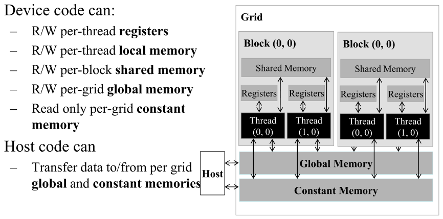

*Figure 5.1 — CUDA device memory model 의 (불완전한) 개요. 이 그림에 없는 중요한 CUDA memory
종류로 texture memory 가 있는데, 이 교재에서는 다루지 않는다. (책 p.98)*

**CUDA 변수를 어느 memory type 으로 선언하는가가 그 변수의 가시성과 접근 속도를 정한다** (책 p.98).

| 종류 | 위치 | host 접근 | 특징 |
|---|---|---|---|
| **global** | off-chip DRAM | R/W | 크고 느리다. 2장에서 봤다 |
| **constant** | off-chip (cache 됨) | R/W | device 는 **읽기 전용**. 짧은 지연·높은 bandwidth. 7장 |
| **local** | **실제로는 global memory** | — | thread 마다 사적. 지연은 global 과 비슷 |
| **register** | on-chip | — | 가장 빠르다. thread 마다 사적 |
| **shared** | on-chip | — | **block 마다.** block 안 thread 들이 협력하는 수단 |

> **local memory 가 헷갈리는 지점** (책 p.98). "local" 이라는 이름과 달리 **global memory 에
> 배치된다.** 접근 지연도 global 과 비슷하다. 다만 **thread 사이에 공유되지 않을 뿐**이다.
> 각 thread 는 global memory 의 자기 몫을 사적 local memory 로 쓰고, 여기에
> **정적 할당 배열, spill 된 register, call stack** 등을 둔다.
>
> 단 **크기가 작고 상수이며 상수 인덱스로만 접근하는 정적 배열은 register 에 들어갈 수 있다**
> (6장).

#### register 가 왜 그렇게 좋은가 — 세 가지 이유

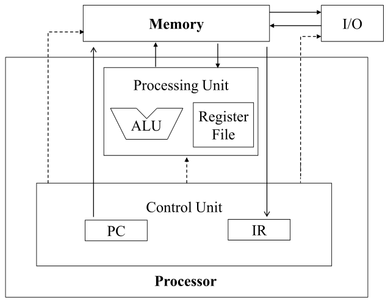

*Figure 5.2 — von Neumann 모델 기반 현대 컴퓨터에서의 memory 대 register. (책 p.100)*

**① bandwidth이 압도적이다** (책 p.99). global memory 는 프로세서 칩 **바깥**에 DRAM 으로
구현되어 지연이 길고 bandwidth이 낮다. register file 은 칩 **위**에 있다.
전형적인 장치에서 **모든 SM 의 register file 을 합친 bandwidth은 global memory 의 최소 두 자릿수 배**다.
게다가 register 에 있는 변수는 **off-chip bandwidth을 아예 쓰지 않으므로** ratio 가 올라간다.

**② 명령 수가 적다** (책 p.99~100). 산술 명령은 대개 register 피연산자를 내장한다.

```
fadd r1, r2, r3            // 피연산자가 register 에 있으면 이 한 줄
```

피연산자가 global memory 에 있으면 **load 명령이 하나 더** 필요하다.

```
load r2, r4, offset        // r4 + offset 주소에서 읽어 r2 에 넣고
fadd r1, r2, r3            // 그 다음에야 덧셈
```

프로세서는 clock cycle 당 정해진 수의 명령만 fetch·실행하므로, **load 가 붙은 쪽이 느리다.**

**③ 에너지가 한 자릿수 배 적다** (책 p.101). register file 에서 값을 읽는 데 드는 에너지는
global memory 에서 읽는 것보다 **최소 한 자릿수 배 낮다.**

> **다만 register 는 희소 자원이다** (책 p.101). 4장에서 봤듯 register 사용이 한계를 넘으면
> occupancy 가 떨어진다. **과다 구독하지 않도록 조심해야 한다.**

> **CPU vs GPU register 구조** (책 p.99 사이드바). CPU 는 thread 를 전환할 때 나가는 thread 의
> register 를 메모리에 저장하고 들어오는 thread 의 것을 복원한다. GPU 는
> **processing block 에 스케줄된 모든 thread 의 register 를 그 block 의 register file 에
> 그대로 들고 있어서** zero-overhead scheduling 이 된다.
>
> 그래서 **GPU 의 register file 은 CPU 것보다 훨씬 커야 한다.** 게다가 4장의 동적 자원 분할
> (thread 당 register 를 적게 주고 많은 thread 를 돌리거나, 그 반대)을 지원해야 한다.
> CPU 는 thread 의 실제 수요와 무관하게 **고정된 register 집합**을 준다.

#### shared memory 는 register 와 무엇이 다른가

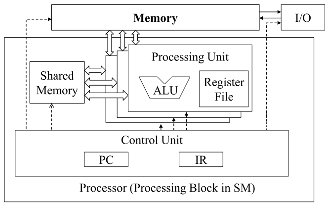

*Figure 5.3 — CUDA device SM 에서의 shared memory 대 register. (책 p.101)*

둘 다 on-chip 이지만 기능과 접근 비용이 크게 다르다 (책 p.101).

| | register | shared memory |
|---|---|---|
| 접근 방법 | 명령에 내장 | **load 연산이 필요** |
| 속도 | 가장 빠르다 | global 보다 훨씬 빠르지만 register 보다는 느리다 |
| **누가 보는가** | **thread 하나** (사적) | **block 의 모든 thread** |
| 컴퓨터 구조 용어 | — | **scratchpad memory** |

**결정적 차이는 가시성이다** (책 p.101). shared memory 는 **같은 block 의 thread 들이
데이터를 높은 bandwidth으로 효율적으로 나누도록** 설계됐다. SM 은 여러 processing unit 을 두어
여러 thread 가 동시에 진행하게 하는데, shared memory 의 하드웨어 구현도
**여러 processing unit 이 동시에 그 내용에 접근**할 수 있게 설계된다.

> **distributed shared memory** (책 p.102). Hopper 부터 같은 thread block cluster 의 thread 는
> cluster 안 **어느 block 의 shared memory 든** 접근할 수 있다. global memory 를 거치지 않고
> 협력할 수 있는 thread 의 범위가 넓어지고, **더 큰 고속 메모리 풀**을 함께 쓰게 된다.

### 2. 선언 문법

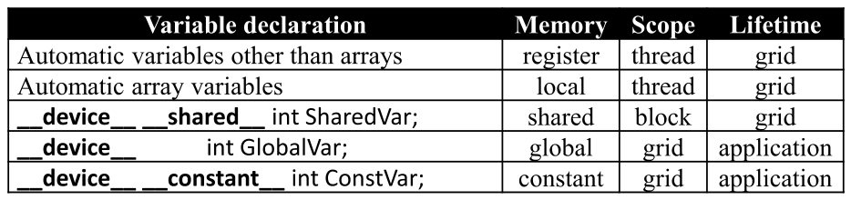

*Figure 5.4 — CUDA 변수 선언 타입 한정자와 각 타입의 성질. (책 p.102)*

| 선언 | memory | scope | lifetime |
|---|---|---|---|
| 배열이 아닌 automatic 변수 | **register** | thread | grid |
| automatic **배열** 변수 | **local** | thread | grid |
| `__device__ __shared__ int SharedVar;` | **shared** | **block** | grid |
| `__device__ int GlobalVar;` | **global** | grid | **application** |
| `__device__ __constant__ int ConstVar;` | **constant** | grid | **application** |

두 축을 정확히 잡고 가는 것이 이 절의 핵심이다 (책 p.102).

- **scope** — 그 변수에 접근할 수 있는 thread 의 집합. thread 하나 / block 전체 / 모든 grid.
  scope 가 thread 면 **thread 마다 사본이 하나씩** 만들어진다.
  백만 개 thread 로 launch 하면 **백만 개의 사본**이 생긴다.
- **lifetime** — 그 변수를 쓸 수 있는 구간. **grid 실행 동안**이면 kernel 함수 본문 안에 선언해야
  하고 kernel 이 여러 번 호출되면 **값이 유지되지 않는다.** **애플리케이션 전체**면
  어떤 함수 본문 바깥에 선언해야 하고 모든 kernel 이 볼 수 있다.

세부 규칙 (책 p.102~104):

- **배열이 아닌 automatic 변수(scalar)** → 전부 register. 3장 Figure 3.8 의
  `blurRow`, `blurCol`, `curRow`, `curCol`, `pixels`, `pixVal` 이 전부 여기 해당한다.
- **automatic 배열** → 기본적으로 register 가 **아니라 local memory** 에 들어간다.
  긴 접근 지연과 혼잡을 겪을 수 있다. **모든 접근이 상수 인덱스라면** 컴파일러가
  register 에 둘 수도 있다 (6장).
- **`__shared__`** → block 마다 사본 하나. lifetime 은 kernel 실행 동안.
  앞에 `__device__` 를 붙여도 같은 효과다. **자주 재사용되는 global memory 데이터 조각을
  담는 데 쓴다** — 5.4절이 그 예다.
- **`__constant__`** → **함수 본문 바깥**에 선언해야 한다. scope 는 모든 grid,
  lifetime 은 애플리케이션 전체. **kernel 이 값을 바꿀 수 없다.** global memory 에 저장되지만
  **cache 된다.** 현재 총 크기는 **65,536 바이트**로 제한된다 (7장).
- **`__device__` 만** → global 변수. 느리다. kernel 호출 사이에 정보를 넘길 때 쓰지만,
  **일반적으로 나쁜 스타일로 취급되며 아껴 써야 한다** — 버그를 유발하고 모듈성을 해친다 (책 p.104).

### 3. 예제/실습

**연습문제 (책 6번, p.119).** 1000개 block, 각 512 thread 로 kernel 을 launch 했다.
kernel 안에 **local 변수**를 선언하면 실행 전체에서 몇 개의 사본이 만들어지는가?

> **답.** local(automatic) 변수의 scope 는 **thread** 이므로 thread 마다 하나씩이다.
> $1000 \times 512 = \mathbf{512{,}000}$ 개.

**연습문제 (책 7번, p.119).** 같은 상황에서 **shared memory 변수**라면?

> **답.** shared 변수의 scope 는 **block** 이므로 block 마다 하나씩, **1,000개**다.
> 6번과 7번을 나란히 놓으면 scope 의 의미가 분명해진다 — **512배 차이**다.

**연습문제 (책 4번, p.119).** register 와 shared memory 의 용량이 문제가 아니라고 가정할 때,
global memory 에서 가져온 값을 담는 데 **register 대신 shared memory 를 쓰는 것이 가치 있는
중요한 이유** 하나를 들고 설명하라.

> **답.** **가시성 때문이다.** register 는 thread 하나만 볼 수 있어서, 한 thread 가 읽어 온 값을
> 다른 thread 가 쓸 수 없다. shared memory 는 block 의 모든 thread 가 보므로
> **thread 하나가 global memory 에서 한 번만 읽어 오면 block 의 나머지 thread 가 함께 쓴다.**
>
> 즉 register 로는 **thread 자기 안에서의 재사용**만 얻지만, shared memory 로는
> **thread 사이의 재사용**을 얻는다. matmul 에서 global 접근을 `TILE_WIDTH` 배로 줄이는 것이
> 바로 후자다 (5.3절). 속도만 보면 register 가 빠르지만, **속도가 아니라 공유가 목적**이다.

**연습문제 5.2-1 (직접).** kernel 안에 `float tmp[64];` 를 선언하면 어디에 놓이는가?
성능상 무엇을 조심해야 하는가?

> **답.** **automatic 배열**이므로 기본적으로 **local memory** — 즉 실제로는 **global memory** 에
> 놓인다 (책 p.98·103). 이름과 달리 빠르지 않고, 긴 지연과 혼잡을 겪는다.
> **모든 접근이 상수 인덱스라면** 컴파일러가 register 로 올릴 수 있지만, 인덱스가 실행 시점에
> 정해지면 그럴 수 없다. 64개짜리 배열을 thread 마다 두는 것은 대개 나쁜 선택이다.

---

## 5.3 Tiling for reduced memory traffic (책 p.104)

### 1. 개념적 이해

CUDA 의 device memory 에는 본질적인 trade-off 가 있다 (책 p.104).

> **global memory 는 크지만 느리고, shared memory 는 작지만 빠르다.**

흔한 전략은 데이터를 **tile** 이라는 부분집합으로 나눠 **각 tile 이 shared memory 에 들어가게**
하는 것이다.

> **"tile" 이라는 이름의 유래** (책 p.104). 큰 벽(= global memory 데이터)을 작은 타일
> (= shared memory 에 들어가는 부분집합)로 덮는다는 비유다.
>
> **중요한 조건**: 이 tile 들에 대한 계산이 **서로 독립적으로** 수행될 수 있어야 한다.
> 임의의 kernel 에 대해 모든 자료구조를 tile 로 나눌 수 있는 것은 아니다.

#### 왜 줄어드는가 — 중복을 세어 본다

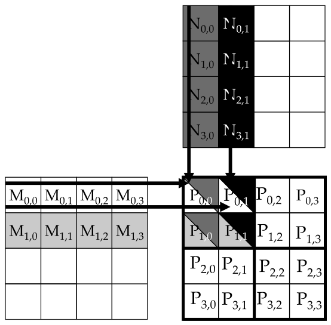

*Figure 5.5 — matrix multiplication 의 작은 예. 간결함을 위해 `M[y*Width+x]`, `N[y*Width+x]`,
`P[y*Width+x]` 를 각각 $M_{y,x}$, $N_{y,x}$, $P_{y,x}$ 로 쓴다. (책 p.104)*

$2 \times 2$ block 4개로 $P$ 를 계산하는 예다. $block_{0,0}$ 의 네 thread 는
$P_{0,0}$, $P_{0,1}$, $P_{1,0}$, $P_{1,1}$ 을 계산한다.

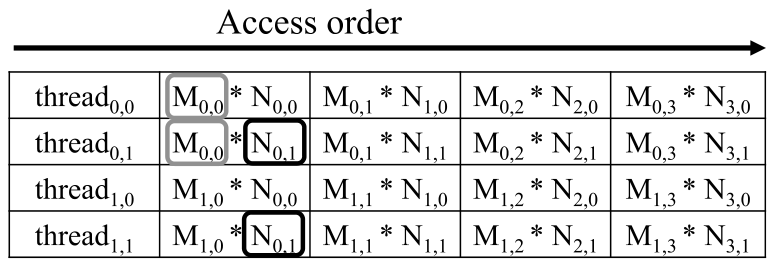

*Figure 5.6 — $block_{0,0}$ 의 thread 들이 수행하는 global memory 접근. (책 p.105)*

Figure 5.6 은 세로로 thread, 가로로 시간(왼쪽→오른쪽)을 놓았다.
각 thread 는 실행 중 $M$ 의 원소 4개와 $N$ 의 원소 4개에 접근한다.
**그런데 겹침이 상당하다** (책 p.105).

- $thread_{0,0}$ 과 $thread_{0,1}$ 은 **둘 다 $M_{0,0}$ 을 비롯한 $M$ 의 0행 전체**에 접근한다.
- $thread_{0,1}$ 과 $thread_{1,1}$ 은 **둘 다 $N_{0,1}$ 을 비롯한 $N$ 의 1열 전체**에 접근한다.

$block_{0,0}$ 이 실행되는 동안 **모든 $M$·$N$ 원소가 정확히 두 번씩** 접근된다.
그러니 네 thread 가 협력하면 **global memory 트래픽을 절반으로** 줄일 수 있다.

$$
\text{절감 배수} = \texttt{TILE\_WIDTH} \tag{5.4}
$$

> $32 \times 32$ 출력 tile 을 쓰면 **global memory 트래픽을 원래의 1/32 로** 줄일 수 있다 (책 p.105).
> 절감 배수가 tile 의 **한 변 길이**와 같다는 점이 중요하다 — 넓이가 아니다.

#### 어떻게 나누는가 — phase 로 쪼갠다

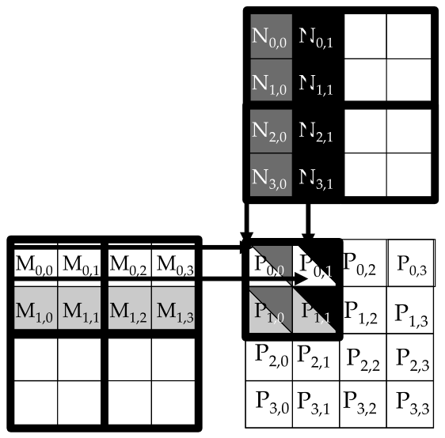

*Figure 5.7 — shared memory 를 활용하기 위해 $M$ 과 $N$ 을 tiling 하기. (책 p.106)*

기본 아이디어 (책 p.105~106):

> thread 들이 **협력해서 $M$ 과 $N$ 의 부분집합을 shared memory 로 먼저 올리고**,
> 그 다음에 각자 dot product 계산에 쓴다.

shared memory 는 작으므로 용량을 넘지 않도록 **입력 tile 로 나눠서** 한다.
가장 단순한 형태에서는 **입력 tile 크기 = 출력 tile 크기 = block 크기**다.

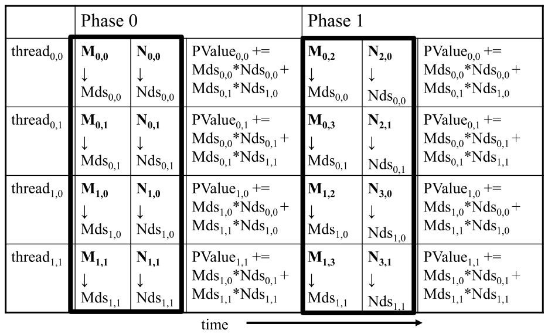

*Figure 5.8 — tiled matrix multiplication 의 실행 phase. (책 p.107)*

각 phase 에서 block 의 모든 thread 가 협력해 $M$ 의 tile 하나와 $N$ 의 tile 하나를
shared memory 로 올린다. **thread 하나가 $M$ 원소 하나와 $N$ 원소 하나씩** 올리면 된다.

Phase 1 시작에서 $block_{0,0}$ 의 네 thread 가 하는 일 (책 p.106):

| thread | 올리는 것 |
|---|---|
| $thread_{0,0}$ | $M_{0,0} \to Mds_{0,0}$ |
| $thread_{0,1}$ | $M_{0,1} \to Mds_{0,1}$ |
| $thread_{1,0}$ | $M_{1,0} \to Mds_{1,0}$ |
| $thread_{1,1}$ | $M_{1,1} \to Mds_{1,1}$ |

$N$ 의 tile 도 같은 방식으로 올린다.

**올라간 뒤 각 값은 두 번씩 쓰인다** (책 p.106). 예컨대 $thread_{1,1}$ 이 $Mds_{1,1}$ 에 올린
$M_{1,1}$ 은 $thread_{1,0}$ 과 $thread_{1,1}$ 이 한 번씩 쓴다.
**global memory 값 하나를 shared memory 에 올려 여러 번 쓰는 것** — 이것이 절감의 전부다.

$$
\text{phase 수} = \frac{\texttt{Width}}{\texttt{TILE\_WIDTH}} \tag{5.5}
$$

> **`Mds` 와 `Nds` 는 phase 마다 재사용된다** (책 p.107). 매 phase 에서 같은 `Mds`·`Nds` 가
> 그 phase 에서 쓸 부분집합을 담는다. 덕분에 **훨씬 작은 shared memory 로 대부분의 global
> 접근을 대신할 수 있다.**
>
> 각 phase 가 입력의 작은 부분집합에 집중하는 이런 접근 양상을 **locality** 라 한다.
> 알고리즘이 locality 를 보이면 **작고 빠른 메모리로 대부분의 접근을 처리해 global memory 에서
> 덜어낼 기회**가 생긴다. locality 는 many-thread GPU 에서만큼 multi-core CPU 에서도 중요하다 (6장).

### 3. 예제/실습

**연습문제 (책 2번, p.119).** $8 \times 8$ matmul 에 대해 $2 \times 2$ tiling 과 $4 \times 4$
tiling 의 Figure 5.7 등가물을 그려라. bandwidth 절감이 tile 차원 크기에 비례함을 확인하라.

> **답.** $\texttt{Width} = 8$ 이므로:
>
> | tiling | phase 수 (5.5) | 원소당 global 접근 | 절감 배수 |
> |---|---|---|---|
> | 없음 | — | 8회 | 1× |
> | $2 \times 2$ | $8/2 = 4$ | $8/2 = 4$회 | **2×** |
> | $4 \times 4$ | $8/4 = 2$ | $8/4 = 2$회 | **4×** |
>
> **절감 배수가 tile 의 한 변(2, 4)과 같다** — 넓이(4, 16)가 아니다. 이유는
> "한 번 올린 값을 그 tile 의 **한 줄에 있는 thread 들**이 나눠 쓰기" 때문이다.
> $T \times T$ tile 에서 $M$ 의 한 원소는 그 tile 의 **$T$ 개 행 thread** 가, $N$ 의 한 원소는
> **$T$ 개 열 thread** 가 함께 쓴다.

**연습문제 (책 5번, p.119).** tiled matmul 에서 $32 \times 32$ tile 을 쓰면 입력 행렬
$M$ 과 $N$ 의 memory bandwidth 사용은 얼마나 줄어드는가?

> **답.** 식 (5.4)에 따라 **각각 32배** 줄어든다. 5.4절에서 보듯 ratio 가
> $0.25 \to 0.25 \times 32 = 8$ FLOP/B 로 올라간다.

**연습문제 (책 8번, p.119).** $N \times N$ 두 행렬을 곱할 때 입력 행렬의 각 원소는 global
memory 에서 몇 번 요청되는가? (a) tiling 이 없을 때 (b) $T \times T$ tile 을 쓸 때

> **답.**
> **(a) $\mathbf{N}$ 번.** $M$ 의 한 원소 $M_{r,k}$ 는 $P$ 의 $r$ 행 전체($N$ 개 원소)를 계산하는 데
> 필요하고, 각 원소를 서로 다른 thread 가 맡으므로 **$N$ 개 thread 가 각각 따로** 읽는다.
> $N$ 도 대칭적으로 같다.
> **(b) $\mathbf{N/T}$ 번.** 한 tile 을 담당하는 block 이 그 원소를 **한 번만** 읽어 shared memory 에
> 올리고 $T$ 개 thread 가 나눠 쓰므로, 요청 횟수가 $T$ 배 줄어든다.
>
> (a)와 (b)의 비가 곧 식 (5.4)의 절감 배수 $T$ 다.

---

## 5.4 A tiled matrix multiplication kernel (책 p.108)

### 2. 코드

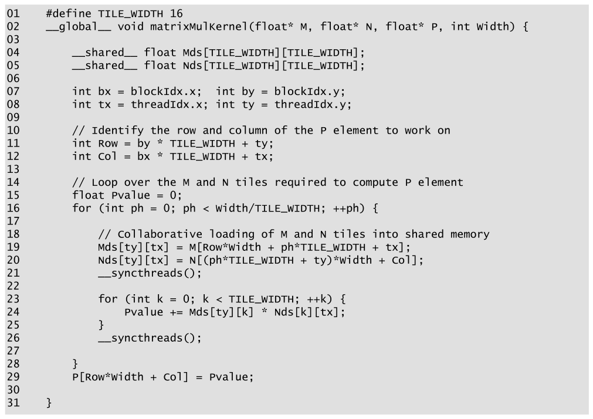

*Figure 5.9 — shared memory 를 쓰는 tiled matrix multiplication kernel. (책 p.108)*

```cuda
01  #define TILE_WIDTH 16
02  __global__ void matrixMulKernel(float* M, float* N, float* P, int Width) {
03
04      __shared__ float Mds[TILE_WIDTH][TILE_WIDTH];
05      __shared__ float Nds[TILE_WIDTH][TILE_WIDTH];
06
07      int bx = blockIdx.x;  int by = blockIdx.y;
08      int tx = threadIdx.x; int ty = threadIdx.y;
09
10      // Identify the row and column of the P element to work on
11      int Row = by * TILE_WIDTH + ty;
12      int Col = bx * TILE_WIDTH + tx;
13
14      // Loop over the M and N tiles required to compute P element
15      float Pvalue = 0;
16      for (int ph = 0; ph < Width/TILE_WIDTH; ++ph) {
17
18          // Collaborative loading of M and N tiles into shared memory
19          Mds[ty][tx] = M[Row*Width + ph*TILE_WIDTH + tx];
20          Nds[ty][tx] = N[(ph*TILE_WIDTH + ty)*Width + Col];
21          __syncthreads();
22
23          for (int k = 0; k < TILE_WIDTH; ++k) {
24              Pvalue += Mds[ty][k] * Nds[k][tx];
25          }
26          __syncthreads();
27
28      }
29      P[Row*Width + Col] = Pvalue;
30
31  }
```

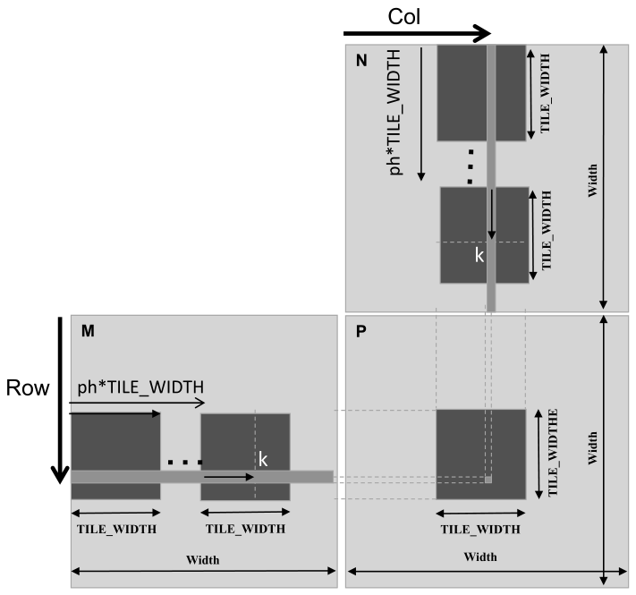

*Figure 5.10 — tiled multiplication 에서의 행렬 인덱스 계산. (책 p.109)*

줄별로 (책 p.108~110):

- **04~05** — `Mds`·`Nds` 를 shared memory 배열로 선언한다. **scope 가 block** 이므로
  block 마다 사본 하나가 생기고 그 block 의 모든 thread 가 같은 것을 본다.
  **동료가 올린 값을 써야 하므로 이것이 결정적이다.**
- **07~08** — `threadIdx`·`blockIdx` 를 짧은 이름의 automatic 변수에 넣는다.
  automatic scalar 이므로 **register** 에 들어가고 thread 마다 사본이 하나씩이다.
- **11~12** — 이 thread 가 만들 $P$ 원소의 행·열. `Col = bx*TILE_WIDTH + tx` 인 이유:
  block `bx` 앞에는 `bx` 개의 block 이 있고 그들이 `bx*TILE_WIDTH` 개의 $P$ 원소를 덮는다.
  같은 block 안에서 `tx` 개가 더 덮는다.
  Figure 5.7 의 예에서 $block_{1,0}$ 의 $thread_{0,1}$ 은 $0 \times 2 + 1 = 1$ 이 되고,
  세로는 $1 \times 2 + 0 = 2$ 라 결국 $P_{2,1}$ 을 맡는다.
- **16** — phase 루프. `ph` 는 **이미 끝난 phase 수**이고, phase 시작 시점에
  `ph*TILE_WIDTH` 쌍이 처리된 상태다.
- **19~20** — **협력 적재.** block 은 $\texttt{TILE\_WIDTH}^2$ 개의 thread 로
  $M$ 과 $N$ 을 각각 $\texttt{TILE\_WIDTH}^2$ 개씩 올린다.
  올릴 $M$ 구간의 **시작 열 인덱스가 `ph*TILE_WIDTH`** 이므로 각 thread 는 거기서 `tx` 만큼
  떨어진 원소를 맡는다. $N$ 은 **시작 행 인덱스**가 `ph*TILE_WIDTH` 이므로 `ty` 만큼 떨어진 것을 맡는다.
  `Row` 가 `ty` 의 선형 함수이고 각 thread 의 `(tx, ty)` 조합이 유일하므로
  **모든 thread 가 서로 다른 원소를 올린다.**
- **21** — **첫 번째 barrier.** 모두가 적재를 마쳐야 아무도 앞서 나가지 않는다.
- **23~25** — 이 phase 의 dot product. **이제 `Mds`·`Nds`(shared)에서 읽는다.**
- **26** — **두 번째 barrier.** 모두가 다 쓴 뒤에야 다음 tile 로 덮어쓴다.
- **29** — 결과를 $P$ 에 쓴다.

#### 두 개의 `__syncthreads()` 가 서로 다른 이유

이것이 이 절에서 가장 중요한 개념적 지점이다 (책 p.110~111).

| | 줄 | 의존 종류 | 왜 필요한가 | 다른 이름 |
|---|---|---|---|---|
| 첫째 | 21 | **read-after-write** | 남이 써 놓기를 **읽는 쪽이** 기다린다 | **true dependence** |
| 둘째 | 26 | **write-after-read** | 남이 다 읽기를 **덮어쓰는 쪽이** 기다린다 | **false dependence** |

> **왜 true / false 인가** (책 p.111). read-after-write 는 **진짜(true)** 의존이다 —
> 읽는 thread 가 쓰는 thread 의 데이터를 정말로 필요로 하므로 기다리는 것 말고는 방법이 없다.
> write-after-read 는 **거짓(false)** 의존이다 — 쓰는 thread 는 읽는 thread 의 데이터가
> 필요하지 않다. **같은 메모리 위치를 재사용하기 때문에 생긴 의존**일 뿐이고,
> 다른 위치를 썼다면 존재하지 않았을 것이다. (6장에서 다시 나온다 — double buffering 이
> 바로 이 false dependence 를 없애는 기법이다.)

#### strip-mining — phase 를 만드는 기법

16번 줄부터 28번 줄까지의 중첩 루프가 **strip-mining** 이다 (책 p.111).

> 오래 도는 루프 하나를 **여러 phase 로 쪼갠다.** 각 phase 는 원래 루프의 연속된 반복
> 몇 개를 실행하는 **안쪽 루프**로 이루어지고, 원래 루프는 그 안쪽 루프를 반복 호출하는
> **바깥 루프**가 된다. 원래 반복이 전부, 원래 순서대로 실행된다.
>
> 여기에 **안쪽 루프 앞뒤로 barrier 를 넣으면** block 의 모든 thread 가 각 phase 마다
> 입력의 한 구간에 집중하게 된다. **strip-mining 은 data parallel 프로그램에서 tiling 이
> 필요로 하는 phase 를 만드는 주된 수단이다.**

> strip-mining 은 CPU 프로그래밍에서 오래 쓰여 왔다 (책 p.111 각주 1).
> **strip-mining 뒤에 loop interchange 를 하는 것**이 순차 프로그램에서 locality 개선을 위한
> tiling 을 가능하게 하는 흔한 방법이고, **벡터화 컴파일러가 SIMD 명령을 만드는 주된 수단**이기도 하다.

### 3. 효과 계산

$$
\text{ratio}_{\text{tiled}} = 0.25 \times \texttt{TILE\_WIDTH}\ \text{FLOP/B} \tag{5.6}
$$

$32 \times 32$ tile 이면 (책 p.111):

| | ratio | 도달 가능 throughput | peak 대비 |
|---|---|---|---|
| tiling 없음 | 0.25 FLOP/B | $3.35 \times 0.25 = 0.84$ TFLOPS | 1.3% |
| **$32 \times 32$ tiling** | **8 FLOP/B** | $3.35 \times 8 = \mathbf{26.8}$ **TFLOPS** | **40%** |

**32배 개선**이다. 다만 8 FLOP/B 는 여전히 임계값 20 FLOP/B 보다 낮아
**아직 memory-bound 구간**이다. 여기서 더 올라가려면 global 접근을 더 줄여야 하고,
그 방법이 15장의 주제다.

> **cuBLAS·CUTLASS** (책 p.111). matmul 이 워낙 중요해서 이런 고급 최적화를 이미 담은
> 고성능 라이브러리가 있다. 선형대수 애플리케이션이라면 이들을 쓰는 것이
> peak 에 가까운 성능을 즉시 얻는 길이다.

#### tiling 은 shared memory 만의 이야기가 아니다

> **tiling 의 일반적 정의** (책 p.112): **자주 접근하는 데이터 부분집합을, 원래 있던 곳보다
> 빠른 메모리에 놓는 것.**
>
> 이 예에서 $M$·$N$ 은 **여러 thread 가 반복 접근**하므로 shared memory 에 tiling 했다.
> 그런데 $P$ 에도 tiling 을 적용했다 — **같은 원소를 같은 thread 가 반복 접근**하므로
> **register(`Pvalue`)** 에 두고 거기서 반복 접근했다. 이를 **register tiling** 이라 한다.
> 여기서는 사소해 보이지만 8·11·15장에서 덜 사소한 예가 나온다.

> **CPU 의 tiling 과 무엇이 다른가** (책 p.112). CPU 에서도 tiling(또는 blocking)으로
> 재사용 데이터가 cache 에 남게 해 성능을 올려 온 긴 역사가 있다. 핵심 차이는 이것이다.
>
> | | CPU | GPU |
> |---|---|---|
> | 재사용 데이터를 on-chip 에 유지 | **cache 가 암묵적으로** | **shared memory·register 로 명시적으로** |
> | 이유 | core 가 한두 thread 만 돌려서 cache 를 신뢰할 수 있다 | SM 이 많은 thread 를 동시에 돌려 **cache slot 을 두고 경쟁**한다 |
>
> GPU 에서 cache 가 덜 신뢰할 만하기 때문에 **재사용할 중요한 데이터는 shared memory 에
> 명시적으로 둬야 한다.**

#### 남은 가정 두 가지

Figure 5.9 의 kernel 은 단순화 가정 두 개를 깔고 있다 (책 p.112).

1. 행렬의 폭이 **block 폭의 배수**다.
2. 행렬이 **정사각**이다.

다음 절에서 첫째를, 그 뒤에 둘째를 푼다.

### 3. 예제/실습

**연습문제 (책 3번, p.119).** Figure 5.9 의 kernel 에서 `__syncthreads()` 하나 또는 둘을
빠뜨리면 어떤 잘못된 실행 동작이 일어날 수 있는가?

> **답.**
> **21번 줄(첫째)을 빠뜨리면** — read-after-write 가 깨진다. 어떤 thread 가 아직
> `Mds`·`Nds` 에 값을 다 올리지 않았는데 다른 thread 가 23~25번 줄에서 그것을 읽는다.
> **초기화되지 않았거나 이전 phase 의 낡은 값**으로 계산해 결과가 조용히 틀린다.
>
> **26번 줄(둘째)을 빠뜨리면** — write-after-read 가 깨진다. 빠른 thread 가 다음 phase 로
> 넘어가 19~20번 줄에서 `Mds`·`Nds` 를 **덮어써 버리는데**, 느린 thread 는 아직 이전 phase 의
> 값을 읽고 있다. 역시 결과가 틀린다.
>
> **둘 다 빠뜨리면** 두 오류가 동시에 난다.
> 공통점은 **crash 가 아니라 조용히 틀린 값**이 나온다는 것, 그리고 **실행할 때마다 결과가
> 달라질 수 있다**는 것이다. 가장 찾기 힘든 종류의 버그다.

**연습문제 5.4-1 (직접).** 식 (5.6)에서 `TILE_WIDTH` 를 얼마로 하면 H100 에서
compute-bound 구간에 들어가는가? 그 값이 현실적인가?

> **답.** $0.25 \times T \ge 20.0$ 이려면 $T \ge 80$ 이다.
> **현실적이지 않다.** block 하나의 thread 수가 $80 \times 80 = 6400$ 으로
> **최대 1024 를 크게 넘는다** (4장). shared memory 도 $2 \times 80^2 \times 4 = 51.2$ KB 를
> 써야 한다. 즉 **단순 tiling 만으로는 compute-bound 에 도달할 수 없고**,
> 15장의 고급 기법(thread coarsening·register tiling 등)이 필요하다.
> 위 roofline 위젯의 "지붕이 꺾이는 T" 버튼이 이 값을 계산해 보여준다.

---

## 5.5 Boundary checks (책 p.112)

### 1. 개념적 이해

폭이 tile 폭의 배수가 아닌 행렬을 다루도록 확장한다. Figure 5.7 의 예를 $3 \times 3$ 으로 바꿔 보자
— 폭 3은 tile 폭 2의 배수가 아니다.

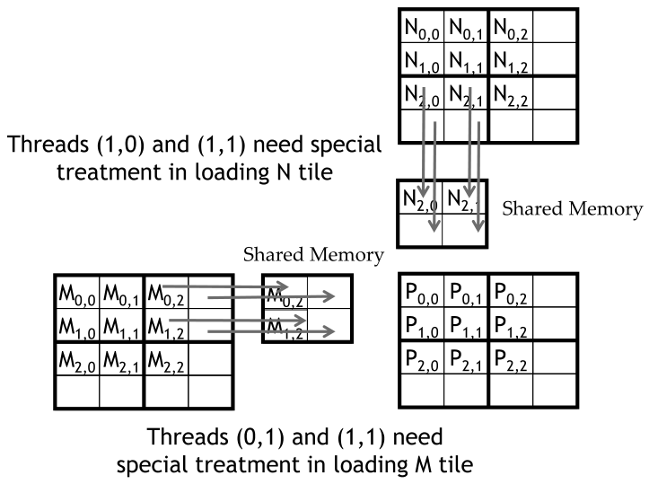

*Figure 5.11 — 가장자리에 가까운 입력 행렬 원소의 적재 — $block_{0,0}$ 의 phase 1. (책 p.113)*

$thread_{0,1}$ 과 $thread_{1,1}$ 이 **존재하지 않는 $M$ 원소**를 올리려 하고,
$thread_{1,0}$ 과 $thread_{1,1}$ 이 **존재하지 않는 $N$ 원소**에 접근하려 한다.

#### 두 가지 방식으로 문제가 된다 (책 p.113)

**① 행 끝을 넘어가는 접근** — $M_{0,3}$, $M_{1,3}$ 처럼.
이건 **잘못된 원소를 실제로 읽어 온다.** 3장의 선형화 배치를 떠올리면 이유가 보인다 —
선형 배치에서 $M_{0,2}$ 다음 원소는 $M_{1,0}$ 이다. **$M_{0,3}$ 을 읽으려 하면 $M_{1,0}$ 을 얻는다.**
그 값이 dot product 에 들어가 결과를 오염시킨다.

**② 열 끝을 넘어가는 접근** — 이건 **할당 영역 바깥**이다. 시스템에 따라
다른 자료구조의 임의 값을 돌려주거나, 접근을 거부해 프로그램을 중단시킨다.
**어느 쪽이든 바람직하지 않다.**

#### 마지막 phase 만의 문제가 아니다

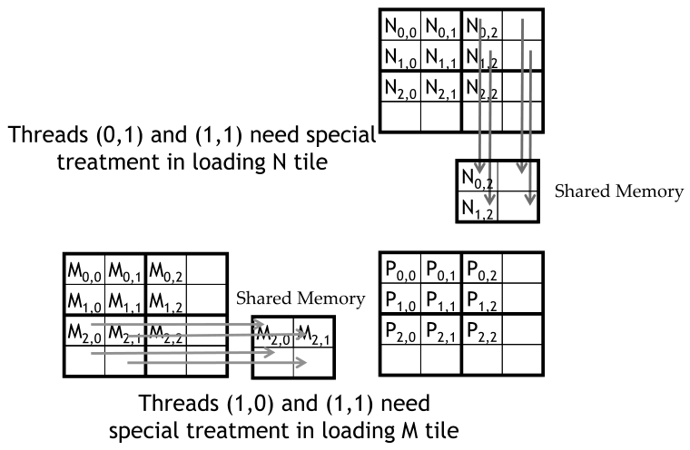

*Figure 5.12 — $block_{1,1}$ 의 phase 0 동안의 입력 원소 적재. (책 p.114)*

**문제 있는 접근은 모든 phase 에서 생길 수 있다** (책 p.113). Figure 5.12 에서
$block_{1,1}$ 의 **phase 0** 에 이미 $thread_{1,0}$·$thread_{1,1}$ 이 없는 $M_{3,0}$·$M_{3,1}$ 을,
$thread_{0,1}$·$thread_{1,1}$ 이 없는 $N_{0,3}$·$N_{1,3}$ 을 건드린다.

#### 유효한 P 를 계산하지 않는 thread 를 빼는 것으로는 안 된다

두 가지 사실이 이를 막는다 (책 p.114).

1. **유효한 $P$ 를 만들지 않는 thread 도 적재는 해야 한다.**
   $block_{1,1}$ 의 $thread_{1,0}$ 은 유효한 $P$ 원소를 계산하지 않지만,
   **phase 0 에서 $M_{2,1}$ 을 올려야** 같은 block 의 다른 thread 가 쓸 수 있다.
2. **유효한 $P$ 를 계산하는 thread 도 없는 원소를 건드릴 수 있다.**
   $block_{0,0}$ 의 $thread_{0,1}$ 은 유효한 $P_{0,1}$ 을 계산하지만
   phase 1 에서 없는 $M_{0,3}$ 에 접근한다.

> **그래서 검사가 세 종류로 갈린다** — $M$ tile 적재용, $N$ tile 적재용, $P$ 계산·저장용.
>
> **경험칙** (책 p.114): **모든 메모리 접근마다, 그 접근에 쓰이는 인덱스가 배열 범위 안인지
> 확인하는 대응 검사가 있어야 한다.**

| 대상 | 조건 |
|---|---|
| $M$ tile 적재 (19번 줄) | `Row < Width && (ph*TILE_WIDTH+tx) < Width` |
| $N$ tile 적재 (20번 줄) | `(ph*TILE_WIDTH+ty) < Width && Col < Width` |
| $P$ 저장 (29번 줄) | `Row < Width && Col < Width` |

#### 조건이 거짓이면 무엇을 넣는가

**0.0f 를 넣는다** (책 p.114).

> dot product 계산에 쓰여도 **아무 해를 끼치지 않는 값**이기 때문이다.
> 어떤 thread 가 이 0을 곱해 더해도 inner product 값은 변하지 않는다.

**이것이 이 절에서 가장 우아한 지점이다.** "적재하지 않는다"가 아니라 "0을 적재한다"로
처리하면, 뒤따르는 계산 루프를 **전혀 건드리지 않아도 된다.**

### 2. 코드

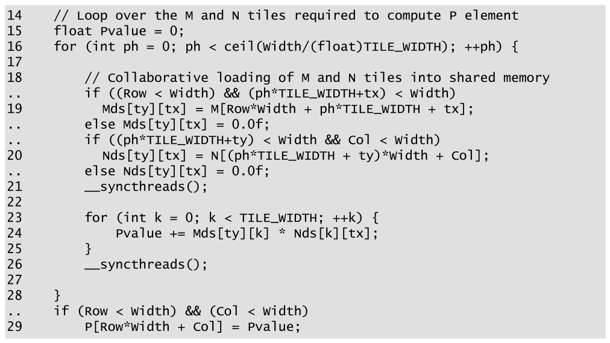

*Figure 5.13 — 경계 조건 검사를 넣은 tiled matrix multiplication kernel. (책 p.115)*

```cuda
14      // Loop over the M and N tiles required to compute P element
15      float Pvalue = 0;
16      for (int ph = 0; ph < ceil(Width/(float)TILE_WIDTH); ++ph) {
17
18          // Collaborative loading of M and N tiles into shared memory
..          if ((Row < Width) && (ph*TILE_WIDTH+tx) < Width)
19            Mds[ty][tx] = M[Row*Width + ph*TILE_WIDTH + tx];
..          else Mds[ty][tx] = 0.0f;
..          if ((ph*TILE_WIDTH+ty) < Width && Col < Width)
20            Nds[ty][tx] = N[(ph*TILE_WIDTH + ty)*Width + Col];
..          else Nds[ty][tx] = 0.0f;
21          __syncthreads();
22
23          for (int k = 0; k < TILE_WIDTH; ++k) {
24              Pvalue += Mds[ty][k] * Nds[k][tx];
25          }
26          __syncthreads();
27
28      }
..      if (Row < Width) && (Col < Width)
29          P[Row*Width + Col] = Pvalue;
```

> 원문은 Figure 5.9 대비 **추가된 줄에 `..` 를 붙여** 표시한다. 위에서도 그대로 두었다.
> 16번 줄의 phase 수도 `Width/TILE_WIDTH` 에서 **`ceil(Width/(float)TILE_WIDTH)`** 로 바뀌었다 —
> 2장에서 본 `256.0` 과 같은 이유로 **`(float)` 캐스팅이 필수**다.

#### 일반 행렬로 가는 마지막 한 걸음

경계 검사까지 넣으면 **일반 matmul kernel 에서 한 발짝 남는다** (책 p.115).
일반적으로 $j \times k$ 행렬 $M$ 과 $k \times l$ 행렬 $N$ 을 곱하면 $j \times l$ 행렬 $P$ 가 된다.
바꿀 것은 단순하다.

| 지금 `Width` 가 쓰이는 곳 | 바꿀 것 |
|---|---|
| $M$ 의 높이 = $P$ 의 높이 | **`j`** |
| $M$ 의 폭 = $N$ 의 높이 | **`k`** |
| $N$ 의 폭 = $P$ 의 폭 | **`l`** |

책은 이 개정을 연습문제로 남긴다.

### 3. 예제/실습

**연습문제 (책 10번, p.119~120).** 어떤 신입 CUDA 프로그래머가 행렬의 각 tile 을 전치하는
아래 kernel 을 썼다. tile 은 `BLOCK_WIDTH` × `BLOCK_WIDTH` 이고 행렬 A 의 각 차원은
`BLOCK_WIDTH` 의 배수다. `BLOCK_WIDTH` 는 컴파일 시점에 정해지며 1~20 사이다.

```cuda
01  dim3 blockDim(BLOCK_WIDTH,BLOCK_WIDTH);
02  dim3 gridDim(A_width/blockDim.x,A_height/blockDim.y);
03  BlockTranspose<<<gridDim, blockDim>>>(A, A_width, A_height);

04  __global__ void
05  BlockTranspose(float* A_elements, int A_width, int A_height)
06  {
07      __shared__ float blockA[BLOCK_WIDTH][BLOCK_WIDTH];

08      int baseIdx = blockIdx.x * BLOCK_SIZE + threadIdx.x;
09      baseIdx += (blockIdx.y * BLOCK_SIZE + threadIdx.y) * A_width;

10      blockA[threadIdx.y][threadIdx.x] = A_elements[baseIdx];

11      A_elements[baseIdx] = blockA[threadIdx.x][threadIdx.y];
12  }
```

(a) `BLOCK_SIZE` 의 가능한 값 중 어느 값에서 이 kernel 이 **올바로 동작**하는가?
(b) 모든 값에서 올바르지 않다면 근본 원인은 무엇이고 어떻게 고치는가?

> **답.**
> **(b) 부터 — 근본 원인은 `__syncthreads()` 누락이다.** 10번 줄은 shared memory 에 **쓰고**,
> 11번 줄은 **다른 thread 가 쓴** 위치(`blockA[threadIdx.x][threadIdx.y]`, 인덱스가 뒤바뀌어 있다)를
> **읽는다.** 전형적인 **read-after-write** 의존인데 그 사이에 barrier 가 없다.
> 고치려면 10번과 11번 사이에 `__syncthreads();` 를 넣는다.
>
> ```cuda
> 10      blockA[threadIdx.y][threadIdx.x] = A_elements[baseIdx];
> ..      __syncthreads();                       // ← 이 줄이 빠져 있다
> 11      A_elements[baseIdx] = blockA[threadIdx.x][threadIdx.y];
> ```
>
> **(a) block 의 thread 가 전부 한 warp 안에 들어가는 값**, 즉
> $\texttt{BLOCK\_WIDTH}^2 \le 32$ → **`BLOCK_WIDTH` 가 1~5** 일 때만 (우연히) 동작한다.
> 한 warp 는 SIMD 로 같은 명령을 함께 실행하므로 10번 줄이 warp 전체에서 끝난 뒤에야
> 11번 줄이 시작되기 때문이다. $\texttt{BLOCK\_WIDTH} = 6$ 이면 36 thread 라 warp 2개가 되고,
> 두 warp 의 진행 순서가 보장되지 않아 깨진다.
>
> > **다만 이것은 "우연히 동작"이지 올바른 코드가 아니다.** 4장에서 봤듯 **Volta 이후의
> > independent thread scheduling** 때문에 같은 warp 안에서도 암묵적 동기를 가정할 수 없다.
> > 최신 아키텍처에서는 `BLOCK_WIDTH` ≤ 5 여도 `__syncwarp()` 없이는 보장되지 않는다.
>
> **원문 표기 흔들림**: 07번 줄은 `BLOCK_WIDTH` 를, 08~09번 줄과 문제 지문은 `BLOCK_SIZE` 를
> 쓴다. 같은 것을 가리키는 **두 이름**이다.

**연습문제 5.5-1 (직접).** 경계를 벗어난 자리에 `0.0f` 대신 아무 값이나 넣으면 어떻게 되는가?
그리고 왜 "적재를 건너뛴다"가 아니라 "0을 적재한다"로 처리하는가?

> **답.** 그 값이 23~25번 줄의 dot product 에 **그대로 곱해져 더해지므로** 결과가 오염된다.
> 0만이 **곱해서 더해도 합을 바꾸지 않는** 값이다 (덧셈의 항등원).
>
> "적재를 건너뛰면" `Mds`·`Nds` 에 **이전 phase 의 값이 남아** 있어 오히려 더 나쁘다.
> 그리고 0을 넣으면 **뒤따르는 계산 루프를 전혀 고치지 않아도 된다** — 경계 처리가
> 적재 단계에 갇히고 계산 단계는 깨끗하게 유지된다.

---

## 5.6 Impact of memory usage on occupancy (책 p.115)

### 1. 개념적 이해

4장에서 register 사용이 occupancy 를 제한할 수 있음을 봤다.
**shared memory 사용도 마찬가지다** (책 p.115~116).

> **긴장 관계가 있다** (책 p.115). on-chip 메모리를 써서 **arithmetic intensity 를 올리는 이득**과,
> 높은 occupancy 로 **latency tolerance 를 얻는 이득** 사이에서 균형을 잡아야 한다.
> 일반적으로 **thread 하나가 더 많은 자원을 요구할수록 SM 에 상주할 수 있는 thread 가 줄어든다.**

### 2. 계산

H100 기준 (책 p.116):

| 항목 | 값 |
|---|---|
| SM 당 shared memory | 최대 **228 KB** 로 구성 가능 |
| SM 당 thread | 최대 **2048** |

$$
\text{full occupancy 를 위한 thread 당 shared memory} \le \frac{228\ \text{KB}}{2048} = 114\ \text{B/thread} \tag{5.7}
$$

**tiled matmul 은 어떤가?** block 하나가 $\texttt{TILE\_WIDTH}^2$ 개의 thread 를 갖고
`Mds`·`Nds` 로 각각 $\texttt{TILE\_WIDTH}^2 \times 4$ B 를 쓰므로:

$$
\frac{\texttt{TILE\_WIDTH}^2 \times 4 + \texttt{TILE\_WIDTH}^2 \times 4}{\texttt{TILE\_WIDTH}^2} = 8\ \text{B/thread}
$$

**`TILE_WIDTH` 와 무관하게 8 B/thread 다.** 114 에 한참 못 미치므로
**tiled matmul 의 occupancy 는 shared memory 에 제한되지 않는다** (책 p.116).

**제한되는 경우의 예** (책 p.116) — block 이 38 KB 를 쓰고 thread 가 256개라면:

$$
\frac{38\ \text{KB}}{256} = 152\ \text{B/thread}, \qquad
\frac{228\ \text{KB}}{152\ \text{B}} = 1536\ \text{thread}, \qquad
\frac{1536}{2048} = \mathbf{75\%}
$$

> **SM 을 재구성할 수 있다** (책 p.116). shared memory 를 아주 많이 쓰는 kernel 을 위해
> CUDA 는 **다른 on-chip 자원(특히 cache)을 희생해 shared memory 에 더 많은 자원을 주도록**
> SM 을 재구성할 수 있게 한다. 예측 가능한 접근 양상과 그렇지 않은 것 **양쪽 모두**가
> on-chip 메모리의 이득을 볼 수 있게 하는 장치다.

### 3. 동적 shared memory

**SM 의 shared memory 크기는 장치마다 다르다** (책 p.116). 그래서 host code 가
실행 시점에 크기를 정하고 kernel 이 쓰는 양을 조절하고 싶을 때가 있다.
`cudaGetDeviceProperties` 의 **`devProp.sharedMemPerBlock`** 으로 조회한다.

Figure 5.9 의 선언은 **컴파일 시점 상수로 못박혀** 있다.

```cuda
__shared__ float Mds[TILE_WIDTH][TILE_WIDTH];
__shared__ float Nds[TILE_WIDTH][TILE_WIDTH];
```

크기를 바꾸려면 `TILE_WIDTH` 를 고쳐 **재컴파일**해야 한다.

> **원문 오기** (책 p.117). 본문은 "코드에 `#define TILE_WIDTH 32` 가 있으므로 `Mds` 와 `Nds` 는
> $32^2 = 1024$ 개의 원소를 갖는다"고 쓰는데, **Figure 5.9 의 01번 줄은 `#define TILE_WIDTH 16`**
> 이다. (`#define TILE_WIDTH 32` 는 Figure 5.14 의 01번 줄이다.)

동적으로 하려면 **`extern` 을 붙이고 크기를 비운다** (책 p.117).

```cuda
extern __shared__ Mds_Nds[];
```

배열이 **하나로 합쳐지므로** `Mds` 구간과 `Nds` 구간이 어디서 시작하는지 **직접 정해야** 하고,
합쳐진 배열은 1차원이라 **선형 인덱스로 접근**해야 한다.

호출할 때 **세 번째 실행 구성 파라미터**로 block 당 shared memory 크기(바이트)를 준다.

```cuda
size_t size = ...;
matrixMulKernel <<< dimGrid, dimBlock, size >>>
    (Md, Nd, Pd, Width, size/2, size/2);
```

$32 \times 32$ tile 이면 $\texttt{size} = 2 \times 32 \times 32 \times 4 = \mathbf{8{,}192}$ 바이트다.

> **원문 오기** (책 p.117). 이어서 "`size/2` 를 넘기는데 이는 **1024 바이트**" 라고 쓰는데,
> $8192/2 = \mathbf{4{,}096}$ 바이트다. **1024는 바이트가 아니라 `float` 개수**($4096/4$)다.
> 같은 문단이 두 인자를 "both in terms of bytes" 라고 명시하므로 단위를 섞은 오기다.

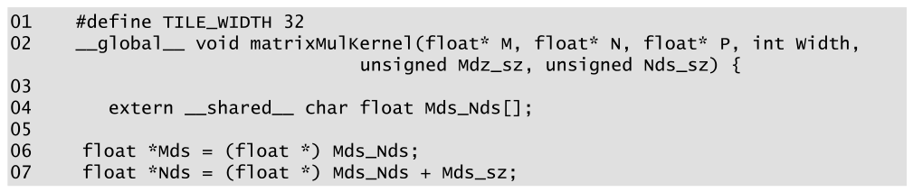

*Figure 5.14 — 동적으로 크기가 정해지는 shared memory 를 쓰는 tiled matrix multiplication
kernel. (책 p.117)*

```cuda
01  #define TILE_WIDTH 32
02  __global__ void matrixMulKernel(float* M, float* N, float* P, int Width,
                                    unsigned Mds_sz, unsigned Nds_sz) {
03
04      extern __shared__ char Mds_Nds[];
05
06      float *Mds = (float *) Mds_Nds;
07      float *Nds = (float *)(Mds_Nds + Mds_sz);
```

> **원문 오기 세 곳** (Figure 5.14). 위 코드는 **바로잡은 것**이고, 원문은 이렇다.
> ① 04번 줄이 **`extern __shared__ char float Mds_Nds[];`** — `char` 와 `float` 가
>    **둘 다 적혀 있어** 컴파일되지 않는다.
> ② 02번 줄의 매개변수 이름이 **`Mdz_sz`**(z)인데 07번 줄은 **`Mds_sz`**(s)를 쓴다.
> ③ 07번 줄이 원문에서 **`(float *) Mds_Nds + Mds_sz`** 인데, 이러면 먼저 `float*` 로 캐스팅한 뒤
>    더하므로 **`Mds_sz × 4` 바이트만큼** 건너뛴다. `Mds_sz` 는 바이트 단위이므로
>    **`(float *)(Mds_Nds + Mds_sz)`** 처럼 **더한 뒤 캐스팅**해야 맞다.

이후 코드는 `Mds`·`Nds` 를 기준 포인터로 삼아 **선형 인덱스**로 접근한다 —
`Mds[ty][tx]` 대신 **`Mds[ty*TILE_WIDTH+tx]`** 를 쓴다 (책 p.118).

### 3. 예제/실습

**연습문제 (책 12번, p.120).** 2048 thread/SM, 32 block/SM, 65,536 register/SM,
**96 KB shared memory/SM** 인 GPU 다. 각 kernel 이 full occupancy 를 낼 수 있는가?
아니면 제약 요인은?

> **답.** 4장의 세 제약에 **shared memory 제약이 하나 더** 붙는다.
>
> | | block 크기 | reg/thread | shared/block | thread 제한 | block 제한 | register 제한 | **shared 제한** | 결과 |
> |---|---|---|---|---|---|---|---|---|
> | a | 64 | 27 | 4 KB | 32 | 32 | $65536/(64{\cdot}27) = 37$ | **$96/4 = 24$** | **24 block = 1536 → 75%** |
> | b | 256 | 31 | 8 KB | 8 | 32 | $65536/(256{\cdot}31) = 8$ | $96/8 = 12$ | **8 block = 2048 → 100%** |
>
> **a. full occupancy 불가 — shared memory 제약.** 24 block × 64 = 1536 thread → 75%.
> **b. full occupancy 가능 (100%).** thread slot 과 register 가 동시에 8 block 을 허용하고
> shared memory 는 12 block 까지 되므로 여유가 있다.
>
> **a 가 흥미롭다** — thread·block·register 모두 32 block 이상을 허용하는데
> **shared memory 혼자 24로 끌어내린다.** 4장의 performance cliff 와 같은 종류의 일이
> shared memory 에서도 일어난다.

**검산 코드**

```python
MAXT, MAXB, MAXR, MAXS = 2048, 32, 65536, 96*1024

def occ(bs, reg, sh_kb):
    sh = sh_kb * 1024
    lims = {'thread slot': MAXT//bs, 'block slot': MAXB,
            'register': MAXR//(bs*reg), 'shared memory': MAXS//sh}
    blocks = min(lims.values())
    who = [k for k, v in lims.items() if v == blocks]
    return lims, blocks, blocks*bs, blocks*bs/MAXT, who

for tag, bs, reg, sh in [('a', 64, 27, 4), ('b', 256, 31, 8)]:
    lims, b, t, o, who = occ(bs, reg, sh)
    print(f"  {tag}. {lims} → block {b} = {t} thread · occupancy {o:.0%}  [{' + '.join(who)}]")
#   a. {'thread slot': 32, 'block slot': 32, 'register': 37, 'shared memory': 24}
#      → block 24 = 1536 thread · occupancy 75%  [shared memory]
#   b. {'thread slot': 8, 'block slot': 32, 'register': 8, 'shared memory': 12}
#      → block 8 = 2048 thread · occupancy 100%  [thread slot + register]
```

**연습문제 (책 11번, p.120).** 다음 kernel 을 보고 답하라.

```cuda
01  __global__ void foo_kernel(float* a, float* b) {
02     unsigned int i = blockIdx.x*blockDim.x + threadIdx.x;
03      float x[4];
04      __shared__ float y_s;
05      __shared__ float b_s[128];
06      for(unsigned int j = 0; j < 4; ++j) {
07          x[j] = a[j*blockDim.x*gridDim.x + i];
08      }
09      if(threadIdx.x == 0) {
10          y_s = 7.4f;
11      }
12      b_s[threadIdx.x] = b[i];
13      __syncthreads();
14      b[i] = 2.5f*x[0] + 3.7f*x[1] + 6.3f*x[2] + 8.5f*x[3]
15             + y_s*b_s[threadIdx.x] + b_s[(threadIdx.x + 3)%128];
16  }
17  void foo(int* a_d, int* b_d) {
18     unsigned int N = 1024;
19       foo_kernel <<< (N + 128 - 1)/128, 128 >>>(a_d, b_d);
20  }
```

> **답.** block 크기 128, $\lceil 1024/128 \rceil = 8$ block, 총 1024 thread.
>
> **a. `i` 의 사본 수** — automatic scalar → **register**, scope 는 thread → **1,024개**
> **b. `x[]` 의 사본 수** — automatic **배열** → **local memory**, scope 는 여전히 thread → **1,024개**
> **c. `y_s` 의 사본 수** — `__shared__`, scope 는 block → **8개**
> **d. `b_s[]` 의 사본 수** — `__shared__` → **8개**
> **e. block 당 shared memory** — $\underbrace{4}_{y_s} + \underbrace{128 \times 4}_{b_s} = \mathbf{516\ \text{B}}$
> **f. floating point 대 global memory 접근 비**
>
> | | 세기 |
> |---|---|
> | 곱셈 | `2.5*x[0]`, `3.7*x[1]`, `6.3*x[2]`, `8.5*x[3]`, `y_s*b_s[tx]` → **5** |
> | 덧셈 | 항 6개를 더하므로 → **5** |
> | **FLOP 합** | **10** |
> | `a[]` 읽기 | 7번 줄이 4번 반복 → $4 \times 4 = 16$ B |
> | `b[i]` 읽기 | 12번 줄 → 4 B |
> | `b[i]` 쓰기 | 14번 줄 → 4 B |
> | **바이트 합** | **24 B** |
>
> $$\text{ratio} = \frac{10\ \text{FLOP}}{24\ \text{B}} = \mathbf{0.417\ \text{FLOP/B}}$$
>
> **b·d 를 헷갈리기 쉽다** — `x[]` 는 배열이지만 **automatic** 이라 thread 마다,
> `b_s[]` 는 배열이면서 **`__shared__`** 라 block 마다다. **배열이냐가 아니라 한정자가 scope 를 정한다.**
> `b_s` 를 shared 에 두는 이유도 15번 줄에서 보인다 — `b_s[(tx+3)%128]` 로
> **이웃 thread 가 올린 값을 읽기** 때문이다.
>
> **원문 조판 오류**: 18번 줄이 원문에서 **`unsigned int \texttts{N} = 1024;`** 로,
> LaTeX 명령 `\texttts{N}` 이 그대로 새어 나와 있다. 위에서는 `N` 으로 바로잡았다.

---

## 5.7 Summary (책 p.118)

책의 정리를 옮기면 (책 p.118):

- 프로그램의 실행 속도는 kernel 의 **compute-to-global-memory-access ratio** 에 달렸다.
  높으면 compute-bound 라 peak 연산 성능에 가까울 수 있고, 낮으면 memory-bound 라
  피연산자를 메모리에서 가져오는 속도에 묶인다.
- CUDA 는 register·shared memory·constant memory 를 제공한다. global memory 보다 훨씬 작지만
  훨씬 빠르다. 여기에 데이터를 두면 **global memory bandwidth을 쓰지 않고 접근**할 수 있어 ratio 가 올라간다.
  **다만 이들을 효과적으로 쓰려면 알고리즘을 다시 설계해야 한다.**
- **tiling** 은 barrier synchronization 으로 여러 thread 가 각 실행 phase 마다 입력의 한
  부분집합에 함께 집중하게 만들어, 그 부분집합을 고속 메모리에 둘 수 있게 하는 전략이다.
- **용량 한계를 늘 의식해야 한다.** 한계를 넘으면 SM 에서 동시에 실행되는 thread 수가 줄어
  연산 throughput 과 latency 감내 능력이 함께 나빠진다.
- tiling 은 GPU 만의 것이 아니다. **모든 종류의 병렬 컴퓨팅 시스템**에서 유효한 전략인데,
  고속 메모리를 효과적으로 쓰려면 애플리케이션이 **데이터 접근에 locality 를 보여야** 하기 때문이다.

---

## 정리

5장에서 가져갈 것을 넷으로 줄이면:

1. **성능의 언어는 FLOP/B 다.** kernel 의 ratio 와 하드웨어의 임계값(peak 연산 ÷ peak bandwidth)을
   비교하면 memory-bound 인지 compute-bound 인지, 그리고 얼마나 더 갈 수 있는지가 나온다.
   **compute-bound / memory-bound 는 kernel 만의 속성이 아니라 kernel 과 하드웨어의 관계다.**
2. **tiling 의 절감 배수는 tile 의 한 변이다.** $T \times T$ tile 이면 global 접근이 $T$ 배 준다 —
   넓이 $T^2$ 배가 아니다. matmul 에서 $0.25 \to 0.25T$ FLOP/B 로 올라가고,
   $T = 32$ 면 0.84 → 26.8 TFLOPS 다.
3. **tiling 의 전제는 재사용이다.** matrix addition 처럼 입력 원소가 한 번만 쓰이면
   shared memory 로 얻을 것이 없다. **register 는 thread 안의 재사용, shared memory 는
   thread 사이의 재사용**을 담당한다.
4. **두 개의 barrier 는 서로 다른 일을 한다.** 적재 뒤의 것은 read-after-write(진짜 의존),
   계산 뒤의 것은 write-after-read(거짓 의존)를 막는다. 하나라도 빠지면
   **crash 가 아니라 조용히 틀린 값**이 나온다.

다음은 6장 — 6장의 최적화 체크리스트가 이 책 나머지 전부에서 반복 사용된다.
coalescing·latency hiding·thread coarsening 이 나온다.
