# 6장. Performance considerations

> **원문 범위**: 책 p.123~155 (6.1~6.11절 + References)
> **절 순서**: 책 순서를 그대로 따랐다. 재배치 없음.
> **연습문제**: 책 6.11절의 5문제를 전부 풀고 답·풀이를 붙였다. 관련 절 아래로 옮겨 배치했다.

**Part 1 의 마지막 장이자, 이 책 나머지 전부의 참조점**이다. 6.8절의 **최적화 체크리스트**가
Part 2·3 의 모든 장에서 반복 사용된다.

4장은 compute 아키텍처를, 5장은 on-chip 메모리를 다뤘다. **6장은 off-chip 메모리(DRAM)의
구조**와 거기서 나오는 성능 고려사항을 다루고, 그 위에 최적화 몇 개를 더 얹는다.

| 절 | 무엇을 |
|---|---|
| 6.1 | **coalescing** — warp 의 접근을 하나로 합치기 |
| 6.2 | **channel·bank** — DRAM 의 병렬 구조로 latency 감추기 |
| 6.3 | **vector load/store** — 명령 하나로 16 B 접근하기 |
| 6.4 | **bank conflict** — shared memory 가 직렬화되는 경우와 padding |
| 6.5 | **thread coarsening** — 병렬화 오버헤드를 줄이려 일부러 직렬화하기 |
| 6.6 | **loop unrolling** — 분기를 줄이고 명령 스케줄링 여지를 넓히기 |
| 6.7 | **double buffering** — false dependence 를 없애 barrier 하나를 제거하기 |
| 6.8~6.9 | **체크리스트와 전략** |

장 전체를 관통하는 문장은 서두에 있다 (책 p.124).

> **최적화란 한 자원의 사용을 다른 자원과 맞바꾸는 것이다.** 그래서 지금 무엇이
> **bottleneck** 인지 모르면 성능 튜닝은 추측 놀음이 된다.

---

## 6.1 Global memory access coalescing (책 p.124)

### 1. 개념적 이해

#### 왜 DRAM 이 느린가

DRAM 은 데이터 비트를 **작은 커패시터**인 DRAM cell 에 저장한다. 읽으려면 그 작은 전하로
**용량이 큰 선(line)을 구동**해 sensor 의 검출 기구를 작동시켜야 하고, 이 과정이 현대 DRAM
칩에서 **수십 나노초** 걸린다 (책 p.124). 현대 컴퓨팅 장치의 clock cycle 이 1 나노초 미만인
것과 극명하게 대조된다.

> **커피 비유** (책 p.124~125 사이드바). decoder 는 수천 개 cell 의 출력 트랜지스터 게이트에
> 연결된 가로선을 구동하는 회로다. 이 가로선을 원하는 수준까지 충전·방전하는 데 오래 걸린다.
> 더 큰 난관은, 게이트가 열린 뒤 cell 이 **세로선을 sense amplifier 까지 구동**하는 일이다.
> 이건 **전하 나눔(charge sharing)** 에 기댄다 — cell 에 저장된 아주 적은 전하가
> **긴 bit line 의 큰 용량**의 전위를 충분히 바꿔야 검출이 작동한다.
>
> **좋은 비유**: 누군가 긴 복도 한쪽 끝에서 작은 커피잔을 들고 있고, 다른 사람이
> 복도를 타고 퍼진 향으로 커피 맛을 알아맞히는 것.
>
> **왜 개선되지 않는가**: cell 마다 더 크고 강한 커패시터를 쓰면 빨라지겠지만,
> DRAM 은 **반대 방향으로 가 왔다.** 칩 하나에 더 많은 비트를 담으려고 커패시터를
> 계속 작게 만들었다. **그래서 DRAM 의 접근 latency 는 시간이 지나도 줄지 않았다.**

#### DRAM burst 와 cache line

그래서 현대 DRAM 은 **병렬성**으로 접근 속도를 올린다 (책 p.124~125).

> DRAM 위치 하나를 접근할 때마다 **그것을 포함한 연속된 위치 범위가 함께** 접근된다.
> 칩마다 sensor 가 많이 있고 전부 병렬로 동작한다. 이렇게 함께 접근되어 전달되는
> 연속 위치들을 **DRAM burst** 라 한다.

**애플리케이션이 한 burst 안의 데이터를 집중해서 쓰면**, 여러 burst 에 흩어진 무작위 위치를
접근할 때보다 DRAM 이 훨씬 높은 속도로 데이터를 공급할 수 있다.

같은 논리가 cache 에도 적용된다 (책 p.125~126). GPU 도 SRAM 기반 L1·L2 on-chip cache 를 쓴다.
L2 에서 데이터를 접근할 때 **연속 위치 범위가 L2 에서 L1 으로 옮겨지고**, 이 이동 단위를
**cache block** 또는 **cache line** 이라 한다. cache line 안의 데이터를 집중해서 쓰면
**옮겨야 할 cache line 이 줄어** 더 빠르다.

#### coalescing 이란

> 현재의 CUDA 장치는 **warp 의 thread 들이 어느 순간에나 같은 명령을 실행한다**는 사실을
> 이용한다. warp 의 모든 thread 가 load 명령을 실행할 때, 하드웨어는 이들이
> **연속된 global memory 위치**에 접근하는지 검출한다 (책 p.126).

**가장 유리한 접근 양상**은 warp 의 모든 thread 가 **같은 DRAM burst 또는 cache line 안의
연속된 위치**에 접근하는 것이다. 이 경우 하드웨어가 접근들을 **합쳐(coalesce)** 하나의
통합 접근으로 만든다.

> thread 0 이 위치 $X$, thread 1 이 $X+1$, thread 2 가 $X+2$ … 에 접근하면
> 전부 합쳐져 **연속 위치에 대한 하나의 큰 요청**이 된다.

> **정렬(alignment)도 중요하다** (책 p.126). 연속 위치들의 **시작 주소가 burst 나 cache line 의
> 시작에 정렬**되어 있으면 **가장 적은 수의 메모리 transaction** 으로 처리된다.
> 정렬되어 있지 않으면 데이터가 **더 많은 burst·cache line 에 걸쳐** 추가 트래픽이 생긴다.

### 2. 코드로 판별하기

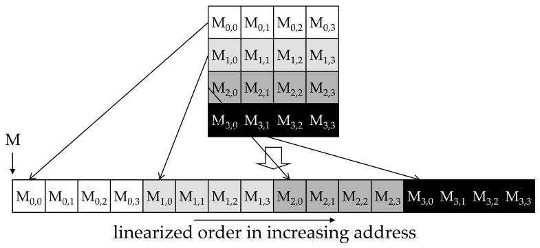

*Figure 6.1 — row major 순서에 따라 행렬 원소를 선형 배열에 배치하기. (책 p.126)*

3장의 Figure 3.3 을 다시 실은 것이다. **$M_{0,0}$ 과 $M_{1,0}$ 은 2차원 행렬에서는 이웃해
보이지만 선형 주소 공간에서는 네 칸 떨어져 있다** (책 p.127).

#### coalesced — row-major 인 경우

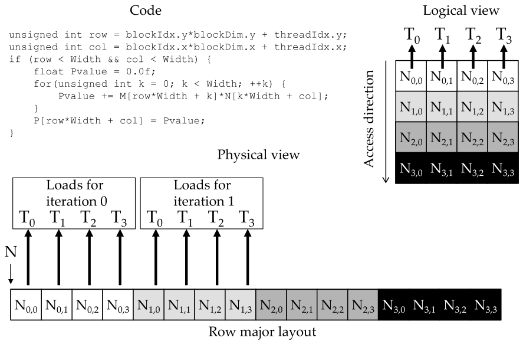

*Figure 6.2 — coalesced 접근 양상. (책 p.127)*

**코드만 보고 판별할 수 있다** (책 p.127). `N` 의 인덱스가 `k*Width + col` 일 때:

| 변수 | warp 안에서 |
|---|---|
| `k`, `Width` | **모든 thread 가 같은 값** |
| `col` = `blockIdx.x*blockDim.x + threadIdx.x` | **연속된 thread → 연속된 값** |

따라서 연속된 thread 가 `N` 의 **연속된 원소**에 접근한다 → **coalesced**.

물리적으로 보면 (Figure 6.2 아래): 반복 0 에서 연속 thread 가 0행의 연속 원소에 접근하고,
반복 1 에서 1행의 연속 원소에 접근하고… **모든 행에서 이 양상이 이어진다.**

> **지금까지 책의 모든 kernel 은 자연스럽게 coalesced 였다** (책 p.128).

#### uncoalesced — column-major 인 경우

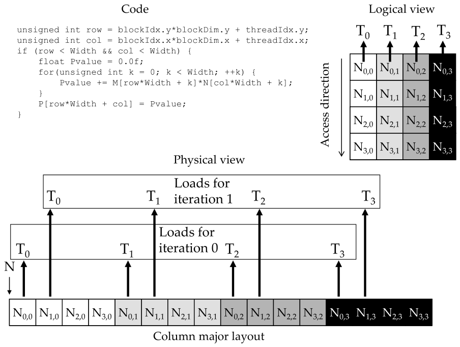

*Figure 6.3 — un-coalesced 접근 양상. (책 p.128)*

> **왜 column-major 를 마주치는가** (책 p.128). 예컨대 **row-major 로 저장된 행렬의 transpose**
> 를 접근할 때다. 선형대수에서는 원본과 transpose 를 둘 다 써야 하는 일이 잦은데,
> **둘 다 만들어 저장하는 것은 피하는 편이 낫다.** 흔한 방법은 한 형태(원본)로만 만들어 두고,
> transpose 가 필요하면 **행·열 인덱스의 역할을 바꿔** 원본을 접근하는 것이다.
> 이것이 곧 transpose 를 **column-major 배치로 보는 것**과 같다.

인덱스가 `col*Width + k` 로 바뀐다. `col` 은 여전히 연속이지만 **`Width` 가 곱해지므로**
연속 thread 가 `Width` 만큼 떨어진 원소에 접근한다 → **coalescing 불가**.

> 현실적인 행렬은 한 차원에 원소가 수백~수천 개다. 이웃 thread 가 접근하는 `N` 원소가
> **수백~수천 개 떨어져** 있으므로 하드웨어가 합칠 수 없다고 판단한다 (책 p.129).

### 3. corner turning

계산이 본래 coalescing 에 맞지 않을 때 쓰는 전략이 셋 있다 (책 p.129).

1. **thread 를 데이터에 매핑하는 방식**을 바꾼다
2. **데이터의 배치 자체**를 바꾼다
3. **global↔shared 전송은 coalesced 로 하고, 불리한 접근 양상은 shared memory 에서** 수행한다
   — shared memory 는 데이터 배치에 덜 민감하고 접근 latency 도 짧다

세 번째 전략의 대표가 **corner turning** 이다.

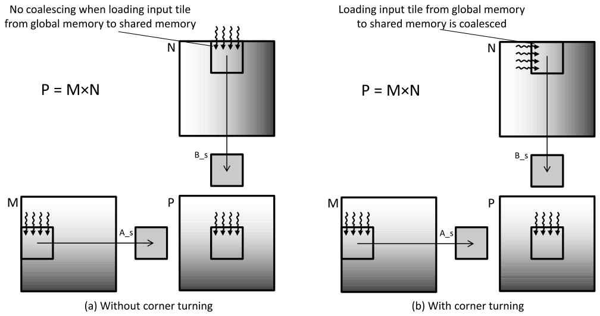

*Figure 6.4 — column-major 배치로 저장된 행렬 $N$ 의 접근을 coalesce 하기 위해 corner turning
을 적용하기. (책 p.130)*

$M$ 은 row-major, $N$ 은 column-major, $P$ 는 row-major 로 저장된 상황이다.
출력 tile 의 위쪽 가장자리에 있는 연속된 네 원소를 맡은 thread 네 개를 보자.

| | $M$ 의 입력 tile | $N$ 의 입력 tile |
|---|---|---|
| **5장과 같게 하면** | thread 의 출력 원소와 **같은 지역 행·열**의 입력을 읽는다 → row-major 이므로 **coalesced** ✓ | Figure 6.4(a) — 논리적으로는 위쪽 가장자리의 연속 원소지만 **column-major 라 메모리에서 멀리 떨어져 있다** → **uncoalesced** ✗ |
| **corner turning** | 그대로 | Figure 6.4(b) — 앞의 네 thread 가 입력 tile의 **왼쪽 가장자리(같은 열)** 연속 원소를 읽게 한다 → column-major 이므로 **coalesced** ✓ |

> **직관적으로는 `threadIdx.x` 와 `threadIdx.y` 의 역할을 맞바꾸는 것**이다 —
> $N$ 입력 tile 을 적재할 선형 인덱스를 계산할 때만 (책 p.130).
>
> shared memory 에 넣을 때는 **column-major 로 두든 row-major 로 두든 상관없다.**
> 일단 tile 이 올라간 뒤에는 각 thread 가 성능 손실 거의 없이 접근할 수 있다 —
> **shared memory 는 SRAM 이라 coalescing 이 필요 없기 때문**이다.

> **그림은 장난감 예다** (책 p.130). $4 \times 4$ tile 에 앞 네 thread 를 그렸지만,
> **실제 corner turning 의 tile 크기는 warp 크기인 32** 이므로 block 의 앞 32개 thread 가
> tile 왼쪽 가장자리의 연속된 32개 원소를 접근한다.

> **store 도 중요하다** (책 p.130). 사실 **uncoalesced store 의 영향이 uncoalesced load 보다
> 더 심각할 수 있다.** uncoalesced store 는 **read-modify-write** 를 수행하는 부분 store 를
> 만들어 내고, **ECC(error correcting code)가 켜진 GPU 에서는 더 많은 memory bandwidth** 를
> 요구할 수 있기 때문이다.

#### carpool 비유


*Figure 6.5 — 고속도로 시스템에서 교통 혼잡 줄이기. (책 p.131)*

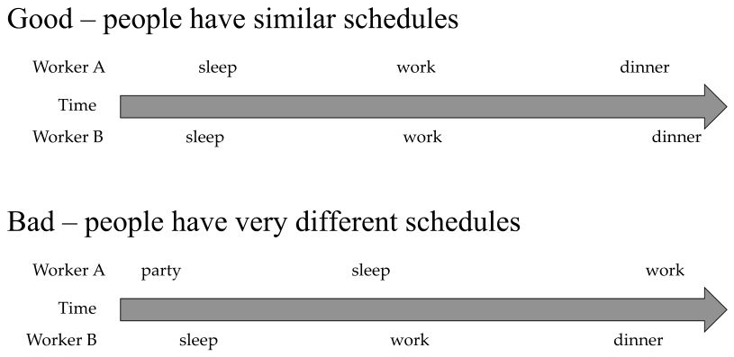

*Figure 6.6 — carpool 은 사람들 사이의 동기화를 요구한다. (책 p.132)*

> **비유의 대응** (책 p.132): **데이터 = 통근자**, **DRAM 접근 요청 = 차량**.
> DRAM 요청 속도가 시스템이 제공하는 접근 throughput 을 넘으면 혼잡이 생기고
> 산술 유닛이 논다. 여러 thread 가 같은 DRAM 위치의 데이터를 접근하면
> **"carpool" 을 만들어 하나의 요청으로 합칠 수 있다.**
>
> **다만 그러려면 실행 일정이 비슷해야 한다.** Figure 6.6 위쪽처럼 Worker A·B 의
> 수면·근무·저녁 일정이 비슷하면 한 차로 다닐 수 있지만, 아래쪽처럼 A 는 해 뜰 때까지
> 놀고 낮에 자고 저녁에 출근하는 반면 B 는 밤에 자고 아침에 출근한다면 **맞출 방법이 없다.**
>
> **warp 의 thread 는 완벽한 후보다** — SIMD 실행 덕분에 **load 명령을 동시에 실행**하기 때문이다.

> **CPU 도 마찬가지다** (책 p.132). 현대 CPU 의 cache line 은 대개 DRAM burst 의 일부·하나·여럿에
> 대응한다. **건드린 cache line 의 바이트를 온전히 쓰는 애플리케이션이** 무작위로 접근하는
> 것보다 훨씬 높은 성능을 낸다. 이 장의 기법은 CPU 프로그램에도 적용할 수 있다.

### 3. 예제/실습

**연습문제 (책 1번, p.154~155).** 다음 kernel 의 각 메모리 접근이 coalesced 인지,
uncoalesced 인지, 아니면 coalescing 이 적용되지 않는지 답하라.

```cuda
01  __global__ void foo_kernel(float* a, float* b, float* c,
                               float* d, float* e) {
02      unsigned int i = blockIdx.x*blockDim.x + threadIdx.x;
03      __shared__ float a_s[256];
04      __shared__ float bc_s[4*256];
05      a_s[threadIdx.x] = a[i];
06      for(unsigned int j = 0; j < 4; ++j) {
07          bc_s[j*256 + threadIdx.x] =
                    b[j*blockDim.x*gridDim.x + i] + c[i*4 + j];
08      }
09      __syncthreads();
10      d[i + 8] = a_s[threadIdx.x];
11      e[i*8] = bc_s[threadIdx.x*4];
12  }
```

> **답.** 판별 기준은 하나다 — **연속된 `threadIdx.x` 가 연속된 주소를 만드는가.**
> 그리고 **shared memory 에는 coalescing 개념 자체가 없다** (SRAM 이라 burst·cache line 이 없다).
>
> | | 배열 | 인덱스 | 연속 thread 의 간격 | 판정 |
> |---|---|---|---|---|
> | a | `a` (global) | `i` | 1 | **coalesced** |
> | b | `a_s` (shared) | `threadIdx.x` | — | **해당 없음** |
> | c | `b` (global) | `j*blockDim.x*gridDim.x + i` | 1 (앞 항은 warp 안에서 상수) | **coalesced** |
> | d | `c` (global) | `i*4 + j` | **4** | **uncoalesced** |
> | e | `bc_s` (shared) | `j*256 + threadIdx.x` | — | **해당 없음** |
> | f | `a_s` (shared) | `threadIdx.x` | — | **해당 없음** |
> | g | `d` (global) | `i + 8` | 1 | **coalesced** |
> | h | `bc_s` (shared) | `threadIdx.x*4` | — | **해당 없음** |
> | i | `e` (global) | `i*8` | **8** | **uncoalesced** |
>
> **(g) 가 함정이다.** `i + 8` 은 시작 주소가 8만큼 밀렸을 뿐 **간격은 여전히 1** 이므로
> coalesced 다. 다만 6.1절이 말한 **정렬(alignment)** 문제는 생길 수 있다 —
> burst 경계에 맞지 않아 transaction 이 하나 더 필요할 수 있다.
>
> **(b)·(e)·(f)·(h) 를 "coalesced" 라고 답하면 틀린다.** coalescing 은 **global memory 의 개념**이다.
> shared memory 에서 대응하는 문제는 **bank conflict**(6.4절)이고, 실제로 (h) 의
> `bc_s[threadIdx.x*4]` 는 stride 4 라 **4-way bank conflict** 를 일으킨다.

**연습문제 (책 2번, p.155).** Figure 6.4 의 설계에 대응하는, corner turning 을 쓰는
matmul kernel 을 작성하라.

> **답.** 5장 Figure 5.9 에서 **$N$ tile 적재 줄만** 바꾸면 된다. $N$ 이 column-major 이므로
> `N[col*Width + k]` 형태로 접근하되, **연속 thread 가 연속 주소를 만들도록
> `tx`/`ty` 의 역할을 맞바꾼다.**
>
> ```cuda
> #define TILE_WIDTH 32
> __global__ void matrixMulCornerTurning(float* M, float* N, float* P, int Width) {
>     __shared__ float Mds[TILE_WIDTH][TILE_WIDTH];
>     __shared__ float Nds[TILE_WIDTH][TILE_WIDTH];
>
>     int bx = blockIdx.x, by = blockIdx.y;
>     int tx = threadIdx.x, ty = threadIdx.y;
>     int Row = by*TILE_WIDTH + ty;
>     int Col = bx*TILE_WIDTH + tx;
>
>     float Pvalue = 0;
>     for (int ph = 0; ph < Width/TILE_WIDTH; ++ph) {
>         // M 은 row-major — 5장과 같다 (연속 tx → 연속 주소)
>         Mds[ty][tx] = M[Row*Width + ph*TILE_WIDTH + tx];
>
>         // N 은 column-major — tx 가 '행' 을, ty 가 '열' 을 훑도록 역할을 맞바꾼다.
>         //   열 (bx*TILE_WIDTH + ty) 안에서 행 (ph*TILE_WIDTH + tx) 을 읽는다.
>         //   연속 tx → 같은 열의 연속 행 → column-major 에서 연속 주소 → coalesced
>         Nds[tx][ty] = N[(bx*TILE_WIDTH + ty)*Width + (ph*TILE_WIDTH + tx)];
>         __syncthreads();
>
>         for (int k = 0; k < TILE_WIDTH; ++k)
>             Pvalue += Mds[ty][k] * Nds[k][tx];       // 계산부는 5장과 동일
>         __syncthreads();
>     }
>     P[Row*Width + Col] = Pvalue;
> }
> ```
>
> **요점 둘.** ① 바뀐 것은 **적재 줄 하나뿐**이고 계산 루프는 그대로다 — shared memory 에
> 올라간 뒤에는 배치가 성능에 거의 영향을 주지 않기 때문이다.
> ② `Nds[tx][ty]` 로 쓰면 **shared memory 쪽에 stride 접근이 생겨 bank conflict** 가 난다.
> 6.4절의 padding(`Nds[TILE_WIDTH][TILE_WIDTH+1]`)이 필요하다 — 책이 6.4절에서 바로 이 예를 든다.

**연습문제 (책 3번, p.155).** 5장의 tiled matmul 에서, `BLOCK_SIZE` 의 가능한 값 중
어느 값에서 global memory 의 uncoalesced 접근을 **완전히** 피할 수 있는가? (정사각 block 만)

> **답: `BLOCK_SIZE = 32`.**
>
> block 은 `BLOCK_SIZE × BLOCK_SIZE` 이고, warp 는 **선형화된 thread 32개**다 (4장).
> 선형 index 는 `ty*BLOCK_SIZE + tx` 이므로:
>
> - **`BLOCK_SIZE = 32`** → warp 하나가 **block 의 한 행 전체**(`ty` 고정, `tx` = 0~31)다.
>   $M$ 접근 `M[Row*Width + ph*32 + tx]` 는 `Row` 가 고정이라 **연속 32개** → 완전 coalesced.
>   $N$ 접근도 마찬가지다.
> - **`BLOCK_SIZE = 16`** → warp 하나가 **두 행**에 걸친다(`ty` 가 0과 1). 앞 16개는 연속이지만
>   `ty` 가 바뀌는 순간 `Row` 가 1 늘어 주소가 **`Width` 만큼 점프**한다.
>   즉 **연속 구간 두 개**로 쪼개져 transaction 이 늘어난다.
> - **`BLOCK_SIZE > 32`** 는 불가능하다 — $33^2 = 1089 > 1024$ (4장의 block 당 최대 thread).
>
> 따라서 정사각 block 중 **32 하나뿐**이다. 이것이 5장 Figure 5.9 의 `TILE_WIDTH` 를
> 실무에서 32로 두는 또 하나의 이유다.

---

## 6.2 Hiding memory latency (책 p.132)

### 1. 개념적 이해

burst 만으로는 부족하다. DRAM 시스템은 병렬 조직을 **두 가지 더** 쓴다 — **bank 과 channel** (책 p.132).

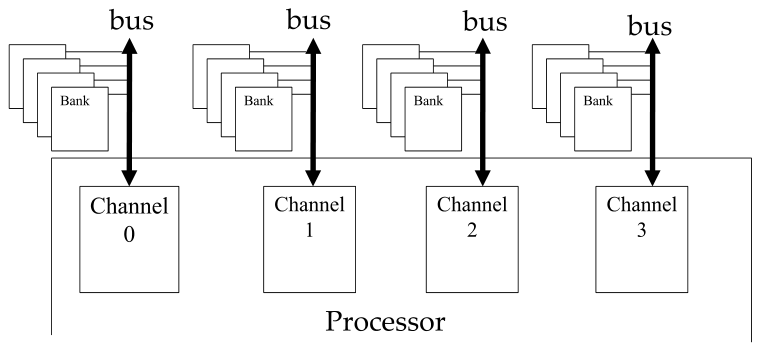

*Figure 6.7 — DRAM 시스템의 channel 과 bank. (책 p.133)*

> **channel** 은 **memory controller 하나와, DRAM bank 집합을 프로세서에 연결하는 버스**다.
> 프로세서는 보통 channel 을 **1~8개** 갖고, 각 channel 에는 **많은 수의 bank** 이 붙는다.

#### 버스 bandwidth 계산

$$
\text{버스 bandwidth} = \text{버스 폭} \times 2 \times \text{clock 주파수} \tag{6.1}
$$

$\times 2$ 는 **DDR**(double data rate) 때문이다 — clock 의 상승 에지와 하강 에지에서
**cycle 당 두 번** 전송한다 (책 p.133).

| 예 | 계산 | 결과 |
|---|---|---|
| 64-bit DDR5-6400 @ 3.2 GHz | $8\ \text{B} \times 2 \times 3.2\ \text{GHz}$ | **51.2 GB/s** |
| CPU 가 200 GB/s 필요 | $200 / 51.2 = 3.9$ | **버스 4개** |
| GPU 가 1000 GB/s 필요 | $1000 / 51.2 = 19.5$ | **버스 20개** |

**버스를 이렇게 많이 두면 전력을 너무 많이 쓴다** — 전통적 회로 기판의 배선을 구동해야 하기
때문이다. 이것이 **HBM** 채택의 동기다 (책 p.133).

> **HBM** 은 프로세서와 DRAM 을 **같은 패키지에 co-package** 해서 둘 사이 연결의 크기와 용량을
> 대폭 줄이고, 버스의 clock 주파수와 개수를 함께 끌어올린다.
> 예: **HBM3E 는 4.9 GHz 버스 clock 과 64-bit 버스 16개**로 약 1 TB/s 를 낸다.
>
> (식 (6.1)로 계산하면 $8 \times 2 \times 4.9 \times 16 = 1254$ GB/s = **1.25 TB/s** 다.
> 책의 "1 TB/s" 는 어림수로 보인다.)

#### 왜 bank 이 여러 개 필요한가

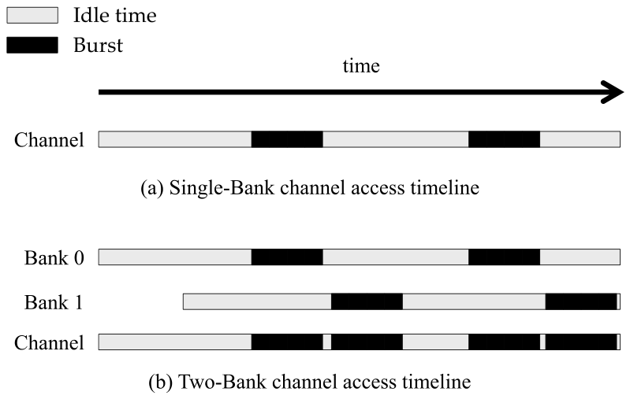

*Figure 6.8 — banking 은 channel 의 데이터 전송 bandwidth 활용도를 높인다. (책 p.134)*

각 bank 은 DRAM cell 배열, sense amplifier, 그리고 burst 를 버스로 내보내는 인터페이스를 갖는다.

**Figure 6.8(a) — bank 하나만 붙은 경우.** 접근마다 **긴 latency**(decoder 가 cell 을 활성화하고
cell 이 전하를 sense amplifier 와 나누는 시간, 밝은 회색)가 있고 그 뒤에 **burst 전송**(어두운 색)이
온다. **latency 가 전송 시간보다 훨씬 길다.**

$$
\text{최대 버스 이용률} = \frac{1}{R + 1}, \qquad R = \frac{\text{cell 배열 접근 latency}}{\text{데이터 전송 시간}} \tag{6.2}
$$

$R = 20$ 이면 이용률은 $1/21 = \mathbf{4.8\%}$ — **16 GB/s channel 이 0.76 GB/s 밖에 못 낸다.**
받아들일 수 없는 수치다 (책 p.134).

**Figure 6.8(b) — bank 두 개.** bank 0 이 접근을 처리하는 동안 bank 1 에서 다른 접근을
시작할 수 있다. **cell 배열 접근 latency 가 겹쳐진다(overlap).** 이용률이 **잠재적으로 두 배**가 된다.

$$
\text{필요한 최소 bank 수} = R + 1 \tag{6.3}
$$

> **실제로는 $R$ 보다 훨씬 많아야 한다** (책 p.134~135). 이유가 둘이다.
> ① **bank conflict** — 여러 동시 접근이 **같은 bank** 을 겨냥하는 상황. bank 하나는 한 번에
>    하나만 처리하므로 latency 를 겹칠 수 없다. bank 이 많을수록 접근이 흩어질 확률이 올라간다.
> ② **용량** — cell 배열 하나의 크기는 합리적인 latency 와 제조 가능성 때문에 제한된다.
>    필요한 메모리 용량을 대려면 bank 이 많이 필요할 수도 있다.

#### interleaved data distribution

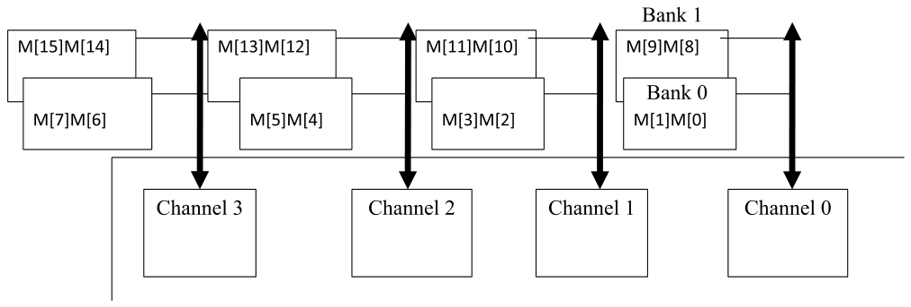

*Figure 6.9 — 배열 원소를 channel 과 bank 에 분배하기. (책 p.135)*

burst 크기가 원소 2개(8바이트)인 장난감 예다. **분배는 하드웨어 설계로 정해진다** (책 p.135).

| 원소 | 위치 |
|---|---|
| `M[0]`, `M[1]` | Channel 0 / Bank 0 |
| `M[2]`, `M[3]` | **Channel 1** / Bank 0 |
| `M[4]`, `M[5]` | **Channel 2** / Bank 0 |
| `M[6]`, `M[7]` | **Channel 3** / Bank 0 |
| `M[8]`, `M[9]` | Channel 0 / **Bank 1** ← 감아 돌아온다 |
| … | … |
| `M[16]`, `M[17]` | Channel 0 / Bank 0 (다시 처음으로) |

이 방식을 **interleaved data distribution** 이라 한다.

> **요점**: **Channel 0 / Bank 0 의 burst 를 꽉 채울 만큼만 배정하고 바로 다음 channel 로 넘어간다.**
> 덕분에 **비교적 작은 배열도 잘 흩어진다** — 이 예에서는 원소가 16개만 있어도
> 모든 channel 과 bank 을 쓰게 된다.

#### occupancy 의 두 번째 이유

여기서 4장과 이어진다 (책 p.135~136).

> 장치가 명시한 memory 접근 bandwidth 를 달성하려면 **충분히 많은 thread 가 동시에
> 메모리 접근을 해야 한다.**
>
> 4장에서 occupancy 를 최대화하는 것은 **core pipeline latency 를 감추기** 위해서였다.
> 이제 보니 occupancy 최대화에는 **DRAM 접근 latency 를 감출 만큼 충분한 메모리 요청을
> 만들어 낸다**는 이득이 하나 더 있다.

다만 최선의 bandwidth 활용을 위해서는 세 조건이 함께 필요하다.

1. 충분히 많은 thread 가 동시에 접근할 것 (**occupancy**)
2. 접근이 **channel 과 bank 에 고르게 분산**될 것
3. 각 bank 접근이 **coalesced** 일 것

### 3. 예제/실습

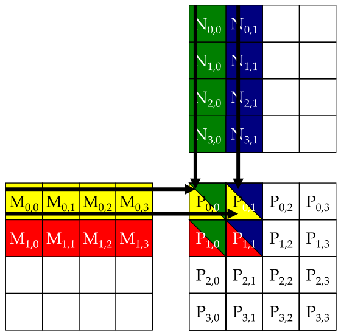

*Figure 6.10 — matrix multiplication 의 작은 예 (Figure 5.5 에서 재수록). (책 p.136)*

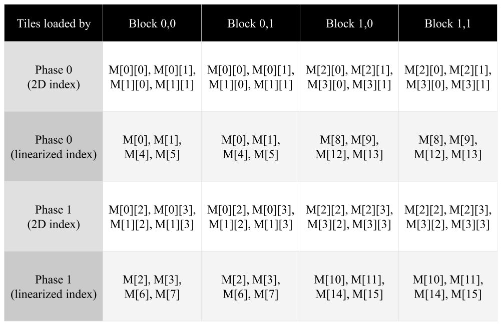

*Figure 6.11 — 각 phase 에서 thread block 들이 적재하는 $M$ 원소. (책 p.137)*

$2 \times 2$ thread block, $2 \times 2$ tile 로 matmul 을 한다 (책 p.136~137).

- **Phase 0** — 네 block 이 각자 첫 tile 을 적재한다. 각 block 이 **coalesced 접근 두 번**을 한다.
  Figure 6.9 의 분배에 따르면 이 접근들은 **Channel 0 과 Channel 2** 의 bank 으로 간다.
  **두 channel 을 동시에 활용**하게 된다.
- **Phase 1** — 이번에는 **Channel 1 과 Channel 3** 으로 간다. 역시 병렬로 처리된다.

> **$Block_{0,0}$ 과 $Block_{0,1}$ 은 같은 $M$ 원소를 적재한다** (책 p.136). 현대 장치의 cache 가
> 이 접근들을 하나로 합쳐 준다 — **두 block 의 실행 타이밍이 충분히 가깝다면.**
> 사실 **GPU 의 cache 는 주로 이런 접근을 합쳐 DRAM 접근 횟수를 줄이려고 설계**된 것이다.

> **공생 관계** (책 p.137). 한편으로 DRAM 의 잠재 bandwidth 를 잘 쓰려면 **많은 thread 가
> 동시에 DRAM 데이터를 접근**해야 하고, 다른 한편으로 장치의 실행 throughput 은
> **DRAM 의 병렬 구조(bank·channel)를 잘 활용하는 데** 달렸다.
> **동시에 실행되는 thread 가 전부 같은 channel 의 데이터를 접근하면** 메모리 throughput 과
> 전체 실행 속도가 크게 떨어진다.

**연습문제 6.2-1 (직접).** $R = 20$ 인 시스템에서 channel 당 bank 을 10개만 두면
버스 이용률은 얼마인가?

> **답.** bank 이 $B$ 개면 latency 를 $B$ 겹까지 겹칠 수 있으므로 이용률은
> $\min(B/(R+1),\ 1) = 10/21 = \mathbf{47.6\%}$ 다. 식 (6.3)이 말하는 $R+1 = 21$ 개에
> 미치지 못해 **절반도 못 쓴다.**

**연습문제 6.2-2 (직접).** Figure 6.9 의 배치에서 `M[0]`, `M[4]`, `M[8]`, `M[12]` 를
동시에 접근하면 어떤 일이 생기는가?

> **답.** 각각 **Channel 0/Bank 0**, **Channel 2/Bank 0**, **Channel 0/Bank 1**,
> **Channel 2/Bank 1** 에 있다. **channel 2개, bank 4개**로 흩어지므로 잘 병렬화된다.
> 반대로 `M[0]`, `M[8]`, `M[16]`, `M[24]` 를 접근하면 **전부 Channel 0** 이라
> 한 channel 의 버스에 몰려 훨씬 느리다. **stride 가 channel 수의 배수가 되면 위험하다.**

---

## 6.3 Vector loads and stores (책 p.138)

### 1. 개념적 이해

occupancy 를 최대화하면 동시에 충분한 메모리 접근을 발행할 수 있다. **여기서 한 걸음 더** —
**thread 하나가 명령 하나로 더 큰 연속 데이터를 접근**하게 하는 것이다 (책 p.138).
이런 명령을 **vector load / vector store** 라 한다.

2장의 vector addition kernel 은 thread 하나가 4 B 를 접근할 때마다 load·store 명령을
하나씩 실행한다. **대신 명령 하나로 16 B 를 접근**하게 할 수 있다.

### 2. 코드

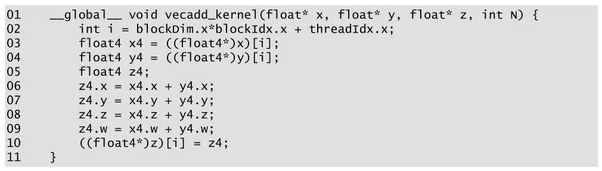

*Figure 6.12 — vector load 를 쓰는 vector addition kernel. (책 p.138)*

```cuda
01  __global__ void vecadd_kernel(float* x, float* y, float* z, int N) {
02      int i = blockDim.x*blockIdx.x + threadIdx.x;
03      float4 x4 = ((float4*)x)[i];
04      float4 y4 = ((float4*)y)[i];
05      float4 z4;
06      z4.x = x4.x + y4.x;
07      z4.y = x4.y + y4.y;
08      z4.z = x4.z + y4.z;
09      z4.w = x4.w + y4.w;
10      ((float4*)z)[i] = z4;
11  }
```

줄별로 (책 p.138):

- **02** — 전역 index 는 전과 같다. 다만 **launch 하는 thread 수가 원소 수의 1/4** 이고,
  **`i` 는 원소 하나가 아니라 4개짜리 덩어리**를 가리킨다.
- **03~04** — 포인터를 **`float4` 타입으로 캐스팅한 뒤 역참조**한다. `float4` 는
  floating point 값 4개를 **16 B 짜리 객체 하나**로 나타낸다. `float4` 포인터를 역참조하면
  컴파일러가 **16 B 객체 전체를 접근하는 vector load** 로 바꾼다.
- **06~09** — 네 값을 `.x`, `.y`, `.z`, `.w` 필드로 각각 더한다.
- **10** — 저장할 때도 캐스팅해서 **vector store** 가 되게 한다.

> **경계 조건이 필요하다** (책 p.139). 원소 총수가 4로 나누어떨어지지 않으면,
> 경계 thread 는 **vector 가 아니라 scalar load·store** 를 하도록 해서 범위 밖 접근을 막아야 한다.
> 마지막 block 의 범위 밖 thread 를 비활성화하는 조건도 필요하다. 책은 이를 연습문제로 남긴다.

### 3. 효과와 예제

$$
\text{명령 감소율} = 1 - \frac{\text{vector 명령 수}}{\text{scalar 명령 수}} = 1 - \frac{2}{8} = \mathbf{75\%} \tag{6.4}
$$

vector load 2개가 scalar load 8개를 대체한다 (책 p.139).

> **occupancy 를 못 채우는 경우에 특히 중요하다** (책 p.139). 그런 kernel 도 vector load 로
> **충분한 동시 메모리 접근을 발행**해 memory latency 를 견디고 bandwidth 를 채울 수 있다.
> 15장에서 그런 상황의 예가 나온다.

**연습문제 (책 4번, p.155).** vector load 를 쓰면서 경계 조건을 올바르게 처리하는
vector addition kernel 을 구현하라.

> **답.** 두 가지를 처리해야 한다 — ① 4로 나누어떨어지지 않는 **꼬리 원소**,
> ② 마지막 block 의 **범위 밖 thread**.
>
> ```cuda
> __global__ void vecadd_vec4(float* x, float* y, float* z, int N) {
>     int i = blockDim.x*blockIdx.x + threadIdx.x;
>     int nVec = N / 4;                       // 온전한 float4 덩어리 수
>
>     if (i < nVec) {                         // ② 범위 밖 thread 를 막는다
>         float4 x4 = ((float4*)x)[i];
>         float4 y4 = ((float4*)y)[i];
>         float4 z4;
>         z4.x = x4.x + y4.x;   z4.y = x4.y + y4.y;
>         z4.z = x4.z + y4.z;   z4.w = x4.w + y4.w;
>         ((float4*)z)[i] = z4;
>     }
>
>     // ① 꼬리 원소 (N % 4 개) 는 scalar 로 처리한다.
>     //    grid 의 앞쪽 thread 몇 개에게 맡기면 분기가 warp 하나에만 생긴다.
>     int tail = nVec * 4 + i;
>     if (i < (N % 4)) {
>         z[tail] = x[tail] + y[tail];
>     }
> }
> // launch: vecadd_vec4<<<ceil(nVec/256.0), 256>>>(x_d, y_d, z_d, N);
> //   단 N%4 != 0 이면 nVec 이 0 일 수 있으므로 block 수는 max(1, ...) 로 잡는다
> ```
>
> **정렬(alignment)도 조건이다.** `float4` 접근은 **16 B 정렬**을 요구한다.
> `cudaMalloc` 이 돌려주는 포인터는 충분히 정렬되어 있지만, **배열 중간부터 시작하는
> 포인터를 캐스팅하면 깨질 수 있다.**

---

## 6.4 Shared memory bank conflicts (책 p.139)

### 1. 개념적 이해

shared memory 는 DRAM 이 아니라 **SRAM** 이라 접근 latency 가 훨씬 짧다.
짧은 latency 덕분에 **DRAM burst 기법을 쓰지 않고 bank 을 좁게 유지**할 수 있다 (책 p.140).

| 항목 | 전형적 GPU shared memory |
|---|---|
| 접근 latency | 몇 clock cycle |
| bank 수 | **32** |
| bank 폭 | **32 bit (4 B)** |

> thread 가 shared memory 에서 32-bit 정수나 부동소수를 접근하면
> **그 thread 혼자 bank 하나의 출력을 통째로 쓴다.**

**연속된 4 B 덩어리가 서로 다른 bank 에 번갈아(interleaved) 놓인다** — 6.2절의 DRAM
bank·channel 배치와 같은 방식이다. 처음 4 B 는 bank 0, 다음 4 B 는 bank 1, … bank 32개를
다 쓰면 bank 0 부터 다시 시작한다.

$$
\text{thread } t \text{ 가 닿는 bank} = (t \times \text{stride}) \bmod 32 \tag{6.5}
$$

**warp 의 32 thread 가 연속된 32개 값을 접근하면 각자 다른 bank 이 병렬로 처리한다.**
그렇지 않으면 **bank conflict** 가 나고, **하드웨어가 같은 bank 접근을 하나씩 직렬화**한다.

### 2. corner turning 이 만드는 32-way 충돌

6.1절의 corner turning(Figure 6.4(b))은 **global 에서는 coalesced 로 읽지만
shared 에 쓸 때 stride 접근**이 된다 (책 p.140).

```cuda
__shared__ float a[TILE_DIM][TILE_DIM];   // TILE_DIM = 32
a[threadIdx.x][threadIdx.y] = ...;
```

block 이 $32 \times 32$ 이면 warp 의 thread 들은 **`threadIdx.y` 가 같고 `threadIdx.x` 가 연속**이다.
즉 **같은 열의 연속된 원소**에 쓴다.

| thread | 쓰는 곳 | 선형 index ($i \times 32 + j$) | bank (mod 32) |
|---|---|---|---|
| 0 | `a[0][0]` | 0 | **0** |
| 1 | `a[1][0]` | 32 | **0** |
| 2 | `a[2][0]` | 64 | **0** |
| … | … | … | … |
| 31 | `a[31][0]` | 992 | **0** |

**warp 전체가 같은 bank 에 쓴다 — 32-way bank conflict 다.** 하드웨어가 이 쓰기를
직렬화해 **같은 bank 에 32번 연속 접근**하고, **나머지 31개 bank 은 놀고 있다.**

### 3. padding 이 고치는 방법

**tile 에 열을 하나 더 붙인다** — 행 사이에 여분의 원소가 끼어드는 셈이다.
이렇게 배치를 바꾸려고 넣는 안 쓰는 원소를 **padding** 이라 한다 (책 p.140).

```cuda
__shared__ float a[TILE_DIM][TILE_DIM + 1];   // TILE_DIM = 32 → 열이 33개
a[threadIdx.x][threadIdx.y] = ...;
```

이제 선형 index 가 $i \times 33 + j$ 다.

| thread | 선형 index | bank (mod 32) |
|---|---|---|
| 0 | $0 \times 33 = 0$ | **0** |
| 1 | $1 \times 33 = 33$ | **1** |
| 2 | $2 \times 33 = 66$ | **2** |
| … | … | … |

**32개 thread 가 전부 다른 bank 에 닿는다 — 충돌이 사라졌다.**

아래 위젯에서 stride 를 바꿔 가며 어느 bank 에 몰리는지 볼 수 있다.

<!--widget:bank-conflict-->

#### padding 의 비용

> **① shared memory 를 더 쓴다** (책 p.140). 가장 뻔한 비용이다.
>
> **② 선형 index 계산이 비싸진다** (책 p.140~141). 열 수가 32 처럼 **2의 거듭제곱**이면
> $i \times 32$ 를 **시프트 한 번**으로 처리할 수 있다. 33 으로 padding 하면
> $i \times (32+1) = (i \ll 5) + i$ 처럼 **연산이 하나 더** 필요하다.
> 추가 연산 수는 padding 으로 늘린 열 수에 달렸다.
>
> > **원문 오기** (책 p.140~141). 책은 이 시프트를 **`i >> 5`**(오른쪽 시프트)라고 두 번 쓰는데,
> > 32를 **곱하는** 것이므로 **`i << 5`**(왼쪽 시프트)가 맞다. `i >> 5` 는 32로 **나누는** 것이다.
> > 위 본문에서는 `i << 5` 로 바로잡았다.

> **③ 이득은 원래 배치에 달렸다** (책 p.141). 원래 열 수가 32가 아니라 **16** 이었다면
> warp 안의 충돌이 **두 bank 에 나뉘어 각각 16-way** 였을 것이다. 그러면 padding 의
> 성능 이득도 그만큼 작다. **stride 가 작을수록 warp 안의 접근이 서로 가깝다**는 직관과 맞는다.

### 3. 예제/실습

**연습문제 (책 5번, p.155).** 다음 shared memory 배열과 warp(32 thread)의 접근을 보라.
`a[0]` 이 bank 0 에 있다고 가정한다. 각 `stride` 값에 대해 warp 가 접근하는 bank 과
각 bank 의 충돌 수를 답하라.

```cuda
__shared__ float a[1024];
a[threadIdx.x*stride] = ...;
```

> **답.** 식 (6.5)에 따라 bank $= (t \times \text{stride}) \bmod 32$ 다.
> **핵심 규칙은 최대공약수로 정리된다.**
>
> $$g = \gcd(\text{stride},\ 32), \qquad
> \text{쓰이는 bank 수} = \frac{32}{g}, \qquad \text{충돌 차수} = g$$
>
> | | stride | $g$ | 쓰이는 bank | 각 bank 당 | 판정 |
> |---|---|---|---|---|---|
> | a | 32 | 32 | **1개** — bank 0 | 32 | **32-way 충돌** |
> | b | 31 | 1 | **32개** — 0~31 전부 | 1 | **충돌 없음** |
> | c | 24 | 8 | **4개** — 0, 8, 16, 24 | 8 | **8-way 충돌** |
> | d | 16 | 16 | **2개** — 0, 16 | 16 | **16-way 충돌** |
> | e | 12 | 4 | **8개** — 0, 4, 8, 12, 16, 20, 24, 28 | 4 | **4-way 충돌** |
> | f | 8 | 8 | **4개** — 0, 8, 16, 24 | 8 | **8-way 충돌** |
> | g | 7 | 1 | **32개** — 0~31 전부 | 1 | **충돌 없음** |
>
> **(b) 와 (g) 가 요점이다.** stride 31 은 32에 아주 가깝고 stride 7 은 작은데,
> **둘 다 32와 서로소라 충돌이 전혀 없다.** 반대로 stride 8·16·24·32 는 **32의 약수를
> 공유해서** 충돌한다. **크기가 아니라 32와의 gcd 가 전부다.**
> padding 이 `+1` 로 충돌을 없애는 것도 같은 이유다 — 33 은 32와 서로소다.

**검산 코드**

```python
from math import gcd
from collections import Counter

for s in (32, 31, 24, 16, 12, 8, 7):
    banks = [(t * s) % 32 for t in range(32)]
    c = Counter(banks)
    print(f"stride={s:2d}: gcd={gcd(s,32):2d} · bank {len(c):2d}개 사용 · "
          f"각 bank {max(c.values()):2d}개씩 → {max(c.values())}-way")
# stride=32: gcd=32 · bank  1개 사용 · 각 bank 32개씩 → 32-way
# stride=31: gcd= 1 · bank 32개 사용 · 각 bank  1개씩 → 1-way
# stride=24: gcd= 8 · bank  4개 사용 · 각 bank  8개씩 → 8-way
# stride=16: gcd=16 · bank  2개 사용 · 각 bank 16개씩 → 16-way
# stride=12: gcd= 4 · bank  8개 사용 · 각 bank  4개씩 → 4-way
# stride= 8: gcd= 8 · bank  4개 사용 · 각 bank  8개씩 → 8-way
# stride= 7: gcd= 1 · bank 32개 사용 · 각 bank  1개씩 → 1-way
```

---

## 6.5 Thread coarsening (책 p.141)

### 1. 개념적 이해

지금까지의 모든 kernel 은 **가장 잘게(finest granularity)** 병렬화했다 — thread 하나가
**가능한 가장 작은 일 단위**를 맡았다 (vector 원소 하나, pixel 하나, 행렬 원소 하나).

| | 잘게 나누기 |
|---|---|
| **장점** | **transparent scalability** (4장). 하드웨어에 자원이 충분하면 전부 병렬로, 부족하면 **여러 wave 로 알아서 직렬화**한다 |
| **단점** | **병렬화에 오버헤드가 있을 때** 그 대가를 치른다 |

오버헤드는 여러 형태다 (책 p.141): **서로 다른 block 이 같은 데이터를 중복 적재**,
**중복 연산**, **동기화 오버헤드**, **명령 실행 오버헤드** 등.

> **핵심 논리** (책 p.141). thread 들이 실제로 병렬 실행된다면 이 오버헤드는 치를 만하다.
> **그런데 자원이 부족해서 하드웨어가 어차피 직렬화할 거라면, 오버헤드를 불필요하게 치른 것**이다.
> 그럴 바에는 **프로그래머가 직접 부분적으로 직렬화해서 오버헤드를 줄이는 편이 낫다.**
> thread 하나에 일 단위를 여러 개 맡기는 것 — 이것이 **thread coarsening** 이다.

### 2. 코드

```cuda
// 잘게 (coarsening 없음)
unsigned int i = blockIdx.x*blockDim.x + threadIdx.x;
foo(i);
```

```cuda
// coarsening factor 4
unsigned int iStart = 4*(blockIdx.x*blockDim.x + threadIdx.x);
for(unsigned int c = 0; c < 4; ++c) {
    unsigned int i = iStart + c;
    foo(i);
}
```

- thread 하나가 맡는 일 단위 수를 **coarsening factor** 라 한다.
- 전역 thread index 에 4를 곱해 각 thread 가 **연속된 정수 4개의 시작값**을 받는다.
  thread 0 은 0·1·2·3, thread 1 은 4·5·6·7 …
- 이 루프를 **coarsening loop** 라 한다.

> **이미 본 예가 있다** (책 p.142). **6.3절의 vector load** 가 그것이다 — thread 하나가
> 한 쌍이 아니라 **네 쌍을 더하게** 해서 vector load/store 의 이득을 봤다.
> 여기서 병렬화의 오버헤드는 **load·store 명령의 실행 오버헤드**였고,
> thread 안에서 덧셈을 직렬화한 덕분에 **메모리 접근을 vector 로 묶을 수 있었다.**

> **또 하나의 예** (책 p.142): 5장의 tiled matmul. 많은 block 으로 병렬화하면
> **같은 입력 tile 이 여러 block 에 중복 적재**된다. block 수를 줄이고 **각 block 이 더 큰
> 출력 tile 을 맡게** 하면 입력 tile 적재 횟수가 준다. 15장에서 깊이 다룬다.

### 3. 세 가지 함정

책이 명시적으로 경고하는 세 가지다 (책 p.142~143).

**① 필요 없는데 적용하는 것.** thread coarsening 은 **병렬화에 오버헤드가 있을 때만** 이득이다.
어떤 계산은 thread 들이 **조율이나 데이터 공유 없이 완전히 독립적으로** 동작한다.
그런 계산에 coarsening 을 적용해 봐야 **성능 차이가 별로 없다.**

**② 너무 많이 해서 하드웨어를 놀리는 것.** coarsening 은 **하드웨어에 노출하는 병렬성을 줄인다.**
factor 가 너무 크면 병렬 실행 자원 일부가 놀게 된다.

| 예 (동시 실행 264 block GPU) | block 수 | wave |
|---|---|---|
| coarsening 없음 | 1056 | **4.0** — 완전 활용 |
| factor 8 | 132 | **0.5** — **GPU 절반이 논다** |
| coarsening 없음 | 1584 | **6.0** — 완전 활용 |
| factor 4 | 396 | **1.5** — 두 번째 wave 가 부분 wave (**tail effect**, 4장) |

> 게다가 **최적 factor 는 장치마다·데이터셋마다 다르다** (책 p.143). 그래서
> **thread coarsening 을 적용하면 scalability 가 덜 transparent 해진다** —
> GPU 세대가 바뀌면 factor 를 바꿔 **재컴파일**해야 최선의 성능이 나올 수 있다.

**③ 자원 소비를 늘려 occupancy 를 떨어뜨리는 것.** thread 와 block 이 더 많은 일을 맡으므로
**thread 당 register 나 block 당 shared memory 를 더 쓸 수** 있다. 4·5장에서 봤듯
그러면 occupancy 가 떨어진다. **occupancy 감소의 손해가 coarsening 의 이득보다 크지 않은지**
따져야 한다.

**연습문제 6.5-1 (직접).** 동시 실행 264 block 인 GPU 에서 원래 1584 block 인 kernel 에
coarsening 을 적용하려 한다. tail effect 를 피하는 factor 는?

> **답.** coarsening 후 block 수가 **264의 배수**여야 한다.
> $1584 / f$ 가 264의 배수이려면 $f \in \{1, 2, 3, 6\}$ 이다
> ($1584/1 = 1584 = 6$ wave, $/2 = 792 = 3$ wave, $/3 = 528 = 2$ wave, $/6 = 264 = 1$ wave).
> 책이 예로 든 **factor 4 는 396 block = 1.5 wave** 라 tail effect 가 생긴다.
> **factor 를 키우면서도 wave 를 정수로 유지하려면 3이나 6이 낫다.**

---

## 6.6 Loop unrolling (책 p.144)

### 1. 개념적 이해

latency 를 견디는 두 번째 최적화다 (첫 번째는 4장의 occupancy 최대화).

> **loop unrolling** 은 루프 본문을 어떤 factor 만큼 **복제**하고 반복 횟수를 같은 factor 만큼
> **줄이는** 변환이다 (책 p.144).

```cuda
for(unsigned int i = 0; i < 16; ++i) { A(i)  B(i) }
```

factor 4 로 unrolling 하면:

```cuda
for(unsigned int i = 0; i < 16; i += 4) {
    A(i)      B(i)
    A(i + 1)  B(i + 1)
    A(i + 2)  B(i + 2)
    A(i + 3)  B(i + 3)
}
```

#### 두 가지 이득

**① 분기 명령이 준다** (책 p.145).

> **CPU 는 정교한 branch prediction 으로 분기 latency 를 줄이지만 GPU 에는 그런 것이 없다.**
> GPU thread 가 분기 명령을 만나면 **결과가 확정될 때까지 stall** 한다.
> 분기 명령 수가 줄면 이 stall 이 준다.

**② 독립적인 명령이 더 드러난다** (책 p.145). `B(i)` 가 `A(i)` 에 의존하면, thread 는
`A(i)` 를 실행한 뒤 **끝나기를 기다렸다가** `B(i)` 를 실행해야 한다. 기다리는 동안 할 수 있는
다른 일이 있으면 그것을 사이에 끼워 넣으면 된다.

```cuda
for(unsigned int i = 0; i < 16; i += 4) {
    A(i)  A(i + 1)  A(i + 2)  A(i + 3)     // 서로 독립인 것들을 먼저 몰아서
    B(i)  B(i + 1)  B(i + 2)  B(i + 3)     // 그 다음에 의존하는 것들
}
```

`A(i+1)`·`A(i+2)`·`A(i+3)` 을 `A(i)` 와 `B(i)` 사이에 두면 **`A(i)` 를 기다리는 동안
실행할 명령이 넉넉해진다.** 이렇게 stall 을 피하려고 명령 순서를 바꾸는 것이
**instruction scheduling** 이다.

> **대개 컴파일러가 알아서 한다** (책 p.145). loop unrolling 과 instruction scheduling 은
> 컴파일러가 재량껏 자동으로, 적극적으로 적용하므로 프로그래머가 신경 쓸 필요가 없다.
> 위 예처럼 **본문이 작고 루프 경계가 상수이며 작으면** 컴파일러가 대개 **완전히 unroll** 해
> 분기를 전부 없애고 스케줄링할 명령을 최대로 드러낸다.
>
> 직접 통제하려면 루프 앞에 **`#pragma unroll N`** 을 둔다. **`N = 1` 이면 unrolling 하지 말라**는 뜻이다.

### 2. thread coarsening 과의 관계 — 이 절의 진짜 요점

> **loop unrolling 은 thread coarsening 을 효율적으로 만드는 데 필수적이다** (책 p.145).

이유를 단계로 나누면 (책 p.145~146):

**(1) coarsening 은 지역 배열을 만든다.**

```cuda
int x[4];
for(unsigned int c = 0; c < 4; ++c) { foo(x[c]); }
```

**(2) 지역 배열은 기본적으로 global memory 에 놓인다** (5장). `x[c]` 처럼 **변수 인덱스**로
접근하려면 메모리에 있어야 하기 때문이다.

**(3) 그러면 메모리 접근 오버헤드가 coarsening 의 이득을 잡아먹는다.**

**(4) 그런데 coarsening 루프는 경계가 작고 상수라 완전히 unroll 할 수 있다.**

```cuda
int x[4];
foo(x[0]);  foo(x[1]);  foo(x[2]);  foo(x[3]);
```

**(5) 이제 모든 인덱스가 상수다.** 그러면 **컴파일러가 지역 배열 `x` 를 메모리에서
register 로 승격(promote)** 할 수 있다.

> 즉 loop unrolling 은 분기를 줄이고 스케줄링 여지를 넓힐 뿐 아니라,
> **상수 전파와 "메모리 → register 승격" 의 기회를 연다** (책 p.146).
> 5장에서 본 "**모든 접근이 상수 인덱스면 컴파일러가 register 에 둘 수 있다**"는 조건이
> 여기서 실제로 쓰이는 것이다.

**연습문제 6.6-1 (직접).** coarsening 루프를 `#pragma unroll 1` 로 막으면 무슨 일이 생기는가?

> **답.** 루프가 남아 `x[c]` 의 인덱스가 **변수**로 유지되므로, 지역 배열 `x[4]` 가
> **local memory(= global memory)에 그대로 남는다.** 5장에서 봤듯 이름과 달리 느린 곳이다.
> coarsening 으로 줄이려던 오버헤드보다 **메모리 접근 오버헤드가 더 커질 수** 있다.

---

## 6.7 Double buffering (책 p.146)

### 1. 개념적 이해

5장에서 본 **read-after-write / write-after-read** 구분이 여기서 최적화로 이어진다.

```cuda
for(unsigned int i = 0; i < N; ++i) {
    ... = buffer[anotherThreadID];      // 남이 쓴 값을 읽고
    __syncthreads();                    // ← 첫째 barrier
    buffer[myThreadID] = ...;           // 내 자리에 새 값을 쓴다
    __syncthreads();                    // ← 둘째 barrier
}
```

| barrier | 무엇을 보장하는가 | 의존 종류 |
|---|---|---|
| **둘째** | 모든 thread 가 **쓰기를 마친 뒤** 다른 thread 가 읽는다 | **read-after-write** = **true**(진짜) 의존 |
| **첫째** | 모든 thread 가 **읽기를 마친 뒤** 다른 thread 가 덮어쓴다 | **write-after-read** = **false**(거짓) 의존 |

> **false dependence 인 이유** (책 p.147). 값을 읽고 나서 다른 값을 쓰기까지 **정말로 기다릴
> 필요는 없다.** 기다리게 되는 유일한 이유는 **읽는 값과 쓰는 값이 같은 메모리 위치를 차지**하기
> 때문이다. 두 값이 다른 위치에 있었다면 write-after-read 의존은 아예 없었을 것이고,
> **첫째 barrier 도 필요 없었을 것이다.**

### 2. 해법 — buffer 두 개를 번갈아

> buffer 를 반복마다 하나씩 새로 할당하면 되겠지만 **메모리를 너무 많이 쓴다.**
> 더 나은 방법은 **딱 두 개만 할당하고 반복마다 자리를 바꾸는 것** — **double buffering** 이다
> (책 p.147).

```cuda
for(unsigned int i = 0; i < N; ++i) {
    ... = inBuffer[anotherThreadID];    // 읽기는 inBuffer 에서
    outBuffer[myThreadID] = ...;        // 쓰기는 outBuffer 에 → 겹치지 않는다
    __syncthreads();                    // barrier 하나만 남는다
    swap(inBuffer, outBuffer);          // 다음 반복을 위해 자리를 바꾼다
}
```

읽기는 `inBuffer` 에서, 쓰기는 `outBuffer` 에 하므로 **쓰기가 남이 읽는 값을 덮어쓸 위험이 없다.**
따라서 **두 접근을 가르던 `__syncthreads()` 를 제거**할 수 있다.
쓰기가 끝나면 최신 데이터는 `outBuffer` 에 있으므로, **루프 끝에서 둘을 맞바꿔** 다음 반복에서
올바른 buffer 를 읽게 한다.

> **barrier 가 절반으로 준다.** 5장 tiled matmul 의 두 barrier 중 **하나(첫째, false dependence)를
> 없앨 수 있다**는 뜻이다. 11장(prefix sum)과 15장(matmul 고급 최적화)에서 실제 예가 나온다.

**연습문제 6.7-1 (직접).** double buffering 을 5장 Figure 5.9 의 tiled matmul 에 적용하면
어느 `__syncthreads()` 가 사라지는가? 그 대가는?

> **답.** **26번 줄(계산 뒤의 것)이 사라진다** — 그것이 "다음 phase 가 `Mds`·`Nds` 를 덮어쓰기 전에
> 모두 다 읽기를 기다린다"는 **write-after-read** barrier 이기 때문이다.
> 21번 줄(적재 뒤)은 read-after-write 라 **없앨 수 없다.**
>
> **대가는 shared memory 사용량이 2배**다. `Mds`·`Nds` 를 각각 두 벌 두어야 하므로
> 5.6절의 계산에서 thread 당 8 B 가 **16 B** 가 된다. H100 기준 114 B/thread 한계에는
> 여전히 여유가 있지만, tile 을 키우거나 다른 데서 shared memory 를 쓰면 occupancy 제약이 될 수 있다.

---

## 6.8 A checklist of optimizations (책 p.147)

**이 절이 6장의, 그리고 Part 1 전체의 결론이다.**

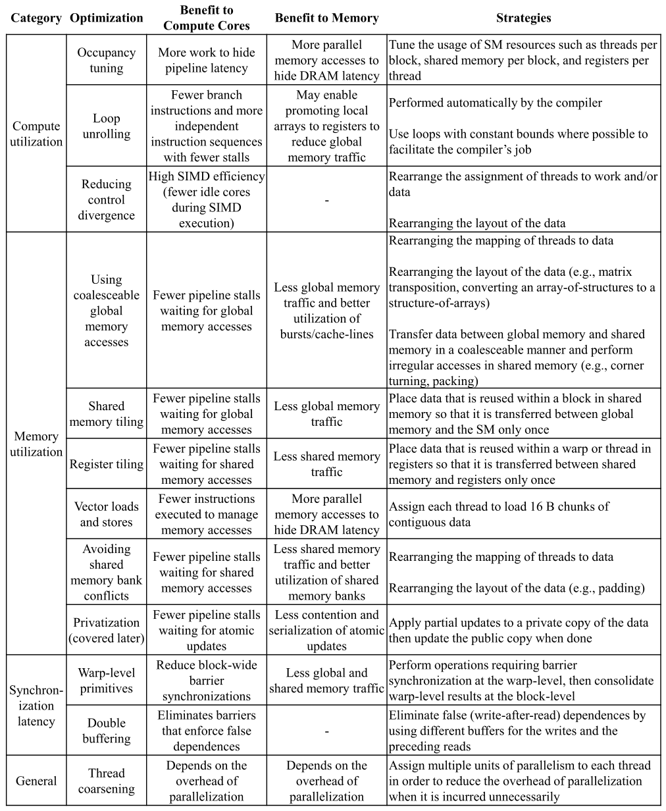

*Figure 6.13 — 최적화 체크리스트. (책 p.148)*

> 이 목록은 **빠짐없는 목록은 아니지만**, 서로 다른 애플리케이션에 공통되는 **보편적 최적화**를
> 담고 있고 프로그래머가 **가장 먼저 고려해야 할 것들**이다 (책 p.149).
> Part 2·3 에서 이 최적화들을 여러 병렬 패턴과 응용에 적용해 **맥락마다 어떻게 다르게
> 나타나는지** 보게 된다.

세 범주로 나뉜다 (책 p.149).

| 범주 | 무엇을 개선하는가 |
|---|---|
| **compute utilization** | GPU core 가 놀지 않고 **쓸모 있는 일을 하게** 한다 |
| **memory utilization** | 메모리 서브시스템을 **효율적으로 쓰게** 한다 |
| **synchronization latency** | thread 가 barrier 에서 **기다릴 필요를 줄인다** |
| (general) | **thread coarsening** — 맥락에 따라 범주가 달라져 따로 둔다 |

### compute utilization — 3가지

| # | 최적화 | 도입 | 전략과 이후 등장 |
|---|---|---|---|
| 1 | **occupancy 튜닝** | 4장 | block/register 한계가 SM 당 thread 수를 제약하지 않도록 자원 사용을 조절. 5장에서 shared memory 도 추가. **6.2절에서 core pipeline latency 뿐 아니라 memory latency 감추기에도 중요함이 드러났다.** 15장에서 자원을 더 쓰는 이득이 occupancy 감소를 능가하는 예 |
| 2 | **loop unrolling** | 6.6절 | 분기 감소 · 독립 명령 노출 · 지역 배열을 register 로 승격. **11·15장에서 coarsening 뒤 register tiling 을 가능하게 하는 데 필수** |
| 3 | **control divergence 줄이기** | 4장 | ① **일/데이터의 thread 배분을 재배치** — 한 warp 를 다 쓰고 다음 warp 를 쓰도록(10장), warp 안 workload 를 비슷하게(18장 vertex-centric vs edge-centric) ② **데이터 배치를 재배치**(17장 JDS 포맷) |

### memory utilization — 6가지

| # | 최적화 | 도입 | 전략과 이후 등장 |
|---|---|---|---|
| 1 | **coalesced global memory 접근** | 6.1절 | ① **global→shared 는 coalesced 로, 불규칙 접근은 shared 에서** — corner turning(6.1절), **packing**(12·14장), 공동 이진 탐색(13장) ② **thread↔데이터 매핑 재배치**(10·15장) ③ **데이터 배치 재배치**(17장 ELL·JDS, transpose, **AoS→SoA**) |
| 2 | **shared memory tiling** | 5장 | block 안에서 재사용되는 데이터를 shared 에. **입력 tile 과 출력 tile 의 차원이 다를 때의 어려움**이 7장(convolution)·8장(stencil)에서 나온다. 15·16장에서 더 정교한 적용 |
| 3 | **register tiling** | 3·5장 | warp 나 thread 안에서 재사용되는 데이터를 register 에. 8장(shared→register 로 잠시 옮겨 shared 용량 보존), 11·15장 |
| 4 | **vector load/store** | 6.3절 | 대부분의 계산에 적용 가능하지만 **단순해서 책에서는 특별히 관련 있을 때만 언급** |
| 5 | **bank conflict 피하기** | 6.4절 | thread↔데이터 매핑 재배치 또는 **padding**. 11·15장 |
| 6 | **privatization** | **아직 안 나옴** (9장) | 여러 thread/block 이 **공용(public) 출력**을 갱신할 때, **사적 복사본**을 만들어 부분 갱신한 뒤 마지막에 공용으로 합친다. 9장(histogram), 12장(filter), 18장(graph) |

### synchronization latency — 2가지

| # | 최적화 | 도입 | 전략과 이후 등장 |
|---|---|---|---|
| 1 | **warp-level primitive** | 4장 | block 전체 계산을 warp 단위로 분해해 **barrier 가 필요한 연산을 먼저 warp 수준에서** 하고, 그 결과를 block 수준에서 합친다. 10·11·12장, 15장(register tiling 보조) |
| 2 | **double buffering** | 6.7절 | false(write-after-read) 의존을 없애 barrier 제거. 11·15장 |

### general — thread coarsening

**맥락마다 없애는 오버헤드가 다르다**는 것이 이 최적화의 특징이다 (책 p.152~153).

| 장 | coarsening 이 줄이는 오버헤드 |
|---|---|
| 8 (stencil), 15 (matmul) | 출력 tile 을 키워 **입력 데이터 중복 적재**를 줄인다 |
| 9 (histogram) | privatization 에서 **공용으로 합쳐야 할 사적 복사본 수**를 줄인다 |
| 10 (reduction), 11 (prefix sum) | **동기화와 control divergence** 오버헤드를 줄인다 |
| 11 (prefix sum) | 병렬 알고리즘의 **중복 연산**을 줄인다 |
| 12 (filter), 14 (sort) | **memory coalescing** 을 개선한다 |

---

## 6.9 Optimization strategy (책 p.153)

### 1. 개념적 이해

> **어느 최적화를 적용할지 정하기 전에, 무엇이 그 kernel 의 성능을 제한하는지 먼저 이해해야
> 한다** (책 p.153). 성능을 제한하는 자원을 **performance bottleneck** 이라 한다.

핵심 논리는 서두에서 예고한 그것이다.

> **최적화는 대개 한 자원을 더 써서 다른 자원의 부담을 던다.**
> - 적용한 최적화가 **bottleneck 자원을 겨냥하지 않으면** 아무 이득이 없다.
> - 더 나쁘게, 적용한 최적화가 **bottleneck 자원을 더 쓰면 성능이 오히려 나빠진다.**

**책이 드는 예** (책 p.153): shared memory tiling 은 shared memory 를 더 써서
global memory bandwidth 압박을 던다.

- bottleneck 이 **global memory bandwidth** 라면 → **훌륭하다.**
- 그런데 bottleneck 이 **occupancy** 이고 그 occupancy 가 **이미 shared memory 를 너무 많이 써서**
  제한된 것이라면 → **shared memory tiling 은 상황을 악화시킨다.**

### 2. 반복 과정

> **성능 최적화는 반복 과정이다** (책 p.153). bottleneck 을 찾고 → 그것을 덜어 주는 최적화를
> 적용하고 → 새로운 bottleneck 을 찾고 → 덜어 주고 → 계속 반복한다.

- bottleneck 을 찾으려면 **profiling 도구**를 쓴다 (Nsight Compute 등).
- **bottleneck 은 하드웨어마다 다를 수 있다** — 같은 kernel 이 장치가 다르면 다른 bottleneck 을
  만난다. 그래서 이 과정에는 **GPU 아키텍처와 장치 간 차이에 대한 이해**가 필요하다.

#### 언제 멈출 것인가

> **중요한 기술은 언제 멈출지 아는 것**이다 — kernel 성능을 더 개선할 수 없을 때 (책 p.154).
> 5장의 **roofline model** 이 그 판단 수단이다.
>
> 1. kernel 이 하는 연산량과 접근하는 데이터량을 추정해 **computational intensity** 를 구한다
> 2. compute-bound 인지 memory-bound 인지 판정한다
> 3. **profiler 가 보고한 실제 자원 활용도**를 roofline 의 하드웨어 한계와 비교한다
> 4. **한계에 가까우면 남은 여지가 거의 없고**, 한계에 못 미치면 더 최적화할 수 있다

**연습문제 6.9-1 (직접).** 어떤 kernel 이 occupancy 50% 이고 shared memory 를 SM 당
한계의 90% 쓰고 있다. global memory bandwidth 활용률은 30% 다. 어떤 최적화를 고려하겠는가?

> **답.** **shared memory tiling 을 더 하는 것은 최악의 선택**이다 — 이미 shared memory 가
> occupancy 를 묶고 있는데 거기에 더 부담을 준다 (책 p.153 의 예 그대로다).
>
> 먼저 **shared memory 사용을 줄여 occupancy 를 올리는 쪽**을 본다 — tile 을 작게 하거나,
> shared 에 두던 것 일부를 register tiling 으로 옮기거나(6.8절 memory utilization 3번).
> bandwidth 활용률이 30% 로 낮은 것도 occupancy 가 낮아 **동시 메모리 요청이 부족한 탓**일
> 가능성이 크다 (6.2절). occupancy 를 올리면 두 지표가 함께 개선될 수 있다.

---

## 6.10 Summary (책 p.154)

책의 정리를 옮기면 (책 p.154):

- GPU 의 **off-chip memory(DRAM) 아키텍처**와 그에 따른 성능 고려사항을 다뤘다 —
  **global memory access coalescing**, **메모리 병렬성으로 memory latency 감추기**.
- 그 위에 중요한 최적화 몇 가지를 더했다 — **thread granularity coarsening**,
  **loop unrolling**, **double buffering**.
- 이 장과 앞 장들의 통찰로 독자는 **마주치는 어떤 kernel 코드에 대해서도 성능을 추론**할 수
  있어야 한다.
- 이 부(Part 1)를 **널리 쓰이는 성능 최적화 체크리스트**로 마무리했다.
  Part 2·3 의 병렬 계산 패턴과 응용 사례 연구에서 이 최적화들의 실제 적용을 계속 공부한다.

---

## 정리

6장에서 가져갈 것을 넷으로 줄이면:

1. **coalescing 은 코드만 보고 판별한다.** 인덱스 식에서 `threadIdx.x` 의 **계수가 1인가**를 보면 된다.
   `k*Width + col` 은 coalesced, `col*Width + k` 는 아니다. 안 될 때는
   **global↔shared 전송만 coalesced 로 하고 불리한 접근은 shared 에서** 처리한다(corner turning).
2. **occupancy 에는 이유가 둘이다.** 4장의 core pipeline latency 감추기에 더해,
   **DRAM 의 bank·channel 을 채울 만큼 동시 요청을 만들어 내는 것**(6.2절)이다.
   그래서 coalescing·occupancy·bank 분산이 함께 가야 bandwidth 가 나온다.
3. **bank conflict 는 크기가 아니라 `gcd(stride, 32)` 가 결정한다.** stride 31 과 7 은
   충돌이 없고 8·16·24·32 는 충돌한다. padding 이 `+1` 로 고치는 것도 **33이 32와 서로소**여서다.
4. **최적화는 자원의 맞교환이므로 bottleneck 을 모르면 추측 놀음이다.**
   6.8절 체크리스트가 무엇을 쓸 수 있는지 알려 주고, 6.9절이 **무엇을 먼저 쓸지**와
   **언제 멈출지**(roofline)를 알려 준다.

**여기까지가 Part 1 이다.** 다음은 7장 — convolution 패턴으로 Part 2 가 시작된다.
6장의 체크리스트가 그때부터 계속 소환된다.
