# 7장. Convolution

> **원문 범위**: 책 p.159~181 (7.1~7.8절)
> **절 순서**: 책 순서를 그대로 따랐다. 재배치 없음.
> **연습문제**: 책 7.8절의 11문제 중 계산·분석 문제 7개를 풀고 답을 붙였다.
> 8~11번은 "3D 로 고쳐 쓰라"·"thread 조직을 바꿔 쓰라"는 구현 과제라 **방향만 정리**했다.

**Part 2 (Parallel patterns) 의 첫 장**이다. 여기서부터는 6장의 최적화 체크리스트를
**구체적 패턴에 적용**하는 것이 목표다.

convolution 은 신호처리·영상처리·컴퓨터비전에서 **filter** 로 널리 쓰인다 (책 p.159).
3장의 image blur 가 바로 그런 filter 였고, Gaussian filter 는 경계와 윤곽을 다듬는다.

이 패턴이 이 자리에 있는 이유는 두 성질 때문이다 (책 p.159).

| 성질 | 결과 |
|---|---|
| 출력 원소를 **서로 독립적으로** 계산할 수 있다 | 병렬화에 이상적 |
| 서로 다른 출력이 **입력을 상당히 공유**하고 **경계 조건이 까다롭다** | **정교한 tiling 과 입력 staging 의 좋은 사례** |

이 장에서 새로 나오는 것은 셋이다.

| | 무엇 |
|---|---|
| **constant memory** | 변하지 않고 모든 thread 가 같은 순서로 읽는 filter 를 담는 곳 |
| **halo cell** | 출력 tile 을 계산하려면 필요한, **출력 tile 바깥의 입력 원소** |
| **ghost cell** | 배열 **바깥**이라 존재하지 않는 원소 (보통 0으로 취급) |

---

## 7.1 Background (책 p.159)

### 1. 개념적 이해

> **convolution 은 각 출력 원소가, 대응하는 입력 원소와 그 주위 입력 원소들의
> 가중합인 배열 연산이다** (책 p.159).

가중치를 담은 배열을 **filter array** 라 한다.

> **이름 충돌 주의** (책 p.160). 이 가중치 배열을 흔히 **convolution kernel** 이라 부르는데,
> **CUDA 의 kernel 함수와 이름이 겹친다.** 그래서 책은 혼동을 피하려 이 배열을
> 일관되게 **convolution filter** 라고만 부른다. 이 노트도 그 규약을 따른다.

### 2. 수식/유도

#### 전체 유도 과정 (먼저 한 번에)

$$
y_i = \sum_{j=-r}^{r} f_{j+r} \times x_{i+j} \tag{7.1}
$$

$$
P_{y,x} = \sum_{j=-r_y}^{r_y} \sum_{k=-r_x}^{r_x} f_{j+r_y,\,k+r_x} \times N_{y+j,\,x+k} \tag{7.2}
$$

#### 단계별 설명

**(7.1) 1D convolution 의 정의**

원소 $n$ 개의 입력 배열 $[x_0, \ldots, x_{n-1}]$ 과 **원소 $2r+1$ 개**의 filter
$[f_0, \ldots, f_{2r}]$ 를 받아 출력 배열 $y$ 를 만든다.

> **filter 크기가 홀수($2r+1$)인 이유**가 여기 있다 (책 p.160). 그래야 가중합이
> **계산 대상 원소를 중심으로 대칭**이 된다 — 양쪽에 $r$ 개씩. 이 $r$ 을 filter 의
> **radius(반지름)** 라 부른다.

인덱스가 헷갈리기 쉬운데, 대응은 이렇다.

| $j$ | $-r$ | … | $0$ | … | $r$ |
|---|---|---|---|---|---|
| filter 인덱스 $j+r$ | $0$ | … | $r$ | … | $2r$ |
| 입력 인덱스 $i+j$ | $i-r$ | … | $i$ | … | $i+r$ |

**(7.2) 2D 로의 확장**

축마다 한 번씩 합을 더 두르면 된다. filter 의 크기가 x 방향 $2r_x+1$, y 방향 $2r_y+1$ 이다.
**filter 가 정사각일 필요는 없지만 보통은 정사각**이다 (책 p.162).

### 3. 예제/실습

#### 1D 예제

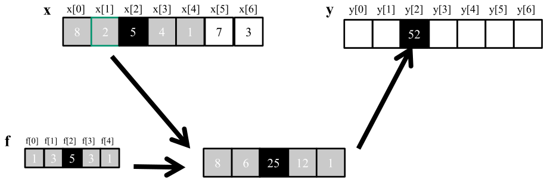

*Figure 7.1 — 1D convolution 예, 안쪽 원소. (책 p.160)*

$r = 2$ 인 5-원소 filter $f$ 를 7-원소 입력 $x$ 에 적용한다.
$x = [8, 2, 5, 4, 1, 7, 3]$, $f = [1, 3, 5, 3, 1]$ (책 p.160).

$$
\begin{aligned}
y[2] &= f[0]x[0] + f[1]x[1] + f[2]x[2] + f[3]x[3] + f[4]x[4] \\
     &= 1{\cdot}8 + 3{\cdot}2 + 5{\cdot}5 + 3{\cdot}4 + 1{\cdot}1 = \mathbf{52}
\end{aligned}
$$

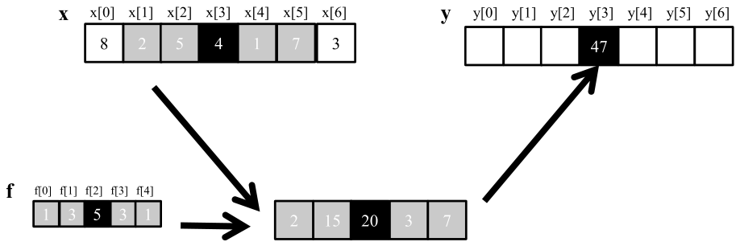

*Figure 7.2 — 1D convolution, $y[3]$ 의 계산. (책 p.161)*

한 칸 밀린 것뿐이다 — **$x$ 의 부분배열과 $f$ 의 inner product** 로 보면 된다.

$$
y[3] = 1{\cdot}2 + 3{\cdot}5 + 5{\cdot}4 + 3{\cdot}1 + 1{\cdot}7 = \mathbf{47}
$$

> **inner product 로 보면 matmul 과 이어진다** (책 p.161 각주 1). convolution 의 각 출력이
> $x$ 의 부분배열과 $f$ 의 inner product 이므로, **convolution 을 matrix multiplication 으로
> 정식화**할 수도 있다. 실제로 그런 정식화가 있고 **19장(CNN)** 에서 다룬다.

#### ghost cell — 경계 조건

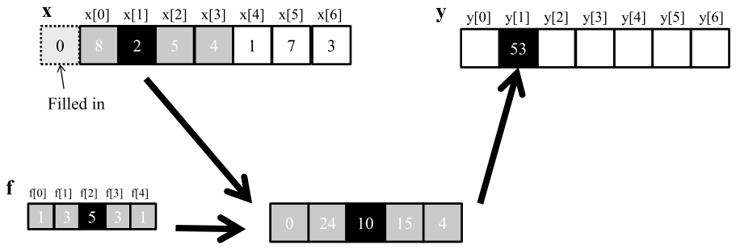

*Figure 7.3 — 1D convolution 의 경계 조건. (책 p.162)*

$y[1]$ 을 계산할 때 $x[1]$ 왼쪽에 원소가 하나뿐이다. **정의대로 계산할 입력이 모자란다.**
전형적인 대처는 **없는 원소에 기본값을 정하는 것**이고, 대부분의 응용에서 그 값은 **0** 이다.

$$
y[1] = 1{\cdot}0 + 3{\cdot}8 + 5{\cdot}2 + 3{\cdot}5 + 1{\cdot}4 = \mathbf{53}
$$

> 오디오 신호처리라면 **녹음 시작 전과 끝난 뒤의 음량이 0** 이라고 가정하는 셈이다 (책 p.161).

이렇게 없는 원소를 문헌에서 **ghost cell** 이라 부른다.

> **ghost cell 은 이것만이 아니다** (책 p.162). **병렬 계산에서 tiling 을 쓰기 때문에 생기는**
> 다른 종류의 ghost cell 도 있다. 이들이 tiling 의 효과와 효율에 **큰 영향**을 줄 수 있다 (7.5절).

> **0이 아닌 경우도 있다** (책 p.162). 어떤 응용은 ghost cell 이 **가장 가까운 유효 원소와 같은 값**
> 을 갖는다고 보고(edge clamp), 어떤 응용은 입력 배열을 이어 붙여 **순환(circular) 관점**으로 본다.

#### 2D 예제

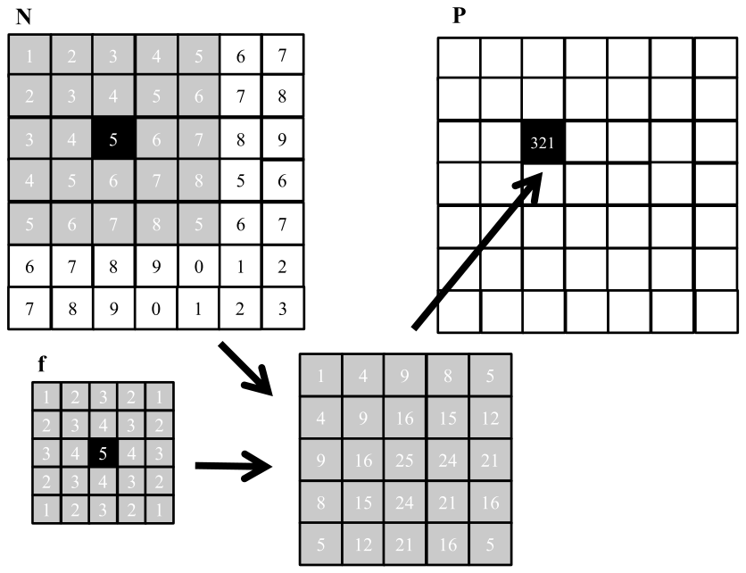

*Figure 7.4 — 2D convolution 예. (책 p.163)*

$5 \times 5$ filter ($r_x = r_y = 2$) 로 $P_{2,2}$ 를 계산한다. 입력 $N$ 에서 대응 위치를
중심으로 하는 부분배열을 잡고, filter 와 **원소별 곱**을 한 뒤 **전부 더한다** (책 p.162).

$$
P_{2,2} = \underbrace{27}_{\text{0행}} + \underbrace{56}_{\text{1행}} + \underbrace{95}_{\text{2행}}
        + \underbrace{84}_{\text{3행}} + \underbrace{59}_{\text{4행}} = \mathbf{321}
$$

> **원문 오기** (책 p.163). 기호로 전개한 식의 3행에서 $N_{2,1} \times M_{1,1}$ 로 되어 있는데
> $M_{2,1}$ 이 맞다. 바로 아래 **숫자 전개는 $4 \times 4$ 로 올바르므로**($M_{2,1} = 4$,
> $M_{1,1} = 3$) 결과 321 에는 영향이 없다. 기호 쪽만 틀렸다.
>
> 또 **filter 이름이 흔들린다** — 일반 식은 $f$, Figure 7.4 의 전개는 $M$, kernel 코드는 `F` 다.

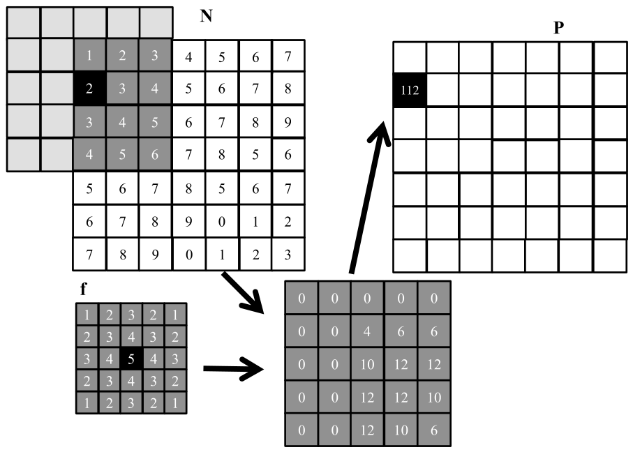

*Figure 7.5 — 2D convolution 의 경계 조건. (책 p.164)*

2D 에서는 **가로 경계, 세로 경계, 또는 둘 다**에 걸릴 수 있어 경우가 더 복잡하다.
$P_{1,0}$ 은 $N$ 부분배열에서 **없는 열 2개와 없는 행 1개**를 건드린다 (책 p.164).

#### 연습문제

**연습문제 (책 1번, p.180).** Figure 7.3 에서 $P[0]$ 값을 계산하라.

> **답.** $y[0]$ 은 왼쪽에 ghost cell 이 **2개** 생긴다.
>
> $$y[0] = f[0]{\cdot}0 + f[1]{\cdot}0 + f[2]x[0] + f[3]x[1] + f[4]x[2]
>        = 0 + 0 + 5{\cdot}8 + 3{\cdot}2 + 1{\cdot}5 = \mathbf{51}$$

**연습문제 (책 2번, p.180).** $N = \{4, 1, 3, 2, 3\}$ 에 $F = \{2, 1, 4\}$ 로 1D convolution 을
하면 출력 배열은?

> **답: $\{8, 21, 13, 20, 7\}$.** $r = 1$ 이므로 $y[i] = 2x[i-1] + 1x[i] + 4x[i+1]$ 이다.
>
> | $i$ | 계산 | $y[i]$ |
> |---|---|---|
> | 0 | $2{\cdot}\mathbf{0} + 1{\cdot}4 + 4{\cdot}1$ | **8** |
> | 1 | $2{\cdot}4 + 1{\cdot}1 + 4{\cdot}3$ | **21** |
> | 2 | $2{\cdot}1 + 1{\cdot}3 + 4{\cdot}2$ | **13** |
> | 3 | $2{\cdot}3 + 1{\cdot}2 + 4{\cdot}3$ | **20** |
> | 4 | $2{\cdot}2 + 1{\cdot}3 + 4{\cdot}\mathbf{0}$ | **7** |
>
> 굵은 0 이 ghost cell 이다.

**연습문제 (책 3번, p.180).** 다음 1D filter 들은 무엇을 하는가?

> **답.** $y[i] = f[0]x[i-1] + f[1]x[i] + f[2]x[i+1]$ 로 놓고 보면 바로 읽힌다.
> 아래는 $x = [1, 2, 4, 8, 4, 2, 1]$ 에 적용한 결과다.
>
> | filter | 결과 | 하는 일 |
> |---|---|---|
> | $[0, 1, 0]$ | $[1,2,4,8,4,2,1]$ | **항등** — 입력 그대로 |
> | $[0, 0, 1]$ | $[2,4,8,4,2,1,0]$ | $y[i] = x[i+1]$ → **신호를 왼쪽으로 한 칸** |
> | $[1, 0, 0]$ | $[0,1,2,4,8,4,2]$ | $y[i] = x[i-1]$ → **오른쪽으로 한 칸** |
> | $[-\frac12, 0, \frac12]$ | $[1, 1.5, 3, 0, -3, -1.5, -1]$ | $\frac{x[i+1]-x[i-1]}{2}$ → **중심차분 = 1차 미분 근사** (윤곽 검출) |
> | $[\frac13, \frac13, \frac13]$ | $[1, 2.33, 4.67, 5.33, 4.67, 2.33, 1]$ | **3점 이동평균 = blur** |
>
> **이동 방향을 반대로 답하기 쉽다.** filter 가 오른쪽 이웃을 가리키면($f[2]=1$)
> 출력은 오른쪽 값을 당겨오므로 **신호 자체는 왼쪽으로** 밀린다.
> 그리고 네 번째가 미분, 다섯 번째가 평활이라는 대비가 **convolution 이 곧 filter** 라는
> 이 장의 서두와 이어진다.

**연습문제 (책 4번, p.180).** 크기 $N$ 배열에 크기 $M$ filter 로 1D convolution 을 한다.
(a) ghost cell 은 총 몇 개인가? (b) ghost cell 을 곱셈으로 치면 곱셈 횟수는?
(c) ghost cell 을 곱셈으로 치지 않으면?

> **답.** $r = (M-1)/2$ 로 둔다.
> **(a)** 배열 양끝에 $r$ 개씩이므로 **$2r = M - 1$ 개.**
> **(b)** 모든 출력이 filter 전체를 도므로 **$N \cdot M$.**
> **(c)** 범위를 벗어나는 접근을 빼야 한다. 왼쪽 끝에서 $r + (r-1) + \cdots + 1$ 번,
> 오른쪽도 같으므로 총 $2 \cdot \frac{r(r+1)}{2} = r(r+1)$ 번이다.
>
> $$\text{(c)} = N \cdot M - r(r+1), \qquad r = \tfrac{M-1}{2}$$
>
> 검산: 본문 예($N=7$, $M=5$, $r=2$)면 $35 - 6 = 29$. 직접 세면
> $y[0]$ 에 2개, $y[1]$ 에 1개, $y[5]$ 에 1개, $y[6]$ 에 2개 = 6개가 빠져 일치한다.

**연습문제 (책 5번, p.180).** $N \times N$ 정사각 행렬에 $M \times M$ 정사각 filter 로
2D convolution 을 한다. 같은 세 질문.

> **답.** $r = (M-1)/2$.
> **(a)** 가장자리를 $r$ 만큼 두른 액자 넓이다.
> $$\text{(a)} = (N + M - 1)^2 - N^2$$
> **(b)** $N^2 M^2$.
> **(c)** **행 방향과 열 방향이 서로 독립이므로 1D 결과의 곱**이 된다.
> $$\text{(c)} = \bigl(N \cdot M - r(r+1)\bigr)^2$$
>
> **왜 곱인가**: 출력 $(i,j)$ 에서 유효한 tap 수는 (행 방향 유효 수)×(열 방향 유효 수) 이고,
> 이를 모든 $(i,j)$ 에 대해 더하면 두 방향의 합의 곱으로 분리된다.
> 검산: $N=3$, $M=3$ 이면 $(9-2)^2 = 49$ — 직접 세어도 49다.

**연습문제 (책 6번, p.180~181).** $N_1 \times N_2$ 직사각 행렬에 $M_1 \times M_2$ filter 라면?

> **답.** $r_1 = (M_1-1)/2$, $r_2 = (M_2-1)/2$ 로 두면 5번을 축마다 따로 적용한 것이다.
>
> $$\text{(a)} = (N_1 + M_1 - 1)(N_2 + M_2 - 1) - N_1 N_2$$
> $$\text{(b)} = N_1 N_2 M_1 M_2$$
> $$\text{(c)} = \bigl(N_1 M_1 - r_1(r_1+1)\bigr) \times \bigl(N_2 M_2 - r_2(r_2+1)\bigr)$$

**검산 코드**

```python
def ghost_1d(N, M):
    r = (M - 1) // 2
    valid = sum(sum(1 for j in range(-r, r+1) if 0 <= i+j < N) for i in range(N))
    return 2*r, N*M, valid, N*M - r*(r+1)

g, mw, brute, formula = ghost_1d(7, 5)
print(f"1D N=7 M=5: ghost {g} · 포함 {mw} · 직접세기 {brute} · 공식 {formula}")
# 1D N=7 M=5: ghost 4 · 포함 35 · 직접세기 29 · 공식 29

N = M = 3; r = (M-1)//2
brute2d = sum(1 for i in range(N) for j in range(N)
                for a in range(-r, r+1) for b in range(-r, r+1)
                if 0 <= i+a < N and 0 <= j+b < N)
print(f"2D 3×3 filter 3×3: 직접세기 {brute2d} · 공식 {(N*M - r*(r+1))**2}")
# 2D 3×3 filter 3×3: 직접세기 49 · 공식 49
```

---

## 7.2 Parallel convolution — a basic kernel (책 p.164)

### 1. 개념적 이해

출력 원소를 전부 병렬로 계산할 수 있으니 **data parallel computing 의 이상적 사례**다.

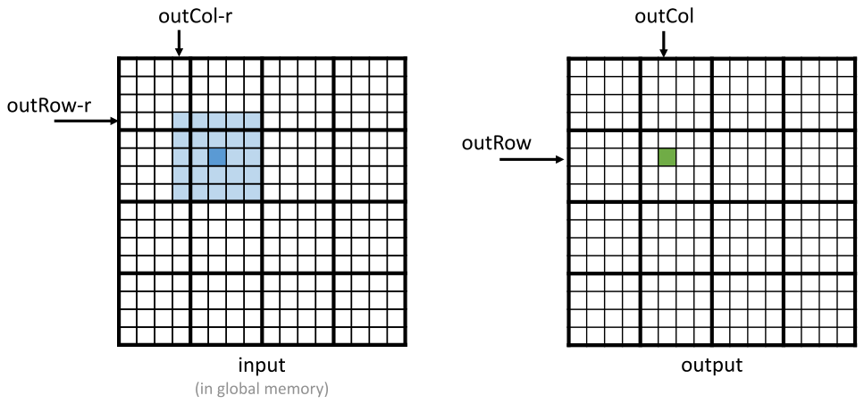

*Figure 7.6 — 2D convolution 을 위한 병렬화와 thread 조직. (책 p.165)*

**3장의 `colorToGrayscaleConversion` 과 똑같은 배치**다 (책 p.165) — 2D grid 에 2D block,
thread 하나가 출력 원소 하나. block 하나는 최대 1024 thread 이므로 보통 $32 \times 32$ 로 잡는다.

Figure 7.6 은 $16 \times 16$ 이미지를 $4 \times 4$ block 의 $4 \times 4$ grid 로 처리하는
장난감 예다. $block_{1,1}$ 의 $thread_{1,1}$ 은 $P_{1 \cdot 4 + 1,\ 1 \cdot 4 + 1} = P_{5,5}$ 를 맡는다.

그 thread 가 필요로 하는 입력 범위는 (책 p.166):

$$
\text{x: } outCol - r = 3 \ \sim\ outCol + r = 7, \qquad
\text{y: } outRow - r = 3 \ \sim\ outRow + r = 7
$$

즉 **$(outRow - r,\ outCol - r)$ 이 필요한 입력 패치의 왼쪽 위 모서리**다.

### 2. 코드

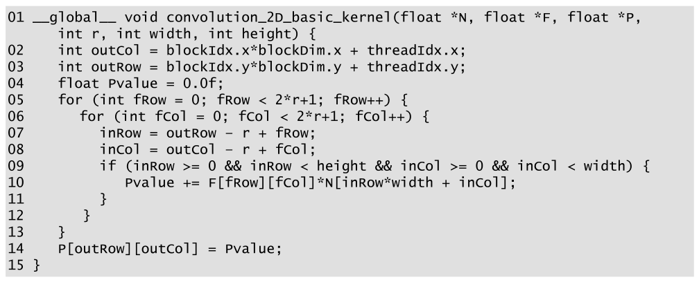

*Figure 7.7 — 경계 조건 처리를 포함한 2D convolution kernel. (책 p.166)*

```cuda
01  __global__ void convolution_2D_basic_kernel(float *N, float *F, float *P,
        int r, int width, int height) {
02      int outCol = blockIdx.x*blockDim.x + threadIdx.x;
03      int outRow = blockIdx.y*blockDim.y + threadIdx.y;
04      float Pvalue = 0.0f;
05      for (int fRow = 0; fRow < 2*r+1; fRow++) {
06        for (int fCol = 0; fCol < 2*r+1; fCol++) {
07          int inRow = outRow - r + fRow;
08          int inCol = outCol - r + fCol;
09          if (inRow >= 0 && inRow < height && inCol >= 0 && inCol < width) {
10              Pvalue += F[fRow*(2*r+1) + fCol] * N[inRow*width + inCol];
11          }
12        }
13      }
14      P[outRow*width + outCol] = Pvalue;
15  }
```

- **02~03** — 3장과 같은 출력 인덱스 계산.
- **04** — `Pvalue` 는 register 에 누적해 **DRAM bandwidth 를 아낀다** (책 p.166).
- **05~08** — filter 를 도는 이중 루프. `inRow`·`inCol` 이 지금 보는 입력 위치다.
- **09** — **ghost cell 검사.** 왼·오른·위·아래 어느 쪽으로든 벗어났는지 본다.
- **10** — ghost 가 아니면 곱해서 누적한다. **ghost 는 0이라 가정하므로 그냥 건너뛰면 된다.**
- **14** — 루프가 끝난 뒤 한 번만 쓴다.

> **원문 오기 세 곳** (Figure 7.7, 책 p.166). 위 코드는 **바로잡은 것**이고 원문은 이렇다.
> ① **07~08번 줄에 타입 선언이 없다** — `inRow = ...`, `inCol = ...` 로만 되어 있어
>    컴파일되지 않는다. `int` 가 빠졌다.
> ② **10번 줄이 `F[fRow][fCol]`** 인데 01번 줄에서 `F` 는 **`float *F`(1차원 포인터)** 로
>    선언됐다. 2차원 인덱싱이 불가능하다. 3장에서 배운 대로 **선형화**해야 한다.
> ③ **14번 줄이 `P[outRow][outCol]`** 인데 `P` 도 `float *P` 다. 같은 문제이고,
>    **Figure 7.9 의 14번 줄은 `P[outRow*width+outCol]` 로 올바르게 되어 있다** —
>    즉 Figure 7.7 쪽만 틀렸다.
>
> 본문 p.163 이 "N 과 P 는 동적 할당 배열이므로 **실제 코드 예제에서는 선형 인덱스를
> 쓰겠다**"고 밝혀 놓고, 정작 이 그림에서 지키지 않은 셈이다.
> (같은 줄의 `N[inRow*width + inCol]` 은 제대로 선형화되어 있다.)

### 3. control divergence 는 얼마나 문제인가

> **9~10번 줄에 control flow divergence 가 있다** (책 p.166). $P$ 배열의 네 가장자리 근처
> 출력을 맡은 thread 들이 ghost cell 을 처리해야 하는데, **각자 마주치는 ghost cell 수가 다르다.**
> $P_{0,0}$ 을 맡은 thread 는 곱셈-누적을 가장 자주 건너뛰고, $P_{0,1}$ 은 덜 건너뛰고 …

**그런데 비용은 크지 않다** (책 p.166).

> divergence 의 비용은 **입력 배열의 크기와 filter 의 radius** 에 달렸다.
> **큰 입력 배열과 상대적으로 작은 filter** 라면 출력의 아주 일부에서만 divergence 가 생긴다.
> convolution 은 보통 큰 이미지에 적용되므로 **영향은 보통 이하에서 무시할 만한 수준**이다.
>
> **더 중요한 성능 고려사항은 memory bandwidth 다** — 다음 절.

4장에서 62×76 이미지의 divergence 를 세어 본 것과 같은 결론이다 —
**데이터가 커질수록 경계의 비중이 줄어든다.**

**연습문제 7.2-1 (직접).** Figure 7.7 의 kernel 에서 `if` (9번 줄) 를 없애고 대신
입력 배열을 미리 0으로 padding 해 두면 어떤 장단점이 있는가?

> **답.** **장점**: control divergence 가 사라지고 루프 몸통이 단순해진다.
> **단점**: ① 입력 배열을 $(N + 2r)^2$ 크기로 **더 크게 할당**하고 복사해야 한다.
> ② padding 을 채우는 별도의 비용이 든다. ③ 원본 데이터를 **그 자리에서 쓸 수 없어**
> 메모리 사용량이 늘고 host→device 전송량도 는다.
> 큰 이미지에서는 divergence 비용이 이미 작으므로(위) 대개 **`if` 를 두는 편이 낫다.**

---

## 7.3 Memory bandwidth considerations (책 p.167)

### 2. 수식/유도

5장에서 배운 arithmetic intensity 분석을 그대로 적용한다. 입력은 $n \times n$,
filter 는 $m \times m$ ($m = 2r+1$), 원소는 4 B 로 둔다.

#### 전체 유도 과정 (먼저 한 번에)

$$
\text{FLOP} = 2 \cdot n^2 \cdot m^2 \tag{7.3}
$$

$$
\text{바이트} = 8n^2 + 4m^2 \approx 8n^2 \quad (m \ll n) \tag{7.4}
$$

$$
\text{이상적 intensity} = \frac{2n^2m^2}{8n^2} = \frac{1}{4}m^2 \ \text{FLOP/B} \tag{7.5}
$$

#### 단계별 설명

**(7.3)** 출력 $n^2$ 개 각각이 filter 원소 $m^2$ 개를 돌고, 원소마다 **곱 1 + 합 1 = 2 FLOP** 이다.

**(7.4)** 최소한 filter($m^2$), 입력($n^2$), 출력($n^2$)을 읽고 써야 한다.
원소가 4 B 이므로 $4(2n^2 + m^2) = 8n^2 + 4m^2$ 다.
**filter 는 배열보다 훨씬 작으므로($m \ll n$) 무시**하고 $8n^2$ 로 근사한다.

**(7.5)** 두 값의 비다. **각 입력·출력 원소를 딱 한 번만 접근하는 완벽한 구현**의 값이다.

#### 흥미로운 관찰 — intensity 가 filter 크기에 달렸다

$$
\text{이상적 intensity} = \frac{m^2}{4}
$$

| filter | intensity | H100(임계값 20)에서 |
|---|---|---|
| $3 \times 3$ | $9/4 = \mathbf{2.25}$ FLOP/B | **memory-bound** — peak 연산 성능에 도달 불가 |
| $5 \times 5$ | $25/4 = 6.25$ FLOP/B | memory-bound |
| $11 \times 11$ | $121/4 = \mathbf{30.25}$ FLOP/B | **compute-bound** — 제대로 최적화하면 peak 에 근접 가능 |

> **작은 filter 는 memory-bound, 큰 filter 는 compute-bound** 다 (책 p.167).
> convolution 이라는 하나의 패턴 안에서 **filter 크기가 성격을 바꾼다.**

#### 실제 kernel 의 intensity

| kernel | 반복마다 읽는 것 | intensity |
|---|---|---|
| **Figure 7.7** (기본) | `F` 4 B + `N` 4 B = **8 B** | $2/8 = \mathbf{0.25}$ FLOP/B |
| **Figure 7.9** (constant memory) | `N` 4 B 만 (F 는 constant cache) | $2/4 = \mathbf{0.5}$ FLOP/B |

**기본 kernel 의 0.25 는 filter 크기와 무관하게 매우 낮다** (책 p.167).
이상적 값 $m^2/4$ 와 비교하면 $5 \times 5$ 에서만 해도 **25×** 차이다.

> 실제로는 on-chip cache 덕분에 이보다 높다 — 같은 filter·입력 원소를 여러 thread 가 접근하므로
> L1·L2 에서 찾을 가능성이 크다. 그래도 **더 확실하게 높이려면** shared memory 나
> constant cache 같은 on-chip 구조를 써야 한다 (책 p.168).

**연습문제 7.3-1 (직접).** filter 가 몇 $\times$ 몇 이상이어야 H100 에서 이상적으로
compute-bound 가 되는가?

> **답.** $m^2/4 \ge 20.0$ → $m \ge \sqrt{80} = 8.94$ → **$m \ge 9$**, 즉 $9 \times 9$ 이상이다.
> ($81/4 = 20.25 > 20$). 다만 이것은 **이상적 구현**의 값이고, 실제 kernel 이 거기 도달하려면
> 7.5절의 tiling 이 필요하다.

---

## 7.4 Constant memory and caching (책 p.168)

### 1. 개념적 이해

filter 배열 `F` 의 쓰임에는 **흥미로운 성질이 셋** 있다 (책 p.168).

1. **크기가 작다.** 대부분의 convolution filter 는 radius 가 7 이하다.
2. **kernel 실행 내내 내용이 바뀌지 않는다.**
3. **모든 thread 가 접근하고, 게다가 같은 순서로 접근한다** — $F_{0,0}$ 부터 한 원소씩.

**이 세 성질이 filter 를 constant memory 와 caching 의 훌륭한 후보로 만든다.**

> **원문의 수치 불일치** (책 p.168). 책은 "radius 가 7 이하"라고 해 놓고 이어서
> "3D convolution 도 filter 원소가 **$7^3 = 343$ 개** 이하"라고 쓴다. 그런데 **radius 7 이면
> filter 한 변은 $2 \cdot 7 + 1 = 15$** 이므로 3D 원소 수는 $15^3 = 3{,}375$ 다.
> $7^3 = 343$ 은 **한 변이 7(= radius 3)** 일 때의 값이다. radius 와 dimension 을 섞어 쓴 듯하다.

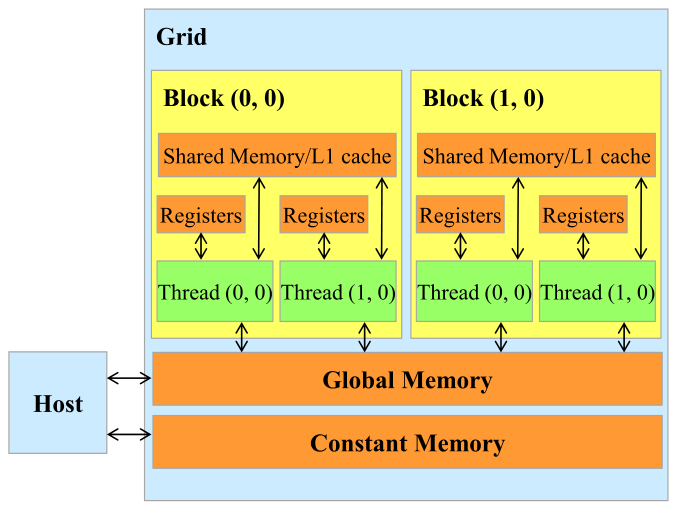

*Figure 7.8 — CUDA memory model 의 재검토. (책 p.168)*

5장 Figure 5.4 에서 봤듯, constant memory 변수는 (책 p.168):

- global memory 변수처럼 **모든 thread block 에서 보인다**
- 다만 **kernel 실행 중 thread 가 값을 바꿀 수 없다**
- **크기가 작다 — 현재 64 KB**

### 2. 코드 — 어떻게 쓰는가

**① 함수 바깥에 전역 변수로 선언한다** (책 p.169).

```cuda
#define FILTER_RADIUS 2
__constant__ float F[2*FILTER_RADIUS+1][2*FILTER_RADIUS+1];
```

**② host 에서 `cudaMemcpyToSymbol` 로 복사한다.**

```cuda
cudaMemcpyToSymbol(F, F_h, (2*FILTER_RADIUS + 1)*(2*FILTER_RADIUS + 1)*sizeof(float));
```

> `cudaMemcpyToSymbol(dest, src, size)` 는 **복사되는 데이터가 kernel 실행 중 바뀌지 않음을
> CUDA 런타임에 알리는** 특수 복사 함수다 (책 p.169).

**③ kernel 은 전역 변수처럼 접근한다** — **포인터를 인자로 넘길 필요가 없다.**

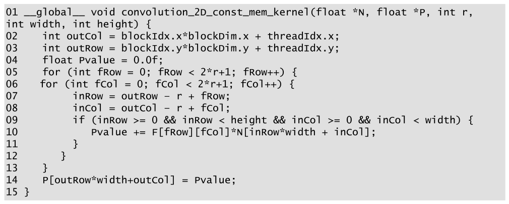

*Figure 7.9 — `F` 에 constant memory 를 쓰는 2D convolution kernel. (책 p.169)*

```cuda
01  __global__ void convolution_2D_const_mem_kernel(float *N, float *P, int r,
        int width, int height) {
02      int outCol = blockIdx.x*blockDim.x + threadIdx.x;
03      int outRow = blockIdx.y*blockDim.y + threadIdx.y;
04      float Pvalue = 0.0f;
05      for (int fRow = 0; fRow < 2*r+1; fRow++) {
06        for (int fCol = 0; fCol < 2*r+1; fCol++) {
07          int inRow = outRow - r + fRow;
08          int inCol = outCol - r + fCol;
09          if (inRow >= 0 && inRow < height && inCol >= 0 && inCol < width) {
10              Pvalue += F[fRow][fCol] * N[inRow*width + inCol];
11          }
12        }
13      }
14      P[outRow*width + outCol] = Pvalue;
15  }
```

**Figure 7.7 과 거의 같다.** 유일한 차이는 **`F` 가 매개변수가 아니라 전역 변수**라는 것이다.
`F` 는 `__constant__` 2D 배열이므로 여기서는 `F[fRow][fCol]` 이 올바르다.

> **원문 오기** (Figure 7.9). 07~08번 줄의 `int` 누락은 **Figure 7.7 과 똑같이 남아 있다.**
> 반면 14번 줄은 `P[outRow*width+outCol]` 로 **올바르게** 되어 있다.

> **C++ scoping 규칙이 그대로 적용된다** (책 p.169). host code 와 kernel code 가 다른 파일에
> 있다면, kernel 쪽 파일이 **`F` 의 선언을 볼 수 있도록 extern 선언을 포함**해야 한다.

### 3. 왜 빠른가 — constant cache

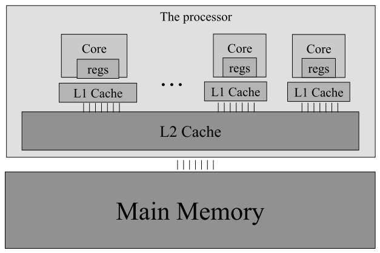

*Figure 7.10 — 현대 프로세서의 cache 계층을 단순화한 모습. (책 p.170)*

> **cache 는 프로그램에 "투명(transparent)" 하다** (책 p.170). shared memory(scratchpad)를 쓰려면
> `__shared__` 로 선언하고 **명시적으로 복사**해야 한다. 반면 cache 를 쓸 때는
> **원래의 global memory 변수를 그냥 접근하면 된다** — 하드웨어가 알아서 최근·자주 쓰는 변수를
> 붙들어 두고 주소로 알아본다.

| 수준 | 크기 | 특징 |
|---|---|---|
| **L1** | 보통 최대 128 KB | core 에 직접 붙는다. 속도가 프로세서에 근접 |
| **L2** | 수백 KB ~ 수십 MB | 접근에 수십~수백 cycle. **여러 SM 이 공유** → bandwidth 도 나눠 쓴다 |
| **L3** | 수백 MB | 일부 고급 프로세서에만 |

#### constant cache 가 특별한 이유

> **쓰기를 지원할 필요가 없다** (책 p.171). constant memory 변수는 kernel 실행 중 바뀌지 않으므로
> SM 에 캐싱할 때 **thread 의 쓰기를 지원할 필요가 없다.** 일반 cache 에서 높은 throughput 의
> 쓰기를 지원하려면 정교한 하드웨어 로직이 필요하고 **chip 면적과 전력이 비싸다.**
> 쓰기 지원이 필요 없으면 **면적·전력 면에서 매우 효율적인 전용 cache** 를 설계할 수 있다.
>
> 게다가 constant memory 가 작으므로(64 KB) **작고 전용화된 cache 로도 충분히 효과적**이다.
> 이것이 **constant cache** 다.

> **warp 전체가 같은 변수를 읽을 때 특히 강하다** (책 p.171). Figure 7.9 에서 `F` 의 인덱스는
> **thread 인덱스와 무관**하다 — warp 의 모든 thread 가 같은 원소를 읽는다.
> 이때 constant cache 는 **엄청난 bandwidth** 를 공급할 수 있다.
> `F` 가 작으므로 **사실상 항상 constant cache 에서 읽힌다고 가정**해도 되고,
> 따라서 **`F` 접근에는 DRAM bandwidth 가 전혀 쓰이지 않는다**고 봐도 된다.

이것이 intensity 가 0.25 → **0.5 FLOP/B** 로 **두 배**가 되는 이유다.

> **constant memory 에 넣는 다른 방법 둘** (책 p.172).
> ① **kernel 매개변수도 constant memory 에 놓인다.** filter 가중치를 **C++ 구조체에 담아
>    값으로 전달**하면 `cudaMemcpyToSymbol` 없이도 constant memory 에 들어간다.
>    같은 kernel 을 **서로 다른 filter 로 여러 번 호출**할 때 편하다.
> ② 가중치가 실행 사이에 바뀌지 않고 **컴파일 시점에 알려져 있다면 코드에 하드코딩**할 수도 있다.
>    다만 그러면 **다른 가중치로 재사용할 수 없다.**

**연습문제 7.4-1 (직접).** `F` 를 `__constant__` 대신 `__shared__` 에 두면 어떨까?

> **답.** 가능은 하지만 **손해다.** ① block 마다 복사본이 생겨 shared memory 를 낭비한다
> (constant 는 grid 전체가 하나를 공유). ② block 마다 global → shared 복사와
> `__syncthreads()` 가 필요하다. ③ warp 전원이 **같은 원소**를 읽는 접근 양상은
> constant cache 가 가장 잘하는 일이고, shared memory 에서는 broadcast 로 처리되긴 하지만
> 이득이 없다. **shared memory 는 thread 마다 다른 것을 읽을 때** 값어치가 있다 —
> 그래서 7.5절에서 shared 에 담는 것은 `F` 가 아니라 **`N`** 이다.

---

## 7.5 Tiled convolution with halo cells (책 p.172)

### 1. 개념적 이해

#### 입력 tile 과 출력 tile — 크기가 다르다

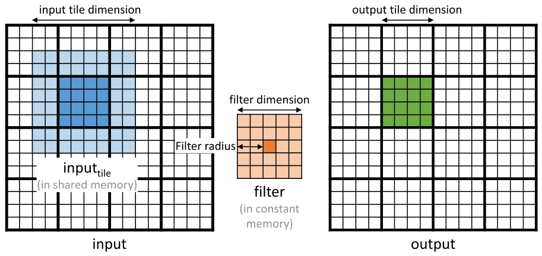

*Figure 7.11 — 2D convolution 에서의 입력 tile 과 출력 tile. (책 p.173)*

| 용어 | 정의 |
|---|---|
| **출력 tile** | block 하나가 처리하는 **출력 원소들의 모임** |
| **입력 tile** | 그 출력 tile 을 계산하는 데 **필요한 입력 원소들의 모임** |

> **입력 tile 은 각 방향으로 filter radius 만큼 확장되어야 한다** (책 p.172) —
> 출력 tile 가장자리를 계산하는 데 필요한 **halo 입력 원소**를 전부 포함하려면.

$$
\text{입력 tile 한 변} = t + 2r = t + m - 1 \tag{7.6}
$$

**이것이 5장 tiled matmul 과의 결정적 차이다.**

> 5장의 tiled matmul 은 **입력 tile 과 출력 tile 의 크기가 같다**고 가정했다.
> convolution 은 **입력 tile 이 더 크다.** 이 차이가 tiled convolution kernel 설계를
> 복잡하게 만든다 (책 p.173).

| 출력 tile | 입력 tile ($m=5$) | 비 |
|---|---|---|
| $4 \times 4 = 16$ | $8 \times 8 = 64$ | **4.0×** ← 장난감 예 |
| $16 \times 16 = 256$ | $20 \times 20 = 400$ | **1.56×** ← 현실적 |

> 장난감 예의 4× 는 시각화를 위해 tile 을 아주 작게 잡았기 때문이다. 현실적 크기에서도
> **입력 tile 이 출력 tile 보다 상당히 클 수 있다**는 것이 요점이다 (책 p.173).

#### 두 가지 thread 조직

크기 불일치를 다루는 단순한 방법이 둘 있다 (책 p.173).

| | block 크기 = **입력 tile** | block 크기 = **출력 tile** |
|---|---|---|
| 적재 | **단순** — thread 하나가 원소 하나 | **복잡** — thread 가 반복해서 여러 개 적재 |
| 계산 | **일부 thread 를 꺼야 한다** | **단순** — 끌 thread 가 없다 |
| 책의 선택 | **7.5절이 이 방식** | 연습문제 11번으로 남김 |

아래 위젯에서 두 조직의 thread 수와 shared memory 를 나란히 볼 수 있다.

<!--widget:conv-tile-->

### 2. 코드

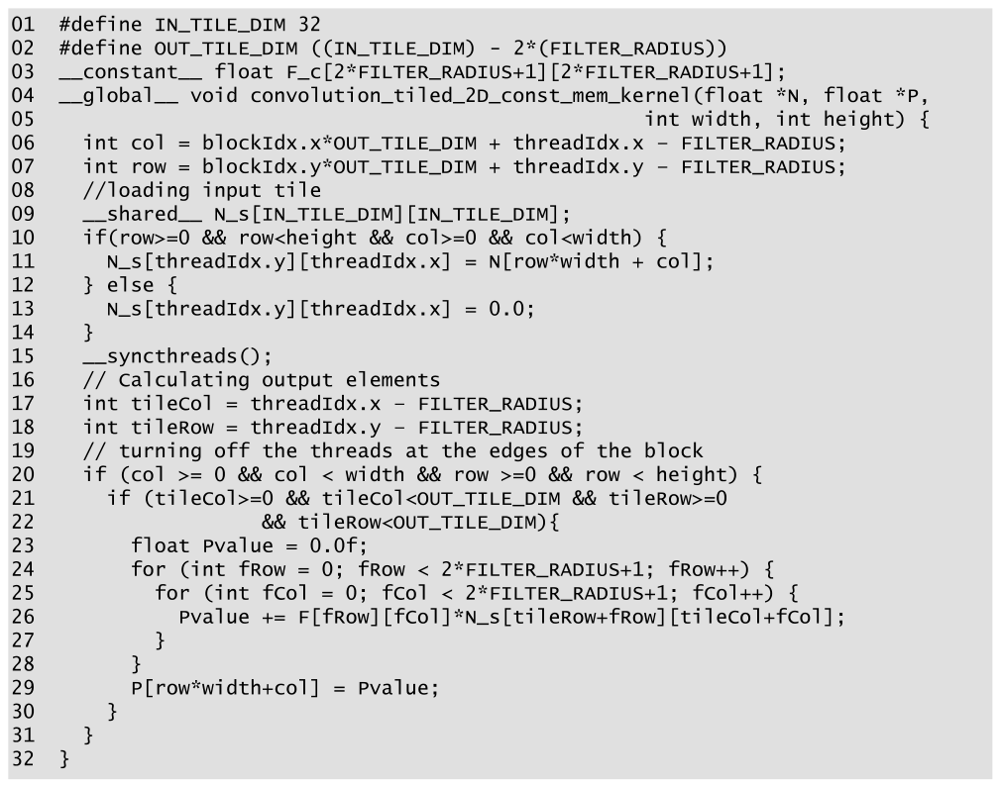

*Figure 7.12 — `F` 에 constant memory 를 쓰는 tiled 2D convolution kernel. (책 p.174)*

```cuda
01  #define IN_TILE_DIM 32
02  #define OUT_TILE_DIM ((IN_TILE_DIM) - 2*(FILTER_RADIUS))
03  __constant__ float F_c[2*FILTER_RADIUS+1][2*FILTER_RADIUS+1];
04  __global__ void convolution_tiled_2D_const_mem_kernel(float *N, float *P,
05                                                        int width, int height) {
06    int col = blockIdx.x*OUT_TILE_DIM + threadIdx.x - FILTER_RADIUS;
07    int row = blockIdx.y*OUT_TILE_DIM + threadIdx.y - FILTER_RADIUS;
08    //loading input tile
09    __shared__ float N_s[IN_TILE_DIM][IN_TILE_DIM];
10    if(row>=0 && row<height && col>=0 && col<width) {
11      N_s[threadIdx.y][threadIdx.x] = N[row*width + col];
12    } else {
13      N_s[threadIdx.y][threadIdx.x] = 0.0;
14    }
15    __syncthreads();
16    // Calculating output elements
17    int tileCol = threadIdx.x - FILTER_RADIUS;
18    int tileRow = threadIdx.y - FILTER_RADIUS;
19    // turning off the threads at the edges of the block
20    if (col >= 0 && col < width && row >=0 && row < height) {
21      if (tileCol>=0 && tileCol<OUT_TILE_DIM && tileRow>=0
22                    && tileRow<OUT_TILE_DIM){
23        float Pvalue = 0.0f;
24        for (int fRow = 0; fRow < 2*FILTER_RADIUS+1; fRow++) {
25          for (int fCol = 0; fCol < 2*FILTER_RADIUS+1; fCol++) {
26            Pvalue += F_c[fRow][fCol]*N_s[tileRow+fRow][tileCol+fCol];
27          }
28        }
29        P[row*width+col] = Pvalue;
30      }
31    }
32  }
```

> **원문 오기 두 곳** (Figure 7.12).
> ① **03번 줄은 `F_c` 로 선언하는데 26번 줄은 `F` 를 쓴다** — 이름이 어긋나 컴파일되지 않는다.
>    위에서는 `F_c` 로 통일했다.
> ② **09번 줄에 타입이 없다** — 원문은 `__shared__ N_s[IN_TILE_DIM][IN_TILE_DIM];` 로
>    **`float` 가 빠져 있다.**

- **01~02** — **입력 tile 을 32로 고정**하고 출력 tile 을 거기서 역산한다.
  $m = 5$ 면 `OUT_TILE_DIM` 은 $32 - 4 = 28$ 이다.
- **06~07** — 이 thread 가 **적재할** 입력 원소의 좌표. `- FILTER_RADIUS` 가 붙어
  **halo 만큼 왼쪽 위로 밀린다.**
- **10~14** — ghost cell 이면 **0을 넣는다** (5장 boundary check 와 같은 요령).
- **15** — 적재 완료 barrier (read-after-write).
- **17~18** — 계산에 쓸 **tile 내부 좌표.** 적재용 좌표에서 halo 를 뺀 것이다.
- **20~22** — **두 겹의 활성 검사.** 20번은 "유효한 출력인가", 21~22번은
  "이 thread 가 출력 tile 담당인가(= 바깥 halo 층이 아닌가)".
- **24~28** — shared memory 에서 읽어 계산한다.

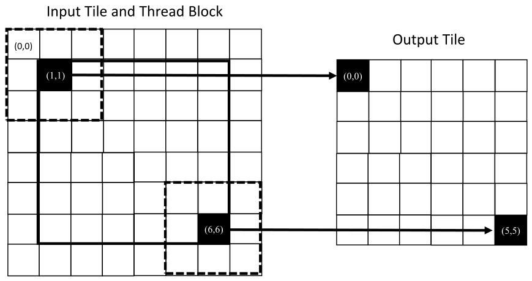

*Figure 7.13 — shared memory 의 입력 tile 원소로 출력 tile 원소를 계산하기 위한 thread 조직을
보여주는 작은 예. (책 p.175)*

$3 \times 3$ filter(`FILTER_RADIUS = 1`), $8 \times 8$ 입력 tile·block, $6 \times 6$ 출력 tile 인 예다.

> **바깥 `FILTER_RADIUS` 층의 thread 를 비활성화한다** (책 p.174~175).
> 이 예에서 활성 thread 의 `threadIdx.x`·`threadIdx.y` 는 **1~6** 이다.
>
> 활성 thread $(tx, ty)$ 는 출력 원소 $(tx - r,\ ty - r)$ 을 계산하며,
> **왼쪽 위 모서리가 입력 tile 의 $(tx - r,\ ty - r)$ 인 패치**를 쓴다.
> thread (1,1) → 출력 (0,0), 패치 왼쪽 위 `N_s[0][0]`.
> thread (5,5) → 패치 왼쪽 위 `N_s[5][5]`.

### 3. arithmetic intensity 분석

$t$ = 출력 tile 한 변, $m$ = filter 한 변으로 둔다.

> **ghost cell 의 영향은 무시한다** (책 p.176). 가장자리 block 은 ghost cell 접근을 건너뛰어
> 메모리 접근이 줄지만, **큰 입력 배열과 작은 filter 에서는 영향이 미미**하다.
> 그래서 **halo 가 ghost 가 아닌 내부 block** 만 따진다.

$$
\text{연산} = t^2 \cdot m^2 \cdot 2 \tag{7.7}
$$

$$
\text{바이트} = \underbrace{(t+m-1)^2 \cdot 4}_{\text{입력 tile 적재}} + \underbrace{t^2 \cdot 4}_{\text{출력 저장}} \tag{7.8}
$$

$$
\text{intensity} = \frac{t^2 m^2 \cdot 2}{\bigl((t+m-1)^2 + t^2\bigr) \cdot 4}
= \frac{1}{4}m^2 \cdot \frac{1}{\frac12\left(1 + \frac{m-1}{t}\right)^2 + \frac12} \tag{7.9}
$$

> **저장을 무시할 수 없다** (책 p.176). 기본 kernel 에서는 global load 가 루프 안에 있어
> 저장이 상대적으로 무시할 만했다. tiled kernel 에서는 **모든 global load 가 루프 밖으로
> 옮겨졌기** 때문에, 저장이 더 이상 압도적으로 적지 않아 **함께 세야** 한다.

**(7.9) 의 오른쪽 형태가 요점이다** — 이상적 값 $\frac14 m^2$ (식 7.5) 에
**1보다 작은 감쇠 인자**가 곱해진 꼴이고, **$t$ 가 커지면 그 인자가 1에 다가간다** (책 p.177).

> 직관적으로: **출력 tile 이 클수록 shared memory 에 올린 입력 원소를 더 많은 출력 계산에
> 재사용**한다. 다만 $t$ 는 **block 크기 한계와 shared memory 용량**에 묶인다 (8장에서 극복).

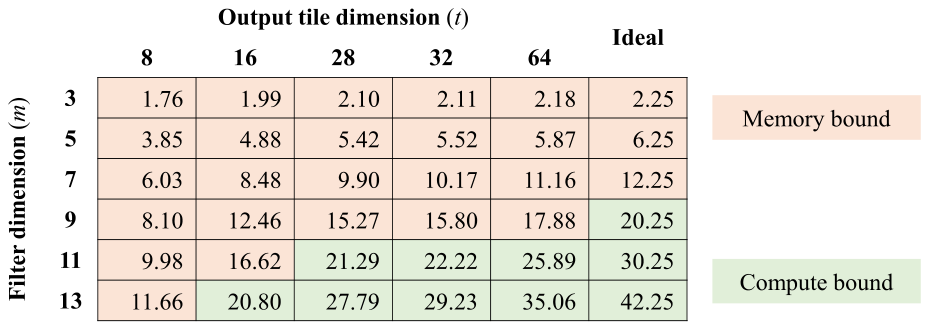

*Figure 7.14 — 2D tiled convolution 의 tile 크기·filter 크기에 따른 arithmetic intensity. (책 p.177)*

식 (7.9) 를 표로 만들면 이렇다 (검산 코드로 재현).

| $t$ \ $m$ | 3 | 5 | 7 | 9 |
|---|---|---|---|---|
| 8 | 1.76 | 3.85 | 6.03 | 8.10 |
| 16 | 1.99 | 4.88 | 8.48 | 12.46 |
| 32 | 2.11 | 5.52 | 10.17 | 15.80 |
| 64 | 2.18 | 5.87 | 11.16 | 17.88 |
| **이상적** | **2.25** | **6.25** | **12.25** | **20.25** |

> **작은 filter·작은 tile 에서는 memory bound, 큰 filter·큰 tile 에서는 compute bound** 다 (책 p.177).
>
> 책의 예 — $5 \times 5$ filter, $28 \times 28$ 출력 tile($32 \times 32$ 입력 tile):
> **5.42 FLOP/B**. 이상적 값 6.25 에 **꽤 근접**했다.

**검산 코드**

```python
def ai(t, m):
    """책 7.5절 식 (7.9)"""
    return (t*t * m*m * 2) / (((t + m - 1)**2 + t*t) * 4)

print(f"책 예 t=28, m=5 → {ai(28,5):.2f} FLOP/B  (이상적 {5*5/4})")
print("      " + "".join(f"{m:>8}" for m in (3,5,7,9)))
for t in (8, 16, 32, 64):
    print(f"t={t:<4}" + "".join(f"{ai(t,m):>8.2f}" for m in (3,5,7,9)))
# 책 예 t=28, m=5 → 5.42 FLOP/B  (이상적 6.25)
#              3       5       7       9
# t=8       1.76    3.85    6.03    8.10
# t=16      1.99    4.88    8.48   12.46
# t=32      2.11    5.52   10.17   15.80
# t=64      2.18    5.87   11.16   17.88
```

### 3. 이 구현의 비효율 세 가지

책이 스스로 짚는다 (책 p.177). **전부 "입력 tile·block 이 출력 tile 보다 크다"에서 나온다.**

**① 계산에 참여하지 않는 thread 를 launch 한다.** 적재만 하고 노는 thread 가 생겨
**연산 자원을 낭비**한다. memory-bound kernel 에서는 접근 병렬성이 늘어 이득일 수도 있지만,
**compute-bound kernel 에서는 낭비되는 자원이 더 아깝다.**

**② 출력 tile 크기가 2의 거듭제곱이 아니다.** block(=입력 tile) 최대가 $32 \times 32$ 이므로
$5 \times 5$ filter 면 출력 tile 이 **$28 \times 28$** 이 된다. 그러면 각 block 이 저장하는
출력 tile 이 **메모리에 정확히 정렬되지 않아**(6.1절 alignment) 저장이 비효율적일 수 있다.

**③ 큰 filter 를 지원하려면 출력 tile 을 줄여야 한다.** 입력 tile 을 키울 수 없으니
$m$ 이 커지면 $t = 32 - (m-1)$ 이 줄고, **intensity 가 떨어지며 ①·②도 악화된다.**

> 위 위젯에서 $m$ 을 키워 보면 ③이 바로 보인다 — $m = 11$ 이면 $t$ 가 22 까지 줄어든다.

---

## 7.6 Tiled convolution using caches for halo cells (책 p.178)

### 1. 개념적 이해

**핵심 착안** (책 p.178):

> 어떤 block 의 입력 tile 의 **halo cell 은 이웃 tile 의 내부 원소이기도 하다.**
> 그러니 그 block 이 halo 를 필요로 할 때쯤이면 **이웃 block 의 접근 덕분에 이미 L2 cache 에
> 있을 확률이 상당하다.**

그렇다면 **halo 를 shared memory 에 올리지 말고 원래 `N` 에서 접근하면 된다.**
그러면 **shared memory 입력 tile 과 출력 tile 의 크기가 같아진다.**

| | Figure 7.12 | Figure 7.15 |
|---|---|---|
| shared memory | 입력 tile 전체 $(t+m-1)^2$ | **내부 원소만 $t^2$** |
| block 크기 | 입력 tile | **출력 tile = 입력 tile** |
| halo | shared 에 적재 | **L2 cache 에 기대어 global 에서 직접** |
| 적재 코드 | 복잡 (halo·ghost 검사) | **단순** |
| 계산 코드 | 단순 | **복잡 (halo·ghost 이중 검사)** |

**복잡도가 적재에서 계산으로 옮겨간 것**이다.

### 2. 코드

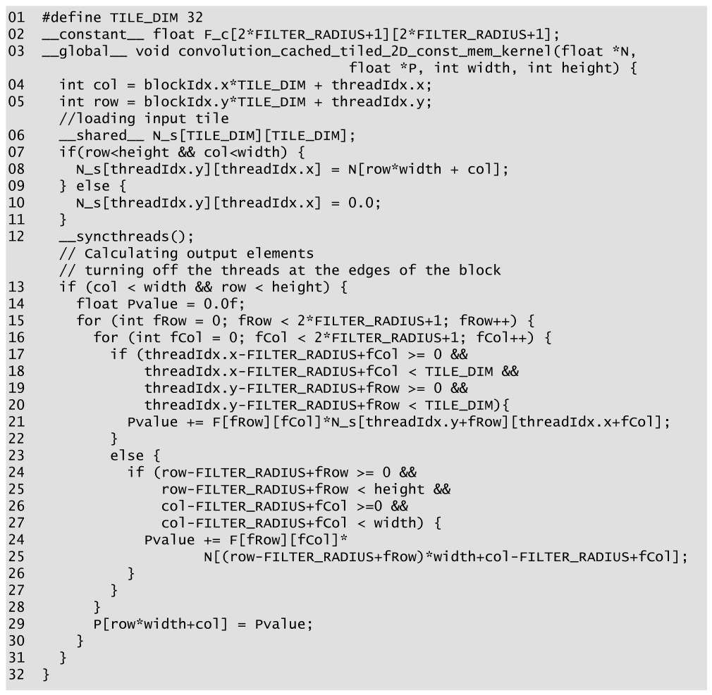

*Figure 7.15 — halo 에는 caching 을, `F` 에는 constant memory 를 쓰는 tiled 2D convolution
kernel. (책 p.178)*

```cuda
01  #define TILE_DIM 32
02  __constant__ float F_c[2*FILTER_RADIUS+1][2*FILTER_RADIUS+1];
03  __global__ void convolution_cached_tiled_2D_const_mem_kernel(float *N,
                             float *P, int width, int height) {
04    int col = blockIdx.x*TILE_DIM + threadIdx.x;
05    int row = blockIdx.y*TILE_DIM + threadIdx.y;
      //loading input tile
06    __shared__ float N_s[TILE_DIM][TILE_DIM];
07    if(row<height && col<width) {
08      N_s[threadIdx.y][threadIdx.x] = N[row*width + col];
09    } else {
10      N_s[threadIdx.y][threadIdx.x] = 0.0;
11    }
12    __syncthreads();
      // Calculating output elements
      // turning off the threads at the edges of the block
13    if (col < width && row < height) {
14      float Pvalue = 0.0f;
15      for (int fRow = 0; fRow < 2*FILTER_RADIUS+1; fRow++) {
16        for (int fCol = 0; fCol < 2*FILTER_RADIUS+1; fCol++) {
17          if (threadIdx.x-FILTER_RADIUS+fCol >= 0 &&
18              threadIdx.x-FILTER_RADIUS+fCol < TILE_DIM &&
19              threadIdx.y-FILTER_RADIUS+fRow >= 0 &&
20              threadIdx.y-FILTER_RADIUS+fRow < TILE_DIM){
21            Pvalue += F_c[fRow][fCol]*N_s[threadIdx.y+fRow][threadIdx.x+fCol];
22          }
23          else {
24            if (row-FILTER_RADIUS+fRow >= 0 &&
25                row-FILTER_RADIUS+fRow < height &&
26                col-FILTER_RADIUS+fCol >= 0 &&
27                col-FILTER_RADIUS+fCol < width) {
28              Pvalue += F_c[fRow][fCol]*
29                  N[(row-FILTER_RADIUS+fRow)*width + col-FILTER_RADIUS+fCol];
30            }
31          }
32        }
33      }
34      P[row*width+col] = Pvalue;
35    }
36  }
```

> **원문 오기 세 곳** (Figure 7.15).
> ① **02번 줄은 `F_c`, 21·28번 줄은 `F`** — Figure 7.12 와 똑같은 이름 어긋남.
> ② **06번 줄에 `float` 누락** — 역시 Figure 7.12 와 같다.
> ③ **줄 번호가 겹친다.** 원문에서 `else` 절 안쪽의 네 줄이 **24·25·26·27 로 매겨진 뒤,
>    그 안쪽 두 줄이 다시 24·25 로** 매겨지고 이어 26·27 이 또 나온다.
>    위 코드에서는 **연속 번호로 다시 매겼다.** (본문 p.179 가 "lines 17-20" 과 "lines 24-27"
>    을 인용하는데, 후자는 **첫 번째** 24~27 을 가리킨다.)

줄별로 (책 p.179):

- **04~05** — 출력 좌표. **halo 만큼 미는 보정이 없다** — block 과 출력 tile 이 같으니까.
- **07~11** — 적재가 **훨씬 단순하다.** halo 를 올리지 않으므로 **ghost 를 걱정할 필요가 없고**,
  tile 이 배열 밖으로 나가는 통상적 경계만 검사한다.
- **17~20** — **halo 판정.** 지금 보는 입력 원소가 **입력 tile 내부**인가?
  그렇다면 shared memory 에서 읽는다(21번).
- **24~27** — 내부가 아니라면(= halo), 그것이 **ghost 인지** 검사한다.
  ghost 면 아무것도 하지 않고(0 이므로), 아니면 **global memory 에서 직접 읽는다**(28~29번).

> **미묘하지만 중요한 이점** (책 p.179). 이 kernel 은 **block 크기 = 입력 tile 크기 =
> 출력 tile 크기**로 만들 수 있고, 그 값을 **2의 거듭제곱**으로 둘 수 있다.
> Figure 7.12 는 셋이 달라서 **memory divergence 와 control divergence 가 더 많다.**

**연습문제 7.6-1 (직접).** Figure 7.15 가 Figure 7.12 보다 항상 나은가?

> **답.** 아니다. **halo 접근이 L2 cache 에 있을 것이라는 가정**에 기대고 있다.
> 이웃 block 들이 **시간적으로 가깝게 실행**되어야 그 가정이 성립하는데, 이는
> block 스케줄링에 달렸고 보장되지 않는다(4장 — block 실행 순서를 가정하면 안 된다).
> 반면 Figure 7.12 는 halo 를 **명시적으로 shared 에 올리므로** cache 에 기대지 않는다.
> 5장의 대비 그대로다 — **cache 는 암묵적이고 신뢰도가 낮으며, shared memory 는 명시적이다.**
>
> 대신 Figure 7.15 는 **shared memory 를 덜 쓰고**($t^2$ vs $(t+m-1)^2$), **노는 thread 가 없고**,
> **크기를 2의 거듭제곱으로** 둘 수 있다. **무엇이 bottleneck 이냐에 달렸다**(6.9절).

### 3. 예제/실습

**연습문제 (책 7번, p.181).** $N \times N$ 배열에 $M \times M$ filter, $T \times T$ 출력 tile 로
Figure 7.12 의 tiled convolution 을 한다.
(a) thread block 몇 개? (b) block 당 thread 몇 개? (c) block 당 shared memory 얼마?
(d) Figure 7.15 라면?

> **답.** 입력 tile 한 변은 $T + M - 1$ 이다.
>
> | | Figure 7.12 | Figure 7.15 |
> |---|---|---|
> | **(a) block 수** | $\lceil N/T \rceil^2$ | $\lceil N/T \rceil^2$ (같다) |
> | **(b) block 당 thread** | $(T + M - 1)^2$ — **입력 tile 크기** | $T^2$ — **출력 tile 크기** |
> | **(c) shared memory** | $(T + M - 1)^2 \times 4$ B | $T^2 \times 4$ B |
>
> 예: $N = 1024$, $M = 5$, $T = 28$ →
> block $\lceil 1024/28 \rceil^2 = 37^2 = \mathbf{1{,}369}$ 개.
> Fig 7.12 는 thread $32^2 = 1024$/block, shared **4,096 B**.
> Fig 7.15 는 thread $28^2 = 784$/block, shared **3,136 B**.
>
> **(b) 가 Figure 7.12 의 한계를 드러낸다.** $T + M - 1 \le 32$ 여야 block 당 1024 thread 를
> 넘지 않는다. $T = 32$, $M = 5$ 로 하면 $36^2 = 1296 > 1024$ 라 **launch 자체가 실패**한다.
> Figure 7.15 는 그 제약이 없어 $T = 32$ 를 쓸 수 있다.

**연습문제 (책 8~11번, p.181) — 구현 과제.** 방향만 정리한다.

> **8·9번 (Figure 7.7·7.9 를 3D 로).** 축을 하나 늘린다.
> - 인덱스: `inDep = outDep - r + fDep` 을 추가하고, 선형화를 **3장 식 (3.4)** 대로
>   `N[(inDep*height + inRow)*width + inCol]` 로 바꾼다.
> - 루프: 삼중 중첩이 된다. 경계 검사도 **세 축 모두** 확인한다.
> - filter 원소가 $m^3$ 로 늘어 **constant memory 64 KB 한계**를 의식해야 한다
>   (7.4절 — $m = 15$ 면 $15^3 \times 4 = 13.5$ KB).
>
> **10번 (Figure 7.12 를 3D 로).** 위에 더해 shared memory 가 $(t+m-1)^3$ 로 **세제곱** 커진다.
> $t = 8$, $m = 5$ 만 해도 $12^3 \times 4 = 6.9$ KB 이고, block 은 $12^3 = 1728 > 1024$ 라
> **입력 tile = block 조직이 아예 불가능**하다. 그래서 3D 에서는 사실상
> **11번의 조직(block = 출력 tile)이 강제된다.** 8장 stencil 이 정확히 이 문제를 다룬다.
>
> **11번 (block = 출력 tile, 적재는 반복문으로).** 7.5절이 언급한 두 번째 thread 조직이다.
> $t^2$ 개의 thread 가 $(t+m-1)^2$ 개를 적재해야 하므로 각 thread 가
> $\lceil (t+m-1)^2 / t^2 \rceil$ 번 반복한다. 전형적인 관용구는 이렇다.
>
> ```cuda
> // block 은 t×t. 입력 tile 은 (t+m-1)×(t+m-1).
> int tid = threadIdx.y*TILE_DIM + threadIdx.x;        // 선형 thread 번호
> int inDim = TILE_DIM + 2*FILTER_RADIUS;
> for (int k = tid; k < inDim*inDim; k += TILE_DIM*TILE_DIM) {
>     int ty = k / inDim, tx = k % inDim;              // 입력 tile 안 좌표
>     int gy = blockIdx.y*TILE_DIM + ty - FILTER_RADIUS;
>     int gx = blockIdx.x*TILE_DIM + tx - FILTER_RADIUS;
>     N_s[ty][tx] = (gy >= 0 && gy < height && gx >= 0 && gx < width)
>                   ? N[gy*width + gx] : 0.0f;
> }
> __syncthreads();
> ```
>
> **`k += blockDim.x*blockDim.y` 로 건너뛰는 것(grid-stride 형태)이 핵심**이다 —
> 연속된 `tid` 가 연속된 `k` 를 맡으므로 **coalescing 이 유지된다**(6.1절).
> 이 조직이면 7.5절이 지적한 비효율 세 가지가 모두 사라진다.

---

## 7.7 Summary (책 p.179)

책의 정리를 옮기면 (책 p.179~180):

- convolution 은 중요한 **병렬 계산 패턴**이다. 컴퓨터비전·영상처리에 쓰이면서
  동시에 **많은 병렬 알고리즘의 기반이 되는 일반적 패턴**이다.
  **편미분방정식(PDE) solver 의 stencil 알고리즘을 convolution 의 특수한 경우로 볼 수 있고**,
  그것이 8장의 주제다. 20장의 CNN 에서도 이 장의 내용을 적용한다.
- 기본 구현은 **입력과 filter 접근 모두에서 DRAM bandwidth 에 묶인다.**
- **constant memory** 와 약간의 수정으로 **filter 에 대한 DRAM 접근을 사실상 없앴다.**
- **shared memory tiling** 으로 DRAM 소비를 더 줄였으나, **control flow divergence 와
  프로그래밍 복잡도**가 늘었다.
- 마지막으로 **halo 에 L1·L2 cache 를 활용**하는 구현을 제시했다.
- **tiling 의 이득을 arithmetic intensity 상승으로 분석**했다 — 5장에서 배운 이 기술은
  다른 패턴의 tiling 이득을 이해하는 데도 쓰인다. 분석을 통해
  **작은 filter·작은 tile 의 한계**를 배웠다.
- 1D·2D 예만 보였지만 **3D 에도 그대로 적용**된다. 차원이 높아지면 인덱스 계산이 복잡해지고
  루프 중첩이 늘어난다.

---

## 정리

7장에서 가져갈 것을 넷으로 줄이면:

1. **convolution 의 성격은 filter 크기가 정한다.** 이상적 arithmetic intensity 가 $m^2/4$ 라,
   $3 \times 3$ 은 memory-bound($2.25$), $11 \times 11$ 은 compute-bound($30.25$) 다.
   **같은 패턴인데 filter 하나로 갈린다.**
2. **constant memory 는 "안 바뀌고 모두가 같은 것을 읽는" 데이터를 위한 자리다.**
   쓰기를 지원할 필요가 없어 전용 cache 를 싸게 만들 수 있고, 그래서 `F` 접근에
   DRAM bandwidth 가 사실상 들지 않는다 — intensity 가 0.25 → 0.5 로 두 배가 된다.
3. **입력 tile 이 출력 tile 보다 크다는 것이 5장과의 결정적 차이다.**
   한 변이 $t \to t + m - 1$ 로 커지고, 여기서 **노는 thread·2의 거듭제곱이 아닌 크기·
   큰 filter 지원의 어려움**이라는 세 가지 비효율이 전부 파생된다.
4. **halo 를 shared 에 올릴지 cache 에 맡길지는 trade-off 다.**
   Figure 7.12 는 명시적이라 확실하지만 복잡하고, Figure 7.15 는 단순하고 자원을 덜 쓰지만
   **이웃 block 이 비슷한 시각에 실행된다는 보장 없는 가정**에 기댄다.
   6.9절대로 **bottleneck 이 무엇이냐**에 따라 고른다.

다음은 8장 — stencil 이다. convolution 과 닮았지만 미분방정식에서 나와
**3D 와 register tiling** 이라는 새 문제를 던진다.
