# 8장. Stencil computation

> **원문 범위**: 책 p.183~199 (8.1~8.8절). 부제는 *And thread coarsening* 이다.
> **절 순서**: 책 순서를 그대로 따랐다. 재배치 없음.
> **연습문제**: 책 8.8절의 2문제(소문항 9개)를 전부 풀고 답을 붙였다.

7장 마지막에서 예고한 대로, **stencil 은 특수한 filter 를 쓰는 convolution 처럼 보인다.**
실제로 둘 다 "출력 원소 하나를 같은 위치의 입력 원소 + 그 이웃들로 계산"하고,
둘 다 halo cell 과 ghost cell 을 다뤄야 한다 (책 p.183).

그런데 책은 **일부러 장을 따로 뗐다.** 출신이 다르기 때문이다.
convolution 은 신호·영상에서 왔고, stencil 은 **편미분방정식(PDE)의 수치해법**에서 온다.
유체역학·열전도·연소·일기예보·기후 시뮬레이션·전자기학이 전부 여기에 속한다 (책 p.183).
그 출신 차이가 네 가지 성질로 나타난다.

| 차이 | convolution | stencil | 이 장에 미치는 영향 |
|---|---|---|---|
| **계수의 출처** | 사람이 설계 (Gaussian, Sobel …) | **풀려는 미분방정식이 정한다** | 계수를 마음대로 못 고른다 |
| **반복 여부** | 보통 한 번 | **연속·미분가능 함수를 반복적으로 수렴시킨다** | 같은 kernel 을 수천 번 돈다 |
| **의존성** | 출력끼리 독립 | 초기조건을 전파하는 solver 에서는 **순서 제약이 생길 수 있다** | 이 장에서는 없다고 가정 |
| **정밀도** | 보통 8bit·float | **double 이 흔하다** | on-chip memory 를 두 배로 먹어 **tiling 계산이 달라진다** |

> "Due to these differences, stencils tend to motivate different optimizations than
> convolution." (책 p.183)

그 "different optimizations" 가 이 장의 실질적 내용이고, 둘이다.

| | 무엇 | 왜 stencil 에서 나오는가 |
|---|---|---|
| **thread coarsening** (8.5절) | thread 하나가 z 방향 **grid point 한 줄**을 맡는다 | stencil 은 보통 **3D** 라 block 크기 1024 제한이 tile 크기를 질식시킨다 |
| **register tiling** (8.6절) | z 이웃은 shared 가 아니라 **register** 에 둔다 | stencil 은 **성긴(sparse) 패턴**이라 z 이웃을 나눠 쓰는 thread 가 자기 자신뿐이다 |

---

## 8.1 Background (책 p.184)

### 1. 개념적 이해

컴퓨터로 함수·모델·방정식을 수치적으로 풀려면 **먼저 이산 표현(discrete representation)으로
바꿔야 한다** (책 p.184).

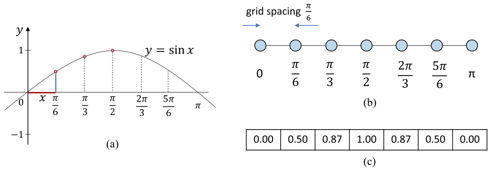

*Figure 8.1 — (a) $0 \le x \le \pi$ 에서 연속·미분가능 함수인 sine, (b) 이산화를 위해
간격 $\pi/6$ 으로 설계한 regular grid, (c) 그 결과 얻은 sine 의 이산 표현. (책 p.184)*

7개의 grid point 가 $x = 0, \frac{\pi}{6}, \frac{\pi}{3}, \frac{\pi}{2},
\frac{2\pi}{3}, \frac{5\pi}{6}, \pi$ 에 놓이고, 함수값이 1D 배열 $F$ 에 담긴다.
$x$ 값은 배열에 저장하지 않고 **인덱스로부터 $i \cdot \frac{\pi}{6}$ 로 암묵적으로 안다.**

> **원문 오기** (책 p.184). "the **x value** that corresponds to element $F[2]$ is 0.87,
> which is the sine value of $2 \cdot \frac{\pi}{6}$" 라고 쓰여 있다.
> 0.87 은 $x$ 값이 아니라 **함수값**이다. $F[2]$ 에 대응하는 $x$ 값은
> $2 \cdot \frac{\pi}{6} = \frac{\pi}{3} \approx 1.05$ 이고,
> Figure 8.1(b) 가 그 $x$ 값들을 그대로 보여 준다.
> 같은 문장이 뒤에서 "which is the sine **value** of ..." 라고 정정하고 있으므로 단순 오기다.

#### structured grid 와 unstructured grid

| | 무엇 | 어떤 방법에 쓰이는가 |
|---|---|---|
| **structured (regular) grid** | $n$ 차원 유클리드 공간을 **동일한 평행다포체**로 덮는다 (1D 선분, 2D 직사각형, 3D 벽돌) | **finite-difference method** — 미분을 finite difference 로 편하게 쓸 수 있다 |
| **unstructured grid** | 모양·연결이 제각각 | finite-element, finite-volume method |

**이 장은 regular grid 와 finite-difference method 만 쓴다** (책 p.184).

#### 표현의 충실도(fidelity)를 정하는 두 가지

| 무엇 | 방향 | 대가 |
|---|---|---|
| **grid 간격** | 좁을수록 정확 | 저장공간 ↑, 연산량 ↑ |
| **수 표현의 정밀도** | double(64) > single(32) > half(16) | double 은 **throughput 낮고 bandwidth·용량 두 배** |

두 번째가 이 장 전체를 관통하는 긴장이다.
double 은 fidelity 가 가장 좋지만, 현대 CPU·GPU 는 single·half 의 연산 throughput 이 훨씬 높고,
비트 수가 많으니 읽고 쓸 때 memory bandwidth 도 더 먹고 memory 용량도 더 먹는다.
**높은 arithmetic intensity 를 얻으려고 grid point 값을 on-chip memory 와 register 에
잔뜩 쌓아 두는 tiling 기법에게는 이게 심각한 부담이다** (책 p.185, 7장 참조).

> 이 장의 코드는 전부 `float`(single) 로 쓰여 있다. **`double` 로 바꾸면 shared memory
> 소요가 그대로 두 배**가 되어 8.4절이 계산하는 tile 크기 한계가 더 조여든다는 뜻이다.

---

### 2. 수식/유도

#### 전체 유도 과정 (먼저 한 번에)

$$f'(x) = \frac{f(x+h) - f(x-h)}{2h} + O(h^2) \tag{1}$$

$$FD[i] = \frac{F[i+1] - F[i-1]}{2 \cdot h} \tag{2}$$

$$FD[i] = \frac{-1}{2 \cdot h} \cdot F[i-1] \;+\; 0 \cdot F[i] \;+\; \frac{1}{2 \cdot h} \cdot F[i+1] \tag{3}$$

$$\text{order} \;=\; \text{중심점 } \textbf{한쪽당} \text{ grid point 개수} \tag{4}$$

#### 단계별 설명 (생략 없이)

> **먼저 stencil 의 정의부터.** 수학에서 **stencil 이란 structured grid 의 각 점에 적용되는
> 가중치의 기하학적 패턴**이다 (책 p.185). 패턴은 "관심 있는 grid point 의 값을,
> 이웃 점들의 값으로부터 수치 근사로 어떻게 유도하는가"를 규정한다.
> 편미분방정식이 함수·변수·그 도함수 사이의 관계를 표현하므로,
> **stencil 은 finite difference method 가 PDE 의 해를 수치적으로 계산하는 방법을
> 적는 편리한 기반**이 된다.

**(1) 1차 도함수의 고전적 finite difference 근사.**

$$f'(x) = \frac{f(x+h) - f(x-h)}{2h} + O(h^2)$$

**정의가 아니라 유도된 결과**다. 어떤 점 $x$ 에서의 도함수를,
**양옆 두 이웃점의 함수값 차이**를 **그 두 점의 $x$ 값 차이**로 나눈 것으로 근사한다.
$h$ 는 grid 의 이웃 간 간격이다.

오차항 $O(h^2)$ 는 **오차가 $h$ 의 제곱에 비례**한다는 뜻이다.
$h$ 가 작을수록 근사가 좋아지고, 제곱이라 개선이 빠르다.
Figure 8.1 의 예에서 $h = \frac{\pi}{6} \approx 0.52$ 인데,
책은 이 값을 두고 **"오차를 무시할 만큼 작지는 않지만 꽤 근접한 근사는 나올 것"** 이라고 평한다
(책 p.185).

**(2) 배열 인덱스로 옮기기.**

grid 간격이 $h$ 이므로 $x = i \cdot h$ 일 때
$f(x-h), f(x), f(x+h)$ 의 현재 추정값이 각각 $F[i-1], F[i], F[i+1]$ 에 들어 있다.
(1)에 그대로 대입하고 오차항을 떼면

$$FD[i] = \frac{F[i+1] - F[i-1]}{2 \cdot h}$$

모든 grid point $i$ 에 대해 이 값을 출력 배열 $FD$ 에 채운다.

**(3) 가중합으로 다시 쓰기 — 여기서 stencil 이 튀어나온다.**

(2)를 각 입력 원소에 대한 계수로 분해하면

$$FD[i] = \frac{-1}{2 \cdot h} \cdot F[i-1] + \frac{1}{2 \cdot h} \cdot F[i+1]$$

즉 grid point $i$ 의 도함수 추정에는 **$[i-1,\, i,\, i+1]$ 세 점**이 관여하고
계수는 $\left[\frac{-1}{2h},\; 0,\; \frac{1}{2h}\right]$ 이다.
이것이 **1D 3-point stencil** 이다 (Figure 8.2(a)).

> **7장과의 차이가 여기서 보인다.** convolution 에서는 filter 배열 `F` 를 프로그래머가 정했다.
> stencil 에서는 **계수가 풀려는 미분방정식과 grid 간격 $h$ 로부터 나온다.**
> $\frac{1}{2h}$ 라는 계수는 선택이 아니라 유도의 산물이다.

**(4) order 의 정의.**

더 높은 차수의 도함수를 근사하려면 더 높은 차수의 finite difference 가 필요하다.
2차 도함수까지 들어간 미분방정식이면 $[i-2, i-1, i, i+1, i+2]$ 를 쓰는
**1D 5-point stencil** 이 된다 (Figure 8.2(b)).

일반적으로 **$n$차 도함수까지 관여하면 중심점 한쪽당 $n$개의 grid point** 를 쓴다.
그리고 이 **한쪽당 개수**를 stencil 의 **order** 라고 부른다 — 근사하는 도함수의 차수를
그대로 반영하기 때문이다 (책 p.186).

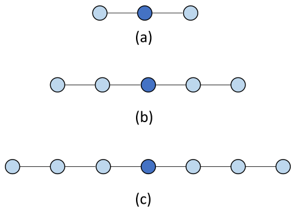

*Figure 8.2 — 1D stencil 예. (a) 3-point (order 1) stencil, (b) 5-point (order 2) stencil,
(c) 7-point (order 3) stencil. (책 p.186)*

$d$ 차원, order $r$ 인 **성긴(축 방향만) stencil** 의 점 개수는 다음과 같이 세면 된다.

$$\text{point 수} = 2 \cdot d \cdot r + 1$$

| 차원 $d$ | order $r$ | 점 수 | 그림 |
|---|---|---|---|
| 1 | 1 | $2 \cdot 1 \cdot 1 + 1 = 3$ | Figure 8.2(a) |
| 1 | 2 | $2 \cdot 1 \cdot 2 + 1 = 5$ | Figure 8.2(b) |
| 1 | 3 | $2 \cdot 1 \cdot 3 + 1 = 7$ | Figure 8.2(c) |
| 2 | 1 | $2 \cdot 2 \cdot 1 + 1 = 5$ | Figure 8.3(a) |
| 2 | 2 | $2 \cdot 2 \cdot 2 + 1 = 9$ | Figure 8.3(b) |
| 3 | 1 | $2 \cdot 3 \cdot 1 + 1 = 7$ | Figure 8.3(c) |
| 3 | 2 | $2 \cdot 3 \cdot 2 + 1 = 13$ | Figure 8.3(d) |

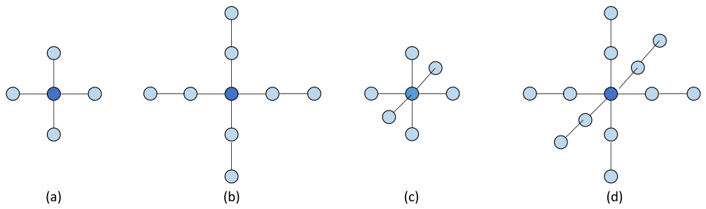

*Figure 8.3 — (a) 2D 5-point stencil (order 1), (b) 2D 9-point stencil (order 2),
(c) 3D 7-point stencil (order 1), (d) 3D 13-point stencil (order 2). (책 p.186)*

> **원문 오기** (책 p.186). Figure 8.2 를 설명한 직후 본문이
> "the stencils in **Fig. 8.3**(a), (b), and (c) are of order 1, 2, and 3, respectively"
> 라고 쓴다. 그러나 Figure 8.3 의 캡션 자체가 (a) order 1, (b) order 2, **(c) 3D 7-point
> order 1** 이라고 밝히고 있어 "1, 2, 3" 과 맞지 않는다.
> 문맥상 **Fig. 8.2** 를 가리켜야 한다 — Figure 8.2 는 정확히 order 1, 2, 3 이다.

> **원문 오기** (책 p.187). "we can use a 2D stencil that involves **two grid points on each
> side** of the center point along the x axis and the y-axis, which results in the
> 2D 5-point stencil in Fig. 8.3(a)"
> 2D 5-point stencil 은 order 1 이므로 **한쪽당 grid point 는 1개**다
> ($2 \cdot 2 \cdot 1 + 1 = 5$). "two" 는 **"one"** 이어야 한다.
> 한쪽당 2개면 $2 \cdot 2 \cdot 2 + 1 = 9$ 로 Figure 8.3(b) 가 된다 —
> 바로 다음 문장이 "2차 도함수까지면 9-point" 라고 말하고 있어 자기모순이다.

#### 왜 2D·3D stencil 은 축 위에만 점이 있는가

Figure 8.3(a)~(d) 는 전부 **십자·별 모양**이고 대각선 위치(코너)에 점이 없다.
$3 \times 3$ convolution filter 가 9칸을 꽉 채우는 것과 대조적이다.

이유는 미분방정식의 형태에 있다 (책 p.186~187).
편미분방정식이 **한 변수에 대한 편도함수만** 포함하면
($\frac{\partial f}{\partial x}$, $\frac{\partial f}{\partial y}$ 는 있지만
**혼합 편도함수 $\frac{\partial^2 f}{\partial x \partial y}$ 는 없으면**),
필요한 이웃은 $x$ 축 위와 $y$ 축 위에만 있다.
**코너 점은 혼합 편도함수를 근사할 때 비로소 필요해진다.**

> 이 성질이 8.4절의 "입력 tile 에 코너가 없다"와 **8.6절의 register tiling 전체**를 낳는다.
> 지금은 그림의 모양으로만 기억해 두면 된다.

---

### 3. 예제/실습

#### Figure 8.1 의 sine 예제를 끝까지

grid: $h = \frac{\pi}{6} \approx 0.5236$, 7개 점.

$$F = [\,0.00,\; 0.50,\; 0.87,\; 1.00,\; 0.87,\; 0.50,\; 0.00\,]$$

$F[2] = \sin(2 \cdot \frac{\pi}{6}) = \sin(\frac{\pi}{3}) = 0.866 \approx 0.87$ (책 p.184).

이제 (2)로 $FD$ 를 안쪽 5개 점에 대해 계산한다. 참값은 $\cos(x)$ 다.

| $i$ | $x = i h$ | $F[i-1]$ | $F[i+1]$ | $FD[i] = \dfrac{F[i+1]-F[i-1]}{2h}$ | 참값 $\cos(x)$ | 오차 |
|---|---|---|---|---|---|---|
| 1 | $\pi/6$ | 0.000 | 0.866 | $\frac{0.866-0.000}{1.0472} = 0.827$ | 0.866 | $-0.039$ |
| 2 | $\pi/3$ | 0.500 | 1.000 | $\frac{1.000-0.500}{1.0472} = 0.477$ | 0.500 | $-0.023$ |
| 3 | $\pi/2$ | 0.866 | 0.866 | $\frac{0.866-0.866}{1.0472} = 0.000$ | 0.000 | $0.000$ |
| 4 | $2\pi/3$ | 1.000 | 0.500 | $\frac{0.500-1.000}{1.0472} = -0.477$ | $-0.500$ | $+0.023$ |
| 5 | $5\pi/6$ | 0.866 | 0.000 | $\frac{0.000-0.866}{1.0472} = -0.827$ | $-0.866$ | $+0.039$ |

$2h = 2 \cdot 0.5236 = 1.0472$ 다.
오차는 최대 $0.039$ — 책의 평가("무시할 만큼 작지는 않지만 꽤 근접")와 맞는다.

#### $O(h^2)$ 를 눈으로 확인하기

오차항의 정체를 먼저 밝히면 무엇을 확인해야 하는지 분명해진다.

> **Taylor 전개.** $f(x \pm h)$ 를 $x$ 근방에서 전개하면
> $$f(x+h) = f(x) + h f'(x) + \tfrac{h^2}{2}f''(x) + \tfrac{h^3}{6}f'''(x) + \cdots$$
> $$f(x-h) = f(x) - h f'(x) + \tfrac{h^2}{2}f''(x) - \tfrac{h^3}{6}f'''(x) + \cdots$$
> 빼면 짝수차 항이 상쇄되어 $f(x+h) - f(x-h) = 2h f'(x) + \tfrac{h^3}{3} f'''(x) + \cdots$ 이고,
> $2h$ 로 나누면
> $$\frac{f(x+h)-f(x-h)}{2h} = f'(x) + \frac{h^2}{6} f'''(x) + O(h^4)$$
> **오차의 주항이 $\frac{h^2}{6} f'''(x)$ 다.** 이것이 (1)의 $O(h^2)$ 의 정체다.

$f = \sin$ 이면 $f''' = -\cos$ 이므로 오차는 $-\frac{h^2}{6}\cos(x)$ 이고,
**$\left|\text{오차}\right| / h^2$ 는 $x$ 가 0 에 가까울수록 $\frac{1}{6} \approx 0.1667$ 에 다가간다.**
grid 를 촘촘하게 만들수록 가장 왼쪽 안쪽 점이 0 에 가까워지므로, 이 값도 $1/6$ 로 수렴해야 한다.

```python
import math

def fd_test(npts):
    h = math.pi / (npts - 1)
    F = [math.sin(i * h) for i in range(npts)]
    worst = 0.0
    for i in range(1, npts - 1):
        fd = (F[i+1] - F[i-1]) / (2 * h)
        worst = max(worst, abs(fd - math.cos(i * h)))
    return h, worst

for n in (7, 13, 25, 49):
    h, e = fd_test(n)
    print(f"  점 {n:>3}개  h={h:.4f}  최대오차={e:.6f}  오차/h^2={e/h**2:.4f}")
# 점   7개  h=0.5236  최대오차=0.039032  오차/h^2=0.1424
# 점  13개  h=0.2618  최대오차=0.010996  오차/h^2=0.1604
# 점  25개  h=0.1309  최대오차=0.002829  오차/h^2=0.1651
# 점  49개  h=0.0654  최대오차=0.000712  오차/h^2=0.1663
```

**`오차/h²` 가 0.1424 → 0.1663 으로 $1/6 = 0.1667$ 에 수렴한다.**
$h$ 를 절반으로 줄일 때마다 최대오차가 대략 $1/4$ 로 준다 —
$0.0390 \to 0.0110 \to 0.00283 \to 0.000712$.
이것이 $O(h^2)$ 의 실제 의미다.

#### 연습문제

**연습문제 8.1-1.** 3D 에서 order 2 인 성긴 stencil 은 몇 point 인가?
그것이 필요한 미분방정식은 어떤 형태인가?

> $2 \cdot 3 \cdot 2 + 1 = 13$ point (Figure 8.3(d)).
> $x, y, z$ 각각에 대해 **2차 도함수까지** 포함하지만 **혼합 편도함수는 없는** 방정식이다.
> 예를 들어 3D Laplace 방정식
> $\frac{\partial^2 f}{\partial x^2} + \frac{\partial^2 f}{\partial y^2} + \frac{\partial^2 f}{\partial z^2} = 0$
> 을 2차 정확도 이상으로 이산화할 때 나온다.

**연습문제 8.1-2.** $3 \times 3$ convolution filter 는 9칸을 전부 쓰는데
2D order-1 stencil 은 5칸만 쓴다. **stencil 쪽이 손해인가?**

> 연산량만 보면 이득이다 (곱셈 5 < 9). **그러나 이 장의 관점에서는 손해다.**
> 8.4절에서 보겠지만, 입력 하나를 on-chip 에 올려서 뽑아 쓸 수 있는 연산량
> (= arithmetic intensity)이 **절반으로 줄기 때문**이다.
> $3\times3$ convolution 의 이상적 intensity 는 $2.25$ FLOP/B 인데
> 2D 5-point stencil 은 $1.125$ FLOP/B 다.
> **"덜 쓴다"는 것은 곧 "적재 비용을 나눠 받을 연산이 적다"는 뜻이다.**

---

## 8.2 Parallel stencil — a basic kernel (책 p.187)

### 1. 개념적 이해

#### stencil sweep 이라는 단위

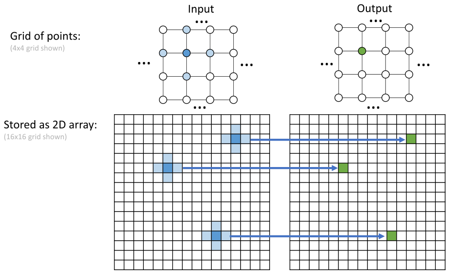

*Figure 8.4 — 2D grid 예와, 서로 다른 grid point 에서 근사 도함수 값을 계산하는 데 쓰이는
5-point (order 1) stencil. (책 p.187)*

**stencil 을 관련된 모든 입력 grid point 에 적용해 모든 grid point 의 출력값을 만드는 것**을
이 책은 **stencil sweep** 이라고 부른다 (책 p.187).
7장의 convolution 한 번에 대응하는 단위다.
solver 는 이 sweep 을 **수렴할 때까지 반복**한다.

#### 단순화 가정 두 가지

이 장의 kernel 은 전부 아래 두 가정 위에 서 있다 (책 p.187).

| 가정 | 내용 | 왜 합리적인가 |
|---|---|---|
| **의존성 없음** | 한 sweep 안에서 출력 grid point 끼리 의존하지 않는다 | 없으면 병렬화 자체가 달라진다 (Jacobi 반복이 이 가정을 만족한다) |
| **경계 고정** | 경계의 grid point 는 **boundary condition** 을 담고 있고 sweep 마다 바뀌지 않는다 | stencil 은 주로 **boundary condition 이 있는** 미분방정식을 푼다 |

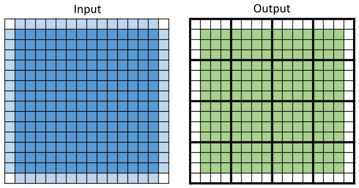

*Figure 8.5 — 경계 조건의 단순화. 경계 cell 은 반복 사이에 갱신되지 않는 boundary condition 을
담고 있다. 따라서 stencil sweep 마다 **안쪽 출력 grid point 만** 계산하면 된다. (책 p.188)*

출력 grid 의 색칠된 안쪽만 계산하고, 색 없는 경계 cell 은 그대로 둔다.
그림의 출력 쪽은 **각 thread block 이 $4 \times 4$ 출력 tile 을 맡는** 2D tiling 예이기도 하다.

> **7장의 ghost cell 문제가 여기서 사라진다.** 7장은 배열 바깥을 0으로 채우는
> ghost cell 처리에 kernel 코드의 상당 부분을 썼다. stencil 에서는 **경계가 계산 대상이 아니므로**
> 안쪽 점을 계산할 때 참조하는 이웃은 항상 배열 안에 있다.
> 대신 8.4절부터는 **tile 경계 밖(halo)** 을 다뤄야 하고, tile 이 grid 밖으로 삐져나갈 때
> 다시 ghost cell 이 등장한다.

---

### 2. 코드 — 기본 kernel

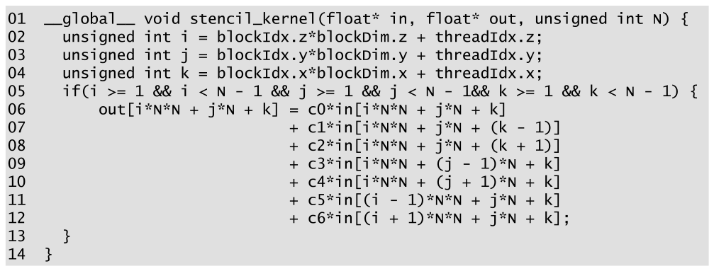

*Figure 8.6 — 기본 stencil sweep kernel. (책 p.188)*

```cuda
01  __global__ void stencil_kernel(float* in, float* out, unsigned int N) {
02    unsigned int i = blockIdx.z*blockDim.z + threadIdx.z;
03    unsigned int j = blockIdx.y*blockDim.y + threadIdx.y;
04    unsigned int k = blockIdx.x*blockDim.x + threadIdx.x;
05    if(i >= 1 && i < N - 1 && j >= 1 && j < N - 1 && k >= 1 && k < N - 1) {
06        out[i*N*N + j*N + k] = c0*in[i*N*N + j*N + k]
07                             + c1*in[i*N*N + j*N + (k - 1)]
08                             + c2*in[i*N*N + j*N + (k + 1)]
09                             + c3*in[i*N*N + (j - 1)*N + k]
10                             + c4*in[i*N*N + (j + 1)*N + k]
11                             + c5*in[(i - 1)*N*N + j*N + k]
12                             + c6*in[(i + 1)*N*N + j*N + k];
13    }
14  }
```

책 본문은 2D 예로 설명을 시작하지만 **kernel 자체는 3D 다** — "most real-world applications
solve 3D differential equations" 이기 때문이다 (책 p.188).
stencil 은 Figure 8.3(c) 의 **3D 7-point (order 1)** 이다.

#### 줄별로

| 줄 | 하는 일 | 짚을 점 |
|---|---|---|
| **02~04** | thread → 3D grid point 대응 | 2·3장의 그 익숙한 선형식이다. **`i`가 z, `j`가 y, `k`가 x** 임에 주의 |
| **05** | 안쪽 점만 계산 | Figure 8.5 의 경계 고정 가정. 세 축 모두 $[1, N-2]$ |
| **06** | 중심점 × `c0` | |
| **07~08** | x 이웃 × `c1`, `c2` | 인덱스 차이 $\pm 1$ — **연속 주소** |
| **09~10** | y 이웃 × `c3`, `c4` | 인덱스 차이 $\pm N$ |
| **11~12** | z 이웃 × `c5`, `c6` | 인덱스 차이 $\pm N^2$ — **가장 먼 주소** |

**인덱스 순서를 3장 기준으로 확인해 두자.** `out[i*N*N + j*N + k]` 는 row-major 선형화이고
`k`(= `threadIdx.x`) 가 가장 빠르게 변한다.
warp 안의 연속한 thread 가 연속한 `k` 를 맡으므로 **06~08번 줄의 접근은 coalesced 다**(6.1절).
09~12번 줄도 warp 안에서는 `k` 만 변하므로 역시 coalesced 다 — 다만 **줄마다 서로 다른
cache line 을 건드린다.**

#### 계수 `c0`~`c6` 는 어디에 두는가

책은 두 선택지를 준다 (책 p.189).

| 선택 | 언제 |
|---|---|
| **코드에 hard-code** | stencil 이 고정일 때. 컴파일러가 즉치(immediate)로 넣어 register 도 안 쓴다 |
| **constant memory** | 유연성이 필요할 때. 7.4절에서 본 그대로 — 모든 thread 가 같은 값을 읽으므로 constant cache 에 완벽히 맞는다 |

값은 **풀려는 미분방정식이 정한다** (8.1절).

> 위 코드에서 `c0`~`c6` 가 선언 없이 쓰인 것은 원문 그대로다.
> 실제로는 `__constant__ float c0;` … 처럼 파일 스코프에 두거나 `#define` 으로 넣는다.

---

### 3. 예제/실습

**연습문제 8.2-1.** 05번 줄의 조건을 `if(i < N && j < N && k < N)` 으로 바꾸면
무슨 일이 일어나는가?

> `i = 0` 인 thread 가 11번 줄에서 `in[(0-1)*N*N + ...]` 을 읽는다.
> `i` 가 `unsigned int` 이므로 `i - 1` 은 $2^{32}-1$ 로 감싸고,
> `(i-1)*N*N` 도 unsigned 로 계산되어 **엄청나게 큰 오프셋**이 된다.
> 할당 범위 밖 접근이라 대개 죽지만, 운 나쁘면 조용히 쓰레기 값을 읽는다.
> `i = N-1` 인 thread 는 12번 줄에서 `in[N*N*N + ...]` 로 배열 끝을 넘는다.
> **경계를 계산 대상에서 뺀 것은 최적화가 아니라 정확성 요구다.**

**연습문제 8.2-2.** 이 kernel 로 $N = 120$ 인 grid 를 처리할 때
block 크기를 $8 \times 8 \times 8$ 로 잡으면 grid 는 몇 block 인가?
그중 **계산을 전혀 하지 않는 thread** 는 몇 개인가?

> block 수 = $\lceil 120/8 \rceil^3 = 15^3 = 3375$.
> 전체 thread = $3375 \times 512 = 1{,}728{,}000$ = $120^3$ (딱 나눠떨어진다).
> 05번 줄을 통과하는 thread = $118^3 = 1{,}643{,}032$.
> 노는 thread = $1{,}728{,}000 - 1{,}643{,}032 = 84{,}968$, 전체의 **4.9%** 다.
> $120^3$ 표면의 한 겹이 정확히 이만큼이다.

---

## 8.3 Memory bandwidth considerations (책 p.189)

### 2. 수식/유도

5장에서 세우고 7장에서 쓴 그 분석을 3D 7-point stencil sweep 에 적용한다.
grid 크기는 $n \times n \times n$ 이다.

#### 전체 유도 과정 (먼저 한 번에)

$$\text{FLOP} = 13 \cdot (n-2)^3 \tag{1}$$

$$\text{입력 접근 원소} = n^3 - 12 \cdot n + 16 \tag{2}$$

$$\text{출력 접근 원소} = (n-2)^3 \tag{3}$$

$$\text{Byte} = 4 \cdot \left( n^3 - 12n + 16 + (n-2)^3 \right) \tag{4}$$

$$AI_{\text{ideal}} = \frac{13 \cdot (n-2)^3}{4 \cdot \left(n^3 - 12n + 16 + (n-2)^3\right)}
  \;\xrightarrow[n \to \infty]{}\; \frac{13}{8} = 1.625 \;\text{FLOP/B} \tag{5}$$

$$AI_{\text{Fig 8.6}} = \frac{13}{(7+1) \cdot 4} = \frac{13}{32} = 0.41 \;\text{FLOP/B} \tag{6}$$

#### 단계별 설명 (생략 없이)

**(1) 연산량.**
안쪽 점만 계산하므로 출력 grid point 는 $(n-2)^3$ 개.
7-point stencil 하나당 **곱셈 7 + 덧셈 6 = 13 FLOP** 이다
(계수 7개를 각각 곱하고, 7개 항을 더하는 데 덧셈 6번).

$$\text{FLOP} = 13 \cdot (n-2)^3$$

**(2) 입력에서 실제로 읽히는 원소 — 여기가 이 절에서 유일하게 안 뻔한 부분이다.**

책은 답만 준다: "all the points in the grid except the points in the **edges and corners**
of the 3D space are accessed, which total $n^3 - 12n + 16$" (책 p.189).
직접 세어 보자.

> **읽히지 않는 점은 어떤 점인가.**
> 어떤 입력 점 $p$ 가 읽히려면, $p$ 자신이 안쪽 점이거나 **어떤 안쪽 점의 축 방향 이웃**이어야 한다.
> - 안쪽 점 $(1{\le}x{\le}n{-}2$ 세 축 모두$)$ → 자기 자신으로 읽힌다.
> - **면(face) 위의 점**, 즉 한 축만 $0$ 또는 $n-1$ 인 점 → 그 축으로 한 칸 안쪽에 있는
>   안쪽 점의 이웃이다 → 읽힌다.
> - **모서리(edge) 위의 점**, 즉 두 축이 경계인 점 → 어느 방향으로 한 칸 가도 여전히
>   한 축이 경계라 안쪽 점이 아니다 → **읽히지 않는다.**
> - **꼭짓점(corner)**, 세 축 모두 경계 → 마찬가지로 **읽히지 않는다.**

정육면체의 뼈대(모서리 + 꼭짓점)를 센다.
모서리는 12개, 각 모서리에서 꼭짓점을 뺀 내부는 $n-2$ 개, 꼭짓점은 8개다.

$$\text{읽히지 않는 점} = 12 \cdot (n-2) + 8 = 12n - 24 + 8 = 12n - 16$$

$$\text{입력 접근 원소} = n^3 - (12n - 16) = n^3 - 12n + 16$$

책의 식과 일치한다.

**(3) 출력에서 접근되는 원소.**
안쪽 점만 쓰므로 $(n-2)^3$ 개다.

**(4) Byte.**
모든 값은 single-precision, 즉 **4 B** 다.
**이상적 상황 = 각 입력 grid point 를 딱 한 번만 읽는 상황**을 가정하므로 (2)와 (3)을 그냥 더한다.

$$\text{Byte} = 4 \cdot \left( n^3 - 12n + 16 + (n-2)^3 \right)$$

**(5) 이상적 arithmetic intensity 와 그 극한.**

$$AI_{\text{ideal}}(n) = \frac{13(n-2)^3}{4\left(n^3 - 12n + 16 + (n-2)^3\right)}$$

$n$ 이 아주 커지면 분자·분모의 $n^3$ 항만 남는다.
분자 $\to 13 n^3$, 분모 $\to 4 (n^3 + n^3) = 8 n^3$ 이므로

$$AI_{\text{ideal}} \to \frac{13}{8} = 1.625 \;\text{FLOP/B}$$

**직관적으로도 같은 말이다.** 아주 큰 grid 에서는 "출력 하나당 입력 하나를 새로 읽고
출력 하나를 쓴다" — 즉 출력당 **8 B**, 그리고 출력당 **13 FLOP** 이다.

수렴 속도를 보면 이 극한이 얼마나 낙관적인지 알 수 있다.

| $n$ | $AI_{\text{ideal}}(n)$ | 극한 대비 |
|---|---|---|
| 8 | 1.083 | 67% |
| 16 | 1.338 | 82% |
| 32 | 1.477 | 91% |
| 64 | 1.550 | 95% |
| 128 | 1.587 | 98% |
| 1024 | 1.620 | 99.7% |

**1.625 FLOP/B 는 아주 작은 값이다.** 5장의 roofline 으로 보면,
A100 의 ridge point 가 대략 $19.5\,\text{TFLOPS} / 1555\,\text{GB/s} \approx 12.5$ FLOP/B 인데
그 **1/8 도 안 된다.** 즉 3D 7-point stencil 은 **아무리 잘 만들어도 memory-bound** 다
(책 p.189).

**(6) 기본 kernel 의 실제 intensity.**

Figure 8.6 의 thread 하나를 보자. tiling 이 없으므로 **모든 접근이 global memory** 다.

| 항목 | 값 |
|---|---|
| FLOP | 13 |
| load | 7 개 × 4 B = 28 B |
| store | 1 개 × 4 B = 4 B |

$$AI_{\text{Fig 8.6}} = \frac{13}{(7+1) \cdot 4} = \frac{13}{32} = 0.40625 \approx 0.41 \;\text{FLOP/B}$$

이상적 $1.625$ 의 **25%** 밖에 안 된다. **$4\times$ 를 버리고 있다.**

> 책은 정직하게 덧붙인다 (책 p.189) — 실제로 측정하면 이보다 높게 나올 수 있다.
> 이웃 원소들이 **L1·L2 cache 에 남아 있을** 가능성이 크기 때문이다.
> 그러나 그건 우연에 기대는 것이고, **shared memory tiling 으로 확실하게 끌어올리는 편이
> 신뢰할 만하다** — 그게 8.4절이다.

<!--widget:stencil-ai-->

---

### 3. 예제/실습

**연습문제 8.3-1.** $n = 8$ 인 작은 grid 로 (2)를 직접 세어 (2)의 공식을 검증하라.

> 공식: $8^3 - 12 \cdot 8 + 16 = 512 - 96 + 16 = 432$.
> 직접: 모서리+꼭짓점 = $12 \cdot 6 + 8 = 80$, $512 - 80 = 432$. 일치.
> 아래 스니펫은 브루트포스로 "실제로 읽히는 점"을 표시해 세어 본다.

```python
def accessed(n):
    seen = set()
    rng = range(1, n - 1)
    for z in rng:
        for y in rng:
            for x in rng:
                seen.add((z, y, x))
                for d in ((1,0,0),(-1,0,0),(0,1,0),(0,-1,0),(0,0,1),(0,0,-1)):
                    seen.add((z+d[0], y+d[1], x+d[2]))
    return len(seen)

for n in (4, 6, 8, 12):
    print(f"  n={n:>3}: 직접세기 {accessed(n):>6}   공식 {n**3 - 12*n + 16:>6}")
# n=  4: 직접세기     32   공식     32
# n=  6: 직접세기    160   공식    160
# n=  8: 직접세기    432   공식    432
# n= 12: 직접세기   1600   공식   1600
```

**연습문제 8.3-2.** 같은 3D 7-point stencil 을 **`double`** 로 계산하면
이상적 arithmetic intensity 는 얼마가 되는가?

> Byte 가 전부 두 배가 되므로 $AI$ 는 정확히 절반이다.
> $$\frac{13}{8 \cdot 2} = \frac{13}{16} = 0.8125 \;\text{FLOP/B}$$
> 8.1절이 경고한 "double 은 tiling 에 심각한 부담"이 이 숫자다.
> 게다가 GPU 의 FP64 throughput 은 FP32 보다 낮으므로 roofline 의 천장도 함께 내려간다 —
> **memory-bound 정도는 오히려 덜해지지만 절대 성능은 훨씬 낮다.**

**연습문제 8.3-3.** 7장의 $3 \times 3$ convolution 은 이상적 $2.25$ FLOP/B 였다.
3D 7-point stencil 은 점을 7개나 쓰는데 왜 $1.625$ 로 더 낮은가?

> **"입력 몇 개를 쓰는가"가 아니라 "출력 하나당 새로 읽는 입력이 몇 개인가"** 가 관건이기 때문이다.
> 큰 grid 에서는 어느 패턴이든 **출력 하나당 입력 하나를 새로 읽고 출력 하나를 쓴다** — 8 B 로 같다.
> 달라지는 건 분자, 즉 출력 하나당 FLOP 수뿐이다.
> $3\times3$ convolution 은 $2 \cdot 9 = 18$ FLOP, 3D 7-point stencil 은 $13$ FLOP 이다.
> $18/8 = 2.25$, $13/8 = 1.625$. **점이 적은 쪽이 곧 intensity 가 낮은 쪽이다.**

---

## 8.4 Shared-memory tiling for stencil sweep (책 p.189)

### 1. 개념적 이해

#### convolution 의 tiling 과 거의 같다 — "거의"

> "the design of shared memory tiling for stencils is almost identical to that for
> convolutions. However, there are a few subtle but important differences." (책 p.190)

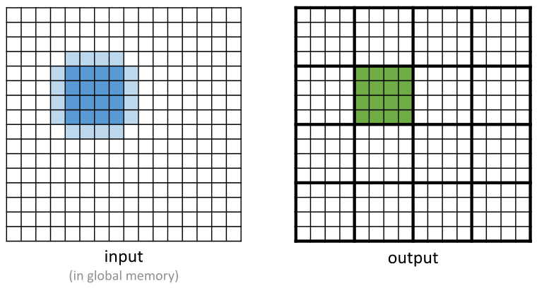

*Figure 8.7 — 2D 5-point stencil 의 입력 tile 과 출력 tile. (책 p.190)*

7장 Figure 7.11 과 나란히 놓고 보면 차이가 하나 보인다.
**5-point stencil 의 입력 tile 에는 코너 grid point 가 없다** (책 p.190).
8.1절에서 본 "축 위에만 점이 있다"는 성질이 tile 모양으로 나타난 것이다.

| | $4 \times 4$ 출력 tile 에 필요한 입력 원소 |
|---|---|
| $3 \times 3$ convolution | $6 \times 6 = 36$ (정사각형) |
| 2D 5-point stencil | $36 - 4 = 32$ (십자 모양, 코너 4개 제외) |

**이 성질이 8.6절 register tiling 의 씨앗이다.** 지금은 기억만 해 둔다.

#### 재사용이 convolution 보다 훨씬 적다

입력을 shared 에 올려 봐야, 그걸 나눠 쓸 연산이 적으면 이득도 적다.
8.3절의 (5)와 같은 논리로 **차원 $d$, order $r$ 인 성긴 stencil** 과
**$m^d$ convolution** 의 이상적 intensity 를 비교하면 이렇다.

$$AI_{\text{stencil}}^{\text{ideal}} = \frac{2 \cdot (2dr + 1) - 1}{8},
\qquad
AI_{\text{conv}}^{\text{ideal}} = \frac{2 \cdot m^d}{8}$$

책이 나열한 값들이다 (책 p.190).

| stencil | 점 수 | 이상적 $AI$ | 대응 convolution | 이상적 $AI$ | 차이 |
|---|---|---|---|---|---|
| 2D order 1 (5-point) | 5 | **1.125** | 2D $3\times3$ | 2.25 | $2.0\times$ |
| 2D order 2 (9-point) | 9 | **2.125** | 2D $5\times5$ | 6.25 | $2.9\times$ |
| 2D order 3 (13-point) | 13 | **3.125** | 2D $7\times7$ | 12.25 | $3.9\times$ |
| 3D order 1 (7-point) | 7 | **1.625** | 3D $3\times3\times3$ | 6.75 | $4.2\times$ |
| 3D order 3 (19-point) | 19 | **4.625** | 3D $7\times7\times7$ | 85.75 | $18.5\times$ |

**차원과 order 가 올라갈수록 격차가 벌어진다.**
당연하다 — convolution 은 점 수가 $m^d$ 로 **지수적으로** 늘지만
성긴 stencil 은 $2dr+1$ 로 **선형으로** 늘 뿐이다.

> "the benefit of loading of an input grid point value into the shared memory for stencil
> sweep can be significantly lower than that for convolution, especially for 3D which is
> the prominent use case for stencils." (책 p.190)
>
> 그리고 바로 이 문장이 **8.5·8.6절의 존재 이유**다.

> **비교 기준이 미세하게 다르다는 점은 알아두자.** 위 표에서 convolution 은 $2m^d$ FLOP
> (곱셈 $m^d$ + 덧셈 $m^d$)으로 세고, stencil 은 $2p - 1$ FLOP (곱셈 $p$ + 덧셈 $p-1$)로 센다.
> 같은 기준으로 세면 $3\times3$ convolution 은 $17/8 = 2.125$ 여서
> 2D order-2 stencil 과 같아진다. 원문 오기라기보다 **7장(convolution)과 8장(stencil)이
> 각자 다른 관례로 세었고 그것을 나란히 놓은 것**이다. 결론(격차가 크다)은 바뀌지 않는다.

---

### 2. 코드 — shared memory tiling

7장의 입력 tile 적재 전략이 그대로 쓰인다.
책은 그중 **Figure 7.12 방식** — block 크기 = 입력 tile 크기, 계산할 때 일부 thread 를 끄는 방식 —
을 3D 로 옮긴 kernel 을 보인다.

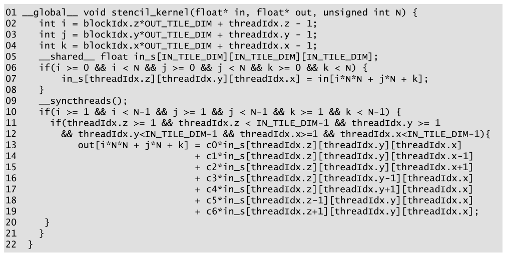

*Figure 8.8 — shared-memory tiling 을 적용한 3D 7-point stencil sweep kernel. (책 p.191)*

```cuda
01  __global__ void stencil_kernel(float* in, float* out, unsigned int N) {
02    int i = blockIdx.z*OUT_TILE_DIM + threadIdx.z - 1;
03    int j = blockIdx.y*OUT_TILE_DIM + threadIdx.y - 1;
04    int k = blockIdx.x*OUT_TILE_DIM + threadIdx.x - 1;
05    __shared__ float in_s[IN_TILE_DIM][IN_TILE_DIM][IN_TILE_DIM];
06    if(i >= 0 && i < N && j >= 0 && j < N && k >= 0 && k < N) {
07        in_s[threadIdx.z][threadIdx.y][threadIdx.x] = in[i*N*N + j*N + k];
08    }
09    __syncthreads();
10    if(i >= 1 && i < N-1 && j >= 1 && j < N-1 && k >= 1 && k < N-1) {
11      if(threadIdx.z >= 1 && threadIdx.z < IN_TILE_DIM-1 && threadIdx.y >= 1
12        && threadIdx.y < IN_TILE_DIM-1 && threadIdx.x >= 1 && threadIdx.x < IN_TILE_DIM-1) {
13          out[i*N*N + j*N + k] = c0*in_s[threadIdx.z][threadIdx.y][threadIdx.x]
14                               + c1*in_s[threadIdx.z][threadIdx.y][threadIdx.x-1]
15                               + c2*in_s[threadIdx.z][threadIdx.y][threadIdx.x+1]
16                               + c3*in_s[threadIdx.z][threadIdx.y-1][threadIdx.x]
17                               + c4*in_s[threadIdx.z][threadIdx.y+1][threadIdx.x]
18                               + c5*in_s[threadIdx.z-1][threadIdx.y][threadIdx.x]
19                               + c6*in_s[threadIdx.z+1][threadIdx.y][threadIdx.x];
20      }
21    }
22  }
```

Figure 8.6 에서 바뀐 곳만 짚는다.

| 줄 | 무엇이 바뀌었나 | 왜 |
|---|---|---|
| **02~04** | `blockDim` → `OUT_TILE_DIM`, 그리고 **`- 1`** | block 이 **입력 tile** 크기이므로, `blockIdx` 가 1 늘 때 좌표는 **출력 tile** 크기만큼 움직인다. `- 1` 은 halo 만큼 뒤로 당기는 것 — **일반적으로는 stencil 의 order 만큼 뺀다** (책 p.191) |
| **05** | `in_s` 3D 배열 | 크기 `IN_TILE_DIM³`. `IN_TILE_DIM = OUT_TILE_DIM + 2` |
| **06** | `i,j,k >= 0 && < N` | `-1` 때문에 grid 밖(**ghost cell**)을 읽을 수 있다. 위·아래 양쪽을 다 막는다 |
| **07** | 모든 thread 가 원소 하나 적재 | thread 수 = 입력 tile 원소 수 |
| **09** | `__syncthreads()` | tile 이 다 채워질 때까지 대기 |
| **10** | 안쪽 점만 | Figure 8.6 의 05번 줄과 같은 역할 — **grid 경계** 걸러내기 |
| **11~12** | `threadIdx` 가 tile 안쪽인 thread 만 | **입력 tile 적재용으로만 launch 된 halo thread 를 끈다** |
| **13~19** | 접근 대상이 `in` → `in_s` | 그래서 global 접근이 줄어든다 |

> **조건이 왜 두 겹인가** (10번 줄과 11~12번 줄). 두 조건이 거르는 대상이 다르다.
> - **10번 줄**: grid 전체의 경계 점 — Figure 8.5 의 "갱신하지 않는 boundary cell"
> - **11~12번 줄**: tile 의 halo 위치 thread — 적재는 했지만 계산은 하지 않을 thread
>
> 서로 독립이라 둘 다 필요하다. grid 안쪽이면서 tile halo 인 thread 가 있고,
> tile 안쪽이면서 grid 경계인 thread 도 있다.

> **`int` 여야 한다.** 02~04번 줄이 `unsigned int` 였던 Figure 8.6 과 달리 **`int`** 다.
> `- 1` 때문에 음수가 나올 수 있고, 06번 줄의 `i >= 0` 검사가 의미를 가지려면 부호가 있어야 한다.
> 7장 Figure 7.7·7.9 에서는 이 `int` 가 빠져 있는 오기가 있었는데, **여기서는 제대로 붙어 있다.**

---

### 3. arithmetic intensity 분석 — 그리고 두 가지 벽

#### 전체 유도 과정 (먼저 한 번에)

입력 tile 한 변을 $t$, 출력 tile 한 변을 $t-2$ 라 하자
(order 1 이므로 각 축에서 halo 가 양쪽 1칸씩).

$$\text{FLOP}_{\text{block}} = 13 \cdot (t-2)^3 \tag{1}$$

$$\text{Byte}_{\text{block}} = 4 \cdot t^3 \;+\; 4 \cdot (t-2)^3 \tag{2}$$

$$AI_{\text{Fig 8.8}}(t) = \frac{13 \cdot (t-2)^3}{4 t^3 + 4 (t-2)^3}
= \frac{13}{8} \cdot \frac{1}{\dfrac{1}{2}\cdot\dfrac{t^3}{(t-2)^3} + \dfrac{1}{2}} \tag{3}$$

#### 단계별 설명

**(1) block 하나가 하는 연산.**
활성 thread 는 출력 tile 원소 수 $(t-2)^3$ 개이고, 각자 13 FLOP 을 한다.

**(2) block 하나가 하는 global memory 접근.**
- **적재**: 입력 tile 전체 $t^3$ 개 × 4 B — **halo 를 포함**해 전부 읽는다
- **저장**: 출력 tile $(t-2)^3$ 개 × 4 B

**(3) 나누고, 책의 형태로 정리한다.**
분자·분모를 $4(t-2)^3$ 로 나누면

$$AI = \frac{13(t-2)^3}{4t^3 + 4(t-2)^3}
= \frac{13/4}{\dfrac{t^3}{(t-2)^3} + 1}
= \frac{13}{8} \cdot \frac{1}{\dfrac{1}{2}\dfrac{t^3}{(t-2)^3} + \dfrac{1}{2}}$$

$t \to \infty$ 이면 $\frac{t^3}{(t-2)^3} \to 1$ 이므로 괄호 안이 $1$ 이 되어
$AI \to \frac{13}{8} = 1.625$ — **8.3절의 이상적 값과 정확히 같다.**
tile 이 클수록 halo 비중이 줄어 이상에 가까워진다.

| $t$ | 활성 thread | $AI$ (FLOP/B) | 이상 대비 | block thread 수 $t^3$ |
|---|---|---|---|---|
| 4 | $2^3 = 8$ | 0.361 | 22% | 64 |
| 6 | $4^3 = 64$ | 0.743 | 46% | 216 |
| **8** | $6^3 = 216$ | **0.964** | **59%** | **512** |
| 10 | $8^3 = 512$ | 1.101 | 68% | **1000** |
| 12 | $10^3 = 1000$ | 1.203 | 74% | **1728 ← launch 불가** |
| 32 | $30^3$ | 1.468 | 90% | **32768 ← launch 불가** |

#### 벽 ① — block 당 1024 thread 제한

block 크기 = 입력 tile 크기 $t^3$ 이므로 **$t^3 \le 1024$**, 즉 $t \le 10$ 이다.
책은 **실용적 한계를 $t = 8$** 로 잡는다 ($8^3 = 512$ thread) — $t=10$ 은 $1000$ thread 로
아슬아슬하고 occupancy 도 나쁘다 (책 p.192).

게다가 shared memory 소요가 $t^3$ 에 비례한다. $t=8$ 이면 $512 \times 4 = 2048$ B 지만
$t=16$ 이면 $16384$ B 로 **SM 당 block 수를 심하게 제한한다** (4장 occupancy).

**$t=8$ 의 결과가 $0.96$ FLOP/B — 이상적 $1.625$ 의 59% 다.**
기본 kernel 의 $0.41$ 보다는 $2.4\times$ 낫지만 여전히 크게 모자란다.

#### 벽 ② — halo 비중이 3D 에서 폭발한다

$AI$ 가 낮은 이유를 halo 로 되짚어 보자. **halo 원소는 재사용이 적다**(7장).
tile 이 작으면 입력 tile 에서 halo 가 차지하는 비중이 커진다.

| 경우 | 입력 tile | 출력 tile | halo 개수 | **halo 비중** |
|---|---|---|---|---|
| 2D, radius 1, $32\times32$ | 1024 | $30 \times 30 = 900$ | $1024 - 900 = 124$ | **12%** |
| 3D, order 1, $8\times8\times8$ | 512 | $6 \times 6 \times 6 = 216$ | $512 - 216 = 296$ | **58%!** |

**같은 order 1 인데 2D 에서 12%, 3D 에서 58% 다** (책 p.192~193).
차원이 하나 늘면 표면 대 부피 비가 급격히 커지기 때문이고,
3D 에서는 1024 제한 때문에 $t$ 를 키울 수도 없다.
**적재한 데이터의 절반 이상이 halo** 라는 뜻이다.

#### 벽 ③ — 작은 tile 은 coalescing 도 망가뜨린다

$8 \times 8 \times 8$ tile 에서 warp 는 32 thread 다.
`threadIdx.x` 가 8까지밖에 없으므로 **한 warp 가 tile 의 서로 다른 4개 행**을 맡는다
($32 / 8 = 4$).
07번 줄의 같은 load 명령에서 warp 의 thread 들이 **global memory 의 최소 4곳 떨어진 위치**를
건드린다. coalescing 이 안 되고 DRAM bandwidth 를 낭비한다 (책 p.193).

**이 벽은 비교적 쉽게 넘는다.** tile 을 정육면체로 하지 말고
`threadIdx.x` 방향을 32로 잡으면 된다 — 예를 들어 block 을 $(x,y,z) = (32, 8, 4)$ 로.
그러면 같은 warp 가 **연속한 32개 원소**를 읽는다.

> 다만 이건 벽 ③만 없앤다. **출력 tile 은 여전히 작고 $AI$ 도 여전히 낮다** (책 p.193).
> 벽 ①·②를 넘으려면 다른 발상이 필요하고, 그게 8.5절이다.

---

**연습문제 8.4-1.** Figure 8.8 kernel 에서 `IN_TILE_DIM = 8` 일 때,
block 당 512 thread 중 13~19번 줄을 실제로 실행하는 thread 는 몇 %인가?
7장 Figure 7.12 의 2D $32\times32$ 경우와 비교하라.

> 3D: $6^3 / 8^3 = 216 / 512 = $ **42%**. 58%의 thread 가 적재만 하고 논다.
> 2D $32\times32$ (7장): $30^2 / 32^2 = 900/1024 = $ **88%**.
> **7장에서 "노는 thread" 를 비효율로 지적했는데, 3D 에서는 그게 비효율이 아니라 재앙이다.**

**연습문제 8.4-2.** `float` 대신 `double` 을 쓰면 $t=8$ 에서 shared memory 는 얼마이며
$AI$ 는 얼마인가?

> shared: $8^3 \times 8 = 4096$ B (float 의 2048 B 에서 2배).
> $AI$: Byte 가 전부 2배이므로 $0.964 / 2 = $ **0.482 FLOP/B**.
> 이상적 $\frac{13}{16} = 0.8125$ 의 59% — 비율은 같고 절대값만 반토막이다.

**연습문제 8.4-3.** Figure 8.8 에서 09번 줄의 `__syncthreads()` 를 빼면?

> thread 마다 다른 시점에 07번 줄을 실행하므로,
> 아직 이웃 thread 가 `in_s` 에 쓰지 않은 자리를 13~19번 줄이 읽을 수 있다.
> **쓰레기 값이 조용히 섞이는 race condition** 이다.
> 같은 warp 안에서는 lockstep 이라 우연히 맞을 수 있어 **더 나쁘다** —
> 작은 grid 로 테스트하면 통과하고 큰 grid 에서 틀린다.

---

## 8.5 Thread coarsening (책 p.193)

### 1. 개념적 이해

#### 발상 — block 크기와 tile 크기를 떼어 놓는다

8.4절의 벽 ①은 **"block thread 수 = 입력 tile 원소 수 = $t^3$"** 이라는 등식에서 왔다.
$t^3 \le 1024$ 니까 $t \le 10$ 이었다.

thread coarsening (6.5절) 은 **병렬 작업 단위 몇 개를 한 thread 안에 부분적으로 직렬화**하는
기법이다. 여기서는 thread 하나가 grid point 하나가 아니라
**z 방향 grid point 한 줄(column)** 을 맡는다.

그러면 등식이 이렇게 바뀐다.

$$\text{block thread 수} = t^2 \quad (\text{not } t^3)$$

$t^2 \le 1024$ 이므로 **$t \le 32$** 다. 벽이 $t=8$ 에서 $t=32$ 로 밀렸다.

> **coarsening 이 없애는 오버헤드가 무엇인지 정확히 보자** (책 p.193).
> 6장에서 coarsening 은 "병렬화의 오버헤드"를 줄인다고 했다.
> 여기서 그 오버헤드는 **재사용이 낮은 halo 원소를 더 많은 block 이 중복 적재하는 것**이다.
> tile 을 키우면 같은 grid 를 더 적은 block 이 덮고, 중복 적재가 줄어든다.

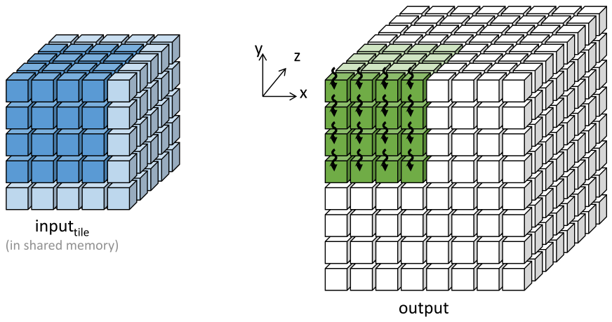

*Figure 8.9 — 3D 7-point stencil sweep 의 z 방향 thread coarsening. (책 p.194)*

그림을 읽는 법 (책 p.193).

| 요소 | 값 |
|---|---|
| 입력 tile | $t^3 = 6^3 = 216$ grid point (**내부가 보이도록 앞·왼쪽·위 한 겹을 벗겨 그렸다**) |
| 출력 tile | $(t-2)^3 = 4^3 = 64$ grid point |
| 입력 tile 의 x-y 평면 하나 | $6^2 = 36$ |
| 출력 tile 의 x-y 평면 하나 | $4^2 = 16$ |
| thread block | 입력 tile 의 **x-y 평면 하나와 같은 수**, 즉 $6 \times 6$ |
| 그림에 화살표로 표시된 thread | 그중 계산에 참여하는 **내부 $4 \times 4$** 만 |

block 은 화살표 방향(z, 그림 안쪽)으로 **반복하며 한 번에 출력 tile 의 x-y 평면 하나씩** 계산한다.

#### 핵심 — 한 번에 세 평면만 있으면 된다

3D 7-point stencil 에서 출력 평면 하나를 계산하려면 입력 평면 **세 개**(이전·현재·다음)만 있으면 된다.
그래서 shared memory 에 $t^3$ 을 다 올릴 필요가 없다.

$$\text{shared memory} : t^3 \;\longrightarrow\; 3 \cdot t^2$$

$t = 32$ 면 $3 \cdot 32^2 \cdot 4 = 12{,}288$ B = **12 KB/block** 이다 (책 p.195).
$t^3$ 이었다면 $32^3 \cdot 4 = 131$ KB 로 **SM 의 shared memory 를 통째로 넘긴다.**

> 이 "세 평면"의 개수는 **stencil 의 order 로 정해진다** (책 p.197).
> order 1 이면 3, order 2 면 5, order $r$ 이면 $2r+1$ 이다.
> 책은 이 부분을 입력 tile 의 **"active part"** 라고 부른다.

---

### 2. 코드 — z 방향 coarsening

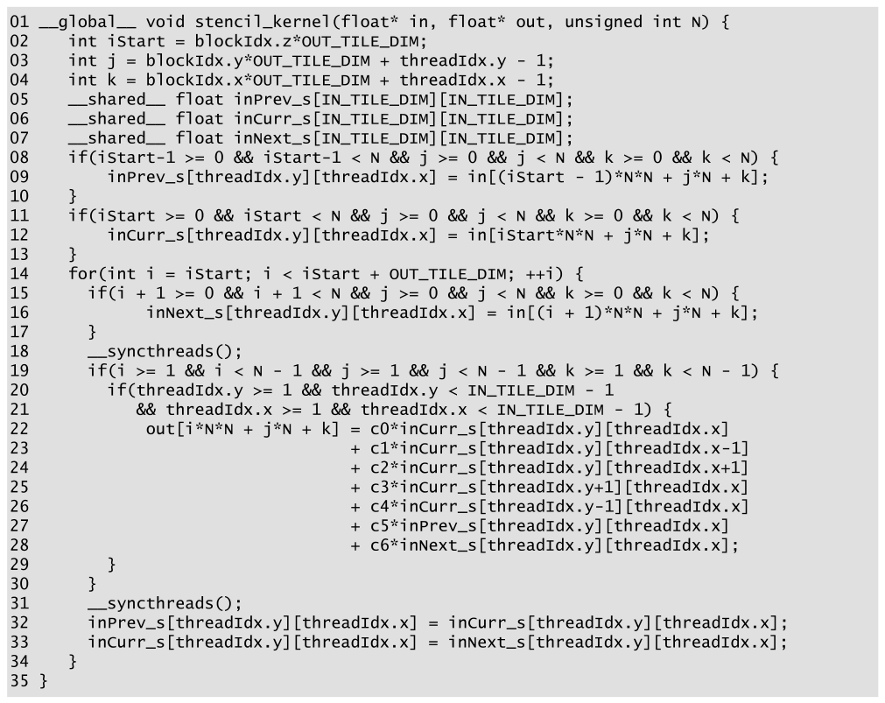

*Figure 8.10 — 3D 7-point stencil sweep 의 z 방향 thread coarsening kernel. (책 p.194)*

```cuda
01  __global__ void stencil_kernel(float* in, float* out, unsigned int N) {
02    int iStart = blockIdx.z*OUT_TILE_DIM;
03    int j = blockIdx.y*OUT_TILE_DIM + threadIdx.y - 1;
04    int k = blockIdx.x*OUT_TILE_DIM + threadIdx.x - 1;
05    __shared__ float inPrev_s[IN_TILE_DIM][IN_TILE_DIM];
06    __shared__ float inCurr_s[IN_TILE_DIM][IN_TILE_DIM];
07    __shared__ float inNext_s[IN_TILE_DIM][IN_TILE_DIM];
08    if(iStart-1 >= 0 && iStart-1 < N && j >= 0 && j < N && k >= 0 && k < N) {
09        inPrev_s[threadIdx.y][threadIdx.x] = in[(iStart - 1)*N*N + j*N + k];
10    }
11    if(iStart >= 0 && iStart < N && j >= 0 && j < N && k >= 0 && k < N) {
12        inCurr_s[threadIdx.y][threadIdx.x] = in[iStart*N*N + j*N + k];
13    }
14    for(int i = iStart; i < iStart + OUT_TILE_DIM; ++i) {
15      if(i + 1 >= 0 && i + 1 < N && j >= 0 && j < N && k >= 0 && k < N) {
16          inNext_s[threadIdx.y][threadIdx.x] = in[(i + 1)*N*N + j*N + k];
17      }
18      __syncthreads();
19      if(i >= 1 && i < N - 1 && j >= 1 && j < N - 1 && k >= 1 && k < N - 1) {
20        if(threadIdx.y >= 1 && threadIdx.y < IN_TILE_DIM - 1
21          && threadIdx.x >= 1 && threadIdx.x < IN_TILE_DIM - 1) {
22            out[i*N*N + j*N + k] = c0*inCurr_s[threadIdx.y][threadIdx.x]
23                                 + c1*inCurr_s[threadIdx.y][threadIdx.x-1]
24                                 + c2*inCurr_s[threadIdx.y][threadIdx.x+1]
25                                 + c3*inCurr_s[threadIdx.y+1][threadIdx.x]
26                                 + c4*inCurr_s[threadIdx.y-1][threadIdx.x]
27                                 + c5*inPrev_s[threadIdx.y][threadIdx.x]
28                                 + c6*inNext_s[threadIdx.y][threadIdx.x];
29        }
30      }
31      __syncthreads();
32      inPrev_s[threadIdx.y][threadIdx.x] = inCurr_s[threadIdx.y][threadIdx.x];
33      inCurr_s[threadIdx.y][threadIdx.x] = inNext_s[threadIdx.y][threadIdx.x];
34    }
35  }
```

#### 줄별로

| 줄 | 하는 일 | 짚을 점 |
|---|---|---|
| **02** | `iStart` = 이 block 이 맡을 **z 시작 평면** | `- 1` 이 **없다.** z 방향 halo 는 `inPrev_s` 가 따로 챙긴다 |
| **03~04** | x-y 좌표 (`- 1` 있음) | x-y 방향 halo 는 Figure 8.8 과 똑같이 처리한다 |
| **05~07** | shared 평면 **세 장** | 각 $t^2$. 3D 배열이 아니다 |
| **08~10** | `inPrev_s` ← 첫 평면 ($iStart-1$) | Figure 8.9 에서 **가시성을 위해 벗겨 낸 앞면**이 바로 이 평면이다 |
| **11~13** | `inCurr_s` ← 둘째 평면 ($iStart$) | |
| **14** | z 방향 coarsening loop | $OUT\_TILE\_DIM$ 번 반복 = 출력 평면 개수 |
| **15~17** | `inNext_s` ← 셋째 평면 ($i+1$) | **매 반복마다 새 평면 하나만 적재한다** |
| **18** | `__syncthreads()` | 세 평면이 다 찰 때까지 |
| **19~21** | Figure 8.8 의 10~12번 줄과 **같은 역할** | grid 경계 + tile halo thread 끄기 |
| **22~26** | x-y 이웃 4개는 `inCurr_s` 에서 | **여러 thread 가 나눠 쓴다** → shared 가 맞다 |
| **27~28** | z 이웃 2개는 `inPrev_s`·`inNext_s` 에서 | **자기 $(y,x)$ 자리만 쓴다** → 8.6절의 실마리 |
| **31** | `__syncthreads()` | 다른 thread 가 `inCurr_s` 이웃을 다 읽기 전에 덮어쓰면 안 된다 |
| **32~33** | 평면 회전: Curr→Prev, Next→Curr | z 로 한 칸 나아가면 세 평면의 **역할이 바뀐다** |

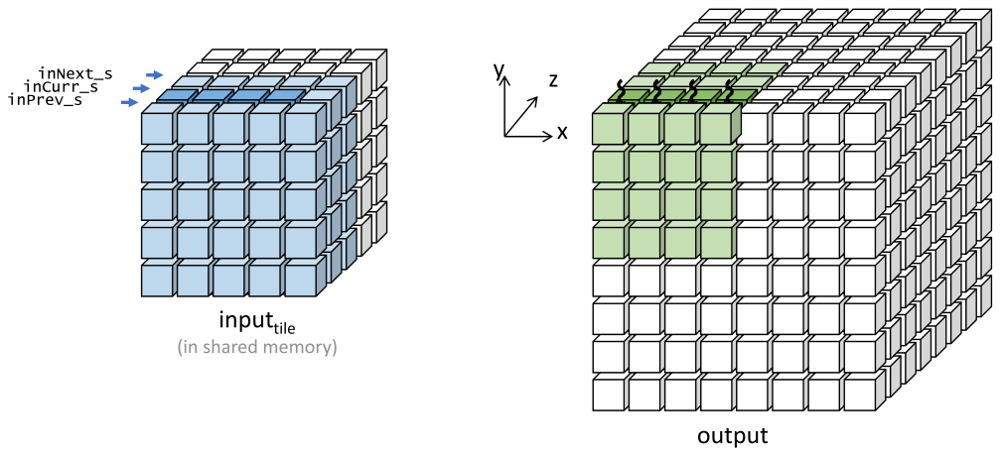

*Figure 8.11 — 첫 반복 이후, shared memory 배열들이 입력 tile 에 대응되는 모습. (책 p.196)*

32~33번 줄의 회전 덕에 **각 반복이 끝날 때 다음 반복에 필요한 세 평면 중 두 개를 이미 갖고 있다.**
그래서 반복마다 새로 읽는 것은 평면 하나뿐이다. Figure 8.11 이 그 다음 상태다.

> **32~33번 줄에 race 가 없는 이유.** 31번 줄의 barrier 뒤에 곧바로 회전하고,
> barrier 없이 다음 반복의 16번 줄이 `inNext_s` 에 쓴다. 위험해 보이지만 안전하다 —
> **32~33번 줄과 16번 줄 모두 오직 자기 자신의 `[threadIdx.y][threadIdx.x]` 만 건드리기 때문**이다.
> thread 간 교차 접근은 22~26번 줄의 `inCurr_s` 이웃뿐이고, 그것은 18번·31번 barrier 가 감싼다.

> **주의 — 계수 이름의 순서가 Figure 8.8 과 반대다.**
> Figure 8.8 은 `c3` ↔ `y-1`, `c4` ↔ `y+1` 인데
> Figure 8.10·8.12 는 `c3` ↔ `y+1`, `c4` ↔ `y-1` 이다.
> 계수 이름표만 바뀐 것이라 `c3 = c4` 인 대칭 stencil 에서는 결과가 같지만,
> **비대칭 stencil 로 확장할 때는 어느 쪽 규약인지 확인해야 한다.**

---

### 3. arithmetic intensity 분석 — 1.52 는 어디서 나오는가

책은 결과만 준다: "For example, we can use $t = 32$ ... the arithmetic intensity of the
kernel is **1.52 FLOP/B**" (책 p.195). 유도해 보자.

#### 정상 상태(steady state) 로 세면 1.52 다

coarsening loop 의 **한 반복**을 본다.

| 항목 | 값 | 이유 |
|---|---|---|
| FLOP | $13 (t-2)^2$ | 출력 평면 하나 = $(t-2)^2$ 점, 각 13 FLOP |
| load | $t^2 \times 4$ B | **새 평면 하나만** 읽는다 (`inNext_s`) |
| store | $(t-2)^2 \times 4$ B | 출력 평면 하나 |

$$AI_{\text{steady}}(t) = \frac{13 (t-2)^2}{4\left(t^2 + (t-2)^2\right)}$$

$t = 32$ 를 넣으면

$$\frac{13 \cdot 30^2}{4(32^2 + 30^2)} = \frac{13 \cdot 900}{4(1024 + 900)}
= \frac{11700}{7696} = 1.5203 \;\text{FLOP/B}$$

**책의 1.52 와 일치한다.** $t \to \infty$ 극한도 $\frac{13}{8} = 1.625$ 로 같다.

| $t$ | $AI_{\text{steady}}$ | block thread $t^2$ | shared $3t^2 \cdot 4$ B |
|---|---|---|---|
| 8 | 1.170 | 64 | 768 B |
| 16 | 1.409 | 256 | 3,072 B |
| **32** | **1.520** | **1024** | **12,288 B (12 KB)** |

**8.4절의 $0.96$ 에서 $1.52$ 로 올랐고, 이상적 $1.625$ 의 94% 다** (책 p.195).

#### 왜 z 방향에는 halo 손해가 없는가

$AI_{\text{steady}}$ 의 식을 8.4절의 (3)과 나란히 놓으면 차이가 한눈에 보인다.

$$AI_{\text{Fig 8.8}} = \frac{13(t-2)^3}{4\left(t^3 + (t-2)^3\right)}
\qquad\text{vs}\qquad
AI_{\text{steady}} = \frac{13(t-2)^2}{4\left(t^2 + (t-2)^2\right)}$$

**지수가 3에서 2로 내려갔다.** halo 페널티가 x-y 두 축에만 남고 **z 축에서는 사라진 것**이다.
z 방향으로는 block 이 평면을 하나씩 밀며 나아가므로 **각 평면을 딱 한 번만 읽는다** —
z 방향 halo 를 중복 적재하지 않는다.

#### 다만 — block 수명 전체로 세면 1.52 가 아니다

정직하게 짚어 둘 것이 있다. 위 계산은 **정상 상태**만 본 것이다.
block 하나의 **수명 전체**를 보면 시작할 때 `inPrev_s`·`inCurr_s` 용으로
평면 **두 장을 여분으로** 읽는다 (08~13번 줄).

coarsening factor(= 한 block 이 처리하는 출력 평면 수)를 $C$ 라 하면

$$AI_{\text{lifetime}}(t, C) = \frac{13 (t-2)^2 C}{4\left(t^2 (C+2) + (t-2)^2 C\right)}$$

| $t$ | $C$ | $AI_{\text{lifetime}}$ |
|---|---|---|
| 32 | 16 | 1.425 |
| 32 | 30 (= `OUT_TILE_DIM`) | 1.468 |
| 32 | 64 | 1.495 |
| 32 | $\infty$ | 1.5203 |

Figure 8.10 은 $C = $ `OUT_TILE_DIM` $= t - 2 = 30$ 이므로 실제로는 **1.47** 이다.
$1.52$ 는 **$C$ 가 충분히 클 때의 상한**이다.

> **책 스스로 두 관례를 다 쓴다.** 8.4절의 tiled 식(3)은 block 수명 전체 관례이고,
> 8.5절의 1.52 는 정상 상태 관례다. 그리고 **연습문제 2(c)(8.8절)는 다시 수명 전체 관례**로
> 묻는다 — 그 문제에서 입력 tile 을 $32 \times 32 \times 18$ 로 세라고 하는 것이
> 바로 "$C+2$ 평면" 이다.
> 오기라기보다 **두 수치가 답하는 질문이 다르다**고 보는 편이 맞다.
> 결론(8.4절 대비 크게 개선)은 어느 관례로 세도 같다: $0.96 \to 1.47$ 이거나 $0.96 \to 1.52$.

#### 정리하면 coarsening 이 준 것

| | Figure 8.8 ($t=8$) | Figure 8.10 ($t=32$) |
|---|---|---|
| block thread | $8^3 = 512$ | $32^2 = 1024$ |
| 입력 tile 한 변 | 8 | **32** |
| shared memory / block | $8^3 \cdot 4 = 2$ KB | $3 \cdot 32^2 \cdot 4 = 12$ KB |
| **$AI$** | 0.96 | **1.52** (정상 상태) |
| coalescing | 나쁨 (warp 가 4행에 흩어짐) | **좋음** (`threadIdx.x` 가 32) |
| 활성 thread 비율 | $216/512 = 42\%$ | $900/1024 = 88\%$ |

**벽 세 개를 한 번에 넘었다.** $t=32$ 면 `threadIdx.x` 방향이 정확히 warp 크기라
8.4절 벽 ③도 저절로 해결된다.

---

**연습문제 8.5-1.** shared memory 소요가 $t^3 \to 3t^2$ 로 준 것이
**언제부터 이득**인가? 즉 $3t^2 < t^3$ 이 되는 $t$ 는?

> $3t^2 < t^3 \iff t > 3$. 실용 범위에서는 항상 이득이다.
> 다만 진짜 의미는 **"$t$ 를 키울 때 소요가 $t^3$ 이 아니라 $t^2$ 로 늘어난다"** 는 것이다.
> $t$ 를 8에서 32로 키우면 $t^3$ 는 $64\times$ 늘지만 $3t^2$ 는 $6\times$ 늘 뿐이다.

**연습문제 8.5-2.** order 2 인 3D 13-point stencil 로 이 kernel 을 확장하면
shared memory 는 얼마가 되고 코드는 어디가 바뀌는가?

> **평면이 5장** 필요하다 (`inPrev2_s`, `inPrev_s`, `inCurr_s`, `inNext_s`, `inNext2_s`).
> shared = $5 t^2 \cdot 4$ B. $t=32$ 면 20 KB.
> 코드 변경: ① 03~04번 줄의 `- 1` → `- 2`, ② 05~07번 줄에 배열 2개 추가,
> ③ 초기 적재를 4장으로, ④ 회전(32~33번 줄)을 4단으로,
> ⑤ 20~21번 줄의 `>= 1`·`< IN_TILE_DIM - 1` → `>= 2`·`< IN_TILE_DIM - 2`,
> ⑥ 계수를 `c0`~`c12` 로.
> **`IN_TILE_DIM = OUT_TILE_DIM + 4`** 가 된다.

**연습문제 8.5-3.** 31번 줄의 `__syncthreads()` 를 빼면 무엇이 깨지는가?
18번 줄 것만으로는 왜 부족한가?

> 32~33번 줄이 `inCurr_s[y][x]` 를 덮어쓴다.
> 그런데 다른 thread 가 아직 22~26번 줄에서 `inCurr_s[y][x±1]`·`inCurr_s[y±1][x]` 를
> 읽고 있을 수 있다. **read-after-write 가 아니라 write-after-read** — 5장 용어로는
> **false dependence** 이지만, shared memory 를 재사용하는 이상 실재하는 위험이다.
> 18번 줄 barrier 는 "적재 완료"를 보장할 뿐 "읽기 완료"를 보장하지 않는다.

---

## 8.6 Register tiling (책 p.196)

### 1. 개념적 이해

#### 관찰 — `inPrev_s`·`inNext_s` 는 애초에 나눠 쓰이지 않는다

Figure 8.10 의 22~28번 줄을 다시 본다.

| shared 배열 | 접근 패턴 | 나눠 쓰는가 |
|---|---|---|
| `inCurr_s` | `[y][x]`, `[y][x±1]`, `[y±1][x]` | **그렇다** — 이웃 thread 의 자리를 읽는다 |
| `inPrev_s` | `[y][x]` **만** | **아니다** — 자기 자리만 |
| `inNext_s` | `[y][x]` **만** | **아니다** — 자기 자리만 |

`inPrev_s[y][x]` 와 `inNext_s[y][x]` 는 **오직 그 $(y,x)$ 를 맡은 thread 하나만** 읽는다.
그렇다면 **shared memory 에 둘 이유가 없다.** register 에 두면 된다.

> 데이터를 register 에 두어 shared 나 global 접근을 줄이는 것을 **register tiling** 이라 한다
> (5장·6장, 책 p.196).

**이 최적화가 가능한 조건**은 stencil 패턴이 **중심점의 x·y·z 축 이웃만 포함**하는 것이다
(책 p.196). Figure 8.3 의 stencil 이 전부 여기 해당한다.
8.1절에서 "혼합 편도함수가 없으면 축 위에만 점이 있다"고 한 그 성질이
**여기서 성능 최적화로 회수된다.**

> **왜 x·y 는 안 되고 z 만 되는가.** thread block 이 **x-y 평면 모양**이기 때문이다.
> 같은 평면 안의 x·y 이웃은 옆 thread 의 데이터라 반드시 공유해야 한다.
> 반면 **z 는 coarsening loop 의 축**이라 같은 thread 가 시간축으로 갖고 있다.
> **coarsening 이 register tiling 의 전제조건**인 셈이다.

---

### 2. 코드 — coarsening + register tiling

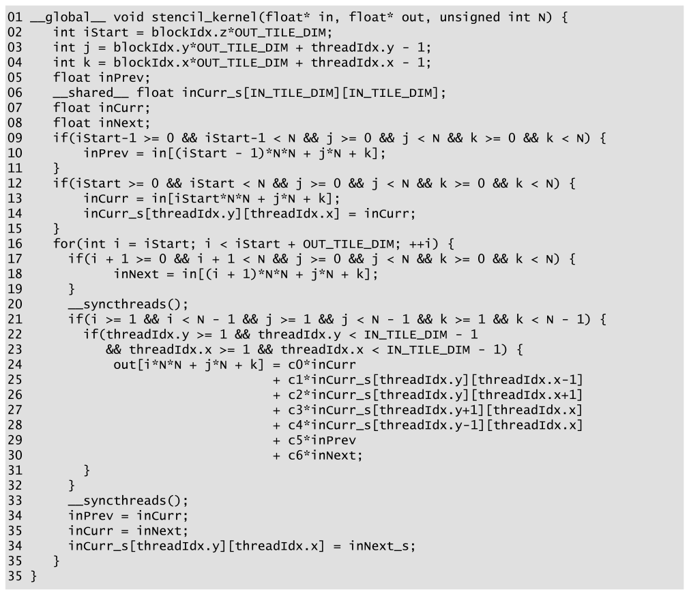

*Figure 8.12 — 3D 7-point stencil sweep 의 z 방향 thread coarsening 과 register tiling
kernel. (책 p.197)*

```cuda
01  __global__ void stencil_kernel(float* in, float* out, unsigned int N) {
02    int iStart = blockIdx.z*OUT_TILE_DIM;
03    int j = blockIdx.y*OUT_TILE_DIM + threadIdx.y - 1;
04    int k = blockIdx.x*OUT_TILE_DIM + threadIdx.x - 1;
05    float inPrev;
06    __shared__ float inCurr_s[IN_TILE_DIM][IN_TILE_DIM];
07    float inCurr;
08    float inNext;
09    if(iStart-1 >= 0 && iStart-1 < N && j >= 0 && j < N && k >= 0 && k < N) {
10        inPrev = in[(iStart - 1)*N*N + j*N + k];
11    }
12    if(iStart >= 0 && iStart < N && j >= 0 && j < N && k >= 0 && k < N) {
13        inCurr = in[iStart*N*N + j*N + k];
14        inCurr_s[threadIdx.y][threadIdx.x] = inCurr;
15    }
16    for(int i = iStart; i < iStart + OUT_TILE_DIM; ++i) {
17      if(i + 1 >= 0 && i + 1 < N && j >= 0 && j < N && k >= 0 && k < N) {
18          inNext = in[(i + 1)*N*N + j*N + k];
19      }
20      __syncthreads();
21      if(i >= 1 && i < N - 1 && j >= 1 && j < N - 1 && k >= 1 && k < N - 1) {
22        if(threadIdx.y >= 1 && threadIdx.y < IN_TILE_DIM - 1
23          && threadIdx.x >= 1 && threadIdx.x < IN_TILE_DIM - 1) {
24            out[i*N*N + j*N + k] = c0*inCurr
25                                 + c1*inCurr_s[threadIdx.y][threadIdx.x-1]
26                                 + c2*inCurr_s[threadIdx.y][threadIdx.x+1]
27                                 + c3*inCurr_s[threadIdx.y+1][threadIdx.x]
28                                 + c4*inCurr_s[threadIdx.y-1][threadIdx.x]
29                                 + c5*inPrev
30                                 + c6*inNext;
31        }
32      }
33      __syncthreads();
34      inPrev = inCurr;
35      inCurr = inNext;
36      inCurr_s[threadIdx.y][threadIdx.x] = inCurr;
37    }
38  }
```

Figure 8.10 에서 바뀐 곳만.

| 줄 | 변경 | 이유 |
|---|---|---|
| **05, 07, 08** | `inPrev_s`·`inNext_s` 배열 → **register 변수** `inPrev`·`inNext`. `inCurr` 도 추가 | 나눠 쓰지 않으므로 |
| **06** | `inCurr_s` **만** 남음 | x-y 이웃은 반드시 공유해야 한다 |
| **10, 13, 18** | 적재 목적지가 register | |
| **14, 36** | `inCurr_s` 에 **현재 평면 사본을 항상 유지** | "x-y 이웃이 언제나 모든 thread 에게 보인다" (책 p.197) |
| **24** | `c0*inCurr` (shared 아님) | 중심점은 자기 것이다 |
| **29~30** | `c5*inPrev`, `c6*inNext` | register 읽기 |
| **34~36** | register 회전 + shared 사본 갱신 | |

> **원문 오기 두 곳** (Figure 8.12, 책 p.197). 위 코드는 **바로잡은 것**이고 원문은 이렇다.
>
> ① **줄 번호가 중복된다.** 원문의 마지막 여섯 줄은
> `33 __syncthreads(); / 34 inPrev = inCurr; / 35 inCurr = inNext; /`
> **`34`** `inCurr_s[...] = ...; /` **`35`** `} /` **`35`** `}` 로,
> **34·35 가 두 번씩, 35 가 세 번** 나온다. 33~38 이어야 한다.
>
> ② **마지막 대입의 우변이 존재하지 않는 식별자다.** 원문은
> `inCurr_s[threadIdx.y][threadIdx.x] = inNext_s;` 인데
> 이 kernel 에는 **`inNext_s` 가 없다** (Figure 8.10 에서 register `inNext` 로 대체했다).
> 게다가 배열 원소에 배열 이름을 대입하는 꼴이라 **컴파일도 되지 않는다.**
> 본문이 "the kernel always maintains a copy the current plane of the input tile in the
> shared memory (**lines 14 and 34**)" 라고 하므로, 14번 줄과 같은 형태인
> **`inCurr_s[threadIdx.y][threadIdx.x] = inCurr;`** 가 맞다
> (바로 앞 35번 줄에서 `inCurr = inNext` 를 했으므로 값은 다음 평면이다).

> **원문 오기** (책 p.196). "the amount of shared memory used by this kernel is reduced to
> one third of that by the kernel in **Fig. 8.12**." 지금 설명하고 있는 kernel 이
> Figure 8.12 이므로 자기 자신과 비교하는 셈이 된다. **Fig. 8.10** 이어야 한다.

---

### 3. 얻은 것과 치른 값

책이 정리하는 두 가지 이득 (책 p.197).

| 이득 | 내용 |
|---|---|
| **① 속도** | shared 읽기·쓰기 상당수가 register 접근이 된다. register 는 shared 보다 **latency 가 훨씬 낮고 bandwidth 가 높다** |
| **② 용량** | shared memory 소요가 **1/3** 로 준다 |

$t = 32$ 기준으로 숫자를 넣으면

| | Figure 8.10 | Figure 8.12 |
|---|---|---|
| shared / block | $3 \cdot 32^2 \cdot 4 = 12{,}288$ B | $1 \cdot 32^2 \cdot 4 = 4{,}096$ B |
| thread 당 추가 register | — | **3** (`inPrev`, `inCurr`, `inNext`) |
| block 당 추가 register | — | $3 \times 1024 = $ **3,072** |

치르는 값은 **register 압박**이다.
4장에서 본 대로 register 도 SM 당 유한한 자원이고, 넘치면 occupancy 가 떨어지거나
**register spilling** 이 일어난다.

> "The reader should keep in mind that register use will become even higher for higher
> order stencils. If the register usage becomes a problem, one can go back to storing some
> of the planes in shared memory. This scenario represents a common trade-off that often
> needs to be made between shared memory and register usage." (책 p.197)
>
> order $r$ 이면 register 는 thread 당 $2r + 1$ 개가 된다.
> order 3 (19-point) 이면 7개, block 당 $7 \times 1024 = 7168$ 개다.

#### 중요 — global memory 접근은 조금도 안 줄었다

> "The number of global memory accesses has not changed." (책 p.197)

register tiling 은 **on-chip 안에서 데이터를 어디에 둘지**를 바꿨을 뿐이다.
register + shared 를 합쳐 본 총 재사용량은 Figure 8.10 과 **같다.**
따라서 **global memory bandwidth 소비도 같고, $AI$ 도 1.52 로 같다.**

이득은 **on-chip latency** 한 축이다 — shared 접근이 register 접근으로 바뀐다.

> **shared 절감이 곧 occupancy 향상은 아니다.** 4장의 H100 한계로 따져 보자.
> $t=32$ 면 block 이 1024 thread 이므로 **SM 당 thread 슬롯 2048개가 먼저 걸려**
> 어느 쪽이든 block 2개밖에 못 올린다. shared 는 $2 \times 12 = 24$ KB 든
> $2 \times 4 = 8$ KB 든 SM 용량(수백 KB) 안이라 **결정 요인이 아니다.**
>
> shared 절감이 실제로 occupancy 로 돌아오는 경우는 따로 있다.
>
> - **`double` 을 쓸 때** — 소요가 두 배라 $3t^2$ 는 24 KB, $t^2$ 는 8 KB
> - **order 가 높을 때** — $(2r{+}1)t^2$ 가 $t^2$ 로 준다. order 3 이면 $1/7$
> - **block 이 작을 때** — block 수가 많아져 shared 총량이 먼저 걸린다
>
> 반대로 **register 쪽 비용은 이 설정에서도 실재한다.** H100 은 SM 당 register 65,536개이고
> 2048 thread 를 다 채우려면 **thread 당 32개** 안에 들어야 한다.
> 3개를 더 쓰는 것은 그 예산의 **9%** 다. kernel 이 이미 30개 근처를 쓰고 있었다면
> 이 3개가 occupancy 를 떨어뜨리거나 register spilling 을 부른다.
>
> **책이 "trade-off" 라고 부른 것이 바로 이 균형이다.**

---

**연습문제 8.6-1.** `inCurr` 를 register 로 두면서 **동시에** `inCurr_s` 에도 사본을 유지한다
(14·36번 줄). 중복 아닌가?

> 중복이지만 **의도된 중복**이다.
> - `inCurr` (register): 24번 줄의 **중심점** 접근용. 자기 값이니 register 가 빠르다
> - `inCurr_s` (shared): 25~28번 줄의 **x-y 이웃** 접근용. 남의 값이라 shared 여야 한다
>
> 같은 값을 두 곳에 두는 대신 shared 읽기를 5회 → 4회로 줄인다.
> `float` 하나 더 쓰는 값으로는 남는 장사다.

**연습문제 8.6-2.** 2D 9-point stencil (order 2, Figure 8.3(b)) 에
이 기법을 그대로 쓸 수 있는가?

> **없다.** 2D 에서는 coarsening 할 세 번째 축이 없다.
> block 이 이미 x-y 평면 전체를 덮으므로 모든 이웃이 다른 thread 의 데이터다.
> **register tiling 은 "coarsening 축 방향 이웃"에만 적용된다** —
> 그래서 이 장이 3D 를 전제하는 것이다.

**연습문제 8.6-3.** Figure 8.3(d) 의 3D **13-point** (order 2) stencil 에
Figure 8.12 를 확장하면 thread 당 register 는 몇 개이고 shared 는 얼마인가?
$t = 32$ 로 답하라.

> register: z 방향 이웃이 위·아래 2개씩이므로 `inPrev2, inPrev, inCurr, inNext, inNext2`
> = **5개** (= $2r+1$, $r=2$).
> shared: 현재 평면 하나만 남으므로 여전히 $32^2 \cdot 4 = $ **4,096 B**.
> Figure 8.10 방식이었다면 $5 \cdot 32^2 \cdot 4 = 20{,}480$ B 였을 것이다.
> **order 가 올라갈수록 register tiling 의 shared 절감 효과가 커진다** ($1/3 \to 1/5$).
> 대신 block 당 register 는 $5 \times 1024 = 5120$ 개로 늘어난다.

---

## 8.7 Summary (책 p.198)

책의 정리를 옮기면 (책 p.198):

- stencil sweep 은 **특수한 filter 패턴을 쓰는 convolution 처럼 보인다.**
  그러나 stencil 은 **미분방정식을 풀 때 도함수를 이산화·수치근사한 결과**로 나오므로,
  새로운 최적화를 요구하고 또 가능하게 하는 **두 가지 특징**을 갖는다.
- **첫째, stencil sweep 은 보통 3D grid 에서 이뤄진다.** convolution 은 보통 2D 영상이거나
  2D 영상의 시간 slice 몇 장이다. 이 때문에 tiling 고려사항이 달라지고,
  **더 큰 입력 tile 과 더 높은 arithmetic intensity 를 위해 thread coarsening 이 필요해진다.**
- **둘째, stencil 패턴은 때때로 입력 데이터의 register tiling 을 가능하게 한다** —
  데이터 접근 throughput 을 더 개선하고 shared memory 압박을 덜어 준다.

---

## 8.8 Exercises (책 p.198)

### 연습문제 1 — 각 kernel 의 block 수

> $120 \times 120 \times 120$ (경계 cell 포함) grid 에서 3D stencil 계산을 한다.

**(a) 한 번의 stencil sweep 에서 계산되는 출력 grid point 는 몇 개인가?**

경계 한 겹을 제외한 안쪽만 계산한다.

$$(120 - 2)^3 = 118^3 = 1{,}643{,}032$$

**(b) Figure 8.6 의 기본 kernel, block 크기 $8\times8\times8$ 일 때 thread block 은 몇 개인가?**

기본 kernel 은 thread 하나가 grid point 하나에 대응하고, 경계 thread 는 05번 줄에서 걸러진다.
따라서 grid 전체를 덮어야 한다.

$$\left\lceil \frac{120}{8} \right\rceil^3 = 15^3 = \mathbf{3375}$$

**(c) Figure 8.8 의 shared memory tiling kernel, block 크기 $8\times8\times8$ 일 때는?**

**block 크기 = 입력 tile 크기**이므로 `IN_TILE_DIM` $= 8$, `OUT_TILE_DIM` $= 6$ 이다.
`blockIdx` 가 1 늘 때 좌표는 **출력 tile** 크기인 6 만큼 움직인다.

$$\left\lceil \frac{120}{6} \right\rceil^3 = 20^3 = \mathbf{8000}$$

> **(b)보다 2.37× 많다.** halo 를 중복 적재하느라 block 이 더 촘촘히 필요해진 것이고,
> 8.5절이 "coarsening 이 없애는 오버헤드"라고 부른 바로 그 비용이다.

**(d) Figure 8.10 의 coarsening kernel, block 크기 $32 \times 32$ 일 때는?**

`IN_TILE_DIM` $= 32$, `OUT_TILE_DIM` $= 30$ 이다.
02번 줄이 `iStart = blockIdx.z*OUT_TILE_DIM` 이고 14번 줄 loop 가 `OUT_TILE_DIM` 번 도므로,
**z 방향으로도 30 씩 tiling 된다.**

$$\left\lceil \frac{120}{30} \right\rceil^3 = 4^3 = \mathbf{64}$$

> (c)의 **125분의 1** 이다. block 하나가 감당하는 일이 그만큼 커졌다는 뜻이다.
> 만약 block 이 z 전체를 한 번에 훑도록 짰다면 (`gridDim.z = 1`)
> $4 \times 4 \times 1 = 16$ 이 되겠지만, **Figure 8.10 의 코드는 그렇게 짜여 있지 않다.**

### 연습문제 2 — 비정육면체 tile 의 분석

> 7-point (3D) stencil 을 shared memory tiling + thread coarsening 으로 구현한다.
> Figure 8.10·8.12 와 비슷하지만 tile 이 정육면체가 아니다.
> **block 크기 $32 \times 32$, coarsening factor 16** (block 하나가 z 방향으로
> 연속한 출력 평면 16장을 처리한다).

기호를 정리하면 `IN_TILE_DIM` $= 32$, `OUT_TILE_DIM` $= 30$, $C = 16$ 이다.

**(a) block 하나가 수명 동안 적재하는 입력 tile 크기 (원소 수)는?**

출력 평면 16장을 만들려면 입력 평면은 **위·아래로 한 장씩 더**, 즉 $16 + 2 = 18$ 장이 필요하다.
각 평면은 $32 \times 32$ 다.

$$32 \times 32 \times 18 = \mathbf{18{,}432}\ \text{원소}$$

**(b) block 하나가 수명 동안 처리하는 출력 tile 크기 (원소 수)는?**

x-y 로는 halo 를 뺀 $30 \times 30$, z 로는 16장.

$$30 \times 30 \times 16 = \mathbf{14{,}400}\ \text{원소}$$

**(c) 이 kernel 의 arithmetic intensity (FLOP/B) 는?**

$$\text{FLOP} = 13 \times 14{,}400 = 187{,}200$$
$$\text{Byte} = 4 \times (18{,}432 + 14{,}400) = 4 \times 32{,}832 = 131{,}328$$
$$AI = \frac{187{,}200}{131{,}328} = \mathbf{1.425\ \text{FLOP/B}}$$

> 8.5절의 1.52 보다 낮다. $C = 16$ 이라 **여분의 두 평면이 전체의 11%** 를 차지하기 때문이다
> ($2/18$). $C$ 를 키우면 1.52 로 수렴한다.

**(d) register tiling 을 쓰지 않을 때 (Figure 8.10) block 당 shared memory 는?**

동시에 세 평면만 유지한다.

$$3 \times 32 \times 32 \times 4\ \text{B} = \mathbf{12{,}288\ \text{B}} = 12\ \text{KB}$$

**(e) register tiling 을 쓸 때 (Figure 8.12) 는?**

현재 평면 하나만 shared 에 남는다.

$$1 \times 32 \times 32 \times 4\ \text{B} = \mathbf{4{,}096\ \text{B}} = 4\ \text{KB}$$

### 검산

```python
import math

N = 120
print("연습 1")
print("  a.", (N-2)**3)
print("  b.", math.ceil(N/8)**3)
print("  c.", math.ceil(N/6)**3)
print("  d.", math.ceil(N/30)**3)

IN, OUT, C = 32, 30, 16
inp, outp = IN*IN*(C+2), OUT*OUT*C
print("연습 2")
print("  a.", inp)
print("  b.", outp)
print("  c.", round(13*outp / (4*(inp+outp)), 4))
print("  d.", 3*IN*IN*4)
print("  e.", 1*IN*IN*4)
# 연습 1
#   a. 1643032
#   b. 3375
#   c. 8000
#   d. 64
# 연습 2
#   a. 18432
#   b. 14400
#   c. 1.4254
#   d. 12288
#   e. 4096
```

---
## 정리

8장에서 가져갈 것을 넷으로 줄이면:

1. **stencil 은 "성긴 convolution" 이고, 성기다는 것이 곧 낮은 arithmetic intensity 다.**
   3D 7-point stencil 의 이상적 $AI$ 는 $\frac{13}{8} = 1.625$ FLOP/B 로,
   같은 크기의 3D $3\times3\times3$ convolution ($6.75$) 의 **1/4** 이다.
   차원과 order 가 올라갈수록 격차가 벌어진다 (3D order 3 에서는 $4.625$ vs $85.75$).
   **memory-bound 를 벗어날 방법이 없고, 그래서 이 장 전체가 "이상에 얼마나 다가가는가" 싸움이다.**
2. **3D 에서는 block 크기 1024 제한이 tiling 을 질식시킨다.**
   block = 입력 tile 이면 $t^3 \le 1024$ 라 $t \le 10$ 이고,
   실용값 $t = 8$ 에서 **입력의 58%가 halo** 다 (2D 라면 12%).
   $AI$ 는 $0.96$ — 이상의 59% 에 머문다.
   **7장에서 "노는 thread" 정도로 여겼던 문제가 차원 하나 올라가니 지배적 비용이 된다.**
3. **thread coarsening 은 block 크기와 tile 크기를 떼어 놓는 기법이다.**
   thread 하나가 z 방향 한 줄을 맡으면 block thread 는 $t^2$ 이라 $t = 32$ 까지 간다.
   결정적으로 **z 축에서는 halo 페널티가 사라진다** — 평면을 하나씩 밀며 나아가므로
   각 평면을 딱 한 번만 읽기 때문이다. $AI$ 의 지수가 $\frac{(t-2)^3}{t^3+\cdots}$ 에서
   $\frac{(t-2)^2}{t^2+\cdots}$ 로 내려가고, $0.96 \to 1.52$ (이상의 94%) 가 된다.
   덤으로 `threadIdx.x` 가 32 라 **coalescing 도 저절로 해결된다.**
4. **register tiling 은 "누가 이 데이터를 읽는가"를 물어 답을 얻는다.**
   `inPrev_s`·`inNext_s` 는 자기 $(y,x)$ 만 읽히므로 shared 일 이유가 없다.
   register 로 옮기면 shared 가 **1/3** 로 준다 — global 접근은 **하나도 안 줄고 $AI$ 도 그대로**다.
   이득은 **on-chip latency** 이고, shared 여유는 `double`·고차 stencil 처럼
   shared 가 먼저 걸리는 설정에서 occupancy 로 돌아온다.
   이게 가능한 이유는 stencil 이 **혼합 편도함수를 안 쓰기 때문에 축 위에만 점이 있다**는,
   8.1절의 수학적 성질이다. **미분방정식의 형태가 CUDA 최적화로 이어지는 셈이다.**

다음은 9장 — **parallel histogram** 이다.
7·8장이 "출력끼리 독립"이라는 편안한 가정 위에 있었다면,
histogram 부터는 **여러 thread 가 같은 출력을 갱신**한다.
atomic operation 과 privatization 이 등장한다.
