# 9장. Histogram

> **원문 범위**: 책 p.201~220 (9.1~9.8절). 부제는 *An introduction to atomic operations and
> privatization* 이다.
> **절 순서**: 책 순서를 그대로 따랐다. 재배치 없음.
> **연습문제**: 책 9.8절의 5문제(소문항 7개)를 전부 풀고 답을 붙였다.

**7·8장이 기대 온 전제가 여기서 깨진다.**

지금까지의 패턴은 전부 **출력 원소 하나를 thread 하나가 독점**했다.
책은 이것을 **owner-computes rule** 이라고 부른다 (책 p.201) — 모든 thread 가
자기 몫의 출력에 **다른 thread 의 간섭을 걱정하지 않고** 쓸 수 있다.

histogram 은 다르다. **어떤 출력 원소든 어떤 thread 가 갱신할 수 있다.**
어느 bin 을 건드릴지는 **입력 데이터가 정하기 때문**에 미리 나눠 줄 수가 없다.
그래서 thread 끼리 조율해야 하고, 조율에 실패하면 결과가 조용히 망가진다.
책은 이 상황을 **output interference** 라고 부른다.

| | 7·8장 | 9장 |
|---|---|---|
| 출력 위치 | thread index 가 정한다 | **입력 데이터 값**이 정한다 |
| 충돌 | 없다 (owner-computes) | **있다** (output interference) |
| 필요한 것 | 없음 | **atomic operation** |

이 장은 그 조율 도구를 도입하고, 그 도구가 **얼마나 비싼지** 계산한 뒤,
비용을 깎는 세 가지 최적화를 쌓아 올린다.

| | 무엇 | 어디를 공격하는가 |
|---|---|---|
| **atomic operation** (9.2절) | read-modify-write 를 쪼갤 수 없는 단위로 만든다 | 정확성 — 성능은 오히려 나빠진다 |
| **privatization** (9.4절) | 경쟁이 심한 출력을 **복제**해 thread 부분집합마다 하나씩 준다 | **경쟁의 폭** |
| **thread coarsening** (9.5절) | block 수를 줄여 **복제본 초기화·병합 비용**을 줄인다 | privatization 의 오버헤드 |
| **thread-level privatization** (9.6절) | thread 하나가 **직전에 쓴 bin 하나**를 자기 register 에 들고 있는다 | 값이 반복되는 데이터의 경쟁 |

---

## 9.1 Background (책 p.202)

### 1. 개념적 이해

**histogram 은 데이터 집합에서 값이 나타난 횟수를 보여 주는 것**이다 (책 p.202).
가장 흔한 형태는 가로축에 **값 구간**을 놓고, 각 구간에 든 데이터의 **빈도**를
막대 높이로 그리는 것이다.

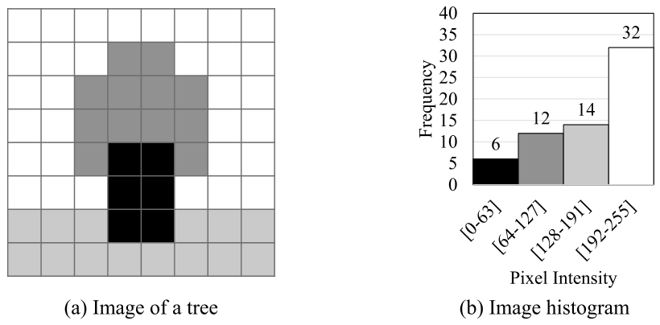

*Figure 9.1 — image histogram 의 예. (a) 나무 이미지, (b) 그 image histogram. (책 p.202)*

grayscale 이미지의 픽셀은 보통 **0(검정)~255(흰색)** 의 intensity 를 갖는다.
Figure 9.1(b) 는 이 범위를 **64개씩 네 구간**으로 나눴다.

#### histogram 의 "모양"이 정보다

책은 histogram 의 모양 자체를 **데이터 집합의 feature** 라고 부른다 (책 p.202).
모양이 평소와 크게 벗어나면 시스템이 경고를 띄운다.

| 분야 | histogram 으로 무엇을 보는가 |
|---|---|
| **영상 처리** | 노출 과다·부족 판정. Figure 9.1 은 밝은 쪽에 심하게 치우쳐 있다 |
| **신용카드 이상거래 탐지** | 구매 카테고리·위치의 분포가 평소와 다르면 경고 |
| **컴퓨터비전** | 이미지를 소영역으로 쪼개 각 영역의 histogram 을 보면 **관심 객체가 있을 만한 영역**을 빠르게 고를 수 있다 (feature extraction) |
| **음성 인식 · 추천 · 천체물리 데이터 분석** | 대량 데이터에서 흥미로운 사건을 추리는 기초 계산 |

> **9.6절의 복선.** "하늘 사진에는 **같은 값의 픽셀이 넓게 뭉쳐 있다**"는 관찰이
> 9.6절 thread-level privatization 의 근거가 된다 (책 p.218). 지금 기억해 두자.

---

### 2. 알고리즘 — 순차 코드

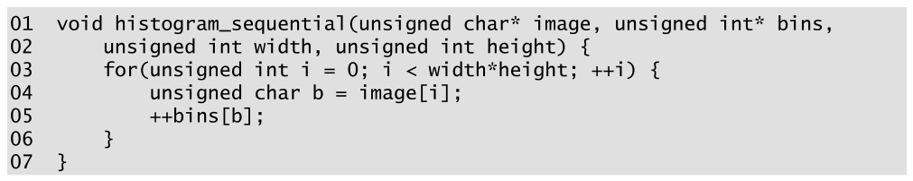

*Figure 9.2 — grayscale 이미지의 histogram 을 계산하는 단순한 C 함수. (책 p.203)*

```c
01  void histogram_sequential(unsigned char* image, unsigned int* bins,
02      unsigned int width, unsigned int height) {
03      for(unsigned int i = 0; i < width*height; ++i) {
04          unsigned char b = image[i];
05          ++bins[b];
06      }
07  }
```

| 줄 | 하는 일 | 짚을 점 |
|---|---|---|
| **01** | `image` 는 `unsigned char` 배열, `bins` 는 `unsigned int` 배열 | 픽셀은 0~255 라 1 B, 개수는 클 수 있어 4 B |
| **02** | `width`, `height` 로 픽셀 수를 준다 | |
| **03** | `width*height` 까지 순차 반복 | **2D 인덱스가 계산에 무관하므로 1D 배열로 다룬다** |
| **04** | 픽셀 값을 읽는다 | |
| **05** | 그 값에 해당하는 bin 을 1 증가 | **bin 하나가 픽셀 값 하나**라고 가정 (256개 bin) |

Figure 9.1 처럼 **bin 이 값 구간**이면 인덱싱 전에 구간 폭으로 나눈다 (책 p.203).

```c
++bins[b / (256 / NUM_BINS)];   // 예: bin 4개면 b/64
```

#### 이 순차 코드는 이미 꽤 좋다

책이 짚는 세 가지 (책 p.203).

| | 왜 좋은가 |
|---|---|
| **복잡도** | $O(N)$. $N$ 은 입력 원소 수 |
| **`image` 접근** | for-loop 가 순차 접근하므로 DRAM 에서 가져온 **CPU cache line 을 남김없이 쓴다** |
| **`bins` 접근** | 배열이 아주 작아 **L1 data cache 에 통째로 들어간다** → 갱신이 빠르다 |

결론적으로 현대 CPU 에서 이 코드는 **memory-bound** — DRAM 에서 데이터를
cache 로 끌어오는 속도가 한계다.

> **이 점을 기억해야 9장의 나머지가 이해된다.** 순차 코드에서 `bins` 갱신은
> 공짜에 가까웠다. **병렬화하는 순간 그 갱신이 가장 비싼 부분이 된다.**

---

### 3. 예제/실습

#### Figure 9.1 을 직접 세어 본다

Figure 9.1(a) 는 $8 \times 8 = 64$ 픽셀이다. 색깔별로 세면

| 구간 | 색 | 무엇 | 개수 |
|---|---|---|---|
| `[0-63]` | 검정 | 나무 줄기 | **6** |
| `[64-127]` | 진회색 | 잎 | **12** |
| `[128-191]` | 연회색 | 주변 풀 | **14** |
| `[192-255]` | 흰색 | 하늘 | **32** |
| | | **합** | **64** ✓ |

```python
from collections import Counter
# Figure 9.1(a) 를 8×8 문자 배열로 옮긴 것 (b=검정 d=진회색 l=연회색 w=흰색)
rows = ["wwwwwwww", "wwwddwww", "wwddddww", "wwddddww",
        "wwdbbdww", "wwwbbwww", "lllbblll", "llllllll"]
c = Counter(''.join(rows))
print(f"검정 {c['b']} · 진회색 {c['d']} · 연회색 {c['l']} · 흰색 {c['w']} · 합 {sum(c.values())}")
# 검정 6 · 진회색 12 · 연회색 14 · 흰색 32 · 합 64
```

책의 네 숫자와 정확히 맞는다.
그리고 **가장 큰 bin 이 전체의 $32/64 = 50\%$** 라는 사실이 9.3절에서 결정적으로 쓰인다.

#### 연습문제

**연습문제 9.1-1.** Figure 9.2 의 `bins` 를 `unsigned char` 로 선언하면 무엇이 깨지는가?

> 한 bin 의 개수가 **255 를 넘는 순간 감싼다(wrap around).**
> Figure 9.1 처럼 64픽셀짜리 장난감이면 괜찮지만, $1920 \times 1080$ 이미지의
> 하늘 영역 하나만으로도 수십만이 나온다. `unsigned int` 는 약 43억까지 세므로
> 4K 이미지($\approx 8.3$M 픽셀)도 여유롭다.

**연습문제 9.1-2.** bin 을 256개가 아니라 4개로 쓰면 무엇이 좋아지고 무엇이 나빠지는가?

> **좋아지는 것**: `bins` 가 더 작아지므로 9.4절에서 볼 **private 복제본이 싸진다**
> (shared memory 에 훨씬 쉽게 들어간다).
> **나빠지는 것**: 같은 bin 을 노리는 thread 가 **64× 로 늘어난다.**
> bin 이 적을수록 경쟁이 심해진다 — 9.3절이 정확히 이 관계를 계산한다.
> **bin 수는 정보량과 경쟁도를 맞바꾸는 손잡이다.**

---

## 9.2 Atomic operations and a basic histogram kernel (책 p.203)

### 1. 개념적 이해

#### 가장 단순한 병렬화 — 그리고 그것이 부르는 문제

**입력 원소 수만큼 thread 를 launch 하고, thread 하나가 원소 하나를 처리한다.**
각 thread 는 자기 픽셀 값을 읽고 해당 bin 을 증가시킨다.

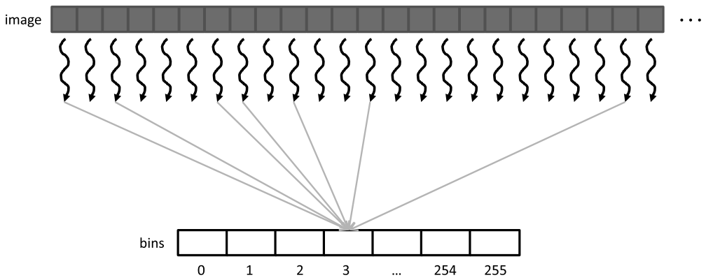

*Figure 9.3 — image histogram 의 기본 병렬화. (책 p.204)*

그림에서 여러 화살표가 **bin 3 하나로 모인다.** 값이 같은 픽셀을 맡은 thread 들이
**같은 bin 을 갱신**하려 드는 것 — 이것이 **output interference** 다 (책 p.204).

#### read-modify-write 라는 위험한 연산

bin 을 1 증가시키는 것은 단순한 쓰기가 아니라 **세 단계**다.

$$\underbrace{\text{메모리 읽기}}_{\text{read}} \;\to\;
  \underbrace{1 \text{ 더하기}}_{\text{modify}} \;\to\;
  \underbrace{메모리에 쓰기}_{\text{write}}$$

> **책의 비유 두 개** (책 p.204~205). 둘 다 "읽고 → 고르고 → 표시한다"는 같은 구조다.
>
> **① 항공권 좌석 예약.** 좌석표를 띄우고(read) 9C 를 고르고(modify)
> 9C 를 사용 불가로 바꾼다(write).
> 두 손님이 **동시에** 좌석표를 띄우면 둘 다 9C 를 고르고 둘 다 사용 불가로 바꾼다.
> 둘 다 9C 를 예약했다고 믿은 채 비행기에 오른다.
> 책은 덤덤하게 덧붙인다 — "Believe it or not, such unpleasant situation indeed happens
> in real life due to flaws in airline reservation software."
>
> **② 번호표 키오스크.** 두 손님이 두 키오스크에서 동시에 뽑으면 **같은 번호**를 받는다.
> 직원이 그 번호를 부르면 둘 다 자기 차례라고 생각한다.

이렇게 **두 개 이상의 동시 갱신 결과가 서로의 상대적 타이밍에 따라 달라지는 것**을
**read-modify-write race condition** 이라고 한다 (책 p.205).
어떤 순서는 맞고, 어떤 순서는 틀린다.

---

### 2. race condition 의 네 가지 시나리오

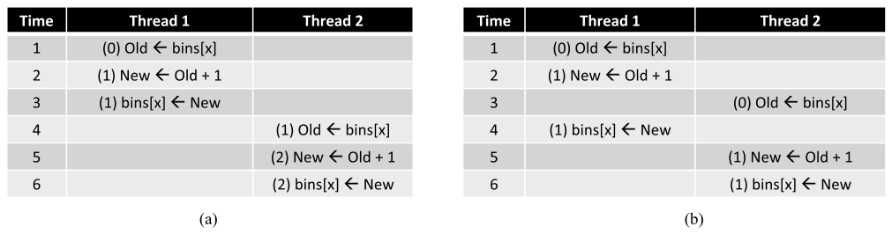

*Figure 9.4 — `bins` 배열 원소를 갱신할 때의 race condition. (책 p.205)*

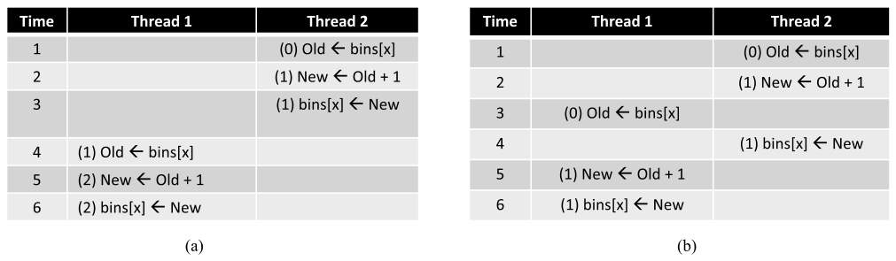

*Figure 9.5 — Thread 2 가 Thread 1 보다 앞서 가는 race condition 시나리오. (책 p.206)*

각 행이 한 시간 구간이고, 위에서 아래로 시간이 흐른다.
괄호 안 숫자는 **그때 목적지에 쓰이는 값**이며, `bins[x]` 의 초깃값은 0 이다.

| | 순서 | 진행 | 최종 `bins[x]` | |
|---|---|---|---|---|
| **9.4(a)** | T1 → T2 | T1 이 1~3 구간에 read-modify-write 를 **다 끝낸 뒤** T2 가 4구간에 시작 | **2** | ✅ |
| **9.4(b)** | T1 → T2, 겹침 | T2 가 3구간에 읽을 때 `bins[x]` 는 **아직 0**. T1 이 4구간에 1 을 쓰지만 T2 는 이미 늦었다 | **1** | ❌ |
| **9.5(a)** | T2 → T1 | T2 가 다 끝낸 뒤 T1 이 시작 | **2** | ✅ |
| **9.5(b)** | T2 → T1, 겹침 | T1 이 3구간에 읽을 때 아직 0 | **1** | ❌ |

**(b) 두 경우에서는 갱신 하나가 통째로 사라진다** (lost update).

핵심은 **(a) 두 경우와 (b) 두 경우의 차이가 순서가 아니라 겹침이라는 것**이다.
T1 이 먼저 가든 T2 가 먼저 가든 상관없다. **겹치기만 하면 틀린다.**

#### atomic operation 이 정확히 하는 일

> **atomic operation 이란** 어떤 메모리 위치에 대한 read-modify-write 를,
> **같은 위치에 대한 다른 어떤 read-modify-write 도 그것과 겹칠 수 없게** 수행하는 것이다
> (책 p.206). read·modify·write 가 **쪼갤 수 없는 한 덩어리**가 되므로 atomic 이다.
> 하드웨어가 현재 연산이 끝날 때까지 같은 위치의 다른 연산을 잠가서 구현한다.

**중요한 것은 atomic operation 이 하지 않는 일이다.**

| atomic 이 보장하는 것 | atomic 이 보장하지 **않는** 것 |
|---|---|
| **겹치지 않는다** — 뒤에 오는 thread 는 앞선 thread 가 끝나야 시작한다 | **순서** — T1 이 먼저일지 T2 가 먼저일지는 여전히 모른다 |

즉 atomic 은 **9.4(b)·9.5(b) 만 제거**하고 **9.4(a)·9.5(a) 는 둘 다 허용**한다.
결과값은 어느 쪽이든 2 로 같으므로 그것으로 충분하다.

그리고 그 대가가 이 장 나머지의 주제다 —
**같은 위치에 대한 atomic 은 사실상 직렬화된다** (책 p.206).

---

### 3. 코드 — `cuda::atomic_ref`

CUDA 에서 atomic 연산은 **C++ atomic 객체 또는 atomic reference 객체**로 수행한다.
CUDA 가 C++ atomic 라이브러리를 확장했고, 다음을 포함해서 쓴다 (책 p.206).

```cuda
#include <cuda/atomic>
```

첫 단계는 대상 객체에 대한 **atomic reference** 를 `cuda::atomic_ref` 클래스로 만드는 것이다.

```cuda
template <typename T, cuda::thread_scope>
class cuda::atomic_ref;
```

| 템플릿 인자 | 무엇을 정하는가 | 흔한 값 |
|---|---|---|
| **`T`** | 대상 객체의 **타입** | `int`, `unsigned int`, `float` |
| **`cuda::thread_scope`** | 이 클래스의 method 로 서로 **synchronization 할 수 있는 thread 의 범위** | 같은 block 안 / 같은 GPU device 안 / multi-GPU 시스템의 모든 GPU |

`cuda::` 접두사는 `atomic_ref` 가 CUDA namespace 에 선언돼 있다는 뜻이다.

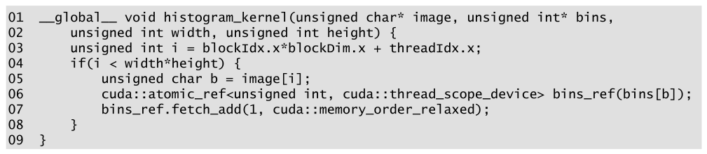

*Figure 9.6 — histogram 을 계산하는 CUDA kernel. (책 p.207)*

```cuda
01  __global__ void histogram_kernel(unsigned char* image, unsigned int* bins,
02      unsigned int width, unsigned int height) {
03      unsigned int i = blockIdx.x*blockDim.x + threadIdx.x;
04      if(i < width*height) {
05          unsigned char b = image[i];
06          cuda::atomic_ref<unsigned int, cuda::thread_scope_device> bins_ref(bins[b]);
07          bins_ref.fetch_add(1, cuda::memory_order_relaxed);
08      }
09  }
```

Figure 9.2 의 순차 코드와 **다른 곳은 딱 두 군데**다 (책 p.207).

| | 순차 (Figure 9.2) | 병렬 (Figure 9.6) |
|---|---|---|
| **①** | 03번 줄의 for-loop | **03번 줄 thread index 계산 + 04번 줄 경계 검사** |
| **②** | 05번 줄 `++bins[b];` | **06~07번 줄 atomic 갱신** |

#### 06번 줄 — atomic reference 만들기

```cuda
cuda::atomic_ref<unsigned int, cuda::thread_scope_device> bins_ref(bins[b]);
```

| 부분 | 뜻 |
|---|---|
| `unsigned int` | atomic 연산의 대상이 **unsigned 정수 객체** — 여기서는 `bins` 배열의 원소 하나 |
| `cuda::thread_scope_device` | **서로 다른 block 의 thread 끼리도 synchronization 해야 한다**는 컴파일 타임 상수. 즉 같은 `bins` 원소에 대한 증가가 block 안이든 block 사이든 전부 직렬화된다 |
| `bins_ref(bins[b])` | 고른 `bins[b]` 에 대한 atomic reference 를 만든다 |

> **생성자처럼 보이지만 런타임 비용은 거의 없다** (책 p.208).
> 복잡해 보이는 이 한 줄은 **07번 줄의 코드를 어떻게 생성할지 컴파일러에게 알려 주는
> 수단**일 뿐이다. 실행 시간에 객체를 만드는 것이 아니다.

#### 07번 줄 — `fetch_add`

```cuda
T fetch_add(T arg, cuda::std::memory_order order)
```

| 인자 | 뜻 |
|---|---|
| **`arg`** | 더할 값. 여기서는 `1`. **첫 템플릿 인자 `T` 와 같은 타입이어야 한다** — 컴파일러가 상수 `1` 을 unsigned int 로 취급한다 |
| **`order`** | 이 atomic 연산이 **같은 thread 의 다른 메모리 접근과 재배치(reorder)돼도 되는지**를 정하는 컴파일 타임 상수 |

> **왜 `memory_order_relaxed` 로 충분한가** (책 p.208~209).
> 컴파일러와 하드웨어는 성능을 위해 메모리 접근 순서를 바꿀 수 있다.
> 그런데 이 thread 가 하는 다른 메모리 접근은 **`image[i]` 를 `b` 로 읽는 것 하나뿐**이고,
> 그 `b` 가 **atomic 연산의 대상을 고르는 데 쓰인다.**
> 따라서 컴파일러는 둘의 순서를 바꿀 수 없고, 실행 시에도 `b` 사용이
> **명령 수준 데이터 의존(instruction-level data dependency)** 을 만들어
> 하드웨어 스케줄러가 알아서 `image[i]` 읽기를 기다린다.
> **이미 명령 수준에서 보장되는 것 이상을 요구할 필요가 없다** — 그것이 `relaxed` 의 뜻이다.
> 11장에서 추가 제약이 필요한 경우를 만난다.

**`fetch_add` 는 반환값이 있다** — **더하기 전의 옛 값**이다 (타입은 `T`).
Figure 9.6 은 그 값을 쓰지 않는다. 증가만 하면 되고 옛 값에는 관심이 없기 때문이다.
12장·18장에서 이 반환값이 필요한 경우를 본다 (책 p.209).

> **기존 CUDA 코드와의 관계.** 이 책 4판까지는 다음 형태를 썼고,
> 지금도 대부분의 CUDA 코드에서 이 형태를 본다.
>
> ```cuda
> atomicAdd(&bins[b], 1);        // 06~07번 줄과 사실상 같은 일
> ```
>
> `cuda::atomic_ref` 쪽이 **scope 와 memory order 를 명시적으로 고를 수 있다**는 점이 다르다.
> 9.4절에서 scope 를 `device` 에서 `block` 으로 좁히는 최적화가 나오는데,
> `atomicAdd()` 로는 그것을 표현할 수 없다 — **이 장이 새 API 를 쓰는 실질적 이유다.**

---

**연습문제 9.2-1.** 06번 줄의 scope 를 `cuda::thread_scope_block` 으로 바꾸면
Figure 9.6 은 어떻게 되는가?

> **틀린 답을 낸다.** `bins` 는 모든 block 이 공유하는 global 배열인데,
> block scope 는 **같은 block 안의 thread 끼리만** 직렬화를 보장한다.
> 서로 다른 block 의 thread 두 개가 같은 `bins[b]` 를 동시에 갱신하면
> Figure 9.4(b) 가 그대로 재현된다.
> **scope 는 "누구와 경쟁하는가"를 정확히 반영해야 한다** — 좁히는 것은
> 9.4절처럼 **경쟁 대상이 실제로 block 안으로 한정됐을 때만** 안전하다.

**연습문제 9.2-2.** 04번 줄의 경계 검사를 빼면? 그리고 그 검사가
7장 `convolution` 의 경계 검사와 다른 점은?

> 마지막 block 의 남는 thread 가 `image[i]` 로 배열 밖을 읽는다.
> 읽힌 쓰레기 값 `b` 로 `bins[b]` 를 증가시키므로, **죽지 않고 조용히 틀린 histogram** 을 낸다
> (`b` 가 `unsigned char` 라 인덱스는 0~255 안에 들어가 `bins` 배열 밖으로는 안 나간다).
> 7장의 경계 검사는 **읽을 값이 없어서** 하는 것(ghost cell)이었고,
> 여기 것은 **thread 가 남아서** 하는 것이다.

**연습문제 9.2-3.** `fetch_add` 의 반환값을 써서
"이 bin 을 처음 채운 thread"를 판별할 수 있는가?

> 있다. 반환값이 **0 이면 자기가 첫 번째**다.
>
> ```cuda
> unsigned int old = bins_ref.fetch_add(1, cuda::memory_order_relaxed);
> if (old == 0) { /* 이 bin 을 처음 채운 thread */ }
> ```
>
> 이 "옛 값을 받아 자리를 확보한다"는 쓰임이 **12장 filter 의 핵심 관용구**다.
> 거기서는 `fetch_add` 의 반환값이 **출력 배열에서 내 자리의 인덱스**가 된다.

---

## 9.3 Latency and throughput of atomic operations (책 p.209)

### 1. 개념적 이해 — 왜 atomic 이 이렇게 비싼가

지금까지 배운 성능 원리를 나란히 놓으면 문제가 보인다.

| 배운 곳 | 내용 |
|---|---|
| 5장 | DRAM 접근 latency 는 **수백 clock cycle** 이다 |
| 4장 | GPU 는 **zero-cycle context switching** 으로 그 latency 를 감춘다 |
| 6장 | **동시에 진행 중인 접근이 많으면** 실행 속도는 memory 시스템의 throughput 이 정한다 |

**높은 memory throughput 의 열쇠는 "동시에 진행 중인 DRAM 접근이 많은 것"** 이다.
그런데 **많은 atomic 연산이 같은 메모리 위치를 갱신하면 이 전략이 무너진다.**
뒤에 오는 thread 의 read-modify-write 는 앞선 thread 의 것이 끝나야 시작할 수 있으므로,
**같은 위치에서는 언제나 하나만 진행 중**이다.

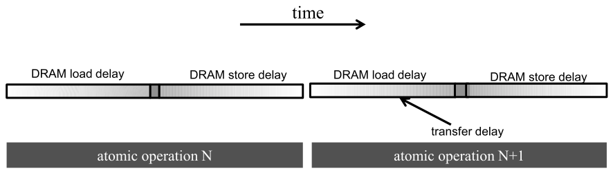

*Figure 9.7 — atomic 연산의 throughput 은 memory 접근 latency 가 결정한다. (책 p.210)*

atomic 연산 하나의 소요 시간은 대략

$$\text{atomic 1회} \;\approx\; \underbrace{\text{memory load latency}}_{\text{왼쪽 구간}}
  \;+\; \underbrace{\text{memory store latency}}_{\text{오른쪽 구간}} \;=\; 2L$$

**수백 cycle 짜리 이 시간이 atomic 하나에 반드시 바쳐야 하는 최소 시간**이고,
곧 throughput 의 상한이다.

---

### 2. 수식/유도

#### 전체 유도 과정 (먼저 한 번에)

$$BW_{\text{peak}} = 8\,\text{B} \times 2\,\frac{\text{transfer}}{\text{clk·ch}}
  \times 10^9\,\frac{\text{clk}}{\text{s}} \times 8\,\text{ch} = 128\ \text{GB/s} \tag{1}$$

$$\text{원소 throughput} = \frac{128\ \text{GB/s}}{4\ \text{B}} = 32\ \text{G elem/s} \tag{2}$$

$$T_{\text{atomic, 같은 위치}} = \frac{1}{2L}
  = \frac{1}{400\ \text{cycle}} \times 10^9\ \frac{\text{clk}}{\text{s}}
  = 2.5\ \text{M atomic/s} \tag{3}$$

$$T_{\text{atomic, } B \text{개 bin 균등}} = \frac{B}{2L} = 256 \times 2.5\ \text{M}
  = 640\ \text{M atomic/s} \tag{4}$$

$$T_{\text{atomic, 일반}} \;\le\; \frac{1}{p_{\max} \cdot 2L} \tag{5}$$

#### 단계별 설명 (생략 없이)

**가정** (책 p.209): 채널당 **64비트(8 B) DDR** 인터페이스, **채널 8개**,
클럭 **1 GHz**, 전형적 접근 latency **200 cycle**.

**(1) peak memory bandwidth.**

> **DDR 이 왜 2 인가.** DDR(Double Data Rate)은 클럭의 **상승 엣지와 하강 엣지 양쪽**에서
> 데이터를 전송한다 (6장). 그래서 클럭당 채널당 **2회** 전송이다.

$$8\ \frac{\text{B}}{\text{transfer}} \times 2\ \frac{\text{transfer}}{\text{clk·ch}}
\times 10^9\ \frac{\text{clk}}{\text{s}} \times 8\ \text{ch} = 128 \times 10^9\ \text{B/s}$$

**(2) 원소 단위로 환산.** 접근하는 데이터가 4 B 라면

$$\frac{128\ \text{GB/s}}{4\ \text{B/elem}} = 32\ \text{G elem/s}$$

**이것이 이 memory 시스템이 낼 수 있는 최대치다.** 다음 숫자와 견주기 위한 기준점이다.

**(3) 같은 위치에 대한 atomic.**
read 에 200 cycle, write 에 200 cycle → **400 cycle 에 하나**.

$$\frac{1}{400}\ \frac{\text{atomic}}{\text{clk}} \times 10^9\ \frac{\text{clk}}{\text{s}}
= 2.5 \times 10^6\ \text{atomic/s}$$

**(2)의 32 G 와 견주면 $12{,}800\times$ 낮다.**
책의 표현대로 "dramatically lower than most users expect from a GPU memory system" 이다.
게다가 이 긴 시간이 kernel 실행 시간을 **지배할** 가능성이 높다.

**(4) bin 이 여럿이면 — 균등 분포일 때.**
실제로는 모든 atomic 이 한 위치로 가지 않는다. histogram 이 256 bin 이고
**픽셀 밝기가 균등 분포**면 atomic 이 bin 들에 고르게 흩어진다.
서로 다른 bin 은 서로 겹칠 수 있으므로 256개가 동시에 진행된다.

$$256 \times 2.5\ \text{M} = 640\ \text{M atomic/s}$$

**(5) 편향이 있으면 — 책이 계산하지 않은 부분.**
책은 "in reality, the boost factor tends to be much lower ... because the pixels tend to
have biased distribution" 이라고만 말한다 (책 p.210). 얼마나 낮아지는지 세워 보자.

> **직렬화되는 가장 긴 사슬을 찾으면 된다.** 전체 원소 $N$ 개, bin $i$ 에 들어가는
> 비중을 $p_i$ 라 하자. bin $i$ 로 가는 atomic 은 $N p_i$ 개이고 **그들끼리는 직렬**이다.
> 서로 다른 bin 끼리는 병렬이므로, 전체 시간은 **가장 붐비는 bin** 이 정한다.

$$\text{시간} \;\ge\; \underbrace{N \cdot p_{\max}}_{\text{가장 붐비는 bin 의 atomic 수}} \times 2L$$

$$T = \frac{N}{\text{시간}} \;\le\; \frac{N}{N p_{\max} \cdot 2L} = \frac{1}{p_{\max} \cdot 2L}$$

균등 분포면 $p_{\max} = 1/B$ 이므로 $T \le B/(2L)$ — **(4)와 정확히 같다.** 검산 완료.

이제 Figure 9.1 의 나무 이미지를 넣어 보자. $p_{\max} = 32/64 = 0.5$ 다.

$$T \le \frac{1}{0.5 \times 400\ \text{cycle}} \times 10^9 = 5\ \text{M atomic/s}$$

**bin 이 4개나 있는데도 2.5 M 의 딱 2×**다. 균등이었다면 $4 \times 2.5 = 10$ M 이었을 것이다.
**bin 수가 아니라 $1/p_{\max}$ 가 실효 병렬도다.**

#### 첫 번째 처방 — latency 를 줄인다 (last-level cache)

atomic throughput 이 $1/(p_{\max} \cdot 2L)$ 이니, 손댈 수 있는 것은 $p_{\max}$ 와 $L$ 둘뿐이다.
**$L$ 을 줄이는 것이 먼저다.** cache 가 memory latency 를 줄이는 기본 도구다.

그래서 **현대 GPU 는 device scope atomic 을 last-level cache 에서 수행한다**
(모든 SM 이 공유하는 그것) (책 p.210~211).

| | 동작 |
|---|---|
| 갱신할 변수가 **last-level cache 에 있으면** | cache 에서 갱신한다 |
| **없으면** | cache miss → cache 로 가져와서 갱신한다 |

atomic 으로 갱신되는 변수는 **많은 thread 가 몰려 두들기므로 cache 에 남아 있기 쉽다.**
last-level cache 접근 시간은 **수백 cycle 이 아니라 수십 cycle** 이므로,
**throughput 이 최소 한 자릿수(order of magnitude) 이상 개선된다.**

> **이것이 현대 GPU 가 last-level cache 에서 atomic 을 지원하는 중요한 이유**다 (책 p.211).
> 그리고 9.4절의 privatization 이 **shared memory** 로 가면 latency 가 **몇 cycle** 까지
> 떨어진다 — 같은 처방의 극단이다.

<!--widget:atomic-contention-->

---

### 3. 예제/실습

**연습문제 9.3-1.** (3)의 계산에서 latency 200 cycle 을 20 cycle(L2 hit)로 바꾸면
같은 위치에 대한 throughput 은?

> $2L = 40$ cycle. $\frac{1}{40} \times 10^9 = 25$ M atomic/s.
> 정확히 $10\times$ — 책이 말한 "at least an order of magnitude" 다.

**연습문제 9.3-2.** Figure 9.1 이미지가 $1920 \times 1080$ 으로 커졌고
분포는 그대로 ($p_{\max} = 0.5$)라고 하자. Figure 9.6 kernel 은
DRAM atomic (200 cycle, 1 GHz) 기준으로 얼마나 걸리는가?

> 병목은 가장 붐비는 bin 이다. 그 bin 에 대한 atomic 은 서로 겹칠 수 없으므로,
> **그 사슬의 길이가 곧 kernel 시간의 하한**이다.
>
> $$N = 1920 \times 1080 = 2{,}073{,}600$$
> $$\text{가장 붐비는 bin 의 atomic 수} = N \cdot p_{\max} = 1{,}036{,}800$$
> $$\text{시간} = 1{,}036{,}800 \times \underbrace{400}_{2L} \text{cycle} = 4.147 \times 10^8\ \text{cycle} = \mathbf{0.415\ \text{초}}$$
>
> **200만 픽셀짜리 histogram 하나에 0.4초**다. CPU 순차 코드보다 느릴 수 있는 수치이고,
> 이 숫자가 9.4절 privatization 의 동기 전부다.
>
> 실효 throughput 을 (5)와 대조해 보면
> $\frac{2{,}073{,}600}{0.415\ \text{s}} = 5.0$ M atomic/s 이고,
> $\frac{1}{p_{\max} \cdot 2L} = \frac{1}{0.5 \times 400\ \text{ns}} = 5.0$ M — **일치한다.**

```python
lat_cycles, clk = 200, 1e9
N, pmax = 1920*1080, 0.5
hottest = N * pmax
cycles = hottest * 2 * lat_cycles          # atomic 1회 = 2L = 400 cycle
sec = cycles / clk
print(f"  N = {N:,} · 가장 붐비는 bin = {hottest:,.0f} atomic")
print(f"  {cycles:,.0f} cycle = {sec:.4f} s")
print(f"  실효 throughput = {N/sec/1e6:.1f} M atomic/s")
print(f"  식 (5) 상한   = {1/(pmax*2*lat_cycles/clk)/1e6:.1f} M atomic/s")
#   N = 2,073,600 · 가장 붐비는 bin = 1,036,800 atomic
#   414,720,000 cycle = 0.4147 s
#   실효 throughput = 5.0 M atomic/s
#   식 (5) 상한   = 5.0 M atomic/s
```

**연습문제 9.3-3.** bin 수를 256 에서 1024 로 늘리면 (5)에 따라
throughput 이 4배가 되는가?

> **균등 분포일 때만 그렇다.** $p_{\max} = 1/B$ 인 경우에만 $B$ 에 비례한다.
> 실제 이미지처럼 편향돼 있으면 bin 을 쪼개도 **가장 붐비는 값 자체는 쪼개지지 않는다.**
> 예를 들어 하늘이 전부 정확히 값 250 이면, bin 을 아무리 늘려도 `bins[250]` 하나에
> 그대로 몰린다. **bin 을 늘리는 것은 경쟁 완화의 근본 처방이 아니다** —
> 근본 처방은 9.4절의 **복제**다.

---

## 9.4 Privatization (책 p.211)

### 1. 개념적 이해

9.3절에서 손잡이가 둘이라고 했다. $L$ 은 cache 로 줄였고, 이제 **$p_{\max}$** 차례다.

> **privatization 이란** 경쟁이 심한 출력 자료구조를 **private 사본으로 복제해**
> thread 부분집합마다 자기 사본을 갱신하게 하는 기법이다 (책 p.211).
> 병렬 컴퓨팅에서 **output interference 가 심할 때** 널리 쓰인다.

| | |
|---|---|
| **이득** | private 사본은 **경쟁이 훨씬 적고 latency 도 낮은 곳**에 둘 수 있다 |
| **비용** | 계산이 끝난 뒤 **사본들을 최종 출력으로 병합**해야 한다 |

**경쟁 수준과 병합 비용을 저울질해야 한다.** 그래서 대규모 병렬 시스템에서
privatization 은 보통 **개별 thread 가 아니라 thread 부분집합 단위**로 한다.

#### 복제 단위를 무엇으로 잡을까

책이 드는 선택지들 (책 p.211).

| 방식 | 사본 수 |
|---|---|
| 짝수 index block 은 사본 0, 홀수 index block 은 사본 1 | 2 |
| index $i$ 인 block 은 사본 $i \bmod 4$ | 4 |
| **block 마다 사본 하나** ← **책이 고르는 방식** | block 수 |

병합은 **덧셈이 교환·결합법칙을 만족**하므로 어떤 순서로 더해도 된다.

> **원문 오기** (책 p.211). "In our **text** histogram example, we can create multiple
> private histograms ..." 이 장의 예제는 처음부터 끝까지 **image histogram** 이다
> (Figure 9.1~9.3, 9.8 모두 픽셀을 다룬다). `text` 는 이 책 4판이 쓰던
> **문자열 histogram 예제**의 잔재로 보인다. 9.5절의 `characters` 오기도 같은 출처다.

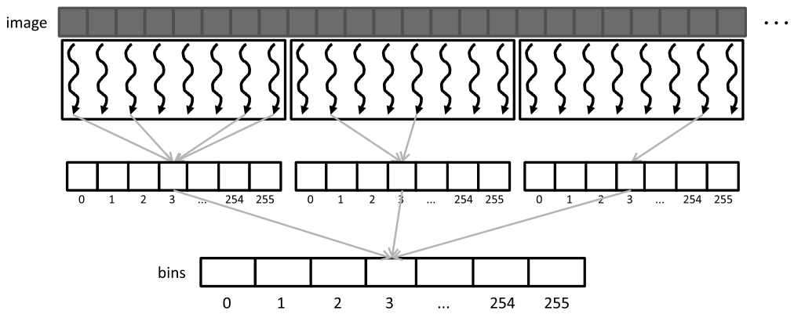

*Figure 9.8 — histogram 의 private 사본이 atomic 연산의 경쟁을 줄인다. (책 p.211)*

Figure 9.3 과 나란히 놓고 보면 경쟁이 **두 단계로 쪼개진** 것이 보인다.

| | Figure 9.3 | Figure 9.8 |
|---|---|---|
| 경쟁 범위 | **모든 thread** 가 같은 bin 을 두고 다툰다 | ① **같은 block 안** thread 끼리만 <br> ② 마지막 **병합 때 block 끼리** |

그림의 block 은 thread 8개짜리다 (실제로는 훨씬 크다).

#### block 단위로 잡는 세 가지 이득

책이 "multiple advantages that we will see later" 라고 미뤄 둔 것을 모으면 (책 p.213):

| | 이득 |
|---|---|
| **①** | thread 들이 `__syncthreads()` 로 서로를 기다린 뒤 병합할 수 있다 |
| **②** | bin 수가 충분히 작으면 사본을 **block 의 shared memory** 에 둘 수 있다 |
| **③** | atomic reference 의 scope 를 **`block` 으로 좁힐 수 있다** |

②가 결정적이다. **shared memory 는 SM 마다 사적이고 접근 latency 가 몇 cycle 에 불과**하다.
9.3절 (5)에서 $L$ 이 곧바로 throughput 이므로,
**latency 감소가 그대로 atomic throughput 증가로 번역된다** (책 p.213).

> **thread block cluster 를 지원하는 GPU 라면** (4장) cluster 단위로 사본을 잡을 수도 있다.
> 같은 cluster 의 block 들이 **cluster-level barrier synchronization** 으로 서로를 기다리고,
> 사본을 **distributed shared memory** 에 두면 **더 많은 bin 을 감당할 수 있다** (책 p.213).

---

### 2. 코드 ① — private 사본을 global memory 에

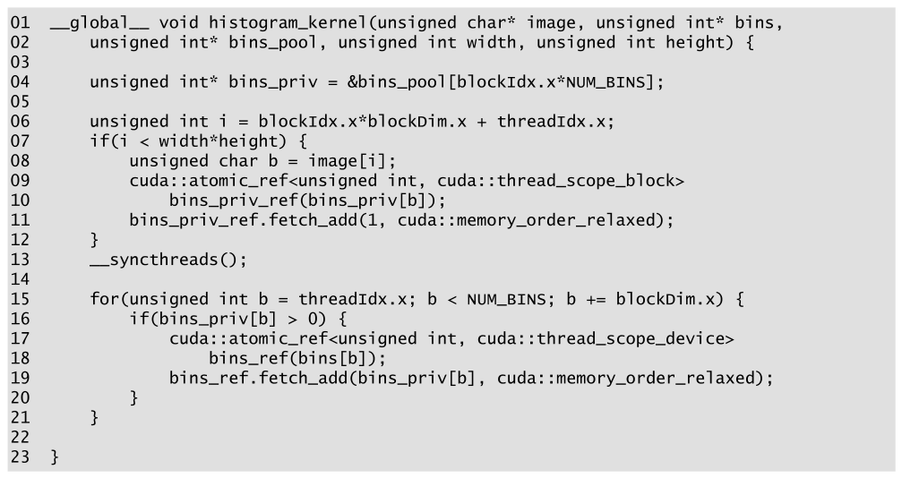

*Figure 9.9 — global memory 에 thread block 마다 private bin 을 두는 histogram kernel.
(책 p.212)*

```cuda
01  __global__ void histogram_kernel(unsigned char* image, unsigned int* bins,
02      unsigned int* bins_pool, unsigned int width, unsigned int height) {
03
04      unsigned int* bins_priv = &bins_pool[blockIdx.x*NUM_BINS];
05
06      unsigned int i = blockIdx.x*blockDim.x + threadIdx.x;
07      if(i < width*height) {
08          unsigned char b = image[i];
09          cuda::atomic_ref<unsigned int, cuda::thread_scope_block>
10              bins_priv_ref(bins_priv[b]);
11          bins_priv_ref.fetch_add(1, cuda::memory_order_relaxed);
12      }
13      __syncthreads();
14
15      for(unsigned int b = threadIdx.x; b < NUM_BINS; b += blockDim.x) {
16          if(bins_priv[b] > 0) {
17              cuda::atomic_ref<unsigned int, cuda::thread_scope_device>
18                  bins_ref(bins[b]);
19              bins_ref.fetch_add(bins_priv[b], cuda::memory_order_relaxed);
20          }
21      }
22
23  }
```

| 줄 | 하는 일 | 짚을 점 |
|---|---|---|
| **02** | 새 인자 `bins_pool` | **host 가 할당한** global memory 풀. 크기는 `gridDim.x*NUM_BINS` 정수 |
| **04** | `blockIdx.x*NUM_BINS` 만큼 밀어 자기 block 의 사본을 가리킨다 | 포인터 산술 한 줄이 전부다 |
| **06~12** | Figure 9.6 과 같되 **두 곳이 다르다** | 아래 참조 |
| **13** | `__syncthreads()` | block 안 모든 thread 가 사본 갱신을 끝낼 때까지 |
| **15** | thread 하나가 bin **하나 이상**을 맡아 순회 | **bin 수가 block thread 수보다 많을 수 있어서** 이런 반복 형태를 쓴다 |
| **16** | `> 0` 인 bin 만 | 빈 bin 에 0 을 더하려고 atomic 을 쓸 이유가 없다 |
| **17~19** | **device scope** atomic 으로 공용 사본에 더한다 | 여러 block 이 동시에 같은 위치를 더할 수 있으므로 |

#### 06~12번 줄의 두 가지 변화

| | 무엇 | 효과 |
|---|---|---|
| **①** | `bins` → **`bins_priv`** | 경쟁이 **대략 모든 SM 에 걸친 활성 block 수만큼** 줄어든다 (책 p.212) |
| **②** | scope 가 `device` → **`block`** | 같은 block 의 thread 하고만 synchronization 하면 되므로, 하드웨어 구현에 따라 **더 짧은 latency** 를 얻을 수 있다 |

②가 안전한 이유는 **`bins_priv` 를 두고 다투는 것이 이 block 의 thread 뿐**이기 때문이다.
9.2-1 연습문제에서 본 원칙 — **scope 는 실제 경쟁 범위를 반영해야 한다** — 을 그대로 지킨다.

#### 마지막 병합 단계의 경쟁은 왜 견딜 만한가

15~21번 줄에서도 device scope atomic 을 쓴다. 여기도 경쟁이 있지 않은가?

**있지만 훨씬 약하다.** 이 단계에서 **어떤 `bins[b]` 든 block 하나당 thread 하나만** 갱신한다
(책 p.213). 즉 같은 위치를 두고 다투는 thread 수가 **block 수**로 줄어든다.
게다가 `bins_priv[b] > 0` 검사가 빈 bin 을 전부 걸러 낸다.

> **책이 말하지 않는 전제 하나.** Figure 9.9 는 `bins_pool` 을 **초기화하지 않는다.**
> Figure 9.10 은 04~08번 줄에서 shared 배열을 0 으로 채우는데 여기에는 그것이 없다.
> 따라서 **host 가 `cudaMemset` 등으로 풀 전체를 0 으로 만들어 두어야 한다.**
> `gridDim.x*NUM_BINS` 개 정수를 매 launch 마다 0 으로 미는 비용이 있고,
> 이것도 9.5절이 줄이려는 오버헤드에 포함된다.

---

### 3. 코드 ② — private 사본을 shared memory 에

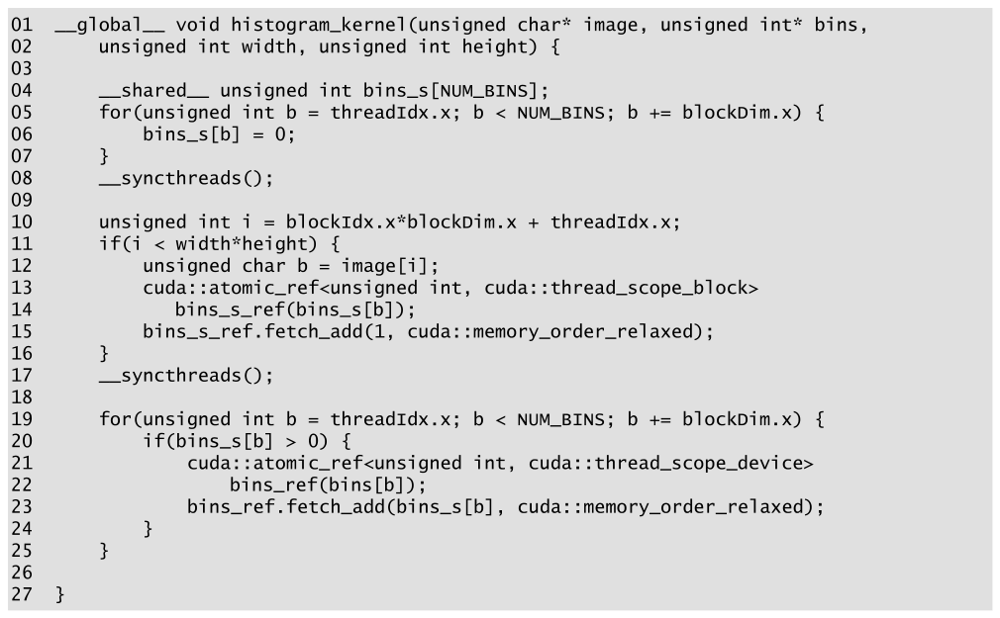

*Figure 9.10 — shared memory 에 thread block 마다 private bin 을 두는 histogram kernel.
(책 p.214)*

```cuda
01  __global__ void histogram_kernel(unsigned char* image, unsigned int* bins,
02      unsigned int width, unsigned int height) {
03
04      __shared__ unsigned int bins_s[NUM_BINS];
05      for(unsigned int b = threadIdx.x; b < NUM_BINS; b += blockDim.x) {
06          bins_s[b] = 0;
07      }
08      __syncthreads();
09
10      unsigned int i = blockIdx.x*blockDim.x + threadIdx.x;
11      if(i < width*height) {
12          unsigned char b = image[i];
13          cuda::atomic_ref<unsigned int, cuda::thread_scope_block>
14              bins_s_ref(bins_s[b]);
15          bins_s_ref.fetch_add(1, cuda::memory_order_relaxed);
16      }
17      __syncthreads();
18
19      for(unsigned int b = threadIdx.x; b < NUM_BINS; b += blockDim.x) {
20          if(bins_s[b] > 0) {
21              cuda::atomic_ref<unsigned int, cuda::thread_scope_device>
22                  bins_ref(bins[b]);
23              bins_ref.fetch_add(bins_s[b], cuda::memory_order_relaxed);
24          }
25      }
26
27  }
```

Figure 9.9 와 **다른 곳은 세 군데뿐**이다 (책 p.213).

| 줄 | 변화 |
|---|---|
| **04** | 사본이 **shared memory 배열 `bins_s`** 다. 인자 `bins_pool` 이 사라졌다 |
| **05~08** | thread 들이 **병렬로 0 초기화**하고 barrier 로 기다린다 — shared 는 launch 시 0 이 아니므로 필수다 |
| **14 · 20 · 23** | 접근 대상이 `bins_priv` → `bins_s` |

**barrier 가 두 개**라는 점을 놓치지 말자.

| barrier | 무엇을 보장하는가 |
|---|---|
| **08** | 어떤 thread 가 갱신을 시작하기 전에 **모든 bin 이 0 으로 초기화**돼 있다 |
| **17** | 어떤 thread 가 병합을 시작하기 전에 **모든 갱신이 끝나** 있다 |

#### 세 kernel 의 latency 를 나란히

9.3절의 $T \le 1/(p_{\max} \cdot 2L)$ 에 $L$ 만 갈아 끼우면 된다.

| kernel | 사본 수 | atomic 이 일어나는 곳 | 대략적 $L$ |
|---|---|---|---|
| Figure 9.6 | 1 | global (last-level cache) | 수십 cycle |
| Figure 9.9 | block 수 | global (cache 될 가능성 높음) | 수십 cycle |
| **Figure 9.10** | block 수 | **shared memory** | **몇 cycle** |

Figure 9.9 는 **$p_{\max}$ 만** 공격하고, Figure 9.10 은 **$p_{\max}$ 와 $L$ 을 동시에** 공격한다.
그래서 책은 "This reduced latency directly translates into dramatic increase in the
throughput of atomic operations" 라고 쓴다 (책 p.213).

> **shared memory 의 존재 이유 하나가 여기 있다.**
> 9.7절 요약이 명시한다 — "supporting fast atomic operations among threads in a block
> is an important use case of the shared memory" (책 p.219).
> 5장에서 shared memory 를 **데이터 재사용**의 도구로 배웠는데,
> 여기서는 **빠른 atomic 의 무대**로 쓰인다.

---

**연습문제 9.4-1.** `NUM_BINS = 256`, block 당 thread 256개일 때
Figure 9.10 이 block 당 쓰는 shared memory 는? 4장 기준으로 occupancy 에 문제가 되는가?

> $256 \times 4\ \text{B} = 1024$ B = 1 KB.
> H100 은 SM 당 thread 2048개이므로 256-thread block 이 최대 8개 올라가고,
> shared 는 $8 \times 1$ KB $= 8$ KB — SM 용량(수백 KB)에 견주면 무시할 만하다.
> **bin 수가 이 정도면 shared privatization 은 사실상 공짜다.**
> 문제가 되는 것은 bin 이 수천~수만 개인 경우다 (9.6절 도입부가 짚는 한계).

**연습문제 9.4-2.** Figure 9.10 의 08번 줄 barrier 를 빼면 어떤 증상이 나오는가?
17번 줄을 빼면?

> **08번을 빼면**: 아직 0 으로 초기화되지 않은 bin 에 다른 thread 가 `fetch_add` 를 한다.
> 그 뒤 초기화 loop 가 그 자리를 0 으로 덮어써 **증가분이 사라진다.**
> 총합이 실제보다 **작게** 나온다.
> **17번을 빼면**: 아직 갱신이 안 끝난 사본을 병합한다.
> 마찬가지로 **작게** 나오는데, 이쪽은 더 고약하다 —
> 병합 뒤에도 갱신이 계속되지만 그 값은 아무도 공용 사본으로 옮기지 않는다.
> 둘 다 **실행할 때마다 값이 달라지는** 증상을 낸다.

**연습문제 9.4-3.** Figure 9.10 의 20번 줄 `if(bins_s[b] > 0)` 을 빼면
정확성이 깨지는가? 성능은?

> **정확성은 안 깨진다.** 0 을 더하는 것은 무해하다.
> **성능은 나빠진다.** bin 수가 크고 입력이 적을수록 심하다 —
> 예를 들어 bin 4096개인데 block 당 입력이 256개면 최소 3840개 bin 이 0 인데,
> 그 전부에 대해 device scope atomic 을 쏘게 된다.
> **병합 비용이 privatization 이득을 통째로 잡아먹을 수 있다.**

---

## 9.5 Thread coarsening (책 p.214)

### 1. 개념적 이해

#### privatization 의 청구서

privatization 은 경쟁을 줄였고 shared 배치는 latency 를 줄였다. 대가는 무엇인가.

**private 사본을 초기화하고, 공용 사본으로 병합하는 일**이다 (책 p.214).
그리고 이 일은 **block 하나당 한 번씩** 일어난다.

$$\text{privatization 오버헤드} \;\propto\; \text{block 수}$$

**block 이 병렬로 실행되는 동안이라면 이 비용은 대체로 낼 만하다.**
문제는 **launch 한 block 수가 하드웨어가 동시에 실행할 수 있는 수를 넘을 때**다.
그러면 스케줄러가 block 을 직렬화하는데,
**직렬로 도는 block 들이 각자 초기화·병합을 반복하므로 오버헤드를 헛되이 치른다.**

#### 처방 — block 수를 줄이고 thread 하나가 여러 원소를 맡는다

6.5절의 thread coarsening 을 그대로 가져온다.
**block 수를 줄이면 초기화·병합해야 할 사본 수가 줄어든다.**

그리고 여기서 새 질문이 생긴다 —
**thread 하나에 여러 입력 원소를 어떻게 나눠 줄 것인가?**
책은 두 전략을 비교한다.

| 전략 | thread 가 맡는 것 |
|---|---|
| **contiguous partitioning** | **연속한 한 덩어리** |
| **interleaved partitioning** | **일정 간격으로 흩어진 원소들** |

---

### 2. 코드 ① — contiguous partitioning

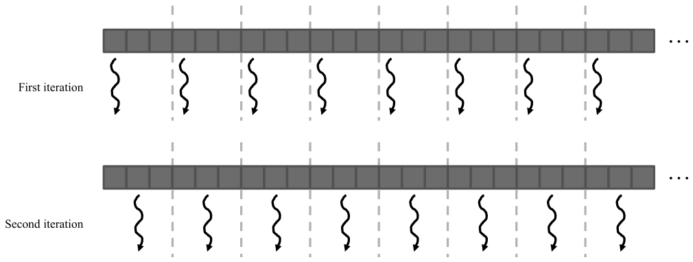

*Figure 9.11 — 입력 원소의 contiguous partitioning. (책 p.215)*

입력을 **연속한 segment 로 나눠** segment 하나를 thread 하나에 준다.
그림에서 thread 8개가 각자 연속한 3칸을 맡고, 첫 반복에는 각 segment 의 첫 칸,
둘째 반복에는 둘째 칸을 처리한다.

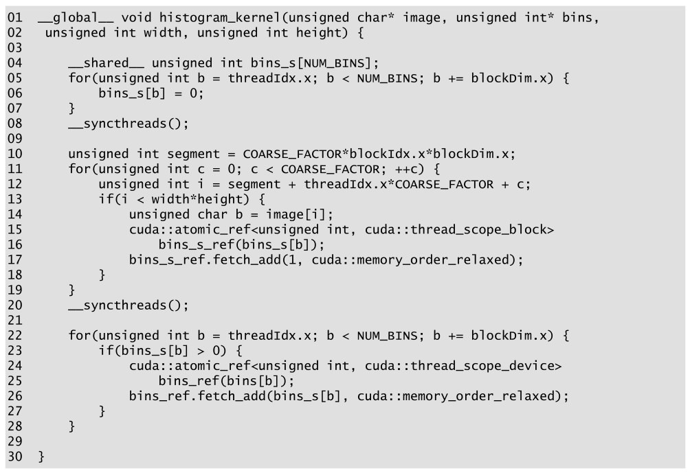

*Figure 9.12 — contiguous partitioning 으로 coarsening 을 적용한 histogram kernel.
(책 p.215)*

```cuda
01  __global__ void histogram_kernel(unsigned char* image, unsigned int* bins,
02   unsigned int width, unsigned int height) {
03
04      __shared__ unsigned int bins_s[NUM_BINS];
05      for(unsigned int b = threadIdx.x; b < NUM_BINS; b += blockDim.x) {
06          bins_s[b] = 0;
07      }
08      __syncthreads();
09
10      unsigned int segment = COARSE_FACTOR*blockIdx.x*blockDim.x;
11      for(unsigned int c = 0; c < COARSE_FACTOR; ++c) {
12          unsigned int i = segment + threadIdx.x*COARSE_FACTOR + c;
13          if(i < width*height) {
14              unsigned char b = image[i];
15              cuda::atomic_ref<unsigned int, cuda::thread_scope_block>
16                  bins_s_ref(bins_s[b]);
17              bins_s_ref.fetch_add(1, cuda::memory_order_relaxed);
18          }
19      }
20      __syncthreads();
21
22      for(unsigned int b = threadIdx.x; b < NUM_BINS; b += blockDim.x) {
23          if(bins_s[b] > 0) {
24              cuda::atomic_ref<unsigned int, cuda::thread_scope_device>
25                  bins_ref(bins[b]);
26              bins_ref.fetch_add(bins_s[b], cuda::memory_order_relaxed);
27          }
28      }
29
30  }
```

Figure 9.10 과 **다른 곳은 10~12번 줄뿐**이다 (책 p.215).

| 줄 | 무엇 |
|---|---|
| **10** | block 하나가 맡는 **block segment 의 시작 위치**. 크기는 `COARSE_FACTOR * blockDim.x` 이고, 시작 위치는 block index × segment 크기다 |
| **11** | **coarsening loop** — thread segment 를 순회한다 |
| **12** | 세 항의 합: ① block segment 오프셋 `segment` ② block 안에서 이 thread 의 segment 오프셋 `threadIdx.x*COARSE_FACTOR` ③ coarsening 카운터 `c` |

12번 줄의 형태를 눈에 새겨 두자 — **`threadIdx.x` 에 `COARSE_FACTOR` 가 곱해져 있다.**
이 곱셈 하나가 곧 문제가 된다.

> **원문 오기** (책 p.215). 본문이
> "In Fig. 9.10, the input element index i corresponds to the global thread index ...
> **In Fig. 9.11**, each thread block is assigned to a contiguous block segment ...
> found by multiplying the block index by the segment size (**line 10**)"
> 라고 쓴다. 앞 절반은 kernel(Fig 9.10)끼리 견주고 있는데 뒤 절반만 **삽화**(Fig 9.11)를
> 가리키고, 게다가 "line 10" 은 **Fig 9.12** 의 코드 줄이다. **Fig. 9.12** 여야 한다.

#### CPU 에서는 contiguous 가 최선이다

책이 짚는 이유 (책 p.216).

| | 왜 |
|---|---|
| CPU 는 **동시에 도는 thread 수가 적다** | 서로의 cache 사용을 방해하는 정도가 낮다 |
| thread 마다 **순차 접근** | 한 번 가져온 cache line 이 **이어지는 접근에도 남아 있으리라 기대할 수 있다** |

---

### 3. 코드 ② — interleaved partitioning

#### GPU 에서 contiguous 가 나쁜 이유

6장에서 배운 것이 그대로 적용된다 (책 p.216).

| | GPU 에서 벌어지는 일 |
|---|---|
| **cache 간섭** | SM 안에 동시에 활성인 thread 가 워낙 많아 **한 thread 의 순차 접근 동안 데이터가 cache 에 남아 있으리라 기대할 수 없다** |
| **coalescing 붕괴** | 같은 순간 warp 의 thread 들이 `COARSE_FACTOR` 만큼 **떨어진 주소**를 읽는다 (12번 줄의 곱셈) |

**필요한 것은 warp 안의 thread 들이 연속한 위치를 읽는 것**이다. 그것이 interleaved partitioning 이다.

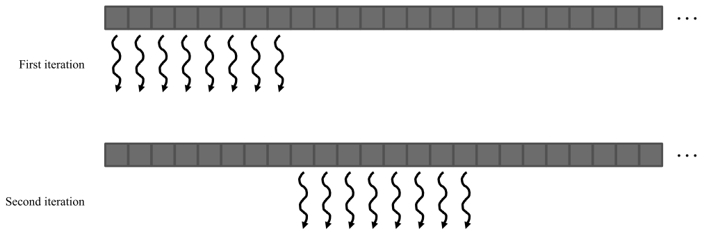

*Figure 9.13 — 입력 원소의 interleaved partitioning. (책 p.216)*

| 반복 | thread 8개가 접근하는 원소 |
|---|---|
| 첫 번째 | **0 ~ 7** — coalescing 으로 **최소한의 memory transaction** 으로 가져온다 |
| 두 번째 | **8 ~ 15** — 역시 coalesced |

**서로 다른 thread 가 처리할 구획들이 서로 끼워져(interleaved) 있다**는 뜻에서 이 이름이다.

> **원문 오기** (책 p.216). "During the second iteration, the **four** threads access
> **characters** 8 through 15 in a coalesced manner as well."
> 바로 앞 문장이 "the **eight** threads access **pixels** 0 through 7" 이고
> Figure 9.13 도 둘째 반복에 화살표 **8개**를 그린다. **eight threads** 이고
> **pixels** 여야 한다. `characters` 는 이 책 4판의 **text histogram** 예제에서 온 잔재로 보인다
> (아래 9.4절 오기와 같은 출처다).


*Figure 9.14 — interleaved partitioning 으로 coarsening 을 적용한 histogram kernel.
(책 p.217)*

```cuda
        ⋮                                    // 01~11번 줄은 Figure 9.12 와 동일
12          unsigned int i = segment + c*blockDim.x + threadIdx.x;
        ⋮                                    // 13~30번 줄도 동일
```

**Figure 9.12 와 다른 곳은 12번 줄 하나뿐이다** (책 p.217).

$$\underbrace{\texttt{segment + threadIdx.x*COARSE\_FACTOR + c}}_{\text{contiguous}}
\qquad\longrightarrow\qquad
\underbrace{\texttt{segment + c*blockDim.x + threadIdx.x}}_{\text{interleaved}}$$

`COARSE_FACTOR` 가 곱해지던 자리에 **`blockDim.x` 가 들어가고, 곱해지는 대상이
`threadIdx.x` 에서 `c` 로 바뀌었다.** 결과가 완전히 달라진다.

| 반복 `c` | thread 0 | thread 1 | thread 2 | … | 접근 폭 |
|---|---|---|---|---|---|
| **0** | `segment+0` | `segment+1` | `segment+2` | … | **연속** ✅ |
| **1** | `segment+blockDim.x` | `+blockDim.x+1` | `+blockDim.x+2` | … | **연속** ✅ |
| **$c$** | `segment + c*blockDim.x + 0` | `+1` | `+2` | … | **연속** ✅ |

**매 반복마다 block 전체가 연속한 `blockDim.x` 개 원소를 함께 처리한다** (책 p.217).

> **더 미세한 고려 하나** (책 p.216). 책은 덧붙인다 —
> "each thread should process **four pixels (a 32-bit word)** in each iteration to fully
> utilize the interconnect bandwidth between the caches and the SMs."
> 픽셀이 1 B 이므로 thread 하나가 1 B 씩 읽으면 warp 전체가 32 B 밖에 안 된다.
> 6.3절의 **vector load** 로 `uchar4` 를 읽어 4 B 씩 가져가면 warp 당 128 B 다.
> 여기 코드에는 반영돼 있지 않지만, 실전에서는 중요한 차이다.

---

**연습문제 9.5-1.** `blockDim.x = 256`, `COARSE_FACTOR = 4` 일 때
Figure 9.12 와 Figure 9.14 에서 **warp 0 의 첫 반복**이 읽는 주소를 각각 적어라.

> `segment = 4 × blockIdx.x × 256`. `blockIdx.x = 0` 으로 두면 `segment = 0`.
>
> | | thread 0~31 이 읽는 인덱스 | 몇 개의 128 B transaction 인가 |
> |---|---|---|
> | **Figure 9.12** | $0, 4, 8, \ldots, 124$ (stride 4) | 픽셀 1 B 이므로 **124 B 범위** — 겉보기엔 한두 개지만 **실제로 쓰는 것은 32 B** 뿐. **75% 낭비** |
> | **Figure 9.14** | $0, 1, 2, \ldots, 31$ | **32 B 연속** — 낭비 없음 |
>
> `COARSE_FACTOR` 가 커질수록 격차가 벌어진다. 예컨대 16이면 warp 하나가 512 B 를
> 가져와 32 B 만 쓴다.

**연습문제 9.5-2.** coarsening factor 를 무한정 키우면 좋은가?

> 아니다. 셋이 반대로 작용한다.
> **① 병렬성 감소** — block 수가 줄어 SM 을 다 못 채울 수 있다 (4장 occupancy).
> **② 꼬리 효과** — block 수가 적으면 마지막 wave 의 불균형이 크게 보인다 (4장).
> **③ 이득의 포화** — 초기화·병합 비용은 block 당 **고정**이므로,
> block 수를 절반으로 줄이면 오버헤드도 절반이 된다. 그러나 그 오버헤드가
> 이미 전체의 1% 라면 더 줄여 봐야 얻을 것이 없다.
> **6.5절의 원칙 그대로 — coarsening factor 는 "직렬화해도 남는 병렬성"까지만 키운다.**

**연습문제 9.5-3.** coarsening 이 `bins_s` 에 대한 **경쟁**도 줄이는가?

> **block 안의 경쟁은 오히려 그대로거나 조금 늘어난다** — 같은 수의 thread 가
> 더 많은 원소를 처리하므로 block 하나가 쏘는 atomic 총량이 `COARSE_FACTOR` 배다.
> coarsening 이 줄이는 것은 **사본 초기화·병합 비용**이지 경쟁이 아니다.
> 다만 **block 수가 줄면 병합 단계의 device scope atomic 경쟁은 그만큼 줄어든다**
> (연습문제 5(c)가 그것을 세게 한다).
> 경쟁 자체를 더 줄이는 것은 다음 절, 9.6절의 몫이다.

---

## 9.6 Thread-level privatization (책 p.217)

### 1. 개념적 이해

#### coarsening 이 열어 준 새 기회

thread 하나가 **여러 입력 원소를 처리**하게 되자, **thread 수준의 privatization** 이
가능해졌다 (책 p.217).

> thread 마다 histogram 사본을 만들면, **그 thread 는 atomic 없이 갱신할 수 있다.**
> 자기만 쓰는 것이니 경쟁이 원천적으로 없다.
> 입력을 다 처리한 뒤 그 사본을 **block 수준 사본에 atomic 으로 한 번** 넘기면 된다.

**한계는 bin 수다.** bin 이 아주 적으면 thread 마다 사본 하나를 shared memory 나
심지어 **register** 에 둘 수 있다. 그러나 bin 이 많으면 thread 마다 사본을 두는 것은
**감당 불가능하게 비싸다** (thread 1024개 × bin 256개 = 26만 정수).

#### 우회로 — 전부가 아니라 "가장 자주 쓰는 것" 하나만

책의 우회로는 **모든 bin 을 사본으로 두지 말고, 자주 접근하는 bin 만 두는 것**이다
(책 p.218). Figure 9.15 는 그 극단 —
**직전에 접근한 bin 딱 하나**만 thread 사본으로 갖는다.

**이것이 통하는 이유는 데이터의 성질에 있다.**

> 어떤 데이터 집합은 **국소적으로 같은 값이 크게 뭉쳐 있다.**
> 하늘 사진에는 **같은 값의 픽셀이 넓은 패치로** 존재한다 (9.1절의 복선).
> 이런 높은 집중은 병렬 histogram 에서 **심한 경쟁과 낮은 throughput** 을 부르는
> 원흉이지만, 동시에 **thread-level privatization 에 더없이 좋은 기회**다.
>
> 처방은 단순하다 — **같은 bin 을 연달아 갱신한다면 하나로 합쳐서 한 번에 갱신한다.**

$$\underbrace{+1, +1, +1, \ldots, +1}_{k \text{번의 atomic}}
\qquad\longrightarrow\qquad
\underbrace{+k}_{1 \text{번의 atomic}}$$

**가장 붐비는 bin 에 대한 atomic 수를 직접 줄인다** — 9.3절 (5)의 $p_{\max}$ 를 공격하는
가장 직접적인 방법이다.

---

### 2. 코드

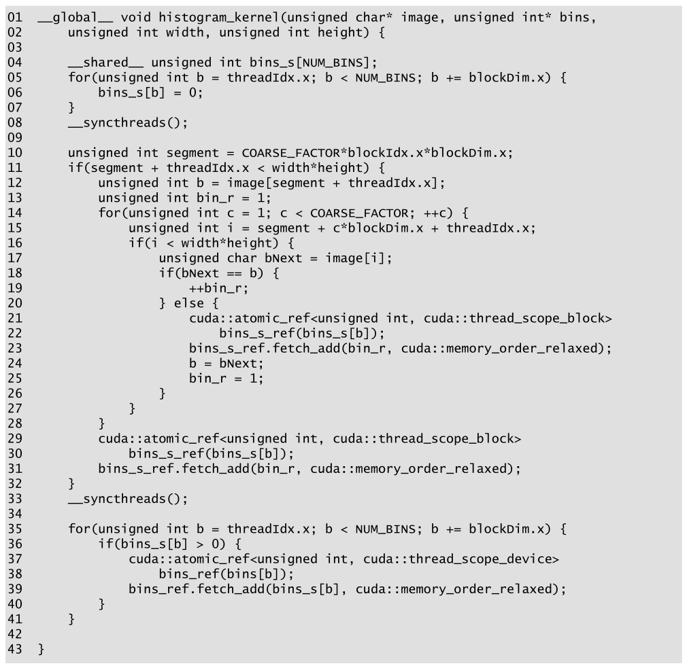

*Figure 9.15 — thread-level privatization 을 적용한 histogram kernel. (책 p.218)*

```cuda
01  __global__ void histogram_kernel(unsigned char* image, unsigned int* bins,
02      unsigned int width, unsigned int height) {
03
04      __shared__ unsigned int bins_s[NUM_BINS];
05      for(unsigned int b = threadIdx.x; b < NUM_BINS; b += blockDim.x) {
06          bins_s[b] = 0;
07      }
08      __syncthreads();
09
10      unsigned int segment = COARSE_FACTOR*blockIdx.x*blockDim.x;
11      if(segment + threadIdx.x < width*height) {
12          unsigned int b = image[segment + threadIdx.x];
13          unsigned int bin_r = 1;
14          for(unsigned int c = 1; c < COARSE_FACTOR; ++c) {
15              unsigned int i = segment + c*blockDim.x + threadIdx.x;
16              if(i < width*height) {
17                  unsigned char bNext = image[i];
18                  if(bNext == b) {
19                      ++bin_r;
20                  } else {
21                      cuda::atomic_ref<unsigned int, cuda::thread_scope_block>
22                          bins_s_ref(bins_s[b]);
23                      bins_s_ref.fetch_add(bin_r, cuda::memory_order_relaxed);
24                      b = bNext;
25                      bin_r = 1;
26                  }
27              }
28          }
29          cuda::atomic_ref<unsigned int, cuda::thread_scope_block>
30              bins_s_ref(bins_s[b]);
31          bins_s_ref.fetch_add(bin_r, cuda::memory_order_relaxed);
32      }
33      __syncthreads();
34
35      for(unsigned int b = threadIdx.x; b < NUM_BINS; b += blockDim.x) {
36          if(bins_s[b] > 0) {
37              cuda::atomic_ref<unsigned int, cuda::thread_scope_device>
38                  bins_ref(bins[b]);
39              bins_ref.fetch_add(bins_s[b], cuda::memory_order_relaxed);
40          }
41      }
42
43  }
```

Figure 9.14 에서 바뀐 곳 (책 p.218~219).

| 줄 | 하는 일 |
|---|---|
| **11** | 경계 검사 — 첫 원소조차 범위 밖이면 thread 전체가 아무것도 안 한다 |
| **12** | **첫 픽셀을 미리 읽는다.** 이 값이 "현재 들고 있는 bin" `b` 다 |
| **13** | thread 사본 `bin_r` 을 **1 로 초기화** — 첫 픽셀을 이미 센 것이다 |
| **14** | coarsening loop 가 **`c = 1` 부터** 시작한다. 첫 픽셀은 이미 읽었으므로 |
| **17** | 새 픽셀 `bNext` 를 읽는다 |
| **18~19** | **같은 값이면** `bin_r` 만 증가 — **atomic 없음** |
| **20~25** | **다르면** ① 들고 있던 `bin_r` 을 `bins_s[b]` 에 atomic 으로 더하고 ② `b` 를 새 값으로 ③ `bin_r` 을 1 로 |
| **29~31** | loop 를 빠져나온 뒤 **마지막 한 번 더** |

#### 왜 29~31번 줄이 반드시 필요한가

> **이 방식에서 갱신은 언제나 최소 한 원소 뒤처져 있다** (책 p.219).
> 값이 바뀌는 순간에만 쏘기 때문이다.
> 극단적으로 **비슷한 픽셀이 하나도 없으면** 모든 갱신이 정확히 한 반복씩 밀린다.
> 그래서 loop 를 다 돌고 나온 뒤에도 **마지막 픽셀의 몫이 `bin_r` 에 남아 있다.**
> 29~31번 줄이 그것을 흘려보낸다.

#### 무슨 일이 벌어지는지 손으로 따라가기

`COARSE_FACTOR = 6`, 어떤 thread 가 읽는 값이 차례로 $[7, 7, 7, 3, 3, 7]$ 이라고 하자.

| `c` | 읽은 값 | `b` | `bin_r` | atomic |
|---|---|---|---|---|
| — (12~13번 줄) | 7 | 7 | 1 | |
| 1 | 7 | 7 | 2 | |
| 2 | 7 | 7 | 3 | |
| 3 | **3** | 3 | 1 | **`bins_s[7] += 3`** |
| 4 | 3 | 3 | 2 | |
| 5 | **7** | 7 | 1 | **`bins_s[3] += 2`** |
| loop 종료 (29~31번 줄) | | | | **`bins_s[7] += 1`** |

결과: `bins_s[7]` 에 4, `bins_s[3]` 에 2. 합 6 ✓
**atomic 은 6번이 아니라 3번**이다.

---

### 3. 언제 손해인가

책은 이 기법을 무조건 권하지 않는다 (책 p.219).

| | |
|---|---|
| **① 문장과 변수가 늘었다** | 연달아 같은 값이 나올 확률이 낮으면 **이전 kernel 보다 느릴 수 있다** |
| **② control divergence 위험** | 18번 줄의 if 문이 warp 안에서 갈릴 수 있다 |

②에 대한 책의 관찰이 재미있다.

> **"유사성이 아예 없거나 아주 높으면 control divergence 는 거의 없다"** — 두 경우 모두
> warp 의 thread 들이 **다 같이** 사본을 증가시키거나 **다 같이** atomic 을 쏘기 때문이다.
> divergence 는 **중간 정도로 섞였을 때** 생긴다.
> 그리고 그때조차 **줄어든 경쟁이 divergence 비용을 상쇄할 가능성이 크다** (책 p.219).

즉 이 기법의 손익은 **데이터에 달려 있다.**
장 도입부가 예고한 대로 — "The cost and benefit of these techniques depend on the
underlying hardware as well as **the characteristics of the input data**" (책 p.201).

---

**연습문제 9.6-1.** 위 손계산의 값 열이 $[7,3,7,3,7,3]$ 이라면 atomic 은 몇 번인가?
$[7,7,7,7,7,7]$ 이라면?

> $[7,3,7,3,7,3]$: 값이 매번 바뀌므로 loop 안에서 5번 + 마지막 1번 = **6번.**
> Figure 9.14 와 **같고**, 게다가 비교·대입 문장이 더 붙었으므로 **순수 손해**다.
> $[7,7,7,7,7,7]$: loop 안에서 0번 + 마지막 1번 = **1번.**
> Figure 9.14 의 6번 대비 $6\times$ 줄었다.
> **같은 코드가 데이터에 따라 6× 이득에서 순손해까지 오간다.**

**연습문제 9.6-2.** 12번 줄이 `unsigned int b` 인데 17번 줄은 `unsigned char bNext` 다.
18번 줄의 `bNext == b` 는 안전한가?

> 안전하다. `unsigned char` 가 `unsigned int` 로 **정수 승격(integer promotion)** 되어
> 비교된다. 두 값 모두 0~255 이므로 부호·범위 문제가 없다.
> 다만 12번 줄도 `unsigned char` 로 두는 편이 일관되고, 그래도 결과는 같다.

**연습문제 9.6-3.** interleaved partitioning (Figure 9.14 의 인덱싱)과
thread-level privatization 은 **서로 어긋나지 않는가?**

> 예리한 지적이고, **어느 정도 어긋난다.**
> thread-level privatization 이 이득을 보려면 **한 thread 가 연달아 읽는 값이 같아야** 한다.
> 그런데 interleaved 에서 thread 가 읽는 원소들은 `blockDim.x` 만큼 떨어져 있다.
> 이미지에서 `blockDim.x = 256` 이면 **256 픽셀 건너뛴 값**끼리 비교하는 셈이다.
> **contiguous 였다면 이웃 픽셀끼리 비교**하므로 유사성이 훨씬 높았을 것이다.
>
> 그런데도 Figure 9.15 가 interleaved 를 쓰는 이유는 **coalescing 이 더 중요하기 때문**이다.
> 그리고 하늘 같은 큰 패치라면 256 픽셀 건너뛰어도 여전히 같은 값일 가능성이 높다 —
> 이미지 한 행이 보통 수백~수천 픽셀이므로 **같은 행의 같은 영역**에 머문다.
> **책이 이 긴장을 명시하지는 않지만, 두 최적화가 서로를 깎아먹는 실제 사례다.**

---

## 9.7 Summary (책 p.219)

책의 정리를 옮기면 (책 p.219):

- histogram 계산은 대규모 데이터 분석에 중요하다. 동시에 **각 thread 의 출력 위치가
  데이터에 따라 정해지는** 병렬 계산 패턴의 중요한 한 부류를 대표한다 —
  그래서 **owner-computes rule 을 적용할 수 없다.**
- 따라서 **read-modify-write race condition** 개념과, 같은 메모리 위치에 대한 동시
  read-modify-write 의 무결성을 보장하는 **atomic operation** 의 실용을 소개하기에 자연스럽다.
- 그러나 atomic operation 은 단순한 read·write 보다 throughput 이 훨씬 낮다 —
  **그 throughput 이 대략 memory latency 의 두 배의 역수**이기 때문이다.
  따라서 경쟁이 심하면 histogram 계산의 throughput 은 놀랄 만큼 낮아진다.
- **privatization** 은 경쟁을 체계적으로 줄이는 중요한 최적화이고,
  나아가 **shared memory 의 사용을 가능하게** 해 낮은 latency 와 높은 throughput 을 얻는다.
  실제로 **block 안 thread 끼리의 빠른 atomic 지원은 shared memory 의 중요한 사용 사례다.**
- **thread coarsening** 은 병합해야 할 private 사본 수를 줄이려고 적용했고,
  **contiguous partitioning 과 interleaved partitioning** 두 전략을 비교했다.
- 마지막으로 **thread-level privatization** 은 atomic 경쟁을 더 줄일 수 있다 —
  특히 **데이터 원소 사이의 유사성이 높은** 데이터 집합에서.

---

## 9.8 Exercises (책 p.220)

### 연습문제 1

> DRAM 시스템에서 atomic 연산 하나의 **총 latency 가 100 ns** 라 하자.
> **같은** global memory 변수에 대한 atomic 연산의 최대 throughput 은?

같은 위치에 대한 atomic 은 완전히 직렬화되므로 100 ns 에 하나씩이다.

$$T = \frac{1}{100\ \text{ns}} = \frac{1}{100 \times 10^{-9}\ \text{s}}
= 10^7 = \mathbf{10\ \text{M atomic/s}}$$

> 문제가 "총 latency" 라고 못 박았으므로 9.3절의 $2L$ 이 이미 100 ns 라는 뜻이다.
> 별도로 2를 곱하지 않는다.

### 연습문제 2

> L2 cache 에서 atomic 을 지원하는 프로세서에서, atomic 하나가 L2 에서는 **4 ns**,
> DRAM 에서는 **100 ns** 걸린다. atomic 의 **90%가 L2 에 hit** 한다.
> 같은 global memory 변수에 대한 atomic 의 대략적 throughput 은?

직렬화되므로 **평균 소요 시간**의 역수다.

$$\bar{t} = 0.9 \times 4\ \text{ns} + 0.1 \times 100\ \text{ns} = 3.6 + 10 = 13.6\ \text{ns}$$

$$T = \frac{1}{13.6\ \text{ns}} = 7.35 \times 10^7 = \mathbf{73.5\ \text{M atomic/s}}$$

> **10%의 miss 가 평균의 73%를 차지한다** ($10 / 13.6$).
> hit rate 를 99%로 올리면 $\bar t = 0.99 \times 4 + 0.01 \times 100 = 4.96$ ns 로
> throughput 이 **202 M** 이 된다. **꼬리가 지배하는 전형적 구조다.**

### 연습문제 3

> 문제 1 에서, kernel 이 atomic 하나당 부동소수점 연산을 **5회** 수행한다면,
> atomic throughput 이 제한하는 최대 부동소수점 throughput 은?

$$10\ \text{M atomic/s} \times 5\ \frac{\text{FLOP}}{\text{atomic}}
= 5 \times 10^7 = \mathbf{50\ \text{MFLOPS}} = 0.05\ \text{GFLOPS}$$

> 현대 GPU 의 peak 가 수십 TFLOPS 인 것을 생각하면 **$10^6$ 배 가까이 낮다.**
> atomic 하나가 어떤 계산을 목 조르는지 보여 주는 숫자다.

### 연습문제 4

> 문제 1 에서, global memory 변수를 kernel 안에서 shared memory 변수로 privatize 하고
> **shared memory 접근 latency 는 1 ns** 라 하자. 원래의 global atomic 은 전부
> shared atomic 으로 바뀐다. 단순화를 위해, privatize 된 변수를 global 변수로
> 누적하는 **추가 global atomic 이 총 실행 시간을 10% 늘린다**고 하자.
> atomic 하나당 부동소수점 연산이 5회일 때 최대 부동소수점 throughput 은?

**(1) shared atomic 의 throughput.**

$$T_{\text{shared}} = \frac{1}{1\ \text{ns}} = 10^9 = 1\ \text{G atomic/s}$$

**(2) 병합 오버헤드 반영.** 총 실행 시간이 10% 늘었으므로 유효 throughput 은 $1/1.1$ 배다.

$$T_{\text{유효}} = \frac{10^9}{1.1} = 9.09 \times 10^8 = 909\ \text{M atomic/s}$$

**(3) FLOP 으로 환산.**

$$909\ \text{M} \times 5 = 4.55 \times 10^9 = \mathbf{4.55\ \text{GFLOPS}}$$

> **문제 3 대비 $91\times$** 다 ($4.55\ \text{G} / 50\ \text{M}$).
> 이 한 숫자가 9.4절 privatization 의 존재 이유 전부다.
>
> **문제의 애매함 하나.** 문제 1 은 "atomic 하나의 총 latency" 라고 했는데
> 문제 4 는 "shared memory **접근** latency" 라고 쓴다. 후자를 9.3절처럼
> **한쪽 방향 latency** 로 읽으면 atomic 하나는 2 ns 이고 답은 **2.27 GFLOPS** 가 된다.
> 문제 1·2 가 모두 "atomic 하나에 걸리는 시간"을 직접 주었으므로
> **같은 관례로 1 ns 를 읽는 것이 일관된다** — 위 답을 택했다.

### 연습문제 5

> 입력 **524,288** 개를 처리해 **128 bin** histogram 을 만드는 kernel.
> block 당 thread 는 **1024** 개다.

**(a) privatization·shared memory·coarsening 을 전혀 쓰지 않는 Figure 9.6 이
global memory 에 수행하는 atomic 연산의 총 개수는?**

thread 하나가 원소 하나를 맡고, 원소마다 global atomic 하나다.

$$\mathbf{524{,}288}$$

**(b) privatization 과 shared memory 는 쓰되 coarsening 은 쓰지 않는 Figure 9.10 이
global memory 에 수행할 수 있는 atomic 연산의 최대 개수는?**

Figure 9.10 은 갱신 단계를 전부 shared 에서 하고,
**global atomic 은 병합 단계(19~25번 줄)에서만** 나온다.
block 하나가 병합하는 bin 은 **최대 `NUM_BINS` 개**다 (`> 0` 검사가 있으므로 그보다 적을 수 있다).

$$\text{block 수} = \frac{524{,}288}{1024} = 512$$
$$512 \times 128 = \mathbf{65{,}536}$$

> (a)의 **$8\times$** 감소다.

**(c) privatization·shared memory·coarsening 을 모두 쓰고 coarsening factor 가 4 인
Figure 9.14 는?**

coarsening 이 block 수를 4분의 1로 줄인다.

$$\text{block 수} = \frac{524{,}288}{1024 \times 4} = 128$$
$$128 \times 128 = \mathbf{16{,}384}$$

> (b)의 **$4\times$** 감소 — 정확히 coarsening factor 만큼이다.
> **(a) → (c) 로 보면 global atomic 이 $32\times$ 줄었다.**

### 검산

```python
print("연습 1~4")
print(f"  1. 1/100ns = {1/100e-9/1e6:.0f} M atomic/s")
avg = 0.9*4 + 0.1*100
print(f"  2. 평균 {avg} ns → {1/(avg*1e-9)/1e6:.1f} M atomic/s")
print(f"  3. {1/100e-9*5/1e6:.0f} MFLOPS")
print(f"  4. {1/1e-9/1.1/1e6:.1f} M atomic/s × 5 = {1/1e-9/1.1*5/1e9:.2f} GFLOPS")

print("연습 5")
N, BINS, TPB, CF = 524288, 128, 1024, 4
print(f"  a. {N:,}")
print(f"  b. block {N//TPB} × bin {BINS} = {N//TPB*BINS:,}")
print(f"  c. block {N//(TPB*CF)} × bin {BINS} = {N//(TPB*CF)*BINS:,}")
a, b, c = N, N//TPB*BINS, N//(TPB*CF)*BINS
print(f"  감소: a→b {a/b:.0f}× · b→c {b/c:.0f}× · a→c {a/c:.0f}×")
# 연습 1~4
#   1. 10 M atomic/s
#   2. 평균 13.6 ns → 73.5 M atomic/s
#   3. 50 MFLOPS
#   4. 909.1 M atomic/s × 5 = 4.55 GFLOPS
# 연습 5
#   a. 524,288
#   b. block 512 × bin 128 = 65,536
#   c. block 128 × bin 128 = 16,384
#   감소: a→b 8× · b→c 4× · a→c 32×
```

---

## 정리

9장에서 가져갈 것을 넷으로 줄이면:

1. **출력 위치를 데이터가 정하는 순간 owner-computes rule 이 깨진다.**
   7·8장은 thread index 가 출력 위치를 정했고, 그래서 충돌을 생각할 필요가 없었다.
   histogram 은 **픽셀 값이 bin 을 고른다** — 어느 thread 가 어느 출력을 건드릴지
   미리 알 수 없으므로 **atomic operation 으로 조율**해야 한다.
   atomic 이 보장하는 것은 **겹치지 않음**이지 **순서**가 아니다.
2. **atomic 의 throughput 은 대략 $1/(2L)$ 이고, 이것이 이 장의 모든 계산의 뿌리다.**
   같은 위치에 대한 atomic 은 read-modify-write 가 통째로 직렬화되므로
   DRAM 200 cycle 기준 **2.5 M atomic/s** — 같은 memory 시스템의 peak
   32 G elem/s 대비 $12{,}800\times$ 낮다.
   bin 이 여럿이면 **$1/p_{\max}$ 배** 나아지는데, 여기서 중요한 것은
   **bin 수가 아니라 가장 붐비는 bin 의 비중**이다. Figure 9.1 의 나무 이미지는
   bin 이 4개인데도 $p_{\max} = 0.5$ 라 이득이 $2\times$ 뿐이다.
3. **손잡이는 $L$ 과 $p_{\max}$ 둘뿐이고, 최적화 셋은 전부 이 둘 중 하나를 민다.**
   last-level cache atomic 은 $L$ 을 수백 → 수십 cycle 로,
   shared memory privatization 은 $L$ 을 몇 cycle 로 밀고 **동시에** $p_{\max}$ 를
   block 수만큼 나눈다. thread-level privatization 은 연속된 같은 값을 합쳐
   $p_{\max}$ 를 직접 깎는다. **thread coarsening 만은 성능이 아니라
   privatization 이 새로 만든 비용(사본 초기화·병합)을 갚는 데 쓰인다.**
4. **최적화의 이득이 데이터에 달려 있는 첫 장이다.**
   7·8장의 tiling 은 입력 값과 무관하게 항상 같은 만큼 이득이었다.
   여기서는 같은 코드가 데이터에 따라 $6\times$ 이득에서 순손해까지 오간다
   ($[7,7,7,7,7,7]$ vs $[7,3,7,3,7,3]$).
   그래서 장 도입부가 "reason about their applicability under different circumstances"
   라고 당부한 것이다 — **외울 기법이 아니라 판단할 기법이다.**

다음은 10장 — **reduction** 이다.
histogram 이 "여러 thread 가 **여러** 출력을 갱신"하는 문제였다면,
reduction 은 그 극단인 **출력이 딱 하나**인 문제다.
atomic 하나로 때울 수도 있지만, 그것이 얼마나 나쁜지 이미 알고 있다.
그래서 10장은 **reduction tree** 로 간다.
