# 10장. Reduction

> **원문 범위**: 책 p.221~250 (10.1~10.12절 + References). 부제는 *And mitigating control
> divergence* 이다.
> **절 순서**: 책 순서를 그대로 따랐다. 재배치 없음.
> **연습문제**: 책 10.12절의 6문제를 전부 풀고 답을 붙였다.

**reduction 은 값의 목록에서 값 하나를 뽑아내는 연산**이다 — 합·최대·최소 따위 (책 p.221).
9장의 histogram 이 "여러 thread 가 **여러** 출력을 갱신"하는 문제였다면,
reduction 은 그 극단인 **출력이 딱 하나**인 문제다.

9장을 지난 뒤라 첫 반응은 뻔하다 — atomic 하나로 때우면 되지 않나?
**된다. 그리고 그것이 얼마나 나쁜지 우리는 이미 안다.**
9.3절이 계산한 대로 같은 위치에 대한 atomic 은 완전히 직렬화되어
DRAM 기준 **2.5 M atomic/s** 다. $N$ 개를 그렇게 더하면 $O(N)$ 직렬 실행이다.

그래서 이 장은 다른 길로 간다 — **reduction tree** 다.

이 장이 특별한 이유는 **최적화 기법의 밀도**에 있다.
7~9장은 장마다 큰 아이디어 두셋을 다뤘는데, 10장은 **같은 계산 하나를 붙들고
여섯 단계에 걸쳐 깎아 나간다.** 각 단계가 앞 장에서 배운 도구 하나씩에 대응한다.

| 절 | 무엇을 고치는가 | 어디서 배운 도구인가 |
|---|---|---|
| 10.3 | (기준) 가장 단순한 reduction tree kernel | — |
| **10.4** | **control divergence** | 4장 |
| **10.5** | **memory coalescing** | 6장 |
| **10.6** | **global memory 접근** → shared memory | 5장 |
| **10.7** | **barrier synchronization 오버헤드** → warp-level primitive | 4장 (warp) |
| **10.8** | 그 오버헤드를 **더** | 10.7절의 연장 |
| **10.9** | **block 하나라는 제약** → multi-block + atomic | 9장 (atomic) |
| **10.10** | **하드웨어 저활용** → thread coarsening | 6장 |

그리고 이 장은 새 분석 도구 하나를 도입한다 — **work 와 span** 이다.
11장의 **work efficiency** 논의가 여기서 시작된다.

---

## 10.1 Background (책 p.221)

### 1. 개념적 이해

> **reduction 이란** 이항 연산자(binary operator)를 바탕으로 **원소들의 집합을
> 원소 하나로 바꾸는 것**이다 (책 p.221).

예를 들어 집합 $\{7.0,\ 2.1,\ 5.3,\ 9.0,\ 11.2\}$ 의 sum reduction 은
$7.0 + 2.1 + 5.3 + 9.0 + 11.2 = 34.6$ 이다.

값의 타입도 여러 가지다 — 정수, single·double·half precision 부동소수점, 문자 등.
**이 모든 종류의 reduction 이 같은 계산 구조를 공유한다** (책 p.221).

| reduction | 연산자 | identity value |
|---|---|---|
| **sum** | 부동소수점 덧셈 | $0.0$ |
| **product** | 부동소수점 곱셈 | $1.0$ |
| **min** | 둘 중 작은 값을 반환하는 비교 | $+\infty$ |
| **max** | 둘 중 큰 값을 반환하는 비교 | $-\infty$ |

> **identity value 란** 그 값을 연산자의 입력으로 넣으면 **출력이 언제나 다른 입력 그대로**가
> 되는 값이다 (책 각주 1, p.222). 부동소수점 덧셈의 identity 가 $0.0$ 인 것은
> 임의의 $v$ 에 대해 $v + 0.0 = v$ 이기 때문이다.
>
> **identity value 를 쓰는 것은 편의일 뿐이다.** 연산자에 identity 가 없다면
> `sum` 을 원소 0 으로 초기화하고 loop 를 `i=1` 부터 돌리면 된다.

---

### 2. 알고리즘 — 순차 코드

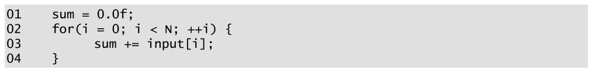

*Figure 10.1 — 단순한 순차 sum reduction 코드. (책 p.222)*

```c
01  sum = 0.0f;
02  for (i = 0; i < N; ++i) {
03      sum += input[i];
04  }
```

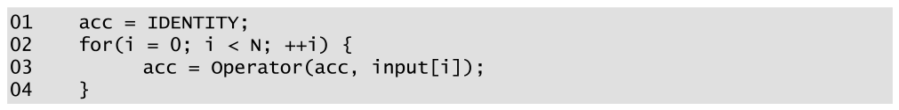

*Figure 10.2 — 순차 reduction 코드의 일반형. (책 p.222)*

```c
01  acc = IDENTITY;
02  for (i = 0; i < N; ++i) {
03      acc = Operator(acc, input[i]);
04  }
```

Figure 10.2 의 `Operator` 는 **입력 둘을 받아 값 하나를 반환하는 함수**로 정의된다.
max reduction 이면 둘을 비교해 큰 값을, min 이면 작은 값을 반환한다.
$N$ 개 원소면 loop 가 $N$ 번 돌고 종료 시점에 결과가 나온다.

#### 표준 라이브러리에 이미 있다

reduction 은 워낙 흔해서 여러 언어의 표준 라이브러리에 들어 있다 (책 p.223).

| 어디 | 무엇 |
|---|---|
| C++ 표준 라이브러리 | `std::accumulate`, `std::reduce` |
| CUDA | **Thrust**, **CUB** — GPU 에 고도로 최적화된 병렬 reduction 구현 |

> **그런데도 이 장이 바닥부터 다루는 이유**를 책이 두 번 말한다 (책 p.223, p.249).
> reduction 이 **여러 병렬화·최적화 기법을 보여 주기에 훌륭한 예제**이기 때문이다.
> 실무에서는 라이브러리를 쓰되, **여기서 배우는 기법은 다른 문제에 그대로 옮겨 간다.**

---

### 3. 예제/실습

#### Figure 10.1 을 한 반복씩 따라가기

| 반복 $i$ | `input[i]` | 반복 후 `sum` |
|---|---|---|
| — (초기화) | | $0.0$ |
| 0 | 7.0 | $0.0 + 7.0 = 7.0$ |
| 1 | 2.1 | $7.0 + 2.1 = 9.1$ |
| 2 | 5.3 | $9.1 + 5.3 = 14.4$ |
| 3 | 9.0 | $14.4 + 9.0 = 23.4$ |
| **4** | 11.2 | $23.4 + 11.2 = \mathbf{34.6}$ |

> **원문 오기** (책 p.222). "After **iteration 5**, the sum variable contains 34.6" 이라고 쓴다.
> 원소가 5개이므로 반복은 **0~4** 번이고, 34.6 이 나오는 것은 **iteration 4** 다.
> 바로 앞 두 문장이 "After iteration 0 ... 7.0", "After iteration 1 ... 9.1" 로
> **0부터 세고 있어** 자기 규칙과 어긋난다.

#### 연습문제

**연습문제 10.1-1.** min reduction 의 identity 가 $+\infty$ 인 이유를 identity 의 정의로 설명하라.
정수 min reduction 이라면 무엇을 쓰는가?

> 정의는 "그 값을 넣으면 출력이 언제나 다른 입력"이다.
> $\min(v, +\infty) = v$ 가 모든 실수 $v$ 에 대해 성립하므로 $+\infty$ 가 identity 다.
> 정수라면 $+\infty$ 가 없으므로 **그 타입의 최댓값**(`INT_MAX`, `UINT_MAX` 등)을 쓴다.
> C++ 에서는 `std::numeric_limits<T>::max()` 다.
> 부동소수점이라면 `INFINITY` 를 그대로 쓸 수 있다.

**연습문제 10.1-2.** identity 가 없는 연산자의 예를 들고,
그런 경우 Figure 10.2 를 어떻게 고치는가?

> 예: **"두 값의 평균"** 연산자. $\text{avg}(v, e) = v$ 를 모든 $v$ 에 대해 만족하는
> $e$ 는 없다.
> (평균은 결합법칙도 만족하지 않으므로 애초에 reduction 으로 병렬화할 수 없다 — 10.2절 참조.)
> 고치는 법은 책 각주가 준다 — **`acc` 를 `input[0]` 으로 초기화하고 loop 를 `i=1` 부터**
> 돌린다. 대신 `N == 0` 인 경우를 따로 처리해야 한다.

---

## 10.2 Reduction trees (책 p.223)

### 1. 개념적 이해

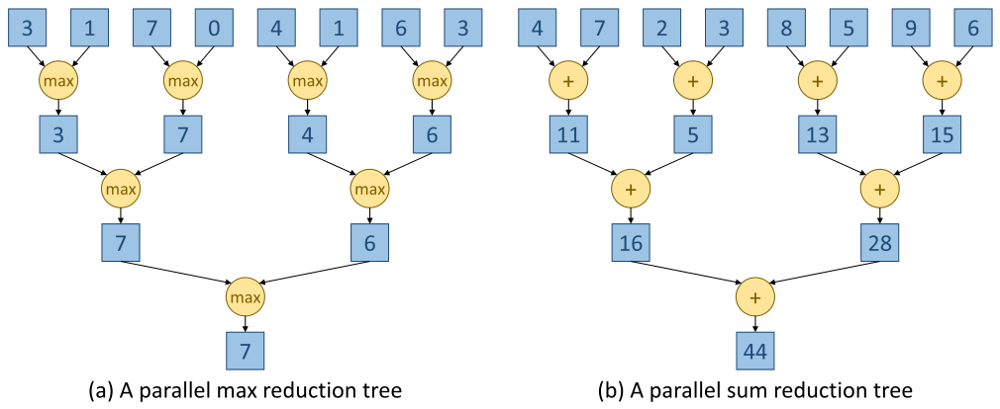

*Figure 10.3 — max reduction 과 sum reduction 의 병렬 reduction tree 예. (책 p.223)*

세로 방향이 **시간**이고 가로 방향이 **각 시간 단계에서 thread 들이 병렬로 하는 일**이다.

Figure 10.3(a) 의 max reduction tree 를 따라가면 (책 p.223~224):

| 단계 | 무슨 일 | 결과 |
|---|---|---|
| 입력 | $\{3, 1, 7, 0, 4, 1, 6, 3\}$ | |
| **1** | 원소 쌍 **4개**에 max 를 **병렬로** | $3,\ 7,\ 4,\ 6$ |
| **2** | 부분 결과 쌍 **2개**에 max 를 병렬로 | $7,\ 6$ |
| **3** | 마지막 max 하나 | $\mathbf{7}$ |

Figure 10.3(b) 의 sum reduction tree 는 $\{4,7,2,3,8,5,9,6\}$ 을 받아
$11, 5, 13, 15 \to 16, 28 \to \mathbf{44}$ 를 낸다.
$\log_2 8 = 3$ 단계에 **덧셈기 최대 4개**와 그에 딸린 읽기·쓰기 자원을 쓴다 (책 p.227).

**이 장의 kernel 은 전부 Figure 10.3(b) 를 구현한 것**이다.

---

### 2. 수식/유도

#### 전체 유도 과정 (먼저 한 번에)

$$(a \, \Theta \, b) \, \Theta \, c = a \, \Theta \, (b \, \Theta \, c)
  \qquad \text{(associative — 결합법칙)} \tag{1}$$

$$a \, \Theta \, b = b \, \Theta \, a
  \qquad \text{(commutative — 교환법칙)} \tag{2}$$

$$\text{work} = \tfrac{1}{2}N + \tfrac{1}{4}N + \tfrac{1}{8}N + \cdots + \tfrac{1}{N}N = N - 1
  \;\Rightarrow\; O(N) \tag{3}$$

$$\text{span} = \log_2 N \;\Rightarrow\; O(\log N) \tag{4}$$

$$\text{평균 병렬도} = \frac{N-1}{\log_2 N} \tag{5}$$

#### 단계별 설명 (생략 없이)

**(1) 왜 결합법칙이 필요한가.**

먼저 **순차와 병렬이 연산 순서를 다르게 한다**는 것을 보자 (책 p.224).
Figure 10.3(a) 의 입력에 대해

| | 순서 |
|---|---|
| **순차** (Figure 10.2) | identity $(-\infty)$ 와 3 → 3 과 1 → **3 과 7** → … |
| **병렬** (Figure 10.3(a)) | **7 과 0 을 먼저** 비교하고, 그 결과를 (3 과 1 의 max)와 비교 |

**이렇게 순서를 바꿀 수 있어야 reduction 을 병렬화할 수 있다.**
그리고 순서를 바꿔도 결과가 같음을 수학적으로 보장하는 성질이 **결합법칙**이다.

> **결합법칙의 뜻은 "괄호를 아무 데나 쳐도 된다"** 는 것이다.
> 이 동치 관계가 있으면 **어떤 순서든 다른 어떤 순서로도 바꿀 수 있다** (책 p.224).

같은 목록에 괄호만 다르게 친 것임을 보면 분명하다 (책 p.225).

$$\text{Figure 10.2:}\quad ((((((3 \max 1) \max 7) \max 0) \max 4) \max 1) \max 6) \max 3$$

$$\text{Figure 10.3(a):}\quad ((3 \max 1) \max (7 \max 0)) \max ((4 \max 1) \max (6 \max 3))$$

**원소의 순서는 같고 괄호만 다르다.** 연산 횟수도 둘 다 7번으로 같다.

| 연산자 | 결합법칙 | 비고 |
|---|---|---|
| 정수 덧셈 | ✅ | $(1+2)+3 = 1+(2+3)$ |
| 정수 뺄셈 | ❌ | $(1-2)-3 \ne 1-(2-3)$ |
| max, min | ✅ | |
| **부동소수점 덧셈** | **엄밀히는 ❌** | 아래 참조 |

> **뺄셈은 되살릴 수 있다** (책 p.224). 뺄셈을 **두 번째 피연산자의 음수를 더하는 것**으로
> 바꾸면 결합법칙이 생긴다.
> $$(1 - 2) - 3 \;\longrightarrow\; (1 + (-2)) + (-3) = 1 + ((-2) + (-3))$$

> **부동소수점의 미묘함** (책 p.224). 실수 덧셈은 수학적으로 결합법칙을 만족하지만,
> **부동소수점 덧셈은 엄밀히는 아니다** — 괄호를 어디 치느냐에 따라 **반올림 결과가
> 달라질 수 있기** 때문이다.
> 많은 응용이 결과가 **허용 오차 안이면 같다고** 받아들이고, 그 관용 덕에 개발자와
> 컴파일러가 실용적 목적으로 부동소수점 덧셈을 결합적이라고 취급한다.
> 자세한 것은 부록 A 다.
>
> 정수 덧셈에도 비슷한 각주가 붙는다 (책 각주 2, p.224) — 수학적으로는 결합적이지만
> **C++ 에서는 연산 순서가 overflow·underflow 발생 여부를 바꿀 수 있고**
> 그것은 undefined behavior 다. overflow 가 없다고 확신할 때만 결합적으로 취급한다.

**(2) 왜 교환법칙까지 필요해지는가.**

10.4절에서 적용할 최적화는 **연산 순서뿐 아니라 피연산자의 위치까지 재배치**한다.
그러려면 결합법칙만으로는 부족하고 **교환법칙**이 필요하다 (책 p.225).

| 연산자 | 교환법칙 |
|---|---|
| 덧셈, 곱셈, max, min | ✅ ($1+2 = 2+1$) |
| 정수 뺄셈 | ❌ ($1-2 \ne 2-1$) |

> **max·min 에도 각주가 붙는다** (책 각주 3, p.225). 부동소수점에서는
> **피연산자 하나가 NaN 일 때의 동작** 때문에 엄밀히는 교환적이지 않다.
> 입력에 NaN 이 없다고 확신하면 실용적으로 교환적이라고 취급한다.

**(3) work — 연산 횟수.**

> **work 와 span 을 먼저 정의하자** (책 p.225).
>
> - **work** — 구현이 수행하는 **연산의 개수**
> - **step** — thread 하나가 연산 하나를 수행하는 시간 구간. thread 가 여럿이면
>   **전부 또는 일부가 병렬로 연산 하나씩을 수행하는 구간**
> - **span** — **자원이 무한하다고 가정할 때** 그 연산들을 수행하는 데 걸리는 step 수
>
> 2장의 vector addition kernel 을 예로 들면 (책 p.225): 크기 $N$ 벡터 둘을 더하려고
> thread $N$ 개를 launch 하고 각 thread 가 연산 하나를 하므로 **work 는 $O(N)$**,
> 전부 병렬이므로 **span 은 $O(1)$** 이다.
> 순차 구현은 work $O(N)$ 에 span 도 $O(N)$ 이다.
>
> **순차 알고리즘에서는 work 와 span 을 구분할 이유가 없다** — 연산이 하나씩 수행되므로
> step 수가 work 에 그대로 비례한다.

reduction tree 의 work 를 세자. 첫 라운드에 $\frac{1}{2}N$ 번, 둘째에 $\frac{1}{4}N$ 번, …
마지막에 1번이므로

$$\text{work} = \frac{N}{2} + \frac{N}{4} + \frac{N}{8} + \cdots + 1 = N - 1$$

기하급수의 합이다. Figure 10.3(a) 의 $N=8$ 이면 $4 + 2 + 1 = 7 = 8-1$ ✓

**따라서 병렬 reduction tree 의 work 는 $O(N)$ — 순차 알고리즘과 같다** (책 p.226).

> **이것이 당연하지 않다는 것을 11장에서 배운다.** 병렬 알고리즘이 순차 알고리즘과
> **같은 양의 work 를 하는 것은 아니고**, 거기서 **work efficiency** 라는 개념이 나온다
> (책 p.226).
> **reduction tree 는 work-efficient 하다** — 이 장에서는 공짜로 얻어지는 성질이지만
> 11장의 scan 에서는 이것을 얻으려고 싸워야 한다.

**(4) span.**

매 step 마다 남은 값이 절반이 되므로 $\log_2 N$ step 이면 끝난다.
각 step 이 연산 하나를 하므로 **span 은 $O(\log N)$** 이다.

$N = 1024$ 면 **단 10 step** 이다 — 자원이 충분하다면.

**(5) 그런데 그 "자원이 충분하다면"이 문제다.**

| step | 필요한 실행 자원 |
|---|---|
| 1 | $\frac{N}{2} = 512$ |
| 2 | $256$ |
| $\vdots$ | $\vdots$ |
| 10 | $\mathbf{1}$ |

**필요 자원이 시간이 갈수록 급격히 줄어든다.** 평균을 내 보면

$$\text{평균 병렬도} = \frac{\text{총 연산 수}}{\text{step 수}} = \frac{N-1}{\log_2 N}$$

$N = 1024$ 면 $\frac{1023}{10} = 102.3$ 인데 **peak 는 512** 다 (첫 step).

> **step 마다 병렬도와 자원 소비가 이렇게 출렁이는 것이 reduction tree 를
> 병렬 컴퓨팅 시스템에 어려운 패턴으로 만든다** (책 p.226).
> 이 한 문장이 10.4절부터 10.10절까지의 모든 최적화를 낳는다.

---

### 3. 예제/실습

#### 스포츠와 경기의 병렬 reduction (책 박스, p.226~227)


*Figure 10.4 — reduction tree 로 본 2010 월드컵 결승 토너먼트. (책 p.227)*

> **병렬 reduction 은 컴퓨팅이 태어나기 훨씬 전부터 스포츠와 경기에서 쓰였다** (책 p.226).
> 토너먼트의 탈락 과정은 **"상대를 이기는 팀을 반환하는 max 연산자"** 를 쓰는
> max reduction 이다. 팀을 쌍으로 나누고, 첫 라운드에 모든 쌍이 **병렬로** 경기한다.

| 라운드 | Figure 10.4 | 남는 팀 |
|---|---|---|
| 1 | quarter finals | 8 → 4 |
| 2 | semi finals | 4 → 2 |
| 3 | final | 2 → **1** |

**1024팀이어도 10라운드면 우승자가 정해진다.** 60,000팀이라도 $2^{16} = 65{,}536$ 이므로
**16라운드**면 된다 (책 p.227).

> **원문 오기** (책 p.227). 같은 문단이 "8 teams ... four winners from the first round ...
> two from the second round ... one final winner from the third round.
> Each round is a step" 이라고 세 라운드를 세어 놓고
> 바로 다음 문장에서 "The tournament in Fig. 10.4 has a span of **four** steps" 라고 쓴다.
> Figure 10.4 도 quarter finals → semi finals → final 로 **세 라운드**만 그린다.
> **three steps** 여야 한다 ($\log_2 8 = 3$).

**그리고 이 비유가 진짜 값진 지점은 자원 이야기다** (책 p.227).

> reduction tree 는 과정을 크게 빠르게 하지만 **자원도 상당히 먹는다.**
> 월드컵에서 경기 하나에는 큰 경기장·심판·스태프, 그리고 몰려드는 관중을 감당할
> 호텔과 식당이 필요하다.
> Figure 10.4 의 4강전 네 경기는 **세 도시**에서 치러졌다 (Nelson Mandela Bay/Port Elizabeth,
> Cape Town, Johannesburg). 그런데 **요하네스버그의 두 경기는 서로 다른 날**에 열렸다.
> **두 경기가 자원을 나눠 쓰느라 reduction 과정이 더 오래 걸린 것이다.**
>
> **계산의 reduction tree 에서도 똑같은 trade-off 를 보게 된다** — 그게 10.10절이다.

#### 연습문제

**연습문제 10.2-1.** $N = 8$ 인 reduction tree 의 work, span, 평균 병렬도, peak 병렬도는?

> work $= 8 - 1 = 7$ · span $= \log_2 8 = 3$
> 평균 병렬도 $= 7/3 = 2.33$ · peak 병렬도 $= 4$ (첫 step)
> **peak 가 평균의 1.7×** 다. $N$ 이 커질수록 이 격차가 벌어진다 —
> $N = 1024$ 면 $512 / 102.3 = 5.0\times$ 다.

**연습문제 10.2-2.** 다음 연산자들에 reduction tree 를 쓸 수 있는가?
① 문자열 이어붙이기 ② 두 값 중 나중에 온 것을 반환 ③ 비트 XOR

> ① **결합적이지만 교환적이 아니다.** `("ab" + "cd") + "ef" = "ab" + ("cd" + "ef")` ✓
> 그러나 `"ab" + "cd" ≠ "cd" + "ab"` ✗
> → **Figure 10.5 방식(괄호만 재배치)은 되고, Figure 10.8 방식(피연산자 재배치)은 안 된다.**
> ② 결합적도 교환적도 아니다 → reduction tree 로 병렬화 불가.
> ③ **둘 다 만족한다** (identity 는 0). reduction tree 에 완벽히 맞는다.

**연습문제 10.2-3.** 부동소수점 덧셈이 엄밀히 결합적이 아니라면,
Figure 10.5 kernel 과 순차 코드의 결과가 다를 수 있는가? 어느 쪽이 더 정확한가?

> **다를 수 있다.** 그리고 **대개 reduction tree 쪽이 더 정확하다.**
> 순차 누적은 `acc` 가 점점 커지는데 더해지는 값은 작은 채로 남아,
> 큰 수 + 작은 수의 반올림 손실이 $N$ 번 누적된다.
> reduction tree 는 **비슷한 크기끼리 더하므로** 그 손실이 $\log_2 N$ 번만 쌓인다.
> 자세한 것은 부록 A 다.

---

## 10.3 A simple reduction kernel (책 p.227)

### 1. 개념적 이해

Figure 10.3(b) 의 sum reduction tree 를 구현한다. 다만 제약이 하나 있다.

> **reduction tree 는 모든 thread 의 협력을 요구하는데, grid 전체에 걸친 협력은
> 불가능하다** (책 p.227~228). 그래서 **block 하나 안에서** 도는 kernel 부터 만든다.
>
> 원소 $N$ 개짜리 입력에 대해 **block 하나에 thread $\frac{N}{2}$ 개**로 launch 한다.
> block 당 thread 가 최대 1024개이므로 **최대 2048개 원소**까지 처리할 수 있다.
> 이 제약은 **10.9절**에서 없앤다.

| step | 참여 thread | 만들어지는 부분합 |
|---|---|---|
| 1 | $\frac{N}{2}$ 개 전부 | $\frac{N}{2}$ |
| 2 | 절반이 빠지고 $\frac{N}{4}$ | $\frac{N}{4}$ |
| $\vdots$ | $\vdots$ | $\vdots$ |
| 마지막 | **1개** | 전체 합 |

#### owner-computes 로 돌아왔다

9장에서 깨졌던 그 규칙이 여기서는 다시 성립한다 (책 p.228).

> 각 thread 는 자기가 배정받은 위치의 **"owner"** 이고,
> **그 위치에 쓰는 유일한 thread** 다.

9장과 다른 점은 **thread 가 자기 위치에 쓰기만 하는 것이 아니라 남의 위치를 읽는다**는 것이다.
그래서 **9장의 atomic 대신 `__syncthreads()` 로 조율**한다.

---

### 2. 코드

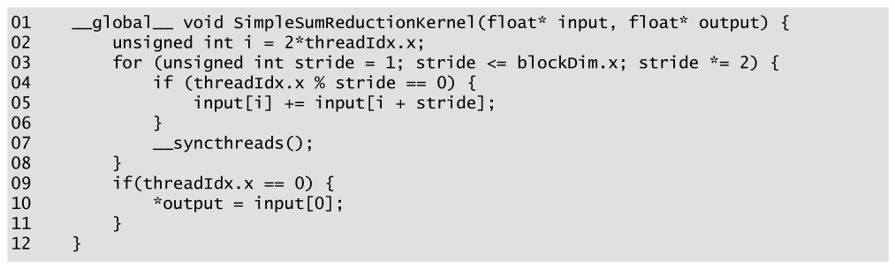

*Figure 10.5 — 단순한 sum reduction kernel. (책 p.228)*

```cuda
01  __global__ void SimpleSumReductionKernel(float* input, float* output) {
02      unsigned int i = 2*threadIdx.x;
03      for (unsigned int stride = 1; stride <= blockDim.x; stride *= 2) {
04          if (threadIdx.x % stride == 0) {
05              input[i] += input[i + stride];
06          }
07          __syncthreads();
08      }
09      if(threadIdx.x == 0) {
10          *output = input[0];
11      }
12  }
```

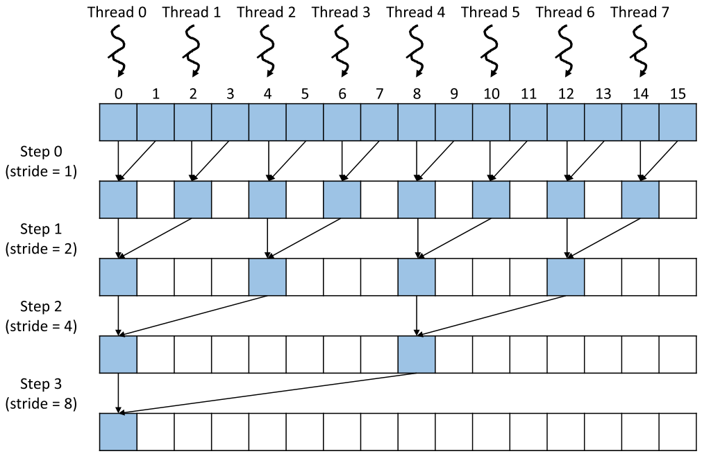

*Figure 10.6 — Figure 10.5 의 `SimpleSumReductionKernel` 에서 thread("owner")를 입력 배열
위치에 배정한 모습과 시간에 따른 실행 진행. 시간은 위에서 아래로 흐르고 각 층이 for-loop 의
반복 하나에 대응한다. (책 p.229)*

#### 줄별로

| 줄 | 하는 일 | 짚을 점 |
|---|---|---|
| **02** | `i = 2*threadIdx.x` | thread 를 **짝수 위치**에 배정한다 — thread 0 → `input[0]`, thread 1 → `input[2]`, thread 2 → `input[4]`, … |
| **03** | `stride` 를 1 에서 시작해 매 반복 **두 배** | 값이 1, 2, 4, 8, … 로 커진다 |
| **04** | `threadIdx.x % stride == 0` | 반복 $n$ 에서 **thread index 가 $2^n$ 의 배수**인 thread 만 활성 |
| **05** | `stride` 만큼 떨어진 원소를 자기 위치에 더한다 | **누적은 언제나 자기 owner 위치로** |
| **07** | `__syncthreads()` | 아래 참조 |
| **09~11** | Thread 0 이 `input[0]` 을 출력에 쓴다 | 마지막 반복 뒤 `input[0]` 이 전체 합 |

Thread 0 을 따라가면 (책 p.229):

| 반복 | `stride` | 하는 일 | 이후 `input[0]` |
|---|---|---|---|
| 0 | 1 | `input[0] += input[1]` | 원래 $[0..1]$ 의 합 |
| 1 | 2 | `input[0] += input[2]` | $[0..3]$ 의 합 (이때 `input[2]` 는 $[2..3]$ 의 합) |
| 2 | 4 | `input[0] += input[4]` | $[0..7]$ 의 합 |
| $\vdots$ | | | |

> **원문 오기** (책 p.228~229). "the stride variable value will be 1, 2, 4, 8, etc. until it
> becomes greater than **`blockIdx.x`**, the total number of threads in the block."
> block 안의 총 thread 수는 **`blockDim.x`** 다. `blockIdx.x` 는 block 의 번호다.
> 03번 줄의 코드 자체는 `stride <= blockDim.x` 로 올바르게 적혀 있다.

#### `__syncthreads()` 가 두 가지 일을 한다

07번 줄의 barrier 는 흔히 생각하는 것보다 하는 일이 많다 (책 p.230).

| 역할 | 내용 |
|---|---|
| **① 진행 동기화** | 이번 반복이 계산한 **모든 부분합이 목적지에 쓰인 뒤에야** 다음 반복이 시작된다 |
| **② memory fence** | thread 가 global memory 에 쓴 데이터를 **다른 thread 가 읽으려면 memory fence 가 필요하다.** 같은 block 안이라면 `__syncthreads()` 가 그 역할까지 한다 |

> **②를 놓치기 쉽다.** "동기화했으니 값도 보이겠지"가 자동으로 참은 아니다.
> 쓰기가 다른 thread 에게 **언제 보이는지**를 규정하는 규칙을
> **memory consistency model** 이라고 한다 (책 p.230).
> CUDA 에서는 같은 block 안에 한해 `__syncthreads()` 앞의 쓰기가
> `__syncthreads()` 뒤의 읽기에 올바르게 보인다.
> 9.2절에서 만난 `memory_order` 인자도 같은 주제의 다른 얼굴이다.

---

### 3. 예제/실습

**연습문제 10.3-1.** 03번 줄이 `stride < blockDim.x` 였다면 무엇이 틀리는가?

> 마지막 반복이 빠진다. $N = 256$, `blockDim.x` $= 128$ 이면
> `stride` 가 1~64 까지만 돌고 **`stride = 128` 반복이 실행되지 않는다.**
> 그러면 `input[0]` 은 앞 절반 $[0..127]$ 의 합만 담고,
> 뒤 절반의 합인 `input[128]` 이 합쳐지지 않는다. **결과가 대략 절반**이 된다.

**연습문제 10.3-2.** 07번 줄의 `__syncthreads()` 를 04~06번 줄의 if 문 **안**으로
옮기면 어떻게 되는가?

> **hang 한다.** 4장에서 본 그대로다 — `__syncthreads()` 는
> **block 의 모든 thread 가 도달해야** 통과한다.
> if 문 안에 두면 비활성 thread 는 barrier 에 도달하지 않으므로
> 활성 thread 들이 영원히 기다린다.
> (4장 Figure 4.4 가 바로 이 잘못된 사용의 예였다.)

**연습문제 10.3-3.** 이 kernel 은 **입력 배열을 파괴한다.** 왜 그렇게 설계했고,
그것이 문제가 되는 경우는?

> global memory 말고 쓸 공간이 없기 때문이다 — **제자리(in-place)로 하면 추가 할당이 없다.**
> 문제가 되는 것은 **원본 배열이 뒤에 또 필요한 경우**다.
> 10.6절이 shared memory 를 쓰면서 이 문제도 함께 해결한다 (책 p.237) —
> "Another added benefit of using shared memory ... is that the input array is not modified."

---

## 10.4 Reducing control divergence (책 p.230)

### 1. 개념적 이해

Figure 10.5 는 **맞는 답을 낸다.** 문제는 성능이다.

Figure 10.6 을 보면 두 번째 반복부터 `threadIdx.x` 가 짝수인 thread 만 덧셈을 한다.
4장에서 배운 대로 **control divergence 는 실행 자원 활용 효율**
(자원 중 쓸모 있는 결과를 내는 데 쓰인 비율)을 크게 떨어뜨린다 (책 p.230).

| 반복 | warp 안 활성 thread | 낭비 |
|---|---|---|
| 1 (stride 1) | 32 / 32 | 0 |
| 2 (stride 2) | 16 / 32 | $\frac{1}{2}$ |
| 3 (stride 4) | 8 / 32 | $\frac{3}{4}$ |
| $\vdots$ | | |
| 6 (stride 32) | **1 / 32** | $\frac{31}{32}$ |

**warp 32개 thread 가 전부 실행 자원을 먹는데 일하는 것은 하나뿐**이다.

입력이 32보다 크면 6번째 반복 뒤부터 **warp 통째로 비활성**이 되기 시작한다.
$N = 256$ (thread 128개 = warp 4개)을 예로 들면 (책 p.231):

| 반복 | stride | 활성 warp | divergence |
|---|---|---|---|
| 1~6 | 1~32 | 4 (전부) | 1번째만 없고 나머지 있음 |
| **7** | 64 | **2** (Warp 0, 2) | Warp 1·3 은 **완전 비활성**이라 divergence 없음. Warp 0·2 는 활성 thread 1개 |
| **8** | 128 | **1** (Warp 0) | Warp 0 만 활성, 활성 thread 1개 |

---

### 2. 수식/유도 — 얼마나 낭비하는가

#### 전체 유도 과정 (먼저 한 번에)

$W = N/64$ 를 launch 되는 warp 수라 하자 ($N/2$ 개 thread, 32개마다 warp 하나).

$$R_{10.5} = \left(W \cdot 6 + \frac{W}{2} + \frac{W}{4} + \cdots + 1\right) \cdot 32
  = (7W - 1) \cdot 32 \tag{1}$$

$$C = W \cdot (32{+}16{+}8{+}4{+}2{+}1) + \frac{W}{2} + \frac{W}{4} + \cdots + 1
  = 64W - 1 = N - 1 \tag{2}$$

$$E_{10.5} = \frac{C}{R_{10.5}} = \frac{N-1}{(7W-1)\cdot 32} = \frac{N-1}{3.5N - 32}
  \;\xrightarrow[N \to \infty]{}\; \frac{2}{7} \approx 28.6\% \tag{3}$$

$$R_{10.8} = \left(W + \frac{W}{2} + \cdots + 1 + 5 \cdot 1\right) \cdot 32
  = (2W + 4) \cdot 32 \tag{4}$$

$$E_{10.8} = \frac{N-1}{(2W+4)\cdot 32} = \frac{N-1}{N + 128}
  \;\xrightarrow[N \to \infty]{}\; 100\% \tag{5}$$

#### 단계별 설명 (생략 없이)

**(1) Figure 10.5 가 소비하는 실행 자원.**

> **자원 소비의 단위는 thread 가 아니라 warp 다.** 활성 warp 는
> **그 안의 thread 가 몇 개나 활성이든 상관없이 32개 thread 분의 실행 자원을 통째로 먹는다**
> (책 p.231). 그래서 "총 소비 자원 = 모든 반복에 걸친 활성 warp 수 × 32" 다.

$$\left(\underbrace{\frac{N}{64} \cdot 6}_{\text{처음 6반복}}
  + \underbrace{\frac{N}{64} \cdot \frac{1}{2} + \frac{N}{64} \cdot \frac{1}{4} + \cdots + 1}_{\text{7반복부터}}\right) \cdot 32$$

- **$N/64$** 는 launch 되는 warp 수다 — thread $N/2$ 개, 32개마다 warp 하나.
- **6을 곱하는 이유**: warp 안에 32개 thread 가 있으므로 `stride` 가 32 이하인 동안
  (반복 1~6) **모든 warp 에 활성 thread 가 최소 하나 있다.** 즉 warp 가 하나도 안 빠진다.
- **6반복 뒤**부터 매 반복 warp 수가 절반이 된다.

괄호 안의 꼬리는 기하급수이므로 $\frac{W}{2} + \frac{W}{4} + \cdots + 1 = W - 1$ 이고,

$$R_{10.5} = (6W + W - 1) \cdot 32 = (7W - 1)\cdot 32$$

$N = 256$ 이면 $W = 4$ 이므로 $(4 \cdot 6 + 2 + 1)\cdot 32 = 27 \cdot 32 = \mathbf{864}$ ✓
(책 p.231 의 값과 일치)

**(2) 실제로 커밋되는 결과 수.**

$$\frac{N}{64}(32{+}16{+}8{+}4{+}2{+}1) + \frac{N}{64}\cdot\frac{1}{2} + \frac{N}{64}\cdot\frac{1}{4} + \cdots + 1$$

괄호 안은 처음 6반복의 warp 당 활성 thread 수이고, 7반복부터는 활성 warp 당 1개다.
정리하면 $63W + (W-1) = 64W - 1 = N - 1$ 이다.

$N=256$ 이면 $4 \cdot 63 + 2 + 1 = \mathbf{255}$ ✓

> **이 값이 $N-1$ 인 것은 우연이 아니다.** (3)에서 본 reduction tree 의 **work** 가
> 정확히 $N-1$ 이다. **256개 값을 줄이는 데 필요한 연산은 255번**이고,
> 그 이상도 이하도 하지 않는다.

**(3) 효율.**

$$E_{10.5} = \frac{255}{864} = 0.295 \approx \mathbf{30\%}$$

> **소비한 병렬 실행 자원의 30% 만이 결과에 기여했다** (책 p.231).
> 하드웨어 잠재력의 30% 만 쓰고 있다는 뜻이다.

닫힌 식으로 쓰면 $W = N/64$ 를 대입해

$$E_{10.5}(N) = \frac{N-1}{(7 \cdot \frac{N}{64} - 1)\cdot 32} = \frac{N-1}{3.5N - 32}$$

$N \to \infty$ 에서 $\frac{1}{3.5} = \frac{2}{7} \approx 28.6\%$ 로 수렴한다.
**입력을 아무리 키워도 Figure 10.5 는 28.6% 를 못 넘는다.**

| $N$ | 256 | 512 | 1024 | 2048 (block 최대) | $\infty$ |
|---|---|---|---|---|---|
| $E_{10.5}$ | 29.5% | 29.0% | 28.8% | 28.7% | **28.6%** |

**(4) 더 나은 배정 — 활성 thread 를 붙여 놓는다.**

문제의 정체는 이것이다 (책 p.231~232):

> Figure 10.6 의 배정은 **부분합 위치가 시간이 갈수록 서로 멀어지고**,
> 따라서 그 위치를 소유한 활성 thread 들도 점점 멀어진다.
> **이 벌어지는 거리가 비활성화와 자원 저활용을 키운다.**

처방은 정반대로 가는 것이다 — **thread 와 소유 위치를 시간이 가도 서로 가까이 두는 것**,
즉 **`stride` 를 키우지 말고 줄이는 것**이다.

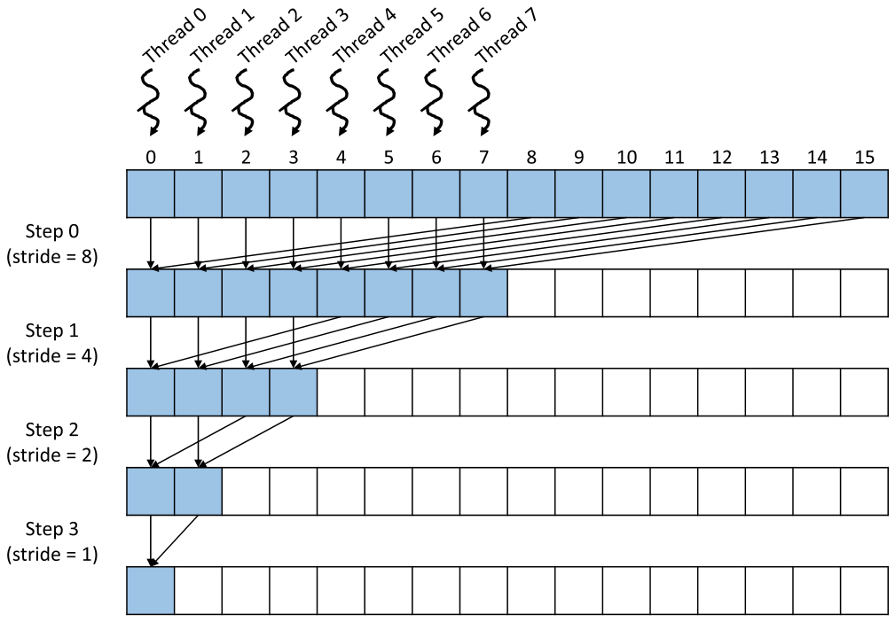

*Figure 10.7 — control divergence 를 줄이기 위한, 입력 배열 위치에 대한 더 나은 thread 배정.
(책 p.232)*

원소 16개 예로 보면:

| step | stride | 하는 일 |
|---|---|---|
| 0 | 8 | 각 thread 가 **배열 절반 건너**에서 원소를 가져와 자기 위치에 더한다. Thread 0: `input[0] += input[8]`, Thread 1: `input[1] += input[9]`, … |
| 1 | 4 | 절반이 빠지고, 남은 thread 는 **남은 활성 thread 수만큼** 떨어진 원소를 더한다 |
| 2 | 2 | Thread 0: `input[0] += input[2]`, Thread 1: `input[1] += input[3]` |
| 3 | 1 | Thread 0: `input[0] += input[1]` |

> **여기서 교환법칙이 필요해진다** (책 p.232~233).
> Figure 10.6 과 견주면 이것은 괄호를 다르게 친 것이 아니라 **입력 목록 자체를 재배치**한 것이다.
> $$\{\texttt{input[0]},\ \texttt{input[8]},\ \texttt{input[1]},\ \texttt{input[9]},\ \ldots,\ \texttt{input[7]},\ \texttt{input[15]}\}$$
> 이렇게 재배치해도 결과가 같으려면 연산자가 **결합적일 뿐 아니라 교환적**이어야 한다.
> (2)에서 미리 깔아 둔 것이 여기서 쓰인다.

---

### 3. 코드

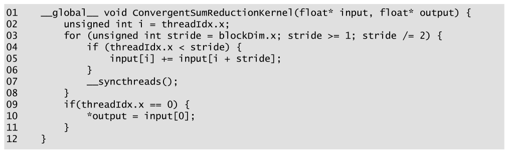

*Figure 10.8 — control divergence 가 적고 실행 자원 활용 효율이 개선된 kernel. (책 p.233)*

```cuda
01  __global__ void ConvergentSumReductionKernel(float* input, float* output) {
02      unsigned int i = threadIdx.x;
03      for (unsigned int stride = blockDim.x; stride >= 1; stride /= 2) {
04          if (threadIdx.x < stride) {
05              input[i] += input[i + stride];
06          }
07          __syncthreads();
08      }
09      if(threadIdx.x == 0) {
10          *output = input[0];
11      }
12  }
```

Figure 10.5 와 다른 곳은 **작지만 결정적인 세 군데**다 (책 p.233).

| 줄 | Figure 10.5 | Figure 10.8 | 효과 |
|---|---|---|---|
| **02** | `i = 2*threadIdx.x` | **`i = threadIdx.x`** | 인접 thread 의 소유 위치가 **인접**해진다 |
| **03** | `stride = 1`, 두 배씩 **증가** | **`stride = blockDim.x`, 반씩 감소** | 첫 라운드에 절반 건너 더한다 |
| **04** | `threadIdx.x % stride == 0` | **`threadIdx.x < stride`** | 활성 thread 가 **연속한 index** 가 된다 |

#### if 문은 그대로인데 왜 divergence 가 다른가

> **덧셈을 실행하는 thread 수는 두 kernel 이 같다.** 그런데 왜 divergence 가 다른가?
> **답은 덧셈하는 thread 와 안 하는 thread 의 상대적 위치에 있다** (책 p.233).

$N = 256$ (thread 128개, warp 4개)로 보자.

| 반복 | stride | 활성 thread | warp 상태 | divergence |
|---|---|---|---|---|
| 1 | 128 | 0~127 | warp 0~3 **전부 활성** | ❌ 없음 |
| 2 | 64 | 0~63 | **warp 0~1 전부 활성 · warp 2~3 전부 비활성** | ❌ 없음 |
| 3 | 32 | 0~31 | warp 0 전부 활성, 나머지 비활성 | ❌ 없음 |
| **4** | 16 | 0~15 | warp 0 의 **절반만** | ✅ 있음 |
| 5~8 | 8, 4, 2, 1 | 8, 4, 2, 1 | warp 0 의 일부 | ✅ 있음 |

**warp 안의 모든 thread 가 같은 경로를 타므로 divergence 가 없다** (책 p.233).

**divergence 가 완전히 사라지지는 않는다** (책 p.234).
활성 thread 수가 32 아래로 떨어지는 **마지막 다섯 반복**은 여전히 divergent 다.

> **"열 번에서 다섯 번으로 줄었다"는 문장의 전제** (책 p.234).
> 책은 "the number of iterations of the loop that has divergence is reduced from
> **ten to five**" 라고 쓰는데, 이 숫자는 **바로 앞에서 다루던 $N=256$ 이 아니라
> block 최대인 $N=2048$ (thread 1024개)의 경우**다.
>
> - **$N = 256$** — 반복 8번, Figure 10.5 의 divergent 반복 **7**, Figure 10.8 은 **5**
> - **$N = 2048$** — 반복 11번, Figure 10.5 의 divergent 반복 **10**, Figure 10.8 은 **5**
>
> Figure 10.8 의 divergent 반복이 **입력 크기와 무관하게 언제나 5** 인 것이 핵심이다 —
> 활성 thread 가 16, 8, 4, 2, 1 로 떨어지는 마지막 다섯 번뿐이기 때문이다.

**(4)~(5) 새 자원 계산.**

$$R_{10.8} = \left(\frac{N}{64} + \frac{N}{64}\cdot\frac{1}{2} + \cdots + 1 + 5 \cdot 1\right)\cdot 32$$

- 괄호 앞부분은 **매 반복 warp 절반이 통째로 빠져 자원을 아예 안 먹는다**는 사실을 반영한다.
  활성 warp 가 하나 남을 때까지 이어진다 → $W + \frac{W}{2} + \cdots + 1 = 2W - 1$
- 마지막 항 **$5 \cdot 1$** 은 **마지막 다섯 반복에서 활성 warp 가 하나뿐이지만
  그 32개 thread 가 전부 자원을 먹는다**는 사실을 반영한다.

$$R_{10.8} = (2W - 1 + 5)\cdot 32 = (2W + 4)\cdot 32$$

$N=256$, $W=4$ 이면 $(4+2+1+5)\cdot 32 = 12 \cdot 32 = \mathbf{384}$ ✓

$$E_{10.8} = \frac{255}{384} = 0.664 \approx \mathbf{66\%}$$

**Figure 10.5 의 30% 에서 거의 두 배**다 (책 p.234).

> **원문 오기** (책 p.234). "the execution resources consumed are $(4+2+1+5\cdot1)\cdot32 = 384$,
> which is almost half of **736**, the resources consumed by the kernel in Fig. 10.5."
> Figure 10.5 의 자원은 같은 장 p.231 에서 $(4\cdot6+2+1)\cdot32 = \mathbf{864}$ 로
> 직접 계산했고, 효율 $255/864 = 0.30$ 도 그 값에 근거한다.
> **864** 여야 한다. (736 은 $(4\cdot5+2+1)\cdot32$ — 6 대신 5 를 쓴 값이다.)

닫힌 식으로 정리하면 놀라운 대비가 나온다.

$$E_{10.8}(N) = \frac{N-1}{(2\cdot\frac{N}{64}+4)\cdot 32} = \frac{N-1}{N + 128}
\;\xrightarrow[N \to \infty]{}\; 1$$

| $N$ | 256 | 512 | 1024 | 2048 | $\infty$ |
|---|---|---|---|---|---|
| $E_{10.5}$ | 29.5% | 29.0% | 28.8% | 28.7% | 28.6% |
| $E_{10.8}$ | **66.4%** | **79.8%** | **88.8%** | **94.1%** | **100%** |

> **책이 명시하지 않은 이 대비가 이 절의 진짜 결론이다.**
> Figure 10.5 는 입력을 키워도 **28.6% 에 갇히고**, Figure 10.8 은 **100% 로 다가간다.**
> 이유는 (1)과 (4)의 구조 차이다 — Figure 10.5 는 **처음 여섯 반복 동안 warp 가
> 하나도 안 빠지는** $6W$ 항이 지배하고, Figure 10.8 은 **첫 반복부터 warp 가 반씩 빠져**
> 합이 $2W$ 로 억제되며 divergent 꼬리는 $N$ 과 무관한 상수 5 다.
>
> block 하나로 갈 수 있는 최대는 $N = 2048$ 이므로 **실전에서 도달 가능한 값은
> 28.7% 대 94.1%** 다.

> **책이 이 절을 닫는 문장을 새겨 둘 만하다** (책 p.234).
> "The difference between the kernels in Fig. 10.5 and Fig. 10.8 is small but can have a
> significant performance impact. It requires someone with clear understanding of the
> execution of threads on the **SIMD hardware** of the device to be able to confidently
> make such adjustments."
> **코드는 세 줄 차이인데 효율은 두 배 차이다.** 그 차이를 알아보려면 4장이 필요하다.

<!--widget:reduction-efficiency-->

---

**연습문제 10.4-1.** Figure 10.8 에서 04번 줄을 `threadIdx.x >= blockDim.x - stride` 로
바꾸고 02번 줄을 그에 맞게 고치면 어떻게 되는가? (연습문제 10.12-3 의 예고편이다)

> 활성 thread 가 **아래쪽이 아니라 위쪽에 몰린다.**
> divergence 특성과 coalescing 은 Figure 10.8 과 **똑같다** —
> 활성 thread 가 연속하다는 성질만 있으면 되고, 그것이 아래쪽인지 위쪽인지는 무관하다.
> 자세한 구현은 10.12절 연습문제 3 에서 다룬다.

**연습문제 10.4-2.** $N = 2048$ 일 때 두 kernel 의 자원·커밋·효율을 (1)~(5)로 계산하라.

> $W = 2048/64 = 32$.
> $R_{10.5} = (7\cdot32 - 1)\cdot32 = 223 \cdot 32 = 7136$
> $R_{10.8} = (2\cdot32 + 4)\cdot32 = 68 \cdot 32 = 2176$
> $C = 2048 - 1 = 2047$
> $E_{10.5} = 2047/7136 = 28.7\%$ · $E_{10.8} = 2047/2176 = 94.1\%$
> **효율 격차가 $3.3\times$** 다 ($N=256$ 에서는 $2.3\times$ 였다).
> **입력이 클수록 이 최적화의 값어치가 커진다.**

**연습문제 10.4-3.** Figure 10.8 의 divergent 반복이 언제나 5인데,
warp 크기가 64인 하드웨어라면 몇 번이 되는가?

> 활성 thread 가 warp 크기 아래로 떨어지는 반복 수이므로
> $\log_2 64 = \mathbf{6}$ 번이다 (32, 16, 8, 4, 2, 1).
> 일반적으로 **$\log_2(\text{warp size})$** 다.
> 자원 식의 마지막 항도 $5 \cdot 1$ 에서 $6 \cdot 1$ 이 된다.

---

## 10.5 Reducing memory access divergence (책 p.234)

### 1. 개념적 이해

Figure 10.5 에는 **성능 문제가 하나 더** 있다 — **memory access divergence** 다.

6장에서 배운 대로 warp 안에서 **coalescing** 을 얻으려면
**인접 thread 가 global memory 의 인접 위치에 접근**해야 한다.
Figure 10.6 을 보면 **인접 thread 의 소유 위치가 인접하지 않다** (책 p.234).

반복마다 각 thread 는 global memory 를 **세 번** 건드린다.

| | 무엇 |
|---|---|
| 읽기 ① | 자기 소유 위치 |
| 읽기 ② | 소유 위치에서 `stride` 만큼 떨어진 위치 |
| 쓰기 | 자기 소유 위치 |

**warp 가 한 반복에 함께 건드리는 위치들은 서로 `stride` 만큼 떨어져 있다.**

| 반복 | stride | warp 가 접근하는 간격 | 결과 |
|---|---|---|---|
| 1 | 1 | **2 원소** (소유 위치가 짝수라) | coalesced 대비 **2×** 의 transaction, 가져온 데이터의 **절반**만 사용 |
| 2 | 2 | 4 원소 | **4×** 의 transaction, **1/4** 만 사용 |
| 3 | 4 | 8 원소 | **8×**, **1/8** |
| $\vdots$ | | | |

**`stride` 가 커질수록 비효율이 심해진다.** 이 패턴은 warp 에 활성 thread 가 하나만
남을 때까지 이어지고, 그때야 비로소 warp 가 요청 하나만 낸다 (책 p.235).

---

### 2. 수식/유도

$$Q_{10.5} = \left(\frac{N}{64}\cdot 5 \cdot 2 + \frac{N}{64}\cdot 1 + \frac{N}{64}\cdot\frac{1}{2}
  + \cdots + 1\right)\cdot 3 = (12W - 1)\cdot 3 \tag{1}$$

$$Q_{10.8} = \left(W + \frac{W}{2} + \cdots + 1 + 5\right)\cdot 3 = (2W + 4)\cdot 3 \tag{2}$$

**(1) Figure 10.5 의 요청 수.**

- **첫 항 $\frac{N}{64}\cdot 5 \cdot 2$**: 처음 **다섯** 반복은 모든 $N/64$ 개 warp 에
  **활성 thread 가 둘 이상**이라 그 divergent 접근이 **요청 두 개**를 유발한다.
- **나머지 항들**: 그 뒤로는 warp 마다 활성 thread 가 **하나**라 요청 하나뿐이고,
  매 반복 warp 절반이 빠진다.
- **× 3**: 활성 thread 하나가 반복마다 **읽기 2 + 쓰기 1** 을 한다.

> **왜 "다섯"인가.** warp 안의 활성 thread 수는 `stride` 가 1, 2, 4, 8, 16, 32 일 때
> 각각 32, 16, 8, 4, 2, **1** 이다. **둘 이상인 것은 `stride` 가 16 이하인
> 다섯 반복**뿐이다. (10.4절의 "여섯"은 *warp 자체가 활성인* 반복 수여서 하나 더 많다 —
> 두 숫자를 헷갈리기 쉽다.)

$N = 256$ 이면 $(4\cdot5\cdot2 + 4 + 2 + 1)\cdot 3 = 47 \cdot 3 = \mathbf{141}$ ✓
(책 p.235 의 값과 일치)

**(2) Figure 10.8 의 요청 수.**

인접 thread 가 언제나 인접 위치에 접근하므로 **모든 접근이 coalesced** 다 (책 p.235).
활성 warp 하나가 읽기·쓰기마다 **최소 개수의 transaction** 만 내고 가져온 데이터를 다 쓴다.
비활성 warp 는 아예 접근하지 않는다.

활성 warp 수의 총합은 (4)에서 구한 $2W + 4$ 와 같으므로

$$Q_{10.8} = (2W+4)\cdot 3$$

$N=256$ 이면 $12 \cdot 3 = \mathbf{36}$ 이다.

| $N$ | $Q_{10.5}$ | $Q_{10.8}$ | 감소 |
|---|---|---|---|
| 256 | 141 | 36 | $3.9\times$ |
| 1024 | 573 | 108 | $5.3\times$ |
| 2048 | 1149 | 204 | $5.6\times$ |

> **자원 저활용이 남는 유일한 구간**은 요청되는 데이터 양이
> **global memory transaction 하나 크기 아래로 떨어질 때**다 (책 p.235).
> 즉 활성 thread 가 32개 미만인 마지막 다섯 반복이다.
> **control divergence 가 남는 구간과 정확히 같다** — 원인이 하나이기 때문이다.

> **원문 오기 두 곳** (책 p.235). 이 절 마지막 두 문단이
> "the execution time of the kernel in **Fig. 10.7** is likely to be significantly better
> than that for the simple kernel in Fig. 10.5" 와
> "the kernel in **Fig. 10.7** offers more efficiency ... compared to the kernel in Fig. 10.5"
> 라고 쓴다. **Figure 10.7 은 thread 배정을 그린 삽화**이고 kernel 은 **Figure 10.8** 이다.
> 바로 앞 절이 "the efficiency of the new kernel in Fig. 10.8" 로 올바르게 쓴 것과 어긋난다.

---

### 3. 예제/실습

**연습문제 10.5-1.** Figure 10.5 의 첫 반복에서 warp 0 이 읽는 주소를 적고,
128 B transaction 이 몇 개 필요한지 세라. `float` 배열이다.

> `i = 2*threadIdx.x` 이므로 thread 0~31 의 소유 위치는 $0, 2, 4, \ldots, 62$ 다.
> `float` 이 4 B 이므로 바이트 주소로는 $0, 8, 16, \ldots, 248$ — **256 B 범위**에 걸친다.
> 128 B transaction **2개**가 필요하고, 가져온 512개 바이트 중 실제로 쓰는 것은
> $32 \times 4 = 128$ B — **절반이 낭비**다.
> Figure 10.8 이라면 thread 0~31 이 $0, 1, \ldots, 31$ 을 읽어 **128 B 연속, transaction 1개**,
> 낭비 없음.

**연습문제 10.5-2.** 10.4절의 자원 식 (4)와 10.5절의 요청 식 (2)가
**둘 다 $2W+4$** 인 것은 우연인가?

> 우연이 아니다. Figure 10.8 은 **활성 warp 하나가 자원 32 단위를 먹고, 동시에
> 접근 하나당 transaction 하나를 낸다.** 두 양이 모두 **활성 warp 수의 총합**에
> 비례하므로 같은 인자가 나온다.
> Figure 10.5 에서는 이 대응이 깨진다 — 자원은 $7W-1$, 요청은 $12W-1$ 이다.
> **divergent 접근이 warp 하나당 요청을 두 배로 만들기 때문**이다.

---

## 10.6 Reducing global memory accesses (책 p.236)

### 1. 개념적 이해

Figure 10.8 은 아직 **모든 부분합을 global memory 로 내보내고 다음 반복에 다시 읽는다.**
일부는 last-level cache 가 받아 주겠지만 **cache 에도 latency 와 bandwidth 한계가 있다**
(책 p.236).

**shared memory 는 last-level cache 와 global memory 보다 latency 가 훨씬 낮고
bandwidth 가 높다.** 부분합을 거기 두면 된다.

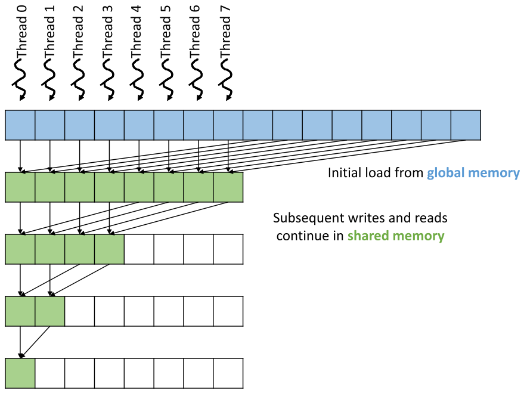

*Figure 10.9 — global memory 접근을 줄이기 위해 shared memory 를 사용한다. (책 p.236)*

---

### 2. 코드

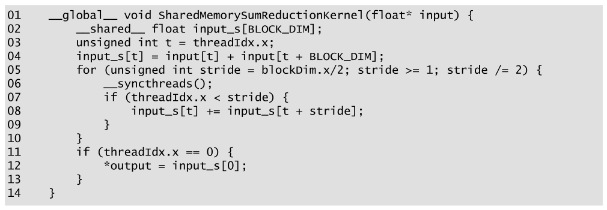

*Figure 10.10 — global memory 접근을 줄이려고 shared memory 를 쓰는 kernel. (책 p.237)*

```cuda
01  __global__ void SharedMemorySumReductionKernel(float* input, float* output) {
02      __shared__ float input_s[BLOCK_DIM];
03      unsigned int t = threadIdx.x;
04      input_s[t] = input[t] + input[t + BLOCK_DIM];
05      for (unsigned int stride = blockDim.x/2; stride >= 1; stride /= 2) {
06          __syncthreads();
07          if (threadIdx.x < stride) {
08              input_s[t] += input_s[t + stride];
09          }
10      }
11      if (threadIdx.x == 0) {
12          *output = input_s[0];
13      }
14  }
```

| 줄 | 하는 일 | 짚을 점 |
|---|---|---|
| **02** | shared 배열 `input_s[BLOCK_DIM]` | thread 하나당 원소 하나 |
| **04** | **thread 하나가 원본 원소 둘을 읽어 더한 뒤** shared 에 쓴다 | **첫 반복을 loop 밖에서 해치운 것**이다. 두 읽기 모두 coalesced |
| **05** | loop 가 `blockDim.x` 가 아니라 **`blockDim.x/2`** 에서 시작 | 첫 반복을 이미 했으므로 |
| **06** | `__syncthreads()` 가 **loop 맨 앞**으로 옮겨졌다 | 04번 줄의 shared 쓰기와 첫 반복 사이를 동기화하기 위해 |
| **08** | 읽기·쓰기가 전부 **shared** | |
| **11~13** | Thread 0 이 결과를 출력에 쓴다 | 이전 kernel 들과 같은 동작 |

> **원문 오기** (Figure 10.10, 책 p.237). 01번 줄의 인자 목록이
> `SharedMemorySumReductionKernel(float* input)` 인데 **`float* output` 이 빠져 있다.**
> 12번 줄이 `*output = input_s[0];` 으로 그것을 쓰므로 **컴파일되지 않는다.**
> 위 코드는 바로잡은 것이다. 앞뒤 kernel (Figure 10.5, 10.8, 10.14) 은
> 모두 `(float* input, float* output)` 을 받는다.

> **원문 오기** (책 p.236). 본문이 "the for-loop starts with `blockDim.x/2` **(line 04)**
> instead of `blockDim.x`" 라고 쓴다. for-loop 는 **05번 줄**이고 04번 줄은
> 두 원소를 읽어 더하는 줄이다. 같은 문단이 그 04번 줄을 앞에서 이미
> "(line 04)" 로 가리켰으므로 줄 번호를 그대로 복사한 것으로 보인다.

#### 왜 barrier 가 loop 맨 앞인가

Figure 10.8 은 `__syncthreads()` 가 loop **끝**에 있었는데 여기서는 **앞**이다.
이유는 04번 줄이 loop 밖에 있기 때문이다.

```
04  input_s[t] = ...        ← shared 에 쓰기
05  for (...) {
06      __syncthreads();    ← 04 의 쓰기 + 이전 반복의 쓰기를 한 번에 커버
07      if (...) input_s[t] += input_s[t + stride];
10  }
```

barrier 를 앞에 두면 **loop 밖 초기 쓰기와 loop 안 반복 쓰기를 하나의 barrier 로 커버**한다.
끝에 두려면 04번 줄 뒤에 barrier 를 하나 더 놓아야 한다.

---

### 3. 무엇이 얼마나 줄었나

$$Q_{10.10} = \frac{N}{32} + 1 \tag{1}$$

global memory 접근은 **원본을 처음 읽는 것**과 **결과를 마지막에 쓰는 것**뿐이다.
즉 원소 $N$ 개 reduction 에 global 접근이 **$N + 1$** 회다.
04번 줄의 두 읽기가 모두 coalesced 이므로 **요청**은 $\frac{N}{32} + 1$ 개다.

$N = 256$ 이면 $8 + 1 = \mathbf{9}$ 개다. Figure 10.8 의 36 개에서 **$4\times$ 개선**이다
(책 p.237).

| kernel | $N=256$ 요청 | 대 Figure 10.5 |
|---|---|---|
| Figure 10.5 | 141 | — |
| Figure 10.8 | 36 | $3.9\times$ |
| **Figure 10.10** | **9** | $\mathbf{15.7\times}$ |

> **원문 오기** (책 p.237). "...to 8 + 1 = 9 for the shared memory kernel in **Fig. 10.9**"
> 라고 쓴다. Figure 10.9 는 개념 삽화이고 kernel 은 **Figure 10.10** 이다.
> 10.5절 끝의 Fig 10.7/10.8 혼동과 같은 종류다.

**덤으로 얻는 것 하나** — **입력 배열이 훼손되지 않는다** (책 p.237).
원본 값이 프로그램의 다른 곳에서 또 필요하면 이 성질이 요긴하다
(10.3절 연습문제 10.3-3 에서 지적한 문제가 여기서 해결된다).

---

**연습문제 10.6-1.** 04번 줄이 `input[2*t] + input[2*t + 1]` 이었다면
정확성과 성능은 어떻게 되는가?

> **정확성은 같다** — 원소 둘을 더해 shared 에 넣는 것은 마찬가지다.
> **성능은 나빠진다.** warp 의 thread 들이 $0, 2, 4, \ldots$ 와 $1, 3, 5, \ldots$ 를 읽으므로
> 각 읽기가 **256 B 범위**에 흩어져 10.5절이 지적한 그 문제가 그대로 돌아온다.
> `input[t] + input[t + BLOCK_DIM]` 은 **두 읽기 모두 연속 32개**라 완벽히 coalesced 다.

**연습문제 10.6-2.** 이 kernel 의 shared memory 사용량은 얼마이고,
4장 기준으로 occupancy 에 영향을 주는가? `BLOCK_DIM = 1024` 로 답하라.

> $1024 \times 4\ \text{B} = 4096$ B = **4 KB**.
> H100 은 SM 당 thread 2048개이므로 1024-thread block 이 **2개** 올라가고
> shared 는 $2 \times 4 = 8$ KB — SM 용량(수백 KB)에 견주면 무시할 만하다.
> **thread 슬롯이 먼저 걸리므로 shared 는 제약이 아니다.**
> (8장 register tiling 에서와 같은 구도다.)

---

## 10.7 Reducing synchronization overhead with warp-level primitives (책 p.237)

### 1. 개념적 이해

Figure 10.10 에서 **`stride` 가 32 이하가 되면 block 안에서 활성인 warp 는 하나뿐**이다.
그런데도 여전히 shared memory 를 거치고 `__syncthreads()` 를 부른다.

**warp 하나 안에서라면 더 가벼운 수단이 있다** (책 p.237).

> CUDA 는 **warp-level primitive** 를 제공한다 — 같은 warp 의 thread 끼리
> **서로 다른 warp 사이에서는 불가능한 방식으로** 데이터를 나누고 동기화하는 함수들이다.

| primitive | 하는 일 |
|---|---|
| **`__syncwarp()`** | `__syncthreads()` 와 같되 **warp 수준**. warp 의 thread 가 갈라졌다면 **재수렴(reconverge)** 시킨다 |
| **warp shuffle 함수** | warp 안의 thread 끼리 **register 에서 직접** 데이터를 교환한다 — shared memory 도 `__syncthreads()` 도 없이 |

이 절에 필요한 것은 shuffle 쪽이고, 그중 **`__shfl_down_sync`** 다.


*Figure 10.11 — `__shfl_down_sync` warp-level primitive. (책 p.238)*

```cuda
T __shfl_down_sync(unsigned mask, T var, unsigned int delta);
```

| 인자 | 뜻 |
|---|---|
| **`mask`** | shuffle 명령을 실행할 때 **warp 의 어느 thread 가 활성인지** 나타낸다 |
| **`var`** | 보내는 thread 가 받는 thread 로 shuffle 할 값 |
| **`delta`** | 보내는 thread 의 index 가 받는 thread 보다 **얼마나 높은지** — 그 간격 |
| **반환값** | 받는 thread 에게 shuffle 된 값. thread $i$ 에게는 **thread $i + \texttt{delta}$ 의 `var`** (단 둘 다 `mask` 에 비트가 세워져 있어야 한다) |

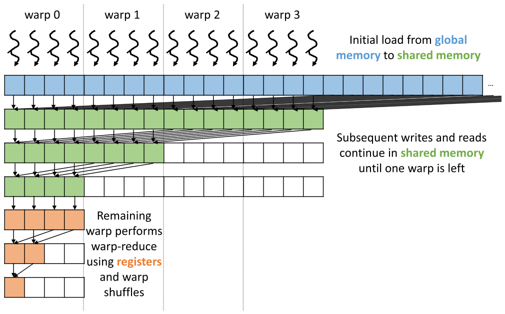

*Figure 10.12 — 마지막 단계에 warp-wide reduction 을 써서 동기화 오버헤드와 shared memory
접근을 줄인다. (책 p.239)*

그림은 이해를 위해 **thread 4개짜리 warp 4개**로 그렸다 (실제로는 1024 thread block 이면
32 thread 짜리 warp 32개다) (책 p.238).

| 구간 | 동작 |
|---|---|
| **앞부분 반복들** | Figure 10.10 과 같다 — shared 에서 둘을 읽어 더하고 shared 에 쓰고, `__syncthreads()` 로 구분. 반복마다 절반이 빠진다 |
| **남은 thread 가 warp 하나가 된 뒤** | **shared memory 도 `__syncthreads()` 도 더는 필요 없다.** thread 들이 shared 에서 register 로 값을 올린 뒤 **register 끼리 shuffle 해서** 남은 reduction tree 를 끝낸다 |

---

### 2. 코드

#### 보조 device 함수 두 개

warp 수준 프로그래밍을 돕기 위해 책이 먼저 정의한다 (책 p.238~239).

```cuda
__device__ unsigned int warpIdx() { return threadIdx.x/WARP_SIZE; }
__device__ unsigned int laneIdx() { return threadIdx.x%WARP_SIZE; }
```

| 함수 | 뜻 | 예 |
|---|---|---|
| **`warpIdx()`** | block 안에서 **몇 번째 warp** 인가 | thread 0~31 → 0, thread 32~63 → 1 |
| **`laneIdx()`** | warp 안에서 **몇 번째 thread** 인가 (**lane index**) | thread 32 → $32 \bmod 32 = 0$, thread 33 → 1 |

#### warp-wide reduction

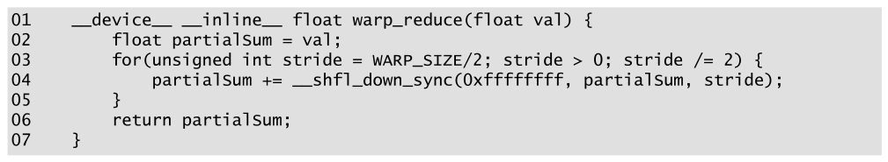

*Figure 10.13 — warp-level primitive 로 warp 전체 reduction 을 수행하는 device 함수.
(책 p.240)*

```cuda
01  __device__ __inline__ float warp_reduce(float val) {
02      float partialSum = val;
03      for(unsigned int stride = WARP_SIZE/2; stride > 0; stride /= 2) {
04          partialSum += __shfl_down_sync(0xffffffff, partialSum, stride);
05      }
06      return partialSum;
07  }
```

| 줄 | 하는 일 | 짚을 점 |
|---|---|---|
| **01** | **warp 의 모든 thread 가 함께 부른다.** 각자 기여할 값 `val` 을 준다 | |
| **02** | 부분합을 `val` 로 초기화 | |
| **03** | `stride` 를 **16 부터** 1 까지 | **왜 16인가**: warp 에 thread 32개 = 값 32개이므로, 첫 반복에 **앞쪽 16개 thread 가 뒤쪽 16개의 값을 받아 누적**한다 |
| **04** | shuffle 로 데이터 교환 + 동기화를 **가볍게** | 아래 참조 |
| **06** | `partialSum` 반환 | **첫 thread 의 반환값만 진짜 결과**라는 약속이다 |

04번 줄의 인자를 하나씩 뜯으면 (책 p.240):

| 인자 | 값 | 뜻 |
|---|---|---|
| `mask` | **`0xffffffff`** | 32비트 전부 1 → **warp 의 모든 thread 가 참여** |
| `var` | `partialSum` | 보내는 thread 가 자기 register 의 이 값을 넘긴다 |
| `delta` | `stride` | 받는 thread 의 index 가 보내는 thread 보다 `stride` 만큼 **낮다** |

즉 warp 안의 thread $i$ 에게 `__shfl_down_sync` 는 **thread $i+\texttt{stride}$ 의
`partialSum`** 을 반환하고, 그것이 자기 부분합에 더해진다.

> **`__syncwarp()` 를 따로 부르지 않는다는 점을 보라.**
> 함수 이름 끝의 **`_sync`** 가 그것이다 — shuffle 자체가 동기화를 포함한다.

#### kernel

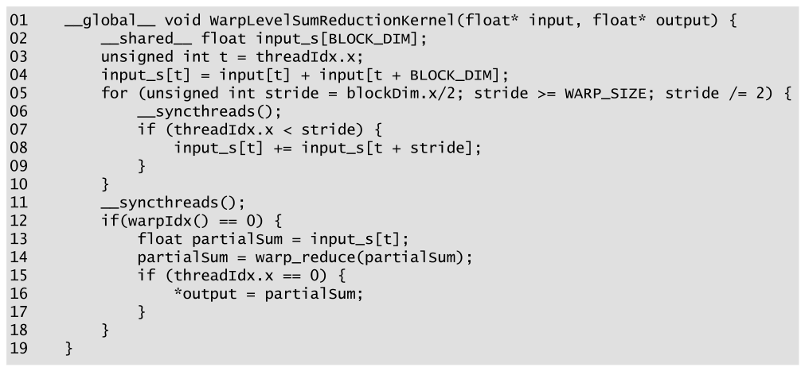

*Figure 10.14 — 동기화 오버헤드와 shared memory 접근을 줄이려고 마지막 단계에
warp-wide reduction 을 쓰는 reduction kernel. (책 p.240)*

```cuda
01  __global__ void WarpLevelSumReductionKernel(float* input, float* output) {
02      __shared__ float input_s[BLOCK_DIM];
03      unsigned int t = threadIdx.x;
04      input_s[t] = input[t] + input[t + BLOCK_DIM];
05      for (unsigned int stride = blockDim.x/2; stride >= WARP_SIZE; stride /= 2) {
06          __syncthreads();
07          if (threadIdx.x < stride) {
08              input_s[t] += input_s[t + stride];
09          }
10      }
11      __syncthreads();
12      if(warpIdx() == 0) {
13          float partialSum = input_s[t];
14          partialSum = warp_reduce(partialSum);
15          if (threadIdx.x == 0) {
16              *output = partialSum;
17          }
18      }
19  }
```

01~10번 줄은 Figure 10.10 과 거의 같고 **05번 줄의 종료 조건만 다르다** (책 p.240~241).

| 줄 | 변화 |
|---|---|
| **05** | `stride >= 1` → **`stride >= WARP_SIZE`** — `stride` 가 32 에 이르면 loop 를 끝낸다 |
| **11** | loop 뒤 barrier 하나 — 마지막 반복의 shared 쓰기를 12번 줄 이후에 보이게 한다 |
| **12** | **warp 0 만** 계속 실행한다 |
| **13** | 남은 warp 의 각 thread 가 자기 몫을 shared 에서 **register 로** 올린다 |
| **14** | warp 가 함께 `warp_reduce` 를 부른다 → **첫 thread 에 최종 합** |
| **15~17** | thread 0 이 global memory 의 출력에 쓴다 |

**이렇게 해서 `stride` 16 이후의 shared memory 접근과 barrier synchronization 이
전부 사라졌다** (책 p.241).

#### 그 밖의 warp-level primitive

책이 소개하는 것들 (책 p.241).

| | 무엇 |
|---|---|
| **`width` 선택 인자** | `__shfl_down_sync` 를 포함한 warp-level primitive 는 **참여 thread 그룹의 폭**을 지정하는 선택 인자를 더 받는다. 기본값 32 (warp 전체). **8** 을 주면 warp 가 **8개짜리 그룹 4개**로 쪼개져 각 그룹이 독립적으로 primitive 를 수행한다 |
| **다른 shuffle 함수** | `__shfl_sync`, `__shfl_up_sync`, `__shfl_xor_sync` |
| **warp voting 함수** | warp 의 어느 thread 가 어떤 조건을 만족하는지 검사 — **12장에서 예를 본다** |
| **warp match 함수** | warp 의 어느 thread 가 어떤 값이 같은지 검사 |
| **warp reduce 함수** | **정수**에 대한 warp 전체 reduction |

---

### 3. 예제/실습

**연습문제 10.7-1.** `warp_reduce` 를 thread 8개짜리 예로 손으로 따라가라.
`WARP_SIZE = 8`, 각 thread 의 `val` 이 $[1,2,3,4,5,6,7,8]$ 이라고 하자.

`stride` 는 4, 2, 1 이다.

| stride | thread 0 | 1 | 2 | 3 | 4 | 5 | 6 | 7 |
|---|---|---|---|---|---|---|---|---|
| 초기 | 1 | 2 | 3 | 4 | 5 | 6 | 7 | 8 |
| **4** | $1{+}5{=}6$ | $2{+}6{=}8$ | $3{+}7{=}10$ | $4{+}8{=}12$ | (쓰레기) | | | |
| **2** | $6{+}10{=}16$ | $8{+}12{=}20$ | | | | | | |
| **1** | $16{+}20{=}\mathbf{36}$ | | | | | | | |

> thread 0 이 $36 = 1+2+\cdots+8$ ✓
> **thread 4~7 의 값은 의미 없는 쓰레기가 된다** — `__shfl_down_sync` 가
> warp 밖을 가리키면 **보내는 thread 자신의 값**을 반환하기 때문이다.
> 그래서 06번 줄에 "첫 thread 의 반환값만 진짜"라는 약속이 붙는다.

**연습문제 10.7-2.** 12번 줄이 `if(warpIdx() == 0)` 인데
`if(threadIdx.x < WARP_SIZE)` 로 써도 같은가?

> **같다.** `warpIdx() == 0` ⟺ `threadIdx.x / 32 == 0` ⟺ `threadIdx.x < 32`.
> 실제로 **Figure 10.18 은 후자를 쓴다** (14번 줄).
> 같은 책 안에서 두 표현이 섞여 있으니, 읽을 때 같은 것임을 알아두면 된다.

**연습문제 10.7-3.** 11번 줄의 `__syncthreads()` 를 빼면?

> 05~10번 줄 loop 의 **마지막 반복**(`stride == WARP_SIZE`)에서
> warp 0 의 thread 들이 `input_s[t] += input_s[t+32]` 를 쓴다.
> 이 쓰기는 warp 0 안에서 일어나므로 warp 0 이 13번 줄에서 읽을 때
> **같은 warp 라 lockstep 으로 안전해 보인다.**
> 그러나 loop 의 그 이전 반복들에서는 **warp 1 이상**이 `input_s` 에 썼고,
> 06번 줄 barrier 는 **그 반복의 시작**에 있으므로 마지막 쓰기를 덮지 못한다.
> **11번 줄이 없으면 warp 0 이 다른 warp 의 마지막 쓰기를 못 볼 수 있다.**

---

## 10.8 Further reducing synchronization overhead (책 p.241)

### 1. 개념적 이해

Figure 10.14 는 **마지막 몇 반복**의 오버헤드를 없앴다.
**앞쪽 반복들은 아직 그대로**다 (책 p.241).

> 없애는 방법 하나는 **앞 단계에서도 warp-wide reduction 을 쓰는 것**이다.
> block 의 **각 warp 가 입력의 한 구획에 warp-wide reduction 을 수행**해
> 부분합을 shared memory 에 놓고, 그 다음 **warp 하나가 그 부분합들을 warp-wide reduction**
> 한다.

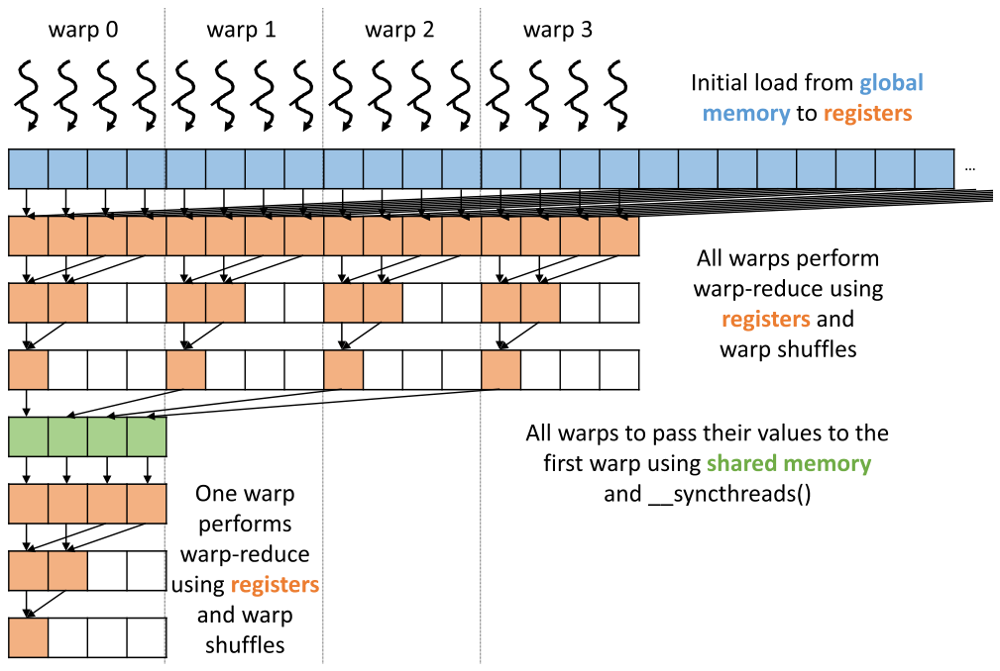

*Figure 10.15 — 2단계 warp-wide reduction 으로 동기화 오버헤드와 shared memory 접근을
더 줄인다. (책 p.242)*

| 단계 | 동작 |
|---|---|
| **1단계** | 각 warp 가 자기 담당 원소들을 읽어 **warp-wide reduction** 을 한다. 끝나면 **각 warp 의 첫 thread 가 그 warp 몫의 총합**을 갖는다. 그 thread 들이 shared memory 에 쓰고 `__syncthreads()` |
| **2단계** | **첫 warp** 가 그 부분합들을 집어 또 한 번 warp-wide reduction 으로 총합을 만든다 |

> **왜 warp 하나면 충분한가** (책 각주 5, p.243). block 은 최대 1024 thread 이고
> warp 는 32 thread 이므로 **block 에 warp 가 최대 32개**다.
> 즉 1단계가 만드는 부분합이 **최대 32개** — warp 하나가 그대로 처리할 수 있다.

---

### 2. 코드

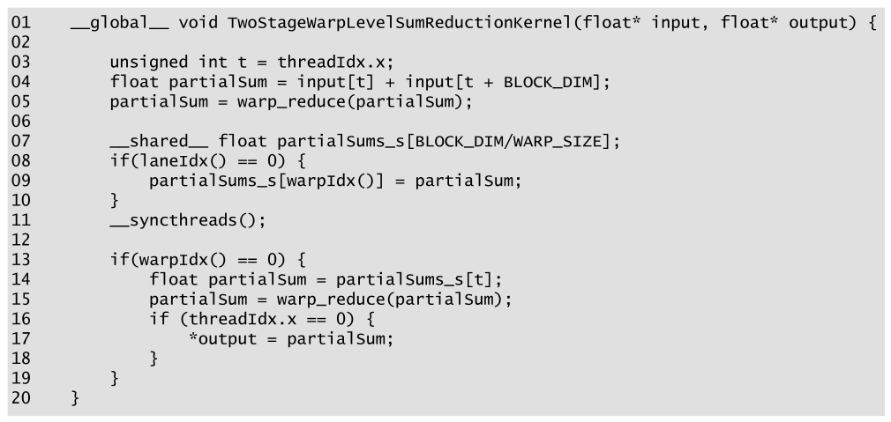

*Figure 10.16 — 2단계 warp-wide reduction 으로 동기화 오버헤드와 shared memory 접근을
더 줄이는 reduction kernel. (책 p.243)*

```cuda
01  __global__ void TwoStageWarpLevelSumReductionKernel(float* input, float* output) {
02
03      unsigned int t = threadIdx.x;
04      float partialSum = input[t] + input[t + BLOCK_DIM];
05      partialSum = warp_reduce(partialSum);
06
07      __shared__ float partialSums_s[BLOCK_DIM/WARP_SIZE];
08      if(laneIdx() == 0) {
09          partialSums_s[warpIdx()] = partialSum;
10      }
11      __syncthreads();
12
13      if(warpIdx() == 0) {
14          float partialSum = partialSums_s[t];
15          partialSum = warp_reduce(partialSum);
16          if (threadIdx.x == 0) {
17              *output = partialSum;
18          }
19      }
20  }
```

| 줄 | 하는 일 |
|---|---|
| **04** | 자기 몫 원소 **둘**을 읽어 더해 **register** 에 둔다 — shared 를 아예 안 거친다 |
| **05** | 같은 warp 의 thread 들이 함께 `warp_reduce` — **모든 warp 가 동시에, 서로 독립적으로** |
| **08~10** | **lane index 0** 인 thread(= 그 warp 의 부분합을 가진 thread)가 shared 의 자기 warp 자리에 쓴다 |
| **11** | 모든 warp 가 썼음을 보장하는 barrier — **kernel 전체에서 유일한 barrier** |
| **13~15** | warp 0 이 부분합들을 읽어 다시 `warp_reduce` |
| **16~18** | thread 0 이 출력에 쓴다 |

#### 대가가 있다 — divergence 와 latency 의 맞바꿈

책이 정직하게 정리한다 (책 p.243).

| | Figure 10.14 | Figure 10.16 |
|---|---|---|
| shared 접근 · barrier | 앞 단계에는 **남아 있다** | **두 단계 전환 때 한 번뿐** |
| control divergence | 반복마다 warp 절반이 통째로 빠져 **divergence 없음** | **1단계 내내 모든 warp 가 활성**인데 shuffle 마다 일부 thread 만 일한다 → **divergence 더 많음** |

> **그런데 이 맞바꿈은 남는 장사다** (책 p.243).
> 데이터가 global memory 에서 올라온 뒤로 reduction kernel 의 성능은 주로 **latency 에 묶인다.**
> shared 접근과 barrier 를 없애면 **long-latency 명령이 줄어든다.**
> 반면 divergent warp 를 없애는 것은 latency bound kernel 에 큰 도움이 안 된다 —
> **divergence 를 없애 아낀 실행 cycle 이 결국 stall cycle 로 대체될 가능성이 높기 때문**이다.

> **주의 — `BLOCK_DIM` 이 1024 가 아니면 14번 줄이 배열 밖을 읽는다.**
> `partialSums_s` 의 크기는 `BLOCK_DIM/WARP_SIZE` 인데 14번 줄은 `partialSums_s[t]` 로
> **`t` 를 0~31 까지** 쓴다. `BLOCK_DIM = 1024` 이면 크기가 정확히 32라 딱 맞지만,
> 예컨대 `BLOCK_DIM = 256` 이면 크기가 **8** 이라 `t = 8..31` 이 범위를 넘는다.
> 책 각주 5 가 "최대 1024 thread" 를 전제로 삼고 있어 본문은 이를 다루지 않는다.
> 일반화하려면 이렇게 막는다.
>
> ```cuda
> unsigned int nWarps = BLOCK_DIM/WARP_SIZE;
> float partialSum = (t < nWarps) ? partialSums_s[t] : 0.0f;   // identity 로 채운다
> ```
>
> **identity value 로 채운다**는 10.1절의 개념이 여기서 실전으로 쓰인다.

---

### 3. barrier 가 몇 개나 줄었나

`BLOCK_DIM = 1024` (즉 $N = 2048$) 기준으로 세어 보면:

| kernel | barrier 실행 횟수 | 근거 |
|---|---|---|
| Figure 10.5 · 10.8 | **11** | 반복 11번, 반복마다 하나 |
| Figure 10.10 | **10** | loop 가 `stride` 512→1 로 10회 |
| Figure 10.14 | **6** | loop 가 512→32 로 5회 + 11번 줄 하나 |
| **Figure 10.16** | **1** | 11번 줄 하나뿐 |

**11 → 1 이다.**

---

**연습문제 10.8-1.** Figure 10.16 에서 07번 줄의 `__shared__` 선언이
04·05번 줄보다 **뒤에** 있다. 문제가 되는가?

> **되지 않는다.** `__shared__` 변수는 **block 전체의 수명**을 가지며
> 컴파일 타임에 자리가 정해진다. C++ 의 선언 위치는 **가시 범위**만 정할 뿐이고,
> 08번 줄부터 쓰이므로 07번 줄 선언이면 충분하다.
> 다만 읽는 사람에게는 kernel 맨 위에 모아 두는 편이 친절하다.

**연습문제 10.8-2.** 14번 줄이 `float partialSum` 을 **다시 선언**한다 (04번 줄에도 있다).
의도된 것인가?

> 의도된 shadowing 이다. 13번 줄의 if 블록 안에서 **새 변수**를 만든 것이고,
> 바깥의 `partialSum`(그 warp 의 1단계 부분합)과는 다른 값이다.
> Figure 10.14 의 13번 줄도 같은 형태다.
> 다만 **같은 이름을 쓰는 것은 읽기에 위험하다** — `blockPartialSum` 처럼 구분하는 편이 낫다.

**연습문제 10.8-3.** Figure 10.16 의 1단계에서 divergence 가 더 많다는 것을 세어 보라.
`WARP_SIZE = 32` 이고 warp 가 32개라 하자.

> `warp_reduce` 는 5번 반복한다 (stride 16, 8, 4, 2, 1).
> shuffle 자체는 warp 의 32 thread 가 **모두 실행**하지만,
> **결과가 쓸모 있는 thread 는 각각 16, 8, 4, 2, 1 개**다.
> 즉 warp 자원 32단위를 매번 먹으면서 유효 작업은 16→1 로 준다.
> 32개 warp 가 전부 이것을 5번씩 하므로 **자원 $32 \times 5 \times 32 = 5120$,
> 유효 $32 \times 31 = 992$ → 효율 19.4%** 다.
> Figure 10.14 는 같은 구간에서 warp 를 반씩 떨어뜨려 훨씬 낫다.
> **그런데도 Figure 10.16 이 빠르다는 것이 책의 주장이고, 근거는 "latency bound 이므로
> 아낀 cycle 이 stall 로 대체된다" 는 것이다.**

---

## 10.9 Reduction for arbitrary length inputs (책 p.244)

### 1. 개념적 이해

지금까지의 kernel 은 전부 **block 하나**로 launch 된다고 가정했다.
이유는 `__syncthreads()` 를 **모든 활성 thread 사이의 barrier** 로 쓰기 때문이고,
그것은 **같은 block 안에서만** 가능하다 (책 p.244).

**그래서 병렬성이 현재 하드웨어의 1024 thread 로 묶인다.**
수백만~수십억 원소짜리 입력이라면 thread 를 더 풀어야 한다.

> block 사이의 barrier synchronization 은 좋은 수단이 없으므로,
> **서로 다른 block 의 thread 를 독립적으로 실행시켜야 한다.**

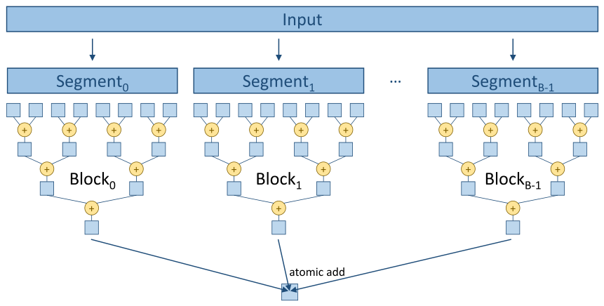

*Figure 10.17 — atomic 연산을 쓰는 multi-block reduction. (책 p.244)*

| | |
|---|---|
| **분할** | 입력 배열을 **block 에 적당한 크기의 구획(segment)** 으로 나눈다 |
| **독립 실행** | 모든 block 이 **독립적으로** reduction tree 를 수행한다 |
| **합류** | 결과를 **atomic add** 로 최종 출력에 누적한다 |

**9장이 여기서 쓰인다.** 다만 9장과 결정적으로 다른 점이 있다 —
**atomic 을 쏘는 것이 원소마다가 아니라 block 마다 한 번**이다.
$N = 2^{20}$, block 당 2048 원소면 atomic 은 **512번**뿐이다.

---

### 2. 코드

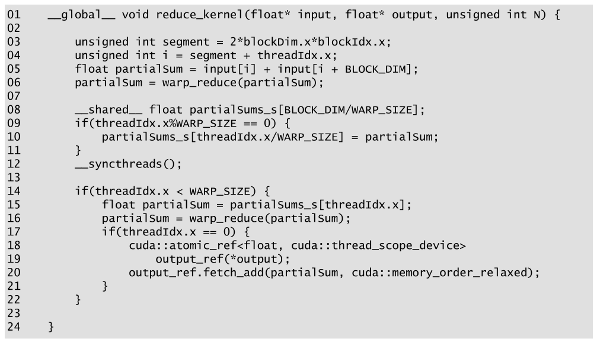

*Figure 10.18 — atomic 연산을 쓰는 multi-block sum reduction kernel. (책 p.245)*

```cuda
01  __global__ void reduce_kernel(float* input, float* output, unsigned int N) {
02
03      unsigned int segment = 2*blockDim.x*blockIdx.x;
04      unsigned int i = segment + threadIdx.x;
05      float partialSum = input[i] + input[i + BLOCK_DIM];
06      partialSum = warp_reduce(partialSum);
07
08      __shared__ float partialSums_s[BLOCK_DIM/WARP_SIZE];
09      if(threadIdx.x%WARP_SIZE == 0) {
10          partialSums_s[threadIdx.x/WARP_SIZE] = partialSum;
11      }
12      __syncthreads();
13
14      if(threadIdx.x < WARP_SIZE) {
15          float partialSum = partialSums_s[threadIdx.x];
16          partialSum = warp_reduce(partialSum);
17          if(threadIdx.x == 0) {
18              cuda::atomic_ref<float, cuda::thread_scope_device>
19                  output_ref(*output);
20              output_ref.fetch_add(partialSum, cuda::memory_order_relaxed);
21          }
22      }
23
24  }
```

Figure 10.16 과 비교하면 **바뀐 곳이 셋**이다 (책 p.244~245).

| 줄 | 변화 | 왜 |
|---|---|---|
| **03** | `segment = 2*blockDim.x*blockIdx.x` | 구획 크기가 `2*blockDim.x` 이므로, block index 를 곱하면 그 block 이 맡을 구획의 **시작 위치**가 된다. thread 1024개면 구획 2048, 시작 위치는 block 0 → 0, block 1 → 2048, block 2 → 4096, … |
| **04~05** | `i = segment + threadIdx.x` 를 쓴다 | block 안에서는 **입력 전체를 다루듯** 자기 구획만 보면 된다 |
| **17~21** | thread 0 이 출력에 쓰는 대신 **atomic add 로 누적** | 여러 block 의 leader thread 가 race 없이 합류한다 |

#### atomic 이 순서를 보장하지 않는다는 점

> **미묘하지만 중요한 지점** (책 p.245).
> atomic 을 써서 부분합을 합치면 **block 들이 서로 임의의 순서로 기여**할 수 있다.
> atomic 은 **상호 배제(mutual exclusion)만 보장하고 순서는 보장하지 않기** 때문이다.
> 따라서 **연산자가 교환적이면서 결합적이어야** atomic 으로 임의 길이 입력에 일반화할 수 있다.

10.2절 (1)·(2)에서 깔아 둔 두 성질이 **여기서 둘 다** 필요해진다.

#### atomic 을 안 쓰는 대안

책이 제시하는 것들 (책 p.245~246):

| 방법 | 언제 |
|---|---|
| block leader 가 **부분합 배열**에 block index 로 쓰고, **block 하나짜리 kernel 을 새로 launch** 해 그것을 줄인다 | atomic 이 없거나 비쌀 때 |
| 부분합 배열을 **host memory 로 복사해 CPU 가 마무리** | 마찬가지 |

> 두 대안 모두 **부분합이 누적되는 순서를 프로그래머가 통제할 수 있다** (책 p.246).
> 부동소수점 재현성이 중요한 경우에 의미가 있다 (10.2-3 연습문제 참조).

> **주의 두 가지.**
> ① **`N` 인자를 받지만 kernel 이 쓰지 않는다.** 경계 검사가 어디에도 없어
> `N` 이 `2*blockDim.x*gridDim.x` 의 배수가 아니면 배열 밖을 읽는다.
> 10.12절 연습문제 5 가 바로 이 문제를 (Figure 10.20 에 대해) 고치라고 시킨다.
> ② **`partialSums_s[threadIdx.x]`(15번 줄)** 도 Figure 10.16 과 같은 범위 문제를 갖는다 —
> `BLOCK_DIM` 이 1024 일 때만 딱 맞는다.
>
> 그리고 이 kernel 은 09·10·14번 줄에서 `laneIdx()`·`warpIdx()` 헬퍼 대신
> `threadIdx.x%WARP_SIZE` 를 직접 쓴다. **동작은 같고 표기만 다르다.**

---

### 3. 예제/실습

**연습문제 10.9-1.** $N = 2^{20}$, block 당 thread 1024개일 때
block 수와 atomic 연산 횟수는? 9장 Figure 9.6 방식이었다면 몇 번이었겠는가?

> 구획 크기 $= 2 \times 1024 = 2048$ → block 수 $= 2^{20}/2048 = \mathbf{512}$.
> atomic 은 block 당 하나이므로 **512번**.
> 9장 Figure 9.6 처럼 원소마다 atomic 이었다면 $2^{20} = \mathbf{1{,}048{,}576}$ 번 —
> **$2048\times$ 차이**다.
> 그리고 이 512번은 **모두 같은 주소**에 몰리므로 9.3절의 $1/(2L)$ 이 그대로 적용된다.
> DRAM 200 cycle 기준 $512 \times 400 = 204{,}800$ cycle $= 0.2$ ms — 감당할 만하다.

**연습문제 10.9-2.** 이 kernel 을 launch 하기 전에 host 가 반드시 해야 할 일은?

> **`*output` 을 0(덧셈의 identity)으로 초기화**해야 한다.
> `fetch_add` 로 누적하기만 하므로 초기값이 쓰레기면 결과도 쓰레기다.
> 9장 Figure 9.9 의 `bins_pool` 과 똑같은 구도다 — **kernel 은 초기화하지 않고,
> 책도 명시하지 않는다.**

---

## 10.10 Thread coarsening to reduce overhead (책 p.246)

### 1. 개념적 이해

지금까지의 kernel 은 전부 **thread 를 최대한 많이 써서 병렬성을 최대화**했다.
$N$ 원소 reduction 에 thread $N/2$ 개, block 크기 1024 이면 block $N/2048$ 개다.

> **그런데 실행 자원이 유한한 프로세서에서는** 하드웨어가 그 block 중 일부만
> 병렬로 돌릴 수 있다. 나머지는 **스케줄러가 직렬화**해서, 하나가 끝나면 다음을 올린다
> (책 p.246).

여기서 이 장 전체를 관통하는 관찰이 나온다.

> **reduction 을 병렬화하려고 우리는 비싼 값을 치렀다.**
> reduction tree 는 단계가 진행될수록 thread 가 놀아 **하드웨어 저활용이 심해진다.**
> 그리고 **그 저활용 구간이 launch 하는 block 마다 반복된다.**
>
> block 들이 **정말로 병렬로 돈다면** 그것은 피할 수 없는 값이다.
> **그러나 하드웨어가 어차피 직렬화할 거라면, 우리가 더 효율적인 방식으로
> 직접 직렬화하는 편이 낫다.**

그것이 **thread coarsening** 이다 (6장).

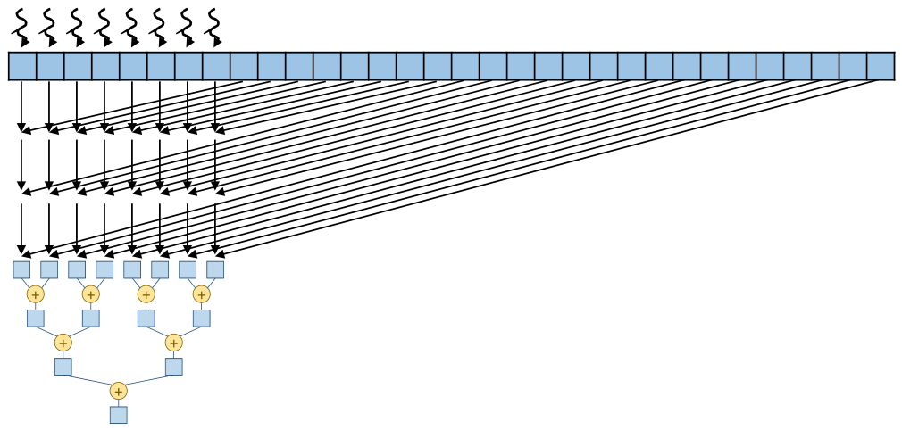

*Figure 10.19 — reduction 에서의 thread coarsening. (책 p.247)*

| | Figure 10.9 (coarsening 없음) | Figure 10.19 (factor 2) |
|---|---|---|
| block 당 원소 | 16 (thread 당 2) | **32** (thread 당 **4**) |
| loop 밖 독립 덧셈 | 1 step | **3 step** |
| 그 동안 thread 활성도 | 전부 | **전부** |
| 동기화 | 불필요 | **불필요** |
| 이후 reduction tree | 같음 | 같음 |

**핵심은 loop 밖의 그 세 step 이다.** 그 동안 **모든 thread 가 활성이고 쓸모 있는 일을 하며,
서로 독립이라 동기화도 필요 없다** (책 p.246).

---

### 2. 코드

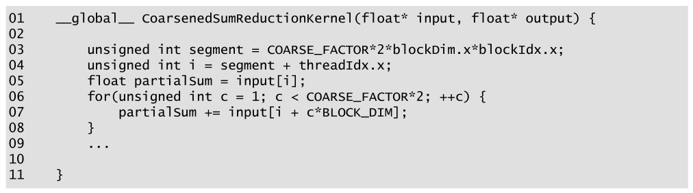

*Figure 10.20 — thread coarsening 을 적용한 sum reduction kernel. (책 p.247)*

```cuda
01  __global__ void CoarsenedSumReductionKernel(float* input, float* output) {
02
03      unsigned int segment = COARSE_FACTOR*2*blockDim.x*blockIdx.x;
04      unsigned int i = segment + threadIdx.x;
05      float partialSum = input[i];
06      for(unsigned int c = 1; c < COARSE_FACTOR*2; ++c) {
07          partialSum += input[i + c*BLOCK_DIM];
08      }
09      ...                     // 이후는 Figure 10.18 과 같다
10
11  }
```

Figure 10.18 과 **다른 곳은 둘**이다 (책 p.247).

| 줄 | 변화 |
|---|---|
| **03** | 구획 시작 위치에 **`COARSE_FACTOR` 를 곱한다** — 구획이 그만큼 커졌으므로 |
| **05~08** | 원소 둘을 더하던 것(Figure 10.18 의 05번 줄)이 **coarsening loop** 로 바뀌었다. `COARSE_FACTOR*2` 개 원소를 순회하며 더한다 |

**loop 안에서 모든 thread 가 활성이고, 부분합은 지역 변수 `partialSum` 에 쌓이며,
`__syncthreads()` 를 부르지 않는다** — thread 들이 서로 독립이기 때문이다 (책 p.247).

> **접근 패턴을 확인하자.** 07번 줄이 `input[i + c*BLOCK_DIM]` 이므로
> **반복 `c` 마다 block 전체가 연속한 `BLOCK_DIM` 개 원소를 함께 읽는다** —
> 9.5절의 **interleaved partitioning** 과 같은 형태이고 **coalesced** 다.
> `input[i*COARSE_FACTOR*2 + c]` 였다면 contiguous partitioning 이 되어 망가졌을 것이다.

> **원문 오기** (Figure 10.20, 책 p.247). 01번 줄이
> `__global__ CoarsenedSumReductionKernel(float* input, float* output) {` 으로
> **반환형 `void` 가 빠져 있다.** 이 책의 다른 kernel 은 모두 `__global__ void` 다.
> 위 코드는 바로잡은 것이다.

---

### 3. 왜 이득인가 — step 단위로 세어 보기

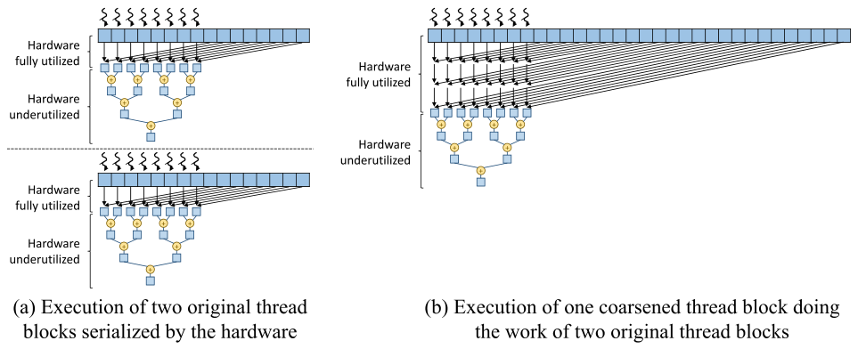

*Figure 10.21 — thread coarsening 을 적용한 병렬 reduction 과 적용하지 않은 것의 비교.
(책 p.248)*

Figure 10.21(a) 는 **coarsening 없는 block 두 개를 하드웨어가 직렬화**한 것이고,
(b) 는 **factor 2 로 coarsening 한 block 하나**가 같은 일을 하는 것이다.

| | (a) block 2개 직렬 | (b) coarsened block 1개 |
|---|---|---|
| 전체 step | **8** | **6** |
| 하드웨어 **완전 활용** step | **2** | **3** |
| 하드웨어 **저활용** step | **6** | **3** |
| barrier · shared 접근이 필요한 step | 6 | 3 |

**(a) 는 block 마다 "전부 활성인 1 step + 저활용 3 step" 을 두 번 반복**한다.
**(b) 는 "전부 활성인 3 step + 저활용 3 step" 을 한 번만** 한다.

> **thread coarsening 은 하드웨어 저활용·동기화·shared memory 접근에서 오는
> 오버헤드를 효과적으로 줄인다** (책 p.248).

#### 그러나 factor 를 무한정 키울 수는 없다

> coarsening 할수록 **병렬로 하는 일이 줄어든다** (책 p.248).
> factor 를 너무 키워 **하드웨어가 실행할 수 있는 것보다 적은 block 을 launch** 하면
> 가용한 병렬 실행 자원을 다 쓰지 못한다.
>
> **가장 좋은 coarsening factor 는 하드웨어를 꽉 채울 만큼의 block 이 남는 지점**이고,
> 그것은 **입력 전체 크기와 그 장치의 특성**에 달렸다.

6.5절·8.5절·9.5절에서 세 번 본 것과 같은 결론이다 —
**"직렬화해도 남는 병렬성"까지만 키운다.**

---

**연습문제 10.10-1.** `COARSE_FACTOR = 4`, `BLOCK_DIM = 1024` 일 때
block 하나가 처리하는 원소 수와, $N = 2^{24}$ 에 필요한 block 수는?
`COARSE_FACTOR = 1` 일 때와 비교하라.

> block 당 원소 $= \texttt{COARSE\_FACTOR} \times 2 \times \texttt{blockDim.x} = 4 \times 2 \times 1024 = \mathbf{8192}$.
> block 수 $= 2^{24}/8192 = \mathbf{2048}$.
> `COARSE_FACTOR = 1` 이면 block 당 2048 원소, block 수 $= 8192$.
> **block 수가 $4\times$ 줄었다.** 그만큼 저활용 구간·barrier·atomic 도 $4\times$ 줄었다.
> (atomic 은 8192번 → 2048번.)

**연습문제 10.10-2.** 07번 줄이 `input[i*COARSE_FACTOR*2 + c]` 였다면
결과와 성능은 어떻게 되는가? (05번 줄도 그에 맞게 고친다고 하자)

> **결과는 같다** — 어차피 같은 원소들을 다 더한다 (덧셈은 결합·교환적이다).
> **성능은 크게 나빠진다.** warp 의 thread 들이 `COARSE_FACTOR*2` 만큼 떨어진 주소를
> 읽으므로 coalescing 이 무너진다. `COARSE_FACTOR = 4` 면 warp 하나가
> 8 원소 간격으로 32곳을 건드려 **가져온 데이터의 1/8 만 쓴다.**
> 9.5절이 CPU 와 GPU 의 차이로 설명한 그 문제다.

**연습문제 10.10-3.** coarsening 이 **atomic 경쟁**에도 도움이 되는가?

> 된다. block 하나가 atomic 하나를 쏘므로 **atomic 횟수 = block 수**다.
> coarsening factor 를 $k$ 배 키우면 block 수가 $1/k$ 이 되고 atomic 도 $1/k$ 이 된다.
> 9.5절에서는 coarsening 이 **경쟁이 아니라 사본 초기화·병합 비용**을 줄였는데,
> 여기서는 **경쟁 자체**도 줄인다 — 부분합을 합류시키는 주체가 block 이기 때문이다.

---

## 10.11 Summary (책 p.249)

책의 정리를 옮기면 (책 p.249):

- 병렬 reduction 패턴은 **많은 데이터 처리 응용에서 핵심 역할**을 하므로 중요하다.
  순차 코드는 단순하지만, **높은 성능의 병렬 실행을 얻으려면 여러 기법이 필요하다**는 것이
  분명해졌을 것이다.
- 그 기법들은 이렇다 — **divergence 를 줄이는 thread index 배정**,
  **global memory 접근을 줄이는 shared memory**,
  **barrier synchronization 과 shared memory 접근을 줄이는 warp-level primitive**,
  **atomic 연산을 쓰는 multi-block reduction**, 그리고 **thread coarsening**.
- reduction 은 **prefix-sum 패턴의 중요한 기초**이기도 하다.
  prefix-sum 은 많은 응용을 병렬화하는 데 중요한 알고리즘 구성요소이고 **다음 장의 주제**다.
- 다시 강조하지만 실무에서 병렬 reduction 을 바닥부터 구현할 필요는 없다 —
  **Thrust 와 CUB** 가 GPU 에 고도로 최적화된 구현을 제공한다.
  그럼에도 병렬 reduction 은 **많은 응용 맥락에 적용되는 병렬화·최적화 기법을 소개하기에
  훌륭한 매개체**다.

---

## 10.12 Exercises (책 p.249)

### 연습문제 1

> Figure 10.5 의 단순 reduction kernel 에서 원소가 1024개이고 warp 크기가 32라면,
> **5번째 반복**에서 block 안의 몇 개 warp 에 divergence 가 있는가?

원소 1024개 → thread 512개 → **warp 16개**.

5번째 반복의 `stride` 는 $2^4 = 16$ 이고, 활성 thread 는 **16의 배수**다.
warp 하나(연속한 thread 32개)에는 16의 배수가 **정확히 2개** 있다.

$$\text{활성 } 2 \text{개} < 32 \;\Rightarrow\; \text{모든 warp 가 divergent}$$

$$\mathbf{16}\ \text{개 warp}$$

### 연습문제 2

> Figure 10.8 의 개선된 kernel 에서 원소가 1024개이고 warp 크기가 32라면,
> **5번째 반복**에서 몇 개 warp 에 divergence 가 있는가?

thread 512개 → warp 16개. `stride` 는 512, 256, 128, 64, **32** 로 줄어드므로
5번째 반복의 `stride` 는 **32** 다.

활성 thread 는 `threadIdx.x < 32` — 즉 **warp 0 의 32개 thread 전부**다.
warp 1~15 는 **전부 비활성**이다.

| warp | 활성 thread | divergent? |
|---|---|---|
| 0 | 32 / 32 | ❌ (전부 활성) |
| 1~15 | 0 / 32 | ❌ (전부 비활성) |

$$\mathbf{0}\ \text{개}$$

> **16 대 0.** 같은 반복에서 divergence 가 완전히 사라졌다.
> 10.4절의 효율 계산이 이 한 쌍의 숫자로 요약된다.

### 연습문제 3

> Figure 10.8 의 kernel 을 아래 그림의 접근 패턴을 쓰도록 고쳐라.

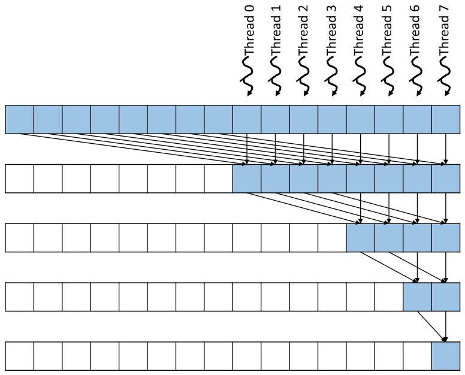

*연습문제 3 의 접근 패턴. (책 p.249)*

그림을 읽으면 Figure 10.7 의 **거울상**이다.
thread 들이 배열의 **뒤쪽 절반**을 소유하고, 앞쪽에서 값을 끌어와 더하며,
결과가 **마지막 원소**로 모인다.

원소 16개, thread 8개로 단계를 세면:

| step | stride | 활성 thread | 하는 일 |
|---|---|---|---|
| 0 | 8 | 0~7 (전부) | `input[8..15] += input[0..7]` |
| 1 | 4 | 4~7 | `input[12..15] += input[8..11]` |
| 2 | 2 | 6~7 | `input[14..15] += input[12..13]` |
| 3 | 1 | 7 | `input[15] += input[14]` |

```cuda
__global__ void MirroredSumReductionKernel(float* input, float* output) {
    unsigned int i = blockDim.x + threadIdx.x;        // 뒤쪽 절반을 소유
    for (unsigned int stride = blockDim.x; stride >= 1; stride /= 2) {
        if (threadIdx.x >= blockDim.x - stride) {     // 위쪽 stride 개 thread
            input[i] += input[i - stride];
        }
        __syncthreads();
    }
    if (threadIdx.x == blockDim.x - 1) {
        *output = input[2*blockDim.x - 1];
    }
}
```

세 군데가 Figure 10.8 과 다르다.

| | Figure 10.8 | 이 kernel |
|---|---|---|
| 소유 위치 | `threadIdx.x` (앞 절반) | **`blockDim.x + threadIdx.x`** (뒤 절반) |
| 활성 조건 | `threadIdx.x < stride` (아래쪽) | **`threadIdx.x >= blockDim.x - stride`** (위쪽) |
| 더하는 방향 | `input[i + stride]` | **`input[i - stride]`** |
| 최종 결과 | `input[0]`, thread 0 이 쓴다 | **`input[2*blockDim.x - 1]`**, 마지막 thread 가 쓴다 |

> **성능은 Figure 10.8 과 같다.** divergence 도, coalescing 도 똑같다 —
> 중요한 것은 **활성 thread 가 연속한 index 를 이룬다**는 사실뿐이고,
> 그것이 아래쪽에 몰리든 위쪽에 몰리든 상관없기 때문이다.
> 활성 warp 수의 총합도 같아 자원 소비 $(2W+4)\cdot32$ 가 그대로다.

### 연습문제 4

> Figure 10.20 의 kernel 을 sum 대신 **max reduction** 을 하도록 고쳐라.

바꿔야 할 곳은 **연산자와 identity value 둘**이다 (10.1절).

```cuda
__global__ void CoarsenedMaxReductionKernel(float* input, float* output) {

    unsigned int segment = COARSE_FACTOR*2*blockDim.x*blockIdx.x;
    unsigned int i = segment + threadIdx.x;
    float partialMax = input[i];                              // ① identity 대신 첫 원소
    for(unsigned int c = 1; c < COARSE_FACTOR*2; ++c) {
        partialMax = fmaxf(partialMax, input[i + c*BLOCK_DIM]);   // ② + → fmaxf
    }
    partialMax = warp_reduce_max(partialMax);                 // ③ warp 함수도 max 로

    __shared__ float partialMaxs_s[BLOCK_DIM/WARP_SIZE];
    if(threadIdx.x%WARP_SIZE == 0) {
        partialMaxs_s[threadIdx.x/WARP_SIZE] = partialMax;
    }
    __syncthreads();

    if(threadIdx.x < WARP_SIZE) {
        float partialMax = partialMaxs_s[threadIdx.x];
        partialMax = warp_reduce_max(partialMax);
        if(threadIdx.x == 0) {
            cuda::atomic_ref<float, cuda::thread_scope_device>
                output_ref(*output);
            output_ref.fetch_max(partialMax, cuda::memory_order_relaxed);  // ④
        }
    }
}
```

`warp_reduce` 도 함께 고친다.

```cuda
__device__ __inline__ float warp_reduce_max(float val) {
    float partialMax = val;
    for(unsigned int stride = WARP_SIZE/2; stride > 0; stride /= 2) {
        partialMax = fmaxf(partialMax,
                           __shfl_down_sync(0xffffffff, partialMax, stride));
    }
    return partialMax;
}
```

| | 무엇을 고쳤나 |
|---|---|
| **①** | 05번 줄은 원래도 `input[i]` 로 시작하므로 그대로 둬도 된다. 만약 identity 로 초기화하는 형태였다면 `0.0f` → **`-INFINITY`** 로 바꾼다 |
| **②·③** | 덧셈을 **`fmaxf`** 로 |
| **④** | `fetch_add` → **`fetch_max`**. `cuda::atomic_ref` 가 max 를 지원한다 (9.2절에서 "addition, minimum, maximum, and, or, xor 등"이라 했다) |
| **host** | `*output` 을 **`-INFINITY`** 로 초기화해야 한다 (0 으로 두면 음수만 있는 입력에서 틀린다) |

> **주의 하나.** `fetch_max` 를 `float` 에 쓰는 것은 하드웨어 지원이 제한적일 수 있다.
> 지원되지 않으면 10.9절이 말한 대안 — **부분합(부분최대) 배열 + 2단계 kernel** — 을 쓴다.

### 연습문제 5

> Figure 10.20 의 kernel 이 `COARSE_FACTOR*2*blockDim.x` 의 배수가 아닌 **임의 길이 입력**에도
> 동작하도록 고쳐라. 입력 길이를 나타내는 인자 `N` 을 추가한다.

핵심은 **범위를 벗어난 원소를 identity 로 대체**하는 것이다.

```cuda
__global__ void CoarsenedSumReductionKernel(float* input, float* output,
                                            unsigned int N) {

    unsigned int segment = COARSE_FACTOR*2*blockDim.x*blockIdx.x;
    unsigned int i = segment + threadIdx.x;

    float partialSum = (i < N) ? input[i] : 0.0f;              // ① 첫 원소도 검사
    for(unsigned int c = 1; c < COARSE_FACTOR*2; ++c) {
        unsigned int j = i + c*BLOCK_DIM;
        if (j < N) { partialSum += input[j]; }                 // ② 매 원소 검사
    }
    partialSum = warp_reduce(partialSum);

    __shared__ float partialSums_s[BLOCK_DIM/WARP_SIZE];
    if(threadIdx.x%WARP_SIZE == 0) {
        partialSums_s[threadIdx.x/WARP_SIZE] = partialSum;
    }
    __syncthreads();

    if(threadIdx.x < WARP_SIZE) {
        unsigned int nWarps = BLOCK_DIM/WARP_SIZE;
        float partialSum = (threadIdx.x < nWarps)              // ③ 앞서 지적한 범위 문제
                         ? partialSums_s[threadIdx.x] : 0.0f;
        partialSum = warp_reduce(partialSum);
        if(threadIdx.x == 0) {
            cuda::atomic_ref<float, cuda::thread_scope_device>
                output_ref(*output);
            output_ref.fetch_add(partialSum, cuda::memory_order_relaxed);
        }
    }
}
```

| | 무엇을 왜 |
|---|---|
| **①** | 05번 줄이 무조건 `input[i]` 를 읽었는데, 마지막 block 의 thread 는 `i >= N` 일 수 있다 |
| **②** | coarsening loop 의 모든 접근에 검사가 필요하다. **`if` 로 건너뛰는 것과 0 을 더하는 것은 같으므로**, `partialSum += (j < N) ? input[j] : 0.0f;` 로 써도 된다 |
| **③** | 10.8절에서 지적한 `partialSums_s` 범위 문제까지 함께 막았다 |
| **launch** | `gridDim.x = ceil(N / (COARSE_FACTOR*2*blockDim.x))` — 2장의 올림 나눗셈 |

> **왜 `warp_reduce` 는 안 고쳐도 되는가.** 범위 밖 thread 의 `partialSum` 이
> **identity 인 0** 이므로 그냥 더해도 결과가 변하지 않는다.
> **identity value 를 쓰면 경계 처리가 조건문 없이 흡수된다** — 10.1절의 개념이
> 여기서 세 번째로 값을 한다.

### 연습문제 6

> 다음 입력 배열에 병렬 reduction 을 적용한다고 하자.
> $$\{6,\ 2,\ 7,\ 4,\ 5,\ 8,\ 3,\ 1\}$$
> 반복마다 배열 내용이 어떻게 바뀌는지 보여라.
> (a) Figure 10.5 의 비최적화 kernel (b) Figure 10.8 의 kernel

원소 8개 → thread 4개 (`blockDim.x = 4`), 반복 3번. 총합은 $6+2+7+4+5+8+3+1 = 36$ 이다.

**(a) Figure 10.5** — `i = 2*threadIdx.x` (소유 위치 0, 2, 4, 6), `stride` 가 1 → 2 → 4

| 반복 | stride | 활성 thread | 수행하는 덧셈 | 배열 |
|---|---|---|---|---|
| — | | | | $\{6,\,2,\,7,\,4,\,5,\,8,\,3,\,1\}$ |
| 1 | 1 | 0,1,2,3 | `[0]+=[1]`, `[2]+=[3]`, `[4]+=[5]`, `[6]+=[7]` | $\{\mathbf{8},\,2,\,\mathbf{11},\,4,\,\mathbf{13},\,8,\,\mathbf{4},\,1\}$ |
| 2 | 2 | 0,2 | `[0]+=[2]`, `[4]+=[6]` | $\{\mathbf{19},\,2,\,11,\,4,\,\mathbf{17},\,8,\,4,\,1\}$ |
| 3 | 4 | 0 | `[0]+=[4]` | $\{\mathbf{36},\,2,\,11,\,4,\,17,\,8,\,4,\,1\}$ |

**(b) Figure 10.8** — `i = threadIdx.x` (소유 위치 0~3), `stride` 가 4 → 2 → 1

| 반복 | stride | 활성 thread | 수행하는 덧셈 | 배열 |
|---|---|---|---|---|
| — | | | | $\{6,\,2,\,7,\,4,\,5,\,8,\,3,\,1\}$ |
| 1 | 4 | 0,1,2,3 | `[0]+=[4]`, `[1]+=[5]`, `[2]+=[6]`, `[3]+=[7]` | $\{\mathbf{11},\,\mathbf{10},\,\mathbf{10},\,\mathbf{5},\,5,\,8,\,3,\,1\}$ |
| 2 | 2 | 0,1 | `[0]+=[2]`, `[1]+=[3]` | $\{\mathbf{21},\,\mathbf{15},\,10,\,5,\,5,\,8,\,3,\,1\}$ |
| 3 | 1 | 0 | `[0]+=[1]` | $\{\mathbf{36},\,15,\,10,\,5,\,5,\,8,\,3,\,1\}$ |

> **두 kernel 모두 답은 36** 이고, **덧셈 횟수도 $4+2+1 = 7 = N-1$ 로 같다.**
> 다른 것은 **활성 thread 가 어디에 있느냐**뿐이다 —
> (a)는 0, 2 처럼 흩어지고 (b)는 0, 1 처럼 붙어 있다.
> **10장 전체가 이 한 가지 차이 위에 서 있다.**

### 검산

```python
def fig105(a):
    a = a[:]; T = len(a)//2; out = []; st = 1
    while st <= T:
        new = a[:]
        for t in range(T):
            if t % st == 0: new[2*t] = a[2*t] + a[2*t + st]
        a = new; out.append((st, a[:])); st *= 2
    return out

def fig108(a):
    a = a[:]; T = len(a)//2; out = []; st = T
    while st >= 1:
        new = a[:]
        for t in range(T):
            if t < st: new[t] = a[t] + a[t + st]
        a = new; out.append((st, a[:])); st //= 2
    return out

inp = [6, 2, 7, 4, 5, 8, 3, 1]
print("입력", inp, "· 합", sum(inp))
for name, f in (("a. Fig 10.5", fig105), ("b. Fig 10.8", fig108)):
    print(name)
    for st, a in f(inp): print(f"   stride={st}: {a}")

# 연습 1·2
N = 1024; T = N//2
act1 = [t for t in range(T) if t % 16 == 0]                 # Fig 10.5, 5번째 반복 stride=16
print("1.", len({t//32 for t in act1}), "개 warp divergent")
s = T
for _ in range(4): s //= 2                                   # Fig 10.8, 5번째 반복 stride=32
print("2.", sum(1 for w in range(T//32)
                if 0 < len([t for t in range(w*32, (w+1)*32) if t < s]) < 32), "개")
# 입력 [6, 2, 7, 4, 5, 8, 3, 1] · 합 36
# a. Fig 10.5
#    stride=1: [8, 2, 11, 4, 13, 8, 4, 1]
#    stride=2: [19, 2, 11, 4, 17, 8, 4, 1]
#    stride=4: [36, 2, 11, 4, 17, 8, 4, 1]
# b. Fig 10.8
#    stride=4: [11, 10, 10, 5, 5, 8, 3, 1]
#    stride=2: [21, 15, 10, 5, 5, 8, 3, 1]
#    stride=1: [36, 15, 10, 5, 5, 8, 3, 1]
# 1. 16 개 warp divergent
# 2. 0 개
```

---

## 정리

10장에서 가져갈 것을 넷으로 줄이면:

1. **reduction tree 는 work 를 늘리지 않고 span 을 $O(N)$ 에서 $O(\log N)$ 으로 줄인다.**
   work 가 $\frac{N}{2}+\frac{N}{4}+\cdots+1 = N-1$ 로 순차와 같으므로 **work-efficient** 하고,
   그래서 이 장에서는 그 개념이 공짜로 얻어진다 — **11장의 scan 에서는 싸워서 얻어야 한다.**
   대가는 **병렬도의 출렁임**이다. $N=1024$ 면 peak 512, 평균 102.3 — **$5\times$ 격차**이고,
   이것이 이 장의 모든 최적화를 낳는다.
2. **세 줄 차이가 효율을 두 배로 바꾼다.** Figure 10.5 와 10.8 은
   `i` 의 정의, `stride` 의 방향, if 조건 셋만 다른데
   효율이 $30\% \to 66\%$, global 요청이 $141 \to 36$ 이다 ($N=256$).
   닫힌 식으로 보면 더 극명하다 — **Figure 10.5 는 $N$ 을 키워도 $\frac{2}{7} \approx 28.6\%$ 에
   갇히고, Figure 10.8 은 100% 로 다가간다.**
   차이의 본질은 **활성 thread 가 흩어지느냐 붙어 있느냐** 하나이고,
   그 하나가 **control divergence 와 coalescing 을 동시에** 결정한다.
3. **최적화는 병목을 옮겨 가며 진행된다.**
   실행 자원(10.4) → DRAM bandwidth(10.5) → global memory 접근(10.6) →
   barrier·shared 접근(10.7~10.8) → block 하나 제약(10.9) → 하드웨어 저활용(10.10).
   각 단계가 **앞 단계가 병목을 옮겨 놓았기 때문에** 의미를 갖는다.
   $N=2048$ 기준으로 barrier 는 $11 \to 1$, global 요청은 $1149 \to 65$ 로 줄었다.
   **6.9절의 "bottleneck 이 무엇이냐에 따라 고른다"가 여섯 번 연속으로 시연된 것**이다.
4. **결합법칙과 교환법칙이 어디서 필요한지 정확히 알아야 한다.**
   괄호만 재배치하는 Figure 10.5 는 **결합법칙**이면 되고,
   피연산자까지 재배치하는 Figure 10.8 은 **교환법칙**도 필요하며,
   block 이 임의 순서로 합류하는 Figure 10.18 은 **둘 다** 필요하다.
   그리고 부동소수점 덧셈은 **엄밀히는 둘 다 만족하지 않는다** —
   실용적 관용 위에서 쓰고 있다는 것을 알고 쓰는 것과 모르고 쓰는 것은 다르다.

다음은 11장 — **scan (prefix sum)** 이다.
reduction 이 "$N$ 개에서 값 **하나**"였다면 scan 은 "$N$ 개에서 값 **$N$ 개**" —
모든 접두사의 부분합을 전부 내놓는다.
겉보기엔 reduction 의 확장이지만, **여기서 처음으로 병렬 알고리즘이
순차보다 더 많은 work 를 하게 된다.** 10.2절이 예고한 **work efficiency** 가 주인공이 된다.
