# 11장. Scan

> **원문 범위**: 책 p.251~288 (11.1~11.12절 + References). 부제는
> *And work efficiency in parallel algorithms* 이고, Li-Wen Chang · Juan Gómez-Luna ·
> John Owens 가 특별 기고했다.
> **절 순서**: 책 순서를 그대로 따랐다. 재배치 없음.
> **연습문제**: 책 11.12절의 7문제를 전부 풀고 답을 붙였다. 4·5·7번은 구현 과제라
> **코드와 방향을 함께** 적었다.

**이 책에서 가장 긴 장이다** (38쪽, 12절).
그럴 만한 이유가 있다 — 지금까지 배운 최적화 도구가 **거의 전부** 여기 한 계산에 쌓인다.

> parallel scan 은 **겉보기에 순차적인 연산을 병렬화**하는 데 자주 쓰인다 (책 p.251) —
> 자원 할당, 작업 배정, 다항식 평가 같은 것들.
> 일반적으로 **어떤 계산이 "각 항이 이전 항으로 정의되는 수학적 재귀"로 자연스럽게 기술된다면
> parallel scan 으로 병렬화할 가능성이 높다.**
>
> parallel scan 이 대규모 병렬 컴퓨팅에서 핵심 역할을 하는 이유는 단순하다 —
> **응용의 순차 구간 하나가 전체 성능을 심하게 제약**하는데, 그런 순차 구간 다수를
> parallel scan 으로 병렬 계산으로 바꿀 수 있기 때문이다.

1장의 Amdahl's Law 논의가 여기서 되돌아온다. 1장은 "직렬로 남은 부분을 병렬로 끌어와야
한다"고 했고, **scan 이 그 끌어오기의 대표 도구**다.

| 어디에 쓰이는가 (책 p.251) |
|---|
| filtering (**12장**) · radix sort (**14장**) · quick sort · 문자열 비교 · 다항식 평가 · 점화식 풀이 · 트리 연산 |

### 이 장이 새로 던지는 것 — work efficiency

10장의 reduction tree 는 **work 가 순차와 같은 $O(N)$** 이었다. 공짜로 얻어진 성질이었다.

**scan 은 다르다.** 병렬 알고리즘이 순차보다 **더 많은 연산을 한다.**

> 병렬 scan 에는 **work complexity 와 span 사이의 맞바꿈이 서로 다른** 여러 알고리즘이 있다.
> 어떤 병렬 알고리즘은 순차 알고리즘보다 **work complexity 가 높다.**
> 이 장에서 논하듯, **work complexity 가 높아지면 하드웨어 자원이 제약될 때
> 병렬 scan 이 순차 scan 보다 느려질 수 있고**, 그 높은 work complexity 를 완화하는
> 최적화가 필요해진다 (책 p.251~252).

그래서 이 장의 뼈대는 이렇다.

| 절 | 무엇 | 어디서 온 도구인가 |
|---|---|---|
| 11.2 | **Kogge-Stone** 알고리즘 — 빠르지만 work-inefficient | 10장 reduction tree |
| 11.3 | **double-buffering** 으로 barrier 절반 제거 | **6장** (이 장에서 처음 실전 적용) |
| 11.4 | **warp-level primitive** + scan-scan-add 분해 | 10.7절 |
| 11.5 | **work efficiency** 를 정량화 | **이 장이 도입** |
| 11.6 | **thread coarsening** 으로 work efficiency 회복 | 6·8·9·10장 |
| 11.7 | **register tiling** | 5·8장 |
| 11.8 | **memory bandwidth** 로 천장 계산 | 5장 roofline |
| 11.9 | **block 사이 합류** — 3-kernel · 단방향 동기화 · decoupled lookback | 9장 atomic + **새 개념** |
| 11.10 | **Brent-Kung** 알고리즘 — work-efficient 하지만 step 이 많다 | 10장 reduction tree |

---

## 11.1 Background (책 p.252)

### 1. 개념적 이해

#### inclusive scan 의 정의

> 수학적으로 **inclusive scan** 은 이항 연산자 $\oplus$ 와 원소 $N$ 개짜리 입력 배열
> $[x_0, x_1, \cdots, x_{N-1}]$ 을 받아 다음 출력 배열을 돌려준다 (책 p.252).

$$[\,x_0,\ (x_0 \oplus x_1),\ \cdots,\ (x_0 \oplus x_1 \oplus \cdots \oplus x_{N-1})\,]$$

$\oplus$ 가 덧셈이고 입력이 $[3, 1, 7, 0, 4, 1, 6, 3]$ 이면

$$[3,\ 3{+}1,\ 3{+}1{+}7,\ \cdots] = [3,\ 4,\ 11,\ 11,\ 15,\ 16,\ 22,\ 25]$$

**inclusive** 라는 이름은 **각 출력 원소가 대응하는 입력 원소의 효과를 포함한다**는 데서 온다.
연산자가 덧셈일 때 이 계산을 **prefix sum** 이라고도 부른다 (책 p.252).

#### 소시지 자르기 — 이 장 전체의 직관

책이 드는 비유가 아주 좋다 (책 p.252).

> **40인치 소시지를 8명에게 나눈다.** 각자 주문한 길이는 3, 1, 7, 0, 4, 1, 6, 3 인치다.
>
> **순차로 자르는 법**은 뻔하다. 0번에게 3인치를 자른다 → 37인치 남는다.
> 1번에게 1인치를 자른다 → 36인치 남는다. … 7번에게 3인치를 자르면 끝난다.
> 총 25인치를 냈고 15인치가 남는다.
>
> **inclusive scan 을 쓰면** 주문량만으로 **모든 절단 지점을 한 번에 계산**할 수 있다 —
> $[3, 4, 11, 11, 15, 16, 22, 25]$.
> 첫 절단점이 3인치이므로 첫 조각은 3인치, 둘째 절단점이 4인치이므로 둘째 조각은 1인치, …
> 마지막 절단점 25인치는 직전 절단점 22인치와의 차이인 3인치 조각을 만든다.
>
> **절단점을 다 알고 나면 여덟 번의 절단을 동시에, 혹은 아무 순서로나 할 수 있다.**

> 요약하면 inclusive scan 은 **한 무리의 요청을 받아, 그 주문들을 한꺼번에 처리할 수 있게
> 하는 절단점들을 찾아 주는** 연산이다 (책 p.252~253).
> 주문 대상이 소시지든, 빵이든, 캠핑장 자리든, **컴퓨터 메모리의 연속 덩어리든** 마찬가지다.
> **절단점만 빨리 계산하면 모든 주문을 병렬로 처리할 수 있다.**

#### exclusive scan

$$[\,\mathrm{ID}_\oplus,\ x_0,\ (x_0 \oplus x_1),\ \cdots,\ (x_0 \oplus x_1 \oplus \cdots \oplus x_{N-2})\,]$$

**각 출력 원소가 대응하는 입력 원소의 효과를 제외한다.** 첫 원소는 $\oplus$ 의
**identity value** $\mathrm{ID}_\oplus$ 이고, 마지막 원소는 $x_{N-2}$ 까지만 반영한다.

> **identity value** 는 10.1절에서 본 그대로다 — 입력 피연산자로 쓰면 출력이
> **다른 입력과 같아지는** 값. 덧셈이면 0 이다.

소시지 예에서 exclusive scan 은 $[0, 3, 4, 11, 11, 15, 16, 22]$ 이고,
이것은 **각 조각의 시작점**이다.

| | 무엇을 주는가 | 어디에 쓰는가 |
|---|---|---|
| **inclusive** | 절단점 (각 조각의 **끝**) | |
| **exclusive** | 각 조각의 **시작점** | **메모리 할당** — 할당된 메모리는 **시작점을 가리키는 포인터**로 요청자에게 돌아간다 (책 p.253) |

#### 둘 사이 변환은 쉽다

| 변환 | 방법 |
|---|---|
| inclusive → exclusive | 전부 **오른쪽**으로 한 칸 밀고 0번 자리에 **identity** 를 채운다 |
| exclusive → inclusive | 전부 **왼쪽**으로 한 칸 밀고 마지막 자리에 **직전 마지막 원소 $\oplus$ 마지막 입력 원소**를 채운다 |

**그래서 이 장은 inclusive scan 만 다룬다** (책 p.253).

---

### 2. 알고리즘 — 순차 코드

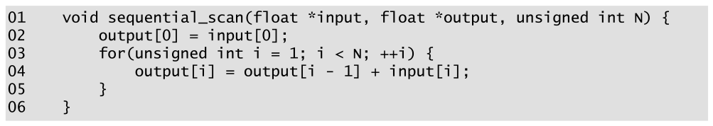

*Figure 11.1 — 덧셈 기반 inclusive scan 의 단순한 순차 구현. (책 p.254)*

```c
01  void sequential_scan(float *input, float *output, unsigned int N) {
02      output[0] = input[0];
03      for(unsigned int i = 1; i < N; ++i) {
04          output[i] = output[i - 1] + input[i];
05      }
06  }
```

| 줄 | 하는 일 |
|---|---|
| **02** | `output[0]` 을 `input[0]` 으로 초기화 |
| **03~05** | 매 반복에서 **직전 출력 원소**(이전 입력들의 누적)에 **입력 원소 하나**를 더해 출력 원소 하나를 만든다 |

> **순차 scan 의 work 는 입력 원소 수에 선형 비례**한다. 즉 계산 복잡도는 $O(N)$ 이고,
> 정확히는 **$N-1$ 번의 덧셈**이다 (책 p.253).
> **이 $N-1$ 이 이 장 내내 기준선이 된다.**

reduction 처럼 scan 도 라이브러리에 있다 (책 p.254).

| 어디 | 무엇 |
|---|---|
| C++ 표준 라이브러리 | `std::inclusive_scan`, `std::exclusive_scan` |
| CUDA | **Thrust**, **CUB** |

---

### 3. 예제/실습

#### 소시지 예제를 표로

| 사람 | 주문 $x_i$ | inclusive (절단점) | exclusive (시작점) | 받는 길이 |
|---|---|---|---|---|
| 0 | 3 | 3 | 0 | $3 - 0 = 3$ |
| 1 | 1 | 4 | 3 | $4 - 3 = 1$ |
| 2 | 7 | 11 | 4 | $11 - 4 = 7$ |
| 3 | **0** | 11 | 11 | $11 - 11 = \mathbf{0}$ |
| 4 | 4 | 15 | 11 | 4 |
| 5 | 1 | 16 | 15 | 1 |
| 6 | 6 | 22 | 16 | 6 |
| 7 | 3 | **25** | 22 | 3 |

**3번 사람이 0인치를 주문했는데도 표가 깨지지 않는다** — 절단점이 11로 같아 길이 0인 조각이
된다. **0 주문을 특별 취급할 필요가 없다**는 것이 scan 기반 할당의 장점이다.

40인치 중 25인치를 쓰고 **15인치가 남는다** (책 p.252).

```python
x = [3, 1, 7, 0, 4, 1, 6, 3]
inc, a = [], 0
for v in x:
    a += v
    inc.append(a)
exc = [0] + inc[:-1]
print("inclusive:", inc)
print("exclusive:", exc)
print("각자 받는 길이:", [i - e for i, e in zip(inc, exc)], "= 주문", x)
print(f"40인치 중 {inc[-1]}인치 사용, {40 - inc[-1]}인치 남음")
# inclusive: [3, 4, 11, 11, 15, 16, 22, 25]
# exclusive: [0, 3, 4, 11, 11, 15, 16, 22]
# 각자 받는 길이: [3, 1, 7, 0, 4, 1, 6, 3] = 주문 [3, 1, 7, 0, 4, 1, 6, 3]
# 40인치 중 25인치 사용, 15인치 남음
```

#### 연습문제

**연습문제 11.1-1.** max 연산자로 inclusive scan 을 하면 무엇이 나오는가?
$[3, 1, 7, 0, 4, 1, 6, 3]$ 으로 답하라. 이것을 무엇이라 부르는가?

> $[3, 3, 7, 7, 7, 7, 7, 7]$ — **running maximum**(누적 최댓값)이다.
> 각 위치가 "여기까지의 최댓값"을 담는다.
> scan 이 덧셈에만 쓰이는 것이 아님을 보여 준다 — **결합적이기만 하면 어떤 연산자든 된다.**
> 시계열에서 "지금까지의 최고 기록"을 구하는 계산이 이것이다.

**연습문제 11.1-2.** exclusive scan 의 마지막 원소가 $x_{N-2}$ 까지만 반영하므로
**전체 합이 어디에도 없다.** 메모리 할당에서 이것이 문제가 되는가?

> 문제가 된다 — **총 할당량**을 알아야 버퍼를 잡을 수 있다.
> 그래서 실전 API 는 exclusive scan 과 함께 **총합을 따로 반환**하거나
> ($N+1$ 개짜리 출력을 쓰거나) 마지막 원소에 총합을 넣는 관례를 쓴다.
> CUB 의 `ExclusiveSum` 도 총합을 따로 받을 수 있게 돼 있다.
> 이 장의 kernel 들은 inclusive 를 만들므로 **마지막 원소가 곧 총합**이다.

---

## 11.2 Parallel scan with the Kogge-Stone algorithm (책 p.254)

### 1. 개념적 이해

#### 먼저 나쁜 방법 하나 — naïve 병렬화

출력 원소마다 thread 하나를 배정해 **그 원소를 순차 reduction 으로 계산**하면 어떨까.
모든 출력을 병렬로 계산하니 그럴듯해 보인다.

**그런데 Figure 11.1 보다 빨라지지 않는다** (책 p.254).

> 마지막 thread 가 $y_{N-1}$ 을 계산하는 데 **$N$ step** 이 걸리고,
> 병렬 프로그램의 완료 시간은 **가장 오래 걸리는 thread** 가 정하므로
> 이 병렬화의 **span 은 $O(N)$** 이다. 순차 scan 과 다를 바 없다.
> **실제로는 자원이 제한되면 순차보다 훨씬 느려질 수 있다.**

work 를 세면 이유가 보인다. 출력 원소 $i$ 의 계산량이 $i$ 이므로

$$\text{work}_{\text{naïve}} = \sum_{i=0}^{N-1} i = \frac{N \cdot (N-1)}{2} \;=\; O(N^2)$$

**순차의 $O(N)$ 보다 높은데 속도 이득은 없다.**
work complexity 가 높다는 것은 **훨씬 많은 실행 자원을 마련해야 한다**는 뜻이다.

#### 더 나은 방법 — reduction tree, 그런데 공유해야 한다

10장의 reduction tree 를 각 출력 원소에 적용하면 span 은 좋아진다.

> reduction tree 를 쓰려면 scan 연산자가 **결합적**이어야 하고,
> 쓰는 최적화에 따라서는 **교환적**이기까지 해야 한다 (책 p.255).

그런데 **원소 $i$ 의 reduction tree 가 $i$ 번의 덧셈을 하므로**,
**서로 다른 출력 원소의 reduction tree 사이에서 부분합을 공유하지 않으면**
work complexity 는 여전히 $O(N^2)$ 이다.

**그 공유 방법이 Kogge-Stone 알고리즘**이다 —
1970년대에 **빠른 덧셈기 회로(adder circuit) 설계**를 위해 발명됐고,
오늘날에도 고속 컴퓨터 산술 하드웨어 설계에 쓰인다 (책 p.255).

---

### 2. 알고리즘

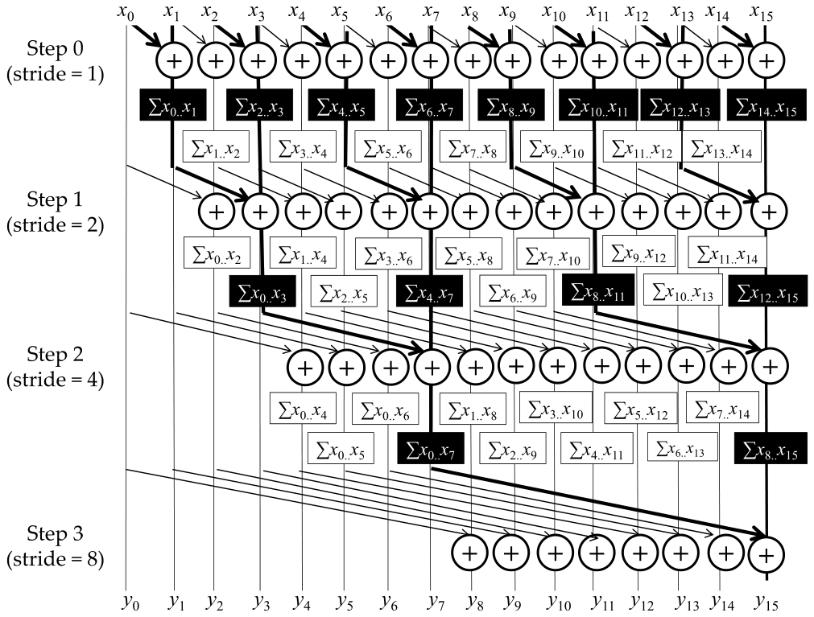

*Figure 11.2 — Kogge-Stone 덧셈기 설계에 기반한 병렬 inclusive scan 알고리즘.
굵은 선이 출력 원소 $y_{15}$ 를 만드는 reduction tree 를 강조한다. (책 p.255)*

> 이것은 **제자리(in-place) scan 알고리즘**이다. 원래 입력 원소를 담은 배열 위에서
> **반복적으로 내용을 출력 원소로 진화시킨다** (책 p.255).
>
> 시작할 때 위치 $i$ 에 입력 원소 $x_i$ 가 있다.
> **$k$번 반복한 뒤 위치 $i$ 에는 그 위치와 그 앞의 최대 $2^k$ 개 입력 원소의 합**이 들어 있다.

| 반복 후 | 위치 $i$ 의 내용 |
|---|---|
| 1 | $x_{i-1} + x_i$ |
| 2 | $x_{i-3} + x_{i-2} + x_{i-1} + x_i$ |
| $k$ | $x_{i-2^k+1} + \cdots + x_i$ |

16개 입력 예로 따라가면 (책 p.256):

| 반복 | 무슨 일 | 확정되는 위치 |
|---|---|---|
| — | 위치 0 은 정의상 $y_0 = x_0$ 이라 **이미 최종 답** | 0 |
| **1** | 위치 0 을 뺀 모두가 **왼쪽 이웃**을 자기에 더한다 → 위치 $i$ 가 $x_{i-1}+x_i$ | **1** ($x_0+x_1$) |
| **2** | 위치 0·1 을 뺀 모두가 **두 칸 왼쪽**을 더한다 → 위치 $i$ 가 $x_{i-3}{+}\cdots{+}x_i$ | **2, 3** |
| **3** | 네 칸 왼쪽 | 4~7 |
| **4** | 여덟 칸 왼쪽 | 8~15 |

**한 번 확정된 위치는 이후 반복에서 더 바뀌지 않아야 한다.**
그래서 kernel 에 `threadIdx.x >= stride` 조건이 붙는다.

> **Figure 11.2 의 굵은 선을 따라가 보라.** $y_{15}$ 하나만 보면 그것은
> 10장의 reduction tree 다 — 8+4+2+1 이 아니라 **매 단계 이웃과 합치는 방식**이지만,
> $x_0 \ldots x_{15}$ 를 $\log_2 16 = 4$ 단계에 모으는 것은 같다.
> **Kogge-Stone 의 발상은 이 tree 의 중간 결과를 다른 15개 출력이 나눠 쓰게 하는 것**이다.

---

### 3. 코드

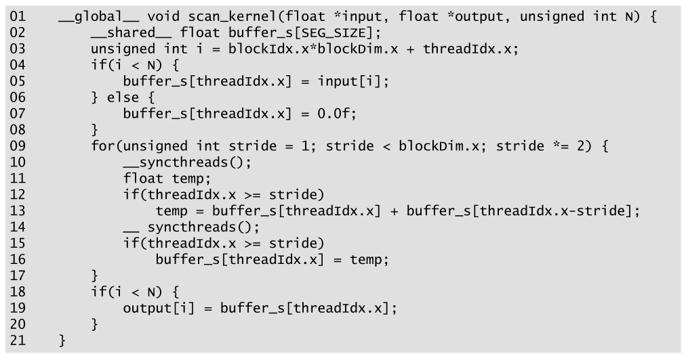

*Figure 11.3 — inclusive (block 단위) scan 을 위한 Kogge-Stone kernel. (책 p.256)*

```cuda
01  __global__ void scan_kernel(float *input, float *output, unsigned int N) {
02      __shared__ float buffer_s[SEG_SIZE];
03      unsigned int i = blockIdx.x*blockDim.x + threadIdx.x;
04      if(i < N) {
05          buffer_s[threadIdx.x] = input[i];
06      } else {
07          buffer_s[threadIdx.x] = 0.0f;
08      }
09      for(unsigned int stride = 1; stride < blockDim.x; stride *= 2) {
10          __syncthreads();
11          float temp;
12          if(threadIdx.x >= stride)
13              temp = buffer_s[threadIdx.x] + buffer_s[threadIdx.x-stride];
14          __syncthreads();
15          if(threadIdx.x >= stride)
16              buffer_s[threadIdx.x] = temp;
17      }
18      if(i < N) {
19          output[i] = buffer_s[threadIdx.x];
20      }
21  }
```

> **원문 오기** (Figure 11.3, 책 p.256). 14번 줄이 **`__ syncthreads();`** 로
> 밑줄 두 개와 이름 사이에 **공백**이 들어가 있다 (10번 줄은 `__syncthreads();` 로 정상이다).
> 컴파일되지 않는다. 위 코드는 바로잡은 것이다.

#### 이 kernel 은 block 하나짜리 지역 scan 이다

> parallel scan 은 참여 thread 사이의 동기화를 요구하므로, **지금은 각 thread block 이
> 입력의 한 구획(segment)에 지역 parallel scan 을 하는 kernel** 을 만든다 (책 p.256).
> 이 구획들을 합쳐 전체 입력의 전역 scan 을 만드는 방법은 **11.9절**에서 다룬다.

구획 크기는 컴파일 타임 상수 `SEG_SIZE` 이고, **`SEG_SIZE` 를 block 크기로 삼아 호출**하므로
**thread 수 = 구획 원소 수** 다. thread 하나가 구획 원소 하나를 진화시킨다.

#### 줄별로

| 줄 | 하는 일 | 짚을 점 |
|---|---|---|
| **02** | shared 배열 `buffer_s` | 제자리 진화의 무대 |
| **03** | 전역 데이터 index | 자기가 진화시킬 원소의 위치 |
| **04~08** | 입력을 shared 로 적재. **범위 밖은 `0.0f`** | **identity 로 채운다** — 11.1절 개념의 첫 실전 사용 |
| **09** | `stride` 를 1 에서 두 배씩 | 10장 Figure 10.5 와 같은 형태 |
| **10** | **첫 번째 barrier** | 아래 참조 |
| **12~13** | `stride` 만큼 왼쪽 원소를 자기에 더해 **`temp` 에** | **`buffer_s` 에 바로 쓰지 않는다** |
| **14** | **두 번째 barrier** | 아래 참조 |
| **15~16** | 이제서야 `buffer_s` 에 쓴다 | |
| **18~20** | 결과를 global 로 | |

`threadIdx.x >= stride` 조건은 "`stride` 가 자기 index 보다 커지면 **이미 필요한 입력을 다
누적했으므로 더 활동할 필요가 없다**"는 뜻이다 (책 p.257).

#### 왜 barrier 가 **두 개**인가 — 10장과의 결정적 차이

이 장에서 가장 중요한 대목이다.

> 두 barrier 는 **서로 다른 종류의 순서를 강제한다** (책 p.258).
>
> - **10번 줄** — 다른 thread 가 읽기 전에 **이전 반복의 쓰기가 끝나 있게** 한다.
>   즉 **true dependence** (read-after-write) 를 강제한다.
> - **14번 줄** — 다른 thread 가 덮어쓰기 전에 **읽기가 끝나 있게** 한다.
>   즉 **false dependence** (write-after-read) 를 강제한다.

**두 번째 barrier 는 10장의 reduction kernel 에는 없었다.** 왜 여기서만 필요한가.

책이 구체적인 시나리오로 설명한다 (책 p.257~258). Figure 11.2 의 **반복 2 에서 thread 4 와
thread 6** 을 보자.

| | 정상 | 망가지는 경우 |
|---|---|---|
| thread 6 이 해야 할 일 | `buffer_s[4]` 의 **옛 값** $(x_3{+}x_4)$ 과 `buffer_s[6]` 의 옛 값 $(x_5{+}x_6)$ 을 더해 $(x_3{+}x_4{+}x_5{+}x_6)$ | |
| thread 4 가 너무 일찍 쓰면 | | `buffer_s[4]` 가 이미 $(x_1{+}x_2{+}x_3{+}x_4)$ 다. thread 6 이 그것을 읽어 $(x_1{+}\cdots{+}x_6)$ 을 저장한다 |
| 반복 3 에서 | | thread 6 이 $x_1{+}x_2$ 를 **또** 더해 최종값이 $(\mathbf{2}x_1 + \mathbf{2}x_2 + x_3 + \cdots + x_6)$ — **틀렸다** |

> **thread 6 이 우연히 먼저 읽으면 결과는 맞다.** 즉 **실행 타이밍에 따라 맞기도 하고
> 틀리기도 하며, 실행할 때마다 결과가 달라질 수 있다.**
> 책의 표현대로 "Such lack of reproducibility can make debugging a nightmare" 다.

**해법이 코드의 `temp` 와 두 번째 barrier 다.** 13번 줄에서 모든 활성 thread 가
**먼저 자기 private `temp` 에 쓰므로 `buffer_s` 의 옛 값이 하나도 안 덮인다.**
14번 줄 barrier 가 **모든 활성 thread 의 읽기 완료를 보장**한 뒤에야 16번 줄이 쓴다.

#### 10장에는 왜 없었는가

> **한 반복에서 활성 thread 가 쓰는 원소를, 같은 반복의 다른 활성 thread 가 읽지 않기 때문**이다
> (책 p.258). Figure 10.7 을 보면 각 활성 thread 는 자기 위치 `input[threadIdx.x]` 와
> **오른쪽 `stride` 칸 위치** `input[threadIdx.x+stride]` 에서 입력을 받는데,
> **그 `stride` 칸 위치들은 어떤 활성 thread 도 갱신하지 않는다.**
>
> 반면 parallel scan 에서는 **동시에 도는 reduction tree 들이 서로 얽혀 있어**
> 쓰이는 자리를 다른 활성 thread 가 읽는다.
> **부분합을 tree 사이에서 재사용해 복잡도를 낮춘 것의 대가**다 — 11.5절에서 다시 본다.

#### control divergence 는 얼마나 되나

> 12·15번 줄의 조건이 만드는 control divergence 는 **꽤 미미하다** (책 p.257).
> `stride` 가 warp 크기보다 작으면 **첫 warp 의 thread 만 빠지므로 divergence 도 첫 warp 에만**
> 생긴다. warp 가 많은 큰 block 이면 영향이 거의 없다.
> `stride` 가 warp 크기 이상이 되면 **block 앞쪽 절반에서 warp 통째로 빠져** divergence 가 없다.

10장 Figure 10.8 과 **정반대 방향**이라는 점이 재미있다 —
10장은 활성 thread 가 **앞쪽**이라 뒤쪽 warp 가 통째로 빠졌고,
여기는 비활성 thread 가 **앞쪽**이라 앞쪽 warp 가 통째로 빠진다. **효과는 같다.**

---

**연습문제 11.2-1.** 04~08번 줄에서 범위 밖을 `0.0f` 로 채운다.
max scan 이었다면 무엇으로 채워야 하는가? 채우지 않으면?

> **`-INFINITY`** — max 의 identity 다.
> 채우지 않으면 shared memory 의 쓰레기 값이 scan 에 섞여 들어가고,
> **`stride` 가 커지면서 그 쓰레기가 왼쪽 방향으로만 퍼지지는 않지만**
> 구획 뒷부분의 결과를 오염시킨다.
> 10장 연습문제 5에서 본 것과 같은 원리 — **identity 로 채우면 경계 처리가 조건문 없이 흡수된다.**

**연습문제 11.2-2.** 13번 줄의 `temp` 를 없애고
`buffer_s[threadIdx.x] += buffer_s[threadIdx.x-stride];` 로 쓰되 barrier 는 둘 다 남기면?

> **여전히 틀린다.** 14번 줄 barrier 가 있어도 소용없다 —
> 그 한 문장 안에서 **읽기와 쓰기가 쪼갤 수 없이 붙어 있어** barrier 를 끼울 자리가 없다.
> thread 4 가 이 문장을 실행하는 순간 `buffer_s[4]` 가 갱신되고,
> thread 6 이 아직 13번 줄에 도달하지 못했다면 새 값을 읽는다.
> **`temp` 는 읽기와 쓰기 사이에 barrier 를 끼워 넣기 위한 장치**이지 편의가 아니다.

**연습문제 11.2-3.** 09번 줄이 `stride <= blockDim.x` 였다면?

> **한 번 더 돌지만 결과는 바뀌지 않는다.** `stride == blockDim.x` 이면
> 12번 줄 `threadIdx.x >= stride` 를 만족하는 thread 가 하나도 없으므로
> 아무 일도 일어나지 않는다.
> **틀리지는 않지만 barrier 두 번과 반복 하나를 헛되이 쓴다.**
> (10장 Figure 10.5 의 `stride <= blockDim.x` 는 필요했다 — 거기서는
> 마지막 반복에 thread 0 이 실제로 일을 했다.)

---

## 11.3 Double-buffering to reduce synchronization (책 p.258)

### 1. 개념적 이해

> Figure 11.3 의 주요 병목 하나는 **barrier synchronization 의 오버헤드**다 (책 p.258).
> 모든 loop 반복이 race condition 을 피하려고 `__syncthreads()` 를 **두 번** 부른다.
>
> 그런데 **두 barrier 가 같은 종류의 순서를 강제하는 것이 아니다** —
> 하나는 **true dependence**, 다른 하나는 **false dependence** 다.

**6장에서 배운 대로 false dependence 를 강제하는 barrier 는 double-buffering 으로 없앨 수 있다**
(책 p.259).

> **발상**: 같은 반복에서 읽히고 있는 값을 덮어쓰지 않으려면,
> **반복의 입력 값과 출력 값을 서로 다른 버퍼에 두면 된다.**
>
> 반복마다 새 출력 버퍼를 잡는 방법도 있지만 **shared memory 를 너무 많이 먹는다.**
> 대신 **어떤 반복의 출력이 계산되고 나면 그 반복의 입력은 더 필요 없다**는 점을 쓴다.
> 즉 **입력 버퍼를 재활용해 다음 반복의 출력 버퍼로 삼으면 되고, 버퍼 둘이면 충분하다.**

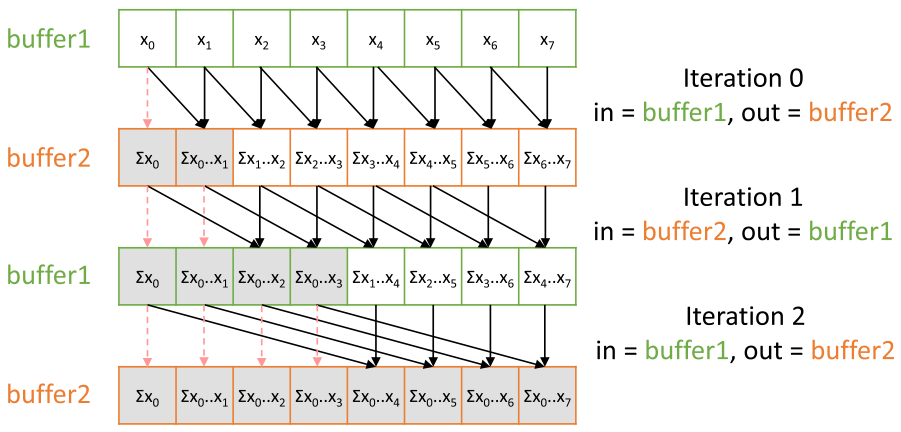

*Figure 11.4 — Kogge-Stone parallel scan 에 적용한 double buffering. (책 p.259)*

| 반복 | 입력 버퍼 | 출력 버퍼 |
|---|---|---|
| 초기 적재 | (global) | **buffer1** |
| 0 | buffer1 | **buffer2** |
| 1 | buffer2 | **buffer1** |
| 2 | buffer1 | **buffer2** |
| $\vdots$ | 번갈아 | 번갈아 |

> **버퍼가 하나였다면** thread 2 가 $x_1$ 을 읽는 그 자리에 thread 1 이 $\sum x_1..x_2$ 를 쓰므로,
> thread 2 가 $x_1$ 을 읽기 전에 thread 1 이 쓰지 않도록 barrier 가 필요했다.
> **버퍼가 둘이면 thread 1 은 buffer2 에 쓰고 thread 2 는 buffer1 에서 읽으므로
> 동기화가 필요 없다** (책 p.259).

#### 잊기 쉬운 것 하나 — 완성된 값도 복사해야 한다

> **입력과 출력에 다른 버퍼를 쓰므로, 이미 완성되어 더 진화하지 않는 값
> (예: 반복 0 의 $x_0$)이 자동으로 유지되지 않는다** (책 p.259~260).
> **명시적으로 입력 버퍼에서 출력 버퍼로 복사해야 한다.**
>
> 그래서 **원래 kernel 에서 비활성이던 thread 들이 이제는 복사 담당**이 된다.
> 반복 0 에서 thread 0 은 buffer1 의 0번 자리에서 buffer2 의 0번 자리로 $x_0$ 을 옮긴다.

**"놀던 thread 에게 일이 생겼다"** — divergence 가 줄어드는 부수 효과도 있다.

---

### 2. 코드

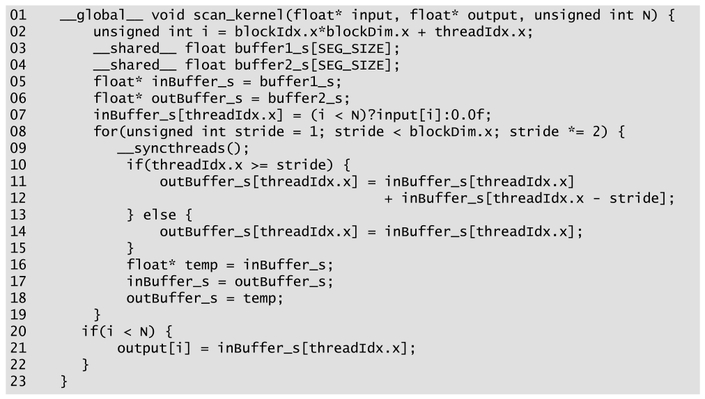

*Figure 11.5 — double-buffering 을 적용한 inclusive (block 단위) scan 용 Kogge-Stone kernel.
(책 p.260)*

```cuda
01  __global__ void scan_kernel(float* input, float* output, unsigned int N) {
02      unsigned int i = blockIdx.x*blockDim.x + threadIdx.x;
03      __shared__ float buffer1_s[SEG_SIZE];
04      __shared__ float buffer2_s[SEG_SIZE];
05      float* inBuffer_s = buffer1_s;
06      float* outBuffer_s = buffer2_s;
07      inBuffer_s[threadIdx.x] = (i < N)?input[i]:0.0f;
08      for(unsigned int stride = 1; stride < blockDim.x; stride *= 2) {
09          __syncthreads();
10          if(threadIdx.x >= stride) {
11              outBuffer_s[threadIdx.x] = inBuffer_s[threadIdx.x]
12                                       + inBuffer_s[threadIdx.x - stride];
13          } else {
14              outBuffer_s[threadIdx.x] = inBuffer_s[threadIdx.x];
15          }
16          float* temp = inBuffer_s;
17          inBuffer_s = outBuffer_s;
18          outBuffer_s = temp;
19      }
20      if(i < N) {
21          output[i] = inBuffer_s[threadIdx.x];
22      }
23  }
```

Figure 11.3 에서 바뀐 곳 (책 p.260).

| 줄 | 변화 |
|---|---|
| **03~04** | shared 버퍼가 **둘** |
| **05~06** | 버퍼 교환을 돕는 **포인터 둘**. 첫 반복의 입력/출력 버퍼를 각각 가리킨다 |
| **07** | 입력을 **입력 버퍼**로 적재 (삼항 연산자로 identity 처리) |
| **10~12** | 덧셈하는 thread 는 **`inBuffer_s` 에서 읽고 `outBuffer_s` 에 쓴다** |
| **13~14** | **덧셈하지 않는 thread 는 값을 복사한다** ← 위에서 본 그것 |
| **16~18** | 반복 끝에서 **입력·출력 버퍼를 교환** |
| **21** | 마지막에 읽는 것은 **`inBuffer_s`** — 마지막 교환 뒤라 결과가 거기 있다 |

> **loop 안의 `__syncthreads()` 가 하나뿐이다** (09번 줄) (책 p.261).
> 이 barrier 는 **true dependence** 를 강제한다 — thread 들이 이전 반복에서
> 다른 thread 가 쓴 입력 값을 읽기 전에 기다린다.
> **두 번째는 필요 없다.** 모든 읽기가 `inBuffer_s` 에서, 모든 쓰기가 `outBuffer_s` 로
> 일어나므로 **write-after-read (false) dependence 자체가 없기 때문**이다.

---

### 3. 무엇을 얼마나 얻었나

| | Figure 11.3 | Figure 11.5 |
|---|---|---|
| 반복당 barrier | **2** | **1** |
| shared memory | $S$ | **$2S$** |
| 반복당 shared 접근 | 읽기 2 + 쓰기 1 = 3 | 읽기 2 + 쓰기 1 = 3 (비활성 thread 도 읽기 1 + 쓰기 1) |
| 비활성 thread | 논다 | **복사한다** |

$S$ = `SEG_SIZE` × 4 B. 즉 **shared memory 를 두 배 쓰고 barrier 를 절반으로 줄인 것**이다.
4장의 occupancy 관점에서 shared 가 병목이 아니라면 남는 장사다.

---

**연습문제 11.3-1.** 13~14번 줄의 else 절을 빼면 무엇이 깨지는가?
구체적으로 $x_0$ 을 따라가라.

> **thread 0 이 아무것도 쓰지 않으므로 `outBuffer_s[0]` 이 미초기화 상태로 남는다.**
> 반복 0 이 끝나고 버퍼가 교환되면 그 쓰레기가 **다음 반복의 입력**이 되고,
> 반복 1 에서 thread 1 이 `inBuffer_s[0]` 을 읽어 더하므로 **위치 1 부터 전부 오염**된다.
> 최종 출력의 0번 자리도 쓰레기다.
> **double-buffering 의 숨은 비용이 바로 이 복사**다.

**연습문제 11.3-2.** 07번 줄 뒤에 `__syncthreads()` 가 없다. 문제가 되는가?

> 되지 않는다. loop 첫 반복의 **09번 줄 barrier 가 그 역할을 한다** —
> barrier 가 loop **맨 앞**에 있기 때문이다.
> (10장 Figure 10.10 이 같은 이유로 barrier 를 loop 앞에 뒀다.)

**연습문제 11.3-3.** 16~18번 줄의 포인터 교환 대신
`if (stride 반복 횟수가 짝수) ... else ...` 로 버퍼를 골라도 되는가?

> 된다. 실제로 **컴파일러는 포인터 교환을 그렇게 풀어낼 수 있을 때 그렇게 한다** —
> shared memory 포인터는 register 에 담기므로 교환 자체는 싸다.
> 다만 **loop 를 완전히 unroll 할 수 있어야** 그 최적화가 가능하다.
> 포인터 방식이 읽기 쉽고 반복 횟수가 런타임에 정해져도 동작하므로 이쪽이 낫다.

---

## 11.4 Warp-level primitives to reduce synchronization (책 p.261)

### 1. 개념적 이해

double-buffering 으로 barrier 를 절반으로 줄였지만 **여전히 상당하다.**

> Figure 11.5 의 모든 loop 반복이 **부동소수점 덧셈 딱 하나**와 함께
> `__syncthreads()` 를 부른다. 게다가 반복마다 **shared memory 접근 세 번**을 한다.
> **loop 의 성능은 barrier synchronization 과 shared memory 접근이 지배한다** (책 p.261).

10장에서 배운 처방을 다시 쓴다 — **warp-level primitive** 다.
그러려면 계산을 **여러 warp 로 분해**해야 하고, 그 분해 방법이 이 절의 진짜 내용이다.

#### scan-scan-add 분해

> scan 연산을 더 작은 scan 여러 개로 분해하는 방법 하나가 **scan-scan-add 분해**다.
> 세 단계로 나눈다 (책 p.261):
>
> 1. **작은 구획들에 대한 scan**
> 2. **구획 합들에 대한 scan**
> 3. **각 구획을 이전 구획들의 합으로 갱신하는 add**

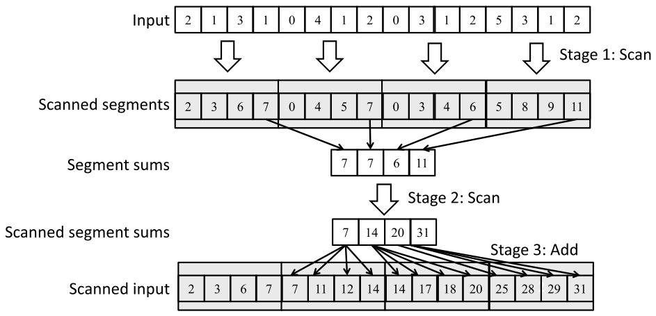

*Figure 11.6 — scan-scan-add 분해의 예. (책 p.262)*

입력 16개를 4개씩 네 구획으로 나눈 예를 따라가면 (책 p.261~262):

| | 값 |
|---|---|
| 입력 | $[2,1,3,1\,|\,0,4,1,2\,|\,0,3,1,2\,|\,5,3,1,2]$ |
| **1단계** 구획별 scan | $[2,3,6,7\,|\,0,4,5,7\,|\,0,3,4,6\,|\,5,8,9,11]$ |
| 구획 합 (각 구획의 마지막) | $[7,\ 7,\ 6,\ 11]$ |
| **2단계** 구획 합의 scan | $[7,\ 14,\ 20,\ 31]$ |
| **3단계** add | $[2,3,6,7\,|\,7,11,12,14\,|\,14,17,18,20\,|\,25,28,29,31]$ |

**핵심 관찰 두 가지** (책 p.262):

| | |
|---|---|
| **①** | 1단계 뒤 **각 구획의 마지막 원소가 그 구획 전체 입력의 합**이다 |
| **②** | 2단계의 scanned sums 는 **원래 scan 문제의 전략적 위치들의 최종 답**이다 — index 0·1·2·3 의 값이 원래 입력 위치 **3·7·11·15** 의 최종 결과다 |

3단계는 **scanned sum $j$ 를 구획 $j+1$ 의 모든 원소에 더하는 것**이다.
마지막 scanned sum 31 은 **원래 입력 전체의 합**이자 마지막 원소의 최종 답이다.

#### 이 분해를 block → warp 에 적용한다

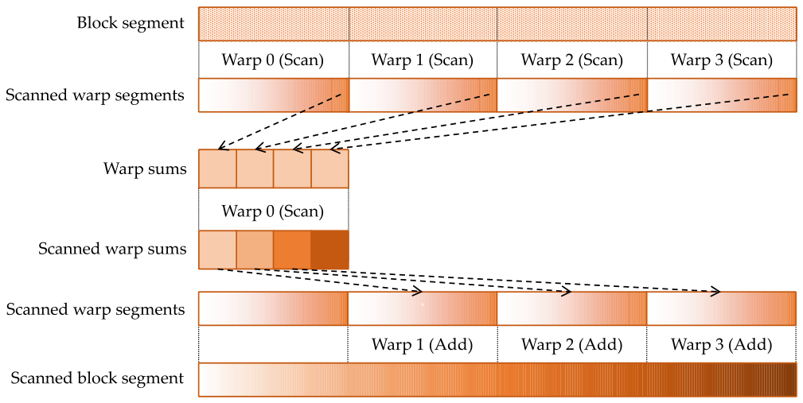

*Figure 11.7 — scan-scan-add 분해로 block 단위 scan 을 warp 단위 scan 으로 분해한다.
(책 p.263)*

| 단계 | 동작 |
|---|---|
| **1** | 각 warp 가 자기 **연속 부분구획**에 warp 단위 scan |
| **2** | **각 warp 의 마지막 thread** 가 그 warp 의 합을 갖고 있으므로, 그것을 shared 의 **warp sums 배열**에 쓴다. **warp 하나**가 그 warp sums 에 warp 단위 scan |
| **3** | 각 warp 가 **자기 앞 warp 들의 합**을 읽어 자기 scanned 원소 전부에 더한다 |

---

### 2. 코드 — warp 단위 scan

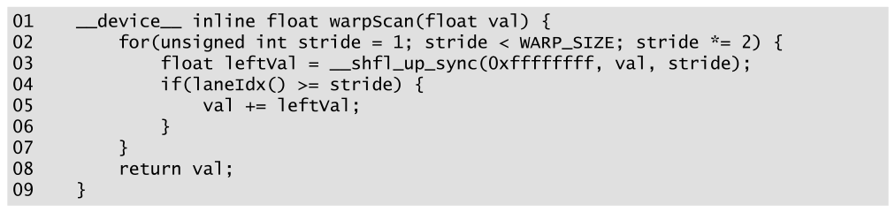

*Figure 11.8 — warp-level primitive 로 warp 단위 scan 을 수행하는 device 함수. (책 p.264)*

```cuda
01  __device__ inline float warpScan(float val) {
02      for(unsigned int stride = 1; stride < WARP_SIZE; stride *= 2) {
03          float leftVal = __shfl_up_sync(0xffffffff, val, stride);
04          if(laneIdx() >= stride) {
05              val += leftVal;
06          }
07      }
08      return val;
09  }
```

| 줄 | 하는 일 | 짚을 점 |
|---|---|---|
| **01** | 인자 `val` 은 **이 thread 가 진화시킬 값** | |
| **02** | `stride` 1 에서 두 배씩, **scan 하는 구획 크기(= warp 크기)** 까지 | Figure 11.3·11.5 와 같은 형태 |
| **03** | **`__shfl_up_sync`** 로 `stride` 만큼 **왼쪽** thread 의 값을 얻는다 | **shared 접근도 barrier 도 없다** |
| **04~05** | index 가 `stride` 이상인 thread 만 더한다 | |
| **08** | 진화가 끝난 `val` 반환 | |

> **왜 `threadIdx.x` 가 아니라 `laneIdx()` 인가** (책 p.264).
> 이것은 **warp 단위** scan 이므로 필요한 것은 **warp 안에서의 index**, 즉 **lane index** 다.
> `laneIdx()` 는 10장에서 정의한 device 함수다 (`threadIdx.x % WARP_SIZE`).

> **10장의 `__shfl_down_sync` 와 방향이 반대다.**
> reduction 은 값을 **아래로 모으므로** down, scan 은 **왼쪽 값을 가져와야 하므로** up 이다.
>
> - **primitive** — 10장 `warp_reduce` 는 `__shfl_down_sync`, 11장 `warpScan` 은
>   **`__shfl_up_sync`**
> - **`stride` 방향** — 10장은 16 → 1 (**감소**), 11장은 1 → 16 (**증가**)
> - **결과가 있는 thread** — 10장은 **lane 0** 하나, 11장은 **모든 lane**

**마지막 차이가 중요하다** — reduction 은 답이 하나라 lane 0 만 유효하지만,
scan 은 **모든 lane 이 자기 답을 갖는다.**

---

### 3. 코드 — block 단위 scan

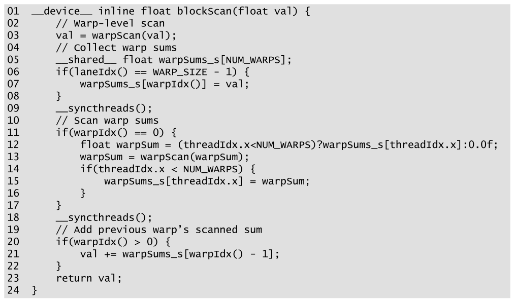

*Figure 11.9 — scan-scan-add 분해와 warp 단위 scan 으로 block 단위 scan 을 수행하는
device 함수. (책 p.264)*

```cuda
01  __device__ inline float blockScan(float val) {
02      // Warp-level scan
03      val = warpScan(val);
04      // Collect warp sums
05      __shared__ float warpSums_s[NUM_WARPS];
06      if(laneIdx() == WARP_SIZE - 1) {
07          warpSums_s[warpIdx()] = val;
08      }
09      __syncthreads();
10      // Scan warp sums
11      if(warpIdx() == 0) {
12          float warpSum = (threadIdx.x<NUM_WARPS)?warpSums_s[threadIdx.x]:0.0f;
13          warpSum = warpScan(warpSum);
14          if(threadIdx.x < NUM_WARPS) {
15              warpSums_s[threadIdx.x] = warpSum;
16          }
17      }
18      __syncthreads();
19      // Add previous warp's scanned sum
20      if(warpIdx() > 0) {
21          val += warpSums_s[warpIdx() - 1];
22      }
23      return val;
24  }
```

| 줄 | 단계 | 하는 일 |
|---|---|---|
| **03** | 1 | 각 warp 가 자기 warp 단위 scan |
| **06~07** | 2 | **각 warp 의 마지막 thread** (`laneIdx() == 31`) 가 warp 합을 shared 에 쓴다. 배열 index 는 **`warpIdx()`** |
| **09** | | 모든 warp 가 썼음을 보장 |
| **11~13** | 2 | **첫 warp** 가 warp sums 를 읽어 warp 단위 scan |
| **14~16** | 2 | scanned warp sums 를 shared 에 되쓴다 |
| **18** | | 다른 warp 들이 첫 warp 를 기다린다 |
| **20~21** | 3 | **첫 warp 를 뺀** 모든 thread 가 **앞 warp 들의 합**을 읽어 자기 값에 더한다 |

> **12번 줄의 삼항 연산자를 눈여겨보라.** `warpSums_s` 의 크기는 `NUM_WARPS` 인데
> 첫 warp 의 thread 는 32개다. **`NUM_WARPS < 32` 이면 범위를 넘으므로
> 넘는 lane 은 identity `0.0f` 를 쓴다.**
> 10장 Figure 10.16·10.18 에서 지적했던 바로 그 문제를 **여기서는 책이 제대로 막았다.**

#### 얼마나 줄었나

> Figure 11.5 는 **loop 반복마다** barrier 와 shared 접근을 한다.
> Figure 11.9 는 **두 번만** 한다 — 1단계와 2단계 사이, 2단계와 3단계 사이 (책 p.265).

> **원문 오기** (책 p.265). "The code in Fig. 11.5 performs barrier synchronizations and
> shared memory accesses in every loop iteration. On the other hand, **the code in Fig. 11.5**
> only performs barrier synchronizations and shared memory accesses on two occasions"
> 두 번째 것은 **Fig. 11.9** 여야 한다. 같은 그림을 자기 자신과 견주는 셈이 됐다.

`SEG_SIZE = 1024` (warp 32개) 기준으로 세면:

| kernel | barrier 횟수 |
|---|---|
| Figure 11.3 | $2 \times \log_2 1024 = \mathbf{20}$ |
| Figure 11.5 | $\log_2 1024 = \mathbf{10}$ |
| **Figure 11.9** | **2** |

---

### 4. kernel

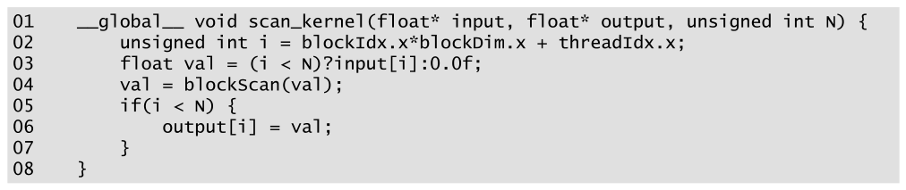

*Figure 11.10 — warp 단위 scan 을 쓰는 block 단위 scan 함수를 사용하는 kernel. (책 p.265)*

```cuda
01  __global__ void scan_kernel(float* input, float* output, unsigned int N) {
02      unsigned int i = blockIdx.x*blockDim.x + threadIdx.x;
03      float val = (i < N)?input[i]:0.0f;
04      val = blockScan(val);
05      if(i < N) {
06          output[i] = val;
07      }
08  }
```

**block 단위 scan 함수를 만들어 두니 kernel 이 아주 단순하다** (책 p.265).
`blockScan` 이 shared memory 를 안에서 알아서 쓰므로 kernel 은 값 하나만 넘기고 받는다.

---

**연습문제 11.4-1.** 06번 줄이 `laneIdx() == WARP_SIZE - 1` 인 이유는?
`laneIdx() == 0` 이면 무엇이 다른가?

> **inclusive scan 이므로 warp 의 총합을 가진 것은 마지막 lane** 이다.
> lane 0 의 값은 그 warp 의 **첫 원소**일 뿐이다.
> 10장 `warp_reduce` 는 결과가 **lane 0** 에 모였는데, 여기는 **lane 31** 이다 —
> `__shfl_down_sync` 와 `__shfl_up_sync` 의 방향 차이가 그대로 나타난 것이다.

**연습문제 11.4-2.** Figure 11.6 의 3단계에서 **첫 구획에는 아무것도 더하지 않는다.**
Figure 11.9 의 어느 줄이 그것을 처리하는가?

> **20번 줄 `if(warpIdx() > 0)`** 이다. 첫 warp 는 앞에 아무 warp 도 없으므로 건너뛴다.
> `warpSums_s[warpIdx() - 1]` 이므로 **exclusive 성격의 접근**이라는 점도 눈여겨볼 만하다 —
> inclusive scan 결과 배열에서 **한 칸 왼쪽**을 읽어 exclusive 값을 얻는다.
> 11.1절의 "inclusive ↔ exclusive 변환은 한 칸 밀기"가 여기서 쓰인다.

**연습문제 11.4-3.** `blockScan` 을 두 번 연달아 부르면 무엇이 깨지는가?

> **`warpSums_s` 에 대한 race** 가 생긴다.
> 첫 호출의 21번 줄 읽기가 끝나기 전에 두 번째 호출의 07번 줄 쓰기가 들어올 수 있다.
> 23번 줄 뒤에 barrier 가 없기 때문이다.
> 안전하게 하려면 **호출 사이에 `__syncthreads()`** 를 넣어야 한다.
> (11.6절의 Figure 11.12 는 `blockScan` 을 한 번만 부르므로 문제가 없다.)

---

## 11.5 Work efficiency considerations (책 p.265)

### 1. 개념적 이해

> **work efficiency 란** 어떤 알고리즘이 수행하는 work 가 **그 계산에 필요한 최소 work 에
> 얼마나 가까운가**를 말한다 (책 p.265).
>
> **각주**: "필요한 최소 work" 는 **알려진 모든 알고리즘 중 최소 work** 로 경험적으로 정의한다.

scan 의 최소 덧셈 횟수는 **$N-1$ 번, 즉 $O(N)$** — 순차 알고리즘이 하는 만큼이다.
11.2절 서두의 naïve 병렬은 $\frac{N(N-1)}{2} = O(N^2)$ 이라 **work efficient 하지 않다.**

---

### 2. 수식/유도

#### 전체 유도 과정 (먼저 한 번에)

$$\text{work}_{\text{KS}} = \sum_{\text{stride}} (N - \text{stride}),
  \quad \text{stride} = 1, 2, 4, \ldots, \tfrac{N}{2} \;(\log_2 N \text{ 항}) \tag{1}$$

$$\text{work}_{\text{KS}} = N \cdot \log_2 N - (N-1) \;=\; O(N \log_2 N) \tag{2}$$

$$\text{span}_{\text{KS}} = \log_2 N \;=\; O(\log N) \tag{3}$$

$$\text{step 감소} \approx \frac{N}{\log_2 N} \tag{4}$$

$$\text{steps}_{\text{KS}}(P) \approx \frac{N \cdot \log_2 N}{P} \tag{5}$$

#### 단계별 설명 (생략 없이)

**(1) 반복마다의 활성 thread 수.**

Kogge-Stone 은 $\log_2 N$ 번 반복한다.
각 step 에서 **비활성 thread 수가 정확히 `stride`** 다 (조건이 `threadIdx.x >= stride` 이므로
thread $0 \ldots \text{stride}-1$ 이 쉰다).
따라서 **활성 thread 는 $N - \text{stride}$** 이고 각자 덧셈 하나를 한다.

**(2) 합산.**

$$\sum_{k=0}^{\log_2 N - 1} \left(N - 2^k\right)
= \underbrace{N \cdot \log_2 N}_{\text{stride 와 무관한 부분}} - \underbrace{\left(1 + 2 + 4 + \cdots + \tfrac{N}{2}\right)}_{\text{기하급수} = N-1}$$

$$= N \cdot \log_2 N - (N-1)$$

> **실제 GPU 에서 소비하는 자원은 이보다 더 많다** (책 p.266).
> 많은 thread 가 나중 반복에서 참여를 멈추지만, **자기가 속한 warp 전체가 끝날 때까지
> 실행 자원을 계속 먹기** 때문이다.
> 그래서 실제 소비량은 **$N \cdot \log_2 N$ 에 더 가깝다.**
> 어느 쪽이든 **work complexity 는 $O(N \log_2 N)$** 이다.

**(3)(4) 좋은 소식과 나쁜 소식.**

| | |
|---|---|
| **좋은 소식** | naïve 의 $O(N^2)$ 보다는 낫다 |
| **나쁜 소식** | 순차의 $O(N)$ 보다는 **여전히 나쁘다** |

$N = 512$ 를 넣어 보자 (책 p.266).

$$\frac{\text{work}_{\text{KS}}}{\text{work}_{\text{seq}}}
= \frac{512 \cdot 9 - 511}{511} = \frac{4097}{511} = 8.02, \qquad
\frac{512 \cdot 9}{511} = 9.02$$

> 책이 "**eight and nine times** more work" 라고 쓰는 것은 **두 추정치가 정확히 8.02 와
> 9.02 이기 때문**이다 — 아래쪽이 $N\log_2 N - (N-1)$, 위쪽이 warp 낭비까지 센 $N\log_2 N$ 이다.

**대신 step 이 적다.** 순차는 $N$ 번 반복하므로 시간 복잡도 $O(N)$,
kernel 의 loop 는 최대 $\log_2 N$ 번이므로 **span 은 $O(\log N)$** 이다.

$$\text{실행 자원이 무한하다면 step 감소} \approx \frac{N}{\log_2 N}
= \frac{512}{9} = \mathbf{56.9\times}$$

**(5) 그런데 자원은 무한하지 않다.**

> **step 을 알고리즘 비교의 근사 지표로 쓰자** (책 p.266).
> 순차 scan 은 원소 $N$ 개에 대략 $N$ step 이다.
> CUDA 장치에 실행 유닛이 $P$ 개 있으면 Kogge-Stone kernel 은
> $$\frac{N \cdot \log_2 N}{P}\ \text{step}$$
> 을 쓸 것으로 기대할 수 있다. $P = N$ 이면 $\log_2 N$ step 이다.

$P$ 가 $N$ 보다 작으면 이야기가 달라진다. **thread 1024개, 실행 유닛 32개로 원소 1024개**를
처리하면 (책 p.266)

$$\frac{1024 \times 10}{32} = 320\ \text{step} \quad\Rightarrow\quad
\frac{1024}{320} = \mathbf{3.2\times}\ \text{감소}$$

**56.9× 를 기대했는데 3.2× 다.**

#### 언제 병렬이 순차보다 느려지는가

(5)에서 $\frac{N \log_2 N}{P} \ge N$ 이 되는 조건을 풀면

$$P \le \log_2 N$$

**실행 유닛이 $\log_2 N$ 개 이하면 Kogge-Stone 이 순차보다 느리다.**
$N = 1024$ 면 $P \le 10$, $N = 2^{20}$ 이면 $P \le 20$ 이다.

> **추가 work 가 두 가지로 문제가 된다** (책 p.267).
> **① 하드웨어 사용이 훨씬 비효율적이다** — 자원이 부족하면($P$ 가 작으면)
> 병렬 알고리즘이 순차보다 **더 많은 step** 을 쓸 수 있고, 그러면 더 느리다.
> **② kernel 이 더 빨라도 추가 work 는 추가 에너지를 쓴다** —
> 모바일처럼 **전력이 제약된 환경**에 부적합해진다.

<!--widget:scan-work-span-->

---

### 3. 예제/실습

**연습문제 11.5-1.** $N = 2^{20}$ 일 때 Kogge-Stone 의 work 는 순차의 몇 배인가?
$P = 2^{14}$ 이면 step 감소는?

> work: $\frac{2^{20} \cdot 20 - (2^{20}-1)}{2^{20}-1} = \frac{20{,}971{,}520 - 1{,}048{,}575}{1{,}048{,}575} = 19.0\times$
> (상한으로는 $20.0\times$).
> step: $\frac{2^{20} \cdot 20}{2^{14}} = 1280$ step. 순차는 $2^{20} = 1{,}048{,}576$ step 이므로
> $\mathbf{819\times}$ 감소.
> **$N$ 이 클수록 work 페널티도 커지지만 ($\log_2 N$ 에 비례) step 이득이 훨씬 크다.**

**연습문제 11.5-2.** Kogge-Stone 의 work 가 $N \log_2 N$ 에 "더 가깝다"는 책의 말을
warp 단위로 정확히 세어 보라. $N = 256$, warp 크기 32 로 답하라.

반복 8번, `stride` = 1, 2, 4, …, 128. 활성 thread 는 $256 - \text{stride}$ 다.
**소비 자원**은 활성 warp 수 × 32 이고, 활성 thread 가 `threadIdx.x >= stride` 라
**뒤쪽 연속 구간**이므로 활성 warp 수는 $8 - \lfloor \text{stride}/32 \rfloor$ 다.

| stride | 활성 thread | 활성 warp | 소비 자원 |
|---|---|---|---|
| 1, 2, 4, 8, 16 | 255, 254, 252, 248, 240 | 8 | 256 씩 |
| 32 | 224 | 7 | 224 |
| 64 | 192 | 6 | 192 |
| 128 | 128 | 4 | 128 |

> 커밋 $= 1793$ · 소비 $= 5 \times 256 + 224 + 192 + 128 = 1824$.
> $N \log_2 N = 2048$, $N\log_2 N - (N-1) = 1793$.
> **실제 소비 1824 가 두 추정치 사이에 있다** — 책의 말대로 warp 낭비 때문에
> 커밋(1793)보다 크지만 $N\log_2 N$(2048)보다는 작다.

**연습문제 11.5-3.** work efficiency 가 나쁜데도 Kogge-Stone 을 쓰는 것이
정당화되는 상황은?

> 책의 요약이 답한다 (책 p.285) — **"실행 자원이 풍부한 프로세서에서
> 적당한 크기의 scan block 을 처리할 때"** 다.
> 즉 $P$ 가 $N$ 에 가까울 때. GPU 의 warp 안(32 원소)이나 block 안(1024 원소)이
> 정확히 그런 상황이다.
> **큰 배열 전체를 Kogge-Stone 으로 훑는 것이 나쁜 것**이고, 11.6절이 그것을 고친다.

---

## 11.6 Coarsening to improve work-efficiency (책 p.267)

### 1. 개념적 이해

> scan 을 병렬화하는 주된 오버헤드는 **work efficiency 의 감소**다 (책 p.267).
> 실행 자원이 충분하면 span 감소 덕에 낼 만한 값이다.
> **그러나 자원이 제약돼 하드웨어가 thread 실행을 직렬화하기 시작하면 그 오버헤드는
> 불필요하게 치러진다.**
> **차라리 우리가 직접 thread coarsening 으로 일부를 직렬화하는 편이 낫다.**

10.10절과 **똑같은 논리**다.

#### 어떻게 — 다시 scan-scan-add

thread 하나에 **work efficient 한 순차 scan** 을 맡기고, 그 다음에 병렬 scan 을 한다.
scan-scan-add 분해를 **thread 단위**로 쓰면 된다.

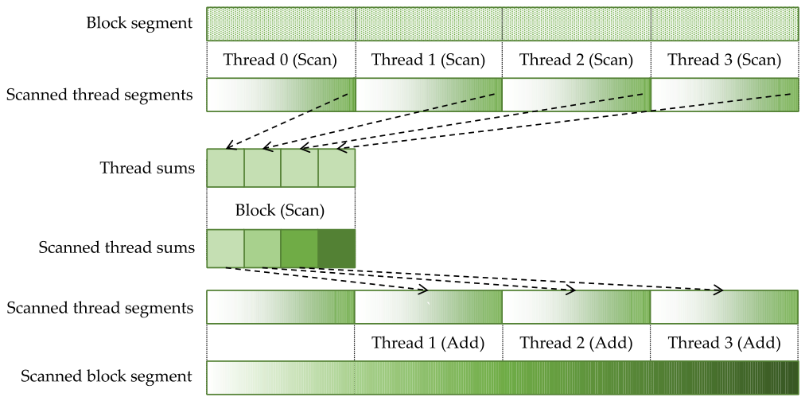

*Figure 11.11 — scan-scan-add 분해로 parallel scan 에 thread coarsening 을 적용한다.
(책 p.267)*

| 단계 | 동작 |
|---|---|
| — | block segment 가 shared memory 에 올라와 있다. **원소 수가 thread 수보다 coarsening factor 배 많다** |
| **1** | segment 를 thread 마다 하나씩 **연속 부분구획**으로 나눈다. 각 thread 가 **순차 scan** — **work efficient** 하다 |
| **2** | 각 thread 의 **마지막 값**(자기 원소 전부의 합)으로 **block 단위 scan** |
| **3** | 각 thread 가 **앞 thread 들의 합**을 받아 자기 값 전부에 더한다 |

**11.4절의 warp 분해와 완전히 같은 구조**를 한 층 더 아래에 쓴 것이다.

| 층 | 1단계 | 2단계 | 3단계 |
|---|---|---|---|
| **thread** (11.6절) | thread 순차 scan | block 단위 scan | thread 합 더하기 |
| **warp** (11.4절) | warp 단위 scan | warp sums scan | warp 합 더하기 |
| **block** (11.9절) | block 단위 scan | inter-block scan | block 합 더하기 |

---

### 2. 코드

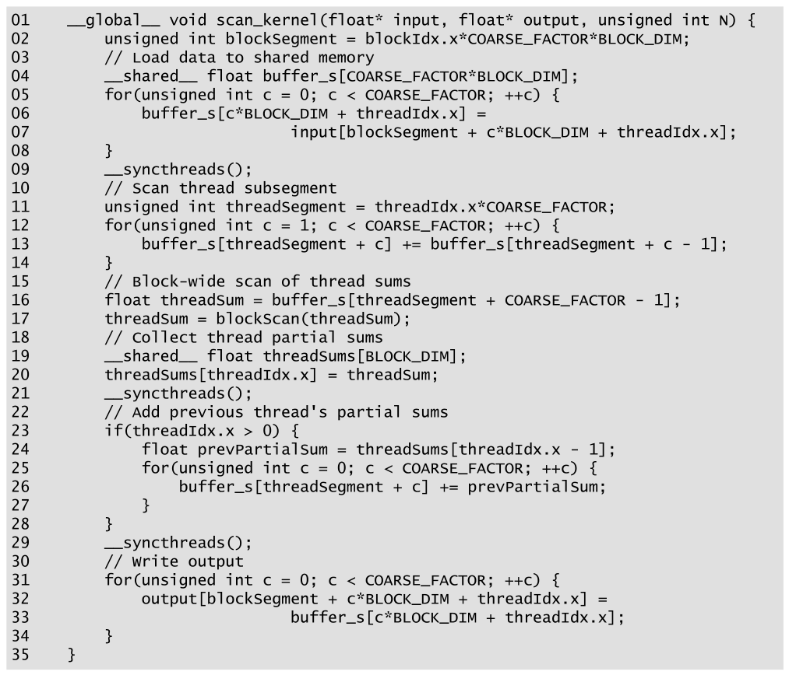

*Figure 11.12 — scan-scan-add 분해로 thread coarsening 을 적용한 parallel scan kernel.
(책 p.268)*

```cuda
01  __global__ void scan_kernel(float* input, float* output, unsigned int N) {
02      unsigned int blockSegment = blockIdx.x*COARSE_FACTOR*BLOCK_DIM;
03      // Load data to shared memory
04      __shared__ float buffer_s[COARSE_FACTOR*BLOCK_DIM];
05      for(unsigned int c = 0; c < COARSE_FACTOR; ++c) {
06          buffer_s[c*BLOCK_DIM + threadIdx.x] =
07                          input[blockSegment + c*BLOCK_DIM + threadIdx.x];
08      }
09      __syncthreads();
10      // Scan thread subsegment
11      unsigned int threadSegment = threadIdx.x*COARSE_FACTOR;
12      for(unsigned int c = 1; c < COARSE_FACTOR; ++c) {
13          buffer_s[threadSegment + c] += buffer_s[threadSegment + c - 1];
14      }
15      // Block-wide scan of thread sums
16      float threadSum = buffer_s[threadSegment + COARSE_FACTOR - 1];
17      threadSum = blockScan(threadSum);
18      // Collect thread partial sums
19      __shared__ float threadSums[BLOCK_DIM];
20      threadSums[threadIdx.x] = threadSum;
21      __syncthreads();
22      // Add previous thread's partial sums
23      if(threadIdx.x > 0) {
24          float prevPartialSum = threadSums[threadIdx.x - 1];
25          for(unsigned int c = 0; c < COARSE_FACTOR; ++c) {
26              buffer_s[threadSegment + c] += prevPartialSum;
27          }
28      }
29      __syncthreads();
30      // Write output
31      for(unsigned int c = 0; c < COARSE_FACTOR; ++c) {
32          output[blockSegment + c*BLOCK_DIM + threadIdx.x] =
33                          buffer_s[c*BLOCK_DIM + threadIdx.x];
34      }
35  }
```

> **원문 오기** (책 p.269). 본문이 "passes it to the **`blockSum`** device function from
> Fig. 11.9" 라고 쓴다. Figure 11.9 의 함수 이름은 **`blockScan`** 이다 (17번 줄도 그렇다).

#### 적재·저장의 인덱싱이 핵심이다

> 각 thread 가 `COARSE_FACTOR` 개 원소를 global 에서 shared 로 옮겨야 하는데,
> **자기가 소유할 연속 부분구획을 그대로 읽으면 uncoalesced 접근**이 된다 (책 p.269).
> coarsening factor 가 4 면 block 0 의 첫 반복에서 thread 0 이 원소 0,
> thread 1 이 원소 4, thread 2 가 원소 8 … 을 읽는다 — **연속이 아니다.**
>
> 대신 block segment 를 **각각 `BLOCK_DIM` 크기인 `COARSE_FACTOR` 개의 연속 덩어리**로 나눠
> **한 번에 한 덩어리씩** 옮긴다 (05~08번 줄).
> 그러면 첫 반복에 thread 0 이 원소 0, thread 1 이 원소 1, thread 2 가 원소 2 … 를 읽는다.

**9.5절의 interleaved partitioning 과 정확히 같은 처방**이다.

| 무엇 | 인덱싱 | 왜 |
|---|---|---|
| **global ↔ shared 전송** (05~08, 31~34) | `c*BLOCK_DIM + threadIdx.x` | **coalescing** |
| **thread 자기 구획 접근** (11~13, 25~27) | `threadIdx.x*COARSE_FACTOR + c` | **연속 부분구획**이라 순차 scan 이 된다 |

**같은 데이터를 두 가지 인덱싱으로 본다** — shared memory 가 그 변환을 흡수한다.

#### 줄별 요점

| 줄 | 하는 일 |
|---|---|
| **02** | block segment 시작 위치 = block index × segment 크기 |
| **05~08** | coalesced 적재 (덩어리 단위) |
| **09** | 자기 부분구획 접근 전에 전체 적재 완료 보장 |
| **11** | 자기 부분구획 위치 = thread index × 부분구획 크기 |
| **12~14** | **순차 scan** — Figure 11.1 과 같은 형태 |
| **16~17** | 자기 최종값(= 자기 원소 전부의 합)을 `blockScan` 에 넘긴다 |
| **19~21** | scanned thread sums 를 shared 에 놓고 barrier |
| **23~27** | 첫 thread 를 뺀 모두가 **직전 thread 의 scanned sum** 을 자기 원소 전부에 더한다 |
| **29** | 모든 thread 의 계산 완료 보장 |
| **31~34** | coalesced 저장 |

---

### 3. 수식/유도 — coarsening 이 work 를 얼마나 되돌리나

#### 전체 유도 과정 (먼저 한 번에)

원소 $N$ 개를 worker(thread) $P$ 개로 처리한다고 하자.

$$\text{work}_{\text{coarse}} = \underbrace{P \cdot \left(\tfrac{N}{P} - 1\right)}_{\text{① thread 순차 scan}}
  + \underbrace{P \cdot \log_2 P}_{\text{② thread sums 병렬 scan}}
  + \underbrace{(P-1)\cdot \tfrac{N}{P}}_{\text{③ 더하기}} \tag{1}$$

$$= 2N + P \log_2 P - P - \frac{N}{P} \tag{2}$$

$$\text{steps}_{\text{coarse}} = \underbrace{\tfrac{N}{P} - 1}_{①} + \underbrace{\log_2 P}_{②}
  + \underbrace{\tfrac{N}{P}}_{③} = \frac{2N}{P} + \log_2 P - 1 \tag{3}$$

#### 단계별 설명

**(1) 세 단계의 work 를 각각 센다** (책 p.269~270).

| 단계 | 무엇 | work |
|---|---|---|
| ① | $P$ 개 thread 가 각각 $\frac{N}{P}$ 원소를 순차 scan | $P \cdot (\frac{N}{P} - 1) = N - P$ |
| ② | thread 합 $P$ 개를 병렬 scan (Kogge-Stone) | $P \log_2 P$ |
| ③ | 첫 thread 를 뺀 $P-1$ 개가 각각 $\frac{N}{P}$ 값에 더한다 | $(P-1)\frac{N}{P} = N - \frac{N}{P}$ |

**(2) 합치면**

$$(N - P) + P\log_2 P + \left(N - \tfrac{N}{P}\right) = 2N + P\log_2 P - P - \frac{N}{P}$$

**이 식의 두 극단이 이 절의 결론이다** (책 p.270).

| $P$ | work | 성격 |
|---|---|---|
| **$P \approx N$** | $P \log_2 P$ 항이 지배 → $O(N \log_2 N)$ | coarsening 없는 것과 같다 |
| **$P \ll N$** | $2N$ 항이 지배 → **$O(N)$** | **순차와 같은 복잡도** |

> **thread coarsening 은 실행 자원 수가 입력 원소 수보다 훨씬 작을 때
> parallel scan 의 work efficiency 를 크게 개선한다** (책 p.270).

**(3) step 수도 같은 구조다.**

| $P$ | steps |
|---|---|
| **$P \approx N$** | 두 방식 다 $O(\log_2 N)$ |
| **$P \ll N$** | coarsening 없으면 $\frac{N \log_2 N}{P}$, **있으면 $\approx \frac{2N}{P}$** |

$N = 1024$, $P = 32$ 로 넣어 보면 (11.5절의 그 예):

| | steps | 순차 대비 |
|---|---|---|
| Kogge-Stone | $\frac{1024 \times 10}{32} = 320$ | $3.2\times$ |
| **+ coarsening** | $\frac{2 \times 1024}{32} + 5 - 1 = \mathbf{68}$ | $\mathbf{15.1\times}$ |

**$3.2\times$ 에서 $15.1\times$ 로 — 거의 $5\times$ 개선**이다.

#### coarsening 의 다른 이득 셋

| | 무엇 (책 p.270) |
|---|---|
| **①** | **병렬 block 단위 scan 은 barrier 를 쓰고 control divergence 가 있는데, 순차 thread 단위 scan 은 그렇지 않다.** 병렬에서 순차로 연산을 옮길수록 그 오버헤드의 비중이 준다 (10장 reduction 과 같은 이득) |
| **②** | **block 수를 줄일 수 있다.** coarsening 을 적용할 때 ⓐ block segment 크기를 유지하고 block 의 thread 수를 줄이거나 ⓑ **thread 수를 유지하고 segment 크기를 키울** 수 있는데, ⓑ 는 **thread block 수를 coarsening factor 만큼 줄인다.** 전역 scan 에서 block 구획을 합쳐야 할 때 **block 수가 적은 편이 유리하다** — 11.9절에서 다시 본다 |

> **책이 나중에 짚는 결정적 한마디** (책 p.282):
> **"Kogge-Stone 의 work efficiency 한계는 thread coarsening 으로 극복되어
> work efficiency 는 더 이상 주요 관심사가 아니다."**
> 11.10절의 Brent-Kung 이 "완전성을 위해" 소개되는 이유가 이것이다.

---

**연습문제 11.6-1.** 05~08번 줄의 적재를
`buffer_s[threadSegment + c] = input[blockSegment + threadSegment + c];`
로 바꾸면 coalescing 이 얼마나 나빠지는가? `COARSE_FACTOR = 4`, warp 32개 thread 로 답하라.

> warp 의 thread 0~31 이 각각 `threadSegment = 0, 4, 8, …, 124` 를 읽으므로
> `float` 기준 바이트 주소 $0, 16, 32, \ldots, 496$ — **512 B 범위**에 흩어진다.
> 128 B transaction **4개**가 필요하고 가져온 512 B 중 **$32 \times 4 = 128$ B 만 쓴다 → 75% 낭비**.
> 원래 코드는 **128 B 연속, transaction 1개, 낭비 없음**이다.
> **`COARSE_FACTOR` 가 커질수록 낭비가 비례해 커진다.**

**연습문제 11.6-2.** 이 kernel 은 `N` 인자를 받는데 **한 번도 쓰지 않는다.**
어떤 입력에서 문제가 되는가?

> `N` 이 `COARSE_FACTOR*BLOCK_DIM*gridDim.x` 의 배수가 아니면
> **마지막 block 이 배열 밖을 읽고 쓴다** (07·32번 줄).
> 10장 Figure 10.18 에서 본 것과 똑같은 누락이다.
> 고치려면 적재에 `(idx < N) ? input[idx] : 0.0f` (identity!)를,
> 저장에 `if (idx < N)` 를 넣는다.
> **Figure 11.3 은 04~08번 줄에서 제대로 처리했는데 여기서는 빠졌다.**

**연습문제 11.6-3.** (2)의 식에서 $N = 2^{20}$ 일 때
work 를 최소로 만드는 $P$ 는? 그때 step 수는?

> $f(P) = 2N + P\log_2 P - P - \frac{N}{P}$ 를 $P$ 로 미분하면
> $\log_2 P + \frac{1}{\ln 2} - 1 + \frac{N}{P^2} = 0$ — $P \ge 1$ 에서 양수이므로
> **$f$ 는 증가 함수이고 $P$ 가 작을수록 work 가 작다.**
> 즉 **$P = 1$(완전 순차)이 work 최소**다 — 당연한 결과다.
> **그래서 work 만으로 $P$ 를 고를 수 없다.** step 수 (3)은 반대로 $P$ 가 클수록 작아진다.
> 실제로는 **하드웨어를 채우는 최소 $P$** 를 고르는 것이 답이고,
> 그것이 10.10절이 말한 "충분한 block 이 남는 지점" 과 같은 기준이다.

---

## 11.7 Register tiling to avoid shared memory access latency (책 p.270)

### 1. 개념적 이해

> Figure 11.12 에서 각 thread 의 부분구획은 **shared memory** 에 있다.
> 그래서 자기 부분구획 원소에 접근할 때마다 shared memory 를 건드려야 한다.
> **부분구획 원소는 그 thread 에게만 사적이고 다른 thread 가 필요로 하지 않으므로,
> 반복해서 shared 에서 읽고 쓰는 것은 낭비다** (책 p.270~271).
>
> 대신 **register tiling** 을 적용해 부분구획 원소를 **register** 에 두고 거기서 반복 접근한다.

**8.6절의 register tiling 과 판단 기준이 똑같다** — "누가 이 데이터를 읽는가?"
답이 "나 혼자"면 shared 일 이유가 없다.

---

### 2. 코드

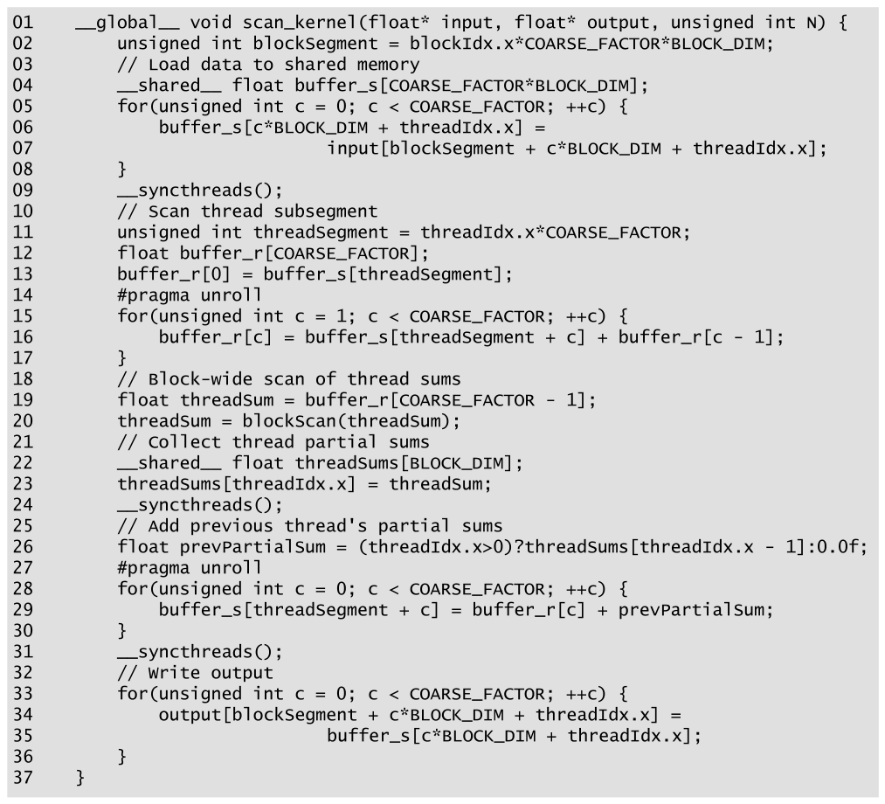

*Figure 11.13 — thread 부분구획에 register tiling 을 적용한 parallel scan kernel.
(책 p.271)*

```cuda
01  __global__ void scan_kernel(float* input, float* output, unsigned int N) {
02      unsigned int blockSegment = blockIdx.x*COARSE_FACTOR*BLOCK_DIM;
03      // Load data to shared memory
04      __shared__ float buffer_s[COARSE_FACTOR*BLOCK_DIM];
05      for(unsigned int c = 0; c < COARSE_FACTOR; ++c) {
06          buffer_s[c*BLOCK_DIM + threadIdx.x] =
07                          input[blockSegment + c*BLOCK_DIM + threadIdx.x];
08      }
09      __syncthreads();
10      // Scan thread subsegment
11      unsigned int threadSegment = threadIdx.x*COARSE_FACTOR;
12      float buffer_r[COARSE_FACTOR];
13      buffer_r[0] = buffer_s[threadSegment];
14      #pragma unroll
15      for(unsigned int c = 1; c < COARSE_FACTOR; ++c) {
16          buffer_r[c] = buffer_s[threadSegment + c] + buffer_r[c - 1];
17      }
18      // Block-wide scan of thread sums
19      float threadSum = buffer_r[COARSE_FACTOR - 1];
20      threadSum = blockScan(threadSum);
21      // Collect thread partial sums
22      __shared__ float threadSums[BLOCK_DIM];
23      threadSums[threadIdx.x] = threadSum;
24      __syncthreads();
25      // Add previous thread's partial sums
26      float prevPartialSum = (threadIdx.x>0)?threadSums[threadIdx.x - 1]:0.0f;
27      #pragma unroll
28      for(unsigned int c = 0; c < COARSE_FACTOR; ++c) {
29          buffer_s[threadSegment + c] = buffer_r[c] + prevPartialSum;
30      }
31      __syncthreads();
32      // Write output
33      for(unsigned int c = 0; c < COARSE_FACTOR; ++c) {
34          output[blockSegment + c*BLOCK_DIM + threadIdx.x] =
35                          buffer_s[c*BLOCK_DIM + threadIdx.x];
36      }
37  }
```

Figure 11.12 에서 바뀐 곳 (책 p.271).

| 줄 | 변화 |
|---|---|
| **12** | thread 부분구획을 담을 **지역 배열 `buffer_r`** 선언 |
| **13·16** | shared 에서 **처음 읽을 때 지역 배열에 담는다** |
| **16·19·29** | 이후 접근은 전부 지역 배열로 |
| **26** | 삼항 연산자로 첫 thread 를 처리 — **`if` 문이 사라져 divergence 가 줄었다** |
| **29** | 앞 thread 의 합을 더하면서 **shared 로 되돌려 놓는다** |

#### `#pragma unroll` 이 왜 필요한가

> `buffer_r` 를 도는 loop 는 전부 `#pragma unroll` 로 표시했다 (14·27번 줄) (책 p.271~272).
> 6장에서 본 대로 **loop unrolling 은 지역 배열이 상수 index 로 접근되도록 보장**하고,
> 그래야 **register 로 승격(promote)** 될 수 있다.
>
> **실제로는 이 표시가 없어도 컴파일러가 대개 unroll 한다.**
> 그러나 **"이 loop 는 unroll 되기를 의도했다"는 유용한 알림**이다.

> **CUDA 의 "지역 배열"은 자동으로 register 가 아니다.** 5장에서 본 대로
> 인덱스가 컴파일 타임에 결정되지 않으면 **local memory** (= global memory 의 한 구역)에
> 놓인다. 그러면 register tiling 의 이득이 통째로 사라진다.
> `#pragma unroll` 은 그 위험을 없애는 장치다.

#### shared memory 를 왜 여전히 쓰는가

이 절에서 가장 미묘한 대목이다.

> kernel 은 여전히 thread 부분구획을 **shared 에 적재**한 뒤(06번 줄)
> register tile 로 옮기고(13·16번 줄), 계산 뒤 다시 **shared 에 저장**한 뒤(29번 줄)
> global 로 내보낸다(34번 줄).
>
> **shared 를 중간 매개로 남긴 이유**는, thread 가 global memory 와 자기 register tile
> 사이에서 직접 주고받으면 **접근이 coalesced 되지 않기 때문**이다 (책 p.272).
>
> **즉 이 kernel 은 shared memory 를 tiling 목적으로 쓰지 않는다** — shared 의 데이터는
> 재사용되지 않는다. **오직 global memory 접근을 coalesced 하게 만들기 위해 쓴다.**
> **6장의 corner turning 최적화와 같은 성격**이다.

**5장에서 배운 shared memory 의 용도가 여기서 세 갈래로 갈린다.**

| 용도 | 예 |
|---|---|
| **데이터 재사용** | 5장 tiled matmul, 7·8장 tiling |
| **빠른 atomic 의 무대** | 9장 privatization |
| **coalescing 을 위한 환승역** | **11.7절 · 6장 corner turning** |

#### 남은 최적화 둘

책이 연습문제로 남긴다 (책 p.272).

| | 무엇 | 어디서 |
|---|---|---|
| **①** | global ↔ shared 전송(05~08, 33~36번 줄)에 **vector load/store** | 6.3절 |
| **②** | 13·29번 줄의 **strided 접근이 bank conflict** 를 낸다 → **padding** | 6.4절 |

②를 확인해 두자. 13번 줄은 `buffer_s[threadIdx.x * COARSE_FACTOR]` 이므로
**stride 가 `COARSE_FACTOR`** 다. `COARSE_FACTOR = 4` 면 warp 의 32 thread 가
bank $0, 4, 8, \ldots$ 를 건드려 **4-way bank conflict** 다.
연습문제 11.12-4 에서 고친다.

---

**연습문제 11.7-1.** `COARSE_FACTOR = 8`, `BLOCK_DIM = 256` 일 때
이 kernel 이 thread 당 쓰는 register 와 block 당 shared memory 는?

> register: `buffer_r[8]` = **8개** (+ 나머지 지역 변수 몇 개).
> shared: `buffer_s[8*256]` = 2048 × 4 B = **8 KB**, `threadSums[256]` = 1 KB → **총 9 KB**.
> H100 은 SM 당 thread 2048개이므로 256-thread block 8개가 올라가고 shared 는 72 KB —
> **SM 용량 안이지만 무시할 수 없는 수준**이다.
> `COARSE_FACTOR` 를 키우면 shared 가 선형으로 늘어 occupancy 를 조인다.

**연습문제 11.7-2.** 29번 줄이 `buffer_s` 에 쓰는데,
`buffer_r` 에 쓰고 34번 줄에서 `buffer_r` 를 직접 내보내면 안 되는가?

> 안 된다 — **34번 줄의 인덱싱이 `c*BLOCK_DIM + threadIdx.x` 라 coalesced 인데,
> `buffer_r[c]` 는 thread 의 부분구획 순서**다.
> 즉 thread 가 자기 `buffer_r[c]` 를 직접 global 로 쓰면
> 주소가 `blockSegment + threadIdx.x*COARSE_FACTOR + c` 가 되어 **uncoalesced** 다.
> **shared 를 거치는 것이 바로 이 인덱싱 변환을 하기 위해서**다.

**연습문제 11.7-3.** 26번 줄이 삼항 연산자를 쓰는데 Figure 11.12 의 23번 줄은 `if` 문이었다.
왜 바뀌었는가?

> `if` 문이면 **첫 thread 만 27~30번 줄의 loop 를 건너뛰어 divergence** 가 생긴다.
> 삼항 연산자로 `prevPartialSum` 을 0(identity)으로 만들면 **모든 thread 가 같은 코드를
> 실행**하고 첫 thread 는 0 을 더할 뿐이다.
> **identity value 로 조건 분기를 흡수하는 관용구**가 이 장에서만 네 번째다
> (Figure 11.3 의 07번, Figure 11.5 의 07번, Figure 11.9 의 12번, 여기 26번).

---

## 11.8 Memory bandwidth considerations (책 p.272)

### 2. 수식/유도

#### 전체 유도 과정 (먼저 한 번에)

$$AI_{\text{scan}} = \frac{N-1}{4N + 4N} \approx \frac{1}{8} = 0.125\ \text{OP/B} \tag{1}$$

$$\text{H100 ridge point} = \frac{66.9\ \text{TFLOPS}}{3.35\ \text{TB/s}} = 20.0\ \text{FLOP/B} \tag{2}$$

$$\text{scan 성능 상한} = \frac{3.35 \times 10^{12}\ \text{B/s}}{8\ \text{B/원소}}
  = 419 \times 10^9\ \text{원소/s} \tag{3}$$

#### 단계별 설명

**(1) arithmetic intensity.**

원소 $N$ 개짜리 부동소수점 배열의 scan 은

| | 양 |
|---|---|
| 적재 | $N$ 개 = $4N$ B |
| 덧셈 | $N-1$ 회 |
| 저장 | $N$ 개 = $4N$ B |

$$AI = \frac{N-1}{4N + 4N} \approx \frac{1}{8}\ \text{OP/B}$$

**(2) 이것이 얼마나 낮은지.**

NVIDIA H100 은 peak 부동소수점 throughput **66.9 TFLOPS**, peak global memory bandwidth
**3.35 TB/s** 다. compute-bound 가 되려면

$$\frac{66.9}{3.35} = 20.0\ \text{FLOP/B}$$

**scan 의 $0.125$ 는 그 $\frac{1}{160}$ 이다.** 압도적으로 **memory-bound** 다 (책 p.272).

> 8장의 3D stencil 이 $1.625$ FLOP/B 로 memory-bound 라고 했는데,
> **scan 은 그보다도 13× 낮다.** 이 장의 모든 최적화가 결국
> **"global memory 를 몇 번 건드리느냐"** 로 수렴하는 이유다.

**(3) 그래서 천장이 정해진다.**

memory-bound 계산에서는 **peak memory bandwidth 가 peak 성능의 한계**다.
scan 은 원소마다 최소 **8 B** (읽기 4 + 쓰기 4)를 건드려야 하므로

$$\frac{3.35 \times 10^{12}}{8} = 419 \times 10^9\ \text{원소/s}$$

> **H100 에서 어떤 scan kernel 도 초당 4190억 원소를 넘길 수 없다** (책 p.272).
>
> 이 값에 도달하려면 **memory bandwidth 를 완벽히 써야** 한다 —
> **global memory 위치마다 딱 한 번만 접근**하고, 연산·동기화·shared 접근의 latency 를
> 전부 global 접근 뒤에 숨겨야 한다.
> **실제로 그런 완벽한 활용은 어렵다.** 연산도 동기화도 없이 **배열을 복사만 하는 kernel** 조차
> global memory bandwidth 의 100% 를 못 낸다.
>
> 보통 **중복 global 접근 없이 80% 이상**을 내면 잘 최적화된 memory-bound kernel 로 본다.

**Figure 11.13 의 kernel 은 중복 global 접근이 없고** 연산·동기화·shared 접근 오버헤드를
충분히 줄였으므로 **80% 이상을 낼 수 있다** (책 p.273).

**단, 그것은 지역 scan 일 때 이야기다.** block 구획들을 합쳐 전역 scan 을 만들려면
**global 접근과 동기화가 더 필요하고**, 그것이 이 효율을 지키는 데 도전이 된다 —
**11.9절의 주제**다.

---

### 3. 예제/실습

**연습문제 11.8-1.** `double` 로 scan 하면 (1)~(3)이 어떻게 바뀌는가?

> 원소가 8 B 이므로 원소당 **16 B**.
> $AI = \frac{N-1}{16N} \approx \frac{1}{16} = 0.0625$ OP/B — **절반**.
> 성능 상한 $= \frac{3.35 \times 10^{12}}{16} = 209 \times 10^9$ 원소/s — **절반**.
> ridge point 는 FP64 throughput 이 낮아지므로 함께 내려간다.
> **memory-bound 정도는 비슷하고 절대 성능만 반토막**이다 (8장 stencil 과 같은 구도).

**연습문제 11.8-2.** in-place scan (입력 배열에 결과를 덮어쓰기) 이라면
(3)의 상한이 좋아지는가?

> **좋아지지 않는다.** in-place 여도 **읽기 4 B + 쓰기 4 B = 8 B** 는 그대로다.
> 줄어드는 것은 **메모리 용량**이지 **트래픽**이 아니다.
> 다만 cache 관점에서는 같은 line 을 읽고 쓰므로 **write-allocate miss 가 줄어드는** 실제 이득이
> 있을 수 있다 — 모델 위의 상한은 안 바뀐다.

---

## 11.9 Consolidating block segments for a global scan (책 p.273)

### 1. 개념적 이해

지금까지의 kernel 은 전부 **입력 구획에 대한 block 단위 scan** 이다.
응용에 따라 그것으로 충분할 수도 있지만, **수백만~수십억 원소**를 다루려면
**grid 전체 scan** 이 필요하고 **block 구획들을 합쳐야** 한다 (책 p.273).

#### 방법 ① — scan-scan-add, 세 개의 kernel

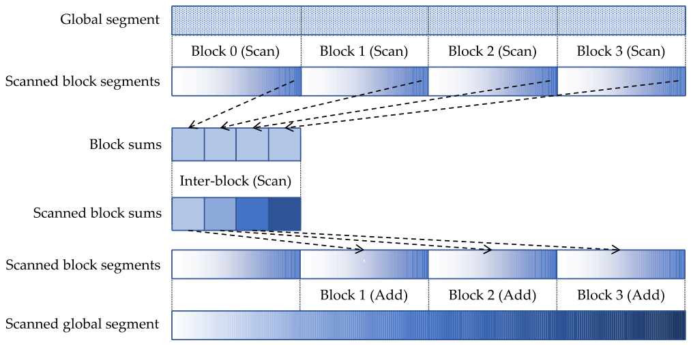

*Figure 11.14 — scan-scan-add 분해로 전역 scan 을 block 단위 scan 으로 분해한다.
(책 p.274)*

**11.4·11.6절과 완전히 같은 구조를 block 층에 적용**한 것이다.
문제는 **block 사이의 동기화**인데, 가장 단순한 방법은 **단계마다 kernel 을 따로 부르는 것**이다.

| kernel | 하는 일 |
|---|---|
| 1 | block 구획들의 지역 scan |
| 2 | **block 하나**로 block sums 를 scan |
| 3 | scanned block sums 를 더한다 |

**단점은 중간 값들이 kernel 사이에서 global memory 를 왕복한다는 것**이다 (책 p.274).

$$\underbrace{N + N}_{\text{kernel 1}} + \underbrace{\tfrac{N}{S} + \tfrac{N}{S}}_{\text{kernel 2}}
+ \underbrace{N + N}_{\text{kernel 3}} = \left(4 + \frac{2}{S}\right)N \ \text{원소}
= \left(16 + \frac{8}{S}\right)N \ \text{B}$$

$S$ = block 구획당 원소 수. $S$ 가 아주 크면 $\approx 16 N$ B, 즉 **원소당 16 B** 다.

$$\frac{3.35 \times 10^{12}}{16} = 209 \times 10^9\ \text{원소/s}$$

**이상적 $419 \times 10^9$ 의 정확히 절반**이다.

> 직관적으로도 그렇다 — **global 접근이 두 배**이기 때문이다.
> kernel 1 끝에서 중간값 $N$ 개를 저장하고 kernel 3 시작에서 다시 읽어야 한다.

#### 방법 ② — reduce-scan-scan

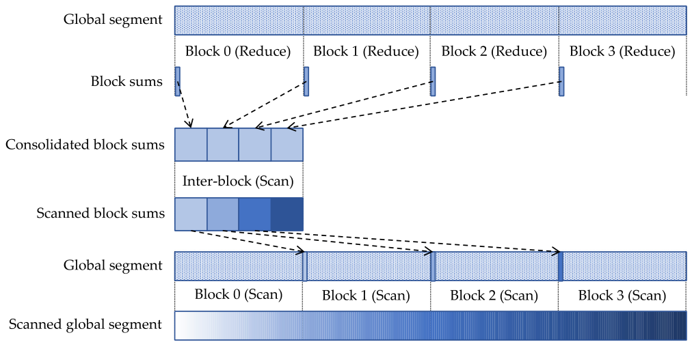

*Figure 11.15 — 전역 scan 을 block 단위 scan 으로 나누는 reduce-scan-scan 분해. (책 p.275)*

| 단계 | 하는 일 |
|---|---|
| **reduce** | 각 block 이 자기 구획에 **reduction** (10장의 kernel 과 비슷) |
| **scan** | block 합들에 전역 inter-block scan |
| **scan** | 각 block 이 **앞 block 들의 합을 자기 구획 첫 원소에 더한 뒤** 구획을 scan |

세 kernel 로 구현하면 (책 p.275)

$$\underbrace{N + \tfrac{N}{S}}_{\text{reduce}} + \underbrace{\tfrac{N}{S} + \tfrac{N}{S}}_{\text{scan sums}}
+ \underbrace{N + N}_{\text{local scan}} = \left(3 + \frac{3}{S}\right)N \ \text{원소}
= \left(12 + \frac{12}{S}\right)N \ \text{B}$$

$\approx 12 N$ B → **원소당 12 B**

$$\frac{3.35 \times 10^{12}}{12} = 279 \times 10^9\ \text{원소/s}$$

**이상적의 $\frac{2}{3}$** — scan-scan-add 의 절반보다 낫다.

> 직관: reduce-scan-scan 은 **kernel 1 끝에서 $N$ 개를 저장할 필요가 없다.**
> 대신 kernel 3 시작에서 $N$ 개를 읽어야 하는 것은 여전하다 (책 p.276).

| 분해 | 원소당 B | 성능 상한 | 이상적 대비 |
|---|---|---|---|
| 이상적 | 8 | $419 \times 10^9$ | 100% |
| **reduce-scan-scan** | 12 | $279 \times 10^9$ | **67%** |
| **scan-scan-add** | 16 | $209 \times 10^9$ | **50%** |

> **주의 — reduce-scan-scan 은 교환법칙을 요구할 수 있다** (책 p.276).
> 지금까지 scan 의 병렬화·최적화는 **결합법칙만** 가정했다.
> 그런데 10장의 reduction 최적화 일부는 **교환법칙도** 가정했다 (Figure 10.8 이 그랬다).
> **연산자가 교환적이지 않다면 어떤 reduction 구현을 쓸지 조심해야 한다.**

#### 왜 warp·thread 층에서는 scan-scan-add 가 나은가

책이 던지는 좋은 질문이다 (책 p.276). 두 분해 모두 scan 이 두 번이고,
**차이는 나머지 하나가 add 냐 reduce 냐**뿐이다.

| | 장점 |
|---|---|
| **reduce** | **출력을 적게 쓴다** |
| **add** | reduction tree 의 **여러 step 과 중간 동기화가 필요 없다** |

| 층 | 주된 관심사 | 그래서 |
|---|---|---|
| **block 사이** (전역) | **global memory 배열 접근을 줄이는 것** | **reduce** 가 유리 |
| **warp·thread 사이** (block 안) | 원소가 이미 **register 에 있다** — register 를 몇 번 더 읽는 것이 **동기화보다 훨씬 싸다** | **add** 가 유리 |

**같은 분해 선택이 층마다 답이 다르다** — 이 장에서 가장 좋은 통찰 중 하나다.

---

### 2. kernel 을 끝내지 않고 inter-block scan 하기

reduce-scan-scan 도 **입력을 global 에서 두 번 읽어야** 해서 이상적에 못 미친다.
이상에 가까워지려면 **입력 배열 전체를 딱 한 번 읽고 출력 배열 전체를 딱 한 번 써야** 하는데,
**여러 kernel 로는 불가능**하다 (책 p.276).

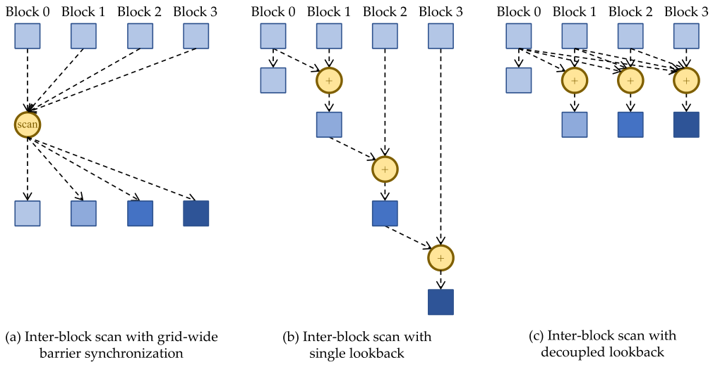

*Figure 11.16 — 단일 kernel 안에서의 inter-block scan 대안들. (책 p.277)*

#### (a) grid 전체 barrier

모든 block 이 자기 합을 **block 0** 에 넘기면 block 0 이 scan 해서 되돌려 준다.

| | |
|---|---|
| 필요한 것 | block 0 의 scan **앞뒤로 grid 전체 barrier synchronization** (18장의 cooperative groups) |
| 제약 ① | **grid 의 모든 block 이 동시에 돌아야** 한다 → block 수가 제한되고, block 당 구획 크기도 shared·register 용량에 묶이므로 **scan 할 수 있는 배열 전체 크기가 제한된다** |
| 제약 ② | **grid 전체 barrier 는 아주 비싼 연산인데 두 번** 해야 한다 |

#### (b) single lookback — 단방향 동기화

**합을 한 block 에서 다음 block 으로 넘기며 그 길에 scan 한다.**
각 block 은 앞 block 의 scanned sum 을 기다렸다가 자기 합에 더해 자기 scanned sum 을 만들고,
그것을 다음 block 에 넘긴다.

> **grid 전체 barrier 가 필요 없다는 것이 (a) 대비 장점**이다.
> 각 block 은 **앞 block 들이 이전 연산을 끝내기만** 기다리면 된다.
> 이런 동기화를 **unidirectional synchronization (단방향 동기화)** 이라고 한다 (책 p.277).
>
> **barrier 와 달리 참여 block 이 전부 동시에 활성일 필요가 없다.**
> **앞 block 이 뒤 block 보다 먼저 스케줄되기만** 하면 된다.
> 그 요구는 **block index 를 `blockIdx.x` 에 의존하지 말고, block 이 실행을 시작한 뒤에
> 동적으로 배정**하면 만족시킬 수 있다.

**이 마지막 문장이 결정적이다.** `blockIdx.x` 순서대로 스케줄된다는 보장이 없으므로,
그냥 `blockIdx.x` 를 쓰면 **뒤 index block 이 먼저 돌면서 앞 block 을 영원히 기다리는
deadlock** 이 난다.

---

### 3. 코드 — single lookback

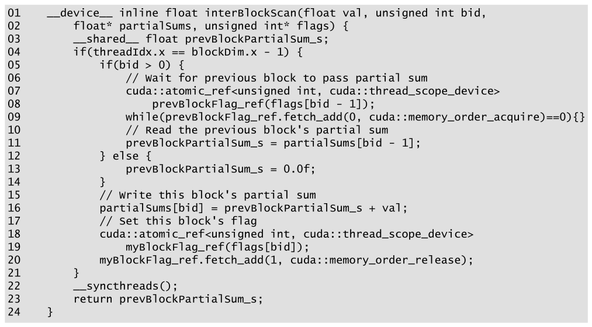

*Figure 11.17 — single lookback 방식의 inter-block scan 코드. (책 p.278)*

```cuda
01  __device__ inline float interBlockScan(float val, unsigned int bid,
02      float* partialSums, unsigned int* flags) {
03      __shared__ float prevBlockPartialSum_s;
04      if(threadIdx.x == blockDim.x - 1) {
05          if(bid > 0) {
06              // Wait for previous block to pass partial sum
07              cuda::atomic_ref<unsigned int, cuda::thread_scope_device>
08                  prevBlockFlag_ref(flags[bid - 1]);
09              while(prevBlockFlag_ref.fetch_add(0, cuda::memory_order_acquire)==0){}
10              // Read the previous block's partial sum
11              prevBlockPartialSum_s = partialSums[bid - 1];
12          } else {
13              prevBlockPartialSum_s = 0.0f;
14          }
15          // Write this block's partial sum
16          partialSums[bid] = prevBlockPartialSum_s + val;
17          // Set this block's flag
18          cuda::atomic_ref<unsigned int, cuda::thread_scope_device>
19              myBlockFlag_ref(flags[bid]);
20          myBlockFlag_ref.fetch_add(1, cuda::memory_order_release);
21      }
22      __syncthreads();
23      return prevBlockPartialSum_s;
24  }
```

| 인자 | 뜻 |
|---|---|
| `val` | 이 block 이 scan 에 기여할 값 (= 자기 구획의 합) |
| `bid` | **동적으로 배정된** block index |
| `partialSums` | block 들이 자기 scanned sum 을 놓을 배열 |
| `flags` | block 들이 **자기 scanned sum 이 준비됐음을 알리는** 배열 |

| 줄 | 하는 일 |
|---|---|
| **04** | **block 의 마지막 thread** 가 block 합을 갖고 있으므로 **leader thread** 역할을 한다 |
| **05** | 첫 block 인지 검사 |
| **13** | 첫 block 이면 앞 block 의 scanned sum 은 **자명하게 0** |
| **07~09** | 아니면 **앞 block 의 flag 가 0 이 아닐 때까지 기다린다** |
| **11** | flag 가 서면 앞 block 의 scanned sum 을 읽는다 |
| **16** | 앞 block 의 합 + 자기 값 = 자기 scanned sum 을 저장 |
| **18~20** | 자기 flag 를 **1 증가**시켜 다음 block 에 알린다 |
| **22** | block 의 다른 thread 들이 leader 를 기다린다 |
| **23** | 모든 thread 가 앞 block 의 scanned sum 을 받는다 |

#### flag 검사는 왜 atomic 인가

> flag 는 **다른 block 의 thread** 가 세우므로 **atomic 하게 읽어야** 한다.
> 그리고 **device scope** 여야 여러 block 사이에서 갱신이 보인다 (책 p.278).
> 그래서 앞 block 의 flag 에 device-scope atomic reference 를 만들고
> **0 을 반복해서 더하며 옛 값을 검사**한다 — **0 을 더해도 값이 안 변하므로**
> 앞 block 이 세울 때까지 0 으로 남아 있다.

#### memory order — 이 장의 새 개념

9.2절에서는 `memory_order_relaxed` 만 썼다. **여기서는 두 가지가 더 나온다.**

| 어디 | 무엇 | 왜 |
|---|---|---|
| **09번 줄** | **`cuda::memory_order_acquire`** | flag 의 뜻이 "scanned sum 이 준비됐다" 이므로, **11번 줄의 sum 적재가 flag 검사보다 앞으로 재배치되면 안 된다.** acquire 의미는 **뒤따르는 memory 명령이 이 atomic 앞으로 재배치되지 않음**을 뜻한다 |
| **20번 줄** | **`cuda::memory_order_release`** | 마찬가지로 **16번 줄의 sum 저장이 flag 갱신보다 뒤로 재배치되면 안 된다.** release 의미는 **앞선 memory 명령이 이 atomic 뒤로 재배치되지 않음**을 뜻한다 |

> **9장에서 `relaxed` 로 충분했던 이유와 대조하면 선명하다** (9.2절).
> 거기서는 atomic 연산과 순서를 따질 다른 접근이 **`image[i]` 읽기 하나**뿐이었고,
> 그 값이 **atomic 대상을 고르는 데 쓰여** 명령 수준 데이터 의존이 이미 순서를 강제했다.
> **여기서는 flag 와 sum 이 서로 다른 배열이라 하드웨어가 의존을 볼 수 없다.**
> 그래서 프로그래머가 명시해야 한다.

$$\underbrace{\texttt{partialSums[bid] = ...}}_{\text{①}} \;\to\;
\underbrace{\texttt{flags[bid] += 1}}_{\text{② release}}
\qquad\Big|\qquad
\underbrace{\texttt{while(flags[bid-1]==0)}}_{\text{③ acquire}} \;\to\;
\underbrace{\texttt{... = partialSums[bid-1]}}_{\text{④}}$$

**release 가 ①→② 를, acquire 가 ③→④ 를 묶어 ①이 ④에게 보이는 것을 보장한다.**
이 쌍을 **release-acquire 짝** 이라고 부른다.

---

### 4. single lookback 의 문제와 decoupled lookback

> single lookback 은 scan 을 **kernel 하나로** 하게 해 주지만
> **성능이 꽤 나쁠 수 있다** (책 p.279).
> **block 사이에 긴 의존 사슬**을 만들어 그것이 kernel 실행의 **long-latency critical path** 가
> 되기 때문이다.

배열 크기 $N$, block 구획 크기 $S$ 면 block 이 $\frac{N}{S}$ 개다.

| 방법 | 동기화 횟수 |
|---|---|
| Figure 11.16(a) | grid 전체 barrier **2번** |
| Figure 11.16(b) | 단방향 동기화 **$\frac{N}{S}$ 번** |

**단방향 동기화가 더 가벼워도 개수가 훨씬 많다.** block 이 많으면 single lookback 은 비효율적이다.

#### multiple lookback

> critical path 는 **block 이 앞의 여러 block 을 되돌아보게** 하면 줄일 수 있다 (책 p.279~280).
>
> block $b$ 가 앞 block $b-1$ 의 **sum 은 준비됐지만 scanned sum 은 아직**임을 발견하면,
> **$b-2$ 를 본다.** $b-2$ 의 scanned sum 이 준비됐다면 $b$ 는 $b-1$ 이 더하기를 기다릴 필요 없이
> **자기가 직접 $b-1$ 의 sum 을 $b-2$ 의 scanned sum 에 더하고 진행**한다.
>
> 그러면 **중복 work 가 생긴다** ($b$ 와 $b-1$ 이 둘 다 $b-2$ 의 scanned sum 을 더한다).
> **그 중복이 기다림의 latency 를 줄인다.**

| 방식 | 어떻게 |
|---|---|
| **고정 개수** | 정해진 수의 앞 block 을 계속 검사 |
| **가변 개수 = decoupled lookback** | **scanned sum 이 준비된 것을 찾을 때까지 계속 뒤로** 가고, 그 뒤의 sum 들을 전부 더한다 |

**더 멀리 볼수록 중복 work 는 늘고 우회하는 의존 사슬은 길어진다.**

Figure 11.16(c) 는 decoupled lookback 의 **극단** — 각 block 이 **앞 block 전부의 합을
자기가 reduce** 한다.

> **이 방법이 11.2절의 naïve parallel scan 을 떠올리게 한다** (책 p.280).
> naïve scan 은 work efficiency 가 최악이지만 **동기화 오버헤드가 가장 낮다.**
> **inter-block scan 상황에서는 동기화 비용이 연산 비용보다 훨씬 크고,
> reduce 할 block sum 개수도 전체 입력 원소 수보다 훨씬 작으므로** 이 성질이 유리해진다.

**같은 알고리즘이 층에 따라 최악이 되기도 최선이 되기도 한다** — 이 장의 백미다.

---

### 5. 코드 — 단일 kernel scan

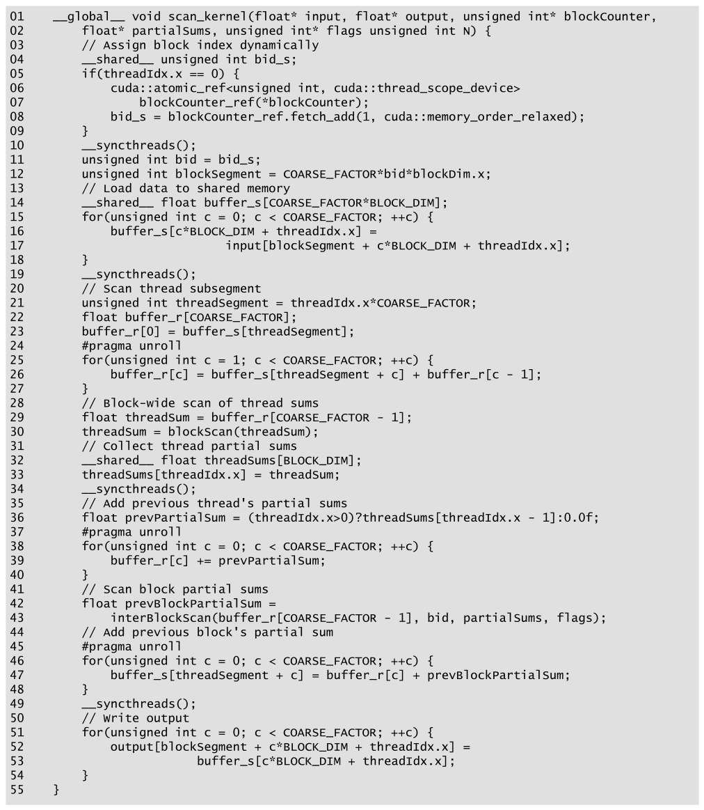

*Figure 11.18 — block 구획을 합치는 inter-block scan 을 포함한 scan kernel. (책 p.281)*

```cuda
01  __global__ void scan_kernel(float* input, float* output, unsigned int* blockCounter,
02      float* partialSums, unsigned int* flags, unsigned int N) {
03      // Assign block index dynamically
04      __shared__ unsigned int bid_s;
05      if(threadIdx.x == 0) {
06          cuda::atomic_ref<unsigned int, cuda::thread_scope_device>
07              blockCounter_ref(*blockCounter);
08          bid_s = blockCounter_ref.fetch_add(1, cuda::memory_order_relaxed);
09      }
10      __syncthreads();
11      unsigned int bid = bid_s;
12      unsigned int blockSegment = COARSE_FACTOR*bid*blockDim.x;
        ⋮                          // 13~40번 줄은 Figure 11.13 의 03~30번 줄과 같다
41      // Scan block partial sums
42      float prevBlockPartialSum =
43          interBlockScan(buffer_r[COARSE_FACTOR - 1], bid, partialSums, flags);
44      // Add previous block's partial sum
45      #pragma unroll
46      for(unsigned int c = 0; c < COARSE_FACTOR; ++c) {
47          buffer_s[threadSegment + c] = buffer_r[c] + prevBlockPartialSum;
48      }
49      __syncthreads();
50      // Write output
51      for(unsigned int c = 0; c < COARSE_FACTOR; ++c) {
52          output[blockSegment + c*BLOCK_DIM + threadIdx.x] =
53                          buffer_s[c*BLOCK_DIM + threadIdx.x];
54      }
55  }
```

> **원문 오기** (Figure 11.18, 책 p.281). 02번 줄의 인자 목록이
> `unsigned int* flags unsigned int N` 으로 **`flags` 와 `unsigned int N` 사이의 쉼표가
> 빠져 있다.** 컴파일되지 않는다. 위 코드는 바로잡은 것이다.

#### block index 를 동적으로 배정한다 (04~11번 줄)

> inter-block scan 은 단방향 동기화를 요구하고, 그것은 **앞 block 이 먼저 스케줄될 것**을
> 요구한다. 이는 **block 이 스케줄된 뒤 증가 순서로 index 를 동적 배정**하면 보장된다
> (책 p.280).
>
> block 이 실행을 시작하면 **thread 하나**(05번 줄)가 **block counter 를 atomic 하게 증가**시켜
> index 를 얻고(06~08번 줄), 다른 thread 들은 그것을 기다렸다가(10번 줄)
> shared 에서 읽는다(11번 줄).
> counter 는 메모리에 할당해 **0 으로 초기화**하고 kernel 인자로 넘긴다.

**이것이 deadlock 방지 장치의 전부다.** 아주 짧지만 없으면 프로그램이 멈춘다.

> **여기서는 `memory_order_relaxed` 로 충분하다** (08번 줄).
> counter 값 자체 말고 순서를 따질 다른 접근이 없기 때문이다 — 9장과 같은 상황이다.

#### 나머지

| 줄 | 하는 일 |
|---|---|
| **13~40** | Figure 11.13 과 거의 같다 — 적재, thread 순차 scan, block scan, thread 합 더하기 |
| **42~43** | Figure 11.17 의 inter-block scan 호출 — **scan-scan-add 의 두 번째 scan** |
| **45~48** | **add 단계** — 앞 block 의 scanned sum 을 자기 원소 전부에 더한다 |
| **51~54** | coalesced 저장 |

> **이 kernel 은 scan-scan-add 분해를 따른다** (책 p.280).
> 앞에서 reduce-scan-scan 이 낫다고 했는데 왜인가?
> **단일 kernel 이라 첫 scan 의 출력을 global 에 쓰고 다시 읽을 필요가 없기 때문**이다.
> **reduce-scan-scan 의 이점이 사라졌으므로** 더 단순한 scan-scan-add 를 쓴다.

> **주의 — `N` 인자를 또 쓰지 않는다.** Figure 11.12·11.13 과 같은 누락이다.

---

**연습문제 11.9-1.** Figure 11.18 이 `blockIdx.x` 를 그대로 썼다면
어떤 상황에서 deadlock 이 나는가? 구체적으로 답하라.

> GPU 가 block 을 스케줄하는 순서는 **`blockIdx.x` 순서라는 보장이 없다.**
> SM 이 8개인데 block 이 1000개인 상황을 생각하자.
> 하드웨어가 block 100~107 을 먼저 올렸다고 하면, block 100 은
> **`flags[99]` 가 서기를 기다린다.** 그런데 block 99 는 아직 스케줄되지도 않았고,
> **block 100~107 이 SM 을 점유한 채 영원히 기다리므로 block 99 가 올라올 수 없다.**
> **완전한 deadlock** 이다.
> 동적 배정을 쓰면 **먼저 스케줄된 block 이 작은 index 를 받으므로** 이 상황이 생길 수 없다.

**연습문제 11.9-2.** 09번 줄의 `fetch_add(0, ...)` 대신 `flags[bid-1]` 을 그냥 읽으면?

> 두 가지가 깨진다.
> **① 컴파일러가 loop 밖으로 들어낼 수 있다** — `flags[bid-1]` 이 loop 안에서 안 바뀌므로
> 값을 register 에 한 번 읽고 무한 loop 를 돈다 (`volatile` 이 아니면).
> **② memory order 를 지정할 수 없다** — acquire 의미가 없으면 11번 줄의 sum 적재가
> flag 검사보다 앞으로 재배치될 수 있다.
> `fetch_add(0, acquire)` 는 **값을 안 바꾸면서 atomic 읽기 + acquire 순서**를 얻는 관용구다.

**연습문제 11.9-3.** $N = 2^{30}$, $S = 2^{13}$ 일 때
(a) 세 방법의 동기화 횟수 (b) 세 kernel scan-scan-add 와 단일 kernel 의 global 트래픽

> block 수 $= 2^{30}/2^{13} = 2^{17} = 131{,}072$.
> **(a)** grid barrier 방식 **2번** (단 block 이 전부 동시에 못 올라가므로 **애초에 불가능**),
> single lookback **131,072번**, decoupled lookback 은 그보다 적다.
> **(b)** 세 kernel scan-scan-add: $16N = 16 \times 2^{30} = 17.2$ GB.
> 단일 kernel: 이상적 $8N = 8.6$ GB + inter-block 트래픽 $\approx 8 \times 2^{17} = 1$ MB (무시 가능).
> **트래픽이 절반이다.** H100 의 3.35 TB/s 로 나누면 5.1 ms 대 2.6 ms.

---

## 11.10 Parallel scan with the Brent-Kung algorithm (책 p.282)

### 1. 개념적 이해

> 이 절은 **work efficiency 가 더 좋은 대신 계산 step 이 더 많은** 대안 알고리즘을 다룬다.
> **독자의 지식 완결성을 위해** 다루되, **Kogge-Stone 의 work efficiency 한계는
> thread coarsening 으로 극복되어 work efficiency 가 더 이상 주요 관심사가 아님**을
> 밝혀 둔다 (책 p.282).

책이 이렇게 명시적으로 "이건 참고용"이라고 말하는 절은 드물다. **그대로 받아들이자.**

#### 발상

> $N$ 개 값의 합을 이항 연산자로 만드는 가장 빠른 병렬 방법은 **reduction tree** 이고,
> 실행 유닛이 충분하면 $\log_2 N$ 시간에 된다.
> 게다가 **그 tree 는 여러 부분합(sub-sum)도 만들어 내고,
> 그중 일부는 scan 출력값 계산에 쓸 수 있다** (책 p.282).
>
> 이 관찰이 Kogge-Stone 덧셈기 설계의 바탕이었고, **Brent-Kung 덧셈기 설계**의 바탕이기도 하다.

---

### 2. 알고리즘

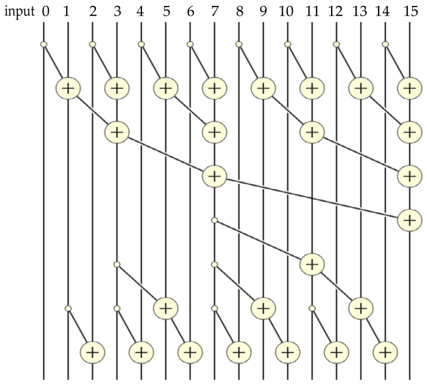

*Figure 11.19 — Brent-Kung 덧셈기 설계에 기반한 병렬 inclusive scan 알고리즘. (책 p.283)*

**두 국면(phase)으로 나뉜다.**

#### ① reduction tree 국면 (그림 위 절반)

16개 원소의 합을 **4 step** 에 만든다. **필요한 최소 연산만** 쓴다.

| step | 갱신되는 위치 | 개수 |
|---|---|---|
| 1 | index 가 $2n-1$ 꼴 (1, 3, 5, …, 15) | 8 |
| 2 | index 가 $4n-1$ 꼴 (3, 7, 11, 15) | 4 |
| 3 | index 가 $8n-1$ 꼴 (7, 15) | 2 |
| 4 | index 가 $16n-1$ 꼴 (15) | 1 |

$$8 + 4 + 2 + 1 = 15 \quad\Rightarrow\quad
\text{일반적으로}\ \frac{N}{2} + \frac{N}{4} + \cdots + 1 = N - 1$$

**10장의 reduction tree 와 정확히 같은 work** 다.

#### ② reverse tree 국면 (그림 아래 절반)

**부분합을 그것을 쓸 수 있는 위치에 배포한다.**

> reverse tree 를 이해하려면 **각 위치가 최종 답이 되려면 무엇이 더 필요한가**를
> 먼저 분석해야 한다 (책 p.282~283).
> reduction tree 의 덧셈은 언제나 **연속 구간**을 누적하므로,
> 각 위치에 누적된 값은 항상 **$x_i..x_j$ 라는 구간**으로 표현된다.

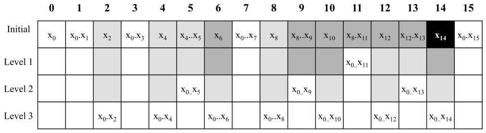

*Figure 11.20 — reverse tree 의 각 단계 후 input 의 값 진행. (책 p.284)*

Figure 11.20 을 읽는 법:

| 표기 | 뜻 |
|---|---|
| `Initial` 행 | **reduction 국면이 끝난 직후**의 각 위치 상태 |
| $x_8..x_{11}$ (위치 11) | 위치 11 에 $x_8, x_9, x_{10}, x_{11}$ 이 이미 누적돼 있다 |
| 칸의 음영 | **더 필요한 부분합 개수** — 검정 3, 진회색 2, 연회색 1, 흰색 0 |

**reduction 국면이 끝난 시점에 이미 최종값인 위치**: **0, 1, 3, 7, 15** (흰색).

예를 들어 **위치 14** 는 초기에 $x_{14}$ 뿐이라 검정이고, 최종값 $x_0..x_{14}$ 가 되려면
**위치 7 ($x_0..x_7$), 11 ($x_8..x_{11}$), 13 ($x_{12}..x_{13}$)** 에서 부분합을 받아야 한다.

> **reduction tree 의 구조 때문에** 원소 $N$ 개짜리 입력에서 어떤 위치도
> **$\log_2 N - 1$ 개보다 많은 부분합을 받을 일이 없고**,
> 그 부분합 위치들은 언제나 **1, 2, 4, …(2의 거듭제곱) 만큼 떨어져 있다** (책 p.284).
>
> 위치 14 는 $\log_2 16 - 1 = 3$ 개를 받고, 거리는 **1**(14↔13), **2**(13↔11), **4**(11↔7) 다.

**그래서 reverse tree 를 "먼 것부터" 정리한다.**

| level | 거리 | 완성되는 위치 |
|---|---|---|
| 1 | **4** | **11** (위치 7 을 더한다) |
| 2 | **2** | **5, 9, 13** (각각 3, 7, 11 을 더한다) |
| 3 | **1** | **2, 4, 6, 8, 10, 12, 14** (각자 왼쪽 이웃) |

$$1 + 3 + 7 = 11$$

---

### 3. 수식/유도 — work

$$\text{reduction 국면} = \frac{N}{2} + \frac{N}{4} + \cdots + 1 = N - 1 \tag{1}$$

$$\text{reverse 국면} = (2-1) + (4-1) + \cdots + \left(\tfrac{N}{4}-1\right) + \left(\tfrac{N}{2}-1\right)
= N - 1 - \log_2 N \tag{2}$$

$$\text{work}_{\text{BK}} = (N-1) + (N-1-\log_2 N) = 2N - 2 - \log_2 N \;=\; O(N) \tag{3}$$

**(2) 검산.** $N = 16$ 이면 $\frac{16}{8}-1 + \frac{16}{4}-1 + \frac{16}{2}-1 = 1 + 3 + 7 = 11$ ✓
공식으로는 $16 - 1 - 4 = 11$ ✓

**(3)** $N = 16$ 이면 $15 + 11 = 26 = 2(16) - 2 - 4$ ✓

> **Kogge-Stone 의 $O(N \log_2 N)$ 에 대비되는 $O(N)$ 이다** (책 p.284).

#### 그런데 실전에서는 Kogge-Stone 이 이긴다

> **맞바꿈은 분명하다** — Brent-Kung 은 work efficiency 가 낫고 총 연산이 적지만
> **step 이 더 많다** (책 p.284).
>
> 그런데 11.6절에서 본 대로 **thread coarsening 을 적용하면 대부분의 work 를
> work efficient 한 thread 단위 순차 scan 이 처리**한다.
> **work inefficient 한 병렬 scan 은 warp 층에서만 수행되고 kernel 실행 시간의 작은 부분**이다.
>
> **실제로 warp 층에서 둘을 비교하면 Kogge-Stone 이 더 빠르다.**
> Brent-Kung 이 아낀 work 는 **SIMD 실행의 성질상 여전히 실행 자원을 먹는 비활성 warp lane** 으로
> 대체되기 때문이다. **그 노는 lane 을 일 시켜 더 적은 step 에 끝내는 편이 낫다.**

**10.8절에서 본 것과 같은 논리다** — latency 에 묶인 구간에서는
**divergence 를 없애 아낀 cycle 이 stall 로 대체**되므로 이득이 없다.

| | Kogge-Stone | Brent-Kung |
|---|---|---|
| work | $N\log_2 N - (N-1)$ = $O(N\log N)$ | $2N-2-\log_2 N$ = **$O(N)$** |
| step | $\log_2 N$ | $2\log_2 N - 1$ |
| $N = 32$ (warp) work | 129 | **57** |
| $N = 32$ (warp) step | **5** | 9 |
| SIMD 에서 실제 | **빠르다** | 아낀 work 가 노는 lane 이 된다 |

> **Brent-Kung 은 이론적 work efficiency 와 실제 구현 고려사항의 상호작용을 따져 보기에
> 흥미로운 사례 연구**다 (책 p.285). 구현은 연습문제 11.12-7 로 남긴다.

---

**연습문제 11.10-1.** Brent-Kung 의 step 수가 $2\log_2 N - 1$ 인 이유는?

> reduction 국면이 $\log_2 N$ step (거리 1, 2, 4, …, $N/2$),
> reverse 국면이 $\log_2 N - 1$ step (거리 $N/4$, …, 2, 1) 이다.
> $N = 16$ 이면 $4 + 3 = 7 = 2(4) - 1$ ✓
> Kogge-Stone 의 $\log_2 N = 4$ 보다 **거의 두 배**다.

**연습문제 11.10-2.** Figure 11.20 에서 위치 **13** 이 최종값이 되는 데 필요한 부분합은?
어느 level 에서 완성되는가?

> 초기에 위치 13 은 $x_{12}..x_{13}$ 을 갖고 있다 (연회색 = 하나만 더 필요).
> 필요한 것은 $x_0..x_{11}$ 인데, 그것은 **위치 11 이 level 1 에서 완성한 값**이다.
> 따라서 위치 13 은 **level 2 (거리 2)** 에서 위치 11 을 더해 완성된다 ✓
> **level 1 이 위치 11 하나만 완성시키는 이유**가 여기 있다 —
> 그 값이 level 2 의 세 위치에게 필요하다.

---

## 11.11 Summary (책 p.285)

책의 정리를 옮기면 (책 p.285~286):

- **parallel scan (prefix-sum)** 은 중요한 병렬 계산 패턴이다.
  **필요가 균일하지 않은 참여자들에게 자원을 병렬로 할당**하는 데 쓰이고,
  **수학적 점화식에 기반한 겉보기 순차 계산을 병렬 계산으로 바꿔**
  많은 응용의 순차 병목을 줄여 준다.
  단순한 순차 scan 은 원소 $N$ 개에 $N-1$ 번, 즉 $O(N)$ 번의 덧셈만 한다.
- 먼저 **Kogge-Stone** 을 소개했다 — 빠르고 개념적으로 단순하지만 **work-efficient 하지 않다.**
  $O(N \log_2 N)$ 연산을 해서 순차보다 많다.
  **데이터 크기가 커질수록 병렬이 순차와 본전이 되는 데 필요한 실행 유닛 수도 늘어난다.**
  따라서 Kogge-Stone 은 **실행 자원이 풍부한 프로세서에서 적당한 크기의 scan block** 을
  처리하는 데 쓴다.
- **double-buffering 과 warp-level primitive** 로 동기화 오버헤드를 줄였고,
  **thread coarsening** 으로 work efficiency 를 개선했다.
  coarsening 은 **block 의 각 thread 가 자기 부분구획에 work-efficient 한 순차 scan** 을 한 뒤
  덜 work efficient 한 block 단위 병렬 scan 에 협력하게 하는 방식이었다.
- 여러 block 의 scanned 구획을 합치는 **두 분해**를 제시했다 —
  **scan-scan-add 와 reduce-scan-scan.**
  세 kernel 구현에서 **reduce-scan-scan 이 중복 global 접근이 적다.**
  또 **단방향 동기화를 쓰는 단일 kernel scan** 으로 global 접근을 더 줄일 수 있고,
  단방향 동기화는 **동적 block index 배정으로 deadlock 을 막아야** 한다.
  단방향 동기화가 만드는 critical path 의 latency 를 넘어서려고 **decoupled lookback** 도 제시했다.
- **Brent-Kung** 은 reduction tree 국면과 reverse tree 국면으로 **$O(N)$ 덧셈**만 한다.
  그러나 **step 이 더 많고**, work efficiency 이점은
  **thread coarsening 과 warp 실행의 SIMD 성질**(아낀 work 가 자원을 먹는 비활성 thread 로 대체)
  때문에 무력해진다.
- 일반적으로 GPU 에서 parallel scan 을 구현·최적화하는 것은 복잡하므로
  **Thrust 나 CUB 같은 라이브러리를 쓰기를 권한다.**
  그럼에도 parallel scan 은 **병렬 패턴 최적화에 들어가는 맞바꿈들을 보여 주는
  흥미롭고 유의미한 사례 연구**다.

---

## 11.12 Exercises (책 p.286)

### 연습문제 1

> 배열 $[4\ 6\ 7\ 1\ 2\ 8\ 5\ 2]$ 에 **Kogge-Stone** 으로 병렬 inclusive prefix scan 을 하라.
> 각 step 후의 중간 상태를 보고하라.

$N = 8$ 이므로 `stride` 는 1 → 2 → 4, 세 step 이다.
각 step 에서 **`threadIdx.x >= stride` 인 위치**가 `stride` 만큼 왼쪽 값을 더한다.

| step | stride | 갱신되는 위치 | 배열 |
|---|---|---|---|
| — | | | $[4,\ 6,\ 7,\ 1,\ 2,\ 8,\ 5,\ 2]$ |
| **1** | 1 | 1~7 | $[4,\ \mathbf{10},\ \mathbf{13},\ \mathbf{8},\ \mathbf{3},\ \mathbf{10},\ \mathbf{13},\ \mathbf{7}]$ |
| **2** | 2 | 2~7 | $[4,\ 10,\ \mathbf{17},\ \mathbf{18},\ \mathbf{16},\ \mathbf{18},\ \mathbf{16},\ \mathbf{17}]$ |
| **3** | 4 | 4~7 | $[4,\ 10,\ 17,\ 18,\ \mathbf{20},\ \mathbf{28},\ \mathbf{33},\ \mathbf{35}]$ |

**결과 $[4, 10, 17, 18, 20, 28, 33, 35]$** — 순차 scan 과 일치한다.

덧셈 횟수: $7 + 6 + 4 = 17$.
공식 $N\log_2 N - (N-1) = 8 \times 3 - 7 = \mathbf{17}$ ✓

> **step 2 에서 위치 2·3 이 이미 최종값**($17, 18$)이 되고 step 3 에서 안 건드려지는 것,
> **step 1 에서 위치 1** 이 이미 최종값($10$)이 되는 것을 확인해 두자 —
> 11.2절이 말한 그 성질이다.

### 연습문제 2

> Figure 11.3 의 Kogge-Stone kernel 을 분석하라. control divergence 가
> **각 block 의 첫 warp 에서만, `stride` 가 warp 크기의 절반 이하일 때만** 일어남을 보여라.
> 즉 warp 크기 32 면 `stride` 가 1, 2, 4, 8, 16 인 반복에서만 divergence 가 생긴다.

**조건은 `threadIdx.x >= stride` 이므로 비활성 thread 는 index $0 \ldots \text{stride}-1$ 의
연속 구간**이다. 이것이 증명의 전부다.

| `stride` 와 warp 크기 $W = 32$ 의 관계 | 비활성 thread | warp 별 상태 |
|---|---|---|
| **$\text{stride} < W$** | $0 \ldots \text{stride}-1$ — **전부 warp 0 안** | warp 0 만 **활성·비활성 혼재 → divergent**. warp 1 이상은 전부 활성 |
| **$\text{stride} \ge W$** | $0 \ldots \text{stride}-1$ — **warp $0 \ldots \frac{\text{stride}}{W}-1$ 을 통째로 덮는다** | 앞쪽 warp 는 **전부 비활성**, 나머지는 **전부 활성 → divergence 없음** |

`stride` 는 1, 2, 4, 8, 16, 32, … 로 진행하므로
**$\text{stride} < 32$ 인 것은 1, 2, 4, 8, 16 다섯 개** — 문제의 주장 그대로다. ∎

> 문제가 "**up to half of the warp size**" 라고 표현한 것은
> **`stride` 가 2의 거듭제곱이라 $< 32$ 와 $\le 16$ 이 같은 말**이기 때문이다.
>
> **10장 Figure 10.8 과 대칭**이라는 점도 확인해 두자.
> 거기서는 활성 thread 가 앞쪽 연속 구간이라 **마지막 다섯 반복**이 divergent 였고,
> 여기서는 비활성 thread 가 앞쪽 연속 구간이라 **처음 다섯 반복**이 divergent 다.
> **divergent 반복 수는 둘 다 $\log_2(\text{warp size}) = 5$** 로 같다.

### 연습문제 3

> Figure 11.3 의 Kogge-Stone scan kernel 에서 원소가 **2048개**라면
> 덧셈 연산은 총 몇 번 수행되는가?

11.5절의 (2)에 $N = 2048$ 을 넣는다.

$$N \log_2 N - (N-1) = 2048 \times 11 - 2047 = 22{,}528 - 2{,}047 = \mathbf{20{,}481}$$

> **순차의 $2047$ 번 대비 $10.0\times$** 다 ($N = 512$ 의 $8.02\times$ 에서 늘었다).
> **$N$ 이 두 배가 될 때마다 이 비율이 대략 1씩 오른다** — $\frac{N\log_2 N}{N} = \log_2 N$ 이므로.
>
> **주의**: block 당 thread 는 최대 1024 개이므로 `SEG_SIZE = 2048` 인 block 하나로는
> 실제로 launch 할 수 없다. 원소 2048개를 **1024-thread block 두 개**로 나누면
> $2 \times (1024 \times 10 - 1023) = 18{,}434$ 번이 된다.
> **문제가 묻는 것은 "구획 하나에 대한 공식 적용"** 으로 읽는 것이 자연스럽고,
> 그 값이 20,481 이다.

### 연습문제 4

> Figure 11.13 의 kernel 을 **vector load/store 를 쓰고 shared memory bank conflict 를
> 없애도록** 고쳐라.

**두 가지를 따로 손본다.**

#### ① vector load/store (6.3절)

`COARSE_FACTOR` 가 4의 배수라면 `float4` 로 한 번에 4개씩 옮긴다.

```cuda
// 적재 (05~08번 줄 대체) — thread 하나가 float4 를 COARSE_FACTOR/4 번 옮긴다
float4* input4  = reinterpret_cast<float4*>(input  + blockSegment);
float4* buffer4 = reinterpret_cast<float4*>(buffer_s);
for(unsigned int c = 0; c < COARSE_FACTOR/4; ++c) {
    buffer4[c*BLOCK_DIM + threadIdx.x] = input4[c*BLOCK_DIM + threadIdx.x];
}
```

| | 효과 |
|---|---|
| 명령 수 | 적재 명령이 $\frac{1}{4}$ 로 |
| transaction | warp 하나가 $32 \times 16 = 512$ B 를 한 번에 요청 |
| 전제 | `input + blockSegment` 가 **16 B 정렬**돼 있어야 한다 (`blockSegment` 가 4의 배수면 만족) |

저장(33~36번 줄)도 같은 방식으로 고친다.

#### ② bank conflict 제거 (6.4절)

문제는 13·29번 줄의 `buffer_s[threadSegment + c]` 다.
`threadSegment = threadIdx.x * COARSE_FACTOR` 이므로 **stride 가 `COARSE_FACTOR`** 다.

| `COARSE_FACTOR` | warp 가 건드리는 bank | conflict |
|---|---|---|
| 4 | $0, 4, 8, \ldots$ → bank 0, 4, 8, …, 28 이 각 4번 | **4-way** |
| 8 | bank 0, 8, 16, 24 가 각 8번 | **8-way** |
| 32 | bank 0 만 32번 | **32-way (최악)** |

**처방은 padding** — 부분구획 크기를 하나 늘려 stride 를 홀수로 만든다.

```cuda
#define PADDED (COARSE_FACTOR + 1)                     // stride 를 홀수로
__shared__ float buffer_s[BLOCK_DIM*PADDED];
...
unsigned int threadSegment = threadIdx.x*PADDED;        // 11번 줄 대체
```

`COARSE_FACTOR = 4` 면 stride 가 5 가 되어 thread $t$ 가 bank $(5t) \bmod 32$ 를 건드린다.
5 와 32 가 서로소이므로 **32개 thread 가 32개 bank 를 모두 다르게 쓴다 → conflict 없음.**

> **대가**: shared memory 가 $\frac{\text{PADDED}}{\text{COARSE\_FACTOR}}$ 배로 는다
> (`COARSE_FACTOR = 4` 면 25% 증가).
> 그리고 **global ↔ shared 전송의 인덱싱(05~08, 33~36번 줄)은 padding 을 고려해
> 따로 계산**해야 한다 — 그쪽은 `c*BLOCK_DIM + threadIdx.x` 라 padding 과 배치가 다르다.
> **두 인덱싱을 모두 padding 배치에 맞추는 것이 이 문제의 진짜 난점**이다.

### 연습문제 5

> Figure 11.17 의 `interBlockScan` 을 **single lookback 대신 decoupled lookback** 을
> 쓰도록 고쳐라.

**핵심은 flag 에 세 가지 상태를 두는 것**이다.

| flag 값 | 뜻 |
|---|---|
| **0** | 아직 아무것도 없음 |
| **1** | **sum 준비됨** (자기 구획 합만. 앞 block 들은 아직 안 더함) |
| **2** | **scanned sum 준비됨** (앞 block 전부의 합이 포함됨) |

```cuda
__device__ inline float interBlockScan(float val, unsigned int bid,
    float* sums, float* partialSums, unsigned int* flags) {
    __shared__ float prevBlockPartialSum_s;
    if(threadIdx.x == blockDim.x - 1) {
        // ① 먼저 자기 sum 을 알린다 — 뒤 block 이 lookback 할 수 있도록
        sums[bid] = val;
        cuda::atomic_ref<unsigned int, cuda::thread_scope_device> myFlag(flags[bid]);
        if(bid == 0) {
            partialSums[0] = val;
            myFlag.store(2, cuda::memory_order_release);
            prevBlockPartialSum_s = 0.0f;
        } else {
            myFlag.store(1, cuda::memory_order_release);
            // ② scanned sum 이 준비된 block 을 찾을 때까지 뒤로 간다
            float acc = 0.0f;
            unsigned int b = bid - 1;
            while(true) {
                cuda::atomic_ref<unsigned int, cuda::thread_scope_device> f(flags[b]);
                unsigned int s = f.load(cuda::memory_order_acquire);
                if(s == 2) { acc += partialSums[b]; break; }   // 찾았다 — 종료
                if(s == 1) {                                    // sum 만 있다 — 더하고 계속
                    acc += sums[b];
                    if(b == 0) break;
                    --b;
                }
                // s == 0 이면 그 자리에서 다시 검사 (b 를 줄이지 않는다)
            }
            // ③ 자기 scanned sum 을 확정하고 알린다
            prevBlockPartialSum_s = acc;
            partialSums[bid] = acc + val;
            myFlag.store(2, cuda::memory_order_release);
        }
    }
    __syncthreads();
    return prevBlockPartialSum_s;
}
```

| 무엇이 달라졌나 | 왜 |
|---|---|
| **배열이 둘** (`sums`, `partialSums`) | lookback 하는 block 이 **sum 과 scanned sum 을 구별**해야 한다 |
| **자기 sum 을 먼저 알린다** (①) | 그래야 뒤 block 이 나를 건너뛰고 갈 수 있다 — **이것이 "decoupled" 의 뜻**이다 |
| **flag 가 2 인 것을 찾을 때까지 뒤로** (②) | 찾으면 그 scanned sum 에 그동안 모은 sum 들을 더해 끝낸다 |
| `fetch_add(0, ...)` → **`load(acquire)`** | 값을 안 바꾸므로 순수 atomic load 가 더 적절하다 |

> **중복 work 가 여기서 보인다** — block $b$ 와 $b-1$ 이 둘 다 $b-2$ 의 scanned sum 을
> 읽어 더한다. **그 중복이 의존 사슬을 끊는 값**이다 (책 p.280).
>
> **실전 구현(CUB 의 `DecoupledLookback`)은 여기서 더 나간다** — leader thread 하나가 아니라
> **warp 전체가 앞 32개 block 을 동시에 검사**하고 `warpScan` 으로 합친다.
> Figure 11.16(c) 가 그린 극단이 그것이다.

### 연습문제 6

> 배열 $[4\ 6\ 7\ 1\ 2\ 8\ 5\ 2]$ 에 **Brent-Kung** 으로 병렬 inclusive prefix scan 을 하라.
> 각 step 후의 중간 상태를 보고하라.

$N = 8$ 이므로 **reduction 국면 3 step, reverse 국면 2 step**, 합 5 step 이다.

**reduction 국면** — `stride` 가 1 → 2 → 4, 갱신되는 위치는 $2\cdot\text{stride}\cdot n - 1$ 꼴

| step | stride | 갱신 위치 | 덧셈 | 배열 |
|---|---|---|---|---|
| — | | | | $[4,\ 6,\ 7,\ 1,\ 2,\ 8,\ 5,\ 2]$ |
| **1** | 1 | 1, 3, 5, 7 | `a[i] += a[i-1]` | $[4,\ \mathbf{10},\ 7,\ \mathbf{8},\ 2,\ \mathbf{10},\ 5,\ \mathbf{7}]$ |
| **2** | 2 | 3, 7 | `a[i] += a[i-2]` | $[4,\ 10,\ 7,\ \mathbf{18},\ 2,\ 10,\ 5,\ \mathbf{17}]$ |
| **3** | 4 | 7 | `a[i] += a[i-4]` | $[4,\ 10,\ 7,\ 18,\ 2,\ 10,\ 5,\ \mathbf{35}]$ |

이 시점에 **위치 0, 1, 3, 7 이 이미 최종값**이다 ($4, 10, 18, 35$).
$N=16$ 예에서 0, 1, 3, 7, 15 였던 것의 $N=8$ 판이다.

**reverse 국면** — `stride` 가 2 → 1, 갱신 위치는 $2\cdot\text{stride}\cdot n - 1 + \text{stride}$ 꼴

| step | stride | 갱신 위치 | 덧셈 | 배열 |
|---|---|---|---|---|
| **4** | 2 | 5 | `a[5] += a[3]` | $[4,\ 10,\ 7,\ 18,\ 2,\ \mathbf{28},\ 5,\ 35]$ |
| **5** | 1 | 2, 4, 6 | `a[i] += a[i-1]` | $[4,\ 10,\ \mathbf{17},\ 18,\ \mathbf{20},\ 28,\ \mathbf{33},\ 35]$ |

**결과 $[4, 10, 17, 18, 20, 28, 33, 35]$** — 연습문제 1 의 Kogge-Stone 결과와 같다 ✓

**덧셈 횟수**: reduction $4+2+1 = 7$, reverse $1+3 = 4$, 합 **11**.
공식 $2N - 2 - \log_2 N = 16 - 2 - 3 = \mathbf{11}$ ✓

| | Kogge-Stone (연습 1) | Brent-Kung (연습 6) |
|---|---|---|
| 덧셈 | **17** | **11** ($1.55\times$ 적다) |
| step | **3** | **5** ($1.67\times$ 많다) |

**이 한 표가 두 알고리즘의 맞바꿈 전부다.**

### 연습문제 7

> Brent-Kung 알고리즘으로 block 단위 배열 scan 을 수행하는 CUDA kernel 을 구현하라.

```cuda
__global__ void brentKungScanKernel(float* input, float* output, unsigned int N) {
    // block 하나가 2*blockDim.x 원소를 담당한다 — thread 하나가 두 원소를 맡는 것이
    // Brent-Kung 의 자연스러운 배치다 (reduction 첫 step 이 원소 절반만 갱신하므로)
    __shared__ float buffer_s[SEG_SIZE];
    unsigned int segment = 2*blockIdx.x*blockDim.x;
    unsigned int t = threadIdx.x;

    // ① 적재 — thread 하나가 두 원소, 둘 다 coalesced
    buffer_s[t]                = (segment + t                < N) ? input[segment + t]                : 0.0f;
    buffer_s[t + blockDim.x]   = (segment + t + blockDim.x   < N) ? input[segment + t + blockDim.x]   : 0.0f;

    // ② reduction 국면 — 갱신 위치는 2*stride*(t+1) - 1
    for(unsigned int stride = 1; stride <= blockDim.x; stride *= 2) {
        __syncthreads();
        unsigned int i = 2*stride*(t + 1) - 1;
        if(i < SEG_SIZE) {
            buffer_s[i] += buffer_s[i - stride];
        }
    }

    // ③ reverse 국면 — 갱신 위치는 2*stride*(t+1) - 1 + stride
    for(unsigned int stride = SEG_SIZE/4; stride >= 1; stride /= 2) {
        __syncthreads();
        unsigned int i = 2*stride*(t + 1) - 1;
        if(i + stride < SEG_SIZE) {
            buffer_s[i + stride] += buffer_s[i];
        }
    }
    __syncthreads();

    // ④ 저장
    if(segment + t              < N) output[segment + t]              = buffer_s[t];
    if(segment + t + blockDim.x < N) output[segment + t + blockDim.x] = buffer_s[t + blockDim.x];
}
```

`SEG_SIZE = 2*BLOCK_DIM` 이다.

| 구간 | 짚을 점 |
|---|---|
| **①** | **thread 하나가 두 원소**를 맡는다. reduction 첫 step 이 원소의 절반만 갱신하므로 thread 를 절반만 쓰는 것이 자연스럽다. **적재 인덱싱은 `t` 와 `t + blockDim.x` 로 둘 다 coalesced** 다 |
| **②** | 갱신 위치 $i = 2\cdot\text{stride}\cdot(t+1) - 1$ 이 **문제의 $2n-1$, $4n-1$, $8n-1$ 꼴**을 만든다. `stride=1` 이면 $t$ 가 $1, 3, 5, \ldots$ 를 맡는다 |
| **③** | 갱신 위치가 $i + \text{stride}$ — 연습 6 의 표 그대로다. **`stride` 가 `SEG_SIZE/4` 부터** 시작하는 것에 주의 |
| **barrier** | **Kogge-Stone 과 달리 반복당 하나면 된다.** 갱신되는 위치를 같은 step 의 다른 thread 가 읽지 않기 때문이다 (11.2절이 10장에 대해 설명한 그 성질) |

> **control divergence 가 심하다.** `stride` 가 커질수록 조건 `i < SEG_SIZE` 를
> 통과하는 thread 가 반씩 줄어드는데, **활성 thread 가 `t` 의 앞쪽 연속 구간**이므로
> 10장 Figure 10.8 처럼 warp 통째로 빠지기는 한다.
> 그래도 **step 이 $2\log_2 N - 1$ 로 두 배**라 barrier 도 두 배다.
> **11.10절이 말한 "실전에서는 Kogge-Stone 이 낫다"가 이 코드에서 눈에 보인다.**

### 검산

```python
import math

def kogge(a):
    a = a[:]; n = len(a); out = []; st = 1; ops = 0
    while st < n:
        new = a[:]
        for i in range(n):
            if i >= st:
                new[i] = a[i] + a[i - st]; ops += 1
        a = new; out.append((st, a[:])); st *= 2
    return out, ops

def brent(a):
    a = a[:]; n = len(a); out = []; ops = 0
    st = 1
    while st < n:                                   # reduction
        for i in range(2*st - 1, n, 2*st):
            a[i] += a[i - st]; ops += 1
        out.append((f"reduction stride={st}", a[:])); st *= 2
    st = n // 4
    while st >= 1:                                  # reverse
        for i in range(2*st - 1 + st, n, 2*st):
            a[i] += a[i - st]; ops += 1
        out.append((f"reverse   stride={st}", a[:])); st //= 2
    return out, ops

inp = [4, 6, 7, 1, 2, 8, 5, 2]
print("정답:", [sum(inp[:i+1]) for i in range(len(inp))])
for name, f, formula in (("연습 1 Kogge-Stone", kogge, 8*3 - 7),
                         ("연습 6 Brent-Kung",  brent, 2*8 - 2 - 3)):
    steps, ops = f(inp)
    print(name)
    for st, a in steps: print(f"   {st}: {a}")
    print(f"   덧셈 {ops} · 공식 {formula}")

# 연습 2
for st in (1, 2, 4, 8, 16, 32, 64):
    div = sum(1 for w in range(1024//32)
              if 0 < len([t for t in range(w*32, (w+1)*32) if t >= st]) < 32)
    print(f"연습 2 stride={st:>3}: divergent warp {div}")

# 연습 3
N = 2048
print("연습 3:", N*int(math.log2(N)) - (N-1))
# 정답: [4, 10, 17, 18, 20, 28, 33, 35]
# 연습 1 Kogge-Stone
#    1: [4, 10, 13, 8, 3, 10, 13, 7]
#    2: [4, 10, 17, 18, 16, 18, 16, 17]
#    4: [4, 10, 17, 18, 20, 28, 33, 35]
#    덧셈 17 · 공식 17
# 연습 6 Brent-Kung
#    reduction stride=1: [4, 10, 7, 8, 2, 10, 5, 7]
#    reduction stride=2: [4, 10, 7, 18, 2, 10, 5, 17]
#    reduction stride=4: [4, 10, 7, 18, 2, 10, 5, 35]
#    reverse   stride=2: [4, 10, 7, 18, 2, 28, 5, 35]
#    reverse   stride=1: [4, 10, 17, 18, 20, 28, 33, 35]
#    덧셈 11 · 공식 11
# 연습 2 stride=  1: divergent warp 1
# 연습 2 stride=  2: divergent warp 1
# 연습 2 stride=  4: divergent warp 1
# 연습 2 stride=  8: divergent warp 1
# 연습 2 stride= 16: divergent warp 1
# 연습 2 stride= 32: divergent warp 0
# 연습 2 stride= 64: divergent warp 0
# 연습 3: 20481
```

---

## 정리

11장에서 가져갈 것을 넷으로 줄이면:

1. **scan 은 "겉보기 순차"를 병렬로 바꾸는 도구이고, 그 대가가 work efficiency 다.**
   소시지 비유가 정확하다 — **절단점을 한 번에 계산하면 자르기는 전부 동시에** 할 수 있다.
   그런데 10장의 reduction 과 달리 **병렬 알고리즘이 순차보다 더 많은 연산을 한다.**
   Kogge-Stone 은 $N\log_2 N - (N-1)$ 로 $N=512$ 에서 순차의 $8{\sim}9\times$,
   naïve 는 $O(N^2)$ 다.
   그리고 **실행 유닛이 $\log_2 N$ 개 이하면 병렬이 순차보다 느려진다** — 병렬화가
   무조건 이득이 아님을 이 장이 처음으로 정량적으로 보여 준다.
2. **thread coarsening 이 그 대가를 되돌린다.**
   $P$ 개 thread 가 각자 $\frac{N}{P}$ 원소를 **순차로** scan 하면
   work 가 $2N + P\log_2 P - P - \frac{N}{P}$ 가 되어,
   **$P \ll N$ 이면 $O(N)$ 으로 순차와 같아진다.**
   step 도 $\frac{N\log_2 N}{P}$ 에서 $\frac{2N}{P}$ 로 떨어진다 —
   $N{=}1024$, $P{=}32$ 에서 $3.2\times$ 가 $15.1\times$ 가 된다.
   **그래서 책은 11.10절에서 Brent-Kung 을 소개하면서도
   "work efficiency 는 더 이상 주요 관심사가 아니다" 라고 명시한다.**
3. **같은 분해(scan-scan-add)를 세 층에 되풀이하고, 층마다 답이 다르다.**
   thread 층(11.6) → warp 층(11.4) → block 층(11.9) 으로 같은 구조가 쌓인다.
   그런데 **block 층에서만은 reduce-scan-scan 이 낫다** — 거기서는 global memory 접근이
   관심사이고 reduce 가 출력을 적게 쓰기 때문이다.
   반면 warp·thread 층에서는 원소가 이미 register 에 있어 **add 의 잦은 register 접근이
   reduce 의 동기화보다 싸다.**
   같은 이유로 **최악의 work efficiency 를 가진 naïve scan 이 inter-block 에서는 최선**이 된다
   (decoupled lookback). **알고리즘의 좋고 나쁨은 층이 정한다.**
4. **단방향 동기화와 memory order 가 새 도구다.**
   barrier 는 모두가 동시에 활성이어야 하지만, **단방향 동기화는 "앞이 먼저 스케줄되기만"
   하면 된다** — 그래서 `blockIdx.x` 대신 **동적 index 배정**이 필수이고,
   빠뜨리면 **deadlock** 이다.
   그리고 9장에서 `relaxed` 로 충분했던 자리에 여기서는 **`acquire`/`release` 짝**이 필요하다 —
   **flag 와 데이터가 서로 다른 배열이라 하드웨어가 의존을 볼 수 없기 때문**이다.
   "9장에서 왜 relaxed 로 됐는가"를 이해해 둔 것이 여기서 값을 한다.

다음은 12장 — **filter** 다.
이 장이 예고한 대로 **scan 의 첫 응용**이고,
9장에서 "12장에서 쓰인다"고 미뤄 뒀던 **`fetch_add` 의 반환값**이 주인공이 된다.
`warp voting` 함수도 처음 나온다.
