# 12장. Filter

> **원문 범위**: 책 p.289~302 (12.1~12.10절 + References). 부제는 *And warp voting* 이다.
> **절 순서**: 책 순서를 그대로 따랐다. 재배치 없음.
> **연습문제**: 책 12.10절의 4문제를 전부 풀었다. 넷 다 구현 과제라
> **완성된 kernel 코드와 설계 근거를 함께** 적었다.

**이 책에서 손꼽히게 짧은 장이다** (14쪽, 10절). 11장의 38쪽과 비교하면 3분의 1 남짓이다.
짧은 이유도 분명하다 — **이 장에는 새 알고리즘이 거의 없다.**
9장의 atomic, 10장의 warp-level primitive, 11장의 scan, 6장의 coalescing·coarsening 을
**한 문제 위에서 조립하는 장**이다.

> **filter** 는 목록에서 일부 원소가 삭제된 뒤, 메모리를 더 효율적으로 쓰도록
> 남은 데이터를 재배치하는 연산이다. 삭제된 원소들과 남은 원소들을 두 개의 부분 목록으로 본다면,
> **filter 연산은 merge 연산의 역**으로 볼 수 있다 (책 p.289).

merge 는 다음 장(13장)의 주제다. **이 장과 다음 장이 서로 역연산 관계**로 짝지어져 있다는
사실을 머리에 넣고 시작하면 두 장이 한결 잘 붙는다.

### 이 장이 새로 던지는 것 — warp voting

10장에서 warp-level primitive 를 처음 만났을 때 그것은 **`__shfl_down_sync` 같은
shuffle 함수**였다. 데이터를 warp 안에서 옮기는 도구였다.

이 장이 더하는 것은 **warp voting** 이다 — 데이터가 아니라 **"지금 누가 살아 있는가"라는
제어 정보**를 warp 안에서 주고받는다.

| 도구 | 무엇을 warp 안에서 나누는가 | 어디서 |
|---|---|---|
| shuffle (`__shfl_*_sync`) | **데이터** — 다른 lane 의 register 값 | 10.7절 |
| **warp voting** (`__activemask()` 등) | **제어 상태** — 어느 lane 이 활성인가 | **이 장** |
| intrinsic (`__ffs()`, `__popc()`) | (warp 함수는 아니다) 32비트 mask 를 다루는 **비트 연산** | **이 장** |

그리고 9장에서 "**12장에서 쓰인다**"며 미뤄 뒀던 것이 여기서 주인공이 된다 —
**`fetch_add` 의 반환값**이다. 9장의 histogram 에서는 atomic 의 *부수 효과*(counter 증가)만
필요했지만, filter 에서는 **반환값 그 자체가 출력 배열에서의 자기 자리**가 된다.

### 이 장의 뼈대

이 장은 **두 갈래로 갈라졌다가 12.7절에서 다시 만난다.**

| 절 | 무엇 | 어디서 온 도구인가 |
|---|---|---|
| 12.1 | filter 의 정의 — in-place/out-of-place, stable/unstable | **이 장이 도입** |
| **12.2** | **unstable** filter — atomic 하나로 끝 | 9장 atomic |
| 12.3 | **coalesced atomic** — warp voting 으로 atomic 수를 줄인다 | 10장 warp-level primitive + **warp voting** |
| 12.4 | **privatization** — atomic 을 block 안으로 가둔다 | 6·9장 |
| **12.5** | **stable** filter — atomic 대신 **scan** | **11장 전체** |
| 12.6 | shared memory 로 모아 쓰기 + **thread coarsening** | 6·9·11장 |
| 12.7 | **in-place** filter — 덮어쓰기 위험과 그 해소 | 11.9절 단방향 동기화 |
| 12.8 | 같은 구조를 갖는 다른 패턴들 | — |

**갈림길의 기준은 단 하나 — 순서를 지켜야 하는가.**
지키지 않아도 되면 atomic 으로 자리를 *예약*하면 되고(12.2~12.4),
지켜야 하면 자리를 *계산*해야 하며 그 계산이 곧 scan 이다(12.5~12.6).

---

## 12.1 Background (책 p.289)

### 1. 개념적 이해

#### filtering 이란 무엇인가

> **Filtering** 은 주어진 기준에 따라 목록에서 선택된 항목 하나 이상을 제거하고,
> 그로 인해 생긴 구멍을 없애도록 목록을 압축하는 계산을 가리킨다 (책 p.289).

두 동작이 하나로 묶여 있다는 점이 중요하다.

1. **제거** — 조건 `cond()` 를 만족하지 않는 key 를 버린다
2. **압축(compaction)** — 남은 key 들을 **연속된 위치로 몰아** 구멍을 없앤다

①만 하는 것은 filter 가 아니다. GPU 에서 ①은 사실상 공짜다 (그냥 안 쓰면 된다).
**이 장의 어려움은 전부 ②에서 나온다** — 남은 key 가 몇 번째 자리로 가야 하는지는
**자기 앞에 몇 개가 남았는지**에 달려 있고, 그건 나 혼자서는 알 수 없는 정보다.

#### 왜 필요한가 — garbage collection

책이 드는 예가 정확하다 (책 p.289).

> 응용이 객체 몇 개를 해제해 heap 에서 그 메모리 덩어리들을 반납하면,
> **작은 가용 덩어리가 잔뜩** 생긴다. 어느 시점엔가 heap 에 남은 객체들을 **연속된 위치로
> 압축해서, heap 끝에 훨씬 큰 가용 공간 하나를 만드는 것**이 바람직해진다.
> 그래야 응용이 **큰 객체 하나를 할당해야 할 때 연속된 메모리가 충분히 있다.**

여기서 **왜 GPU 로 하는가**도 함께 나온다.

> 목록이 아주 크면, 실행 시간을 줄이기 위해 **많은 thread 를 동원해 항목들을 병렬로 옮기는 것**이
> 바람직해진다 (책 p.290).

압축은 데이터 이동이 전부다. 계산은 거의 없고 **memory-bound** 다.
그래서 이 장의 최적화가 전부 **coalescing 과 atomic 경쟁**에 몰려 있는 것이다.

#### 두 축 — in-place / out-of-place

| | 어디에 압축하는가 | 대가 |
|---|---|---|
| **out-of-place** | **새 목록**에 압축한다 | 새 목록만큼의 메모리를 더 써야 한다 |
| **in-place** | **원래 목록** 안에서 압축한다 | 아직 안 옮긴 원소를 **덮어쓸 위험**이 생긴다 |

> 메모리 관리 예에서, 새 목록을 만든다는 것은 **새 heap 전체를 수용할 만큼의 메모리를
> 따로 떼어 둬야** 한다는 뜻이고, 이는 메모리 사용의 비효율을 극적으로 키운다.
> 그러나 어떤 항목을 목록의 더 앞자리로 옮기는 일은,
> **그 자리에 지금 있으면서 더 앞으로 옮겨지기를 기다리는 원소를 덮어쓸 수 있다** (책 p.290).

한 문장에 이 장의 후반부(12.7절)가 다 들어 있다. **out-of-place 는 메모리를 낭비하고,
in-place 는 동기화 문제를 부른다.** 공짜는 없다.

책은 **out-of-place 를 먼저** 다룬다 (데이터 검색·조회에서 무관한 항목을 걸러 관련 목록을
만드는 데 자주 쓰인다). 그다음 **11장의 scan 패턴 위에 올려** in-place 를 만든다.

#### 두 번째 축 — stable / unstable

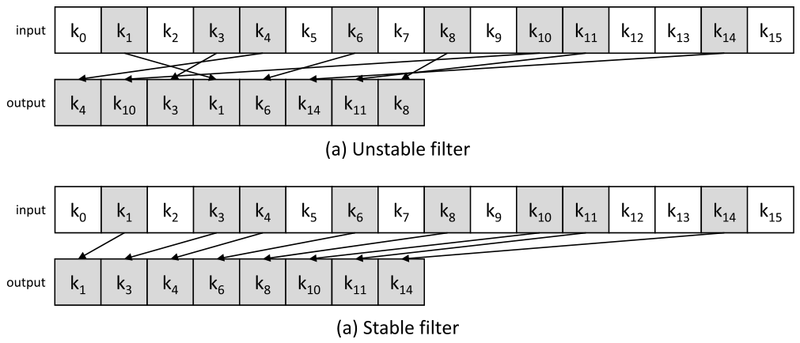

*Figure 12.1 — out-of-place filter 패턴의 unstable 판과 stable 판. (책 p.290)*

> 컴퓨터과학의 관례에 따라, filter 된 목록의 항목들을 **key** 라 부른다.
> 입력 목록에서 **음영이 있는 key 가 남는 key**, 음영이 없는 것은 삭제되는 key 다.
> **Stable filter 는 남는 key 들의 원래 순서를 보존**하고, **unstable filter 는 그렇지 않다.**
> Unstable filter 는 목록이 정렬돼 있을 필요가 없을 때 쓴다 (책 p.290).

그림의 입력은 $k_0 \ldots k_{15}$ 이고 **남는 key 는 여덟 개** —
$k_1,\ k_3,\ k_4,\ k_6,\ k_8,\ k_{10},\ k_{11},\ k_{14}$ 다.

| | 출력 |
|---|---|
| **(a) unstable** | $k_4,\ k_{10},\ k_3,\ k_1,\ k_6,\ k_{14},\ k_{11},\ k_8$ — 순서가 뒤섞였다 |
| **(b) stable** | $k_1,\ k_3,\ k_4,\ k_6,\ k_8,\ k_{10},\ k_{11},\ k_{14}$ — 원래 순서 그대로 |

**두 출력의 집합은 같고 순서만 다르다.** 그리고 그 차이가 12.2~12.4절과 12.5~12.6절이라는
전혀 다른 두 구현으로 갈라진다.

> **원문 오기** (Figure 12.1, 책 p.290). 아래 그림의 부제가 **`(a) Stable filter`** 로,
> 위 그림과 똑같이 `(a)` 로 적혀 있다. `(b)` 여야 한다.
> 이 노트에서는 **(a) unstable / (b) stable** 로 부른다.

**이 그림은 이 장 전체의 기준 예제다.** 12.5절의 Figure 12.7, 12.6절의 Figure 12.9·12.10,
12.4절의 Figure 12.5 가 **모두 같은 16개 key 와 같은 kept 집합**을 쓴다.
한 번 외워 두면 남은 절이 전부 같은 그림의 변주로 읽힌다.

#### 언제 어느 것을 쓰는가

| | 언제 |
|---|---|
| **unstable** | 목록이 정렬돼 있을 필요가 없을 때 (책 p.290) — 집합 연산, 후보 추림 |
| **stable** | **정렬된 목록**에서 일부 원소를 삭제·추출할 때 (책 p.297) — 정렬 순서를 깨면 안 되므로 |

### 2. 알고리즘 — 순차 filter

병렬로 가기 전에 순차 코드를 보면 문제의 본질이 드러난다.

```c
// out-of-place stable filter — 순차판
unsigned int filter(unsigned int* input, unsigned int* output, unsigned int N) {
    unsigned int j = 0;                    // 출력 위치 — 하나뿐인 상태 변수
    for (unsigned int i = 0; i < N; ++i) {
        if (cond(input[i])) {
            output[j] = input[i];
            j++;                           // ← 여기가 전부다
        }
    }
    return j;                              // outputSize
}
```

$O(N)$ 이고, **자연스럽게 stable 하다** — `i` 가 커지는 순서로 `j` 가 커지니까.
그런데 병렬화의 관점에서 보면 이 코드에는 **최악의 성질**이 있다.

> `j` 는 **모든 반복이 읽고 쓰는 단 하나의 변수**이고, `i` 번째 반복의 `j` 값은
> **그 앞의 모든 반복이 무엇을 했는지에 달려 있다.**

이건 11장에서 본 구조 그대로다 — **`j` 의 값이 곧 `keep` 값들의 prefix sum** 이다.
그래서 이 장의 두 갈래는 결국 이렇게 정리된다.

| 갈래 | `j` 를 어떻게 얻는가 | 순서 |
|---|---|---|
| **12.2~12.4** | `j` 를 **공유 counter 로 만들고 atomic 하게 뽑아 쓴다** — "누가 먼저 뽑든 상관없다" | 깨진다 → **unstable** |
| **12.5~12.6** | `j` 를 **prefix sum 으로 계산한다** — "내 앞에 몇 개가 남았는지 세어 본다" | 지켜진다 → **stable** |

**두 번째가 왜 11장 전체를 필요로 하는지**가 이 표에서 보인다.

### 3. 예제/실습

#### Figure 12.1 을 순차 코드로 재현

```python
keys = [f"k{i}" for i in range(16)]
kept = {1, 3, 4, 6, 8, 10, 11, 14}          # 그림에서 음영 처리된 key

out = [keys[i] for i in range(16) if i in kept]
print(out)
# ['k1', 'k3', 'k4', 'k6', 'k8', 'k10', 'k11', 'k14']   ← Figure 12.1(b) 와 일치
```

순차 코드는 **stable 을 공짜로 준다.** 병렬화하면서 그 공짜를 잃고,
12.5절에서 scan 이라는 값을 치르고 되사 오는 것이 이 장의 줄거리다.

#### 연습문제

> **(1)** 입력이 $[7, 2, 9, 4, 5, 8, 1, 6]$ 이고 조건이 `cond(v) = (v > 4)` 일 때
> stable filter 의 출력과 `outputSize` 를 적어라.
> **(2)** 같은 입력에 대해 unstable filter 가 낼 수 있는 출력은 **몇 가지**인가?

**(1)** 조건을 만족하는 것은 $7, 9, 5, 8, 6$ 다.
입력 순서를 유지하므로 출력은 $[7, 9, 5, 8, 6]$ 이고 `outputSize` 는 **5** 다.

**(2)** unstable 은 **다섯 개 key 를 다섯 자리에 아무 순서로나** 놓을 수 있으므로
$5! = \mathbf{120}$ 가지다.

> 여기서 짚어 둘 것 — **"unstable 이면 아무 출력이나 나와도 된다"가 아니다.**
> 어떤 순서든 허용되지만 **집합은 반드시 같아야** 하고, 같은 key 가 두 자리를 차지하거나
> 한 자리가 비어서는 안 된다. 12.2절의 atomic 이 보장하는 것이 정확히 이것이다 —
> **순서는 포기하되 "정확히 한 번씩"은 지킨다.**

---

## 12.2 A simple parallel unstable filter (책 p.290)

### 1. 개념적 이해 — `fetch_add` 의 반환값이 자리를 예약한다

순차 코드의 `j++` 을 병렬로 옮기려면 두 가지가 동시에 필요하다.

1. counter 를 **atomic 하게** 증가시켜 두 thread 가 같은 자리를 받지 않게 한다
2. **증가시키기 전의 값**을 돌려받아 그것을 내 자리로 쓴다

②가 이 장의 새로움이다. 9장의 histogram 에서는 `atomicAdd` 의 **부수 효과**(counter 가
올라간다)만 필요했고 반환값은 버렸다. 여기서는 **반환값이 전부**다.

> `fetch_add` 는 이름 그대로 **fetch(읽고) 나서 add(더한다)** —
> **더하기 *전*의 값을 돌려준다.** 그래서 "지금까지 몇 개가 예약됐는가" = "내 자리 번호"가 된다.

이 구도를 한 줄로 줄이면 이렇다.

> **counter 는 "다음에 쓸 빈자리"를 가리키는 포인터이고, `fetch_add(1)` 은
> 그 자리를 자기 앞으로 떼어 오면서 포인터를 한 칸 밀어 주는 연산이다.**

11.1절의 소시지 비유와 정확히 짝을 이룬다. 거기서는 **모든 주문의 절단점을 미리 한 번에**
계산했고(scan), 여기서는 **오는 순서대로 자르고 남은 길이를 갱신**한다(atomic).
전자는 순서를 지키고 후자는 못 지킨다.

### 2. 코드

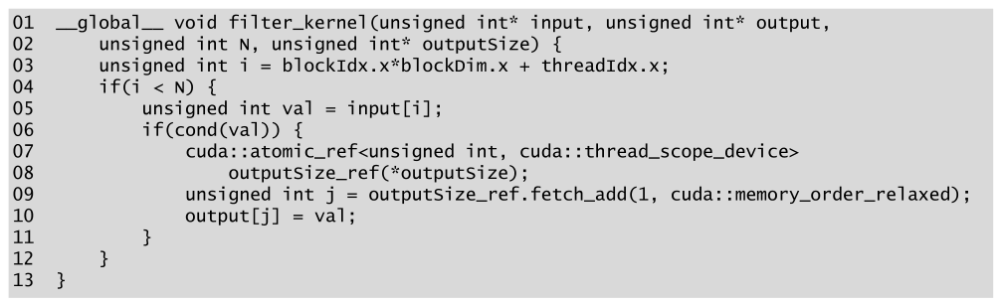

*Figure 12.2 — 단순한 unstable filter kernel 의 코드. (책 p.291)*

```cuda
01  __global__ void filter_kernel(unsigned int* input, unsigned int* output,
02      unsigned int N, unsigned int* outputSize) {
03      unsigned int i = blockIdx.x*blockDim.x + threadIdx.x;
04      if(i < N) {
05          unsigned int val = input[i];
06          if(cond(val)) {
07              cuda::atomic_ref<unsigned int, cuda::thread_scope_device>
08                  outputSize_ref(*outputSize);
09              unsigned int j = outputSize_ref.fetch_add(1, cuda::memory_order_relaxed);
10              output[j] = val;
11          }
12      }
13  }
```

#### 줄별로

| 줄 | 하는 일 | 짚을 점 |
|---|---|---|
| **02** | `outputSize` 는 **포인터** | global memory 의 counter 변수를 가리킨다. **kernel 호출 전에 0 으로 초기화**해 둬야 한다 (책 p.290~291) |
| **03** | 자기가 맡을 key 의 index | 3장 이래 늘 같은 형태 |
| **04** | 경계 검사 | `N` 이 block 크기의 배수가 아닐 때 |
| **05** | key 를 global 에서 적재 | **coalesced 하다** — 연속 thread 가 연속 주소를 읽는다 |
| **06** | 조건 검사 | 여기서 **control divergence 가 생긴다** — 이 장의 모든 문제의 출발점 |
| **07~09** | counter 를 **1 만큼 atomic 증가**시키고 **증가 전 값을 `j` 로** 받는다 | **출력 배열의 자리를 예약하는 것** (책 p.291) |
| **10** | 예약한 자리에 값을 저장 | **coalesced 하지 않다** — 아래 참조 |

> **`memory_order_relaxed` 로 충분한 이유는 9장에서 정리한 그대로다.**
> counter 하나의 원자성만 필요하고, 이 atomic 이 **다른 메모리 접근의 순서를 강제할 필요는 없다.**
> 10번 줄의 `output[j] = val` 은 `j` 를 통한 **데이터 의존**으로 이미 9번 줄 뒤에 묶여 있어서,
> 하드웨어가 순서를 바꿀 수 없다. 11.9절에서 `acquire`/`release` 가 필요했던 것은
> **flag 와 데이터가 서로 다른 배열이라 의존이 안 보였기** 때문이었다.

#### 왜 unstable 인가

> 이 구현이 unstable filter 가 되는 이유는, **counter 에 대한 atomic 연산이 하드웨어에 의해
> 임의의 순서로 수행될 수 있기** 때문이다. 따라서 각 thread 는 입력 key 의 입력 배열 내
> 위치와 무관하게 **출력 배열의 임의의 자리를 획득**한다 (책 p.291).

**하드웨어는 atomic 요청의 도착 순서를 보장하지 않는다.** thread 5 가 thread 2 보다
먼저 counter 를 잡을 수 있고, 그러면 $k_5$ 가 $k_2$ 앞에 놓인다.
Figure 12.1(a) 의 뒤섞인 순서가 바로 이것이다.

### 3. 무엇이 병목인가

> 이 구현의 명백한 병목은 **global memory 의 output counter 에 대한 atomic 연산이 유발하는
> 경쟁**이다. 이 경쟁은 **모든 atomic 연산이 동일한 counter 하나**에 가해진다는 사실 때문에
> 악화되어, **전부 하드웨어에 의해 직렬화**된다 (책 p.291).

9장에서 이 상황을 정량화하는 도구를 이미 만들어 두었다 (9.3절, 책 p.209~211).

> 같은 주소에 대한 atomic 은 **read-modify-write 한 번이 끝나야 다음이 시작**되므로,
> 처리율의 상한이 $T \le \frac{1}{2L}$ 이다. $L$ 은 memory latency 다.

$L = 200$ cycle, 1 GHz 라면 $2L = 400$ ns 이므로 **초당 2.5 M 회** — 9장이 계산한 그 숫자다.

**이것이 얼마나 나쁜지 감을 잡아 보자.** $N = 2^{20}$ 개 key, 절반이 조건을 통과한다고 하면
atomic 이 **524,288 회**이고, 전부 직렬화되면

$$\frac{524{,}288}{2.5 \times 10^6\ \text{/s}} = \mathbf{209.7\ \text{ms}}$$

같은 양의 데이터를 그냥 복사하기만 하면 (4 MB, bandwidth 1 TB/s 가정) **4 µs** 다.
**$50{,}000\times$ 가까이 느리다.** 이 장의 12.3·12.4절은 전부 이 숫자를 깎는 이야기다.

#### 병목이 하나 더 있다 — 저장이 coalesced 하지 않다

책이 12.3·12.4절에서 "추가 이득"으로 언급하는 것을 미리 짚어 둔다.
10번 줄 `output[j] = val` 에서 **`j` 는 thread 마다 무작위**다.
따라서 **한 warp 의 32 thread 가 global memory 의 흩어진 32 곳에 쓴다** — 6.1절의
uncoalesced 접근의 교과서적 사례다.

**5번 줄의 적재는 완벽히 coalesced 인데 10번 줄의 저장은 완전히 흩어져 있다.**
atomic 경쟁을 줄이는 12.3·12.4절의 두 기법이 **저장의 coalescing 도 함께 고쳐 준다**는 것이
이 장의 재미있는 대목이다.

### 4. 예제/실습

#### 연습문제

> 입력 $[k_0 \ldots k_7]$ 중 $k_1, k_3, k_4, k_6$ 이 조건을 통과한다.
> block 하나(8 thread)로 Figure 12.2 의 kernel 을 돌릴 때
> **(1)** 가능한 출력이 몇 가지인지,
> **(2)** thread 4 → thread 1 → thread 6 → thread 3 순으로 atomic 이 처리됐다면 출력이 무엇인지,
> **(3)** 이때 각 thread 가 받은 `j` 값을 적어라.

**(1)** 네 key 를 네 자리에 임의 순서로 → $4! = \mathbf{24}$ 가지.

**(2)~(3)** counter 는 0 에서 시작하고 `fetch_add(1)` 은 **증가 전 값**을 준다.

| 처리 순서 | thread | counter (전 → 후) | 받은 `j` | 쓴 곳 |
|---|---|---|---|---|
| 1번째 | 4 | 0 → 1 | **0** | `output[0] = k4` |
| 2번째 | 1 | 1 → 2 | **1** | `output[1] = k1` |
| 3번째 | 6 | 2 → 3 | **2** | `output[2] = k6` |
| 4번째 | 3 | 3 → 4 | **3** | `output[3] = k3` |

출력은 $[k_4,\ k_1,\ k_6,\ k_3]$, `outputSize` 는 **4** 다.

> **`j` 는 "몇 번째로 도착했는가"이지 "입력의 몇 번째인가"가 아니다.**
> 이 한 줄이 unstable 의 정의 전부다.

---

## 12.3 Coalescing atomic operations with warp-level primitives (책 p.291)

### 1. 개념적 이해 — warp 안에서 먼저 합의하고, 하나만 내보낸다

> 이 경쟁은 특히 **같은 warp 의 thread 들이 자기 atomic 연산을 동시에 발행할 때** 두드러진다.
> 이 경우 atomic 연산들은 **반드시 서로 충돌하고 하드웨어에 의해 직렬화된다** (책 p.291).

같은 warp 는 SIMD 로 한 명령을 함께 실행하므로, 32 개의 atomic 요청이
**정확히 같은 순간에 같은 주소로** 날아간다. 최악의 경쟁 조건이다.
그런데 바로 그 성질이 해법의 실마리이기도 하다 — **같은 warp 의 thread 들은 서로
아주 빠르게 협의할 수 있다** (책 p.291).

> warp 의 각 thread 가 독립적으로 atomic 연산을 발행하는 대신, thread 들이 **협의해
> 자기들이 집합적으로 counter 를 얼마나 증가시키고 싶은지 총량을 알아낸 뒤,
> warp 의 thread 하나가 나머지를 대신해 단 한 번의 atomic 연산을 발행**하게 할 수 있다.
> 이 결합된 atomic 연산을 **coalesced atomic operation** 이라 부른다 (책 p.291~292).

**이름이 정확하다.** 하드웨어가 같은 warp 의 load/store 를 하나의 transaction 으로 묶는 것과
정확히 같은 발상이고, 그것을 **atomic 에 소프트웨어로** 적용한 것이다.

> **원문의 장 참조 오기** (책 p.292). "loads and stores by threads in the same warp are
> coalesced by the hardware (**Chapter 5**)" 라고 돼 있는데, memory coalescing 은
> **6.1절 (책 p.124)** 이다. 5장은 memory 종류와 tiling 이다.

#### 네 단계

> 상세한 단계는 이렇다 (책 p.292).
> 첫째, atomic 연산이 수행되는 시점에 **활성인 warp thread 중 leader thread 를 정한다.**
> 둘째, **모든 thread 가 더해야 할 총량**을 알아낸다.
> 셋째, **leader thread 가 global counter 에 atomic 연산을 수행**하고
> 획득한 공간의 시작점을 다른 thread 에게 **broadcast** 한다.
> 넷째, 각 thread 가 **획득한 공간 안에서 자기 offset** 을 알아낸다.

이 네 단계를 **각각 어떤 도구가 담당하는가**로 정리하면 코드가 그대로 보인다.

| 단계 | 필요한 것 | 도구 | 종류 |
|---|---|---|---|
| 0 | 누가 활성인가 | `__activemask()` | **warp voting** |
| ① | leader 정하기 | `__ffs()` — 가장 낮은 활성 lane | intrinsic (비트) |
| ② | 총 증가량 | `__popc()` — 활성 lane 개수 | intrinsic (비트) |
| ③ | 시작점 broadcast | `__shfl_sync()` | warp shuffle (10.7절) |
| ④ | 내 offset | `__popc(mask & 앞선lane들)` | intrinsic (비트) |

**②와 ④가 같은 `__popc` 라는 점**을 눈여겨 두자. 총량과 offset 이 같은 연산의 다른 적용이고,
그 이유는 아래 수식에서 드러난다.

### 2. 새 도구들

#### `__activemask()` — warp voting 함수

> 이 primitive 는 **32비트 정수**를 돌려주는데, warp 의 $i$ 번째 thread 가 활성이면
> **비트 $i$ 가 1** 이다. 예를 들어 if 문 안에서 활성인 thread 가 1, 2, 4, 5 라면
> `__activemask()` 는 `00000000000000000000000000110110` 을 돌려준다 (책 p.292).

검산해 보자. 비트 1, 2, 4, 5 가 켜지면
$2^1 + 2^2 + 2^4 + 2^5 = 2 + 4 + 16 + 32 = 54 = \texttt{0b110110}$ ✓

> **비트 순서에 주의한다.** 위 문자열은 왼쪽이 최상위 비트(lane 31)이고
> **오른쪽 끝이 lane 0** 이다. `110110` 의 오른쪽부터 세면 lane 1, 2, 4, 5 가 맞다.

이런 함수를 **warp voting 함수**라 부른다. 책은 이 절 끝에서 나머지 셋도 소개한다 (책 p.295).

| 함수 | 무엇을 돌려주는가 |
|---|---|
| `__activemask()` | 지금 **활성인** thread 들의 mask |
| `__all_sync()` | warp 의 **모든** thread 가 조건을 참으로 평가하는가 |
| `__any_sync()` | warp 의 **어떤** thread 라도 조건을 참으로 평가하는가 |
| `__ballot_sync()` | 조건을 **참으로 평가한 thread 들의 mask** |

> **`__activemask()` 와 `__ballot_sync(mask, 1)` 은 다르다.** 전자는 "지금 여기 도달해
> 실행 중인 thread"를 묻고(하드웨어 상태를 조회), 후자는 "mask 로 지정한 thread 중 조건을
> 만족하는 thread"를 묻는다(참여 thread 를 명시하고 동기화한다).
> Figure 12.3 은 `if(cond(val))` **안**에서 부르므로 활성 집합이 곧 조건 통과 집합이고,
> 그래서 `__activemask()` 로 충분하다.

#### `__ffs()` — Find First Set

> active mask 에서 **1로 설정된 최하위 비트의 index** 를 찾기 위해 `__ffs()` (Find First Set)
> intrinsic 을 호출한다. `__ffs()` 가 돌려준 값에서 **1을 뺀다** — 이 intrinsic 은
> **반환값 0 이 "mask 의 어떤 비트도 켜져 있지 않음"을 위해 예약**돼 있어서
> 자기가 돌려주는 index 에 1을 더하기 때문이다 (책 p.293).

**1-based 반환이라 `- 1` 이 필요하다**는 이 사소해 보이는 규약이,
빠뜨리면 leader 를 한 칸 어긋나게 지목해서 조용히 틀린다.

| mask | `__ffs()` | leader lane |
|---|---|---|
| `...110110` (lane 1,2,4,5) | 2 | **1** |
| `...000001` (lane 0 만) | 1 | **0** |
| `0` (아무도 없음) | **0** | (해당 없음 — 이 코드 경로에 도달하지 않는다) |

> **"가장 낮은 활성 lane"을 leader 로 삼는 것은 결정적(deterministic)이어서 좋다** (책 p.293).
> 아무나 골라도 알고리즘은 맞지만, 결정적이면 디버깅과 재현이 쉽다.
> 그리고 ④단계와 맞물려 **leader 의 offset 이 항상 0** 이 되는 깔끔한 성질도 따라온다
> (leader 앞에는 활성 thread 가 없으므로).

#### `__popc()` — Population Count

> leader 는 warp 의 thread 들이 집합적으로 counter 를 얼마나 올리고 싶은지 알아야 한다.
> 원래 코드에서 **각 활성 thread 가 counter 를 1씩** 올렸으므로,
> 총 증가량은 곧 **warp 의 활성 thread 수**다. 이 값은 active mask 에서
> **1로 설정된 비트의 개수**로 얻으며, `__popc()` (Population Count) intrinsic 이 해 준다
> (책 p.293).

### 3. 코드

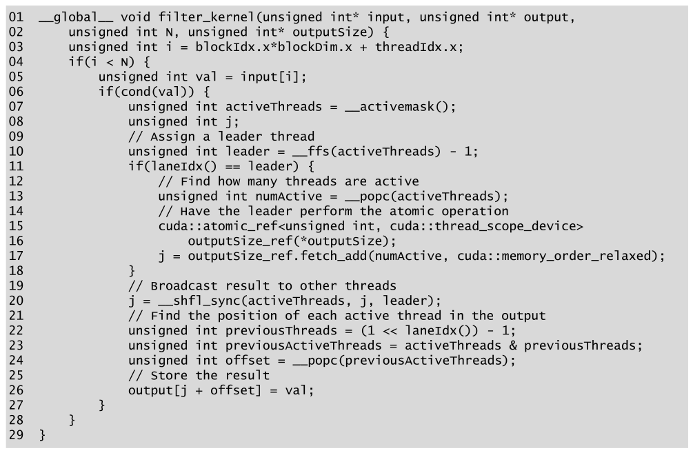

*Figure 12.3 — coalesced atomic 연산을 쓰는 unstable filter kernel 의 코드. (책 p.292)*

```cuda
01  __global__ void filter_kernel(unsigned int* input, unsigned int* output,
02      unsigned int N, unsigned int* outputSize) {
03      unsigned int i = blockIdx.x*blockDim.x + threadIdx.x;
04      if(i < N) {
05          unsigned int val = input[i];
06          if(cond(val)) {
07              unsigned int activeThreads = __activemask();
08              unsigned int j;
09              // Assign a leader thread
10              unsigned int leader = __ffs(activeThreads) - 1;
11              if(laneIdx() == leader) {
12                  // Find how many threads are active
13                  unsigned int numActive = __popc(activeThreads);
14                  // Have the leader perform the atomic operation
15                  cuda::atomic_ref<unsigned int, cuda::thread_scope_device>
16                      outputSize_ref(*outputSize);
17                  j = outputSize_ref.fetch_add(numActive, cuda::memory_order_relaxed);
18              }
19              // Broadcast result to other threads
20              j = __shfl_sync(activeThreads, j, leader);
21              // Find the position of each active thread in the output
22              unsigned int previousThreads = (1 << laneIdx()) - 1;
23              unsigned int previousActiveThreads = activeThreads & previousThreads;
24              unsigned int offset = __popc(previousActiveThreads);
25              // Store the result
26              output[j + offset] = val;
27          }
28      }
29  }
```

> Figure 12.2 와 비교하면 **차이는 07번 줄, atomic 이 수행되는 지점에서 시작한다** (책 p.292).
> 01~06번 줄은 글자 하나 다르지 않다.

`laneIdx()` 는 10.7절에서 정의한 보조 함수다 (`threadIdx.x % warpSize`).

#### 줄별로

| 줄 | 하는 일 | 짚을 점 |
|---|---|---|
| **07** | active mask 획득 | **`if(cond(val))` 안에서** 불러야 한다. 밖이면 조건을 통과 못 한 thread 까지 세어진다 |
| **08** | `j` 를 **if 밖에** 선언 | 20번 줄에서 **모든 활성 thread 가** 쓰기 때문. leader 만 값을 채운다 |
| **10** | leader = 최하위 활성 lane | `- 1` 을 잊지 말 것 |
| **11~18** | **leader 혼자** `numActive` 만큼 한 번에 atomic | **여기가 이 절의 전부다** — 32회가 1회가 된다 |
| **20** | `j` 를 leader 에서 전원에게 **broadcast** | mask 는 `activeThreads`, 소스 lane 은 `leader` |
| **22~24** | **binary prefix sum** — 내 offset | 아래 유도 참조 |
| **26** | `output[j + offset]` 에 저장 | `j` 는 warp 공통, `offset` 은 thread 별 |

> **11~18번 줄의 `if` 안에서 atomic 을 하는데 왜 warp 가 갈라지지 않고 20번 줄에서
> 다시 만나는가?** 갈라진다. leader 만 atomic 을 실행하고 나머지는 기다린다.
> 그러나 **비활성 thread 를 기다리게 하는 비용보다 atomic 31회를 없앤 이득이 압도적**이다.
> 그리고 20번 줄의 `__shfl_sync` 가 `activeThreads` 를 mask 로 받으므로
> **거기서 활성 thread 들이 다시 수렴**한다.

#### 20번 줄 — 왜 `j` 가 초기화되지 않은 채로 shuffle 되는가

비-leader thread 의 `j` 는 20번 줄 시점에 **초기화되지 않은 값**이다.
그래도 되는 이유는 `__shfl_sync(mask, var, srcLane)` 이 **`srcLane` 의 `var` 만 읽어
전원에게 나눠 주기** 때문이다 — 내 `j` 는 읽히지 않고 그냥 덮어써진다.

> 그래도 **선언은 07번 줄 위, 즉 `if(laneIdx() == leader)` 밖**이어야 한다.
> 안에서 선언하면 20번 줄에서 이름이 보이지 않는다. 08번 줄이 그것 때문에 있다.

### 4. 수식/유도 — ④단계의 binary prefix sum

#### 전체 유도 과정 (먼저 한 번에)

$$\text{offset}_i \;=\; \big|\{\, t < i \;:\; t \in A \,\}\big| \tag{1}$$

$$P_i \;=\; \{0, 1, \ldots, i-1\} \;\longleftrightarrow\; \texttt{previousThreads} = 2^i - 1 \tag{2}$$

$$A \cap P_i \;\longleftrightarrow\; \texttt{activeThreads \& previousThreads} \tag{3}$$

$$\text{offset}_i \;=\; \texttt{\_\_popc}(A \cap P_i) \tag{4}$$

$$\sum_{i \in A} 1 \;=\; \texttt{\_\_popc}(A) \;=\; \texttt{numActive} \tag{5}$$

#### 단계별 설명 (생략 없이)

> **먼저 개념 하나** — **binary prefix sum** 이다 (책 p.293, 참고문헌 [1]).
> 11장의 scan 은 임의의 값에 대한 prefix sum 이었다. 여기서는 **입력이 0 또는 1 뿐**이다.
> 0/1 짜리 32개 원소의 prefix sum 은 **32비트 정수 하나의 비트 연산**으로 끝난다 —
> shared memory 도, barrier 도, $\log_2 32 = 5$ step 도 필요 없이 **명령 두세 개**다.
> 11장의 무거운 기계를 여기서는 쓰지 않아도 되는 이유가 이것이다.

**(1)** 무엇을 구해야 하는가.

> 즉, **어떤 thread 의 offset 은 warp 안에서 자기보다 앞선 활성 thread 의 개수**와 같다.
> 이 값을 찾는 것은 active mask 에 대해 **binary prefix sum 연산**을 수행하는 것과 동등하다
> (책 p.293).

$A$ 를 활성 lane 의 집합이라 하면, lane $i$ 의 offset 은 $A$ 안에서 $i$ 보다 작은 원소의 개수다.
첫 활성 thread 는 0, 두 번째는 1, … 이 되어 **획득한 공간을 빈틈없이 채운다.**

**(2)** "나보다 앞선 lane" 을 mask 로 만든다.

> warp 의 thread $i$ 는 **비트 0 부터 $i-1$ 까지가 설정된 mask** 를 만든다.
> 이 mask 는 $2^i - 1$ 을 계산해 만들 수 있다 (책 p.293).

$2^i - 1$ 이 왜 "아래 $i$ 비트가 전부 1" 인가 — 2진수로 $2^i$ 는 `1` 뒤에 0 이 $i$ 개이고,
거기서 1을 빼면 **자리내림이 연쇄**하여 `0` 뒤에 1 이 $i$ 개가 된다.

| $i$ | $2^i$ | $2^i - 1$ | 이진 (8비트) |
|---|---|---|---|
| 0 | 1 | 0 | `00000000` |
| 3 | 8 | 7 | `00000111` |
| 5 | 32 | 31 | `00011111` |

코드의 `(1 << laneIdx()) - 1` 이 정확히 $2^i - 1$ 이다. **자기 자신은 포함되지 않는다**는 점이
중요하다 — 그래서 이 계산이 **exclusive** scan 이 된다 (11.1절의 그 구분이다).

**(3)** 교집합을 비트 AND 로 얻는다.

> 앞선 thread 들의 mask 를 **활성 thread 들의 mask 와 교집합**하여
> **앞선 활성 thread 들**을 얻는다 (책 p.293).

집합의 교집합 ↔ 비트 AND 는 mask 표현의 기본 성질이다.

**(4)** 개수를 센다.

> 마지막으로 앞선 활성 thread 들의 mask 에 `__popc()` 를 호출하면
> **앞선 활성 thread 의 개수**가 나오고, 그것이 우리가 찾던 offset 이다 (책 p.293).

**(5)** ②단계와 ④단계가 같은 연산인 이유.

`numActive` 는 $A$ 전체의 크기이고 offset 은 $A \cap P_i$ 의 크기다.
**둘 다 "집합의 크기"이므로 같은 `__popc`** 다. 그리고 이 둘은 다음 관계로 맞물린다 —
lane $i$ 가 $A$ 의 마지막 원소일 때 $\text{offset}_i = |A| - 1 = \texttt{numActive} - 1$ 이므로,
**획득한 $[j,\ j + \texttt{numActive})$ 구간이 정확히 다 채워지고 넘치지 않는다.** ∎

### 5. 예제 — Figure 12.1 의 데이터를 warp 하나로

**Figure 12.1 의 kept 집합을 16-lane warp 의 active mask 로 보면** 이 절의 모든 단계를
손으로 따라갈 수 있다. 활성 lane 은 1, 3, 4, 6, 8, 10, 11, 14 다.

$$\texttt{activeThreads} = 2^1 + 2^3 + 2^4 + 2^6 + 2^8 + 2^{10} + 2^{11} + 2^{14} = 19{,}802$$

이진으로 (하위 16비트) `0100 1101 0101 1010` 이다.

| 단계 | 계산 | 값 |
|---|---|---|
| ① leader | `__ffs(19802) - 1` = $2 - 1$ | **lane 1** |
| ② numActive | `__popc(19802)` | **8** |
| ③ atomic | leader 가 `fetch_add(8)` → counter 0 → 8 | $j = \mathbf{0}$ |
| ④ offset | 아래 표 | |

| lane | `previousThreads` $= 2^i - 1$ | `& activeThreads` 의 popc | offset | 쓰는 곳 |
|---|---|---|---|---|
| 1 | `0000000000000001` | 0 | **0** | `output[0] = k1` |
| 3 | `0000000000000111` | 1 | **1** | `output[1] = k3` |
| 4 | `0000000000001111` | 2 | **2** | `output[2] = k4` |
| 6 | `0000000000111111` | 3 | **3** | `output[3] = k6` |
| 8 | `0000000011111111` | 4 | **4** | `output[4] = k8` |
| 10 | `0000001111111111` | 5 | **5** | `output[5] = k10` |
| 11 | `0000011111111111` | 6 | **6** | `output[6] = k11` |
| 14 | `0011111111111111` | 7 | **7** | `output[7] = k14` |

출력은 $[k_1, k_3, k_4, k_6, k_8, k_{10}, k_{11}, k_{14}]$ 다.

> **여기서 놓치기 쉬운 사실 하나** (책이 명시하지 않은, 이 표에서 직접 읽히는 것).
> 이 출력은 **Figure 12.1(b) 의 stable 출력과 정확히 같다.**
>
> 당연하다 — offset 을 **lane index 순서**로 배정했으니 **warp 안에서는 순서가 보존**된다.
> 그렇다면 이 kernel 은 왜 여전히 unstable 인가? **warp 사이의 순서**가 정해지지 않기 때문이다.
> 어느 warp 가 먼저 counter 를 잡느냐에 따라 warp 단위 덩어리의 배치가 뒤바뀐다.
>
> 즉 **coalesced atomic 은 "warp 단위로는 stable, warp 사이로는 unstable"** 이다.
> 32개 이하 key 를 다루는 특수한 경우에는 이 kernel 이 사실상 stable filter 로 동작한다.

### 6. cooperative groups 판

> atomic 을 coalesce 하기 위해 **warp 의 활성 thread 를 관리하는 연산을 잔뜩** 해야 했다.
> 활성 warp thread 의 관리를 쉽게 하기 위해, cooperative groups API 는
> **coalesced group** 이라는 특별한 종류의 group 을 제공한다.
> **coalesced group 은 warp 의 활성 thread 를 나타내는 cooperative group** 이다 (책 p.293).

```cuda
coalesced_group activeThreads = coalesced_threads();
```

> 이 handle 을 쓰면 warp 의 활성 thread 수와, 다른 활성 thread 들에 대한 어떤 활성 thread 의
> index 를 쉽게 알 수 있다. **활성 thread 수는 곧 group 의 크기** `activeThreads.size()` 이고,
> **다른 활성 thread 들에 대한 index 는 곧 group 안에서의 rank**
> `activeThreads.thread_rank()` 다 (책 p.294).

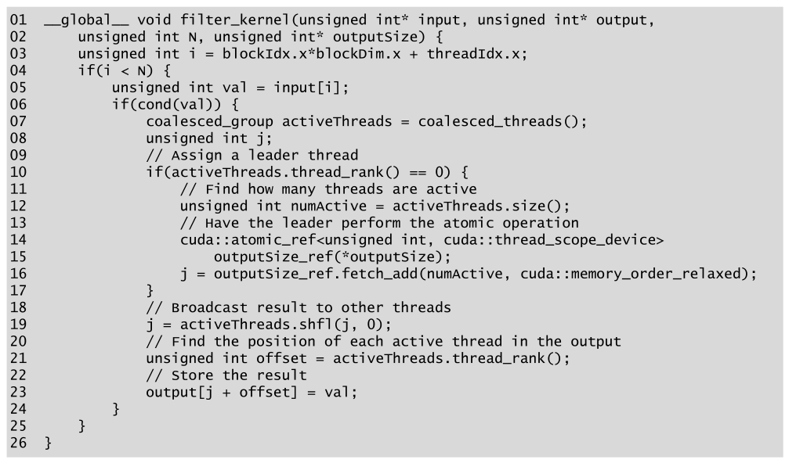

*Figure 12.4 — cooperative groups 를 써서 coalesced atomic 연산을 수행하는 unstable filter kernel 의 코드. (책 p.294)*

```cuda
01  __global__ void filter_kernel(unsigned int* input, unsigned int* output,
02      unsigned int N, unsigned int* outputSize) {
03      unsigned int i = blockIdx.x*blockDim.x + threadIdx.x;
04      if(i < N) {
05          unsigned int val = input[i];
06          if(cond(val)) {
07              coalesced_group activeThreads = coalesced_threads();
08              unsigned int j;
09              // Assign a leader thread
10              if(activeThreads.thread_rank() == 0) {
11                  // Find how many threads are active
12                  unsigned int numActive = activeThreads.size();
13                  // Have the leader perform the atomic operation
14                  cuda::atomic_ref<unsigned int, cuda::thread_scope_device>
15                      outputSize_ref(*outputSize);
16                  j = outputSize_ref.fetch_add(numActive, cuda::memory_order_relaxed);
17              }
18              // Broadcast result to other threads
19              j = activeThreads.shfl(j, 0);
20              // Find the position of each active thread in the output
21              unsigned int offset = activeThreads.thread_rank();
22              // Store the result
23              output[j + offset] = val;
24          }
25      }
26  }
```

**한 줄씩 대응된다** (책 p.294).

| 무엇 | Figure 12.3 | Figure 12.4 | 줄어든 줄 |
|---|---|---|---|
| 활성 thread 찾기 | `__activemask()` (07) | `coalesced_threads()` (07) | — |
| leader 정하기 | `__ffs(...) - 1` + 비교 (10~11) | `thread_rank() == 0` (10) | **2 → 1** |
| 활성 thread 수 | `__popc(...)` (13) | `.size()` (12) | — |
| broadcast | `__shfl_sync(mask, j, leader)` (20) | `.shfl(j, 0)` (19) | — |
| **내 offset** | **비트 계산 3줄** (22~24) | `.thread_rank()` (21) | **3 → 1** |

**전체 29줄이 26줄이 됐고, 가장 까다로운 ④단계가 한 줄이 됐다.**

> **`thread_rank()` 가 두 번 쓰인다는 점이 이 API 의 핵심이다.**
> ①단계(leader = rank 0)와 ④단계(offset = rank)가 **같은 개념의 두 용법**이다.
> Figure 12.3 에서 `__ffs` 와 `__popc(mask & prev)` 로 나뉘어 보이던 것이,
> 사실은 **"활성 thread 들 사이에서 나는 몇 번째인가" 하나**였음이 드러난다.
> "leader 의 offset 은 0" 이라는 앞의 관찰도 여기서는 정의 그 자체가 된다.

#### 그런데 실전에서는 손으로 하지 않는다

> **실무에서는 컴파일러가 이 절에서 논한 atomic coalescing 최적화를 이미 구현하고 있으므로,
> 프로그래머가 손으로 적용할 필요가 없다.** 더욱이 warp 에서 atomic 을 실행하는 thread 가
> 하나뿐이라면 이 최적화는 불필요하며, 컴파일러는 warp 에서 하나의 thread 만 활성임을
> 확정할 수 있으면 실제로 적용을 삼간다 (책 p.294).

> 그럼에도 이 최적화가 어떻게 구현되는지 보는 것은 좋은 연습이다. **warp voting 함수
> (`__activemask()`), `__ffs()`·`__popc()` 같은 intrinsic, 그리고 cooperative groups API 의
> coalesced group 을 소개할 좋은 기회**이기 때문이다 (책 p.294~295).

**책이 스스로 "이 절은 도구를 소개하려고 있다"고 밝히는 드문 대목이다.**
따라서 이 절에서 가져가야 할 것은 filter 최적화 기법이 아니라 **warp voting 이라는 도구**다.
이 도구는 14장의 radix sort 와 18장의 graph traversal 에서 다시 만난다.

### 7. 얼마나 줄었나

$N = 2^{20}$, 선택률(selectivity) $s = 0.5$, block 256 thread 로 계산한다.

> **선택률**은 이 노트의 표기다 — 책에는 없다. `cond()` 를 통과하는 key 의 비율을 뜻하고,
> 이 장의 성능은 거의 전부 이 값의 함수다.

| | atomic 횟수 | 직렬화 시간 (2.5 M/s) | 감소 |
|---|---|---|---|
| **Figure 12.2** (naive) | $sN = 524{,}288$ | **209.7 ms** | — |
| **Figure 12.3** (coalesced) | $N/32 = 32{,}768$ | **13.1 ms** | **16×** |

**감소 비율이 정확히 $32s = 16$ 인 이유**는 이렇다. warp 하나당 atomic 이
$32s$ 회에서 **1회**로 줄기 때문이다. 즉 **이득은 warp 당 평균 활성 thread 수와 같다.**

| 선택률 $s$ | warp 당 활성 | coalesced 이득 |
|---|---|---|
| 1.00 | 32 | **32×** (최대) |
| 0.50 | 16 | 16× |
| 0.10 | 3.2 | 3.2× |
| 0.03 | 1 | **1×** (이득 없음) |

> **선택률이 낮으면 이 최적화는 무의미해진다.** 책이 "warp 에서 atomic 을 실행하는 thread 가
> 하나뿐이면 컴파일러가 적용을 삼간다"고 한 것이 이 표의 마지막 줄이다.
> 반대로 **선택률이 높을수록 이득이 크다** — filter 가 거의 아무것도 안 걸러 낼 때 가장 이득이다.

$s = 0.5$ 에서 **warp 에 활성 thread 가 하나도 없을 확률**은 $(1-s)^{32} = 2.3 \times 10^{-10}$ 로
무시할 만하다. 그래서 위 표에서 "모든 warp 가 atomic 1회"로 세었다.

#### 덤 — 저장도 coalesced 해진다

> coalesced atomic 을 쓰는 또 하나의 이득을 여기서 관찰할 수 있다. **atomic 연산 수를 줄이는
> 것에 더해**, coalesced atomic 을 쓰면 warp 의 활성 thread 들이 **인접한 메모리 위치**에
> 자기 값을 저장하게 된다. 따라서 global memory 로의 저장이 **하드웨어에 의해 coalesce 될
> 가능성이 높아진다** (책 p.293).

12.2절에서 "저장이 흩어진다"고 지적했던 두 번째 병목이 **덤으로 고쳐진다.**
26번 줄의 `output[j + offset]` 에서 **`j` 가 warp 공통이고 `offset` 이 0,1,2,… 로 연속**이므로
warp 의 저장이 **연속 주소 덩어리 하나**가 된다.

<!--widget:warp-vote-->

### 8. 예제/실습

#### 연습문제

> warp 의 활성 thread 가 lane **0, 5, 6, 31** 일 때 다음을 구하라.
> **(1)** `__activemask()` 의 반환값 (16진수),
> **(2)** leader lane,
> **(3)** counter 가 100 에서 시작할 때 각 활성 thread 가 쓰는 출력 index,
> **(4)** 같은 상황을 Figure 12.2 로 처리하면 atomic 이 몇 번인가.

**(1)** $2^0 + 2^5 + 2^6 + 2^{31} = 1 + 32 + 64 + 2147483648 = 2147483745$
= `0x80000061`.

**(2)** 최하위 활성 비트는 0번 → `__ffs` 는 1 → **leader = lane 0**.

**(3)** `numActive` = `__popc(0x80000061)` = **4** 이므로 leader 가 `fetch_add(4)` 를 하여
$j = 100$ 을 받고 counter 는 104 가 된다.

| lane | `previousThreads` | `& mask` | offset | 출력 index |
|---|---|---|---|---|
| 0 | `0x00000000` | 0 | 0 | **100** |
| 5 | `0x0000001F` | `0x00000001` | 1 | **101** |
| 6 | `0x0000003F` | `0x00000021` | 2 | **102** |
| 31 | `0x7FFFFFFF` | `0x00000061` | 3 | **103** |

**(4)** Figure 12.2 라면 **4회** (활성 thread 마다 한 번씩). Figure 12.3 은 **1회**.
$s = 4/32 = 0.125$ 이므로 이득은 $32 \times 0.125 = 4\times$ — 위 표의 공식과 맞는다.

> **lane 31 의 `previousThreads` 를 주의해서 보라.** $2^{31} - 1 =$ `0x7FFFFFFF` 로
> 하위 31비트가 전부 1이다. `unsigned int` 라서 문제가 없지만,
> **`int` 로 선언했다면 `1 << 31` 이 부호 비트를 건드려 미정의 동작**이 된다.
> Figure 12.3 이 22번 줄에서 `unsigned int` 를 쓰는 것은 우연이 아니다.

---

## 12.4 Privatization (책 p.295)

### 1. 개념적 이해

> 12.3절에서 coalesced atomic 이 출력 목록 counter 에 대한 atomic 경쟁을 어떻게 줄이는지 보았다.
> 이 절에서는 counter 경쟁을 줄이는 또 다른 최적화, 즉 **privatization** 을 본다 (책 p.295).

> 6장과 9장에서 본 대로 privatization 은 **출력 데이터의 private 판을 만들어 갱신함으로써
> public 출력 데이터에 대한 경쟁을 줄이고, 마지막에 private 판을 public 판과 병합**하는
> 최적화다. 같은 최적화를 filter 패턴에 적용한다 (책 p.295).

**9장과 다른 점이 하나 있다.** 9장의 histogram 에서는 private 사본이 **bin 배열 하나**였다.
여기서는 **두 개**에 privatization 을 적용한다 — **private 출력 배열과 private counter**.
출력 자체를 shared memory 에 모았다가 통째로 내보내는 구조라, 9장보다 한 걸음 더 나간 형태다.

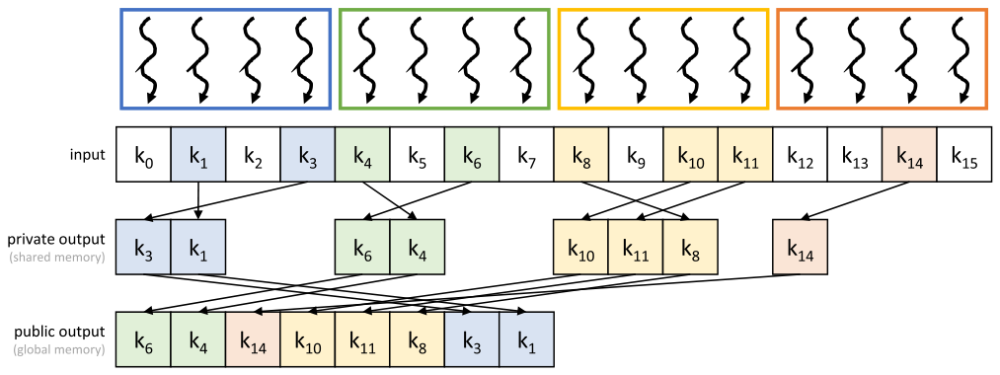

*Figure 12.5 — privatization 을 적용한 unstable filter. (책 p.295)*

> 각 thread block 마다 **출력 배열과 출력 counter 의 private 판을 shared memory 에** 만든다.
> 입력 key 를 처리하는 동안 thread 들은 **자기 block 의 private counter 를 atomic 하게 갱신**하고
> filter 된 key 를 자기 block 의 private 출력 배열에 놓는다.
> 모든 입력 key 가 처리되면 **block 의 thread 하나가 public 출력 counter 를 atomic 하게
> 갱신**하고, thread 들이 협력해 block 의 private 출력 배열 내용을 public 출력 배열에 쓴다.
> private counter 와 private 출력 배열을 shared memory 에 두는 것은
> **counter atomic 갱신과 private 출력 배열 쓰기의 latency 를 줄이고 throughput 을 높이기**
> 위해서다 (책 p.295).

그림을 읽으면 이렇다. 네 block 이 각각 key 4개씩 맡는다.

| block | 맡은 입력 | private 출력 (shared) | 개수 |
|---|---|---|---|
| 0 (파랑) | $k_0 \ldots k_3$ | $k_3,\ k_1$ | 2 |
| 1 (초록) | $k_4 \ldots k_7$ | $k_6,\ k_4$ | 2 |
| 2 (노랑) | $k_8 \ldots k_{11}$ | $k_{10},\ k_{11},\ k_8$ | 3 |
| 3 (주황) | $k_{12} \ldots k_{15}$ | $k_{14}$ | 1 |

public 출력은 $[k_6, k_4, k_{14}, k_{10}, k_{11}, k_8, k_3, k_1]$ 로,
**block 단위 덩어리들이 뒤섞여 있다.**

> **여기서 unstable 이 두 층으로 나타난다는 점을 보라.**
> ① **block 안**에서도 순서가 깨진다 (block 0 이 $k_3, k_1$ 순) — private counter 에 대한
> atomic 이 여전히 임의 순서라서다.
> ② **block 사이**에서도 깨진다 (block 1 → 3 → 2 → 0 순으로 자리를 잡았다) —
> public counter 를 먼저 잡은 block 이 앞자리를 가져가므로.
>
> 12.3절의 coalesced atomic 은 ①을 warp 범위에서 없앴다.
> **둘을 병용하면 warp 안 → block 안 → block 사이로 무질서의 범위가 계속 좁아지지만,
> 완전한 stable 은 결코 되지 않는다.** stable 은 atomic 이 아니라 scan 이 만든다 (12.5절).

### 2. 코드

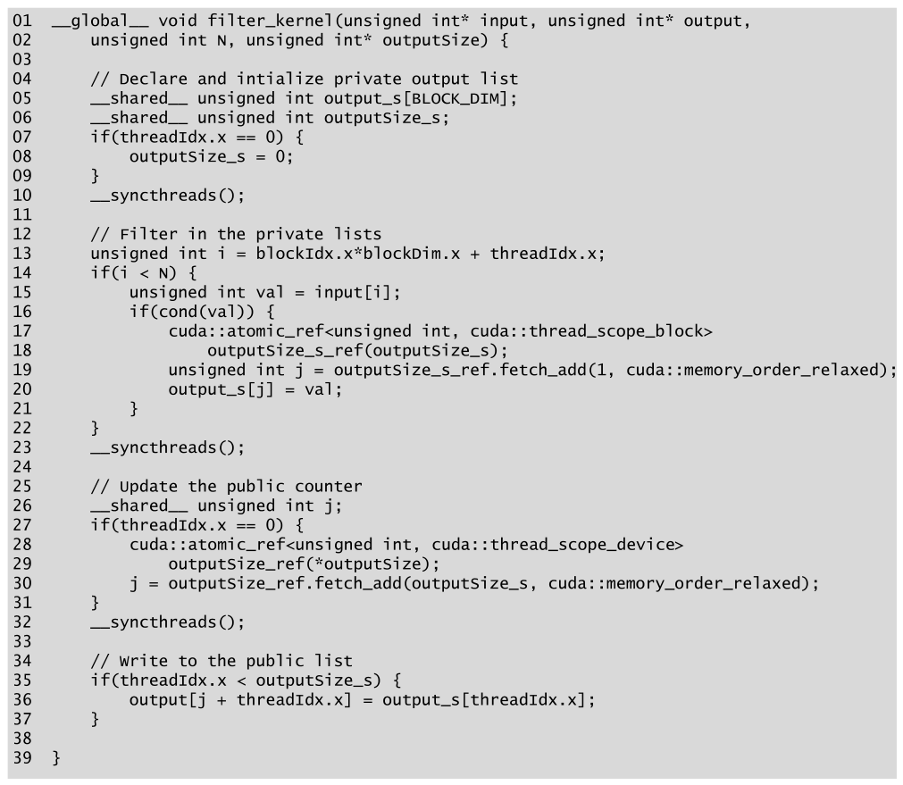

*Figure 12.6 — privatization 을 적용한 unstable filter kernel 의 코드. (책 p.296)*

```cuda
01  __global__ void filter_kernel(unsigned int* input, unsigned int* output,
02      unsigned int N, unsigned int* outputSize) {
03
04      // Declare and intialize private output list
05      __shared__ unsigned int output_s[BLOCK_DIM];
06      __shared__ unsigned int outputSize_s;
07      if(threadIdx.x == 0) {
08          outputSize_s = 0;
09      }
10      __syncthreads();
11
12      // Filter in the private lists
13      unsigned int i = blockIdx.x*blockDim.x + threadIdx.x;
14      if(i < N) {
15          unsigned int val = input[i];
16          if(cond(val)) {
17              cuda::atomic_ref<unsigned int, cuda::thread_scope_block>
18                  outputSize_s_ref(outputSize_s);
19              unsigned int j = outputSize_s_ref.fetch_add(1, cuda::memory_order_relaxed);
20              output_s[j] = val;
21          }
22      }
23      __syncthreads();
24
25      // Update the public counter
26      __shared__ unsigned int j;
27      if(threadIdx.x == 0) {
28          cuda::atomic_ref<unsigned int, cuda::thread_scope_device>
29              outputSize_ref(*outputSize);
30          j = outputSize_ref.fetch_add(outputSize_s, cuda::memory_order_relaxed);
31      }
32      __syncthreads();
33
34      // Write to the public list
35      if(threadIdx.x < outputSize_s) {
36          output[j + threadIdx.x] = output_s[threadIdx.x];
37      }
38
39  }
```

> **원문 오기** (Figure 12.6, 책 p.296). 04번 줄 주석이 **`intialize`** 로,
> `initialize` 의 `i` 가 빠져 있다. 동작에는 영향이 없다.

#### 네 국면으로 읽는다

| 줄 | 국면 | 하는 일 |
|---|---|---|
| **04~10** | ① **준비** | private 출력 배열·counter 선언, counter 를 0 으로 초기화 |
| **12~22** | ② **private filter** | Figure 12.2 와 같되 **shared 판**을 쓴다 |
| **25~31** | ③ **자리 예약** | thread 0 이 public counter 를 **`outputSize_s` 만큼 한 번에** 올린다 |
| **34~37** | ④ **commit** | 전원이 협력해 shared → global 로 옮긴다 |

**12.3절의 네 단계와 구조가 똑같다** — 총량 합산 → 대표 하나가 atomic → 시작점 공유 →
각자 offset. 다른 것은 **범위가 warp 에서 block 으로 커졌고, 공유 수단이 shuffle 에서
shared memory 로 바뀌었을 뿐**이다.

| | 12.3 coalesced atomic | 12.4 privatization |
|---|---|---|
| 범위 | warp (32) | block (`BLOCK_DIM`) |
| 총량 합산 | `__popc(activeThreads)` | private counter 를 세어 놓았다 (`outputSize_s`) |
| 대표 | leader lane | `threadIdx.x == 0` |
| 시작점 공유 | `__shfl_sync` | **shared 변수 `j`** (26번 줄) |
| 내 offset | `__popc(mask & prev)` | **`threadIdx.x`** (36번 줄) |
| key 를 어디에 모아 두나 | 모으지 않는다 (register) | **shared 배열 `output_s`** |

#### 줄별 요점

| 줄 | 짚을 점 |
|---|---|
| **05** | `output_s[BLOCK_DIM]` — **크기가 `BLOCK_DIM` 이면 충분하다.** 통과하는 key 는 아무리 많아야 thread 수만큼이다 |
| **07~09** | thread 0 만 counter 초기화. **모두가 0 을 쓰면 낭비이고 race 로 보인다** |
| **17** | scope 가 **`cuda::thread_scope_block`** ← 아래 참조 |
| **19** | shared counter 에 대한 `fetch_add` | 12.2절과 같은 형태지만 latency 가 **$100\times$ 짧다** (200 cycle → 2 cycle, 9.4절) |
| **26** | `j` 를 **`__shared__`** 로 | thread 0 이 받은 값을 **다른 thread 가 36번 줄에서 읽어야** 하므로 (책 p.296) |
| **30** | `fetch_add(outputSize_s, ...)` — **1 이 아니라 block 이 만든 개수만큼** | 12.3절의 `numActive` 와 같은 역할 |
| **35** | `threadIdx.x < outputSize_s` — **앞쪽 thread 만 참여** | 남은 thread 는 쉰다 |
| **36** | `output[j + threadIdx.x] = output_s[threadIdx.x]` | **연속 thread 가 연속 key 를 쓴다** |

> **17번 줄의 scope 가 이 절의 가장 중요한 한 글자다.**
>
> shared memory 의 counter 는 **같은 block 의 thread 만 접근**하므로,
> atomic reference 의 scope 가 `cuda::thread_scope_device` 가 아니라
> **`cuda::thread_scope_block`** 이다 (책 p.296).
>
> scope 를 좁히면 하드웨어가 **더 좁은 범위에서만 일관성을 보장**하면 되므로
> 훨씬 싸게 구현된다. 반대로 필요보다 넓은 scope 를 쓰면 조용히 느려진다.
> 28번 줄은 public counter 를 건드리므로 다시 `thread_scope_device` 다 —
> **같은 kernel 안에서 두 scope 가 나란히 쓰이는 좋은 예다.**

#### 세 개의 barrier 는 각각 무엇을 막는가

이 kernel 에는 `__syncthreads()` 가 셋 있다. **각각 다른 race 를 막는다.**

| barrier | 막는 것 | 없으면 |
|---|---|---|
| **10번 줄** | 초기화 ↔ 사용 | 어떤 thread 가 counter 를 갱신하기 시작하기 **전에** counter 가 초기화되도록 보장한다 (책 p.296). thread 0 의 `outputSize_s = 0` 이 남의 `fetch_add` **뒤에** 실행되면 그 결과가 지워진다 |
| **23번 줄** | 쓰기 ↔ commit | 모든 thread 가 private 목록에 추가를 끝낸 **뒤에야** public 목록으로 commit 되도록 보장한다 (책 p.296). 그리고 30번 줄이 읽는 `outputSize_s` 가 **최종값**이어야 한다 |
| **32번 줄** | `j` 쓰기 ↔ `j` 읽기 | `j` 가 shared memory 에 쓰이는 것이 다른 thread 가 그것을 쓰기 시작하기 **전에** 일어나도록 보장한다 (책 p.296) |

> **셋 다 "쓰는 쪽과 읽는 쪽이 다른 thread 인 shared 변수"** 를 지킨다.
> 11.2절에서 정리한 read-after-write 순서 문제와 같은 구도이고,
> **shared memory 를 쓰는 순간 barrier 를 세는 습관**이 이 장에서도 그대로 필요하다.

### 3. 얼마나 줄었나

> coalesced atomic 의 경우와 마찬가지로, privatization 에서도 public counter 경쟁 감소
> **외의 추가 이득**을 관찰할 수 있다. **연속 thread 가 연속 key 를 global memory 에 쓰므로
> memory 저장이 coalesced 된다** (책 p.297).

같은 조건($N = 2^{20}$, $s = 0.5$, `BLOCK_DIM` = 256)으로 세 kernel 을 나란히 놓는다.

| | global atomic | shared atomic | 직렬화 시간 | 감소 |
|---|---|---|---|---|
| **Figure 12.2** | $sN = 524{,}288$ | — | 209.7 ms | — |
| **Figure 12.3** | $N/32 = 32{,}768$ | — | 13.1 ms | **16×** |
| **Figure 12.6** | $N/256 = 4{,}096$ | 524,288 | **1.64 ms** | **128×** |
| **12.6 + 12.3 병용** | $N/256 = 4{,}096$ | 32,768 | 1.64 ms | **128×** |

**privatization 의 이득은 $\texttt{BLOCK\_DIM} \times s = 128\times$ 다** — 12.3절의 이득이
$32s$ 였던 것과 같은 꼴이고, **32 자리에 block 크기가 들어간다.**
block 이 warp 보다 크므로 **privatization 이 coalesced atomic 보다 이득이 크다.**

**두 기법은 배타적이지 않다.** 병용하면 global atomic 은 그대로지만
**shared atomic 이 $16\times$ 줄어든다.** shared 는 latency 가 훨씬 짧아 병목이 아니므로
효과는 제한적이지만, 선택률이 높고 block 이 클수록 의미가 생긴다.

> **9장의 privatization 과 비교해 두자.** 거기서는 사본 수를 늘릴수록 경쟁이 줄지만
> **마지막 병합 비용이 사본 수에 비례해 늘어나는** 맞바꿈이 있었다.
> 여기서는 다르다 — **병합이 counter 하나의 atomic 과 연속 복사**뿐이라 거의 공짜다.
> block 을 잘게 쪼갤수록 나쁜 것은 오히려 **출력 덩어리가 짧아져 coalescing 이 나빠지는 것**이고,
> 이 맞바꿈이 12.6절의 thread coarsening 으로 이어진다.

### 4. 예제/실습

#### 연습문제

> `BLOCK_DIM` = 4, 입력이 Figure 12.5 와 같을 때
> **(1)** block 2 의 thread 들이 private counter 에 대해 `fetch_add` 를 한 순서가
> thread 2 → thread 3 → thread 0 이었다면 `output_s` 의 내용은?
> **(2)** block 들이 public counter 를 block 1 → 3 → 2 → 0 순으로 잡았다면
> 각 block 이 받은 `j` 는?
> **(3)** 최종 public 출력을 적고 Figure 12.5 와 비교하라.

**(1)** block 2 는 $k_8 \ldots k_{11}$ 을 맡고 통과하는 것은 $k_8$ (thread 0),
$k_{10}$ (thread 2), $k_{11}$ (thread 3) 이다.

| 순서 | thread | key | 받은 `j` | `output_s` |
|---|---|---|---|---|
| 1 | 2 | $k_{10}$ | 0 | `[k10, _, _, _]` |
| 2 | 3 | $k_{11}$ | 1 | `[k10, k11, _, _]` |
| 3 | 0 | $k_8$ | 2 | `[k10, k11, k8, _]` |

`outputSize_s` = 3. **Figure 12.5 의 노란 덩어리 $k_{10}, k_{11}, k_8$ 과 정확히 일치한다.**

**(2)** 각 block 의 `outputSize_s` 는 block 0: 2, block 1: 2, block 2: 3, block 3: 1 이다.

| 순서 | block | `fetch_add` 인자 | 받은 `j` | counter |
|---|---|---|---|---|
| 1 | 1 | 2 | **0** | 0 → 2 |
| 2 | 3 | 1 | **2** | 2 → 3 |
| 3 | 2 | 3 | **3** | 3 → 6 |
| 4 | 0 | 2 | **6** | 6 → 8 |

**(3)** 각 block 이 `j` 부터 자기 덩어리를 쓴다.

| index | 0 | 1 | 2 | 3 | 4 | 5 | 6 | 7 |
|---|---|---|---|---|---|---|---|---|
| key | $k_6$ | $k_4$ | $k_{14}$ | $k_{10}$ | $k_{11}$ | $k_8$ | $k_3$ | $k_1$ |
| block | 1 | 1 | 3 | 2 | 2 | 2 | 0 | 0 |

**Figure 12.5 의 public output 행과 완전히 같다.** 그림이 가정한 처리 순서가
바로 이 (1)·(2) 였음을 역으로 확인한 셈이다.

---

## 12.5 A simple parallel stable filter (책 p.297)

### 1. 개념적 이해 — 자리를 예약하는 대신 계산한다

> 이제 **stable filter** 의 병렬화로 눈을 돌린다. filter 된 key 들이 출력 목록에서
> 입력 목록에서 가졌던 것과 **같은 순서를 유지**하는 경우다.
> 순서를 유지해야 한다는 것은, thread 가 counter 를 atomic 하게 증가시켜
> **출력 목록의 임의의 자리에 key 를 놓을 수 없다**는 뜻이다.
> 대신 thread 는 **앞선 입력 key 중 몇 개가 살아남았는지 알아내어**
> 자기 key 가 가야 할 특정 자리를 찾아야 한다 (책 p.297).

**"예약"에서 "계산"으로 바뀐다.** 이 한 문장이 12.2~12.4절과 12.5~12.6절을 가른다.

| | 12.2~12.4 unstable | 12.5~12.6 stable |
|---|---|---|
| 내 자리를 | **받는다** (`fetch_add` 의 반환값) | **계산한다** (앞선 keep 값들의 합) |
| 필요한 것 | atomic 한 번 | **모든 앞선 thread 의 정보** |
| 비용 | 경쟁 | **scan 전체** |
| 순서 | 도착 순 | **입력 순** |

> **stable filter 는 정렬된 목록에서 일부 원소를 삭제·추출할 때 쓴다** (책 p.297).
> 정렬된 목록을 filter 했는데 순서가 깨지면 정렬을 다시 해야 한다 —
> 그러면 filter 보다 정렬이 더 비싸진다.

### 2. 알고리즘

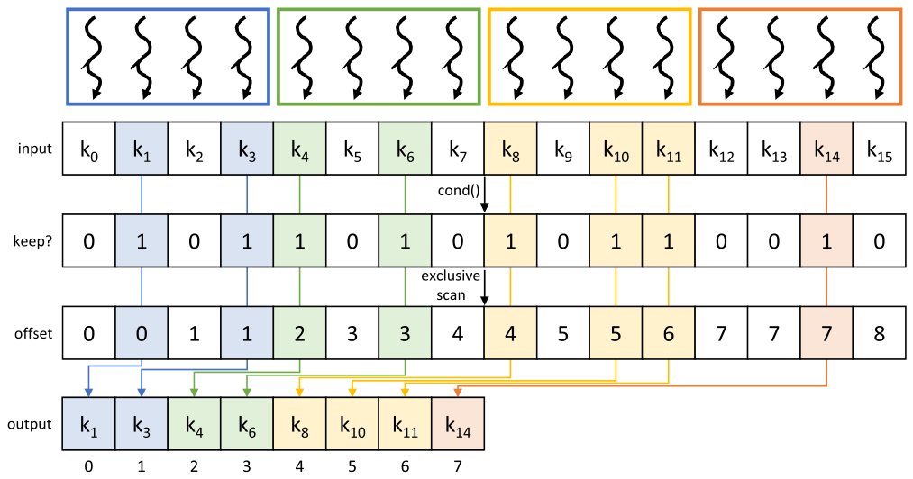

*Figure 12.7 — stable filter 연산의 병렬화. (책 p.297)*

> 입력 목록의 각 key 마다 thread 하나가 launch 된다. 각 thread 는 자기 입력값에 조건을
> 평가하여 그 값을 남길지 여부를 나타내는 **"keep" flag** 를 설정한다.
> 다음으로 thread 는 **앞선 key 중 몇 개가 출력 목록에 놓일지**를 알아내어
> 출력 목록에서 자기 key 의 offset 을 찾아야 한다.
> 즉 thread 는 **앞선 모든 thread 의 "keep" 값의 합**을 찾아야 한다.
> 앞선 모든 thread 에 대해 이 합을 찾는 것은 곧 **11장에서 공부한 exclusive scan 연산**이다
> (책 p.297~298).

그림을 네 행으로 읽는다.

| 행 | 내용 |
|---|---|
| **input** | $k_0 \ldots k_{15}$ — Figure 12.1 과 같은 데이터 |
| **keep?** | `cond()` 적용 → $[0,1,0,1,1,0,1,0,1,0,1,1,0,0,1,0]$ |
| **offset** | keep 에 **exclusive scan** → $[0,0,1,1,2,3,3,4,4,5,5,6,7,7,7,8]$ |
| **output** | `keep` 인 thread 만 `output[offset]` 에 쓴다 |

**여기서 exclusive 여야 하는 이유가 그림에 그대로 있다.**
lane 1 은 `keep=1` 이고 offset 이 **0** 이다. inclusive 였다면 1 이 되어 한 칸씩 밀린다.
**"나를 포함하지 않은, 내 앞의 합"** 이 정확히 내 자리다. 11.1절에서 exclusive scan 을
"각 조각의 **시작점**" 이라 했던 그 용법이다.

> **`keep=0` 인 thread 의 offset 값은 쓰레기가 아니다.** 예컨대 lane 12·13 은 둘 다 offset 7 이다.
> 이 값들은 **아무도 쓰지 않으므로 무해**하고, 오히려 "다음에 살아남는 key 가 갈 자리"를
> 가리키고 있다. lane 14 가 실제로 7 을 쓴다.

#### 이 절이 11장 전체를 불러온다

> 이 prefix sum 연산은, **입력이 binary 라는 사실을 활용해 작은 구획에서
> 비트 수준 연산으로 binary prefix sum 을 수행함으로써** 최적화할 수도 있다 —
> 12.3절에서 보인 대로다 (책 p.298).

**12.3절의 비트 트릭이 여기서 재활용된다.** 구조가 이렇게 된다.

| 층 | 무엇으로 scan 하나 |
|---|---|
| **warp 안** (32개) | `__popc(activeThreads & previousThreads)` — 명령 세 개 (12.3절) |
| **block 안** | shared memory Kogge-Stone (11.2~11.4절) |
| **grid 전체** | 단일 kernel scan / 3-kernel scan (11.9절) |

11.4절에서 warp 층 scan 을 `__shfl_up_sync` 로 했던 자리에,
**입력이 0/1 이면 비트 연산 하나로 대체할 수 있다**는 것이 12.3절의 기여다.

### 3. 코드

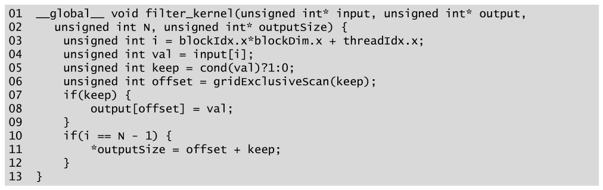

*Figure 12.8 — 단순한 stable filter kernel 의 코드. (책 p.298)*

```cuda
01  __global__ void filter_kernel(unsigned int* input, unsigned int* output,
02    unsigned int N, unsigned int* outputSize) {
03      unsigned int i = blockIdx.x*blockDim.x + threadIdx.x;
04      unsigned int val = input[i];
05      unsigned int keep = cond(val)?1:0;
06      unsigned int offset = gridExclusiveScan(keep);
07      if(keep) {
08          output[offset] = val;
09      }
10      if(i == N - 1) {
11          *outputSize = offset + keep;
12      }
13  }
```

#### 줄별로

| 줄 | 하는 일 | 짚을 점 |
|---|---|---|
| **03~04** | index 계산 후 적재 | **경계 검사가 없다** ← 아래 참조 |
| **05** | 조건을 **0/1 정수로** | `bool` 이 아니라 정수여야 더할 수 있다 |
| **06** | **grid 전체 exclusive scan** | 11장에서 논한 **single-kernel scan 구현을 따라 kernel 하나 안에서** 수행된다 (책 p.298) |
| **07~09** | 남길 key 만 저장 | 나머지는 아무것도 안 한다 |
| **10~12** | **마지막 thread** 가 총 개수를 쓴다 | `offset + keep` = inclusive scan 의 마지막 값 |

**11번 줄이 영리하다.** `outputSize` 는 "모든 keep 의 합" 인데,
마지막 thread 의 exclusive scan 값 `offset` 은 **자기 앞의 합**이므로
**자기 `keep` 을 더하면 전체 합**이 된다. 11.1절의 "exclusive → inclusive 변환"
그 자체다 — 별도의 reduction 이 필요 없다.

> **`if(i < N)` 경계 검사가 없는 것은 실수가 아니다.**
> 06번 줄의 `gridExclusiveScan(keep)` 은 **grid 의 모든 thread 가 반드시 참여해야 하는
> 집합 연산**이다. 앞에서 `if(i < N)` 으로 걸러 내면 범위 밖 thread 가 scan 에 참여하지 못해
> **deadlock 이 나거나 결과가 틀린다** (11.9절의 단방향 동기화가 특히 그렇다).
> 대신 **`N` 을 block 크기의 배수로 맞추거나**, `keep` 을 구할 때
> `unsigned int keep = (i < N && cond(val)) ? 1 : 0;` 처럼
> **scan 에는 참여하되 기여를 0 으로** 만드는 방식을 쓴다.
> 04번 줄의 `input[i]` 도 그 경우 보호가 필요하다.
> 책의 코드는 **본질을 보이기 위해 이 처리를 생략한 것**으로 읽어야 한다.

#### 무엇이 비용인가

12.2절의 unstable kernel 과 견주면 구조가 훨씬 단순하다 — atomic 도, leader 도, mask 도 없다.
**대신 06번 줄 한 줄에 11장 한 장이 통째로 들어 있다.**

| | 연산 | 동기화 |
|---|---|---|
| **12.2 unstable** | atomic $sN$ 회 | 없음 (하드웨어 직렬화) |
| **12.5 stable** | scan — 최소 $O(N)$ 덧셈, coarsening 없으면 $O(N\log N)$ | **grid 전체 순서** |

> **stable 의 값이 얼마나 비싼지**를 이렇게 볼 수 있다.
> 12.4절의 privatization 판은 global atomic 이 $N/256$ 회면 끝났다.
> stable 판은 **모든 원소가 scan 에 참여**해야 하고,
> 게다가 **block 사이에 순서 의존**이 생긴다 (11.9절).
> **순서를 지키는 값이 곧 scan 이다.**

### 4. 예제 — Figure 12.7 을 손으로

입력의 kept 집합은 $\{1, 3, 4, 6, 8, 10, 11, 14\}$ 다.

| $i$ | 0 | 1 | 2 | 3 | 4 | 5 | 6 | 7 | 8 | 9 | 10 | 11 | 12 | 13 | 14 | 15 |
|---|---|---|---|---|---|---|---|---|---|---|---|---|---|---|---|---|
| **keep** | 0 | 1 | 0 | 1 | 1 | 0 | 1 | 0 | 1 | 0 | 1 | 1 | 0 | 0 | 1 | 0 |
| **offset** (exclusive) | 0 | **0** | 1 | **1** | **2** | 3 | **3** | 4 | **4** | 5 | **5** | **6** | 7 | 7 | **7** | 8 |
| **쓴다** | | $k_1$ | | $k_3$ | $k_4$ | | $k_6$ | | $k_8$ | | $k_{10}$ | $k_{11}$ | | | $k_{14}$ | |

굵은 offset 이 실제로 쓰이는 값이다. 출력은
$[k_1, k_3, k_4, k_6, k_8, k_{10}, k_{11}, k_{14}]$ — **Figure 12.1(b) 와 일치한다.**

`outputSize` 는 마지막 thread($i = 15$)가 계산한다:
$\text{offset}_{15} + \text{keep}_{15} = 8 + 0 = \mathbf{8}$ ✓

> **offset 행이 단조 증가**하고 **`keep=1` 인 자리에서만 다음 값으로 넘어간다**는 점을 보라.
> 그래서 굵은 값들이 $0,1,2,\ldots,7$ 로 **빈틈없이 연속**한다.
> 이것이 "구멍을 없앤다"는 압축의 정의를 그대로 실현한다.

### 5. 예제/실습

#### 연습문제

> $N = 8$, 입력 $[3, 9, 2, 7, 8, 1, 5, 6]$, 조건 `cond(v) = (v >= 5)` 일 때
> **(1)** `keep` 배열과 exclusive scan 결과,
> **(2)** 출력과 `outputSize`,
> **(3)** 만약 06번 줄이 **inclusive** scan 이었다면 출력이 어떻게 되는가.

**(1)**

| $i$ | 0 | 1 | 2 | 3 | 4 | 5 | 6 | 7 |
|---|---|---|---|---|---|---|---|---|
| 값 | 3 | 9 | 2 | 7 | 8 | 1 | 5 | 6 |
| **keep** | 0 | 1 | 0 | 1 | 1 | 0 | 1 | 1 |
| **exclusive** | 0 | 0 | 1 | 1 | 2 | 3 | 3 | 4 |

**(2)** 출력 $[9, 7, 8, 5, 6]$, `outputSize` $= \text{offset}_7 + \text{keep}_7 = 4 + 1 = \mathbf{5}$.

**(3)** inclusive 라면 offset 이 $[0,1,1,2,3,3,4,5]$ 가 되어

| 쓰는 thread | 1 | 3 | 4 | 6 | 7 |
|---|---|---|---|---|---|
| offset | 1 | 2 | 3 | 4 | 5 |

출력은 `output[1..5]` 에 놓여 **`output[0]` 이 비고 전체가 한 칸씩 밀린다.**
그리고 11번 줄의 `offset + keep` 이 $5 + 1 = 6$ 이 되어 **`outputSize` 도 하나 커진다.**
결과적으로 **압축이 실패한다** — filter 의 정의를 어긴다.

---

## 12.6 Improving memory coalescing with shared memory and thread coarsening (책 p.298)

### 1. 개념적 이해

#### 무엇이 비효율인가

> 12.5절의 단순한 stable filter 구현의 비효율 하나는, filter 된 key 를 global memory 에
> 저장할 때 **block 의 모든 thread 가 참여하지는 않는다**는 것이다.
> 이 상황은 memory coalescing 기회를 놓친다 — global memory 의 인접한 위치에 쓰이는 key 들이
> **서로 다른 warp 의 thread 에 의해, 그 사이에 비활성 thread 를 많이 끼운 채로**
> 쓰일 수 있기 때문이다 (책 p.298).

**이 문장을 정확히 읽어야 한다.** 출력 *주소* 는 연속인데(scan 이 그렇게 만들었다),
그 주소들에 쓰는 *thread* 가 여러 warp 에 흩어져 있다는 뜻이다.

**coalescing 은 warp 단위로 일어난다.** warp 하나가 발행하는 store 가
몇 개의 memory transaction 이 되느냐가 문제인데, $s = 0.5$ 라면
**warp 하나가 평균 16개 key(64바이트)만 쓴다.** 64바이트는 32바이트 sector 두 개 남짓이라
경계 낭비의 비중이 커진다. 반대로 32 thread 가 모두 쓰면 128바이트 = sector 네 개로
**꽉 채운 transaction** 이 된다.

#### 해법 ① — shared memory 에 모았다가 한꺼번에

> 이 놓친 기회들은 **filter 된 key 를 shared memory 에 모은 뒤, shared memory 에서
> global memory 로 하나의 연속된 덩어리로 쓰는 것**으로 회수할 수 있다 (책 p.298).

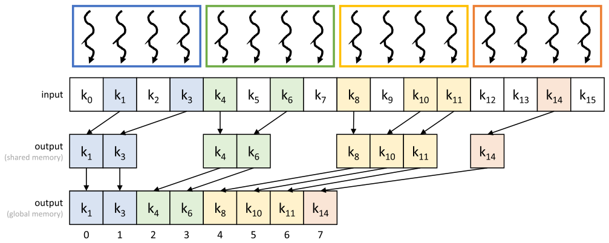

*Figure 12.9 — shared memory 를 써서 memory coalescing 을 개선한다. (책 p.299)*

> 이 경우 **인접한 출력 key 들이 shared memory 에서 global memory 로 연속된 thread 에 의해
> 쓰이므로**, 같은 warp 가 쓰는 인접 key 의 수가 늘어나고 따라서 memory coalescing 의
> 기회도 늘어난다 (책 p.299).

**Figure 12.5(privatization) 와 그림이 거의 같다는 점을 눈여겨보라.**
차이는 **shared memory 안에서의 순서**뿐이다.

| | Figure 12.5 (unstable) | Figure 12.9 (stable) |
|---|---|---|
| shared 안 순서 | atomic 도착 순 ($k_3, k_1$) | **입력 순** ($k_1, k_3$) |
| global 자리 | public counter 를 잡은 순 | **scan 이 정해 준 자리** |
| 목적 | 경쟁 감소 (coalescing 은 덤) | **coalescing** (경쟁은 애초에 없다) |

**같은 구조가 목적을 바꿔 재등장한다.** stable filter 에는 atomic 이 없으니 경쟁도 없다.
그런데도 shared memory 로 모으는 이유는 **오직 coalescing** 때문이다.

#### 해법 ② — thread coarsening

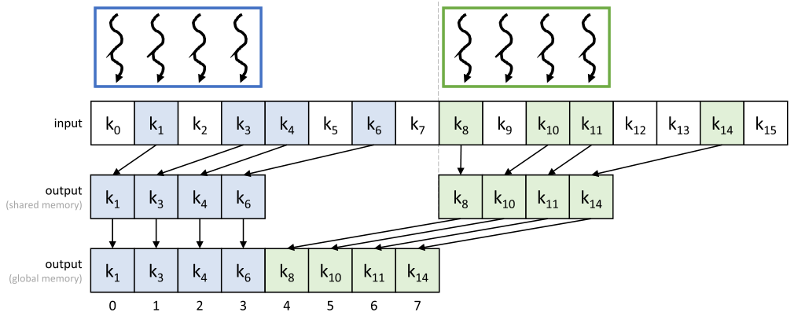

*Figure 12.10 — memory coalescing 을 더욱 개선하기 위한 thread coarsening. 이 장난감 예는 thread block 두 개를 쓰고 각 block 이 thread 네 개로 이루어졌다고 가정한다. (책 p.299)*

> 각 thread block 은 **block 의 thread 수보다 많은 key** 를 filter 하도록 배정받고,
> 그 결과 shared memory 에서 global memory 로 쓰이는 출력 key 의 연속 덩어리가
> **더 적고 더 커진다.** 덩어리가 적고 크면 memory coalescing 기회가 더 많이 드러나
> 성능이 더 개선된다 (책 p.299).

그림에서 block 은 **둘**(파랑·초록)이고 각 block 은 thread **넷**인데 key **여덟 개**를 맡는다 —
**coarsening factor $C = 2$** 다. Figure 12.9 에서 4개였던 덩어리가 **2개**로 줄고,
덩어리 길이는 2~3 에서 **4** 로 늘었다.

> **여기서 이 절이 던지는 통찰 한 줄** (책 p.299).
> **"세밀한 병렬화(finer-grain parallelization)의 대가는, 출력 목록을 더 작은 덩어리로
> 나눠야 하고 그것이 memory coalescing 에 영향을 준다는 것으로 볼 수 있다."**
>
> 6장에서 coarsening 을 배울 때 그 대가는 "병렬성 감소"였다. 여기서는 **거꾸로**다 —
> **병렬성을 늘리는 것의 대가가 coalescing 악화**로 나타난다. 같은 맞바꿈의 반대편을 보는 셈이다.

### 2. 수식/유도 — 덩어리 길이와 store 효율

책은 "덩어리가 크면 좋다"고 정성적으로만 말한다. **얼마나 좋은지 세어 보자.**

#### 전체 유도 과정 (먼저 한 번에)

$$L_{12.8} = 32s, \qquad L_{12.9} = B \cdot s, \qquad L_{12.10} = C \cdot B \cdot s \tag{1}$$

$$\text{transactions}(L) \;=\; \left\lceil \frac{4L}{32} \right\rceil + 1 \;\approx\; \frac{L}{8} + 1 \tag{2}$$

$$\text{eff}(L) \;=\; \frac{4L}{32 \cdot \left(\frac{L}{8} + 1\right)} \;=\; \frac{L}{L + 8} \tag{3}$$

$$\lim_{L \to \infty} \text{eff}(L) = 1, \qquad \text{eff}(L) \ge 0.9 \iff L \ge 72 \tag{4}$$

#### 단계별 설명 (생략 없이)

> **모델을 먼저 밝힌다.** key 가 4바이트이고 global memory transaction 이
> **32바이트 sector** 단위라고 둔다 (6.1절). 그리고 덩어리의 시작 주소가
> sector 경계에 정렬돼 있다는 보장이 없으므로, **양 끝에서 sector 하나씩 부분적으로만
> 쓰이는 낭비**가 생긴다고 본다. 이 모델은 이 노트의 것이고 책에는 없다 —
> 상대 비교를 위한 것이지 절대 성능 예측이 아니다.

**(1)** 세 구현의 **연속 덩어리 길이**다. $B$ 는 block 크기, $C$ 는 coarsening factor,
$s$ 는 선택률이다.

- **Figure 12.8** — 덩어리를 만드는 주체가 **warp** 다. warp 하나가 쓰는 key 는 평균 $32s$ 개.
- **Figure 12.9** — 주체가 **block** 이다. shared memory 에 모았으므로 $B \cdot s$ 개가 한 덩어리.
- **Figure 12.10** — block 이 $C$ 배의 key 를 맡으므로 $C \cdot B \cdot s$ 개.

**(2)** 길이 $L$ 인 덩어리($4L$ 바이트)를 쓰는 데 필요한 transaction 수다.
$\lceil 4L/32 \rceil$ 이 알맹이이고, **`+1`이 경계 낭비**다.

**(3)** 효율은 **유용한 바이트 / 실제 전송 바이트**다.
분자는 $4L$, 분모는 transaction 수 $\times$ 32 바이트다.

**(4)** $L$ 이 커질수록 1 에 접근한다. `+8` 이 경계 낭비의 값이고,
**$L$ 이 8(= sector 하나에 들어가는 key 수)에 견주어 클수록 낭비가 묻힌다.** ∎

#### 숫자로

$B = 256$, $s = 0.5$ 로 계산한다.

| 구현 | 덩어리 길이 $L$ | transaction | 유용 | **효율** |
|---|---|---|---|---|
| **Figure 12.8** (thread 별) | 16 | 3.0 | 2.0 | **66.7%** |
| **Figure 12.9** (shared 로 모음) | 128 | 17.0 | 16.0 | **94.1%** |
| **Figure 12.10** $C = 2$ | 256 | 33.0 | 32.0 | **97.0%** |
| **Figure 12.10** $C = 4$ | 512 | 65.0 | 64.0 | **98.5%** |

**12.8 → 12.9 가 $1.41\times$ 개선, 12.9 → $C=4$ 가 $1.046\times$ 추가 개선**이다.

> **여기서 중요한 결론이 나온다.** shared memory 로 모으는 것(①)이 이득의 **대부분**을 가져가고,
> coarsening(②)이 coalescing 에 더하는 것은 **몇 %에 불과**하다.
> 그렇다면 왜 coarsening 을 하는가? 책이 바로 다음 문단에서 답한다 —
> **coalescing 은 coarsening 을 하는 진짜 이유가 아니다.**

### 3. coarsening 의 진짜 이유 — scan

> 아마도 thread coarsening 의 **더 중요한 이득은 scan 연산에 미치는 영향**일 것이다.
> **scan 연산은 stable filter 과정에서 가장 비싼 부분**이다.
> 11장에서 본 대로 scan 은 **work efficiency 를 개선하고 synchronization 오버헤드를 줄이므로
> thread coarsening 에서 상당한 이득**을 본다.
> filter 를 coarsening 하면 그 안의 **scan 이 자연스럽게 coarsening** 되고,
> 이는 stable filter 전체의 성능을 크게 개선한다 (책 p.299~300).

11.6절에서 정량화한 것을 그대로 가져오면 이렇다.

| | coarsening 없이 | coarsening 후 ($P$ thread, $N$ 원소) |
|---|---|---|
| **work** | $N\log_2 N - (N-1)$ | $2N + P\log_2 P - P - \frac{N}{P}$ |
| **step** | $\frac{N \log_2 N}{P}$ | $\frac{2N}{P}$ |

$N = 1024$, $P = 32$ 에서 step 이 $3.2\times$ 에서 $15.1\times$ 로 개선됐던 그 계산이다.

> **그래서 12.6절은 사실 두 개의 최적화가 아니라 하나 반이다.**
> shared memory 로 모으기는 **coalescing 을 위한 것**이고,
> coarsening 은 **명목상 coalescing 을 위한 것이지만 실제 값어치의 대부분은 scan 에서** 온다.
> 위의 $1.046\times$ 라는 초라한 숫자와 11.6절의 $4.7\times$ 를 나란히 놓으면 명확하다.

> 상세한 stable filter 구현(exclusive scan · privatization · thread coarsening 포함)은
> **연습문제로 남긴다** (책 p.300).

→ **12.10절 연습문제 1~4** 에서 이 구현을 단계적으로 완성한다.

### 4. 예제/실습

#### 연습문제

> $B = 256$, $C = 4$ 일 때
> **(1)** 선택률 $s$ 가 0.5, 0.1, 0.01 각각에서 Figure 12.8 과 Figure 12.10 의 store 효율은?
> **(2)** 어느 선택률에서 shared memory 로 모으는 것이 가장 값어치 있는가?

**(1)** $\text{eff}(L) = \frac{L}{L+8}$, $L_{12.8} = 32s$, $L_{12.10} = 1024s$.

| $s$ | $L_{12.8}$ | eff | $L_{12.10}$ | eff | 개선 |
|---|---|---|---|---|---|
| 0.5 | 16 | 66.7% | 512 | 98.5% | $1.48\times$ |
| 0.1 | 3.2 | 28.6% | 102.4 | 92.8% | $3.25\times$ |
| 0.01 | 0.32 | 3.8% | 10.24 | 56.1% | $14.6\times$ |

**(2) 선택률이 낮을수록 값어치가 크다.** $s = 0.01$ 이면 warp 하나가 평균 **0.32개**의 key 만
쓰므로 거의 모든 store 가 sector 하나를 통째로 낭비한다.
shared memory 로 모으면 그 흩어진 조각들이 뭉쳐진다.

> **12.3절의 coalesced atomic 과 정반대다.** 거기서는 **선택률이 높을수록** 이득이 컸다
> (warp 당 atomic 이 많으니까). 여기서는 **낮을수록** 이득이 크다 (warp 당 store 가 흩어지니까).
> **같은 선택률이 최적화마다 반대로 작용한다** — 이 장에서 가장 헷갈리기 쉬운 지점이다.

---

## 12.7 In-place stable filter (책 p.300)

### 1. 개념적 이해 — 왜 in-place 인가

> 많은 상황에서 filter 연산을 **제자리(in place)** 로 수행하고 싶을 수 있다.
> 즉 filter 의 출력이 입력과 **같은 메모리 배열**을 차지하기를 원하는 것이다.
> in-place 를 선호하는 한 가지 상황은 **filter 되는 배열이 GPU global memory 용량에 비해
> 매우 클 때**다. 예컨대 heap 객체 해제 예(12.1절)에서, **새 filter 된 heap 을 수용할
> 공간이 global memory 에 충분하지 않을 수 있다** (책 p.300).

12.1절의 지적으로 되돌아왔다. **out-of-place 는 메모리를 두 배 쓴다.**
그리고 heap compaction 은 애초에 "메모리가 모자라서" 하는 일이므로,
**메모리를 두 배 요구하는 해법은 자기모순**이다.

### 2. 두 가지 위험

> in-place 로 filter 연산을 수행할 때는, **같은 메모리 위치를 차지하고 있던 key 를 읽기 전에
> 출력 key 를 그 배열에 쓰지 않도록** 조심해야 한다 (책 p.300).

Figure 12.10 을 in-place 로 돌린다고 상상하면 두 가지 위험이 드러난다.

#### 위험 ① — 같은 block 안에서

> 예를 들어 Figure 12.10 에서 filter 를 in-place 로 했다면, 즉 입력과 출력 배열이 같다면,
> **$k_3$ 이 $k_1$ 이 있던 위치를 차지**하게 된다. 이 때문에 **thread 3 이 $k_3$ 을 쓰기 전에
> thread 1 이 $k_0$ 을 다 읽었음을 보장**해야 한다 (책 p.300).

> **원문 오기 가능성** (책 p.300). "we must ensure that thread 1 finishes reading $k_0$"
> 라고 돼 있는데, 위험한 것은 **위치 1** 이고 그 위치의 입력값은 $k_1$ 이다.
> Figure 12.10 에서 thread 1 은 입력 위치 1 과 5 를 맡으므로 (coarsening $C=2$),
> **"thread 1 이 $k_1$ 을 다 읽었음"** 이 문맥에 맞다. 위치와 값 표기가 엇갈린 것으로 보인다.

정리하면 이렇다. $k_3$ 은 출력 index **1** 로 간다. 입력 index 1 에는 $k_1$ 이 있고
$k_1$ 도 살아남아야 하는 key 다. **$k_1$ 을 읽기 전에 $k_3$ 을 쓰면 $k_1$ 이 사라진다.**

> 이 순서는 thread block 이 **모든 thread 가 입력값을 읽는 단계와 출력값을 쓰는 단계 사이에
> barrier synchronization 을 실행**하게 하면 쉽게 강제할 수 있다 (책 p.300).

**block 안이라면 `__syncthreads()` 하나로 끝난다.** 그리고 12.6절의 구현은
**이미 그 barrier 를 갖고 있다** — shared memory 에 모으는 단계가 곧 "전부 읽기" 이고,
global 에 쓰기 전에 barrier 를 치기 때문이다. **12.6절의 최적화가 in-place 를 공짜로 준다.**

#### 위험 ② — 다른 block 사이에서

> 덜 자명한 시나리오는 **같은 위치를 읽고 쓰는 thread 가 서로 다른 thread block 에 있을 때**
> 생긴다. 예컨대 Figure 12.10 에서 in-place 라면 **$k_8$ 이 $k_4$ 가 차지하던 위치 4** 를
> 차지하게 된다. 그런데 이 key 들을 읽고 쓰는 thread 는 **서로 다른 block** 에 있다.
> 따라서 **두 번째 block 이 값을 쓰기 전에 첫 번째 block 이 자기 값들을 읽었음을 보장**해야 한다.
> 일반적으로 **어떤 block 도 앞선 모든 block 이 값을 읽기 전에는 쓰지 않도록** 보장해야 한다
> (책 p.300).

**`__syncthreads()` 로는 안 된다.** block 사이에는 barrier 가 없다 (4.3절).
11.9절에서 이 문제를 정면으로 다뤘고, 거기서 나온 도구가 **단방향 동기화**였다.

### 3. 왜 이미 해결돼 있는가

> 이 순서는 **device 전체 scan 연산에 의해 이미 강제되고 있음**이 드러난다.
> 따라서 **우리가 작성한 코드는 in-place filter 를 원할 때에도 그대로 동작한다** (책 p.300).

**이것이 이 절의 결론이고, 꽤 놀라운 결론이다.** 아무것도 추가하지 않아도 된다.

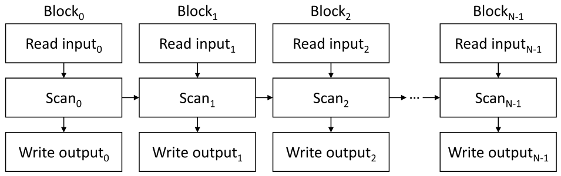

*Figure 12.11 — stable filter 의 의존 관계 그림. (책 p.301)*

> 원하는 순서가 이미 강제됨을 보이기 위해, Figure 12.11 은 stable filter 구현에서
> 서로 다른 연산 사이의 의존을 나타낸다. 원하는 순서는 **$j > i$ 인 임의의 block 쌍 $i, j$ 에 대해
> $i$ 의 읽기가 $j$ 의 쓰기보다 먼저 일어나는 것**이다.
> 그림에서 이것이 참임을 볼 수 있다 — **$i$ 의 읽기는 $i$ 의 scan 보다 먼저**,
> **$i$ 의 scan 은 ($j > i$ 이므로) $j$ 의 scan 보다 먼저**,
> **$j$ 의 scan 은 $j$ 의 쓰기보다 먼저** 일어난다 (책 p.300).

#### 증명을 형식으로 옮기면

그림은 세 종류의 화살표를 담고 있다.

$$\text{Read}_i \;\to\; \text{Scan}_i \tag{a}$$
$$\text{Scan}_i \;\to\; \text{Scan}_{i+1} \tag{b}$$
$$\text{Scan}_j \;\to\; \text{Write}_j \tag{c}$$

**(a)** 세로 화살표 — 같은 block 안에서 읽어야 `keep` 을 만들고, `keep` 이 있어야 scan 한다.
**프로그램 순서**이므로 자명하다.

**(b)** 가로 화살표 — 이것이 **11.9절의 단방향 동기화**다. block $i+1$ 은 block $i$ 의
부분합이 준비될 때까지 기다린다. **scan 이 원래부터 갖고 있는 성질**이지,
in-place 를 위해 새로 넣은 것이 아니다.

**(c)** 세로 화살표 — offset 을 알아야 쓸 수 있다. 역시 프로그램 순서다.

이제 $j > i$ 인 임의의 쌍에 대해, **(b)를 $j - i$ 번 이어 붙이면**
$\text{Scan}_i \to \text{Scan}_j$ 이므로

$$\text{Read}_i \;\overset{(a)}{\to}\; \text{Scan}_i \;\overset{(b)^{j-i}}{\to}\; \text{Scan}_j \;\overset{(c)}{\to}\; \text{Write}_j$$

**happens-before 관계는 추이적**이므로 $\text{Read}_i \to \text{Write}_j$ 다. ∎

> **왜 "$j > i$" 만 보이면 충분한가?** 덮어쓰기는 **key 가 앞으로만 이동**하기 때문에
> 한 방향으로만 일어난다. 출력 index 는 항상 입력 index 이하다
> ($\text{offset}_i \le i$ — 앞선 원소 중 일부만 살아남으므로).
> 따라서 block $j$ 가 쓰는 위치는 **자기 자신이나 앞선 block 이 읽는 영역**뿐이고,
> $j$ 자신의 영역은 위험 ①의 barrier 가 지켜 준다. **이 단조성이 증명의 숨은 전제다.**
> 12.8절에서 key 가 **바깥으로** 움직이는 패턴을 보면 이 전제가 깨지고,
> 그때는 동기화 방향도 뒤집힌다.

> exclusive scan 의 단일 kernel 구현을 **in-place stable filter 의 단일 kernel 구현으로
> 바꾸는 것은 독자를 위한 연습으로 남긴다** (책 p.300).

→ **12.10절 연습문제 2** 가 이것이다.

### 4. 예제/실습

#### 연습문제

> **(1)** Figure 12.10 을 in-place 로 실행할 때, **덮어쓰기 위험이 있는 (읽는 위치, 쓰는 위치)
> 쌍을 전부** 나열하라.
> **(2)** 12.2절의 **unstable** filter 를 in-place 로 하면 어떤 일이 생기는가?

**(1)** 출력 index 를 입력 index 와 나란히 놓는다.

| key | 입력 index | 출력 index | 어느 block 이 읽나 | 어느 block 이 쓰나 |
|---|---|---|---|---|
| $k_1$ | 1 | 0 | 0 | 0 |
| $k_3$ | 3 | **1** | 0 | 0 |
| $k_4$ | 4 | **2** | 0 | 0 |
| $k_6$ | 6 | **3** | 0 | 0 |
| $k_8$ | 8 | **4** | 1 | 1 |
| $k_{10}$ | 10 | **5** | 1 | 1 |
| $k_{11}$ | 11 | **6** | 1 | 1 |
| $k_{14}$ | 14 | **7** | 1 | 1 |

살아남는 key 가 있는 입력 위치는 $\{1,3,4,6,8,10,11,14\}$ 이고 쓰이는 위치는 $\{0,\ldots,7\}$ 이다.
**교집합 $\{1, 3, 4, 6\}$ 이 위험한 위치**다.

| 위험한 위치 | 그 자리를 읽는 이 | 그 자리에 쓰는 이 | 종류 |
|---|---|---|---|
| 1 | block 0 (입력 $k_1$) | block 0 ($k_3$) | **위험 ①** — block 안 |
| 3 | block 0 (입력 $k_3$) | block 0 ($k_6$) | **위험 ①** |
| 4 | block 0 (입력 $k_4$) | **block 1** ($k_8$) | **위험 ②** — block 사이 |
| 6 | block 0 (입력 $k_6$) | **block 1** ($k_{10}$) | **위험 ②** |

책이 예로 든 두 경우(위치 1 과 위치 4)가 각각 ①과 ②의 대표다.

**(2) unstable in-place 는 안전하게 만들 수 없다.**
unstable 은 **출력 자리를 atomic 이 임의로 배정**하므로, 어떤 key 가 어느 위치로 갈지
**미리 알 수 없고 순서 관계도 세울 수 없다.** Figure 12.11 의 (b) 같은 화살표가 없다 —
atomic 은 순서를 만들지 않는 것이 목적이니까.
따라서 **thread 5 가 위치 0 을 덮어쓰는 동안 thread 0 이 아직 위치 0 을 안 읽었을** 수 있다.
**in-place 를 원하면 stable 로 가야 한다** — 이것이 12.7절이 12.5절 뒤에 오는 이유다.

---

## 12.8 Related patterns (책 p.301)

### 1. 개념적 이해

> stable filter 연산은 **데이터가 한 방향으로(one-directional) 이동해야 하는** 더 일반적인
> 패턴 부류의 한 예다. 이 절에서 그런 패턴 몇 가지를 살펴보는데,
> **stable filter 문맥에서 논한 최적화들이 이 관련 패턴들에도 적용된다**는 점에 유의한다
> (책 p.301).

이 절은 **12장을 하나의 패턴이 아니라 패턴 *부류* 로 다시 보게 한다.**
공통 골격은 이렇다.

1. 각 원소가 **자기가 갈 목적지**를 알아낸다
2. 목적지가 **한 방향**으로만 움직인다 (전부 앞으로, 혹은 전부 뒤로)
3. in-place 로 하려면 **읽기와 쓰기 사이의 순서**를 강제해야 한다

**세 패턴이 ①의 방법과 ②의 방향에서만 갈린다.**

#### 패턴 ① — 정렬된 목록에서 중복 제거

> stable filter 와 비슷한 패턴 하나는 **정렬된 목록에서 중복 key 를 제거**하는 것이다.
> 이 패턴은 **key 가 보존되는 조건이 "그 key 가 바로 앞 key 와 같지 않다"인
> filter 패턴의 특수한 경우**로 볼 수 있다 (책 p.301).

**코드로는 조건 함수만 바꾸면 끝난다.**

```cuda
// 일반 filter
unsigned int keep = cond(val) ? 1 : 0;

// 중복 제거 (정렬된 입력)
unsigned int keep = (i == 0 || input[i] != input[i-1]) ? 1 : 0;
```

> **차이가 하나 있다** — 조건이 `input[i-1]` 을 본다.
> 즉 **thread 가 이웃 원소를 읽어야** 한다. 7·8장의 halo cell 과 같은 구도이고,
> block 경계에서 이웃 block 의 마지막 원소를 가져와야 한다.
> 그 외에는 12.5~12.7절의 모든 최적화가 **그대로** 적용된다.

#### 패턴 ② — 행렬에서 행/열 제거

> 또 하나 비슷한 패턴은 **행렬에서 행이나 열을 제거**하는 것이다.
> 특정 key 를 입력 배열에서 제거해야 한다는 점에서 filtering 을 닮았지만,
> **차이는 key 가 값이 아니라 index 를 근거로 제거된다**는 것이다.
> 따라서 thread 는 **scan 연산 없이 해석적으로(analytically)** 출력에서 자기 key 의 위치를
> 결정할 수 있다 (책 p.301).

**이것이 큰 차이다.** 예컨대 $M \times N$ 행렬에서 3의 배수 행을 지운다면,
행 $r$ 의 새 위치는 $r - \lfloor r/3 \rfloor - 1$ 처럼 **닫힌 식**으로 나온다.
**scan 이 필요 없다** — 이 장에서 가장 비싼 부분이 통째로 사라진다.

> 그러나 이 연산을 **in-place 로 수행한다면, 여전히 앞선 thread block 이 입력값을 읽은 뒤에
> 뒤 thread block 이 출력값을 쓰도록** 보장해야 한다.
> 이 경우 **단일 패스 scan 에서 쓰던 단방향 동기화를 block 사이 순서 강제에만 쓰되,
> 부분합을 전파할 필요는 없다** (책 p.301).

**단방향 동기화에서 데이터를 빼고 순서만 남긴 것**이다.
11.9절의 도구가 여기서 **순수한 동기화 기본연산**으로 쓰인다.

#### 패턴 ③ — 행렬에 행/열 추가

> 또 하나의 비슷한 패턴은 **행렬에 행이나 열을 추가**하는 것이다.
> 이런 패턴은 **memory alignment 를 개선하려고 행렬 배치를 조정할 때** 자주 나타난다.
> 행/열 제거와 마찬가지로 이 패턴도 scan 없이 해석적으로 이동 위치를 정한다.
> 그러나 **눈에 띄는 차이 하나는 key 가 배열 안에서 안쪽이 아니라 바깥쪽으로 이동**한다는 것이다.
> out-of-place 라면 이 차이는 중요하지 않다.
> 그러나 **in-place 라면 이 차이는 동기화의 방향에 영향을 준다** (책 p.301).

**방향이 뒤집힌다.** key 가 뒤로 밀리므로, 어떤 block 이 쓰는 자리는
**자기보다 뒤 block 이 읽어야 할 자리**다.

> 따라서 **뒤 thread block 이 입력값 읽기를 끝낸 뒤에 앞 thread block 이 출력값을 쓰도록**
> 보장해야 한다. 이 경우 단방향 동기화는 **반대 방향**으로, 즉 마지막 key 집합을 처리하는
> thread block 에서 첫 key 집합을 처리하는 thread block 쪽으로 수행된다 (책 p.301).

> **원문 오기** (책 p.301). "it is now the earlier thread blocks that write to memory
> locations previously occupied by keys read by **earlier** thread blocks" 에서
> 두 번째 `earlier` 는 **`later`** 여야 한다.
> 앞 block 이 쓰는 자리는 **뒤 block 이 읽는** 자리다 — 바로 다음 문장이
> "뒤 block 이 읽기를 끝낸 뒤에 앞 block 이 쓰도록 보장해야 한다"고 말하므로,
> 문맥상 오식이 분명하다.

### 2. 네 패턴을 한 표로

| 패턴 | 목적지를 어떻게 아나 | 이동 방향 | in-place 동기화 | 부분합 전파 |
|---|---|---|---|---|
| **stable filter** | **exclusive scan** | 안쪽(앞으로) | $0 \to N-1$ | **필요** |
| **중복 제거** (정렬됨) | **exclusive scan** (조건만 다름) | 안쪽 | $0 \to N-1$ | **필요** |
| **행/열 제거** | **해석적** (닫힌 식) | 안쪽 | $0 \to N-1$ | 불필요 |
| **행/열 추가** | **해석적** | **바깥쪽(뒤로)** | **$N-1 \to 0$** | 불필요 |

**두 축이 독립적이라는 점**이 이 표의 핵심이다.
"목적지를 어떻게 아는가"(scan 인가 산술인가)와
"어느 방향으로 움직이는가"(동기화 방향)가 서로 무관하게 정해진다.

> **더 복잡한 in-place 데이터 이동 패턴** — 행렬과 tensor 의 **전치** 같은 것 — 에
> 관심이 있는 독자는 문헌을 참고하라 (책 p.301, 참고문헌 [2]).
> 전치는 이동이 **한 방향이 아니어서**(순환 치환이 생긴다) 이 장의 기법이 통하지 않는다.

### 3. 예제/실습

#### 연습문제

> $4 \times 4$ 행렬을 row-major 로 저장한 16개 원소 배열에서 **행 1 을 제거**한다.
> **(1)** 각 원소의 출력 index 를 닫힌 식으로 쓰라.
> **(2)** in-place 로 할 때 덮어쓰기 위험이 있는 위치를 찾아라.
> **(3)** 열 1 을 제거하는 경우는 어떻게 달라지는가.

**(1)** 원소 $(r, c)$ 의 입력 index 는 $4r + c$ 다. 행 1 이 사라지면
$r \ge 2$ 인 행이 한 칸씩 올라오므로 출력 행 번호는 $r' = r - [r > 1]$ 이고

$$\text{out}(r, c) = 4\,(r - [r > 1]) + c \;=\;
\begin{cases} 4r + c & r = 0 \\ \text{(삭제)} & r = 1 \\ 4r + c - 4 & r \ge 2 \end{cases}$$

**scan 이 전혀 필요 없다.** thread 는 자기 index 만으로 목적지를 계산한다.

**(2)** 행 0 은 제자리, 행 2 → 행 1(입력 index 4~7), 행 3 → 행 2(입력 index 8~11).
쓰이는 위치는 $\{0..3\} \cup \{4..7\} \cup \{8..11\}$ 이고, 읽히는 위치는
$\{0..3\} \cup \{8..11\} \cup \{12..15\}$ 다.
**교집합 $\{0..3, 8..11\}$ 중 실제 위험은 $\{8, 9, 10, 11\}$** 이다
(위치 0~3 은 자기 자신이 자기 자리에 쓰는 것이라 무해하다).
위치 8~11 은 **행 3 이 읽어야 하는데 행 2 를 담당하는 thread 가 먼저 쓸 수 있다** —
행 2 를 담당하는 block 이 행 3 담당 block 보다 **앞**이므로 위험 ②의 형태이고,
$0 \to N-1$ 방향 단방향 동기화로 막는다.

**(3) 열 제거는 이동이 훨씬 잘게 쪼개진다.** 열 1 을 지우면 $(r,c)$ 의 출력 index 는
$3r + c - [c > 1]$ 이다. 행 제거는 **연속된 4개씩** 통째로 옮겨 coalescing 이 좋지만,
열 제거는 **원소마다 옮기는 거리가 다르고**($r$ 이 커질수록 더 멀리 간다)
행마다 한 칸씩 어긋나 **저장이 흩어진다.**
따라서 열 제거야말로 **12.6절의 shared memory 로 모아 쓰기가 절실한 경우**다.

---

## 12.9 Summary (책 p.302)

책의 정리를 옮기면 (책 p.302):

- 이 장에서는 **stable filter 와 unstable filter 양쪽의 병렬 구현과 최적화**를 논했다.
- **unstable out-of-place filter 는 atomic 연산에 기반**하고,
  최적화는 **counter 에 대한 atomic 연산 수를 최소화하는 것과 출력 쓰기의 coalescing** 에 집중된다.
- **stable out-of-place filter 는 scan 연산에 기반**하며,
  **11장의 단일 패스 scan kernel 위에 세울 수 있다.**
- 실무에서는 **Thrust 와 CUB 라이브러리가 filter 구현을 제공**한다.
  서로 다른 종류의 filter 의 도입과 최적화를 익히고 나면,
  **응용에 적합한 Thrust 나 CUB API 함수를 고를 수 있게** 된다.

> **11장의 마무리와 똑같은 결론**이라는 점을 놓치지 말자.
> "직접 짜지 말고 라이브러리를 써라. 다만 어떻게 만들어지는지 알아야 고를 수 있다."
> 이 장은 특히 그렇다 — 12.3절은 책 스스로 "컴파일러가 이미 한다"고 밝혔고,
> 12.5절의 `gridExclusiveScan` 은 CUB 의 `DeviceScan` 그 자체다.
> **그럼에도 이 장이 있는 이유는 warp voting 이라는 도구와,
> "순서를 지키는 값이 scan 이다"라는 통찰 때문이다.**

### 세 kernel 을 한눈에

| | Figure 12.2 | Figure 12.3/12.4 | Figure 12.6 | Figure 12.8 |
|---|---|---|---|---|
| 종류 | unstable | unstable | unstable | **stable** |
| 자리 결정 | global atomic | **warp 단위** atomic | **block 단위** atomic | **grid scan** |
| global atomic 수 | $sN$ | $N/32$ | $N/B$ | **0** |
| 저장 coalescing | 흩어짐 | warp 단위 연속 | block 단위 연속 | 연속이나 warp 는 부분적 |
| 새 도구 | `fetch_add` 반환값 | **warp voting** | `thread_scope_block` | **11장 scan** |
| in-place 가능 | **불가** | 불가 | 불가 | **가능** (12.7절) |

---

## 12.10 Exercises (책 p.302)

**네 문제가 하나의 구현을 단계적으로 쌓아 올린다.**
1번(3-kernel) → 2번(단일 kernel) → 3번(privatization) → 4번(coarsening) 순서로,
12.6절이 "연습으로 남긴다"고 한 그 구현이 4번에서 완성된다.

### 연습문제 1

> **exclusive scan 을 쓰는 stable filter 를 세 개의 분리된 kernel 로 구현하라 —
> 조건 평가, exclusive scan, 출력 생성.**

Figure 12.8 의 `gridExclusiveScan` 을 **kernel 경계로 대체**하는 것이 요점이다.
11.9절의 3-kernel scan(scan-scan-add)을 가운데 놓고 양옆에 얇은 kernel 을 붙인다.

```cuda
// ── kernel 1: 조건 평가 ──────────────────────────────────────────
__global__ void evalCond_kernel(unsigned int* input, unsigned int* keep,
                                unsigned int N) {
    unsigned int i = blockIdx.x*blockDim.x + threadIdx.x;
    if(i < N) {
        keep[i] = cond(input[i]) ? 1 : 0;
    }
}

// ── kernel 2: exclusive scan (11.9절의 3-kernel scan 을 그대로 쓴다) ──
//    scanExclusive(keep, offset, N);
//      = scan_block_kernel  →  scan_partial_sums_kernel  →  add_kernel
//    입력이 0/1 이므로 unsigned int 로 충분하다 (N < 2^32).

// ── kernel 3: 출력 생성 ──────────────────────────────────────────
__global__ void scatter_kernel(unsigned int* input, unsigned int* keep,
                               unsigned int* offset, unsigned int* output,
                               unsigned int N, unsigned int* outputSize) {
    unsigned int i = blockIdx.x*blockDim.x + threadIdx.x;
    if(i < N) {
        if(keep[i]) {
            output[offset[i]] = input[i];
        }
        if(i == N - 1) {
            *outputSize = offset[i] + keep[i];      // Figure 12.8 의 11번 줄과 같다
        }
    }
}
```

**호스트 쪽은 이렇게 된다.**

```cuda
unsigned int *keep_d, *offset_d;
cudaMalloc(&keep_d,   N*sizeof(unsigned int));      // ← 추가 메모리 N
cudaMalloc(&offset_d, N*sizeof(unsigned int));      // ← 추가 메모리 N

evalCond_kernel<<<gridDim, blockDim>>>(input_d, keep_d, N);
scanExclusive(keep_d, offset_d, N);                 // 11.9절, kernel 세 개
scatter_kernel<<<gridDim, blockDim>>>(input_d, keep_d, offset_d,
                                      output_d, N, outputSize_d);
```

> **이 구성의 값어치는 단순함이다.** 세 단계가 완전히 분리돼 있어 각각을 따로 검증할 수 있고,
> **scan 을 CUB 의 `DeviceScan::ExclusiveSum` 으로 통째로 갈아 끼울 수 있다.**
> 각 kernel 사이의 순서는 **kernel 경계가 공짜로 보장**해 주므로
> 단방향 동기화도, memory order 도 신경 쓸 필요가 없다.

> **`keep` 과 `offset` 을 하나로 합칠 수 있다.** scan 을 in-place 로 하면
> 배열 하나(`N` 개)를 아낀다. 다만 그러면 kernel 3 에서 `keep[i]` 를 볼 수 없으므로
> **`offset[i] != offset[i+1]` 로 판정**하거나 `input[i]` 에 조건을 다시 적용해야 한다.
> 조건 평가가 싸다면 후자가 낫다.

**대가는 global memory 왕복이다.** 아래 2번에서 세어 본다.

### 연습문제 2

> **filter 코드를 one-pass scan kernel 안에 넣어 stable filter 를 단일 kernel 로 구현하라.
> 단일 kernel 구현의 주요 이점은 무엇인가?**

11.9절 Figure 11.18 의 단일 kernel scan(동적 block index + 단방향 동기화 + decoupled lookback)을
바탕으로, **입력을 읽는 자리에 조건 평가를, 출력을 쓰는 자리에 scatter 를** 끼워 넣는다.

```cuda
__global__ void filter_single_kernel(unsigned int* input, unsigned int* output,
        unsigned int N, unsigned int* outputSize,
        unsigned int* blockCounter,                   // 동적 block index 배정 (11.9절)
        unsigned int* flags, unsigned int* scan_value) {

    // ── ① block index 를 동적으로 배정받는다 (11.9절 — deadlock 방지에 필수) ──
    __shared__ unsigned int bid_s;
    if(threadIdx.x == 0) {
        cuda::atomic_ref<unsigned int, cuda::thread_scope_device> ctr(*blockCounter);
        bid_s = ctr.fetch_add(1, cuda::memory_order_relaxed);
    }
    __syncthreads();
    unsigned int bid = bid_s;
    unsigned int i = bid*blockDim.x + threadIdx.x;

    // ── ② 읽고 조건을 평가한다 (여기가 filter 가 끼어드는 첫 자리) ──
    unsigned int val  = (i < N) ? input[i] : 0;
    unsigned int keep = (i < N && cond(val)) ? 1 : 0;   // 범위 밖은 0 → scan 에 무해

    // ── ③ block 안 exclusive scan (11.4절 warp-level + scan-scan-add) ──
    __shared__ unsigned int buffer_s[BLOCK_DIM];
    unsigned int offset = blockExclusiveScan(keep, buffer_s);   // block 안 exclusive offset

    // ── ④ block 총합을 구하고, 앞 block 들의 총합을 단방향 동기화로 받는다 (11.9절) ──
    __shared__ unsigned int prevSum_s, blockSum_s;
    if(threadIdx.x == BLOCK_DIM - 1) {
        blockSum_s = offset + keep;         // exclusive 마지막 + 자기 값 = 총합
        prevSum_s  = exclusiveBlockPrefix(bid, blockSum_s, flags, scan_value);
        //  = single/decoupled lookback. release 로 자기 값을 게시하고
        //    acquire 로 앞 block 의 값을 읽는다 (11.9절의 memory order 규칙 그대로).
    }
    __syncthreads();
    offset += prevSum_s;                                // grid 전체 offset 완성

    // ── ⑤ 쓴다 (여기가 filter 가 끼어드는 둘째 자리) ──
    if(keep) {
        output[offset] = val;
    }
    if(i == N - 1) {
        *outputSize = offset + keep;
    }
}
```

**`blockExclusiveScan` 안에서 12.3절의 비트 트릭을 쓸 수 있다** —
warp 층 scan 이 `keep` 이라는 0/1 값에 대한 scan 이므로

```cuda
unsigned int mask  = __ballot_sync(0xffffffff, keep);          // warp 의 keep 비트맵
unsigned int wOff  = __popc(mask & ((1u << laneIdx()) - 1));   // warp 안 exclusive scan
unsigned int wSum  = __popc(mask);                             // warp 총합
```

> **④단계에서 `blockSum_s = offset + keep` 인 것에 주의한다.**
> `blockExclusiveScan` 이 돌려주는 것은 **exclusive** 값이므로
> **마지막 thread 의 값은 총합이 아니라 "자기 앞의 합"** 이다.
> 자기 `keep` 을 더해야 block 총합이 된다 — **Figure 12.8 의 11번 줄과 똑같은 변환**이다
> (11.1절의 exclusive → inclusive). 여기서 실수하면 block 하나 분량이
> 조용히 밀려 **출력이 한 칸씩 어긋난다.**

**11.4절이 `__shfl_up_sync` 로 $\log_2 32 = 5$ step 에 하던 일이 명령 세 개로 끝난다.**
`__ballot_sync` 를 쓴 것은 `if(cond)` **밖**에서 부르기 때문이다 —
활성 여부가 아니라 **`keep` 값**을 물어야 하므로 `__activemask()` 로는 안 된다.
12.3절에서 정리한 두 함수의 차이가 여기서 실제로 갈린다.

#### 주요 이점 — 세 가지

**① global memory 왕복이 $4\times$ 이상 줄어든다.** $N = 2^{20}$, $s = 0.5$ 로 세어 보면

| | 읽기 | 쓰기 | 합 |
|---|---|---|---|
| **3-kernel** | `input` $N$ + `keep` $N$ + `input` $N$ + `offset` $N$ | `keep` $N$ + `offset` $N$ + `output` $sN$ | $\mathbf{6.5N}$ |
| **단일 kernel** | `input` $N$ | `output` $sN$ + 부분합 $2N/\text{SEG}$ | $\mathbf{1.5N}$ |

**$4.33\times$ 감소**다. filter 는 memory-bound 이므로 이 비율이 거의 그대로 속도로 나타난다.
(scan 을 3-kernel 로 세면 왕복이 더 늘어난다 — 위 표는 scan 을 최소로 잡은 값이다.)

**② `keep`·`offset` 배열이 필요 없다.** 중간 배열 $2N$ 만큼의 메모리를 아낀다.
12.7절에서 본 대로 **filter 를 쓰는 이유가 애초에 메모리 부족일 때가 많으므로**
이것은 부수 효과가 아니라 본질적 이점이다.

**③ kernel launch 오버헤드가 사라진다.** 3-kernel 은 scan 만 3회이므로 최소 5회 launch 다.
$N$ 이 작을 때는 이 고정 비용이 지배한다.

> **④ in-place 가 자연스럽게 지원된다** (12.7절).
> 단일 kernel 이면 Figure 12.11 의 의존 사슬이 **그대로 성립**한다.
> 3-kernel 도 kernel 경계 덕에 in-place 가 되기는 하지만,
> 그것은 **모든 읽기가 모든 쓰기보다 먼저**라는 훨씬 강한(따라서 느린) 조건 덕이다.
> 단일 kernel 은 **필요한 만큼만** 순서를 강제한다.

> **대가도 분명하다.** 단방향 동기화가 들어오므로 **동적 block index 배정이 필수**이고
> (빠뜨리면 deadlock — 11.9절), `acquire`/`release` 를 정확히 써야 하며,
> block 사이에 **critical path** 가 생겨 lookback latency 를 감수해야 한다.

### 연습문제 3

> **연습문제 2 의 kernel 에 privatization 을 적용하라.**

12.6절 Figure 12.9 가 그림으로 보여 준 것이다 —
**filter 된 key 를 shared memory 에 모았다가 연속 덩어리로 내보낸다.**
연습문제 2 의 ⑤단계만 바꾸면 된다.

```cuda
    // ── ⑤' privatization: shared 에 모았다가 한꺼번에 ──────────────
    __shared__ unsigned int output_s[BLOCK_DIM];
    if(keep) {
        output_s[offset - prevSum_s] = val;      // block 안 offset 으로 채운다
    }
    __syncthreads();                             // 다 모일 때까지 기다린다

    unsigned int blockOutSize = blockSum_s;      // 이 block 이 남긴 key 수 (④에서 구했다)
    if(threadIdx.x < blockOutSize) {
        output[prevSum_s + threadIdx.x] = output_s[threadIdx.x];
    }
    if(bid == gridDim.x - 1 && threadIdx.x == 0) {
        *outputSize = prevSum_s + blockOutSize;
    }
```

**세 가지가 바뀌었다.**

| 무엇 | 왜 |
|---|---|
| `output_s[offset - prevSum_s]` | **block 안 offset** 으로 shared 에 채운다. `prevSum_s` 를 빼면 0 부터 시작한다 |
| `__syncthreads()` | 모으기 ↔ 내보내기 사이. **12.4절의 23번 줄 barrier 와 같은 역할** |
| `output[prevSum_s + threadIdx.x]` | **연속 thread 가 연속 자리**에 쓴다 — 이것이 목적이다 |

> **12.4절의 privatization 과 무엇이 다른가.**
> 거기서는 **private counter 와 atomic** 이 필요했다 (자리를 예약해야 하니까).
> 여기서는 **scan 이 이미 자리를 계산해 뒀으므로 counter 도 atomic 도 없다.**
> shared 배열 하나와 barrier 하나가 전부다. **stable 쪽이 오히려 단순하다.**

> **`outputSize` 를 쓰는 조건이 바뀐 것에 주의한다.** 연습문제 2 에서는 `i == N-1` 인
> thread 가 썼는데, 여기서는 그 thread 가 `keep=0` 일 수 있어도 `offset+keep` 을 알고 있었다.
> privatization 판에서는 마지막 block 의 thread 0 이 `prevSum_s + blockSum_s` 로 쓴다.
> **동적 block index 배정을 쓰므로 `bid == gridDim.x - 1` 이 "마지막으로 배정받은 block"** 이고,
> 그 block 이 lookback 을 마쳤을 때 앞의 모든 부분합이 확정돼 있다.

**효과는 12.6절에서 계산한 대로** store 효율이 $B=256$, $s=0.5$ 에서
**66.7% → 94.1%** 로 오른다 ($1.41\times$).

### 연습문제 4

> **연습문제 3 의 kernel 에 thread coarsening 을 적용하라.**

각 thread 가 `COARSE_FACTOR` 개의 key 를 맡는다.
**11.6절의 coarsening 된 scan 구조를 그대로 가져온다** — thread 가 자기 몫을 **순차로** scan 하고,
그 부분합만 block scan 에 올린다.

```cuda
#define COARSE_FACTOR 4
#define SEG_SIZE (BLOCK_DIM*COARSE_FACTOR)

__global__ void filter_coarsened_kernel(unsigned int* input, unsigned int* output,
        unsigned int N, unsigned int* outputSize,
        unsigned int* blockCounter, unsigned int* flags, unsigned int* scan_value) {

    // ── ① 동적 block index (연습문제 2 와 동일) ──
    __shared__ unsigned int bid_s;
    if(threadIdx.x == 0) {
        cuda::atomic_ref<unsigned int, cuda::thread_scope_device> ctr(*blockCounter);
        bid_s = ctr.fetch_add(1, cuda::memory_order_relaxed);
    }
    __syncthreads();
    unsigned int bid = bid_s;

    // ── ② coalesced 적재: thread 는 stride BLOCK_DIM 으로 읽어 shared 에 놓는다 ──
    //     (11.6절 — 연속 thread 가 연속 주소를 읽어야 coalesced 다)
    __shared__ unsigned int val_s[SEG_SIZE];
    __shared__ unsigned int keep_s[SEG_SIZE];
    for(unsigned int c = 0; c < COARSE_FACTOR; ++c) {
        unsigned int t = c*BLOCK_DIM + threadIdx.x;
        unsigned int i = bid*SEG_SIZE + t;
        unsigned int v = (i < N) ? input[i] : 0;
        val_s[t]  = v;
        keep_s[t] = (i < N && cond(v)) ? 1 : 0;
    }
    __syncthreads();

    // ── ③ thread 마다 자기 연속 구획을 순차 scan (여기서 work efficiency 를 되찾는다) ──
    unsigned int base = threadIdx.x*COARSE_FACTOR;
    unsigned int run = 0;
    for(unsigned int c = 0; c < COARSE_FACTOR; ++c) {
        unsigned int k = keep_s[base + c];
        keep_s[base + c] = run;              // 자기 구획 안 exclusive scan 을 제자리에
        run += k;
    }
    __syncthreads();

    // ── ④ thread 별 부분합 run 에 대해 block scan (11.6절의 구조 그대로) ──
    __shared__ unsigned int buffer_s[BLOCK_DIM];
    unsigned int threadOffset = blockExclusiveScan(run, buffer_s);

    // ── ⑤ block 총합을 구하고 앞 block 들의 총합을 받는다 (단방향 동기화) ──
    __shared__ unsigned int prevSum_s, blockSum_s;
    if(threadIdx.x == BLOCK_DIM - 1) {
        blockSum_s = threadOffset + run;     // exclusive 마지막 + 자기 값 = 총합
        prevSum_s  = exclusiveBlockPrefix(bid, blockSum_s, flags, scan_value);
    }
    __syncthreads();

    // ── ⑥ privatization: shared 에 모은다 ──
    __shared__ unsigned int output_s[SEG_SIZE];
    for(unsigned int c = 0; c < COARSE_FACTOR; ++c) {
        unsigned int t = base + c;
        unsigned int i = bid*SEG_SIZE + t;
        if(i < N && cond(val_s[t])) {
            output_s[threadOffset + keep_s[t]] = val_s[t];
        }
    }
    __syncthreads();

    // ── ⑦ 연속 덩어리로 내보낸다 (coalesced, COARSE_FACTOR 배 더 길다) ──
    for(unsigned int t = threadIdx.x; t < blockSum_s; t += BLOCK_DIM) {
        output[prevSum_s + t] = output_s[t];
    }
    if(bid == gridDim.x - 1 && threadIdx.x == 0) {
        *outputSize = prevSum_s + blockSum_s;
    }
}
```

#### 설계에서 짚을 점 넷

**① 적재는 `stride = BLOCK_DIM`, scan 은 연속 구획.**
②단계에서 thread 는 `c*BLOCK_DIM + threadIdx.x` 를 읽는다 (연속 thread → 연속 주소 → coalesced).
③단계에서는 `threadIdx.x*COARSE_FACTOR + c` 를 순차 scan 한다 (thread 마다 **연속 구획**).
**두 인덱싱이 다른 것이 11.6절의 핵심**이었고, 여기서도 그대로다.
그래서 val 과 keep 을 shared 에 한 번 놓고 재배치 없이 두 방식으로 접근한다.

**② scan 의 work 가 되돌아온다.** ③단계에서 thread 하나가 $C$ 개를 **순차로** 처리하므로
그 부분은 work-efficient 하고, 병렬 scan 에 올라가는 원소는 $\frac{N}{C}$ 개로 줄어든다.
**이것이 12.6절이 말한 "coarsening 의 더 중요한 이득"** 이다.

**③ 출력 덩어리가 $C$ 배 길어진다.** ⑦단계에서 내보내는 덩어리 길이가
$B \cdot s$ 에서 $C \cdot B \cdot s$ 가 된다. $C = 4$, $B = 256$, $s = 0.5$ 에서
store 효율 94.1% → **98.5%**.

**④ shared memory 사용량이 늘어난다.** `val_s` + `keep_s` + `output_s` 로
$3 \times \texttt{SEG\_SIZE}$ 개의 `unsigned int` 다. $B = 256$, $C = 4$ 면 $3 \times 1024 \times 4$ B
= **12 KB/block** 이다. 5.6절의 occupancy 제약에 걸릴 수 있다.

> **줄이려면**: `keep_s` 를 없애고 ③단계에서 `cond(val_s[t])` 를 다시 평가하거나
> (조건이 싸면 이쪽이 낫다), `output_s` 를 `val_s` 와 **겹쳐 쓴다**
> (③ 이후 `val_s` 는 ⑥에서만 읽히므로 완전히 겹칠 수는 없고, `keep_s` 자리에는 겹칠 수 있다).
> **8 KB 로 줄이면 $C=4$ 에서도 여유가 생긴다.**

> **`COARSE_FACTOR` 를 얼마로?** 11.6절과 같은 맞바꿈이다 —
> 크면 work efficiency 와 coalescing 이 좋아지지만
> **shared memory 와 register 를 먹어 occupancy 가 떨어지고 병렬성이 준다.**
> $C = 4 \sim 8$ 이 흔한 출발점이고, 실제 값은 프로파일링으로 정한다 (6.9절).

### 검산

이 장에서 손으로 계산한 값들을 코드로 다시 계산해 대조한다.

```python
# 실행: python3 verify12.py   (표준 라이브러리만 사용)

def ffs(mask):   return (mask & -mask).bit_length() if mask else 0   # __ffs
def popc(mask):  return bin(mask).count("1")                         # __popc

# ── Figure 12.1 / 12.7 의 kept 집합 ──────────────────────────────
kept = [1, 3, 4, 6, 8, 10, 11, 14]
mask = sum(1 << i for i in kept)
print("mask      :", format(mask, "032b"), "=", mask)
print("leader    :", ffs(mask) - 1, " numActive:", popc(mask))
for lane in kept:
    prev = (1 << lane) - 1
    print(f"  lane {lane:2d}  offset={popc(mask & prev)}")

# 책 p.292 의 예 — thread 1,2,4,5
print("p.292 예  :", format(sum(1 << i for i in (1,2,4,5)), "032b"))

# ── Figure 12.7 의 exclusive scan ────────────────────────────────
keep = [1 if i in kept else 0 for i in range(16)]
exc  = [sum(keep[:i]) for i in range(16)]
print("keep      :", keep)
print("offset    :", exc, " outputSize =", exc[15] + keep[15])

# ── atomic 횟수와 직렬화 시간 (9.3절의 T = 1/(2L) 모델) ──────────
N, s, B, W = 1 << 20, 0.5, 256, 32
T = 1 / (2 * 200 / 1e9)                      # 200 cycle @ 1GHz → 2.5 M/s
for name, n in (("Fig 12.2 naive     ", int(N*s)),
                ("Fig 12.3 coalesced ", N//W),
                ("Fig 12.6 privatized", N//B)):
    print(f"{name}: atomic {n:>8,}  {n/T*1e3:8.2f} ms   {int(N*s)/n:6.1f}x")

# ── 12.6 의 store 효율 모델  eff(L) = L/(L+8) ────────────────────
eff = lambda L: L / (L + 8)
for label, L in (("Fig 12.8  (warp)   ", W*s), ("Fig 12.9  (block)  ", B*s),
                 ("Fig 12.10 C=2      ", 2*B*s), ("Fig 12.10 C=4      ", 4*B*s)):
    print(f"{label}: L={L:6.1f}  eff={eff(L)*100:5.1f}%")

# ── 연습문제 2 의 global traffic ─────────────────────────────────
three, one = 6.5*N, N + s*N + 2*(N/4096)
print(f"3-kernel {three/N:.1f}N  vs  1-kernel {one/N:.2f}N  →  {three/one:.2f}x")
# mask      : 00000000000000000100110101011010 = 19802
# leader    : 1  numActive: 8
#   lane  1  offset=0
#   lane  3  offset=1
#   lane  4  offset=2
#   lane  6  offset=3
#   lane  8  offset=4
#   lane 10  offset=5
#   lane 11  offset=6
#   lane 14  offset=7
# p.292 예  : 00000000000000000000000000110110
# keep      : [0, 1, 0, 1, 1, 0, 1, 0, 1, 0, 1, 1, 0, 0, 1, 0]
# offset    : [0, 0, 1, 1, 2, 3, 3, 4, 4, 5, 5, 6, 7, 7, 7, 8]  outputSize = 8
# Fig 12.2 naive     : atomic  524,288    209.72 ms      1.0x
# Fig 12.3 coalesced : atomic   32,768     13.11 ms     16.0x
# Fig 12.6 privatized: atomic    4,096      1.64 ms    128.0x
# Fig 12.8  (warp)   : L=  16.0  eff= 66.7%
# Fig 12.9  (block)  : L= 128.0  eff= 94.1%
# Fig 12.10 C=2      : L= 256.0  eff= 97.0%
# Fig 12.10 C=4      : L= 512.0  eff= 98.5%
# 3-kernel 6.5N  vs  1-kernel 1.50N  →  4.33x
```

---

## 정리

12장에서 가져갈 것을 넷으로 줄이면:

1. **"순서를 지키는가"가 구현 전체를 가른다.**
   지키지 않아도 되면 `fetch_add` 의 반환값으로 **자리를 예약**하면 되고
   (atomic 하나, 9장), 지켜야 하면 앞선 `keep` 값을 다 세어 **자리를 계산**해야 한다
   (scan 하나, 11장 전체).
   **stable 의 가격이 곧 scan 의 가격**이고, 그래서 이 장은 11장 없이는 성립하지 않는다.
   같은 이유로 **in-place 는 stable 에서만 가능하다** — atomic 은 순서를 만들지 않으므로
   Figure 12.11 같은 의존 사슬을 세울 수 없다.
2. **warp voting 은 "0/1 짜리 32원소 scan 을 명령 세 개로 하는 법"이다.**
   `__activemask()` 로 상태를 mask 로 만들고, `__popc(mask & ((1<<lane)-1))` 로
   **binary prefix sum** 을 한다. 11장이 shared memory 와 barrier 와 5 step 을 들여 하던 일을,
   **입력이 binary 라는 사실 하나로** 비트 연산 몇 개로 줄인다.
   이 도구가 12.3절에서는 atomic 을 $32s\times$ 줄이는 데 쓰이고,
   12.10절 연습 2 에서는 scan 의 warp 층을 대체하는 데 쓰인다.
   **다만 12.3절의 최적화 자체는 컴파일러가 이미 한다** — 책도 그렇게 밝힌다.
   이 절의 값어치는 결과가 아니라 **도구**에 있다.
3. **같은 골격이 범위를 넓혀 가며 세 번 반복된다.**
   "총량 합산 → 대표 하나가 atomic → 시작점 공유 → 각자 offset" 이라는 네 단계가
   **warp 층(12.3), block 층(12.4), grid 층(12.5의 scan)** 에서 똑같이 나타난다.
   달라지는 것은 **공유 수단**뿐이다 — shuffle → shared memory → 단방향 동기화.
   11장에서 scan-scan-add 가 세 층에 되풀이되던 구조와 정확히 같고,
   **층이 올라갈수록 동기화가 비싸지므로 아래층에서 최대한 접는 것**이 두 장 공통의 전략이다.
4. **선택률이 최적화마다 반대로 작용한다.**
   coalesced atomic 의 이득은 $32s$ 라 **선택률이 높을수록** 크고,
   shared memory 로 모아 쓰기의 이득은 덩어리 길이 $32s$ 가 짧을수록 크므로
   **선택률이 낮을수록** 크다. 하나의 파라미터가 두 기법을 반대로 밀기 때문에,
   **"어떤 데이터에 쓰는 filter 인가"를 모르면 최적화를 고를 수 없다.**
   그리고 thread coarsening 은 **coalescing 을 명분으로 들어오지만 실제 값어치는 scan 에서**
   온다 — coalescing 개선은 $1.05\times$ 에 그치는데 scan 쪽 개선은 그보다 훨씬 크다.
   **최적화의 명분과 실속이 어긋나는 사례**로 기억해 둘 만하다.

다음은 13장 — **merge** 다.
이 장의 첫 문단이 말한 대로 **filter 의 역연산**이고,
`co-rank` 라는 이 책에서 가장 독특한 병렬화 아이디어가 나온다.
12장이 "출력 자리를 계산하는 문제"였다면 13장은 **"입력 경계를 계산하는 문제"** 다.
