# 13장. Merge

> **원문 범위**: 책 p.303~328 (13.1~13.10절 + References). 부제는
> *And dynamic input data identification* 이고, Li-Wen Chang · Jie Lv 가 특별 기고했다.
> **절 순서**: 책 순서를 그대로 따랐다. 재배치 없음.
> **연습문제**: 책 13.10절의 4문제를 전부 풀었다.
> **원문 오기**: 이 장은 **오기가 유난히 많다** — 그림 라벨 1건, 코드 버그 4건,
> 캡션 1건, 오타 2건. 전부 본문에서 근거와 함께 표시했다.

12장의 첫 문단이 예고한 그대로다 — **merge 는 filter 의 역연산**이다.
filter 는 하나의 목록을 남는 것과 버리는 것 둘로 갈랐고, merge 는 **정렬된 두 목록을
하나로 합친다.**

> **ordered merge** 함수는 정렬된 두 목록 $A$ 와 $B$ 를 받아 정렬된 단일 목록 $C$ 로 합친다
> (책 p.303).

### 이 장이 새로 던지는 것 — 입력 범위를 미리 알 수 없다

2장부터 12장까지, thread 가 자기 입력을 찾는 방법은 **언제나 index 계산 하나**였다.

```cuda
unsigned int i = blockIdx.x*blockDim.x + threadIdx.x;    // 12장까지 늘 이것
```

**merge 에서는 이것이 통하지 않는다.**

> 이 merge 함수의 병렬화가 지금까지의 모든 패턴의 병렬화와 다른 주된 점은,
> **각 thread 가 사용할 입력 데이터의 범위를 단순한 index 계산으로 정할 수 없다**는 것이다.
> 각 thread 가 쓸 입력 원소의 범위는 **실제 입력 값에 따라 달라진다** (책 p.308).

출력에서 내가 맡은 구간은 index 계산으로 정할 수 있다. 그런데 **그 출력을 만들려면
$A$ 와 $B$ 에서 각각 몇 개씩 가져와야 하는지는 값을 봐야만 안다.**
$A$ 에서 8개 $B$ 에서 0개일 수도 있고, 그 반대일 수도 있다.

| | 입력 범위를 어떻게 아는가 | 예 |
|---|---|---|
| 2~12장 | **index 계산** — 데이터와 무관 | `input[blockIdx.x*blockDim.x + threadIdx.x]` |
| **13장** | **co-rank 함수** — 데이터에 의존하는 **탐색** | `co_rank(k, A, m, B, n)` |

그래서 부제가 *And dynamic input data identification* 이다.
그리고 이 성질이 **tiling 을 훨씬 어렵게 만든다** — 미리 얼마를 적재해야 할지 모르니까.
13.6·13.7절이 통째로 그 문제와 씨름한다.

> 데이터 접근의 이런 동적 성질은 **메모리 접근 효율과 성능을 높이기 위한 locality 와 tiling
> 기법을 활용하기 어렵게** 만든다. 동적 입력 데이터 식별의 원리는 **집합 교집합·합집합** 같은
> 다른 중요한 계산에도 관련된다 (책 p.303).

### 이 장의 뼈대

| 절 | 무엇 | 어디서 온 도구인가 |
|---|---|---|
| 13.1 | merge 의 정의와 **stability** | **이 장이 도입** |
| 13.2 | 순차 merge — $O(m+n)$ | — |
| 13.3 | **co-rank** 라는 발상 | **이 장이 도입** (Siebert et al.) |
| 13.4 | co-rank 를 **binary search** 로 구현 | **이 장이 도입** |
| 13.5 | 기본 kernel — 단순하지만 **uncoalesced** | 6.1절 |
| 13.6 | **tiling** 으로 coalescing 회복 | 5·6장 — 단, 여기서는 크기를 모른다 |
| 13.7 | **circular buffer** 로 적재량 절반 감축 | **이 장이 도입** |
| 13.8 | **thread coarsening** — 이미 적용돼 있었다 | 6·8~12장 |

**13.6 → 13.7 이 이 장의 절정이다.** tiling 이 bandwidth 의 절반을 버리는데,
그 절반을 되찾으려고 circular buffer 를 도입하고, 그 대가로 **코드 복잡도가 폭증한다.**
책이 그 맞바꿈을 숨기지 않고 정면으로 다룬다.

---

## 13.1 Background (책 p.303)

### 1. 개념적 이해

#### merge 의 정의

> 순서 관계 $R$ 에 기반한 merge 함수는 각각 $m$ 개와 $n$ 개의 원소를 갖는 **정렬된 입력 배열
> $A$ 와 $B$** 를 받는다. $m$ 과 $n$ 이 같을 필요는 없다.
> 함수는 $m + n$ 개의 원소를 갖는 **출력 정렬 배열 $C$** 를 만든다.
> $C$ 는 $A$ 와 $B$ 의 모든 입력 원소로 이루어지고 순서 관계 $R$ 로 정렬돼 있다 (책 p.304).

용어를 정리하면 이렇다 (책 p.304).

- 배열의 각 원소는 **key** 를 갖는다 (12장에서 정한 그 `key` 다)
- key 위에 **순서 관계 $\le$** 가 정의돼 있다
- 가장 단순한 경우 **원소가 곧 key** 다
- $e_1, e_2$ 의 key 가 $k_1, k_2$ 일 때, 정렬된 목록에서 $e_1$ 이 $e_2$ 앞에 있으면 $k_1 \le k_2$

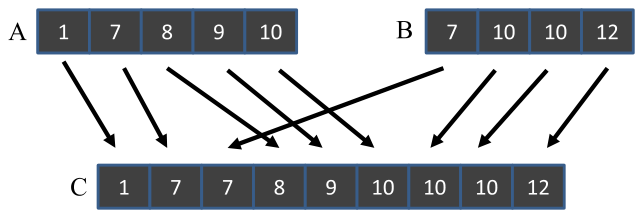

*Figure 13.1 — merge 연산의 예. (책 p.304)*

$A$ 는 원소 다섯 개($m = 5$), $B$ 는 네 개($n = 4$)다.

$$A = [1,\ 7,\ 8,\ 9,\ 10], \qquad B = [7,\ 10,\ 10,\ 12]$$
$$C = [1,\ 7,\ 7,\ 8,\ 9,\ 10,\ 10,\ 10,\ 12]$$

**이 예제가 13장 전체의 기준이다.** Figure 13.3·13.4·13.6·13.7·13.8 이 모두 같은 $A$·$B$ 를 쓴다.
외워 두면 남은 절이 전부 같은 그림의 변주로 읽힌다.

#### stability — 이 장에서 가장 조용히 중요한 개념

> $A$ 의 원소와 $B$ 의 원소의 수치가 같을 때, $A$ 의 원소가 출력 목록 $C$ 에서 먼저 나와야
> 할 수도 있고 아닐 수도 있다. 이 요구사항을 ordered merge 연산의 **stability** 라 한다.
> 일반적으로 어떤 ordering 연산이 **stable** 하다는 것은,
> **key 값이 같은 원소들이 입력에 나타난 것과 같은 순서로 출력에 놓인다**는 뜻이다 (책 p.304).

Figure 13.1 은 **두 종류의 stability 를 모두 보여 준다** (책 p.304).

| 종류 | 그림에서 | 뜻 |
|---|---|---|
| **입력 목록 안에서** | $B$ 의 두 `10` 이 원래 순서를 유지한 채 $C$ 로 복사된다 | 같은 배열 안의 동값 원소 순서 보존 |
| **입력 목록 사이에서** | 값이 `7` 인 **$A$ 의 원소가 $B$ 의 `7` 보다 먼저** $C$ 로 간다 | 동값이면 **$A$ 가 우선** |

**"$A$ 가 우선"이라는 이 한 줄이 13.4절의 co-rank 종료 조건의 비대칭
(`A[i-1] <= B[j]` vs `B[j-1] < A[i]`)을 만든다.** 지금은 그냥 기억만 해 두자.

#### stability 가 왜 필요한가

> stability 성질은 ordering 연산이 **현재 ordering 에 쓰이는 key 로는 포착되지 않는
> 이전의 순서를 보존**하게 해 준다. 예컨대 목록 $A$ 와 $B$ 는 현재 merge 에 쓰이는 key 로
> 정렬되기 전에 **다른 key 로 먼저 정렬돼 있었을 수 있다.**
> merge 연산에서 stability 를 유지하면 merge 연산이 **이전 단계에서 한 일을 보존**할 수 있다
> (책 p.304).

구체적으로 말하면 이렇다. 학생 목록을 **이름순으로 정렬**해 둔 뒤 **학년으로 다시 정렬**하면,
stable 하다면 "학년순, 같은 학년 안에서는 이름순"이 공짜로 나온다.
unstable 하면 앞서 한 이름 정렬이 날아간다.

**14장의 radix sort 가 정확히 이 성질 위에 서 있다** — 낮은 자리부터 한 자리씩 정렬하는데,
각 단계가 stable 해야만 앞 단계의 결과가 보존된다.

#### 어디에 쓰이는가

> merge 연산은 병렬화 가능한 중요한 정렬 알고리즘인 **merge sort 의 핵심**이다.
> 14장에서 보듯 병렬 merge sort 함수는 입력 목록을 여러 구획으로 나눠 병렬 thread 에 배포한다.
> thread 들이 각 구획을 정렬한 뒤 협력해 정렬된 구획들을 merge 한다.
> 이런 divide-and-conquer 접근이 정렬의 효율적 병렬화를 가능하게 한다 (책 p.304~305).

> **원문 오타** (책 p.305). "Such **divide-and-concur** approach" 로 인쇄돼 있다.
> **`divide-and-conquer`**(분할 정복)의 오타다. `concur`(동의하다)는 뜻이 통하지 않는다.

또 하나의 용처는 **map-reduce** 다 (책 p.305).

> Hadoop 같은 현대 map-reduce 분산 컴퓨팅 framework 에서 계산은 **거대한 수의 compute node**
> 에 분산된다. **reduce 과정이 이 node 들의 결과를 최종 결과로 조립**한다.
> 많은 응용이 결과가 순서 관계에 따라 정렬돼 있기를 요구한다.
> 이 결과들은 보통 **reduction tree 패턴 안에서 merge 연산으로 조립**된다.
> 따라서 효율적인 merge 연산은 이 framework 들의 효율에 결정적이다.

> **10장의 reduction tree 가 여기서 되돌아온다.** node 가 $N$ 개면 $\log_2 N$ 층의 tree 로
> 합치는데, 각 층의 결합 연산이 **덧셈이 아니라 merge** 인 것뿐이다.
> 10.1절이 요구한 **결합법칙**은 merge 도 만족한다 —
> $\text{merge}(\text{merge}(A,B),C) = \text{merge}(A,\text{merge}(B,C))$.
> 다만 **교환법칙은 만족하지 않는다** (stability 때문에 $A$ 와 $B$ 의 순서가 결과를 바꾼다).

### 2. 예제/실습

#### Figure 13.1 을 손으로

$A$ 와 $B$ 의 맨 앞을 견주며 작은 쪽을 뽑는다. **같으면 $A$ 를 먼저** (stability).

| 단계 | `A[i]` | `B[j]` | 비교 | 뽑는 것 | `C` |
|---|---|---|---|---|---|
| 0 | `A[0]`=1 | `B[0]`=7 | $1 \le 7$ | **A[0]** | 1 |
| 1 | `A[1]`=7 | `B[0]`=7 | $7 \le 7$ | **A[1]** ← **동값이면 A** | 1, 7 |
| 2 | `A[2]`=8 | `B[0]`=7 | $8 > 7$ | **B[0]** | 1, 7, 7 |
| 3 | `A[2]`=8 | `B[1]`=10 | $8 \le 10$ | **A[2]** | …, 8 |
| 4 | `A[3]`=9 | `B[1]`=10 | $9 \le 10$ | **A[3]** | …, 9 |
| 5 | `A[4]`=10 | `B[1]`=10 | $10 \le 10$ | **A[4]** ← **동값이면 A** | …, 10 |
| — | $i = 5 = m$ | | $A$ 소진 | **B[1], B[2], B[3]** | …, 10, 10, 12 |

$$C = [1,\ 7,\ 7,\ 8,\ 9,\ 10,\ 10,\ 10,\ 12]$$

**출처를 기록해 두면 13.3절이 쉬워진다.**

| `C[k]` | 0 | 1 | 2 | 3 | 4 | 5 | 6 | 7 | 8 |
|---|---|---|---|---|---|---|---|---|---|
| 값 | 1 | 7 | 7 | 8 | 9 | 10 | 10 | 10 | 12 |
| **출처** | `A[0]` | `A[1]` | `B[0]` | `A[2]` | `A[3]` | `A[4]` | `B[1]` | `B[2]` | `B[3]` |

#### 연습문제

> **(1)** 5단계에서 `A[4]`=10 대신 `B[1]`=10 을 뽑았다면 $C$ 가 어떻게 달라지는가?
> 그래도 정렬돼 있는가?
> **(2)** merge 가 결합법칙은 만족하지만 교환법칙은 만족하지 않음을 예로 보여라.

**(1)** $C = [1, 7, 7, 8, 9, \mathbf{10_B}, \mathbf{10_A}, 10, 12]$ 가 된다.
**값만 보면 여전히 정렬돼 있다** — 셋 다 10 이므로 구별되지 않는다.
그런데 **원소에 key 말고 다른 필드가 있다면 순서가 뒤바뀐 것**이고, 그것이 unstable 이다.
key 만으로는 차이가 안 보이지만 **key 뒤에 실린 정보의 순서가 깨진다** —
stability 의 정의가 "값"이 아니라 "원소"에 대한 것인 이유다.

**(2)** $A = [1_a]$, $B = [1_b]$ (둘 다 key 가 1) 로 두면
$\text{merge}(A, B) = [1_a, 1_b]$ 이고 $\text{merge}(B, A) = [1_b, 1_a]$ 로 **다르다.**
결합법칙은 $A = [1], B = [2], C = [3]$ 같은 경우 양쪽 다 $[1,2,3]$ 이고,
동값이 있어도 "먼저 오는 목록이 우선"이 일관되게 적용되어 성립한다.

> 이 차이가 실무에서 갖는 뜻 — **reduction tree 로 merge 할 때 tree 모양은 바꿔도 되지만
> 좌우 순서는 바꾸면 안 된다.** 10장의 reduction 은 순서를 마음대로 바꿔도 됐다.

---

## 13.2 A sequential merge algorithm (책 p.305)

### 1. 알고리즘

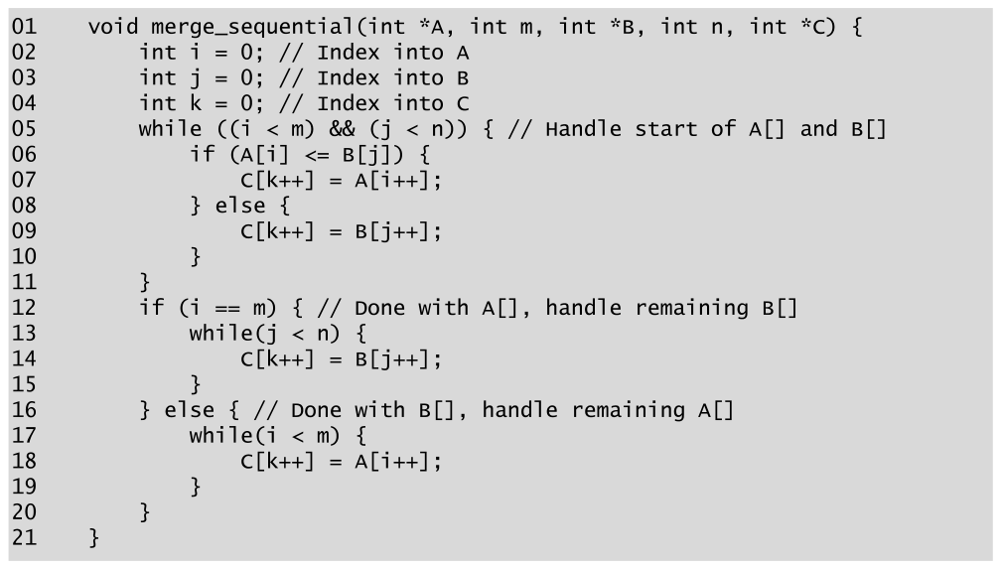

*Figure 13.2 — 순차 merge 함수. (책 p.305)*

```c
01  void merge_sequential(int *A, int m, int *B, int n, int *C) {
02      int i = 0; // Index into A
03      int j = 0; // Index into B
04      int k = 0; // Index into C
05      while ((i < m) && (j < n)) { // Handle start of A[] and B[]
06          if (A[i] <= B[j]) {
07              C[k++] = A[i++];
08          } else {
09              C[k++] = B[j++];
10          }
11      }
12      if (i == m) { // Done with A[], handle remaining B[]
13          while(j < n) {
14              C[k++] = B[j++];
15          }
16      } else { // Done with B[], handle remaining A[]
17          while(i < m) {
18              C[k++] = A[i++];
19          }
20      }
21  }
```

#### 두 부분으로 나뉜다

> Figure 13.2 의 순차 함수는 **두 개의 주요 부분**으로 이루어진다.
> 첫 부분은 $A$ 와 $B$ 목록 원소를 순서대로 방문하는 **while-loop (05번 줄)** 다.
> 루프는 첫 원소 `A[0]` 과 `B[0]` 에서 시작한다.
> **매 반복이 출력 배열 $C$ 의 한 자리를 채운다** — $A$ 의 원소 하나 또는 $B$ 의 원소 하나가
> 그 자리에 선택된다 (06~10번 줄) (책 p.305).

| 줄 | 하는 일 | 짚을 점 |
|---|---|---|
| **02~04** | `i`·`j`·`k` 를 0 으로 | `i`,`j` 는 입력, `k` 는 출력 위치 |
| **05** | **둘 다 남아 있는 동안** | 한쪽이 소진되면 빠져나온다 |
| **06** | **`A[i] <= B[j]`** | **`<=` 가 stability 를 만든다** — 동값이면 A |
| **07·09** | 하나 뽑아 쓰고 두 index 를 함께 증가 | `k++` 는 언제나, `i++`/`j++` 는 뽑힌 쪽만 |
| **12~20** | 남은 쪽을 통째로 복사 | 아래 참조 |

> **06번 줄의 `<=` 를 `<` 로 바꾸면 unstable 해진다.** 동값일 때 `else` 로 빠져
> $B$ 가 먼저 나가기 때문이다. 이 문자 하나가 13.4절 co-rank 종료 조건의 비대칭까지 전파된다.

#### if-else 는 사실 없어도 된다

> 12~20번 줄의 if-else 구조는 **정확성을 위해 필요한 것은 아니다.**
> 두 개의 while-loop (13~15 와 17~19)를 첫 while-loop 뒤에 그냥 나란히 둬도 된다.
> 첫 while-loop 에서 $A$ 와 $B$ 중 어느 쪽이 소진됐는지에 따라
> **둘 중 하나만 진입**하기 때문이다.
> 그럼에도 독자에게 코드가 더 직관적으로 보이도록 if-else 를 넣었다 (책 p.306).

**두 while 의 조건이 서로 배타적**이라는 점이 근거다. 첫 loop 를 빠져나온 시점에
`i == m` 이거나 `j == n` 중 적어도 하나가 참이고, 그러면 대응하는 while 은 즉시 거짓이 된다.

### 2. 예제 — Figure 13.1 을 이 코드로

> 첫 세 번(0~2)의 while-loop 반복에서 `A[0]`, `A[1]`, `B[0]` 이 `C[0]`, `C[1]`, `C[2]` 에 배정된다.
> 실행은 **반복 5의 끝까지** 계속된다. 이 시점에 목록 $A$ 가 완전히 방문되어 while-loop 를
> 빠져나온다. **총 여섯 개의 $C$ 자리**가 `A[0]`~`A[4]` 와 `B[0]` 으로 채워졌다.
> if 의 true 분기의 loop 가 남은 $B$ 원소 `B[1]`~`B[3]` 을 남은 $C$ 자리로 복사한다 (책 p.306).

13.1절의 표가 정확히 이것이다. **while-loop 반복 6회, 그다음 복사 3회.**

### 3. 복잡도

> 순차 merge 함수는 $A$ 와 $B$ 양쪽의 모든 입력 원소를 **한 번씩** 방문하고
> 각 $C$ 자리에 **한 번씩** 쓴다. 알고리즘 복잡도는 $O(m+n)$ 이고
> 실행 시간은 merge 할 원소 총수에 **선형 비례**한다 (책 p.306).

> **이 $O(m+n)$ 이 13장 내내 기준선이다.** 병렬화해도 총 work 는 $O(m+n)$ 을 넘지 않아야 하고
> (11장의 work efficiency 논의), 실제로 co-rank 가 더하는 것은
> thread 당 $O(\log N)$ 의 탐색뿐이라 **total work 는 $O(m+n+T\log N)$** 다.
> $T$ 가 thread 수다. 13.8절의 coarsening 이 바로 이 $T\log N$ 항을 줄이는 이야기다.

#### 연습문제

> $A = [2, 4, 6]$, $B = [1, 3, 5, 7, 9]$ 를 Figure 13.2 로 merge 할 때
> **(1)** while-loop 는 몇 번 도는가? **(2)** 어느 분기(12번 줄)로 빠지는가?
> **(3)** 비교 연산은 총 몇 번인가?

**(1)** 뽑히는 순서는 `B[0]`=1, `A[0]`=2, `B[1]`=3, `A[1]`=4, `B[2]`=5, `A[2]`=6 —
$A$ 가 소진되는 시점이 **6번째 반복**이다. while-loop 는 **6회**.

**(2)** `i == m` (3 == 3)이 참이므로 **true 분기** — 남은 `B[3]`=7, `B[4]`=9 를 복사한다.

**(3)** while-loop 반복마다 비교 하나이므로 **6번**. 복사 loop 에는 값 비교가 없다.
일반적으로 비교 횟수는 **$\min(m,n)$ 이상 $m+n-1$ 이하**다 —
한쪽이 먼저 소진될수록 적어진다.

---

## 13.3 A parallelization approach (책 p.306)

### 1. 개념적 이해

#### 발상 — 출력을 먼저 나누고, 입력을 거꾸로 찾는다

> Siebert et al. [1] 이 merge 연산 병렬화 접근을 제안했다.
> 그 접근에서 **각 thread 는 먼저 자기가 만들 출력 위치의 범위(output range)를 정하고,
> 그 출력 범위를 co-rank 함수의 입력으로 써서** 그 출력 범위를 만들기 위해 merge 해야 할
> **대응하는 입력 범위를 알아낸다.**
> 입력과 출력 범위가 정해지고 나면 각 thread 는 **자기 두 입력 부분배열과 하나의 출력
> 부분배열에 독립적으로 접근**할 수 있다.
> 이 독립성 덕에 각 thread 는 자기 부분배열에 **순차 merge 함수를 그대로 수행**해
> 병렬로 merge 할 수 있다 (책 p.306).

**핵심은 "거꾸로"다.** 지금까지의 패턴은 **입력을 나누고 출력이 따라왔다.**
merge 는 **출력을 나누고 입력을 역산한다.**

| | 무엇을 먼저 나누나 | 왜 |
|---|---|---|
| 2~12장 | **입력** | 입력을 나누면 출력이 자동으로 정해진다 |
| **13장** | **출력** | 입력을 나누면 출력 위치를 알 수 없다 — 두 배열이 섞이므로 |

$A$ 를 균등하게 나눠 봤자 **그 조각이 $C$ 의 어디로 가는지는 $B$ 의 값에 달려 있다.**
반대로 $C$ 를 균등하게 나누면 각 조각의 크기가 정확히 정해지고,
**남는 문제는 "이 조각을 만들 입력이 어디부터 어디까지인가" 하나**가 된다.
그 하나를 푸는 것이 **co-rank 함수**다.

#### Observation 1 — 모든 $C$ 원소는 어느 한쪽에서 온다

> **Observation 1.** $0 \le k < m+n$ 인 임의의 $k$ 에 대해,
> (case 1) $0 \le i < m$ 인 $i$ 가 존재해 `C[k]` 가 `A[i]` 에서 값을 받거나,
> (case 2) $0 \le j < n$ 인 $j$ 가 존재해 `C[k]` 가 `B[j]` 에서 값을 받는다 (책 p.306).

당연해 보이지만 **여기서 유도가 시작된다.**

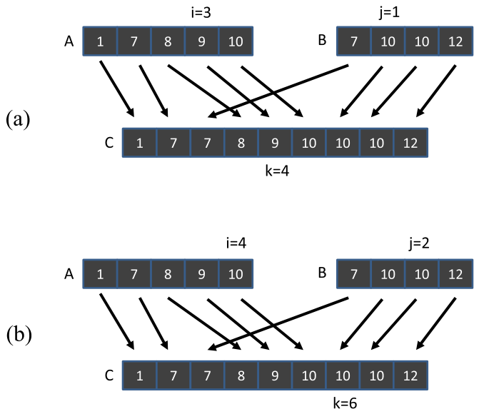

*Figure 13.3 — Observation 1 의 예. (책 p.307)*

**(a) case 1 — `C[4]` 가 `A[3]` 에서 온다** (책 p.307).

$k = 4$, $i = 3$ 이다. 그리고 이렇게 말할 수 있다.

> `C[4]` 의 **prefix subarray**(`C[4]` 에 선행하는 4개 원소 `C[0]`~`C[3]`)는
> `A[3]` 의 prefix subarray(3개 원소 `A[0]`~`A[2]`)와
> `B[1]` 의 prefix subarray($4 - 3 = 1$ 개 원소 `B[0]`)를 **merge 한 결과**다.

일반화하면

$$C[0..k-1]\ (k\text{개}) \;=\; \mathrm{merge}\big(A[0..i-1]\ (i\text{개}),\ B[0..k-i-1]\ (k-i\text{개})\big)$$

**(b) case 2 — `C[6]` 이 `B[1]` 에서 온다** (책 p.307).

$k = 6$, $j = 1$ 이다. 같은 논리로

$$C[0..k-1]\ (k\text{개}) \;=\; \mathrm{merge}\big(A[0..k-j-1]\ (k-j\text{개}),\ B[0..j-1]\ (j\text{개})\big)$$

> **원문 오기** (Figure 13.3(b), 책 p.307) ⚠️ **이 장에서 가장 중요한 오기다.**
>
> 그림 (b)의 라벨이 **`i=4`, `j=2`** 로 인쇄돼 있는데, **본문은 `i=5`, `j=1`** 이라고 쓴다
> ("the prefix subarray of `A[5]` … and the prefix subarray of `B[1]`").
> **본문이 맞고 그림이 틀렸다.** 근거는 셋이다.
>
> 첫째, 13.1절의 출처 표에서 `C[6]` 은 `B[1]` 에서 오고, `C[0..5]` 는
> `A[0..4]` 다섯 개와 `B[0]` 한 개로 채워졌다 → $i=5$, $j=1$.
> 둘째, 책 자신의 co-rank 함수(Figure 13.5)에 $k=6$ 을 넣으면 **`i=5` 를 돌려준다**
> (13.4절의 trace 참조).
> 셋째, 아래에서 보듯 $(4,2)$ 는 **종료 조건을 통과하지 못한다.**

**$(4,2)$ 는 왜 안 되는가 — 이 장의 가장 미묘한 지점**

놀랍게도 $(i,j) = (4,2)$ 도 **prefix 를 값으로만 보면 맞다.**

$$\mathrm{merge}(A[0..3], B[0..1]) = \mathrm{merge}([1,7,8,9],\ [7,10]) = [1,7,7,8,9,10] = C[0..5]$$
$$\mathrm{merge}(A[0..4], B[0..0]) = \mathrm{merge}([1,7,8,9,10],\ [7]) = [1,7,7,8,9,10] = C[0..5]$$

**둘 다 같은 값의 나열을 낸다.** 그런데 co-rank 는 유일해야 한다 (Siebert et al. 이 증명했다).
유일성을 만드는 것이 바로 **stability** 다.

| 후보 | $A[i-1] \le B[j]$ | $B[j-1] < A[i]$ | 판정 |
|---|---|---|---|
| $(i,j) = (5,1)$ | $A[4]{=}10 \le B[1]{=}10$ ✓ | $i = m$ 이라 조건 없음 ✓ | **co-rank** |
| $(i,j) = (4,2)$ | $A[3]{=}9 \le B[2]{=}10$ ✓ | $B[1]{=}10 < A[4]{=}10$ **✗** | **탈락** |

$(4,2)$ 는 **$B[1]{=}10$ 을 $A[4]{=}10$ 보다 앞에 놓는 분할**인데,
stability 는 동값이면 $A$ 가 먼저여야 한다고 요구하므로 어긋난다.

> **정리하면**: "prefix 를 merge 한 결과가 같다"는 조건만으로는 $i,j$ 가 유일하지 않다.
> **동값이 걸쳐 있을 때 tie 를 어디서 끊느냐**가 유일성을 만들고,
> 그 규칙이 13.4절 종료 조건의 **`<=` 와 `<` 의 비대칭**으로 코드에 새겨져 있다.
> 이 노트에서는 그림 (b)를 **$i=5$, $j=1$** 로 읽는다.

#### Observation 2 와 co-rank 의 정의

> 첫 경우에는 $i$ 를 찾고 $j$ 를 $k-i$ 로 유도한다. 둘째 경우에는 $j$ 를 찾고 $i$ 를 $k-j$ 로
> 유도한다. **대칭성을 이용해 두 경우를 하나로 요약**할 수 있다 (책 p.307).

> **Observation 2.** $0 \le k \le m+n$ 인 임의의 $k$ 에 대해,
> $k = i + j$, $0 \le i \le m$, $0 \le j \le n$ 이고
> **$C[0..k-1]$ 이 $A[0..i-1]$ 과 $B[0..j-1]$ 을 merge 한 결과**가 되는
> $i$ 와 $j$ 를 찾을 수 있다 (책 p.307).

**Observation 1 과 2 의 차이 두 가지를 놓치지 말자.**

| | Observation 1 | Observation 2 |
|---|---|---|
| $k$ 의 범위 | $0 \le k < m+n$ | $0 \le k \le \mathbf{m+n}$ — **끝점 포함** |
| 무엇을 말하나 | `C[k]` 가 **어디서 오는가** | `C[0..k-1]` 이 **어떻게 만들어지는가** |

**$k = m+n$ 을 포함하는 것이 실무에서 중요하다** — 마지막 thread 가 자기 구간의 **끝**을
알려면 $k = m+n$ 에서의 co-rank 가 필요하고, 그때 답은 $(m, n)$ 이다.

> $i$ 와 $j$, 즉 길이 $k$ 인 $C$ 의 prefix subarray 를 만드는 데 필요한 $A$ 와 $B$ 의
> prefix subarray 를 정하는 두 값이 **유일함**을 Siebert et al. 이 증명했다.
> 원소 `C[k]` 에 대해 index $k$ 를 그것의 **rank** 라 부르고,
> 유일한 index $i$ 와 $j$ 를 그것의 **co-rank** 라 부른다 (책 p.308).

| | Figure 13.3(a) | Figure 13.3(b) |
|---|---|---|
| **rank** | 4 | 6 |
| **co-rank** | 3, 1 | **5, 1** (그림 라벨 4, 2 는 오기) |

#### 그래서 어떻게 병렬화하는가

> co-rank 라는 개념이 merge 함수 병렬화의 길을 준다.
> **출력 배열을 부분배열들로 나누고 각 thread 에 부분배열 하나의 생성을 배정**해 일을 나눈다.
> 배정이 끝나면 각 thread 가 만들 출력 원소들의 **rank 가 정해진다.**
> 그러면 각 thread 는 **co-rank 함수를 써서 자기 출력 부분배열로 merge 해야 할
> 두 입력 부분배열을 결정**한다 (책 p.308).

세 줄로 요약하면:

1. **출력을 균등 분할** — thread $t$ 는 $C[k_t .. k_{t+1}-1]$ 을 맡는다 (index 계산)
2. **co-rank 를 두 번 호출** — $k_t$ 와 $k_{t+1}$ 에 대해 → $(i_t, j_t)$ 와 $(i_{t+1}, j_{t+1})$
3. **순차 merge 를 그대로 호출** — `merge_sequential(&A[i_t], i_{t+1}-i_t, &B[j_t], j_{t+1}-j_t, &C[k_t])`

**②만이 새로운 것이고, ①과 ③은 이미 아는 것이다.** 이 장의 나머지는 전부 ②의 구현과
그것이 메모리 접근에 일으키는 문제를 다룬다.

### 2. 예제/실습

#### 연습문제

> Figure 13.1 의 $A$·$B$ 에 대해
> **(1)** $k = 0, 1, \ldots, 9$ 각각의 co-rank $(i, j)$ 를 표로 만들어라.
> **(2)** $i$ 가 증가하지 않는 $k$ 구간과 $j$ 가 증가하지 않는 $k$ 구간을 찾아라.
> 그것이 무엇을 뜻하는가?

**(1)** 13.1절의 출처 표에서 "$k$ 미만의 출처 중 $A$ 인 것의 개수"를 세면 된다.

| $k$ | 0 | 1 | 2 | 3 | 4 | 5 | 6 | 7 | 8 | 9 |
|---|---|---|---|---|---|---|---|---|---|---|
| **$i$** | 0 | 1 | 2 | 2 | 3 | 4 | **5** | 5 | 5 | 5 |
| **$j$** | 0 | 0 | 0 | 1 | 1 | 1 | **1** | 2 | 3 | 4 |

$k = 6$ 열이 $(5, 1)$ 임을 다시 확인해 두자 — Figure 13.3(b) 의 라벨과 다르다.

**(2)** $i$ 는 $k = 2 \to 3$ 과 $k = 6 \to 9$ 에서 멈춰 있고,
$j$ 는 $k = 0 \to 2$ 와 $k = 3 \to 6$ 에서 멈춰 있다.

**한쪽이 멈춘 구간은 다른 쪽에서 연속으로 뽑힌 구간**이다.
$k = 3 \to 6$ 에서 $j$ 가 1 로 고정된 것은 `C[3..5]` 가 전부 $A$ 에서 왔다는 뜻이고,
실제로 `C[3]`=`A[2]`, `C[4]`=`A[3]`, `C[5]`=`A[4]` 다.

> 이것이 **13.5절에서 thread 하나가 $B$ 원소를 0개 쓰는 상황**의 정체이고,
> **13.6절의 tiling 이 어려운 이유**이기도 하다 —
> **한 thread 의 입력이 전부 한쪽 배열에서 올 수 있으므로,
> 출력 $x$ 개를 보장하려면 양쪽에서 $x$ 개씩 총 $2x$ 를 준비해야 한다.**

---

## 13.4 Co-rank function implementation (책 p.308)

### 1. 개념적 이해

#### 함수 signature

> **co-rank 함수**를, 출력 배열 $C$ 의 원소의 rank $k$ 와 두 입력 배열 $A$·$B$ 에 대한 정보를
> 받아 입력 배열 $A$ 에서 대응하는 원소의 **co-rank 값 $i$ 를 돌려주는 함수**로 정의한다
> (책 p.308).

```c
int co_rank(int k, int * A, int m, int * B, int n)
```

> 호출자는 $j$, 즉 $k$ 의 $B$ 에서의 co-rank 값을 **`k - i` 로 유도**할 수 있다 (책 p.308).

**하나만 돌려주고 나머지는 뺄셈으로 얻는다** — $i + j = k$ 라는 불변식(invariant) 덕이다.
이 불변식은 함수 안에서도 끝까지 유지된다.

#### 어떻게 쓰이는가 — 먼저 사용법부터

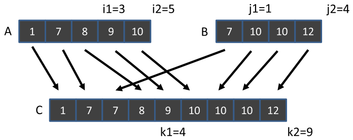

*Figure 13.4 — co-rank 함수 실행의 예. (책 p.309)*

thread 두 개로 merge 하고, **thread 0 이 `C[0]`~`C[3]`, thread 1 이 `C[4]`~`C[8]`** 을
만든다고 하자 (책 p.308).

> thread 1 은 매개변수 **(4, A, 5, B, 4)** 로 co-rank 함수를 부른다.
> 목표는 rank $k_1 = 4$ 에 대해 co-rank $i_1 = 3$ 과 $j_1 = 1$ 을 찾는 것이다.
> 즉 `C[4]` 에서 시작하는 부분배열은 **`A[3]` 과 `B[1]` 에서 시작하는 부분배열들을 merge**
> 해서 만들어져야 한다.
> 직관적으로는, **thread 1 이 merge 를 시작하기 전 출력 배열의 앞 4자리를 채울
> $A$ 와 $B$ 의 원소 총 4개**를 찾는 것이다 (책 p.308).

**왜 $i_1 = 3$ 이어야 하는가** — 책이 두 반례로 설명한다 (책 p.309).

| 만약 | 그러면 | 무엇이 깨지나 |
|---|---|---|
| $i_1 = 2$ (⇒ $j_1 = 2$) | thread 0 이 `B[1]`=10 을 가져간다 | thread 1 이 쓸 `A[2]`=8 **보다 큰 값**이 앞에 놓인다 → 정렬 깨짐 |
| $i_1 = 3$ (⇒ $j_1 = 1$) | thread 0 = `A[0..2]`+`B[0]`, thread 1 = `A[3..]`+`B[1..]` | ✓ |
| $i_1 = 4$ (⇒ $j_1 = 0$) | thread 0 이 `A[3]`=9 를 가져간다 | thread 1 이 쓸 `B[0]`=7 **보다 큰 값**이 앞에 놓인다 → 정렬 깨짐 |

> **두 반례가 정확히 대칭이다.** 하나는 $i$ 가 너무 작아서(=$j$ 가 너무 커서),
> 다른 하나는 $i$ 가 너무 커서 깨진다. **"너무 큼"과 "너무 작음" 사이에 정답이 하나 있고,
> 그 사이를 좁혀 가는 것이 binary search 다.** 책이 바로 다음 문장에서
> "이 두 예가 값을 빠르게 찾아내는 **탐색 알고리즘**을 가리킨다"고 말하는 이유다.

#### 끝점도 필요하다

> 입력 구획이 어디서 **시작**하는지에 더해, thread 1 은 어디서 **끝**나는지도 알아야 한다.
> 그래서 thread 1 은 매개변수 **(9, A, 5, B, 4)** 로도 co-rank 함수를 부른다.
> co-rank 값 $i_2 = 5$, $j_2 = 4$ 가 나온다.
> 즉 `C[9]` 는 $C$ 배열의 마지막 원소를 넘어서므로,
> `C[9]` 에서 시작하는 부분배열을 만들려 한다면 **$A$·$B$ 의 모든 원소가 소진돼 있어야** 한다
> (책 p.309).

> 일반적으로 thread $t$ 가 쓸 입력 부분배열은 **thread $t$ 와 thread $t+1$ 의 co-rank 값**으로
> 정의된다 — $A[i_t]$ 부터 $A[i_{t+1}]$, $B[j_t]$ 부터 $B[j_{t+1}]$ 까지다 (책 p.309).

**thread 하나가 co-rank 를 두 번 부른다**는 것이 요점이다.
이 "두 번"이 13.8절 coarsening 의 동기가 된다.

### 2. 알고리즘 — binary search

> co-rank 함수는 본질적으로 **탐색 연산**이다. 두 입력 배열이 정렬돼 있으므로
> **binary search** 나 더 높은 radix 의 탐색을 써서 $O(\log N)$ 의 계산 복잡도를 얻을 수 있다
> (책 p.309).

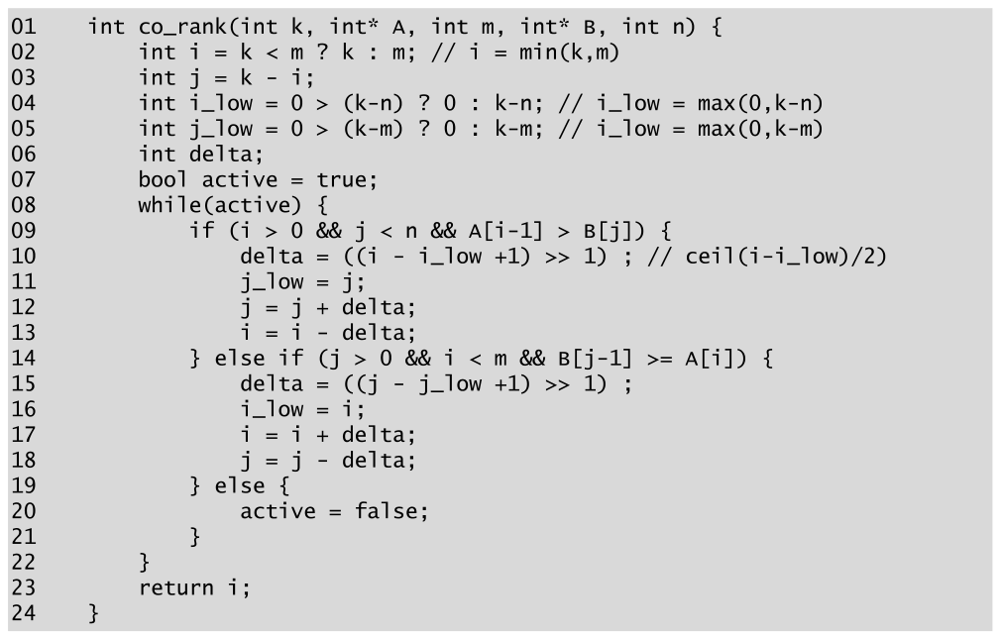

*Figure 13.5 — binary search 에 기반한 co-rank 함수. (책 p.310)*

```c
01  int co_rank(int k, int* A, int m, int* B, int n) {
02      int i = k < m ? k : m;              // i = min(k,m)
03      int j = k - i;
04      int i_low = 0 > (k-n) ? 0 : k-n;    // i_low = max(0,k-n)
05      int j_low = 0 > (k-m) ? 0 : k-m;    // j_low = max(0,k-m)
06      int delta;
07      bool active = true;
08      while(active) {
09          if (i > 0 && j < n && A[i-1] > B[j]) {
10              delta = ((i - i_low +1) >> 1) ;   // ceil(i-i_low)/2
11              j_low = j;
12              j = j + delta;
13              i = i - delta;
14          } else if (j > 0 && i < m && B[j-1] >= A[i]) {
15              delta = ((j - j_low +1) >> 1) ;
16              i_low = i;
17              i = i + delta;
18              j = j - delta;
19          } else {
20              active = false;
21          }
22      }
23      return i;
24  }
```

> **원문 오기** (Figure 13.5 05번 줄, 책 p.310). 주석이 **`// i_low = max(0,k-m)`** 인데
> 변수는 `j_low` 다. **`// j_low = max(0,k-m)`** 이어야 한다.
> 같은 오타가 Figure 13.19 에도 그대로 복사돼 있다.

#### 네 개의 marker 변수

> co-rank 함수는 **두 쌍의 marker 변수**를 써서 co-rank 값의 후보가 되는
> $A$ index 범위와 $B$ index 범위를 구획한다 (책 p.309).

| 변수 | 뜻 |
|---|---|
| `i`, `j` | 현재 binary search 반복에서 고려 중인 **co-rank 후보값** |
| `i_low`, `j_low` | 함수가 만들어 낼 수 있는 **가장 작은 co-rank 값** |

**탐색 범위는 `[i_low, i]` 와 `[j_low, j]` 두 구간**이고, 둘이 항상 같은 크기로 움직인다.

### 3. 수식/유도 — 초기값과 불변식

#### 전체 유도 과정 (먼저 한 번에)

$$i \;=\; \min(k,\ m), \qquad j \;=\; k - i \tag{1}$$

$$i + j = k \quad \text{(모든 시점에서 성립하는 불변식)} \tag{2}$$

$$i_{\text{low}} \;=\; \max(0,\ k-n), \qquad j_{\text{low}} \;=\; \max(0,\ k-m) \tag{3}$$

$$\delta \;=\; \left\lceil \frac{i - i_{\text{low}}}{2} \right\rceil \;=\; (i - i_{\text{low}} + 1) \gg 1 \tag{4}$$

$$\text{종료 조건:}\quad A[i-1] \le B[j] \ \wedge\ B[j-1] < A[i] \tag{5}$$

#### 단계별 설명 (생략 없이)

**(1)** $i$ 의 초기값은 **가능한 가장 큰 값**이다.

> 02번 줄이 $i$ 를 가능한 최대값으로 초기화한다. $k$ 값이 $m$ 보다 크면 02번 줄은 $i$ 를 $m$ 으로
> 초기화한다 — co-rank $i$ 값은 $A$ 배열의 크기보다 클 수 없기 때문이다.
> 그렇지 않으면 $i$ 를 $k$ 로 초기화한다 — $i$ 는 $k$ 보다 클 수 없기 때문이다 (책 p.309).

두 상한이 있다. **$i \le m$** ($A$ 에서 그보다 많이 가져올 수 없다)이고
**$i \le k$** (총 $k$ 개만 쓰므로). 둘 중 작은 쪽이 $\min(k, m)$ 이다.

**(2)** 불변식이 알고리즘 전체를 지탱한다.

> 03번 줄이 co-rank $j$ 값을 `k - i` 로 초기화한다. **실행 내내 co-rank 함수는 이 중요한
> 불변 관계를 유지한다 — `i` 와 `j` 변수의 합은 항상 입력 변수 `k`(rank 값)와 같다** (책 p.309~310).

코드에서 확인해 보자. 12·13번 줄은 `j += delta; i -= delta;` 이고
17·18번 줄은 `i += delta; j -= delta;` 다.
**둘 다 한쪽에 더한 만큼 다른 쪽에서 뺀다** → 합이 보존된다. ∎

> **이 불변식 덕에 2차원 탐색이 1차원이 된다.** 원래는 $(i, j)$ 두 값을 찾아야 하는데,
> $i+j=k$ 라는 직선 위로 제약되므로 **자유도가 1** 이다.
> binary search 한 번으로 풀 수 있는 이유가 이것이다.

**(3)** 하한이 왜 0 이 아닌가.

> `i_low` 와 `j_low` 변수의 초기화(4·5번 줄)는 설명이 조금 더 필요하다.
> 이 변수들은 **탐색 범위를 제한해 더 빠르게** 만들어 준다.
> 기능적으로는 둘 다 0 으로 두고 나머지 실행이 더 정확한 값으로 끌어올리게 해도 된다.
> $k$ 값이 $m$ 과 $n$ 보다 작을 때는 실제로 그것이 맞다.
> 그러나 **$k$ 가 $n$ 보다 크면 $i$ 값이 $k-n$ 보다 작을 수 없음을 안다.**
> 이유는, `C[k]` 의 prefix subarray 원소 중 $B$ 배열에서 올 수 있는 **최대 개수가 $n$** 이기
> 때문이다. 따라서 **최소 $k-n$ 개는 $A$ 에서 와야** 한다 (책 p.310).

수식으로 쓰면, $j \le n$ 이고 $i = k - j$ 이므로

$$i = k - j \ \ge\ k - n$$

$i \ge 0$ 과 합치면 $i_{\text{low}} = \max(0, k-n)$ ✓
$A$ 와 $B$ 의 역할을 바꾸면 $j_{\text{low}} = \max(0, k-m)$ ✓

> **이 하한이 성능에 실제로 영향을 준다.** 13.4절의 연습(thread 2, $k=6$)에서
> $i_{\text{low}} = \max(0, 6-4) = 2$, $j_{\text{low}} = \max(0, 6-5) = 1$ 로 시작하는데,
> 이 덕에 **반복 1회 만에 끝난다.** 둘 다 0 으로 뒀다면 더 걸린다.

**(4)** 절반씩 좁히기.

`>> 1` 은 2로 나눈 몫이고, `+1` 을 먼저 더했으므로 **올림 나눗셈**이다 (2장의 ceiling division).
올림이어야 하는 이유는 **범위가 1일 때 $\delta = 0$ 이 되어 무한 루프에 빠지는 것을 막기**
위해서다. $i - i_{\text{low}} = 1$ 이면 $\delta = (1+1)\gg1 = 1$ 로 실제로 움직인다.

**(5)** 종료 조건과 그 뜻.

> 목표는 **$A[i-1] \le B[j]$ 이면서 $B[j-1] < A[i]$** 인 $i$·$j$ 쌍을 찾는 것이다.
> 직관은, **직전 출력 부분배열을 만드는 데 쓰인 $A$ 부분배열(previous A subarray)의 어떤 값도
> 현재 출력 부분배열을 만드는 데 쓰이는 $B$ 부분배열(current B subarray)의 어떤 원소보다
> 크지 않도록** $i$·$j$ 를 고른다는 것이다.
> 단, **previous subarray 의 가장 큰 $A$ 원소가 current B subarray 의 가장 작은 원소와
> 같을 수는 있다** — stability 요구 때문에 $A$ 원소와 $B$ 원소 사이에 tie 가 생기면
> $A$ 원소가 출력에 먼저 놓이기 때문이다 (책 p.311).

**여기가 이 장에서 가장 중요한 문단이다.** 왜 한쪽은 `<=` 이고 다른 쪽은 `<` 인가.

| 조건 | 뜻 | 등호가 허용되는가 |
|---|---|---|
| $A[i-1] \le B[j]$ | 앞 구간의 마지막 $A$ 원소가 뒤 구간의 첫 $B$ 원소 **이하** | **허용** — 동값이면 $A$ 가 먼저이므로 앞 구간에 있어도 된다 |
| $B[j-1] < A[i]$ | 앞 구간의 마지막 $B$ 원소가 뒤 구간의 첫 $A$ 원소 **미만** | **불허** — 동값이면 $A$ 가 먼저여야 하므로 $B$ 가 앞 구간에 있으면 안 된다 |

**stability 가 이 비대칭의 유일한 이유다.** 그리고 이 비대칭이
13.3절에서 본 $(5,1)$ vs $(4,2)$ 의 tie 를 끊는다.

코드에서는 이 조건의 **부정**이 while-loop 의 두 if 다.

| 코드 (09번 줄) | 부정하면 | 뜻 |
|---|---|---|
| `A[i-1] > B[j]` | $A[i-1] \le B[j]$ 위반 | **$i$ 가 너무 크다** → $i$ 를 줄인다 |
| `B[j-1] >= A[i]` | $B[j-1] < A[i]$ 위반 | **$j$ 가 너무 크다** → $j$ 를 줄인다 |

> **경계 검사도 함께 봐야 한다.** 09번 줄의 `i > 0 && j < n` 은
> `A[i-1]` 과 `B[j]` 가 유효한 index 인지 확인한다.
> $i = 0$ 이면 "앞 구간에 $A$ 원소가 없다"는 뜻이라 조건이 **자동으로 만족**되고,
> $j = n$ 이면 "뒤 구간에 $B$ 원소가 없다"는 뜻이라 역시 만족된다.
> 14번 줄의 `j > 0 && i < m` 도 대칭이다.
> **13.3절에서 $(5,1)$ 이 통과한 것도 $i = m = 5$ 라 둘째 조건이 자동 만족됐기 때문이다.**

### 4. 예제 — Figure 13.6~13.8 을 그대로 따라간다

> 예제는 **thread 세 개**로 $A$·$B$ 를 $C$ 로 merge 한다고 가정한다.
> 각 thread 는 **세 원소짜리 출력 부분배열**을 만든다.
> **thread 1** 은 `C[3]`~`C[5]` 를 만들며, co-rank 함수를 **(3, A, 5, B, 4)** 로 부른다
> (책 p.310).

**초기화** (책 p.310~311):

$$i = \min(3, 5) = 3, \quad j = 3 - 3 = 0, \quad i_{\text{low}} = \max(0, 3-4) = 0, \quad j_{\text{low}} = \max(0, 3-5) = 0$$

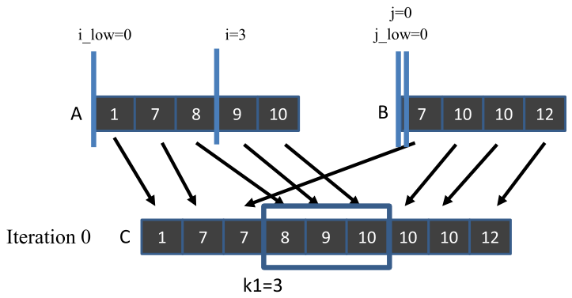

*Figure 13.6 — thread 1 에 대한 co-rank 함수 동작 예의 iteration 0. (책 p.311)*

**iteration 0** — $i=3$, $i_{\text{low}}=0$, $j=0$, $j_{\text{low}}=0$

> if-구조가 $i$ 값(3)이 **너무 높다**고 판정한다 — `A[i-1]` 인 `A[2]`=8 이 `B[j]` 인
> `B[0]`=7 보다 크기 때문이다.
> $\delta = (3-0+1)/2 = 2$ 만큼 $i$ 를 줄이면서 $i_{\text{low}}$ 는 그대로 둔다 (10·13번 줄).
> 따라서 다음 반복의 $i_{\text{low}}$ 와 $i$ 는 **0 과 1** 이 된다.
> 코드는 또 $j$ 의 탐색 범위를 $i$ 의 것과 비슷하게 만든다 — 현재 $j$ 를 $j_{\text{low}}$ 에
> 배정하고(11번 줄) $\delta$ 를 $j$ 에 더한다(12번 줄).
> 다음 반복의 $j_{\text{low}}$ 와 $j$ 는 **0 과 2** 가 된다 (책 p.311).

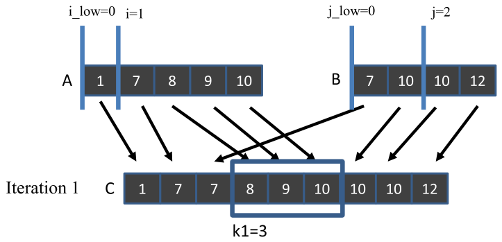

*Figure 13.7 — thread 1 에 대한 co-rank 함수 동작 예의 iteration 1. (책 p.312)*

**iteration 1** — $i=1$, $i_{\text{low}}=0$, $j=2$, $j_{\text{low}}=0$

> 첫 if (9번 줄)는 $i$ 값을 **받아들일 만하다**고 본다 — `A[i-1]` 은 `A[0]`=1 이고
> `B[j]` 는 `B[2]`=10 이므로 `A[i-1] < B[j]` 다. 조건이 거짓이라 본문을 건너뛴다.
> 그러나 이번 반복에서 **$j$ 값이 너무 높다**고 판정된다 — `B[j-1]` 은 `B[1]`=10 인데
> `A[i]` 는 `A[1]`=7 이기 때문이다.
> $\delta = (j - j_{\text{low}} + 1) \gg 1 = 1$ 을 $j$ 에서 뺀다 (15·18번 줄).
> 결과로 다음 반복의 $j_{\text{low}}$ 와 $j$ 는 **0 과 1** 이 된다.
> $i$ 의 다음 탐색 범위도 $j$ 와 같은 크기로 만들되 $\delta$ 만큼 위로 밀어 올린다 —
> 현재 $i$ 를 $i_{\text{low}}$ 에 배정하고(16번 줄) $\delta$ 를 $i$ 에 더한다(17번 줄).
> 다음 반복의 $i_{\text{low}}$ 와 $i$ 는 **1 과 2** 다 (책 p.312).

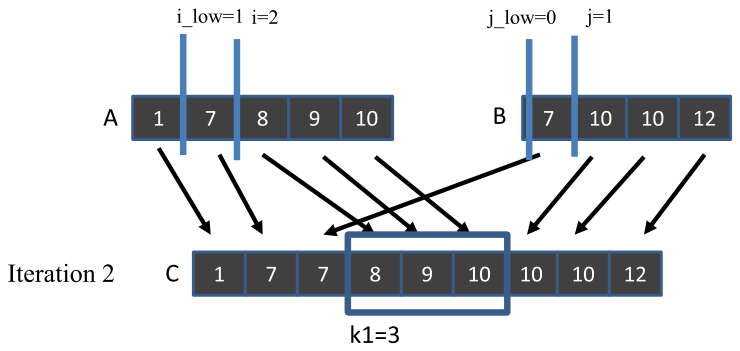

*Figure 13.8 — co-rank 함수 동작 예의 iteration 2. (책 p.312)*

> **원문 오기** (Figure 13.8 캡션, 책 p.312).
> 캡션이 "…for **thread 0**" 인데 그림 안에는 **`k1=3`** 이 적혀 있고,
> 본문도 이 그림을 thread 1 의 iteration 2 로 설명한다.
> **"thread 1" 이어야 한다.** Figure 13.6·13.7 의 캡션은 올바르게 thread 1 이다.

**iteration 2** — $i=2$, $i_{\text{low}}=1$, $j=1$, $j_{\text{low}}=0$

> 두 if 가 **모두** $i$ 와 $j$ 를 받아들인다.
> 첫 if 에서 `A[i-1]` 은 `A[1]`(값 7), `B[j]` 는 `B[1]`(값 10) 이므로 `A[i-1] <= B[j]` 만족.
> 둘째 if 에서 `B[j-1]` 은 `B[0]`(값 7), `A[i]` 는 `A[2]`(값 8) 이므로 `B[j-1] < A[i]` 만족.
> co-rank 함수는 플래그를 세워 while-loop 를 빠져나가고(20·08번 줄)
> 최종 $i$ 값 **2** 를 co-rank $i$ 로 돌려준다 (23번 줄).
> 호출한 thread 는 최종 co-rank $j$ 를 $k-i = 3-2 = 1$ 로 유도한다 (책 p.312).

#### 세 반복을 한 표로

| iteration | $i_{\text{low}}$ | $i$ | $j_{\text{low}}$ | $j$ | `A[i-1]` vs `B[j]` | `B[j-1]` vs `A[i]` | 판정 |
|---|---|---|---|---|---|---|---|
| **0** | 0 | 3 | 0 | 0 | `A[2]`=8 > `B[0]`=7 | — | **$i$ 과다** → $\delta=2$ |
| **1** | 0 | 1 | 0 | 2 | `A[0]`=1 ≤ `B[2]`=10 ✓ | `B[1]`=10 ≥ `A[1]`=7 | **$j$ 과다** → $\delta=1$ |
| **2** | 1 | 2 | 0 | 1 | `A[1]`=7 ≤ `B[1]`=10 ✓ | `B[0]`=7 < `A[2]`=8 ✓ | **종료 → $i=2$, $j=1$** |

**$i+j$ 가 항상 3 임을 확인하자** — $3+0 = 1+2 = 2+1 = 3$ ✓ (불변식 (2)).

> 입력 스트림이 훨씬 길다면 **$\delta$ 값이 매 step 마다 절반**으로 줄어드므로
> 알고리즘은 $\log_2 N$ 복잡도다. $N$ 은 두 입력 배열 크기의 최댓값이다 (책 p.313).

<!--widget:co-rank-->

### 5. 예제/실습

#### 연습문제

> **(1)** 같은 예에서 **thread 2** 의 co-rank 계산을 완성하라 (책 13.10절 연습 2).
> **(2)** 왜 thread 2 는 thread 1 보다 반복이 적은가?

**(1)** thread 2 는 `C[6]`~`C[8]` 을 맡으므로 `co_rank(6, A, 5, B, 4)` 를 부른다.

**초기화**: $i = \min(6,5) = 5$, $j = 6-5 = 1$,
$i_{\text{low}} = \max(0, 6-4) = \mathbf{2}$, $j_{\text{low}} = \max(0, 6-5) = \mathbf{1}$

| iteration | $i_{\text{low}}$ | $i$ | $j_{\text{low}}$ | $j$ | 첫 if | 둘째 if | 판정 |
|---|---|---|---|---|---|---|---|
| **0** | 2 | 5 | 1 | 1 | `A[4]`=10 > `B[1]`=10? **거짓** | `i < m` 이 **거짓** ($5 = m$) | **즉시 종료** |

**$i = 5$, $j = 1$ 로 반복 한 번에 끝난다.**

검증: `C[6..8]` = 10, 10, 12 이고 이는 `B[1..3]` 이다.
thread 2 는 $A$ 에서 0개, $B$ 에서 3개를 쓴다 —
`merge_sequential(&A[5], 0, &B[1], 3, &C[6])` ✓

> **이 결과가 13.3절의 Figure 13.3(b) 오기를 다시 한번 확정한다.**
> 책 자신의 co-rank 함수가 $k=6$ 에 대해 $i=5$, $j=1$ 을 돌려준다.

**(2)** 두 가지가 겹쳤다.

- **하한이 좁다.** $i_{\text{low}} = 2$ 라 처음부터 범위가 $[2, 5]$ 로 시작한다
  (thread 1 은 $[0,3]$).
- **초기 추정이 이미 정답이다.** $i = \min(k,m) = 5$ 가 곧 답이었다.
  $k \ge m$ 인 경우 $A$ 를 전부 쓰는 것이 정답일 가능성이 높다.

> **일반적으로 $k$ 가 $m+n$ 에 가까울수록 co-rank 탐색이 빨리 끝난다.**
> 하한 $\max(0,k-n)$ 과 상한 $\min(k,m)$ 이 서로 가까워지기 때문이다.
> $k \ge m + n - \min(m,n)$ 이면 범위가 아주 좁다.

---

## 13.5 A basic parallel merge kernel (책 p.313)

### 1. 코드

> 이 장의 나머지에서 입력 $A$·$B$ 배열이 **global memory** 에 있다고 가정한다.
> 또 두 입력 배열을 merge 해 역시 global memory 에 있는 출력 배열 $C$ 를 만드는
> kernel 이 launch 된다고 가정한다 (책 p.313).

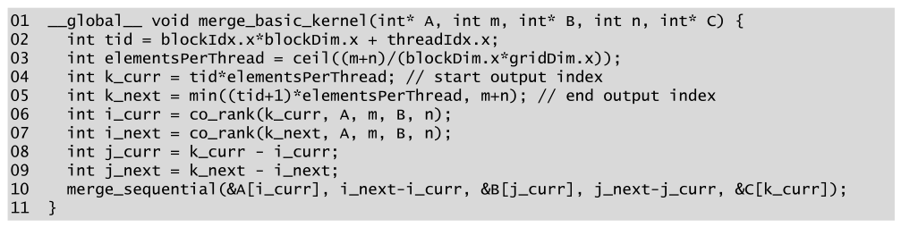

*Figure 13.9 — 기본 merge kernel. (책 p.313)*

```cuda
01  __global__ void merge_basic_kernel(int* A, int m, int* B, int n, int* C) {
02    int tid = blockIdx.x*blockDim.x + threadIdx.x;
03    int elementsPerThread = ceil((m+n)/(blockDim.x*gridDim.x));
04    int k_curr = tid*elementsPerThread;                    // start output index
05    int k_next = min((tid+1)*elementsPerThread, m+n);      // end output index
06    int i_curr = co_rank(k_curr, A, m, B, n);
07    int i_next = co_rank(k_next, A, m, B, n);
08    int j_curr = k_curr - i_curr;
09    int j_next = k_next - i_next;
10    merge_sequential(&A[i_curr], i_next-i_curr, &B[j_curr], j_next-j_curr, &C[k_curr]);
11  }
```

**놀랍도록 짧다.** 13.3절이 말한 세 단계가 그대로 열 줄이다.

| 줄 | 하는 일 | 짚을 점 |
|---|---|---|
| **03~05** | 출력 구간 $[k_{\text{curr}}, k_{\text{next}})$ 을 index 계산으로 | **여기까지는 지금까지의 패턴과 같다** |
| **06~07** | co-rank **두 번** | 시작점과 끝점 |
| **08~09** | $j$ 는 뺄셈으로 | 불변식 $i+j=k$ |
| **10** | 순차 merge 를 그대로 호출 | **13.2절 함수를 손도 안 대고 재사용** |

> 출력 원소의 총수가 thread 수의 배수가 아닐 수 있음을 유념하라 (책 p.313).
> 05번 줄의 `min(..., m+n)` 이 그것을 처리한다.

> **원문 코드 버그** (Figure 13.9 03번 줄, 책 p.313) ⚠️
>
> `ceil((m+n)/(blockDim.x*gridDim.x))` 에서 **괄호 안이 전부 정수**이므로
> C 의 정수 나눗셈이 먼저 일어나 **몫이 이미 내림**된다. 그 정수에 `ceil` 을 씌워 봐야
> 값이 바뀌지 않는다 — **`ceil` 이 아무 일도 하지 않는다.**
>
> 13.6절의 러닝 예제로 확인하면: $m+n = 64{,}000$, thread $16 \times 128 = 2048$ 개.
> 책 코드는 $64000/2048 = 31.25 \to \mathbf{31}$ 을 쓴다.
> 그러면 마지막 thread 의 `k_next` 가 $2048 \times 31 = 63{,}488$ 이라
> **`C[63488]`~`C[63999]` 512개가 영영 만들어지지 않는다.**
>
> 고치려면 실수 나눗셈을 강제하거나 정수 올림 나눗셈을 쓴다.
> ```cuda
> int elementsPerThread = (m + n + blockDim.x*gridDim.x - 1) / (blockDim.x*gridDim.x);
> ```
> **2장에서 배운 ceiling division 관용구가 정확히 이 자리를 위한 것이다.**
> 같은 형태의 식이 Figure 13.11 의 05·06번 줄에도 있다.

### 2. 예제 — thread 세 개로

> 세 thread(0, 1, 2)의 `k_curr` 값은 **0, 3, 6** 이 된다.
> thread 1 에 집중하면 `k_curr` 는 3 이다. 첫 co-rank 호출에서 정해지는 `i_curr`·`j_curr` 는
> **2 와 1** 이다. thread 1 의 `k_next` 는 6 이고, 둘째 호출이 `i_next`·`j_next` 를
> **5 와 1** 로 정한다.
> thread 1 은 매개변수 **(&A[2], 3, &B[1], 0, &C[3])** 으로 merge 함수를 부른다.
> 매개변수 `n` 이 0 이라는 것은 thread 1 의 출력 부분배열 세 원소 중 **어느 것도 $B$ 에서
> 오지 않는다**는 뜻이다 (책 p.314).

세 thread 를 전부 표로 만들면:

| thread | $k$ 구간 | co-rank | $A$ 에서 | $B$ 에서 | 만드는 출력 |
|---|---|---|---|---|---|
| **0** | [0, 3) | $(0,0) \to (2,1)$ | `A[0..1]` **2개** | `B[0]` **1개** | `C[0..2]` = 1, 7, 7 |
| **1** | [3, 6) | $(2,1) \to (5,1)$ | `A[2..4]` **3개** | **0개** | `C[3..5]` = 8, 9, 10 |
| **2** | [6, 9) | $(5,1) \to (5,4)$ | **0개** | `B[1..3]` **3개** | `C[6..8]` = 10, 10, 12 |

> **thread 1 과 2 를 나란히 보라.** 하나는 입력이 전부 $A$ 에서, 다른 하나는 전부 $B$ 에서 온다.
> **출력은 셋 다 정확히 3개**인데 입력 구성은 극단적으로 다르다.
> 이 그림이 13.6절 tiling 의 "왜 $2x$ 를 적재해야 $x$ 를 보장하는가"의 답이다.

### 3. 무엇이 문제인가

> 기본 merge kernel 은 아주 단순하고 우아하지만 **메모리 접근 효율에서 부족**하다 (책 p.314).

**두 가지 문제가 있다.**

#### 문제 ① — 순차 merge 의 접근이 uncoalesced

> `merge_sequential` 함수를 실행할 때 **warp 안의 인접 thread 들이 인접한 메모리 위치에
> 접근하지 않는다.** Figure 13.8 의 예에서 `merge_sequential` 실행의 첫 반복 동안
> 세 인접 thread 는 **`A[0]`, `A[2]`, `B[0]`** 을 읽는다.
> 그리고 **`C[0]`, `C[3]`, `C[6]`** 에 쓴다.
> 따라서 메모리 접근이 coalesced 되지 않아 memory bandwidth 이용이 나쁘다 (책 p.314).

**thread 마다 자기 구간의 처음부터 순차로 훑기 때문**이다. 6.1절의 전형적인 반례다 —
각 thread 가 **연속된 자기 구간**을 도는 것은 CPU 에서는 좋은 접근이지만 GPU 에서는 최악이다.

| 반복 | thread 0 | thread 1 | thread 2 | 간격 |
|---|---|---|---|---|
| 0 | `C[0]` | `C[3]` | `C[6]` | **3** |
| 1 | `C[1]` | `C[4]` | `C[7]` | **3** |
| 2 | `C[2]` | `C[5]` | `C[8]` | **3** |

실전에서는 thread 당 원소가 8개쯤이므로 **간격이 8** 이 되고,
warp 하나의 store 가 32곳에 흩어진다.

#### 문제 ② — co-rank 자체가 global memory 를 불규칙하게 읽는다

> thread 들은 co-rank 함수를 실행할 때도 global memory 에서 $A$·$B$ 원소에 접근해야 한다.
> co-rank 함수가 **binary search** 를 하므로 접근 패턴이 다소 불규칙하고
> coalesced 되기 어렵다. 결과적으로 이 접근들이 memory bandwidth 이용 효율을 더 떨어뜨린다.
> co-rank 함수의 이런 uncoalesced global memory 접근을 피할 수 있다면 도움이 될 것이다
> (책 p.314).

**binary search 는 본질적으로 흩어진 접근**이다. thread 마다 다른 위치를 찍고,
같은 warp 안에서도 서로 멀리 떨어진 곳을 본다. 게다가 thread 하나가
**$2 \log_2 N$ 번**(co-rank 두 번) 그런 접근을 한다.

**13.6절이 두 문제를 동시에 공격한다.**

### 4. 예제/실습

#### 연습문제

> $m+n = 1{,}000{,}000$, thread 4096개, thread 당 244개를 맡을 때
> **(1)** co-rank 호출은 총 몇 번이고 각 호출의 binary search 반복은 대략 몇 번인가?
> **(2)** 그 탐색이 유발하는 global memory 접근은 대략 몇 번인가?
> **(3)** 순차 merge 자체의 접근 수와 비교하면?

**(1)** thread 마다 2번이므로 **8192번**. 각 탐색은 $O(\log_2 N)$ 이고
$N = \max(m,n) \approx 500{,}000$ 이라 대략 $\log_2 500000 \approx \mathbf{19}$ 회 반복.

**(2)** 반복마다 `A[i-1]`, `B[j]`, `B[j-1]`, `A[i]` 를 최대 4번 읽으므로

$$8192 \times 19 \times 4 \approx \mathbf{62만 \text{ 번}}$$

전부 **uncoalesced** 다.

**(3)** 순차 merge 는 입력 100만 개를 읽고 100만 개를 쓰므로 **200만 번**.
탐색이 그 **31%** 에 해당한다 — 작지 않다.
게다가 **탐색 접근은 흩어져 있어 transaction 당 효율이 훨씬 나쁘므로**
실제 bandwidth 소모의 비중은 이 비율보다 크다.

> **13.6절이 (2)를 block 당 2번으로 줄인다.** 4096 thread 가 block 당 128개면 32 block 이므로
> **8192번 → 64번**, $128\times$ 감소다.

---

## 13.6 A tiled merge kernel to improve coalescing (책 p.314)

### 1. 개념적 이해

> 6장에서 kernel 의 memory coalescing 을 개선하는 **세 가지 주요 전략**을 언급했다 —
> (1) thread 를 데이터에 대응시키는 방식을 재배치, (2) 데이터 자체를 재배치,
> (3) global memory 와 shared memory 사이의 전송을 coalesced 하게 하고
> **불규칙 접근은 shared memory 안에서 수행**.
> merge 패턴에는 **세 번째 전략**을 쓴다 (책 p.314).

> shared memory 를 쓰면 **co-rank 함수들과 순차 merge 국면에 걸친 적은 양의 데이터 재사용을
> 포착하는 이점**도 있다 (책 p.314).

**재사용이 "적은 양"이라는 점을 눈여겨보자.** 5장의 matmul 은 tile 크기만큼 재사용이 있었다.
여기서는 **co-rank 가 읽는 원소와 merge 가 읽는 원소가 겹치는 정도**가 전부다.
그러니 **tiling 의 주목적은 재사용이 아니라 coalescing** 이다.

#### 핵심 관찰

> 핵심 관찰은 **인접한 thread 들이 쓸 입력 $A$·$B$ 부분배열이 메모리에서 서로 인접**하다는
> 것이다. 본질적으로 **block 의 모든 thread 가 집합적으로 더 큰 block 수준의 $A$·$B$
> 부분배열을 써서 더 큰 block 수준의 $C$ 부분배열을 만든다.**
> **block 전체에 대해 co-rank 함수를 불러** block 수준 $A$·$B$ 부분배열의 시작·끝 위치를
> 얻을 수 있다. 이 block 수준 co-rank 값을 써서 block 의 모든 thread 가
> **coalesced 패턴으로 block 수준 $A$·$B$ 부분배열의 원소를 shared memory 로 협력 적재**할 수 있다
> (책 p.314).

**12.4절의 privatization 과 구조가 같다** — 개별 thread 가 흩어져 하던 일을
**block 단위로 묶어 한 번에** 처리한다. 다른 점은 여기서는 **입력** 쪽을 묶는다는 것이다.

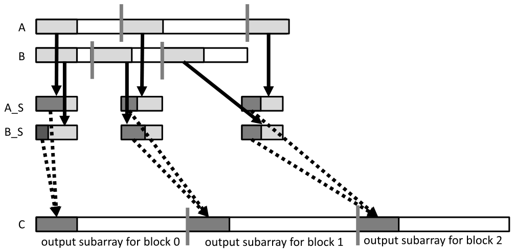

*Figure 13.10 — tiled merge kernel 의 설계. (책 p.315)*

> 이 예에서는 merge 에 **block 세 개**를 쓴다고 가정한다. 그림 아래쪽에 $C$ 가 세 개의
> block 수준 부분배열로 분할된 것을 보였다 (회색 세로 막대가 경계).
> 이 분할을 기준으로 각 block 이 co-rank 함수를 불러 입력 배열을 각 block 이 쓸 부분배열로
> 나눈다. **입력 분할은 입력 배열의 실제 데이터 값에 따라 크기가 크게 달라질 수 있다** (책 p.315).

**출력 분할은 균등하고 입력 분할은 들쭉날쭉하다** — 그림의 세로 막대 위치를 보면
$A$ 쪽과 $B$ 쪽의 간격이 서로 다르다. 그런데

> 명백히 **두 입력 부분배열의 크기 합은 언제나 각 thread 의 출력 부분배열 크기와 같아야** 한다
> (책 p.315).

#### 왜 반복해야 하는가, 그리고 왜 $2x$ 를 적재하는가

> shared memory 크기가 제한적이라 `A_S` 와 `B_S` 가 block 의 전체 입력 부분배열을 다 담지
> 못할 수 있다. 따라서 **반복적(iterative) 접근**을 취한다.
> `A_S` 와 `B_S` 가 각각 $x$ 개의 원소를 담고 각 출력 부분배열이 $y$ 개의 원소를 갖는다고 하면,
> 각 thread block 은 **$y/x$ 번의 반복**으로 작업을 수행한다.
> 각 반복에서 block 의 모든 thread 가 협력해 자기 입력 $A$ 부분배열에서 $x$ 개,
> $B$ 부분배열에서 $x$ 개를 적재한다 (책 p.315).

> $A$ 에서 $x$ 개, $B$ 에서 $x$ 개가 shared memory 에 있으면 thread block 은
> **적어도 $x$ 개의 출력 원소를 만들기에 충분한 입력**을 갖는다.
> **총 $2x$ 개의 입력 원소를 적재하는데 왜 $x$ 개의 출력만 보장되는가?**
> 이유는, **최악의 경우 현재 출력 구획의 모든 원소가 입력 구획 중 한쪽에서만 올 수 있기**
> 때문이다. 이 입력 사용의 불확실성이 merge kernel 의 tiling 설계를
> 이전 패턴들보다 훨씬 어렵게 만든다 (책 p.315~316).

**13.5절 예제의 thread 1 과 thread 2 가 정확히 그 최악의 경우였다.**
출력 3개를 만드는데 하나는 $A$ 만 3개, 다른 하나는 $B$ 만 3개를 썼다.
$A$ 를 2개만 적재해 뒀다면 thread 1 은 일을 못 끝낸다.

> **이것이 이 장의 tiling 이 5·7·8장과 다른 점이다.**
> 거기서는 "출력 tile 하나에 필요한 입력 tile"이 **기하학적으로 정해져** 있었다
> (halo cell 몇 개까지 정확히 셌다). 여기서는 **값에 따라 달라지므로 최악을 가정**해야 하고,
> 그 대가가 **적재량 2배**다.

> **더 정확하게 적재하려면** 현재 출력 구획과 다음 출력 구획에 대해 co-rank 함수를 먼저
> 부르면 된다. 이 경우 **중복 데이터 적재를 아끼는 대신 binary search 연산을 추가로 지불**한다.
> 이 대안 구현은 연습으로 남긴다 (책 p.316). → **13.10절 연습 3**

#### 각 block 이 tile 을 다르게 쓴다

> Figure 13.10 은 또 각 block 의 thread 들이 매 반복에서 `A_S` 의 일부와 `B_S` 의 일부
> (짙은 회색)를 써서 출력 $C$ 부분배열의 $x$ 개 구획을 만드는 것을 보여 준다.
> **각 thread block 이 자기 `A_S`·`B_S` 에서 서로 다른 부분을 쓸 수 있다.**
> 어떤 block 은 `A_S` 에서 더 많이, 다른 block 은 `B_S` 에서 더 많이 쓴다.
> 각 block 이 실제로 쓰는 부분은 **입력 데이터 값에 달려 있다** (책 p.316).

### 2. 코드 — Part 1: block 수준 co-rank

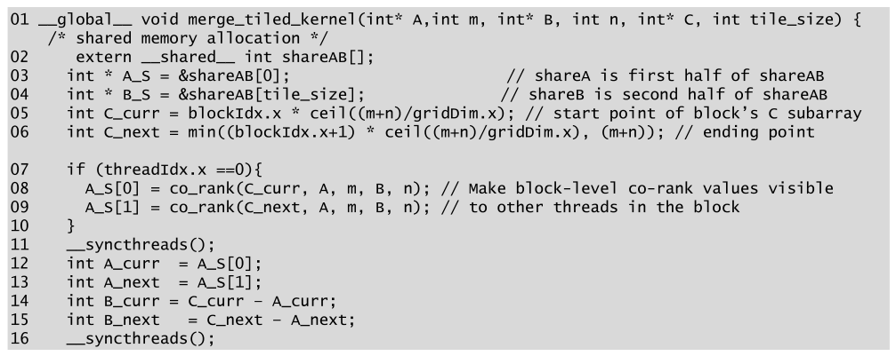

*Figure 13.11 — Part 1: block 수준 출력·입력 부분배열의 식별. (책 p.316)*

```cuda
01  __global__ void merge_tiled_kernel(int* A, int m, int* B, int n, int* C, int tile_size) {
    /* shared memory allocation */
02      extern __shared__ int shareAB[];
03      int * A_S = &shareAB[0];                        // shareA is first half of shareAB
04      int * B_S = &shareAB[tile_size];                // shareB is second half of shareAB
05      int C_curr = blockIdx.x * ceil((m+n)/gridDim.x);          // start point of block's C subarray
06      int C_next = min((blockIdx.x+1) * ceil((m+n)/gridDim.x), (m+n));   // ending point

07      if (threadIdx.x ==0){
08        A_S[0] = co_rank(C_curr, A, m, B, n);   // Make block-level co-rank values visible
09        A_S[1] = co_rank(C_next, A, m, B, n);   // to other threads in the block
10      }
11      __syncthreads();
12      int A_curr  = A_S[0];
13      int A_next  = A_S[1];
14      int B_curr  = C_curr - A_curr;
15      int B_next  = C_next - A_next;
16      __syncthreads();
```

> **Figure 13.9 와 비교하면 놀라울 만큼 닮았다.** 이 부분은 본질적으로
> thread 수준 기본 merge kernel 의 설정 코드를 **block 수준으로 옮긴 것**이다 (책 p.316).

| Figure 13.9 (thread 수준) | Figure 13.11 (block 수준) |
|---|---|
| `k_curr = tid*elementsPerThread` | `C_curr = blockIdx.x * ceil((m+n)/gridDim.x)` |
| `i_curr = co_rank(k_curr, ...)` | `A_curr = co_rank(C_curr, ...)` |
| `j_curr = k_curr - i_curr` | `B_curr = C_curr - A_curr` |

#### 왜 thread 0 만 co-rank 를 부르는가

> **block 안에서 오직 thread 하나만** 현재 block 의 시작 출력 index 와 다음 block 의 시작
> 출력 index 에 대한 co-rank 값을 계산하면 된다.
> 그 값들을 **shared memory 에 넣어 block 의 모든 thread 에게 보이게** 한다.
> thread 하나만 co-rank 함수를 부르게 하면 **co-rank 함수에 의한 global memory 접근 수가
> 줄어** global memory 접근 효율이 개선된다 (책 p.316).

**13.5절의 문제 ②가 여기서 해결된다.** block 당 128 thread 라면
$128 \times 2 = 256$ 번의 binary search 가 **2번**으로 줄어든다.

#### 왜 barrier 가 두 개인가

> **barrier synchronization** 으로 모든 thread 가 block 수준 co-rank 값이 shared memory 의
> `A_S[0]`·`A_S[1]` 위치에 준비될 때까지 기다리게 한다 (책 p.316).

11번 줄의 barrier 는 그것이다. **그런데 16번 줄에도 barrier 가 있다.** 왜인가?

> `A_S[0]`·`A_S[1]` 은 **곧 tile 데이터로 덮어써질 자리**다 (Figure 13.12 의 28번 줄이
> `A_S[i + threadIdx.x] = ...` 로 쓴다).
> 16번 줄의 barrier 가 없으면 **어떤 thread 가 12·13번 줄에서 값을 읽기 전에
> 다른 thread 가 그 자리에 tile 원소를 써 버릴 수 있다.**
>
> 즉 11번 줄은 **write → read** 를, 16번 줄은 **read → write** 를 지킨다.
> 11.2절의 Kogge-Stone kernel 이 barrier 두 개를 쓴 것과 **정확히 같은 구도**다.
> 그때는 `buffer_s` 하나를 읽고 쓰는 것이었고, 여기서는 `A_S` 를 co-rank 전달용으로
> 잠시 빌려 썼다가 tile 로 되돌리는 것이다.

> **왜 굳이 `A_S` 를 빌려 쓰는가?** 별도의 `__shared__ int corank_s[2];` 를 두면
> barrier 하나로 끝난다. shared memory 를 2워드 아끼려고 barrier 하나와 미묘함을 산 셈이라,
> **가독성 면에서는 별도 변수 쪽이 낫다.** 다만 `extern __shared__` 로 동적 할당을 쓰고 있어
> 정적 변수를 섞기 싫었던 것으로 보인다.

### 3. 코드 — Part 2: tile 적재

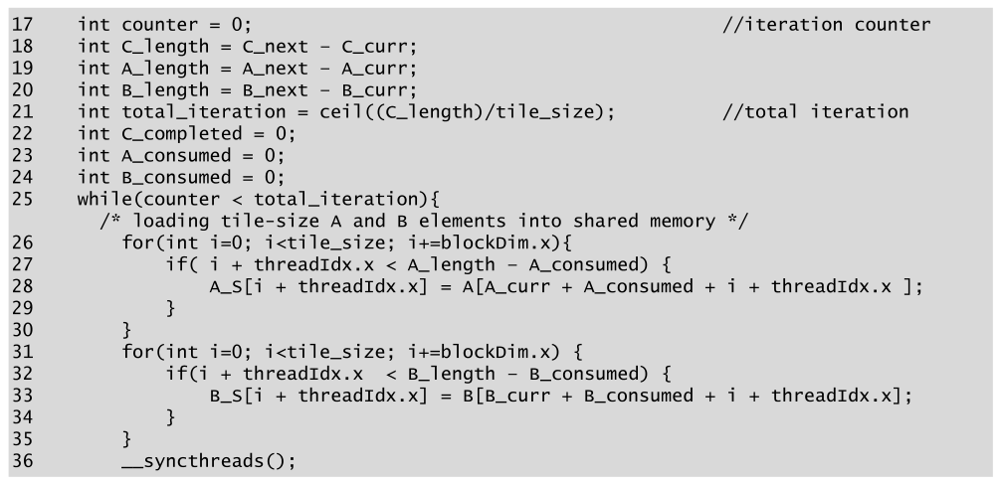

*Figure 13.12 — Part 2: $A$·$B$ 원소를 shared memory 로 적재한다. (책 p.317)*

```cuda
17      int counter = 0;                                    //iteration counter
18      int C_length = C_next - C_curr;
19      int A_length = A_next - A_curr;
20      int B_length = B_next - B_curr;
21      int total_iteration = ceil((C_length)/tile_size);   //total iteration
22      int C_completed = 0;
23      int A_consumed = 0;
24      int B_consumed = 0;
25      while(counter < total_iteration){
        /* loading tile-size A and B elements into shared memory */
26          for(int i=0; i<tile_size; i+=blockDim.x){
27              if( i + threadIdx.x < A_length - A_consumed) {
28                  A_S[i + threadIdx.x] = A[A_curr + A_consumed + i + threadIdx.x ];
29              }
30          }
31          for(int i=0; i<tile_size; i+=blockDim.x) {
32              if(i + threadIdx.x  < B_length - B_consumed) {
33                  B_S[i + threadIdx.x] = B[B_curr + B_consumed + i + threadIdx.x];
34              }
35          }
36          __syncthreads();
```

#### 러닝 예제로 크기 감을 잡는다

> `tile_size` 인자는 shared memory 에 수용할 $A$ 원소와 $B$ 원소의 개수를 지정한다.
> 예컨대 `tile_size` 가 1024 면 $A$ 배열 원소 1024개와 $B$ 배열 원소 1024개를 수용한다는 뜻이고,
> 각 block 이 **$(1024 + 1024) \cdot 4 = 8{,}192$ 바이트**의 shared memory 를 쓴다 (책 p.317).

> $A$ 33,000개($m$)와 $B$ 31,000개($n$)를 merge 한다고 하자. 출력 $C$ 는 64,000개다.
> **block 16개**(`gridDim.x = 16`), block 당 **thread 128개**(`blockDim.x = 128`)를 쓴다고 하면
> 각 block 은 $64{,}000/16 = \mathbf{4000}$ 개의 출력을 만든다 (책 p.317).

| 값 | 계산 | 결과 |
|---|---|---|
| block 당 출력 | $64000/16$ | **4000** |
| `total_iteration` | $\lceil 4000/1024 \rceil$ | **4** |
| for-loop 반복 ($A$·$B$ 각각) | $1024/128$ | **8** |
| 반복당 thread 하나가 만드는 출력 | $1024/128$ | **8** |
| shared memory | $2 \times 1024 \times 4$ B | **8192 B** |

> 128 thread 가 for-loop 반복마다 128개를 집합적으로 적재할 수 있으므로,
> Figure 13.12 의 첫 for-loop 은 **8번 반복**해 1024개의 $A$ 원소 적재를 마친다.
> 둘째 for-loop 도 8번 반복해 1024개의 $B$ 원소를 적재한다.
> **thread 가 `threadIdx.x` 로 적재할 원소를 고르므로 연속 thread 가 연속 원소를 적재한다 —
> 메모리 접근이 coalesced 다** (책 p.317).

**13.5절의 문제 ①이 적재에서 해결된다.** `A_S[i + threadIdx.x] = A[... + i + threadIdx.x]`
에서 연속 `threadIdx.x` 가 연속 주소를 읽는다.

#### 인덱스 식은 어디서 왔나

> while-loop 의 각 반복에서 $A$·$B$ 배열의 현재 tile 을 적재할 시작점은,
> **이전 반복들에서 block 의 모든 thread 가 소비한 $A$·$B$ 원소의 총수**에 달려 있다.
> 이전 반복들이 소비한 $A$ 원소의 총수를 변수 `A_consumed` 에 추적한다고 하자.
> while-loop 진입 전에 `A_consumed` 를 0 으로 초기화한다.
> 반복 0 에서는 `A_consumed` 가 0 이므로 모든 block 이 `A[A_curr]` 부터 tile 을 시작한다.
> 이후의 각 반복에서 $A$ 원소 tile 은 **`A[A_curr+A_consumed]`** 에서 시작한다 (책 p.318).

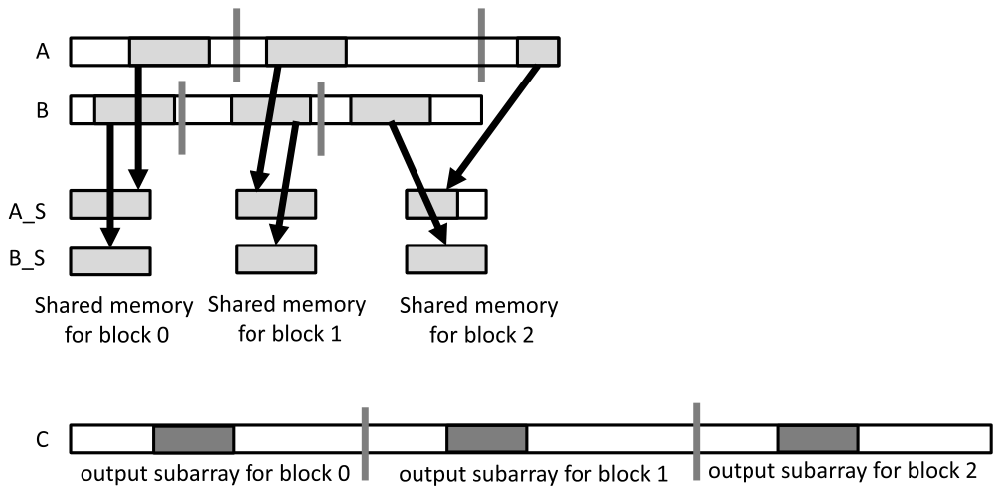

*Figure 13.14 — 러닝 예제에서 while-loop 의 iteration 1. (책 p.319)*

**세 개의 좌표를 구분해야 한다.** 이것이 이 절에서 헷갈리기 가장 쉬운 지점이다.

| 좌표 | 뜻 | 예 |
|---|---|---|
| `A_curr` | **이 block 이 맡은 $A$ 구간의 시작** (전역, 반복 내내 고정) | block 1 의 $A$ 시작 |
| `A_consumed` | **이 block 이 지금까지 소비한 $A$ 원소 수** (반복마다 누적) | 반복 0 에서 476개 썼다면 476 |
| `A_curr + A_consumed` | **이번 반복에 적재할 tile 의 시작** | 다음에 읽을 곳 |

#### 마지막 반복의 경계 처리

> 마지막 반복들에서는 일부 thread block 에 대해 shared memory 의 입력 tile 을 채울
> $A$ 나 $B$ 원소가 충분하지 않을 수 있다. …
> **if 문**으로 thread 가 block 의 입력 부분배열 밖의 원소를 적재하려는 시도를 막아야 한다.
> Figure 13.12 의 첫 if 문(27번 줄)이 thread 가 적재하려는 `A_S` 원소의 index 가
> **`A_length - A_consumed`(남은 $A$ 원소 수)를 넘는지** 확인해 그런 시도를 잡아낸다 (책 p.320).

**`A_length - A_consumed` 가 "이 block 에 아직 남은 $A$ 원소 수"** 다.

### 4. 코드 — Part 3: thread 별 merge

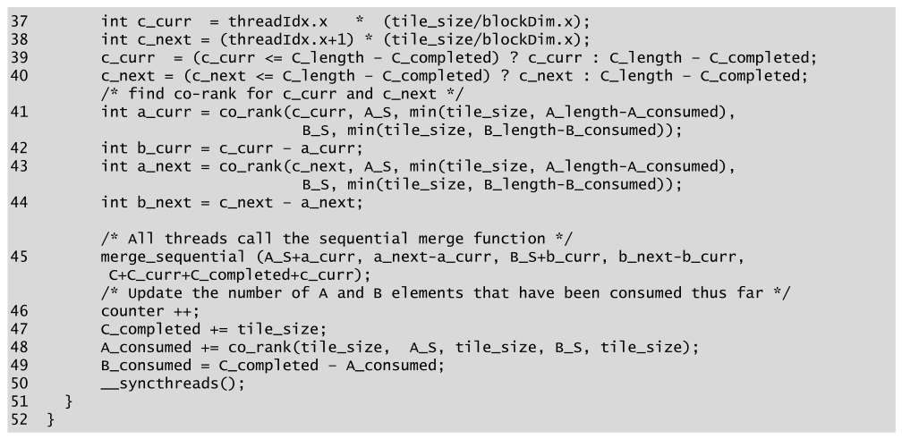

*Figure 13.13 — Part 3: 모든 thread 가 각자의 부분배열을 병렬로 merge 한다. (책 p.318)*

```cuda
37          int c_curr  = threadIdx.x     * (tile_size/blockDim.x);
38          int c_next = (threadIdx.x+1) * (tile_size/blockDim.x);
39          c_curr  = (c_curr <= C_length - C_completed) ? c_curr : C_length - C_completed;
40          c_next = (c_next <= C_length - C_completed) ? c_next : C_length - C_completed;
            /* find co-rank for c_curr and c_next */
41          int a_curr = co_rank(c_curr, A_S, min(tile_size, A_length-A_consumed),
                                        B_S, min(tile_size, B_length-B_consumed));
42          int b_curr = c_curr - a_curr;
43          int a_next = co_rank(c_next, A_S, min(tile_size, A_length-A_consumed),
                                        B_S, min(tile_size, B_length-B_consumed));
44          int b_next = c_next - a_next;

            /* All threads call the sequential merge function */
45          merge_sequential(A_S+a_curr, a_next-a_curr, B_S+b_curr, b_next-b_curr,
                             C+C_curr+C_completed+c_curr);
            /* Update the number of A and B elements that have been consumed thus far */
46          counter ++;
47          C_completed += tile_size;
48          A_consumed += co_rank(tile_size, A_S, tile_size, B_S, tile_size);
49          B_consumed = C_completed - A_consumed;
50          __syncthreads();
51      }
52  }
```

| 줄 | 하는 일 | 짚을 점 |
|---|---|---|
| **37~38** | thread 의 **tile 내부** 출력 구간 | `tile_size/blockDim.x` = thread 당 8개 |
| **39~40** | 마지막 반복에서 **남은 만큼으로 자른다** | 넘으면 `C_length - C_completed` 로 clamp |
| **41~44** | **shared memory 위에서** co-rank 두 번 | **여기가 13.5절 문제 ②의 해결** — global 이 아니라 `A_S`/`B_S` 를 본다 |
| **45** | 순차 merge | 출력 주소가 `C + C_curr + C_completed + c_curr` — **세 좌표의 합** |
| **48** | 이번 반복에 소비된 $A$ 개수 | **co-rank 를 한 번 더** — 아래 참조 |
| **49** | $B$ 소비량은 뺄셈 | 불변식 재사용 |
| **50** | barrier | 다음 반복이 `A_S` 를 덮어쓰기 전에 모두가 읽기를 끝내도록 |

#### 48번 줄이 영리하다

> 마지막 반복을 제외한 모든 반복에서, thread block 이 소비한 추가 $A$ 원소 수는
> `co_rank(tile_size, A_S, tile_size, B_S, tile_size)` 의 반환값이다 (책 p.320).

**"tile 안에서 출력 `tile_size` 개를 만들려면 $A$ 를 몇 개 써야 하는가"** 를 묻는 것이다.
co-rank 함수를 **소비량 계산기로 재사용**한 셈이다.

> **다만 이 줄은 block 의 모든 thread 가 중복 실행한다.** 41·43번 줄과 달리
> thread 마다 다른 값을 구하는 것이 아니라 **전원이 같은 값을 구한다.**
> shared memory 위의 탐색이라 비싸지는 않지만, thread 하나만 계산해 shared 변수로
> 나눠 주는 편이 나을 수 있다 (그러면 barrier 가 하나 더 필요하다).
> **thread 당 co-rank 호출이 반복마다 3번**(41·43·48)이라는 점은 기억해 두자 —
> 13.8절 coarsening 의 동기다.

> 마지막 반복 끝에서는 소비량 계산이 정확하지 않을 수 있다. …
> 그러나 while-loop 가 더 반복하지 않으므로 `A_consumed`·`B_consumed`·`C_completed` 값은
> 사용되지 않아 **틀린 결과가 해를 끼치지 않는다.**
> 다만 어떤 이유로든 while-loop 를 빠져나온 뒤 이 값들이 필요하다면 세 변수는 올바른 값을
> 갖지 못한다는 점을 기억해야 한다. 그때는 **`A_length`·`B_length`·`C_length`** 를 써야 한다
> (책 p.320).

### 5. 무엇을 얻고 무엇을 잃었나

> tiled kernel 은 co-rank 함수에 의한 global memory 접근을 **상당히 줄이고**
> global memory 접근을 **coalesced 하게** 만든다.
> 그러나 이대로는 **중대한 결함**이 있다.
> **매 반복에서 shared memory 로 적재한 데이터의 절반만 사용**한다.
> shared memory 의 미사용 데이터는 다음 반복에서 그냥 다시 적재된다.
> 이것이 **memory bandwidth 의 절반을 낭비**한다 (책 p.320).

**러닝 예제로 세어 보자.** block 하나가 출력 4000개를 만들기 위해:

| | global 에서 읽는 원소 | 출력당 |
|---|---|---|
| **이론 최소** | 4000 (각 입력을 한 번씩) | **1.00** |
| **Figure 13.12 tiled** | $4 \times 2 \times 1024 = 8192$ | **2.05** |
| **Figure 13.16 circular** | $2 \times 1024 + 3 \times 1024 = 5120$ | **1.28** |

**tiled 는 이론 최소의 $2.05\times$** 를 읽는다. 반복이 많아질수록 정확히 $2\times$ 로 수렴한다
(매 반복 $2 \times$`tile_size` 를 읽고 `tile_size` 개를 만드니까).

> 다음 절에서 shared memory 의 데이터 tile 을 관리하는 **circular buffer 방식**을 제시한다.
> 이 방식은 kernel 이 global memory 에서 적재한 $A$·$B$ 원소를 **전부 활용**하게 해 준다.
> 보게 되겠지만 이 효율 향상에는 **코드 복잡도의 상당한 증가**가 따라온다 (책 p.320).

### 6. 예제/실습

#### 연습문제

> 러닝 예제($m$=33,000, $n$=31,000, block 16개, thread 128개, `tile_size`=1024)에서
> **(1)** 어떤 block 이 반복 0 에서 $A$ 를 476개 소비했다면 $B$ 는 몇 개인가?
> **(2)** 반복 1 의 tile 은 global memory 의 어느 위치에서 시작하는가?
> **(3)** `tile_size` 를 2048 로 늘리면 무엇이 좋아지고 무엇이 나빠지는가?

**(1)** 반복 하나가 만드는 출력은 `tile_size` = 1024 개이므로
$B$ 소비량 $= 1024 - 476 = \mathbf{548}$ 개다 (책 p.318 의 예와 같다).
49번 줄의 `B_consumed = C_completed - A_consumed` 가 이 계산이다.

**(2)** `A[A_curr + 476]` 과 `B[B_curr + 548]` 이다.
**`A_curr` 는 block 마다 다르고 `A_consumed` 는 반복마다 누적**된다.

**(3)** 좋아지는 것과 나빠지는 것이 갈린다.

| | 효과 |
|---|---|
| **좋아짐** | `total_iteration` 이 $\lceil 4000/2048 \rceil = 2$ 로 줄어 **적재 낭비의 절대량이 준다** ($4\times2048 = 8192$ → $2\times4096 = 8192$ … **같다**) |
| **좋아짐** | co-rank 호출 횟수가 반복 수에 비례하므로 **thread 당 $3\times4 = 12$ 회에서 $3\times2 = 6$ 회로** 절반 |
| **나빠짐** | shared memory 가 **8 KB → 16 KB/block** 으로 늘어 occupancy 가 떨어진다 (5.6절) |
| **나빠짐** | 마지막 반복의 낭비가 커진다 — $4000 = 2048 + 1952$ 라 둘째 반복은 tile 을 절반만 쓴다 |

> **적재 총량이 그대로라는 점이 핵심이다.** tiled kernel 의 $2\times$ 낭비는
> **`tile_size` 와 무관한 구조적 문제**이고, 그래서 13.7절의 circular buffer 가 필요하다.
> `tile_size` 를 키워 해결되는 것은 co-rank 호출 횟수뿐이다.

---

## 13.7 A circular-buffer merge kernel (책 p.321)

### 1. 개념적 이해

> `merge_circular_buffer_kernel` 의 설계는 앞 절의 `merge_tiled_kernel` 과 대체로 같다.
> **주된 차이는 shared memory 의 $A$·$B$ 원소 관리**에 있다 —
> global memory 에서 적재한 모든 원소를 완전히 활용할 수 있게 하는 것이다.
> `merge_tiled_kernel` 의 비효율은, **다음 tile 의 원소 일부가 이미 shared memory 에 있는데도
> tile 전체를 global memory 에서 다시 적재해 이전 반복의 남은 원소를 덮어쓴다**는 데서 온다
> (책 p.321).

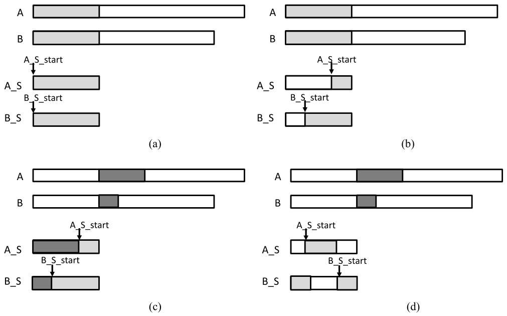

*Figure 13.15 — shared memory tile 을 관리하기 위한 circular buffer 방식. (책 p.321)*

> **두 개의 추가 변수 `A_S_start` 와 `B_S_start`** 를 두어, while-loop 의 각 반복이
> `A_S[0]`·`B_S[0]` 안의 **동적으로 정해지는 위치에서 tile 을 시작**할 수 있게 한다.
> 이 추적 덕에 각 반복이 **이전 반복에서 남은 $A$·$B$ 원소로 tile 을 시작**할 수 있다.
> while-loop 에 처음 들어갈 때는 이전 반복이 없으므로 두 변수를 0 으로 초기화한다 (책 p.321).

**네 그림을 순서대로 읽으면 방식이 그대로 보인다.**

| 그림 | 무엇 |
|---|---|
| **(a)** | 반복 0 — `A_S_start`·`B_S_start` 가 0 이라 tile 이 `A_S[0]`·`B_S[0]` 에서 시작 |
| **(b)** | 반복 0 끝 — 소비된 부분(흰색)만큼 **`A_S_start`·`B_S_start` 를 전진** |
| **(c)** | 반복 1 시작 — **소비된 만큼만** global 에서 읽어 와 빈자리를 채운다 (**wrap around**) |
| **(d)** | 반복 1 끝 — 다시 전진하고, `A_S` 에서는 **시작점이 배열 앞으로 되감긴다** |

> 버퍼 크기가 `tile_size` 로 제한되므로 어느 시점엔가 `A_S`·`B_S` 배열의 **앞부분 자리를
> 재사용**해야 한다. 새 `A_S_start`·`B_S_start` 값이 `tile_size` 를 넘는지 확인하고,
> 넘으면 `tile_size` 를 뺀다 (책 p.322).

```cuda
A_S_start = (A_S_start + A_S_consumed)%tile_size;
B_S_start = (B_S_start + B_S_consumed)%tile_size;
```

**`%` 하나가 circular buffer 의 전부다.** 나머지 복잡도는 전부 "이 `%` 를
어디에 넣어야 하는가"의 문제다.

> **왜 이것이 낭비를 없애는가.** tiled kernel 은 매 반복 `tile_size` 개씩 두 배열에서 읽어
> `tile_size` 개의 출력을 만들었다 — 읽은 것의 절반만 쓴다.
> circular buffer 는 **소비한 만큼만 다시 채우므로**, 반복마다
> `A_S_consumed + B_S_consumed = tile_size` 개만 읽는다.
> **출력 하나당 입력 하나 — 이론 최소값**이다.

### 2. 코드 — Part 2: 되감기는 적재

> `merge_circular_buffer_kernel` 의 Part 1 은 Figure 13.11 의 것과 **동일**하므로 싣지 않는다
> (책 p.322).

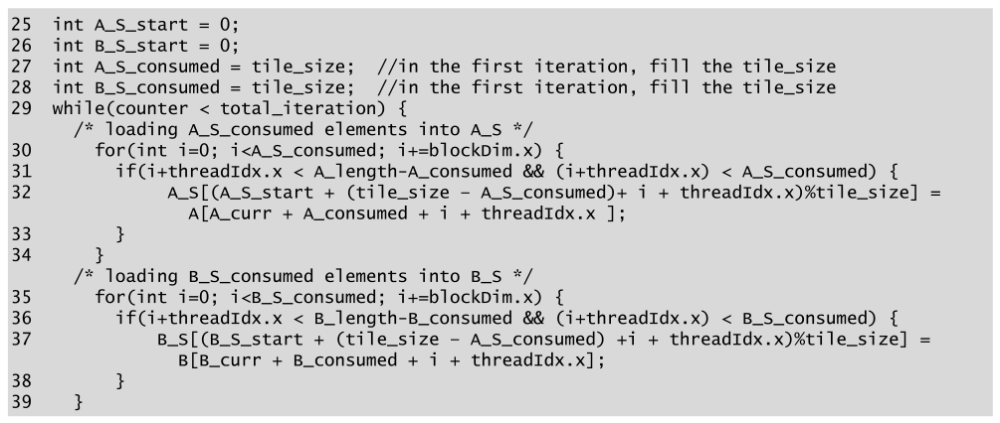

*Figure 13.16 — circular-buffer merge kernel 의 Part 2. (책 p.323)*

```cuda
25  int A_S_start = 0;
26  int B_S_start = 0;
27  int A_S_consumed = tile_size;  //in the first iteration, fill the tile_size
28  int B_S_consumed = tile_size;  //in the first iteration, fill the tile_size
29  while(counter < total_iteration) {
      /* loading A_S_consumed elements into A_S */
30      for(int i=0; i<A_S_consumed; i+=blockDim.x) {
31          if(i+threadIdx.x < A_length-A_consumed && (i+threadIdx.x) < A_S_consumed) {
32              A_S[(A_S_start + (tile_size - A_S_consumed)+ i + threadIdx.x)%tile_size] =
                    A[A_curr + A_consumed + i + threadIdx.x ];
33          }
34      }
      /* loading B_S_consumed elements into B_S */
35      for(int i=0; i<B_S_consumed; i+=blockDim.x) {
36          if(i+threadIdx.x < B_length-B_consumed && (i+threadIdx.x) < B_S_consumed) {
37              B_S[(B_S_start + (tile_size - B_S_consumed) +i + threadIdx.x)%tile_size] =
                    B[B_curr + B_consumed + i + threadIdx.x];
38          }
39      }
```

> **원문 코드 버그** (Figure 13.16 37번 줄, 책 p.323) ⚠️
>
> `B_S[(B_S_start + (tile_size - **A_S_consumed**) + i + threadIdx.x)%tile_size]` 로,
> $B$ 를 적재하는데 **`A_S_consumed`** 를 쓰고 있다. **`B_S_consumed`** 여야 한다.
> 위 코드는 바로잡은 것이다.
>
> 책 본문이 "$B$ tile 적재 for-loop 에도 같은 분석이 적용되며 연습으로 남긴다"(책 p.323)고
> 하는데, **그 "같은 분석"을 그대로 적용하면 `B_S_consumed` 가 나온다.**
> 일반적으로 $A$ 와 $B$ 의 소비량은 다르므로 (13.6절 연습의 476 vs 548),
> 이 오타는 **B tile 을 엉뚱한 위치에 적재**하게 만든다.

#### 27·28번 줄의 초기화가 영리하다

`A_S_consumed`·`B_S_consumed` 를 **`tile_size` 로** 초기화한다.
그러면 반복 0 에서 `(tile_size - A_S_consumed) = 0` 이 되어
**`A_S_start` 부터 `tile_size` 개를 통째로 적재**한다 — 즉 첫 반복만 tile 을 꽉 채운다.
**"이번에 채울 양 = 지난번에 소비한 양"이라는 규칙 하나로 첫 반복까지 처리**한 것이다.

#### 적재 index 식의 유도

> 각 for-loop 은 **tile 을 다시 채우는 데 필요한 개수만**(`A_S_consumed`) 적재하도록 바뀌었다.
> $i$ 번째 for-loop 반복에서 thread block 이 적재할 $A$ 원소 구획은 global memory 위치
> **`A[A_curr+A_consumed+i]`** 에서 시작한다. $i$ 는 반복마다 `blockDim.x` 씩 증가하므로
> $i$ 번째 반복에서 thread 가 적재할 $A$ 원소는 **`A[A_curr+A_consumed+i+threadIdx.x]`** 다.
> thread 가 자기 $A$ 원소를 `A_S` 에 놓을 index 는
> **`A_S_start+(tile_size-A_S_consumed)+i+threadIdx`** 다 —
> tile 이 `A_S[A_S_start]` 에서 시작하고, 이전 while-loop 반복에서 남은 원소가
> **`(tile_size-A_S_consumed)` 개**이기 때문이다.
> **modulo(`%`)** 연산이 index 값이 `tile_size` 이상인지 확인해, 그렇다면 `tile_size` 를 빼
> 배열 앞부분으로 되감는다 (책 p.323).

식을 조각내 보면 이렇다.

$$\underbrace{\texttt{A\_S\_start}}_{\text{tile 의 시작}} + \underbrace{(\texttt{tile\_size} - \texttt{A\_S\_consumed})}_{\text{남아 있는 원소 수}} + \underbrace{i + \texttt{threadIdx.x}}_{\text{몇 번째로 채우는가}} \pmod{\texttt{tile\_size}}$$

**"시작점 + 남은 만큼 건너뛰기 + 순번"** 이다. 남은 원소 뒤에 이어 붙이는 것이므로 자연스럽다.

#### 31번 줄의 조건이 왜 두 개인가

```cuda
if(i+threadIdx.x < A_length-A_consumed && (i+threadIdx.x) < A_S_consumed)
```

| 조건 | 막는 것 |
|---|---|
| `i+threadIdx.x < A_length-A_consumed` | **global 쪽** — 이 block 에 남은 $A$ 원소를 넘어 읽는 것 |
| `(i+threadIdx.x) < A_S_consumed` | **shared 쪽** — 채워야 할 양보다 많이 써서 **아직 안 쓴 원소를 덮는** 것 |

**둘째 조건이 circular buffer 특유의 것**이다. for-loop 이 `blockDim.x` 단위로 도는데
`A_S_consumed` 가 `blockDim.x` 의 배수가 아니면 마지막 묶음에서 넘칠 수 있다.
tiled kernel 에서는 넘쳐도 어차피 덮어쓸 자리였지만, 여기서는 **살아 있는 데이터를 파괴**한다.

### 3. 단순화 모델 — 복잡도를 라이브러리 안으로

> `A_S`·`B_S` 를 circular buffer 로 쓰면 **co-rank 함수와 merge 함수의 구현에도 추가 복잡도**가
> 생긴다. 그 복잡도의 일부는 이 함수들을 부르는 thread 수준 코드에 반영될 수 있다.
> 그러나 일반적으로 **복잡함을 라이브러리 함수 안에서 효율적으로 처리해
> 사용자 코드의 복잡도 증가를 최소화하는 편이 낫다** (책 p.323).

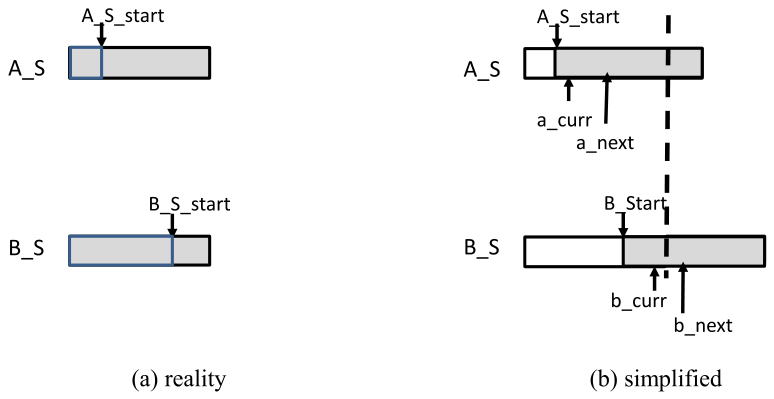

*Figure 13.17 — circular buffer 를 쓸 때 co-rank 값을 위한 단순화 모델. (책 p.324)*

> circular buffer 를 쓸 때 co-rank 값을 **버퍼의 실제 index 로 제공**할 수도 있다.
> 그러나 그러면 `merge_circular_buffer_kernel` 코드에 상당한 복잡도가 생긴다.
> 예컨대 tile 이 `A_S` 에서 되감겼기 때문에 **`a_next` 값이 `A_curr` 값보다 작을 수 있다.**
> 그러면 그 경우를 검사해 구획 길이를 **`a_next-A_curr+tile_size`** 로 계산해야 한다.
> `a_next` 가 `A_curr` 보다 큰 다른 경우에는 길이가 그냥 `a_next-A_curr` 다 (책 p.323).

> **(b) 단순화 모델**에서는 각 tile 이 `A_S_start`·`B_S_start` 에서 시작하는
> **연속된 구획인 것처럼 보인다.** …
> 단순화 모델은 모든 원소가 최대 `tile_size` 개의 **연속 구획에 있다는 착각**을 제공하며,
> 따라서 **`a_next` 는 항상 `A_curr` 이상**이고 `b_next` 는 항상 `B_curr` 이상이다.
> 이 단순화된 co-rank 값 관점을 실제 circular buffer index 로 옮기는 것은
> **`co_rank_circular` 와 `merge_sequential_circular` 함수의 구현 몫**이다 (책 p.324).

> **이것이 이 절의 진짜 교훈이다.** 성능을 위해 자료구조를 복잡하게 만들 때,
> **복잡도를 어디에 둘 것인가**가 설계 결정이 된다.
> 책의 선택은 **"호출자에게는 선형 배열로 보이게 하고, 되감기는 함수 안에서만 처리"** 다.
> 그래서 Figure 13.18 의 thread 수준 코드는 Figure 13.13 과 **함수 이름 말고 다른 것이 없다.**

**세 개의 인자가 추가된다** (책 p.324): `A_S_start`, `B_S_start`, `tile_size`.
**"버퍼의 현재 시작점은 어디이고 버퍼가 얼마나 큰가"** 를 알려 주는 것이다.

### 4. 코드 — Part 3 과 두 라이브러리 함수

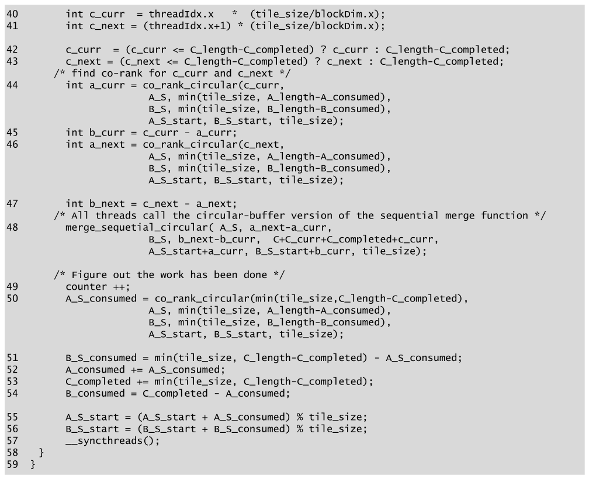

*Figure 13.18 — circular-buffer merge kernel 의 Part 3. (책 p.325)*

```cuda
40      int c_curr = threadIdx.x     * (tile_size/blockDim.x);
41      int c_next = (threadIdx.x+1) * (tile_size/blockDim.x);

42      c_curr = (c_curr <= C_length-C_completed) ? c_curr : C_length-C_completed;
43      c_next = (c_next <= C_length-C_completed) ? c_next : C_length-C_completed;
        /* find co-rank for c_curr and c_next */
44      int a_curr = co_rank_circular(c_curr,
                        A_S, min(tile_size, A_length-A_consumed),
                        B_S, min(tile_size, B_length-B_consumed),
                        A_S_start, B_S_start, tile_size);
45      int b_curr = c_curr - a_curr;
46      int a_next = co_rank_circular(c_next,
                        A_S, min(tile_size, A_length-A_consumed),
                        B_S, min(tile_size, B_length-B_consumed),
                        A_S_start, B_S_start, tile_size);
47      int b_next = c_next - a_next;
        /* All threads call the circular-buffer version of the sequential merge function */
48      merge_sequential_circular(A_S, a_next-a_curr,
                        B_S, b_next-b_curr,  C+C_curr+C_completed+c_curr,
                        A_S_start+a_curr, B_S_start+b_curr, tile_size);

        /* Figure out the work has been done */
49      counter ++;
50      A_S_consumed = co_rank_circular(min(tile_size,C_length-C_completed),
                        A_S, min(tile_size, A_length-A_consumed),
                        B_S, min(tile_size, B_length-B_consumed),
                        A_S_start, B_S_start, tile_size);
51      B_S_consumed = min(tile_size, C_length-C_completed) - A_S_consumed;
52      A_consumed += A_S_consumed;
53      C_completed += min(tile_size, C_length-C_completed);
54      B_consumed = C_completed - A_consumed;

55      A_S_start = (A_S_start + A_S_consumed) % tile_size;
56      B_S_start = (B_S_start + B_S_consumed) % tile_size;
57      __syncthreads();
58  }
59  }
```

> **원문 오타** (Figure 13.18 48번 줄, 책 p.325).
> 함수 이름이 **`merge_sequetial_circular`** 로 인쇄돼 있다 (`sequential` 의 `n` 이 빠졌다).
> Figure 13.20 의 정의는 `merge_sequential_circular` 로 올바르므로 **링크 오류**가 난다.

> Figure 13.13 과 비교하면 **바뀐 것은 함수 이름과 인자 세 개뿐**이다 (책 p.324).
> 다만 50~56번 줄은 tiled 판보다 늘었다 — `A_S_consumed`·`B_S_consumed` 를 따로 추적하고
> 두 `_start` 를 갱신해야 하기 때문이다.

**tiled 판과 나란히 놓으면 차이가 뚜렷하다.**

| | Figure 13.13 (tiled) | Figure 13.18 (circular) |
|---|---|---|
| 소비량 추적 | `A_consumed` 하나 | `A_S_consumed`·`A_consumed` **둘** |
| 소비량 계산 | `co_rank(tile_size, ...)` | `co_rank_circular(min(tile_size, 남은 것), ...)` — **마지막 반복까지 정확** |
| 버퍼 시작점 | 늘 0 | **`A_S_start`·`B_S_start` 를 `%` 로 전진** |
| 줄 수 | 16 | 20 |

> **50번 줄이 tiled 판(48번 줄)보다 정확해졌다는 점**을 눈여겨보자.
> tiled 판은 `co_rank(tile_size, ...)` 로 무조건 `tile_size` 를 물어서
> 마지막 반복에서 틀린 값이 나왔고, 책도 "쓰이지 않으니 무해하다"고 넘어갔다.
> circular 판은 **`min(tile_size, C_length-C_completed)`** 로 물으므로
> 마지막 반복에서도 값이 맞다. **여기서는 그 값이 `A_S_start` 갱신에 실제로 쓰이므로
> 정확해야만 한다.**

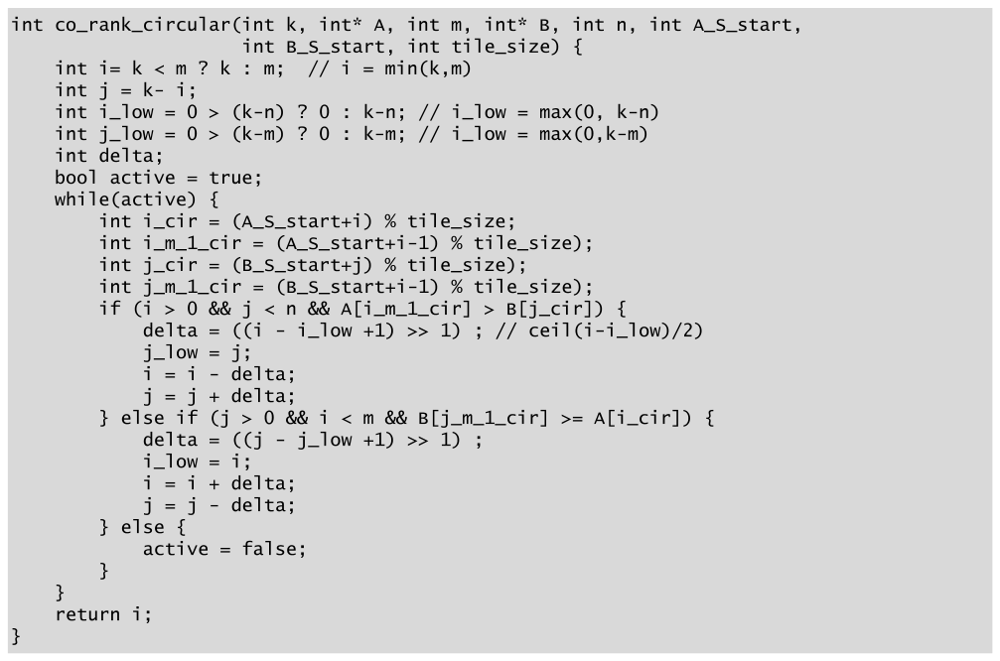

*Figure 13.19 — circular buffer 위에서 동작하는 `co_rank_circular` 함수. (책 p.326)*

```c
int co_rank_circular(int k, int* A, int m, int* B, int n, int A_S_start,
                     int B_S_start, int tile_size) {
    int i = k < m ? k : m;              // i = min(k,m)
    int j = k - i;
    int i_low = 0 > (k-n) ? 0 : k-n;    // i_low = max(0, k-n)
    int j_low = 0 > (k-m) ? 0 : k-m;    // j_low = max(0, k-m)
    int delta;
    bool active = true;
    while(active) {
        int i_cir     = (A_S_start + i)   % tile_size;
        int i_m_1_cir = (A_S_start + i-1) % tile_size;
        int j_cir     = (B_S_start + j)   % tile_size;
        int j_m_1_cir = (B_S_start + j-1) % tile_size;      // ← 책은 i-1
        if (i > 0 && j < n && A[i_m_1_cir] > B[j_cir]) {
            delta = ((i - i_low +1) >> 1) ;   // ceil(i-i_low)/2
            j_low = j;
            i = i - delta;
            j = j + delta;
        } else if (j > 0 && i < m && B[j_m_1_cir] >= A[i_cir]) {
            delta = ((j - j_low +1) >> 1) ;
            i_low = i;
            i = i + delta;
            j = j - delta;
        } else {
            active = false;
        }
    }
    return i;
}
```

> **원문 코드 버그** (Figure 13.19, 책 p.326) ⚠️ **세 가지가 겹쳐 있다.**
>
> ① **`j_m_1_cir` 을 `i-1` 로 계산한다.** 인쇄된 코드는
> `int j_m_1_cir = (B_S_start+i-1) % tile_size);` 로, **`j-1` 이어야 할 자리에 `i-1`** 이 있다.
> 이대로면 둘째 조건이 **엉뚱한 $B$ 원소를 비교**해 잘못된 co-rank 를 낸다.
> ② **닫는 괄호가 세 군데 남는다** — `i_m_1_cir`·`j_cir`·`j_m_1_cir` 세 줄이
> `... % tile_size);` 로 끝나 컴파일되지 않는다.
> ③ Figure 13.5 와 같은 주석 오타 (`j_low` 줄에 `// i_low = ...`).
>
> 위 코드는 셋을 모두 바로잡은 것이다.

> 함수는 `i`·`j`·`i_low`·`j_low` 값을 Figure 13.5 의 co-rank 함수와 **정확히 같은 방식으로**
> 다룬다. 유일한 변화는 `i`·`i-1`·`j`·`j-1` 이 더 이상 `A_S`·`B_S` 접근의 index 로
> **직접 쓰이지 않고**, `A_S_start`·`B_S_start` 에 더해질 **offset 으로** 쓰인다는 것이다.
> …
> **`i_cir-1` 로 `i-1` 을 대체할 수 없다**는 점에 유의하라.
> **최종 index 값을 먼저 만들고 나서 되감을 필요가 있는지 검사**해야 한다 (책 p.324).

> **이 경고가 왜 중요한가.** `A_S_start = 0`, `i = 0` 이면 `i_cir = 0` 이고
> `i_cir - 1 = -1` 이 되어 배열 밖을 가리킨다.
> 반면 `(A_S_start + i - 1) % tile_size` 는 $-1 \bmod \texttt{tile\_size}$ 를 계산해야 하는데,
> **C 의 `%` 는 음수에 대해 음수를 돌려주므로 이 식도 안전하지 않다.**
> 실제로는 `i > 0` 이라는 보호 조건이 있어서 `i-1 >= 0` 이므로 문제가 생기지 않지만,
> **`i_m_1_cir` 은 조건 검사보다 먼저 계산된다** — 값은 만들어지되 쓰이지 않는다.
> 이식성을 중시한다면 `(A_S_start + i + tile_size - 1) % tile_size` 로 쓰는 편이 안전하다.

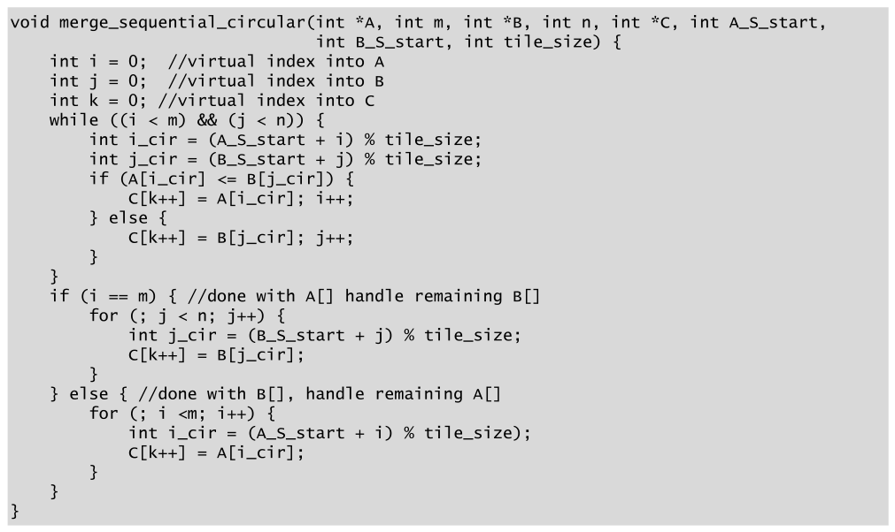

*Figure 13.20 — `merge_sequential_circular` 함수의 구현. (책 p.326)*

```c
void merge_sequential_circular(int *A, int m, int *B, int n, int *C, int A_S_start,
                               int B_S_start, int tile_size) {
    int i = 0;  //virtual index into A
    int j = 0;  //virtual index into B
    int k = 0;  //virtual index into C
    while ((i < m) && (j < n)) {
        int i_cir = (A_S_start + i) % tile_size;
        int j_cir = (B_S_start + j) % tile_size;
        if (A[i_cir] <= B[j_cir]) {
            C[k++] = A[i_cir]; i++;
        } else {
            C[k++] = B[j_cir]; j++;
        }
    }
    if (i == m) { //done with A[] handle remaining B[]
        for (; j < n; j++) {
            int j_cir = (B_S_start + j) % tile_size;
            C[k++] = B[j_cir];
        }
    } else { //done with B[], handle remaining A[]
        for (; i <m; i++) {
            int i_cir = (A_S_start + i) % tile_size;
            C[k++] = A[i_cir];
        }
    }
}
```

> **원문 코드 버그** (Figure 13.20, 책 p.326).
> 마지막 for-loop 의 `int i_cir = (A_S_start + i) % tile_size);` 에 **닫는 괄호가 하나 남는다.**
> 컴파일되지 않는다. 위 코드는 바로잡은 것이다.

> `co_rank_circular` 와 마찬가지로 코드의 논리는 원래 merge 함수와 **본질적으로 그대로**다.
> 유일한 변화는 $A$·$B$ 원소에 접근할 때 `i` 와 `j` 를 쓰는 방식이다.
> `i` 나 `j` 로 원소에 접근하는 **네 군데 모두**에서 `i_cir`·`j_cir` 를 만들고
> 되감을 필요가 있는지 검사해야 한다 (책 p.325).

**`i`·`j`·`k` 가 "virtual index" 라는 주석이 이 함수의 요약이다.**
논리는 선형 배열 위에서 돌고, **접근 직전에만 물리 index 로 번역**한다.

### 5. 대가 — register 와 occupancy

> tiling 과 circular buffer 를 쓰면 복잡도가 꽤 늘어난다. 특히 각 thread 가 버퍼의 시작점과
> 남은 원소 수를 추적하는 데 **register 를 꽤 더** 쓴다.
> 이 추가 사용은 kernel 실행 시 각 SM 에 배정될 수 있는 thread block 수, 즉 **occupancy 를
> 떨어뜨릴 수 있다.**
> 그러나 **merge 연산은 memory bandwidth bound** 이므로 연산 자원과 register 자원은
> 덜 쓰이고 있을 가능성이 높다. 따라서 **memory bandwidth 를 아끼려고 register 사용과
> 주소 계산을 늘리는 것은 합리적인 맞바꿈**이다 (책 p.326~327).

> **5.6절과 6.9절의 논리가 여기서 다시 쓰인다.**
> "무엇이 병목인가"를 먼저 정하고, **병목이 아닌 자원을 써서 병목인 자원을 아낀다.**
> merge 는 arithmetic intensity 가 극도로 낮다 — 원소 하나당 비교 한 번이 전부다.
> 그러니 register 를 몇 개 더 쓰고 `%` 를 몇 번 더 하는 것은 거의 공짜다.

### 6. 예제/실습

#### 연습문제

> `tile_size` = 1024, `A_S_start` = 700 이고 이번 반복에서 `A_S_consumed` = 500 이었다.
> **(1)** 다음 반복의 `A_S_start` 는?
> **(2)** 다음 반복에서 적재할 500개는 `A_S` 의 어느 index 들에 놓이는가?
> **(3)** 그중 몇 개가 되감기는가?

**(1)** $(700 + 500) \bmod 1024 = 1200 \bmod 1024 = \mathbf{176}$.

**(2)** 적재 index 식은 $(\texttt{A\_S\_start} + (\texttt{tile\_size} - \texttt{A\_S\_consumed}) + t) \bmod \texttt{tile\_size}$ 이고,
여기서 `A_S_start` 는 **갱신 전 값 700** 을 쓴다 (55번 줄의 갱신은 반복 끝에 있다).

$$(700 + (1024-500) + t) \bmod 1024 = (1224 + t) \bmod 1024 = (200 + t) \bmod 1024, \quad t = 0..499$$

**index 200 부터 699 까지** 다.

**(3)** $200 + 499 = 699 < 1024$ 이므로 **되감기는 것은 없다.**

> **직관으로 확인하자.** 갱신 후 tile 은 `A_S_start`=176 에서 시작해 1024개가 이어지므로
> 176~1023 과 0~175 를 덮는다. 남아 있던 524개는 176~699 에 있고,
> 새로 채운 500개는 700~1023 과 0~175 에 있어야 할 것 같은데?
>
> **아니다 — 순서를 헷갈리면 안 된다.** 적재는 **갱신 전** 좌표계에서 일어난다.
> 갱신 전 tile 은 700 에서 시작하고, 남은 원소 524개는 700~1023 과 0~199 에 있다.
> 그 **뒤에 이어서** 200~699 를 채우는 것이다. 그러고 나서 시작점을 176 으로 옮기면
> 176~1023, 0~175 가 유효한 1024개가 된다. ✓

---

## 13.8 Thread coarsening for merge (책 p.327)

### 1. 개념적 이해

> merge 를 많은 thread 로 병렬화하는 오버헤드는 주로 **각 thread 가 자기 출력 index 의
> co-rank 를 알아내려고 자기만의 binary search 를 수행해야 한다**는 사실이다.
> 수행되는 binary search 연산 수는 **launch 하는 thread 수를 줄여** 줄일 수 있고,
> 그것은 **thread 당 출력 원소를 더 많이 배정**해 할 수 있다.
> 이 장에서 제시한 모든 kernel 은 thread 당 여러 원소를 처리하도록 쓰였으므로
> **이미 thread coarsening 이 적용돼 있다** (책 p.327).

> 완전히 coarsening 되지 않은 kernel 에서는 각 thread 가 **출력 원소 하나**를 담당할 것이다.
> 그러나 그러면 **모든 원소마다 binary search 를 수행**해야 해서 비싸다.
> 따라서 coarsening 은 **binary search 비용을 상당한 수의 원소에 걸쳐 분할상환하는 데
> 필수적**이다 (책 p.327).

**이 장의 coarsening 은 다른 장과 성격이 다르다.**

| 장 | coarsening 이 줄이는 것 | 선택인가 |
|---|---|---|
| 6·8·9장 | 중복 적재, 동기화 | **선택** — 안 해도 동작한다 |
| 11장 | scan 의 work($O(N\log N) \to O(N)$) | **선택** — 안 해도 동작한다 |
| **13장** | **binary search 횟수** | **사실상 필수** — 안 하면 탐색이 merge 보다 비싸진다 |

### 2. 수식/유도 — 왜 필수인가

#### 전체 유도 과정 (먼저 한 번에)

$$W_{\text{merge}} = O(m+n) \tag{1}$$

$$W_{\text{search}} = 2\,T \log_2 N, \qquad T = \frac{m+n}{c} \tag{2}$$

$$\frac{W_{\text{search}}}{W_{\text{merge}}} = \frac{2\log_2 N}{c} \tag{3}$$

$$c \ \gg\ 2\log_2 N \quad \Longrightarrow \quad \text{탐색 비용이 묻힌다} \tag{4}$$

#### 단계별 설명

**(1)** merge 자체의 work 는 13.2절에서 본 $O(m+n)$ 이다 — 원소마다 비교 한 번.

**(2)** thread 하나가 co-rank 를 **두 번** 부르고(시작·끝), 각 호출이 $O(\log_2 N)$ 이다.
thread 수 $T$ 는 **coarsening factor $c$**(thread 당 출력 원소 수)로 정해진다.

**(3)** 둘의 비를 보면 $m+n$ 이 약분되고 **$c$ 와 $\log_2 N$ 만 남는다.**

**(4)** $c = 1$ (coarsening 없음)이면 비가 $2\log_2 N$ 이다.
$N = 10^6$ 이면 $2 \times 20 = 40$ — **탐색이 merge 자체보다 $40\times$ 비싸다.** ∎

#### 숫자로

$m+n = 2 \times 10^6$, $N = 10^6$ ($\log_2 N \approx 20$) 으로 계산한다.

| $c$ (thread 당 원소) | thread 수 | 탐색 연산 | merge 연산 | **비율** |
|---|---|---|---|---|
| **1** | 2,000,000 | 80,000,000 | 2,000,000 | **40.0** |
| **4** | 500,000 | 20,000,000 | 2,000,000 | **10.0** |
| **8** | 250,000 | 10,000,000 | 2,000,000 | **5.0** |
| **32** | 62,500 | 2,500,000 | 2,000,000 | **1.25** |
| **128** | 15,625 | 625,000 | 2,000,000 | **0.31** |

**$c = 8$ 에서도 탐색이 merge 의 $5\times$** 다. 이 장의 kernel 들이 thread 당 8개
(`tile_size/blockDim.x` = 1024/128)를 처리하는 것은 **최소한의 coarsening** 인 셈이다.

> **그럼에도 $c$ 를 무한정 키울 수 없다.** 세 가지가 막는다.
> **① 병렬성** — thread 가 줄면 latency 를 숨길 warp 이 모자란다 (4.6절).
> **② 부하 불균형** — thread 하나가 맡는 구간이 길어지면 마지막에 혼자 남을 위험이 커진다.
> **③ shared memory** — tiled kernel 에서 $c$ 는 `tile_size/blockDim.x` 이므로
> $c$ 를 키우려면 `tile_size` 를 키우거나 block 을 줄여야 한다.
>
> 그리고 **tiled kernel 에서는 탐색이 shared memory 위에서 일어난다**는 점이 크다.
> 위 표의 "탐색 연산"이 global 이 아니라 shared 접근이면 latency 가 $100\times$ 짧다.
> **13.6절의 tiling 이 사실상 coarsening 만큼이나 탐색 비용을 낮춘 것이다.**

### 3. 예제/실습

#### 연습문제

> 13.6절 러닝 예제(block 16개 × thread 128개, `tile_size`=1024, block 당 출력 4000)에서
> **(1)** thread 하나가 co-rank 를 총 몇 번 부르는가?
> **(2)** `blockDim.x` 를 256 으로 늘리면 어떻게 되는가?

**(1)** `total_iteration` 이 4 이고, 반복마다 41·43·48번 줄에서 **3번** 부른다
(48번 줄은 전원이 중복 실행).

$$4 \times 3 = \mathbf{12\ \text{번}}$$

여기에 block 당 thread 0 이 추가로 2번(Figure 13.11) 부른다.

**(2)** thread 당 출력이 $1024/256 = 4$ 개로 **절반**이 된다 —
**coarsening factor 가 8 에서 4 로 떨어진다.**
반복 수(4)는 그대로이므로 thread 당 co-rank 호출은 여전히 12번인데,
**thread 수가 2배**이므로 **총 탐색 횟수가 2배**가 된다.

> **직관에 어긋나 보이는 결과다.** block 크기를 키웠는데 오히려 나빠졌다.
> 이유는 `tile_size` 가 고정이라 **block 이 커진 만큼 thread 당 몫이 줄었기** 때문이다.
> **coarsening factor 를 유지하려면 `blockDim.x` 와 `tile_size` 를 함께 키워야 한다** —
> 그러면 shared memory 사용량이 늘어난다. 이것이 (3)의 맞바꿈이다.

---

## 13.9 Summary (책 p.327)

책의 정리를 옮기면 (책 p.327):

- 이 장에서 **ordered merge 패턴**을 소개했다. 그 병렬화는 각 thread 가
  **자기 입력 위치 범위를 동적으로 식별**할 것을 요구한다.
- 입력 범위가 **데이터에 의존**하므로, 각 thread 의 입력 범위를 알아내기 위해
  **co-rank 함수의 빠른 탐색 구현**에 의존한다.
- 입력 범위가 데이터 의존적이라는 사실은 **memory bandwidth 를 아끼고 memory coalescing 을
  가능하게 하려고 tiling 기법을 쓸 때 추가적인 어려움**도 만든다.
  그래서 global memory 에서 적재한 데이터를 완전히 활용할 수 있도록 **circular buffer** 를 도입했다.
- **circular buffer 같은 더 복잡한 자료구조를 도입하면 그것을 쓰는 코드의 복잡도가
  크게 늘어날 수 있음**을 보였다. 그래서 index 를 다루고 사용하는 코드가 대체로 그대로
  남도록 **단순화된 버퍼 접근 모델**을 도입했다.
  버퍼의 실제 circular 성질은 **그 index 로 버퍼 원소에 접근할 때만** 드러난다.

### 세 kernel 을 한눈에

| | Figure 13.9 basic | Figure 13.11~13.13 tiled | Figure 13.16~13.20 circular |
|---|---|---|---|
| co-rank 를 어디서 | **global** | block 수준 2번만 global, 나머지 **shared** | 같음 |
| global 탐색 thread 수 | **전부** | **block 당 1개** | block 당 1개 |
| 적재 coalescing | **없음** | **있음** | 있음 |
| 출력당 global 적재 | 1.0 (재적재 없음) | **2.0** | **1.0** |
| 코드 줄 수 (대략) | **11** | 52 | **59 + 두 라이브러리 함수** |
| register 사용 | 적음 | 중간 | **많음** |

> **basic kernel 의 "출력당 1.0" 이 눈에 띈다.** 재적재가 없으니 적재량만 보면 최적이다.
> 그런데 그 접근이 **전부 uncoalesced** 라 실효 bandwidth 가 훨씬 나쁘다.
> **"몇 개를 읽는가"와 "얼마나 효율적으로 읽는가"는 다른 축**이고,
> tiled 는 전자를 2배로 늘리는 대신 후자를 개선했으며, circular 는 **둘 다** 잡았다.

---

## 13.10 Exercises (책 p.327)

### 연습문제 1

> $A = \{1, 7, 8, 9, 10\}$ 과 $B = \{7, 10, 10, 12\}$ 를 merge 해야 한다.
> **`C[8]` 의 co-rank 값은 무엇인가?**

$C = [1, 7, 7, 8, 9, 10, 10, 10, 12]$ 이고 `C[8]` = 12 다.

$k = 8$ 의 co-rank 는 **`C[0..7]` 을 만드는 데 $A$·$B$ 를 몇 개씩 썼는가**를 묻는다.
13.1절의 출처 표에서 `C[0..7]` 의 출처는
`A[0]`, `A[1]`, `B[0]`, `A[2]`, `A[3]`, `A[4]`, `B[1]`, `B[2]` 이므로

$$i = 5\ (A\ \text{전부}), \qquad j = 3$$

**co-rank 는 $(i, j) = (5, 3)$** 이고 $i + j = 8 = k$ ✓

**co-rank 함수로도 확인한다.**

초기화: $i = \min(8, 5) = 5$, $j = 3$, $i_{\text{low}} = \max(0, 8-4) = 4$, $j_{\text{low}} = \max(0, 8-5) = 3$

| iteration | $i$ | $j$ | 첫 if | 둘째 if | 판정 |
|---|---|---|---|---|---|
| **0** | 5 | 3 | `A[4]`=10 > `B[3]`=12? **거짓** | `i < m` 이 **거짓** ($5=m$) | **즉시 종료 → $i=5$** |

**한 번에 끝난다** — 13.4절 연습에서 본 대로 $k$ 가 $m+n$ 에 가까우면 범위가 좁다.

> **`C[8]` 이 `B[3]` 에서 온다는 것도 함께 확인해 두자.**
> co-rank $(5,3)$ 은 "`C[8]` **직전까지**"의 분할이고,
> `C[8]` 자체는 $A$ 가 소진됐으므로 `B[j]` = `B[3]` = 12 에서 온다.
> **rank 는 "그 자리", co-rank 는 "그 자리 앞까지"** 를 가리킨다는 구분이 여기서 드러난다.

### 연습문제 2

> **Figure 13.6 의 thread 2 에 대한 co-rank 함수 계산을 완성하라.**

13.4절의 연습에서 이미 풀었다. 다시 정리하면:

thread 2 는 `C[6]`~`C[8]` 을 만들므로 `co_rank(6, A, 5, B, 4)` 를 부른다.

**초기화**

$$i = \min(6, 5) = 5, \quad j = 6-5 = 1, \quad i_{\text{low}} = \max(0, 6-4) = 2, \quad j_{\text{low}} = \max(0, 6-5) = 1$$

**iteration 0**

| 검사 | 값 | 결과 |
|---|---|---|
| 첫 if: `i > 0 && j < n && A[i-1] > B[j]` | $5>0$ ✓, $1<4$ ✓, `A[4]`=10 > `B[1]`=10? | **거짓** (10 > 10 아님) |
| 둘째 if: `j > 0 && i < m && B[j-1] >= A[i]` | $1>0$ ✓, $5<5$? | **거짓** ($i=m$) |
| → `active = false` | | **종료** |

**반환 $i = 5$, 유도된 $j = 6-5 = 1$.**

thread 2 의 입력 구간은 `co_rank(9, ...)` = $(5, 4)$ 와 함께 정해지므로

$$A[5..4]\ (\mathbf{0}\text{개}), \qquad B[1..3]\ (\mathbf{3}\text{개})$$

호출은 `merge_sequential(&A[5], 0, &B[1], 3, &C[6])` 이고
`C[6..8]` = 10, 10, 12 = `B[1..3]` ✓

> **`A[5]` 는 배열 밖 주소인데 괜찮은가?** 괜찮다 —
> 길이가 0 이므로 `merge_sequential` 이 `A` 를 한 번도 역참조하지 않는다.
> C 에서 **배열의 "한 칸 뒤" 주소를 만드는 것 자체는 합법**이고(역참조만 불법),
> 이 관용구는 STL 의 `end()` 반복자와 같은 것이다.

### 연습문제 3

> **Figure 13.12 에서 $A$·$B$ tile 을 적재하는 for-loop 에 co-rank 함수 호출을 추가하여,
> 이번 while-loop 반복에서 소비될 $A$·$B$ 원소만 적재하도록 하라.**

13.6절이 예고한 대안 구현이다 —
**"중복 적재를 아끼는 대신 binary search 를 추가로 지불한다"** (책 p.316).

#### 발상

지금은 $A$ 에서 `tile_size`, $B$ 에서 `tile_size` 를 적재해 **최악의 경우를 대비**한다.
그런데 **이번 반복에서 정확히 몇 개씩 쓸지는 co-rank 로 미리 알 수 있다** —
`co_rank(출력 개수, A, ..., B, ...)` 를 **global memory 위에서** 부르면 된다.

```cuda
25  while(counter < total_iteration){

        /* ── 추가: 이번 반복에 실제로 필요한 개수를 미리 계산한다 ── */
        __shared__ int A_need_s;
26a     if(threadIdx.x == 0) {
26b         int c_this = min(tile_size, C_length - C_completed);   // 이번에 만들 출력 수
            // global memory 위의 남은 구간에 대해 co-rank 를 부른다
26c         A_need_s = co_rank(c_this,
                               &A[A_curr + A_consumed], A_length - A_consumed,
                               &B[B_curr + B_consumed], B_length - B_consumed);
26d     }
26e     __syncthreads();
26f     int c_this  = min(tile_size, C_length - C_completed);
26g     int A_need  = A_need_s;                 // 이번 반복에 쓸 A 원소 수
26h     int B_need  = c_this - A_need;          // 불변식으로 유도

        /* ── 적재: tile_size 가 아니라 A_need / B_need 만큼만 ── */
26      for(int i=0; i<A_need; i+=blockDim.x) {
27          if(i + threadIdx.x < A_need) {
28              A_S[i + threadIdx.x] = A[A_curr + A_consumed + i + threadIdx.x];
29          }
30      }
31      for(int i=0; i<B_need; i+=blockDim.x) {
32          if(i + threadIdx.x < B_need) {
33              B_S[i + threadIdx.x] = B[B_curr + B_consumed + i + threadIdx.x];
34          }
35      }
36      __syncthreads();
```

그리고 Part 3 에서 **소비량 계산이 필요 없어진다** — 이미 알고 있으니까.

```cuda
47      C_completed += c_this;
48      A_consumed  += A_need;      // 48번 줄의 co_rank 호출을 없앤다
49      B_consumed  += B_need;
```

또 41·43번 줄의 배열 크기 인자도 `A_need`·`B_need` 로 바뀐다
(shared memory 에 딱 그만큼만 있으므로).

#### 무엇을 얻고 무엇을 내는가

| | Figure 13.12 원본 | 연습 3 |
|---|---|---|
| 반복당 global 적재 | $2 \times$`tile_size` | **`tile_size`** (정확히 필요한 만큼) |
| 반복당 **global** co-rank | 0 | **1회** (thread 0 만) |
| 반복당 shared co-rank | thread 당 3회 | thread 당 **2회** (48번 줄 제거) |
| barrier | 반복당 2개 | **3개** |
| 출력당 적재량 | 2.0 | **1.0** |

> **circular buffer 와 같은 1.0 을 훨씬 단순한 코드로 달성한다.**
> 대가는 **반복마다 global memory 위의 binary search 한 번**이다.
> 13.5절에서 세어 본 대로 그 탐색은 uncoalesced 접근 $\sim4\log_2 N$ 번이고,
> `tile_size`(=1024)개의 적재를 아끼는 것과 비교하면 **훨씬 싸다.**
>
> **그렇다면 13.7절의 circular buffer 는 왜 필요한가?** 두 가지다.
> ① 이 방식은 **thread 0 이 계산하는 동안 나머지가 논다** — 반복마다 직렬 구간이 생긴다.
> ② co-rank 를 **global 에서** 불러야 한다 (shared 에는 아직 데이터가 없으므로).
> circular buffer 는 **이미 shared 에 있는 데이터로** 소비량을 계산하므로 그 둘을 피한다.
> 다만 실무에서는 이 연습의 방식이 **복잡도 대비 효과가 좋은 절충**이다.

### 연습문제 4

> 크기 **1,030,400** 과 **608,000** 인 두 배열의 병렬 merge 를 고려하라.
> 각 thread 가 **8개**를 merge 하고 thread block 크기는 **1024** 를 쓴다고 가정한다.
> **a.** Figure 13.9 의 기본 merge kernel 에서 **global memory 의 데이터에 binary search 를
> 수행하는 thread 는 몇 개인가?**
> **b.** Figure 13.11~13.13 의 tiled merge kernel 에서는?
> **c.** Figure 13.11~13.13 의 tiled merge kernel 에서 **shared memory 의 데이터에
> binary search 를 수행하는 thread 는 몇 개인가?**

**먼저 규모부터 잡는다.**

$$m + n = 1{,}030{,}400 + 608{,}000 = 1{,}638{,}400$$
$$\text{thread 수} = \frac{1{,}638{,}400}{8} = 204{,}800, \qquad
\text{block 수} = \frac{204{,}800}{1024} = 200$$

**a. 204,800개** — Figure 13.9 에서는 **모든 thread** 가 06·07번 줄에서
`co_rank(..., A, m, B, n)` 를 부르고, `A`·`B` 는 global memory 에 있다.

**b. 200개** — Figure 13.11 의 07~10번 줄이 `if (threadIdx.x == 0)` 으로 감싸여 있어
**block 당 thread 하나**만 global 데이터에 탐색한다. block 이 200개이므로 200개다.

$$\frac{204{,}800}{200} = \mathbf{1024\times}\ \text{감소}$$

**c. 204,800개** — Figure 13.13 의 41·43번 줄에서 **모든 thread** 가 `A_S`·`B_S`
(shared memory) 위에 탐색한다. thread 수 그대로다.

> **(b)와 (c)를 나란히 보는 것이 이 문제의 요점이다.**
> tiling 은 **탐색 횟수를 줄인 것이 아니라 탐색이 일어나는 장소를 옮긴 것**이다.
> 총 탐색 횟수는 204,800 + 200 으로 오히려 조금 늘었다.
> 그런데 **그중 99.9% 가 shared memory 로 옮겨 갔다** —
> latency 가 $100\times$ 짧고 bank 만 안 겹치면 warp 안에서 병렬로 처리된다.
>
> 여기에 **48번 줄의 소비량 계산**까지 세면 shared 탐색은 thread 당 3회다.
> 반복 수를 곱해야 총 횟수가 나오는데, `tile_size` 를 1024 라 하면
> block 당 출력 $1{,}638{,}400/200 = 8192$ 개이므로 **반복 8회**,
> shared 탐색은 총 $204{,}800 \times 3 \times 8 = 4{,}915{,}200$ 회다.

### 검산

이 장에서 손으로 계산한 값들을 코드로 다시 계산해 대조한다.

```python
# 실행: python3 verify13.py   (표준 라이브러리만 사용)

A, B = [1, 7, 8, 9, 10], [7, 10, 10, 12]
m, n = len(A), len(B)

# ── Figure 13.2 순차 merge (stable) ────────────────────────────────
def merge_seq(A, B):
    C, src, i, j = [], [], 0, 0
    while i < len(A) and j < len(B):
        if A[i] <= B[j]: C.append(A[i]); src.append(f"A[{i}]"); i += 1
        else:            C.append(B[j]); src.append(f"B[{j}]"); j += 1
    while j < len(B): C.append(B[j]); src.append(f"B[{j}]"); j += 1
    while i < len(A): C.append(A[i]); src.append(f"A[{i}]"); i += 1
    return C, src

C, src = merge_seq(A, B)
print("C =", C)
print("출처:", " ".join(f"C[{k}]<-{s}" for k, s in enumerate(src)))

# ── Figure 13.5 co_rank (책 코드 그대로) ───────────────────────────
def co_rank(k, A, m, B, n, trace=False):
    i, j = (k if k < m else m), k - (k if k < m else m)
    i_low = max(0, k - n); j_low = max(0, k - m); it = 0
    while True:
        if trace: print(f"    iter {it}: i={i} i_low={i_low}  j={j} j_low={j_low}")
        if i > 0 and j < n and A[i-1] > B[j]:
            d = (i - i_low + 1) >> 1; j_low = j; j += d; i -= d
        elif j > 0 and i < m and B[j-1] >= A[i]:
            d = (j - j_low + 1) >> 1; i_low = i; i += d; j -= d
        else:
            return i, it + 1
        it += 1

print("\nk 별 co-rank (함수 vs 순차 merge 참값)")
for k in range(m + n + 1):
    i, iters = co_rank(k, A, m, B, n)
    truth = sum(1 for s in src[:k] if s.startswith("A"))
    print(f"  k={k}: i={i} j={k-i}  참값 i={truth}  {'✓' if i == truth else '✗'}  (iter {iters})")

# ── Figure 13.3(b) 오기 — (4,2) 는 왜 탈락하는가 ───────────────────
print("\nFigure 13.3(b) 검증 (k=6)")
for (i, j) in ((5, 1), (4, 2)):
    c1 = (i == 0) or (j >= n) or (A[i-1] <= B[j])     # A[i-1] <= B[j]
    c2 = (j == 0) or (i >= m) or (B[j-1] < A[i])      # B[j-1] <  A[i]
    print(f"  (i={i},j={j}) prefix={merge_seq(A[:i], B[:j])[0]}"
          f"  A[i-1]<=B[j] {c1}  B[j-1]<A[i] {c2}  → {'co-rank' if c1 and c2 else '탈락'}")

# ── 13.4절 trace / 연습 2 ──────────────────────────────────────────
print("\nthread 1: co_rank(3, A, 5, B, 4)"); co_rank(3, A, m, B, n, trace=True)
print("thread 2: co_rank(6, A, 5, B, 4)"); co_rank(6, A, m, B, n, trace=True)
print("연습 1:  co_rank(8, A, 5, B, 4) →", co_rank(8, A, m, B, n)[0])

# ── Fig 13.9 의 ceil 정수나눗셈 버그 ───────────────────────────────
import math
tot, thr = 64000, 16 * 128
print(f"\nFig 13.9: 책 {math.ceil(tot // thr)} vs 올바름 {math.ceil(tot / thr)}"
      f"  → 덮는 원소 {math.ceil(tot // thr) * thr:,}/{tot:,}")

# ── 13.6 vs 13.7 적재량 ────────────────────────────────────────────
per_block, tile = 64000 // 16, 1024
it = math.ceil(per_block / tile)
tiled, circ = it * 2 * tile, 2 * tile + (it - 1) * tile
print(f"\n출력 {per_block:,}개당 global 적재  tiled {tiled:,}({tiled/per_block:.2f}/출력)"
      f"  circular {circ:,}({circ/per_block:.2f}/출력)  → {tiled/circ:.2f}x")

# ── 13.8 coarsening 비율 ───────────────────────────────────────────
print("\n13.8절: 탐색/merge 비율 = 2*log2(N)/c   (N=1e6, m+n=2e6)")
for c in (1, 4, 8, 32, 128):
    print(f"  c={c:>4}: thread {2_000_000//c:>9,}  비율 {2*20/c:>6.2f}")

# ── 연습 4 ─────────────────────────────────────────────────────────
mm, nn, pt, bs = 1030400, 608000, 8, 1024
T = (mm + nn) // pt; Bk = T // bs
print(f"\n연습 4: thread {T:,} · block {Bk} → (a) {T:,}  (b) {Bk}  (c) {T:,}"
      f"  · (a)/(b) = {T//Bk:,}x")
# C = [1, 7, 7, 8, 9, 10, 10, 10, 12]
# k=6: i=5 j=1 참값 i=5 ✓ (iter 1)
# (i=5,j=1) → co-rank / (i=4,j=2) → 탈락
# thread 1: iter 0 (3,0) → iter 1 (1,2) → iter 2 (2,1) → i=2
# thread 2: iter 0 (5,1) → 즉시 종료 → i=5
# 연습 1: 5
# Fig 13.9: 책 31 vs 올바름 32 → 덮는 원소 63,488/64,000
# 적재량: tiled 8,192(2.05/출력) circular 5,120(1.28/출력) → 1.60x
# 연습 4: thread 204,800 · block 200 → (a) 204,800 (b) 200 (c) 204,800 · 1,024x
```

---

## 정리

13장에서 가져갈 것을 넷으로 줄이면:

1. **출력을 나누고 입력을 역산한다 — 그것이 co-rank 다.**
   2~12장은 입력을 index 로 나누면 출력이 따라왔다. merge 는 **두 배열이 섞이므로
   입력을 나눠도 출력 위치를 알 수 없다.** 그래서 출력을 균등 분할한 뒤,
   "이 출력 구간을 만들려면 입력이 어디부터인가"를 **binary search 로 되찾는다.**
   $i+j=k$ 라는 불변식이 2차원 문제를 1차원으로 접어 주기 때문에 탐색 한 번으로 끝난다.
   **입력 범위가 데이터에 의존한다**는 이 성질이 이 장의 모든 어려움의 뿌리다.
2. **stability 가 co-rank 의 유일성을 만든다.**
   `A[i-1] <= B[j]` 와 `B[j-1] < A[i]` — 등호가 한쪽에만 있는 것이 우연이 아니다.
   동값이 걸쳐 있으면 **"prefix 를 merge 한 결과가 같은" 분할이 여럿 존재**하고
   ($k=6$ 에서 $(5,1)$ 과 $(4,2)$ 가 둘 다 $[1,7,7,8,9,10]$ 을 낸다),
   **"동값이면 $A$ 가 먼저"라는 규칙만이 tie 를 끊는다.**
   13.2절의 `A[i] <= B[j]` 한 글자가 13.4절의 종료 조건까지 관통한다.
   Figure 13.3(b) 의 라벨이 틀린 것도 정확히 이 지점을 놓쳐서다.
3. **동적 입력 범위가 tiling 을 두 배 비싸게 만들고, circular buffer 가 그것을 되돌린다.**
   5·7·8장의 tiling 은 "출력 tile 에 필요한 입력"이 기하학적으로 정해졌다.
   여기서는 **최악의 경우 출력이 전부 한쪽에서 올 수 있으므로** 양쪽에서 $x$ 개씩,
   총 $2x$ 를 적재해야 $x$ 를 보장한다 — **읽은 것의 절반을 버린다.**
   circular buffer 는 **소비한 만큼만 다시 채워** 출력당 적재를 1.0 으로 되돌리지만,
   코드가 11줄에서 59줄 + 라이브러리 함수 둘로 부푼다.
   책이 택한 완화책이 **단순화 모델** — 호출자에게는 선형 배열로 보이게 하고
   되감기는 라이브러리 안에 가둔다. **복잡도를 없앨 수 없으면 어디에 둘지를 정하라.**
4. **여기서 coarsening 은 선택이 아니라 필수다.**
   thread 당 원소가 $c$ 개일 때 탐색과 merge 의 비율이 $2\log_2 N / c$ 다.
   $c=1$ 이면 $N=10^6$ 에서 **탐색이 merge 보다 40배 비싸다.**
   그래서 이 장의 모든 kernel 이 **처음부터 coarsening 된 채로** 제시된다 —
   6·11장에서는 "추가 최적화"였던 것이 여기서는 **알고리즘의 전제**다.
   그리고 tiling 이 그 탐색을 shared memory 로 옮겨 latency 를 $100\times$ 낮춘 것이
   coarsening 못지않게 컸다는 점도 함께 기억해 두자.

다음은 14장 — **sorting** 이다.
이 장의 merge 가 **merge sort 의 부품**으로 곧바로 쓰이고,
12장의 filter 와 11장의 scan 이 **radix sort** 안에서 다시 만난다.
Part 2 의 패턴들이 한자리에 모이는 장이다.
