# 14장. Sorting

> **원문 범위**: 책 p.329~348 (14.1~14.11절 + References).
> 부제는 없고, Michael Garland 가 특별 기고했다.
> **절 순서**: 책 순서를 그대로 따랐다. 재배치 없음.
> **연습문제**: 책 14.11절의 4문제를 전부 풀었다. 넷 다 구현 과제라
> **완성된 kernel 코드와 설계 근거를 함께** 적었다.

**Part 2 의 종착점이다.** 이 장에는 새 도구가 거의 없다 — 대신
**앞 세 장이 만든 부품이 한 문제 위에서 전부 조립된다.**

| 어디서 온 것 | 14장에서 무엇이 되는가 |
|---|---|
| **11장** scan | radix sort 의 destination 계산 · block 별 bucket 위치 계산 |
| **12장** stable filter | radix sort 한 iteration = **stable partition** (filter 의 일반화) |
| **13장** merge | merge sort 의 결합 단계 그 자체 |
| **6장** coalescing | 14.6절 전체 |
| **9장** privatization | block 별 지역 bucket |
| **6·8~13장** coarsening | 14.8절 |

13장이 "merge 는 merge sort 의 핵심"이라 예고했고, 12장이 "stable filter 는 정렬된 목록에서
쓴다"고 했다. **둘 다 여기로 흘러든다.**

> 이 장은 세 가지 병렬 정렬 알고리즘의 설계를 제시한다 — **odd-even sort, merge sort,
> radix sort.** odd-even sort 는 단순해서 짧게, merge sort 는 13장에서 이미 제시한 merge
> 패턴에 크게 기대므로 짧게 다룬다. **이 장의 대부분은 radix sort 와 그 최적화**에 할애되는데,
> 그것은 12장에서 논의된 **stable filter 패턴의 더 일반적인 형태**에 의존한다 (책 p.329).

> **원문 오기** (책 p.329). 위 문장이 "the stable filter pattern which **will be discussed
> further in Chapter 12**" 로 인쇄돼 있다. 12장은 **이미 지나온 장**이므로
> "**was discussed in Chapter 12**" 여야 한다. 편집 과정에서 장 순서가 바뀐 흔적으로 보인다.

### 이 장의 뼈대

| 절 | 무엇 | 종류 | 복잡도 |
|---|---|---|---|
| 14.1 | 정렬의 정의 · stable · comparison-based | — | — |
| **14.2** | **odd-even sort** | comparison | time $O(N)$ · work $O(N^2)$ |
| **14.3** | **merge sort** | comparison | time $O(\log^2 N)$ · work $O(N\log^2 N)$ |
| **14.4~14.8** | **radix sort** ← **이 장의 8할** | non-comparison | work $O(N \cdot b/r)$ |
| 14.9 | sorting network · sample sort · MSD radix | 개괄 | — |

**셋을 한 줄로 줄이면**: odd-even 은 **단순하지만 느리고**, merge sort 는 **13장을 그대로
재사용**하며, radix sort 는 **비교를 아예 안 해서 $O(N\log N)$ 벽을 넘는다.**

---

## 14.1 Background (책 p.330)

### 1. 개념적 이해

#### 정렬 알고리즘이 만족해야 할 두 조건

> 더 형식적으로, 어떤 정렬 알고리즘이든 다음 **두 조건**을 만족해야 한다 (책 p.330).
>
> - 출력이 **nondecreasing 이거나 nonincreasing 순서**여야 한다.
>   nondecreasing 이면 각 원소가 원하는 순서에 따라 직전 원소보다 작지 않고,
>   nonincreasing 이면 각 원소가 직전 원소보다 크지 않다.
> - 출력이 **입력의 순열(permutation)** 이어야 한다. 즉 알고리즘은 원래 입력 원소를
>   **전부 보존**하면서 출력으로 재배열해야 한다.

**둘째 조건을 흘려 읽기 쉬운데, 병렬 정렬에서는 이것이 늘 위태롭다.**
12장의 filter 에서 "순서는 포기하되 정확히 한 번씩은 지킨다"고 했던 그 요구가 여기서도 같다.
race condition 하나로 원소가 사라지거나 중복될 수 있고, 그러면 **정렬이 아니라 파괴**다.
14.2절의 odd-even sort 가 홀짝을 나누는 이유가 정확히 이것이다.

#### key 와 value

> 가장 단순한 형태에서는 각 원소의 **값**에 따라 정렬한다.
> 더 복잡하고 흔한 사용 사례는 각 원소가 **key 필드와 value 필드**로 이루어지고
> **key 필드를 기준으로** 목록을 정렬하는 것이다 (책 p.330).

책의 예를 옮기면 (책 p.330), 각 원소가 (나이, 연소득 천 달러) 튜플일 때
`[(30,150), (32,80), (22,45), (29,80)]` 을 **소득을 key 로 nonincreasing 정렬**하면
`[(30,150), (32,80), (29,80), (22,45)]` 이 된다.

> 목록의 원소가 그냥 값이라면 **그 값 자체가 정렬용 key** 역할을 한다 (책 p.330).
> 12·13장에서 `key` 라는 낱말을 쓴 것과 같은 규약이다.

#### stable / unstable — 세 장째 이어지는 개념

> **stable 정렬 알고리즘은 두 원소의 key 값이 같을 때 원래의 등장 순서를 보존**한다.
> 예컨대 위 목록을 소득 기준 nonincreasing 으로 정렬할 때, stable 알고리즘은
> **(32,80) 이 (29,80) 보다 앞에 나오도록 보장**해야 한다 — 원래 입력에서 전자가 후자보다
> 앞에 있었기 때문이다 (책 p.330).

**왜 필요한가** — 책의 답이 정확하다.

> **여러 key 로 목록을 연쇄적으로(cascaded) 정렬하려면 stable 알고리즘이 필수**다.
> 예컨대 각 원소가 primary key 와 secondary key 를 갖는다면,
> stable 정렬로 **먼저 secondary key 로 정렬하고 그다음 primary key 로 한 번 더** 정렬하면
> **두 번째 정렬이 첫 번째 정렬이 만든 순서를 보존**한다 (책 p.330).

> **이 문단이 14.4절 radix sort 의 정당성 전체다.**
> radix sort 는 **한 자리씩 여러 번 정렬**하는 알고리즘이고,
> 각 자리 정렬이 stable 해야만 앞 자리의 결과가 살아남는다.
> **13.1절이 "merge 의 stability 는 이전 단계의 일을 보존한다"고 한 것이 바로 이 뜻이었다.**

| 장 | stability 가 어디서 쓰였나 |
|---|---|
| **12장** | stable filter — 정렬된 목록에서 일부를 빼도 순서 유지 |
| **13장** | ordered merge — 동값이면 $A$ 가 먼저 (co-rank 의 유일성) |
| **14장** | **radix sort 의 정당성 그 자체** — 없으면 알고리즘이 틀린다 |

#### comparison-based 인가 아닌가 — $O(N\log N)$ 의 벽

> 정렬 알고리즘은 **comparison-based 와 non-comparison-based** 로도 나눌 수 있다.
> **comparison-based 정렬 알고리즘은 원소 $N$ 개를 정렬할 때 $O(N \cdot \log N)$ 보다 나은
> 복잡도를 달성할 수 없다** — 원소들 사이에 최소 개수의 비교를 수행해야 하기 때문이다.
> 반면 **일부 non-comparison-based 알고리즘은 $O(N\cdot\log N)$ 보다 나은 복잡도**를
> 달성할 수 있지만, **임의 타입의 key 로 일반화되지 않을 수 있다** (책 p.330).

> **정보이론적 하한이다.** 원소 $N$ 개의 가능한 순열은 $N!$ 가지이고, 비교 하나가 주는 정보는
> 최대 1비트이므로 최소 $\log_2(N!) \approx N\log_2 N - 1.44N$ 번의 비교가 필요하다.
> **비교로 정보를 얻는 한 이 벽은 못 넘는다.**
>
> radix sort 는 **비교를 하지 않는다** — key 의 **비트를 직접 들여다본다.**
> 그래서 벽을 우회하지만, 대가로 **key 가 자릿수로 분해 가능해야 한다**는 제약이 붙는다.
> 임의의 비교 함수만 주어진 타입에는 쓸 수 없다.

이 장은 **comparison-based 둘(odd-even, merge sort)과 non-comparison-based 하나
(radix sort)** 를 다룬다 (책 p.330).

### 2. 예제/실습

#### 연습문제

> **(1)** `[5, 2, 7, 1, 3, 2, 8]` 을 nondecreasing 으로 정렬하라 (책 p.330 의 예).
> **(2)** 원소가 (이름, 학년) 이고 **이름순으로 이미 정렬된** 목록을 학년으로 다시 정렬한다.
> stable 과 unstable 각각에서 결과가 어떻게 다른가?
> **(3)** $N = 10^6$ 일 때 comparison-based 정렬의 비교 횟수 하한은 대략 얼마인가?

**(1)** `[1, 2, 2, 3, 5, 7, 8]`.
**두 개의 `2` 가 어느 것이 앞인지는 값만으로는 구별되지 않는다** — 그래서 값만 있는 목록에서는
stability 가 눈에 보이지 않는다. 14.1절이 key/value 를 먼저 설명한 이유다.

**(2)** stable 이면 **"학년순, 같은 학년 안에서는 이름순"** 이 공짜로 나온다.
unstable 이면 같은 학년 안의 이름 순서가 **무작위로 뒤섞인다** — 앞서 한 정렬이 날아간다.

**(3)** $\log_2(10^6!) \approx 10^6 \times \log_2 10^6 - 1.44 \times 10^6 \approx 10^6 \times 19.9 - 1.4\times10^6 \approx 1.85 \times 10^7$

**약 1,850만 번**이다. 참고로 radix sort 는 32비트 key 를 4비트 radix 로 정렬하면
$8$ 회 반복 $\times\ 10^6 = 8 \times 10^6$ 번의 "일"만 한다 — **비교 하한보다도 적다.**
비교를 안 하니 하한이 적용되지 않는다.

---

## 14.2 Parallel odd-even sort (책 p.331)

### 1. 개념적 이해

#### bubble sort 에서 출발한다

> 가장 단순한 comparison-based 순차 정렬 알고리즘 중 하나가 **bubble sort** 다.
> 고수준 전략은 **인접한 쌍을 비교해 순서가 어긋나 있으면 교환**하는 것이고,
> 목록 전체가 정렬될 때까지 이 과정을 반복한다 (책 p.331).

> 그런데 **쌍이 정렬되는 순서는 전략이 동작하는 데 필요하지 않다** —
> 각 반복에서 모든 쌍이 다뤄지기만 하면 된다.
> 병렬 정렬 알고리즘은 비슷한 반복 전략을 따르되 각 반복이 **인접 쌍들을 순차가 아니라
> 병렬로** 정렬하게 할 수 있다 (책 p.331).

**"순서는 상관없다"는 관찰이 병렬화의 문이다.** 10장의 reduction 에서 결합법칙이,
13장의 merge 에서 co-rank 가 했던 역할을 여기서는 이 관찰이 한다.

#### 그런데 겹치면 안 된다

> 쌍을 병렬로 정렬할 때의 어려움은 **정렬되는 쌍들이 서로 독립이어야 race condition 을 피한다**는
> 것이다. 예컨대 어떤 thread 가 index 0 과 1 의 원소를 정렬하도록 배정됐다면,
> **다른 thread 에게 index 1 과 2 를 배정할 수 없다.**
> 그렇게 하고 두 thread 가 동시에 자기 쌍을 교환하기로 하면
> **index 1 의 원소에 접근할 때 race condition** 을 만난다 (책 p.331).

**해법은 홀짝으로 갈라 두 국면으로 나누는 것**이다.

> 동시에 정렬되는 독립적인 쌍의 수를 최대화하려면,
> **첫 원소의 index 가 짝수인 쌍(even pair) 전부를 병렬로 정렬한 뒤,
> 첫 원소의 index 가 홀수인 쌍(odd pair) 전부를 병렬로 정렬**하면 된다.
> 이 기법이 **odd-even transposition sort**, 줄여서 **odd-even sort** 의 기반이다 (책 p.331).

| 국면 | 담당하는 쌍 | $N=8$ 일 때 |
|---|---|---|
| **even** | $(0,1), (2,3), (4,5), (6,7)$ | thread 4개 |
| **odd** | $(1,2), (3,4), (5,6)$ | thread 3개 (양 끝 원소는 쉰다) |

**같은 국면 안의 쌍들은 원소를 하나도 공유하지 않는다** — 그래서 완전히 독립이다.

### 2. 예제 — Figure 14.1

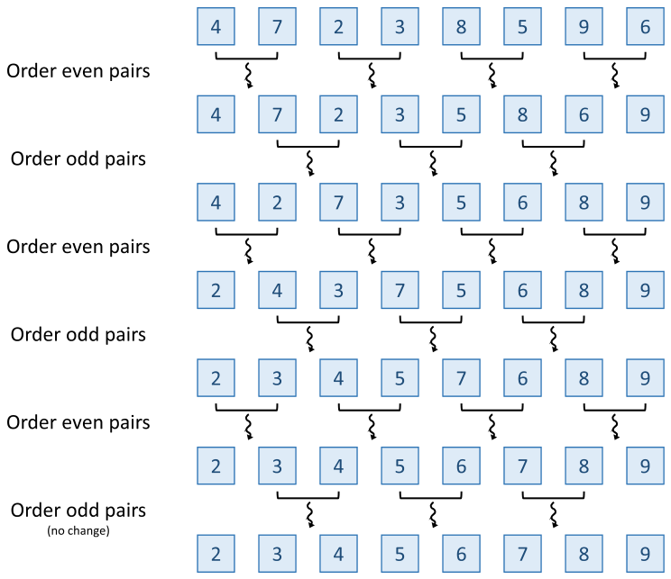

*Figure 14.1 — 병렬 odd-even sort. (책 p.332)*

> 첫 반복에서 **thread 네 개**가 launch 된다 — even pair 마다 하나씩.
> 처음 두 thread 는 자기 쌍이 이미 정렬돼 있음을 발견하고,
> 다음 두 thread 는 어긋나 있음을 발견해 원소를 교환한다.
> 두 번째 반복에서는 odd pair 마다 thread 하나가 launch 된다. …
> 세 번째 반복에서는 다시 even pair 로 돌아간다.
> **원소가 하나도 교환되지 않을 때까지 홀짝을 번갈아** 계속하고,
> 교환이 없다는 것은 목록이 정렬됐음을 뜻한다 (책 p.331).

입력 $[4, 7, 2, 3, 8, 5, 9, 6]$ 의 전체 trace 다.

| 국면 | 비교하는 쌍 | 결과 |
|---|---|---|
| — | | $[4, 7, 2, 3, 8, 5, 9, 6]$ |
| **even** | (4,7)✓ (2,3)✓ (8,5)✗ (9,6)✗ | $[4, 7, 2, 3, \mathbf{5}, \mathbf{8}, \mathbf{6}, \mathbf{9}]$ |
| **odd** | (7,2)✗ (3,5)✓ (8,6)✗ | $[4, \mathbf{2}, \mathbf{7}, 3, 5, \mathbf{6}, \mathbf{8}, 9]$ |
| **even** | (4,2)✗ (7,3)✗ (5,6)✓ (8,9)✓ | $[\mathbf{2}, \mathbf{4}, \mathbf{3}, \mathbf{7}, 5, 6, 8, 9]$ |
| **odd** | (4,3)✗ (7,5)✗ (6,8)✓ | $[2, \mathbf{3}, \mathbf{4}, \mathbf{5}, \mathbf{7}, 6, 8, 9]$ |
| **even** | (2,3)✓ (4,5)✓ (7,6)✗ (8,9)✓ | $[2, 3, 4, 5, \mathbf{6}, \mathbf{7}, 8, 9]$ |
| **odd** | 전부 ✓ | $[2, 3, 4, 5, 6, 7, 8, 9]$ **(no change)** |

**여섯 국면**이 걸렸다. Figure 14.1 의 여섯 줄이 정확히 이것이다.

> **"교환이 없으면 정렬됐다"는 것은 정확하지 않다** ⚠️
>
> 책의 서술(책 p.331)은 "we keep alternating … **until no elements are swapped**, which
> indicates that the list is sorted" 인데, **한 국면만 교환이 없어도 정렬됐다고 볼 수는 없다.**
>
> 반례: $[1, 3, 2, 4]$ 에 **even 국면**을 적용하면 쌍 $(1,3)$ 과 $(2,4)$ 가 둘 다 순서대로라
> **교환이 하나도 없다.** 그런데 목록은 정렬돼 있지 않다 (`3` 과 `2`).
> 더 극적인 예로 $[2,4,1,3,6,8,5,7]$ 은 even 국면에서 교환이 없지만
> 정렬까지 아직 여러 국면이 남아 있다.
>
> **올바른 종료 조건은 "연속한 두 국면(odd 하나 + even 하나)에서 모두 교환이 없을 때"** 다.
> 증명은 간단하다 — even 국면에 교환이 없으면 $a_0 \le a_1,\ a_2 \le a_3, \ldots$ 이고,
> odd 국면에도 없으면 $a_1 \le a_2,\ a_3 \le a_4, \ldots$ 다. **둘을 합치면 전부 정렬**이다. ∎
>
> 위 trace 에서 마지막 odd 국면이 "no change" 인데, **그 직전 even 국면에서는 교환이 있었다.**
> 따라서 엄밀히는 한 국면을 더 돌려 확인해야 한다.
> 실무에서는 **`hasChanged` 를 두 국면에 걸쳐 누적**하거나, 아예 $N$ 번 돌려 버린다.

### 3. 코드

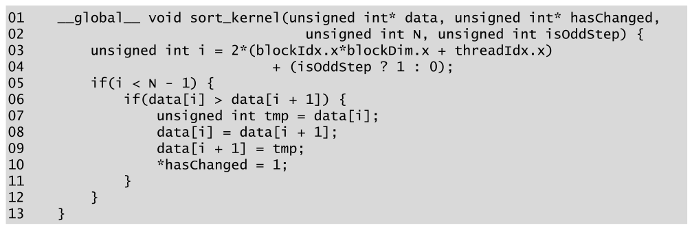

*Figure 14.2 — 병렬 odd-even sort kernel. (책 p.332)*

```cuda
01  __global__ void sort_kernel(unsigned int* data, unsigned int* hasChanged,
02                              unsigned int N, unsigned int isOddStep) {
03      unsigned int i = 2*(blockIdx.x*blockDim.x + threadIdx.x)
04                       + (isOddStep ? 1 : 0);
05      if(i < N - 1) {
06          if(data[i] > data[i + 1]) {
07              unsigned int tmp = data[i];
08              data[i] = data[i + 1];
09              data[i + 1] = tmp;
10              *hasChanged = 1;
11          }
12      }
13  }
```

> kernel 은 **반복마다 한 번씩**, 목록 원소 수의 **절반만큼의 thread** 로 호출된다.
> `isOddStep` 매개변수(02번 줄)가 odd pair 를 정렬하는지 even pair 를 정렬하는지 알려 준다
> (책 p.331).

| 줄 | 하는 일 | 짚을 점 |
|---|---|---|
| **03~04** | 자기 쌍의 **첫 원소 index** | even 이면 $2t$, odd 면 $2t+1$ |
| **05** | 경계 검사 | **`N-1`** 이다 — `data[i+1]` 을 건드리므로 |
| **06** | 비교 | `>` 이므로 **동값이면 교환하지 않는다 → stable** |
| **07~09** | 교환 | `tmp` 를 쓰는 평범한 swap |
| **10** | 전역 flag 를 세운다 | **아래의 race 논의** |

> **06번 줄이 `>` 이지 `>=` 가 아닌 것이 stability 를 만든다.**
> 12·13장에서 본 것과 같은 구도다 — **동값일 때 손대지 않는 쪽이 stable** 이다.
> `>=` 로 바꾸면 동값 원소가 계속 자리를 바꿔 **종료조차 하지 않는다.**

#### `hasChanged` 의 race — 책이 정직하게 다루는 대목

> 여러 thread 가 `hasChanged` 에 값 1 을 쓸 때 이 상황은 **엄밀히 말해 race condition** 이다 —
> 여러 thread 가 순서 없이 같은 메모리 위치에 접근하고 그중 최소 하나가 쓰기다.
> 실무에서 이런 race 는 **양성(benign)** 인데, **모든 thread 가 같은 값을 쓰므로
> 몇 개가 쓰든 최종 결과가 같기** 때문이다.
> 어떤 연산이 **몇 번 적용되든 같은 효과를 갖는 이 성질을 멱등성(idempotence)** 이라 한다
> (책 p.333).

> 그러나 원칙적으로 **C++ 메모리 모델에서는 연산이 멱등이더라도 race condition 이
> 미정의 동작을 일으킬 수 있다.** 따라서 이 코드는 실무에서 동작할지 몰라도
> **C++ 메모리 모델을 위반하며 동작이 보장되지 않는다.**
> 그러므로 **보수적인 프로그래머는 `hasChanged` 에 1을 쓸 때 atomic 연산을 써야 한다**
> (책 p.333).

**9~11장에서 쌓아 온 memory model 논의가 여기서 마무리된다.**

| 장 | 무엇을 배웠나 |
|---|---|
| 9장 | atomic 이 필요한 이유 — **읽고-수정하고-쓰기**가 쪼개지면 갱신이 사라진다 |
| 11장 | `relaxed` 로 부족한 경우 — **flag 와 데이터가 다른 배열**이면 `acquire`/`release` |
| **14장** | **결과가 같아도 race 는 race** — 멱등이어도 표준상 미정의 동작 |

고치는 방법은 9장의 도구 그대로다.

```cuda
cuda::atomic_ref<unsigned int, cuda::thread_scope_device> flag(*hasChanged);
flag.store(1, cuda::memory_order_relaxed);   // 값이 하나뿐이니 relaxed 로 충분하다
```

> **왜 `relaxed` 로 충분한가.** 이 flag 는 **kernel 이 끝난 뒤 host 가 읽는다.**
> kernel 종료가 이미 device 전체의 memory fence 역할을 하므로,
> flag 와 `data` 배열 사이의 순서를 kernel 안에서 강제할 필요가 없다.
> 11.9절에서 `acquire`/`release` 가 필요했던 것은 **같은 kernel 안의 block 끼리**
> flag 로 데이터 준비를 알렸기 때문이다.

### 4. 수식/유도 — 복잡도

#### 전체 유도 과정 (먼저 한 번에)

$$\text{반복 수} = O(N) \tag{1}$$

$$\text{반복당 비교} = \frac{N}{2} = O(N) \tag{2}$$

$$\text{work} = O(N) \times O(N) = O(N^2) \tag{3}$$

$$\text{time (자원이 충분하면)} = O(N) \times O(1) = O(N) \tag{4}$$

#### 단계별 설명

**(1)** 왜 반복이 $O(N)$ 인가.

> 필요한 반복 수는 $O(N)$ 이다. **최악의 경우 가장 큰 원소가 목록의 맨 앞에 있고
> 끝까지 가는 데 $N$ 번의 반복이 필요**하기 때문이다 (책 p.333).

한 국면에서 원소 하나는 **최대 한 칸**만 이동한다 (자기 쌍 안에서만 교환하므로).
따라서 맨 앞의 원소가 맨 뒤로 가려면 $N-1$ 칸, 즉 $N-1$ 국면이 필요하다.

**(2)** 각 국면은 쌍 $N/2$ 개를 다루므로 비교가 $N/2$ 번이다.

**(3)** 곱하면 $O(N^2)$ — **순차 bubble sort 와 같다.**
병렬화가 **work 를 줄여 주지 않았다.**

**(4)** 그러나 **각 국면 안의 $N/2$ 개 비교는 완전히 병렬**이므로,
실행 자원이 충분하면 국면 하나가 $O(1)$ 이고 전체가 $O(N)$ 이다. ∎

> **11장의 work/span 관점으로 다시 보면 이렇다.**
> work $O(N^2)$, span $O(N)$ — **work efficiency 가 최악**이다.
> 순차 merge sort 의 $O(N\log N)$ work 와 비교하면
> $N = 10^6$ 에서 $\frac{10^{12}}{2\times10^7} = \mathbf{5 \times 10^4\times}$ 더 많은 일을 한다.
>
> 11.5절이 가르친 교훈이 그대로 적용된다 — **"병렬화가 무조건 이득이 아니다."**
> odd-even sort 가 쓸모 있는 곳은 **$N$ 이 아주 작고**(warp 하나 안 같은),
> **비교기가 남아도는** 경우뿐이다. 14.9절의 sorting network 논의가 그 이야기다.

### 5. 예제/실습

#### 연습문제

> **(1)** $[5, 1, 4, 2, 8]$ 을 odd-even sort 로 정렬하며 각 국면의 상태를 적어라.
> **(2)** $N = 8$ 일 때 even 국면과 odd 국면의 활성 thread 수는 각각 몇인가?
> **(3)** 최악의 입력은 무엇인가?

**(1)**

| 국면 | 쌍 | 결과 |
|---|---|---|
| — | | $[5, 1, 4, 2, 8]$ |
| even | (5,1)✗ (4,2)✗ | $[\mathbf{1}, \mathbf{5}, \mathbf{2}, \mathbf{4}, 8]$ |
| odd | (5,2)✗ (4,8)✓ | $[1, \mathbf{2}, \mathbf{5}, 4, 8]$ |
| even | (1,2)✓ (5,4)✗ | $[1, 2, \mathbf{4}, \mathbf{5}, 8]$ |
| odd | (2,4)✓ (5,8)✓ | 변화 없음 |
| even | 전부 ✓ | 변화 없음 → **종료** |

**(2)** even 은 쌍 $(0,1),(2,3),(4,5),(6,7)$ 로 **4개**, odd 는 $(1,2),(3,4),(5,6)$ 로 **3개**다.
kernel 은 두 경우 모두 $N/2 = 4$ thread 로 launch 되고,
odd 국면에서는 **마지막 thread 가 `i = 7`, `i < N-1 = 7` 이 거짓**이라 쉰다.

> **매 국면 thread 하나가 노는 셈**이고, 이것이 4장에서 본 **control divergence** 다.
> $N$ 이 크면 무시할 만하다 ($\frac{1}{N/2}$).

**(3) 역순 정렬된 입력** — $[8, 7, 6, \ldots, 1]$.
맨 앞의 가장 큰 원소가 맨 뒤까지 $N-1$ 칸을 가야 하므로 **$N-1$ 국면**이 필요하고,
이것이 (1)에서 말한 $O(N)$ 의 최악이다.

---

## 14.3 Parallel merge sort (책 p.333)

### 1. 개념적 이해

> odd-even sort 의 높은 시간·work 복잡도가 **더 낮은 복잡도의 효율적인 comparison-based
> 병렬 정렬 알고리즘**의 필요를 부른다. 병렬화에 적합한 그런 알고리즘 하나가 **merge sort** 다.
> merge sort 는 **입력 목록을 구획으로 나누고, 각 구획을 정렬한 뒤(merge sort 나 다른 정렬로),
> 정렬된 구획들을 ordered merge** 하는 방식으로 동작한다 (책 p.333).

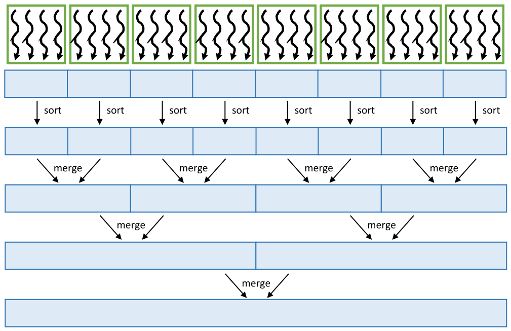

*Figure 14.3 — merge sort 를 병렬화하는 한 가지 방법. (책 p.334)*

> 처음에 입력 목록이 **여러 구획으로 나뉘고 각각 어떤 정렬 알고리즘으로 독립 정렬**된다.
> 그 뒤 **모든 구획 쌍이 하나의 구획으로 merge** 된다.
> 모든 key 가 같은 구획에 속할 때까지 이 과정을 반복한다.
> 각 단계에서 계산은 **서로 다른 merge 연산을 병렬로 수행**하는 것으로도,
> **각 merge 연산 안에서 병렬성을 뽑아내는 것**으로도 병렬화될 수 있다.
> merge 연산의 병렬화는 **13장에서 이미 보았다** (책 p.333).

**그림은 구획 8개에서 시작해 3단계로 합친다.** $8 \to 4 \to 2 \to 1$ 이다.

#### 병렬성이 단계마다 옮겨 간다 — 이 절의 핵심

> 병렬 merge sort 의 단계가 진행됨에 따라 **merge 연산 사이(across)의 병렬성과
> merge 연산 안(within)의 병렬성 사이에 맞바꿈**이 있다.
> **앞 단계에서는 병렬로 수행할 수 있는 독립 merge 연산이 더 많다.**
> **뒤 단계에서는 독립 merge 연산이 더 적지만, 각 merge 가 더 많은 key 를 merge 하므로
> merge 안의 병렬성이 더 많이 드러난다** (책 p.333).

책의 구체적 배정을 표로 옮기면 (책 p.333~334):

| 단계 | 독립 merge 수 | merge 당 key 수 | **block 배정** (총 8 block) |
|---|---|---|---|
| **1** | 4 | $2s$ | merge 당 **2 block** |
| **2** | 2 | $4s$ | merge 당 **4 block** |
| **3** | 1 | $8s$ | merge 당 **8 block** |

> **총 block 수는 언제나 8로 일정하다.** 병렬성의 **총량이 아니라 형태**만 바뀐다.
> 이것이 이 절의 가장 중요한 통찰이고, **13장의 co-rank 가 있어야만 가능한 유연함**이다 —
> merge 하나를 몇 개의 block 으로 쪼갤지를 **실행 시점에 자유롭게 정할 수 있기** 때문이다.
> co-rank 없이는 "merge 하나 = thread 하나"에 묶여 뒤 단계에서 병렬성이 고갈된다.

> 이 병렬 merge sort 알고리즘의 구현은 **독자를 위한 연습으로 남긴다** (책 p.334).
> → **14.11절 연습문제 4**

### 2. 수식/유도 — 복잡도

#### 전체 유도 과정 (먼저 한 번에)

$$\text{단계 수} = O(\log N) \tag{1}$$

$$\text{단계당 time} = O(\log N), \qquad \text{단계당 work} = O(N\log N) \tag{2}$$

$$\text{time} = O(\log^2 N), \qquad \text{work} = O(N\log^2 N) \tag{3}$$

$$\text{순차 merge sort 의 work} = O(N\log N) \tag{4}$$

#### 단계별 설명

**(1)** merge 할 구획 수가 매 반복 절반이 되므로 $\log_2 N$ 단계다 (책 p.334).

**(2)** 13장에서 본 대로다.

> 각 반복의 merge 연산을 완전히 병렬 실행할 자원이 충분하다면,
> 각 반복의 **time 복잡도는 $O(\log N)$ 이고 work 복잡도는 $O(N\cdot\log N)$** 이다 (책 p.334).

$O(\log N)$ time 은 **co-rank 의 binary search** 에서 온다 (13.4절).
$O(N\log N)$ work 는 **모든 thread 가 각자 binary search 를 하기** 때문이다 —
13.8절에서 세어 본 그 $2T\log_2 N$ 항이다.

**(3)** 곱하면 time $O(\log^2 N)$, work $O(N\log^2 N)$.

**(4)** 순차 merge sort 는 $O(N\log N)$ 이므로 **병렬판이 $\log N$ 배만큼 일을 더 한다.**

> 이 $O(N\log^2 N)$ work 복잡도는 순차 merge sort 의 $O(N\log N)$ 보다 **약간 높다.**
> 높은 복잡도는 **병렬 merge 연산이 co-rank 함수의 실행 때문에 순차 merge 보다 work
> 복잡도가 높다**는 사실에서 온다 (13장 참조).
> **Cole 의 알고리즘 [2]** 은 이 한계를 극복해 time 과 work 복잡도 $O(\log N)$ 과
> $O(N\log N)$ 을 달성한다 (책 p.334).

> **11장의 work efficiency 논의가 세 번째로 되돌아온다.**
> 11장에서 Kogge-Stone 이 $N\log N$ work 였고 coarsening 으로 되돌렸다.
> 13장에서 co-rank 가 $T\log N$ 을 더했고 coarsening 이 분할상환했다.
> **여기서는 그 $T\log N$ 이 $\log N$ 단계에 걸쳐 누적되어 $N\log^2 N$ 이 된다.**
> **13.8절의 coarsening 이 여기서도 그대로 값을 한다** — merge 안의 thread 를 줄이면
> $N\log^2 N$ 의 계수가 작아진다.

#### 세 알고리즘의 복잡도 비교

$N = 2^{20} \approx 10^6$ 으로 계산한다.

| | time | work | $N=2^{20}$ 의 work |
|---|---|---|---|
| **odd-even sort** | $O(N)$ | $O(N^2)$ | $1.10 \times 10^{12}$ |
| **merge sort (이 장)** | $O(\log^2 N)$ | $O(N\log^2 N)$ | $4.19 \times 10^{8}$ |
| **merge sort (Cole)** | $O(\log N)$ | $O(N\log N)$ | $2.10 \times 10^{7}$ |
| **radix sort** ($b{=}32$, $r{=}4$) | — | $O(N \cdot b/r)$ | $\mathbf{8.39 \times 10^{6}}$ |

**odd-even 과 radix 사이가 $10^5$ 배 넘게 벌어진다.** 이 장의 8할이 radix sort 인 이유다.

### 3. 예제/실습

#### 연습문제

> 구획 8개, block 8개인 Figure 14.3 에서
> **(1)** 각 단계에서 merge 하나당 몇 block 인가?
> **(2)** 구획이 1024개라면 단계는 몇 개이고, 4단계째의 배정은?
> **(3)** "앞 단계는 across 병렬성, 뒤 단계는 within 병렬성" 인데
> **가운데 단계에서 둘 다 부족한 상황**은 생길 수 있는가?

**(1)** 1단계 4 merge → **2 block**, 2단계 2 merge → **4 block**, 3단계 1 merge → **8 block**.

**(2)** $\log_2 1024 = \mathbf{10}$ 단계. 4단계째에는 구획이 $1024/2^4 = 64$ 개 남아 있으므로
merge 는 $64/2 = 32$ 개다. block 이 8개뿐이면 **merge 하나당 block 이 1개도 안 된다** —
오히려 block 하나가 merge 여러 개를 순차 처리해야 한다.

**(3)** 생길 수 없다 — 그것이 이 구조의 좋은 점이다.
**단계 $s$ 에서 (독립 merge 수) × (merge 당 key 수) = $N$ 으로 일정**하다.
across 병렬성이 줄면 within 병렬성이 정확히 그만큼 늘어난다.
**부족해지는 것은 across 도 within 도 아니라 "merge 하나를 여러 block 으로 쪼개는 능력"** 이고,
그것을 13장의 co-rank 가 제공한다.

---

## 14.4 Radix sort (책 p.334)

### 1. 개념적 이해

> $O(N\cdot\log N)$ 보다 나은 정렬 복잡도를 달성하려면 **non-comparison-based** 정렬
> 알고리즘을 써야 한다. 병렬화에 매우 적합한 non-comparison-based 알고리즘 하나가
> **radix sort** 다 (책 p.334~335).

> radix sort 는 **radix 값(위치 기수법의 base)에 따라 key 들을 bucket 에 분배**하는 방식으로
> 동작한다. key 가 여러 자리로 이루어져 있으면 **모든 자리를 다룰 때까지 분배를 반복**한다.
> **각 반복은 stable 해서 이전 반복에서 만들어진 bucket 안의 key 순서를 보존**한다 (책 p.335).

> key 가 이진수로 표현될 때는 **radix 를 2의 거듭제곱으로 고르는 것이 편리**하다 —
> 자리를 순회하고 뽑아내기 쉬워지기 때문이다.
> 각 반복은 본질적으로 **key 에서 고정 크기의 비트 조각(slice)** 을 다룬다.
> **radix 2(즉 1비트 radix)로 시작**하고 나중에 더 큰 radix 로 확장한다 (책 p.335).

### 2. 예제 — Figure 14.4

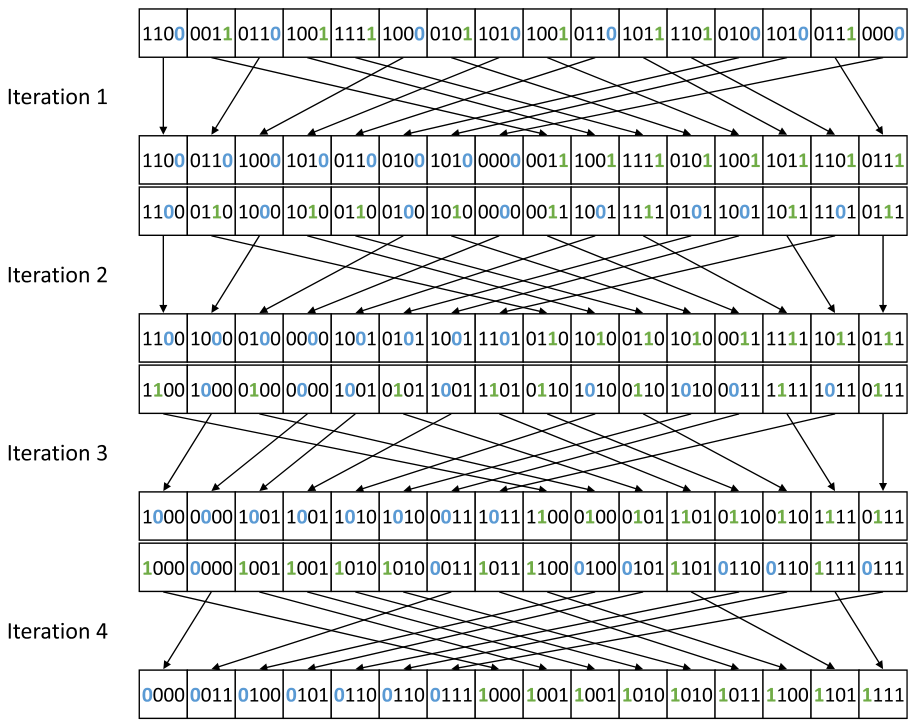

*Figure 14.4 — radix sort 의 예. (책 p.335)*

입력은 **4비트 정수 16개**이고, 1비트 radix 이므로 **네 번 반복**한다.

$$\texttt{1100\ 0011\ 0110\ 1001\ 1111\ 1000\ 0101\ 1010\ 1001\ 0110\ 1011\ 1101\ 0100\ 1010\ 0111\ 0000}$$

> **첫 반복**에서는 **최하위 비트**를 본다. 반복의 입력 목록에서 최하위 비트가 **0** 인 key 는
> 전부 반복의 출력 목록의 **왼쪽**에 놓여 zero bucket 을 이루고,
> 최하위 비트가 **1** 인 key 는 전부 **오른쪽**에 놓여 one bucket 을 이룬다.
> **출력 목록의 각 bucket 안에서 key 의 순서는 입력에서의 순서 그대로 보존**된다 (책 p.335).

네 반복의 결과다 (전부 코드로 검산했다).

| 반복 | 보는 비트 | 결과 |
|---|---|---|
| **1** | 0번(LSB) | `1100 0110 1000 1010 0110 0100 1010 0000` `0011 1001 1111 0101 1001 1011 1101 0111` |
| **2** | 1번 | `1100 1000 0100 0000 1001 0101 1001 1101` `0110 1010 0110 1010 0011 1111 1011 0111` |
| **3** | 2번 | `1000 0000 1001 1001 1010 1010 0011 1011` `1100 0100 0101 1101 0110 0110 1111 0111` |
| **4** | 3번(MSB) | `0000 0011 0100 0101 0110 0110 0111 1000 1001 1001 1010 1010 1011 1100 1101 1111` |

**마지막 줄이 완전히 정렬돼 있다.**

#### 왜 stability 가 없으면 틀리는가

> 두 번째 반복에서 첫 반복의 출력 목록이 새 입력 목록이 되고 **두 번째 최하위 비트**를 본다.
> …
> **이전 반복의 순서가 보존되므로**, 두 번째 반복의 출력 목록의 key 들이 이제
> **하위 두 비트로 정렬**돼 있음을 관찰할 수 있다. 즉 하위 두 비트가 `00` 인 key 가 먼저,
> 그다음 `01`, `10`, `11` 순이다 (책 p.336).

**귀납법 그 자체다.**

> **주장**: $t$ 번째 반복이 끝나면 목록은 **하위 $t$ 비트로 정렬**돼 있다.
>
> **기저**: $t=1$ — 0번 비트로 분배했으므로 하위 1비트로 정렬됐다. ✓
>
> **귀납**: $t-1$ 반복 후 하위 $t-1$ 비트로 정렬돼 있다고 하자.
> $t$ 번째 반복은 $t-1$ 번 비트로 **stable 분배**한다.
> 같은 bucket 안(= $t-1$ 번 비트가 같은 key 들)의 순서는 **보존**되므로,
> 그 안에서는 여전히 하위 $t-1$ 비트로 정렬돼 있다.
> bucket 사이는 $t-1$ 번 비트로 정렬됐다.
> **상위 비트가 우선하고 그 안에서 하위 비트로 정렬 = 하위 $t$ 비트로 정렬.** ∎

**stability 가 깨지면 귀납의 두 번째 줄이 무너지고 알고리즘 전체가 틀린다.**
14.1절이 "여러 key 로 연쇄 정렬하려면 stable 이 필수"라 한 것의 가장 순수한 사례다.

### 3. stable filter 의 일반화 — stable partition

> radix sort 한 반복이 수행하는 연산은 독자에게 **12장에서 논의한 stable filter 패턴**을
> 떠올리게 할 것이다.
> stable filter 패턴에서는 어떤 조건을 만족하는 입력 key 들이 **순서를 보존한 채 출력 목록의
> 앞쪽**으로 옮겨진다.
> **radix sort 반복은 더 일반적인 연산**을 수행한다 — 조건을 만족하는(관심 비트가 0인) key 는
> 출력 목록 **앞쪽**으로, 만족하지 않는 key 는 **뒤쪽**으로 옮기되
> **각 부분 목록 안의 순서를 보존**한다.
> 이 더 일반적인 패턴은 입력 목록을 여러 partition 으로 나누므로
> 때때로 **stable partition 패턴**이라 불린다 (책 p.336).

**한 표로 정리하면 이렇다.**

| | 통과한 key | 탈락한 key | 출력 크기 |
|---|---|---|---|
| **stable filter** (12장) | 앞쪽으로, 순서 보존 | **버린다** | $\le N$ |
| **stable partition** (14장) | 앞쪽으로, 순서 보존 | **뒤쪽으로, 순서 보존** | **정확히 $N$** |

> **"버리지 않고 뒤로 보낸다"는 차이 하나**가 전부다.
> 그래서 12.5절의 stable filter kernel(Figure 12.8)과 14.5절의 radix sort kernel(Figure 14.7)이
> **거의 같은 모양**이 된다 — 둘 다 `keep`/`bit` 를 만들고, exclusive scan 하고,
> 계산된 자리에 쓴다. 다른 것은 **`keep=0` 인 thread 도 쓴다**는 것뿐이다.

> radix sort 반복을 병렬화하고 최적화하는 기법은
> **stable filter 를 병렬화·최적화하는 기법과 강하게 닮았다** (책 p.336).

**실제로 14.5~14.8절의 순서가 12.5~12.6절의 순서와 같다.**

| 14장 | 12장 | 무엇 |
|---|---|---|
| 14.5 | 12.5 | 기본 kernel — grid 전체 exclusive scan |
| 14.6 | 12.6 | shared memory 로 모아 coalescing 개선 |
| 14.8 | 12.6 | thread coarsening |

### 4. 예제/실습

#### 연습문제

> **(1)** `[5, 3, 6, 1]` (3비트)을 1비트 radix sort 로 정렬하며 각 반복을 적어라.
> **(2)** 두 번째 반복에서 stability 를 깨면 (bucket 안 순서를 뒤집으면) 무슨 일이 생기는가?

**(1)** 이진으로 `101, 011, 110, 001` 이다.

| 반복 | 비트 | 0 bucket | 1 bucket | 결과 |
|---|---|---|---|---|
| **1** | 0번 | `110`(6) | `101`(5), `011`(3), `001`(1) | `110 101 011 001` |
| **2** | 1번 | `101`(5), `001`(1) | `110`(6), `011`(3) | `101 001 110 011` |
| **3** | 2번 | `001`(1), `011`(3) | `101`(5), `110`(6) | `001 011 101 110` |

$[1, 3, 5, 6]$ ✓

**(2)** 두 번째 반복의 0 bucket 을 뒤집어 `001 101` 로 만들면
결과가 `001 101 110 011` 이 되고, 세 번째 반복 후에는
0 bucket = `001, 011`, 1 bucket = `101, 110` → `001 011 101 110` 으로 **우연히 맞다.**

**우연이다.** 더 명확한 반례를 만들자 — 1 bucket 을 뒤집어 `011 110` 으로 두면
목록은 `101 001 011 110` 이 되고, 세 번째 반복에서
0 bucket = `001, 011`, 1 bucket = `101, 110` → 역시 맞다.

> **왜 이 예에서는 안 깨지는가?** 값이 네 개뿐이고 **하위 비트가 겹치는 쌍이 없어서**다.
> stability 가 문제가 되려면 **상위 비트가 같고 하위 비트가 다른 두 key** 가 필요하다.
> 예컨대 `010`(2)와 `000`(0)을 보자 — 2번 비트가 둘 다 0, 1번 비트가 1과 0 이다.
> 두 번째 반복(1번 비트)에서 `000` 이 앞, `010` 이 뒤로 간다.
> 세 번째 반복(2번 비트)에서 둘 다 0 bucket 인데, **여기서 순서를 뒤집으면
> `010, 000` 이 되어 최종 결과가 $[2, 0]$ 로 틀린다.**
>
> **교훈**: stability 위반은 **동값 bucket 안에서만** 드러나므로
> **작은 예제로는 잡히지 않을 수 있다.** 반드시 상위 자리가 같은 key 쌍으로 시험해야 한다.

---

## 14.5 Parallel radix sort (책 p.336)

### 1. 개념적 이해

> radix sort 의 **각 반복은 이전 반복의 전체 결과에 의존**한다.
> 따라서 반복들은 서로에 대해 **순차적으로** 수행된다.
> **radix sort 를 병렬화할 기회는 각 반복 안에서 생긴다** (책 p.336).

**이 절 이후 전부 "반복 하나"의 이야기**다. 반복 사이는 kernel launch 로 직렬화한다.

> 우리는 **radix sort 반복 하나를 수행하는 kernel 의 구현에 집중**하고,
> host 코드가 반복마다 이 kernel 을 한 번씩 부른다고 가정한다.
> 관심 있는 독자에게는 GPU 용 radix sort 의 최신 구현인 **OneSweep [3]** 도 권한다 (책 p.336).

#### 한 key 에 한 thread

> GPU 에서 radix sort 반복을 병렬화하는 직관적인 접근 하나는
> **각 thread 가 입력 목록의 key 하나를 담당**하게 하는 것이다.
> thread 는 **출력 목록에서 그 key 의 위치를 알아내고 그 위치에 key 를 저장**해야 한다
> (책 p.336).

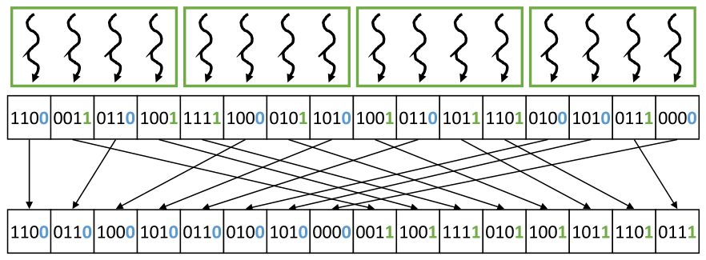

*Figure 14.5 — 입력 key 하나를 각 thread 에 배정해 radix sort 반복을 병렬화한다. (책 p.337)*

> 이 예에서 **16개 key 가 thread 4개짜리 thread block 4개**로 이루어진 grid 로 처리된다.
> 실제로는 각 block 이 최대 1024 thread 를 가질 수 있고 입력이 훨씬 커서 block 이 훨씬 많다.
> 그러나 **그림을 단순하게 하려고 block 당 thread 수를 작게** 썼다 (책 p.337).

**남은 문제는 하나다** — 각 thread 가 **자기 key 의 목적지 index** 를 어떻게 아는가.

### 2. 수식/유도 — 목적지 index

#### 전체 유도 과정 (먼저 한 번에)

$$\text{destination of a zero} \;=\; \#\text{zeros before} \tag{1}$$
$$= \#\text{keys before} - \#\text{ones before} \tag{2}$$
$$= \text{key index} - \#\text{ones before} \tag{3}$$

$$\text{destination of a one} \;=\; \#\text{zeros in total} + \#\text{ones before} \tag{4}$$
$$= (\#\text{keys in total} - \#\text{ones in total}) + \#\text{ones before} \tag{5}$$
$$= \text{input size} - \#\text{ones in total} + \#\text{ones before} \tag{6}$$

$$\#\text{ones before} \;=\; \text{exclusive scan of bits} \tag{7}$$

#### 단계별 설명 (생략 없이)

**(1)** zero bucket 으로 가는 key 의 목적지는 **자기 앞에 있는 zero 의 개수**다.

> zero bucket 으로 매핑되는 key 의 목적지 index 는, **그 key 앞에서 역시 zero bucket 으로
> 매핑되는 key 의 개수**와 같다 (책 p.337).

zero 들은 출력의 앞쪽에 **입력 순서대로** 쌓이므로, 내 앞에 zero 가 $z$ 개 있으면
나는 $z$ 번 자리다. **exclusive scan 의 정의 그대로**다 (11.1절).

**(2)** 그런데 "앞의 zero 개수"를 직접 세는 것은 불편하다. **여집합으로 바꾼다.**

> 모든 key 가 zero bucket 아니면 one bucket 으로 매핑되므로,
> 그 key 앞에서 zero 로 매핑되는 key 의 수는
> **앞의 총 key 수에서 앞에서 one 으로 매핑되는 key 수를 뺀 것**과 같다 (책 p.337).

$$\#\text{zeros before} + \#\text{ones before} = \#\text{keys before}$$

**(3)** 그리고 "앞의 총 key 수"는 **공짜로 안다** — 그냥 내 index 다.

> 그 key 앞의 총 key 수는 **입력 목록에서 그 key 의 index** 일 뿐이고 자명하게 얻어진다.
> 따라서 zero bucket 으로 가는 key 의 목적지를 찾는 데서 **자명하지 않은 유일한 부분은
> 앞에서 one bucket 으로 매핑되는 key 의 개수를 세는 것**이다 (책 p.337).

**(4)** one bucket 은 출력의 **뒤쪽 절반**에 놓인다.

> zero bucket 으로 매핑되는 모든 key 가 출력 배열에서 one bucket 의 key 들보다 **앞에 와야**
> 한다. 이런 이유로 one bucket 으로 가는 key 의 목적지 index 는
> **zero 로 매핑되는 총 key 수 + 그 key 앞에서 one 으로 매핑되는 key 수**와 같다 (책 p.338).

**(5)** 다시 여집합으로 바꾼다 — 전체 zero 수 = 전체 key 수 − 전체 one 수.

**(6)** 전체 key 수는 `input size` 로 알고 있다.

> 따라서 one bucket 으로 가는 key 의 목적지를 찾는 데서 자명하지 않은 부분은
> 역시 **앞에서 one 으로 매핑되는 key 의 개수를 세는 것**이고,
> 이는 zero bucket 의 경우와 **같은 정보**다.
> one bucket 으로 매핑되는 총 key 수는 **exclusive scan 의 부산물로** 얻을 수 있다 (책 p.338).

**(7)** 그리고 그 "같은 정보"가 **exclusive scan** 이다.

> **놀랍도록 경제적이다.** 두 경우가 서로 다른 식을 쓰는데,
> **필요한 비자명 정보는 `# ones before` 하나뿐**이다.
> 11장의 scan 을 **한 번만** 돌리면 두 bucket 의 목적지가 모두 나온다. ∎

> **원문 오기** (책 p.337~338). one bucket 의 식을 소개하는 문장이
> "For keys mapping to the **zero** bucket, the destination index can be found as follows:"
> 로 인쇄돼 있는데, 바로 위 문단에서 zero bucket 을 이미 다뤘고 이어지는 식이
> `destination of a one = …` 이므로 **`one` bucket 이어야 한다.**
> 같은 문장이 두 번 나온 셈이다.

### 3. 예제 — Figure 14.6

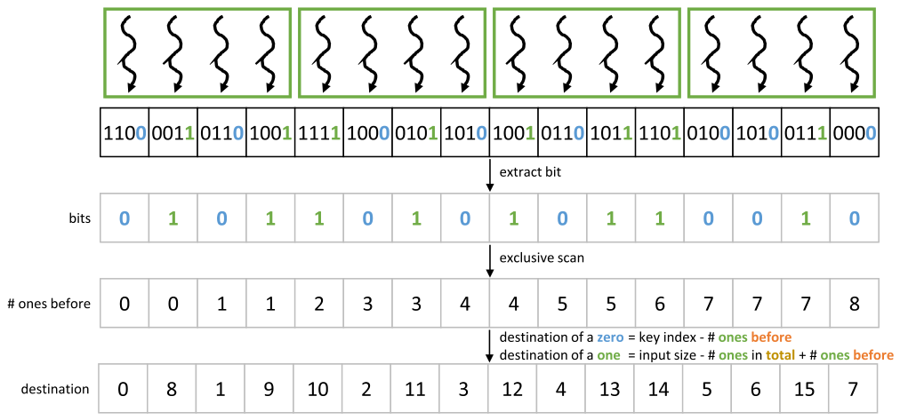

*Figure 14.6 — 각 입력 key 의 목적지를 찾는다. (책 p.338)*

Figure 14.5 의 16개 key 에 대해 반복 0(LSB)을 수행한다.

| $i$ | 0 | 1 | 2 | 3 | 4 | 5 | 6 | 7 | 8 | 9 | 10 | 11 | 12 | 13 | 14 | 15 |
|---|---|---|---|---|---|---|---|---|---|---|---|---|---|---|---|---|
| key | `1100` | `0011` | `0110` | `1001` | `1111` | `1000` | `0101` | `1010` | `1001` | `0110` | `1011` | `1101` | `0100` | `1010` | `0111` | `0000` |
| **bits** | 0 | 1 | 0 | 1 | 1 | 0 | 1 | 0 | 1 | 0 | 1 | 1 | 0 | 0 | 1 | 0 |
| **# ones before** | 0 | 0 | 1 | 1 | 2 | 3 | 3 | 4 | 4 | 5 | 5 | 6 | 7 | 7 | 7 | 8 |
| **destination** | **0** | **8** | **1** | **9** | **10** | **2** | **11** | **3** | **12** | **4** | **13** | **14** | **5** | **6** | **15** | **7** |

**`# ones in total` = 8** 이므로 one 의 목적지 식은 $16 - 8 + (\text{ones before}) = 8 + (\text{ones before})$ 다.

몇 개만 손으로 확인하면:

| $i$ | bit | 식 | 계산 | 목적지 |
|---|---|---|---|---|
| 0 | 0 | $i - \text{onesBefore}$ | $0 - 0$ | **0** |
| 1 | 1 | $8 + \text{onesBefore}$ | $8 + 0$ | **8** |
| 5 | 0 | $i - \text{onesBefore}$ | $5 - 3$ | **2** |
| 11 | 1 | $8 + \text{onesBefore}$ | $8 + 6$ | **14** |
| 15 | 0 | $i - \text{onesBefore}$ | $15 - 8$ | **7** |

**목적지가 $0 \ldots 15$ 의 순열임을 확인하자** — 14.1절의 둘째 조건이다.
zero 는 $0\ldots7$ 을, one 은 $8\ldots15$ 를 빠짐없이 채운다.

### 4. 코드

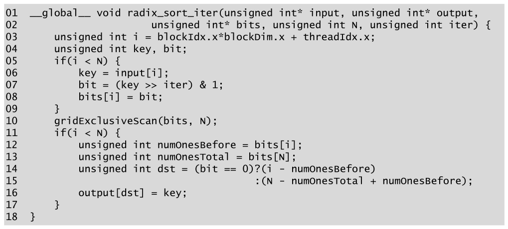

*Figure 14.7 — radix sort 반복 kernel 코드. (책 p.339)*

```cuda
01  __global__ void radix_sort_iter(unsigned int* input, unsigned int* output,
02                    unsigned int* bits, unsigned int N, unsigned int iter) {
03      unsigned int i = blockIdx.x*blockDim.x + threadIdx.x;
04      unsigned int key, bit;
05      if(i < N) {
06          key = input[i];
07          bit = (key >> iter) & 1;
08          bits[i] = bit;
09      }
10      gridExclusiveScan(bits, N);
11      if(i < N) {
12          unsigned int numOnesBefore = bits[i];
13          unsigned int numOnesTotal = bits[N];
14          unsigned int dst = (bit == 0)?(i - numOnesBefore)
15                                       :(N - numOnesTotal + numOnesBefore);
16          output[dst] = key;
17      }
18  }
```

#### 줄별로

| 줄 | 하는 일 | 짚을 점 |
|---|---|---|
| **06** | key 적재 | **coalesced** — 연속 thread 가 연속 주소 |
| **07** | **비트 추출** | 아래 참조 |
| **08** | 비트를 global 배열에 | scan 의 입력이 된다 |
| **10** | **grid 전체 exclusive scan** | **`if` 밖**에 있다 — 아래 참조 |
| **12~13** | scan 결과와 총합을 읽는다 | **`bits[N]`** ← 아래 참조 |
| **14~15** | 두 식 중 하나 | 유도 (3)과 (6) |
| **16** | 저장 | **uncoalesced** — 14.6절이 고친다 |

#### 07번 줄 — 비트 뽑기

> 반복 번호 `iter` 가 우리가 관심 있는 비트의 위치를 알려 준다.
> key 를 그만큼 **오른쪽으로 shift** 하면 그 비트가 최하위 자리로 온다.
> shift 된 key 와 1 사이에 **bitwise-and(`&`)** 를 적용하면 최하위 비트를 뺀 모든 비트가
> 0 이 된다. 따라서 `bit` 의 값이 우리가 관심 있는 비트의 값이 된다 (책 p.338).

12.3절의 mask 연산과 같은 관용구다 — **shift 로 위치를 맞추고 `&` 로 잘라낸다.**

#### 10번 줄이 `if` 밖에 있는 이유

`gridExclusiveScan` 은 **grid 의 모든 thread 가 참여해야 하는 집합 연산**이다.
`if(i < N)` 안에 넣으면 범위 밖 thread 가 참여하지 못해 **deadlock 이 나거나 결과가 틀린다.**

> **12.5절 Figure 12.8 에서 정확히 같은 논점을 다뤘다.**
> 거기서는 아예 경계 검사가 없었고, 여기서는 **05·11번 줄로 검사를 두 토막 내어
> 10번 줄만 밖으로 빼냈다.** 이쪽이 더 정확한 코드다.
>
> 다만 **`bit` 변수가 `if` 밖에서 선언(04번 줄)되고 `if` 안에서만 대입**되므로,
> `i >= N` 인 thread 의 `bit` 는 **초기화되지 않은 값**이다.
> 14번 줄에서 다시 `if(i < N)` 안에 있으니 읽히지 않아 무해하다 —
> 12.3절 Figure 12.3 의 `j` 와 같은 구도다.

#### 13번 줄 — `bits[N]` 이라는 숨은 요구사항

`numOnesTotal` 을 **`bits[N]`** 에서 읽는다. 이것은 두 가지를 전제한다.

1. **`bits` 배열의 크기가 $N+1$ 이어야 한다** — 그렇지 않으면 배열 밖 접근이다
2. **`gridExclusiveScan` 이 총합을 `bits[N]` 에 써 줘야 한다**

> 11장의 scan 구현은 **길이 $N$ 의 exclusive scan** 을 만들었지 총합을 따로 쓰지 않았다.
> 여기서 쓰려면 **11.9절의 단일 kernel scan 에서 마지막 block 이 총합을 `bits[N]` 에
> 기록하도록** 한 줄을 더해야 한다.
> 12.5절 Figure 12.8 이 `*outputSize = offset + keep` 으로 같은 일을 했던 것을 떠올리면 된다 —
> **exclusive scan 의 마지막 값에 마지막 입력을 더하면 총합**이다.

또 하나 — **10번 줄의 scan 은 제자리(in-place)** 다. `bits` 를 입력으로 받아 `bits` 에 쓴다.
12.7절에서 본 대로 **stable 한 in-place 연산이라 안전**하지만,
08번 줄의 쓰기가 전부 끝난 뒤 scan 이 시작돼야 한다.
`gridExclusiveScan` 안의 grid 전체 동기화가 그것을 보장한다.

### 5. 예제/실습

#### 연습문제

> `N = 8`, 입력 `[3, 6, 1, 4, 7, 2, 5, 0]` 에 대해 **반복 1**(1번 비트)을 수행하라.
> **(1)** `bits`, exclusive scan, `numOnesTotal`,
> **(2)** 각 key 의 목적지와 출력,
> **(3)** 목적지가 순열인지 확인하라.

**(1)** 이진으로 `011, 110, 001, 100, 111, 010, 101, 000` 이고 **1번 비트**는

| $i$ | 0 | 1 | 2 | 3 | 4 | 5 | 6 | 7 |
|---|---|---|---|---|---|---|---|---|
| key | 3 | 6 | 1 | 4 | 7 | 2 | 5 | 0 |
| **bit 1** | 1 | 1 | 0 | 0 | 1 | 1 | 0 | 0 |
| **ones before** | 0 | 1 | 2 | 2 | 2 | 3 | 4 | 4 |

`numOnesTotal` = **4**.

**(2)** zero 는 $i - \text{ob}$, one 은 $8 - 4 + \text{ob} = 4 + \text{ob}$ 다.

| $i$ | bit | 계산 | 목적지 |
|---|---|---|---|
| 0 (3) | 1 | $4+0$ | **4** |
| 1 (6) | 1 | $4+1$ | **5** |
| 2 (1) | 0 | $2-2$ | **0** |
| 3 (4) | 0 | $3-2$ | **1** |
| 4 (7) | 1 | $4+2$ | **6** |
| 5 (2) | 1 | $4+3$ | **7** |
| 6 (5) | 0 | $6-4$ | **2** |
| 7 (0) | 0 | $7-4$ | **3** |

출력은 $[1, 4, 5, 0, 3, 6, 7, 2]$ 다.

**(3)** 목적지 집합 $\{4,5,0,1,6,7,2,3\} = \{0,\ldots,7\}$ ✓ **순열이다.**

> 출력을 보면 1번 비트가 0 인 것($1, 4, 5, 0$)이 앞에, 1 인 것($3, 6, 7, 2$)이 뒤에 있고,
> **각 무리 안에서는 입력 순서가 보존**돼 있다 (입력에서 $1$ 은 $4$ 보다 앞, $4$ 는 $5$ 보다 앞).
> stability ✓

---

## 14.6 Optimizing for memory coalescing (책 p.339)

### 1. 무엇이 문제인가

> 방금 설명한 접근은 radix sort 반복을 병렬화하는 데 효과적이다.
> 그러나 **주된 비효율 하나는 출력 목록에 대한 쓰기가 제대로 coalesce 될 수 없는 접근 패턴**을
> 보인다는 것이다.
> Figure 14.5 에서 각 thread 가 자기 key 를 출력 목록에 어떻게 쓰는지 보라.
> 첫 thread block 에서 첫 thread 는 zero bucket 에, 둘째는 one bucket 에,
> 셋째는 zero bucket 에, 넷째는 one bucket 에 쓴다.
> 따라서 **연속된 index 값을 갖는 thread 들이 반드시 연속된 메모리 위치에 쓰는 것이 아니어서**
> coalescing 이 나쁘고 warp 당 여러 개의 memory request 가 필요해진다 (책 p.339~340).

Figure 14.6 의 목적지 행이 그 증거다 — thread 0~3 의 목적지가 **0, 8, 1, 9** 다.
**두 곳으로 갈라진다.**

> **1비트 radix 는 그나마 낫다** (책 p.340).
>
> bucket 이 둘뿐이므로 같은 warp 의 thread 들은 **두 bucket 중 하나에만** 쓴다.
> 결과적으로 한 warp 가 쓰는 서로 다른 cache line 의 수는 **대개 2개**,
> 정렬 상태에 따라 조금 더인 정도다.
> 그러나 **14.7절에서 보듯 radix 가 커지면 bucket 이 많아지고,
> 따라서 같은 warp 이 쓸 수 있는 서로 다른 cache line 도 많아진다.**
> 따라서 uncoalesced 접근은 radix sort 반복 kernel 성능에 **심각한 장애**가 될 수 있다.

**$r$ 비트 radix 라면 warp 하나가 최대 $\min(32, 2^r)$ 개의 cache line 을 건드린다.**

| $r$ | bucket 수 | warp 당 서로 다른 목적지 영역 | 32개 key 쓰기에 필요한 transaction (대략) |
|---|---|---|---|
| 1 | 2 | 2 | 2~4 |
| 2 | 4 | 4 | 4~8 |
| 4 | 16 | 16 | 16~32 |
| 8 | 256 | **32** (thread 수가 상한) | **32** — 완전 흩어짐 |

### 2. 해법 — 지역 정렬 후 coalesced 쓰기

> 6장에서 본 대로 kernel 에서 더 나은 memory coalescing 을 가능하게 하는 여러 접근이 있다 —
> (1) thread 재배치, (2) thread 가 접근하는 데이터 재배치,
> (3) **coalesce 불가능한 접근을 shared memory 에서 수행하고 shared memory 와 global memory
> 사이의 전송을 coalesced 하게** 하기.
> 이 장에서는 **세 번째 접근**을 쓴다 (책 p.340).

**13.6절과 똑같은 선택**이다. 그리고 12.6절의 선택이기도 하다.

> 모든 thread 가 자기 key 를 global memory bucket 에 uncoalesced 하게 쓰는 대신,
> **각 thread block 이 shared memory 에 자기만의 지역 bucket 을 유지**하게 한다.
> 즉 Figure 14.7 처럼 전역 정렬을 하지 않는다.
> 대신 **각 block 의 thread 들이 먼저 block 수준 지역 정렬**을 수행해
> shared memory 에서 zero bucket 과 one bucket 의 key 를 분리한다.
> 그 뒤 bucket 들이 shared memory 에서 global memory 로 **coalesced 하게** 쓰인다 (책 p.340).

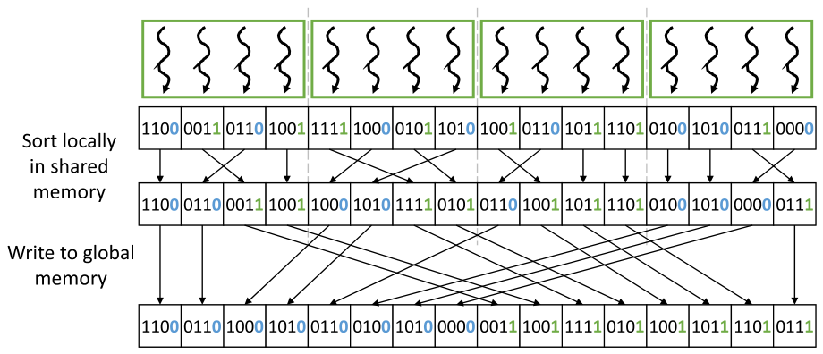

*Figure 14.8 — shared memory 에서 지역 정렬을 먼저 한 뒤 global memory 로 정렬해 넣어 memory coalescing 을 최적화한다. (책 p.341)*

> 이 예에서 **각 thread block 이 먼저 자기가 소유한 key 들에 지역 radix sort** 를 수행해
> 출력 목록을 shared memory 에 저장한다.
> 지역 정렬은 앞서 전역 정렬을 한 방식과 **똑같이** 할 수 있고,
> **각 block 이 전역 exclusive scan 대신 지역 exclusive scan 만** 하면 된다 (책 p.340).

**block 0 을 예로 들면**: key 는 `1100`(0), `0011`(1), `0110`(0), `1001`(1) 이고,
지역 정렬 후 `1100 0110 | 0011 1001` 이 된다.

> 지역 정렬 후 각 thread block 은 자기 지역 bucket 을 전역 bucket 에 **더 coalesced 하게** 쓴다.
> 예컨대 Figure 14.8 에서 첫 block 이 bucket 을 global memory 에 쓰는 방식을 보라.
> **첫 두 thread 는 zero bucket 을 쓸 때 global memory 의 인접 위치에** 쓰고,
> **마지막 두 thread 도 one bucket 을 쓸 때 인접 위치에** 쓴다.
> 따라서 **global memory 쓰기의 대부분이 coalesced** 된다 (책 p.340).

| | Figure 14.7 (기본) | Figure 14.8 (지역 정렬) |
|---|---|---|
| block 0 thread 0~3 의 목적지 | 0, 8, 1, 9 | **0, 1, 8, 9** |
| 연속 구간 수 | 4 | **2** |

**thread 를 재배치한 것이 아니라 데이터를 shared memory 안에서 재배치**한 것이다.

### 3. 지역 bucket 의 전역 위치 — 다시 scan

> 이 최적화의 **주된 어려움은 각 thread block 이 자기 지역 bucket 각각의
> 대응하는 전역 bucket 안에서의 시작 위치를 알아내는 것**이다.
> block 의 지역 bucket 시작 위치는 **다른 block 들의 지역 bucket 크기**에 달려 있다.
> 특히 어떤 block 의 지역 zero bucket 위치는 **앞선 모든 block 의 지역 zero bucket 뒤**다.
> 반면 지역 one bucket 위치는 **모든 block 의 지역 zero bucket 전부와
> 앞선 block 들의 지역 one bucket 뒤**다.
> 이 위치들은 **block 들의 지역 bucket 크기에 exclusive scan 을 수행해** 얻을 수 있다 (책 p.340).

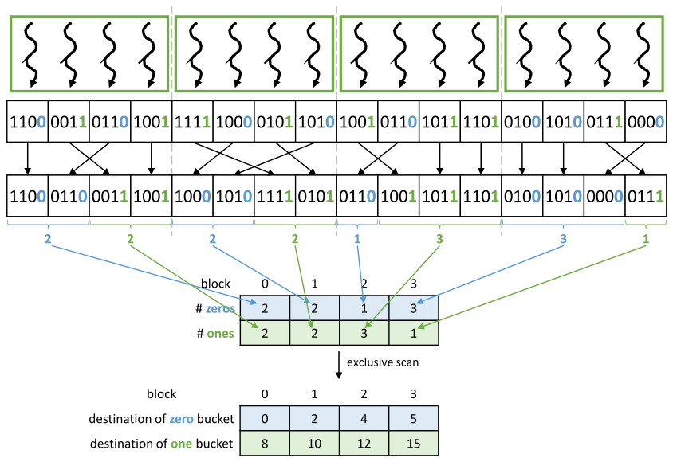

*Figure 14.9 — 각 thread block 의 지역 bucket 의 목적지를 찾는다. (책 p.341)*

> 지역 radix sort 를 마친 뒤 각 block 이 자기 지역 bucket 각각의 key 수를 알아낸다.
> 그다음 각 block 이 이 값들을 표에 저장한다.
> **표는 row-major 로 저장**되는데, 이는 **모든 block 의 지역 zero bucket 크기를 연속으로 놓고
> 그다음에 지역 one bucket 크기들을 놓는다**는 뜻이다.
> 표가 만들어지면 **선형화된 표에 exclusive scan** 을 수행한다.
> 결과 표가 각 block 의 지역 bucket 시작 위치들이고, 그것이 우리가 찾던 값이다 (책 p.341).

**row-major 가 결정적이다.** 왜 그런지 표로 보자.

| | block 0 | block 1 | block 2 | block 3 |
|---|---|---|---|---|
| **# zeros** | 2 | 2 | 1 | 3 |
| **# ones** | 2 | 2 | 3 | 1 |

row-major 로 선형화하면 $[\,\underbrace{2, 2, 1, 3}_{\text{zeros}},\ \underbrace{2, 2, 3, 1}_{\text{ones}}\,]$ 이고,
exclusive scan 하면

$$[\,0,\ 2,\ 4,\ 5,\ \ 8,\ 10,\ 12,\ 15\,]$$

| | block 0 | block 1 | block 2 | block 3 |
|---|---|---|---|---|
| **zero bucket 목적지** | 0 | 2 | 4 | 5 |
| **one bucket 목적지** | 8 | 10 | 12 | 15 |

**Figure 14.9 의 아래 표와 정확히 일치한다.**

> **왜 row-major 여야 하는가.** exclusive scan 은 **선형 순서대로 누적**한다.
> 출력에서 zero 들이 전부 앞에 오고 one 들이 뒤에 오므로,
> **표의 선형 순서가 곧 출력의 물리적 순서**여야 한다.
> column-major(block 0 의 zero·one, block 1 의 zero·one, …)로 놓으면
> scan 이 "block 0 의 zero 뒤에 block 0 의 one" 이라는 **틀린 배치**를 낸다.
>
> 일반화하면 **표의 행 = bucket, 열 = block** 이고,
> **행 우선으로 읽은 순서가 출력 배치 순서**다. 14.7절에서 행이 $2^r$ 개로 늘어도 그대로다.

#### 어느 thread 가 어느 bucket 을 쓰는가

> 각 thread 는 **bucket zero 와 bucket one 의 key 수를 추적**해야 한다.
> 쓰기 국면에서 각 block 의 thread 들은 **자기 thread index 값에 따라** 둘 중 한 bucket 의
> key 를 쓴다. 예컨대 Figure 14.9 의 block 2 에서는 thread 0 이 zero bucket 의 key 하나를 쓰고
> thread 1~3 이 one bucket 의 key 세 개를 쓴다.
> 반면 block 3 에서는 thread 0~2 가 zero bucket 의 key 세 개를 쓰고 thread 3 이 one bucket 의
> key 하나를 쓴다 (책 p.342).

**지역 정렬 후 shared 배열에서 thread `t` 가 맡는 자리는 그냥 `t`** 이고,
그 자리가 zero bucket 인지 one bucket 인지는 **`t < numLocalZeros`** 로 판정한다.

```cuda
if (threadIdx.x < numLocalZeros) {
    output[zeroDst + threadIdx.x] = local[threadIdx.x];
} else {
    output[oneDst + (threadIdx.x - numLocalZeros)] = local[threadIdx.x];
}
```

> 이 최적화의 구현은 **독자를 위한 연습으로 남긴다** (책 p.342). → **14.11절 연습문제 1**

### 4. 검증 — 결과가 바뀌지 않는가

**최적화가 결과를 바꾸면 안 된다.** 코드로 확인했다.

| | 출력 |
|---|---|
| **Figure 14.7** (전역) | `1100 0110 1000 1010 0110 0100 1010 0000 0011 1001 1111 0101 1001 1011 1101 0111` |
| **Figure 14.8** (지역→전역) | **동일** |

> **당연하지만 확인할 가치가 있다.** 지역 정렬이 stable 하고,
> block 들이 **원래 순서대로** 전역 bucket 에 배치되므로 (scan 이 그렇게 만든다)
> **전체가 stable** 하게 유지된다.
> 만약 block 배치 순서를 atomic 으로 정했다면 (12.4절의 privatization 처럼)
> **stability 가 깨져 radix sort 가 통째로 틀린다.**
> **12장에서는 privatization 에 atomic 을 써도 됐지만 여기서는 절대 안 된다** —
> 같은 기법이 문맥에 따라 쓸 수 있고 없고가 갈리는 좋은 사례다.

### 5. 예제/실습

#### 연습문제

> block 크기 4, Figure 14.9 의 상황에서
> **(1)** block 2 의 지역 정렬 결과와 각 thread 의 최종 목적지를 적어라.
> **(2)** 만약 표를 column-major 로 놓고 scan 하면 어떤 배치가 나오는가?

**(1)** block 2 의 key 는 `1001`(1), `0110`(0), `1011`(1), `1101`(1) 이다.
지역 정렬하면 `0110 | 1001 1011 1101` 이고 `numLocalZeros = 1` 이다.
목적지는 zero bucket 이 4, one bucket 이 12 이므로

| thread | 지역 배열 값 | bucket | 목적지 |
|---|---|---|---|
| 0 | `0110` | zero | $4 + 0 = \mathbf{4}$ |
| 1 | `1001` | one | $12 + 0 = \mathbf{12}$ |
| 2 | `1011` | one | $12 + 1 = \mathbf{13}$ |
| 3 | `1101` | one | $12 + 2 = \mathbf{14}$ |

**thread 1~3 이 12, 13, 14 로 연속** — 이것이 coalescing 개선이다.

**(2)** column-major 로 놓으면 $[2, 2,\ 2, 2,\ 1, 3,\ 3, 1]$ 이고
exclusive scan 은 $[0, 2, 4, 6, 8, 9, 12, 15]$ 다.
그러면 block 0 의 zero 가 0, one 이 2, block 1 의 zero 가 4… 로 배치되어
**출력이 `zero zero one one zero zero one one …` 로 뒤섞인다.**
**정렬이 아니다.** row-major 가 필수인 이유다.

---

## 14.7 Choice of radix value (책 p.342)

### 1. 개념적 이해

> 지금까지 1비트 radix 를 예로 radix sort 병렬화를 보았다.
> 예제의 4비트 key 에는 네 번의 반복(비트마다 하나)이 필요했다.
> 일반적으로 **$N$ 비트 key 에는 $N$ 번의 반복**이 필요하다.
> **필요한 반복 수를 줄이려면 더 큰 radix 값**을 쓸 수 있다 (책 p.342).

> **표기 주의**: 책이 여기서 key 의 비트 수를 $N$ 이라 썼는데,
> 이 장의 다른 곳에서 $N$ 은 **입력 목록의 원소 수**다.
> 혼동을 막기 위해 이 노트에서는 **key 의 비트 수를 $b$, radix 의 비트 수를 $r$** 로 쓴다.
> 그러면 반복 수는 $\lceil b/r \rceil$ 이다.

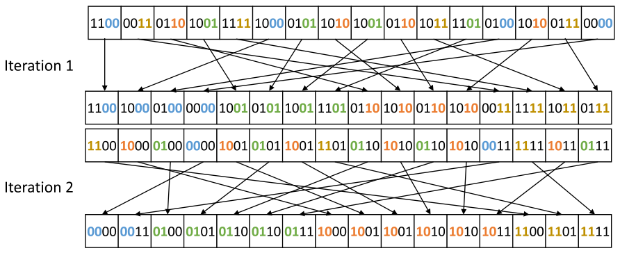

*Figure 14.10 — 2비트 radix 를 쓴 radix sort 예. (책 p.343)*

> 각 반복이 **두 비트**를 써서 key 를 bucket 에 분배한다.
> 따라서 4비트 key 를 **두 번의 반복만으로** 완전히 정렬할 수 있다.
> 첫 반복에서 하위 두 비트를 보고 key 를 `00`, `01`, `10`, `11` 에 대응하는 **네 bucket** 에
> 분배한다. 둘째 반복에서는 상위 두 비트를 본다 (책 p.342).

> **직접 확인한 사실 하나** — Figure 14.10 의 **1차 반복 출력**은
> Figure 14.4 의 **2차 반복 출력과 완전히 같다.**
>
> `1100 1000 0100 0000 1001 0101 1001 1101 0110 1010 0110 1010 0011 1111 1011 0111`
>
> **당연하다.** 2비트 radix 반복 한 번은 **1비트 radix 반복 두 번과 정확히 같은 순열**을 만든다
> (둘 다 하위 2비트로 stable 정렬하니까).
> 그리고 이것이 **14.7절이 말하는 "지역 정렬에서 $r$ 비트를 $r$ 번의 1비트 반복으로 처리한다"**
> 의 근거다.

### 2. 어떻게 구현하는가

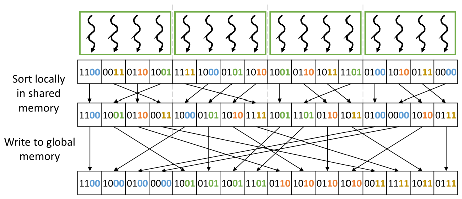

*Figure 14.11 — 2비트 radix 에 대해 shared memory 를 써서 radix sort 반복을 병렬화하고 memory coalescing 을 최적화한다. (책 p.343)*

> **1비트 예와 2비트 예의 핵심 차이는 key 를 둘이 아니라 네 bucket 으로 나누는 방법**이다.
> **각 thread block 안의 지역 정렬에서는, 2비트 radix sort 를
> 연속된 두 번의 1비트 radix sort 반복을 적용해 수행**한다.
> 이 1비트 반복들은 각각 자기만의 exclusive scan 연산을 필요로 하지만,
> **이 연산들은 block 에 지역적이라 두 1비트 반복 사이에 block 간 조율이 없다.**
> 일반적으로 **$r$ 비트 radix 에는 $r$ 번의 지역 1비트 반복**이 필요하며
> key 를 $2^r$ 개의 지역 bucket 으로 정렬한다 (책 p.342).

**이것이 이 절의 가장 실용적인 통찰이다.**
"$2^r$ 개 bucket 으로 한 번에 분배하는 코드"를 새로 짤 필요가 없다 —
**이미 있는 1비트 코드를 $r$ 번 돌리면 된다.**

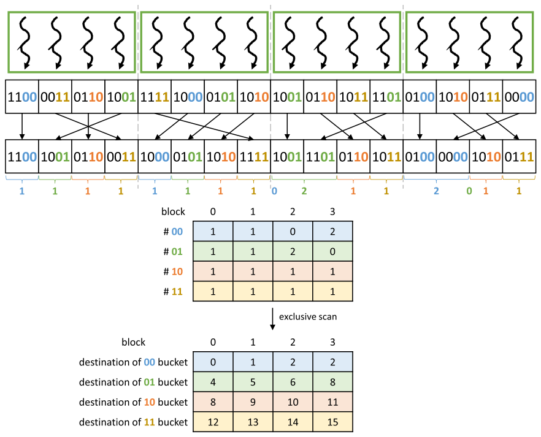

*Figure 14.12 — 2비트 radix 에 대해 각 block 의 지역 bucket 의 목적지를 찾는다. (책 p.344)*

> 절차는 1비트 예(Figure 14.9)와 비슷하다. …
> **1비트 예와의 주된 차이는 각 block 이 지역 bucket 을 둘이 아니라 넷 갖는다는 것**이고,
> 따라서 exclusive scan 이 **행이 둘이 아니라 넷인 표**에 수행된다.
> 일반적으로 $r$ 비트 radix 에서는 **행이 $2^r$ 개인 표**에 scan 이 수행된다 (책 p.343).

**손으로 확인해 보자.** 하위 2비트로 분류한 block 별 개수는

| | block 0 | block 1 | block 2 | block 3 |
|---|---|---|---|---|
| **# `00`** | 1 | 1 | 0 | 2 |
| **# `01`** | 1 | 1 | 2 | 0 |
| **# `10`** | 1 | 1 | 1 | 1 |
| **# `11`** | 1 | 1 | 1 | 1 |

row-major 선형화 후 exclusive scan 하면

| | block 0 | block 1 | block 2 | block 3 |
|---|---|---|---|---|
| **`00` bucket 목적지** | 0 | 1 | 2 | 2 |
| **`01` bucket 목적지** | 4 | 5 | 6 | 8 |
| **`10` bucket 목적지** | 8 | 9 | 10 | 11 |
| **`11` bucket 목적지** | 12 | 13 | 14 | 15 |

**Figure 14.12 의 아래 표와 정확히 일치한다.**
block 2 의 `00` bucket 이 비어 있어서(0개) block 2 와 block 3 의 목적지가 **둘 다 2** 인 것,
block 3 의 `01` bucket 이 비어서 목적지가 8 이 되는 것까지 맞다.

### 3. 수식/유도 — radix 크기의 맞바꿈

> 더 큰 radix 를 쓰는 **이점은 key 를 완전히 정렬하는 데 필요한 반복 수가 준다**는 것이다.
> 반복이 적으면 **grid launch, global memory 접근, 전역 exclusive scan 연산**이 줄어든다.
> 그러나 더 큰 radix 는 **단점**도 있다 (책 p.343).

#### 전체 유도 과정 (먼저 한 번에)

$$\text{반복 수} \;=\; \left\lceil \frac{b}{r} \right\rceil \tag{1}$$

$$\text{전역 scan 표 크기} \;=\; 2^r \cdot B, \qquad B = \frac{N}{K} \tag{2}$$

$$\text{지역 bucket 당 key} \;=\; \frac{K}{2^r} \tag{3}$$

$$\text{지역 1비트 pass 총합} \;=\; \left\lceil \frac{b}{r} \right\rceil \cdot r \;\approx\; b \quad (\text{$r$ 과 무관}) \tag{4}$$

$K$ 는 block 당 key 수, $B$ 는 block 수다.

#### 단계별 설명

**(1)** $b$ 비트를 $r$ 비트씩 처리하므로 자명하다. **$r$ 이 커지면 준다** — 이것이 이득이다.

**(2)** 단점 첫째.

> 첫째 단점은 **각 thread block 이 지역 bucket 을 더 많이 갖고 각 bucket 의 key 는 더 적어진다**는
> 것이다. 결과적으로 각 block 이 **써야 할 서로 다른 전역 memory bucket 구획이 더 많아지고
> 각 구획에 쓸 데이터는 더 적어진다.**
> 이런 이유로 **radix 가 커질수록 memory coalescing 기회가 줄어든다** (책 p.343).

**(3)** 그것을 정량화한 것이 이 식이다.

**(2) 계속** — 단점 둘째.

> 둘째 단점은 **전역 exclusive scan 이 적용되는 표가 radix 가 커질수록 커진다**는 것이다.
> 이런 이유로 **radix 가 커질수록 전역 exclusive scan 의 오버헤드가 늘어난다** (책 p.343~344).

**(4)** 그런데 **지역 scan 의 총량은 $r$ 과 무관하다.** 반복이 $\lceil b/r\rceil$ 번이고
각 반복이 $r$ 번의 지역 1비트 pass 를 하므로 곱하면 $\approx b$ 로 상쇄된다. ∎

> **(4)는 책에 없는 관찰이다.** 그리고 실무적으로 중요하다 —
> **radix 를 키워 아끼는 것은 "전역" 작업(launch·global scan·global 왕복)이지
> "지역" 작업이 아니다.** 지역 정렬 비용은 어차피 $b$ 번의 1비트 pass 로 고정이다.

#### 숫자로 — $b = 32$, $N = 2^{20}$, block 당 key $K = 256$

| $r$ | 반복 수 | **전역 scan 표 크기** | **bucket 당 key** | 지역 1비트 pass 총합 |
|---|---|---|---|---|
| **1** | 32 | 8,192 | 128.0 | 32 |
| **2** | 16 | 16,384 | 64.0 | 32 |
| **4** | **8** | 65,536 | 16.0 | 32 |
| **8** | **4** | **1,048,576** | **1.0** | 32 |

**$r = 8$ 의 두 열을 보라.**

- **표 크기가 $2^8 \times 4096 = 1{,}048{,}576$ = 입력 크기 $N$ 과 같아진다.**
  즉 **입력만큼 큰 배열에 전역 scan 을 한 번 더** 도는 셈이다.
- **bucket 당 key 가 1.0** 이다. 지역 bucket 하나에 key 가 하나뿐이니
  **coalescing 이 완전히 사라진다** — 14.6절의 최적화가 무의미해진다.

> **따라서 radix 를 무한정 크게 만들 수 없다.**
> radix 값의 선택은 **한쪽의 반복 수와, 다른 쪽의 memory coalescing 거동 및 전역 exclusive scan
> 오버헤드 사이에서 균형**을 잡아야 한다 (책 p.344).

**$r = 4$ 가 흔한 절충점**인 이유가 이 표에서 보인다 — 반복이 32에서 8로 $4\times$ 줄어드는데
표는 여전히 $N$ 의 6% 이고 bucket 당 key 16개면 coalescing 이 살아 있다.

> 다중 비트 radix 로 하는 radix sort 의 구현은 **연습으로 남긴다** (책 p.344).
> → **14.11절 연습문제 2**

<!--widget:radix-sort-->

### 4. 예제/실습

#### 연습문제

> $b = 32$, $N = 2^{24}$, block 당 key 1024개일 때
> **(1)** $r = 1, 2, 4, 8$ 각각의 반복 수·표 크기·bucket 당 key 를 구하라.
> **(2)** 표에 대한 전역 scan 비용이 입력에 대한 작업량의 10% 를 넘지 않으려면 $r$ 의 상한은?

**(1)** block 수 $B = 2^{24}/1024 = 16{,}384$ 다.

| $r$ | 반복 | 표 크기 $2^r B$ | bucket 당 key |
|---|---|---|---|
| 1 | 32 | 32,768 | 512 |
| 2 | 16 | 65,536 | 256 |
| 4 | 8 | 262,144 | 64 |
| 8 | 4 | **4,194,304** | 4 |

**(2)** 반복 하나가 입력에 하는 작업은 $O(N) = 2^{24}$, 표에 하는 작업은 $2^r B$ 다.

$$\frac{2^r B}{N} \le 0.1 \;\Longrightarrow\; \frac{2^r}{1024} \le 0.1 \;\Longrightarrow\; 2^r \le 102.4 \;\Longrightarrow\; r \le 6$$

**$r \le 6$** 이다. block 당 key 수 $K$ 가 클수록 이 상한이 커진다는 점을 눈여겨보자 —
$2^r \le 0.1K$ 이므로 **coarsening 이 radix 상한을 밀어 올린다.** 그것이 14.8절이다.

---

## 14.8 Thread coarsening to improve coalescing (책 p.344)

### 1. 개념적 이해

> radix sort 를 많은 thread block 에 걸쳐 병렬화하는 오버헤드는
> **global memory 쓰기의 나쁜 coalescing** 이다.
> 각 block 이 자기 지역 bucket 을 global memory 에 쓴다.
> **block 이 많다는 것은 block 당 key 가 적다는 뜻**이고,
> 그러면 **지역 bucket 이 작아져 global memory 로 쓸 때 coalescing 기회가 줄어든다.**
> 이 block 들이 병렬로 실행된다면 나쁜 coalescing 의 대가를 치를 만할 수도 있다.
> **그러나 이 block 들이 하드웨어에 의해 직렬화된다면 대가를 불필요하게 치르는 것**이다
> (책 p.344).

**마지막 문장이 coarsening 의 일반 원리다** (6.5절에서 처음 나왔다).
**하드웨어가 어차피 순차 실행할 병렬성은 만들어 봐야 손해**다.

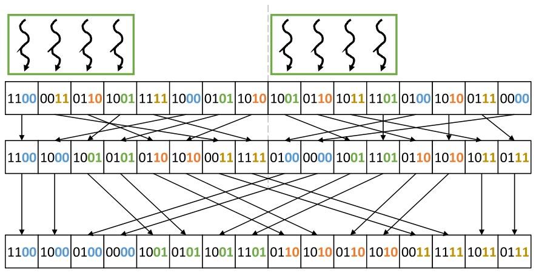

*Figure 14.13 — memory coalescing 을 개선하기 위해 thread coarsening 을 적용한 2비트 radix 의 radix sort. (책 p.345)*

> 이 경우 **각 block 이 Figure 14.11 의 예보다 더 많은 key** 를 담당한다.
> 결과적으로 각 block 의 **지역 bucket 이 더 커져 coalescing 기회가 더 많이 드러난다.**
> Figure 14.11 과 14.13 을 비교하면, 14.13 에서 **연속 thread 가 연속 메모리 위치에 쓸
> 가능성이 더 높다**는 것이 분명하다 (책 p.345).

Figure 14.11 은 block 4개(각 4 key), Figure 14.13 은 **block 2개(각 8 key)** 다.

| | Figure 14.11 | Figure 14.13 |
|---|---|---|
| block 수 | 4 | **2** |
| block 당 key | 4 | **8** |
| bucket 당 평균 key ($2^2$ bucket) | 1.0 | **2.0** |
| 전역 scan 표 크기 | $4 \times 4 = 16$ | $4 \times 2 = \mathbf{8}$ |

### 2. 두 번째 이득 — 표가 작아진다

> radix sort 를 많은 block 에 병렬화하는 또 하나의 오버헤드는
> **각 block 의 지역 bucket 목적지를 알아내기 위한 전역 exclusive scan** 이다.
> Figure 14.12 에서 본 대로 **scan 이 수행되는 표의 크기는 bucket 수와 block 수에 비례**한다.
> **thread coarsening 을 적용하면 block 수가 줄어들어 표 크기와 exclusive scan 오버헤드가 준다**
> (책 p.345).

**14.7절의 두 단점을 coarsening 이 동시에 완화한다.**

$$\text{표 크기} = 2^r \cdot \frac{N}{K}, \qquad \text{bucket 당 key} = \frac{K}{2^r}$$

**둘 다 $K$ (block 당 key 수)에만 의존**하고, coarsening 이 바로 $K$ 를 키운다.

#### 숫자로 — $b=32$, $N = 2^{20}$

| | $K = 256$ (coarsening 없음) | $K = 1024$ ($4\times$ coarsening) |
|---|---|---|
| block 수 | 4,096 | **1,024** |
| $r=4$: 표 크기 | 65,536 | **16,384** ($4\times$ 감소) |
| $r=4$: bucket 당 key | 16 | **64** ($4\times$ 증가) |
| $r=8$: 표 크기 | 1,048,576 | **262,144** |
| $r=8$: bucket 당 key | 1 | **4** |

> **coarsening 이 radix 선택의 여지를 넓힌다.**
> $K=256$ 에서는 $r=8$ 이 사실상 불가능했는데($N$ 만 한 표, bucket 당 key 1개),
> $K=1024$ 에서는 표가 $N$ 의 25% 이고 bucket 당 key 4개로 **간신히 쓸 만해진다.**
> **14.7절과 14.8절은 따로 읽으면 안 되고 함께 튜닝해야 하는 한 쌍**이다.

> thread coarsening 을 radix sort 에 적용하는 것은 **연습으로 남긴다** (책 p.345).
> → **14.11절 연습문제 3**

### 3. 예제/실습

#### 연습문제

> **(1)** coarsening factor 를 무한정 키우면 무엇이 막는가?
> **(2)** Figure 14.13 에서 block 하나가 key 8개를 4 thread 로 처리한다면
> thread 당 몇 개이고, 지역 정렬은 어떻게 하는가?

**(1)** 세 가지가 막는다.

| 무엇 | 왜 |
|---|---|
| **shared memory** | 지역 정렬을 하려면 block 의 key 를 전부 shared 에 담아야 한다. $K$ 개 × 4바이트가 한계 (5.6절) |
| **병렬성** | block 이 줄면 SM 을 다 채우지 못한다. block 수 $\ge$ SM 수 × 2 정도는 유지해야 한다 (4.6절) |
| **부하 불균형** | block 이 적으면 꼬리 효과(tail effect)의 상대적 비중이 커진다 (4.2절) |

**(2)** thread 당 **2개**다. 지역 정렬은 두 가지로 할 수 있다.

- **각 thread 가 자기 2개를 순차 정렬한 뒤 block scan** — 11.6절의 coarsened scan 구조 그대로
- **지역 1비트 pass 를 $r$ 번 반복** — 각 pass 에서 thread 가 자기 2개의 비트를 세고
  block 수준 exclusive scan 에 참여

후자가 구현이 단순하다. **연습문제 3 에서 후자로 구현한다.**

---

## 14.9 Other parallel sort methods (책 p.345)

### 1. sorting network

> 14.2절에서 다룬 odd-even transposition sort 는 **고정된 비교 패턴**을 쓰고 순서가 어긋나면
> 원소를 교환한다. **각 step 이 겹치지 않는 key 쌍을 비교하므로 병렬화가 쉽다.**
> 고정된 비교 패턴으로 수열을 정렬하는 정렬 방법의 **범주 전체**가 있고,
> 이들을 보통 **sorting network** 라 부른다.
> 가장 잘 알려진 병렬 sorting network 는 **Batcher 의 bitonic sort 와 odd-even merge sort** 다
> (책 p.345).

> Batcher 의 알고리즘들은 **고정 길이 수열**에 동작하며 odd-even transposition sort 보다
> 효율적이어서 원소 $N$ 개에 **$O(N \cdot \log^2 N)$ 번의 비교**만 필요하다.
> 이 알고리즘들의 비용이 merge sort 같은 방법의 $O(N\cdot\log N)$ 보다 **점근적으로 나쁨에도**,
> 실무에서는 **단순함 덕분에 작은 수열에서 가장 효율적인 방법인 경우가 많다** (책 p.346).

> **"점근적으로 나쁜데 실무에서 빠르다"** 는 이 장에서 두 번째로 나오는 구도다.
> 11.10절에서 Brent-Kung 이 work-efficient 한데도 Kogge-Stone 이 이겼던 것과 같다.
> **이유도 같다** — 비교 패턴이 고정이라 **분기도 동기화도 메모리 간접 참조도 없고,
> warp 안에서 shuffle 만으로 끝난다.** $N$ 이 작으면 그 상수가 전부다.

| | odd-even transposition | Batcher bitonic |
|---|---|---|
| 비교 횟수 | $O(N^2)$ | $O(N\log^2 N)$ |
| step 수 | $O(N)$ | $O(\log^2 N)$ |
| 쓰이는 곳 | 교육용 | **warp/block 안의 작은 정렬** — CUB 의 block sort 등 |

### 2. 두 범주 — 합칠 때 일하는가, 나눌 때 일하는가

> sorting network 특유의 고정된 비교 집합을 쓰지 않는 대부분의 comparison-based 병렬 정렬은
> **두 개의 큰 범주**로 나뉜다 (책 p.346).

| 범주 | 전략 | 대표 |
|---|---|---|
| **① 합칠 때 일한다** | 입력을 tile 로 나눠 각각 정렬하고, **일의 대부분을 tile 결합에서** 한다 | **merge sort** (14.3절) |
| **② 나눌 때 일한다** | **일의 대부분을 분할에서** 하고, 결합은 사소해진다 | **sample sort** |

> **sample sort** 는 입력에서 **$p-1$ 개의 key 를 (예컨대 무작위로) 고르고 정렬한 뒤,
> 그것으로 입력을 $p$ 개의 bucket 으로 분할**한다 —
> bucket $k$ 의 모든 key 가 bucket $j < k$ 의 모든 key 보다 크고 $j > k$ 의 모든 key 보다 작도록.
> 이 단계는 **quicksort 의 2-way 분할을 $p$-way 로 일반화**한 것과 유사하다.
> 이렇게 분할하고 나면 **각 bucket 을 독립적으로 정렬**할 수 있고,
> 정렬된 출력은 **bucket 을 순서대로 이어 붙이기만** 하면 된다 (책 p.346).

> sample sort 알고리즘은 **데이터가 여러 물리 메모리에 분산돼야 하는 아주 큰 수열**에서
> 종종 가장 효율적인 선택이다 — **한 node 안의 여러 GPU 메모리에 걸친 경우**를 포함해서.
> 실무에서는 **key 를 과표집(over-sampling)** 하는 것이 흔한데,
> 적당한 과표집이면 **높은 확률로 균형 잡힌 분할**이 나오기 때문이다 [6] (책 p.346).

> **23장(multi-GPU)의 예고편이다.** 결합에 통신이 필요한 merge sort 와 달리
> sample sort 는 **분할만 끝나면 각 GPU 가 완전히 독립적으로 정렬**하고
> 이어 붙이기에 통신이 필요 없다. **통신이 비싼 환경에서 ②가 이긴다.**

### 3. LSD 와 MSD

> merge sort 와 sample sort 가 comparison-based 정렬의 bottom-up 과 top-down 전략을
> 대표하듯, **radix 정렬 알고리즘도 bottom-up 이나 top-down 전략**을 따르도록 설계할 수 있다.
> 이 장에서 설명한 radix sort 는 더 정확히는 **least-significant bit (LSB)**,
> 더 일반적으로는 **least-significant digit (LSD) radix sort** 다.
> 알고리즘의 연속된 step 들이 key 의 최하위 자리에서 시작해 최상위 자리로 나아간다 (책 p.346).

> **most-significant digit (MSD) radix sort** 는 반대 전략을 취한다.
> **최상위 자리로 입력을 bucket 에 분할**하는 것으로 시작하고,
> 그다음 **각 bucket 안에서 독립적으로** 그다음 상위 자리로 같은 분할을 적용한다.
> 최하위 자리에 도달하면 전체 수열이 정렬돼 있다.
> sample sort 처럼 **MSD radix sort 도 아주 큰 수열에 더 나은 선택인 경우가 많다.**
> **LSD radix sort 는 매 step 마다 데이터의 전역 셔플을 요구**하는 반면,
> **MSD radix sort 의 각 step 은 점점 더 국소적인 영역에서 동작**하기 때문이다 (책 p.346).

**이 대비가 이 절의 결론이다.**

| | LSD (이 장) | MSD |
|---|---|---|
| 진행 방향 | 최하위 → 최상위 | 최상위 → 최하위 |
| 각 step 의 범위 | **전역** — 매번 배열 전체를 셔플 | **점점 국소적** — bucket 안에서만 |
| stability 필요 | **필수** (14.4절의 귀납) | 불필요 (bucket 이 이미 분리됨) |
| 유리한 경우 | 중간 크기, 단일 GPU | **아주 큰 수열, 분산 메모리** |

> **LSD 가 stability 를 필요로 하는 이유를 MSD 와 견주면 선명해진다.**
> LSD 는 "이미 한 일을 나중 step 이 보존해야" 하므로 stability 가 필수다.
> MSD 는 상위 자리로 먼저 갈라 놓아 **나중 step 이 다른 bucket 을 건드리지 않으므로**
> 보존할 것이 없다. **분할을 먼저 하느냐 나중에 하느냐가 stability 요구를 만든다.**

### 4. 예제/실습

#### 연습문제

> **(1)** 32개 원소를 warp 하나로 정렬한다면 이 장의 세 알고리즘 중 무엇을 고르겠는가?
> **(2)** GPU 8장에 걸쳐 $10^{10}$ 개 key 를 정렬한다면?

**(1)** **bitonic sort (sorting network)** 다.
$N=32$ 면 $\log^2 32 = 25$ step 이고, 비교 패턴이 고정이라
**`__shfl_xor_sync` 만으로 shared memory 도 barrier 도 없이** 끝난다.
radix sort 는 32비트 key 에 32번(또는 8번) 반복하며 매번 scan 이 필요해 과하고,
merge sort 는 co-rank 의 binary search 가 32개 원소에는 배보다 배꼽이다.

**(2)** **sample sort 로 GPU 사이를 분할하고, 각 GPU 안에서는 radix sort** 다.
sample sort 가 분할을 끝내면 **GPU 간 통신이 사라지고**,
각 GPU 안의 $\sim10^9$ 개는 radix sort 가 가장 빠르다.
LSD radix sort 를 GPU 8장에 걸쳐 직접 돌리면 **매 반복마다 전역 셔플**이 일어나
**GPU 사이의 bandwidth 가 병목**이 된다.

---

## 14.10 Summary (책 p.346)

책의 정리를 옮기면 (책 p.346~347):

- 이 장에서 GPU 에서 key(와 그에 딸린 value)를 병렬로 정렬하는 법을 보았다.
  **comparison-based 병렬 정렬 둘** — parallel odd-even sort 와 parallel merge sort — 로 시작했다.
  odd-even sort 는 **race condition 을 피하려고 홀짝 쌍을 번갈아 가며** 인접 원소 쌍을
  반복 교환한다. merge sort 는 서로 다른 입력 구획의 **독립 merge 를 병렬로** 수행하고,
  **13장의 병렬 merge 를 활용해 각 merge 안에서도 병렬화**한다.
- 그다음 **$O(N\log N)$ 보다 낮은 work 복잡도**를 갖는 non-comparison-based 정렬,
  **radix sort** 에 집중했다. radix sort 는 **key 를 bucket 에 반복 분배**하며 동작하고,
  분배는 key 의 자리마다 반복되며 **이전 자리 반복의 순서를 보존**해
  마지막에 모든 자리로 정렬되게 한다.
  각 반복은 **입력 key 마다 thread 를 배정**하고 그 thread 가 출력에서 key 의 목적지를 찾도록
  병렬화되며, 여기에 **exclusive scan 을 위한 다른 thread 와의 협력**이 개입한다.
- radix sort 최적화의 핵심 난제 하나는 **key 를 출력 목록에 쓸 때의 coalesced 메모리 접근**이다.
  coalescing 을 높이는 중요한 최적화는 **각 block 이 shared memory 의 지역 bucket 으로
  지역 정렬을 한 뒤 각 지역 bucket 을 coalesced 하게 global memory 에 쓰는 것**이다.
  또 다른 최적화는 **radix 크기를 키워 반복 수와 grid launch 수를 줄이는 것**이다.
  그러나 radix 크기를 너무 키우면 **coalescing 이 나빠지고 전역 exclusive scan 오버헤드가
  늘어난다.** 마지막으로 **thread coarsening 은 coalescing 개선과 전역 exclusive scan
  오버헤드 감소 양쪽에 효과적**이다.
- GPU 에서 병렬 정렬을 구현·최적화하는 것은 복잡하므로,
  프로그래머는 자기 정렬 kernel 을 처음부터 만들기보다 **Thrust [7,8] 나 CUB [9] 같은
  GPU 병렬 정렬 라이브러리를 쓰기를 권한다.**
  그럼에도 **병렬 정렬은 병렬 패턴 최적화에 들어가는 맞바꿈들의 흥미로운 사례 연구**로 남는다.

### 세 알고리즘을 한눈에

| | odd-even sort | merge sort | **radix sort** |
|---|---|---|---|
| 종류 | comparison | comparison | **non-comparison** |
| time | $O(N)$ | $O(\log^2 N)$ | $O(b/r)$ 회의 kernel |
| work | $O(N^2)$ | $O(N\log^2 N)$ | $O(N \cdot b/r)$ |
| 쓰는 앞 장 도구 | — | **13장 co-rank** | **11장 scan · 12장 stable partition** |
| 핵심 최적화 | — | 단계별 block 재배정 | **지역 정렬 + radix 크기 + coarsening** |
| stability | 있음 (`>` 비교) | 있음 (13장) | **필수** — 없으면 알고리즘이 틀린다 |

---

## 14.11 Exercises (책 p.347)

### 연습문제 1

> **Figure 14.7 의 kernel 을 shared memory 를 써서 memory coalescing 이 개선되도록 확장하라.**

14.6절이 그림으로 설명한 것을 코드로 옮긴다. **세 국면**으로 나뉜다.

```cuda
#define BLOCK_DIM 256

// ── Phase 1: block 마다 지역 정렬 + 지역 bucket 크기를 표에 기록 ─────────
__global__ void radix_local_sort(unsigned int* input, unsigned int* localSorted,
                                 unsigned int* table, unsigned int N,
                                 unsigned int iter) {
    __shared__ unsigned int keys_s[BLOCK_DIM];
    __shared__ unsigned int bits_s[BLOCK_DIM];
    unsigned int t = threadIdx.x;
    unsigned int i = blockIdx.x*BLOCK_DIM + t;

    // 적재 — 범위 밖은 최댓값으로 채워 뒤로 밀리게 한다
    unsigned int key = (i < N) ? input[i] : 0xFFFFFFFFu;
    keys_s[t] = key;
    __syncthreads();

    // ① 지역 1비트 정렬 (12.5절 stable filter 의 block 판)
    unsigned int bit = (key >> iter) & 1;
    bits_s[t] = bit;
    __syncthreads();
    unsigned int onesBefore = blockExclusiveScan(bits_s);   // 11.4절 block scan
    __syncthreads();
    unsigned int numOnes  = bits_s[BLOCK_DIM-1] + ((keys_s[BLOCK_DIM-1] >> iter) & 1);
    unsigned int numZeros = BLOCK_DIM - numOnes;
    unsigned int dst = (bit == 0) ? (t - onesBefore)
                                  : (numZeros + onesBefore);
    __shared__ unsigned int sorted_s[BLOCK_DIM];
    sorted_s[dst] = key;                       // 지역 출력 (shared)
    __syncthreads();

    // ② 지역 bucket 크기를 표에 기록 — row-major: table[bucket*gridDim.x + blockIdx.x]
    if (t == 0) {
        table[0*gridDim.x + blockIdx.x] = numZeros;
        table[1*gridDim.x + blockIdx.x] = numOnes;
    }
    // ③ 지역 정렬 결과를 global 에 보관 (Phase 3 에서 다시 읽는다) — coalesced
    if (i < N) localSorted[i] = sorted_s[t];
}

// ── Phase 2: 표에 대한 전역 exclusive scan (11.9절) ──────────────────────
//    scanExclusive(table, tableOffset, 2*gridDim.x);

// ── Phase 3: 지역 bucket 을 전역 bucket 으로 — coalesced ────────────────
__global__ void radix_scatter(unsigned int* localSorted, unsigned int* output,
                              unsigned int* table, unsigned int* tableOffset,
                              unsigned int N, unsigned int iter) {
    unsigned int t = threadIdx.x;
    unsigned int i = blockIdx.x*BLOCK_DIM + t;
    __shared__ unsigned int numZeros_s, zeroDst_s, oneDst_s;
    if (t == 0) {
        numZeros_s = table[0*gridDim.x + blockIdx.x];
        zeroDst_s  = tableOffset[0*gridDim.x + blockIdx.x];
        oneDst_s   = tableOffset[1*gridDim.x + blockIdx.x];
    }
    __syncthreads();
    if (i < N) {
        unsigned int key = localSorted[i];      // coalesced 읽기
        unsigned int dst = (t < numZeros_s) ? (zeroDst_s + t)
                                            : (oneDst_s + (t - numZeros_s));
        output[dst] = key;                      // 두 개의 연속 구간으로 쓴다
    }
}
```

#### 설계에서 짚을 점 넷

**① `table` 의 인덱싱이 row-major 여야 한다.**
`table[bucket*gridDim.x + blockIdx.x]` 다. 14.6절 연습에서 본 대로
column-major 로 두면 **정렬이 아예 틀린다.**

**② 범위 밖 key 를 `0xFFFFFFFF` 로 채운 것**은 마지막 block 을 위한 것이다.
그 key 는 어차피 `i < N` 검사로 출력되지 않지만,
**지역 정렬의 scan 에는 참여하므로** 값이 정의돼 있어야 한다.
`numZeros` 계산이 실제보다 커지지 않도록 **1로 채우는 쪽**을 골랐다
(`0xFFFFFFFF` 는 모든 비트가 1이므로 언제나 one bucket).

**③ 세 kernel 로 쪼갠 이유**는 Phase 2 의 전역 scan 이 **모든 block 의 표가 완성된 뒤에야**
가능하기 때문이다. **kernel 경계가 grid 전체 barrier 역할**을 한다 (13.10절 연습 1 과 같은 구도).
11.9절의 단일 kernel scan 을 쓰면 하나로 합칠 수 있다.

**④ `localSorted` 를 global 에 한 번 다녀오는 비용**이 생긴다.
$N$ 쓰기 + $N$ 읽기가 추가되는 셈인데,
**그 대가로 최종 쓰기가 coalesced 해진다.**
Phase 1·3 의 접근은 전부 coalesced 이므로, 흩어진 쓰기 $N$ 번을
**coalesced 왕복 $2N$ + coalesced 쓰기 $N$** 으로 바꾼 것이다.
uncoalesced 쓰기가 최대 $32\times$ 의 transaction 을 유발할 수 있으므로 **이득이다.**

### 연습문제 2

> **Figure 14.7 의 kernel 을 다중 비트 radix 에서 동작하도록 확장하라.**

14.7절의 방식대로, **지역 정렬은 1비트 pass 를 $r$ 번** 돌리고
**표는 행이 $2^r$ 개**가 된다.

```cuda
#define RADIX_BITS 4
#define NUM_BUCKETS (1 << RADIX_BITS)          // 16

__global__ void radix_local_sort_multibit(unsigned int* input,
        unsigned int* localSorted, unsigned int* table,
        unsigned int N, unsigned int iter) {
    __shared__ unsigned int keys_s[BLOCK_DIM];
    __shared__ unsigned int bits_s[BLOCK_DIM];
    __shared__ unsigned int count_s[NUM_BUCKETS];
    unsigned int t = threadIdx.x;
    unsigned int i = blockIdx.x*BLOCK_DIM + t;

    keys_s[t] = (i < N) ? input[i] : 0xFFFFFFFFu;
    __syncthreads();

    // ── ① r 번의 지역 1비트 정렬 = 2^r 개 bucket 으로의 지역 정렬 ──
    //    14.7절: "r-bit radix 에는 r 번의 지역 1비트 반복이 필요하다"
    for (unsigned int b = 0; b < RADIX_BITS; ++b) {
        unsigned int key = keys_s[t];
        unsigned int bit = (key >> (iter*RADIX_BITS + b)) & 1;
        bits_s[t] = bit;
        __syncthreads();
        unsigned int onesBefore = blockExclusiveScan(bits_s);
        __syncthreads();
        unsigned int numOnes = bits_s[BLOCK_DIM-1]
                             + ((keys_s[BLOCK_DIM-1] >> (iter*RADIX_BITS + b)) & 1);
        unsigned int dst = (bit == 0) ? (t - onesBefore)
                                      : (BLOCK_DIM - numOnes + onesBefore);
        __syncthreads();                        // 읽기가 끝난 뒤에 쓴다 (12.7절 in-place)
        keys_s[dst] = key;
        __syncthreads();
    }

    // ── ② 지역 bucket 크기 세기 ──
    if (t < NUM_BUCKETS) count_s[t] = 0;
    __syncthreads();
    unsigned int digit = (keys_s[t] >> (iter*RADIX_BITS)) & (NUM_BUCKETS-1);
    if (i < N) {
        cuda::atomic_ref<unsigned int, cuda::thread_scope_block> c(count_s[digit]);
        c.fetch_add(1, cuda::memory_order_relaxed);      // 9장 privatization
    }
    __syncthreads();

    // ── ③ 표에 기록 (row-major) + 지역 정렬 결과 보관 ──
    if (t < NUM_BUCKETS) table[t*gridDim.x + blockIdx.x] = count_s[t];
    if (i < N) localSorted[i] = keys_s[t];
}
```

Phase 2 의 전역 scan 은 **길이 $2^r \times B$** 인 표에 수행하고,
Phase 3 은 thread 가 자기 자리의 digit 을 보고 해당 bucket 의 목적지로 쓴다.

```cuda
    // Phase 3 의 핵심 — 자기 digit 의 bucket 안에서 몇 번째인가
    unsigned int digit = (key >> (iter*RADIX_BITS)) & (NUM_BUCKETS-1);
    unsigned int rankInBucket = t - bucketStart_s[digit];   // 지역 정렬돼 있으므로 뺄셈으로 충분
    output[tableOffset[digit*gridDim.x + blockIdx.x] + rankInBucket] = key;
```

> **`bucketStart_s[digit]` 는 지역 bucket 의 시작 위치**이고,
> 지역 정렬 결과에서 **`count_s` 의 exclusive scan** 으로 얻는다 ($2^r$ 개짜리 작은 scan).
> **지역 정렬이 끝나 있으므로 같은 digit 의 thread 들이 연속**이고,
> 그래서 `t - bucketStart_s[digit]` 가 곧 bucket 안의 순번이다.

#### $r$ 을 고를 때

14.7절의 표를 그대로 쓴다. `BLOCK_DIM = 256`, $N = 2^{20}$ 이면

| $r$ | 반복 | 표 크기 | bucket 당 key | 판정 |
|---|---|---|---|---|
| 2 | 16 | 16,384 | 64 | 무난 |
| **4** | **8** | 65,536 | 16 | **권장** |
| 8 | 4 | 1,048,576 | 1 | **표가 입력만큼 커진다 — 피한다** |

### 연습문제 3

> **Figure 14.7 의 kernel 에 thread coarsening 을 적용해 memory coalescing 을 개선하라.**

연습 2 의 kernel 에서 **thread 하나가 `COARSE_FACTOR` 개의 key** 를 맡게 한다.

```cuda
#define COARSE_FACTOR 4
#define KEYS_PER_BLOCK (BLOCK_DIM*COARSE_FACTOR)

__global__ void radix_local_sort_coarsened(unsigned int* input,
        unsigned int* localSorted, unsigned int* table,
        unsigned int N, unsigned int iter) {
    __shared__ unsigned int keys_s[KEYS_PER_BLOCK];
    __shared__ unsigned int bits_s[KEYS_PER_BLOCK];
    __shared__ unsigned int count_s[NUM_BUCKETS];
    unsigned int t = threadIdx.x;
    unsigned int base = blockIdx.x*KEYS_PER_BLOCK;

    // ── 적재: stride = BLOCK_DIM (연속 thread → 연속 주소 → coalesced) ──
    for (unsigned int c = 0; c < COARSE_FACTOR; ++c) {
        unsigned int s = c*BLOCK_DIM + t;
        keys_s[s] = (base + s < N) ? input[base + s] : 0xFFFFFFFFu;
    }
    __syncthreads();

    // ── r 번의 지역 1비트 정렬 — 이제 KEYS_PER_BLOCK 개에 대해 ──
    for (unsigned int b = 0; b < RADIX_BITS; ++b) {
        unsigned int shift = iter*RADIX_BITS + b;
        unsigned int myKey[COARSE_FACTOR], myBit[COARSE_FACTOR];
        for (unsigned int c = 0; c < COARSE_FACTOR; ++c) {
            unsigned int s = c*BLOCK_DIM + t;
            myKey[c] = keys_s[s];
            myBit[c] = (myKey[c] >> shift) & 1;
            bits_s[s] = myBit[c];
        }
        __syncthreads();
        // KEYS_PER_BLOCK 개에 대한 block exclusive scan (11.6절 coarsened scan)
        unsigned int numOnes = blockExclusiveScanCoarsened(bits_s, KEYS_PER_BLOCK);
        __syncthreads();
        unsigned int numZeros = KEYS_PER_BLOCK - numOnes;
        for (unsigned int c = 0; c < COARSE_FACTOR; ++c) {
            unsigned int s = c*BLOCK_DIM + t;
            unsigned int ob = bits_s[s];                 // scan 결과 = 앞의 1 개수
            unsigned int dst = (myBit[c] == 0) ? (s - ob) : (numZeros + ob);
            keys_s[dst] = myKey[c];                      // 읽어 둔 값을 쓴다
        }
        __syncthreads();
    }
    /* 이하 bucket 세기·표 기록·보관은 연습 2 와 같되 KEYS_PER_BLOCK 만큼 반복 */
}
```

#### 무엇이 좋아지는가

$N = 2^{20}$, `BLOCK_DIM` = 256, $r = 4$ 기준이다.

| | $C = 1$ | $C = 4$ |
|---|---|---|
| block 당 key | 256 | **1024** |
| block 수 | 4,096 | **1,024** |
| **전역 scan 표 크기** | 65,536 | **16,384** ($4\times$ 감소) |
| **bucket 당 평균 key** | 16 | **64** ($4\times$ 증가) |
| shared memory | 2 KB | **8 KB** |

> **`myKey[]`·`myBit[]` 를 register 에 먼저 읽어 두는 것이 중요하다.**
> 마지막 loop 에서 `keys_s[dst] = myKey[c]` 로 **제자리(in-place)** 재배치를 하는데,
> `keys_s[s]` 를 직접 읽으면 **다른 thread 가 이미 덮어썼을 수 있다.**
> 12.7절의 in-place filter 에서 본 것과 똑같은 위험이고,
> 해법도 같다 — **"전부 읽고 나서 barrier, 그다음 쓴다."**
> 여기서는 register 에 담아 두는 것이 그 역할을 한다.

### 연습문제 4

> **13장의 병렬 merge 구현을 써서 parallel merge sort 를 구현하라.**

14.3절의 Figure 14.3 을 코드로 옮긴다. **host 쪽 loop 가 뼈대**다.

```cuda
// ── host 코드 ────────────────────────────────────────────────────
void merge_sort(unsigned int* d_data, unsigned int* d_temp, unsigned int N) {
    // ① 구획별 지역 정렬 — block 하나가 SEG_SIZE 개를 shared memory 에서 정렬
    unsigned int numSeg = (N + SEG_SIZE - 1) / SEG_SIZE;
    sort_segments_kernel<<<numSeg, BLOCK_DIM>>>(d_data, N, SEG_SIZE);

    // ② merge tree — 구획 크기를 두 배씩 키우며 합친다
    unsigned int* src = d_data;
    unsigned int* dst = d_temp;
    for (unsigned int width = SEG_SIZE; width < N; width *= 2) {
        unsigned int numMerges = (N + 2*width - 1) / (2*width);
        // 병렬성이 across 에서 within 으로 옮겨 가는 것을 block 배정으로 흡수한다
        unsigned int blocksPerMerge = max(1u, TOTAL_BLOCKS / numMerges);
        merge_tree_kernel<<<numMerges*blocksPerMerge, BLOCK_DIM>>>(
            src, dst, N, width, blocksPerMerge);
        unsigned int* tmp = src; src = dst; dst = tmp;   // ping-pong
    }
    if (src != d_data) cudaMemcpy(d_data, src, N*sizeof(unsigned int),
                                  cudaMemcpyDeviceToDevice);
}
```

```cuda
// ── merge tree 의 한 단계 ────────────────────────────────────────
__global__ void merge_tree_kernel(unsigned int* src, unsigned int* dst,
        unsigned int N, unsigned int width, unsigned int blocksPerMerge) {
    unsigned int mergeId = blockIdx.x / blocksPerMerge;   // 몇 번째 merge 인가
    unsigned int subBlock = blockIdx.x % blocksPerMerge;  // 그 안에서 몇 번째 block 인가

    // 이 merge 가 다룰 두 구획 A · B
    unsigned int aStart = mergeId*2*width;
    if (aStart >= N) return;
    unsigned int aLen = min(width, N - aStart);
    unsigned int bStart = aStart + width;
    unsigned int bLen = (bStart >= N) ? 0 : min(width, N - bStart);
    unsigned int* A = src + aStart;
    unsigned int* B = src + bStart;
    unsigned int* C = dst + aStart;
    unsigned int total = aLen + bLen;

    // ── 여기서부터가 13장 그대로다 ──
    // 이 block 이 맡을 출력 구간을 blocksPerMerge 등분으로 정한다
    unsigned int cCurr = (unsigned int)((unsigned long long)total*subBlock / blocksPerMerge);
    unsigned int cNext = (unsigned int)((unsigned long long)total*(subBlock+1) / blocksPerMerge);

    // block 수준 co-rank (13.6절 Figure 13.11 — thread 0 만 계산해 공유)
    __shared__ unsigned int aCurr_s, aNext_s;
    if (threadIdx.x == 0) {
        aCurr_s = co_rank(cCurr, A, aLen, B, bLen);
        aNext_s = co_rank(cNext, A, aLen, B, bLen);
    }
    __syncthreads();
    unsigned int aCurr = aCurr_s, aNext = aNext_s;
    unsigned int bCurr = cCurr - aCurr, bNext = cNext - aNext;

    // 이후는 13.6·13.7절의 tiled / circular-buffer merge 를 그대로 호출한다
    merge_tiled_body(A + aCurr, aNext - aCurr,
                     B + bCurr, bNext - bCurr,
                     C + cCurr);
}
```

#### 설계에서 짚을 점 넷

**① `blocksPerMerge` 가 14.3절의 핵심을 구현한다.**
`TOTAL_BLOCKS / numMerges` 로 **단계가 진행될수록 merge 하나에 더 많은 block** 을 준다.
$8 \to 4 \to 2 \to 1$ 개의 merge 에 각각 $1 \to 2 \to 4 \to 8$ block 이 붙는다.
**총 block 수가 일정**하게 유지된다.

**② `co_rank` 를 두 층에서 부른다.**
block 수준(위 코드)과 thread 수준(`merge_tiled_body` 안)이다.
13.6절 Figure 13.11 이 정확히 이 구조였다.

**③ ping-pong 버퍼가 필수다.**
merge 는 **in-place 로 할 수 없다** — 13.7절의 in-place 논의는 **filter/이동** 패턴이지
merge 가 아니다. merge 는 두 입력 구획이 하나의 출력 구획으로 **겹쳐 들어가므로**
같은 배열에 쓰면 아직 안 읽은 값을 덮어쓴다. 그래서 `src`/`dst` 를 번갈아 쓴다.

**④ 초기 구획 정렬(①)은 무엇으로 하는가.**
`SEG_SIZE` 가 block 하나가 shared memory 에 담을 만한 크기(예: 1024~2048)라면
**14.9절의 bitonic sort** 가 가장 빠르다 —
비교 패턴이 고정이라 shared memory 안에서 barrier 만으로 끝난다.
odd-even sort 를 써도 되지만 $O(N^2)$ work 라 `SEG_SIZE` 를 작게 잡아야 한다.

> **복잡도 확인**: 구획 정렬이 $O(N \log^2 \texttt{SEG\_SIZE})$,
> merge tree 가 $\log_2(N/\texttt{SEG\_SIZE})$ 단계 × 단계당 $O(N\log N)$ work
> $= O(N\log^2 N)$ — 14.3절의 분석과 일치한다.

### 검산

이 장에서 손으로 계산한 값들을 코드로 다시 계산해 대조한다.

```python
# 실행: python3 verify14.py   (표준 라이브러리만 사용)
import math

# ── Figure 14.1 odd-even sort ──────────────────────────────────────
def one_pass(a, odd):
    a = a[:]; ch = False
    for i in range(odd, len(a)-1, 2):
        if a[i] > a[i+1]: a[i], a[i+1] = a[i+1], a[i]; ch = True
    return a, ch

a = [4, 7, 2, 3, 8, 5, 9, 6]
print("Fig 14.1", a)
for step in range(6):
    a, ch = one_pass(a, step % 2)
    print(f"  {'odd ' if step%2 else 'even'} → {a}  {'' if ch else '(no change)'}")

# 한 국면만 교환이 없어도 정렬됐다고 볼 수 없다 (책 p.331 서술의 반례)
for arr in ([1,3,2,4], [2,4,1,3,6,8,5,7]):
    b, ch = one_pass(arr, 0)
    print(f"  반례 {arr}: even 교환={ch}, 정렬됨={b == sorted(b)}")

# ── Figure 14.4~14.12 의 입력 ──────────────────────────────────────
KEYS = [0b1100, 0b0011, 0b0110, 0b1001, 0b1111, 0b1000, 0b0101, 0b1010,
        0b1001, 0b0110, 0b1011, 0b1101, 0b0100, 0b1010, 0b0111, 0b0000]
N = len(KEYS); b4 = lambda v: format(v, "04b")

def radix_iter(keys, it, r=1):
    m = (1 << r) - 1
    dig = [(k >> (it*r)) & m for k in keys]
    order = sorted(range(len(keys)), key=lambda i: (dig[i], i))    # stable
    return dig, [keys[i] for i in order], {i: p for p, i in enumerate(order)}

# Figure 14.6 — 책의 두 식으로 destination 을 직접 계산해 대조
bits, out1, dstmap = radix_iter(KEYS, 0, 1)
exc = [sum(bits[:i]) for i in range(N)]; tot = sum(bits)
formula = [(i - exc[i]) if bits[i] == 0 else (N - tot + exc[i]) for i in range(N)]
print("\nFig 14.6 bits       :", bits)
print("Fig 14.6 ones before:", exc, " total =", tot)
print("Fig 14.6 destination:", formula)
print("  참값과 일치:", formula == [dstmap[i] for i in range(N)])

# Figure 14.4 (1비트 × 4) 와 Figure 14.10 (2비트 × 2)
cur = KEYS[:]
for it in range(4): _, cur, _ = radix_iter(cur, it, 1)
print("Fig 14.4  정렬 완료:", cur == sorted(KEYS))
cur2 = KEYS[:]
for it in range(2): _, cur2, _ = radix_iter(cur2, it, 2)
print("Fig 14.10 정렬 완료:", cur2 == sorted(KEYS))
# 2비트 1회 == 1비트 2회
one_bit_twice = KEYS[:]
for it in range(2): _, one_bit_twice, _ = radix_iter(one_bit_twice, it, 1)
two_bit_once = radix_iter(KEYS, 0, 2)[1]
print("  2비트 1회 == 1비트 2회:", one_bit_twice == two_bit_once)

# Figure 14.9 / 14.12 — block 별 표와 exclusive scan
def block_table(keys, it, r, bs):
    nb, nbk = len(keys)//bs, 1 << r
    counts = []
    for blk in range(nb):
        seg = keys[blk*bs:(blk+1)*bs]
        d = [(k >> (it*r)) & (nbk-1) for k in seg]
        counts.append([d.count(v) for v in range(nbk)])
    flat = [counts[b][v] for v in range(nbk) for b in range(nb)]   # row-major
    return counts, flat, [sum(flat[:i]) for i in range(len(flat))], nb

_, flat, scan, nb = block_table(KEYS, 0, 1, 4)
print("\nFig 14.9  표:", flat, "→ scan:", scan)
_, flat2, scan2, nb2 = block_table(KEYS, 0, 2, 4)
print("Fig 14.12 표:", flat2)
for v in range(4):
    print(f"  destination of {v:02b}: {scan2[v*nb2:(v+1)*nb2]}")

# ── 14.7·14.8절 맞바꿈 ─────────────────────────────────────────────
print("\n14.7/14.8  b=32, N=2^20")
for K in (256, 1024):
    B = (1 << 20)//K
    print(f"  block 당 key {K:>5} (block {B:>5,}개)")
    for r in (1, 2, 4, 8):
        print(f"    r={r}: 반복 {math.ceil(32/r):>2} · 표 {(1<<r)*B:>9,}"
              f" · bucket 당 key {K/(1<<r):>7.1f} · 지역 1비트 pass {math.ceil(32/r)*r}")

# ── 복잡도 ─────────────────────────────────────────────────────────
n = 1 << 20
print(f"\nwork (N=2^20): odd-even {n*n:.2e} · merge {n*math.log2(n)**2:.2e}"
      f" · Cole {n*math.log2(n):.2e} · radix(b=32,r=4) {n*8:.2e}")
# Fig 14.6 destination: [0, 8, 1, 9, 10, 2, 11, 3, 12, 4, 13, 14, 5, 6, 15, 7]
#   참값과 일치: True
# Fig 14.4  정렬 완료: True   /  Fig 14.10 정렬 완료: True
#   2비트 1회 == 1비트 2회: True
# Fig 14.9  표: [2, 2, 1, 3, 2, 2, 3, 1] → scan: [0, 2, 4, 5, 8, 10, 12, 15]
# Fig 14.12 destination of 00: [0, 1, 2, 2] / 01: [4, 5, 6, 8]
#                          10: [8, 9, 10, 11] / 11: [12, 13, 14, 15]
# r=8, K=256 → 표 1,048,576 = N · bucket 당 key 1.0
```

---

## 정리

14장에서 가져갈 것을 넷으로 줄이면:

1. **Part 2 의 부품이 여기서 조립된다.**
   radix sort 한 반복 = **12장의 stable partition**, 그 안의 목적지 계산 = **11장의 scan**,
   merge sort 의 결합 = **13장의 co-rank merge**, 지역 bucket = **9장의 privatization**,
   지역 정렬 후 coalesced 쓰기 = **6장의 세 번째 전략**.
   **새 알고리즘보다 조합이 이 장의 내용**이고, 그래서 앞 세 장을 안 읽으면 읽을 수 없다.
2. **비교를 포기하면 $O(N\log N)$ 벽을 넘는다 — 대신 stability 가 필수가 된다.**
   comparison-based 는 $\log_2(N!)$ 이라는 정보이론적 하한에 묶여 있다.
   radix sort 는 **key 의 비트를 직접 보므로** 그 하한이 적용되지 않고
   $O(N \cdot b/r)$ 로 끝난다 ($N=2^{20}$ 에서 odd-even 대비 $10^5\times$).
   대가는 둘이다 — **key 가 자릿수로 분해 가능해야 하고**,
   **각 반복이 stable 해야 한다.** 후자는 성능 문제가 아니라 **정확성 문제**다.
   귀납법 한 줄이 그것을 증명한다.
3. **radix 크기가 세 가지를 동시에 움직인다 — 그래서 정답이 중간에 있다.**
   $r$ 을 키우면 **반복이 $\lceil b/r\rceil$ 로 줄어드는데**(이득),
   **전역 scan 표가 $2^r B$ 로 커지고**(손해) **bucket 당 key 가 $K/2^r$ 로 줄어**
   coalescing 이 망가진다(손해).
   $b{=}32$, $K{=}256$ 에서 $r{=}8$ 이면 **표 크기가 입력 크기와 같아지고 bucket 당 key 가 1개**다.
   반면 **지역 1비트 pass 총합은 $\lceil b/r\rceil \cdot r \approx b$ 로 $r$ 과 무관**하다 —
   **$r$ 로 아끼는 것은 전역 작업이지 지역 작업이 아니다.**
4. **coarsening 이 $r$ 의 두 단점을 동시에 눌러 준다.**
   표 크기 $2^r N/K$ 와 bucket 당 key $K/2^r$ 이 **둘 다 block 당 key 수 $K$ 로만** 정해지고,
   coarsening 이 바로 $K$ 를 키운다. $C{=}4$ 면 표가 $4\times$ 줄고 bucket 이 $4\times$ 커진다.
   그래서 **radix 크기와 coarsening factor 는 따로 고를 수 없는 한 쌍**이다.
   그리고 그 근거는 6.5절 이래 늘 같다 —
   **하드웨어가 어차피 직렬화할 병렬성은 만들어 봐야 손해다.**

**Part 2 가 여기서 끝난다.** 7장 convolution 에서 시작해
stencil · histogram · reduction · scan · filter · merge · sort 까지,
같은 최적화 도구상자(tiling · coalescing · privatization · coarsening · warp primitive)를
**여덟 개의 서로 다른 계산 위에서 되풀이해 적용**했다.

다음은 15장 — **matrix multiplication 의 고급 최적화**다.
5장에서 tiled matmul 로 처음 배운 그 계산으로 **되돌아간다.**
Part 2 의 마지막 장이자, **6장의 도구를 전부 하나의 kernel 에 쏟아붓는 장**이다.
