# 15장. Advanced optimizations for matrix multiplication

> **원문 범위**: 책 p.349~370 (15.1~15.11절 + References). 부제는 없다.
> **절 순서**: 책 순서를 그대로 따랐다. 재배치 없음.
> **연습문제**: 책 15.11절의 3문제를 전부 풀었다. 셋 다 구현 과제라
> **완성된 코드와 설계 근거를 함께** 적었다.
> 특히 3번은 15.5절이 "연습으로 남긴다"고 한 재배치 전체를 구현했다.

**matmul 을 세 번째로 만난다.**

| 장 | 무엇을 보여 주는 예제였나 |
|---|---|
| **3장** | 다차원 grid 를 데이터에 대응시키기 (3.4절) |
| **5장** | shared memory tiling 으로 global memory 접근 줄이기 (5.4절) |
| **15장** | **이 계산 자체가 목적** — 6장의 도구를 전부 쏟아붓는다 |

> matrix multiplication 은 **계산 복잡도가 높은 덕에 데이터 재사용의 정도가 크고
> 따라서 최적화 기회도 크다**. …
> 이 장에서는 matrix multiplication 과 GPU 아키텍처에서의 이 중요한 계산에 대한
> **고급 최적화**를 더 깊이 파고든다 (책 p.349).

### 이 장이 새로 던지는 것 — 없다, 그것이 요점이다

10~14장은 장마다 새 개념을 하나씩 들여왔다 (warp primitive, work efficiency, warp voting,
co-rank, stable partition). **15장에는 새 개념이 없다.**

| 절 | 최적화 | 어디서 배웠나 |
|---|---|---|
| 15.3 | **thread coarsening** 으로 큰 tile | 6.5절 · 8장 |
| 15.4 | **register tiling** | 5장 · 8.6절 · 11.7절 |
| 15.5 | **coalescing** 을 위한 thread-데이터 재배치 | 6.1절 |
| 15.6 | **bank conflict** 를 padding 으로 제거 | 6.4절 |
| 15.7 | **occupancy** 와 register 압박 | 4.7절 · 5.6절 |
| 15.8 | **double buffering + software pipelining** | 6.7절 · 6.6절 |

**전부 6장의 목록이다.** 6.8절이 "최적화 체크리스트"를 제시했는데,
**이 장이 그 체크리스트를 하나의 kernel 에 끝까지 적용한 사례 연구**다.

> 그래서 이 장을 읽는 법도 다르다. 새 것을 배우는 것이 아니라
> **"아는 도구들이 서로 어떻게 충돌하고 타협하는가"** 를 보는 것이다.
> 실제로 이 장의 절들은 서로 싸운다 —
> 15.3 이 tile 을 키우면 15.7 이 occupancy 를 잃고,
> 15.5 가 store 를 고치면 15.6 의 bank conflict 가 드러나며,
> 15.6 의 padding 은 연습문제 1의 vector store 와 부딪힌다.

---

## 15.1 Background (책 p.349)

### 1. 개념적 이해

#### vector-matrix 에서 시작한다

> 개념적으로는 matrix multiplication 의 특수한 경우인 **vector-matrix multiplication** 에서
> 시작하는 편이 직관적이다. 첫 행렬 피연산자가 행 하나뿐이라 **vector $v$ 로 볼 수 있는** 경우다.
> vector $v$ 에 행렬 $B$ 를 곱해 vector $u$ 를 만들면($u = v \times B$)
> **$v$ 를 $u$ 로 선형 변환**하는 것이다. 즉 **$u$ 의 각 원소는 $v$ 의 모든 원소의 선형 결합**이고,
> **$B$ 의 열 $j$ 가 $v$ 의 모든 원소를 $u$ 의 원소 $j$ 로 선형 결합할 때 쓰는 계수**를 정의한다
> (책 p.349~350).

**"$B$ 의 열 = 계수 묶음"** 이라는 이 관점이 이 장 내내 유효하다.
15.2절에서 $B$ 의 tile 을 세로로 자르는 것도, 15.5절에서 출력 tile 을 가로로 나누는 것도
이 구조에서 나온다.

> 그래픽스 응용에서는 공간의 한 점의 3D vector 좌표에 $3\times3$ 행렬을 곱해
> **좌표 회전 변환**을 수행할 수 있다 — 이동이 필요하면 vector 덧셈을,
> 크기 조절이 필요하면 스케일 인자를 곱해서 (책 p.350).

#### 여러 vector 를 한꺼번에 → GEMM

> **같은 선형 변환을 여러 vector 에 수행**하려면, 이 vector 들을 각 행이 하나의 vector 인
> 행렬 $A$ 로 모으고 $D = A \times B$ 를 수행하면 된다. 곱한 뒤 $D$ 의 각 행이
> 변환된 vector 하나를 담는다 (책 p.350).

> 좌표 변환 예로 돌아가면, 결과를 스케일하고 (스케일된) 행렬 $C$ 를 더해야 할 수도 있다.
> 따라서 일반형은 다음과 같고, 선형대수와 고성능 컴퓨팅 분야에서
> **General Matrix Multiply (GEMM)** 이라 부른다 (책 p.350).

$$D = \alpha A \times B + \beta C$$

> **$A \times B$ 단계가 GEMM 에서 가장 연산 집약적인 단계**임이 분명하므로,
> 이 장에서는 GEMM 의 matrix multiplication 단계에 집중한다 (책 p.350).

**왜 그런가** — $A\times B$ 는 $2MNK$ FLOP 인데 $\alpha \cdot (\cdot) + \beta C$ 는 $3MN$ FLOP 다.
$K$ 가 크면 전자가 압도한다. $M=N=K=4096$ 이면 $1.4\times10^{11}$ 대 $5\times10^7$ 로 **$2700\times$** 차이다.

#### 저장 순서와 이 장의 가정

> 계산의 맥락에 따라 matrix multiplication 에 관여하는 행렬들은 각각 **row major 나
> column major** 로 저장될 수 있다. 특정 저장 형식은 원래 행렬에 연산하느냐 그 transpose 에
> 연산하느냐의 결과일 수 있다 (6장 참조).
> **이 장 전체에서 두 행렬이 모두 row major 라고 가정**한다.
> 그러나 여기서 설명하는 최적화 기법은 **다른 저장 형식 조합에도 적용**할 수 있다.
> 실제로 GEMM 을 지원하는 라이브러리는 보통 이런 다양한 조합을 지원한다 (책 p.350).

> **6장의 corner turning 이 여기 걸린다.** 5장의 tiled matmul 에서 $B$ 가 column-major 면
> 적재가 uncoalesced 가 되고, shared memory 로 옮길 때 축을 바꿔 읽는 것으로 해결했다.
> 이 장은 그 문제를 피하려고 **둘 다 row-major** 로 못 박는다.
> cuBLAS 의 `cublasSgemm` 이 `transa`/`transb` 인자를 받는 이유가 이것이다.

#### 왜 지금 이 최적화들인가 — 딥러닝

> matrix multiplication 최적화의 적용 가능성과 이득은 **관여하는 행렬의 차원에 달려 있다.**
> **딥러닝이 부상하기 전에는** 응용의 matrix multiplication 이 보통 **적당한 크기의 행렬**을
> 다뤘다. 이 응용들이 보통 **원소 수가 적당한 vector 에 선형 변환**을 적용했기 때문이다.
> 19장과 20장에서 보듯, **CNN 의 Convolutional Layer 훈련과 LLM 의 Attention Layer 를
> 큰 행렬의 곱셈으로 정식화**할 수 있다.
> 이 대규모 matrix multiplication 이 **작은 규모에서는 덜 이득이던 최적화들에 동기**를 준다.
> 이 장에서 다루는 많은 최적화가 **대규모 matrix multiplication 에 이득이 되도록 설계**돼 있다
> (책 p.350).

> **이 문단이 15장의 존재 이유다.** $3\times3$ 회전 행렬에 register tiling 과
> software pipelining 을 적용하는 것은 무의미하다.
> $4096\times4096$ 이라야 tile 을 $128\times128$ 로 키울 수 있고, 그래야 이 장의 계산이 성립한다.
> **그리고 19·20장이 왜 그런 크기가 되는지 설명한다** — 이 장은 Part 3 의 준비이기도 하다.

### 2. 예제/실습

#### 연습문제

> **(1)** $M = N = K = 4096$ 인 GEMM 에서 $A\times B$ 와 $\alpha(\cdot)+\beta C$ 의 FLOP 비는?
> **(2)** 같은 크기에서 세 행렬의 총 메모리는? (FP32)
> **(3)** 이 GEMM 을 H100 에서 최소 몇 초에 끝낼 수 있는가?

**(1)** $A\times B$ 는 $2MNK = 2 \times 4096^3 = 1.37\times10^{11}$ FLOP.
스케일·덧셈은 원소당 3 FLOP 이므로 $3MN = 5.03\times10^7$.

$$\frac{1.37\times10^{11}}{5.03\times10^{7}} \approx \mathbf{2730\times}$$

**(2)** $3 \times 4096^2 \times 4\ \text{B} = \mathbf{201\ \text{MB}}$.

**(3)** H100 의 FP32 peak 가 66.9 TFLOPS 이므로 (5장 노트)

$$\frac{1.37\times10^{11}}{66.9\times10^{12}} = \mathbf{2.05\ \text{ms}}$$

메모리 쪽은 201 MB / 3.35 TB/s = 0.06 ms 이므로 **연산이 $34\times$ 오래 걸린다** —
$M=N=K=4096$ 규모에서는 **잘 짜기만 하면 compute-bound** 라는 뜻이고,
15.2절이 그 "잘 짜기"의 조건을 정량화한다.

---

## 15.2 Data reuse analysis (책 p.350)

### 1. 개념적 이해

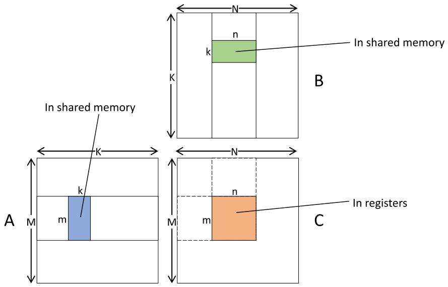

*Figure 15.1 — tiled matrix multiplication 복습. (책 p.351)*

> Figure 15.1 은 5장에서 다룬 tiled matrix multiplication 을 **더 일반적인 tile 차원**으로
> 복습한다. 이 예에서 thread block 하나가 **행렬 $C$ 의 $m \times n$ 출력 tile** 을 계산하도록
> 배정된다. block 의 thread 들이 협력해 $A$·$B$ 의 입력 tile 을 순회하며
> **$A$ 의 $m\times k$ tile 과 대응하는 $B$ 의 $k \times n$ 입력 tile** 을 global memory 에서
> shared memory 로 적재한다 (책 p.350).

> 입력 tile 쌍마다 thread 들이 그 입력 tile 이 출력 tile 의 각 원소에 기여하는 부분합을
> 계산한다. **출력 tile 은 block 의 thread 들의 register 에 집합적으로 저장**된다.
> 계산이 끝나면 thread 들이 출력 tile 값을 register 에서 global memory 로 쓴다 (책 p.351).

**5장과 달라진 것 두 가지를 짚어야 한다.**

| | 5장 (Figure 5.9) | 15장 (Figure 15.1) |
|---|---|---|
| tile 모양 | **정사각** `TILE_WIDTH`$\times$`TILE_WIDTH` | **직사각** $m\times k$, $k\times n$, $m\times n$ |
| thread 당 출력 | **1개** (`Pvalue` 하나) | **여러 개** — 출력 tile 이 register 에 |
| 출력이 어디에 | thread 하나의 register 하나 | **block thread 들의 register 전체** |

Figure 15.1 의 오른쪽 아래 "In registers" 라벨이 그 차이를 말한다.

### 2. 수식/유도 — arithmetic intensity

#### 전체 유도 과정 (먼저 한 번에)

$$\text{FLOP} = 2 \cdot m \cdot n \cdot k \tag{1}$$

$$\text{bytes} = 4 \cdot k \cdot (m + n) \tag{2}$$

$$\text{AI} = \frac{2mnk}{4k(m+n)} = \frac{0.5\,mn}{m+n} \quad [\text{FLOP/B}] \tag{3}$$

$$\frac{\partial \text{AI}}{\partial k} = 0 \quad (\text{$k$ 가 약분된다}) \tag{4}$$

$$m = n = s \;\Longrightarrow\; \text{AI} = \frac{s}{4} \tag{5}$$

#### 단계별 설명 (생략 없이)

**(1)** 입력 tile 쌍 하나가 만드는 연산량이다.

> 입력 tile 쌍마다 block 의 thread 들이 **$m\times n$ 출력 원소 각각에 대해
> $k$ 번의 곱셈과 $k$ 번의 덧셈**을 협력해 계산하므로, 총 부동소수점 연산 수는
> $2\cdot m\cdot n\cdot k$ 다 (책 p.351).

**(2)** 같은 tile 쌍을 위해 옮기는 바이트다.

> 동시에 block 의 thread 들이 협력해 $A$ 의 $m\times k$ tile 과 $B$ 의 $k\times n$ tile 을
> 적재하고 각 원소가 4 B 이므로, 총 적재 바이트는 $4\cdot k\cdot(m+n)$ 다 (책 p.351).

$mk + kn = k(m+n)$ 개 원소 × 4 B 다.

**(3)** 둘의 비가 **arithmetic intensity(arithmetic intensity)** 다 (5장).

> 이 두 수의 비를 취하면 **바이트당 $0.5\cdot m\cdot n/(m+n)$ 연산**의 arithmetic intensity를 얻는다
> (책 p.351).

**(4)** **$k$ 가 사라진다.** 분자에도 분모에도 $k$ 가 한 번씩 있어 약분된다.

> **이 한 줄이 15.7절의 해법이 된다.** shared memory 사용량은 $4k(m+n)$ 으로 $k$ 에 비례하는데
> **arithmetic intensity는 $k$ 와 무관**하다. 그러니 **$k$ 를 줄이면 shared memory 압박만 줄고
> arithmetic intensity는 그대로**다 — 공짜 점심이다. 책이 15.7절에서 "흥미롭게도"라고 짚는 지점이다.

**(5)** 정사각 tile 이면 $\text{AI} = \frac{0.5s^2}{2s} = \frac{s}{4}$ 로 아주 단순해진다. ∎

#### 숫자로 — H100 의 임계값은 20 FLOP/B

> 5장에서 본 대로 **arithmetic intensity가 크면 memory bandwidth 병목을 더 잘 넘어서** 성능이 좋아진다.
> $0.5\cdot m\cdot n/(m+n)$ 은 **$m$ 과 $n$ 을 키워**, 즉 **더 큰 출력 tile** 을 써서 키울 수 있다
> (책 p.351).

5장 노트에서 계산한 H100 의 roofline 임계값은

$$\frac{66.9\ \text{TFLOPS}}{3.35\ \text{TB/s}} = 20.0\ \text{FLOP/B}$$

| $m = n$ | AI $= s/4$ | H100 에서 |
|---|---|---|
| 16 | 4.0 | memory-bound |
| **32** | **8.0** | **memory-bound** ← 5장의 `TILE_WIDTH=32` |
| 64 | 16.0 | memory-bound (임계값 바로 아래) |
| **128** | **32.0** | **compute-bound** ✓ |
| 256 | 64.0 | compute-bound |

> 예컨대 $m = n = 32$ 면 arithmetic intensity가 **8 FLOP/B** 로 H100 GPU 에서 kernel 이
> **memory-bound 로 남는다.** 반면 $m = n = 128$ 로 키우면 arithmetic intensity가 **32 FLOP/B** 가 되어
> kernel 이 **compute-bound** 가 된다 (책 p.351).

**5장에서 만든 tiled matmul 이 아직 memory-bound 였다는 것**이 이 장의 출발점이다.
$32 \to 128$, 즉 **한 변을 $4\times$** 키워야 비로소 벽을 넘는다.

### 3. 왜 큰 tile 이 재사용을 늘리는가

> $m$ 과 $n$ 을 키우면 arithmetic intensity가 좋아지는 직관은,
> **더 큰 출력 tile 이 같은 입력 데이터를 더 많은 출력값에 재사용**하게 해 준다는 것이다.
> 예컨대 Figure 15.1 에서 $n$ 을 32 에서 128 로 키우면 출력 tile 이 가로로 $4\times$ 커진다.
> 즉 각 thread block 이 **원래 출력 tile 네 개에 해당하는 것**을 계산한다.
> 이 출력 tile 들을 계산하는 데는 **같은 $A$ 입력 tile** 을 쓴다.
> 원래 구성에서는 네 출력 tile 을 네 개의 서로 다른 block 이 계산하면서
> **각자 같은 $A$ tile 을 중복 적재**했다.
> $n$ 을 $4\times$ 키운 뒤에는 네 출력 tile 을 **block 하나가 계산**하고
> $A$ 입력 tile 을 **한 번만** 적재하면 된다 (책 p.352).

**중복 적재량을 식으로 쓰면 이렇다.**

block 하나가 $K(m+n)$ 개 원소를 적재하고 block 이 $\frac{M}{m}\cdot\frac{N}{n}$ 개이므로

$$\text{총 적재} = K(m+n)\cdot\frac{MN}{mn} = KMN\left(\frac{1}{m} + \frac{1}{n}\right)$$

$M=N=K=4096$ 으로 계산하면

| $m=n$ | 총 적재 (원소) | 최소 대비 |
|---|---|---|
| 32 | $4.29\times10^9$ | $256\times$ |
| **128** | $\mathbf{1.07\times10^9}$ | $64\times$ |

**$32 \to 128$ 에서 정확히 $4\times$ 줄어든다** ($\frac{2/32}{2/128} = 4$).

> $B$ 입력 tile 의 중복 적재는 **높이 $m$ 을 키워** 더 줄일 수 있다.
> block 들 사이의 $A$·$B$ 입력 tile 중복 적재를 없애는 것이
> **데이터 재사용을 높이고 따라서 arithmetic intensity를 높인다** (책 p.352).

> **식 $KMN(1/m + 1/n)$ 이 "$m$ 과 $n$ 을 둘 다 키워야 하는" 이유를 말해 준다.**
> $m$ 만 키우면 $1/n$ 항이 남고, $n$ 만 키우면 $1/m$ 항이 남는다.
> 합을 최소화하려면 **정해진 tile 넓이 $mn$ 아래에서 $m = n$** 일 때가 최적이다
> (산술-조화 평균 부등식). 그래서 $128\times128$ 처럼 **정사각**을 쓴다.

### 4. 예제/실습

#### 연습문제

> **(1)** $m = 256$, $n = 64$ 일 때 arithmetic intensity는? 같은 넓이의 정사각 $128\times128$ 과 비교하라.
> **(2)** A100 (19.5 TFLOPS FP32, 1.55 TB/s) 의 임계값은? 그때 필요한 최소 정사각 tile 은?
> **(3)** $k$ 를 8 에서 64 로 키우면 무엇이 달라지는가?

**(1)** $\text{AI} = \frac{0.5 \times 256\times64}{256+64} = \frac{8192}{320} = \mathbf{25.6}$ FLOP/B.
정사각 $128\times128$ 은 32.0 이므로 **같은 넓이인데도 정사각이 25% 낫다.**
$m+n$ 이 $320$ 대 $256$ 으로 더 크기 때문이다 — (3)의 부등식 그대로다.

**(2)** $\frac{19.5}{1.55} = \mathbf{12.6}$ FLOP/B. $s/4 \ge 12.6$ 에서 $s \ge 50.3$ 이므로
**$64\times64$** 면 충분하다 ($\text{AI} = 16$).

> **H100 이 A100 보다 더 큰 tile 을 요구한다.** 연산 성능이 bandwidth 보다 빨리 늘었기 때문이다
> ($3.4\times$ 대 $2.2\times$). **세대가 지날수록 tile 을 키워야 한다** — 이 장의 최적화가
> 점점 더 중요해지는 이유다.

**(3)** arithmetic intensity는 **그대로 32 FLOP/B** 다 (식 (4)).
바뀌는 것은 **shared memory 사용량이 $8\times$** 로 늘고 (4 KB → 32 KB per tile),
**바깥 loop 반복 수가 $8\times$ 줄어든다**.
occupancy 가 떨어지므로 **$k$ 는 작을수록 좋다** — 15.7절의 결론이다.

---

## 15.3 Using larger tiles with thread coarsening (책 p.352)

### 1. 개념적 이해

> tiled matrix multiplication 에서 더 큰 tile 을 쓰려면, block 의 각 thread 에
> **출력 tile 당 여러 원소를 계산**하도록, **입력 tile 당 여러 원소를 적재**하도록 배정해야 한다.
> 따라서 이 최적화는 **thread coarsening 최적화**로 볼 수 있다.
> 여기서 **세밀한 병렬화의 오버헤드는 서로 다른 block 이 같은 입력값을 여러 번 적재해야 한다는 것**이다
> (책 p.352).

> 이 최적화는 **8장의 stencil 계산에 적용한 thread coarsening 과 비슷**하다 —
> 거기서도 coarsening 이 **출력 tile 크기를 키워 데이터 재사용과 arithmetic intensity를 높이는 데** 쓰였다
> (책 p.352).

**13.8절·14.8절과 나란히 놓으면 coarsening 의 세 얼굴이 보인다.**

| 장 | coarsening 이 줄이는 것 |
|---|---|
| 8장 · **15장** | **중복 적재** (= arithmetic intensity를 높인다) |
| 13장 | **binary search 횟수** |
| 14장 | **전역 scan 표 크기**와 **흩어진 store** |

#### tile 계층

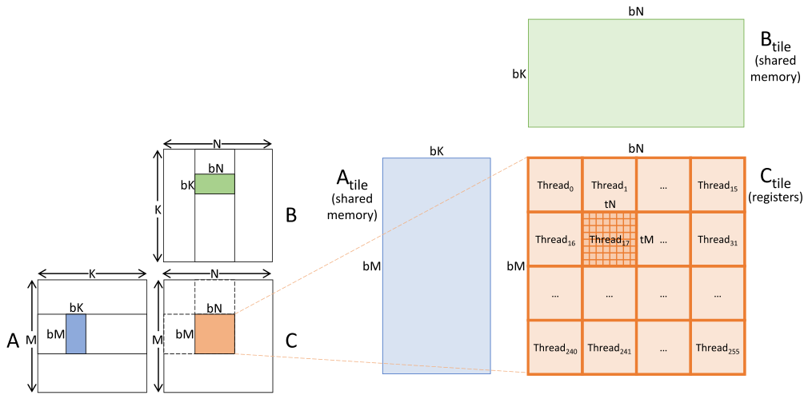

*Figure 15.2 — 큰 tile 을 쓰는 tiled matrix multiplication. (책 p.353)*

> 각 block 이 **`bM`$\times$`bN`** 크기의 출력 tile 을 계산한다.
> block 의 출력 tile 을 **block-level output tile** 이라 부른다.
> block-level 출력 tile 크기가 block 의 thread 수보다 크면,
> 각 thread 가 block-level 출력 tile 의 **여러 원소**를 계산해야 한다.
> 예컨대 block-level 출력 tile 이 `bM`$\times$`bN` $= 128\times128$ 이고
> block 이 $16\times16$ thread 라면, 각 thread 가 **`tM`$\times$`tN` $= 8\times8$** 크기의
> 출력 tile 을 맡는다. thread 가 맡는 `tM`$\times$`tN` tile 을
> **thread-level output tile** 이라 부른다 (책 p.352).

**숫자를 확인하자**: $128\times128 = 16384$ 개 출력을 $16\times16 = 256$ thread 가 나누면
thread 당 $64 = 8\times8$ ✓

> 일반적으로 matrix multiplication 의 입력·출력 행렬은 **tile 의 계층(hierarchy)** 으로
> 논리적으로 나눌 수 있다. …
> **tile 계층의 각 tile 은 thread 계층의 한 단위에 배정**될 수 있다.
> 우리 예에서는 block-level tile 이 thread block 에, thread-level tile 이 thread 에 배정된다.
> 짐작하겠지만 **warp-level tile, GPU-level tile, 심지어 계산 클러스터 node-level tile**
> 같은 다른 층위의 tile 을 생각하는 것도 유용할 수 있다.
> 실제로 **15.5절에서 warp-level tile** 을 쓴다 (책 p.352).

| tile 층위 | 배정 단위 | 어디에 사는가 | 이 장에서 |
|---|---|---|---|
| **block-level** | thread block | **shared memory** (입력) | 15.3 |
| **warp-level** | warp | (논리적 구획) | **15.5** |
| **thread-level** | thread | **register** (출력·strip) | 15.3 · 15.4 |

> **"tile 계층 = 메모리 계층 = thread 계층"의 삼중 대응**이 이 장의 골격이다.
> 15.4절이 이것을 명시적으로 말한다 — "tiling 은 **접근 latency 와 throughput 에 차이가 있는
> 두 메모리 구조 사이라면 어느 층위에서든** 할 수 있는 일반적 최적화다."

### 2. 코드 — 주 kernel

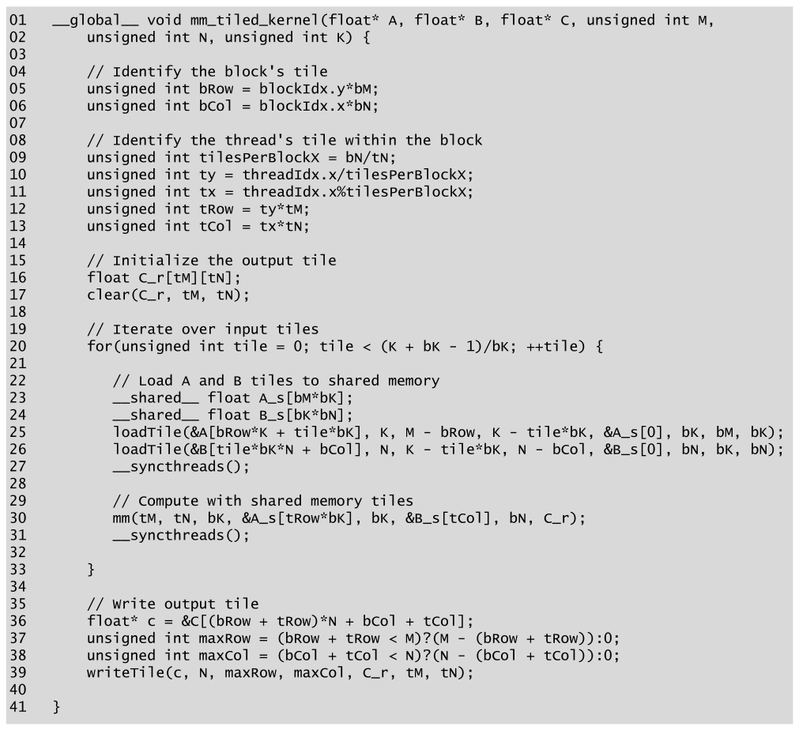

*Figure 15.3 — 큰 tile 을 쓰는 tiled matrix multiplication 의 코드. (책 p.354)*

```cuda
01  __global__ void mm_tiled_kernel(float* A, float* B, float* C, unsigned int M,
02      unsigned int N, unsigned int K) {
03
04      // Identify the block's tile
05      unsigned int bRow = blockIdx.y*bM;
06      unsigned int bCol = blockIdx.x*bN;
07
08      // Identify the thread's tile within the block
09      unsigned int tilesPerBlockX = bN/tN;
10      unsigned int ty = threadIdx.x/tilesPerBlockX;
11      unsigned int tx = threadIdx.x%tilesPerBlockX;
12      unsigned int tRow = ty*tM;
13      unsigned int tCol = tx*tN;
14
15      // Initialize the output tile
16      float C_r[tM][tN];
17      clear(C_r, tM, tN);
18
19      // Iterate over input tiles
20      for(unsigned int tile = 0; tile < (K + bK - 1)/bK; ++tile) {
21
22          // Load A and B tiles to shared memory
23          __shared__ float A_s[bM*bK];
24          __shared__ float B_s[bK*bN];
25          loadTile(&A[bRow*K + tile*bK], K, M - bRow, K - tile*bK, &A_s[0], bK, bM, bK);
26          loadTile(&B[tile*bK*N + bCol], N, K - tile*bK, N - bCol, &B_s[0], bN, bK, bN);
27          __syncthreads();
28
29          // Compute with shared memory tiles
30          mm(tM, tN, bK, &A_s[tRow*bK], bK, &B_s[tCol], bN, C_r);
31          __syncthreads();
32
33      }
34
35      // Write output tile
36      float* c = &C[(bRow + tRow)*N + bCol + tCol];
37      unsigned int maxRow = (bRow + tRow < M)?(M - (bRow + tRow)):0;
38      unsigned int maxCol = (bCol + tCol < N)?(N - (bCol + tCol)):0;
39      writeTile(c, N, maxRow, maxCol, C_r, tM, tN);
40  }
```

#### 줄별로

| 줄 | 하는 일 | 짚을 점 |
|---|---|---|
| **05~06** | block-level tile 의 시작 좌표 | `blockIdx` × tile 크기 |
| **09~13** | **1D `threadIdx.x` 를 2D 로 나눈다** | 아래 참조 |
| **16~17** | 출력 tile 을 **local 배열**로 선언하고 0 초기화 | **아래가 핵심** |
| **20** | 입력 tile 순회 | `(K + bK - 1)/bK` — **2장의 ceiling division** |
| **23~24** | shared memory tile 선언 | loop **안**에 있지만 정적 할당이라 무해하다 |
| **25~26** | tile 적재 | 인자 여덟 개 — 아래 표 |
| **27** | barrier | 적재 완료 대기 (read-after-write) |
| **30** | 계산 | `&A_s[tRow*bK]`, `&B_s[tCol]` 로 **자기 몫의 시작점**을 넘긴다 |
| **31** | barrier | **다음 반복의 적재가 덮어쓰기 전에** 계산 완료 (write-after-read) |
| **36~39** | 결과 기록 | 경계는 `maxRow`·`maxCol` 로 |

#### 09~13번 줄 — 1D thread index 를 2D 로

block 을 `dim3(256)` 으로 1D launch 하고 **코드 안에서 2D 로 나눈다.**

$$\texttt{tilesPerBlockX} = \frac{\texttt{bN}}{\texttt{tN}} = \frac{128}{8} = 16$$
$$\texttt{ty} = \left\lfloor\frac{\texttt{threadIdx.x}}{16}\right\rfloor, \qquad \texttt{tx} = \texttt{threadIdx.x} \bmod 16$$

**`tx` 가 빠르게 변하는 축**이라는 점이 중요하다 — 연속 `threadIdx.x` 가 연속 `tCol` 을 갖고,
그래야 15.5절의 store coalescing 논의가 성립한다.

#### 16번 줄 — local 배열이 register 로 가려면

> 5장과 6장에서 본 대로 **local 배열은 기본적으로 global memory 에 놓인다.**
> **배열에 대한 모든 접근이 상수 index 를 가지면** 컴파일러가 더 빠른 접근을 위해
> local 배열을 register 에 놓을 수 있다.
> `C_r` 이 register 에 놓이도록 하려면 **`C_r` 에 대한 모든 접근이 상수 index 여야** 한다.
> 그러려면 **`C_r` 을 순회하는 모든 loop 를 unroll** 해야 하고,
> 그것을 `C_r` 에 접근하는 device 함수들의 구현에서 할 것이다 (책 p.353).

**이것이 이 장에서 가장 실무적인 한 줄이다.**

> `float C_r[8][8];` 라고 쓰면 register 64개가 잡히는 것이 **아니다.**
> 기본은 **local memory**, 즉 **global memory 의 thread 전용 영역**이다 (5.2절).
> 거기에 8×8 출력 tile 을 두면 register tiling 의 의미가 통째로 사라진다.
>
> **조건은 "모든 접근의 index 가 컴파일 타임 상수"** 다.
> `C_r[row][col]` 에서 `row`·`col` 이 loop 변수면 상수가 아니다 —
> **`#pragma unroll` 로 loop 를 완전히 펼쳐야** 각 접근이 `C_r[0][0]`, `C_r[0][1]`, … 로
> 상수화된다. 그래서 15.4·15.11절의 모든 device 함수에 `#pragma unroll` 이 붙어 있다.
>
> 6.6절에서 loop unrolling 을 "분기 제거와 명령 스케줄링"의 도구로 배웠는데,
> **여기서는 register 승격의 전제 조건**이라는 새 역할을 한다.

#### 25~26번 줄 — `loadTile` 의 인자 여덟 개

| 인자 | $A$ tile (25번 줄) | $B$ tile (26번 줄) | 뜻 |
|---|---|---|---|
| `T` | `&A[bRow*K + tile*bK]` | `&B[tile*bK*N + bCol]` | global 의 tile 시작 주소 |
| `lda` | `K` | `N` | **원래 행렬의 폭** (leading dimension) |
| `maxRow` | `M - bRow` | `K - tile*bK` | 남은 행 수 |
| `maxCol` | `K - tile*bK` | `N - bCol` | 남은 열 수 |
| `T_s` | `&A_s[0]` | `&B_s[0]` | shared 의 tile 시작 주소 |
| `ldas` | `bK` | `bN` | **tile 의 폭** |
| `height` | `bM` | `bK` | tile 높이 |
| `width` | `bK` | `bN` | tile 폭 |

> **leading dimension 이라는 개념이 여기서 처음 명시된다** (책 각주 1, p.355).
> **row-major 배치에서 행렬이나 tile 의 leading dimension 은 같은 열의 연속한 원소들
> 사이에 있는 메모리상 원소 수**다. **우리의 경우 tile 의 leading dimension 은
> 그 tile 을 담고 있는 더 큰 행렬의 폭**이다.
>
> 즉 `lda` 는 "한 행 아래로 가려면 몇 칸을 건너뛰는가"이고,
> **부분 행렬을 원본 안에서 다룰 때 반드시 필요한 값**이다.
> BLAS API 가 언제나 `lda`·`ldb`·`ldc` 를 받는 이유가 이것이다.
> 15.6절의 padding 이 바로 이 값을 `bK` 에서 `bK+1` 로 바꾸는 것이다.

### 3. 코드 — 네 개의 device 함수

> 이 device 함수들은 **전부 주 kernel 에 inline 된다**는 점을 유념하라 (책 p.354).
> `__forceinline__` 이 붙어 있는 것도 그 때문이고,
> **inline 돼야 `C_r` 이 register 에 남는다** (함수 인자로 주소를 넘기면 메모리에 있어야 하므로).

#### `clear()` — 출력 tile 초기화

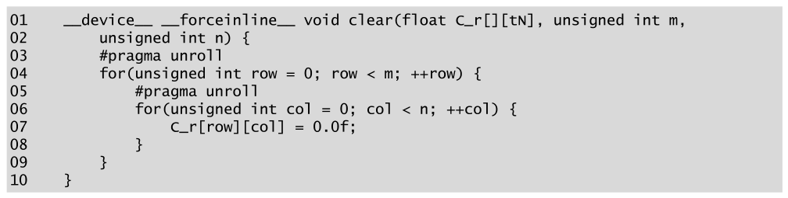

*Figure 15.4 — 출력 tile 을 초기화하는 코드. (책 p.355)*

```cuda
01  __device__ __forceinline__ void clear(float C_r[][tN], unsigned int m,
02      unsigned int n) {
03      #pragma unroll
04      for(unsigned int row = 0; row < m; ++row) {
05          #pragma unroll
06          for(unsigned int col = 0; col < n; ++col) {
07              C_r[row][col] = 0.0f;
08          }
09      }
10  }
```

> 구현은 아주 단순하다. 중첩 loop 두 개가 배열의 행과 열을 순회하며 각 원소를 0 으로 만든다.
> **중요한 것은 loop 에 `#pragma unroll` 이 붙어 완전히 펼쳐지고,
> 그 덕에 `C_r` 배열이 상수 index 를 갖게 되어 register 에 놓인다**는 점이다 (책 p.354).

**함수 하나가 열 줄인데 그중 실질은 `#pragma unroll` 두 줄**이라는 점이 이 장의 성격을 말한다.

#### `loadTile()` — global → shared

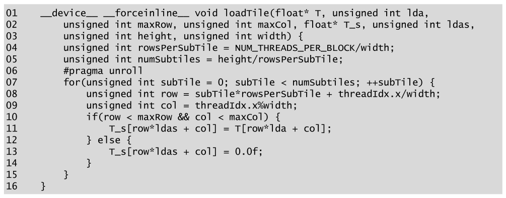

*Figure 15.5 — 입력 tile 을 global memory 에서 shared memory 로 적재하는 코드. (책 p.355)*

```cuda
01  __device__ __forceinline__ void loadTile(float* T, unsigned int lda,
02      unsigned int maxRow, unsigned int maxCol, float* T_s, unsigned int ldas,
03      unsigned int height, unsigned int width) {
04      unsigned int rowsPerSubTile = NUM_THREADS_PER_BLOCK/width;
05      unsigned int numSubtiles = height/rowsPerSubTile;
06      #pragma unroll
07      for(unsigned int subTile = 0; subTile < numSubtiles; ++subTile) {
08          unsigned int row = subTile*rowsPerSubTile + threadIdx.x/width;
09          unsigned int col = threadIdx.x%width;
10          if(row < maxRow && col < maxCol) {
11              T_s[row*ldas + col] = T[row*lda + col];
12          } else {
13              T_s[row*ldas + col] = 0.0f;
14          }
15      }
16  }
```

> block 의 thread 수가 입력 tile 의 원소 수보다 적으면 각 thread 가 **여러 입력 원소**를
> 적재해야 한다. 예컨대 입력 tile 차원이 $128\times8$ (1024 원소)이고 block 이 256 thread 면
> 각 thread 가 네 원소를 적재해야 한다. 이런 이유로 **입력 tile 을 논리적으로 네 개의
> sub-tile 로 나눠 한 번에 하나씩** 적재한다 (책 p.355).

**우리 설정에서 두 tile 의 sub-tile 수를 계산하면 이렇다.**

| | `width` | `rowsPerSubTile` $=256/w$ | `height` | `numSubtiles` |
|---|---|---|---|---|
| **`A_s`** ($128\times8$) | 8 | **32** | 128 | $128/32 = \mathbf{4}$ |
| **`B_s`** ($8\times128$) | 128 | **2** | 8 | $8/2 = \mathbf{4}$ |

**둘 다 thread 당 4원소**다 (1024 원소 / 256 thread).

> 13번 줄의 `else` 가 **범위 밖을 0 으로 채우는 것**에 주목하자.
> 5.5절의 boundary check 와 같은 처리이고, **0 을 곱해 더하면 결과가 안 바뀌므로**
> 별도의 분기 없이 계산할 수 있게 해 준다 (덧셈의 identity value — 10·11장의 그 개념이다).

> **coalescing 을 정확히 따져 두자.** 책은 "연속 thread 가 연속 원소를 적재하므로
> 메모리 접근이 coalesced 다"라고 한다 (책 p.317 의 표현과 같다).
> 맞지만 **`A_s` 쪽은 조건부로 맞다.**
>
> `col = threadIdx.x % 8` 이므로 **thread 8개가 한 행의 8원소(32 B)를 덮는다.**
> warp 하나(32 thread)는 **서로 다른 네 행의 32 B 씩**을 읽는다.
> 32 B 는 정확히 sector 하나이므로 **낭비되는 바이트는 없지만
> 요청은 1개가 아니라 4개**다.
> `B_s` 쪽은 `width = 128` 이라 warp 가 한 행의 연속 128 B 를 읽어 **완전히 coalesced** 다.
>
> 연습문제 1의 vector load 가 이 비대칭을 개선한다 — `float4` 로 읽으면
> thread 2개가 한 행을 덮고 warp 가 16행을 읽어 요청 수가 같아 보이지만,
> **명령 수가 1/4로 준다.**

> 이 함수에 가능한 최적화 하나는 **vector load 를 써서 각 thread 가 한 명령으로 네 원소를
> 적재**하게 하는 것이다 (6장). 이 최적화는 **독자를 위한 연습으로 남긴다** (책 p.356).
> → **15.11절 연습문제 1**

#### `mm()` — 계산

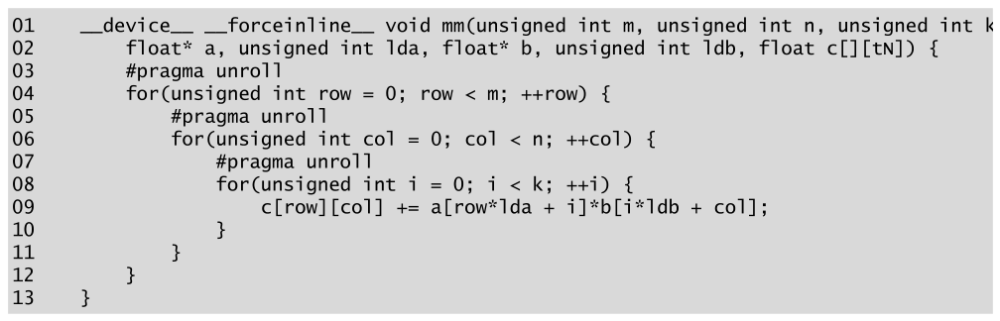

*Figure 15.6 — 입력 tile 로 matrix multiplication 을 수행하는 코드. (책 p.356)*

```cuda
01  __device__ __forceinline__ void mm(unsigned int m, unsigned int n, unsigned int k,
02      float* a, unsigned int lda, float* b, unsigned int ldb, float c[][tN]) {
03      #pragma unroll
04      for(unsigned int row = 0; row < m; ++row) {
05          #pragma unroll
06          for(unsigned int col = 0; col < n; ++col) {
07              #pragma unroll
08              for(unsigned int i = 0; i < k; ++i) {
09                  c[row][col] += a[row*lda + i]*b[i*ldb + col];
10              }
11          }
12      }
13  }
```

> **원문 조판 문제** (Figure 15.6 01번 줄, 책 p.356).
> 01번 줄이 **회색 코드 상자의 오른쪽 경계를 넘어가 `unsigned int k` 뒤의 쉼표가 잘려 있다.**
> 같은 signature 가 Figure 15.9 (책 p.359)에는 `unsigned int k,` 로 온전히 인쇄돼 있어
> **조판 폭 문제임이 확인된다.** 위 코드는 쉼표를 되살린 것이다.

#### thread-level 입력 tile

> Figure 15.2 의 오른쪽에서 보듯, 각 thread-level 출력 tile — 예컨대 Thread 17 에 강조된 것 —
> 의 계산에는 **$A$ block-level tile 의 `tM`$\times$`bK` sub-tile 과
> $B$ block-level tile 의 `bK`$\times$`tN` sub-tile** 의 기여만 필요하다.
> 이 sub-tile 들을 **thread-level input tile** 이라 부른다 (책 p.356).

> 또 **$A$ block-level tile 의 가로 차원이자 $B$ block-level tile 의 세로 차원**,
> 즉 두 block-level tile 사이의 공통 차원을 **block-level 곱셈의 inner dimension** 이라 부른다.
> thread-level sub-tile 이 **$A$ block-level tile 의 온전한 행들과
> $B$ block-level tile 의 온전한 열들**로 이루어지므로,
> 이 설계에서는 **block-level 의 inner dimension 이 곧 thread-level 곱셈의
> inner dimension (`bK`)** 이기도 하다 (책 p.356).

> 함수는 thread-level 입력 tile 의 index 로 이야기하지만 **원소는 실제로는 shared memory 의
> block-level 입력 tile 배열에서 가져온다.**
> `a` 와 `b` 가 block-level 입력 tile 배열 안에서 thread-level 입력 tile 의 시작 주소
> (`&A_s[tRow*bK]` 와 `&B_s[tCol]`, Figure 15.3 의 30번 줄)로 설정돼 있으므로,
> **행 index 에 leading dimension 을 곱해** 필요한 자리로 건너뛰기만 하면 된다 (책 p.357).

**이 설계가 예쁜 이유**: `mm()` 은 자기가 shared memory 를 보고 있다는 사실을 모른다.
**주소와 leading dimension 만 받으면 어느 메모리든 동작**한다.
15.4절에서 같은 함수가 register 를 다루도록 고쳐지는 것도 같은 이유다.

#### `writeTile()` — register → global

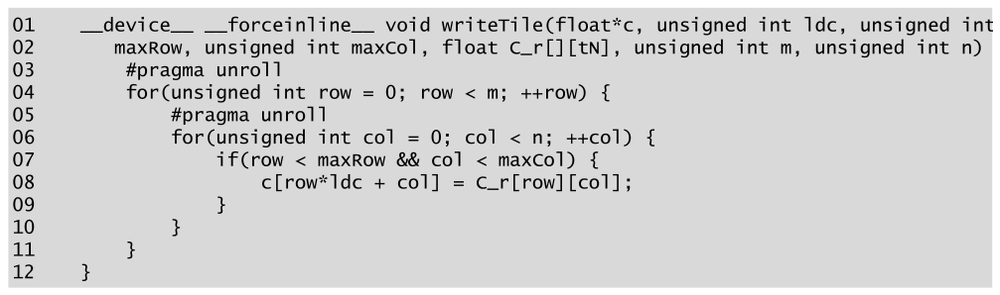

*Figure 15.7 — 출력 tile 을 global memory 로 쓰는 코드. (책 p.357)*

```cuda
01  __device__ __forceinline__ void writeTile(float*c, unsigned int ldc, unsigned int
02    maxRow, unsigned int maxCol, float C_r[][tN], unsigned int m, unsigned int n) {
03      #pragma unroll
04      for(unsigned int row = 0; row < m; ++row) {
05          #pragma unroll
06          for(unsigned int col = 0; col < n; ++col) {
07              if(row < maxRow && col < maxCol) {
08                  c[row*ldc + col] = C_r[row][col];
09              }
10          }
11      }
12  }
```

> 이 함수에 가능한 최적화 하나는 **vector store 를 써서 각 thread 가 한 명령으로 네 원소를
> 저장**하게 하는 것이다 (6장). **독자를 위한 연습으로 남긴다** (책 p.357).
> → **15.11절 연습문제 2**

### 4. 예제/실습

#### 연습문제

> `bM=bN=128`, `bK=8`, block 256 thread, `tM=tN=8` 에서
> **(1)** thread 42 의 `ty`, `tx`, `tRow`, `tCol` 은?
> **(2)** `loadTile` 로 `A_s` 를 적재할 때 thread 42 가 읽는 원소는 몇 개이고 어디인가?
> **(3)** `mm()` 이 한 번 호출될 때 thread 하나의 FLOP 수는?

**(1)** `tilesPerBlockX` $= 128/8 = 16$ 이므로

$$\texttt{ty} = \lfloor 42/16 \rfloor = 2, \quad \texttt{tx} = 42 \bmod 16 = 10$$
$$\texttt{tRow} = 2\times8 = \mathbf{16}, \quad \texttt{tCol} = 10\times8 = \mathbf{80}$$

thread 42 는 block tile 의 **(16, 80)~(23, 87)** 을 맡는다.

**(2)** `width = bK = 8`, `rowsPerSubTile` $= 256/8 = 32$, `numSubtiles` $= 4$ 이므로
**4개**를 읽는다.

$$\texttt{col} = 42 \bmod 8 = 2, \qquad \texttt{row} = 32s + \lfloor42/8\rfloor = 32s + 5$$

$s = 0,1,2,3$ 이므로 **`A_s` 의 (5,2), (37,2), (69,2), (101,2)** 다.

> **같은 열을 네 번 읽는다**는 점이 눈에 띈다. 32행씩 건너뛰며 한 열만 담당하는 셈이다.
> global 쪽 주소는 `A[(row)*K + 2]` 로 **$K$ 씩 떨어진 네 곳** — 서로 다른 cache line 이다.
> 그래도 **같은 명령 안에서는 warp 의 8-thread 묶음이 32 B 를 연속으로** 읽으므로 낭비는 없다.

**(3)** thread 하나가 자기 $8\times8$ tile 의 각 원소에 대해 `bK`$=8$ 번의 곱셈-덧셈을 하므로

$$8 \times 8 \times 8 \times 2 = \mathbf{1024\ \text{FLOP}}$$

block 전체로는 $1024\times256 = 262{,}144$ FLOP 이고,
이것은 $2\cdot bM\cdot bN\cdot bK = 2\times128\times128\times8$ ✓ (15.2절 식 (1)).

---

## 15.4 Register tiling of the input tiles (책 p.357)

### 1. 개념적 이해 — 새 병목은 shared memory latency

> 지금까지 **shared memory tiling** 으로 global memory bandwidth 병목을 넘었다 —
> 재사용되는 데이터를 shared memory 에 한 번 적재하고 거기서 여러 번 접근하는 방식이다.
> 실제로 tiled matmul 의 예에서, 입력 tile 의 한 원소는 **thread 하나가 global 에서 shared 로**
> 적재하고 **여러 thread 가 shared 에서 자기 register 로** 적재해 계산에 쓴다.
> shared memory 접근이 global memory 접근보다 훨씬 빠르긴 하지만 **register 접근보다는 느리다.**
> 따라서 shared memory tiling 을 적용하고 나면
> **shared memory 접근 latency 가 새로운 병목**이 된다 (책 p.357~358).

**병목이 계단처럼 내려온다** — 이 장의 진행 자체가 그 계단이다.

| 단계 | 병목 | 해법 | 절 |
|---|---|---|---|
| naive | **global memory bandwidth** | shared memory tiling | 5장 |
| tiled | global bandwidth (여전히 memory-bound) | **큰 tile** | 15.3 |
| 큰 tile | **shared memory latency** | **register tiling** | **15.4** |
| register tiling | **store coalescing** | thread-데이터 재배치 | 15.5 |
| 재배치 | **bank conflict** | padding | 15.6 |
| 전부 적용 | **occupancy · 두 국면** | software pipelining | 15.7~15.8 |

#### 무엇이 중복인가

> Figure 15.2 에서 **thread 하나가 같은 입력값을 여러 출력 원소 계산에 쓴다**는 것을 관찰한다.
> 15.3절의 구현에서는 **같은 입력값을 같은 thread 가 shared memory 에서 여러 번 적재**한다 —
> 그 값이 기여하는 출력 원소마다 한 번씩.
> 즉 각 thread 가 자기만의 논리적 thread-level 입력 tile 을 정의하긴 하지만,
> **thread-level 입력 tile 원소를 쓸 때마다 여전히 shared memory 의 block-level tile 배열에서
> 적재**한다.
> **입력 tile 에 register tiling 을 적용**해 이 중복 접근을 피할 수 있다 (책 p.358).

Figure 15.6 의 09번 줄을 다시 보자.

```cuda
c[row][col] += a[row*lda + i]*b[i*ldb + col];
```

`a[row*lda + i]` 는 **`col` loop 가 도는 동안 값이 바뀌지 않는다.**
그런데 `col` 이 바뀔 때마다 shared memory 에서 다시 읽는다 — **$n$ 번 중복**이다.
마찬가지로 `b[i*ldb + col]` 은 `row` loop 동안 상수인데 **$m$ 번 중복**이다.

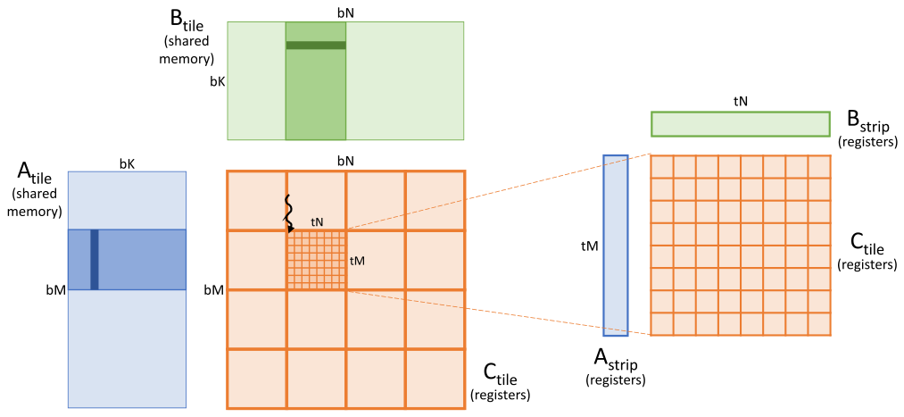

*Figure 15.8 — 입력 tile 에 register tiling 을 적용한 matrix multiplication. (책 p.358)*

> 각 thread 가 shared memory 입력 tile 의 자기 구획을 **한 번에 strip 하나씩** 순회한다.
> thread 는 **strip 쌍을 shared memory 에서 자기 register 로** 적재한다.
> 그다음 그 입력 strip 쌍이 **자기 출력 tile 원소 전부에 기여하는 부분**을 계산하고 나서
> 다음 쌍을 적재한다 (책 p.358).

**strip 이 무엇인가**: $A$ 쪽은 **세로 `tM`$\times1$**, $B$ 쪽은 **가로 $1\times$`tN`** 이다.
Figure 15.8 오른쪽의 파란 세로 막대와 초록 가로 막대가 그것이다.
**둘의 외적(outer product)이 `tM`$\times$`tN` 출력 tile 전체에 기여**한다.

### 2. 코드

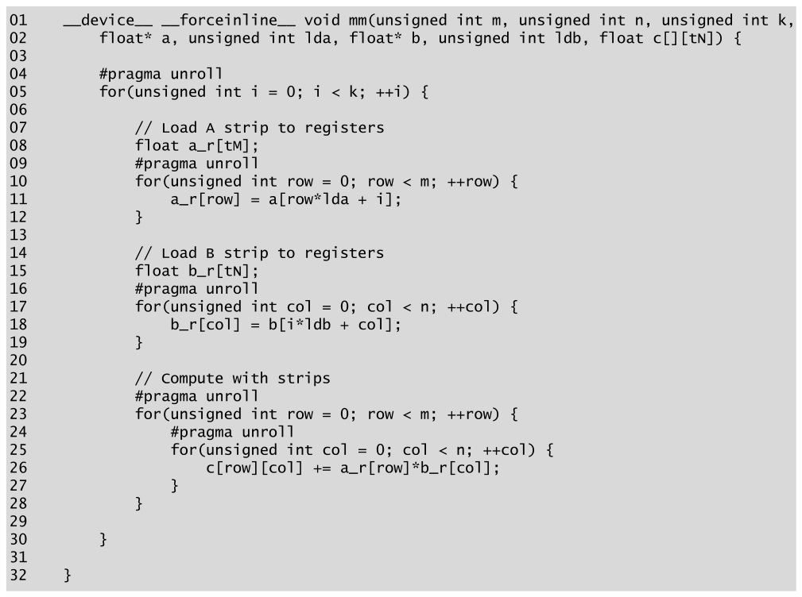

*Figure 15.9 — 입력 tile 에 register tiling 을 적용한 코드. (책 p.359)*

```cuda
01  __device__ __forceinline__ void mm(unsigned int m, unsigned int n, unsigned int k,
02      float* a, unsigned int lda, float* b, unsigned int ldb, float c[][tN]) {
03
04      #pragma unroll
05      for(unsigned int i = 0; i < k; ++i) {
06
07          // Load A strip to registers
08          float a_r[tM];
09          #pragma unroll
10          for(unsigned int row = 0; row < m; ++row) {
11              a_r[row] = a[row*lda + i];
12          }
13
14          // Load B strip to registers
15          float b_r[tN];
16          #pragma unroll
17          for(unsigned int col = 0; col < n; ++col) {
18              b_r[col] = b[i*ldb + col];
19          }
20
21          // Compute with strips
22          #pragma unroll
23          for(unsigned int row = 0; row < m; ++row) {
24              #pragma unroll
25              for(unsigned int col = 0; col < n; ++col) {
26                  c[row][col] += a_r[row]*b_r[col];
27              }
28          }
29
30      }
31
32  }
```

> Figure 15.6 의 이전 구현과 비교하면, 이 구현은 **입력 tile 의 inner 차원을 도는 loop 를
> 가장 바깥 loop 로 옮긴다** (05번 줄).
> 이 **loop interchange** 가 사실상 thread 로 하여금 **입력 strip 을 한 번에 한 쌍씩** 순회하게
> 만든다. 다음 strip 을 적재하기 전에 **그 strip 들이 모든 출력 tile 원소에 기여하도록** 보장한다.
> 이 설계로 thread-level 입력 tile 을 **이 strip 들로 정제**한다.
> thread-level 입력 tile 을 strip 으로 제한함으로써 **각 thread 의 register 에 들어갈 만큼
> 작게** 유지한다 (책 p.359).

**바뀐 것은 `for` 세 줄의 순서뿐이다.**

| | Figure 15.6 | Figure 15.9 |
|---|---|---|
| loop 순서 | `row` → `col` → `i` | **`i` → (`row`, `col`)** |
| 26번 줄 | `a[row*lda+i] * b[i*ldb+col]` (**shared**) | `a_r[row] * b_r[col]` (**register**) |
| 성격 | 내적 (inner product) 누적 | **외적(outer product) 누적** |

> **"외적 누적"이라는 관점이 이 코드를 기억하는 가장 쉬운 방법**이다.
> $C \mathrel{+}= a \otimes b$ 를 `bK` 번 반복하는 것이고,
> $a$ 는 `tM` 벡터, $b$ 는 `tN` 벡터, 외적이 `tM`$\times$`tN` 행렬이다.
> 실제로 CUTLASS 같은 라이브러리도 이 구조를 그대로 쓴다.

### 3. 수식/유도 — 얼마나 줄었나

#### 전체 유도 과정 (먼저 한 번에)

$$R_{\text{before}} = 2 \cdot t_M \cdot t_N \cdot b_K \tag{1}$$

$$R_{\text{after}} = b_K \cdot (t_M + t_N) \tag{2}$$

$$\frac{R_{\text{before}}}{R_{\text{after}}} = \frac{2\,t_M t_N}{t_M + t_N} \tag{3}$$

$$t_M = t_N = t \;\Longrightarrow\; \frac{R_{\text{before}}}{R_{\text{after}}} = t \tag{4}$$

#### 단계별 설명

**(1)** Figure 15.6 은 가장 안쪽 문장이 $t_M t_N b_K$ 번 실행되고
**매번 shared memory 를 두 번**(`a` 와 `b`) 읽는다.

**(2)** Figure 15.9 는 바깥 loop 가 $b_K$ 번 돌고 그 안에서
`a_r` 에 $t_M$ 번, `b_r` 에 $t_N$ 번 읽는다. **계산 loop 는 register 만 건드린다.**

**(3)** 비를 취한다.

**(4)** 정사각이면 **감소율이 정확히 $t$** 다. ∎

#### 숫자로

$t_M = t_N = 8$, $b_K = 8$ 이면

$$R_{\text{before}} = 2\times8\times8\times8 = 1024, \qquad R_{\text{after}} = 8\times(8+8) = 128$$

**$8\times$ 감소**다.

| $t_M = t_N$ | 감소율 | register (strip) |
|---|---|---|
| 2 | $2\times$ | 4 |
| 4 | $4\times$ | 8 |
| **8** | **$8\times$** | **16** |
| 16 | $16\times$ | 32 |

> **또 tile 을 키우고 싶어진다.** $t=16$ 이면 shared 읽기가 $16\times$ 줄지만
> 출력 tile 이 $256$ register 가 되어 **thread 당 255 register 상한을 넘는다** (15.7절).
> $t=8$ 이 그 경계에서 고른 값이다.

### 4. tiling 은 일반 원리다

> 입력값이 shared memory 에서 register 로 적재되는 횟수를 줄여 register tiling 은
> **shared memory 접근 latency 와 명령 실행 병목을 완화**한다.
> 실제로 **shared memory tiling 과 register tiling 만이 tiling 의 전부는 아니다.**
> **tiling 은 두 메모리 구조 사이에 접근 latency 와 throughput 의 차이가 있는
> 메모리 계층의 어느 층위에서든 할 수 있는 일반적 최적화**다.
> Figure 15.8 이 보여 주는 계층적 기법은 **shared memory 의 block-level tile 과
> register 의 thread-level tile 을 제대로 통합**한다.
> 아주 큰 행렬에서는 이런 계층적 tiling 기법을 **여러 GPU 나 계산 클러스터의 여러 node 에
> 걸친 tile** 로 확장할 수도 있다 (책 p.359~360).

> **이 문단이 5장부터 이어 온 tiling 이야기의 결론이다.**
> "shared memory 에 담는다"는 것은 tiling 의 **한 사례**일 뿐이고,
> 본질은 **"느린 곳에서 한 번 가져와 빠른 곳에서 여러 번 쓴다"** 이다.
> 그 원리는 register ↔ shared, shared ↔ global, GPU ↔ GPU, node ↔ node 어디서나 같다.
> **23장(multi-GPU)이 이 확장을 다룬다.**

### 5. 예제/실습

#### 연습문제

> **(1)** Figure 15.6 과 15.9 의 FLOP 수를 비교하라.
> **(2)** `a_r`·`b_r` 이 register 에 놓이려면 무엇이 필요한가?
> **(3)** `bK` 를 키우면 register 사용량이 늘어나는가?

**(1)** **똑같다** — $2 t_M t_N b_K = 1024$ FLOP.
**연산은 하나도 줄지 않았고 메모리 접근만 줄었다.**
이것이 register tiling 의 성격이다 — work efficiency 를 바꾸지 않고 **접근 비용만** 낮춘다.
(11장의 coarsening 이 work 자체를 줄였던 것과 대비된다.)

**(2)** 15.3절의 조건 그대로 — **모든 접근이 상수 index** 여야 한다.
09·16번 줄의 `#pragma unroll` 이 `a_r[row]`·`b_r[col]` 을
`a_r[0]`, `a_r[1]`, … 로 펼쳐 준다. 22·24번 줄의 unroll 도 같은 이유다.

**(3) 아니다.** `a_r[tM]`·`b_r[tN]` 의 크기는 `bK` 와 무관하다.
`bK` 는 **바깥 loop 의 반복 횟수**일 뿐이다.
그래서 15.7절이 "`bK` 를 줄여 shared memory 압박을 완화"할 수 있다고 말할 때
**register 쪽은 건드리지 않는다.**

---

## 15.5 Coalesced storing of the output tile (책 p.360)

### 1. 무엇이 문제인가

> 지금까지의 구현에서 각 thread 는 큰 (Figure 15.2 에서 $8\times8$) thread-level 출력 tile 을
> 담당해 왔다. 큰 thread-level 출력 tile 은 shared memory tiling 과 register tiling 이
> 적용될 때 **상당한 데이터 재사용**을 가능하게 하는 장점이 있다.
> 그러나 **출력 tile 을 register 에서 global memory 로 저장할 때 $8\times8$ 은 문제**다.
> 특히 각 thread 가 자기 $8\times8$ tile 을 순회하며 global memory 에 저장할 때,
> **같은 warp 에서 인접한 thread-level 출력 tile 을 저장하는 thread 들이
> 여덟 원소 떨어진 메모리 위치로 store 를 발행**한다.
> 결과 접근 패턴은 **coalesced 가 아니다** (책 p.360).

**"여덟 원소 떨어져 있다"의 뜻을 정확히 새겨야 한다.**

> **coalescing 은 명령 단위로, warp 전체에 걸쳐 판정된다** (6.1절).
> thread 하나가 시간에 걸쳐 8원소를 연속으로 쓰는 것은 도움이 되지 않는다.
> `writeTile` 의 08번 줄이 실행되는 **한 순간**에, warp 의 32 thread 는
> 각자 `c[row*ldc + col]` 하나씩을 쓴다. `tCol` 이 thread 마다 8 씩 다르므로
> **주소가 32 B 간격**이고, 32 B sector 하나에 유용한 바이트는 **4 B 뿐**이다.

효율을 직접 세어 보자 (sector 32 B 기준).

| 방식 | 한 명령이 건드리는 sector | 이동 바이트 | 유용 바이트 | **효율** |
|---|---|---|---|---|
| **$8\times8$ + scalar store** | 32 | 1024 | 128 | **12.5%** |
| **$8\times8$ + `float4` store** | 32 | 1024 | 512 | **50.0%** |
| **$4\times4$ 재배치 + `float4`** | **16** | **512** | **512** | **100%** |

> **vector store** 를 쓰면 (15.3절에서 언급했듯) 문제가 **부분적으로** 완화된다 —
> 각 thread 가 연속된 네 원소를 동시에 저장할 수 있기 때문이다.
> 그래도 vector store 로도 **연속된 네 원소는 thread 의 $8\times8$ 출력 tile 폭의 절반**만 덮는다.
> 인접한 출력 tile 을 저장하는 같은 warp 의 thread 들이 **네 원소 떨어진** vector store 명령을
> 발행하게 된다. 결과 접근 패턴은 **여전히 완전히 coalesced 가 아니다** (책 p.360).

### 2. 해법 — $4\times4$ 물리 tile 네 개

> 이 문제를 해결하려면 **같은 warp 의 thread 들이 $4\times4$ 크기의 인접한 출력 tile 을
> 담당**하게 하고 싶다. 이 크기라면 각 thread 가 **서로 전부 인접한 4원소 덩어리의
> vector store** 를 발행할 수 있어 **완전히 coalesced 된 store transaction** 이 된다.
> 이 목표를 이루기 위해 **각 thread 의 $8\times8$ 출력 tile 을 서로 다른 네 개의 $4\times4$
> 출력 tile 로 대체**한다 (책 p.360).

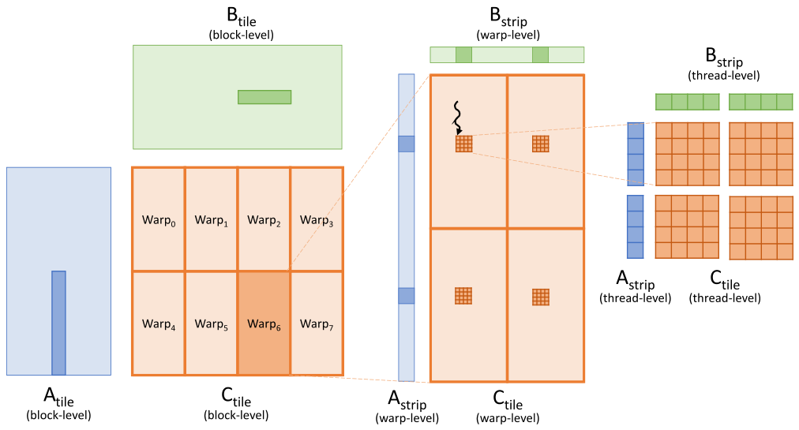

*Figure 15.10 — coalesced 저장을 위해 thread 출력 tile 을 재배치한다. (책 p.361)*

**세 단계로 쪼개진다.**

> **① block → warp.** 그림 왼쪽에서 감싸는 block-level 출력 tile 이 block 의 서로 다른 warp
> 들에 논리적으로 분할된다. 각 분할을 **warp-level 출력 tile** 로 생각할 수 있다.
> 예컨대 $128\times128$ block-level 출력 tile 과 256 thread(= warp 8개) block 을 가정하자.
> block 의 warp 들은 **$2\times4$ 배치**로 조직되고, 각 warp 는 block-level 출력 tile 의
> **$64\times32$ sub-tile** 을 맡는다 (책 p.360).

> **② warp → quadrant.** 그림 가운데에서 warp-level 출력 tile 이 **네 사분면**으로 논리적으로
> 분할되고, warp 의 각 thread 가 **각 사분면에서 $4\times4$ sub-tile** 을 하나씩 가져간다.
> 예컨대 warp-level 출력 tile 이 $64\times32$ 면 각 사분면은 $32\times16$ 이다.
> warp 의 32 thread 를 **$8\times4$ 배치**로 조직하면 각 thread 가 각 사분면에서
> $4\times4$ 출력 tile 을 받는다 (책 p.360).

> **③ 네 조각이 논리적 $8\times8$ 을 이룬다.** 그림 오른쪽은 각 사분면의 네 $4\times4$ 출력 tile 이
> 집합적으로 **논리적 $8\times8$ thread-level 출력 tile** 을 이루는 모습을 보여 준다 (책 p.361).

**숫자를 전부 확인하자.**

| 층위 | 크기 | 개수 | 계산 |
|---|---|---|---|
| block-level tile | $128\times128$ | 1 | |
| **warp-level tile** | $64\times32$ | 8 (2$\times$4) | $128/2 = 64$, $128/4 = 32$ ✓ |
| **사분면** | $32\times16$ | 4 | $64/2$, $32/2$ ✓ |
| **thread 의 물리 tile** | $4\times4$ | 4 (사분면마다 1) | $32/8 = 4$, $16/4 = 4$ ✓ |
| thread 의 논리 tile | $8\times8$ | — | $4\times4\times4 = 64$ ✓ |

**register 사용량은 그대로 64개**다 — 배치만 바뀌고 총량은 같다.

> thread 의 $8\times8$ 논리 출력 tile 을 네 개의 $4\times4$ 물리 sub-tile 로 나눴으므로,
> 이제 각 thread 는 자기 $4\times4$ 출력 tile 의 **한 행 전체를 vector store 명령 하나**로
> 저장할 수 있다. 그에 따라 같은 warp 의 thread 들이 인접한 물리 출력 sub-tile 을 저장할 때
> **이 vector store 들이 coalesced** 된다 (책 p.361).

**왜 100% 가 되는지 손으로 확인하자.** warp 안 thread 배치가 $8\times4$ 이므로
`lRow = lane/4`, `lCol = lane%4` 다. 한 store 명령에서 thread 는
행 `lRow*4`, 열 `lCol*4` 부터 4원소(16 B)를 쓴다.

- **`lCol` = 0,1,2,3 인 네 thread**: 열 0, 4, 8, 12 → **16원소 = 64 B 연속** ✓
- `lRow` 가 다른 여덟 묶음: 각각 다른 행 → 서로 떨어진 64 B 덩어리 8개

$64\ \text{B} = $ sector 2개를 **꽉 채운다.** 그래서 16 sector, 512 B 이동, 512 B 유용 → **100%**.

> `mm()` 과 `writeTile()` device 함수는 thread-level 출력 tile 의 이 $4\times4$ sub-tile 들을
> 순회하고 각 단계에서 작은 입력 strip 을 적재하도록 **수정돼야 한다.**
> thread-level 출력 tile 의 이 재배치 구현은 **독자를 위한 연습으로 남긴다** (책 p.361).
> → **15.11절 연습문제 3**

### 3. 예제/실습

#### 연습문제

> **(1)** warp 를 $4\times8$ (즉 `lRow = lane/8`)로 배치하면 어떻게 되는가?
> **(2)** `float4` 대신 `float2` 를 쓰면 효율은?

**(1)** `lCol` 이 0~7 이 되어 **여덟 thread가 열 0,4,…,28 을 덮고 128 B 연속**이 된다.
sector 4개를 꽉 채우므로 **여전히 100%** 이고, 오히려 **연속 덩어리가 더 길어** 좋다.
다만 사분면 크기가 $16\times32$ 로 바뀌므로 $4\times4$ 를 유지하려면 warp tile 을
$32\times64$ 로 잡아야 한다 — **warp 배치와 tile 모양이 함께 정해진다.**

**(2)** thread 당 8 B, 주소 간격은 `lCol*4` 원소 $= 16$ B 다.
네 thread 가 8 B 씩 16 B 간격으로 쓰므로 **절반이 빈다 → 50%**.
**vector 폭과 sub-tile 폭이 같아야** 빈틈이 없다 — `float4` 와 $4\times4$ 가 짝인 이유다.

---

## 15.6 Eliminating bank conflicts (책 p.361)

### 1. 무엇이 문제인가

> thread 가 큰 출력 tile 을 계산하게 하는 데 따르는 또 하나의 어려움은
> **shared memory 를 stride 를 두고 접근하게 된다**는 것이다.
> 6장에서 본 대로 thread 가 shared memory 를 stride 를 두고 접근하면 **bank conflict** 가
> 생길 수 있다 (책 p.361).

> 각 warp 가 **$8\times4$ 로 조직**돼 있으므로 **첫 네 thread 는 shared memory 의
> $A$ block-level tile 에서 동일한 위치를 적재**한다 (책 p.361).

**15.5절의 재배치가 15.6절의 문제를 만들었다는 점**을 놓치지 말자.
`lCol` 이 다른 네 thread 는 $B$ 쪽만 다르고 **$A$ strip 은 같은 것**을 쓴다.

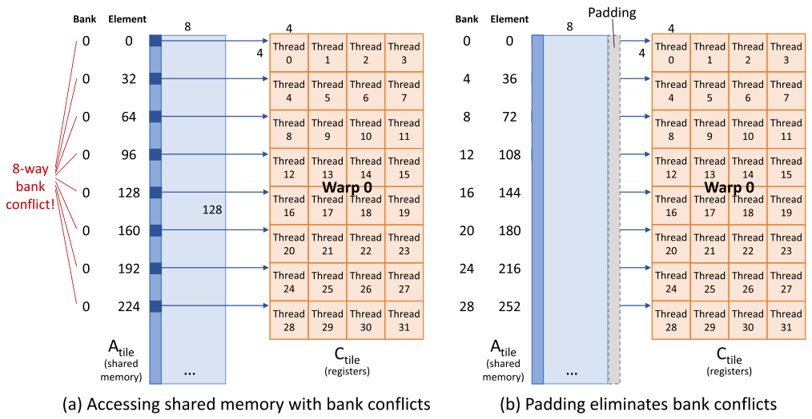

*Figure 15.11 — shared memory bank conflict 를 없애기 위해 padding 을 추가한다. (책 p.362)*

### 2. 수식/유도 — 8-way conflict 와 그 제거

#### 전체 유도 과정 (먼저 한 번에)

$$\text{lane } \ell \text{ 이 읽는 행} = 4\left\lfloor \frac{\ell}{4} \right\rfloor, \qquad \ell = 0..31 \tag{1}$$

$$\text{선형 index} = \text{행} \times \texttt{ldas} + \text{열} \tag{2}$$

$$\text{bank} = \text{선형 index} \bmod 32 \tag{3}$$

$$\texttt{ldas} = 8: \quad (4g \cdot 8) \bmod 32 = 32g \bmod 32 = 0 \quad \forall g \tag{4}$$

$$\texttt{ldas} = 9: \quad (4g \cdot 9) \bmod 32 = 36g \bmod 32 = 4g \bmod 32 \tag{5}$$

#### 단계별 설명

**(1)** warp 가 $8\times4$ 이므로 **네 thread 씩 여덟 묶음**이고, 묶음 $g$ 는 행 $4g$ 를 읽는다.

> Figure 15.11(a) 는 warp 0 의 thread 들이 행렬 $A$ 의 tile 에서 **첫 입력 strip** 을 적재할 때
> shared memory 에 접근하는 모습을 보여 준다. …
> **thread 0~3 이 적재하는 첫 원소는 행 0 의 첫 원소**다. 이 원소의 선형 index 는 0 이고
> **bank 0** 에 있다고 가정한다 (책 p.361).

**(2)~(3)** shared memory 는 32개 bank 에 **4바이트 단위로 순환 배정**된다 (6.4절).

**(4)** padding 이 없으면 (`ldas` $=$ `bK` $= 8$):

> **thread 4~7 이 적재하는 첫 원소는 행 4 의 첫 원소**다.
> shared memory 의 block-level 입력 tile 폭이 8 이라 가정하면 이 원소의 선형 index 는
> $4\times8+0 = 32$ 이고, 이것도 **bank 0** 이다 ($32 \bmod 32$).
> 마찬가지로 **thread 8~11 의 첫 원소는 행 8 의 첫 원소**로 선형 index $8\times8+0 = 64$,
> 역시 **bank 0** 이다 ($64 \bmod 32$) (책 p.362).

| 묶음 $g$ | 행 | 선형 index | bank |
|---|---|---|---|
| 0 | 0 | 0 | **0** |
| 1 | 4 | 32 | **0** |
| 2 | 8 | 64 | **0** |
| … | … | … | **0** |
| 7 | 28 | 224 | **0** |

> 네 thread 묶음들이 적재하는 **첫 원소만 봤지만, 각 warp 의 네 thread 묶음들이 적재하는
> 둘째 원소는 전부 bank 1** 에 떨어진다. 실제로 **여덟 개의 네 thread 묶음이 적재하는
> 대응 원소가 전부 같은 bank** 에 있어 **모든 접근에 8-way bank conflict** 를 일으킨다 (책 p.362).

**8-way conflict 는 접근이 8번 직렬화된다는 뜻**이다 (6.4절).

**(5)** 열 하나를 padding 하면 (`ldas` $= 9$):

> 논리적 tile 폭은 여전히 8 이지만 **선형 index 계산에 쓰이는 leading dimension 은 9** 다.
> 이 경우 행 0 의 첫 원소는 여전히 선형 index 0 으로 bank 0 이다.
> 그러나 **행 4 의 첫 원소는 선형 index $4\times9+0 = 36$ 으로 bank 4** 다 ($36\bmod32$).
> 마찬가지로 **행 8 의 첫 원소는 $8\times9+0 = 72$ 로 bank 8** 이다 ($72 \bmod 32$) (책 p.362).

| 묶음 $g$ | 행 | 선형 index | bank |
|---|---|---|---|
| 0 | 0 | 0 | **0** |
| 1 | 4 | 36 | **4** |
| 2 | 8 | 72 | **8** |
| 3 | 12 | 108 | **12** |
| 4 | 16 | 144 | **16** |
| 5 | 20 | 180 | **20** |
| 6 | 24 | 216 | **24** |
| 7 | 28 | 252 | **28** |

**여덟 묶음이 전부 다른 bank** 다 → **conflict 없음** ✓

> 네 thread 묶음들이 접근하는 **둘째 원소**에도 같은 분석을 적용할 수 있는데,
> bank 1, 5, 9, …, 29 에 떨어진다. **즉 8-way bank conflict 가 제거**된다.
> 독자는 각 4-thread 묶음이 접근하는 **16개 원소 전부**에 대해 일반 분석을 완성해
> 32개 bank 로 8-way conflict 가 실제로 전부 제거됨을 확인할 수 있다 (책 p.362).

**코드로 16개 원소 전부를 확인했다.** `ldas=8` 이면 최대 **8-way**, `ldas=9` 면 최대 **1-way**
(즉 conflict 없음)다.

### 3. 코드 변경은 두 줄

> Figure 15.3 에 이 최적화를 적용하는 데 필요한 코드 변경은 아주 단순하다 (책 p.362).

```cuda
__shared__ float A_s[bM*(bK + 1)];
```

> 특히 `bK` 가 `bK + 1` 로 바뀐다.
> 이 padding 열을 index 계산에 반영하려면 **`loadTile()` 과 `mm()` 에 넘기는 `A_s` 의
> leading dimension 을 `bK` 에서 `bK + 1` 로** 바꿔야 한다 (책 p.363).

**15.3절에서 leading dimension 을 인자로 뽑아 둔 설계가 여기서 값을 한다** —
함수 본문은 한 글자도 고치지 않는다.

#### `B_s` 는 왜 그대로 두는가

> 두 번째 shared memory tile `B_s` 에 대한 접근은 **bank conflict 를 전혀 보이지 않는다.**
> 같은 warp 의 thread 들이 적재하는 `B_s` 의 strip 전체는 **shared memory 에서 연속된
> 32개 원소**로 이루어져 **32개의 서로 다른 memory bank** 에 떨어진다.
> 이런 이유로 `B_s` 의 선언과 접근 방식은 수정할 필요가 없다 (책 p.363).

**$A$ 와 $B$ 의 비대칭은 strip 의 방향에서 온다.**

| | strip 방향 | shared memory 에서 | bank |
|---|---|---|---|
| **`A_s`** | **세로** (`tM`$\times1$) | `ldas` 간격으로 **띄엄띄엄** | 겹친다 → conflict |
| **`B_s`** | **가로** ($1\times$`tN`) | **연속** | 32개 전부 다르다 ✓ |

> **row-major 저장이 세로 접근에 불리하다**는 6장의 그 문제다.
> $A$ 를 shared memory 에 **transpose 해서** 담는 것도 대안이고
> (그러면 세로 strip 이 연속이 된다), CUTLASS 같은 라이브러리는
> **XOR swizzle** 이라는 더 정교한 방법을 쓴다.
> padding 은 가장 단순한 해법이고 **shared memory 를 $\frac{bM}{bM \cdot bK}= \frac{1}{8}$,
> 즉 12.5% 더 쓴다** (4 KB → 4.5 KB).

### 4. 예제/실습

#### 연습문제

> **(1)** `bK = 16` 이면 padding 없이 몇 way conflict 인가? padding 1열이면?
> **(2)** padding 을 **4열** 넣으면 어떻게 되는가? (연습문제 1의 vector store 와 관련)

**(1)** 행 $4g$ 의 선형 index 는 $64g$ 이고 $64g \bmod 32 = 0$ — **여전히 8-way** 다.
padding 1열이면 $4g\times17 = 68g$, $68g \bmod 32 = 4g \bmod 32$ →
$0, 4, 8, \ldots, 28$ 로 **전부 다르다** ✓ 같은 해법이 통한다.

**(2)** `ldas` $= 12$ 면 $4g\times12 = 48g$, $48g \bmod 32 = 16g \bmod 32$ →
$0, 16, 0, 16, \ldots$ 로 **4-way conflict 가 남는다.**

> **이것이 연습문제 1에서 부딪히는 벽이다.**
> shared memory 에 `float4` 로 쓰려면 주소가 **16 B 정렬**돼야 하고,
> 그러려면 `ldas` 가 **4의 배수**여야 한다. 그런데 `ldas` 가 4의 배수면
> $4g \cdot \texttt{ldas} \bmod 32$ 가 $g$ 에 대해 주기를 갖게 되어 **conflict 가 되살아난다.**

| `ldas` | 16 B 정렬 | bank conflict |
|---|---|---|
| 8 | ✓ | **8-way** |
| **9** | ✗ | **없음** |
| 12 | ✓ | 4-way |
| 16 | ✓ | 8-way |

**둘을 동시에 만족하는 padding 은 없다.** 실무의 답은 둘 중 하나다 —
**① global 쪽만 vector load 하고 shared 쪽은 scalar store** 하거나,
**② padding 대신 XOR swizzle** 을 쓰는 것이다. 연습문제 1에서 ①을 택한다.

---

## 15.7 Occupancy considerations (책 p.363)

### 1. 개념적 이해

> 큰 tile 이 arithmetic intensity를 높여 성능을 개선함을 보았다.
> 그러나 **큰 tile 은 SM 자원에 압박**을 준다 — 특히 block-level 입력 tile 을 담는
> **shared memory** 와 thread-level 입력 strip·출력 tile 을 담는 **register file** 이다.
> 이 자원들에 대한 압박은 **SM 의 thread occupancy 에 상당한 영향**을 준다 (책 p.363).

### 2. shared memory 압박은 쉽게 푼다

> shared memory 자원 압박은 쉽게 완화할 수 있다.
> 15.2절에서 본 대로 첫 입력 tile 이 $m\times k$, 둘째가 $k\times n$, 출력이 $m\times n$ 일 때
> arithmetic intensity는 $0.5\cdot m\cdot n/(m+n)$ 이다.
> **흥미롭게도 arithmetic intensity는 $k$ 와 무관하다.**
> 따라서 **더 작은 $k$ 를 써서 arithmetic intensity에 영향 없이 shared memory 압박을 완화**할 수 있다
> (책 p.363).

**15.2절 식 (4)가 여기서 회수된다.**

> 예컨대 $m = n = 128$ 이면 $k$ 를 8 로 둘 수 있다.
> 이 경우 `A_s` 와 `B_s` 는 각각 $128\times8$ 과 $8\times128$ 원소, 즉 **각각 4 KB** 다.
> 이 정도의 shared memory 사용량은 현대 GPU 에서 occupancy 를 제약하지 않는다 (책 p.363).

$$128 \times 8 \times 4\ \text{B} = 4096\ \text{B} = 4\ \text{KB}$$

**두 tile 합쳐 8 KB.** H100 의 SM 당 shared memory 가 228 KB 이므로 여유가 크다.

### 3. register 압박은 풀리지 않는다

> 반면 **register file 압박은 여전히 높다.**
> 예컨대 각 thread 가 $8\times8$ thread-level 출력 tile 을 담당하면
> **출력 tile 만으로 register 64개**가 필요하다.
> thread-level 입력 tile 에 register tiling 을 적용하면 **입력 strip 마다 register 8개씩**
> 추가로 필요해 **총 80개**가 된다.
> 이 수에는 계산 전반에서 쓰이는 지역 변수와 임시값을 담을 다른 register 는 포함돼 있지도 않다.
> 실제로 **우리가 공격적으로 적용한 loop unrolling 이 register 사용을 더 악화**시킨다 —
> 계산 전반에 저장해야 할 임시값 수를 늘리기 때문이다 (책 p.363).

| 무엇 | register |
|---|---|
| 출력 tile `C_r[8][8]` | **64** |
| `a_r[8]` | 8 |
| `b_r[8]` | 8 |
| **소계** | **80** |
| 지역 변수·주소·임시값·unroll 로 늘어난 것 | (그 위에) |

> **6.6절의 loop unrolling 이 여기서 대가를 청구한다.**
> unrolling 은 독립 명령을 늘려 latency 를 숨기게 해 주지만,
> 그 독립 명령들이 **동시에 살아 있는 값(live value)** 을 늘려 register 를 먹는다.
> 그리고 15.3절에서 본 대로 **unrolling 없이는 `C_r` 이 애초에 register 에 못 간다.**
> **필수인 동시에 비용인 도구**다.

#### occupancy 계산

> 이 높은 register 수요가 **SM 의 register 수를 occupancy 의 주된 제약**으로 만든다.
> 실제로 이런 matmul kernel 은 **thread 당 허용된 최대 register 수인 255개**를 쓴다.
> 전형적인 SM 의 register file 용량이 **64k register** 이므로
> **SM 당 thread 수가 256개로 제한**된다.
> 이 한계가 15.3절에서 **block 크기를 256 thread 로 고른 이유**를 설명한다.
> 그에 따라 각 SM 은 **256 thread 짜리 block 하나만** 실행하고,
> 이는 SM 최대 occupancy 2048 thread 의 **12.5%** 에 불과하다 (책 p.363).

$$\frac{65536\ \text{register}}{255\ \text{register/thread}} = 257 \to \mathbf{256\ \text{thread}}$$
$$\text{occupancy} = \frac{256}{2048} = \mathbf{12.5\%}$$

> **4.7절에서 "occupancy 를 높여라"라고 배웠는데 여기서는 12.5% 를 감수한다.**
> 4장의 조언이 틀린 것이 아니라 **전제가 다르다** —
> 4장은 latency 를 숨길 다른 warp 이 필요한 **memory-bound** 상황을 가정했고,
> 여기는 arithmetic intensity 32 FLOP/B 의 **compute-bound** kernel 이다.
> **6.9절이 말한 "무엇이 병목인지 먼저 정하라"가 이 판단의 근거**다.

### 4. 낮은 occupancy 의 두 단점과 대응

> 이런 낮은 occupancy 로 실행하는 것이 보통 바람직하지는 않지만,
> **arithmetic intensity를 높이는 register tiling 의 극단적 이득이 그것을 감수할 만하게** 만든다.
> 그러나 낮은 occupancy 실행에는 **극복해야 할 두 가지 주요 단점**이 있다 (책 p.364).

| 단점 | 왜 | 대응 | 어디서 |
|---|---|---|---|
| **① 메모리 명령이 부족하다** | thread 가 적으니 발행할 수 있는 메모리 접근 명령이 적어 **bandwidth 를 다 못 쓴다** | **vector load/store** — 명령당 더 많은 바이트 | 15.3절 (연습 1·2) |
| **② latency 를 감내할 thread 가 부족하다** | 긴 latency 명령을 가릴 다른 warp 이 없다 | **공격적인 loop unrolling** | 15.3절 |

> 6장에서 언급했듯 **loop unrolling 은 긴 latency 의 분기 명령을 없애고
> 독립 명령을 더 드러내어**, 컴파일러가 **긴 latency 명령과 그 사용자 사이의 거리를 늘리도록**
> 스케줄할 수 있게 한다.
> 적절한 loop unrolling 과 명령 스케줄링이 있으면 **컴파일된 kernel 코드의 상당 부분이
> 독립적인 fused-multiply-add 명령의 연속**이 되어 **stall 없이 SM core 를 꽉 채운다** (책 p.364).

### 5. 남은 문제 — 두 국면

> 우리가 신경 써야 할 남은 긴 latency 연산은 **메모리 접근과 barrier synchronization** 이다.
> 보통 arithmetic intensity가 높은 compute-bound kernel 에서는 메모리 접근 latency 를 걱정할 필요가 없다 —
> **계산 명령과 겹칠 수 있기** 때문이다.
> 예컨대 SM 의 어떤 block 이 입력 tile 이 global 에서 shared 로 적재되기를 기다리는 동안,
> **다른 block 이 펼쳐진 독립 FMA 명령들로 SM core 를 꽉 채울 수 있다.**
> 그러나 **우리 경우 occupancy 가 SM 당 block 하나로 제한**돼 있어 **이 겹침이 일어나지 않는다**
> (책 p.364).

> 대신 block 이 SM 에서 **두 국면으로 실행**된다 —
> **입력 tile 이 적재되는 동안 compute core 가 노는 memory-bound 국면**과,
> **계산이 수행되는 동안 메모리 접근 하드웨어가 노는 compute-bound 국면**이다.
> 메모리 접근 latency 를 숨길 여러 block 이 없으므로,
> **이 두 국면을 겹치게 하는 소프트웨어 최적화에 의존**해야 한다.
> 그런 최적화 하나가 **software pipelining** 이고 15.8절에서 논한다 (책 p.364).

> **"occupancy 를 낮췄더니 latency hiding 이 사라졌고, 그래서 소프트웨어로 겹쳐야 한다"** —
> 이 인과 사슬이 15.7 → 15.8 의 연결이고, **이 장에서 가장 잘 짜인 논증**이다.
> 4장에서 "하드웨어가 알아서 warp 을 갈아 끼워 latency 를 숨긴다"고 배웠는데,
> **그 하드웨어 기능을 스스로 포기한 대가를 소프트웨어로 치르는** 것이다.

<!--widget:matmul-tiles-->

### 6. 예제/실습

#### 연습문제

> **(1)** thread 당 register 를 128개로 줄이면 occupancy 는? 그러려면 tile 을 어떻게 바꾸나?
> **(2)** `bK` 를 4로 줄이면 shared memory 와 반복 수는?
> **(3)** block 을 512 thread 로 늘리면 무슨 일이 생기는가?

**(1)** $65536/128 = 512$ thread/SM → occupancy $512/2048 = \mathbf{25\%}$.
register 를 반으로 줄이려면 출력 tile 을 $8\times8 \to \mathbf{8\times4}$ 나 $4\times8$ 로 줄여야 하는데,
그러면 15.4절의 shared 읽기 감소율이 $\frac{2\times32}{12} = 5.3\times$ 로 떨어지고
block tile 도 작아져 **arithmetic intensity가 준다.** 맞바꿈이다.

**(2)** shared memory 는 $2\times128\times4\times4\ \text{B} = \mathbf{4\ KB}$ (절반).
반복 수는 $K/4$ 로 **두 배**가 되어 **barrier 횟수도 두 배**다.
arithmetic intensity는 그대로 32 FLOP/B.

> `bK` 를 줄이면 shared memory 는 줄지만 **동기화 오버헤드가 늘어난다.**
> 그래서 무작정 줄일 수는 없고, 8 이 흔한 절충값이다.

**(3)** register file 이 $65536/512 = 128$ register/thread 로 제약되므로
**thread 당 80 register 를 쓰는 우리 kernel 은 들어간다** (여유 48).
occupancy 는 25% 로 오른다. 다만 block tile 이 같으면 **thread 당 출력이 $4\times8$ 로 줄어**
(1)과 같은 문제가 생기고, block tile 을 $128\times256$ 으로 키우면
shared memory 가 12 KB 로 늘고 arithmetic intensity는 $\frac{0.5\times128\times256}{384} = 42.7$ 로 오른다.
**여기가 실제 튜닝의 놀이터**이고, 정답은 프로파일링이 정한다 (6.9절).

---

## 15.8 Software pipelining (책 p.364)

### 1. 개념적 이해

> 15.7절에서 지금까지 구현한 matmul kernel 에서 SM 마다 block 하나가 **두 국면**으로
> 실행됨을 보았다 — memory-bound 국면과 compute-bound 국면이다.
> 각 국면에서 **계산 자원이나 메모리 자원 중 하나가 덜 활용**되므로 실행 속도가 잠재력에
> 못 미친다. GPU 자원을 더 잘 쓰려면 **두 국면을 겹쳐** 메모리 명령의 긴 latency 를
> 계산 명령 실행 뒤로 숨기고 싶다. 이 겹침은 **software pipelining** 으로 달성할 수 있다
> (책 p.364).

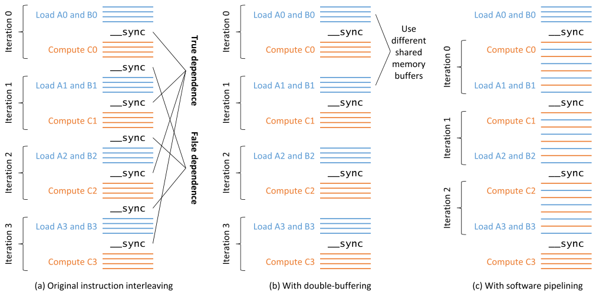

*Figure 15.12 — double-buffering 과 software pipelining 전후의 명령 인터리빙. (책 p.365)*

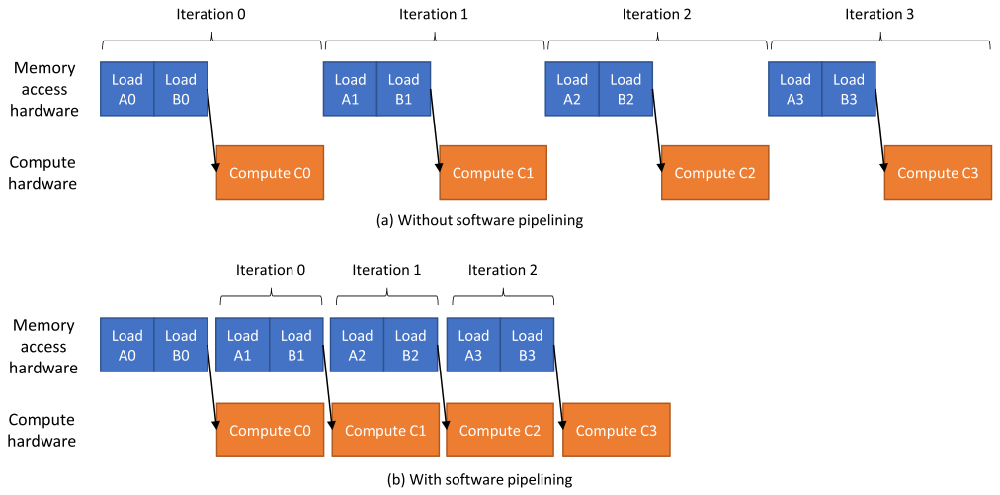

*Figure 15.13 — software pipelining 전후의 타이밍 다이어그램. (책 p.365)*

> Figure 15.12(a) 는 software pipelining 없이 tiled matmul 을 수행할 때의 명령 인터리빙을,
> Figure 15.13(a) 는 대응하는 타이밍 다이어그램을 보여 준다.
> 먼저 입력 tile $A_0$·$B_0$ 를 적재하는 명령들이 실행된다.
> 다음으로 `__syncthreads()` 가 실행되어 **어떤 계산도 수행되기 전에 모든 thread 가
> 자기 몫의 데이터 적재를 마치도록** 보장한다.
> 그 뒤 $A_0$·$B_0$ 의 출력 tile 기여분 $C_0$ 가 계산된다.
> 다음으로 또 하나의 `__syncthreads()` 가 실행되어 **새 입력 tile 을 그 자리에 적재하기 전에
> 모든 thread 가 $A_0$·$B_0$ 사용을 마치도록** 보장한다 (책 p.365).

> Figure 15.12(a) 와 13(a) 에서 얻는 중요한 관찰은,
> **입력 tile 이 global 에서 적재되는 동안 부동소수점 연산이 하나도 수행되지 않는다**는 것이다.
> 즉 메모리 접근 하드웨어는 바쁜데 **부동소수점 ALU 는 논다.**
> 반대로 출력 tile 기여분이 계산되는 동안에는 global 에서 적재되는 데이터가 없다.
> 즉 부동소수점 ALU 는 바쁜데 **메모리 접근 하드웨어가 논다** (책 p.366).

Figure 15.13(a) 의 계단 모양이 그 낭비를 그대로 보여 준다.

### 2. 두 barrier 는 성격이 다르다

> 이상적으로는 global 에서 데이터를 적재하는 명령과 부동소수점 계산을 수행하는 명령을
> **인터리브**하고 싶다. …
> 그러나 컴파일러는 **데이터 적재 단계와 계산 단계를 갈라놓는 barrier synchronization 의 존재**
> 때문에 두 종류의 명령을 인터리브하지 못한다 (책 p.366).

> Figure 15.12(a) 를 되돌아보면, **입력 tile 쌍 적재와 그 tile 의 기여 계산을 갈라놓는
> barrier 는 참 의존(true dependence)** 을 강제한다. 즉 **데이터를 쓰려면 적재를 기다려야** 한다.
> 반면 **tile 쌍의 기여 계산과 다음 tile 쌍 적재를 갈라놓는 barrier 는
> 거짓 의존(false dependence)** 을 강제한다. 즉 **이 두 활동은 독립적으로 실행될 수 있는데,
> 계산 중인 이전 쌍을 담고 있는 같은 메모리 위치에 새 쌍을 쓰기 때문에 막혀 있는** 것이다
> (책 p.366).

| barrier | 의존 종류 | 없앨 수 있나 |
|---|---|---|
| 적재 → 계산 (Figure 15.3 의 27번 줄) | **참 의존** (read-after-write) | **불가** — 데이터가 실제로 필요하다 |
| 계산 → 다음 적재 (31번 줄) | **거짓 의존** (write-after-read) | **가능** — 버퍼를 나누면 된다 |

> **5.3절에서 배운 참/거짓 의존 구분이 여기서 실전으로 쓰인다.**
> 거짓 의존은 **자원(메모리 위치)을 재사용해서 생긴 가짜 제약**이므로
> **자원을 늘리면 사라진다.** 그것이 double buffering 이다.

### 3. double buffering 과 software pipelining

> 6장에서 본 대로 **거짓 의존을 강제하는 barrier 는 double-buffering 최적화로 없앨 수 있다.**
> 즉 **다음 입력 tile 쌍을 적재하는 메모리 버퍼를 현재 계산에 쓰이는 버퍼와 다르게** 쓰면 된다.
> 그렇게 하면 거짓 의존이 사라지고 **barrier 가 더 이상 필요 없다** (Figure 15.12(b)).
> 반복마다 다른 버퍼를 할당하는 대신 **버퍼 두 개만** 쓰면 된다 —
> **짝수 반복용 하나와 홀수 반복용 하나** (책 p.366).

> barrier 를 없앤 것이 메모리 접근 명령과 부동소수점 명령의 인터리빙에 길을 열지만
> **장애물이 하나 남는다.** 인터리브할 명령들이 **서로 다른 loop 반복에 있어서** 컴파일러가
> 인터리브하지 못한다.
> 이를 넘기 위해 **software pipelining** 을 적용한다 —
> **$i$ 번째 반복이 $i$ 번째 tile 쌍의 기여를 계산하면서 $(i+1)$ 번째 쌍을 적재**하도록
> loop 코드를 재배치하는 것이다.
> 이렇게 재배치하면 컴파일러가 메모리 접근 명령과 부동소수점 명령을 인터리브할 수 있게 되어
> (Figure 15.12(c), 15.13(b)), **연속으로 스케줄되는 독립 명령이 늘고 warp 이 stall 할 필요가
> 줄어든다** (책 p.366).

**두 최적화가 각각 다른 장애물을 치운다는 점이 핵심이다.**

| 최적화 | 무엇을 치우나 |
|---|---|
| **double buffering** | **barrier** (거짓 의존) |
| **software pipelining** | **loop 경계** (적재와 계산이 다른 반복에 있다) |

**둘 다 있어야** 컴파일러가 명령을 섞을 수 있다.

### 4. 코드

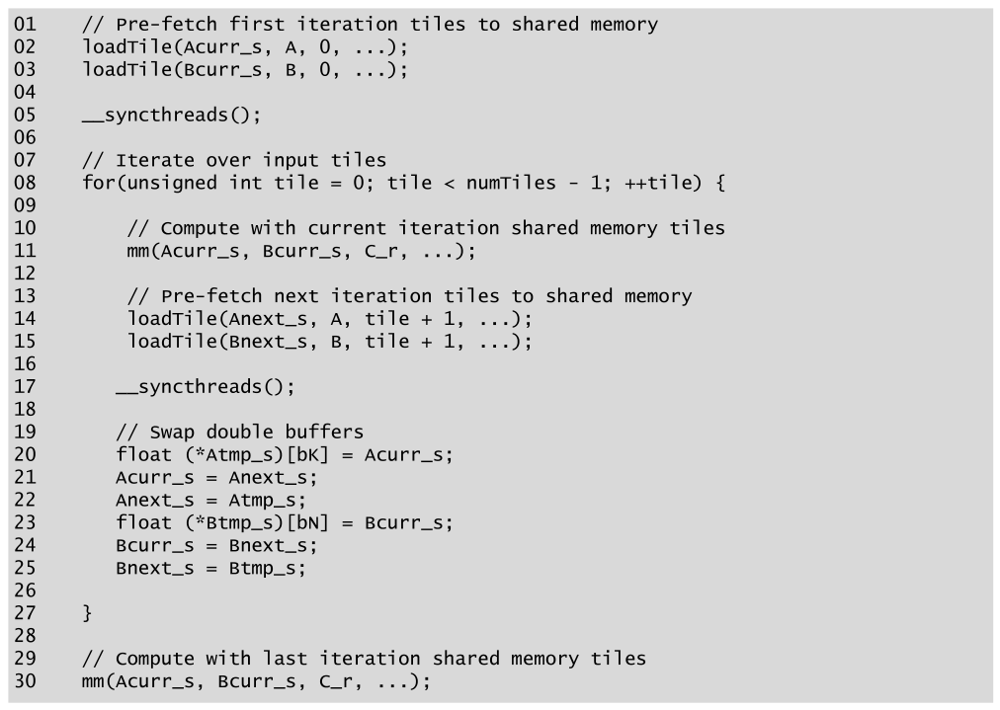

*Figure 15.14 — double-buffering 과 software pipelining 을 적용한 코드. (책 p.367)*

```cuda
01  // Pre-fetch first iteration tiles to shared memory
02  loadTile(Acurr_s, A, 0, ...);
03  loadTile(Bcurr_s, B, 0, ...);
04
05  __syncthreads();
06
07  // Iterate over input tiles
08  for(unsigned int tile = 0; tile < numTiles - 1; ++tile) {
09
10      // Compute with current iteration shared memory tiles
11      mm(Acurr_s, Bcurr_s, C_r, ...);
12
13      // Pre-fetch next iteration tiles to shared memory
14      loadTile(Anext_s, A, tile + 1, ...);
15      loadTile(Bnext_s, B, tile + 1, ...);
16
17      __syncthreads();
18
19      // Swap double buffers
20      float (*Atmp_s)[bK] = Acurr_s;
21      Acurr_s = Anext_s;
22      Anext_s = Atmp_s;
23      float (*Btmp_s)[bN] = Bcurr_s;
24      Bcurr_s = Bnext_s;
25      Bnext_s = Btmp_s;
26
27  }
28
29  // Compute with last iteration shared memory tiles
30  mm(Acurr_s, Bcurr_s, C_r, ...);
```

#### 세 부분으로 읽는다

| 줄 | 무엇 | 왜 |
|---|---|---|
| **01~05** | **prologue** — 첫 tile 을 미리 적재 | pipeline 을 채운다 |
| **08~27** | **steady state** — 계산과 다음 적재를 **동시에** | loop 가 `numTiles - 1` 까지만 돈다 |
| **29~30** | **epilogue** — 마지막 tile 계산 | 적재할 다음 것이 없다 |

**prologue / steady state / epilogue 는 software pipelining 의 표준 구조**다.
$n$ 개를 처리하는데 loop 는 $n-1$ 번 돌고 앞뒤로 조각이 붙는다.

> 이 코드의 중요한 관찰은, 계산에 쓰이는 현재 쌍(`Acurr_s`·`Bcurr_s`)과
> 다음 쌍 적재(`Anext_s`·`Bnext_s`)에 **서로 다른 shared memory 버퍼**를 쓰므로
> **12번 줄에 barrier synchronization 이 필요 없다**는 것이다.
> 이 barrier 의 부재가 컴파일러로 하여금 `mm()` 과 `loadTile()` device 함수를 inline 한 뒤
> **그 안의 명령들을 인터리브**할 수 있게 한다.
> 이 인터리빙이 **부동소수점 ALU 와 메모리 접근 하드웨어를 동시에 바쁘게** 유지한다 (책 p.367).

**11번 줄과 14~15번 줄 사이에 barrier 가 없는 것**이 이 코드의 전부다.
17번 줄의 barrier 는 **다음 반복의 계산이 이번에 적재한 것을 쓰기 전에** 필요한 **참 의존**이다.

> **비용은 shared memory 두 배**다. `Acurr_s`+`Anext_s`+`Bcurr_s`+`Bnext_s` 로
> $8\ \text{KB} \to \mathbf{16\ KB}$ 가 된다.
> 15.7절에서 `bK` 를 8 로 줄여 확보해 둔 여유가 여기 쓰인다 —
> **절들이 서로를 위해 자리를 만들어 준다.**
>
> barrier 는 반대로 **반복당 2개에서 1개로 준다.** tile 8개면 16개 → 8개다.

### 5. 하드웨어에 맡기는 두 가지 대안

> software pipelining 이 메모리 접근 명령과 계산 명령을 인터리브해 실행을 겹치는 데
> 효과적이긴 하지만, **명령 스케줄링을 적용할 때 컴파일러가 명령 latency 를 잘 추정하는지에
> 의존**한다. 그러나 컴파일러는 **코드가 실행되며 마주칠 조건에 대한 지식이 제한적**이다.
> 대안으로 **인터리빙을 하드웨어에 위임**할 수도 있다 (책 p.367~368).

| 방법 | 어떻게 |
|---|---|
| **warp specialization** | **일부 warp 는 메모리 접근을, 다른 warp 는 계산을** 하도록 프로그램한다. 하드웨어가 warp 을 번갈아 스케줄하며 **자동으로 인터리브**한다 |
| **전용 하드웨어 지원** | global ↔ shared 전송을 **배경에서** 수행하는 하드웨어 (15.9절의 LDGSTS·TMA) |

> **warp specialization 은 4장의 latency hiding 을 되찾는 영리한 방법**이다.
> occupancy 가 낮아 "다른 block" 이 없으니, **한 block 안에서 역할을 나눈 warp** 이
> 그 역할을 대신한다. producer warp 과 consumer warp 이 shared memory 를
> 순환 버퍼로 주고받는 구조이고, **Hopper 세대의 고성능 GEMM kernel 이 실제로 이 구조**다.

### 6. 예제/실습

#### 연습문제

> **(1)** `numTiles = 1` 이면 Figure 15.14 는 올바르게 동작하는가?
> **(2)** double buffering 없이 software pipelining 만 적용하면?
> **(3)** 20~25번 줄의 포인터 교환 대신 쓸 수 있는 방법은?

**(1) 동작한다.** loop 가 `tile < 0` 이라 한 번도 돌지 않고,
prologue 가 적재한 tile 로 epilogue(30번 줄)가 계산한다. **prologue + epilogue 만 실행**된다.

**(2) 안 된다.** 11번 줄의 계산이 `Acurr_s` 를 읽는 동안 14번 줄이 **같은 버퍼**에 쓰게 되어
**race condition** 이다. barrier 를 다시 넣으면 인터리빙이 막힌다.
**double buffering 이 software pipelining 의 전제 조건**이다.

**(3)** 반복 index 의 홀짝으로 **버퍼를 골라 쓰는 방법**이 있다.

```cuda
float* Acurr_s = &A_s[(tile % 2) * bM * bK];
float* Anext_s = &A_s[((tile + 1) % 2) * bM * bK];
```

포인터 교환이 없어 register 를 덜 쓰지만, **`tile % 2` 를 매번 계산**해야 한다.
loop 를 **2배 unroll** 하면 둘 다 피할 수 있다 — 짝수 몸통과 홀수 몸통을 따로 쓰면
index 가 컴파일 타임 상수가 된다. **실무 라이브러리가 쓰는 방법**이다.

---

## 15.9 Specialized software and hardware support (책 p.368)

### 1. 라이브러리

> GPU 컴퓨팅에서 matrix multiplication 의 보편성과 중요성 때문에,
> 하드웨어 벤더가 **이 장에서 소개한 최적화를 담은 고도로 최적화된 matmul 루틴의
> 전용 라이브러리**를 제공하는 것이 일반적이다 (책 p.368).

| 라이브러리 | 무엇 |
|---|---|
| **cuBLAS** [1] | 기본 선형대수의 표준 **BLAS API 의 GPU 구현** — matmul 포함 |
| **cuDNN** [2] | GPU 에서 **심층 신경망**을 구현하는 루틴 — 내부에서 matmul 을 수행한다 |
| **CUTLASS** [3] | **여러 층위와 규모**에서 matmul 을 구현하는 오픈소스 라이브러리 — 더 큰 kernel 안에 matmul 을 부품으로 넣기 쉽게 해 준다 |
| **cuTile** | 더 최근의 프로그래밍 인터페이스 — **배열 기반 코드**를 쓰면 컴파일러가 tensor 의 특수한 성질을 활용해 고급 최적화를 수행한다 |

> 이런 라이브러리와 프로그래밍 인터페이스가 있으므로 **GPU 프로그래머는 보통 matmul 을
> 밑바닥부터 구현하지 않는다.** 그럼에도 **matmul 에 적용되는 고급 최적화를 배우는 것은
> 근본 기법을 이해하는 유용한 연습**이고, 그 기법은 다른 맥락에도 적용될 수 있다 (책 p.368).

> **11·13·14장의 마무리와 똑같은 결론**이다. Part 2 의 모든 장이 같은 말로 끝난다 —
> **"라이브러리를 써라. 다만 어떻게 만들어졌는지 알아야 고를 수 있다."**
> 특히 CUTLASS 는 **이 장의 tile 계층(block/warp/thread)을 그대로 타입으로 표현**하므로,
> 15.3·15.5절을 읽고 나면 CUTLASS 의 API 가 훨씬 잘 읽힌다.

### 2. tensor core

> GPU 는 matmul 을 위한 **전용 하드웨어 지원**도 제공한다. …
> 예컨대 **Volta 아키텍처부터 일부 NVIDIA GPU 에 tensor core** 가 들어 있는데,
> 이는 **명령 하나로 작은 matrix multiplication 연산을 수행하는 특수 목적 core** 다.
> matmul 에 필요한 **명령 수를 줄여 명령 디코딩·처리 throughput 제한으로 인한 병목을 없앤다.**
> 더욱이 tensor core 는 **register 내용 교환을 위한 고급 warp 수준 하드웨어 기능**을 활용하고
> **더 낮은 정밀도의 부동소수점 연산 유닛**을 써서 극도로 높은 matmul throughput 을 달성한다
> (책 p.368).

**세대별 발전을 표로 정리하면 이렇다** (책 p.369).

| 세대 | 무엇이 들어왔나 | 무엇을 푸는가 |
|---|---|---|
| **Volta** | **tensor core**, **WMMA** (Warp Matrix Multiply and Accumulate) | 명령 수 감소 — 단, **개별 warp 에 국한** |
| **Hopper** | **WGMMA** (Warp Group MMA) | **warp 그룹이 협력**해 더 큰 matmul. **shared memory 에서 직접 피연산자**를 받아 **register 압박 완화**. **비동기 실행**이라 컴파일러 스케줄링 의존을 줄인다 |
| **Blackwell** | **TMEM** (tensor memory) | tensor core 입출력 전용 **온칩 메모리** — register 압박을 더 줄인다 |

> **WGMMA 의 두 가지가 15장의 문제를 정면으로 겨냥한다.**
> ① **shared memory 에서 직접 피연산자를 받는다** → 15.7절의 register 압박이 완화된다.
> ② **비동기 실행** → 15.8절의 software pipelining 을 컴파일러 대신 하드웨어가 한다.
> **이 장의 두 고생거리를 하드웨어가 흡수한 셈**이고, 그래서 최신 GEMM kernel 의 모습이
> 이 장의 코드와 꽤 달라진다.

### 3. 데이터 이동 쪽 하드웨어 지원

> tensor core 같은 하드웨어 지원이 matmul 의 연산 throughput 을 끌어올리면,
> matmul 의 throughput 이 **shared memory 와 global memory 에서 데이터를 가져오고
> 저장하는 속도에 제한**될 수 있다.
> global·shared memory bandwidth 가 근본적 역할을 하지만,
> **데이터 이동을 위한 명령 처리 오버헤드와 register 사용이 occupancy 에 주는 영향**도
> 데이터 이동 속도에 상당한 영향을 준다 (책 p.369).

> 예컨대 15.5절에서 본 대로 더 높은 데이터 throughput 을 위한 효과적인 하드웨어 지원이
> **vector store** 다. 적절한 출력 tile 구성을 쓰면 각 thread 가 **같은 명령 수로 더 많은
> 데이터를 저장**해 명령 처리 오버헤드를 줄이고 memory coalescing 을 개선한다.
> 그러나 **vector load/store 로 global ↔ shared 데이터를 옮기려면 여전히 두 단계**가 필요하다 —
> 한 메모리에서 register 로 적재하고, register 에서 다른 메모리로 저장하는 것이다.
> 이 2단계 과정은 **register 사용을 늘린다** (명령 실행 오버헤드는 말할 것도 없고) (책 p.369).

**여기서 세 가지 하드웨어 기능이 나온다.**

| 기능 | 무엇 | 이 장의 어느 문제를 푸는가 |
|---|---|---|
| **LDGSTS** | **global → shared 를 register 를 거치지 않고** 직접. 명령 2개 → 1개. **비동기 배경 수행** | 15.7절 register 압박 + 15.8절 겹침 |
| **`cuda::memcpy_async`** | libcu++ 의 API. NVCC 가 **vector load + vector store 패턴을 감지해 LDGSTS 로 자동 변환**하기도 한다 | 같음 |
| **TMA** (Hopper~) | Tensor Memory Accelerator — **tensor 전체를 중간 register 없이 비동기 전송**. **LDGSTS 를 1D vector 에서 다차원 tensor 로 일반화** | 같음 (더 큰 단위로) |

> LDGSTS 명령은 **하드웨어가 배경에서 메모리 접근을 비동기로 수행**하게 하여
> **컴파일러가 메모리 접근 명령과 계산 명령을 인터리브할 필요 없이**
> 메모리 접근과 계산의 겹침을 더 효과적으로 만든다 (책 p.369).

> **15.8절의 결론을 다시 읽으면 이 절이 왜 붙어 있는지 보인다.**
> 15.8절은 "컴파일러의 latency 추정에 의존한다"는 약점을 지적하며
> **하드웨어 위임(warp specialization, 전용 하드웨어)** 을 대안으로 들었다.
> 15.9절이 그 "전용 하드웨어"의 목록이다.
> **결국 이 장의 여섯 최적화 중 절반은 최신 하드웨어가 대신해 준다** —
> 그래도 배우는 이유는 **왜 그 하드웨어가 그렇게 생겼는지 알기 위해서**다.

### 4. 예제/실습

#### 연습문제

> **(1)** tensor core 가 없다면 15.7절의 register 압박은 어떻게 달라지는가?
> **(2)** LDGSTS 가 register 를 얼마나 아껴 주는가?

**(1)** 달라지지 않는다 — 이 장의 kernel 은 **tensor core 를 쓰지 않는 FP32 kernel** 이다.
tensor core 를 쓰면 오히려 **fragment 를 담을 register 가 더 필요**해질 수 있고
(WMMA 의 `fragment` 타입), 그래서 Hopper 의 WGMMA 가 **shared memory 에서 직접 읽도록**
설계된 것이다.

**(2)** `loadTile` 이 thread 당 4원소를 적재하는데,
2단계 방식이면 **중간 register 4개**(또는 `float4` 하나 = 4 register)가 필요하다.
LDGSTS 면 **0개**다. 80 register 중 4개면 5% 인데,
**double buffering 을 쓰면 적재가 계산과 겹쳐 live range 가 길어지므로** 실제 절감은 더 크다.

---

## 15.10 Summary (책 p.370)

책의 정리를 옮기면 (책 p.370):

- 이 장에서 **6장에서 소개한 많은 최적화가 matmul 맥락에서 어떻게 적용되어
  고급의 고도로 최적화된 matmul kernel** 이 되는지 보았다.
- **큰 출력 tile 이 kernel 의 arithmetic intensity를 높여 compute bound 로 만든다**는 것을 관찰하고,
  그 큰 출력 tile 크기를 얻기 위해 **thread coarsening** 을 적용했다.
- global memory bandwidth 병목을 넘은 뒤에는 **shared memory 접근 latency 도 넘기 위해
  입력 tile 에 register tiling** 을 적용했다.
- 출력 tile 을 register 에서 global memory 로 쓸 때 **coalesced store 가 되도록
  thread 와 데이터의 대응을 재배치**했다.
- shared memory 입력 tile 하나에 **padding 을 더해 bank conflict** 를 피했다.
- **register 의 과도한 사용이 아주 낮은 occupancy 를 낳는다**는 것을 관찰하고,
  낮은 occupancy 의 단점을 극복할 완화책을 적용했다.
  **vector load/store** 는 thread 가 memory bandwidth 를 쓸 만큼 충분한 메모리 접근을 발행하게
  하고, **공격적인 loop unrolling** 은 core 가 부동소수점 ALU throughput 을 쓸 만큼 충분한
  독립 계산 명령을 갖게 한다.
  **software pipelining 이나 warp specialization** 은 메모리 접근 명령과 계산 명령이
  인터리브되어 메모리 접근 latency 가 계산 실행과 겹치도록 보장한다.
- 이 장에서 논한 최적화들은 **cuBLAS, cuDNN, CUTLASS 같은 라이브러리에 이미 들어 있다.**
  이 라이브러리들은 **tensor core, tensor memory, 비동기 메모리 복사, TMA** 같은 전용
  하드웨어 지원도 사용한다.
  프로그래머는 보통 이런 최적화된 라이브러리를 쓰고 matmul 을 밑바닥부터 구현하지 않는다.
  그럼에도 **matmul 은 이 책에서 배운 많은 최적화를 보여 주는 훌륭한 사례**다.

### 여섯 최적화가 서로에게 한 일

| 최적화 | 무엇을 얻었나 | 무엇을 잃었나 / 무엇을 드러냈나 |
|---|---|---|
| **15.3 큰 tile** | AI $8 \to 32$ FLOP/B (compute-bound) | **register·shared memory 압박** |
| **15.4 register tiling** | shared 읽기 $8\times$ 감소 | **register 를 16개 더** |
| **15.5 재배치** | store 효율 $12.5\% \to 100\%$ | **$A_s$ 의 bank conflict 를 드러냈다** |
| **15.6 padding** | 8-way conflict 제거 | shared memory 12.5% 증가, **vector store 와 충돌** |
| **15.7 작은 `bK`** | shared memory 절반 | 반복·barrier 두 배 |
| **15.8 double buffer + pipelining** | 두 국면 겹침 | **shared memory 두 배** |

> **어느 최적화도 공짜가 아니고, 여러 개는 서로를 부른다.**
> 15.3 이 만든 register 압박이 15.7 을 부르고, 15.7 이 없앤 occupancy 가 15.8 을 부른다.
> 15.5 가 고친 store 가 15.6 의 conflict 를 드러내고, 15.6 의 padding 이 연습 1과 충돌한다.
> **이 얽힘 자체가 이 장이 가르치려는 것**이다.

---

## 15.11 Exercises (책 p.370)

### 연습문제 1

> **Figure 15.5 의 device 함수를 scalar load 대신 vector load 를 쓰도록 고쳐라.**

```cuda
// 전제: width 가 4의 배수이고, 원본 행렬의 lda 도 4의 배수이며,
//       T 의 시작 주소가 16 B 정렬돼 있다 (cudaMalloc 은 256 B 정렬을 보장한다).
__device__ __forceinline__ void loadTileVec(float* T, unsigned int lda,
    unsigned int maxRow, unsigned int maxCol, float* T_s, unsigned int ldas,
    unsigned int height, unsigned int width) {

    unsigned int width4 = width/4;                        // float4 단위 폭
    unsigned int rowsPerSubTile = NUM_THREADS_PER_BLOCK/width4;
    unsigned int numSubtiles = height/rowsPerSubTile;
    #pragma unroll
    for(unsigned int subTile = 0; subTile < numSubtiles; ++subTile) {
        unsigned int row  = subTile*rowsPerSubTile + threadIdx.x/width4;
        unsigned int col4 = threadIdx.x%width4;
        unsigned int col  = col4*4;

        float4 v;
        if(row < maxRow && col + 3 < maxCol) {
            v = *reinterpret_cast<const float4*>(&T[row*lda + col]);   // 16 B 한 번에
        } else {                                                       // 경계 — 원소별로
            v.x = (row < maxRow && col + 0 < maxCol) ? T[row*lda + col + 0] : 0.0f;
            v.y = (row < maxRow && col + 1 < maxCol) ? T[row*lda + col + 1] : 0.0f;
            v.z = (row < maxRow && col + 2 < maxCol) ? T[row*lda + col + 2] : 0.0f;
            v.w = (row < maxRow && col + 3 < maxCol) ? T[row*lda + col + 3] : 0.0f;
        }

        // shared 쪽은 scalar 로 쓴다 — 15.6절의 padding 때문에 16 B 정렬이 깨진다
        T_s[row*ldas + col + 0] = v.x;
        T_s[row*ldas + col + 1] = v.y;
        T_s[row*ldas + col + 2] = v.z;
        T_s[row*ldas + col + 3] = v.w;
    }
}
```

#### 설계에서 짚을 점 넷

**① `width4 = width/4` 로 thread 배치가 바뀐다.**
`A_s` ($128\times8$)면 `width4 = 2` 이므로 `rowsPerSubTile = 256/2 = 128`,
`numSubtiles = 128/128 = 1` — **thread 당 subtile 1개, `float4` 하나**다.
원래 4개의 scalar load 였던 것이 **명령 하나**가 된다.

**② coalescing 이 개선된다.** `A_s` 쪽에서 원래는 8-thread 가 32 B 를 덮었는데,
이제 **2-thread 가 32 B**, warp 하나가 **16행 × 32 B** 를 읽는다.
바이트 낭비는 여전히 없고 **명령 수가 $4\times$ 준다** — 15.7절의 단점 ①에 대한 대응이다.

**③ shared 쪽을 scalar 로 쓰는 이유** — 15.6절 연습 (2)에서 확인한 충돌이다.
padding 때문에 `ldas = bK + 1 = 9` 이고, `row*9 + col` 은 `row` 가 홀수면 4의 배수가 아니다.
**`float4` 저장은 16 B 정렬을 요구**하므로 미정의 동작이 된다.
**global 쪽만 vector 로 해도 목적(전역 bandwidth·명령 수)은 달성**된다.

> **정렬을 지키면서 vector store 도 하고 싶다면** padding 대신 **XOR swizzle** 을 쓴다 —
> `col ^ ((row & 7) << 2)` 같은 식으로 열을 섞으면
> 정렬을 유지한 채 bank 를 분산시킬 수 있다. CUTLASS 의 방식이다.

**④ 경계 처리가 지저분해진 것**이 vector load 의 실제 비용이다.
`float4` 는 **4원소가 전부 범위 안일 때만** 쓸 수 있어 폴백이 필요하다.
$M$·$N$·$K$ 가 4의 배수라고 가정할 수 있으면 폴백을 통째로 뺄 수 있고,
실무 라이브러리는 **정렬·배수 조건별로 kernel 을 여러 개 만들어** 놓고 고른다.

### 연습문제 2

> **Figure 15.7 의 device 함수를 scalar store 대신 vector store 를 쓰도록 고쳐라.**

```cuda
// 전제: n 이 4의 배수, ldc 가 4의 배수, c 의 시작 주소가 16 B 정렬.
__device__ __forceinline__ void writeTileVec(float* c, unsigned int ldc,
    unsigned int maxRow, unsigned int maxCol, float C_r[][tN],
    unsigned int m, unsigned int n) {

    #pragma unroll
    for(unsigned int row = 0; row < m; ++row) {
        #pragma unroll
        for(unsigned int col = 0; col < n; col += 4) {          // 4칸씩
            if(row < maxRow && col + 3 < maxCol) {
                float4 v = make_float4(C_r[row][col + 0], C_r[row][col + 1],
                                       C_r[row][col + 2], C_r[row][col + 3]);
                *reinterpret_cast<float4*>(&c[row*ldc + col]) = v;
            } else {                                            // 경계 — 원소별로
                #pragma unroll
                for(unsigned int t = 0; t < 4; ++t) {
                    if(row < maxRow && col + t < maxCol) {
                        c[row*ldc + col + t] = C_r[row][col + t];
                    }
                }
            }
        }
    }
}
```

#### 무엇이 좋아지는가

`C_r` 은 **register 이므로 정렬 문제가 없다** — 연습 1과 달리 양쪽 다 vector 로 갈 수 있다.
(`C_r[row][col..col+3]` 은 unroll 되어 register 네 개를 읽는 것이고,
`make_float4` 가 그것을 하나의 16 B 값으로 묶는다.)

| | 명령 수 (thread 당) | store 효율 |
|---|---|---|
| Figure 15.7 (scalar) | $8\times8 = 64$ | **12.5%** |
| 연습 2 (`float4`) | $8\times2 = 16$ | **50.0%** |
| **+ 연습 3 (재배치)** | 16 | **100%** |

> **연습 2만으로는 50% 에서 멈춘다** — 15.5절이 지적한 그대로다.
> thread 사이의 간격이 여전히 8원소라 vector store 사이에 빈틈이 남는다.
> **100% 는 연습 3의 재배치가 있어야** 나온다. **두 연습은 짝**이다.

### 연습문제 3

> **15.5절에서 설명한 thread-level 출력 tile 재배치를 써서 이 장에서 제시한
> tiled matmul kernel 을 다시 구현하라.**

15.5절이 그림으로만 보여 준 것을 코드로 옮긴다. **index 체계가 전부**다.

#### 상수와 index

```cuda
#define bM 128
#define bN 128
#define bK 8
#define NUM_THREADS_PER_BLOCK 256

#define WARPS_Y 2                       // warp 를 2x4 로 배치
#define WARPS_X 4
#define wM (bM/WARPS_Y)                 // warp-level tile 64x32
#define wN (bN/WARPS_X)
#define qM (wM/2)                       // 사분면 32x16
#define qN (wN/2)
#define LANES_Y 8                       // warp 안 thread 를 8x4 로
#define LANES_X 4
#define sM (qM/LANES_Y)                 // 물리 sub-tile 4x4
#define sN (qN/LANES_X)
```

검산: $wM = 64$, $wN = 32$, $qM = 32$, $qN = 16$, $sM = 32/8 = 4$, $sN = 16/4 = 4$ ✓
thread 당 출력 $= 2\times2\times4\times4 = 64$ — **$8\times8$ 과 같다** ✓

```cuda
__global__ void mm_tiled_rearranged_kernel(float* A, float* B, float* C,
        unsigned int M, unsigned int N, unsigned int K) {

    unsigned int bRow = blockIdx.y*bM;
    unsigned int bCol = blockIdx.x*bN;

    // ── warp / lane 좌표 ──────────────────────────────────────────
    unsigned int warpId = threadIdx.x/32,  laneId = threadIdx.x%32;
    unsigned int wRow = (warpId/WARPS_X)*wM;        // warp-level tile 의 시작
    unsigned int wCol = (warpId%WARPS_X)*wN;
    unsigned int lRow = (laneId/LANES_X)*sM;        // 사분면 안에서 thread 의 시작
    unsigned int lCol = (laneId%LANES_X)*sN;

    // ── 출력: 사분면 4개 × 4x4 ───────────────────────────────────
    float C_r[2][2][sM][sN];
    clear4(C_r);                                    // #pragma unroll 4중

    __shared__ float A_s[bM*(bK + 1)];              // 15.6절 padding
    __shared__ float B_s[bK*bN];

    for(unsigned int tile = 0; tile < (K + bK - 1)/bK; ++tile) {
        loadTile(&A[bRow*K + tile*bK], K, M - bRow, K - tile*bK, &A_s[0], bK+1, bM, bK);
        loadTile(&B[tile*bK*N + bCol], N, K - tile*bK, N - bCol, &B_s[0], bN,   bK, bN);
        __syncthreads();

        // ── register tiling — strip 을 사분면별로 나눠 담는다 ──
        #pragma unroll
        for(unsigned int i = 0; i < bK; ++i) {
            float a_r[2][sM], b_r[2][sN];
            #pragma unroll
            for(unsigned int qi = 0; qi < 2; ++qi) {
                #pragma unroll
                for(unsigned int r = 0; r < sM; ++r) {
                    a_r[qi][r] = A_s[(wRow + qi*qM + lRow + r)*(bK+1) + i];
                }
            }
            #pragma unroll
            for(unsigned int qj = 0; qj < 2; ++qj) {
                #pragma unroll
                for(unsigned int c = 0; c < sN; ++c) {
                    b_r[qj][c] = B_s[i*bN + (wCol + qj*qN + lCol + c)];
                }
            }
            // 네 사분면에 외적을 누적한다
            #pragma unroll
            for(unsigned int qi = 0; qi < 2; ++qi)
                #pragma unroll
                for(unsigned int qj = 0; qj < 2; ++qj)
                    #pragma unroll
                    for(unsigned int r = 0; r < sM; ++r)
                        #pragma unroll
                        for(unsigned int c = 0; c < sN; ++c)
                            C_r[qi][qj][r][c] += a_r[qi][r]*b_r[qj][c];
        }
        __syncthreads();
    }

    // ── 저장: 사분면마다 4행 × float4 하나 ───────────────────────
    #pragma unroll
    for(unsigned int qi = 0; qi < 2; ++qi) {
        #pragma unroll
        for(unsigned int qj = 0; qj < 2; ++qj) {
            unsigned int gRow = bRow + wRow + qi*qM + lRow;
            unsigned int gCol = bCol + wCol + qj*qN + lCol;
            #pragma unroll
            for(unsigned int r = 0; r < sM; ++r) {
                if(gRow + r < M && gCol + sN - 1 < N) {
                    float4 v = make_float4(C_r[qi][qj][r][0], C_r[qi][qj][r][1],
                                           C_r[qi][qj][r][2], C_r[qi][qj][r][3]);
                    *reinterpret_cast<float4*>(&C[(gRow + r)*N + gCol]) = v;
                } else {
                    #pragma unroll
                    for(unsigned int c = 0; c < sN; ++c)
                        if(gRow + r < M && gCol + c < N)
                            C[(gRow + r)*N + gCol + c] = C_r[qi][qj][r][c];
                }
            }
        }
    }
}
```

#### 설계에서 짚을 점 다섯

**① register 총량은 그대로다.** `C_r[2][2][4][4]` $= 64$, `a_r[2][4]` $= 8$, `b_r[2][4]` $= 8$ →
**80개**로 15.7절의 계산과 정확히 같다. **배치만 바꿨지 양은 안 바꿨다.**

**② store 가 완전히 coalesced 된다.** 한 store 명령에서
`lCol` 이 0,4,8,12 인 네 thread 가 **연속 16원소 = 64 B** 를 쓴다 (15.5절의 계산).
효율 **100%** ✓

**③ `a_r` 을 사분면별로 두 벌 담는 것**이 재배치의 실제 비용이다.
원래는 `a_r[8]` 로 연속 8행이었는데, 이제 **행 $\{lRow{+}0..3\}$ 과 $\{qM{+}lRow{+}0..3\}$**
두 덩어리로 32행 떨어져 있다. **register 수는 같지만 shared 읽기 주소가 흩어진다.**

**④ 그 흩어짐이 곧 15.6절의 bank conflict** 다. 그래서 `A_s` 를 `bK+1` 로 padding 했다.
padding 없이 이 kernel 을 돌리면 **8-way conflict** 가 그대로 난다.

**⑤ `loadTile` 은 손댈 필요가 없다** — `ldas` 인자만 `bK+1` 로 바꾼다.
15.3절에서 leading dimension 을 인자로 뽑아 둔 설계의 값어치다.

> **software pipelining(15.8절)까지 얹으려면** `A_s`·`B_s` 를 두 벌 선언하고
> Figure 15.14 의 구조로 감싸면 된다. shared memory 가
> $2\times(128\times9 + 8\times128)\times4\ \text{B} = \mathbf{17.2\ KB}$ 가 된다.

### 검산

이 장에서 손으로 계산한 값들을 코드로 다시 계산해 대조한다.

```python
# 실행: python3 verify15.py   (표준 라이브러리만 사용)
import math
from collections import Counter

# ── 15.2 arithmetic intensity ─────────────────────────────────────────────────
ai = lambda m, n: 0.5*m*n/(m + n)
RIDGE = 66.9e12/3.35e12                     # H100 임계값 (5장 노트)
print(f"H100 임계값 {RIDGE:.1f} FLOP/B")
for s in (16, 32, 64, 128, 256):
    print(f"  m=n={s:>3}: AI {ai(s,s):>5.1f} FLOP/B  "
          f"{'compute-bound' if ai(s,s) > RIDGE else 'memory-bound'}")
print("  AI 가 k 와 무관:", all(
    abs(2*s*s*k/(4*k*(s+s)) - ai(s,s)) < 1e-12 for s in (32,128) for k in (4,8,64)))

M = N = K = 4096
for s in (32, 128):
    print(f"  m=n={s:>3} 전역 적재 {K*M*N*(1/s + 1/s):.3e} 원소")

# ── 15.3 tile 계층 · 15.7 자원 ─────────────────────────────────────
bM = bN = 128; bK = 8; THREADS = 256; tM = tN = 8
print(f"\n15.3  block {bM}x{bN} · thread {THREADS} · thread tile {tM}x{tN}"
      f" · 곱 {THREADS*tM*tN == bM*bN}")
for tag, w, h in (("A_s", bK, bM), ("B_s", bN, bK)):
    rps = THREADS//w
    print(f"  loadTile {tag}: rowsPerSubTile {rps} · numSubtiles {h//rps}")
print(f"\n15.7  A_s {bM*bK*4/1024:.0f} KB · B_s {bK*bN*4/1024:.0f} KB"
      f" · register {tM*tN}+{tM}+{tN}={tM*tN+tM+tN}")
print(f"  {64*1024}/{255} = {64*1024//255} thread → block {THREADS} 하나"
      f" → occupancy {THREADS/2048*100:.1f}%")

# ── 15.4 shared 읽기 감소 ──────────────────────────────────────────
print(f"\n15.4  {2*tM*tN*bK} → {bK*(tM+tN)} 회 ({2*tM*tN/(tM+tN):.0f}x)")

# ── 15.5 store 효율 (sector 32 B) ──────────────────────────────────
def eff(addrs, per):
    sec = {(a + o)//32 for a in addrs for o in range(0, per, 4)}
    return len(sec), len(sec)*32, len(addrs)*per, len(addrs)*per/(len(sec)*32)
a88  = [((t//16)*128 + (t % 16)*8)*4 for t in range(32)]          # 8x8 배치
a44  = [((t//4)*4*128 + (t % 4)*4)*4 for t in range(32)]          # 4x4 재배치
print("\n15.5  한 store 명령의 효율")
for tag, ad, per in (("8x8 scalar", a88, 4), ("8x8 float4", a88, 16),
                     ("4x4 float4", a44, 16)):
    s, mv, us, e = eff(ad, per)
    print(f"  {tag:>11}: sector {s:>2} · 이동 {mv:>4} B · 유용 {us:>3} B → {e*100:5.1f}%")

# ── 15.6 bank conflict ─────────────────────────────────────────────
print("\n15.6  bank conflict (warp 8x4 → 4-thread 묶음 8개)")
for ldas in (8, 9, 12, 16):
    worst = 0
    for c in range(4):                                  # strip 안의 원소 4개
        worst = max(worst, max(Counter(((4*g)*ldas + c) % 32 for g in range(8)).values()))
    print(f"  ldas={ldas:>2}: 최대 {worst}-way · 16 B 정렬 {'✓' if ldas % 4 == 0 else '✗'}")

# ── 15.8 double buffering ──────────────────────────────────────────
one = (bM*bK + bK*bN)*4
print(f"\n15.8  shared {one/1024:.0f} KB → {2*one/1024:.0f} KB · barrier 2N → N")
# H100 임계값 20.0 FLOP/B / m=n=128 AI 32.0 → compute-bound
# 15.4  1024 → 128 회 (8x)
# 15.5  8x8 scalar 12.5% · 8x8 float4 50.0% · 4x4 float4 100.0%
# 15.6  ldas=8 8-way · ldas=9 1-way(없음) · ldas=12 4-way · ldas=16 8-way
# 15.7  register 80 · occupancy 12.5%
```

---

## 정리

15장에서 가져갈 것을 넷으로 줄이면:

1. **arithmetic intensity는 tile 의 둘레 대 넓이 문제다 — 그리고 $k$ 와 무관하다.**
   $\text{AI} = \frac{2mnk}{4k(m+n)} = \frac{0.5mn}{m+n}$ 에서 **$k$ 가 약분된다.**
   그래서 **$m$·$n$ 은 키우고 $k$ 는 줄이는** 것이 정답이 된다 —
   전자는 arithmetic intensity를 올리고 후자는 shared memory 만 아낀다.
   정사각이 최적인 것도 같은 식에서 나온다 ($mn$ 고정에서 $m+n$ 최소).
   **5장의 $32\times32$ tile 은 AI 8 FLOP/B 로 H100 의 임계값 20 에 한참 못 미쳤고,
   $128\times128$ 로 키워야 32 FLOP/B 가 되어 비로소 compute-bound 가 된다.**
2. **local 배열은 저절로 register 가 되지 않는다 — `#pragma unroll` 이 그 열쇠다.**
   `float C_r[8][8];` 는 기본적으로 **local memory(= global memory)** 에 놓인다.
   **모든 접근의 index 가 컴파일 타임 상수**여야 register 로 승격되고,
   그러려면 접근하는 loop 를 전부 펼쳐야 한다.
   이 장의 device 함수마다 `#pragma unroll` 이 붙어 있는 것은 스타일이 아니라 **필수 조건**이다.
   6.6절에서 "분기 제거"의 도구로 배운 unrolling 이 여기서 **register tiling 의 전제**라는
   두 번째 얼굴을 보인다 — 그리고 그 대가로 **register 를 더 먹는다.**
3. **coalescing 은 thread 하나의 시간이 아니라 warp 의 한 순간으로 판정된다.**
   $8\times8$ tile 을 순회하며 쓰면 thread 입장에서는 연속인데,
   **한 store 명령에서 warp 의 32 thread 는 32 B 간격으로 흩어져 효율이 12.5%** 다.
   `float4` 로 50%, **thread 를 $8\times4$ 로 배치하고 $4\times4$ 물리 tile 네 개로 쪼개야 100%** 다.
   그리고 그 재배치가 **$A_s$ 세로 strip 접근의 8-way bank conflict 를 드러내며**,
   padding 1열로 풀린다 — 그런데 그 padding 이 **`float4` 의 16 B 정렬을 깨서**
   shared 쪽 vector store 를 막는다.
   **최적화들이 서로를 부르고 서로를 막는 이 사슬이 이 장의 실질**이다.
4. **occupancy 를 스스로 포기했으면 latency hiding 도 스스로 해야 한다.**
   thread 당 80+ register 를 쓰면 SM 당 256 thread, 즉 **occupancy 12.5%** 다.
   4장이 "occupancy 를 올려라"라고 한 것과 정면으로 어긋나 보이지만,
   **compute-bound kernel 에서는 arithmetic intensity가 이긴다.**
   대신 하드웨어의 warp 교체가 못 하게 된 일을 소프트웨어가 떠맡는다 —
   **vector load/store** 로 명령당 바이트를 늘리고, **loop unrolling** 으로 독립 명령을 늘리고,
   **double buffering + software pipelining** 으로 두 국면을 겹친다.
   그리고 **Hopper 의 WGMMA·TMA 가 바로 이 세 가지를 하드웨어로 흡수한 것**이다 —
   왜 최신 GPU 가 그렇게 생겼는지가 이 장을 읽고 나면 보인다.

---

## Part 2 를 마치며

7장 convolution 에서 시작해 여기까지 **아홉 개의 계산**을 지나왔다.

| 장 | 패턴 | 그 장이 도입한 것 |
|---|---|---|
| 7 | convolution | constant memory · halo cell |
| 8 | stencil | register tiling · 3D tiling |
| 9 | histogram | atomic · privatization |
| 10 | reduction | warp-level primitive · work/span |
| 11 | scan | work efficiency · 단방향 동기화 |
| 12 | filter | warp voting · stable partition의 씨앗 |
| 13 | merge | co-rank · circular buffer |
| 14 | sorting | stable partition · 위 셋의 조립 |
| **15** | **matmul (재방문)** | **없음 — 6장 체크리스트의 완주** |

**같은 도구상자가 아홉 번 다르게 쓰였다.**
tiling 은 7장에서 halo 를, 13장에서 circular buffer 를, 15장에서 계층을 낳았다.
coarsening 은 8장에서 재사용을, 11장에서 work efficiency 를, 13장에서 탐색 분할상환을,
14장에서 표 축소를 가져왔다.
**패턴이 도구를 고르는 것이 아니라, 도구가 패턴마다 다른 얼굴을 갖는다.**

다음은 **Part 3** — 16장 dynamic programming 부터다.
지금까지가 "패턴"이었다면 이제부터는 **응용**이다.
Figure P.1 의 의존 그림대로, Part 3 의 각 장은 Part 2 의 특정 패턴에 붙어 있다 —
16장은 9장에, 17·21장은 14장에, 19장은 7장에, 23장은 8장에.
**여기서 만든 도구가 실제 문제에서 어떻게 쓰이는지**를 보게 된다.
