# 16장. Dynamic programming and wavefront parallelism

> **원문 범위**: 책 p.373~400 (16.1~16.10절 + References).
> 부제는 없고, Juan Gómez-Luna 가 특별 기고했다.
> **절 순서**: 책 순서를 그대로 따랐다. 재배치 없음.
> **연습문제**: 책 16.10절의 6문제를 전부 풀었다. 구현 과제는 **코드와 설계 근거를 함께** 적었다.
> **원문 오기**: 식 (16.2)의 penalty 두 개가 본문·코드와 뒤바뀌어 있고,
> Figure 16.5 의 그래프와 표가 한 칸 어긋난다. 둘 다 근거와 함께 표시했다.

**Part 3 의 첫 장이다.** 지금까지가 "패턴"이었다면 여기서부터는 **응용**이다.

> **wavefront 병렬성**은 **공간·시간 차원을 따라 데이터 의존이 있는 응용**에서
> 데이터 병렬성을 끌어내는 알고리즘 기법이다.
> 이 장에서는 **dynamic programming 응용**의 맥락에서 wavefront 병렬성을 공부한다 (책 p.373).

### 이 장이 새로 던지는 것 — "의존이 있는데도 병렬"

7~15장의 패턴들은 대부분 **원소끼리 독립**이거나(convolution, filter),
**결합법칙으로 순서를 바꿀 수 있었다**(reduction, scan).

**dynamic programming 은 다르다.** $H_{i,j}$ 는 $H_{i-1,j-1}$, $H_{i-1,j}$, $H_{i,j-1}$ 에
**진짜로 의존**한다. 순서를 바꿀 수도, 결합법칙으로 접을 수도 없다.

> 그런데도 병렬성이 있다. **의존하지 않는 원소들의 집합** —
> 그것이 **wavefront** 다.

| 장 | 병렬성의 근거 |
|---|---|
| 9·12장 | 원소들이 **서로 독립** |
| 10·11장 | 연산이 **결합적** → 순서를 바꿔 tree 로 접는다 |
| 13·14장 | **출력을 나누고** 입력을 역산 |
| **16장** | **의존 그래프의 같은 "층"** 은 서로 독립 → 층 단위로 병렬 |

그리고 그 층이 **매 반복 크기가 변한다**는 것이 이 장의 어려움이다 —
Smith-Waterman 의 anti-diagonal 은 1개에서 시작해 늘었다가 다시 1개로 줄어든다.

### 이 장의 뼈대

| 절 | 무엇 | 어디서 온 도구인가 |
|---|---|---|
| 16.1~16.3 | dynamic programming · wavefront 의 정의 | **이 장이 도입** |
| **16.4** | **Floyd-Warshall** — wavefront 크기가 **일정**한 경우 | 3장 2D 인덱싱 · 5장 shared memory |
| **16.5** | **Smith-Waterman** — wavefront 가 **늘었다 줄어드는** 경우 | **이 장이 도입** |
| 16.6 | **block-level tiling** | 5·6장 tiling · **13장 store_tile 의 coalescing** |
| **16.7** | **hyperplane 변환** — 기울여서 wavefront 를 고르게 | **이 장이 도입** + 6.4절 bank conflict |
| 16.8 | inter-block 동기화 · DPX | **11.9절 단방향 동기화** |

**16.7절이 이 장의 절정이다.** "tile 을 기울이면 wavefront 길이가 일정해진다"는
한 줄짜리 아이디어가 **divergence·locality·반복 수를 한꺼번에** 바꾼다.

---

## 16.1 Dynamic programming (책 p.373)

### 1. 개념적 이해

> 그래프의 all-pair shortest path 나 genome sequence alignment 처럼,
> **더 작은 부분문제의 해로부터 재귀적으로 조립**할 수 있는 해를 가진 문제들이 있다.
> 즉 **부분문제의 최적해를 구하면 원래 문제가 재귀적으로 최적으로 풀린다.**
> **Dynamic programming** 은 그런 문제를 더 작은 부분문제로 재귀적으로 나누고,
> 부분문제의 해를 유도해 **저장**하고, 저장된 부분문제 해를 조립해 원래 문제의 해를 만드는
> 기법이다. **이 저장된 해들은 과정 전체에서 여러 번 쓰이므로 중복 계산이 줄어든다** (책 p.373).

#### divide-and-conquer 와 무엇이 다른가

> dynamic programming 에 적합한 문제는 **부분문제가 겹치는(overlapping) optimal substructure**
> 를 보인다. …
> dynamic programming 은 **divide-and-conquer 와 다르다** —
> divide-and-conquer 에서는 **부분문제의 해가 겹치지 않는다.**
> 예컨대 **merge sort (14장)에서 부분문제는 서로소이고 독립적으로 풀 수 있다** (책 p.374).

**14장과의 대비가 정확하다.**

| | divide-and-conquer (14장 merge sort) | dynamic programming (16장) |
|---|---|---|
| 부분문제 | **서로소** — 겹치지 않는다 | **겹친다** |
| 그래서 | 독립적으로 풀고 합친다 | **저장해서 재사용**한다 (안 하면 지수 폭발) |
| 병렬성 | 부분문제끼리 완전 병렬 | **wavefront 안에서만** 병렬 |

#### Fibonacci — 가장 작은 예

$$F_i = F_{i-1} + F_{i-2} \tag{16.1}$$

> $F_i$ 를 단순 재귀로 계산하면 **같은 부분문제를 반복해서 푼다.**
> 예컨대 $F_i$ 와 $F_{i-1}$ 을 둘 다 푸는 데 $F_{i-2}$ 를 푸는 비용이 든다.
> 이런 바람직하지 않은 재계산을 피하려고 dynamic programming 알고리즘은 보통
> 부분문제의 해를 **표에 저장**한다 — 구현 방식에 따라 **memoization 또는 tabulation** 이다
> (책 p.374).

> **단순 재귀의 비용을 세어 보면** $F_n$ 계산에 필요한 호출 수가 $\approx 2F_{n+1}-1$ 로
> **지수적**이다. $n=40$ 이면 약 3억 회다. 표에 저장하면 $n$ 회로 끝난다.
> **"저장"이 지수를 선형으로 바꾼다** — 그것이 dynamic programming 의 전부다.

#### wavefront 의 정의

> dynamic programming 알고리즘의 실행은 **wavefront** 를 정의한다.
> wavefront 는 **서로 의존하지 않기 때문에 병렬로 계산할 수 있는 중간 해들의 묶음**이다.
> 따라서 **각 wavefront 안에서의 병렬 실행**이 dynamic programming 알고리즘 실행을
> 병렬화하는 자연스러운 방법이다 (책 p.374).

**이 정의를 붙들고 나머지를 읽으면 된다.** 이 장의 모든 최적화는
"**wavefront 를 어떻게 크고 고르게 만들 것인가**"라는 한 질문의 변주다.

#### 어디에 쓰이나

> Fibonacci 말고도 dynamic programming 으로 흔히 푸는 문제로는
> **shortest path**(Dijkstra, Bellman-Ford, **Floyd-Warshall**),
> **chain matrix multiplication**, **time series**(dynamic time warping),
> **Hidden Markov model**(Viterbi) 등이 있다.
> **생물정보학**도 dynamic programming 이 핵심적으로 중요한 분야인데,
> **sequence alignment**(**Smith-Waterman**, Needleman-Wunsch), protein folding,
> RNA 구조 예측, protein-DNA 결합 같은 문제의 해결을 가속하는 데 쓰인다 [1] (책 p.374).

이 장은 이 목록에서 **Floyd-Warshall 과 Smith-Waterman 둘**을 골랐다.
**둘을 고른 이유는 wavefront 의 성격이 정반대이기 때문**이다 (16.3절).

### 2. 예제/실습

#### 연습문제

> **(1)** 단순 재귀로 $F_{10}$ 을 계산할 때 함수 호출은 몇 번인가? memoization 을 쓰면?
> **(2)** merge sort 가 dynamic programming 이 **아닌** 이유를 한 문장으로 말하라.

**(1)** 단순 재귀의 호출 수 $C(n)$ 은 $C(n) = C(n-1)+C(n-2)+1$, $C(0)=C(1)=1$ 이므로
$C(n) = 2F_{n+1}-1$ 이다. $F_{11} = 89$ 이므로 **$C(10) = 177$회**.

memoization 을 쓰면 각 $F_i$ 를 **한 번씩만** 실제로 계산하므로
호출은 $O(n)$, 여기서는 **21회**(각 $i$ 에 대해 최초 계산 1회 + cache 적중 1회 남짓)다.

**(2)** merge sort 는 목록을 **겹치지 않는 두 구획**으로 나누므로,
**같은 부분문제를 두 번 푸는 일이 없어 저장할 이유가 없다.**

---

## 16.2 Implementation approaches (책 p.374)

### 1. 개념적 이해

> dynamic programming 알고리즘에는 **top-down 과 bottom-up** 두 가지 주요 구현 방식이 있다
> (책 p.374).

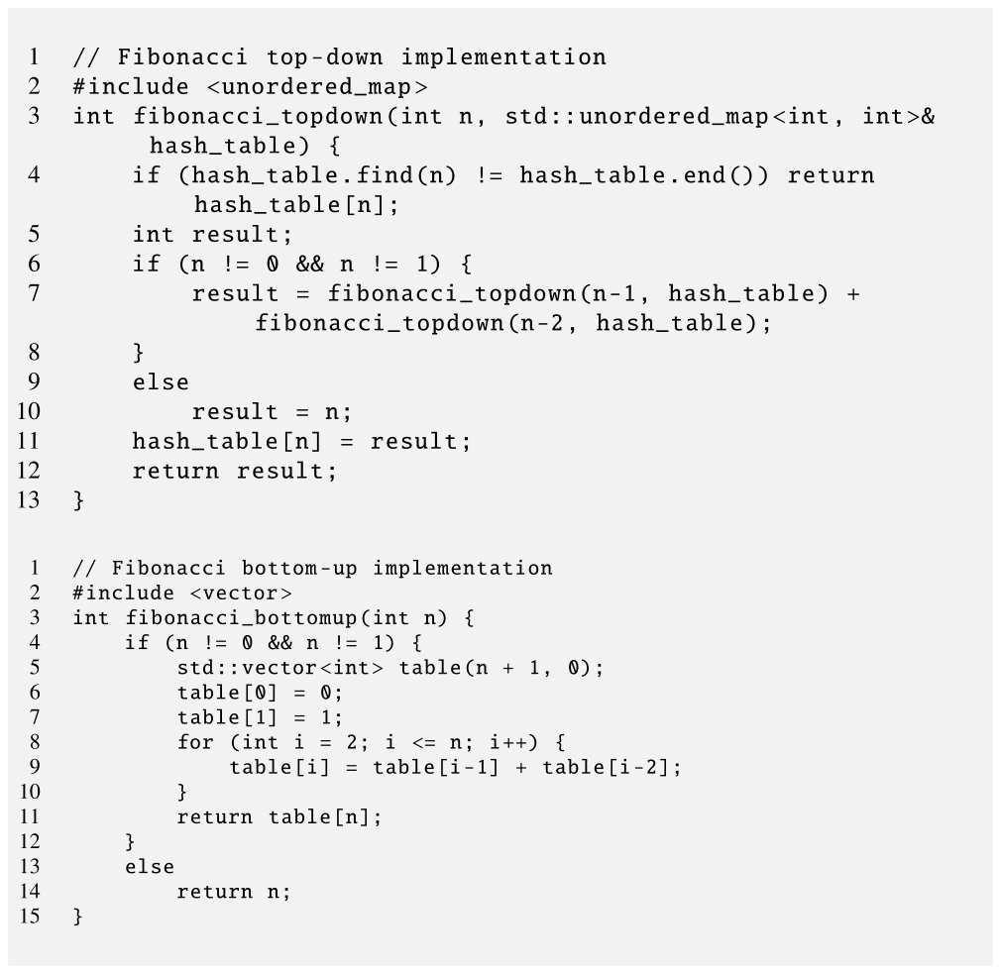

*Figure 16.1 — Fibonacci 수열의 top-down 및 bottom-up C++ 구현. (책 p.375)*

```cpp
 1  // Fibonacci top-down implementation
 2  #include <unordered_map>
 3  int fibonacci_topdown(int n, std::unordered_map<int, int>& hash_table) {
 4      if (hash_table.find(n) != hash_table.end()) return hash_table[n];
 5      int result;
 6      if (n != 0 && n != 1) {
 7          result = fibonacci_topdown(n-1, hash_table) +
 8                   fibonacci_topdown(n-2, hash_table);
 9      }
10      else
11          result = n;
12      hash_table[n] = result;
13      return result;
14  }
```

```cpp
 1  // Fibonacci bottom-up implementation
 2  #include <vector>
 3  int fibonacci_bottomup(int n) {
 4      if (n != 0 && n != 1) {
 5          std::vector<int> table(n + 1, 0);
 6          table[0] = 0;
 7          table[1] = 1;
 8          for (int i = 2; i <= n; i++) {
 9              table[i] = table[i-1] + table[i-2];
10          }
11          return table[n];
12      }
13      else
14          return n;
15  }
```

#### top-down — memoization

> top-down 방식은 **재귀 실행**에 기반한다. 부분문제를 푸는 함수의 각 호출이
> 더 작은 겹치는 부분문제를 푸는 함수를 호출한다. …
> top-down 방식은 **memoization** 을 중간 결과를 담는 방법으로 쓴다.
> 각 중간 결과는 **연관 배열**(예: 11번 줄의 `hash_table`)에 저장된다.
> 각 호출의 시작에서(4번 줄) 재귀 함수는 계산해야 할 결과가 **이미 연관 배열에 있는지 확인**한다
> (책 p.374~375).

책이 든 예를 따라가면 (책 p.375):

| 호출 | 무슨 일 |
|---|---|
| $F_3$ | 7번 줄에서 $F_2$ 와 $F_1$ 을 재귀 호출 |
| $F_2$ | 다시 $F_1$ 과 $F_0$ 을 재귀 호출 |
| $F_1$, $F_0$ | 10번 줄에서 값을 찾고 hash table 에 저장 |
| $F_3$ 의 **두 번째** 호출 $F_1$ | **4번 줄에서 hash table 적중** → 바로 반환 |

**이것이 memoization 의 전부다** — "이미 풀었으면 꺼내 쓴다".

#### GPU 에서 top-down 이 나쁜 두 이유

> top-down 방식은 개념적으로 단순하고 수학적 정식화와 잘 맞지만,
> 불행히도 **GPU 에서 효율적이지 않다.** 두 가지 주된 이유가 있다 (책 p.376).

| 이유 | 왜 |
|---|---|
| **① 깊은 함수 호출 중첩** | CUDA GPU 는 kernel 코드의 깊은 함수 호출 중첩을 효율적으로 지원하지 않는다. device 함수는 보통 컴파일러가 **inline** 하는데, **재귀 호출은 무한히 inline 할 수 없어** 실제 함수 호출로 남고 큰 성능 저하를 일으킨다 |
| **② 연관 배열 접근** | `hash_table` 접근이 같은 warp 의 thread 들에서 **uncoalesced memory 접근**이 되어 역시 큰 저하를 일으킨다 |

> **①은 15장에서 본 것의 반대편이다.** 15.3절에서 `__forceinline__` 을 붙여 가며
> inline 을 강제한 이유가 **register 승격과 명령 스케줄링**이었는데,
> **재귀는 그 inline 을 원천적으로 막는다.**
>
> **②는 9장의 histogram 과 같은 구도**다. hash table 은 **키에 따라 흩어진 주소**를 만들고,
> 그것이 warp 안에서 32개의 서로 다른 cache line 이 된다.
> **GPU 에서 "포인터를 따라가는 자료구조"는 거의 언제나 나쁘다.**

#### bottom-up — tabulation

> bottom-up 방식은 **작은 부분문제부터 풀어 그 해를 표에 채우고(tabulating)**,
> 원하는 문제가 풀릴 때까지 점점 더 큰 부분문제를 풀어 나간다.
> bottom-up 방식은 **반복적**이다 (아래 코드의 8~10번 줄 for loop).
> **loop 가 작은 부분문제에서 큰 문제로 진행하므로, 각 반복은 자기 부분문제의 해를
> 표에서 반드시 찾을 수 있다** (책 p.376).

#### 그리고 wavefront

> 각 반복에서 풀리는 부분문제의 집합(= 채워지는 표의 칸들)을 **wavefront** 라 한다.
> Fibonacci 에서는 wavefront $i$ 가 **부분문제 $F_i$ 하나**로 이루어진다.
> 불행히도 wavefront 에 부분문제가 하나뿐이면 **이 문제에서는 순차 실행**이 된다 (책 p.376).

> **다행히 많은 dynamic programming 알고리즘은 wavefront 가 여러 부분문제로 이루어진
> 더 복잡한 문제를 푼다** (표가 다차원인 경우가 많다).
> 같은 wavefront 의 부분문제는 서로 의존하지 않으므로 **병렬로 계산할 수 있다.**
> 병렬적 성질 덕에 wavefront 병렬성은 GPU 컴퓨팅에 적합하지만,
> **동적 거동**(wavefront 크기가 커지거나 작아진다)과 **서로 다른 wavefront 의 부분문제 사이
> 의존**을 정확히 이해한 **주의 깊은 사전 계획**이 필요하다 (책 p.376).

**Fibonacci 는 wavefront 가 1이라 GPU 로 갈 이유가 없다.**
이 장이 Floyd-Warshall 과 Smith-Waterman 으로 넘어가는 이유가 그것이다.

> 이 장의 나머지는 **bottom-up 방식에 집중**한다 (책 p.376).

### 2. 예제/실습

#### 연습문제

> **(1)** Figure 16.1 의 bottom-up 판에서 표를 **두 칸짜리로** 줄일 수 있는가?
> **(2)** top-down 판이 GPU 에서 느린 두 이유 중 어느 쪽이 더 치명적일까?

**(1) 있다.** $F_i$ 를 계산할 때 필요한 것은 $F_{i-1}$ 과 $F_{i-2}$ 뿐이므로
변수 두 개면 충분하다. 16.3절이 말하는 **"몇 개의 wavefront 만 유지하면 되는" 경우**다.

```cpp
int a = 0, b = 1;
for (int i = 2; i <= n; i++) { int c = a + b; a = b; b = c; }
```

**(2)** 문제 크기에 따라 다르지만 일반적으로 **①(재귀)이 더 치명적**이다.
②는 접근 효율이 나빠지는 **상수 배** 손해인데,
①은 **호출 스택·레지스터 저장·분기**가 반복마다 붙어 **명령 수 자체가 몇 배**로 늘고,
GPU 의 얕은 호출 스택 때문에 깊이가 커지면 **local memory 로 스필**된다.

---

## 16.3 Wavefront patterns (책 p.376)

### 1. 개념적 이해

> 앞 절들에서 본 대로, dynamic programming 알고리즘의 각 반복에서 wavefront 는
> **서로 독립이고 더 작은 부분문제가 모두 풀려 있어서 병렬로 풀 수 있는 부분문제들**로
> 이루어진다.
> **연속한 반복(wave)의 실행은 병렬 계산 단위의 동기화**(예: barrier)로 데이터 의존을
> 강제해 **직렬화**된다 (책 p.376).

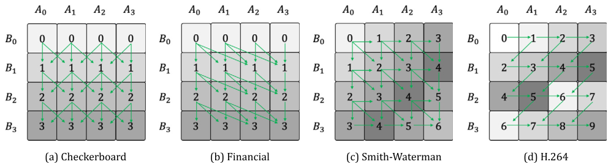

*Figure 16.2 — wavefront 패턴의 예. (책 p.377)*

> 화살표가 의존 패턴의 다양함을 보여 준다. 각 칸의 숫자는 **wavefront 번호**다.
> **wavefront 크기와 병렬성의 양은 반복에 걸쳐 일정할 수도((a),(b)) 변할 수도((c),(d)) 있다**
> (책 p.377).

**네 패턴을 정리하면 이렇다.**

| 패턴 | 의존 | wavefront 크기 | 대표 |
|---|---|---|---|
| **(a) Checkerboard** | 위·좌상·우상 | **일정** (한 행) | 격자 갱신 |
| **(b) Financial** | 위·좌상 등 | **일정** (한 행) | 금융 모델 |
| **(c) Smith-Waterman** | 위·좌·좌상 | **변한다** (anti-diagonal) | **16.5절** |
| **(d) H.264** | 위·좌·좌상·우상 | **변한다** | 영상 코덱 |

> **(a)·(b)는 행 단위, (c)·(d)는 anti-diagonal 단위**라는 것이 핵심 차이다.
> 행 단위면 wavefront 가 언제나 폭만큼이라 **thread 수를 고정**할 수 있다.
> anti-diagonal 이면 **1 → 최대 → 1 로 변해** thread 가 남거나 모자란다.

### 2. 이 장이 다루는 두 사례

> 이 장에서 두 종류의 wavefront 예를 모두 다룬다 (책 p.377).

| 절 | 알고리즘 | wavefront | Figure 16.2 의 어느 것 |
|---|---|---|---|
| **16.4** | **Floyd-Warshall** | **크기 일정** — 반복마다 3차원 공간의 **한 평면** | (a)·(b)와 비슷 |
| **16.5~16.8** | **Smith-Waterman** | **커졌다 작아진다** | **(c)** |

> Floyd-Warshall 은 wavefront 크기가 일정한 예다.
> Figure 16.2 의 (a)·(b)와 비슷하지만, **각 반복에서 2차원 공간의 한 행이 아니라
> 3차원 공간의 한 평면을 계산**한다 (책 p.377).

### 3. 또 하나의 구분 — 표 전체를 남기는가

> 알고리즘 사이의 또 하나 중요한 구분은 **부분문제 해의 표 전체를 유지해야 하는가**다.
> 어떤 알고리즘에서는 **일정 개수의 wavefront 만 유지**하면 된다 (책 p.377).

| 알고리즘 | 유지해야 하는 것 | 왜 |
|---|---|---|
| **Fibonacci** | $F_i$, $F_{i-1}$ **두 개** | 점화식이 둘만 본다 |
| **Floyd-Warshall** | **2D 평면 하나** | 이전 $k$ 의 평면은 버려도 된다 |
| **Smith-Waterman** | **표 전체** | 마지막 **traceback** 에 필요하다 |

> Smith-Waterman 에서는 **모든 반복(모든 wavefront)의 결과가 끝까지 저장**된다.
> 이유는 그것들이 **최종 alignment 를 역추적(back-trace)** 하는 데 쓰이기 때문이다 (책 p.377).

> **"결과를 어디에 쓰는가"가 메모리 요구를 정한다**는 것이 이 절의 교훈이다.
> Floyd-Warshall 은 **최단 거리 값만** 필요하므로 $O(N^2)$ 로 끝나고,
> Smith-Waterman 은 **경로**가 필요하므로 $O(L_A L_B)$ 를 다 들고 있어야 한다.
> 12.1절에서 "in-place 냐 out-of-place 냐"를 갈랐던 것과 같은 종류의 결정이다.

### 4. 예제/실습

#### 연습문제

> Figure 16.2 의 (c) Smith-Waterman 패턴에서 $4\times4$ 표(경계 제외)일 때
> **(1)** wavefront 는 몇 개이고 각 크기는?
> **(2)** 최대 병렬성과 평균 병렬성은?

**(1)** $L \times L$ 표의 anti-diagonal 개수는 $2L-1$ 이고
$w$ 번째($0$부터) 크기는 $\min(w+1,\ L,\ 2L-1-w)$ 다.

$L=4$: **7개**, 크기 $[1, 2, 3, 4, 3, 2, 1]$

**(2)** 최대 **4**, 평균 $16/7 \approx \mathbf{2.29}$.

> **평균이 최대의 57% 밖에 안 된다.** $L$ 이 커져도 이 비율은
> $\frac{L^2/(2L-1)}{L} = \frac{L}{2L-1} \to \frac{1}{2}$ 로 수렴한다.
> **anti-diagonal wavefront 는 구조적으로 절반의 자원만 쓴다** —
> 16.7절의 hyperplane 변환이 정확히 이 절반을 되찾는다.

---

## 16.4 Floyd-Warshall algorithm (책 p.377)

### 1. 개념적 이해

> Floyd-Warshall 알고리즘은 **방향 가중 그래프의 모든 정점 쌍 사이 최단 경로**를 찾는다.
> 문제가 어떻게 부분문제로 나뉘는지 이해하려면 함수 $d(i, j, k)$ 를 생각해 보자 —
> **0 부터 $k$ 까지의 정점만 중간 정점으로 써서 정점 $i$ 와 $j$ 사이의 최단 거리**다 (책 p.377).

### 2. 수식/유도 — 점화식과 저장 공간

#### 전체 유도 과정 (먼저 한 번에)

$$d(i,j,k) = \min\big(d(i,j,k-1),\ d(i,k,k-1) + d(k,j,k-1)\big) \tag{1}$$

$$d(i,j,-1) = \begin{cases} w(i,j) & (i,j)\ \text{간선이 있으면} \\ \infty & \text{없으면} \end{cases} \tag{2}$$

$$\text{답} = d(i,j,N-1) \tag{3}$$

$$|\{d(i,j,k)\}| = O(N^3) \quad\text{그러나}\quad \text{동시 저장} = O(N^2) \tag{4}$$

#### 단계별 설명 (생략 없이)

**(1)** 점화식의 뜻.

> 다시 말해, **$k$ 를 지나지 않고 정점 0~$k-1$ 만 써서 $i$ 에서 $j$ 로 가는 것**과,
> **$i$ 에서 $k$ 로 갔다가 $k$ 에서 $j$ 로 가는 것** 중 짧은 쪽이다.
> 이렇게 $d(i,j,k)$ 를 찾는 문제를 세 개의 더 작은 부분문제
> $d(i,j,k-1)$, $d(i,k,k-1)$, $d(k,j,k-1)$ 로 분해했다 (책 p.378).

**"$k$ 를 경유하느냐 마느냐" 이분법**이 전부다.
경유하지 않으면 값이 그대로이고, 경유하면 $i \to k$ 와 $k \to j$ 로 쪼개진다.

**(2)** 바닥 조건. **중간 정점을 하나도 안 쓰는 거리는 곧 간선 가중치**다.

**(3)** $k = N-1$ 까지 올리면 **모든 정점을 중간 정점 후보로 허용**한 것이므로 답이다.

**(4)** **이 장에서 가장 실용적인 관찰이다.**

> 중요한 관찰은, **어떤 $k$ 에 대해 모든 $i,j$ 의 $d(i,j,k)$ 를 찾고 나면
> $d(i,j,k-1)$ 은 더 이상 필요 없어 버릴 수 있다**는 것이다.
> 따라서 $d(i,j,k)$ 가 정의하는 부분문제 공간의 크기는 $O(N^3)$ 이지만,
> **한 번에 저장해야 하는 부분문제 해의 공간은 $O(N^2)$** 뿐이다.
> 아주 큰 그래프에서 $O(N^2)$ 과 $O(N^3)$ 의 차이는 상당하다! (책 p.378) ∎

$N = 8$ 이면 $512$ 대 $64$ 로 **$8\times$**, $N = 10^4$ 이면 **$10^4\times$** 다.
16.3절이 말한 "몇 개의 wavefront 만 유지하면 되는" 경우의 대표다.

### 3. 알고리즘

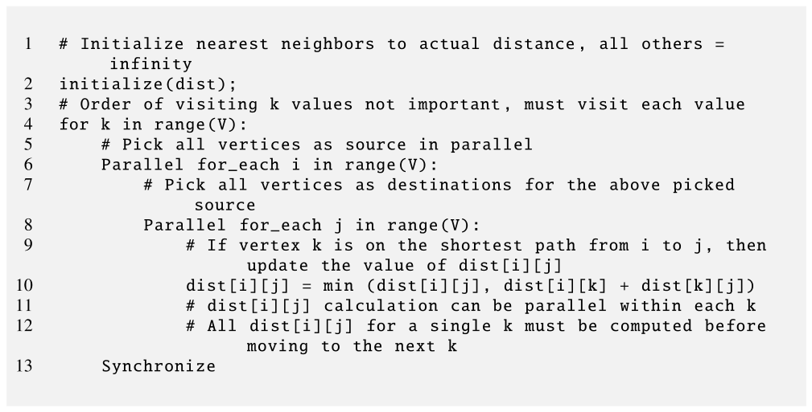

*Figure 16.3 — bottom-up Floyd-Warshall 구현의 의사코드. (책 p.379)*

```python
 1  # Initialize nearest neighbors to actual distance, all others = infinity
 2  initialize(dist);
 3  # Order of visiting k values not important, must visit each value
 4  for k in range(V):
 5      # Pick all vertices as source in parallel
 6      Parallel for_each i in range(V):
 7          # Pick all vertices as destinations for the above picked source
 8          Parallel for_each j in range(V):
 9              # If vertex k is on the shortest path from i to j, then
10              #   update the value of dist[i][j]
10              dist[i][j] = min (dist[i][j], dist[i][k] + dist[k][j])
11              # dist[i][j] calculation can be parallel within each k
12              # All dist[i][j] for a single k must be computed before
13              #   moving to the next k
13      Synchronize
```

> 알고리즘은 **`k`, `i`, `j` 세 개의 중첩 for loop** 로 정식화된다.
> **바깥 `k` loop 가 서로 다른 크기의 부분문제에 대한 반복**을 정의한다.
> **`k` 정점을 방문하는 순서는 상관없다** — loop 를 빠져나가기 전에 모든 정점 `k` 를
> 방문하기만 하면 된다.
> `i`·`j` loop 는 **wavefront 의 부분문제를 풀고 `dist` 표의 모든 칸을 갱신**한다 (책 p.378).

| 층 | 성격 |
|---|---|
| **`k` loop** | **순차** — wavefront 사이 (동기화 필요) |
| **`i`·`j` loop** | **병렬** — wavefront 안 ($N^2$ 개 전부 독립) |

**wavefront 크기가 언제나 $N^2$ 으로 일정하다** — 16.3절의 (a)·(b) 유형이다.

### 4. 코드

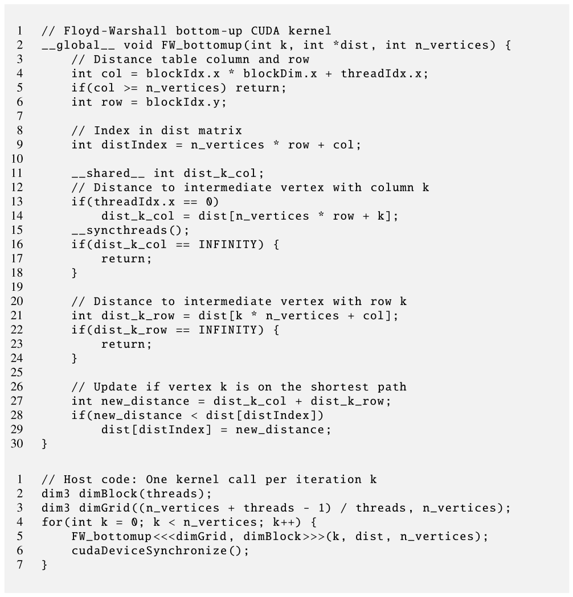

*Figure 16.4 — Floyd-Warshall 알고리즘의 bottom-up CUDA 구현. (책 p.380)*

```cuda
 1  // Floyd-Warshall bottom-up CUDA kernel
 2  __global__ void FW_bottomup(int k, int *dist, int n_vertices) {
 3      // Distance table column and row
 4      int col = blockIdx.x * blockDim.x + threadIdx.x;
 5      if(col >= n_vertices) return;
 6      int row = blockIdx.y;
 7
 8      // Index in dist matrix
 9      int distIndex = n_vertices * row + col;
10
11      __shared__ int dist_k_col;
12      // Distance to intermediate vertex with column k
13      if(threadIdx.x == 0)
14          dist_k_col = dist[n_vertices * row + k];
15      __syncthreads();
16      if(dist_k_col == INFINITY) {
17          return;
18      }
19
20      // Distance to intermediate vertex with row k
21      int dist_k_row = dist[k * n_vertices + col];
22      if(dist_k_row == INFINITY) {
23          return;
24      }
25
26      // Update if vertex k is on the shortest path
27      int new_distance = dist_k_col + dist_k_row;
28      if(new_distance < dist[distIndex])
29          dist[distIndex] = new_distance;
30  }
```

```cuda
 1  // Host code: One kernel call per iteration k
 2  dim3 dimBlock(threads);
 3  dim3 dimGrid((n_vertices + threads - 1) / threads, n_vertices);
 4  for(int k = 0; k < n_vertices; k++) {
 5      FW_bottomup<<<dimGrid, dimBlock>>>(k, dist, n_vertices);
 6      cudaDeviceSynchronize();
 7  }
```

#### grid 구성

> **각 thread block 이 거리표의 한 행 구획을 담당**한다.
> thread grid 는 **2차원**이고 각 block 은 **1차원**이다 (책 p.379).

| | 값 | 왜 |
|---|---|---|
| `dimBlock` | `threads` (1D) | 한 행의 한 구획 |
| `dimGrid.x` | $\lceil N/\texttt{threads} \rceil$ | 열 방향으로 한 행을 다 덮는다 (2장 ceiling division) |
| `dimGrid.y` | $N$ | **block 하나가 한 행만** 맡으므로 행 수만큼 |

#### 줄별로

| 줄 | 하는 일 | 짚을 점 |
|---|---|---|
| **04·06** | `col` 은 1D 선형 index, `row` 는 `blockIdx.y` | **행은 block 이, 열은 thread 가** |
| **09** | row-major 선형화 | 3장의 그 관용구 |
| **11~15** | **block 전체가 같은 `dist[row][k]`** 를 쓰므로 thread 0 이 읽어 shared 로 | **broadcast** — global 접근 $\texttt{threads}\times$ 절약 |
| **16~18** | $\infty$ 면 전원 return | **$k$ 가 이 행의 최단경로에 없다** |
| **21** | `dist[k][col]` — **행 $k$** 를 읽는다 | **coalesced** (연속 thread 가 연속 열) |
| **22~24** | $\infty$ 면 이 thread return | |
| **27~29** | 갱신 | `min` 을 조건문으로 |

> **11~15번 줄과 21번 줄의 비대칭이 이 kernel 의 설계 핵심이다.**
>
> `dist[row][k]` 는 **block 안의 모든 thread 가 같은 값**을 쓴다 (행이 같고 열이 $k$ 로 고정).
> 그러니 한 명이 읽어 shared 로 나눠 주면 된다 — **9장의 privatization 과 반대 방향**의,
> **broadcast** 다.
>
> `dist[k][col]` 은 **thread 마다 다른 값**이다 (행이 $k$ 로 고정, 열이 thread 별).
> 연속 thread 가 연속 주소를 읽으므로 **이미 coalesced** 라 손댈 것이 없다.
>
> **"모두가 같은 값이면 shared, 각자 다른 값이면 coalesced 로 그냥 읽는다"** —
> 5·6장의 두 도구를 한 kernel 안에서 각각 제자리에 쓴 예다.

#### 왜 buffer 하나로 안전한가

$k$ 반복 안에서 thread 들이 `dist` 를 **읽으면서 동시에 쓴다.** race 가 아닌가?

> 모든 거리가 음이 아니고 각 정점의 자기 자신까지 거리가 항상 0 인 그래프
> (즉 `dist[k][k] = 0`)에서는 **행 $k$ 나 열 $k$ 에 배정된 thread 가 자기 칸을 바꾸지 않는다.**
> 이유는 `dist[i][k]` 와 `dist[k][j]` 를 갱신하는 thread 가 각각
> `min(dist[i][k], dist[i][k] + dist[k][k])` 와 `min(dist[k][j], dist[k][k] + dist[k][j])`
> 로 새 값을 계산하는데, `dist[k][k] = 0` 이므로 식이
> `min(dist[i][k], dist[i][k])` 와 `min(dist[k][j], dist[k][j])` 로 단순해지기 때문이다.
> 따라서 `dist[i][k]` 와 `dist[k][j]` 의 값은 반복 실행 전후로 같다.
> **그 결과 hazard 가 없어 거리표 하나만 써도 된다** (책 p.380).

> **읽히는 것은 행 $k$ 와 열 $k$ 뿐이고, 그 둘은 이번 반복에서 절대 안 바뀐다** —
> 이것이 증명의 전부다.
>
> 그리고 책이 곧바로 덧붙인다 —
> **"다른 thread 가 읽는 값을 갱신해서 잠재적 race condition 이 생기는 다른 문제에서는
> 6장에서 소개한 double buffering 이 필요하다"** (책 p.380).
> 15.8절에서 double buffering 을 쓴 것이 정확히 그런 경우였다.

### 5. 예제 — Figure 16.5

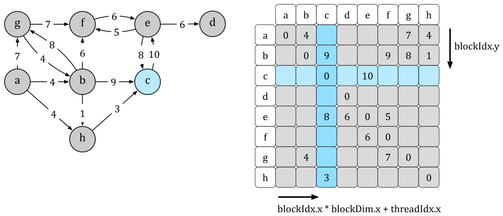

*Figure 16.5 — 방향 가중 그래프(왼쪽)와 초기화 후의 거리표(오른쪽). (책 p.381)*

그림의 간선을 읽으면 이렇다.

| 출발 | 도착 · 가중치 |
|---|---|
| a | b:4, g:7, h:4 |
| b | c:9, f:6, g:8, h:1 |
| c | e:10 |
| e | c:8, d:6, f:5 |
| f | e:6 |
| g | b:4, f:7 |
| h | c:3 |

> **원문 오기** (Figure 16.5, 책 p.381).
> **그래프의 `b → f` 간선은 가중치 6** 인데 **거리표의 (b, f) 칸에는 9** 가 들어 있다.
> 거리표는 "초기화 후"의 표이므로 간선 가중치와 같아야 한다.
> 인접한 (b, c) 칸의 9 를 잘못 옮긴 것으로 보인다.
> 이 노트에서는 **그래프 쪽(6)을 입력으로 삼는다** — 그래프가 문제의 정의이기 때문이다.
> (표 쪽 9 를 쓰면 최종 최단거리표가 실제로 달라진다. 코드로 확인했다.)

**책이 예로 든 $k = c$ 반복을 손으로 따라가 보자.**

$k = c$ 일 때 필요한 것은 **열 c**(`dist[i][c]`)와 **행 c**(`dist[c][j]`)다.

| | a | b | c | d | e | f | g | h |
|---|---|---|---|---|---|---|---|---|
| **열 c** `dist[i][c]` | ∞ | 9 | 0 | ∞ | 8 | ∞ | ∞ | 3 |
| **행 c** `dist[c][j]` | ∞ | ∞ | 0 | ∞ | **10** | ∞ | ∞ | ∞ |

행 c 에서 유한한 값은 `dist[c][e] = 10` 뿐이므로 **갱신은 열 e 에서만** 일어난다.

| thread | 계산 | 결과 |
|---|---|---|
| (b, e) | $\texttt{dist[b][c]} + \texttt{dist[c][e]} = 9 + 10 = 19 < \infty$ | **19 로 갱신** |
| (h, e) | $3 + 10 = 13 < \infty$ | **13 으로 갱신** |
| (e, e) | $8 + 10 = 18$ vs 0 | 갱신 없음 |
| 나머지 | `dist_k_col` 또는 `dist_k_row` 가 $\infty$ | **16·22번 줄에서 return** |

> **kernel 의 두 early return 이 실제로 대부분의 thread 를 걸러낸다.**
> 이 예에서 8×8 = 64 thread 중 **실제로 27~29번 줄에 도달하는 것은 4개**뿐이다
> (열 c 가 유한한 행 b·c·e·h × 행 c 가 유한한 열 c·e 중 유효 조합).
> 희소 그래프에서는 이 비율이 더 낮아진다 — **18장의 graph traversal 이 다루는 문제**다.

여덟 반복을 모두 돌리면 (코드로 검산):

| | a | b | c | d | e | f | g | h |
|---|---|---|---|---|---|---|---|---|
| **a** | 0 | 4 | 7 | 22 | 16 | 10 | 7 | 4 |
| **b** | ∞ | 0 | 4 | 18 | 12 | 6 | 8 | 1 |
| **c** | ∞ | ∞ | 0 | 16 | 10 | 15 | ∞ | ∞ |
| **d** | ∞ | ∞ | ∞ | 0 | ∞ | ∞ | ∞ | ∞ |
| **e** | ∞ | ∞ | 8 | 6 | 0 | 5 | ∞ | ∞ |
| **f** | ∞ | ∞ | 14 | 12 | 6 | 0 | ∞ | ∞ |
| **g** | ∞ | 4 | 8 | 19 | 13 | 7 | 0 | 5 |
| **h** | ∞ | ∞ | 3 | 19 | 13 | 18 | ∞ | 0 |

총 **26회** 갱신이 일어난다. `a→c` 가 $\infty \to 7$ (a→b→h→c = 4+1+3) 로 줄어든 것처럼,
**여러 정점을 경유하는 경로가 $k$ 반복을 거치며 발견**된다.

### 6. 왜 Floyd-Warshall 은 쉬운가

> Floyd-Warshall 은 **규칙성** 덕에 GPU 에서 직관적으로 병렬화된다 —
> (1) 매 반복에서 모든 정점 쌍이 고려되므로 **wavefront 크기가 일정**하고,
> (2) **의존이 단순하다** (모든 칸이 정점 $k$, 즉 이전 반복의 행 $k$ 와 열 $k$ 에 의존).
> 그러나 다른 dynamic programming 문제는 병렬화할 때 **wavefront 크기가 반복마다 변하는
> 더 복잡한 패턴**을 강요할 수 있다.
> 16.5절에서 소개하는 Smith-Waterman 이 그런 예다 (책 p.381).

### 7. 예제/실습

#### 연습문제

> **(1)** $N = 1024$, block 256 thread 일 때 grid 구성과 kernel 호출 횟수는?
> **(2)** 11~15번 줄의 broadcast 가 아끼는 global 접근은 몇 회인가?
> **(3)** `k` loop 를 GPU 안에서 돌 수 없는 이유는?

**(1)** `dimGrid` $= (\lceil 1024/256 \rceil,\ 1024) = (4, 1024)$ — **block 4096개**.
kernel 호출은 **$k$ 마다 한 번씩 1024회**.

**(2)** broadcast 가 없으면 block 의 256 thread 가 각자 `dist[row][k]` 를 읽는다.
같은 주소이므로 하드웨어가 **broadcast 로 합쳐 주기는 하지만**,
shared 로 옮기면 **명령 자체가 1/256** 로 준다.
전체로는 $4096 \times 256 = 1{,}048{,}576$ 회의 load 가 **4096회**로 준다.

> **주의**: 같은 주소를 읽는 global load 는 하드웨어가 이미 한 transaction 으로 합친다.
> 여기서 아끼는 것은 **transaction 이 아니라 명령 수와 latency 노출**이다.
> 15.7절에서 "명령 처리 오버헤드도 데이터 이동 속도에 영향을 준다"고 한 그 이야기다.

**(3) wavefront 사이에 grid 전체 동기화가 필요**하기 때문이다.
$k$ 반복은 **모든 block 이 $k-1$ 을 끝낸 뒤**에야 시작할 수 있는데,
CUDA 에는 기본적으로 grid 전체 barrier 가 없다 (4.3절).
**kernel 종료가 그 역할**을 한다 — 16.8절이 cooperative groups 로 이것을 없애는 이야기를 한다.

---

## 16.5 Genome sequence alignment and Smith-Waterman algorithm (책 p.382)

### 1. 개념적 이해 — 왜 이 문제인가

> **genome** 은 생물의 유전 지시 전체다. DNA 는 **염기쌍(문자) A, C, G, T** 의 긴 문자열이다.
> 예컨대 인간 genome 은 **32억 염기쌍(bp)** 을 담고 있다 (책 p.382).

> 그러나 **sequencing 기계는 무작위 조각(read)만** 제공하고,
> 이것을 **참조 genome 에 대응(mapping)** 시켜야 한다.
> sequencing 기술에 따라 **short read (50~300 bp)** 와 **long read (10 K~100 K bp)** 가 있다
> (책 p.382).

> read mapping 과정의 핵심 단계가 **sequence alignment** 이고,
> 전통적으로 **Smith-Waterman 이나 Needleman-Wunsch 같은 이차 시간 dynamic programming
> 알고리즘**으로 수행돼 왔다 (책 p.382).

**"이차 시간"이 GPU 를 부르는 이유다.** $10^5$ bp 짜리 long read 두 개를 정렬하면
표가 $10^{10}$ 칸이다. 게다가 read 가 수백만 개다.

#### scoring matrix

> Smith-Waterman 알고리즘의 주 자료구조는 **dynamic programming 표 $H$** 이고,
> **homology score matrix**, 줄여서 **scoring matrix** 라 부른다.
> alignment 의 목표는 두 sequence 가 **생물학적 의미에서 유사(homologous)한지 탐지**하는 것이다
> (책 p.382).

| 기호 | 뜻 |
|---|---|
| $A$, $B$ | 정렬할 두 sequence, 길이 $L_A$, $L_B$ |
| $H$ | $(L_A+1) \times (L_B+1)$ scoring matrix |
| $H_{i,j}$ | $A$ 의 처음~$i$번째와 $B$ 의 처음~$j$번째 조각의 **homology score** |
| 행 0 · 열 0 | 전부 **경계값 0** |

> 행 0 의 0 들은 **$B$ 의 존재하지 않는 염기쌍 0 과 $A$ 의 어떤 염기쌍 사이에도
> 바람직한 alignment 가 없음**을 뜻한다. 열 0 도 대칭이다.
> **homology score 가 높을수록 두 sequence 조각이 더 비슷하다** (책 p.382).

#### 점수 규칙

| 상황 | 점수 |
|---|---|
| **match** ($A_i = B_j$) | $S_{i,j} = +3$ |
| **mismatch** ($A_i \ne B_j$) | $S_{i,j} = -3$ |
| **deletion / insertion** | **gap penalty** (예: 2) |

### 2. 수식/유도 — 점화식

$$H_{i,j} = \max \begin{cases}
H_{i-1,j-1} + S_{i,j} \\
H_{i-1,j} - \texttt{insertion\_penalty} \\
H_{i,j-1} - \texttt{deletion\_penalty} \\
0
\end{cases} \tag{16.2}$$

> **원문 오기** (식 (16.2), 책 p.382) ⚠️
>
> 책에 인쇄된 식 (16.2)는 **`H[i-1][j] - deletion_penalty`** 와
> **`H[i,j-1] - insertion_penalty`** 로, **두 penalty 가 뒤바뀌어 있다.**
>
> 근거 둘:
> ① **바로 다음 쪽의 본문**이 반대로 말한다 (책 p.383) — "두 번째 시나리오는 $B_{i-1}$ 이 $A_j$ 에 대응되는 것이다 … $H_{i,j} = H_{i-1,j} - \texttt{insertion\_penalty}$",
> "세 번째 시나리오는 $B_i$ 가 $A_{j-1}$ 에 대응되는 것이다 … $H_{i,j} = H_{i,j-1} - \texttt{deletion\_penalty}$".
> ② **Figure 16.9 의 코드**도 본문 쪽이다 — `max4(0, nw + subs_val, w + DELETION, n + INSERTION)`
> 에서 `n`(=$H_{i-1,j}$)이 INSERTION 과, `w`(=$H_{i,j-1}$)가 DELETION 과 짝지어 있다.
>
> **위 식은 본문·코드에 맞춰 바로잡은 것**이다.
> 다만 **책의 예처럼 두 penalty 가 같으면(둘 다 2) 결과가 완전히 같다** —
> 그래서 눈에 잘 안 띈다. 코드로 확인했다: `ins = del = 2` 면 두 규약의 결과가 동일하고,
> `ins = 1, del = 4` 로 다르게 두면 **결과가 달라진다.**

#### 세 시나리오

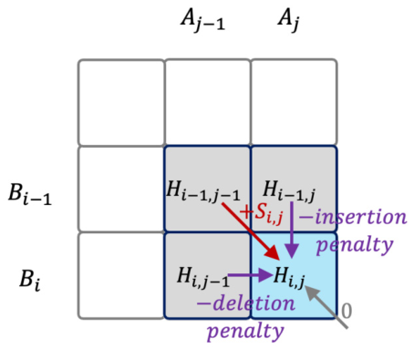

*Figure 16.6 — Smith-Waterman 알고리즘 scoring matrix 의 의존 관계. (책 p.383)*

| 시나리오 | 이전 상태 | 무슨 일이 일어났나 | 점수 |
|---|---|---|---|
| **① 대각선** | $B_{i-1} \to A_{j-1}$ | 그냥 다음 염기쌍끼리 대응 | $H_{i-1,j-1} + S_{i,j}$ |
| **② 위** | $B_{i-1} \to A_j$ | **$B$ 에 삽입(insertion)** 이 있었다 | $H_{i-1,j} - \texttt{insertion}$ |
| **③ 왼쪽** | $B_i \to A_{j-1}$ | **$B$ 에서 삭제(deletion)** 가 있었다 | $H_{i,j-1} - \texttt{deletion}$ |
| **④ 0** | — | 세 경우 다 음수면 0 으로 자른다 | 0 |

> **④의 0 이 Smith-Waterman 을 "지역(local) 정렬"로 만든다.**
> 점수가 음수가 되면 0 으로 잘라 **거기서 새 정렬을 시작**할 수 있게 한다.
> Needleman-Wunsch(전역 정렬)에는 이 항이 없다.
> 코드에서 `max4` 의 첫 인자가 `0` 인 것이 이 항이다.

#### wavefront = anti-diagonal

> 그림이 보여 주듯 **각 행렬 칸의 계산은 이전 두 anti-diagonal 의 이웃 세 칸에만 의존**한다.
> **같은 anti-diagonal 의 모든 칸은 서로 독립이라 병렬로 계산할 수 있다.**
> 따라서 **scoring matrix 의 각 anti-diagonal 이 하나의 wavefront** 다 (책 p.383~384).

책의 예를 따라가면 (책 p.384):

| wavefront | 계산되는 칸 | 쓰는 값 |
|---|---|---|
| 1 | $H_{1,1}$ | $H_{0,0}, H_{0,1}, H_{1,0}$ (전부 경계 0) |
| 2 | $H_{2,1}, H_{1,2}$ | $H_{1,1}$ 과 경계들 |
| 3 | $H_{3,1}, H_{2,2}, H_{1,3}$ | |

> **wavefront 크기가 첫 anti-diagonal 에서 마지막까지 커졌다가 작아진다** (책 p.384).

#### traceback — 표 전체를 남겨야 하는 이유

> Smith-Waterman 의 scoring matrix 전체는 모든 wavefront 가 계산될 때까지 유지된다.
> 이유는 **최종 traceback 과정에 표 전체가 필요**하기 때문이다.
> traceback 은 **homology score 가 가장 높은 칸에서 시작해 선행 칸(위·좌상·좌)의 경로를
> 따라 점수 0 에 도달할 때까지** 진행한다.
> 완성된 경로가 두 sequence 사이의 **최적 alignment 를 재구성**한다.
> **traceback 은 순차 과정**이므로 이 장에서는 **wavefront 계산**에 집중한다 (책 p.384).

### 3. 예제 — 손으로 채워 본다

$A = \texttt{GGTTGACTA}$, $B = \texttt{TGTTACGG}$, match $+3$, mismatch $-3$, gap $2$ 로
scoring matrix 를 계산하면 (코드로 검산):

| | | T | G | T | T | A | C | G | G |
|---|---|---|---|---|---|---|---|---|---|
| | 0 | 0 | 0 | 0 | 0 | 0 | 0 | 0 | 0 |
| **G** | 0 | 0 | 3 | 1 | 0 | 0 | 0 | 3 | 3 |
| **G** | 0 | 0 | 3 | 1 | 0 | 0 | 0 | 3 | **6** |
| **T** | 0 | 3 | 1 | 6 | 4 | 2 | 0 | 1 | 4 |
| **T** | 0 | 3 | 1 | 4 | **9** | 7 | 5 | 3 | 2 |
| **G** | 0 | 1 | 6 | 4 | 7 | 6 | 4 | 8 | 6 |
| **A** | 0 | 0 | 4 | 3 | 5 | **10** | 8 | 6 | 5 |
| **C** | 0 | 0 | 2 | 1 | 3 | 8 | **13** | 11 | 9 |
| **T** | 0 | 3 | 1 | 5 | 4 | 6 | 11 | 10 | 8 |
| **A** | 0 | 1 | 0 | 3 | 2 | 7 | 9 | 8 | 7 |

**최고 점수는 13** (행 C, 열 C). 거기서 좌상으로 traceback 하면
$\texttt{GTTAC}$ 대 $\texttt{GTTAC}$ 의 완전 일치 구간이 나온다 —
$5 \times 3 = 15$ 에서 앞쪽 mismatch/gap 으로 2 를 잃어 13 이다.

**한 칸을 직접 계산해 보자.** $H_{4,4}$ (행 T, 열 T) = 9:

| 후보 | 값 |
|---|---|
| $H_{3,3} + S = 6 + 3$ (T=T match) | **9** ← 최대 |
| $H_{3,4} - \texttt{ins} = 4 - 2$ | 2 |
| $H_{4,3} - \texttt{del} = 4 - 2$ | 2 |
| 0 | 0 |

### 4. 예제/실습

#### 연습문제

> **(1)** $L_A = L_B = 300$ (short read) 일 때 wavefront 수와 최대 wavefront 크기는?
> **(2)** long read ($10^5$ bp) 두 개면 표가 몇 GB 인가? (int 4 B)
> **(3)** ④의 `max(…, 0)` 항을 빼면 무슨 알고리즘이 되는가?

**(1)** 계산 대상은 $300\times300$ 이므로 wavefront 는 $2\times300-1 = \mathbf{599}$개,
최대 크기 **300**, 평균 $90000/599 \approx \mathbf{150}$.

**(2)** $(10^5+1)^2 \times 4\ \text{B} \approx \mathbf{40\ \text{GB}}$.

> **한 쌍의 long read 정렬에 40 GB** 다. H100 의 80 GB HBM 에 겨우 하나 들어간다.
> 실무에서는 **band 를 제한**하거나(대각선 근처만 계산),
> **traceback 을 위한 정보만 압축 저장**한다. 16.8절이 "작은 문제"를 따로 언급하는 이유다.

**(3) Needleman-Wunsch** (전역 정렬)에 가까워진다.
0 으로 자르지 않으면 점수가 음수로 내려갈 수 있고,
**두 sequence 를 처음부터 끝까지 통째로 정렬**하게 된다.

---

## 16.6 Wavefront parallelization: block-level tiling (책 p.384)

### 1. 개념적 이해

#### 가장 단순한 병렬화와 그 문제

> 기본적인 GPU 병렬화는 **anti-diagonal wavefront 마다 kernel 을 하나씩 launch** 하고
> 각 thread 가 anti-diagonal 의 칸 하나를 계산한다.
> 이 방식은 각 wavefront 의 모든 원소를 병렬로 계산하고 **다음 wavefront 가 시작하기 전에
> 이전 wavefront 가 완전히 계산됨을 보장**한다 (책 p.384).

> 이 구현은 **인접 anti-diagonal 사이의 데이터 지역성을 활용하지 못하고**,
> **재사용 기회를 낭비**하며, **anti-diagonal 마다 새 kernel 을 launch 하는 비용**을 치른다
> (책 p.384). → 구현은 **연습문제**로 남긴다.

**$2L-1$ 번의 kernel launch** 다. $L = 300$ 이면 599회, $L = 10^5$ 이면 20만 회다.
kernel launch 하나가 수 µs 이므로 **그것만으로 수백 ms** 다.

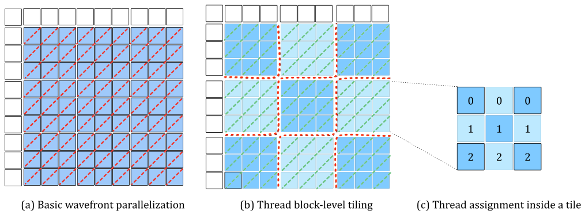

*Figure 16.7 — 기본 wavefront 병렬화 (a), thread block 수준(tile 기반) 병렬화 (b), tile 안의 thread 배정 (c). 점선 가로·세로선은 전역 동기화 지점(kernel 종료)을, 점선 대각선은 지역 동기화 지점(`__syncthreads()`)을 나타낸다. 표의 첫 행과 첫 열은 경계 칸이고 전부 0 이다. (책 p.385)*

#### tiling 이 무엇을 바꾸는가

> 더 효율적인 병렬화 전략은 **block-level tiling** 이다.
> dynamic programming 행렬을 **tile 로 나누고 각 tile 을 thread block 에 배정**한다.
> tile 안에서 thread 들은 anti-diagonal 원소를 계산하고 **다음 anti-diagonal 로 넘어가기 전에
> 지역 동기화**(`__syncthreads()`)한다.
> 그 결과 **전역 동기화(kernel 종료)는 "tile 의 anti-diagonal" 사이에서만** 필요해진다.
> tiling 의 또 하나 이점은 **각 SM 의 shared memory 에 tile 을 저장**할 수 있다는 것이다.
> tile 이 계산되고 나면 thread 들이 tile 을 **coalesced 방식으로** global memory 에 저장한다
> (책 p.384).

**두 층의 동기화**가 이 절의 구조다.

| 층 | 무엇 사이 | 어떻게 | 그림에서 |
|---|---|---|---|
| **tile 안** | anti-diagonal 사이 | **`__syncthreads()`** | 점선 **대각선** |
| **tile 사이** | tile anti-diagonal 사이 | **kernel 종료·재launch** | 점선 **가로·세로선** |

kernel launch 가 $2L-1$ 회에서 $2\cdot\texttt{numTiles\_x}-1$ 회로 준다 —
tile 폭이 32 면 **$32\times$ 감소**다.

### 2. 코드 — host

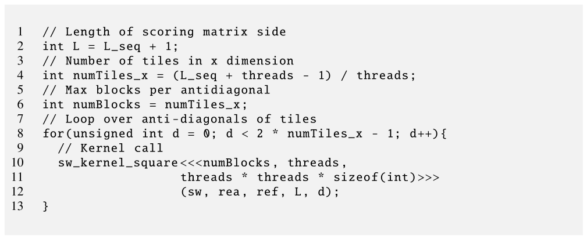

*Figure 16.8 — thread block 수준 tiling 구현 (host 코드). (책 p.385)*

```cuda
 1  // Length of scoring matrix side
 2  int L = L_seq + 1;
 3  // Number of tiles in x dimension
 4  int numTiles_x = (L_seq + threads - 1) / threads;
 5  // Max blocks per antidiagonal
 6  int numBlocks = numTiles_x;
 7  // Loop over anti-diagonals of tiles
 8  for(unsigned int d = 0; d < 2 * numTiles_x - 1; d++){
 9    // Kernel call
10    sw_kernel_square<<<numBlocks, threads,
11                       threads * threads * sizeof(int)>>>
12                      (sw, rea, ref, L, d);
13  }
```

| 줄 | 하는 일 | 짚을 점 |
|---|---|---|
| **02** | $L = L_{seq}+1$ | **경계 행·열 하나씩** 더한 크기 |
| **04** | $\lceil L_{seq}/\texttt{threads} \rceil$ | **2장의 ceiling division**. 계산 대상은 $L_{seq}$ (행 0·열 0 제외) |
| **06** | anti-diagonal 당 최대 block 수 | 가장 긴 tile anti-diagonal 이 `numTiles_x` 개 |
| **08** | **tile anti-diagonal 을 순회** | 총 $2\cdot\texttt{numTiles\_x}-1$ 회 |
| **10~11** | **동적 shared memory** `threads²·4 B` | tile 하나를 담는다 |

> 단순화를 위해 **모든 kernel 호출에 최대 block 수**(`numTiles_x`)를 쓴다.
> 그러나 kernel 실행 중 **모든 block 이 활성인 것은 아니다** (책 p.386).
> → 정확한 block 수를 세는 것은 **독자의 연습**으로 남긴다.

**Figure 16.7(b) 의 예에서 `numTiles_x = 3`, tile anti-diagonal 은 $2\times3-1 = 5$개** 다.
$d$ 는 0~4 이고, 각 anti-diagonal 의 tile 수는 **1, 2, 3, 2, 1** 이다.
**block 은 언제나 3개를 띄우므로 $d=0$ 에서는 2개, $d=1$ 에서는 1개가 논다.**

### 3. 코드 — kernel

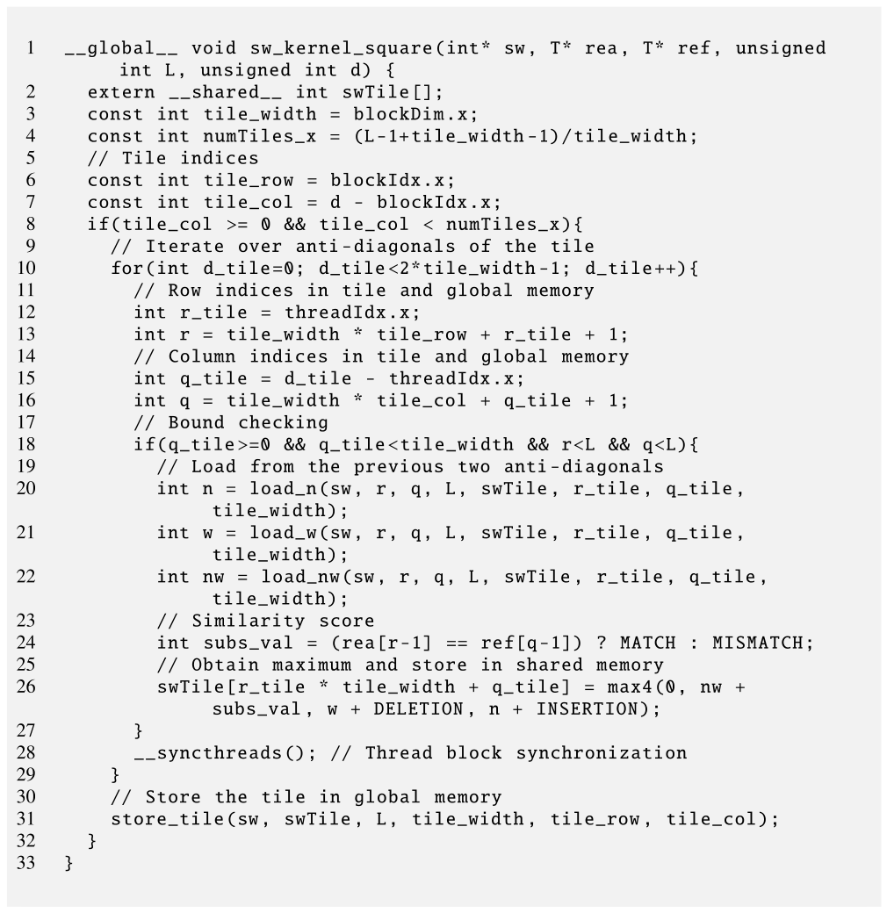

*Figure 16.9 — thread block 수준 tiling 구현 (kernel 코드). (책 p.387)*

```cuda
 1  __global__ void sw_kernel_square(int* sw, T* rea, T* ref, unsigned int L,
                                     unsigned int d) {
 2    extern __shared__ int swTile[];
 3    const int tile_width = blockDim.x;
 4    const int numTiles_x = (L-1+tile_width-1)/tile_width;
 5    // Tile indices
 6    const int tile_row = blockIdx.x;
 7    const int tile_col = d - blockIdx.x;
 8    if(tile_col >= 0 && tile_col < numTiles_x){
 9      // Iterate over anti-diagonals of the tile
10      for(int d_tile=0; d_tile<2*tile_width-1; d_tile++){
11        // Row indices in tile and global memory
12        int r_tile = threadIdx.x;
13        int r = tile_width * tile_row + r_tile + 1;
14        // Column indices in tile and global memory
15        int q_tile = d_tile - threadIdx.x;
16        int q = tile_width * tile_col + q_tile + 1;
17        // Bound checking
18        if(q_tile>=0 && q_tile<tile_width && r<L && q<L){
19          // Load from the previous two anti-diagonals
20          int n = load_n(sw, r, q, L, swTile, r_tile, q_tile, tile_width);
21          int w = load_w(sw, r, q, L, swTile, r_tile, q_tile, tile_width);
22          int nw = load_nw(sw, r, q, L, swTile, r_tile, q_tile, tile_width);
23          // Similarity score
24          int subs_val = (rea[r-1] == ref[q-1]) ? MATCH : MISMATCH;
25          // Obtain maximum and store in shared memory
26          swTile[r_tile * tile_width + q_tile] = max4(0, nw + subs_val,
                                                       w + DELETION, n + INSERTION);
27        }
28        __syncthreads(); // Thread block synchronization
29      }
30      // Store the tile in global memory
31      store_tile(sw, swTile, L, tile_width, tile_row, tile_col);
32    }
33  }
```

#### tile 좌표 — 06~08번 줄

> **`blockIdx.x` 가 각 block 이 일할 tile 의 행**을 정한다 (6번 줄).
> 즉 tile anti-diagonal 안에서 **tile 을 block 에 배정하는 것이 맨 위 tile 부터** 시작한다.
> …
> **tile 열 index 는 tile anti-diagonal 번호 $d$ 의 함수**다 (7번 줄).
> 각 tile anti-diagonal 의 **시작 tile 은 열 index 가 $d$** 다.
> anti-diagonal 안에서 tile 열 index 는 배정된 block 의 `blockIdx.x` 가 커질수록 작아진다.
> 각 block 의 tile 열 번호는 **`d - blockIdx.x`** 다 (책 p.386).

$$\texttt{tile\_row} = \texttt{blockIdx.x}, \qquad \texttt{tile\_col} = d - \texttt{blockIdx.x}$$

**합이 언제나 $d$** 다 — anti-diagonal 의 정의 그대로다.

$d = 1$, `numTiles_x` $= 3$ 인 경우 (책의 예):

| `blockIdx.x` | `tile_row` | `tile_col` | 활성? |
|---|---|---|---|
| 0 | 0 | 1 | ✓ tile (0,1) |
| 1 | 1 | 0 | ✓ tile (1,0) |
| 2 | 2 | **−1** | **✗** 08번 줄에서 탈락 |

$d = 3$ 이면 block 0 의 `tile_col` 이 3 = `numTiles_x` 라 **역시 탈락**하고
block 1·2 만 활성이다 (책 p.387).

#### tile 안의 thread 배정 — 12~16번 줄

**tile 배정과 완전히 같은 구조**다 (Figure 16.7(c)).

$$\texttt{r\_tile} = \texttt{threadIdx.x}, \qquad \texttt{q\_tile} = d_{tile} - \texttt{threadIdx.x}$$

| 줄 | 계산 | 뜻 |
|---|---|---|
| **13** | $r = \texttt{tile\_width}\cdot\texttt{tile\_row} + \texttt{r\_tile} + 1$ | global 행. **`+1` 은 경계 행 0 을 건너뛰는 것** |
| **16** | $q = \texttt{tile\_width}\cdot\texttt{tile\_col} + \texttt{q\_tile} + 1$ | global 열. 같은 이유로 `+1` |

> **18번 줄의 경계 검사가 두 종류라는 점**을 눈여겨보자 (책 p.388).
> `q_tile >= 0 && q_tile < tile_width` 는 **tile 안**에 있는지,
> `r < L && q < L` 은 **scoring matrix 안**에 있는지 본다.
> `r >= 0 && q >= 0` 은 검사하지 않는데, **13·16번 줄에서 `+1` 을 했기 때문**이다.
>
> 그리고 **28번 줄의 `__syncthreads()` 가 `if` 밖에 있다** —
> 비활성 thread 도 barrier 에는 참여해야 한다 (4.3절). `if` 안에 넣으면 **deadlock** 이다.

#### 이웃 세 칸 읽기

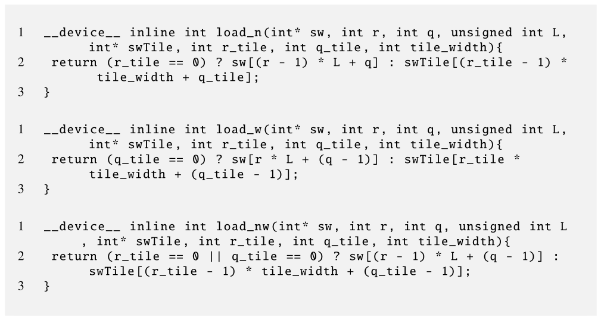

*Figure 16.10 — thread block 수준 tiling: 입력 값을 적재하는 device 함수. (책 p.388)*

```cuda
__device__ inline int load_n(int* sw, int r, int q, unsigned int L,
                             int* swTile, int r_tile, int q_tile, int tile_width){
  return (r_tile == 0) ? sw[(r - 1) * L + q]
                       : swTile[(r_tile - 1) * tile_width + q_tile];
}

__device__ inline int load_w(int* sw, int r, int q, unsigned int L,
                             int* swTile, int r_tile, int q_tile, int tile_width){
  return (q_tile == 0) ? sw[r * L + (q - 1)]
                       : swTile[r_tile * tile_width + (q_tile - 1)];
}

__device__ inline int load_nw(int* sw, int r, int q, unsigned int L,
                              int* swTile, int r_tile, int q_tile, int tile_width){
  return (r_tile == 0 || q_tile == 0) ? sw[(r - 1) * L + (q - 1)]
                                      : swTile[(r_tile - 1) * tile_width + (q_tile - 1)];
}
```

> 이 세 device 함수로 thread 는 **shared memory 에서** 값을 읽는다.
> 다만 자기 칸이 **tile 의 맨 위(`r_tile == 0`)이거나 왼쪽 경계(`q_tile == 0`)** 이면
> **global memory 에서** 읽는다 — 그 값들은 **이전 kernel 호출(이전 $d$ 반복)에서 만들어졌기**
> 때문이다 (책 p.388).

**조건이 함수마다 다른 것이 논리적이다.**

| 함수 | 읽는 칸 | shared 조건 |
|---|---|---|
| `load_n` | $(r_{tile}-1,\ q_{tile})$ | **$r_{tile} \ge 1$** |
| `load_w` | $(r_{tile},\ q_{tile}-1)$ | **$q_{tile} \ge 1$** |
| `load_nw` | $(r_{tile}-1,\ q_{tile}-1)$ | **둘 다** $\ge 1$ |

#### `max4`

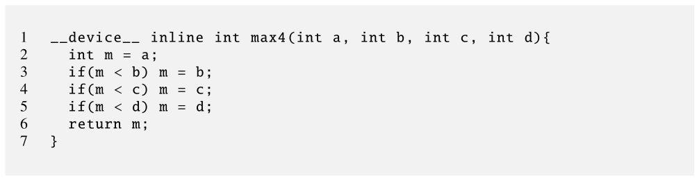

*Figure 16.11 — 네 정수의 최댓값을 계산하는 device 함수의 예. (책 p.389)*

```cuda
__device__ inline int max4(int a, int b, int c, int d){
  int m = a;
  if(m < b) m = b;
  if(m < c) m = c;
  if(m < d) m = d;
  return m;
}
```

**16.8절에서 이 함수가 DPX 명령 하나로 대체된다.**

#### tile 을 내보내기 — coalescing

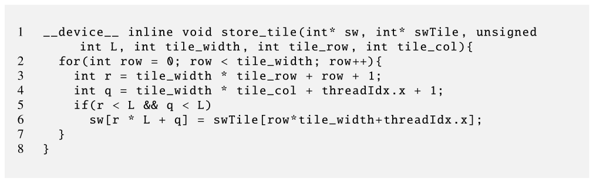

*Figure 16.12 — thread block 수준 tiling: tile 을 global memory 에 저장하는 device 함수. (책 p.389)*

```cuda
__device__ inline void store_tile(int* sw, int* swTile, unsigned int L,
                                  int tile_width, int tile_row, int tile_col){
  for(int row = 0; row < tile_width; row++){
    int r = tile_width * tile_row + row + 1;
    int q = tile_width * tile_col + threadIdx.x + 1;
    if(r < L && q < L)
      sw[r * L + q] = swTile[row*tile_width+threadIdx.x];
  }
}
```

> tile 의 모든 anti-diagonal 이 계산되고 나면 thread 들이 `store_tile` 을 불러
> tile 을 **행 단위로** global memory 에 쓴다.
> **모든 thread 가 협력해 coalesced 메모리 접근**을 수행한다.
> 이것은 **shared memory 덕에 uncoalesced 접근을 coalesced 접근으로 바꾼 예**이고,
> 앞 장들에서 본 **corner turning (6장)이나 packing (12장)** 기법과 비슷하다 (책 p.389).

> **왜 anti-diagonal 로 쓰지 않고 행으로 쓰는가**가 요점이다.
> 계산은 anti-diagonal 순서로 하지만, **저장은 행 순서**로 한다.
> anti-diagonal 로 쓰면 연속 thread 가 $L-1$ 씩 떨어진 주소에 쓴다 (완전 uncoalesced).
> 행으로 쓰면 **연속 `threadIdx.x` 가 연속 `q`** 라 완전 coalesced 다.
> **"흩어진 계산을 shared 에서 하고 정돈된 순서로 내보낸다"** — 12.6·13.6절과 같은 수법이다.

### 4. 예제/실습

#### 연습문제

> `L_seq = 6`, `threads = 3` 일 때
> **(1)** `numTiles_x` 와 tile anti-diagonal 수는?
> **(2)** $d=2$ 에서 활성 block 과 각자의 tile 좌표는?
> **(3)** tile 하나를 계산하는 데 `__syncthreads()` 는 몇 번 실행되는가?

**(1)** `numTiles_x` $= \lceil 6/3 \rceil = \mathbf{2}$, tile anti-diagonal $= 2\times2-1 = \mathbf{3}$개.

**(2)** $d=2$:

| `blockIdx.x` | `tile_row` | `tile_col` $= 2 - \texttt{blockIdx.x}$ | 활성? |
|---|---|---|---|
| 0 | 0 | 2 | **✗** ($\ge$ `numTiles_x` = 2) |
| 1 | 1 | 1 | ✓ tile (1,1) |

**block 하나만** 활성이다 — 마지막 anti-diagonal 이므로.

**(3)** 10번 줄의 loop 가 $2\cdot\texttt{tile\_width}-1 = 5$ 회 돌고
매 회 28번 줄에서 한 번씩이므로 **5회**.

---

## 16.7 Hyperplane transformation (책 p.389)

### 1. 사각 tile 의 두 단점

> block 수준 tiling 은 kernel 호출 오버헤드를 줄이고 빠른 shared memory 를 활용해
> wavefront 병렬화의 성능을 개선한다. 그러나 **사각(또는 직사각) tile 을 쓰는 데는
> 두 가지 중요한 단점**이 있다 (책 p.389).

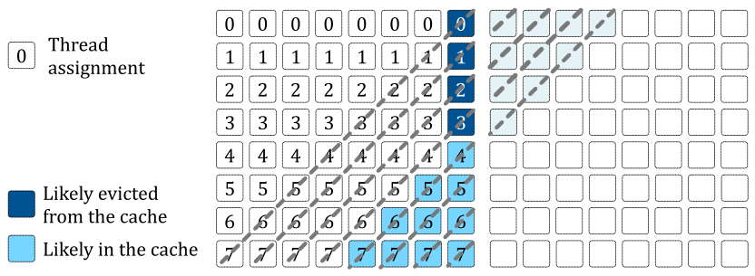

*Figure 16.13 — 사각 tile 을 쓰는 thread block 수준 tiling 의 단점. (책 p.390)*

#### 단점 ① — anti-diagonal 길이가 들쭉날쭉

> tile 안에서 **anti-diagonal 길이가 균일하지 않다.** 그 결과 **활성 thread 수가 anti-diagonal
> 마다 다르다.** 대부분의 반복에서 관측되는 병렬성이 최대보다 낮고,
> 이는 **많은 thread 가 놀고 있다**(즉 warp 이 덜 활용된다)는 뜻이다.
> 그 결과 $n \times n$ 원소의 tile 에 **$2n-1$ 번의 반복**이 필요하다 (책 p.390).

#### 단점 ② — 이웃 tile 사이 지역성 상실

> 서로 다른 tile anti-diagonal 에 있는 이웃 tile 사이의 **지역성이 상실**될 가능성이 크다.
> **tile 의 마지막 anti-diagonal 들만 cache 에 남아 있을 가능성이 높기** 때문이다.
> Figure 16.13 에서 왼쪽 tile 의 오른쪽 위 **짙은 색 칸들**이 오른쪽 tile 의 첫 anti-diagonal
> (**옅은 색 칸들**)을 계산하는 데 필요하다.
> 그러나 **중간 색 칸들**(왼쪽 tile 의 마지막 anti-diagonal)이 나중에 계산됐으므로 cache 에
> 있을 가능성이 높은 반면, **짙은 색 칸들은 이미 축출됐을 수** 있다.
> 불행히도 중간 색 칸들이 오른쪽 tile 의 대응 anti-diagonal 에 쓰일 때쯤이면
> 그것들도 축출됐을 가능성이 높다 (책 p.390).

> **시간과 공간이 어긋나 있다**는 것이 문제의 본질이다.
> 오른쪽 tile 이 **먼저 필요로 하는 것**(왼쪽 tile 의 오른쪽 위)은 **가장 먼저 계산된 것**이고,
> **cache 에 남아 있는 것**(왼쪽 tile 의 마지막 anti-diagonal)은 **나중에야 필요**하다.
> 사각 tile 의 계산 순서가 데이터 소비 순서와 **정확히 반대**다.

### 2. 해법 — 기울인다

> 이 두 단점을 완화하려면 사각 tile 을 **hypertile** 로 변환할 수 있다 [2--4].
> 이것은 **hyperplane partitioning** 이라는 **아핀 변환(affine transformation)** 으로 이루어지며,
> 직사각 tile 을 **사변형**으로 바꾼다.
> 변환된 tile 은 **직사각 tile 의 행을 수평으로 밀어서 만드는 평행사변형**으로 제한하는데,
> 그렇게 하면 **원래 tile 의 한 열에 해당하는 칸들이 변환 후 anti-diagonal 과 정렬**된다.
> 그런 밀기를 **shear transformation** 이라 한다 (책 p.390).

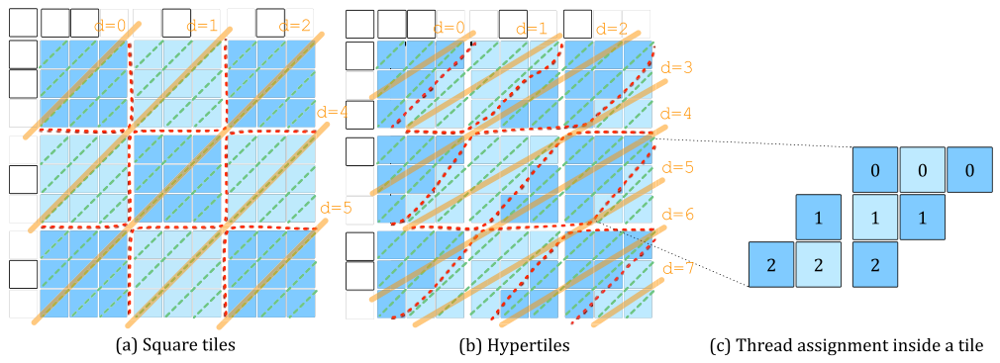

*Figure 16.14 — hyperplane 변환. (책 p.391)*

> 예컨대 Figure 16.14 에서 (a) 의 $3\times3$ 사각 tile 을 (b) 의 $3\times3$ 평행사변형
> hypertile 로 바꾼다 — **가운데 행을 왼쪽으로 1칸, 아래 행을 왼쪽으로 2칸** 밀어서.
> 이 평행사변형 hypertile 에서 **원래 직사각 tile 의 각 열이 변환 후 anti-diagonal 과
> 정렬**된다 (책 p.390).

### 3. 수식/유도 — shear 변환

#### 전체 유도 과정 (먼저 한 번에)

$$(r,\ q) \;\longmapsto\; (r,\ q + m \cdot r_{tile}), \qquad m = -1 \tag{1}$$

$$\text{tile 안 반복 수}: \quad 2n-1 \;\longrightarrow\; n \tag{2}$$

$$W_{\text{square}} = \sum_{i=1}^{n} i + \sum_{i=n+1}^{2n-1}(2n-i) = n^2 \tag{16.3}$$

$$W_{\text{hyper}} = \sum_{i=1}^{n} n = n^2 \tag{16.4}$$

$$\frac{\text{평균 work}_{\text{hyper}}}{\text{평균 work}_{\text{square}}} = \frac{n}{n^2/(2n-1)} = \frac{2n-1}{n} \;\to\; 2 \tag{3}$$

$$\text{wavefront 수}: \quad 2\,T-1 \;\longrightarrow\; 3\,T-1 \qquad (T = \texttt{numTiles\_x}) \tag{4}$$

#### 단계별 설명

**(1)** 변환 자체.

> 일반적으로 shear 변환에서, tile 좌표 $(r_{tile}, q_{tile})$ 인 칸이 직사각 tiling 에서
> score-matrix 좌표 $(r, q)$ 를 갖는다면, 같은 tile 좌표의 칸은 shear 변환 후
> **$(r,\ q + m \times r_{tile})$** 을 갖는다. $m$ 을 **shear factor** 라 한다.
> Figure 16.14 의 예는 $m = -1$ 을 가정하는데, 이는 hypertile 의 각 열이
> anti-diagonal 과 정렬되기에 충분히 기울이는 값이다 (책 p.391).

**책이 든 예를 검산하자** (책 p.391).
tile (0,1) 의 칸 $(r_{tile}, q_{tile}) = (2, 0)$ 은 사각 tiling 에서 score 좌표 $(2, 3)$ 이다
($q = 3\times1 + 0 = 3$). shear 후에는

$$q' = 3 + (-1)\times 2 = 1 \;\Longrightarrow\; (2,\ 1) \quad ✓$$

책의 서술과 일치한다.

> **원문 오기** (책 p.391). 같은 문장 안에서 "cell (2, 0) of tile (0, 1) … has score-matrix
> level coordinate (2, 3). After shear transformation, **cell (1, 0)** in tile (0, 1) has
> score-matrix-level coordinate (2, 3-2) = (2, 1)" 이라고 하는데,
> **뒤의 "cell (1, 0)" 은 "cell (2, 0)"** 이어야 한다.
> 계산식 `3-2` 가 $r_{tile} = 2$ 를 쓰고 있고, 결과 행도 그대로 2 이기 때문이다.

<!--widget:wavefront-->

**(2)~(16.4)** work 분석.

> 사각 tile 전체의 일을 하는 thread block 은 $2n-1$ 번의 반복이 필요하다.
> 반복 $i$ 에서 계산되는 칸 수는 주 anti-diagonal 전까지는 $i$, 그 뒤로는 $2n-i$ 다 (식 16.3).
> hypertile 하나의 계산은 **$n$ 번의 반복**만 필요하고 **반복당 일의 양은 $n$** 이다 (식 16.4).
> (책 p.396)

> **총 일의 양은 두 tile 유형에서 같음**을 관찰할 수 있다.
> 그러나 사각 tile 은 $2n-1$ 번, hypertile 은 $n$ 번의 반복이 필요하다.
> 그 결과 **사각 tile 의 반복당 평균 일은 대략 $\frac{n}{2}$, hypertile 은 $n$** 이다.
> 즉 **hypertile 이 사각 tile 보다 $2\times$ 효율적**이다 (책 p.396). ∎

숫자로 확인하면 (코드 검산):

| $n$ | square 반복 | 평균 work | hyper 반복 | 평균 work | 비율 |
|---|---|---|---|---|---|
| 4 | 7 | 2.29 | 4 | 4.00 | $1.75\times$ |
| 8 | 15 | 4.27 | 8 | 8.00 | $1.88\times$ |
| 16 | 31 | 8.26 | 16 | 16.00 | $1.94\times$ |
| **32** | **63** | **16.25** | **32** | **32.00** | **$1.97\times$** |

**두 work 는 언제나 정확히 $n^2$ 로 같다** (코드로 $n = 1..63$ 전부 확인).
바뀌는 것은 **일을 몇 번에 나눠 하느냐**뿐이다.

**(4)** 그런데 tile 사이 반복은 늘어난다.

> 사각 tile 방식은 표의 오른쪽 위 모서리에 닿는 데 `numTiles_x` 번의 wavefront 가 걸리고,
> 오른쪽 아래 모서리까지 `numTiles_x - 1` 번이 더 걸린다.
> …
> hypertile 의 경우에도 오른쪽 위 모서리까지 `numTiles_x` 번이 걸린다.
> 그러나 **shear 변환의 효과로 tile 이 기울어진다.**
> 그 결과 표의 가장 오른쪽 열의 칸들이 **사각 tile 의 $2\times$ 개수의 tile 에 속한다.**
> 다시 말해 **기울임 때문에 각 thread block 이 다음 block 보다 tile 두 열만큼 앞서게** 된다.
> 따라서 첫 tile 행을 계산하는 block 은 `numTiles_x + 1` 번의 반복이 필요하고
> (마지막 불완전 tile 때문에 1을 더한다), 나머지 `numTiles_x - 1` 개 tile 행마다
> 두 번씩 더 필요하다. 따라서 **총 wavefront 수는 $3 \times \texttt{numTiles\_x} - 1$** 이다
> (책 p.392).

$$1 + (T+1) - 1 + 2(T-1) = 3T - 1$$

| `numTiles_x` | square $2T-1$ | hyper $3T-1$ | 증가 |
|---|---|---|---|
| **3** (Figure 16.14) | **5** | **8** | $1.60\times$ |
| 8 | 15 | 23 | $1.53\times$ |
| 16 | 31 | 47 | $1.52\times$ |

**Figure 16.14 의 5 와 8 이 정확히 나온다** ✓ 그리고 $T$ 가 커지면 **$1.5\times$ 로 수렴**한다.

> 책이 "host 코드는 hypertiling 에서 **최대 $1.5\times$ 더 많은 wavefront** 를 돌아야 한다"
> 고 한 것이 이 극한이다 (책 p.396).
> **tile 안에서 $2\times$ 벌고 tile 사이에서 $1.5\times$ 잃는다** —
> 순이득은 $2/1.5 = 1.33\times$ 이고, 여기에 **divergence 감소와 지역성 개선**이 더해진다.

### 4. hypertile 의 세 이점

> hypertile 을 쓰는 Smith-Waterman 병렬 구현은 직사각 tile 보다 **세 가지 이점**이 있다 (책 p.390~391).

| 이점 | 무엇 |
|---|---|
| **①** | 각 tile 의 계산이 **같은 길이의 wavefront 연속**이 된다 → **활성 thread 수가 일정** → **warp divergence 와 하드웨어 저활용 감소** |
| **②** | **반복 수가 준다** — 반복당 일이 많아지므로. 사각 5회 vs hypertile 3회 (Figure 16.14) |
| **③** | **한 tile 의 마지막 anti-diagonal 이 다음 tile 의 첫 anti-diagonal 로 곧바로 이어진다** → block 사이 데이터 지역성 증가, cache hit 증가 |

**③이 단점 ②를 정확히 뒤집는다.** 사각 tile 에서는 계산 순서와 소비 순서가 반대였는데,
기울이고 나면 **마지막에 계산한 것이 곧바로 다음 tile 의 처음에 쓰인다.**

### 5. 코드

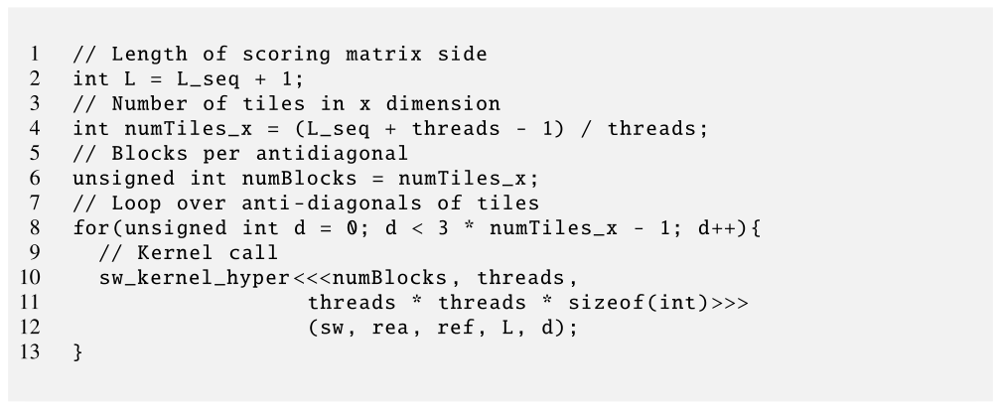

*Figure 16.15 — hypertile 기반 구현 (host 코드). (책 p.392)*

```cuda
 1  // Length of scoring matrix side
 2  int L = L_seq + 1;
 3  // Number of tiles in x dimension
 4  int numTiles_x = (L_seq + threads - 1) / threads;
 5  // Blocks per antidiagonal
 6  unsigned int numBlocks = numTiles_x;
 7  // Loop over anti-diagonals of tiles
 8  for(unsigned int d = 0; d < 3 * numTiles_x - 1; d++){
 9    // Kernel call
10    sw_kernel_hyper<<<numBlocks, threads,
11                      threads * threads * sizeof(int)>>>
12                     (sw, rea, ref, L, d);
13  }
```

**Figure 16.8 과 다른 것은 8번 줄의 `2 *` → `3 *` 하나뿐**이다.

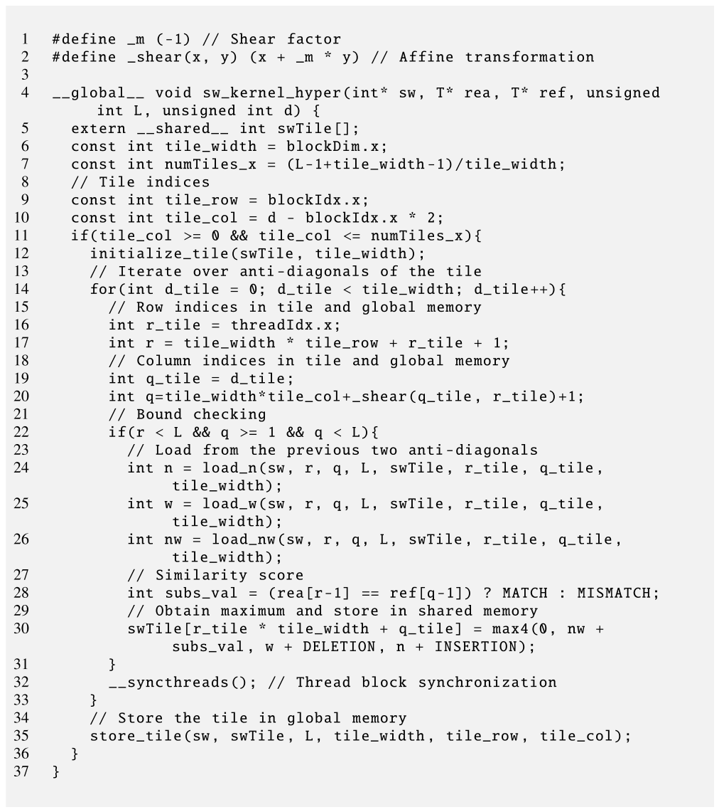

*Figure 16.16 — hypertile 기반 구현 (kernel 코드). (책 p.393)*

```cuda
 1  #define _m (-1) // Shear factor
 2  #define _shear(x, y) (x + _m * y) // Affine transformation
 3
 4  __global__ void sw_kernel_hyper(int* sw, T* rea, T* ref, unsigned int L,
                                    unsigned int d) {
 5    extern __shared__ int swTile[];
 6    const int tile_width = blockDim.x;
 7    const int numTiles_x = (L-1+tile_width-1)/tile_width;
 8    // Tile indices
 9    const int tile_row = blockIdx.x;
10    const int tile_col = d - blockIdx.x * 2;
11    if(tile_col >= 0 && tile_col <= numTiles_x){
12      initialize_tile(swTile, tile_width);
13      // Iterate over anti-diagonals of the tile
14      for(int d_tile = 0; d_tile < tile_width; d_tile++){
15        // Row indices in tile and global memory
16        int r_tile = threadIdx.x;
17        int r = tile_width * tile_row + r_tile + 1;
18        // Column indices in tile and global memory
19        int q_tile = d_tile;
20        int q = tile_width*tile_col+_shear(q_tile, r_tile)+1;
21        // Bound checking
22        if(r < L && q >= 1 && q < L){
23          // Load from the previous two anti-diagonals
24          int n = load_n(sw, r, q, L, swTile, r_tile, q_tile, tile_width);
25          int w = load_w(sw, r, q, L, swTile, r_tile, q_tile, tile_width);
26          int nw = load_nw(sw, r, q, L, swTile, r_tile, q_tile, tile_width);
27          // Similarity score
28          int subs_val = (rea[r-1] == ref[q-1]) ? MATCH : MISMATCH;
29          // Obtain maximum and store in shared memory
30          swTile[r_tile * tile_width + q_tile] = max4(0, nw + subs_val,
                                                       w + DELETION, n + INSERTION);
31        }
32        __syncthreads(); // Thread block synchronization
33      }
34      // Store the tile in global memory
35      store_tile(sw, swTile, L, tile_width, tile_row, tile_col);
36    }
37  }
```

#### 사각판과 다른 다섯 곳

| 줄 | 사각판 | hypertile 판 | 왜 |
|---|---|---|---|
| **10** | `d - blockIdx.x` | **`d - blockIdx.x * 2`** | 기울임 때문에 block 이 **두 열씩** 앞선다 |
| **11** | `tile_col < numTiles_x` | **`tile_col <= numTiles_x`** | 오른쪽의 **불완전 tile** 을 허용해야 한다 |
| **12** | — | **`initialize_tile(...)`** | 아래 참조 |
| **14** | `d_tile < 2*tile_width-1` | **`d_tile < tile_width`** | **anti-diagonal 이 tile_width 개**뿐 |
| **19~20** | `q_tile = d_tile - threadIdx.x` | **`q_tile = d_tile`**, `q` 에 `_shear` | 아래 참조 |
| **22** | `q_tile>=0 && q_tile<tile_width && r<L && q<L` | **`r < L && q >= 1 && q < L`** | tile 안 검사가 필요 없다 |

> **14번 줄이 이 절의 결론이다.**
> anti-diagonal 반복이 $2n-1$ 에서 $n$ 으로 줄었다 —
> **"모든 thread 가 모든 반복에서 활성"** 이기 때문이다 (책 p.393).
> 그래서 22번 줄에서도 tile 안 경계 검사(`q_tile` 범위)가 사라졌다.

#### 19~20번 줄 — shared 는 정사각, global 은 기울어짐

> hypertile 구현에서 **인덱싱을 쉽게 하려고 shared memory tile 은 정사각이라고 가정**한다.
> 따라서 각 thread 는 anti-diagonal $d_{tile}$ 의 자기 값을 그 정사각의
> **열 $q_{tile} = d_{tile}$** 에 보관한다.
> global memory 의 열 index 에는 **shear 변환 $(r,\ q + m \times r_{tile})$** 을 적용한다.
> 코드에서는 `_shear()` 매크로가 그 일을 한다 (책 p.394).

**두 좌표계를 분리한 것이 이 구현의 요령이다.**

| | shared memory 안 | global memory 안 |
|---|---|---|
| 모양 | **정사각** $n \times n$ | **평행사변형** |
| 열 index | $q_{tile} = d_{tile}$ (그냥 반복 번호) | $\texttt{tile\_width}\cdot\texttt{tile\_col} + (q_{tile} - r_{tile}) + 1$ |

`q >= 1` 검사가 새로 필요한 이유도 여기서 나온다 —
**shear 가 $q$ 를 음수로 만들 수 있기** 때문이다 (왼쪽 아래의 불완전 tile).

#### 이웃 좌표를 다시 유도해야 한다

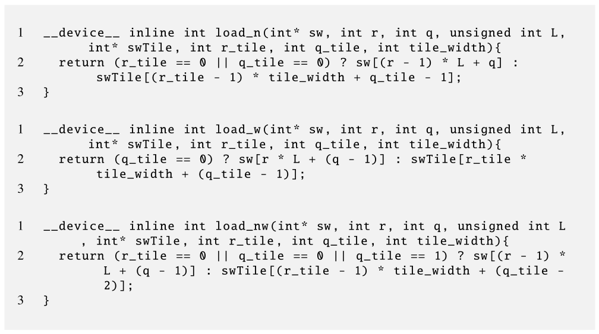

*Figure 16.17 — hypertile 기반 구현: 입력 값을 적재하는 device 함수. (책 p.394)*

```cuda
__device__ inline int load_n(int* sw, int r, int q, unsigned int L,
                             int* swTile, int r_tile, int q_tile, int tile_width){
  return (r_tile == 0 || q_tile == 0) ? sw[(r - 1) * L + q]
                                      : swTile[(r_tile - 1) * tile_width + q_tile - 1];
}

__device__ inline int load_w(int* sw, int r, int q, unsigned int L,
                             int* swTile, int r_tile, int q_tile, int tile_width){
  return (q_tile == 0) ? sw[r * L + (q - 1)]
                       : swTile[r_tile * tile_width + (q_tile - 1)];
}

__device__ inline int load_nw(int* sw, int r, int q, unsigned int L,
                              int* swTile, int r_tile, int q_tile, int tile_width){
  return (r_tile == 0 || q_tile == 0 || q_tile == 1)
           ? sw[(r - 1) * L + (q - 1)]
           : swTile[(r_tile - 1) * tile_width + (q_tile - 2)];
}
```

> 예컨대 `load_n` 은 scoring matrix 에서 자기 칸 바로 위(n)에 해당하는 tile 칸을 읽어야 한다.
> n 이 shared memory tile 안에 있다면 tile 에서의 행 index 는 사각 tiling 과 마찬가지로
> $r_{tile}-1$ 이다. 그러나 **shear 변환 때문에 그 칸은 실제로 tile 의 이전 열
> ($q_{tile}-1$)에 저장돼 있다** — 각 hypertile 이 shared memory 에 정사각으로 저장되기
> 때문이다 (책 p.394).

**세 이웃의 tile 좌표를 직접 유도해 보자.** global 좌표는

$$r = n\cdot t_r + r_{tile} + 1, \qquad q = n\cdot t_c + (q_{tile} - r_{tile}) + 1$$

| 이웃 | global | 조건 $r' = \ldots$, $q' = \ldots$ 을 풀면 | tile 좌표 |
|---|---|---|---|
| **n** | $(r-1,\ q)$ | $r'_{tile} = r_{tile}-1$, $q'_{tile} - r'_{tile} = q_{tile}-r_{tile}$ | $(r_{tile}-1,\ \mathbf{q_{tile}-1})$ |
| **w** | $(r,\ q-1)$ | $r'_{tile} = r_{tile}$, $q'_{tile} = q_{tile}-1$ | $(r_{tile},\ \mathbf{q_{tile}-1})$ |
| **nw** | $(r-1,\ q-1)$ | $r'_{tile} = r_{tile}-1$, $q'_{tile} = q_{tile}-2$ | $(r_{tile}-1,\ \mathbf{q_{tile}-2})$ |

**코드의 `q_tile-1`, `q_tile-1`, `q_tile-2` 가 정확히 이 유도의 결과다** (코드로 전수 확인).
그리고 shared 에서 읽을 수 있는 조건도 여기서 나온다.

| 함수 | shared 조건 | 코드의 global 조건 (부정) |
|---|---|---|
| `load_n` | $r_{tile}\ge1$ **및** $q_{tile}\ge1$ | `r_tile == 0 \|\| q_tile == 0` ✓ |
| `load_w` | $q_{tile}\ge1$ | `q_tile == 0` ✓ |
| `load_nw` | $r_{tile}\ge1$ **및** $q_{tile}\ge2$ | `r_tile==0 \|\| q_tile==0 \|\| q_tile==1` ✓ |

#### store 와 initialize

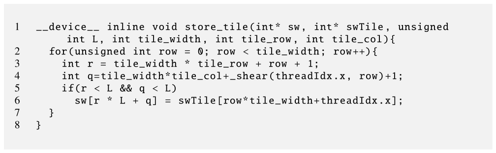

*Figure 16.18 — hypertile 기반 구현: tile 을 global memory 에 저장하는 device 함수. (책 p.395)*

```cuda
__device__ inline void store_tile(int* sw, int* swTile, unsigned int L,
                                  int tile_width, int tile_row, int tile_col){
  for(unsigned int row = 0; row < tile_width; row++){
    int r = tile_width * tile_row + row + 1;
    int q = tile_width*tile_col+_shear(threadIdx.x, row)+1;
    if(r < L && q < L)
      sw[r * L + q] = swTile[row*tile_width+threadIdx.x];
  }
}
```

> Figure 16.12 의 코드와 유일한 차이는 **열 index $q$ 계산에 shear 변환을 적용**한 것이다
> (책 p.394).

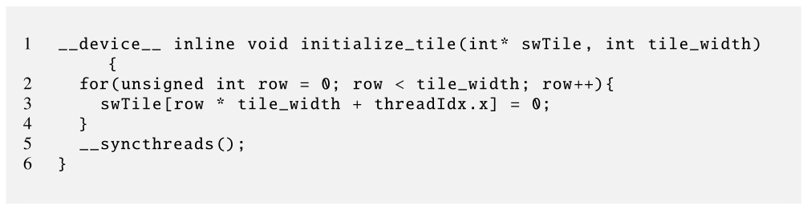

*Figure 16.19 — hypertile 기반 구현: shared memory 를 초기화하는 device 함수. (책 p.395)*

```cuda
__device__ inline void initialize_tile(int* swTile, int tile_width){
  for(unsigned int row = 0; row < tile_width; row++){
    swTile[row * tile_width + threadIdx.x] = 0;
  }
  __syncthreads();
}
```

> 이 초기화 함수가 필요한 이유는, **경계 검사(22번 줄)가 일부 thread 를 shared memory 자리에
> 쓰지 못하게 막기** 때문이다 — 그들의 칸이 실제 scoring matrix 밖에 떨어지므로.
> 그러나 **모든 thread 가 kernel 실행 내내 활성으로 남는다** (자기 칸이 tile 범위 안이므로).
> 그 결과 이 thread 들이 나중 반복에서 `load_n`·`load_w`·`load_nw` 로 **쓰레기 값을 읽을 수** 있다.
> shared memory tile 칸을 전부 0 으로 초기화하면 이 thread 들이 쓰레기 값으로 예외를 일으키는
> 것을 막는다 (책 p.395).

> **"전원 활성"의 대가**다. 사각판에서는 범위 밖 thread 가 `q_tile` 검사로 아예 걸러졌는데,
> hypertile 은 **전원이 끝까지 도는 것이 장점**이라 그럴 수 없다.
> 대신 **읽힐 수 있는 모든 자리를 미리 0 으로 채워** 무해하게 만든다.
> 16.6절 `loadTile` 의 `else { T_s[...] = 0.0f; }` 와 같은 발상이고,
> **0 이 덧셈의 identity value 라서 결과를 바꾸지 않는다**는 점도 같다.

### 6. bank conflict 와 padding

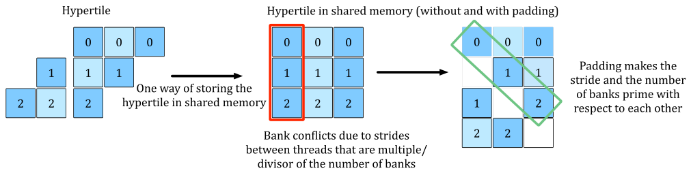

*Figure 16.20 — shared memory 에서 hypertile 을 padding 하는 예. (책 p.396)*

> hypertile 을 shared memory 에 저장하는 방식 때문에 아직 풀어야 할 문제가 하나 있다.
> hypertile 은 shared memory 에 **row-major 로 정사각으로 저장**된다.
> 그러나 **hypertile 폭이 shared memory bank 수의 배수이거나 약수이면 bank conflict** 가 생긴다.
> bank conflict 를 피하려면 **padding**(hypertile 의 각 행 뒤에 빈 자리 하나)을 써서
> 연속 thread 가 접근하는 주소를 밀어 주면 된다 (책 p.395).

> 코드에서는 매크로 **`pad(x) = (x + (x >> LOG_NUM_BANKS))`** 를 정의할 수 있다.
> `x` 는 shared memory index 이고 `LOG_NUM_BANKS` 는 bank 수의 이진 로그다 (책 p.395~396).

**왜 통하는지 확인하자.** `tile_width = 32`, bank 32개인 경우:

| | 행 $r$ 의 첫 원소 index | bank |
|---|---|---|
| **padding 없음** | $32r$ | $32r \bmod 32 = \mathbf{0}$ — **전부 bank 0** |
| **`pad()` 적용** | $32r + r = 33r$ | $33r \bmod 32 = \mathbf{r}$ — **전부 다른 bank** |

행 0~7 의 bank 가 `[0,0,0,0,0,0,0,0]` 에서 `[0,1,2,3,4,5,6,7]` 로 바뀐다 (코드 검산).

> **15.6절의 padding 과 같은 기법이고 수식만 다르다.**
> 15.6절은 `bK` → `bK+1` 로 **행마다 1칸**을 더했고,
> 여기는 `pad(x) = x + (x>>5)` 로 **32칸마다 1칸**을 더한다.
> 후자는 **index 를 통째로 변환**하는 방식이라 배열 선언 크기만 늘리면 되고
> 접근식은 `pad()` 로 감싸기만 하면 된다.
>
> shared memory 는 $32\times32 = 1024$ int 에서 **1056 int (+3.1%)** 로 는다 (책 p.396의
> `threads*threads + ((threads*threads) >> LOG_NUM_BANKS)` 식).

### 7. 사이드바 — stencil 에도 적용된다

> stencil 계산(8장)도 이 절에서 소개한 hypertile 변환의 이득을 볼 수 있다.
> **Jacobi stencil** 이 그 예인데, **시간 영역의 반복을 나타내는 바깥 순차 loop** 가 있고
> 안쪽 loop 들이 **공간 영역의 stencil 칸**을 갱신한다.
> 그 결과 **공간 영역과 시간 영역에 intra-tile wavefront 와 inter-tile wavefront** 가 생기고,
> hypertile 로 두 종류의 병렬성을 효율적으로 활용할 수 있다 (책 p.397).

```c
for (t=1; t<=T; t++)
  for (i=1; i<=I; i++)
    A[i] = 0.5 * (A[i] + A[i+1]);
```

> 각 원소 `A[i]` 는 **자기 이전 값과 위 원소의 값**(즉 이전 시간 반복에서 계산된 `A[i]` 와
> `A[i+1]`)에 의존한다. 단순한 작업 분할로는 **같은 열(같은 $t$)의 원소만 병렬 계산**할 수 있고,
> 각 $t$ 마다 전역 동기화가 필요하다.
> hypertile 분할은 **intra-tile wavefront 와 inter-tile wavefront 를 정의해
> 더 많은 병렬성을 드러내고 전역 동기화 횟수를 줄인다** (책 p.397).

> **8장에서 stencil sweep 을 "시간 반복마다 kernel 을 새로 띄운다"고 배웠다.**
> hypertile 은 **시간 축과 공간 축을 함께 tiling** 해서 그 kernel 횟수를 줄인다.
> 이것이 문헌에서 **time skewing** 또는 **temporal blocking** 이라 부르는 기법이고,
> 8장의 최적화 목록에 없던 한 층 위의 도구다.

### 8. 예제/실습

#### 연습문제

> `tile_width = 32`, `numTiles_x = 16` 일 때
> **(1)** 사각 tile 과 hypertile 각각의 kernel 호출 수는?
> **(2)** tile 하나의 `__syncthreads()` 횟수는?
> **(3)** 전체 동기화 횟수(kernel 호출 + barrier)를 비교하면?

**(1)** 사각 $2\times16-1 = \mathbf{31}$회, hypertile $3\times16-1 = \mathbf{47}$회 ($1.52\times$).

**(2)** 사각 $2\times32-1 = \mathbf{63}$회, hypertile $\mathbf{32}$회 ($0.51\times$).

**(3)** block 하나가 겪는 총 동기화는 (kernel 호출은 grid 전체 barrier 이므로 함께 센다):

| | kernel 호출 | tile 당 barrier | tile 수(행당) | 총 barrier |
|---|---|---|---|---|
| **사각** | 31 | 63 | 16 | $63\times16 = 1008$ |
| **hypertile** | 47 | 32 | 16 | $32\times16 = \mathbf{512}$ |

> **barrier 는 절반으로 줄고 kernel 호출은 $1.5\times$ 로 는다.**
> barrier 하나가 kernel 호출보다 훨씬 싸므로 보통은 이득이지만,
> **$L$ 이 작아 tile 수가 적으면 kernel 호출 증가가 이길 수** 있다.
> 그래서 16.8절이 **kernel 호출 자체를 없애는 방법**을 제시한다.

---

## 16.8 More optimizations (책 p.397)

### 1. tile anti-diagonal 사이 동기화

> 앞 절들에서는 **kernel 을 종료하고 새 kernel 을 launch** 해 tile 의 anti-diagonal 을
> 동기화했다. 이는 전역 동기화를 보장한다.
> 그러나 이 방식은 **각 block 이 이전 두 anti-diagonal 을 계산하는 모든 block 을 기다려야
> 한다**는 단점이 있다 — 실제로는 **그중 세 개에만 의존**하는데도.
> 이는 **부하 불균형**을 일으켜 SM 의 계산 슬롯을 낭비할 수 있다 (책 p.397~398).

#### 방법 ① — cooperative groups

> 최근 CUDA 는 **cooperative groups** 를 제공한다 — warp, block, 여러 block, grid 전체의
> thread 를 동기화할 수 있다 (18장에서 자세히 다룬다).
> grid 수준 동기화를 하려면 kernel 이 **persistent thread block** 을 써야 한다.
> **grid 크기가 SM 에서 동시에 실행될 수 있는 최대 block 수 이하**여야 한다.
> 그러나 그런 구현도 **여전히 각 block 이 이전 두 anti-diagonal 의 모든 block 을 기다리게**
> 만든다 (책 p.398).

**kernel 호출은 없앴지만 "모두 기다리기"는 그대로**다.

#### 방법 ② — flag 배열 (더 효율적)

> 더 효율적인 동기화 메커니즘은 **tile 완료를 알리는 flag 배열**을 쓸 수 있다.
> 이렇게 하면 한 block 이 **flag 두 개(위 tile 과 왼쪽 tile)만 확인**하고
> 그것들이 세워지는 즉시 계산을 시작할 수 있다.
> 더욱이 **persistent block 을 쓰고 tile 행마다 하나씩 배정**하면
> 각 block 은 **flag 하나만** 확인하면 된다 (책 p.398).

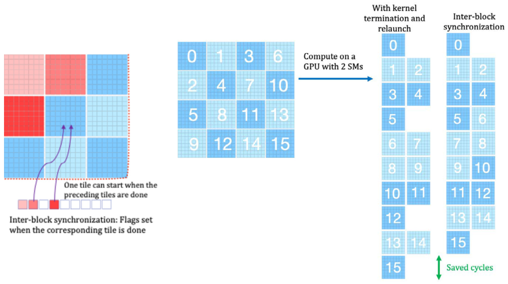

*Figure 16.21 — inter-block 동기화(왼쪽)와 SM 활용 측면에서의 이득(오른쪽). (책 p.399)*

> 이 동기화 메커니즘은 **11장(Scan)에서 다룬 단방향 동기화와 닮았다** (책 p.398).

**11.9절이 세 번째로 돌아온다.**

| 장 | 무엇을 기다리나 | 무엇을 전파하나 |
|---|---|---|
| **11.9** scan | 앞 block 의 부분합 | **값** (부분합) |
| **12.8** 행/열 제거 | 앞 block 의 읽기 완료 | **순서만** (값 없음) |
| **16.8** wavefront | **위·왼쪽 tile 의 완료** | **순서만** (flag) |

Figure 16.21 오른쪽이 이득을 보여 준다 — SM 2개짜리 GPU 에서
tile 16개를 처리할 때 **kernel 종료·재launch 방식은 슬롯이 자주 비고**,
inter-block 동기화는 **빈 슬롯을 메워 사이클을 아낀다.**

> inter-block 동기화는 hypertile 에도 적용할 수 있다.
> 그 경우 **hypertile 의 폭이 동기화 연산 횟수와 block 이 계산을 시작하기까지의 대기 시간**을
> 정한다. 프로그래머는 **폭을 튜닝해 성능의 sweet spot** 을 찾을 수 있다 (책 p.398).

### 2. 작은 문제 — register 와 shuffle

> 이 장에서는 scoring matrix 계산에 **여러 block 이 필요**하다고 가정했다.
> 이는 **긴 sequence (수천 bp)** 정렬에 유용하다.
> 그러나 **짧은 sequence (수백 bp)** 에서는 **정렬 하나에 block 하나, 심지어 warp 하나**로도
> scoring matrix 를 계산하기 충분할 수 있다.
> 그런 구현은 **tile 을 register 에 저장하고 shuffle 명령(10장)으로 중간 결과를 교환**하는
> 것에서 큰 이득을 볼 수 있다 (책 p.398).

> **15.4절의 register tiling 이 여기서도 나온다.**
> shared memory 조차 건너뛰고 **register + `__shfl_*_sync`** 로 이웃 값을 주고받는 것이다.
> anti-diagonal 계산은 "**옆 lane 의 값**"을 필요로 하므로 shuffle 과 궁합이 좋다.
> 실무의 GPU 정렬 라이브러리(예: GASAL2, ADEPT)가 이 방식을 쓴다.

### 3. DPX 명령

> **NVIDIA Hopper 아키텍처부터** CUDA 는 **DPX** 라는 새로운 종류의 SIMD 명령을 제공한다 —
> **dynamic programming 응용을 가속**하기 위한 것이다.
> 예컨대 kernel 의 `max4()` device 함수를 DPX 명령 **`__vimax3_s32_relu()`** 로 대체할 수 있다.
> 이 명령은 **세 입력값과 0 의 최댓값을 계산하는 특수 하드웨어**를 활용한다 (책 p.398).

```cuda
// 기존 (Figure 16.11): 비교 3회
swTile[...] = max4(0, nw + subs_val, w + DELETION, n + INSERTION);

// DPX (Hopper~): 명령 1개
swTile[...] = __vimax3_s32_relu(nw + subs_val, w + DELETION, n + INSERTION);
```

> **`relu` 라는 이름이 정확하다** — $\max(\cdot, 0)$ 이 곧 ReLU 다.
> 식 (16.2)의 네 번째 항 `0` 이 하드웨어에 내장된 셈이다.
> 15.9절의 tensor core 와 같은 구도 —
> **자주 쓰이는 계산 패턴이 결국 명령 하나가 된다.**

### 4. 예제/실습

#### 연습문제

> **(1)** `numTiles_x = 16` 일 때 flag 배열 방식이 아끼는 대기는 어느 정도인가?
> **(2)** DPX 로 `max4` 를 대체하면 명령이 몇 개 줄어드는가?

**(1)** kernel 종료 방식은 tile anti-diagonal 마다 **모든 block**(최대 16개)을 기다린다.
flag 방식은 **위 tile 하나**(persistent block, 행마다 하나)만 기다린다.

대기의 상한이 $16 \to 1$ 로 준다. 실제 이득은 tile 계산 시간의 편차에 달렸는데,
Smith-Waterman 은 tile 마다 일이 같으므로 편차가 작다 —
**hypertile 과 결합할 때 더 크게 이득**이다 (hypertile 은 tile 마다 일이 정확히 같으므로
kernel 호출 오버헤드만 남고, 그것을 없애는 것이 이 최적화다).

**(2)** `max4` 는 비교·대입이 **3쌍 = 6명령** 남짓이고 (Figure 16.11),
DPX 는 **1명령**이다. 안쪽 loop 가 tile 당 $n$ 회 도므로
$n = 32$ 면 tile 하나에 **~160 명령**이 준다.

---

## 16.9 Summary (책 p.399)

책의 정리를 옮기면 (책 p.399):

- dynamic programming 알고리즘은 **복잡한 문제를 단순한 부분문제로 재귀적으로 나눈다.**
  **bottom-up 구현은 중간 결과를 표에 memoize** 할 수 있다.
- **표 칸 사이의 의존이 wavefront 를 정의**하고, wavefront 는 **병렬로 풀 수 있는
  부분문제의 집합**이다.
- 이 장은 **wavefront 병렬성을 GPU 에서 효율적으로 활용하는 법**을 설명했다.
  **block 수준 tiling 과 hypertile 변환**이 계산 자원 활용을 최적화하는 방법을 제공한다.
- 더 나아간 성능을 줄 수 있는 고급 최적화로 **inter-block 동기화 메커니즘과 DPX 명령**이 있다.

### 세 구현을 한눈에

| | 기본 (anti-diagonal 당 kernel) | 사각 tile | **hypertile** |
|---|---|---|---|
| kernel 호출 | $2L-1$ | $2T-1$ | $3T-1$ |
| tile 당 barrier | — | $2n-1$ | **$n$** |
| 활성 thread | **1 → $L$ → 1** | 1 → $n$ → 1 | **언제나 $n$** |
| shared memory | 안 씀 | tile 하나 | tile 하나 **+ padding** |
| tile 사이 지역성 | — | 나쁨 | **좋음** |
| 코드 복잡도 | 낮음 | 중간 | **높음** (shear 좌표 변환) |

$L = 1024$, $n = 32$, $T = 32$ 로 계산하면 kernel 호출이
**2047 → 63 → 95** 로, tile 당 barrier 는 **63 → 32** 로 바뀐다.

---

## 16.10 Exercises (책 p.399)

### 연습문제 1

> **정사각 thread block 을 쓰는 Floyd-Warshall kernel 을 구현하라** (16.4절의 선형 block 대신).
> 정사각 block 구현에서 거리표는 block 에 배정되는 정사각 tile 로 나뉜다.
> 각 block 의 thread 는 **$k$ 열과 $k$ 행의 관련 부분을 shared memory 에 저장해 재사용**한다.
> 이 구현과 16.4절의 구현을 **메모리 접근·데이터 재사용·성능** 면에서 비교하라.

```cuda
#define TILE 32

__global__ void FW_bottomup_tiled(int k, int* dist, int n) {
    // 정사각 tile — block 하나가 TILE x TILE 를 맡는다
    int row = blockIdx.y*TILE + threadIdx.y;
    int col = blockIdx.x*TILE + threadIdx.x;

    // k 열의 TILE 개(이 tile 의 행들) 와 k 행의 TILE 개(이 tile 의 열들)
    __shared__ int col_k_s[TILE];      // dist[row][k]  — 행마다 하나
    __shared__ int row_k_s[TILE];      // dist[k][col]  — 열마다 하나

    if (threadIdx.y == 0 && col < n)  row_k_s[threadIdx.x] = dist[k*n + col];
    if (threadIdx.x == 0 && row < n)  col_k_s[threadIdx.y] = dist[row*n + k];
    __syncthreads();

    if (row < n && col < n) {
        int a = col_k_s[threadIdx.y];          // dist[row][k]
        int b = row_k_s[threadIdx.x];          // dist[k][col]
        if (a != INFINITY && b != INFINITY) {
            int nd = a + b;
            int idx = row*n + col;
            if (nd < dist[idx]) dist[idx] = nd;
        }
    }
}
// host: dim3 dimBlock(TILE, TILE);
//       dim3 dimGrid((n+TILE-1)/TILE, (n+TILE-1)/TILE);
```

#### 세 가지 비교

| | 16.4절 (선형 block) | 연습 1 (정사각 tile) |
|---|---|---|
| block 하나가 맡는 칸 | $1 \times \texttt{threads}$ | **$\texttt{TILE} \times \texttt{TILE}$** |
| `dist[row][k]` 읽기 | **block 당 1회** (broadcast) | block 당 `TILE` 회 |
| `dist[k][col]` 읽기 | **thread 당 1회** = `threads` 회 | block 당 **`TILE` 회** |
| block 당 global load | $1 + \texttt{threads}$ | $2\,\texttt{TILE}$ |
| **칸 당 global load** | $\frac{1+T}{T} \approx \mathbf{1.0}$ | $\frac{2\,\texttt{TILE}}{\texttt{TILE}^2} = \frac{2}{\texttt{TILE}} = \mathbf{0.0625}$ |

**$\texttt{TILE}=32$ 에서 칸당 global load 가 $16\times$ 준다.**

> **왜 그렇게 크게 줄어드는가**는 5.3절의 tiling 논리 그대로다.
> 선형 block 은 **행 방향으로만** 재사용하지만 (`dist[row][k]` 하나를 `threads` 개가 공유),
> 정사각 tile 은 **행·열 양방향**으로 재사용한다 (`col_k_s` 를 열 방향으로,
> `row_k_s` 를 행 방향으로).
> **1차원 재사용에서 2차원 재사용으로 올라간 것**이고, 그래서 $O(T) \to O(T^2)$ 가 된다.

> **다만 early return 을 잃는다.** 16.4절은 `dist_k_col == INFINITY` 면 block 전체가
> 즉시 return 했는데, 정사각 tile 에서는 **행마다 값이 다르므로** 그럴 수 없다.
> 희소 그래프에서는 이 손해가 클 수 있다 — **실측으로 결정해야 하는 맞바꿈**이다.

### 연습문제 2

> **block 수준 tiling 을 쓰는 Smith-Waterman kernel 을 직사각 tile 을 쓰도록 수정하라.**

`tile_width` 하나를 `tile_h`(높이)와 `tile_w`(너비) 둘로 나눈다.
**anti-diagonal 수가 $\texttt{tile\_h}+\texttt{tile\_w}-1$ 로 바뀌는 것**이 핵심이다.

```cuda
__global__ void sw_kernel_rect(int* sw, T* rea, T* ref, unsigned int L,
                               unsigned int d, int tile_h, int tile_w) {
  extern __shared__ int swTile[];               // tile_h x tile_w
  const int numTiles_x = (L-1+tile_w-1)/tile_w;   // 열 방향 tile 수
  const int tile_row = blockIdx.x;
  const int tile_col = d - blockIdx.x;
  if(tile_col >= 0 && tile_col < numTiles_x){
    // anti-diagonal 수가 tile_h + tile_w - 1 로 바뀐다
    for(int d_tile = 0; d_tile < tile_h + tile_w - 1; d_tile++){
      int r_tile = threadIdx.x;                 // blockDim.x == tile_h 로 launch
      int r = tile_h * tile_row + r_tile + 1;
      int q_tile = d_tile - threadIdx.x;
      int q = tile_w * tile_col + q_tile + 1;
      if(q_tile >= 0 && q_tile < tile_w && r_tile < tile_h && r < L && q < L){
        int n  = load_n (sw, r, q, L, swTile, r_tile, q_tile, tile_w);
        int w  = load_w (sw, r, q, L, swTile, r_tile, q_tile, tile_w);
        int nw = load_nw(sw, r, q, L, swTile, r_tile, q_tile, tile_w);
        int subs_val = (rea[r-1] == ref[q-1]) ? MATCH : MISMATCH;
        swTile[r_tile * tile_w + q_tile] =
            max4(0, nw + subs_val, w + DELETION, n + INSERTION);
      }
      __syncthreads();
    }
    store_tile(sw, swTile, L, tile_h, tile_w, tile_row, tile_col);
  }
}
```

#### 무엇이 달라지나

| | 정사각 $n\times n$ | 직사각 $h \times w$ |
|---|---|---|
| anti-diagonal 수 | $2n-1$ | **$h + w - 1$** |
| 최대 활성 thread | $n$ | **$\min(h, w)$** |
| work | $n^2$ | $hw$ |
| 평균 활성 | $\frac{n^2}{2n-1} \approx \frac{n}{2}$ | $\frac{hw}{h+w-1}$ |

**$h$ 와 $w$ 를 크게 다르게 잡으면 오히려 나빠진다.**
$h = 32$, $w = 8$ 이면 평균 활성이 $\frac{256}{39} = 6.6$ 으로,
정사각 $16\times16$ ($\frac{256}{31} = 8.3$) 보다 낮다.
**같은 넓이라면 정사각이 평균 활성 thread 가 가장 많다** (산술-조화 평균 부등식).

> **그럼 왜 직사각을 쓰는가?** `blockDim.x` 를 warp 크기의 배수로 맞추면서
> shared memory 를 조절하고 싶을 때다. 예컨대 $h = 32$(warp 하나), $w = 64$ 로 두면
> **thread 32개로 tile 2048칸**을 다룬다 — 15.3절의 coarsening 과 같은 동기다.
> 다만 그러면 **thread 하나가 여러 행**을 맡도록 코드를 더 고쳐야 한다.

### 연습문제 3

> **block 사이 동기화에 cooperative groups 를 쓰는 block 수준 tiling Smith-Waterman kernel 을
> 구현하라.**

kernel 호출 loop 를 **kernel 안으로 끌어들인다.** persistent block 이 필수다.

```cuda
#include <cooperative_groups.h>
namespace cg = cooperative_groups;

__global__ void sw_kernel_coop(int* sw, T* rea, T* ref, unsigned int L) {
  cg::grid_group grid = cg::this_grid();
  extern __shared__ int swTile[];
  const int tile_width = blockDim.x;
  const int numTiles_x = (L-1+tile_width-1)/tile_width;

  // 바깥 loop 가 kernel 안으로 들어왔다 — kernel 호출 2T-1 회가 0 회가 된다
  for(int d = 0; d < 2*numTiles_x - 1; d++){
    const int tile_row = blockIdx.x;
    const int tile_col = d - blockIdx.x;
    if(tile_col >= 0 && tile_col < numTiles_x){
      for(int d_tile = 0; d_tile < 2*tile_width-1; d_tile++){
        /* … Figure 16.9 의 11~27번 줄 그대로 … */
        __syncthreads();
      }
      store_tile(sw, swTile, L, tile_width, tile_row, tile_col);
    }
    grid.sync();          // ← kernel 종료·재launch 를 대체한다
  }
}
```

host 는 `cudaLaunchCooperativeKernel` 로 **한 번만** 띄운다.

```cuda
void* args[] = {&sw, &rea, &ref, &L};
cudaLaunchCooperativeKernel((void*)sw_kernel_coop, numBlocks, threads,
                            args, threads*threads*sizeof(int));
```

#### 지켜야 할 제약 셋

| 제약 | 왜 |
|---|---|
| **grid 크기 $\le$ 동시 실행 가능 block 수** | `grid.sync()` 가 **모든 block 이 살아 있어야** 성립한다. 하나라도 아직 스케줄되지 않았으면 **deadlock** |
| **`store_tile` 이 `grid.sync()` 앞에** | 다음 $d$ 의 block 이 global 에서 읽을 값이 준비돼 있어야 한다 |
| **`grid.sync()` 는 `if` 밖에** | 비활성 block 도 참여해야 한다 — `__syncthreads()` 와 같은 규칙 |

`cudaOccupancyMaxActiveBlocksPerMultiprocessor` 로 상한을 구한다.

```cuda
int maxBlocksPerSM, numSMs;
cudaOccupancyMaxActiveBlocksPerMultiprocessor(&maxBlocksPerSM, sw_kernel_coop,
                                              threads, threads*threads*sizeof(int));
cudaDeviceGetAttribute(&numSMs, cudaDevAttrMultiProcessorCount, 0);
int maxBlocks = maxBlocksPerSM * numSMs;   // numBlocks 는 이 값 이하여야 한다
```

> **이득과 한계.** kernel 호출 $2T-1$ 회가 **0 회**가 된다 (한 번만 launch).
> 그러나 책이 지적한 대로 **"각 block 이 이전 두 anti-diagonal 의 모든 block 을 기다린다"**
> 는 문제는 그대로다 — `grid.sync()` 는 전원 barrier 이기 때문이다.
> 그것까지 없애는 것이 연습 4·5 다.

### 연습문제 4

> **단방향 동기화를 쓰는 block 수준 tiling Smith-Waterman kernel 을 구현하라.**
> 11장의 single lookback 동기화를 참고할 수 있다.

**11.9절의 구조를 그대로 가져오되 "값"이 아니라 "완료 신호"만 전파**한다 (12.8절의 그 변형).

```cuda
// flags[tile_row * numTiles_x + tile_col] : 그 tile 이 끝났으면 1
__global__ void sw_kernel_flags(int* sw, T* rea, T* ref, unsigned int L,
                                unsigned int* flags) {
  extern __shared__ int swTile[];
  const int tile_width = blockDim.x;
  const int numTiles_x = (L-1+tile_width-1)/tile_width;
  const int tile_row = blockIdx.x;            // persistent: 행 하나를 끝까지 맡는다

  for(int tile_col = 0; tile_col < numTiles_x; tile_col++){

    // ── 단방향 동기화: 위 tile (tile_row-1, tile_col) 만 기다린다 ──
    if(tile_row > 0){
      if(threadIdx.x == 0){
        cuda::atomic_ref<unsigned int, cuda::thread_scope_device>
            f(flags[(tile_row-1)*numTiles_x + tile_col]);
        while(f.load(cuda::memory_order_acquire) == 0) { /* spin */ }
      }
      __syncthreads();     // 대표가 확인한 사실을 block 전체에 퍼뜨린다
    }
    // 왼쪽 tile (tile_row, tile_col-1) 은 같은 block 이 직전에 끝냈으므로 기다릴 필요가 없다

    for(int d_tile = 0; d_tile < 2*tile_width-1; d_tile++){
      /* … Figure 16.9 의 11~27번 줄 그대로 … */
      __syncthreads();
    }
    store_tile(sw, swTile, L, tile_width, tile_row, tile_col);
    __syncthreads();

    // ── 내 완료를 알린다 ──
    if(threadIdx.x == 0){
      cuda::atomic_ref<unsigned int, cuda::thread_scope_device>
          f(flags[tile_row*numTiles_x + tile_col]);
      f.store(1, cuda::memory_order_release);   // store_tile 이 먼저 보이도록
    }
  }
}
```

#### 왜 flag 하나면 되는가

> **persistent block 을 쓰고 tile 행마다 하나씩 배정**하면 각 block 은 **flag 하나만**
> 확인하면 된다 (책 p.398).

**왼쪽 tile 은 같은 block 이 바로 직전 반복에서 끝냈으므로 이미 준비돼 있다.**
남는 것은 **위 tile** 하나뿐이다.

#### memory order 가 왜 필요한가

**11.9절에서 정한 규칙 그대로다.**

| 어디 | order | 왜 |
|---|---|---|
| flag **쓰기** | **`release`** | `store_tile` 의 결과가 flag 보다 **먼저** 보여야 한다 |
| flag **읽기** | **`acquire`** | flag 를 본 뒤의 읽기가 그 데이터를 **확실히** 본다 |

> **9장의 `relaxed` 로는 안 된다** — flag 와 데이터가 **서로 다른 배열**이라
> 하드웨어가 의존을 볼 수 없기 때문이다. 11.9절이 이 구분을 정확히 다뤘다.

#### deadlock 을 피하는 조건

11.9절과 마찬가지로 **모든 block 이 동시에 살아 있어야** 한다 (persistent).
그리고 **`blockIdx.x` 를 그대로 tile 행으로 쓰는 것이 여기서는 안전**하다 —
행 $r$ 은 행 $r-1$ 만 기다리므로, block 0 이 먼저 스케줄되기만 하면 사슬이 풀린다.

> 11.9절에서는 **동적 block index 배정이 필수**였는데 여기서는 왜 아닌가?
> 거기서는 block $i$ 가 **$0..i-1$ 전부**의 부분합을 기다렸고,
> 여기서는 **바로 위 하나**만 기다린다.
> 그래도 **최악의 경우 block 0 이 마지막에 스케줄되면 나머지가 전부 대기**하므로,
> **grid 크기를 동시 실행 가능 수 이하로 유지**하는 것은 여전히 필수다.

### 연습문제 5

> **단방향 동기화를 쓰는 hypertile Smith-Waterman kernel 을 구현하라.**

연습 4 의 구조에 **16.7절의 좌표 변환**을 얹으면 된다. 바뀌는 것은 셋이다.

```cuda
__global__ void sw_kernel_hyper_flags(int* sw, T* rea, T* ref, unsigned int L,
                                      unsigned int* flags) {
  extern __shared__ int swTile[];
  const int tile_width = blockDim.x;
  const int numTiles_x = (L-1+tile_width-1)/tile_width;
  const int tile_row = blockIdx.x;

  for(int tile_col = 0; tile_col <= numTiles_x; tile_col++){   // ① <= (불완전 tile)

    // ② 위 tile 하나를 기다린다 — 기울임 때문에 열이 두 칸 앞선다
    if(tile_row > 0){
      int need_col = tile_col + 2;            // 위 행은 나보다 두 열 앞서 있어야 한다
      if(need_col <= numTiles_x && threadIdx.x == 0){
        cuda::atomic_ref<unsigned int, cuda::thread_scope_device>
            f(flags[(tile_row-1)*(numTiles_x+1) + need_col]);
        while(f.load(cuda::memory_order_acquire) == 0) { }
      }
      __syncthreads();
    }

    initialize_tile(swTile, tile_width);      // ③ hypertile 은 초기화가 필요하다
    for(int d_tile = 0; d_tile < tile_width; d_tile++){   // 반복이 tile_width 회
      /* … Figure 16.16 의 15~31번 줄 그대로 (_shear 포함) … */
      __syncthreads();
    }
    store_tile(sw, swTile, L, tile_width, tile_row, tile_col);   // shear 적용판
    __syncthreads();

    if(threadIdx.x == 0){
      cuda::atomic_ref<unsigned int, cuda::thread_scope_device>
          f(flags[tile_row*(numTiles_x+1) + tile_col]);
      f.store(1, cuda::memory_order_release);
    }
  }
}
```

#### 왜 `+2` 인가

16.7절에서 유도한 그대로다 — **기울임 때문에 각 block 이 다음 block 보다 tile 두 열 앞선다**
(책 p.392). 사각 tile 에서 위 tile 은 같은 열이었지만,
hypertile 에서 내 tile $(t_r, t_c)$ 가 필요로 하는 위쪽 칸들은
**행 $t_r-1$ 의 열 $t_c$ 와 $t_c+1$, 그리고 $t_c+2$ 의 일부**에 걸쳐 있다.

> **이것이 hypertile + flag 조합의 진짜 이득이다.**
> 16.7절에서 hypertile 이 kernel 호출을 $1.5\times$ 늘리는 것이 유일한 손해였는데,
> **flag 방식은 kernel 호출을 아예 없애므로 그 손해가 사라진다.**
> 그러면 tile 안의 $2\times$ 이득만 남는다 — 책이 "kernel 호출 오버헤드는 16.8절의 동기화
> 기법으로 제거할 수 있다"(책 p.396)고 한 것이 이 뜻이다.

**최종 조합의 이득을 정리하면** ($n=32$, $T=32$):

| | kernel 호출 | tile 당 barrier | 평균 활성 thread |
|---|---|---|---|
| 사각 + kernel 종료 | 63 | 63 | ~16 |
| hypertile + kernel 종료 | 95 | 32 | **32** |
| **hypertile + flag** | **1** | 32 | **32** |

### 연습문제 6

> **이 장의 kernel 에서 쓰는 `max4()` device 함수를 같은 기능의 DPX 명령으로 대체하라.**

```cuda
// 기존 (Figure 16.11)
swTile[r_tile * tile_width + q_tile] =
    max4(0, nw + subs_val, w + DELETION, n + INSERTION);

// DPX (Hopper 이상, compute capability 9.0+)
swTile[r_tile * tile_width + q_tile] =
    __vimax3_s32_relu(nw + subs_val, w + DELETION, n + INSERTION);
```

`__vimax3_s32_relu(a, b, c)` 는 **$\max(a, b, c, 0)$** 을 한 명령으로 계산한다.
`max4` 의 첫 인자 `0` 이 명령의 `relu` 부분에 흡수되므로 **인자가 셋으로 준다.**

#### 이식성을 지키려면

```cuda
__device__ inline int max4_dpx(int a, int b, int c) {
#if __CUDA_ARCH__ >= 900
    return __vimax3_s32_relu(a, b, c);
#else
    int m = 0;
    if (m < a) m = a;
    if (m < b) m = b;
    if (m < c) m = c;
    return m;
#endif
}
```

> **DPX 명령족에는 다른 것도 있다** — `__vimax3_s32`(relu 없이), `__vibmax_s32`
> (최댓값과 그 위치를 함께), `__viaddmax_s32`(덧셈 후 최댓값) 등이다.
> 마지막 것은 `nw + subs_val` 같은 **"더하고 최댓값"** 패턴을 한 명령으로 접을 수 있어
> Smith-Waterman 안쪽 loop 에 더 잘 맞는다.
> **하드웨어가 알고리즘의 모양을 그대로 명령으로 굳힌 사례**다.

### 검산

이 장에서 손으로 계산한 값들을 코드로 다시 계산해 대조한다.

```python
# 실행: python3 verify16.py   (표준 라이브러리만 사용)
INF = float('inf')

# ── 16.4 Floyd-Warshall — Figure 16.5 의 그래프 ─────────────────────
V = "abcdefgh"; idx = {v: i for i, v in enumerate(V)}; n = 8
edges = [("a","b",4),("a","g",7),("a","h",4),
         ("b","c",9),("b","f",6),("b","g",8),("b","h",1),   # b→f 는 그래프의 6
         ("c","e",10),
         ("e","c",8),("e","d",6),("e","f",5),
         ("f","e",6), ("g","b",4),("g","f",7), ("h","c",3)]
d = [[0 if i == j else INF for j in range(n)] for i in range(n)]
for u, v, w in edges: d[idx[u]][idx[v]] = w
upd = 0
for k in range(n):
    for i in range(n):
        for j in range(n):
            if d[i][k] + d[k][j] < d[i][j]:
                d[i][j] = d[i][k] + d[k][j]; upd += 1
print(f"Floyd-Warshall 갱신 {upd}회 · a→c = {d[0][2]} (a→b→h→c = 4+1+3)")
print(f"  저장 O(N^3)={n**3} vs O(N^2)={n**2} → {n}x 절약")

# ── 16.5 Smith-Waterman — 식 (16.2) 와 본문·코드의 어긋남 ──────────
MATCH, MISMATCH = 3, -3
def sw(A, B, ins, dele, eqn=False):
    H = [[0]*(len(B)+1) for _ in range(len(A)+1)]
    for i in range(1, len(A)+1):
        for j in range(1, len(B)+1):
            s = MATCH if A[i-1] == B[j-1] else MISMATCH
            if eqn:   cand = (H[i-1][j-1]+s, H[i-1][j]-dele, H[i][j-1]-ins, 0)
            else:     cand = (H[i-1][j-1]+s, H[i-1][j]-ins,  H[i][j-1]-dele, 0)
            H[i][j] = max(cand)
    return H
A, B = "GGTTGACTA", "TGTTACGG"
print(f"\nSmith-Waterman  최고 점수 = {max(max(r) for r in sw(A,B,2,2))}")
print(f"  ins==del 이면 두 규약이 같은가: {sw(A,B,2,2) == sw(A,B,2,2,True)}")
print(f"  ins=1,del=4 면 같은가:          {sw(A,B,1,4) == sw(A,B,1,4,True)}  ← 식 (16.2) 오기")

# ── 16.3/16.5 wavefront 크기 ───────────────────────────────────────
L = 6
sizes = [min(w+1, L, 2*L-1-w) for w in range(2*L-1)]
print(f"\n{L}x{L} anti-diagonal 크기 {sizes} · 합 {sum(sizes)} = {L}^2 ✓")
print(f"  평균/최대 = {sum(sizes)/len(sizes)/L:.3f}  (L→∞ 에서 0.5 로 수렴)")

# ── 16.7 work 분석 (식 16.3 · 16.4) ────────────────────────────────
print("\nwork 분석")
for t in (4, 8, 16, 32):
    sq_w = sum(range(1, t+1)) + sum(2*t - i for i in range(t+1, 2*t))
    print(f"  n={t:>3}: square 반복 {2*t-1:>3} work {sq_w:>5} 평균 {sq_w/(2*t-1):>6.2f}"
          f" | hyper 반복 {t:>3} work {t*t:>5} 평균 {t*1.0:>6.2f}"
          f" → {t/(sq_w/(2*t-1)):.2f}x")
print("  두 work 가 언제나 n^2:",
      all(sum(range(1,t+1)) + sum(2*t-i for i in range(t+1,2*t)) == t*t for t in range(1,64)))

# ── 16.7 wavefront(=kernel 호출) 수 ────────────────────────────────
print("\nkernel 호출 수")
for T in (3, 8, 16, 32):
    print(f"  numTiles_x={T:>3}: square {2*T-1:>3} · hyper {3*T-1:>3}"
          f" → {(3*T-1)/(2*T-1):.2f}x")

# ── 16.7 shear 변환과 이웃 좌표 ────────────────────────────────────
tw, tc, m = 3, 1, -1
q_of = lambda qt, rt: tw*tc + (qt + m*rt) + 1
print(f"\nshear (m={m}) — 책의 예 tile (0,1) 의 cell (2,0)")
print(f"  사각: q = {tw*tc + 0 + 1}  →  shear: q = {q_of(0, 2)}   (책 p.391 의 (2,3)→(2,1))")

# ── 16.8 padding ───────────────────────────────────────────────────
LOG_NUM_BANKS, tw = 5, 32
pad = lambda x: x + (x >> LOG_NUM_BANKS)
print(f"\npadding — tile {tw}x{tw}, bank 32개")
print(f"  없음: {[ (r*tw) % 32 for r in range(8)]}")
print(f"  있음: {[ pad(r*tw) % 32 for r in range(8)]}")
print(f"  shared {tw*tw} → {pad(tw*tw)} int (+{(pad(tw*tw)/(tw*tw)-1)*100:.1f}%)")
# Floyd-Warshall 갱신 26회 · a→c = 7
# ins=1,del=4 면 같은가: False  ← 식 (16.2) 오기
# n= 32: square 반복  63 work  1024 평균  16.25 | hyper 반복  32 평균  32.00 → 1.97x
# numTiles_x=  3: square   5 · hyper   8 → 1.60x
# shear: 사각 q=4 → shear q=2  (0-based 로 (2,3)→(2,1))
# padding 없음 [0,0,0,...] → 있음 [0,1,2,3,4,5,6,7]
```

---

## 정리

16장에서 가져갈 것을 넷으로 줄이면:

1. **의존이 있어도 병렬성이 있다 — "의존 그래프의 같은 층"이 wavefront 다.**
   7~15장의 패턴은 원소가 독립이거나 연산이 결합적이라 순서를 바꿀 수 있었다.
   dynamic programming 은 **둘 다 아니다** — $H_{i,j}$ 는 세 이웃에 진짜로 의존한다.
   그런데도 **서로 의존하지 않는 칸들의 집합**은 병렬로 계산할 수 있고, 그것이 wavefront 다.
   **wavefront 사이는 동기화로 직렬화**하고 **wavefront 안에서만 병렬화**한다.
   그리고 **top-down 재귀는 GPU 에서 쓰면 안 된다** — inline 이 막히고 hash table 이
   uncoalesced 를 만든다. **bottom-up tabulation 이 유일한 선택지**다.
2. **wavefront 의 모양이 알고리즘의 난이도를 정한다.**
   Floyd-Warshall 은 wavefront 가 **언제나 $N^2$ 로 일정**하고 의존이 **행 $k$·열 $k$ 뿐**이라
   병렬화가 거의 공짜다 — 게다가 `dist[k][k]=0` 덕에 **buffer 하나로 안전**하다.
   Smith-Waterman 은 wavefront 가 **1 → $L$ → 1 로 변해** 평균 병렬성이 최대의 **절반**이다.
   그리고 **결과를 어디에 쓰는가**가 메모리를 정한다 — Floyd-Warshall 은 값만 필요해
   $O(N^2)$ 로 끝나고, Smith-Waterman 은 **traceback 경로**가 필요해 표 전체를 들고 있어야 한다.
3. **tile 을 기울이면 그 절반을 되찾는다 — hyperplane 변환.**
   $(r, q) \to (r,\ q - r_{tile})$ 이라는 한 줄짜리 아핀 변환이 세 가지를 동시에 바꾼다.
   **① tile 안 반복이 $2n-1$ 에서 $n$ 으로** 줄어 평균 활성 thread 가 $\frac{n}{2}$ 에서 $n$ 이 된다
   (총 work 는 $n^2$ 로 **똑같다** — 일을 몇 번에 나눠 하느냐만 바뀐다).
   **② 마지막 anti-diagonal 이 다음 tile 의 첫 anti-diagonal 로 이어져** cache 지역성이 산다.
   **③ 대가는 tile 사이 wavefront 가 $2T-1$ 에서 $3T-1$ 로** $1.5\times$ 느는 것이다.
   그리고 shared memory 는 **정사각으로 두고 global 좌표만 기울여** 인덱싱을 단순하게 유지한다 —
   그 대가로 이웃 좌표가 $q_{tile}-1$, $q_{tile}-1$, $q_{tile}-2$ 로 어긋나고
   **bank conflict 를 `pad(x) = x + (x>>5)` 로** 풀어야 한다.
4. **동기화 도구가 세 단계로 올라간다.**
   **kernel 종료·재launch** (가장 단순, 전역 barrier) →
   **cooperative groups `grid.sync()`** (kernel 호출 제거, 그러나 여전히 전원 대기) →
   **flag 배열 단방향 동기화** (필요한 tile 하나만 기다린다).
   마지막 것이 **11.9절의 decoupled lookback 과 같은 구조**인데, 전파하는 것이
   **값이 아니라 완료 신호**뿐이다 (12.8절의 그 변형).
   **hypertile + flag 를 결합하면 hypertile 의 유일한 손해($1.5\times$ kernel 호출)가 사라지고
   $2\times$ 이득만 남는다** — 두 최적화가 서로의 약점을 정확히 메운다.

다음은 17장 — **sparse matrix computation** 이다.
16장이 "의존이 있는 계산"이었다면 17장은 **"데이터가 불규칙한 계산"** 이다.
14장의 sort 에서 갈라져 나온 장이고, **자료구조 선택이 성능을 지배하는** 첫 사례다.
