# 17장. Sparse matrix computation

> **원문 범위**: 책 p.401~423 (17.1~17.9절 + References). 부제와 특별 기고는 없다.
> **절 순서**: 책 순서를 그대로 따랐다. 재배치 없음.
> **연습문제**: 책 17.9절의 5문제를 전부 풀었다. 구현 과제는 **코드와 설계 근거를 함께** 적었다.
> **원문 오기**: Figure 17.18 캡션, 17.4절의 그림 참조, 17.6절의 정렬 방향 서술 —
> 셋 다 근거와 함께 표시했다.

**이 장은 지금까지와 성격이 다르다.** 하나의 계산(SpMV)을 놓고
**여섯 가지 저장 형식**을 차례로 도입하며, 매번 **같은 다섯 축**으로 평가한다.

> **주된 목적은 표현에서 모든 0 원소를 없애는 것**이다. 0 을 없애면 저장이 절약될 뿐 아니라
> **메모리에서 그것들을 가져오고 쓸모없는 곱셈·덧셈을 수행할 필요도 사라진다** (책 p.403).

그런데 0 을 없애면 **불규칙성**이 들어온다 — 그것이 이 장의 긴장이다.

> 이 방법들은 전부 0 원소를 저장하거나 처리하지 않으려고 **어떤 종류의 압축 기법**을 쓰는데,
> 그 대가로 **데이터 표현에 어느 정도의 불규칙성**을 들여온다.
> 불행히도 그런 불규칙성은 **memory bandwidth 저활용, control flow divergence, 부하 불균형**
> 으로 이어질 수 있다.
> 따라서 **압축(compaction)과 규칙화(regularization) 사이에서 좋은 균형을 잡는 것**이 중요하다
> (책 p.401).

### 이 장이 새로 던지는 것 — 성능이 데이터에 달렸다

> 각 저장 형식을 쓰는 병렬 계산의 상대적 성능은 **sparse matrix 안 non-zero 원소의 분포에
> 크게 좌우된다**고 알려져 있다 (책 p.401).

> 병렬 SpMV kernel 의 **실행 효율과 memory bandwidth 효율이 입력 데이터 행렬의 분포에 달려
> 있다**는 점이 분명해야 한다. 이는 **지금까지 공부한 대부분의 kernel 과 꽤 다르다** (책 p.421~422).

| | 성능을 정하는 것 |
|---|---|
| 2~15장 | **코드** — tile 크기, thread 배치, coalescing 패턴 |
| 16장 | **문제의 의존 구조** — wavefront 모양 |
| **17장** | **데이터 자체** — non-zero 가 어떻게 흩어져 있는가 |

같은 kernel, 같은 GPU 인데 **입력 행렬이 바뀌면 형식별 순위가 뒤집힌다.**
그래서 이 장은 "어느 형식이 최고인가"에 답하지 않고 **"어느 축에서 무엇을 얻고 잃는가"** 를 보여 준다.

### 다섯 가지 평가 축

> sparse matrix 저장 형식의 구조에는 여러 설계 고려사항이 들어간다.
> 다음은 핵심 고려사항 몇 가지다 (책 p.403~404).

| 축 | 무엇을 묻는가 |
|---|---|
| **① 공간 효율(compaction)** | 이 형식으로 행렬을 표현하는 데 메모리가 얼마나 드는가 |
| **② 유연성(flexibility)** | non-zero 를 **추가·제거해 행렬을 고치기** 쉬운가 |
| **③ 접근성(accessibility)** | 형식이 **어떤 종류의 데이터를 쉽게 접근**하게 해 주는가 |
| **④ 메모리 접근 효율** | 특정 계산에서 **효율적인 접근 패턴**이 가능한가 (규칙화의 한 면) |
| **⑤ 부하 균형** | 특정 계산에서 **thread 사이 부하가 고르게** 나뉘는가 (규칙화의 다른 한 면) |

**이 다섯 축이 17.2~17.7절의 뼈대다.** 각 절이 형식 하나를 소개하고
반드시 이 순서로 다섯 번 평가한다. 노트도 그 구조를 그대로 따른다.

### 이 장의 뼈대

| 절 | 형식 | 한 줄 요약 | 새로 얻는 것 |
|---|---|---|---|
| 17.2 | **COO** | non-zero 마다 (행, 열, 값) 셋 | coalescing · 부하 균형 |
| 17.3 | **CSR** | 행별로 묶고 `rowPtrs` 로 경계 | **공간 · atomic 제거** |
| 17.4 | **ELL** | padding 후 **전치** | **coalescing 회복** |
| 17.5 | **hybrid ELL-COO** | 긴 행을 COO 로 덜어낸다 | **공간 · divergence** |
| 17.6 | **JDS** | 행을 길이순 **정렬** | **padding 없이 divergence 제거** |
| 17.7 | **CSC** | CSR 의 행/열을 뒤집은 것 | **열 방향 접근** (SpMV 에는 최악) |

---

## 17.1 Background (책 p.402)

### 1. 개념적 이해 — 왜 sparse matrix 인가

> sparse matrix 는 **원소 대부분이 0 인 행렬**이다. sparse matrix 는 많은 과학·공학·금융
> 모델링 문제에서 나타난다.
> 예컨대 행렬은 **연립일차방정식의 계수**를 나타내는 데 쓸 수 있다.
> **행렬의 각 행이 연립방정식의 한 방정식**을 나타낸다.
> 많은 과학·공학 문제에서 관여하는 수많은 변수와 방정식이 **성기게 결합**돼 있다 —
> 즉 **각 방정식이 소수의 변수만 포함**한다 (책 p.402).

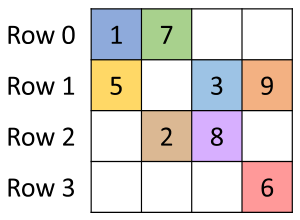

*Figure 17.1 — 단순한 sparse matrix 예. (책 p.402)*

**이 $4\times4$ 행렬이 이 장 전체의 기준 예제다.**

$$A = \begin{bmatrix} 1 & 7 & 0 & 0 \\ 5 & 0 & 3 & 9 \\ 0 & 2 & 8 & 0 \\ 0 & 0 & 0 & 6 \end{bmatrix}$$

> 행렬의 **각 열이 한 변수의 계수**에 대응한다 — 열 0 은 $x_0$, 열 1 은 $x_1$ 등.
> 예컨대 행 0 이 열 0 과 1 에 non-zero 를 갖는다는 것은 **방정식 0 에 변수 $x_0$ 와 $x_1$ 만
> 관여**한다는 뜻이다. …
> 방정식 1 에는 $x_0$, $x_2$, $x_3$ 가, 방정식 2 에는 $x_1$ 과 $x_2$ 가,
> 방정식 3 에는 $x_3$ 만 있다 (책 p.402).

> **non-zero 8개 / 전체 16칸 = 50%** 로 사실 별로 성기지 않다.
> 책도 이 점을 인정한다 — "이 작은 예에서는 0 의 개수가 non-zero 보다 그리 많지 않아
> **저장 오버헤드가 절약한 공간보다 오히려 크다**" (책 p.404).
> **설명용 예제이지 성능을 보여 주는 예제가 아니다.** 실제 수치 감각은 17.4절의
> $1000\times1000$, 1% 예제에서 얻는다.

### 2. 왜 반복법인가 — 역행렬을 쓰지 않는 이유

> 행렬은 $A \times X + Y = 0$ 형태의 $M$ 개 방정식 $N$ 개 변수 연립일차방정식을 푸는 데
> 자주 쓰인다. …
> 직관적인 접근은 행렬을 역행렬로 만들어 $X = A^{-1} \times (-Y)$ 로 푸는 것이다.
> Gaussian elimination 같은 방법으로 적당한 크기의 행렬에는 할 수 있다.
> 이론적으로는 sparse matrix 로 표현된 방정식에도 쓸 수 있지만,
> **많은 sparse matrix 의 엄청난 크기가 이 직관적 접근을 압도**한다 (책 p.402).

> 더욱이 **역행렬은 원본보다 훨씬 큰 경우가 많다** — 역행렬 과정이
> **"fill-in" 이라는 추가 non-zero 를 많이 만들어 내는 경향**이 있기 때문이다.
> 그 결과 실제 문제를 풀 때 역행렬을 계산하고 저장하는 것은 비현실적인 경우가 많다 (책 p.402).

> **"fill-in" 이 sparse matrix 계산의 핵심 어려움**이다.
> 성긴 행렬의 역행렬은 대개 **꽉 찬(dense) 행렬**이다.
> $10^6 \times 10^6$ 성긴 행렬(non-zero $10^7$개)의 역행렬은 $10^{12}$ 칸 = 4 TB 다.
> **저장할 수가 없다.**

그래서 **반복법(iterative)** 을 쓴다.

> sparse matrix $A$ 가 **positive-definite** 이면($\mathbb{R}^n$ 의 모든 non-zero vector $x$ 에
> 대해 $x^T A x > 0$) **Conjugate Gradient** 방법으로 대응하는 연립방정식을 반복적으로 풀 수 있고
> **해로의 수렴이 보장**된다 [1].
> Conjugate Gradient 는 $X$ 의 해를 추측하고 $A \times X + Y$ 를 수행해 결과가 0 vector 에
> 가까운지 본다. 아니면 gradient vector 공식으로 추측한 $X$ 를 다듬고
> $A \times X + Y$ 를 한 번 더 수행한다 (책 p.402).

> 연립방정식의 이 반복적 해법들은 **8장에서 소개한 미분방정식의 반복적 해법과 밀접히 관련**된다
> (책 p.403).

**8장의 stencil sweep 과 같은 구조다** — 수렴할 때까지 같은 연산을 반복한다.
그리고 **행렬은 반복 내내 바뀌지 않는다** — 17.5·17.6절의 전처리 비용 논의가 여기서 나온다.

### 3. SpMV — 이 장의 주인공

> 연립방정식 반복 해법에서 **가장 시간이 많이 걸리는 부분은 $A \times X + Y$ 의 계산**이고,
> 이는 **sparse matrix-vector 곱셈과 누적**이다 (책 p.403).

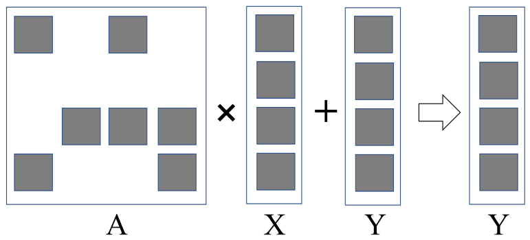

*Figure 17.2 — matrix-vector 곱셈과 누적의 작은 예. (책 p.403)*

> $A$ 의 짙은 사각형이 non-zero 다. 반면 **$X$ 와 $Y$ 는 보통 dense vector** 다 —
> 즉 대부분의 원소가 non-zero 값을 갖는다.
> 중요성 때문에 이 연산을 수행하는 **표준 라이브러리 함수 인터페이스**가
> **SpMV** (Sparse Matrix Vector multiplication and accumulation) 라는 이름으로 만들어져 있다
> (책 p.403).

> **"$A$ 는 sparse, $X$·$Y$ 는 dense"** 라는 비대칭이 이 장의 모든 설계를 지배한다.
> 행렬 접근은 형식이 정하지만, **$x[\texttt{col}]$ 접근은 언제나 무작위**다 —
> `col` 이 데이터에 따라 아무 값이나 되기 때문이다.
> 17.7절이 CSC 의 유일한 장점으로 드는 것이 바로 **입력 vector 접근을 규칙적으로 만드는 것**이다.

### 4. 압축이 주는 세 가지 이득

> 0 원소를 전부 없애면 **① 저장이 절약**될 뿐 아니라 **② 메모리에서 그것들을 가져오고
> 쓸모없는 곱셈·덧셈을 수행할 필요도 사라진다.** 이는 memory bandwidth 와 계산 자원의 소비를
> 크게 줄일 수 있다.
> 더욱이 아주 큰 행렬에서는 **③ 표현에 필요한 메모리 용량이 줄어 행렬 전체를 한 계산 node 의
> 메모리에 담을 수** 있게 된다.
> 그렇지 않으면 out-of-core 방법이나 분산 계산이 필요해지고, 이는 **높은 I/O 나 네트워크
> 통신 latency** 를 겪는다 (책 p.403).

**③이 가장 크다.** 13.7절에서 in-place filter 를 논할 때 나온 것과 같은 논리다 —
**메모리에 들어가느냐 마느냐**는 상수 배가 아니라 **가능/불가능**의 문제다.

### 5. 예제/실습

#### 연습문제

> **(1)** Figure 17.1 의 행렬을 방정식으로 쓰면? ($Y = [y_0, y_1, y_2, y_3]^T$)
> **(2)** $1000\times1000$ 행렬의 1% 가 non-zero 일 때, dense 로 저장하면 몇 MB 인가?
> non-zero 만 저장하면?
> **(3)** 왜 $X$ 와 $Y$ 는 dense 인가?

**(1)** 각 행이 한 방정식이다.

$$\begin{aligned}
1x_0 + 7x_1 &+ y_0 = 0 \\
5x_0 + 3x_2 + 9x_3 &+ y_1 = 0 \\
2x_1 + 8x_2 &+ y_2 = 0 \\
6x_3 &+ y_3 = 0
\end{aligned}$$

**행 3 은 $x_3$ 하나만 포함**하므로 바로 풀린다 — 이것이 "성기게 결합돼 있다"의 뜻이다.

**(2)** dense: $10^6 \times 4\ \text{B} = \mathbf{4\ \text{MB}}$.
non-zero 만: $10^4 \times 4\ \text{B} = \mathbf{40\ \text{KB}}$ (값만).
index 를 포함하면 형식에 따라 80~120 KB 다 — **여전히 $30\sim50\times$ 절약**이다.

**(3)** $A$ 의 성김은 **"각 방정식이 소수의 변수만 포함한다"** 는 뜻이지
**"대부분의 변수가 0 이다"** 라는 뜻이 아니다.
$X$ 는 **모든 변수의 값**이고 그중 0 인 것은 우연일 뿐이다.
$Y$ 도 마찬가지로 각 방정식의 상수항이다.

> 다만 **$X$ 가 성긴 경우도 있고**, 그때는 계산이 **SpMSpV** 가 되어
> 17.7절에서 보듯 **CSC 가 유리해진다.**

---

## 17.2 A simple SpMV kernel with the COO format (책 p.404)

### 1. 형식 — 좌표를 그대로 적는다

> 첫 번째 저장 형식은 **Coordinate (COO)** 형식이다.
> COO 는 non-zero 값을 1차원 `value` 배열에 저장한다.
> **각 non-zero 는 자기 열 index 와 행 index 를 함께** 저장한다.
> `value` 배열과 짝을 이루는 `colIdx` 와 `rowIdx` 배열이 있다 (책 p.404).

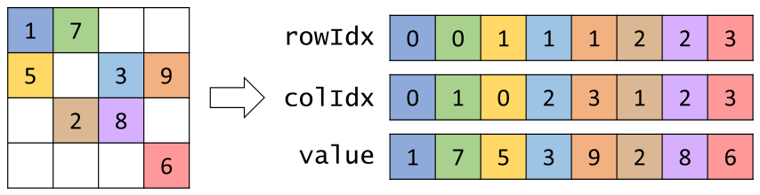

*Figure 17.3 — Coordinate (COO) 형식의 예. (책 p.404)*

| | 0 | 1 | 2 | 3 | 4 | 5 | 6 | 7 |
|---|---|---|---|---|---|---|---|---|
| **`rowIdx`** | 0 | 0 | 1 | 1 | 1 | 2 | 2 | 3 |
| **`colIdx`** | 0 | 1 | 0 | 2 | 3 | 1 | 2 | 3 |
| **`value`** | 1 | 7 | 5 | 3 | 9 | 2 | 8 | 6 |

> 예컨대 `A[0,0]` 은 `value` 배열의 index 0 (`value[0]` 의 1)에 저장되고,
> 열 index (`colIdx[0]` 의 0)와 행 index (`rowIdx[0]` 의 0)가 **다른 배열의 같은 위치**에
> 저장된다 (책 p.404).

#### 저장 오버헤드

> COO 는 저장에서 **0 원소를 완전히 없앤다.** 다만 `colIdx` 와 `rowIdx` 배열을 도입해
> **저장 오버헤드**를 낸다.
> 우리 작은 예에서는 0 의 개수가 non-zero 보다 그리 많지 않아 **오버헤드가 절약한 공간보다 크다.**
> 그러나 원소의 대다수가 0 인 sparse matrix 에서는 도입된 오버헤드가 절약보다 훨씬 작다.
> 예컨대 원소의 **1% 만 non-zero** 인 sparse matrix 에서 COO 표현의 총 저장은
> 오버헤드를 포함해 **0 과 non-zero 를 모두 저장하는 공간의 약 3%** 다 (책 p.404).

**검산하자.** $1000\times1000$, non-zero $z = 10^4$ 개:

$$\text{COO} = 3z = 30{,}000 \quad\text{vs}\quad \text{dense} = 10^6 \quad\Longrightarrow\quad \mathbf{3.0\%} \ ✓$$

우리 $4\times4$ 예제로는 $3 \times 8 = 24 > 16$ 이라 **오히려 손해**다.

#### 정렬은 필수가 아니다

> Figure 17.3 의 COO 예에서 non-zero 는 행 index 로, 그다음 열 index 로 정렬돼 있다.
> COO 표현이 실무에서 정렬돼 있는 편이긴 하지만 **정렬은 요구사항이 아니다.**
> 이 절에서 제시하는 SpMV kernel 은 **non-zero 가 정렬돼 있지 않아도 동작**한다 (책 p.404).

### 2. 병렬화 — non-zero 하나에 thread 하나

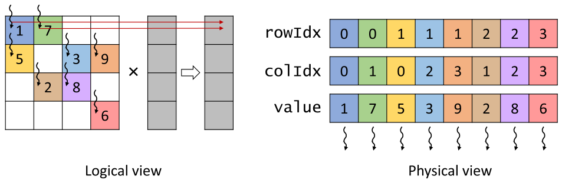

*Figure 17.4 — COO 형식으로 SpMV 를 병렬화하는 예. (책 p.405)*

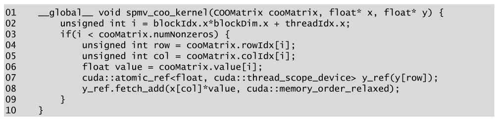

*Figure 17.5 — 병렬 SpMV/COO kernel. (책 p.405)*

```cuda
01  __global__ void spmv_coo_kernel(COOMatrix cooMatrix, float* x, float* y) {
02      unsigned int i = blockIdx.x*blockDim.x + threadIdx.x;
03      if(i < cooMatrix.numNonzeros) {
04          unsigned int row = cooMatrix.rowIdx[i];
05          unsigned int col = cooMatrix.colIdx[i];
06          float value = cooMatrix.value[i];
07          cuda::atomic_ref<float, cuda::thread_scope_device> y_ref(y[row]);
08          y_ref.fetch_add(x[col]*value, cuda::memory_order_relaxed);
09      }
10  }
```

| 줄 | 하는 일 | 짚을 점 |
|---|---|---|
| **02~03** | non-zero 하나를 맡는다 | **행이 아니라 non-zero 단위** |
| **04~06** | 세 배열에서 행·열·값을 읽는다 | **연속 thread 가 연속 index** → coalesced |
| **07~08** | **atomic 누적** | 같은 행의 여러 thread 가 같은 `y[row]` 를 갱신하므로 |

> **atomic 연산이 쓰이는 것은 여러 thread 가 같은 출력 원소를 갱신할 수 있기** 때문이다 —
> Figure 17.4 에서 행 0 에 대응되는 첫 두 thread 가 그 경우다 (책 p.405).

> **9장의 histogram 과 정확히 같은 구도**다. 서로 다른 thread 가 같은 출력 자리에 더한다.
> `memory_order_relaxed` 로 충분한 이유도 같다 — **누적값 하나의 원자성만** 필요하고
> 다른 메모리 접근의 순서를 강제할 필요가 없다.

### 3. 다섯 축 평가

#### ① 공간 효율 — 나중에

> 공간 효율은 다른 형식들을 소개한 뒤로 논의를 미룬다 (책 p.405).

#### ② 유연성 — 최고다

> COO 형식의 원소는 **`rowIdx`·`colIdx`·`value` 를 같은 방식으로 재배열하기만 하면
> 정보를 잃지 않고 임의로 재배열**할 수 있다 (책 p.405).

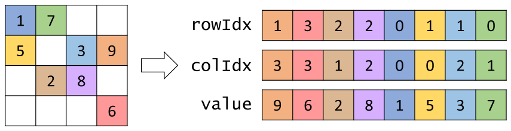

*Figure 17.6 — Coordinate (COO) 형식의 재배열. (책 p.406)*

> COO 형식에서는 **원하는 어떤 순서로도 원소를 처리**할 수 있다.
> `rowIdx[i]` 가 가리키는 올바른 $y$ 원소가 `value[i]` 와 `x[colIdx[i]]` 의 곱에서
> 올바른 기여를 받는다. **`value` 의 모든 원소에 대해 이 연산을 수행하기만 하면
> 처리 순서와 무관하게 올바른 최종 답**을 계산한다 (책 p.406).

**왜 재배열이 유용한가** — 책이 두 가지를 든다 (책 p.406).

| 이유 | 무엇 |
|---|---|
| **초기 구축** | 파일이 특정 순서로 non-zero 를 주지 않을 수 있는데도 **일관된 표현**이 필요하다 → COO 는 **행렬을 처음 만들 때** 인기 있는 선택 |
| **동적 수정** | 순서 보장이 필요 없으므로 **세 배열 끝에 항목을 덧붙이기만** 하면 non-zero 를 추가할 수 있다 → **계산 중 행렬이 바뀔 때** 인기 있는 선택 |

> **12.2절의 unstable filter 와 같은 성질**이다. "순서를 보장하지 않는다"가
> **약점이 아니라 유연성**이 되는 경우다.
> 그리고 이 유연성이 **17.5절의 hybrid 형식을 가능하게** 한다 — 책도 그렇게 예고한다.

#### ③ 접근성 — 절반만

> COO 는 **주어진 non-zero 에 대해 그 행 index 와 열 index 를 접근하기 쉽게** 한다.
> 이 특성이 SpMV/COO 에서 **non-zero 단위 병렬화**를 가능하게 한다.
> 반면 COO 는 **주어진 행이나 열에 대해 그 안의 모든 non-zero 를 접근하기 쉽게 하지 않는다.**
> 그래서 계산이 행·열 방향 순회를 요구한다면 COO 는 좋은 선택이 아니다 (책 p.406).

**접근성을 두 방향으로 나눠 보는 것**이 이 장의 핵심 도구다.

| 방향 | 뜻 |
|---|---|
| **non-zero → (행, 열)** | "이 원소는 어디 있는가" — COO·ELL 이 제공 |
| **행 → non-zero 들** | "이 행에는 무엇이 있는가" — CSR·ELL·JDS 가 제공 |
| **열 → non-zero 들** | "이 열에는 무엇이 있는가" — **CSC 만** 제공 |

#### ④ 메모리 접근 효율 — 좋다

> Figure 17.4 의 physical view 를 보면 접근 패턴이 **연속 thread 가 세 배열 각각의 연속 원소를
> 접근**하는 형태다. 따라서 SpMV/COO 의 행렬 접근은 **coalesced** 다 (책 p.406).

#### ⑤ 부하 균형 — 완벽하다

> 각 thread 가 **non-zero 값 하나**를 담당한다. 따라서 모든 thread 의 일이 같고,
> **경계의 thread 를 빼면 control divergence 가 없다** (책 p.406).

### 4. 유일한 약점 — atomic

> SpMV/COO 의 주된 단점은 **atomic 연산이 필요하다는 것**이다.
> SpMV 에서 atomic 을 쓰는 것은 **두 가지 이유로 문제**다 (책 p.406~407).

| 문제 | 왜 |
|---|---|
| **① 성능** | 앞 장들에서 본 대로 **높은 latency, 낮은 throughput** (9.3절) |
| **② 수치 안정성** | 같은 출력 원소에 atomic 이 적용되는 **순서가 비결정적**이다. **부동소수점**에서는 이것이 **수치 안정성 문제**를 일으킬 수 있다 (부록 A) |

> **②가 미묘하고 중요하다.** 부동소수점 덧셈은 **결합법칙을 만족하지 않는다** —
> $(a+b)+c \ne a+(b+c)$ 인 경우가 있다.
> 10.1절에서 reduction 의 결합법칙을 논할 때 이 문제를 짚었고,
> 여기서는 **실행할 때마다 답이 미세하게 달라진다**는 형태로 나타난다.
> 반복 solver 에서는 그 차이가 **수렴 여부**를 바꿀 수도 있다.

> atomic 연산은 **같은 행의 모든 non-zero 가 같은 thread 에 배정**되어 그 thread 만
> 대응 출력값을 갱신한다면 피할 수 있다.
> 그러나 **COO 형식은 그런 접근성을 주지 않는다.**
> 다음 절에서 그런 접근성을 주는 다른 저장 형식을 본다 (책 p.407).

### 5. 예제/실습

#### 연습문제

> **(1)** Figure 17.1 의 행렬과 $x = [1,2,3,4]$ 로 SpMV/COO 를 손으로 수행하라.
> **(2)** thread 몇 개가 같은 `y[row]` 를 놓고 경쟁하는가?

**(1)** thread 마다 `y[rowIdx[i]] += value[i] * x[colIdx[i]]`:

| $i$ | row | col | value | 기여 |
|---|---|---|---|---|
| 0 | 0 | 0 | 1 | $y_0 \mathrel{+}= 1\times1 = 1$ |
| 1 | 0 | 1 | 7 | $y_0 \mathrel{+}= 7\times2 = 14$ |
| 2 | 1 | 0 | 5 | $y_1 \mathrel{+}= 5\times1 = 5$ |
| 3 | 1 | 2 | 3 | $y_1 \mathrel{+}= 3\times3 = 9$ |
| 4 | 1 | 3 | 9 | $y_1 \mathrel{+}= 9\times4 = 36$ |
| 5 | 2 | 1 | 2 | $y_2 \mathrel{+}= 2\times2 = 4$ |
| 6 | 2 | 2 | 8 | $y_2 \mathrel{+}= 8\times3 = 24$ |
| 7 | 3 | 3 | 6 | $y_3 \mathrel{+}= 6\times4 = 24$ |

$$y = [15,\ 50,\ 28,\ 24]$$

**(2)** 행별 non-zero 수가 $[2, 3, 2, 1]$ 이므로
$y_0$ 에 **2개**, $y_1$ 에 **3개**, $y_2$ 에 **2개**, $y_3$ 에 **1개**가 경쟁한다.
**행이 길수록 경쟁이 심하다** — 9장의 "가장 붐비는 bin 이 병목"과 같은 구도다.

---

## 17.3 Grouping row non-zeros with the CSR format (책 p.407)

### 1. 형식 — 행별로 묶고 경계만 기록한다

> atomic 연산은 **같은 thread 가 한 행의 모든 non-zero 를 담당**하면 피할 수 있는데,
> 그러려면 저장 형식이 **주어진 행의 모든 non-zero 를 접근할 수 있게** 해 줘야 한다.
> 이런 접근성을 **Compressed Sparse Row (CSR)** 형식이 제공한다 (책 p.407).

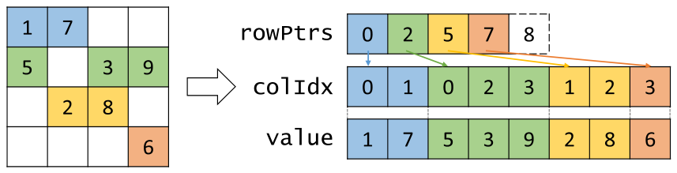

*Figure 17.7 — Compressed Sparse Row (CSR) 형식의 예. (책 p.407)*

| | 0 | 1 | 2 | 3 | 4 | 5 | 6 | 7 |
|---|---|---|---|---|---|---|---|---|
| **`colIdx`** | 0 | 1 | 0 | 2 | 3 | 1 | 2 | 3 |
| **`value`** | 1 | 7 | 5 | 3 | 9 | 2 | 8 | 6 |

$$\texttt{rowPtrs} = [\,0,\ 2,\ 5,\ 7,\ \mathbf{8}\,]$$

> **COO 와 CSR 의 핵심 차이는 CSR 이 `rowIdx` 배열을 `rowPtrs` 배열로 바꾼다**는 것이다.
> `rowPtrs` 는 **각 행의 non-zero 가 `colIdx`·`value` 배열에서 시작하는 offset** 을 저장한다.
> …
> **`rowPtrs[4]` 가 존재하지 않는 "Row 4" 의 시작 위치를 저장**한다는 점에 유의하라.
> 이는 편의를 위한 것으로, 어떤 알고리즘은 **현재 행의 끝을 구분하려고 다음 행의 시작 위치**를
> 쓴다. 이 추가 표식이 Row 3 의 끝 위치를 찾는 편리한 방법을 준다 (책 p.408).

> **`rowPtrs` 는 사실 "행별 non-zero 개수의 exclusive scan"** 이다.
> 행별 개수가 $[2,3,2,1]$ 이고 exclusive scan 이 $[0,2,5,7]$, 총합 8 을 뒤에 붙인 것이
> 정확히 `rowPtrs` 다.
> 그래서 17.3절 끝에서 책이 **"COO → CSR 변환은 histogram 과 prefix sum 으로 하는
> 훌륭한 연습"** 이라고 하는 것이다 (책 p.410) — 9장과 11장이 여기서 만난다.

> non-zero 가 열 index 순으로 정렬돼 있으면 **CSR 의 `value` 배열 배치는
> 0 을 전부 없앤 뒤의 행렬을 row-major 로 편 것**으로 볼 수 있다 (책 p.408).

### 2. 병렬화 — 행 하나에 thread 하나

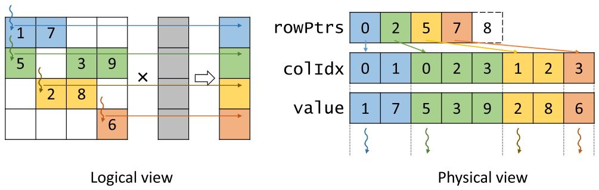

*Figure 17.8 — CSR 형식으로 SpMV 를 병렬화하는 예. (책 p.408)*

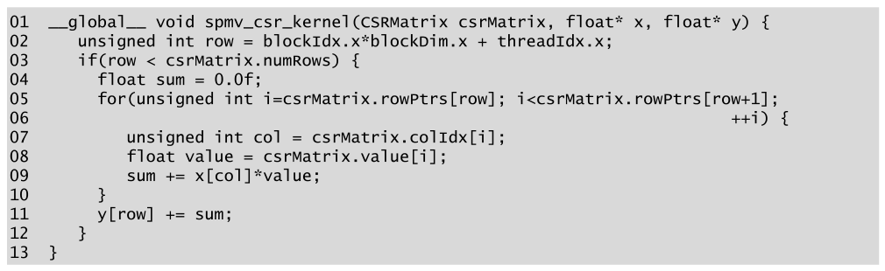

*Figure 17.9 — 병렬 SpMV/CSR kernel. (책 p.408)*

```cuda
01  __global__ void spmv_csr_kernel(CSRMatrix csrMatrix, float* x, float* y) {
02    unsigned int row = blockIdx.x*blockDim.x + threadIdx.x;
03    if(row < csrMatrix.numRows) {
04      float sum = 0.0f;
05      for(unsigned int i = csrMatrix.rowPtrs[row]; i < csrMatrix.rowPtrs[row+1];
06                                                   ++i) {
07        unsigned int col = csrMatrix.colIdx[i];
08        float value = csrMatrix.value[i];
09        sum += x[col]*value;
10      }
11      y[row] += sum;
12    }
13  }
```

| 줄 | 하는 일 | 짚을 점 |
|---|---|---|
| **02~03** | **행 하나**를 맡는다 | COO 와 달리 non-zero 가 아니라 행 |
| **05~06** | `rowPtrs[row]` 부터 `rowPtrs[row+1]` 까지 | **`rowPtrs[4]` 가 필요한 이유** |
| **09** | 지역 변수 `sum` 에 누적 | **register 에 쌓는다** |
| **11** | **atomic 없이** 출력에 더한다 | 각 행을 thread 하나만 순회하므로 |

> `sum` 을 출력 vector 에 누적하는 데 **atomic 이 필요 없다**는 점에 유의하라.
> 각 행을 **thread 하나가 순회**하므로 각 thread 가 **서로 다른 출력값**에 쓴다 (책 p.409).

**COO 의 유일한 약점이 사라졌다.**

### 3. 다섯 축 평가

#### ① 공간 효율 — COO 보다 낫다

> COO 는 `rowIdx`·`colIdx`·`value` **세 배열**이 각각 non-zero 수만큼의 원소를 갖는다.
> CSR 은 `colIdx`·`value` **두 배열**만 non-zero 수만큼이다.
> 세 번째 배열 `rowPtrs` 는 **행 수 + 1** 개만 필요해 COO 의 `rowIdx` 배열보다 훨씬 작다
> (책 p.409).

$$\text{COO} = 3z, \qquad \text{CSR} = 2z + (m+1)$$

$z \gg m$ 인 실제 행렬에서는 **거의 $\frac{2}{3}$** 로 준다.
$1000\times1000$, $z = 10^4$ 이면 $30{,}000 \to 21{,}001$ 이다 (dense 의 2.1% — 책의 "약 2%" ✓).

#### ② 유연성 — COO 보다 나쁘다

> COO 에서는 (메모리를 미리 넉넉히 잡아 뒀다면) **배열 끝에 덧붙이기만** 하면 된다.
> 반면 CSR 에서는 추가할 non-zero 를 **자기가 속한 행에** 넣어야 한다.
> 이는 **뒤 행들의 non-zero 원소를 전부 밀어야** 하고
> **`rowPtrs` 의 뒤 행 offset 도 전부 증가**시켜야 한다는 뜻이다.
> 그래서 CSR 행렬에 non-zero 를 추가하는 것은 COO 보다 **훨씬 비싸다** (책 p.409).

**$O(1)$ 에서 $O(z)$ 로 바뀐다.** 12장의 filter 에서 본 "압축된 표현은 삽입이 비싸다"와 같다.

#### ③ 접근성 — 행 방향을 얻고 non-zero 방향을 잃는다

> CSR 은 **주어진 행의 non-zero 를 접근하기 쉽게** 한다.
> 이 특성이 SpMV/CSR 에서 **행 단위 병렬화**를 가능하게 하고, 그것이 SpMV/COO 대비
> **atomic 을 피할 수 있게** 해 준다 (책 p.409).

> 실제 sparse matrix 응용에서는 보통 **수천~수백만 행**이 있고 각 행에 **수십~수백 개의
> non-zero** 가 있다. 그러면 행 단위 병렬화가 아주 적절해 보인다 —
> thread 도 많고 각 thread 의 일도 상당하다.
> 반면 어떤 응용에서는 sparse matrix 의 **행이 GPU thread 를 다 채울 만큼 많지 않을 수** 있다.
> 그런 응용에서는 **non-zero 가 행보다 많으므로 COO 형식이 더 많은 병렬성을 뽑아낼 수** 있다
> (책 p.409).

> **병렬성의 양이 형식에 따라 달라진다**는 이 관찰이 중요하다.
> COO 는 thread $z$ 개, CSR 은 thread $m$ 개다.
> $z/m$ = 행당 평균 non-zero 수가 곧 **병렬성의 비율**이다.
> "행이 적고 행마다 길다"면 COO, "행이 많고 행마다 짧다"면 CSR 이다.

#### ④ 메모리 접근 효율 — **나쁘다**

> Figure 17.8 의 physical view 를 보면, dot product loop 의 첫 반복에서
> **연속 thread 가 멀리 떨어진 데이터 원소를 접근**한다.
> 특히 thread 0, 1, 2, 3 이 첫 반복에서 각각 **`value[0]`, `value[2]`, `value[5]`, `value[7]`**
> 을 접근한다.
> 그다음 반복에서는 `value[1]`, `value[3]`, `value[6]`, 그리고 (thread 3 은) 데이터 없음이다.
> 그 결과 SpMV/CSR 의 행렬 접근은 **coalesced 가 아니다** (책 p.410).

**thread 별 시작 위치가 곧 `rowPtrs`** 이므로, 간격이 **행 길이만큼** 벌어진다.

| 반복 | thread 0 | thread 1 | thread 2 | thread 3 |
|---|---|---|---|---|
| 0 | `value[0]` | `value[2]` | `value[5]` | `value[7]` |
| 1 | `value[1]` | `value[3]` | `value[6]` | — |
| 2 | — | `value[4]` | — | — |

#### ⑤ 부하 균형 — **나쁘다**

> SpMV/CSR kernel 은 **모든 warp 에서 상당한 control flow divergence** 를 겪을 수 있다.
> dot product loop 의 반복 수가 **thread 에 배정된 행의 non-zero 수**에 달려 있기 때문이다.
> **행 사이 non-zero 분포가 무작위일 수 있으므로 인접한 행의 non-zero 수가 아주 다를 수** 있다
> (책 p.410).

우리 예제의 행 길이는 $[2, 3, 2, 1]$ — **최대 3, 최소 1** 이라 thread 3 은 첫 반복 뒤 논다.

### 4. 정리 — 무엇을 주고받았나

> CSR 이 COO 보다 나은 점은 **공간 효율이 좋고**, **행의 모든 non-zero 에 접근**할 수 있어
> 행 단위 병렬화로 **atomic 을 피할 수 있다**는 것이다.
> 반면 CSR 이 COO 보다 나쁜 점은 **non-zero 추가의 유연성이 떨어지고**,
> **coalescing 에 맞지 않는 접근 패턴**을 보이며, **높은 control divergence** 를 일으킨다는 것이다
> (책 p.410).

| 축 | COO | CSR |
|---|---|---|
| ① 공간 | $3z$ | **$2z + m + 1$** ✓ |
| ② 유연성 | **$O(1)$ 추가** ✓ | $O(z)$ |
| ③ 접근성 | non-zero → (행,열) | **행 → non-zero** ✓ |
| ④ 메모리 | **coalesced** ✓ | uncoalesced |
| ⑤ 부하 | **균등** ✓ | divergent |
| **atomic** | 필요 | **불필요** ✓ |

**정확히 반반이다.** 그래서 17.4절 이후가 필요하다.

> 다음 절들에서는 **CSR 대비 공간 효율을 조금 희생해서 memory coalescing 을 개선하고
> control divergence 를 줄이는** 추가 저장 형식들을 논한다 (책 p.410).

### 5. 예제/실습

#### 연습문제

> **(1)** `rowPtrs` 를 행별 non-zero 개수에서 만드는 과정을 9·11장의 도구로 설명하라.
> **(2)** $m = 10^6$, $z = 10^7$ 일 때 COO 와 CSR 의 저장을 비교하라.

**(1)** 두 단계다.

| 단계 | 도구 | 무엇 |
|---|---|---|
| ① 행별 개수 세기 | **9장의 histogram** | `rowIdx` 를 입력으로, bin = 행 번호 → `counts[m]` |
| ② offset 만들기 | **11장의 exclusive scan** | `counts` 에 exclusive scan → `rowPtrs[0..m-1]`, 총합을 `rowPtrs[m]` 에 |

그다음 각 non-zero 를 `rowPtrs[row]` 위치에 배치하는데,
**행 안의 자리를 정하려면 `atomicAdd` 로 행별 카운터를 돌려** 쓴다 —
**12.2절의 unstable filter 와 같은 수법**이다.
정렬된 CSR 을 원하면 열 index 로 한 번 더 정렬한다 (14장).

> **연습문제 3 이 정확히 이 구현**이다. 아래에서 코드로 푼다.

**(2)** $\text{COO} = 3\times10^7 = 3\times10^7$ 정수,
$\text{CSR} = 2\times10^7 + 10^6 + 1 \approx 2.1\times10^7$ 정수.

**CSR 이 30% 작다.** 4바이트 정수라면 120 MB 대 84 MB 로 **36 MB 차이**다.

---

## 17.4 Improving memory coalescing with the ELL format (책 p.410)

### 1. 형식 — padding 하고 전치한다

> coalesced 되지 않는 메모리 접근 문제는 sparse matrix 데이터에 **padding 과 전치(transposition)**
> 를 적용해 해결할 수 있다.
> 이 아이디어는 **ELL** 저장 형식에 쓰였는데, 이름은 **타원형 경계값 문제를 푸는 패키지
> ELLPACK** 의 sparse matrix 패키지에서 왔다 [2] (책 p.410).

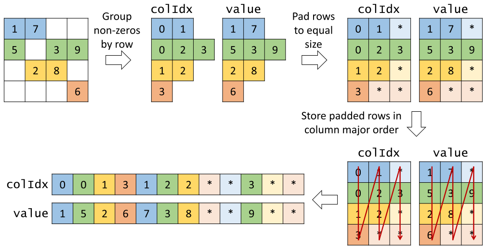

*Figure 17.10 — ELL 저장 형식의 예. (책 p.411)*

**세 단계다.**

> **① CSR 에서 시작**해 non-zero 를 행별로 묶는다.
> **② 가장 non-zero 가 많은 행**을 찾아, 다른 모든 행의 non-zero 뒤에 **padding 원소를 더해
> 최대 행과 길이를 맞춘다.** 이것이 행렬을 **직사각 행렬**로 만든다.
> **③ padding 된 행렬을 column major 로 배치**한다 (책 p.410~411).

우리 예제로 따라가면:

| 단계 | 결과 |
|---|---|
| ① 행별 묶기 | 행 0: (0,1)(1,7) · 행 1: (0,5)(2,3)(3,9) · 행 2: (1,2)(2,8) · 행 3: (3,6) |
| ② padding ($K = 3$) | 행 0 에 1개, 행 2 에 1개, 행 3 에 2개 → **총 4개** |
| ③ column-major | 아래 |

$$\texttt{value} = [\,\underbrace{1,\ 5,\ 2,\ 6}_{\text{열 0}},\ \underbrace{7,\ 3,\ 8,\ *}_{\text{열 1}},\ \underbrace{*,\ 9,\ *,\ *}_{\text{열 2}}\,]$$
$$\texttt{colIdx} = [\,0,\ 0,\ 1,\ 3,\ \ 1,\ 2,\ 2,\ *,\ \ *,\ 3,\ *,\ *\,]$$

> 전치 후 **`value[0]` 부터 `value[3]` 이 1, 5, 2, 6 — 모든 행의 0번째 원소**를 담는다.
> …
> **`rowPtrs` 가 더 이상 필요 없다** — 이제 행 $r$ 의 시작이 그냥 `value[r]` 이기 때문이다.
> padding 원소 덕에 **행 $r$ 의 현재 원소에서 다음 원소로 가는 것도
> 원래 행렬의 행 수를 index 에 더하기만** 하면 된다 (책 p.411).

> **이것이 6.1절의 corner turning 과 정확히 같은 변환**이다.
> "행 방향으로 순회하는데 저장이 행 우선이라 uncoalesced" 인 상황을,
> **저장을 열 우선으로 바꿔** 해결한다.
> 15.1절에서 row-major/column-major 를 논한 것과도 이어진다.

### 2. 병렬화

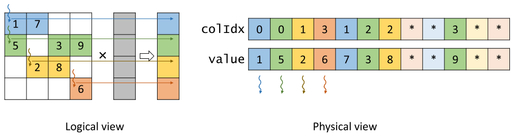

*Figure 17.11 — ELL 형식으로 SpMV 를 병렬화하는 예. (책 p.412)*

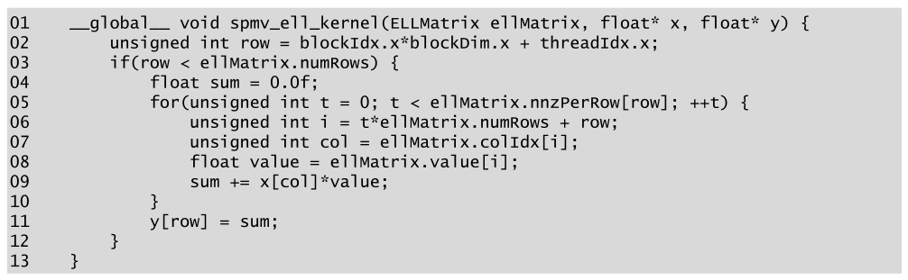

*Figure 17.12 — 병렬 SpMV/ELL kernel. (책 p.412)*

```cuda
01  __global__ void spmv_ell_kernel(ELLMatrix ellMatrix, float* x, float* y) {
02      unsigned int row = blockIdx.x*blockDim.x + threadIdx.x;
03      if(row < ellMatrix.numRows) {
04          float sum = 0.0f;
05          for(unsigned int t = 0; t < ellMatrix.nnzPerRow[row]; ++t) {
06              unsigned int i = t*ellMatrix.numRows + row;
07              unsigned int col = ellMatrix.colIdx[i];
08              float value = ellMatrix.value[i];
09              sum += x[col]*value;
10          }
11          y[row] = sum;
12      }
13  }
```

**06번 줄이 이 형식의 전부다.**

$$i = t \times \texttt{numRows} + \texttt{row}$$

> index $i$ 가 `row` 로 표현되고 `row` 자체가 `threadIdx.x` 로 표현되므로
> **연속 thread 가 연속 배열 index** 를 갖는다. 그래서 이 배열 접근은 **coalesced** 다 (책 p.412).

| 반복 $t$ | thread 0 | thread 1 | thread 2 | thread 3 |
|---|---|---|---|---|
| 0 | `value[0]` | `value[1]` | `value[2]` | `value[3]` |
| 1 | `value[4]` | `value[5]` | `value[6]` | `value[7]` |

**CSR 의 `[0, 2, 5, 7]` 이 `[0, 1, 2, 3]` 이 됐다.**

> **`nnzPerRow` 가 없어도 동작한다** (책 p.411).
> 그냥 padding 원소까지 포함해 전부 순회해도 **padding 값이 0 이라 결과에 영향이 없다.**
> 10·11장의 identity value 논리 그대로다. 다만 그러면 **모든 thread 가 $K$ 번 돌아
> divergence 는 사라지고 work 가 늘어난다** — 맞바꿈이다.

> **원문 오기** (Figure 17.12 11번 줄, 책 p.412).
> ELL kernel 은 **`y[row] = sum;`** 으로 **덮어쓰는데**,
> CSR kernel (Figure 17.9 11번 줄)은 **`y[row] += sum;`** 으로 **누적**한다.
> SpMV 의 정의가 $A \times X + Y$ 이므로 **`+=` 가 맞다.**
> 같은 장의 두 kernel 이 다르게 쓴 것은 명백한 불일치다.
> (Figure 17.5 의 COO 와 Figure 17.18 의 CSC 도 `fetch_add` 로 누적한다.)

> **원문 오기** (책 p.413). 본문이 "the index i of the non-zero element was calculated in
> **Fig. 17.9**" 라고 하는데, 그 식 `i = t*ellMatrix.numRows + row` 는
> **Figure 17.12** (ELL kernel)의 06번 줄이다. Figure 17.9 는 CSR kernel 이다.

### 3. 다섯 축 평가

#### ① 공간 효율 — **CSR 보다 나쁘다**

> ELL 은 **padding 원소의 공간 오버헤드** 때문에 CSR 보다 공간 효율이 나쁘다.
> padding 오버헤드는 **행렬의 non-zero 분포에 크게 의존**한다.
> **한두 행이 유별나게 많은 non-zero** 를 가지면 ELL 은 **과도한 padding** 을 낳는다 (책 p.412).

$$\text{ELL} = 2 \cdot m \cdot K, \qquad K = \max_i(\text{행 } i \text{ 의 non-zero 수})$$

**책의 현실적인 예를 검산하자** (책 p.412~413).
$1000\times1000$, 1% non-zero (행당 평균 10):

| | 정수 개수 | dense 대비 | CSR 대비 |
|---|---|---|---|
| **CSR** | $2\times10^4 + 1001 = 21{,}001$ | **2.1%** | — |
| **ELL, 모든 행이 10** | $2\times1000\times10 = 20{,}000$ | 2.0% | $1.0\times$ |
| **ELL, 한 행이 200** | $2\times1000\times200 = 400{,}000$ | **40%** | **$19\times$** |

책의 "약 2%", "약 40%", "CSR 의 $20\times$" 와 정확히 맞는다 ✓

> **한 행 때문에 전체가 $20\times$ 가 된다.** ELL 의 공간이 **평균이 아니라 최댓값**에 달려 있기
> 때문이다. 통계에서 말하는 **꼬리(tail)에 지배되는 지표**이고,
> 실제 sparse matrix 는 **행 길이 분포가 심하게 치우쳐 있는 경우가 많다**
> (거듭제곱 법칙 — 18장의 graph 에서 다시 만난다).

> 이는 **CSR 에서 ELL 로 변환할 때 padding 원소 수를 제어할 방법**을 부른다.
> 17.5절에서 소개한다 (책 p.413).

#### ② 유연성 — CSR 보다 낫다

> CSR 에서는 행에 non-zero 를 추가하려면 뒤 행의 non-zero 를 전부 밀고 offset 을 증가시켜야 한다.
> 그러나 ELL 에서는 **행이 최대 non-zero 수에 도달하지 않은 한
> padding 원소를 실제 값으로 바꾸기만** 하면 된다.
> 더욱이 메모리를 미리 넉넉히 잡아 뒀다면 **최대 행에도 열을 하나 늘리고 다른 행에 padding 을
> 하나씩 더하는 것으로** 기존 원소를 하나도 옮기지 않고 추가할 수 있다.
> 이 경우 ELL 은 **COO 만큼 유연**하다 (책 p.413).

#### ③ 접근성 — **둘 다 준다**

> ELL 은 **CSR 과 COO 의 접근성을 모두** 준다 (책 p.413).

| 방향 | 어떻게 |
|---|---|
| **행 → non-zero** | Figure 17.12 처럼 $i = t\cdot m + \texttt{row}$ 로 순회 |
| **non-zero → 행** | **$\texttt{row} = i \bmod \texttt{numRows}$** |

> `row` 가 언제나 `numRows` 보다 작으므로 `row % numRows` 는 곧 `row` 자신이다 (책 p.413).

$$i = t \cdot m + r \quad (0 \le r < m) \;\Longrightarrow\; i \bmod m = r,\quad \lfloor i/m \rfloor = t$$

**padding 이 만든 규칙성 덕에 나눗셈 하나로 좌표가 복원된다.**

> 이 접근성이 **행 단위와 non-zero 단위 병렬화를 모두** 가능하게 한다.
> 다만 non-zero 단위 병렬화는 **일부 thread 가 padding 원소에 낭비로 배정**되므로
> COO 대비 단점이다 (책 p.413).

#### ④ 메모리 접근 효율 — **좋다** (이 형식의 존재 이유)

> 원소를 column major 로 배치함으로써 **인접한 모든 thread 가 인접한 메모리 위치를 접근**하게 되어
> memory coalescing 이 가능해지고 memory bandwidth 를 더 효율적으로 쓴다 (책 p.413).

> 일부 GPU 아키텍처, 특히 구세대는 **coalescing 에 더 엄격한 주소 정렬 규칙**을 갖는다.
> **전치 전에 행렬 끝에 행을 몇 개 더해** SpMV/ELL 의 각 반복이 64바이트 같은 아키텍처 지정
> 정렬 단위에 완전히 맞도록 강제할 수 있다 (책 p.413).

> **"행 수를 정렬 단위의 배수로 맞춘다"** 는 이 요령은 15.6절의 padding 과 목적이 다르다 —
> 거기서는 bank conflict, 여기서는 **transaction 정렬**이다.
> 그리고 17.6절에서 JDS 가 이것을 **할 수 없다**는 것이 JDS 의 단점이 된다.

#### ⑤ 부하 균형 — **여전히 나쁘다**

> SpMV/ELL 은 여전히 SpMV/CSR 과 **같은 부하 불균형**을 보인다 —
> 각 thread 가 자기가 맡은 행의 non-zero 수만큼 loop 를 돌기 때문이다.
> 따라서 **ELL 은 control divergence 문제를 해결하지 않는다** (책 p.413~414).

### 4. 정리

> ELL 은 CSR 대비 **non-zero 추가의 유연성, 더 나은 접근성, 그리고 무엇보다
> SpMV/ELL 의 memory coalescing 기회**를 개선한다.
> 그러나 **공간 효율은 CSR 보다 나쁘고, control divergence 는 CSR 만큼 나쁘다** (책 p.414).

### 5. 예제/실습

#### 연습문제

> **(1)** 행 길이가 $[10, 10, 10, 1000]$ 인 $4 \times N$ 행렬의 ELL 저장은?
> **(2)** ELL 에서 $i = 22$, $m = 4$ 일 때 이 non-zero 의 $(t, \text{row})$ 는?

**(1)** $K = 1000$ 이므로 $2 \times 4 \times 1000 = \mathbf{8000}$ 정수.
실제 non-zero 는 $1030$ 개이므로 **padding 이 $4000 - 1030 = 2970$ 개** —
저장의 **74%가 낭비**다. CSR 이면 $2\times1030 + 5 = 2065$ 로 **$3.9\times$ 작다.**

**(2)** $t = \lfloor 22/4 \rfloor = \mathbf{5}$, $\text{row} = 22 \bmod 4 = \mathbf{2}$.
즉 **행 2 의 6번째 non-zero** 다.

---

## 17.5 Regulating padding with the hybrid ELL-COO format (책 p.414)

### 1. 발상 — 긴 행에서 덜어낸다

> ELL 의 낮은 공간 효율과 control divergence 문제는 **한두 행이 유별나게 많은 non-zero 를
> 가질 때 가장 두드러진다.**
> 그런 행에서 원소 몇 개를 **"덜어낼" 수단**이 있다면 ELL 의 padding 을 줄이고
> control divergence 도 줄일 수 있다.
> 그 답이 **COO 형식의 중요한 사용처**에 있다 (책 p.414).

> sparse matrix 를 ELL 로 변환하기 전에, **non-zero 가 유별나게 많은 행에서 일부 원소를 덜어내
> 별도의 COO 저장에 넣는다.** 나머지 원소에는 SpMV/ELL 을 쓴다.
> …그다음 **SpMV/COO 로 마무리**한다.
> 두 형식을 함께 써서 계산을 완성하는 이 접근을 흔히 **hybrid 방법**이라 한다 (책 p.414).

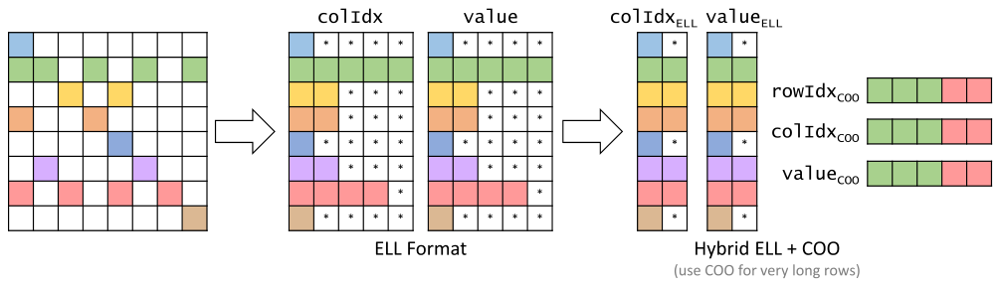

*Figure 17.13 — Hybrid ELL + COO 예. (책 p.415)*

> ELL 만 쓰면 **행 1 과 6 이 가장 많은 non-zero** 를 가져 다른 행에 과도한 padding 을 일으킨다.
> 이를 해결하려고 **행 2 의 마지막 non-zero 3개와 행 6 의 마지막 2개를 ELL 표현에서 빼내
> 별도의 COO 표현으로 옮긴다.**
> 이 원소들을 없앰으로써 **모든 행 중 최대 non-zero 수를 5 에서 2 로** 줄였다.
> **padding 원소 수를 22 에서 3 으로** 줄였고,
> 더 중요하게는 **모든 thread 가 이제 2번의 반복만** 하면 된다 (책 p.414).

| | ELL 만 | hybrid ELL-COO |
|---|---|---|
| 최대 행 길이 $K$ | 5 | **2** |
| padding | 22 | **3** |
| thread 당 반복 | 5 | **2** |
| COO 로 옮긴 원소 | 0 | 5 |

**$K$ 를 5 에서 2 로 줄이니 padding 이 $\frac{1}{7}$ 이 되고 반복도 $\frac{2}{5}$ 가 된다.**

### 2. 전처리 비용은 어떻게 하나

> 독자는 ELL 형식에서 COO 원소를 분리하는 추가 작업이 **너무 큰 오버헤드**를 내지 않을지
> 물을 수 있다. 답은 **경우에 따라 다르다** (책 p.414).

| 상황 | 답 |
|---|---|
| sparse matrix 를 **SpMV 한 번**에만 쓴다 | 추가 작업이 **상당한 오버헤드** |
| **반복 solver** 에서 같은 행렬로 SpMV 를 반복한다 | **여러 반복에 걸쳐 분할상환**된다 |

> 많은 실제 응용에서 SpMV 는 **반복 solver 안에서 같은 sparse matrix 로 반복 수행**된다.
> solver 의 각 반복에서 **$x$ 와 $y$ vector 는 변하지만 sparse matrix 는 그대로**다 —
> 그 원소들이 풀고 있는 연립방정식의 계수이고 이 계수는 반복마다 바뀌지 않기 때문이다.
> 따라서 hybrid ELL 과 COO 표현을 만드는 작업은 **많은 반복에 걸쳐 분할상환**될 수 있다
> (책 p.414~415).

> **17.1절의 Conjugate Gradient 설명이 여기서 회수된다.**
> 반복이 수백~수천 회이므로 **전처리 한 번의 비용은 무시할 만하다.**
> 13.8절의 "binary search 를 분할상환한다"와 같은 논리이고,
> 17.6절의 정렬 비용도 똑같이 정당화된다.

### 3. 다섯 축 평가

| 축 | ELL 대비 | 왜 |
|---|---|---|
| **① 공간** | **좋아진다** | padding 이 준다 |
| **② 유연성** | **좋아진다** | padding 자리가 없으면 **COO 쪽에 덧붙이면** 된다 (ELL 은 열을 늘려야 한다) |
| **③ 접근성** | **나빠진다** | 행이 COO 로 넘쳤으면 **그 행의 모든 non-zero 를 찾으려면 COO 를 뒤져야** 한다 |
| **④ 메모리** | **그대로** | SpMV/ELL 과 SpMV/COO 둘 다 coalesced 이므로 조합도 coalesced |
| **⑤ 부하** | **좋아진다** | 긴 행을 덜어내 ELL 의 divergence 가 줄고, COO 는 원래 divergence 가 없다 |

> ③만 나빠지고 나머지 넷이 좋아진다.
> 그리고 **③은 SpMV 에서 쓰이지 않는 접근성**이다 (SpMV 는 행별 순회를 하지 형별 조회를
> 하지 않는다). **손해가 실질적으로 없는 최적화**인 셈이다.

### 4. 예제/실습

#### 연습문제

> 행 길이가 $[10, 10, 10, 1000]$ 인 행렬에서 행 3 의 990개를 COO 로 옮기면
> **(1)** ELL 부분과 COO 부분의 저장은 각각 얼마인가?
> **(2)** ELL 만 쓸 때와 비교하면?

**(1)** $K$ 가 1000 에서 **10** 으로 준다.

| | 정수 |
|---|---|
| ELL 부분 | $2 \times 4 \times 10 = 80$ |
| COO 부분 | $3 \times 990 = 2970$ |
| **합** | **3050** |

**(2)** ELL 만 쓰면 8000 이었으므로 **$2.6\times$ 절약**이다.
그리고 thread 당 반복이 **1000 에서 10 으로** 줄어 divergence 가 사라진다.

> **COO 부분이 전체의 97%** 라는 점이 눈에 띈다.
> 이 극단적인 예에서는 사실 **CSR 이나 JDS 가 더 낫다** ($2065$ 정수).
> hybrid 는 **"대부분의 행은 고르고 소수만 튄다"** 는 상황을 위한 것이다.

---

## 17.6 Reducing control divergence with the JDS format (책 p.416)

### 1. 발상 — 행을 길이순으로 정렬한다

> 이 절에서는 SpMV 에서 coalesced 접근 패턴을 얻으면서 **padding 을 전혀 하지 않고도**
> control divergence 를 줄이는 또 다른 형식을 본다.
> 아이디어는 **행을 길이에 따라, 이를테면 가장 긴 것부터 가장 짧은 것 순으로 정렬**하는 것이다.
> 정렬된 행렬이 대체로 **삼각행렬처럼 보이기** 때문에 이 형식을
> **Jagged Diagonal Storage (JDS)** 라 부르는 경우가 많다 (책 p.416).

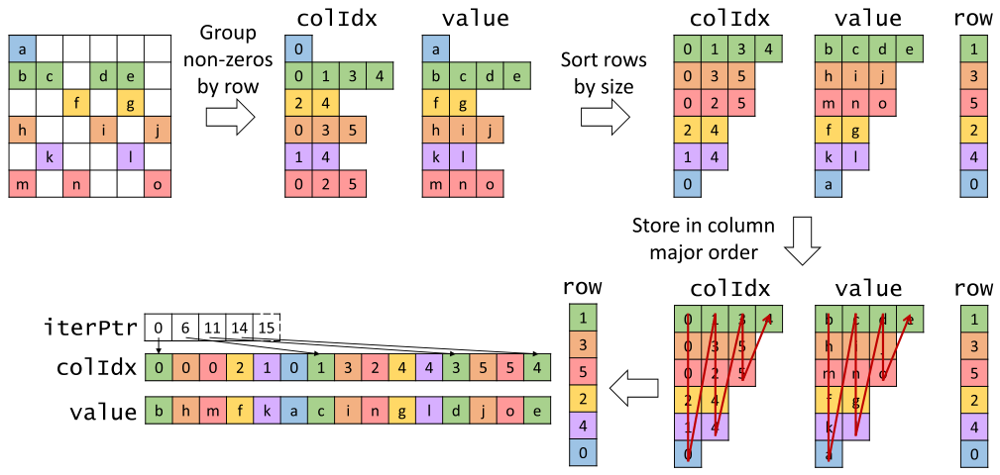

*Figure 17.14 — JDS 저장 형식의 예. (책 p.416)*

> **원문 오기** (책 p.416).
> 절 도입부는 "행을 길이에 따라 **가장 긴 것부터 가장 짧은 것 순으로**(from the longest to the
> shortest) 정렬한다"고 하는데, 바로 다음 문단에서는
> "행을 각 행의 non-zero 수에 따라 **increasing order 로** 정렬한다"고 한다.
> **Figure 17.14 는 긴 행부터(decreasing)** 정렬하고 있으므로 **"increasing order" 가 오기**다.
> (그림의 `row` 배열이 `[1, 3, 5, 2, 4, 0]` 이고 길이가 $[4, 3, 3, 2, 2, 1]$ 로 감소한다.)

#### 네 단계

> **① non-zero 를 행별로 묶는다** (CSR·ELL 처럼).
> **② 각 행의 non-zero 수로 행을 정렬한다.** 정렬하면서 보통 **원래 행 index 를 보존하는
> `row` 배열**을 추가로 유지한다. 정렬 과정에서 두 행을 교환할 때마다 `row` 배열의 대응 원소도
> 교환한다. 이렇게 하면 **모든 행의 원래 위치를 추적**할 수 있다.
> **③ 정렬 후 `value` 와 `colIdx` 를 column major 로 저장**한다.
> **④ 각 반복의 non-zero 시작을 추적하는 `iterPtr` 배열**을 더한다 (책 p.416).

**그림의 $6\times6$ 예제를 코드로 검산했다.**

| 정렬 후 | 행 1 | 행 3 | 행 5 | 행 2 | 행 4 | 행 0 |
|---|---|---|---|---|---|---|
| 길이 | 4 | 3 | 3 | 2 | 2 | 1 |
| 원소 | b c d e | h i j | m n o | f g | k l | a |

$$\texttt{row} = [1,\ 3,\ 5,\ 2,\ 4,\ 0]$$
$$\texttt{iterPtr} = [0,\ 6,\ 11,\ 14,\ 15]$$
$$\texttt{value} = [\underbrace{b, h, m, f, k, a}_{\text{반복 0}},\ \underbrace{c, i, n, g, l}_{\text{반복 1}},\ \underbrace{d, j, o}_{\text{반복 2}},\ \underbrace{e}_{\text{반복 3}}]$$
$$\texttt{colIdx} = [0, 0, 0, 2, 1, 0,\ \ 1, 3, 2, 4, 4,\ \ 3, 5, 5,\ \ 4]$$

**세 배열 모두 그림과 정확히 일치한다** ✓

> **`iterPtr` 이 ELL 의 `numRows` 를 대신한다.**
> ELL 은 padding 덕에 **각 반복의 길이가 $m$ 으로 일정**해서 $i = t\cdot m + r$ 로 충분했다.
> JDS 는 padding 이 없어 **반복마다 길이가 다르므로** 시작점을 따로 적어 둬야 한다.
> $\texttt{iterPtr}[t+1] - \texttt{iterPtr}[t]$ 가 **반복 $t$ 에 참여하는 행의 수**다 —
> 여기서는 $[6, 5, 3, 1]$ 이다.

### 2. 병렬화

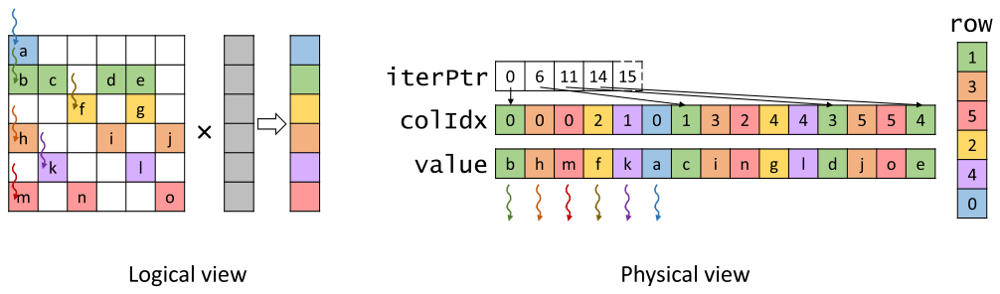

*Figure 17.15 — JDS 형식으로 SpMV 를 병렬화하는 예. (책 p.417)*

> 각 thread 가 행렬의 한 행에 배정되어 그 행의 non-zero 를 순회하며 dot product 를 한다.
> thread 는 **`iterPtr` 배열로 각 반복의 non-zero 가 어디서 시작하는지 식별**한다.
> Figure 17.15 오른쪽의 physical view 에서 분명하듯 thread 들은 JDS 배열의 non-zero 와 열 index 를
> **coalesced 방식으로 접근**한다.
> **SpMV/JDS 의 구현은 연습으로 남긴다** (책 p.417). → **17.9절 연습문제 5**

### 3. 변형 — 구획별 ELL

> JDS 형식의 또 다른 변형에서는 **정렬 후의 행을 구획(section)으로 분할**할 수 있다.
> 행이 정렬돼 있으므로 **한 구획 안의 모든 행은 non-zero 수가 어느 정도 균일**할 것이다.
> 그러면 **각 구획마다 ELL 표현을 생성**할 수 있다.
> 각 구획 안에서는 **그 구획의 최대 행에만 맞춰 padding** 하면 된다.
> 이는 행렬 전체를 하나의 ELL 로 표현하는 것에 비해 **padding 원소 수를 상당히 줄인다.**
> 이 변형에서는 `iterPtr` 이 필요 없고 대신 **구획 offset 배열**이 필요하다 (책 p.417).

> **이것이 실무에서 쓰이는 형식이다** — cuSPARSE 의 **sliced ELL (SELL)** 이고,
> 흔히 **SELL-C-$\sigma$** 라 부른다 ($C$ = 구획 크기, $\sigma$ = 정렬 범위).
> **정렬 + 구획별 padding** 이라는 조합이 ELL 의 coalescing 과 정렬 정합성을 유지하면서
> padding 을 실용적인 수준으로 낮춘다.

### 4. 정렬해도 답이 맞는가

> 독자는 **행을 정렬하면 연립방정식의 해가 틀려지지 않을지** 물어야 한다.
> **연립방정식의 방정식은 자유롭게 재배열해도 해가 바뀌지 않음**을 상기하라.
> **행과 함께 $y$ 원소도 재배열**하면 사실상 방정식을 재배열한 것이다.
> 따라서 올바른 해를 얻는다.
> 유일한 추가 단계는 **`row` 배열로 최종 해를 원래 순서로 되돌리는 것**이다 (책 p.417).

> **17.1절의 "각 행이 한 방정식"이라는 관점이 여기서 값을 한다.**
> 방정식의 순서는 수학적으로 무의미하므로 마음대로 섞어도 된다.
> **12·13·14장에서 그토록 신경 쓴 stability 가 여기서는 필요 없다** —
> 오히려 **순서를 적극적으로 깨는 것이 최적화**다.

정렬 비용도 hybrid 와 같은 논리로 정당화된다.

> SpMV/JDS kernel 이 **반복 solver 안에서 쓰이는 한**, 정렬과 최종 해의 재배열을 수행하고
> 그 비용을 **solver 의 많은 반복에 걸쳐 분할상환**할 수 있다 (책 p.417).

### 5. 다섯 축 평가

| 축 | 평가 | 근거 (책 p.417~418) |
|---|---|---|
| **① 공간** | **ELL 보다 좋다** | **padding 을 피하므로.** 구획별 ELL 변형은 padding 이 있지만 ELL 보다 적다 |
| **② 유연성** | **CSR 보다도 나쁘다** | non-zero 추가가 **행 크기를 바꿔 재정렬이 필요**할 수 있다 |
| **③ 접근성** | **CSR 과 비슷** | 행 → non-zero 는 되지만, **non-zero → (행, 열)** 은 COO·ELL 과 달리 안 된다 |
| **④ 메모리** | **coalesced, 다만 정렬 불가** | 아래 참조 |
| **⑤ 부하** | **가장 좋다** | 아래 참조 |

#### ④ — coalesced 이지만 주소 정렬은 못 맞춘다

> JDS 는 ELL 과 마찬가지로 non-zero 를 **column major 로 저장**하므로 coalesced 접근이 된다.
> 그러나 **JDS 는 padding 을 하지 않으므로 각 반복의 메모리 접근 시작 위치가 임의로 변할 수** 있다.
> 그 결과 **모든 반복이 아키텍처 지정 정렬 경계에서 시작하도록 강제할 단순하고 값싼 방법이 없다.**
> 이 정렬 강제 옵션의 부재가 **JDS 의 메모리 접근을 ELL 보다 덜 효율적으로** 만들 수 있다
> (책 p.418).

**우리 예제의 `iterPtr` = $[0, 6, 11, 14, 15]$ 를 보라** — 6, 11, 14 는 32의 배수가 아니다.
ELL 은 반복 시작이 $t\cdot m$ 으로 언제나 $m$ 의 배수라 $m$ 만 맞춰 두면 됐다.

#### ⑤ — 이 형식의 존재 이유

> JDS 의 가장 독특한 특징은 **행을 정렬해 같은 warp 의 thread 가 비슷한 길이의 행을 순회할
> 가능성이 높다**는 것이다. 따라서 **JDS 는 control divergence 를 줄이는 데 효과적**이다
> (책 p.418).

우리 $6\times6$ 예제로 확인하면:

| | 행 길이 |
|---|---|
| 정렬 전 | $[1, 4, 2, 3, 2, 3]$ — 이웃 차이 최대 **3** |
| **정렬 후** | $[4, 3, 3, 2, 2, 1]$ — 이웃 차이 최대 **1** |

**같은 warp 안의 최대·최소 차이가 divergence 의 양**이므로, 정렬이 그것을 최소화한다.

> **14장의 sort 가 여기서 쓰인다.** Figure P.1 의 의존 그림에서 17장이 14장에 붙어 있는 이유다.
> 정렬 자체를 GPU 에서 하려면 14장의 radix sort 를 쓰면 되고,
> **key = 행 길이, value = 원래 행 index** 다.

### 6. 예제/실습

#### 연습문제

> **(1)** 우리 $4\times4$ 예제를 JDS 로 표현하라.
> **(2)** JDS 의 저장(정수 개수)을 $m$, $z$, $K$ 로 나타내라.

**(1)** 행 길이가 $[2, 3, 2, 1]$ 이므로 긴 행부터: 행 1(3), 행 0(2), 행 2(2), 행 3(1).

$$\texttt{row} = [1,\ 0,\ 2,\ 3], \qquad \texttt{iterPtr} = [0,\ 4,\ 7,\ 8]$$
$$\texttt{value} = [\underbrace{5, 1, 2, 6}_{t=0},\ \underbrace{3, 7, 8}_{t=1},\ \underbrace{9}_{t=2}], \qquad
\texttt{colIdx} = [0, 0, 1, 3,\ \ 2, 1, 2,\ \ 3]$$

**(2)** `value` 와 `colIdx` 가 각 $z$ 개, `row` 가 $m$ 개, `iterPtr` 이 $K+1$ 개다.

$$\text{JDS} = 2z + m + (K+1)$$

**ELL($2mK$)과 달리 $z$ 에 비례**하므로 긴 행이 있어도 폭발하지 않는다.

---

## 17.7 Column-wise accessibility with the CSC format (책 p.418)

### 1. 형식 — CSR 의 행과 열을 뒤집는다

> COO 와 ELL 은 주어진 non-zero 의 행·열 index 를 접근하게 해 주고,
> CSR·ELL·JDS 는 주어진 행의 모든 non-zero 를 접근하게 해 준다.
> SpMV 가 아닌 어떤 계산에서는 **열 방향 순회**, 즉 **주어진 열의 모든 non-zero 접근**에
> 관심이 있을 수 있다. 그런 계산에는 **Compressed Sparse Column (CSC)** 형식이 유용하다
> (책 p.418).

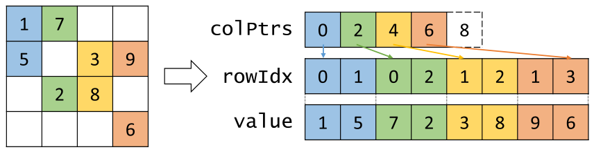

*Figure 17.16 — Compressed Sparse Column (CSC) 형식의 예. (책 p.418)*

> CSC 형식은 **CSR 형식과 매우 닮았지만 행과 열의 취급이 서로 바뀐** 것이다 (책 p.418).

| | 0 | 1 | 2 | 3 | 4 | 5 | 6 | 7 |
|---|---|---|---|---|---|---|---|---|
| **`rowIdx`** | 0 | 1 | 0 | 2 | 1 | 2 | 1 | 3 |
| **`value`** | 1 | 5 | 7 | 2 | 3 | 8 | 9 | 6 |

$$\texttt{colPtrs} = [\,0,\ 2,\ 4,\ 6,\ \mathbf{8}\,]$$

| CSR | CSC |
|---|---|
| `rowPtrs` (행 $\to$ 시작 offset) | **`colPtrs`** (열 $\to$ 시작 offset) |
| `colIdx` (non-zero $\to$ 열) | **`rowIdx`** (non-zero $\to$ 행) |
| 행별로 묶는다 | **열별로 묶는다** |

**완전한 대칭**이다. 실제로 **$A$ 의 CSC 는 $A^T$ 의 CSR 과 같다.**

### 2. 병렬화 — 완전성을 위해

> **CSC 는 SpMV 를 수행하는 데 쓰려고 만든 것이 아니다.**
> 그러나 완전성을 위해, 그리고 다른 형식들과 장단점을 비교하는 흥미로운 연습으로
> CSC 를 쓴 SpMV 구현을 보인다 (책 p.419).

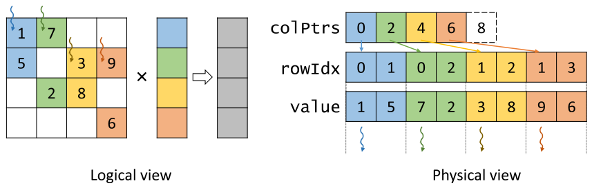

*Figure 17.17 — CSC 형식으로 SpMV 를 병렬화하는 예. (책 p.419)*

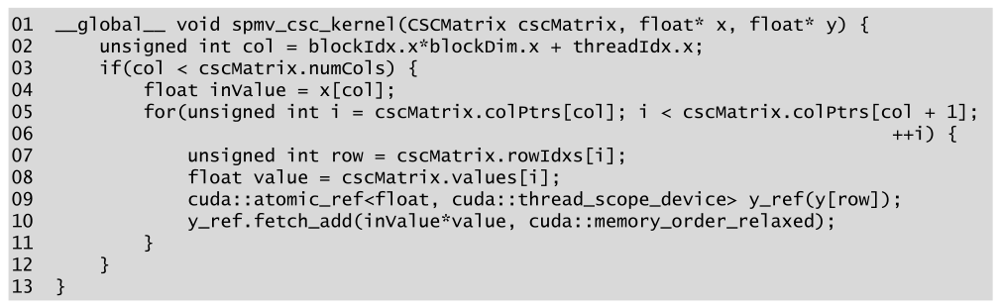

*Figure 17.18 — 병렬 SpMV/CSC kernel. (책 p.419)*

> **원문 오기** (Figure 17.18 캡션, 책 p.419).
> 캡션이 "A parallel **SpMV/CSR** kernel" 인데 코드는 `spmv_csc_kernel` 이고
> 본문도 CSC 를 설명한다. **"SpMV/CSC" 여야 한다.**
> (Figure 17.9 의 캡션과 글자 그대로 같아, 복사 후 고치지 않은 것으로 보인다.)

```cuda
01  __global__ void spmv_csc_kernel(CSCMatrix cscMatrix, float* x, float* y) {
02      unsigned int col = blockIdx.x*blockDim.x + threadIdx.x;
03      if(col < cscMatrix.numCols) {
04          float inValue = x[col];
05          for(unsigned int i = cscMatrix.colPtrs[col]; i < cscMatrix.colPtrs[col + 1];
06                                                       ++i) {
07              unsigned int row = cscMatrix.rowIdxs[i];
08              float value = cscMatrix.values[i];
09              cuda::atomic_ref<float, cuda::thread_scope_device> y_ref(y[row]);
10              y_ref.fetch_add(inValue*value, cuda::memory_order_relaxed);
11          }
12      }
13  }
```

| 줄 | 하는 일 | 짚을 점 |
|---|---|---|
| **02** | **열 하나**를 맡는다 | |
| **04** | `x[col]` 을 **한 번만** 읽는다 | **연속 thread 가 연속 주소** → coalesced! |
| **09~10** | **atomic** 누적 | 서로 다른 열의 thread 가 같은 `y[row]` 를 갱신할 수 있다 |

### 3. 다섯 축 평가 — SpMV 에는 최악의 조합

| 축 | 평가 | 근거 |
|---|---|---|
| **① 공간** | **CSR 과 같다** | $2z + (n+1)$ |
| **② 유연성** | **CSR 만큼 나쁘다** | 열에 추가하면 뒤 열을 전부 밀어야 한다 |
| **③ 접근성** | **열 → non-zero** (유일) | SpMV 에는 쓸모없지만 다른 계산에는 유용 |
| **④ 메모리** | **나쁘다** | 아래 |
| **⑤ 부하** | **나쁘다** | 열 길이가 제각각 → divergence |

#### ④ — CSR 과 같은 방식으로 나쁘다

> thread 0, 1, 2, 3 이 첫 반복에서 각각 `value[0]`, `value[2]`, `value[4]`, `value[6]` 을
> 접근한다. …그 결과 **coalesced 가 아니다.**
> 더욱이 **출력 vector 접근에 atomic 이 필요**하다 (책 p.420).

> CSC 를 SpMV 에 쓰면 **COO 와 CSR 의 최악의 면을 합친 것**처럼 보인다.
> COO 처럼 **출력 vector 접근에 atomic 이 필요**하고,
> CSR 처럼 **입력 행렬 접근이 coalesced 가 아니며 control divergence 를 일으킨다** (책 p.420).

| | atomic | 행렬 coalescing | divergence |
|---|---|---|---|
| COO | **필요** | 좋음 | 없음 |
| CSR | 불필요 | **나쁨** | **있음** |
| **CSC** | **필요** | **나쁨** | **있음** |

**셋 다 나쁘다.**

### 4. 그래도 하나는 좋다 — 입력 vector 접근

> CSC 에는 SpMV 수행 시 **한 가지 유리한 특징**이 있는데, **입력 vector 를 접근하는 방식**이다.
> 다른 모든 형식의 SpMV kernel 이 **입력 vector 를 무작위로 접근**하는 반면,
> SpMV/CSC 는 **coalesced 방식으로 접근**한다 (04번 줄).
> 특히 **인접한 열에 배정된 인접 thread 가 입력 vector 의 인접 값을 적재**한다.
> 더욱이 **입력 vector 의 각 값이 한 번만 적재되어 그 열의 모든 non-zero 에 재사용**된다
> (책 p.421).

> **17.1절에서 짚어 둔 비대칭이 여기서 뒤집힌다.**
> 다른 형식은 행렬 접근을 규칙적으로 만들고 `x[col]` 을 무작위로 남겼는데,
> CSC 는 반대다 — **`x[col]` 이 완벽히 규칙적**이고 행렬이 무작위다.
>
> **그런데도 CSC 가 지는 이유**는 접근량의 차이다.
> 행렬 접근은 $z$ 회, 입력 vector 접근은 CSC 에서 $n$ 회다.
> $z \gg n$ 이므로 **행렬 쪽을 규칙적으로 만드는 것이 훨씬 이득**이다.

> 그럼에도 이 유리한 입력 vector 접근이 **입력 행렬과 출력 vector 의 불리한 접근을 이기지 못하고**,
> control divergence 까지 있어 **CSC 는 SpMV 에 부적합한 형식**이다 (책 p.421).

### 5. 그럼 CSC 는 언제 쓰나

> CSC 는 **열 방향 순회가 가장 자연스러운 계산**에 가장 유용하다 (책 p.421).

| 계산 | 왜 CSC 인가 |
|---|---|
| **vector-matrix 곱** ($v \times A$) | 출력의 각 원소가 **입력 vector 와 대응 열의 dot product** → 열 방향 순회 |
| **SpMSpV** (입력 vector 도 sparse) | **입력 vector 값이 0 인 열의 non-zero 를 통째로 건너뛸 수** 있다 — CSC 는 그것들이 **모여 있으므로** 가능 |

> **SpMSpV 가 CSC 의 진짜 용처다.**
> 입력 vector 의 $n$ 개 중 $k$ 개만 non-zero 라면 **$k/n$ 만큼의 열만 건드리면 된다.**
> CSR 이면 모든 행을 훑으며 각 non-zero 마다 `x[col]` 이 0 인지 확인해야 한다.
> **18장의 BFS 가 정확히 SpMSpV 다** — frontier 가 sparse vector 이고
> 인접 행렬과 곱해 다음 frontier 를 얻는다.

### 6. 예제/실습

#### 연습문제

> **(1)** Figure 17.1 행렬의 CSC 로 $v \times A$ ($v = [1,2,3,4]$)를 계산하라.
> **(2)** 입력 vector 의 10%만 non-zero 인 SpMSpV 에서 CSC 가 아끼는 일의 양은?

**(1)** $v \times A$ 의 $j$ 번째 원소는 $v$ 와 $A$ 의 열 $j$ 의 dot product 다.

| 열 $j$ | non-zero | 계산 | 결과 |
|---|---|---|---|
| 0 | (0,1), (1,5) | $1\cdot1 + 2\cdot5$ | **11** |
| 1 | (0,7), (2,2) | $1\cdot7 + 3\cdot2$ | **13** |
| 2 | (1,3), (2,8) | $2\cdot3 + 3\cdot8$ | **30** |
| 3 | (1,9), (3,6) | $2\cdot9 + 4\cdot6$ | **42** |

$$v \times A = [11,\ 13,\ 30,\ 42]$$

**atomic 이 필요 없다** — 각 thread 가 자기 열의 출력 하나에만 쓴다.
**CSC + vector-matrix 는 CSR + matrix-vector 와 정확히 같은 구조**다.

**(2)** non-zero 열만 처리하므로 **일이 10%** 로 준다 — **$10\times$ 절약**.
CSR 이면 모든 non-zero 를 훑어야 하므로 절약이 없다
(값을 확인하는 비용이 오히려 든다).

---

## 17.8 Summary (책 p.421)

책의 정리를 옮기면 (책 p.421~422):

- sparse matrix 계산을 중요한 병렬 패턴으로 제시했다.
  **sparse matrix 계산은 많은 대규모 실제 응용의 데이터 의존적 성능 거동의 단순한 예**다.
- 0 원소가 많으므로 **저장·메모리 접근·계산을 줄이려고 압축 기법**을 쓴다.
- 이 패턴으로 **hybrid 방법과 정렬/분할을 이용한 규칙화** 개념을 소개했다.
  흥미롭게도 **일부 규칙화 기법은 압축된 표현에 0 원소를 다시 들여온다.**
  너무 많은 0 을 들여오는 병적인 경우를 완화하려고 **hybrid 방법**을 쓴다.
- 병렬 SpMV kernel 의 **실행 효율과 memory bandwidth 효율이 입력 행렬의 분포에 달려 있다.**
  이는 지금까지 공부한 대부분의 kernel 과 꽤 다르다.
- sparse 표현의 이점은 **행렬이 아주 성길 때** 실현된다.
  **dense 행렬은 index 가 암묵적이고 tiling 하기 쉽다**는 이점이 있다.
  반면 sparse 형식은 **명시적 index 를 저장해 접근해야 하고 tiling 을 적용하기 더 어렵다.**
- **cuSPARSE** 라이브러리 [4] 가 여러 형식에 대한 GPU 가속 루틴을 제공한다.

### 여섯 형식을 한 표로

| | COO | CSR | ELL | ELL-COO | JDS | CSC |
|---|---|---|---|---|---|---|
| **저장 (정수)** | $3z$ | $2z{+}m{+}1$ | $2mK$ | 중간 | $2z{+}m{+}K{+}1$ | $2z{+}n{+}1$ |
| **① 공간** | 보통 | **좋음** | 나쁨 ($K$ 에 지배) | 좋음 | **좋음** | 좋음 |
| **② 유연성** | **최고** | 나쁨 | 좋음 | 좋음 | **최악** | 나쁨 |
| **③ 접근성** | nz→(r,c) | r→nz | **둘 다** | 일부 | r→nz | **c→nz** |
| **④ coalescing** | **좋음** | 나쁨 | **좋음** | **좋음** | 좋음(정렬 불가) | 나쁨 |
| **⑤ 부하 균형** | **완벽** | 나쁨 | 나쁨 | 좋음 | **좋음** | 나쁨 |
| **atomic** | 필요 | **불필요** | **불필요** | 일부 필요 | **불필요** | 필요 |
| **전처리** | 없음 | scan | padding | 분리 | **정렬** | — |

**어느 열도 전부 좋지 않다.** 그것이 이 장의 결론이다.

<!--widget:sparse-formats-->

### 왜 SpMV 의 FLOPS 가 낮은가

> 일반적으로 CPU 든 GPU 든 **sparse matrix 계산의 FLOPS 는 dense 계산보다 훨씬 낮다.**
> 사람들은 종종 이 낮은 FLOPS 에 놀란다. 이 장을 읽고 나면 더는 놀라지 않아야 한다 (책 p.422).

**왜인지 세어 보자.** CSR 로 SpMV 를 할 때 non-zero 하나당:

| 항목 | 바이트 |
|---|---|
| `value[i]` (float) | 4 |
| `colIdx[i]` (int) | 4 |
| `x[col]` (float, 무작위) | 4 (cache miss 면 sector 32) |
| **합** | **12~40** |

연산은 **곱셈 1 + 덧셈 1 = 2 FLOP** 이므로

$$\text{arithmetic intensity} = \frac{2}{12} \approx 0.17 \ \text{FLOP/B} \quad(\text{최선}), \qquad \frac{2}{40} = 0.05 \ (\text{최악})$$

**H100 의 임계값 20 FLOP/B 와 비교하면 $100\sim400\times$ 낮다.**
15장의 matmul 이 32 FLOP/B 였던 것과 대비하면 **$200\times$ 차이**다.

> **극단적으로 memory-bound** 이고, 게다가 그 메모리 접근조차 **무작위**($x[\texttt{col}]$)다.
> 3.35 TB/s 의 H100 에서 이론 상한이 $3.35\times10^{12} / 12 \times 2 \approx 0.56$ TFLOPS —
> **FP32 peak 66.9 TFLOPS 의 0.8%** 다.
> **이 장의 최적화는 전부 "그 0.8% 에 얼마나 가까이 가는가"의 싸움**이었다.

---

## 17.9 Exercises (책 p.422)

### 연습문제 1

> 다음 sparse matrix 를 (a) COO, (b) CSR, (c) ELL, (d) JDS 로 표현하라.
>
> $$\begin{bmatrix} 1 & 0 & 7 & 0 \\ 0 & 0 & 8 & 0 \\ 0 & 4 & 3 & 0 \\ 2 & 0 & 0 & 1 \end{bmatrix}$$

행별 non-zero 는 $[2, 1, 2, 2]$, $z = 7$, $K = 2$ 다.

**(a) COO**

| | 0 | 1 | 2 | 3 | 4 | 5 | 6 |
|---|---|---|---|---|---|---|---|
| `rowIdx` | 0 | 0 | 1 | 2 | 2 | 3 | 3 |
| `colIdx` | 0 | 2 | 2 | 1 | 2 | 0 | 3 |
| `value` | 1 | 7 | 8 | 4 | 3 | 2 | 1 |

**(b) CSR**

$$\texttt{rowPtrs} = [0,\ 2,\ 3,\ 5,\ 7]$$
$$\texttt{colIdx} = [0, 2,\ \ 2,\ \ 1, 2,\ \ 0, 3], \qquad \texttt{value} = [1, 7,\ \ 8,\ \ 4, 3,\ \ 2, 1]$$

**(c) ELL** — $K = 2$ 이므로 행 1 에만 padding 하나. column-major 로 편다.

| 행 | padding 후 (열, 값) |
|---|---|
| 0 | (0,1) (2,7) |
| 1 | (2,8) **(\*,\*)** |
| 2 | (1,4) (2,3) |
| 3 | (0,2) (3,1) |

$$\texttt{colIdx} = [\underbrace{0, 2, 1, 0}_{\text{열 0}},\ \underbrace{2, *, 2, 3}_{\text{열 1}}], \qquad
\texttt{value} = [\underbrace{1, 8, 4, 2}_{\text{열 0}},\ \underbrace{7, *, 3, 1}_{\text{열 1}}]$$

**padding 1개 · 저장 $2 \times 4 \times 2 = 16$ 정수.**

**(d) JDS** — 긴 행부터 정렬한다. 길이 $[2,1,2,2]$ → 행 0, 2, 3 (길이 2), 행 1 (길이 1).

$$\texttt{row} = [0,\ 2,\ 3,\ 1], \qquad \texttt{iterPtr} = [0,\ 4,\ 7]$$
$$\texttt{value} = [\underbrace{1, 4, 2, 8}_{t=0},\ \underbrace{7, 3, 1}_{t=1}], \qquad
\texttt{colIdx} = [\underbrace{0, 1, 0, 2}_{t=0},\ \underbrace{2, 2, 3}_{t=1}]$$

> **길이가 같은 행끼리의 순서는 정하기 나름**이다. 여기서는 **안정 정렬**(원래 순서 유지)로
> 0, 2, 3 순을 택했다. 14장에서 배운 stable sort 가 여기서 **재현성**을 준다 —
> 답이 여럿일 수 있으니 규약을 정해 두는 편이 낫다.

### 연습문제 2

> $m$ 행, $n$ 열, non-zero $z$ 개인 정수 sparse matrix 가 있다.
> (a) COO, (b) CSR, (c) ELL, (d) JDS 로 표현하는 데 **정수 몇 개**가 필요한가?
> **정보가 부족하면 무엇이 빠졌는지 밝혀라.**

| 형식 | 정수 개수 | 구성 | 추가로 필요한 정보 |
|---|---|---|---|
| **(a) COO** | $\mathbf{3z}$ | `rowIdx` $z$ + `colIdx` $z$ + `value` $z$ | **없음** |
| **(b) CSR** | $\mathbf{2z + (m+1)}$ | `colIdx` $z$ + `value` $z$ + `rowPtrs` $m{+}1$ | **없음** |
| **(c) ELL** | $\mathbf{2mK}$ | `colIdx` $mK$ + `value` $mK$ | **$K$** = 행별 최대 non-zero 수 |
| **(d) JDS** | $\mathbf{2z + m + (K+1)}$ | `colIdx` $z$ + `value` $z$ + `row` $m$ + `iterPtr` $K{+}1$ | **$K$** |

> **(c)와 (d)에 $K$ 가 필요하다는 것이 이 문제의 핵심**이다.
> $m$, $n$, $z$ 만으로는 **ELL 과 JDS 의 크기를 알 수 없다** —
> 같은 $z$ 라도 non-zero 가 고르게 퍼져 있느냐 한 행에 몰려 있느냐에 따라
> ELL 은 $2z$ 에서 $2mz$ 까지 변한다.
> **바로 이것이 "성능이 데이터 분포에 달려 있다"는 이 장의 주제**다.

연습 1 의 행렬($m{=}n{=}4$, $z{=}7$, $K{=}2$)로 계산하면:

| 형식 | 정수 | dense(16) 대비 |
|---|---|---|
| COO | 21 | 131% |
| CSR | 19 | 119% |
| **ELL** | **16** | **100%** |
| JDS | 21 | 131% |

**작은 조밀한 예에서는 전부 손해**다 — 17.1절이 경고한 그대로다.

> **ELL 이 여기서 최소인 것은 우연이 아니다.** 행 길이가 $[2,1,2,2]$ 로 **거의 균일**해
> padding 이 1개뿐이기 때문이다. **행이 고르면 ELL 이 이긴다.**

### 연습문제 3

> **histogram 과 prefix sum 을 포함한 기본 병렬 컴퓨팅 primitive 를 써서
> COO 를 CSR 로 변환하는 코드를 구현하라.**

**세 kernel** 로 나뉜다. 9장(histogram) · 11장(scan) · 12장(atomic 자리 예약)이 전부 쓰인다.

```cuda
// ── ① 행별 non-zero 개수 세기 (9장 histogram) ────────────────────
__global__ void count_rows_kernel(unsigned int* cooRowIdx, unsigned int* rowCounts,
                                  unsigned int numNonzeros) {
    unsigned int i = blockIdx.x*blockDim.x + threadIdx.x;
    if (i < numNonzeros) {
        cuda::atomic_ref<unsigned int, cuda::thread_scope_device>
            c(rowCounts[cooRowIdx[i]]);
        c.fetch_add(1, cuda::memory_order_relaxed);
    }
}

// ── ② exclusive scan → rowPtrs (11장) ────────────────────────────
//    scanExclusive(rowCounts, rowPtrs, numRows);
//    rowPtrs[numRows] = numNonzeros;   // 마지막 표식 (17.3절)

// ── ③ 자리 예약하며 채우기 (12장의 fetch_add 반환값) ─────────────
__global__ void scatter_kernel(unsigned int* cooRowIdx, unsigned int* cooColIdx,
                               float* cooValue, unsigned int* rowPtrs,
                               unsigned int* rowCursor,      // rowPtrs 의 복사본
                               unsigned int* csrColIdx, float* csrValue,
                               unsigned int numNonzeros) {
    unsigned int i = blockIdx.x*blockDim.x + threadIdx.x;
    if (i < numNonzeros) {
        unsigned int row = cooRowIdx[i];
        cuda::atomic_ref<unsigned int, cuda::thread_scope_device> cur(rowCursor[row]);
        unsigned int dst = cur.fetch_add(1, cuda::memory_order_relaxed);  // 자리 예약
        csrColIdx[dst] = cooColIdx[i];
        csrValue[dst]  = cooValue[i];
    }
}
```

#### 설계에서 짚을 점 넷

**① `rowCounts` 를 0 으로 초기화**해야 한다 (`cudaMemset`).
그리고 ②의 scan 은 `rowCounts` 를 **파괴하지 않도록** 별도 출력에 쓰거나,
③에서 쓸 `rowCursor` 를 `rowPtrs` 에서 복사해 둔다.

**② 이것은 12.2절의 unstable filter 와 같은 구조**다.
`fetch_add` 의 **반환값이 곧 행 안에서의 자리**이고,
그래서 **행 안의 순서가 비결정적**이다 — 즉 **열 index 로 정렬되지 않은 CSR** 이 나온다.

**③ 정렬된 CSR 을 원하면** 한 단계를 더한다.

| 방법 | 어떻게 |
|---|---|
| **(가)** COO 를 먼저 (행, 열) 로 정렬 | **14장의 radix sort** — key 를 `row*n + col` 로 합성 |
| **(나)** CSR 을 만든 뒤 행 안에서 정렬 | 행마다 짧으니 block 안 정렬 (14.9절의 bitonic) |

17.3절이 "non-zero 가 정렬돼 있으면 유리한 접근 패턴이 되지만 필수는 아니다"라고 했으니
**성능이 필요하면 (가)를, 아니면 생략**한다.

**④ atomic 없이 하는 방법도 있다.** ①에서 histogram 을 만들 때
**각 non-zero 의 행 안 순번을 함께 계산**해 두면 된다 —
`rowIdx` 가 정렬돼 있다면 **12.5절의 stable filter 처럼 scan 으로** 순번을 얻을 수 있다.
정렬돼 있지 않다면 atomic 이 가장 단순하다.

> **이 변환 하나에 9·11·12·14장이 전부 들어온다.**
> 책이 "훌륭한 연습"이라 한 이유이고, Part 2 를 끝낸 지금이 풀기 좋은 시점이다.

### 연습문제 4

> **hybrid ELL-COO 형식을 만들고 그것으로 SpMV 를 수행하는 host 코드를 구현하라.**
> **ELL kernel 은 device 에서 실행하고, COO 원소의 기여는 host 에서 계산하라.**

```cpp
// ── 임계값 K 를 정해 긴 행을 COO 로 덜어낸다 ─────────────────────
struct Hybrid { ELLMatrix ell; COOMatrix coo; };

Hybrid buildHybrid(const CSRMatrix& csr, unsigned int K) {
    unsigned int m = csr.numRows;
    Hybrid h;
    h.ell.numRows = m;  h.ell.maxNnzPerRow = K;
    h.ell.colIdx = (unsigned int*)malloc(m*K*sizeof(unsigned int));
    h.ell.value  = (float*)malloc(m*K*sizeof(float));
    h.ell.nnzPerRow = (unsigned int*)malloc(m*sizeof(unsigned int));

    // COO 부분의 최대 크기 = 전체 non-zero (넉넉히 잡는다)
    h.coo.rowIdx = (unsigned int*)malloc(csr.numNonzeros*sizeof(unsigned int));
    h.coo.colIdx = (unsigned int*)malloc(csr.numNonzeros*sizeof(unsigned int));
    h.coo.value  = (float*)malloc(csr.numNonzeros*sizeof(float));
    unsigned int cooCount = 0;

    for (unsigned int row = 0; row < m; ++row) {
        unsigned int start = csr.rowPtrs[row], end = csr.rowPtrs[row + 1];
        unsigned int len = end - start;
        unsigned int keep = (len < K) ? len : K;        // ELL 에 남길 개수
        h.ell.nnzPerRow[row] = keep;
        for (unsigned int t = 0; t < K; ++t) {
            unsigned int i = t*m + row;                  // column-major (17.4절)
            if (t < keep) { h.ell.colIdx[i] = csr.colIdx[start + t];
                            h.ell.value[i]  = csr.value[start + t]; }
            else          { h.ell.colIdx[i] = 0; h.ell.value[i] = 0.0f; }  // padding
        }
        for (unsigned int t = keep; t < len; ++t) {      // 넘치는 것은 COO 로
            h.coo.rowIdx[cooCount] = row;
            h.coo.colIdx[cooCount] = csr.colIdx[start + t];
            h.coo.value[cooCount]  = csr.value[start + t];
            ++cooCount;
        }
    }
    h.coo.numNonzeros = cooCount;
    return h;
}

// ── SpMV: ELL 은 device, COO 는 host ─────────────────────────────
void spmvHybrid(const Hybrid& h, const float* x, float* y, unsigned int m) {
    // ① device 에서 ELL 부분
    spmv_ell_kernel<<<(m + 255)/256, 256>>>(d_ell, d_x, d_y);
    // ② host 에서 COO 부분 — device 와 겹쳐 실행된다
    for (unsigned int i = 0; i < h.coo.numNonzeros; ++i)
        y_host[h.coo.rowIdx[i]] += h.coo.value[i] * x[h.coo.colIdx[i]];
    // ③ 두 결과를 합친다
    cudaMemcpy(y_ell, d_y, m*sizeof(float), cudaMemcpyDeviceToHost);
    for (unsigned int r = 0; r < m; ++r) y[r] = y_ell[r] + y_host[r];
}
```

#### 설계에서 짚을 점 넷

**① 임계값 $K$ 를 어떻게 고르나.** 흔한 선택 두 가지다.

| 규칙 | 뜻 |
|---|---|
| $K = $ 행 길이의 **중앙값** 또는 **평균** | padding 을 절반 이하로 |
| $K$ = 행의 **$\alpha$ 분위수** (예: 90%) | **10% 의 행만 COO 로** 넘긴다 |

Bell·Garland [3] 는 **"행의 $\ge$ 1/3 이 $K$ 개 이상을 갖는 최대 $K$"** 를 권한다.

**② `y[row] = sum` 이 아니라 누적이어야 한다.**
ELL kernel 이 `y[row] = sum` 으로 덮어쓰면 (Figure 17.12 의 오기)
COO 기여를 더할 자리가 없다. 위 코드는 **두 결과를 따로 계산해 마지막에 합쳐** 피했다.

**③ host 와 device 가 겹쳐 실행된다.** kernel launch 는 비동기이므로
①과 ②가 **동시에** 진행되고 ③의 `cudaMemcpy` 에서 만난다.
**COO 부분이 작으니 host 로도 충분**하다는 것이 이 문제의 전제다.

**④ 실무라면 COO 도 device 에서** 돌린다 (Figure 17.5 의 kernel).
그러면 ③의 합치기도 필요 없고 `y` 하나에 둘 다 누적하면 된다 —
**COO kernel 이 atomic 을 쓰므로 ELL 결과 위에 그냥 더해진다.**
다만 그때는 **ELL 이 먼저 끝나야** 하므로 두 kernel 사이에 순서를 줘야 한다
(같은 stream 에 넣으면 자동).

### 연습문제 5

> **JDS 형식으로 저장된 행렬로 병렬 SpMV 를 수행하는 kernel 을 구현하라.**

```cuda
__global__ void spmv_jds_kernel(JDSMatrix jdsMatrix, float* x, float* y) {
    unsigned int t = blockIdx.x*blockDim.x + threadIdx.x;   // 정렬 후의 행 순번
    if (t < jdsMatrix.numRows) {
        float sum = 0.0f;
        // 반복 it 에 이 thread 가 참여하는가?
        //   반복 it 의 길이 = iterPtr[it+1] - iterPtr[it]
        //   행이 길이순으로 정렬돼 있으므로, 앞쪽 thread 일수록 오래 참여한다
        for (unsigned int it = 0; it < jdsMatrix.maxNnzPerRow; ++it) {
            unsigned int start = jdsMatrix.iterPtr[it];
            unsigned int len   = jdsMatrix.iterPtr[it + 1] - start;
            if (t >= len) break;              // 이 반복에 내 행은 없다 → 끝
            unsigned int i = start + t;       // ← coalesced: 연속 t 가 연속 i
            unsigned int col = jdsMatrix.colIdx[i];
            float value = jdsMatrix.value[i];
            sum += x[col]*value;
        }
        // 정렬 전의 원래 행으로 되돌려 쓴다 (17.6절)
        y[jdsMatrix.row[t]] += sum;
    }
}
```

#### 설계에서 짚을 점 다섯

**① `i = iterPtr[it] + t` 가 coalescing 의 전부다.**
연속 `threadIdx.x` 가 연속 `i` 를 가지므로 **완전히 coalesced** 다.
ELL 의 $i = t\cdot m + \texttt{row}$ 와 같은 역할이고, **`iterPtr` 이 $t\cdot m$ 을 대신**한다.

**② `if (t >= len) break;` 가 divergence 를 최소화한다.**
행이 **길이순으로 정렬**돼 있으므로 반복 `it` 에 참여하는 thread 는
**언제나 앞쪽 연속 구간 $[0, \texttt{len})$** 이다.
그래서 warp 하나 안에서는 **전원 참여이거나 전원 이탈**이고,
**경계에 걸친 warp 하나만 divergent** 하다.

> **10.4절의 reduction 에서 본 것과 똑같은 구도**다.
> 거기서도 "활성 thread 가 앞쪽 연속 구간"이라 divergent warp 이 하나뿐이었다.
> **정렬이 그 성질을 만들어 준다** — JDS 의 존재 이유다.

**③ `y[jdsMatrix.row[t]]` 로 되돌려 쓴다.**
`row` 배열이 정렬 전 index 를 담고 있으므로 여기서 원래 자리로 돌아간다.
**이 쓰기는 uncoalesced** 다 (`row` 가 뒤섞여 있으므로) — JDS 의 숨은 비용이다.

> **대안**: `y` 도 정렬된 순서로 쓰고 **마지막에 한 번만 원래 순서로 되돌린다.**
> 반복 solver 라면 **$x$ 와 $y$ 를 처음부터 정렬된 순서로 유지**하고
> solver 가 끝날 때 한 번만 되돌리는 것이 최선이다 (17.6절이 말한 그 방식).

**④ `maxNnzPerRow` 는 `iterPtr` 의 길이 $-1$** 이다. 따로 저장하거나 그렇게 계산한다.

**⑤ `y[...] += sum` 에 atomic 이 필요 없다** — 각 thread 가 서로 다른 원래 행에 쓴다
(`row` 는 순열이므로).

---

## 정리

17장에서 가져갈 것을 넷으로 줄이면:

1. **압축과 규칙화는 서로를 잡아먹는다 — 그리고 정답은 데이터가 정한다.**
   0 을 없앨수록 저장은 줄지만 **불규칙성**이 늘어 coalescing 이 깨지고 divergence 가 생긴다.
   COO 는 규칙적이지만 크고 atomic 이 필요하며, CSR 은 작고 atomic 이 없지만
   **uncoalesced 에 divergent** 하다.
   **어느 형식도 다섯 축을 다 만족하지 않는다.**
   그리고 **같은 kernel 이 입력 행렬에 따라 순위가 뒤집힌다** — 2~16장의 kernel 과
   결정적으로 다른 점이고, 책이 "sparse matrix 가 중요한 패턴인 이유"로 드는 것도 이것이다.
2. **각 형식은 "무엇을 쉽게 접근하게 하는가"로 정의된다.**
   COO 는 **non-zero → (행, 열)**, CSR·JDS 는 **행 → non-zero**, CSC 는 **열 → non-zero**,
   ELL 은 **둘 다** 준다.
   그리고 **접근성이 병렬화 단위를 정하고, 병렬화 단위가 atomic 필요 여부를 정한다** —
   non-zero 단위면 같은 행을 여러 thread 가 건드려 atomic 이 필요하고,
   행 단위면 필요 없다. **CSC 가 SpMV 에 최악인 것도 "열 접근"이 SpMV 에 쓸모없기 때문**이다.
3. **네 가지 규칙화 도구가 있고, 셋은 0 을 다시 들여온다.**
   **padding**(ELL) 은 행 길이를 맞춰 coalescing 을 얻지만 **최댓값에 지배**되어
   한 행 때문에 $20\times$ 가 될 수 있다.
   **hybrid**(ELL-COO) 는 그 긴 행을 덜어내 $K$ 를 낮춘다.
   **정렬**(JDS) 은 **0 을 하나도 안 들이고** divergence 를 없애지만 주소 정렬을 포기한다.
   **구획별 ELL**(sliced ELL) 이 정렬과 padding 을 합친 실무의 답이다.
   그리고 이 전처리들은 **반복 solver 라서 분할상환된다** — 13.8절·14.8절과 같은 논리다.
4. **SpMV 의 arithmetic intensity 는 0.17 FLOP/B 다 — 그것이 모든 것을 설명한다.**
   non-zero 하나당 12바이트를 옮겨 2 FLOP 을 한다.
   H100 의 임계값 20 FLOP/B 와 비교하면 **$100\times$ 이상 낮고**,
   15장의 matmul(32 FLOP/B)과는 **$200\times$** 차이다.
   그래서 **peak 의 1% 도 못 낸다.** 이 장의 모든 최적화는 연산을 줄이는 것이 아니라
   **이미 최소인 메모리 트래픽을 얼마나 효율적으로 옮기는가**의 싸움이었고,
   dense 대비 sparse 의 이점은 **성김이 아주 클 때만** 실현된다.

다음은 18장 — **graph traversal** 이다.
그래프의 인접 행렬이 곧 sparse matrix 이고, **BFS 한 단계가 SpMSpV** 다.
17.7절이 CSC 의 용처로 든 그 계산이 18장의 주인공이 되고,
**frontier** 라는 이름으로 12장의 filter 가 다시 등장한다.
