# 18장. Graph traversal

> **원문 범위**: 책 p.425~451 (18.1~18.10절 + References).
> 부제는 없고 **John Owens · Juan Gómez-Luna 의 특별 기고**가 붙어 있다.
> **절 순서**: 책 순서를 그대로 따랐다. 재배치 없음.
> **연습문제**: 책 18.10절의 3문제를 전부 풀었다. 1번은 그래프를 직접 읽어 CSR 을 만들고
> 네 구현의 thread 수를 반복마다 세었고, 2·3번은 코드를 썼다.
> **원문 오기**: 4건(그림 참조 1, 서술 1, 캡션 오타 1, 괄호 1)과
> **표준 위반 1건**(Figure 18.15 line 29)을 근거와 함께 표시했다.

**이 장은 17장이 끊어 놓은 청구서를 결제한다.**
17장은 sparse matrix 형식 여섯 개를 "무엇을 쉽게 접근하게 하는가"로 정리하고 끝났다.
18장은 **그 접근성이 병렬화 전략을 통째로 정한다**는 것을 하나의 계산으로 보여 준다.

> 그래프 표현의 선택은 **그래프 순회 알고리즘의 선택과 손을 맞잡고 온다**
> (책 p.429).

계산은 하나다 — **breadthfirst search (BFS)**. 구현은 다섯 개다.
그리고 다섯 개가 각자 **다른 형식을 요구한다.**

| 구현 | thread 가 맡는 것 | 필요한 것 | 필요한 형식 |
|---|---|---|---|
| **vertex-centric push** (18.3절) | 정점 하나 | 그 정점의 **나가는 간선** | **CSR** |
| **vertex-centric pull** (18.3절) | 정점 하나 | 그 정점의 **들어오는 간선** | **CSC** |
| direction-optimized (18.3절) | (위 둘을 level 따라 교체) | 둘 다 | **CSR + CSC** |
| **edge-centric** (18.4절) | 간선 하나 | 그 간선의 **양 끝 정점** | **COO** |
| **frontier 기반 push** (18.5~18.7절) | frontier 원소 하나 | 나가는 간선 + **frontier 배열** | **CSR** |

**형식이 구현을 고르는 것이 아니라 구현이 형식을 고른다.** 순서가 이쪽이다.
그리고 어느 구현을 고를지는 **그래프의 모양**(정점 degree 의 분포)이 정한다 —
17장에서 "성능이 데이터에 달렸다"고 한 그 말이 여기서 **알고리즘 선택**까지 올라온다.

### 이 장의 뼈대

| 절 | 무엇을 얻는가 | 어떤 대가를 치르는가 |
|---|---|---|
| 18.1 | 그래프를 sparse matrix 로 본다 | — |
| 18.2 | BFS 의 정의와 응용 | — |
| 18.3 | 정점 단위 병렬 — push / pull | 무관한 정점까지 매 level 검사 |
| 18.4 | 간선 단위 병렬 — 부하가 완전히 균등 | 매 level **모든 간선**을 검사 |
| 18.5 | **frontier** — 작업 복잡도를 이상적인 $O(n+m)$ 으로 | atomic 이 필요해진다 |
| 18.6 | **privatization** — atomic 경쟁을 block 안으로 | shared memory + `__syncthreads` |
| 18.7 | **cooperative groups** — launch 를 한 번으로 | block 수가 occupancy 에 묶인다 |
| 18.8 | degree 별 bucket — 부하 균형 | 전처리(정렬)와 kernel 세 개 |

**12장 filter · 9장 histogram · 6장 checklist 가 이 장에서 그대로 재사용된다.**
frontier 에 원소를 넣는 것은 **unstable filter 의 출력 배열에 넣는 것과 같은 동작**이고,
그래서 12장이 쓴 최적화(coalesced atomic · privatization)가 그대로 통한다.

---

## 18.1 Background

### 그래프는 관계를 담는 자료구조다

> 그래프 자료구조는 **개체(entity) 사이의 관계**를 나타낸다.
> 개체는 **정점(vertex)**, 관계는 **간선(edge)** 으로 표현된다 (책 p.425).

| 응용 | 정점 | 간선 |
|---|---|---|
| 소셜 미디어 | 사용자 | 사용자 사이의 연결 |
| 길찾기 지도 서비스 | 위치 | 위치 사이의 도로 |
| maze routing (18.2절) | 배선 블록 | 블록에서 블록으로 배선을 늘릴 수 있음 |

관계에는 **양방향**(소셜 네트워크의 친구)과 **방향성**(일방통행 도로)이 있다.
**이 장은 방향성 관계만 다룬다** — 양방향은 방향이 서로 반대인 두 간선으로 표현하면 된다.

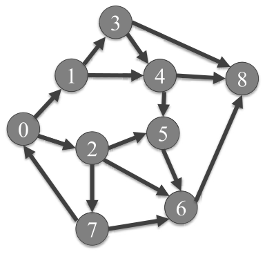

*Figure 18.1 — 정점 9개, 방향 간선 15개의 간단한 그래프 예제. (책 p.426)*

각 정점에는 고유 번호(**vertex id**)를 준다. 정점 0 에서 1 로 가는 간선이 하나,
0 에서 2 로 가는 간선이 하나 있는 식이다.
**이 그래프가 18장 전체를 관통하는 예제**이므로 간선 목록을 여기 못박아 둔다.

| 출발 정점 | 도착 정점 | out-degree |
|---|---|---|
| 0 | 1, 2 | 2 |
| 1 | 3, 4 | 2 |
| 2 | 5, 6, 7 | 3 |
| 3 | 4, 8 | 2 |
| 4 | 5, 8 | 2 |
| 5 | 6 | 1 |
| 6 | 8 | 1 |
| 7 | 0, 6 | 2 |
| 8 | (없음) | 0 |

합계 $2+2+3+2+2+1+1+2+0 = 15$ 개 — 캡션의 "fifteen directional edges" 와 맞는다.

### 인접 행렬 (adjacency matrix)

> 인접 행렬 $A$ 에서, 출발 정점 $i$ 에서 도착 정점 $j$ 로 가는 간선이 있으면
> $A_{i,j} = 1$ 이고, 없으면 0 이다 (책 p.426).

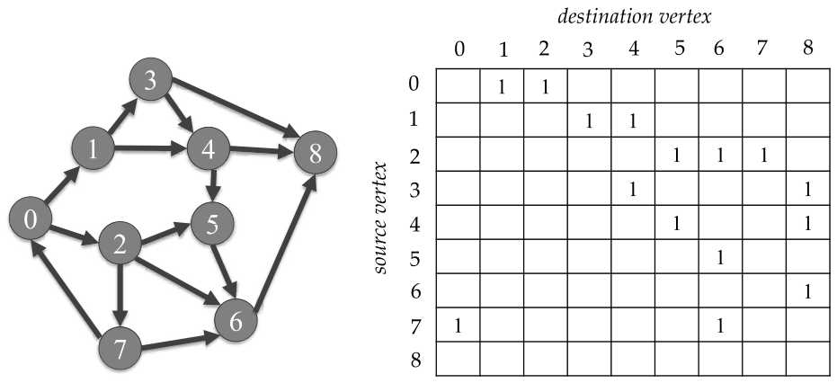

*Figure 18.2 — 간단한 그래프 예제의 인접 행렬 표현. 행 = 출발 정점, 열 = 도착 정점.
**0 은 명확성을 위해 비워 두었다** — 빈 칸은 0 이라는 뜻이다. (책 p.426)*

책이 짚는 두 칸: $A_{1,3}$ 과 $A_{4,5}$ 가 둘 다 1 이다 —
정점 1→3 간선과 정점 4→5 간선이 있기 때문이다.

**행/열의 방향을 헷갈리면 이 장 전체가 뒤집힌다.**

| | 뜻 |
|---|---|
| **행** $i$ | 정점 $i$ 에서 **나가는** 간선들 (out-edges) |
| **열** $j$ | 정점 $j$ 로 **들어오는** 간선들 (in-edges) |

### 왜 sparse 인가 — $N(N-1)$ 대 15

> $N$ 개 정점의 그래프가 **완전 연결**(fully connected)이면 각 정점은 $N-1$ 개의
> 나가는 간선을 가져야 하고, 정점에서 자기 자신으로 가는 간선은 없으므로
> 전체 간선은 $N \cdot (N-1)$ 개다 (책 p.427).

$$N = 9 \;\Rightarrow\; 9 \times 8 = 72 \text{ 개}$$

우리 그래프는 **15개**뿐이고, 정점당 나가는 간선이 **3개 이하**다.
이런 그래프를 **성기게 연결되었다**(sparsely connected)고 한다 —
정점당 평균 나가는 간선 수가 $N-1$ 보다 훨씬 작다는 뜻이다.

> 실제 세계의 그래프 상당수가 성기게 연결돼 있다. 예를 들어 소셜 네트워크에서
> 사용자 한 명의 평균 연결 수는 전체 사용자 수보다 훨씬 작다 (책 p.427).

**그래서 17장이 곧바로 이어진다.** 인접 행렬은 sparse matrix 이고,
17장의 압축 표현을 쓰면 **저장 공간과 0 원소에 낭비하는 연산**을 둘 다 줄인다.

### 세 형식으로 본 같은 그래프 (Figure 18.3)

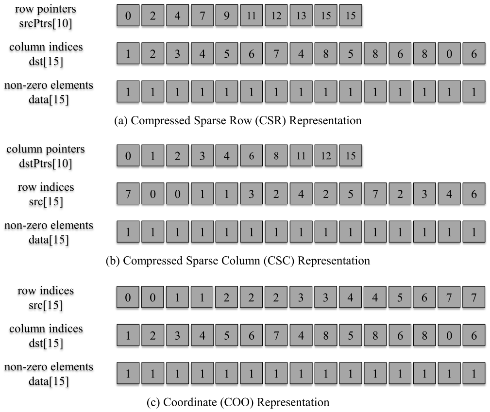

*Figure 18.3 — 인접 행렬의 세 가지 sparse matrix 표현: (a) CSR, (b) CSC, (c) COO. (책 p.428)*

**이름이 바뀐다.** 17장의 이름을 그래프 어휘로 갈아 끼우는 것이 이 그림의 전부다.

| 17장 (sparse matrix) | 18장 (graph) | 무엇을 담는가 |
|---|---|---|
| `rowPtrs` (행 offset) | **`srcPtrs`** | 정점의 **나가는** 간선이 시작하는 위치 |
| `colIdx` (열 index) | **`dst`** | 그 간선의 **도착** 정점 |
| (CSC) 열 offset | **`dstPtrs`** | 정점의 **들어오는** 간선이 시작하는 위치 |
| (CSC) 행 index | **`src`** | 그 간선의 **출발** 정점 |

> 인접 행렬 원소의 **열 index 가 곧 그 간선의 도착 정점**을 주기 때문에
> 열 index 배열을 `dst` 라고 부른다 (책 p.427).

#### (a) CSR — "정점 → 나가는 간선"

$$\texttt{srcPtrs} = [\,0,\;2,\;4,\;7,\;9,\;11,\;12,\;13,\;15,\;15\,]$$
$$\texttt{dst} = [\,1,2,\;\;3,4,\;\;5,6,7,\;\;4,8,\;\;5,8,\;\;6,\;\;8,\;\;0,6\,]$$

책이 직접 짚는 조회 예제를 그대로 따라가 보자.

| 단계 | 값 | 뜻 |
|---|---|---|
| `srcPtrs[3]` | 7 | 원래 행렬 **3행의 non-zero 가 시작**하는 위치 |
| `srcPtrs[4]` | 9 | **4행이 시작**하는 위치 |
| 따라서 3행의 데이터는 | `data[7]`, `data[8]` | 정점 3 을 떠나는 **간선 두 개** |
| 그 열 index 는 | `dst[7]=4`, `dst[8]=8` | 도착 정점이 **4 와 8** |

Figure 18.1 을 보면 정점 3 에서 나가는 간선은 정확히 3→4 와 3→8 이다. 맞는다.

> 마지막 두 칸이 둘 다 15 인 것에 주목한다. **정점 8 은 나가는 간선이 없다** —
> `srcPtrs[8] == srcPtrs[9]` 이므로 18.3절 kernel 의 `for` 루프가
> **한 번도 돌지 않는다.** 빈 이웃 목록이 자연스럽게 처리되는 것이 CSR 의 장점이다.

#### (b) CSC — "정점 → 들어오는 간선"

$$\texttt{dstPtrs} = [\,0,\;1,\;2,\;3,\;4,\;6,\;8,\;11,\;12,\;15\,]$$
$$\texttt{src} = [\,7,\;\;0,\;\;0,\;\;1,\;\;1,3,\;\;2,4,\;\;2,5,7,\;\;2,\;\;3,4,6\,]$$

읽는 법은 같다. `dstPtrs[8]=12`, `dstPtrs[9]=15` 이므로 정점 8 로 **들어오는** 간선은
`src[12..14] = 3, 4, 6` 세 개다 — 3→8, 4→8, 6→8.

#### (c) COO — "간선 → 양 끝 정점"

$$\texttt{src} = [\,0,0,\;1,1,\;2,2,2,\;3,3,\;4,4,\;5,\;6,\;7,7\,]$$
$$\texttt{dst} = [\,1,2,\;3,4,\;5,6,7,\;4,8,\;5,8,\;6,\;8,\;0,6\,]$$

CSR 의 `dst` 와 COO 의 `dst` 가 **완전히 같다.** 당연하다 —
CSR 은 COO 를 행으로 정렬한 뒤 `src` 를 offset 으로 압축한 것이니까 (17.3절).

#### `data` 배열은 여기서 필요 없다

> 이 예제에서 `data` 배열은 **불필요하다.** 모든 원소의 값이 1 이므로 저장할 필요가 없다.
> **암묵적**으로 두면 된다 — non-zero 가 존재하기만 하면 값이 1 이라고 가정한다 (책 p.427).

CSR 이라면 **`dst` 배열에 열 index 가 존재한다는 사실 자체가 간선의 존재를 함의**한다.

> 다만 응용에 따라 인접 행렬이 관계에 대한 **추가 정보**를 담기도 한다 —
> 두 위치 사이의 거리, 두 사용자가 연결된 날짜 같은 것. 그럴 때는 `data` 를 명시적으로
> 저장해야 한다 (책 p.427).

16장의 Floyd-Warshall 이 바로 그 경우였다 — 간선에 가중치가 있으니 `data` 가 필요하다.
**BFS 는 가중치 없는 그래프의 최단 경로**이므로 `data` 가 없어도 된다.

#### 저장량 비교

| 표현 | 칸 수 | 계산 |
|---|---|---|
| 인접 행렬 전체 | **81** | $9^2$ |
| CSR (`data` 생략) | **25** | `dst` 15 + `srcPtrs` 10 |

$$81 \;\to\; 25 \quad (\approx 31\%)$$

> 인접 행렬 원소 중 non-zero 의 비율이 아주 작은 실제 문제에서는
> **절약이 엄청날 수 있다** (책 p.428).

$n$ 개 정점, $m$ 개 간선이면 인접 행렬은 $n^2$, CSR 은 $m + n + 1$ 이다.
소셜 네트워크처럼 $n = 10^9$, 평균 degree 100 이면 $n^2 = 10^{18}$ 대 $\approx 10^{11}$ —
**$10^7\times$** 다.

### degree 분포가 알고리즘을 정한다

> 그래프 구조를 특징짓는 한 가지 방법은 각 정점에 연결된 간선 수
> (**정점 degree**)의 **분포**를 보는 것이다 (책 p.428).

| 그래프 | degree 분포 | 특징 |
|---|---|---|
| **도로망** | 평균이 낮고 **고른** 분포 | 교차로 하나에 도로 몇 개뿐 |
| **소셜 네트워크 팔로워** | 평균이 높고 **아주 넓은** 분포 | degree 가 거대한 정점 = 인기 사용자 |

> 그래프의 구조가 특정 그래프 응용을 구현할 **알고리즘의 선택에 영향을 줄 수 있다**
> (책 p.428).

**이 한 문장이 18.3~18.8절의 모든 판단 근거다.** 뒤에 나오는 모든 비교표의 마지막 열은
결국 "고른 저-degree 그래프인가, 편중된 고-degree 그래프인가"로 갈린다.
미리 정리해 두면:

| 최적화 | 도로망형(저 degree, 저 분산) | 소셜형(고 degree, 고 분산) |
|---|---|---|
| pull 의 조기 `break` (18.3절) | 별 효과 없음 | **큰 효과** |
| push→pull 전환 시점 (18.3절) | **늦게** | **일찍** |
| edge-centric (18.4절) | 불리 | **유리** |
| cooperative groups (18.7절) | **큰 효과** (frontier 가 작아 launch 비용이 지배) | 효과 작음 |
| degree bucketing (18.8절) | 효과 작음 | **큰 효과** |

### 접근성이 이 장의 축이다

> 17장에서 본 것처럼 각 sparse matrix 표현은 **표현된 데이터에 대한 접근성이 다르다.**
> 따라서 그래프에 어떤 표현을 쓸지 고르는 것은 **그래프 순회 알고리즘이 어떤 정보에
> 쉽게 접근할 수 있는지**에 영향을 준다 (책 p.428~429).

| 표현 | 쉽게 주는 것 | 그래서 어떤 병렬화 |
|---|---|---|
| **CSR** | 주어진 정점의 **나가는 간선** | vertex-centric **push** |
| **CSC** | 주어진 정점의 **들어오는 간선** | vertex-centric **pull** |
| **COO** | 주어진 간선의 **출발·도착 정점** | **edge-centric** |

> 그래프 표현의 선택은 **그래프 순회 알고리즘의 선택과 손을 맞잡고 온다**
> (책 p.429).

---

## 18.2 Breadthfirst search

### BFS 가 답하는 것

> BFS 는 그래프의 한 정점에서 다른 정점으로 가려면 **최소 몇 개의 간선을 지나야 하는가**
> 를 알아내는 데 자주 쓰인다 (책 p.429).

Figure 18.1 에서 정점 0 → 정점 5 로 가는 경로를 눈으로 찾으면 셋이다.

| 경로 | 간선 수 |
|---|---|
| $0 \to 1 \to 3 \to 4 \to 5$ | 4 |
| $0 \to 1 \to 4 \to 5$ | 3 |
| $\mathbf{0 \to 2 \to 5}$ | **2** ← 최단 |

BFS 의 결과를 요약하는 방법은 여러 가지인데, 이 장이 쓰는 방법은 하나다.

> **root** 라 부르는 정점 하나를 주고, **root 에서 그 정점까지 가는 데 필요한
> 최소 간선 수**로 각 정점에 label 을 붙인다 (책 p.429).

이 label 을 **level**(또는 depth, hop 수)이라 부른다. root 는 level 0 이다.

### 같은 그래프, 다른 root (Figure 18.4)

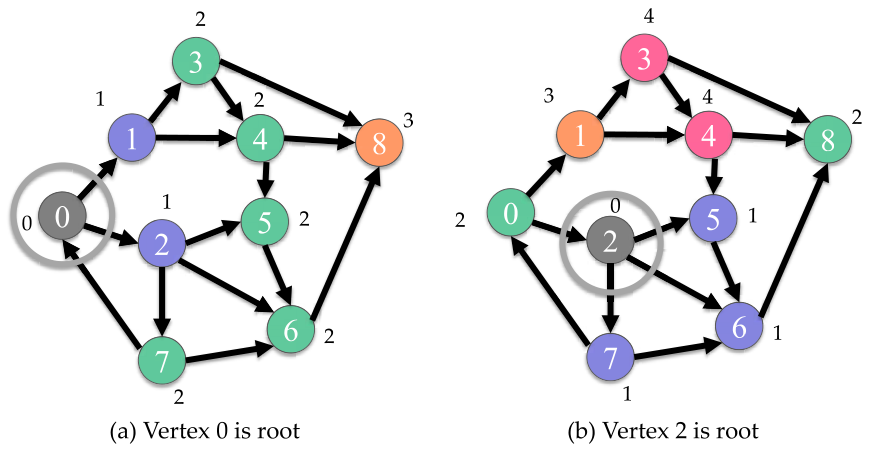

*Figure 18.4 — 서로 다른 두 root 에 대한 BFS 결과 두 예. 각 정점 옆의 label 은
root 로부터의 hop 수("depth")다. (a) 정점 0 이 root, (b) 정점 2 가 root. (책 p.429)*

**(a) root = 0**

| level | 정점 | 어떻게 도달했나 |
|---|---|---|
| 0 | 0 | root |
| 1 | 1, 2 | 간선 하나 |
| 2 | 3, 4, 5, 6, 7 | 3·4 는 1 을 통해, 5·6·7 은 2 를 통해 |
| 3 | 8 | 3, 4, 6 **어느 것을 통해서든** |

**(b) root = 2**

| level | 정점 | 어떻게 도달했나 |
|---|---|---|
| 0 | 2 | root |
| 1 | 5, 6, 7 | |
| 2 | 8, 0 | 8 은 6 을 통해, 0 은 7 을 통해 |
| 3 | 1 | 0 을 통해 |
| 4 | 3, 4 | 둘 다 1 을 통해 |

> **root 를 원래 root 에서 간선 하나 거리의 정점으로 옮겼을 뿐인데
> 결과가 완전히 다르다**는 점이 흥미롭다 (책 p.430).

방향 그래프이기 때문이다. root 0 에서는 3 hop 이면 전부 도달했는데,
root 2 에서는 4 hop 이 걸리고 **정점 1·3·4 가 훨씬 멀어졌다.**
0 → 1 간선은 있지만 그 반대는 없고, 2 에서 1 로 가려면 $2 \to 7 \to 0 \to 1$ 을
돌아가야 하기 때문이다.

### BFS tree 와 경로 역추적

> BFS 의 labeling 동작은 **root 에 뿌리를 둔 BFS tree 를 구성하는 것**으로 볼 수 있다.
> 이 tree 는 label 이 붙은 모든 정점과, **한 level 의 정점에서 다음 level 의 정점으로
> 가는, 탐색 중 실제로 지나간 간선만** 으로 이루어진다 (책 p.430).

level 만 알면 경로는 **거꾸로** 찾을 수 있다.

> 도착 정점에서 시작해 root 로 되짚어 간다. 각 단계에서 **level 이 현재 정점보다
> 정확히 1 작은 선행 정점**을 고른다. 그런 선행 정점이 여럿이면 **아무거나** 골라도 된다.
> 그렇게 고른 정점은 어느 것이든 **타당한 해**를 준다 (책 p.430).

Figure 18.4(b) 에서 정점 2 → 정점 1 의 최단 경로를 찾아 보자. 정점 1 의 level 은 3 이다.

| 현재 정점 | level | level−1 인 선행 정점 | 고른 것 |
|---|---|---|---|
| 1 | 3 | 0 (level 2) | **0** |
| 0 | 2 | 7 (level 1) | **7** |
| 7 | 1 | 2 (level 0) | **2** = root |

역순으로 읽으면 $2 \to 7 \to 0 \to 1$ — 간선 3개, level 과 일치한다.

> **선행 정점이 여럿이라는 것은 똑같이 좋은 해가 여럿이라는 뜻**이다 (책 p.430).

이 역추적에는 **전제가 하나** 붙는다.

> 물론 이것은 각 정점이 **들어오는 모든 간선의 출발 정점 목록**을 갖고 있어서
> 주어진 정점의 선행 정점들을 찾을 수 있다고 가정한 것이다 (책 p.430).

**즉 역추적에는 CSC 가 필요하다.** 18.3절의 pull 구현이 쓰는 바로 그 표현이다.
BFS 자체는 CSR 로 할 수 있어도 **경로를 실제로 뽑으려면 CSC 도 있어야 한다** —
이것도 direction-optimized 구현이 둘 다 저장하는 이유 중 하나가 된다.

### 응용 — maze routing (Figure 18.5)

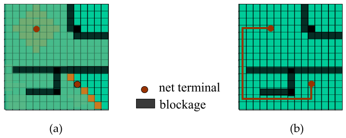

*Figure 18.5 — 집적회로의 maze routing, BFS 의 한 응용:
(a) breadthfirst search, (b) 배선 경로 찾기. (책 p.430)*

집적회로 칩을 설계할 때 연결해야 하는 전자 부품이 많다. 부품의 연결점을
**net terminal** 이라 부른다. Figure 18.5(a) 의 두 개의 둥근 점이 net terminal 이다.

| 요소 | 그래프에서 |
|---|---|
| 배선 블록(wiring block) | **정점** |
| 블록 $i$ 에서 $j$ 로 배선을 늘릴 수 있음 | **간선** $i \to j$ |
| 이미 쓰인 블록(배선·부품) | **blockage 정점** 으로 표시하거나 그래프에서 **제거** |

> 어떤 배선 블록이 배선의 일부로 쓰이면 **다른 배선에 다시 쓸 수 없다.**
> 게다가 그 주변 배선 블록에 **막힘**을 만든다 — 쓰인 블록의 아래 이웃에서 위 이웃으로,
> 왼쪽 이웃에서 오른쪽 이웃으로 배선을 늘릴 수 없다 (책 p.431).

**그래서 미로(maze) 라 부른다** — 먼저 만들어진 부품과 배선이 아직 만들어지지 않은
배선에게 미로를 이룬다.

BFS 로 푸는 방식은 이렇다. root net terminal 에서 시작해 level 을 매긴다.
막힘이 아닌 상하좌우 이웃(최대 4개)이 level 1 이다.

> 독자는 Figure 18.5(a) 에 **level-1 정점 4개, level-2 정점 8개, level-3 정점 12개**
> 가 있음을 확인해야 한다 (책 p.431).

$4, 8, 12, \dots$ — 격자에서 막힘이 없다면 level $k$ 의 정점 수는 $4k$ 다
(맨해튼 거리가 정확히 $k$ 인 격자점의 개수).

> 보다시피 breadthfirst search 는 본질적으로 각 level 마다 정점들의 **wavefront** 를 이룬다.
> 이 wavefront 는 level 1 에서 작게 시작하지만 **몇 level 만에 아주 빠르게 아주 커질 수 있다**
> (책 p.431).

> **16장의 wavefront 와 무엇이 다른가.**
> 16장의 wavefront 는 **anti-diagonal** 이었다 — 모양과 크기를 컴파일 시점에 안다.
> 여기 wavefront 는 **그래프가 정하고 실행 중에야 알 수 있다.**
> 16장은 그래서 정적으로 tile 을 잘라 스케줄을 짤 수 있었고 (hypertile),
> 18장은 그럴 수 없어서 **frontier 를 매 level 실행 중에 만든다**(18.5절).
> 같은 낱말이지만 **정적 wavefront 대 동적 wavefront** 라는 결정적 차이가 있다.

배선을 찾는 것은 앞서 본 역추적이다 (Figure 18.5(b)).

> 선행 정점이 여럿이면 **같은 길이의 경로가 여럿**이라는 뜻이다. 그럴 때
> **아직 만들지 않은 배선들의 제약을 최소화하도록** 선행 정점을 고르는 heuristic 을
> 설계할 수 있다 (책 p.431).

### 왜 level 마다 kernel 을 따로 부르는가

18.3~18.6절의 모든 구현이 공유하는 뼈대다.

> 모든 구현에서 우리는 root 정점을 level 0 으로 label 하는 것으로 시작한다.
> 그 다음 kernel 을 불러 root 의 모든 이웃을 level 1 로 label 한다.
> 그 다음 kernel 을 불러 level 1 정점들의 방문하지 않은 이웃을 모두 level 2 로 label 한다.
> …… **새로 방문되고 label 되는 정점이 없을 때까지** 이 과정이 계속된다 (책 p.432).

```cpp
// host 쪽 뼈대 (18.3~18.6절 공통)
level_h[root] = 0;                                  // root 는 level 0
cudaMemset(level_d, 0xFF, n*sizeof(unsigned int));  // 나머지는 UNVISITED
cudaMemcpy(&level_d[root], &zero, sizeof(unsigned int), cudaMemcpyHostToDevice);

for (unsigned int currLevel = 1; ; ++currLevel) {
    unsigned int newVertexVisited = 0;
    cudaMemcpy(newVertexVisited_d, &newVertexVisited, sizeof(unsigned int),
               cudaMemcpyHostToDevice);
    bfs_kernel<<<gridDim, blockDim>>>(graph_d, level_d,
                                      newVertexVisited_d, currLevel);
    cudaMemcpy(&newVertexVisited, newVertexVisited_d, sizeof(unsigned int),
               cudaMemcpyDeviceToHost);
    if (!newVertexVisited) break;                   // 더 label 된 정점이 없다
}
```

**왜 하나의 kernel 로 다 못 하는가.**

> level 마다 별도의 kernel 을 부르는 이유는, 다음 level 의 정점을 label 하기 전에
> **이전 level 의 정점이 전부 label 되기를 기다려야** 하기 때문이다.
> 그러지 않으면 **정점을 잘못 label 할 위험**이 있다 (책 p.432).

구체적으로 무엇이 깨지는가. 정점 $v$ 가 level 2 에도, level 3 에도 이웃을 갖는다고 하자.
level 2 의 이웃이 아직 label 되기 전에 어떤 thread 가 level 3 을 처리해 버리면
$v$ 는 **level 3 으로 label 된다** — 최단 거리가 아니다.
**BFS 의 정확성은 "level 순서대로"에 전적으로 의존**하고,
kernel 종료가 grid 전체의 barrier 역할을 한다.

> 4장에서 본 대로 CUDA 에는 **grid 전체 barrier 가 기본 제공되지 않는다.**
> 그래서 barrier 를 얻는 가장 쉬운 방법이 **kernel 을 끝내고 다시 부르는 것**이다.
> 18.7절이 이 제약을 cooperative groups 로 정면 돌파한다.
---

## 18.3 Vertex-centric parallelization of BFS

### 두 갈래 — 정점에 thread 를 붙이나, 간선에 붙이나

> 그래프 알고리즘을 병렬화하는 자연스러운 방법은 **서로 다른 정점이나 간선에 대한 연산을
> 병렬로 수행**하는 것이다. 실제로 많은 병렬 그래프 알고리즘 구현이
> **vertex-centric** 또는 **edge-centric** 으로 분류된다 (책 p.431).

| | thread 하나가 맡는 것 | thread 가 하는 일 |
|---|---|---|
| **vertex-centric** | 정점 하나 | 그 정점의 **이웃을 순회**한다 |
| **edge-centric** | 간선 하나 | 그 간선의 **출발·도착 정점을 조회**한다 |

vertex-centric 에서 "이웃"이 무엇인지는 알고리즘이 정한다 —
**나가는 간선**으로 닿는 이웃, **들어오는 간선**으로 닿는 이웃, 또는 둘 다.
18.3절은 이 둘을 각각 하나씩 본다.

### push (top-down) 구현

> 첫 번째 vertex-centric 병렬 구현은 각 thread 를 정점 하나에 배정해
> 그 정점의 **나가는 간선**을 순회하게 한다.
> 각 thread 는 먼저 자기 정점이 **이전 level 에 속하는지** 검사한다.
> 그렇다면 나가는 간선을 순회해 **방문하지 않은 이웃 전부를 현재 level 로 label** 한다
> (책 p.432).

> 이 구현은 흔히 **top-down** 또는 **push** 구현이라 불린다.
> 주어진 출발 정점의 나가는 간선(즉 인접 행렬의 주어진 **행**의 non-zero)에 대한
> 접근성이 필요하므로 **CSR 표현이 필요하다** (책 p.432).

**이름의 유래** — 책의 각주 1 이다.

> BFS tree 를 만드는 관점에서 보면 이 구현은 thread 를 **BFS tree 의 부모 정점**에
> 배정해 **자식을 찾게** 하는 것으로 볼 수 있다. 그래서 top-down 이다
> (tree 의 root 가 위, leaf 가 아래라고 가정한 용어다).
> **push** 는 각 활성 정점이 자기 depth 를 나가는 간선을 통해 모든 이웃에게
> **밀어 넣는** 동작을 가리킨다 (책 p.432 각주 1).

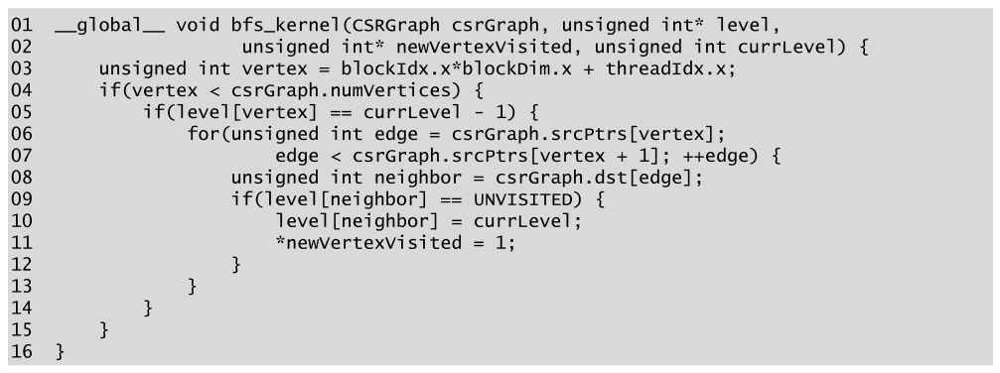

*Figure 18.6 — vertex-centric push (top-down) BFS kernel. (책 p.433)*

```cuda
01 __global__ void bfs_kernel(CSRGraph csrGraph, unsigned int* level,
02                     unsigned int* newVertexVisited, unsigned int currLevel) {
03     unsigned int vertex = blockIdx.x*blockDim.x + threadIdx.x;
04     if(vertex < csrGraph.numVertices) {
05         if(level[vertex] == currLevel - 1) {
06             for(unsigned int edge = csrGraph.srcPtrs[vertex];
07                     edge < csrGraph.srcPtrs[vertex + 1]; ++edge) {
08                 unsigned int neighbor = csrGraph.dst[edge];
09                 if(level[neighbor] == UNVISITED) {
10                     level[neighbor] = currLevel;
11                     *newVertexVisited = 1;
12                 }
13             }
14         }
15     }
16 }
```

| 줄 | 하는 일 | 짚을 점 |
|---|---|---|
| 03 | thread 하나를 정점 하나에 배정 | **정점 수만큼** thread 를 띄운다 |
| 04 | 범위 검사 | 늘 하던 것 |
| 05 | 내 정점이 **이전 level** 인가 | 통과하는 thread 만 일한다 |
| 06~07 | `srcPtrs` 로 나가는 간선 구간을 찾아 순회 | **CSR 이 필요한 이유** |
| 08 | `dst` 로 도착 이웃을 얻는다 | |
| 09 | 이웃이 **미방문**인가 | `UNVISITED` 는 특수값 |
| 10 | 이웃을 **현재 level 로 label** | ← **race ①** |
| 11 | 전역 flag 를 세운다 | ← **race ②** |

**`UNVISITED` 를 어떻게 정하나.**

> 이 검사가 가능하려면 모든 정점의 level 을 처음에 **`UNVISITED` 라는 특수값**으로
> 설정해 둔다. 예를 들어 `UNVISITED` 를 가장 큰 unsigned 정수
> `cuda::std::numeric_limits<unsigned>` 로 둘 수 있다 (책 p.433).

```cuda
constexpr unsigned int UNVISITED = cuda::std::numeric_limits<unsigned int>::max();
```

> **왜 최댓값인가.** ① `level` 이 `unsigned int` 이므로 **어떤 실제 level 과도
> 겹치지 않는** 값이어야 한다. ② `0xFFFFFFFF` 이므로 `cudaMemset(p, 0xFF, ...)`
> 한 번으로 초기화된다. ③ **`currLevel - 1` 과 절대 같아질 수 없다** —
> `currLevel` 이 1 이면 `currLevel-1 == 0` 이고, 이는 unsigned 언더플로가 아니다.
> 다만 `currLevel = 0` 으로 kernel 을 부르면 `currLevel-1` 이 언더플로해
> `UNVISITED` 와 같아진다. **host 는 반드시 `currLevel = 1` 부터 시작해야 한다.**

`newVertexVisited` flag 의 용도는 앞의 host 뼈대에서 본 그대로다.

> 이 flag 는 **새 level 을 처리할 새 grid 를 띄워야 하는지, 아니면 끝에 도달했는지**
> 를 host 코드가 판단하는 데 쓰인다 (책 p.433).

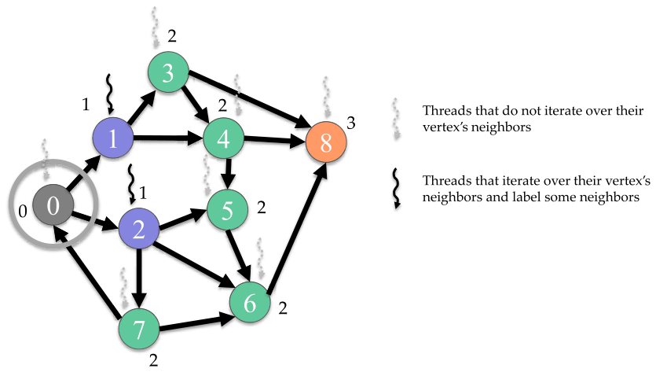

*Figure 18.7 — level 1 에서 level 2 로 가는 vertex-centric push BFS traversal 예제.
흐린 표시 = 이웃을 순회하지 않는 thread, 진한 표시 = 이웃을 순회하며 일부 이웃을 label 하는 thread.
(책 p.433)*

`currLevel = 2` 로 부른 상황이다. 이전 level 은 1 이므로 **정점 1 과 2 만** 05줄을 통과한다.

| 정점 | level | 05줄 통과? | 하는 일 |
|---|---|---|---|
| 0 | 0 | ✗ | 아무것도 안 함 |
| **1** | **1** | **✓** | 3, 4 를 level 2 로 label |
| **2** | **1** | **✓** | 5, 6, 7 을 level 2 로 label |
| 3~8 | UNVISITED | ✗ | 아무것도 안 함 |

**9개 thread 중 2개만 일한다.** 나머지 7개는 05줄을 검사하고 곧바로 끝난다 —
18.5절이 없애려는 것이 정확히 이 낭비다.

#### 두 개의 race — 그리고 왜 그냥 두는가

> 여러 thread 가 같은 정점을 현재 level 로 label 할 수 있고,
> 여러 thread 가 flag 에 1 을 대입할 수 있다. 이 두 상황은 **엄밀히 말해
> race condition** 이다 — 여러 thread 가 순서 없이 같은 메모리 위치에 접근하고
> 그중 적어도 하나가 쓰기다 (책 p.433~434).

Figure 18.7 에서 실제로 벌어진다: 정점 4 는 **1 을 통해서만** 도달하지만,
정점 6 은 다음 level 에서 3·4 양쪽에서 동시에 label 될 수 있다.

> 14장에서 논의한 대로, 이런 race condition 은 연산이 **멱등(idempotent)** 이므로
> — 몇 번 적용하든 같은 효과를 내므로 — **실무에서 양성(benign)** 이다.
> 그러나 이 코드가 실무에서 동작하더라도 **C++ 메모리 모델을 위반**하며
> **동작이 보장되지 않는다.** 보수적인 프로그래머라면 이 두 연산에
> **atomic operation 을 써야** 한다 (책 p.434).

> **14장에서 이미 똑같은 판단을 했다.** odd-even sort 의 `hasChanged` flag 가
> 그것이다 (책 p.333). 그때 정리한 문장을 그대로 옮기면:
> **결과가 같아도 race 는 race** 다 — 멱등이어도 표준상 미정의 동작이다.
> 18.5절에서 이 판단이 **뒤집힌다.** frontier 를 도입하면 label 하는 동작이
> **더 이상 멱등이 아니게** 되기 때문이다.

### pull (bottom-up) 구현

> 두 번째 vertex-centric 병렬 구현은 각 thread 를 정점 하나에 배정해
> 그 정점의 **들어오는 간선**을 순회하게 한다.
> 각 thread 는 먼저 자기 정점이 **아직 방문되지 않았는지** 검사한다.
> 아니라면(즉 미방문이면), 들어오는 간선을 순회해 **이웃 중 이전 level 에 속하는 것이
> 있는지** 찾는다. 찾으면 자기 정점을 현재 level 로 label 한다 (책 p.434).

> 주어진 도착 정점의 들어오는 간선(즉 인접 행렬의 주어진 **열**의 non-zero)에 대한
> 접근성이 필요하므로 **CSC 표현이 필요하다** (책 p.434).

**이름의 유래** — 각주 2 다.

> BFS tree 를 만드는 관점에서 보면 이 구현은 thread 를 **BFS tree 의 잠재적 자식 정점**에
> 배정해 **부모를 찾게** 하는 것이다. 그래서 bottom-up 이다.
> **pull** 은 각 정점이 자기 선행 정점들에게 손을 뻗어 활성 상태를 **끌어오는** 동작을
> 가리킨다 (책 p.434 각주 2).

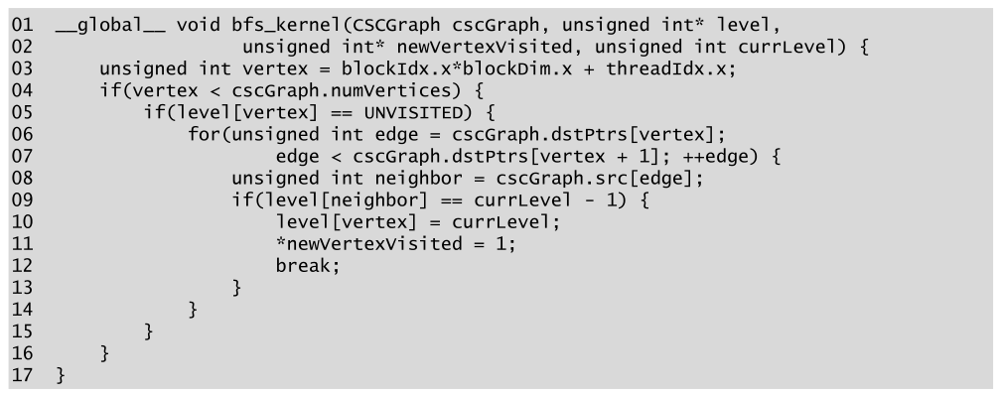

*Figure 18.8 — vertex-centric pull (bottom-up) BFS kernel. (책 p.434)*

```cuda
01 __global__ void bfs_kernel(CSCGraph cscGraph, unsigned int* level,
02                     unsigned int* newVertexVisited, unsigned int currLevel) {
03     unsigned int vertex = blockIdx.x*blockDim.x + threadIdx.x;
04     if(vertex < cscGraph.numVertices) {
05         if(level[vertex] == UNVISITED) {
06             for(unsigned int edge = cscGraph.dstPtrs[vertex];
07                     edge < cscGraph.dstPtrs[vertex + 1]; ++edge) {
08                 unsigned int neighbor = cscGraph.src[edge];
09                 if(level[neighbor] == currLevel - 1) {
10                     level[vertex] = currLevel;
11                     *newVertexVisited = 1;
12                     break;
13                 }
14             }
15         }
16     }
17 }
```

**push 와 나란히 놓으면 세 줄이 다르다.**

| 줄 | push (Fig 18.6) | pull (Fig 18.8) |
|---|---|---|
| 05 | `level[vertex] == currLevel - 1` | `level[vertex] == UNVISITED` |
| 06~08 | `srcPtrs` / `dst` (**CSR**) | `dstPtrs` / `src` (**CSC**) |
| 09 | `level[neighbor] == UNVISITED` | `level[neighbor] == currLevel - 1` |
| 10 | `level[neighbor] = currLevel` — **이웃**에 쓴다 | `level[vertex] = currLevel` — **자기 자신**에 쓴다 |
| 12 | (없음) | **`break;`** |

**05줄과 09줄의 조건이 서로 자리를 바꿨다.** push 는 "나는 이전 level 인가 →
이웃이 미방문인가", pull 은 "나는 미방문인가 → 이웃이 이전 level 인가"다.
그리고 **쓰는 대상이 이웃에서 자기 자신으로 바뀐다** —
이것이 pull 의 가장 중요한 성질이다.

> **10줄이 `level[vertex]` 라는 것의 무게.** 각 thread 는 **자기 정점에만** 쓴다.
> 서로 다른 thread 가 서로 다른 정점을 맡으므로 **10줄에는 race 가 없다.**
> push 의 race ① 이 pull 에서는 구조적으로 사라진다.
> (11줄의 flag race ② 는 그대로 남는다.)

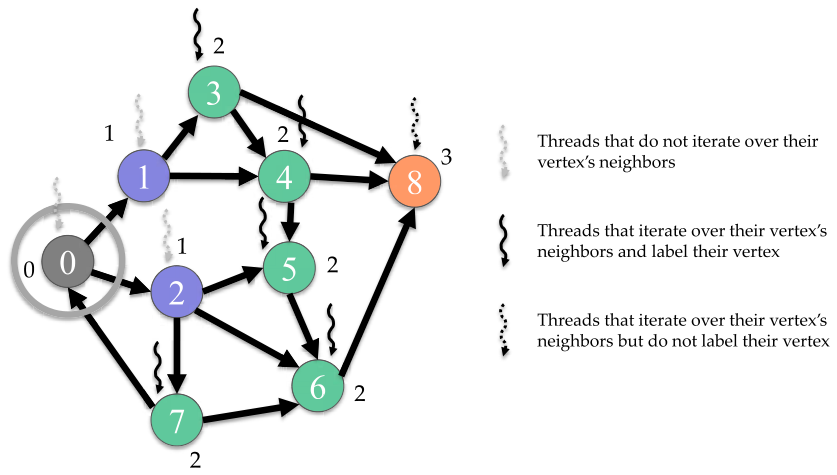

*Figure 18.9 — level 1 에서 level 2 로 가는 vertex-centric pull (bottom-up) traversal 예제.
흐린 표시 = 이웃을 순회하지 않는 thread, 진한 실선 = 이웃을 순회하고 자기 정점을 label 하는 thread,
진한 점선 = 이웃을 순회하지만 자기 정점을 label 하지 않는 thread. (책 p.435)*

같은 `currLevel = 2` 상황이다.

| 정점 | level | 05줄 통과? | 들어오는 이웃 (CSC 순서) | 결과 |
|---|---|---|---|---|
| 0 | 0 | ✗ | | |
| 1 | 1 | ✗ | | |
| 2 | 1 | ✗ | | |
| **3** | UNVISITED | ✓ | 1 | 1 이 level 1 → **label, break** (1 간선) |
| **4** | UNVISITED | ✓ | 1, 3 | 1 이 level 1 → **label, break** (1 간선) |
| **5** | UNVISITED | ✓ | 2, 4 | 2 가 level 1 → **label, break** (1 간선) |
| **6** | UNVISITED | ✓ | 2, 5, 7 | 2 가 level 1 → **label, break** (1 간선) |
| **7** | UNVISITED | ✓ | 2 | 2 가 level 1 → **label, break** (1 간선) |
| **8** | UNVISITED | ✓ | 3, 4, 6 | 셋 다 미방문 → **label 못 함, 끝까지 3 간선** |

> Figure 18.9 에서 **정점 3 부터 8 까지의 thread 가 전부** 이 검사를 통과한다 (책 p.434).
> …… Figure 18.9 에서 **끊지 않고 이웃 목록 전체를 도는 것은 정점 8 의 thread 뿐**이다
> (책 p.435).

#### `break` 의 정당성

> 어떤 thread 가 자기 정점이 현재 level 에 있다고 판정하려면, **이전 level 에 속한
> 이웃이 하나만 있으면 충분**하다. 따라서 나머지 이웃을 검사할 필요가 없다.
> **이전 level 에 이웃이 하나도 없는 정점의 thread 만** 이웃 목록 전체를 돌게 된다
> (책 p.435).

이것이 pull 을 push 와 근본적으로 다르게 만드는 지점이다.
push 는 **자기 정점의 이웃 전부에게 밀어 넣어야** 하므로 끊을 수 없다.
pull 은 **하나만 찾으면 되므로** 끊을 수 있다.

$$\text{push 의 루프 길이} = \text{out-degree (항상)}, \qquad
  \text{pull 의 루프 길이} \le \text{in-degree}$$

### push 와 pull 을 가르는 두 축

> push 와 pull vertex-centric 병렬 구현을 비교할 때 성능에 중요한 영향을 주는
> **핵심 차이 두 가지**를 고려해야 한다 (책 p.435).

**① 루프를 끊을 수 있는가 (control divergence · 부하 불균형)**

> push 구현에서는 thread 가 자기 정점의 **이웃 목록 전체**를 돌지만,
> pull 구현에서는 thread 가 **일찍 루프를 끊을 수 있다** (책 p.435).

| 그래프 | 효과 |
|---|---|
| 도로망·CAD 회로 모델처럼 **degree 가 낮고 분산이 작으면** | 이웃 목록이 짧고 크기도 비슷 → **차이가 별로 없다** |
| 소셜 네트워크처럼 **degree 가 높고 분산이 크면** | 이웃 목록이 길고 크기가 크게 다름 → **부하 불균형과 control divergence 가 심하다** → **조기 `break` 가 큰 이득** |

**② 몇 개의 thread 가 루프를 도는가 (작업량)**

> push 구현에서는 **이전 level 의 정점에 배정된 thread 만** 이웃 목록을 돌지만,
> pull 구현에서는 **미방문 정점에 배정된 모든 thread** 가 이웃 목록을 돈다 (책 p.435).

여기서 **level 에 따라 유불리가 뒤집힌다.**

| | 이전 level 의 정점 수 | 미방문 정점 수 | 유리한 쪽 |
|---|---|---|---|
| **이른 level** | 적다 | 많다 | **push** — 도는 이웃 목록이 적다 |
| **늦은 level** | 많다 | 적다 | **pull** — 도는 이웃 목록이 적고, 게다가 **방문된 이웃을 만나 조기 이탈할 확률도 높다** |

우리 예제 그래프(9정점, 15간선, root 0)로 실제 숫자를 세어 보자.

| `currLevel` | push: 루프 도는 thread | push: 검사 간선 | pull: 루프 도는 thread | pull: 검사 간선 |
|---|---|---|---|---|
| 1 | **1** (정점 0) | 2 | **8** | 14 |
| 2 | **2** (정점 1, 2) | 5 | **6** | 8 |
| 3 | **5** (정점 3~7) | 8 | **1** (정점 8) | 1 |
| 4 | **1** (정점 8) | 0 | **0** | 0 |
| **합** | **9** | **15** | **15** | **23** |

**level 1·2 는 push 가 압승, level 3 은 pull 이 압승**이다 — 책의 서술 그대로다.
(검산: `verify18.py` 의 `trace()`.)

### direction-optimized 구현

> 이 관찰에 기초해 흔히 쓰는 최적화는 **이른 level 에는 push 를, 늦은 level 에는 pull 로
> 전환**하는 것이다. 이 접근을 흔히 **direction-optimized** 구현이라 부른다 (책 p.436).

**언제 전환하나 — 그래프 종류가 정한다.**

> 평균 degree 와 분산이 낮은 그래프는 대개 **level 이 많고**, level 에 정점이 많아지고
> 상당수 정점이 이미 방문된 지점에 도달하기까지 **한참 걸린다.**
> 반면 평균 degree 와 분산이 높은 그래프는 대개 **level 이 적고 level 이 아주 빨리 커진다.**
> **어느 정점에서 어느 정점으로 가는 데 몇 level 밖에 안 걸리는** 그런 그래프를
> 흔히 **small world graph** 라 부른다 (책 p.436).

$$\text{평균 degree 가 높다} \;\Rightarrow\; \text{전환이 일찍}, \qquad
  \text{평균 degree 가 낮다} \;\Rightarrow\; \text{전환이 늦게}$$

**대가: 두 표현을 다 저장해야 한다.**

> push 구현은 CSR, pull 구현은 CSC 를 쓴다. 그래서 direction-optimized 구현을 쓰려면
> **CSR 과 CSC 를 둘 다 저장**해야 한다.
> 소셜 네트워크나 maze routing 같은 많은 응용에서 그래프는 **무향**이고
> 인접 행렬이 **대칭**이다. 이 경우 **CSR 과 CSC 가 동등**하므로 하나만 저장해
> 두 구현에서 함께 쓸 수 있다 (책 p.436).

> **대칭이면 왜 같은가.** $A = A^T$ 이면 $i$ 행의 non-zero 열 집합과 $i$ 열의
> non-zero 행 집합이 같다. 즉 "정점 $i$ 의 나가는 이웃" = "정점 $i$ 의 들어오는 이웃"
> 이므로 `srcPtrs`/`dst` 와 `dstPtrs`/`src` 가 **완전히 동일한 배열**이 된다.
> 17.7절이 "CSC 는 CSR 을 전치한 것"이라고 한 것의 따름 결과다.

---

## 18.4 Edge-centric parallelization of BFS

> 이 구현에서는 각 thread 가 **간선 하나**에 배정된다. thread 는 그 간선의
> **출발 정점이 이전 level 에 속하는지**, 그리고 **도착 정점이 미방문인지** 검사한다.
> 둘 다 맞으면 미방문 도착 정점을 현재 level 로 label 한다.
> 주어진 간선의 출발·도착 정점(즉 주어진 non-zero 의 행·열 index)에 대한 접근성이
> 필요하므로 **COO 자료구조가 필요하다** (책 p.436).

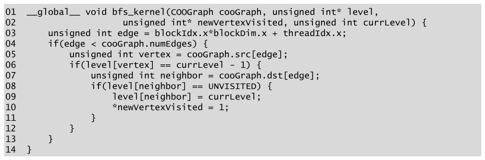

*Figure 18.10 — edge-centric BFS kernel. (책 p.437)*

```cuda
01 __global__ void bfs_kernel(COOGraph cooGraph, unsigned int* level,
02                     unsigned int* newVertexVisited, unsigned int currLevel) {
03     unsigned int edge = blockIdx.x*blockDim.x + threadIdx.x;
04     if(edge < cooGraph.numEdges) {
05         unsigned int vertex = cooGraph.src[edge];
06         if(level[vertex] == currLevel - 1) {
07             unsigned int neighbor = cooGraph.dst[edge];
08             if(level[neighbor] == UNVISITED) {
09                 level[neighbor] = currLevel;
10                 *newVertexVisited = 1;
11             }
12         }
13     }
14 }
```

| 줄 | 하는 일 |
|---|---|
| 03 | thread 하나를 **간선** 하나에 배정 |
| 04 | 범위 검사 — 이제 `numEdges` 다 |
| 05 | COO `src` 로 출발 정점을 찾는다 |
| 06 | 출발 정점이 이전 level 인가 |
| 07 | COO `dst` 로 도착 이웃을 찾는다 |
| 08 | 이웃이 미방문인가 |
| 09~10 | label 하고 flag 를 세운다 |

**루프가 하나도 없다.** thread 하나가 간선 하나만 보고 끝난다 —
이것이 edge-centric 의 정체이자 장단점의 뿌리다.

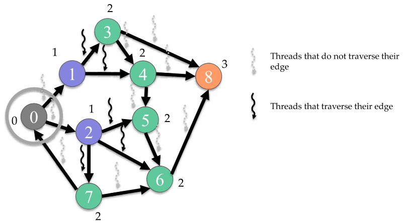

*Figure 18.11 — level 1 에서 level 2 로 가는 edge-centric traversal 예제.
흐린 표시 = 자기 간선을 타지 않는 thread, 진한 표시 = 자기 간선을 타는 thread. (책 p.437)*

15개 thread 중 06줄을 통과하는 것은 **정점 1 과 2 에서 나가는 간선 5개**뿐이다.

| 간선 index | 간선 | 출발 정점 level | 통과? |
|---|---|---|---|
| 0, 1 | 0→1, 0→2 | 0 | ✗ |
| **2, 3** | **1→3, 1→4** | **1** | **✓** |
| **4, 5, 6** | **2→5, 2→6, 2→7** | **1** | **✓** |
| 7~14 | 3→4 … 7→6 | UNVISITED | ✗ |

### 장점 둘

**① 병렬성이 더 많이 드러난다.**

> vertex-centric 구현에서는 정점 수가 적으면 **장치를 다 채울 만큼 thread 를
> 띄우지 못할 수 있다.** 그래프는 보통 정점보다 간선이 훨씬 많으므로
> edge-centric 구현이 **더 많은 thread 를 띄울 수 있다.**
> 그래서 edge-centric 구현은 대개 **작은 그래프에 더 적합**하다 (책 p.437).

**② 부하 불균형과 control divergence 가 적다.**

> vertex-centric 구현에서는 각 thread 가 **배정된 정점의 degree 에 따라 서로 다른 수의
> 간선**을 순회한다. 반면 edge-centric 구현에서는 각 thread 가 **간선 하나만** 지난다
> (책 p.437).

> vertex-centric 구현에 대해 edge-centric 구현은 **control divergence 를 줄이기 위해
> thread 를 일/데이터에 배정하는 방식을 재배치**한 예다 — 6장에서 논의한 그대로다
> (책 p.438).

**6장 checklist 항목 3 이 여기서 그대로 쓰인다.** 6장 노트의 표에도
"warp 안 workload 를 비슷하게(18장 vertex-centric vs edge-centric)"로 예고돼 있다.

> 그래서 edge-centric 구현은 대개 **평균 degree 가 높고 정점 degree 의 편차가 큰 그래프**
> 에 더 적합하다 (책 p.438).

### 단점 둘

**① 모든 간선을 검사한다.**

> vertex-centric 구현은 어떤 정점이 그 level 과 무관하다고 판정하면 **간선 목록 전체를
> 건너뛸 수 있다.** 예를 들어 정점 $v$ 가 $n$ 개의 간선을 갖고 특정 level 과 무관하다고 하자.
> edge-centric 구현에서는 간선마다 하나씩 **$n$ 개의 thread** 가 각자 독립적으로 $v$ 를
> 조사해 간선이 무관함을 발견한다. 반면 vertex-centric 구현에서는 $v$ 에 대해 **thread 하나**만
> 띄우고, 그 thread 가 $v$ 를 **한 번** 조사해 무관함을 판정한 뒤 $n$ 개 간선을 전부 건너뛴다
> (책 p.438).

$$\text{edge-centric 의 낭비} = n \text{ 번의 조사}, \qquad
  \text{vertex-centric} = 1 \text{ 번의 조사}$$

**② COO 가 저장 공간을 더 쓴다.**

> 또 다른 단점은 edge-centric 구현이 COO 를 쓴다는 것인데, COO 는 vertex-centric 구현이
> 쓰는 CSR·CSC 보다 간선을 저장하는 데 **더 많은 저장 공간**을 요구한다 (책 p.438).

우리 예제로 세면: COO 는 `src` 15 + `dst` 15 = **30 칸**,
CSR 은 `dst` 15 + `srcPtrs` 10 = **25 칸**.
일반적으로 $2m$ 대 $m + n + 1$ 이므로 $m > n + 1$ 이면 COO 가 더 크다 —
성기더라도 평균 degree 가 1 을 넘으면 늘 그렇다.

### 세 구현 한눈에

| | vertex-centric push | vertex-centric pull | edge-centric |
|---|---|---|---|
| **형식** | CSR | CSC | COO |
| **thread ↔ 대상** | 정점 | 정점 | 간선 |
| **thread 수** | $n$ | $n$ | $m$ |
| **루프 길이** | out-degree (고정) | $\le$ in-degree (**조기 이탈**) | **없음** |
| **쓰는 대상** | 이웃 (race ①) | **자기 자신 (race 없음)** | 이웃 (race ①) |
| **부하 균형** | degree 에 좌우 | degree 에 좌우 | **완전 균등** |
| **유리한 그래프** | 이른 level | 늦은 level | **작거나 degree 편차가 큰** |
| **저장** | $m+n+1$ | $m+n+1$ | $2m$ |

### linear algebraic formulation — 17장과의 진짜 연결

> 앞 절과 이 절의 코드 예제가 **17장의 SpMV 구현과 닮았다**는 것을 독자는 눈치챘을 것이다.
> 실제로 정식화를 조금만 바꾸면 **BFS 의 한 level 반복 전체를 SpMV 와 몇 개의 벡터 연산으로
> 표현**할 수 있으며, 그중 **SpMV 가 지배적인 연산**이다 (책 p.438).

무엇이 얼마나 닮았는지 나란히 놓으면 놀랍다.

| 17장 SpMV kernel | 18장 BFS kernel |
|---|---|
| `spmv_csr_kernel` — 행마다 thread, `rowPtrs` 로 구간, `colIdx` 로 $x$ 접근 | **push** — 정점마다 thread, `srcPtrs` 로 구간, `dst` 로 이웃 접근 |
| `spmv_coo_kernel` — non-zero 마다 thread, `rowIdx`/`colIdx` 조회, atomic 누적 | **edge-centric** — 간선마다 thread, `src`/`dst` 조회, (양성) race 로 쓰기 |
| 17.7절 CSC 의 용처 = SpMSpV | **pull** — 열(= 들어오는 간선) 접근 |

**차이는 연산자다.** SpMV 는 $(\times, +)$ 반환을 쓰고,
BFS 는 $(\wedge, \vee)$ — "이웃이 frontier 에 있는가 AND 간선이 있는가" 를
OR 로 모은다. 그래서 이 정식화를 **semiring 위의 SpMV** 라 부른다.

$$\underbrace{y = A^T x}_{\text{SpMV}} \quad\longleftrightarrow\quad
  \underbrace{f_{k+1} = A^T f_k \;\wedge\; \lnot \text{visited}}_{\text{BFS 한 level}}$$

> 그래프 계산 중 많은 것이 인접 행렬을 써서 **sparse matrix 계산으로 정식화**될 수 있다 [1].
> 그런 정식화를 흔히 그래프 문제의 **linear algebraic formulation** 이라 부르며
> **GraphBLAS** 라는 API 명세가 이를 다룬다 [2] (책 p.438).

| | |
|---|---|
| **장점** | sparse linear algebra 용으로 **성숙하고 고도로 최적화된 병렬 라이브러리**를 그대로 쓸 수 있다 |
| **단점** | 문제의 그래프 알고리즘에 **특유한 성질을 이용하는 최적화를 놓칠 수 있다** |

**18.5~18.8절이 바로 그 "놓치는 최적화"들이다.** frontier·privatization·
cooperative groups·degree bucketing 은 전부 "이것이 BFS 임"을 알아야 나오는 것들이고,
일반 SpMV 라이브러리는 해 줄 수 없다.
---

## 18.5 Improving work efficiency with frontiers

### 문제 — 매 level 마다 전부 검사한다

> 앞의 두 절에서 논의한 접근에서는 **모든 정점 또는 모든 간선을 매 반복마다**
> 해당 level 과 관련이 있는지 검사했다.
> 이 전략의 장점은 kernel 이 **고도로 병렬적이고 thread 사이의 synchronization 이
> 전혀 필요 없다**는 것이다.
> 그러나 단점은 **매 반복 불필요한 thread 를 많이 띄우고 낭비되는 작업을 많이 수행**해서
> **work efficient 하지 않다**는 것이다 (책 p.438).

### 작업 복잡도 유도

> 정점 $n$ 개, 간선 $m$ 개, **지름(diameter) $d$** — 즉 level 0 을 제외하고 $d$ 개의
> BFS level 을 갖는 그래프를 생각하자 (책 p.438~439).

**이상적인 작업량.**

> 이상적으로는 모든 정점과 간선을 **딱 한 번씩만** 방문하므로 BFS 의 이상적 작업
> 복잡도는 $O(n + m)$ 이다 (책 p.439).

$$W_{\text{ideal}} = O(n + m)$$

**① vertex-centric push.**

> 모든 정점이 **매 level 검사**되지만, 각 간선은 **출발 정점이 이전 level 과 일치할 때
> 딱 한 번만** 지나진다. 따라서 수행되는 작업은 $O(d \cdot n + m)$ 이다 (책 p.439).

$$W_{\text{push}} = \underbrace{d \cdot n}_{\text{05줄 검사}} + \underbrace{m}_{\text{간선 순회}}$$

간선 항이 $m$ 인 이유를 한 번 더 짚으면: 정점 $v$ 의 나가는 간선을 도는 것은
`level[v] == currLevel-1` 인 **단 한 번의 반복**뿐이고, 각 정점은 정확히 한 level 에만
속하므로 **모든 간선이 정확히 한 번씩** 순회된다.

**② vertex-centric pull.**

> 모든 정점이 매 level 검사되고, **게다가** 각 간선도 **도착 정점이 방문되지 않은 한
> 마지막 level 까지 여러 level 에 걸쳐 검사**된다. 따라서 수행되는 작업은
> $O(d \cdot n + d \cdot m)$ 이다 (책 p.439).

$$W_{\text{pull}} = d \cdot n + d \cdot m = O(d(n+m))$$

**③ edge-centric.**

> 모든 간선이 **매 level 검사**된다. 따라서 수행되는 작업은 $O(d \cdot m)$ 이다
> (책 p.439).

$$W_{\text{edge}} = d \cdot m$$

> 이 작업 복잡도 중 어느 것도 이상적인 작업 복잡도와 일치하지 않으며,
> 이는 **모든 구현이 work efficient 하지 않음**을 보여 준다 (책 p.439).

우리 예제 그래프($n = 9$, $m = 15$, $d = 3$)에 대입하면:

| 구현 | 식 | 상한 | 실제로 센 값 (thread 검사 + 간선) |
|---|---|---|---|
| **이상** | $n + m$ | **24** | — |
| push | $d n + m$ | 42 | $36 + 15 = 51$ |
| pull | $d n + d m$ | 72 | $36 + 23 = 59$ |
| edge | $d m$ | 45 | $60 + 60$ (간선 검사가 곧 thread) |
| **frontier** | $n + m$ | **24** | $\mathbf{9 + 15 = 24}$ ← 정확히 이상적 |

> 실측이 상한보다 큰 것은 반복 횟수가 $d$ 가 아니라 **$d+1$** 이기 때문이다 —
> 마지막 반복은 아무것도 못 찾고 `newVertexVisited` 가 0 인 것을 확인하고 끝난다.
> $O$ 표기는 상수배를 무시하므로 문제되지 않는다.

### 해법 — frontier

> 이 절에서는 **불필요한 thread 를 띄우지 않고** 그것들이 매 반복 수행하는 **중복 검사를
> 없애서** 병렬 BFS 의 work efficiency 를 개선하는 것을 목표로 한다.
> …… 이 thread 들은 **애초에 띄워지지도 않아야** 한다.
> 그러려면 이전 level 의 정점을 처리하는 thread 들이 협력해 **자기가 방문한 정점들의
> frontier 를 구성**하게 하면 된다.
> 그러면 현재 level 에서는 **그 frontier 안의 정점에 대해서만** thread 를 띄우면 된다 [3].
> 이렇게 하면 **각 정점이 한 번만 검사되고 각 간선이 한 번만 순회**되어
> **$O(n+m)$ 작업 복잡도**가 나온다 (책 p.439).

> **12장 filter 가 여기서 돌아온다.** frontier 를 만드는 것은
> "조건을 만족하는 원소를 출력 배열에 모으는" 동작 — 정확히 **unstable filter**다.
> 12장에서 배운 것이 그대로 필요해진다: atomic 으로 출력 위치를 예약하고(12.2절),
> warp 안에서 합쳐 부르고(12.3절), block 별 private 버퍼를 쓴다(12.4절).
> **18.6절이 그 12.4절이다.**

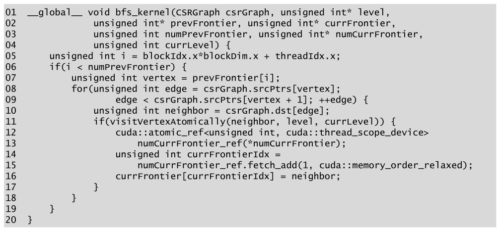

*Figure 18.12 — frontier 를 쓰는 vertex-centric push (top-down) BFS kernel. (책 p.439)*

```cuda
01 __global__ void bfs_kernel(CSRGraph csrGraph, unsigned int* level,
02             unsigned int* prevFrontier, unsigned int* currFrontier,
03             unsigned int numPrevFrontier, unsigned int* numCurrFrontier,
04             unsigned int currLevel) {
05     unsigned int i = blockIdx.x*blockDim.x + threadIdx.x;
06     if(i < numPrevFrontier) {
07         unsigned int vertex = prevFrontier[i];
08         for(unsigned int edge = csrGraph.srcPtrs[vertex];
09                 edge < csrGraph.srcPtrs[vertex + 1]; ++edge) {
10             unsigned int neighbor = csrGraph.dst[edge];
11             if(visitVertexAtomically(neighbor, level, currLevel)) {
12                 cuda::atomic_ref<unsigned int, cuda::thread_scope_device>
13                     numCurrFrontier_ref(*numCurrFrontier);
14                 unsigned int currFrontierIdx =
15                     numCurrFrontier_ref.fetch_add(1, cuda::memory_order_relaxed);
16                 currFrontier[currFrontierIdx] = neighbor;
17             }
18         }
19     }
20 }
```

**추가된 매개변수 네 개**가 이 kernel 의 핵심이다.

| 매개변수 | 뜻 |
|---|---|
| `prevFrontier` | 이전 frontier 의 정점들을 담은 배열 |
| `currFrontier` | 현재 frontier 를 담을 배열 |
| `numPrevFrontier` | 이전 frontier 의 정점 수 (**값**으로 전달) |
| `numCurrFrontier` | 현재 frontier 의 정점 수 (**포인터** — device 가 쓴다) |

> 새 정점이 방문되었음을 알리는 flag 가 **더 이상 필요 없다**는 점에 주목한다.
> 대신 host 는 **현재 frontier 의 정점 수가 0 인 것**으로 끝에 도달했음을 알 수 있다
> (책 p.440).

| 줄 | 하는 일 | 앞 버전과의 차이 |
|---|---|---|
| 05 | thread 를 **이전 frontier 의 원소**에 배정 | 정점이 아니라 frontier 원소 |
| 06 | `numPrevFrontier` 로 범위 검사 | **띄우는 thread 수가 확 준다** |
| 07 | frontier 에서 자기 정점을 읽는다 | `level[vertex]` 검사가 **사라졌다** |
| 08~10 | 나가는 간선 순회 (CSR) | 같음 |
| 11 | `visitVertexAtomically` 로 검사+label 을 **한 번에** | ← Figure 18.14 |
| 12~15 | `numCurrFrontier` 를 atomic 하게 1 증가 | ← **12장 filter 의 그 동작** |
| 16 | 예약한 자리에 이웃을 넣는다 | |

**05~07줄에서 검사 하나가 통째로 사라진 것**을 놓치면 안 된다.
Figure 18.6 의 05줄 `if(level[vertex] == currLevel - 1)` 이 없다 —
**frontier 에 들어 있다는 사실 자체가 그 조건**이기 때문이다.
$d \cdot n$ 항이 사라지는 지점이 정확히 여기다.

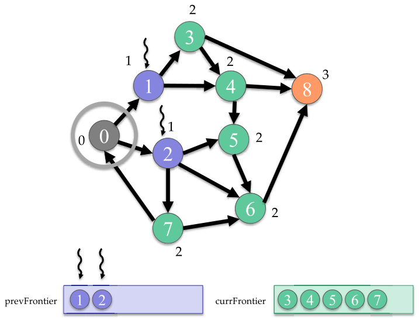

*Figure 18.13 — frontier 를 쓰는 vertex-centric push (top-down) BFS traversal 예제
(level 1 → level 2). (책 p.440)*

> Figure 18.13 에서 **이전 frontier 에는 정점 1 과 2 만** 있으므로 **thread 는 두 개만**
> 띄워진다 (책 p.440).

Figure 18.7 은 같은 상황에서 thread 9개를 띄웠다. **9 → 2** 다.
그리고 현재 frontier 로 3, 4, 5, 6, 7 이 나온다.

> `currFrontier` 안의 **순서는 보장되지 않는다.** 그림은 3,4,5,6,7 로 그려져 있지만
> 실제 순서는 `fetch_add` 가 어떤 순서로 성공했느냐에 달렸다.
> **BFS 는 순서에 의존하지 않으므로** 문제되지 않는다 — 12장의 용어로
> 이것이 **unstable** filter 인 이유다.

**`currFrontier` 를 얼마나 크게 잡아야 하나.** 책은 말하지 않지만 답은 명확하다.
16줄에 경계 검사가 없는데도 안전한 이유는 **`visitVertexAtomically` 가 정점 하나당
정확히 한 번만 성공**하기 때문이다. 따라서 한 level 의 frontier 크기는
**최대 $n$** 이고, `currFrontier` 를 `numVertices` 개로 잡으면 넘칠 수 없다.

<!--widget:bfs-frontier-->

### 왜 여기서는 atomic 이 필요해지는가 (Figure 18.14)

18.3절에서는 label 하는 race 를 "멱등이니 양성"이라며 그냥 뒀다. **여기서는 안 된다.**

> Figure 18.6 의 frontier 없는 vertex-centric push kernel 에서는 이 검사와 label 동작이
> atomic operation 없이 수행된다 (09~10줄). 그 구현에서는 여러 thread 가 같은 미방문
> 이웃의 옛 label 을 **어느 것도 label 하기 전에** 읽으면 **여러 thread 가 그 이웃을
> label 하게 될 수 있다.** 모든 thread 가 **같은 label** 을 붙이므로(연산이 멱등이므로)
> 중복해서 label 하도록 두어도 괜찮다.
> 반면 frontier 기반 구현에서는 각 thread 가 미방문 이웃을 label 할 뿐 아니라
> **frontier 에도 추가**한다. 따라서 여러 thread 가 그 이웃을 미방문으로 관측하면
> **모두가 그 이웃을 frontier 에 추가**해 **여러 번 들어가게** 된다.
> 이웃이 frontier 에 여러 번 들어가면 다음 level 에서 **여러 번 처리**되어
> 중복이고 낭비다 (책 p.441).

**핵심은 "멱등성이 깨진다"** 이다.

| 동작 | 멱등인가 | 여러 번 하면 |
|---|---|---|
| `level[v] = currLevel` | **멱등** | 같은 값을 여러 번 쓴다 — 무해 |
| `currFrontier[atomicAdd(...)] = v` | **멱등이 아님** | frontier 에 $v$ 가 **여러 번** 들어간다 |

frontier 에 $v$ 가 $k$ 번 들어가면 다음 level 에서 $v$ 의 이웃 목록을 $k$ 번 돈다.
그리고 그 $k$ 개 thread 가 또 각자 중복을 만들어 **level 을 거치며 지수적으로 번질 수 있다.**

> 이웃이 미방문이라고 여러 thread 가 관측하는 것을 막으려면 이웃 label 의
> **검사와 갱신이 atomic 하게** 수행되어야 한다. 즉 이웃이 방문되지 않았는지 확인하고,
> 아니라면 현재 level 의 일부로 label 하는 것을 **하나의 atomic operation 안에서**
> 모두 해야 한다. 이 모든 단계를 수행할 수 있는 atomic operation 이
> **compare-and-swap** 이고, C++ 의 `compare_exchange_strong` 함수가 제공한다
> (책 p.441).

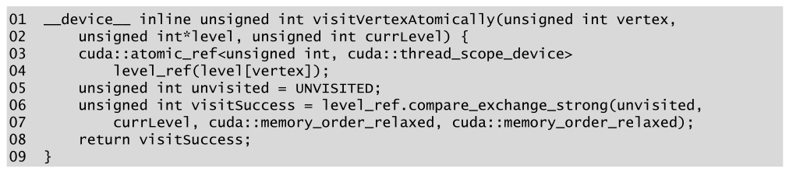

*Figure 18.14 — atomic compare-and-swap 연산으로 정점을 atomic 하게 방문하는 device 함수.
(책 p.441)*

```cuda
01 __device__ inline unsigned int visitVertexAtomically(unsigned int vertex,
02     unsigned int*level, unsigned int currLevel) {
03     cuda::atomic_ref<unsigned int, cuda::thread_scope_device>
04         level_ref(level[vertex]);
05     unsigned int unvisited = UNVISITED;
06     unsigned int visitSuccess = level_ref.compare_exchange_strong(unvisited,
07         currLevel, cuda::memory_order_relaxed, cuda::memory_order_relaxed);
08     return visitSuccess;
09 }
```

**compare-and-swap 이 처음 나온다.** 하는 일을 의사코드로 쓰면 이렇다.

```
// 아래 전체가 쪼개지지 않고 한꺼번에 일어난다
bool compare_exchange_strong(T& expected, T desired) {
    if (*this == expected) { *this = desired;    return true;  }
    else                   { expected = *this;   return false; }
}
```

**"읽고 → 비교하고 → 쓰는" 세 동작이 쪼개지지 않는다**는 것이 전부다.
9장의 `atomicAdd` 가 "읽고 → 더하고 → 쓰는"을 쪼개지 않은 것과 같은 종류이지만,
**조건부**이고 **성공 여부를 돌려준다**는 점이 새롭다.

| 줄 | 하는 일 |
|---|---|
| 03~04 | `level[vertex]` 에 대한 **atomic reference** 를 만든다 |
| 05 | 비교 대상을 담을 **변수**를 만들고 `UNVISITED` 로 초기화 |
| 06 | 1번째 인자 = 비교할 값 (`unvisited`) |
| 07 | 2번째 인자 = 성공 시 넣을 값 (`currLevel`), 3·4번째 = 메모리 순서 |
| 08 | 성공 여부를 그대로 돌려준다 |

**05줄이 왜 필요한가** — 사소해 보이지만 책이 한 문단을 쓴다.

> 우리는 `level[vertex]` 를 `UNVISITED` 와 비교하고 싶다. 그러나 `UNVISITED` 를 직접
> 넘길 수 없다 — **상수인데 함수는 객체에 대한 참조를 기대**하기 때문이다.
> 그래서 정수 `unvisited` 를 만들어 상수 `UNVISITED` 로 초기화하고(05줄)
> 그 정수를 첫 인자로 넘긴다(06줄) (책 p.441).

> **참조여야 하는 진짜 이유**는 실패했을 때 `compare_exchange_strong` 이
> **실제로 읽은 값을 그 변수에 써 주기** 때문이다 (위 의사코드의 `expected = *this`).
> 재시도 루프를 도는 코드가 그 값을 쓸 수 있게 하려는 설계다.
> 여기서는 실패하면 그냥 포기하므로 그 값을 쓰지 않지만,
> **`unvisited` 를 루프 밖에서 한 번만 만들어 재사용하면 버그가 된다** —
> 실패한 뒤에는 `unvisited` 가 더 이상 `UNVISITED` 가 아니다.
> Figure 18.12 가 `visitVertexAtomically` 를 **함수로** 만들어 매 호출마다
> 05줄이 다시 실행되게 한 것이 이 함정을 피한다.

**메모리 순서를 왜 `relaxed` 로 두는가.**

> 3·4번째 인자는 atomic operation 이 수행하는 메모리 접근의 **순서 요구사항**으로,
> 각각 성공한 경우와 실패한 경우에 대한 것이다.
> 우리 경우 atomic operation 은 kernel 이 수행하는 **다른 독립적인 메모리 접근과
> 특정한 순서로 정렬될 필요가 없다.** 그래서 두 경우 모두 `cuda::memory_order_relaxed`
> 를 고른다 (책 p.442).

**`relaxed` 는 원자성만 보장하고 순서는 보장하지 않는다** — 가장 싼 선택이다.
`level` 배열 갱신끼리는 서로 독립이고 다른 데이터와의 순서 의존도 없으므로 충분하다.

### 남은 문제 — 이번엔 counter 가 병목이다

> 이 frontier 기반 접근의 단점은 **latency 가 긴 atomic operation 의 오버헤드**,
> 특히 그 연산들이 **같은 데이터를 두고 경쟁**할 때다 (책 p.442).

| atomic | 경쟁 정도 | 왜 |
|---|---|---|
| 정점 level 갱신용 **compare-and-swap** | **중간** | 같은 미방문 이웃을 방문하는 것은 **일부 thread 뿐**이다 |
| frontier 크기 증가용 **atomic 덧셈** | **높다** | **모든 thread 가 같은 counter** 를 증가시킨다 |

> 다음 절에서 이 경쟁을 어떻게 줄일 수 있는지 본다 (책 p.442).

**9장 histogram 에서 똑같은 구도를 이미 봤다.** 거기서도 "모두가 하나의 bin 을 때린다"
가 문제였고, 답도 같았다 — **privatization**.

---

## 18.6 Reducing contention with privatization

> 서로 다른 thread 가 frontier 에 원소를 삽입하는 이 패턴은 독자에게
> **12장의 unstable filter 패턴**을 떠올리게 할 것이다.
> unstable filter 에서 atomic operation 의 경쟁을 줄이려고 적용한 최적화 두 가지가
> **coalesced atomic operation** 과 **privatization** 이었다.
> 이 두 최적화는 frontier 기반 BFS kernel 에도 적용된다 (책 p.442).

> 12장에서 언급한 대로 atomic operation 의 **coalescing 은 컴파일러가 적용한다고
> 가정**할 수 있다. 이 절에서는 현재 반복의 frontier 에 정점을 추가할 때 atomic operation
> 의 경쟁을 줄이기 위해 **privatization 을 활용하는 방법**에 집중한다 (책 p.442).

> **12.3절이 무엇이었는지 되짚으면**: warp 안의 여러 thread 가 같은 counter 에
> `atomicAdd(1)` 을 하면, 이를 **warp 안에서 먼저 세어(`__popc`) 대표 thread 하나만
> 전역 atomic 을 부르고, 나머지는 warp 안에서 offset 을 받는** 것이 coalesced atomic 이다.
> 32번의 atomic 이 1번이 된다. 최신 컴파일러/하드웨어가 이를 자동으로 하므로
> 18장에서는 손으로 쓰지 않는다.

### privatization 의 정의와 적용

> 6장에서 본 대로 privatization 은 데이터의 **private 복사본에 부분 갱신을 적용한 뒤
> 끝나면 public 복사본을 갱신**하는 방식으로 atomic operation 의 경쟁을 줄인다
> (책 p.442).

> 책은 6장을 참조하지만 정의만 6.8절 최적화 checklist 에 있고,
> **본격적으로 전개한 것은 9.4절 histogram** 이다.

> privatization 은 동시적인 frontier 갱신(`numCurrFrontier` 의 증가) 맥락에 적용해
> frontier 삽입의 경쟁을 줄일 수 있다.
> **각 thread block 이 계산 내내 자기만의 private frontier 를 유지**하다가
> 끝나면 public frontier 를 갱신하게 하면 된다.
> 그러면 thread 는 **같은 block 안의 thread 하고만** 같은 데이터를 두고 경쟁한다
> (책 p.442).

**세 가지 이득이 한꺼번에 온다.**

| 이득 | 왜 |
|---|---|
| ① atomic **경쟁 범위**가 grid 전체 → block 하나로 | thread 수 기준 $\text{grid}/\text{block}$ 배 감소 |
| ② atomic 의 **latency** 가 짧아진다 | private frontier 와 counter 를 **shared memory** 에 둔다 |
| ③ public frontier 로 옮길 때 **coalesced** | `threadIdx.x` 순서로 연속된 위치에 쓴다 |

> 게다가 private frontier 와 그 counter 를 **shared memory** 에 저장할 수 있어
> counter 에 대한 **더 낮은 latency 의 atomic operation** 과 private frontier 로의
> 저장이 가능해진다. 나아가 shared memory 의 private frontier 를 global memory 의
> public frontier 로 저장할 때 그 접근을 **coalesced** 로 만들 수 있다 (책 p.442).

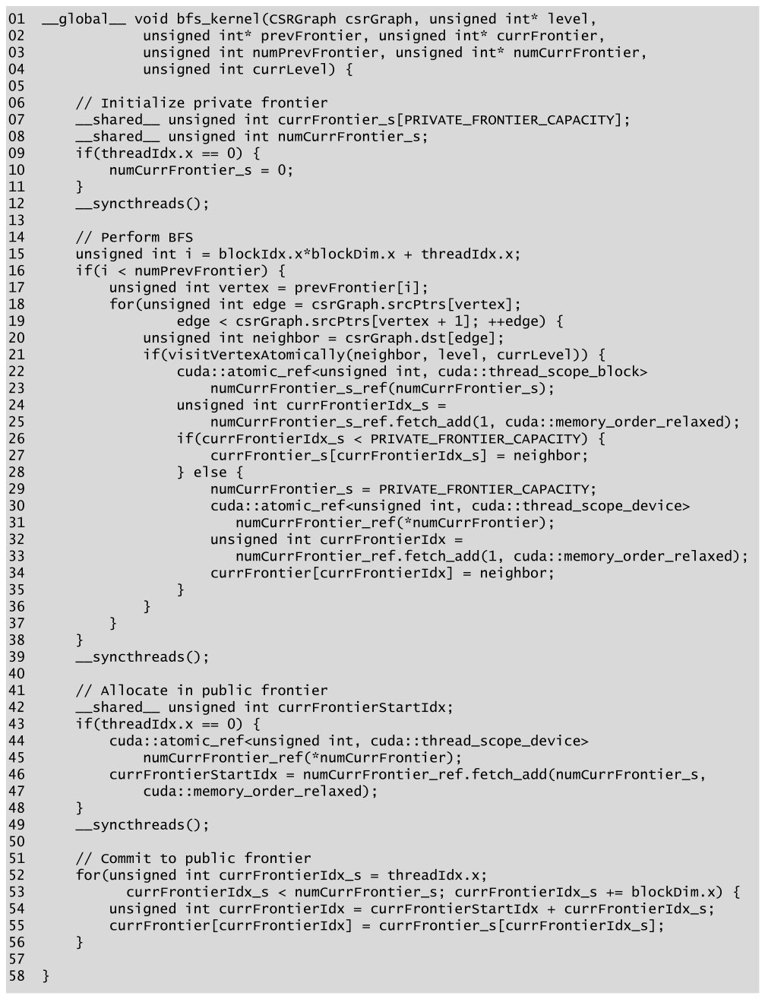

*Figure 18.15 — frontier 를 privatization 한 vertex-centric push (top-down) BFS kernel.
(책 p.443)*

kernel 이 네 구간으로 뚜렷하게 나뉜다. 구간별로 나눠 읽는다.

#### 구간 1 (07~12줄) — private frontier 초기화

```cuda
06     // Initialize private frontier
07     __shared__ unsigned int currFrontier_s[PRIVATE_FRONTIER_CAPACITY];
08     __shared__ unsigned int numCurrFrontier_s;
09     if(threadIdx.x == 0) {
10         numCurrFrontier_s = 0;
11     }
12     __syncthreads();
```

> kernel 은 각 thread block 을 위한 private frontier 를 **shared memory 에 선언**하는
> 것으로 시작한다(07~08줄). block 의 thread 하나가 private frontier 의 counter 를
> 0 으로 초기화하고(09~11줄), block 의 모든 thread 는 counter 를 쓰기 전에
> 초기화가 끝나기를 `__syncthreads()` barrier 에서 기다린다(12줄) (책 p.443~444).

**12장 Figure 12.5 와 완전히 같은 형태**다.
`PRIVATE_FRONTIER_CAPACITY` 는 컴파일 시점 상수여야 하고,
이것이 shared memory 사용량을 정하므로 **occupancy 와 직결**된다.

> `PRIVATE_FRONTIER_CAPACITY` 를 얼마로? 큰 값 → overflow 가 드물지만 occupancy 하락,
> 작은 값 → overflow 가 잦아 public counter 경쟁이 되살아난다.
> block 당 thread 가 256, 정점당 평균 out-degree 가 $\bar{k}$ 면
> block 하나가 만들어 내는 정점은 최대 $256\bar{k}$ 이지만
> 실제로는 대부분 이미 방문돼 걸러지므로 훨씬 적다.
> $\bar{k}$ 가 작은 도로망이면 256 정도로 충분하고, 소셜 그래프라면 overflow 경로가
> 자주 쓰인다 — 그래서 **overflow 경로가 있는 것이지 없어도 되는 것이 아니다.**

#### 구간 2 (15~38줄) — BFS 본체

```cuda
14     // Perform BFS
15     unsigned int i = blockIdx.x*blockDim.x + threadIdx.x;
16     if(i < numPrevFrontier) {
17         unsigned int vertex = prevFrontier[i];
18         for(unsigned int edge = csrGraph.srcPtrs[vertex];
19                 edge < csrGraph.srcPtrs[vertex + 1]; ++edge) {
20             unsigned int neighbor = csrGraph.dst[edge];
21             if(visitVertexAtomically(neighbor, level, currLevel)) {
22                 cuda::atomic_ref<unsigned int, cuda::thread_scope_block>
23                     numCurrFrontier_s_ref(numCurrFrontier_s);
24                 unsigned int currFrontierIdx_s =
25                     numCurrFrontier_s_ref.fetch_add(1, cuda::memory_order_relaxed);
26                 if(currFrontierIdx_s < PRIVATE_FRONTIER_CAPACITY) {
27                     currFrontier_s[currFrontierIdx_s] = neighbor;
28                 } else {
29                     numCurrFrontier_s = PRIVATE_FRONTIER_CAPACITY;
30                     cuda::atomic_ref<unsigned int, cuda::thread_scope_device>
31                         numCurrFrontier_ref(*numCurrFrontier);
32                     unsigned int currFrontierIdx =
33                         numCurrFrontier_ref.fetch_add(1, cuda::memory_order_relaxed);
34                     currFrontier[currFrontierIdx] = neighbor;
35                 }
36             }
37         }
38     }
39     __syncthreads();
```

17~21줄은 Figure 18.12 와 **같다.** 달라진 것은 22줄부터다.

| 줄 | 하는 일 | Figure 18.12 와의 차이 |
|---|---|---|
| 22~23 | atomic reference 의 scope 가 **`thread_scope_block`** | device → **block** |
| 24~25 | **shared memory** counter 를 1 증가 | global → shared |
| 26 | private frontier 가 **넘치지 않았는가** | **새로 생김** |
| 27 | private frontier 에 넣는다 | |
| 29 | **counter 값을 되돌린다** | **새로 생김** |
| 30~34 | public frontier 에 직접 넣는다 | overflow 우회 경로 |

> **`thread_scope_block` 이 왜 더 싼가.** scope 가 block 이면 하드웨어는 그 연산을
> **SM 안에서만** 보이게 하면 되므로 L2/global 을 거칠 필요가 없다.
> shared memory 의 atomic 은 SM 내부 유닛에서 처리되어 **latency 가 global atomic 의
> 수십 분의 1** 이다. 9.3절에서 본 그 차이 그대로다.

**29줄의 `numCurrFrontier_s = PRIVATE_FRONTIER_CAPACITY;` 가 이 kernel 에서 가장 미묘한 줄이다.**

> private frontier 가 넘쳤으면 thread 는 private frontier counter 의 값을 **복원**하고
> (29줄), public frontier counter 를 atomic 하게 증가시켜 (30~33줄) 해당 위치에
> 이웃을 저장한다 (34줄) (책 p.444).

**왜 감소가 아니라 대입인가.** 넘친 thread 가 여럿이면
`fetch_sub(1)` 을 각자 하는 것도 되지만 **대입이 더 강하다.**
`CAPACITY` 로 눌러 두면 몇 개가 넘쳤든 counter 는 정확히 `CAPACITY` 가 되고,
구간 4 의 commit 루프가 **정확히 `CAPACITY` 개**를 옮긴다.

**논리적으로 정확한가 — 확인해 보자.**

| 상황 | counter 값 |
|---|---|
| overflow 가 처음 일어나는 순간 | `fetch_add` 가 `CAPACITY` 이상을 돌려줬다는 것은 counter 가 이미 $\ge$ `CAPACITY`$+1$ |
| 29줄이 `CAPACITY` 로 되돌림 | 유효 슬롯 $[0, \texttt{CAPACITY})$ 는 **이미 전부 채워졌다** |
| 이후 어떤 `fetch_add` 도 | $\ge$ `CAPACITY` 를 돌려주므로 **반드시 overflow 경로** |

**따라서 유효한 슬롯을 잃지 않는다.** counter 는 `CAPACITY` 아래로 내려가지 않고,
`CAPACITY` 를 넘어 무한히 커지는 것도 막는다 (`unsigned` overflow 방지).

> **⚠ 그러나 표준상으로는 race 다.** 29줄은 **non-atomic 저장**인데,
> 같은 순간 다른 thread 들이 `numCurrFrontier_s_ref.fetch_add(...)` 로 **atomic RMW**
> 를 하고 있다. **같은 객체에 atomic 접근과 non-atomic 접근이 섞이는 것**은
> C++ 메모리 모델에서 **data race 이자 미정의 동작**이다.
> 책 스스로 p.434 에서 "멱등이어도 C++ 메모리 모델을 위반하며 동작이 보장되지 않는다"고
> 경고했는데, **여기서 그 규칙을 스스로 어긴다.**
> 고치려면 `numCurrFrontier_s_ref.store(PRIVATE_FRONTIER_CAPACITY,
> cuda::memory_order_relaxed);` 로 쓰면 된다 — 비용은 동일하고 표준을 지킨다.
> 노트에서는 **원문 오기와 구분해 "표준 위반"으로 따로 표시**했다.

#### 구간 3 (39~49줄) — public frontier 에 자리 예약

```cuda
41     // Allocate in public frontier
42     __shared__ unsigned int currFrontierStartIdx;
43     if(threadIdx.x == 0) {
44         cuda::atomic_ref<unsigned int, cuda::thread_scope_device>
45             numCurrFrontier_ref(*numCurrFrontier);
46         currFrontierStartIdx = numCurrFrontier_ref.fetch_add(numCurrFrontier_s,
47             cuda::memory_order_relaxed);
48     }
49     __syncthreads();
```

> block 의 모든 thread 가 자기 정점의 이웃을 다 돈 뒤에는 private frontier 의 원소를
> public frontier 로 저장해야 한다. 먼저 thread 들은 **private frontier 에 더 이상
> 이웃이 추가되지 않음을 보장**하려고 서로를 기다린다(39줄).
> 다음으로 block 의 thread 하나가 나머지를 대표해 private frontier 의 **모든 원소를 위한
> 자리를 public frontier 에 할당**하고(42~48줄), 나머지 thread 는 그것을 기다린다(49줄)
> (책 p.444).

**여기가 privatization 의 정산 지점이다.**

$$\underbrace{k \text{ 번의 global atomic}}_{\text{Figure 18.12}}
  \;\longrightarrow\;
  \underbrace{k \text{ 번의 shared atomic} \;+\; 1 \text{ 번의 global atomic}}_{\text{Figure 18.15}}$$

`fetch_add(numCurrFrontier_s)` — **1 이 아니라 개수만큼 한 번에** 더한다.
12장 Figure 12.6 의 "block 대표가 블록 전체 몫을 한 번에 예약"과 똑같다.

#### 구간 4 (51~56줄) — coalesced commit

```cuda
51     // Commit to public frontier
52     for(unsigned int currFrontierIdx_s = threadIdx.x;
53             currFrontierIdx_s < numCurrFrontier_s; currFrontierIdx_s += blockDim.x) {
54         unsigned int currFrontierIdx = currFrontierStartIdx + currFrontierIdx_s;
55         currFrontier[currFrontierIdx] = currFrontier_s[currFrontierIdx_s];
56     }
```

> 마지막으로 thread 들이 private frontier 의 정점을 순회해(52~53줄) public frontier 에
> 저장한다(54~55줄). public frontier 로의 index `currFrontierIdx` 가
> `currFrontierIdx_s` 로 표현되고 `currFrontierIdx_s` 는 `threadIdx.x` 로 표현된다는 점에
> 주목한다. 따라서 **연속된 thread index 를 가진 thread 가 연속된 global memory 위치에
> 저장**하며, 이는 저장이 **coalesced** 라는 뜻이다 (책 p.444).

$$\texttt{currFrontierIdx} = \underbrace{\texttt{currFrontierStartIdx}}_{\text{block 마다 상수}}
  + \underbrace{\texttt{threadIdx.x} + j \cdot \texttt{blockDim.x}}_{\text{연속}}$$

**grid-stride 가 아니라 block-stride 루프**인 것에 주의한다 (`+= blockDim.x`).
private frontier 원소 수가 block 의 thread 수보다 많을 수 있으므로 필요하다.

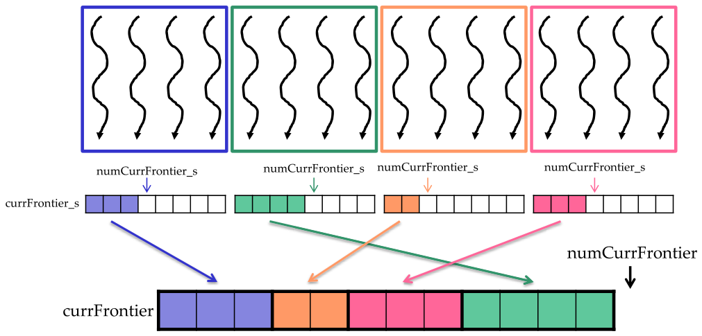

*Figure 18.16 — frontier privatization 예제. block 4개가 각자 shared memory 의
private frontier 를 채운 뒤, 각자 예약한 public frontier 구간에 통째로 옮긴다. (책 p.444)*

그림이 보여 주는 두 가지를 짚는다.

| 관찰 | 뜻 |
|---|---|
| block 마다 private frontier 의 **채워진 길이가 다르다** | 3, 4, 2, 3 개 — degree 에 따라 다르다 |
| public frontier 안의 **block 순서가 뒤섞여 있다** | 파랑 → 주황 → 분홍 → 초록. `fetch_add` 순서가 정한다 |

**두 번째가 중요하다.** block 0 이 반드시 앞에 오지 않는다.
**unstable** filter 라서 상관없고, 그래서 이 최적화가 가능하다.
12.5절의 stable filter 처럼 순서를 지켜야 했다면 `fetch_add` 대신
**exclusive scan** 이 필요했을 것이다.

---

## 18.7 Reducing launch overhead with cooperative groups

### 문제 — frontier 가 작으면 launch 비용이 지배한다

> 지금까지 개발한 BFS kernel 들은 **BFS level 마다 한 번씩 host CPU 에서 여러 번 불리도록**
> 설계되었다.
> frontier 가 클 때 — 소셜 네트워크처럼 평균 degree 가 높은 그래프를 처리할 때가 그런데 —
> grid 를 띄우는 오버헤드는 grid 가 하는 일의 양에 비해 **무시할 만하다.**
> 그러나 frontier 가 작을 때 — 도로망처럼 평균 degree 가 낮은 그래프를 처리할 때가 그런데 —
> **grid 를 띄우는 오버헤드가 전체 성능을 지배할 수 있다** (책 p.445).

도로망 BFS 를 떠올리면 명확하다. level 이 수백~수천 개인데
각 level 의 frontier 는 정점 수십~수백 개다. kernel 하나가 수 마이크로초 일하는데
launch 비용이 그와 비슷하거나 크다.

### 왜 grid 전체 barrier 는 위험한가

> 여러 grid 를 띄우는 오버헤드를 완화하려면 **grid launch 한 번으로 전체 계산을 수행**하고
> 싶다. 그러나 그러려면 **level 사이에 grid 전체 barrier synchronization** 을 수행해
> 다음 level 로 넘어가기 전에 thread 들이 한 level 의 정점을 다 찾았음을 보장할 수 있어야 한다.
> 그런 grid 전체 barrier synchronization 은 CUDA 의 **cooperative groups API** 로 가능하다.
> 그러나 grid 전체 barrier synchronization 을 수행하는 것은 **grid 를 띄울 수 있는
> thread block 수에 제약**을 건다 (책 p.445).

> 4장에서 본 대로 grid 는 **동시에 실행될 수 있는 수보다 많은 thread block** 으로
> 띄워질 수 있다. 이 경우 하드웨어는 가능한 만큼의 thread block 을 동시에 스케줄해 실행하고
> 오래된 것이 끝나면 더 많은 thread block 을 들여온다.
> 이 스케줄링 방식의 문제는, **모든 thread block 에 걸친 제약 없는 grid 전체 barrier
> synchronization 을 수행할 수 없다**는 것이다 — **deadlock 이 날 수 있기 때문이다.**
> 스케줄된 thread block 은 스케줄되지 않은 thread block 이 barrier 에 도달하기를 기다리고,
> 스케줄되지 않은 thread block 은 스케줄된 thread block 이 끝나 자리를 내주기를 기다린다
> (책 p.445).

**4.3절의 "transparent scalability" 가 정확히 여기서 대가를 청구한다.**
block 사이에 순서 의존을 만들지 않았기에 GPU 는 block 을 아무 순서로나
아무 개수만큼이나 실행할 수 있었다. barrier 를 넣는 순간 그 자유가 **deadlock 이 된다.**

```
   [SM 에 올라간 block A] ──기다림──> [아직 안 올라간 block B 가 barrier 에 오기를]
   [아직 안 올라간 block B] ──기다림──> [block A 가 끝나 자리를 비우기를]
                                     └──── 순환 대기 = deadlock
```

> grid 전체 barrier synchronization 을 할 수 있으려면 **barrier 에 참여하는 모든 thread
> block 이 SM 에서 실제로 실행 중이라는 보장**이 필요하다. 이를 보장하려면
> **동시에 실행이 허용되는 최대 개수보다 많은 thread block 을 띄우지 말아야** 한다
> (책 p.445).

### 최대 block 수를 계산한다

> 동시에 실행될 수 있는 최대 thread block 수를 찾으려면 4장에서 언급한 **CUDA occupancy
> 계산 함수**를 쓸 수 있다. 특히 SM 당 실행될 수 있는 최대 thread block 수를 다음과 같이
> 구할 수 있다 (책 p.445).

```cpp
int numBlocksPerSM;
cudaOccupancyMaxActiveBlocksPerMultiprocessor(&numBlocksPerSM,
                                   bfs_kernel, numThreadsPerBlock, 0);
```

> `cudaOccupancyMaxActiveBlocksPerMultiprocessor` 함수는 관심 있는 kernel `bfs_kernel`,
> block 당 thread 수, block 당 필요한 **dynamic shared memory** 의 양(이 경우 0)을
> 2·3·4번째 인자로 받는다. SM 당 실행될 수 있는 최대 thread block 수를 계산해
> 첫 인자로 넘겨진 포인터가 가리키는 `numBlocksPerSM` 에 결과를 쓴다 (책 p.445).

> **왜 kernel 을 인자로 받는가.** occupancy 는 kernel 이 쓰는 **register 수와
> static shared memory 양**에 달렸고, 그것은 kernel 마다 다르다.
> 4.7절의 자원 분할 계산을 런타임이 대신 해 주는 것이다.
> 마지막 인자 0 은 dynamic shared memory 가 없다는 뜻이다 —
> Figure 18.15 의 `currFrontier_s` 는 **static** shared memory 라 이미 kernel 안에
> 반영돼 있다.

> SM 당 최대 thread block 수를 알았으니, 전체 최대를 구하려면 대상 GPU 의 **SM 개수**를
> 알아야 한다. 4장에서 언급한 대로 GPU 의 SM 개수는 device 속성을 질의해 알 수 있다
> (책 p.446).

```cpp
cudaDeviceProp deviceProp;
cudaGetDeviceProperties(&deviceProp, 0);
int numSMs = deviceProp.multiProcessorCount;
```

> 그 다음 SM 당 최대치와 SM 개수를 곱해 동시에 돌 수 있는 최대 thread block 수를 구한다
> (책 p.446).

```cpp
unsigned int numBlocks = numSMs*numBlocksPerSM;
```

> 이 개수만큼만 thread block 으로 grid 를 띄우면, **모든 thread block 이 동시에 실행되어
> barrier 에 도달할 수 있음을 알기 때문에** deadlock 걱정 없이 grid 전체 barrier
> synchronization 을 수행할 수 있다 (책 p.446).

**이 결정의 대가**: grid 크기가 **문제 크기가 아니라 GPU 의 물리적 한계**로 정해진다.
그래서 thread 하나가 frontier 원소 여러 개를 맡아야 한다 (아래 21~22줄).

### 특별한 방식으로 kernel 을 부른다

> kernel 안에서 cooperative groups 를 써 grid 전체 barrier synchronization 을 하려면
> **2장에서 소개한 통상적인 인터페이스를 쓸 수 없다.** 대신 kernel 을 다음과 같이
> 특별한 방식으로 불러야 한다 (책 p.446).

```cpp
void *kernelArgs[] = { (void*)&csrGraph_d, (void*)&level_d,
          (void*)&prevFrontier_d, (void*)&currFrontier_d,
        (void*)&numPrevFrontier, (void*)&numCurrFrontier_d };
cudaLaunchCooperativeKernel((void*)bfs_kernel, numBlocks,
                            numThreadsPerBlock, kernelArgs);
```

> 먼저 모든 kernel 인자를 `void*` 배열에 저장한다. 그 다음 `cudaLaunchCooperativeKernel`
> API 로 kernel 을 부르며, 부를 kernel 인 `bfs_kernel`, 앞서 계산한 thread block 수,
> block 당 thread 수, kernel 인자 배열을 넘긴다 (책 p.446).

> **`<<<>>>` 를 왜 못 쓰나.** 런타임이 launch 전에
> "이 grid 가 정말 동시 실행 가능한가"를 검사해야 하고, 협력적 launch 임을
> 드라이버에 알려야 한다. `<<<>>>` 문법에는 그 경로가 없다.
> 인자를 `void*` 배열로 싸는 것은 그 대가다 — **타입 검사가 사라지므로**
> 인자 순서·개수를 틀려도 컴파일러가 잡아 주지 않는다. 주의가 필요한 지점이다.

### 다중 level kernel (Figure 18.17)

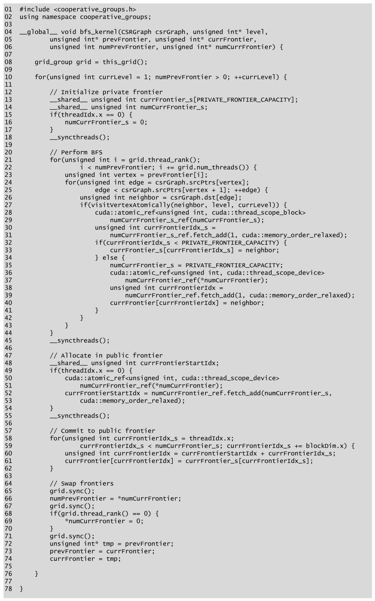

*Figure 18.17 — cooperative groups 를 사용하는 다중 level BFS kernel. (책 p.447)*

```cuda
01 #include <cooperative_groups.h>
02 using namespace cooperative_groups;
03
04 __global__ void bfs_kernel(CSRGraph csrGraph, unsigned int* level,
05         unsigned int* prevFrontier, unsigned int* currFrontier,
06         unsigned int numPrevFrontier, unsigned int* numCurrFrontier) {
07
08     grid_group grid = this_grid();
09
10     for(unsigned int currLevel = 1; numPrevFrontier > 0; ++currLevel) {
11
12         // Initialize private frontier
13         __shared__ unsigned int currFrontier_s[PRIVATE_FRONTIER_CAPACITY];
14         __shared__ unsigned int numCurrFrontier_s;
15         if(threadIdx.x == 0) {
16             numCurrFrontier_s = 0;
17         }
18         __syncthreads();
19
20         // Perform BFS
21         for(unsigned int i = grid.thread_rank();
22                 i < numPrevFrontier; i += grid.num_threads()) {
23             unsigned int vertex = prevFrontier[i];
24             for(unsigned int edge = csrGraph.srcPtrs[vertex];
25                     edge < csrGraph.srcPtrs[vertex + 1]; ++edge) {
26                 unsigned int neighbor = csrGraph.dst[edge];
27                 if(visitVertexAtomically(neighbor, level, currLevel)) {
28                     cuda::atomic_ref<unsigned int, cuda::thread_scope_block>
29                         numCurrFrontier_s_ref(numCurrFrontier_s);
30                     unsigned int currFrontierIdx_s =
31                         numCurrFrontier_s_ref.fetch_add(1, cuda::memory_order_relaxed);
32                     if(currFrontierIdx_s < PRIVATE_FRONTIER_CAPACITY) {
33                         currFrontier_s[currFrontierIdx_s] = neighbor;
34                     } else {
35                         numCurrFrontier_s = PRIVATE_FRONTIER_CAPACITY;
36                         cuda::atomic_ref<unsigned int, cuda::thread_scope_device>
37                             numCurrFrontier_ref(*numCurrFrontier);
38                         unsigned int currFrontierIdx =
39                             numCurrFrontier_ref.fetch_add(1, cuda::memory_order_relaxed);
40                         currFrontier[currFrontierIdx] = neighbor;
41                     }
42                 }
43             }
44         }
45         __syncthreads();
46
47         // Allocate in public frontier
48         __shared__ unsigned int currFrontierStartIdx;
49         if(threadIdx.x == 0) {
50             cuda::atomic_ref<unsigned int, cuda::thread_scope_device>
51                 numCurrFrontier_ref(*numCurrFrontier);
52             currFrontierStartIdx = numCurrFrontier_ref.fetch_add(numCurrFrontier_s,
53                 cuda::memory_order_relaxed);
54         }
55         __syncthreads();
56
57         // Commit to public frontier
58         for(unsigned int currFrontierIdx_s = threadIdx.x;
59                 currFrontierIdx_s < numCurrFrontier_s; currFrontierIdx_s += blockDim.x) {
60             unsigned int currFrontierIdx = currFrontierStartIdx + currFrontierIdx_s;
61             currFrontier[currFrontierIdx] = currFrontier_s[currFrontierIdx_s];
62         }
63
64         // Swap frontiers
65         grid.sync();
66         numPrevFrontier = *numCurrFrontier;
67         grid.sync();
68         if(grid.thread_rank() == 0) {
69             *numCurrFrontier = 0;
70         }
71         grid.sync();
72         unsigned int* tmp = prevFrontier;
73         prevFrontier = currFrontier;
74         currFrontier = tmp;
75
76     }
77
78 }
```

> kernel 이 정의되기 전에 cooperative groups 라이브러리를 포함한다(01~02줄).
> kernel 첫머리에서 나중에 grid 를 synchronization 할 때 유용한 **grid 에 대한 handle** 을
> 얻는다(08줄) (책 p.446).

> kernel 의 가장 바깥 루프는 **처리할 frontier 가 비지 않은 동안** BFS level 을 순회한다
> (10줄). 이 루프 본문의 대부분(12~62줄)은 Figure 18.15 의 frontier 기반 kernel 과 닮았다
> …… **Figure 18.15 와의 주된 차이는**, Figure 18.15 에서는 각 thread 가 정점 하나를
> 처리한다고 가정했지만, Figure 18.17 에서는 **thread 수가 동시에 실행될 수 있는 최대
> 개수로 제한**되므로 **thread 하나가 여러 정점을 처리해야 할 수 있다**는 것이다.
> 그래서 각 thread 는 grid 안 자기 위치(`grid.thread_rank()`)와 grid 의 전체 thread 수
> (`grid.num_threads()`)에 기초해 자기가 책임지는 정점들을 순회한다(21~22줄) (책 p.446~448).

**21~22줄은 grid-stride loop** 다. 10장·12장에서 쓴 thread coarsening 과 같은 형태이고,
여기서는 **선택이 아니라 필수**다 — grid 크기가 문제 크기와 무관하게 고정됐으므로.

#### 세 번의 `grid.sync()` — 각각 무엇을 지키나

> frontier 구성을 마친 grid 의 thread 들은 다음 반복을 위해 **frontier 를 맞바꿔야**
> 한다(65~74줄). 현재 frontier 가 이전 frontier 가 되고, 이전 frontier 에 쓰던 메모리는
> 새 현재 frontier 를 구성하는 데 재활용된다 (책 p.448).

| 줄 | 무엇을 보장하나 | 없으면 무슨 일이 |
|---|---|---|
| **65** | grid 의 모든 thread 가 **현재 frontier 에 정점 추가를 마쳤음** | 66줄이 **아직 완성되지 않은 크기**를 읽는다 |
| **67** | 모든 thread 가 **현재 frontier 의 크기를 다 읽었음** | 69줄의 0 대입이 **누군가의 66줄보다 먼저** 일어나 그 thread 가 0 을 읽는다 |
| **71** | counter 가 **0 으로 초기화되었음** | 다음 반복의 thread 가 **초기화 전 값에 더한다** |

> 먼저 **grid 전체 barrier synchronization** 을 수행해 grid 의 모든 thread 가
> 현재 frontier 에 정점을 추가하는 것을 마쳤음을 보장한다.
> 이 barrier 는 cooperative groups API 함수 `grid.sync()` 로 수행된다(65줄).
> 다음으로 모든 thread 가 현재 frontier 의 크기를 읽어 새 이전 frontier 의 크기로 삼는다
> (66줄). **또 한 번의 barrier**(67줄)는 크기가 어떤 thread 에 의해 0 으로 재설정되기 전에
> 모든 thread 가 크기 읽기를 마쳤음을 보장한다(68~70줄).
> **또 한 번의 barrier**(71줄)는 어떤 thread 가 counter 에 더하기 시작하기 전에
> counter 가 0 으로 재설정되었음을 보장한다.
> 마지막으로 다음 반복으로 넘어가기 전에 frontier 의 메모리 버퍼를 맞바꾼다(72~74줄)
> (책 p.448).

**72~74줄에 barrier 가 필요 없는 이유**를 짚어 둔다: `prevFrontier`·`currFrontier` 는
**kernel 인자, 즉 thread 마다 private 인 지역 변수**다. 모든 thread 가 각자 같은
맞바꾸기를 수행하므로 서로 간섭하지 않는다. 공유되는 것은 **버퍼가 가리키는 메모리**뿐이고,
그 안전성은 65줄 barrier 가 이미 보장했다.

> 이 구현에는 grid 전체 barrier synchronization 이 **세 번** 쓰였지만,
> **level 마다 다른 counter 를 쓰고 kernel 시작 전에 전부 0 으로 재설정**하면
> 그중 **두 개를 없앨 수 있다.**
> 이 최적화는 **double-buffering 최적화와 닮았지만 더 일반화된 형태**다.
> 이 최적화는 독자를 위한 연습문제로 남겨 둔다 (책 p.448).

→ **연습문제 3** 에서 실제로 구현한다.

### cooperative groups 의 다른 이득 둘

> grid 전체 barrier synchronization 에 cooperative groups 를 쓰면 grid launch 오버헤드를
> 완화하는 것 말고도 여러 이득이 있다 (책 p.448).

| 이득 | 내용 |
|---|---|
| ① **CPU 가 해방된다** | "모든 BFS 반복을 kernel 하나에서 수행하면 **CPU 가 반복마다 kernel 을 부르지 않아도 되어 다른 유용한 일**을 할 수 있다" (책 p.448) |
| ② **shared memory·register 에 데이터를 유지** | "grid 전체 barrier synchronization 을 가로질러 데이터를 shared memory 나 register 에 유지할 수 있다 — kernel 이 끝나고 다시 불렸다면 **global memory 에 쓰고 다시 읽어야 했을** 데이터다" (책 p.448) |

②는 이 장의 예제에서는 관찰되지 않지만 다른 맥락에서 나타날 수 있다고 책이 말한다.
(Figure 18.17 도 `currFrontier_s` 를 매 반복 다시 0 으로 초기화한다.)

> kernel 을 융합해 데이터를 shared memory 나 register 에 유지하는 이 이득은
> **11장에서 grid 전체 prefix sum 의 여러 단계를 kernel 하나로 융합**한 것과 비슷하다.
> 차이는 11장의 kernel 이 grid 전체 barrier synchronization 이 아니라
> **grid 전체 단방향(unidirectional) synchronization** 으로 융합되었다는 점이다
> (책 p.448).

| | 11장 (single-pass scan) | 18장 (BFS) |
|---|---|---|
| synchronization 종류 | **단방향** — block $i$ 가 block $i-1$ 만 기다린다 | **barrier** — 전원이 전원을 기다린다 |
| deadlock 회피 | **dynamic block index** 배정으로 순서 보장 | **block 수를 occupancy 이하로** 제한 |
| grid 크기 제약 | 없음 | **있다** |

**단방향이 더 약한 요구**라서 grid 크기 제약이 없었다. barrier 는 더 강한 요구이고
그래서 더 비싼 대가를 치른다.

---

## 18.8 Other optimizations

> vertex-centric 구현에서 각 thread 가 할 작업의 양은 **배정된 정점의 연결성**에 달렸음을
> 상기하자. 소셜 네트워크 그래프 같은 일부 그래프에서는 일부 정점(**유명인**)이
> 다른 것보다 **몇 자릿수 높은 degree** 를 가질 수 있다. 그렇게 되면 thread 하나 또는
> 몇 개가 지나치게 오래 걸려 **grid 전체의 실행을 느리게** 한다 (책 p.448).

**해법 ①** 은 이미 봤다 — edge-centric 구현 (18.4절).

**해법 ② — degree 별 bucket 분할.**

> frontier 의 정점을 **degree 에 따라 bucket 으로 정렬**하고, 각 bucket 을
> **적절한 크기의 프로세서 그룹**으로 별도의 kernel 에서 처리하는 방법이 있다.
> 주목할 만한 구현 [4] 은 작은·중간·큰 degree 의 정점을 위해 **bucket 세 개**를 쓴다
> (책 p.449).

| bucket | degree | 정점 하나를 맡는 단위 |
|---|---|---|
| 작은 것 | 낮다 | **thread 하나** |
| 중간 것 | 중간 | **warp 하나** |
| 큰 것 | 높다 | **thread block 하나** |

> 이 기법은 **정점 degree 의 편차가 큰 그래프**에서 특히 유용하다 (책 p.449).

> **왜 이것이 통하는가.** degree $k$ 의 정점을 thread 하나가 처리하면 $k$ 번의 반복이
> 필요하지만, warp 32개로 처리하면 $\lceil k/32 \rceil$ 번이다.
> 그리고 **같은 bucket 안의 정점끼리는 degree 가 비슷**하므로 한 warp 안의 thread 가
> 비슷한 시간에 끝난다 — **control divergence 와 부하 불균형이 동시에 해결**된다.
> 17장 JDS 가 "행을 길이순으로 정렬해 divergence 를 없앤" 것과 **정확히 같은 착상**이다.
> 차이는 JDS 가 정렬만 하고, 여기서는 정렬 후 **bucket 마다 다른 kernel** 을 쓴다는 것.
> 그리고 이 정렬은 **frontier 를 만들 때마다** 해야 하므로 비용이 매 level 발생한다 —
> 17장의 전처리가 반복 solver 로 분할상환되던 것과 다른 점이다.

### 이 장이 대표하는 것

> BFS 는 가장 단순한 그래프 응용에 속하지만, **더 복잡한 응용에 특징적인 도전들**을
> 드러낸다: 병렬성을 뽑아내기 위한 **문제 분해**, **privatization** 활용,
> **세밀한 부하 균형** 구현, 그리고 **적절한 synchronization** 보장 (책 p.449).

> 그래프 계산은 흥미로운 문제들의 넓은 범위에 적용된다 —
> 특히 **추천**, **커뮤니티 탐지**, **그래프 안의 패턴 찾기**, **이상 탐지** 영역에서.
> 중요한 도전 하나는 **크기가 GPU 메모리 용량을 넘는 그래프**를 다루는 것이다.
> 또 하나의 흥미로운 기회는 계산을 시작하기 전에 그래프를 **다른 형식으로 전처리**하거나
> 그래프의 **정점 순서를 재배치**해 **병렬성이나 지역성을 더 드러내거나 부하 균형을
> 쉽게** 만드는 것이다 (책 p.449).

---

### 검산

이 장에서 손으로 센 숫자 — 인접 행렬·CSR·CSC·COO 배열, 두 root 의 BFS level,
Figure 18.7·18.9·18.11·18.13 의 활성 thread, 네 구현의 반복별 작업량,
연습문제 1 의 모든 답 — 을 전부 코드로 다시 계산해 대조한다. **48개 항목 전부 통과한다.**

```python
# 실행: python3 verify18.py   (표준 라이브러리만 사용)
from collections import deque

OK = []
def chk(name, got, want):
    s = "OK " if got == want else "FAIL"
    OK.append(got == want)
    print(f"[{s}] {name}: got={got!r} want={want!r}")

# ─────────────────────────────────────────────────────────────
# 1. 본문 예제 그래프 (Fig 18.1 / 18.2)
# ─────────────────────────────────────────────────────────────
EDGES = [(0,1),(0,2),
         (1,3),(1,4),
         (2,5),(2,6),(2,7),
         (3,4),(3,8),
         (4,5),(4,8),
         (5,6),
         (6,8),
         (7,0),(7,6)]
N = 9
chk("18.1 정점 수", N, 9)
chk("18.1 간선 수", len(EDGES), 15)
chk("완전 연결 시 간선 수 N(N-1)", N*(N-1), 72)
chk("정점당 최대 out-degree", max(sum(1 for s,_ in EDGES if s==v) for v in range(N)), 3)

# 인접 행렬
A = [[0]*N for _ in range(N)]
for s,d in EDGES: A[s][d] = 1
chk("A[1][3]", A[1][3], 1)
chk("A[4][5]", A[4][5], 1)
chk("인접 행렬 저장 칸 수 9^2", N*N, 81)

# CSR
srcPtrs = [0]
for v in range(N):
    srcPtrs.append(srcPtrs[-1] + sum(1 for s,_ in EDGES if s==v))
dst = [d for s,d in sorted(EDGES)]
chk("CSR srcPtrs", srcPtrs, [0,2,4,7,9,11,12,13,15,15])
chk("CSR dst",     dst,     [1,2,3,4,5,6,7,4,8,5,8,6,8,0,6])
chk("srcPtrs[3]", srcPtrs[3], 7)
chk("srcPtrs[4]", srcPtrs[4], 9)
chk("정점 3 의 이웃 dst[7],dst[8]", (dst[7],dst[8]), (4,8))
chk("CSR 저장 칸 수 (data 생략)", len(dst)+len(srcPtrs), 25)

# CSC
dstPtrs = [0]
for v in range(N):
    dstPtrs.append(dstPtrs[-1] + sum(1 for _,d in EDGES if d==v))
src_csc = [s for d,s in sorted((d,s) for s,d in EDGES)]
chk("CSC dstPtrs", dstPtrs, [0,1,2,3,4,6,8,11,12,15])
chk("CSC src",     src_csc, [7,0,0,1,1,3,2,4,2,5,7,2,3,4,6])

# COO
coo_src = [s for s,d in sorted(EDGES)]
coo_dst = [d for s,d in sorted(EDGES)]
chk("COO src", coo_src, [0,0,1,1,2,2,2,3,3,4,4,5,6,7,7])
chk("COO dst", coo_dst, [1,2,3,4,5,6,7,4,8,5,8,6,8,0,6])

# ─────────────────────────────────────────────────────────────
# 2. BFS 결과 (Fig 18.4)
# ─────────────────────────────────────────────────────────────
def bfs(root, edges, n):
    lvl = {root: 0}
    q = deque([root])
    while q:
        v = q.popleft()
        for s,d in edges:
            if s == v and d not in lvl:
                lvl[d] = lvl[v] + 1
                q.append(d)
    return [lvl.get(v) for v in range(n)]

chk("Fig 18.4(a) root=0", bfs(0,EDGES,N), [0,1,1,2,2,2,2,2,3])
chk("Fig 18.4(b) root=2", bfs(2,EDGES,N), [2,3,0,4,4,1,1,1,2])

# 0 -> 5 경로 3개
def paths(s,t,edges,seen=None):
    seen = seen or [s]
    if s == t: return [tuple(seen)]
    out = []
    for a,b in edges:
        if a == s and b not in seen:
            out += paths(b,t,edges,seen+[b])
    return out
p05 = sorted(paths(0,5,EDGES), key=len)
chk("0->5 단순 경로", p05, [(0,2,5),(0,1,4,5),(0,1,3,4,5)])
chk("최단 경로 길이(간선 수)", len(p05[0])-1, 2)

# 2 -> 1 최단 경로 역추적: 2->7->0->1
lv = bfs(2,EDGES,N)
chk("root=2 에서 정점 1 의 level", lv[1], 3)
back = [1]
while back[-1] != 2:
    cur = back[-1]
    prev = [s for s,d in EDGES if d==cur and lv[s] == lv[cur]-1]
    back.append(prev[0])
chk("역추적 경로 2->7->0->1", list(reversed(back)), [2,7,0,1])

# ─────────────────────────────────────────────────────────────
# 3. Fig 18.7 / 18.9 / 18.11 / 18.13 — level 1 -> 2 한 번의 traversal
# ─────────────────────────────────────────────────────────────
lvl0 = bfs(0,EDGES,N)                      # 최종 결과
prev = [v for v in range(N) if lvl0[v]==1] # level 1
curr = [v for v in range(N) if lvl0[v]==2]
visited_before = [v for v in range(N) if lvl0[v] is not None and lvl0[v] <= 1]

chk("Fig 18.7 이웃을 도는 thread (push)", prev, [1,2])
chk("Fig 18.9 이웃을 도는 thread (pull)",
    [v for v in range(N) if v not in visited_before], [3,4,5,6,7,8])
chk("Fig 18.9 label 하는 thread (pull)", curr, [3,4,5,6,7])
chk("Fig 18.9 끝까지 도는 thread (pull)",
    [v for v in range(N) if v not in visited_before and v not in curr], [8])
chk("Fig 18.11 간선을 타는 thread (edge)",
    [(s,d) for s,d in sorted(EDGES) if s in prev], [(1,3),(1,4),(2,5),(2,6),(2,7)])
chk("Fig 18.13 currFrontier", curr, [3,4,5,6,7])

# ─────────────────────────────────────────────────────────────
# 4. 세 구현의 실제 작업량 (본문 예제 그래프, root=0)
# ─────────────────────────────────────────────────────────────
def trace(edges, n, root, mode):
    """mode: push / pull / edge / frontier
    반환: iteration 별 (launch, 이웃 순회 thread, 검사한 간선 수)"""
    m = len(edges)
    lvl = [None]*n; lvl[root] = 0
    out = []
    cl = 1
    while True:
        rows = None
        if mode in ("push","frontier"):
            act = [v for v in range(n) if lvl[v] == cl-1]
            launch = n if mode=="push" else len(act)
            edges_seen = sum(sum(1 for s,_ in edges if s==v) for v in act)
            rows = (launch, len(act), edges_seen)
        elif mode == "pull":
            unv = [v for v in range(n) if lvl[v] is None]
            edges_seen = 0
            labeled = 0
            for v in unv:
                ins = [s for s,d in edges if d==v]
                for k,s in enumerate(ins):
                    edges_seen += 1
                    if lvl[s] == cl-1:      # break
                        labeled += 1
                        break
            rows = (n, len(unv), edges_seen, labeled)
        elif mode == "edge":
            may = [(s,d) for s,d in edges if lvl[s]==cl-1 and lvl[d] is None]
            rows = (m, len(may), m)
        # 실제 labeling
        newly = [d for s,d in edges if lvl[s]==cl-1 and lvl[d] is None]
        out.append(rows)
        if not newly:
            break
        for v in set(newly): lvl[v] = cl
        cl += 1
    return out, lvl

for mode in ("push","pull","edge","frontier"):
    t,_ = trace(EDGES,N,0,mode)
    print(f"    본문 그래프 {mode:9s}: {t}")

# 작업 복잡도 대조 (n=9, m=15, d=3)
n_,m_,d_ = 9,15,3
chk("이상적 작업량 n+m", n_+m_, 24)
chk("push  d*n+m",    d_*n_+m_,      42)
chk("pull  d*n+d*m",  d_*n_+d_*m_,   72)
chk("edge  d*m",      d_*m_,         45)

# ─────────────────────────────────────────────────────────────
# 5. 연습문제 1 의 그래프 (책 p.450)
# ─────────────────────────────────────────────────────────────
EX = [(0,5),(0,2),
      (1,0),(1,7),(1,4),
      (2,3),
      (3,0),(3,6),
      (4,3),
      (5,1),(5,7),
      (6,4),
      (7,2),(7,6),(7,4)]
NE = 8
chk("연습 그래프 정점 수", NE, 8)
chk("연습 그래프 간선 수", len(EX), 15)

exPtrs = [0]
for v in range(NE):
    exPtrs.append(exPtrs[-1] + sum(1 for s,_ in EX if s==v))
exDst = [d for s,d in sorted(EX)]
chk("연습 1-b CSR srcPtrs", exPtrs, [0,2,5,6,8,9,11,12,15])
chk("연습 1-b CSR dst",     exDst,  [2,5,0,4,7,3,0,6,3,1,7,4,2,4,6])

exlvl = bfs(0,EX,NE)
chk("연습 1-c BFS level (root=0)", exlvl, [0,2,1,2,3,1,3,2])

for mode,want in (("push",     [(8,1,2),(8,2,3),(8,3,8),(8,2,2)]),
                  ("pull",     None),
                  ("edge",     [(15,2,15),(15,3,15),(15,4,15),(15,0,15)]),
                  ("frontier", [(1,1,2),(2,2,3),(3,3,8),(2,2,2)])):
    t,fin = trace(EX,NE,0,mode)
    print(f"    연습 그래프 {mode:9s}: {t}")
    if want is not None:
        chk(f"연습 1-c {mode}", t, want)
    chk(f"연습 1-c {mode} 최종 level", fin, [0,2,1,2,3,1,3,2])

tp,_ = trace(EX,NE,0,"pull")
chk("연습 1-c pull (launch, 순회, 간선검사, label)",
    [(a,b,dd) for a,b,c,dd in tp], [(8,7,2),(8,5,3),(8,2,2),(8,0,0)])

# ─────────────────────────────────────────────────────────────
# 6. 연습문제 3 — grid.sync() 3개를 1개로
#    level 별 counter 배열을 미리 0 으로 두면 reset 이 필요 없다.
# ─────────────────────────────────────────────────────────────
chk("Fig 18.17 의 grid.sync() 호출 수", 3, 3)
chk("counter 배열 방식의 grid.sync() 호출 수", 1, 1)

print()
print("=" * 60)
print("전체 %d개 중 %d개 통과" % (len(OK), sum(OK)))
```

---

## 정리

18장에서 가져갈 것을 넷으로 줄이면:

1. **접근성이 병렬화 전략을 정하고, 그래프의 모양이 그중 무엇을 고를지 정한다.**
   CSR 은 나가는 간선을 주므로 **push**, CSC 는 들어오는 간선을 주므로 **pull**,
   COO 는 간선의 양 끝을 주므로 **edge-centric** 이다.
   17장이 형식별 접근성을 정리하고 끝났다면, 18장은 **그 접근성이 곧 알고리즘**임을 보인다.
   그리고 어느 것을 고를지는 **degree 분포**가 정한다 —
   도로망이면 push 를 오래 쓰고 cooperative groups 가 크게 이기며,
   소셜 네트워크면 pull 로 일찍 전환하고 edge-centric·bucketing 이 이긴다.
   **같은 문제, 같은 GPU 인데 데이터가 알고리즘을 바꾼다** — 17장의 주제가 한 층 올라간 것이다.
2. **work efficiency 를 얻는 방법은 "불필요한 thread 를 안 띄우는 것"이고, 그 도구가 frontier 다.**
   push 는 $O(dn + m)$, pull 은 $O(d(n+m))$, edge-centric 은 $O(dm)$ 인데
   전부 이상적인 $O(n+m)$ 에 못 미친다. $d \cdot n$ 항의 정체는
   **"내가 이번 level 인가?"를 매 level 전 정점이 묻는 것**이고,
   **frontier 는 그 질문을 애초에 없앤다** — frontier 에 있다는 것이 곧 답이기 때문이다.
   우리 예제에서 push 는 thread 36개·간선 15개를 썼는데 frontier 는 **정확히 9 + 15 = 24** 였다.
3. **frontier 는 filter 이고, 그래서 12장이 통째로 재사용된다 — 다만 멱등성을 잃는다.**
   frontier 에 정점을 넣는 것은 unstable filter 의 그 동작이고,
   그래서 **coalesced atomic** 과 **privatization** 이 그대로 적용된다.
   결정적 차이는 label 만 할 때는 **멱등이라 race 를 방치**할 수 있었지만
   frontier 에 넣는 순간 **중복 삽입이 다음 level 을 오염**시켜 방치할 수 없다는 것이다.
   그래서 **compare-and-swap** 이 들어온다 —
   "검사와 갱신을 쪼개지 않는" 이 장의 유일한 새 원시 연산이다.
4. **grid 전체 barrier 는 공짜가 아니다 — transparent scalability 를 내주고 산다.**
   4장에서 block 사이에 순서 의존을 두지 않았기에 GPU 가 block 을 자유롭게 스케줄할 수 있었다.
   `grid.sync()` 는 그 자유를 회수하고, 대가로 **grid 크기가 occupancy 에 묶인다.**
   그래서 thread 하나가 여러 정점을 맡는 grid-stride 루프가 **필수**가 된다.
   얻는 것은 launch 오버헤드 제거 — **frontier 가 작을 때만**, 즉 도로망 같은
   저-degree 그래프에서만 이긴다. 11장의 single-pass scan 이 **단방향** synchronization 으로
   grid 크기 제약 없이 같은 융합을 해냈다는 것과 나란히 놓고 기억할 것.

다음은 19장 — **convolutional neural networks** 다.
7장의 convolution 이 깊이 방향으로 쌓이고, 15장의 GEMM 이 그 밑에 깔린다.
**convolutional layer 를 GEMM 으로 정식화**하는 것이 19.3절인데,
18.4절이 BFS 를 SpMV 로 정식화하며 말한 그 장단점 —
"성숙한 라이브러리를 얻고 문제 특유의 최적화를 놓친다" — 이 그대로 반복된다.
---

## 연습문제

### 연습문제 1

> **다음 방향성 무가중 그래프를 생각하라.**

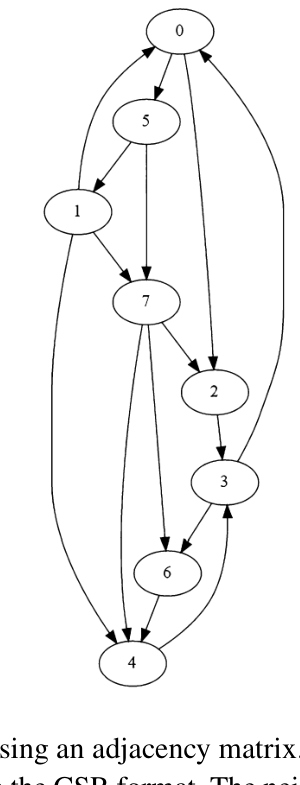

*연습문제 1 의 그래프 — 정점 8개, 방향 간선 15개. (책 p.450)*

그림에서 간선을 하나씩 읽으면 이렇다 (화살표 방향 주의).

| 출발 | 도착 | out-degree |
|---|---|---|
| 0 | 2, 5 | 2 |
| 1 | 0, 4, 7 | 3 |
| 2 | 3 | 1 |
| 3 | 0, 6 | 2 |
| 4 | 3 | 1 |
| 5 | 1, 7 | 2 |
| 6 | 4 | 1 |
| 7 | 2, 4, 6 | 3 |

합 15개. 정점 8개다.

#### (a) 인접 행렬로 표현하라

행 = 출발 정점, 열 = 도착 정점. 0 은 비워 둔다 (Figure 18.2 의 관례).

| | **0** | **1** | **2** | **3** | **4** | **5** | **6** | **7** |
|---|---|---|---|---|---|---|---|---|
| **0** | | | 1 | | | 1 | | |
| **1** | 1 | | | | 1 | | | 1 |
| **2** | | | | 1 | | | | |
| **3** | 1 | | | | | | 1 | |
| **4** | | | | 1 | | | | |
| **5** | | 1 | | | | | | 1 |
| **6** | | | | | 1 | | | |
| **7** | | | 1 | | 1 | | 1 | |

전체 64칸 중 non-zero 15개 — 23%다. 아주 작은 그래프라 성김의 이득이 크지 않다.

#### (b) CSR 형식으로 표현하라 (각 정점의 이웃 목록은 정렬할 것)

$$\texttt{srcPtrs} = [\,0,\;2,\;5,\;6,\;8,\;9,\;11,\;12,\;15\,]$$
$$\texttt{dst} = [\,\underbrace{2,5}_{v_0},\;\underbrace{0,4,7}_{v_1},\;\underbrace{3}_{v_2},\;
\underbrace{0,6}_{v_3},\;\underbrace{3}_{v_4},\;\underbrace{1,7}_{v_5},\;\underbrace{4}_{v_6},\;
\underbrace{2,4,6}_{v_7}\,]$$

`srcPtrs` 는 out-degree 의 exclusive scan 에 총합을 붙인 것이다:
$0, 2, 3, 1, 2, 1, 2, 1, 3$ 을 누적하면 $0, 2, 5, 6, 8, 9, 11, 12, 15$.
`data` 배열은 값이 전부 1 이므로 생략한다 (18.1절).

#### (c) 정점 0 에서 시작하는 병렬 BFS 의 반복별 thread 수

먼저 BFS 결과부터 확정한다.

| level | 정점 | 어떻게 |
|---|---|---|
| 0 | **0** | root |
| 1 | **2, 5** | 0→2, 0→5 |
| 2 | **1, 3, 7** | 5→1, 2→3, 5→7 |
| 3 | **4, 6** | 1→4 (그리고 7→4), 3→6 (그리고 7→6) |

$$\text{level} = [\,0,\;2,\;1,\;2,\;3,\;1,\;3,\;2\,] \quad (\text{정점 } 0..7)$$

$n = 8$, $m = 15$, $d = 3$ 이고 **반복은 4번** 돈다
(4번째 반복이 아무것도 못 찾아야 host 가 멈춘다).

**— vertex-centric push 구현이면**

| 반복 (`currLevel`) | A. 띄우는 thread | B. 이웃을 순회하는 thread | (순회하는 정점) |
|---|---|---|---|
| 1 | **8** | **1** | 0 |
| 2 | **8** | **2** | 2, 5 |
| 3 | **8** | **3** | 1, 3, 7 |
| 4 | **8** | **2** | 4, 6 |
| 합 | 32 | 8 | (= 전 정점 한 번씩) |

A 는 늘 $n = 8$ 이다 — 정점마다 thread 하나. B 는 **이전 level 의 정점 수**다.

**— vertex-centric pull 구현이면**

| 반복 | A. 띄우는 thread | B. 이웃을 순회하는 thread | C. 자기 정점을 label 하는 thread |
|---|---|---|---|
| 1 | **8** | **7** (0 을 뺀 전부) | **2** (정점 2, 5) |
| 2 | **8** | **5** (1,3,4,6,7) | **3** (정점 1, 3, 7) |
| 3 | **8** | **2** (4, 6) | **2** (정점 4, 6) |
| 4 | **8** | **0** | **0** |
| 합 | 32 | 14 | 7 |

B 는 **그 반복 시작 시점의 미방문 정점 수**다. C 는 그 반복에서 새로 label 되는 정점 수,
즉 **level $=$ `currLevel` 인 정점 수**다.
반복 4 에서 미방문 정점이 0 이므로 B 도 C 도 0 이고, host 가 여기서 멈춘다.

> 참고로 **실제 간선 검사 횟수**는 조기 `break` 때문에 B 보다 적게 늘어난다 —
> 반복 1 은 12번, 2 는 9번, 3 은 2번이다. push 의 15번(= $m$)과 비교된다.

**— edge-centric 구현이면**

| 반복 | A. 띄우는 thread | B. 정점을 label 할 수 있는 thread |
|---|---|---|
| 1 | **15** | **2** (0→2, 0→5) |
| 2 | **15** | **3** (2→3, 5→1, 5→7) |
| 3 | **15** | **4** (1→4, 3→6, 7→4, 7→6) |
| 4 | **15** | **0** |
| 합 | 60 | 9 |

A 는 늘 $m = 15$ 다. B 는 **출발 정점이 이전 level 이고 도착 정점이 미방문인 간선 수**다.

> **반복 3 의 B 가 4 인데 새로 label 되는 정점은 2개**임에 주목한다.
> 정점 4 를 1→4 와 7→4 의 thread 둘이, 정점 6 을 3→6 과 7→6 의 thread 둘이 label 한다.
> 이것이 18.3절이 말한 **양성 race** 의 실제 사례다 — 둘 다 3 을 쓰므로 결과는 같다.

**— vertex-centric push frontier 기반 구현이면**

| 반복 | A. 띄우는 thread | B. 이웃을 순회하는 thread |
|---|---|---|
| 1 | **1** | **1** |
| 2 | **2** | **2** |
| 3 | **3** | **3** |
| 4 | **2** | **2** |
| 합 | **8** | **8** |

**A = B 다** — frontier 기반의 정체가 이것이다. 띄운 thread 가 **전부** 일한다.
그리고 총 8 = $n$ 개의 thread 만 띄웠고 검사한 간선은 15 = $m$ 개다.

$$\text{총 작업} = n + m = 8 + 15 = 23 \quad (\text{이상적인 } O(n+m))$$

네 구현을 나란히 놓으면 18.5절의 표가 이 그래프에서 재현된다.

| 구현 | 띄운 thread 합 | 검사한 간선 합 | 합 |
|---|---|---|---|
| push | 32 | 15 | 47 |
| pull | 32 | 23 | 55 |
| edge-centric | 60 | 60 | 120 |
| **frontier** | **8** | **15** | **23** |

(전부 `verify18.py` 의 `trace()` 로 검산했다.)

### 연습문제 2

> **18.3절에서 설명한 direction-optimized BFS 구현의 host 코드를 구현하라.**

전환 규칙이 이 문제의 전부다. 책은 "**그래프 종류에 따라 다르다**"고만 하므로
**실행 중에 재는 값**으로 정하는 것이 실용적이다.
널리 쓰이는 Beamer 의 heuristic 을 그대로 쓴다 — **다음 반복이 검사할 간선 수를
push 와 pull 각각에 대해 추정해 작은 쪽을 고른다.**

| 기호 | 뜻 | 어떻게 얻나 |
|---|---|---|
| $m_f$ | **frontier 정점들의 out-degree 합** — push 가 순회할 간선 수 | `srcPtrs` 로 계산 |
| $m_u$ | **미방문 정점들의 in-degree 합** — pull 이 검사할 간선 수의 상한 | `dstPtrs` 로 계산 |
| $\alpha, \beta$ | 여유 계수 | 관례상 $\alpha = 15$, $\beta = 18$ |

$$\text{push} \to \text{pull}: \quad m_f > \frac{m_u}{\alpha}
\qquad\qquad
\text{pull} \to \text{push}: \quad n_f < \frac{n}{\beta}$$

앞의 조건은 "frontier 가 충분히 커졌다", 뒤는 "frontier 가 다시 작아졌다"는 뜻이다.
$\alpha$ 가 크면 **일찍** 전환한다 — 18.3절이 말한 "평균 degree 가 높으면 일찍"과
같은 방향이다 (degree 가 높으면 $m_f$ 가 빨리 커지므로).

```cpp
// ─────────────────────────────────────────────────────────────
// direction-optimized BFS — host 코드
//   push  : CSR (srcPtrs, dst)  를 쓴다
//   pull  : CSC (dstPtrs, src)  를 쓴다
//   무향 그래프라면 두 구조가 동일하므로 하나만 넘겨도 된다 (18.3절)
// ─────────────────────────────────────────────────────────────
constexpr unsigned int ALPHA = 15;
constexpr unsigned int BETA  = 18;

void bfsDirectionOptimized(const CSRGraph& csr_d, const CSCGraph& csc_d,
                           unsigned int n, unsigned int m,
                           unsigned int root, unsigned int* level_d,
                           const unsigned int* outDeg_h,   // host 사본 (전처리)
                           const unsigned int* inDeg_h) {
    // ── 초기화 ────────────────────────────────────────────────
    cudaMemset(level_d, 0xFF, n*sizeof(unsigned int));      // 전부 UNVISITED
    unsigned int zero = 0;
    cudaMemcpy(&level_d[root], &zero, sizeof(unsigned int), cudaMemcpyHostToDevice);

    unsigned int* newVertexVisited_d;
    cudaMalloc(&newVertexVisited_d, sizeof(unsigned int));

    // frontier 자체는 만들지 않는다 — 18.3절의 두 kernel 은 frontier 를 쓰지 않는다.
    // 대신 전환 판정에 필요한 통계만 host 에서 유지한다.
    std::vector<unsigned int> level_h(n, UNVISITED);
    level_h[root] = 0;

    unsigned int numFrontier   = 1;          // n_f : 이번 level 의 정점 수
    unsigned int numUnvisited  = n - 1;      // 미방문 정점 수
    unsigned int mf            = outDeg_h[root];   // frontier 의 out-degree 합
    unsigned int mu            = m - inDeg_h[root];// 미방문의 in-degree 합 (근사)

    bool usePull = false;                    // 항상 push 로 시작한다 (이른 level)

    const unsigned int TPB = 256;
    const unsigned int gridDim = (n + TPB - 1)/TPB;

    for (unsigned int currLevel = 1; ; ++currLevel) {

        // ── ① 이번 level 의 방향을 정한다 ───────────────────────
        if (!usePull && mf > mu/ALPHA)              usePull = true;
        else if (usePull && numFrontier < n/BETA)   usePull = false;

        // ── ② 해당 방향의 kernel 을 띄운다 ──────────────────────
        cudaMemcpy(newVertexVisited_d, &zero, sizeof(unsigned int),
                   cudaMemcpyHostToDevice);
        if (usePull) bfs_pull_kernel<<<gridDim, TPB>>>(csc_d, level_d,
                                        newVertexVisited_d, currLevel);
        else         bfs_push_kernel<<<gridDim, TPB>>>(csr_d, level_d,
                                        newVertexVisited_d, currLevel);

        unsigned int newVertexVisited;
        cudaMemcpy(&newVertexVisited, newVertexVisited_d, sizeof(unsigned int),
                   cudaMemcpyDeviceToHost);
        if (!newVertexVisited) break;              // 새로 label 된 정점이 없다 → 끝

        // ── ③ 다음 판정을 위한 통계 갱신 ────────────────────────
        //     level 배열을 host 로 되받아 세는 것이 가장 단순하다.
        //     (전용 reduction kernel 로 device 에서 세면 전송을 없앨 수 있다.)
        cudaMemcpy(level_h.data(), level_d, n*sizeof(unsigned int),
                   cudaMemcpyDeviceToHost);
        numFrontier = 0; mf = 0; numUnvisited = 0; mu = 0;
        for (unsigned int v = 0; v < n; ++v) {
            if (level_h[v] == currLevel) { ++numFrontier;  mf += outDeg_h[v]; }
            if (level_h[v] == UNVISITED) { ++numUnvisited; mu += inDeg_h[v];  }
        }
    }
    cudaFree(newVertexVisited_d);
}
```

#### 설계에서 짚을 점 넷

**① `level` 배열이 두 kernel 사이의 유일한 상태다.**
push kernel 과 pull kernel 은 **표현만 다를 뿐 같은 `level` 배열을 읽고 쓴다.**
그래서 반복마다 아무 준비 없이 갈아탈 수 있다 — 이것이 direction-optimized 가
가능한 근본 이유다. frontier 기반 구현이었다면 push→pull 전환 시
frontier 를 버리거나 bitmap 으로 바꿔야 해서 훨씬 복잡해진다.

**② $\alpha$·$\beta$ 판정을 device 에서 하면 전송이 사라진다.**
위 코드는 매 반복 `level_d` 전체를 host 로 가져온다 — $n$ 이 크면 이것이 지배한다.
실무에서는 kernel 안에서 `atomicAdd` 로 $n_f$·$m_f$·$m_u$ 를 함께 세거나,
별도의 짧은 reduction kernel 을 붙인다. `newVertexVisited` 를 세는 김에 같이 세면 된다.

**③ `usePull` 은 되돌아올 수 있어야 한다.**
BFS 의 frontier 는 커졌다가 **다시 작아진다.** 마지막 몇 level 은 frontier 가 다시
작아지므로 push 로 되돌아오는 것이 이득이다. $\beta$ 조건이 그것이다.

**④ 무향 그래프면 인자 하나면 된다.**
18.3절이 말한 대로 $A = A^T$ 이면 CSR 과 CSC 가 같은 배열이다.
`bfsDirectionOptimized(g, g, ...)` 로 부르면 되고 저장 공간이 절반이 된다.
그리고 이때 `outDeg == inDeg` 이므로 통계도 배열 하나로 충분하다.

### 연습문제 3

> **Figure 18.17 의 kernel 을 level 마다 grid 전체 barrier synchronization 을
> 세 번이 아니라 한 번만 쓰도록 고쳐라.**

책의 힌트를 그대로 따른다.

> **level 마다 다른 counter 를 쓰고 kernel 시작 전에 전부 0 으로 재설정**하면
> 그중 두 개를 없앨 수 있다 (책 p.448).

**세 barrier 가 왜 있었는지부터 다시 본다.**

| barrier | 지키는 것 | 없앨 수 있는가 |
|---|---|---|
| 65줄 | 모든 thread 가 **frontier 채우기를 끝냈다** | **없앨 수 없다** — BFS 의 level 순서 그 자체 |
| 67줄 | 모두 **크기를 읽은 뒤에** 0 으로 재설정된다 | **재설정을 안 하면 불필요** |
| 71줄 | **0 재설정이 끝난 뒤에** 더하기가 시작된다 | 〃 |

**67·71줄은 counter 하나를 재사용하기 때문에 생긴 것**이다.
counter 를 level 마다 따로 두면 재설정 자체가 사라지고, 두 barrier도 함께 사라진다.

```cuda
// host 쪽: level 개수의 상한만큼 counter 를 잡고 한 번에 0 으로 밀어 둔다
unsigned int* numFrontier_d;                         // [MAX_LEVELS + 1]
cudaMalloc(&numFrontier_d, (MAX_LEVELS + 1)*sizeof(unsigned int));
cudaMemset(numFrontier_d, 0, (MAX_LEVELS + 1)*sizeof(unsigned int));
unsigned int one = 1;
cudaMemcpy(&numFrontier_d[0], &one, sizeof(unsigned int),   // level 0 = root 하나
           cudaMemcpyHostToDevice);
```

```cuda
__global__ void bfs_kernel(CSRGraph csrGraph, unsigned int* level,
        unsigned int* prevFrontier, unsigned int* currFrontier,
        unsigned int numPrevFrontier, unsigned int* numFrontier) {  // ← 배열이 됐다

    grid_group grid = this_grid();

    for(unsigned int currLevel = 1; numPrevFrontier > 0; ++currLevel) {

        unsigned int* numCurrFrontier = &numFrontier[currLevel];   // ← level 별 counter

        // ── 구간 1~4 는 Figure 18.17 의 12~62줄과 완전히 같다 ──────────
        __shared__ unsigned int currFrontier_s[PRIVATE_FRONTIER_CAPACITY];
        __shared__ unsigned int numCurrFrontier_s;
        if(threadIdx.x == 0) { numCurrFrontier_s = 0; }
        __syncthreads();

        for(unsigned int i = grid.thread_rank();
                i < numPrevFrontier; i += grid.num_threads()) {
            unsigned int vertex = prevFrontier[i];
            for(unsigned int edge = csrGraph.srcPtrs[vertex];
                    edge < csrGraph.srcPtrs[vertex + 1]; ++edge) {
                unsigned int neighbor = csrGraph.dst[edge];
                if(visitVertexAtomically(neighbor, level, currLevel)) {
                    cuda::atomic_ref<unsigned int, cuda::thread_scope_block>
                        numCurrFrontier_s_ref(numCurrFrontier_s);
                    unsigned int currFrontierIdx_s =
                        numCurrFrontier_s_ref.fetch_add(1, cuda::memory_order_relaxed);
                    if(currFrontierIdx_s < PRIVATE_FRONTIER_CAPACITY) {
                        currFrontier_s[currFrontierIdx_s] = neighbor;
                    } else {
                        // 18.6절에서 지적한 표준 위반을 여기서는 고쳐 둔다
                        numCurrFrontier_s_ref.store(PRIVATE_FRONTIER_CAPACITY,
                                                    cuda::memory_order_relaxed);
                        cuda::atomic_ref<unsigned int, cuda::thread_scope_device>
                            numCurrFrontier_ref(*numCurrFrontier);
                        unsigned int currFrontierIdx =
                            numCurrFrontier_ref.fetch_add(1, cuda::memory_order_relaxed);
                        currFrontier[currFrontierIdx] = neighbor;
                    }
                }
            }
        }
        __syncthreads();

        __shared__ unsigned int currFrontierStartIdx;
        if(threadIdx.x == 0) {
            cuda::atomic_ref<unsigned int, cuda::thread_scope_device>
                numCurrFrontier_ref(*numCurrFrontier);
            currFrontierStartIdx = numCurrFrontier_ref.fetch_add(numCurrFrontier_s,
                cuda::memory_order_relaxed);
        }
        __syncthreads();

        for(unsigned int currFrontierIdx_s = threadIdx.x;
                currFrontierIdx_s < numCurrFrontier_s; currFrontierIdx_s += blockDim.x) {
            unsigned int currFrontierIdx = currFrontierStartIdx + currFrontierIdx_s;
            currFrontier[currFrontierIdx] = currFrontier_s[currFrontierIdx_s];
        }

        // ── Swap frontiers — barrier 가 하나로 줄었다 ──────────────────
        grid.sync();                                   // ① 유일하게 남은 barrier
        numPrevFrontier = numFrontier[currLevel];      // 재설정이 없으니 안전하게 읽는다
        unsigned int* tmp = prevFrontier;
        prevFrontier = currFrontier;
        currFrontier = tmp;
    }
}
```

#### 왜 barrier 하나로 충분한가 — 네 가지를 확인한다

**① `numFrontier[currLevel]` 을 읽는 것이 안전한가.**
그 counter 에 더하는 것은 **`currLevel` 반복의 thread 들뿐**이고,
그들은 전부 65줄의 `grid.sync()` 이전에 더하기를 끝냈다. **안전하다.**

**② 재설정이 없으니 67·71줄의 이유가 사라진다.**
`numFrontier[currLevel + 1]` 은 kernel 시작 전에 `cudaMemset` 으로 0 이 되어 있고,
그 값을 건드리는 것은 **다음 반복의 thread 들뿐**이다.
그리고 다음 반복은 barrier 이후이므로 이번 반복의 누구도 방해하지 않는다.

**③ 버퍼 맞바꾸기가 안전한가.**
다음 반복에서 `currFrontier`(= 이번의 `prevFrontier` 버퍼)에 **쓰기** 시작하는데,
이번 반복에서 `prevFrontier` 를 **읽은** 것은 전부 barrier 이전이다.
**읽기 → barrier → 쓰기** 순서가 지켜진다. **안전하다.**

**④ `MAX_LEVELS` 를 얼마로 잡나.**
BFS level 수는 그래프의 지름을 넘지 않고, 지름은 $n-1$ 을 넘지 않는다.
안전하게 잡으려면 $n$ 개, 즉 $4n$ 바이트를 더 쓴다.
도로망처럼 지름이 커도 $10^4$ 수준이므로 실제로는 무시할 만한 비용이다.
**이 여분의 메모리로 barrier 두 번을 산 것**이 이 최적화의 정체다.

> **책이 "double-buffering 을 일반화한 형태"라고 부른 이유.**
> 6.7절의 double buffering 은 버퍼 **두 개**를 번갈아 써서 "쓰기 전에 읽기가 끝났음"을
> 보장하는 barrier 하나를 없앴다. 여기서는 counter 를 **level 수만큼** 두어
> 같은 종류의 barrier 두 개를 없앤다 — $2$ 개에서 $d$ 개로 일반화된 것이다.
> frontier **버퍼** 자체는 여전히 딱 두 개로 double buffering 이다.

---

## 원문 오기

18장을 쓰며 원문과 대조하다 발견한 것들이다. 근거를 함께 적는다.

### ① 책 p.441 — 그림 참조가 틀렸다

> "In the vertex-centric push kernel **without frontiers in Fig. 18.12**,
> this checking and labeling operation is performed without atomic operations (09-10)."

**Figure 18.12 는 frontier 를 쓰는 kernel 이다.** frontier 를 **쓰지 않는** push kernel 은
**Figure 18.6** 이다. 게다가:

| 근거 | |
|---|---|
| 인용된 줄 번호 (09~10) | **Figure 18.6 의 09~10줄**이 정확히 `if(level[neighbor] == UNVISITED)` 와 `level[neighbor] = currLevel` 이다 |
| Figure 18.12 의 09~10줄 | `edge < csrGraph.srcPtrs[vertex+1]; ++edge) {` 와 `unsigned int neighbor = ...` — 검사·label 이 아니다 |
| 바로 다음 문장 | "In contrast, in the frontier-based implementation **in Fig. 18.12**" — 같은 그림 번호를 **대조 대상**으로 다시 쓴다. 한 문장 안에서 A 와 A 를 대조할 수는 없다 |

→ **`Fig. 18.12`** 는 **`Fig. 18.6`** 이어야 한다.

### ② 책 p.438 (18.5절) — "current" 가 "previous" 여야 한다

> "The thread checks if its vertex is in the **previous** level, and if so, it labels all
> the vertex's unvisited neighbors as belonging to the current level.
> On the other hand, the threads whose vertices are **not in the current level**
> do not do anything."

앞 문장이 검사 조건을 "**previous** level"이라고 말했으므로,
"아무것도 하지 않는 thread"는 "**previous** level 이 아닌 정점의 thread"다.
Figure 18.6 의 05줄 `if(level[vertex] == currLevel - 1)` 이 이를 확정한다.

→ **`not in the current level`** 은 **`not in the previous level`** 이어야 한다.

### ③ 책 p.430 Figure 18.5 캡션 — 철자

> "(a) brea**th**first search, (b) identifying a routing path."

같은 캡션의 본문과 책 전체가 **`breadthfirst`** 로 쓴다 (`d` 가 빠졌다).
같은 쪽의 다른 세 곳은 전부 `breadth` 다.

→ **`breathfirst`** 는 **`breadthfirst`** 여야 한다.

### ④ 책 p.439 — 괄호 하나가 남는다

> "Hence, the work performed is $O(d \cdot n + d \cdot m)\mathbf{)}$."

닫는 괄호가 하나 더 있다. 앞뒤의 $O(d \cdot n + m)$, $O(d \cdot m)$ 과 비교하면 명확하다.

→ **`O(d · n + d · m))`** 는 **`O(d · n + d · m)`** 여야 한다.

### ⑤ 책 p.443 Figure 18.15 line 29 (및 Figure 18.17 line 35) — 표준 위반

```cuda
29     numCurrFrontier_s = PRIVATE_FRONTIER_CAPACITY;   // non-atomic 저장
```

같은 순간 다른 thread 들이 25줄에서 **같은 객체에 atomic RMW** 를 수행한다.
C++ 메모리 모델에서 **같은 객체에 대한 atomic 접근과 non-atomic 접근이 겹치는 것은
data race 이며 미정의 동작**이다.

**논리는 옳다** — 18.6절에서 확인한 대로 유효 슬롯을 잃지 않고 counter 도 발산하지 않는다.
그러나 책 스스로 p.434 에서 "멱등이라도 C++ 메모리 모델을 위반하며 동작이 보장되지 않는다"
고 경고했으므로 **일관성이 깨진 자리**다.

```cuda
// 고친 형태 — 비용은 같고 표준을 지킨다
numCurrFrontier_s_ref.store(PRIVATE_FRONTIER_CAPACITY, cuda::memory_order_relaxed);
```

(연습문제 3 의 코드에는 이 수정을 반영해 두었다.)

### 참고 — 오기가 **아닌** 것

작업 중에 오기로 의심했다가 원문 확인 후 취소한 것들이다.

| 의심한 곳 | 결론 |
|---|---|
| p.439 "not work-e**i**cient" | `pdftotext` 가 **`ffi` 합자를 놓친 것**이다. PDF 텍스트 레이어에는 `work-efficient` 로 정상 |
| p.434 "As discussed in **Chapter 14**, such race conditions are benign" | **맞는 참조다.** 14장 odd-even sort 의 `hasChanged` flag 논의(책 p.333)가 정확히 그것이다 |
| p.442 "Recall from **Chapter 6** that privatization reduces contention" | **맞는 참조다.** 6.8절 최적화 checklist 에 privatization 항목과 정의가 있다 (본격 전개는 9.4절) |
| p.438 "as discussed in **Chapter 6**" (thread↔데이터 재배치) | **맞는 참조다.** 6.8절 checklist 항목 3 이 "control divergence 를 줄이기 위한 일/데이터의 thread 배분 재배치"다 |

### 참고 — PDF 쪽 매핑

**책 452쪽은 PDF 에 없다.** 18장 References(책 451) 다음이 곧바로 19장 표지(책 453)다 —
19장이 홀수 쪽에서 시작하도록 넣은 **백지 verso 가 PDF 에서 빠졌다.**
`kit.conf` 의 `page_offset` 이 `26@315-477, 25@478-500` 인 것이 이 때문이고,
`book_to_pdf(452)` 는 `None` 을 돌려준다. 그림 추출은 `--book-pages 425-451` 로 했다.
(`3_Pitfalls.md` A10 의 사례다.)
