# 19장. Convolutional neural networks

> **원문 범위**: 책 p.453~475 (19.1~19.6절 + References).
> 부제는 없고 **Juan Gómez-Luna 의 특별 기고**가 붙어 있다.
> **절 순서**: 책 순서를 그대로 따랐다. 재배치 없음.
> **연습문제**: 책 19.6절의 4문제를 전부 풀었다. 1·3번은 구현 과제라 코드와 설계 근거를 함께 적었다.
> **원문 오기**: 5건(변수명 1, 첨자 범위 1, 행렬 크기 1, 원소 이름 2)과
> 오타 2건을 근거와 함께 표시했다.
> **부록 B**: 책이 여러 번 "Appendix B 를 보라"고 한다. 이 노트는 **19장 범위만** 다루고
> 부록 B 는 따로 작업한다. 필요한 배경(퍼셉트론·활성화 함수·역전파)은 최소한만 짚었다.

**이 장은 두 갈래가 합류하는 지점이다.** 7장의 convolution 과 15장의 GEMM 이
여기서 만난다. 그리고 그 만남의 방식이 이 장의 진짜 주제다.

> convolutional layer 를 **동등한 matrix multiplication 연산으로 정식화**한다.
> 이 정식화를 쓰면 잘 정립된 tiling 기법(15장)을 곧바로 써서
> 입력 feature map 과 filter bank 의 재사용을 가능하게 하고 global memory bandwidth
> 소비를 줄일 수 있다.
> 실제로 CUDA 선형대수 라이브러리 cuBLAS 의 **고도로 최적화된 GEMM kernel 을 그대로 쓰거나
> 살짝 손보는 것만으로** 고성능 convolutional-layer kernel 을 구현할 수 있다 (책 p.463~464).

**문제를 더 잘 푸는 것이 아니라, 이미 잘 풀리는 문제로 바꿔 쓴다.**
18.4절이 BFS 를 SpMV 로 정식화하며 이야기한 바로 그 맞바꿈이 여기서 반복되고,
이번에는 **그 선택이 실제 산업 표준이 되었다** — cuDNN 이 하는 일이 정확히 이것이다.

### 네 갈래 구현 경로

| 경로 | 어디서 | 무엇을 얻는가 | 무엇을 잃는가 |
|---|---|---|---|
| ① 순차 C 7중 loop | Figure 19.3 · 19.4 | 정의 그대로, 읽기 쉽다 | 느리다 |
| ② 직접 CUDA kernel | Figure 19.7 | 쉽게 얻는 4단계 병렬성 | **arithmetic intensity 0.25 FLOP/B** — global memory 에 묶인다 |
| ③ **명시적** unfolding + GEMM | Figure 19.8 | 성숙한 GEMM 라이브러리 전체 | 입력이 **$K^2$ 배**로 부풀고, 그것을 쓰고 다시 읽어야 한다 |
| ④ **암묵적** unfolding GEMM | Figure 19.11 | ③의 이득에서 팽창 비용만 뺀 것 | index 산술이 복잡해진다 |
| ⑤ cuDNN | 19.4절 | ④ + Winograd + FFT + 전문가 튜닝 | 직접 못 고친다 |

**19장은 ② → ③ → ④ → ⑤ 로 내려가는 한 줄기 이야기**다.
그리고 ②에서 ④로 가면서 arithmetic intensity 가 **0.25 → 4 FLOP/B**, 즉 $16\times$ 오른다
(뒤에서 유도한다).

### 이 장의 뼈대

| 절 | 무엇을 하는가 |
|---|---|
| 19.1 | CNN 의 구조와 용어 — feature map · filter bank · layer. 순차 코드까지 |
| 19.2 | 어떤 loop 가 병렬인가를 가려내고 thread 를 배치한다 |
| 19.3 | **convolutional layer = GEMM**. 명시적 unfolding 의 비용을 재고 암묵적 방식으로 간다 |
| 19.4 | cuDNN 이 실제로 하는 일 |

> **7장과 무엇이 다른가.** 7장의 convolution 은 **입력 하나 · filter 하나 · 출력 하나**였다.
> 19장은 **입력 $C$ 개 · filter $M \times C$ 개 · 출력 $M$ 개**이고,
> 거기에 **batch 차원 $N$** 이 더 붙는다. 차원이 둘 늘었을 뿐인데
> 7장의 답(shared memory tiling)이 더 이상 최선이 아니게 된다 — 19.3절 첫머리가 그 이유를 짚는다.

---

## 19.1 Convolutional neural networks

### 왜 2012년이었나

> deep learning 은 기계학습 분야의 한 갈래로, 컴퓨터가 **명시적으로 프로그램되지 않고도**
> 특정 작업을 수행하도록 학습하는 능력을 갖게 하는 연구다 (책 p.453).

기계학습은 오래된 주제인데 딥러닝만 수십 년 잠들어 있었다. 이유는 하나다.

> 그 딥러닝 갈래는 **거대한 데이터셋**과, 그 데이터셋으로부터 수많은 모델 파라미터 값을
> 학습하는 데 필요한 **연산력**이 없어서 수십 년간 잠들어 있었다 (책 p.453).

2012년 이후 폭발한 이유도 정확히 그 둘이다.

| 이유 | 내용 |
|---|---|
| ① **거대한 데이터셋** | 소비자와 기업의 인터넷 사용이 보편화되며 학습용 데이터가 쌓였다 |
| ② **충분한 연산력** | 그 데이터셋으로부터 모델 파라미터 값을 **효과적이고 시의적절하게** 학습할 수 있는 GPU 컴퓨팅 시스템 |

> 1장에서 같은 이야기를 이미 했다 (책 p.8). 거기서는 "신경망은 1970년대부터 있었는데
> 왜 2012년에야 폭발했는가"가 연습문제였고, 답이 **labeled data 와 훈련 연산력**이었다.
> 19장은 그 답의 **둘째 항을 직접 구현**한다.

**2012년 ILSVRC** 의 숫자들이다 (책 p.454).

| 항목 | 값 |
|---|---|
| 분류할 클래스 | 1000개 |
| 파라미터 | 약 **6000만** 개 |
| 뉴런 | 65만 개 |
| 훈련 데이터 | ImageNet 의 고해상도 이미지 **120만** 장 |
| 훈련 시간 | GPU **2대**로 **일주일** |
| 사용한 것 | Alex Krizhevsky 가 쓴 **CUDA 기반 CNN 라이브러리** [7] |
| 우승 test error rate | **15.3%** |
| 2위(전통 컴퓨터 비전) | **26.2%** |

$$26.2\% - 15.3\% = 10.9\%\text{p}$$

**10.9%p 차이가 컴퓨터 비전 전체를 뒤집었다.**

> 이 성공이 컴퓨터 비전에 혁명을 촉발했고, convolutional neural network 는 컴퓨터 비전 ·
> 자연어 처리 · 강화학습 등 수많은 분야의 **주류 도구**가 되었다 (책 p.455).

**이 장이 CNN 을 고른 이유**도 명확하다.

> 특히 CNN 의 **convolutional layer 는 compute-to-memory-access 비가 높고 병렬성이 커서
> GPU 가속에 완벽한 후보**다 (책 p.454).

> "compute-to-memory-access ratio" 는 5장의 **arithmetic intensity** 와 같은 말이다.
> 그런데 19.2절에서 직접 계산해 보면 **기본 kernel 의 arithmetic intensity 는 0.25 FLOP/B**
> 로 형편없다. 책의 이 문장은 **알고리즘이 잠재적으로 갖는 재사용 가능성**을 말하는 것이지
> 순진한 구현이 그것을 실현한다는 뜻이 아니다. **19.3절 전체가 그 간극을 메우는 작업**이다.

### LeNet-5 (Figure 19.1)

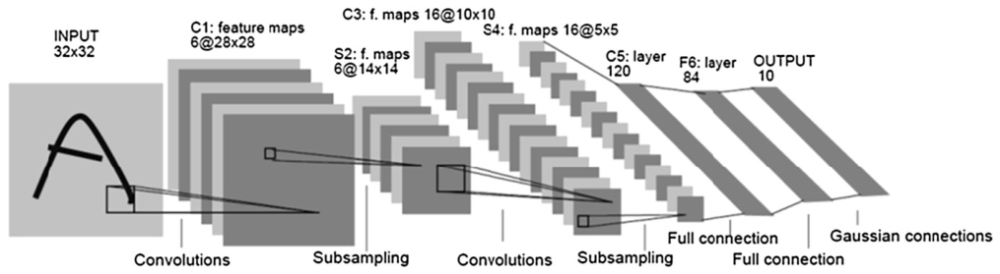

*Figure 19.1 — 손글씨 숫자 인식용 CNN 인 LeNet-5.
입력의 글자 A 는 10개 클래스(숫자) 중 **어느 것에도 속하지 않는 것**으로 분류되어야 한다.
(책 p.455)*

> LeNet-5 는 1980년대 후반에 숫자 인식을 위해 설계된 CNN [3] 이고, 이 장의 실습 예제다.
> Fig. 19.1 에 보이듯 LeNet-5 는 세 종류의 layer 로 이루어져 있다:
> **convolutional layer, subsampling layer, fully connected layer**.
> 이 세 종류는 오늘날의 신경망에서도 여전히 중요한 구성 요소인데,
> **convolutional layer 가 CNN 실행 시간의 대부분을 차지한다** (책 p.455).

**그래서 이 장은 convolutional layer 만 다룬다.** 나머지는 부록 B 로 미룬다.

층별로 정리하면 (모양은 Figure 19.1 과 19.1절 본문, **가중치·MAC 수는 그 모양에서 직접 센 것**):

| layer | 종류 | 입력 | filter | 출력 | 가중치 수 | MAC 수 |
|---|---|---|---|---|---|---|
| INPUT | — | — | — | 1@32×32 | — | — |
| **C1** | convolution | 1@32×32 | 1×6 개의 5×5 | 6@28×28 | $1{\cdot}6{\cdot}25 = 150$ | 117,600 |
| S2 | subsampling | 6@28×28 | — | 6@14×14 | — | — |
| **C3** | convolution | 6@14×14 | 6×16 개의 5×5 | 16@10×10 | $6{\cdot}16{\cdot}25 = \mathbf{2{,}400}$ | **240,000** |
| S4 | subsampling | 16@10×10 | — | 16@5×5 | — | — |
| **C5** | convolution | 16@5×5 | 16×120 개의 5×5 | 120@1×1 | $16{\cdot}120{\cdot}25 = 48{,}000$ | 48,000 |
| F6 | fully connected | 120 | — | 84 | $120{\cdot}84 = 10{,}080$ | 10,080 |
| OUTPUT | Gaussian connection | 84 | — | 10 | $84{\cdot}10 = 840$ | 840 |
| | | | | **합계** | **61,470** | **405,600** (conv 만) |

이 표에서 세 가지가 보인다.

1. **가중치는 C5 에 몰려 있고(48,000 / 61,470 = 78%), 연산은 C3 에 몰려 있다**(240,000 / 405,600 = 59%).
   가중치가 많다고 연산이 많은 것이 아니다 — C5 는 출력이 $1\times1$ 이라 filter 를 한 번씩만 쓴다.
2. **2012년 AlexNet 의 6000만 파라미터는 LeNet-5 의 약 $976\times$** 다. 24년 사이의 격차다.
3. **출력 크기가 $32 \to 28 \to 14 \to 10 \to 5 \to 1$ 로 줄어든다.** convolution 이 $K-1=4$ 씩 깎고,
   subsampling 이 절반으로 줄인다. 아래에서 왜 4 씩 깎이는지 본다.

### 순전파와 역전파

> 순전파 경로(forward path)는 왼쪽에서 입력을 받아 layer 를 따라 왼쪽에서 오른쪽으로 흐른다.
> 신경망의 입력은 손글씨 숫자를 담은 **2D $32 \times 32$ 픽셀 배열**의 회색조 이미지로 표시된다.
> 마지막 layer 는 원본 이미지가 신경망이 인식하도록 설정된 **10개 클래스(숫자) 각각에
> 속할 확률**을 출력한다 (책 p.455).

| 국면 | 순전파의 출력을 어떻게 쓰나 |
|---|---|
| **추론(inference)** | 그대로 답이다 — 입력 이미지에서 어느 숫자가 인식되었는가 |
| **훈련(training)** | **label**(기대 출력)과 비교한다. 다르면 **역전파 경로**를 켜서 모델 파라미터를 조정한다 |

> 즉 **순전파는 훈련 국면과 추론 국면 둘 다에서 활성화**된다.
> 그래서 우리는 convolutional layer 의 가속을 설명하는 데 순전파를 쓴다 (책 p.455).

> **각주 1**: 부록 B 는 CNN 의 역전파 경로도 다룬다. 관심 있는 독자는
> **순전파를 공부하며 익힌 기술을 적용해** CNN layer 역전파의 CUDA kernel 구현을
> 탐구해 보아야 한다 (책 p.455 각주 1). → **연습문제 3** 에서 실제로 해 본다.

### feature map · filter · filter bank (Figure 19.2)

> CNN layer 의 입력과 출력을 **feature map**, 줄여서 **feature** 라고 부른다 (책 p.456).

용어 네 개가 한꺼번에 나온다. 못 박아 두고 간다.

| 용어 | 뜻 | Figure 19.2(b) 에서 |
|---|---|---|
| **feature map** | layer 의 입력 또는 출력인 2D 픽셀 배열 | 입력 3장, 출력 2장 |
| **channel** | 입력 feature map 의 index (= 3D 배열의 최상위 차원) | $C = 3$ |
| **filter** | convolution mask (7장의 그것) — 하나의 (입력, 출력) 쌍에 하나씩 | $2\times2$ 짜리 6개 |
| **filter bank** | 한 출력 feature map 을 만드는 데 쓰이는 filter 들의 모음 | 3개씩 두 묶음 |
| **tensor** | 3차원 이상의 배열. layer 의 2D feature map 들을 통틀어 3D 로 본 것 | $3\times3\times3$ 입력 tensor |

> Fig. 19.1 에서 신경망 입력단의 C1 convolutional layer 계산은
> $(32 \times 32)$ INPUT 픽셀 배열로부터 **여섯 장의 $(28 \times 28)$ 출력 feature map** 을
> 생성하도록 조직되어 있다.
> 출력 feature map 의 각 픽셀은, **이전 layer 가 만든 feature map 픽셀의 작은 국소 patch** 와
> **filter 라 부르는 가중치 집합**(즉 7장에서 정의한 convolution mask) **사이의 convolution 을
> 수행**해서 만들어진다 (책 p.456).

그 다음에 **활성화 함수**가 붙는다.

> convolution 결과는 sigmoid 같은 **활성화 함수**(부록 B)에 먹여져 출력 feature map 의
> 출력 픽셀을 만든다. convolutional layer 를 **퍼셉트론의 모음**으로 생각할 수 있는데,
> 출력 feature map 의 각 픽셀이 입력 feature map 픽셀 patch 를 입력으로 받는
> 퍼셉트론 하나에 의해 생성되는 것이다 (책 p.456).

> **이 장은 활성화 함수를 다루지 않는다.**
> "convolution 결과를 만드는 효율적인 kernel 이 일단 있으면, 활성화 함수는
> **별도의 kernel 로든 같은 kernel 의 끝에든 붙이기가 간단**하다" (책 p.456).
> 즉 이 장에서 **출력 픽셀 값 = 모든 입력 feature map 의 대응 patch 로부터 온
> convolution 결과의 합** 이다. 그 이상은 없다.

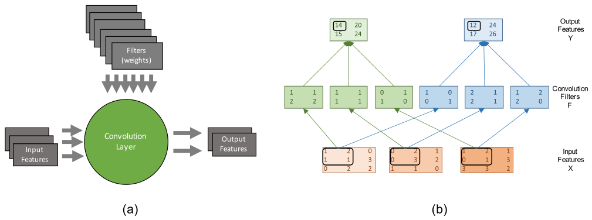

*Figure 19.2 — convolutional layer 의 순전파 경로.
(a) 개념도, (b) 계산의 상세. 출력 픽셀의 활성화 함수는 간략화를 위해 생략했다. (책 p.456)*

**filter 가 몇 개 필요한가**가 이 그림의 첫 번째 메시지다.

> 한 layer 안에서 **서로 다른 (입력, 출력) feature map 쌍은 서로 다른 filter 를 쓴다.**
> Fig. 19.2 에는 입력 feature map 이 3장, 출력 feature map 이 2장이므로
> bank 에 $3 \times 2 = 6$ 개의 filter 가 필요하다 (책 p.456).

$$\text{filter 개수} = C \times M$$

| 예 | $C$ | $M$ | filter 수 |
|---|---|---|---|
| Figure 19.2 | 3 | 2 | **6** |
| LeNet-5 의 C3 | 6 | 16 | **96** |
| LeNet-5 의 C5 | 16 | 120 | **1,920** |

두 번째 메시지는 **합**이다.

> **각 출력 feature map 은 모든 입력 feature map 의 convolution 들의 합**이다 (책 p.456).

Figure 19.2(b) 의 왼쪽 위 원소(값 14)를 실제로 계산해 보자.
입력 feature map 세 장에서 동그라미 친 patch 와 대응하는 filter 사이의 convolution 이다.

$$
(1, 2, 1, 1) \cdot (1, 1, 2, 2) + (0, 2, 0, 3) \cdot (1, 1, 1, 1) + (1, 2, 0, 1) \cdot (0, 1, 1, 0)
$$
$$
= \underbrace{(1 + 2 + 2 + 2)}_{7} + \underbrace{(0 + 2 + 0 + 3)}_{5} + \underbrace{(0 + 2 + 0 + 0)}_{2} = 14
\tag{19.1}
$$

> **각주 2**: feature map 과 filter bank 의 원소로 간략화를 위해 정수를 쓰지만
> 실제로는 부동소수점 수다 (책 p.457 각주 2).

**이 예제의 값을 전부 못 박아 둔다** — 19.3절 내내 같은 수를 쓴다.

| 입력 feature map ($3\times3$) | 값 |
|---|---|
| $X_0$ | $\begin{smallmatrix}1&2&0\\1&1&3\\0&2&2\end{smallmatrix}$ |
| $X_1$ | $\begin{smallmatrix}0&2&1\\0&3&2\\1&1&0\end{smallmatrix}$ |
| $X_2$ | $\begin{smallmatrix}1&2&1\\0&1&3\\3&3&2\end{smallmatrix}$ |

| filter ($2\times2$) | $c=0$ | $c=1$ | $c=2$ |
|---|---|---|---|
| $m=0$ (녹색) | $\begin{smallmatrix}1&1\\2&2\end{smallmatrix}$ | $\begin{smallmatrix}1&1\\1&1\end{smallmatrix}$ | $\begin{smallmatrix}0&1\\1&0\end{smallmatrix}$ |
| $m=1$ (파랑) | $\begin{smallmatrix}1&0\\0&1\end{smallmatrix}$ | $\begin{smallmatrix}2&1\\2&1\end{smallmatrix}$ | $\begin{smallmatrix}1&2\\2&0\end{smallmatrix}$ |

$$Y_0 = \begin{pmatrix}14 & 20\\ 15 & 24\end{pmatrix}, \qquad
  Y_1 = \begin{pmatrix}12 & 24\\ 17 & 26\end{pmatrix}$$

(검산: `verify19.py` 의 `conv_forward`.)

### 왜 크기가 $K-1$ 만큼 줄어드나

> 7장에서 본 대로, 입력 이미지와 convolution filter 로부터 convolution 출력 이미지를 만들려면
> **"ghost cell" 에 대한 가정**이 필요하다.
> 그런 가정을 하는 대신, LeNet-5 설계는 각 입력 feature map 의 **오른쪽 가장자리 원소 네 개와
> 아래쪽 가장자리 원소 네 개를 그냥 "ghost cell" 로 쓴다.**
> 이는 각 차원의 크기를 넷씩 줄인다 — 오른쪽에서 넷, 아래쪽에서 넷 (책 p.457).

$$H_{out} = H - K + 1, \qquad W_{out} = W - K + 1$$

$K = 5$ 면 $K - 1 = 4$ 이므로 $32 \to 28$ 이다. Figure 19.1 의 C1 이 그것이다.

> **7장과의 대비.** 7장은 ghost cell 을 **0 으로 채우는(padding)** 쪽을 기본으로 삼아
> 출력 크기를 입력과 같게 유지했다. LeNet-5 는 **아예 계산하지 않는** 쪽을 골랐다.
> 오늘날 용어로 전자가 `padding='same'`, 후자가 `padding='valid'` 다.
> 19.4절의 cuDNN 은 `pad_h`·`pad_w` 매개변수로 **둘 다** 지원한다.

### Figure 19.3 — 순차 C 구현

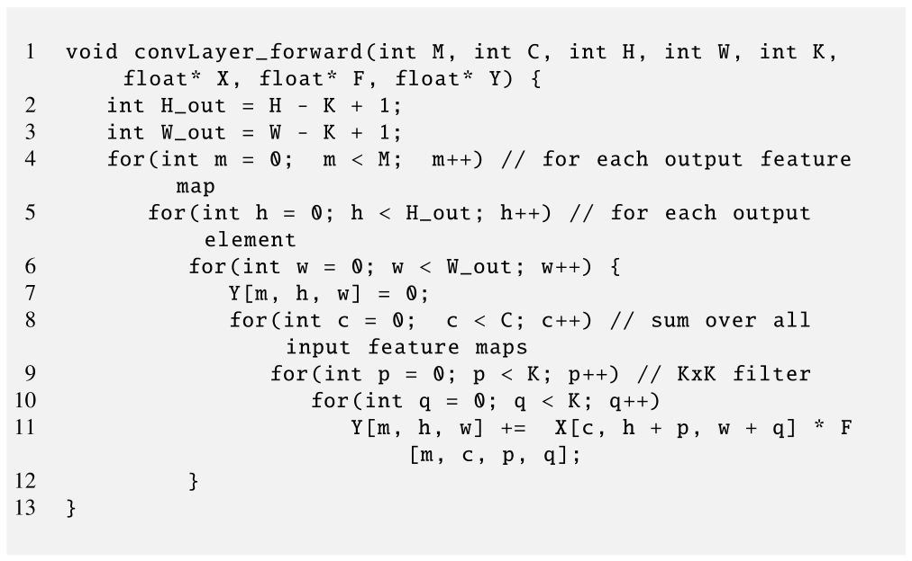

*Figure 19.3 — convolutional layer 순전파 경로의 C 구현. (책 p.457)*

```c
 1  void convLayer_forward(int M, int C, int H, int W, int K,
        float* X, float* F, float* Y) {
 2      int H_out = H - K + 1;
 3      int W_out = W - K + 1;
 4      for(int m = 0;  m < M;  m++)      // for each output feature map
 5        for(int h = 0; h < H_out; h++)  // for each output element
 6          for(int w = 0; w < W_out; w++) {
 7              Y[m, h, w] = 0;
 8              for(int c = 0;  c < C; c++)   // sum over all input feature maps
 9                for(int p = 0; p < K; p++)  // KxK filter
10                  for(int q = 0; q < K; q++)
11                      Y[m, h, w] +=  X[c, h + p, w + q] * F[m, c, p, q];
12          }
13  }
```

**매개변수 여덟 개**를 못 박아 둔다. 이 이름들이 19장 끝까지 그대로 간다.

| 매개변수 | 뜻 | 모양 |
|---|---|---|
| `M` | 출력 feature map 수 | |
| `C` | 입력 feature map 수 (= channel 수) | |
| `H` | 각 입력 map 이미지의 **높이** | |
| `W` | 각 입력 map 이미지의 **너비** | |
| `K` | 각 2D filter 의 높이(= 너비) | |
| `X` | 입력 feature map 배열 | `C × H × W` |
| `F` | **filter bank 배열** | `M × C × K × K` |
| `Y` | 출력 feature map 배열 | `M × (H-K+1) × (W-K+1)` |

> **원문 오기 ①.** 책 p.458 은 "The filter bank is stored in a 4D M×C×K×K array parameter **W**"
> 라고 쓴다. 그러나 Figure 19.3 line 1 의 시그니처는 `float* F` 이고,
> **바로 다음 문장**부터 책 자신이 `Filter F[m, c, _, _]` 라고 쓴다.
> 게다가 `W` 는 **같은 함수의 네 번째 매개변수(입력 map 의 너비)** 로 이미 쓰였다.
> → **`array parameter W`** 는 **`array parameter F`** 여야 한다. (뒤의 "원문 오기" 절 참조)

**loop 일곱 겹의 역할**이다.

| loop | 줄 | 무엇을 도는가 | 반복 수 |
|---|---|---|---|
| `m` | 4 | 출력 feature map | $M$ |
| `h` | 5 | 출력 픽셀의 행 | $H_{out}$ |
| `w` | 6 | 출력 픽셀의 열 | $W_{out}$ |
| `c` | 8 | **입력 feature map (channel)** | $C$ |
| `p` | 9 | filter 의 행 | $K$ |
| `q` | 10 | filter 의 열 | $K$ |

> **원문 오기 ②.** 책 p.458 은 "Filter `F[m, c, _, _]` … where `_` represents an index that
> **ranges from 0 to K**" 라고 쓰지만, Figure 19.3 의 loop 는 `p < K`·`q < K` 다.
> → **0 부터 $K-1$ 까지**여야 한다.

**바깥 세 겹이 "무엇을 만드는가", 안쪽 세 겹이 "어떻게 만드는가"** 다.
19.2절이 이 경계를 그대로 병렬/순차의 경계로 삼는다.

### 나머지 layer 들

책이 LeNet-5 를 끝까지 따라간다.

| layer | 책의 서술 (p.458~459) |
|---|---|
| **C3** | 입력 6장 $14\times14$, 출력 16장 $10\times10$. filter bank $6\times16 = 96$ 개, bank 하나에 $5\times5=25$ 개의 가중치 |
| **S4** | C3 의 출력을 받아 $16$ 장의 $5\times5$ 출력 feature map 생성 |
| **C5** | $16 \times 120 = 1920$ 개의 $5\times5$ filter 로 입력 16장에서 **1픽셀짜리 출력 feature map 120장** 생성 |
| **F6** | 출력 84개. 각 출력이 **모든 입력과 연결**(fully connected)된다. 가중치 행렬과 입력 벡터의 곱 + 편향 → sigmoid |
| **OUTPUT** | Gaussian connection [3] 으로 10원소 벡터 생성 = 입력 이미지가 숫자 0~9 각각일 확률 |

> F6 에 대해 책은 이렇게 쓴다: "출력은 **84원소 벡터** $Y_6 = \text{sigmoid}(W \cdot X + b)$ 다.
> 독자는 이것이 **84개의 퍼셉트론**과 동등하고 각 퍼셉트론이 C5 가 만든 120개의 1픽셀 값
> 전부를 입력으로 받는 것임을 알아보아야 한다" (책 p.458).

> **원문 오기 ③.** 같은 문단이 "the weight matrix (`W`) is a **120×84** matrix" 라고 쓴다.
> 그런데 $Y_6 = \text{sigmoid}(W \cdot X + b)$ 에서 $X$ 는 120원소, $Y_6$ 는 84원소이므로
> $$W \cdot X = (84 \times 120)(120 \times 1) = (84 \times 1)$$
> → $W$ 는 **$84 \times 120$** 이어야 한다. ($120\times84$ 라면 $W^\top X$ 로 써야 한다.)

**F6 의 구현은 연습문제로 남겨져 있다** ("We leave the detailed implementation of a fully
connected layer as an exercise", 책 p.458). 정리 절 뒤 연습문제에서 함께 다룬다.

### batch — 자원을 다 쓰려면 (Figure 19.4)

> 연산 자원을 온전히 쓰기 위해 CNN 구현자는 흔히 **여러 입력을 모아 batch 로 신경망에
> 흘리는 batch 실행**에 의존한다.
> batch 안의 각 입력에 대해 생성되는 입력·출력 feature map 들을 통틀어 **sample** 이라 부른다.
> batch 실행은 사용자가 **훨씬 큰 grid 를 더 많은 thread block 으로 띄울 수 있게 해**
> GPU 실행 자원의 활용도를 크게 개선한다 (책 p.459).

> batch CNN 실행은 특히 **훈련 국면에서 인기**다 — 훈련 중에는 엄청난 수의 입력을
> CNN 에 흘려야 하기 때문이다 (책 p.459).

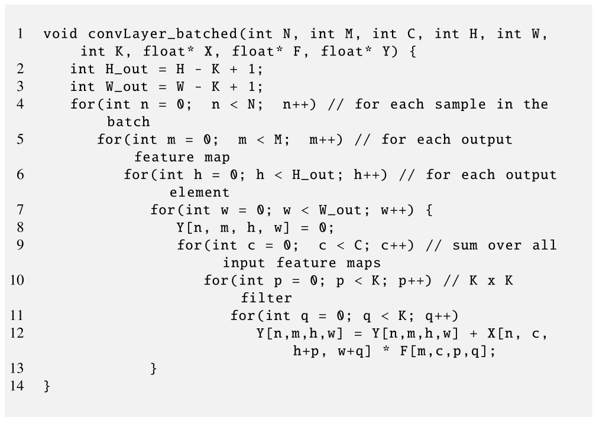

*Figure 19.4 — batch convolutional layer 의 순전파 경로. (책 p.459)*

```c
 1  void convLayer_batched(int N, int M, int C, int H, int W,
        int K, float* X, float* F, float* Y) {
 2      int H_out = H - K + 1;
 3      int W_out = W - K + 1;
 4      for(int n = 0;  n < N;  n++)          // for each sample in the batch
 5        for(int m = 0;  m < M;  m++)        // for each output feature map
 6          for(int h = 0; h < H_out; h++)    // for each output element
 7            for(int w = 0; w < W_out; w++) {
 8                Y[n, m, h, w] = 0;
 9                for(int c = 0;  c < C; c++)   // sum over all input feature maps
10                  for(int p = 0; p < K; p++)  // K x K filter
11                    for(int q = 0; q < K; q++)
12                        Y[n,m,h,w] = Y[n,m,h,w] + X[n, c, h+p, w+q] * F[m,c,p,q];
13            }
14  }
```

Figure 19.3 과의 차이는 딱 하나다.

> Fig. 19.3 과 비교하면 **batch 안의 모든 sample 을 도는 바깥 loop 하나(line 4)** 가 추가되었다.
> `X` 와 `Y` 는 batch 안의 서로 다른 sample 로 이루어진 **차원이 하나 더 생겼지만**,
> `F` 는 그렇지 않다 — **같은 batch 의 sample 들에 같은 가중치가 쓰이기 때문**이다 (책 p.459).

| 배열 | Figure 19.3 | Figure 19.4 |
|---|---|---|
| `X` | `C×H×W` | **`N×C×H×W`** ← 차원 하나 추가 |
| `Y` | `M×H_out×W_out` | **`N×M×H_out×W_out`** ← 차원 하나 추가 |
| `F` | `M×C×K×K` | `M×C×K×K` — **그대로** |

**`F` 에 batch 차원이 없다는 것이 19.3절의 GEMM 정식화를 가능하게 한다** —
batch 안의 모든 sample 이 **같은 $F$ 행렬**을 곱하므로, sample 을 grid 의 Z 차원에
그냥 쌓으면 된다. (엄밀히는 sample 을 열 방향으로 이어 붙여 **더 큰 GEMM 하나**로도 만들 수 있다.)

> **이 batch 구현이 이후 모든 CUDA kernel 의 기반**이다 (책 p.459).
---

## 19.2 A CUDA convolutional layer kernel

### 어떤 loop 가 병렬인가

> convolutional neural network 훈련의 계산 패턴은 **matrix multiplication 과 닮았다** —
> 연산 집약적이면서 고도로 병렬적이다 (책 p.460).

Figure 19.4 의 loop 일곱 겹을 두 무리로 가른다.

| loop | 줄 | 병렬인가 | 왜 |
|---|---|---|---|
| `n` (batch 의 sample) | 4 | **✓ 쉽다** | sample 끼리 완전히 독립 |
| `m` (출력 feature map) | 5 | **✓ 쉽다** | 서로 다른 `Y[n,m,·,·]` 에 쓴다 |
| `h` (출력 행) | 6 | **✓ 쉽다** | 서로 다른 출력 픽셀 |
| `w` (출력 열) | 7 | **✓ 쉽다** | 서로 다른 출력 픽셀 |
| `c` (입력 feature map) | 9 | △ | **같은 `Y` 원소에 누적** → atomic 필요 |
| `p` (filter 행) | 10 | △ | 〃 |
| `q` (filter 열) | 11 | △ | 〃 |

> 안쪽 세 겹의 loop — `c`-loop(입력 feature map 즉 channel 을 도는)과
> 중첩된 `p`-`q` loop(filter bank 의 가중치를 도는) — 도 **상당한 수준의 병렬성**을 제공한다.
> 그러나 이들을 병렬화하려면 `Y` 원소에 누적할 때 **atomic operation 을 무겁게 써야** 한다.
> 이 loop 들의 서로 다른 반복이 **같은 `Y` 원소에 read-modify-write** 를 해야 하기 때문이다.
> 따라서 **정말로 병렬성이 더 필요하지 않은 한 이 loop 들은 순차로 둔다** (책 p.460).

> **12·18장에서 본 판단과 정확히 같다.** "병렬화할 수 있다"와 "병렬화해야 한다"는 다르다.
> 여기서는 **바깥 네 겹만으로 이미 병렬성이 남아돈다** — 아래에서 세어 본다.
> 병렬성이 남아도는데 atomic 을 들이는 것은 순손해다.
> (반대로 $N \cdot M \cdot H_{out} \cdot W_{out}$ 이 작은 경우 — 예컨대 batch 1 의 추론에서
> C5 처럼 출력이 $1\times1$ 인 layer — 라면 `c`-loop 을 여는 것이 실제로 이득이다.)

**쉬운 병렬성의 크기.**

$$\text{병렬 반복 수} = N \times M \times H_{out} \times W_{out}$$

LeNet-5 의 C1 을 batch 128 로 돌리면

$$128 \times 6 \times 28 \times 28 = 602{,}112$$

**60만 개의 독립 반복**이다. GPU 를 채우고도 남는다.

> 이렇게 높은 병렬성이 convolutional layer 를 **GPU 가속의 유망한 후보**로 만든다.
> 이 병렬성을 잡도록 thread 를 조직한 kernel 을 쉽게 설계할 수 있다 (책 p.460).

### thread 를 어떻게 배치하나

**결정 ①: thread 하나가 출력 원소 하나.**

> thread 하나가 **어느 출력 feature map 의 원소 하나**를 계산한다고 하자.
> **2D thread block** 을 쓰는데, 각 thread block 은 **하나의 출력 feature map 안에서
> `TILE_WIDTH * TILE_WIDTH` 픽셀의 tile** 을 계산한다.
> 예컨대 `TILE_WIDTH = 16` 이면 block 당 총 **256개 thread** 가 된다 (책 p.460).

$$\text{block 수} \le N \times M \times \frac{H_{out}}{\texttt{TILE\_WIDTH}} \times \frac{W_{out}}{\texttt{TILE\_WIDTH}}$$

**결정 ②: grid 의 세 차원에 무엇을 싣나.**

> thread block 은 여러 방식으로 3D grid 에 조직될 수 있다.
> 각 선택지는 `n`, `m`, `h`-`w` 병렬성을 **서로 다른 조합으로** grid 차원에 배정한다.
> 우리는 그중 하나를 자세히 제시하고, **다른 선택지를 탐구하고 각각의 장단점을 평가하는 것은
> 독자를 위한 연습문제로 남긴다** (책 p.460).

책이 고른 조합이다.

| grid 차원 | 담는 것 | block 이 쓰는 값 | 크기 |
|---|---|---|---|
| **X** | 출력 feature map | `blockIdx.x` → `m` | `M` |
| **Y** | 출력 feature map 안의 **tile 위치 (선형화)** | `blockIdx.y` → `(h_tile, w_tile)` | `T = H_grid * W_grid` |
| **Z** | batch 안의 sample | `blockIdx.z` → `n` | `N` |

**Y 차원만 복잡하다.** 이유가 명확하다.

> 이상적으로는 grid index 두 차원을 수직·수평 tile index 에 각각 바치고 싶다.
> 그러나 **X 를 출력 feature map index 에, Z 를 mini-batch 의 sample index 에 쓰고 있으므로
> 둘을 합쳐 차원 하나밖에 없다.**
> 그래서 출력 feature map tile 의 수평·수직 index 를 **둘 다 담도록 tile index 를 선형화**한다
> (책 p.461).

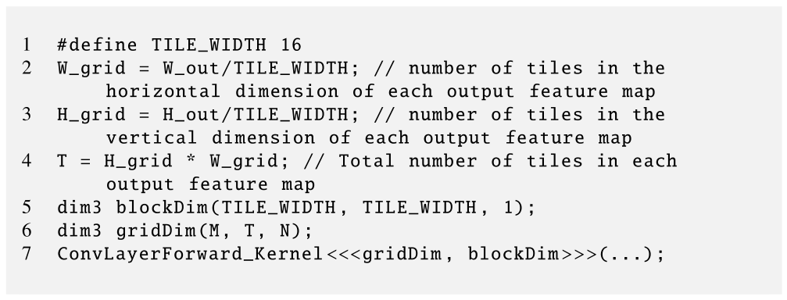

*Figure 19.5 — convolutional layer kernel 을 띄우는 host 코드. (책 p.461)*

```cpp
1  #define TILE_WIDTH 16
2  W_grid = W_out/TILE_WIDTH; // number of tiles in the horizontal dimension of each output feature map
3  H_grid = H_out/TILE_WIDTH; // number of tiles in the vertical dimension of each output feature map
4  T = H_grid * W_grid;       // Total number of tiles in each output feature map
5  dim3 blockDim(TILE_WIDTH, TILE_WIDTH, 1);
6  dim3 gridDim(M, T, N);
7  ConvLayerForward_Kernel<<<gridDim, blockDim>>>(...);
```

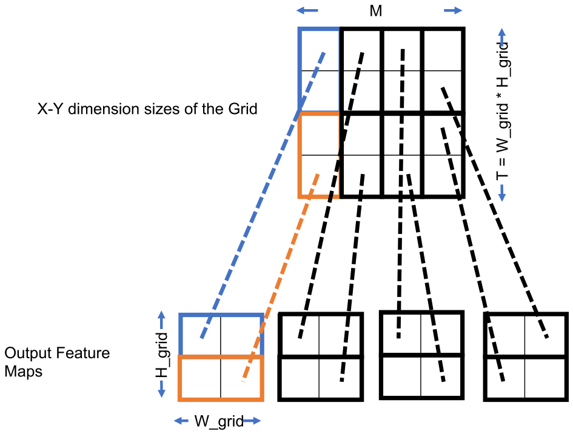

*Figure 19.6 — 출력 feature map tile 을 grid 의 X-Y 차원 block 에 대응시키기.
Z 차원의 모든 sample 에 대해 같은 대응이 이루어진다. (책 p.462)*

책이 드는 예다.

> Fig. 19.6 의 예에서 각 sample 은 출력 feature map 을 4장 갖고($M = 4$),
> 각 출력 feature map 은 $16 \times 16 = 256$ 픽셀짜리 $2 \times 2$ tile 로 이루어진다
> (line 2 에서 `W_grid = 2`, line 3 에서 `H_grid = 2`) (책 p.461).

> 이미 각 출력 feature map 을 X 차원에 배정했고, 이는 X 차원의 네 block 각각이
> 출력 feature map 하나에 대응하는 것으로 나타난다.
> Fig. 19.6 아래쪽에 보이듯 각 출력 feature map 의 tile 4개를 **선형화해 Y 차원의 block 에
> 배정**한다. 즉 tile (0,0), (0,1), (1,0), (1,1) 이 **row-major 순서**로
> `blockIdx.y` 값 0, 1, 2, 3 에 대응된다.
> 따라서 Y 차원의 총 block 수는 4 다 (line 4 에서 `T = H_grid * W_grid = 4`).
> 그러므로 lines 6-7 에서 `gridDim(4, 4, N)` 으로 grid 를 띄운다 (책 p.461).

| `blockIdx.y` | 복원되는 tile 좌표 `(blockIdx.y / W_grid, blockIdx.y % W_grid)` |
|---|---|
| 0 | (0, 0) |
| 1 | (0, 1) |
| 2 | (1, 0) |
| 3 | (1, 1) |

**3장 3.2절의 선형화가 그대로 다시 나온다** — 2D 좌표를 1D index 로 접었다가 나눗셈·나머지로 편다.
차이는 여기서는 **자료를 선형화하는 것이 아니라 block index 를 선형화**한다는 것이다.

> **Figure 19.5 의 정수 나눗셈에 함정이 있다.**
> `W_grid = W_out/TILE_WIDTH` 는 **절삭**한다. LeNet-5 의 C1 은 $W_{out} = 28$ 이고
> `TILE_WIDTH = 16` 이므로 `W_grid = 1` 이 된다 — **$28 \times 28$ 을 $16\times16$ tile 하나로
> 덮으려 하니 오른쪽 12열과 아래쪽 12행이 계산되지 않는다.**
> 올바른 값은 $\lceil 28/16 \rceil = 2$ 다.
> 책은 "$H_{out}$ 과 $W_{out}$ 이 `TILE_WIDTH` 의 배수"를 암묵적으로 가정하고 있다.
> 실무 코드라면 `(W_out + TILE_WIDTH - 1)/TILE_WIDTH` 로 쓰고 kernel 에 경계 검사를 넣는다.
> (Figure 19.11 에서 **같은 종류의 절삭이 한 번 더** 나온다 — 연습문제 4 에서 다시 짚는다.)

### Figure 19.7 — kernel

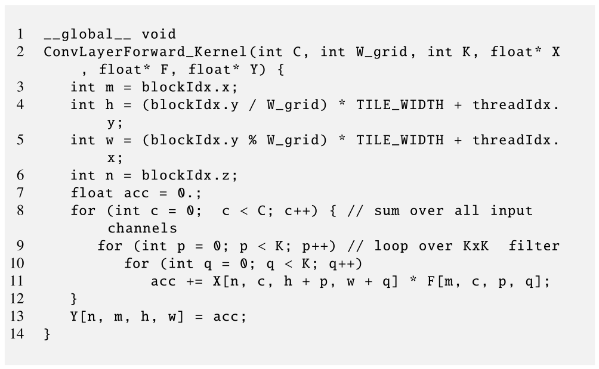

*Figure 19.7 — convolutional layer 순전파 경로의 kernel. (책 p.462)*

```cuda
 1  __global__ void
 2  ConvLayerForward_Kernel(int C, int W_grid, int K, float* X, float* F, float* Y) {
 3      int m = blockIdx.x;
 4      int h = (blockIdx.y / W_grid) * TILE_WIDTH + threadIdx.y;
 5      int w = (blockIdx.y % W_grid) * TILE_WIDTH + threadIdx.x;
 6      int n = blockIdx.z;
 7      float acc = 0.;
 8      for (int c = 0;  c < C; c++) {   // sum over all input channels
 9        for (int p = 0; p < K; p++)    // loop over KxK  filter
10          for (int q = 0; q < K; q++)
11              acc += X[n, c, h + p, w + q] * F[m, c, p, q];
12      }
13      Y[n, m, h, w] = acc;
14  }
```

> 코드에서는 **명확성을 위해 다차원 index 로 배열에 접근**한다.
> 이 의사코드를 `X`, `Y`, `F` 가 **row-major layout 기반 선형화 index** 로 접근되는
> 보통의 C 로 옮기는 것은 독자에게 남긴다 (3장) (책 p.462).

| 줄 | 하는 일 | 어디서 오는가 |
|---|---|---|
| 3 | `m` — 출력 feature map | grid 의 **X** 차원 |
| 4 | `h` — 출력 픽셀의 행 | `blockIdx.y / W_grid` → **수직 tile index**, `×TILE_WIDTH` 로 펼치고 `threadIdx.y` 를 더한다 |
| 5 | `w` — 출력 픽셀의 열 | `blockIdx.y % W_grid` → **수평 tile index**, 같은 방식 |
| 6 | `n` — batch 의 sample | grid 의 **Z** 차원 |
| 7 | 누적기를 register 에 | `acc` |
| 8~11 | `c`·`p`·`q` 순차 loop — 모든 입력 feature map 의 patch 와 filter 를 곱해 누적 | |
| 13 | 결과를 출력 픽셀에 **한 번만** 쓴다 | |

> 각 thread 는 자기가 맡은 출력 feature map 픽셀의 `n`(batch 안 sample), `m`(feature map),
> `h`(수직), `w`(수평) index 를 만드는 것으로 시작한다.
> …… `blockIdx.y` 값을 먼저 `W_grid` 로 나눠 **수직 방향 tile index** 를 복원한다 (책 p.462).

**`acc` 가 register 에 있는 것이 핵심**이다. `Y` 에는 **line 13 에서 딱 한 번** 쓴다 —
Figure 19.4 의 line 12 가 매 반복 `Y` 를 읽고 쓰던 것과 대비된다.
10장의 reduction, 17장의 SpMV kernel 에서 반복해서 쓴 그 수법이다.

### 이 kernel 의 진짜 문제 — arithmetic intensity

> Fig. 19.7 의 kernel 은 병렬성은 높지만 **global memory bandwidth 를 너무 많이 소비**한다.
> 7장의 convolution 패턴 논의와 마찬가지로 이 kernel 의 실행 속도는
> **global memory bandwidth 에 의해 제한**된다 (책 p.463).

얼마나 나쁜지 직접 세어 보자. thread 하나가 하는 일이다.

| | 값 |
|---|---|
| 곱셈-덧셈 횟수 | $C \cdot K^2$ 번 |
| **FLOP** | $2 \cdot C \cdot K^2$ |
| global memory 적재 | `X` 원소 $C K^2$ 개 + `F` 원소 $C K^2$ 개 |
| **바이트** | $2 \cdot C \cdot K^2 \times 4 = 8 \cdot C \cdot K^2$ |

$$\text{arithmetic intensity} = \frac{2 C K^2}{8 C K^2} = \boxed{0.25\ \text{FLOP/B}}$$

**$C$ 도 $K$ 도 약분되어 사라진다.** filter 를 키우든 channel 을 늘리든
**arithmetic intensity 는 0.25 에 고정**이다 — 이것이 이 kernel 의 구조적 한계다.

$$0.25\ \text{FLOP/B} \quad\text{vs}\quad \text{H100 의 임계값 } 20\ \text{FLOP/B}$$

**$80\times$ 아래**다. peak 의 1.25% 도 낼 수 없다.

> **5장의 naive matrix multiplication 과 정확히 같은 값**이다.
> 거기서도 곱셈-덧셈 하나(2 FLOP)마다 float 두 개(8 B)를 읽어 $0.25$ 였다.
> **우연이 아니다** — 두 계산 모두 "재사용 가능한 데이터를 재사용하지 않는" 같은 병
> 을 앓는다. 5장의 처방은 shared memory tiling 이었고,
> 19.3절의 처방은 **그 처방을 쓸 수 있는 형태로 문제를 바꿔 쓰는 것**이다.

**그런데 왜 7장처럼 shared memory tiling 을 바로 쓰지 않는가.**
책은 여기서 한 발 물러선다.

> 7장에서 본 대로 **shared memory tiling** 같은 기법으로 global memory 트래픽을 극적으로 줄이고
> kernel 실행 속도를 개선할 수 있다.
> convolution layer kernel 에 대한 이런 최적화는 **독자를 위한 연습문제로 남긴다.**
> 대신 다음 절에서 memory bandwidth 소비를 줄이는 **더 체계적인 접근**을 제시한다
> (책 p.463).

이 "대신"의 이유가 19.3절 첫 문단에 나온다. 그것이 다음 절의 출발점이다.
---

## 19.3 Formulating convolutional layer as GEMM

### 왜 tiling 만으로는 부족한가

재사용의 기회는 분명히 있다.

> convolutional layer 는 **데이터 재사용을 통해 memory bandwidth 소비를 줄일 기회를
> 여럿** 제공한다. …… 예컨대 **각 입력 feature map 은 모든 출력 feature map 을 계산하는 데
> 쓰인다.** 입력 feature map 을 tile 로 잘라 그 tile 을 **여러 출력 feature map 계산에
> 재사용**할 수 있을 것이다 (책 p.463).

**그런데 Figure 19.7 의 thread 배치가 그것을 막는다.**

> 그러나 Fig. 19.7 의 convolution layer kernel 에서는 **서로 다른 thread block 이 서로 다른
> 출력 feature map 을 계산**한다.
> 입력 feature map 을 **한 thread block 의 shared memory 에** tile 로 올려 봐야
> **다른 thread block 은 그 tile 을 재사용할 수 없다.**
> 입력 feature map 픽셀의 재사용을 가능하게 하려면 **kernel 을 크게 재설계**해야 한다
> (책 p.463).

한 문장으로 줄이면: **`blockIdx.x = m` 이라는 결정이 재사용을 원천 봉쇄했다.**
block 하나가 출력 feature map 하나에 갇혀 있으니, "여러 출력 map 이 같은 입력을 쓴다"는
사실을 shared memory 로 활용할 길이 없다.

> **19.3절이 하는 일을 미리 말하면**: GEMM 정식화는 이 봉쇄를 **자동으로** 푼다.
> $Y$ 행렬의 **행이 곧 출력 feature map** 이므로, tile 이 여러 행에 걸치면
> **한 block 이 여러 출력 feature map 을 동시에** 만든다. 그러면 그 block 이 올린
> $B$ tile 이 **그 출력 map 전부에 재사용**된다.
> Figure 19.9 에서 실제로 그 일이 벌어지는 것을 보게 된다.

### 착상 — 출력 원소는 내적이다

> 이 정식화의 핵심 착상은 **출력 feature map 의 각 원소가
> 입력 feature map 원소들과 대응하는 filter bank 원소들 사이의 내적**이라는 것이다.
> matrix multiplication 이 첫 입력의 행 벡터와 둘째 입력의 열 벡터 사이의 내적으로 이루어지므로,
> **출력 feature map 의 각 출력 원소가 곱 행렬의 한 원소가 되도록**
> 입력 feature map 과 filter bank 를 행렬로 배열할 수 있어야 한다 (책 p.464).

만들어야 할 두 행렬이다.

| 행렬 | 무엇을 담나 | 크기 |
|---|---|---|
| $F$ | 한 출력 픽셀을 만드는 데 필요한 **filter bank 를 한 행**으로 | $M \times (C K^2)$ |
| $B$ | 한 출력 픽셀을 만드는 데 필요한 **입력 픽셀을 한 열**로 (펼치고 중복시켜서) | $(C K^2) \times (H_{out} W_{out})$ |
| $Y$ | 곱 | $M \times (H_{out} W_{out})$ |

$$\underbrace{F}_{M \times CK^2} \times \underbrace{B}_{CK^2 \times H_{out}W_{out}} = \underbrace{Y}_{M \times H_{out}W_{out}}$$

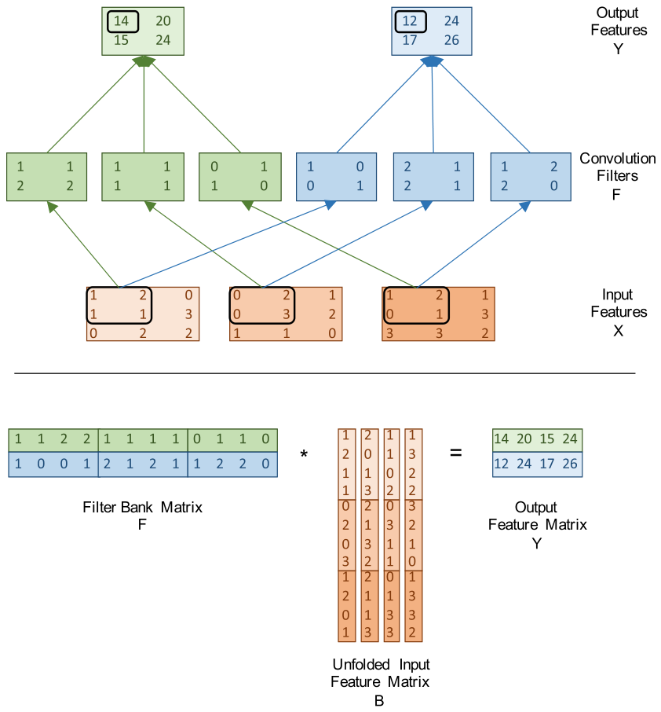

*Figure 19.8 — convolutional layer 를 GEMM 으로 정식화하기.
batch 의 각 sample 은 자기 입력·출력 feature map 을 갖지만 **filter bank 는 공유**한다.
batch 안의 sample 은 서로 완전히 독립이므로 이 그림은 **sample 하나**(index 를 $n$ 이라 하자)
의 것만 보인다. (책 p.465)*

### $F$ 행렬 — 재배열이 필요 없다

식 (19.2) 는 식 (19.1) 과 같은 계산인데 **내적의 첫 인자를 filter 로** 놓았다.

$$
Y_{n,0,0,0} = (1, 1, 2, 2) \cdot (1, 2, 1, 1) + (1, 1, 1, 1) \cdot (0, 2, 0, 3) + (0, 1, 1, 0) \cdot (1, 2, 0, 1)
$$
$$
= (1 + 2 + 2 + 2) + (0 + 2 + 0 + 3) + (0 + 2 + 0 + 0) = 14 \tag{19.2}
$$

> 각 내적의 첫 입력은 **convolution 에 쓰인 filter bank 를 (row-major 로) 선형화해서 만든 벡터**다.
> 예컨대 filter bank 0 을 row-major 로 선형화한 벡터는 $(1, 1, 2, 2)$ 이고 이것이 첫 내적의 첫 입력이다.
> **global memory 안의 $C$ 행렬 배치가 이미 row-major 이므로 이 filter bank 안에서는
> 재배열이 전혀 필요 없다!** (책 p.464)

필요한 것은 **순서**뿐이다.

> filter bank 들이 다음 순서로 이어 붙여지기만 하면 된다:
> **index 가 큰 출력 feature 의 filter bank 들이 index 가 작은 것의 뒤에** 오고,
> 같은 출력 feature map 의 filter bank 들 사이에서는 **index 가 큰 입력 feature map 의 것이
> 작은 것 뒤에** 온다.
> 우리 예에서는 $F_{0,0}, F_{0,1}, F_{0,2}, F_{1,0}, F_{1,1}, F_{1,2}$ 순서다 (책 p.464).

> `F` 배열의 차원은 Fig. 19.3(line 11)·Fig. 19.7(line 11)에서 $m \times c \times p \times q$
> 로 가정되었다. 출력 feature map index 가 최상위 차원이고 입력 feature map 이 차상위이므로
> **filter bank 는 이미 원하는 순서로 이어 붙여져 있다!**
> 이 순서라면 filter bank 들이 row-major $2 \times (3 \ast 4) = 2 \times 12$ 행렬을 이룬다
> …… 요컨대 **filter bank 는 추가 재배열 없이 이미 matrix multiplication 정식화에 맞게
> 조직되어 있다** (책 p.465).

$$F = \begin{pmatrix}
1&1&2&2 & 1&1&1&1 & 0&1&1&0 \\
1&0&0&1 & 2&1&2&1 & 1&2&2&0
\end{pmatrix}$$

**행 0 = 출력 map 0 의 filter bank 세 개를 이어 붙인 것**,
행 1 = 출력 map 1 의 것. 위의 filter 표와 대조하면 그대로다. (검산 통과.)

> **이것이 `F` 를 `M×C×K×K` 로 저장한 설계의 배당금**이다.
> 차원 순서를 다르게 잡았다면 (예: `C×M×K×K`) GEMM 정식화에 **실제 재배열이 필요**해진다.
> 19.4절에서 cuDNN 이 filter tensor 를 `K×C×R×S`(= `M×C×K×K`) 로 규정하는 것도 같은 이유다.

### $B$ 행렬 — 펼치고 중복시킨다

> $Y_{n,0,0,0}$ 을 계산하는 각 내적의 **둘째 입력**은 Fig. 19.8 에 동그라미 친
> **입력 map $X$ 픽셀의 patch 를 (row-major 로) 선형화해 만든 벡터**다.
> …… 모든 입력 feature map 에서 온 선형화 벡터들을 **하나의 벡터로 더 이어 붙이면**
> $Y_{n,0,0,0}$ 을 계산하는 **세 개의 내적을 하나의 내적으로** 다시 쓸 수 있다 (책 p.465~466).

$$
Y_{n,0,0,0} = (1, 2, 1, 1, 0, 2, 0, 3, 1, 2, 0, 1) \cdot (1, 1, 2, 2, 1, 1, 1, 1, 0, 1, 1, 0) = 14
\tag{19.3}
$$

**$B$ 의 모양이 여기서 결정된다.**

> 각 출력 feature map 에는 $H_{out} \ast W_{out}$ 개의 픽셀이 있고 **$B$ 의 각 열이 출력 map
> 픽셀 하나를 만드는 데 쓰인다.** 따라서 $B$ 는 $H_{out} \ast W_{out}$ 개의 열로 이루어져야 한다.
> 우리 예에서는 $H_{out} = 2$, $W_{out} = 2$ 이므로 $B$ 는 네 열이다.
> …… 각 열이 $3 \ast 4 = 12$ 개의 원소로 이루어지므로 $B$ 는 $12 \times 4$ 다 (책 p.466).

Figure 19.8 의 $B$ 를 그대로 옮기면 (열이 출력 픽셀, 행이 (channel, filter 위치)):

| 행 $u$ | $c$ | patch 안 위치 | 열 0 | 열 1 | 열 2 | 열 3 |
|---|---|---|---|---|---|---|
| 0 | 0 | (0,0) | 1 | 2 | 1 | 1 |
| 1 | 0 | (0,1) | 2 | 0 | 1 | 3 |
| 2 | 0 | (1,0) | 1 | 1 | 0 | 2 |
| 3 | 0 | (1,1) | 1 | 3 | 2 | 2 |
| 4 | 1 | (0,0) | 0 | 2 | 0 | 3 |
| 5 | 1 | (0,1) | 2 | 1 | 3 | 2 |
| 6 | 1 | (1,0) | 0 | 3 | 1 | 1 |
| 7 | 1 | (1,1) | 3 | 2 | 1 | 0 |
| 8 | 2 | (0,0) | 1 | 2 | 0 | 1 |
| 9 | 2 | (0,1) | 2 | 1 | 1 | 3 |
| 10 | 2 | (1,0) | 0 | 1 | **3** | 3 |
| 11 | 2 | (1,1) | 1 | 3 | 3 | 2 |

$$F \times B = \begin{pmatrix}14 & 20 & 15 & 24\\ 12 & 24 & 17 & 26\end{pmatrix}$$

**두 행이 정확히 $Y_0$ 와 $Y_1$ 을 row-major 로 편 것**이다. (검산 통과 —
GEMM 결과와 직접 convolution 결과가 원소 단위로 일치한다.)

### 출력이 곧 다음 layer 의 입력이다

여기가 이 정식화의 숨은 배당금이다.

> $B$ 의 열을 적절히 순서 지으면 **출력 feature map 을 원하는 row-major 순서 그대로 $Y$ 에
> 생성**할 수 있다.
> …… 일반적으로 matrix multiplication 이 만드는 출력 feature map 행렬은
> $p$·$q$ 차원을 선형화된 row-major 순서로 본 **`Y[n, m, p, q]` 의 올바른 형태**다.
> matrix multiplication 은 **신경망의 다음 layer 가 기대하는 입력 feature map 의 형태
> 그대로** 출력 feature map 을 생성한다 (책 p.466).

**변환 비용이 0 이다.** GEMM 의 출력을 그대로 다음 layer 의 `X` 로 넘기면 된다.
(19.4절 끝에서 cuDNN 이 "필요한 tensor transposition 을 수행한다"고 하는 것과 대비된다 —
사용자가 다른 layout 을 원할 때만 그렇다.)

### 명시적으로 $B$ 를 만들면 얼마나 드나

책이 여기서 **일부러 멈춰 선다.**

> $B$ 를 명시적으로 생성하고 저장하는 비용을 먼저 분석한다.
> Fig. 19.8 에서 보듯 $B$ 행렬은 $12 \ast 4 = 48$ 개의 원소인데,
> 입력 feature map 세 장을 다 합쳐도 $3 \ast 3 \ast 3 = 27$ 개뿐이다.
> 즉 $X$ 에서 $B$ 로 가며 **$1.78\times$ 의 상당한 크기 증가**가 있다 (책 p.466).

$$\frac{48}{27} = \frac{16}{9} \approx 1.78$$

**원인은 patch 의 겹침**이다.

> 크기 증가의 근본 원인은 서로 다른 출력 픽셀을 계산하는 **입력 feature map patch 들이
> convolution 의 본성상 서로 겹친다**는 것이다.
> 이는 $B$ 를 만들 때 **각 입력 픽셀이 여러 번 복제될 수 있다**는 뜻이다 (책 p.466).

$3\times3$ 입력을 $2\times2$ filter 로 훑을 때 픽셀별 사용 횟수를 세면:

$$\begin{pmatrix}1&2&1\\2&\mathbf{4}&2\\1&2&1\end{pmatrix}$$

> 예컨대 각 $3\times3$ 입력 feature map 의 **중앙 픽셀은 출력의 네 픽셀을 계산하는 데
> 네 번 쓰이므로** $B$ 를 만들 때 네 번 중복된다.
> 각 입력 feature map 의 **변 가운데 픽셀은 두 번** 쓰이므로 두 번 중복된다.
> **네 모서리 픽셀은 한 번만** 쓰이므로 중복될 필요가 없다.
> 따라서 입력 feature map 하나가 $B$ 에서 차지하는 총 픽셀 수는
> $4 \ast 1 + 2 \ast 4 + 1 \ast 4 = 16$ 이다.
> 원래 입력 feature map 하나에는 9 픽셀뿐이므로 $B$ 의 명시적 생성은
> 원래 입력 feature map 대비 **$16/9 = 1.78\times$ 의 팽창비**를 낳는다 (책 p.466~467).

$$\underbrace{4 \cdot 1}_{\text{중앙 1개} \times 4회} + \underbrace{2 \cdot 4}_{\text{변 4개} \times 2회} + \underbrace{1 \cdot 4}_{\text{모서리 4개} \times 1회} = 4 + 8 + 4 = 16$$

**일반식**을 세운다.

> 팽창한 행렬의 **높이(행 수)** 는 각 출력 원소에 기여하는 입력 feature 원소의 수,
> 즉 $C \ast K \ast K$ 다 — 각 출력 원소는 입력 feature map 하나당 $K \ast K$ 개 원소의
> convolution 이고 입력 feature map 이 $C$ 장이니까.
> **너비(열 수)** 는 각 출력 feature map 의 원소 수, 즉 $H_{out} \ast W_{out}$ 다 (책 p.467).

> **출력 feature map 수 $M$ 은 중복에 관여하지 않는다.**
> 모든 출력 feature map 이 **같은** unfolded 입력 feature map 행렬 $B$ 로부터 계산되기 때문이다
> (책 p.467).

따라서

$$
\text{팽창비} = \frac{C \ast K \ast K \ast H_{out} \ast W_{out}}{C \ast H_{in} \ast W_{in}}
= \frac{K^2 \ast H_{out} \ast W_{out}}{H_{in} \ast W_{in}}
\tag{19.4}
$$

**$C$ 가 약분된다** — 팽창비는 channel 수와 무관하다. 우리 예에 넣으면
$(3 \cdot 2 \cdot 2 \cdot 2 \cdot 2)/(3 \cdot 3 \cdot 3) = 16/9$ ✓.

> 일반적으로 입력·출력 feature map 이 filter 보다 훨씬 크면 **팽창비는 $K^2$ 에 수렴**한다.
> 우리의 작은 예에서는 팽창이 온건해 보이지만,
> $H_{out}$·$W_{out}$ 이 수백~수천이고 $K$ 가 5 이상일 수 있는 **실무 크기에서는 팽창이
> 쉽게 $20\times$ 이상**이 된다! (책 p.467)

실제 층으로 확인해 보자.

| 층 | $C$ | $K$ | $H_{in}$ | 팽창비 |
|---|---|---|---|---|
| 이 장의 예제 | 3 | 2 | 3 | $1.78\times$ |
| 실무형 (예: $224\times224$) | 64 | 5 | 224 | $\mathbf{24.1\times}$ |
| $H_{in} \to \infty$ | — | 5 | — | $\to 25\times = K^2$ |

**그리고 크기만 문제가 아니다.**

> 나아가 unfolded 행렬 $B$ 의 명시적 생성은 **global memory bandwidth 소비를 더 늘리는
> 추가 단계**를 요구해, matrix multiplication 정식화로 얻은 global memory bandwidth 절감을
> **상쇄해 버린다.** 이것이 다음의 암묵적 접근을 동기 짓는다 (책 p.467).

> **정리하면 명시적 unfolding 은 두 번 진다.**
> ① global memory 를 $K^2$ 배로 더 쓴다.
> ② $B$ 를 **쓰고 다시 읽는** 왕복이 생긴다 — GEMM 이 절약한 트래픽을 그 왕복이 도로 뱉는다.
> 애초에 우리가 고치려던 병이 memory bandwidth 였다는 것을 생각하면 자기모순이다.

### 암묵적 unfolding — $B$ 를 만들지 않는다

> $B$ 행렬을 **tile 단위로 조금씩(piece-meal)** 생성한다.
> 착상은 이렇다: Fig. 5.9 같은 tiled matrix multiplication kernel 은
> 출력 행렬 tile 하나에 대한 곱셈 phase 를 수행하기 전에 **두 입력 행렬의 tile 을 적재**한다.
> 이것이 **입력 feature map 을 global memory 에 원래 형태 그대로 남겨 둘 기회**를 준다.
> $B$ 행렬의 tile 을 global memory 에서 적재해야 할 때,
> **tile 적재 코드를 고쳐 `X` 배열의 대응 위치에서 픽셀을 읽어 $B$ tile 을 조립**하는 것이다.
> 전산학 용어로 말하면 **$B$ 는 개념적일 뿐이고, tiled matrix multiplication 과정에서
> tile 단위로 요청 시 실체화(materialize on-demand)** 된다 (책 p.468).

**바꾸는 것은 딱 한 줄, tile 적재 줄이다.** 5장 tiled matmul 의

```cuda
Nds[ty][tx] = N[(ph*TILE_WIDTH + ty)*Width + Col];   // 5장 Figure 5.9
```

를

```cuda
Bds[ty][tx] = X[ ...식 (19.5)... ];                  // 19장 Figure 19.11
```

로 바꾸는 것이 전부다. **나머지 tiled matmul 코드는 그대로**다.

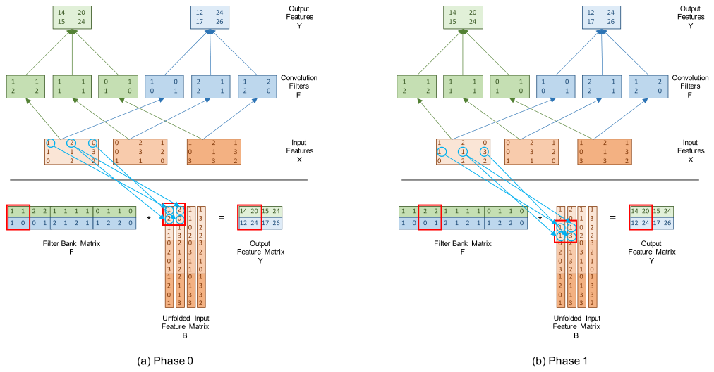

*Figure 19.9 — convolutional layer 를 구현하는 tiled matrix multiplication 의 각 phase 에서,
$B$ 행렬 tile 의 원소는 대응하는 $X$ 원소로부터 적재된다. (a) phase 0, (b) phase 1. (책 p.468)*

> 이 작은 예에서 $2 \times 2$ tile 구성은 **thread block 두 개**로 이루어진 grid 를 띄우고
> 각 block 은 $2 \ast 2 = 4$ 개의 thread 를 갖는다.
> 각 thread 는 출력 feature map 픽셀 하나를 만들고 각 block 은 협력해서 출력 feature map
> 픽셀의 tile 하나를 만든다 (책 p.468).

$Y$ 행렬이 $2 \times 4$ 이고 tile 이 $2\times2$ 이므로 block 은 $1 \times 2 = 2$ 개다 ✓.

#### 이 tile 이 **두 출력 feature map 에 걸친다** — 여기가 핵심이다

Figure 19.9(a) 의 붉은 상자를 보면 $Y$ 행렬의 **왼쪽 $2\times2$**, 즉

$$\begin{pmatrix}\mathbf{14} & \mathbf{20}\\ \mathbf{12} & \mathbf{24}\end{pmatrix}
\quad\text{— 위 행은 출력 map 0, 아래 행은 출력 map 1}$$

이다. 이름을 붙이면 $Y[n,0,0,0],\ Y[n,0,0,1],\ Y[n,\mathbf{1},0,0],\ Y[n,\mathbf{1},0,1]$ 다.

> **원문 오기 ④.** 책 p.468 은 이 네 원소를
> "$Y[n,0,0,0]$, $Y[n,0,0,1]$, $Y[n,0,1,0]$, $Y[n,0,1,1]$" 로 적었다.
> 그러나 $Y[n,m,h,w]$ 표기에서 그 넷은 전부 $m=0$ — 값으로는 $14, 20, 15, 24$ 로
> **녹색 행 전체**이지 $2\times2$ tile 이 아니다.
> Figure 19.9(a) 의 붉은 상자에는 **14, 20 (녹색)과 12, 24 (파랑)** 이 들어 있다.
> → 뒤의 두 원소는 $Y[n,\mathbf{1},0,0]$, $Y[n,\mathbf{1},0,1]$ 여야 한다.
> (같은 문장의 "the output tile that **consists pixels**" 도 "consists **of four** pixels"
> 의 탈자다.)

**이 오기를 바로잡고 나면 19.3절 전체의 논리가 완성된다.**
19.3절 첫머리의 문제는 "block 하나가 출력 feature map 하나에 갇혀 재사용이 안 된다"였다.
GEMM 정식화에서는 **$Y$ 행렬의 행이 출력 feature map** 이므로,
tile 의 세로 길이가 $T$ 면 **한 block 이 출력 feature map $T$ 개를 동시에** 만든다.
그리고 그 block 이 shared memory 에 올린 $B$ tile 은 **그 $T$ 개 전부에 재사용**된다.

$$\text{$B$ tile 원소 하나당 재사용 횟수} = T \ (\text{= tile 의 세로 길이 = 동시에 만드는 출력 map 수})$$

**봉쇄가 풀린 지점이 정확히 여기다.** 그리고 이것이 15장에서 본
"$m \times n$ 출력 tile 의 arithmetic intensity 는 $0.5mn/(m+n)$" 이 그대로 적용되는 이유다.

#### phase 0 과 phase 1

> phase 0 에서 적재할 $B$ tile 은 $B[0,0]$, $B[0,1]$, $B[1,0]$, $B[1,1]$ 이다
> ($B$ 의 왼쪽 위 모서리).
> Fig. 19.9 의 화살표가 보이듯 $B[0,0]$ 은 $X[n,0,0,0]$ 에서,
> $B[0,1]$ 은 $X[n,0,0,1]$ 에서, $B[1,0]$ 은 $X[n,0,0,1]$ 에서,
> $B[1,1]$ 은 $X[n,0,0,2]$ 에서 적재된다 (책 p.468).

| phase | $B$ tile | 어디서 오나 | 값 |
|---|---|---|---|
| **0** | $B[0,0]$ | $X[n,0,0,0]$ | 1 |
| | $B[0,1]$ | $X[n,0,0,1]$ | 2 |
| | $B[1,0]$ | **$X[n,0,0,1]$** ← 같은 원소! | 2 |
| | $B[1,1]$ | $X[n,0,0,2]$ | 0 |
| **1** | $B[2,0]$ | $X[n,0,1,0]$ | 1 |
| | $B[2,1]$ | $X[n,0,1,1]$ | 1 |
| | $B[3,0]$ | **$X[n,0,1,1]$** ← 같은 원소! | 1 |
| | $B[3,1]$ | $X[n,0,1,2]$ | 3 |

**$B[0,1]$ 과 $B[1,0]$ 이 같은 $X$ 원소에서 온다** — 이것이 "중복"의 정체다.
명시적 방식이면 그 값을 global memory 에 **두 번 써 두었을** 것이다.
암묵적 방식은 **두 thread 가 같은 global 주소를 읽을 뿐**이고, 그 읽기는 L1/L2 가 합쳐 준다.
**$K^2$ 배 팽창이 사라지는 자리가 정확히 여기다.**

#### 식 (19.5) 유도

> 어떤 thread 가 자기 thread block 이 tile 을 적재할 때 $B[u,v]$ 를 맡는다고 하자 (책 p.469).

**단계 ① — $v$ 에서 출력 픽셀의 좌표를 복원한다.**

> 위 논의로부터 $v$ 는 **이 $B$ 원소의 기여를 받을 출력 feature map 픽셀을 가리키는
> row-major 선형화 index** 다. $Y$ 로 가는 index 의 마지막 두 차원을
> $v/W_{out}$, $v\%W_{out}$ 로 복원할 수 있다.
> 즉 출력 feature map 원소는 $Y[n, m, v/W_{out}, v\%W_{out}]$ 다.
> **이 두 index 는 동시에 그 출력 픽셀을 만드는 convolution 에 관여하는
> 입력 feature map patch 의 시작 위치(왼쪽 위 모서리)도 가리킨다** (책 p.469).

$$(h, w) = \left(\left\lfloor v/W_{out} \right\rfloor,\ v \bmod W_{out}\right)$$

이 한 줄이 유도의 절반이다 — **출력 픽셀의 좌표가 곧 patch 의 시작점**이라는 것은
$K-1$ 만큼 깎는 valid convolution 이기 때문에 성립한다.

**단계 ② — $u$ 에서 channel 을 뽑는다.**

> $u$ index 는 **patch 가 어느 입력 feature map 에서 오는지**와,
> **patch 안에서 그 $B$ 원소의 row-major 선형화 index** 를 지정한다.
> 입력 feature map 의 channel 번호는 $u/(K^2)$ 로 알아낼 수 있다 (책 p.469).

$$c = \left\lfloor u / K^2 \right\rfloor$$

> **원문 오기 ⑤.** 이어지는 문장이 "For example, in Fig. 19.10, **u is equal to 2** for
> element $B[10,2]$" 라고 쓴다. 그러나 $B[10,2]$ 는 $u = 10$, $v = 2$ 다 —
> **Figure 19.10 의 캡션 자체가 "i.e., u=10 and v=2" 라고 적고 있고**,
> 바로 다음 문장이 "$10/2^2 = 2$" 를 계산한다.
> → "**u is equal to 10**" 여야 한다 (또는 "$u/(K^2)$ is equal to 2").

**단계 ③ — $u$ 에서 patch 안 위치를 뽑는다.**

> patch 안에서 $u \% K^2$ 가 그 픽셀의 row-major 선형화 index 다.
> 즉 $(u \% K^2)/K$ 가 patch 안의 **국소 행** index 이고 $(u \% K^2)\%K$ 가 **국소 열** index 다
> (책 p.470).

$$(p, q) = \left(\left\lfloor (u \bmod K^2)/K \right\rfloor,\ (u \bmod K^2) \bmod K\right)$$

**단계 ④ — 국소 좌표를 입력 feature map 좌표로 옮긴다.**

> 다음으로 patch 안의 국소 index 를 patch 를 담고 있는 입력 feature map 위로 투영한다.
> patch 의 **시작 픽셀(왼쪽 위 모서리) index**, 즉 $(v/W_{out},\ v\%W_{out})$ **를 국소 index 에
> 더하면** 된다 (책 p.470).

$$\text{행} = \left\lfloor \frac{u \bmod K^2}{K} \right\rfloor + \left\lfloor \frac{v}{W_{out}} \right\rfloor, \qquad
\text{열} = (u \bmod K^2) \bmod K + (v \bmod W_{out})$$

**합치면**:

$$
B[u, v] \;\leftarrow\; X\!\left[\,n,\; \frac{u}{K^2},\;\; \frac{u\%K^2}{K} + \frac{v}{W_{out}},\;\;
(u\%K^2)\%K + v\%W_{out} \,\right]
\tag{19.5}
$$

> 여기서 $n$ 은 현재 처리 중인 batch 안의 sample index, $K$ 는 convolutional layer 의
> 각 filter bank 의 높이·너비, $W_{out}$ 은 각 출력 feature map 의 너비,
> $/$ 는 정수 나눗셈, $\%$ 는 정수 나머지 연산이다 (책 p.470).

**$u$ 는 세 조각으로 쪼개지고 $v$ 는 두 조각으로 쪼개진다**는 것이 식의 전부다.

| index | 쪼개면 | 의미 |
|---|---|---|
| $u$ | $u/K^2$ | channel $c$ |
| | $(u\%K^2)/K$ | patch 안 행 $p$ |
| | $(u\%K^2)\%K$ | patch 안 열 $q$ |
| $v$ | $v/W_{out}$ | 출력 행 $h$ (= patch 시작 행) |
| | $v\%W_{out}$ | 출력 열 $w$ (= patch 시작 열) |

$$B[u,v] = X[n,\ c,\ h+p,\ w+q]$$

**이것이 Figure 19.3 line 11 의 `X[c, h + p, w + q]` 와 글자 그대로 같다.**
식 (19.5) 는 새로운 계산이 아니라 **같은 접근을 $(u,v)$ 좌표계로 다시 쓴 것**뿐이다.

#### Figure 19.10 — $B[10,2]$ 를 따라가 보기

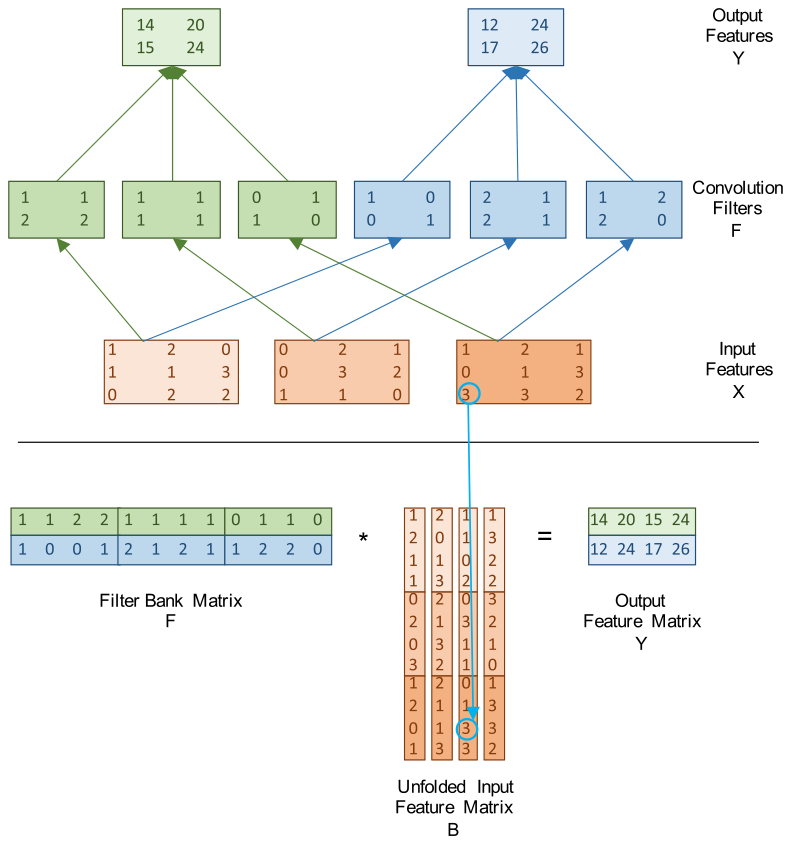

*Figure 19.10 — $B[10,2]$, 즉 $u=10$, $v=2$ 에 대한 대응 예. (책 p.469)*

$K = 2$, $K^2 = 4$, $W_{out} = 2$ 를 넣는다.

| 단계 | 계산 | 결과 |
|---|---|---|
| channel | $c = 10 / 4$ | **2** |
| patch 안 행 | $p = (10 \% 4)/2 = 2/2$ | **1** |
| patch 안 열 | $q = (10 \% 4)\%2 = 2\%2$ | **0** |
| 출력 행 (patch 시작) | $h = 2/2$ | **1** |
| 출력 열 (patch 시작) | $w = 2\%2$ | **0** |
| 입력 행 | $1 + 1$ | **2** |
| 입력 열 | $0 + 0$ | **0** |

$$B[10,2] \leftarrow X[n, 2, 2, 0] = 3$$

$X_2$ 의 왼쪽 아래 원소가 3 이다 ✓. Figure 19.10 이 동그라미로 그 둘을 잇는다.
그리고 $B$ 표의 행 10 · 열 2 도 **3** 이다 ✓ (위 $B$ 표에서 굵게 표시한 칸).

<!--widget:conv-gemm-->

### Figure 19.11 — 암묵적 unfolding tiled matmul kernel

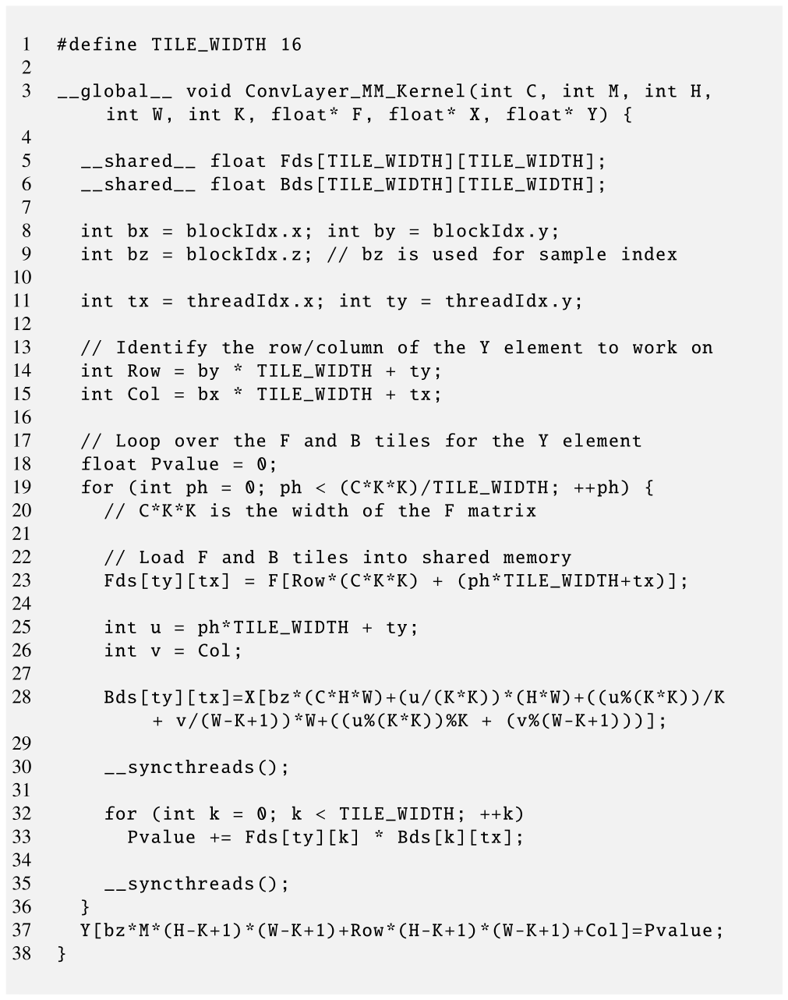

*Figure 19.11 — convolutional layer 를 구현하는 tiled matrix multiplication kernel. (책 p.471)*

```cuda
 1  #define TILE_WIDTH 16
 2
 3  __global__ void ConvLayer_MM_Kernel(int C, int M, int H,
        int W, int K, float* F, float* X, float* Y) {
 4
 5    __shared__ float Fds[TILE_WIDTH][TILE_WIDTH];
 6    __shared__ float Bds[TILE_WIDTH][TILE_WIDTH];
 7
 8    int bx = blockIdx.x; int by = blockIdx.y;
 9    int bz = blockIdx.z; // bz is used for sample index
10
11    int tx = threadIdx.x; int ty = threadIdx.y;
12
13    // Identify the row/column of the Y element to work on
14    int Row = by * TILE_WIDTH + ty;
15    int Col = bx * TILE_WIDTH + tx;
16
17    // Loop over the F and B tiles for the Y element
18    float Pvalue = 0;
19    for (int ph = 0; ph < (C*K*K)/TILE_WIDTH; ++ph) {
20      // C*K*K is the width of the F matrix
21
22      // Load F and B tiles into shared memory
23      Fds[ty][tx] = F[Row*(C*K*K) + (ph*TILE_WIDTH+tx)];
24
25      int u = ph*TILE_WIDTH + ty;
26      int v = Col;
27
28      Bds[ty][tx]=X[bz*(C*H*W)+(u/(K*K))*(H*W)+((u%(K*K))/K
          + v/(W-K+1))*W+((u%(K*K))%K + (v%(W-K+1)))];
29
30      __syncthreads();
31
32      for (int k = 0; k < TILE_WIDTH; ++k)
33        Pvalue += Fds[ty][k] * Bds[k][tx];
34
35      __syncthreads();
36    }
37    Y[bz*M*(H-K+1)*(W-K+1)+Row*(H-K+1)*(W-K+1)+Col]=Pvalue;
38  }
```

> 이 kernel 은 Fig. 5.9 의 tiled matrix multiplication kernel 을 개작한 것이다 (책 p.470).

**5장 Figure 5.9 와 다른 곳은 딱 네 군데**다. 나란히 놓으면 이렇다.

| | 5장 Figure 5.9 | 19장 Figure 19.11 |
|---|---|---|
| grid 차원 | 2D | **3D — Z 에 batch sample** (line 9) |
| 왼쪽 입력 tile | `Mds[ty][tx] = M[Row*Width + ...]` | `Fds[ty][tx] = F[Row*(C*K*K) + ...]` (line 23) |
| **오른쪽 입력 tile** | `Nds[ty][tx] = N[... *Width + Col]` | **`Bds[ty][tx] = X[식 (19.5)]`** (line 28) |
| phase 수 | `Width/TILE_WIDTH` | **`(C*K*K)/TILE_WIDTH`** (line 19) |

| 줄 | 하는 일 |
|---|---|
| 3 | 매개변수 — `C`(입력 map 수) `M`(출력 map 수) `H`·`W`(입력 map 높이·너비) `K`(filter 크기) `F`·`X`·`Y` |
| 5~6 | $F$ tile 과 $B$ tile 을 담을 shared memory |
| 9 | **`bz` 가 batch 의 sample index** — line 28 에서 쓰인다 |
| 14 | `Row` = $Y$ 행렬의 행 = **출력 feature map index $m$** |
| 15 | `Col` = $Y$ 행렬의 열 = **출력 픽셀의 선형 index $v$** |
| 19 | phase 수 = $F$ 행렬의 너비 $C K^2$ 를 `TILE_WIDTH` 로 나눈 것 |
| 23 | $F$ tile 적재 — 5장과 index 계산이 같다 |
| 25~26 | **$u$ 와 $v$** — 이 thread 가 맡은 $B$ 원소의 좌표 |
| 28 | **$B$ tile 을 $X$ 에서 조립** — 식 (19.5) 를 선형화한 것 |
| 32~33 | 내적 누적 (5장과 동일) |
| 37 | $Y$ 에 쓴다 |

**line 28 을 식 (19.5) 와 한 조각씩 맞춰 본다.** `X` 가 `N×C×H×W` row-major 이므로
선형 index 는 $n \cdot CHW + c \cdot HW + \text{행} \cdot W + \text{열}$ 이다.

| 코드 조각 | 식 (19.5) 의 무엇 |
|---|---|
| `bz*(C*H*W)` | $n \cdot CHW$ — sample |
| `(u/(K*K))*(H*W)` | $c \cdot HW$ — channel |
| `((u%(K*K))/K + v/(W-K+1))*W` | $(p + h) \cdot W$ — 행 (`W-K+1` 이 $W_{out}$) |
| `((u%(K*K))%K + (v%(W-K+1)))` | $q + w$ — 열 |

> $W_{out}$ 이 `W-K+1` 로 표현되어 있다 — `W` 는 입력 feature map 의 너비다 (책 p.471).

line 37 도 같은 방식이다: `Y` 가 `N×M×H_out×W_out` 이므로
$n \cdot M H_{out} W_{out} + m \cdot H_{out} W_{out} + v$ 이고,
`Row` $= m$, `Col` $= v$ 를 넣으면 코드와 정확히 같다.

> 이 판본에는 **경계 검사를 넣지 않았다** — $B$ 행렬 tile 적재에 쓰이는 index 의 개작에
> 집중하기 위해서다. **경계 검사 추가는 연습문제로 남긴다** (책 p.470).

> **line 19 의 정수 나눗셈도 절삭한다.** LeNet-5 의 C1 은 $C K^2 = 1 \cdot 25 = 25$ 이고
> `TILE_WIDTH = 16` 이므로 phase 가 $25/16 = 1$ 번만 돈다 — **$F$ 의 25열 중 9열이 통째로
> 빠진다.** 필요한 값은 $\lceil 25/16 \rceil = 2$ 이고, 두 번째 phase 에서
> $k \ge 9$ 인 부분을 0 으로 채우는 경계 처리가 함께 필요하다.
> 연습문제 4 에서 이 문제를 포함해 memory 접근 패턴을 정리한다.

### arithmetic intensity — 얼마나 나아졌나

15장에서 유도한 tiled matmul 의 arithmetic intensity 식을 그대로 쓴다.

$$\text{AI} = \frac{0.5 \cdot m \cdot n}{m + n} \ \text{FLOP/B}, \qquad
\text{정사각 tile } m = n = T \ \Rightarrow \ \text{AI} = \frac{T}{4}$$

| kernel | tile | AI |
|---|---|---|
| Figure 19.7 (직접) | — | **0.25 FLOP/B** |
| Figure 19.11, `TILE_WIDTH = 16` | $16\times16$ | **4 FLOP/B** ($16\times$ 개선) |
| 15장 수준의 register tiling, $128\times128$ | $128\times128$ | 32 FLOP/B |
| H100 의 임계값 | — | 20 FLOP/B |

$$0.25 \;\xrightarrow{\ \text{GEMM 정식화}\ }\; 4 \;\xrightarrow{\ \text{15장의 register tiling}\ }\; 32$$

**`TILE_WIDTH = 16` 만으로는 아직 memory-bound** 다 ($4 < 20$).
정사각 tile 로 compute-bound 가 되려면 $T/4 \ge 20$, 즉 **$T \ge 80$** 이 필요하다 —
shared memory 만으로는 불가능한 크기이고, 그래서 **15장의 register tiling 이 필수**가 된다.
cuDNN 이 하는 일이 정확히 그것이다.

> **이 장이 15장을 필요로 하는 이유가 여기서 분명해진다.**
> 19.3절은 문제를 GEMM 으로 **바꿔 쓰는** 데까지만 간다. 그러고 나면
> **15장이 통째로 적용 가능**해진다 — register tiling, double buffering, warp specialization,
> tensor core 까지. 19장이 자기 손으로 하지 않는 이유는 **할 필요가 없기 때문**이다.

### 왜 GEMM 이 CNN 에 특히 잘 맞나

> convolution 을 matrix multiplication 으로 구현하는 것은 매우 효율적일 수 있다 —
> matrix multiplication 이 **모든 하드웨어 플랫폼에서 고도로 최적화**되어 있기 때문이다.
> tiled matrix multiplication 은 **global memory 데이터 접근 바이트당 부동소수점 연산 비가
> 높아서** GPU 에서 특히 빠르다.
> 5장에서 본 대로 **각 원소의 재사용 횟수는 tile 의 차원에 비례**한다.
> 이는 **작은 행렬에서는 matrix multiplication 이 덜 효율적**임을 함의한다 —
> 크기가 작으면 tile 크기가 제한되기 때문이다 (책 p.472).

그러니 **행렬이 커야** 한다. CNN 에서는 다행히 그렇다.

> filter-bank 행렬은 $M \times (C K^2)$ 이고 unfolded 입력 feature map 행렬은
> $(C K^2) \times (H_{out} W_{out})$ 이다.
> filter-bank 행렬의 높이만 빼면 **모든 차원의 크기가 convolution 매개변수 자체가 아니라
> 매개변수들의 곱에 달려 있다.** 개별 매개변수는 작을 수 있어도 **곱은 커지는 경향**이 있다
> (책 p.472).

**신경망의 앞뒤에서 무엇이 크고 작은지가 정확히 반대**라는 것이 요점이다.

| 위치 | $C$ | $H_{out} \cdot W_{out}$ | 곱 $C \cdot H_{out} \cdot W_{out}$ |
|---|---|---|---|
| 신경망 **앞쪽** layer | 작다 | **크다** | 크다 |
| 신경망 **뒤쪽** layer | **크다** | 작다 | 크다 |

> 따라서 곱 $C \ast H_{out} \ast W_{out}$ 은 **모든 layer 에서 대체로 크다.**
> 이는 행렬 크기가 모든 layer 에서 **일관되게 크다**는 뜻이고,
> 따라서 이 접근을 쓰면 신경망의 **모든 layer 에서 GPU 실행 자원 활용도가 높아** 실행 속도가
> 높게 나온다 (책 p.472).

LeNet-5 로 확인해 보자.

| layer | $C$ | $H_{out} W_{out}$ | $M$ | $F$ 행렬 | $B$ 행렬 |
|---|---|---|---|---|---|
| C1 | 1 | 784 | 6 | $6 \times 25$ | $25 \times 784$ |
| C3 | 6 | 100 | 16 | $16 \times 150$ | $150 \times 100$ |
| C5 | 16 | 1 | 120 | $120 \times 400$ | $400 \times 1$ |

C5 는 $B$ 가 열 하나뿐이라 **GEMM 이 아니라 GEMV** 다 — 이 논리가 깨지는 예외다.
그래서 batch 가 필요하다: batch $N$ 개의 sample 을 **열 방향으로 이어 붙이면**
$B$ 가 $400 \times N$ 이 되어 다시 GEMM 이 된다.
**19.1절이 batch 를 "자원을 온전히 쓰기 위해" 도입한 이유가 여기서 두 번째로 갚아진다.**
---

## 19.4 CUDNN library

> CUDNN 은 deep learning primitive 를 구현하는 **최적화된 루틴의 라이브러리**다.
> deep learning 프레임워크가 GPU 를 훨씬 쉽게 활용하도록 설계되었다.
> 기존 deep learning 프레임워크(PyTorch, Caffe, TensorFlow, MXNet, …)에 **깔끔하게 통합되는
> 유연하고 쓰기 쉬운 C 언어 deep learning API** 를 제공한다.
> 라이브러리는 이 장 앞에서 논의한 대로 **입출력 데이터가 GPU device memory 에 상주할 것을
> 요구**한다. 이 요구는 **cuBLAS 와 같다** (책 p.472).

> 라이브러리는 **thread-safe** 하다 — 루틴을 서로 다른 host thread 에서 부를 수 있다는 뜻이다
> (책 p.472).

> convolution 의 순전파·역전파 루틴은 **layer 의 속성을 담는 공통 descriptor** 를 쓴다.
> tensor 와 filter 는 **불투명(opaque) descriptor** 를 통해 접근되며,
> **각 차원의 stride 를 임의로 지정해 tensor layout 을 정할 수 있는 유연성**이 있다
> (책 p.472).

> **각주 4**: tensor 는 **2차원보다 많은 차원을 가진 배열**을 가리키는 수학 용어다.
> 수학에서 행렬은 2차원뿐이고, 3차원 이상의 배열은 tensor 라 부른다.
> 이 책의 목적에서는 **$T$차원 tensor 를 그냥 $T$차원 배열로 취급**하면 된다 (책 p.472 각주 4).

### Table 19.1 — 이름이 바뀐다

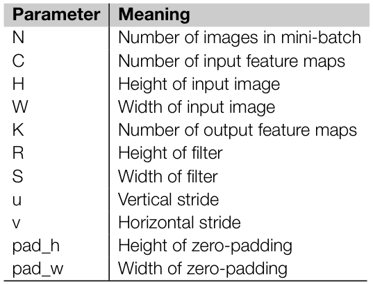

*Table 19.1 — CUDNN 의 convolution 매개변수.
**CUDNN 의 명명 규약은 앞 절들에서 우리가 써 온 것과 조금 다르다**는 점에 주의. (책 p.473)*

**"조금 다르다"가 아니라 `K` 의 뜻이 정반대다.** 표로 못 박아 둔다.

| CUDNN | 뜻 | **19.1~19.3절의 이름** |
|---|---|---|
| `N` | mini-batch 의 이미지 수 | `N` (같다) |
| `C` | 입력 feature map 수 | `C` (같다) |
| `H` | 입력 이미지의 높이 | `H` (같다) |
| `W` | 입력 이미지의 너비 | `W` (같다) |
| **`K`** | **출력 feature map 수** | **`M`** ← ⚠ |
| **`R`** | filter 의 높이 | **`K`** ← ⚠ |
| **`S`** | filter 의 너비 | **`K`** ← ⚠ |
| `u` | 수직 stride | (없음 — 항상 1로 가정) |
| `v` | 수평 stride | (없음) |
| `pad_h` | zero-padding 의 높이 | (없음 — 항상 0) |
| `pad_w` | zero-padding 의 너비 | (없음) |

> **`K` 하나에 두 가지 뜻이 있으니 표를 옆에 두고 읽어야 한다.**
> 19.3절의 $u$·$v$ 도 여기서는 stride 를 뜻한다 — 식 (19.5) 의 $B[u,v]$ 와 완전히 무관하다.
> 이름 충돌이 이 절에만 넷이다. cuDNN 문서를 볼 때 실제로 겪는 혼란이므로 적어 둔다.

### 세 개의 tensor

> convolution 에는 **두 개의 입력**이 있다 (책 p.472~473).

| tensor | 모양 | 무엇을 담나 |
|---|---|---|
| `D` | $N \times C \times H \times W$ | 입력 데이터 |
| `F` | $K \times C \times R \times S$ | convolution filter |
| `O` (출력) | $N \times K \times P \times Q$ | 출력 |

> 입력 데이터 배열(tensor) `D` 는 mini-batch 의 $N$ 개 sample, sample 당 $C$ 개 입력 feature map,
> 입력 feature map 당 $H$ 행, $W$ 열에 걸쳐 있다.
> filter 는 $K$ 개 출력 feature map, $C$ 개 입력 feature map, filter bank 당 $R$ 행, $S$ 열에 걸쳐 있다.
> 출력도 4차원 tensor `O` 로, mini-batch 의 $N$ 개 sample, $K$ 개 출력 feature map,
> 출력 feature map 당 $P$ 행, $Q$ 열에 걸쳐 있다 (책 p.473).

$$P = f(H;\ R;\ u;\ \texttt{pad\_h}), \qquad Q = f(W;\ S;\ v;\ \texttt{pad\_w})$$

> 즉 출력 feature map 의 높이와 너비는 입력 feature map 과 filter bank 의 높이·너비,
> 그리고 **padding·striding 선택**에 달려 있다 (책 p.473).

**책이 $f$ 를 명시하지 않으므로 표준 정의를 적어 둔다** (cuDNN 문서의 식):

$$P = \left\lfloor \frac{H + 2\,\texttt{pad\_h} - R}{u} \right\rfloor + 1, \qquad
  Q = \left\lfloor \frac{W + 2\,\texttt{pad\_w} - S}{v} \right\rfloor + 1$$

19.1~19.3절은 $u = v = 1$, $\texttt{pad} = 0$ 이므로 $P = H - R + 1$ 로 줄어든다 —
Figure 19.3 의 `H_out = H - K + 1` 이 이 식의 특수한 경우다.

**stride 와 padding 이 무엇을 위한 것인지**도 책이 짚는다.

| 매개변수 | 용도 (책 p.473) |
|---|---|
| stride `u`·`v` | **출력 픽셀의 부분집합만 계산**해서 연산량을 줄인다 |
| `pad_h`·`pad_w` | 각 feature map 에 0 을 몇 행/열 덧붙일지 지정 — **메모리 정렬 개선과 벡터화 실행**을 위해 |

> padding 의 동기가 "출력 크기 유지"가 아니라 **"메모리 정렬과 벡터화"** 로 적혀 있는 것이
> 인상적이다. 6.3절의 vector load 와 15장의 `float4` 정렬 문제가 여기서 다시 나온다 —
> $W$ 가 4의 배수가 아니면 128비트 적재를 쓸 수 없으니, 0 을 몇 개 붙여서라도 맞추는 것이 이득이다.

### cuDNN 이 실제로 쓰는 알고리즘들

> CUDNN [9] 은 convolutional layer 를 구현하는 **여러 알고리즘을 지원**한다:
> matrix-multiplication 기반(**GEMM** [10] 과 **Winograd** [11]), **FFT** 기반 [12] 등 (책 p.473).

| 알고리즘 | 착상 | 언제 유리한가 |
|---|---|---|
| **GEMM** | 19.3절 그대로 | 범용 — 거의 모든 크기 |
| **Winograd** | 곱셈 횟수를 줄이는 최소 filtering 알고리즘 | **작은 filter** ($3\times3$) |
| **FFT** | convolution 정리 — 주파수 영역에서는 원소별 곱 | **큰 filter** |

> GEMM 기반 알고리즘은 **19.3절에 제시한 접근과 비슷**하다.
> 19.3절 끝에서 논의한 대로 **팽창된 입력 feature 행렬을 global memory 에 실체화하는 것은
> global memory 공간과 bandwidth 소비 양쪽에서 비쌀 수 있다.**
> CUDNN 은 matrix multiplication 루틴을 부르기 전에 off-chip memory 에 그것을 모으는 대신,
> **팽창된 입력 feature map 행렬을 게으르게(lazily) 생성해 on-chip memory 로만 적재**함으로써
> 이 문제를 피한다 (**앞 절에 제시한 암묵적 접근과 비슷한 방식**으로) (책 p.473).

**19.3절이 가르친 것이 그대로 산업 표준이라는 확인**이다.

> NVIDIA 는 GPU 의 **이론 최대 부동소수점 throughput 을 높은 비율로 달성**하는
> matrix-multiplication 기반 루틴을 제공한다. 그 루틴의 알고리즘은 [10] 에 기술된 것과 비슷하다.
> 입력 행렬 `A`·`B` 의 **고정 크기 부분행렬을 차례로 on-chip memory 로 읽어** 출력 행렬 `C` 의
> 부분행렬을 계산한다. **convolution 이 부과하는 모든 index 복잡성은 이 루틴의 tile 관리에서
> 처리**된다.
> `A`·`B` 의 tile 로 계산하는 **동안** off-chip memory 에서 다음 tile 을 on-chip cache 와
> 다른 메모리로 **가져온다.** 이 기법은 **데이터 전송과 결부된 memory latency 를 숨겨**,
> matrix multiplication 계산이 **산술 계산에 걸리는 시간만으로 제한**되게 한다 (책 p.473~474).

> **"계산하는 동안 다음 tile 을 가져온다" = 6.7절의 double buffering 이자 15.5절의
> software pipelining** 이다. 15장에서 손으로 짠 그것이 cuDNN 안에 들어 있다.

**그런데 tiling 과 convolution 이 서로 모른다는 문제가 남는다.**

> matrix multiplication 루틴에 필요한 tiling 은 **convolution 의 어떤 매개변수와도 독립**이므로,
> 팽창된 입력 feature map 행렬의 **tile 경계와 convolution 문제 사이의 대응이 자명하지 않다.**
> 따라서 CUDNN 의 접근은 **이 대응을 계산해서 `A`·`B` 의 올바른 원소를 on-chip memory 로
> 적재하는 데 사용**한다. 이는 계산이 진행되면서 **동적으로** 일어나며,
> CUDNN convolution 구현이 **matrix multiplication 을 위해 최적화된 기반을 활용**할 수 있게 한다.
> matrix multiplication 에 비해 **추가적인 index 산술**을 요구하지만,
> matrix multiplication 의 연산 엔진을 **온전히 활용**해 일을 수행한다 (책 p.474).

**Figure 19.11 의 line 25~28 이 하는 일이 바로 그 "추가적인 index 산술"** 이다.
곱셈 하나를 하기 위해 정수 나눗셈·나머지를 여섯 번 한다 — 그 대가로
**세계에서 가장 최적화된 GEMM kernel 을 그대로 얻는다.**

> 계산이 끝나면 CUDNN 은 결과를 **사용자가 원하는 데이터 layout 으로 저장하기 위해
> 필요한 tensor transposition 을 수행**한다 (책 p.474).

---

### 검산

이 장에서 손으로 계산한 값 — Figure 19.2(b)·19.8·19.9·19.10 의 모든 수,
식 (19.1)~(19.5), 팽창비, LeNet-5 층별 모양·가중치·MAC, arithmetic intensity —
을 전부 코드로 다시 계산해 대조한다. **114개 항목 전부 통과한다.**

```python
# 실행: python3 verify19.py   (표준 라이브러리만 사용)
from fractions import Fraction as Fr

OK = []
def chk(name, got, want):
    OK.append(got == want)
    print(f"[{'OK ' if got == want else 'FAIL'}] {name}: got={got!r} want={want!r}")

# ─────────────────────────────────────────────────────────────────────
# 1. Figure 19.2(b) / 19.8 의 작은 예제
#    C=3 개의 3x3 입력, M=2 개의 2x2 출력, M*C=6 개의 2x2 filter
# ─────────────────────────────────────────────────────────────────────
X = [                                   # X[c][h][w]
    [[1,2,0],[1,1,3],[0,2,2]],          # 입력 feature map 0
    [[0,2,1],[0,3,2],[1,1,0]],          # 입력 feature map 1
    [[1,2,1],[0,1,3],[3,3,2]],          # 입력 feature map 2
]
F = [                                   # F[m][c][p][q]
    [ [[1,1],[2,2]], [[1,1],[1,1]], [[0,1],[1,0]] ],   # 출력 map 0 용 (녹색)
    [ [[1,0],[0,1]], [[2,1],[2,1]], [[1,2],[2,0]] ],   # 출력 map 1 용 (파랑)
]
C, M, K = 3, 2, 2
H_in = W_in = 3
H_out, W_out = H_in - K + 1, W_in - K + 1
chk("H_out = H - K + 1", (H_out, W_out), (2, 2))
chk("filter 개수 M*C", M*C, 6)

def conv_forward(X, F):
    """Figure 19.3 의 convLayer_forward 를 그대로 옮긴 것"""
    Y = [[[0]*W_out for _ in range(H_out)] for _ in range(M)]
    for m in range(M):
        for h in range(H_out):
            for w in range(W_out):
                Y[m][h][w] = 0
                for c in range(C):
                    for p in range(K):
                        for q in range(K):
                            Y[m][h][w] += X[c][h+p][w+q] * F[m][c][p][q]
    return Y

Y = conv_forward(X, F)
chk("Figure 19.2(b) 출력 map 0", Y[0], [[14,20],[15,24]])
chk("Figure 19.2(b) 출력 map 1", Y[1], [[12,24],[17,26]])

# 식 (19.1) — patch · filter 순서
e191 = (sum(a*b for a,b in zip((1,2,1,1),(1,1,2,2)))
      + sum(a*b for a,b in zip((0,2,0,3),(1,1,1,1)))
      + sum(a*b for a,b in zip((1,2,0,1),(0,1,1,0))))
chk("식 (19.1)", e191, 14)
chk("식 (19.1) 세 항", [sum(a*b for a,b in zip(u,v)) for u,v in
     [((1,2,1,1),(1,1,2,2)), ((0,2,0,3),(1,1,1,1)), ((1,2,0,1),(0,1,1,0))]], [7,5,2])

# 식 (19.3) — 12원소 내적 하나로 접은 것
patch12  = (1,2,1,1, 0,2,0,3, 1,2,0,1)
filter12 = (1,1,2,2, 1,1,1,1, 0,1,1,0)
chk("식 (19.3)", sum(a*b for a,b in zip(patch12, filter12)), 14)

# ─────────────────────────────────────────────────────────────────────
# 2. GEMM 정식화 — F 행렬 · B 행렬 (Figure 19.8)
# ─────────────────────────────────────────────────────────────────────
# F 행렬: M x (C*K*K), 재배열이 필요 없다 (이미 row-major m,c,p,q 순서)
Fmat = [[F[m][c][p][q] for c in range(C) for p in range(K) for q in range(K)]
        for m in range(M)]
chk("Figure 19.8 Filter Bank Matrix 행 0", Fmat[0], [1,1,2,2, 1,1,1,1, 0,1,1,0])
chk("Figure 19.8 Filter Bank Matrix 행 1", Fmat[1], [1,0,0,1, 2,1,2,1, 1,2,2,0])
chk("F 행렬 크기 M x (C*K*K)", (len(Fmat), len(Fmat[0])), (2, 12))

# B 행렬: 식 (19.5) 그대로
def B_of(u, v):
    c   = u // (K*K)
    row = (u % (K*K)) // K + v // W_out
    col = (u % (K*K)) %  K + v %  W_out
    return X[c][row][col]

Bmat = [[B_of(u, v) for v in range(H_out*W_out)] for u in range(C*K*K)]
chk("B 행렬 크기 (C*K*K) x (H_out*W_out)", (len(Bmat), len(Bmat[0])), (12, 4))
chk("Figure 19.8 B 열 0", [Bmat[u][0] for u in range(12)], [1,2,1,1, 0,2,0,3, 1,2,0,1])
chk("Figure 19.8 B 열 1", [Bmat[u][1] for u in range(12)], [2,0,1,3, 2,1,3,2, 2,1,1,3])
chk("Figure 19.8 B 열 2", [Bmat[u][2] for u in range(12)], [1,1,0,2, 0,3,1,1, 0,1,3,3])
chk("Figure 19.8 B 열 3", [Bmat[u][3] for u in range(12)], [1,3,2,2, 3,2,1,0, 1,3,3,2])

# F x B 가 직접 convolution 과 같은가
Ymat = [[sum(Fmat[m][u]*Bmat[u][v] for u in range(C*K*K)) for v in range(H_out*W_out)]
        for m in range(M)]
chk("Figure 19.8 Output Feature Matrix 행 0", Ymat[0], [14,20,15,24])
chk("Figure 19.8 Output Feature Matrix 행 1", Ymat[1], [12,24,17,26])
chk("GEMM == 직접 convolution",
    Ymat, [[Y[m][v//W_out][v%W_out] for v in range(H_out*W_out)] for m in range(M)])

# Figure 19.10 — B[10,2]
chk("B[10,2] 의 c = u/K^2",        10 // (K*K), 2)
chk("B[10,2] 의 patch 안 행 = (u%K^2)/K", (10 % 4) // 2, 1)
chk("B[10,2] 의 patch 안 열 = (u%K^2)%K", (10 % 4) %  2, 0)
chk("B[10,2] 의 X 행 = 1 + v/W_out",  (10 % 4)//2 + 2//W_out, 2)
chk("B[10,2] 의 X 열 = 0 + v%W_out",  (10 % 4)%2  + 2%W_out, 0)
chk("B[10,2] = X[n,2,2,0]",  B_of(10, 2), 3)
chk("B[10,2] = X[2][2][0]",  X[2][2][0],  3)

# Figure 19.9 — 2x2 tile 로 나눈 phase 0 / phase 1 의 B tile
chk("phase 0 의 B tile (B[0,0] B[0,1] B[1,0] B[1,1])",
    [B_of(0,0), B_of(0,1), B_of(1,0), B_of(1,1)],
    [X[0][0][0], X[0][0][1], X[0][0][1], X[0][0][2]])
chk("phase 0 의 B tile 값", [B_of(0,0), B_of(0,1), B_of(1,0), B_of(1,1)], [1,2,2,0])
chk("phase 1 의 B tile (B[2,0] B[2,1] B[3,0] B[3,1])",
    [B_of(2,0), B_of(2,1), B_of(3,0), B_of(3,1)],
    [X[0][1][0], X[0][1][1], X[0][1][1], X[0][1][2]])
chk("phase 1 의 B tile 값", [B_of(2,0), B_of(2,1), B_of(3,0), B_of(3,1)], [1,1,1,3])

# Figure 19.9(a) 의 붉은 상자 = Y 행렬의 왼쪽 2x2 (출력 map 두 개에 걸친다)
chk("Figure 19.9(a) Y tile 값", [Ymat[0][0], Ymat[0][1], Ymat[1][0], Ymat[1][1]],
    [14, 20, 12, 24])
chk("그 네 원소의 Y[n,m,h,w] 이름",
    [(m, v//W_out, v%W_out) for m in range(2) for v in range(2)],
    [(0,0,0), (0,0,1), (1,0,0), (1,0,1)])   # 책 본문의 Y[n,0,1,0]·Y[n,0,1,1] 이 아니다

# 블록 수 / phase 수
TW = 2
chk("2x2 tile 일 때 블록 수", -(-M//TW) * -(-(H_out*W_out)//TW), 2)
chk("블록당 thread 수", TW*TW, 4)
chk("phase 수 = (C*K*K)/TILE_WIDTH", (C*K*K)//TW, 6)

# ─────────────────────────────────────────────────────────────────────
# 3. 명시적 unfolding 의 비용 (19.3절)
# ─────────────────────────────────────────────────────────────────────
chk("B 원소 수", (C*K*K)*(H_out*W_out), 48)
chk("X 원소 수", C*H_in*W_in, 27)
chk("팽창비 48/27", Fr(48,27), Fr(16,9))
chk("팽창비 소수", round(48/27, 2), 1.78)

# 픽셀별 중복 횟수 — 3x3 입력, 2x2 filter
use = [[0]*W_in for _ in range(H_in)]
for h in range(H_out):
    for w in range(W_out):
        for p in range(K):
            for q in range(K):
                use[h+p][w+q] += 1
chk("중복 횟수 표", use, [[1,2,1],[2,4,2],[1,2,1]])
chk("모서리 4개는 1회", sorted(v for r in use for v in r).count(1), 4)
chk("변 가운데 4개는 2회", sorted(v for r in use for v in r).count(2), 4)
chk("중앙 1개는 4회", sorted(v for r in use for v in r).count(4), 1)
chk("한 입력 map 이 B 에서 차지하는 칸 4*1 + 2*4 + 1*4",
    4*1 + 2*4 + 1*4, sum(v for r in use for v in r))
chk("= 16", sum(v for r in use for v in r), 16)
chk("한 map 팽창비 16/9", Fr(16,9), Fr(48,27))

# 식 (19.4) 일반형
def ratio(C_, K_, Hi, Wi):
    Ho, Wo = Hi-K_+1, Wi-K_+1
    return Fr(C_*K_*K_*Ho*Wo, C_*Hi*Wi)
chk("식 (19.4) 예제", ratio(3,2,3,3), Fr(16,9))
chk("식 (19.4) 는 C 와 무관", ratio(64,2,3,3), ratio(3,2,3,3))
big = ratio(64, 5, 224, 224)
chk("C=64,K=5,224x224 의 팽창비 (20x 이상)", round(float(big), 1), 24.1)
chk("H_in 이 커지면 K^2 로 수렴", round(float(ratio(3,5,10000,10000))), 25)

# ─────────────────────────────────────────────────────────────────────
# 4. arithmetic intensity (노트에서 직접 유도한 값)
# ─────────────────────────────────────────────────────────────────────
# Figure 19.7 기본 kernel: thread 하나가 C*K^2 번 MAC, 매번 X 와 F 를 한 번씩 적재
#   FLOP  = 2*C*K^2
#   bytes = 2*C*K^2 * 4
def ai_basic(C_, K_):  return Fr(2*C_*K_*K_, 2*C_*K_*K_*4)
chk("Figure 19.7 의 arithmetic intensity", ai_basic(3,2), Fr(1,4))
chk("C·K 와 무관", ai_basic(512,5), ai_basic(3,2))
# 5장 naive matmul 과 같은 값
chk("5장 naive matmul 과 같다", Fr(2,8), Fr(1,4))
# tiled matmul: 15장의 0.5*m*n/(m+n), 정사각 tile T 면 T/4
def ai_tiled(m, n):  return Fr(m*n, 2*(m+n))
chk("15장 식: m=n=32 -> 8 FLOP/B",  ai_tiled(32,32),   8)
chk("15장 식: m=n=128 -> 32 FLOP/B", ai_tiled(128,128), 32)
chk("Figure 19.11 (TILE_WIDTH=16) -> 4 FLOP/B", ai_tiled(16,16), 4)
chk("기본 kernel 대비 배수", ai_tiled(16,16)/ai_basic(3,2), 16)
H100_RIDGE = Fr(20)          # 17장에서 쓴 값: 66.9 TFLOPS / 3.35 TB/s
chk("TILE_WIDTH=16 도 아직 memory-bound", ai_tiled(16,16) < H100_RIDGE, True)
chk("compute-bound 가 되는 최소 정사각 tile",
    min(t for t in range(1, 512) if ai_tiled(t,t) >= H100_RIDGE), 80)
# subsampling layer (연습문제 1): K^2 번 더하려고 K^2 개를 읽는다
chk("subsampling 의 arithmetic intensity", Fr(K*K, 4*K*K), Fr(1,4))
# fully connected layer (덤): batch N 이 곧 재사용 횟수
def ai_fc(N_):  return Fr(2*N_, 4*(N_ + 1))
chk("fully connected, N=1 이면 0.25 FLOP/B", ai_fc(1), Fr(1,4))
chk("fully connected, N 이 크면 0.5 FLOP/B 로 수렴", ai_fc(10**9) < Fr(1,2), True)

# ─────────────────────────────────────────────────────────────────────
# 5. LeNet-5 (Figure 19.1) — 층별 모양과 가중치 수
#    모양은 책 19.1절, 가중치 수는 그 모양에서 직접 센 것
# ─────────────────────────────────────────────────────────────────────
def conv_out(n, k): return n - k + 1
chk("C1: 32x32 --5x5--> 28x28", conv_out(32,5), 28)
chk("C3: 14x14 --5x5--> 10x10", conv_out(14,5), 10)
chk("C5:  5x5  --5x5--> 1x1",   conv_out(5,5),  1)
chk("C1 filter bank 수 1*6",   1*6,   6)
chk("C3 filter bank 수 6*16",  6*16,  96)
chk("C3 filter bank 하나의 가중치 5*5", 5*5, 25)
chk("C5 filter 수 16*120",     16*120, 1920)

LENET = [   # (이름, C, M, H_in, K, H_out)
    ("C1",   1,   6, 32, 5, 28),
    ("C3",   6,  16, 14, 5, 10),
    ("C5",  16, 120,  5, 5,  1),
]
weights, macs = {}, {}
for name, c, m, hi, k, ho in LENET:
    chk(f"{name} 출력 크기", conv_out(hi, k), ho)
    weights[name] = c*m*k*k
    macs[name]    = m*ho*ho*c*k*k
chk("C1 가중치", weights["C1"], 150)
chk("C3 가중치", weights["C3"], 2400)
chk("C5 가중치", weights["C5"], 48000)
chk("F6 가중치 120*84", 120*84, 10080)
chk("OUTPUT 가중치 84*10", 84*10, 840)
total_w = sum(weights.values()) + 120*84 + 84*10
chk("LeNet-5 가중치 합계", total_w, 61470)
chk("C1 MAC", macs["C1"], 117600)
chk("C3 MAC", macs["C3"], 240000)
chk("C5 MAC", macs["C5"], 48000)
chk("convolutional layer MAC 합계", sum(macs.values()), 405600)
chk("C5 가 전체 가중치의 78%", round(100*weights["C5"]/total_w), 78)
chk("C3 가 전체 MAC 의 59%", round(100*macs["C3"]/sum(macs.values())), 59)
# 2012 AlexNet 과의 대비 (책 19.1절의 수치)
chk("AlexNet 파라미터 / LeNet-5 가중치", round(60_000_000/total_w), 976)
chk("2012 ILSVRC 오차율 차", round(26.2 - 15.3, 1), 10.9)

# 19.3절 끝의 표 — layer 마다 F·B 행렬 크기
for name, c, m, hi, k, ho in LENET:
    print(f"    {name}: F = {m} x {c*k*k},  B = {c*k*k} x {ho*ho}")
chk("C1 의 B 행렬", (1*25, 28*28), (25, 784))
chk("C3 의 B 행렬", (6*25, 10*10), (150, 100))
chk("C5 의 B 행렬 — 열이 하나뿐이라 GEMV 가 된다", (16*25, 1*1), (400, 1))
chk("batch 128 이면 C5 도 GEMM", (16*25, 1*1*128), (400, 128))

# ─────────────────────────────────────────────────────────────────────
# 6. 19.2절 thread 구성 (Figure 19.5 / 19.6)
# ─────────────────────────────────────────────────────────────────────
TILE_WIDTH = 16
chk("TILE_WIDTH=16 일 때 블록당 thread", TILE_WIDTH*TILE_WIDTH, 256)
# Figure 19.6 의 예: M=4, 출력 map 하나가 2x2 tile
M6, W_grid, H_grid = 4, 2, 2
T6 = H_grid*W_grid
chk("Figure 19.6 의 T", T6, 4)
chk("Figure 19.6 의 gridDim (M, T, N)", (M6, T6), (4, 4))
chk("tile 하나의 픽셀 수", TILE_WIDTH*TILE_WIDTH, 256)
# blockIdx.y -> (수직 tile, 수평 tile) 복원
chk("blockIdx.y -> tile 좌표", [(b//W_grid, b%W_grid) for b in range(4)],
    [(0,0),(0,1),(1,0),(1,1)])
# C1 층을 이 구성으로 돌리면
N_b = 128
chk("C1(6@28x28) 을 TILE_WIDTH=16 으로: W_grid",  28//16, 1)   # 정수 나눗셈이 1
chk("→ 28x28 을 16x16 tile 로 덮으려면 실은 2x2 가 필요하다", -(-28//16), 2)
chk("병렬 반복 수 N*M*H_out*W_out", N_b*6*28*28, 602112)

# ─────────────────────────────────────────────────────────────────────
# 7. Figure 19.11 의 phase 수 절삭 (연습문제 4 의 논점)
# ─────────────────────────────────────────────────────────────────────
def phases_book(C_, K_, tw): return (C_*K_*K_)//tw          # 책 line 19
def phases_ceil(C_, K_, tw): return -(-(C_*K_*K_)//tw)      # 올바른 값
chk("LeNet C1: C*K*K", 1*5*5, 25)
chk("책의 phase 수 (절삭)", phases_book(1,5,16), 1)
chk("필요한 phase 수",      phases_ceil(1,5,16), 2)
chk("빠뜨리는 열 수", 25 - phases_book(1,5,16)*16, 9)
chk("LeNet C3: C*K*K", 6*5*5, 150)
chk("C3 의 phase 수 (절삭 / 올바름)", (phases_book(6,5,16), phases_ceil(6,5,16)), (9,10))
chk("C3 가 빠뜨리는 열 수", 150 - phases_book(6,5,16)*16, 6)
chk("C=3,K=2,TILE=2 은 딱 나누어떨어진다", (phases_book(3,2,2), phases_ceil(3,2,2)), (6,6))

# ─────────────────────────────────────────────────────────────────────
# 8. 연습문제 4 — line 28 의 coalescing 이 W_out 에 달렸다
# ─────────────────────────────────────────────────────────────────────
def addr_line28(u, v, C_, H_, W_, K_, bz=0):
    W_o = W_ - K_ + 1
    return (bz*(C_*H_*W_) + (u//(K_*K_))*(H_*W_)
            + ((u % (K_*K_))//K_ + v//W_o)*W_
            + ((u % (K_*K_)) % K_ + (v % W_o)))

def breaks_in_group(C_, H_, W_, K_, group=16, u=0, v0=0):
    """16개 thread 가 연속 주소를 읽는가 — 불연속(+1 이 아닌 곳) 횟수"""
    a = [addr_line28(u, v0+t, C_, H_, W_, K_) for t in range(group)]
    return sum(1 for i in range(1, group) if a[i] - a[i-1] != 1)

chk("W_out=220 (앞쪽 layer): 16-thread 묶음의 불연속", breaks_in_group(64, 224, 224, 5), 0)
chk("W_out=10 (LeNet C3): 불연속", breaks_in_group(6, 14, 14, 5), 1)
chk("W_out=1 (LeNet C5): 불연속 15회 = 완전히 무너진다", breaks_in_group(16, 5, 5, 5), 15)
# 불연속의 크기는 항상 K
diffs = [addr_line28(0, v+1, 6, 14, 14, 5) - addr_line28(0, v, 6, 14, 14, 5)
         for v in range(0, 30)]
chk("불연속의 크기는 K", sorted(set(diffs)), [1, 5])

# shared memory bank — Fds[16][16], 행 stride 16 float, bank 32개
def banks_write(ty0):
    """warp 하나 = ty in {ty0, ty0+1}, tx 0..15 -> Fds[ty][tx]"""
    return sorted((ty*16 + tx) % 32 for ty in (ty0, ty0+1) for tx in range(16))
chk("line 23/28 쓰기: warp 가 bank 0~31 을 하나씩", banks_write(0), list(range(32)))
chk("line 23/28 쓰기: 다른 warp 도 마찬가지",      banks_write(4), list(range(32)))
# line 33 읽기 Bds[k][tx] : 주소가 ty 와 무관 -> 서로 다른 주소 16개
addrs = {16*3 + tx for ty in (0,1) for tx in range(16)}
chk("line 33 Bds[k][tx]: 서로 다른 주소 수", len(addrs), 16)
chk("→ bank 는 16개만 쓴다 (broadcast, conflict 아님)",
    len({a % 32 for a in addrs}), 16)
chk("TILE_WIDTH=32 였다면 32 bank 전부", len({32*3 + tx for tx in range(32)} ), 32)

print()
print("=" * 62)
print("전체 %d개 중 %d개 통과" % (len(OK), sum(OK)))
```

---

## 정리

19장에서 가져갈 것을 넷으로 줄이면:

1. **문제를 더 잘 푸는 대신, 이미 잘 풀리는 문제로 바꿔 쓴다.**
   convolutional layer 의 직접 구현(Figure 19.7)은 arithmetic intensity 가 **0.25 FLOP/B** 로
   5장의 naive matrix multiplication 과 똑같이 나쁘다. 그런데 7장식 tiling 을 바로 붙일 수 없다 —
   **`blockIdx.x = m` 이라는 배치가 block 을 출력 feature map 하나에 가둬** 재사용을 막기 때문이다.
   해법은 kernel 을 더 영리하게 짜는 것이 아니라 **계산을 GEMM 으로 다시 쓰는 것**이었다.
   그러면 15장 전체(register tiling · double buffering · tensor core)와
   cuBLAS·cuDNN 이 통째로 딸려 온다. **18.4절의 SpMV 정식화와 같은 맞바꿈이고,
   이번에는 그것이 실제 산업 표준이 되었다.**
2. **GEMM tile 이 출력 feature map 을 가로지르는 것이 재사용의 정체다.**
   $Y$ 행렬은 행이 출력 feature map, 열이 출력 픽셀이다.
   그래서 $T \times T$ tile 하나가 **출력 feature map $T$ 개를 동시에** 만들고,
   그 block 이 올린 $B$ tile 이 $T$ 개 전부에 재사용된다 —
   19.3절 첫머리가 "불가능하다"고 한 바로 그 재사용이다.
   $\text{AI} = 0.25 \to T/4$ 가 이 한 문장에서 나온다.
   ($T=16$ 이면 4 FLOP/B 로 $16\times$, 그러나 H100 의 임계값 20 에는 아직 못 미쳐서
   $T \ge 80$ 이 필요하고, 그것이 **15장 register tiling 이 선택이 아닌 이유**다.)
3. **명시적으로 펼치면 지고, 암묵적으로 펼치면 이긴다 — 그 차이가 식 (19.5) 하나다.**
   $B$ 를 실제로 만들면 입력이 $K^2$ 배(실무에서 $20\times$ 이상)로 부풀고,
   **그것을 쓰고 다시 읽는 왕복**이 GEMM 이 절약한 트래픽을 도로 뱉는다 —
   memory bandwidth 를 고치려던 최적화가 memory bandwidth 로 자멸한다.
   답은 **$B$ 를 만들지 않는 것**이다. tile 적재 줄 하나를 식 (19.5) 로 바꾸면
   $B$ 는 shared memory 안에서 tile 단위로만 존재한다.
   중복은 사라지지 않고 **"같은 global 주소를 두 thread 가 읽는 것"으로 바뀔 뿐**이며,
   그것은 cache 가 공짜로 처리한다.
4. **매개변수 각각은 작아도 곱은 크다 — 그래서 CNN 은 GEMM 과 궁합이 맞는다.**
   $F$ 는 $M \times CK^2$, $B$ 는 $CK^2 \times H_{out}W_{out}$ 이다.
   신경망 앞쪽은 $C$ 가 작고 $H_{out}W_{out}$ 이 크며, 뒤쪽은 정반대다.
   그래서 **곱 $C \cdot H_{out} \cdot W_{out}$ 은 모든 layer 에서 크다.**
   예외는 $H_{out}W_{out} = 1$ 이 되는 마지막 convolutional layer(LeNet-5 의 C5)인데,
   **batch 가 그 예외를 메운다** — 19.1절이 "자원 활용"으로 도입한 batch 가
   여기서 두 번째 값을 한다.

다음은 20장 — **large language models** 다.
19장이 convolution 을 GEMM 으로 바꿔 썼다면, 20장의 attention 은 **처음부터 GEMM 두 개**다.
그런데 그 사이에 낀 softmax 가 문제를 만들고, **Flash attention** 이 그것을
"중간 결과를 실체화하지 않는" 방식으로 푼다 —
**19.3절의 암묵적 unfolding 과 정확히 같은 착상**이 훨씬 큰 규모로 반복된다.

---

## 연습문제

### 연습문제 1

> **19.1절에서 소개한 subsampling layer 의 순전파를 구현하라.**
> 이 종류의 layer 에 대한 설명은 부록 B 에서 찾을 수 있다.

LeNet-5 의 S2·S4 다. 입력 feature map 하나가 출력 feature map 하나가 되고
(**channel 수가 변하지 않는다** — convolutional layer 와 결정적으로 다른 점),
$K \times K$ 이웃을 하나로 줄인다.

$$S[n,m,h,w] = \sigma\!\left(\ w_m \cdot \sum_{p=0}^{K-1}\sum_{q=0}^{K-1} Y[n,m,\,hK{+}p,\,wK{+}q] \;+\; b_m \right)$$

LeNet-5 는 $K = 2$ 이고 **$w_m$(계수)과 $b_m$(편향)이 학습되는 파라미터**다.
출력 크기는 $H_{out} = H/K$, $W_{out} = W/K$ — convolution 과 달리 **stride 가 $K$** 라
겹치지 않는다.

```cuda
// 그리드 구성은 Figure 19.5 와 같다:
//   gridDim(M, T, N),  blockDim(TILE_WIDTH, TILE_WIDTH, 1)
//   단 W_grid/H_grid 는 subsampling 후의 크기로 계산한다.
__global__ void SubsampleForward_Kernel(int C, int W_grid, int K,
                                        int H_in, int W_in,
                                        const float* X,      // N x C x H_in x W_in
                                        const float* w,      // C  (map 당 계수)
                                        const float* b,      // C  (map 당 편향)
                                        float* S) {          // N x C x H_in/K x W_in/K
    int m = blockIdx.x;                       // feature map — 입력과 출력이 같다
    int n = blockIdx.z;
    int h = (blockIdx.y / W_grid)*TILE_WIDTH + threadIdx.y;
    int w_ = (blockIdx.y % W_grid)*TILE_WIDTH + threadIdx.x;

    int H_out = H_in / K, W_out = W_in / K;
    if (h >= H_out || w_ >= W_out) return;    // 경계 검사 (19.2절에서 빠져 있던 것)

    float acc = 0.0f;
    for (int p = 0; p < K; ++p)               // 겹치지 않는 KxK 창
        for (int q = 0; q < K; ++q)
            acc += X[((n*C + m)*H_in + (h*K + p))*W_in + (w_*K + q)];

    float v = w[m]*acc + b[m];
    S[((n*C + m)*H_out + h)*W_out + w_] = 1.0f/(1.0f + expf(-v));   // sigmoid
}
```

#### 설계에서 짚을 점 넷

**① 이 layer 는 `c`-loop 이 없다.** convolutional layer 의 7중 loop 중
`c`-loop 이 사라지고 `m` 이 입력·출력 모두를 가리킨다.
그래서 **누적 대상이 겹치지 않고 atomic 이 원천적으로 필요 없다.**

**② arithmetic intensity 가 convolution 보다도 나쁘다.**
thread 하나가 $K^2$ 개를 읽어 $K^2$ 번 더한다 (덧셈 $K^2$ FLOP, 적재 $4K^2$ B).

$$\text{AI} = \frac{K^2}{4K^2} = 0.25\ \text{FLOP/B}$$

**완전히 memory-bound** 다. 그래서 실무에서는 이 layer 를 **앞의 convolution kernel 에
융합(fuse)** 한다 — 18.7절이 cooperative groups 로 kernel 을 융합해 얻은 것과 같은 이득이다.

**③ 접근이 coalesced 인가.** 연속한 `threadIdx.x` 가 `w_` 를 1씩 늘리고,
읽는 주소는 `w_*K + q` 이므로 **stride 가 $K$** 다. $K = 2$ 면 **memory bandwidth 의 절반만 쓴다.**
`float2` 벡터 적재(6.3절)로 두 원소를 한 번에 읽으면 회복된다.

**④ 오늘날에는 max pooling 이다.** LeNet-5 의 "학습되는 계수 + 편향 + sigmoid" 는
현대 신경망에서 **파라미터 없는 max pooling** 으로 대체되었다.
위 코드에서 `acc +=` 를 `acc = fmaxf(acc, ...)` 로 바꾸고 `w`·`b`·sigmoid 를 지우면 된다.
역전파도 훨씬 싸진다 — 최댓값을 낸 위치 하나로만 기울기가 흐른다.

### 연습문제 2

> **우리는 입력·출력 feature 에 `[N * C * H * W]` layout 을 썼다.
> 이를 `[N * H * W * C]` 로 바꾸면 memory bandwidth 를 줄일 수 있는가?
> `[C * H * W * N]` layout 을 쓰면 어떤 잠재적 이득이 있는가?**

**먼저 질문 자체를 바로잡아야 한다.** layout 을 바꿔도 **읽어야 할 데이터의 양은 같다.**
바뀌는 것은 **실제로 전송되는 바이트 대비 쓸모 있는 바이트의 비율**,
즉 **coalescing 효율**과 **벡터 적재 가능 여부**다.

세 layout 에서 **가장 안쪽 차원(= 주소가 연속인 차원)** 이 무엇인지가 전부다.

| layout | 가장 안쪽 | 별칭 |
|---|---|---|
| `N C H W` | $w$ (가로 픽셀) | NCHW, "channels-first" |
| `N H W C` | $c$ (channel) | NHWC, "channels-last" |
| `C H W N` | $n$ (batch sample) | CHWN, cuda-convnet 의 `c01b` |

**① `N C H W` — 책의 선택.**
Figure 19.11 line 28 에서 연속한 `tx` 가 `v` 를 1씩 늘리고, 그것이 대체로
**출력 열 $w$ 를 1씩** 늘린다. 입력 열도 1씩 늘어나므로 **주소가 연속** — coalesced 다.
다만 $v$ 가 $W_{out}$ 의 배수를 넘을 때마다 주소가 $+K$ 만큼 튄다.
$W_{out} \ge$ `TILE_WIDTH` 인 앞쪽 layer 에서는 warp 당 그런 불연속이 많아야 하나지만,
**$W_{out}$ 이 작은 뒤쪽 layer 에서는 warp 하나가 여러 번 튄다.**

**② `N H W C` — 이 kernel 에는 나쁘고, 다른 kernel 에는 좋다.**
Figure 19.11 을 그대로 두면 연속한 `tx` 가 **stride $C$** 로 접근하게 되어
**coalescing 이 깨진다** — $C = 64$ 면 warp 하나가 32번의 별도 transaction 을 낸다.
그러나 **$B$ 행렬의 행 index $u$ 를 $(p, q, c)$ 대신 $(p, q)$ 바깥 · $c$ 안쪽으로 재정의**하면
이야기가 뒤집힌다. 그때는 **GEMM 의 축약 차원(길이 $CK^2$)에서 $c$ 가 연속**이 되어

- **`float4` 로 channel 네 개를 한 번에** 적재할 수 있고,
- tensor core 의 fragment 배치와 잘 맞는다.

그래서 **cuDNN 의 tensor core 경로와 현대 프레임워크의 FP16/BF16 기본값이 NHWC** 다.
**layout 은 kernel 과 짝으로 골라야 한다**는 것이 이 문항의 교훈이다.

**③ `C H W N` — batch 로 coalescing 을 산다.**
가장 안쪽이 $n$ 이므로, **thread 를 batch 방향으로 배치하면 언제나 완벽하게 coalesced** 다 —
$C$·$H$·$W$ 가 얼마든, layer 가 앞이든 뒤든 상관없다.
게다가 batch 안의 모든 sample 이 **같은 filter** 를 쓰므로 filter 재사용이 자연스럽다.
$H_{out}W_{out} = 1$ 이 되는 C5 같은 layer 에서도 batch 축이 살아 있어
**연습문제 없이도 GEMM 이 유지된다.**

| | 이득 | 대가 |
|---|---|---|
| `C H W N` | 모든 layer 에서 균일한 coalescing, filter 재사용 | **batch 가 작으면(추론: $N=1$) 무너진다.** convolution patch 의 공간 지역성이 나빠진다 |

> 2012년 Krizhevsky 의 cuda-convnet [7] 이 실제로 이 layout 을 썼다 —
> 훈련이라 batch 가 크고, 당시 GPU 의 coalescing 규칙이 지금보다 엄격했기 때문이다.
> **추론이 중요해지면서 이 layout 은 밀려났다.**

**정리하면**: 세 layout 은 **memory bandwidth 의 총량이 아니라 "어느 축을 thread 에 붙일 때
coalesced 인가"를 바꾼다.** 그리고 그 답은 batch 크기 · layer 위치 · 정밀도(tensor core 여부)에
따라 달라진다 — **17장의 "성능이 데이터에 달렸다"가 layout 층위에서 반복**되는 것이다.

### 연습문제 3

> **19.1절에서 소개하고 부록 B 에서 더 자세히 설명한 convolutional layer 의 역전파를 구현하라.**

순전파가 $Y[n,m,h,w] = \sum_c \sum_p \sum_q X[n,c,h{+}p,w{+}q]\, F[m,c,p,q]$ 이므로,
연쇄법칙으로 기울기 둘을 얻는다. $\partial E/\partial Y$ 를 `dY` 라 쓰면:

$$
\frac{\partial E}{\partial F[m,c,p,q]} = \sum_{n}\sum_{h}\sum_{w} dY[n,m,h,w] \cdot X[n,c,h{+}p,w{+}q]
\tag{B.1}
$$

$$
\frac{\partial E}{\partial X[n,c,h,w]} = \sum_{m}\sum_{p}\sum_{q} dY[n,m,h{-}p,w{-}q] \cdot F[m,c,p,q]
\tag{B.2}
$$

**(B.1) 은 $X$ 와 $dY$ 의 상관(correlation), (B.2) 는 $dY$ 와 뒤집힌 $F$ 의 convolution** 이다.
둘 다 순전파와 **같은 모양의 계산**이라는 것이 요점이다 — 그래서 같은 최적화가 통한다.

**핵심 설계 결정: 둘 다 gather 로 쓴다.** scatter 로 쓰면 atomic 이 필요하고,
gather 로 쓰면 필요 없다 (21.2절이 이 선택을 정면으로 다룬다).

```cuda
// ── (B.1) dF : thread 하나가 가중치 하나를 맡는다 ─────────────────────
//    thread 수 = M*C*K*K. LeNet-5 C3 이면 2400개로 적지만 atomic 이 없다.
//    grid: dim3 block(K*K), grid(C, M)   또는 아래처럼 1D 로 펼쳐도 된다.
__global__ void ConvBackwardFilter_Kernel(int N, int M, int C, int H, int W, int K,
                                          const float* X, const float* dY, float* dF) {
    int idx = blockIdx.x*blockDim.x + threadIdx.x;
    if (idx >= M*C*K*K) return;
    int q = idx % K;          int r = idx / K;
    int p = r % K;                r /= K;
    int c = r % C;            int m = r / C;

    int H_out = H - K + 1, W_out = W - K + 1;
    float acc = 0.0f;
    for (int n = 0; n < N; ++n)                    // batch 전체에 걸친 축약
        for (int h = 0; h < H_out; ++h)
            for (int w = 0; w < W_out; ++w)
                acc += dY[((n*M + m)*H_out + h)*W_out + w]
                     *  X[((n*C + c)*H     + (h+p))*W     + (w+q)];
    dF[((m*C + c)*K + p)*K + q] = acc;             // 각 thread 가 자기 칸에만 쓴다
}

// ── (B.2) dX : thread 하나가 입력 픽셀 하나를 맡는다 ──────────────────
//    grid 는 Figure 19.5 와 같은 구성. 출력 map 자리에 입력 map(C)이 온다.
__global__ void ConvBackwardData_Kernel(int M, int C, int W_grid, int H, int W, int K,
                                        const float* dY, const float* F, float* dX) {
    int c = blockIdx.x;
    int n = blockIdx.z;
    int h = (blockIdx.y / W_grid)*TILE_WIDTH + threadIdx.y;
    int w = (blockIdx.y % W_grid)*TILE_WIDTH + threadIdx.x;
    if (h >= H || w >= W) return;

    int H_out = H - K + 1, W_out = W - K + 1;
    float acc = 0.0f;
    for (int m = 0; m < M; ++m)
        for (int p = 0; p < K; ++p) {
            int hh = h - p;  if (hh < 0 || hh >= H_out) continue;   // "full" convolution 의 경계
            for (int q = 0; q < K; ++q) {
                int ww = w - q;  if (ww < 0 || ww >= W_out) continue;
                acc += dY[((n*M + m)*H_out + hh)*W_out + ww]
                     *  F[((m*C + c)*K + p)*K + q];
            }
        }
    dX[((n*C + c)*H + h)*W + w] = acc;             // 역시 atomic 없음
}
```

#### 설계에서 짚을 점 다섯

**① 두 kernel 로 나눠야 한다.** $dF$ 는 batch 전체에 걸친 축약이고 $dX$ 는 sample 별로 독립이다.
병렬화 축이 다르므로 하나의 kernel 로 합치면 어느 한쪽이 손해를 본다.

**② $dF$ 의 thread 수가 적은 것이 문제다.** LeNet-5 의 C3 이면 2400개 —
GPU 를 채우지 못한다. 실무의 해법 둘:
- **`n`·`h`·`w` 를 block 안에서 나눠 맡고 shared memory reduction** (10장) → thread 수 $\times$ block 크기
- $dF$ 도 **GEMM 으로 정식화**: $dF = dY_{\text{mat}} \times B^\top$ 이다.
  $dY_{\text{mat}}$ 이 $M \times (H_{out}W_{out})$, $B^\top$ 이 $(H_{out}W_{out}) \times CK^2$ 이므로
  결과가 $M \times CK^2$ — 정확히 $F$ 행렬의 모양이다. **19.3절의 $B$ 를 그대로 재사용**한다.

**③ $dX$ 는 "full" convolution 이다.** $h - p$ 가 음수이거나 $H_{out}$ 이상일 수 있으므로
경계 검사가 필수다. 이것이 순전파의 "valid" convolution 과 짝을 이룬다:
valid 가 $K-1$ 만큼 깎았으니 그 역은 $K-1$ 만큼 **늘려야** 한다.
$dX$ 도 GEMM 으로 쓸 수 있다 — $B_{\text{grad}} = F^\top \times dY_{\text{mat}}$ 를 계산한 뒤
**식 (19.5) 를 거꾸로 적용해 $dX$ 에 흩뿌리는(scatter)** 것인데,
이번에는 **한 $X$ 원소에 여러 $B$ 원소가 기여하므로 atomic 이 필요**해진다.
그래서 실무에서는 위처럼 **gather 로 직접 쓰거나** `col2im` 을 따로 돈다.

**④ 세 kernel 이 필요하다.** 완전한 역전파 한 단계는 $dF$, $dX$, 그리고 편향의 $db$
(= $dY$ 를 $n,h,w$ 에 대해 축약)다. $db$ 는 순수한 reduction 이라 10장 그대로다.

**⑤ 역전파의 연산량은 순전파의 약 $2\times$** 다 — (B.1) 과 (B.2) 가 각각 순전파와
같은 수의 MAC 을 요구한다. 훈련 한 step 이 추론의 $3\times$ 인 이유다.

### 연습문제 4

> **Figure 19.11 의 matrix multiplication kernel 에서 memory 접근 패턴을 분석하고,
> global memory 접근이 coalesced 인지, shared memory 접근이 bank conflict 를 겪을 수 있는지
> 논하라.**

`TILE_WIDTH = 16` 이고 `blockDim(16,16)` 이므로 **warp 하나가 `ty` 두 값을 걸친다**
(thread 는 `x` 가 빠른 순서로 배열되므로 warp $w$ 는 `ty` $\in \{2w, 2w{+}1\}$, `tx` $= 0..15$).
이 사실이 아래 분석 전체를 지배한다.

#### global memory — 세 접근

**① line 23, $F$ tile 적재.**

```cuda
Fds[ty][tx] = F[Row*(C*K*K) + (ph*TILE_WIDTH+tx)];
```

`Row = by*16 + ty` 이므로 **`ty` 가 다르면 $F$ 의 다른 행**이고, 두 행은 $CK^2$ 만큼 떨어져 있다.
고정된 `ty` 안에서는 `tx` 가 연속 → **16개 연속 float = 64 B**.

$$\text{warp 당} \quad 64\ \text{B} \times 2\ \text{segment} \quad (\text{128 B 한 덩어리가 아니다})$$

**완전히 낭비는 없지만 최적도 아니다.** `TILE_WIDTH = 32` 였다면 warp 하나가
128 B 한 덩어리를 읽는다. 6.1절이 말한 그대로다.

**② line 28, $B$ tile 적재 — 여기가 이 문항의 핵심이다.**

```cuda
Bds[ty][tx] = X[bz*(C*H*W) + (u/(K*K))*(H*W)
                + ((u%(K*K))/K + v/(W-K+1))*W + ((u%(K*K))%K + (v%(W-K+1)))];
```

`u` 는 `ty` 에만, `v = Col` 은 `tx` 에만 달려 있다. 그러니 **고정된 `ty` 안에서
`tx` 가 1 늘 때 주소가 어떻게 변하는지**만 보면 된다. $v \to v+1$ 이므로:

| 경우 | $v/W_{out}$ | $v\%W_{out}$ | 주소 변화 |
|---|---|---|---|
| $v+1$ 이 $W_{out}$ 의 배수가 **아니면** | 그대로 | $+1$ | **$+1$ (연속!)** |
| $v+1$ 이 $W_{out}$ 의 배수 **이면** | $+1$ | $-(W_{out}{-}1)$ | $+W - W_{out} + 1 = +K$ |

**즉 $W_{out}$ 개마다 한 번씩 $+K$ 만큼 건너뛴다.**

| layer 유형 | $W_{out}$ | 16-thread 묶음 안의 불연속 | 판정 |
|---|---|---|---|
| 앞쪽 (예: $W_{out} = 224$) | $\gg 16$ | 0회 또는 1회 | **거의 완전히 coalesced** |
| LeNet C3 ($W_{out} = 10$) | $< 16$ | 1~2회 | 조각남 |
| 마지막 ($W_{out} = 1$) | 1 | **15회** | **완전히 무너진다** |

**결론: $B$ tile 적재의 coalescing 은 $W_{out}$ 에 달려 있다.**
$W_{out}$ 이 작아지는 신경망 뒤쪽에서 나빠지는데, **다행히 그쪽은 $C$ 가 커서
phase 수가 많아지고 $F$ tile 재사용이 늘어난다** — 두 효과가 부분적으로 상쇄된다.
(연습문제 2 의 `C H W N` layout 이 정확히 이 문제를 없앤다.)

**③ line 37, $Y$ 쓰기.** `Col` 이 `tx` 와 함께 연속이고 `Row` 는 `ty` 에 달려 있으므로
**① 과 같은 구조** — 64 B 짜리 두 segment 다.

#### shared memory — bank conflict

`Fds`·`Bds` 는 `[16][16]` 이므로 **행 stride 가 16 float** 이다. bank 는 32개다.

| 접근 | 주소 | warp 안의 bank |
|---|---|---|
| line 23 쓰기 `Fds[ty][tx]` | $16\,ty + tx$ | `ty` 짝수 → bank $tx$ (0–15), 홀수 → bank $16{+}tx$ (16–31) |
| line 28 쓰기 `Bds[ty][tx]` | $16\,ty + tx$ | 〃 |
| line 33 읽기 `Fds[ty][k]` | $16\,ty + k$ | `ty` 두 값 → **주소 2개**. 같은 `ty` 의 16 thread 는 **같은 주소** |
| line 33 읽기 `Bds[k][tx]` | $16\,k + tx$ | `ty` 와 무관 → **주소 16개**, 각각을 thread 2개가 |

**결론: bank conflict 는 없다.**

- **쓰기**(23·28): warp 의 32 thread 가 bank 0~31 을 **정확히 하나씩** 밟는다. 충돌 0.
  `[16][16]` 배열의 행 stride 16 이 bank 수 32 의 **절반**이라 두 행이 정확히 겹치지 않는 것이
  운 좋게 맞아떨어진 결과다.
- **읽기**(33): 서로 다른 thread 가 **같은 주소**를 읽는 것은 conflict 가 아니라 **broadcast** 다.
  `Fds[ty][k]` 는 16-way broadcast $\times$ 2, `Bds[k][tx]` 는 2-way broadcast $\times$ 16.

**다만 `Bds[k][tx]` 는 32개 bank 중 16개만 쓴다.** 낭비는 아니지만
(broadcast 라 추가 사이클이 없다) **`TILE_WIDTH = 32` 로 키우면 32 bank 를 다 쓰고
global memory 쪽 ①·③ 도 128 B 로 개선**된다. 이 kernel 의 가장 쉬운 개선이다.

#### 덤 — 경계 처리와 phase 절삭

책이 "경계 검사는 넣지 않았다"고 밝혔지만, **line 19 의 `(C*K*K)/TILE_WIDTH` 자체가
경계 문제**라는 점은 짚지 않았다.

| layer | $CK^2$ | `TILE_WIDTH` | 책의 phase 수 | 필요한 수 | 빠뜨리는 열 |
|---|---|---|---|---|---|
| 이 장의 예제 | 12 | 2 | 6 | 6 | 0 ✓ |
| LeNet-5 C1 | 25 | 16 | **1** | **2** | **9** |
| LeNet-5 C3 | 150 | 16 | **9** | **10** | **6** |

고치려면 세 곳을 손봐야 한다.

```cuda
19    int numPhases = (C*K*K + TILE_WIDTH - 1)/TILE_WIDTH;      // ceil
      for (int ph = 0; ph < numPhases; ++ph) {
23        int fcol = ph*TILE_WIDTH + tx;
          Fds[ty][tx] = (Row < M && fcol < C*K*K)
                      ? F[Row*(C*K*K) + fcol] : 0.0f;           // 0 으로 채운다
25        int u = ph*TILE_WIDTH + ty;
26        int v = Col;
28        Bds[ty][tx] = (u < C*K*K && v < H_out*W_out)
                      ? X[/* 식 (19.5) */] : 0.0f;
      ...
37    if (Row < M && Col < H_out*W_out) Y[...] = Pvalue;
```

**0 으로 채우는 것이 안전한 이유**는 곱셈의 항등원이 아니라 **덧셈의 항등원**이기 때문이다 —
`Pvalue += Fds*Bds` 에서 어느 한쪽이 0 이면 그 항이 합에 기여하지 않는다.
5장 tiled matmul 의 경계 처리와 같은 논리다.

### 덤 — fully connected layer (책 p.458 이 남긴 과제)

> "We leave the detailed implementation of a fully connected layer as an exercise." (책 p.458)

F6 은 $Y_6 = \sigma(W X + b)$, 즉 **matrix-vector 곱**이다. batch 를 넣으면
$Y_6 = \sigma(W X + b)$ 에서 $X$ 가 $120 \times N$ 이 되어 **matrix-matrix 곱**이 된다.

```cuda
// batch 를 열로 쌓으면 그냥 GEMM 이다 — 19.3절의 결론이 여기에도 적용된다.
//   W : M_out x M_in   (F6 이면 84 x 120)
//   X : M_in  x N
//   Y : M_out x N
__global__ void FullyConnectedForward_Kernel(int M_out, int M_in, int N,
                                             const float* W, const float* X,
                                             const float* b, float* Y) {
    int row = blockIdx.y*TILE_WIDTH + threadIdx.y;   // 출력 유닛
    int col = blockIdx.x*TILE_WIDTH + threadIdx.x;   // batch 안 sample
    if (row >= M_out || col >= N) return;
    float acc = 0.0f;
    for (int k = 0; k < M_in; ++k)
        acc += W[row*M_in + k] * X[k*N + col];
    Y[row*N + col] = 1.0f/(1.0f + expf(-(acc + b[row])));
}
```

**짚을 점 셋.**

**① 가중치 재사용이 batch 크기로 정해진다.** $W$ 의 원소 하나가 $N$ 번 쓰인다.
$N = 1$(추론)이면 **재사용이 전혀 없어** arithmetic intensity 가 $2/8 = 0.25$ FLOP/B 다 —
fully connected layer 가 추론에서 언제나 memory-bound 인 이유다.
$W$ 를 한 번 읽는 데 드는 시간이 곧 layer 의 실행 시간이다.

**② 그래서 LLM 추론이 어려운 것이다.** 20장의 주제로 곧장 이어진다 —
weight 가 수십 GB 인데 batch 가 작으면 **GPU 는 대부분 놀고 HBM 만 바쁘다.**

**③ 위 코드는 tiling 이 없다.** 5장의 tiled matmul 을 그대로 씌우면
$T/4$ FLOP/B 로 오른다. **19.3절이 convolution 을 GEMM 으로 바꾼 뒤 얻은 것과 같은 이득**이
여기서는 변환 없이 공짜로 온다 — fully connected layer 는 **처음부터 GEMM** 이기 때문이다.

---

## 원문 오기

19장을 쓰며 원문과 대조하다 발견한 것들이다. 근거를 함께 적는다.

### ① 책 p.458 — filter bank 배열의 이름이 `W` 로 되어 있다

> "The filter bank is stored in a 4D M×C×K×K array parameter **W**."

| 근거 | |
|---|---|
| Figure 19.3 line 1 | 시그니처가 `void convLayer_forward(int M, int C, int H, int W, int K, float* X, float* **F**, float* Y)` — filter bank 매개변수는 **`F`** 다 |
| **바로 다음 문장** | 같은 문단이 "Filter **`F[m, c, _, _]`** is used when …" 로 이어진다 |
| 같은 문단 앞부분 | "**`W`** is the fourth input parameter that specifies the **width** of each input map image" — `W` 는 이미 입력 map 의 너비다 |

→ **`array parameter W`** 는 **`array parameter F`** 여야 한다.

### ② 책 p.458 — 첨자 범위가 하나 넘는다

> "Filter F[m, c, _, _] … where `_` represents an index that **ranges from 0 to K**."

Figure 19.3 의 loop 는 `for(int p = 0; p < K; p++)`, `for(int q = 0; q < K; q++)` 이므로
첨자는 $0$ 부터 $K-1$ 까지다. "0 to K" 면 $K+1$ 개가 되어 filter 가 $K \times K$ 라는
정의와 어긋난다.

→ **`ranges from 0 to K`** 는 **`ranges from 0 to K-1`** 여야 한다.

### ③ 책 p.458 — F6 의 가중치 행렬 크기가 뒤집혀 있다

> "For F6 in our example, the weight matrix (W) is a **120×84** matrix.
> In summary, the output is an 84-element vector **Y6 = sigmoid(W * X + b)**."

C5 의 출력이 120개이므로 $X$ 는 $120 \times 1$, $Y_6$ 는 $84 \times 1$ 이다.

$$W \cdot X = Y_6 \;\Rightarrow\; (\,?\times?\,)(120 \times 1) = (84 \times 1)
\;\Rightarrow\; W \text{ 는 } 84 \times 120$$

$120 \times 84$ 로 저장하고 싶다면 식을 $Y_6 = \text{sigmoid}(W^\top X + b)$ 로 써야 한다.
같은 문단이 "84개의 퍼셉트론이 각각 120개 입력을 받는다"고 하는 것도
**행이 84개**(퍼셉트론당 한 행)임을 가리킨다.

→ **`120×84`** 는 **`84×120`** 이어야 한다.

### ④ 책 p.468 — 출력 tile 네 원소 중 둘의 이름이 틀렸다

> "We will focus on the thread block that generates the output tile that **consists pixels**,
> i.e., Y[n,0,0,0], Y[n,0,0,1], **Y[n,0,1,0]**, and **Y[n,0,1,1]**,
> i.e., the left half of the Y array in the marked box in Fig. 19.9(a)."

| 근거 | |
|---|---|
| Figure 19.9(a) 의 붉은 상자 | **14, 20**(녹색 = 출력 map 0)과 **12, 24**(파랑 = 출력 map 1)를 감싼다 — 두 행에 걸친 $2\times2$ 다 |
| 책이 적은 네 원소의 값 | $Y[n,0,0,0]{=}14$, $Y[n,0,0,1]{=}20$, $Y[n,0,1,0]{=}\mathbf{15}$, $Y[n,0,1,1]{=}\mathbf{24}$ — **전부 $m=0$**, 즉 녹색 행 전체($1\times4$)다 |
| tile 크기 | 바로 앞 문장이 "$2 \times 2$ tile" 이라고 못박았다 |
| block 수 | "두 개의 thread block" 이라고 했다. $Y$ 가 $2\times4$ 인데 $1\times4$ tile 이면 block 이 2개가 아니라 **2개(위·아래)** 가 되어 열 방향으로는 나뉘지 않는다 — $2\times2$ 여야 좌우로 2개다 |

→ 뒤의 둘은 **`Y[n,1,0,0]`** 과 **`Y[n,1,0,1]`** 여야 한다.
그리고 **"consists pixels"** 는 **"consists of four pixels"** 의 탈자다.

> **이 오기는 단순한 첨자 실수가 아니라 절의 논지를 가린다.**
> 19.3절 첫머리의 문제 제기가 "block 이 출력 feature map 하나에 갇혀 재사용이 불가능하다"였고,
> GEMM 정식화의 해답이 **"tile 이 출력 feature map 을 가로지른다"** 는 것이다.
> 틀린 대로 읽으면 tile 이 여전히 map 하나 안에 있는 것처럼 보여 **해답이 사라진다.**

### ⑤ 책 p.469 — $u$ 값이 $v$ 값으로 적혀 있다

> "For example, in Fig. 19.10, **u is equal to 2** for element B[10,2].
> We know that B[10,2] comes from input feature map 2 (c = 2) since 10/2² = 2."

| 근거 | |
|---|---|
| Figure 19.10 의 캡션 | "A mapping example for **B[10,2], i.e., u=10 and v=2**" — 그림 자신이 $u=10$ 이라고 적는다 |
| 바로 다음 절 | "$10/2^2 = 2$" 를 계산한다. $u = 2$ 라면 $2/4 = 0$ 이다 |
| 표기 규약 | 바로 앞 문단이 "a thread is responsible for **B[u,v]**" 로 첫 첨자를 $u$ 로 정의했다 |

→ **`u is equal to 2`** 는 **`u is equal to 10`** 여야 한다.
(문장의 의도가 "$u/(K^2)$ 가 2 다"였다면 그렇게 써야 뒤 문장과 중복되지 않는다.)

### 오타 둘

| 쪽 | 원문 | 고칠 것 |
|---|---|---|
| p.466 | "whereas **the three the** input feature maps altogether" | "the three input feature maps" — `the` 중복 |
| p.464 | "The expression for generating the **Y0,0,0** is:" | 바로 앞 문장과 식 (19.2) 모두 **$Y_{n,0,0,0}$** 을 쓴다 — sample 첨자 $n$ 이 빠졌다 |

### 참고 — 오기가 **아닌** 것

작업 중 의심했다가 원문 확인 후 취소한 것들이다.

| 의심한 곳 | 결론 |
|---|---|
| 식 (19.1) 과 (19.2) 의 인자 순서가 반대 | **둘 다 맞다.** (19.1) 은 patch·filter 순서, (19.2) 는 filter·patch 순서로 쓰고 각각 본문이 그렇게 설명한다. 내적은 교환법칙이 성립한다 |
| p.468 "such as the one shown in **Fig. 5.9**" | **맞는 참조다.** 5장 Figure 5.9 가 shared memory tiled matmul kernel 이다 (책 p.108) |
| p.463 "well-defined tiling techniques (**Chapter 15**)" | **맞는 참조다.** 15장이 matmul 의 고급 tiling 을 다룬다. 같은 절이 뒤에서 기본형으로 Fig. 5.9 를 드는 것과 모순되지 않는다 |
| Figure 19.11 line 28 의 긴 index 식 | **식 (19.5) 와 정확히 일치한다.** `bz*(C*H*W)`, `(u/(K*K))*(H*W)`, 행 $\times$ `W`, 열 — 네 조각이 모두 맞다 |
| Figure 19.11 line 37 의 Y index | **맞다.** `N×M×H_out×W_out` row-major 선형화에 `Row`$=m$, `Col`$=v$ 를 넣은 것 |

### 참고 — PDF 쪽 매핑과 Table 19.1

**책 476쪽은 PDF 에 없다.** 19장 References(책 475) 다음이 곧바로 20장 표제지(책 477)다 —
`kit.conf` 가 기록한 **빠진 백지 쪽 네 개(182 · 288 · 452 · 476)** 중 마지막이다.
그림 추출은 `--book-pages 453-475` 로 했다.

**Table 19.1 은 자동 추출이 되지 않는다.** 이 책에서 유일한 Table 이고
**캡션이 표 위에 있어서**, 캡션을 아래 경계로 삼는 도구가 "내용 없음"을 낸다.
`kit.conf` 에 적혀 있던 대로 직접 잘라냈다.

```bash
python3 _study_kit/tools/extract_figures.py \
    --clip 163,132,342,268 --page 498 --name table19_1_cudnn_params \
    --out part3_applications/19_cnn/images
```
