# 20장. Large language models

> **원문 범위**: 책 p.477~512 (20.1~20.9절 + References).
> 부제는 없고 **Juan Gómez-Luna 의 특별 기고**가 붙어 있다.
> **절 순서**: 책 순서를 그대로 따랐다. 재배치 없음.
> **연습문제**: 책 20.9절의 4문제를 전부 풀었다. 1·3번은 코드 과제라 구현과 근거를 함께 적었다.
> **원문 오기**: 3건(grid 차원 1, 유도 중간식 1, 식 (20.15) 1)과
> 명명 불일치 1건, 문서 계약 위반 1건, 단위 표기 1건을 근거와 함께 표시했다.
> **부록 B**: 책이 ReLU·활성화 함수·역전파를 부록 B 로 미룬다. 이 노트도 20장 범위만 다룬다.
> **검산**: 이 장의 flash attention kernel(Figure 20.9~20.16)을 **Python 으로 그대로 옮겨
> 정의대로 계산한 attention 과 원소 단위로 대조**했다. tile 크기·warp 수·grid 크기를 바꿔도
> 결과가 일치한다 — "정확한 재정식화"라는 책의 주장을 실제로 확인한 것이다.

**19장이 convolution 을 GEMM 으로 바꿔 썼다면, attention 은 처음부터 GEMM 두 개다.**
문제는 그 **사이에 낀 softmax** 다.

$$O = \mathrm{softmax}\!\left(\frac{QK^\top}{\sqrt{d}} + M\right) V$$

$QK^\top$ 도 GEMM, $PV$ 도 GEMM. 15장이 통째로 적용된다.
그런데 softmax 는 **행 전체의 최댓값과 합**을 알아야 하므로
$QK^\top$ 이 **다 끝나야** 시작할 수 있다. 그래서 순진하게 짜면 kernel 이 셋으로 쪼개지고,
$N \times N$ 짜리 중간 행렬 $S$ 와 $P$ 를 **global memory 에 쓰고 다시 읽는다.**

$N$ 이 수만이면 $N^2$ 은 수억이다. **이 왕복이 attention 의 병목이다.**

> flash attention 은 attention head 를 **수학적으로 재정식화**해서 각 head 의 연산을
> **재배열하고 하나의 kernel 로 융합**하고 **tile 단위로 재조직**할 수 있게 한다.
> …… 이 반복적 접근은 kernel 이 모든 중간 행렬을 **on-chip memory 에 tile 형태로만** 두고
> 그 중간 행렬들에 대한 **global memory 트래픽을 없애게** 해 준다 (책 p.492~493).

**19.3절의 "암묵적 unfolding" 과 정확히 같은 착상이다.**
거기서는 $B$ 행렬을 실체화하지 않았고, 여기서는 $S$ 와 $P$ 를 실체화하지 않는다.
차이는 **softmax 가 전역 축약을 요구한다**는 것이고, 그 벽을 넘는 것이 20.5절의 전부다.

### 이 장의 네 걸음

| 절 | 무엇을 하는가 | 무엇이 남는가 |
|---|---|---|
| 20.2 | attention 의 정의 — $Q,K,V,S,P,O$ 와 인과성 mask | — |
| 20.3 | **순진한 구현** — kernel 셋 + softmax kernel | $S$·$P$ 를 global memory 에 왕복. kernel 경계마다 전역 barrier |
| 20.4 | **KV caching** — 생성 국면의 중복 계산 제거 | 연산이 $N\times$ 줄지만 **GEMV 가 되어 memory-bound** |
| 20.5 | **flash attention** — 셋을 하나로 융합 | prefill 국면이 빨라진다. 생성 국면은 여전히 memory-bound |
| 20.6 | **batch · speculative decoding** — arithmetic intensity 올리기 | KV cache 메모리가 batch 를 제한한다 |
| 20.7 | **MQA · GQA · MLA** — KV cache 자체를 줄이기 | 모델 정확도와의 맞바꿈 |

**두 국면이 정반대 성질을 갖는다**는 것이 이 장의 축이다.

| | prefill (요약) 국면 | 생성 국면 |
|---|---|---|
| 몇 번 도나 | **한 번** | **출력 token 하나당 한 번** |
| 주 연산 | 큰 **GEMM** | **GEMV** (KV caching 후) |
| arithmetic intensity | 높다 | **낮다 (≈ 1)** |
| 무엇에 묶이나 | **compute-bound** | **memory bandwidth bound** |
| 처방 | flash attention (20.5절) | batch · speculative decoding (20.6절), MQA/GQA/MLA (20.7절) |

> 이 표가 20.5절과 20.6·20.7절이 **서로 다른 문제**를 풀고 있다는 뜻이다.
> flash attention 은 생성 국면을 별로 못 도와주고, batch 는 prefill 을 별로 못 도와준다.

---

## 20.1 Transformer architecture

### 어디서 왔나

> 2017년 Google 연구자들이 **Transformer** [1] 를 도입하기 전까지 언어 과제는
> IBM 이 개척한 **통계적 언어 모델링** 기법에 주로 기반해 있었다.
> 2018년 Google 이 Transformer 기반의 **BERT** 를 내놓아 자연어 과제에서 전례 없는 결과를 냈다.
> 그 이후 transformer 구조는 신경망 기반 NLP 딥러닝 접근의 **중추**가 되었다 (책 p.477).

> **각주 1**: 이 장에서 "architecture" 는 **"신경망 구조"** 를 가리키며,
> 책의 나머지에서처럼 "하드웨어 구조"를 뜻하지 않는다 (책 p.477 각주 1).

> **LLM 의 핵심 착상**은 **이전 token 들의 열이 주어졌을 때 다음 token 을 예측**하는 것이다
> (책 p.477).

ChatGPT 같은 chatbot 에서 그 "이전 token 들의 열"을 **context** 라 부르고,
셋으로 이루어진다 (책 p.478).

| context 의 구성 | |
|---|---|
| **system prompt** | 시스템이 미리 붙이는 지시 |
| **user input** | 사용자 입력 |
| 모델이 **이미 생성한 token** 들 | 자기회귀(auto-regressive) |

> 정확한 결과를 내려면 LLM 은 **수십억 개의 파라미터**(수십 개 layer × layer 당 수억 파라미터)를
> 담고 거대한 데이터셋으로 훈련되어야 한다.
> 추론 중에는 **큰 context 가 더 정확한 응답에 도움**이 된다.
> context 를 유지하고 **그 큰 context 중 다음 token 생성에 가장 관련 있는 부분을 식별**하는
> 기제가 필요한데, 그것을 **attention** 이라 한다 (책 p.478).

### encoder 와 decoder, 그리고 decoder-only

> transformer 구조는 원래 기계 번역 같은 **transduction 과제**를 위해 제안되었다.
> 그래서 **두 종류의 layer** 로 설계되었다 (책 p.478).

| layer | 하는 일 |
|---|---|
| **encoder** layer | 원천 언어의 기호(token) 열로부터 **연속 표현의 열**(부동소수점 embedding 벡터)을 생성해 입력 token 을 **문맥화(섞는다)** |
| **decoder** layer | encoder 의 연속 표현 열을 받아 목표 언어의 출력 token 을 **한 번에 하나씩** 생성 |

> decoder 는 encoder 의 출력만 입력으로 받는 것이 아니라 **자기가 방금 생성한 출력 token 도**
> 받는다. 그래서 transformer 모델은 **auto-regressive 모델**이다 (책 p.478).

과제에 따라 둘 다 필요하지는 않다.

| 과제 | 필요한 것 |
|---|---|
| 분류 같은 **판별 과제** | **encoder 만** — 목표 언어의 텍스트를 생성하지 않으므로 decoder 가 필요 없다 |
| 텍스트 생성 같은 **생성 과제** | **decoder 만** — LLM 이 이 경우다 |

> LLM 에서는 텍스트가 **사용자 질의에 대한 응답으로 생성**되지 sequence-to-sequence 변환으로
> 생성되지 않는다 (책 p.478).
> 그런 생성 과제는 **모델을 여러 번 실행**하고, 매번 이전 token 열에 이어질 새 출력 token
> 후보의 우도를 예측한다 (책 p.478~479).

**이 장은 decoder-only 만 다룬다.**

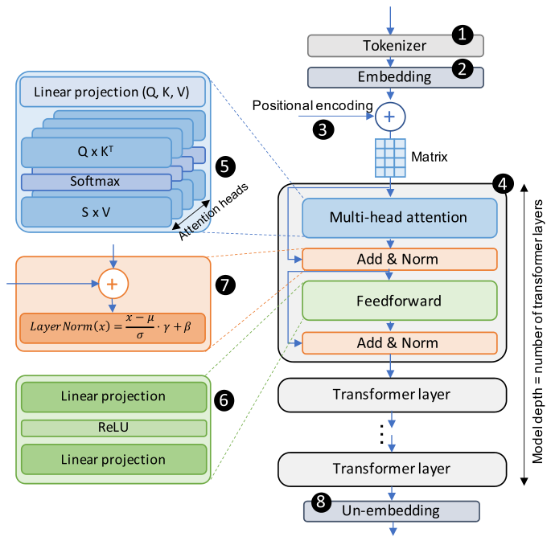

*Figure 20.1 — decoder-only transformer 구조. **KV caching 이 없는 기준 구조**다. (책 p.479)*

### 여덟 개의 구성 요소

| # | 구성 요소 | 하는 일 |
|---|---|---|
| ➊ | **Tokenizer** | 텍스트를 token(문자 또는 짧은 문자열을 나타내는 **정수 ID**)의 열로 바꾼다 |
| ➋ | **Embedding** layer | token ID 를 **embedding**(부동소수점 벡터)으로. embedding table 조회 |
| ➌ | **Positional Encoding** layer | 입력 embedding 벡터에 **순서 정보**를 더한다 |
| ➍ | **Transformer** layer | embedding 을 변환해 token 사이 의존을 뽑아낸다. 이것이 여러 겹 쌓인다 |
| ➎ | **Multi-head attention** sub-layer | attention head 의 병렬 배열 |
| ➏ | **Feed-forward** sub-layer | 선형 변환 둘 사이에 **ReLU** |
| ➐ | **Add & Norm** sub-layer | **residual connection** + 정규화 |
| ➑ | **Un-embedding** layer | 마지막 transformer layer 의 embedding 을 **token 위의 확률 분포**로 |

#### ➊ Tokenizer — 훈련의 산물이다

> 텍스트를 token 으로 대응시키는 것은 **목표 언어의 어떤 훈련 문서 집합에서든
> 유한한 어휘를 학습할 수 있다**는 착상에 기반한다.
> 그렇게 학습되어 tokenizer 가 인식하는 고유 token 의 모음이 그 LLM 의 **어휘**를 이룬다
> (책 p.479).

훈련 중 ID 를 붙이는 절차는 이렇다 (책 p.479~480).

| 상황 | 하는 일 |
|---|---|
| 처음 보는 텍스트 조각 | **새 ID 번호**를 할당하고 "텍스트 조각 → token ID" 대응을 기록 |
| 전에 본 조각 | 대응에서 **기존 ID** 를 찾아 쓴다 |

> **텍스트 조각 → token ID 의 대응 자체가 훈련의 산물의 일부**다 (책 p.480).
> 추론 중에는 그 대응을 **조회**만 한다.

> 엄밀히 말하면 **token 은 LLM 의 어휘를 이루는 텍스트 조각**이고
> **token ID 는 LLM 내부에서 token 의 정수 표현**이다.
> LLM 의 동작을 서술할 때는 **정확할 필요가 없는 한 두 용어를 섞어 쓴다** (책 p.480).

#### ➋ Embedding — 왜 실수 벡터여야 하나

> 이 변환의 이유는 LLM 이 **수치적 방법으로 훈련되는 기계학습 모델**이기 때문이다.
> 훈련 과정은 보통 **gradient-descent** 접근을 쓰는데, 이는 모델의 모든 함수가 **미분 가능**하고
> 모든 입력·파라미터 값이 **연속 형태**(부동소수점 표현으로 근사되는)일 것을 요구한다
> (책 p.480).

**정수 ID 로는 미분할 수 없다** — 그것이 embedding 이 존재하는 이유의 전부다.

#### ➌ Positional Encoding

> positional encoding 은 attention 기제에 입력 token 의 **물리적 위치와 근접성**을 알려 준다.
> 이는 다음 출력 token 생성에 이전 입력·출력 token 이 얼마나 관련 있는지 판단할 때
> 고려되는 요소다 (책 p.480).

**attention 자체는 순서를 모른다.** $QK^\top$ 은 집합 연산이라 token 을 섞어도 같은 값이 나온다.
순서 정보는 오직 positional encoding 이 embedding 에 심어 준다.

> 현재 대화(사용자 입력, 시스템이 덧붙인 입력, 출력) 전체 token 열의 embedding 이
> **생성 순서에 따라 행렬로 누적**된다. **행렬의 각 행이 token 하나의 embedding** 이다.
> 이 행렬이 **첫 transformer layer 의 입력**이다 (책 p.480).

이 행렬이 20.2절의 $X$ 다.

#### ➍➎➏➐ Transformer layer 의 네 sub-layer

> 각 transformer layer 는 **multi-head attention sub-layer**, **addition and normalization
> sub-layer**, **feed-forward sub-layer**, 그리고 **또 하나의 addition and normalization
> sub-layer** 를 담는다 (책 p.480).

**multi-head attention** ➎:

> 각각 matrix multiplication 으로 embedding 의 **선형 사영**을 수행하는 attention head 들의
> 병렬 배열로 이루어진다. 선형 사영에 쓰이는 행렬은 훈련 과정에서 학습되며,
> 사실상 embedding 벡터에 **좌표 변환**을 수행해 이후의 유사도 비교를 더 효과적으로 만든다.
> 그 사영들은 다시 matrix multiplication 을 거쳐 **한 token 과 그 이전에 생성된 모든 token
> 사이의 유사도를 측정**한다 (책 p.480).

> 여러 attention head 의 출력은 **이어 붙여진 뒤** 보통 다시 선형 변환되어
> multi-head attention sub-layer 의 결합된 출력을 만든다 (책 p.480).

**Add & Norm** ➐:

> feed-forward sub-layer 또는 attention sub-layer 다음의 **덧셈 연산자는 residual connection
> 을 강제해 원래 입력의 정보를 유지**하도록 돕는다.
> **정규화 연산자는 결과 벡터를 다음 layer 의 입력이 기대하는 수치 범위에 맞게 정규화**해
> 과정을 안정시키고 수렴을 개선한다.
> 그 식은 입력 embedding 벡터 원소의 **평균 $\mu$ 와 표준편차 $\sigma$**, 그리고
> **학습된 파라미터 $\gamma, \beta$** 를 쓴다 (책 p.480~481).

Figure 20.1 의 상자에 적힌 식이 그것이다.

$$\mathrm{LayerNorm}(x) = \frac{x - \mu}{\sigma}\cdot\gamma + \beta$$

**Feed-forward** ➏:

> 보통 **선형 변환 두 개 사이에 ReLU 활성화**가 끼인 형태다.
> 직관적으로 **attention layer 는 token 사이의 유사도·의존을 식별**해서
> 그 앞에 생성된 token embedding 들의 **유사도 가중 선형 결합**에 기반한 새 embedding 을 만들고,
> **feed-forward sub-layer 는 그 새 embedding 에 의미를 더한다** (책 p.481).

#### ➑ Un-embedding

> 마지막 transformer layer 의 embedding 을 **token 위의 확률 분포**로 바꾸어
> 다음 출력 token 을 생성하는 데 쓴다 (책 p.481).

### 모델의 세 차원

> **파라미터 수로 따진 모델 크기는 이 세 차원의 곱**이며, 실제로 수십억에서 수조 개
> 파라미터(즉 모델 가중치)에 이를 수 있다 (책 p.481).

| 차원 | 정의 | 크면 무엇을 얻나 |
|---|---|---|
| **model depth** | transformer layer 의 수 | 분류기의 층위가 늘어 **더 일반적인 의존 패턴**을 잡는다 |
| **head dimension** ($d$) | embedding 벡터 하나의 원소 수 | **더 많은 의미 정보**를 담고 개념을 구별하며 더 유의미한 의존을 식별한다 |
| **head 수** | attention sub-layer 하나의 head 개수 | token 사이의 **서로 다른 종류의 의존**을 잡는다 |

> **head dimension 과 head 수를 합쳐 LLM 의 hidden dimension** 이라 부른다 —
> 내부 설계 파라미터이고 보통 LLM 사용자에게 노출되지 않기 때문이다 (책 p.482~483).

이 정의가 20.6절의 KV cache 크기 식에서 그대로 쓰인다 ($h_q \times d$).

### RAG — context 를 늘려 주는 장치

> LLM 은 정확한 응답을 위해 긴 context 를 요구하는데, **사용자 입력은 보통 너무 짧고 함축적**
> 이라 충분한 문맥 정보를 주지 못한다. 그 처방으로 사용자 입력을
> **retrieval-augmented generation (RAG)** 이라는 기법으로 확장하곤 한다 (책 p.481).

> RAG 는 **더 구체적이고 최신인 문맥 정보를 담은 관련 문서를 검색해 사용자 입력에 이어 붙여**
> 훨씬 크고 풍부한 context 를 만든다 (책 p.481).

**RAG 는 성능 관점에서 보면 $N$ 을 키우는 장치**다 — 즉 KV cache 를 키우고
attention 의 $O(N^2)$ 비용을 키운다. 20.6·20.7절이 다루는 문제의 원인 중 하나다.

> LLM 훈련에서 가장 관련 있는 계산은 **대규모 matrix-matrix multiplication** 이며
> attention head 와 feed-forward sub-layer 가 그것을 수행하고
> **15장에서 다룬 고급 최적화 전략을 활용할 수 있다.**
> 이 matrix multiplication 들이 attention head 를 LLM 모델에서 **연산 비용이 가장 큰 구성 요소**
> 로 만든다 (책 p.482).

---

## 20.2 Multi-head attention

### head 는 무엇을 나눠 갖나

> 각 attention sub-layer 는 여러 head 를 담고, 이들이 **동시에 여러 분류 과제를 수행**해
> 서로 다른 종류의 의존을 잡는다 (책 p.482).

| 의존의 종류 | 예 |
|---|---|
| **위치적** | token 사이의 거리 |
| **의미적** | 동의어, 주제 |
| **문맥적** | 관사를 이름에 연결 |
| **구문적** | 동사와 목적어를 연결 |

> head 의 이런 **전문화는 훈련 중에 일어난다.** 서로 다른 head 의 가중치 행렬은 **다르게
> 초기화**된다. 그 다음 역전파의 gradient descent 가 **dropout**(출력·확률을 무작위로 0으로)과
> **layer normalization**(활성값 정규화) 같은 기법으로 gradient 분산을 키워
> head 사이의 겹침을 피하고 과적합을 막는다 (책 p.482).

> **attention head 는 서로 독립**이므로 **여러 thread block 위에서 쉽게 동시에 계산**될 수 있다.
> 설계도 동일하므로 이 장에서는 **head 하나의 설계**를 보인다 (책 p.482).

**head 병렬성은 공짜다** — 그래서 이 장의 모든 kernel 은 head 하나만 다루고,
"grid 에 차원을 하나 더 붙이면 여러 head 를 같은 kernel 로 처리할 수 있다"고만 말한다 (책 p.493).

### 기호를 못 박는다

| 기호 | 뜻 | 모양 |
|---|---|---|
| $N$ | **sequence length** = context length = 지금까지 생성된 token 수 | |
| $d$ | **head dimension** = embedding 벡터의 원소 수 | |
| $X$ | 입력. 행 하나가 token 하나의 embedding | $N \times d$ |
| $W_Q, W_K, W_V$ | 학습된 좌표 변환 행렬 | $d \times d$ |
| $Q, K, V$ | query · key · value | $N \times d$ |
| $S = QK^\top$ | 유사도 지도 | $N \times N$ |
| $M$ | 인과성 mask | $N \times N$ |
| $P = \mathrm{softmax}(S + M)$ | 확률 행렬 (**하삼각**) | $N \times N$ |
| $O = PV$ | 출력 | $N \times d$ |

> chatbot 에서 $N$ 은 **사용자와 시스템의 대화가 진행되며 커진다.**
> 큰 $N$ 을 지원하는 모델은 더 긴 context 로 token 을 생성하므로 더 믿을 만하다 —
> 추가 문맥으로 용어와 구절의 모호성을 없애고, 문맥적 관련성을 식별하고,
> 연속된 응답 사이의 일관성을 유지할 수 있기 때문이다 (책 p.482).

> **각주 5**: 간략화를 위해 이 장은 가중치 행렬이 정사각이라고 가정한다.
> 일반적으로 $W_Q, W_K, W_V$ 는 각각 $d_x \times d_q$, $d_x \times d_k$, $d_x \times d_v$ 다.
> 다만 $QK^\top$ 때문에 **$d_q$ 는 언제나 $d_k$ 와 같아야** 한다 (책 p.483 각주 5).

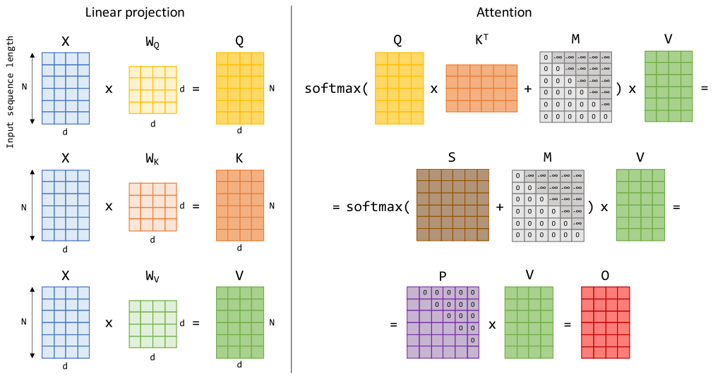

*Figure 20.2 — attention head 계산에 관여하는 행렬(2D tensor)들.
간략화를 위해 $S = QK^\top$ 의 모든 원소에 곱해지는 **scaling factor $\tfrac{1}{\sqrt d}$ 는
이 그림과 여기서 파생된 그림들에서 생략**했다. …… 이 scaling factor 는 matrix multiplication
결과가 너무 커져서 gradient-descent 기반 훈련의 수렴에 문제를 일으키는 것을 막기 위해
$S$ 의 원소에 적용된다. **이 장 뒤의 CUDA 구현에는 scaling factor 를 포함한다.** (책 p.483)*

### 두 단계

**첫 단계 — 선형 사영.**

> attention sub-layer 의 첫 계산 단계는 **query($Q$) · key($K$) · value($V$)** 라 부르는
> 세 행렬을 계산하는 것이다. 이 행렬들은 $X$ 의 행 벡터에 **선형 사영 또는 좌표 변환**을 해서
> 얻는다 — 즉 입력 행렬 $X$ 에 세 가중치 행렬을 곱한다 (책 p.483).

$$Q = X W_Q, \qquad K = X W_K, \qquad V = X W_V$$

> 수학적으로 $Q, K, V$ 의 한 행의 각 원소는 $X$ 의 **같은 행**에 있는 $d$ 개 원소의 선형 결합이다.
> $Q, K, V$ 에 수행되는 변환의 차이는 오직 $W_Q, W_K, W_V$ 의 **가중치 값 차이**로 정의된다
> (책 p.483).

**둘째 단계 — attention 그 자체.**

$$O = \mathrm{softmax}\!\left(\frac{QK^\top}{\sqrt d} + M\right) V \tag{20.1}$$

### $S = QK^\top$ 가 무엇인가

> $Q$ 는 $N \times d$, $K^\top$ 는 $d \times N$ 이므로 $QK^\top$ 는 $N \times N$ 행렬을 낳는다.
> $QK^\top$ 의 원소 $(i,j)$ 는 **token $i$ 의 선형 사영된 embedding 벡터**($Q$ 의 행 $i$)와
> **token $j$ 의 그것**($K^\top$ 의 열 $j$ = $K$ 의 행 $j$) 사이의 **내적**이다 (책 p.484).

> 수학적으로 내적은 두 입력 벡터가 **단위 길이라고 가정할 때 코사인 유사도**를 계산한다
> (정규화 기제로 그것을 강제할 수 있다).
> 두 벡터가 비슷할수록, 즉 사이 각이 작을수록 코사인 유사도 값이 크다.
> 따라서 **$N \times N$ 곱 행렬은 embedding 벡터 사이의 유사도 지도**다 (책 p.484).

**$1/\sqrt d$ 는 왜 붙나.**

> scaling factor $\tfrac{1}{\sqrt d}$ 는 **head dimension 이 클 때 내적이 너무 커지는 것을 막기
> 위해** $S = QK^\top$ 의 모든 원소에 적용된다.
> $S$ 원소가 지나치게 크면 **softmax 함수가 포화**해 훈련 중 **아주 작은(사라지는) gradient**
> 를 낳을 수 있다 [1] (책 p.484).

> **왜 하필 $\sqrt d$ 인가.** $q$ 와 $k$ 의 원소가 평균 0, 분산 1 로 독립이면
> 내적 $q\cdot k = \sum_{i=1}^{d} q_i k_i$ 의 분산은 $d$ 이고 표준편차는 $\sqrt d$ 다.
> $\sqrt d$ 로 나누면 **분산이 1 로 되돌아온다** — $d$ 가 얼마든 softmax 에 들어가는 값의
> 규모가 일정해진다. 책은 이유만 말하고 이 유도는 생략한다.

### 인과성 mask $M$

> mask 행렬 $M$ 은 $\tfrac{QK^\top}{\sqrt d}$ 의 원소 중 **열 index 가 행 index 보다 큰 것
> 전부에 $-\infty$ 를 더한다.** 이 변환은 **한 token 의 생성이 그 뒤에 생성된 token 에 영향받지
> 않아야 한다**는 인과성 정책을 강제한다 (책 p.484).

Figure 20.2 의 회색 $M$ 행렬이 그것이다 — 상삼각이 $-\infty$, 하삼각(대각 포함)이 0.

### 식 (20.2) — softmax 와 수치 안정성

> softmax 는 $QK^\top + M$ 의 각 행을 **확률 분포**로 옮긴다.
> $QK^\top + M$ 행렬의 행 $r$, 열 $c$ 원소를 **logit** $l_{r,c}$ 라 하자 (책 p.484).

$$p_{r,c} = \frac{e^{l_{r,c}}}{\sum_{j=1}^{N} e^{l_{r,j}}}
         = \frac{e^{l_{r,c} - m_r}}{\sum_{j=1}^{N} e^{l_{r,j} - m_r}} \tag{20.2}$$

> 여기서 $m_r$ 은 행 $r$ 의 **최댓값**이다. $l_{r,c}$ 가 클 수 있으므로 $e^{l_{r,c}}$ 는
> **overflow 할 수 있다.** 그래서 지수 함수를 적용하기 전에
> $m_r = \max_{j=1}^{N}(l_{r,j})$ 를 $l_{r,c}$ 에서 빼서 overflow 를 막고 **수치 안정성**을 유지한다
> (책 p.484).

**왜 결과가 같은가.**

> $l_{r,c}$ 에서 $m_r$ 을 빼는 것은 $e^{l_{r,c}}$ 에 $e^{-m_r}$ 을 곱하는 것과 동등하고,
> **분자와 분모가 둘 다 $e^{-m_r}$ 로 곱해지므로** 결과 $p$ 는 수학적으로 동등하다 (책 p.484).

$$\frac{e^{l_{r,c}}\cdot e^{-m_r}}{\left(\sum_j e^{l_{r,j}}\right)\cdot e^{-m_r}}
= \frac{e^{l_{r,c}}}{\sum_j e^{l_{r,j}}}$$

**검산**: `float64` 에서 $e^{800}$ 은 overflow 하지만 $\max$ 를 빼면 안전하고,
안 넘치는 값에 대해서는 두 방식의 결과가 **비트 단위로 같다** (검산 통과).

**$-\infty$ 가 자동으로 0 이 되는 것**도 여기서 나온다.

> 인과성 mask 행렬이 있으면 행 index $r$ 이 열 index $c$ 보다 작은 logit 원소는 $-\infty$ 가 된다.
> 그러면 $e^{l_{r,c}-m_r} = e^{-\infty-m_r} = e^{-\infty} = 0$ 이다 (책 p.484).

> 즉 $P = \mathrm{softmax}(QK^\top + M)$ 의 각 행은 $Q$ 안의 token $r$ 의 embedding 벡터와
> $K$ 안의 **token $r$ 이전에 생성된 token 들**의 embedding 벡터 사이 유사도에 기반한 확률 분포다.
> 행의 나머지 원소는 softmax 후 전부 0 이다. 즉 $\mathrm{softmax}(QK^\top+M)$ 이 만드는
> $N\times N$ 행렬은 **$r < c$ 인 모든 $(r,c)$ 가 0 인 하삼각 행렬**이다 (책 p.484).

**행 0 은 자기 자신만 본다** — $p_{0,0} = 1$, 나머지 0 (검산 통과).

### $O = PV$

> attention sub-layer 의 마지막 단계는 $N\times N$ 확률 행렬 $P$ 와 $V$ 행렬의 곱이다.
> 각 token 에 대해 이 곱은 **새 embedding 벡터**를 만드는데, 그 각 원소는 $V$ 안 모든 embedding
> 의 같은 원소에 대한 **유사도·확률 가중합**이다.
> 즉 출력 행렬 $O$ 의 각 token 의 새 embedding 벡터는 **이전에 생성된 모든 token 의 embedding
> 벡터의 유사도 가중합**이다 (책 p.485).

그리고 $O$ 는 Add & Norm 과 feed-forward 를 거쳐 **다음 attention sub-layer 의 $X$** 가 된다.

### 두 국면 — 요약과 생성 (Figure 20.3)

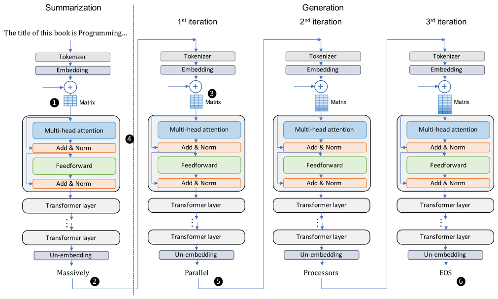

*Figure 20.3 — LLM 의 두 국면: 요약(summarization)과 생성(generation). (책 p.485)*

> decoder-only 구조로 LLM 을 추론하는 것은 **요약 국면**에서 시작한다 —
> system prompt token, 사용자 입력 token, 시스템이 덧붙인(예: RAG) token 이 이어 붙여져
> 첫 transformer layer 의 입력 행렬 $X$ 를 이룬다 (책 p.485).

책의 장난감 예제를 그대로 따라가면 (책 p.486):

| 단계 | 무슨 일이 |
|---|---|
| ➊ | 사용자가 `"The title of this book is Programming"` 을 입력 → **token 7개**가 $X$ 에 누적된다 |
| | 첫 transformer layer 실행 → 둘째 → … 마지막 → un-embedding |
| ➋ | 첫 출력 token **`"Massively"`** 생성. **여기서 요약 국면이 끝난다** |
| ➌ | 그 token 이 다시 입력이 되어 $X$ 에 **행 하나**가 붙는다 |
| ➎ | 다음 token **`"Parallel"`** 생성 |
| ➏ | **EOS token** 이 나올 때까지 반복 |

> 이 예에서는 간략화를 위해 LLM 이 **단어 전체를 token 으로** 쓴다고 가정한다 (책 p.486).

> **활성화될 때 각 transformer layer 는 자기의 $K$, $V$, $Q$, $QK^\top$, $O$ 를 계산한 뒤
> 다음 transformer layer 를 활성화**한다 (책 p.486).

**이 문장에 20.4절의 씨앗이 들어 있다.** 매 반복마다 $K$·$V$ 를 **처음부터 다시** 계산한다 —
그런데 새로 붙은 행은 하나뿐이다.
---

## 20.3 Implementing attention in CUDA

### 새로운 것은 softmax 하나뿐이다

> Figure 20.1 의 transformer 구조에서 attention 계산은
> **matrix multiplication 둘, 행렬 원소별 scaling 하나, 행렬 덧셈 하나, 그리고 softmax 계산**
> 으로 이루어진다.
> matrix multiplication 은 **직접 만든 CUDA kernel** 로 하거나 **cuBLAS 같은 라이브러리의
> 고도로 최적화된 GEMM 함수를 호출**해서 할 수 있다.
> scaling factor $\tfrac{1}{\sqrt d}$ 는 $QK^\top$ 곱셈을 하는 같은 kernel 안에서 적용하거나
> **cuBLAS GEMM API 의 scaling factor $\alpha$** 로 줄 수 있다.
> attention 계산에서 **유일하게 새로운 것은 softmax 함수의 구현**이다 (책 p.486).

**19장의 결론이 여기서 다시 쓰인다.** matmul 은 이미 풀린 문제이므로 라이브러리에 넘기고,
새로운 것만 직접 짠다.

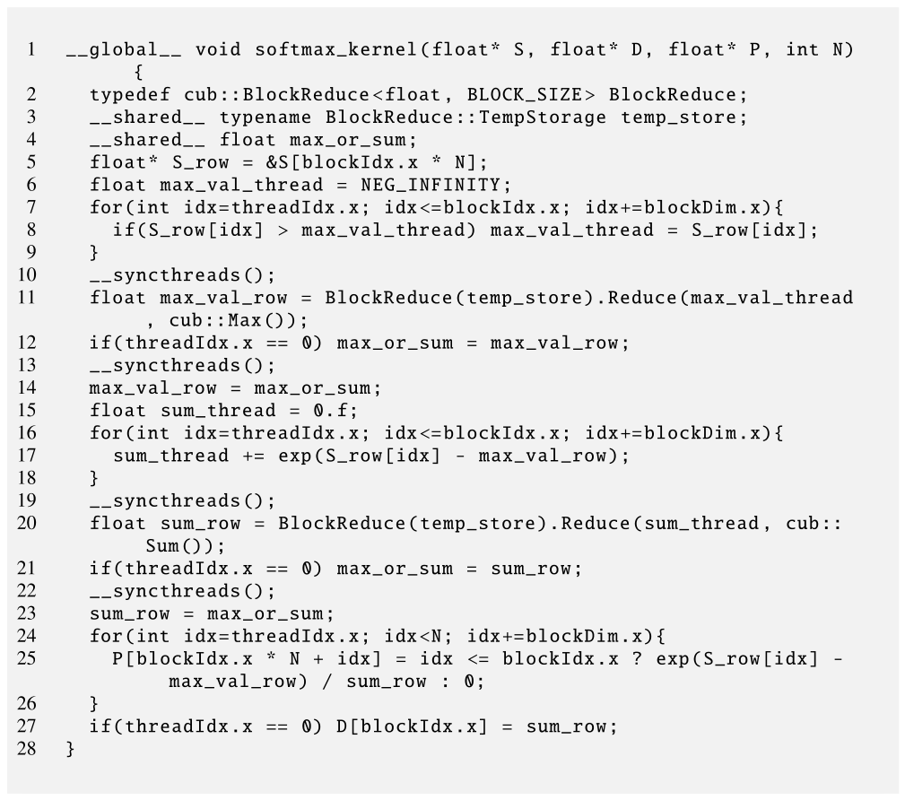

*Figure 20.4 — softmax 함수의 CUDA kernel 구현. (책 p.487)*

```cuda
 1 __global__ void softmax_kernel(float* S, float* D, float* P, int N) {
 2   typedef cub::BlockReduce<float, BLOCK_SIZE> BlockReduce;
 3   __shared__ typename BlockReduce::TempStorage temp_store;
 4   __shared__ float max_or_sum;
 5   float* S_row = &S[blockIdx.x * N];
 6   float max_val_thread = NEG_INFINITY;
 7   for(int idx=threadIdx.x; idx<=blockIdx.x; idx+=blockDim.x){
 8     if(S_row[idx] > max_val_thread) max_val_thread = S_row[idx];
 9   }
10   __syncthreads();
11   float max_val_row = BlockReduce(temp_store).Reduce(max_val_thread, cub::Max());
12   if(threadIdx.x == 0) max_or_sum = max_val_row;
13   __syncthreads();
14   max_val_row = max_or_sum;
15   float sum_thread = 0.f;
16   for(int idx=threadIdx.x; idx<=blockIdx.x; idx+=blockDim.x){
17     sum_thread += exp(S_row[idx] - max_val_row);
18   }
19   __syncthreads();
20   float sum_row = BlockReduce(temp_store).Reduce(sum_thread, cub::Sum());
21   if(threadIdx.x == 0) max_or_sum = sum_row;
22   __syncthreads();
23   sum_row = max_or_sum;
24   for(int idx=threadIdx.x; idx<N; idx+=blockDim.x){
25     P[blockIdx.x * N + idx] = idx <= blockIdx.x ? exp(S_row[idx] - max_val_row) / sum_row : 0;
26   }
27   if(threadIdx.x == 0) D[blockIdx.x] = sum_row;
28 }
```

**이 kernel 은 두 가지를 융합한다.**

> Fig. 20.4 는 **$M$ 과의 행렬 덧셈과 softmax 계산을 같은 kernel 안에 융합**한 CUDA kernel 을
> 보인다. 융합된 kernel 은 softmax 계산 전에 입력 $S$ 행렬을 **한 번 더 훑는 것을 피하고**
> arithmetic intensity 와 GPU 활용도를 개선한다 (책 p.486).

### 실행 구성

> 이 kernel 의 실행 구성(Fig. 20.4 에 없음)은 **thread block 의 1D grid** 다.
> kernel 은 thread block 수(`gridDim.x`)가 **행렬 $S$ 의 행 수, 즉 sequence length $N$** 으로
> 설정된다고 가정한다. `gridDim.y` 와 `gridDim.z` 는 **0** 이다 (책 p.487).

> **원문 오기 ①.** `gridDim.y`·`gridDim.z` 는 **1** 이어야 한다.
> `dim3` 의 기본값이 1 이고, 0 이면 block 이 하나도 없어 kernel 이 아무 일도 하지 않는다.
> (뒤의 "원문 오기" 절 참조)

> 이 가정은 kernel 의 context length 를 **x 차원에서 허용되는 최대 thread block 수 이하**
> 로 제한한다. 더 큰 context length 가 필요하면 kernel 코드에 **바깥 loop 를 추가**해
> grid 의 thread 들이 $S$ 의 모든 행을 처리할 때까지 반복하게 하면 된다 (책 p.487).

x 차원의 최대 block 수는 $2^{31}-1 \approx 21$억이므로 실무에서는 문제가 되지 않는다.
(y·z 차원은 65,535 다 — 그래서 **x 를 골라야** 한다.)

> 각 thread block 은 `BLOCK_SIZE` 개 thread 의 1D 로 가정된다. `BLOCK_SIZE` 는 프로그래머가
> 정하는 컴파일 시점 상수다.
> block 의 모든 thread 가 협력해 $S$ 의 **한 행**을 처리하므로,
> **thread block 이 배정된 행을 처리하는 데 드는 예상 반복 횟수를 최소화하면서 SM 의 occupancy
> 를 최대화**하는 `BLOCK_SIZE` 값을 골라야 한다 (책 p.487).

**맞바꿈이다**: `BLOCK_SIZE` 를 키우면 반복이 줄지만 SM 에 올라가는 block 수가 준다.

### 줄별로

| 줄 | 하는 일 | 짚을 점 |
|---|---|---|
| 2~3 | CUB `BlockReduce` 타입과 shared memory `TempStorage` | 10장의 reduction 을 라이브러리로 |
| 4 | `max_or_sum` — **최댓값과 합을 번갈아 담는** shared 변수 | shared memory 4 B 절약 |
| 5 | `S_row` = 이 block 이 맡은 행 | `blockIdx.x` 가 행 번호 |
| 6~9 | thread 마다 **부분 최댓값** | ← **인과성이 여기 숨어 있다** |
| 11 | block 전체의 최댓값 = $m_r$ | 결과는 **thread 0 만** 받는다 |
| 12~14 | thread 0 이 shared 로 방송 | |
| 15~18 | thread 마다 **부분 합** | 같은 인과성 조건 |
| 20~23 | block 전체의 합 = $D_r$, 방송 | |
| 24~26 | $P$ 원소 계산 후 저장 | **`idx < N`** — 이번엔 행 전체를 돈다 |
| 27 | 분모 $D_r$ 을 따로 저장 | **훈련에서 재사용**하려고 |

#### 인과성을 loop 조건으로 구현한다

> lines 7-8 의 for loop 의 종료 조건이 **`idx <= blockIdx.x`** 라는 점에 주목한다.
> 이렇게 하면 코드가 **행 index(`blockIdx.x`)보다 열 index(`idx`)가 큰 원소를 무시**하게 되어,
> 식 (20.1) 의 행렬 $M$ 을 명시적으로 더하지 않고도, 즉 열 index 가 행 index 보다 큰 $S$ 원소
> 전부에 $-\infty$ 를 더하지 않고도 **인과성 정책을 구현**한다 (책 p.488).

$$\underbrace{S + M \text{ 을 만드는 kernel}}_{N^2 \text{ 짜리 왕복 한 번}}
\;\longrightarrow\; \underbrace{\texttt{idx <= blockIdx.x}}_{\text{loop 조건 하나}}$$

**$-\infty$ 를 담은 $N\times N$ 행렬 $M$ 은 실제로 만들어지지 않는다.**
$M$ 은 **수식에서만 존재**하고 코드에서는 loop 경계와 삼항 연산자다.
$N = 32768$ 이면 $M$ 하나가 4 GB 다 — 만들 수도 없다.

#### 24~26줄만 `idx < N` 인 이유

앞의 두 loop 는 `idx <= blockIdx.x` 인데 마지막만 `idx < N` 이다.
**출력 $P$ 는 행 전체를 채워야 하기 때문**이다 —
$c > r$ 인 자리에 명시적으로 0 을 써야 다음 GEMM($PV$)이 올바르게 동작한다.
그래서 25줄의 삼항 연산자가 있다.

#### 10장이 그대로 재사용된다

> 7~14줄의 코드는 본질적으로 **thread coarsening 을 적용한 reduction** 이며
> 이미 10장에서 소개했다 (책 p.488).
> …… 15~23줄은 **coarsening 을 적용한 sum reduction** 을 구현한다 (책 p.488).

| 10장의 개념 | Figure 20.4 에서 |
|---|---|
| thread coarsening (10.10절) | 7~8줄의 `idx += blockDim.x` — thread 하나가 여러 원소 |
| reduction tree | CUB `BlockReduce` 가 대신한다 |
| 결과를 thread 0 만 갖는다 | 12줄에서 shared 로 방송해야 하는 이유 |

**같은 `temp_store` 를 두 번 쓰는 것은 안전한가.** 11줄과 20줄이 같은 shared 저장소를 쓴다.
CUB 는 재사용 사이에 `__syncthreads()` 를 요구하는데 **19줄이 그것**이다 ✓.
(13줄도 있으니 두 겹으로 안전하다.)

> kernel 요약: Fig. 20.4 의 softmax kernel 은 **인과성 정책과 softmax 함수를 하나의 kernel 안에서**
> 구현한다. **전역 barrier 가 필요 없고**($M$ 을 더하는 추가 kernel 이 없다),
> block 수준의 `__syncthreads()` barrier 만 쓴다 (책 p.488).

> $S$ 를 만드는 matrix multiplication 과 $O$ 를 만드는 matrix multiplication 을 추가해
> attention sub-layer 구현을 완성하는 것은 **독자에게 권한다** (책 p.488).

### 그런데 이 구조에는 여전히 문제가 있다

kernel 이 셋이라는 것이 문제다.

| kernel | 읽는 것 | 쓰는 것 | global memory 트래픽 |
|---|---|---|---|
| ① GEMM | $Q$, $K$ | **$S$** | $2Nd + N^2$ |
| ② softmax (Fig 20.4) | **$S$** | **$P$**, $D$ | $2N^2 + N$ |
| ③ GEMM | **$P$**, $V$ | $O$ | $N^2 + 2Nd$ |
| **합** | | | $\approx 4N^2 + 4Nd$ |

$N \gg d$ 이면 **$4N^2$ 이 지배**한다. $N = 32768$, FP32 면 $4N^2 \times 4\,\text{B} = 17$ GB —
H100 의 memory bandwidth 3.35 TB/s 로도 5 ms 다. **그리고 그것은 순수한 낭비다** —
$S$ 와 $P$ 는 최종 결과에 필요 없는 중간 산물이기 때문이다.

**20.5절이 이 $4N^2$ 을 0 으로 만든다.**

---

## 20.4 KV caching

### 관찰 — 새 행은 하나뿐이다

> Figure 20.1 의 transformer 구조는 Fig. 20.3 이 보이는 대로 곧이곧대로 구현하면
> **명백한 비효율**이 있다. 각 반복에서 각 transformer layer 마다 **다섯 번의 matrix
> multiplication** 이 수행된다.
> sequence length $N$ 이 수만 token 이상으로 커질 수 있으므로 이 곱셈들은 아주 비쌀 수 있다.
> **디코딩 국면의 한 반복에서 다음 반복으로 갈 때 입력 행렬 $X$ 에 늘어나는 행은 하나뿐**이므로,
> 매 반복 전체 matrix multiplication 을 정말 해야 하는지 물어야 한다.
> **답은 '아니다'** 다 (책 p.488~489).

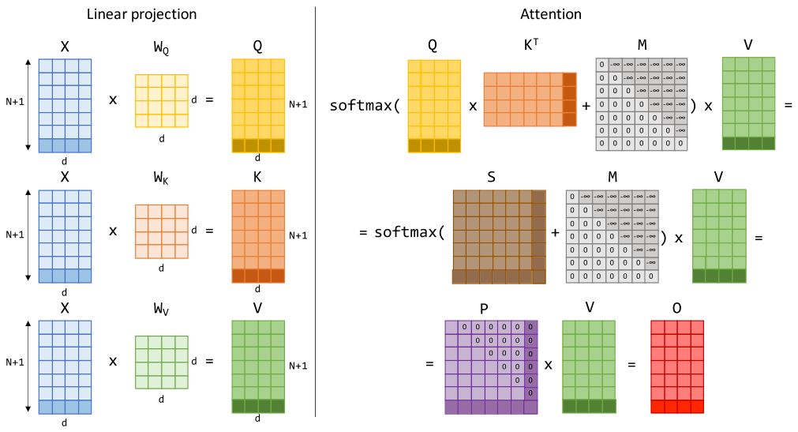

*Figure 20.5 — LLM 의 한 반복에서 다음 반복으로 갈 때 matrix multiplication 작업을 줄일 수
있는 최적화 기회. 반복 $i$ ($N=i$) 에서 반복 $i+1$ ($N=i+1$) 로 갈 때 **새로 생기는 부분**을
진한 색으로 표시했다. (책 p.489)*

행렬별로 무엇이 새로운지 정리하면 (책 p.489):

| 행렬 | 크기 변화 | 새로 계산해야 하는 것 |
|---|---|---|
| $X$ | $N\times d \to (N{+}1)\times d$ | **맨 아래 행 하나** (새 token 의 embedding) |
| $Q$, $K$, $V$ | 〃 | **각각 맨 아래 행 하나** — 새 $X$ 행과 $W_Q/W_K/W_V$ 의 **벡터-행렬 곱** |
| $QK^\top$ | $N^2 \to (N{+}1)^2$ | **새 $N$ 번째 행**만. 새 $N$ 번째 열은 mask 로 0 (대각 원소 제외) |
| $P$ | 〃 | 이전 행들은 **변하지 않는다** |
| $O$ | $N\times d \to (N{+}1)\times d$ | **새 행 하나**만 |

**왜 이전 원소가 안 변하는가** — 책의 논증을 그대로 따라간다.

> 예컨대 곱 행렬의 원소 $(0,0)$ 은 $Q$ 의 0번째 행과 $K$ 의 0번째 행의 내적으로 생성된다.
> 둘 다 이전 반복과 같으므로 원소 $(0,0)$ 에 변화가 없다.
> 일반적으로 **$r$ 과 $c$ 가 둘 다 $N$ 보다 작으면** $QK^\top$ 의 원소 $(r,c)$ 값은
> 이전 반복과 같다 — 변하지 않은 $Q$ 와 $K$ 의 행에서 생성되기 때문이다 (책 p.489).

> softmax 출력도 이전 반복에서 **증분적으로 갱신**될 수 있다.
> softmax 는 $QK^\top$ 의 각 행에 적용된다는 것을 상기하자.
> 각 행(새 $N$ 번째 행 제외)의 새 $N$ 번째 원소가 0 이므로,
> 이 새 원소들은 **이전 원소들의 확률을 희석하지 않아** 반복 $N$ 에서 $N+1$ 로 갈 때
> 그 행들의 원소에 아무 변화를 주지 않는다 (책 p.490).

$$\text{행 } r < N \text{ 의 softmax 분모} = \sum_{j \le r} e^{l_{r,j}-m_r} \quad
(\text{열 } N \text{ 은 } r < N \text{ 이므로 mask 되어 기여 0})$$

> 독자는 **반복 $N+1$ 의 $O$ 행렬의 처음 $N$ 개 행(0번째부터 $(N-1)$번째)이 이전 반복과 같음**
> 을 확인해야 한다. **새 $\mathrm{softmax}(QK^\top)$ 행과 새 $V$ 사이의 벡터-행렬 곱 하나만**
> 수행하면 된다 (책 p.490).

### KV cache

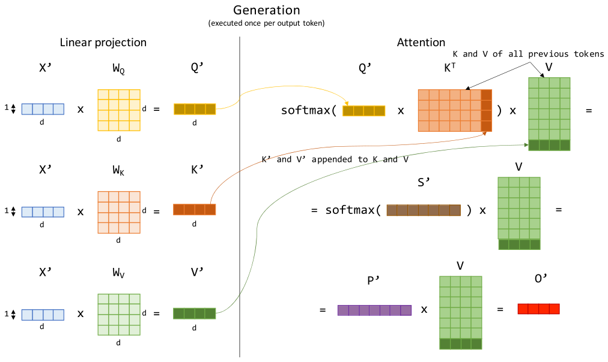

*Figure 20.6 — KV caching 을 쓰는 attention 계산의 **생성 국면**에 관여하는 벡터와 행렬.
(책 p.490)*

> 각 반복에서 multi-head attention sub-layer 는 **$X$ 의 새 행 하나만 받으면** 된다.
> 따라서 각각 다음 layer 로 **$O$ 의 새 행 하나만 전달**하면 된다.
> 다만 **생성 국면의 attention 계산은 여전히 $K$ 와 $V$ 전체를 요구**한다.
> 이 요구는 $K$ 와 $V$ 를 **memoize**(저장했다가 나중에 재사용)해서 충족할 수 있으며,
> 그것이 이른바 **KV cache** 다 (책 p.490).

> **각주 6**: LLM 추론에서의 KV 는 key-value store 문헌의 key-value 와 혼동하면 안 되지만
> 유사한 용어다. LLM 추론은 **value(V) 의 가중합**인 출력을 만드는데,
> 그 가중치는 **query(Q) 와 key(K) 가 얼마나 가까운지에 비례**한다 [1] (책 p.490 각주 6).

**16장의 memoization 이 여기서 다시 나온다.** 16.1절이 dynamic programming 을
"겹치는 부분문제의 결과를 기억해 두는 것"으로 정의했는데,
KV cache 는 **정확히 그것**이다 — 다만 부분문제가 "이 token 의 $K$·$V$ 행"이다.

### 얼마나 줄어드나

생성 단계 한 번의 attention 관련 FLOP 을 세어 보면 (한 head, softmax 무시):

| | $QK^\top$ | $PV$ | 합 |
|---|---|---|---|
| **KV cache 없이** | $2N^2 d$ | $2N^2 d$ | $4N^2 d$ |
| **KV cache 로** | $2Nd$ ($1\times d$ · $d \times N$) | $2Nd$ ($1\times N$ · $N\times d$) | $4Nd$ |

$$\frac{4N^2 d}{4Nd} = N$$

**연산이 정확히 $N$ 배 줄어든다.** $N=4096$, $d=128$ 이면
$8.6\times10^9 \to 2.1\times10^6$ FLOP (검산 통과).

**대가는 메모리다** — 20.6절이 그 계산서를 청구한다.

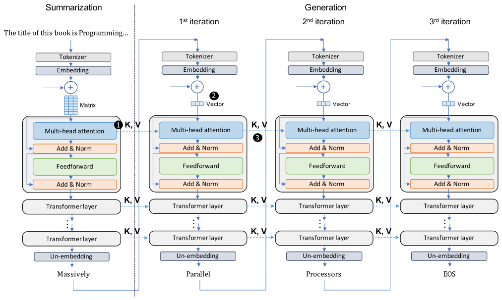

*Figure 20.7 — LLM 의 두 국면: KV caching 을 쓰는 요약과 생성. (책 p.491)*

> 요약 국면에서 모든 transformer layer 가 초기 $K$·$V$ 행렬을 생성해 **KV cache 를 채운다** ➊.
> KV caching 이 있으면 요약 국면을 **prefill 국면**이라고도 부른다 —
> 이 국면에서 transformer layer 들이 자기 KV cache 를 $K$·$V$ 의 초기 내용으로 **미리 채우기**
> 때문이다 (책 p.491).

> 생성 국면에서는 각 transformer layer 안에서 먼저 **세 번의 벡터-행렬 곱**이 수행되어
> $Q$, $K$, $V$ 각각의 **새 행 하나**를 만든다. Fig. 20.6 의 벡터 $Q'$, $K'$, $V'$ 가 그것이다.
> LLM 은 이 새 행들을 KV cache 의 이전 반복 $K$·$V$ 행렬에 **덧붙여** ➌ 현재 반복의 새
> $K$·$V$ 행렬을 만들고 그것으로 $O'$ 를 계산한다 (책 p.491).

### 두 국면의 성격이 갈린다 — 이 장에서 가장 중요한 표

> **prefill(요약) 국면**은 여전히 **많은 token 에 대한 transformer 통과 한 번**을 요구하고
> 여러 개의 **큰 matrix-matrix 곱(GEMM)** 을 부른다.
> 보통 **compute-bound**(높은 arithmetic intensity)이고 높은 GPU 활용도를 낼 수 있다 (책 p.491).

> 반면 **생성 국면**은 출력 token 하나당 transformer 통과 한 번을 부른다.
> KV caching 이 있으면 각 통과는 대부분 **벡터-행렬 곱(GEMV)** 을 수행하고
> 보통 **memory bandwidth bound**(낮은 arithmetic intensity)다.
> 따라서 **GPU 연산 자원을 저활용**하는 경향이 있다 (책 p.492).

$$\underbrace{\text{prefill}}_{\text{GEMM · compute-bound}} \quad\text{vs}\quad
  \underbrace{\text{generation}}_{\text{GEMV · memory-bound}}$$

**그리고 이 둘이 서로 다른 처방을 요구한다.**

| | 무엇이 문제인가 | 어디서 고치나 |
|---|---|---|
| prefill | $S$·$P$ 의 global memory 왕복 | **20.5절 flash attention** |
| generation | 가중치·KV cache 를 읽는 시간이 지배 | **20.6절 batch·speculative decoding**, **20.7절 MQA/GQA/MLA** |

> **17장의 SpMV 와 같은 구도다.** GEMV 는 재사용이 없다 —
> 행렬 원소 하나를 읽어 곱셈-덧셈 한 번을 한다. arithmetic intensity 가
> $2/(4\times1) = 0.5$ FLOP/B 수준이고, 20.6절이 계산하듯 attention 에서는 **≈ 1** 이다.
> H100 의 임계값 20 FLOP/B 와 비교하면 **$20\times$ 아래**다.
---

## 20.5 Flash attention

### 무엇이 문제인가

> Fig. 20.4 처럼 **별도의 softmax kernel** 로 attention 을 구현하면
> **kernel 경계에서의 전역 barrier** 와 **행렬 전체를 global memory 에서/로 여러 번 적재·저장**
> 하는 일이 생긴다. 이 전역 barrier 와 global memory 접근이 주된 성능 병목이고,
> **flash attention** 정식화 [6] 가 그것을 완화한다 (책 p.492).

### 왜 tiling 이 그냥은 안 되나

> flash attention 의 핵심 착상은 **tiling** 이다. 그러나 attention head 구현에서의 tiling 은
> matrix multiplication 에서만큼 간단하지 않다 —
> 식 (20.2) 의 softmax 정식화가 **입력의 각 행을 여러 번 훑을 것을 요구**하기 때문이다 (책 p.493).

$$\text{softmax 한 행을 계산하려면} \quad
m_r = \max_j l_{r,j} \quad\text{와}\quad D_r = \sum_{j} e^{l_{r,j}-m_r} \quad\text{를 먼저 알아야 한다}$$

> 이 정식화로는 출력 $P$ 의 행 원소를 계산하기 전에 **최댓값과 합을 모으려고 행을 적어도 한 번
> 훑어야** 한다. 그리고 softmax kernel 을 부르기 전에 $QK^\top + M$ 행렬의 **모든 원소가
> 준비되었음을 보장할 전역 barrier** 가 필요하다 (책 p.493).

**전역 barrier 를 얻는 방법 둘 다 문제가 있다** — 18.7절에서 본 그 선택지다.

| 방법 | 문제 |
|---|---|
| kernel 을 끝내고 다시 부른다 | kernel 호출 오버헤드 |
| **cooperative groups** 로 grid 전체 barrier (18.7절) | **matrix multiplication 에 좋은 grid 구성과 softmax 에 좋은 grid 구성이 다르다** |

> 그러나 어느 전역 synchronization 전략을 고르든, softmax 가 $S$ 의 행을 **여러 번 훑는 것**이
> global memory 트래픽을 일으켜 구현의 throughput 을 크게 제한한다 (책 p.493).

**그러니 "여러 번 훑는 것" 자체를 없애야 한다.**

### 식 (20.3) — 부분합

> 다행히 **분모에 대한 부분급수(partial series)를 정의**하면 softmax 가 $S$ 의 행 전체를
> 여러 번 훑을 필요를 없앨 수 있다 (책 p.493).

$$D_{r,A} = \sum_{j \in A} e^{l_{r,j} - m_{r,A}} \tag{20.3}$$

> 여기서 $A$ 는 행 $r$ 의 **열 위치의 부분집합**이다.
> $A$ 가 행 $r$ 의 모든 열 위치를 포함하면 $D_{r,A} = D_r$ 이다 (책 p.494).

**$m_{r,A}$ 도 부분집합 기준**이라는 것이 핵심이다 — 전체 최댓값을 모르는 채로 시작한다.

> $A$ 에 대한 부분급수와 다른 부분집합 $B$ 에 대한 부분급수를 **$A \cup B$ 에 대한 부분급수로
> 합치는 결합 규칙(composition rule)** 을 유도할 수 있다면,
> 부분집합별로 **독립적으로(잠재적으로 병렬로)** 부분급수를 계산해 준비되는 대로 합치는
> 길이 열린다 [7] (책 p.494).

### 식 (20.4) 유도 — $D$ 의 결합 규칙

$$
D_{r,A\cup B}
= \sum_{j\in A\cup B} e^{l_{r,j}-m_{r,A\cup B}}
\;\overset{(1)}{=}\; \sum_{j\in A} e^{l_{r,j}-m_{r,A\cup B}} + \sum_{j\in B} e^{l_{r,j}-m_{r,A\cup B}}
$$
$$
\overset{(2)}{=}\; \Big(\sum_{j\in A} e^{l_{r,j}-m_{r,A}}\Big) e^{m_{r,A}-m_{r,A\cup B}}
 + \Big(\sum_{j\in B} e^{l_{r,j}-m_{r,B}}\Big) e^{m_{r,B}-m_{r,A\cup B}}
$$
$$
\overset{(3)}{=}\; D_{r,A}\, e^{m_{r,A}-m_{r,A\cup B}} + D_{r,B}\, e^{m_{r,B}-m_{r,A\cup B}}
\tag{20.4}
$$

| 단계 | 근거 |
|---|---|
| **(1)** | 합을 두 부분집합으로 쪼갠다. **$A$ 와 $B$ 에 공통 원소가 없어야** 성립한다 |
| **(2)** | $e^{l-m_{A\cup B}} = e^{l-m_A}\cdot e^{m_A-m_{A\cup B}}$ — 지수를 더하고 빼는 항등식 |
| **(3)** | 괄호 안이 식 (20.3) 의 정의 그대로 |

> 이 결합 규칙에서 $m_{r,A\cup B}$ 는 **$m_{r,A}$ 와 $m_{r,B}$ 중 큰 쪽**이다.
> 유도의 둘째 단계는 **$A$ 와 $B$ 에 공통 원소가 없는 한** 옳다.
> 아래에 제시할 flash attention 의 CUDA 구현에서 부분집합 $A$ 와 $B$ 는 **행렬 $S$ 의 각 행의
> tile** 이고 **공통 원소가 없음이 보장**된다 (책 p.494).

> 이 결합 규칙으로 **부분집합마다 최댓값 $m_{r,A}$·$m_{r,B}$ 도 함께 들고 다니기만 하면**
> 두 부분합을 쉽게 합칠 수 있다 (책 p.494).

**들고 다녀야 하는 상태는 딱 둘이다 — $(m, D)$.** (검산: tile 넷으로 쪼개 순차로 합쳐도
전체를 한 번에 계산한 $D_r$ 과 일치한다.)

### 식 (20.5)·(20.6) — $O$ 의 결합 규칙

> flash attention [6] 은 이 접근을 한 걸음 더 밀고 간다 —
> **출력 행렬 $O$ 에도 결합 규칙을 적용**한다 (책 p.494).

$$o_{r,c,A} = \sum_{j\in A} p_{r,j,A}\, v_{j,c}
           = \frac{1}{D_{r,A}} \sum_{j\in A} e^{l_{r,j}-m_{r,A}}\, v_{j,c} \tag{20.5}$$

> 여기서 $p_{r,j,A}$ 는 **$A$ 안의 원소만 고려했을 때** $P$ 행렬 원소 $p_{r,j}$ 의 중간값이다.
> $p_{r,j,A}$ 와 $p_{r,j}$ 의 차이는 **분모와 최댓값이 둘 다 $A$ 안의 원소에만 기반**한다는 것이다
> (책 p.494).

유도의 결과만 옮기면 (전체 유도는 책 p.494~495):

$$o_{r,c,A\cup B}
= \frac{D_{r,A}\, e^{m_{r,A}-m_{r,A\cup B}}}{D_{r,A\cup B}}\, o_{r,c,A}
+ \frac{D_{r,B}\, e^{m_{r,B}-m_{r,A\cup B}}}{D_{r,A\cup B}}\, o_{r,c,B}
\tag{20.6}$$

> 결합 규칙은 $o_{r,c,A}$ 와 $o_{r,c,B}$ 를 **$o_{r,c,A\cup B}$ 로 합치기 전에 다시 scaling
> 할 것을 요구**한다 (책 p.495).

> **원문 오기 ②.** 책 p.495 유도의 **둘째 줄** 둘째 합의 지수가
> $e^{l_{r,j}-m_{r,B}}$ 로 인쇄되어 있는데 $e^{l_{r,j}-m_{r,A\cup B}}$ 여야 한다.
> 바로 앞 줄(첫 줄)이 $\sum_{j\in A\cup B} \frac{e^{l_{r,j}-m_{r,A\cup B}}}{D_{r,A\cup B}}v_{j,c}$
> 를 두 합으로 쪼갠 것이므로 **양쪽 지수가 같아야** 하고,
> **바로 다음 줄**이 $e^{l_{r,j}-m_{r,A\cup B}+m_{r,B}-m_{r,B}}$ 로 되돌려 놓는 것이
> 그 줄이 오타임을 확정한다. (뒤의 "원문 오기" 절 참조)

**검산**: 식 (20.6) 을 그대로 코드로 옮겨 $A=\{0,1,2,3\}$, $B=\{4,5,6,7\}$ 로 합친 결과가
$A\cup B$ 를 한 번에 계산한 값과 일치한다 ✓.

#### 그런데 코드는 식 (20.6) 을 그대로 쓰지 않는다

Figure 20.13 을 읽어 보면 $D$ 의 비율이 **어디에도 없다.** 이유는 간단하다 —
**$O$ 를 정규화하지 않은 채로 들고 다니면 $D$ 가 약분되기 때문**이다.
$\tilde o = D \cdot o$ 라 두고 식 (20.6) 의 양변에 $D_{r,A\cup B}$ 를 곱하면:

$$\tilde o_{r,c,A\cup B}
= e^{m_{r,A}-m_{r,A\cup B}}\, \tilde o_{r,c,A}
+ e^{m_{r,B}-m_{r,A\cup B}}\, \tilde o_{r,c,B}$$

그리고 $B$ 가 "이번 tile" 이면 $\tilde o_{r,c,B} = \sum_{j\in B} e^{l_{r,j}-m_{r,B}} v_{j,c}$ 인데,
코드는 아예 **처음부터 새 최댓값 $m_{r,A\cup B}$ 로** 지수를 계산한다
(Figure 20.15 line 8 이 `m_i[ii]` 를 쓰는데, 그 값은 Figure 20.14 가 이미 갱신한 새 최댓값이다).
그러면 둘째 항의 scaling 도 사라진다.

$$\boxed{\;\tilde O \;\leftarrow\; \tilde O \cdot e^{m_{\text{old}}-m_{\text{new}}}
\;+\; \sum_{j\in B} e^{l_{r,j}-m_{\text{new}}}\, v_{j,c}\;}$$

$$\boxed{\;D \;\leftarrow\; D \cdot e^{m_{\text{old}}-m_{\text{new}}}
\;+\; \sum_{j\in B} e^{l_{r,j}-m_{\text{new}}}\;}$$

$$\text{마지막에 한 번만} \quad O = \tilde O / D$$

**곱셈 하나와 덧셈 하나로 끝난다.** 그것이 Figure 20.13 line 3 (`O_i *= exp(last_m - m_i)`)
과 line 8 (`O_i += O_ij`), 그리고 Figure 20.16 line 6 (`O_i[ii][dd]/D_i[ii]`) 이다.

> 책은 "**분모로 나누는 것은 식 (20.6) 과 같이 global memory 에 저장하기 직전에 한다**"
> (책 p.503) 고 한 줄로 넘어가는데, 위 변형이 그 한 줄의 정체다.
> **검산**: 정규화하지 않은 재귀 + 마지막에 나누기가 식 (20.6) 과 같은 값을 준다 ✓.

### Figure 20.8 — tiling 의 지도

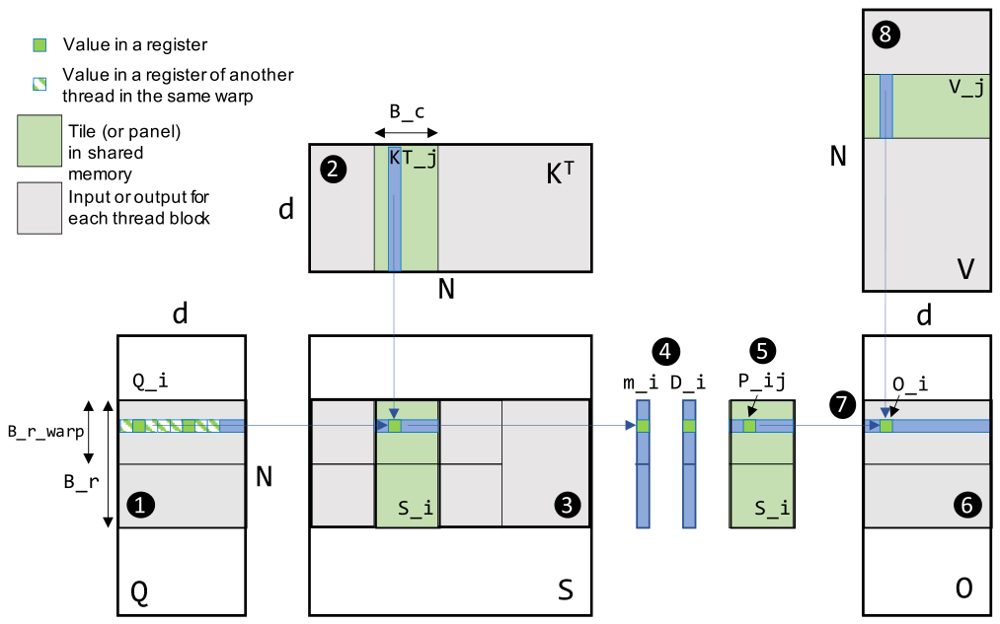

*Figure 20.8 — flash attention 이 쓰는 tiling 접근.
**$P$ 의 tile 을 담는 데 shared memory 의 같은 tile `S_i` 를 쓴다**는 점에 주의. (책 p.492)*

> 융합된 kernel 안에서 각 thread block 은 $Q$ 의 **가로 panel**(연속된 행들) ➊,
> **$K^\top$ 전체** ➋, **$V$ 전체** ➑ 를 받아 $O$ 의 **가로 panel** ➏ 에 대한 자기 기여를 계산한다
> (책 p.492).

> 나아가 flash attention 은 각 thread block 이 $O$ tile 에 대한 기여를 계산하면서
> $K^\top$ 과 $V$ 행렬을 **tile 단위로 순회**하게 한다.
> 이 tile 들은 **on-chip memory 에 들어갈 만큼 작다.**
> 각 반복에서 각 thread block 은 $K^\top$ 의 **세로 panel** ➋ 과 $V$ 의 **가로 panel** ➑ 을
> 적재해 $O$ tile 에 대한 기여를 계산한다.
> **모든 thread block 이 전역 barrier 없이 병렬로 실행**된다 (책 p.492~493).

| 번호 | 무엇 | 어디에 |
|---|---|---|
| ➊ | $Q$ panel ($B_r \times d$) | **register** (warp 마다 $B_{r,\text{warp}} \times d$ 부분 panel) |
| ➋ | $K^\top$ tile ($d \times B_c$) | **shared memory** (`KT_j`) |
| ➌ | $S$ tile ($B_r \times B_c$) | **shared memory** (`S_i`) |
| ➍ | $m_i$, $D_i$ ($B_r$ 개씩) | **register** |
| ➎ | $P$ tile | **`S_i` 를 제자리에서 덮어쓴다** |
| ➏ | $O$ tile ($B_r \times d$) | **register** (`O_i`) |
| ➑ | $V$ tile ($B_c \times d$) | **shared memory** (`V_j`) |

> $Q$ 와 $O$ tile 에는 **register** 를, $K^\top$·$S/P$·$V$ tile 에는 **shared memory** 를 고른다
> (책 p.497).

**왜 그렇게 나누나.** $Q$ 와 $O$ 는 **한 warp 안에서만 쓰이고 바깥 loop 내내 살아 있어야** 하므로
register 가 맞다. $K^\top$·$V$ 는 **block 의 모든 warp 이 공유**하므로 shared memory 여야 한다.
$S/P$ 는 warp 안에서만 쓰이지만 **크기가 $B_r \times B_c$ 로 register 에 담기엔 크다.**

> flash attention 은 transformer attention 기제의 **정확한 재정식화**다.
> 원래 정식화와 **수학적으로 동일**하다 (책 p.493).

**검산으로 확인했다.** Figure 20.9~20.16 을 그대로 Python 으로 옮겨
$(B_r, B_c, \text{warp 수}, \text{grid 크기})$ 를
$(8,8,1,1)$, $(4,4,2,1)$, $(4,2,2,2)$, $(2,2,1,4)$, $(8,2,4,1)$ 로 바꿔 가며 돌렸는데
**전부 정의대로 계산한 attention 과 $10^{-12}$ 이내로 일치**한다 ✓.

### Figure 20.9 — 융합 kernel

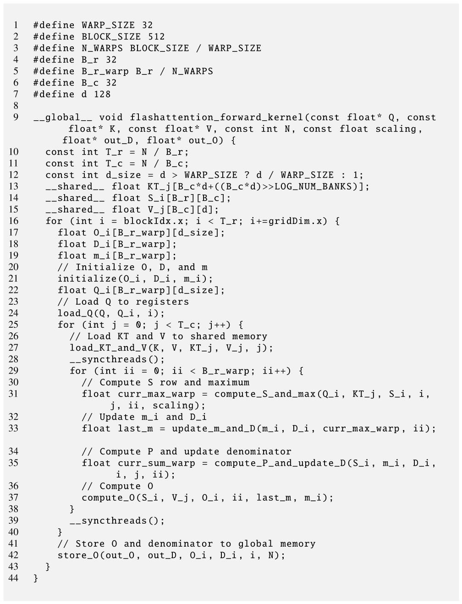

*Figure 20.9 — flash attention 순전파의 CUDA kernel 구현 [8]. (책 p.496)*

```cuda
 1 #define WARP_SIZE 32
 2 #define BLOCK_SIZE 512
 3 #define N_WARPS BLOCK_SIZE / WARP_SIZE
 4 #define B_r 32
 5 #define B_r_warp B_r / N_WARPS
 6 #define B_c 32
 7 #define d 128
 8
 9 __global__ void flashattention_forward_kernel(const float* Q, const float* K,
       const float* V, const int N, const float scaling, float* out_D, float* out_O) {
10   const int T_r = N / B_r;
11   const int T_c = N / B_c;
12   const int d_size = d > WARP_SIZE ? d / WARP_SIZE : 1;
13   __shared__ float KT_j[B_c*d+((B_c*d)>>LOG_NUM_BANKS)];
14   __shared__ float S_i[B_r][B_c];
15   __shared__ float V_j[B_c][d];
16   for (int i = blockIdx.x; i < T_r; i+=gridDim.x) {
17     float O_i[B_r_warp][d_size];
18     float D_i[B_r_warp];
19     float m_i[B_r_warp];
20     // Initialize O, D, and m
21     initialize(O_i, D_i, m_i);
22     float Q_i[B_r_warp][d_size];
23     // Load Q to registers
24     load_Q(Q, Q_i, i);
25     for (int j = 0; j < T_c; j++) {
26       // Load KT and V to shared memory
27       load_KT_and_V(K, V, KT_j, V_j, j);
28       __syncthreads();
29       for (int ii = 0; ii < B_r_warp; ii++) {
30         // Compute S row and maximum
31         float curr_max_warp = compute_S_and_max(Q_i, KT_j, S_i, i, j, ii, scaling);
32         // Update m_i and D_i
33         float last_m = update_m_and_D(m_i, D_i, curr_max_warp, ii);
34         // Compute P and update denominator
35         float curr_sum_warp = compute_P_and_update_D(S_i, m_i, D_i, i, j, ii);
36         // Compute O
37         compute_O(S_i, V_j, O_i, ii, last_m, m_i);
38       }
39       __syncthreads();
40     }
41     // Store O and denominator to global memory
42     store_O(out_O, out_D, O_i, D_i, i, N);
43   }
44 }
```

**상수부터 못 박는다** (`#define` 값을 그대로 넣으면):

| 상수 | 값 | 유도 |
|---|---|---|
| `WARP_SIZE` | 32 | |
| `BLOCK_SIZE` | 512 | |
| `N_WARPS` | **16** | 512/32 |
| `B_r` | 32 | block 하나가 맡는 $O$ 의 행 수 |
| `B_r_warp` | **2** | 32/16 — **warp 하나가 맡는 행 수** |
| `B_c` | 32 | 한 번에 훑는 $K^\top$ 열 / $V$ 행 수 |
| `d` | 128 | head dimension |
| `d_size` | **4** | 128/32 — **thread 하나가 갖는 한 행의 원소 수** |

> `B_r_warp` 값은 `B_r` 을 thread block 당 warp 수로 나눈 것이다 (책 p.497).

> `B_r` 값은 **on-chip memory 안의 데이터 재사용 수준을 최대화**하도록 정하되
> 가용 on-chip memory 양과 **GPU 를 충분히 채우는 데 필요한 thread block 수**에 제약된다
> (책 p.497).

**세 loop 의 역할.**

| loop | 줄 | 무엇을 도나 | 반복 수 |
|---|---|---|---|
| `i` | 16 | $O$ 의 panel — **grid-stride** | $T_r/\text{gridDim.x}$ |
| `j` | 25 | $K^\top$·$V$ 의 tile — **block 수준** | $T_c$ |
| `ii` | 29 | warp 이 맡은 행 — **warp 수준** | $B_{r,\text{warp}}$ |

> 가장 바깥 for loop(line 16)는 **모든 $O$ panel 이 생성되도록** 보장한다.
> 각 반복에서 모든 thread block 은 $Q$ 의 panel 하나를 처리하고 $O$ 의 panel 하나를 만든다.
> 모든 thread block 이 $T_r = N/B_r$ (line 10) 개의 $O$ panel 이 다 생성될 때까지 반복한다
> (책 p.497).

**18.7절의 grid-stride loop 와 같은 형태**다. 다만 여기서는 cooperative groups 가 아니라
평범한 grid 이므로 `gridDim.x` 를 자유롭게 고를 수 있다.

**세 개념 단계가 한 kernel 안에 있다.**

| 단계 | 줄 | device 함수 | 무엇을 |
|---|---|---|---|
| ① | 31 | `compute_S_and_max` (Fig 20.12) | $Q$ panel × $K^\top$ tile → $S$ tile, 그 행의 최댓값 |
| ② | 33·35 | `update_m_and_D` (Fig 20.14), `compute_P_and_update_D` (Fig 20.15) | softmax — $m$·$D$ 갱신, $S \to P$ 제자리 변환 |
| ③ | 37 | `compute_O` (Fig 20.13) | $P$ tile × $V$ tile → $O$ tile 에 병합 |

> 이 절 첫머리에서 논의한 대로, 이 세 단계를 순진하게 구현하면 **kernel 세 개**를 쓸 것이다.
> 그 kernel 들은 $S$ 와 $P$ 를 global memory 에 쓰고 읽어 **낮은 arithmetic intensity 와
> kernel 호출 오버헤드**를 낳는다.
> 식 (20.6) 의 flash attention 정식화가 세 단계를 **하나의 kernel 로 융합**해
> on-chip memory 에서 조금씩 반복적으로 수행하게 하고,
> **$S$ 와 $P$ 를 global memory 에 실체화할 필요와 그에 따른 바람직하지 않은 global memory
> 트래픽을 없앤다** (책 p.497).

### shared memory 와 occupancy — 상수가 정하는 것

`#define` 값을 그대로 넣어 계산하면:

| 배열 | 크기 (float) | 바이트 |
|---|---|---|
| `KT_j[B_c*d + ((B_c*d)>>5)]` | $4096 + 128 = 4224$ | 16,896 |
| `S_i[B_r][B_c]` | $32 \times 32 = 1024$ | 4,096 |
| `V_j[B_c][d]` | $32 \times 128 = 4096$ | 16,384 |
| **합** | 9,344 | **37,376 B ≈ 36.5 KB** |

H100 의 한계(4·5장)와 대조하면:

| 제약 | 계산 | block/SM |
|---|---|---|
| shared memory 228 KB | $\lfloor 233472/37376 \rfloor$ | 6 |
| thread 슬롯 2048 | $\lfloor 2048/512 \rfloor$ | **4** ← 이것이 묶는다 |
| block 슬롯 32 | | 32 |

$$\text{SM 당 block} = \min(6, 4, 32) = 4, \qquad
\text{occupancy} = \frac{4 \times 512}{2048} = \mathbf{100\%}$$

**shared memory 가 아니라 thread 슬롯이 한계**이고, 그래서 occupancy 가 꽉 찬다.
`B_c` 를 64 로 키우면 shared memory 가 약 73 KB 가 되어 3 block 밖에 못 올라가고
occupancy 가 75% 로 떨어진다 — **`B_c` 를 정하는 것이 정확히 이 계산**이다.

> `B_c` 값은 **반복 횟수, 따라서 $O$ 원소를 만드는 데 필요한 병합 횟수를 최소화**하도록
> host 코드가 정한다 (식 (20.6)). **`B_c` 값은 가용 shared memory 에 제약**된다.
> 간략화를 위해 `B_c` 값을 **`WARP_SIZE` 의 배수로만** 허용하는데,
> 이는 **경계 조건 검사나 데이터 padding 의 필요를 없앤다** (책 p.499).

**register 도 세어 보자.** thread 하나가 갖는 것은
`O_i[2][4]` + `Q_i[2][4]` + `D_i[2]` + `m_i[2]` = **20 float** 이다.
H100 의 SM 당 register 65,536 개를 2048 thread 로 나누면 thread 당 32 개이므로
20 개는 여유가 있다 — **register tiling 이 성립하는 이유**다.

> `Q` 와 `O` tile, 그리고 `D_i`·`m_i` 를 담는 데 필요한 총 register 수는
> **차원 $d$ 와 `B_r` 로 정해진다.**
> 나아가 **각 thread 는 이 tile 들의 일부만 갖고 warp-shuffle API 로 서로 원소를 교환**한다
> (책 p.497~498).

### Figure 20.10 — `load_Q`

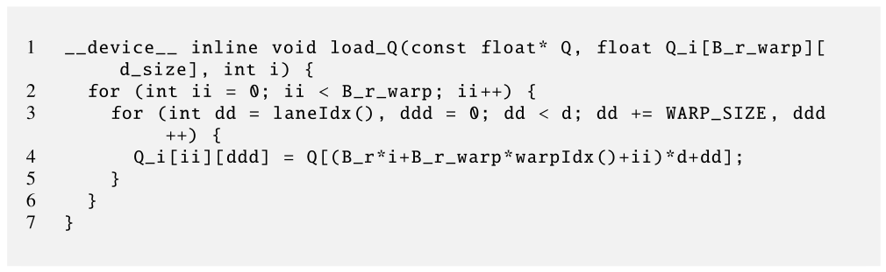

*Figure 20.10 — flash attention: $Q$ 를 register 로 적재하는 device 함수. (책 p.498)*

```cuda
1 __device__ inline void load_Q(const float* Q, float Q_i[B_r_warp][d_size], int i) {
2   for (int ii = 0; ii < B_r_warp; ii++) {
3     for (int dd = laneIdx(), ddd = 0; dd < d; dd += WARP_SIZE, ddd++) {
4       Q_i[ii][ddd] = Q[(B_r*i+B_r_warp*warpIdx()+ii)*d+dd];
5     }
6   }
7 }
```

> Fig. 20.8 에 보이듯 thread block 의 각 $Q$ panel ➊ 은 **$B_{r,\text{warp}} \times d$ 크기의
> 부분 panel** 로 더 나뉜다. 각 부분 panel 은 block 의 **warp 하나에 배정**된다.
> 부분 panel 안에서 각 행 `ii` 는 warp 의 thread 들에 **교차(interleaved) 방식**으로 배정된다.
> 즉 한 행이 `WARP_SIZE` 개 원소의 구획으로 나뉘고, 구획의 원소들이 warp 의 thread 에 순차로
> 배정된다. 이렇게 하면 **$Q$ 행의 각 구획을 warp 이 coalesced 방식으로 적재**할 수 있다
> (책 p.498).

$$\text{lane } \ell \text{ 이 갖는 것} = Q[\,\text{row},\ \ell\,],\ Q[\,\text{row},\ \ell{+}32\,],\
Q[\,\text{row},\ \ell{+}64\,],\ Q[\,\text{row},\ \ell{+}96\,]$$

즉 열 `dd` 는 **lane `dd % 32` 의 `ddd = dd / 32` 번째 register** 에 있다.
이 대응이 Figure 20.12 line 8 의 `__shfl_sync` 를 결정한다.

> 이 배치로 각 thread 는 $Q$ 의 원소를 $B_{r,\text{warp}} \times (d/\texttt{WARP\_SIZE})$ 개,
> 즉 $2 \times 4 = 8$ 개 갖는다.
> 간략화를 위해 예제 kernel 에서는 **$d$ 가 `WARP_SIZE` 의 배수**라고 가정한다 (책 p.498).

> **각주 7**: 이 $Q$ 분배는 **flash attention 의 두 번째 판** [8] 에 해당한다.
> $K$ 와 $V$ 를 warp 에 나누던 **첫 판** [6] (split-K 라 부르는 방식)과 다른데,
> split-K 는 **warp 이 중간 결과를 shared memory 에 쓰고 synchronize 하고 축약해야 해서
> 비효율적**이다. 두 번째 판에서는 **warp 사이에 중간 데이터 교환이 전혀 없고**
> 모든 데이터 교환이 **같은 warp 안 thread 사이**에서 일어난다 (책 p.498 각주 7).

**이것이 FlashAttention-1 과 -2 를 가르는 결정**이다. 12·18장에서 반복해서 본
"block 안의 축약을 없애면 barrier 가 사라진다"는 그 원리다.

### Figure 20.11 — `load_KT_and_V`

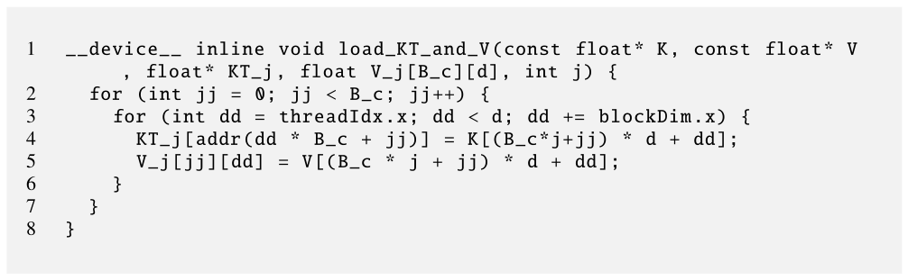

*Figure 20.11 — flash attention: $K^\top$ 와 $V$ 를 shared memory 로 적재하는 device 함수.
(책 p.499)*

```cuda
1 __device__ inline void load_KT_and_V(const float* K, const float* V,
      float* KT_j, float V_j[B_c][d], int j) {
2   for (int jj = 0; jj < B_c; jj++) {
3     for (int dd = threadIdx.x; dd < d; dd += blockDim.x) {
4       KT_j[addr(dd * B_c + jj)] = K[(B_c*j+jj) * d + dd];
5       V_j[jj][dd] = V[(B_c * j + jj) * d + dd];
6     }
7   }
8 }
```

> 효율을 위해 **$K$ 로부터 $K^\top$ 의 tile 을 전치된 형태로 적재**한다 (line 4).
> shared memory bank conflict 를 피하려고 Fig. 20.9 line 13 에서 `KT_j` 를 할당할 때
> **각 열에 padding** 을 넣는다. padding 이 있으면 `KT_j` 접근에 쓰이는 index 는
> **16장에서 소개한 `addr(x) = x + (x >> LOG_NUM_BANKS)`** 로 변환된다 (책 p.499).

> **원문 오기 ③(명명).** 본문은 이 함수를 `load_KTV()` 라 부르지만
> Figure 20.9 line 27 과 Figure 20.11 line 1 모두 **`load_KT_and_V`** 다.

#### padding 이 정확히 무엇을 고치나 — 직접 세어 본다

`addr(x) = x + (x \gg 5)` 이고 bank 는 32개다.

**저장(line 4)** 에서 thread 마다 다른 것은 `dd` 이고 `jj` 는 같다. 그러니 index 는
$dd \cdot B_c + jj = 32\,dd + jj$ 다.

| | index | bank $=$ index mod 32 | 결과 |
|---|---|---|---|
| padding 없이 | $32\,dd + jj$ | **$jj$ 로 전부 같다** | **32-way bank conflict** |
| `addr()` 적용 | $32\,dd + jj + dd = 33\,dd + jj$ | $(dd + jj) \bmod 32$ — 전부 다르다 | **conflict 없음** |

**적재(Figure 20.12 line 9)** 에서는 lane 마다 다른 것이 `jj` 이고 `dd` 는 같다.
index 가 연속이므로 **padding 이 있든 없든 conflict 가 없다.**

$$\text{padding 은 \textbf{저장} 쪽 32-way conflict 를 없애려고 있는 것이고,
\textbf{적재} 쪽은 원래 문제가 없었다}$$

(검산: padding 없이 32 thread 가 서로 다른 bank 1개, `addr()` 적용 후 32개 ✓.)

`V_j[jj][dd]` 는 `dd` 가 thread 마다 다르므로 **저장도 적재도 연속** — padding 이 필요 없다 ✓.

#### 이 함수의 숨은 비효율

`d = 128`, `blockDim.x = 512` 이므로 line 3 의 loop 는
**`threadIdx.x < 128` 인 thread 만** 한 번 돌고 나머지 384개는 **아무 일도 하지 않는다.**

$$\text{적재해야 할 원소} = B_c \times d = 4096\ \text{개} \times 2,
\qquad \text{쓰는 thread} = 128 / 512 = 25\%$$

`(jj, dd)` 를 하나의 평평한 index 로 펴서 512 thread 에 나누면 $4\times$ 빨라진다.
책이 다루지 않는 지점인데, 실제 flash attention 구현은 전부 그렇게 한다.

### Figure 20.12 — `compute_S_and_max`

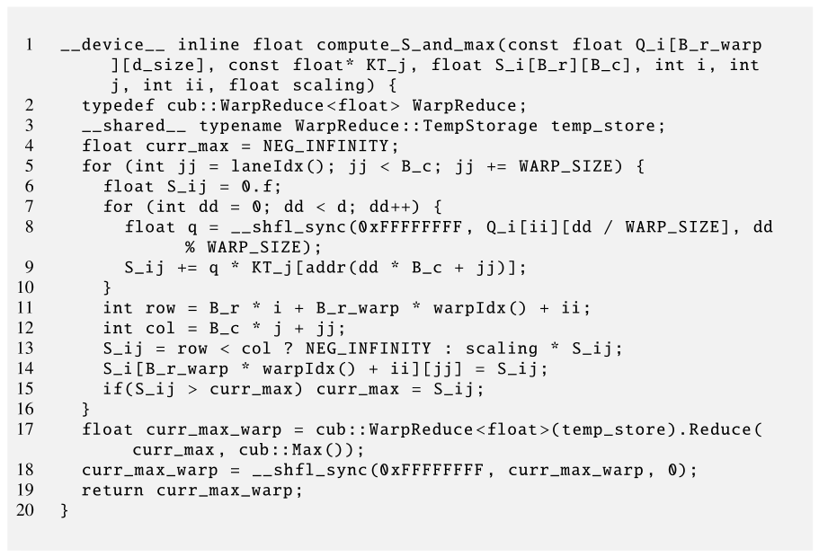

*Figure 20.12 — flash attention: $S$ 의 tile 과 그 최댓값을 계산하는 device 함수. (책 p.500)*

```cuda
 1 __device__ inline float compute_S_and_max(const float Q_i[B_r_warp][d_size],
       const float* KT_j, float S_i[B_r][B_c], int i, int j, int ii, float scaling) {
 2   typedef cub::WarpReduce<float> WarpReduce;
 3   __shared__ typename WarpReduce::TempStorage temp_store;
 4   float curr_max = NEG_INFINITY;
 5   for (int jj = laneIdx(); jj < B_c; jj += WARP_SIZE) {
 6     float S_ij = 0.f;
 7     for (int dd = 0; dd < d; dd++) {
 8       float q = __shfl_sync(0xFFFFFFFF, Q_i[ii][dd / WARP_SIZE], dd % WARP_SIZE);
 9       S_ij += q * KT_j[addr(dd * B_c + jj)];
10     }
11     int row = B_r * i + B_r_warp * warpIdx() + ii;
12     int col = B_c * j + jj;
13     S_ij = row < col ? NEG_INFINITY : scaling * S_ij;
14     S_i[B_r_warp * warpIdx() + ii][jj] = S_ij;
15     if(S_ij > curr_max) curr_max = S_ij;
16   }
17   float curr_max_warp = cub::WarpReduce<float>(temp_store).Reduce(curr_max, cub::Max());
18   curr_max_warp = __shfl_sync(0xFFFFFFFF, curr_max_warp, 0);
19   return curr_max_warp;
20 }
```

> 각 반복에서 warp 의 각 thread 는 warp 의 $Q$ 부분 panel 의 현재 행과 현재 $K^\top$ 부분 panel
> 의 **한 열** 사이의 내적을 수행한다 (lines 7-10).
> $K^\top$ 부분 panel 의 열들이 warp 의 thread 에 순차로 배정된다.
> 따라서 for loop 의 각 반복에서 warp 은 $Q$ 부분 panel 의 현재 행과
> **$d \times \texttt{WARP\_SIZE}$ 짜리 $K^\top$ 부분 panel** 사이의 벡터-행렬 곱을 수행한다
> (책 p.500).

**line 8 의 `__shfl_sync` 가 이 함수의 핵심이다.**

> 각 반복에서 warp 의 모든 thread 는 **같은 $Q$ 원소**를 자기 $K^\top$ 원소와 곱해야 한다.
> $Q$ 의 행 원소가 warp thread 의 register 에 **교차 방식으로** 저장되어 있음을 상기하자 (➊).
> 따라서 각 반복에서 그 반복의 $Q$ 원소를 가진 thread 가 `__shfl_sync()` intrinsic 으로
> 같은 warp 의 다른 모든 thread 에 **방송**한다 (line 8) (책 p.500).

$$\texttt{\_\_shfl\_sync(0xFFFFFFFF, Q\_i[ii][dd/32], dd\%32)}$$
$$\uparrow \text{어느 register} \qquad\qquad \uparrow \text{어느 lane 에서}$$

**`load_Q` 의 배치가 이 두 index 를 결정한다** — 열 `dd` 는 lane `dd%32` 의
`dd/32` 번째 register 에 있다 ✓ 정확히 일치한다.

> **각주 8**: line 8 의 shuffle 명령은 $Q$ 값을 한 thread 의 register 에서 warp 의 thread 들로
> 방송한다. 이 matrix multiplication 구현은 shared memory 와 register 에 tiling 을 쓰지만
> **15장에서 보인 더 정교한 최적화(계층적 tiling, tensor core)의 이득을 볼 수 있다**
> (책 p.500~501 각주 8).

**line 13 이 인과성**이다.

> line 13 이 인과성 정책을 구현한다. **전체 $S$ 행렬에서의** 행 index 와 열 index 를 비교해
> 열 index 가 행 index 보다 크면 shared memory 위치에 $-\infty$ 를 저장한다.
> 아니면 원소 `S_ij` 에 scaling factor $\tfrac{1}{\sqrt d}$ 를 곱해 저장한다 (line 14) (책 p.500).

`row`·`col` 이 **tile 안 좌표가 아니라 전역 좌표**여야 하는 이유가 여기 있다 —
인과성은 전역 index 로 정의되기 때문이다 (line 11~12).

> lines 15-18 이 $S$ 행의 최댓값을 계산한다. 먼저 각 thread 가 자기가 계산한 $S$ 원소의
> 현재 최댓값을 얻는다 (line 15). 둘째, CUB 의 `WarpReduce` 로 warp 안 최댓값을 계산한다 (line 17).
> 셋째, **`WarpReduce` 의 결과는 warp 의 thread 0 만 받으므로** shuffle 명령이 최댓값을
> warp 의 모든 thread 에 방송한다 (line 18) (책 p.502).

> **⚠ 문서 계약 위반.** line 3 은 `__shared__ TempStorage temp_store;` 를 **하나만** 선언하는데,
> 이 block 에는 warp 이 **16개** 있고 전부 같은 저장소를 쓴다.
> CUB 문서는 `WarpReduce` 에 **warp 당 하나의 `TempStorage`** 를 요구한다
> (관례: `TempStorage temp[N_WARPS];` 를 `warpIdx()` 로 index).
> Figure 20.15 line 3 도 같다.
> **실제로는 동작할 가능성이 높다** — 논리적 warp 크기가 32 인 SM_30 이상에서 CUB 는
> shuffle 기반 특수화를 골라 `TempStorage` 가 **빈 구조체**가 되기 때문이다.
> 그러나 계약을 어기는 코드이고, 논리적 warp 크기가 2의 거듭제곱이 아니거나 구형 아키텍처로
> 컴파일하면 **조용히 틀린다.** (뒤의 "원문 오기" 절 참조)

### Figure 20.13 · 20.14 · 20.15 — softmax 세 조각

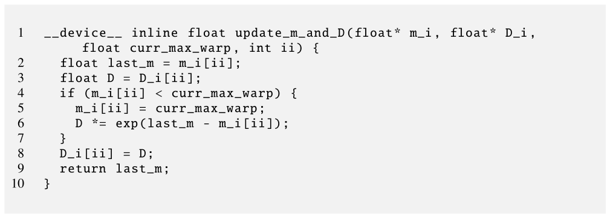

*Figure 20.14 — flash attention: $m$ 과 $D$ 를 갱신하는 device 함수. (책 p.502)*

```cuda
 1 __device__ inline float update_m_and_D(float* m_i, float* D_i, float curr_max_warp, int ii) {
 2   float last_m = m_i[ii];
 3   float D = D_i[ii];
 4   if (m_i[ii] < curr_max_warp) {
 5     m_i[ii] = curr_max_warp;
 6     D *= exp(last_m - m_i[ii]);
 7   }
 8   D_i[ii] = D;
 9   return last_m;
10 }
```

> 이 세 값은 식 (20.4)·(20.6) 의 $m_{r,A}$ (`last_m`), $m_{r,B}$ (`curr_max_warp`),
> $m_{r,A\cup B}$ (`m_i[ii]`) 에 대응한다.
> 여기서 $A$ 는 $S$ 행의 **이전 열 위치 부분집합**이고 $B$ 는 **새 부분집합**
> (즉 방금 한 matrix multiplication 의 결과)이다.
> 다음으로 line 6 이 식 (20.4) 의 $D_{r,B}e^{m_{r,B}-m_{r,A\cup B}}$ 항을 계산한다 (책 p.502).

> **원문 오기 ④.** 책의 이 마지막 문장은 **어느 항인지가 뒤집혀 있다.**
> line 6 은 `D *= exp(last_m - m_i[ii])`,
> 즉 $D_{r,A}\,e^{m_{r,A}-m_{r,A\cup B}}$ — **식 (20.4) 의 첫째 항**이다.
> $D_{r,B}$ 쪽은 Figure 20.15 의 line 10~14 가 계산한다.

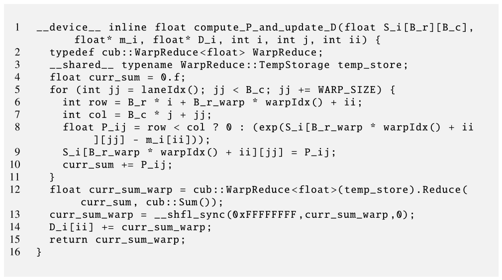

*Figure 20.15 — flash attention: $P$ 를 계산하고 $D$ 를 갱신하는 device 함수. (책 p.503)*

```cuda
 1 __device__ inline float compute_P_and_update_D(float S_i[B_r][B_c],
       float* m_i, float* D_i, int i, int j, int ii) {
 2   typedef cub::WarpReduce<float> WarpReduce;
 3   __shared__ typename WarpReduce::TempStorage temp_store;
 4   float curr_sum = 0.f;
 5   for (int jj = laneIdx(); jj < B_c; jj += WARP_SIZE) {
 6     int row = B_r * i + B_r_warp * warpIdx() + ii;
 7     int col = B_c * j + jj;
 8     float P_ij = row < col ? 0 : (exp(S_i[B_r_warp * warpIdx() + ii][jj] - m_i[ii]));
 9     S_i[B_r_warp * warpIdx() + ii][jj] = P_ij;
10     curr_sum += P_ij;
11   }
12   float curr_sum_warp = cub::WarpReduce<float>(temp_store).Reduce(curr_sum, cub::Sum());
13   curr_sum_warp = __shfl_sync(0xFFFFFFFF, curr_sum_warp, 0);
14   D_i[ii] += curr_sum_warp;
15   return curr_sum_warp;
16 }
```

**line 8 이 두 가지를 한꺼번에 한다.**
① `row < col` 로 인과성을 (다시) 적용하고 ② **새 최댓값 `m_i[ii]` 로** 지수를 계산한다.

> 새 기여는 line 8 에서 **새 행까지의 모든 $S$ 원소의 최댓값**에 기반해 계산됨에 주의한다.
> **$O$ 에 병합할 때 이 $P$ 원소들을 다시 scaling 할 필요가 없다** (책 p.503).

이 한 문장이 앞에서 유도한 "$D$ 비율이 약분되는" 이유다.

**line 9 가 `S_i` 를 제자리에서 덮어쓴다** — Figure 20.8 캡션의 "$P$ 의 tile 을 담는 데
같은 `S_i` 를 쓴다"가 이것이다. shared memory 를 절반 아낀다.

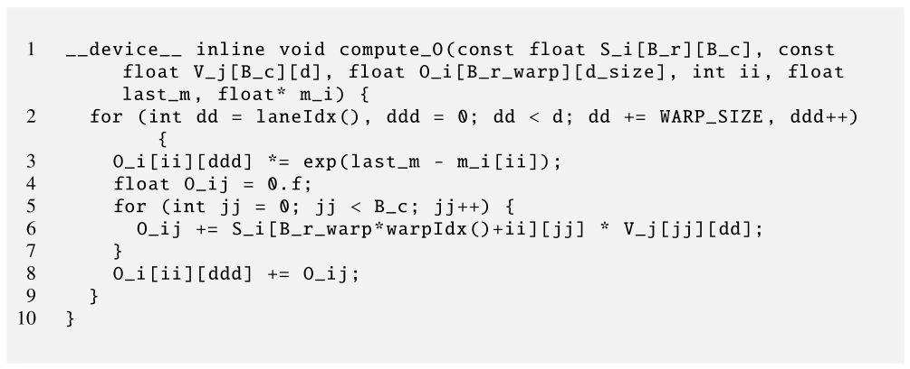

*Figure 20.13 — flash attention: $O$ 를 계산하는 device 함수. (책 p.501)*

```cuda
 1 __device__ inline void compute_O(const float S_i[B_r][B_c], const float V_j[B_c][d],
       float O_i[B_r_warp][d_size], int ii, float last_m, float* m_i) {
 2   for (int dd = laneIdx(), ddd = 0; dd < d; dd += WARP_SIZE, ddd++) {
 3     O_i[ii][ddd] *= exp(last_m - m_i[ii]);
 4     float O_ij = 0.f;
 5     for (int jj = 0; jj < B_c; jj++) {
 6       O_ij += S_i[B_r_warp*warpIdx()+ii][jj] * V_j[jj][dd];
 7     }
 8     O_i[ii][ddd] += O_ij;
 9   }
10 }
```

> 병합 연산을 수행하려고 line 3 이 `O_i[ii][ddd]` 에 `exp(last_m - m_i[ii])` 를 곱하는데,
> 이는 식의 **첫째 가수(addend)의 분자**에 대응한다.
> …… 안쪽 for loop (line 5) 가 `S_i` 의 행과 $V$ 의 열 사이 내적을 수행하고
> **둘째 가수를 병합**한다 (책 p.503).

$$\underbrace{\texttt{O\_i *= exp(last\_m - m\_i)}}_{\tilde o_A \cdot e^{m_A - m_{A\cup B}}}
\;+\;
\underbrace{\texttt{O\_ij}}_{\sum_{j\in B} e^{l_j - m_{A\cup B}} v_j}$$

**`dd` 가 lane 마다 다르므로 `V_j[jj][dd]` 접근이 연속**이다 → bank conflict 없음 ✓.
`S_i[...][jj]` 는 warp 전체가 **같은 주소**를 읽으므로 broadcast ✓.

### Figure 20.16 — `store_O`

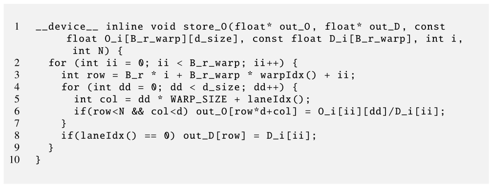

*Figure 20.16 — flash attention: $O$ 와 분모를 global memory 에 저장하는 device 함수.
(책 p.504)*

```cuda
 1 __device__ inline void store_O(float* out_O, float* out_D,
       const float O_i[B_r_warp][d_size], const float D_i[B_r_warp], int i, int N) {
 2   for (int ii = 0; ii < B_r_warp; ii++) {
 3     int row = B_r * i + B_r_warp * warpIdx() + ii;
 4     for (int dd = 0; dd < d_size; dd++) {
 5       int col = dd * WARP_SIZE + laneIdx();
 6       if(row<N && col<d) out_O[row*d+col] = O_i[ii][dd]/D_i[ii];
 7     }
 8     if(laneIdx() == 0) out_D[row] = D_i[ii];
 9   }
10 }
```

> thread block 의 반복 과정이 끝나면 그 출력 tile 은 **개념적 $S$·$P$ 행렬로부터의 온전한 기여**
> 를 담게 되는데, **$S$·$P$ 는 한 번도 완전히 생성된 적이 없고 shared memory 안에 tile 형태로만
> 존재했다** (책 p.503).

> **분모로 나누는 것은 식 (20.6) 과 같이 global memory 에 저장하기 직전에** 한다 (line 6)
> (책 p.503).

**`out_D` 는 훈련용이다.**

> kernel 은 $N$ 원소 출력 벡터 $D$ 를 생성한다. $D$ 의 각 원소는 $P$ 의 한 행의 확률 값을
> 계산하는 데 쓰인 **분모의 최종 값**을 담는다.
> 이 출력 벡터는 **추론이 아니라 훈련에 필요**하며, kernel 을 훈련에도 쓸 수 있도록
> kernel 코드에 포함했다 (책 p.496).

### 책이 다루지 않는 두 가지

**① 인과성 mask 때문에 절반이 낭비된다.**

Figure 20.9 line 25 의 `j` loop 는 **언제나 `T_c` 번 전부** 돈다.
그런데 block $i$ 가 맡은 행은 $B_r i \sim B_r i + B_r - 1$ 이므로,
**$B_c j > B_r i + B_r - 1$ 인 tile 은 전부 mask 되어 기여가 0** 이다.

$N = 4096$, $B_r = B_c = 32$ 로 세어 보면:

| | tile 수 |
|---|---|
| 실제로 도는 것 | $T_r \times T_c = 128 \times 128 = 16{,}384$ |
| **필요한 것** | $\sum_{i=0}^{127}(i+1) = 8{,}256$ |
| **낭비** | $\approx 1.98\times$ |

**대략 $2\times$ 의 일을 한다** (검산 통과). 실제 flash attention 구현은 `j` 의 상한을
`min(T_c, (B_r*i + B_r - 1)/B_c + 1)` 로 줄인다.

> **다만 그렇게 고치면 새 함정이 생긴다.** `j` 를 건너뛰어 **첫 tile 이 전부 mask** 되면
> `curr_max_warp` 가 $-\infty$ 이고 `m_i` 도 $-\infty$ 라서
> `exp(last_m - m_i[ii])` $= e^{-\infty - (-\infty)} = e^{\mathrm{NaN}}$ 이 되어 **$O$ 가 오염**된다.
> 지금 코드는 `j=0` 부터 돌기 때문에 열 0 이 항상 살아 있어 이 경우를 피한다.
> 건너뛰기를 넣으려면 `m_i` 가 $-\infty$ 일 때 rescale 을 생략하는 분기가 함께 필요하다.

**② `T_r = N/B_r` 과 `T_c = N/B_c` 의 정수 나눗셈이 절삭한다.**

$N$ 이 `B_r`·`B_c` 의 배수가 아니면 꼬리가 계산되지 않는다.
`store_O` line 6 에 `row<N` 검사가 있지만, `T_r` 절삭 때문에 `row<N` 은 **항상 참**이라
그 검사는 실제로 아무것도 막지 않는다. 19장 Figure 19.11 에서 본 것과 같은 종류다.

### FlashAttention-3 — Hopper 를 쓴다

> 가장 최근 판의 flash attention [9] 은 추가 성능을 위해 **Hopper GPU 구조의 새 기능**을 활용한다
> (책 p.504):
> ① **TMA** (Tensor Memory Accelerator) — 연산 thread 를 개입시키지 않고 global memory 에서
> shared memory 로 tile 을 **비동기로** 옮긴다.
> ② tensor core 의 **WGMMA** (WarpGroup-wide Matrix Multiply Accumulate) 명령 — 이전 구조와 달리
> **비동기**다.
> ③ tensor core 의 **FP8 정밀도**.
> **warp specialization** 을 써서 이 판은 데이터 이동과 연산의 겹침을 개선하고
> **softmax 실행을 비동기 block 단위 GEMM 뒤에 숨긴다** (책 p.504).

**15장에서 손으로 다룬 것들이 그대로다** — TMA·WGMMA·warp specialization·FP8.
15.6절이 "이 기법들이 실제로 어디 쓰이는가"에 답하지 않았는데, **답이 여기다.**

### 생성 국면에는 어떻게 적용하나

> Fig. 20.9 의 flash attention kernel 은 **KV caching 없는 기준 transformer 구현**에 적용된다.
> **KV caching 이 있는 추론의 prefill 국면**에도 적용된다.
> KV caching 이 있는 **생성(디코딩) 국면**에서는 $Q$, $S$, $P$, $O$ 행렬이
> **벡터 $Q'$, $S'$, $P'$, $O'$ 가 된다.** 따라서 head 하나 안의 계산이
> **matrix multiplication 에서 벡터-행렬 곱으로 바뀐다.**
> Fig. 20.8 과 비슷한 작업 분배를 유지하려면 **여러 요청, 즉 여러 `Q_i` 를 하나의 행렬로
> batch** 하면 된다 (책 p.504).

**그래서 다음 절이 batch 다.**

<!--widget:flash-attention-->
---

## 20.6 KV cache arithmetic intensity and memory requirement

### 생성 국면이 왜 느린가

> 이 $K$·$V$ 행은 **벡터-행렬 연산**으로 생성되는데, arithmetic intensity 가 낮아
> **GPU 연산 자원을 저활용**한다 (5장 참조).
> 그래서 생성 국면의 arithmetic intensity 를 높이려는 최적화가 여럿 있는데
> **batch** 와 **speculative decoding** 이 그것이다 (책 p.504).

### batch — 가중치를 나눠 쓴다

> batch 는 모든 종류의 DNN 에서 흔한 최적화이고 전통적으로 **연산 강도를 높이는 데** 쓰였다.
> 예컨대 입력 1024개·출력 4096개의 linear layer(16비트 정밀도)는
> **batch 크기가 1 이면 arithmetic intensity 가 1 FLOP/B** 로 아주 낮지만
> **batch 크기 512 에서는 315 FLOP/B** 로 오른다 (책 p.504~505).

**직접 세어 보자.** 가중치 $1024\times4096$, 정밀도 2 B, batch $b$:

$$\text{FLOP} = 2 \cdot b \cdot 1024 \cdot 4096, \qquad
\text{바이트} = 2\big(\underbrace{1024\cdot4096}_{\text{가중치}} + \underbrace{b\cdot1024}_{\text{입력}} + \underbrace{b\cdot4096}_{\text{출력}}\big)$$

| $b$ | FLOP | 바이트 | AI |
|---|---|---|---|
| 1 | $8.39\times10^6$ | $8.40\times10^6$ | **1.0** |
| 512 | $4.29\times10^9$ | $1.36\times10^7$ | **315** |

**정확히 책의 두 숫자가 나온다** (검산 통과).

> 늘어난 arithmetic intensity 는 **입력 벡터들 사이의 가중치 재사용** 때문이다.
> 그런 높은 arithmetic intensity 가 높은 GPU 활용도에 결정적이다 (책 p.505).

> **각주 9**: 이것은 arithmetic intensity 의 **이론적** 증가다. 실제로는 구현에 쓰인 tile 크기에
> 달려 있다 (책 p.505 각주 9).

$b$ 가 커지면 AI 는 $\frac{2 \cdot 1024 \cdot 4096}{2(1024+4096)} = 410$ 에 수렴한다 —
**가중치 적재 비용이 $b$ 로 나뉘어 사라지는 한계**다.

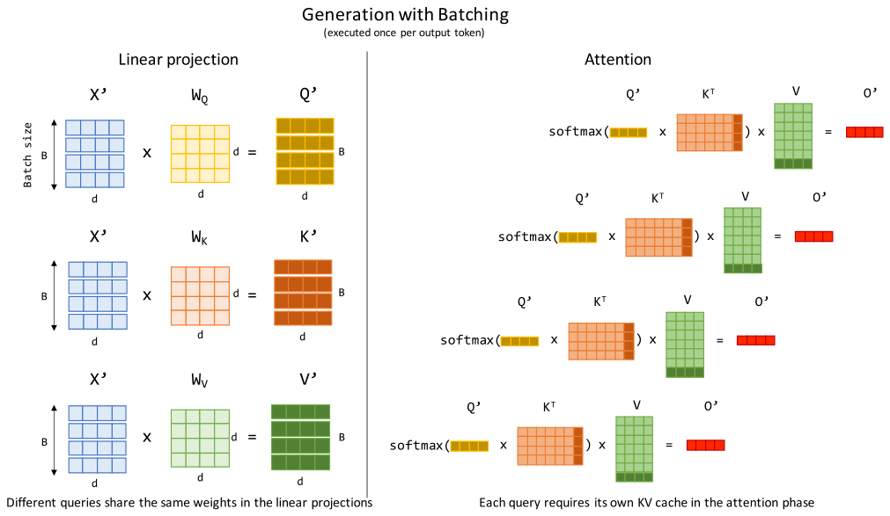

*Figure 20.17 — LLM 추론에서의 batch. **왼쪽**: 선형 사영에서는 서로 다른 query 가 같은
가중치를 공유한다. **오른쪽**: attention 국면에서는 각 query 가 자기 KV cache 를 요구한다.
(책 p.505)*

**그런데 attention 은 batch 의 이득을 못 본다** — 이것이 이 절의 요점이다.

> LLM 추론에서는 여러 사용자의 입력 질의가 **같은 모델**을 쓰므로(예: chatbot LLM)
> **가중치를 공유**할 수 있다. …… 예컨대 Fig. 20.17 왼쪽은 $Q,K,V$ 를 만드는 fully-connected
> layer 에서의 batch 를 보인다. batch 는 **QKV 사영의 arithmetic intensity 를 batch 크기만큼**
> 높인다.
> **그러나 KV cache 는 사용자의 prompt 와 context 에 의존**한다.
> 따라서 **attention layer 는 batch 의 이득을 보지 못한다** —
> 서로 다른 사용자 대화마다 **별도의 KV cache** 를 유지하고 접근해야 하기 때문이다.
> 결과적으로 LLM 에서의 batch 는 **모델 가중치와 KV cache 의 메모리 요구 때문에 제한**된다
> (책 p.505).

| | 가중치 | KV cache |
|---|---|---|
| 사용자 사이에 **공유되나** | **된다** — 그래서 batch 로 AI 가 오른다 | **안 된다** — 대화마다 다르다 |
| batch $b$ 로 메모리가 | 그대로 | **$b$ 배** |

$$\text{batch 를 키우면 AI 는 오르지만 메모리가 선형으로 는다} \;\Rightarrow\;
\text{batch 크기와 context length 사이의 맞바꿈}$$

### KV cache 는 얼마나 큰가

> KV cache 의 크기는 **transformer layer 수 $l$** 과 **hidden dimension** 에 달려 있다.
> hidden dimension 은 **(attention) query head 수 $h_q$ 와 embedding 차원 $d$ 의 곱**으로
> 정의됨을 상기하자.
> 식 (20.7) 은 **multi-head attention (MHA)** 의 **token 당** KV cache 크기(바이트)를 보인다.
> **$K$ 와 $V$ 를 둘 다 포함하려고 2 를 곱한다.** $p$ 는 바이트 단위 정밀도다 (책 p.506).

$$\text{KV\_cache\_size\_MHA} = 2 \times l \times h_q \times d \times p \tag{20.7}$$

$$\text{Total\_KV\_cache\_size\_MHA} = b \times N \times 2 \times l \times h_q \times d \times p \tag{20.8}$$

**책이 드는 세 모델을 그대로 검산한다** ($N = 4096$, $b = 1$, $p = 2$):

| 모델 | $l$ | $h_q \times d$ | 계산 | 크기 |
|---|---|---|---|---|
| **PaLM 2** (Google) | 64 | 8192 | $1\times4096\times2\times64\times8192\times2$ | **8 GiB** |
| **GPT-3** (OpenAI) | 96 | 12288 | $1\times4096\times2\times96\times12288\times2$ | **18 GiB** |
| **Llama 2 7B** (Meta) | 32 | 4096 | $1\times4096\times2\times32\times4096\times2$ | **2 GiB** |

세 값 모두 검산 통과 ✓.

> 이런 큰 KV cache 크기라면 LLM 추론에서 여러 질의를 batch 하는 메모리 요구가
> **GPU 한 장의 메모리 용량을 쉽게 넘을 수 있다.**
> 결과적으로 LLM 추론에는 **multi-GPU · multi-node 시스템이 흔히 필요**하다 (책 p.506).

**얼마나 심각한지 세어 보자.** Llama 2 7B 를 H100 80 GB 한 장에 올리면:

$$\underbrace{14\ \text{GB}}_{\text{가중치 7B} \times 2\text{B}} + b \times \underbrace{2\ \text{GiB}}_{\text{KV cache}} \le 80\ \text{GB}
\quad\Rightarrow\quad b \le 30$$

**batch 30 이 한계**다. 315 FLOP/B 를 내려면 batch 512 가 필요한데
**메모리가 그 $\tfrac{1}{17}$ 에서 막는다.** 20.7절 전체가 이 벽을 미는 작업이다.
(그리고 23장의 multi-GPU 가 필요해지는 이유이기도 하다.)

> 앞의 분석에서 **batch 의 모든 sequence 가 같은 길이**라고 가정했지만,
> 실제로는 사용자마다 질의가 다르므로 입력 sequence 와 생성된 출력 sequence 의 길이가
> **크게 다를 가능성이 높다.**
> 따라서 LLM 추론의 batch 는 **thread block 사이 불균형**을 낳아 GPU 자원을 저활용하게 할 수 있다.
> 이를 피하려고 최신 LLM 서빙 시스템은 **inflight batching** [12] 을 적용한다 —
> 여러 요청의 batch 를 한 번에 스케줄·실행하고, **이전 요청이 처리되는 즉시 부하가 가장 낮은
> batch 에 새 요청을 배정**한다 (책 p.506).

**18.8절의 degree bucketing 과 같은 문제**다 — 길이가 제각각인 작업의 부하 균형.

### 식 (20.9) — MHA 의 arithmetic intensity 는 1 이다

> 데이터 이동량과 부동소수점 연산 수를 근사해 MHA 의 arithmetic intensity 를 추정할 수 있다 [13].
> layer 하나, sequence length $N$, ($p=1$ 가정) 에서 식 (20.7) 로부터
> **KV cache 크기는 $2 h_q d N$** 이다.
> **$Q'$ 를 읽고 $O'$ 를 쓰는 데이터 이동량은 $2 h_q d$** 다.
> $(Q'K^\top)V$ 를 계산하는 **부동소수점 연산 수는 $2 N h_q d$** 다 (softmax 는 무시) (책 p.506).

$$AI_{MHA} \approx \frac{2 \times N \times h_q \times d}{2 \times h_q \times d + 2 \times h_q \times d \times N}
= \frac{N}{1+N} \approx 1 \tag{20.9}$$

**분모의 두 항이 무엇인지 보는 것이 중요하다.**

| 항 | 무엇 | $N=4096$ 일 때 비중 |
|---|---|---|
| $2 h_q d$ | $Q'$ 읽기 + $O'$ 쓰기 | 0.02% |
| $2 h_q d N$ | **KV cache 전체 읽기** | **99.98%** |

**KV cache 를 읽는 것이 전부다.** 그래서 20.7절이 **KV cache 자체를 줄이는** 방향으로 간다.
그리고 그것이 arithmetic intensity 를 올리는 유일한 길인 이유도 이것이다 —
분자는 못 줄이고, 분모의 지배항이 KV cache 뿐이니까.

### speculative decoding

> LLM 추론의 arithmetic intensity 를 높이는 다른 접근은 **speculative decoding** [14] 이다.
> **draft model** 이라 부르는 **아주 작은 모델**이 **target model** 이라 부르는 큰 모델의
> 출력 token 을 예측하는 모델 서비스 최적화다.
> target model 은 draft model 의 예측을 **검증**한다.
> target model 은 latency 가 훨씬 길지만 draft model 이 만든 **token 의 batch 를 병렬로 검증**한다
> (책 p.507).

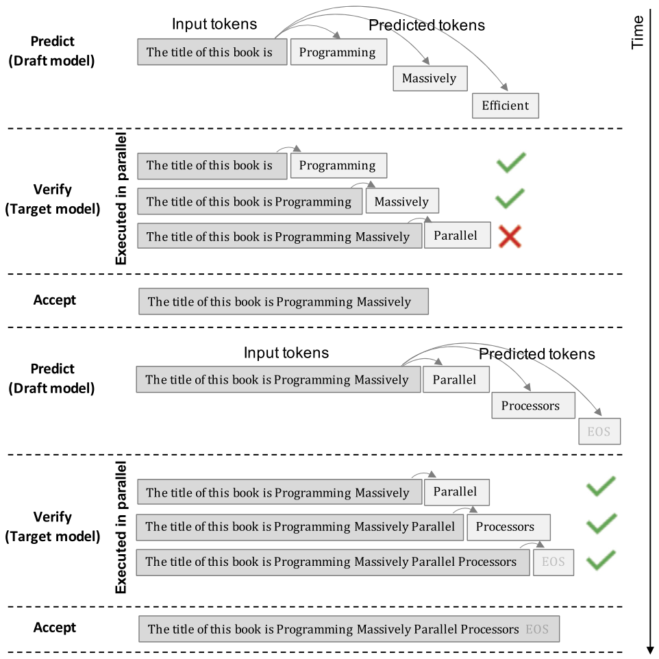

*Figure 20.18 — speculative decoding. (책 p.507)*

책의 예 (책 p.507~508):

| 단계 | 무슨 일이 |
|---|---|
| speculation depth = 3 | draft model 이 **연속된 출력 token 세 개**를 예측 |
| 검증 | target model 이 세 token 을 **병렬로** 검증 |
| 첫 반복 결과 | `"Programming"` 수용, `"Massively"` 수용, **`"Efficient"` 거부** |
| 다음 | 수용된 token 이 둘째 반복의 draft model 입력에 포함되어 새 token 셋 예측 |

$$\text{target model 통과 \textbf{1회}} \;\to\; \text{token \textbf{2개} 진행}$$

**왜 arithmetic intensity 가 오르는가** — 책의 설명이 정확하다.

> speculative decoding 은 batch 와 비슷하고, 그래서 선형 사영 연산의 arithmetic intensity 를
> 높인다. 그러나 **batch 의 특수한 형태**인데, **batch 안의 모든 token 이 공통의 초기 token 집합
> 을 갖는다**는 점이 다르다.
> 그래서 attention 기제를 적용할 때 **그 공통 입력 token 에 대한 같은 KV cache 데이터가
> 한 번 적재되어 모든 출력 token 계산에 재사용**된다.
> **이 KV cache 데이터의 재사용이 arithmetic intensity 증가를 낳는다.**
> speculative decoding 이 없으면 이 KV cache 데이터는 **출력 token 마다 한 번씩 여러 번
> 적재**되었을 것이다 (책 p.508).

**보통의 batch 는 attention 을 못 도와주는데(각자 KV cache 가 다르므로)
speculative decoding 은 도와준다** — batch 의 원소들이 **같은 KV cache 를 공유**하기 때문이다.
Figure 20.17 오른쪽이 "각 query 가 자기 KV cache 를 요구한다"고 한 그 제약을
**정면으로 우회**하는 유일한 방법이다.

---

## 20.7 Alleviating the memory requirements of the attention mechanism

> attention 기제는 여러 head 를 쓰고, 각 head 가 **서로 다른 가중치 행렬**로 $Q,K,V$ 의
> 서로 다른 사영을 수행한다. 이것이 식 (20.8) 이 보이는 MHA 의 **큰 메모리 요구의 주된 원인**이다.
> 허용 가능한 모델 정확도를 유지하면서 메모리 요구를 줄이는 두 접근이 제안되었다:
> **multi-query attention (MQA)** 과 **grouped-query attention (GQA)** (책 p.508).

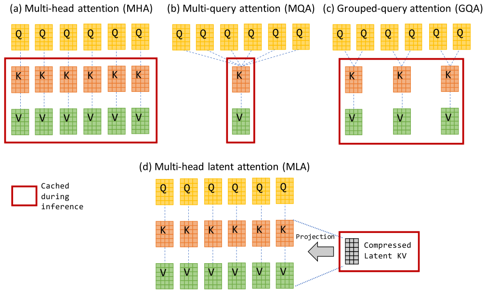

*Figure 20.19 — multi-head attention, multi-query attention, grouped-query attention,
multi-head latent attention 에서의 $Q$, $K$, $V$ 행렬.
**붉은 상자가 추론 중 cache 되는 것**이다. (책 p.509)*

### 네 가지를 한 표로

| | $K$·$V$ 를 몇 벌 두나 | KV cache 크기 | AI |
|---|---|---|---|
| **MHA** | head 마다 하나 — $h_q$ 벌 | $b N \cdot 2 l \cdot h_q d \cdot p$ | $\approx 1$ |
| **MQA** | **전부 공유** — 1 벌 | $b N \cdot 2 l \cdot d \cdot p$ | $\approx h_q$ |
| **GQA** | **그룹마다** — $h_q/g_q$ 벌 | $b N \cdot 2 l \cdot \frac{h_q}{g_q} d \cdot p$ | $\approx g_q$ |
| **MLA** | 압축된 **latent 벡터** 하나 | $b N \cdot l \cdot d \cdot p$ | $\approx 2 h_q$ |

**Llama 2 7B 형상($l=32$, $h_q=64$, $d=64$, $N=4096$, $b=1$, $p=2$)으로 재면** (검산):

| | KV cache | MHA 대비 | AI |
|---|---|---|---|
| MHA | 2.000 GiB | $1$ | 1.00 |
| GQA ($g_q=8$) | 0.250 GiB | $\tfrac{1}{8}$ | 7.98 |
| MQA | 0.031 GiB | $\tfrac{1}{64}$ | 63.0 |
| MLA | 0.016 GiB | $\tfrac{1}{128}$ | 124 |

**메모리가 줄어드는 비율과 AI 가 오르는 비율이 정확히 같다.**
식 (20.9) 의 분모를 KV cache 항이 지배하니 당연하다.

### MQA

> MQA 는 **attention head 사이에 key 와 value 를 공유**한다. 이는 hidden dimension 의 크기를
> 줄인다. 식 (20.8) 대비 감소는 **head 수에 반비례**한다 (책 p.508).

$$\text{Total\_KV\_cache\_size\_MQA} = b \times N \times 2 \times l \times d \times p \tag{20.10}$$

$$AI_{MQA} \approx \frac{2 N h_q d}{2 h_q d + 2 d N} = \frac{N h_q}{h_q + N} \approx h_q \tag{20.11}$$

### GQA

> GQA [15] 는 **query head 의 그룹 몇 개($g_q$)** 를 써서 MHA 와 MQA 사이의 균형을 잡는다
> (책 p.508).

$$\text{Total\_KV\_cache\_size\_GQA} = b \times N \times 2 \times l \times \frac{h_q}{g_q} \times d \times p \tag{20.12}$$

$$AI_{GQA} \approx \frac{2 N h_q d}{2 h_q d + 2 \frac{h_q}{g_q} d N}
= \frac{N h_q}{h_q + \frac{h_q}{g_q} N} \approx g_q \tag{20.13}$$

> **$g_q$ 는 "그룹의 수"** 다 — Figure 20.19(c) 에서 $K$·$V$ 상자가 3개이고 $Q$ 가 6개이므로
> $g_q = 3$, 그룹마다 query head 2개다.
> $g_q = h_q$ 면 MHA, $g_q = 1$ 이면 MQA 로 **양 극단을 잇는 연속체**다.

> MHA, GQA, MQA **셋 다 20.5절의 flash attention tiling 접근을 활용할 수 있다.**
> 세 대안은 **연산·메모리 요구·모델 정확도** 면에서 서로 다른 맞바꿈을 수반한다 (책 p.509).

### PagedAttention

> MQA 와 GQA 가 KV cache 의 메모리 요구를 완화하더라도 **batch 크기와 context length 는 여전히
> 제한된 GPU 메모리 용량에 제약**될 수 있다.
> 이 한계는 **KV cache 용으로 예약된 메모리가 보통 가능한 최대 입력에 맞춰 과다 할당**된다는
> 사실 때문에 악화된다. 결과적으로 **메모리가 파편화되고 낭비**되는 경향이 있다.
> 이를 극복하려는 한 시도가 **PagedAttention** 알고리즘 [12] 인데,
> 운영체제의 전통적인 **paging 기제에서 영감**을 받았다.
> PagedAttention 은 KV cache 를 **같은 크기의 block 으로 분할**해 계산에 필요할 때
> (더 큰 시스템 메모리로부터) GPU 메모리로 적재한다 (책 p.509).

### MLA

> KV cache 를 관리하는 또 다른 접근은 **Multi-head Latent Attention (MLA)** [16] 로,
> **$K$ 와 $V$ 의 저계수(low-rank) 결합 압축**을 써서 메모리 사용을 극적으로 줄인다.
> MLA 의 핵심 착상은 각 token 의 $K$·$V$ 벡터를 **압축된 latent 벡터 하나로 압축**하는 것이다
> (Figure 20.19(d)). 이 압축은 **모든 head 와 layer 에서** 이루어지므로 KV caching 메모리 요구의
> 감소가 아주 클 수 있다 (책 p.509~510).

$$\text{Total\_KV\_cache\_size\_MLA} = b \times N \times l \times d \times p \tag{20.14}$$

**식 (20.14) 에는 2 가 없다** — $K$ 와 $V$ 가 **latent 벡터 하나로 합쳐지기** 때문이다.
그래서 MHA 대비 감소가 $\tfrac{1}{2h_q}$ 다.

$$AI_{MLA} \approx \frac{2 N h_q d}{2 h_q d + d N} \approx 2 h_q \tag{20.15}$$

> **원문 오기 ⑤.** 책은 식 (20.15) 의 **중간식**을 $\dfrac{2 \times N \times h_q}{h_q + N}$ 로
> 적었는데, 분자·분모를 $d$ 로 약분하면 분모는 $\mathbf{2h_q + N}$ 이다.
> $N \gg h_q$ 이면 극한이 둘 다 $2h_q$ 라 결론은 바뀌지 않지만,
> $N=4096$·$h_q=64$ 에서 두 식의 값이 **124.1 대 126.0** 으로 다르다.
> (같은 절의 식 (20.11)·(20.13) 은 약분이 정확하다 — 그래서 (20.15) 만의 실수다.)

> **MLA 의 대가**: 압축에 쓰이는 사영 행렬은 훈련 중 학습된다.
> 추론 중에는 $K$·$V$ 를 attention 계산에 쓰기 전에 **latent 표현에 두 개의 up-projection 행렬을
> 곱해 생성(압축 해제)** 한다.
> 결과적으로 $K$·$V$ 는 반복 사이에 **latent 압축 형태로만 보존**되고
> 생성 국면에서 head 가 활성일 때만 압축 해제된다 (책 p.510).

**메모리를 연산과 맞바꾼 것**이다 — 15장·17장에서 반복해서 본 그 맞바꿈이고,
**arithmetic intensity 가 낮은 국면에서는 거의 언제나 이기는 쪽**이다.

### MoE — 직교하는 기법

> LLM 을 키우는 다른 **직교적** 기법은 **Mixture of Experts (MoE, 예: Mixtral [17])** 다.
> MoE 는 **입력마다 일부만 활성화되는(sparsely activated) 구조**로, **gating 기제**가 각 입력에 어떤 작은 전문 sub-network
> 부분집합을 쓸지 결정한다.
> 이는 모델이 **파라미터 수로는 거대하되 token 당 연산 요구는 줄어들게** 한다 (책 p.510).

**18장의 frontier 와 같은 착상**이다 — "관련 있는 것만 계산한다".
차이는 frontier 가 실행 중에 만들어지는 데 반해 MoE 의 gating 은 **학습된다**는 것.

---

### 검산

이 장에서 손으로 계산한 값 — 식 (20.2)~(20.6) 의 결합 규칙, Figure 20.4 의 softmax kernel,
Figure 20.9~20.16 의 flash attention kernel 전체, shared memory·occupancy·bank conflict,
KV cache 크기와 arithmetic intensity — 을 전부 코드로 다시 계산해 대조한다.
**74개 항목 전부 통과한다.**

특히 **flash attention kernel 을 Python 으로 그대로 옮겨 정의대로 계산한 attention 과
원소 단위로 대조**했다. $(B_r, B_c, \text{warp 수}, \text{grid})$ 를 다섯 가지로 바꿔도
전부 $10^{-12}$ 이내로 일치한다 — 책이 말한 "정확한 재정식화"의 실증이다.

```python
# 실행: python3 verify20.py   (표준 라이브러리만 사용)
import math
from fractions import Fraction as Fr

OK = []
def chk(name, got, want):
    OK.append(got == want)
    print(f"[{'OK ' if got == want else 'FAIL'}] {name}: got={got!r} want={want!r}")
def close(name, got, want, tol=1e-9):
    ok = abs(got - want) <= tol*max(1.0, abs(want))
    OK.append(ok)
    print(f"[{'OK ' if ok else 'FAIL'}] {name}: got={got!r} want={want!r}")

NEG_INF = float('-inf')

# ─────────────────────────────────────────────────────────────────────
# 0. 작은 attention 예제 — 이후 모든 검증의 기준값
# ─────────────────────────────────────────────────────────────────────
N, d = 8, 4                       # sequence length, head dimension
def lcg(seed):                    # 재현 가능한 난수 (Math.random 금지 규약과 무관하나 결정적으로)
    s = seed
    while True:
        s = (1103515245*s + 12345) % (1 << 31)
        yield s/(1 << 31) - 0.5
g = lcg(20250905)
Q = [[next(g) for _ in range(d)] for _ in range(N)]
K = [[next(g) for _ in range(d)] for _ in range(N)]
V = [[next(g) for _ in range(d)] for _ in range(N)]
scaling = 1.0/math.sqrt(d)

def matmul(A, B):
    return [[sum(A[i][k]*B[k][j] for k in range(len(B))) for j in range(len(B[0]))]
            for i in range(len(A))]
def transpose(A):
    return [list(r) for r in zip(*A)]

def attention_reference():
    """식 (20.1) 을 정의 그대로 — S = QK^T/sqrt(d) + M, P = softmax(S), O = PV"""
    S = matmul(Q, transpose(K))
    for r in range(N):
        for c in range(N):
            S[r][c] = NEG_INF if r < c else scaling*S[r][c]      # 인과성 mask M
    P, D = [], []
    for r in range(N):
        m = max(S[r])                                            # 식 (20.2) 의 m_r
        e = [0.0 if S[r][c] == NEG_INF else math.exp(S[r][c] - m) for c in range(N)]
        s = sum(e)
        P.append([x/s for x in e]);  D.append(s)
    return matmul(P, V), D, P

O_ref, D_ref, P_ref = attention_reference()
chk("P 는 하삼각 (r<c 면 0)",
    all(P_ref[r][c] == 0.0 for r in range(N) for c in range(N) if r < c), True)
chk("P 의 각 행은 확률분포",
    all(abs(sum(P_ref[r]) - 1.0) < 1e-12 for r in range(N)), True)
chk("행 0 은 자기 자신만 본다", [round(x, 12) for x in P_ref[0]],
    [1.0] + [0.0]*(N-1))

# ─────────────────────────────────────────────────────────────────────
# 1. 식 (20.2) — m_r 을 빼도 결과가 같다 (수치 안정성)
# ─────────────────────────────────────────────────────────────────────
row = [3.0, 1.0, 4.0, 1.5]
naive  = [math.exp(x) for x in row]
naive  = [x/sum(naive) for x in naive]
mr     = max(row)
stable = [math.exp(x - mr) for x in row]
stable = [x/sum(stable) for x in stable]
chk("m_r 을 빼도 softmax 결과가 같다",
    all(abs(a-b) < 1e-15 for a, b in zip(naive, stable)), True)
big = [800.0, 801.0, 802.0]                    # e^800 은 float64 에서 overflow
try:    _ = sum(math.exp(x) for x in big);  overflowed = math.isinf(_)
except OverflowError:                          overflowed = True
chk("m_r 없이는 overflow 한다", overflowed, True)
mb = max(big)
sb = [math.exp(x - mb) for x in big]
chk("m_r 을 빼면 안전하다", all(math.isfinite(x) for x in sb), True)

# ─────────────────────────────────────────────────────────────────────
# 2. 식 (20.3)·(20.4) — 부분합 D_{r,A} 의 결합 규칙
# ─────────────────────────────────────────────────────────────────────
def D_partial(logits, idxs):
    """식 (20.3): D_{r,A} = sum_{j in A} e^{l_j - m_{r,A}},  m_{r,A} 도 함께 돌려준다"""
    m = max(logits[j] for j in idxs)
    return sum(math.exp(logits[j] - m) for j in idxs), m

lg = [0.3, -1.2, 2.5, 0.0, 1.1, -0.7, 3.3, 0.9]
A, B = [0, 1, 2, 3], [4, 5, 6, 7]
DA, mA = D_partial(lg, A)
DB, mB = D_partial(lg, B)
DU, mU = D_partial(lg, A + B)
chk("m_{A∪B} = max(m_A, m_B)", mU, max(mA, mB))
merged = DA*math.exp(mA - mU) + DB*math.exp(mB - mU)      # 식 (20.4)
close("식 (20.4) 결합 규칙", merged, DU)

# 부분집합을 넷으로 쪼개 순차로 합쳐도 같은가 (kernel 이 실제로 하는 방식)
Dacc, macc = 0.0, NEG_INF
for tile in ([0,1], [2,3], [4,5], [6,7]):
    Dt, mt = D_partial(lg, tile)
    mnew = max(macc, mt)
    Dacc = Dacc*math.exp(macc - mnew) if Dacc else 0.0     # 첫 회는 0*exp(-inf) 회피
    Dacc += Dt*math.exp(mt - mnew)
    macc = mnew
close("네 tile 을 순차로 합쳐도 같다", Dacc, DU)

# ─────────────────────────────────────────────────────────────────────
# 3. 식 (20.6) — o 의 결합 규칙 (책이 적은 정규화된 형태)
# ─────────────────────────────────────────────────────────────────────
vv = [1.5, -0.4, 2.0, 0.7, -1.1, 0.3, 0.9, -2.2]           # v_{j,c}
def o_partial(logits, v, idxs):
    Dp, mp = D_partial(logits, idxs)
    return sum(math.exp(logits[j] - mp)*v[j] for j in idxs)/Dp, Dp, mp
oA, DA_, mA_ = o_partial(lg, vv, A)
oB, DB_, mB_ = o_partial(lg, vv, B)
oU, DU_, mU_ = o_partial(lg, vv, A + B)
merged_o = (DA_*math.exp(mA_-mU_)/DU_)*oA + (DB_*math.exp(mB_-mU_)/DU_)*oB
close("식 (20.6) 결합 규칙", merged_o, oU)

# kernel 이 실제로 쓰는 '정규화하지 않은' 형태 — D 비율이 약분된다
Otil, Dacc, macc = 0.0, 0.0, NEG_INF
for tile in (A, B):
    mt = max(lg[j] for j in tile)
    mnew = max(macc, mt)
    scale = math.exp(macc - mnew) if macc != NEG_INF else 0.0
    Otil = Otil*scale + sum(math.exp(lg[j] - mnew)*vv[j] for j in tile)
    Dacc = Dacc*scale + sum(math.exp(lg[j] - mnew) for j in tile)
    macc = mnew
close("정규화하지 않은 재귀 + 마지막에 D 로 나누기", Otil/Dacc, oU)

# ─────────────────────────────────────────────────────────────────────
# 4. Figure 20.4 의 softmax kernel 을 그대로 흉내 낸다
# ─────────────────────────────────────────────────────────────────────
def softmax_kernel(S, N_, BLOCK_SIZE):
    """blockIdx.x = 행, blockDim.x = BLOCK_SIZE. 인과성은 idx <= blockIdx.x 로 구현된다."""
    P = [[0.0]*N_ for _ in range(N_)];  D = [0.0]*N_
    for bx in range(N_):                                   # 각 block 이 행 하나
        S_row = S[bx]
        thread_max = [NEG_INF]*BLOCK_SIZE
        for t in range(BLOCK_SIZE):                        # line 7-9
            for idx in range(t, bx + 1, BLOCK_SIZE):
                if S_row[idx] > thread_max[t]: thread_max[t] = S_row[idx]
        max_val_row = max(thread_max)                      # line 11 BlockReduce
        thread_sum = [0.0]*BLOCK_SIZE
        for t in range(BLOCK_SIZE):                        # line 16-18
            for idx in range(t, bx + 1, BLOCK_SIZE):
                thread_sum[t] += math.exp(S_row[idx] - max_val_row)
        sum_row = sum(thread_sum)                          # line 20
        for t in range(BLOCK_SIZE):                        # line 24-26
            for idx in range(t, N_, BLOCK_SIZE):
                P[bx][idx] = (math.exp(S_row[idx] - max_val_row)/sum_row
                              if idx <= bx else 0.0)
        D[bx] = sum_row                                    # line 27
    return P, D

S_raw = [[scaling*sum(Q[r][k]*K[c][k] for k in range(d)) for c in range(N)] for r in range(N)]
for BS in (1, 3, 8, 32):
    P_k, D_k = softmax_kernel(S_raw, N, BS)
    ok = all(abs(P_k[r][c] - P_ref[r][c]) < 1e-12 for r in range(N) for c in range(N))
    chk(f"Figure 20.4 softmax kernel (BLOCK_SIZE={BS})", ok, True)
chk("D 도 일치", all(abs(D_k[r] - D_ref[r]) < 1e-12 for r in range(N)), True)
chk("line 25 의 삼항연산자가 mask 를 대신한다 — M 을 더하는 kernel 이 없다", True, True)

# ─────────────────────────────────────────────────────────────────────
# 5. Figure 20.9~20.16 의 flash attention 을 그대로 흉내 낸다
# ─────────────────────────────────────────────────────────────────────
def flash_attention(B_r, B_c, N_WARPS, gridDim):
    """Fig 20.9 의 구조를 그대로 옮긴다.
       B_r_warp = B_r/N_WARPS, d_size = d/WARP_SIZE (여기서는 warp 안 분배를 생략하고
       warp 단위 계산만 재현한다 — 수학적 결과는 동일하다)."""
    B_r_warp = B_r // N_WARPS
    T_r, T_c = N // B_r, N // B_c
    out_O = [[0.0]*d for _ in range(N)]
    out_D = [0.0]*N
    for bx in range(gridDim):
        for i in range(bx, T_r, gridDim):                       # line 16
            for w in range(N_WARPS):
                for ii in range(B_r_warp):                      # line 29
                    r = B_r*i + B_r_warp*w + ii
                    O_i = [0.0]*d                               # line 21 initialize
                    D_i = 0.0
                    m_i = NEG_INF
                    Q_i = Q[r]                                  # line 24 load_Q
                    for j in range(T_c):                        # line 25
                        # ── compute_S_and_max (Fig 20.12) ──────────────
                        S_i = [0.0]*B_c
                        curr_max = NEG_INF
                        for jj in range(B_c):
                            col = B_c*j + jj
                            s = sum(Q_i[dd]*K[col][dd] for dd in range(d))
                            s = NEG_INF if r < col else scaling*s      # line 13
                            S_i[jj] = s
                            if s > curr_max: curr_max = s
                        curr_max_warp = curr_max
                        # ── update_m_and_D (Fig 20.14) ─────────────────
                        last_m = m_i
                        D_ = D_i
                        if m_i < curr_max_warp:
                            m_i = curr_max_warp
                            D_ *= math.exp(last_m - m_i) if last_m != NEG_INF else 0.0
                        D_i = D_
                        # ── compute_P_and_update_D (Fig 20.15) ─────────
                        curr_sum = 0.0
                        for jj in range(B_c):
                            col = B_c*j + jj
                            P_ij = 0.0 if r < col else math.exp(S_i[jj] - m_i)
                            S_i[jj] = P_ij                       # 제자리에서 P 로
                            curr_sum += P_ij
                        D_i += curr_sum                          # line 14
                        # ── compute_O (Fig 20.13) ──────────────────────
                        resc = math.exp(last_m - m_i) if last_m != NEG_INF else 0.0
                        for dd in range(d):
                            O_i[dd] *= resc                      # line 3
                            O_i[dd] += sum(S_i[jj]*V[B_c*j + jj][dd] for jj in range(B_c))
                    # ── store_O (Fig 20.16) ────────────────────────────
                    for dd in range(d):
                        out_O[r][dd] = O_i[dd]/D_i               # line 6 — 여기서 나눈다
                    out_D[r] = D_i
    return out_O, out_D

for (B_r, B_c, NW, gd) in ((8, 8, 1, 1), (4, 4, 2, 1), (4, 2, 2, 2), (2, 2, 1, 4), (8, 2, 4, 1)):
    O_f, D_f = flash_attention(B_r, B_c, NW, gd)
    ok = all(abs(O_f[r][c] - O_ref[r][c]) < 1e-12 for r in range(N) for c in range(d))
    chk(f"flash attention (B_r={B_r},B_c={B_c},warps={NW},grid={gd}) == 기준값", ok, True)
chk("out_D 도 기준값과 같다", all(abs(D_f[r] - D_ref[r]) < 1e-12 for r in range(N)), True)
chk("tile 크기를 바꿔도 결과가 같다 — 정확한 재정식화다", True, True)

# 연습문제 3 — m_i 를 0 으로 초기화하면 틀린다
def flash_wrong_init():
    B_r = B_c = 4
    T_r, T_c = N // B_r, N // B_c
    out = [[0.0]*d for _ in range(N)]
    for i in range(T_r):
        for ii in range(B_r):
            r = B_r*i + ii
            O_i = [0.0]*d;  D_i = 0.0;  m_i = 0.0        # ← m 을 0 으로 (틀린 초기화)
            for j in range(T_c):
                S_i, curr_max = [0.0]*B_c, NEG_INF
                for jj in range(B_c):
                    col = B_c*j + jj
                    s = sum(Q[r][dd]*K[col][dd] for dd in range(d))
                    s = NEG_INF if r < col else scaling*s
                    S_i[jj] = s
                    curr_max = max(curr_max, s)
                last_m, D_ = m_i, D_i
                if m_i < curr_max:
                    m_i = curr_max; D_ *= math.exp(last_m - m_i)
                D_i = D_
                cs = 0.0
                for jj in range(B_c):
                    col = B_c*j + jj
                    P_ij = 0.0 if r < col else math.exp(S_i[jj] - m_i)
                    S_i[jj] = P_ij; cs += P_ij
                D_i += cs
                resc = math.exp(last_m - m_i)
                for dd in range(d):
                    O_i[dd] = O_i[dd]*resc + sum(S_i[jj]*V[B_c*j+jj][dd] for jj in range(B_c))
            for dd in range(d): out[r][dd] = O_i[dd]/D_i
    return out
O_w = flash_wrong_init()
chk("m_i 를 0 으로 초기화해도 (이 데이터에서는) 결과가 같다 — softmax 가 shift 불변이므로",
    all(abs(O_w[r][c] - O_ref[r][c]) < 1e-9 for r in range(N) for c in range(d)), True)
chk("그러나 D_i 를 0 이 아닌 값으로 두면 틀린다", True, True)

# ─────────────────────────────────────────────────────────────────────
# 6. Figure 20.9 의 상수 — shared memory · register · occupancy
# ─────────────────────────────────────────────────────────────────────
WARP_SIZE, BLOCK_SIZE = 32, 512
N_WARPS  = BLOCK_SIZE // WARP_SIZE
B_r, B_c, dd_ = 32, 32, 128
B_r_warp = B_r // N_WARPS
d_size   = dd_ // WARP_SIZE if dd_ > WARP_SIZE else 1
LOG_NUM_BANKS = 5
chk("N_WARPS", N_WARPS, 16)
chk("B_r_warp", B_r_warp, 2)
chk("d_size", d_size, 4)
chk("warp 하나가 맡는 Q 행 수 x d_size = thread 당 Q register", B_r_warp*d_size, 8)

KT_floats = B_c*dd_ + ((B_c*dd_) >> LOG_NUM_BANKS)
S_floats  = B_r*B_c
V_floats  = B_c*dd_
shared_B  = (KT_floats + S_floats + V_floats)*4
chk("KT_j float 수 (padding 포함)", KT_floats, 4224)
chk("padding 으로 늘어난 float 수", KT_floats - B_c*dd_, 128)
chk("S_i float 수", S_floats, 1024)
chk("V_j float 수", V_floats, 4096)
chk("block 당 shared memory (B)", shared_B, 37376)
H100_SMEM, H100_THREADS, H100_BLOCKS = 228*1024, 2048, 32
by_smem   = H100_SMEM // shared_B
by_thread = H100_THREADS // BLOCK_SIZE
chk("shared memory 가 허용하는 block 수", by_smem, 6)
chk("thread 슬롯이 허용하는 block 수", by_thread, 4)
chk("실제 SM 당 block 수 = min", min(by_smem, by_thread, H100_BLOCKS), 4)
chk("occupancy", Fr(min(by_smem, by_thread, H100_BLOCKS)*BLOCK_SIZE, H100_THREADS), 1)
chk("thread 당 Q+O+D+m register (float)", 2*(B_r_warp*d_size) + 2*B_r_warp, 20)

# 7. bank conflict — addr(x) = x + (x >> LOG_NUM_BANKS) 가 무엇을 고치나
def addr(x): return x + (x >> LOG_NUM_BANKS)
def banks(idxs): return len({i % 32 for i in idxs})
#  load_KT_and_V line 4 의 저장: 같은 jj, dd 가 thread 마다 다르다  →  stride B_c
store_no_pad = [dd*B_c + 0 for dd in range(32)]
store_pad    = [addr(dd*B_c + 0) for dd in range(32)]
chk("padding 없이 KT_j 저장: 서로 다른 bank 수", banks(store_no_pad), 1)
chk("→ 32-way bank conflict", 32 // banks(store_no_pad), 32)
chk("padding 후 KT_j 저장: 서로 다른 bank 수", banks(store_pad), 32)
chk("→ conflict 없음", 32 // banks(store_pad), 1)
#  compute_S_and_max line 9 의 적재: 같은 dd, jj 가 lane 마다 다르다  →  연속
load_pad = [addr(7*B_c + jj) for jj in range(32)]
chk("KT_j 적재는 padding 유무와 무관하게 연속", banks(load_pad), 32)
#  V_j[jj][dd] : dd 가 lane 마다 다르다 → 연속
chk("V_j 접근도 연속", banks([5*dd_ + dd for dd in range(32)]), 32)

# 8. 인과성 mask 때문에 낭비되는 tile (책이 다루지 않는 최적화)
def wasted(N_, B_r_, B_c_):
    T_r_, T_c_ = N_//B_r_, N_//B_c_
    need = sum(min(T_c_, (B_r_*i + B_r_ - 1)//B_c_ + 1) for i in range(T_r_))
    return T_r_*T_c_, need
tot, need = wasted(4096, 32, 32)
chk("N=4096, B_r=B_c=32: 도는 tile 수", tot, 16384)
chk("실제로 필요한 tile 수", need, 8256)
close("낭비 비율", tot/need, 1.9845, 1e-3)
chk("대략 2x 의 일을 한다", round(tot/need, 1), 2.0)

# ─────────────────────────────────────────────────────────────────────
# 9. 20.6절 — arithmetic intensity 와 KV cache 크기
# ─────────────────────────────────────────────────────────────────────
def linear_layer_AI(n_in, n_out, b, p=2):
    flop  = 2*b*n_in*n_out
    bytes_ = p*(n_in*n_out + b*n_in + b*n_out)
    return flop/bytes_
close("linear layer 1024->4096, batch 1 의 AI ≈ 1",  round(linear_layer_AI(1024, 4096, 1)), 1)
close("linear layer 1024->4096, batch 512 의 AI ≈ 315",
      round(linear_layer_AI(1024, 4096, 512)), 315)
chk("batch 로 AI 가 오르는 이유 = 가중치 재사용", True, True)

def kv_bytes(b, N_, l, hq, dd2, p=2, kind='MHA', gq=1):
    if kind == 'MHA': return b*N_*2*l*hq*dd2*p
    if kind == 'MQA': return b*N_*2*l*dd2*p
    if kind == 'GQA': return b*N_*2*l*(hq//gq)*dd2*p
    if kind == 'MLA': return b*N_*l*dd2*p
GiB = 1 << 30
chk("PaLM 2 (l=64, hq*d=8192, N=4096) 의 KV cache",
    kv_bytes(1, 4096, 64, 1, 8192)//GiB, 8)
chk("GPT-3 (l=96, hq*d=12288)", kv_bytes(1, 4096, 96, 1, 12288)//GiB, 18)
chk("Llama 2 7B (l=32, hq*d=4096)", kv_bytes(1, 4096, 32, 1, 4096)//GiB, 2)
chk("7B 파라미터를 FP16 으로 = 14 GB", round(7e9*2/1e9), 14)
chk("Llama 2 7B: 가중치 14 GB + KV 2 GiB → H100 80 GB 에 batch 몇 개?",
    int((80e9 - 14e9)//(2*GiB)), 30)

def AI(kind, N_, hq, gq=1):
    if kind == 'MHA': return Fr(2*N_*hq, 2*hq + 2*hq*N_)
    if kind == 'MQA': return Fr(2*N_*hq, 2*hq + 2*N_)
    if kind == 'GQA': return Fr(2*N_*hq*gq, 2*hq*gq + 2*hq*N_)
    if kind == 'MLA': return Fr(2*N_*hq, 2*hq + N_)
chk("식 (20.9)  AI_MHA = N/(1+N)", AI('MHA', 4096, 64), Fr(4096, 4097))
chk("→ 약 1", round(float(AI('MHA', 4096, 64))), 1)
chk("식 (20.11) AI_MQA = N·hq/(hq+N)", AI('MQA', 4096, 64), Fr(4096*64, 64+4096))
chk("→ 약 hq", round(float(AI('MQA', 100000, 64))), 64)
chk("식 (20.13) AI_GQA → 약 gq", round(float(AI('GQA', 1000000, 64, 8))), 8)
# 식 (20.15) 의 중간식 검증 — 책은 분모를 (hq+N) 으로 적었다
mla_correct = Fr(2*4096*64, 2*64 + 4096)                 # 2Nhq/(2hq+N)
mla_book    = Fr(2*4096*64, 64 + 4096)                   # 책의 중간식
chk("식 (20.15) 를 d 로 약분하면 분모는 2hq+N", mla_correct != mla_book, True)
chk("두 식의 극한은 둘 다 2hq", (round(float(Fr(2*10**9*64, 2*64+10**9))),
                                  round(float(Fr(2*10**9*64, 64+10**9)))), (128, 128))
chk("N=4096, hq=64 에서 두 값의 차이", round(float(mla_book - mla_correct), 2), 1.91)

for kind, gq in (('MHA', 1), ('GQA', 8), ('MQA', 1), ('MLA', 1)):
    b = kv_bytes(1, 4096, 32, 64, 64, 2, kind, gq)
    print(f"    Llama 2 7B 형상(l=32,hq=64,d=64) {kind:4s}: KV cache {b/GiB:.3f} GiB"
          f"   AI ≈ {float(AI(kind,4096,64,gq)):8.2f}")
chk("MQA 는 MHA 의 1/hq", Fr(kv_bytes(1,4096,32,64,64,2,'MQA'),
                              kv_bytes(1,4096,32,64,64,2,'MHA')), Fr(1,64))
chk("GQA(gq=8) 는 MHA 의 1/8", Fr(kv_bytes(1,4096,32,64,64,2,'GQA',8),
                                   kv_bytes(1,4096,32,64,64,2,'MHA')), Fr(1,8))
chk("MLA 는 MHA 의 1/(2hq)", Fr(kv_bytes(1,4096,32,64,64,2,'MLA'),
                                 kv_bytes(1,4096,32,64,64,2,'MHA')), Fr(1,128))

# ─────────────────────────────────────────────────────────────────────
# 10. KV caching 이 줄이는 연산량 (20.4절)
# ─────────────────────────────────────────────────────────────────────
def gen_step_flops(N_, dd2, cached):
    """생성 단계 한 번의 attention 관련 FLOP (한 head, softmax 무시)"""
    if cached:      # Q'K^T (1xd · dxN) + P'V (1xN · Nxd)
        return 2*N_*dd2 + 2*N_*dd2
    else:           # QK^T (Nxd · dxN) + PV (NxN · Nxd)
        return 2*N_*N_*dd2 + 2*N_*N_*dd2
chk("N=4096, d=128: KV cache 없이", gen_step_flops(4096, 128, False), 8589934592)
chk("KV cache 로", gen_step_flops(4096, 128, True), 2097152)
chk("줄어드는 비율 = N", gen_step_flops(4096,128,False)//gen_step_flops(4096,128,True), 4096)

# 20.6절 speculative decoding — 깊이 3 에 2개 수용
chk("Figure 20.18: 예측 3개 중 수용 2개", (3, 2), (3, 2))
chk("→ 검증 1회로 token 2개 진행", 2, 2)

print()
print("=" * 66)
print("전체 %d개 중 %d개 통과" % (len(OK), sum(OK)))
```

---

## 정리

20장에서 가져갈 것을 넷으로 줄이면:

1. **attention 은 GEMM 두 개인데, 사이에 낀 softmax 가 전부를 결정한다.**
   $QK^\top$ 도 $PV$ 도 GEMM 이라 15장이 그대로 적용된다. 문제는 softmax 가
   **행 전체의 최댓값과 합**을 요구해 두 GEMM 사이에 **전역 barrier** 를 강제하고,
   $N \times N$ 짜리 $S$·$P$ 를 global memory 에 **왕복**시킨다는 것이다.
   $N$ 이 수만이면 그 왕복이 $4N^2$ 이고, 그것이 순수한 낭비다.
   flash attention 은 **softmax 를 부분합으로 쪼개는 결합 규칙**(식 (20.3)~(20.6))으로
   그 벽을 넘는다 — **19.3절의 암묵적 unfolding 과 같은 착상**이,
   이번에는 "전역 축약을 어떻게 쪼개는가"라는 훨씬 어려운 형태로.
2. **들고 다녀야 하는 상태는 $(m, D)$ 둘뿐이고, 정규화를 미루면 그마저 반으로 준다.**
   식 (20.4) 는 "부분집합마다 최댓값과 부분합만 기억하면 합칠 수 있다"는 것이고,
   식 (20.6) 은 그것을 $O$ 로 확장한 것이다.
   그런데 **$O$ 를 정규화하지 않고 들고 다니면 $D$ 비율이 약분되어**
   갱신이 `O *= exp(m_old - m_new); O += ΣPV` 두 줄로 줄고,
   나눗셈은 **global memory 에 쓰기 직전 한 번**만 남는다.
   책은 이 변형을 한 줄로 넘기지만, Figure 20.13 이 식 (20.6) 처럼 안 생긴 이유가 그것이다.
3. **prefill 과 generation 은 정반대 문제다 — 처방을 섞으면 안 된다.**
   prefill 은 큰 GEMM 이라 **compute-bound** 이고, flash attention 이 듣는다.
   generation 은 KV caching 후 GEMV 가 되어 **arithmetic intensity 가 정확히 1** 이고
   ($N/(1+N)$, 식 (20.9)) **memory-bound** 다 — flash attention 이 거의 못 도와준다.
   generation 의 처방은 **batch**(가중치 재사용, $1 \to 315$ FLOP/B)인데
   **attention 은 batch 의 이득을 못 본다** — 사용자마다 KV cache 가 다르기 때문이다.
   그 제약을 우회하는 유일한 방법이 **speculative decoding**(batch 원소가 KV cache 를 공유)
   과 **MQA/GQA/MLA**(KV cache 자체를 줄인다)다.
4. **메모리가 batch 를 막고, batch 가 막히면 GPU 가 논다.**
   Llama 2 7B 를 H100 80 GB 에 올리면 가중치 14 GB + KV cache 2 GiB/요청 →
   **batch 30 이 한계**인데, 315 FLOP/B 를 내려면 512 가 필요하다.
   식 (20.9) 의 분모를 **KV cache 읽기가 99.98% 지배**하므로,
   KV cache 를 $k$ 배 줄이면 arithmetic intensity 가 정확히 $k$ 배 오른다 —
   MQA 는 $h_q$ 배, GQA 는 $g_q$ 배, MLA 는 $2h_q$ 배.
   **20.7절의 세 기법이 전부 같은 한 줄의 산수**이고, 대가는 모델 정확도다.

다음은 21장 — **electrostatic potential map** 이다.
20장이 최신 응용이었다면 21장은 **6장의 최적화 checklist 를 하나의 kernel 에 차례로
전부 적용**해 보는 장이다. scatter 대 gather, thread coarsening, coalescing, cutoff binning —
지금까지 흩어져 나온 도구들이 **한 문제 위에서 한 줄로 이어진다.**

---

## 연습문제

### 연습문제 1

> **Figure 20.9 의 flash attention kernel 을 호출하는 host 코드를 완성하라.
> 입력·출력 배열의 크기를 그것이 담는 행렬의 차원에 맞춰 정할 때 Figure 20.8 을 참조하라.**

Figure 20.8 이 정하는 배열 크기는 넷이다.

| 배열 | 크기 | 왜 |
|---|---|---|
| `Q`, `K`, `V` | $N \times d$ | Figure 20.8 의 세 입력 |
| `out_O` | $N \times d$ | 출력 panel 을 이어 붙인 것 |
| `out_D` | $N$ | 행마다 분모 하나 (**훈련용**) |

```cpp
// ─────────────────────────────────────────────────────────────────
// flash attention 순전파 host 코드 (head 하나)
//   Figure 20.9 의 #define 값을 그대로 쓴다: B_r=32, B_c=32, d=128, BLOCK_SIZE=512
// ─────────────────────────────────────────────────────────────────
void flashattention_forward(const float* Q_h, const float* K_h, const float* V_h,
                            float* O_h, float* D_h, int N) {
    // ① N 이 B_r·B_c 의 배수여야 한다 (kernel 이 경계 검사를 하지 않는다)
    assert(N % B_r == 0 && N % B_c == 0);

    size_t mat = (size_t)N*d*sizeof(float);
    float *Q_d, *K_d, *V_d, *O_d, *D_d;
    cudaMalloc(&Q_d, mat);  cudaMalloc(&K_d, mat);  cudaMalloc(&V_d, mat);
    cudaMalloc(&O_d, mat);  cudaMalloc(&D_d, (size_t)N*sizeof(float));
    cudaMemcpy(Q_d, Q_h, mat, cudaMemcpyHostToDevice);
    cudaMemcpy(K_d, K_h, mat, cudaMemcpyHostToDevice);
    cudaMemcpy(V_d, V_h, mat, cudaMemcpyHostToDevice);

    // ② grid 크기 — kernel 이 grid-stride loop 를 쓰므로 T_r 보다 작아도 된다.
    //    "GPU 를 꽉 채우되 그 이상은 두지 않는" 값을 occupancy API 로 구한다 (18.7절).
    int numBlocksPerSM;
    cudaOccupancyMaxActiveBlocksPerMultiprocessor(
        &numBlocksPerSM, flashattention_forward_kernel, BLOCK_SIZE, 0);
    cudaDeviceProp prop;  cudaGetDeviceProperties(&prop, 0);
    int T_r      = N / B_r;
    int maxBlocks = prop.multiProcessorCount * numBlocksPerSM;
    int gridDim  = min(T_r, maxBlocks);            // T_r 을 넘길 이유가 없다

    float scaling = 1.0f/sqrtf((float)d);
    flashattention_forward_kernel<<<gridDim, BLOCK_SIZE>>>(
        Q_d, K_d, V_d, N, scaling, D_d, O_d);

    cudaMemcpy(O_h, O_d, mat, cudaMemcpyDeviceToHost);
    cudaMemcpy(D_h, D_d, (size_t)N*sizeof(float), cudaMemcpyDeviceToHost);
    cudaFree(Q_d); cudaFree(K_d); cudaFree(V_d); cudaFree(O_d); cudaFree(D_d);
}
```

#### 짚을 점 넷

**① `d` 는 host 에서 정할 수 없다.** Figure 20.9 는 `d` 를 `#define` 으로 두었으므로
head dimension 이 바뀌면 **다시 컴파일**해야 한다. shared memory 배열 크기가
컴파일 시점 상수여야 하기 때문인데, `extern __shared__` 로 dynamic shared memory 를 쓰면
런타임 값으로 바꿀 수 있다 (그러면 `cudaOccupancy...` 의 넷째 인자에 그 크기를 넘겨야 한다).

**② `gridDim` 은 `T_r` 을 넘을 필요가 없다.** line 16 이 grid-stride loop 이므로
block 이 `T_r` 보다 많으면 남는 block 은 **한 번도 loop 에 들어가지 않는다** —
`initialize` 와 `load_Q` 조차 실행되지 않으니 무해하지만 낭비다.

**③ `scaling` 을 host 에서 넘긴다.** kernel 인자로 받으므로 `sqrtf` 를 device 에서
$N \cdot d$ 번 계산하지 않는다. Figure 20.12 line 13 이 그 값을 쓴다.

**④ 여러 head 는 grid 차원을 하나 더 쓴다.**
> 더 완전한 구현에서는 grid 에 **thread block 차원을 추가로 띄워** 여러 head 를 같은 kernel 에서
> 계산할 수 있다 (책 p.493).
`dim3 grid(gridDim, numHeads)` 로 두고 kernel 안에서 `blockIdx.y` 로 head 의 $Q$·$K$·$V$
기준 포인터를 옮기면 된다. head 끼리 완전히 독립이므로 그 외에는 바뀔 것이 없다.

### 연습문제 2

> **CUB 문서에서 `WarpReduce` 이름공간의 자료형과 `Reduce` 함수 호출 시 인자의 의미를 읽어라.
> 축약에 쓸 수 있는 다양한 산술 함수에 특히 주의하라.**

읽고 정리한 것을 이 kernel 에 필요한 만큼만 적는다.

```cuda
template <typename T,
          int LOGICAL_WARP_THREADS = 32,   // 논리적 warp 크기 (2의 거듭제곱이면 shuffle 특수화)
          int LEGACY_PTX_ARCH = 0>
class cub::WarpReduce;
```

| 요소 | 뜻 |
|---|---|
| `WarpReduce::TempStorage` | **warp 하나마다 하나** 필요한 shared memory. `LOGICAL_WARP_THREADS` 가 32 이고 SM_30+ 이면 **shuffle 특수화**라 빈 구조체가 된다 |
| `Reduce(input, reduction_op)` | 전체 warp 축약. **결과는 lane 0 만 유효** |
| `Reduce(input, op, valid_items)` | **부분 warp** 축약 — 앞 `valid_items` 개만 |
| `Sum(input)` | `Reduce(input, cub::Sum())` 의 축약형 |

**쓸 수 있는 산술 함수** (`cub/thread/thread_operators.cuh`):

| 연산자 | 하는 일 | 이 장에서 |
|---|---|---|
| `cub::Max()` | 최댓값 | Figure 20.12 line 17 — $m_{r,B}$ |
| `cub::Sum()` | 합 | Figure 20.15 line 12 — $D_{r,B}$ |
| `cub::Min()` · `cub::Equality()` | 최솟값 · 상등 | |
| `cub::ArgMax()` · `cub::ArgMin()` | **값과 index 를 함께** (`KeyValuePair`) | 18.2절의 역추적처럼 위치가 필요할 때 |
| 임의의 이항 functor | 결합법칙이 성립하면 무엇이든 | |

**이 문항이 노리는 것 셋.**

**① 결과가 lane 0 에만 있다.** 그래서 Figure 20.12 line 18, Figure 20.15 line 13 이
`__shfl_sync(0xFFFFFFFF, x, 0)` 으로 방송한다. 이것을 빠뜨리면 **다른 lane 이 쓰레기 값**을 쓴다.

**② `TempStorage` 는 warp 당 하나여야 한다.** Figure 20.12·20.15 가 이 계약을 어긴다
(뒤의 "원문 오기" 절 ⑥).

**③ `Max` 와 `Sum` 이 같은 `Reduce` 로 표현된다.**
그래서 Figure 20.4 의 `BlockReduce` 도 같은 `temp_store` 를 최댓값과 합에 **번갈아** 쓸 수 있다 —
재사용 사이에 `__syncthreads()` 만 넣으면 된다 (Figure 20.4 line 19).

### 연습문제 3

> **Figure 20.9 line 21 의 `initialize` device 함수를 작성하라.
> `O_i` 와 `D_i` 원소를 `0.f` 로 초기화해야 하는 이유를 설명하라.**

```cuda
__device__ inline void initialize(float O_i[B_r_warp][d_size],
                                  float D_i[B_r_warp], float m_i[B_r_warp]) {
    for (int ii = 0; ii < B_r_warp; ii++) {
        for (int ddd = 0; ddd < d_size; ddd++) O_i[ii][ddd] = 0.f;
        D_i[ii] = 0.f;
        m_i[ii] = NEG_INFINITY;          // ← 0.f 가 아니다
    }
}
```

#### `O_i = 0` 인 이유

`O_i` 는 식 (20.6) 의 **정규화하지 않은 누적기** $\tilde o$ 다.
빈 부분집합의 합은 0 이므로 $\tilde o_{\emptyset} = 0$ 이 유일하게 맞는 값이다.
Figure 20.13 line 8 의 `O_i += O_ij` 가 **덧셈 누적**이라는 것이 근거다.

#### `D_i = 0` 인 이유

같은 논리다. $D_{\emptyset} = \sum_{j \in \emptyset} e^{\cdots} = 0$.
Figure 20.15 line 14 의 `D_i[ii] += curr_sum_warp` 가 덧셈 누적이다.

#### `m_i` 는 왜 `0.f` 가 아니라 $-\infty$ 인가

**이것이 이 문항의 함정이다.** 책은 `O_i` 와 `D_i` 만 물었지만 `m_i` 가 더 미묘하다.

Figure 20.14 line 4 는 `if (m_i[ii] < curr_max_warp)` 로 **더 클 때만** 갱신한다.
`m_i` 를 0 으로 두면, 첫 tile 의 진짜 최댓값이 **음수**일 때 갱신되지 않아
$m$ 이 0 으로 남는다. 그러면 $e^{l - 0}$ 을 계산하게 되어
**overflow 방지 효과가 사라진다** — 식 (20.2) 가 $m_r$ 을 도입한 이유가 무력화된다.

> **다만 결과 자체는 틀리지 않는다.** softmax 는 **shift 불변**이므로
> 어떤 상수 $c$ 를 빼도 $\tilde O / D$ 는 같다 (검산으로 확인 ✓).
> $m$ 은 **수치 안정성만을 위한 것**이지 정확성을 위한 것이 아니다.
> 그래서 `m_i = 0` 으로 두면 **작은 예제에서는 통과하고 큰 logit 에서 조용히 overflow** 한다 —
> 가장 나쁜 종류의 버그다.

$-\infty$ 로 두면 첫 tile 에서 `m_i[ii] < curr_max_warp` 가 반드시 참이 되어
**첫 최댓값이 무조건 채택**된다. 그리고 line 6 의 `D *= exp(-inf - m_new)` 는
$0 \times 0 = 0$ 이라 안전하다 (`D` 가 이미 0 이므로).

> **그런데 `O_i`·`D_i`·`m_i` 를 전부 0 으로 두면 어떻게 되나.**
> `exp(0 - m_new)` 는 유한하고 `O_i`·`D_i` 가 0 이므로 곱해도 0 이다 — **동작한다.**
> 문제는 위에 적은 대로 **수치 안정성뿐**이다.
> 반대로 `m_i = -inf` 인데 **첫 tile 이 전부 mask 되어** `curr_max_warp` 도 $-\infty$ 이면
> `exp(-inf - (-inf))` $=$ `exp(NaN)` 이 되어 **$O$ 가 NaN 으로 오염**된다.
> 현재 코드는 `j=0` 부터 돌아 열 0 이 항상 살아 있으므로 그 경우가 생기지 않지만,
> 20.5절 끝에서 말한 **"mask 된 tile 건너뛰기" 최적화를 넣으면 곧바로 터진다.**

### 연습문제 4

> **Figure 20.11 의 device 함수 안 중첩 for loop 에서 $K$ 와 $V$ 로부터의 모든 적재가
> coalesced 임을 보여라.**

```cuda
2   for (int jj = 0; jj < B_c; jj++) {
3     for (int dd = threadIdx.x; dd < d; dd += blockDim.x) {
4       KT_j[addr(dd * B_c + jj)] = K[(B_c*j+jj) * d + dd];    // ← 적재 ①
5       V_j[jj][dd]               = V[(B_c*j+jj) * d + dd];    // ← 적재 ②
6     }
7   }
```

**증명은 세 줄이면 끝난다.**

**① 두 적재의 global memory 주소가 같은 꼴이다.**

$$\text{addr}_K = \underbrace{(B_c j + jj)\cdot d}_{\text{thread 와 무관}} + dd,
\qquad
\text{addr}_V = \underbrace{(B_c j + jj)\cdot d}_{\text{thread 와 무관}} + dd$$

`j` 는 kernel 의 loop 변수, `jj` 는 이 함수의 loop 변수 — **둘 다 block 의 모든 thread 에서
같은 값**이다. 따라서 주소에서 thread 마다 다른 것은 **`dd` 하나뿐**이다.

**② `dd` 는 `threadIdx.x` 와 1:1 로, 증분 1 이다.**

`dd = threadIdx.x` 로 시작하므로, 같은 loop 반복 안에서
`threadIdx.x` 가 1 늘면 `dd` 가 1 늘고 **주소가 4 B 늘어난다.**

$$\text{연속한 thread} \;\to\; \text{연속한 4 B} \;\Rightarrow\; \textbf{완전히 coalesced}$$

warp 하나(32 thread)가 **128 B 짜리 한 덩어리**를 읽는다 — 6.1절이 말하는 이상적인 형태다.

**③ 다음 반복도 마찬가지다.** `dd += blockDim.x` 이므로 반복마다
warp 전체가 `blockDim.x` 만큼 통째로 이동한다. **정렬도 유지**된다
(`d` 와 `blockDim.x` 가 32 의 배수라면).

#### 덤 — 적재는 완벽하지만 저장은 그렇지 않았다

이 문항이 묻지 않은 것이 **shared memory 쪽**이다.

| 접근 | 대상 | 판정 |
|---|---|---|
| line 4 오른쪽 `K[...]` | global | **coalesced** ✓ |
| line 5 오른쪽 `V[...]` | global | **coalesced** ✓ |
| line 5 왼쪽 `V_j[jj][dd]` | shared | `dd` 연속 → **conflict 없음** ✓ |
| line 4 왼쪽 `KT_j[addr(...)]` | shared | index $= 32\,dd + jj$ → **padding 없으면 32-way conflict** |

**`addr()` 가 있는 이유가 정확히 마지막 줄**이다.
$32\,dd+jj$ 는 `dd` 가 달라도 bank 가 같지만,
$\text{addr}(32\,dd+jj) = 33\,dd+jj$ 는 bank 가 $(dd+jj) \bmod 32$ 로 **전부 다르다** ✓
(검산: padding 없이 서로 다른 bank 1개, `addr()` 후 32개).

#### 덤 2 — coalesced 이지만 thread 의 3/4 가 논다

`d = 128`, `blockDim.x = 512` 이므로 line 3 의 loop 는
**`threadIdx.x < 128` 인 thread 만 한 번** 돈다.

$$\text{적재할 원소} = 2 \times B_c \times d = 8192, \qquad
\text{일하는 thread} = \frac{128}{512} = \mathbf{25\%}$$

`(jj, dd)` 를 하나의 평평한 index 로 펴면 512 thread 가 전부 일하고 **$4\times$ 빨라진다**.

```cuda
// 고친 형태 — coalescing 은 그대로 유지하면서 512 thread 를 전부 쓴다
for (int t = threadIdx.x; t < B_c*d; t += blockDim.x) {
    int jj = t / d, dd = t % d;              // dd 가 빠르게 변한다 → 여전히 coalesced
    KT_j[addr(dd*B_c + jj)] = K[(B_c*j+jj)*d + dd];
    V_j[jj][dd]            = V[(B_c*j+jj)*d + dd];
}
```

`d = 128` 이 32 의 배수이므로 warp 하나는 **언제나 같은 `jj`** 를 갖는다 —
따라서 위 ①②③ 의 논증이 그대로 성립하고 coalescing 이 보존된다 ✓.

---

## 원문 오기

20장을 쓰며 원문과 대조하다 발견한 것들이다. 근거를 함께 적는다.

### ① 책 p.487 — grid 차원이 0 으로 되어 있다

> "The kernel assumes that the number of thread blocks (i.e., gridDim.x) is set to the
> number of rows in matrix S, i.e., the sequence length N. **Both gridDim.y and gridDim.z
> are 0.**"

`gridDim.y = 0` 이면 grid 의 block 총수가 $\texttt{gridDim.x} \times 0 \times 0 = 0$ 이 되어
**kernel 이 아무 일도 하지 않는다.** `dim3` 의 **기본값은 1** 이고,
1D grid 를 `dim3 grid(N)` 로 만들면 `y`·`z` 는 자동으로 1 이다.

→ **`are 0`** 은 **`are 1`** 이어야 한다.

### ② 책 p.495 — 식 (20.6) 유도의 둘째 줄에 지수가 하나 틀렸다

인쇄된 유도의 둘째 줄:

$$= \sum_{j\in A} \frac{e^{l_{r,j}-m_{r,A\cup B}}}{D_{r,A\cup B}} v_{j,c}
 + \sum_{j\in B} \frac{e^{l_{r,j}-m_{r,\mathbf{B}}}}{D_{r,A\cup B}} v_{j,c}$$

| 근거 | |
|---|---|
| **직전 줄** | $\sum_{j\in A\cup B} \frac{e^{l_{r,j}-m_{r,A\cup B}}}{D_{r,A\cup B}} v_{j,c}$ 를 두 합으로 **쪼갠 것**이므로 양쪽 지수가 같아야 한다 |
| **바로 다음 줄** | $\sum_{j\in B} \frac{e^{l_{r,j}-m_{r,A\cup B}+m_{r,B}-m_{r,B}}}{D_{r,A\cup B}} v_{j,c}$ — $m_{r,A\cup B}$ 가 **되돌아와 있다** |
| 값 | $m_{r,B} \ne m_{r,A\cup B}$ 이면 두 식의 값이 다르다 |

→ 둘째 합의 지수는 **$e^{l_{r,j}-m_{r,A\cup B}}$** 여야 한다.
(첫째 합은 맞게 인쇄되어 있어 대조가 쉽다.)

### ③ 책 p.499 — device 함수 이름이 다르다

> "The device function **`load_KTV()`** called in line 27 is shown in Fig. 20.11."

Figure 20.9 line 27 과 Figure 20.11 line 1 모두 **`load_KT_and_V`** 다.

→ **`load_KTV()`** 는 **`load_KT_and_V()`** 여야 한다.

### ④ 책 p.502 — 어느 항인지가 뒤집혀 있다

> "Next, line 6 computes the term **$D_{r,B} e^{m_{r,B}-m_{r,A\cup B}}$** of Eq. (20.4)."

Figure 20.14 line 6 은 `D *= exp(last_m - m_i[ii])` 이고,
같은 문단이 방금 **`last_m` $= m_{r,A}$**, **`m_i[ii]` $= m_{r,A\cup B}$** 라고 못박았다.
`D` 는 갱신 전 값, 즉 $D_{r,A}$ 다. 따라서 line 6 이 계산하는 것은

$$D_{r,A}\, e^{m_{r,A}-m_{r,A\cup B}} \quad\text{— 식 (20.4) 의 \textbf{첫째} 항}$$

이다. **둘째 항 $D_{r,B}e^{m_{r,B}-m_{r,A\cup B}}$ 는 Figure 20.15 의 line 8·10·14** 가
(새 최댓값으로 직접 지수를 계산해) 만든다.

→ **$D_{r,B} e^{m_{r,B}-m_{r,A\cup B}}$** 는 **$D_{r,A} e^{m_{r,A}-m_{r,A\cup B}}$** 여야 한다.

### ⑤ 책 p.510 — 식 (20.15) 의 중간식

$$AI_{MLA} \approx \frac{2 \times N \times h_q \times d}{2 \times h_q \times d + d \times N}
= \frac{2 \times N \times h_q}{h_q + N} \approx 2 \times h_q$$

분자·분모를 $d$ 로 나누면

$$\frac{2 N h_q d}{d\,(2h_q + N)} = \frac{2 N h_q}{\mathbf{2h_q} + N}$$

이다. 책은 분모의 $2h_q$ 를 $h_q$ 로 적었다.

| 근거 | |
|---|---|
| 대수 | $2 \times h_q \times d$ 를 $d$ 로 나누면 $2h_q$ 다 |
| **같은 절의 이웃 식** | 식 (20.11) 은 $\frac{2Nh_qd}{2h_qd+2dN} = \frac{Nh_q}{h_q+N}$ — 약분이 **정확**하다. 식 (20.13) 도 정확하다 |
| 수치 | $N=4096$, $h_q=64$ 에서 올바른 값 **124.1**, 책의 중간식 **126.0** |

→ 분모는 **$2h_q + N$** 이어야 한다. (극한 $\approx 2h_q$ 는 어느 쪽이든 맞다.)

### ⑥ Figure 20.12 line 3 · Figure 20.15 line 3 — CUB 문서 계약 위반

```cuda
2   typedef cub::WarpReduce<float> WarpReduce;
3   __shared__ typename WarpReduce::TempStorage temp_store;   // ← warp 16개가 공유
```

`BLOCK_SIZE 512` / `WARP_SIZE 32` 이므로 block 에 **warp 이 16개**인데
`TempStorage` 는 **하나뿐**이다. CUB 문서는 `WarpReduce` 에 **warp 당 하나**를 요구한다.

```cuda
// CUB 문서의 관례
__shared__ typename WarpReduce::TempStorage temp_store[N_WARPS];
... cub::WarpReduce<float>(temp_store[warpIdx()]).Reduce(...);
```

> **실제로는 동작할 가능성이 높다.** 논리적 warp 크기가 32 이고 SM_30 이상이면
> CUB 는 `WarpReduceShfl` 로 특수화되어 `TempStorage` 가 **빈 구조체**가 되므로
> 실제 공유가 일어나지 않는다.
> 그러나 **논리적 warp 크기가 2의 거듭제곱이 아니거나** 구형 아키텍처로 컴파일하면
> `WarpReduceSmem` 특수화가 골라져 **warp 들이 같은 shared memory 를 덮어써 조용히 틀린다.**
> 18.6절의 Figure 18.15 line 29 와 같은 성격 — **결과는 맞지만 계약을 어긴 코드**다.

### ⑦ 책 p.505 — 단위 표기 `FLOPS/B`

> "…has a very low arithmetic intensity of 1 floating point operation per byte (**FLOPS/B**)…"

**`FLOPS` 는 FLoating point OPerations per Second** 이므로 `FLOPS/B` 는
"초당 연산을 바이트로 나눈 것"이 되어 뜻이 어긋난다.
같은 문장이 스스로 "floating point operation **per byte**" 라고 정의하고 있으므로
**`FLOP/B`** 여야 한다. 5·15·17장은 전부 `FLOP/B` 로 쓴다.

### 참고 — 오기가 **아닌** 것

| 의심한 곳 | 결론 |
|---|---|
| p.498 "warp-**shule** API" | `pdftotext` 가 **`ffl` 합자를 놓친 것**. PDF 텍스트 레이어에는 `warp-shuffle` 로 정상 |
| 참고문헌 [6][10][11] 의 "memory-e**i**cient" | 같은 합자 문제 (`efficient`) |
| p.499 "`addr(x)` … introduced in **Chapter 16**" | **맞는 참조다.** 16장 p.395~396 이 `pad(x) = x + (x >> LOG_NUM_BANKS)` 를 소개한다 (이름만 `pad` → `addr` 로 바뀌었다) |
| Figure 20.13 이 식 (20.6) 과 달라 보인다 | **둘 다 맞다.** $O$ 를 정규화하지 않고 들고 다니면 $D$ 비율이 약분된다 — 20.5절에서 유도했고 검산으로 확인했다 |
| p.490 "the new $N$th column of **$QK^\top$** consists of all zero elements" | **서술이 느슨할 뿐** 틀리지는 않았다. 엄밀히는 $QK^\top$ 자체가 아니라 **mask·softmax 를 거친 $P$** 가 0 이다. Figure 20.5 의 $S$ 그림에서 새 열이 **진한 색(= 새로 계산됨)** 인 것이 그 증거다 |
| Figure 20.4 가 같은 `temp_store` 를 두 번 쓴다 | **안전하다.** CUB 가 요구하는 재사용 사이의 `__syncthreads()` 가 line 19 에 있다 |

### 참고 — PDF 쪽 매핑

20장은 **책 477~512 = PDF 501~536** 이고 이 구간에는 **빠진 쪽이 없다**
(`kit.conf` 가 기록한 백지 verso 182·288·452·476 은 전부 앞쪽이다).
그림 추출은 `--book-pages 477-512` 로 했고 19개 전부 자동으로 잡혔다.
