# 21장. Electrostatic potential map

> **원문 범위**: 책 p.513~528 (21.1~21.7절 + References).
> 부제는 없고 **John Stone 의 특별 기고**가 붙어 있다.
> **절 순서**: 책 순서를 그대로 따랐다. 재배치 없음.
> **연습문제**: 책 21.7절의 5문제를 전부 풀었다. 1·4번은 코드 과제라 구현과 근거를 함께 적었다.
> **원문 오기**: 코드 버그 2건(Figure 21.3 · **Figure 21.8**)과 연산 수 3건, 오타 2건을
> 근거와 함께 표시했다. **Figure 21.8 의 것은 결과가 틀리는 실제 버그**다.
> **검산**: 네 판본(Figure 21.4 · 21.6 · 21.8 · 21.10)을 전부 Python 으로 옮겨
> 정의대로 계산한 값과 대조했다. Figure 21.8 만 **틀린 답**을 낸다.

**이 장은 새 패턴을 가르치지 않는다.** 6장의 최적화 checklist 를 **하나의 kernel 위에 차례로
전부 적용**해 보는 장이다.

> 이 장에서는 **규칙적 grid 자료구조에 기반한 분자동역학 응용**으로,
> global memory 접근 coalescing 과 연산 throughput 개선을 이루는 최적화 기법의 사용을 보인다.
> 정전기 potential map 계산 kernel 의 **일련의 구현**을 제시하는데 **각 판본이 앞 판본을 개선**한다.
> 각 판본은 **6장의 실용적 기법을 하나 이상** 채택한다.
> 일부는 앞 장들과 공통이지만 일부는 다르다:
> **gather-to-scatter 변환, 계산 결과의 체계적 재사용, 빠른 경계 조건 검사** (책 p.513).

### 네 판본, 하나씩 쌓아 올린다

| 판본 | 무엇을 바꾸나 | 무엇을 얻나 | 무엇을 잃나 |
|---|---|---|---|
| Figure 21.3 | 순차 C, grid point 바깥 loop | 정의 그대로 | 거리 성분을 매번 다시 계산 |
| Figure 21.4 | **loop 교환** — 원자를 바깥으로 | $dz^2$·$dy^2$ 를 밖으로 빼서 훨씬 빠름 | **grid point 갱신이 scatter 가 된다** |
| Figure 21.5 | 21.4 를 그대로 병렬화 (**scatter**) | — | **atomic operation 이 필요해 느리다** |
| Figure 21.6 | 21.3 을 병렬화 (**gather**) | atomic 이 없다 | thread 하나 안의 계산이 비효율적 |
| Figure 21.8 | **thread coarsening** | constant 접근 $4\times$ 감소 | register 증가, **쓰기가 uncoalesced** |
| Figure 21.10 | **grid point 배정 재배치** | 쓰기가 완전히 coalesced | — |
| 21.5절 | **cutoff binning** | 복잡도 $O(V^2) \to O(V)$ | 정확도 약간 희생, control divergence |

**이 장의 진짜 교훈은 두 번째 줄에 있다.**

> 이는 응용을 병렬화할 때 자주 겪는 딜레마를 보여 준다 —
> **최적화된 순차 코드가 최적화되지 않은 순차 코드보다 병렬화에 덜 적합하다** (책 p.518).

---

## 21.1 Background

### VMD 와 왜 GPU 인가

> 이 장에서 다루는 응용은 **VMD (Visual Molecular Dynamics)** [1] 에 기반한다 —
> 생체 분자계를 표시·애니메이션·분석하도록 설계된 인기 소프트웨어 시스템이다.
> 생물학자가 전통적 현미경으로 보기에 너무 작은 바이러스 같은 미세 생명체를 관찰하는
> **현대적 "계산 현미경"의 중요한 토대**다 (책 p.513).

> VMD 를 가속하려는 동기는 **batch 모드 작업을 대화형으로 쓸 수 있을 만큼 빠르게** 만드는 것이다.
> 이는 과학적 탐구의 생산성을 극적으로 개선할 수 있다 (책 p.514).

**"대화형이 될 만큼"이 목표**라는 것이 이 장의 성격을 정한다 — 몇 배가 아니라
**질적 전환**을 노린다.

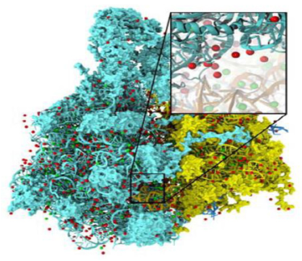

*Figure 21.1 — 정전기 potential map 은 분자동역학 시뮬레이션을 위한 안정 구조를 만드는 데 쓰인다.
(책 p.514)*

> 이 사례 연구가 다루는 계산은 **grid 공간에서의 정전기 potential map 계산**이다.
> 이 계산은 분자동역학 시뮬레이션을 위해 **분자 구조에 이온을 배치**할 때 자주 쓰인다.
> …… 이 응용에서 정전기 potential map 은 **물리 법칙에 따라 이온이 들어갈 수 있는 공간 위치를
> 식별**하는 데 쓰인다 (책 p.514).

### Direct Coulomb Summation (DCS)

> 정전기 potential map 을 계산하는 방법은 여럿인데, 그중 **Direct Coulomb Summation (DCS)** 은
> 아주 정확하고 **특히 GPU 에 적합**한 방법이다 [2].
> DCS 는 각 grid point 의 정전기 potential 값을 **계의 모든 원자로부터의 기여의 합**으로 계산한다
> (책 p.514).

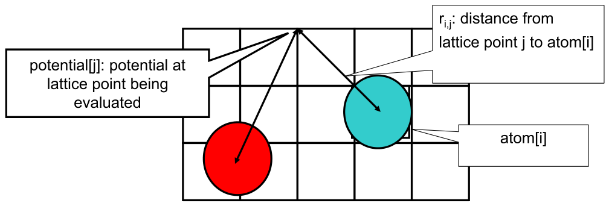

*Figure 21.2 — `atom[i]` 가 grid point $j$ 의 정전기 potential(`potential[j]`)에 기여하는 양은
`atom[i].charge`$/r_{ij}$ 다. DCS 에서 grid point $j$ 의 전체 potential 은 계의 **모든 원자로부터의
기여의 합**이다. (책 p.515)*

$$V_j = \sum_{i} \frac{q_i}{r_{ij}}, \qquad
r_{ij} = \sqrt{(x_j-x_i)^2 + (y_j-y_i)^2 + (z_j-z_i)^2}$$

> 이것을 **모든 grid point 와 모든 원자에 대해** 해야 하므로, 계산 횟수는
> **계의 전체 원자 수와 전체 grid point 수의 곱에 비례**한다.
> 현실적인 분자계에서 이 곱은 아주 클 수 있다.
> 그래서 정전기 potential map 계산은 전통적으로 VMD 에서 **batch 작업**으로 수행되어 왔다
> (책 p.514).

$$\text{연산량} \;\propto\; (\text{원자 수}) \times (\text{grid point 수})$$

**둘 다 부피에 비례**하므로 연산량이 **부피의 제곱**이다 — 21.5절이 이 벽을 깬다.

---

## 21.2 Scatter vs. gather in kernel design

### Figure 21.3 — 순차 C, 최적화 전

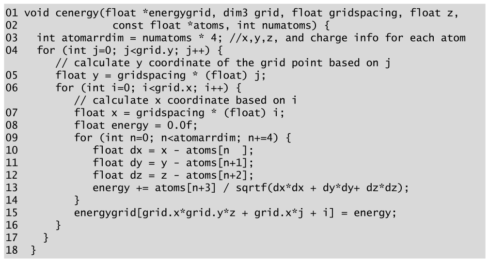

*Figure 21.3 — 2D 슬라이스에 대한 최적화되지 않은 DCS C 코드. (책 p.515)*

```c
01 void cenergy(float *energygrid, dim3 grid, float gridspacing, float z,
02                const float *atoms, int numatoms) {
03   int atomarrdim = numatoms * 4;   //x,y,z, and charge info for each atom
04   for (int j=0; j<grid.y; j++) {
       // calculate y coordinate of the grid point based on j
05     float y = gridspacing * (float) j;
06     for (int i=0; i<grid.x; i++) {
         // calculate x coordinate based on i
07       float x = gridspacing * (float) i;
08       float energy = 0.0f;
09       for (int n=0; n<atomarrdim; n+=4) {
10         float dx = x - atoms[n  ];
11         float dy = y - atoms[n+1];
12         float dz = z - atoms[n+2];
13         energy += atoms[n+3] / sqrtf(dx*dx + dy*dy+ dz*dz);
14       }
15       energygrid[grid.x*grid.y*z + grid.x*j + i] = energy;
16     }
17   }
18 }
```

**함수는 3D grid 의 2D 슬라이스 하나를 처리한다** — 모든 슬라이스에 대해 반복 호출된다.

| loop | 줄 | 무엇을 도나 |
|---|---|---|
| `j` | 04 | grid point 의 **y 차원** |
| `i` | 06 | grid point 의 **x 차원** |
| `n` | 09 | **모든 원자** |

> **원자 하나가 `atoms[]` 배열의 연속된 네 원소**로 표현된다는 점에 주목한다.
> 앞의 세 원소가 원자의 x, y, z 좌표이고 넷째가 **전하**다.
> 가장 안쪽 loop 다음에 grid point 의 누적값이 grid 자료구조에 기록된다 (line 15) (책 p.516).

> Fig. 21.3 의 DCS 함수는 각 grid point 의 x·y 좌표를 **grid point index 에 grid 간격을 곱해
> 즉석에서 계산**한다. 이는 모든 grid point 가 세 차원 모두에서 같은 거리로 떨어진 **균일 grid** 방법이다.
> 함수는 **같은 슬라이스의 모든 grid point 가 같은 z 좌표를 갖는다**는 사실을 활용한다 —
> 이 값은 호출자가 미리 계산해 함수 매개변수 `z` 로 넘긴다 (책 p.516).

> **원문 오기 ①.** line 15 의 슬라이스 offset `grid.x*grid.y*z` 에는 **`/ gridspacing` 이
> 빠져 있다.** `z` 는 슬라이스 **index** 가 아니라 **좌표**다 (line 12 가 `z - atoms[n+2]` 로
> 쓰는 것이 그 증거다). 슬라이스 index 는 $k = z/\texttt{gridspacing}$ 이다.
> Figure 21.4 (line 04), Figure 21.5 (line 07), Figure 21.6 (line 07) 은 **셋 다 `gridspacing`
> 으로 나눈다.** → line 15 는 `grid.x*grid.y*(z/gridspacing) + grid.x*j + i` 여야 한다.

### Figure 21.4 — loop 교환

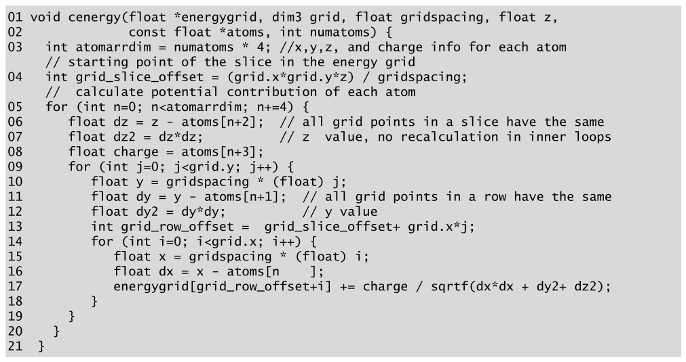

*Figure 21.4 — 2D 슬라이스에 대한 최적화된 DCS C 코드. (책 p.516)*

```c
01 void cenergy(float *energygrid, dim3 grid, float gridspacing, float z,
02                const float *atoms, int numatoms) {
03   int atomarrdim = numatoms * 4;   //x,y,z, and charge info for each atom
     // starting point of the slice in the energy grid
04   int grid_slice_offset = (grid.x*grid.y*z) / gridspacing;
     // calculate potential contribution of each atom
05   for (int n=0; n<atomarrdim; n+=4) {
06     float dz = z - atoms[n+2];   // all grid points in a slice have the same
07     float dz2 = dz*dz;           // z value, no recalculation in inner loops
08     float charge = atoms[n+3];
09     for (int j=0; j<grid.y; j++) {
10       float y = gridspacing * (float) j;
11       float dy = y - atoms[n+1];  // all grid points in a row have the same
12       float dy2 = dy*dy;          // y value
13       int grid_row_offset = grid_slice_offset + grid.x*j;
14       for (int i=0; i<grid.x; i++) {
15         float x = gridspacing * (float) i;
16         float dx = x - atoms[n];
17         energygrid[grid_row_offset+i] += charge / sqrtf(dx*dx + dy2+ dz2);
18       }
19     }
20   }
21 }
```

> 먼저 Fig. 21.3 line 09 의 가장 안쪽 loop 가 Fig. 21.4 line 05 의 **가장 바깥 loop 로 교환**되었다.
> 따라서 코드가 모든 원자를 순회한다. 각 원자에 대해 안쪽 loop 들이 그 원자의 기여를
> **모든 grid point 에 흩뿌린다(scatter).**
> loop 교환이 허용되는 이유는 Fig. 21.3 의 세 겹 loop 가 **완벽히 중첩**되어 있고
> 모든 반복이 **서로 독립**이기 때문이다 (책 p.516).

**loop 교환이 두 최적화를 열어 준다.**

| 최적화 | 어디로 뺐나 | 왜 가능한가 |
|---|---|---|
| $dz$, $dz^2$, `charge` | 두 안쪽 loop **바깥** (lines 06-08) | **슬라이스의 모든 grid point 가 같은 z** |
| $dy$, $dy^2$ | 가장 안쪽 loop **바깥** (lines 11-12) | **한 행의 모든 grid point 가 같은 y** |

> 반면 Fig. 21.3 에서는 거리의 y·z 성분이 **둘 다 가장 안쪽 loop 안에서** 계산되었다.
> 이 계산 횟수의 극적인 감소가 Fig. 21.4 의 C 코드를 빠르게 만든다.
> 이 최적화들은 Fig. 21.3 에서는 할 수 없다 — 가장 안쪽 loop 가 모든 원자를 순회하므로
> **원자마다 x·y·z 성분이 바뀌어 다시 계산해야** 하기 때문이다 (책 p.516~517).

**그런데 line 17 이 `+=` 로 바뀌었다.** 이것이 21.2절의 제목이 말하는 그 전환이다 —
**gather 에서 scatter 로.**

### host 쪽의 데이터 흐름

> GPU 실행에서는 host 프로그램이 원자 전하와 좌표를 시스템 메모리에 입력·유지하고
> grid point 자료구조도 시스템 메모리에 유지한다고 가정한다.
> DCS kernel 은 정전기 potential grid point 구조의 **2D 슬라이스 하나**를 처리하도록 설계된다
> (**thread grid 와 혼동하지 말 것**) (책 p.517).

슬라이스 하나를 처리하는 절차는 이렇다 (책 p.517).

| 단계 | 하는 일 |
|---|---|
| ① | CPU 가 슬라이스의 grid 데이터를 device global memory 로 전송 |
| ② | 원자 정보를 **constant memory 에 들어갈 크기의 chunk 로 분할** |
| ③ | chunk 를 device constant memory 로 전송 → **DCS kernel 호출** → 다음 chunk 준비 |
| ④ | 모든 chunk 를 처리하면 슬라이스를 CPU 로 되돌려 grid point 자료구조 갱신 |
| ⑤ | 다음 슬라이스로 |

> **grid point 는 8장에서 논의한 이산화 grid point 와 같은 것**이다 (책 p.517).

**`CHUNK_SIZE` 는 constant memory 크기가 정한다.**

$$\texttt{CHUNK\_SIZE} \times 4 \times 4\,\text{B} \le 64\,\text{KB}
\quad\Rightarrow\quad \texttt{CHUNK\_SIZE} \le \mathbf{4096}$$

> 정의된 상수 `CHUNK_SIZE` 는 kernel 호출마다 GPU constant memory 로 전송해야 하는 **원자 수**를
> 지정한다. **`CHUNK_SIZE*4` 값은 배열이 constant memory 에 들어가도록** 설정해야 한다
> (책 p.517~518).

### Figure 21.5 — scatter kernel

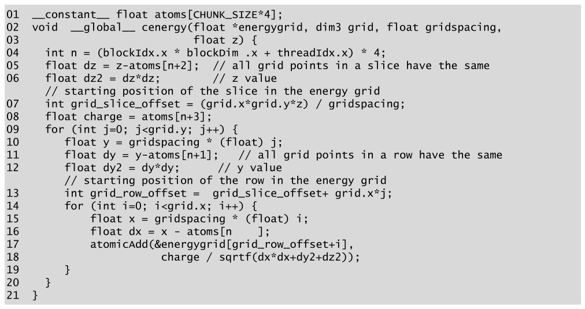

*Figure 21.5 — scatter 접근을 쓰는 DCS kernel. (책 p.517)*

```cuda
01 __constant__ float atoms[CHUNK_SIZE*4];
02 void __global__ cenergy(float *energygrid, dim3 grid, float gridspacing,
03                         float z) {
04   int n = (blockIdx.x * blockDim.x + threadIdx.x) * 4;
05   float dz = z-atoms[n+2];   // all grid points in a slice have the same
06   float dz2 = dz*dz;         // z value
     // starting position of the slice in the energy grid
07   int grid_slice_offset = (grid.x*grid.y*z) / gridspacing;
08   float charge = atoms[n+3];
09   for (int j=0; j<grid.y; j++) {
10     float y = gridspacing * (float) j;
11     float dy = y-atoms[n+1];   // all grid points in a row have the same
12     float dy2 = dy*dy;         // y value
       // starting position of the row in the energy grid
13     int grid_row_offset = grid_slice_offset+ grid.x*j;
14     for (int i=0; i<grid.x; i++) {
15       float x = gridspacing * (float) i;
16       float dx = x - atoms[n  ];
17       atomicAdd(&energygrid[grid_row_offset+i],
18                 charge / sqrtf(dx*dx+dy2+dz2));
19     }
20   }
21 }
```

> kernel 은 **각 thread 가 Fig. 21.4 의 가장 바깥 loop 의 한 반복을 구현**하게 하고
> 자기가 맡은 원자의 기여를 모든 grid point 에 흩뿌린다.
> 불행히도 이 **scatter 방식의 병렬화는 energy grid point 갱신에 atomic operation 을 요구**해
> (lines 17-18) **병렬 실행 속도를 크게 떨어뜨린다** (책 p.518).

**9장에서 본 그대로다.** grid point 하나에 여러 thread(= 여러 원자)가 동시에 누적하므로
atomic 이 필요하고, **grid point 수가 원자 수보다 훨씬 적으면 경쟁이 심하다.**

### Figure 21.6 — gather kernel

> 대신 **gather 접근**을 쓸 수 있다 — **각 thread 가 모든 원자로부터 grid point 하나로의 누적 기여를
> 계산**한다. 즉 각 thread 가 한 grid point으로 오는 기여를 **모은다.**
> 각 thread 가 **자기 grid point 에만 쓰므로 atomic operation 이 필요 없어** 선호되는 방식이다
> (책 p.518).

**그런데 대가가 있다.**

> 이는 loop 가 **최적화되지 않은 Fig. 21.3 의 순서로** 배열되어야 함을 요구한다.
> 즉 우리는 **더 느린 C 구현을 병렬화**하게 되고, 이는 응용 병렬화에서 자주 겪는 딜레마를
> 예시한다: **최적화된 순차 코드가 최적화되지 않은 것보다 병렬화에 덜 적합하다.**
> 단점은 **각 thread 안의 실행이 극적으로 느려질 수 있다**는 것이고,
> 이는 병렬화의 속도 이득을 깎을 수 있다 (책 p.518).

$$\underbrace{\text{빠른 순차 코드 (21.4)}}_{\text{scatter} \to \text{atomic}}
\quad\text{vs}\quad
\underbrace{\text{느린 순차 코드 (21.3)}}_{\text{gather} \to \text{atomic 없음}}$$

**21.3절 전체가 "느린 쪽을 골랐으니 그 손해를 되찾자"** 는 이야기다.

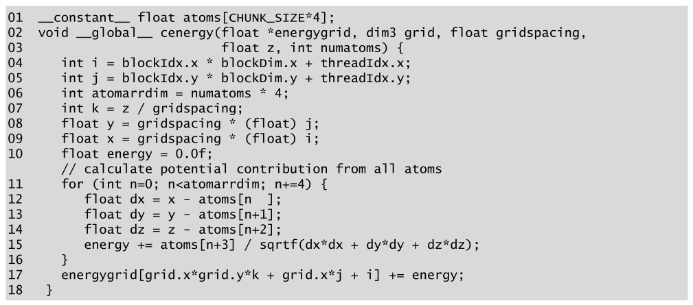

*Figure 21.6 — gather 접근을 쓰는 DCS kernel. (책 p.518)*

```cuda
01 __constant__ float atoms[CHUNK_SIZE*4];
02 void __global__ cenergy(float *energygrid, dim3 grid, float gridspacing,
03                         float z, int numatoms) {
04   int i = blockIdx.x * blockDim.x + threadIdx.x;
05   int j = blockIdx.y * blockDim.y + threadIdx.y;
06   int atomarrdim = numatoms * 4;
07   int k = z / gridspacing;
08   float y = gridspacing * (float) j;
09   float x = gridspacing * (float) i;
10   float energy = 0.0f;
     // calculate potential contribution from all atoms
11   for (int n=0; n<atomarrdim; n+=4) {
12     float dx = x - atoms[n  ];
13     float dy = y - atoms[n+1];
14     float dz = z - atoms[n+2];
15     energy += atoms[n+3] / sqrtf(dx*dx + dy*dy + dz*dz);
16   }
17   energygrid[grid.x*grid.y*k + grid.x*j + i] += energy;
18 }
```

> **2차원 potential grid point 구성과 맞는 2차원 thread grid** 를 만든다.
> 그러려면 Fig. 21.3 의 lines 04-06 의 두 바깥 loop 를 **완벽히 중첩된 loop 로 고쳐**
> 각 thread 가 2단계 loop 의 한 반복을 실행하게 해야 한다.
> 이는 **y 좌표 계산(Fig. 21.3 의 line 05)을 안쪽 loop 로 옮겨서** 이루어진다.
> 이 변환이 모든 `i`·`j` 반복을 병렬로 실행할 수 있게 한다.
> **대가는 y 좌표 계산이 모든 안쪽 loop 반복에서 중복 수행**된다는 것이다.
> 이는 **수행되는 계산량과 얻어지는 병렬성 수준 사이의 맞바꿈**이다 (책 p.518).

**"완벽히 중첩(perfectly nested)"이 병렬화의 전제조건**이라는 것이 이 문단의 핵심이다.
Figure 21.3 의 line 05 (`y = gridspacing*j`) 는 `j` loop 와 `i` loop **사이에** 있어
두 loop 가 완벽히 중첩되어 있지 않다. 안으로 밀어 넣으면 중첩이 완벽해지고
**두 loop 를 하나의 2D thread grid 로 접을 수 있다.**

> 각 thread grid 안에서 thread block 은 **grid 구조의 tile 에 대한 정전기 potential 을 계산**하도록
> 조직된다. 가장 단순한 kernel 에서는 각 thread 가 grid point 하나의 값을 계산한다.
> 더 정교한 kernel 에서는 각 thread 가 **여러 grid point 를 계산**하고 grid point 계산 사이의 **중복을
> 활용**해 실행 속도를 개선한다. 이는 **6장에서 소개한 thread coarsening 최적화의 예**이며
> 21.3절에서 논의한다 (책 p.519).

### 왜 이 kernel 이 빠른가 — constant cache

> Fig. 21.6 kernel 의 성능은 꽤 좋은데 **atomic operation 에 발목잡히지 않기** 때문이다.
> 또 코드를 훑어보면 각 thread 가 **접근하는 `atom[]` 배열 원소 4개마다 부동소수점 연산 9개**를
> 수행한다.
> 각 원자에 대한 이 `atoms[]` 원소들은 **각 SM 의 하드웨어 constant cache 에 cache 되어
> 많은 thread 에 방송**된다.
> thread 사이의 이 constant memory 원소의 **대규모 재사용이 constant cache 를 극도로 효과적**
> 으로 만들어 **DRAM 접근의 압도적 다수를 제거**한다.
> 결과적으로 **global memory bandwidth 는 이 kernel 의 제약 요인이 아니다** (책 p.519).

**"9 FP ops / 4 접근"이 무슨 뜻인지 정확히 세어 보자** (line 12~15, 원자 하나 · grid point 하나):

| 연산 | 개수 | 어디서 |
|---|---|---|
| constant 접근 | **4** | `atoms[n]`, `[n+1]`, `[n+2]`, `[n+3]` |
| 뺄셈 | 3 | `dx`, `dy`, `dz` |
| 곱셈 | 3 | `dx*dx`, `dy*dy`, `dz*dz` |
| 덧셈 | 2 | `dx*dx + dy*dy`, `+ dz*dz` |
| 나눗셈 | 1 | `atoms[n+3] / …` |
| **소계** | **9** | ← **책이 말한 9** |
| 덧셈 (`energy +=`) | 1 | |
| `sqrtf` | 1 | |
| **전부** | **10 FP + 1 sqrt** | |

**책의 "9"는 `energy +=` 와 `sqrtf` 를 뺀 값**이다. (검산 통과.)

> **그런데 이것을 arithmetic intensity 로 환산하면 의외로 좋다.**
> constant cache 가 다 잡아 준다면 **global memory 트래픽은 grid point 당 쓰기 4 B 하나뿐**이고,
> 원자 $A$ 개를 처리하는 데 $10A$ FLOP 을 한다.
> 즉 $\text{AI} = 10A/4$ — $A$ 가 수천이면 **수천 FLOP/B** 다.
> 5장의 임계값 20 FLOP/B 와 비교하면 **압도적으로 compute-bound** 다.
> 그래서 21.3절이 **memory 가 아니라 명령어 수를 줄이는** 데 집중한다.
> 17·20장이 memory-bound 문제였던 것과 정반대다.
---

## 21.3 Thread coarsening

### 남은 문제 — 명령어가 아깝다

> Fig. 21.6 의 kernel 이 constant caching 으로 global memory 병목을 피하긴 하지만,
> 여전히 **부동소수점 연산 9개마다 constant memory 접근 명령 4개**를 실행해야 한다.
> 이 메모리 접근 명령은 **부동소수점 명령의 실행 throughput 을 높이는 데 쓰일 수 있었을
> 하드웨어 자원**을 소비한다.
> 나아가 이 메모리 접근 명령의 실행은 **에너지를 소비**하는데, 이는 많은 대규모 병렬 컴퓨팅
> 시스템에서 중요한 제약 요인이다 (책 p.519).

**"에너지"가 근거로 등장하는 것은 이 책에서 드물다.** 성능만이 아니라
**명령어 하나하나가 전력**이라는 관점이다.

> 이 절은 **thread coarsening 기법으로 여러 thread 를 합쳐** `atoms[]` 데이터를
> constant memory 에서 **한 번만 가져와 register 에 저장하고 여러 grid point 계산에 쓰는** 것을 보인다
> (책 p.519).

### 무엇이 중복인가 (Figure 21.7)

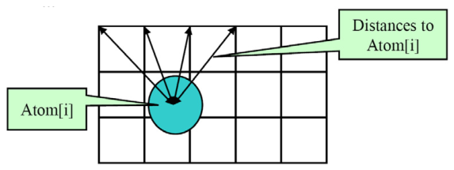

*Figure 21.7 — 여러 grid point 사이에서 계산 결과를 재사용하기. (책 p.520)*

> Fig. 21.7 에 보이듯 **같은 행(y 차원)의 모든 energy grid point 는 같은 y 좌표를 갖는다.**
> 따라서 원자의 y 좌표와 그 행 어느 grid point 의 y 좌표 사이의 차이는 **같은 값**이다.
> Fig. 21.6 의 DCS kernel 에서는 이 계산이 한 행의 모든 grid point 에 대해 **모든 thread 가 중복해서**
> 수행한다. 이 중복을 없애 실행 효율을 개선할 수 있다 (책 p.519).

**이것이 21.2절에서 잃었던 것을 되찾는 방법**이다.
Figure 21.4 는 loop 교환으로 $dy$·$dz$ 를 밖으로 뺐지만 scatter 가 되었다.
Figure 21.8 은 **gather 를 유지한 채** thread 하나가 여러 grid point 를 맡아 같은 재사용을 얻는다.

### Figure 21.8 — thread 하나가 grid point 넷

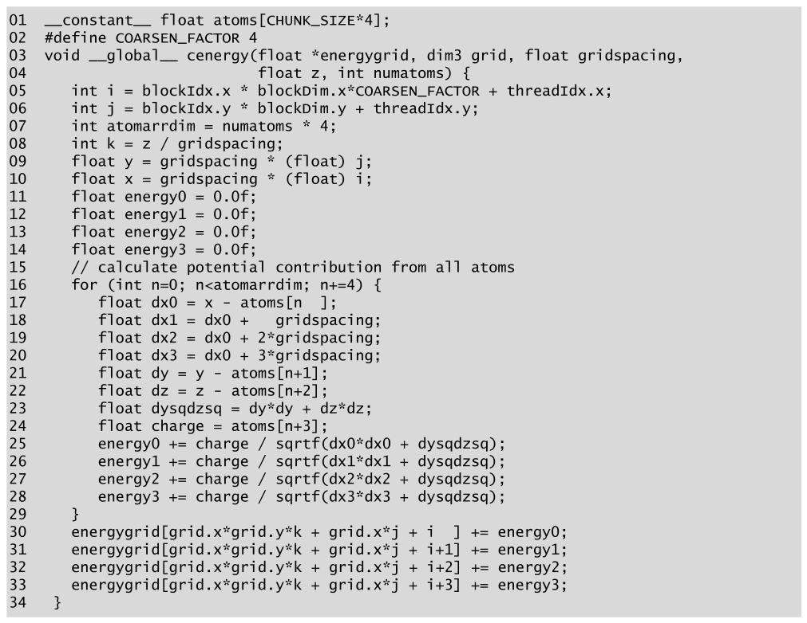

*Figure 21.8 — thread coarsening 을 적용한 DCS kernel. (책 p.520)*

```cuda
01 __constant__ float atoms[CHUNK_SIZE*4];
02 #define COARSEN_FACTOR 4
03 void __global__ cenergy(float *energygrid, dim3 grid, float gridspacing,
04                         float z, int numatoms) {
05   int i = blockIdx.x * blockDim.x*COARSEN_FACTOR + threadIdx.x;
06   int j = blockIdx.y * blockDim.y + threadIdx.y;
07   int atomarrdim = numatoms * 4;
08   int k = z / gridspacing;
09   float y = gridspacing * (float) j;
10   float x = gridspacing * (float) i;
11   float energy0 = 0.0f;
12   float energy1 = 0.0f;
13   float energy2 = 0.0f;
14   float energy3 = 0.0f;
     // calculate potential contribution from all atoms
16   for (int n=0; n<atomarrdim; n+=4) {
17     float dx0 = x - atoms[n  ];
18     float dx1 = dx0 +   gridspacing;
19     float dx2 = dx0 + 2*gridspacing;
20     float dx3 = dx0 + 3*gridspacing;
21     float dy = y - atoms[n+1];
22     float dz = z - atoms[n+2];
23     float dysqdzsq = dy*dy + dz*dz;
24     float charge = atoms[n+3];
25     energy0 += charge / sqrtf(dx0*dx0 + dysqdzsq);
26     energy1 += charge / sqrtf(dx1*dx1 + dysqdzsq);
27     energy2 += charge / sqrtf(dx2*dx2 + dysqdzsq);
28     energy3 += charge / sqrtf(dx3*dx3 + dysqdzsq);
29   }
30   energygrid[grid.x*grid.y*k + grid.x*j + i  ] += energy0;
31   energygrid[grid.x*grid.y*k + grid.x*j + i+1] += energy1;
32   energygrid[grid.x*grid.y*k + grid.x*j + i+2] += energy2;
33   energygrid[grid.x*grid.y*k + grid.x*j + i+3] += energy3;
34 }
```

**세 가지 재사용이 한꺼번에 일어난다.**

| 재사용 | 줄 | Fig 21.6 이면 |
|---|---|---|
| $dy^2 + dz^2$ 를 `dysqdzsq` 에 (register) | 23 | grid point 마다 다시 계산 |
| `charge` 를 register 에 | 24 | grid point 마다 constant 접근 |
| $dx_1..dx_3$ 를 **뺄셈이 아니라 덧셈**으로 | 18~20 | grid point 마다 뺄셈 |

> 각 원자에 대해 코드가 y 좌표 차이 `dy` 를 **딱 한 번만** 계산한다 (line 21).
> 그 다음 `dy*dy + dz*dz` 를 계산해 자동 변수 `dysqdzsq` 에 저장하는데, 이는 register 에 배정된다
> (line 23). 이 값은 **네 grid point 모두에 같다** (책 p.519).

**18~20줄이 영리한 지점**이다. $x_c = x_0 + c\cdot\texttt{gridspacing}$ 이므로
$dx_c = x_c - x_{\text{atom}} = dx_0 + c\cdot\texttt{gridspacing}$ —
**원자 좌표를 다시 읽지 않고 덧셈 하나로** 얻는다.

### 연산 수를 직접 세어 본다

책이 구체적인 숫자를 주므로 하나씩 대조한다. **원자 하나 · grid point 네 개** 기준이다.

| | Figure 21.6 (×4) | Figure 21.8 | 감소 |
|---|---|---|---|
| **constant 접근** | **16** | **4** | $4\times$ |
| 뺄셈 | 12 | 3 | $-9$ |
| 곱셈 | 12 | **6** | $-6$ |
| 덧셈 | 12 | **12** | 0 |
| 나눗셈 | **4** | 4 | 0 |
| `sqrtf` | 4 | 4 | 0 |
| **FP 합계** | **40** | **25** | $\mathbf{1.6\times}$ |

**Figure 21.8 의 곱셈이 6 인 이유**: 소스에는 `2*gridspacing`·`3*gridspacing` 을 포함해 8 개가
보이지만 그 둘은 **loop 불변**이라 컴파일러가 loop 밖으로 뺀다. 남는 것은
`dy*dy`, `dz*dz`, 그리고 `dx0*dx0`~`dx3*dx3` 네 개 = 6 이다.

**덧셈 12 의 내역**: `dx1`~`dx3` (3) + `dy*dy + dz*dz` (1) + `dxN*dxN + dysqdzsq` (4) +
`energyN +=` (4) = 12.

> **원문 오기 ②·③.** 책의 숫자와 두 군데가 다르다 (책 p.520).
> - "Fig. 21.6 … **12 floating-point divisions** – a total of **48**" → 나눗셈은
>   grid point 당 하나이므로 **4** 이고 합계는 **40** 이다.
> - "Fig. 21.8 … **eleven floating point additions**" → 위 내역대로 **12** 이고
>   합계는 24 가 아니라 **25** 다.
> 따라서 "48 → 24 ($2\times$)" 가 아니라 **"40 → 25 ($1.6\times$)"** 다.
> 결론(상당한 감소)은 바뀌지 않지만 숫자가 다르다. (뒤의 "원문 오기" 절 참조)

> **원문 오기 ④.** 절약 항목을 나열한 문장(책 p.519~520)이
> "y 좌표 접근 3회, x 좌표 접근 3회, **charge 접근 3회**" 만 적어 **z 좌표 접근 3회가 빠졌다.**
> $16 - 4 = 12$ 이므로 **네 항목 모두 3회씩**이어야 합이 맞는다.
> 같은 문장의 "뺄셈 3개, 곱셈 5개, 덧셈 9개"도 위 표(뺄셈 9, 곱셈 6, 덧셈 0)와 맞지 않는다.

### 대가 — register

> 이 최적화의 대가는 **각 thread 가 더 많은 register 를 쓴다**는 것이다.
> 이는 잠재적으로 occupancy 를 떨어뜨릴 수 있다.
> 그러나 각 thread 가 쓰는 register 수가 허용 한도 안에 머무르므로 **이 경우에는 occupancy 를
> 제한하지 않는다** (책 p.520).

$dx_0..dx_3$, `energy0..3`, `dy`, `dz`, `dysqdzsq`, `charge`, `x`, `y` — 대략 15개 안팎이고
H100 의 thread 당 여유(2048 thread full occupancy 기준 32개)에 든다.

### ⚠ Figure 21.8 의 line 05 는 틀렸다

**이것은 오타가 아니라 결과가 틀리는 버그다.**

```cuda
05   int i = blockIdx.x * blockDim.x*COARSEN_FACTOR + threadIdx.x;
```

이 kernel 은 thread 하나가 **인접한 네 점** $i, i{+}1, i{+}2, i{+}3$ 을 맡는다 (lines 30~33).
그러면 thread 사이 간격이 `COARSEN_FACTOR` 여야 하는데, line 05 는 간격을 **1** 로 준다.

`blockDim.x = 4`, `COARSEN_FACTOR = 4` 로 손으로 펴 보면:

| thread | `i` | 쓰는 grid point |
|---|---|---|
| 0 | 0 | 0, 1, 2, 3 |
| 1 | 1 | **1, 2, 3**, 4 |
| 2 | 2 | **2, 3, 4**, 5 |
| 3 | 3 | **3, 4, 5**, 6 |

grid point 별 쓰기 횟수는 `[1,2,3,4,3,2,1,0,0,0,0,0,0,0,0,0]` 이다 —
**grid point 3 은 네 번 누적되고, 7~15 는 한 번도 계산되지 않는다.** (검산 통과.)

> **왜 이런 실수가 나왔나.** line 05 는 **Figure 21.10 의 것과 글자 하나 다르지 않다.**
> Figure 21.10 은 thread 가 `blockDim.x` 만큼 **떨어진** 네 점을 맡으므로
> 이 index 식이 정확히 맞는다. Figure 21.8 을 만들면서 lines 18~20 과 30~33 만 고치고
> **line 05 를 되돌리지 않은 것**으로 보인다.

**고치면 이렇다.**

```cuda
05   int i = (blockIdx.x * blockDim.x + threadIdx.x) * COARSEN_FACTOR;
```

이렇게 하면 thread 0,1,2,3 이 각각 $\{0,1,2,3\}$, $\{4,5,6,7\}$, $\{8,9,10,11\}$,
$\{12,13,14,15\}$ 를 맡아 **모든 grid point 를 정확히 한 번씩** 쓴다 (검산 통과).

---

## 21.4 Memory coalescing

### 무엇이 문제인가

> Fig. 21.8 kernel 의 성능이 꽤 높지만, **profiling 을 돌려 보면 thread 들이 메모리 쓰기를
> 비효율적으로** 한다. lines 30-33 에서 각 thread 가 **인접한 네 grid point**에 쓴다.
> 불행히도 각 warp 의 인접 thread 들의 쓰기 패턴은 **un-coalesced global memory 쓰기**를 낳는다
> (책 p.521).

> 두 인접 thread 가 **네 원소 떨어진** 메모리 위치에 접근한다는 점에 주목한다.
> 따라서 warp 의 모든 thread 가 쓸 32 위치가 **세 원소씩 사이를 두고 흩어진다** (책 p.521).

$$\text{thread } t \to \text{주소 } 4t + c \quad\Rightarrow\quad \text{stride } 4$$

warp 하나(32 thread)의 한 번의 쓰기가 건드리는 주소는 $\{c, 4{+}c, 8{+}c, \dots, 124{+}c\}$ —
**128 개 float 범위에 흩어져** 128 B 짜리 구간 **4개**를 건드린다.
필요한 것은 실제로는 32개 float = 128 B **한 구간**이다.

$$\text{transaction 4개} \;\to\; \text{필요한 것은 1개} \;\Rightarrow\; \textbf{4$\times$ 낭비}$$

(검산: Figure 21.8 방식은 warp 당 4구간, Figure 21.10 방식은 1구간 ✓.)

### 해법 — grid point 배정을 재배치한다

> 이 문제는 각 block 에서 **인접 grid point 를 인접 thread 에 배정**해 풀 수 있다.
> 먼저 x 차원의 **연속된 `blockDim.x` 개 grid point**을 thread 들에 배정한다.
> 그 다음 **그 다음 `blockDim.x` 개 연속 grid point**을 같은 thread 들에 배정한다.
> 각 thread 가 원하는 수의 grid point 를 가질 때까지 이 배정을 반복한다 (책 p.521).

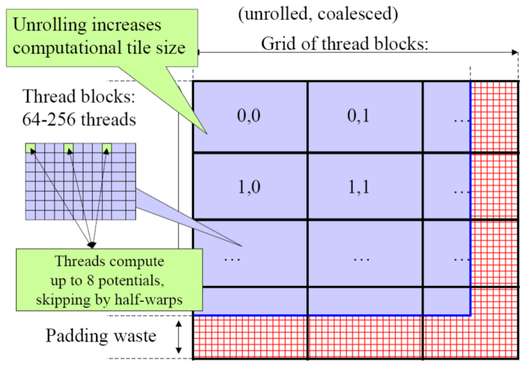

*Figure 21.9 — coalesced 쓰기를 위한 thread 구성과 메모리 배치. (책 p.522)*

**10장 reduction 과 15장 matmul 에서 반복해서 본 그 재배치**다 —
"thread 하나가 연속된 $k$ 개"가 아니라 **"thread 하나가 `blockDim.x` 간격의 $k$ 개"**.

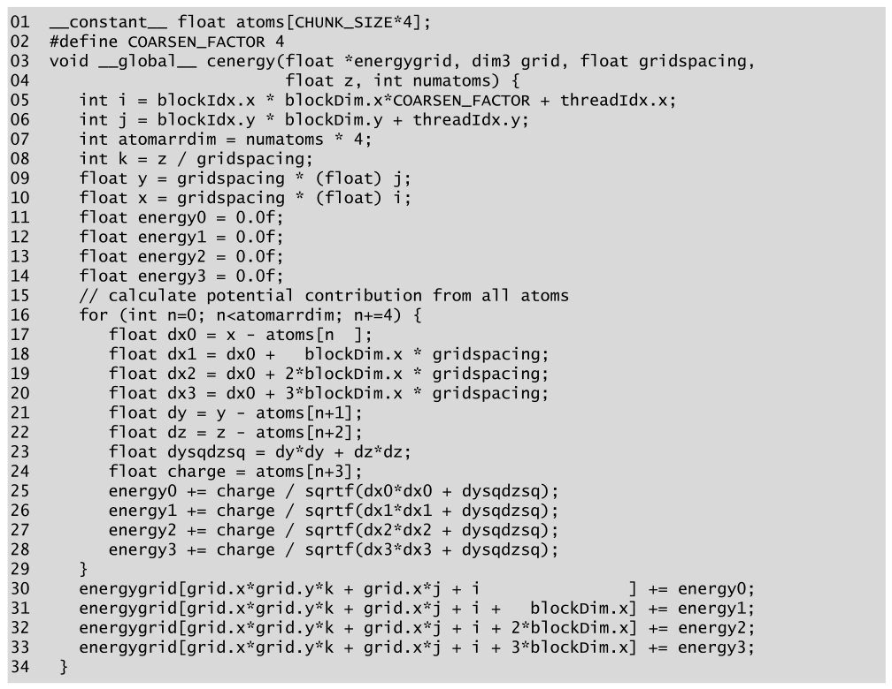

*Figure 21.10 — thread coarsening 과 memory coalescing 을 적용한 DCS kernel. (책 p.522)*

Figure 21.8 과 다른 곳은 **여섯 줄**뿐이다.

```cuda
05   int i = blockIdx.x * blockDim.x*COARSEN_FACTOR + threadIdx.x;   // ← 이제 맞다
...
18     float dx1 = dx0 +   blockDim.x * gridspacing;
19     float dx2 = dx0 + 2*blockDim.x * gridspacing;
20     float dx3 = dx0 + 3*blockDim.x * gridspacing;
...
30   energygrid[grid.x*grid.y*k + grid.x*j + i              ] += energy0;
31   energygrid[grid.x*grid.y*k + grid.x*j + i +   blockDim.x] += energy1;
32   energygrid[grid.x*grid.y*k + grid.x*j + i + 2*blockDim.x] += energy2;
33   energygrid[grid.x*grid.y*k + grid.x*j + i + 3*blockDim.x] += energy3;
```

> thread 에 배정된 grid point 들의 원자-grid point 거리를 계산하는 데 쓰이는 **x 좌표가
> `blockDim.x*gridspacing` 만큼 offset** 된다는 점에 주목한다.
> 이는 thread 에 배정된 네 grid point 의 x 좌표가 **서로 `blockDim.x` grid point 떨어져 있다**는 사실을
> 반영한다.
> 또 loop 가 끝난 뒤 `energygrid` 배열로의 메모리 쓰기 index 도 **서로 `blockDim.x` 만큼**
> 떨어져 있다. 따라서 **`energygrid` 배열로의 모든 쓰기가 coalesced** 되고
> kernel 성능이 Fig. 21.8 보다 좋다 (책 p.521).

$$\text{thread } t \to \text{주소 } t + c\cdot\texttt{blockDim.x} \quad\Rightarrow\quad \text{stride } 1$$

**그리고 line 05 가 이번에는 정확히 맞다** — 위에서 본 대로 이 index 식은
`blockDim.x` 간격 배정을 전제한 것이기 때문이다. (검산: 모든 grid point 를 정확히 한 번씩 ✓,
기준값과 일치 ✓.)

> coarsening factor 가 4 일 때는 **원래의 thread-grid point 배정에서도 vector store 로 쓰기
> coalescing 을 이룰 수 있다.** vector store 를 쓰는 구현은 독자를 위한 연습문제로 남긴다
> (책 p.521). → **연습문제 4** 에서 구현한다.

---

## 21.5 Cutoff binning for data size scalability

### 알고리즘을 바꿔야 하는 순간

> 문제 하나를 푸는 알고리즘이 여럿인 경우가 많다.
> 어떤 것은 계산 단계가 적고, 어떤 것은 병렬 실행 정도가 높고,
> 어떤 것은 수치 안정성이 좋고, 어떤 것은 memory bandwidth 를 덜 쓴다.
> 불행히도 **네 측면 모두에서 다른 것보다 나은 알고리즘은 대개 없다** (책 p.523).

> 일반적으로 같은 문제를 푸는 대안 알고리즘은 **같은 해**에 도달해야 한다. ……
> 어떤 응용에서는 **최종 해가 약간 달라져도 된다면 훨씬 공격적인 알고리즘 전략**을 낼 수 있다.
> **cutoff summation** 이라 부르는 중요한 전략이 그것으로,
> **약간의 정확도를 희생해** 정전기 potential 계산 같은 grid 알고리즘의 실행 효율을 크게 개선한다
> (책 p.523).

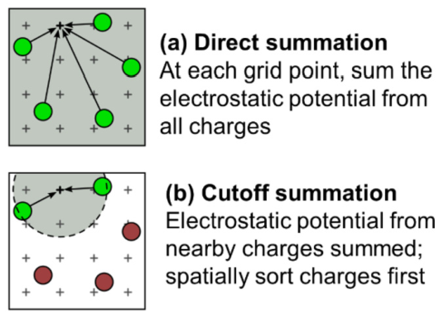

*Figure 21.11 — cutoff summation 대 direct summation. (책 p.523)*

**근거는 물리다.**

> 이는 **많은 grid 계산 문제가 물리 법칙에 기반**하고,
> grid point 에서 멀리 떨어진 입자·표본으로부터의 수치적 기여는 **훨씬 낮은 계산 복잡도의
> 암묵적 방법으로 통째로 처리**할 수 있다는 관찰에 기반한다 (책 p.523).

> 각 grid point 는 **가까운 원자로부터는 정확한 기여**를 받아야 한다.
> 그러나 멀리 떨어진 원자는 기여가 **거리에 반비례**하므로 아주 작다 (책 p.523~524).

### 복잡도가 바뀐다

> 이것[direct summation]은 매우 병렬적이고 훌륭한 속도 향상을 얻지만,
> **원자 수가 계의 부피에 비례해 증가하는 아주 큰 energy-grid 계에는 잘 확장되지 않는다.**
> **계산량이 부피의 제곱으로 증가**한다 (책 p.523).

$$W_{\text{DCS}} \propto (\text{원자 수}) \times (\text{grid point 수}) \propto V \times V = V^2$$

$$W_{\text{cutoff}} \propto (\text{grid point 수}) \times (\text{반경 } r_c \text{ 안의 원자 수})
\propto V \times \tfrac{4}{3}\pi r_c^3 \propto V$$

| 부피가 | DCS 의 일 | cutoff 의 일 |
|---|---|---|
| $10\times$ | $\mathbf{100\times}$ | $10\times$ |
| $100\times$ | $10{,}000\times$ | $100\times$ |

$r_c = 12$ Å, 단위 밀도로 $V = 10^6$ 이면 **DCS 가 cutoff 의 약 $138\times$** 다 (검산 통과).

> 각 grid point 가 **자기 좌표에서 고정된 반경 안의 원자로부터만** 기여를 받는 알고리즘을 고안할 수
> 있다면, 알고리즘의 계산 복잡도는 **계 부피에 선형 비례**하도록 줄어든다 (책 p.524).

### 왜 순차 알고리즘을 그대로 못 옮기나

> 순차 컴퓨팅에서 단순한 cutoff 알고리즘은 **한 번에 원자 하나**를 처리한다.
> 각 원자에 대해 알고리즘은 원자 좌표의 반경 안에 드는 grid point 를 순회한다. ……
> 그러나 이 단순한 절차는 병렬 실행으로 쉽게 옮겨지지 않는다.
> 이유는 21.2절에서 논의한 것이다: **원자 중심 병렬화는 scatter 메모리 갱신 행태 때문에
> 잘 동작하지 않는다** (책 p.524).

**21.2절의 딜레마가 다시 나온다.** 원자 중심(scatter)이 자연스럽지만 atomic 을 부른다.
그래서 **grid point 중심(gather) 분해 위에서 cutoff 를 구현**해야 한다.

> 따라서 **grid 중심 분해에 기반한 cutoff binning 알고리즘**을 찾아야 한다 —
> 각 thread 가 grid point 하나의 energy 값을 계산한다. ……
> Rodrigues 등이 정전기 potential 문제에 대해 그런 알고리즘을 제시했다 [3] (책 p.524).

### bin 과 neighborhood

> 알고리즘의 핵심 착상은 **입력 원자를 좌표에 따라 bin 으로 정렬**하는 것이다.
> 각 bin 은 energy grid 공간의 한 상자에 대응하고 좌표가 그 상자에 드는 모든 원자를 담는다.
> 이 bin 들은 **다차원 배열**로 구현된다: x·y·z 차원과 **bin 안 원자의 벡터인 넷째 차원**
> (책 p.524).

> grid point 에 대한 bin 의 **"neighborhood"** 를, 그 grid point 의 energy 값에 기여할 수 있는
> 모든 원자를 담은 bin 들의 모음으로 정의한다 (책 p.524).

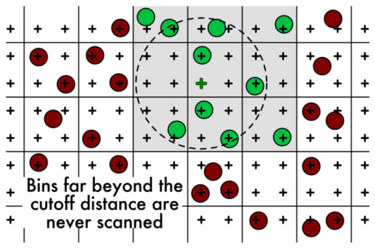

*Figure 21.12 — grid point 하나에 대한 neighborhood bin. **cutoff 거리를 훨씬 넘는 bin 은 결코
훑지 않는다.** (책 p.525)*

> Fig. 21.12 는 grid point 하나의 neighborhood bin 예를 보인다.
> **grid point 주위의 아홉 bin 이 cutoff 거리 원과 겹친다**는 점에 주목한다.
> 올바른 cutoff summation 을 위해 이 아홉 bin 의 **모든 원자**가 그 grid point 의 기여로
> 고려되도록 해야 한다.
> **neighborhood bin 의 어떤 원자는 반경 안에 들지 않을 수 있다.**
> 따라서 neighborhood bin 의 원자를 처리할 때 모든 thread 는 그 원자가 자기 반경 안에 드는지
> 검사해야 한다. 이는 **warp 안 thread 사이에 control divergence** 를 일으킬 수 있다 (책 p.524).

**→ 연습문제 5** 가 이 divergence 를 묻는다.

### block 단위로 neighborhood 를 미리 정한다

> neighborhood bin 을 energy grid 공간의 **stencil** 로 생각할 수 있다.
> 그러나 cutoff 반경이 주어졌을 때 neighborhood bin 을 정하는 계산은 **복잡한 기하 문제**일 수
> 있고 그 해를 구하는 데 시간이 걸린다.
> 따라서 neighborhood bin 은 보통 **block 의 모든 thread 에 대해 정의되고 grid 를 띄우기 전에
> 준비**된다 (책 p.524~525).

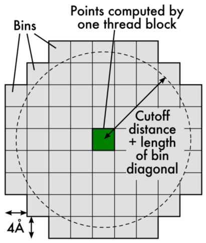

*Figure 21.13 — 한 block 이 처리하는 모든 grid point 에 대한 neighborhood bin 식별. (책 p.525)*

**책의 구체적인 예** (책 p.525):

| 항목 | 값 |
|---|---|
| grid 간격 | 0.5 Å |
| block 크기 | $8 \times 8 \times 8$ |
| → block 이 덮는 정육면체 | $\mathbf{4\ \text{Å} \times 4\ \text{Å} \times 4\ \text{Å}}$ |
| 분자 수준 힘 계산의 전형적 cutoff | 12 Å |
| block 안 grid point 수 | $512$ |

> 512개의 원 각각이 block 의 thread 하나가 덮는 grid point 하나를 중심으로 하는데,
> 그 원들 중 어느 것에라도 **전부 또는 일부가 덮이는 모든 bin 을 식별**해야 한다.
> **보수적 근사**로 **bin 중심을 중심으로 하고 반지름이 cutoff 거리 + bin 대각선의 절반인
> 초대형 원(super circle)** 을 그릴 수도 있다.
> 근거는 그 초대형 원이 **bin 모서리를 중심으로 하는 모든 원을 덮는다**는 것이다 (책 p.525~526).

$$R = r_c + \frac{\text{bin 대각선}}{2}
= 12 + \frac{4\sqrt3}{2} = 12 + 3.464 = \mathbf{15.46\ \text{Å}} = 3.87\ \text{bin}$$

이 반경으로 3D neighborhood 를 실제로 세면 **bin 461개**다 (검산 통과) —
$9^3 = 729$ 개 정육면체보다 적다 (구가 모서리를 잘라낸다).

### Figure 21.14 — 21개는 어디서 나오나

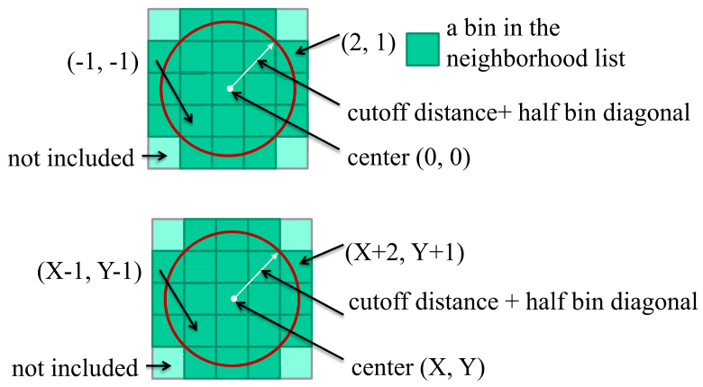

*Figure 21.14 — 상대 offset 을 쓰는 neighborhood 목록. (책 p.526)*

> 각 bin 에 대해 **초대형 원에 완전히 덮이는 bin 이 9개, 부분적으로 덮이는 bin 이 12개**임을 본다.
> 각 block 의 thread 가 자기 grid point 의 cutoff 거리 안 원자를 찾기 위해 검사해야 할
> **$9 + 12 = 21$ 개의 neighborhood bin 목록**을 만들 수 있다 (책 p.526).

**직접 세어 확인하자.** bin 크기를 1 로 두고 중심 bin 을 $(0,0)$ 이라 하면,
offset $(a,b)$ 인 bin 의 **가장 가까운 점**까지의 거리는
$\sqrt{\max(0,|a|-0.5)^2 + \max(0,|b|-0.5)^2}$ 다.

| bin | 가장 가까운 점까지 |
|---|---|
| $(2,1)$ | $\sqrt{1.5^2 + 0.5^2} = \sqrt{2.5} = 1.581$ |
| $(2,2)$ | $\sqrt{1.5^2 + 1.5^2} = \sqrt{4.5} = 2.121$ |

$$R \in [\,1.581,\ 2.121\,) \;\Longrightarrow\;
\text{neighborhood} = 5\times5 \text{ 에서 네 모서리를 뺀 } \mathbf{21}\text{개}$$

Figure 21.14 가 정확히 그 모양이다 — $5\times5$ grid 에서 네 모서리만 옅은 색("not included") ✓.
$R = 1.6, 1.8, 2.0, 2.1$ 어디서든 21개다 (검산 통과).

> **"완전히 덮이는 9개"는 글자 그대로는 성립하지 않는다.**
> bin $(1,1)$ 이 원 안에 완전히 들어가려면 **가장 먼 모서리** $(1.5, 1.5)$ 가 $R$ 안이어야 하니
> $R \ge 2.121$ 인데, 그러면 $(2,2)$ 도 들어와 21개가 깨진다.
> $R \in (\sqrt2,\ 2)$ 로 두고 **"bin 중심이 원 안"** 을 기준으로 읽으면
> 정확히 **9개(안쪽 $3\times3$)** 이고 나머지가 12개다 ✓.
> 즉 그림의 "완전히 덮인다"는 **"중심이 원 안에 든다"** 로 읽어야 앞뒤가 맞는다.
> (엄밀한 기준으로는 5개만 완전히 덮인다 — 검산에 둘 다 넣어 두었다.)

> 이 bin 들은 **bin 좌표의 상대 offset** 으로 표현된다.
> 예컨대 초대형 원에 완전히 덮이는 9개 bin 은
> $(-1,-1), (0,-1), (1,-1), (-1,0), (0,0), (1,0), (-1,1), (0,1), (1,1)$ 목록으로 표현된다.
> 이 목록은 **아마도 constant memory 배열로** kernel 에 공급될 것이다 (책 p.526).

> kernel 실행 중 block 의 모든 thread 가 neighborhood 목록을 순회한다.
> 각 neighborhood bin 에 대해 thread 들은 block 이 덮는 bin 의 좌표에 **offset 을 적용해**
> 이웃 bin 의 좌표를 유도한다.
> 그들은 **협력해 그 bin 의 원자를 shared memory 로 적재**하고,
> 그 다음 **각 thread 가 개별적으로** 그 원자가 자기 grid point 의 cutoff 거리 안에 드는지 검사한다
> (책 p.526).

### constant memory 가 더 이상 안 맞는다

> cutoff binning 알고리즘의 계산 복잡도 개선은 주로 **각 thread 가 훨씬 작은 원자 부분집합만
> 검사**한다는 데서 온다.
> 그러나 이는 **원자를 담는 데 constant memory 를 훨씬 덜 매력적으로** 만든다.
> **thread block 마다 서로 다른 neighborhood 에 접근**할 것이므로 제한된 크기의 constant memory
> 가 모든 활성 thread block 이 필요로 하는 원자를 담기 어렵다.
> 이것이 **훨씬 큰 원자 집합을 담기 위해 global memory 를 쓰도록** 동기 짓는다.
> bandwidth 소비를 완화하려고 **block 의 thread 들이 협력해 공통 neighborhood bin 의 원자 정보를
> shared memory 로 적재**한다 (책 p.526~527).

**메모리 전략이 통째로 바뀐다** — 이 장에서 가장 큰 설계 변화다.

| | direct summation (21.2~21.4절) | cutoff binning (21.5절) |
|---|---|---|
| 원자를 어디에 | **constant memory** | **global memory** |
| 왜 | 모든 thread 가 **같은** 원자를 본다 → 방송 | block 마다 **다른** 원자를 본다 |
| 재사용 기제 | **constant cache** | **shared memory** 로 협력 적재 |

### bin 크기와 overflow list

> binning 의 미묘한 문제 하나는 **bin 마다 원자 수가 다를 수 있다**는 것이다.
> 원자가 grid 계에 통계적으로 분포하므로 **어떤 bin 은 원자가 많고 어떤 bin 은 아예 없을 수** 있다.
> **memory coalescing 을 보장하려면 모든 bin 이 같은 크기이고 적절한 coalescing 경계에
> 정렬**되어야 한다.
> 이는 많은 bin 을 **전하가 0 인 더미 원자**로 채우게 하는데, 두 가지 부정적 효과가 있다.
> 첫째, 더미 원자가 global·shared memory 저장을 차지하고 device 로의 전송 bandwidth 를 소비한다.
> 둘째, 원자가 적은 bin 을 가진 thread block 의 **실행 시간을 늘린다** (책 p.527).

**해법은 "대부분을 덮는 크기 + overflow list"** 다.

> 좋은 접근은 **bin 크기를 대다수 bin 의 원자 수를 덮는 적당한 수준**으로 —
> bin 이 가질 수 있는 최대 원자 수보다 훨씬 작게 — 정하는 것이다.
> binning 과정은 **overflow list** 를 유지한다. 원자를 처리할 때 그 원자의 home bin 이 꽉 찼으면
> 원자를 **대신 overflow list 에 추가**한다.
> device 가 kernel 을 마치면 결과 grid point energy 값이 host 로 전송된다.
> host 는 overflow list 의 원자에 대해 **순차 cutoff 알고리즘을 실행**해 빠진 기여를 채운다
> (책 p.527).

> **overflow 원자가 전체의 작은 비율(예: 3% 미만)에 머무는 한**,
> overflow 원자의 추가 순차 처리 시간은 보통 device 실행 시간보다 짧다 (책 p.527).

**그리고 그 순차 처리를 숨긴다.**

> kernel 호출마다 grid point 의 **부분 부피**에 대한 energy 값을 계산하도록 설계할 수도 있다.
> 각 kernel 이 끝나면 host 가 다음 kernel 을 띄우고 **완료된 kernel 의 overflow 원자를 처리**한다.
> 따라서 host 는 **device 가 다음 kernel 을 실행하는 동안** overflow 원자를 처리한다.
> 이 접근은 overflow 원자 처리의 지연을 대부분 또는 전부 숨길 수 있다 (책 p.527).

**6.7절의 double buffering 과 같은 착상**이 host·device 사이에서 벌어진다 —
CPU 의 일과 GPU 의 일을 겹친다.

<!--widget:dcs-coarsening-->

---

### 검산

이 장에서 손으로 센 값 — 네 판본이 같은 답을 내는지, Figure 21.8 의 line 05 버그,
쓰기 주소의 coalescing, 연산 수, cutoff binning 의 21개 bin 과 복잡도 — 을
전부 코드로 다시 계산해 대조한다. **70개 항목 전부 통과한다.**

```python
# 실행: python3 verify21.py   (표준 라이브러리만 사용)
import math
from fractions import Fraction as Fr

OK = []
def chk(name, got, want):
    OK.append(got == want)
    print(f"[{'OK ' if got == want else 'FAIL'}] {name}: got={got!r} want={want!r}")

# ─────────────────────────────────────────────────────────────────────
# 1. DCS 를 정의대로 계산하고, 네 가지 구현이 같은 답을 내는지 본다
# ─────────────────────────────────────────────────────────────────────
GRID_X, GRID_Y = 16, 6
SPACING = 0.5
Z = 1.5                                   # 이 슬라이스의 z 좌표
K_SLICE = int(Z/SPACING)                  # = 3

def lcg(seed):
    s = seed
    while True:
        s = (1103515245*s + 12345) % (1 << 31)
        yield s/(1 << 31)
g = lcg(2126)
NATOMS = 7
ATOMS = []
for _ in range(NATOMS):                   # x, y, z, charge
    ATOMS += [next(g)*8, next(g)*3, next(g)*3, next(g)*2 - 1]

def reference():
    """Figure 21.3 의 cenergy 를 그대로 (단, 슬라이스 offset 은 고쳐서)"""
    out = [0.0]*(GRID_X*GRID_Y)
    for j in range(GRID_Y):
        y = SPACING*j
        for i in range(GRID_X):
            x = SPACING*i
            energy = 0.0
            for n in range(0, 4*NATOMS, 4):
                dx = x - ATOMS[n]; dy = y - ATOMS[n+1]; dz = Z - ATOMS[n+2]
                energy += ATOMS[n+3]/math.sqrt(dx*dx + dy*dy + dz*dz)
            out[GRID_X*j + i] = energy
    return out

REF = reference()
chk("기준 grid 크기", len(REF), GRID_X*GRID_Y)

def fig21_4():
    """Figure 21.4 — loop 를 뒤집고 dz²·dy² 를 밖으로 뺀 scatter 형태"""
    out = [0.0]*(GRID_X*GRID_Y)
    for n in range(0, 4*NATOMS, 4):
        dz = Z - ATOMS[n+2];  dz2 = dz*dz
        charge = ATOMS[n+3]
        for j in range(GRID_Y):
            y = SPACING*j
            dy = y - ATOMS[n+1];  dy2 = dy*dy
            row = GRID_X*j
            for i in range(GRID_X):
                x = SPACING*i
                dx = x - ATOMS[n]
                out[row + i] += charge/math.sqrt(dx*dx + dy2 + dz2)
    return out

def fig21_8(blockDim_x, coarsen=4, fixed=False):
    """Figure 21.8 — thread coarsening. fixed=True 면 line 05 를 고친 판.
       반환: (grid, 각 grid point 가 몇 번 써졌는지)"""
    out = [0.0]*(GRID_X*GRID_Y)
    hits = [0]*(GRID_X*GRID_Y)
    nblk_x = GRID_X//(blockDim_x*coarsen)
    for bx in range(nblk_x):
        for by in range(GRID_Y):
            for tx in range(blockDim_x):
                if fixed:
                    i = (bx*blockDim_x + tx)*coarsen         # 고친 판
                else:
                    i = bx*blockDim_x*coarsen + tx           # 책 line 05 그대로
                j = by
                y = SPACING*j;  x = SPACING*i
                e = [0.0]*coarsen
                for n in range(0, 4*NATOMS, 4):
                    dx0 = x - ATOMS[n]
                    dy = y - ATOMS[n+1];  dz = Z - ATOMS[n+2]
                    dysqdzsq = dy*dy + dz*dz
                    charge = ATOMS[n+3]
                    for c in range(coarsen):
                        dxc = dx0 + c*SPACING                # 인접한 네 점
                        e[c] += charge/math.sqrt(dxc*dxc + dysqdzsq)
                for c in range(coarsen):
                    idx = GRID_X*j + i + c
                    if idx < GRID_X*(j+1):
                        out[idx] += e[c];  hits[idx] += 1
    return out, hits

def fig21_10(blockDim_x, coarsen=4):
    """Figure 21.10 — coalescing 을 위해 blockDim.x 만큼 떨어진 점을 맡는다"""
    out = [0.0]*(GRID_X*GRID_Y)
    hits = [0]*(GRID_X*GRID_Y)
    nblk_x = GRID_X//(blockDim_x*coarsen)
    for bx in range(nblk_x):
        for by in range(GRID_Y):
            for tx in range(blockDim_x):
                i = bx*blockDim_x*coarsen + tx
                j = by
                y = SPACING*j;  x = SPACING*i
                e = [0.0]*coarsen
                for n in range(0, 4*NATOMS, 4):
                    dx0 = x - ATOMS[n]
                    dy = y - ATOMS[n+1];  dz = Z - ATOMS[n+2]
                    dysqdzsq = dy*dy + dz*dz
                    charge = ATOMS[n+3]
                    for c in range(coarsen):
                        dxc = dx0 + c*blockDim_x*SPACING     # blockDim.x 만큼 떨어진 점
                        e[c] += charge/math.sqrt(dxc*dxc + dysqdzsq)
                for c in range(coarsen):
                    idx = GRID_X*j + i + c*blockDim_x
                    out[idx] += e[c];  hits[idx] += 1
    return out, hits

def same(a, b, tol=1e-9):
    return all(abs(x-y) <= tol*max(1.0, abs(y)) for x, y in zip(a, b))

chk("Figure 21.4 (scatter) == 기준값", same(fig21_4(), REF), True)
o10, h10 = fig21_10(4)
chk("Figure 21.10 (coarsen + coalescing) == 기준값", same(o10, REF), True)
chk("Figure 21.10 은 모든 grid point 를 정확히 한 번씩 쓴다", set(h10), {1})

# ── Figure 21.8 의 line 05 버그 ──────────────────────────────────────
o8, h8 = fig21_8(4)
chk("Figure 21.8 (책 line 05 그대로) == 기준값", same(o8, REF), False)
chk("→ 한 번도 안 써진 grid point 가 있다", h8.count(0) > 0, True)
chk("→ 여러 번 써진 grid point 가 있다", max(h8) > 1, True)
row0 = h8[:GRID_X]
chk("행 0 의 grid point 별 쓰기 횟수 (blockDim.x=4, coarsen=4)", row0,
    [1,2,3,4,3,2,1,0, 0,0,0,0,0,0,0,0])
chk("→ 16개 중 9개가 아예 계산되지 않는다", row0.count(0), 9)
chk("→ 최대 4번 중복해서 써진 grid point", max(row0), 4)
o8f, h8f = fig21_8(4, fixed=True)
chk("line 05 를 (bx*bd + tx)*COARSEN 으로 고치면 == 기준값", same(o8f, REF), True)
chk("→ 모든 grid point 를 정확히 한 번씩", set(h8f), {1})

# ── coalescing: warp 안 thread 가 쓰는 주소의 간격 ────────────────────
def write_addrs(kind, blockDim_x=32, coarsen=4):
    """한 warp(=32 thread)의 c 번째 쓰기 주소들"""
    out = []
    for c in range(coarsen):
        if kind == 'fig21_8':                       # 고친 판 기준 (i = tx*coarsen)
            out.append([tx*coarsen + c for tx in range(32)])
        else:                                       # fig21_10
            out.append([tx + c*blockDim_x for tx in range(32)])
    return out

def segments(addrs):
    """128 B(=float 32개) 경계 기준으로 몇 개의 transaction 이 필요한가"""
    return len({a//32 for a in addrs})

for c, a in enumerate(write_addrs('fig21_8')):
    chk(f"Figure 21.8 의 쓰기 {c}: 연속인가", a[1]-a[0], 4)
chk("Figure 21.8 한 warp 의 쓰기 하나가 건드리는 128B 구간 수",
    segments(write_addrs('fig21_8')[0]), 4)
for c, a in enumerate(write_addrs('fig21_10')):
    chk(f"Figure 21.10 의 쓰기 {c}: 연속인가", a[1]-a[0], 1)
chk("Figure 21.10 한 warp 의 쓰기 하나가 건드리는 128B 구간 수",
    segments(write_addrs('fig21_10')[0]), 1)
chk("→ transaction 이 4분의 1로", 4//1, 4)

# ─────────────────────────────────────────────────────────────────────
# 2. 연산 수 세기 (21.3절) — 책의 숫자와 직접 센 값을 대조
# ─────────────────────────────────────────────────────────────────────
# Figure 21.6, atom 하나 · grid point 하나 (line 12~15)
f6 = dict(const=4, sub=3, mul=3, add=3, div=1, sqrt=1)
chk("Figure 21.6 grid point 하나: constant 접근", f6['const'], 4)
chk("Figure 21.6 grid point 하나: FP 연산(sqrt 제외)",
    f6['sub']+f6['mul']+f6['add']+f6['div'], 10)
chk("책 p.519 의 '9 FP ops' = energy+= 를 뺀 값",
    f6['sub']+f6['mul']+(f6['add']-1)+f6['div'], 9)
f6x4 = {k: v*4 for k, v in f6.items()}
chk("Figure 21.6, grid point 4개", f6x4,
    dict(const=16, sub=12, mul=12, add=12, div=4, sqrt=4))
chk("→ 책이 말한 16 constant 접근", f6x4['const'], 16)
chk("→ 책이 말한 12 sub / 12 add / 12 mul", (f6x4['sub'], f6x4['add'], f6x4['mul']), (12,12,12))
chk("→ 그러나 division 은 12 가 아니라 4", f6x4['div'], 4)
chk("→ 따라서 FP 합계는 48 이 아니라 40",
    f6x4['sub']+f6x4['add']+f6x4['mul']+f6x4['div'], 40)

# Figure 21.8, atom 하나 · grid point 4개 (line 17~28)
f8 = dict(
    const = 4,                                  # atoms[n], [n+1], [n+2], [n+3]
    sub   = 3,                                  # dx0, dy, dz
    add   = 3 + 1 + 4 + 4,                      # dx1..dx3 / dysqdzsq / dxN²+dysqdzsq / energyN+=
    mul   = 2 + 4,                              # dy*dy,dz*dz / dxN*dxN   (2*gs,3*gs 는 hoist)
    mul_literal = 2 + 2 + 4,                    # hoist 하지 않으면
    div   = 4, sqrt = 4)
chk("Figure 21.8 grid point 4개: constant 접근", f8['const'], 4)
chk("Figure 21.8 grid point 4개: sub", f8['sub'], 3)
chk("Figure 21.8 grid point 4개: mul (loop-invariant hoist 후)", f8['mul'], 6)
chk("Figure 21.8 grid point 4개: add", f8['add'], 12)
chk("→ 책은 add 를 11 이라 했다", f8['add'] != 11, True)
chk("Figure 21.8 grid point 4개: div", f8['div'], 4)
chk("Figure 21.8 FP 합계",
    f8['sub']+f8['add']+f8['mul']+f8['div'], 25)
chk("→ 책은 24 라 했다 (add 를 하나 덜 셌다)", 25 - 24, 1)

# 감소폭
chk("constant 접근 16 -> 4", (f6x4['const'], f8['const']), (16, 4))
chk("→ 4x 감소", f6x4['const']//f8['const'], 4)
red = (f6x4['sub']+f6x4['add']+f6x4['mul']+f6x4['div']) / (f8['sub']+f8['add']+f8['mul']+f8['div'])
chk("FP 연산 40 -> 25", round(red, 2), 1.6)
chk("책이 항목별로 적은 감소분 합 (3 sub + 5 mul + 9 add)", 3+5+9, 17)
chk("실제 감소분 (sub 9, mul 6, add 0, div 0)", (12-3)+(12-6)+(12-12)+(4-4), 15)
chk("constant 접근 감소 항목: 책은 x·y·charge 만 적었다 (z 누락)", 3*3, 9)
chk("실제 감소는 x·y·z·charge 넷 모두", 4*3, 12)

# ─────────────────────────────────────────────────────────────────────
# 3. 21.5절 — cutoff binning
# ─────────────────────────────────────────────────────────────────────
def near_dist(a, b, s=1.0):
    """중심 bin 에서 offset (a,b) 인 bin 의 '가장 가까운 점'까지 거리 (bin 크기 s)"""
    dx = max(0.0, (abs(a) - 0.5)*s);  dy = max(0.0, (abs(b) - 0.5)*s)
    return math.hypot(dx, dy)
def far_dist(a, b, s=1.0):
    return math.hypot((abs(a)+0.5)*s, (abs(b)+0.5)*s)
def center_dist(a, b, s=1.0):
    return math.hypot(a*s, b*s)

def neighborhood(R, rng=6):
    return [(a,b) for a in range(-rng, rng+1) for b in range(-rng, rng+1)
            if near_dist(a,b) <= R]

chk("(2,1) 의 가장 가까운 점까지 거리 = sqrt(2.5)", round(near_dist(2,1), 4), round(math.sqrt(2.5),4))
chk("(2,2) 의 가장 가까운 점까지 거리 = sqrt(4.5)", round(near_dist(2,2), 4), round(math.sqrt(4.5),4))
chk("21개가 되는 R 구간의 하한", round(math.sqrt(2.5), 4), 1.5811)
chk("21개가 되는 R 구간의 상한", round(math.sqrt(4.5), 4), 2.1213)
for R in (1.6, 1.8, 2.0, 2.1):
    nb = neighborhood(R)
    chk(f"R={R} 일 때 neighborhood bin 수", len(nb), 21)
chk("그 21개 = 5x5 에서 네 모서리를 뺀 것",
    sorted(neighborhood(1.9)),
    sorted([(a,b) for a in (-2,-1,0,1,2) for b in (-2,-1,0,1,2)
            if abs(a) != 2 or abs(b) != 2]))
# 책의 9 + 12 분해 — '완전히 덮임' 을 중심이 원 안인 것으로 읽으면 맞는다
R = 1.9
inside_center = [(a,b) for (a,b) in neighborhood(R) if center_dist(a,b) <= R]
inside_full   = [(a,b) for (a,b) in neighborhood(R) if far_dist(a,b) <= R]
chk("'중심이 원 안' 인 bin 수", len(inside_center), 9)
chk("→ 나머지", len(neighborhood(R)) - len(inside_center), 12)
chk("'전부가 원 안'(글자 그대로) 인 bin 수는 9 가 아니다", len(inside_full), 5)

# 책의 실제 예: gridspacing 0.5A, block 8x8x8, cutoff 12A
chk("block 8x8x8, gridspacing 0.5A 가 덮는 변 길이", 8*0.5, 4.0)
BIN = 4.0;  CUTOFF = 12.0
half_diag_3d = BIN*math.sqrt(3)/2
chk("bin 대각선의 절반 (3D)", round(half_diag_3d, 3), 3.464)
R3 = CUTOFF + half_diag_3d
chk("super circle 반지름", round(R3, 3), 15.464)
chk("bin 단위로", round(R3/BIN, 3), 3.866)
def near3(a,b,c,s=1.0):
    return math.sqrt(sum(max(0.0,(abs(t)-0.5)*s)**2 for t in (a,b,c)))
nb3 = [(a,b,c) for a in range(-6,7) for b in range(-6,7) for c in range(-6,7)
       if near3(a,b,c) <= R3/BIN]
chk("3D neighborhood bin 수 (cutoff 12A, bin 4A)", len(nb3), 461)
chk("→ 9x9x9=729 개 정육면체보다는 적다 (구가 모서리를 자른다)", len(nb3) < 9**3, True)

# 복잡도: DCS 는 부피의 제곱, cutoff 는 선형
def dcs_work(V, density=1.0, gpts=1.0):   # 원자 수 ∝ V, grid point 수 ∝ V
    return (density*V)*(gpts*V)
def cutoff_work(V, density=1.0, gpts=1.0, rc=12.0):
    return (gpts*V)*(density*(4/3)*math.pi*rc**3)
chk("DCS: 부피가 10배면 일은 100배", dcs_work(10)/dcs_work(1), 100.0)
chk("cutoff: 부피가 10배면 일도 10배", round(cutoff_work(10)/cutoff_work(1)), 10)
V = 1e6
chk("V=1e6 에서 DCS / cutoff", round(dcs_work(V)/cutoff_work(V)), 138)

# constant memory 제약
CONST_BYTES = 64*1024
chk("CHUNK_SIZE*4 float 이 constant memory 에 들어가려면",
    CONST_BYTES//(4*4), 4096)
chk("→ 한 번에 원자 4096개", 4096, 4096)

# overflow list — 3% 이하이면 host 처리가 device 보다 짧다
chk("책이 든 임계값", 3, 3)

print()
print("=" * 64)
print("전체 %d개 중 %d개 통과" % (len(OK), sum(OK)))
```

---

## 정리

21장에서 가져갈 것을 넷으로 줄이면:

1. **최적화된 순차 코드가 병렬화에 더 나쁠 수 있다 — scatter 대 gather.**
   Figure 21.4 는 loop 를 뒤집어 $dy^2$·$dz^2$ 를 밖으로 빼 순차적으로 훨씬 빠르다.
   그런데 그 loop 순서가 **grid point 갱신을 scatter 로** 만들어 병렬화하면 **atomic** 이 필요해진다.
   느린 Figure 21.3 을 병렬화한 gather kernel 이 **더 빠르다** —
   각 thread 가 자기 grid point 에만 쓰기 때문이다.
   **"순차 성능"과 "병렬화 적합성"이 다른 축**이라는 것, 그리고 응용을 옮길 때
   **어느 순차 판본에서 출발하는가가 결정적**이라는 것이 이 장의 첫 교훈이다.
   (18장의 push/pull, 20장의 batch 와 같은 종류의 선택이다.)
2. **gather 로 잃은 것은 thread coarsening 으로 되찾는다 — 그리고 그것이 6장의 요점이다.**
   gather 는 grid point 마다 $dy$·$dz$·`charge` 를 다시 읽고 다시 계산한다.
   thread 하나가 grid point 넷을 맡으면 그 셋을 **register 에 한 번만** 두고 쓸 수 있어
   constant memory 접근이 $4\times$, 부동소수점 연산이 $1.6\times$ 줄어든다.
   **Figure 21.4 가 loop 교환으로 얻었던 재사용을 gather 를 유지한 채 되찾은 것**이다.
   대가는 register 인데, 여기서는 occupancy 를 깎지 않는다.
3. **thread↔데이터 배정을 바꾸는 것만으로 coalescing 이 붙는다 — 계산은 한 글자도 안 바뀐다.**
   Figure 21.8 은 thread 가 **인접한** 네 점을 맡아 warp 의 쓰기가 stride 4 로 흩어지고
   128 B 구간 **4개**를 건드린다.
   Figure 21.10 은 **`blockDim.x` 간격의** 네 점을 맡아 stride 1 이 되고 구간 **1개**로 줄어든다.
   바뀐 것은 index 식 여섯 줄뿐이고 **연산 수도 정확도도 동일**하다.
   10장 reduction · 15장 matmul 에서 반복해서 본 재배치가 여기서 세 번째로 나온다.
4. **알고리즘을 바꾸지 않으면 규모가 이긴다 — 정확도를 조금 내주고 복잡도를 산다.**
   DCS 는 원자 수와 grid point 수가 둘 다 부피에 비례하므로 **일이 부피의 제곱**으로 는다.
   cutoff summation 은 **먼 원자의 기여가 거리에 반비례해 작다**는 물리를 써서
   복잡도를 **부피에 선형**으로 낮춘다.
   그 대가로 **grid 중심 분해 위에 binning 을 얹어야** 하고,
   constant memory 가 shared memory 로 바뀌고, control divergence 와
   bin 크기·overflow list 라는 새 문제가 생긴다.
   **21.1~21.4절의 모든 최적화를 합친 것보다 이 한 번의 알고리즘 교체가 크다** —
   22장이 그 이야기(algorithm selection)로 시작하는 이유다.

다음은 22장 — **algorithm selection, problem decomposition, and problem formulation** 이다.
21.5절이 "알고리즘을 바꾸는 것이 최적화보다 크다"를 한 사례로 보였다면,
22장은 그것을 **원리로 정리**한다. 그리고 22.5절의 "batching: latency vs. throughput" 은
20.6절에서 본 그 맞바꿈이다.

---

## 연습문제

### 연습문제 1

> **Figure 21.6 의 kernel 을 위해 grid 를 구성하고 호출하는 host 코드를,
> 모든 실행 구성 매개변수와 함께 완성하라.**

```cpp
// ─────────────────────────────────────────────────────────────────
// Figure 21.6 (gather kernel) 을 위한 host 코드
//   grid 는 grid.x × grid.y × grid.z, 이 함수는 슬라이스 전체를 돈다.
//   원자는 constant memory 에 들어갈 chunk 로 잘라 넣는다.
// ─────────────────────────────────────────────────────────────────
#define CHUNK_SIZE 4096            // 4096 × 4 float = 64 KB = constant memory 한도
#define TILE_X 16
#define TILE_Y 16

extern __constant__ float atoms[CHUNK_SIZE*4];   // Figure 21.6 line 01

void dcs_host(float* energygrid_h, dim3 grid, float gridspacing,
              const float* atoms_h, int numatoms) {
    size_t slice_bytes = (size_t)grid.x*grid.y*sizeof(float);
    float* energygrid_d;
    cudaMalloc(&energygrid_d, slice_bytes*grid.z);
    cudaMemcpy(energygrid_d, energygrid_h, slice_bytes*grid.z,
               cudaMemcpyHostToDevice);          // 0 으로 초기화된 grid 를 올린다

    // ① block 은 2D, grid 는 grid point 수에 맞춰 올림 나눗셈
    dim3 blockDim(TILE_X, TILE_Y, 1);
    dim3 gridDim((grid.x + TILE_X - 1)/TILE_X,
                 (grid.y + TILE_Y - 1)/TILE_Y, 1);

    for (unsigned int k = 0; k < grid.z; ++k) {
        float z = gridspacing * (float)k;        // 이 슬라이스의 z 좌표
        // ② 원자를 chunk 로 잘라 constant memory 에 올린다
        for (int base = 0; base < numatoms; base += CHUNK_SIZE) {
            int n = min(CHUNK_SIZE, numatoms - base);
            cudaMemcpyToSymbol(atoms, &atoms_h[base*4],
                               (size_t)n*4*sizeof(float));
            cenergy<<<gridDim, blockDim>>>(energygrid_d, grid, gridspacing, z, n);
        }
    }
    cudaMemcpy(energygrid_h, energygrid_d, slice_bytes*grid.z,
               cudaMemcpyDeviceToHost);
    cudaFree(energygrid_d);
}
```

#### 짚을 점 넷

**① 경계 검사가 kernel 에 없다.** `gridDim` 을 올림 나눗셈으로 잡으면
`i >= grid.x` 또는 `j >= grid.y` 인 thread 가 생겨 **grid 밖에 쓴다.**
Figure 21.6 에는 그 검사가 없으므로 host 가 `grid.x`·`grid.y` 를
`TILE_X`·`TILE_Y` 의 배수로 맞추거나, kernel line 04~05 뒤에
`if (i >= grid.x || j >= grid.y) return;` 을 넣어야 한다.
(3장 이후 모든 kernel 이 하는 그 검사인데 이 장의 그림들에는 전부 빠져 있다.)

**② grid 를 0 으로 초기화한 뒤 올려야 한다.** Figure 21.6 line 17 이 `+=` 이므로
**chunk 마다 누적**된다. 첫 chunk 전에 0 이 아니면 결과가 틀린다.

**③ `cudaMemcpyToSymbol` 은 동기 호출이지만 kernel 은 비동기다.**
다음 chunk 를 올리기 전에 이전 kernel 이 `atoms` 를 다 읽어야 하는데,
`cudaMemcpyToSymbol` 이 같은 stream 에서 직렬화되므로 안전하다.
겹치기를 원하면 **constant memory 버퍼 두 개를 번갈아** 쓰거나
(21.5절의 host/device 겹치기와 같은 착상) `cudaMemcpyToSymbolAsync` 와 stream 을 쓴다.

**④ 슬라이스 loop 를 host 에 두는 것이 책의 설계다.**
`gridDim.z = grid.z` 로 두어 3D grid 로 만들면 kernel 호출이 한 번으로 줄지만,
그러면 **모든 슬라이스가 같은 원자 chunk 를 동시에 필요로** 해서
"chunk 를 갈아 끼우며 도는" 구조가 깨진다. 원자가 constant memory 에 다 들어가면
(≤ 4096개) 3D grid 가 낫다.

### 연습문제 2

> **Figure 21.6 kernel 의 한 반복에서 실행되는 연산 수(메모리 적재, 부동소수점 산술, 분기)를
> coarsening factor 8 인 Figure 21.8 kernel 의 것과 비교하라.
> 후자의 thread 하나가 전자의 thread 여덟 개에 대응함을 유념하라.**

**grid point 8개** 기준으로 센다.

| | Figure 21.6 (thread 8개) | Figure 21.8, $C=8$ (thread 1개) |
|---|---|---|
| constant 적재 | $4 \times 8 = \mathbf{32}$ | **4** |
| 뺄셈 | $3 \times 8 = 24$ | **3** ($dx_0$, $dy$, $dz$) |
| 곱셈 | $3 \times 8 = 24$ | $2 + 8 = \mathbf{10}$ |
| 덧셈 | $3 \times 8 = 24$ | $7 + 1 + 8 + 8 = \mathbf{24}$ |
| 나눗셈 | $1 \times 8 = 8$ | 8 |
| `sqrtf` | 8 | 8 |
| **FP 합계** | **80** | **45** |
| **분기** | loop 조건 $\times 8$ = **8** | **1** |

**일반식으로 쓰면** (coarsening factor $C$, 원자 하나):

| | Figure 21.6 ($C$ thread) | Figure 21.8 (thread 1개) |
|---|---|---|
| constant 적재 | $4C$ | $\mathbf{4}$ — **$C$ 와 무관** |
| 뺄셈 | $3C$ | $\mathbf{3}$ — 무관 |
| 곱셈 | $3C$ | $C + 2$ |
| 덧셈 | $3C$ | $3C$ |
| 나눗셈·`sqrtf` | $C$ 씩 | $C$ 씩 |
| **FP 합계** | $\mathbf{10C}$ | $\mathbf{5C + 5}$ |
| 분기 | $C$ | $\mathbf{1}$ |

$$\lim_{C\to\infty} \frac{10C}{5C+5} = 2$$

**FP 연산은 아무리 coarsening 해도 $2\times$ 가 상한**이다 —
$C$ 에 비례해 남는 항(나눗셈·`sqrtf`·덧셈)이 절반이기 때문이다.
반면 **constant 적재와 분기는 $C$ 에 반비례해 줄어든다** ($4C \to 4$, $C \to 1$).

| $C$ | constant 적재 감소 | FP 감소 | 분기 감소 |
|---|---|---|---|
| 2 | $2\times$ | $1.33\times$ | $2\times$ |
| 4 | $4\times$ | $1.60\times$ | $4\times$ |
| **8** | $\mathbf{8\times}$ | $\mathbf{1.78\times}$ | $\mathbf{8\times}$ |
| 16 | $16\times$ | $1.88\times$ | $16\times$ |
| $\infty$ | $\infty$ | $2\times$ | $\infty$ |

**이것이 21.3절이 "메모리 접근 명령이 아깝다"고 한 것의 정량화**다 —
coarsening 이 실제로 크게 없애는 것은 **부동소수점 연산이 아니라 적재 명령과 분기**다.

### 연습문제 3

> **21.3절에서 보인 대로 CUDA thread 하나가 하는 일의 양을 늘릴 때의
> 잠재적 단점 두 가지를 들어라.**

**① register 압박 → occupancy 하락.**
coarsening factor $C$ 이면 `energy0..C-1` 과 `dx0..dxC-1` 만 해도 **$2C$ 개의 register** 가 는다.
H100 은 SM 당 register 65,536 개이고 full occupancy(2048 thread)를 내려면
**thread 당 32개** 이하여야 한다.

$$C = 4 \Rightarrow \text{약 } 15\text{개} \ \checkmark, \qquad
C = 16 \Rightarrow \text{약 } 40\text{개} \Rightarrow \text{occupancy 50\% 이하}$$

책도 "각 thread 가 쓰는 register 수가 허용 한도 안에 머무르므로 **이 경우에는** occupancy 를
제한하지 않는다"(책 p.520)고 **조건을 달았다** — $C$ 를 키우면 깨진다.
4.7절의 자원 분할 계산이 그대로 적용된다.

**② 병렬성 자체가 줄어든다.**
thread 수가 $1/C$ 로 준다. grid 가 작으면 **GPU 를 다 못 채운다.**

$$\text{thread 수} = \frac{\text{grid point 수}}{C}$$

$128\times128$ 슬라이스면 16,384 thread 인데 $C=16$ 이면 1,024개 —
H100 의 132개 SM × 2048 thread = 270,336 슬롯을 **0.4%** 밖에 못 채운다.
6.5절이 thread coarsening 을 소개하며 "**병렬성이 남아돌 때만**" 쓰라고 한 이유다.

> **셋째를 덧붙이면**: **꼬리 처리(tail)와 경계 검사가 복잡해진다.**
> grid point 수가 $C$ 로 나누어떨어지지 않으면 마지막 thread 가 부분적으로만 일해야 하고,
> Figure 21.8 처럼 **index 식을 잘못 쓰기 쉬워진다** (위에서 본 line 05 버그가 실제 사례다).

### 연습문제 4

> **Figure 21.8 의 kernel 을 고쳐, energy grid point 를 갱신할 때 memory coalescing 을 개선하도록
> vector store 를 쓸 수 있게 하라.**

`COARSEN_FACTOR = 4` 이고 thread 가 **인접한** 네 점을 맡으므로,
그 네 값은 메모리에서 **연속된 16 B** 다 — `float4` 한 번의 저장으로 쓸 수 있다.

```cuda
01 __constant__ float atoms[CHUNK_SIZE*4];
02 #define COARSEN_FACTOR 4
03 void __global__ cenergy(float *energygrid, dim3 grid, float gridspacing,
04                         float z, int numatoms) {
     // ★ line 05 를 고쳤다 — 인접 배정이므로 thread 사이 간격이 COARSEN_FACTOR 여야 한다
05   int i = (blockIdx.x * blockDim.x + threadIdx.x) * COARSEN_FACTOR;
06   int j = blockIdx.y * blockDim.y + threadIdx.y;
07   int atomarrdim = numatoms * 4;
08   int k = z / gridspacing;
09   float y = gridspacing * (float) j;
10   float x = gridspacing * (float) i;
11   float4 e = make_float4(0.f, 0.f, 0.f, 0.f);
16   for (int n = 0; n < atomarrdim; n += 4) {
17     float dx0 = x - atoms[n  ];
18     float dx1 = dx0 +   gridspacing;
19     float dx2 = dx0 + 2*gridspacing;
20     float dx3 = dx0 + 3*gridspacing;
21     float dy = y - atoms[n+1];
22     float dz = z - atoms[n+2];
23     float dysqdzsq = dy*dy + dz*dz;
24     float charge = atoms[n+3];
25     e.x += charge * rsqrtf(dx0*dx0 + dysqdzsq);
26     e.y += charge * rsqrtf(dx1*dx1 + dysqdzsq);
27     e.z += charge * rsqrtf(dx2*dx2 + dysqdzsq);
28     e.w += charge * rsqrtf(dx3*dx3 + dysqdzsq);
29   }
     // ★ 16 B 정렬된 float4 저장 한 번으로 네 grid point 를 갱신한다
30   int base = grid.x*grid.y*k + grid.x*j + i;
31   float4* out = reinterpret_cast<float4*>(&energygrid[base]);
32   float4  old = *out;
33   *out = make_float4(old.x + e.x, old.y + e.y, old.z + e.z, old.w + e.w);
34 }
```

#### 짚을 점 다섯

**① 정렬이 전제조건이다.** `float4` 접근은 **16 B 경계에 정렬**되어야 한다.
`base = grid.x*grid.y*k + grid.x*j + i` 가 4 의 배수여야 하므로

$$\texttt{grid.x} \equiv 0 \pmod 4 \quad\text{그리고}\quad i \equiv 0 \pmod 4$$

가 필요하다. `i` 는 line 05 가 `*COARSEN_FACTOR` 로 만들어 주니 자동이고,
**`grid.x` 는 host 가 4의 배수로 padding** 해야 한다.
15장에서 `ldas` 를 8 에서 9 로 바꿨더니 `float4` 정렬이 깨졌던 그 문제와 같다.

**② `rsqrtf` 로 나눗셈을 없앴다.** `charge / sqrtf(t)` 를 `charge * rsqrtf(t)` 로 바꾸면
나눗셈 4개가 곱셈 4개가 된다. **역제곱근은 SFU 가 한 명령으로** 처리한다.
정확도가 약간 떨어지지만 (`rsqrtf` 는 근사) 이 응용은 이미 cutoff 로 정확도를 내주는 계산이다.

**③ 읽기-수정-쓰기가 되었다.** `+=` 이므로 `float4` 를 **읽고 더해 다시 쓴다** (lines 32~33).
읽기도 벡터화되어 **32 B 대신 16 B 적재 + 16 B 저장** 한 쌍이 된다.
grid 를 chunk 마다 누적하지 않고 **thread 가 모든 원자를 다 본 뒤 한 번만 쓴다면**
읽기를 없앨 수 있다 (constant memory 에 원자가 다 들어갈 때).

**④ warp 하나가 512 B 를 쓴다.** 32 thread × 16 B = 512 B 이고 연속이므로
**128 B transaction 4개**로 나뉜다 — Figure 21.8 원본의 4개와 같은 수다.
**차이는 그 4개가 전부 꽉 찬다**는 것이다. 원본은 4개 각각을 1/4 만 쓰고 버렸다.

$$\text{Figure 21.8 원본: } 4\ \text{transaction} \times 25\%\ \text{활용}
\quad\to\quad \text{vector store: } 4\ \text{transaction} \times 100\%$$

**⑤ Figure 21.10 과 어느 쪽이 나은가.** 둘 다 100% 활용이다.
`float4` 쪽은 **명령 수가 1/4** (저장 명령 4개 → 1개)이고,
Figure 21.10 쪽은 **정렬 제약이 없고** `COARSEN_FACTOR` 를 자유롭게 고를 수 있다.
$C = 4$ 로 고정할 수 있고 `grid.x` 를 패딩할 수 있다면 `float4` 쪽이 조금 낫다.

### 연습문제 5

> **Figure 21.13 을 써서, block 의 thread 들이 neighborhood 목록의 bin 하나를 처리할 때
> control divergence 가 어떻게 생기는지 설명하라.**

**divergence 는 "bin 이 grid point 마다 다르게 걸치기" 때문에 생긴다.**

Figure 21.13 에서 **neighborhood 목록은 block 단위로 하나**다 —
block 이 덮는 bin 의 중심에서 super circle 을 그려 정한 보수적 집합이다.
그런데 **cutoff 검사는 thread 마다 자기 grid point 를 중심으로** 한다.

$$\underbrace{\text{neighborhood 는 block 이 공유}}_{\text{super circle, 반지름 } r_c + \tfrac{\text{대각선}}{2}}
\quad\ne\quad
\underbrace{\text{cutoff 는 thread 마다}}_{\text{반지름 } r_c,\ \text{중심이 제각각}}$$

그래서 **같은 bin 의 같은 원자**에 대해 thread 마다 판정이 갈린다.

| 원자의 위치 | 어떤 thread 가 포함하나 |
|---|---|
| block 이 덮는 상자의 **한가운데 가까이** | **전원 포함** — divergence 없음 |
| super circle 안이지만 **바깥쪽 bin** | 그 bin 에 가까운 grid point 만 — **갈린다** |
| super circle 의 **가장자리 bin** | **거의 전원 제외** — 헛일이지만 divergence 는 작다 |

**가장 나쁜 곳은 중간**이다. block 이 덮는 상자의 변 길이가 4 Å 이고 cutoff 가 12 Å 이므로,
block 안 두 grid point 사이 최대 거리는 $4\sqrt3 = 6.9$ Å 다.
따라서 원자와의 거리가 **$12 - 6.9 = 5.1$ Å 에서 $12 + 6.9 = 18.9$ Å 사이**인 원자는
**block 안에서 판정이 갈릴 수 있다.**

$$r \le 5.1\,\text{Å} \Rightarrow \text{전원 포함} \qquad
5.1 < r < 18.9 \Rightarrow \textbf{갈린다} \qquad
r \ge 18.9\,\text{Å} \Rightarrow \text{전원 제외}$$

**divergence 를 줄이는 방법 셋.**

| 방법 | 효과 | 대가 |
|---|---|---|
| **block 을 작게** (덮는 상자를 작게) | 갈리는 구간이 좁아진다 | block 수가 늘고 bin 적재가 중복된다 |
| **bin 을 작게** | super circle 이 작아져 헛일이 준다 | neighborhood 목록이 길어진다 |
| **cutoff 검사를 하지 않고 전하를 0 으로** | divergence 없음 (분기 대신 곱셈) | 먼 원자의 연산을 그대로 한다 |

세 번째가 실무에서 흔한 답이다 — `if (r2 < cutoff2) e += ...` 대신
`e += (r2 < cutoff2) * charge * rsqrtf(r2)` 로 쓰면 **모든 thread 가 같은 명령을 실행**한다.
4.5절에서 본 "divergence 를 predication 으로 바꾸는" 그 수법이다.

> **덤 — divergence 만 문제가 아니다.** 21.5절이 짚은 대로 bin 을 같은 크기로 맞추려고
> 넣는 **더미 원자**도 같은 종류의 낭비다. 더미는 전하가 0 이라 결과에 영향이 없지만
> **연산과 memory bandwidth 를 소비**한다. 즉 이 알고리즘은 세 가지 낭비를 안고 간다:
> super circle 의 보수성, cutoff 밖 원자의 검사, 그리고 더미 원자.
> 셋 다 **정확도를 지키면서 복잡도를 $O(V^2)$ 에서 $O(V)$ 로 낮춘 값**이다.

---

## 원문 오기

21장을 쓰며 원문과 대조하다 발견한 것들이다. 근거를 함께 적는다.

### ① 책 p.515 Figure 21.3 line 15 — 슬라이스 offset 에 `/ gridspacing` 이 빠졌다

```c
15       energygrid[grid.x*grid.y*z + grid.x*j + i] = energy;
```

`z` 는 **슬라이스 index 가 아니라 좌표**다 (line 12 의 `dz = z - atoms[n+2]` 가 증거).
슬라이스 index 는 $k = z/\texttt{gridspacing}$ 이다.

| 근거 | |
|---|---|
| Figure 21.4 line 04 | `int grid_slice_offset = (grid.x*grid.y*z) / gridspacing;` |
| Figure 21.5 line 07 | 〃 (동일) |
| Figure 21.6 line 07·17 | `int k = z / gridspacing;` … `energygrid[grid.x*grid.y*k + …]` |

→ `grid.x*grid.y*z` 는 **`grid.x*grid.y*(z/gridspacing)`** 여야 한다.
(`gridspacing = 1` 일 때만 우연히 맞는다.)

### ② 책 p.520 Figure 21.8 line 05 — 결과가 틀리는 index 버그

```cuda
05   int i = blockIdx.x * blockDim.x*COARSEN_FACTOR + threadIdx.x;
```

이 kernel 은 thread 하나가 **인접한** 네 점 $i \sim i{+}3$ 을 쓴다 (lines 30~33).
그러려면 thread 사이 간격이 `COARSEN_FACTOR` 여야 하는데 line 05 는 **1** 을 준다.

`blockDim.x = 4`, `COARSEN_FACTOR = 4` 로 펴 보면 grid point 별 쓰기 횟수가

$$[\,1,2,3,4,3,2,1,0,\;0,0,0,0,0,0,0,0\,]$$

이다 — **grid point 3 은 네 번 누적되고 절반 이상이 계산되지 않는다** (검산 통과).

| 근거 | |
|---|---|
| Figure 21.10 line 05 | **글자 하나 다르지 않게 같다.** 그쪽은 thread 가 `blockDim.x` **간격**의 점을 맡으므로 이 식이 맞는다 |
| 검산 | 고친 식으로 바꾸면 모든 grid point 를 정확히 한 번씩 쓰고 기준값과 일치한다 |

→ **`int i = (blockIdx.x * blockDim.x + threadIdx.x) * COARSEN_FACTOR;`** 여야 한다.

### ③ 책 p.520 — Figure 21.6 의 나눗셈 수와 합계

> "the version of DCS kernel in Fig. 21.6 performs 16 constant memory accesses,
> 12 floating point subtractions, 12 floating point additions, 12 floating point
> multiplications, and **12 floating-point divisions** – a total of **48** floating-point
> operations for the same four grid points."

Figure 21.6 line 15 의 `atoms[n+3] / sqrtf(...)` 는 **grid point 당 나눗셈 하나**다.

$$\text{grid point 4개} \Rightarrow \text{나눗셈 } \mathbf{4}\text{개},\qquad
12 + 12 + 12 + 4 = \mathbf{40}$$

→ **12 divisions** 는 **4**, **48** 은 **40** 이어야 한다.

### ④ 책 p.520 — Figure 21.8 의 덧셈 수와 합계

> "each iteration of the loop performs four constant memory accesses, three floating-point
> subtractions, **eleven** floating point additions, six floating-point multiplications,
> and four floating-point divisions for four grid points."

덧셈을 세면 `dx1`·`dx2`·`dx3` (3) + `dy*dy + dz*dz` (1) +
`dxN*dxN + dysqdzsq` (4) + `energyN +=` (4) = **12** 다.

$$3 + 12 + 6 + 4 = \mathbf{25} \quad (\ne 24)$$

→ **eleven** 은 **twelve**, 합계 **24** 는 **25** 여야 한다.
따라서 절감은 "48 → 24 ($2\times$)" 가 아니라 **"40 → 25 ($1.6\times$)"** 다.

### ⑤ 책 p.519~520 — 절약 항목 나열에 z 좌표가 빠졌다

> "this kernel eliminates three accesses to constant memory for the y coordinate of its atom,
> three accesses for the x coordinate of its atom, three accesses for the charge of the atom,
> …"

constant 접근은 $16 \to 4$, 즉 **12개**가 줄어든다.
나열된 것은 y(3) + x(3) + charge(3) = **9** 뿐이다.
Figure 21.6 은 `atoms[n+2]`(z)도 grid point 마다 읽고 Figure 21.8 은 line 22 에서 한 번만 읽으므로
**z 좌표 3회도 줄어든다** → $3 \times 4 = 12$ ✓.

같은 문장의 산술 연산 항목("three subtractions, five multiplies, nine adds")도
직접 센 값(**뺄셈 9, 곱셈 6, 덧셈 0** 감소)과 맞지 않는다.

### 오타 둘

| 쪽 | 원문 | 고칠 것 |
|---|---|---|
| p.524 | "does not work well due to **it** scatter memory update behavior" | "due to **its** scatter memory update behavior" |
| p.528 | "This makes the use of the DCS method **for** not suitable for simulating…" | "the DCS method not suitable for…" — `for` 가 하나 잉여 |

### 참고 — 오기가 **아닌** 것

| 의심한 곳 | 결론 |
|---|---|
| Figure 21.5·21.6·21.8·21.10 의 `void __global__ cenergy(...)` | **문제없다.** `__global__` 은 선언 지정자라 `void` 앞뒤 어디에 와도 컴파일된다. 관례는 `__global__ void` 지만 오류가 아니다 |
| p.519 "each thread does **9** floating point operations for every 4 atom[] array elements" | **맞다.** `energy +=` 와 `sqrtf` 를 뺀 값이다 (뺄셈 3 + 곱셈 3 + 덧셈 2 + 나눗셈 1) |
| p.521 "two adjacent threads access memory locations that are **four elements apart**" | **맞다.** Figure 21.8 의 배정에서 stride 가 정확히 `COARSEN_FACTOR` = 4 다 (line 05 버그를 고친 뒤에도 그렇다) |
| Figure 21.14 의 "9 fully + 12 partially = 21" | **총 21 은 맞다** — $R \in [\sqrt{2.5}, \sqrt{4.5})$ 이면 $5\times5$ 에서 네 모서리를 뺀 21개다. 다만 **"완전히 덮인다"를 글자 그대로 읽으면 9개가 아니라 5개**이고, "bin 중심이 원 안"으로 읽어야 9가 된다 |
| p.526 "gridspacing is 0.5 Å and the blocks are 8 × 8 × 8, each block would cover 4 Å×4 Å×4 Å" | **맞다.** $8 \times 0.5 = 4$ ✓ |

### 참고 — PDF 쪽 매핑

21장은 **책 513~528 = PDF 537~552** 이고 빠진 쪽이 없다.
그림 추출은 `--book-pages 513-528` 로 했고 14개 전부 자동으로 잡혔다.
