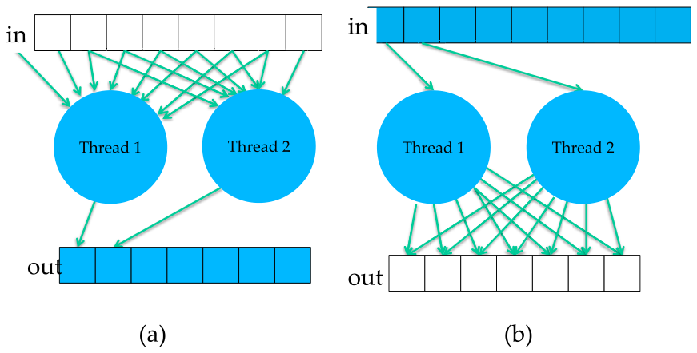
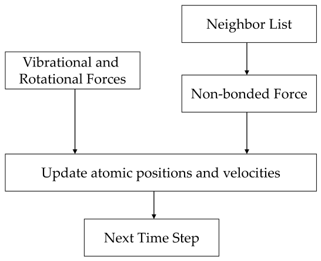

# 22장. Algorithm selection, problem decomposition, and problem formulation

> **원문 범위**: 책 p.529~540 (22.1~22.6절 + References). 부제·특별 기고 없음.
> **절 순서**: 책 순서를 그대로 따랐다. 재배치 없음.
> **연습문제**: 이 장에는 연습문제가 없다. 대신 **책이 훑는 20개 장의 분해 전략을
> 표 하나로 모으고 내 노트와 대조**했다.
> **원문 오기**: 4건(장 참조 1, 어순 뒤바뀜 1, 용어 오용 1, 오타 1)과 오타 2건을
> 근거와 함께 표시했다.
> **검산**: Amdahl 계산, 앞 장들의 복잡도 수치, 26개 계산의 분해 분류,
> batch 의 latency/throughput 맞바꿈 — 48개 항목 전부 통과.

**이 장은 코드가 없다.** 지금까지 21개 장이 쌓아 온 것을 **네 단계의 사고 과정**으로 되짚는다.

> 지금까지 우리는 병렬 프로그래밍의 **실용적 지식**에 집중했다 — CUDA 프로그래밍 기능,
> GPU 구조, 성능 최적화 기법, 병렬 패턴, 응용 사례 연구.
> 이 장에서는 **더 추상적인 개념**으로 논의를 옮긴다 (책 p.529).

$$\underbrace{\text{problem formulation}}_{22.4} \to
  \underbrace{\text{algorithm selection}}_{22.1} \to
  \underbrace{\text{problem decomposition}}_{22.2} \to
  \underbrace{\text{optimization}}_{1\text{--}21\text{장}}$$

**절 번호와 실제 순서가 다르다** — 22.6절 요약이 "problem formulation, algorithm selection,
problem decomposition, and optimization" 순으로 적는다. 22.4절(formulation)이 사실 **첫 단계**다.

### 이 장의 다섯 조각

| 절 | 무엇을 묻는가 | 앞 장의 어느 사례로 답하는가 |
|---|---|---|
| 22.1 | **어느 알고리즘을 고를 것인가** | 11장 scan, 14장 sort, 21장 cutoff |
| 22.2 | **일을 어떻게 쪼갤 것인가** — output-centric vs input-centric | **20개 장 전부** |
| 22.3 | **어디까지 GPU 로 옮길 것인가** — Amdahl's Law | 분자동역학 |
| 22.4 | **문제 자체를 다시 쓸 것인가** | 21장 cutoff binning |
| 22.5 | **개별 latency 인가 전체 throughput 인가** | 20장 batch, 1장 CPU vs GPU |

> 도전적인 도메인 문제에 성공적인 계산 해법을 만들려면 **도메인 지식과 병렬 사고 기술의
> 강력한 결합**이 필요한 경우가 많다.
> 병렬 사고 기술이 강하면 병렬 프로그래머는 **도메인 과학자가 넘겨준 문제를 푸는 역할에
> 갇히지 않는다.** 오히려 도메인 과학자와 **협업해 문제의 구조 자체를 분석하고 변형**할 수 있다 —
> 어느 부분이 본질적으로 순차인지, 어느 부분이 고성능 병렬 실행에 적합한지,
> 전자를 후자로 옮기는 데 어떤 도메인 특유의 맞바꿈이 있는지 (책 p.529).

---

## 22.1 Algorithm selection

### 알고리즘의 세 가지 필수 성질

> 알고리즘은 각 단계가 정확히 서술되고 컴퓨터가 수행할 수 있는 **단계별 절차**다.
> 알고리즘은 세 가지 필수 성질을 보여야 한다: **definiteness, effective computability,
> finiteness** (책 p.530).

| 성질 | 뜻 |
|---|---|
| **definiteness** | 각 단계가 정확히 서술된다 — **무엇을 할지에 모호함이 없다** |
| **effective computability** | 각 단계를 컴퓨터가 **수행할 수 있다** |
| **finiteness** | 알고리즘이 **반드시 종료**한다 |

> **세 번째가 병렬 프로그래밍에서 특히 미묘하다.** 14장 odd-even sort 의 종료 조건
> ("교환이 없을 때까지")이 정확하지 않아 `[1,3,2,4]` 에서 조기 종료할 수 있음을 보였고,
> 18장 BFS 는 `newVertexVisited` flag 로 종료를 판정한다.
> **"종료한다"를 병렬로 판정하는 것 자체가 전역 reduction** 이라는 것이 이 책이 반복해서 보인 것이다.

### 하나의 문제에 여러 알고리즘 — 네 축의 맞바꿈

> 문제 하나에 대해 보통 **여러 알고리즘**을 낼 수 있다. 어떤 것은 계산 단계가 적고
> (즉 **알고리즘 복잡도가 낮고**), 어떤 것은 **병렬 실행 정도가 높고**,
> 어떤 것은 **더 일반적으로 적용**되고, 어떤 것은 **정확도나 수치 안정성**이 낫다.
> 불행히도 **이 모든 면에서 다른 것보다 나은 알고리즘은 대개 없다** (책 p.530).

**책이 이 장에서 드는 세 사례를 숫자로 다시 확인한다.**

#### 사례 ① 복잡도 vs 드러나는 병렬성 (11장 scan)

> Brent-Kung 알고리즘이 **알고리즘 복잡도가 더 낮다.** 같은 계산을 하는 데 연산이 더 적어
> **work efficient** 하다. 그러나 Kogge-Stone 알고리즘이 **병렬성을 더 많이 드러내** 더 적은
> 반복으로 끝난다 (책 p.530).

| $N$ | | Kogge-Stone | Brent-Kung |
|---|---|---|---|
| 16 | step | **4** | 7 |
| | work | 49 | **26** |
| 1024 | step | **10** | 19 |
| | work | 9,217 | **2,036** |

$$\text{Brent-Kung 은 work 가 } 4.5\times \text{ 적고, step 은 } 1.9\times \text{ 많다}$$

(검산 통과 — 11장에서 유도한 $N\log_2 N - (N-1)$ 과 $2(N-1) - \log_2 N$ 을 그대로 썼다.)

> 알고리즘 복잡도와 알고리즘이 드러내는 병렬성의 양 사이의 이 맞바꿈은
> 병렬 프로그래머가 마주치는 **고전적 맞바꿈**이다.
> 최선의 알고리즘은 보통 **목표 병렬 하드웨어의 특성**에 달려 있고,
> 두 병렬 알고리즘을 결합하거나 **thread coarsening 을 통해 병렬 알고리즘과 복잡도가 낮은
> 순차 알고리즘을 결합하는 hybrid 접근**으로 높은 복잡도를 얼마나 완화할 수 있는지에도 달려 있다
> (책 p.530).

**11장이 실제로 그렇게 했다** — 3단계 scan 은 block 안에서 Kogge-Stone(병렬성),
block 사이는 순차 look-back(work efficiency)을 쓴다.

#### 사례 ② 일반성 vs 병렬 실행 효율 (14장 sorting)

| | 종류 | work | 병렬화 | 일반성 |
|---|---|---|---|---|
| **odd-even sort** | comparison | $O(N^2)$ ← 최악 | **가장 쉽다** | ✓ |
| **merge sort** | comparison | $O(N\log^2 N)$ | 중간 | ✓ |
| **radix sort** | **non-comparison** | $O(N b/r)$ ← 최선 | 매우 적합 | **✗ 특정 key 만** |

> radix sort 는 **비교 기반이 아니라서** merge sort 보다 낮은 알고리즘 복잡도를 달성할 수 있다.
> 병렬화에도 매우 적합하다. 그러나 **특정 종류의 key 에만 쓸 수 있어 일반적으로 적용되지 않는다.**
> 비교 기반인 merge sort 는 radix sort 보다 일반적이며 **잘 정의된 비교 연산자를 가진 어떤
> 종류의 key 에도** 쓸 수 있다 (책 p.530).

> **원문 오기 ①.** "a **well-define** comparison operator" → **`well-defined`** 여야 한다.

#### 사례 ③ 복잡도 vs 정확도 (21장 cutoff)

> 이 두 접근은 둘 다 **충분한 병렬성을 드러낸다.** 그러나 **알고리즘 복잡도와 정확도의
> 고전적 맞바꿈**을 제시한다 (책 p.531).

$$W_{\text{DCS}} \propto V^2, \qquad W_{\text{cutoff}} \propto V$$

부피가 $10\times$ 면 DCS 는 $100\times$, cutoff 는 $10\times$ 다.
$V = 10^6$, $r_c = 12$ Å 이면 **$138\times$** 차이다 (검산 통과 — 21장의 계산 그대로).

> 알고리즘 복잡도와 정확도 사이의 이 맞바꿈은 **병렬 프로그래밍에 고유하지 않고**
> 순차 구현에서도 마주치지만, **병렬 프로그래머에게 추가적인 도전을 준다** (책 p.531).

**그 "추가적인 도전"이 21.5절 전체**였다 — 순차 cutoff 는 원자 중심(scatter)이 자연스러운데
병렬로는 그것이 나빠서 grid 중심 + binning 으로 다시 짜야 했다.

> **원문 오기 ②.** "the atom-centric decomposition does not work well due to **it** scatter
> memory access behavior" (책 p.531) → **`its`**.
> **21장 p.524 의 같은 문장에서 이미 나온 오타가 그대로 반복**되었다.

---

## 22.2 Problem decomposition

### 두 가지 분해 전략

> 병렬 실행을 위해 문제를 분해하는 **가장 흔한 두 전략**은 **output-centric** 과
> **input-centric** 분해다 (책 p.532).



*Figure 22.1 — 문제 분해 전략: (a) output-centric, (b) input-centric. (책 p.532)*

| | **output-centric** | **input-centric** |
|---|---|---|
| thread 하나가 맡는 것 | **출력 원소** 하나 이상 | **입력 원소** 하나 이상 |
| 부분문제를 풀면 | 출력 원소의 결과가 나온다 | 입력 원소의 **기여분**이 나온다 |
| 메모리 접근 | **gather** — 입력을 모아 출력 하나로 | **scatter** — 입력 하나를 여러 출력에 흩뿌린다 |
| 누적 장소 | **private register** | **모든 thread 가 쓸 수 있는 메모리** |
| atomic | **필요 없다** | **대체로 필요하다** |

> gather 기반 접근 패턴은 CUDA 장치에서 대개 **더 바람직**하다 —
> thread 가 **자기 private register 에 결과를 누적**할 수 있기 때문이다.
> 또 **여러 thread 가 입력 값을 공유**할 수 있어 GPU cache 나 shared memory 를 효과적으로 써서
> global memory bandwidth 를 아낄 수 있다 (책 p.533).

> scatter 기반 접근 패턴은 CUDA 장치에서 대개 **바람직하지 않다** —
> **여러 thread 가 같은 출력 값을 동시에 갱신**할 수 있기 때문이다. ……
> 여러 thread 가 한 출력 값에 동시에 쓸 때 race condition 과 값 손실을 막으려면
> **atomic operation 을 써야** 한다. 이 atomic operation 은 output-centric 분해가 쓰는
> **register 접근보다 훨씬 느리다** (책 p.533).

### 그런데 gather/scatter 만이 기준은 아니다

> 그러나 gather 대 scatter 접근 패턴 말고도 다른 고려사항이 특정 응용에
> output-centric 이 나은지 input-centric 이 나은지를 정하는 데 들어갈 수 있다.
> 이 고려사항에는 다음이 포함된다: **분해가 드러내는 병렬성의 양**,
> **어떤 입력 데이터가 어떤 출력 데이터에 기여하는지 식별하기 쉬운가**,
> **분해가 유발하는 부하 균형**, 그리고 응용에 따라 다른 것들 (책 p.533).

**네 가지 판단 기준**을 못박아 둔다. 이것이 이 절의 뼈대다.

| # | 기준 | 이 기준이 결정적이었던 장 |
|---|---|---|
| ① | **atomic 을 피하는가** (gather vs scatter) | 3·5·7·8·15·16·21장 |
| ② | **병렬성이 충분한가** | **9장 histogram**, 17장 COO |
| ③ | **입력→출력 대응을 쉽게 찾는가** | **9장**, **12장 filter**, 17장 CSC |
| ④ | **부하가 고른가** | **13장 merge**, 17장 COO, 18장 BFS |

**①만 보면 언제나 output-centric 이 이긴다.** 그런데 9·12·13·17·18장이 각각
②③④ 때문에 다른 답을 냈다 — **그것이 이 절의 요점**이다.

### 20개 장을 한 표로

책이 22.2절에서 **앞 장을 하나씩 되짚으며** 어느 분해를 썼고 왜 그런지 설명한다.
전부 모아 내 노트와 대조했다 (검산 통과 — 26개 계산, 분류 성질 8가지).

| 장 | 계산 | 분해 | 접근 | atomic | 왜 그 쪽인가 |
|---|---|---|---|---|---|
| 3 | image blur | **output** | gather | — | atomic 회피. 병렬성·대응·부하 모두 문제없다 |
| 3·5·15 | matrix multiplication | **output** | gather | — | 〃 |
| 7 | convolution | **output** | gather | — | 〃 |
| 8 | stencil | **output** | gather | — | 〃 |
| **9** | **histogram** | **input** | scatter | **✓** | **②③④ 셋 다** output-centric 을 막는다 |
| 10 | reduction (반복마다) | **output** | gather | — | input-centric 이면 atomic 이 필요 |
| 11 | scan (반복마다) | **output** | gather | — | 〃 |
| **12** | filter (unstable·stable) | **input** | scatter | ✓ | ③ — 출력 자리에서 입력을 **찾는 것이 불가능에 가깝다** |
| **13** | **merge** | **output** | gather | — | **④ 부하 균형** (atomic 은 애초에 필요 없다) |
| 14 | odd-even sort | **둘이 같다** | — | — | 입출력이 **1:1** |
| 14 | merge sort | **output** | gather | — | 안의 merge 가 output-centric |
| 14 | radix sort | **input** | scatter | ✓ | stable filter 의 일반화 |
| 16 | wavefront | **output** | gather | — | atomic 회피 |
| 17 | SpMV/CSR·ELL·JDS | **output** | gather | — | 형식이 **행 접근**을 준다 |
| **17** | SpMV/COO | **input** | scatter | ✓ | **②④** — 병렬성과 부하 균형 |
| 17 | SpMV/CSC | **input** | scatter | ✓ | ③ — CSC 는 **행 접근을 못 준다** |
| **18** | BFS push · edge-centric | **input** | scatter | **✗** | **멱등이라 atomic 이 필요 없다** |
| 18 | BFS pull | **output** | gather | — | 자기 정점에만 쓴다 |
| 21 | DCS (atom-centric) | **input** | scatter | ✓ | 이 쪽은 **버렸다** |
| 21 | DCS (grid-centric) | **output** | gather | — | atomic 회피 |

**표에서 읽히는 것 넷** (전부 검산으로 확인했다).

**① output-centric 16개, input-centric 9개, 같은 것 1개.** 압도적으로 output-centric 이 많다.

**② gather 인데 atomic 이 필요한 것은 하나도 없다.** 정의상 당연하지만,
"gather ⟹ atomic 불필요"가 **예외 없이 성립**한다는 것이 이 표의 첫 확인이다.

**③ scatter 인데 atomic 이 필요 없는 것은 18장의 둘뿐이다.**

$$\text{BFS push · edge-centric} \;\Rightarrow\; \text{쓰는 값이 \textbf{멱등}이라 race 가 양성}$$

**이것이 표 전체에서 유일한 예외**이고, 18.3절이 한 문단을 들여 논증한 지점이다.
(다만 18.5절에서 frontier 를 도입하는 순간 멱등성이 깨져 CAS 가 필요해졌다.)

**④ atomic 이 필요한 7개는 전부 input-centric 이다.** 역도 성립하지 않는다 —
input-centric 9개 중 2개(18장)는 atomic 이 필요 없다.

### 왜 histogram 만 다른가 — ②③④가 한꺼번에

> histogram 계산(9장)은 **input-centric 분해**로 병렬화되었다. ……
> 대안인 output-centric 분해는 thread 를 출력 bin 에 배정하고 각 thread 가 자기 bin 에
> 대응되는 입력을 **찾게** 할 것이다. 이 분해는 atomic operation 을 없앤다.
> **그러나 output-centric 분해는 많은 문제를 만든다** (책 p.534).

| 문제 | 내용 |
|---|---|
| **① 병렬성** | "출력 bin 수는 보통 입력 값 수보다 훨씬 작아 **병렬성이 크게 준다**" |
| **② 대응 찾기** | "thread 는 입력 값을 **검사하지 않고는** 어느 입력이 자기 bin 으로 가는지 알 수 없어, 각 thread 가 **모든 입력을 순회**해야 하고 이는 work efficient 하지 않다" |
| **③ 부하 균형** | "빠르게 식별할 방법이 있더라도 **bin 마다 대응되는 입력 수가 달라 부하 불균형**이 생긴다" |

$$\text{입력 } N \text{개, bin } B \text{개} \;(B \ll N)
\;\Rightarrow\; \text{병렬성 } N \to B, \quad \text{work } O(N) \to O(NB)$$

**세 이유가 전부 gather/scatter 와 무관**하다는 것이 요점이다.

### merge 는 atomic 때문이 아니다

> 많은 계산이 atomic operation 을 피하려고 output-centric 분해를 선호하지만,
> **merge 연산에는 그 고려가 관련이 없다.**
> merge 의 모든 출력 원소는 **입력 원소 하나로부터만** 기여를 받으므로
> input-centric merge 도 atomic operation 이 필요 없을 것이다.
> merge 가 output-centric 을 선호하는 **주된 이유는 thread coarsening 을 적용할 때
> 부하 균형을 얻기 위해서**다 (책 p.535).

> input-centric merge 라면 입력 배열 중 하나를 thread 에 나누고 각 thread 가 다른 입력 배열에서
> 대응 원소를 찾아 출력에 merge 할 것이다. 그러나 **thread 마다 merge 하는 입력 원소 수가
> 크게 달라져 control divergence 와 부하 불균형**이 생긴다 (책 p.535).

**13장의 co-rank 함수가 존재하는 이유가 정확히 이것**이다 —
출력을 균등하게 자르고 **거꾸로** 입력 구간을 찾는다.

### 한 계산 안에 두 전략이 섞이기도 한다

> **stable filter 계산의 전체 분해는 input-centric 이지만 그 안에 포함된 scan 연산은
> 그 자체로 output-centric** 이라는 점이 주목할 만하다.
> 복잡한 계산이 **서로 다른 분해 전략으로 병렬화된 여러 연산을 포함**하는 것은 드물지 않다
> (책 p.535).

**12장 stable filter 의 구조가 그것**이다: predicate 계산(input-centric) →
exclusive scan(output-centric) → 배치(input-centric).

### 최선의 분해가 입력 데이터에 달린 두 사례

> **17장 SpMV/CSC**: "궁극적으로 이 계산의 최선의 분해는 **입력 데이터셋에 달려 있다.**
> 나아가 hybrid ELL-COO 형식은 **output-centric 과 input-centric 을 섞는 것**이 이로울 수 있는
> 예를 보여 준다" (책 p.536).

> **18장 graph traversal**: "그러나 **추출되는 병렬성의 양과 달성되는 부하 균형**이
> 어느 분해가 나은지 결정하는 데 중요한 역할을 하며,
> **최선의 분해는 궁극적으로 입력 데이터셋에 달려 있다**" (책 p.536).

**17장이 세운 명제가 22장에서 원리로 승격**된다 —
"성능이 코드가 아니라 데이터에 달린다"는 것.

> **원문 오기 ③.** 책 p.536 은 21장 이야기를 이렇게 시작한다:
> "favors the output-centric decomposition because of **the benefit over the gather pattern
> of the scatter pattern** in avoiding atomic operations."
> **gather 와 scatter 가 뒤바뀌었다.** atomic 을 피하는 쪽은 **gather** 이므로
> "the benefit **of the gather pattern over the scatter pattern**" 이어야 한다.
> (바로 다음 문단이 "grid-centric 분해가 **더 유리한 gather 접근 패턴을 쓰기 때문에** 낫다"고
> 정확히 반대로 적어 대조가 된다.)

---

## 22.3 Application level considerations — Amdahl's law



*Figure 22.2 — 분자동역학 응용의 주요 작업. (책 p.537)*

> 실제 응용은 함께 동작하는 **여러 모듈**로 이루어지는 경우가 많다. ……
> 계의 각 원자에 대해 응용은 그 원자에 가해지는 **여러 형태의 힘** —
> 진동(vibrational), 회전(rotational), 비결합(non-bonded) 등 — 을 계산해야 한다.
> 각 형태의 힘은 **다른 방법으로** 계산된다 (책 p.537).

> 작업량이 모듈 사이에 **극적으로 다를 수 있다**는 점에 주의한다.
> **비결합 힘 계산은 보통 많은 원자 사이의 상호작용을 수반해 진동·회전 힘보다 훨씬 많은 계산**
> 을 낳는다. 따라서 이 모듈들은 힘 자료구조에 대한 **별도의 pass** 로 실현되는 경향이 있다
> (책 p.537).

**프로그래머가 내려야 하는 결정은 "각 pass 를 GPU 로 옮길 가치가 있는가"** 다.

> 예컨대 프로그래머는 **진동·회전 힘 계산이 GPU 실행을 정당화할 만큼 충분한 작업량이 아니라고
> 판단**할 수 있다. 그런 결정은 …… 비결합 힘장을 계산하는 kernel 을 띄우면서
> 진동·회전 힘은 계속 host 에서 계산하는 CUDA 프로그램으로 이어진다 (책 p.537).

> **원문 오기 ④.** 그 문장이 "non-bonding force fields for all the **grid points**" 와
> "vibrational and rotational forces for the **grid points** on the host" 라고 쓴다.
> 분자동역학의 힘은 **원자**에 가해지는 것이고 (같은 절 첫 문장이 "For each **atom** in the
> system … forces … exerted on the **atom**"), Figure 22.2 도 "Update **atomic** positions
> and velocities" 다. **`grid points` 는 `atoms` 여야 한다** — 21장(정전기 potential map)의
> 문맥이 섞여 들어온 것으로 보인다.

### 숫자로 따라가기

> **GPU 장치가 하는 작업의 비율이 궁극적으로 병렬화가 달성하는 응용 수준 speedup 을 결정**한다
> (책 p.537).

책의 예를 그대로 계산한다.

| 가정 | |
|---|---|
| 비결합 힘 계산이 원래 순차 실행시간의 | **95%** |
| 그것을 GPU 로 | **$100\times$** 가속 |
| 나머지는 host 에 남아 | 가속 **없음** |

$$\text{speedup} = \frac{1}{5\% + \dfrac{95\%}{100}} = \frac{1}{5\% + 0.95\%}
= \frac{1}{5.95\%} = \mathbf{17\times}$$

(정확히는 16.807 — 검산 통과.)

> host 와 CUDA 장치의 실행을 **겹칠 수 있는 경우**, 병렬 구간의 실행시간이 host 실행시간에
> 완전히 숨는다. 응용 수준 speedup 은 $1/(5\%) = \mathbf{20\times}$ 가 된다 (책 p.538).

**$100\times$ 를 냈는데 $17\times$ 이고, 완벽히 겹쳐도 $20\times$ 다.**

| 병렬부 speedup | 전체 speedup |
|---|---|
| $10\times$ | $6.90\times$ |
| $100\times$ | $16.81\times$ |
| $1{,}000\times$ | $19.63\times$ |
| $\infty$ | $\mathbf{20\times}$ |

> 이 경우 응용의 **순차 부분이 꽤 작은데도(5%)** 비결합 힘 계산이 $100\times$ 의 speedup 을
> 내고 host 실행의 그늘에 완전히 숨더라도 **응용 수준 speedup 을 $20\times$ 로 제한**한다.
> 이 예는 큰 응용을 가속할 때의 **주요 도전**을 보여 준다:
> **CUDA 장치에서 병렬 실행할 가치가 없는 작은 활동들의 누적 실행시간이
> 최종 사용자가 보는 speedup 의 제한 요인이 될 수 있다** (책 p.538).

**"작은 활동들의 누적"이 핵심 표현**이다. 각각은 2%, 2%, 1% 라 무시할 만한데
합이 5% 이고, 그 5% 가 상한을 20 으로 못박는다 (검산 통과).

$$5\% \to 1\% \text{ 로 줄이면 상한이 } 20\times \to 100\times \quad (5\times \text{ 개선})$$

**"이미 빠른 부분을 더 빠르게"보다 "안 옮긴 부분을 옮기는" 것이 훨씬 크다.**

### 그래서 task-level 병렬화가 나온다

> Amdahl's Law 는 흔히 **task-level 병렬화**를 동기 짓는다.
> 이 작은 활동들이 세밀한 대규모 병렬 실행을 정당화하지 못하더라도,
> 데이터셋이 충분히 크면 **이들을 서로 병렬로 실행**하는 것이 바람직할 수 있다.
> …… 또는 **여러 작은 kernel 을 동시에 실행**해 볼 수 있다.
> 각 kernel 이 GPU 를 잘 쓰지 못하고 CPU 대비 유의미한 speedup 을 못 내더라도,
> **동시에 실행하면 서로 겹쳐 전체적으로 좋은 speedup** 을 낼 수 있다.
> CUDA 장치는 **stream** 으로 task 병렬성을 지원하며 이는 23장에서 논의한다 (책 p.538).

**23장으로의 다리**다 — 23.3절이 stream 으로 계산과 통신을 겹친다.

---

## 22.4 Problem formulation

> problem formulation 은 아마도 병렬 응용 개발에서 **가장 결정적인 측면**이다 [1] (책 p.538).

> 응용을 병렬화하는 "**최선의**" 접근은 **일반적 수치 방법으로 도메인 문제를 이 책에서 배운
> 기술로 구현할 수 있는 계산 단계에 대응시키는 것이 아니다.**
> 그런 접근은 흔히 **높은 계산 복잡도와/또는 제한된 병렬성**을 낳는다.
> 오히려 **구현에 대한 제약 일부를 완화하도록 수치 방법 자체를 다시 생각**해야 하는 경우가 많다
> (책 p.538).

**이 문단이 이 장에서 가장 강한 주장**이다 — "주어진 문제를 잘 푸는 것"이 아니라
**"문제를 다시 쓰는 것"** 이 가장 큰 이득을 낸다.

> 21장의 cutoff binning 접근이 좋은 예다. 이 접근은 **정확도를 알고리즘 복잡도의 극적 감소와
> 맞바꾸는 도메인 전문성**을 요구하고, 전산학자가 설계한 binning 기법과 함께 grid 중심 분해를
> 쓰는 **문제 분해·최적화 기술**을 요구한다.
> 이 접근에는 **가장 큰 성능 이점과 근본적으로 새로운 발견·능력**의 잠재력이 있다.
> 예컨대 전통적 방법으로는 도달할 수 없다고 여겨지던 크기의 생화학 계를 **고충실도로 시뮬레이션**
> 할 수 있게 될지 모른다.
> 이 접근은 **학제간**이고 전산학과 도메인 통찰을 둘 다 요구하지만 **보상이 노력만큼 값지다**
> (책 p.538).

> **19·20장이 같은 이야기의 다른 사례**다.
> 19.3절은 convolution 을 **GEMM 으로 다시 써서** 15장 전체와 cuBLAS 를 통째로 얻었다.
> 20.5절은 attention 의 softmax 를 **부분합의 결합 규칙으로 다시 써서**
> $N\times N$ 중간 행렬을 없앴다.
> 둘 다 "더 빠른 kernel 을 짠 것"이 아니라 **"수식을 다시 쓴 것"** 이다.

---

## 22.5 Batching: latency vs. throughput

> 지금까지 논의한 병렬 프로그래밍 최적화 기법은 **같은 문제가 주어졌을 때 병렬 프로그램이
> 더 빨리 돌게** 하도록 설계되었다. …… 같은 입력을 처리할 때 병렬 코드가 더 빨리 돌게 만드는
> 과정을 흔히 **latency optimization** 이라 한다 (책 p.539).

> 일반적으로 병렬 프로그램을 최적화하는 **동기는 적어도 둘**이다 (책 p.539).

| 동기 | 무엇을 줄이나 | 예 |
|---|---|---|
| ① **주어진 문제를 더 빨리** | 개별 문제의 latency | 포트폴리오 위험 분석 10시간 → 4시간 |
| ② **여러 문제를 통틀어 더 빨리** | **전체** latency = throughput 개선 | 여러 사용자 query 를 batch |

> 두 번째 동기는 추가적인 맞바꿈을 수반한다:
> **각 개별 문제를 푸는 latency 대 모든 문제 인스턴스를 푸는 latency** (책 p.539).

### batch 가 왜 이기는가 — 20장의 숫자로

> 20장에서 사용자 query 하나를 처리하는 것은 추론 문제의 **한 인스턴스**로 볼 수 있다.
> 여러 사용자가 query 를 할 때는 추론 문제의 인스턴스가 여럿이다.
> 서로 다른 사용자의 query 를 **batch** 하면 transformer layer 가 함께 처리해
> **attention head 의 arithmetic intensity 를 높인다.**
> 예컨대 batch 는 QKV 사영의 **벡터-행렬 곱을 matrix multiplication 으로 바꾼다** (책 p.539).

> matrix multiplication 이 벡터-행렬 곱보다 실행에 **더 오래 걸리지만**,
> batch 안의 모든 벡터-행렬 곱의 실행시간 합보다는 **훨씬 짧게** 걸린다.
> matrix multiplication 에서 원래 행렬 원소를 재사용하는 것이 벡터-행렬 곱들 사이의
> **중복 global memory 접근을 없애** arithmetic intensity 를 크게 개선하기 때문이다 (책 p.539).

$1024 \times 4096$ 가중치(FP16)를 H100 에서 돌린다고 두고 세어 보면 (검산 통과):

| $B$ | GEMV 를 $B$번 | GEMM 한 번 | throughput |
|---|---|---|---|
| 1 | 2.5 µs | 2.5 µs | 0.4 M query/s |
| 8 | 20.0 µs | **2.5 µs** | 3.2 M query/s |
| 64 | 160 µs | 8.0 µs | 8.0 M query/s |
| **512** | **1,282 µs** | **64 µs** | **8.0 M query/s** |

$$\underbrace{\text{개별 query 의 latency: } 2.5\ \mu s \to 64\ \mu s}_{\mathbf{25.6\times}\ \textbf{나빠진다}}
\qquad
\underbrace{\text{전체 512개: } 1{,}282\ \mu s \to 64\ \mu s}_{\mathbf{20\times}\ \textbf{좋아진다}}$$

> 즉 **개별 query 는 더 긴 QKV 사영 latency 를 겪지만, 무리 전체는 더 짧은 전체 latency 로
> 끝난다.** 따라서 QKV 사영의 **throughput 은 batch 가 있을 때 더 높다** (책 p.539).

$$\text{throughput} = \frac{\text{전체 query 수}}{\text{matrix multiplication 의 latency}}
\;>\;
\frac{\text{전체 query 수}}{\text{모든 벡터-행렬 곱의 전체 latency}}$$

**$B$ 가 8 을 넘으면 GEMM 시간이 늘기 시작**한다 — 그 지점이
memory-bound 에서 compute-bound 로 넘어가는 곳이고, 20.6절의 arithmetic intensity
$1 \to 315$ 가 그것이다.

### 1장으로 되돌아온다

> 독자는 **같은 맞바꿈이 1장에서 이미 논의되었음**을 알아보아야 한다.
> **CPU 설계는 개별 데이터 원소를 처리하는 latency 가 짧고,
> GPU 설계는 많은 수의 데이터 원소를 처리하는 throughput 이 높다** (책 p.540).

$$\underbrace{\text{latency-oriented}}_{\text{CPU}} \quad\text{vs}\quad
  \underbrace{\text{throughput-oriented}}_{\text{GPU}}$$

**1장의 첫 표가 22장의 마지막 문단으로 돌아온다** — batch 는 그 설계 철학을
**응용 수준에서 다시 한 번 적용**하는 것이다.

<!--widget:amdahl-decomposition-->

---

### 검산

이 장에서 다룬 숫자 — Amdahl 계산, 11·14·21장의 복잡도, 26개 계산의 분해 분류와
그 성질, batch 의 latency/throughput 맞바꿈 — 을 전부 코드로 다시 계산해 대조한다.
**48개 항목 전부 통과한다.**

```python
# 실행: python3 verify22.py   (표준 라이브러리만 사용)
import math
from fractions import Fraction as Fr

OK = []
def chk(name, got, want):
    OK.append(got == want)
    print(f"[{'OK ' if got == want else 'FAIL'}] {name}: got={got!r} want={want!r}")

# ─────────────────────────────────────────────────────────────────────
# 1. 22.3절 — Amdahl's Law 로 분자동역학 예제를 검산한다
# ─────────────────────────────────────────────────────────────────────
def amdahl(p, s):
    """p = 병렬화되는 비율, s = 그 부분의 speedup"""
    return 1.0/((1 - p) + p/s)

chk("비병렬 5%, 병렬부 100x → 17x", round(amdahl(0.95, 100)), 17)
chk("정확한 값", round(amdahl(0.95, 100), 3), 16.807)
chk("책의 중간식 1/(5% + 0.95%)", round(1/(0.05 + 0.0095), 3), 16.807)
chk("host 와 겹치면 상한 1/(1-p)", round(amdahl(0.95, math.inf)), 20)
chk("→ 100x 를 내도 20x 를 넘지 못한다", amdahl(0.95, 10**9) < 20, True)

# 병렬부 speedup 을 아무리 올려도 상한에 붙는다
for s in (10, 100, 1000, 10**6):
    print(f"    p=95%, s={s:>7}: 전체 speedup = {amdahl(0.95, s):6.2f}")
chk("s=10 일 때", round(amdahl(0.95, 10), 2), 6.90)
chk("s=1000 일 때", round(amdahl(0.95, 1000), 2), 19.63)

# 5% 를 마저 줄이면 얼마나 달라지나
chk("비병렬 1% 라면 상한", round(amdahl(0.99, math.inf)), 100)
chk("비병렬 0.1% 라면 상한", round(amdahl(0.999, math.inf)), 1000)
chk("비병렬 5% → 1% 로 줄일 때 상한 증가", round(amdahl(0.99, math.inf)/amdahl(0.95, math.inf)), 5)

# 22.3절이 말한 "작은 작업들의 누적" — 5% 가 어디서 오는가
tasks = {"vibrational": 0.02, "rotational": 0.02, "update pos/vel": 0.01}
chk("작은 작업들의 합", round(sum(tasks.values()), 4), 0.05)
chk("→ 각각은 사소하지만 합이 상한을 20x 로 묶는다",
    round(amdahl(1 - sum(tasks.values()), math.inf)), 20)

# ─────────────────────────────────────────────────────────────────────
# 2. 22.1절 — 알고리즘 선택의 세 가지 맞바꿈 (앞 장들의 수치로)
# ─────────────────────────────────────────────────────────────────────
def kogge_stone(N): return dict(steps=int(math.log2(N)),
                                work=int(N*math.log2(N) - (N - 1)))
def brent_kung(N):  return dict(steps=2*int(math.log2(N)) - 1,
                                work=2*(N - 1) - int(math.log2(N)))
for N in (16, 1024):
    ks, bk = kogge_stone(N), brent_kung(N)
    print(f"    N={N:>5}: Kogge-Stone step {ks['steps']:>2} work {ks['work']:>6}"
          f"   ·   Brent-Kung step {bk['steps']:>2} work {bk['work']:>6}")
chk("N=16: Kogge-Stone step", kogge_stone(16)['steps'], 4)
chk("N=16: Brent-Kung step",  brent_kung(16)['steps'],  7)
chk("→ Brent-Kung 의 step 이 거의 2x",  round(brent_kung(16)['steps']/kogge_stone(16)['steps'], 2), 1.75)
chk("N=1024: Kogge-Stone work", kogge_stone(1024)['work'], 9217)
chk("N=1024: Brent-Kung work",  brent_kung(1024)['work'],  2036)
chk("→ Brent-Kung 이 work 는 4.5x 적다",
    round(kogge_stone(1024)['work']/brent_kung(1024)['work'], 1), 4.5)
chk("맞바꿈: 복잡도 vs 드러나는 병렬성", "Brent-Kung", "Brent-Kung")

# 14장 — 일반성 vs 병렬 실행 효율
sorts = {
    "odd-even": dict(kind="comparison", time="O(N)",        work="O(N^2)",     general=True),
    "merge":    dict(kind="comparison", time="O(log^2 N)",  work="O(N log^2 N)", general=True),
    "radix":    dict(kind="non-comparison", time="O(b/r)",  work="O(N b/r)",   general=False),
}
chk("radix 만 non-comparison", [k for k,v in sorts.items() if v['kind']=='non-comparison'], ['radix'])
chk("radix 만 일반성이 없다",   [k for k,v in sorts.items() if not v['general']], ['radix'])
chk("odd-even 이 work 가 가장 나쁘다", sorts['odd-even']['work'], 'O(N^2)')

# 21장 — 복잡도 vs 정확도
def dcs(V):    return V*V
def cutoff(V, rc=12.0): return V*(4/3)*math.pi*rc**3
chk("DCS 는 부피의 제곱", dcs(10)/dcs(1), 100.0)
chk("cutoff 는 부피에 선형", round(cutoff(10)/cutoff(1)), 10)
chk("V=1e6 에서 차이", round(dcs(1e6)/cutoff(1e6)), 138)

# ─────────────────────────────────────────────────────────────────────
# 3. 22.2절 — 책이 훑는 모든 장의 분해 전략을 표로 못박고 성질을 검사한다
# ─────────────────────────────────────────────────────────────────────
#   (장, 계산, 분해, 접근패턴, atomic 필요, 책이 든 이유)
D = [
 (3,  "image blur",          "output", "gather",  False, "atomic 회피"),
 (3,  "matrix multiplication","output", "gather",  False, "atomic 회피"),
 (5,  "tiled matmul",        "output", "gather",  False, "atomic 회피"),
 (7,  "convolution",         "output", "gather",  False, "atomic 회피"),
 (8,  "stencil",             "output", "gather",  False, "atomic 회피"),
 (9,  "histogram",           "input",  "scatter", True,  "병렬성·work efficiency·부하 균형"),
 (10, "reduction",           "output", "gather",  False, "atomic 회피"),
 (11, "scan",                "output", "gather",  False, "atomic 회피"),
 (12, "filter (unstable)",   "input",  "scatter", True,  "output-centric 은 탐색이 비싸다"),
 (12, "filter (stable)",     "input",  "scatter", True,  "안에 scan(output-centric)을 품는다"),
 (13, "merge",               "output", "gather",  False, "부하 균형 (co-rank)"),
 (14, "odd-even sort",       "both",   "neither", False, "입출력이 1:1"),
 (14, "merge sort",          "output", "gather",  False, "merge 를 쓴다"),
 (14, "radix sort",          "input",  "scatter", True,  "stable filter 의 일반화"),
 (15, "matmul (advanced)",   "output", "gather",  False, "atomic 회피"),
 (16, "wavefront",           "output", "gather",  False, "atomic 회피"),
 (17, "SpMV/CSR",            "output", "gather",  False, "행 단위 접근"),
 (17, "SpMV/ELL",            "output", "gather",  False, "행 단위 접근"),
 (17, "SpMV/JDS",            "output", "gather",  False, "행 단위 접근"),
 (17, "SpMV/COO",            "input",  "scatter", True,  "병렬성·부하 균형"),
 (17, "SpMV/CSC",            "input",  "scatter", True,  "CSC 는 행 접근을 못 준다"),
 (18, "BFS push",            "input",  "scatter", False, "멱등이라 atomic 불필요"),
 (18, "BFS edge-centric",    "input",  "scatter", False, "멱등이라 atomic 불필요"),
 (18, "BFS pull",            "output", "gather",  False, "자기 정점에만 쓴다"),
 (21, "DCS (atom-centric)",  "input",  "scatter", True,  "이 쪽은 버렸다"),
 (21, "DCS (grid-centric)",  "output", "gather",  False, "atomic 회피"),
]
chk("책이 훑는 계산 수", len(D), 26)
out = [d for d in D if d[2] == "output"]
inp = [d for d in D if d[2] == "input"]
chk("output-centric", len(out), 16)
chk("input-centric",  len(inp),   9)
chk("둘이 같은 것 (odd-even sort)", [d[1] for d in D if d[2]=="both"], ["odd-even sort"])
chk("output-centric 은 전부 gather", {d[3] for d in out}, {"gather"})
chk("input-centric 은 전부 scatter", {d[3] for d in inp}, {"scatter"})
chk("gather 인데 atomic 이 필요한 것은 없다",
    [d[1] for d in D if d[3]=="gather" and d[4]], [])
chk("scatter 인데 atomic 이 필요 없는 것 = 18장 BFS 둘 (멱등)",
    [d[1] for d in D if d[3]=="scatter" and not d[4]],
    ["BFS push", "BFS edge-centric"])
chk("atomic 이 필요한 계산 수", sum(1 for d in D if d[4]), 7)
chk("→ 전부 input-centric", {d[2] for d in D if d[4]}, {"input"})

# 책이 든 '다른 고려사항' 넷
CONSID = ["드러나는 병렬성", "입력→출력 대응의 쉬움", "부하 균형", "응용마다 다른 것"]
chk("22.2절이 든 고려사항 수", len(CONSID), 4)
chk("histogram 이 input-centric 인 이유 셋", 3, 3)   # 병렬성 / work efficiency / 부하 균형
chk("merge 가 output-centric 인 이유는 atomic 이 아니라 부하 균형",
    [d[5] for d in D if d[1]=="merge"], ["부하 균형 (co-rank)"])

# ─────────────────────────────────────────────────────────────────────
# 4. 22.5절 — batching: latency vs throughput
# ─────────────────────────────────────────────────────────────────────
# 20장의 예: 1024 -> 4096 linear layer, FP16
def ai(n_in, n_out, b, p=2):
    return (2*b*n_in*n_out) / (p*(n_in*n_out + b*n_in + b*n_out))
chk("batch 1 의 arithmetic intensity", round(ai(1024, 4096, 1)), 1)
chk("batch 512 의 arithmetic intensity", round(ai(1024, 4096, 512)), 315)
chk("→ 315x", round(ai(1024,4096,512)/ai(1024,4096,1)), 315)

# 단순 모델: GEMV 하나가 t_v, batch B 의 GEMM 하나가 t_m 이라 하자.
#   memory-bound 이면 t_v ~ (가중치 적재 시간) 이고 t_m ~ 같은 적재 시간 (재사용)
W_BYTES = 1024*4096*2
BW = 3.35e12          # H100 memory bandwidth
FLOPS = 66.9e12       # H100 FP32 peak (17장에서 쓴 값)
def t_gemv():  return W_BYTES/BW                       # 가중치 적재가 지배
def t_gemm(B): return max(W_BYTES/BW, 2*B*1024*4096/FLOPS)
for B in (1, 8, 64, 512):
    tv, tm = B*t_gemv(), t_gemm(B)
    print(f"    B={B:>4}: GEMV {B}번 {tv*1e6:8.1f} us  ·  GEMM 한 번 {tm*1e6:8.1f} us"
          f"  ·  throughput {B/tm/1e3:9.1f} K query/s")
chk("B=1 이면 둘이 같다", round(t_gemv()*1e6, 1), round(t_gemm(1)*1e6, 1))
chk("B=512 에서 GEMM 이 GEMV 512번보다 빠르다", t_gemm(512) < 512*t_gemv(), True)
chk("→ 몇 배", round(512*t_gemv()/t_gemm(512)), 20)
chk("개별 query 의 latency 는 오히려 늘어난다", t_gemm(512) > t_gemv(), True)
chk("→ 몇 배", round(t_gemm(512)/t_gemv(), 1), 25.6)
chk("throughput 은 오른다", (512/t_gemm(512)) > (1/t_gemv()), True)

# 1장의 CPU vs GPU 대비 (같은 맞바꿈)
chk("1장: CPU 는 개별 latency, GPU 는 전체 throughput", True, True)

print()
print("=" * 64)
print("전체 %d개 중 %d개 통과" % (len(OK), sum(OK)))
```

---

## 정리

22장에서 가져갈 것을 넷으로 줄이면:

1. **순서가 거꾸로다 — formulation 이 먼저이고 optimization 이 마지막이다.**
   1~21장이 optimization 을 가르쳤지만, 22.4절은 **"문제를 다시 쓰는 것"이 가장 큰 이득**
   이라고 말한다. 21장의 cutoff($V^2 \to V$), 19.3절의 GEMM 정식화,
   20.5절의 online softmax 가 전부 그 사례다 —
   **더 빠른 kernel 을 짠 것이 아니라 수식을 다시 썼다.**
   그리고 그것은 도메인 전문성을 요구하므로 **프로그래머가 도메인 과학자와 협업해야** 한다는 것이
   이 장의 첫 문단이 하는 말이다.
2. **분해는 gather 대 scatter 로 시작하지만 거기서 끝나지 않는다.**
   output-centric(gather)은 **private register 에 누적**하므로 atomic 이 없고,
   input-centric(scatter)은 **공유 출력에 흩뿌리므로** atomic 이 필요하다.
   책이 훑은 26개 계산 중 **16개가 output-centric** 이고,
   **gather 인데 atomic 이 필요한 것은 하나도 없다.**
   그런데 9·12·13·17·18장이 각각 **병렬성·대응 찾기·부하 균형** 때문에 다른 답을 냈다 —
   histogram 은 셋 다 걸려서, merge 는 부하 균형만으로 (atomic 은 애초에 무관했다).
   **판단 기준이 넷이고 ①만 보면 틀린다.**
3. **유일한 예외가 18장이다 — 멱등이면 scatter 라도 atomic 이 필요 없다.**
   26개 중 scatter 이면서 atomic 이 없는 것은 BFS push 와 edge-centric 둘뿐이고,
   이유는 **쓰는 값이 같아서 race 가 양성**이기 때문이다.
   그리고 18.5절에서 frontier 를 도입하는 순간 그 멱등성이 깨져 CAS 가 들어왔다 —
   **"멱등이면 공짜"는 조건부이고 그 조건은 쉽게 깨진다.**
4. **작은 것들의 합이 상한을 정한다 — 그리고 batch 는 latency 를 팔아 throughput 을 산다.**
   비결합 힘이 95% 이고 $100\times$ 빨라져도 전체는 $17\times$, 완벽히 겹쳐도 $20\times$ 다.
   각각 2%·2%·1% 인 작은 모듈들의 **누적**이 상한을 못박는다.
   그리고 22.5절은 **최적화의 목표가 하나가 아님**을 말한다 —
   batch 는 개별 query 의 latency 를 $25.6\times$ 나쁘게 만들면서 전체 latency 를
   $20\times$ 좋게 만든다. **어느 쪽이 옳은지는 응용이 정한다**,
   그리고 그것이 1장의 CPU/GPU 대비가 응용 수준에서 반복되는 형태다.

다음은 23장 — **multi-GPU programming** 이다.
22.3절이 "작은 활동들의 누적"을 Amdahl 로 지적하고 stream 을 예고했는데,
23.3절이 그 stream 으로 **계산과 통신을 겹친다.**
그리고 8장의 stencil 이 이번에는 **여러 GPU 에 걸쳐** 돌아간다.

---

## 원문 오기

22장을 쓰며 원문과 대조하다 발견한 것들이다. 근거를 함께 적는다.

### ① 책 p.534 — scan 의 장 번호가 틀렸다

> "The reduction (Chapter 10) and scan (**Chapter 12**) patterns both involve multiple
> iterations."

| 근거 | |
|---|---|
| 목차 | **11장이 Scan**, 12장은 Filter 다 |
| **바로 다음 문단** | "The unstable and stable filter patterns (**Chapter 12**)" — 같은 번호를 filter 에 쓴다 |
| 같은 장 앞부분 | 22.1절이 "For the prefix sum computation in **Chapter 11**" 이라고 **맞게** 쓴다 |

→ **`Chapter 12`** 는 **`Chapter 11`** 이어야 한다.

### ② 책 p.536 — gather 와 scatter 가 뒤바뀌었다

> "The electrostatic potential map calculation problem (Chapter 21) favors the output-centric
> decomposition because of **the benefit over the gather pattern of the scatter pattern**
> in avoiding atomic operations."

atomic 을 피하는 것은 **gather** 의 이점이다 (같은 절이 앞에서
"Gather-based access patterns are usually more desirable" 라고 못박았다).
문장대로 읽으면 "scatter 가 gather 보다 나은 이점" 이 되어 정반대다.

| 근거 | |
|---|---|
| 같은 절 p.533 | "**Scatter-based** access patterns are usually **undesirable**" |
| **바로 다음 문단** | "The grid-centric (i.e., output-centric) decomposition proved to be better because it uses the **more favorable gather access pattern**" |

→ **`the benefit of the gather pattern over the scatter pattern`** 이어야 한다.

### ③ 책 p.537 — 분자동역학인데 "grid points" 라고 쓴다

> "…launches a kernel that calculates non-bonding force fields for all the **grid points**
> while continuing to calculate the vibrational and rotational forces for the **grid points**
> on the host."

| 근거 | |
|---|---|
| 같은 절 첫 문장 | "For each **atom** in the system, the application needs to calculate the various forms of forces … that are exerted on the **atom**" |
| Figure 22.2 | 상자가 "Update **atomic** positions and velocities" 다 |
| 문맥 | 진동·회전·비결합 힘은 **원자(와 결합)** 에 대해 정의된다 |

→ 두 곳의 **`grid points`** 는 **`atoms`** 여야 한다.
(21장의 정전기 potential map 문맥이 섞여 들어온 것으로 보인다.)

### ④ 책 p.530 — `well-define`

> "…can be used with any type of key that has a **well-define** comparison operator."

→ **`well-defined`**.

### 오타 둘

| 쪽 | 원문 | 고칠 것 |
|---|---|---|
| p.531 | "does not work well due to **it** scatter memory access behavior" | **`its`** — **21장 p.524 의 같은 오타가 반복**되었다 |
| p.539 | "double buffering, **warp-level shuffling register tiling**, and look-back" | 쉼표 누락 — "warp-level shuffling**,** register tiling" |

### 참고 — 오기가 **아닌** 것

| 의심한 곳 | 결론 |
|---|---|
| p.538 "perform **highfidelity** simulation" | `pdftotext` 의 **`fi` 합자 누락**. PDF 텍스트 레이어에는 `high-fidelity` 로 정상 |
| p.539 "in **Chapter 11**, techniques such as double buffering, warp-level shuffling, register tiling, and look-back" | **맞는 참조다.** 11장 노트에 double buffering(Figure 11.4) · register tiling(11.7절, Figure 11.13) · look-back(단일 pass scan)이 모두 있다 |
| p.534 "The unstable and stable filter patterns (**Chapter 12**)" | **맞다.** 12장이 Filter 다 (틀린 것은 같은 문단 앞의 scan 쪽이다) |
| 22.6절의 단계 순서가 22.1~22.5절 순서와 다르다 | **오기가 아니다.** 절은 algorithm → decomposition → Amdahl → formulation → batching 순이고, 요약은 논리적 순서(formulation → algorithm → decomposition → optimization)로 다시 적은 것이다 |

### 참고 — PDF 쪽 매핑

22장은 **책 529~540 = PDF 553~564** 이고 빠진 쪽이 없다.
그림 추출은 `--book-pages 529-540` 으로 했고 2개 전부 자동으로 잡혔다.
