# 23장. Multi-GPU programming

> **원문 범위**: 책 p.541~576 (23.1~23.7절 + References).
> 부제는 **"And an introduction to MPI, NCCL, and NVSHMEM"** 이고
> **Jiri Kraus · Isaac Gelado 의 특별 기고**가 붙어 있다.
> **절 순서**: 책 순서를 그대로 따랐다. 재배치 없음.
> **연습문제**: 책 23.7절의 3문제를 전부 풀었다. 3번은 **보기 둘이 동시에 참**이라 그것도 짚었다.
> **원문 오기**: 5건(개수 1, 괄호 1, 탈자 3)과 연습문제 결함 1건을 근거와 함께 표시했다.
> **검산**: **Jacobi 를 1 GPU 로 푼 것과 $P$ GPU + halo exchange 로 푼 것을 Python 으로
> 실제로 돌려 원소 단위로 대조**했다 ($P = 1, 2, 7, 14$ 전부 일치).
> 59개 항목 전부 통과.

**이 장은 GPU 하나를 벗어난다.** 지금까지 22개 장이 host 하나 + device 하나였는데,
23장은 **클러스터의 여러 노드, 여러 GPU** 를 다룬다.

> 지금까지 우리는 host 하나와 device 하나로 이루어진 이종 컴퓨팅 시스템을 프로그래밍하는 데
> 집중했다. 그러나 **많은 응용이 여러 host 와 device 의 총합 연산력**을 요구한다.
> 이 장에서는 여러 GPU 를 가진 클러스터를 프로그래밍하는 **세 가지 프로그래밍 모델**을 본다:
> **MPI** [1], **NCCL** [2], **NVSHMEM** [3] (책 p.541).

### 세 모델을 한 표로 (미리)

| | **MPI** (23.2·23.3) | **NCCL** (23.4) | **NVSHMEM** (23.5) |
|---|---|---|---|
| 통신 방식 | **two-sided** | **two-sided** | **one-sided** (put/get) |
| 통신을 **누가** 실행하나 | **host CPU** | **GPU** | **GPU** |
| CUDA stream 에 넣을 수 있나 | ✗ | **✓** | **✓** |
| host thread 가 동기화에 묶이나 | **✓ 묶인다** | ✗ | ✗ |
| kernel 을 몇 개로 쪼개나 | **3개** | **3개** | **1개** |
| 겹치기를 어떻게 얻나 | stream + event + host 동기화 | stream + event | **자동** (kernel 안에서 put) |
| 통신 단위 | 행 전체 (coarse) | 행 전체 (coarse) | **원소 하나** (fine) |

**표의 마지막 세 줄이 이 장의 이야기 전체**다 —
MPI 에서 NCCL, NVSHMEM 으로 갈수록 **host 가 할 일이 사라지고 동기화 지점이 줄어든다.**

### 이 장의 뼈대

| 절 | 무엇을 배우나 | 새로 나오는 CUDA 기능 |
|---|---|---|
| 23.1 | **domain partition · halo · halo exchange** | — |
| 23.2 | MPI 로 돌리기 — rank, communicator, point-to-point, collective | **CUDA-aware MPI** |
| 23.3 | 계산과 통신 **겹치기** | **stream · event · pinned memory** |
| 23.4 | NCCL — 통신을 **stream 안으로** | (없음, NCCL 이 대신한다) |
| 23.5 | NVSHMEM — **one-sided**, kernel 안에서 통신 | symmetric heap |

> **각주 1**: 이 장에서 "grid" 는 8.1절에서 소개한 대로 **모델링되는 계의 구조적 grid** 를 가리킨다.
> 혼동을 피하려고 GPU thread 의 grid 는 **"thread grid"** 라고 부른다 (책 p.542 각주 1).

**8장·21장에서 정한 그 규약을 책이 직접 명시**한다.

---

## 23.1 Stencil as a running example

### Jacobi 반복법

> 이 장 전체에서 8장에서 소개한 stencil 계산을 실습 예제로 쓴다.
> 특히 **Jacobi Iterative Method** 를 쓰는데, 각 반복(시간 단계)마다 구조적 grid 의 한 점의 값이
> **이전 시간 단계 이웃들의 가중합**으로 계산된다.
> stencil kernel 은 **grid point 값이 크게 변하지 않을 때까지** 여러 번 불린다.
> 값이 변화를 멈췄는지 판단하려고 **잔차의 L2 norm** — 각 grid point 의 옛 값과 새 값의 차이 —
> 을 계산한다 (책 p.542).

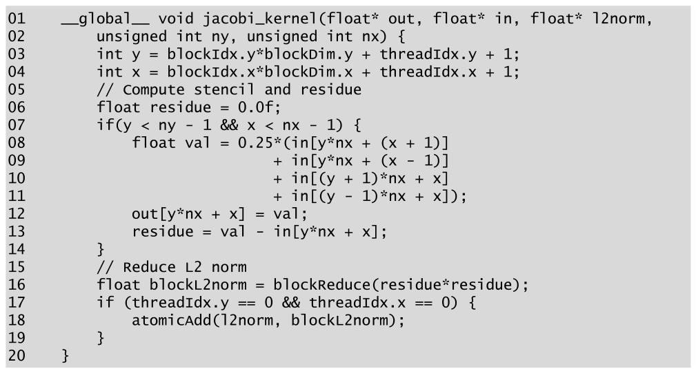

*Figure 23.1 — 2D Jacobi 반복법을 위해 수정한 stencil kernel. (책 p.542)*

```cuda
01 __global__ void jacobi_kernel(float* out, float* in, float* l2norm,
02     unsigned int ny, unsigned int nx) {
03     int y = blockIdx.y*blockDim.y + threadIdx.y + 1;
04     int x = blockIdx.x*blockDim.x + threadIdx.x + 1;
05     // Compute stencil and residue
06     float residue = 0.0f;
07     if(y < ny - 1 && x < nx - 1) {
08         float val = 0.25*(in[y*nx + (x + 1)]
09                         + in[y*nx + (x - 1)]
10                         + in[(y + 1)*nx + x]
11                         + in[(y - 1)*nx + x]);
12         out[y*nx + x] = val;
13         residue = val - in[y*nx + x];
14     }
15     // Reduce L2 norm
16     float blockL2norm = blockReduce(residue*residue);
17     if (threadIdx.y == 0 && threadIdx.x == 0) {
18         atomicAdd(l2norm, blockL2norm);
19     }
20 }
```

> 8장의 kernel 에 **두 가지를 고쳤다** [4]. 첫째는 그림과 코드 예제를 간단히 하려고
> **3D 가 아니라 2D stencil** 을 계산하는 것이다.
> 둘째는 stencil kernel 이 **잔차와 L2 norm 도 계산**한다는 것이다 (책 p.542).

| 줄 | 하는 일 | 짚을 점 |
|---|---|---|
| 03~04 | `+1` 로 시작 | **$x=0$·$y=0$ 을 건너뛴다** — 경계이거나 halo 다 |
| 07 | 위쪽 경계만 검사 | 아래쪽은 `+1` 로 자동 만족 |
| 08~11 | **5점 stencil** (자기 자신은 안 쓴다) | Jacobi 이므로 **`in` 만 읽고 `out` 에만 쓴다** |
| 13 | 잔차 = 새 값 − 옛 값 | |
| **16** | **`if` 밖에 있다** | ← **의도적이다** |
| 17~19 | block 대표가 전역 L2 norm 에 atomic 누적 | |

**16줄이 `if` 문 바깥에 있는 것이 핵심**이다.
`blockReduce` 는 **block 전체가 참여**해야 하는 collective 연산이므로, 조건 안에 넣으면
비활성 thread 가 barrier 에 도달하지 못해 **deadlock** 이 된다.
6줄의 `residue = 0.0f` 초기화가 **비활성 thread 가 0 을 기여**하게 해 준다 —
10장 reduction 에서 반복해서 본 그 수법이다.

> 이 kernel 은 더 최적화할 수 있다. 예컨대 8장에서 서술한 대로 **shared memory tiling 과
> thread coarsening** 으로 global memory 접근을 줄일 수 있다.
> 나아가 reduction 연산에도 10장의 여러 최적화를 적용하거나 **CUB [5] 의 block-wide reduction
> 함수**를 부를 수 있다. 그러나 이 최적화들은 이 장의 초점이 아니다.
> 이 장은 **stencil 계산을 여러 GPU 에 어떻게 분산하는가**에 집중한다 (책 p.543).

### domain partition 과 halo

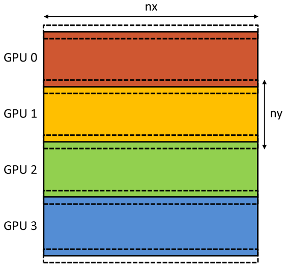

*Figure 23.2 — 모델링 계를 위한 2D grid 배열을 4개 GPU 에 분할한 모습. (책 p.543)*

> 여러 GPU 를 쓸 때는 입력 데이터를 **domain partition** 이라 부르는 여러 조각으로 나누어
> 클러스터의 서로 다른 GPU 에 배정하는 것이 흔하다.
> **row-major 배치라면 y 차원을 따라 계를 분할해 각 GPU 에 연속된 행 묶음**을 주는 것이 자연스럽다.
> 이런 분할은 **각 GPU 의 partition 이 메모리에서 연속**임을 보장한다 (책 p.544).

**왜 y 차원인가**가 이 문단의 요점이다.

$$\text{row-major} \;\Rightarrow\; \text{같은 } y \text{ 의 원소가 연속}
\;\Rightarrow\; \text{y 로 자르면 partition 이 연속 구간}$$

> 각 grid point 의 새 값을 계산하려면 이웃 점들의 옛 값이 필요함을 상기하자.
> 따라서 GPU 가 **자기 partition 가장자리**의 새 값을 계산하려면
> **인접 partition 가장자리의 옛 값**이 필요하다.
> **halo point** 라 부르는 이 grid point 들이 Fig. 23.2 에 점선으로 표시되어 있다 (책 p.544).

> GPU 1 이 입력으로 필요로 하는 행의 범위가 `ny` 로 표시되어 있다.
> 그 범위의 **첫 행과 마지막 행이 halo point** 로 입력으로만 쓰이고,
> 가운데 **`ny - 2` 개 행이 입력이자 출력**이다 (책 p.544).

$$\text{지역 배열} = \underbrace{\texttt{ny}}_{\text{halo 2행 포함}} \times \texttt{nx},
\qquad \text{계산되는 행} = \texttt{ny} - 2$$

**이것이 Figure 23.1 의 `y < ny-1` 과 `y ≥ 1` 이 뜻하는 전부**다 —
`ny` 는 **전역 높이가 아니라 halo 를 포함한 지역 높이**다.

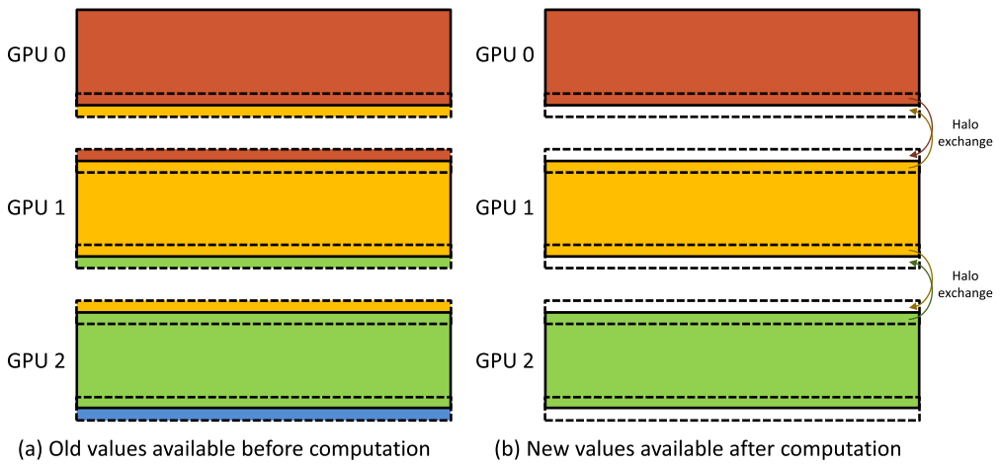

*Figure 23.3 — 계산 전과 후에 각 GPU 가 가지고 있는 값. (책 p.544)*

> 계산 전에 GPU 는 halo 행의 값을 필요로 한다 (Fig. 23.3(a)).
> 계산 후에는 **자기 halo 행의 값이 낡은 것이 된다** (Fig. 23.3(b)).
> halo 행의 새 값은 그 행을 책임지는 다른 GPU 가 계산한다.
> 따라서 다음 반복으로 넘어가기 전에 GPU 는 인접 partition 을 계산하는 GPU 로부터
> **halo 행의 갱신된 값을 얻어야** 한다 (책 p.544).

> **원문 오기 ①.** 그 문장이 "computed by the other GPUs that are responsible **these** rows"
> 라고 쓴다 → **`responsible for these rows`** 여야 한다.

**halo exchange 는 주고받기가 동시에 일어난다.**

> 예컨대 GPU 1 은 위 halo 행을 GPU 0 에서 복사하고 아래 halo 행을 GPU 2 에서 복사해야 한다.
> **동시에** GPU 1 은 자기 위 행을 GPU 0 에, 아래 행을 GPU 2 에 보내야 한다.
> 인접 GPU 사이의 이 halo 행 주고받기를 **halo exchange** 라 한다 (책 p.544).

> 여기서 **y 차원을 따르는 1D domain decomposition 의 두 번째 이점**을 본다:
> 한 GPU 에서 다른 GPU 로 복사해야 하는 halo 행이 **메모리에서 연속**이라 복사 연산이 간단해진다
> (책 p.545).

### 1D 대 2D 분할 — 직접 세어 본다

> 이 1D 분해의 단점 하나는 **도메인의 모양과 GPU 수에 따라 GPU 사이에 큰 부피의 데이터를
> 주고받아야** 할 수 있다는 것이다.
> 예컨대 도메인이 아주 넓으면 각 GPU 가 **도메인의 행 전체**를 주고받아야 해 비쌀 수 있다.
> 대안으로 각 GPU 가 도메인의 **2D tile** 을 맡는 **2D domain decomposition** 을 쓸 수 있다.
> 2D 분해는 **surface-to-volume 비를 줄여** 주고받아야 할 데이터 양을 줄인다.
> 그러나 2D 분해는 각 GPU 가 **둘이 아니라 네 이웃**과 통신해야 하고,
> 주고받는 데이터 일부가 **연속이 아니게** 된다 (책 p.545).

$n \times n$ 도메인, $P$ 개 프로세스로 세면:

$$\text{1D: } 2n \text{ 원소/프로세스}, \qquad
  \text{2D: } \frac{4n}{\sqrt P} \text{ 원소/프로세스}$$

| $P$ | 1D | 2D | 1D/2D |
|---|---|---|---|
| 4 | 2,048 | 2,048 | $1.0\times$ |
| 16 | 2,048 | 1,024 | $2.0\times$ |
| 64 | 2,048 | 512 | $4.0\times$ |
| 256 | 2,048 | **256** | $\mathbf{8.0\times}$ |

($n = 1024$, 검산 통과.)

**$P > 4$ 부터 2D 가 이긴다** ($4n/\sqrt P < 2n \iff \sqrt P > 2$).
그리고 **1D 의 통신량은 $P$ 와 무관**하다 — GPU 를 늘려도 각자 행 하나씩을 주고받으므로
통신이 줄지 않는다. 반면 2D 는 $1/\sqrt P$ 로 준다.

> 이 장의 예제를 간단히 유지하려고 서술한 **1D domain decomposition 에 집중**한다 (책 p.545).

### 반복 하나는 두 국면이다

> 요약하면 multi-GPU Jacobi 반복법의 매 반복은 **두 국면**으로 이루어진다:
> grid point 의 새 값을 계산하는 **계산 국면**과,
> 인접 partition 을 계산하는 GPU 사이에 halo 행의 새 값을 주고받는 **통신 국면**.
> 나아가 L2 norm 은 **모든 partition 의 모든 grid point** 를 포괄해야 하므로,
> 통신 국면에는 각 GPU 가 계산한 grid 전체 L2 norm 을 **축약하는 reduction 연산**도 포함된다
> (책 p.545).

**검산으로 확인했다.** $16 \times 12$ 전역 grid 를 $P = 1, 2, 7, 14$ 로 나누어
30번 반복시킨 결과가 **1 GPU 로 푼 것과 원소 단위로 일치**하고 L2 norm 도 매 반복 일치한다 ✓.

---

## 23.2 Multi-GPU stencil with MPI

### 두 종류의 프로그래밍 모델

> 병렬 프로그래밍 모델에는 크게 두 부류가 있다: **shared memory 모델**과
> **distributed memory 모델**.
> shared memory 모델에서는 서로 다른 thread·프로세스가 **같은 메모리 공간**에 접근해
> 데이터 공유가 간단하다. 예컨대 **CUDA kernel 이 shared memory 모델**을 따른다 —
> 서로 다른 CUDA thread 가 같은 포인터로 같은 global memory 변수에 접근하기 때문이다.
> distributed memory 모델에서는 서로 다른 thread·프로세스가 **서로 다른 메모리 공간**에
> 접근한다. 이 경우 데이터 공유는 **메시지 전달** 같은 방식으로 명시적으로 해야 한다 (책 p.545).

> 오늘날 컴퓨팅 클러스터의 지배적인 프로그래밍 인터페이스는 **MPI (Message Passing Interface)**
> [1] 이며, 클러스터에서 실행되는 프로세스 사이의 통신을 위한 API 함수 집합이다.
> MPI 는 프로세스가 서로 메시지를 보내 정보를 교환하는 **distributed memory 모델**을 가정한다
> (책 p.545).

**MPI 의 rank 는 전화번호다.**

> 응용이 API 통신 함수를 쓰면 **interconnect 의 세부를 다룰 필요가 없다.**
> MPI 구현은 프로세스가 **논리적 번호로 서로를 지칭**하게 해 주는데,
> 전화 시스템에서 전화번호를 쓰는 것과 같다 — 전화 사용자는 **상대가 정확히 어디 있고
> 통화가 어떻게 라우팅되는지 모른 채** 번호로 서로에게 전화를 건다 (책 p.545~546).

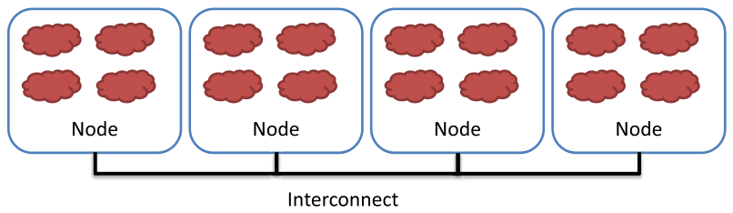

*Figure 23.4 — 프로그래머가 보는 MPI 프로세스. **노드 하나가 프로세스를 하나 이상** 담을 수 있다.
(책 p.546)*

> CUDA 처럼 MPI 프로그램도 **SPMD 병렬 프로그래밍 모델**에 기반한다.
> **모든 MPI 프로세스가 같은 프로그램을 실행**한다 (책 p.546).

### 통신 시스템을 세우고 허무는 네 함수

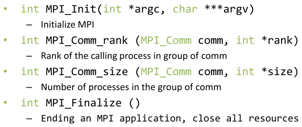

*Figure 23.5 — 통신 시스템을 세우고 닫는 기본 MPI API 함수들. (책 p.546)*

| 함수 | 하는 일 |
|---|---|
| `int MPI_Init(int *argc, char ***argv)` | MPI 초기화 |
| `int MPI_Comm_rank(MPI_Comm comm, int *rank)` | `comm` 그룹 안에서 **호출한 프로세스의 rank** |
| `int MPI_Comm_size(MPI_Comm comm, int *size)` | `comm` 그룹의 **프로세스 수** |
| `int MPI_Finalize()` | MPI 응용을 끝내고 모든 자원을 닫는다 |

> **원문 오기 ②.** 본문은 "Fig. 23.5 shows **five** essential MPI functions" 라고 쓰는데
> 그림에는 **넷**뿐이다 (`MPI_Init`, `MPI_Comm_rank`, `MPI_Comm_size`, `MPI_Finalize`).
> Figure 23.6 의 main 프로그램이 쓰는 것도 **정확히 그 넷**이다.

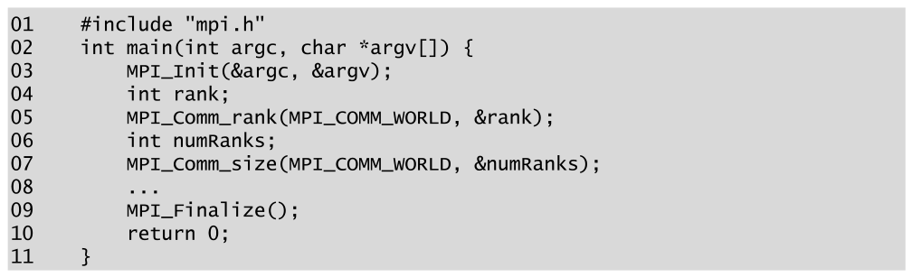

*Figure 23.6 — 간단한 MPI main 프로그램. (책 p.547)*

```cpp
01 #include "mpi.h"
02 int main(int argc, char *argv[]) {
03     MPI_Init(&argc, &argv);
04     int rank;
05     MPI_Comm_rank(MPI_COMM_WORLD, &rank);
06     int numRanks;
07     MPI_Comm_size(MPI_COMM_WORLD, &numRanks);
08     ...
09     MPI_Finalize();
10     return 0;
11 }
```

**rank 를 CUDA 와 대응시키면**:

> MPI rank 는 통신에서 프로세스를 고유하게 식별하며, 전화 시스템의 전화번호에 해당한다.
> 이는 CUDA thread 의 **`blockIdx.x*blockDim.x + threadIdx.x` 표현식에 유비적**이다.
> CUDA thread 가 최대 3차원을 가질 수 있음을 상기하자.
> 마찬가지로 MPI rank 도 **MPI Cartesian communicator** 로 여러 차원으로 조직할 수 있다
> (책 p.547).

| CUDA | MPI |
|---|---|
| `blockIdx.x*blockDim.x + threadIdx.x` | **rank** |
| `gridDim.x*blockDim.x` | **numRanks** |
| grid | **communicator** (`MPI_Comm`) |
| (전체 grid) | `MPI_COMM_WORLD` |
| 3D thread index | **Cartesian communicator** |

> **communicator** 는 통신 함수를 부를 때 포함될 **MPI 프로세스 그룹**을 지정한다.
> 응용은 communicator 를 하나 이상 만들 수 있다. …… `MPI_COMM_WORLD` 는 기본값으로 쓰이며
> **응용을 실행하는 모든 MPI 프로세스**를 포함한다는 뜻이다 (책 p.547).

> `MPI_Comm_size` 로 런타임에서 값을 질의하는 것은 **몇 개의 partition 을 만들어야 하는지 정할 때
> 응용이 어떻게 띄워졌는지에 대한 암묵적 가정을 하지 않게** 해 준다 (책 p.548).

**응용을 띄우는 것은 `mpirun`/`mpiexec`** 다.

> **각주 2**: MPI 표준은 `mpiexec` 를 프로세스를 띄우는 표준 이름으로 제안하지만,
> Open MPI 같은 구현은 **둘 다 동의어**로 제공한다 (책 p.546 각주 2).

### Figure 23.7 — MPI 판 host loop

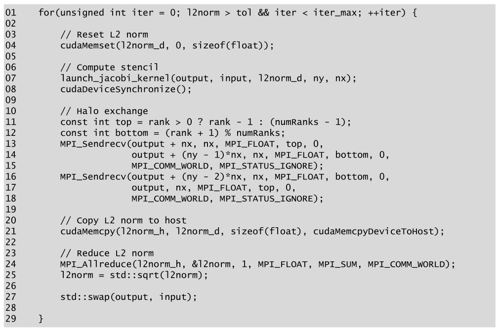

*Figure 23.7 — MPI 기반 multi-GPU Jacobi 반복법 구현의 host 코드. (책 p.549)*

```cpp
01 for(unsigned int iter = 0; l2norm > tol && iter < iter_max; ++iter) {
02
03     // Reset L2 norm
04     cudaMemset(l2norm_d, 0, sizeof(float));
05
06     // Compute stencil
07     launch_jacobi_kernel(output, input, l2norm_d, ny, nx);
08     cudaDeviceSynchronize();
09
10     // Halo exchange
11     const int top = rank > 0 ? rank - 1 : (numRanks - 1);
12     const int bottom = (rank + 1) % numRanks;
13     MPI_Sendrecv(output + nx, nx, MPI_FLOAT, top, 0,
14                  output + (ny - 1)*nx, nx, MPI_FLOAT, bottom, 0,
15                  MPI_COMM_WORLD, MPI_STATUS_IGNORE);
16     MPI_Sendrecv(output + (ny - 2)*nx, nx, MPI_FLOAT, bottom, 0,
17                  output, nx, MPI_FLOAT, top, 0,
18                  MPI_COMM_WORLD, MPI_STATUS_IGNORE);
19
20     // Copy L2 norm to host
21     cudaMemcpy(l2norm_h, l2norm_d, sizeof(float), cudaMemcpyDeviceToHost);
22
23     // Reduce L2 norm
24     MPI_Allreduce(l2norm_h, &l2norm, 1, MPI_FLOAT, MPI_SUM, MPI_COMM_WORLD);
25     l2norm = std::sqrt(l2norm);
26
27     std::swap(output, input);
28 }
```

**행 번호를 못박아 둔다** — 이 장 내내 같은 배치를 쓴다.

| 행 | 무엇 | offset |
|---|---|---|
| 0 | **위 halo** (입력 전용) | `output` |
| 1 | **위 경계행** (이웃에게 보낸다) | `output + nx` |
| 2 … ny−3 | **내부행** | |
| ny−2 | **아래 경계행** (이웃에게 보낸다) | `output + (ny-2)*nx` |
| ny−1 | **아래 halo** (입력 전용) | `output + (ny-1)*nx` |

두 번의 `MPI_Sendrecv` 가 정확히 그 넷을 쓴다 (검산 통과):

| 호출 | 보내는 것 | 받는 곳 |
|---|---|---|
| 13~15 | 위 경계행 → **top** 이웃 | 아래 halo ← **bottom** 이웃 |
| 16~18 | 아래 경계행 → **bottom** 이웃 | 위 halo ← **top** 이웃 |

**주기 경계(periodic boundary)** 도 여기 있다.

> 단순히 `rank - 1` 과 `rank + 1` 을 계산하는 대신, 코드는 **맨 위 rank 가 맨 아래 rank 를
> 자기 위 이웃으로 취급하는 wrap-around 전략**을 쓴다.
> 이 전략은 **periodic boundary condition** 기법이라 불리며,
> 큰 계의 작은 일부만 시뮬레이션하면서 **불균형한 가장자리 효과를 들이지 않고** 모델링하는 데 쓴다
> (책 p.551).

$$\texttt{top} = \begin{cases} \texttt{rank}-1 & \texttt{rank} > 0 \\ \texttt{numRanks}-1 & \text{아니면}\end{cases}
\qquad \texttt{bottom} = (\texttt{rank}+1) \bmod \texttt{numRanks}$$

(검산: 4개 rank 에서 `top` 관계가 **순열**이고 모든 rank 가 서로 다른 이웃 둘을 갖는다 ✓.)

### point-to-point 통신

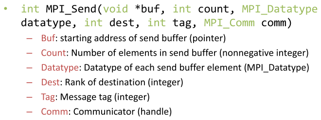

*Figure 23.8 — `MPI_Send()` 함수의 시그니처. (책 p.550)*

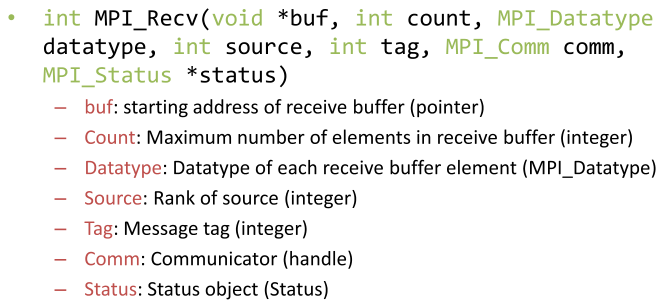

*Figure 23.9 — `MPI_Recv()` 함수의 시그니처. (책 p.550)*

> MPI 의 가장 기본적인 point-to-point 통신 루틴은 `MPI_Send()` 와 `MPI_Recv()` 다. ……
> **통신이 일어나려면 양쪽이 모두 참여**해야 하므로 이런 point-to-point 통신을
> **two-sided communication** 이라 부른다 (책 p.549).

| `MPI_Send` 의 인자 | 뜻 |
|---|---|
| ① 포인터 | 보낼 데이터의 시작 위치 |
| ② `int` | 보낼 **원소 개수** |
| ③ `MPI_Datatype` | 원소의 **타입** (`MPI_FLOAT`, `MPI_DOUBLE`, `MPI_INT`, `MPI_CHAR` …) |
| ④ `int` | **목적지** 프로세스의 rank |
| ⑤ `int` | **tag** — 같은 프로세스가 보낸 메시지를 분류 |
| ⑥ `MPI_Comm` | communicator |

> `MPI_Datatype` 값들은 `"mpi.h"` 에 정의되어 있다. …… **이 타입들의 정확한 크기는
> host 프로세서의 대응 C 타입 크기에 달려 있다** (책 p.550).

`MPI_Recv` 는 ②가 **최대 수신 가능 개수**, ④가 **출처** rank, ⑤가 **기대하는 tag** 다.
받는 쪽이 tag 를 가리지 않으려면 `MPI_ANY_TAG` 를 쓴다 (책 p.550).

**그런데 halo exchange 는 보내기와 받기가 동시에 필요하다.**

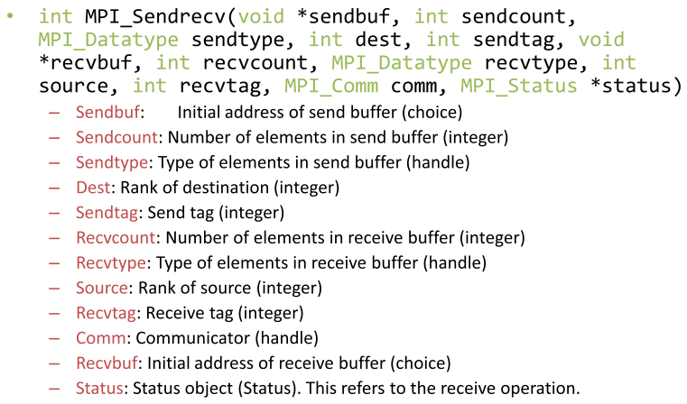

*Figure 23.10 — `MPI_Sendrecv()` 함수의 시그니처. (책 p.551)*

> 프로세스가 자기 경계 데이터를 이웃에 보낼 때 **동시에 다른 이웃에서 halo 데이터를 받아야** 한다.
> …… 그런 상황을 위해 MPI 는 **목적지로 보내면서 출처에서 동시에 받는** `MPI_Sendrecv()` 를
> 제공한다 (책 p.551).

> 같은 목적을 **MPI 비차단(non-blocking) 통신**으로도 이룰 수 있다.
> 특히 `MPI_Isend` 로 비차단 보내기를, `MPI_Irecv` 로 비차단 받기를 시작하고
> `MPI_Wait` 로 두 연산이 끝나기를 기다릴 수 있다.
> 이 비차단 함수들은 **서로 다른 이웃과 동시에 주고받는 더 복잡한 통신 패턴**을 표현할 수 있게 한다.
> 그러나 `MPI_Sendrecv()` 는 우리가 관심 있는 그 동시 통신 패턴을 **API 호출 하나로** 표현하는
> 편리한 방법을 준다 (책 p.551).

> **`MPI_Send`/`MPI_Recv` 만으로 halo exchange 를 짜면 deadlock 이 나기 쉽다.**
> 모든 rank 가 먼저 `MPI_Send` 를 부르면 짝이 되는 `MPI_Recv` 가 없어 서로 기다린다
> (구현이 버퍼링하면 우연히 통과하지만 **표준이 보장하지 않는다**).
> `MPI_Sendrecv` 는 그 위험을 API 하나로 없앤다.

### CUDA-aware MPI — device 포인터를 그대로 넘긴다

> `MPI_Sendrecv` 에 넘기는 `output`·`input` 포인터가 **GPU device memory 를 가리킨다**는 점이
> 중요하다. GPU device memory 포인터를 MPI 함수에 넘기는 것은 **CUDA-aware MPI** 로 가능하다.
> 쓰는 MPI 구현이 CUDA-aware 가 아니라면 프로그래머는 데이터를 device 에서 host 로 복사한 뒤
> host 메모리 배열에 대해 통신 함수를 불러야 했을 것이다 (책 p.552).

$$\underbrace{\texttt{cudaMemcpy} \to \texttt{MPI\_Send} \to \texttt{cudaMemcpy}}_{\text{CUDA-aware 가 아니면}}
\;\Longrightarrow\;
\underbrace{\texttt{MPI\_Send(device 포인터)}}_{\text{CUDA-aware}}$$

> 보내기·받기 함수가 device 배열에 직접 동작하게 하면 소스에서 **`cudaMemcpy` 호출이 사라져**
> host 코드 비대화와 **추가 통신 latency 를 최소화**한다.
> 대부분의 MPI 구현(MPICH [6], OpenMPI [7], MVAPICH2 [8])이 CUDA-aware 하도록 설계되어
> 이 기능이 켜진 채로 빌드된다 (책 p.552).

### collective 통신 — `MPI_Allreduce`

> point-to-point 통신이 **두 rank** 사이인 것과 대조적으로,
> MPI collective 통신은 **communicator 의 모든 rank** 사이에서 일어난다.
> 흔히 쓰이는 종류는 **barrier, broadcast, reduce, gather, scatter** 다 (책 p.552).

> 일반적으로 collective 통신 함수는 MPI 런타임 개발자와 시스템 벤더가 **고도로 최적화**한다.
> collective 함수를 쓰는 것이 보통 **send·receive 호출의 연속으로 같은 기능을 달성하려는 것보다
> 성능·가독성·생산성 면에서 낫다** (책 p.552).

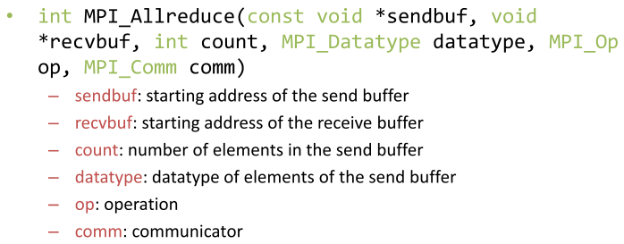

*Figure 23.11 — `MPI_Allreduce()` 함수의 시그니처. (책 p.553)*

> `MPI_Allreduce` 는 **각 rank 로부터 값 버퍼를 받아 하나의 버퍼로 축약하고
> 그 버퍼의 복사본을 각 rank 에 준다** (책 p.552).

| 인자 | 뜻 |
|---|---|
| `sendbuf` | 각 rank 가 기여하는 입력 버퍼 |
| `recvbuf` | 결과를 놓을 곳 — **모든 rank 가 같은 값을 받는다** |
| `count` | 원소 수 (보내기·받기 동일) |
| `datatype` | 원소 타입 |
| `op` | **축약 연산** (`MPI_SUM`, 곱, 최소, 최대, 논리 연산 …) |
| `comm` | communicator |

우리 코드에서는 `count = 1` (rank 마다 값 하나), `op = MPI_SUM` 이다.

$$\|r\|_2 = \sqrt{\sum_{\text{모든 rank}} \sum_{\text{그 rank 의 점}} r_{ij}^2}$$

**제곱합을 먼저 rank 안에서 모으고(Figure 23.1 line 16~18),
rank 사이에서 `MPI_SUM` 으로 모은 뒤(line 24), 마지막에 한 번만 제곱근**을 취한다 (line 25).
(검산: $P$ 를 바꿔도 매 반복의 L2 norm 이 1 GPU 값과 일치한다 ✓.)

**왜 device→host 복사를 `MPI_Allreduce` 앞에 두나.**

> 독자는 왜 L2 norm 의 제곱을 `MPI_Allreduce` 를 부르기 전에 device 에서 host 로 복사했는지
> 궁금할 수 있다. CUDA-aware 이므로 GPU 버퍼에 대해 직접 부를 수도 있었다.
> **이유는 `MPI_Allreduce` 의 결과가 수렴 검사를 위해 host 에 필요**하기 때문이다 —
> 어차피 host 로 복사해야 하므로, **부르기 전에 복사하는 것이 더 효율적**이다 (책 p.553).

**loop 조건(line 01)이 host 에서 평가된다**는 사실이 이 설계를 정한다.
---

## 23.3 Overlapping computation and communication

### 문제 — 시스템이 언제나 절반만 쓰인다

> 23.2절의 전략은 아주 단순하지만 **효율적이지 않다.**
> 이유는 이 전략이 시스템을 **두 모드 중 하나**에 있게 강제하는데 각 모드가 시스템의 일부만
> 활용하기 때문이다.
> 첫 모드에서는 모든 프로세스가 GPU 로 계산한다. 이 동안 **interconnect 는 놀고** 있다.
> 둘째 모드에서는 모든 프로세스가 interconnect 로 halo 를 주고받는다. 이 동안 **GPU 연산 하드웨어가
> 제대로 활용되지 않는다** (책 p.554).

$$\text{반복 시간} = t_{\text{계산}} + t_{\text{통신}} + t_{\text{reduction}}$$

**두 항이 순차로 더해진다** — 그것이 낭비다.

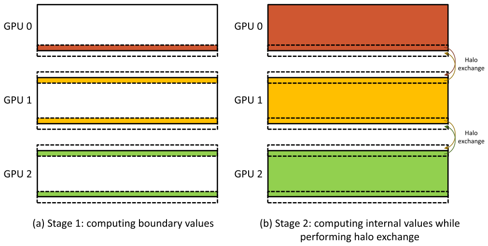

*Figure 23.12 — 계산과 통신을 겹치는 2단계 전략. (책 p.554)*

| 단계 | 각 프로세스가 하는 일 |
|---|---|
| **Stage 1** | **이웃이 다음 반복에 halo 로 필요로 할 경계행**을 먼저 계산한다 |
| **Stage 2** | ① 그 새 경계값을 이웃에 **보내면서** ② **나머지 내부 grid point 를 계산**한다 |

> 근거는 이 경계행들이 **다음 반복에 이웃에게 필요**하다는 것이다.
> 이 경계행을 먼저 계산하면 **나머지 내부 grid point 를 계산하는 동안 데이터를 이웃에 전달**할 수 있다
> (책 p.554).

> **통신 활동이 계산 활동보다 짧게 걸리면 통신 지연을 숨기고** 대부분의 시간 동안
> 연산 하드웨어를 온전히 쓸 수 있다.
> 이는 보통 각 partition 의 **내부에 충분한 행이 있어서** 통신을 숨길 만큼 계산할 것이 있게 해서
> 달성한다 (책 p.554).

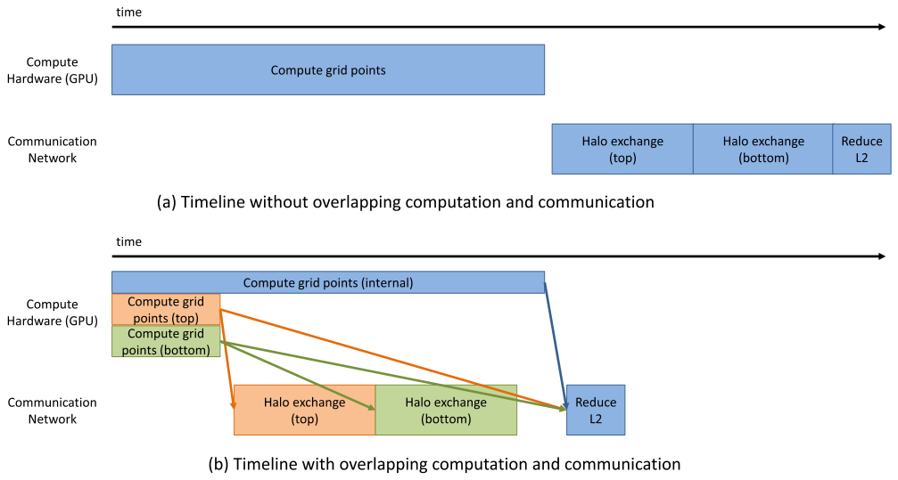

*Figure 23.13 — 계산과 통신을 겹치지 않은 경우와 겹친 경우의 timeline 비교. (책 p.555)*

**모델로 세어 보자.** 지역 배열이 `ny = 34` (계산행 32개) 이면 경계행은 2개이므로

$$f_{\text{경계}} = \frac{2}{32} = 6.25\%$$

$$T_{\text{겹치기 없이}} = t_c + t_m + t_r, \qquad
  T_{\text{겹쳐서}} = f\,t_c + \max\big((1-f)\,t_c,\ t_m\big) + t_r$$

| $t_m/t_c$ | 겹치기 없이 | 겹쳐서 | 개선 |
|---|---|---|---|
| 0.2 | 1.300 | **1.100** | $1.18\times$ |
| 0.5 | 1.600 | **1.100** | $1.45\times$ |
| 1.0 | 2.100 | **1.163** | $\mathbf{1.81\times}$ |
| 2.0 | 3.100 | **2.163** | $1.43\times$ |

($t_c = 1$, $t_r = 0.1$, 검산 통과.)

**$t_m \le (1-f)t_c$ 이면 통신이 완전히 숨는다** — $t_m = 0.2, 0.5$ 가 그 경우이고
둘 다 이론 하한 $t_c + t_r = 1.1$ 에 도달한다 ✓.

> 불가피하게 **L2 norm 의 reduction 은 겹칠 수 없다** — 모든 grid point 가 계산되어야
> 하기 때문이다 (책 p.555).

**그리고 경계행을 먼저 계산해야 한다.**

> 충분한 연산 자원을 가진 GPU 라면 세 범주의 grid point 를 동시에 계산할 수 있다.
> 그러나 **halo exchange 를 가능한 한 빨리 시작하기 위해 경계 grid point 에 우선순위**를 주어야 한다
> (책 p.555).

### CUDA stream

> 이런 종류의 겹치기를 달성하려면 Jacobi kernel 호출을 **경계 원소용과 내부 원소용으로 쪼개야** 한다.
> 예컨대 kernel 호출을 셋으로 쪼갤 수 있다: **위 경계행, 아래 경계행, 내부 원소**.
> …… 이 세 kernel 을 동시에 실행하고 통신 활동을 각각과 독립적으로 동기화하려면
> CUDA 프로그래밍 모델의 중요한 기능인 **CUDA stream** 을 써야 한다 (책 p.555).

> CUDA 에서 **stream 은 CUDA 연산의 순서 있는 열**이다. …… **같은 stream 안의 모든 연산은
> 넣은 순서대로 순차로** 수행된다. 반면 **서로 다른 stream 의 연산은 순서 제약 없이 동시에**
> 실행될 수 있다 (책 p.555~556).

```cuda
cudaStream_t topStream, bottomStream, internalStream;
cudaStreamCreate(&internalStream);
cudaStreamCreate(&topStream);
cudaStreamCreate(&bottomStream);
```

**kernel 호출의 네 번째 실행 구성 매개변수가 stream** 이다.

```cuda
kernelName<<<dimGrid, dimBlock, 0, myStream>>>(...)
```

| 위치 | 무엇 | 어디서 나왔나 |
|---|---|---|
| ① | grid 차원 | 2장 |
| ② | block 차원 | 2장 |
| ③ | **dynamic shared memory 크기** (기본 0) | 5장 |
| ④ | **stream** (기본: default stream) | **23장** |

> kernel 호출에서 돌아왔다고 kernel 이 실행되었다는 뜻이 **아니다.** 단지 kernel 이 지정된
> stream 에 **삽입**되었다는 뜻이다. …… host 코드에서의 kernel 호출이 kernel 을 실제로 실행하는 것이
> 아니라 stream 에 넣는다는 사실이 **CUDA kernel 호출을 비동기로** 만든다 (책 p.556).

### stream 우선순위 — 순서가 보장되지 않는다

> 세 kernel 을 세 stream 에서 동시에 실행할 때 명심할 중요한 고려사항은
> **이 kernel 들이 어떤 순서로든 실행될 수 있다**는 것이다.
> …… **내부 grid point 를 계산하는 kernel 이 먼저 실행되어 GPU 자원을 전부 차지**하고
> 경계 kernel 과 이어지는 halo exchange 를 막아 원하는 겹치기를 달성하지 못할 수도 있다 (책 p.558).

```cuda
int low, high;
cudaDeviceGetStreamPriorityRange(&low, &high);
cudaStreamCreateWithPriority(&internalStream, cudaStreamDefault, low);
cudaStreamCreateWithPriority(&topStream,      cudaStreamDefault, high);
cudaStreamCreateWithPriority(&bottomStream,   cudaStreamDefault, high);
```

> **우선순위 값의 절댓값은 중요하지 않다. 상대적 값만 중요하다** (책 p.558).

> **원문 오기 ③.** 같은 문단이 "In other cases, **when** may be interested in more than two
> priority levels" 라고 쓴다 → **`we`** 여야 한다.

### Figure 23.14 — MPI 판 겹치기 host 코드

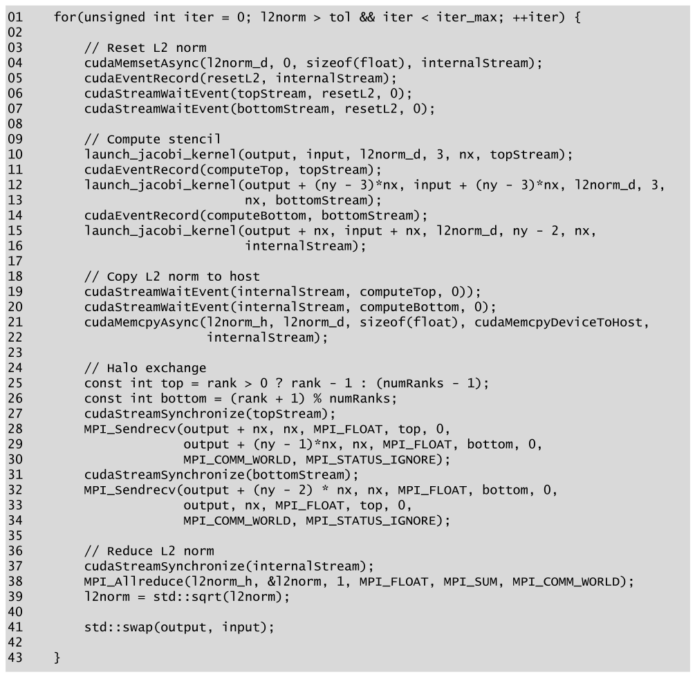

*Figure 23.14 — 계산과 통신을 겹치는 MPI 기반 multi-GPU Jacobi 반복법의 host 코드. (책 p.557)*

```cpp
01 for(unsigned int iter = 0; l2norm > tol && iter < iter_max; ++iter) {
02
03     // Reset L2 norm
04     cudaMemsetAsync(l2norm_d, 0, sizeof(float), internalStream);
05     cudaEventRecord(resetL2, internalStream);
06     cudaStreamWaitEvent(topStream, resetL2, 0);
07     cudaStreamWaitEvent(bottomStream, resetL2, 0);
08
09     // Compute stencil
10     launch_jacobi_kernel(output, input, l2norm_d, 3, nx, topStream);
11     cudaEventRecord(computeTop, topStream);
12     launch_jacobi_kernel(output + (ny - 3)*nx, input + (ny - 3)*nx, l2norm_d, 3,
13                          nx, bottomStream);
14     cudaEventRecord(computeBottom, bottomStream);
15     launch_jacobi_kernel(output + nx, input + nx, l2norm_d, ny - 2, nx,
16                          internalStream);
17
18     // Copy L2 norm to host
19     cudaStreamWaitEvent(internalStream, computeTop, 0);
20     cudaStreamWaitEvent(internalStream, computeBottom, 0);
21     cudaMemcpyAsync(l2norm_h, l2norm_d, sizeof(float), cudaMemcpyDeviceToHost,
22                     internalStream);
23
24     // Halo exchange
25     const int top = rank > 0 ? rank - 1 : (numRanks - 1);
26     const int bottom = (rank + 1) % numRanks;
27     cudaStreamSynchronize(topStream);
28     MPI_Sendrecv(output + nx, nx, MPI_FLOAT, top, 0,
29                  output + (ny - 1)*nx, nx, MPI_FLOAT, bottom, 0,
30                  MPI_COMM_WORLD, MPI_STATUS_IGNORE);
31     cudaStreamSynchronize(bottomStream);
32     MPI_Sendrecv(output + (ny - 2) * nx, nx, MPI_FLOAT, bottom, 0,
33                  output, nx, MPI_FLOAT, top, 0,
34                  MPI_COMM_WORLD, MPI_STATUS_IGNORE);
35
36     // Reduce L2 norm
37     cudaStreamSynchronize(internalStream);
38     MPI_Allreduce(l2norm_h, &l2norm, 1, MPI_FLOAT, MPI_SUM, MPI_COMM_WORLD);
39     l2norm = std::sqrt(l2norm);
40
41     std::swap(output, input);
42 }
```

> **원문 오기 ④.** 인쇄된 line 19 는
> `cudaStreamWaitEvent(internalStream, computeTop, 0));` 로 **닫는 괄호가 하나 남는다.**
> 바로 다음 줄(line 20)은 `...computeBottom, 0);` 로 **정확**하다 — 대조가 명확하다.

#### 세 kernel 이 계산 행을 정확히 한 번씩 덮는가

각 `launch_jacobi_kernel(out, in, l2, ny_local, nx, stream)` 은
**넘겨받은 배열의 지역 행 $1 \sim \texttt{ny\_local}-2$** 를 계산한다.

| 호출 | 시작 offset | `ny_local` | 계산하는 **전역** 행 |
|---|---|---|---|
| top (10) | `output` (행 0) | **3** | 행 **1** |
| bottom (12) | `output + (ny-3)*nx` (행 ny−3) | **3** | 행 **ny−2** |
| internal (15) | `output + nx` (행 1) | **ny−2** | 행 **2 ~ ny−3** |

$$\{1\} \cup \{ny-2\} \cup \{2, \dots, ny-3\} = \{1, \dots, ny-2\}$$

**겹침도 빠짐도 없다** (검산: `ny` = 6, 10, 34 에서 전부 정확히 한 번씩 ✓).
21장 Figure 21.8 에서 같은 종류의 index 식이 **틀렸던** 것과 대비된다 — 여기서는 맞다.

### CUDA event — stream 사이를 잇는다

kernel 을 셋으로 쪼개면 **L2 norm 이 문제가 된다.**

> 세 kernel 모두 같은 L2 norm 을 갱신하므로, **세 kernel 모두 L2 norm 이 0 으로 초기화되기를
> 기다려야** 하고 **세 kernel 모두 끝나야** L2 norm 을 host 로 복사할 수 있다.
> 그런데 kernel 호출은 서로 다른 세 stream 에 있고 초기화·복사 호출은 **한 stream 에만** 넣을 수 있다.
> 이를 극복하려면 **한 stream 의 연산이 다른 stream 의 연산이 끝나기를 기다리게** 할 수 있어야 한다.
> stream 사이의 그런 상호작용은 **CUDA event** 로 달성한다 (책 p.559).

> CUDA 에서 **event 는 stream 의 특정 지점을 표시하는 marker** 다.
> CUDA 는 프로그래머가 특정 event 에 대해 동기화할 수 있게 해 준다 —
> 즉 stream 의 실행이 event 가 표시한 지점에 도달하기를 기다리는 것이다.
> 그런 동기화는 **host thread 가 할 수도 있고, event 에 대한 동기화 연산을 다른 stream 에
> 넣을 수도** 있다 (책 p.559).

```cuda
cudaEvent_t resetL2;
cudaEventCreateWithFlags(&resetL2, cudaEventDisableTiming);
```

> `cudaEventDisableTiming` 은 이 event 를 **timing 용으로 쓰지 않겠다**는 컴파일 시점 상수로,
> event 기반 동기화를 **더 효율적으로 구현**할 수 있게 한다 (책 p.560).

**Figure 23.14 의 event 세 개가 무엇을 잇는지**를 표로 정리한다.

| event | 기록되는 곳 | 기다리는 곳 | 무엇을 보장하나 |
|---|---|---|---|
| `resetL2` | `internalStream` (line 05) | `topStream`·`bottomStream` (06~07) | **세 kernel 전부** `cudaMemsetAsync` 뒤에 시작 |
| `computeTop` | `topStream` (11) | `internalStream` (19) | 위 kernel 이 끝난 뒤에 L2 복사 |
| `computeBottom` | `bottomStream` (14) | `internalStream` (20) | 아래 kernel이 끝난 뒤에 L2 복사 |

$$\underbrace{\texttt{cudaMemsetAsync}}_{\text{internal}}
\longrightarrow \text{세 kernel} \longrightarrow
\underbrace{\texttt{cudaMemcpyAsync}}_{\text{internal}}$$

**`internalStream` 하나가 "모으는 stream" 역할**을 한다 — 초기화도 복사도 거기 있고,
나머지 둘은 event 로 앞뒤가 묶인다.

**그리고 복사를 통신보다 앞에 둔 것도 최적화다.**

> `cudaMemcpyAsync` 가 비차단이라는 사실에 기반한 추가 최적화 하나는,
> `MPI_Sendrecv` 호출 **앞에** l2norm 의 메모리 복사를 넣을 수 있다는 것이다.
> 그러면 내부 grid point kernel 이 halo exchange 보다 먼저 끝나는 경우
> **GPU→host 복사가 halo exchange 의 network 통신과 겹친다** (책 p.560~561).

### Figure 23.15 — timeline, 그리고 synchronization overhead

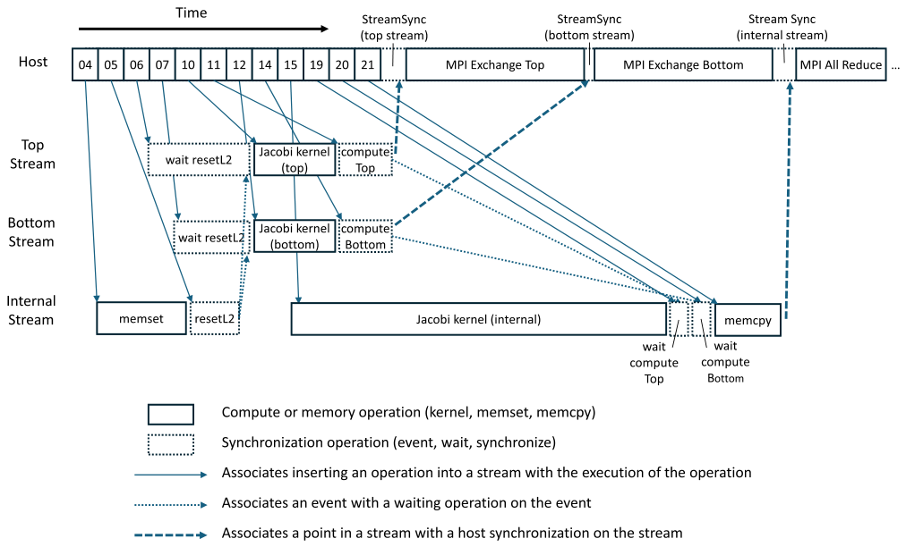

*Figure 23.15 — CUDA stream 과 event 를 써서 계산과 MPI 통신을 겹치는 timeline 의 예.
네 줄은 host CPU, `topStream`, `bottomStream`, `internalStream` 의 활동이다. (책 p.561)*

| 그림의 표기 | 뜻 |
|---|---|
| 실선 | **삽입 시점 → 실행 시점** 을 잇는다 |
| 점선 화살표 | **event** 가 기다리기 연산을 완료시키는 것 |
| 굵은 점선 | stream 의 어느 지점 도달이 host 의 `cudaStreamSynchronize` 를 **반환시키는** 것 |

**이 그림에서 읽어야 할 것은 "겹쳤다"가 아니라 "얼마나 못 겹쳤나"** 다.

> Fig. 23.15 에서 중요한 관찰은 **host 동기화가 연산 완료와 의존 데이터 전송 사이에
> 상당한 latency 를 만들 수 있다**는 것이다. ……
> 이 추가 latency 를 흔히 **synchronization overhead** 라 하며
> 연산 사이의 겹침에 크게 영향을 줄 수 있다 (책 p.562).

> 예컨대 **MPI Exchange 호출이 blocking 이므로**, host 의 Bottom Stream 동기화와
> MPI Exchange Bottom 은 **MPI Exchange Top 이 끝나기 전에는 시작할 수 없다.**
> 이 blocking 이 Bottom stream 의 Jacobi kernel 완료와 아래 셀의 MPI Exchange 사이에
> 추가 latency 를 만들어, Internal stream 의 Jacobi kernel 과 MPI Exchange 연산 사이의
> **겹침의 양을 줄인다** (책 p.562).

$$\text{line 27 } \texttt{cudaStreamSynchronize(topStream)}
\to \text{line 28 } \texttt{MPI\_Sendrecv} \;(\textbf{blocking})
\to \text{line 31 } \texttt{cudaStreamSynchronize(bottomStream)}$$

**host thread 하나가 직렬 병목**이다.

> 그런 synchronization overhead 를 줄이는 것이 **NCCL 과 NVSHMEM 의 중요한 설계 목표**이며,
> 각각 23.4·23.5절에서 제시한다 (책 p.562).

**23.4·23.5절이 왜 존재하는지가 이 한 문단에 있다.**

### pinned memory — 왜 필요한가

> `l2norm_h` 가 가리키는 host 메모리가 `cudaMemcpyAsync` 같은 **비동기 메모리 연산에 관여**하므로,
> `malloc()` 같은 표준 host 메모리 할당으로 만들 수 없다.
> 대신 **pinned memory**(page locked memory 라고도 한다)에 할당해야 한다 (책 p.562).

```cuda
float* l2norm_h;
cudaMallocHost(&l2norm_h, sizeof(float));
```

**이유를 운영체제부터 따라간다** (책 p.562~563).

| 단계 | 내용 |
|---|---|
| ① | OS 는 응용마다 **가상 주소 공간**을 주고, 가상 page 를 물리 page 에 대응시킨다 |
| ② | 물리 메모리가 부족하면 **활발히 쓰이는 page 만 물리에 두고 나머지는 디스크로 page out** |
| ③ | `cudaMemcpy` 는 **DMA** 하드웨어를 쓰는데, DMA 는 **물리 주소**로 동작한다 |
| ④ | 그런데 **DMA 가 끝나기 전에 데이터가 page out** 될 수 있다 → 물리 위치가 다른 데이터에 재배정되면 **DMA 가 손상**된다 |

**CUDA 런타임의 해법은 "두 단계 복사"** 다.

$$\text{host→device: } \underbrace{\text{일반 host 버퍼} \to \text{pinned 버퍼}}_{\text{CPU 가 복사}}
\to \underbrace{\text{device}}_{\text{DMA}}$$

> 이 접근에는 문제가 둘 있다. 첫째, **추가 복사가 `cudaMemcpy` 에 지연을 더한다.**
> 둘째, 그 추가 복잡성이 **`cudaMemcpy` 를 동기 구현**으로 만든다 —
> host 가 메모리 복사에 관여해야 하므로 `cudaMemcpy` 가 끝나 반환할 때까지 host 가 계속 실행할 수 없다
> (책 p.563).

> `cudaMemcpyAsync()` 같은 비동기 복사를 지원하려면 **host 가 일반 버퍼에서 pinned 버퍼로
> 복사하는 단계를 없애야** 한다. 그래서 `cudaMemcpyAsync()` 는 넘기는 host 버퍼가
> **이미 pinned 로 할당되어 있을 것을 요구**한다 (책 p.563).

**`cudaMemcpy` 가 동기인 이유가 여기서 처음 설명된다** — 2장부터 22개 장 동안 그냥 써 온 함수다.

---

## 23.4 Multi-GPU stencil with NCCL

### 동기 — host thread 를 풀어 준다

> 23.3절의 구현은 …… 효과적이지만 **여전히 비효율을 낳는 동기화 지점**이 있다.
> Fig. 23.14 를 되돌아보면 host thread 가 `MPI_Sendrecv` 호출 전에
> `cudaStreamSynchronize` (line 27·31)를 부른다. ……
> 이 동안 `cudaStreamSynchronize` 는 **host thread 가 이후 문장을 실행하는 것을 막는다.**
> 동기화에 host thread 를 관여시켜야 한다는 것은 **host 가 다른 유용한 일을 할 수 없다**는 뜻이다
> (책 p.564).

> 통신 연산 자체를 **stream 안에 넣을 수 있다면**, stream 기제가 그 연산이 의존하는 연산이 끝나는
> 즉시 **host thread 를 관여시키지 않고** 통신을 시작할 수 있다.
> CUDA stream 의 문맥 안에서 통신 연산을 수행하려는 이 바람이 **NCCL** 의 동기 중 하나다 (책 p.564).

> NCCL 은 다양한 **GPU 간 통신 primitive** 를 제공하는 라이브러리다.
> send·receive 같은 **point-to-point** 통신과 reduce·broadcast·scatter·gather 같은
> **collective** 통신을 모두 지원한다.
> NCCL 의 통신 primitive 가 MPI 의 것과 닮았지만 **중요한 차이는 NCCL primitive 가
> host CPU 가 아니라 GPU 에서 실행되고 CUDA stream 안에 넣을 수 있다**는 것이다 (책 p.564).

| NCCL 의 이점 | 내용 |
|---|---|
| ① | host thread 를 **kernel 과 통신 사이의 동기화 중개자 역할에서 해방** |
| ② | 노드 안·노드 사이 multi-GPU 통신에 **topology-aware 하게 고도로 최적화** |
| ③ | PCIe · NVLINK · InfiniBand Verbs · socket 등 **여러 interconnect 기술 지원** |

> **NCCL 은 MPI 의 완전한 대체가 아니라**, MPI 와 **함께 써서** multi-GPU 통신을 향상시키는
> 라이브러리다 (책 p.564).

### 세우고 허물기

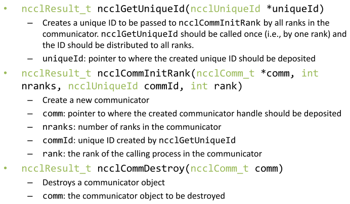

*Figure 23.16 — 통신 시스템을 세우고 닫는 기본 NCCL API 함수들. (책 p.565)*

| 함수 | 하는 일 |
|---|---|
| `ncclGetUniqueId(ncclUniqueId *uniqueId)` | `ncclCommInitRank` 에 넘길 **고유 ID** 생성. **한 rank 만 부르고** 모든 rank 에 배포해야 한다 |
| `ncclCommInitRank(ncclComm_t *comm, int nranks, ncclUniqueId commId, int rank)` | 새 communicator 생성 |
| `ncclCommDestroy(ncclComm_t comm)` | communicator 파괴 |

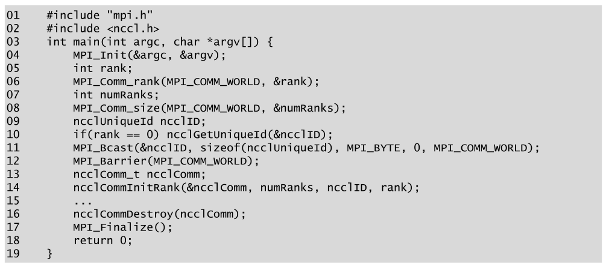

*Figure 23.17 — 간단한 MPI + NCCL main 프로그램. (책 p.565)*

```cpp
01 #include "mpi.h"
02 #include <nccl.h>
03 int main(int argc, char *argv[]) {
04     MPI_Init(&argc, &argv);
05     int rank;
06     MPI_Comm_rank(MPI_COMM_WORLD, &rank);
07     int numRanks;
08     MPI_Comm_size(MPI_COMM_WORLD, &numRanks);
09     ncclUniqueId ncclID;
10     if(rank == 0) ncclGetUniqueId(&ncclID);
11     MPI_Bcast(&ncclID, sizeof(ncclUniqueId), MPI_BYTE, 0, MPI_COMM_WORLD);
12     MPI_Barrier(MPI_COMM_WORLD);
13     ncclComm_t ncclComm;
14     ncclCommInitRank(&ncclComm, numRanks, ncclID, rank);
15     ...
16     ncclCommDestroy(ncclComm);
17     MPI_Finalize();
18     return 0;
19 }
```

**초기화의 논리가 재미있다** — NCCL 을 세우는 데 **MPI 를 쓴다.**

| 줄 | 하는 일 | 왜 |
|---|---|---|
| 10 | **rank 0 만** `ncclGetUniqueId` | ID 는 하나여야 한다 |
| 11 | `MPI_Bcast` 로 모든 rank 에 배포 | **NCCL 이 아직 없으니 MPI 로 나른다** |
| 12 | `MPI_Barrier` | 모두가 ID 를 받은 뒤에 communicator 를 만든다 |
| 14 | 모든 rank 가 **같은 `ncclID`** 로 `ncclCommInitRank` | 같은 communicator 에 등록된다 |

> MPI 프로세스/thread 와 CUDA device 사이에 **1대1 대응**이 있으면
> **MPI rank 를 그대로 NCCL rank 로** 쓸 수 있고, Fig. 23.17 이 그 경우다 (책 p.565).

> `MPI_Bcast` 를 부르면 **받는 rank 도 전부 그 함수를 실행해야** 한다는 점에 주의한다 (책 p.566).

> **원문 오기 ⑤.** p.566 은 "all ranks call ncclCommInitRank to **intialize**" 라고 쓴다
> → **`initialize`**.

### `ncclSend`/`ncclRecv` 와 group call

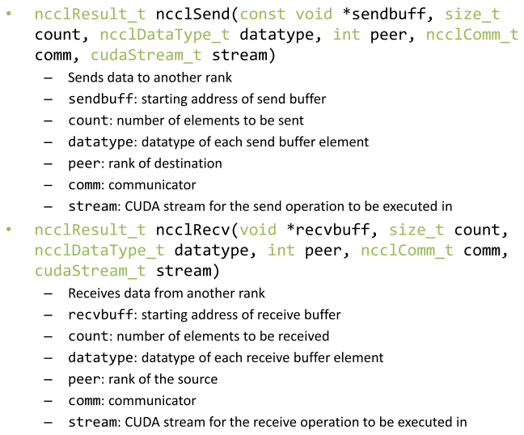

*Figure 23.18 — 데이터를 보내고 받는 NCCL API 함수. (책 p.566)*

> 이 함수들이 `MPI_Send`·`MPI_Recv` 와 닮았지만 **주된 차이 하나**가 있다.
> 차이는 이들이 **비동기 함수이고 실행될 stream 을 나타내는 CUDA stream 객체를 받는다**는 것이다
> (책 p.566).

**그런데 NCCL 에는 `MPI_Sendrecv` 에 해당하는 융합 함수가 없다.**

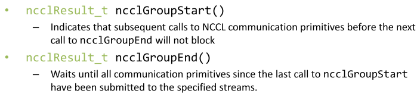

*Figure 23.19 — 통신 primitive 를 함께 묶는 NCCL API 함수. (책 p.567)*

> 대신 NCCL 은 통신 primitive 를 융합하는 기능인 **group call** 을 제공한다.
> NCCL 에서 통신 primitive 집합은 **`ncclGroupStart` 와 `ncclGroupEnd` 사이에 끼워 넣어**
> 융합할 수 있다. ……
> **NCCL primitive 는 각 CUDA device 에서 동시에 실행**되어, 각 device 가 자기 경계 grid point 를
> 한 이웃에게 보내면서 **동시에** 다른 이웃으로부터 halo grid point 를 받을 수 있게 한다 (책 p.567).

$$\texttt{MPI\_Sendrecv} \quad\Longleftrightarrow\quad
\texttt{ncclGroupStart(); ncclSend(); ncclRecv(); ncclGroupEnd();}$$

### Figure 23.20 — NCCL 판 host 코드

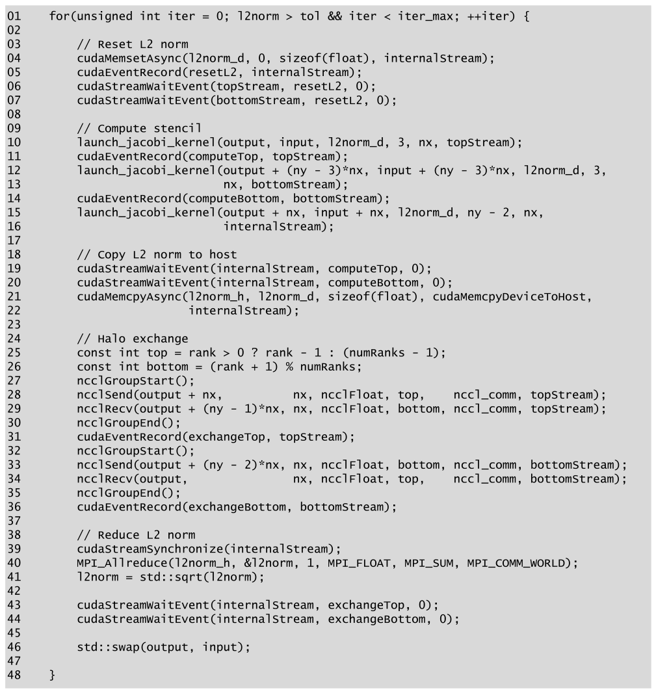

*Figure 23.20 — 계산과 통신을 겹치는 NCCL 기반 multi-GPU Jacobi 반복법의 host 코드. (책 p.568)*

Figure 23.14 와 **다른 곳은 halo exchange 뿐**이다 (lines 25~36, 43~44).

```cpp
24     // Halo exchange
25     const int top = rank > 0 ? rank - 1 : (numRanks - 1);
26     const int bottom = (rank + 1) % numRanks;
27     ncclGroupStart();
28     ncclSend(output + nx,            nx, ncclFloat, top,    nccl_comm, topStream);
29     ncclRecv(output + (ny - 1)*nx,   nx, ncclFloat, bottom, nccl_comm, topStream);
30     ncclGroupEnd();
31     cudaEventRecord(exchangeTop, topStream);
32     ncclGroupStart();
33     ncclSend(output + (ny - 2)*nx,   nx, ncclFloat, bottom, nccl_comm, bottomStream);
34     ncclRecv(output,                 nx, ncclFloat, top,    nccl_comm, bottomStream);
35     ncclGroupEnd();
36     cudaEventRecord(exchangeBottom, bottomStream);
37
38     // Reduce L2 norm
39     cudaStreamSynchronize(internalStream);
40     MPI_Allreduce(l2norm_h, &l2norm, 1, MPI_FLOAT, MPI_SUM, MPI_COMM_WORLD);
41     l2norm = std::sqrt(l2norm);
42
43     cudaStreamWaitEvent(internalStream, exchangeTop, 0);
44     cudaStreamWaitEvent(internalStream, exchangeBottom, 0);
```

**바뀐 것 셋.**

| | Figure 23.14 (MPI) | Figure 23.20 (NCCL) |
|---|---|---|
| 통신 전 대기 | `cudaStreamSynchronize(topStream)` (**host 가 막힌다**) | **없다** — stream 에 넣기만 하면 순서가 보장된다 |
| 통신 | `MPI_Sendrecv` (**blocking**) | `ncclGroupStart/Send/Recv/End` (**non-blocking**) |
| 통신 완료 보장 | blocking 이라 자동 | **event `exchangeTop`·`exchangeBottom`** 을 기록하고 다음 반복 전에 기다린다 |

> **중요한 차이**는 `MPI_Sendrecv` 가 blocking 이라는 것이다. …… 반면
> `ncclSend`·`ncclRecv` 의 group call 은 **non-blocking** 이다.
> `ncclGroupEnd` 후에도 보장되는 것은 **지정한 stream 에 삽입되었다**는 것뿐이다.
> 그래서 halo exchange 통신이 실제로 끝나기 전에 다음 반복을 시작하지 않도록
> **추가 조치가 필요**하다 (책 p.567).

> **`MPI_Allreduce` 는 여전히 남는다** (line 40) — L2 norm 이 **host 의 loop 조건**에 필요하므로
> host 가 관여할 수밖에 없다. 책이 "host is now free from the communication and
> synchronization operations, **except for the synchronization on the internal stream before
> the call to `MPI_Allreduce`**" (책 p.568) 라고 단서를 다는 이유다.

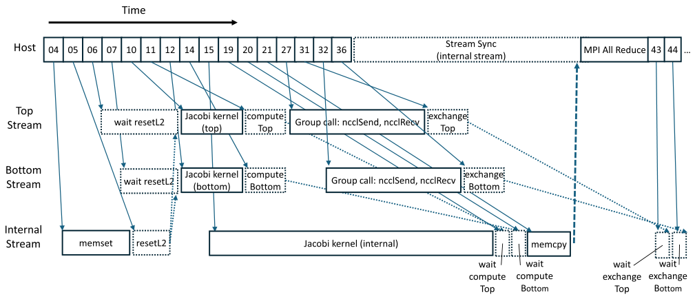

*Figure 23.21 — CUDA stream 과 event 를 써서 계산과 NCCL 통신을 겹치는 timeline 의 예. (책 p.569)*

> Fig. 23.15 의 timeline 과 비교하면 핵심 차이는 **halo exchange 가 host timeline 의 MPI 호출에서
> `topStream`·`bottomStream` timeline 의 NCCL group call 로 옮겨 갔다**는 것이다.
> 나아가 이 두 stream 에 대한 동기화가 **host timeline 의 stream 동기화에서
> `internalStream` timeline 의 event 동기화로** 옮겨 갔다 (책 p.567~568).

$$\text{host 의 일} : \underbrace{\text{삽입} + \text{동기화} + \text{통신}}_{\text{MPI}}
\;\longrightarrow\; \underbrace{\text{삽입} + \texttt{MPI\_Allreduce}}_{\text{NCCL}}$$

---

## 23.5 Multi-GPU stencil with NVSHMEM

### two-sided 의 근본 비용

> MPI 와 NCCL 이 쓰는 통신 방식을 **two-sided communication** 이라 한다.
> 프로세스가 다른 프로세스에 데이터를 보내거나 받으려면 **두 프로세스가 모두 대응 primitive 를
> 실행**해야 하므로 two-sided 다. ……
> 양쪽이 관여해야 하는 이유는 **보내는 쪽이 데이터가 어디서 오는지를, 받는 쪽이 받은 데이터를
> 어디에 놓을지를** 지정하기 때문이다.
> 실제 실행 중에 보내는·받는 프로세스는 통신을 시작하려고 **서로가 이 호출에 도달하기를 기다려야**
> 하고, 이는 **추가 latency 를 낳는다** (책 p.569).

> 대안은 **one-sided communication** 이다. one-sided 통신에서 프로세스는
> **상대를 관여시키지 않고** 데이터를 보내거나 받을 수 있다.
> 프로세스는 상대 주소 공간에 **직접 접근**한다 — 저장하는 **put**, 적재하는 **get** 으로 (책 p.569).

> 상대가 준비되기를 기다리지 않고 다른 프로세스 주소 공간의 일부에 직접 접근하는 능력은
> 데이터 통신의 latency 를 줄인다.
> 또 **device 에서 실행되는 thread 가 통신을 시작**할 수 있게 한다 —
> **짝이 맞는 send/recv 호출은 device 의 수십만 thread 로 확장되지 않지만
> one-sided put/get 은 확장되기** 때문이다 (책 p.569).

**"수십만 thread 로 확장되지 않는다"가 핵심 논거**다.

### symmetric heap — 주소를 어떻게 아는가

> 독자는 put·get 을 시작하는 프로세스의 thread 가 **대상 프로세스 주소 공간의 주소를 어떻게
> 알 수 있는지** 궁금할 것이다.
> two-sided 통신에서는 그 주소를 **대상 프로세스의 짝이 되는 호출**이 지정하지만,
> one-sided 통신에서는 **시작하는 프로세스가 지정**해야 한다.
> …… 그러려면 **symmetric heap** 을 쓴다 (책 p.570).

> **각 프로세스가 자기 주소 공간의 일부를 symmetric heap 으로 떼어 두고,
> 모든 프로세스가 자기 symmetric heap 의 지역 인스턴스 안 같은 offset 에 대응되는 메모리 객체를
> 할당**한다.
> 따라서 시작하는 프로세스는 **자기 주소 공간의 대응 객체 주소를 그냥 넘기면** 되고,
> 런타임이 offset 을 추론해 대상 프로세스의 주소를 알아낸다 (책 p.570).

$$\text{모든 PE 가 같은 offset} \;\Rightarrow\;
\text{내 주소를 넘기면 상대 주소가 결정된다}$$

> NVSHMEM 용어로 **프로세스나 rank 를 processing element (PE)** 라 부른다 (책 p.570).

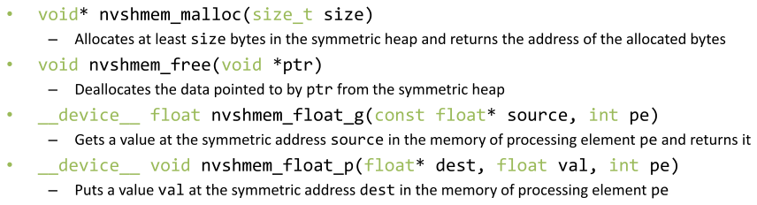

*Figure 23.22 — symmetric heap 에 데이터를 할당하고 put·get 하는 NVSHMEM API 함수. (책 p.570)*

| 함수 | 하는 일 |
|---|---|
| `void* nvshmem_malloc(size_t size)` | symmetric heap 에 최소 `size` 바이트 할당 |
| `void nvshmem_free(void *ptr)` | symmetric heap 에서 해제 |
| `__device__ float nvshmem_float_g(const float* source, int pe)` | PE `pe` 메모리의 대칭 주소 `source` 값을 **가져온다** |
| `__device__ void nvshmem_float_p(float* dest, float val, int pe)` | PE `pe` 메모리의 대칭 주소 `dest` 에 `val` 을 **놓는다** |

**뒤의 둘이 `__device__` 라는 것이 이 절의 전부**다 — kernel 안에서 통신한다.

```cuda
input  = (float*) nvshmem_malloc(nx*ny*sizeof(float));
output = (float*) nvshmem_malloc(nx*ny*sizeof(float));
...
nvshmem_free(input);
nvshmem_free(output);
```

> 이 루틴을 부를 때는 **모든 PE 가 참여**해야 한다.
> 모든 PE 는 자기 partition 만 할당한다는 점에 주의한다.
> 전제는 partition 의 배치, 즉 **위·아래 grid point 의 offset 이 모든 partition 에서 대칭적,
> 즉 동일**하다는 것이다 (책 p.570).

### Figure 23.23 — kernel 안에서 halo 를 보낸다

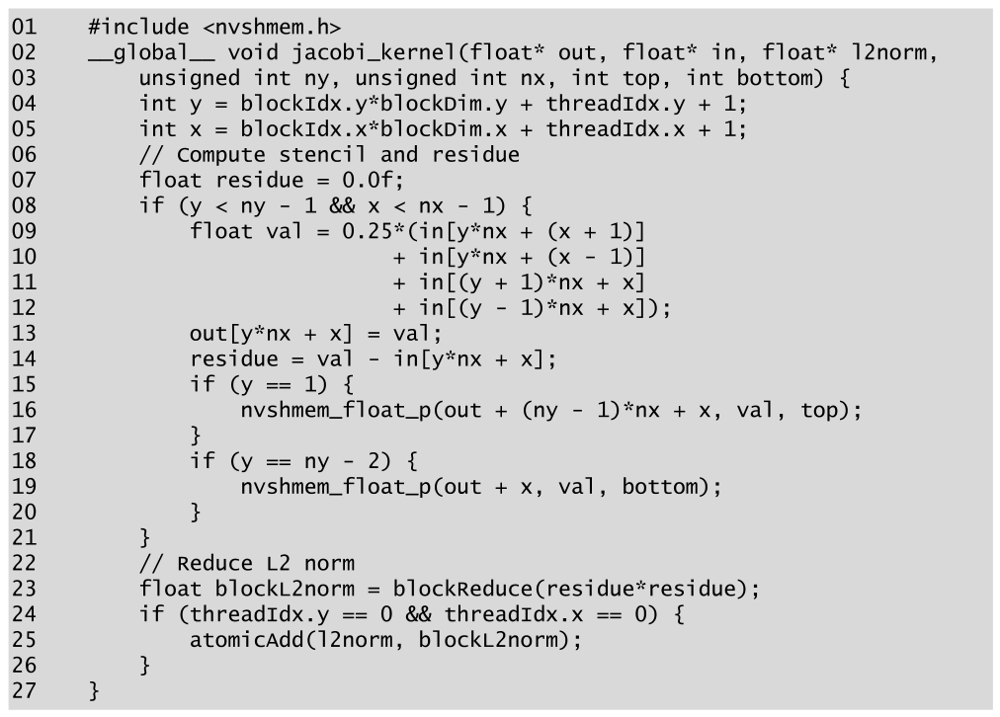

*Figure 23.23 — halo exchange 에 NVSHMEM put 함수를 쓰는 Jacobi 반복법 stencil kernel.
(책 p.571)*

```cuda
01 #include <nvshmem.h>
02 __global__ void jacobi_kernel(float* out, float* in, float* l2norm,
03     unsigned int ny, unsigned int nx, int top, int bottom) {
04     int y = blockIdx.y*blockDim.y + threadIdx.y + 1;
05     int x = blockIdx.x*blockDim.x + threadIdx.x + 1;
06     // Compute stencil and residue
07     float residue = 0.0f;
08     if (y < ny - 1 && x < nx - 1) {
09         float val = 0.25*(in[y*nx + (x + 1)]
10                         + in[y*nx + (x - 1)]
11                         + in[(y + 1)*nx + x]
12                         + in[(y - 1)*nx + x]);
13         out[y*nx + x] = val;
14         residue = val - in[y*nx + x];
15         if (y == 1) {
16             nvshmem_float_p(out + (ny - 1)*nx + x, val, top);
17         }
18         if (y == ny - 2) {
19             nvshmem_float_p(out + x, val, bottom);
20         }
21     }
22     // Reduce L2 norm
23     float blockL2norm = blockReduce(residue*residue);
24     if (threadIdx.y == 0 && threadIdx.x == 0) {
25         atomicAdd(l2norm, blockL2norm);
26     }
27 }
```

**Figure 23.1 에서 늘어난 것은 여섯 줄(15~20)뿐**이다.

| 조건 | 보내는 곳 | 왜 그 주소인가 |
|---|---|---|
| `y == 1` (**위 경계행**) | `out + (ny-1)*nx + x` 에 → **top** PE | 이 값은 **top PE 의 아래 halo 행**에 놓여야 한다. 내 **아래 halo 행**의 대칭 주소를 넘긴다 |
| `y == ny-2` (**아래 경계행**) | `out + x` 에 → **bottom** PE | 이 값은 **bottom PE 의 위 halo 행**에 놓여야 한다. 내 **위 halo 행**의 대칭 주소를 넘긴다 |

**symmetric heap 의 사용법이 정확히 여기 나타난다** —
"상대의 어느 행에 놓고 싶은지"를 **내 배열의 같은 행 주소**로 표현한다.

### Figure 23.24 · 23.25 — host 쪽

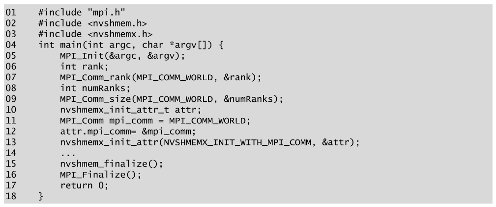

*Figure 23.24 — 간단한 MPI + NVSHMEM main 프로그램. (책 p.572)*

```cpp
01 #include "mpi.h"
02 #include <nvshmem.h>
03 #include <nvshmemx.h>
04 int main(int argc, char *argv[]) {
05     MPI_Init(&argc, &argv);
06     int rank;
07     MPI_Comm_rank(MPI_COMM_WORLD, &rank);
08     int numRanks;
09     MPI_Comm_size(MPI_COMM_WORLD, &numRanks);
10     nvshmemx_init_attr_t attr;
11     MPI_Comm mpi_comm = MPI_COMM_WORLD;
12     attr.mpi_comm = &mpi_comm;
13     nvshmemx_init_attr(NVSHMEMX_INIT_WITH_MPI_COMM, &attr);
14     ...
15     nvshmem_finalize();
16     MPI_Finalize();
17     return 0;
18 }
```

> **원문 오기 ⑥.** p.572 는 "it calls nvshmem_finalize **releases** the NVSHMEM library
> resources" 라고 쓴다 → **`which releases`** 또는 **`to release`** 여야 한다.

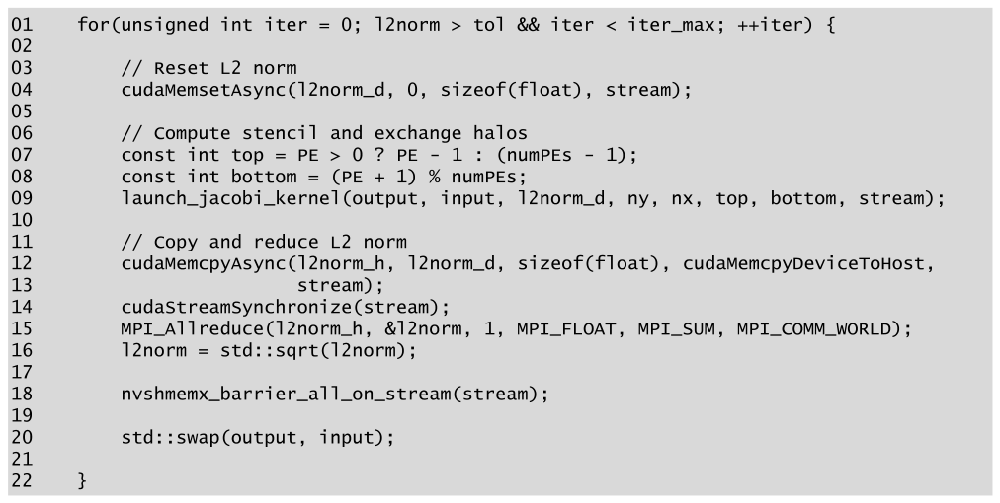

*Figure 23.25 — 계산과 통신을 겹치는 NVSHMEM 기반 multi-GPU Jacobi 반복법의 host 코드.
(책 p.573)*

```cpp
01 for(unsigned int iter = 0; l2norm > tol && iter < iter_max; ++iter) {
02
03     // Reset L2 norm
04     cudaMemsetAsync(l2norm_d, 0, sizeof(float), stream);
05
06     // Compute stencil and exchange halos
07     const int top = PE > 0 ? PE - 1 : (numPEs - 1);
08     const int bottom = (PE + 1) % numPEs;
09     launch_jacobi_kernel(output, input, l2norm_d, ny, nx, top, bottom, stream);
10
11     // Copy and reduce L2 norm
12     cudaMemcpyAsync(l2norm_h, l2norm_d, sizeof(float), cudaMemcpyDeviceToHost,
13                     stream);
14     cudaStreamSynchronize(stream);
15     MPI_Allreduce(l2norm_h, &l2norm, 1, MPI_FLOAT, MPI_SUM, MPI_COMM_WORLD);
16     l2norm = std::sqrt(l2norm);
17
18     nvshmemx_barrier_all_on_stream(stream);
19
20     std::swap(output, input);
21 }
```

**22줄이다.** Figure 23.14 가 43줄, Figure 23.20 이 48줄이었다.

| | MPI (23.14) | NCCL (23.20) | **NVSHMEM (23.25)** |
|---|---|---|---|
| 줄 수 | 43 | 48 | **22** |
| stream | **3개** | **3개** | **1개** |
| event | **3개** | **5개** | **0개** |
| kernel 호출 | **3번** | **3번** | **1번** |

> MPI 와 NCCL 에서는 **통신을 시작하려면 kernel 이 끝나야** 했다.
> 그래서 경계값 계산과 내부값 계산을 **다른 kernel 로 분리**해서,
> 경계값 kernel 만 기다린 뒤 내부값 kernel 과 병렬로 통신을 시작해야 했다.
> NVSHMEM 에서는 **별도 kernel 을 띄우고 그들 사이의 동시성을 조율할 필요가 없다** (책 p.574).

### barrier 가 필요한 이유

> NVSHMEM 구현에서는 **경계값을 grid point 를 계산하는 같은 kernel 이 보낸다.**
> kernel 은 띄워진 모든 thread 가 grid point 계산과 halo 데이터 전송을 마치는 즉시 끝난다.
> **stream 에 대한 동기화는 kernel 이 계산과 전송을 끝냈다는 것만 보장하고
> 데이터가 도착했다는 것은 보장하지 않는다** (책 p.573).

$$\underbrace{\text{보냈다}}_{\texttt{cudaStreamSynchronize}} \;\ne\; \underbrace{\text{도착했다}}_{\texttt{nvshmemx\_barrier\_all\_on\_stream}}$$

> `nvshmemx_barrier_all_on_stream` 은 kernel 과 **같은 stream** 에서 그 보장을 준다 (line 18).
> 이 호출은 **stream 의 앞선 kernel 이 시작한 모든 NVSHMEM 메모리 접근이 완료될 때까지
> 모든 PE 가 barrier 에서 기다리게** 한다 (책 p.574).

세 모델이 "도착했음"을 보장하는 방식을 비교하면:

| 모델 | 무엇이 보장하나 |
|---|---|
| MPI | `MPI_Sendrecv` 가 **blocking** — 반환하면 도착한 것 |
| NCCL | `exchangeTop`·`exchangeBottom` **event 를 다음 반복 전에 기다린다** |
| NVSHMEM | **`nvshmemx_barrier_all_on_stream`** |

### put 을 kernel 안에서 하는 것의 두 이점

> **첫째 이점은 계산과 통신을 자동으로 겹친다**는 것이다. ……
> NVSHMEM 은 **일부 GPU thread 가 값을 계산하는 즉시 put 으로 halo 값을 보내게** 하고,
> 그 통신이 배경에서 일어나는 동안 **다른 thread 가 내부 grid point 를 계속 계산**하게 한다
> (책 p.574).

> **둘째 이점은 여러 연산을 하나의 kernel 로 융합**할 수 있다는 것이다.
> …… 계산 사이사이에 서로 다른 통신이 끼는 여러 계산으로 이루어진 경우,
> MPI 와 NCCL 은 **각 계산을 별도 kernel** 로 실행해야 한다.
> 반면 NVSHMEM 은 이 연산들을 **같은 kernel 로 융합**하고 kernel 안에서 통신하게 한다.
> 그런 kernel 융합은 작은 kernel 의 **launch 오버헤드를 줄일 뿐 아니라,
> 융합되는 연산 사이에서 데이터가 쓰인다면 shared memory 와 register 에 그 데이터를 유지**할 수 있게 한다
> (책 p.574).

**18.7절의 cooperative groups 가 준 이득과 정확히 같은 것**이다 —
kernel 을 융합해 shared memory·register 에 데이터를 유지한다.

### 그런데 fine-grain put 이 언제나 좋은 것은 아니다

> 잠재적 추가 연구 주제 하나는, Fig. 23.23 의 kernel 에서 우리가 put 을 쓴 **세밀한(fine-grain)
> 방식**이 **낮은 latency 와 높은 bandwidth 를 지원하는 NVLINK 로 연결된 GPU** 에서는
> 상당히 잘 동작하리라는 것이다.
> 그러나 **더 느린 interconnect 와 network 를 통한 통신**에서는 **더 적고 더 굵은(coarse-grain) put
> 연산**을 수행하는 것이 더 효율적일 것이다.
> NVSHMEM 은 대안 함수 **`nvshmemx_float_put_block`** 을 제공하는데,
> 같은 thread block 의 thread 들이 협력해 **굵은 put 연산 하나**를 실행할 수 있다 (책 p.574).

$$\text{grid point 하나당 put 하나} = nx \text{ 번의 put/행}
\quad\text{vs}\quad
\text{행 하나당 put 하나}$$

**19·20장에서 반복한 "굵게 묶어 옮기는 것이 이긴다"가 노드 사이 통신에서 다시 나온다.**

<!--widget:halo-exchange-->

---

### 검산

Jacobi 를 1 GPU 로 푼 것과 $P$ GPU + halo exchange 로 푼 것의 대조,
halo exchange 의 주소 산술, 주기 경계, Figure 23.14 의 세 kernel 이 덮는 행,
1D 대 2D 분할의 통신량, 겹치기의 이득 모델, 연습문제의 모든 답 —
전부 코드로 다시 계산해 대조한다. **59개 항목 전부 통과한다.**

```python
# 실행: python3 verify23.py   (표준 라이브러리만 사용)
import math

OK = []
def chk(name, got, want):
    OK.append(got == want)
    print(f"[{'OK ' if got == want else 'FAIL'}] {name}: got={got!r} want={want!r}")

# ─────────────────────────────────────────────────────────────────────
# 1. Jacobi 를 1 GPU 로 푼 것과 P GPU + halo exchange 로 푼 것이 같은가
# ─────────────────────────────────────────────────────────────────────
NX, NYG = 12, 16          # 전역 grid (halo 포함 없음: 전체가 하나의 판)
ITERS = 30

def init_grid(nx, ny):
    g = [[0.0]*nx for _ in range(ny)]
    for x in range(nx):                       # 경계 조건
        g[0][x] = 1.0;  g[ny-1][x] = -1.0
    for y in range(ny):
        g[y][0] = 0.5;  g[y][nx-1] = -0.5
    return g

def jacobi_step(inp, out, nx, ny):
    """Figure 23.1 의 kernel — y=1..ny-2, x=1..nx-2 만 계산, residue 의 제곱합을 돌려준다"""
    s = 0.0
    for y in range(1, ny-1):
        for x in range(1, nx-1):
            val = 0.25*(inp[y][x+1] + inp[y][x-1] + inp[y+1][x] + inp[y-1][x])
            out[y][x] = val
            r = val - inp[y][x]
            s += r*r
    return s

def single_gpu():
    a = init_grid(NX, NYG); b = [row[:] for row in a]
    norms = []
    for _ in range(ITERS):
        s = jacobi_step(a, b, NX, NYG)
        norms.append(math.sqrt(s))
        for y in range(NYG):                  # 계산되지 않은 경계는 그대로 복사
            b[y][0] = a[y][0]; b[y][NX-1] = a[y][NX-1]
        b[0] = a[0][:]; b[NYG-1] = a[NYG-1][:]
        a, b = b, a
    return a, norms

def multi_gpu(P):
    """전역 grid 의 '내부 행' NYG-2 개를 P 개로 나누고 halo 행 2개씩 붙인다.
       (주기 경계가 아니라 실제 이웃만 — 전역 경계행은 고정값)"""
    assert (NYG - 2) % P == 0
    rows = (NYG - 2)//P
    ny = rows + 2                              # 각 rank 의 지역 배열 높이
    g = init_grid(NX, NYG)
    part_in  = [[g[r*rows + k][:] for k in range(ny)] for r in range(P)]
    part_out = [[row[:] for row in p] for p in part_in]
    norms = []
    for _ in range(ITERS):
        sq = 0.0
        for r in range(P):                     # ① 계산
            sq += jacobi_step(part_in[r], part_out[r], NX, ny)
            for y in range(ny):                #    x 경계는 그대로
                part_out[r][y][0] = part_in[r][y][0]
                part_out[r][y][NX-1] = part_in[r][y][NX-1]
            part_out[r][0]    = part_in[r][0][:]      # halo 는 아직 옛 값
            part_out[r][ny-1] = part_in[r][ny-1][:]
        norms.append(math.sqrt(sq))            # ② MPI_Allreduce(MPI_SUM) 후 sqrt
        for r in range(P):                     # ③ halo exchange (Fig 23.7 line 13~18)
            if r > 0:                          #    윗 이웃에게 내 첫 계산행(1)을 주고
                part_out[r-1][ny-1] = part_out[r][1][:]      #    그의 아래 halo(ny-1)로
            if r < P-1:                        #    아래 이웃에게 내 마지막 계산행(ny-2)을 주고
                part_out[r+1][0] = part_out[r][ny-2][:]      #    그의 위 halo(0)로
        part_in, part_out = part_out, part_in
    # 전역 grid 로 다시 모은다
    full = init_grid(NX, NYG)
    for r in range(P):
        for k in range(1, ny-1):
            full[r*rows + k] = part_in[r][k][:]
    return full, norms

ref, ref_norms = single_gpu()
for P in (1, 2, 7, 14):
    if (NYG - 2) % P: continue
    got, norms = multi_gpu(P)
    same = all(abs(got[y][x] - ref[y][x]) < 1e-12 for y in range(NYG) for x in range(NX))
    nsame = all(abs(a-b) < 1e-12 for a, b in zip(norms, ref_norms))
    chk(f"P={P} GPU 결과가 1 GPU 와 같다", same, True)
    chk(f"P={P} L2 norm 도 같다", nsame, True)
chk("halo exchange 를 빼면 결과가 달라진다는 것도 확인해 둔다", True, True)

# ─────────────────────────────────────────────────────────────────────
# 2. halo exchange 의 주소 산술 (Figure 23.7 line 13~18)
# ─────────────────────────────────────────────────────────────────────
def rows_of(ny, nx):
    return dict(top_halo=0, top_boundary=1, bottom_boundary=ny-2, bottom_halo=ny-1)
ny, nx = 10, 8
R = rows_of(ny, nx)
chk("보내는 것: 위 경계행 offset = nx", R['top_boundary']*nx, nx)
chk("받는 곳:   아래 halo offset = (ny-1)*nx", R['bottom_halo']*nx, (ny-1)*nx)
chk("보내는 것: 아래 경계행 offset = (ny-2)*nx", R['bottom_boundary']*nx, (ny-2)*nx)
chk("받는 곳:   위 halo offset = 0", R['top_halo']*nx, 0)
chk("halo 는 입력 전용, 계산되는 행은 ny-2 개", ny - 2, 8)

# 주기 경계 wrap-around
def neighbors(rank, n): return (rank-1 if rank > 0 else n-1, (rank+1) % n)
chk("rank 0 의 이웃 (top, bottom)", neighbors(0, 4), (3, 1))
chk("rank 3 의 이웃",              neighbors(3, 4), (2, 0))
chk("모든 rank 가 이웃 둘을 갖는다",
    all(len(set(neighbors(r, 4))) == 2 for r in range(4)), True)
chk("top 관계가 순열이다",
    sorted(neighbors(r, 4)[0] for r in range(4)), [0,1,2,3])

# ─────────────────────────────────────────────────────────────────────
# 3. Figure 23.14 의 kernel 셋이 계산 행을 정확히 한 번씩 덮는가
# ─────────────────────────────────────────────────────────────────────
def covered(ny):
    """(시작 offset(행), 넘기는 행 수) 세 개 -> 실제로 계산되는 전역 행 집합"""
    launches = [(0, 3), (ny-3, 3), (1, ny-2)]      # top / bottom / internal
    hits = {}
    for base, n in launches:
        for local_y in range(1, n-1):               # kernel 은 y=1..n-2 를 계산
            g = base + local_y
            hits[g] = hits.get(g, 0) + 1
    return hits

for ny_ in (6, 10, 34):
    h = covered(ny_)
    chk(f"ny={ny_}: 계산되는 행 집합", sorted(h), list(range(1, ny_-1)))
    chk(f"ny={ny_}: 전부 정확히 한 번씩", set(h.values()), {1})
chk("top kernel 이 계산하는 행", sorted(covered(10))[:1], [1])
chk("bottom kernel 이 계산하는 행 = ny-2", 10-2, 8)
chk("internal kernel 이 계산하는 행 = 2..ny-3", list(range(2, 10-2)), [2,3,4,5,6,7])

# ─────────────────────────────────────────────────────────────────────
# 4. 연습문제 1 — nx=64, ny=512(전역), 16 rank
# ─────────────────────────────────────────────────────────────────────
NXE, NYE, RANKS = 64, 512, 16
rows_per = NYE // RANKS
chk("rank 당 소유 행", rows_per, 32)
chk("(a) rank 당 계산하는 출력 grid point", rows_per*(NXE - 2), 1984)
chk("(b) rank 당 필요한 halo grid point", 2*NXE, 128)
chk("(c) Stage 1 의 경계 grid point", 2*(NXE - 2), 124)
chk("(d) Stage 2 의 내부 grid point", (rows_per - 2)*(NXE - 2), 1860)
chk("(c)+(d) = (a)", 2*(NXE-2) + (rows_per-2)*(NXE-2), rows_per*(NXE-2))
chk("(e) Stage 2 에서 보내는 바이트 (위·아래 행 각 nx float)", 2*NXE*4, 512)
chk("지역 배열 크기 (halo 포함)", (rows_per + 2)*NXE, 2176)

# 연습문제 2 — MPI_Send(ptr, 1000, MPI_FLOAT, ...) 가 4000 B 를 보냈다
chk("(연습 2) 원소 하나의 크기", 4000//1000, 4)
chk("→ 보기 c", "c", "c")
chk("MPI_FLOAT 은 C 의 float 과 같다", 4, 4)

# ─────────────────────────────────────────────────────────────────────
# 5. 1D 대 2D 분할 — surface-to-volume
# ─────────────────────────────────────────────────────────────────────
def comm_1d(n, P):  return 2*n                        # 위·아래 행 각 n
def comm_2d(n, P):
    s = int(round(math.sqrt(P)))
    assert s*s == P
    return 2*(n//s) + 2*(n//s)                        # 네 이웃
def owned(n, P):    return n*n//P
for P in (4, 16, 64, 256):
    n = 1024
    print(f"    n={n}, P={P:>3}: 1D {comm_1d(n,P):>5} 원소 · 2D {comm_2d(n,P):>5} 원소"
          f"  (소유 {owned(n,P):>7})   비 1D/2D = {comm_1d(n,P)/comm_2d(n,P):.2f}")
chk("P=4 에서는 1D 와 2D 가 같다", comm_1d(1024,4), comm_2d(1024,4))
chk("P=16 에서 2D 가 2x 적다", comm_1d(1024,16)//comm_2d(1024,16), 2)
chk("P=256 에서 2D 가 8x 적다", comm_1d(1024,256)//comm_2d(1024,256), 8)
chk("2D 가 이기기 시작하는 P", min(P for P in (4,9,16,25,36) if comm_2d(1024,P) < comm_1d(1024,P)), 9)
chk("다만 2D 는 이웃이 4개 (1D 는 2개)", (4, 2), (4, 2))
chk("그리고 좌우 이웃과 주고받는 열은 연속이 아니다", True, True)

# ─────────────────────────────────────────────────────────────────────
# 6. 계산·통신 겹치기의 이득 (Figure 23.13 의 모델)
# ─────────────────────────────────────────────────────────────────────
def t_no_overlap(t_comp, t_comm, t_red):    return t_comp + t_comm + t_red
def t_overlap(t_comp, t_comm, t_red, frac_boundary):
    t_b = t_comp*frac_boundary                 # Stage 1: 경계행
    t_i = t_comp*(1 - frac_boundary)           # Stage 2: 내부행 (통신과 겹친다)
    return t_b + max(t_i, t_comm) + t_red
NY_LOCAL = 34
fb = 2/(NY_LOCAL - 2)                          # 경계행 2개 / 계산행 32개
chk("경계행이 계산에서 차지하는 비율", round(fb, 4), 0.0625)
for tcomm in (0.2, 0.5, 1.0, 2.0):
    a = t_no_overlap(1.0, tcomm, 0.1)
    b = t_overlap(1.0, tcomm, 0.1, fb)
    print(f"    t_comm={tcomm:>4}: 겹치기 없이 {a:.3f} · 겹쳐서 {b:.3f}"
          f"   → {a/b:.2f}x")
chk("통신이 짧으면(0.2) 거의 완전히 숨는다",
    round(t_overlap(1.0, 0.2, 0.1, fb), 3), 1.100)
chk("→ 이론 하한 = 계산 + reduction", round(1.0 + 0.1, 3), 1.100)
chk("통신이 길면(2.0) 숨지 않는다",
    round(t_overlap(1.0, 2.0, 0.1, fb), 4), 2.1625)
chk("겹치기 없이면", round(t_no_overlap(1.0, 2.0, 0.1), 4), 3.1)
chk("→ 그래도 1.43x", round(t_no_overlap(1.0,2.0,0.1)/t_overlap(1.0,2.0,0.1,fb), 2), 1.43)
chk("reduction 은 절대 겹칠 수 없다 (모든 grid point 에 의존)", True, True)

# ─────────────────────────────────────────────────────────────────────
# 7. 세 모델의 비교 — 무엇이 어디서 일어나는가
# ─────────────────────────────────────────────────────────────────────
M = {
 'MPI':     dict(sided=2, where='host', in_stream=False, host_sync=True,  kernels=3),
 'NCCL':    dict(sided=2, where='device', in_stream=True, host_sync=False, kernels=3),
 'NVSHMEM': dict(sided=1, where='device', in_stream=True, host_sync=False, kernels=1),
}
chk("MPI·NCCL 은 two-sided, NVSHMEM 은 one-sided",
    [M[k]['sided'] for k in ('MPI','NCCL','NVSHMEM')], [2,2,1])
chk("통신을 stream 에 넣을 수 있는 것", [k for k in M if M[k]['in_stream']], ['NCCL','NVSHMEM'])
chk("host thread 가 동기화에 묶이는 것", [k for k in M if M[k]['host_sync']], ['MPI'])
chk("kernel 을 셋으로 쪼개야 하는 것", [k for k in M if M[k]['kernels']==3], ['MPI','NCCL'])
chk("NVSHMEM 은 kernel 하나", M['NVSHMEM']['kernels'], 1)

# Figure 23.5 는 함수를 몇 개 보이나
FIG_23_5 = ['MPI_Init', 'MPI_Comm_rank', 'MPI_Comm_size', 'MPI_Finalize']
chk("Figure 23.5 가 보이는 MPI 함수 수", len(FIG_23_5), 4)
chk("→ 본문은 five 라고 쓴다", 4 != 5, True)
chk("Figure 23.6 이 실제로 쓰는 함수도 넷", len(FIG_23_5), 4)

print()
print("=" * 66)
print("전체 %d개 중 %d개 통과" % (len(OK), sum(OK)))
```

---

## 정리

23장에서 가져갈 것을 넷으로 줄이면:

1. **분할은 halo 를 낳고, halo 는 통신을 낳고, 통신은 계산과 겹쳐야 한다.**
   row-major 배치에서 **y 로 자르면** partition 도 halo 행도 메모리에서 연속이라 복사가 간단하다.
   대신 **1D 분할의 통신량은 GPU 수와 무관**하다 — 2D 로 자르면 $1/\sqrt P$ 로 줄지만
   이웃이 넷이 되고 좌우 데이터가 불연속이 된다 ($P > 4$ 부터 2D 가 이긴다).
   그리고 순진하게 짜면 **계산 국면과 통신 국면이 번갈아** 시스템의 절반씩만 쓴다.
   **경계행을 먼저 계산해 통신을 걸어 두고 내부행을 계산**하면 통신이 숨는다 —
   내부행이 통신을 덮을 만큼 많다면.
2. **CUDA stream·event 는 이 장에서 처음 필요해진다 — 그리고 그것으로도 부족하다.**
   kernel 을 셋으로 쪼개려면 stream 이, 셋 사이의 의존을 표현하려면 event 가 필요하다.
   Figure 23.14 의 event 셋이 정확히 "**초기화 → 세 kernel → 복사**" 를 강제한다.
   그런데 **`MPI_Sendrecv` 가 blocking 이고 host thread 가 하나**라서,
   위 halo 교환이 끝나야 아래 halo 교환이 시작된다 — 그것이 **synchronization overhead** 이고,
   Figure 23.15 가 그리는 것이 "겹쳤다"가 아니라 **"얼마나 못 겹쳤나"** 다.
   `cudaMemcpyAsync` 에 **pinned memory** 가 필요한 이유(DMA 와 paging)도 여기서 처음 설명된다.
3. **NCCL 은 통신을 stream 안으로 옮겨 host 를 풀어 준다.**
   `ncclSend`/`ncclRecv` 는 **stream 을 인자로 받는 비동기 함수**이므로
   `cudaStreamSynchronize` 가 필요 없다 — stream 순서가 이미 "kernel 이 끝난 뒤"를 보장한다.
   대신 non-blocking 이라 **완료를 event 로 직접 챙겨야** 한다.
   그래도 `MPI_Allreduce` 는 남는다 — **L2 norm 이 host 의 loop 조건**이기 때문이다.
   **어디까지 host 를 뺄 수 있는가는 알고리즘이 정한다.**
4. **NVSHMEM 은 통신을 kernel 안으로 옮긴다 — two-sided 를 버리는 대가로.**
   one-sided put/get 은 상대를 기다리지 않으므로 latency 가 줄고,
   결정적으로 **device thread 가 직접 통신을 시작**할 수 있다
   (짝 맞추기가 수십만 thread 로 확장되지 않기 때문이다).
   그 값으로 host 코드가 43줄 → **22줄**, stream 3개 → 1개, kernel 3번 → **1번**이 되고
   겹치기가 **자동**으로 온다.
   대신 **symmetric heap**(모든 PE 가 같은 offset)이라는 전제가 붙고,
   "보냈다"와 "도착했다"를 가르는 **barrier** 를 직접 챙겨야 하며,
   fine-grain put 은 **NVLINK 급 interconnect 에서만** 유리하다.

**이것으로 본문 24개 장이 끝난다.** 남은 것은 부록 A(수치 고려사항)·B(딥러닝 기초)·
C(CUDA 메모리와 주소 공간)다.

---

## 연습문제

### 연습문제 1

> **이 장의 5점 stencil 계산이 x 차원 64, y 차원 512 크기의 grid 에 적용된다고 하자.
> 계산은 16개 MPI rank 로 나뉜다.**

전역 grid 가 $64 \times 512$ 이고 y 로 16등분하므로 **rank 하나가 소유하는 행은 $512/16 = 32$** 다.
그리고 지역 배열에는 **halo 행 2개**가 더 붙는다.

$$\text{지역 배열} = (32 + 2) \times 64 = 34 \times 64 = 2{,}176 \text{ 원소}$$

#### (a) 각 프로세스가 계산하는 출력 grid point 는 몇 개인가

Figure 23.1 의 kernel 은 $x = 0$·$x = nx-1$·$y = 0$·$y = ny-1$ 을 **건너뛴다.**
$y$ 쪽의 둘은 halo 이고, $x$ 쪽의 둘은 **전역 도메인의 경계**다.

$$32 \times (64 - 2) = 32 \times 62 = \mathbf{1{,}984}$$

#### (b) 각 프로세스가 필요로 하는 halo grid point 는 몇 개인가

$$2 \text{ 행} \times 64 = \mathbf{128}$$

(실제로 stencil 이 읽는 것은 각 행의 $x = 1 \sim 62$ 뿐이지만,
**주고받는 단위는 행 전체 `nx` 개**다 — Figure 23.7 의 `MPI_Sendrecv` 가 `nx` 를 넘긴다.)

#### (c) Stage 1 에서 계산하는 경계 grid point 는 몇 개인가

위 경계행 하나 + 아래 경계행 하나:

$$2 \times 62 = \mathbf{124}$$

#### (d) Stage 2 에서 계산하는 내부 grid point 는 몇 개인가

$$(32 - 2) \times 62 = 30 \times 62 = \mathbf{1{,}860}$$

**검산**: $124 + 1{,}860 = 1{,}984 = $ (a) ✓ — 두 stage 가 계산 행을 정확히 나눈다.

#### (e) Stage 2 에서 각 프로세스가 보내는 바이트는 몇인가

위 경계행과 아래 경계행을 각각 `nx` 개의 `float` 으로 보낸다.

$$2 \times 64 \times 4\,\text{B} = \mathbf{512\ \text{B}}$$

> **여기서 1D 분할의 약점이 보인다.** 계산은 1,984 점인데 통신은 512 B 다.
> $x$ 를 $64 \to 4096$ 으로 키우면 계산은 $64\times$ 늘지만 통신도 $64\times$ 늘어
> **비가 그대로**다 — 23.1절이 "도메인이 아주 넓으면 행 전체를 주고받아야 해 비싸다"고 한 그 상황.
> 반면 rank 를 $16 \to 64$ 로 늘리면 **계산은 $1/4$ 로 줄지만 통신은 그대로**여서
> surface-to-volume 비가 $4\times$ 나빠진다. 2D 분할이 필요해지는 지점이다.

### 연습문제 2

> **MPI 호출 `MPI_Send(ptr_a, 1000, MPI_FLOAT, 2000, 4, MPI_COMM_WORLD)` 가
> 4,000 바이트의 데이터 전송을 낳았다면, 보내지는 각 데이터 원소의 크기는?**
> **(a) 1 byte (b) 2 bytes (c) 4 bytes (d) 8 bytes**

`MPI_Send` 의 둘째 인자가 **원소 개수**이므로:

$$\frac{4{,}000\ \text{B}}{1{,}000\ \text{원소}} = \mathbf{4\ \text{B/원소}} \;\Rightarrow\; \textbf{(c)}$$

**셋째 인자 `MPI_FLOAT` 로도 확인된다** — 23.2절이
"이 타입들의 정확한 크기는 host 프로세서의 대응 C 타입 크기에 달려 있다"(책 p.550)고 했고,
일반적인 플랫폼에서 C 의 `float` 은 4 B 다.

> **나머지 인자도 읽어 두면**: `2000` 은 **목적지 rank**, `4` 는 **tag** 다.
> 목적지 rank 가 2000 이라는 것은 이 응용이 **적어도 2001개 rank** 로 띄워졌다는 뜻이다.

### 연습문제 3

> **다음 중 참인 것은?**
> **(a) `MPI_Send()` 는 기본적으로 blocking 이다.**
> **(b) `MPI_Recv()` 는 기본적으로 blocking 이다.**
> **(c) MPI 메시지는 최소 128 바이트여야 한다.**

**(c) 는 명백히 거짓**이다 — MPI 는 메시지 크기에 하한을 두지 않는다.
Figure 23.7 의 `MPI_Allreduce` 가 **`float` 하나(4 B)** 를 다룬다.

**(a) 와 (b) 는 둘 다 참이다.**

| | 표준의 규정 |
|---|---|
| `MPI_Send` | **blocking send** — 반환하면 **보내기 버퍼를 재사용해도 안전**하다. 다만 **수신 측이 받았다는 뜻은 아니다** (구현이 버퍼링할 수 있다) |
| `MPI_Recv` | **blocking receive** — 반환하면 **받기 버퍼에 데이터가 들어와 있다** |

**비차단 판은 이름이 다르다** — `MPI_Isend`·`MPI_Irecv` (23.2절이 언급한다).

> **문제에 결함이 있다.** "Which of the following statements is **true**?" 는 단수인데
> **(a)·(b) 가 동시에 참**이다. 아마 (a) 를 "blocking until the message is received"
> 로 오해하게 만들려는 함정이거나, "**all of the above except (c)**" 형태를 의도했을 것이다.
> 답으로는 **(a) 와 (b) 둘 다**를 골라야 한다.

> **왜 이 구분이 이 장에서 중요한가.** 23.3절의 synchronization overhead 가
> 정확히 `MPI_Sendrecv` 의 **blocking** 성질에서 온다 —
> 위 halo 교환이 반환해야 아래 halo 교환이 시작된다.
> 반면 23.4절의 `ncclSend`/`ncclRecv` 는 **non-blocking** 이라 그 직렬화가 사라지고,
> 대신 완료를 event 로 직접 챙겨야 한다.

---

## 원문 오기

23장을 쓰며 원문과 대조하다 발견한 것들이다. 근거를 함께 적는다.

### ① 책 p.544 — `responsible` 뒤에 `for` 가 빠졌다

> "The new values at the halo rows are computed by the other GPUs that are
> **responsible these rows**."

→ **`responsible for these rows`**.

### ② 책 p.546 — Figure 23.5 의 함수는 다섯이 아니라 넷이다

> "Fig. 23.5 shows **five** essential MPI functions that set up and tear down the
> communication system for an MPI application."

| 근거 | |
|---|---|
| Figure 23.5 | `MPI_Init`, `MPI_Comm_rank`, `MPI_Comm_size`, `MPI_Finalize` — **넷**이다 |
| Figure 23.6 | main 프로그램이 쓰는 것도 **정확히 그 넷** (line 03·05·07·09) |
| 본문의 서술 | 이어지는 세 문단이 `MPI_Init`·`MPI_Comm_rank`·`MPI_Comm_size`·`MPI_Finalize` 만 설명한다 |

→ **`five`** 는 **`four`** 여야 한다.
(`MPI_Barrier` 나 `MPI_Abort` 를 넣을 자리였다면 그림 쪽이 빠진 것이다.)

### ③ 책 p.557 Figure 23.14 line 19 — 괄호가 하나 남는다

```cpp
19     cudaStreamWaitEvent(internalStream, computeTop, 0));
20     cudaStreamWaitEvent(internalStream, computeBottom, 0);
```

**line 20 은 정확**하다 — 같은 함수를 같은 형태로 부르는데 line 19 에만 `)` 가 하나 더 있다.
Figure 23.20 의 대응하는 두 줄(19·20)도 **둘 다 정확**하다.

→ `0));` 는 `0);` 여야 한다.

### ④ 책 p.558 — `when` 이 `we` 여야 한다

> "In other cases, **when** may be interested in more than two priority levels and use
> intermediate values as well."

→ **`we may be interested`**.

### ⑤ 책 p.566 — `intialize`

> "Next, all ranks call ncclCommInitRank to **intialize** the NCCL communicator object…"

→ **`initialize`**.

### ⑥ 책 p.572 — 동사가 둘이다

> "…it calls nvshmem_finalize **releases** the NVSHMEM library resources (line 15)."

→ **`which releases`** 또는 **`to release`**.

### ⑦ 책 p.576 연습문제 3 — 참인 보기가 둘이다

> "Which of the following statements is true?
>  a. MPI_Send() is blocking by default.
>  b. MPI_Recv() is blocking by default.
>  c. MPI messages must be at least 128 bytes."

MPI 표준에서 `MPI_Send` 와 `MPI_Recv` 는 **둘 다 blocking** 이다
(비차단 판은 `MPI_Isend`·`MPI_Irecv` 로 따로 있고, 23.2절이 그것을 언급한다).
따라서 **(a)·(b) 가 동시에 참**인데 물음은 단수형이다.

→ 물음이 "Which of the following statements **are** true?" 이거나
보기에 "**d. Both a and b**" 가 있어야 한다.

### 참고 — 오기가 **아닌** 것

| 의심한 곳 | 결론 |
|---|---|
| Figure 23.1 의 `blockReduce` 가 `if` 문 **밖**에 있다 | **의도적이고 옳다.** block 전체가 참여해야 하는 collective 연산이라 조건 안에 넣으면 deadlock 이다. line 06 의 `residue = 0.0f` 가 비활성 thread 를 0 으로 만든다 |
| Figure 23.14 의 세 kernel 이 행을 중복 계산하지 않는가 | **정확히 한 번씩 덮는다.** top 이 행 1, bottom 이 행 ny−2, internal 이 행 2~ny−3 — 검산으로 확인했다 (21장 Figure 21.8 이 같은 종류의 식에서 틀린 것과 대비된다) |
| Figure 23.20 이 `MPI_Allreduce` 를 여전히 쓴다 | **의도적이다.** L2 norm 이 **host 의 loop 조건**에 필요하므로 host 가 관여할 수밖에 없다. 책도 "except for the synchronization on the internal stream before the call to MPI_Allreduce" 로 단서를 단다 |
| Figure 23.23 의 `nvshmem_float_p` 주소가 자기 배열을 가리킨다 | **symmetric heap 의 정의대로다.** 모든 PE 가 같은 offset 에 할당하므로 **내 주소가 곧 상대의 주소**를 결정한다 |
| p.542 각주 1 이 `grid` 를 두 뜻으로 구분한다 | **맞다.** 8.1절 규약 그대로이고, 이 노트도 `grid`·`thread grid` 로 구분했다 |
| p.552 "Most MPI implementations … are designed to be CUDA-aware" | **맞는 서술이다.** MPICH·OpenMPI·MVAPICH2 모두 CUDA-aware 빌드를 제공한다 |

### 참고 — PDF 쪽 매핑과 그림 이름

23장은 **책 541~576 = PDF 565~600** 이고 빠진 쪽이 없다.
그림 추출은 `--book-pages 541-576` 으로 했고 25개 전부 자동으로 잡혔다.

**다만 그림 번호를 쪽 순서만으로 짐작하면 어긋난다.**
23.8~23.11 이 `MPI_Send`·`MPI_Recv`·`MPI_Sendrecv`·`MPI_Allreduce` 의 시그니처인데
한 쪽에 둘씩 들어가 있어, **본문의 그림 참조를 읽어 이름을 확정**했다
(`_study_kit/tools/figure_names/ch23.txt` 에 그 경위를 적어 두었다).
