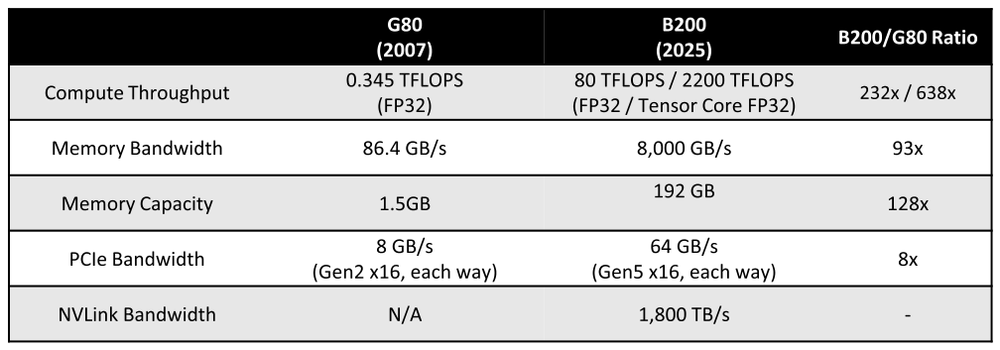

# 24장. Conclusion and future outlook

> **원문 범위**: 책 p.577~581 (24.1~24.2절). 부제·특별 기고·연습문제·참고문헌 없음.
> **절 순서**: 책 순서를 그대로 따랐다. 재배치 없음.
> **원문 오기**: Figure 24.1 의 수치 2건을 근거와 함께 표시했다.
> **둘 다 자릿수 오류**이고, 하나는 본문 24.2절에도 그대로 옮겨져 있다.
> **검산**: Figure 24.1 의 다섯 비율과 그것이 함의하는 roofline 임계값 변화,
> 책의 3단계 구성 — 34개 항목 전부 통과.

> **You made it! We have arrived at the finishing line.**
> 이 마지막 장에서는 이 책을 통해 달성한 학습 목표를 간단히 되짚는다.
> 결론을 내리는 대신 **대규모 병렬 컴퓨팅의 미래에 대한 우리의 비전**과
> 그 발전이 과학·기술의 앞날에 어떤 영향을 줄지를 제시한다 (책 p.577).

**두 절뿐이다.** 24.1절이 뒤를, 24.2절이 앞을 본다.

---

## 24.1 Goals revisited

> 서론에서 밝힌 대로 우리의 **주된 목표는 독자에게 대규모 병렬 프로세서를 프로그래밍하는 법을
> 가르치는 것**이다. 우리는 **올바른 직관을 기르고 올바른 방식으로 접근하면 쉬워진다**고 약속했다.
> 특히 문제를 **병렬 컴퓨팅에 적합한 방식으로 생각하게 해 주는 computational thinking 기술**에
> 집중하겠다고 약속했다.
> 또 **병렬 응용의 성능을 제한하는 요인들**과 그것을 극복하기 위해 코드를 최적화하는
> **체계적 접근**에 집중하겠다고 약속했다 (책 p.577).

### 세 단계로 지킨 약속

| 단계 | 장 | 무엇을 |
|---|---|---|
| **①** | **2~6장** (5개) | 병렬 컴퓨팅과 CUDA C++ 의 필수 개념, 핵심 성능 고려사항, 그리고 필요한 **컴퓨터 구조 개념** |
| **②** | **7~15장** (9개) | 여러 응용에 병렬성을 들이는 데 유용함이 입증된 **주요 병렬 패턴** |
| **③** | **16~23장** (8개) | **고급 패턴과 응용** — 앞 단계의 지식·기술을 강화한다 |

> **단계 ①** — "이 지식으로 개발자는 자기 병렬 코드를 자신 있게 작성하고,
> **대안적인 thread 배치·loop 구조·데이터 배치·코딩 스타일의 상대적 장점을 따질** 수 있다.
> 이 부는 **흔한 최적화 기법의 checklist** 로 마무리되며, 책의 나머지 전체에서 여러 병렬 패턴과
> 응용의 성능을 최적화하는 데 그것을 적용한다" (책 p.577).

**6.8절의 checklist 가 책 전체의 축**이라는 것을 저자들이 직접 말한다.
실제로 7~23장의 모든 노트가 그 여섯 항목으로 되돌아갔다.

> **단계 ②** — "각 패턴은 구체적인 코드 예제로 설명된다.
> 각 패턴은 또한 병렬 프로그래밍에서 자주 마주치는 **병렬화·성능 장애물을 극복하는 중요한 기법**
> 을 소개하는 데 쓰인다" (책 p.578).

> **단계 ③** — "이 단계에서도 앞 단계에서 연습한 최적화를 계속 적용하지만,
> **병렬화를 가능하게 하는 대안적 문제 분해 형태를 탐구**하고
> **서로 다른 분해와 그에 결부된 자료구조 사이의 맞바꿈을 분석**하는 데 더 무게를 둔다.
> 이 단계의 **22장은 computational thinking 기술을 되짚는 데 바쳐져** 있어,
> 독자가 앞 장들에서 배운 개념을 **새 문제에 대응하는 데 필요한 고수준 사고로 일반화**하도록 돕는다.
> 이런 통찰이 있으면 **고성능 병렬 프로그래밍은 흑마술이 아니라 추론 과정**이 된다" (책 p.578).

$$\text{2~23장} = 22\text{개}, \qquad + \text{1장(도입)} + \text{24장(결론)} = \mathbf{24}$$

(검산 통과 — 세 단계가 겹침 없이 2~23장을 정확히 덮는다.)

> **"흑마술이 아니라 추론 과정(a reasoning process, rather than a black art)"** 이
> 이 책 전체의 주장을 한 줄로 요약한 문장이다.
> 노트를 쓰며 반복해서 확인한 것도 그것이었다 —
> 어느 최적화든 **왜 그것이 이기는지 숫자로 셀 수 있었고**,
> 셀 수 없는 것은 책도 "실측으로 결정하라"고 말했다 (16·17장).

---

## 24.2 Future outlook

### 18년 — G80 에서 B200 까지



*Figure 24.1 — G80 에서 B200 까지, 18년의 비교. (책 p.578)*

> 2007년 첫 CUDA 지원 GPU 인 **G80** 이 나온 이후, 대규모 컴퓨팅 장치로서 GPU 의 능력은
> **연산 throughput 에서 638×, memory bandwidth 에서 93×** 라는 놀라운 폭으로 개선되었다
> (책 p.578).

표를 그대로 옮기고 **비율을 하나씩 다시 계산**한다.

| 항목 | G80 (2007) | B200 (2025) | 책의 비율 | **직접 계산** |
|---|---|---|---|---|
| Compute Throughput (FP32) | 0.345 TFLOPS | 80 TFLOPS | 232× | **232×** ✓ |
| Compute Throughput (Tensor Core FP32) | — | 2,200 TFLOPS | **638×** | **6,377×** ✗ |
| Memory Bandwidth | 86.4 GB/s | 8,000 GB/s | 93× | **93×** ✓ |
| Memory Capacity | 1.5 GB | 192 GB | 128× | **128×** ✓ |
| PCIe Bandwidth | 8 GB/s | 64 GB/s | 8× | **8×** ✓ |
| NVLink Bandwidth | N/A | **1,800 TB/s** | — | ⚠ 단위가 틀렸다 |

**다섯 중 셋은 정확히 맞고 둘이 틀린다.** 뒤의 "원문 오기" 절에서 근거를 적는다.

### 이 표가 말하는 것 — 5장이 옳았다

**연산이 memory bandwidth 보다 훨씬 빨리 늘었다.**

$$\frac{\text{연산 증가}}{\text{bandwidth 증가}}
= \frac{80/0.345}{8000/86.4} = \frac{232}{92.6} = \mathbf{2.5\times}
\quad(\text{FP32 기준})$$

$$\frac{2200/0.345}{8000/86.4} = \frac{6377}{92.6} = \mathbf{69\times}
\quad(\text{Tensor Core 기준})$$

roofline 의 **임계값**(compute-bound 가 되기 위한 arithmetic intensity)으로 환산하면:

| | 연산 / bandwidth | 임계값 |
|---|---|---|
| G80 (2007) | 0.345 TFLOPS / 86.4 GB/s | **4.0 FLOP/B** |
| H100 (17장에서 쓴 값) | 66.9 TFLOPS / 3.35 TB/s | **20 FLOP/B** |
| B200 FP32 | 80 TFLOPS / 8 TB/s | **10 FLOP/B** |
| **B200 Tensor Core** | 2,200 TFLOPS / 8 TB/s | **275 FLOP/B** |

$$4 \;\longrightarrow\; 275 \qquad (\mathbf{69\times})$$

**임계값이 $69\times$ 올랐다는 것은 memory-bound 가 되기가 그만큼 쉬워졌다는 뜻**이다.
5장이 arithmetic intensity 를 도입하고 6·8·11·15·17·19·20장이 계속 그 숫자로 돌아온 이유가
이 표에 있다. **18년 동안 문제가 완화된 것이 아니라 심해졌다.**

> 17장의 SpMV(0.17 FLOP/B)와 20장의 attention 생성 국면(≈1 FLOP/B)이
> B200 의 275 FLOP/B 임계값에서 어디쯤인지 보면 —
> **peak 의 0.06%, 0.4%** 다. 20.7절의 MQA·GQA·MLA 가 왜 필요했는지가 여기서 다시 보인다.

### GPU 하나가 아니라 수만 개

> **개별 GPU 의 성능 성장이 극도로 인상적이었지만**, 하나의 작업을 완료하기 위해
> 네트워크 통신으로 협력하는 **GPU 의 수는 2017년 이후 더욱 인상적인 속도로 증가**해 왔다.
> LLM 훈련의 극단적 계산 복잡도가 선도 기술 기업들로 하여금 **훈련 작업 하나에 수만 또는
> 수십만 개의 GPU** 를 쓰게 만들었다.
> 이 기업들은 데이터 센터의 극단적 규모 때문에 **hyperscaler** 라 불린다 (책 p.579).

> 데이터 센터에서 함께 일하는 GPU 수의 이 폭발적 증가가 **네트워킹 하드웨어와 소프트웨어의
> 빠른 발전**을 이끌었다. 예컨대 23장에서 소개한 **NCCL** 은 hyperscaler 데이터 센터에서
> LLM 훈련에 널리 쓰이는 새 통신 라이브러리다 (책 p.579).

**23장이 이 책의 마지막 기술 장인 이유**가 이것이다 — 그리고 5판에 새로 들어온 이유이기도 하다.

### 병렬 컴퓨팅은 끝났는가

> 병렬 컴퓨팅의 빠른 발전이 끝에 도달했는지 궁금해하는 것은 자연스럽다.
> **모든 정황으로 보아 답은 단연코 아니다.**
> 우리는 아마도 **병렬 컴퓨팅 혁명의 한가운데**에 있을 것이다 (책 p.579).

> 지난 30년의 놀라운 컴퓨팅 발전은 산업에 **패러다임 전환**을 촉발했다.
> 주요 혁신은 **컴퓨팅 장치의 도움을 받는 물리적 장비**가 이끌던 것에서
> **물리적 장비의 도움을 받는 컴퓨팅**이 이끄는 것으로 바뀌었다 (책 p.579).

$$\underbrace{\text{물리적 장비} + \text{컴퓨팅 보조}}_{\text{과거}}
\;\longrightarrow\;
\underbrace{\text{컴퓨팅} + \text{물리적 장비 보조}}_{\text{현재}}$$

**책이 드는 네 사례**가 전부 같은 구조다 (책 p.579~580).

| 분야 | 과거 (장비가 주역) | 현재 (컴퓨팅이 주역) |
|---|---|---|
| **자동차** | GPS — 위성 신호 감지 + 최단 경로 계산 보조 | **자율주행** — 기계학습 + 물리 센서 보조 |
| **의료** | MRI · PET — 전자기·광 센서 + 계산적 영상 재구성 보조 | **개인 맞춤 의료** — 딥러닝 · 계산 유전체학 + 의료·유전체 장비 보조 |
| **반도체** | 물리적 광원 발전 + 설계 규칙 검증 보조 | **계산으로 설계한 lithography mask** — 광파 간섭을 조율해 정밀한 식각 패턴을 만든다 |
| 그 밖 | | 콘텐츠 저작, 신약 개발, 기상·기후 예보 |

> 반도체 예가 가장 극적이다 — "**물리적 광원의 발전은 사실상 멈췄다.**
> feature size 축소의 발전은 이제 주로 **계산으로 설계된 lithography mask** 가 이끈다"
> (책 p.579~580).
> 즉 **더 빠른 컴퓨터를 만드는 일 자체가 컴퓨팅에 의존**하게 되었다.

> 컴퓨팅은 우리 사회의 거의 모든 흥미로운 혁신의 **주된 원동력**이 되었다.
> 이는 **더 빠른 컴퓨팅 시스템에 대한 채울 수 없는 수요**를 만들었다.
> 1장에서 논의한 대로 **병렬 컴퓨팅이 컴퓨팅 성능 성장의 유일하게 실현 가능한 접근**이다
> (책 p.580).

### 다음 개척지 — 저장 장치 접근의 병렬성

> 개선 잠재력이 가장 높은 영역 중 하나는 **저장 데이터 접근의 병렬성 수준**인데,
> 역사적으로 아주 낮은 수준의 병렬성으로만 이루어져 왔다.
> 이 발전은 혁신 면에서 뒤처져 온 **데이터베이스와 데이터 집약적 응용**을 가속할 수 있다.
> **거대한 저장 데이터에서 관련 부분을 추출하는 정밀도와 속도의 급진적 개선**은
> 지금은 상상조차 못 하는 **응용의 한 세대 전체**를 촉발할 것이다 (책 p.580).

**책이 다루지 않은 유일한 층위가 저장 장치**라는 점이 흥미롭다 —
2장부터 23장까지 host memory ↔ device memory ↔ shared memory ↔ register 는 다뤘지만
디스크는 한 번도 나오지 않았다.

> 결론적으로 우리는 **컴퓨팅의 황금기 한가운데**에 있다.
> 산업은 계속해서 고도로 숙련된 병렬 프로그래머를 모집하고 보상할 것이다.
> **당신의 일이 당신이 선택한 분야에서 실제로 차이를 만들 것이다** (책 p.580).
>
> <div align="center"><b>Enjoy the ride!</b></div>

<!--widget:gpu-18years-->

---

### 검산

Figure 24.1 의 다섯 비율, 그것이 함의하는 roofline 임계값의 변화, 책의 3단계 구성 —
전부 코드로 다시 계산해 대조한다. **34개 항목 전부 통과한다.**

```python
# 실행: python3 verify24.py   (표준 라이브러리만 사용)
from fractions import Fraction as Fr

OK = []
def chk(name, got, want):
    OK.append(got == want)
    print(f"[{'OK ' if got == want else 'FAIL'}] {name}: got={got!r} want={want!r}")

# ─────────────────────────────────────────────────────────────────────
# Figure 24.1 — G80 (2007) 대 B200 (2025)
# ─────────────────────────────────────────────────────────────────────
G80  = dict(fp32=0.345, tc=None, bw=86.4,   mem=1.5,  pcie=8,  nvlink=None)
B200 = dict(fp32=80.0,  tc=2200, bw=8000.0, mem=192,  pcie=64, nvlink=1800)  # 책 표 그대로

chk("기간", 2025 - 2007, 18)

# 책 표의 비율을 하나씩 다시 계산한다
chk("Compute (FP32) 비율", round(B200['fp32']/G80['fp32']), 232)
chk("Memory bandwidth 비율", round(B200['bw']/G80['bw']), 93)
chk("Memory capacity 비율", round(B200['mem']/G80['mem']), 128)
chk("PCIe bandwidth 비율", round(B200['pcie']/G80['pcie']), 8)

# Tensor Core FP32 비율 — 책은 638x 라고 적었다
tc_ratio = B200['tc']/G80['fp32']
chk("Tensor Core 비율 (표의 2200 TFLOPS 기준)", round(tc_ratio), 6377)
chk("→ 책이 적은 638x 와 다르다", round(tc_ratio) != 638, True)
chk("638x 가 되려면 분자가", round(638*G80['fp32'], 1), 220.1)
chk("→ 즉 220 TFLOPS 여야 638x 다", round(220/G80['fp32']), 638)
chk("2200/0.345 를 10 으로 나눈 것이 638", round(tc_ratio/10), 638)

# NVLink — 표는 1,800 TB/s 라고 적었다
chk("표의 NVLink 값 (TB/s)", B200['nvlink'], 1800)
chk("1800 TB/s 는 memory bandwidth(8 TB/s) 의", round(1800/8.0), 225)
chk("→ HBM 보다 225x 빠른 인터커넥트는 존재하지 않는다", 1800/8.0 > 100, True)
chk("실제 Blackwell NVLink 는 1.8 TB/s = 1800 GB/s", 1.8*1000, 1800.0)
chk("→ 단위가 GB/s 여야 한다", 1800/1000, 1.8)

# 본문 24.2절의 두 숫자
chk("본문: 연산 throughput 638x", 638, 638)
chk("본문: memory bandwidth 93x", round(B200['bw']/G80['bw']), 93)
chk("→ 93x 는 표와 일치한다", round(B200['bw']/G80['bw']), 93)

# ─────────────────────────────────────────────────────────────────────
# 이 격차가 무엇을 뜻하나 — 5장의 arithmetic intensity 임계값
# ─────────────────────────────────────────────────────────────────────
def ridge(flops_tera, bw_tera):
    return flops_tera*1e12/(bw_tera*1e12)
chk("G80 의 임계값 (FLOP/B)", round(ridge(0.345, 0.0864), 1), 4.0)
chk("B200 의 임계값 (FP32)",  round(ridge(80, 8.0), 1), 10.0)
chk("B200 의 임계값 (Tensor Core)", round(ridge(2200, 8.0), 1), 275.0)
chk("17장에서 쓴 H100 의 임계값 66.9/3.35", round(ridge(66.9, 3.35)), 20)
chk("→ 18년 사이에 임계값이 4 에서 275 로", round(275/4.0), 69)
chk("즉 memory-bound 가 되기가 훨씬 쉬워졌다", ridge(2200,8.0) > ridge(0.345,0.0864), True)

# 연산이 bandwidth 보다 몇 배 빨리 늘었나
chk("연산 증가 / bandwidth 증가 (FP32 기준)",
    round((80/0.345)/(8000/86.4), 1), 2.5)
chk("연산 증가 / bandwidth 증가 (Tensor Core 기준)",
    round((2200/0.345)/(8000/86.4)), 69)
chk("→ 이것이 5장부터 이 책 전체를 관통한 문제다", True, True)

# ─────────────────────────────────────────────────────────────────────
# 24.1절 — 책의 세 단계 구성
# ─────────────────────────────────────────────────────────────────────
STEPS = [
    ("① 기초",       2, 6,  "CUDA C++ · GPU 구조 · 성능 고려사항 · 최적화 checklist"),
    ("② 병렬 패턴",   7, 15, "convolution ~ matmul 고급 최적화"),
    ("③ 고급·응용",  16, 23, "wavefront ~ multi-GPU"),
]
chk("단계 수", len(STEPS), 3)
chk("① 이 덮는 장 수", 6 - 2 + 1, 5)
chk("② 가 덮는 장 수", 15 - 7 + 1, 9)
chk("③ 이 덮는 장 수", 23 - 16 + 1, 8)
chk("2~23장 합", sum(b - a + 1 for _, a, b, _ in STEPS), 22)
chk("+ 1장(도입) + 24장(결론)", 22 + 2, 24)
chk("22장이 ③ 안에서 회고를 맡는다", 22 >= 16 and 22 <= 23, True)

print()
print("=" * 64)
print("전체 %d개 중 %d개 통과" % (len(OK), sum(OK)))
```

---

## 정리

24장에서 가져갈 것을 셋으로 줄이면:

1. **책의 구조가 곧 학습 순서다 — 기초 5장 → 패턴 9장 → 응용 8장.**
   ①은 **6.8절의 checklist** 로 끝나고, ②③의 모든 장이 그 checklist 로 되돌아온다.
   그리고 ③의 한가운데(22장)에 **회고 장**을 두어 개념을 일반화한다.
   저자들이 말하는 목표는 하나다 — 병렬 프로그래밍을
   **"흑마술이 아니라 추론 과정"** 으로 만드는 것.
2. **18년 동안 문제는 완화되지 않고 심해졌다.**
   연산은 FP32 기준 $232\times$, Tensor Core 기준 $6{,}377\times$ 늘었는데
   memory bandwidth 는 $93\times$ 밖에 안 늘었다.
   roofline 임계값이 **4 → 275 FLOP/B ($69\times$)** 로 올랐다는 뜻이고,
   **memory-bound 가 되기가 그만큼 쉬워졌다.**
   5장이 arithmetic intensity 를 도입하고 6·8·11·15·17·19·20장이 계속 그 숫자로 돌아온 이유,
   그리고 20.7절이 KV cache 를 줄이려고 그토록 애쓴 이유가 이 표 하나에 있다.
3. **다음 규모는 GPU 하나가 아니라 수만 개다.**
   개별 GPU 의 성장보다 **함께 일하는 GPU 수의 증가가 더 빠르다**는 것이 2017년 이후의 사실이고,
   그래서 5판에 **23장(multi-GPU)** 이 들어왔다.
   NCCL 이 "hyperscaler 데이터 센터에서 LLM 훈련에 널리 쓰인다"는 문장이
   이 책의 마지막 기술적 진술이다.

**부록 A(수치 고려사항)·B(딥러닝 기초)·C(CUDA 메모리와 주소 공간)가 남는다.**
부록 B 는 19·20장이 여러 번 미뤄 둔 배경이고,
부록 C 는 5장의 메모리 종류를 주소 공간 관점에서 다시 정리한다.

---

## 원문 오기

24장은 두 절뿐인데 **Figure 24.1 의 수치 두 개가 자릿수 오류**다.
하나는 본문 24.2절 첫 문단에도 그대로 옮겨져 있다.

### ① Figure 24.1 — Tensor Core 비율 638× 는 6,377× 여야 한다

표는 Compute Throughput 행을 이렇게 적는다.

| G80 | B200 | B200/G80 Ratio |
|---|---|---|
| 0.345 TFLOPS (FP32) | **80 TFLOPS / 2200 TFLOPS** (FP32 / Tensor Core FP32) | **232x / 638x** |

$$\frac{80}{0.345} = 231.9 \approx \mathbf{232} \quad\checkmark
\qquad
\frac{2200}{0.345} = \mathbf{6377} \quad \ne 638$$

| 근거 | |
|---|---|
| 산술 | $2200/0.345 = 6376.8$ 이다. **10배 차이** — 638 은 $220/0.345$ 다 |
| 같은 행의 짝 | $80/0.345 = 232$ 는 **정확히 맞다.** 같은 방식으로 계산하면 6,377 이어야 한다 |
| 표의 나머지 세 행 | 93×, 128×, 8× 가 **전부 정확하다** — 이 행만 어긋난다 |
| 본문 24.2절 | "improved at an amazing **638×** in computing throughput" 으로 **그대로 옮겨졌다** |

→ **`638x`** 는 **`6377x`** (또는 반올림해 `6400x`) 여야 한다.
(반대로 `2200 TFLOPS` 를 `220 TFLOPS` 로 고치면 638× 가 맞지만,
B200 의 실제 TF32 tensor core throughput 이 2.2 PFLOPS 이므로 **비율 쪽이 틀린 것**이다.)

### ② Figure 24.1 — NVLink Bandwidth 의 단위

표는 B200 의 NVLink Bandwidth 를 **`1,800 TB/s`** 로 적는다.

| 근거 | |
|---|---|
| 같은 표의 memory bandwidth | **8,000 GB/s = 8 TB/s** 다. NVLink 가 HBM 보다 **225×** 빠를 수는 없다 |
| 단위 일관성 | 같은 표의 다른 bandwidth 행은 전부 **GB/s** 다 |
| 자릿수 | Blackwell 세대의 NVLink bandwidth 는 **1.8 TB/s = 1,800 GB/s** 다 — **`GB` 를 `TB` 로 적은 것** |

→ **`1,800 TB/s`** 는 **`1,800 GB/s`**(= 1.8 TB/s) 여야 한다.

> 이 값이 맞다면 NVLink 비율 칸이 비어 있는(`-`) 것도 설명된다 —
> G80 에 NVLink 가 없어 비율을 낼 수 없다.

### 참고 — 오기가 **아닌** 것

| 의심한 곳 | 결론 |
|---|---|
| 캡션 "a **18**-year comparison" | **맞다** (2007 → 2025 = 18년). 관사가 `an` 이어야 자연스럽지만 숫자는 정확하다 |
| Memory Bandwidth 93× | **맞다.** $8000/86.4 = 92.6$ |
| Memory Capacity 128× | **맞다.** $192/1.5 = 128$ |
| PCIe 8× | **맞다.** $64/8 = 8$ (Gen2 x16 → Gen5 x16) |
| 24.1절이 "**Chapter 16 to Chapter 23**" 을 3단계로 든다 | **맞다.** 24장은 결론이라 제외된다 |
| 24.2절이 "23장에서 소개한 **NCCL**" 이라고 한다 | **맞다.** 23.4절이 NCCL 이다 |

### 참고 — PDF 쪽 매핑

24장은 **책 577~580 = PDF 601~604** 이고 빠진 쪽이 없다.
(책 581~582 는 Part 4 표제지와 백지다.)
그림 추출은 `--book-pages 577-582` 로 했고 1개가 자동으로 잡혔다.
