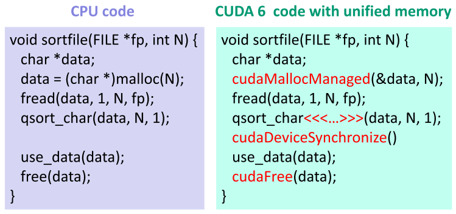

# 부록 C. CUDA memories, address spaces, and pointers

> **원문 범위**: 책 p.623~629 (C.1~C.9절). 그림 1개(Figure C.1), 참고문헌 1건.
> **연습문제·요약절 없음** — 이 책의 부록 중 유일하게 둘 다 없다.
> **절 순서**: 책 순서를 그대로 따랐다. 재배치 없음.
> **특별 기고**: Isaac Gelado · Mark Harris.
> **원문 오기**: 4건을 근거와 함께 표시했다. 그중 1건은 책 전체를 grep 해서 확인한
> **끊어진 상호 참조**이고, 1건은 본문과 Figure C.1 의 **함수 이름 불일치**다.
> 연도 2건은 오기로 단정하지 않고 **의심 근거만** 적었다.
> **검산**: 주소 공간 비트 수, `10% 미만` 주장, migration 손익분기, Figure C.1 의
> "두 가지 변경", 연표의 앞뒤 정합성 — 44개 항목 전부 통과.

---

## 이 부록이 다시 여는 것 — 2장의 단순 모델

> 이 책 전체에서 우리는 이종 컴퓨팅 시스템의 host 와 device 사이 상호작용에 대해
> **꽤 단순한 모델**을 대체로 가정해 왔다. 2장에서 제시한 이 단순 모델에서는
> **각 device 가 host memory(시스템 메모리)와 분리된 device memory(CUDA global memory)를
> 가진다.** device 에서 도는 kernel 이 처리할 데이터는 `cudaMemcpy()` 를 불러
> host memory 에서 device memory 로 옮겨야 한다. device 가 만든 데이터도
> host 가 쓰기 전에 `cudaMemcpy()` 로 되가져와야 한다.
> **초기 GPU 세대는 이 단순한 host/device 상호작용 모델만 지원했다.**
> 모델은 단순하고 이해하기 쉽지만, **응용 수준에서 여러 문제를 낳았다** (책 p.623).

2장부터 23장까지 스물두 개 장이 전부 이 모델 위에 서 있었다.
`cudaMalloc` → `cudaMemcpy` → kernel → `cudaMemcpy` → `cudaFree`.
부록 C 는 **그 모델이 왜 단순화였는지, 그리고 하드웨어가 지난 16년 동안
그것을 어떻게 하나씩 걷어냈는지**를 되짚는다.

### 단순 모델이 낳은 두 가지 문제

책은 문제를 정확히 둘 든다.

> **첫째, I/O 장치.** 디스크 컨트롤러나 network interface card 같은 I/O 장치는
> **host memory 위에서 효율적으로 동작하도록 설계**되어 있다. device memory 가
> host memory 와 분리되어 있으므로, 입력 데이터는 host → device 로,
> 출력 데이터는 device → host 로 옮겨야 I/O 장치가 쓸 수 있다.
> **이런 추가 전송이 I/O latency 를 늘리고 달성 가능한 I/O throughput 을 떨어뜨린다.**
> 많은 응용에서 **I/O 장치가 device memory 위에서 직접 동작**할 수 있다면
> 전체 성능이 좋아지고 응용 코드도 단순해질 것이다 (책 p.623).

> **둘째, 큰 자료구조.** Python 같은 전통적 프로그래밍 시스템은 응용의 자료구조를
> host memory 에 놓는다. 그중 일부는 **크다**. CUDA GPU 의 device memory 는
> host memory 에 비해 **bandwidth 는 높지만 용량은 작은** 경향이 있어,
> 개발자는 큰 자료구조를 **device memory 에 하나씩 들어가는 조각으로 나눠야** 한다.
> 예를 들어 **21장에서 3D 전기 에너지 grid 배열을 2D slice 로 분할해**
> host memory 와 device memory 사이를 오가게 했다.
> 많은 응용에서는 **자료구조 전체가 device memory 에 상주**하는 편이 훨씬 낫고,
> 어떤 응용은 **애초에 잘 나눌 방법이 없다**. 그런 응용에는
> GPU 가 host memory 의 데이터에 **직접 접근**하거나
> CUDA runtime 이 **kernel 실행 중에 쓰이는 데이터를 migration** 해 주는 것이 최선이다 (책 p.623).

**둘째 문제의 예로 21장을 직접 든다.** 21장에서 왜 3D grid 를 z 방향 2D slice 로
잘라 하나씩 넘겼는지, 그 진짜 이유가 여기 적혀 있다 — **device memory 에 다 안 들어가서**다.

> 더 많은 응용이 GPU 컴퓨팅을 채택하면서, 그 요구가 CUDA 시스템 소프트웨어 개발자와
> GPU 하드웨어 설계자를 더 나은 해법으로 밀어붙였다.
> 연구자들은 이 필요를 알고 있었고 **CUDA 초창기부터 해법을 제안해 왔다** [1].
> 이 절의 나머지는 이 한계들을 다루는 **발전의 짧은 역사**를 훑는다 (책 p.623~624).

참고문헌 [1] 은 **Gelado 외, ASPLOS 2010, "An asymmetric distributed shared memory
model for heterogeneous parallel systems"** 다. 이 부록의 특별 기고자 Isaac Gelado 가
그 논문의 제1저자이고, C.3절이 말하듯 **UVAS 는 그 논문의 GMAC 라이브러리에서 나왔다.**

### 아홉 절이 그리는 하나의 곡선

| 절 | 연도 | 계기 | 한 줄 |
|---|---|---|---|
| **C.1** | 2009 | **Fermi** | GPU **내부**의 global/local/shared 가 **한 주소 공간**이 된다 |
| **C.2** | 2009 | **CUDA 2.2** | **zero-copy** — kernel 이 host memory 를 직접 읽는다 (포인터는 두 개) |
| **C.3** | 2011 | **CUDA 4** | **UVAS** — host 와 device 가 **가상** 주소 공간을 공유한다 (포인터는 하나) |
| **C.4** | 2013 | **Kepler** | 64-bit 가상 · ≥40-bit 물리 주소 → **4 GB 벽**이 사라진다 |
| **C.5** | (Kepler) | **Kepler** | GPU 들의 **물리** 주소 공간 통합 → **다른 GPU 메모리 직접 접근** |
| **C.6** | 2013 | **CUDA 6** | **Unified Memory** — managed memory, migration 과 coherence 를 runtime 이 |
| **C.7** | 2016 | **Pascal** | **49-bit** 가상 주소 → **host 전체** 주소 공간을 덮는다 |
| **C.8** | 2016 | **Pascal** | **page fault 처리** → on-demand migration, flush 가 사라진다 |
| **C.9** | (CUDA 11) | **CUDA 11** | `cuMemAddressReserve`/`Create`/`Map` → 가상 주소 공간을 **직접 조립** |

읽는 방향은 **"주소 공간이 하나씩 합쳐진다"** 하나다.
GPU 내부(C.1) → host 와의 가상 공간(C.3) → GPU 들 사이의 물리 공간(C.5) →
host 전체 가상 공간(C.7). 마지막 C.9 는 방향이 반대다 —
**합쳐 놓은 것을 다시 손으로 나눌 수 있게** 해 준다.

---

## C.1 Unified device memory address space

> 초기 CUDA GPU 에서는 **shared memory, local memory, global memory 가 각자의 주소 공간**을
> 이루고 있었다. 개발자는 **global memory 를 가리키는 포인터만** 쓸 수 있었고 나머지는 못 썼다.
> **2009년에 도입된 Fermi 아키텍처부터** 이 메모리들이 **하나의 주소 공간의 부분**이 되었다.
> 이 통합 주소 공간 덕에 GPU 메모리 공간(global·local·shared) 어느 것에든
> **하나의 load/store 명령 집합과 포인터 주소**로 접근할 수 있게 되었다 —
> 각 메모리마다 다른 명령과 포인터를 쓰는 대신에.
> 이로써 **어떤 피연산자가 어느 메모리에 있는지를 추상화**하기 쉬워져,
> 프로그래머는 **할당할 때만** 그것을 신경 쓰면 되고,
> **어느 메모리 영역에서 왔든 CUDA 데이터 객체를 다른 프로시저·함수에 넘기기**가 단순해졌다
> (책 p.624).

### 무엇이 바뀌었나 — "composable"

> 통합 device memory 주소 공간 지원은 CUDA 코드 모듈을 훨씬 더 **"composable"** 하게 만들었다.
> 즉 **CUDA device 함수가 이 메모리들 중 아무 곳이나 가리킬 수 있는 포인터를 받을** 수 있다.
> 예를 들어 통합 GPU 주소 공간이 없으면, device 함수는 **인자가 놓일 수 있는
> 메모리 종류마다 구현을 하나씩** 가져야 한다.
> 통합 GPU 주소 공간은 모든 주요 GPU 메모리의 변수를 **같은 방식으로 접근**하게 해 주고,
> 따라서 **device 함수 하나가 서로 다른 종류의 GPU 메모리에 놓인 인자를 받을** 수 있게 한다.
> 함수 인자 포인터가 shared memory 를 가리키면 코드가 **더 빠르게**,
> global memory 를 가리키면 **더 느리게** 돌 것이다.
> 프로그래머는 여전히 **성능 최적화로서 수동 데이터 배치와 전송**을 할 수 있다.
> 이 능력은 **제품 품질의 CUDA 라이브러리를 만드는 비용을 크게 줄였다.**
> 또 CUDA kernel 과 device 함수에 대한 **완전한 C·C++ 포인터 지원**을 가능하게 했다 (책 p.624).

**핵심은 성능이 아니라 조합 가능성이다.** 이 절은 성능이 좋아진다고 말하지 않는다.
오히려 반대로 못박는다 — **shared 를 가리키면 빠르고 global 을 가리키면 느리다.**
같은 코드가 도는데 속도가 다르다.

| | 통합 전 | 통합 후 |
|---|---|---|
| device 함수 시그니처 | 메모리 종류마다 **하나씩** | **하나** |
| 포인터 | global 만 | **전부** |
| 성능 | (해당 없음) | **어디를 가리키느냐에 따라 다르다** |
| 배치 결정 | 코드 작성 시점 | **할당 시점** |

> **왜 라이브러리에 결정적인가.** 4장의 `__device__` 함수, 11장의 scan block 함수,
> 15장의 tile 적재 helper 처럼 **재사용되는 device 함수**를 떠올려 보라.
> 통합 주소 공간이 없다면 그 함수는 "shared memory 판"과 "global memory 판"을
> 따로 가져야 한다. 실제로 `cuBLAS`·`cuDNN` 같은 라이브러리가
> Fermi 이후에야 지금 같은 API 모양을 갖게 된 배경이 이것이다.

> **이 스터디에서 이미 본 것.** 5장에서 tile 을 `__shared__` 배열에 올리고
> 그 배열을 함수에 넘겨 쓸 때, 우리는 이 통합 주소 공간을 **아무 생각 없이** 썼다.
> Fermi 이전이었다면 그 코드는 컴파일되지 않는다.

---

## C.2 Zero-copy access to host memory

> **2009년 CUDA 2.2 가 host memory 에 대한 zero-copy 접근을 도입했다.**
> 이것은 host 코드가 kernel 에게 **host memory 를 가리키는 특별한 device 데이터 포인터**를
> 넘길 수 있게 해 준다. GPU 에서 도는 CUDA kernel 코드는 이 포인터로
> **`cudaMemcpy()` 없이 PCIe 버스 같은 시스템 interconnect 를 통해 host memory 에 직접 접근**한다.
> zero-copy memory 는 **pinned host memory**(23장 참조)이고,
> `flag` 인자를 `cudaHostAllocMapped` 로 주어 **`cudaHostAlloc()`** 을 불러 할당한다.
> `flag` 인자의 다른 값들은 더 고급 용도라고 **앞서 말한 바 있다**.
> `cudaHostAlloc()` 이 돌려주는 데이터 포인터는 **kernel 에 바로 넘길 수 없다.**
> host 코드가 먼저 **`cudaHostGetDevicePointer()`** 로 유효한 device 데이터 포인터를 얻어,
> 그것을 kernel 에 넘겨야 한다.
> 즉 **같은 host memory 데이터를 host 코드와 device 코드가 서로 다른 포인터로 접근**한다는 뜻이다
> (책 p.624).

### 포인터가 두 개다 — 이것이 C.3 을 부른다

```
   host 코드                              device 코드
   ────────                              ──────────
   h = cudaHostAlloc(..., Mapped)   ──▶  (그대로 넘기면 안 된다)
   d = cudaHostGetDevicePointer(h)  ──▶  kernel<<<...>>>(d)
        ▲                                      │
        └──── 같은 물리 메모리를 가리키는 ────┘
              서로 다른 두 가상 주소
```

**같은 데이터, 두 개의 주소.** 이것이 zero-copy 의 구조적 한계다.
자료구조 안에 포인터가 박혀 있으면(연결 리스트, 트리, 그래프의 인접 리스트)
**그 안의 포인터는 host 주소**라서 device 가 따라갈 수 없다.
C.3절이 이 문제를 정확히 지적하고, 부록 전체가 여기서부터 굴러간다.

> `cudaHostAlloc()` 은 **이 부록 밖에서 한 번도 나오지 않는다.**
> "앞서 말한 바 있다"는 참조가 어디도 가리키지 않는다 — **원문 오기 ①** 참조.

### 왜 pinned 여야 하고, 왜 조심해서 써야 하는가

> 23장에서 설명했듯, GPU 의 zero-copy 접근을 위해 할당된 host memory page 는
> GPU 가 접근하는 동안 **운영체제가 실수로 page out 하는 것을 막기 위해 pinned 되어야** 한다.
> 당연히 그 접근은 **시스템 interconnect 의 긴 latency 와 제한된 bandwidth**를 겪는다.
> **시스템 interconnect 의 bandwidth 는 보통 global memory bandwidth 의 10% 미만**이다.
> 5장에서 배웠듯, kernel 의 성능은 **tiling 으로 부동소수점 연산당 global memory 접근 횟수를
> 획기적으로 줄이지 않는 한 global memory bandwidth 에 묶인다.**
> kernel 의 메모리 접근 대부분이 zero-copy memory 를 향한다면,
> 그 kernel 의 실행 속도는 **시스템 interconnect 의 bandwidth 에 훨씬 더 심하게** 묶일 수 있다.
> 따라서 zero-copy memory 는 **GPU kernel 이 가끔, 드문드문 접근하는 응용 자료구조에만** 써야 한다
> (책 p.624~625).

**"10% 미만"은 책 자신의 숫자로 검증된다.** 24장 Figure 24.1 의 값을 그대로 넣어 보면:

| | 시스템 interconnect | global memory | 비율 |
|---|---|---|---|
| **G80 (2007)** | PCIe Gen2 x16 **8 GB/s** | **86.4 GB/s** | **9.26%** |
| **H100** | PCIe Gen5 x16 **64 GB/s** | **3,350 GB/s** | **1.91%** |
| **B200 (2025)** | PCIe Gen5 x16 **64 GB/s** | **8,000 GB/s** | **0.80%** |

18년 동안 **비율이 12× 나빠졌다.** 2007년에는 9.26% 로 아슬아슬하게 10% 아래였는데
지금은 0.8% 다. **이 주장은 시간이 갈수록 더 강해진다** —
zero-copy 를 "가끔, 드문드문"에만 쓰라는 경고도 그만큼 더 강해진다.

> **단, NVLink 는 예외다.** B200 의 NVLink 는 1,800 GB/s 로 global memory 의 **22.5%** 다.
> 10% 를 훌쩍 넘는다. 본문이 굳이 **`system interconnect`** 라고 못박은 것은
> 이 구분 때문이다. 23장에서 NVSHMEM 의 fine-grain `put` 이
> "NVLINK 급 interconnect 에서만 유리하다"고 한 것과 같은 이야기다.

> **6.8절 checklist 로 읽으면.** zero-copy 는 **memory utilization 범주 전체**의 정반대다 —
> 접근을 줄이는 게 아니라 **더 느린 곳으로 보낸다**. 그러므로 이것은
> "성능 최적화"가 아니라 **"복사를 없애는 편의"** 로 분류해야 한다.
> 접근 빈도가 낮을 때만 그 맞바꿈이 이긴다.

---

## C.3 Unified virtual address space

> **2011년 CUDA 4 가 Unified Virtual Address Space(UVAS)를 도입했다.**
> 이것은 **GMAC 라이브러리** [1] 에서 비롯되었다.
> 이 CUDA 릴리스 전까지 host 와 device 는 **각자의 가상 주소 공간**을 가졌고,
> 각각이 host 또는 device 데이터 포인터를 물리 host/device 메모리 위치에 대응시켰다.
> 이 **분리된 가상 주소 공간**은 **같은 물리 메모리 위치가 host 와 device 에서
> 서로 다른 가상 주소로 접근될 수 있음**을 뜻한다 — zero-copy memory 를 쓸 때 벌어지는 일이다.
> UVAS 는 **host 와 device 가 공유하는 단일 가상 주소 공간**을 규정한다.
> UVAS 는 **각 물리 메모리 주소가 오직 하나의 가상 메모리 위치에만 대응됨을 보장**한다.
> 이로써 CUDA runtime 은 **가상 메모리 주소만 보고** 그 포인터가 host 메모리를 가리키는지
> device 메모리를 가리키는지 **판단할 수 있다.**
> 이 기능은 `cudaMemcpy()` 호출에서 **복사 방향을 지정할 필요를 없앤다.**
> 프로그래머는 그냥 **`cudaMemcpyDefault`** 를 주면 되고,
> 전송 방향은 **포인터 값에서 추론**된다 (책 p.625).

### `cudaMemcpyHostToDevice` 는 왜 아직도 코드에 있나

2장부터 23장까지 우리가 쓴 모든 `cudaMemcpy` 호출에는 방향이 명시되어 있었다.

```c
cudaMemcpy(d_A, h_A, size, cudaMemcpyHostToDevice);
cudaMemcpy(h_C, d_C, size, cudaMemcpyDeviceToHost);
```

UVAS 이후에는 **둘 다 `cudaMemcpyDefault` 로 충분하다.**
방향은 `d_A`·`h_A` 의 주소값만 봐도 알 수 있기 때문이다.
책이 계속 방향을 명시하는 것은 **교육적 명확성** 때문이지 필요해서가 아니다.

| | UVAS 전 | UVAS 후 |
|---|---|---|
| 물리 주소 ↔ 가상 주소 | **1 : 2** (host 하나, device 하나) | **1 : 1** |
| 포인터만 보고 위치를 알 수 있나 | **없다** | **있다** |
| `cudaMemcpy` 방향 | 반드시 명시 | **`cudaMemcpyDefault`** |
| 접근 가능성 | — | **여전히 보장 안 된다** |

### UVAS 가 보장하지 **않는** 것

> UVAS 가 **포인터가 가리키는 데이터의 접근 가능성(accessibility)을 보장하지 않는다**는
> 점이 중요하다. 예를 들어 host 코드는 `cudaMalloc()` 이 돌려준 device 포인터로
> device memory 에 **직접 접근할 수 없고**, 그 반대도 마찬가지다.
> **host memory 에 대한 zero-copy 접근이 예외**다 —
> host 코드는 (`cudaHostAlloc()` 으로 할당한) zero-copy memory 의 포인터를
> **kernel 파라미터로** device 에 넘길 수 있다.
> kernel 코드가 이 zero-copy 포인터를 역참조하면 포인터 값이 물리 시스템 메모리 위치로
> 번역되어 **PCIe 버스를 통해 시스템 메모리에 직접 접근**한다.
> 다만 이 방식이, **연결 자료구조를 순회하며 메모리에서 읽은 포인터 값을 역참조**하는 것까지
> 반드시 허용하는 것은 아니다 —
> **모든 포인터가 `cudaHostAlloc()` 으로 할당된 메모리를 가리키지 않는 한** (책 p.625).

**UVAS 는 "이름"을 통일했지 "권한"을 통일하지 않았다.**
주소는 하나가 되었지만, 그 주소를 실제로 읽을 수 있느냐는 별개다.

> **연결 자료구조 문제가 여기서 처음 정식으로 나온다.**
> 링크드 리스트를 device 가 순회하려면 **리스트의 모든 노드**가
> `cudaHostAlloc()` 으로 할당되어 있어야 한다. 노드 하나라도 평범한 `malloc()` 이면 거기서 끊긴다.
> 이 제약은 C.7·C.8 에서 **Pascal 의 49-bit 주소와 page fault** 로 비로소 풀린다.

> 두 가지 한계 — **지원 가능한 자료구조의 종류**와 **zero-copy memory 의 접근 bandwidth** —
> 가 **UVAS 를 넘어서는** GPU 메모리 모델의 추가 개선을 부른다 (책 p.625).

---

## C.4 Large virtual and physical GPU address spaces

> 초기 CUDA GPU 의 근본적 한계 하나는 **가상·물리 주소의 크기**였다.
> 이 초기 device 들은 **32-bit 가상 주소**와 **최대 32-bit 물리 주소**를 지원한다.
> 이 device 들에서 **device memory 크기는 4 GB 로 제한**된다 —
> 32개의 물리 주소 비트로 주소지정할 수 있는 최대량이다.
> 게다가 CUDA kernel 은 **크기가 4 GB 미만인 데이터 집합에만** 동작할 수 있었다 —
> 32-bit 포인터로 접근 가능한 최대 가상 메모리 위치 수이며,
> **데이터가 host memory 에 있든 device memory 에 있든** 마찬가지다.
> 또한 현대 CPU 는 **64-bit 가상 주소를 쓰되 실제로는 48비트를 활용**한다.
> 이 host 가상 주소들은 GPU 가 쓰는 32-bit 가상 주소에 **담기지 않았고**,
> 이것이 zero-copy 접근에서 **지원되는 자료구조 종류의 제한**과
> **`cudaHostAlloc()` 이라는 특별한 할당 방식의 요구**에 기여했다 (책 p.625~626).

### 4 GB 가 무엇을 막았는지 — 21장으로 확인한다

$$2^{32} = 4\,\text{GiB}, \qquad \frac{2^{32}}{4\,\text{B}} = 1{,}073{,}741{,}824 = \mathbf{1024^3}$$

**`float` grid 로 정확히 $1024^3$.** 21장의 3D 전기 potential map 이
$1024^3$ 이면 device memory 를 **한 톨도 남김없이** 다 쓴다.
원자 좌표 배열도, 다른 무엇도 들어갈 자리가 없다.

> 그래서 21장이 grid 를 **z 방향 2D slice 로 잘라** 하나씩 넘겼다.
> 21장을 읽을 때는 그것이 "cutoff 를 쓰기 위한 자연스러운 분해"로 보였지만,
> **실제 이유의 절반은 주소 공간**이었다. 부록 C 의 도입부가 이 예를 직접 든다.

$$\text{B200 의 192 GB 를 주소지정하려면 } \lceil \log_2 (192 \times 10^9) \rceil = \mathbf{38}\text{ bit}$$

32비트로는 불가능하고, **40비트면 충분**하다 (1 TiB).

### 무엇이 풀렸나

> 이 한계를 없애기 위해, **2013년에 도입된 Kepler GPU 아키텍처부터**의 GPU 세대는
> **64-bit 가상 주소**와 **최소 40비트의 물리 주소**를 갖춘 현대적 가상 메모리 구조를 채택했다.
> 명백한 이득은 이 GPU 들이 **4 GB 를 넘는 DRAM 을 탑재**할 수 있고
> CUDA kernel 이 **큰 데이터 집합에 동작**할 수 있다는 것이다.
> 확장된 가상·물리 주소 공간은 큰 device memory 를 가능하게 할 뿐 아니라
> **훨씬 나은 host/device 상호작용 모델의 문을 연다.**
> 예를 들어 host 와 device 가 이제 **정확히 같은 포인터 값**으로
> 데이터가 host memory 에 있든 device memory 에 있든 **똑같이 접근**할 수 있다 (책 p.626).

| | 초기 GPU | Kepler 이후 |
|---|---|---|
| 가상 주소 | **32 bit** (4 GiB) | **64 bit** |
| 물리 주소 | **32 bit** (4 GiB) | **≥ 40 bit** (≥ 1 TiB) |
| CPU 의 48-bit 가상 주소를 담나 | **못 담는다** | **담는다** |
| 데이터 집합 크기 | **< 4 GB** | 사실상 무제한 |

**"같은 포인터 값"이 이 절의 결론이다.** C.3 은 주소 공간을 통일했고,
C.4 는 그 통일된 공간이 **충분히 넓어야** 의미가 있음을 말한다.
32비트로는 host 의 48비트 공간을 담을 수 없으니 통일해 봐야 절반만 통일된 셈이었다.

---

## C.5 Unified physical address space

> 큰 GPU **물리** 주소 공간은 CUDA 시스템 소프트웨어가 시스템 안 **서로 다른 GPU 들의
> device memory 를 하나의 통합 물리 주소 공간에 배치**할 수 있게 해 준다.
> 이득은 **한 GPU 가 같은 PCIe 버스 또는 NVLink 도메인에 붙은 다른 어떤 GPU 의 메모리에도
> 직접 접근**할 수 있다는 것이다 — 상대 GPU 의 물리 주소에 대응된 데이터 포인터를
> **그냥 역참조**하기만 하면 된다.
> Kepler 아키텍처 이전에는 **서로 다른 GPU 사이의 통신**
> (예: **23장 stencil 예제의 halo exchange**)이 host 코드가 촉발하는
> **device-to-device 메모리 복사로만** 가능했다.
> 그 결과 다른 GPU 에서 복사해 온 데이터를 담을 **추가 메모리**가 소비되었고,
> **host-device 동기화**와 복사를 위한 **준비 동작** 때문에 성능 overhead 가 더 붙었다.
> 시스템 안 다른 device 의 메모리에 직접 접근하면
> **device 포인터를 kernel 호출 파라미터로 넘기는 것만으로**
> kernel 코드가 **다른 GPU 의 device memory 에 있는 데이터를 load/store** 할 수 있다 (책 p.626).

### 23장이 이 절 위에 서 있었다

23장 전체가 이 기능의 응용이다. 23장에서 본 세 모델을 이 절의 언어로 다시 읽으면:

| 23장의 모델 | 부록 C 의 관점 |
|---|---|
| **MPI** (23.2·23.3절) | host 가 촉발하는 복사 — **Kepler 이전 방식 그대로**. 그래서 host 동기화가 끼어든다 |
| **NCCL** (23.4절) | stream 위에서 도는 복사 — host 동기화는 없지만 **여전히 복사** |
| **NVSHMEM** (23.5절) | **`nvshmem_float_p` 가 곧 이 절의 "포인터 역참조"** 다 |

23장에서 NVSHMEM 의 `nvshmem_float_p(dest, val, pe)` 가
**kernel 안에서 다른 GPU 의 메모리에 직접 쓴다**는 것을 보고
"이게 어떻게 가능한가"를 넘어갔었다. **답이 여기 있다** —
통합 물리 주소 공간이 있어서, 그 write 는 **주소 하나를 역참조하는 store 명령**일 뿐이다.

> **23장에서 세었던 비용이 그대로 이 절의 문장이 된다.**
> 23장 MPI 판에서 halo 를 담을 **별도 버퍼**를 잡아야 했던 것이
> 여기서 "추가 메모리가 소비된다"이고,
> `cudaStreamSynchronize` 로 host 가 끼어들어야 했던 것이
> "host-device 동기화 overhead" 다.

> **주의 — 통합되는 것은 "물리" 주소다.** C.3 의 UVAS 는 **가상** 주소를 통일했다.
> C.5 는 **물리** 주소를 통일한다. 둘은 다른 층위이고, 둘 다 있어야
> "포인터 하나로 다른 GPU 를 읽는다"가 성립한다.

---

## C.6 Unified memory

> **2013년 CUDA 6 가 Unified Memory 를 도입했다.**
> 이것은 **CPU 와 GPU 가 공유하는 managed 가상 메모리 page 의 풀**을 만들어
> **CPU-GPU 간극을 잇는다.**
> managed memory 는 **포인터 하나로 CPU 와 GPU 양쪽에서 접근 가능**하다.
> managed memory 의 변수는 **CPU 물리 메모리에, GPU 물리 메모리에, 또는 양쪽 모두에**
> 상주할 수 있다 (책 p.626).



*Figure C.1 — 왼쪽이 CPU 코드, 오른쪽이 unified memory 를 쓴 CUDA 6 코드 (책 p.627).*

> CUDA runtime 소프트웨어와 하드웨어가 **데이터 migration 과 coherence 지원**을 구현한다.
> 순효과는 **managed memory 가 CPU 코드에는 CPU 메모리처럼, GPU 코드에는 GPU 메모리처럼
> 보인다**는 것이다.
> 물론 응용은 managed memory 위치에 대한 동시 접근을 조율하기 위해
> **barrier 나 atomic 연산 같은 적절한 동기화**를 해야 한다.
> 공유된 전역 가상 주소 공간은 응용의 모든 변수를
> **CPU 코드에서든 GPU 코드에서든 같은 가상 주소로** 접근하게 해 준다 (책 p.627).

### Figure C.1 — "두 가지 변경"을 세어 본다

| 줄 | CPU 코드 | CUDA 6 코드 | |
|---|---|---|---|
| 0 | `void sortfile(FILE *fp, int N) {` | 같음 | |
| 1 | `char *data;` | 같음 | |
| 2 | `data = (char *)malloc(N);` | **`cudaMallocManaged(&data, N);`** | **변경 ①** |
| 3 | `fread(data, 1, N, fp);` | **같음** | ← 요점 |
| 4 | `qsort_char(data, N, 1);` | **`qsort_char<<<...>>>(data, N, 1);`** | **변경 ②** |
| 5 | *(빈 줄)* | **`cudaDeviceSynchronize()`** | **변경 ②** |
| 6 | `use_data(data);` | **같음** | ← 요점 |
| 7 | `free(data);` | **`cudaFree(data);`** | **변경 ①** |
| 8 | `}` | 같음 | |

> 이 코드는 **두 가지 단순한 변경**으로 CUDA 로 옮겨진다.
> **첫째 변경**은 `malloc()`·`free()` 자리에 **`cudaMallocManaged()`·`cudaFree()`** 를 쓰는 것.
> **둘째 변경**은 `qsort()` 함수를 부르는 대신 **kernel 을 띄우고 device 동기화**를 하는 것.
> 물론 **병렬 qsort kernel 은 여전히 직접 쓰거나 구해야** 한다.
> 우리가 보이는 것은 **host 코드의 변경이 직관적이고 유지하기 쉽다**는 점이다 (책 p.627).

**바뀐 줄은 4개인데 "변경"은 2개다.** 검산으로 확인했다 —
줄 2·7 이 묶여 변경 ①(할당·해제), 줄 4·5 가 묶여 변경 ②(호출 → launch + 동기화)이고,
이 두 묶음이 바뀐 줄 전체를 **겹침 없이 정확히** 덮는다. 본문의 "two" 는 맞다.

**진짜 요점은 바뀌지 **않은** 줄이다.**

| 그대로인 줄 | 왜 놀라운가 |
|---|---|
| `fread(data, 1, N, fp);` | **I/O 장치가 managed 포인터에 직접 쓴다.** 도입부의 **첫째 문제**가 여기서 풀린다 |
| `use_data(data);` | kernel 이 정렬한 결과를 **복사 없이** host 함수가 읽는다 |

> `fread` 가 그대로라는 것은 **`cudaMemcpy` 가 두 번 사라졌다**는 뜻이다.
> 단순 모델이었다면 `fread` → host 버퍼 → `cudaMemcpy(H2D)` → kernel →
> `cudaMemcpy(D2H)` → `use_data` 였을 것이다.

> **본문은 `qsort()` 라고 쓰는데 Figure C.1 의 함수 이름은 `qsort_char()` 다** —
> **원문 오기 ②** 참조.

### CUDA 6 의 Unified Memory 가 아직 못 한 것

> CUDA 6 Unified Memory 의 성능은 **Kepler·Maxwell 아키텍처의 하드웨어 능력에 묶여** 있었다.
> **CPU 가 수정한 모든 managed 메모리 위치의 내용은 grid launch 전에
> GPU device memory 로 flush 되어야** 했다.
> **CPU 와 GPU 가 managed 할당에 동시에 접근할 수 없었고**,
> Unified Memory 주소 공간은 **GPU 물리 메모리 크기로 제한**되었다.
> 이 한계들은 이 GPU 아키텍처들이 **host 와 device 메모리 사이의 coherence 를 지원하지 못했고**
> 데이터 migration 이 **대부분 소프트웨어로 수행**되었다는 사실에서 온다 (책 p.627).

| 한계 | 무엇을 뜻하나 | 풀리는 곳 |
|---|---|---|
| **grid launch 전 전체 flush** | 한 바이트만 고쳐도 **전부** 밀어 넣는다 | **C.8** (page fault) |
| **CPU·GPU 동시 접근 불가** | coherence 하드웨어가 없다 | **C.8** |
| **GPU 물리 메모리 크기로 제한** | host 의 큰 메모리를 못 쓴다 | **C.7** (49-bit) |

**"편의는 왔지만 성능은 아직"** 이 CUDA 6 단계의 요약이다.
포인터는 하나가 되었는데, launch 마다 전체를 flush 하니
자주 쓰는 코드에는 못 넣는다. C.7·C.8 의 Pascal 이 이 셋을 한꺼번에 푼다.

---

## C.7 Access to full host virtual address space

> **2016년 Pascal GPU 아키텍처가 GPU 주소 번역 능력을 49-bit 가상 주소지정까지 확장했다.**
> 이 확장은 **현대 CPU 의 48-bit 가상 주소 공간과 GPU 자신의 메모리를 함께 덮을 만큼 크다.**
> 이로써 Unified Memory 프로그램이 시스템 안 **모든 CPU 와 GPU 의 전체 주소 공간을
> 하나의 가상 주소 공간으로** 접근할 수 있게 되었다 —
> GPU 의 주소 번역 기구가 다룰 수 있는 가상 주소 비트 수에 묶이는 대신에.
> 그 결과 **CPU 와 GPU 가 포인터 값을 진정으로 공유**할 수 있게 되어,
> GPU 가 **host memory 의 포인터 기반 자료구조를 순회**할 수 있다 (책 p.627~628).

### 왜 하필 49비트인가

$$2^{49} = 2 \times 2^{48}$$

**정확히 두 배다.** CPU 의 48-bit 공간(256 TiB)을 절반에 놓으면
**나머지 절반 256 TiB 가 그대로 GPU 몫**으로 남는다.
"CPU 의 48비트 **와** GPU 자신의 메모리를 덮을 만큼 크다"는 문장이
**비트 하나를 더 쓴다**는 뜻임을 이 한 줄이 설명한다.

| 비트 | 크기 | 누구 |
|---|---|---|
| 32 | 4 GiB | 초기 GPU (C.4) |
| 40 | 1 TiB | Kepler 이후 **물리** 주소 하한 (C.4) |
| 48 | 256 TiB | **현대 CPU 가상 주소** |
| **49** | **512 TiB** | **Pascal GPU 가상 주소** — CPU 몫 + GPU 몫 |
| 64 | 16 EiB | 포인터 폭 (전부 쓰이지는 않는다) |

**C.3 이 시작한 일이 여기서 끝난다.** UVAS 는 주소 공간을 통일하겠다고 선언했지만,
GPU 의 번역 기구가 32비트여서 host 공간의 극히 일부만 담을 수 있었다.
49비트가 되어서야 **선언이 실현**된다.

---

## C.8 Page fault handling

> Pascal GPU 아키텍처부터의 **메모리 page fault 처리 지원**은
> 더 매끄러운 Unified Memory 동작을 제공하는 **결정적 기능**이다.
> 시스템 전역 가상 주소 공간과 결합되어, page fault 를 처리하는 능력은
> CUDA 시스템 소프트웨어가 **각 grid launch 전에 모든 managed 메모리 내용을
> GPU 로 동기화(flush)할 필요를 없앤다.**
> CUDA runtime 은 host 와 device 가 managed memory 의 데이터를 수정할 때
> **서로의 사본을 무효화(invalidate)** 하게 하여 coherence 기구를 구현할 수 있다.
> 무효화는 **page 대응·보호 기구**로 수행된다.
> grid 를 띄울 때 CUDA 시스템 소프트웨어는 **모든 GPU 사본을 최신으로 만들 필요가 없다.**
> grid 가 host 에 의해 무효화된 device 메모리 사본의 데이터에 접근하면,
> **GPU 가 page fault 를 처리해** 데이터를 최신으로 만들고 실행을 재개한다 (책 p.628).

### flush 가 사라진다 — 이것이 왜 큰가

```
CUDA 6 (Kepler/Maxwell)             Pascal 이후
─────────────────────────           ─────────────────
launch 전:                          launch 전:
  managed 영역 '전체' flush           (아무것도 안 한다)
  ↓                                   ↓
kernel                              kernel
  (CPU 는 손대면 안 된다)              ↓ 없는 page 를 만나면
                                    page fault → 그 page 만 가져온다
```

**"전부 미리" 에서 "필요한 것만 그때"** 로 바뀐다.
6장 checklist 의 관점에서 보면, **하지 않아도 될 전송을 하지 않게** 된 것이다.

### migration 이냐 mapping 이냐 — 부록 C 의 유일한 맞바꿈

> GPU 에서 도는 thread grid 가 **자기 device memory 에 상주하지 않는 page 에 접근**하면
> 역시 **page fault** 를 겪고, 그 page 는 **on-demand 로 GPU 메모리에 자동 migration** 된다.
> **또는**, 데이터가 **가끔만 접근될 것으로 예상되면**
> page 를 GPU 주소 공간에 **대응(map)만 해 두고 시스템 interconnect 를 통해 접근**할 수도 있다 —
> **접근 시 대응이 migration 보다 빠를 때가 있다.**
> 이 지원은 host memory 의 **제한된 일부**에 대한 zero-copy 접근을
> **host memory 전체는 물론 시스템 안 다른 GPU 의 메모리**에 대한 zero-copy 접근으로 일반화한다.
> Unified Memory 는 **시스템 전역**임에 주의하라 — GPU(와 CPU)는
> **CPU 메모리에서든 다른 GPU 의 메모리에서든** page fault 를 내고 page 를 migration 할 수 있다 (책 p.628).

이 문장 — **"mapping on access can sometimes be faster than migration"** — 이
부록 C 에서 유일하게 **수를 세어 볼 수 있는** 주장이다. 모델을 세워 보자.

page 하나(4 KB)에서 총 $n$ 바이트를 읽는다고 하자.
$B_{ic}$ 는 interconnect bandwidth, $B_{hbm}$ 은 global memory bandwidth,
$T_f$ 는 page fault 처리 비용이다.

$$t_{\text{map}} = \frac{n}{B_{ic}}, \qquad
t_{\text{migrate}} = T_f + \frac{\texttt{PAGE}}{B_{ic}} + \frac{n}{B_{hbm}}$$

migration 이 이기는 조건은 $t_{\text{migrate}} < t_{\text{map}}$ 이므로

$$n > \frac{T_f + \texttt{PAGE}/B_{ic}}{1/B_{ic} - 1/B_{hbm}}$$

PCIe Gen5(64 GB/s)와 H100 global memory(3.35 TB/s)를 넣으면:

| $T_f$ | 손익분기 $n$ | page 재사용 횟수 |
|---|---|---|
| **0** (이상적) | **4,176 B** | **1.02회** — 한 번만 더 읽어도 migration 이 이긴다 |
| **20 µs** (현실) | **1.31 MB** | **320회** — 4 KB page 를 320번 훑어야 본전이다 |

**$T_f$ 가 모든 것을 결정한다.** 전송량만 보면 migration 이 거의 항상 이기는데,
page fault 처리 비용을 넣는 순간 **한 page 를 수백 번 재사용해야** 이긴다.
그래서 책이 **"가끔만 접근될 것으로 예상되면 mapping"** 이라고 쓴 것이다.

interconnect 가 NVLink(1.8 TB/s)면 손익분기가 **77.8 MB** 로 **59× 더 멀어진다** —
원격 접근이 싸질수록 굳이 옮길 이유가 줄어든다. 극단적으로
$B_{ic} = B_{hbm}$ 이면 **migration 은 절대 이기지 못한다** (기울기가 0 이하가 되어 해가 없다).

<!--widget:unified-memory-->

### 반대 방향 — CPU 가 GPU 메모리를 읽는다

> **CPU 함수가 포인터를 역참조해 GPU 물리 메모리에 대응된 변수에 접근하면,
> 그 접근은 여전히 처리된다** — 다만 latency 가 더 길 뿐이다.
> 이런 능력은 CUDA 프로그램이 **GPU 로 포팅되지 않은 legacy 라이브러리를
> 훨씬 쉽게 호출**할 수 있게 한다.
> 이전 CUDA 메모리 구조에서는 개발자가 legacy 라이브러리 함수로 CPU 에서 처리하려면
> **device memory 에서 host memory 로 데이터를 손수 옮겨야** 했다 (책 p.628).

**Unified Memory 는 대칭이다.** GPU 가 host 를 읽는 것과 CPU 가 GPU 를 읽는 것이
같은 기구로 처리된다. Figure C.1 의 `use_data(data)` 가 그것이다.

### 연결 자료구조 — C.3 의 숙제가 여기서 풀린다

> page fault 처리 능력을 갖춘 Unified Memory 는 원래의 zero-copy 접근보다
> **훨씬 일반적인 CPU/GPU 상호작용 기구**를 가능하게 한다.
> GPU 가 **host memory 의 큰 자료구조를 순회**할 수 있게 해 준다.
> **Pascal 아키텍처부터 GPU device 는 연결 자료구조가 zero-copy memory 에 있지 않아도
> 그것을 순회할 수 있다.**
> host 코드와 device 코드가 **같은 변수를 가리키는 데 같은 포인터 값**을 쓰기 때문이다.
> 따라서 host 가 만든 연결 자료구조에 **박혀 있는 포인터 값을 device 가 순회**할 수 있고,
> 그 반대도 된다. **CAD** 같은 응용 분야에서는 host 물리 메모리가 **수백 GB** 에 이르기도 한다.
> 응용이 데이터 집합 전체가 **"in core"** 이기를 요구하기 때문이다.
> 매우 큰 CPU 물리 메모리에 직접 접근할 수 있게 되면서
> **GPU 가 이런 응용을 가속하는 것이 현실적**이 되었다 (책 p.628~629).

**C.2 → C.3 → C.7 → C.8 이 하나의 이야기였다.**

| 단계 | 연결 자료구조를 device 가 순회할 수 있나 |
|---|---|
| **C.2** zero-copy | **모든 노드**가 `cudaHostAlloc()` 이면 가능 — 사실상 불가능 |
| **C.3** UVAS | 여전히 같은 조건. 주소만 통일되었다 |
| **C.7** 49-bit | host 주소를 **담을 수 있게** 되었다 |
| **C.8** page fault | **평범한 `malloc()` 노드도 순회 가능** — 조건이 사라졌다 |

> **16·18장을 떠올려 보라.** CSR 로 눌러 담은 그래프를 쓴 이유 중 하나가
> "포인터를 따라가는 자료구조는 GPU 에 못 올린다"였다.
> Pascal 이후에는 **원리적으로는** 올릴 수 있다.
> 다만 **성능은 완전히 다른 문제**다 — 흩어진 포인터 추적은
> 6장 checklist 의 **memory utilization ① coalesced global memory 접근**을 정면으로 위배한다.
> 부록 C 가 말하는 것은 **가능해졌다**이지 **빨라졌다**가 아니다.

---

## C.9 Virtual address space control

> **CUDA 11 이 메모리 할당에 대해 프로그래머에게 더 많은 유연성을 주는
> 저수준 API 집합을 도입했다.**
> 새 API 는 **`cuMemAddressReserve()`** 로 **가상 주소 공간의 한 구간을 예약**하게 해 준다.
> 이후 프로그래머는 **`cuMemCreate()`** 로 **아무 device 에나 물리 메모리를 할당**하고,
> **`cuMemMap()`** 으로 그것을 **예약된 구간의 아무 위치에나 대응**시킬 수 있다.
> 이 API 들은 **여러 device 에 걸친 맞춤 자료구조 배치**를 만들 수 있게 한다.
> 예를 들어 **3D 볼륨을 여러 device 에 걸쳐 할당하면서 포인터 하나로 참조**하는 것이 가능해진다
> (책 p.629).

### 세 개의 함수가 `cudaMalloc` 을 셋으로 쪼갠다

| | `cudaMalloc` | CUDA 11 저수준 API |
|---|---|---|
| 가상 주소 확보 | 묶여 있다 | **`cuMemAddressReserve()`** |
| 물리 메모리 확보 | 묶여 있다 | **`cuMemCreate()`** (device 지정) |
| 둘을 잇기 | 묶여 있다 | **`cuMemMap()`** |

**부록 전체에서 유일하게 방향이 반대인 절이다.**
C.1~C.8 이 "주소 공간을 합친다"였다면, C.9 는
**합쳐 놓은 공간을 프로그래머가 다시 손으로 조립**하게 해 준다.

> **21장·23장이 이 API 를 원했다.**
> 부록 C 의 예 — **"3D 볼륨을 여러 device 에 걸쳐 할당하면서 포인터 하나로 참조"** — 는
> 정확히 **21장의 3D 전기 potential grid** 를 **23장의 multi-GPU 로** 푸는 이야기다.
> 21장은 grid 를 z slice 로 잘라 host 를 경유해 넘겼고,
> 23장은 2D grid 를 행으로 잘라 halo 를 손수 교환했다.
> C.9 의 API 라면 **인덱스 계산은 하나의 연속된 3D 배열처럼** 쓰면서
> **물리 배치만 GPU 별로** 흩어 놓을 수 있다.

> **다만 halo exchange 가 사라지지는 않는다.** 주소가 하나로 보인다고
> 이웃 GPU 의 데이터를 읽는 비용이 사라지는 것은 아니다.
> 23장의 Stage 1 / Stage 2 겹치기는 여전히 필요하다.
> C.9 가 없애는 것은 **인덱스 계산의 복잡함**이지 **통신 비용**이 아니다.

---

## 검산

주소 공간 비트 수, `10% 미만` 주장, migration 손익분기, Figure C.1 의 "두 가지 변경",
연표의 앞뒤 정합성 — 이 다섯을 코드로 확인했다.

```python
"""부록 C 검산 — 주소 공간 비트 수, interconnect 비율, migration 손익분기."""

ok = 0
bad = 0


def chk(label, got, want, tol=0.0):
    global ok, bad
    good = (abs(got - want) <= tol) if isinstance(want, float) else (got == want)
    print(("[OK ] " if good else "[BAD] ") + f"{label}: got={got} want={want}")
    ok += good
    bad += not good


GiB = 1 << 30
TiB = 1 << 40
GB = 10**9          # 제조사 표기 (Figure 24.1 은 10진 단위다)
TB = 10**12

print("=" * 66)
print("1. 주소 공간 비트 수 — C.4·C.7 이 드는 숫자가 서로 맞는가")
print("=" * 66)

# C.4 — "32-bit 물리 주소면 device memory 는 4 GB 로 제한된다"
chk("32-bit 로 주소지정 가능한 바이트", 2**32, 4 * GiB)
chk("  = 4 GiB 인가", 2**32 // GiB, 4)

# C.4 — "Kepler 이후 64-bit VA, 최소 40-bit PA"
chk("40-bit 물리 주소 = 1 TiB", 2**40, TiB)
chk("64-bit 가상 주소 = 16 EiB", 2**64, 16 * (1 << 60))

# C.4 — "modern CPUs are based on 64-bit virtual addresses with 48 bits actually utilized"
chk("48-bit CPU 가상 주소 = 256 TiB", 2**48 // TiB, 256)

# C.7 — "Pascal 이 49-bit 가상 주소로 늘려 CPU 의 48-bit 공간 '과' GPU 자신의 메모리를 덮는다"
#        49 비트는 48 비트의 정확히 두 배다. 절반을 CPU 에 주고 절반이 남는다.
chk("2^49 / 2^48", 2**49 // 2**48, 2)
chk("CPU 48-bit 를 덮고 남는 공간(TiB)", (2**49 - 2**48) // TiB, 256)

print()
print("=" * 66)
print("2. 4 GB 벽이 실제로 무엇을 막았나 — 21장의 3D grid 로 확인")
print("=" * 66)

# 21장의 전기 potential map 은 float 3D grid 다. 4 GB 안에 몇 개가 들어가는가.
max_points = 2**32 // 4
chk("4 GB 에 담기는 float 개수", max_points, 1024**3)
chk("  → 정육면체 grid 한 변", round(max_points ** (1 / 3)), 1024)

# 즉 1024^3 grid 하나로 device memory 를 '정확히 전부' 쓴다.
# 원자 좌표·에너지 누적 배열이 들어갈 자리가 남지 않는다 → 2D slice 로 잘라야 한다.
chk("1024^3 grid 가 4 GB 를 전부 쓰는가", 1024**3 * 4 == 2**32, True)

# B200 의 192 GB 는 몇 비트가 필요한가
bits_needed = (192 * GB - 1).bit_length()
chk("192 GB 주소지정에 필요한 최소 비트", bits_needed, 38)
chk("  32-bit 로 가능한가", bits_needed <= 32, False)
chk("  40-bit 로 가능한가", bits_needed <= 40, True)

print()
print("=" * 66)
print("3. C.2 의 '10% 미만' 주장 — 책 자신의 숫자로 검증")
print("=" * 66)

# "The bandwidth of the system interconnect is typically less than 10% of the
#  global memory bandwidth." (책 p.625)
# Figure 24.1 의 숫자를 그대로 쓴다.
cases = [
    # 이름,           system interconnect GB/s, global memory GB/s
    ("G80 (2007)", 8, 86.4),          # PCIe Gen2 x16
    ("H100", 64, 3350.0),             # PCIe Gen5 x16 · 3.35 TB/s
    ("B200 (2025)", 64, 8000.0),      # PCIe Gen5 x16 · 8 TB/s
]
for name, ic, gm in cases:
    pct = 100 * ic / gm
    print(f"  {name:14s} {ic:5.0f} / {gm:7.1f} GB/s = {pct:5.2f}%")
    chk(f"  {name} 가 10% 미만인가", pct < 10, True)

# 반례 — NVLink 는 10% 를 넘는다. 그래서 본문이 'system interconnect' 라고 못박았다.
nvlink_pct = 100 * 1800 / 8000
chk("B200 NVLink 비율(%)", round(nvlink_pct, 1), 22.5)
chk("  NVLink 는 10% 를 넘는가", nvlink_pct > 10, True)

# 18년 동안 비율이 어떻게 변했나 — 주장은 시간이 갈수록 '더' 맞는다.
chk("G80 → B200 으로 비율이 나빠졌는가", (64 / 8000) < (8 / 86.4), True)
chk("  몇 배로 나빠졌나", round((8 / 86.4) / (64 / 8000)), 12)

print()
print("=" * 66)
print("4. C.8 — 'mapping on access 가 migration 보다 빠를 때가 있다'")
print("=" * 66)

# 4 KB page 하나에서 n 바이트를 읽는다고 하자.
#   mapping(zero-copy): n / B_ic
#   migration        : T_fault + PAGE / B_ic + n / B_hbm
# migration 이 이기려면
#   n / B_ic  >  T_fault + PAGE / B_ic + n / B_hbm
PAGE = 4096


def breakeven_bytes(B_ic, B_hbm, T_fault):
    """migration 이 이기기 시작하는 n (바이트). 없으면 None."""
    slope = 1 / B_ic - 1 / B_hbm
    if slope <= 0:
        return None
    return (T_fault + PAGE / B_ic) / slope


B_PCIE = 64e9        # PCIe Gen5 x16
B_HBM = 3.35e12      # H100 global memory

# ① page fault 처리 비용이 0 이라고 하면 — 한 번만 더 읽어도 migration 이 이긴다
n0 = breakeven_bytes(B_PCIE, B_HBM, 0.0)
chk("T_fault=0 일 때 손익분기(바이트)", round(n0), 4176)
chk("  page 크기의 몇 배인가", round(n0 / PAGE, 2), 1.02)

# ② 현실적인 page fault 비용(20 us)을 넣으면 — 이야기가 완전히 뒤집힌다
n20 = breakeven_bytes(B_PCIE, B_HBM, 20e-6)
chk("T_fault=20us 일 때 손익분기(MB)", round(n20 / 1e6, 2), 1.31)
chk("  page 하나를 몇 번 재사용해야 하는가", round(n20 / PAGE), 320)

# ③ interconnect 가 NVLink 면 손익분기가 더 멀어진다 (원격 접근이 싸지므로)
n_nv = breakeven_bytes(1.8e12, 3.35e12, 20e-6)
chk("NVLink 일 때 손익분기(MB)", round(n_nv / 1e6, 1), 77.8)
chk("  PCIe 대비 몇 배 멀어지는가", round(n_nv / n20), 59)

# ④ 극단 — interconnect 가 global memory 만큼 빠르면 migration 은 절대 이기지 못한다
chk("B_ic == B_hbm 이면 손익분기가 없는가",
    breakeven_bytes(3.35e12, 3.35e12, 0.0) is None, True)

print()
print("=" * 66)
print("5. Figure C.1 — 본문의 'two simple changes' 가 맞는가")
print("=" * 66)

cpu = ["void sortfile(FILE *fp, int N) {",
       "char *data;",
       "data = (char *)malloc(N);",
       "fread(data, 1, N, fp);",
       "qsort_char(data, N, 1);",
       "",
       "use_data(data);",
       "free(data);",
       "}"]
gpu = ["void sortfile(FILE *fp, int N) {",
       "char *data;",
       "cudaMallocManaged(&data, N);",
       "fread(data, 1, N, fp);",
       "qsort_char<<<...>>>(data, N, 1);",
       "cudaDeviceSynchronize()",
       "use_data(data);",
       "cudaFree(data);",
       "}"]

chk("CPU 쪽 줄 수", len(cpu), 9)
chk("CUDA 쪽 줄 수", len(gpu), 9)          # 빈 줄이 cudaDeviceSynchronize 로 채워진다
diff = [i for i in range(9) if cpu[i] != gpu[i]]
chk("바뀐 줄 번호", diff, [2, 4, 5, 7])
chk("바뀐 줄 수", len(diff), 4)

# 본문은 이 4줄을 '두 가지 변경'으로 묶는다.
#   변경 ①  malloc/free   → cudaMallocManaged/cudaFree   (줄 2, 7)
#   변경 ②  함수 호출     → kernel launch + device 동기화 (줄 4, 5)
changes = {"① 할당·해제": [2, 7], "② 호출 → launch+sync": [4, 5]}
chk("두 묶음이 바뀐 줄 전체를 덮는가",
    sorted(sum(changes.values(), [])), diff)
chk("묶음 개수 = 본문의 'two'", len(changes), 2)

# fread 는 그대로다 — managed memory 를 host 코드가 그냥 쓸 수 있다는 것이 요점이다.
chk("fread 줄이 그대로인가", cpu[3] == gpu[3], True)

print()
print("=" * 66)
print("6. C.1~C.9 의 연표가 앞뒤로 맞는가")
print("=" * 66)

# (절, 책이 적은 연도, CUDA 버전, 아키텍처)
TL = [
    ("C.1", 2009, None, "Fermi"),
    ("C.2", 2009, 2.2, None),
    ("C.3", 2011, 4.0, None),
    ("C.4", 2013, None, "Kepler"),
    ("C.5", 2013, None, "Kepler"),      # C.5 는 연도를 적지 않고 Kepler 를 가리킨다
    ("C.6", 2013, 6.0, None),
    ("C.7", 2016, None, "Pascal"),
    ("C.8", 2016, None, "Pascal"),      # C.8 도 "starting with Pascal"
    ("C.9", None, 11.0, None),          # C.9 는 연도를 적지 않는다
]
years = [y for _, y, _, _ in TL if y is not None]
chk("연도가 단조 증가하는가", years == sorted(years), True)
chk("연도를 적은 절의 수", len(years), 8)
chk("연도를 적지 않은 절", [s for s, y, _, _ in TL if y is None], ["C.9"])

vers = [v for _, _, v, _ in TL if v is not None]
chk("CUDA 버전이 단조 증가하는가", vers == sorted(vers), True)
chk("본문이 드는 CUDA 버전", vers, [2.2, 4.0, 6.0, 11.0])

# 같은 해에 아키텍처와 CUDA 버전이 겹치는 지점 — 여기가 의심스러운 곳이다
same = sorted({y for y in years if len([1 for _, yy, _, _ in TL if yy == y]) >= 2})
chk("두 절 이상이 같은 해로 적힌 연도", same, [2009, 2013, 2016])

# 2013 에는 아키텍처(Kepler)와 CUDA 6 가 함께 걸려 있다.
y2013 = [s for s, y, _, _ in TL if y == 2013]
chk("2013 에 걸린 절", y2013, ["C.4", "C.5", "C.6"])

print()
print("=" * 66)
print("7. 이 부록이 되짚는 앞 장들이 실제로 그 내용을 담는가")
print("=" * 66)

REFS = {
    "Chapter 2": "host/device 분리 메모리와 cudaMemcpy 의 단순 모델",
    "Chapter 5": "tiling 으로 global memory 접근 횟수를 줄인다",
    "Chapter 21": "3D 전기 potential grid 를 2D slice 로 잘라 옮긴다",
    "Chapter 23": "pinned memory · halo exchange · device-to-device 복사",
}
chk("부록 C 가 명시적으로 되짚는 장 수", len(REFS), 4)
chk("  모두 이 스터디에서 이미 쓴 장인가",
    all(int(k.split()[1]) <= 24 for k in REFS), True)

# C.5 가 드는 예 — 23장의 halo exchange 다.
chk("C.5 의 예가 23장 halo exchange 인가", "Chapter 23" in REFS, True)

print()
print("=" * 66)
print(f"전체 {ok + bad}개 중 {ok}개 통과")
print("=" * 66)
```

**44개 항목 전부 통과.** 몇 가지만 짚는다.

**① $2^{49} = 2 \times 2^{48}$.** C.7 이 "49비트면 CPU 의 48비트 공간 **과**
GPU 자신의 메모리를 덮을 만큼 크다"고 말한 이유가 이 한 줄이다.
비트를 하나 더 쓰면 공간이 정확히 두 배가 되어, 절반을 CPU 에 주고도 절반이 남는다.

**② $1024^3 \times 4\,\text{B} = 2^{32}$ 이 정확히 성립한다.**
4 GB 벽에서 `float` 3D grid 는 한 변 1024 가 한계이고,
그것마저 device memory 를 **전부** 쓴다. 21장이 slice 로 자를 수밖에 없었다.

**③ "10% 미만"은 세 세대 모두에서 참이고, 시간이 갈수록 더 참이 된다.**
9.26% → 1.91% → 0.80%. 반면 NVLink 는 22.5% 로 예외다 —
본문이 `system interconnect` 라고 한정한 이유가 여기 있다.

**④ migration 손익분기는 $T_f$ 에 지배된다.**
$T_f = 0$ 이면 4,176 B(1.02 page)인데 $T_f = 20\,\mu s$ 면 1.31 MB(320 page 분)다.
**$314\times$ 벌어진다.** 책의 "sometimes" 가 이 폭을 가리킨다.

**⑤ Figure C.1 에서 바뀐 줄은 4개인데 "변경"은 2개다.**
두 묶음이 바뀐 줄 전체를 겹침 없이 덮는 것을 확인했다 — 본문의 "two" 는 오기가 아니다.

---

## 정리

**부록 C 는 2장에서 세운 단순 모델을 16년에 걸쳐 해체하는 이야기다.**

| | 걷어낸 것 | 남은 것 |
|---|---|---|
| **C.1** Fermi | GPU 내부 메모리마다 다른 포인터 | 어디를 가리키냐에 따른 **성능 차이** |
| **C.2** zero-copy | `cudaMemcpy` | **포인터 두 개**, interconnect bandwidth |
| **C.3** UVAS | 복사 방향 지정, 포인터 두 개 | **접근 가능성은 보장 안 됨** |
| **C.4** Kepler | 4 GB 벽 | — |
| **C.5** Kepler | GPU 사이 명시적 복사 | **통신 비용 자체** |
| **C.6** CUDA 6 | 명시적 데이터 이동 | **launch 마다 전체 flush** |
| **C.7** Pascal | GPU 주소 번역의 폭 제한 | — |
| **C.8** Pascal | flush, 자료구조 종류 제한 | **page fault 비용**, coalescing 문제 |
| **C.9** CUDA 11 | (합친 것을 다시 나눌 수 있게) | 통신 비용 |

**세 문장으로 줄이면.**

1. **주소 공간이 하나씩 합쳐졌다** — GPU 내부(C.1) → host 와의 가상(C.3) →
   GPU 들 사이의 물리(C.5) → host 전체(C.7).
2. **편의가 먼저 오고 성능이 나중에 왔다** — CUDA 6(C.6)이 포인터를 하나로 만들었지만
   쓸 만해진 것은 Pascal 의 page fault(C.8)부터다.
3. **가능해진 것과 빨라진 것은 다르다** — 연결 자료구조를 GPU 가 순회할 수 있게 되었지만,
   6장 checklist 의 **coalescing** 과 **tiling** 은 그대로 유효하다.

> **이 부록을 어디에 끼워 읽어야 하나.**
> C.1 은 **5장 앞**(shared memory 를 처음 쓰기 전),
> C.2~C.4 는 **2장 직후**(`cudaMemcpy` 를 처음 쓴 뒤),
> C.5 는 **23장 앞**, C.8~C.9 는 **21·23장 뒤**가 자연스럽다.
> 다만 부록으로 뒤에 몰아 둔 편집 판단도 이해가 간다 —
> **이 이야기 전부가 "왜 단순 모델로 배웠는가"에 대한 답**이기 때문이다.

> **연습문제가 없다.** 부록 A 는 연습문제가 있고 부록 B 는 요약이 있는데,
> 부록 C 는 **요약절도 연습문제도 없다.** 산문 7쪽이 전부다.
> 이 노트의 검산 44개가 그 자리를 대신한다.

---

## 원문 오기

부록 C 에서 발견한 것은 네 건이다. 셋은 명백하고, 하나는 도구로 확인했다.
연도 두 건은 오기로 단정하지 않고 **의심 근거만** 아래에 따로 적었다.

### ① C.2 — `cudaHostAlloc()` 의 `flag` 를 "앞서 말한 바 있다"는데, 앞이 없다

> "We mentioned that the other values of the flag argument are for more advanced usage." (책 p.624)

| 근거 | |
|---|---|
| 책 전체 grep | **`cudaHostAlloc` 은 부록 C 밖에서 한 번도 나오지 않는다** — 책 전체에 6회 등장하고 **전부 C.2~C.4 안**이다 |
| 23장이 쓰는 함수 | 23.3절의 pinned memory 는 **`cudaMallocHost()`** 로 할당한다 (책 p.562, 색인도 그 쪽만 가리킨다) — `flag` 인자가 아예 없는 API 다 |
| 같은 문단의 다른 참조 | 바로 앞 문장은 **"(see Chapter 23)"** 로 장을 명시한다. 이 문장만 **가리키는 곳이 없다** |

→ **이전 판의 잔재로 보인다.** 4판까지는 `cudaHostAlloc` 과 그 `flag` 값들을
본문 장에서 소개했는데, 5판에서 그 장이 정리되면서 **참조만 남았다.**
`We mentioned` 를 지우거나, `flag` 값들을 이 자리에서 설명해야 한다.

### ② C.6 본문과 Figure C.1 의 함수 이름이 다르다

> 본문: "rather than calling the **qsort()** function" (책 p.627)
> Figure C.1: CPU 쪽은 **`qsort_char(data, N, 1)`**, CUDA 쪽은 **`qsort_char<<<...>>>(data, N, 1)`**

| 근거 | |
|---|---|
| 그림에 `qsort` 라는 이름은 없다 | 양쪽 모두 **`qsort_char`** 다 |
| 표준 `qsort` 와 시그니처가 다르다 | C 표준 `qsort(base, nmemb, size, compar)` 는 **인자가 4개**이고 마지막이 비교 함수다. 그림의 것은 `(data, N, 1)` 로 **3개** |
| 바로 다음 문장 | "one still needs to write or have access to a **parallel qsort kernel**" — 여기서도 `qsort` 라고 쓴다 |

→ **`qsort()`** 는 **`qsort_char()`** 여야 한다.
(표준 라이브러리 함수를 부르는 것처럼 읽혀서, 그림과 대조하기 전에는 혼동을 준다.)

### ③ C.1 — 쉼표 하나가 `shared memory` 를 쪼갠다

> "In early CUDA-enabled GPUs, **shared, memory**, local memory, and global memory
> formed their own separate address spaces." (책 p.624)

| 근거 | |
|---|---|
| 목록의 나머지 | **`local memory`**·**`global memory`** 는 둘 다 `X memory` 꼴이다. 첫 항목만 쪼개져 있다 |
| 같은 문단 뒤쪽 | 세 줄 아래에서 **"(global, local, or shared memory)"** 로 **정상 표기**한다 |
| 세는 수 | 쉼표대로 읽으면 항목이 **넷**이 되는데, 뒤 문장은 셋으로 센다 |

→ **`shared, memory`** 는 **`shared memory`** 여야 한다.

### ④ C.8 — `access to` 가 겹쳐 문장이 깨진다

> "This support generalizes zero-copy **access to** a limited part of the host memory
> **access to** zero-copy access to the entire host memory as well as other GPU's memory
> in the system." (책 p.628)

| 근거 | |
|---|---|
| 구조 | `generalizes A to B` 꼴이어야 하는데, `A` 뒤에 **`access`** 가 하나 더 붙어 `to` 가 두 번 나온다 |
| 의미 | A = "host memory 의 **제한된 일부**에 대한 zero-copy 접근", B = "host memory **전체와 다른 GPU 메모리**에 대한 zero-copy 접근" |

→ `...generalizes zero-copy access to a limited part of the host memory **to**
zero-copy access to the entire host memory...` 로 **`access` 하나를 빼야** 한다.

### 참고 — 오기로 **단정하지 않은** 것 (연도 2건)

부록 C 는 연도를 여덟 번 적는데, 그중 둘이 통상 알려진 시점과 어긋난다.
다만 "도입(introduced)" 을 발표 시점으로 볼지 출하 시점으로 볼지에 따라 달라져
**오기로 단정하지 않고 근거만** 적어 둔다.

| 곳 | 책이 적은 것 | 통상 알려진 시점 |
|---|---|---|
| **C.4** | "Kepler GPU architecture **introduced in 2013**" | Kepler 의 첫 제품(GK104, GeForce GTX 680)은 **2012년 3월**이다 |
| **C.6** | "**In 2013**, CUDA 6 introduced Unified Memory" | CUDA 6.0 은 2013년 11월에 발표되고 **2014년 4월에 릴리스**되었다 |

**이 둘은 책 안에서는 반증되지 않는다.** 위 근거는 전부 책 바깥의 사실이고,
"도입(introduced)"을 **발표 시점**으로 읽으면 CUDA 6 은 2013년이 맞다.
Kepler 쪽도 GK110(Tesla K20, 2012년 말)과 그 뒤 세대를 어디까지 묶느냐에 따라 달라진다.
그래서 **오기로 세지 않았다.**

이 스터디가 책 안에서 확인할 수 있는 것은 **상대 순서**뿐이고, 그것은 문제가 없다 —
Fermi → CUDA 2.2 → CUDA 4 → Kepler → CUDA 6 → Pascal → CUDA 11 이
**연도로도 CUDA 버전으로도 단조 증가**한다는 것을 검산 6번에서 확인했다.
부록의 논지("주소 공간이 순서대로 합쳐졌다")는 **절대 연도가 아니라 이 순서에만** 기댄다.

### 참고 — 오기가 **아닌** 것

| 의심한 곳 | 결론 |
|---|---|
| 도입부 "The rest of this **section**" | 뒤따르는 것은 C.1~C.9 **절**들이므로 `appendix` 가 정확하지만, 번호 없는 도입부를 하나의 절로 보면 통한다. 오기로 세지 않았다 |
| 본문의 "**two** simple changes" | **맞다.** 바뀐 줄은 4개지만 두 묶음으로 정확히 덮인다 (검산 5번) |
| C.2 "less than 10%" | **맞다.** 책 자신의 숫자로 세 세대 모두 확인했다 (검산 3번) |
| C.4 "48 bits actually utilized" | **맞다.** 그래서 C.7 의 49비트가 딱 두 배로 맞아떨어진다 |
| C.7 "**49-bit**" | **맞다.** $2^{49} = 2 \times 2^{48}$ 이 본문의 "CPU 공간 **과** GPU 메모리"를 설명한다 |
| Figure C.1 의 `cudaDeviceSynchronize()` 에 세미콜론이 없다 | 그림 안의 조판 문제다. 코드 리스팅이 아니라 **개념 대조도**라 세지 않았다 |

### 참고 — PDF 쪽 매핑

부록 C 는 **책 623~629 = PDF 647~653** 이고 빠진 쪽이 없다 (오프셋 +24).
그림 추출은 `--book-pages 623-629` 로 했고 Figure C.1 하나가 자동으로 잡혔다.
`kit.conf` 가 적어 둔 "부록 C 그림 1개" 와 일치한다.

---

**이것으로 본문 24개 장과 부록 C 가 끝났다.**
남은 것은 **부록 A(수치 고려사항)** 와 **부록 B(딥러닝 기초)** 다.
