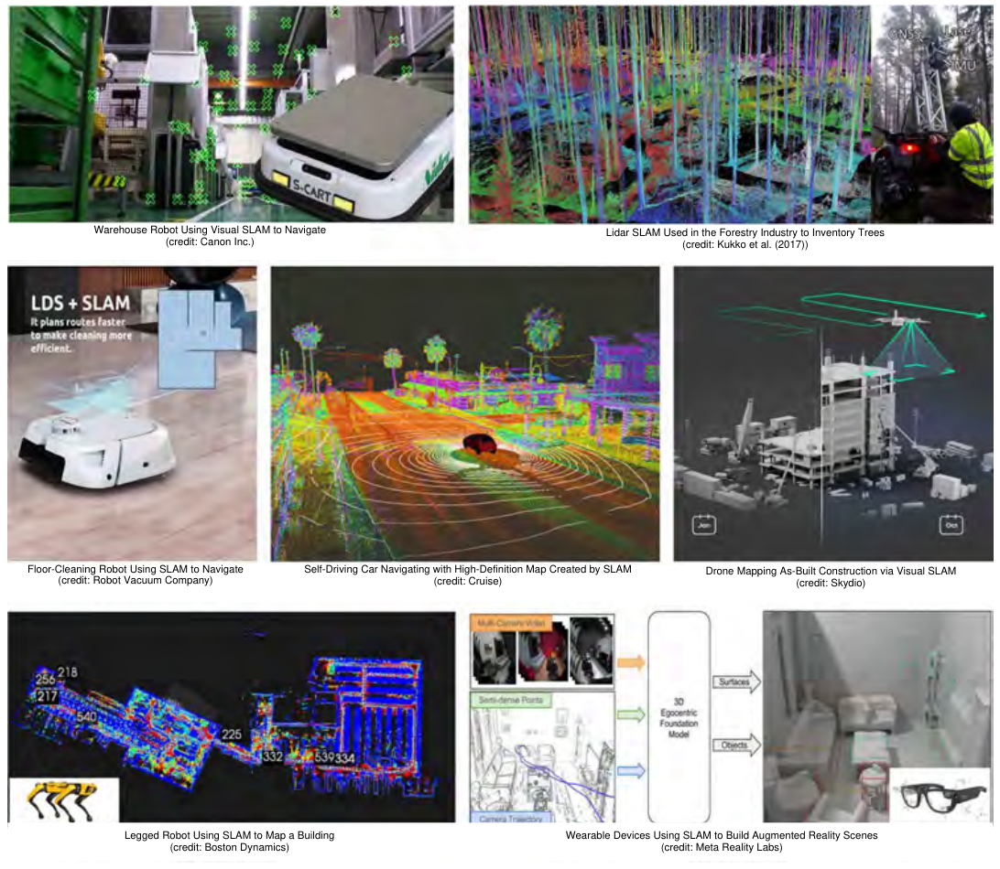
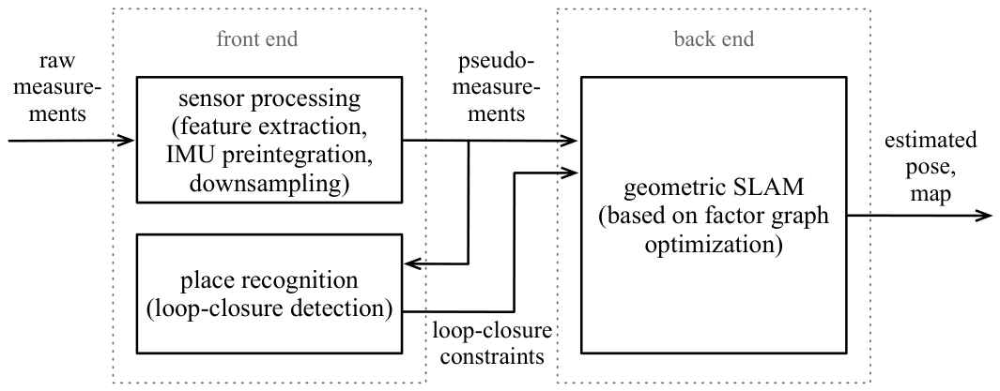
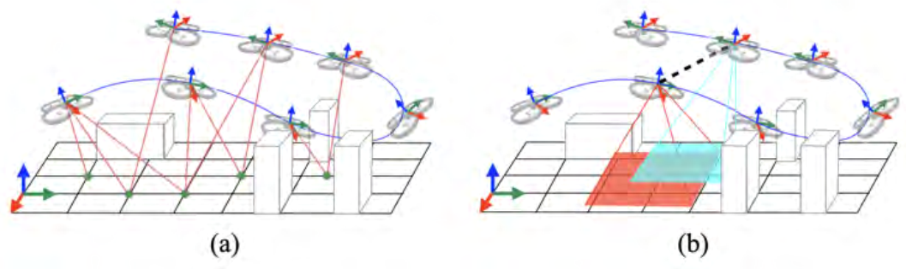
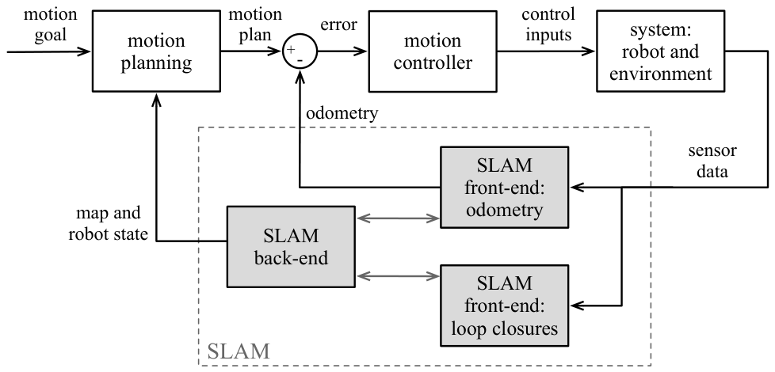
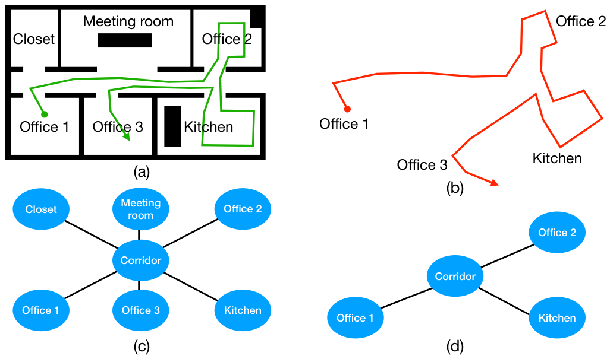
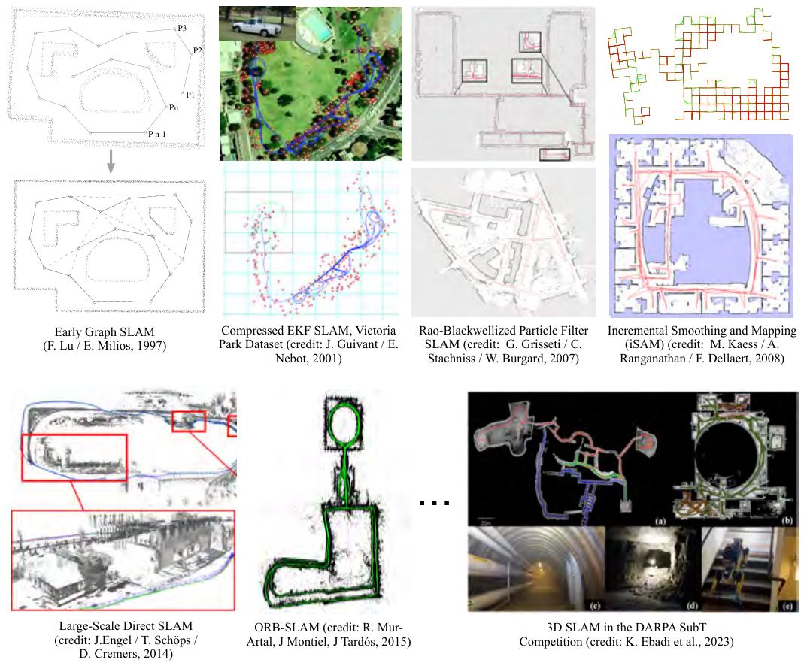
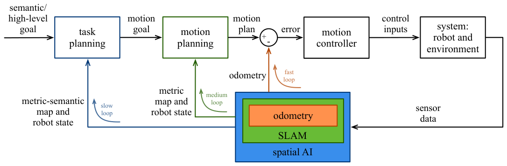

# Prelude I — SLAM 이란 무엇인가

> **원문 범위**: 책 p.3~18 (I.1~I.5). 유형 C (지도형).
> **저자**: Luca Carlone, Ayoung Kim, Frank Dellaert, Timothy Barfoot, Daniel Cremers (편집자 5인)
> **먼저 필요한 것**: 없다. **이 노트가 책 전체의 출발점이다.** 표기가 헷갈리면 [Notation](../../part0_prep/00_notation/00_notation.md).
> **여기서 처음 나오는 것**: front-end / back-end · landmark vs pose-graph · loop closure · perceptual aliasing · Spatial AI
> **나중에 쓰이는 곳**: 전 챕터. 특히 I.2 의 front-end/back-end 구분이 **책 전체의 뼈대**다 (Part I = back-end, Part II = front-end)
> **절 순서**: 책 순서 그대로. 재배치 없음.

## 이 장을 읽는 법

Prelude 는 내용을 가르치는 장이 아니라 **지도를 주는 장**이다. 여기서 정의되는 용어
몇 개가 이후 600쪽을 지배하므로, 다른 장처럼 훑고 넘어가면 나중에 계속 되돌아오게 된다.

특히 두 가지를 붙잡고 가면 된다.

| 붙잡을 것 | 왜 |
|---|---|
| **front-end / back-end 분리** (I.2) | 이 책의 3부 구성이 이 분리를 그대로 따른다 |
| **loop closure 가 왜 필수인가** (I.3) | SLAM 이 odometry 와 갈라지는 지점. Q2 의 사고실험이 핵심 |

---

## 1. SLAM 이란 무엇인가 (I.1, 책 p.3)

### 1.1 정의 — 두 가지를 동시에

로봇이 처음 보는 환경에서 안전하게 움직이려면 **주변에 대한 내부 표현**이 있어야 한다.
간단한 작업(차선 유지, 앞차와 거리 유지)은 센서 데이터에서 관심 대상을 추적하는 것만으로
되지만, 복잡한 작업(대규모 navigation, mobile manipulation)은 환경의 **지속적인 표현
— 지도(map)** 를 만들고 유지해야 한다 (책 p.3).

> 지도는 장애물·물체·관심 대상이 **어디에 있는지**를, 로봇의 **pose**(위치와 방향)를
> 기준으로 담는다. Notation 의 $\boldsymbol{T}_a^b$ 가 바로 이 pose 를 표현하는 도구다.

여기서 핵심 문장이 나온다 (책 p.3).

> **처음 보는 환경에서, 환경의 지도를 만들면서 동시에 그 지도에 대한 자기 pose 를
> 추정하는 문제**를 simultaneous localization and mapping (SLAM) 이라 한다.

"동시에(simultaneously)"가 이름의 절반을 차지하는 이유는, **둘 중 하나가 주어지면
문제가 훨씬 쉬워지기 때문**이다.

| 무엇이 주어지면 | 남는 문제 | 이름 |
|---|---|---|
| 지도가 주어짐 | pose 만 추정 | **localization** |
| pose 가 주어짐 (예: 절대 위치 시스템) | 지도만 작성 | **mapping** |
| 둘 다 없음 | 둘을 함께 추정 | **SLAM** |

**닭과 달걀 문제다.** 좋은 지도를 만들려면 내가 어디 있는지 알아야 하고, 내가 어디 있는지
알려면 지도가 있어야 한다. SLAM 이 어려운 근본 이유가 여기 있다.

*Figure I.1 — SLAM 은 창고 로봇, 산림 조사, 로봇 청소기, 자율주행차, 드론, 보행 로봇,
AR 웨어러블 등 넓은 영역에서 핵심 기술이 되고 있다. (책 p.4)*

### 1.2 왜 pose 가 주어지지 않는가 — 절대 위치 시스템의 한계

"위치는 GPS 로 알면 되지 않나"가 자연스러운 질문이다. 책은 이를 정면으로 답한다 (책 p.4).

| 수단 | 문제 |
|---|---|
| Differential GPS · motion capture | **비싸고 좁은 영역에만** 가능. 대규모 배치에 부적합 |
| 소비자용 GPS | 오차가 **미터 단위**, 위성이 보이는 실외에서만. localization 대체 불가 |

그래서 소비자용 GPS 는 **SLAM 을 대체하는 것이 아니라 SLAM 에 들어가는 추가 정보원**으로
쓰인다. 이 관점이 중요하다 — 이 책에서 모든 센서는 "정답을 주는 것"이 아니라
"추정에 기여하는 측정값"으로 다뤄진다.

### 1.3 왜 지도가 주어지지 않는가

마찬가지로 사전 지도도 대개 없다 (책 p.5).

- **지도를 만드는 것 자체가 목적**인 경우 — 재난 대응·수색구조에서 현장 지도를 만들어
  first-responder 를 돕는다
- **지도가 낡았거나 정보가 부족한** 경우 — 가정용 로봇이 아파트 평면도를 갖고 있어도
  가구와 물건은 거기 없고, 그것들은 **날마다 재배치된다**
- 화성 탐사 rover 는 저해상도 위성 지도가 있지만, 장애물 회피와 경로 계획을 위해
  **국소 mapping 은 여전히 필요**하다

---

## 2. 현대 SLAM 시스템의 해부 (I.2, 책 p.5)

### 2.1 SLAM 은 역문제다

SLAM 의 최종 목표는 센서 데이터로부터 지도 표현과 로봇 pose(궤적)를 **추론**하는 것이다.
센서는 두 종류로 나뉜다 (책 p.5).

| 종류 | 무엇을 재나 | 예 |
|---|---|---|
| **proprioceptive** | 로봇 **자신**의 상태 | wheel odometry, IMU |
| **exteroceptive** | **바깥** 세계 | 카메라, LiDAR, radar |

수학적으로 이것은 **역문제(inverse problem)** 다.

> 측정값들이 주어졌을 때, **그 측정값들을 만들어 냈을 법한** 세계의 모델(지도)과
> 로봇 pose 집합(궤적)을 결정하는 것 (책 p.5).

> **"만들어 냈을 법한"이 핵심이다.** 우리가 가진 모델은 "상태 → 측정" 방향(센서 모델)인데,
> 알고 싶은 것은 "측정 → 상태"다. 이 뒤집기를 확률로 정식화한 것이 [[map-estimation]] 이고,
> 1장이 그것을 최소제곱 문제로 바꾼다.

### 2.2 direct vs indirect — 원본을 쓸 것인가, 추린 것을 쓸 것인가

역문제를 푸는 전략이 두 갈래다 (책 p.5).

| | **indirect** | **direct** |
|---|---|---|
| 무엇을 쓰나 | 원본을 전처리해 뽑은 **중간 표현** | **원본 센서 데이터 그대로** |
| visual SLAM 예 | 이미지에서 2D keypoint 몇 개만 추출 | 모든 픽셀의 밝기를 사용 |
| 장점 | **빠르고 메모리 효율적**. 이후 계산이 수학적으로 단순 | 가용 정보를 전부 쓰므로 **정확도 잠재력이 높다** |
| 단점 | 추상화 과정에서 정보를 버린다 | 계산량이 크고, loss 에 **비볼록성이 추가**될 수 있다 |
| 실시간화 시점 | **2000년경** 이미 가능 | **2010년대**에 등장 |

- indirect 는 **연산 자원이 제한된 플랫폼의 실시간 robot vision 에서 여전히 선호**된다.
  중간 표현이 정해지고 나면 이후 문제가 고전적인 **bundle adjustment (BA)** 로 귀결되어,
  강력한 solver 와 근사 기법을 그대로 쓸 수 있다 (책 p.6)
- direct 는 방대한 입력을 다뤄야 하는데, **GPU 병렬화**로 그 부담을 던다 (Part II·III)

> **이 구분은 visual SLAM 에서 두드러지지만 거기 국한되지 않는다.** 8장(LiDAR)과
> 9장(radar)에서 같은 갈림길이 다시 나온다 (책 p.5).

### 2.3 front-end 와 back-end — 이 책의 뼈대

indirect 방식은 SLAM 아키텍처에 **자연스러운 분업**을 만든다 (책 p.6~7).

*Figure I.2 — 전형적인 indirect SLAM 은 front-end(센서 데이터를 다루기 쉬운 표현으로
바꾸고 loop closure 를 검출)와 back-end(pose 와 기하 지도를 추정)로 나뉜다. (책 p.6)*

| | **front-end** | **back-end** |
|---|---|---|
| 입력 | raw measurements | pseudo-measurements |
| 하는 일 | 센서 처리(feature 추출, IMU preintegration, downsampling) · **place recognition**(loop closure 검출) | **geometric SLAM** — factor graph 최적화 |
| 출력 | pseudo-measurements, loop-closure constraints | 추정된 pose 와 지도 |
| 성격 | **센서에 크게 의존** | 센서와 비교적 무관 |
| 이 책에서 | **Part II** | **Part I** |

front-end 는 한 가지 일을 더 한다 — **initial guess 를 만든다.** back-end 가 반복
최적화를 시작할 초기 추정값이고, 이것이 있어야 **비볼록성 때문에 엉뚱한 곳으로 수렴하는
문제를 줄일 수 있다** (책 p.7).

> **왜 이 분리가 이 책의 구조를 결정하는가.** back-end 는 "측정값이 어디서 왔든"
> 팩터그래프 최적화라는 같은 기계를 쓴다. 반면 front-end 는 센서마다 완전히 다르다
> (카메라의 keypoint 매칭과 LiDAR 의 scan matching 은 공통점이 거의 없다).
> 그래서 back-end 를 Part I 에 **한 번** 정리하고, front-end 를 Part II 에서
> **센서별로** 다루는 구성이 나온다.

### 2.4 두 가지 SLAM 모델 — landmark 기반과 pose-graph 기반

front-end 가 무엇을 넘겨주느냐에 따라 back-end 가 푸는 문제의 모양이 달라진다.

*Figure I.3 — (a) landmark 기반: front-end 가 3D landmark 관측을 만들고, back-end 가
궤적과 landmark 위치를 추정한다. (b) pose-graph 기반: front-end 가 odometry 와 loop
closure(대개 상대 pose 측정)로 추상화하고, back-end 가 전체 궤적을 추정한다. (책 p.7)*

**Example I.1 — Visual SLAM: 픽셀에서 landmark 로** (책 p.7)

1. front-end 가 각 이미지에서 **2D keypoint** 를 추출한다
2. 프레임 간에 매칭해서, 각 묶음(**feature track**)이 같은 3D 점(**landmark**)의 재관측이
   되도록 만든다
3. front-end 는 **minimal solver** 라는 컴퓨터 비전 기법으로 카메라 pose 와 landmark
   위치의 **대략적 초기값**도 계산한다
4. back-end 가 **bundle adjustment** 를 풀어 landmark 위치와 pose 를 추정·정제한다

→ **landmark 기반(feature 기반) SLAM 모델**. Figure I.3(a). 7장에서 자세히 다룬다.

> 책 각주가 미묘한 점 하나를 덧붙인다 (책 p.7 각주 1) — minimal solver 는 **outlier
> (landmark 오검출)를 상당수 미리 걸러 내는** 역할도 한다. back-end 의 일을 덜어 주되,
> 남은 outlier 는 back-end 가 처리할 수 있게 남겨 둔다. outlier 와 data association 은
> **3장**의 주제다.

**Example I.2 — LiDAR SLAM: scan 에서 odometry 와 loop closure 로** (책 p.7~8)

1. front-end 가 **scan matching** 알고리즘(예: **ICP**, Iterative Closest Point)으로
   두 LiDAR scan 사이의 상대 pose 를 계산한다
2. **연속한 시각**의 scan 을 매칭 → 그 사이 로봇의 상대 운동 = **odometry**
3. **같은 장소를 다시 방문**한 scan 을 매칭 → **loop closure**
4. back-end 가 **pose-graph optimization (PGO)** 로 궤적을 최적화한다

→ **pose-graph 기반 SLAM 모델**. Figure I.3(b). 8장에서 다룬다.

### 2.5 무엇을 넘길지는 정확도와 계산량의 맞바꿈이다

front-end 가 back-end 로 넘기는 중간 표현(pseudo-measurement)은 크게 셋이다 —
**landmark 관측 · odometry · loop closure** (책 p.8).

복잡한 시스템은 이것들을 **섞어 쓴다.** 예를 들어 어떤 visual SLAM 은 3D landmark 에
대응하는 keypoint 를 뽑은 뒤, 그것을 **더 가공해서** odometry 와 loop closure 에 해당하는
상대 pose 를 만들고, 최종적으로 pose-graph back-end 를 쓴다.

> **어디서 자를지가 설계 결정이다** (책 p.8).
>
> 더 단순하게 추상화하면 —
>
> | | 어떻게 되는가 |
> |---|---|
> | **좋은 점** | back-end solver 가 훨씬 빨라진다 (PGO 는 대개 BA 보다 훨씬 빠르다) |
> | **나쁜 점** | 측정값을 모델링하는 데 **근사가 들어가** 작은 부정확이 생긴다 (BA 가 PGO 보다 대개 더 정확하다) |
>
> 공짜 점심이 없다. 이 맞바꿈은 Part II 의 모든 장에서 다른 얼굴로 되풀이된다.

### 2.6 loop closure 가 왜 결정적인가

책이 이 절을 마무리하며 강조하는 지점이다 (책 p.8).

> odometry 만으로 궤적을 추정하면 — odometry 운동 추정을 **누적**해서 얻으므로 —
> 시간이 갈수록 **drift 가 쌓여** 궤적 추정이 심하게 뒤틀린다.
> **이미 방문한 곳을 다시 방문하는 것**이 궤적 오차를 유계로 유지하고 전역적으로
> 일관된 지도를 얻는 데 결정적이다.

**landmark 기반 SLAM 에서는 loop closure 가 암묵적으로 담긴다** — 이전에 본 landmark 를
다시 관측하는 것이 곧 loop closure 다. pose-graph 기반에서는 명시적으로 만들어 넣는다.

### 2.7 SLAM 은 여러 분야를 가로지른다

| 부분 | 걸치는 분야 |
|---|---|
| front-end | 신호처리, 기하학, 2D 컴퓨터 비전, machine learning |
| back-end | 추정 이론, 최적화, 응용수학 |

이 다양성이 SLAM 을 매력적이고 다면적인 문제로 만든다 (책 p.8).

---

## 3. 자율성 아키텍처에서 SLAM 의 위치 (I.3, 책 p.9)

### 3.1 SLAM 은 하위 작업을 위해 존재한다

*Figure I.4 — SLAM 은 로봇의 전체 자율성 파이프라인에서 중요한 역할을 하며,
제어와 motion planning 에 필요한 정보를 제공한다. (책 p.9)*

- **pose 추정** → 로봇이 원하는 궤적을 따르도록 **제어**하는 데 쓰인다
- **지도 + 현재 pose** → **motion planning** 에 쓰인다

여기서 motion planning 은 넓은 뜻이다. 대규모 지도로 navigation 을 지원하는 것이 전형적이지만,
**국소 3D 지도를 만들어 manipulation 과 grasping 을 가능하게** 하는 것도 포함한다 (책 p.9).

### 3.2 왜 하나의 통짜 시스템이 아닌가 — latency 가 다르다

SLAM 을 "센서 데이터를 넣으면 pose 와 지도가 즉시 나오는 단일 시스템"으로 생각하고 싶지만,
실제 구현과 통합은 그렇지 않다. **로봇이 서로 다른 latency 요구를 가진 여러 루프를 닫아야
하기 때문**이다 (책 p.9).

| 루프 | 주기 | 요구 |
|---|---|---|
| 저수준 **제어** 루프 (Figure I.4 오른쪽 위) | 빠름 | 안정성을 위해 **높은 rate·낮은 latency**. 고속 비행 UAV 는 front-end odometry 를 **수 ms** 안에 |
| **motion planning** 루프 (바깥 루프) | 느림 | 전역 planning 은 낮은 rate 로 돌므로 back-end 가 **초 단위** latency 여도 수용 가능 |

> 그래서 실제 SLAM 시스템은 **여러 프로세스를 병렬로** 돌리고, **느린 프로세스가 빠른
> 프로세스를 막지 않도록** 구성한다 (책 p.9). 전역 최적화가 odometry 를 붙잡고 있으면
> 로봇이 불안정해진다.

### 3.3 상호작용은 단방향이 아니다

Figure I.4 의 **양방향 화살표**가 뜻하는 바다 (책 p.10).

- front-end 가 odometry 를 back-end 로 보내지만, **back-end 는 주기적으로 전역 보정을
  odometry 궤적에 되돌려 준다.** 그 보정된 궤적이 motion controller 로 간다
- front-end 가 loop closure 를 계산해 보내지만, **back-end 도 어떤 loop closure 가
  그럴듯하고 어떤 것이 아닌지를 front-end 에 알려 준다**

### 3.4 back-end 도 online 이어야 한다 — SLAM 과 SFM 의 차이

back-end 가 느리게 돌더라도 **online 이어야 한다**는 점이 중요하다 (책 p.10).

> 전체 실행 시간이 **시간에 따라 무한정 늘어나지 않아야** 하고, 데이터가 수집되는 동안
> **임베디드 로봇 하드웨어에서** 달성되어야 한다.

이것이 역사적으로 SLAM 을 컴퓨터 비전의 **structure from motion (SFM)** 과 갈라 놓은
주된 특징이다.

| | **SFM** | **SLAM** |
|---|---|---|
| 목적 | 카메라 이미지로 3D 장면 기하 복원 | 같음 (+ 로봇 pose) |
| 계산 자원 | 강력한 컴퓨터 (서버 클러스터도) | **임베디드 하드웨어**, 빠듯한 제약 |
| 실행 시간 | **시간 단위**도 허용 | **초 단위** |
| 데이터 | **순서 없는** 이미지 모음 | 로봇이 탐색하며 **인과적으로 수집한** 시계열 |

> **단 그 경계는 갈수록 흐려지고 있다** (책 p.10). 비전 쪽의 online SFM 연구(2000년대 초부터)와,
> SLAM 기법을 오프라인 데이터셋 후처리에 쓰는 사례 때문이다. 그래서 많은 연구자가
> visual SLAM 과 SFM 을 **사실상 같은 말로 쓰기도 한다.**

### 3.5 로봇에 정말 SLAM 이 필요한가 (I.3.1, 책 p.10)

책이 스스로 반론을 세 개 제기하고 답한다. **이 절이 Prelude 에서 가장 중요하다** —
SLAM 이 무엇을 위해 존재하는지가 여기서 분명해지기 때문이다.

#### Q1. 모든 로봇 작업에 SLAM 이 필요한가?

**아니다** (책 p.10).

- 반응적인 작업(대상을 시야에 유지하기)은 더 단순한 제어로 된다 — 예: **visual servoing**
- **짧은 거리**만 움직이면 odometry 와 국소 mapping 으로 충분할 수 있다
- 환경에 **localization 을 위한 인프라**가 있으면 SLAM 을 안 풀어도 된다

> 다만 **인프라가 없는(unstructured) 환경에서의 장기 운용**에는 없어서는 안 될 요소로 보인다.
> 장기 운용은 **기억**을 필요로 하고(전에 본 물체로 돌아가기, 충돌 없는 경로 찾기),
> SLAM 이 만든 지도 표현이 그 장기 기억을 제공한다 (책 p.11).
>
> 책 각주가 덧붙인다 (책 p.10 각주 2) — 추적에 SLAM 이 꼭 필요하진 않아도,
> **강건성을 높이는 데는 여전히 도움이 된다**(예: 대상이 시야에서 사라졌을 때).

#### Q2. navigation 에 전역적으로 일관된 기하 지도가 필요한가?

이 질문의 사고실험이 **loop closure 와 metric SLAM 의 존재 이유**를 보여 준다.

*Figure I.5 — (a) 로봇이 Office 1 을 방문한 뒤 다른 구역(Office 2, Kitchen)을 돌아
Office 3 로 간다. Office 3 는 Office 1 바로 옆방이다. 장애물은 검정, 참 궤적은 초록.
(b) odometry 로 추정한 궤적. (c) 참 topological map. (d) perceptual aliasing 이 있을 때
추정된 topological map — 로봇이 Office 1 과 3 을 같은 방으로 착각했다. (책 p.11)*

**대안 1 — odometry 만 쓰기.** loop closure 도 back-end 최적화도 필요 없다.

→ **drift 때문에 장기 운용에 부적합하다.** 그림 (b) 를 보라. Office 1 과 Office 3 는
실제로 **바로 옆방**인데, odometry 만 쓰면 로봇은 둘이 **멀리 떨어져 있다고 착각**한다.
그래서 두 방을 잇는 짧은 경로가 있다는 것을 알아채지 못한다 (책 p.11).

**대안 2 — topological map 쓰기.** 노드는 방문한 장소, 간선은 그 사이의 이동 가능성을
나타내는 그래프다 (그림 c).

> **metric SLAM 과의 차이**: topological map 의 노드와 간선은 **metric 정보(거리·방위·위치)를
> 갖지 않는다.** 그래서 **최적화가 아예 필요 없다** — 로봇이 두 장소 사이를 이동했으면
> (odometry) 또는 place recognition 이 두 장소가 겹친다고 하면 (loop closure)
> 간선을 그냥 추가하면 된다 (책 p.12).

그럴듯해 보이지만 결정적 문제가 있다.

> **place recognition 은 완벽하지 않고, 더 근본적으로는 서로 다른 두 장소가 비슷해
> 보일 수 있다.** 이 현상을 **perceptual aliasing** 이라 한다 (책 p.12).

Office 1 과 Office 3 가 비슷하게 생겼다면, 순수 topological 접근은 **두 방을 하나로**
착각한다 (그림 d — 노드가 5개에서 3개로 줄었다).

**metric SLAM 은 여기서 이긴다.** 기하 정보를 써서 "두 방은 실제로 다른 방"이라고
결론지을 수 있기 때문이다. place recognition 결과가 맞는지, 두 관측이 같은 장소인지를
판단할 더 강력한 도구를 준다 — **3장**의 주제다 (책 p.12).

#### Q3. 지도가 필요한가?

SLAM 이 만드는 지도는 **직접 질의하고, 검사하고, 시각화할 수 있다** (표현 방법은 **5장**).

**완전히 다른 접근**도 있다 — 원본 센서 데이터를 행동으로 **직접** 변환하도록 학습시키면
(예: Reinforcement Learning) 지도를 만들 필요가 없다.

> 이때도 신경망은 **내부 표현을 만들 것이다.** 다만 그 내부 표현은 **질의도, 검사도,
> 시각화도 할 수 없다** (책 p.12).

책의 답은 유보적이지만 근거를 셋 든다 (책 p.12).

1. 지도를 중간 표현으로 쓰는 것이 **여러 시각 작업에서 적어도 이롭다**는 초기 증거가 있다 [912, 1252]
2. 지도는 **다양한 작업에 두루 쓰인다.** 단일 작업 맥락에서 전부 학습된 표현은
   **새로운 작업을 지원하지 못할 수** 있다
3. **지도 자체가 목적**인 응용이 많다 — 수색구조(first-responder 에게 지도 제공),
   그리고 로봇을 넘어 부동산 기획·시공 모니터링·VR/AR 처럼 **사람이 검사하고 시각화**하는 경우

---

## 4. SLAM 의 과거·현재·미래 (I.4, 책 p.13)

### 4.1 역사 — 여러 갈래에서 왔다 (I.4.1)

*Figure I.6 — SLAM 의 역사는 오늘의 시스템으로 이어진 수많은 진전으로 채워져 있다.
대표적인 사례들. (책 p.14)*

**측량과 geodesy 에서** (책 p.13) — 관측으로 세계의 지도를 만드는 것은 가장 오래된
과제 중 하나다.

| 인물 | 무엇 |
|---|---|
| **Carl Friedrich Gauss** | 1821–1825, Hannover 왕국 삼각측량 |
| **Sir George Everest** | 1830–1843, 인도 측량국장. Great Trigonometric Survey. 세계 최고봉에 이름이 붙었다 |
| **Carl Maximilian von Bauernfeind** | 1856 『측량학 요론』 출간. 1868 **뮌헨 공대 설립** (geodesy 를 학문으로 세우는 데 중점) |
| **André-Louis Cholesky** | 1차 대전 전 크레타·북아프리카 측량 중 **Cholesky 분해** 개발 |

> **Cholesky 분해가 측량에서 나왔다는 것**은 우연이 아니다. 1장에서 보겠지만
> SLAM back-end 의 선형 최소제곱을 푸는 표준 도구가 바로 그것이다.
> **같은 문제가 200년 만에 같은 도구로 돌아온 셈이다.**

visual SLAM 은 **photogrammetry** 와 **Structure from Motion** 에 가깝고, 그 기원은
19세기까지 거슬러 간다 (7장에서 더 다룬다).

**로봇공학에서의 기원** (책 p.13) — Smith & Chessman [1018], Durrant-Whyte [293],
그리고 병렬적으로 Crowley [233], Chatila & Laumond [172] 의 선구적 연구로 거슬러 간다.
**SLAM 이라는 약어는 1995년 survey 논문 [294] 에서 만들어졌다.**

초기 연구가 확립한 **두 가지 통찰**이 오늘까지 이어진다.

1. 미지 환경에서 drift 를 피하려면 **로봇 pose 와 고정된 외부 대상(landmark)의 위치를
   동시에 추정해야 한다**
2. 추정 이론의 기존 도구, 특히 **Extended Kalman Filter (EKF)** 를 로봇 pose 와 landmark
   위치를 아우르는 **확장된 상태**에 적용할 수 있다 → **EKF-SLAM** 계열

### 4.2 EKF-SLAM 의 세 가지 문제

EKF-SLAM 은 대단히 인기 있었지만 실전에서 세 문제에 부딪혔다 (책 p.13~14).

| # | 문제 | 왜 |
|---|---|---|
| 1 | **outlier·data association 오류에 취약** | place recognition·물체 검출 실패로 **비슷하게 생긴 다른 대상**을 봤다고 믿으면, 이 잘못된 측정이 추정을 크게 망친다 |
| 2 | **linearization 실패** | EKF 는 운동·관측 방정식의 선형화에 의존한다. 선형화 지점은 대개 odometry 로 만드는데 **odometry 가 drift 하면** 선형화된 시스템이 원래 비선형계의 나쁜 근사가 된다 → **발산** |
| 3 | **계산 복잡도** | 순진한 구현은 상태 변수 수에 대해 **제곱**으로 증가한다 (dense covariance 행렬 조작). landmark 가 수천 개면 실시간 불가 |

### 4.3 particle filter — 2000년대 초

이에 대응해 **particle-filter 기반** 접근이 주목받았다 [771, 1013, 399] (책 p.14).
궤적을 **가설(particle) 집합**으로 모델링한다.

| 좋아진 점 | 남은 문제 |
|---|---|
| landmark 를 많이 써도 됨 — EKF 의 **제곱 복잡도를 돌파** | 계산과 정확도의 맞바꿈: 정확하려면 particle 이 **수천 개** 필요 |
| **2D occupancy grid** 같은 dense 지도 모델을 다루기 쉬워짐 | **particle depletion** — 유한한 particle 중 참 궤적 근처가 하나도 없으면 발산 |
| linearization 에 의존하지 않고 outlier·오연관에 덜 민감 | 3D 문제에서 심해진다 (3D pose 를 덮으려면 particle 이 훨씬 많이 필요) |

### 4.4 sparsity 의 발견과 factor graph — 2005~2015

**핵심 통찰** (책 p.15):

> EKF 의 covariance 행렬은 dense 하지만, **그 역행렬(information matrix)은 매우 sparse
> 하고 sparsity 패턴이 예측 가능하다** — 과거 pose 를 추정에 남겨 두면 [313].

이것이 **선형에 가까운 복잡도**의 알고리즘을 가능하게 했다. 처음에는 EIF 같은 EKF 계열에
적용됐지만, **최적화 기반 접근의 길을 열었다.**

> 최적화 기반은 SLAM 초기에 이미 제안됐다가 [701] **너무 느려 실용적이지 않다고
> 외면당했다.** 위 sparsity 구조가 그것을 다시 생각하게 만들었고,
> **확장 가능하고 online 으로 풀 수 있게** 했다 [249, 532] (더 자세히는 1장).

이 새 물결은 **또 한 번의 추정 프레임워크 전환**이다 — maximum likelihood 와
**maximum a posteriori** 추정으로. 추정 문제를 **최적화**로 다시 쓰고, 문제 구조를
**확률 그래프 모델**, 구체적으로 **factor graph** 로 기술한다.

> **factor graph 기반 접근이 오늘날에도 지배적인 패러다임이고**, visual/visual-inertial
> odometry 같은 관련 문제를 사고하는 방식까지 바꿔 놓았다 (책 p.15).

최적화 관점이 강력한 이유 셋 (책 p.15):

1. **훨씬 깊은 이론적 분석**이 가능해진다 (→ **6장**)
2. **EKF 는 (적절한 선형화 지점에서) 비선형 최적화 solver 의 한 번의 반복으로 이해될 수 있다.**
   즉 최적화 관점이 filtering 보다 **엄격히 더 강력하다**
3. SLAM 의 최근 확장에 더 적합하다 — 연속 변수(장면 기하)와 **이산 변수(장면의 의미)를
   함께** 추정하고 싶을 때 (Part III)

> **이 책의 범위가 여기서 정해진다** (책 p.15).
>
> > 이 핸드북은 주로 **factor graph 기반 SLAM 정식화**에 초점을 맞춘다.
> > 이는 **범위에 대한 결정**이며, 다른 기술적 도구를 쓰는 진행 중인 연구의 가치를
> > 깎아내리지 않는다.
>
> 실제로 집필 시점에도 EKF 기반 도구는 visual-inertial odometry 에서 여전히 인기 있고
> (Mourikis & Roumeliotis 의 선구적 연구 [777]), **invariant filter** [56],
> **equivariant filter** [331], **random finite set** [783] 같은 새 정식화도 개발되고 있다.
>
> 위 역사 서술이 2015년에서 멈추는 것도 의도적이다. 그 뒤 — **2012년경 시작된 "딥러닝
> 혁명"이 로봇공학에 스며든 흐름**을 포함해 — 는 **Part III** 가 다룬다.
> 또한 이 짧은 역사는 대체로 **back-end** 를 중심으로 돈다. front-end 의 발전은
> 컴퓨터 비전·신호처리·machine learning 등 여러 공동체에 걸쳐 있다 (책 p.16).

### 4.5 SLAM 에서 Spatial AI 로 (I.4.2, 책 p.16)

SLAM 은 본질적으로 환경(과 로봇)의 **기하적 성질**을 추정한다. 그래서 지도는 이런 명령을
지원한다:

> "로봇: 좌표 $[x, y, z]$ 로 가라"

**문제는 이것이 사람이 목표를 지정하는 방식이 아니라는 것이다** (책 p.16). 비전문가 사용자에게
좌표는 적합하지 않다. 다음 세대 로봇은 이런 자연어 명령을 이해하고 실행해야 한다:

> "로봇: 욕실에 있는 옷을 집어서 세탁실로 가져다 줘"

이를 파싱하려면 로봇이 **기하**(욕실이 어디인가)와 **의미**(욕실이 무엇인가, 어떤 물체가
옷인가)를 **모두** 이해해야 한다.

> 그래서 연구 공동체는 SLAM 을 **더 넓은 공간 인지 시스템의 통합 구성요소**로 생각하기
> 시작했다. 기하·의미·때로는 물리적 측면을 동시에 추론해 **다면적 지도 표현("world model")**
> 을 만들고, 복잡한 명령을 이해·실행할 수 있게 하는 것이다. 이것이 **Spatial AI** 다.

**직관적으로 Spatial AI 는 SLAM 을 하위 모듈로 갖고**(기하 추론 담당), 거기에 **의미 추론
능력을 더한** 것이다 (책 p.17).

*Figure I.7 — Spatial AI(공간 인지)는 SLAM 의 기하 추론 능력을 의미·물리 추론까지 확장한다.
SLAM 블록이 odometry 를 받아 장면의 기하적 이해를 제공하면, Spatial AI 블록은 그 결과를 받아
semantics·affordance·dynamics 등의 장면 이해를 더한다. 이를 통해 task planning 같은 상위
의사결정 모듈까지 루프를 닫을 수 있고, 사용자가 더 높은 수준의 목표를 줄 수 있다. (책 p.17)*

Figure I.4 와 비교하면 무엇이 달라졌는지가 분명하다.

| | Figure I.4 (SLAM) | Figure I.7 (Spatial AI) |
|---|---|---|
| 가장 바깥 입력 | **motion goal** (좌표) | **semantic/high-level goal** (자연어) |
| 최상위 모듈 | motion planning | **task planning** 이 추가됨 |
| 지도 | metric map | **metric-semantic map** |
| 루프 | fast(제어) · medium(planning) | + **slow loop** (task planning) |

---

## 5. 이 핸드북의 구조 (I.5, 책 p.17)

### 5.1 세 파트

| Part | 무엇 | 장 |
|---|---|---|
| **I. Foundations** | SLAM 의 기초. **back-end 의 추정 이론 기계**와 그것이 만드는 지도 표현 | 1~6 |
| **II. In Practice** | **"state of practice"**. 센서별 접근과 응용. front-end 설계와 현대 SLAM 으로 가능한 것 | 7~12 |
| **III. From SLAM to Spatial AI** | 최신 동향과 미래 전망 | 13~18 |

### 5.2 장별 역할 — 책이 직접 밝힌 것

**Part I** (책 p.17)

| 장 | 역할 | 이 노트와의 연결 |
|---|---|---|
| **1** Factor Graphs | SLAM 의 factor graph 정식화를 도입하고 반복적 비선형 최적화로 푸는 법 | 2.3 의 back-end 그 자체 |
| **2** State Variable Representations | **없어서는 안 될 단계** — 회전과 pose 처럼 **매끄러운 manifold 에 속한 변수**를 추정할 수 있게 확장 | Notation 의 $SO(3)$·$SE(3)$ |
| **3** Robustness | back-end 에서 outlier 와 잘못된 data association 을 모델링하고 완화 | Q2 의 perceptual aliasing, 4.2 의 EKF 문제 ① |
| **4** Differentiable Optimization | back-end 최적화를 **미분 가능**하게 — 전통적 SLAM 과 딥러닝 아키텍처를 잇는 핵심 단계 | 13장으로 이어진다 |
| **5** Dense Map Representations | back-end 에서 **지도 표현**으로 초점 이동 | Q3 의 "지도가 필요한가" |
| **6** Certifiably Optimal Solvers | 더 진보된 solver 와 back-end 의 **이론적 성질** | 4.4 의 "훨씬 깊은 이론적 분석" |

**Part II** (책 p.17~18) — front-end 설계는 **센서에 크게 의존**하므로 센서별로 나뉜다.

| 장 | 센서 |
|---|---|
| **7** Visual SLAM | 카메라 (방대한 문헌을 개괄) |
| **8** LiDAR SLAM / **9** Radar SLAM | LiDAR · radar |
| **10** Event-based SLAM | event camera |
| **11** Inertial Odometry | IMU 측정을 factor graph 에 모델링하는 법과 **근본적 한계(observability)** |
| **12** Leg Odometry | wheel·legged odometry 등 다른 odometry 정보원 |

**Part III** (책 p.18)

| 장 | 주제 |
|---|---|
| **13** Deep Learning | 미분 가능 최적화와 결합한 딥러닝 모듈이 가져온 개선 |
| **14** Volume Rendering | **NeRF · Gaussian Splatting** 같은 새 지도 표현의 기회와 도전 |
| **15** Dynamic and Deformable | 매우 동적이고 변형하는 환경 — 혼잡 환경 mapping 부터 수술 로봇까지 |
| **16** Metric-Semantic SLAM | Spatial AI 와 metric-semantic 지도 표현의 진전 |
| **17** Open-World Spatial AI | **Foundation Model**(대형 vision-language model)과 **open-vocabulary** 자연어 명령의 grounding |
| **18** Computational Structure | 미래의 계산 아키텍처 — 유연하고 분산된 컴퓨팅 하드웨어 |

---

## 6. 정리 과제

유형 C 장의 과제는 **파트 전체를 잇는 것**이다 (`2_Template_and_Rule.md`).

### 과제 1 — 두 예제를 Figure I.2 위에 얹기

Example I.1(visual SLAM)과 Example I.2(LiDAR SLAM)를 Figure I.2 의 블록도에 대응시켜라.
각 예제에서 아래 네 칸을 채우면 된다.

| | raw measurements | front-end 가 하는 일 | pseudo-measurements | back-end 가 푸는 문제 |
|---|---|---|---|---|
| Example I.1 | ? | ? | ? | ? |
| Example I.2 | ? | ? | ? | ? |

답

| | raw | front-end | pseudo-measurements | back-end |
|---|---|---|---|---|
| **I.1 Visual** | 카메라 이미지 | 2D keypoint 추출 → 프레임 간 매칭(feature track) → minimal solver 로 초기값·outlier 제거 | **landmark 관측** | **bundle adjustment** (landmark 위치 + pose) |
| **I.2 LiDAR** | LiDAR scan | scan matching (ICP) — 연속 scan → odometry, 재방문 scan → loop closure | **odometry + loop closure** (상대 pose) | **pose-graph optimization** (궤적) |

**핵심 차이**: I.1 은 landmark 를 back-end 까지 **끌고 가고**, I.2 는 front-end 에서
상대 pose 로 **접어 버린다.** 그래서 I.2 의 back-end 가 훨씬 빠르지만 근사가 들어간다 (이 노트 §2.5).

### 과제 2 — 판단 문제: 어디서 자를 것인가

실내 배송 로봇을 만든다. 카메라와 IMU 가 있고, 연산은 임베디드 보드로 제한된다.
front-end 에서 landmark 를 그대로 back-end 로 넘길 것인가(BA), 아니면 상대 pose 로
접어서 넘길 것인가(PGO)? **정답은 없다** — 이 노트 §2.5 의 맞바꿈과 §3.2 의 latency 요구를
근거로 답하라.

> **고려할 것**: 배송 로봇의 속도는? 어떤 루프가 빡빡한가? 정확도가 부족하면 무엇이
> 실패하는가(충돌? 목적지 오차?) — 요구 정확도를 먼저 정하지 않으면 이 질문에 답할 수 없다.

### 과제 3 — Q2 를 뒤집어 보기

Figure I.5 에서 metric SLAM 은 Office 1 과 3 이 다른 방임을 기하 정보로 판별할 수 있다고 했다.
그렇다면 **metric SLAM 이 perceptual aliasing 에 속는 경우**는 없는가?
어떤 상황에서 기하 정보마저 두 장소를 구분하지 못하겠는가?

> **힌트** — odometry drift 가 방 하나 크기보다 크면 어떻게 되는가.
> 이 문제를 정면으로 다루는 것이 **3장**이고, "이 loop closure 를 믿을 것인가"를
> 판단하는 도구들이 거기 나온다.

---

## 7. 이 장에서 확정한 용어

| 쓸 것 | 쓰지 말 것 |
|---|---|
| front-end / back-end | 전단부 / 후단부 |
| loop closure | 루프 폐쇄, 폐루프 |
| place recognition | 장소 인식 (첫 등장 시 병기는 허용) |
| perceptual aliasing | 지각적 중첩 |
| odometry | 주행거리계 |
| landmark | 랜드마크, 지표 |
| pose | 자세, 포즈 |
| drift | 표류 |
| bundle adjustment (BA) | 번들 조정 |
| pose-graph optimization (PGO) | 자세 그래프 최적화 |
| proprioceptive / exteroceptive | 고유수용성 / 외수용성 |
| initial guess | 초기 추측 |
| Spatial AI | 공간 인공지능 (고유명사로 취급) |

원문의 *"the optimization **lens**"* 는 전문용어가 아니라 저자의 비유다. 직역한
"최적화 렌즈"는 한국어로 읽히지 않으므로 **"최적화 관점"** 으로 옮긴다.
같은 이유로 *"the metric SLAM lens"* 도 "metric SLAM 의 관점"으로 쓴다.
**비유 표현은 영어를 남기지 말고 한국어로 자연스럽게 옮긴다** — 영어를 남기는 것은
전문용어에 한한다.

**한국어를 쓰는 것**: 지도, 궤적, 측정값, 추정, 최적화, 선형화, 복잡도, 기하, 의미.
