# 1장. Factor Graphs for SLAM

> **원문 범위**: 책 p.19~52 (1.1~1.8절). 유형 A (유도형). 수식 66개 · 그림 15개.
> **저자**: Frank Dellaert, Michael Kaess, Timothy Barfoot
> **먼저 필요한 것**: [Prelude I](../00_prelude_1/00_prelude_1.md) 의 front-end/back-end 구분. 표기는 [Notation](../../part0_prep/00_notation/00_notation.md).
> **여기서 처음 나오는 것**: factor graph · MAP 추론 · whitening · normal equation · Cholesky/QR 인수분해 · variable elimination · Bayes net · Bayes tree · iSAM
> **나중에 쓰이는 곳**: **전 챕터.** 2장(manifold 위 변수) · 3장(robust factor) · 4장(미분 가능화) · 6장(전역 최적) 이 전부 이 장의 최소제곱 문제를 손본다. Part II 의 센서별 front-end 는 전부 이 그래프에 factor 를 얹는 것이다
> **절 순서**: 책 순서 그대로. 재배치 없음.
> **원문 주의**: 이 장은 회전을 **보통 벡터처럼** 다룬다. 책이 각주에서 명시적으로 밝히고 (책 p.20 각주 1) 2장으로 미룬다. 그대로 따르되, 어디가 거짓말인지는 짚고 간다.

## 이 장을 읽는 법

이 장은 **하나의 이야기**다. 흩어진 도구 모음이 아니다.

```
확률 문제                    →  최적화 문제        →  선형대수         →  그래프 알고리즘
p(x|z) 를 최대화              비선형 최소제곱        희소 행렬 분해       variable elimination
(1.2절)                      (1.2.3)              (1.3절)            (1.6절)
                                                                          ↓
                                                              점진적으로 고치기 (Bayes tree, 1.7절)
```

**같은 것을 네 가지 언어로 말한다.** 확률 → 최적화 → 행렬 → 그래프. 각 번역이
새로운 것을 보이게 해 준다. 마지막 번역(그래프)에서 **점진적 갱신**이 가능해지고,
그것이 실시간 SLAM 을 만든다.

| 절 | 무엇을 얻나 | 놓치면 안 되는 것 |
|---|---|---|
| 1.1 | factor graph 라는 그림 | 왜 Bayes net 이 아니라 factor graph 인가 |
| **1.2** | MAP = 비선형 최소제곱 | **Gaussian 가정이 어디서 들어오는가** |
| 1.3 | 선형화 → 행렬 분해 | whitening 이 왜 필요한가 |
| 1.4 | GN · LM · dogleg | 왜 GN 만으로 안 되는가 |
| 1.5 | sparsity 는 그래프 구조다 | 변수 순서가 비용을 바꾼다 |
| **1.6** | elimination = 행렬 분해 | **이 등가성이 이 장의 정점** |
| 1.7 | Bayes tree → iSAM | 왜 트리여야 점진적으로 고칠 수 있나 |

---

## 0. 역사 노트 — 왜 smoothing 인가 (책 p.19)

본문에 앞서 책이 붙인 절이다. **이 장의 접근이 어디서 왔는지**를 밝힌다.

**smoothing** 은 가장 최근 위치만이 아니라 **현재까지의 궤적 전체**를 다룬다.
궤적만 다루는 것은 오늘날 **pose-based SLAM** 이라 부르고 [172, 701, 700, 420, 594, 312],
이는 가까운 pose 쌍 사이의 제약을 주는 laser-range finder 같은 센서에 특히 잘 맞는다.

더 일반적으로는 **full SLAM** 문제 [1088] — 센서 pose 전체와 환경의 모든 feature
파라미터를 함께 최적 추정하는 것 — 를 생각할 수 있다.

> **계산 관점에서 왜 smoothing 이 유리한가** (책 p.19). 두 가지다.
>
> 1. filtering 기반의 covariance 나 information 행렬은 **시간이 지나면 완전히 dense
>    해지는** 반면 [849, 1087], **smoothing 의 information 행렬은 sparse 하고 계속
>    sparse 하게 남는다**
> 2. 전형적인 mapping 상황(좁은 곳을 반복해 도는 게 아니라면)에서 이 행렬은 지도의
>    covariance 구조를 **훨씬 압축적으로** 표현한다
>
> 이것이 2000~2005년 사이 연구가 쏟아진 이유다 [287, 340, 339, 1088].
> Prelude I §4.4 에서 본 "information matrix 는 sparse 하다"는 통찰이 바로 이것이다.

**square-root smoothing and mapping (SAM)**, 곧 '**factor-graph 접근**'이 [249, 254]
에서 도입됐다. 근거는 이렇다 — **information 행렬이나 measurement Jacobian 을
sparse Cholesky 나 QR 로 효율적으로 분해할 수 있다.** 그러면 최적 궤적과 지도를
곧바로 얻는 **square-root information matrix** 가 나온다.

> **square root 를 쓰는 이유.** information 행렬을 분해하는 것은 순차 추정 문헌에서
> **square-root information filtering (SRIF)** 로 알려져 있고, **1969년 JPL 의
> Mariner 10 금성 탐사**를 위해 개발됐다 [83]. 제곱근을 쓰면 더 정확하고 안정적이다.
> Maybeck 을 인용하면 [742], *"상당한 논리를 갖추고, 표준 Kalman filter 재귀보다
> square root filter 를 언제나 택해야 한다고 주장해 온 실무자들이 여럿 있다."*
>
> 왜 더 안정적인가 — $\mathbf{\Lambda} = \mathbf{R}^\top\mathbf{R}$ 에서 $\mathbf{R}$ 을
> 직접 다루면 조건수가 $\mathbf{\Lambda}$ 의 **제곱근**이 된다. 수치적으로 잃는
> 유효숫자가 절반이다.

이 장의 대부분은 Dellaert 등의 더 긴 논문 [255] 을 줄인 것이다.

---

## 1. 팩터그래프로 SLAM 시각화하기 (1.1, 책 p.20)

### 1.1 개념적 이해 — 장난감 예제

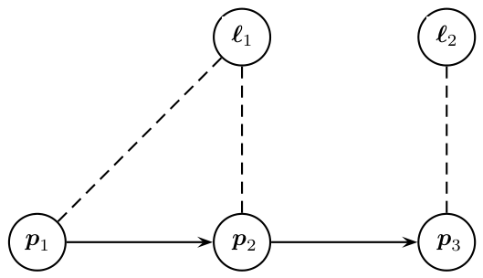

*Figure 1.1 — 세 pose 와 두 landmark 로 이루어진 장난감 SLAM 예제. 위쪽 화살표가 로봇의
운동, 점선이 bearing 측정이다. (책 p.21)*

로봇이 세 pose $p_1, p_2, p_3$ 를 지나며 두 landmark $\ell_1, \ell_2$ 에 대한
**bearing 관측**(방향만, 거리 없음)을 한다. 여기에 첫 pose $p_1$ 에 대한
**절대 위치/자세 측정**을 하나 둔다.

> **왜 절대 측정이 필요한가** (책 p.20). bearing 측정은 전부 **상대적**이다.
> 절대 기준이 하나도 없으면 **절대 위치에 대한 정보가 전혀 없다** — 지도 전체를
> 통째로 평행이동·회전해도 모든 측정이 똑같이 설명된다.
> Prelude I 의 [[map-estimation]] 카드에서 언급한 **gauge freedom** 이 이것이다.

측정에는 불확실성이 있으므로 **세계의 참 상태를 복원하는 것은 바랄 수 없다.**
대신 측정으로부터 추론할 수 있는 것의 **확률적 서술**을 얻는다. Bayesian 틀에서는
확률론의 언어로 불확실한 사건에 **주관적 믿음의 정도**를 부여한다.

미지 변수 $\boldsymbol{x}$ 위의 확률밀도 $p(\boldsymbol{x})$ 를 쓰는데, PDF 는
음이 아니고 다음을 만족한다.

$$\int p(\boldsymbol{x})\, d\boldsymbol{x} = 1 \tag{1.1}$$

전확률의 공리다. Figure 1.1 의 예에서 상태 $\boldsymbol{x}$ 는

$$\boldsymbol{x} = \begin{bmatrix} p_1 \\ \ell_1 \\ p_2 \\ \ell_2 \\ p_3 \end{bmatrix} \tag{1.2}$$

로, 개별 미지수를 쌓아 놓은 것일 뿐이다.

SLAM 에서 우리가 원하는 것은 관측 $\boldsymbol{z}$ 가 주어졌을 때 미지수
$\boldsymbol{x}$(로봇 pose 와 landmark 위치)에 대한 지식을 특징짓는 것 —
곧 **conditional density** 또는 **posterior** 다.

$$p(\boldsymbol{x} \mid \boldsymbol{z}) \tag{1.3}$$

이런 서술을 얻는 것을 **probabilistic inference** 라 한다. 그 전제 조건은
관심 변수들과 **그것들이 어떻게 (불확실한) 측정을 만들어 내는지**에 대한 확률 모델을
먼저 정하는 것이다. 여기서 **probabilistic graphical model** 이 등장한다.

### 1.2 Bayesian network — 모델링에는 좋지만

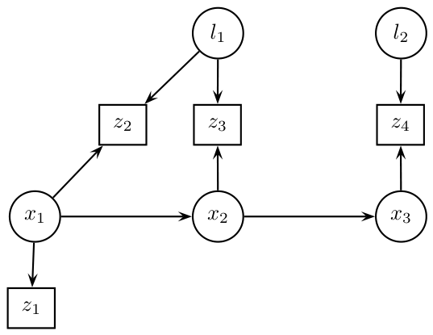

*Figure 1.2 — Figure 1.1 예제의 Bayesian network. 알려진 측정값 $z_1 \ldots z_4$ 를
네모 노드로 명시했다. (책 p.22)*

Bayesian network 는 가장 잘 알려진 graphical model 로, **각각 prior 또는 conditional
확률밀도와 연결된 변수 노드들**로 이루어진다 [592]. 첫 측정 $z_1$ 은 $p_1$ 에 의존하고,
bearing 측정 $z_2 \ldots z_4$ 는 각각 pose 하나와 landmark 하나에 걸린다.
**알려진 양은 네모 노드**로 표시하는 것이 관례다.

> **그런데 Bayes net 은 모델링용이다** (책 p.22). 책은 곧바로 다른 graphical model 로
> 넘어간다 — **최적화에 맞춰져 있고, 문제의 미지 변수에만 집중하는** 모델로.

### 1.3 factor graph — 최적화를 위한 그림

**locality** 덕분에 고차원 확률밀도는 대개 **여러 factor 의 곱**으로 인수분해된다.
각 factor 는 훨씬 작은 정의역 위의 확률밀도다. factor graph 는 임의의 밀도를
**factor 들의 곱으로** 명시하게 해 주는 graphical model 이다.

(1.3) 의 posterior 를 Bayes 법칙 $p(\boldsymbol{x}|\boldsymbol{z}) \propto p(\boldsymbol{z}|\boldsymbol{x})p(\boldsymbol{x})$ 로 다시 쓰면

$$p(\boldsymbol{x}|\boldsymbol{z}) \propto\; p(p_1)\, p(p_2|p_1)\, p(p_3|p_2) \tag{1.4a}$$
$$\times\; p(\ell_1)\, p(\ell_2) \tag{1.4b}$$
$$\times\; p(z_1|p_1) \tag{1.4c}$$
$$\times\; p(z_2|p_1,\ell_1)\, p(z_3|p_2,\ell_1)\, p(z_4|p_3,\ell_2) \tag{1.4d}$$

여기서 pose 궤적에 대해 전형적인 **Markov chain 생성 모델**을 가정했다.
각 factor 는 미지수 $\boldsymbol{x}$ 에 대한 **정보 한 조각**을 나타낸다.

> **줄별로 무엇인가.**
> - **(1.4a)** 운동 모델 — $p_1$ 의 prior 와 pose 사이의 전이
> - **(1.4b)** landmark 의 prior
> - **(1.4c)** 첫 pose 의 절대 측정
> - **(1.4d)** bearing 측정 셋. 각각 pose 하나와 landmark 하나에 걸린다
>
> Markov 가정이란 $p(p_3|p_2, p_1) = p(p_3|p_2)$ — **바로 앞 pose 만 알면 그 이전은
> 필요 없다**는 것이다. 이 가정이 곱을 짧게 만들고, 그래프를 sparse 하게 만든다.

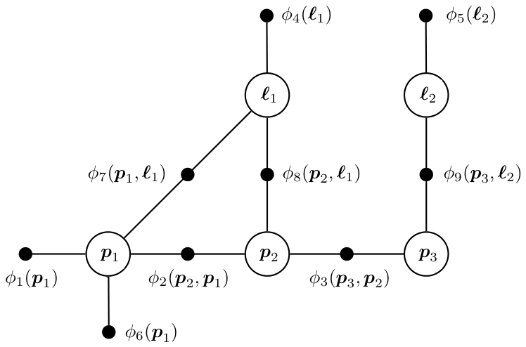

*Figure 1.3 — Figure 1.1 예제에서 나오는 factor graph. (책 p.23)*

factor graph 의 규칙은 단순하다 (책 p.22~23).

- **모든 미지 상태**(pose 와 landmark)가 노드를 갖는다
- **측정은 명시적으로 표현되지 않는다** — 이미 알려진 값이라 관심 대상이 아니다
- posterior 의 **모든 factor 마다 별도 노드 종류**(작은 검은 점)를 도입한다
- 각 factor 는 **자신이 함수로 삼는 상태 변수에만** 연결된다

Figure 1.3 에서 예를 들면 $\phi_9(p_3, \ell_2)$ 는 변수 노드 $p_3$ 와 $\ell_2$ 에만
연결된다. 전체를 쓰면

$$\phi(p_1,p_2,p_3,\ell_1,\ell_2) = \phi_1(p_1)\,\phi_2(p_2,p_1)\,\phi_3(p_3,p_2) \tag{1.5a}$$
$$\times\; \phi_4(\ell_1)\,\phi_5(\ell_2) \tag{1.5b}$$
$$\times\; \phi_6(p_1) \tag{1.5c}$$
$$\times\; \phi_7(p_1,\ell_1)\,\phi_8(p_2,\ell_1)\,\phi_9(p_3,\ell_2) \tag{1.5d}$$

(1.4a)~(1.4d) 의 확률밀도와 **일대일로 대응한다.**

> **factor 는 비례하기만 하면 된다** (책 p.23). 상태 변수에 의존하지 않는 정규화
> 상수는 **결과에 영향 없이 생략할 수 있다.** 어차피 $\arg\max$ 를 찾을 뿐이기 때문이다.
> ([[map-estimation]] 에서 $p(\boldsymbol{z})$ 를 버린 것과 같은 논리다.)
>
> 측정 변수 $z_1 \ldots z_4$ 가 그래프에 명시되지 않아도, 그 factor 들은 **암묵적으로
> 측정에 조건화되어 있다.** 명시하고 싶으면 $\phi_9(p_3, \ell_2; z_4)$ 나
> $\phi_{z_4}(p_3, \ell_2)$ 처럼 쓸 수 있다.

### 1.4 factor graph 는 언어다 (1.1.3, 책 p.23)

factor graph 는 추론의 형식적 기반을 줄 뿐 아니라, **여러 종류의 SLAM 문제를
같은 그림으로 보여 주고**, 팀 경계를 넘어 실무자들이 서로 말을 맞추게 해 주는
**lingua franca** 역할을 한다.

> **각 factor 는 방정식 하나로 생각할 수 있다** — 자신이 연결된 변수들에 대한.
> 그런데 **미지수보다 방정식이 훨씬 많은 것이 보통**이다. 그래서 prior 와 측정
> 양쪽의 불확실성을 정량화해야 하고, 이것이 여러 정보원을 적절히 융합하는
> **최소제곱 정식화**로 이어진다 (책 p.24).

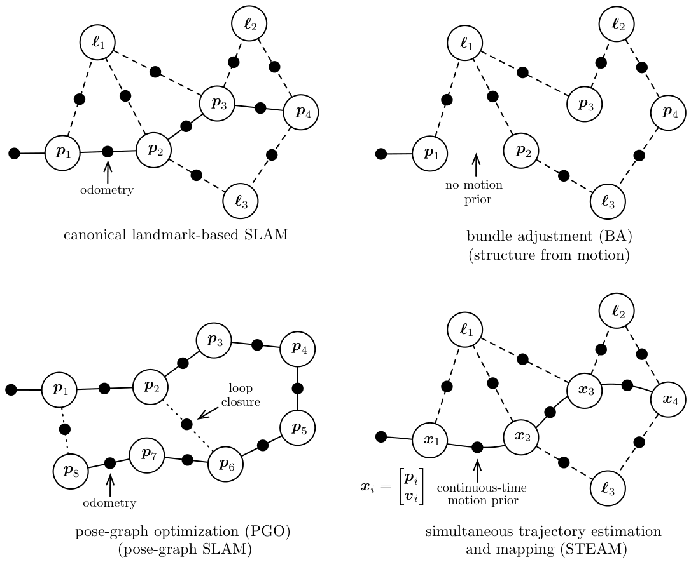

*Figure 1.4 — factor-graph 라는 틀로 볼 수 있는 SLAM 문제의 몇 가지 변형. (책 p.24)*

| 변형 | pose 변수 | landmark 변수 | 특징 |
|---|---|---|---|
| **landmark 기반 SLAM** | ○ | ○ | pose 사이에 **motion prior**(대개 odometry) |
| **bundle adjustment (BA)** | ○ | ○ | 같지만 **motion prior 가 없다** |
| **pose-graph optimization (PGO)** | ○ | ✕ | landmark 없이 **loop closure** 측정이 추가 |
| **STEAM** | ○(고차 상태) | ○ | pose 를 속도 등 **고차 상태**로 바꾸고 **연속시간 motion prior** |

> **Prelude I 과 이어진다.** §2.4 에서 본 landmark 기반 vs pose-graph 기반이
> 여기서 factor graph 의 모양 차이로 정확히 드러난다. BA 가 SLAM 과 다른 점이
> "motion prior 의 유무"라는 것도 여기서 분명해진다 — Prelude I §3.4 의 SFM 과
> SLAM 의 경계 이야기와 연결된다.
>
> **STEAM** (simultaneous trajectory estimation and mapping) 은 pose 에 속도 같은
> 도함수를 덧붙인 것이다. **2장 2.2절(연속시간 궤적)** 이 이것을 다룬다.

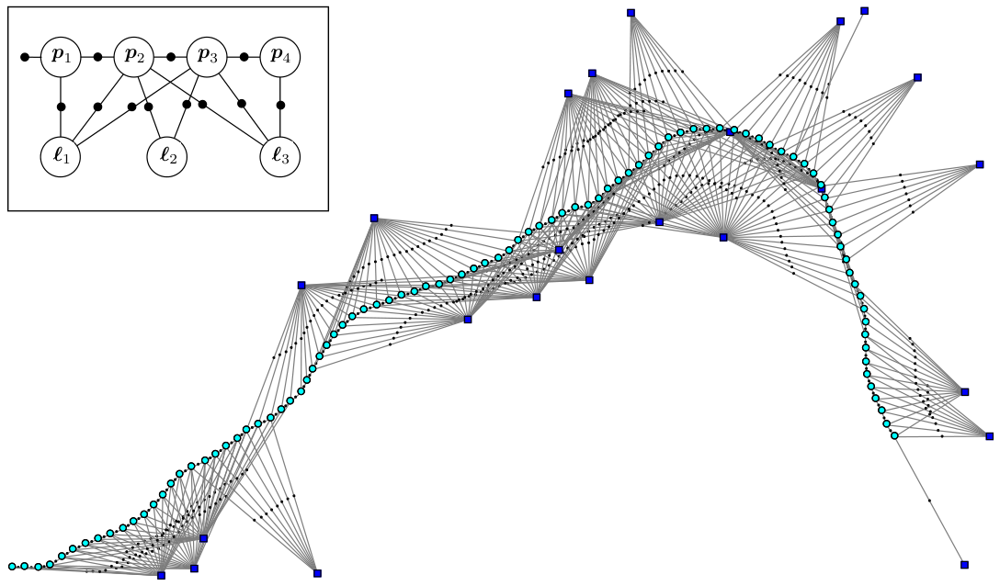

*Figure 1.5 — 더 크고 현실적인, 시뮬레이션된 SLAM 예제의 factor graph. (책 p.25)*

2D 로봇이 평면에서 **약 100 timestep** 움직이며 landmark 를 관측한 것을 시뮬레이션했다.
시각화를 위해 각 pose 와 landmark 를 참값 위치에 그렸다.

- **odometry factor 가 사슬 같은 척추**를 이룬다
- 옆으로 **binary likelihood factor** 들이 20개 남짓한 landmark 에 연결된다
- SLAM 문제의 모든 factor 는 prior 를 빼면 **대개 비선형**이다

> **그림에서 구조가 읽힌다** (책 p.25). 측정이 많이 걸린 landmark 는 **잘 고정될
> 것으로 기대**되고, 연결이 빈약한 것은 **덜 정해질 것**이다. 오른쪽 아래 외따로
> 있는 landmark 는 측정이 **하나뿐**이다.
>
> 책 각주 2 — **unary** 와 **binary** 는 각각 변수 하나, 둘에 연결된 factor 를 말한다.

---

## 2. MAP 추론에서 최소제곱으로 (1.2, 책 p.25)

**이 절이 이 장의 심장이다.** 확률 문제가 최적화 문제로 바뀐다.

### 2.1 개념적 이해

**maximum a posteriori (MAP) 추론**은 불확실한 측정과 prior 에 담긴 정보와
**가장 잘 맞아떨어지는** 미지수 $\boldsymbol{x}$ 의 값을 결정하는 과정이다.

> 현실에서 landmark 의 참 위치도, 시간에 따라 변하는 로봇 pose 도 주어지지 않는다.
> 다만 많은 경우 **좋은 초기 추정은 가질 수 있다** (책 p.26).
>
> 이 "초기 추정"이 Prelude I §2.3 에서 front-end 가 만든다고 한 **initial guess** 다.
> 왜 그것이 필요한지가 §4 에서 분명해진다.

이 절이 보이려는 것은 하나다.

> **Gaussian 측정 노이즈 모델과 Gaussian prior 가 주어지면, MAP 추론에 대응하는
> 최적화 문제는 익숙한 비선형 최소제곱 문제에 다름 아니다** (책 p.26).

### 2.2 수식/유도 — 전체 흐름 먼저

$$\boldsymbol{x}^{\text{MAP}} = \arg\max_{\boldsymbol{x}} p(\boldsymbol{x}|\boldsymbol{z}) \tag{1.6a}$$
$$= \arg\max_{\boldsymbol{x}} \frac{p(\boldsymbol{z}|\boldsymbol{x})p(\boldsymbol{x})}{p(\boldsymbol{z})} \tag{1.6b}$$
$$= \arg\max_{\boldsymbol{x}} p(\boldsymbol{z}|\boldsymbol{x})p(\boldsymbol{x}) \tag{1.6c}$$

$$\phi(\boldsymbol{x}) = \prod_i \phi_i(\boldsymbol{x}_i) \tag{1.7}$$

$$\boldsymbol{x}^{\text{MAP}} = \arg\max_{\boldsymbol{x}} \phi(\boldsymbol{x}) \tag{1.8a}$$
$$= \arg\max_{\boldsymbol{x}} \prod_i \phi_i(\boldsymbol{x}_i) \tag{1.8b}$$

$$\mathcal{N}(\boldsymbol{\theta}; \boldsymbol{\mu}, \boldsymbol{\Sigma}) = \frac{1}{\sqrt{|2\pi\boldsymbol{\Sigma}|}} \exp\left(-\frac{1}{2}\|\boldsymbol{\theta}-\boldsymbol{\mu}\|^2_{\boldsymbol{\Sigma}}\right) \tag{1.9}$$

$$\|\boldsymbol{\theta}-\boldsymbol{\mu}\|^2_{\boldsymbol{\Sigma}} \triangleq (\boldsymbol{\theta}-\boldsymbol{\mu})^\top \boldsymbol{\Sigma}^{-1} (\boldsymbol{\theta}-\boldsymbol{\mu}) \tag{1.10}$$

$$\boldsymbol{z} = \boldsymbol{h}(\boldsymbol{p},\boldsymbol{\ell}) + \boldsymbol{\eta} \tag{1.11}$$

$$p(\boldsymbol{z}|\boldsymbol{p},\boldsymbol{\ell}) = \mathcal{N}(\boldsymbol{z}; \boldsymbol{h}(\boldsymbol{p},\boldsymbol{\ell}), \boldsymbol{\Sigma_R}) = \frac{1}{\sqrt{|2\pi\boldsymbol{\Sigma_R}|}}\exp\left(-\frac{1}{2}\|\boldsymbol{z}-\boldsymbol{h}(\boldsymbol{p},\boldsymbol{\ell})\|^2_{\boldsymbol{\Sigma_R}}\right) \tag{1.12}$$

$$\boldsymbol{h}(\boldsymbol{p},\boldsymbol{\ell}) = \operatorname{atan2}(\ell_y - p_y,\ \ell_x - p_x) \tag{1.13}$$

$$\phi_i(\boldsymbol{x}_i) \propto \exp\left(-\frac{1}{2}\|\boldsymbol{z}_i - \boldsymbol{h}_i(\boldsymbol{x}_i)\|^2_{\boldsymbol{\Sigma}_i}\right) \tag{1.17}$$

$$\boxed{\ \boldsymbol{x}^{\text{MAP}} = \arg\min_{\boldsymbol{x}} \sum_i \|\boldsymbol{z}_i - \boldsymbol{h}_i(\boldsymbol{x}_i)\|^2_{\boldsymbol{\Sigma}_i}\ } \tag{1.18}$$

**(1.6a) 에서 (1.18) 까지가 이 절의 전부다.** 확률의 최대화가 제곱합의 최소화가 된다.

### 2.3 단계별 설명 (생략 없이)

**(1.6a) MAP 의 정의**

미지 상태 변수 $\boldsymbol{x}$(pose 와 landmark)에 대해 측정 $\boldsymbol{z}$ 가
주어졌다. 가장 널리 쓰이는 추정량이 **MAP 추정**이고, 이름 그대로 posterior
$p(\boldsymbol{x}|\boldsymbol{z})$ 를 최대화한다.

**(1.6b) Bayes 법칙**

posterior 를 **측정 밀도** $p(\boldsymbol{z}|\boldsymbol{x})$ 와 상태에 대한
**prior** $p(\boldsymbol{x})$ 의 곱으로 표현하고, $p(\boldsymbol{z})$ 로 정규화한 것이다.

**(1.6c) 분모를 버린다**

$p(\boldsymbol{z})$ 는 $\boldsymbol{x}$ 에 의존하지 않으므로 $\arg\max$ 연산에
영향을 주지 않는다. 즉 **MAP 추정은 likelihood 와 prior 의 곱을 최대화한다.**

> 배경이 필요하면 [[map-estimation]] 카드에 이 세 단계를 더 자세히 풀어 두었다.

**(1.7) factor graph 의 형식적 정의**

정규화되지 않은 posterior $p(\boldsymbol{z}|\boldsymbol{x})p(\boldsymbol{x})$ 를
factor graph 로 표현한다. 형식적으로 factor graph 는 **이분 그래프(bipartite graph)**
$F = (\mathcal{U}, \mathcal{V}, \mathcal{E})$ 이고 두 종류의 노드를 갖는다.

| 기호 | 뜻 |
|---|---|
| $\phi_i \in \mathcal{U}$ | **factor** 노드 |
| $\boldsymbol{x}_j \in \mathcal{V}$ | **변수** 노드 |
| $e_{ij} \in \mathcal{E}$ | 간선 — **언제나 factor 와 변수 사이**에 놓인다 |
| $\mathcal{X}(\phi_i)$ | factor $\phi_i$ 에 인접한 변수 노드들의 집합 |
| $\boldsymbol{x}_i$ | 그 집합에 대한 값 배정 |

> **"이분"이 핵심이다.** 변수끼리는 절대 연결되지 않고, factor 끼리도 연결되지 않는다.
> 그래서 그래프를 보면 **어떤 정보가 어떤 변수들을 묶는지**가 한눈에 보인다.
> 독립 관계가 간선 $e_{ij}$ 에 부호화되어 있고, 각 factor $\phi_i$ 는 **오직 자신의
> 인접 집합 $\mathcal{X}(\phi_i)$ 안의 변수들만**의 함수다.

**(1.8a)(1.8b) MAP 을 factor 곱의 최대화로**

임의의 factor graph 에 대해 MAP 추론은 **모든 factor-graph potential 의 곱 (1.7) 을
최대화하는 것**으로 귀결된다.

이제 남은 것은 **factor $\phi_i(\boldsymbol{x}_i)$ 의 정확한 형태를 유도하는 것**이고,
그것은 측정 모델 $p(\boldsymbol{z}|\boldsymbol{x})$ 와 prior $p(\boldsymbol{x})$ 를
어떻게 모델링하느냐에 크게 달려 있다.

**(1.9)(1.10) 다변량 Gaussian — 여기서 가정이 들어온다**

가장 자주 쓰는 밀도가 **multivariate Gaussian** 이다. $\boldsymbol{\mu} \in \mathbb{R}^n$
이 평균, $\boldsymbol{\Sigma}$ 가 $n \times n$ covariance 행렬이고,
(1.10) 은 **squared Mahalanobis distance** 를 나타낸다.

> **Mahalanobis 거리가 하는 일** — 단순 유클리드 거리와 달리 $\boldsymbol{\Sigma}^{-1}$
> 로 가중한다. **불확실한 방향의 오차는 관대하게, 확실한 방향의 오차는 엄하게** 센다.
> 이것이 나중에 서로 다른 센서(각도와 거리처럼 단위가 다른)를 한 목적함수에 합칠 수
> 있게 해 주는 장치다 (→ §3.3 whitening).
>
> 정규화 상수 $\sqrt{|2\pi\boldsymbol{\Sigma}|} = (2\pi)^{n/2}|\boldsymbol{\Sigma}|^{1/2}$
> 는 밀도가 정의역에서 1로 적분되게 한다. $|\cdot|$ 는 행렬식이다.

**(1.11)(1.12) 측정 모델**

pose $\boldsymbol{p}$ 에서 landmark $\boldsymbol{\ell}$ 로의 bearing 측정을
이렇게 모델링한다. $\boldsymbol{h}(\cdot)$ 가 **measurement prediction function**,
노이즈 $\boldsymbol{\eta}$ 는 covariance $\boldsymbol{\Sigma_R}$ 인 **평균 0 Gaussian**
에서 뽑는다. 그러면 측정에 대한 conditional density 가 (1.12) 다.

> **이 두 식의 관계를 놓치지 마라.** (1.11) 은 **생성 과정**("참값에 노이즈를 더해
> 측정이 나온다")이고, (1.12) 는 그것을 **확률밀도로 다시 쓴 것**이다.
> $\boldsymbol{z}$ 가 예측 $\boldsymbol{h}$ 에서 멀수록 밀도가 지수적으로 작아진다.

**(1.13) 2D bearing 의 구체적 형태**

$\ell_x, \ell_y$ 는 landmark 의 좌표, $p_x, p_y$ 는 pose 의 좌표이고
$\operatorname{atan2}$ 는 잘 알려진 두 인자 arctangent 변형이다. 최종 측정 모델은

$$p(\boldsymbol{z}|\boldsymbol{p},\boldsymbol{\ell}) = \frac{1}{\sqrt{|2\pi\boldsymbol{\Sigma_R}|}}\exp\left(-\frac{1}{2}\|\boldsymbol{z}-\operatorname{atan2}(\ell_y-p_y,\ \ell_x-p_x)\|^2_{\boldsymbol{\Sigma_R}}\right) \tag{1.14}$$

> **측정 함수는 대개 비선형이다** (책 p.27). $\operatorname{atan2}$ 가 그 예다.
> 그래도 센서와 front-end 에 따라 달라질 뿐 **쓰기 어렵지는 않다.**
> 비선형성이 §3(선형화)과 §4(반복 최적화)를 필요하게 만든다.
>
> ⚠️ **언제나 Gaussian 을 가정하는 것은 아니다** (책 p.28). 가끔 일어나는 data
> association 실수에 대응하려고 많은 저자가 Gaussian 보다 **꼬리가 두꺼운 robust
> measurement density** 를 제안해 왔다. **3장**의 주제다.

**(1.15)(1.16) 측정에서 오지 않는 밀도들**

모든 확률밀도가 측정에서 나오는 것은 아니다. 장난감 문제에서 궤적에 대한 prior
$p(\boldsymbol{x})$ 는 $p(\boldsymbol{p}_1)$ 과 conditional density
$p(\boldsymbol{p}_{t+1}|\boldsymbol{p}_t)$ 로 이루어지고, 후자는 로봇이 알려진 제어
입력 $\boldsymbol{u}_t$ 를 따른다는 **motion model** 이다.

$$p(\boldsymbol{p}_{t+1}|\boldsymbol{p}_t, \boldsymbol{u}_t) = \frac{1}{\sqrt{|2\pi\boldsymbol{\Sigma_Q}|}}\exp\left(-\frac{1}{2}\|\boldsymbol{p}_{t+1}-\boldsymbol{g}(\boldsymbol{p}_t,\boldsymbol{u}_t)\|^2_{\boldsymbol{\Sigma_Q}}\right) \tag{1.15}$$

$\boldsymbol{g}(\cdot)$ 가 motion model, $\boldsymbol{\Sigma_Q}$ 가 적절한 차원의
covariance (평면 로봇이면 $3\times3$)다.

제어 입력을 모르고 대신 로봇이 **얼마나 움직였는지 측정**하는 경우도 흔하다
(odometry 측정 $\boldsymbol{o}_t$). odometry 가 pose 차이를 재고 covariance
$\boldsymbol{\Sigma_S}$ 인 Gaussian 노이즈를 갖는다고 하면

$$p(\boldsymbol{o}_t|\boldsymbol{p}_{t+1},\boldsymbol{p}_t) = \frac{1}{\sqrt{|2\pi\boldsymbol{\Sigma_S}|}}\exp\left(-\frac{1}{2}\|\boldsymbol{o}_t-(\boldsymbol{p}_{t+1}-\boldsymbol{p}_t)\|^2_{\boldsymbol{\Sigma_S}}\right) \tag{1.16}$$

제어 입력과 odometry 측정이 **둘 다 있으면 (1.15) 와 (1.16) 을 결합**할 수 있다.

> ⚠️ **3차원에서는 이대로 안 된다** (책 p.28). $\boldsymbol{p}_{t+1} - \boldsymbol{p}_t$
> 라는 **뺄셈**이 문제다. pose 가 $SE(3)$ 위에 있으면 두 pose 를 그냥 뺄 수 없다.
> 책도 "SE(3) 같은 비선형 manifold 위의 밀도를 명시하려면 조금 더 정교한 장치가
> 필요하다"고 밝히고 **2장**으로 미룬다. 이 장이 회전을 벡터처럼 다룬다는 각주가
> 실제로 어디서 문제가 되는지가 여기다.

**(1.17) 모든 factor 를 하나의 꼴로**

이제 **모든 factor 가 다변량 Gaussian 에 비례한다**고 가정한다.
여기에는 단순한 Gaussian prior 와, 평균 0 정규분포 노이즈로 오염된 측정에서
유도된 likelihood factor 가 **둘 다** 포함된다.

**(1.18) 결론 — 비선형 최소제곱**

(1.17) 을 (1.8b) 에 대입하고, **음의 로그**를 취한 뒤 $\frac{1}{2}$ 를 버리면 된다.

> **왜 이 세 조작이 허용되는가.** 하나씩 보자.
>
> 1. **로그를 취한다** — $\log$ 는 단조증가 함수다. $\arg\max$ 의 위치를 바꾸지 않는다.
>    그리고 **곱이 합으로 바뀐다** ($\log \prod = \sum \log$). 이것이 결정적이다
> 2. **음수를 붙인다** — 최대화가 최소화로 뒤집힌다
> 3. **$\frac{1}{2}$ 를 버린다** — 양의 상수배는 최소점의 위치를 바꾸지 않는다
>
> 지수 안의 $-\frac{1}{2}\|\cdot\|^2$ 에서 음수와 $\frac{1}{2}$ 가 함께 사라지고
> 제곱 Mahalanobis 노름만 남는다. 정규화 상수도 $\boldsymbol{x}$ 에 무관하므로 없어진다.

이 목적함수를 최소화하는 것은 **여러 측정 factor 와 prior 를 결합해 미지수의 MAP 해를
정하는 sensor fusion** 을 수행하는 것이다.

> **중요하고 자명하지 않은 관찰** (책 p.29). (1.18) 의 factor 들은 관련된 미지 변수
> $\boldsymbol{x}_i$ 에 대해 대개 **부족하게 명시된(under-specified)** 밀도를 나타낸다.
> 단순한 prior factor 를 빼면 측정 $\boldsymbol{z}_i$ 의 차원이 미지수보다 **낮은** 것이
> 보통이기 때문이다. 그런 경우 factor 하나는 $\boldsymbol{x}_i$ 정의역의 **무한 부분집합**에
> 같은 likelihood 를 부여한다.
>
> **예** — 카메라 이미지의 2D 측정 하나는 같은 이미지 위치로 투영되는 **3D 점들의
> 광선 전체**와 일관된다. 그래서 factor 를 **여러 개 모아야** 해가 정해진다.
> Figure 1.5 에서 측정이 하나뿐인 landmark 가 "덜 정해진다"고 한 것이 이 뜻이다.

> ⚠️ **비볼록성** (책 p.29). $\boldsymbol{h}_i$ 가 비선형이어도 **괜찮은 초기 추정이
> 있으면** 이 장의 방법들이 (1.18) 의 전역 최소로 수렴할 수 있다. 그러나 목적함수가
> **non-convex** 이므로 **초기 추정이 나쁘면 국소 최소에 갇히지 않는다는 보장이 없다.**
> 이것이 **certifiably optimal solver** 를 낳았고 **6장**의 주제다.
> 이 장은 전역 solver 가 아니라 **국소 방법**에 집중한다.

---

## 3. 선형 최소제곱 풀기 (1.3, 책 p.29)

비선형 문제를 다루기 전에, **선형화된 판**을 먼저 푼다.

### 3.1 선형화 (1.3.1)

$$\boldsymbol{h}_i(\boldsymbol{x}_i) = \boldsymbol{h}_i(\boldsymbol{x}^0_i + \boldsymbol{\delta}_i) \approx \boldsymbol{h}_i(\boldsymbol{x}^0_i) + \boldsymbol{H}_i\boldsymbol{\delta}_i \tag{1.19}$$

$$\boldsymbol{H}_i \triangleq \left.\frac{\partial \boldsymbol{h}_i(\boldsymbol{x}_i)}{\partial \boldsymbol{x}_i}\right|_{\boldsymbol{x}^0_i} \tag{1.20}$$

**(1.19)** 는 단순한 **Taylor 전개**다. $\boldsymbol{H}_i$ 를 **measurement Jacobian**
이라 하고, 주어진 **linearization point** $\boldsymbol{x}^0_i$ 에서 평가한
$\boldsymbol{h}_i(\cdot)$ 의 (다변수) 편도함수다.
$\boldsymbol{\delta}_i \triangleq \boldsymbol{x}_i - \boldsymbol{x}^0_i$ 는
**state update vector** 다.

> ⚠️ **여기서 가정이 하나 더 들어간다** (책 p.30). $\boldsymbol{x}_i$ 가 **벡터 공간에
> 산다**고, 즉 벡터로 표현될 수 있다고 가정했다. **언제나 참이 아니다** — 상태 중
> 일부가 3D 회전이나 더 복잡한 manifold 일 때가 그렇다. **2장**에서 다시 다룬다.

(1.19) 를 (1.18) 에 대입하면 state update vector $\boldsymbol{\delta}$ 에 대한
**선형 최소제곱** 문제를 얻는다.

$$\boldsymbol{\delta}^* = \arg\min_{\boldsymbol{\delta}} \sum_i \left\|\boldsymbol{z}_i - \boldsymbol{h}_i(\boldsymbol{x}^0_i) - \boldsymbol{H}_i\boldsymbol{\delta}_i\right\|^2_{\boldsymbol{\Sigma}_i} \tag{1.21a}$$
$$= \arg\min_{\boldsymbol{\delta}} \sum_i \left\|\left(\boldsymbol{z}_i - \boldsymbol{h}_i(\boldsymbol{x}^0_i)\right) - \boldsymbol{H}_i\boldsymbol{\delta}_i\right\|^2_{\boldsymbol{\Sigma}_i} \tag{1.21b}$$

$\boldsymbol{z}_i - \boldsymbol{h}_i(\boldsymbol{x}^0_i)$ 가 linearization point 에서의
**prediction error** — 실제 측정과 예측 측정의 차 — 다. 괄호를 친 (1.21b) 가
그 사실을 드러낸다.

### 3.2 whitening — covariance 를 없앤다

$$\|\boldsymbol{e}\|^2_{\boldsymbol{\Sigma}} \triangleq \boldsymbol{e}^\top\boldsymbol{\Sigma}^{-1}\boldsymbol{e} = \left(\boldsymbol{\Sigma}^{-1/2}\boldsymbol{e}\right)^\top\left(\boldsymbol{\Sigma}^{-1/2}\boldsymbol{e}\right) = \left\|\boldsymbol{\Sigma}^{-1/2}\boldsymbol{e}\right\|^2_2 \tag{1.22}$$

$$\boldsymbol{A}_i = \boldsymbol{\Sigma}_i^{-1/2}\boldsymbol{H}_i \tag{1.23a}$$
$$\boldsymbol{b}_i = \boldsymbol{\Sigma}_i^{-1/2}\left(\boldsymbol{z}_i - \boldsymbol{h}_i(\boldsymbol{x}^0_i)\right) \tag{1.23b}$$

> **간단한 변수 변환으로 covariance 를 지운다** (책 p.30). $\boldsymbol{\Sigma}^{1/2}$
> 를 $\boldsymbol{\Sigma}$ 의 **행렬 제곱근**으로 정의하면 (1.22) 처럼 제곱 Mahalanobis
> 노름을 **보통의 2-노름**으로 다시 쓸 수 있다.
>
> 따라서 (1.21b) 의 각 항에서 Jacobian 과 prediction error 에
> $\boldsymbol{\Sigma}_i^{-1/2}$ 를 **미리 곱해** covariance 를 없앨 수 있다.

이 과정을 **whitening** 이라 한다.

> **왜 이 이름인가, 그리고 왜 중요한가** (책 p.30).
>
> 스칼라 측정이면 그저 각 항을 **측정 표준편차 $\sigma_i$ 로 나누는 것**이다.
> 그러면 **측정의 단위가 사라진다** (길이, 각도 등).
>
> 이것이 결정적이다 — 단위가 없어져야 **서로 다른 행들을 하나의 비용 함수로 합칠 수
> 있다.** bearing(라디안)과 거리(미터)를 그냥 더하면 의미가 없지만, 각자의 표준편차로
> 나눈 뒤에는 "몇 시그마만큼 어긋났는가"라는 **같은 단위**가 되어 더할 수 있다.
>
> whitening 후의 노름이 2-노름이라는 것은, 이제부터 **모든 측정을 동등하게 취급하는
> 표준 최소제곱**을 풀면 된다는 뜻이다.

### 3.3 SLAM 을 선형 최소제곱으로 (1.3.2)

선형화 후 마침내 표준 최소제곱 문제를 얻는다.

$$\boldsymbol{\delta}^* = \arg\min_{\boldsymbol{\delta}} \sum_i \|\boldsymbol{A}_i\boldsymbol{\delta}_i - \boldsymbol{b}_i\|^2_2 \tag{1.24a}$$
$$= \arg\min_{\boldsymbol{\delta}} \|\boldsymbol{A}\boldsymbol{\delta} - \boldsymbol{b}\|^2_2 \tag{1.24b}$$

whitening 된 Jacobian $\boldsymbol{A}_i$ 와 prediction error $\boldsymbol{b}_i$ 를
**하나의 큰 행렬 $\boldsymbol{A}$ 와 우변 벡터 $\boldsymbol{b}$ 로 모은 것**이다.

> **$\boldsymbol{A}$ 는 크지만 sparse 하고, 그 블록 구조는 factor graph 의 구조를
> 그대로 비춘다** (책 p.31). 이것이 §5 의 주제다.

### 3.4 행렬 분해로 푼다 (1.3.3)

full-rank $m \times n$ 행렬 $\boldsymbol{A}$ ($m \ge n$)에 대해 (1.24b) 의 유일한
최소제곱 해는 **normal equations** 를 풀어 얻는다.

$$\left(\boldsymbol{A}^\top\boldsymbol{A}\right)\boldsymbol{\delta}^* = \boldsymbol{A}^\top\boldsymbol{b} \tag{1.25}$$

$$\boldsymbol{\Lambda} \triangleq \boldsymbol{A}^\top\boldsymbol{A} = \boldsymbol{R}^\top\boldsymbol{R} \tag{1.26}$$

**Cholesky 경로** — $\boldsymbol{\Lambda}$ 를 **information matrix**(또는 **Hessian**)라
하고 (1.26) 처럼 분해한다. **Cholesky factor** $\boldsymbol{R}$ 은 상삼각
$n \times n$ 행렬이고, 대칭 양정치 행렬에 대한 LU 분해의 변형인 **Cholesky
factorization** 으로 계산한다. 그 다음

$$\boldsymbol{R}^\top\boldsymbol{y} = \boldsymbol{A}^\top\boldsymbol{b} \tag{1.27}$$

를 **전진 대입**으로 $\boldsymbol{y}$ 에 대해 풀고, 이어서

$$\boldsymbol{R}\boldsymbol{\delta}^* = \boldsymbol{y} \tag{1.28}$$

를 **후진 대입**으로 $\boldsymbol{\delta}^*$ 에 대해 푼다.

| 연산 | 비용 (dense) |
|---|---|
| Cholesky 분해 | $n^3/3$ flops |
| $\boldsymbol{A}^\top\boldsymbol{A}$ 계산 포함 전체 | $(m + n/3)n^2$ flops |

> 책 각주 4 — 일부 문헌 [389] 은 Cholesky triangle 을 **하삼각** $\boldsymbol{L} = \boldsymbol{R}^\top$
> 로 정의한다. 이 책은 상삼각 관례를 쓴다. 제곱근 계산을 피하는 **LDU 분해**를 써도 된다.

**QR 경로** — Cholesky 보다 더 정확하고 수치적으로 안정적인 대안이다.
**information matrix $\boldsymbol{\Lambda}$ 를 만들지 않고** $\boldsymbol{A}$ 자체를
분해한다.

$$\boldsymbol{A} = \boldsymbol{Q}\begin{bmatrix}\boldsymbol{R}\\ \boldsymbol{0}\end{bmatrix}, \qquad \begin{bmatrix}\boldsymbol{d}\\ \boldsymbol{e}\end{bmatrix} = \boldsymbol{Q}^\top\boldsymbol{b} \tag{1.29}$$

$\boldsymbol{Q}$ 는 $m \times m$ 직교행렬, $\boldsymbol{d} \in \mathbb{R}^n$,
$\boldsymbol{e} \in \mathbb{R}^{m-n}$ 이고 $\boldsymbol{R}$ 은 **Cholesky 의 것과 같은**
상삼각 행렬이다.

dense 행렬 분해의 선호 방법은 $\boldsymbol{R}$ 을 **왼쪽에서 오른쪽으로 열 단위로**
계산하는 것이다. 각 열 $j$ 에 대해 대각 아래의 모든 비영 원소를 **Householder
reflection 행렬** $\boldsymbol{H}_j$ 를 왼쪽에 곱해 0으로 만든다. $n$ 번 반복하면

$$\boldsymbol{H}_n \cdots \boldsymbol{H}_2\boldsymbol{H}_1\boldsymbol{A} = \boldsymbol{Q}^\top\boldsymbol{A} = \begin{bmatrix}\boldsymbol{R}\\\boldsymbol{0}\end{bmatrix} \tag{1.30}$$

> **$\boldsymbol{Q}$ 는 보통 만들지 않는다** (책 p.32). 대신 $\boldsymbol{b}$ 를
> $\boldsymbol{A}$ 에 **열 하나로 덧붙여** 변환된 우변 $\boldsymbol{Q}^\top\boldsymbol{b}$
> 를 함께 계산한다.

$\boldsymbol{Q}$ 가 직교이므로 노름이 보존된다.

$$\|\boldsymbol{A}\boldsymbol{\delta}-\boldsymbol{b}\|^2_2 = \left\|\boldsymbol{Q}^\top\boldsymbol{A}\boldsymbol{\delta}-\boldsymbol{Q}^\top\boldsymbol{b}\right\|^2_2 = \|\boldsymbol{R}\boldsymbol{\delta}-\boldsymbol{d}\|^2_2 + \|\boldsymbol{e}\|^2_2 \tag{1.31}$$

> **이 식이 두 가지를 한꺼번에 말한다.**
> - $\|\boldsymbol{e}\|^2_2$ 는 $\boldsymbol{\delta}$ 로 어쩔 수 없는 항이다 →
>   **최소제곱 잔차의 제곱합** 그 자체
> - 따라서 최소화는 첫 항을 0으로 만드는 것이고, 그것은 삼각 시스템
>   $\boldsymbol{R}\boldsymbol{\delta}^* = \boldsymbol{d}$ 를 후진 대입으로 푸는 것이다

$$\boldsymbol{R}\boldsymbol{\delta}^* = \boldsymbol{d} \tag{1.32}$$

QR 로 얻은 상삼각 $\boldsymbol{R}$ 이 Cholesky 의 것과 (대각 부호를 빼면) 같은 이유는

$$\boldsymbol{A}^\top\boldsymbol{A} = \begin{bmatrix}\boldsymbol{R}\\\boldsymbol{0}\end{bmatrix}^\top\boldsymbol{Q}^\top\boldsymbol{Q}\begin{bmatrix}\boldsymbol{R}\\\boldsymbol{0}\end{bmatrix} = \boldsymbol{R}^\top\boldsymbol{R} \tag{1.33}$$

이고, 여기서도 $\boldsymbol{Q}$ 의 직교성을 썼다.

| | 비용 | 비고 |
|---|---|---|
| Cholesky | $O(mn^2)$ ($m \gg n$) | $\boldsymbol{\Lambda}$ 를 만든다 |
| QR | $2(m-n/3)n^2$ | **2배 느리지만** 더 안정적 |

> **요약** (책 p.32). SLAM 의 선형화된 최적화 문제는 기초 선형대수로 간결하게 말할 수
> 있다 — **information matrix $\boldsymbol{\Lambda}$ 또는 measurement Jacobian
> $\boldsymbol{A}$ 를 square-root 형태로 분해하는 것**이다. SAM 문제에서 나온
> 행렬 제곱근에 기반하므로 이 계열을 **square-root SAM**, 줄여서 $\sqrt{\text{SAM}}$
> 이라 부른다 [249, 254]. §0 의 역사 노트가 여기로 이어진다.

---

## 4. 비선형 최적화 (1.4, 책 p.33)

$$J(\boldsymbol{x}) \triangleq \sum_i \|\boldsymbol{z}_i - \boldsymbol{h}_i(\boldsymbol{x}_i)\|^2_{\boldsymbol{\Sigma}_i} \tag{1.34}$$

(1.18) 의 목적함수에 이름을 붙인 것이다.

> **비선형 최소제곱은 일반적으로 직접 풀 수 없다** (책 p.33). 적절한 초기 추정에서
> 시작하는 **반복 해법**이 필요하다. 비선형 최적화 방법들은 (1.18) 의 **선형 근사를
> 연달아 풀어** 최소에 접근한다 [264].
>
> 모든 알고리즘이 같은 뼈대를 공유한다.
>
> ```
> 초기 추정 x⁰ 에서 시작
> 반복:  갱신 단계 δ 를 계산  →  x^{t+1} = x^t + δ
> 종료:  수렴 기준 (예: ‖δ‖ 가 임계값 미만)
> ```
>
> 차이는 **비용함수를 어떻게 근사하고, 그 국소 근사로부터 개선된 추정을 어떻게 찾는가**
> 에 있다.

### 4.1 Steepest Descent (1.4.1)

$$\boldsymbol{\delta}^{\text{sd}} = -\alpha \left.\nabla J(\boldsymbol{x})\right|_{\boldsymbol{x}=\boldsymbol{x}^t} \tag{1.35}$$

현재 추정에서 **가장 가파른 하강 방향**을 쓴다. 음의 gradient 가 그 방향이다.
비선형 최소제곱 목적함수 (1.34) 를 국소적으로 이차식
$J(\boldsymbol{x}) \approx \|\boldsymbol{A}(\boldsymbol{x}-\boldsymbol{x}^t)-\boldsymbol{b}\|^2_2$
로 근사하면, linearization point 에서 정확한 gradient 는
$\nabla J(\boldsymbol{x})|_{\boldsymbol{x}=\boldsymbol{x}^t} = -2\boldsymbol{A}^\top\boldsymbol{b}$ 다.

> **step size $\alpha$ 를 신중히 골라야 한다** — 안전한 갱신과 적당한 수렴 속도 사이의
> 균형이다. 주어진 방향에서 최소를 찾는 **line search** 를 명시적으로 할 수도 있다.
> SD 는 단순하지만 **최소 근처에서 수렴이 느리다** (책 p.33).

### 4.2 Gauss-Newton (1.4.2)

$$\boldsymbol{A}^\top\boldsymbol{A}\,\boldsymbol{\delta}^{\text{gn}} = \boldsymbol{A}^\top\boldsymbol{b} \tag{1.36}$$

GN 은 **2차 갱신**을 써서 더 빠르게 수렴한다. 비선형 최소제곱 문제의 특수한 구조를
이용해 **Hessian 을 Jacobian 으로 근사한다** — $\boldsymbol{A}^\top\boldsymbol{A}$.
갱신 단계는 §3.4 의 방법 중 아무거나로 normal equations (1.25) 를 풀어 얻는다.

> **잘 동작할 때와 아닐 때** (책 p.34).
> - 목적함수가 얌전하고(거의 이차식) 초기 추정이 좋으면 **거의 이차 수렴**
> - **이차 근사가 나쁘면** GN 단계가 최소에서 **더 먼** 새 추정으로 이끌고 **발산**할 수 있다
>
> 이 실패가 아래 두 방법을 낳는다.

### 4.3 Levenberg-Marquardt (1.4.3)

$$\left(\boldsymbol{A}^\top\boldsymbol{A} + \lambda\boldsymbol{I}\right)\boldsymbol{\delta}^{\text{lm}} = \boldsymbol{A}^\top\boldsymbol{b} \tag{1.37}$$

$$\left(\boldsymbol{A}^\top\boldsymbol{A} + \lambda\operatorname{diag}(\boldsymbol{A}^\top\boldsymbol{A})\right)\boldsymbol{\delta}^{\text{lm}} = \boldsymbol{A}^\top\boldsymbol{b} \tag{1.38}$$

LM 은 **Gauss-Newton 의 이차 근사를 얼마나 믿을 것인가**를 제어하면서 수렴까지
여러 번 반복하게 해 준다. 그래서 **trust-region method** 라 불린다.

**(1.37) Levenberg [646]** — normal equations 의 대각에 음이 아닌 상수
$\lambda \in \mathbb{R}^+ \cup \{0\}$ 를 더한다.

> **$\lambda$ 가 두 방법을 잇는다** (책 p.34).
>
> | $\lambda$ | 결과 |
> |---|---|
> | $\lambda = 0$ | **GN 그 자체** |
> | $\lambda$ 가 크면 | $\boldsymbol{\delta}^* \approx \frac{1}{\lambda}\boldsymbol{A}^\top\boldsymbol{b}$ — 비용함수 $J$ 의 **음의 gradient 방향** 갱신, 곧 SD |
>
> 즉 LM 은 **GN 과 SD 사이를 자연스럽게 섞는다.**

**(1.38) Marquardt [731]** — 대각 성분의 **scaling** 을 반영해 더 빠른 수렴을 준다.

> **왜 대각으로 스케일하는가.** gradient 가 작은 방향(목적함수가 거의 평평한 방향)에서는
> 대각 성분의 역수가 커지므로 **steepest-descent 방향으로 더 크게** 움직인다.
> 반대로 가파른 방향에서는 알고리즘이 **조심스러워져 작은 걸음**을 딛는다.
>
> Bayesian 관점에서 두 수정 모두 **모든 미지 변수에 평균 0 prior 를 더한 것**으로
> 해석할 수 있다 (책 p.34).

**GN 과 LM 의 핵심 차이는 LM 이 갱신을 거부할 수 있다는 것이다.**

```
잔차 제곱합이 늘어나는 갱신  →  거부
    ↳ 비선형 함수가 국소적으로 얌전하지 않다는 뜻 → 더 작은 걸음이 필요
    ↳ λ 를 heuristic 하게 키운다 (예: 10배) → 수정된 normal equations 를 다시 푼다
잔차 제곱합이 줄어드는 갱신  →  수락
    ↳ 상태 추정 갱신, λ 를 줄인다 (예: 10으로 나눔)
    ↳ 새 linearization point 에서 반복
```

### 4.4 Dogleg (1.4.4)

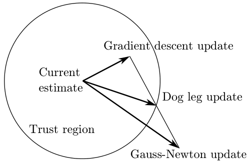

*Figure 1.6 — Powell 의 dogleg 알고리즘은 따로 계산한 Gauss-Newton 과 gradient descent
갱신 단계를 결합한다. (책 p.35)*

> **LM 의 큰 단점** (책 p.35) — 단계가 **거부되면** 수정된 information 행렬을
> **다시 분해해야 한다.** 그것이 알고리즘에서 가장 비싼 부분이다.

Powell 의 dogleg (PDL) [885] 의 착상은 이렇다.

1. **GN 단계와 SD 단계를 따로 계산**한다
2. 적절히 **결합**한다
3. LM 단계가 거부되어도 **GN·SD 방향은 여전히 유효**하므로, 비용이 줄어들 때까지
   **다른 방식으로 결합**해 보면 된다

**결과적으로 상태 추정을 한 번 갱신하는 데 행렬 분해가 여러 번이 아니라 한 번만
필요하다.** 이것이 PDL 이 LM 보다 효율적일 수 있는 이유다.

결합된 단계는 SD 갱신으로 시작해 GN 갱신 쪽으로 **급히 꺾은 뒤**(그래서 dogleg,
개 뒷다리) trust region 경계에서 멈춘다. LM 과 달리 PDL 은 **선형 가정을 믿는
영역을 명시적으로 유지한다.** 선형 근사의 적절성은 **gain ratio** 로 판정한다.

$$\rho = \frac{J(\boldsymbol{x}^t) - J(\boldsymbol{x}^t+\boldsymbol{\delta})}{L(\boldsymbol{0}) - L(\boldsymbol{\delta})} \tag{1.39}$$

여기서 $L(\boldsymbol{\delta}) = \boldsymbol{A}^\top\boldsymbol{A}\boldsymbol{\delta} - \boldsymbol{A}^\top\boldsymbol{b}$
는 현재 추정 $\boldsymbol{x}^t$ 에서 (1.34) 의 비선형 이차 비용함수 $J$ 를 선형화한 것이다.

> **$\rho$ 를 읽는 법** — 분자는 **실제로 줄어든 비용**, 분모는 **선형 근사가 줄어들
> 것이라 예측한 비용**이다. 비율이 1에 가까우면 근사가 잘 맞는 것이다.
>
> | $\rho$ | 판정 | 조치 |
> |---|---|---|
> | 작다 ($\rho < 0.25$) | 예측만큼 안 줄었다 | **trust region 축소** |
> | 예측대로거나 더 좋다 ($\rho > 0.75$) | 근사가 잘 맞는다 | **trust region 확대**(갱신 벡터 크기에 따라), 단계 **수락** |

### 4.5 정리 — 네 방법의 관계

| 방법 | 갱신 방향 | 분해 횟수/반복 | 강점 | 약점 |
|---|---|---|---|---|
| **SD** | $-\alpha\nabla J$ | 0 (gradient 만) | 단순, 항상 내려간다 | 최소 근처에서 **매우 느림** |
| **GN** | $(\boldsymbol{A}^\top\boldsymbol{A})^{-1}\boldsymbol{A}^\top\boldsymbol{b}$ | 1 | **거의 이차 수렴** | 이차 근사가 나쁘면 **발산** |
| **LM** | $\lambda$ 로 GN↔SD 보간 | 거부될 때마다 **재분해** | 강건, 발산 방지 | 거부가 잦으면 **비싸다** |
| **PDL** | GN·SD 를 trust region 안에서 결합 | **1** | LM 의 강건함 + 재분해 없음 | 구현이 더 복잡 |

> **왜 이 순서로 배우는가.** SD 는 느리고 GN 은 위험하다. LM 은 둘을 섞어 안전하게
> 만들었지만 비싸졌고, PDL 은 그 비용을 되돌렸다. **각 방법이 앞 방법의 구체적
> 결함을 고친다.**

---

## 5. 팩터그래프와 sparsity (1.5, 책 p.35)

> 지금까지의 solver 는 **행렬이 dense 할 수 있다**고 가정했다. dense 방법은
> **현실적인 SLAM 크기로 확장되지 않는다** (책 p.35). Figure 1.1 의 장난감 문제야
> dense 로도 되고, Figure 1.5 의 시뮬레이션도 실제 SLAM 치고는 작다.
> **실제 문제는 미지수가 수천, 수백만 개**다. 그런데도 다룰 수 있는 이유가 **sparsity** 다.

### 5.1 sparsity 는 factor graph 에서 바로 보인다

Figure 1.5 를 보면 그래프가 sparse 하다는 것이 분명하다 (완전 연결과 거리가 멀다).

| 무엇 | 가능한 최대 | 실제 |
|---|---|---|
| 100개 pose 를 잇는 odometry 사슬 | $100^2$ 개 binary factor | **100개** (선형 구조) |
| 20개 landmark × 100 pose | 2000개 | **400개에 가깝다** |
| landmark 사이 factor | — | **없다** |

> **landmark 끼리 factor 가 없는 것은 우연이 아니다** (책 p.36). 그들의 **상대 위치에
> 대한 정보를 받은 적이 없기** 때문이다. 이 구조가 대부분의 SLAM 문제에 전형적이다.

### 5.2 sparse Jacobian 과 factor graph (1.5.1)

$$\boldsymbol{\delta}^* = \arg\min_{\boldsymbol{\delta}} \sum_i \|\boldsymbol{A}_i\boldsymbol{\delta}_i - \boldsymbol{b}_i\|^2_2 \tag{1.40}$$

(1.24a) 와 같은 식이다. 각 항은 원래 비선형 SLAM 문제의 factor 하나에서, 현재
linearization point (1.21b) 주변에서 선형화되어 나온다. 행렬 $\boldsymbol{A}_i$ 는
**변수별 블록으로 쪼갤 수 있고**, 크고 **block-sparse 한 Jacobian** 으로 모인다.
그 **sparsity 구조는 정확히 factor graph 가 준다.**

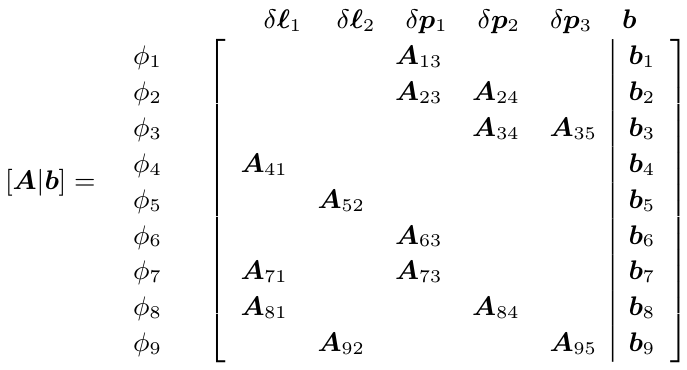

*Figure 1.7 — Figure 1.1 장난감 SLAM 예제에 대한 sparse Jacobian $\boldsymbol{A}$ 의
블록 구조. $\boldsymbol{\delta} = [\delta\boldsymbol{\ell}_1^\top\ \delta\boldsymbol{\ell}_2^\top\ \delta\boldsymbol{p}_1^\top\ \delta\boldsymbol{p}_2^\top\ \delta\boldsymbol{p}_3^\top]^\top$.
빈 칸은 0이다. (책 p.37)*

> **대응 규칙이 이보다 깔끔할 수 없다** (책 p.36).
>
> | factor graph | 행렬 $\boldsymbol{A}$ |
> |---|---|
> | factor 하나 | **block-row 하나** |
> | 변수 하나 | **block-column 하나** |
>
> 장난감 예제에서 $\phi(p_1,p_2,p_3,\ell_1,\ell_2)$ 의 인수분해에 factor 가 9개였으므로
> (식 1.5), block-row 도 정확히 **9개**다. Figure 1.7 에서 세어 보면 $\phi_1 \ldots \phi_9$ 다.
>
> 각 행에서 비영 블록의 위치는 **그 factor 가 어떤 변수에 연결되어 있는가**를 그대로
> 나타낸다. 예를 들어 $\phi_7(p_1, \ell_1)$ 은 $\delta\boldsymbol{\ell}_1$ 열과
> $\delta\boldsymbol{p}_1$ 열에만 블록을 갖는다.

### 5.3 sparse information matrix 와 그 그래프 (1.5.2)

Cholesky 로 normal equations 를 풀 때는 먼저 Hessian(information matrix)
$\boldsymbol{\Lambda} = \boldsymbol{A}^\top\boldsymbol{A}$ 를 만든다.

> ⚠️ **$\boldsymbol{A}^\top\boldsymbol{A}$ 는 참 Hessian 이 아니다** (책 p.36).
> 잔차의 Taylor 급수를 **잘라서** 얻은 "Gauss-Newton 근사"다.
> §4.2 에서 GN 이 Hessian 을 Jacobian 으로 근사한다고 한 것이 이것이다.

$\boldsymbol{A}$ 가 block-sparse 이므로 $\boldsymbol{\Lambda}$ 도 sparse 하다.
구성상 $\boldsymbol{\Lambda}$ 는 **대칭**이고, 유일한 MAP 해가 존재하면 **양정치**다.

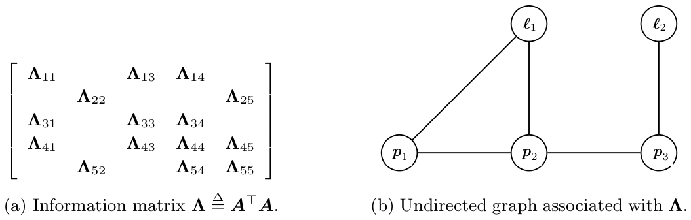

*Figure 1.8 — 장난감 SLAM 문제의 information matrix $\boldsymbol{\Lambda}$ (a) 와
거기 대응하는 무향 그래프 $G$ (b). (책 p.37)*

> **$\boldsymbol{\Lambda}$ 의 sparsity 패턴이 무향 그래프 $G$ 를 정의한다** (책 p.37).
>
> - 두 변수가 **같은 factor 에 함께 나온 적이 있으면** 그 사이에 간선이 있다
> - 블록 수준에서 $\boldsymbol{\Lambda} = \boldsymbol{A}^\top\boldsymbol{A}$ 의 sparsity
>   패턴은 **정확히 이 그래프의 인접행렬**이다
> - 이는 pairwise factor 를 넘어 일반화된다 — **$n$-항 factor 는 자신의 모든 변수
>   사이에 clique 를 만든다** (따라서 모든 쌍에 비영 블록)
>
> 이 그래프 $G$ 로 sparsity 와 **fill-in** 을 따진다.
>
> 책 각주 5 — 이 그래프는 추정 문제에 대응하는 **Markov Random Field (MRF)** 의
> 그래프와 정확히 같지만, 여기서 그 연결은 파고들지 않는다.

**factor graph 와 무엇이 다른가**를 짚어 두자.

| | factor graph | 무향 그래프 $G$ |
|---|---|---|
| 노드 | 변수 + factor (이분) | **변수만** |
| 대응 행렬 | Jacobian $\boldsymbol{A}$ | information matrix $\boldsymbol{\Lambda}$ |
| 보이는 것 | 어떤 측정이 무엇을 묶는가 | 어떤 변수들이 **서로 얽혀 있는가** |

$n$-항 factor 가 clique 가 된다는 것은 **정보의 손실**이다 — $G$ 만 보면 "세 변수가
하나의 factor 로 묶였는지, 셋씩 짝지은 세 개의 factor 인지" 구분할 수 없다.
그래도 fill-in 을 따지는 데는 $G$ 로 충분하다.

### 5.4 sparse 분해와 변수 순서 (1.5.3)

**알려진 sparsity 패턴을 이용하면 Cholesky($\boldsymbol{A}^\top\boldsymbol{A}$)나
QR($\boldsymbol{A}$) 분해를 크게 가속할 수 있다** (책 p.38). CHOLMOD [189],
SuiteSparseQR [240] 같은 효율적 구현이 있고, 여러 소프트웨어 패키지가 내부에서 쓴다.

> 실무에서 sparse 문제에서는 **sparse Cholesky 나 LDU 가 QR 보다 성능이 낫고,
> 상수배 이상의 차이**다 (책 p.38).

**변수 순서가 비용을 좌우한다.**

> sparse 행렬에 대해 고른 **열 순서(column ordering)가 전체 flop 수를 극적으로
> 바꾼다.** 어떤 순서든 결국 **같은 MAP 추정**을 내지만, 변수 순서는 행렬 인수의
> **fill-in**(분해되는 행렬의 sparsity 패턴을 넘어 추가로 생기는 비영 원소)을 결정한다.
>
> ⚠️ **행렬 분해에서 fill-in 을 최소화하는 변수 순서를 찾는 것은 NP-hard 다** [1239].
> 그래서 좋은 **heuristic** 에 의존해야 하고, 그것이 분해 알고리즘의 계산 복잡도를
> 좌우한다 (책 p.38).

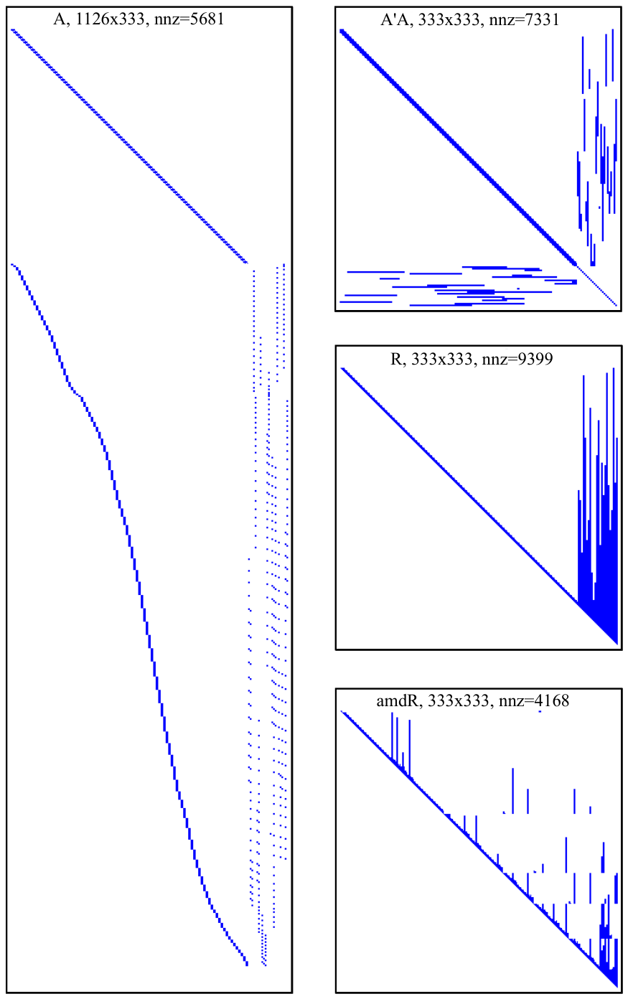

*Figure 1.9 — 왼쪽: Figure 1.5 문제의 measurement Jacobian $\boldsymbol{A}$
($3\times95 + 2\times24 = 333$ 미지수, 1126 행 = 스칼라 측정 수). 오른쪽 위부터:
information matrix $\boldsymbol{\Lambda}$, 상삼각 Cholesky triangle $\boldsymbol{R}$,
더 나은 변수 순서(COLAMD)로 얻은 대안 인수 amdR. "nnz"는 비영 원소 수. (책 p.39)*

| 무엇 | 크기 | nnz |
|---|---|---|
| $\boldsymbol{A}$ | 1126 × 333 | 5681 |
| $\boldsymbol{\Lambda} = \boldsymbol{A}^\top\boldsymbol{A}$ | 333 × 333 | 7331 |
| $\boldsymbol{R}$ (자연 순서: pose 먼저, landmark 나중) | 333 × 333 | **9399** |
| amdR (**COLAMD** 순서 [29, 241]) | 333 × 333 | **4168** |

> **둘 다 $\boldsymbol{R}^\top\boldsymbol{R} = \boldsymbol{A}^\top\boldsymbol{A}$ 를
> (변수 치환을 빼면) 만족하고, 후진 대입은 정확히 같은 해를 준다.** 다른 것은
> **sparsity 의 양**뿐이고, 바로 그것이 $\boldsymbol{A}$ 를 분해하는 비용을 정한다.
> **nnz 가 9399 에서 4168 로, 절반 이하**가 됐다.

> normal equations 를 **반복적으로** 푸는 도구도 있다 — pre-conditioned conjugate
> gradient. 매우 특수한 sparsity 패턴을 갖는 visual SLAM 에서는 **power iteration**
> 도 성공적으로 쓰였다 [1171]. 그래도 **대부분의 SLAM 문제에서는 sparse 분해가
> 선택지**이고, 다음 절에서 볼 **깔끔한 graphical model 해석**을 갖는다 (책 p.38).

---

## 6. Elimination (1.6, 책 p.40)

**이 절이 이 장의 정점이다.** 지금까지는 선형대수로 설명했다. 여기서는
**graphical model 로 직접 추론**하는 것으로 세계관을 넓힌다. 그것이 다음 절의
**Bayes tree** 로 이어진다.

### 6.1 variable elimination 알고리즘 (1.6.1)

**임의의 (되도록 sparse 한) factor graph 가 주어졌을 때, 미지 변수 $\boldsymbol{x}$
위의 posterior $p(\boldsymbol{x}|\boldsymbol{z})$ 를 MAP 해를 쉽게 얻을 수 있는
형태로 계산하는 일반 알고리즘**이 있다.

**variable elimination** 은 factor graph 를 **Bayes net** 이라는 다른 graphical model
로 바꾸는 절차다. Bayes net 은 미지 변수 $\boldsymbol{x}$ 에만 의존하고, 이를 통해
MAP 추론(그리고 표집·주변화 같은 다른 연산)이 쉬워진다.

$$\phi(\boldsymbol{x}) = \phi(\boldsymbol{x}_1, \ldots, \boldsymbol{x}_n) \tag{1.41}$$

$$p(\boldsymbol{x}) = p(\boldsymbol{x}_1|\boldsymbol{s}_1)p(\boldsymbol{x}_2|\boldsymbol{s}_2)\ldots p(\boldsymbol{x}_n) = \prod_j p(\boldsymbol{x}_j|\boldsymbol{s}_j) \tag{1.42}$$

$\boldsymbol{s}_j$ 는 선택한 변수 순서 $\boldsymbol{x}_1, \ldots, \boldsymbol{x}_n$
아래에서 변수 $\boldsymbol{x}_j$ 에 딸린 **separator** $\boldsymbol{s}(\boldsymbol{x}_j)$
에 대한 값 배정이다. separator 는 **제거 후 $\boldsymbol{x}_j$ 가 조건화되는 변수들의
집합**으로 정의된다.

> **chain rule 과 닮았지만 결정적 차이가 있다** (책 p.40). 일반적인 chain rule 은
> $p(x_1|x_2 \ldots x_n)p(x_2|x_3 \ldots x_n)\cdots$ 처럼 조건부가 계속 길어진다.
> 반면 **sparse factor graph 를 제거하면 separator 가 대체로 작다.**
> 그것이 이 알고리즘이 쓸모 있는 이유 전부다.

**알고리즘 구조**

```
완전한 factor graph φ_{1:n} 에서 시작
각 변수 x_j 를 하나씩 제거:
    conditional p(x_j | s_j) 를 하나 만들고
    나머지 변수들 위의 축소된 factor graph φ_{j+1:n} 을 만든다
모든 변수를 제거하면 → 원하는 인수분해를 갖는 Bayes net 을 반환
```

**한 변수를 제거하는 절차** — 부분적으로 제거된 factor graph $\phi_{j:n}$ 에서
$\boldsymbol{x}_j$ 를 제거하려면

1. $\boldsymbol{x}_j$ 에 인접한 **모든 factor $\phi_i(\boldsymbol{x}_i)$ 를 제거**하고
2. 그것들을 곱해 **product factor $\psi(\boldsymbol{x}_j, \boldsymbol{s}_j)$** 를 만든다
3. $\psi$ 를 **제거되는 변수 위의 conditional** $p(\boldsymbol{x}_j|\boldsymbol{s}_j)$ 와
   **separator 위의 새 factor** $\tau(\boldsymbol{s}_j)$ 로 인수분해한다

$$\psi(\boldsymbol{x}_j, \boldsymbol{s}_j) = p(\boldsymbol{x}_j|\boldsymbol{s}_j)\,\tau(\boldsymbol{s}_j) \tag{1.43}$$

> **따라서 $\phi(\boldsymbol{x})$ 에서 $p(\boldsymbol{x})$ 로 가는 전체 인수분해는
> $n$ 번의 국소 인수분해 단계의 연속으로 볼 수 있다** (책 p.41).
>
> 마지막 변수 $\boldsymbol{x}_n$ 을 제거할 때 separator $\boldsymbol{s}_n$ 은
> **비어 있고**, 생성되는 conditional 은 단순한 prior $p(\boldsymbol{x}_n)$ 이 된다.
> (1.42) 의 마지막 항이 조건부가 없는 이유다.

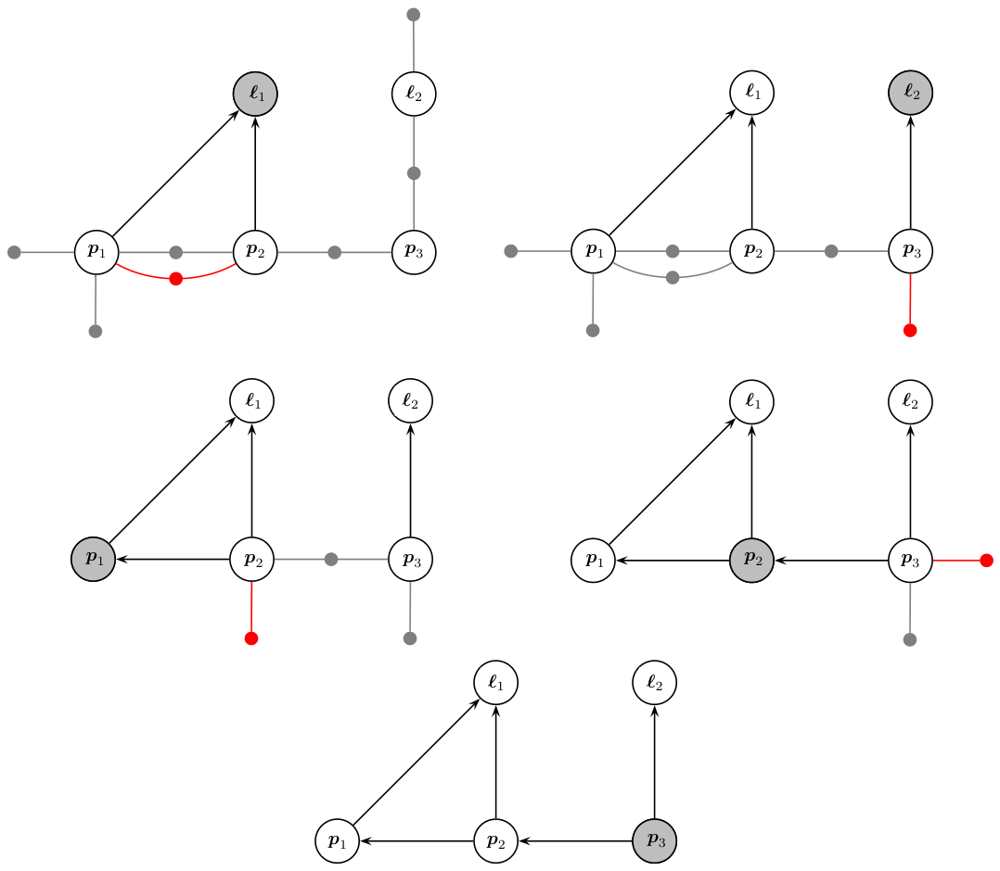

*Figure 1.10 — 장난감 SLAM 예제의 variable elimination. 순서
$\ell_1, \ell_2, p_1, p_2, p_3$ 로 Figure 1.3 의 factor graph 를 Bayes net(오른쪽 아래)
으로 바꾼다. 각 단계에서 제거되는 변수는 회색, separator 위의 새 factor $\tau(\boldsymbol{s}_j)$
는 빨강으로 표시했다. (책 p.41)*

전체적으로 이 알고리즘은 $\phi(\ell_1,\ell_2,p_1,p_2,p_3)$ 를 다음 인수분해에
대응하는 Bayes net 으로 바꾼다.

$$p(\ell_1,\ell_2,p_1,p_2,p_3) = p(\ell_1|p_1,p_2)\,p(\ell_2|p_3)\,p(p_1|p_2)\,p(p_2|p_3)\,p(p_3) \tag{1.44}$$

> **(1.44) 를 (1.5) 와 나란히 놓고 보라.** 왼쪽은 같은 밀도인데, 오른쪽이
> **factor 의 곱**에서 **conditional 의 곱**으로 바뀌었다. 후자는 마지막 항
> $p(p_3)$ 부터 거꾸로 대입하며 **한 변수씩 값을 정할 수 있다.** 그것이 §6.3 의
> 후진 대입이다.

### 6.2 선형-Gaussian elimination (1.6.2)

**선형 측정 함수와 가법 정규 노이즈의 경우, elimination 알고리즘은 sparse 행렬
분해와 등가다.** sparse Cholesky 와 QR 이 모두 이 일반 알고리즘의 특수한 경우다.

$$\psi(\boldsymbol{x}_j,\boldsymbol{s}_j) \leftarrow \prod_{i \in \mathcal{N}_j} \phi_i(\boldsymbol{x}_i) \tag{1.45a}$$
$$= \exp\left(-\frac{1}{2}\sum_i \|\boldsymbol{A}_i\boldsymbol{x}_i - \boldsymbol{b}_i\|^2_2\right) \tag{1.45b}$$
$$= \exp\left(-\frac{1}{2}\left\|\bar{\boldsymbol{A}}_j[\boldsymbol{x}_j; \boldsymbol{s}_j] - \bar{\boldsymbol{b}}_j\right\|^2_2\right) \tag{1.45c}$$

**변수 $\boldsymbol{x}_j$ 에 인접한 모든 행렬 $\boldsymbol{A}_i$ 를 더 큰 블록 행렬
$\bar{\boldsymbol{A}}_j$ 로 쌓는 것**이 product factor 를 만드는 일이다.
새 우변 $\bar{\boldsymbol{b}}_j$ 는 모든 $\boldsymbol{b}_i$ 를 쌓은 것이고,
';' 도 세로 쌓기를 뜻한다.

**장난감 예제에서 $\ell_1$ 을 제거해 보자** (책 p.42). 인접 factor 는
$\phi_4, \phi_7, \phi_8$ 이고, 이들이 separator $\boldsymbol{s}_1 = [p_1; p_2]$ 를 만든다.

$$\psi(\ell_1,p_1,p_2) = \exp\left(-\frac{1}{2}\left\|\bar{\boldsymbol{A}}_1[\ell_1;p_1;p_2] - \bar{\boldsymbol{b}}_1\right\|^2_2\right) \tag{1.46}$$

$$\bar{\boldsymbol{A}}_1 \triangleq \begin{bmatrix}\boldsymbol{A}_{41} & & \\ \boldsymbol{A}_{71} & \boldsymbol{A}_{73} & \\ \boldsymbol{A}_{81} & & \boldsymbol{A}_{84}\end{bmatrix}, \qquad \bar{\boldsymbol{b}}_1 \triangleq \begin{bmatrix}\boldsymbol{b}_4 \\ \boldsymbol{b}_7 \\ \boldsymbol{b}_8\end{bmatrix} \tag{1.47}$$

> **Figure 1.7 의 sparse Jacobian 을 보면 이것이 무엇인지 바로 보인다** (책 p.42) —
> **첫 열에 비영 블록이 있는 block-row 들을 뽑아낸 것**이다. 그 세 행이 정확히
> $\ell_1$ 에 인접한 세 factor 다.

이제 product factor 를 인수분해한다. 여러 방법이 있지만 **QR 변형**이 선형화된
factor 와 가장 직접 연결된다. product factor 에 대응하는 확대 행렬
$[\bar{\boldsymbol{A}}_j | \bar{\boldsymbol{b}}_j]$ 를 **partial QR-factorization** [389]
으로 다시 쓴다.

$$[\bar{\boldsymbol{A}}_j|\bar{\boldsymbol{b}}_j] = \boldsymbol{Q}\begin{bmatrix}\boldsymbol{R}_j & \boldsymbol{T}_j & \boldsymbol{d}_j \\ & \bar{\boldsymbol{A}}_\tau & \bar{\boldsymbol{b}}_\tau\end{bmatrix} \tag{1.48}$$

$\boldsymbol{R}_j$ 는 상삼각이다. 이를 통해 $\psi(\boldsymbol{x}_j,\boldsymbol{s}_j)$ 를
이렇게 인수분해할 수 있다.

$$\psi(\boldsymbol{x}_j,\boldsymbol{s}_j) = \exp\left\{-\frac{1}{2}\left\|\bar{\boldsymbol{A}}_j[\boldsymbol{x}_j;\boldsymbol{s}_j]-\bar{\boldsymbol{b}}_j\right\|^2_2\right\} \tag{1.49a}$$
$$= \exp\left\{-\frac{1}{2}\left\|\boldsymbol{R}_j\boldsymbol{x}_j + \boldsymbol{T}_j\boldsymbol{s}_j - \boldsymbol{d}_j\right\|^2_2\right\}\exp\left\{-\frac{1}{2}\left\|\bar{\boldsymbol{A}}_\tau\boldsymbol{s}_j - \bar{\boldsymbol{b}}_\tau\right\|^2_2\right\}$$
$$= p(\boldsymbol{x}_j|\boldsymbol{s}_j)\,\tau(\boldsymbol{s}_j) \tag{1.49b}$$

**회전행렬 $\boldsymbol{Q}$ 가 노름 값을 바꾸지 않는다**는 사실을 썼다.

> **(1.49) 가 (1.43) 을 선형-Gaussian 경우에 구체화한 것이다.** 위쪽 블록(삼각화된
> 부분)이 conditional $p(\boldsymbol{x}_j|\boldsymbol{s}_j)$ 이 되고, **아래쪽에 남은
> 블록이 separator 위의 새 factor** $\tau(\boldsymbol{s}_j)$ 가 된다. 지수의 합이
> 곱으로 갈라지는 것이 두 조각으로 나뉘는 이유다.

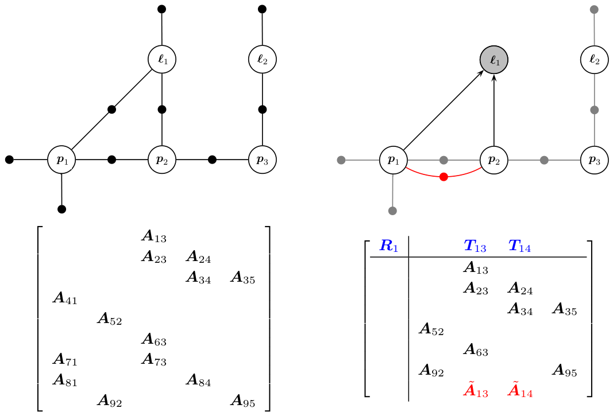

*Figure 1.11 — 변수 $\ell_1$ 을 제거하는 것을 부분 sparse 분해 단계로 본 것. (책 p.43)*

Figure 1.11 은 첫 변수 $\ell_1$ 을 separator $[p_1;p_2]$ 와 함께 제거한 결과를 보여
준다. **factor graph 위의 연산과 Figure 1.7 의 sparse Jacobian 에 대한 대응 효과를
나란히** 보여 준다(우변은 생략).

- **선 위쪽**은 형성되고 있는 sparse 상삼각 행렬 $\boldsymbol{R}$ 에 해당한다
- **파랑**: $\boldsymbol{R}$ 에 대한 기여
- **빨강**: 새로 만들어진 factor

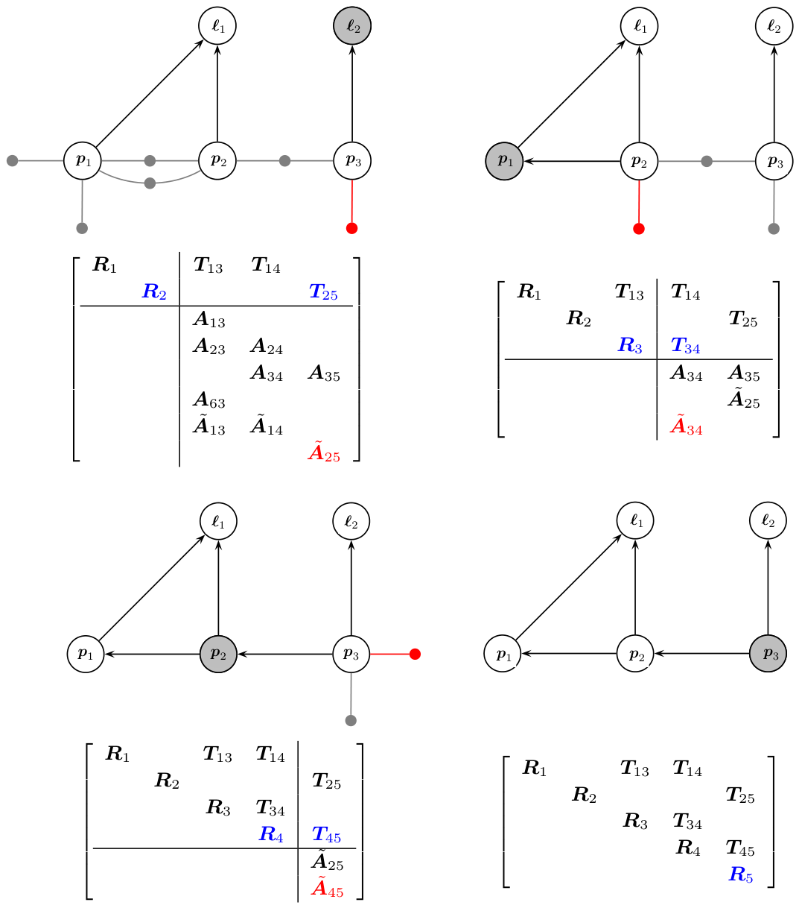

*Figure 1.12 — 장난감 예제의 나머지 elimination 단계로 전체 QR 분해를 완성한다.
오른쪽 아래 마지막 단계가 결과 Bayes net 과 sparse Cholesky 인수 $\boldsymbol{R}$ 의
등가성을 보여 준다. (책 p.44)*

> **partial QR 로 한 변수씩 제거하는 전체 알고리즘은 sparse QR 분해와 등가다**
> (책 p.44). 위 서술이 다차원 변수 $\boldsymbol{x}_j \in \mathbb{R}^{n_j}$ 를 다루므로
> 사실 이것은 **multi-frontal QR factorization** [288] 의 사례다 — 한 번에 여러 스칼라
> 변수를 제거하므로 프로세서 활용에 유리하다.
>
> 우리 경우 스칼라 변수를 묶는 이유는 **추론 문제에서의 의미** 때문이지만, sparse
> 선형대수 코드는 대개 **최대 계산 효율**을 위해 묶는다. **많은 경우 이 두 전략이
> 밀접하게 일치한다.**

### 6.3 sparse Cholesky 인수는 Bayes net 이다 (1.6.3)

> **variable elimination 과 sparse 행렬 분해의 등가성이 드러내는 것** (책 p.45):
> **상삼각 행렬에 딸린 graphical model 은 Bayes net 이다.**
>
> factor graph 가 sparse Jacobian 의 도해적 화신이듯, **Bayes net 은 Cholesky 인수의
> sparsity 구조를 드러낸다.** 돌이켜 보면 놀랄 일도 아니다 — Bayes net 은
> **directed acyclic graph (DAG)** 이고, 그것이 바로 행렬의 '**상삼각**' 성질이다.

더 나아가 Cholesky 인수는 **Gaussian Bayes net** 에 대응한다 — 선형-Gaussian
conditional 로 이루어진 것으로 정의한다.

$$p(\boldsymbol{x}) = \prod_j p(\boldsymbol{x}_j|\boldsymbol{s}_j) \tag{1.50}$$

QR·Cholesky 두 변형 모두에서 conditional 은

$$p(\boldsymbol{x}_j|\boldsymbol{s}_j) = k\exp\left(-\frac{1}{2}\left\|\boldsymbol{R}_j\boldsymbol{x}_j + \boldsymbol{T}_j\boldsymbol{s}_j - \boldsymbol{d}_j\right\|^2_2\right) \tag{1.51}$$

로 주어지고, 이는 제거된 변수 $\boldsymbol{x}_j$ 위의 **선형-Gaussian 밀도**다. 실제로

$$\left\|\boldsymbol{R}_j\boldsymbol{x}_j+\boldsymbol{T}_j\boldsymbol{s}_j-\boldsymbol{d}_j\right\|^2_2 = (\boldsymbol{x}_j-\boldsymbol{\mu}_j)^\top\boldsymbol{R}_j^\top\boldsymbol{R}_j(\boldsymbol{x}_j-\boldsymbol{\mu}_j) \triangleq \|\boldsymbol{x}_j-\boldsymbol{\mu}_j\|^2_{\boldsymbol{\Sigma}_j} \tag{1.52}$$

이고, 평균 $\boldsymbol{\mu}_j = \boldsymbol{R}_j^{-1}(\boldsymbol{d}_j - \boldsymbol{T}_j\boldsymbol{s}_j)$
는 **separator $\boldsymbol{s}_j$ 에 선형으로 의존**하며, covariance 는
$\boldsymbol{\Sigma}_j = (\boldsymbol{R}_j^\top\boldsymbol{R}_j)^{-1}$ 이다.
정규화 상수는 $k = |2\pi\boldsymbol{\Sigma}_j|^{-\frac{1}{2}}$ 다.

**후진 대입으로 MAP 해를 얻는다.**

> Figure 1.12 에서 보듯 **마지막으로 제거된 변수는 다른 어떤 변수에도 의존하지 않는다.**
> 따라서 그 변수의 MAP 추정을 Bayes net 에서 곧바로 뽑을 수 있다.
> **제거의 역순으로** 진행하면, 각 conditional 의 separator 변수 값이 **이전 단계에서
> 이미 구해져** 있으므로 현재 frontal 변수의 추정을 계산할 수 있다 (책 p.45).

매 단계에서 변수 $\boldsymbol{x}_j$ 의 MAP 추정은 **conditional mean** 이다.

$$\boldsymbol{x}_j^* = \boldsymbol{R}_j^{-1}(\boldsymbol{d}_j - \boldsymbol{T}_j\boldsymbol{s}_j^*) \tag{1.53}$$

구성상 이 시점에 separator 의 MAP 추정 $\boldsymbol{s}_j^*$ 는 **완전히 알려져 있기**
때문이다.

> **(1.53) 이 (1.28) 과 같은 것임을 알아보라.** $\boldsymbol{R}\boldsymbol{\delta}^* = \boldsymbol{y}$
> 의 후진 대입을 **블록 단위로, 그래프 언어로** 다시 쓴 것이다. 같은 계산이 두 언어로
> 표현된 것이고, 그것이 §6 이 하려던 말이다.

---

## 7. Incremental SLAM (1.7, 책 p.46)

**incremental SLAM 에서는 환경을 돌아다니며 새 측정이 들어올 때마다(또는 적어도
정기적으로) 최적 궤적과 지도를 계산하고 싶다.**

한 가지 방법은 **가장 최근의 행렬 분해를 새 측정으로 갱신**해, 이전 측정을 이미
반영한 계산을 재사용하는 것이다. 선형인 경우에는 **incremental 분해 방법**으로
가능하다 (dense 판은 [389] 에서 자세히 다룬다).

> ⚠️ **그런데 행렬 분해는 선형 시스템에서 동작하고, 실용적으로 관심 있는 SLAM 문제는
> 대부분 비선형이다** (책 p.46). incremental 행렬 분해를 쓰면 **전체 행렬을 다시
> 분해하지 않고 어떻게 재선형화할지가 전혀 분명하지 않다.**
>
> 이 문제를 넘기 위해 **다시 graphical model 에 기댄다** — **Bayes tree** 다.

### 7.1 Bayes tree (1.7.1)

**트리 구조 그래프에서의 추론이 효율적이라는 것은 잘 알려져 있다.** 반면 로봇공학
문제의 factor graph 는 **loop 를 많이 담고 있다.** 그래도 **두 단계**로 트리 구조
graphical model 을 만들 수 있다.

```
1단계: factor graph 에 variable elimination 을 수행해
       특별한 성질을 갖는 Bayes net 을 얻는다
2단계: 그 특별한 성질을 이용해
       이 Bayes net 의 clique 들 위에서 트리 구조를 찾는다
```

**그 특별한 성질이 chordal 이다.**

> **chordal** — 길이가 3보다 큰 무향 cycle 은 반드시 **chord**(cycle 위에서 연속하지
> 않은 두 정점을 잇는 간선)를 갖는다. AI 와 machine learning 에서는 chordal 그래프를
> **triangulated** 되었다고 더 흔히 말한다 (책 p.46).
>
> 왜 이것이 성립하는가는 §6.1 의 elimination 이 하는 일에서 나온다 — 변수를 제거할 때
> 그 이웃들 사이에 **새 factor $\tau(\boldsymbol{s}_j)$ 를 만든다**(Figure 1.10 의
> 빨간 간선). 이것이 곧 chord 를 채워 넣는 것이다.

Bayes net 이므로 결합 밀도 $p(\boldsymbol{x})$ 는 개별 변수 $\boldsymbol{x}_j$ 에 대해
인수분해된다.

$$p(\boldsymbol{x}) = \prod_j p(\boldsymbol{x}_j|\boldsymbol{\pi}_j) \tag{1.54}$$

$\boldsymbol{\pi}_j$ 는 $\boldsymbol{x}_j$ 의 부모 노드들이다.

> ⚠️ **그런데 chordal 이어도 이 변수 수준에서는 여전히 만만찮은 그래프다** — 사슬도
> 트리도 아니다 (책 p.46). 장난감 SLAM 의 chordal Bayes net (Figure 1.10 마지막 단계)
> 에는 무향 cycle $p_1 - p_2 - \ell_1$ 이 있어 **트리 형태가 아니다.**

**clique 를 찾으면 트리가 된다.**

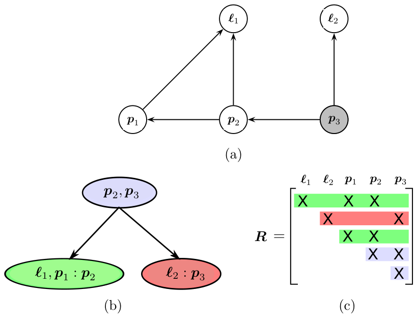

*Figure 1.13 — Figure 1.3 의 표준 예제에 기반한 chordal Bayes net (a), 그 clique 구조를
기술하는 Bayes tree (b), 그리고 대응하는 square root information matrix $\boldsymbol{R}$ (c).
clique 와 $\boldsymbol{R}$ 의 행의 대응을 색으로 표시했다. (책 p.47)*

> **왜 clique 들이 트리를 이루는가** — **chordal 성질 때문**이다. 책은 여기서 증명을
> 시도하지 않는다 (책 p.47). 이 clique 들을 무향 트리로 나열하면 **clique tree**
> (AI/ML 에서는 **junction tree**)가 되고, **Bayes tree 는 그것의 방향 있는 판으로
> elimination 순서 정보를 보존한다.**

**형식적 정의** (책 p.47) — Bayes tree 는 노드가 바탕 chordal Bayes net 의
**clique** $\boldsymbol{c}_k$ 를 나타내는 **방향 트리**다.

| 기호 | 뜻 |
|---|---|
| $\boldsymbol{c}_k$ | clique |
| $\boldsymbol{\varpi}_k$ | 부모 clique |
| $\boldsymbol{s}_k$ | **separator** — 교집합 $\boldsymbol{c}_k \cap \boldsymbol{\varpi}_k$ |
| $\boldsymbol{f}_k$ | **frontal 변수** — 나머지, $\boldsymbol{f}_k \triangleq \boldsymbol{c}_k \setminus \boldsymbol{s}_k$ |
| 표기 | $\boldsymbol{c}_k = \boldsymbol{f}_k : \boldsymbol{s}_k$ |

노드마다 conditional density $p(\boldsymbol{f}_k|\boldsymbol{s}_k)$ 를 하나 정의한다.
Bayes tree 가 정의하는 변수 $\boldsymbol{x}$ 위의 결합 밀도는

$$p(\boldsymbol{x}) = \prod_k p(\boldsymbol{f}_k|\boldsymbol{s}_k) \tag{1.55}$$

> **root 에서는 separator 가 비어 있으므로** 단순히 root 변수 위의 prior
> $p(\boldsymbol{f}_r)$ 이다. Bayes tree 의 정의상 clique $\boldsymbol{c}_k$ 의
> separator $\boldsymbol{s}_k$ 는 **언제나 부모 clique $\boldsymbol{\varpi}_k$ 의
> 부분집합**이고, 따라서 그래프의 방향 간선은 Bayes net 에서와 **같은 의미
> — 조건화 — 를 갖는다** (책 p.48).

**장난감 예제의 Bayes tree** (Figure 1.13):

| clique | 구성 | 색 |
|---|---|---|
| $\boldsymbol{c}_1 = p_2, p_3$ | **root** | 파랑 |
| $\boldsymbol{c}_2 = \ell_1, p_1 : p_2$ | | 초록 |
| $\boldsymbol{c}_3 = \ell_2 : p_3$ | | 빨강 |

> **색이 $\boldsymbol{R}$ 행렬의 행과 어떻게 대응하는지 보라** (책 p.48).
> Bayes tree 가 clique 사이의 **독립 관계**를 어떻게 포착하는지 드러난다 —
> 예를 들어 **초록 행과 빨강 행은 root clique 에 속한 변수에서만 겹친다.**
> 예측된 그대로다.

### 7.2 Bayes tree 갱신하기 (1.7.2)

> **점진적 추론은 Bayes tree 를 간단히 편집하는 것에 해당한다** (책 p.48).
> 이 관점이 추상적이던 incremental 행렬 분해 과정을 훨씬 잘 설명해 주고,
> square-root information matrix 를 **Bayes tree 형태로 저장·계산**할 수 있게 한다 —
> 깊은 의미를 갖는 sparse 저장 방식이다.

**핵심 착상**: Bayes tree 의 **일부만** 골라 factor graph 형태로 되돌린다.

새 측정을 더하는 것은 factor 를 더하는 것이다. 예를 들어 두 변수가 걸린 측정은
새 binary factor $\phi(\boldsymbol{x}_j,\boldsymbol{x}_{j'})$ 를 유도한다.

> **이때 영향받는 것은 $\boldsymbol{x}_j$ 와 $\boldsymbol{x}_{j'}$ 를 담은 clique 들과
> root 사이의 경로뿐이다.** 그 clique 들 아래의 subtree 는 영향받지 않고,
> $\boldsymbol{x}_j$ 나 $\boldsymbol{x}_{j'}$ 를 담지 않은 다른 subtree 도 마찬가지다.

```
갱신 절차:
  영향받는 부분을 factor graph 로 되돌린다
  새 측정에 딸린 새 factor 를 더한다
  이 임시 factor graph 를 다시 elimination (편한 순서로)
  → 새 Bayes tree 형성, 영향받지 않은 subtree 를 다시 붙인다
```

**왜 위쪽만 영향받는가** — Bayes tree 가 **elimination 중의 정보 흐름을 부호화**하기
때문이다. 두 성질에서 나온다 (책 p.48).

1. Bayes tree 는 chordal Bayes net 을 **역 elimination 순서**로 만든다. 그래서 각
   clique 의 변수는 **자식 clique 들이 제거되며 그 정보를 모은다.** 따라서 어떤
   clique 의 정보든 **위쪽(root 방향)으로만 전파된다**
2. 어떤 factor 의 정보는 **그 factor 에 연결된 첫 변수가 제거될 때** 비로소
   elimination 에 들어간다

> **둘을 합치면**: 새 factor 는 **그 factor 의 변수들의 후손이 아닌 어떤 변수에도
> 영향을 줄 수 없다.** 다만 root 로 가는 경로가 서로 다른(즉 독립인) 변수들이 걸린
> factor 라면, **그 경로들을 이제 다시 제거해서 새 의존 관계를 표현해야 한다.**

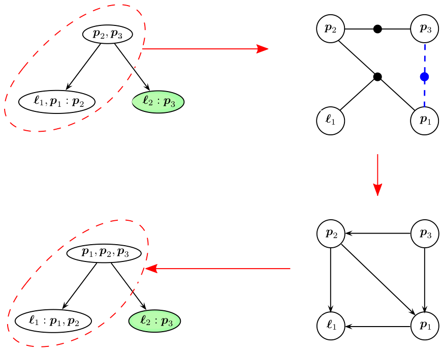

*Figure 1.14 — Figure 1.13 예제에 새 factor 를 더해 Bayes tree 를 갱신하는 과정.
$p_1$ 과 $p_3$ 사이에 새 factor 를 더하는 경우로, 영향받는 부분을 강조했다.
오른쪽 가지(초록)는 영향받지 않는다. (책 p.49)*

Figure 1.14 의 흐름 (책 p.49):

1. **왼쪽 위** — $p_1$ 과 $p_3$ 사이 새 factor 는 트리의 **왼쪽 가지만** 건드린다
   (빨간 점선)
2. **오른쪽 위** — 영향받는 부분의 clique 밀도 $p(p_2,p_3)$ 와 $p(\ell_1,p_1|p_2)$
   각각에 factor 를 만들어 factor graph 를 구성하고, 새 factor $f(p_1,p_3)$ 를 더한다
   (파란 점선)
3. **오른쪽 아래** — 순서 $\ell_1, p_1, p_2, p_3$ 로 제거한 chordal Bayes net
4. **왼쪽 아래** — 재조립된 Bayes tree. 제거된 그래프에서 나온 부분과 원래 트리에서
   영향받지 않은 clique(초록)로 이루어진다

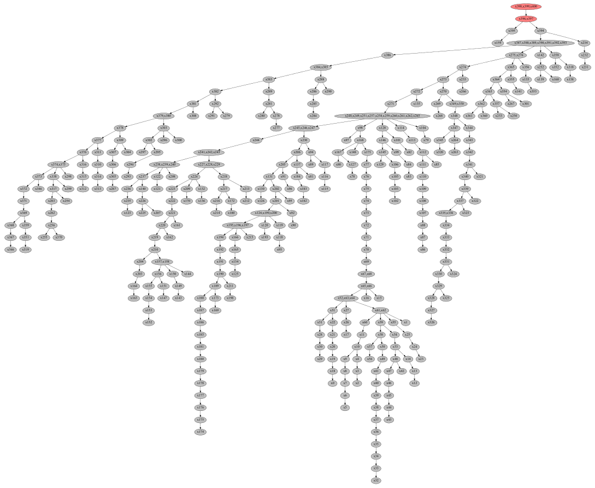

*Figure 1.15 — 작은 SLAM 시퀀스에 대한 Bayes tree 자료구조의 예. Olson 등 [824] 의
잘 알려진 Manhattan world 시뮬레이션 시퀀스의 step 400 시점 트리다. 로봇이 환경을
탐색할 때 새 측정은 트리의 **일부만** 건드리고, 그 부분만 다시 계산된다(빨강). (책 p.50)*

### 7.3 iSAM — incremental smoothing and mapping (1.7.3)

위의 모든 것을 합치고 **재선형화에 대한 몇 가지 실무적 고려**를 더하면, 로봇공학의
MAP 추정에 대한 최신 incremental 비선형 접근인 **iSAM** 이 된다.

| | 무엇 | 한계 |
|---|---|---|
| **iSAM1** [531] | Golub & Loan [389] 의 incremental 행렬 분해 방법 사용 | **선형화가 차선적**이었다 — 전체 factor graph 에 대해 **주기적으로**, 또는 행렬 fill-in 이 감당 안 될 때 수행 |
| **iSAM2** [534] | posterior density 를 **Bayes tree** 로 표현. 새 측정마다 위의 방식으로 tree 를 점진적 갱신 | — |

**실무적 고려 두 가지** (책 p.51):

**① 영향받은 clique 을 다시 제거할 때 어떤 변수 순서를 쓸 것인가?**

영향받은 부분의 변수만 갱신하면 된다. 한 가지 전략은 **COLAMD 를 영향받은 변수에
국소적으로 적용**하는 것이다. 그런데 **더 잘할 수 있다** — **최근 접근한 변수를
순서의 끝, 즉 root clique 쪽으로 밀어 넣는다.**

이를 위해 **constrained COLAMD** [241] 를 쓸 수 있다. 최근 접근 변수를 끝으로 강제하면서
전체적으로도 좋은 순서를 준다.

> **왜 최근 변수를 root 로 미는가.** §7.2 에서 본 대로 영향은 **root 방향으로만**
> 퍼진다. 최근 변수가 root 근처에 있으면 다음 갱신이 건드릴 subtree 가 작아진다.
> 그래서 **이후 갱신은 트리의 작은 부분만 건드리고, 큰 loop closure 를 빼면
> 대부분의 경우 효율적**이다.

**② tree 를 갱신한 뒤 해도 갱신해야 한다.**

Bayes tree 에서 후진 대입은 (다른 어떤 변수에도 의존하지 않는) **root 에서 시작해
leaf 로** 진행한다. 그런데 **모든 변수의 해를 다시 계산할 필요는 대개 없다** —
트리에 대한 국소 갱신은 멀리 있는 변수에 영향을 주지 않는 경우가 많다.
대신 **각 clique 에서 아래로 전파되는 변수 추정의 차이를 확인하고, 그 차이가 작은
임계값 아래로 떨어지면 멈춘다.**

**선택적 재선형화** (책 p.51)

> Bayes tree 를 도입한 동기는 **비선형** 최적화 문제를 점진적으로 푸는 것이었다.
> 이를 위해 **linearization point 로부터의 이탈이 작은 임계값을 넘는 변수를 담은
> factor 를 선택적으로 재선형화**한다.
>
> 위의 트리 수정과 달리, 이번에는 **영향받은 변수를 담은 모든 clique 을 다시 해야
> 한다** — frontal 변수뿐 아니라 **separator 변수로 담긴 것까지**. 그래서 트리의 더
> 큰 부분이 영향받지만, 대부분의 경우 **전체 트리를 다시 계산하는 것보다는 여전히
> 훨씬 싸다.** 또한 clique 을 곧바로 factor graph 로 바꾸는 대신 **원래 factor 로
> 되돌아가야** 하고, 그러려면 elimination 중에 일정한 양을 **캐싱**해야 한다.

> **iSAM1 과 iSAM2 는 수백만 개에 이르는 변수를 갖는 비자명한 로봇공학 추정 문제에
> 성공적으로 적용되었다** (책 p.51). 둘 다 **GTSAM 라이브러리**에 구현되어 있다:
> `https://github.com/borglab/gtsam`

---

## 8. 더 읽을거리와 최근 동향 (1.8, 책 p.51)

> factor graph 를 더 알고 싶으면 Dellaert 등의 더 긴 논문 [255] 를 권한다.
> **필요에 의해 이 장은 다소 짧고, 진입 장벽을 최대한 낮추려 더 고급 개념을
> 의도적으로 덜 다뤘다.** 그러나 factor graph 와 일반 elimination 알고리즘은
> 꽤 강력하고 자세히 알아 둘 가치가 있다.
>
> 그 다음으로는 Kaess 등 [534] 을 보아 **Bayes tree** 개념을 더 이해할 것을 권한다.
> GTSAM 같은 현대 solver 의 바탕이다.

**오늘날 factor graph 패러다임이 다루는 것** (책 p.51~52):

- **manifold 위의 상태 변수** → **2장**
- 여러 종류의 센서 통합 → **Part II**
- **outlier 측정** 처리 → **3장**
- **딥러닝 방법의 출력까지 접어 넣기** → **4장 · 13장**

> *"이 핸드북의 나머지 대부분이 이런 동향을 논한다. 그러니 더 알고 싶으면 계속 읽으라."*
> (책 p.52)

---

## 9. 예제/실습

### 9.1 예제 — 장난감 문제의 factor graph 를 손으로 세기

Figure 1.1 의 예제에서 factor 가 정확히 9개인 이유를 확인하라.

<details>
<summary>답</summary>

식 (1.5) 를 줄별로 세면 된다.

| 식 | factor | 개수 | 무엇 |
|---|---|---|---|
| (1.5a) | $\phi_1(p_1), \phi_2(p_2,p_1), \phi_3(p_3,p_2)$ | 3 | $p_1$ prior + odometry 2개 |
| (1.5b) | $\phi_4(\ell_1), \phi_5(\ell_2)$ | 2 | landmark prior |
| (1.5c) | $\phi_6(p_1)$ | 1 | $p_1$ 의 절대 측정 |
| (1.5d) | $\phi_7(p_1,\ell_1), \phi_8(p_2,\ell_1), \phi_9(p_3,\ell_2)$ | 3 | bearing 측정 |
| | | **9** | |

Figure 1.7 의 block-row 가 9개인 것과 정확히 일치한다.
$\phi_1$ 과 $\phi_6$ 이 **둘 다 $p_1$ 에만 걸린 unary factor** 라는 점에 주의하라 —
하나는 prior, 하나는 측정이지만 factor graph 에서는 구분되지 않는다.
</details>

### 9.2 예제 — whitening 을 수치로 확인

bearing 측정(표준편차 $0.05$ rad)과 거리 측정(표준편차 $0.2$ m)이 각각
$0.1$ rad, $0.3$ m 의 오차를 냈다. **어느 쪽이 더 나쁜 측정인가?**

**풀이.** 원래 단위로는 비교할 수 없다 (라디안과 미터). whitening 후에 비교한다.

$$\frac{0.1}{0.05} = 2.0, \qquad \frac{0.3}{0.2} = 1.5$$

**bearing 쪽이 더 나쁘다** — 2시그마 vs 1.5시그마. 비용함수 기여는 각각
$2.0^2 = 4.0$ 과 $1.5^2 = 2.25$ 다.

```python
# 검증 — numpy 가 없으면: sudo apt install -y python3-numpy
import numpy as np

sigma = np.array([0.05, 0.20])      # rad, m
err   = np.array([0.10, 0.30])      # rad, m

whitened = err / sigma              # Sigma^{-1/2} e  (대각이므로 나눗셈)
print("whitened  =", whitened)              # 노트: [2.0, 1.5]
print("각 항 비용 =", whitened**2)          # 노트: [4.0, 2.25]
print("총 비용    =", np.sum(whitened**2))  # 노트: 6.25

# Mahalanobis 노름과 같은지 대조 (1.22)
Sigma = np.diag(sigma**2)
maha  = err @ np.linalg.inv(Sigma) @ err
print("Mahalanobis =", maha, " 일치:", np.isclose(maha, np.sum(whitened**2)))
```

### 9.3 예제 — normal equation 을 직접 풀어 보기

1D 장난감: 변수 $x_1, x_2$ 에 factor 세 개.

| factor | 내용 | whitened 형태 |
|---|---|---|
| $\phi_1$ | $x_1$ 의 prior, 값 $0$, $\sigma=1$ | $1\cdot x_1 = 0$ |
| $\phi_2$ | odometry $x_2 - x_1 = 2$, $\sigma=1$ | $-x_1 + x_2 = 2$ |
| $\phi_3$ | $x_2$ 의 측정, 값 $3$, $\sigma=0.5$ | $2x_2 = 6$ |

$\boldsymbol{A}$ 와 $\boldsymbol{b}$ 를 쓰고 (1.25) 를 풀어 $x_1, x_2$ 를 구하라.

<details>
<summary>답</summary>

$$\boldsymbol{A} = \begin{bmatrix} 1 & 0 \\ -1 & 1 \\ 0 & 2\end{bmatrix},\qquad
\boldsymbol{b} = \begin{bmatrix} 0 \\ 2 \\ 6 \end{bmatrix}$$

$$\boldsymbol{A}^\top\boldsymbol{A} = \begin{bmatrix} 2 & -1 \\ -1 & 5\end{bmatrix},\qquad
\boldsymbol{A}^\top\boldsymbol{b} = \begin{bmatrix} -2 \\ 14 \end{bmatrix}$$

$$\begin{bmatrix} 2 & -1 \\ -1 & 5\end{bmatrix}\begin{bmatrix}x_1\\x_2\end{bmatrix} = \begin{bmatrix}-2\\14\end{bmatrix}
\;\Rightarrow\; x_1 = \frac{4}{9} \approx 0.444,\quad x_2 = \frac{26}{9} \approx 2.889$$

**해석**: prior 는 $x_1 = 0$ 을 원하고, odometry 는 $x_2 = x_1 + 2$ 를, 측정은
$x_2 = 3$ 을 원한다. 셋을 다 만족하는 값은 없다. $\sigma = 0.5$ 인 $x_2$ 측정의
**가중치가 4배**($1/\sigma^2$)라서 해가 $x_2 = 3$ 쪽으로 끌려갔고, odometry 를
맞추려 $x_1$ 도 0에서 끌려 올라갔다.

```python
import numpy as np
A = np.array([[1., 0.], [-1., 1.], [0., 2.]])
b = np.array([0., 2., 6.])

x = np.linalg.solve(A.T @ A, A.T @ b)
print("normal eq :", x)                       # 노트: [0.444, 2.889]
print("lstsq     :", np.linalg.lstsq(A, b, rcond=None)[0])

# Cholesky 경로 (1.26)~(1.28) 로도 같은 답이 나오는가
R = np.linalg.cholesky(A.T @ A).T             # 상삼각 R,  R^T R = A^T A
y = np.linalg.solve(R.T, A.T @ b)             # (1.27) 전진 대입
x_chol = np.linalg.solve(R, y)                # (1.28) 후진 대입
print("Cholesky  :", x_chol, " 일치:", np.allclose(x, x_chol))

# QR 경로 (1.29)~(1.32)
Q, Rqr = np.linalg.qr(A)
x_qr = np.linalg.solve(Rqr, Q.T @ b)          # (1.32)
print("QR        :", x_qr, " 일치:", np.allclose(x, x_qr))
print("R 이 같은가(부호 무시):", np.allclose(np.abs(R), np.abs(Rqr)))
```

**세 경로가 같은 답을 준다** — (1.33) 이 말한 그대로다.
</details>

### 9.4 연습문제 — elimination 순서를 바꿔 보기

Figure 1.10 은 순서 $\ell_1, \ell_2, p_1, p_2, p_3$ 로 제거해 (1.44) 를 얻었다.

**순서를 $p_1, p_2, p_3, \ell_1, \ell_2$ 로 바꾸면** fill-in 이 몇 개나 생기는가?

Figure 1.8(b) 의 무향 그래프에서 직접 해 보라. 규칙은 하나다 — **변수를 제거하면
그 이웃들이 서로 전부 연결된다**(§5.3 의 "$n$-항 factor 는 clique 을 만든다"와 같은
논리). 이미 있던 간선은 그대로고, **없던 간선이 새로 생기면 그것이 fill-in** 이다.

<details>
<summary>답</summary>

Figure 1.8(b) 의 간선은 다섯이다: $(\ell_1,p_1)$, $(\ell_1,p_2)$, $(\ell_2,p_3)$,
$(p_1,p_2)$, $(p_2,p_3)$.

**책의 순서 $\ell_1, \ell_2, p_1, p_2, p_3$ — fill-in 0개**

| 제거 | separator | 새 간선 |
|---|---|---|
| $\ell_1$ | $\{p_1, p_2\}$ | 없음 — $(p_1,p_2)$ 가 **이미 있다** |
| $\ell_2$ | $\{p_3\}$ | 없음 (이웃이 하나) |
| $p_1$ | $\{p_2\}$ | 없음 |
| $p_2$ | $\{p_3\}$ | 없음 |
| $p_3$ | $\{\}$ | 없음 |

separator 가 (1.44) 의 조건부와 정확히 일치한다 —
$p(\ell_1|p_1,p_2)\,p(\ell_2|p_3)\,p(p_1|p_2)\,p(p_2|p_3)\,p(p_3)$.

**바꾼 순서 $p_1, p_2, p_3, \ell_1, \ell_2$ — fill-in 2개**

| 제거 | separator | 새 간선 |
|---|---|---|
| $p_1$ | $\{\ell_1, p_2\}$ | 없음 — $(\ell_1,p_2)$ 가 **이미 있다** |
| $p_2$ | $\{\ell_1, p_3\}$ | **$(\ell_1, p_3)$ 추가** |
| $p_3$ | $\{\ell_1, \ell_2\}$ | **$(\ell_1, \ell_2)$ 추가** |
| $\ell_1$ | $\{\ell_2\}$ | 없음 |
| $\ell_2$ | $\{\}$ | 없음 |

**주의할 점**: "$p_1$ 을 먼저 제거하니까 거기서 fill-in 이 생기겠지"라고 넘겨짚기
쉬운데 아니다. $p_1$ 의 이웃 $\ell_1, p_2$ 는 **원래 연결되어 있다.**
fill-in 은 그 다음 두 단계에서 생긴다. **직접 그래프를 그려 세어 봐야** 알 수 있다.

두 번째 순서에서 만들어진 $(\ell_1,\ell_2)$ 간선이 특히 나쁘다 — 원래 두 landmark
사이에는 **아무 정보도 없었는데**(§5.1) 순서를 잘못 골라 억지로 얽어 놓은 것이다.
이것이 §5.4 가 말한 "변수 순서가 비용을 좌우한다"의 가장 작은 사례다.

```python
# 검증 — 그래프에서 elimination 을 직접 돌린다
import itertools
EDGES = {frozenset(e) for e in
         [("l1","p1"),("l1","p2"),("l2","p3"),("p1","p2"),("p2","p3")]}

def eliminate(order, edges):
    edges, fill = set(edges), 0
    for v in order:
        nb = sorted({x for e in edges if v in e for x in e if x != v})
        for a, b in itertools.combinations(nb, 2):
            if frozenset((a, b)) not in edges:
                edges.add(frozenset((a, b))); fill += 1
                print(f"    {v} 제거 → 새 간선 ({a},{b})")
        edges = {e for e in edges if v not in e}
    return fill

for order in (["l1","l2","p1","p2","p3"], ["p1","p2","p3","l1","l2"]):
    print(order); print("  fill-in:", eliminate(order, EDGES), "개")
```

실행하면 각각 `0개`, `2개` 가 나온다.
</details>

### 9.5 판단 문제 — 어떤 solver 를 쓸 것인가

세 상황에서 §4 의 네 방법(SD·GN·LM·PDL) 중 무엇을 고르겠는가? 근거와 함께 답하라.

1. front-end 가 **아주 좋은 초기 추정**을 준다. 실시간 odometry 라 **한 프레임에
   한 번만** 최적화할 수 있다
2. 큰 **loop closure** 가 막 들어왔다. 초기 추정이 참값에서 멀 수 있다
3. 오프라인 후처리다. 시간은 넉넉하고 **정확도가 최우선**이다

> **고려할 것**: 행렬 분해가 가장 비싼 연산이라는 점(§4.4), 단계 거부의 대가,
> 그리고 §2.3 마지막의 **비볼록성** 경고.

### 9.6 종합 과제 — 네 언어를 잇기

이 장은 같은 것을 네 언어로 말했다. 아래 표를 채워라.

| 확률 | 최적화 | 선형대수 | 그래프 |
|---|---|---|---|
| posterior $p(\boldsymbol{x}\mid\boldsymbol{z})$ | ? | ? | factor graph |
| ? | 비용함수 항 하나 | block-row 하나 | ? |
| ? | ? | $\boldsymbol{\Lambda} = \boldsymbol{A}^\top\boldsymbol{A}$ | 무향 그래프 $G$ |
| conditional $p(\boldsymbol{x}_j\mid\boldsymbol{s}_j)$ | ? | $\boldsymbol{R}$ 의 block-row | Bayes net 노드 |
| ? | 후진 대입 | $\boldsymbol{R}\boldsymbol{\delta}=\boldsymbol{d}$ | ? |

<details>
<summary>답</summary>

| 확률 | 최적화 | 선형대수 | 그래프 |
|---|---|---|---|
| posterior $p(\boldsymbol{x}\mid\boldsymbol{z})$ | 목적함수 $J(\boldsymbol{x})$ 전체 (1.34) | $\|\boldsymbol{A}\boldsymbol{\delta}-\boldsymbol{b}\|^2$ | factor graph |
| factor $\phi_i$ / 측정 하나 | 비용함수 항 하나 | block-row 하나 | factor 노드 |
| 변수들의 결합 의존 | Hessian 근사 | $\boldsymbol{\Lambda}=\boldsymbol{A}^\top\boldsymbol{A}$ | 무향 그래프 $G$ |
| conditional $p(\boldsymbol{x}_j\mid\boldsymbol{s}_j)$ | 한 변수를 풀어낸 상태 | $\boldsymbol{R}$ 의 block-row | Bayes net 노드 |
| MAP 해 뽑기 (1.53) | 후진 대입 | $\boldsymbol{R}\boldsymbol{\delta}=\boldsymbol{d}$ | Bayes net 을 역순으로 훑기 |

**이 표가 1장의 요약이다.** 어느 열에서 생각하든 같은 대상을 다루고 있고,
문제에 따라 편한 열로 옮겨 가며 생각하면 된다. §6 의 등가성(elimination = 행렬 분해)이
이 표의 3열과 4열을 잇는 다리다.
</details>

---

## 10. 이 장에서 확정한 용어

| 쓸 것 | 쓰지 말 것 |
|---|---|
| factor graph | 인수 그래프 |
| factor | 인자 (단, "인수분해"는 한국어를 쓴다) |
| Bayes net / Bayes tree | 베이즈 망 / 베이즈 트리 |
| clique | 클리크, 파벌 |
| separator | 분리자 |
| frontal 변수 | 전면 변수 |
| variable elimination | 변수 소거 (동사형 "제거한다"는 한국어 허용) |
| fill-in | 채움 |
| whitening | 백색화 |
| normal equations | 정규 방정식 |
| prediction error | 예측 오차 (통용되므로 허용) |
| linearization point | 선형화 지점 (통용되므로 허용) |
| trust region | 신뢰 영역 |
| gain ratio | 이득비 |
| chordal / triangulated | 현 그래프 / 삼각화된 |
| smoothing (SLAM 문맥) | 평활화 |
| unary / binary factor | 단항 / 이항 factor |

**한국어를 쓰는 것**: 인수분해, 상삼각, 하삼각, 대각, 직교행렬, 행렬식, 양정치, 대칭,
전진 대입, 후진 대입, 편도함수, 선형화, 수렴, 발산, 반복, 초기 추정, 무향 그래프.

> **§4.5 의 판단 하나를 기록해 둔다.** 원문 *"the optimization lens"* 계열 비유는
> Prelude I 의 규칙대로 **"관점"** 으로 옮긴다. 이 장에서는 그 표현이 나오지 않지만,
> `Bayes tree` 처럼 **고유한 대상을 가리키는 이름은 영어를 유지**한다는 경계를
> 다시 확인해 둔다.
